## 第 12 章 核酸的物理化学性质和研究方法

核酸的化学和大分子结构决定其物理化学性质,而许多核酸研究方法又与其物理化学性质有关。核酸的糖苷键和磷酸二酯键可被水解。核酸含有磷酸基和碱基,因此表现出酸碱性质。核酸的紫外吸收特性是因其所含碱基引起的。核酸的变性、复性和杂交均与其双螺旋结构密切相关。核酸的研究方法很多,这里仅结合核酸的化学结构和物化性质介绍核酸的水解、酸碱性质、紫外吸收、变性、分离、测序、合成和微阵等技术。有关 DNA 重组等基因操作技术有专门章节介绍。

## 一、核酸的水解

核酸嘌呤碱的 N9 和嘧啶碱的 N1 与戊糖的 C1 形成 N-糖苷键。有两种戊糖（核糖和脱氧核糖），所以可以形成 4 种糖苷，即嘌呤核苷、嘌呤脱氧核苷、嘧啶核苷、嘧啶脱氧核苷。磷酸基与两种糖分别形成核糖磷酸酯和脱氧核糖磷酸酯。所有这些糖苷键和磷酸酯键都能被酸、碱和酶水解。

## (一) 酸水解

糖苷键和磷酸酯键都能被酸水解,但糖苷键比磷酸酯键更易被酸水解。嘌呤碱的糖苷键比嘧啶碱的糖苷键对酸更不稳定。对酸最不稳定的是嘌呤与脱氧核糖之间的糖苷键。因此 DNA 在 pH 1.6 于 37 ℃ 对水透析即可完全除去嘌呤碱,而成为无嘌呤酸(apurinic acid);如在 pH 2.8 于 100 ℃ 加热 1 h,也可完全除去嘌呤碱。

为了水解嘧啶糖苷键，常需要较高的温度。用甲酸（98%\~100%）密封加热至175℃持续2 h，无论RNA或DNA都可以完全水解，产生嘌呤和嘧啶碱，缺点是尿嘧啶的回收率较低。改用三氟乙酸在155℃加热60 min（水解DNA）或80 min（水解RNA），嘧啶碱的回收率显著提高。

## (二) 碱水解

RNA 的磷酸酯键易被碱水解, 产生核苷酸; DNA 的磷酸酯键则不易被碱水解。这是因为 RNA 的核糖上有 2'-OH 基, 在碱作用下形成磷酸三酯, 磷酸三酯极不稳定, 随即水解产生核苷 2', 3'-环磷酸酯。该环磷酸酯继续水解产生 2'-核苷酸和 3'-核苷酸。DNA 的脱氧核糖无 2'-OH 基, 不能形成碱水解的中间产物, 故对碱有一定抗性。RNA 被碱水解的过程如下:

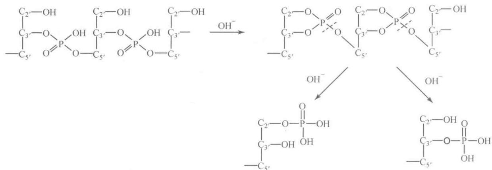  
用于水解 RNA 的碱有 NaOH、KOH 等，以 KOH 较好，水解后可用 $HClO_{4}$ 中和。由于 $KClO_{4}$ 溶解度较

小，溶液中大部分 $K^{+}$ 即被除去。碱浓度一般为 0.3\~1 mol/L，在室温至 37 ℃ 下水解 18\~24 h 就可完毕。如采用较高温度，则时间应缩短。在上述条件下水解 RNA 的产物为 2'-和 3'-单核苷酸，但也可能有少量核苷、2',5'-和 3',5'-核苷二磷酸。DNA 一般对碱稳定，如在 1 mol/L NaOH 中加热至 100 ℃ 4 h，可以得到小分子的寡聚脱氧核苷酸。

## （三）酶水解

水解核酸的酶种类很多。非特异性水解磷酸二酯键的酶为磷酸二酯酶（phosphodiesterase），例如前述蛇毒磷酸二酯酶和牛脾磷酸二酯酶。专一水解核酸的磷酸二酯酶称为核酸酶（nuclease）。核酸酶又可分核糖核酸酶（ribonuclease，RNase），脱氧核糖核酸酶（deoxyribonuclease，DNase）；内切核酸酶（endonuclease），外切核酸酶（exonuclease）； $3'\rightarrow5'$ 外切核酸酶， $5'\rightarrow3'$ 外切核酸酶等。有些核酸酶的特异性很高，例如，限制性内切核酸酶能识别和切割DNA的特异序列，是DNA重组技术的重要工具酶。核糖核酸酶通常不能识别RNA的序列；特异的RNase可以识别RNA的空间结构，在RNA的特定位点进行切割，并且常需要小RNA（small RNA，sRNA）的指导。

核酸的 N-糖苷键可以被各种非特异 N-糖苷酶水解，有些 N-糖苷酶对碱基有特异性。

## 二、核酸的酸碱性质

核酸的碱基、核苷和核苷酸均能发生质子解离，核酸的酸碱性质与此有关。

## （一）碱基的解离

由于嘧啶和嘌呤化合物杂环中的氮以及各取代基具有结合和释放质子的能力,所以这些化合物既能碱性解离又能酸性解离。胞嘧啶环所含氮原子上有一对未共用电子,可与质子结合,使=N—转变成带正电的= $N^{+}H$ —基团。此外,胞嘧啶上的烯醇式羟基与酚基很相像,具有释放质子的能力,呈酸性。因此,在水溶液中,胞嘧啶的中性分子、阳离子和阴离子之间,具有一定的平衡关系:

过去一直以为 pH 4.6 的解离与胞嘧啶的氨基有关。其实氨基在嘧啶碱中所呈的碱性极弱，这是因为嘧啶环与苯环相似，具有吸引电子的能力，使得氨基氮原子上的未共用电子对不易与氢离子结合。氢离子主要是与环中第三位上的氮原子（用 N3 表示）相结合。

尿嘧啶及胸腺嘧啶环上无氨基，N3酸性解离的 $pK_{1}^{\prime}$ 分别为9.5与9.9。

腺嘌呤中，质子结合于 N1 上，其 $pK_{1}^{\prime}=4.15$ 。pH 9.8 的解离在咪唑环的—NH—基上发生，在它的核苷及核苷酸中，由于 N9 上形成了糖苷键，所以没有 pH=9.8 的解离。

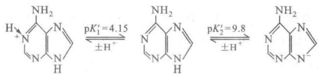

鸟嘌呤和次黄嘌呤中，质子则结合于N7上。以鸟嘌呤为例，N7上的解离 $\mathrm{pK}_1^{\prime} = 3.2$ 。N1上的解离， $\mathrm{pK}_2^{\prime} = 9.6$ 。咪唑环N9上的解离 $\mathrm{pK}_3^{\prime} = 12.4$ 。鸟嘌呤咪唑环上的 $\mathrm{pK}'$ 如此之大，可能是受到环上烯醇式羟基的影响所致。

## （二）核苷的解离

由于戊糖的存在,核苷中碱基的解离受到一定的影响,例如,腺嘌呤环的 $pK_{1}^{\prime}$ 原为 4.15,在核苷中则降至 3.45。胞嘧啶 $pK_{1}^{\prime}$ 为 4.6,胞嘧啶核苷中则降至 4.22。 $pK^{\prime}$ 的下降说明糖的存在增强了碱基酸性解离。核糖中的羟基也可以发生解离,其 $pK_{1}^{\prime}$ 通常在 12 以上,所以一般不去考虑它。

## （三）核苷酸的解离

由于磷酸基的存在,使核苷酸具有较强的酸性。在核苷酸中,碱基部分的 $pK'$ 与核苷的相似,额外两个解离常数是由磷酸基引起的。这两个解离常数分别为 $pK_{1}' = 0.7 \sim 1.6$ , $pK_{2}' = 5.9 \sim 6.5$ (表 12-1)。

表 12-1 某些碱基、核苷和核苷酸的解离常数

<table><tr><td>碱基种类</td><td>碱基的 $pK'$ </td><td>核苷的 $pK'$ </td><td>核苷酸的 $pK'$ </td></tr><tr><td>腺嘌呤</td><td>4.15,9.8</td><td>3.45,12.5 $^{\text{1}}$ </td><td>0.9,3.8,6.2</td></tr><tr><td>鸟嘌呤</td><td>3.2,9.6,12.4</td><td>1.6,9.2,12.4 $^{\text{1}}$ </td><td>0.7,2.4,6.1,9.4</td></tr><tr><td>胞嘧啶</td><td>4.6,12.2</td><td>4.22,12.3 $^{\text{1}}$ ,12.5</td><td>0.8,4.5,6.3</td></tr><tr><td>尿嘧啶</td><td>9.5</td><td>9.2,12.5 $^{\text{1}}$ </td><td>1.0,6.4,9.5</td></tr><tr><td>胸腺嘧啶 $^{\text{2}}$ </td><td>9.9</td><td>9.8,&gt;13 $^{\text{1}}$ </td><td>1.6,6.5,10.0</td></tr></table>

① 戊糖羟基的 $pK'$ ; ② 其核苷和核苷酸中的戊糖为脱氧核糖。

$$
\begin{array}{c} \mathrm{O} \\ \mathrm{R-O-P-OH} \\ \mathrm{OH} \end{array} \xrightarrow [ \pm \mathrm{H} ^ {+} ]{\mathrm{pK} _ {1} ^ {\prime} = 0 . 7 \sim 1 . 6} \begin{array}{c} \mathrm{O} \\ \mathrm{R-O-P-O} ^ {-} \\ \mathrm{OH} \end{array} \xrightarrow [ \pm \mathrm{H} ^ {+} ]{\mathrm{pK} _ {2} ^ {\prime} = 5 . 9 \sim 6 . 5} \begin{array}{c} \mathrm{O} \\ \mathrm{R-O-P-O} ^ {-} \\ \mathrm{O} ^ {-} \end{array}
$$

但是在多核苷酸中，除了末端磷酸基外，磷酸二酯键中的磷酸基只有一个解离常数， $\mathrm{p}K_{1}^{\prime} = 1.5$ 。

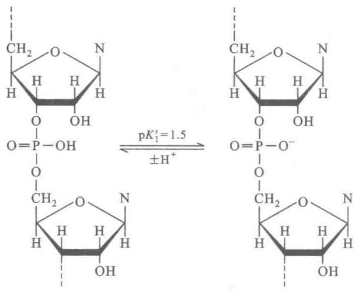

综上所述,由于核苷酸含有磷酸基与碱基,为两性电解质,它们在不同 pH 的溶液中解离程度不同,在一定条件下可形成兼性离子。图 12-1 为 4 种核苷酸的解离曲线。在腺苷酸、鸟苷酸、胞苷酸中, $pK_{1}'$ 是由于第一磷酸基—— $PO_{3}H_{2}$ 的解离, $pK_{2}'$ 是由于含氮环= $N^{+}H$ —的解离,而 $pK_{3}'$ 则是由于第二磷酸基——

$PO_{3}H^{-}$ 的解离。从核苷酸的解离曲线可以看出，在第一磷酸基和含氮环解离曲线的交叉处，带负电荷的磷酸基正好与带正电荷的含氮环数目相等，这时的 pH 即为此核苷酸的等电点。核苷酸的等电点（pI）可以按下式计算：

$$
\mathrm{pI} = \frac {\mathrm{p} K _ {1} ^ {\prime} + \mathrm{p} K _ {2} ^ {\prime}}{2}
$$

处在等电点时,上述核苷酸主要呈兼性离子存在。当溶液 pH 小于 pI 值时,核苷酸的— $PO_{3}H^{-}$ 基即开始与 $H^{+}$ 结合成— $PO_{3}H_{2}$ ,因此= $N^{+}H-$ 数量比— $PO_{3}H^{-}$ 数量为多,核苷酸带正电荷。反之,当溶液的 pH 大于 pI 值时, $=N^{+}H-$ 上的 $H^{+}$ 解离下来,核苷酸即带负电荷。尿苷酸的碱基碱性极弱,实际上测不出其含氮环的解离曲线,故不能形成兼性离子。

核苷酸中磷酸基在糖环上的位置对其 $pK'$ 略有影响,一般说来,磷酸基与碱基之间的距离越小,由于静电场的作用,其 $pK'$ 应越大。例如 $2'-$ 胞苷酸的 $pK_{1}'$ 为 4.4 比 $3'-$ 胞苷酸的 $pK_{1}'$ 4.3 为大。

研究核苷酸的解离不仅对了解核酸的物化性质极其重要,而且在核苷酸的制备及分析中有很大的实用价值。应用离子交换柱层析和电泳等方法分级分离核苷酸及其衍生物,主要是利用它们在一定 pH 条件下具有不同的解离特性这一性质。

## （四）核酸的滴定曲线

电位滴定可用于确定参与酸碱反应的基团性质。将小牛胸腺 DNA 钠盐溶液由 pH 6\~7 滴定到 pH 2.5 或滴定到 pH 12，此滴定过程是不可逆的；用碱和酸进行反向滴定所得到的曲线显著不同于正向滴定曲线（图 12-2）。开始滴定时，没有酸碱基团解离，非缓冲区较宽，在 pH 4.5\~11.0 之间；而在反向滴定中非缓冲区只存在于 pH 6\~9 之间。这就是说，当最初的 DNA 溶液超过 pH 4.5 和 pH 11.0 时即迅速释

  
图 12-1 核苷酸的解离曲线

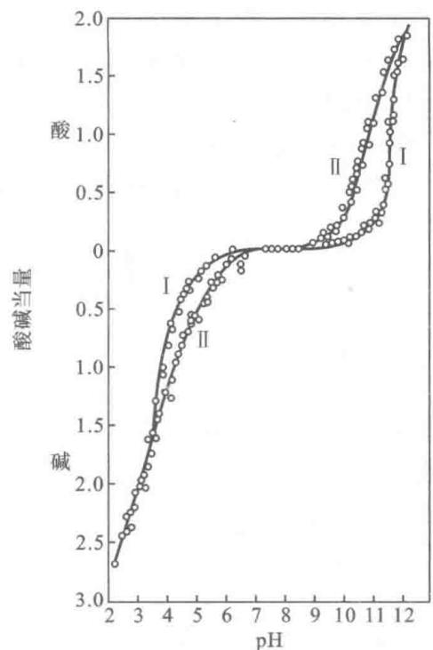  
图12-2 小牛胸腺DNA的滴定曲线  
I. 从 pH 6.9 用酸或碱正向滴定；Ⅱ. 从 pH 12 或 pH 2.5 分别用酸和碱反向滴定

放出酸碱基团参与 pH 2.0\~6.0 和 pH 9.0\~12.0 范围的滴定。由此可见天然 DNA 与变性 DNA 的滴定曲线是不同的，双链解开后碱基即参与酸碱滴定。

DNA 的酸碱滴定曲线对了解 DNA 的酸碱变性很有帮助。

## 三、核酸的紫外吸收

嘌呤碱与嘧啶碱具有芳香共轭体系，使碱基、核苷、核苷酸和核酸在240\~290 nm的紫外波段有一强烈的吸收峰，最大吸收值在260 nm附近。不同核苷酸有不同的吸收特性。核酸具有紫外吸收性质，故可用紫外分光光度计加以定性及定量测定。

紫外吸收是实验室中最常用的测定 DNA 或 RNA 的方法。核酸样品的纯度也可用紫外分光光度法进行鉴定。读出 260 nm 与 280 nm 的吸光度 (A) 即光密度 (OD) 值，从 $A_{260}/A_{280}$ 的比值即可判断样品的纯度。纯 DNA 的 $A_{260}/A_{280}$ 应大于 1.8，纯 RNA 应达到 2.0。样品中如含有杂蛋白及苯酚， $A_{260}/A_{280}$ 比值即明显降低。不纯的样品不能用紫外吸收法作定量测定。对于纯的样品，只要读出 260 nm 的 A 值即可算出其含量。

通常以 A 值为 1 相当于 $50 \mu g/mL$ 双螺旋 DNA，或 $40 \mu g/mL$ 单链 DNA（或 RNA），或 $20 \mu g/mL$ 寡核

苷酸计算。这个方法既快速，又相当准确，而且不会浪费样品。对于不纯的核酸可以用琼脂糖凝胶电泳分离出区带后，经溴化乙锭染色在紫外灯下粗略地估计其含量。

有时核酸溶液的紫外吸收以摩尔磷的吸光度来表示,摩尔磷即相当于摩尔核苷酸。据此先测定核酸溶液中的磷含量及紫外吸收值,然后求出摩尔磷吸光系数 $\varepsilon(\mathrm{P})$ :

$$
\varepsilon (\mathrm{P}) = \frac {A}{c L}
$$

A 为光吸收值(吸光度), c 为每升溶液中磷的摩尔数, L 为比色杯内径。

一般天然 DNA 的 $\varepsilon(\mathrm{P})$ 为 6 600, RNA 为 7 700\~7 800。核酸的 $\varepsilon(\mathrm{P})$ 值较所含核苷酸单体的 $\varepsilon(\mathrm{P})$ 要低 40%\~45%。单链多核苷酸的 $\varepsilon(\mathrm{P})$ 值比双螺旋多核苷酸的 $\varepsilon(\mathrm{P})$ 值要高，所以核酸发生变性时， $\varepsilon(\mathrm{P})$ 值升高，此现象称为增色效应（hyperchromic effect）（图 12-3）。复性后 $\varepsilon(\mathrm{P})$ 值又降低，此现象称减色效应（hypochromic effect）。这是因为双螺旋结构使碱基对的 $\pi$ 电子云发生重叠，因而减少了对紫外光的吸收。测定核酸的 $\varepsilon(\mathrm{P})$ 可判断 DNA 制剂是否发生变性或降解。

图12-3 DNA的紫外吸收光谱

1. 天然 DNA; 2. 变性 DNA; 3. 核苷酸

## 四、核酸的变性、复性及杂交

## (一) 变性

核酸变性(denaturation)是指核酸双螺旋碱基对的氢键断裂,双链转变成单链,从而使核酸的天然构象和性质发生改变。核酸链共价键(3',5'-磷酸二酯链)的断裂则称为降解,核酸降解引起核酸链相对分子质量降低。有时核酸变性和降解可同时进行。

引起核酸变性的因素很多。由温度升高引起的变性称为热变性。由酸碱度改变引起的变性称为酸碱变性。变性剂也能引起变性。在测定 DNA 序列进行聚丙烯酰胺凝胶电泳时，为使双链解开，常加入尿素作为变性剂。在用琼脂糖凝胶电泳测定 RNA 分子大小时，可用氢氧化甲基汞作为变性剂，因其能与 RNA 中尿嘧啶和鸟嘌呤的亚胺键反应，因而破坏碱基对的形成。也可用乙二醛或甲醛取代易造成公害的氢氧化甲基汞。这些变性剂都可以完全消除 RNA 的二级结构。此外，在无离子水溶液中，低浓度的核酸由于磷酸基负电荷的排斥作用也会引起变性。

核酸变性研究最多的是 DNA 的热变性。当 DNA 在稀盐溶液中加热到 80\~100 ℃ 时，双螺旋结构即被破坏，两条链随即分开，形成无规线团；如果温度降低，又可在链内和链间形成局部双螺旋（图 12-4）。DNA 在变性过程中一系列物化性质随之发生改变：260 nm 区紫外线吸光度升高，黏度降低，比旋下降，超速离心沉降系数变大，酸碱滴定曲线改变，流动双折射现象消失等。DNA 的变性是爆发式的，存在一个相变的过程。组分均一的 DNA 在一个狭窄的温度范围内变性；组分不均一的 DNA，变性发生在较宽的温度范围内。通常把 DNA 热变性引起物化性质改变一半时的温度称为该 DNA 的熔解温度（melting temperature, $T_{m}$ ）。

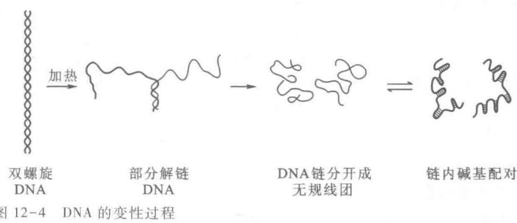

DNA 的 $T_{m}$ 受溶液离子强度、pH、极性溶质等各种因素的影响。一般来说，在离子强度较低的溶液中 DNA 的 $T_{m}$ 较低，而且变性过程发生在较宽的温度范围内；离子强度较高时， $T_{m}$ 较高，变性过程的温度范围较窄。甲酰胺的存在可以促进变性。DNA 的 G-C 含量对 $T_{m}$ 有较大影响，在一定条件下 G-C 含量与 $T_{m}$ 成正比关系（图 12-5）。这是因为 G-C 碱基对之间有 3 个氢键，A-T 碱基对只有 2 个氢键，前者比后者更有利于 DNA 的稳定性。E.T.Bolton 和 B.J.McCarthy 曾提出计算 $T_{m}$ 的经验公式为：

$$
T _ {\mathrm{m}} = 8 1. 5 ^ {\circ} \mathrm{C} + 1 6. 6 (\lg [ \mathrm{Na} ^ {+} ]) + 0. 4 1 (\% \mathrm{G} + \mathrm{C}) - 0. 6 3 (\% \text {甲酰胺}) - (6 0 0 / 1)
$$

上述公式只适用于一定范围,例如双螺旋 DNA 片段长度(l)在数百 bp 以上,不足数百 bp 应消除此项。此公式也可从 DNA 的 $T_{m}$ 来计算其 G+C 含量。

RNA 也能发生变性。互补双链 RNA 的变性与 DNA 的变性相似，但双链 RNA 比同样序列的 DNA 更稳定， $T_{m}$ 更高。单链 RNA 可以通过回折形成局部双螺旋区，变性过程各区段逐渐解开双螺旋，因此 $T_{m}$ 较低，变性温度范围较宽（图 12-6）。

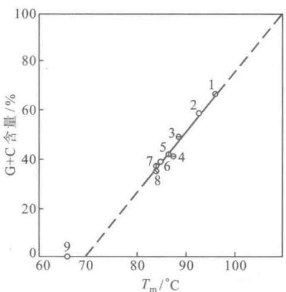  
图12-5 DNA的 $T_{\mathrm{m}}$ 与G-C含量之关系  
DNA 来源如下: 1. 草分枝杆菌; 2. 沙门氏菌; 3. 大肠杆菌; 4. 鲑鱼精子; 5. 小牛胸腺; 6. 肺炎球菌; 7. 酵母; 8. 噬菌体 T4; 9. 多聚 d(A-T)。DNA 变性在 1× SSC 溶液 (0.15mol/L NaCl, 0.015mol/L 柠檬酸钠, pH7.0) 中进行

  
图12-6 rRNA和双链RNA的热变性曲线  
1. 一种浮萍的 18S rRNA; 2. 酵母的杀伤 RNA (killer RNA) 在 0.017 mol/L Na $^{+}$ 和 67% 甲酰胺中变性; 3. 同 2, 但无甲酰胺

## （二）复性

变性 DNA 在适当条件下, 可使两条分开的链重新缔合 (reassociation), 恢复双螺旋结构, 这个过程称为复性 (renaturation)。DNA 复性后许多物化性质又得到恢复。复性过程符合二级反应动力学公式:

$$
\frac {\mathrm{d} C}{\mathrm{d} t} = - K C ^ {2}
$$

上式中， $C$ 为 $t$ 时单链DNA的浓度， $K$ 为重缔合速度常数。积分后得到：

$$
\frac {C}{C _ {0}} = \frac {1}{1 + K C _ {0} t}
$$

$C_{0}$ 是起始时完全变性 DNA 的浓度。t 以秒(s)为单位，C 为每升溶液中核苷酸的摩尔为单位。当复性反应进行一半时，即

$$
\frac {C}{C _ {0}} = \frac {1}{2} \text {时,} C _ {0} t _ {1 / 2} = \frac {1}{K}
$$

复性反应的速度受许多因素的影响,如果控制所有可变因素,包括温度、离子强度、片段长度等,复性速度便只决定于基因组大小,或者说决定于 DNA 序列的复杂性。实验证明,重缔合速度常数 K 与 DNA 复杂性 N 成反比。因此,测定 DNA 的复性动力学曲线(图 12-7),求出 $C_{0}t_{1/2}$ 值,即代表了基因组大小,也就是 DNA 序列复杂性。例如,大肠杆菌染色体 DNA 的大小为 $4.64 \times 10^{6}$ bp,测得其 $C_{0}t_{1/2}$ 是 $9(\mathrm{mol}\cdot\mathrm{s}\cdot\mathrm{L}^{-1})$ ; T4 噬菌体 DNA 为 $1.66 \times 10^{5}$ bp,测得其 $C_{0}t_{1/2}$ 是 $0.3(\mathrm{mol}\cdot\mathrm{s}\cdot\mathrm{L}^{-1})$ ,两者呈较好的比例关系。任何生物的 DNA,只要测出其 $C_{0}t_{1/2}$ 值,与已知基因组大小的大肠杆菌染色体 DNA $C_{0}t_{1/2}$ 相比,即可算出其基因组的大小。真核生物 DNA 含有大量重复序列,其复性动力学曲线比较复杂,包含多个组分,可以分别测出各组分的 $C_{0}t_{1/2}$ 和在总 DNA 中所占比例,然后计算各组分的复杂性和拷贝数。

  
图12-7 DNA的复性动力学曲线

将热变性的 DNA 迅速放置冰浴内，骤然冷却至低温，可以阻止 DNA 复性。若使热变性的 DNA 缓慢冷却，则可发生复性，此过程称为退火（annealing）。退火温度 $T_{a}$ 以低于变性温度 $T_{m}$ 20\~25℃为宜。复性过程可以在溶液中进行，然后将单链和双链 DNA 分开，以测定复性的部分。羟基磷灰石（hydroxyapatite）是一种碱性磷酸钙 $\mathrm{Ca}_{10}\left(\mathrm{PO}_{4}\right)_{6}\left(\mathrm{OH}\right)_{2}$ 结晶。它吸附双链 DNA 的能力大于单链 DNA，低盐溶液可洗脱单链 DNA，双链 DNA 则要较高浓度的盐溶液才能洗脱，从而将两者分开。复性过程也可在硝酸纤维素滤膜（nitrocellulose filter）或尼龙膜（nylon membrane）上进行。单链 DNA 经烘焙后可固定在膜上，将其浸泡在放射性同位素标记的互补链 DNA 溶液中即可进行链的配对，不配对的链很容易洗掉。利用上述膜进行核酸的复性和杂交，是核酸研究最常用和最重要的方法技术之一。

## （三）核酸分子杂交

将不同来源的 DNA 放在试管里, 经热变性后, 缓慢冷却, 使其复性。若这些异源 DNA 之间存在近似的序列, 则复性时会相互之交错配对, 形成杂交分子 (hybrid molecule)。DNA 与互补的 RNA 之间也可以发生杂交 (hybridization)。核酸分子杂交是基因操作最核心技术之一, 在基因工程、分子医学和分子生物学的研究中应用极广, 许多有关重要问题都是依靠分子杂交技术来解决的。

核酸杂交可以在液相中进行,也可以在固相表面进行,最常用的还是硝酸纤维素滤膜或尼龙膜作为支持物的分子杂交。英国分子生物学家 E.M.Southern 所发明的 Southern 印迹法(Southern blotting)就是将凝胶电泳分开的 DNA 限制片段转移到硝酸纤维素滤膜上用标记核酸作为探针进行杂交。其后 J.C.Alwine 等按照同样原理,将变性凝胶电泳分开的 RNA 转移到硝酸纤维素膜上,通过分子杂交以检测特异的 RNA。DNA 印迹法因是 Southern 所发明,故称为 Southern 印迹法;RNA 印迹法则被称为 Northern 印迹法,以“南”“北”分称 DNA 和 RNA 两种杂交技术,表现出科学家的幽默。这里仅以图解法(图 12-8)表示 Southern 杂交的全过程。

常用 $^{32}$ P 标记核酸作为探针(probe)。探针可以是DNA,也可以是RNA,可在末端标记(5'端或3'端),也可以采用均匀标记。应用核酸杂交技术不仅可检测特定的基因片段或RNA,也可用来钓出基因组中的单拷贝基因或特异的RNA。

  
图12-8 Southern印迹法图解

为了避免放射性同位素操作带来的不便,可以改用生物素、地高辛(DIG)或荧光素标记核酸探针。用酶联链霉亲和

素(streptavidin)或酶联抗地高辛抗体与各标记物结合,经酶反应产生呈色或荧光物质,以显示杂交条带。

## 五、核酸的分离和纯化

核酸制备是研究核酸结构与功能的首要步骤。核酸分离和纯化过程中需要特别注意的问题是防止核酸的降解和变性，应尽可能保持其在生物体内的天然状态。早期的研究工作受到方法学上的限制，由于得到的样品往往是一些降解产物，因此失去了它们的功能活性。要制备天然状态的核酸，必须采用温和的条件，防止过酸、过碱、高温、剧烈搅拌，尤其要防止核酸酶的作用。天然核酸具有生物活性，这是检验其完整性的重要指标。物理化学性质也常用来作为评价核酸质量的标准。最常用于分离纯化核酸的方法有：超速离心、柱层析、凝胶电泳、溶液抽提和选择沉淀，这里仅就有关方法的原理作简要的介绍。

## （一）核酸的超速离心

溶液中核酸分子受引力场的下沉作用可被分子热运动所抵消。但在超速离心机造成的巨大离心力场中，核酸分子沉降速度大大加快，这就可能用来测定核酸分子的相对分子质量、密度和构象，并用来大量制备核酸。目前实验室已常用更为简便的方法制备核酸，较少用超速离心的方法。

超速离心的方法很多,如沉降速度超离心、沉降平衡超离心、蔗糖(或甘油)密度梯度超离心、浮力密度超离心等。总体来说,超速离心可分为两类:一类是在超速离心时,各种核酸样品以不同速度往下沉降,根据沉降速度不同来求出沉降常数S。另一类是将超速离心的溶液制成各种密度(如CsCl、 $Cs_{2}SO_{4}$ 密度梯度),超速离心使核酸样品集中在等密度区,从而得出核酸的密度 $\rho$ 。沉降速度和沉降平衡超离心已在蛋白质纯化的一节中予以介绍,这里不再叙述。核酸样品的制备更常用的是密度梯度超离心。

通过蔗糖(或甘油)支持物构成的密度梯度可维持沉降力的稳定,防止对流,使铺在表层的核酸样品进入介质后成为狭窄的区带。样品各成分以不同速度沉降,所形成差速区带在沉降过程中逐渐分开。各类RNA常以此法分离纯化。碱性(NaOH)蔗糖密度梯度区带超离心可用来分离变性DNA的单链。蔗糖密度梯度超离心法属于沉降速度超离心,只不过介质采用蔗糖。

浮力密度超离心是于 1957 年 M. Meselson 等提出的。由于铯的相对原子质量很大，铯离子在超速离心力场作用下可克服分子热运动而发生沉降，形成浓度（密度）梯度。DNA 的密度很大，只有在浓的铯离子溶液中才能产生浮力，通过超离心可测定 DNA 的密度和得到其制品。常用的铯盐为氯化铯，因为它在水中的溶解度极大，可制得很高浓度（8.0 mol/L）的溶液。

现以测定 DNA 的浮力密度为例来说明该方法。将 DNA 溶于 8.0 mol/L 的氯化铯溶液中，置于离心管内，若以每分钟 45 000 转的速度离心 16 h 以上，即形成铯离子密度梯度，自底部的 $1.80 \, g/cm^{3}$ 到顶部的 $1.55 \, g/cm^{3}$ 。DNA 形成一稳定的区带，漂浮于等密度的位置上。用注射针头吸出该区带 DNA 溶液，或在离心管底部扎一孔，分部收集流出液。DNA 区带的氯化铯溶液密度为 DNA 的浮力密度。更方便的方法是用一已知密度为标准的 DNA 样品，与未知样品一起超离心。待达到平衡后，通过离心机的光学系统测定 DNA 与转头中轴之间的距离，按下式计算未知 DNA 的浮力密度：

$$
\rho = \rho_ {0} + 4. 2 \omega^ {2} (r ^ {2} - r _ {0} ^ {2}) \times 1 0 ^ {- 1 0}
$$

上式中 $\rho$ 为未知 DNA 的密度, $\rho_{0}$ 为标准 DNA 的密度, $\omega$ 为角速度, r 为未知 DNA 与中轴之间距离, $r_{0}$ 为已知 DNA 与中轴之间的距离。

DNA 的密度与其 G-C 含量有关。这是因为 G-C 碱基对的相对原子质量比 A-T 碱基对大；而且前者含 3 个氢键，后者只含 2 个，两者致密程度也不同。实验表明 G-C 的百分含量与 DNA 的浮力密度之间呈正比关系。Poty 等建立了如下计算公式：

$$
\rho = 1. 6 6 0 + 0. 0 0 0 9 8 (\% \mathrm{G} + \mathrm{C}) (\mathrm{g} \cdot \mathrm{cm} ^ {- 3})
$$

真核生物基因组 DNA 含有大量重复序列。在用氯化铯密度梯度离心时，除主要部分（主带）外还得到量较少的次带，或称为卫星带（satellite band）。

卫星 DNA 由一些短的高度重视序列所组成,因其碱基组成与 DNA 的主要部分不同,浮力密度也就不同。例如,小鼠 DNA 的主带占基因组的 92%, 平均 G-C 含量 42%, 浮力密度为 1.701; 卫星 DNA G-C 含量 30%, 浮力密度为 $1.690 \, g \cdot cm^{-3}$ (图 12-9)。

不同碱基组成、不同构象以及单链和双链 DNA，都可借氯化铯密度梯度离心得到分离。硫酸铯梯度也可以用来分离 DNA，但主要用来分离 DNA 与金属离子 $Ag^{+}$ 或 $Hg^{2+}$ 的复合物。 $Hg^{2+}$ 可专一结合于 A-T, $Ag^{+}$ 被认为对 G-C 有更大亲和力。与金属离子特异结合，可使富含 A-T 或 G-C 的重复序列更易与主带分离。某些嵌入染料和抗生素能插入 DNA 双螺旋的碱基对之间，导致构象改变和浮力密度的减少，双链闭环 DNA (cccDNA) 由于受到拓扑束缚限制了嵌入分子的插入，因此采用溴化乙锭-氯化铯密度梯度平衡超离心，可将质粒与染色体 DNA 分开（图 12-10）。

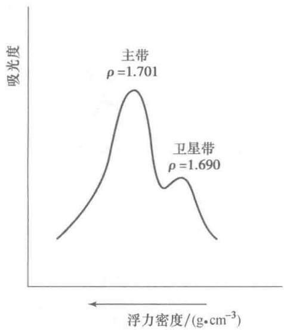  
图 12-9 DNA 经氯化铯密度梯度离心后分成主带和卫星带

RNA 为单链分子, 只有局部双螺旋, 它的浮力密度比 DNA 高, DNA 密度比蛋白质密度高, 单链 DNA 又比双链 DNA 密度高。经氯化铯梯度离心得到的核酸有很高的纯度。

## （二）核酸的凝胶电泳

凝胶电泳将分子筛技术与电泳技术相结合,它可以分辨只差一个核苷酸的核酸片段,也可以分出上百 kb 的 DNA。它有许多优点:简单、快速、灵敏、微量,并且成本低廉。因此凝胶电泳已成为研究核酸最常用的方法。凝胶电泳的支持物主要有琼脂糖(agarose)和聚丙烯酰胺(polyacrylamide)两种。前者常在水平电泳槽中进行;后者常在垂直电泳槽中进行。

## 1. 琼脂糖凝胶电泳

  
图 12-10 经染料-氯化铯密度梯度超离心后,质粒 DNA 及各种杂质的分布

琼脂糖是从海产藻类中提取到的琼脂的主要成分,它由 D-吡喃半乳糖和 3,6-脱水-L-吡喃半乳糖交替连接而成。将琼脂反复洗涤

除去其中琼脂胶后即得到琼脂糖。其实琼脂胶只是琼脂糖羟基被硫酸基、丙酮酸等取代的衍生物。琼脂糖与缓冲液一起加热使其溶解，冷却后则成凝胶。凝胶的孔径与琼脂糖浓度成反比，凝胶浓度越大，孔径越小；反之，浓度越小，孔径越大。胶太浓，孔径太小，核酸样品无法进入胶内；胶太稀，机械强度差，无法维持固定形状，因此孔径也不可能太大。通常琼脂糖凝胶浓度在0.3%\~2.0%之间，分离DNA分子大小从数百bp到上百kb。琼脂糖凝胶电泳较少用于RNA，它只能分离某些大分子的RNA，如rRNA和病毒RNA。

核酸凝胶电泳常用的缓冲液为含有 EDTA 的 Tris-乙酸(TAE)、Tris-硼酸(TBE)或 Tris-磷酸(TPE)，浓度约为 50 mmol/L(pH 7.5\~7.8)，电压 1\~8 V/cm。此时核酸带负电荷，向正极方向移动。在一定范围内，线性双链 DNA 在电场中的迁移率与其碱基对数目的对数成反比。这是因为较大的分子穿过凝胶介质所受拖曳阻力较大以及蠕动通过凝胶孔径的效率较小。借助与已知分子大小的 DNA 标准物迁移距离相比较，就可算出 DNA 样品的分子大小。RNA 在变性凝胶中电泳时，相对分子质量的对数才与迁移率成反比，故常在制备凝胶时加入氢氧化甲基汞(methylmercuric hydroxide)或甲醛。

核酸在凝胶电泳后可用碱性染料或银染显色，洗去背景颜色后得到清晰的核酸条带。最简便的方法是利用嵌合荧光染料溴化乙锭(ethidium bromide, EB)，其分子结构式如下：

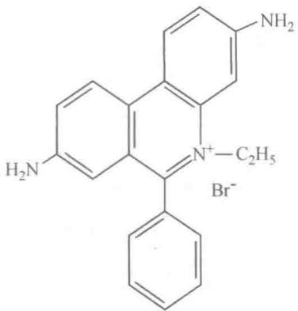

EB 是一种扁平分子, 可插入核酸双链相邻碱基对之间, 在紫外线激发下发射出红橙色 (590 nm) 荧光。它本身能吸收波长为 302 nm 和 360 nm 的紫外线能量; 核酸吸收的 254 nm 紫外线能量也能转给 EB, 而且 EB 结合在核酸碱基对之间的疏水环境大大增加了荧光产率。与游离的 EB 相比, EB-DNA 复合物发射的荧光强度可增大 100 倍。因此无需洗去凝胶中游离的 EB, 即可检测出 DNA 条带, 最低可检测 $10 \, \text{ng}(10^{-8} \, \text{g})$ 或更少的 DNA 含量。单链 DNA 或 RNA 对 EB 的结合能力较小, 荧光产率也相对较低。

凝胶电泳后核酸样品可用多种方法自胶上回收:① 浸泡法,将含 DNA 的胶带切下,用少量缓冲液重复抽提。②冻融法，将胶带在低温下冰冻，室温下融化，然后用高速离心除去凝胶沉淀。③电泳法，将胶带置于透析袋内，通过电泳使核酸进入袋内缓冲液中；也可以直接在凝胶电泳后于条带前切出一槽，前面插入一片透析膜，然后电泳使样品进入槽中。④溶胶法，胶带加NaI、KI、 $\mathrm{NaClO_4}$ 、柠檬酸钠等，在一定浓度和温度下使胶溶解；或用低熔点琼脂糖，将胶带溶解，然后再用酚等抽提回收核酸。⑤转移法，将凝胶上核酸条带转移到硝酸纤维素滤膜、尼龙膜或具有偶联基团的膜上。

## 2. 脉冲电场凝胶电泳

传统的琼脂糖凝胶电泳只能分离分子大小在 $20 \, kb (M_{r}$ 约 $10^{7}$ ) 以下的 DNA 片段以及小的质粒和病毒 DNA，更大的 DNA 分子彼此很难分开。这是因为 DNA 分子在凝胶介质中呈无规卷曲的构象，当 DNA 分子的有效直径超过凝胶孔径时，在电场作用下可变形挤过筛孔，此时其电泳迁移率不再决定于分子的大小。然而，细菌的染色体 DNA 在数千 kb 以上，真核生物的染色体 DNA 更大。为分离染色体 DNA 需要发展新的实验技术。

1983 年 Schwartz 等人根据 DNA 分子黏弹性弛豫时间对分子大小敏感的特性,设计了脉冲电场梯度凝胶电泳。通过交替用两个垂直方向的不均匀电场,使 DNA 分子在凝胶介质中不断改变泳动方向,从而将不同大小的分子分开。此后不少实验室对此技术进行研究,作了许多改进,并发现不同大小的大分子 DNA 在凝胶中可借助各种类型的交变脉冲电场而分离,电场梯度(电场不均匀性)对分离则并非必需,故此技术只称为脉冲电场凝胶电泳(pulsed field gel electrophoresis)。

目前国内外已有多种脉冲电场凝胶电泳装置问世。脉冲交变电场的夹角可以是直角（正交交变电场），也可以是 $120^{\circ}$ （六角形电泳槽相间两边电场的转换）或是 $180^{\circ}$ （周期性倒转电场）。脉冲电场凝胶电泳多数采用水平电泳槽，但也有垂直平板电泳槽，后者脉冲电场横向交替改方向。图12-11列出几种较常见的脉冲电场凝胶电泳方式。一些新的电泳装置还可使电泳中各种可变参数加以程序化控制，从而有效地提高了分辨率。

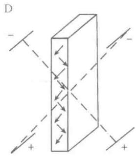  
图 12-11 几种脉冲电场凝胶电泳  
A. 正交电场交变凝胶电泳 (orthogonal-field-alternation gel electrophoresis.OFAGE); B. 钳位均匀电场 (contour-clamped homogeneous electric field, CHEF) 凝胶电泳; C. 电场倒转凝胶电泳 (field-inversion gel electrophoresis, FIGE); D. 横向交变电场电泳 (transverse alternating field electrophoresis, TAFE)

大分子 DNA 在脉冲电场凝胶电泳中的迁移率受脉冲时间、电场形式、凝胶浓度、缓冲液和温度等诸多因素的影响。在这些因素中最重要的是脉冲时间，它取决于 DNA 分子长度，因此可以推导出公式：

$$
\lg t = A \lg M _ {\mathrm{r}} - B
$$

式中，t 为有效脉冲时间(s)， $M_{r}$ 为 DNA 相对分子质量，在一定范围内 A 与 B 均为常数。利用已知分子大小的 DNA，通过实验得出有效脉冲时间，代入上式可以计算出 A 和 B 的数值。脉冲时间与 DNA 的电泳速度有关，因此与电场强度成反比，例如当电场强度由 10 V/cm 降至 5 V/cm 时，脉冲时间应增加一倍。增加琼脂糖凝胶浓度和降低温度，脉冲时间应相应增加；反之亦然。固定脉冲时间，将 DNA 分子大小对迁移率作图可得出一条 S 形曲线，超过一定大小的 DNA 分子彼此不能分开，在直线部分的分离效果最好，低于转折点的 DNA 分子虽能分开，但间距较小。环状质粒 DNA 在交变电场中的迁移率远小于线性 DNA，并受脉冲时间的影响较小，易于与其分开。

从理论上来看,脉冲电场凝胶电泳分离大分子 DNA 并无上限,它已成为百万碱基级(Mb)基因组操作的一项关键技术。这一技术对分离大片段染色体 DNA、核型分析、DNA 物理图谱、DNA 的 $M_{r}$ 测定和流体动力学研究都十分有用。

## 3. 聚丙烯酰胺凝胶电泳

在有自由基存在时，丙烯酰胺(acrylamide)发生链式聚合反应，自由基通常由过硫酸铵供给，并由 $N$ ， $N,N^{\prime},N^{\prime}$ -四甲基乙二胺 $(N,N,N^{\prime},N^{\prime}$ -tetramethylethylenediamine,TEMED)使其稳定。在加入双功能剂 $N$ ， $N^{\prime}$ -甲叉双丙烯酰胺后，聚合链产生交联形成凝胶，孔径决定于链长和交联程度，即丙烯酰胺和甲叉双丙烯酰胺的浓度。通常凝胶浓度大于 $5\%$ 时，交联度可为 $2.5\%$ ；凝胶浓度小于 $5\%$ 时，交联度增至 $5\%$ ；当聚丙烯酰胺浓度小于 $3\%$ 时，由于凝胶太软而不易操作，这就限制了它不能用于分离大分子DNA。聚丙烯酰胺凝胶电泳(polyacrylamide gel electrophresis,PAGE)主要用于分离RNA样品以及分子小于 $2\mathrm{kb}$ 的DNA片段，因其高分辨率常用于DNA和RNA的测序。在变性条件下（如 $8\mathrm{mol / L}$ 尿素或 $98\%$ 甲酰胺）进行凝胶电泳，此时DNA和RNA的二级结构已被破坏，其电泳迁移率与单链 $M_{r}$ 的对数呈理想的反比关系。测序变性胶需根据所测核酸片段长度来选择胶的浓度，例如测序片段在50核苷酸之内，采用较高浓度的聚丙烯酰胺 $(12\% \sim 20\%)$ ，测序片段在300和400核苷酸可用 $8\%$ 或 $6\%$ 的胶。

## （三）核酸的柱层析

根据核酸的物理化学性质,可用分子筛层析、离子交换、吸附层析、分配层析、亲和层析等技术来分离和制备核酸样品。羟基磷灰石柱常用在核酸分子杂交中单链和双链的分离;寡聚脱氧胸苷酸亲和柱常用来分离真核生物 poly(A) $^{+}$ mRNA。这里简要介绍这两种技术。

## 1. 羟基磷灰石柱层析

羟基磷灰石（hydroxyapatite，HA）为碱性磷酸钙 $\mathrm{Ca}_{10}(\mathrm{PO}_4)_6(\mathrm{OH})_2$ 之晶体，由 $\mathrm{CaCl}_2\cdot 2\mathrm{H}_2\mathrm{O}$ 与 $\mathrm{Na_2HPO_4\cdot 2H_2O}$ 两溶液等量缓慢混合，并在 $\mathrm{NaOH}$ 中加热得到粗的颗粒。它通常保存在 $\mathrm{pH}6.8$ 的磷酸钾（或钠）缓冲溶液里。HA柱已广泛用于蛋白质和核酸的层析分离。

由于核酸的磷酸基可与羟基磷灰石的钙离子作用,从而被吸附其上,这种吸附力决定于核酸的性质,受分子大小的影响较小。双链核酸分子刚性较强,呈伸展状态,其磷酸基有效分布在表面;而变性或单链核酸分子较柔软,呈无规线团结构,有些磷酸基折叠在分子内。因此,双链核酸的吸附力比单链强,双链DNA的吸附力比双链RNA强,而DNA-RNA杂交分子的吸附力则介于两者之间。用它分离天然DNA和变性DNA,单链核酸和杂交核酸常可得到满意的结果。

双链和单链核酸可借不同浓度磷酸盐缓冲液洗脱而分开。0.12 mol/L 的磷酸盐缓冲液可洗脱单链 DNA，而双链 DNA 则需 0.4 mol/L 的磷酸盐缓冲液洗脱。羟基磷灰石具有承载量大，重复性好，回收率高，操作简便等优点，它是目前常用的核酸层析介质之一。

## 2. 寡聚脱氧胸苷酸亲和柱层析

真核生物细胞的 mRNA 在 3' 端通常都带有多聚腺苷酸 [poly(A)] 尾巴, 腺苷酸可长达 150\~200 nt。利用与固体支持物相偶联的寡聚脱氧胸苷酸 [oligo(dT) $_{12-18}$ ] 与 poly(A) 结合, 即可将 poly(A) $^{+}$ mRNA 从总 RNA 中分离出来。oligo(dT) 常与纤维素相偶联。在含高浓度盐 (0.3\~0.5 mol/L NaCl) 的 TES 缓冲液 (10 mol/L Tris-HCl, 1 mmol/L EDTA, 0.2% SDS, pH 7.4) 中将 RNA 样品上柱, 使 poly(A) 与 oligo(dT) 结合, 洗掉柱上非特异吸附的 RNA, 然后用不含盐的 TES 缓冲液将 mRNA 洗脱。多聚尿苷酸-琼脂糖珠 [poly(U)-Sepharose] 也能用来纯化 poly(A) $^{+}$ mRNA, 常可得到较理想的结果。

## （四）DNA 的提取和纯化

真核生物的染色体 DNA 可与碱性蛋白（组蛋白）结合成核蛋白（DNP），它溶于水和浓盐溶液（如 1 mol/L NaCl），但不溶于生理盐溶液（0.14 mol/L NaCl）。早期研究 DNA 常利用这一性质，将细胞破碎后用浓盐溶液提取，然后用水稀释至 0.14 mol/L 盐溶液，使 DNP 纤维沉淀出来。用玻璃棒将 DNP 纤维缠绕其上，再溶解和沉淀多次，可得到纯的核蛋白。用蛋白质变性剂除净蛋白质后即得到纯的 DNA。如此得

到的 DNA 只是一些短的片段,难于研究其生物功能。

苯酚是极强的蛋白质变性剂。用水饱和的苯酚与细胞匀浆或含蛋白质 DNA 提取液一起振荡，然后冷冻离心，DNA 溶于上层水相，不溶的变性蛋白质凝胶位于中间界面，一部分变性蛋白质停留在水相。反复多次用苯酚抽提，直到中间界面不再有变性蛋白质。合并含 DNA 的水相，在有盐存在的条件下加 2 倍体积的乙醇，低温放置使 DNA 沉淀出来，用乙醇和乙醚洗涤沉淀。用此法可以直接从细胞中制备纯的 DNA。用 24:1 氯仿-辛醇（或异戊醇）与含蛋白质的 DNA 溶液振荡，借助分散两相的表面变性可除去所含蛋白质，辛醇（异戊醇）在此起消沫剂的作用。用氯仿振荡可与苯酚抽提一样除净 DNA 溶液中的蛋白质。

细菌菌体经溶菌酶消化除去细胞壁，用碱或十二烷基硫酸钠（sodium dodecyl sulfate, SDS）促使细胞裂解，染色体 DNA 与大部分变性蛋白质通过离心与细胞碎片一起被沉淀，细菌中的质粒 DNA 则仍以溶解状态存在于上清液中。亲水离子和高聚物，如聚乙二醇（PEG），可以结合大量水而使核酸沉淀出来。质粒粗提物中的高相对分子质量 RNA 和蛋白质可在高浓度氯化锂（LiCl）溶液中形成沉淀。用 RNA 酶消化污染的小分子 RNA。然后用 PEG/MgCl₂ 沉淀质粒 DNA。用乙醇只能将所有 DNA 沉淀下来，PEG 却可以将不同大小 DNA 分开。

为了制备细胞染色体 DNA, 应尽量避免核酸酶和机械切力对 DNA 的降解作用。目前较常用的方法是在细胞悬液中直接加入 2 倍体积含 1% SDS 的缓冲液, 并加入广谱蛋白酶 (如蛋白酶 K) 最后浓度达 100 $\mu$ g/mL, 在 65℃ 保温 4 h, 使细胞蛋白质全部降解, 然后用苯酚抽提, 除净蛋白酶和残留的蛋白质。DNA 制品中混杂的少量 RNA 可用不含 DNase 的 RNase 分解除去。

商品化树脂或氯化铯密度梯度离心是实验室制备高质量 DNA 常用的方法。现在许多实验室喜欢采用商品试剂盒来制备核酸，层析树脂柱和各种试剂都是现成的，价格十分昂贵，但却可以节省时间。

## （五）RNA的提取和纯化

RNA 为单链结构, 易被酸、碱、酶所水解, 尤其是 RNase 几乎无处不在, 因此 RNA 的提取和纯化远比 DNA 更为困难。这也是 RNA 的研究落后于 DNA 的原因之一。目前已有一些克服上述困难的方法。

制备 RNA 特别需要注意三点: 第一, 所有用于制备 RNA 的玻璃器皿都要经过高温焙烤, 塑料用具经高压灭菌, 不能高压灭菌的用具要用 0.1% 焦碳酸二乙酯 (diethyl pyrocarbonate, DEPC) 处理, 再煮沸以分解和除净 DEPC。DEPC 能使蛋白质乙基化而破坏 RNase 活性。实验者应戴消毒手套。第二, 在破碎细胞的同时加入强的蛋白质变性剂 (如胍盐) 使 RNase 失活。第三, 在 RNA 反应体系内加入 RNase 的抑制剂 (如 RNasin)。

现在常用于制备 RNA 方法有两个: 其一, 用酸性胍盐/苯酚/氯仿 (acid guanidinium/phenol/chloroform) 提取。异硫氰酸胍 (guanidinium isothiocyanate) 是最强烈的蛋白质变性剂, 它几乎能使所有蛋白质都被变性, 而 RNA 仍溶于该盐溶液中。经离心后, 含 RNA 的水相用苯酚和氯仿多次抽提, 除净蛋白质。其二, 用胍盐/氯化铯法。细胞匀浆用胍盐提取后再进行氯化铯密度梯度离心。蛋白质密度 <1.33 g/cm³, 在最上层; DNA 密度在 1.71 g/cm³ 左右, 位于中间; RNA 密度 >1.89 g/cm³, 沉在底部。用此法可以制备大量高纯度的 RNA。用寡聚 (dT)-纤维素柱或多聚 (U)-琼脂糖珠柱可从总 RNA 中分离到高质量的 poly(A)⁺mRNA。总 RNA 也可以通过凝胶电泳将各类 RNA 分开。

不同功能的 RNA 常分布于细胞的不同部位, 分离这些 RNA 需先用差速离心法或其他方法将细胞核、线粒体、叶绿体、胞质体等各部分分开, 再从这些部分中分离出 RNA。

## 六、核酸序列的测定

20世纪50年代蛋白质的测序获得巨大成功。早在1953年，F.Sanger就已完成了胰岛素的测序工作。1954年P.R.Whitfeld提出测定多聚核糖核菌酸序列的降解法，即利用高碘酸盐的氧化作用逐一降解并鉴定末端核苷酸。60年代R.W.Holley测定了酵母丙氨酸tRNA的序列，他采用的测序法与蛋白质测序法的基本策略相同，都是将大分子先切成彼此重叠的小片段，然后用末端降解法测定小片段的序列。这种策略的工作量非常大，用来测定几十个核苷酸长的小分子RNA尚且需要十多年时间，要对付基因组

DNA 的序列就无能为力了。1975 年 Sanger 提出了一种崭新的策略，他并不逐个测定 DNA 的核苷酸序列，而是设法获得一系列多核苷酸片段，使其末端固定为一种核苷酸，然后通过测定片段长度来推测核苷酸的序列。其后发展起来的各种 DNA 和 RNA 快速测序法，无不以此原理为基础，因此这一原理的提出有划时代的意义。有了 Sanger 的快速测序法，完成人类基因组测序才成为可能。

快速测序是“人类基因组计划”的核心技术。该技术备受各界关注并获得巨大支持，得以融入物理、化学和信息技术的最新成果，成为发展最快的综合性的技术。以 Sanger 所建立和在其基础上加以改进的测序技术称为第一代测序技术。依赖于第一代测序技术，“人类基因组计划”用了 13 年时间提前完成。在“人类基因组计划”实施期间发展出了第二代测序技术，该技术引入 PCR 和高通量（high throughput）微阵（microarray）技术，大大提高了测序速度，在数周内即可完成 Gb（ $10^{9}$ bp）级的测序工作。但是第二代测序技术的测序长度较短，误差较大，适合于已知序列的重测序，在“人类基因组计划”后期的复查中起了作用。在 21 世纪第一个十年的中期和后期，即后基因组时代的初期，又发展出了第三代测序技术，其主要特点是单分子测序，不仅提高了测序速度，也提高了测序长度和精确度，同时还降低了成本。新一代测序技术可以在一天内，甚或数小时内，完成 Gb 级的测序工作。在这里，不仅显示出一流的精湛技术；也显示出一流的巧妙构思。第三代测序技术的商品化仪器正在推出，或即将推出。下面分别介绍有关的测序技术。

## （一）第一代测序技术

## 1. DNA 的酶法测序

1975 年 Sanger 最初提出 DNA 测序的方法是利用 DNA 聚合酶, 将待测序 DNA 样品作为模板, 在引物和底物 (dNTP) 存在下合成一条与模板互补的 DNA 链, DNA 链用同位素标记, 并通过“加”“减”底物来控制合成链各片段的末端核苷酸, 故称为加减法。测序反应中 DNA 链的合成是随机的, 各种长度的片段都有。随后从反应体系中除去四种 dNTP, 并将体系分为两部分, 一部分用于“加”系统, 分置四小管内, 各加一种核苷酸底物, 分别为 +dA、+dG、+dC、+dT; 另一部分为“减”系统, 也分置四小管内, 各加三种核苷酸底物, 即减去一种底物, 分别为 -dA、-dG、-dC、-dT。在“加”系统中, 由于 DNA 聚合酶的 $3^{\prime} \rightarrow 5^{\prime}$ 外切酶活性, 它使已合成的 DNA 链自 $3^{\prime}$ 端向 $5^{\prime}$ 端方向降解, 直至遇到所加入的核苷酸为止, 底物的存在阻止了降解反应。因此所有片段都以该核苷酸结尾, 片段的长度即为该核苷酸在 DNA 链中的位置。在“减”系统, DNA 聚合酶使链继续延伸, 直至遇上所缺核苷酸才停止。这就使各片段长度比所缺核苷酸位置少一个核苷酸。

1977 年 Sanger 对 DNA 的酶法测序技术又作了重要改进, 提出了双脱氧链终止法。其反应体系也包含待测序的单链 DNA 的模板、引物、四种 dNTP(其中一种用放射性同位素标记) 和 DNA 聚合酶。共分四组, 每组按一定比例加入一种底物类似物 2', 3'-双脱氧核苷三磷酸 (ddATP、ddGTP、ddCTP、ddTTP)。它能随机掺入合成的 DNA 链, 一旦掺入后 DNA 合成立即终止。于是各种不同大小片段的末端核苷酸必定为该种核苷酸, 片段长度也就代表相应核苷酸的位置。将各组样品同时进行含变性剂 (8 mol/L 尿素) 的聚丙烯酰胺凝胶电泳, 从放射自显影的图谱上可以直接读出 DNA 的核苷酸序列 (图 12-12)。

终止法测序极为方便,现已完全取代了加减法,但当初 Sanger 的巧妙设计仍给人以启示。由于测序技术的改进现已无需制备单链模板,只要有特异引物,可以直接用双链 DNA 进行测序。

## 2. DNA 的化学法测序

化学法测序由 A. M. Maxam 和 F. Gilbert 于 1977 年所提出。与酶法测序不同，Maxam-Gilbert 的方法并不合成 DNA 链，而是用化学试剂特异作用于 DNA 分子中不同的碱基，然后切断反应碱基的多核苷酸链。化学法测序前后有过一些修改，其基本过程是，先将 DNA 末端标记，并分成四个组，分别用不同的化学反应作用于各碱基。四组特异反应如下：

（1）G 反应 在 pH 8.0 用硫酸二甲酯 (dimethyl sulfate, DMS) 使鸟嘌呤上 N7 原子甲基化，结果导致 C8-C9 键和糖苷键易被水解。

(2) A+G 反应用甲酸使嘌呤碱质子化,从而发生脱嘌呤效应。

  
图 12-12 Sanger 双脱氧链终止法测定 DNA 序列图解

（3）C+T 反应 用肼(hydrazine)将嘧啶环打开，形成新的开环，C 和 T 均被除去。

（4）C 反应 在 1.5 mol/L NaCl 存在下只有胞嘧啶可与肼反应。

四组碱基反应后,用 1 mol/L 哌啶(piperidine)加热(90 ℃)使 DNA 碱基破坏处的糖-磷酸酯键断裂。经变性凝胶电泳和放射自显影得到测序图谱(图 12-13)。

与 Sanger 的链终止法相比, Maxam-Gilbert 的化学测序法有一些独特的优点。它无需引物, 不进行体外合成, 操作简单, 有多种 3' 和 5' 端标记方法可以从两端进行测序, 双链 DNA 即可测序。但是终止法易于控制, 并且可以直接读出核苷酸序列, 因此应用更普遍, 各种自动化测序仪也以该法而设计。

## 3. RNA 的测序

DNA 的快速测序获得成功后,同样原理也被应用于 RNA 测序。RNA 的测序方法很多,归纳起来主要有三类。

  
图 12-13 化学法测定 DNA 序列图解

（1）用酶特异切断 RNA 链 从牛胰脏提取的 RNase A 水解 RNA 链中嘧啶核苷酸与相邻核苷酸 5'-OH 之间的酯链，产物为 3'-嘧啶核苷酸和以 3'-嘧啶核苷酸结尾的寡核苷酸。米曲霉 (Aspergillus oryzae) 中提取的 RNase T1 特异水解鸟苷酸与相邻核苷酸 5'-OH 的连键。黑粉菌 (Ustilago sphaerogena) 中提取的 RNase U2 在一定条件下水解腺苷酸的键。从多头黏菌(Physarum polycephalum)中提取的 RNase PhyI 水解 A、G、U 三种核苷酸，但不水解胞苷酸的链。利用上述四种酶促反应可以测定 RNA 序列。

（2）用化学试剂裂解 RNA，其基本原理与 DNA 的化学法测序相似。

(3) 逆转录成 cDNA, 即可用 DNA 测序法来测定该核苷酸序列。

## 4. DNA 序列分析的自动化

DNA 的快速测序法为生物基因组 DNA 全序列的测定和分析提供了有效手段。但是完成基因组 DNA 序列分析的工作量是十分巨大的，例如若按一个熟练技术人员用酶法测序每天可测定 1 kb 长度的 DNA 片段计算，完成人类或哺乳类基因组 $(3 \times 10^{9} \text{ bp})$ 全序列分析，至少要 100 个技术人员花 100 年时间。因此摆脱手工操作，使序列分析自动化已成为测序技术发展的主流。

DNA 序列分析自动化有两个方面的内容。一是指测序操作的自动化；另一是读序和分析的自动化。20 世纪 80 年代后期，这两个问题都已基本解决，才使人类基因组计划得以启动。按照 Sanger 的链终止法，只要在基因组 DNA 中依次采用适当的引物，就能完成全序列的测定。为了便于自动读序，用荧光检测来取代放射自显影。将荧光染料标记引物；或分别用 4 种发射不同波长的荧光染料来标记双脱氧底物，使 4 种链终止反应中每一种都用不同颜色来表示，例如绿色为 A，红色为 T，橙色为 G，蓝色为 C。聚合反应结束后进行凝胶电泳，使不同大小的片段分开。不同标记物的电泳方式也不同，荧光染料标记引物的 4 组反应物需要在并列的 4 个泳道中电泳，而标记双脱氧底物的 4 组反应物应合并后在一个泳道中电泳。当携带荧光染料的单链 DNA 片段到达泳道末端的检测窗口时，在激光的激发下使产生一定波长的荧光，电荷耦合元件（charge-coupled device, CCD）迅即将光信号转变为电信号，再输入到数据处理系统，由相关软件进行处理，最后通过打印机把各条带波峰或代表核苷酸的字母直接打印出来。90 年代中期开始采用毛细管电泳以取代传统的平板凝胶电泳。毛细管电泳大大提高了测序的速度，消除了泳道间的影响从而提高了测序精确度，也提高了测序通量。有些实验室自行设计和安装了 DNA 测序仪并研发出各种应用软件。至于商业化的 DNA 测序仪，在相当长一段时间内，一直由 ABI 公司占据世界最大供应商的地位，先后推出了各种型号的测序仪，直到 21 世纪前 10 年的中后期，多家生物科技仪器公司推出第二代 DNA 测序仪才打破这种垄断。不久又出现第三代 DNA 测序仪。DNA 测序技术产业化成为竞争最剧烈的领域之一。

## 5. 大规模基因组测序的逐步克隆法

通常,一台 DNA 测序仪每次操作只能读出几百个核苷酸长的片段序列,而人类基因组的长度为 $3 \times 10^{9}$ bp,两者相差甚远。因此,大规模基因组测序必须既要构思巧妙,又要切实可行。大体上有两种策略:一是逐步克隆法(clone by clone);另一是全基因组鸟枪法(whole genome shot-gun)(图 12-14)。

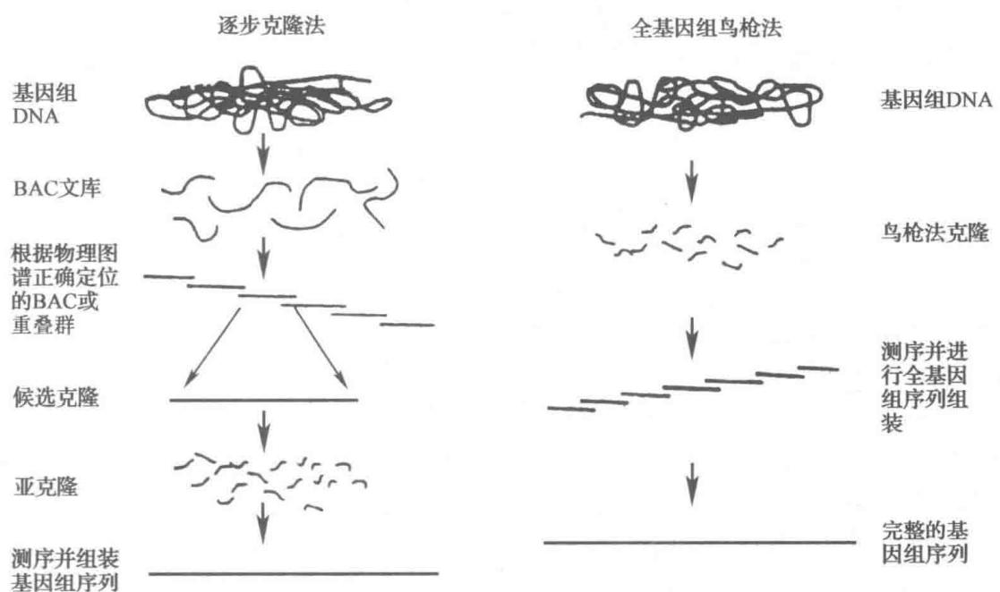  
图 12-14 逐步克隆法和全基因组鸟枪法示意图

克隆(clone)是指细胞的无性繁殖系。将DNA(基因)片段插入复制载体(复制子)中,导入宿主细胞内,DNA随细胞繁殖而不断复制,由此得到DNA(基因)的分子克隆。所谓逐步克隆法就是先将染色体DNA用超声波或酶法切成大片段,获得大片段克隆,再将大片段切小获得亚克隆,由亚克隆片段切开即可获得测序的模板。大肠杆菌F因子经改造,保留其复制起点,插入克隆位点和选择标记,即可成为克隆DNA大片段的载体,称为细菌人工染色体(bacterial artificial chromosome,BAC)。也可以用酵母染色体自主复制序列(autonomously replicating sequence,ARS)、着丝粒(centromere,CEN)和端粒(telomere,TEL)以及选择标记组成酵母人工染色体(yeast artificial chromosome,YAC)。这两种载体都可克隆100\~200 kb的DNA大片段,用来构建BAC文库(library)和YAC文库。利用噬菌体和质粒DNA可以改建成亚克隆载体,以构建亚克隆文库,用以测序。

为从文库中挑选出彼此重叠的克隆片段并依次排列整齐，需要有一张带“路标”的“路线图”，也就是基因组的物理图谱。彼此重叠的一组DNA片段称为重叠群(contig)或毗连群。基因组DNA切开，还要能拼接回去，有了物理图谱才使完成克隆片段的依次排列成为可能。物理图谱是以特异的DNA序列为标志所展示的结构图。通常为随机从基因组上选择长度为 $200\sim 300$ bp的特异性短序列作为序列标签位点（sequence tagged site,STS)，间隔一定距离(平均为 $100\mathrm{kb}$ )取一段短序列，测出其序列，这就是以STS为路标的物理图谱。路标也可以选择为已知序列并定位的基因或表达序列标签(expressed sequence tag,EST），也可以是遗传标志序列(如微卫星标志)。由于基因组平均 $100\mathrm{kb}$ 就有一个STS路标，而且BAC和YAC平均克隆片段为 $150\mathrm{kb}$ ，也就是说每个克隆片有1个或2个STS标记，所以可以依次用STS探针从文库中选择出相应的克隆片段。1998年完成了具有52000个序列标签位点(STS)的人类基因组物理图谱，从而保证了人类基因组计划的顺利进行。

在 BAC 或 YAC 文库中,由于克隆片段的分布不均衡,往往在各重叠群间会留下一些缺口(gap),未被阳性克隆所覆盖。填补空隙的方法很多,最常用的方法是末端序列步移法(walking by end sequence)(图 12-15)。该方法是挑选靠近缺口的克隆片段,测定末端序列,设计并合成引物,以基因组 DNA 为模板,克隆出缺口处的 DNA,称为延伸克隆。

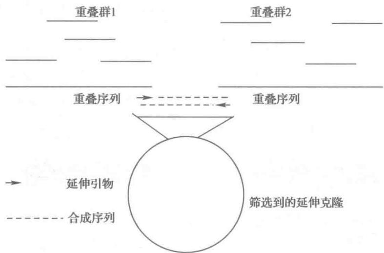  
图12-15 末端序列步移法克隆延伸序列

逐步克隆法和鸟枪法有时可以交替使用，例如，获得亚克隆后即可用鸟枪法测序，从而大大加快了进度。完成测序后需要依赖计算机将各片段序列组装成完整的基因组序列。最常用的序列拼接软件是Phred-Phrap-Consed系统，Phred（读序软件）根据自动测序仪信号按顺序识别碱基，Phrap（组装软件）根据Phred的结果从头组装不同的短序列，由Consed（综合软件）编辑、整合和校对结果。

## 6. 全基因组鸟枪法测序

全基因组鸟枪法测序是由 J. C. Venter 等所发明, 其基本设想是, 将基因组 DNA 随机切成数百万个片段, 直接克隆测序, 借助庞大的计算机运算即可排列出完整的基因组序列。所以称为鸟枪法是由于, 若测定的基因组片段足够多时, 犹如鸟枪射出巨大数量的铁珠, 可以命中所有目标。1998 年世界最大 DNA 测序仪生产商美国 PE Biosystems 以其刚研制成功的集束化毛细管 DNA 测序仪（ABI 3700）和 3 亿美元资金，成立了以 Venter 为领导的 Celera Genomics 公司，宣称要在 3 年内用“全基因组鸟枪法测序策略”完成人类基因组测序工作，并要求获得 200\~400 个重要基因的专利。Celera 公司拥有多个学术研究机构，300 多雇员和一台据称“全球第三”的超大型计算机，自认为测序和组装能力超过全球的总和。形势十分严峻，如果 Celera 公司以十分之一的资金，五分之一的时间，将得到 6 国政府资助的公益性 HGP 排挤出局，其结果不仅使 6 国政府和有关科学家丢脸，更严重的是人类基因组信息将被私人企业所垄断。于是政府不得不进行干预。2000 年 3 月 14 日美国总统克林顿和英国首相布莱尔发表联合声明，呼吁将人类基因组研究成果公开。Celera 公司迫于压力，放弃了对人类基因的专利要求，并和公益性 HGP 达成了协议。HGP 也受到巨大压力，一再加快进度。同年 6 月双方联合宣布成功绘制出人类基因组草图。2001 年 2 月各自将人类基因组初步测序报告发表在学术刊物上，HGP 采取的是逐步克隆法，其测序结果发表在 Nature 上，Celera 的结果发表在 Science 上。2003 年人类基因组的测序工作提前两年完成，至此两个不同的组织使用不同的方法都实现了他们的共同目标。

Celera 公司的全基因组鸟枪法测序是将人类基因组 DNA 构建成含有 2 kb、10 kb 和 50 kb 片段的三个基因文库。通常高质量的 DNA 测序仪一次可以测出 1 000 多个碱基序列，因此 2 kb 的 DNA 片段可以从两头测出全部序列。大量测序后即可通过计算机运算进行排序，称为全基因组组装（whole genome assembly, WGA）。在此过程中不可避免会遇到缺口、错测和重复序列等障碍，就需要从另两个文库中寻找相应的 10 kb 或 50 kb 片段来填补，称为区间化组装（regional assembly）。前后共测定 $2.7 \times 10^{7}$ 次，测序总长度达 $1.48 \times 10^{10}$ bp，相当于覆盖人类基因组的 5 倍。

从 2000 年的人类基因组草图、2001 年的工作框架图到 2003 年后发表的序列图谱，两种策略所得结果有着惊人的相似。总的来说，鸟枪法测序进度快，但错误率高。实际上，由于公益性 HGP 随时公布其研究结果，Celera 公司可以大量下载其数据资料，相当于有了一张参考图，无疑获益甚多。可以说，两种策略是互补的，如结合使用，效果更好。

## （二）第二代测序技术

人类基因组计划带动了测序技术的发展,也带动了高通量基因组信息分析技术,例如微阵(芯片)技术,获得迅速发展。以 Sanger 终止法为基础的自动化测序技术,即第一代测序技术,为完成人类基因组计划提供技术平台;而在此期间以高通量为特征的第二代测序也先后得到了发展。第二代测序技术因其能提供大量基因组信息并进行深层次分析,故又称为深度测序技术(deep sequencing)。

2005 年 454 Life Science 公司（次年为 Roche 公司所收购）推出基于焦磷酸测序技术（pyrophosphate sequencing）的新一代测序仪。2006 年 Solexa 公司研制成利用可逆终止物（reversible terminator）的测序仪，随后 Illumina 公司收购了 Solexa 的核心技术并使其商品化。Roche 454 测序仪和 Illumina Solexa 测序仪的问世动摇了 ABI 测序仪的垄断地位，2007 年 ABI 公司也推出了新型 ABI SOLiD 测序仪，采用连接法测序（sequencing by ligation）。这三种仪器依据的测序技术虽然不同，但也存在一些共同点：① 用聚合酶链式反应（PCR）取代分子克隆技术；② 边合成边测序（sequencing by synthesis, sbs），故而无需用凝胶电泳分开相同末端核苷酸的核酸片段；③ 循环阵列测序（cyclic-array sequencing）测序的所有操作都在芯片上进行。

## 1. Roche 454 焦磷酸测序技术

最早出现的新一代测序仪,454测序仪,在传统测序技术的三个瓶颈问题上取得重大突破,这三个问题是:构建文库、制备模板和高通量测序。事实上,随后出现的新一代测序仪也都模仿了454测序仪的这些技术。当时已有许多测序方法,454测序仪选择焦磷酸测序法,这是因为该方法简单、高效。

（1）焦磷酸测序法原理 DNA 聚合酶在有模板、引物和 4 种 dNTP 底物存在时，可以催化聚合反应，使引物延伸，合成出模板的互补链。每聚合一个核苷酸就释放一分子焦磷酸（PPi）。焦磷酸在 ATP 硫酸化酶（ATP sulfurylase）催化下与腺苷酰硫酸（APS）反应，产生 ATP，反应是可逆的：

$$
\mathrm{PPi} + \mathrm{APS} \xrightarrow {\text {硫酸化酶}} \mathrm{ATP} + \mathrm{SO} _ {4} ^ {2 +}
$$

ATP 与荧光素(luciferin)在荧光素酶(luciferase)催化下生成氧化荧光素(oxyluciferin)，并产生荧光，ATP 被分解为 AMP 和 PPi:

$$
\mathrm{ATP} + \mathrm{荧光素} + \mathrm{O} _ {2} \xrightarrow {\mathrm{荧光素酶}} \mathrm{氧化荧光素} + \mathrm{CO} _ {2} + \mathrm{AMP} + \mathrm{PPi} + \mathrm{hr}
$$

每次聚合反应只加入一种 dNTP, 如产生荧光, 表明该核苷酸已被聚合, 反之则否。反应结束后除去未参与反应的底物和产生的副产物, 然后加入新的 dNTP, 进行下一轮反应。依次用 A、C、G、T 这 4 种 dNTP 反应, 即可边合成边测序。所有合成与测序反应都在芯片上数百万个小孔内进行, 这些小孔成为独立的反应单元。焦磷酸法测序平均链长为 $400 \mathrm{bp}$ 左右, 因此每张芯片可获得 4 亿\~6 亿个碱基对 (bp) 的数据, 显然信息量远大于第一代测序仪。该方法的缺点是无法正确识别连续的相同核苷酸, 虽然根据荧光强度可以大致判断存在连续的序列。焦磷酸测序法原理可简单用图 12-16 表示。

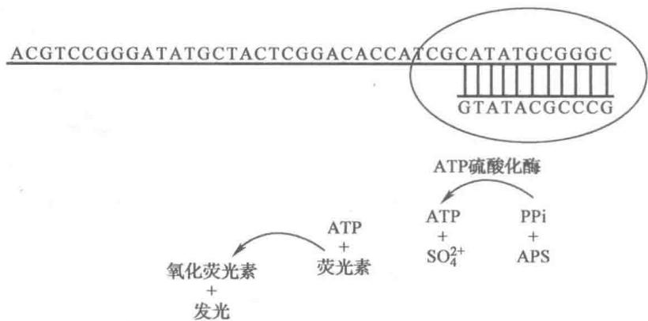  
图 12-16 焦磷酸测序法示意图

（2）样品 DNA 文库的构建 将待测序列的样品 DNA 用机械方法打断成 300\~800 bp 的小片段，在小片段两端接上不同的接头 (adapter)。由此建立的基因文库是 DNA 单链文库，而不是克隆文库。

（3）乳液 PCR 扩增模板 在直径约为 $20 \mu m$ 的微珠表面固定与待测序列单链接头互补的寡核苷酸，用以捕捉待测 DNA 链，称为捕捉微珠（capture beads）。将样品 DNA 文库与微珠混合，有限稀释（limited dilution），使每一微珠只捕捉一条 DNA 链（与之退火）。加入 PCR 试剂和乳化剂使形成油包水（water in oil）乳液，经变性、退火、延伸反复循环使 DNA 链获得扩增，称为乳液 PCR（emulsion PCR）。扩增结束后，破坏乳液，分离出微珠，每一微珠带有上百万条 DNA 模板链。把微珠置于芯片小孔内，每一小孔比微珠略大，因此只能容纳一个微珠。

（4）循环阵列测序 将光纤束(fiber-optic bundle)固定在玻片上，排成阵列点(array)，另一端与电荷耦合元件(CCD)相连，使接收到的光信号转变成电信号，从而在计算机中记录下每次反应芯片上各斑点的亮度。玻片另一面与光纤固定点对应处用酸蚀刻技术(acid etching procedure)打上小孔，玻片被称为超微滴定板(pico titer plate, PTP)，或芯片(chip)。各小孔即为独立的测序反应小室，加入焦磷酸测序的酶和试剂，及一种dNTP。如若小孔内发生聚合反应，即会释放焦磷酸而产生荧光，计算机记录下该斑点发亮。一轮结束后用核苷三磷酸二磷酸酶(apyrase)水解掉dNTP和ATP，然后加入一种新的dNTP；或者利用层流(laminar flow)技术更换含有新dNTP的反应液。依次循环完成在芯片上测序，称为循环阵列测序(cyclic-array sequencing)。

## 2. Illumina Solexa 可逆终止测序技术

Solexa 测序有两项核心技术:一是桥式 PCR(brige PCR);另一是可逆终止测序(reversible terminators for sequencing)。其余方法大致都与 454 测序相似。

（1）样品 DNA 文库的构建 将样品 DNA 打断成数百 bp 或更小, 如果是 PCR 产物或是 RNA 这一步可省略, 在两端接上不同的接头, 以构成单链 DNA (ssDNA) 文库。

（2）桥式 PCR 芯片测序通常都需要在载片上按阵列点固定相同序列的 DNA 簇（cluster），这种 DNA 簇是借助 DNA 聚合酶体外扩增而获得的 DNA 克隆（英语 polony 是由 polymerase clony 缩写而成，意即 DNA 克隆）。454 借微珠形成 DNA 克隆（polony）；Solexa 则借桥式 PCR 形成 DNA 克隆。Solexa 芯片是一有八通道的流动池（flow cell），与待测序 DNA 接头互补的引物通过柔性接头成簇固定在通道表面。适当控制样品 DNA 浓度,使每一簇只有一条单链 DNA 与固定的引物配对,在 DNA 聚合酶催化下 4 种 dNTP 底物在样品 DNA 链上使引物不断延伸,合成出与之互补的链。双链 DNA 经变性成为单链 DNA,然后退火,新合成的 DNA 与附近引物配对犹如拱桥,再次合成新链。经过 30 轮扩增,所有模板链都被线性化处理 (linearization),3'羟基被封闭,以免干扰下一步边合成边测序。由此制备的芯片每一簇可以有上千个模板链,每一通道有数百万的模板簇(克隆),因此一次就可以同时对 8 个文库进行测序。桥式 PCR 示意图见图 12-17。

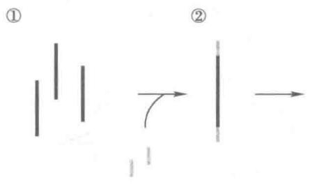

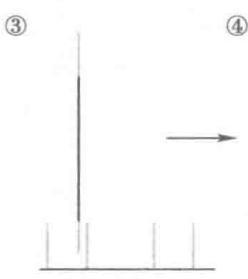

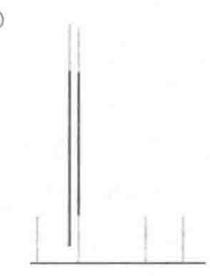

  
图 12-17 桥式 PCR 示意图  
① 样品 DNA 打断成数百 bp 片段；② 两端连上接头；③ 与固定引物配对；④ 合成互补链；  
⑤ 变性；⑥ 新合成链与固定引物配对并复制；⑦ 线性化并封闭 $3^{\prime}-$ 羟基⊗；⑧ 测序

（3）可逆终止测序 按照边合成边测序的原理，加入 DNA 聚合酶、测序引物和 4 种 dNTP 底物。与通常的 dNTP 底物不同，在可逆终止测序法中 4 种碱分别用不同荧光物标记，并且这些 dNTP 的 3'羟基均被化学基团保护，因此每轮合成反应都只能添加一个核苷酸。用激光扫描反应板表面，经 CCD 记录下各阵列点的光信号，然后将保护基和荧光标记切除，又可进行下一轮的合成反应。3'保护基的切除可解除终止，故称为可逆终止。

可逆终止法可以准确测出连续的核苷酸,但所测 DNA 链较短,通过对读可以测出 $2 \times 75$ bp。由于芯片包含的 DNA 簇较多,测定总数可达到 20\~25 Gb。

## 3. ABI SOLiD 连接测序技术

ABI 的 SOLiD(supported oligo ligation detection) 连接测序法核心技术有二: 一是由 DNA 连接酶将荧光标记的八聚寡核苷酸(fluorescently labeled octamers) 连接并据此测定序列; 二是使用了双碱基编码技术(two-base encoding), 通过两个碱基来对应一种荧光信号而不是上一方法的一个碱基对应一种荧光信号, 从而使该技术具有误差校正功能。其余建文库和乳液 PCR 与 454 测序法基本相同。

（1）样品 DNA 文库的构建 将样品 DNA 打断成小片段，两端接上接头。其片段可比 454 测序法的片段更小。

（2）乳液 PCR 扩增模板 在微珠表面固定与模板链接头互补的引物，用以捕捉模板链；通过控制 DNA 文库浓度使每一微珠仅结合一条模板链。ABI 的微珠比 454 的小，直径仅在 1 μm 左右。加入乳化剂，使形成油包水小滴，每一液滴内含有 PCR 试剂和一个微珠，成为独立的 PCR 扩增微系统，随后进行

PCR 循环。扩增反应结束后每一微珠大约携带 1 000 条模板链。破坏乳液分散系统，将微珠安置在芯片表面的小孔内，每一小孔恰好放置一个微珠。

（3）连接测序 连接测序是借助精心设计的八聚体荧光探针来识别模板链的序列，边连接边测序。八聚体3'端为2个确定的碱基(XX)，中间为3个任意碱基(NNN)，5'端为3个可与任何碱基配对的特殊碱基(ZZZ)。探针5'端分别与不同的荧光染料连接，由3'端2个碱基决定一种荧光颜色（双碱基编码），见图12-18A。八聚体荧光探针的结构见图12-18B。通用测序引物共有5种，分别以(n)、(n-1)、(n-2)、(n-3)、(n-4)来表示，各用于第一至第五轮测序。第一轮测序的第一次连接反应由引物(n)介导，由于每一微珠只含一种均质单链DNA模板，所以只有一种与引物5'端模板序列互补的八聚体荧光探针才能在连接酶催化下与引物连接。测序仪记录下荧光探针连接后发出的荧光颜色信号。随后用化学方法除去6\~8位核苷酸及5'端的荧光基团，游离出第5位核苷酸的5'磷酸，为下一次连接反应作准备，见图12-18C。第一次连接反应可以得到第1、2位碱基序列的颜色信息，第二次连接反应得到第6、7位碱基序列的颜色信息，第三次连接反应得到第11、12位碱基序列的颜色信息……见图12-18D。

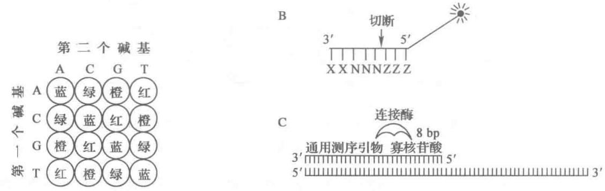

  
图12-18 连接测序法示意图  
A. 双碱基编码系统,由两个碱基对应一种荧光颜色; B. 八聚体荧光探针; C. 连接酶催化八聚体荧光探针与引物连接; D. 五轮连接反应完成 35 个碱基的测序

第一轮共进行七次连接反应。然后变性去掉引物和八聚体形成的DNA链，重置引物，并开始第二轮的测序。第二轮引物 $(n - 1)$ 与模板链的配对位置向左移一格，第一次连接反应可获得第0、1位碱基序列的颜色信息，依次类推，第二轮以后各次连接分别得到第5、6位，第10、11位，第15、16位，第20、21位，第25、26位，第30、31位碱基序列颜色信息。在完成五轮连接反应后就测完35个碱基序列。如果两头测序可以完成读序 $70\mathrm{bp}$ 以上。

连接测序所需样品 DNA 少(0.1 $\mu$ g 以下)，准确性高(99.99%)，可以得到超高通量数据(180 Gb 以上)，但序列读长较短。

## （三）第三代测序技术

现代科学技术发展的特点是综合化、信息化和产业化。上世纪80年代开始兴起的纳米技术正体现了这些特点。第三代测序技术，也即单分子测序技术，广泛运用了纳米技术的原理和方法。一项新技术的应用，从最初设想到最后产品实现需要10\~20年，或更长时间。上世纪80年代在完善Sanger终止法并推出自动化测序仪的同时，有关实验室也在探索Sanger终止法之外的测序法，由此产生了第二代测序技术。当时PCR技术正在盛行，第二代测序技术中都用到PCR来扩增模板链。但是PCR容易引入错误，并且会改变文库的成分。纳米技术的兴起使得直接分子测序成为可能，而无需借助PCR来扩增DNA链。进入21世纪第二个10年，第三代测序仪已经或即将上市，主要有Helicos Biosciences公司的HeliScope单分子测序(SMS)仪，Pacific Biosciences公司的SMRT测序技术和Oxford Nanopore Technologies公司纳米孔测序技术。前两者依靠荧光信号测序，后一种依靠电信号测序。

## 1. HeliScope

Helicos 的 HeliScope 是最早上市的单分子测序仪。该测序仪所以能够较为准确地记录下单分子 DNA 在加入核苷酸时释放的非常微弱的荧光信号，是因为其采用了一项全内反射显微镜技术（total internal reflection microscopy, TIRM）。这项核心技术原本由 Quake 公司所开发，2007 年被 Helicos 公司收购，次年推出了 HeliScope。

带有高灵敏度荧光探测装置的 HeliScope 测序仪操作比较简单。首先，将基因组 DNA 随机切成小片段，单链 3' 端加上 poly(A) 尾巴，然后由末端核苷酸转移酶连上荧光标记的核苷酸。荧光染料选择为硫代吲哚花青 3(sulfoindo cyanine 3, Cy3)。通过与固定在芯片表面的 poly(T) 互补杂交，将模板链锚定在芯片上，制成测序芯片。模板上标记有 Cy3 以标识出它们在芯片上的位置。随后加入 DNA 聚合酶和 Cy5 荧光

标记的 dNTP，边合成边测序。每次聚合反应只加一种 dNTP，将未参与反应的底物和酶洗脱，记录下发出荧光信号的位置，用化学试剂去掉荧光标记。重新加入 DNA 聚合酶和另一种 dNTP，以进行下一次聚合反应。通过重复合成、洗脱、成像、淬灭过程完成整条链的测序。通常 HeliScope 的读序长度为 30\~35 bp，每一芯片的数据产出量为 21\~28 Gb。HeliScope 的测序原理见图 12-19。

HeliScope 开创了单分子测序的先例。它操作简便，试剂消耗少，能够快速完成大规模 DNA 测序任务。

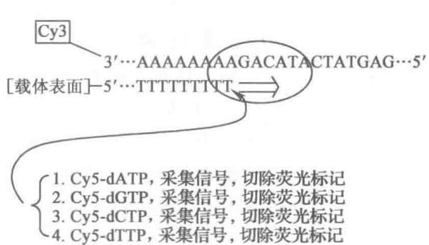  
图12-19 HeliScope的测序原理

但是它检测到的荧光信号弱,错误率高,不能识别连续的碱基,读序短。实际上它还没有完全摆脱第二代测序技术的一些操作。

## 2. PacBio SMRT

Pacific Biosciences 公司是较早推出第三代测序仪的公司之一,他们研发了一项全新的测序技术称为单分子实时测序技术(single molecular real time, SMRT)。PacBio RS(RS 表示 real time sequencing)核心技术有三个:一是通过零模波导(zero mode waveguide, ZMW)孔控制激光检测区;二是借助激光扫描荧光显微镜(laser scanning confocal microscope, LSCM)实时记录芯片上无数纳米微孔的荧光;三是分析荧光信号的时空变化进行高通量测序。

（1）零模波导(ZMW)纳米微孔板 SMRT 芯片是一种厚度为 100 nm 的金属片,其上打了许多直径为数十纳米圆形小孔,DNA 聚合酶固定在小孔底部玻璃板上。当小孔直径低于可见光波长(数百纳米)时,光线无法透射过小孔,而被束缚在浅表层(数纳米),形成一个非常小的检测区(图 12-20)。在芯片的一个反应池(SMRT cell)中有 15 万个 ZMW 纳米结构,一张芯片可以有多个反应池。向反应池中加入测序模板、试剂和荧光标记 dNTP。通常荧光基团都标记在 dNTP 的碱基上,而在本方法中荧光基团却连在末端磷酸基上,不同碱基的核苷酸用不同荧光基团标记末端磷酸。激光从底部打上去,DNA 聚合酶正

  
图 12-20 零模波导(ZMW)纳米微孔板

好在检测区内。DNA 模板链结合在聚合酶活性中心凹槽催化位点上，在有配对核苷酸底物进入时即发生聚合反应，模板链随之发生移动，又可接纳新的核苷酸底物。小孔上方溶液内无光线照射，荧光标记的核苷酸处于黑暗中，只有借助扩散进出检测区的标记 dNTP 才会发出荧光。扩散速度较快，标记核苷酸在检测区内停留的时间约为几十微秒，而进入聚合酶的标记核苷酸停留时间为几十毫秒，因此后者有较强的荧光发生，根据荧光波长可以判断掺入的核苷酸种类。聚合酶在新合成的 DNA 链上加入核苷酸，并释放底物的焦磷酸，荧光基团也随之被除去。

（2）激光扫描共聚焦显微镜 该新型显微镜兴起于20世纪80年代，主要包括荧光显微镜、激光发

射器、扫描装置、光检测器、计算机系统和图像输出设备六部分。由于激光光源针孔和探测针孔相对于物镜焦平面是共轭关系，也就是“共聚焦”，样品焦平面上的点同时聚焦于光源针孔和探测针孔。因此对样品进行扫描时，扫描点以外的非观察点不会成像，背景成黑色，样品需经过逐点扫描后才形成整个标本的光学切面，快速对集成在板上的纳米微孔荧光实时进行记录。

（3）纳米微孔荧光信号的时空段分析 DNA 聚合酶催化 DNA 合成过程中，每进入一个核苷酸就会产生一个荧光脉冲峰。两个相邻脉冲峰之间有一定距离，也就是时间段。峰间距离与模板上碱基是否存在修饰有关，修饰碱基影响合成速度，导致两个峰之间距离加大。PacBio 测序技术不仅可以提供序列信息，还可以实时了解模板碱基的修饰情况。

在体内 DNA 聚合酶能快速、准确、持续复制 DNA。SMRT 充分发挥了 DNA 聚合酶的潜力，测序速度每分钟大于 100 个核苷酸，读长在数 kb 以上。将基因组 DNA 打断成数 kb 的双链片段，两端分别填平，用末端互补的单链环状接头连接正、负链，形成哑铃状 DNA（图 12-21）。通过滚环法完成正、负链测序后还可以继续重复测序，从而使准确率达到 99.999 9% 以上。

## 3. Oxford Nanopore

Oxford Nanopore Technologies 公司研发出一款新的纳米孔 (nanopore) 测序仪。他们用生物材料制作携带纳米孔的膜。金黄色葡萄球菌的 $\alpha-$ 溶血素 (Staphylococcus aureus $\alpha$ -hemolysin) 能在生物膜上穿孔，在孔内共价结合氨基化环状糊精 (aminocycdextrin)，由此形成纳米通道。在膜的两

  
图 12-21 哑铃状 SMRT DNA 的构建

侧给予一定的电位差(如+180 mV)，利用特殊设备精确测定通过孔的电流。将外切核酸酶固定在纳米孔上，加入待测序的单链DNA，外切核酸酶逐个切下核苷酸。核苷酸通过环状糊精孔影响到电流，依次记录下各核苷酸的电流信号。在固定条件下，不仅碱基种类，而且修饰碱基，也会给出特定的电流信号，通过电流信号可以获得序列信息。

上面介绍了三种有代表性的第三代测序技术。由于测序能为生命科学和医学提供最重要和最基本的信息，测序技术受到普遍关注。第三代测序技术虽然已经从研发走向应用，各种改进仍在进行中。而第四代测序技术的研究也已经有了一些设想和苗头。

一种设想是采用石墨烯和碳纳米管为材料,替代目前使用的纳米孔装置,利用碳材料的导电性直接记录下 DNA 链经过孔隙时的电流变化。这种新的“电测序”的想法目前还处于起步阶段,但已受到一些实验室和公司的青睐。

另一种设想是直接利用特殊显微镜,如扫描隧道显微镜(STM)和原子力显微镜(AFM)“观察”DNA 分子,区分不同的碱基。这方面也已有不少尝试,有待进一步的研发。

相信在新的世纪里，新的测序技术必将有重大突破和发展。

## 七、DNA 微阵技术

DNA 微阵(DNA microarray),或称为基因芯片(gene chip),是以硅、玻璃、微孔滤膜等材料作为承载基片,通过微加工技术,在其上固定密集的不同序列 DNA 微阵列,一次检测即可获得大量的 DNA 杂交信息。在 $1 \mathrm{~cm}^{2}$ 的芯片上排列的 DNA 片段常有数十、数百甚至数十万个。微阵技术因其检测快速、灵敏、信息量大,故近年来发展极为迅速。人类基因组计划的顺利完成,生命科学进入了后基因组的时代,研究重点已不仅是基因组的序列,而转向功能基因组学(functional genomics)、结构基因组学(structural genomics)、比较基因组学(comparative genomics)、转录组学(transcriptomics),并带动产生了蛋白质组学(proteomics)、核糖核酸组学(ribonomics)、代谢组学(metabonomics)和糖组学(glycomics)等领域。在众多组学的研究中,迫切需要发展出一种新的高通量分析技术。各种生物芯片(biochip)便应运而生,在综合分析各类生物大分子或大分子组的变化中特别有用,其中最成熟、得到最广泛应用的是 DNA 芯片(基因芯片)。

以微阵排列固定在芯片上的核酸或寡核苷酸称为靶标（target）；用放射性同位素、荧光染料或其他易检测物标记的核酸称为探针（probe）。借助计算机系统分析杂交图像即可得到有关信息。

## (一) DNA 芯片的类型

基片的材料、微加工技术和检测方法等都会影响芯片的性能，但决定芯片类型和用途的是以阵列分布的靶标分子。固定在芯片上的 DNA 可分为三类：① 从不同生物来源分离到的基因、基因片段或其克隆；② cDNA 或是其表达序列标签（expressed sequence tag, EST）；③ 合成的寡核苷酸。

基因或基因片段分子都比较长，因此反应稳定，重复性好。用PCR扩增极易获得所需要的基因片段，经纯化和活化，即可按阵列固定在芯片表面。cDNA，或是从cDNA库中分离到的部分表达序列，可用以检测细胞基因的表达水平或基因组的表达谱(expression pattern)。分离基因和cDNA克隆固然十分费时、费力，但现在一些与生物技术有关的公司已有人类和模式生物各种基因和cDNA克隆出售。

寡核苷酸的合成十分方便,现已可按各种需要设计出寡核苷酸的序列,通过 DNA 合成仪自动化合成。用于芯片的寡核苷酸长度一般为 20 至 25 聚体。合成的寡核苷酸几乎可用于所有用途的 DNA 芯片。寡核苷酸还可在阵列点的原位合成,因而使阵列点更为密集。但是原位合成的寡核苷酸比较短,通常小于 20 聚体,因此也为杂交结果带来一定的不确定性。

## （二）DNA 芯片的制作

以硅片、玻片或滤膜作为固相支持物，应事先进行特定处理，例如包被带正电荷的聚赖氨酸或氨基硅烷。现在一些公司已有比较成型的基片出售，这类基片表面带有氨基、醛基或环氧基等活性基团。3'端经修饰带有氨基的DNA（PCR产物或寡核苷酸）通过戊二醛（或其他长碳链含双功能基化合物）反应，从而共价结合在基片上。也有芯片的基质通过连接臂上活化的基团与DNA相连。点阵的制作主要有以下三种方法：接触打印法(contact printing)；照相平版印刷法(photolithography)和喷墨法(inkjet)。

## 1. 接触打印法

机械点样(mechanical spotting)因其操作简单,既可手工点样,又可全部操作由自动化仪器来完成,故而被广泛采用。DNA溶于点样缓冲液,吸入加样针内,然后与芯片基质表面接触,使DNA溶液转移其上。为提高效率,点样可用多道针头,同时点一、二十个样品。每一轮点样后,加样针需彻底清洗,然后再吸下一溶液，以免造成污染。采用微阵点样仪，编好程序，即可快速均匀完成点样。

## 2. 照相平版印刷法

把半导体加工的照相平版印刷术同 DNA 化学合成法结合起来,可以制造高密度的寡核苷酸微阵列。用挡光膜来控制光反应的部位,曝光使光敏保护基解离下来,从而与加入的特定核苷酸发生偶联反应。各核苷酸底物也用光敏基团保护,然后用另一挡光膜重复上述过程,最终得到包含不同序列寡核苷酸的微阵列。照相平版印刷法的优点是:①直接在点阵原位合成寡核苷酸,省去了寡核苷酸纯化处理和固定等步骤,提高了芯片制作效率。②光照反应较易控制,可以制作高密度的点阵,其密度比接触点样至少可提高2\~3个数量级。③全部过程采用自动化操作,芯片与芯片之间差异极小,便于大规模生产。其缺点是:①挡光膜非常昂贵,设计和操作十分复杂。②原位合成寡核苷酸的产率较低,通常只能合成长度<20聚体的寡核苷酸,限制了所能获得的杂交信息。这一技术经过改进显然还有更大发展前景。

## 3. 喷墨法

类似于喷墨打印机，将 DNA 溶液置于带有喷头的压电装置（piezoelectric device）内，在电流控制下使精确量的液体喷射在基质表面。之后经过清洗再换上另一 DNA 溶液，可进行新一轮喷射。这种方法可以用任何种类的 DNA 制作微阵列，包括基因组 DNA、cDNA 或寡核苷酸。喷墨法也可用于原位合成寡核苷酸。与彩色打印机的原理相同，用四个喷头分别贮存四种核苷酸的合成试剂，通过计算机控制喷射特定种类试剂到设定区域。去保护、偶联、氧化和冲洗等步骤一一如固相合成技术。如此循环可以合成出长度为 40\~50 个碱基的寡核苷酸，每步产率也比照相法高，但芯片密度却不如照相法。点样法和喷墨法所制作的芯片一般可达上万个点阵。

## （三）核酸杂交的检测

DNA 芯片通过各点阵上的靶标分子与基因组 DNA、cDNA 和 mRNA 杂交而得到这些核酸样品的信息。现在已有许多物理化学方法可用来检测核酸的杂交；最常用的方法是对核酸样品加以放射性或荧光标记，然后检测点阵的杂交标记。荧光标记的灵敏度虽略低于放射性标记，但操作方便，目前 DNA 芯片的检测主要用荧光法。常用硫代吲哚花青染料（sulfoindocyanine, Cy）进行荧光标记，Cy3 可激发绿色光，Cy5

可激发红色光,如将 Cy3 和 Cy5 分别标记诱导前和诱导后细胞的 RNA 或其 cDNA,然后再与 DNA 芯片杂交。杂交信号可通过激光显微扫描仪对 DNA 芯片进行扫描来收集,检测每个靶标上探针所发出的荧光,由计算机控制显示器(computer controller display,CCD)成像(图 12-22)。可以分别对两种荧光物扫描并成像;也可以同时扫描获取两种图像,视不同仪器而异。激光共聚焦装置使激发光从芯片背面射入,并在芯片与杂交溶液界面处聚焦,发射荧光由成像显微镜经滤色器到达

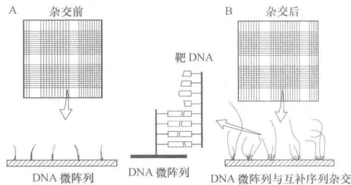  
图12-22 DNA芯片的作用原理

检测器(光电倍增管),那些未与芯片探针结合的标记分子由于不在聚焦部位,发射光不被检测到,只有芯片表面的杂交物才形成二维荧光图像。Cy3 和 Cy5 荧光图像的差别即反映了细胞诱导前后转录的差别。

另一种荧光检测技术叫光导纤维 DNA 生物传感器微阵列 (fiber-optic DNA biosensor microarray)，将生物传感器技术与微阵列技术结合起来。它是将靶标核酸固定在传感器敏感膜上，每一阵列点分别与直径为 200 μm 光导纤维末端相连，形成微阵传感装置。靶标核酸可伸入探针溶液内，杂交的荧光信号由另一端偶联的 CCD 相机接受，样品检测十分快速灵敏。

探针和样品是相对而言的。固定在芯片上的核酸或寡核苷酸称为靶标，被检测的荧光标记核酸则为探针；反之，有些书上将芯片上固定的核酸或寡核苷酸称为探针，而将荧光标记的核酸称为样品，通过与芯片杂交而获得样品的序列信息，其意思与前者完全相同。

## （四）DNA芯片的应用

DNA 芯片的用途十分广泛,它是分析基因组或是其表达遗传信息的重要技术,归纳起来主要有以下几方面的应用。

## 1. 测定基因型、基因突变和多态性

利用各种基因探针,可以确定生物的基因型。由于 DNA 芯片包含的信息量十分巨大,它可以检测出基因的各种突变和多态性。通常以高密度寡核苷酸微阵列来研究种内和种间的基因突变及多态性,尤其是单核苷酸多态性(single-nucleotide polymorphism, SNP)。在检测突变的微阵列(芯片)中,由代表一个或一组基因所有突变体的寡核苷酸组成,样品与芯片杂交的高灵敏度可以检测出单个核苷酸的错配,因此可以从同源基因的大量变化中快速查出序列上的变异,包括导致遗传病的基因缺陷以及癌基因。通过基因组错配扫描(genomic mismatch scanning, GMS)以对阵列各点的荧光强度进行定量分析。当探针与芯片核酸完全匹配时所产生的荧光信号强度是具有单个或两个错配碱基时的 5\~35 倍,所以对荧光信号强度精确测定是找出错配的基础。当然荧光强度还可能受到其他各种因素的影响,因此需要做各种对照实验,以取得可靠结果。

## 2. DNA 的重测序

上面提到 DNA 芯片包含的信息量十分巨大。如果 DNA 芯片由高密度整套寡核苷酸所构成，这些寡核苷酸长度一定，而包含了所有可能的序列组合，因此可用于重测序（resequencing）。将待测序的 DNA 分子切成小的片段，经荧光标记后在芯片上杂交。由于这些寡核苷酸包含了全部可能的序列，寡核苷酸之间有各种重叠，根据杂交荧光图谱可以推导出 DNA 序列，故又称为杂交测序（sequencing by hybridization, SBH）。这种测序方法十分高效，一次杂交即可得出 DNA 的全序列。但若样品中含有重复序列，测序就会受到限制。

## 3. 测定基因的表达谱

借助 cDNA, 表达序列标签(EST)或寡核苷酸制成的芯片, 可测定细胞基因的表达情况, 包括特定基因是否表达、表达丰度, 不同组织、不同发育阶段以及不同生理状态下表达差异, 也就是所谓的基因表达谱(gene expression pattern)。基因表达谱可提供丰富的生物信息及有关基因功能的直接线索。测定基因表达谱还有助于了解疾病的发病机制、药物的生理反应和治疗的效果。这些研究在理论上和实践上都有重要意义。

DNA 芯片还可用于基因来源同一性(identity by descent)作图、基因连锁分析、基因定位等研究,这里不再一一详述。

## 八、核酸的化学合成

早在20世纪50年代，H.G.Khorana就开始了寡核苷酸的化学合成研究。1956年他首次成功合成了二核苷酸。其基本指导思想是将核苷酸所有活性基团都用保护剂加以封闭，只留下需要反应的基团；活化剂使反应基团激活；用缩合剂使一个核苷酸的羟基与另一核苷酸的磷酸基之间形成磷酸二酯键，从而定向发生聚合。他的工作为核酸的化学合成奠定了基础，因而与第一个测定tRNA序列的Holley以及从事遗传密码破译的Nirenburg共获1968年诺贝尔生理学或医学奖。

Khorana 用于合成 DNA 的是磷酸二酯法。Letsinger 等人于 1960 年发明了磷酸三酯法。由于磷酸中有三个羟基 (P-OH)，将其中之一保护起来，剩下 2 个可以分别与脱氧核糖形成磷酸二酯，这样将减少副反应，简化分离纯化步骤，提高产率。之后他们又发明了亚磷酸三酯法，使反应速度大大加快。在此基础上实现了 DNA 化学合成的固相化，也即将第一个核苷酸 3'-羟基固定在可控孔径玻璃微球 (controllable pored glass bead, CPG) 上，因此冲洗十分方便，也适合于自动化操作。

DNA 自动化合成都采用固相亚磷酸三酯法。底物的活性基团分别被保护，例如腺嘌呤和胞嘧啶碱基上的氨基用苯甲酰基（bz）保护，鸟嘌呤碱基的氨基用异丁酰基（Ib）保护，5'-羟基用二甲氧三苯甲基(DMT)保护。自3'向5'方向逐个加入核苷酸,每一循环周期分为四步反应:

第一步,脱保护基(deprotection)。用二氯乙酸(dichloroacetic acid, DCA)或三氯乙酸(trichloroacetic acid, TCA)处理,水解脱去核苷5'-羟基上的保护基DMT。

第二步,偶联反应(coupling)。用二异丙基亚磷酰胺(diisopropyl phosphoramidite)衍生物作为活化剂和缩合剂,在弱碱性化合物四唑催化下,偶联形成亚磷酸三酯。

第三步,终止反应(stop reaction)。加入乙酸酐使未参与偶联反应的5'-羟基均被乙酰化,以免与以后加入的核苷酸反应,出现错误序列。换句话说,合成的DNA链允许中途终止,但不能有序列错误。

第四步,氧化作用(oxidation)。合成的亚磷酸三酯用碘溶液氧化,使之成为较稳定的磷酸三酯。

按照事先设计的程序合成 DNA 链, 待合成结束后用硫酚和三乙胺脱掉保护基, 并用氨水将合成的全长寡核苷酸水解下来, 然后用高效液相色谱 (HPLC) 和凝胶电泳纯化并鉴定。每个核苷酸合成循环要 7\~10 min, 十分方便。图 12-23 为 DNA 固相合成过程的图解。

  
图 12-23 DNA 固相合成(亚磷酸三酯法)

现在 RNA 也能自动化合成, 只是所用底物不同, 基本操作与 DNA 合成一样。

## 提要

核酸的糖苷键和磷酸二酯键可被酸、碱和酶水解，产生碱基、核苷、核苷酸和寡核苷酸。酸水解时，糖苷键比磷酸酯键易于水解；嘌呤碱的糖苷键比嘧啶碱的糖苷键易于水解；嘌呤碱与脱氧核糖的糖苷键最不稳定。RNA易被稀碱水解，产生2'-和3'-核苷酸，DNA对碱比较稳定。细胞内有各种核酸酶可以分解核

酸。限制性内切酶是基因工程的重要工具酶。

核酸的碱基和磷酸基均能解离,因此核酸具有酸碱性质。碱基杂环中的氮具有结合和释放质子的能力。核苷和核苷酸的碱基与游离碱基的解离性质相近,它们是兼性离子。核酸中的磷酸基只有一级解离。DNA 的酸碱变性使酸碱滴定曲线不可逆。

核酸的碱基具有共轭双键，因而有紫外吸收的性质。各种碱基、核苷和核苷酸的吸收光谱略有区别。核酸的紫外吸收峰在260 nm附近，可用于测定核酸。根据260 nm与280 nm的吸光度(A)可判断核酸纯度。天然DNA的 $\varepsilon(P)$ 为6600，RNA为7700\~7800，发生变性和降解时 $\varepsilon(P)$ 值会升高，以此可鉴别核酸制剂的质量。

变性作用是指核酸双螺旋结构被破坏，双链解开，但共价键并未断裂。引起变性的因素很多，升高温度、过酸、过碱、纯水以及加入变性剂等都能造成核酸变性。核酸变性时物理化学性质将发生改变。热变性一半时的温度称为熔点或变性温度，以 $T_{m}$ 来表示。DNA 的 G+C 含量影响 $T_{m}$ 。根据经验公式 $T_{m}=81.5^{\circ}C+16.6(\lg[Na^{+}])+0.41(\%G+C)-0.63(\%甲酰胺)-(600/1)$ 。可以由 DNA 的 $T_{m}$ 值计算 G+C 含量，或由 G+C 含量计算 $T_{m}$ 。

变性 DNA 在适当条件下可以复性, 物化性质得到恢复。复性快慢以 $C_{0}t_{1/2}$ 值来表示。用不同来源 DNA 进行退火, 得到杂交分子。也可以由 DNA 链与互补 RNA 链得到杂交分子。分子杂交是进行分子生物学研究的重要方法。Southern 印迹法和 Northern 印迹法是最常用的两种杂交技术。

核酸研究的迅猛发展得益于核酸研究方法的不断更新和改进,首要的研究方法是核酸的分离和纯化。溶液中核酸分子受巨大离心力场的作用沉降速度大大加快,从而可以用来测定核酸分子的沉降常数S并以此求出分子的相对质量,测定核酸分子密度和构象,还可用来分离和纯化核酸。常用的超速离心方法有:沉降速度超离心、沉降平衡超离心、蔗糖密度梯度超离心和漂浮密度超离心。凝胶电泳将分子筛技术与电泳技术相结合,常用的是琼脂糖凝胶电泳和聚丙烯酰胺凝胶电泳。在一定范围内电泳迁移率与DNA碱基对的对数成反比。脉冲电场凝胶电泳可用于分离分子相对质量大的DNA。核酸可用各种柱层析来分离和制备,常用的是羟基磷灰石柱层析和寡聚脱氧胸甘酸亲和柱层析。

目前分离 DNA 最重要的方法有 3 个:①用盐抽提,用苯酚和氯仿除去蛋白质。②用广谱蛋白酶在 SDS 存在下保温消化细胞悬液,再用苯酚和氯仿去蛋白,用 RNase 除去少量的 RNA。③用氯化铯密度梯度离心法分离纯化 DNA。制备 RNA 要防止 RNase 的降解:①器皿要高温处理或用 DEPC 除去 RNase。②破碎细胞的同时使蛋白质变性。③RNA 反应体系中加入 RNase 抑制剂(RNasin)。目前常用的 RNA 分离方法有两个:其一,用酸性钡盐/苯酚/氯仿抽提。其二,用钡盐/氯化铯密度梯度离心。分离 poly(A) $^{+}$ mRNA 可用寡聚(dT) $_{n}$ 亲和层析法。

核酸序列的测定是最重要、也是发展最快的生物技术。Sanger最初提出加减法测定DNA序列，后又改进为终止法。Maxam和Gilbert提出化学法测定DNA序列。Sanger的终止法经过改进实现自动化。RNA的测序原理基本与DNA测序相同。全基因组测序有逐步克隆法和鸟枪法两种谋略。人类基因组计划主要依赖第一代测序技术来完成。采用微阵技术发展出了第二代测序技术，主要有焦磷酸测序法、可逆终止测序法和连接测序法。采用纳米技术发展出了第三代测序技术，主要有藉全内反射显微镜技术的HeliScope，藉零模波导孔和激光扫描共聚焦显微镜的SMRT技术，以及纳米孔电信号测序技术。

DNA 微阵技术是一种高通量 DNA 杂交信息分析技术。将靶标核酸或其片段固定在芯片上，标记的核酸作为探针与之杂交，再用扫描仪收集杂交信息。制作芯片可用接触打印法、照相平板印刷法和喷墨法。DNA 微阵技术可用于测定基因型、基因突变和多态性，DNA 的重测序，以及测定基因的表达谱。

DNA 自动化合成都采用固相亚磷酸三酯法。合成过程分为四步: 第一步脱保护基。第二步偶联反应。第三步终止反应。第四步氧化反应。将产物脱保护基, 从载体上水解下来, 纯化。RNA 可以用同样原理合成。

## 习题

1. 比较核酸不同糖苷键和磷酸酯键对酸和碱的稳定性。

2. 为什么 RNA 比 DNA 更不稳定？

3. 试述核酸酶的种类和分类依据。

4. 为什么说核苷酸是兼性离子？是否所有核苷酸都是兼性离子？核苷酸中磷酸基的存在对碱基的解离有何影响？

5. $5'$ -鸟苷酸的 $pK_{1}'$ 为 0.7, $pK_{2}'$ 为 2.4, $pK_{3}'$ 为 6.1, $pK_{4}'$ 为 9.4, 这些 $pK'$ 各代表什么基团的解离常数? 其等电点 (pI) 是多少?

6. 为什么 DNA 酸碱滴定的正向曲线和反向曲线有显著不同？

7. 有一纯的质粒 DNA 溶液, 共 0.5 mL, 取少量稀释 100 倍后测得 $A_{260}$ 为 0.330, 计算此溶液共有 DNA 多少微克? (已知 DNAε(P) 为 6600; 1 mol 磷 DNA 平均为 310 g)

8. 何谓增色效应？何谓减色效应？

9. 肺炎球菌 DNA 的 G+C 含量为 40%，在 0.1 mol/L 盐溶液中其 $T_{m}$ 是多少？（不考虑分子长度）

10. 某真核生物基因组 DNA 变性后在标准条件下（溶液阳离子浓度 0.18 mol/L，DNA 片段大小 400 bp）复性，测得复性曲线分为三部分，快速复性部分占总量 25%， $C_{0}t_{1/2}$ 为 0.0013；中间部分占 30%， $C_{0}t_{1/2}$ 为 1.9；缓慢复性部分占 45%， $C_{0}t_{1/2}$ 为 630，试计算此基因组高度重复、中等重复和单拷贝序列的复杂度和拷贝数。（已知大肠杆菌 DNA 大小为 $4.64 \times 10^{6}$ bp， $C_{0}t_{1/2}$ 为 9）

11. 核酸杂交的分子基础是什么？有哪些应用价值？

12. 什么是 Southern 印迹法？什么是 Northern 印迹法？

13. G+C 含量为 40% 的 DNA 其密度为多少?

14. 比较蔗糖密度梯度超离心与氯化铯密度梯度超离心的异同。

15. 同一种质粒 DNA 在琼脂糖凝胶电泳中常分出三个条带,为什么?

16. 什么是脉冲电场凝胶电泳？如何选择最适电场和脉冲时间？

17. 为什么分离 RNA 要用变性聚丙烯酰胺凝胶电泳？

18. 什么是吸附层析？什么是亲和层析？比较两者核酸层析吸附条件和洗脱条件的异同。

19. 分离 DNA 和 RNA 主要有哪些方法？其原理是什么？

20. 简要叙述 Sanger 终止法测序的原理和操作步骤。

21. 简要叙述化学法测序的原理和步骤。

22. RNA 的测序有哪些方法？

23. 实现 DNA 测序自动化的核心技术是什么？

24. 什么是大规模基因组测序的逐步克隆法？

25. 比较基因组测序逐步克隆法和鸟枪法的优缺点。

26. 比较第一代测序技术、第二代测序技术和第三代测序技术主要特点。

27. 概述 454、Solexa 和 SOLiD 测序法的核心技术。比较三者的优缺点。

28. 比较 HeliScope、SMRT 和 Nanopore 测序法的原理和优缺点。

29. 何谓 DNA 微阵技术?

30. 制作 DNA 芯片的主要方法有哪几种？

31. DNA 芯片有哪些主要应用？

32. 概述 DNA 化学合成固相亚磷酸三酯法的原理。

33. DNA 化学合成自动化操作可分为哪几步？主要错误可能是什么？

## 主要参考书目

1. 王镜岩, 朱圣庚, 徐长法. 生物化学教程. 北京: 高等教育出版社, 2008.

2. 吴乃虎. 基因工程原理. 2 版. 北京: 高等教育出版社, 2001.

3. 张龙翔, 张庭芳, 李令媛. 生化实验方法和技术. 2 版. 北京: 高等教育出版社, 1997.

4. Green M R, Sambrook J. Molecular Cloning: A Laboratory Manual. 4th ed. New York: Cold Spring Harbor Laboratory

Press, 2012.
5. Nelson D L, Cox M M. Lehninger Principles of Biochemistry. 6th ed. New York: W. H. Freeman, 2012.
6. Berg J, Tymoczko J, Stryer L. Biochemistry. 7th ed. New York: W. H. Freeman, 2010.

(朱圣庚)

网上资源

习题答案 自测题
