## 第 14 章 激素和信号转导

细胞接受来自质膜外的信号并对它们作出反应是生命具有的基本能力。细菌细胞接受来自作为信息受体的膜蛋白的连续信号输入，监测环境介质的 $\mathrm{pH}$ ，渗透强度，食物、氧气和光的可利用性和有毒化学物质、捕食者或食物竞争者的出现。这些信号引起细菌细胞作出适当的应答，例如趋向食物或离开毒物的运动，或在耗尽营养物质的介质中形成休眠孢子。对于一个多细胞的生物，特别是人和脊椎动物，它的各器官和各系统间必须互相配合，步调一致，作为一个整体必须与外界环境和谐统一。对人和动物来说，起这种协调和整合作用的除神经系统外，还有内分泌系统及其分泌的激素。动物细胞经常交换有关[细]胞外液中离子和葡萄糖，不同组织中进行的相互依赖的代谢活动和胚胎中发育期间细胞的正确定位等的信息；一般说，这些信息是由它的载体——信号分子激素通过体液传送的。胞外信号可以是机械的、化学的和物理的，激素（还有神经递质和生长因子等）是一类化学信号或称化学信使。在这里信号代表能够被专一受体检测出并被转化为细胞应答（一个化学过程）的信息。这种由信息转化为化学变化的过程——信号转导——是活细胞的一个普遍性质。

本章主要介绍作为化学信号的激素的一般概念、一些重要激素（包括人和脊椎动物、昆虫和植物的激素）的化学结构和生理功能以及信号转导的一般特点和信号的转导机制等。

## 一、激素通论

多年来人们对激素的结构与功能进行了广泛的研究,它是内分泌学(endocrinology)的重要内容。近年来,在分子水平上对激素的作用机制作了卓有成效的研究,发现激素是通过与质膜上的、细胞内的或核内的专一受体结合而起作用的;激素的作用跟酶催化和基因表达都有密切关系。激素的分子生物学研究将极大地促进实用内分泌学的发展。

## （一）激素和其他化学信号

“激素”一词最先是在1904年被W. Bayliss和E. Starling用来描述促胰液素(secretin)的作用的，促胰液素是由十二指肠分泌、促进胰液流动的一种分子（后来知道它是一种肽激素）。从Bayliss和Starling的工作中可以概括出几点有关激素的重要思想：①激素是特定组织或细胞（现称内分泌系统）合成的信息载体或称信号分子；②激素被直接分泌到体液（如血浆、淋巴液、脑脊液、器官组织之间的组织液和细胞之间的胞外液；这些液体是互相沟通的，也即体液是一个连续相；它构成多细胞生物体的内环境），并运送到远处特定靶细胞的特定部位（专一受体），在那里专一地改变靶细胞的活动；③激素的作用是很强的，很低浓度就能引起很强的应答；④激素分子都是短命的，在细胞中不能积累，很快就被破坏。虽然今天关于激素的概念和研究内容有了很大的发展，但基本思想还是这些。更概括地说，激素是协调和整合多细胞生物个体的不同细胞代谢活动的一类胞外化学信号或信使。

参与协调机体内各器官和组织的代谢活动的，除激素外还涉及其他的胞外化学信号，包括信息素、神经递质和生长因子等。信息素（pheromone）与激素不同之处是，信息素是在不同生物个体的细胞之间，一般是在异性个体的细胞之间传递信息；信息素对一个个体来说，是属于外源信号，激素、递质和生长因子是内源信号。因为信息素的一个重要功能是作为性引诱剂（sex attractant），它的传递促进性行为的发生。昆虫的性引诱剂研究得较多，发现它们的化学结构多是长链烯醇酯或长链环氧化合物（图14-13）。神经递质（neurotransmitter）是由神经元轴突末梢释放到突触间隙而作用于下一个神经元或其他细胞（如肌细胞）实现信息传递的胞外信号，如乙酰胆碱、去甲肾上腺素、谷氨酸、γ-氨基丁酸和多巴胺等；在分子水平上，递质和激素并无本质区别；例如，肾上腺素和去甲肾上腺素，神经组织分泌的，在肾上腺素能[的]神经元（adrenergic neuron）中起神经递质作用，而肾上腺髓质分泌的，在肌肉、肝和脂肪组织中则作为激素。生长因子（growth factor）或细胞因子（cytokine），如表皮生长因子、[促]红细胞生成素、白细胞介素和干扰素是一类小的分泌蛋白质，通过跟靶细胞的质膜受体结合促进某些细胞的生长和分裂；它们与激素的区别是细胞在应答一次性的分泌信号（如激素或细胞因子）时，生长因子的活性是持久的，而激素是短暂的。

## （二）激素的分类

激素按生物来源的不同可分为:①人和脊椎动物激素;②无脊椎动物激素,如昆虫激素;③植物激素。昆虫激素和植物激素将在本章第三、四节介绍。

人和脊椎动物激素按化学本质可分为:①肽(包括蛋白质)激素,如催产素和胰岛素等;②儿茶酚胺激素(catecholamine hormone),如肾上腺素、去甲肾上腺素和多巴胺等;③甲状腺激素(thyroid hormone),如甲状腺素( $T_{4}$ )和三碘甲腺原氨酸( $T_{3}$ );④类固醇激素,如皮质醇和孕酮等;⑤维生素D激素,也是固醇衍生物;⑥类二十烷酸激素(脂肪酸衍生物),如前列腺素、凝血恶烷和白三烯等,它们的效应一般局限于合成部位的附近组织或细胞,这些物质的介绍见第10章;⑦类视黄醇激素(retinoid hormone),类异戊二烯化合物;⑧氧化氮激素(nitric oxide hormone),是一种无机气体。②和③两类激素是氨基酸衍生物,前3类激素合称为含氮激素(nitrogenous hormone)。

人和脊椎动物激素还可以根据它们的作用方式归为三类。一类是肽、儿茶酚胺和类二十烷酸，这类激素是水溶性的，不能通过质膜，它们是在靶细胞质膜外侧跟质膜上的受体结合，并通过第二信使（胞内信使）起作用的。另一类是类固醇激素、维生素D激素、甲状腺激素和类视黄醇，它们是水不溶性的，能通过质膜，这些激素是跟细胞的核[内]受体结合进而调节转录起作用的。最后一类是氧化氮（NO），一种非极性气体，能通过质膜进入细胞；NO是通过激活细胞溶胶中的受体（鸟苷酸环化酶）使之产生第二信使（cGMP）而发挥作用的。激素的分类参见表14-1。

表 14-1 人和脊椎动物激素的分类

<table><tr><td>类型</td><td>实例</td><td>合成途径</td><td>作用方式</td></tr><tr><td>肽</td><td>胰岛素、催产素</td><td>经蛋白酶水解加工</td><td rowspan="3">结合于质膜受体;产生第二信使</td></tr><tr><td>儿茶酚胺</td><td>肾上腺素、多巴胺</td><td>衍生自酪氨酸</td></tr><tr><td>类二十烷酸</td><td>前列腺素E、白三烯 $A_4$ </td><td>来自花生四稀酸</td></tr><tr><td>类固醇</td><td>睾酮、皮质醇</td><td>衍生自胆固醇</td><td rowspan="4">结合于核受体;调节基因表达</td></tr><tr><td>维生素D</td><td>1α,25-二羟维生素 $D_3$ </td><td>衍生自胆固醇</td></tr><tr><td>类视黄醇</td><td>视黄酸</td><td>来自维生素A</td></tr><tr><td>甲状腺激素</td><td>三碘甲腺原氨酸( $T_3$ )</td><td>来自甲状腺球蛋白Tyr</td></tr><tr><td>氧化氮</td><td>氧化氮( $NO^*$ )</td><td>来自精氨酸+ $O_2$ </td><td>结合于细胞溶胶受体(GMP环化酶);产生第二信使(cGMP)</td></tr></table>

## （三）激素的检测和纯化

一种激素是怎样被检测并分离的？第一，发现一个组织的生理过程跟源自另一个组织的信号有关，例如胰岛素最先是作为胰腺中产生并影响血和尿中葡萄糖浓度的一种物质被认识的；第二，一旦发现了一个被推测激素的生理效应，即可对这个激素的定量生物测定[方法](bioassay)进行开发。对胰岛素来说，生物测定包括把胰腺提取液（胰岛素的粗原料）注射到缺乏胰岛素的实验动物，然后定量血和尿中葡萄糖浓度的变化。为分离一个激素，生物化学家使用用于分离其他生物分子的技术（溶剂分级分离、色谱和电泳等）对含有被推测激素的提取液进行分级分离，然后测定每个有激素活性的组分。一旦这个化合物被纯

化,则可对它的组成和结构进行测定。

看起来上面这个激素鉴定方案有些过于简单,其实不然。激素具有强力的作用,但产生的量很少。为获得用于化学鉴定的足够量激素,经常需要进行大规模的生物化学分离。当 A. Schally 和 R. Guillemin 各自从下丘脑纯化和鉴定促甲状腺激素释放因子(TRF)时,Schally 研究组加工了从两百万只绵羊中取下的近 20 吨下丘脑,Guillemin 组提取了约一百万头猪的下丘脑。TRF 被证明是一个三肽(Glu-His-Pro)的简单衍生物(见图 14-6)。一旦这个激素的结构为已知,它就可以大量地被化学合成,用于生理学和生物化学的研究。由于下丘脑激素的工作,Schally、Guillemin 与 Rosalyn Yalow 一道获 1977 年诺贝尔生理学或医学奖。R. Yalow 获奖是因为开发出肽激素的高灵敏放射免疫测定[法](radioimmunoassay, RIA)并用它研究激素作用。RIA 使激素研究得到飞速发展,因为它只要有微量的激素就能进行快速、定量和特异的测定。

激素专一的抗体是放射免疫测定及其改进型式酶联免疫吸附测定(ELISA;见第4章)的关键。纯化的激素,注射到兔子或小鼠,可以产生出抗体,后者能以高亲和力和高专一性与该激素结合。这些抗体可以被纯化;纯化的抗体或被放射性标记(用于RIA),或与能产生有色物质的酶结合(用于ELISA)。然后被标记的抗体跟含激素的提取液相互作用;提取液中被激素结合的抗体部分用放射检测或光度法进行定量。因为抗体对激素的高亲和力,这些测定的灵敏度可以达到样品中皮克(pg)激素的水平。

## （四）内分泌腺及其分泌的激素

内分泌系统(endocrine system)是人体及脊椎动物体内的两大通讯系统之一,它由分散在体内的、被称为内分泌腺(endocrine gland)的一些无管腺和细胞组成(图14-1)。这些特定的器官和细胞在特定的神经或体液的刺激下分泌某些特定物质进入体液(如血液)。这些物质即是称为激素的化学信号,它们在血液中的浓度是很低的,然而一旦被携带到靶细胞,便作用于特定的组织或器官,并产生特定的效应。

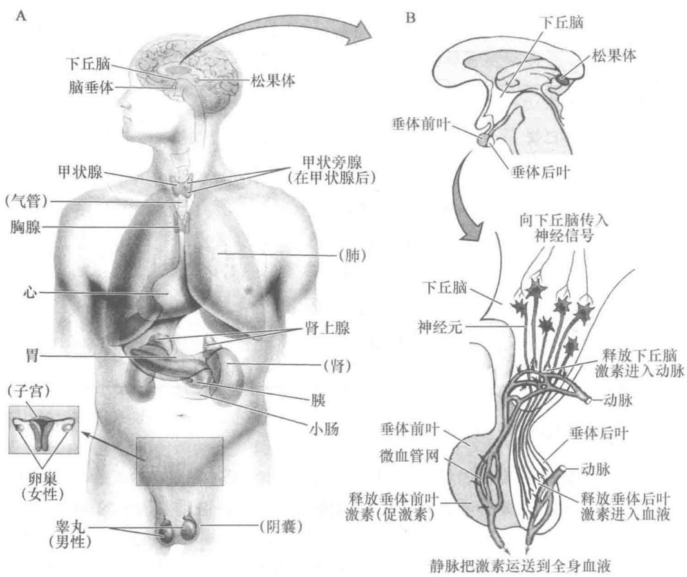  
图 14-1 人体的主要内分泌腺(A)和激素信号的神经内分泌起点(B)

为了读者查阅和参考,表 14-2 列出各种内分泌腺分泌的主要激素及其化学本质和主要功能。从表 14-2 中可以注意到:① 这些内分泌腺在解剖学上是彼此不连续的,但在功能意义上它们自成一体——内分泌系统。② 这些内分泌腺中有些器官如心、肾等显然有它们的其他、甚至更重要的功能,但它们同时含有分泌激素的细胞。③ 下丘脑是大脑的一部分,但也是内分泌系统的一部分,因为下丘脑的某些神经元末梢分泌的化学信号不是影响邻近细胞的神经递质,而是进入血流被携带到别的部位起作用的激素。这些从下丘脑神经元末梢释放的激素,包括运至垂体后叶(posterior pituitary)贮存并释放的两种激素(OT 和 ADH)在内,称为下丘脑激素或神经激素。④ 有些单个的内分泌腺能分泌几种激素,但一般情况下一种类型的细胞只分泌一种激素,因此这些单个腺体应含有多种类型的细胞。⑤ 有些单个激素可以由不止一种内分泌腺分泌,例如生长抑素(somatostatin)是由胃肠道和胰腺两者分泌的,同时它也是下丘脑分泌的一种激素(表 14-3)。

表 14-2 人和脊椎动物激素一览表

<table><tr><td>产生激素部位(内分泌腺)</td><td>激素</td><td>简称</td><td>英文名称</td><td>化学本质</td><td>主要功能</td></tr><tr><td rowspan="2">下丘脑</td><td>释放因子 $^1$ </td><td></td><td>releasing factor</td><td>多肽</td><td>促进腺垂体分泌激素</td></tr><tr><td>抑制因子 $^1$ </td><td></td><td>inhibiting factor</td><td>多肽</td><td>抑制腺垂体分泌激素</td></tr><tr><td rowspan="10">垂体前叶(腺垂体)</td><td>生长激素(促生长素) $^2$ </td><td>GH</td><td>growth hormone(somatotropin)</td><td>蛋白质</td><td>促进生长和代谢</td></tr><tr><td>促甲状腺激素</td><td>TSH</td><td>thyroid-stimulating hormone</td><td>蛋白质</td><td>促进甲状腺发育和分泌激素</td></tr><tr><td>促肾上腺皮质激素(β-促皮质素)</td><td>ACTH</td><td>adrenocorticotropic hormone(β-corticotropin)</td><td>39-肽 $^3$ </td><td>促进肾上腺皮质分泌激素</td></tr><tr><td>催乳激素(促乳素)</td><td>LTH</td><td>luteiotropic hormone(prolactin)</td><td>蛋白质</td><td>促进乳腺生长和乳合成</td></tr><tr><td>促卵泡激素</td><td>FSH</td><td>follicle-stimulating hormone</td><td>蛋白质</td><td>促进配子(卵和精子)产生和性激素分泌</td></tr><tr><td>[促]黄体生成素</td><td>LH</td><td>luteinizing hormone(lutropin)</td><td>蛋白质</td><td></td></tr><tr><td>β-促脂解素</td><td>LPH</td><td>β-lipotropin</td><td>蛋白质</td><td>促进脂质水解</td></tr><tr><td>β-内啡肽</td><td></td><td>β-endorphin</td><td>31-肽</td><td>功能尚不清楚</td></tr><tr><td>脑啡肽</td><td></td><td>enkephalin</td><td>5-肽</td><td></td></tr><tr><td>促黑[素细胞]激素(含α-,β-等)</td><td>MSH</td><td>melanocyte-stimulating hormone</td><td>13-肽</td><td>促进黑色素合成和扩散</td></tr><tr><td rowspan="2">垂体后叶(神经垂体)</td><td>催产素 $^4$ </td><td>OT</td><td>oxytocin</td><td>9-肽</td><td>催乳和促进子宫活动</td></tr><tr><td>抗利尿激素 $^4$ (血管升压素)</td><td>ADH</td><td>antidiuretic hormone(vasopressin)</td><td>9-肽</td><td>促进肾对水的重吸收并有升压作用</td></tr><tr><td rowspan="3">甲状腺</td><td>甲状腺素</td><td> $T_4$ </td><td>thyroxine</td><td>碘酪氨酸</td><td>促进基础代谢、脑发育和脑功能</td></tr><tr><td>三碘甲腺原氨酸</td><td> $T_3$ </td><td>triiodothyronine</td><td>碘酪氨酸</td><td>降低血钙、调节钙磷平衡</td></tr><tr><td>降钙素</td><td></td><td>calcitonin</td><td>多肽</td><td></td></tr><tr><td>甲状旁腺</td><td>甲状旁腺激素</td><td>PTH(PH)</td><td>parathyroid hormone (parathyormone)</td><td>蛋白质</td><td>升高血钙、调节钙磷平衡</td></tr><tr><td rowspan="2">肾上腺皮质</td><td>皮质醇(氢化可的松)</td><td></td><td>cortisol(hydrocortisone)</td><td>类固醇</td><td>促进肝细胞中糖原异生;增强应急应答和免疫能力</td></tr><tr><td>醛固酮</td><td></td><td>aldosterone</td><td>类固醇</td><td>促进肾小管对钠和水的重吸收及钾的排泄</td></tr><tr><td>肾上腺髓质</td><td>肾上腺素</td><td></td><td>epinephrine(adrenaline)</td><td>酪氨酸衍生物</td><td>促进肝和肌肉中糖原分解,升高血糖;提高应急应答能力</td></tr><tr><td rowspan="4">胰岛</td><td>去甲肾上腺素</td><td></td><td rowspan="2">norepinephrineinsulin</td><td rowspan="2">蛋白质</td><td rowspan="2">促进肝和肌肉对葡萄糖的吸收和利用,降低血糖</td></tr><tr><td>胰岛素</td><td></td></tr><tr><td>胰高血糖素</td><td></td><td>glucagon</td><td>29-肽</td><td>促进糖原分解,升高血糖</td></tr><tr><td>生长抑素</td><td>SS</td><td>somatostatin</td><td>14-肽</td><td>抑制GH和TSH的分泌</td></tr><tr><td>性腺:</td><td></td><td></td><td></td><td></td><td></td></tr><tr><td rowspan="3">卵巢</td><td>雌激素 $^{5}$ </td><td></td><td>estrogens</td><td>类固醇</td><td>促进雌性生殖系统发育和乳房长大</td></tr><tr><td>孕酮(黄体酮)</td><td></td><td>progesterone</td><td>类固醇</td><td>促进子宫内膜增生、抑制子宫运动以利安胎</td></tr><tr><td>松弛素</td><td></td><td>relaxin</td><td>多肽</td><td>促进子宫颈和耻骨松弛</td></tr><tr><td>睾丸</td><td>雄激素 $^{6}$ </td><td></td><td>androgens</td><td>类固醇</td><td>促进雄性生殖系统发育和雌、雄性动物和人的性活动</td></tr><tr><td rowspan="4">胎盘</td><td>绒毛膜促性腺激素</td><td>CG</td><td>chorionic gonadotropin</td><td>蛋白质</td><td>促进黄体分泌激素;其功能与孕酮相似</td></tr><tr><td>雌激素 $^{5}$ </td><td></td><td>estrogens</td><td>类固醇</td><td>见卵巢</td></tr><tr><td>孕酮</td><td></td><td>progesterone</td><td></td><td>见卵巢</td></tr><tr><td>胎盘催乳素</td><td>PL</td><td>placental lactogen</td><td>蛋白质</td><td>促进乳房发育和代谢</td></tr><tr><td>胸腺</td><td>胸腺素</td><td></td><td>thymosin(thymo poietin)</td><td>蛋白质</td><td>增进T-淋巴细胞的功能</td></tr><tr><td>松果体</td><td>褪黑素</td><td>MLT</td><td>melatonin</td><td>色氨酸衍生物</td><td>可能与性成熟和体节律有关</td></tr><tr><td rowspan="3">肠胃道</td><td rowspan="2">胃泌素(促进胃液素)[肠]促胰液素</td><td></td><td>gastrin</td><td>17-肽</td><td>促进胃液分泌</td></tr><tr><td></td><td>secretin</td><td>多肽</td><td>促进胰液分泌</td></tr><tr><td>缩胆囊素</td><td>CCK</td><td>cholecystokinin</td><td>多肽</td><td>促进胆囊收缩</td></tr><tr><td rowspan="2">肾脏</td><td>肾素 $^{7}$ </td><td></td><td>renin</td><td>蛋白质</td><td>与醛固酮分泌及血压有关</td></tr><tr><td>1,25-二羟维生素</td><td></td><td>1,25-dihydroxyvit amin</td><td>类固醇</td><td>促进小肠对钙的吸收</td></tr><tr><td>心脏</td><td>D3心房[钠泵]肽</td><td>ANF</td><td>D3atrial natriuretic factor (atriopeptin)</td><td>肽</td><td>促进肾对钠的排泄;与血压有关</td></tr><tr><td>肝</td><td>胰岛素样生长因子</td><td>IGF</td><td>insulin-like growth factor</td><td>肽</td><td>促进生长</td></tr></table>

① 这些释放因子和抑制因子见表 14-3；② 括号内是同义词；③ 39-肽表示含 39 个氨基酸残基的肽，以下同；④ 催产素和升压素是在下丘脑中合成，但被运至垂体后叶贮存并由此分泌的；⑤ 雌激素包括雌二醇（estradiol）、雌三醇（estriol）和雌酮（estrone）等；⑥ 雄激素包括睾酮（testosterone）、雄酮（androsterone）等；⑦ 肾素也称血管紧张肽原酶，它在血中催化生成血管紧张肽Ⅱ（angiotensin Ⅱ）的反应，血管紧张肽Ⅱ是一种强血管收缩剂。

表 14-3 下脑丘产生的调节激素

<table><tr><td> $激素^{1}$ </td><td>英文名称</td><td>简称</td><td>化学本质</td><td>对垂体前叶的作用</td></tr><tr><td>促肾上腺皮质激素释放因子(激素) $^{2}$ </td><td>corticotropin releasing factor</td><td>CRF</td><td>41-肽</td><td>刺激 ACTH 的分泌</td></tr><tr><td>促甲状腺素释放因子 $^{3}$ </td><td>thyrotropin releasing factor</td><td>TRF</td><td>3-肽</td><td>刺激 TSH 和促乳素的分泌</td></tr><tr><td>生长激素释放因子</td><td>growth hormone releasing factor</td><td>GHRF</td><td>多肽</td><td>刺激生长素的分泌</td></tr><tr><td>生长激素释放抑制因子(生长抑素)</td><td>growth hormone release inhibiting factor(somatostatin)</td><td>GHIF(SS)</td><td>14-肽</td><td>抑制 GH 和 TSH 的分泌</td></tr><tr><td> $激素^1$ </td><td>英文名称</td><td>简称</td><td>化学本质</td><td>对垂体前叶的作用</td></tr><tr><td>促性腺激素释放因子</td><td>gonadotropin releasing factor</td><td>GnRF</td><td>肽</td><td>刺激 FSH 和 LH 的分泌</td></tr><tr><td>促乳素释放因子</td><td>prolactin releasing factor</td><td>PRF</td><td>多肽</td><td>刺激促乳素的分泌</td></tr><tr><td>促乳素释放抑制因子 $^4$ </td><td>prolactin release inhibiting factor</td><td>PIF</td><td>多巴胺</td><td>抑制促乳素的分泌</td></tr><tr><td>促黑素细胞激素释放因子</td><td>melanophore-stimulating hormone releasing factor</td><td>MRF</td><td>多肽</td><td>刺激促黑素细胞激素的分泌</td></tr></table>

① 激素名称中因子(factor)一词也可写成激素(hormone)，两者是同义词，因此简称，例如CRF也可写成CRH；② CRF是释放ACTH的主要刺激剂，但升压素，可能还有其他下丘脑激素，也能刺激ACTH的释放；③ 注意，TRF也是一种“PRF”，但它与“真正的”PRF不同，后者只刺激促乳素的分泌；④ PIF经鉴定是多巴胺(dopamine)，一种儿茶酚胺。除此之外，所有的下丘脑分泌的因子都是肽。

## （五）激素释放的分级控制和反馈调节

从激素释放的角度看，人和哺乳动物体内的内分泌腺可以分为上、中、下三个等级，构成“下丘脑-脑垂体-其他内分泌腺”控制轴。下丘脑（一级内分泌腺）处于轴上方，脑垂体（二级内分泌腺）居于中间，其他内分泌腺（三级内分泌腺）处于轴下方（图14-2）。上一级内分泌腺通过它所释放的激素控制下一级内分泌腺的活动，而下级释放的激素也对上级内分泌腺的活动产生影响（反馈）（图14-3）。

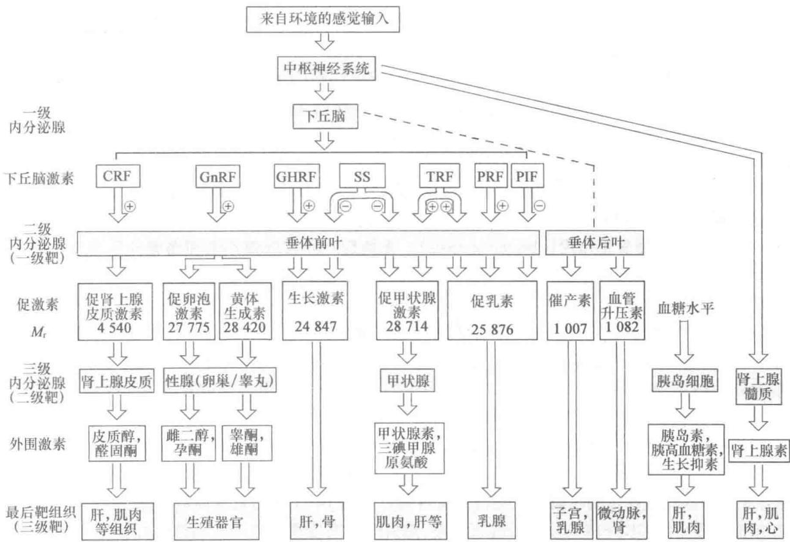  
图 14-2 某些主要的内分泌激素及其靶组织  
示出激素分泌的分级控制；图中④表示促进，⊖表示抑制

一级内分泌腺是下丘脑(hypothalamus)，它是特化了的大脑中枢，是哺乳类中内分泌系统的总枢纽或主调节器。激素的作用归根结底受中枢神经系统的控制。下丘脑接收和整合来自内、外环境的感觉输入（sensory input），即有关例如危险、饥饿、进食和血压等的信号，并指挥内分泌组织产生适当的激素。在应答信号输入中，下丘脑产生调节[性]激素，它们几乎都是多肽分子。下丘脑的这些调节激素通过特殊的血管和连接两个腺体的神经元直接输送到邻近的脑垂体(图14-1B)。对垂体激素分泌起促进作用的下丘脑激素称为释放因子(releasing factor, RF)，起抑制作用的称为[释放]抑制因子(inhibiting factor, IF)，见表14-3。注意，下丘脑激素与垂体激素没有一一的对应关系，例如下丘脑的TRF不仅刺激垂体的TSH释放，也刺激促乳素的释放；又如垂体的生长激素分泌同时受到下丘脑的两种激素：GHRF和SS(GHIF)的调节(图14-2)。

二级内分泌腺是脑[下]垂体（pituitary gland），包括前叶和后叶；垂体前叶（anterior pituitary）又称腺垂体（adenohypophysis），它由胚胎发育期的上皮细胞转化而来；垂体后叶（posterior pituitary）又称神经垂体（neurohypophysis），它起源于胚胎发育期的神经组织，可看成是下丘脑的扩展部分。前叶和后叶被称为一级靶腺（primary target），因为它是最高级内分泌腺下丘脑释放的激素的靶子。垂体前叶应答血流运来的下丘脑激素，产生促激素（tropic hormone；tropin），它们多是较长的多肽（表14-2）。促激素（也称二级激素）除了促乳激素（它直接作用于最后的靶组织）外，都作用于三级内分泌腺也称二级靶腺（secondary target）。垂体后叶含有起始于下丘脑的许多神经元的轴突末梢，这些神经元产生两种短肽激素催产素和血管升压素（图2-23）。它们沿轴突移至垂体中的神经末梢，并贮存在这里等待释放信号。

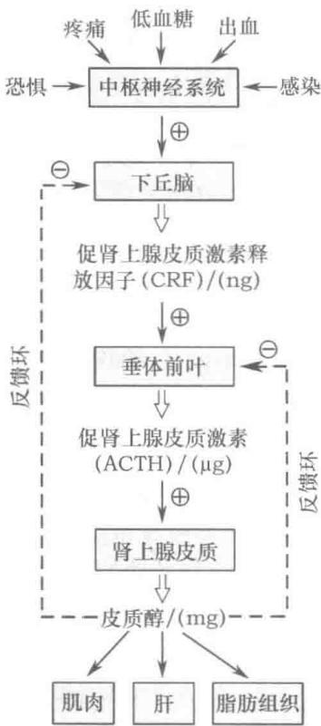  
图14-3 内分泌激素释放的级联放大和反馈抑制

三级内分泌腺，包括甲状腺(thyroid)、肾上腺皮质(adrenal cortex)和髓质(medulla)、胰腺小岛细胞(pancreatic islet cell)、生殖腺或性腺(gonad)、胎盘(placenta)、松果体(pineal gland)等(见表14-2和图14-1)。这些腺

体受促激素的刺激,又分泌它们的专一激素,通过血流作用于各自的靶组织如肝、肌肉、生殖器官、乳腺、微动脉(arteriole)等(图14-2)。例如从下丘脑分泌的促肾上腺皮质激素释放因子(CRF)刺激垂体前叶释放促肾上腺皮质激素,ACTH经血液运送到肾上腺皮质的束状带(zona fasciculata)触发皮质醇的释放。皮质醇是这一级联中最后的激素,它通过跟多种类型的靶细胞中的受体作用引起代谢改变。在肝细胞中皮质醇的一个效应是增强糖异生作用(gluconeogenesis)。垂体后叶释放的催产素和血管升压素是直接作用于最后的靶组织的。三级内分泌腺释放的激素称为外围激素,也称第三级激素,这是相对于下丘脑激素(第一级)和垂体激素(第二级)而言。

激素级联如负责皮质醇和肾上腺素产生的级联能引起初始信号很大的放大，并使最后激素的产出得到精细调节（图14-3）。在级联的每一水平上，一个小的信号引出一个大的应答。例如，给下丘脑的初始电信号导致几纳克(ng)促肾上腺皮质激素释放因子的释放，此因子引出几微克的ACTH释放。ACTH作用于肾上腺皮质引起几个毫克的皮质醇释放。整个级联放大至少有百万倍。

激素释放具有自我控制的性质。在激素级联的每一水平上，级联中的前几步受到反馈抑制是可能的；最后的激素或一个中间激素的浓度超过不必要的水平，将抑制级联中前面激素的释放，也即一个产物（激素）的合成或释放只有在达到所需浓度之前才有可能。如图14-3中的负反馈环所示，在下丘脑分泌释放因子开始的级联中如CRF-ACTH-皮质醇级联中，最后的激素皮质醇由于它引起下丘脑中分泌CRF的神经细胞动作电位频率下降，使得下丘脑分泌CRF减小。此外皮质醇还直接作用于垂体前叶使分泌ACTH的细胞对CRF的刺激效应敏感度降低。这样，通过这种“双管齐下”的负反馈（negative feedback），皮质醇自身的分泌得到有效的控制。

注意,内分泌腺之间除了上面刚讲到的纵向的相互制约外,还有横向的制约。例如卵巢(和胎盘)分泌的雌激素显著提高垂体前叶的促乳素分泌,虽然雌激素的分泌并不受促乳素的控制,又例如肾上腺素可以抑制胰腺小岛细胞的胰岛素分泌。

正常情况下,各种内分泌腺的活动是相互平衡的,各种激素在血浆中的浓度维持在相对稳定的水平。但任何一种内分泌腺机能亢进或减退都会破坏这种平衡与稳定,扰乱正常代谢和生理功能,从而影响机体

的正常发育和健康，甚至引起严重疾病直至死亡。

## （六）激素通过靶细胞受体起作用

所有的激素都是通过对激素敏感的靶细胞中的专一性受体起作用的，激素以高亲和力与受体结合。但一种激素可能有多种不同的专一受体。例如肾上腺素在肌肉和肝中有专一的 $\alpha-1$ 受体，在胰腺 $\beta$ 细胞中有专一的 $\alpha-2$ 受体，在脂肪组织中有专一的 $\beta$ 受体。因此一种激素可能以不同的方式影响不同的细胞，这将随专一受体和信号转导机制而异。

每种类型的细胞有它自己的激素受体组合,这种组合确定了它的激素应答范围。而且具有同一类型受体的两类细胞可以有不同的激素作用胞内靶,因此可以对同一激素作出不同的应答。激素作用的专一性是由于激素和它的受体之间结构互补的结果;这种相互作用具有很强的选择性,所以即使结构上相似的激素也可以有不同的效应,这取决于它们是否优先与不同的受体结合。相互作用的高亲和力使得细胞能够对很低浓度的激素作出应答。在设计想干预激素调节的药物时,我们需要知道药物和天然激素的相对专一性和亲和力。激素和受体的相互作用可以通过 Scatchard 分析来定量(见图 14-15),在有利条件下,可获得亲和力的定量测定(复合体解离常数)和受体制剂中激素结合部位的数目。

配体-受体相互作用在胞内发生的事件至少有5种模式(详见本章第5、6节):①在细胞内产生一个第二信使(如cAMP、cGMP或肌醇三磷酸),作为一个或多个酶的别构调节物;②受体酪氨酸激酶被胞外激素活化;③膜电位的变化,这是由于激素门控离子通道打开或关闭的结果;④细胞表面上的黏着受体从胞外基质到细胞骨架传送信息;或⑤类固醇或类固醇样分子引起一个或多个基因的表达(DNA转录成mRNA)水平变化,这种变化是由激素的一个核受体蛋白介导的。

就大多数激素而言,一些激素受体位于靶细胞质膜的外表面,另一些激素受体处于靶细胞的内部。据此可把激素作用的机制或方式大致归纳为两类:一类是激素进入靶细胞内,在细胞质或核内与专一的受体结合成激素-受体复合体而起作用;另一类是激素在靶细胞外与其质膜上的受体结合并通过膜上的转导机制转化为胞内信使(第二信使)而起作用。

水溶性的肽和胺激素(例如胰岛素和肾上腺素)还有前列腺素是在胞外通过跟跨膜的细胞表面受体结合而起作用的(图14-4A)。当激素与受体的胞外结构域结合时,受体发生类似于别构酶跟效应物分子结合时的构象变化。构象变化触发激素下游的效应。

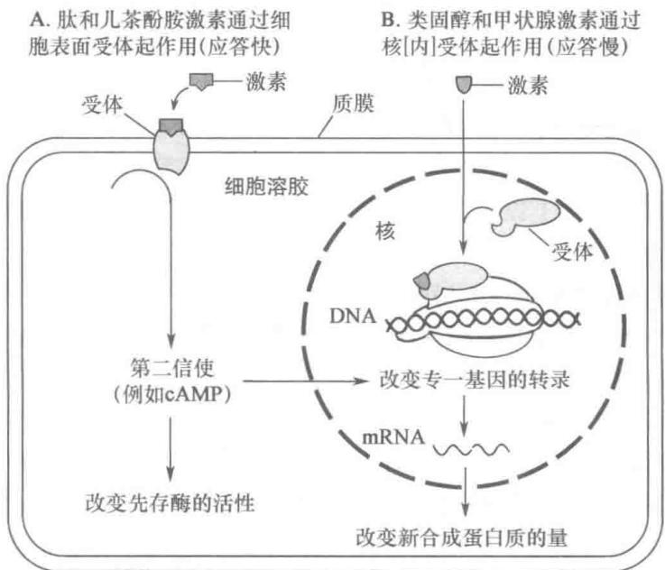  
图14-4 激素作用的两种方式

在形成激素-受体复合体中,单个激素分子(第一信使)激活一个催化剂分子,后者催化多个第二信使分子的产生,所以受体不仅作为一个信号转导器(transducer),而且也是一个信号放大器(amplifier)。信号可以通过信号转导级联(催化剂活化催化剂的系列反应步骤)进行放大,结果是原初的信号得到高倍放大。这类级联反应发生在例如肾上腺素对糖原合成和降解的调节作用(见图14-20)。一个肾上腺素分子通过它的受体激活一个腺苷酸环化酶分子,对于每一个跟受体结合的激素分子来说,则产生多个环式腺苷酸(cAMP)分子。cAMP进一步激活多个cAMP依赖型蛋白激酶(蛋白激酶A)分子,后者又活化多个糖原磷酸化酶b激酶分子。其结果是信号得到极大的放大;一个肾上腺素分子引起从糖原产生几万到几百万个1-磷酸葡糖分子。

水不溶性的激素(类固醇、类视黄醇素和甲状腺激素)很容易通过靶细胞质膜到达核内的受体蛋白质。对于这一类激素,激素-受体复合体自身就携带信息;因此激素-受体复合体跟核内染色质的特定DNA序列结合,改变了专一基因的转录。这类激素总的代谢效果是刺激靶组织中某些蛋白质的合成,使关键蛋白质的水平发生变化(图14-4B)。

通过质膜受体作用的激素通常引发生理和生化应答的速度是很快的，持续时间短；例如肾上腺髓质分泌肾上腺素进入血流刚几秒钟，骨骼肌立即作出加速糖原降解的应答。相反，甲状腺激素和性激素（固醇类激素）作用是缓慢的，但持续时间较长；在它们的靶组织中作出最大的应答，需要在数小时或数天之后。应答时间的这种差别反映不同的作用模式。作用快的激素一般是通过别构机制或共价修饰引起一个或多个原先存在于细胞内的酶活性的改变。作用慢的激素一般是改变基因的表达，合成更多（上调）或更少（下调）的被调节的蛋白质。

关于激素通过受体起作用的详细机制见本章下面叙述。

## 二、人和脊椎动物的一些重要激素

前面曾谈到激素和其他信号分子的化学本质和作用方式是多种多样的(表14-1, 表14-2)。它们从释放点到靶细胞的路径也不相同, 有内分泌(endocrine)、旁分泌(paracrine)和自分泌(autocrine)三种方式。内分泌的产物被释放到血液运送到全身, 在特定器官或组织中作用于靶细胞受体(例如胰岛素和肾上腺素); 旁分泌的产物被释放到胞间液, 扩散到邻近并作用于靶细胞(例如类二十烷酸激素和神经组织分泌的调节肽); 自分泌的信号分子通过与细胞表面上的受体结合, 作用于分泌它们的细胞自身。

为阐明人和哺乳动物激素的化学结构和生理功能,我们将按表 14-1 所列类别顺序考虑每类中具有代表性的某些例子。

## (一) 肽激素

肽激素可以含有3\~200个或更多个氨基酸残基。它们包括胰腺分泌的激素胰岛素、胰高血糖素和生长抑素，甲状旁腺分泌的激素降钙素和所有下丘脑和垂体分泌的激素；此外其他组织也分泌某些肽激素（见表14-2）。肽激素是在核糖体上以较长的前体蛋白质（激素原）形式合成，然后被装进分泌小泡中，经蛋白酶水解成为有活性的肽。

## 1. 胰岛素(insulin)和胰高血糖素(glucagon)

胰腺含有两类组织:外分泌的腺泡组织和内分泌的胰岛组织;前者以酶原形式分泌消化酶,后者以小岛(胰岛)形式分散在腺泡组织之中。胰岛或称兰氏小岛(islet of Langerhans)在胰腺中可多至百万个,含有 $\alpha$ 、 $\beta$ 和 $\delta$ (也分别称A、B和D)三种细胞。 $\alpha$ 细胞占胰岛细胞总数的15%\~25%,分泌胰高血糖素; $\beta$ 细胞占70%\~80%,分泌胰岛素; $\delta$ 细胞数量较少,分泌生长抑素(somatostatin)。

胰岛素是一个小的蛋白质 $(M_{r}5800)$ ，具有两个肽链，A链和B链，它们通过两个二硫键共价交联而成，其化学结构见图2-28。胰岛素在胰脏中是以一个无活性的单链前体（前胰岛素原）形式合成的。此前体的氨基端含有一个信号序列（信号肽），它是引导前胰岛素原进入分泌小泡的（关于信号肽的讨论见第33章）。在小泡中信号序列被蛋白酶水解除去，形成3个二硫键的胰岛素原，后者储存于 $\beta$ 细胞的分泌颗粒（一种充满内质网上合成的蛋白质的膜泡）中。当血中葡萄糖升高至足以触发胰岛素分泌时，胰岛素原被专一的蛋白酶切断两个肽键转变为成熟的胰岛素分子和C肽（图14-5），它们经胞吐被释放到

血中。

在某些情况, 激素原蛋白质产生的不是单个肽激素, 而是几个较小的活性肽激素。阿 [片] 黑 [素] 皮 [质] 激素原 (pro-opiomelanocortin, POMC) 就是由一个基因编码的多激素的突出例子; POMC 基因表达的原初产物是一个长多肽, 此肽被逐步断裂成至少 9 个生物活性肽, 如 ACTH, $\beta$ -和 $\gamma$ -促脂解素 (lipotropin), $\alpha-$ 、 $\beta$ -和 $\gamma$ -促黑激素 (MSH), $\beta$ -内啡肽和脑啡肽等。在许多肽激素, 特别是短肽激素, 末端残基是被修饰的, 如催产素、血管升压素 (图 2-23) 和促甲状腺激素释放激素 (TRF) (图 14-6)。

肽激素在分泌颗粒中的浓度是很高的,以至于膜小泡的内容物实际上是晶状的;当内容物经胞吐分泌时,大量激素立即被释放出来。作为产肽内分泌腺的毛细血管是有许多小孔的,所以激素分子很容易进入血流,被转运到他处的靶细胞。正如前面提及的,所有的肽激素都是通过与质膜受体结合和第二信使产生的途径起作用的。

胰岛素是体内唯一能够降低血糖的激素。它促进肌肉和脂肪组织对葡萄糖的吸收，在这里葡萄糖被转化为6-磷酸葡糖。在肝中，因为胰岛素激活糖原合酶而抑制糖原磷酸化酶，所以大部分6-磷酸葡糖被引向合成糖原。

胰岛素也促进过剩燃料（如脂肪）贮存于脂肪组织。在肝中胰岛素促进6-磷酸葡糖经糖酵解氧化为丙酮酸，丙酮酸氧化为乙酰-CoA。产能不需要的过剩乙酰-CoA用于脂肪酸合成，合成的脂肪酸以血浆脂蛋白(VLDL)的三酰甘油形式从肝输送到脂肪组织。胰岛素在脂肪组织中促进从VLDL三酰甘油释放的脂肪酸合成三酰甘油。这些脂肪酸归根结底来自肝从血中吸收来的过剩葡萄糖。总起来说，胰岛素的效应是促进过剩的血糖转化为两种贮存形式：糖原（肝和肌肉中）和三酰甘油（脂肪组织中）。

图14-5 前胰岛素原转变为成熟的胰岛素  
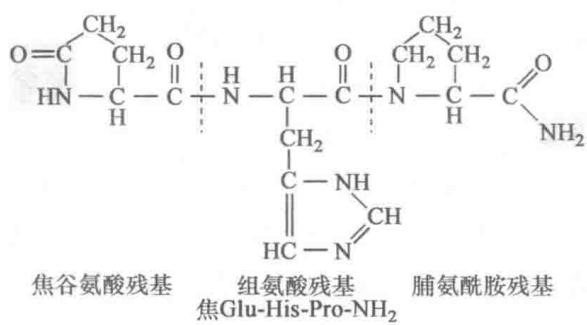  
图 14-6 促甲状腺激素释放因子(TRF)  
氨基端 Glu 的侧链羧基与该残基的 $\alpha$ 氨基形成酰胺（阴影部分），生成焦谷氨酸；羧基端 Pro 的羧基转变为酰胺基，阴影部分示出其中的氨基

进餐富糖食品后葡萄糖从小肠进入血流,血糖升高导致胰腺分泌胰岛素增加(而胰高血糖素降低)。胰岛素的释放虽有多种刺激可以引起,但主要是由供给胰腺的血中的葡萄糖水平调节的。当血糖升高时,①葡萄糖转运蛋白运载葡萄糖进入β-细胞,在这里葡萄糖立即被己糖激酶IV(葡糖激酶)转化为6-磷酸葡糖,并进入糖酵解;②随着葡萄糖分解代谢速率的增加,[ATP]升高,导致质膜中ATP-门控K+通道关闭;③K+的外向流量减少造成膜去极化;④膜的去极化打开电位门控Ca2+通道,使细胞溶胶中[Ca2+]增加;⑤[Ca2+]的增加触发胰岛素通过胞吐释放(图14-7,①至⑤)。大脑整合有关能量供需方面的信号和来自副交感和交感神经系统的信号也影响胰岛素的释放。一个简单的反馈环限制激素释放:胰岛素通过刺激组织摄取葡萄糖使血糖降低;β-细胞根据通向己糖激酶反应的葡萄糖流量减小检测出血糖下降;这就减慢或停止胰岛素的释放。这一反馈调节保持血糖浓度基本稳定,尽管进食有很大的变动。

ATP-门控 $\mathrm{K}^{+}$ 通道是调节胰岛素分泌的枢纽。 $\mathbf{K}^{+}$ 通道是一个八聚体，由4个相同的Kir6.2亚基和4个相同的 SUR1(sulfonylurea receptor; 磺酰脲受体)亚基构成。当 [ATP] 升高 (代表血糖增加) 时, K $^{+}$ 通道关闭, 质膜去极化, 触发胰岛素释放 (图 14-7)。

  
图 14-7 葡萄糖对胰 $\beta$ 细胞分泌胰岛素的影响

已知糖尿病（diabetes mellitus）有Ⅰ型和Ⅱ型之分。Ⅰ型是遗传性的，通常发生在婴幼儿时期，原因之一是K $^{+}$ 通道的Kir 6.2亚基发生突变，造成K $^{+}$ 通道持续开着，因而出现严重血糖过高（hyperglygemia），Ⅰ型患者需要用胰岛素治疗。Ⅱ型患者多数是成年人，其病因是胰岛β-细胞分泌胰岛素减少或靶细胞上的受体对胰岛素的敏感性降低。患者可口服磺酰脲类药物（图14-8）治疗。药物的作用机制是磺酰脲与K $^{+}$ 通道的SUR1亚基结合，关闭通道，促进胰岛素释放。磺酰脲类有时可与注射胰岛素联合使用，但经常单独就能控制Ⅱ型糖尿病。

  
图 14-8 治疗Ⅱ型糖尿病的磺酰脲类药物  
图中阴影部分是磺酰脲的结构

在 $K^{+}$ 通道的 Kir 6.2 和 SUR1 亚基中的其他突变可以产生 $K^{+}$ 通道的永久性关闭和胰岛素的持续释放。如果不及时治疗，患者可发展为先天性胰岛素过高（hyperinsulinemia），过量胰岛素引起严重的血糖过低（hypoglycemia），导致不可逆的脑损伤。

胰高血糖素是由29个氨基酸组成的单链多肽 $(M_{\mathrm{r}}3485)$ ，它的氨基酸序列也已测出。胰高血糖素的主要生理作用与胰岛素相反，它是升高血糖。进食糖类几小时后，血糖水平则开始下降，因为大脑和其他组织不停地氧化葡萄糖。血糖水平下降（低于4.5 mmol/L）和胰岛素分泌增加都可以直接作用于胰岛α细胞引起胰高血糖素的分泌。与肾上腺素一样，胰高血糖素也是通过cAMP激活磷酸化酶和钝化糖原合酶来促进肝糖原降解；但与肾上腺素也有区别，胰高血糖素主要作用于肝，并不刺激肌细胞的糖原分解。胰高血糖素在肝细胞中还抑制经糖酵解分解葡萄糖和促进经糖异生途径合成葡萄糖。因此，胰高血糖素能使肝输出葡萄糖，恢复血糖到正常水平。

虽然胰高血糖素的首选靶是肝,但它也影响脂肪组织,激活那里的脂酶。活化的脂酶降解三酰甘油,释放脂肪酸;后者被输送到肝和其他组织作为燃料,节省葡萄糖以供大脑之需。因此胰高血糖素总的效应是促进肝合成和释放葡萄糖,并动用脂肪组织的脂肪酸,用以代替除大脑之外其他组织所需的葡萄糖。胰高血糖素的所有这些效应都是由 cAMP 依赖型蛋白质磷酸化介导的。

## 2. 生长激素 (growth hormone; somatotropin)

生长激素是垂体前叶分泌的肽激素,人生长激素的 $M_{r}$ 为 21500,含 191个残基,一级序列亦已测出。生长激素有种的特异性,除灵长类生长激素外,其他哺乳类生长激素对人不起作用。

生长激素的生理功能广泛，但主要是促进骨骼和肌肉的生长发育。儿童时期如果缺少生长激素，将患侏儒症（dwarfism），表现为生长停滞、身材矮小，但智力发育正常，这与呆小症患者智力低下不同。反之，儿童时期如果生长激素分泌过多，则患巨人症（gigantism），有记录的最高巨人达2.72 m。侏儒症和巨人症患者身材各部分的比例尚属协调。如果成年人垂体机能亢进，生长激素分泌过多，身体只有软骨较多的部分，如下颚骨、手足肢端骨生长异常，而已钙化的如长骨则不再生长，因此出现肢端肥大，下颚突起、鼻梁隆高等不合常人比例的畸形。因生长激素分泌不足而患侏儒症的儿童，及早用生长激素治疗效果很好。现已有用基因重组技术生产的人生长激素供临床应用。

## 3. 催产素 (oxytocin) 和血管升压素 (vasopressin)

这两个激素在下丘脑中合成,被运至垂体后叶贮存,并由此分泌。它们都是含9个氨基酸残基的环状八肽(结构式见图2-23),现已用人工合成方法生产。

催产素的生理作用是能引起多种平滑肌收缩(特别是子宫肌肉),具有催产(使妊娠子宫收缩,分娩胎儿)和促进乳腺排乳的作用。催产素活性极强,只要120亿分之一的剂量就能引起离体子宫的收缩。

血管升压素或称抗利尿激素(antidiuretic hormone)。这种激素的主要作用是调节体内的水平衡,它促进水在肾集合管的重吸收,使尿量减少,这就是抗利尿作用。此外它还可以引起体内各部分的微动脉管的平滑肌收缩而具有升压作用。

## （二）儿茶酚胺激素

肾上腺髓质合成和分泌的肾上腺素(epinephrine)和去甲肾上腺素(norepinephrine)是一类儿茶酚胺激素(图14-9)，因在结构上与儿茶酚(catechol；最先从亚洲热带植物的儿茶树胶(gum catechu)中蒸馏获得)有关而得名。在体内它们是从酪氨酸合成而来：酪氨酸 $\rightarrow$ L-多巴(3,4-二羟苯丙氨酸) $\rightarrow$ 多巴胺 $\rightarrow$ 去甲肾上腺素 $\rightarrow$ 肾上腺素(第25章)。大脑和其他神经组织中产生的儿茶酚胺类起神经递质的作用。像肽激素一样，儿茶酚胺类也是高度浓缩在小泡中，经胞吐作用被释放；也是通过表面受体产生的第二信使起作用的，介导各种各样的应激性生理应答。（注意，肾上腺的髓质和皮质是互不相干的两种组织，虽然它们合成为“一个腺体”。但它们两者的胚胎起源不同，髓质和神经细胞同属一个来源（外胚层），受交感神经支配，而皮质是由中胚层衍生而来。）

肾上腺素和去甲肾上腺素的生理功能是，引起人体或动物的兴奋激动。具体说，引起血压升高、心跳加快、血管紧张、代谢率提高、耗氧量增加、骨骼肌和心肌血流量加大、瞳孔放大、毛发耸立，同时抑制消化道蠕动、胃肠壁平滑肌血管收缩、减少血流量。总之动员全身一切潜力应付紧急状态。

  
图 14-9 儿茶酚胺激素的化学结构

肾上腺素和去甲肾上腺素两者有所不同，前者对心脏作用大，是强心剂（使心跳加快），后者对血管作用大，是升压剂（使血管收缩）；对糖原分解作用（升高血糖）前者比后者强20倍。我国特产的中草药麻黄(Ephedra vulgaris)所含有的麻黄碱或麻黄素(ephedrine)，其化学结构（图14-9）和生理功能都与肾上腺素相似。麻黄素及其化学合成类似物被用于缓解哮喘和鼻充血等。

## （三）类二十烷酸激素

类二十烷酸激素是由20-碳多不饱和脂肪酸衍生而来的，包括前列腺素、凝血噁和白三烯。这类激素与前面所讲的不同，它们不是事先合成和储存的，是在需要时从膜磷脂（经磷脂酶 $\mathrm{A}_2$ 酶解）中释放的花生四烯酸(20:4)产生的。导致前列腺素和凝血噁产生的一系列酶，在哺乳动物组织中分布很广；大多数细胞能产生这些激素；许多组织的细胞能通过专一的质膜受体对它们作出应答。

类二十烷酸激素是一类旁分泌激素,被分泌到胞间质,对附近细胞起作用。关于它们的化学结构和生物学作用见第10章“活性脂质”部分和图10-21。

## （四）类固醇激素

类固醇(甾类)激素是由肾上腺皮质、性腺(卵巢和睾丸)以及妊娠期间的胎盘产生并分泌的;它们与载体蛋白质结合,通过血流运载到靶细胞。胆固醇是所有类固醇激素的前体。所有的类固醇激素都能通过核内受体改变专一基因表达的水平(见图14-4);但也可以有通过质膜受体介导的快速效应。

## 1. 肾上腺皮质激素(hormones of adrenal cortex)

肾上腺皮质能合成50种以上的皮质类固醇激素(图14-10)，合成反应是从胆固醇D环中除去侧链，引入氧形成酮和羟基。皮质类固醇根据它们的作用可分为糖皮质激素(glucocorticoid)和盐皮质激素(mineralcorticoid)。

糖皮质激素如皮质醇(cortisol)、皮质酮(corticosterone)和可的松(cortisone);它们主要影响糖代谢(也影响脂肪和蛋白质代谢),例如促进肝细胞糖异生(第21章),以增加肝糖原的贮备和维持血糖浓度的相对稳定,使糖代谢正常进行。糖皮质激素能提高机体对有害刺激,如感染、中毒、疼痛、寒冷、恐惧等因素的耐受能力。临床上常用氢化可的松或可的松抗炎症、抗过敏、抗毒、抗休克等,虽然在初期可收到一定效果,但用多了会产生副作用,如血压升高、忧闷、易怒、假胖、骨脆、伤口难愈合等,因此必须慎用,少用。

盐皮质激素如醛固酮（aldosterone）主要影响盐代谢，调节血液中电解质 $\left(\mathrm{K}^{+},\mathrm{Na}^{+},\mathrm{Ca}^{2+}\right.$ 和 $\left.\mathrm{Cl}^{-1}\right)$ 浓度，如促进肾小管对 $Na^{+}$ 的重吸收和 $K^{+}$ 的排泄，并相应地增加对 $Cl^{-}$ 和 $H_{2}O$ 的重吸收。属于盐皮质激素的还有11-脱氧皮质酮，但活性只有醛固酮的1/40。

## 2. 性激素 (sex hormone)

性激素影响性发育、性行为和一系列其他生殖和非生殖功能。几种主要性激素的化学结构见图14-11。

（1）雄激素（androgen）：睾丸间质细胞分泌的雄激素主要是睾酮（testosterone），它是体内最重要的雄激素。它的主要代谢产物雄酮（androsterone）以及肾上腺分泌的脱氢表雄酮（dehydroepiandrosterone）和雄

A. 糖皮质激素

B. 盐皮质激素

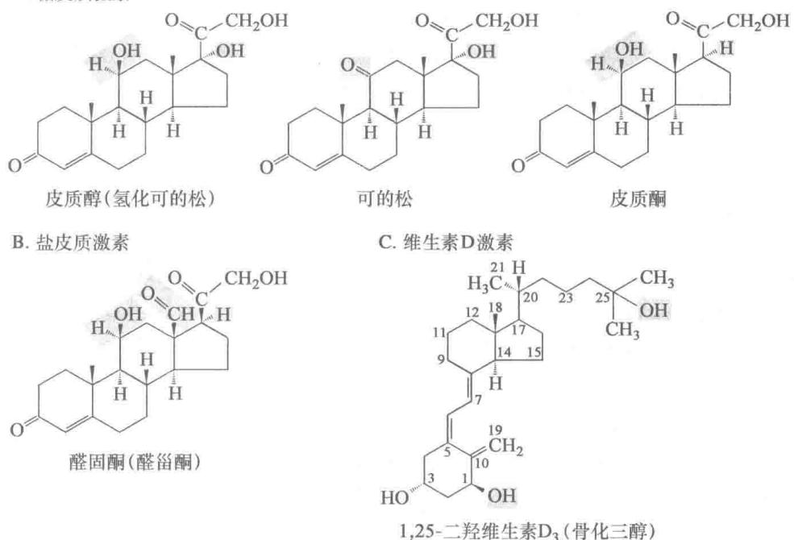  
1,25-二羟维生素 $D_{3}$ （骨化三醇）  
图 14-10 肾上腺皮质类固醇激素  
皮质激素结构中加阴影的基团在各成员之间有所不同，这里示出以便比较

A. 雄激素

  
图 14-11 几种性激素及其类似物(避孕药)的化学结构  
图中加阴影的基团，便于对雄激素（包括孕激素）和雌激素各自成员之间的结构比较

烯二酮(androstenedione)都属于雄激素,但它们的活性比睾酮低得多。

雄激素的生理功能是:在青春起始期促进性器官发育、精子生成和第二性征(如面部长须、喉部变大、骨骼肌发育等)的出现。此外睾酮也增强基础代谢,并影响行为。睾酮是男女性欲的基础。它不只是男性性活动的促进者，它也促进女性的性活动。实际上卵巢细胞和睾丸一样先合成的是睾酮，不过在卵巢中大部分被酶转化为雌二醇。因此卵巢主要分泌的是雌二醇。

（2）雌激素(estrogens):包括雌二醇(estradiol)、雌酮(estrone)、雌三醇(estriol)。其中以雌二醇的分泌量为最大,活性也最强,雌三醇的活性为最小,仅为雌二醇的二百分之一。这三种雌激素在体内可以互相转变。

雌激素的主要功能是:在青春期雌激素浓度升高时,促进女性性器官发育、子宫内膜增生、动情、及产生月经等;同时促进女性第二性征的出现:乳房发育、皮下脂肪积累,特别是在臀部和乳房,骨盆变宽等。

（3）孕激素(progenstogens):卵巢和胎盘都分泌孕激素,其主要成员是孕酮(progesterone),也称黄体酮。孕酮是许多甾类激素的前体。

孕激素的生理作用是:与雌激素一起建立和调节子宫周期,刺激子宫内膜从增生期转变为分泌期,在妊娠时抑制子宫的运动,促进乳腺小叶的生长以准备哺乳,总的结果有助于胎儿着床发育。

临床上应用的口服避孕药炔诺酮（norethindrone）和 $17\alpha-$ 乙炔雌二醇（ $17\alpha-$ ethynylestradiol）是人工合成的孕激素和雌激素的类似物（见图14-11）。它们的避孕成功率多在 $99\%$ 以上。避孕的原理是通过下丘脑-脑垂体-卵巢系统的反馈调节，抑制脑垂体促性腺激素的分泌，以达到抑制排卵和使子宫内膜不易受精和种植。

## （五）维生素D激素

维生素 D 激素常称骨三化醇, 是 $1\alpha, 25-$ 二羟维生素 $D_{3}$ (图 14-10C)。它在肝和肾中从维生素 D 经酶促羟基化而来; 维生素 D 从膳食中或暴露于日光下的皮肤中由 7-脱氢胆固醇光解获得 (见第 13 章)。

骨化三醇在维持 $Ca^{2+}$ 体内稳态(homeostasis)，调节血中 $[Ca^{2+}]$ 和 $Ca^{2+}$ 沉积与 $Ca^{2+}$ 从骨中动用之间的平衡中跟旁甲状腺激素协调工作。通过核内受体，骨化三醇激活小肠 $Ca^{2+}$ -结合蛋白质的合成，此蛋白质是吸收膳食 $Ca^{2+}$ 所必需的。膳食中维生素 D 不足或骨化三醇合成中有缺失，会导致严重的疾病如佝偻症，佝偻症患者骨骼软弱并畸形。

## （六）类视黄醇激素

类视黄醇激素是一类强力激素，通过核内类视黄醇受体调节细胞的生长、生存和分化。激素原全反-视黄醇（维生素 $A_{1}$ ，图10-24）主要是在肝从 $\beta-$ 胡萝卜素衍生而来，许多组织能把视黄醇转化为视黄酸（见第13章）。

所有的组织都是类视黄醇的靶组织，因为所有类型的细胞至少有一种核内类视黄醇受体。成人中最明显的靶组织包括角膜、皮肤、肺和气管的上皮和免疫系统，这些靶组织的特点是它们的细胞都不断地被更新。视黄酸调节为生长或分化所必需的蛋白质的合成。过量的维生素A（类视黄醇激素的前体）会引起分娩缺损，不推荐妊娠妇女使用被开发来治疗严重痤疮（粉刺）的视黄醇膏。

## (七) 甲状腺激素

甲状腺激素包括甲状腺素（thyroxine， $\mathrm{T}_{4}$ ）和三碘甲状原氨酸（triiodothyronine， $\mathrm{T}_{3}$ ）；它们是在甲状腺滤泡的上皮细胞中从碘化的甲状腺球蛋白（thyroglobulin）衍生而来。碘化是在甲状腺球蛋白（ $M_{r}660000$ ，每分子含115个Tyr残基）的酪氨酸残基上经酶促进行的。甲状腺激素的合成共分为3步：①聚碘；②碘的活化；③Tyr残基的碘化及 $\mathrm{T}_{4}$ 和 $\mathrm{T}_{3}$ 的生成（图14-12）。从肠胃道吸收的碘（ $\Gamma^{-}$ ），经血流进入甲状腺。甲状腺是体内吸收碘最强的组织，能聚集人体内的大部分碘。进入甲状腺上皮细胞的 $\Gamma^{-}$ 在甲状腺过氧化物酶和过氧化氢的作用下转化为活性碘；然后活性碘与甲状腺球蛋白上的Tyr残基作用，使之碘化成一碘酪氨酸残基和二碘酪氨酸残基，2个碘化的Tyr残基共价连接形成 $\mathrm{T}_{3}$ 和 $\mathrm{T}_{4}$ 残基。 $\mathrm{T}_{3}$ 和 $\mathrm{T}_{4}$ 以这种形式与甲状腺球蛋白结合，并被贮存在滤泡内（一般供几星期用的贮量）。需要时这种碘化的球蛋白重新回到滤泡细胞，经蛋白酶解转化为游离的 $T_{4}$ 和 $T_{3}$ ，并释放到血流中。 $T_{4}$ 的分泌量远大于 $T_{3}$ ，但到达靶细胞后，大部分 $T_{4}$ 被酶除去一个碘原子而转变为 $T_{3}$ 。 $T_{3}$ 的激素活性比 $T_{4}$ 强 5 到 10 倍。

  
图 14-12 甲状腺激素的化学结构和生物合成

甲状腺激素是通过核内受体，增加编码关键的分解代谢酶的基因表达，促进组织特别是肝和肌肉组织的产能代谢：加强线粒体中的氧化磷酸化，增加ATP的生成量，而ATP的增加又为核酸和蛋白质等的合成提供了能量；总的结果促进机体的生长和发育。甲状腺机能亢进（hyperthyroidism）的患者血流中的 $\mathrm{T}_{3}$ 和 $\mathrm{T}_{4}$ 过多，基础代谢率高，身体消瘦、神经紧张、心跳加快、出汗、颤抖，并有眼球突出的症状。甲状腺机能减退（hypothyroidism）的患者， $\mathrm{T}_{4}$ 和 $\mathrm{T}_{3}$ 分泌不足，基础代谢率下降，产能减小，患者不能正常生长、发育、精神和智力以及生殖器官的发育也都受到影响。小儿时期因甲状腺机能不全或因缺碘甲状腺激素合成受阻，则出现呆小症（cretinism）：体形小、智力低和性不能成熟。如果尽早给以甲状腺激素，可恢复正常发育。成人缺碘则出现曾称为“黏液性水肿”的症状，面部和手肿大，其实不是黏液在组织中积累，而是皮下结缔组织增厚的缘故。

## (八) 氧化氮

氧化氮( $NO^{\bullet}$ )(nitric oxide)是一个相对稳定的自由基,在NO合酶(NO synthase)催化的反应中从分子氧和精氨酸的胍基氮合成:

$$
\mathrm{精氨酸} + 3 / 2 \mathrm{NADPH} + 2 \mathrm{O} _ {2} \longrightarrow \mathrm{NO} ^ {\bullet} + \mathrm{瓜氨酸} + 2 \mathrm{H} _ {2} \mathrm{O} + 3 / 2 \mathrm{NADP} ^ {+}
$$

NO 合酶存在于很多组织和很多类型的细胞: 神经元、巨噬细胞、肝细胞、平滑肌肌细胞、血管内皮细胞和肾上皮细胞。NO 从产生的细胞扩散到并进入邻近的靶细胞, 在那里激活细胞溶胶的鸟苷酸环化酶 (GMP cyclase), 后者催化第二信使 cGMP 的产生 (见图 14-29), 进而通过 cGMP 依赖型蛋白激酶磷酸化关键蛋白质并改变其活性; 例如, 在心肌和血管壁平滑肌中收缩蛋白质的磷酸化使肌肉松弛, 血管扩张。冠心病患者常因心肌缺氧收缩引起疼痛, 舌下含服硝酸甘油片剂可以得到缓解, 就是这个道理, 因为硝酸甘油能释放出 NO。

C. 蜕皮激素

## 三、昆虫激素

昆虫激素发现较晚,但对它们的研究进展十分迅速。已知的昆虫激素种类较多,一类是昆虫的内激素(endohormone),另一类是昆虫的外激素(exohormone)。外激素更确切地应称为信息素,它们是由昆虫产生并释放到体外、作用于同种昆虫,引起生理效应的激素。

## （一）昆虫的内激素

昆虫的内激素,跟哺乳类激素一样,也是由内分泌腺体分泌并作用于同一个体、产生特定生理效应的。跟昆虫的生长、发育和变态有关的内激素有保幼激素、蜕皮激素和脑激素等。

## 1. 脑激素 (brain hormone)

脑激素是由昆虫前脑神经细胞分泌的一类促激素,促进昆虫前胸腺(prothoracic gland)释放蜕皮激素。脑激素的化学本质可能是多肽或蛋白质。

## 2. 保幼激素 (juvenile hormone)

保幼激素是由昆虫的一对咽侧体（corpora allata）产生并分泌的，因此也称咽侧体激素。保幼激素的主要作用是调节昆虫的生殖和发育，保持幼虫的特性，阻止其变态成蛹。通常快到变蛹时期便停止分泌保幼激素。根据这一性质，用极少量的保幼激素或其合成的类似物，可推迟蛹期的到来，使蚕体长得更大以增加吐丝量。这一研究成果已在我国蚕丝业中得到应用，并取得可喜效果。此外，保幼激素及其类似物很可能成为防治害虫比较理想的不孕剂。

天然保幼激素的化学本质是类异戊二烯酯,但对不同物种其结构略有变化;常见的有保幼激素Ⅰ、Ⅱ和Ⅲ(图14-13A)。

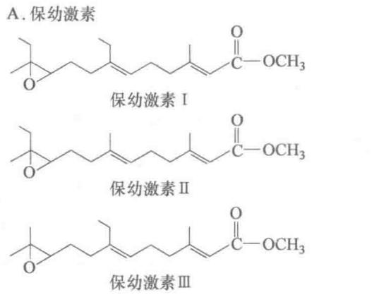

  
$(2\beta,3\beta,14\alpha,22[R],25-$ 五羟胆甾-7-烯-6-酮 $)$

  
图14-13 几种昆虫激素的化学结构

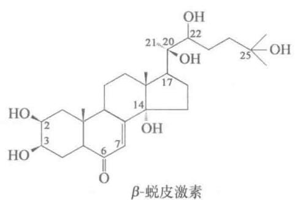  
$(2\beta,3\beta,14\alpha,20\beta,22[R],25-$ 六羟胆甾-7-烯-6-酮 $)$

## 3. 蜕皮激素 (ecdysone; molting hormone)

蜕皮激素是由昆虫的前胸腺分泌的，分泌受脑激素的促进。蜕皮激素的功能是控制昆虫变态，促进幼虫蜕皮、变蛹以致变成成虫。业已证明蜕皮激素是促进组织中RNA的合成，象哺乳动物中类固醇激素一样，直接控制转录而起作用。蜕皮激素的化学本质是类固醇，已知的主要有 $\alpha-$ 和 $\beta-$ 两种，它们的结构式

见图 14-13C。

值得注意的是,很多植物中存在昆虫激素物质,例如银杏中有保幼激素,罗汉松中有蜕皮素。虽然昆虫激素是昆虫生长发育需要的,但过量是有毒的。也许植物合成这些物质是保护自身免遭昆虫侵害。

## （二）昆虫的外激素

昆虫的信息素被分泌到体外后，极微量就能影响同种昆虫的行为，它们起着集结、追踪、性引诱等昆虫社会语言的作用。其中的性信息素或称性引诱剂被研究得最多，应用前景也最大，在害虫预测预报和防治方面已收到一定的效果。性信息素是由昆虫腹部末端生殖孔附近的一个分泌腺分泌的。目前已弄清楚的包括家蝇、蜜蜂、棉铃虫等几十种昆虫的性信息素的化学结构。例如雌性红棉铃虫（Pectinophora gossypiella）用以引诱雄性的性信息素是7,11-十六二烯醇乙酸酯(7,11-hexadecadienyl acetate)的顺，顺-和顺，反-异构体的混合物；舞毒蛾(Porthetria dispar)的性引诱剂是顺-7,8-环氧-2-甲基十八烷(cis-7,8-epoxy-2-methyloctadecane)(图14-13B)。

## 四、植物激素

目前已确定存在于植物体内的植物激素（plant hormone）有5种（或5类）：生长素、细胞分裂素、赤霉素、脱落酸和乙烯。其中细胞分裂素和赤霉素都不是一种而是一类结构和功能相似的物质。前面讲到的激素定义对植物激素也是基本适用的。不过植物激素都是从生长旺盛的组织如茎尖和根尖的分生组织中产生，没有高等动物所具有的专门分泌激素的内分泌腺。据现在所知，植物激素的作用机制和动物激素也很相似，但对植物激素的研究远未达到对动物激素研究的水平。简而言之，植物激素也是通过与靶细胞的受体结合而起作用的。5类植物激素对植物的生长和发育（细胞分化）都有影响。有些激素如生长素、细胞分裂素和赤霉素可以给靶细胞以分裂和伸长的信号，因而促进其生长；有些激素如脱落酸和乙烯给靶细胞以减缓分裂和伸长的信号，从而抑制其生长。一种植物激素的效应如何，跟它在植物体内的作用部位、植物的发育阶段以及激素的相对浓度有关。

## (一) 生长素

生长素（auxin）是研究植物向光性过程中发现的一种激素，也是植物界中最早发现的激素。生长素的化学本质是吲哚乙酸(indole acetic acid, IAA)(图14-14A)，它最先是在20世纪40年代从菠菜嫩芽和燕麦胚鞘中分离获得的。植物体内生长素含量很少，因为IAA随时合成又随时被酶分解的缘故。IAA是在枝条、苗等的顶端分生组织中合成的，合成的前体是色氨酸。合成后由上向下运输，其主要功能是促进幼茎细胞伸长。IAA低于促进茎生长的浓度能促进根的伸长，而促进茎生长的浓度，对根的生长却有明显的抑制作用。此现象说明：①同种激素在浓度不同时，对同种靶细胞的作用可能不同；②一定浓度的激素对不同种类的靶细胞影响可能也不同。

生长素也促进果实的生长，因此它在农业上得到广泛的应用。不过农业上使用的多为人工合成的生长素（特称之为生长调节剂），包括 $\alpha-$ 萘乙酸（NAA）、2,4-二氯苯氧乙酸(2,4-D)和吲哚丙酸(IPA)等（图14-14A）。使用低浓度的NAA可防止棉花过早落花落铃；向花上喷洒低浓度的2,4-D可以不经受粉就能长成果实，用这种方法已获得西红柿、黄瓜、茄子等的无子果实。

## （二）细胞分裂素

细胞分裂素(cytokinin)是一类能够刺激细胞分裂的化合物的统称。这类化合物都是腺嘌呤的衍生物，例如1955年首次被分离出来的一种细胞分裂素，称为激动素(kinetin)，是 $N^{6}$ -呋喃甲基腺嘌呤( $N^{6}$ -furfuryladenine)；1964年从受精15天的玉米种子中获得的另一种细胞分裂素，称为玉米素(zeatin)是 $N^{6}$ -(4-羟-3-甲基-2-丁烯)腺嘌呤；此外一种人工合成的细胞分裂素是 $N^{6}$ -苄基腺嘌呤(图14-14B)。

细胞分裂素是在植物体内生长旺盛的组织如根尖、胚和果实中合成的。细胞分裂素对植物生长和发育的影响是多方面的,例如促进核酸和蛋白质的合成、促进物质的调运和延缓器官的衰老(并因此对某些蔬菜和水果具有保鲜作用)等;但主要功能是促进细胞分裂和分化。在植物体内细胞分裂常受生长素浓度的影响。来自顶芽的生长素和来自根部的细胞分裂素是互相对抗的。当顶芽被摘除时,许多侧芽则发育成侧枝,植株变得繁茂,这是因为顶芽除去后,侧芽部位的生长素浓度下降,解除生长素对侧芽发育的抑制。

  
图14-14 几种植物激素的化学结构  
脱落酸的系统命名中 2Z 是指第二位双键为顺式,4E 指第四位双键为反式;Z 为德文 zusammen,意为“一起”,相当于拉丁文 cis,;E 为德文 entgegen,意为“相对”,相当于 trans

## （三）赤霉素

赤霉素(gibberellin)最先是从引起水稻“恶苗病”的真菌,赤霉菌(Gibberella fujikuroi)中分离出来的。后来的研究表明这种物质在高等植物中也普遍存在,其作用是调节植物的生长。恶苗病的原因是赤霉菌分泌的赤霉素剂量过高。

赤霉素不是单一成分的物质,目前已知的有60多种,因此它是一类化合物的总称。赤霉素按发现的前后次序分别标为 $A_{1}$ 、 $A_{2}$ 、 $A_{3}\cdots$ 。其中最熟知的是赤霉素 $A_{3}$ ,是一种一元酸,也称赤霉酸(gibberellic acid; $GA_{3}$ ),在植物体内常以葡糖苷形式(可能是一种贮存形式)存在; $GA_{3}$ 的化学结构中含有一个四个环的核,叫做赤霉核或赤霉烷,它是赤霉素类的母体化合物(图 14-14C)。

赤霉素在植物体内的合成部位是根尖和茎尖。赤霉素的作用也是多方面的，但最突出的作用是促进茎和叶的细胞伸长，这一点和生长素的作用很相似，但两者不完全相同，赤霉素对矮生植株具有明显刺激生长的作用，使它恢复正常高度，但对正常高度的植株则不再刺激其生长，而生长素的作用则没有这种区别。赤霉素还能影响果实发育，例如用赤霉素喷洒葡萄可以得到无子果实，并且果实也长得特别大。

## (四) 脱落酸

脱落酸(abscisic acid, ABA)是20世纪60年代从脱落的棉铃和一些木本植物如枫、桦等的叶中分离出来的。脱落酸在叶绿体和其他质体中合成，它的化学结构见图14-14D。

脱落酸的主要生理功能是:①抑制生长使多年生木本植物和种子进入休眠;②加速离层(abscission layer)产生,引起落花落叶;③促进气孔关闭。这些功能都与植物抵抗不利的生活条件或生长季节终了有关系。脱落酸的作用与前面几种激素的作用是相反的。例如赤霉素促进种子萌发,而脱落酸引起种子休眠。决定种子是否萌发是由这两种激素的浓度之比而不是它们的绝对浓度。决定芽是否休眠也是这样。

## (五) 乙烯

人们很早就知道乙烯与植物器官的成熟有关,而且也知道植物本身能合成乙烯,它的合成前体是S-腺苷甲硫氨酸。但确认乙烯是一种植物激素,还是20世纪60年代的事。乙烯不仅在成熟的果实中产生,也在许多其他组织中产生,而且发现生长素能刺激乙烯的产生。

乙烯的主要生理作用是引发果实的成熟(成熟是一个衰老过程)和其他衰老过程。成熟的果实和深秋的叶片都要从树上落下,促进果实或树叶的柄和茎托相连的数层细胞老化、死亡变成枯干的离层是乙烯和脱落酸等协调作用的结果。

由于乙烯是气体,对应用造成一定的困难,现已有人工合成的称为乙烯利的化合物即2-氯乙基膦酸(图14-14E),被子植物吸收后可释放出乙烯;国内已用于香蕉、柿子等果实的催熟。

## 五、信号转导概述

前面已经提及,信号转导(signal transduction)是指细胞外的信号(包括机械、化学和电信号等)被放大并转化为细胞内的化学变化(细胞应答)的过程。信号转导是活细胞的一个普遍性质。

## （一）信号转导的共同特点

## 1. 信号转导的专一性

信号转导是专一而敏感的。专一性是通过信号和受体之间的精确分子互补实现的。这种互补性，像酶-底物和抗体-抗原的相互作用一样，也是由一些弱力（非共价力）介导的。多细胞生物还有额外水平的专一性，因为一个给定信号的受体或一个给定信号途径的胞内靶只有在某些类型的细胞中存在。例如促甲状腺激素释放激素能触发垂体前叶细胞中的应答而不触发肝细胞中的应答，因为肝细胞缺乏这种激素的受体。又如肾上腺素能够改变肝细胞中的糖原代谢，但并不改变脂肪细胞中的糖原代谢；在这种情况下，两类细胞都有这种激素的受体，但肝细胞含有糖原和代谢糖原的酶，此酶可被肾上腺素激活，而脂肪细胞既无糖原也无此酶。脂肪细胞对肾上腺素的应答是从三酰甘油释放脂肪酸，并把它们输送到其他组织。

## 2. 信号转导的敏感性

在三个方面可以说明信号转导的敏感性:①受体对信号分子有高度亲和力;②受体-配体(信号分子)相互作用经常具有协同性;③酶级联对信号具有放大作用。

（1）亲和力 受体和信号(配体)之间的亲和力可以用解离常数 $K_{d}$ 来表示,常见的 $K_{d}$ 值在 $10^{-10}$ mol/L或更小,这意味着受体能检测出皮摩尔级浓度(pmol/L)的信号分子。受体-配体相互作用可通过Scatchard分析(Scatchard analysis)来定量,给出亲和力的量值和受体分子中结合部位的数目(图14-15)。

下面简单介绍一下 Scatchard 分析法: 当激素(一种配体, L)与靶细胞上或靶细胞内的受体蛋白质(R)专一并紧密结合时, 一个激素的细胞作用则开始了。结合是由在配体和受体的互补表面之间的非共价相互作用(氢键键合, 疏水相互作用和静电相互作用; 见第 1 章)介导的。配体-受体相互作用导致构象变化, 改变受体的生物活性; 这里受体可以是酶、酶的调节剂、离子通道或基因表达的调节物, 它们都是蛋白质。

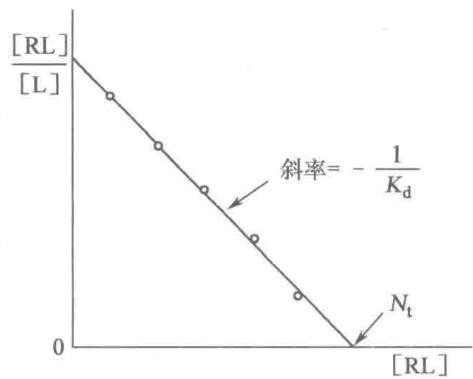  
图14-15 Scatchard作图  
$[\mathrm{RL}] / [\mathrm{L}]$ 对 $[\mathrm{RL}]$ 的作图可给出受体-配体（如激素）复合体的 $K_{\mathrm{d}}$ 和 $N_{\mathrm{t}}$

受体-配体结合可表达为下面的方程式：

$$
\begin{array}{r l r}{\mathrm{R}}&{+}&{\mathrm{L} \quad \rightleftharpoons \quad \mathrm{RL}}\\{(\text {受体})}&{}&{(\text {配体}) \quad \quad (\text {受体-配体复合体})}\end{array}
$$

这种结合,也跟酶和它的底物结合一样,决定于相互作用的组分的浓度,并可用平衡常数来描述:

$$
\mathrm{R} + \mathrm{L} \underset {k _ {- 1}} {\overset {k _ {+ 1}} {\rightleftharpoons}} \mathrm{RL}
$$

$$
K _ {\mathrm{a}} = \frac {[ \mathrm{RL} ]}{[ \mathrm{R} ] [ \mathrm{L} ]} = \frac {k _ {+ 1}}{k _ {- 1}} = \frac {1}{K _ {\mathrm{d}}}
$$

这里 $K_{a}$ 是结合常数, $K_{d}$ 是解离常数。

像酶-底物结合一样,受体-配体结合也是可饱和的。当较多配体加入到固定数量的受体时,被配体所占的受体分子分数增加。受体-配体亲和力的粗略量值可以由达到受体半饱和所需的配体浓度给出。利用受体-配体结合的Scatchard作图法,可以估算一个给定制剂的解离常数和受体中的结合部位数目。当结合达到平衡时,可能的结合部位总数目, $N_{t}$ ,等于[R]所代表的未被占部位的数目加上被占部位即被配体结合的部位数目[RL];也即 $N_{t}=\left[R\right]+\left[RL\right]$ 。未被结合的部位数目可以表达为总的部位数减去被占的部位数: $\left[R\right]=N_{t}-\left[RL\right]$ 。平衡表达式现在可以写为:

$$
K _ {\mathrm{a}} = \frac {[ \mathrm{RL} ]}{[ \mathrm{L} ] (N _ {\mathrm{t}} - [ \mathrm{RL} ])}
$$

重排以得到被受体结合的配体与游离的(未被结合的)配体之比：

$$
\frac {[ \mathrm{被结合的配体} ]}{[ \mathrm{游离的配体} ]} = \frac {[ \mathrm{RL} ]}{[ \mathrm{L} ]} = K _ {\mathrm{a}} (N _ {\mathrm{t}} - [ \mathrm{RL} ]) = \frac {1}{K _ {\mathrm{d}}} (N _ {\mathrm{t}} - [ \mathrm{RL} ])
$$

从此方程的斜率-截距形式可以看出， $[\mathrm{RL}] / [\mathrm{L}]$ 对[RL]作图应是直线，斜率为 $-1 / K_{\mathrm{d}} = -K_{\mathrm{a}}$ ，在横轴上的截距为结合部位的总数目 $N_{\mathrm{t}}$ （图14-15）。受体-配体相互作用典型的 $K_{\mathrm{a}}$ 值为 $10^{-9}$ 到 $10^{-11}\mathrm{mol / L}$ 之间，表明结合得非常紧密。

Scatchard 分析对最简单的情况是可靠的,但也像酶的 Lineweaver-Buck 作图,当受体是一种别构蛋白质,图就偏离线性。

（2）协同性 受体-配体相互作用中的协同性是指配体浓度的小变化则引起受体活性的大变化（参见第4章氧与血红蛋白结合的协同性）。

（3）级联放大 酶级联是指一个跟信号受体结合的酶被连续激活的反应链，即酶催化酶的生化序列。由于酶在反应中可以多次使用，所以一个酶分子在一步反应中能催化多个（假设10个）底物发生转化。如果底物也是酶（无活性形式），则在连续反应的第二步中能使 $10^{2}$ 个底物（无活性酶）发生转化。假设有 n 步这样的反应, 则最后一步的产物将是 $10^{n}$ 个分子。这就是级联放大 (cascade amplification)。可见, 级联中被作用分子以几何级数方式增加, 在几毫秒内产生几个数量级的放大。对一个信号的应答也必然这样终止, 即下游效应跟原刺激强度是成比例的。

## 3. 信号转导分子的模块性

相互作用的信号转导蛋白质具有模块性(modularity)，允许一个细胞能组合和匹配一套信号转导分子，以创建具有不同功能和细胞定位的复合体。许多信号转导蛋白质具有多结构域，能识别其他蛋白质中或细胞骨架或质膜中的专一特点；并因此单个的模块是多价的，允许这些模块组装成各种各样的多酶复合体。在这样的一些相互作用中一个共同的问题是一个模块信号蛋白质跟另一个蛋白质中的磷酸化残基结合；引起的相互作用可以通过配偶蛋白质的磷酸化和去磷酸化来调节。对级联中几个相互作用的酶具有亲和力的非酶促支架蛋白质(scaffold protein)使这些蛋白质聚集在一起，保证它们在特定细胞位置和特定时间内相互作用。

## 4. 受体系统的脱敏作用

受体系统的敏感性是修饰的主题。当一个信号连续出现时，受体系统则发生脱敏[作用]（desensitization），也即受体的活化触发了反馈循环，阻断受体把它从细胞表面除去；当刺激降到某一阈值时，系统重新变得敏感。当你从明亮的阳光下走进暗室或从暗处到亮处时，想想你的视觉转导系统会发生什么。

## 5. 转导系统的整合作用

信号转导系统最后值得注意的一个特点是整合(integration)。整合是指系统接受多信号并产生适合细胞或生物体需要的统一应答能力。不同的信号途径在几个水平上可以互相转换，产生复杂的“对话”（信息交流）以维持细胞和生物体的内稳态(homeostasis)。

## （二）信号转导的基本过程和基本类型

信号转导研究的新发现之一是在进化期间信号转导机制被保留的程度非常明显,虽然不同的生物学信号数目可能成千上万,并且这些信号引出的应答种类也很多,但转导所有这些信号的机器是由约10种基本类型的蛋白质所构成的。

各种信号转导系统,虽然触发器各不相同,但信号转导的基本过程对所有系统都是共同的:首先,一个信号跟受体发生相互作用;第二,被活化了的受体跟细胞机器相互作用,产生第二信使或细胞蛋白质活性发生变化;第三,靶细胞的代谢活动发生改变;最后,转导过程结束。

为阐述信号转导系统的这一基本过程,我们在下面介绍6种基本(或通用)的受体类型,并将在下面几节讨论这些受体各自参与的信号转导系统的分子细节。

（1）G 蛋白偶联受体 该受体是通过 GTP-结合蛋白质，或称 G 蛋白，间接地激活产生胞内第二信使的酶。这一类型的受体通过能检测出肾上腺素的 $\beta$ -肾上腺素能 [的] ( $\beta$ -adrenergic) 受体系统来说明。

（2）受体酪氨酸激酶 它们是质膜受体，也是一种酶。当其中一个受体被胞外配体激活，它则催化细胞溶胶或质膜中多个蛋白质的磷酸化，胰岛素受体是一个例子，表皮生长因子受体(EGFR)是另一个例子。

（3）受体鸟苷酸环化酶 它也是质膜受体，有一个酶促胞质侧结构域，这些受体在胞内的第二信使是环化鸟苷单磷酸(cGMP)，它激活细胞溶胶中的蛋白激酶，后者磷酸化细胞的蛋白质，并改变它们的活性。

（4）质膜门控离子通道 它们负责通道的开启和关闭(因此命名为门控)以应答化学配体的结合和跨膜电位的变化。这些通道是最简单的信号转导器(transducer)。乙酰胆碱离子通道是这种机制的一个例子。

（5）黏着受体 它们跟胞外基质(例如胶原蛋白)的大分子组分相互作用并给细胞骨架系统传达有关细胞迁移或与胞外基质黏着的指令。用整联蛋白可以说明这种类型的转导机制。

（6）核内受体 它们与专一配体（如雌激素）结合，改变专一基因的转录和翻译成细胞蛋白质的速率。因为类固醇激素是通过跟基因表达的调节有密切关系的机制行使功能的，所以本章只作简短介绍（见下面），有关细节将在第34章讨论。

## 六、G蛋白偶联受体和第二信使

信号转导机制是指胞外信号(包括内源和外源的)所携带的信息转换成胞内信使的接替机器和过程。

本节和下面几节将按受体分类介绍几个主要类型的信号转导机制(或系统)及其实例。考查这些机制在专一的生物学功能中是如何被整合的,以及细胞对激素、神经递质和生长因子这些信号的应答等。一个信号转导途径的最终结果是几个专一的靶细胞蛋白质被磷酸化,磷酸化作用改变了这些蛋白质的活性,因而激活了细胞。在整个讨论中我们强调生物信号转导的基本机制,强调这些基本机制对多种信号转导途径的适用性。

## （一）G 蛋白偶联受体和第二信使

顾名思义，G蛋白偶联受体（G protein-coupled receptor, GPCR）是跟G蛋白家族的一个成员紧密结合的受体；G蛋白是指鸟嘌呤核苷酸结合蛋白质（guanine nucleotide-binding protein）。有三个基本要素确定信号转导是通过GPCR进行的：①有一个具有7个跨膜螺旋段的质膜受体，②有一个往返在活性形式（与GTP结合的）和非活性形式（与GDP结合的）之间的G蛋白，③质膜中有一个受激活的G蛋白调节的效应[物]酶(effector enzyme)或离子通道。经激活的受体刺激的G蛋白，把被结合的GDP换成GTP，然后从被占的受体上解离下来，结合到附近的效应酶上，并改变酶的活性。接着，活化的酶产生第二信使，作用于下游的靶（蛋白质）。

人基因组编码约350个用来检测激素、生长因子和其他内原配体的GPCR和编码约500个作为嗅觉和味觉的受体蛋白质。GPCR涉及许多常见的人类疾病，包括变态反应，压抑症、盲症，糖尿病和各种具有严重健康后果的心血管疾病。市场上几乎一半的药物是瞄准GPCR的。例如介导肾上腺素作用的 $\beta-$ 肾上腺素能[的]受体是“ $\beta-$ 阻滞（断）剂”（bata-blocker）的靶子； $\beta-$ 阻滞剂是被用作像高血压、心律不齐、青光眼、焦虑和偏头疼等症状的处方药。至少有150个在人基因组中发现的GPCR仍是“孤儿受体”（orphan receptor）：它们的天然配体，尚未被鉴定出，因此我们对它们的生物学还一无所知。对生物学和药理学了解较清楚的 $\beta-$ 肾上腺素能受体就成为所有GPCR的原型。

第二信使（second messenger）是胞外信使（也称第一信使）与质膜中受体结合而产生的胞内物质，它们起着从质膜到胞内生化机器的信息转导者作用。已知的第二信使有cAMP、cGMP、 $\mathrm{Ca^{2+}}$ 、肌醇-1,4,5,-三磷酸（ $\mathrm{IP}_3$ ）和1,2-二酰基-sn-甘油（DAG）等，它们的结构和主要作用分别见图14-16和表14-4。

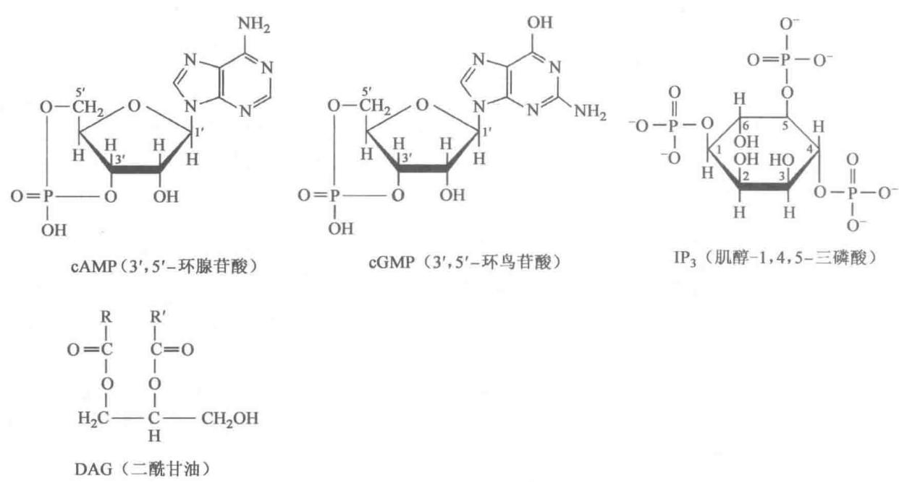  
图14-16 某些第二信使的化学结构

表 14-4 第二信使的作用

<table><tr><td>名称</td><td>主要作用</td><td>名称</td><td>主要作用</td></tr><tr><td>环腺苷酸(cAMP)</td><td>激活 cAMP 依赖型蛋白激酶</td><td>肌醇三磷酸( $IP_3$ )</td><td>促进从内质网中释放钙离子</td></tr><tr><td>环鸟甘酸(cGMP)</td><td>激活 cGMP 依赖型蛋白激酶</td><td>二酰甘油(DAG)</td><td>激活蛋白激酶 C</td></tr><tr><td>钙离子</td><td>激活钙调蛋白和其他的钙结合蛋白质</td><td></td><td></td></tr></table>

## （二） $\beta-$ 肾上腺素能受体系统通过第二信使起作用

当某一威胁要求生物体动员它的产能机器时，肾上腺素就会敲响警钟，发出信号表示需要战斗或者逃

离。当肾上腺素结合到肾上腺素敏感型细胞的质膜受体时，激素的作用就开始了。肾上腺素能[的]受体（adrenergic receptor），根据它们的亲和力和对一组激动剂和拮抗剂的应答不同，可分为4种类型： $\alpha_{1}, \alpha_{2}, \beta_{1}$ 和 $\beta_{2}$ 。激动剂（agonist）是指能够结合到一个受体并模仿其天然配体的效应的结构类似物；拮抗剂（antagonist）是指能够结合到该受体，但不触发正常的效应并因此阻断激动剂（包括生物配体）的效应的类似物。在某些情况，合成的受体激动剂或拮抗剂，其亲和力比天然的激动剂还大（图14-17）。这4种类型的肾上腺素能受体在不同的靶组织中被找到，它们介导对肾上腺素的不同应答。这里我们主要介绍肌肉、肝和脂肪组织中的 $\beta-$ 肾上腺素能受体。这些受体介导燃料代谢方面的变化，包括糖原和脂肪降解的加速（见本书代谢部分）。 $\beta_{1}$ 和 $\beta_{2}$ 亚型的肾上腺素能受体是通过同样的机制起作用的，所以“ $\beta-$ 肾上腺素能”的机制一样适用于这两种亚型。

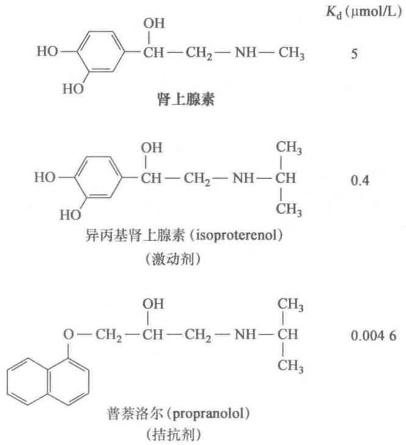  
图 14-17 肾上腺素及其人工合成的类似物  
用受体-配体复合体的解离常数表示肾上腺素及其类似物对它的受体亲和力

像所有的 GPCR 一样, $\beta-$ 肾上腺素能受体也是一种膜内在蛋白质,具有 7 段含 20 到 28 个氨基

酸残基的疏水螺旋区，它们像蛇形来回弯曲跨膜7次，所以又称GPCR为七螺旋受体（heptohelical receptor）。肾上腺素与受体上位于质膜深处的一个结合部位结合（图14-18，步骤①）促进受体胞内结构域的构象变化，从而影响受体与被结合G蛋白的相互作用，促进GDP的解离和GTP的结合（步骤②）。所有GPCR中的G蛋白都是杂三聚体，由3个不同的亚基 $(\alpha, \beta$ 和 $\gamma)$ 组成。因此这样的G蛋白也称为三聚体G蛋白（trimeric G protein）。在此场合，G蛋白也指结合GDP或GTP的 $\alpha$ 亚基，它把来自被激活受体的信号转导给效应[物]蛋白质。因为这个G蛋白能激活它的效应物，所以又被称为刺激[性]G蛋白（stimulatory G protein）或 $\mathbf{G}_{\mathrm{s}}$ 。像其他G蛋白一样， $\mathbf{G}_{\mathrm{s}}$ 起一个生物学“开关”的作用：当 $\mathbf{G}_{\mathrm{s}}$ 的核苷酸结合位点（在 $\alpha$ 亚基上）被GTP占据时，开关 $(\mathbf{G}_{\mathrm{s}})$ 被接通，能激活它的效应蛋白质（本例中是腺苷酸环化酶）；此位点被GDP占据时 $\mathbf{G}_{\mathrm{s}}$ （开关）则被断开。在活性形式， $\mathbf{G}_{\mathrm{s}}$ 中的 $\beta$ 和 $\gamma$ 亚基作为一个 $\beta \gamma$ 二聚体与 $\alpha$ 亚基解离，携有结合GTP的 $\alpha$ 亚基 $(\mathbf{G}_{\mathrm{s}\alpha})$ 在膜平面上从受体移至附近的腺苷酸环化酶分子（图14-18，步骤③）。 $\mathbf{G}_{\mathrm{s}\alpha}$ 通过共价连接的棕榈酰基被锚定在膜上（参见图10-31）。

腺苷酸环化酶(adenylyl cyclase)是质膜的一个内在蛋白质,在胞质侧有它的活性部位。活性 $G_{s\alpha}$ 与腺苷酸环化酶结合促进环化酶催化从 ATP 合成 cAMP 的反应(图 14-18 步骤④),升高细胞溶胶的 [cAMP]。 $G_{s\alpha}$ 和腺苷酸环化酶之间的相互作用,只有当 $G_{s\alpha}$ 跟 GTP 结合时才有可能。

$G_{s\alpha}$ 的刺激作用是自我限制的； $G_{s\alpha}$ 本身具有 GTP 酶的活性，能把结合的 GTP 转变为 GDP（并释出 Pi）

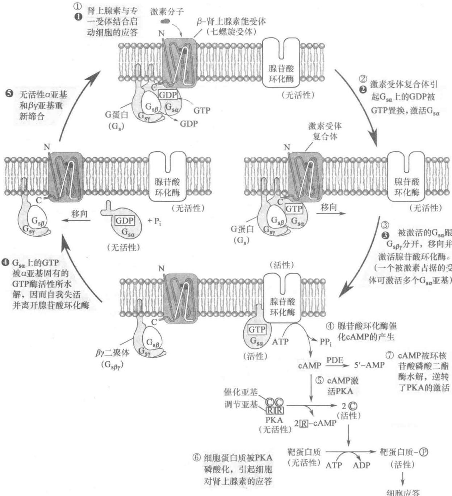  
图 14-18 肾上腺素信号转导: $\beta$ -肾上腺素能途径

肾上腺素信号转导机制由7个步骤(①至⑦)组成,这些步骤在正文中进一步讨论。质膜中同样的腺苷酸环化酶分子既可受图中所示的 $G_{s}$ 调节,也可受 $G_{i}$ (抑制G蛋白,图中未示出)调节, $G_{s}$ 和 $G_{i}$ 处于不同激素的影响下。诱导GTP与 $G_{i}$ 结合的激素引起腺苷酸环化酶的抑制,造成细胞的[cAMP]降低。步骤①至⑤表示二进制开关 $G_{s\alpha}$ 完成“开”和“关”一个循环

而使 $G_{s\alpha}$ 失活。这时无活性的 $G_{s\alpha}$ 与腺苷酸环化酶解离，使环化酶回到无活性状态。 $G_{s\alpha}$ 与 $\beta\gamma$ 二聚体 $(G_{s\beta\gamma})$ 重新缔合，无活性的 $G_{s}$ 又可用来跟结合有激素的受体相互作用。至此 $G_{s\alpha}$ 完成“开”（接通，on）和“关”（断开，off）一轮循环（图 4-18，步骤①-⑤）。

$G_{s\alpha}$ 不是唯一起生物学“开关”作用的蛋白质。在有 GPCR 参与的信号转导系统中和涉及膜融合或裂殖的许多过程中，各式各样的 G 蛋白都起着二进制的（binary）接通/断开（on/off）的分子开关作用。图 14-18 中步骤①至③是开关接通过程，④和⑤是断开过程。

肾上腺素是通过增加[cAMP]发挥它的下游效应的，而[cAMP]的增加是腺苷酸环化酶被激活的结果。然后环式AMP通过别构作用能激活cAMP依赖型蛋白激酶（cAMP-dependent protein kinase），它也称蛋白激酶A或PKA（图14-18步骤⑤），PKA催化靶蛋白质（包括糖原磷酸化酶b激酶）的专一Ser或Thr残基的磷酸化,此酶被磷酸化则有活性,在肾上腺素发出需要能量的预告信号时,能够立刻动员肌肉和肝中的糖原贮备。

无活性形式的 PKA 含有二个相同的催化亚基(C)和两个相同的调节亚基(R)(图 14-19)。四聚体复合体 $R_{2}C_{2}$ 是无催化活性的, 因为每个 R 亚基的自抑制结构域占据了每个 C 亚基的底物结合裂隙 (substrate-binding cleft)。当 cAMP 结合到 R 亚基, 亚基发生构象变化, 把 R 亚基的自抑制结构域 (autoinhibitory domain) 从 C 亚基的催化结构域移出, $R_{2}C_{2}$ 复合体解离出两个游离的有催化活性的 C 亚基。同样的基本机制——自抑制结构域的置换——介导第二信使别构激活多种类型的蛋白激酶(图 14-24)。PKA 的底物结合裂隙结构是所有已知蛋白激酶的原型; 此裂隙区内的某些残基对所有 1000 多种已知的蛋白激酶都是一样的。每个催化亚基的 ATP 结合位点都把 ATP 安置得完全有利其末端( $\gamma$ ) 磷酸基转移到 Ser 或 Thr 残基侧链的一OH。

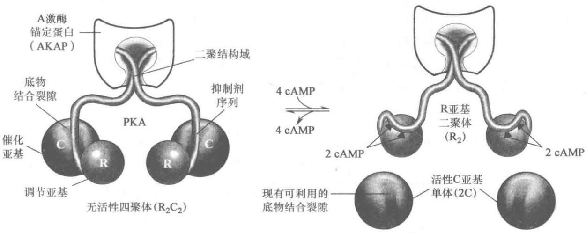  
图 14-19 cAMP 依赖型蛋白激酶 (PKA) 的激活  
R亚基的氨基端序列相互作用形成 $\mathbb{R}_2$ 二聚体，此处也是跟A激酶锚定蛋白（AKAP）结合的部位

如图 14-18(步骤⑥)所指, PKA 是调节信号转导途径中下游的几个酶(表 14-5)。虽然这些下游靶酶有各种各样的功能,但它们在待磷酸化的 Ser 或 Thr 残基处都有一个序列相似的区域,这一序列是为便于 PKA 调节靶酶所做的标记。PKA 的底物结合裂隙识别这些序列,并对其 Thr 或 Ser 残基进行磷酸化。比较了 PKA 的各种蛋白质底物的序列已得出这一共有(一致)序列 (consensus sequence)——为标出一个待磷酸化的 Ser 或 Thr 残基所需的几个相邻残基(表 14-5)。

表 14-5 PKA 催化某些酶或其他蛋白质的 cAMP-依赖型磷酸化

<table><tr><td>酶或蛋白质</td><td>被磷酸化序列 $^{\text{1}}$ </td><td>被调节的途径或过程</td></tr><tr><td>糖原合酶</td><td>RASCTSSS</td><td>糖原合成</td></tr><tr><td>磷酸化酶b激酶</td><td></td><td></td></tr><tr><td>α亚基</td><td>VEFRRLSI</td><td rowspan="2">糖原降解</td></tr><tr><td>β亚基</td><td>RTKRSGSV</td></tr><tr><td>丙酮酸激酶(大鼠肝)</td><td>GVLRRASVAZL</td><td>糖酵解</td></tr><tr><td>丙酮酸脱氢酶复合体(L型)</td><td>GYLRRASV</td><td>丙酮酸→乙酰-CoA</td></tr><tr><td>激素敏感型脂酶</td><td>PMRRSV</td><td>三酰甘油动员和脂肪酸氧化</td></tr><tr><td>磷酸果糖激酶-2/2,6-二磷酸果糖磷酸酶</td><td>LQRRRGSSIPQ</td><td>糖酵解/糖异生</td></tr><tr><td>酪氨酸羟化酶</td><td>FIGRRQSL</td><td>L-多巴、多巴胺、去甲肾上腺素和肾上腺素的合成</td></tr><tr><td>组蛋白H1</td><td>AKRKASGPPVS</td><td>DNA缩合</td></tr><tr><td>酶或蛋白质</td><td>被磷酸化序列 $^1$ </td><td>被调节的途径或过程</td></tr><tr><td>组蛋白 H2B</td><td>KKAKASRKESYSVYVYK</td><td>DNA 缩合</td></tr><tr><td>心受磷蛋白(心泵调节器)</td><td>AIRRAST</td><td>胞内的 $[Ca^{2+}]$ </td></tr><tr><td>蛋白质磷酸酶-1 抑制剂-1</td><td>IRRRRPTP</td><td>蛋白质去磷酸化</td></tr><tr><td>PKA 共有序列 $^2$ </td><td>xR[RK]x[ST]B</td><td>多项</td></tr></table>

① 被磷酸化的 S 或 T 残基用阴影表示。所有残基都用单字母符号（见表 2-1）。② x 是任一种氨基酸，B 是任一疏水性氨基酸。方括号内代表一个给定位置，其中列出可接受的氨基酸如 [RK] 意思是 Arg 或 Lys。

像在许多信号转导途径中那样，通过腺苷酸环化酶的信号转导也必然伴有一些放大最初激素信号的步骤（图14-20）。首先，一个激素分子与一个受体分子的结合催化多个逐个地跟活性受体缔合的 $G_{s\alpha}$ 分子的激活；接着，每一活性 $G_{s\alpha}$ 分子激活一个腺苷酸环化酶分子，然后环化酶催化多个cAMP分子的合成。产生的第二信使cAMP再激活PKA，每一PKA分子催化多个靶蛋白分子——图14-20中磷酸化酶b激酶——的磷酸化。此激酶再激活糖原磷酸化酶b，后者导致快速动用糖原中的葡萄糖。反应级联的净效果是激素信号放大几个数量级。这说明对激素活动所需的肾上腺素（或任何其他激素）浓度是很低的。

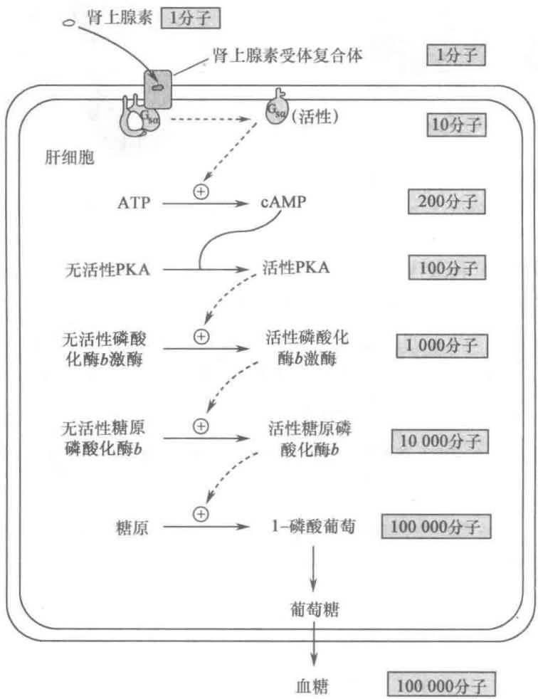  
图14-20 肾上腺素级联放大  
图中所示分子数目仅为图解放大之用,数字几乎肯定是低估的。一分子肾上腺素与细胞表面上一个肾上腺素受体结合则可逐个地激活若干个(可能上百个)G蛋白(因为激活一个PKA催化亚基需要2个cAMP分子,所以这一步信号没有放大)

## （三）终止 $\beta$ -肾上腺素能应答的几种机制

从效用角度来讲,激素刺激或其他刺激结束后,信号转导系统必需关闭,并且关闭信号的机制是所有信号转导系统所固有的。大多数系统也适应于信号的持续存在,这是通过脱敏过程中降低对信号的敏感性来达到的。 $\beta$ -肾上腺素能系统可以说明这两种情况。当血液中的肾上腺素浓度降到低于受体的 $K_{d}$ 时,激素就从受体上解离下来,后者重新采取无活性构象,这种构象不再能够激活 $G_{s}$ 。这是第一种终止机制。

终止对 $\beta$ -肾上腺素能刺激应答的第二种机制是结合在 $G_{\alpha}$ 亚基上的 GTP 被 G 蛋白固有的 GTP 酶活性催化水解。结合的 GTP 转化为 GDP 有利于 $G_{\alpha}$ 回到它与 $G_{\beta\gamma}$ 亚基缔合的构象——不能与腺苷酸环化酶相互作用的即不能激活腺苷酸环化酶的构象。这就终止了 cAMP 的产生。 $G_{s}$ 钝化（失活）的速率取决于 GTP 酶的活性， $G_{\alpha}$ 的 GTP 酶活性单独是很微弱的。然而 GTP 酶激活剂蛋白质（GTPase activator protein, GAP）强力刺激 GTP 酶活性，能引起 G 蛋白更快失活。GAP 本身可受其他因素的调节，提供对 $\beta$ -肾上腺素能应答的细调。终止应答的第三种机制是除去第二信使：cAMP 被环核苷酸磷酸二酯酶（cyclic nucleotide phosphodiesterase）水解为 $5^{\prime}-AMP$ （无第二信使活性）（图 14-18 步骤⑦）。

最后，在信号转导途径的末尾，由酶磷酸化引起的代谢效应被磷蛋白磷酸酶（phosphoprotein phosphatase）的作用所逆转。此酶水解磷酸化了的Ser、Thr或Tyr残基，释放出无机磷（Pi）。在人基因组中大约有150个基因是编码磷蛋白磷酸酶的，比编码蛋白激酶的数目（约500个）要少些。已知这些磷酸酶中有一些是可调节的；其他一些可能是起组成成分的作用。当[cAMP]下降和PKA回到无活性形式时（图14-18，步骤⑦），由于这些磷酸酶的存在，磷酸化和去磷酸化之间的平衡倾向于去磷酸化一方。

## （四） $\beta-$ 肾上腺素能受体由于磷酸化和与 $\beta-$ 抑制蛋白缔合而脱敏

当信号刺激结束，上述的信号终止机制则见效。一个比较特殊的终止机制——脱敏作用，甚至当信号继续存在，就已降低或停止应答。 $\beta-$ 肾上腺素能受体的脱敏是由一个蛋白激酶介导的，此酶在受体的胞内结构域上使之磷酸化，在正常情况下此结构域是跟 $G_{s}$ 相互作用的（图14-21）。当受体被肾上腺素占据时， $\beta-$ 肾上腺素能受体激酶或称 $\betaARK$ （也常称GRK2）则磷酸化质膜胞质侧的受体羧基端附近的几个Ser残基。 $\betaARK$ 通常位于细胞溶胶中，由于跟 $G_{s\beta\gamma}$ 亚基缔合而被拉向质膜，这样的定位便于受体的磷酸化。

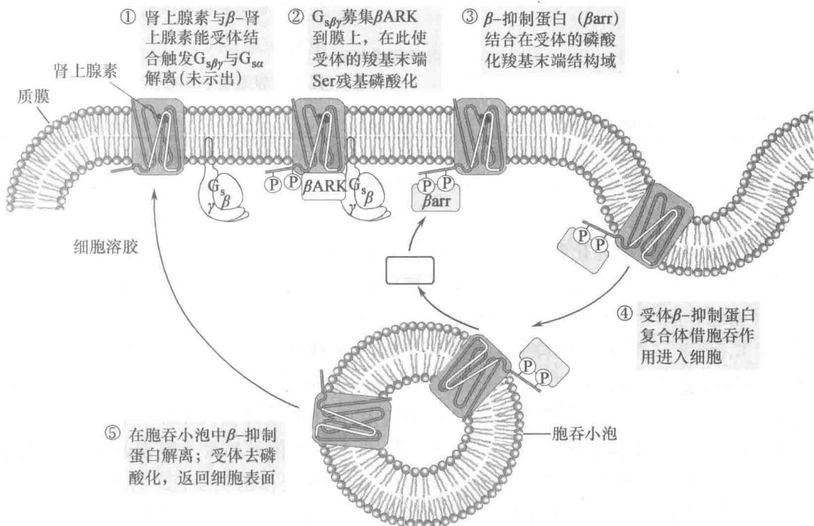  
图 14-21 在肾上腺素持续存在下 $\beta$ -肾上腺素能受体的脱敏（仿自 Nelson D L, Cox M M. Lehninger Biochemistry, 6th ed.）

受体磷酸化为 $\beta-[视紫红质]$ 抑制蛋白 ( $\beta-arrestin, \beta arr$ ) 创建了一个结合部位, $\beta-$ 抑制蛋白的结合有效地阻止受体和 G 蛋白之间进一步相互作用。 $\beta-$ 抑制蛋白的结合也促进受体的隐藏 (sequestration), 受体分子通过胞吞作用 (质膜内陷) 从质膜移入胞内小泡。在过程中 $\beta-$ 抑制蛋白-受体复合体募集了与此小泡形成有关的两个蛋白质, 网格蛋白 (clathrin) 和 AP-2 复合体, 它们启动了膜的内陷 (invagination), 导致含肾上腺素能受体的内吞小泡 (endosome) 的形成。在这种状态, 受体不能接近肾上腺素, 因而无活性。内吞小泡中的受体最终被去磷酸化, 并返回到质膜, 完成循环, 重新使系统对肾上腺素敏感。 $\beta-$ 肾上腺素能受体激酶 ( $\beta ARK$ ) 是 G 蛋白偶联受体激酶 (GRK) 家族的一个成员, 所有成员都是在 GPCR 羧基端的胞质结构域上使受体磷酸化, 并起着类似 $\beta ARK$ 在它们脱敏和重致敏中的作用。在人基因组中至少有 5 个编码不同的 GRK 和 4 个编码不同的抑制蛋白的基因; 每个 GRK 能够脱敏 GPCR 的一个特定亚基, 每个抑制蛋白能够跟多种不同类型的磷酸化受体相互作用。

## （五）cAMP 是多种调节分子的第二信使

肾上腺素是通过改变胞内的[cAMP]而改变PKA活性起作用的各种激素、生长因子和其他调节分子之一(表14-6)。例如胰高血糖素与脂肪细胞的质膜中受体结合，并通过 $\mathrm{G}_{\mathrm{s}}$ 蛋白，激活腺苷酸环化酶。由此而升高的[cAMP]刺激了PKA，后者磷酸化并激活对动员贮存脂肪的脂肪酸关键的两种蛋白质。同样，垂体前叶产生的一种促激素ACTH跟肾上腺皮质中专一的受体结合，激活腺苷酶环化酶和升高胞内的[cAMP]。然后PKA磷酸化并激活为合成皮质醇和其他类固醇激素所需的几种酶。在许多类型细胞中PKA的催化亚基也能移入核内，在这里磷酸化cAMP应答元件结合蛋白（cAMP response element binging protein, CREB), CREB改变由cAMP调节的专一基因的表达。

表 14-6 利用 cAMP 作为第二信使的某些信号分子

<table><tr><td>促肾上腺皮质激素(ACTH)</td><td>增味剂(多种)</td></tr><tr><td>多巴胺 $[D_1, D_2]^{1}$ </td><td>甲状旁腺激素肽</td></tr><tr><td>肾上腺素( $\beta$ -肾上腺素能的)</td><td>前列腺素 $E_1, E_2 (PGE_1, PGE_2)$ </td></tr><tr><td>促卵泡激素(FSH)</td><td>五羟色胺[5-HT-1a,5-HT-2]</td></tr><tr><td>胰高血糖素</td><td>生长激素释放抑制因子(生长抑素)</td></tr><tr><td>组胺( $H_2$ )</td><td>增甜剂(甜,苦)</td></tr><tr><td>促黄体生成素(LH)</td><td>促甲状腺激素(TSH)</td></tr><tr><td>促黑[素细胞]激素(MSH)</td><td></td></tr></table>

① 方括号中是受体亚型。亚型可以有不同的转导机制。例如，五羟色胺在某些组织中被受体亚型 5-HT-1a 和 5-HT-1b 所检测，它是通过腺苷酸环化酶和 cAMP 起作用的；在其他组织中被受体亚型 5-HT-1c 所检测，并通过磷脂酶 C-IP $_{3}$ 机制起作用（见表 14-7）。

某些激素通过抑制腺苷酸环化酶起作用，因此降低[cAMP]和抑制蛋白质的磷酸化。例如，生长激素释放抑制因子(GHIF)与其受体结合导致抑制性G蛋白(inhibitory G protein, $G_{i}$ )的激活； $G_{i}$ 在结构上是跟 $G_{s}$ 同源的，它抑制腺苷酸环化酶，降低[cAMP]。因此GHIF与胰高血糖素的效应是相抗衡的。在脂肪组织中，前列腺素 $E_{1}(PGE_{1}, 图10-21)$ 抑制腺苷酸环化酶，因此降低[cAMP]和减慢由肾上腺素和胰高血糖素触发的脂质储备的动员。在一些其他组织中 $PGE_{1}$ 促进cAMP合成：其受体通过刺激性G蛋白( $G_{s}$ )与腺苷酸环化酶偶联。在携有 $\alpha_{2}$ -肾上腺素能受体的组织中，肾上腺素降低[cAMP]；在这种情况，受体通过抑制性G蛋白( $G_{i}$ )被偶联在腺苷酸环化酶上。简言之，一个胞外信号如肾上腺素或 $PGE_{1}$ 对不同组织或细胞类型可以有极其不同的效应，这取决于3个因素：①组织中受体的类型，②与受体偶联的G蛋白的类型( $G_{s}$ 或 $G_{i}$ )，③细胞中那套PKA靶酶。通过总和增加[cAMP]和降低[cAMP]这两种影响，一个细胞完成了信号的整合，整合是信号转导机制的一个共同特征。

还有一个原因可以解释如此众多类型的信号是如何能够被单一的第二信使(cAMP)所介导的。这个原因就是信号转导过程被衔接[器]蛋白质（adaptor protein）限制在细胞的专一区域。衔接蛋白质是一类非催化[性]蛋白质，能把一些担当合作者角色的其他蛋白质分子结合在一块。

A 激酶锚定蛋白(A kinase anchoring protein, AKAP)是多价的衔接蛋白质;一部分与 PKA 的 R 亚基结合(图 14-19),另一部分与细胞中专一的结构结合,限制 PKA 在该结构的附近。例如专一的 AKAP 把 PKA 结合在微管,肌动蛋白丝,离子通道、线粒体或核上。不同类型的细胞有不同的一套 AKAP,所以 cAMP 可以刺激一个细胞中的线粒体蛋白质的磷酸化,在另一个细胞中刺激肌动蛋白丝的磷酸化。在某些情况,一个 AKAP 把 PKA 与 PKA 激活触发的酶(腺苷酸环化酶)或与终止 PKA 作用的酶(cAMP 磷酸二酯酶或磷蛋白磷酸酶)连接在一起。推测,这些激活性的和钝化性的酶安排得如此紧密是为了获得一个高度局限性和非常短暂性的应答。

现在明白了,想要完全了解细胞的信号转导,研究者们需要有精确到足以在亚细胞水平和实际时间上检测和研究信号转导过程的时空方面的工具。在研究生物化学变化的胞内定位时,生物化学遇上了细胞生物学,跨学科的一些技术成为了解信号转导途经所必需。像荧光探针已广泛地应用于信号转导研究。用荧光标记物如绿色荧光蛋白质(GFP)标记功能蛋白质,揭示了它们的亚细胞定位。两个蛋白质(例如PKA的R和C亚基)的结合状态变化可以通过连接在每个蛋白质上的荧光探针之间能量的非辐射转移(此项技术称为荧光共振转移)来了解。

## （六）二酰甘油、肌醇三磷酸和 $Ca^{2+}$ 也是第二信使

第二大类 G 蛋白偶联受体(GPCR)是通过 G 蛋白与质膜的磷脂酶 C(PLC)相偶联, PLC 是膜的磷脂酰肌醇 4,5-二磷酸(缩写为 $\mathrm{PIP}_{2}$ ; 见表 10-4)所专一的。当通过此机制起作用的一种激素(表 14-7)与质膜中专一的受体结合时(图 14-22, 步骤①), 受体-激素复合体催化结合在 G 蛋白 $(\mathrm{G}_{\mathrm{q}})$ 上的 GTP 和 GDP 进行交换(步骤②)并激活 $\mathrm{G}_{\mathrm{q}}$ , 激活方式与肾上腺素能受体激活 $\mathrm{G}_{\mathrm{s}}$ 很相似(图 14-18)。激活了的 $\mathrm{G}_{\mathrm{q}}$ 激活 $\mathrm{PIP}_{2}$ 专一的磷脂酶 C(图 14-22, 步骤③), 后者催化两个强力的第二信使, 二酰甘油和肌醇 1,4,5-三磷酸 $(\mathrm{IP}_{3})$ (图 14-16) 的产生。

表 14-7 通过磷脂酶 C、IP $_{3}$ 和 Ca $^{2+}$ 起作用的某些信号

<table><tr><td>乙酰胆碱[毒蝇蕈碱 $M_{1}$ ] $^{\text{1}}$ </td><td>胃泌素释放肽</td><td>血小板衍生生长因子(PDGF)</td></tr><tr><td> $α_{1}$ -肾上腺素能激动剂</td><td>谷氨酸</td><td>五羟色胺[5-HT-1c]</td></tr><tr><td>血管生成素</td><td>促性腺激素释放因子(GnRF)</td><td>促甲状腺素释放因子</td></tr><tr><td>血管紧张肽II</td><td>组胺[ $H_{1}$ ]</td><td>血管升压素</td></tr><tr><td>ATP[ $P_{2x},P_{2y}$ ]</td><td>光(果蝇属,Drosophila)</td><td></td></tr><tr><td>生长素(auxin)</td><td>催产素</td><td></td></tr></table>

① 方括号中指受体亚型，见表 14-6。

肌醇三磷酸 $(\mathrm{IP}_3)$ 是一种水溶性化合物，从质膜可扩散到内质网（ER），在这里它跟专一的 $\mathrm{IP}_3$ -门控 $\mathrm{Ca^{2+}}$ 离子通道结合，使通道打开。SERCA泵（sarcoplasmic/endoplasmic reticulum $\mathrm{Ca^{2+}}$ ATPase pump；肌质网/内质网 $\mathrm{Ca^{2+}}$ ATP酶泵）的作用是保证内质网中的 $[\mathrm{Ca}^{2+}]$ 比细胞溶胶中的 $[\mathrm{Ca}^{2+}]$ 高几个数量级；因此当这些门控 $\mathrm{Ca^{2+}}$ 通道打开时， $\mathrm{Ca^{2+}}$ 立即冲进细胞溶胶（图14-22，步骤⑤），细胞溶胶的 $[\mathrm{Ca}^{2+}]$ 很快升到约 $10^{-6}\mathrm{mol / L}$ 。 $[\mathrm{Ca}^{2+}]$ 升高的一个效应是激活蛋白激酶C(PKC)。在激活PKC过程中，二酰甘油与 $\mathrm{Ca^{2+}}$ 协作，因此它们也起第二信使的作用(步骤⑥)。激活作用包括一个PKC结构域（假底物结构域）从它在酶的底物结合区上的位置移开，这样可以允许此酶与含有PKC共有序列——它是为PKC所识别并嵌有Ser或Thr残基的氨基酸序列——的蛋白质结合并使之磷酸化(步骤⑦)。PKC有几种同工酶，每种都有自己特定的组织分布、靶蛋白专一性和作用。这些靶蛋白包括细胞骨架蛋白、酶和调节基因表达的核内蛋白。总之，这个酶家族有着广泛的细胞作用，例如影响神经元和免疫的功能以及细胞分裂的调节。

  
图14-22 激素激活磷脂酶C和 $\mathrm{IP}_3$  
(仿自 Nelson D L, Cox M M. Lehninger Biochemistry, 6th ed.)

## （七）钙是时空上定位的第二信使

人们很早就知道钙离子与许多生理活动过程有关, $Ca^{2+}$ 作为第二信使触发胞内的应答,如应答神经元和内分泌细胞的胞吐、糖原代谢、肌肉收缩、神经递质释放和阿米巴运动时的细胞骨架重排等。钙离子之所以能胜任这一角色是因为:①细胞内 $Ca^{2+}$ 浓度可以大幅度地发生变化,② $Ca^{2+}$ 能够与蛋白质上的多个负电荷氧(主要来自Asp和Glu残基侧链的羧基)很好地结合,从而促进蛋白质构象的改变。一般在未被激动的细胞中细胞溶胶的 $\left[Ca^{2+}\right]$ 保持在很低水平( $<10^{-7}mol/L$ ),这比胞外环境(包括胞内的内质网和线粒体)中的浓度低几个数量级。细胞溶胶 $\left[Ca^{2+}\right]$ 之所以能保持在这样低的水平是由于ER、线粒体和质膜上的 $Ca^{2+}$ 泵作用以及胞内含有丰富的可溶性磷酸盐, $Ca^{2+}$ 极易形成不溶性的磷酸钙。激素、神经和其他的刺激或是引起通过质膜上专一的 $Ca^{2+}$ 通道从胞外流入 $Ca^{2+}$ ,或是引起被隔离在ER或线粒体中的 $Ca^{2+}$ 释放,任一种情况都可以在瞬间使细胞溶胶的 $\left[Ca^{2+}\right]$ 骤然升高,触发细胞应答。

胞内的 $\left[\mathrm{Ca}^{2+}\right]$ 变化能被 $\mathrm{Ca}^{2+}$ 结合蛋白质 $(\mathrm{Ca}^{2+}$ -binding protein) 检测出, $\mathrm{Ca}^{2+}$ 结合蛋白质调节各种 $\mathrm{Ca}^{2+}$ 依赖型酶。钙调蛋白 (calmodulin), 缩写为 CaM, 是一条由 148 个氨基酸残基组成的多肽链, $M_{\mathrm{r}}$ 16700; CaM 是一种酸性蛋白质, 具有 4 个高亲和力的 $\mathrm{Ca}^{2+}$ -结合部位 (图 14-23A)。当胞内 $\left[\mathrm{Ca}^{2+}\right]$ 升高至约 $10^{-6} \mathrm{~mol} / \mathrm{L}$ 时, $\mathrm{Ca}^{2+}$ 则与钙调蛋白结合, 驱动该蛋白发生构象变化。钙调蛋白能与多种蛋白质结合, 并在结合 $\mathrm{Ca}^{2+}$ 的状态下调节它们的活性。钙调蛋白是 $\mathrm{Ca}^{2+}$ 结合蛋白质家族 (已知有 170 多种) 的一个成员, 这一家族也包括肌钙蛋白 (troponin), 它触发骨骼肌收缩, 以应答 $\left[\mathrm{Ca}^{2+}\right]$ 的升高。X 射线分析研究表明, 此家族有一个特征性的 $\mathrm{Ca}^{2+}$ 结合结构, 称为 E-F 手模体 (E-F hand motif) 或 E-F 手结构 (图 14-23B), 钙离子的结合部位就是处在此结构的口袋中。E-F 手结构由两段短的 $\alpha$ 螺旋 (E 段和 F 段) 和中央的 $\beta$ 折叠环构成, $\mathrm{Ca}^{2+}$ 就窝藏在此环内 (图 14-23)。

钙调蛋白是 $Ca^{2+}$ /钙调蛋白依赖型蛋白激酶(CaM 激酶, I 至 IV 型)的一个内在亚基。当胞内 $[Ca^{2+}]$ 升高以应答刺激时, 钙调蛋白则结合 $Ca^{2+}$ , 构象发生变化, 并激活 CaM 激酶。然后此激酶磷酸化靶酶, 并使之激活。钙调蛋白也是肌肉的磷酸酶 b 激酶的一个调节亚基，它受 $Ca^{2+}$ 激活。因此 $Ca^{2+}$ 触发需要 ATP 的肌肉收缩，同时也促进糖原降解，为 ATP 合成提供燃料。也已知有许多其他酶是通过钙调蛋白受 $Ca^{2+}$ 的调节的（表 14-8）。第二信使 $Ca^{2+}$ 的活动跟 cAMP 一样，也可受到空间限制；在 $Ca^{2+}$ 的释放触发了局部应答后，通常在它未扩散到细胞的远处之前就被除去。

  
图14-23 钙调蛋白中的E-F手结构  
A. 钙调蛋白分子的带状模型: 含 4 个 $Ca^{2+}$ 结合部位; B. E-F 手结构: 每一个 $Ca^{2+}$ 结合结构域都是螺旋-环-螺旋模体, 即 E-F 手, 它也存在于许多其他的 $Ca^{2+}$ 结合蛋白质中。E-F 手中 $\alpha$ 螺旋 E 和 F 互相垂直, 右手的示(食)指代表 E 螺旋, 拇指代表 F 螺旋, 弯曲的中指表示 $\beta$ 折叠环

表 14-8 通过 ${\mathrm{{Ca}}}^{2 + }$ 和 $\mathrm{{CaM}}$ 调节的某些蛋白质

<table><tr><td>腺苷酸环化酶(大脑)</td><td>cAMP门控 $Na^{+}$ , $Ca^{2+}$ 通道(视杆细胞和视锥细胞)</td></tr><tr><td> $Ca^{2+}$ /钙调蛋白依赖型蛋白激酶(CaM激酶I到IV)</td><td>谷氨酸脱羧酶</td></tr><tr><td> $Ca^{2+}$ 依赖型 $Na^{+}$ 通道(草履虫属)</td><td>肌球蛋白轻链激酶</td></tr><tr><td>肌质网的 $Ca^{2+}$ 释放通道</td><td> $NAD^{+}$ 激酶</td></tr><tr><td>钙调磷酸酶(calcineurin)(磷蛋白磷酸酶2B)</td><td>氧化氮合酶</td></tr><tr><td></td><td>磷脂酰肌醇3-激酶</td></tr><tr><td>cAMP磷酸二酯酶</td><td>质膜 $Ca^{2+}$ ATP酶( $Ca^{2+}$ 泵)</td></tr><tr><td>cAMP门控嗅觉通道</td><td>RNA螺旋酶</td></tr></table>

$\mathrm{Ca}^{2+}$ 水平常常不是简单地先高后低，而是有几秒钟时间的波动——甚至当触发的激素胞外浓度保持恒定时。 $[\mathrm{Ca}^{2+}]$ 波动的机制据推测是 $\mathrm{Ca}^{2+}$ 对它释放过程的某一步发生反馈调节。不论机制怎样，效果是一类信号（例如激素浓度）被转变为另一类信号（胞内 $[\mathrm{Ca}^{2+}]$ “尖峰”的频率和波幅）。随 $\mathrm{Ca}^{2+}$ 从原处（ $\mathrm{Ca}^{2+}$ 通道）扩散开， $\mathrm{Ca}^{2+}$ 信号则逐渐变弱，这是因为它被隔离在ER或被泵出胞外。

在 $Ca^{2+}$ 和 cAMP 的信号转导系统之间存在着明显的“交谈”（通讯）。在某些组织中产生 cAMP 的酶（腺苷酸环化酶）和降解 cAMP 的酶（磷酸二酯酶）都受 $Ca^{2+}$ 的刺激，因此， $[Ca^{2+}]$ 的时空改变可以产生 [cAMP] 的短暂而局部的变化。我们已经注意到，蛋白激酶 A（应答 cAMP 的酶）经常是高度固定的超分子复合体的一部分，而复合体被装配在支架蛋白（scaffold protein）如 A 激酶锚定蛋白（AKAP）上。靶酶的这种亚细胞定位, 跟 $\left[Ca^{2+}\right]$ 和 $\left[cAMP\right]$ 的时空梯度结合, 允许一个细胞用时空固定的、有细小差异的代谢变化来对一个或几个信号作出应答。

## 七、受体酪氨酸激酶

受体酪氨酸激酶(RTK)是质膜受体的一个大家族,含固有的蛋白激酶活性,它们通过与GPCR机制完全不同的机制转导胞外信号。RTK在质膜的胞外一面有一个配体结合结构域,在质膜的胞质一面有一个活性部位;两者之间经单个的跨膜螺旋段相连。胞质面结构域具有蛋白激酶活性,它磷酸化专一的靶蛋白质——一种酪氨酸激酶——中的Tyr残基。胰岛素和表皮生长因子的受体是RTK类的原型。

## （一）刺激胰岛素受体启动蛋白质磷酸化反应的级联

胰岛素调节代谢酶和基因表达两者。胰岛素不能进入细胞，但可以启动一个信号沿分支途径转导，从质膜受体到细胞溶胶中的胰岛素敏感型酶以及到细胞核，在这里刺激专一基因的转录。活性的胰岛素受体蛋白质（INSR）由两个相同的 $\alpha$ 亚基和两个跨膜的 $\beta$ 亚基组成；二个 $\alpha$ 亚基从质膜的外表面伸出，二个 $\beta$ 亚基，它们的羧基端伸进细胞溶胶中，INSR是 $\alpha \beta$ 单位(原体)的一个二聚体(图14-24A)。 $\alpha$ 亚基含有胰岛素结合结构域， $\beta$ 亚基的胞内结构域含有蛋白激酶活性，能把ATP的磷酰基转移到专一靶蛋白质中的Tyr残基的羟基上。经INSR的信号转导，开始于二聚体的两个亚基之间结合了一个胰岛素分子而激活

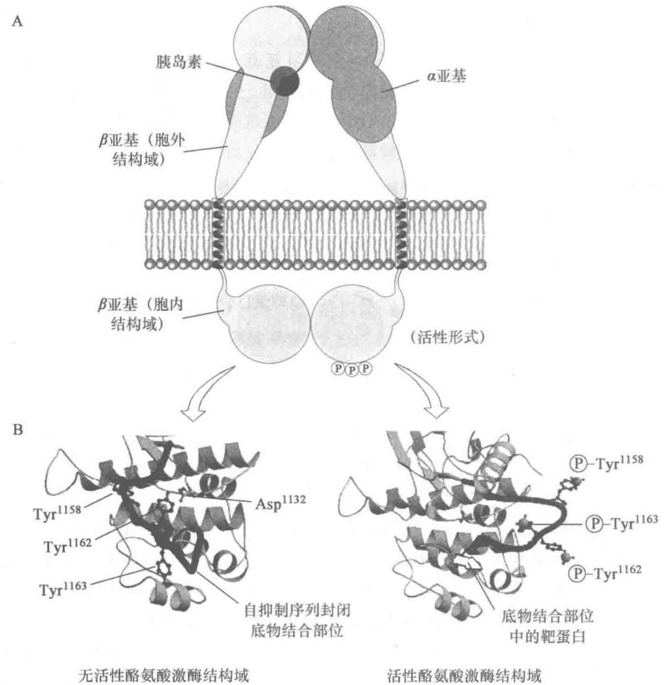  
图 14-24 胰岛素受体酪氨酸激酶的自磷酸化  
(仿自 Nelson D L, Cox M M. Lehninger Biochemistry, 6th ed.)

Tyr 激酶活性, 每个 $\beta$ 亚基使另一个 $\beta$ 亚基的羧基端附近的三个关键性 Tyr 残基磷酸化。这一自磷酸化 (autophosphorylation) 打开了活性部位, 因而此酶能磷酸化其他靶蛋白的 Tyr 残基。INSR 蛋白激酶活化的机制与前面讲的 PKA 和 PKC 的激活机制相似: 胞质面结构域的一个区域 (自 [身] 抑制序列) 通常是封闭活性部位的, 被磷酸化后则移出活性部位, 为靶蛋白的结合打开了此部位 (图 14-24B)。

当INSR被自磷酸化时（图14-25，步骤①），它的靶蛋白之一是胰岛素受体底物-1（IRS-1；步骤②）。IRS-1，一旦几个Tyr残基被磷酸化，则变成一个多蛋白质复合体的成核点（步骤③），此复合体是从胰岛素受体经过一系列中间蛋白质到细胞溶胶中的和核中的终端靶运载信息的。首先，IRS-1的一个P-Tyr残基与蛋白质Grb2的SH2结构域结合[SH2是Src homology 2，即Src同源2的缩写，之所以这样命名是因为SH2结构域序列与Src中的一个结构域序列相似；Src代表一种癌基因或其蛋白质产物（细胞膜上的Tyr激酶），它最初是从肉瘤（Rous sarcoma）中发现的]。还有几种信号转导蛋白质含SH2结构域，所有的SH2结构域都能与含P-Tyr残基的蛋白质结合。Grb2是一种衔接蛋白质，不具有内在的酶促活性。它的功能是把两个蛋白质（在这里是IRS-1和蛋白质Sos)结合在一起，因为两个蛋白质必须相互作用才能进行信号转导。Grb2除了含SH2结构域之外，也含有第二个蛋白质结合结构域，SH3，它能与Sos的富含脯氨酸区结合，把Sos募集到正在增长的受体复合体上。当与Grb2结合，Sos起着鸟苷酸交换因子(GEF)的作用，催化GTP取代结合在Ras(一种G蛋白)上的GDP。

  
图 14-25 胰岛素通过 MAPK 级联调节基因表达  
(仿自 Nelson D L 和 Cox M M. Lehninger Biochemistry, 6th ed.)

Ras 是介导很多信号转导的小 G 蛋白 (small G protein) 家族的原型。与在 $\beta-$ 肾上腺素能系统中起作用的三聚体 G 蛋白一样，Ras 也能以 GTP 结合的（活性）构象或以 GDP 结合的（无活性）构象存在，但 $\mathrm{Ras}(M_{\mathrm{r}}20000)$ 是作为一个单体起作用的。当有 GTP 结合时，Ras 能活化蛋白激酶 Raf-1（图 14-

25, 步骤④), 后者是三个蛋白激酶——Raf-1、MEK 和 ERK——中的第一个, 这三个蛋白激酶形成一个级联, 每个激酶通过磷酸化激活下一个激酶(步骤⑤)。蛋白激酶 MEK 和 ERK, 只有 Thr 残基和 Tyr 残基都被磷酸化时才能被激活。当被激活时, ERK 通过进入核内并磷酸化转录因子, 如 EIK1(步骤⑥), 介导胰岛素的某些生物学效应; 这些转录因子调整约 100 个胰岛素调节基因(insulin-regulated gene)的转录(步骤⑦), 其中某些基因编码细胞分裂所必需的蛋白质。因此胰岛素也起着生长因子的作用。

蛋白质 Raf-1、MEK 和 ERK 是三个大家族的成员。ERK 是 MAPK 家族的成员；MAPK 是促 [细胞] 分裂原活化蛋白激酶 (mitogen-activated protein kinase) 的英文名缩写。促分裂原 (mitogen) 是一类胞外信号，诱导有丝分裂和细胞分裂。发现第一个 MAPK 之后，很快就发现它是由另一个蛋白激酶激活的，这一激酶被命名为 MAP（促分裂原活化蛋白）激酶 [的] 激酶（MEK 属于这一家族），当激活 MAP 激酶 [的] 激酶的激酶（第三个激酶）被发现时，曾给予它取了有点滑稽的家族名称 MAP 激酶激酶激酶（Raf-1 属于这一家族）。这三个家族的缩写名称为 MAPK、MAPKK 和 MAPKKK，显得有些笨拙。MAPK 和 MAPKKK 家族中的激酶是对 Ser 或 Tyr 残基专一的，而 MAPKK（这里指 MEK）使底物中 Ser 和 Tyr 残基都被磷酸化。

生物化学家现在认识到这个胰岛素途径只是作为一个更一般性的一个实例，在此图解中经类似于图14-25所示途径的激素信号导致靶酶被蛋白激酶磷酸化。磷酸化的靶经常是另一个蛋白激酶，后者又激活第三个蛋白激酶，如此等等。结果是反应的级联，使最初的信号放大几个数量级（参见图14-20）。MAPK级联(图14-25)介导由各种生长因子如血小板-衍生生长因子(PDGF)和表皮生长因子(EGF)启动的信号转导。借胰岛素受体途径来说明的另一通用图解是，非酶促的衔接蛋白质用于汇集分支信号转导途径的组分(将在下面讨论)。

## （二）膜磷脂 $PIP_{3}$ 在胰岛素信号转导的分支点起作用

胰岛素的信号转导途径在 IRS-1 处分叉(图 14-25, 步骤②)。Grb2 不是跟磷酸化了的 IRS-1 缔合的唯一蛋白质。磷酸肌醇 3-激酶(phosphoinositide 3-kinase, PI3K)通过 PI3K 的 SH2 结构域跟 IRS-1 结合(图 14-26)。这样, 被激活的 PI3K 使膜脂磷脂酰肌醇 4,5-二磷酸( $PIP_{2}$ )转化为磷脂酰肌醇 3,4,5-三磷酸( $PIP_{3}$ )。突出在质膜胞质侧的 $PIP_{3}$ 的多电荷头基是第二条信号转导支路的起点, 支路涉及蛋白激酶的另一级联。当与 $PIP_{3}$ 结合时, 蛋白激酶 B(PKB)又被另一蛋白激酶 PDK1 磷酸化并激活, 然后被激活的 PKB 磷酸化它的靶蛋白中的 Ser 或 Thr 残基, 其中的一个靶蛋白是糖原合酶激酶 3(glycogen synthase kinase 3, GSK3)。有活性的(非磷酸化形式)GSK3 磷酸化糖原合酶, 并使之失活; 因而减慢糖原合成的速率(这一机制只是解释胰岛素对糖原代谢影响的部分)。GSK3 被 PKB 磷酸化时, 则失活。由于在肝和肌肉中通过这种方式阻止糖原合酶的钝化, 胰岛素启动的蛋白质磷酸化的级联促进了糖原合成(图 14-26)。在肌肉和脂肪组织的第三条信号转导支路中, PKB 触发网格蛋白(clathrin)辅助的葡萄糖转运蛋白(GLUT4)从内泡到质膜的运动, 促进葡萄糖从血中的吸收(图 14-26)。

与所有的信号转导途径一样，也有一个终止 PI3K-PKB 途径活动的机制。 $PIP_{3}$ 专一的磷酸酶（人体中的 PTEN）除去 $PIP_{3}$ 第 3 位上的磷酸基，产生 $PIP_{2}$ ，它不再作为 PKB 的结合位点，信号转导链被中断。在各种类型的肿瘤中经常发现 PTEN 基因有突变发生，导致调节线路的缺损以及 $PIP_{3}$ 和 PKB 活性的水平高得不正常。这一结果看起来是细胞分裂的，因而也是肿瘤生长的一个连续信号。

胰岛素受体是几个具有相似结构和 RTK 活性的受体酶的原型。例如，EGF 和 PDGF 的受体在结构和序列方面都跟 INSR 相似，都有磷酸化 IRS-1 的 Tyr 激酶活性。这些受体中许多是在结合配体后二聚化的；但 INSR 是一个例外，因为它在跟胰岛素结合前已是一个 $(\alpha\beta)_{2}$ 二聚体。衔接蛋白质（如 Grb2）与 P-Tyr 残基的结合是促进由 RTK 启动的蛋白质-蛋白质相互作用的一种常见机制。

除了起 Tyr 激酶(RTK)作用的许多受体之外,几种受体样的质膜蛋白质具有 Tyr 磷酸酶活性。根据这些蛋白质的结构,人们可以推测,它们的配体是胞外基质的组分或者是其他细胞上的表面分子。虽然它们的信号转导作用还不像了解 RTK 那样清楚,但它们显然具有逆转刺激 RTK 的信号的作用。

什么东西迫使如此复杂的调节机器进化的？这个系统允许一个活化的受体激活几个IRS-1分子，放大了胰岛素信号，该系统还为来自不同受体如EGFR和PDGFR（其中每个都能磷酸化IRS-1)的信号整合做了准备。而且，因为IRS-1能激活几种含SH2结构域的蛋白质的任一种，因而通过IRS-1起作用的单个受体就能触发两条或多条信号转导途径；胰岛素通过Grb2-Soc-MAPK途径影响基因表达（图14-25），并通过PI3K-PKB途径影响糖原代谢和葡萄糖转运（图14-26）。最后，还有几个关系密切的IRS蛋白质(IRS-2, IRS-3)，每个都具有自己特有的组织分布和功能，进一步丰富了由RTK引发的途径中信号转导的可能性。

  
图14-26 胰岛素对糖原合成和GLUT4从内[膜小]泡移动到质膜的作用  
(仿自 Nelson D L, Cox M M. Lehninger Biochemistry, 6th ed.)

## （三）JAK-STAT 信号转导也涉及酪氨酸激酶活性

有关受体 Tyr 激酶论题的一个变化是那些不具固有蛋白激酶活性的受体,但当它被配体占据时能结合细胞溶胶中的 Tyr 激酶。一个例子是调节哺乳动物中红细胞形成的系统。发育信号或细胞因子 (cytokine),对该系统来说,即[促]红细胞生成素(erythropoietin, EPO),它是肾脏产生的一个含 165 个氨基酸残基的蛋白质。当 EPO 跟它的质膜受体结合时(图 14-27),受体二聚化,此二聚体能结合并激活可溶性的蛋白激酶 JAK(Janus Kinase)。被激活的 JAK 磷酸化 EPO 受体胞质侧结构域中的几个 Tyr 残基。一个转录因子家族,统称为 STAT(Signal transducer and activator of transcription;转录的信号转导物和激活物),它也是 JAK 的靶(图 14-27A)。STAT5 中的 SH2 结构域与 EPO 受体中的 P-Tyr 残基结合,使 STAT 的定位有利于在应答 EPO 时被 JAK 磷酸化。被磷酸化了的 STAT5 形成二聚体,暴露出一个核定位序列 (nuclear localization sequence, NLS),导向二聚体转运到核内。在这里 STAT5 诱导对红细胞成熟必需的专一基因表达(转录)。这个 JAK-STAT 系统也在其他一些信号途径中存在。激活了的 JAK 也能通过 Grb2 触发 MAPK 级联(图 14-27B),导致专一基因表达的改变。

Src 是另一个可溶性蛋白质 Tyr 激酶, 当某些受体与其配体结合时, 此 Tyr 激酶能跟这些受体缔合。

Src 是发现具有特有的 ① - Tyr 结合结构域的第一个蛋白质；随后这一结构域被命名为 Src 同源 2(SH2) 结构域。

## （四）信号转导系统之间的通讯是普遍而复杂的

虽然为了简化起见,我们把单独的信号转导途径作为导致独立代谢结果的独立事件序列,实际上信号转导系统之间有着广泛的通讯联系。管控代谢的调节线路是交错而多层次的。至此我们已分别讨论了胰岛素和肾上腺素的信号转导途径,但它们不是独立运作的。在许多组织中胰岛素跟肾上腺素的代谢效应是相反的。胰岛素信号途径的激活直接使得通过 $\beta-$ 肾上腺素能的信号转导系统的信号转导变弱。例如,INSR激酶直接磷酸化 $\beta_{2}-$ 肾上腺素能受体胞质侧尾部的二个Tyr残基,和被胰岛素激活的PKB(图14-28,①)磷酸化同一区域的两个Ser残基。这四个残基的磷酸化触发网格蛋白辅助的 $\beta_{2}-$ 肾上腺素能受体的内化（internalization），把它从膜上撤下，减小细胞对肾上腺素的敏感性。

  
图 14-27 红细胞生成素受体的 JAK-STAT 转导机制（仿自 Nelson D L, Cox M M. Lehninger Biochemistry, 6th ed.）

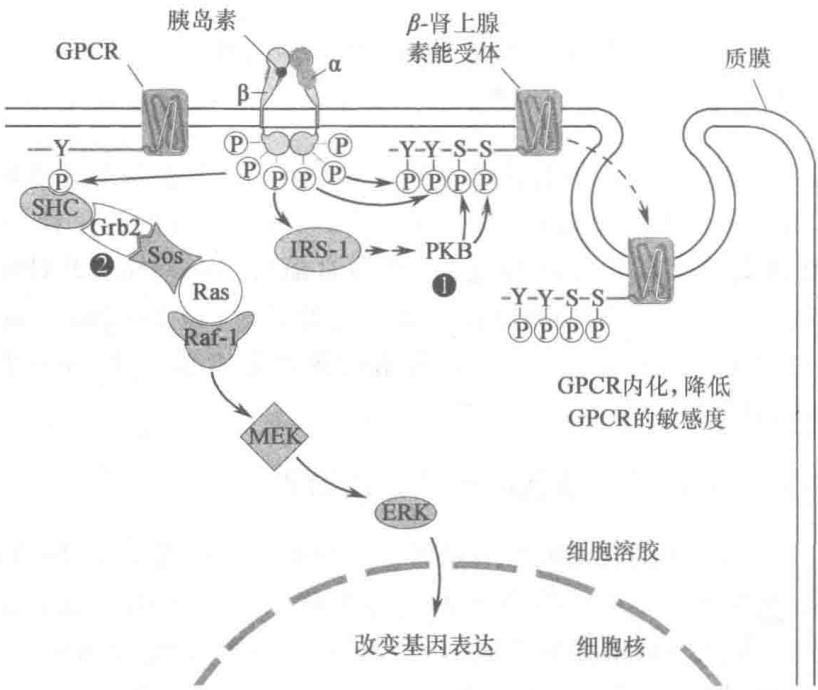  
图14-28 胰岛素受体和 $\beta_{2}$ -肾上腺素能受体(或其他GPCR)之间的通讯  
(仿自 Nelson D L, Cox M M. Lehninger Biochemistry, 6th ed.)

这些受体间的第二种通讯类型发生在当被INSR磷酸化的 $\beta_{2}$ -肾上腺素能受体上的①-Tyr残基用作含SH2结构域的蛋白质如Grb2（图14-28，②）的成核点之时。胰岛素对MAPK ERK的激活（见图14-25）比有 $\beta_{2}$ -肾上腺素能受体存在时大5到10倍，推测是由于这种通讯的结果。利用cAMP和 $\mathrm{Ca^{2+}}$ 的信号转导系统也显示出广泛的相互作用；每个第二信使都影响另一个信使的产生和浓度。系统生物学（systems biology）的一个重要挑战是分别出这些相互作用对每个组织的总代谢图谱的影响——这是一个艰巨的任务。

## 八、受体鸟苷酸环化酶、cGMP 和蛋白激酶 G

鸟苷酸环化酶(图 14-29)是一类受体酶。当被激活时,它们催化 GTP 转变为第二信使,鸟苷酸 3,5-环单磷酸(guanosine 3,5-cyclic monophosphate),即环 GMP 或 cGMP:

  
图 14-29 参与信号转导的鸟苷酸环化酶的两种类型

在动物中 cGMP 的许多作用是由 cGMP 依赖型蛋白激酶也称蛋白激酶 G(PKG) 介导的。当被 cGMP 激活时，PKG 磷酸化靶蛋白中的 Ser 和 Thr 残基。此酶的催化结构域和调节结构域位于一个单个的多肽 ( $M_{r}$ 80 000) 中。调节结构域的部分契合在底物结合裂隙中。cGMP 的结合迫使这个假底物离开结合部位，把它让给含 PKG 共有序列的靶蛋白质。

环 GMP 在不同的组织中运载不同的信息。在肾和肠它触发离子转运和水滞留方面的变化；在心肌（平滑肌类型），它给出舒张的信号；在大脑中它可涉及发育期和成年期两者的脑功能。在肾中的鸟苷酸环化酶是由肽激素心房钠泵因子或称心房肽（ANF，见表 14-2）激活的，心房肽是在心脏因血容量增加而伸展时由心房内的细胞释放的，ANF 随血流运送到肾，在这里激活集合管细胞中的鸟苷酸环化酶（图 14-29A）。这样引起的 [cGMP] 升高，触发由渗透压变化驱动的 Na $^{+}$ 的、因而也是水的肾排泄增加。水的丢失减少了血容量，抵消原先导致 ANF 分泌的刺激。血管平滑肌也有 ANF 受体——鸟苷酸环化酶；当 ANF 跟此受体结合时，则引起血管舒张（vasodilation），增加血流，降低血压。

衬在肠道内的表皮细胞质膜上的同类受体鸟苷酸环化酶是被一种多肽鸟苷素（guanylin）激活的（图14-29A），鸟苷素调节小肠的 $\mathrm{Cl^-}$ 分泌。这个受体也是一个热稳定肽——大肠杆菌和其他革兰氏阴性细菌产生的内毒素——的靶。由内毒素引起的[CGMP]升高，增加了 $\mathrm{Cl^-}$ 分泌，并因此减少肠皮层对水的重吸收而引起腹泻(diarrhea)。

一个显著不同的鸟苷酸环化酶类型是一个具有紧密缔合的血红素基的细胞溶胶蛋白质(图 14-

29B), 它是由氧化氮(NO)激活的酶。前面曾谈到, NO 在 $Ca^{2+}$ -依赖型 NO 合酶的催化下由精氨酸产生, 存在于许多哺乳类的组织中, 从产生它的细胞扩散到附近的细胞。

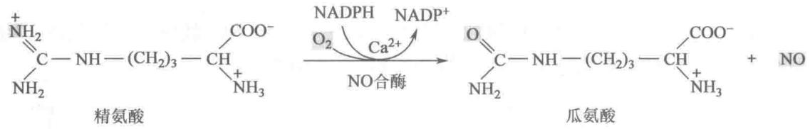

NO 是非极性分子,无需载体就能穿过质膜。在靶细胞中它与鸟苷酸环化酶的血红素基结合,并促进 cGMP 的产生。在心脏,cGMP 依赖型蛋白激酶通过刺激从细胞溶胶中除去 $Ca^{2+}$ 的离子泵降低收缩力。

NO 诱导的心肌舒张和用于缓解心绞痛(angina pectoris)的硝酸甘油和其他硝基血管舒张剂引起的应答是一样的。心绞痛是由于冠状动脉阻塞而缺氧的心收缩引起的。氧化氮不稳定,它的作用时间短暂;在它形成的几秒钟内,则发生氧化,生成硝酸盐或亚硝酸盐。硝基血管舒张剂能产生持久的心肌舒张,因为它们的降解超过数个小时,产生稳定的 NO 流。硝酸甘油作为治疗心绞痛的医学价值是 1860 年代在生产硝酸甘油用来作炸药的工厂里偶然发现的。有心绞痛的工人报告,在工作周内他们的病情有很大的改善,但到周末就变坏了。负责治疗这些工人的医生们经常听到这个故事,以至于他们不得不做出了这样的联系,于是一个药物诞生了。

刺激停止后增加了的 cGMP 合成的效应减小了, 因为专一的磷酸二酯酶 (cGMP PDE) 将 cGMP 转变为无活性的 5'-GMP。人体有几个 cGMP PDE 同工酶, 有不同的组织分布。阴茎血管中的同工酶受 sildenafil(Viagra; 伟哥) 的抑制, 因此一旦被一个合适的刺激升高后, 它就使 [cGMP] 保留在升高的水平, 说明了这个药物在治疗勃起功能障碍时是有用的。

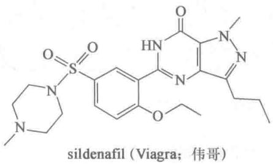

## 九、门控离子通道

## （一）离子通道是可兴奋细胞的基础

多细胞生物中某些细胞是“可兴奋的”: 它们可以检测出外部的信号, 把它转变为电信号(确切地说, 转变为膜电位的变化)并传递下去。可兴奋细胞在神经传导、肌肉收缩、激素分泌、感觉过程和学习与记忆中起关键作用。感觉细胞、神经元和肌细胞的兴奋性决定于离子通道, 即在应答各种刺激时为无机离子如 $Na^{+}$ 、 $K^{+}$ 、 $Ca^{2+}$ 和 $Cl^{-}$ 的跨膜移动提供调节途径的信号转导器。这些离子通道是“门控的”: 它们可以打开或关闭, 这决定于被结合的受体是否已经被专一配体(例如神经递质)的结合或跨膜电位 ( $V_{m}$ )方面的改变所激活。 $Na^{+}-K^{+}ATP$ 酶是生电的(electrogenic); 由于每运进2个 $K^{+}$ 就要从细胞输出3个 $Na^{+}$ , 引起跨质膜的电荷不平衡(图14-30①), 造成内侧相对于外侧是负的, 即内负外正。这样的膜被称为极化膜。

(习惯上规定:当细胞内负外正, $V_{m}$ 为负值。对一个典型的动物细胞来说 $V_{m}=-70\sim-50\ mV$ 。)

因为离子通道一般只允许抑或阴离子抑或阳离子通过,但不允许两者都能通过,经过一个通道的离子流动会引起膜两侧上的电荷重分布,改变了 $V_{m}$ 。荷正电的离子如 $Na^{+}$ 的流入或荷负电的离子如 $Cl^{-}$ 的流出会引起膜的去极化(depolarization), $V_{m}$ 趋近于零。相反, $K^{+}$ 的流出引起膜的超极化(hyperpolarization),

  
图14-30 跨膜电位

$V_{m}$ 变得更负。这些离子经通道的流动是被动的，跟通过 $Na^{+}K^{+}ATP$ 酶的主动转运是不相同的。

跨极化膜的自发离子流动的方向是由该离子的跨膜电化学势决定的。电化学势可分为两个部分：膜两侧的离子浓度 $(C)$ 差和一般用毫伏表示的电位差。引起一种阳离子（譬如 $\mathrm{Na}^{+}$ ）自发通过离子通道进入胞内的力 $(\Delta G)$ 是它在膜内、外两侧的浓度比 $(C_{\mathrm{in}} / C_{\mathrm{out}})$ 和电位差 $(V_{\mathrm{m}}$ 或 $\Delta \Psi)$ 的函数：

$$
\Delta G = R T \ln (C _ {\mathrm{in}} / C _ {\mathrm{out}}) + Z F V _ {\mathrm{m}}
$$

这里，R 是气体常数，T 是绝对温度，Z 是离子上的电荷，F 是法拉第常数。注意，离子上电荷的符号决定了上面方程中第二项的符号。在一个典型的神经元或肌细胞中，细胞溶胶的 $Na^{+}$ 、 $K^{+}$ 、 $Ca^{2+}$ 和 $Cl^{-}$ 的浓度与胞外液中的这些浓度有很大的差别（表 14-9）。设定这些浓度差、静息 $V_{m}$ （约 -60 mV）和上面方程所示的关系式， $Na^{+}$ 或 $Ca^{2+}$ 通道的打开将造成 $Na^{+}$ 或 $Ca^{2+}$ 的自发向内流动（和去极化），而 $K^{+}$ 通道的打开，将引起 $K^{+}$ 的自发向外流动（和超极化）（图 14-30②）。在这种情况下， $K^{+}$ 逆着电化学梯度向外移动，因为细胞内、外的大浓度差对该离子产生一个更大的向外化学力。而 $Cl^{-}$ 受电梯度趋动逆浓度梯度向外移动。

表 14-9 细胞和胞外液中的离子浓度 (mmol/L)

<table><tr><td rowspan="2">细胞类型</td><td colspan="2"> $K^{+}$ </td><td colspan="2"> $Na^{+}$ </td><td colspan="2"> $Ca^{2+}$ </td><td colspan="2"> $Cl^{-}$ </td></tr><tr><td>内</td><td>外</td><td>内</td><td>外</td><td>内</td><td>外</td><td>内</td><td>外</td></tr><tr><td>乌贼神经元</td><td>400</td><td>20</td><td>50</td><td>440</td><td> $\leqslant 0.4$ </td><td>10</td><td>40~150</td><td>560</td></tr><tr><td>蛙肌</td><td>124</td><td>2.3</td><td>10.4</td><td>109</td><td>&lt;0.1</td><td>2.1</td><td>1.5</td><td>78</td></tr></table>

只要浓度梯度和电位的组合能够提供驱动力，给定的一种离子可以继续流经通道。例如，当 $Na^{+}$ 沿它的浓度梯度往下流动，则使膜去极化。当膜电位达到 +70 mV，这个膜电位的效应（抵抗 $Na^{+}$ 的进一步流入）精确地等于 $[Na^{+}]$ 梯度的效应（促进 $Na^{+}$ 的流入）。在此平衡电位 (E)，驱使 $Na^{+}$ 移动的驱动力 ( $\Delta G$ ) 为零。平衡电位对每种离子是不同的，因为浓度梯度不一样。

为产生一个生理上明显的膜电位变化所必需流动的离子数目跟细胞和胞外液中的 $Na^{+}$ 、 $K^{+}$ 和 $Cl^{-}$ 浓度相比是可以忽略不计的，因此在可兴奋细胞中信号转导期间发生的离子流动对这些离子的浓度基本上没有影响。对于 $Ca^{2+}$ ，情况则不同，因为胞内 $[Ca^{2+}]$ 一般是很低的（0.1 $\mu$ mol/L）， $Ca^{2+}$ 向内流动能够明显改

变细胞溶胶的 $\left[Ca^{2+}\right]$ 。

在给定时间内一个细胞的膜电位是在该时刻打开的离子通道类型和数目的结果。处于静息状态的大多数细胞，打开的 $K^{+}$ 通道比打开的 $Na^{+}$ 、 $Cl^{-}$ 或 $Ca^{2+}$ 通道为多，因此静息电位跟任一其他离子的电位相比更接近 $K^{+}$ 的电位 (E = -98 mV)。当 $Na^{+}$ 、 $Ca^{2+}$ 或 $Cl^{-}$ 的通道打开时，膜电位移向该离子的 E 值。离子通道精确按时打开和关闭以及造成的膜电位短暂变化是神经系统得以刺激骨骼肌收缩、心脏搏动或分泌细胞释放产物的电信号转导的基础。而且许多激素也是通过改变它们的靶细胞膜电位产生效应的。这些机制不限于动物；离子通道在细菌、原生生物和植物对环境信号的应答中也起重要作用。

## （二）电压-门控离子通道产生神经元的动作电位

为说明离子通道在细胞与细胞的信号转导中的作用,我们介绍一个神经元沿它的长向并跨过突触(synapse)传送信号到下一个神经元的机制。

神经系统中的信号转导是由神经原网络完成的。神经元是一种特化的细胞，它从细胞的一端，称胞体（cell body），通过伸长的质膜突起，称轴突（axon），传播电脉冲（动作电位）。电信号触发突触释放神经递质分子，把信号传送到通路中的下一个细胞。有3种类型的电压门控离子通道（voltage-gated ion channel）是这种信号转导机制所必需的。沿轴突的整个长度是若干电压门控 $\mathrm{Na}^{+}$ 通道（图14-31），当膜处于静息时（ $V_{\mathrm{m}} = -60 \mathrm{~mV}$ ）通道关闭；但在应答乙酰胆碱（或某些其他神经递质）膜发生局部去极化时，通道短暂打开。沿轴突分布的还有许多电压门控 $\mathbf{K}^{+}$ 通道，在应答附近 $\mathrm{Na}^{+}$ 通道的打开而去极化时， $\mathbf{K}^{+}$ 通道立即打开。因此， $\mathrm{Na}^{+}$ 流入轴突造成的去极化马上有 $\mathbf{K}^{+}$ 流出引起的复极化（repolarization）与之抗衡。在轴突的远端是电压门控 $\mathrm{Ca}^{2+}$ 通道，当 $\mathrm{Na}^{+}$ 和 $\mathbf{K}^{+}$ 通道活动引起的去极化和复极化的波到达时， $\mathrm{Ca}^{2+}$ 通道立即打开，触发神经递质乙酰胆碱的释放——乙酰胆碱把信号传递给下一个神经元，激发动作电位；或传递给一个肌细胞，引起收缩。

  
图 14-31 电压门控的和配体门控的离子通道在神经元传递中的作用  
为清楚起见, $Na^{+}$ 通道和 $K^{+}$ 通道分别画在轴突的上、下两边,其实这两种通道是均匀分布在轴突膜上的。图中深灰色的大箭头表示神经冲动(或称动作电位)传导的方向。膜的去极化(包括反极化,变成内正外负)和复极化过程也就是动作电位的形成和恢复的过程。(改自 Nelson D L, Cox M M. Lehninger Biochemistry, 6th ed.)

电压门控 $Na^{+}$ 通道对 $Na^{+}$ 的选择性远超过对其他的离子（大100倍或更多），并且 $Na^{+}$ 的流动速率也很大 ( $>10^{7}$ 离子/s)。 $Na^{+}$ 通道由于跨膜电位下降被打开（被激活）后，很快（几毫秒内）发生失活，通道关闭，保持无活性状态多个毫秒。随着因应答 $Na^{+}$ 通道打开而引起的去极化，电压门控 $K^{+}$ 通道打开（图14-31，步骤①），这样造成的 $K^{+}$ 流出使膜局部复极化（重建内侧负的膜电位，步骤②）。当局部去极化触发邻近的 $Na^{+}$ 通道的短暂打开，然后是 $K^{+}$ 通道的短暂打开，一个短暂的去极化冲动就这样通过轴突。继每一 $Na^{+}$ 通道打开后有一个简短的不应期（refractory period），在此期间通道不能再打开，也即轴突不能立刻发生新的动作电位。因此不应期保证了一个去极化的波(动作电位)从神经胞体向轴突末端传播的方向。顺便说一下,轴突膜上某一点受到刺激产生的神经冲动(动作电位)本质上是双向传导的,但动物体内,神经接受刺激的地方是神经末梢,更重要的是两个神经元彼此接头处(突触),神经冲动是单向传导的,因此冲动在神经纤维上只能朝一个方向进行。

当去极化的波传播到神经元顶端时，电压门控 $Ca^{2+}$ 通道打开，允许 $Ca^{2+}$ 从胞外空隙进入细胞（图14-31步骤③）。这样引起的胞内 $[Ca^{2+}]$ 升高触发乙酰胆碱通过胞吐方式释放到突触间隙（synaptic cleft）（步骤④）。乙酰胆碱扩散到突触后细胞（另一神经元或肌细胞），在这里它跟突触后细胞上的受体结合，引发配体门控离子通道打开（步骤⑤）。胞外 $Na^{+}$ 和 $Ca^{2+}$ 经此通道进入突触后细胞，并使之去极化（步骤⑥）。这样，电信号被传送到突触后神经元（或肌细胞）的胞体，并以同样的步骤顺序沿它的轴突传送到通路中的第三个神经元（或肌细胞），等等。门控离子通道以两种方式中的任一种转导信号：一种方式是通过改变一种离子（如 $Ca^{2+}$ ）的胞质浓度，这里离子是作为胞内第二信使；另一种是通过改变 $V_{m}$ ，并影响对 $V_{m}$ 敏感的其他膜蛋白。下面举一个电信号通过一个神经元传送到另一个神经元的例子来说明这两种机制。

$Na^{+}$ 通道的基本组件是一个单一的大多肽(含1840个氨基酸残基),被组织成围绕中央通道(孔道)的4个结构域(I到IV);每个结构域含有6个跨膜的螺旋段(1到6)(图14-32A和B)。每个结构域中的4号螺旋是电压传感器(voltage sensor);6号螺旋是激活门(activation gate);5号和6号螺旋之间的连接肽段组成 $Na^{+}$ 专一的“孔区”。连接结构域Ⅲ和Ⅳ之间的一段多肽是钝化门(inactivation gate)。这样构成的中央跨膜通道,内衬极性氨基酸残基;4个孔区集中在近胞外表面处构成漏斗形开口的选择性滤器,使通道具有区分 $Na^{+}$ 和大小相似的其他离子的能力;激活门(6号螺旋)打开后,钝化门立即关闭。每个结构域的4号螺旋(电压传感器)具有高密度的荷正电Arg残基,认为在应答跨膜电压从约-60mV(静息电位)到+30mV的变化时,这个螺旋段在膜内发生移动。4号螺旋的移动触发通道的打开,这是电压门控的基础(图14-32C和D)。

A  
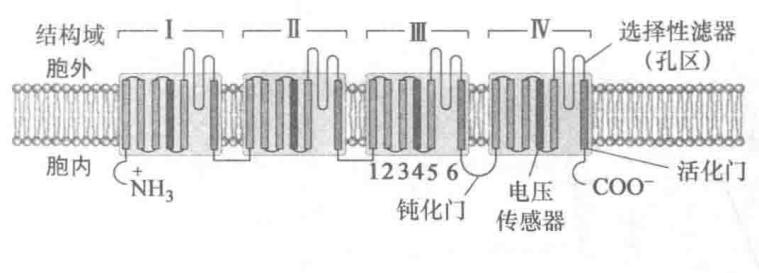

C  

D  
  
图 14-32 神经元的电压门控 $Na^{+}$ 通道  
A. 以展开方式示出一个 $\mathrm{Na}^{+}$ 通道（一个大的蛋白质分子）的基本组件；4个同源结构域（I～IV）和每一结构域中的6个跨膜螺旋段（1～6）；B. 以立体模型方式示出A中列出的那些组件，包括电压传感器、选择性滤器、活化门和钝化门等；C. 示出 $\mathrm{Na}^{+}$ 通道传感电压的机制，包括在应答[跨]膜电位变化时4号螺旋（电压传感器，黑色）作垂直于膜平面的移动。如左边所示，4号螺旋上的强正电荷使它在应答内负的膜电位时被拉向胞内一方；去极化减弱了这种拉力，4号螺旋向外移动（D）。移动被传讯到活化门，诱导构象变化，使通道打开（仿自Nelson D L, Cox M M. Lehninger Biochemistry, 6th ed.）

$\mathrm{Na}^{+}$ 通道的钝化(在不应期)被认为是通过球-链模型(ball-and-chain)机制发生的。 $\mathrm{Na}^{+}$ 通道的胞质侧表面上的一个蛋白质结构域(结构域Ⅲ和Ⅳ之间的一段多肽),称钝化门(球),它被一小段多肽(链;图14-32B)拴在通道上。当通道关闭时此结构域可以自由移动,但打开时在通道内面上的一个部位变成可用来结合被拴的球,因而关闭了通道。拴链的长度似乎决定了一个离子通道能打开多长时间:拴链愈长,打开时间愈长。其他离子通道可能经同样的机制被钝化。

## （三）乙酰胆碱受体是配体门控离子通道

烟碱样乙酰胆碱受体（nicotinic acetylcholine receptor）介导来自某些类型的突触和神经肌肉接头（运动神经元和肌纤维之间）的电激发神经元的信号的传导，触发肌肉收缩。（烟碱样乙酰胆碱受体和毒蝇[蕈]碱样乙酰胆碱受体（muscarinic acetylcholine receptor）最初是根据前者对烟碱、后者对蘑菇植物碱、毒蝇碱，的敏感性来区分的。它们在结构和功能上都不相同。）突触前神经元或运动神经元释放的乙酰胆碱扩散几微米到达突触后神经元或肌细胞，在这里跟乙酰胆碱受体结合。它们迫使受体的构象发生变化，引起离子通道打开。引起的阳离子向内移动，使质膜去极化。在肌纤维中它触发肌肉收缩。乙酰胆碱受体允许 $\mathrm{Na}^{+}$ 、 $\mathrm{Ca}^{2+}$ 和 $\mathrm{K}^{+}$ 顺利通过，但其他阳离子和所有阴离子都不能通过。 $\mathrm{Na}^{+}$ 通过乙酰胆碱受体离子通道的移动是不可饱和的（其速率与胞外 $[\mathrm{Na}^{+}]$ 成正比），并且速度很快——在生理条件下约 $2\times 10^{7}$ 离子/s。

和其他门控离子通道一样,乙酰胆碱受体在应答信号分子刺激时通道打开,并有一个打开几秒后立即关闭闸门的固有定时机制。因此乙酰胆碱信号是短暂的,这是电信号传导的基本特征。我们了解乙酰胆碱受体门控基础的结构变化,但不是“脱敏”的确切机制,脱敏时闸门总处于关闭状态,甚至乙酰胆碱继续存在。

烟碱样乙酰胆碱受体由5个同源亚基 $(\alpha_{2}\beta \gamma \delta)$ 组成，其中每个 $\alpha$ 亚基含有一个乙酰胆碱的结合位点（图14-33C）。所有5个亚基在序列和三级结构上是相关的，每个亚基含有4个跨膜螺旋段（M1到M4）；M2螺旋是两亲的，其他螺旋以疏水残基为主。螺旋段之间在它们（也是通道）的顶部和底部有荷负电的氨基酸残基环相连（图14-33A）。5个亚基围绕中央跨膜通道(孔道)排列，通道衬有M2螺旋段。突出在膜的胞质表面和胞外表面的通道孔径约2nm，但穿过脂双层的孔径变窄（图14-33B，C）。图14-33D是通过M2螺旋中央的横切面图解，示出每个M2螺旋（深灰色圆）向孔道伸出一个Leu残基的大疏水侧链（白色圆），把孔径压缩到难以允许 $Ca^{2+}$ 、 $Na^{+}$ 或 $K^{+}$ 通过。乙酰胆碱（黑色球）跟受体的每个α亚基上的位点结合引起构象变化，迫使所有的M2螺旋发生轻微扭转，把5个Leu残基大侧链旋离到旁边，代之以小的极性残基（小黑圆）。孔道加宽，允许 $Ca^{2+}$ 、 $Na^{+}$ 和 $K^{+}$ 通过。

  
图 14-33 乙酰胆碱受体离子通道的模型  
(仿自 Nelson D L, Cox M M. Lehninger Biochemistry, 5th ed.)

## （四）神经元有应答不同神经递质的受体通道

动物细胞特别是神经系统细胞含有由配体、电压或两者门控的各种离子通道。本身是离子通道的受体被归为促(亲)离子型受体(ionotropic receptor)以区别于产生第二信使的受体——促(亲)代谢型受体(metabotropic receptor)。前面集中介绍了作为神经递质的乙酰胆碱,但还有许多其他的神经递质,如5-羟色胺或称血清[紧张]素(serotonin),谷氨酸和甘氨酸等。它们都能通过结构上跟乙酰胆碱受体有关的受体通道起作用。5-羟色胺和谷氨酸触发阳离子( $K^{+}$ 、 $Na^{+}$ 和 $Ca^{2+}$ )通道打开,而甘氨酸触发 $Cl^{-}$ 专一的通道打开。阳离子和阴离子通道只是衬在亲水通道的氨基酸残基有细微的差别。阳离子通道在一些关键位置是荷负电的Glu和Asp侧链。当用实验方法把这些酸性残基中的几个用碱性残基置换时,阳离子通道则转化为阴离子通道。

取决于什么离子通过通道，配体（神经递质）对这些通道的结合造成靶细胞的去极化还是超极化。一个单个的神经元正常情况下接收来自很多其他神经元的信号输入，每个神经元都释放它自己特有的去极化或超极化效应的神经递质。因此靶细胞的 $V_{m}$ 反映出来自多个神经元的经整合的信号输入。只有当整合了的输入加上足够大的净去极化时，细胞才能以一个动作电位作出应答。

乙酰胆碱、甘氨酸、谷氨酸和 $\gamma-$ 氨基丁酸（GABA）的受体通道是由胞外配体门控的。胞内第二信使如 cAMP、cGMP、 $IP_{3}$ 、 $Ca^{2+}$ 和 ATP 调节另一类的离子通道，它们参与视感、嗅觉和味觉的感觉转导。

## （五）毒素靶向离子通道

自然界中发现的许多最强的毒素作用于离子通道。例如树眼镜蛇毒素(dendrotoxin)阻断电压门控 $\mathrm{K}^{+}$ 通道,河豚毒素(tetrodotoxin)作用于电压门控 $\mathrm{Na}^{+}$ 通道,眼镜蛇毒素(cobrotoxin)损害乙酰胆碱离子通道。为什么离子通道在进化过程中变成比某些关键性代谢靶如能量代谢所必需的酶更为毒素所喜爱的靶呢?

离子通道是一类超常的放大器，打开单个通道可允许每秒一千万个离子通过。因此为了实现信号转导，每个神经元只需要少数分子的离子通道蛋白质。这意味着对离子通道具有高亲和力的毒素来说，只要少数分子从胞外作用就能对全身的神经信号转导产生十分显著的效应。如果通过代谢酶的方式要达到同样的效果，典型细胞中存在的酶浓度需要比离子通道高得多，这就需要有更多的毒素分子。

## 十、整联蛋白——双向黏着受体

整联蛋白(integrin)是质膜蛋白质,介导细胞跟细胞和细胞跟胞外基质的黏着,在跨膜的两个方向运载信号(图14-34)。哺乳动物基因组编码18个不同的α亚基和8个不同的β亚基,这些亚基存在于一系列的组合体中,后者在各种组织中具有各种配体结合专一性。至今发现的24种不同的整联蛋白每种似乎都有独特的功能。因为整联蛋白能告知细胞有关胞外周围的情况,所以它们在要求选择性的细胞-细胞相互作用的过程中,如胚胎发育、血液凝固、免疫细胞运作、正常分化、肿瘤生长和有丝分裂中起关键性作用。跟整联蛋白相互作用的胞外配体包括胶原、血纤蛋白原、纤连蛋白和许多含有被整联蛋白识别的序列-Arg-Gly-Asp-(RGD,用单字母氨基酸缩写)的其他蛋白质。α和β亚基的胞质侧短突起跟紧挨质膜下方的细胞骨架蛋白质——踝蛋白(talin)、α-辅肌动蛋白(α-actinin)、黏着斑蛋白(vinculin)和桩蛋白(paxillin)等——相互作用,调整以肌动蛋白为基础的细胞骨架结构。整联蛋白跟胞外基质和细胞骨架的双重结合使得细胞能够整合有关胞外和胞内环境的信息,并协调细胞骨架按胞外的黏着位点来定位。整合蛋白借这个能力管控多种类型细胞的形状、活动、极性和分化。在“外向内”信号转导中，当配体在离跨膜螺旋几个纳米的一个位点结合时，整合蛋白的胞外结构域进行剧烈、全面的构象变化。这些变化以某种方式更改 $\alpha$ 和 $\beta$ 亚基胞质[侧]尾端的布局，改变跟胞内蛋白质的相互作用，因而把信号向内传输。

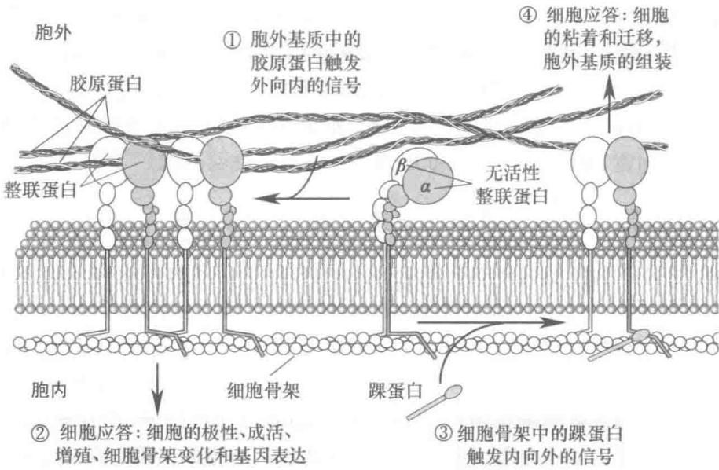  
图14-34 整联蛋白的两路信号转导

整联蛋白胞外结构域的构象和黏着性也被来自胞内的信号引发的“内向外”信号转导明显改变。处于一种构象态的胞外结构域对胞外基质的蛋白质没有亲和力，但来自细胞的信号能够使之转变为另一种构象，采取这种构象的整联蛋白能与胞外蛋白质紧密黏着。

黏着性的调节对白细胞归巢到侵染部位、免疫细胞之间的相互作用以及巨噬细胞的吞噬作用是关键问题。例如在免疫应答期间，白细胞的整联蛋白是来自细胞内部、经由细胞因子（胞外的发育信号）触发的信号转导途径激活的（暴露出它们的胞外配体结合位点）。因此被激活的整联蛋白能够介导白细胞跟其他免疫细胞的黏着或者能够导向待吞噬的细胞。编码称为CD18的β亚基的整联蛋白的基因的突变是白细胞黏着缺损的原因，这是一种罕见的人类遗传病，患者的白细胞不能穿出血管到达侵染部位。CD18严重缺乏的婴儿在2岁前常因感染而死亡。

血小板专一的整联蛋白 $(\alpha_{\mathrm{IIb}}\beta_3)$ 涉及正常和病理两者的血液凝固。在受伤部位血管的局部破损为血小板的整联蛋白暴露出高亲和结合位点（例如凝血酶和胶原蛋白中的GRD序列），血小板把它们自身连接到破损处、连接到其他血小板以及凝血蛋白质血纤蛋白原，导致血块的形成，阻止进一步出血。血小板整联蛋白 $(\alpha_{\mathrm{IIb}}\beta_3)$ 的 $\alpha$ 或 $\beta$ 亚基突变导致称为血小板机能不全（glanzmann thrombasthenia）的出血症，这种患者只要一个小的损伤则会造成过度出血。但凝血过强也是不希望的。血小板黏着的调节异常可以引起病理性血块形成，造成给心、脑供应血液的动脉堵塞，增加心脑发病的风险。替罗非班（tirofiban）和埃替非巴肽（eptifibatide）阻断血小板整联蛋白的外部配体结合位点的药物，它们可以降低血凝块形成，用于治疗和预防心梗发作。

当肿瘤转移时,肿瘤细胞失去对来源组织的黏着能力,侵入新的地点。肿瘤细胞黏着方面的变化和新血管的发育(血管发生)两者都支持在新位置的肿瘤是受专一的整联蛋白调节的。因此这些蛋白质是抑制肿瘤细胞迁移和再定位的药物的潜在靶。

## 十一、通过核内受体的信号转导机制

类固醇、视黄酸(类视黄醇)和甲状腺激素等构成了一大类有别于其他激素的激素,也就是说它们至少有一部分效应是通过跟其他激素根本不同的机制——在核内改变基因表达——实现的。关于它们的作用方式细节将在第34章与调节基因表达的其他机制一道介绍,这里只作简短叙述。

固醇类激素(例如雌激素、孕酮和皮质醇)是疏水的,难溶于血,需要由专一的载体蛋白质把它们从释放部位转运到靶组织。在靶细胞,这些激素以简单的扩散方式通过质膜,并在核内跟专一的核受体蛋白质结合(图14-35)。未结合配体(激素)的类固醇激素受体(脱配基受体,aporeceptor)经常起着抑制靶基因转录的作用。激素的结合触发了一个受体蛋白质的构象发生改变,结果使它变成能跟DNA中称为激素应答元件(hormone response element,HRE)的专一调节序列结合,因此改变了基因表达(第34章)。被结合的受体-激素复合体在转录必需的几个其他蛋白质的协助下提高了邻近HRE的专一基因的表达。为使这些调节物得到完全的效应需要几个小时甚至几天的时间,这是改变RNA合成和随后的蛋白质合成直至代谢上显示出明显效果所需的时间。

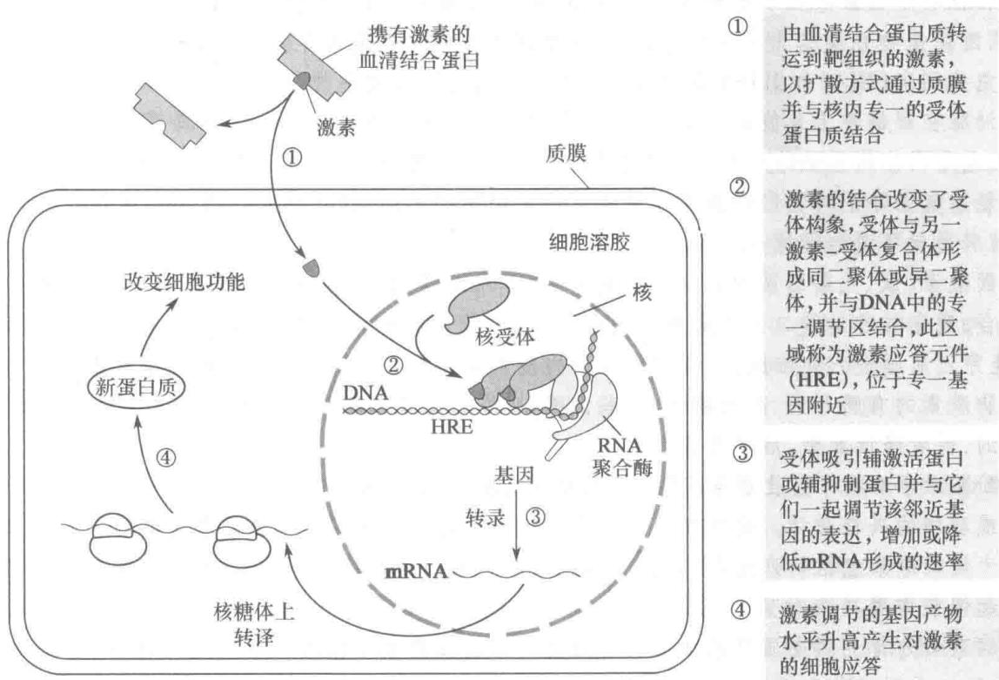  
图14-35 类固醇和甲状腺激素、类视黄醇和维生素D激素调节基因表达的一般机制

类固醇与受体相互作用的专一性在药物三苯氧胺(tamoxifen)用于治疗乳腺癌(breast cancer)方面得到了开发。在某些类型的乳腺癌中癌细胞的分裂决定于雌激素的持续存在。三苯氧胺是雌激素的拮抗物，它跟雌激素竞争与雌激素受体结合，但三苯氧胺-受体复合体对基因表达的影响很小或没有。因此在外科手术后或在化疗期间服用三苯氧胺对激素依赖性乳腺癌来说可以减慢或停止残留癌细胞的生长。另一个类固醇类似物，药物米菲司酮(mifepristone)或称RU486，它与孕酮受体结合并阻断受精卵植入子宫所必需的激素作用，因此起避孕药的作用。

  
三苯氧胺 (tomoxifen)

  
米菲司酮 (mifepristone)

类固醇的某些作用似乎发生得过快,不像是通过典型的经核受体的类固醇激素作用机制改变蛋白质合成的结果。例如,雌激素介导的血管扩张已知不是依赖基因转录或蛋白质合成的,而是类固醇受体诱导的细胞[cAMP]的降低。认为另有一个涉及质膜受体的转导机制负责这些效应中的某一些效应。

## 提要

激素是内分泌组织或细胞产生、被分泌到体液并运送到特定组织中的靶细胞，在那里与专一的受体结合，调节靶细胞或靶组织的生理活动的一类微量、高效的化学信使。除激素外化学信使还有神经递质和生长因子。

人和脊椎动物激素按化学本质可分为:肽激素,儿茶酚胺激素,甲状腺激素,类固醇激素,维生素D激素(也是固醇衍生物),类二十烷酸激素,类视黄醇激素和氧化氮激素等。

放射免疫测定(RIA)和ILISA是两种很灵敏的激素检测和定量技术。

内分泌腺在解剖学上是彼此不连续的，但在功能意义上自成一体——内分泌系统。下丘脑是大脑的一部分，但也是内分泌系统的一部分。下丘脑、垂体和其他内分泌腺组成了整个内分泌系统。内分泌系统在中枢神经系统主导下对它们的激素分泌实行分级控制和反馈调节，将生物体各个部分的活动协调成一个整体，以求得与环境和谐统一。

大多数激素(肽、儿茶酚胺和类二十烷酸激素)是水溶性的,不能通过质膜,是跟靶细胞质膜外表面上的受体结合,改变并通过第二信使而起作用;另一些激素(类固醇、维生素D、类视黄醇和甲状腺激素)是疏水的,能穿过质膜进入靶细胞,它们是跟专一的核内受体相互作用调节基因表达而起作用。

属于肽激素的有胰岛素、高血糖素、生长激素(人)以及催产素和血管升压素。胰岛素和高血糖素是调节血糖的,前者降低血糖,后者升高血糖。

儿茶酚胺激素有去甲肾上腺素、肾上腺素和多巴胺等；它们是肾上腺髓质合成和分泌的，生理功能是引起人体或动物的兴奋激动。大脑和其他神经组织产生的儿茶酚胺起神经递质的作用。

类二十烷酸激素包括前列腺素、凝血噁和白三烯。它们是在机体需要时产生的，被分泌到胞间质，对附近细胞起调节作用。

类固醇激素分肾上腺皮质激素和性激素两类。皮质激素参与糖或水盐代谢的调节；性激素影响性发育、性行为和一系列其他生殖和非生殖功能。

甲状腺激素包括甲状腺素 $\left(\mathrm{T}_{4}\right)$ 和三碘甲状原氨酸 $\left(\mathrm{T}_{3}\right)$ ；其生理作用是促进基础耗氧、促进各种代谢以及促进生长发育和智力发育等。

昆虫的内激素有脑激素、保幼激素和蜕皮激素；昆虫的外激素或称信息素，被分泌到体外后极微量就能影响同种昆虫的行为。其中性引诱剂的研究在害虫预测预报和防治方面得到开发并收到好效果。

目前已确定的植物激素有5种(或5类): 生长素、细胞分裂素、赤霉素、脱落酸和乙烯。它们在农业上得到了应用并收到效果。

信号转导是胞外信号被放大并转变为胞内应答(化学变化)的过程。所有细胞都有在进化期间保留下来的专一而敏感的信号转导机制。各种刺激(信号)都通过质膜中的专一受体起作用。受体与信号分子结合启动了放大信号、整合信号输入并把它传递给整个细胞这一过程。如果信号持续存在,受体脱敏会降低或终止细胞的应答。

多细胞生物有6种基本的信号转导机制:通过①G蛋白-偶联的质膜蛋白质(受体),②受体酪氨酸激酶,③受体鸟苷酸环化酶,④门控离子通道,⑤双向黏着受体(整联蛋白)和⑥核内受体:与类固醇激素结合并改变基因表达。

G 蛋白偶联受体(GPCR)有共同的结构排列(七跨膜螺旋),通过杂三聚体 G 蛋白起作用。在有配体结合时,GPCR 催化 G 蛋白上的 GDP 更换成 GTP,导致 $\alpha$ 亚基解离;然后 $G_{\alpha}$ 亚基激活或抑制效应酶的活性,改变第二信使产物的水平。

$\beta$ 肾上腺素能受体激活刺激[性]G蛋白 $(\mathbf{G}_{\mathrm{s}})$ ，从而激活腺苷酸环化酶，升高第二信使cAMP的浓度；cAMP刺激cAMP依赖型蛋白激酶来磷酸化关键性靶酶，改变酶活性。

级联放大是在酶级联中一个单一激素分子激活一个催化剂，继而催化剂激活催化剂，结果得到激素受体系统所特有的高倍信号放大。

cAMP 浓度最终被 cAMP 磷酸二酯酶降低；由于结合的 GTP 水解成 GDP，作为开关的 $G_{s}$ 自动断开， $G_{s}$ 起着自我限制的二进制开关作用。

某些受体通过 $G_{s}$ 刺激腺苷酸环化酶，另一些受体通过 $G_{i}$ 抑制腺苷酸环化酶。因此胞内的 [cAMP] 反映了两种（或多种）信号的整合输入。

非催化性衔接蛋白质如 AKAP 能使涉及信号转导过程中的蛋白质集中在一起, 增加它们的相互作用效率, 在某些情况能把过程限制在特定的细胞位置。

某些 GPCR 是通过质膜的磷脂酶 C 起作用的, 磷脂酶 C 将 $PIP_{2}$ 断裂成二酰甘油和 $IP_{3}$ 。通过打开内质网上的 $Ca^{2+}$ 通道, $IP_{3}$ 使细胞溶胶的 $[Ca^{2+}]$ 升高。二酰甘油和 $IP_{3}$ 共同作用, 激活蛋白激酶 C, 后者磷酸化和改变专一的细胞蛋白质。细胞的 $[Ca^{2+}]$ 也调节 (经常通过钙调蛋白) 许多涉及分泌、细胞骨架重排和收缩的其他酶和蛋白质。

胰岛素受体(INSR)是具有Tyr激酶活性的受体的原型。当与胰岛素结合时,INSR的每个αβ单位磷酸化其配偶体的β亚基,并激活受体的Tyr激酶活性。此激酶催化其他蛋白质(如IRS-1)上的Tyr残基磷酸化。

IRS-1 上的磷酸酪氨酸残基用作含有 SH2 结构域的蛋白质的结合部位。这些蛋白质中某一些，如 Grb2，含有两个或多个蛋白质结合结构域，它们能用作使两个蛋白质靠近的衔接体。

与 Grb2 结合的 Sos 催化 Ras(一个小 G 蛋白)上 GDP-GTP 交换, Ras 进而激活 MAPK 级联, 级联由于细胞溶胶和核内靶蛋白质的磷酸化而终止。其结果是发生专一的代谢改变和基因表达。

通过与 IRS-1 的相互作用被激活的酶 PI3K 把膜脂 $PIP_{2}$ 转化为 $PIP_{3}$ ，后者成为胰岛素信号转导的第二和第三支路蛋白质的成核点。

在 JAK-STAT 信号转导系统中,一个可溶性蛋白质 Tyr 激酶(JAK)由于跟受体结合而被激活,然后磷酸化转录因子 STAT,后者进入核内,改变一套基因的表达。

在信号转导途径中有很广泛的相互联系，允许对多个激素效应加以整合和细调。

某些信号包括心房钠泵因子和鸟苷素是通过具有鸟苷酸环化酶活性的受体酶起作用的。这样产生的cGMP是一种激活cGMP依赖型蛋白激酶(PKG)的第二信使。此酶通过磷酸化专一的靶酶改变代谢。

氧化氮是一个短命的信使,刺激可溶性鸟苷酸环化酶,升高[cGMP]并刺激 PKG。

膜电位或配体门控的离子通道是神经元和其他细胞中信号转导的关键。

神经元膜的电压门控 $Na^{+}$ 和 $K^{+}$ 通道沿轴突以去极化 ( $Na^{+}$ 流入) 继之以复极化 ( $K^{+}$ 流出) 的波输送动作电位。

电压敏感型通道的门控机制涉及一个跨膜肽垂直于膜平面的运动,此肽由于存在 Arg 或其他荷电残基而携有高电荷密度。

在突触前神经元的远端一个动作电位的达到触发神经递质释放。神经递质（例如乙酰胆碱）扩散到突触后神经元（或神经肌肉接点处的肌细胞），与其质膜中的专一受体结合，并触发 $V_{m}$ （膜电位）的改变。

神经元和肌细胞的乙酰胆碱受体是一种配体门控离子通道；乙酰胆碱的结合触发构象变化，打开 $Na^{+}$ 和 $Ca^{2+}$ 通道。

许多生物产生的神经毒素攻击神经元的离子通道，并因此是作用快和致命性的。

整联蛋白是二聚体( $\alpha\beta$ )质膜受体的一个家族,它们跟胞外大分子和细胞骨架相互作用,在细胞内、外之间运送信号。

一个整联蛋白的活性形式和无活性形式,它们的胞外结构域的构象是不同的。胞内的事件和信号能使活性形式和无活性形式互相转化。

整联蛋白介导免疫应答,血液凝固和血管发生的多个方面,并在肿瘤转移中起作用。

固醇类激素进入细胞并结合于专一的受体蛋白。激素受体复合体结合 DNA 的专一区域（激素应答元件），并与其他蛋白质相互作用以调节附近基因的表达。

类固醇激素的某些效应可能是通过一种与典型机制不同的快速信号转递途径实现的。

## 习题

1. 名词解释：(a) 神经激素；(b) 促激素；(c) 含氮激素；(d) 第二信使；(e) 前列腺素；(f) 性信息素；(g) 保幼激素；(h) 植物生长调节剂；(i) 赤霉素；(j) 脱落酸。

2. 什么是激素？按其化学本质可将人和脊椎动物的激素分为哪几类？请举例说明之。

3. 人和脊椎动物有哪些主要的内分泌腺？它们各分泌哪些主要激素？

4. 垂体激素中哪些是直接作用于机体外周组织的靶细胞的？它们各自的功能是什么？

5. 试述(a)类固醇激素和(b)肽(和蛋白质)激素的作用机制。

6.胰岛素是怎样调节糖代谢的？

7. (a) 皮质激素主要包括哪些激素？(b) 肾上腺素和去甲肾上腺素在功能上有何异同？

8. 甲状腺激素在体内过多或不足对机体有何影响？

9. (a) 试述睾酮和雌二醇的生理功能。(b) 性激素分泌紊乱会造成机体形态和功能上的什么变化?

10. 避孕药的设计原理是什么？

11. 何谓信号转导？信号转导的基本过程是怎样的？

12. 信号转导有哪些共同特点？

13. 试述肾上腺素能受体(GPCR)、胰岛素受体(INSR)的结构特点。

14. 试述 G 蛋白和钙调蛋白的结构和功能特点。

15. 试述肾上腺素在促进糖原降解中的级联放大。

16. 举出真核生物中 6 个普通类型的蛋白激酶和激活每个类型的直接因子。

17. 比较在信号转导中起作用的 G 蛋白 $(G_{s})$ 和 Ras。它们有什么共同的性质？它们有什么不同？ $G_{s}$ 和 $G_{i}$ 之间的功能差别是什么？

18. 激素携带的信号最终必须终止。试述几种不同的信号终止机制。

19. 试述胰岛素受体系统中信号放大的所有来源。

20. 一个蛙卵细胞与一个精细胞的结合(受精)触发了类似于在神经元中观察到的离子变化(动作电位移动期间),并启动了细胞分裂和胚胎发育的过程。用把卵细胞悬浮在80 mmol/L KCl(正常的池塘水含9 mmol/L KCl)中的方法,无须受精便可刺激它们分裂。

(a) 计算胞外 [KCl] 的这一变化改变卵细胞的静息电位多少。假设温度 $20^{\circ}C$ 。（提示：假设卵细胞含 $120 \, mmol/L \, K^{+}$ ，并假设只允许 $K^{+}$ 被通过）

(b) 当此实验在无 $Ca^{2+}$ 的水中重复时，增加 [KCl] 并不发生影响。关于 KCl 影响的机制暗示了什么？

## 主要参考书目

1. 王镜岩, 朱圣庚, 徐长法. 生物化学教程. 北京: 高等教育出版社, 2008.

2. 吴相钰. 陈阅增普通生物学. 4 版. 北京: 高等教育出版社, 2014.

3. 盛树力. 多肽激素的当代理论和应用. 北京: 科学技术文献出版社, 1998.

4. Vander A J, Sherman J H, Luciano DS. Human physiology: the mechanisms of body function. 5th ed. New York: McGraw-Hill Publishing Company, 1990.

5. Nelson D L, Cox M M. Lehninger Principles of Biochemistry. 6th ed. New York: W. H. Freeman and Company, 2013.

6. Styer L. Biochemistry. 5th ed. New York: W. H. Freeman and Company, 2006.

(徐长法)

## 网上资源

## 索引

I带 182

1,25-二羟维生素 $\mathrm{D}_3$ 487  
2,4-二酮吡嗪 50  
2,4-二硝基氟苯 50  
2-脱氧-D-核糖 337 $2^{\prime},3^{\prime}$ -双脱氧核苷三磷酸 465  
2,3-二磷酸甘油酸 164 $2^{\prime}$ -核糖核苷酸 426  
3,3',5-三碘原氨酸 44  
3-脱氧-D-甘油-D-甘露辛酮糖酸 339 $3^{\prime}$ -核糖核苷酸 426

4-羟脯氨酸 44  
5-甲基胞嘧啶 424  
5-羟甲基胞嘧啶 424  
5-羟赖氨酸 44  
5'-二磷酸核苷 426  
5'-核糖核苷酸 426  
5'-三磷酸核苷 427  
5'端帽子 439  
6-磷酸葡糖酸 341

## A

ABO 血型系统 366
Arrhenius 经验公式 213
Asp-N-蛋白酶 72
A 带 182
A 激酶锚定蛋白 547
A 型 431
A 型脱氢酶 17,226
阿比可糖 341
阿司匹林 396
艾滋病 170
桉叶醇 398
氨基端 60
氨基酸臂 440
氨基酸残基 60
氨基酸分析仪 59
氨基酸序列 67
氨基糖 341
氨甲酰血红蛋白 164
暗带 182

## B

Benedict 试剂 334  
Bohr 效应 163  
B 细胞 169  
B 细胞受体 169  
B 型 431  
B 型脱氢酶 17,226  
巴西棕榈蜡 385  
靶标分子 475  
靶细胞 518  
白蜡 384

白三烯 396  
半胱氨酸 44  
半胱氨酸蛋白酶类 299  
半抗原 171,234  
半乳糖胺 341  
半乳糖醇 340  
半乳糖脂 388  
半衰期 243  
半缩醛 328  
半缩酮 328  
半透性 29  
半位反应性 311  
半纤维素 352  
伴肌动蛋白 182  
胞壁酸 341  
胞嘧啶 423  
胞吐 32  
胞吞 32  
胞外基质 356,363  
胞质小RNA 423  
饱和比值 304  
保幼激素 534  
倍半萜 398  
苯丙氨酸 44  
苯异硫氰酸酯 50,73  
比超螺旋 435  
比活力 192,209,228  
比移值 57  
吡哆胺 497  
吡哆醇 497  
吡哆醛 497  
吡喃糖 330,331  
必需氨基酸 41  
必需脂肪酸 377  
蓖麻油酸 381  
变[态反]应原 176  
变性剂 135  
变旋 328  
变异 3  
遍多酸 495  
标准蛋白质 203  
标准平衡常数 23

表达 3
表达谱 475
表观平衡常数 $K_{\mathrm{eq}}$ 23
表位 171
表型 3
表异构体 327
别构蛋白质 134,160
别构调节 303
别构激活剂 303
别构剂 303
别构酶 303
别构效应 134,147,160
别构抑制剂 303
丙氨酸 43
丙氨酸消旋酶 269
丙酮酸激酶 122
波形蛋白 182
薄层层析 58
卟吩 150
卟啉 150
不饱和脂肪酸 375
不变残基 79
不对称碳原子 13
不可逆抑制 260
不可替代氨基酸 41
部分水解 40

## C

C2'-内向型 332
Ca $^{2+}$ /钙调蛋白依赖型蛋白激酶 548
Ca $^{2+}$ 结合蛋白质家族 548
cAMP 依赖型蛋白激酶 542
cAMP 应答元件结合蛋白 546
cGMP 依赖型蛋白激酶 555
C 蛋白 183
C 肽 69
C 型 431
菜油固醇 393
侧向扩散 410
层析 55
差速离心法 464
差速区带 460
差向异构化 327,329
缠绕数 435
超[过]滤 195
超二级结构 114
超分子复合体 11,67
超卷曲 434

催化三联体 295,297  
催化效率指数 253  
催化性抗体 234

## D

D(+) -毛(洋)地黄毒素糖 341  
D-阿拉伯糖 338  
D-氨基酸氨基转移酶 119  
D-半乳糖 338  
D-半乳糖醛酸 341  
D-赤藓糖 337  
D-赤藓酮糖 337  
D-甘露醇 340  
D-甘露糖 338  
D-甘露糖醛酸 341  
D-甘油-D-甘露辛酮糖 339  
D-甘油醛 337  
D-果糖 338  
D-核糖 337  
D-核酮糖 338  
D-环丝氨酸 46  
D-景天庚酮糖 339  
D-毛地黄毒素糖 343  
D-木糖 337  
D-木酮糖 338  
D-葡糖醛酸 341  
D-葡糖酸 341  
D-葡萄糖 338  
DL命名系统 15  
DNA复杂性 458  
DNA聚合酶 465  
DNA双螺旋结构模型 418  
DNA微阵 475  
DNA芯片 475  
DNA修饰酶 419  
DNA重组技术 419  
D型 431  
大肠杆菌 30  
大豆胰蛋白酶抑制剂 121  
大沟 430  
大小排阻层析 196  
呆小症 533  
代谢类似物 270  
代谢物组 11  
单胺氧化酶 269  
单纯蛋白质 219  
单核苷酸多态性 477  
单克隆抗体 177

单糖 326  
单体 128  
单体蛋白质 65,70,128  
单体酶 220  
单体亚基 40  
单萜 398  
单酰甘油 380  
单置换反应 256  
胆钙化醇 400,486  
胆固醇 392  
胆酸 394  
胆甾烷醇 392  
胆汁酸 394  
蛋白激酶 A 316,542  
蛋白激酶 C 547  
蛋白激酶 G 555  
蛋白聚糖 357  
蛋白聚糖聚集体 360  
蛋白酶 72  
蛋白质 11,40  
蛋白质氨基酸 41  
蛋白质变性 135  
蛋白质变性剂 463  
蛋白质二硫键异构酶 14  
蛋白质复性 136  
蛋白质工程 238  
蛋白质家族 78  
蛋白质组 11,76,420  
蛋白质组学 76,420  
倒 L 形 441  
等电点 47,190,455  
等离子点 190  
等渗溶液 23  
等位基因 166  
低甲氧基果胶 352  
低密度脂蛋白 402,404  
低渗溶液 23  
滴定曲线 26  
底物 147,215  
底物形变 216,288  
第二信使 540  
第一信使 540  
碘值 381  
电荷中继网 281  
电化学方法 229  
电喷雾离子化 74  
电压门控离子通道 558  
电泳 198

电子应变 216  
电子张力 216  
定点诱变 238,281  
定向效应 216,286  
动力蛋白 149,178  
动态生物化学 4  
豆固醇 393  
杜兴氏肌营养不良症 68  
端粒 421  
对称操作 130  
对称元素 130  
对角线电泳 78  
对映体 14  
多不饱和脂肪酸 375  
多聚蛋白质 65  
多聚核苷酸 423  
多聚尿苷酸-琼脂糖珠 463  
多克隆抗体 176  
多酶复合物 221  
多配体蛋白聚糖 358  
多顺反子 mRNA 422,439  
多肽 60  
多肽链 60  
多糖 11,326  
多萜 398  
多萜醇 398,400  
多维 NMR 波谱学 97

## E

二十碳五烯酸 377  
二糖 345  
二维荧光图像 476  
二酰甘油 380,397,547  
二硝基氟苯 70

## F

F-肌动蛋白 149,181  
Fehling试剂 334  
Fischer投影式 327  
发夹形 443  
番茄红素 398  
翻译 3  
翻转扩散 409  
翻转酶 409  
反竞争性抑制 260  
反馈抑制 218  
反密码子 3  
反密码子环 440  
反式 431  
反义RNA 423  
反应分子数 242  
反应速率 227  
反应速率常数 242  
反应专一性 225  
泛醌 398,400  
泛素 68  
范德华半径 19  
范德华力 18,279  
防风根烯 398  
放射免疫测定[法] 520  
放线菌素D 63  
非编码RNA 420  
非蛋白质氨基酸 41  
非对映体 14  
非翻译区 439  
非共价力 17  
非共价相互作用 1,17  
非还原端 344  
非竞争性抑制 260  
非信使依赖性蛋白激酶 316  
菲丁 340  
肺炎球菌 437  
分段洗脱 201  
分光光度法 228  
分化型同工酶 321  
分解代谢 2  
分配层析 55

分配系数 55  
分配柱层析 57  
分散系统 190  
分散效应 18  
分子伴侣 141  
分子离子 74  
分子马达 178  
分子生物学 5  
分子识别 363  
粪甾醇 392  
蜂蜡 384  
呋喃糖 330,332  
浮力密度超离心 460  
斧头形 443  
辅基 64,220  
辅酶 220  
辅酶 A 495  
辅酶 $\mathrm{B}_{12}$ 498  
辅酶 F 505  
辅因子 219  
脯氨酸 44  
负反馈 524  
负效应物 134  
负协同效应 163  
负协同性 134,161,304  
复合脂质 375  
复性 458  
复性动力学曲线 458  
副原肌球蛋白 183

## G

G-肌动蛋白 149,181  
G蛋白 540,541,551  
G蛋白偶联受体 539,540  
G蛋白偶联受体激酶 546  
钙调蛋白 120  
钙黏着蛋白 410  
甘氨胆酸 394  
甘氨酸 43  
甘油磷酸 385  
甘油磷脂 385  
甘油三酯 380  
甘油糖脂 388  
苷 336  
高半胱氨酸 46  
高尔基体 31  
高级结构 67  
高级酶工程 237

高甲氧基果胶 352  
高密度脂蛋白 402,404  
高渗溶液 23  
高丝氨酸 46  
高效液相层析 202  
睾酮 530  
功能基因组学 420  
功能同源性 119  
功能域 116  
共轭酸碱对 25  
共价闭环 DNA 434  
共价催化 216,282,284  
共价调节酶 312  
共价结构 67  
共生同源蛋白质 78  
共同受体 359  
共同途径 319  
共有(一致)序列 543  
共振杂化体 61  
构件分子 40  
构象 15,88  
构象异构体 15  
构型 12  
古菌域 28  
谷氨酸 44  
谷氨酰胺 44  
谷氨酰羧化酶 400  
谷胱甘肽过氧化物酶 383  
谷胱甘肽还原酶 121  
骨化三醇 400  
骨架模型 16  
骨三化醇 532  
固醇 391  
固定化酶 236  
固定相 55  
固相肽合成 84  
固相亚磷酸三酯法 477  
瓜氨酸 46  
胍盐/氯化铯法 464  
寡核苷酸微阵列 476  
寡聚蛋白质 65,128  
寡聚酶 221  
寡聚体 11  
寡聚脱氧胸苷酸 463  
寡肽 60  
寡糖 11,326  
寡糖微阵[列] 370  
官能团 9

光导纤维 DNA 生物传感器微阵列 476  
光漂白荧光恢复法 410  
光学异构体 13  
光养生物 29  
光自养生物 2  
胱氨酸 44  
广谱蛋白酶 464  
广义酸碱催化 216,283  
硅胶薄层层析 412  
硅胶吸附柱层析 412  
国际单位 228  
果胶 352  
果胶酸 352  
果糖 326  
过渡态 214  
过渡态底物类似物 270  
过甲酸 71  
过敏原 176  
过氧化 381  
过氧化氢酶 383  
过氧化物酶体 32

## H

Henderson-Hasselbalch 方程 27  
Hill 方程 161  
Hill 图 161  
Hill 系数 161  
HIV-1 蛋白酶 301  
HMG-CoA 还原酶 401  
Hoogsteen 配对 432  
H 回文结构 432  
海藻糖 345  
海藻糖酶 345  
合成代谢 2  
合酶 556  
核奥弗豪泽效应 97  
核被膜 30  
核磁共振 16,94  
核蛋白 463  
核定位信号 148  
核苷 423  
核苷酸 423  
核黄素 493  
核基质 30  
核酶 6,34,231,423,443  
核内受体 539  
核内小 RNA 423  
核仁 30

核仁小 RNA 423  
核素 417  
核酸 11  
核酸变性 456  
核酸分离 459  
核酸分子杂交 459  
核酸酶 428,453,464  
核酸杂交 459  
核糖 423  
核糖醇 340  
核糖核苷酸 423  
核糖核酸 417  
核糖核酸酶 69,116,453  
核糖核酸组学 420  
核糖体 3  
核糖体 RNA 422  
核糖体的解码中心 442  
核心蛋白 358  
核心寡糖 354  
核心五糖 360  
红霉素 400  
红细胞糖苷脂 390  
后基因组时代 420  
糊精 347  
互绕数 434  
花色素苷 343  
花生四烯酸 377  
化学进化 33  
化学修饰 52  
化养生物 29  
还原端 344  
还原糖 334  
环核苷酸磷酸二酯酶 545  
环糊精 346  
环糊精转葡糖基转移酶 346  
环加氧酶 395  
环戊烷多氢菲 391  
环转向 331  
环状结构 329  
环状双链 DNA 421  
缓冲剂 27  
缓冲区 27  
缓冲液 27  
黄素单核苷酸 FMN 494  
黄素蛋白 494  
黄素酶 494  
黄素腺嘌呤二核苷酸 FAD 494  
磺基丙氨酸 71

磺酰脲类药物 528  
回文结构 429  
回折 457  
混合三酰甘油 380  
混合型抑制 260  
活化复合物 214  
活化能 20,213  
活化态 213  
活化自由能 214  
活性部位 147,278  
活性部位指示试剂 280  
活性肽 63  
活性氧 382  
活性脂质 375  
活性中心 278

## J

机械-化学酶 149  
肌氨酸 46  
肌醇 340  
肌动蛋白 181  
肌动蛋白丝 32  
肌钙蛋白 185,548  
肌红蛋白 82,151  
肌节 182  
肌联蛋白 183  
肌球蛋白 149,178  
肌肽 63  
肌纤维 181  
肌营养不良蛋白 68  
肌原纤维 181  
肌质网 181  
基本氨基酸 41  
基峰 74  
基态 215  
基团专一性 224  
基因 3  
基因表达谱 477  
基因来源同一性 477  
基因探针 477  
基因芯片 475  
基因型 3  
基因组错配扫描 477  
基因组学 76  
基元催化反应 282  
基质辅助激光解吸离子化 75  
激动剂 541  
激动素 535

激光共聚焦装置 476  
激活剂 274  
激素 518,520  
激素应答元件 563  
级联放大 315,538,539  
极低密度脂蛋白 402,404  
几何异构体 13  
己糖激酶 118  
计算机控制显示器 476  
加减法 465  
加帽 100  
加压素 63  
荚膜多糖 355  
甲基钴胺素 498  
甲基化 336,368  
甲硫氨酸 43  
甲酰胺 457  
甲状腺机能减退 533  
甲状腺机能亢进 533  
甲状腺激素 519  
甲状腺球蛋白 532  
甲状腺素 44,532  
假尿嘧啶核苷 425  
假肽聚糖 353  
兼性离子 46,454  
兼在蛋白质 407  
兼在膜蛋白质 126  
减色效应 456  
简单蛋白质 64  
简单三酰甘油 380  
简单脂质 375  
碱基 423  
碱基堆积力 431  
碱水解 40  
键专一性 225  
交联葡聚糖 197,348  
交联葡聚糖离子交换剂 201  
胶体[分散]系统 190  
胶原蛋白 149  
胶原原纤维 109  
焦谷氨酸 44  
焦碳酸二乙酯 464  
角黄质 400  
铰链 DNA 432  
酵母固醇 394  
接触打印法 475  
拮抗剂 541  
结蛋白 182

结构基因组学 420  
结构域 78,116  
结构脂质 375  
结合部位 147,278  
结合常数 153  
结合能 20,286  
解离常数 47  
金属-激活酶 285  
金属蛋白酶类 300  
金属离子催化 282  
金属酶 285  
紧张型构象 305  
进化 3  
进化系统树 80  
近组氨酸 155  
精氨酸 44  
鲸蜡 384  
竞争性抑制 260  
静态生物化学 4  
菊粉 338  
巨人症 529  
巨噬细胞 169  
聚半乳糖醛酸 351  
聚丙烯酰胺凝胶 19  
聚丙烯酰胺凝胶电泳  
聚集蛋白聚糖 360  
聚葡糖胺 350  
聚糖 344  
聚腺苷酸 439  
聚蔗糖 196  
卷曲不足 434  
卷曲过量 434  
卷曲螺旋 114  
绝对构型 15  
绝对专一性 224

## K

Kat 单位 228 $k_{cat}$ 型抑制剂 268
KNF 模型 163
开放系统 2
开环 DNA 434
凯氏定氮法 64
抗糙皮病维生素 491
抗代谢物 270
抗冻蛋白质 149
抗恶性贫血因子 498
抗佝偻病维生素 486

## L

L-阿拉伯糖 338  
L-半乳糖 338  
L-甘油-D-甘露庚糖 339  
L-山梨糖 338  
L-鼠李糖 341  
L-岩藻糖 341  
Lambert-Beer定律 54  
LDL受体 404  
拉氏构象图 91  
蜡 384  
辣根过氧化物酶标羊抗兔IgG  
赖氨酸 44  
赖氨酰氧化酶 111  
蓝细菌 31  
酪氨酸 44  
酪蛋白 149  
类二十烷酸 377,395  
类二十烷酸激素 519,530  
类固醇 391  
类固醇激素 519  
类胡萝卜素 398  
类视黄醇激素 519,532  
类萜 398  
类异戊二烯 398  
累积选择 139  
离子键 18  
离子交换层析 58  
离子交换树脂 58

离子相互作用 18  
离子泳 198  
立方体点群对称 130  
立体异构 12  
立体异构专一性 225  
立体专一编号系统 385  
立体专一性 17  
连环数 435  
连接酶类 222  
镰状细胞贫血 166  
镰状细胞贫血病 68  
链霉菌枯草杆菌蛋白酶抑制剂 1  
两亲化合物 22,379  
两性电解质 47  
两性霉素 B 401  
亮氨酸 43  
亮氨酸脑啡肽 63  
裂合酶类 222  
邻近 216  
邻近效应 216,286  
淋巴细胞 169  
淋巴细胞归巢 364  
磷壁酸 354  
磷酸吡哆胺 497  
磷酸吡哆醛 497  
磷酸丙糖异构酶 122,268  
磷酸二酯法 477  
磷酸二酯酶 453  
磷酸甘油酸激酶 122  
磷酸甘油酯 385  
磷酸化 313  
磷酸化酶 a 314  
磷酸化酶 b 314  
磷酸化酶激酶 316  
磷酸三酯法 477  
磷酸三酯酶 119  
磷脂 385  
磷脂类 389  
磷脂酶 386  
磷脂酶 C 547  
磷脂酸 385  
磷脂酰胆碱 386  
磷脂酰甘油 387  
磷脂酰肌醇 397  
磷脂酰肌醇蛋白聚糖 358  
磷脂酰丝氨酸 387  
磷脂酰乙醇胺 387  
零级反应 242,244

流动相 55  
流动镶嵌模型 411  
硫胺素 490  
硫胺素焦磷酸 490  
硫代吲哚花青染料 476  
硫苷脂 391  
硫氰酸酶 117  
硫酸二甲酯 465  
硫酸化 356  
硫酸角质素 357  
硫酸脑苷脂 391  
硫酸皮肤素 357  
硫酸软骨素 357  
硫酸乙酰肝素 357,359  
硫辛酸 507  
硫辛酰胺 507  
硫脂 388  
笼形结构 19  
卤化 381  
氯化物-重碳酸盐交换蛋白 410  
滤纸层析 57  
卵磷脂-胆固醇酰基转移酶 404  
卵磷脂 386  
卵清蛋白 149  
螺旋对称 132  
螺旋桨状扭曲 431  
螺旋圈数 434  
洛伐他丁 401

## M

MAPK 级联 552
MWC 模型 162
M 蛋白 183
M 线 182
马达蛋白质 149,178
马达结构域 178
麦角钙化醇 486
麦角固醇 393
麦芽糖 345
脉冲电场凝胶电泳 462
牻牛儿醇 398
毛地黄毒苷 343
毛地黄毒苷配基 343
锚蛋白 410
酶 40,148
酶-底物复合物 216
酶-过渡态复合物 215
酶促反应 215

酶促反应动力学 241  
酶促反应机制 282  
酶单位 228  
酶的催化力 217  
酶工程 235  
酶活力 227  
酶活性 227  
酶级联 315,538  
酶联免疫吸附测定 177  
酶偶联分析法 229  
酶水解 40  
酶原 317  
醚甘油磷脂 387  
醚脂 387  
糜蛋白酶 72  
米菲司酮 563  
米氏常数 249  
米氏方程 247,249  
密码子 3  
嘧啶核苷 452  
嘧啶脱氧核苷 452  
蜜二糖酶 345  
棉子糖 345  
免疫沉淀 175  
免疫球蛋白 149,169,174  
免疫球蛋白G 174  
免疫球蛋白结构域 121  
免疫球蛋白折叠 175  
免疫印迹测定 177  
免疫应答 169  
明带 181  
模块性 539  
模拟酶 237  
模体 78,114  
膜蛋白[质] 65  
膜内在蛋白[质] 124  
膜内在蛋白质 358  
膜周边蛋白[质] 124  
摩尔磷的吸光度 456  
末端标记 465  
木聚糖 352  
木葡聚糖 352  
木糖醇 340

## N

N-连接型寡糖链 360
N-末端分析 209
N-糖苷键 425

N-乙酰半乳糖胺 341  
N-乙酰胞壁酸 341  
N-乙酰葡糖胺 341  
N-乙酰神经氨酸 391  
NO合酶 533  
脑[下]垂体 524  
脑啡肽 63  
脑苷脂 390  
脑激素 534  
脑磷脂 387  
内毒素 354  
内分泌 526  
内分泌腺 520  
内共生联合体 36  
内激素 534  
内膜系统 32,404  
内切蛋白酶 Lys C 73  
内切核酸酶 453  
内切糖苷酶 368  
内式 431  
内水体积 197  
内肽酶 72  
内消旋化合物 335  
内在膜蛋白质 407  
内在途径 319  
内质网 31  
能荷 315  
能障 216  
逆流分布 56  
逆流分布仪 57  
黏蛋白 361  
黏弹性弛豫时间 462  
黏着受体 539  
鸟氨酸 46  
鸟苷素 555  
鸟苷酸环化酶 533  
鸟嘌呤 423  
尿嘧啶 423  
脲酶 6  
柠檬烯 398  
凝集素 364  
凝集素亲和层析 368  
凝集原 366  
凝胶电泳 199,461  
凝胶过滤 196  
凝乳酶 319,345,357  
凝血酶 82  
凝血酶原 319

凝血素 365  
凝血噁烷 395  
凝血维生素 400,488  
牛磺胆酸 394  
牛脾磷酸二酯酶 428  
牛胰核糖核酸酶 69,136  
扭转数 435

## 0

O-连接型寡糖链 360
O-特异链 355
omega-3( $\omega$ -3)脂肪酸 377
omega-6( $\omega$ -6)脂肪酸 377
偶极离子 46

## P

pH 标度 25
poly(A) 聚合酶 439
旁分泌 526
陪伴蛋白 141
配体 64,147,363
喷墨法 475
皮质醇 530
皮质酮 530
嘌呤核苷 452
嘌呤脱氧核苷 452
乒乓反应 257
平伏键 331
平衡常数 20
葡甘露聚糖 352
葡糖胺 341
糖异生作用 524
葡糖转运蛋白 148
葡萄球菌蛋白酶 72
葡萄糖 326

## Q

Q核苷 425  
七螺旋受体 541  
齐变模型 305  
气-液色谱 412  
迁移率 461,462  
前列腺素 395  
前列腺素 $\mathrm{H}_{2}$ 合酶 395  
前列腺烷酸 395  
前生物进化 33  
前稳态动力学 298  
前胰岛素原 68,526强的松 397  
强的松龙 397  
强心苷 343  
羟基磷灰石 110  
羟基磷灰石柱 463  
羟甲戊二酸单酰 CoA 还原酶  
壳多糖 349  
鞘氨醇 389  
鞘磷脂 389  
鞘糖脂 390  
鞘脂 375,385,389,391  
切向流过滤 196  
亲电子催化 284  
亲和标记 280  
亲和标记试剂 268  
亲和层析 202  
亲和力 538  
亲核催化 284  
亲水化合物 21  
亲水胶体 191  
亲水性 43  
青霉素 269,354  
氢化 381  
氢键 18,279  
氰钴胺素 498  
琼脂胶 352  
琼脂糖 352  
琼脂糖凝胶电泳 199  
蚯蚓血红蛋白 119  
球棍模型 16  
球状蛋白质 65  
巯基交换层析 202  
区带电泳 199  
驱动蛋白 149,178  
去甲肾上腺素 529  
去氧肌红蛋白 154  
全α蛋白质 119  
全α类 117  
全β蛋白质 120  
全蛋白质 64  
全反-视黄醇 398  
全酶 219  
全细胞生物化学 76  
醛固酮 530  
醛糖 326  
醛糖二酸 335  
醛糖还原酶 119  
醛糖家系 326

醛糖酸 334
缺氧 165

## R

RNA世界 342,419  
RNA印迹法 459  
RNA组学 420  
Rossman折叠 115  
RS命名系统 15  
RuvA蛋白 122  
R基 40  
R态 158,305  
染料结合层析 202  
染色质 30  
热变性 456  
热激蛋白[质] 141  
人类基因组计划 419  
人生长激素 119  
溶剂化层 89  
溶菌酶 82,118,192,289,354  
溶酶体 32  
溶血甘油磷脂 386  
溶血磷脂 386  
熔解温度 457  
熔球态 140  
乳化 379  
乳糜微粒 402,403  
乳酸脱氢酶 122,320  
乳糖 345

## S

Scatchard 分析 538  
Ser/Thr 型 316  
SH2 结构域 551  
SH2 模块 150  
sn-系统 385  
Southern 印迹法 459  
三碘甲状原氨酸 532  
三股螺旋 109  
三级结构 67,117  
三聚体 G 蛋白 541  
三联体密码 3  
三萜 398  
三维结构 15,88  
三酰甘油 380  
三叶草形 440  
三域学说 28  
色氨酸 44

色氨酸合酶 134  
色谱 55  
鲨烯 398  
山梨糖醇 339  
膳食纤维 349  
熵 2  
熵丢失 286  
蛇毒磷酸二酯酶 428  
蛇菊苷 333  
伸展蛋白 149  
神经氨酸 341,342  
神经递质 518  
神经激素 521  
神经节苷脂 362,391  
神经酰胺 389  
肾上腺素 529  
渗透 22  
渗透溶解 23  
渗透压 22  
生长调节剂 535  
生长激素 529  
生长素 535  
生长抑素 521  
生长因子 519  
生命的分子逻辑学 4  
生命特征 1  
生命元素 8  
生命属性 1  
生物胞素 503  
生物催化剂 213  
生物大分子 1,11  
生物化学 4  
生物进化 33  
生物酶工程 237  
生物膜 405  
生物素 503  
生物素羧化酶 503  
生物素羧基载体蛋白 503  
生物芯片 475  
生育酚 400,487  
生育三烯酚 487  
失活作用 259  
十二烷基硫酸钠 204,464  
视黄醇 399,483  
视黄醇结合蛋白 121  
视黄醛 399,483  
视黄酸 399  
视紫红质 484

收缩和游动蛋白质 149  
手性 13  
手性分子 14  
手性碳原子 13  
手性原对称性碳原子 17  
手性原分子 385  
手性中心 13  
受体 363  
受体臂 440  
受体酪氨酸激酶 539  
受体鸟苷酸环化酶 539  
舒缓激肽 63  
疏水[相互作用]层析 201  
疏水化合物 22  
疏水相互作用 3,19,89,27  
疏水性 43  
输入蛋白 148  
双磷脂酰甘油 387  
双缩脲反应 63  
双萜 398  
双向电泳 200  
双向纸层析谱 57  
双置换反应 257  
水的离子积常数 24  
水合氢离子 24  
水化层 22,190  
水化作用 191  
水解 40  
水解酶类 222  
水溶性 483  
水溶性维生素 490  
水苏糖 345  
顺反异构体 13  
顺式 431  
丝氨酸 44  
丝氨酸蛋白酶 82,295  
斯托克半径 203  
斯维德贝格单位 206  
斯维德贝格方程 206  
四级结构 67,128  
四螺旋束 119  
四氢叶酸 505  
四萜 398  
松弛型构象 305  
苏氨酸 44  
酸败 381  
酸碱变性 456  
酸碱催化 282

酸碱质子理论 25  
酸解离常数 25  
酸水解 40  
随机反应 256  
髓鞘 390  
羧基端 60  
羧肽酶 71  
羧肽酶法 71  
缩醛磷脂 387  
锁链素 44,112  
锁钥学说 226

## T

$\mathrm{T}_{\mathrm{C}}$ 细胞 170 $\mathrm{T}_{\mathrm{H}}$ 细胞 170  
TMV外壳蛋白 119  
Tyr型 316  
T淋巴细胞 169  
T态 158,305  
T细胞 169  
T细胞受体 169  
胎儿型同工酶 322  
肽单位 61  
肽段(肽碎片) 70  
肽基 61,90  
肽基脯氨酸异构酶 141  
肽基转移酶中心 442  
肽激素 519  
肽键 60  
肽聚糖 192,353  
肽链 60  
肽平面 61  
肽谱 74  
肽碎片 40  
肽质量指纹图谱 74  
弹性蛋白 111,149  
弹性蛋白酶 82  
探针 459  
碳[骨]架 9  
碳酸酐酶 163  
碳主链 9  
糖[质]识别域 364  
糖胺聚糖 356,358  
糖醇 335  
糖蛋白 360  
糖萼 357,406  
糖二酸 335  
糖苷 336

糖苷键 336  
糖苷配基 336  
糖基 336  
糖基甘油酯 388  
糖基磷脂酰肌醇 128  
糖精 333  
糖类 326  
糖磷酸酯 339  
糖尿病 6,528  
糖皮质激素 530  
糖醛酸 335  
糖生物学 325,362  
糖肽转肽酶 269  
糖原 347  
糖原磷酸化酶 314  
糖脂 362,385  
糖脂类 388  
糖缀合物 326,357  
糖组学 361  
梯度洗脱 201  
体液免疫系统 169  
天冬氨酸 44  
天冬氨酸氨基转移酶 1  
天冬氨酸蛋白酶 300  
天冬氨酸激酶 322  
天冬苯丙二肽 333  
天冬酰胺 44  
天然蛋白质 88  
甜菜碱 46  
甜度 333  
萜 398  
铁螯合酶 235  
同促效应 134,303  
同多聚蛋白质 70  
同多糖 346  
同工酶 320  
同源蛋白质 68,78  
同源性 78  
同种红细胞凝集素 366  
酮-烯醇互变异构 334  
酮糖 326  
酮糖家系 326  
透明质酸 357  
透明质酸酶 357  
透视式 16  
透析 195  
突变 3  
突环 421

退火 458  
退火温度 458  
蜕皮激素 534  
脱辅基蛋白质 64  
脱辅基脂蛋白 401  
脱辅酶 219  
脱磷酸化 313  
脱落酸 537  
脱敏作用 305,539  
脱氢表雄酮 530  
脱氢胆固醇 392  
脱水剂 191  
脱酰作用 298  
脱氧胆酸 394  
脱氧核酶 231,233  
脱氧核糖 423  
脱氧核糖核苷酸 423  
脱氧核糖核酸 3,417  
脱氧核糖核酸酶 453  
脱氧糖 341  
脱乙酰壳多糖 350  
拓扑学 434  
唾液酸 342,391

## V

VS核酶 443

## W

W(Y)核苷 425  
Western印迹 177  
外激素 534  
外切核酸酶 453  
外切糖苷酶 368  
外式 431  
外水体积 197  
外肽酶 71  
外消旋物 17  
外消旋作用 14  
外在途径 319  
外周膜蛋白质 407  
完全水解 40  
微RNA 423  
微不均一性 368  
微管 32,133,149  
微管蛋白 149  
微量元素 8  
微囊 386,406  
微丝 149

微体 32  
微团 406  
微阵点样仪 476  
维生素 6,399,482  
维生素A 483  
维生素 $\mathbf{B}_{12}$ 498  
维生素D激素 519  
维生素E 400  
维生素H 503  
维生素K 400  
维生素缺乏症 482  
卫星DNA 460  
卫星带 460  
胃蛋白酶 73  
胃蛋白酶原 318  
温度系数 272  
稳定性 88  
稳态 247  
稳态模型 247  
乌本苷 343  
无机营养型 29  
无嘌呤酸 452  
无序液态 408

## X

X射线晶体学 16,93  
X射线衍射 93  
西佛碱 50  
吸附层析 55,193  
希腊钥匙 116  
硒代半胱氨酸 44  
稀有碱基 424  
洗出液 57  
洗脱剂 57  
洗脱曲线 57  
洗脱体积 197  
洗脱图 57  
细胞-细胞识别 363  
细胞-细胞黏着 363  
细胞被膜 31  
细胞毒性T细胞 170  
细胞分裂素 535  
细胞骨架 32  
细胞免疫系统 169  
细胞膜 29  
细胞黏着分子 363  
细胞溶胶 30  
细胞色素 79

细胞外壳 406  
细胞因子 170,519,553  
细胞脂蛋白 402  
细胞质 30  
细菌域 28  
细菌紫膜质 126  
细丝 181  
狭义酸碱催化 282  
下颚腺蛋白酶 72  
下丘脑 523  
下丘脑激素 521  
先存结构 4  
纤溶酶 82  
纤溶酶原 319  
纤溶酶原激活剂 319  
纤溶系统 319  
纤维素 348  
纤维素离子交换剂 200  
纤维素酶 192,349  
纤维状蛋白质 65,106  
酰胺平面 90  
酰化作用 298  
酰基载体蛋白 496  
衔接蛋白质 150,547  
线粒体 31  
线状DNA 434  
线状双链DNA 421  
腺苷三磷酸 427  
腺苷酸环化酶 541  
腺嘌呤 423  
相对分子质量 10  
相对构型 15  
相对活力百分数 259  
相对活力分数 259  
相对专一性 224  
相互作用 18  
香茅醛 398  
小分子干扰RNA 423  
小分子时序RNA 423  
小沟 430  
效应物 303  
协同模型 162  
协同性 18,538  
协同指数 304  
缬氨酸 43  
心房钠泵因子 555  
心房肽 555  
心绞痛 556

心磷脂 387  
新陈代谢 2  
信封式构象 332  
信号分子 148  
信号肽 68  
信号转导 518,537  
信号转导机制 539  
信号转导级联 526  
信号转导器 148  
信使RNA 422  
信使依赖性蛋白激酶 313，信息大分子 11  
信息素 518,534  
形态发生 4  
性激素 530  
性信息素 535  
性引诱剂 518,535  
胸苷-假尿苷-胞苷环 441  
胸苷酸合酶 122  
胸腺嘧啶 423  
雄激素 530  
雄酮 530  
雄烯二酮 530  
溴化氰 73  
溴化乙锭 461  
需氧菌 28  
序变模型 306  
序列反应 256  
序列模型 163  
序列异构现象 148  
旋光[活性] 13  
旋光度 13  
旋光异构体 13  
旋光异构专一性 225  
旋转轴 130  
选择蛋白 364,410  
选择性透性 29  
血管升压素 524,529  
血红蛋白 69,82,156  
血红蛋白A 166  
血红蛋白S 166  
血红素 150  
血浆铜蓝蛋白 363  
血浆脂蛋白 401  
血凝块 319  
血栓 319  
血糖 338  
血糖过低 529

血糖过高 528  
血纤蛋白 113  
血纤蛋白原 112,319  
血小板第三因子 387  
血小板活化因子 388  
血型糖蛋白 410  
血型糖蛋白 A 125,361  
血影蛋白 410

## Y

压电装置 476  
鸦片剂 63  
亚基 67,128  
亚磷酸三酯法 477  
亚麻酸 377  
烟碱样乙酰胆碱受体 560  
烟酸 491  
烟酰胺 491  
烟酰胺腺嘌呤二核苷酸 492  
烟酰胺腺嘌呤二核苷酸磷酸 492  
岩藻糖脂 390  
盐键 18,279  
盐皮质激素 530  
盐桥 18  
盐溶 194  
盐析 194  
衍生脂质 375  
厌氧菌 28  
羊毛固醇 392,398  
羊毛蜡 384  
羊毛硫氨酸 46  
羊毛脂 384  
氧结合曲线 154  
氧合肌红蛋白 154  
氧化氮 533  
氧化氮激素 519  
氧化还原酶类 222  
氧结合分数饱和度 154  
叶绿醇 398  
叶绿体 31  
叶酸 505  
液泡 32  
一级反应 242,243  
一级结构 67  
依数性 22  
胰蛋白酶 72,82  
胰蛋白酶原 318  
胰岛素 68,526

<table><tr><td>胰岛素过高 529</td><td>玉米黄质 400</td><td>脂肪酸 375</td></tr><tr><td>胰岛素原 69,526</td><td>玉米素 535</td><td>脂加氧酶 395</td></tr><tr><td>胰高血糖素 529</td><td>域 78</td><td>脂锚 358</td></tr><tr><td>胰凝乳蛋白酶 72,82</td><td>原卟啉IX 150</td><td>脂锚定蛋白质 124</td></tr><tr><td>胰凝乳蛋白酶原 317</td><td>原弹性蛋白 112</td><td>脂酶 384</td></tr><tr><td>移动率 57</td><td>原核生物 28</td><td>脂溶剂 381</td></tr><tr><td>遗传 3</td><td>原核细胞 28</td><td>脂溶性 483</td></tr><tr><td>遗传病 165</td><td>原肌球蛋白 185</td><td>脂溶性维生素 483</td></tr><tr><td>乙烯利 537</td><td>原胶原 109</td><td>脂双层 406</td></tr><tr><td>乙酰[化]值 381</td><td>原聚体 128</td><td>脂质 11,375</td></tr><tr><td>乙酰胆碱 387</td><td>原始生物分子 34</td><td>脂质A 354</td></tr><tr><td>乙酰辅酶 A 496</td><td>原始型同工酶 322</td><td>脂质过氧化 381</td></tr><tr><td>乙酰化 336</td><td>原体 128</td><td>脂质体 406</td></tr><tr><td>椅式构象 331</td><td>圆二色性 99</td><td>脂质组 413</td></tr><tr><td>异促效应 134,303</td><td>远组氨酸 155</td><td>脂质组学 413</td></tr><tr><td>异构酶类 222</td><td>孕激素 532</td><td>直立键 331</td></tr><tr><td>异亮氨酸 43</td><td>孕酮 532</td><td>直链淀粉 347</td></tr><tr><td>异锁链素 112</td><td rowspan="2">Z</td><td>直向(定向进化)同源蛋白质 78</td></tr><tr><td>异头碳 329</td><td>植酸 340</td></tr><tr><td>异头物 329</td><td>Z盘 182</td><td>植物激素 535</td></tr><tr><td>异头效应 332</td><td>Z型 431</td><td>植物凝集素 364</td></tr><tr><td>异头中心 329</td><td>杂多聚蛋白质 70</td><td>指导RNA 423</td></tr><tr><td>异戊二烯单位 398</td><td>杂多糖 326,346</td><td>质荷比 74</td></tr><tr><td>异戊二烯法则 398</td><td>杂交测序 477</td><td>质粒 31</td></tr><tr><td>异戊烯基焦磷酸 398</td><td>杂交分子 459</td><td>质膜 29,404</td></tr><tr><td>异养生物 29</td><td>甾醇 391</td><td>质膜门控离子通道 539</td></tr><tr><td>抑制百分数 259</td><td>甾核 391</td><td>质谱 74</td></tr><tr><td>抑制分数 259</td><td>载体蛋白质 148</td><td>质谱法 74,207</td></tr><tr><td>抑制剂 259</td><td>载脂蛋白 401</td><td>质体 31</td></tr><tr><td>抑制性G蛋白 546</td><td>皂苷 343</td><td>质体醌 398,400</td></tr><tr><td>抑制作用 259</td><td>皂化[作用] 381</td><td>质子传递 25</td></tr><tr><td>吲哚乙酸 535</td><td>皂化值 381</td><td>中间代谢 2</td></tr><tr><td>茚三酮反应 51</td><td>增色效应 456</td><td>中间丝 32</td></tr><tr><td>应乐果甜蛋白 333</td><td>折叠模式 114</td><td>中心法则 418</td></tr><tr><td>荧光 98</td><td>蔗糖 345</td><td>中性pH 24</td></tr><tr><td>荧光法 229</td><td>蔗糖(或甘油)密度梯度超离心 460</td><td>中性糖脂 390</td></tr><tr><td>泳动度 198</td><td>蔗糖酶 345</td><td>终态 215</td></tr><tr><td>油菜素内酯 397</td><td>真核生物 28</td><td>终止法 465</td></tr><tr><td>有机化合物 9</td><td>真核细胞 28</td><td>侏儒症 529</td></tr><tr><td>有机营养型 29</td><td>整合 539</td><td>珠蛋白 82,151</td></tr><tr><td>有效分配系数 55</td><td>整联蛋白 360,410,561</td><td>主动运输 148</td></tr><tr><td>有序反应 256</td><td>正效应物 134,303</td><td>主要组织相容性复合体 125,169</td></tr><tr><td>有序液态 408</td><td>正协同效应 163</td><td>助性T细胞 170</td></tr><tr><td>右手螺旋 431</td><td>正协同性 134,161,304</td><td>贮存同多糖 347</td></tr><tr><td>右旋糖酐 348</td><td>支架蛋白质 150,539</td><td>贮存脂质 375</td></tr><tr><td>诱导契合 147,216,226,279,288</td><td>支链淀粉 347</td><td>柱层析 192</td></tr><tr><td>鱼精蛋白 417</td><td>脂蛋白 401</td><td>柱床体积 197</td></tr><tr><td>玉红氧还蛋白 116</td><td>脂多糖 354</td><td>专一的酸碱催化 282</td></tr><tr><td>专一性 218</td><td>转酯[基]作用 412</td><td>自养生物 29</td></tr><tr><td>专一性常数 253</td><td>缀合蛋白质 64,219</td><td>自由基 382</td></tr><tr><td>转出酶 409</td><td>紫外吸收光谱 54</td><td>自由基链[式]反应 382</td></tr><tr><td>转化糖 345</td><td>自动氧化 381</td><td>自由基清除剂 383</td></tr><tr><td>转换数 252</td><td>自分泌 526</td><td>自装配 3,137</td></tr><tr><td>转录 3</td><td>自复制 3</td><td>总酸碱催化 282</td></tr><tr><td>转羧基酶 503</td><td>自磷酸化 551</td><td>族专一性 224</td></tr><tr><td>转铁蛋白 148</td><td>自溶素 354</td><td>组氨酸 44</td></tr><tr><td>转移RNA 422</td><td>自杀性底物 268</td><td>组织型纤溶酶原激活剂 319</td></tr><tr><td>转移酶类 222</td><td>自身耐受性 171</td><td>最适 pH 273</td></tr><tr><td>转移自由能 43</td><td>自体电离 24</td><td>最适温度 272</td></tr><tr><td>转运蛋白 148</td><td>自旋-自旋分裂 96</td><td>左手螺旋 431</td></tr></table>

## 郑重声明

高等教育出版社依法对本书享有专有出版权。任何未经许可的复制、销售行为均违反《中华人民共和国著作权法》，其行为人将承担相应的民事责任和行政责任；构成犯罪的，将被依法追究刑事责任。为了维护市场秩序，保护读者的合法权益，避免读者误用盗版书造成不良后果，我社将配合行政执法部门和司法机关对违法犯罪的单位和个人进行严厉打击。社会各界人士如发现上述侵权行为，希望及时举报，本社将奖励举报有功人员。

反盗版举报电话 (010)58581999 58582371 58582488

反盗版举报传真 (010)82086060

反盗版举报邮箱 dd@hep.com.cn

通信地址 北京市西城区德外大街4号

高等教育出版社法律事务与版权管理部

邮政编码 100120

## 防伪查询说明

用户购书后刮开封底防伪涂层，利用手机微信等软件扫描二维码，会跳转至防伪查询网页，获得所购图书详细信息。也可将防伪二维码下的20位密码按从左到右、从上到下的顺序发送短信至106695881280，免费查询所购图书真伪。

反盗版短信举报

编辑短信“JB,图书名称,出版社,购买地点”发送至10669588128

防伪客服电话

(010)58582300

<!-- END OFFICIAL API PART part_006 -->
