氧结合曲线所示。肌红蛋白适于贮存氧。

血红蛋白由4个亚基(也是珠蛋白家族成员)组成,每个亚基含一个血红素基。正常的成人血红蛋白(Hb A)具有 $\alpha_{2}\beta_{2}$ 的亚基结构。 $\alpha$ 和 $\beta$ 亚基在结构上彼此之间以及跟肌红蛋白之间是相似的。血红蛋白以两种可以相互转化的构象,T态和R态,存在。无氧结合时,T态最稳定;氧的结合(涉及血红素铁的微小移动)促进向R态转化。

氧与血红蛋白的结合是别构而协同的。当 $O_{2}$ 与一个结合部位结合，血红蛋白则发生构象变化，后者影响其他结合部位的亲和力，这是别构行为的典型例证。亚基-亚基相互作用介导的 T 态和 R 态之间的构象变化，引起血红蛋白与 $O_{2}$ 的协同结合。这种结合可用 S 形氧结合曲线描述，并用 Hill 作图来分析。为了解释配体与多亚基蛋白质的协同结合，已提出两个主要模型：协同模型和序列模型。

血红蛋白的主要功能是结合并转运氧,但它也能结合和转运 $H^{+}$ 和 $CO_{2}$ 。血红蛋白对 $O_{2}$ 的结合和对 $H^{+}$ 和 $CO_{2}$ 的结合是互相排斥的;当血红蛋白与 $H^{+}$ 和 $CO_{2}$ 结合,则形成稳定 T 态的离子对,并降低对氧的亲和力(Bohr 效应)。氧与血红蛋白的结合也受 2,3-二磷酸甘油酸的调节,它与 T 态结合并稳定 T 态。

镰状细胞贫血是一种遗传病。它是由于血红蛋白的每一β链中一个氨基酸被置换(Glu 6→Val 6)造成的。此变化引起血红蛋白表面出现一个疏水的突起，使分子聚集成不溶性的纤维束。此症纯合子患者出现严重的慢性贫血而死亡。地中海贫血是由于缺失一个或多个编码Hb珠蛋白链的基因造成的。

免疫应答是由一系列特化的白细胞及其相关的蛋白质之间的相互作用介导的。T淋巴细胞产生T细胞受体，B淋巴细胞产生免疫球蛋白，即抗体。所有的细胞都能产生MHC蛋白，它们在细胞表面展示宿主（自我）肽或抗原（非自我）肽。在称为克隆选择的过程中，辅助T细胞诱导那些产生免疫球蛋白的B细胞和产生T细胞受体的胞毒T细胞的增殖。免疫球蛋白或T细胞受体能与专一的抗原结合。

人类具有5类免疫球蛋白，每类的生物学功能都是不同的。最丰富的是IgG类，它由4条多肽链：两条重链和两条轻链组成，是Y形的蛋白质分子。靠近Y形结构上端的结构域是高变区，由它们形成两个抗原结合部位。一个给定的免疫球蛋白一般只结合一个大抗原分子的一个部分，称为表位。结合经常涉及IgG的构象变化，与抗原诱导契合。免疫球蛋白精细的结合专一性在分析技术上得到了开发，如ELISA、Western印迹等。

在马达蛋白质中蛋白质-配体相互作用在时、空的组织方面达到几乎完善的程度。肌肉收缩是由于精巧安排的肌球蛋白和肌动蛋白之间的相互作用和与之偶联的肌球蛋白对ATP的水解所引起的。肌球蛋白是由2个重链和4个轻链组成，形成一个纤维状的卷曲螺旋区（尾部）和一个球状区（头基）。肌球蛋白分子被组织成粗丝，粗丝沿细丝滑行。细丝主要由G-肌动蛋白缔合成的F-肌动蛋白组成。肌球蛋白上的ATP水解与一系列肌球蛋白头基的构象变化偶联，导致肌球蛋白头基从一个F-肌动蛋白亚基上的解离，并沿细丝与前面的另一个F-肌动蛋白亚基重新缔合，因此肌球蛋白沿肌动蛋白细丝滑行。肌质网释放的 $\mathrm{Ca^{2+}}$ 刺激肌肉收缩。 $\mathrm{Ca^{2+}}$ 与肌钙蛋白结合导致肌钙蛋白-原肌球蛋白复合体的构象变化，结果引发肌动蛋白-肌球蛋白相互作用的循环。

## 习题

1. 解释下列名词: (a) 配体, (b) 结合部位, (c) 血红蛋白, (d) 配体结合分数饱和度, (e) 氧合曲线, (f) Hill 系数, (g) 协同性, (h) 免疫应答, (i) 抗原和抗体, (j) 单克隆抗体, (k) 免疫印迹, (l) 肌球蛋白和肌动蛋白, (m) 粗丝和细丝, (n) 肌纤维和肌原纤维, (o) 肌节, (p) 收缩循环。

2. 如果一个相对分子质量为 12000 的蛋白质, 含 10 种氨基酸, 并假设每种氨基酸在该蛋白质分子中的数目相等, 问这个蛋白质有多少种可能的排列顺序?

3. 蛋白质 A 和 B 各有一个配体 L 的结合部位, 前者的解离常数 $K_{d}$ 为 $10^{-6}$ mol/L, 后者的 $K_{d}$ 为 $10^{-9}$ mol/L。(a) 哪个蛋白质对配体 L 的亲和力更高? (b) 将这两个蛋白质的 $K_{d}$ 转换为结合常数 $K_{a}$ 。

4. 下列变化对肌红蛋白和血红蛋白的 $O_{2}$ 亲和力有什么影响？(a) 血浆的 pH 从 7.4 降到 7.2；(b) 肺中 $CO_{2}$ 分压从 6 kPa（屏息）降到 2 kPa（正常）；(c) BPG 水平从 4.5 mmol/L（海平面）增至 7.5 mmol/L（高空）。

5. 在 $37^{\circ}C$ , pH 7.4, $CO_{2}$ 分压 40 torr (1 torr = 133.3 Pa) 和 BPG 正常生理水平 (4.5 mmol/L 血) 条件下, 人全血的氧结

合测定给出下列数据：

<table><tr><td> $pO_{2}$ </td><td>饱和度(=100×θ)/%</td><td> $pO_{2}$ </td><td>饱和度(=100×θ)/%</td></tr><tr><td>10.6</td><td>10</td><td>50.4</td><td>85</td></tr><tr><td>19.5</td><td>30</td><td>77.3</td><td>96</td></tr><tr><td>27.4</td><td>50</td><td>92.3</td><td>98</td></tr><tr><td>37.5</td><td>70</td><td></td><td></td></tr></table>

(a) 根据这些数据, 绘制氧结合曲线; 估算在① 100 torr pO₂(肺中) 和② 4kP pO₂(静脉血中) 下, 血的氧百分饱和度。

(b) 肺（100 torr $pO_{2}$ ）中结合的氧有百分之多少输送给组织（30 torr $pO_{2}$ ）？

(c) 如果在毛细血管中 pH 降到 7.0, 利用图 4-15 中的数据重新估算 (b) 部分。

6. 如果已知 $n$ 和 $P_{50}$ [注意 $K = (P_{50})^n$ ], 可利用方程 $\theta / (1 - \theta) = (\mathrm{pO}_2 / \mathrm{P}_{50})^n$ 来计算 $\theta$ 值（血红蛋白氧分数饱和度）。设 $n = 2.8, P_{50} = 3.50 \mathrm{kPa}$ , 计算 $\mathrm{pO}_2 = 13 \mathrm{kPa}$ （肺部）时的 $\theta$ 值。这些条件下输氧效率 $(\theta_{\text{肺}} - \theta_{\text{毛细血管}} = \Delta \theta)$ 是多少？当 $n = 1.0$ 时，重复上面计算。比较 $n = 2.8$ 和 $n = 1.0$ 时的 $\Delta \theta$ 值，并说出协同性氧结合对血红蛋白输氧效率的影响。

7. 如果不采取措施,贮存相当时间的血,BPG 的含量会下降。用这样的血来输血会产生什么后果?

8. Hb A 能抑制 Hb S 形成纤维晶体和脱氧后红细胞的镰状化。为什么 Hb A 具有此效应？

9. 一个单克隆抗体与 G-肌动蛋白结合但不与 F-肌动蛋白结合。这对于抗体识别抗原表位能告诉你什么？

10. 假设一个 Fab-半抗原复合体的解离常数在 $25^{\circ}$ C 和 pH 7 时是 $5 \times 10^{-7}$ mol/L。

(a) 在 $25^{\circ}$ C 和 pH 7 时结合的标准自由能是多少？

(b) 此 Fab 的亲和力(结合常数)是多少?

(c) 从该复合体中释放半抗原的速度常数为 $120 \mathrm{~s}^{-1}$ 。结合的速度常数是多少？

11. 抗原(L)与抗体(P)的结合方式与血红蛋白的氧结合相似。假设抗原是一价,抗体是n价,即抗体分子有n个结合部位,且各结合部位的结合常数 $K_{a}$ 值是相同的,则可证明当游离抗原浓度为[L]时,结合到抗体上的抗原浓度 $[L_{p}]$ 与抗体的总浓度 $[P_{T}]$ 之比值:

$$
\overline {{{N}}} = \frac {[ \mathrm{L} _ {\mathrm{p}} ]}{[ \mathrm{P} _ {\mathrm{T}} ]} = \frac {n K _ {\mathrm{a}} [ \mathrm{L} ]}{1 + K _ {\mathrm{a}} [ \mathrm{L} ]}
$$

$\overline{N}$ 实际上表示被一个抗体分子结合的抗原分子平均数。

## (a) 证明上面的方程可重排为

$$
\frac {\overline {{N}}}{[ \mathrm{L} ]} = K _ {\mathrm{a}} n - K _ {\mathrm{a}} \overline {{N}}
$$

此方程式称为Scatchard方程。方程表明， $\overline{N} /[\mathrm{L}]$ 对 $\overline{N}$ 作图将是一条直线（参见图14-15）。

(b) 根据 Scatchard 方程利用下列数据作图求出抗体-抗原反应的 n 和 $K_{a}$ 值。

<table><tr><td>[L]mol/L</td><td> $\overline{N}$ </td><td>[L]mol/L</td><td> $\overline{N}$ </td></tr><tr><td> $1.43\times 10^{-5}$ </td><td>0.50</td><td> $1.68\times 10^{-4}$ </td><td>1.68</td></tr><tr><td> $2.54\times 10^{-5}$ </td><td>0.77</td><td> $3.70\times 10^{-4}$ </td><td>1.85</td></tr><tr><td> $6.00\times 10^{-5}$ </td><td>1.20</td><td></td><td></td></tr></table>

12. 一个典型的松弛肌节长约为 $3 \mu m$ ，收缩时长约为 $2 \mu m$ 。肌节中细丝长约为 $1 \mu m$ ，粗丝长约为 $1.5 \mu m$ 。

(a) 估算在松弛和收缩时粗丝和细丝的重叠情况。

(b) 一次收缩循环中肌球蛋白沿细丝滑行一“步”移动约 $7.5 \mathrm{~nm}$ 。问一次收缩中每个肌动蛋白丝需要滑行多少个步？

## 主要参考书目

1. 吴相钰, 陈守良, 葛明德. 陈阅增普通生物学. 4 版. 北京: 高等教育出版社, 2013.

2. 张龙翔, 张庭芳, 李令媛. 生化实验方法和技术. 2 版. 北京: 高等教育出版社, 1997.

3. 王克夷. 蛋白质导论. 北京: 科学出版社, 2007.

4. Garrett R H, Grisham C M. Biochemistry. 5th ed. Boston: Brooks/Cole, Cengage Learning, 2013.

5. Kuby L. Immunology. New York: W. H. Freeman and Company, 1992.

6. Stryer L. Biochemistry. 6th ed. New York: W. H. Freeman and Company, 2007.

7. Mathews C K, van Holde K E. Biochemistry. Boston: The Benjamin/Cummings Publishing Company, 1990.

8. Nelson D L, Cox M M. Lehninger Principles of Biochemistry. 6th ed. New York: W. H. Freeman and Company, 2013.

9. Wilson K, Walker J. Principles and Techniques of Practical Biochemistry. 5th ed. New York: Cambridge University Press, 2000.

10. Gerard J, Tortora. Principles of Human Anatomy. 6th ed. New York: Harper Collins Publishers Inc, 1992.

(徐长法)

## 网上资源

习题答案

自测题

# 第5章 蛋白质的性质、分离纯化和鉴定

蛋白质的来源是动、植物组织或微生物细胞，近年来还有基因工程的表达产物。分离蛋白质的目的是多种多样的。研究某种蛋白质的分子结构、氨基酸组成、化学和物理性质，需要纯的、均一的甚至是结晶的蛋白质样品。研究活性蛋白质的生物学功能，需要样品保持天然构象，避免因变性而丢失活性。在制药工业中，需要把某种具有特殊功能的蛋白质纯化到规定的要求，特别要注意把一些具有干扰或拮抗性质的成分除去。总之，在实际工作中应根据研究工作和生产的具体目的和要求，制订出分离纯化的合理程序。本章将介绍蛋白质分离、纯化的一般程序和方法。分离纯化的各种方法主要是利用蛋白质之间各种性质的差异，包括分子大小、电荷、溶解度和结合性质，也即都来自蛋白质化学（protein chemistry），这是一门几乎与生物化学本身同龄的科目，曾一直在生物化学研究中保持中心地位。因此在讲述蛋白质分离纯化方法的同时，还将适当地介绍蛋白质在水溶液中的行为包括它的酸碱性质、胶体性质和沉淀，蛋白质的相对分子质量 $(M_{r})$ 测定以及蛋白质的含量测定和纯度鉴定等。

## 一、蛋白质在水溶液中的行为

## （一）蛋白质的酸碱性质

蛋白质分子由氨基酸组成，在蛋白质分子中保留着游离的末端 $\alpha-$ 氨基和 $\alpha-$ 羧基以及侧链上的各种官能团。因此蛋白质的化学和物理化学性质有些是与氨基酸相同的，例如，侧链上官能团的化学反应，分子的两性电解质性质等。

蛋白质也是一类两性电解质，能和酸或碱发生作用。在蛋白质分子中，可解离基团主要来自侧链上的官能团（表5-1）。此外还有少数的末端 $\alpha$ -羧基和末端 $\alpha$ -氨基。如果是缀合蛋白质，则还有辅基成分所包含的可解离基团。蛋白质分子可解离基团的 $\mathrm{pK}_{\mathrm{a}}$ 值列于表5-1。它们和游离氨基酸中相应基团的 $\mathrm{pK}_{\mathrm{a}}$ 值不完全相同，这是由于在蛋白质分子中受到邻近电荷的影响造成的。

表 5-1 蛋白质分子中可解离基团的 $\mathrm{p}{K}_{\mathrm{a}}$ 值

<table><tr><td>基团</td><td>酸</td><td> $\rightleftharpoons$ </td><td>碱+ $H^{+}$ </td><td> $pK_{a}(25^{\circ}C)$ </td></tr><tr><td> $\alpha$ -羧基</td><td>—COOH</td><td> $\rightleftharpoons$ </td><td> $—COO^{-} + H^{+}$ </td><td>3.0~3.2</td></tr><tr><td> $\beta$ -羧基(Asp)</td><td>—COOH</td><td> $\rightleftharpoons$ </td><td> $—COO^{-} + H^{+}$ </td><td>3.0~4.7</td></tr><tr><td> $\gamma$ -羧基(Glu)</td><td>—COOH</td><td> $\rightleftharpoons$ </td><td> $—COO^{-} + H^{+}$ </td><td>4.4</td></tr><tr><td> $\varepsilon$ -咪唑基(His)</td><td></td><td> $\rightleftharpoons$ </td><td></td><td>5.6~7.0</td></tr><tr><td> $\alpha$ -氨基</td><td> $—NH_{3}^{+}$ </td><td> $\rightleftharpoons$ </td><td> $—NH_{2} + H^{+}$ </td><td>7.6~8.4</td></tr><tr><td> $\varepsilon$ -氨基(Lys)</td><td> $—NH_{3}^{+}$ </td><td> $\rightleftharpoons$ </td><td> $—NH_{2} + H^{+}$ </td><td>9.4~10.6</td></tr><tr><td>巯基(Cys)</td><td>—SH</td><td> $\rightleftharpoons$ </td><td> $—S^{-} + H^{+}$ </td><td>9.1~10.8</td></tr><tr><td>苯酚基(Tyr)</td><td></td><td> $\rightleftharpoons$ </td><td> $—\text{苯环}—O^{-} + H^{+}$ </td><td>9.8~10.4</td></tr><tr><td>胍基(Arg)</td><td> $—C—NH_{3}^{+}$  $\rightleftharpoons$ NH</td><td> $\rightleftharpoons$ </td><td> $—C—NH_{2}—NH + H^{+}$ </td><td>11.6~12.6</td></tr></table>

天然球状蛋白质的可解离基团大多数可被滴定,某些天然蛋白质中有一些可解离基团由于埋藏在分子内部或参与氢键形成而不能被滴定。例如肌红蛋白中,11个组氨酸残基有5个侧链基团在变性前不能被滴定。但是所有的天然球状蛋白质处于变性状态时,可解离基团全部可被滴定。

可以把蛋白质分子看作是一个多价离子,所带电荷的性质和数量是由蛋白质分子中的可解离基团的种类和数目以及溶液的 pH 所决定的。对某一种蛋白质来说,在某一 pH 时,它所带的正电荷与负电荷恰好相等,也即净电荷为零,这一 pH 称为蛋白质的等电点。表 5-2 列出几种蛋白质的等电点。蛋白质的等电点和它所含的酸性氨基酸和碱性氨基酸的数目比例有关。表 5-3 给出几种蛋白质中碱性氨基酸与酸性氨基酸(酰胺化的酸性氨基酸已减去)的残基数目和它们之间的比例,这个比例和等电点之间有一定的关系。

表 5-2 几种蛋白质的等电点

<table><tr><td>蛋白质</td><td>等电点</td><td>蛋白质</td><td>等电点</td></tr><tr><td>胃蛋白酶</td><td>1.0</td><td>肌球蛋白</td><td>7.0</td></tr><tr><td>卵清蛋白</td><td>4.6</td><td>α-胰凝乳蛋白酶</td><td>8.3</td></tr><tr><td>血清清蛋白</td><td>4.7</td><td>α-胰凝乳蛋白酶原</td><td>9.1</td></tr><tr><td>β-乳球蛋白</td><td>5.2</td><td>核糖核酸酶</td><td>9.5</td></tr><tr><td>胰岛素</td><td>5.3</td><td>细胞色素c</td><td>10.7</td></tr><tr><td>血红蛋白</td><td>6.7</td><td>溶菌酶</td><td>11.0</td></tr></table>

表 5-3 蛋白质的酸性氨基酸和碱性氨基酸含量与等电点的关系

<table><tr><td>蛋白质</td><td>酸性氨基酸(残基数/蛋白质分子)</td><td>碱性氨基酸(残基数/蛋白质分子)</td><td>碱性残基数酸性残基数</td><td>等电点</td></tr><tr><td>胃蛋白酶</td><td>37</td><td>6</td><td>0.2</td><td>1.0</td></tr><tr><td>血清清蛋白</td><td>82</td><td>99</td><td>1.2</td><td>4.7</td></tr><tr><td>血红蛋白</td><td>53</td><td>88</td><td>1.7</td><td>6.7</td></tr><tr><td>核糖核酸酶</td><td>7</td><td>20</td><td>2.9</td><td>9.5</td></tr></table>

蛋白质的滴定曲线形状和等电点,在有中性盐存在下可以发生明显的变化。这是由于蛋白质分子中的某些解离基团可以与中性盐中的阳离子如 $Ca^{2+}$ 、 $Mg^{2+}$ 或阴离子如 $Cl^{-}$ 、 $HPO_{4}^{2-}$ 相结合,因此观察到的蛋白质等电点在一定程度上决定于介质中离子的组成。没有其他盐类干扰时,蛋白质质子供体基团解离出来的质子数与质子受体基团结合的质子数相等时的 pH 称为等离子点(isoionic point),等离子点是蛋白质的一个特征常数。

## （二）蛋白质的胶体性质

蛋白质溶液是一种分散系统（disperse system）。在这种分散系统中，蛋白质是分散相（disperse phase），水是分散介质（disperse medium），是连续相。就其分散程度来说，蛋白质溶液属于胶体[分散]系统（colloidal system），是由蛋白质分子与溶剂（水）所构成的均相系统，但是它的分散相质点是分子本身，在这个意义上说它又是一种真溶液。分散程度以分散相质点的半径来衡量。根据分散程度可以把分散系统分为3类：① 分散相质点的半径<1 nm 的为真溶液，② >100 nm 的为悬浊液，③ 介于1到100 nm之间的为胶体溶液。

分散相的质点在胶体系统中保持稳定,需要具备3个条件:① 分散相的质点大小在1\~100 nm范围内,这样大小的质点在动力学上是稳定的,介质分子对这种质点碰撞的合力不等于零,使它能在介质中作布朗运动(Brown movement);② 分散相的质点带有同种符号的净电荷,互相排斥,不易聚集成大颗粒而产生沉淀;③ 分散相的质点能与溶剂形成溶剂化层,例如与水形成水化层,质点有了水化层,相互间不易靠拢而聚集。

从蛋白质相对分子质量的测定和形状的观测知道,蛋白质的分子大小属于胶体质点的范围。蛋白质溶液是一种亲水胶体(hydrophilic colloid)。蛋白质分子表面的亲水基团,如—NH₂、—COOH、—OH以及—CO—NH—等,在水溶液中能与水分子发生水化作用(hydration),使蛋白质分子表面形成一个水化层,每克蛋白质分子能结合0.3\~0.5g水。一种蛋白质分子在适当的pH条件下都带有同种符号的净电荷。蛋白质溶液由于蛋白质分子具有水化层与电荷两种稳定因素,所以作为胶体系统是相当稳定的,如无外界因素的影响,就不致互相聚集而沉淀。蛋白质溶液也和一般的胶体系统一样具有丁达尔效应(Tyndall effect)、布朗运动以及不能通过半透膜(semipermeable membrane)等性质。

## （三）蛋白质的沉淀

蛋白质在溶液中的稳定性是有条件的、相对的。如果条件发生改变，破坏了蛋白质溶液的稳定性，蛋白质就会从溶液中沉淀出来。蛋白质溶液的稳定性既然与质点大小、电荷和水化作用有关，那么很自然，任何影响这些条件的因素都会影响蛋白质溶液的稳定性。例如在蛋白质溶液中加入脱水剂（dehydrating agent）以除去它的水化层，或者改变溶液的 pH 达到蛋白质的等电点使质点的净电荷为零，蛋白质分子则聚集成大的颗粒而沉淀。

沉淀蛋白质的方法有以下几种：

（1）盐析法 向蛋白质溶液中加入大量的中性盐（如硫酸铵、硫酸钠或氯化钠等），使蛋白质脱去水化层而聚集沉淀。盐析沉淀一般不引起蛋白质变性。当除去盐后，复可溶解。

（2）有机溶剂沉淀法 向蛋白质溶液中加入一定量的极性有机溶剂（如甲醇、乙醇或丙酮等），因引起蛋白质脱去水化层以及降低介电常数而增加异性电荷间的相互作用，致使蛋白质颗粒容易聚集而沉淀。有机溶剂可引起蛋白质变性，但如果在低温下操作，并且尽量缩短处理时间则可使变性速度减慢。

（3）重金属盐沉淀法 当溶液 pH 大于等电点时，蛋白质颗粒带负电荷，这样它就容易与重金属离子（如 $Hg^{2+}$ 、 $Pb^{2+}$ 、 $Cu^{2+}$ 、 $Ag^{+}$ 等）结合成不溶性盐而沉淀。误服重金属盐的病人可口服大量牛乳或豆浆等蛋白质进行解救就是因为它能与重金属离子形成不溶性盐，然后再服用催吐剂把它排出体外。

（4）生物碱试剂和某些酸沉淀法 生物碱试剂是指能引起生物碱(alkaloid)沉淀的一类试剂,如鞣酸也称单宁酸(tannic acid),苦味酸(picric acid)即2,4,6-三硝基酚,钨酸(tungstic acid, $\mathrm{HWO}_{4}$ )和碘化钾等。某些酸指的是三氯醋酸,磺基水杨酸(sulfosalicylic acid)和硝酸等。当溶液pH小于等电点时,蛋白质颗粒带正电荷,容易跟生物碱试剂和某些酸的酸根负离子发生反应生成不溶性盐而沉淀。这类沉淀反应经常被临床检验部门用来除去体液中干扰某些指标测定的蛋白质。

（5）加热变性沉淀法 几乎所有的蛋白质都因加热变性而凝固。少量盐类促进蛋白质加热凝固。当蛋白质处于等电点时，加热凝固最完全和最迅速。加热变性引起蛋白质凝固沉淀的原因可能是由于热变性使蛋白质天然构象解体，疏水基外露，因而破坏了水化层，同时由于蛋白质处于等电点也破坏了带电状态。我国很早就创造了将大豆蛋白质的浓溶液加热并点入少量盐卤（含 $MgCl_{2}$ ）的制豆腐方法，这是成功应用加热变性沉淀蛋白质的一个例子。

## 二、蛋白质分离纯化的一般程序

蛋白质的提取(isolation)、分离(separation)和纯化(purification)是艰巨、繁重、费时而又不可缺少的工作。虽然蛋白质的分离纯化技术有了长足发展，但对蛋白质和纯蛋白质的需要也日益增加，特别是在医药领域。今天基因工程生产蛋白质已发展成产业，因此高效、大规模和低成本地分离蛋白质产品显得十分重要。另外，对众多的分离纯化方法如何进行选择、组合和优化也需要进一步的研究。

蛋白质在组织和细胞中一般都是以复杂的混合物形式存在,每种类型的细胞都含有几千种不同的蛋白质。到目前为止,还没有一个单独的或一套现成的方法能把任何一种蛋白质从复杂的混合蛋白质中分离纯化出来。但是对于任何一种蛋白质都有可能选择一套适当的分离纯化程序以获得高纯度的制品（preparation）。现在已有几百种蛋白质得到结晶,上千种蛋白质获得高纯度的制品。蛋白质纯化的总目标是增加制品的纯度(purity)或比活力,以增加单位蛋白质质量中所要蛋白质的含量或生物活性(以活性单位/毫克蛋白质表示),并希望所得蛋白质的产量达到最高值。

分离纯化某种蛋白质的一般程序可以分为前处理、粗分级分离和细分级分离，有时还加上结晶步骤：

## 1. 前处理 (pretreatment)

分离纯化某一种蛋白质,首先要求把蛋白质从原来的组织或细胞中以溶解的状态释放出来,并保持原来的天然状态,避免丢失生物活性。为此,动物材料应先剔除结缔组织包括脂肪组织;种子材料应先去壳和种皮以免受单宁等物质的污染,油料种子最好先用低沸点的有机溶剂如乙醚等脱脂。然后根据不同的情况,选择适当的方法,将组织和细胞破碎。动物组织可用电动捣碎机或称匀浆器(homogenizer)破碎或用超声处理(ultrasonication)破碎。植物组织由于具有由纤维素等物质组成的细胞壁,一般需要用与石英砂或玻璃粉和适当的缓冲液一起研磨的方法破碎或用纤维素酶(cellulase)处理也能达到目的。细菌细胞的破碎比较麻烦,因为整个细菌细胞壁的骨架实际上是一个借共价键连接而成的囊状肽聚糖(peptidoglycan)分子,非常坚韧。破碎细菌细胞的常用方法有超声震荡,与砂研磨或溶菌酶处理等。组织和细胞破碎以后,选择适当的缓冲液把所要的蛋白质提取出来。细胞碎片等不溶物离心或过滤除去,得到所谓粗提取液(crude extract)。

如果所要的蛋白质主要集中在某一亚细胞成分,如细胞核、染色体、核糖体或细胞溶胶等,则可利用差速离心(differential centrifugation)方法将它们分开(表5-4),收集该细胞器作为下步纯化的材料(制备型离心机图解见图5-5)。这样可以一下子除去很多杂蛋白质,使纯化工作容易得多。如果碰上所要蛋白质是跟细胞膜或膜质细胞器结合的,则必须利用超声波或去污剂使膜结构解聚,然后用适当的介质提取。

表 5-4 在不同离心场下沉降的细胞组分

<table><tr><td>相对离心场 $^1$ /g</td><td>时间/min</td><td>沉降的组分</td></tr><tr><td>1 000</td><td>5</td><td>真核细胞</td></tr><tr><td>4 000</td><td>10</td><td>叶绿体,细胞碎片,细胞核</td></tr><tr><td>15 000</td><td>20</td><td>线粒体,细菌</td></tr><tr><td>30 000</td><td>30</td><td>溶酶体,细菌细胞碎片</td></tr><tr><td>100 000</td><td>3~10(h)</td><td>核糖体</td></tr></table>

① 相对离心场或相对离心力(relative centrifugal field or force, RCF)是指单位质量(1 g)所受到的场或力,以重力加速度 $g(980.7\ \text{cm/s}^{2})$ 的倍数表示。RCF 与每分钟的转数(r/min)以及离心机转轴中心到离心管中间的距离,即平均半径 r (以 cm 表示)的关系为: $\mathrm{RCF}=\frac{4\pi^{2}(r/\min)^{2}r}{3600\times980}=11.19\times10^{-5}(r/\min)^{2}r$ 。

## 2. 粗分级分离 (rough fractionation)

当蛋白质提取液(有时还杂有核酸、多糖之类)获得后,选用一套适当的方法,将所要的蛋白质与其他杂蛋白质分离开来。一般这一步的分级[分离]用盐析、等电点沉淀和有机溶剂分级分离等方法。这些方法的特点是简便、处理量大,既能除去大量杂质,又能浓缩蛋白质溶液。有些蛋白质提取液不适于用沉淀法或盐析法浓缩的,则可采用超过滤或凝胶过滤、冷冻真空干燥或其他方法(如聚乙二醇浓缩法)进行浓缩。

## 3. 细分级分离 (fine fractionation)

也即制品的纯化。制品经粗分级分离后，一般体积较小，杂蛋白质大部分已被除去。纯化主要使用柱层析（column chromatography）方法，包括凝胶过滤层析，离子交换层析，吸附层析以及亲和层析等。柱层析是基于蛋白质电荷、大小、结合亲和力和其他性质的不同获得分离的，是蛋白质分离纯化的最有力方法。必要时还可选择电泳法，如凝胶电泳、等电聚焦作进一步的纯化，但电泳法主要用于分析分离和纯度鉴定。

## 4. 结晶(crystallization)

结晶是蛋白质分离纯化的最后步骤。尽管晶体并不能保证蛋白质一定是均一的，但只有某种蛋白质在溶液中数量上占优势时才能形成晶体。结晶过程本身伴随着一定程度的纯化，重结晶又可进一步剔去少量夹杂的蛋白质。由于晶体中从未发现过变性蛋白质，因此蛋白质晶体不仅是纯度的一个标志，也是断定制品处于天然状态的有力指标。结晶也是进行X射线晶体学分析所要求的，只有获得蛋白质晶体才能对它进行X射线结构分析。蛋白质纯度愈高，溶液愈浓就愈容易结晶。结晶的最佳条件是使溶液略处于过饱和状态，此时较易得到结晶。要得到适度的过饱和溶液，可借控制温度、加盐盐析、加有机溶剂或调节pH等方法来达到。晶体形成与蛋白质沉淀两者的原理是一样的，所不同的是晶体生长的速度要慢得多。

## 三、蛋白质分离纯化的方法

## （一）分离纯化方法的根据

## 1. 根据溶解度不同的分离方法

利用蛋白质溶解度的不同分离蛋白质是实践中最常用的方法。影响蛋白质溶解度的外部因素很多，其中主要有：① pH，② 离子强度，③ 介电常数，④ 温度。但在同一的特定外部条件下，不同蛋白质具有不同的溶解度，这是因为溶解度归根结底取决于蛋白质本身的分子结构，例如所带电荷的性质（正或负）和数量，分子表面上亲水基团与疏水基团的比例等。根据蛋白质分子结构的特点，适当地改变上面所说的外部因数，就可以选择性地控制蛋白质混合物中某种成分的溶解度，作为分离纯化所要蛋白质的一种手段。

利用这种手段的分离方法有等电点沉淀、盐析、有机溶剂分级分离、两相分配（如分配层析，它主要用于小分子纯化，见第2章）和结晶等。

## 2. 根据分子大小不同的分离方法

蛋白质分子最明显的特征之一是颗粒大，并且不同的蛋白质在分子大小方面是不同的（表2-8，图2-26），因此可以利用一些较简便的方法使蛋白质混合物分开，特别是很容易使蛋白质和小分子物质（杂质）分开。

有超过滤、凝胶过滤(分子筛)和超离心法包括密度梯度(区带)离心等。超离心技术由于需要昂贵的超速离心机,加之分离的规模有限,现在很少用于制备分离,但分析分离仍被广泛使用。

## 3. 利用电荷不同的分离方法

根据蛋白质的电荷不同即酸碱性质不同分离蛋白质混合物的方法有电泳（包括纸电泳、聚丙烯酰胺凝胶电泳（PAGE）、毛细管电泳、等电聚焦、双向电泳等）和离子交换层析等技术。注意，十二烷基硫酸钠-聚丙烯酰胺凝胶电泳（SDS-PAGE）不是根据蛋白质本身的电荷差别而是它们的质量和表面疏水性不同将蛋白质分离的。

## 4. 以疏水相互作用为基础的分离方法

属于这一类的方法有疏水相互作用层析、SDS-PAGE 和染料结合层析等。

## 5. 基于对生物配基的亲和力的分离方法

属于这一类的分离方法有各种亲和层析，包括免疫亲和层析、凝集素亲和层析和染料亲和层析等；以配位键为基础的金属螯合层析亦归属于这一类。亲和层析是基于所要蛋白质对含有配基的固定相的专一性结合——亲和力。深究其原因，亲和力的形成也是一组不同原理的弱相互作用的综合，包括荷电基团、氢键和疏水相互作用等。

上面 4、5 两类分离方法的依据没有本质上的区别,都是利用蛋白质的结合性质差异;或者说利用分离基质对蛋白质的吸附能力不同。所以它们都可归于吸附层析(adsorption chromatography)这一大类。

## （二）等电点沉淀和盐析

## 1. 等电点沉淀和 $\mathrm{pH}$ 控制

蛋白质是带有正、负电荷基团的两性电解质，带电基团的数量和性质则因 pH 不同而变化。某种蛋白质处于等电点时,其净电荷为零,由于这种蛋白质分子之间没有净电斥力而趋于聚集沉淀。因此在其他条件相同时,它的溶解度达到最低点。在离开等电点的 pH 时,蛋白质分子因携带同种符号的净电荷而相互排斥,阻止分子聚集成沉淀,因此溶解度较大。图 5-1 说明 β-乳球蛋白的溶解度在其等电点 (pH 5.2\~5.3) 时达到最低值,在等电点两侧的 pH,其溶解度迅速上升;此图还说明氯化钠浓度对 pH 与溶解度的关系无多大影响。不同的蛋白质具有不同的等电点,利用蛋白质在等电点时溶解度最低的原理,可以把蛋白质混合物分开。当 pH 被调至混合蛋白质中某一成分的等电 pH 时,这种蛋白质的大部分或全部将沉淀下来,那些等电点不在此 pH 的蛋白质则仍留在溶液中。这样沉淀出来的蛋白质保持着天然构象,能重新溶解于适当的 pH 和一定浓度的盐溶液中。

## 2. 蛋白质的盐溶和盐析

中性盐对球状蛋白质的溶解度有显著的影响。低浓度时如图5-2所示，中性盐可以增加蛋白质的溶解度，这种现象称为盐溶（salting in）。盐溶作用主要是由于蛋白质分子吸附某种盐类离子后，带电层使蛋白质分子彼此排斥，而蛋白质分子与水分子间的相互作用却加强，因而溶解度增高。

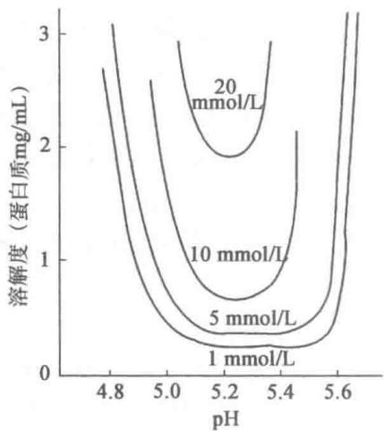  
图 5-1 pH 和离子强度对 $\beta$ -乳球蛋白溶解度的影响

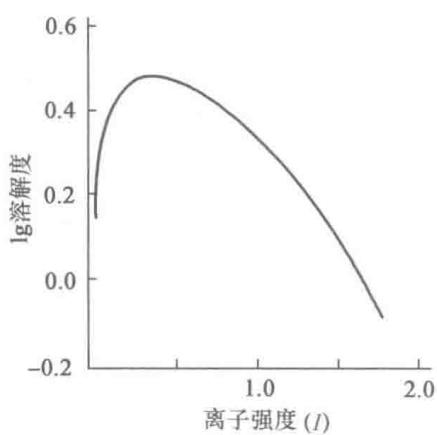  
图 5-2 等电点时中性盐( $K_{2}SO_{4}$ )对一氧化碳-血红蛋白溶解度的影响  
(图中曲线上的数值为氯化钠的浓度)

从图 5-2 可以看出, 当溶液的离子强度增加到一定数值时, 蛋白质溶解度开始下降。当离子强度增加到足够高时, 例如饱和或半饱和的程度, 很多蛋白质可以从水溶液中沉淀出来, 这种现象称为盐析 (salting out)。盐析作用主要是由于大量中性盐的加入使水的活度降低, 原来溶液中的大部分甚至全部的自由水转变为盐离子的水化水 (water of hydration)。此时那些被迫与蛋白质分子表面的疏水基团接触并掩盖它们的水分子 (笼形壳, 见第 1 章) 也成盐离子的水化水, 留下暴露出来的疏水基团。随着盐浓度的增加, 蛋白质疏水表面进一步暴露, 由于疏水作用蛋白质聚集而沉淀。因此最先聚集的蛋白质是表面上疏水残基最多的蛋白质。盐析法是蛋白质分离过程中最常用的方法之一。研究得最多的蛋白质之一, 鸡蛋清的卵清蛋白就是用盐析法得到的。鸡蛋清用水稀释后, 加入硫酸铵至半饱和, 其中的球蛋白立即沉淀析出 (表 2-6), 过滤后, 酸化至 pH 4.6\~4.8 (卵清蛋白的等电点), 在 $20^{\circ} \mathrm{C}$ 放置, 即得卵清蛋白晶体。牛胰中的一些蛋白水解酶及其酶原如胰凝乳蛋白酶原、 $\alpha-$ 胰凝乳蛋白酶和胰蛋白酶都是用硫酸铵和硫酸镁盐析的方法分离纯化并获得结晶。由于盐析分离出来的蛋白质保持着它的天然构象, 能再溶解; 并经多种方法鉴定产品是均一的, 可见在一些情况下, 盐析是一种非常有效的分离方法。

用于盐析的中性盐以硫酸铵为最佳,因为它在水中的溶解度很高,而溶解度的温度系数较低。应当指出,同样浓度的二价离子中性盐,如 $\mathrm{MgCl}_{2}$ 、 $(\mathrm{NH}_{4})_{2}\mathrm{SO}_{4}$ 对蛋白质溶解度影响,要比单价中性盐如 NaCl、 $NH_{4}Cl$ 大得多。中性盐影响蛋白质溶解度的能力是它们的离子强度的函数(图 5-2)。离子强度(ionic strength)可以定义为:

$$
I = \frac {1}{2} \sum c _ {i} Z _ {i} ^ {2}
$$

式中， $c_{i}$ 为各种离子的浓度（单位 mol/L）， $Z_{i}$ 为各种离子的净电荷（与符号无关）； $\sum$ 是表示加成的符号。计算溶液的离子浓度，可将各种离子的浓度分别乘以各种离子所带的净电荷的平方，然后将所有乘积相加并除以 2。例如 2 mol/L 硫酸铵溶液的离子强度为：

$$
\frac {(4 \times 1) + (2 \times 4)}{2} = 6
$$

注意,计算离子强度时,仅用离子的净电荷,因为未解离的电解质(如未解离的醋酸)或携带正负电荷数相等的兼性离子(如中性氨基酸)并不增强溶液的离子强度。

## （三）有机溶剂分级分离

与水互溶的有机溶剂(如甲醇、乙醇和丙酮等)能使蛋白质在水中的溶解度显著降低。在室温下,这些有机溶剂不仅能引起蛋白质沉淀,而且伴随着变性。如果预先将有机溶剂冷却到-40℃至-60℃,然后在不断地搅拌下加入有机溶剂以防止局部浓度过高,那么变性问题在很大程度上可以得到解决。蛋白质在有机溶剂中的溶解度也随温度、pH和离子强度而变化。

在一定温度、pH 和离子强度条件下，引起蛋白质沉淀的有机溶剂的浓度不同，因此控制有机溶剂浓度也可以分离蛋白质。例如，在 $-5^{\circ}C$ 的 25% 乙醇中卵清蛋白可以沉淀析出，而与卵清中的其他蛋白质分开。

有机溶剂引起蛋白质沉淀的主要原因之一是改变了介质的介电常数（dielectric constant）。水是高介电常数物质（20℃时，80），有机溶剂是低介电常数物质（20℃时，甲醇33，乙醇24，丙酮21.4），因此有机溶剂的加入使水溶液的介电常数降低。从电学的库仑定律（Coulomb's law）可知，介电常数的降低将增加两个相反电荷之间的吸引力。这样，蛋白质分子表面可解离基团的离子化程度减弱，水化程度降低，因此促进了蛋白质分子的聚集和沉淀。有机溶剂引起蛋白质沉淀的另一重要方式可能与盐析相似，与蛋白质直接争夺水化水，致使蛋白质聚集而沉淀。

水溶性非离子聚合物如聚乙二醇(polyethylene glycol)也能引起蛋白质沉淀。聚乙二醇的主要作用可能是脱去蛋白质的水化层。蛋白质在聚乙二醇中的溶解度几乎与溶液中的盐浓度、pH甚至蛋白质的绝对(水中)溶解度无关。这些观察表明聚乙二醇与蛋白质亲水基团发生相互作用并在空间上阻碍蛋白质与水相接近。蛋白质在聚乙二醇中的溶解度明显地依赖于聚乙二醇的分子质量,这个事实也支持了上述观点。

利用溶解度差异分离蛋白质的方法要十分注意温度的影响。在一定温度范围内，0\~40℃之间，大多数球状蛋白质的溶解度随温度升高而增加。但也有例外，例如人的血红蛋白从0\~25℃，溶解度随温度上升而降低。在40\~50℃以上，大部分蛋白质变得不稳定，开始变性，一般在中性pH介质中即失去溶解力。大多数蛋白质在低温下比较稳定，因此蛋白质的分级分离操作一般都在0℃或更低的温度下进行。

## （四）透析和超滤

透析(dialysis)是利用蛋白质分子不能通过半透膜的性质,使蛋白质和其他小分子物质如无机盐、单糖等分开。常用的半透膜是玻璃纸或称赛璐玢纸(cellophane paper)、火棉纸或称赛璐啶纸(celloidin paper)和其他改型的纤维素材料。透析是把待纯化的蛋白质溶液装在半透膜的透析袋里,放入透析液(蒸馏水或缓冲液)中进行的,透析液可以更换,直至透析袋内无机盐等小分子物质降到最少为止(图5-3)。透析虽然不能用来分离混合蛋白质本身,但它常是分离纯化中不可缺的一个步骤。

超[过]滤（ultrafiltration）是利用压力或离心力，强行使水和其他小分子溶质通过半透膜，而蛋白质被截留在膜上，以达到浓缩和脱盐的目的（图5-4）。如果滤膜选择得当，还能同时进行粗分级。超过滤既可以用于小量样品处理，也可用于大规模生产。现在已有各种商品化的超滤装置可供选用，有加压、抽滤和离心等多种形式。滤膜也有多种规格，它们可截留一定分子质量的蛋白质。使用中最需要注意的问题是滤膜表面容易被吸附的蛋白质堵塞，以致超滤速度减慢，能被截留的物质分子质量也变小。当样品含量低时甚至因吸附而不能被回收。为此采用切向流过滤（tangential flow filtration）的方法可获得较理想的结果。所谓切向流过滤是指液体在泵驱动下沿着与膜表面相切的方向流动，在膜上形成压力，使部分液体透过膜，而另一部分液体切向地流过膜表面，将被膜截留的蛋白质分子冲走（反流回样品槽），避免它们在滤膜表面上堆积，造成膜堵塞。超滤除了可以对蛋白质进行粗略的分离外，更重要的是可以除去水分（和小分子杂质），达到浓缩样品的目的。

  
图5-3 透析装置

## （五）密度梯度超速离心

蛋白质颗粒的沉降速度不仅决定于它的大小,而且也取决于它的密度(见下一节)。如果蛋白质颗粒在具有密度梯度(density gradient)的介质中离心时,质量和密度大的颗粒比质量和密度小的颗粒沉降得快,并且每种蛋白质颗粒沉降到与自身密度相等的介质密度梯度时,则停止不前,最后各种蛋白质在离心管(常用塑料管)中被分离成各自独立的区带(zone),分成区带的蛋白质可以在管底刺一个小孔,逐滴放出,分部收集。每个组分进行小样分析以确定区带位置(参见图10-27A)。常用的密度梯度有蔗糖梯度(图5-5),聚蔗糖梯度和其他合成材料的密度梯度。蔗糖便宜,纯度高,浓溶液(600g/L)密度可达1.28 g/cm³。聚蔗糖的商品名是Ficoll,它是由蔗糖和1-氯-2,3-环氧丙烷合成的高聚物, $M_r$ 约400 000。需要高密度和低渗透压的梯度时,可用Ficoll代替蔗糖。密度梯度在离心管内的分布是管底的密度最大,向上逐渐减小(图5-5)。实验时待分离的蛋白质混合物平铺在梯度的顶端,离心采用水平转头高速进行。使用密度梯度的主要原因是这种设计能起一种稳定作用,可以消除因对流和机械震动引起区带界面的扰乱。

  
图 5-4 利用压力(A)和离心力(B)的超滤装置

  
图5-5 制备型超速离心机和蔗糖密度梯度

## （六）凝胶过滤——大小排阻层析

凝胶过滤(gel filtration)也称大小排阻层析(size exclusion chromatography)、分子筛(molecular-sieve)或凝胶渗透(gel permeation)层析。它是根据多孔介质对不同大小(体积)和不同形状的分子的排阻能力不同来分离蛋白质混合物的。

## 1. 凝胶过滤的介质

凝胶过滤所用的支持介质(也称载体)是凝胶珠(gel bead)或称凝胶颗粒,其内部是多孔的网状结构。凝胶的交联度或孔度(网孔大小)决定了凝胶的分级[分离]范围(fractionation range),即能被该凝胶分离开来的蛋白质混合物的相对分子质量范围。例如 Sephadex G-50 的分级范围是 1 500 到 30 000。有时也用排阻极限(exclusion limit)来表示分级范围的上限,它被定义为不能扩散进入凝胶珠微孔的最小分子的

$M_{r}$ ，例如 Sephadex G-50 的排阻极限是 30 000。凝胶的粒度与洗脱流速和分辨率有关。颗粒通常用筛眼数即目数（mesh size）或珠直径（ $\mu m$ ）表示。

目前经常使用的凝胶有交联葡聚糖，聚丙烯酰胺和琼脂糖等。交联葡聚糖是由线形的 $\alpha - 1,6-$ 葡聚糖（右旋糖酐）与1-氯-2,3-环氧丙烷反应而成的化合物，它的商品名称为Sephadex（见第9章）。聚丙烯酰胺凝胶（商品名称为Bio-gel P）是一种人工合成的凝胶，它是由单体丙烯酰胺(acrylamide)和交联剂甲叉双丙烯酰胺（ $N, N'$ -methylenebisacrylamide）共聚而成。琼脂糖是从琼脂中分离获得的（见第9章），琼脂糖凝胶的商品名是Sepharose或Bio-Gel A，这种凝胶的优点是孔径大，排阻极限高。

## 2. 凝胶过滤的原理和过程

当分子大小(和形状)不同的蛋白质流经凝胶层析柱时,比凝胶孔径大的分子不能进入珠内的网状结构,而被排阻在凝胶珠之外,随着溶剂在凝胶珠之间的孔隙向下移动并最先流出柱外;比网孔小的分子则不同程度地能自由出入凝胶珠的内外。这样不同大小的分子由于所经的路径不同而得到分离,大分子物质先被洗脱出来,小分子物质后被洗脱出来,同样质量的分子,线型分子在前,球状分子在后。凝胶过滤的基本原理可用图5-6表示。

为了便于讨论凝胶过滤层析的原理,介绍几个有关凝胶体积的术语(图5-7):① $V_{t}$ 为凝胶柱床的总体积(total volume),常称柱床体积,它可以用水直接测量或按几何形状计算而得;② $V_{e}$ 为某一待分离物质组分的洗脱体积(elution volume),自加样品开始到该组分的洗脱峰(峰顶)出现时所流出的体积;③ $V_{o}$ 为外水体积(outer volume)或孔隙体积(void volume),即柱床中凝胶珠之间孔隙的水相体积,测出不被凝胶滞留的蓝色葡聚糖-2000(blue dextran-2000, $M_{r}$ 约为2000000)的洗脱体积可以决定 $V_{o}$ ;④ $V_{i}$ 为内水体积(inner volume),即凝胶珠内部的水相体积;它可以由干胶重量(g)乘其吸水值(mL水/g干胶)近似地表示,或直接测出小分子物质[如 $T_{2}O$ (氚化水,tritiated water),tritium oxide]通过凝胶柱的洗脱体积再减去外体积得来;⑤ $V_{m}$ 为凝胶基质体积(matrix volume)。

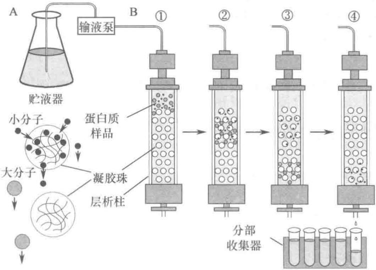  
图 5-6 凝胶过滤(大小排阻层析)的原理  
A. 小分子由于扩散作用进入凝胶珠内部而被滞留, 大分子被排阻在凝胶珠的外面, 并在凝胶珠之间迅速通过; B. ① 蛋白质混合物上柱; ② 洗脱开始, 小分子扩散进入凝胶珠内部而被滞留, 而大分子则被排阻在凝胶颗粒之外并向下移动, 大、小分子开始分开; ③ 大、小分子完全分开; ④ 大分子因行程较短, 已被洗脱出层析柱, 小分子尚在行进中

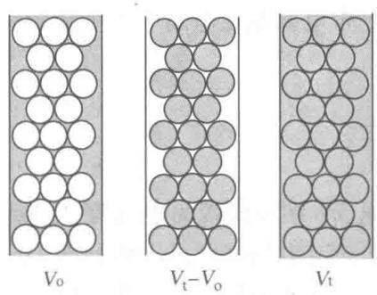  
图5-7 凝胶柱床中 $V_{\mathrm{t}}, V_{\mathrm{o}}$ 等关系示意图  
阴影部分为所指体积

凝胶床内各种体积之间的关系是：

$$
V _ {\mathrm{f}} = V _ {\mathrm{o}} + V _ {\mathrm{i}} + V _ {\mathrm{m}}
$$

其中 $(V_{i}+V_{m})$ 亦即 $(V_{t}-V_{o})$ 是凝胶珠的总体积。假定凝胶与待分离的物质之间不存在相互作用，那么凝胶过滤可以看成是一种液-液分配层析。凝胶珠内的水相是固定相 $(V_{i})$ ，凝胶珠外的水相是流动相 $(V_{o})$ ，物质就在 $V_{o}$ 和 $V_{i}$ 之间分配（见图2-14）。能进入 $V_{i}$ 的组分的量决定于组分分子的大小（和形状）和凝胶网孔的大小。物质在柱中的移动速度取决于它在两相之间的分配系数 $(K_{d})$ ：

$$
K _ {\mathrm{d}} = \frac {V _ {\mathrm{e}} - V _ {\mathrm{o}}}{V _ {\mathrm{i}}}
$$

$K_{\mathrm{d}}$ 是组分分子大小的函数。对于完全被排阻在凝胶珠之外的大分子来说，它们将在同一洗脱峰出现， $V_{\mathrm{e}} = V_{\mathrm{o}}, K_{\mathrm{d}} = 0$ 。对于完全能自由出入凝胶珠内外的小分子， $V_{\mathrm{e}} = V_{\mathrm{o}} + V_{\mathrm{i}}, K_{\mathrm{d}} = 1$ ；对于在分级分离范围内的中等大小分子，凝胶珠内部的有些网孔它们能扩散进去，有些网孔则不能，因此一般情况下， $K_{\mathrm{d}}$ 总是在0与1之间。因此在分级分离范围之外的物质（ $K_{\mathrm{d}} = 0$ 或 $K_{\mathrm{d}} = 1$ )，虽分子大小有所不同，但也不能被分开。实验中，有时出现 $K_{\mathrm{d}} > 1$ 的现象，这表明凝胶对组分有吸附作用。

由于实际上测定 $V_{i}$ 有困难, 所以上述的公式很少使用。经修正, 用凝胶珠内的总体积代替上式中的内体积 ( $V_{i}$ ) 来表示 $K_{d}$ , 此时 $K_{d}$ 改用 $K_{av}$ , 称可利用分配系数 (available coefficient):

$$
K _ {\mathrm{av}} = \frac {V _ {\mathrm{e}} - V _ {\mathrm{o}}}{V _ {\mathrm{t}} - V _ {\mathrm{o}}}
$$

只要测得 $V_{\mathrm{t}}, V_{\mathrm{o}}$ 和 $V_{\mathrm{e}}$ ，即可计算 $K_{\mathrm{av}}$ 的值。

## (七) 凝胶电泳

电泳是基于荷电颗粒(如蛋白质离子)在外电场中的移动速度不同而达到分离的一项技术。电泳技术可用于氨基酸、肽和核苷酸等生物小分子的分离分析和小量制备。电泳方法通常不用来纯化蛋白质,因为一般有其他更简单的方法可供利用,此外电泳方法经常会影响蛋白质的结构,因而也影响它的功能。然而作为一种分析手段电泳是极其重要的。它可以快速地使研究者知道混合物中不同蛋白质的数目,或者一个所要蛋白质的纯化程度。它也可用来测定蛋白质的某些重要性质,如等电点、近似相对分子质量。

## 1. 电泳原理

在外电场的作用下,荷电颗粒将向着与其电荷符号相反的电极移动,这种现象称为电泳(electrophoresis)或离子泳(ionphoresis)。

带电颗粒在电场中发生泳动时,将受到两种方向相反的力的作用:

$$
\begin{array}{r l} & F (\text { 电场力 }) = q E \left(= q \frac {U}{d}\right) \\ & F _ {f} (\text { 摩擦力 }) = f v \end{array}
$$

这里，q=颗粒所带的净电荷（电量）；

E=电场强度或电势梯度=U/d;

U=两电极间的电势差(V);

d=两电极间的距离(cm);

f=摩擦系数(与颗粒的形状、大小和介质的黏度有关);

$\nu=$ 颗粒移动速度(cm/s)。

当颗粒以恒稳速度移动时，则 $F-F_{f}=0$ ，因此 $qE=f\nu$ ，即，

$$
\frac {\nu}{E} = \frac {q}{f}
$$

在一定的介质中对某一种蛋白质来说，q/f 是一个定值，因而 $\nu/E$ 也是定值，它被称为电泳迁移率或泳动度（electrophoretic mobility）：

$$
\mu = \frac {\nu}{E}
$$

$\mu$ 值可以通过实验测得。蛋白质的 $\mu$ 值为 $0.1 \times 10^{-4} \sim 1.0 \times 10^{-4} \mathrm{~cm}^2 \mathrm{~V}^{-1} \mathrm{~s}^{-1}$ 。蛋白质的电泳迁移率以及 $\mathrm{pH}$ 和离子强度对电泳迁移率的影响都反映一种蛋白质的特性。因此电泳不仅是分离分析蛋白质的重要手段，也是研究蛋白质性质的一种有用的物理方法。

## 2. 电泳类型

最早的电泳装置是由瑞典学者 Arne Tisellius(1902—1971)于 1937 年设计出来的,称为移动界面电泳(moving-boundary electrophoresis)。它是在 U 形管内使蛋白质溶液和缓冲液之间形成清晰的界面,然后加一外电场(图 5-8)。由于界面处存在浓度梯度因而产生折射率梯度,利用适当的光学系统可以观察到界面的移动。在电泳过程中,每个移动界面(峰)相当于某一特定的蛋白质。根据界面移动的速度和电场强度即可算出某一蛋白质的电泳迁移率。移动界面电泳(也称自由界面电泳)在相当长的时间内曾是定量分析混合蛋白质组分的有力工具,例如用于研究人血浆的蛋白质成分,得到很有意义的结果。对比正常的和病人的血浆蛋白质的电泳图谱,有助于临床诊断。

在移动界面电泳的基础上已发展出多种形式的区带电泳（zone electrophoresis），它是由于电泳时混合物在支持介质上被分离成若干区带或条带而得名。又按支持物的物理性状不同分成若干类，如纸电泳、薄膜电泳和凝胶电泳等。区带电泳具有设备简单，操作方便，样品用量少等优点，它是蛋白质和其他生物分子分析分离的常用技术。

目前使用最广泛的区带电泳是凝胶电泳(gel electrophoresis)，它最常用的支持介质有聚丙烯酰胺凝胶和琼脂糖凝胶。

  
图 5-8 移动界面电泳的图解  
选择适当 pH 的缓冲溶液使蛋白质带同种电荷；这里假设蛋白质为负离子等电点

## 3. 电泳过程

凝胶电泳在用缓冲液配制的支持介质上进行。聚丙烯酰胺凝胶电泳(polyacrylamide gel electrophoresis,简称PAGE)适于分离蛋白质和寡核苷酸；琼脂糖凝胶电泳(agarose gel electrophoresis)用于核酸的分离。这两种凝胶电泳的分辨率都很高。凝胶可以制作成平板或圆柱，平板凝胶电泳装置的图解见图5-9A,B。电泳前将待分离的蛋白质样品加到凝胶板的加样井中，凝胶板的两端与电极连接；通电进行电泳。电泳完毕，用显色剂（对蛋白质可用考马斯亮蓝或氨基黑等）浸染后即可显示出蛋白质条带(图5-9C)。

## （八）等电聚焦和双向电泳

## 1. 等电聚焦 (isoelectric focusing, IEF)

也称电聚焦(electric focusing, EF)，是一种高分辨率的蛋白质分离技术，它主要用于蛋白质等电点的测定(图 5-10)。等电聚焦是在具有 pH 梯度的介质中进行的。最初使用的是液体介质如浓蔗糖溶液，现在多用凝胶介质是聚丙烯酰胺、琼脂糖和葡聚糖凝胶等；因此也称凝胶等电聚焦(gel IEF)。由于介质固体化，操作方便，分离量增大，分离时间缩短(只需 1\~3 h)，分别率高达 0.001 pH 单位。

pH 梯度制作一般利用两性电解质(商品名称为 ampholine)，它们是一系列低相对分子质量( $M_{\mathrm{r}}$ 在 300 到 1000 之间)的脂肪族多氨基和多羧基的同系物，具有相近但不相同的 $\mathrm{pK}_{\mathrm{a}}$ 和 $\mathrm{pI}$ 值。这些两性电解质在跨凝胶介质的电场中，自然分布而形成 pH 梯度（范围在 2.5 到 11.0 之间）。加样后，蛋白质混合物在外电场作用下将移动并各自“聚焦”在与其等电点相等的 pH 处；这样，不同等电点的蛋白质各不相同地被分布在整个凝胶上。等电聚焦可以把人的血清分成 40 多个条带。此技术特别适用于同工酶(isoenzyme)的鉴定。

## 2. 双向(二维)电泳(two-dimensional electrophoresis)

有些混合物进行一次电泳不能完全分开。这种情况可在第一次电泳后，将凝胶条切下，旋转 $90^{\circ}$ （成水平向)通过凝胶之间的接触印迹(bloting)把样品转移到新的凝胶板上,更换缓冲液,进行第二次电泳。这种方法称为双向电泳。现在双向电泳多指等电聚焦和随后的SDS凝胶电泳相结合的分离技术。蛋白质第一次分离是在薄胶条上进行等电聚焦,然后把胶条水平向铺设在片状凝胶上用SDS-聚丙烯酰胺凝胶电泳进行第二次分离。得到的双向电泳谱(凝胶板)上水平向分离反映pI的差别,垂直向分离反映分子质量的不同。因此双向电泳可以把分子质量相同而pI不同,或者pI相近而分子质量不同的蛋白质分离开来。

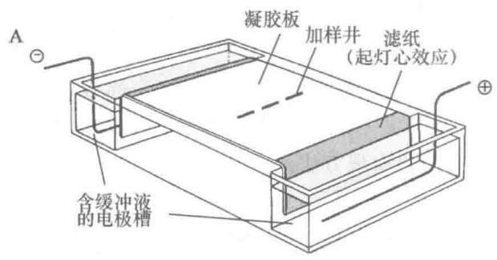

  
图 5-9 水平式(A)和垂直式(B)平板凝胶电泳的图解和染色后显示的蛋白质条带示意图(C)示意图(C)中,泳道①已知分子质量的标准蛋白质,②细胞粗提取液,③经硫酸铵沉淀处理,④阳离子交换层析,⑤凝胶过滤,⑥亲和层析

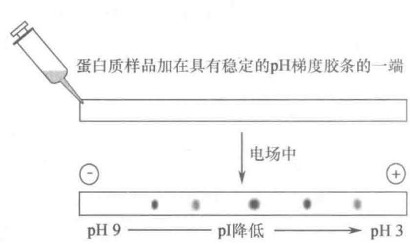  
染色后显示出蛋白质按等电点沿pH梯度分布  
图 5-10 等电聚焦

双向电泳作为分析方法比任一种电泳单独使用都

要更灵敏。用双向电泳可以把细胞的一套(几千种)蛋白质分开。单个蛋白质斑点可从凝胶上切下,进行质谱鉴定(第2章)。

## （九）离子交换层析

离子交换层析是利用在给定 pH 下蛋白质的净电荷符号和数量的不同而进行分离的一种层析方法。层析的基本原理和运作参见第 2 章氨基酸混合物的分离。在这里，主要介绍一下广泛用于蛋白质和核酸大分子层析的支持介质纤维素离子交换剂和交联葡聚糖离子交换剂的一些特性。

纤维素离子交换剂(cellulose ion exchanger)采用纤维素作为交换剂的基质。纤维素离子交换剂之所以适用于大分子的分离，是由于它具有松散的亲水性网状结构，有较大的表面积，大分子可以自由通过。因此它对蛋白质的交换容量比离子交换树脂大。同时，纤维素单糖残基上的羟基被可交换基团置换的百分率较低，因而纤维素离子交换剂的电荷密度较小，所以洗脱条件温和，蛋白质回收率较高。此外纤维素离子交换剂的品种较多,可以适用于各种目的的分离。总之,它的出现对酶和其他蛋白质的分离纯化是个重大的改进。常用的纤维素阳离子交换剂有 CM-纤维素(羧甲基-,—O—CH₂COOH;弱酸型)、P-纤维素(磷酸基-,—O—PO₃H₂;中强酸型)和 SE-纤维素(磺乙基-,—O—CH₂—CH₂—SO₃H;强酸型)等;纤维素阴离子交换剂有 AE-纤维素(氨基乙基-,—O—CH₂—CH₂—NH₂;弱碱型)、DEAE-纤维素(二乙基氨基乙基-,—O—CH₂—CH₂—N=(C₂H₅)₂;强碱型)和 TEAE-纤维素(三乙基氨基乙基-,—O—CH₂—CH₂—N=(C₂H₅)₃;强碱型)等。

交联葡聚糖离子交换剂(Sephadex ion exchanger)的类型和可电离基团的种类与纤维素离子交换剂差不多,只是基质纤维素换成交联葡聚糖。Sephadex 离子交换剂每克干重具有相当多的可电离基团,容量比纤维素离子交换剂大3到4倍。这类交换剂的优点是,它们既能根据分子的净电荷数量又能根据分子的大小(有分子筛效应)进行分离。

在离子交换层析中,蛋白质对离子交换剂的结合力取决于彼此间相反电荷基团的静电吸引,而这又和溶液的 pH 及盐浓度有关,因为 pH 决定离子交换剂和蛋白质的电离程度。特别是由于单位重量的纤维素离子交换剂所含的离子基团较少(0.3\~1.0 mmol/g),盐浓度的微小变化就会直接影响它对蛋白质电荷吸附的容量。因此蛋白质混合物的分离可以由改变溶液中的盐离子强度和 pH 来完成,对离子交换剂结合力最小的蛋白质首先从层析柱中洗脱出来。

层析洗脱,可以采用保持洗脱液成分一直不变的方式洗脱,也可以采用改变洗脱剂的盐浓度或(和)pH的方式洗脱。后一种方式又可以分为两种:一种是跳跃式的分段改变,另一种是渐进式的连续改变。采用前一种方式的洗脱称为分段洗脱(stepwise elution),后一种方式的洗脱称为梯度洗脱(gradient elution)。梯度洗脱一般分离效果好,分辨率高,特别是使用交换容量小、对盐浓度敏感的离子交换剂,多采用梯度洗脱。

为使样品组分能从离子交换柱上分别洗脱下来,必须控制好洗脱体积(与柱床体积相比)和洗脱液的盐浓度和 pH。洗脱液体积和盐浓度变化形式(梯度形式)直接影响层析的分辨率。通常采用的梯度形式有线性(形),凸形,凹形和复合形四种,使用最多的是线性梯度(参见本章参考书目2)。

## （十）疏水相互作用层析

球状蛋白质——细胞溶胶中的酶类、抗体、肽激素等都是水溶性的，它们的分子表面以亲水性残基为主。但是不同的蛋白质，分子表面上的亲水基团和疏水基团的比例是各不相同的。疏水[相互作用]层析（hydrophobic interaction chromatography）就是根据蛋白质表面的疏水性差别发展起来的一种纯化技术。如果在层析支持介质（如琼脂糖）上接上疏水基团就可以在一定条件下跟蛋白质分子表面的疏水侧链相互作用而达到分离的目的。疏水吸附剂配基的种类很多，有直链的烷基，如辛基琼脂糖（octa-sephadex）；有芳香的苯环，如苯基琼脂糖（phenyl-sephadex）等。目前广泛使用的反相HPLC（高效液相色谱）柱如C-3、C-8和C-18等，本质上都属于疏水层析类型。烷基化的反相层析柱多用于肽类的分离，苯基层析介质用于蛋白质纯化。

由于疏水层析要求高盐浓度的存在以促进蛋白质分子表面的疏水区暴露；为使吸附达到最大，可将蛋白质样品的 pH 调至等电点附近。蛋白质吸附后，则可利用多种方式进行选择性洗脱，包括使用逐渐降低离子强度或/和增加 pH 的洗脱液（增加蛋白质的亲水性），或使用对固定相的亲和力比对蛋白质更强的置换剂进行置换洗脱。这类置换剂有非离子型去污剂（如 triton X-100）、脂肪醇（如丁醇、乙二醇）、脂肪胺（如丁胺）。

疏水层析在膜蛋白研究中有一个额外的好处,因为膜蛋白常与某些特定的去污剂结合后变得更为稳定,有时它们的活性还依赖于某种去污剂的存在,因此利用疏水层析有助于膜蛋白更换结合的去污剂。

疏水层析的问题之一是某些洗脱条件可引起蛋白质变性。另一个实际问题是它的不可预测性，也即对某些蛋白质分离效果很好，对另一些则不佳，因此预试性研究是不可少的。

利用疏水的蒽醌类染料作为配基的层析常用于含核苷酸衍生物的酶和蛋白质的纯化。近年来又出现其他染料树脂用于类似的目的。这些方法称为染料结合层析（dye-binding chromatography），也是基于疏水相互作用的原理。

## (十一) 亲和层析

生物分子间的相互作用是具有选择性的,如酶分子跟底物或抑制剂、抗体跟抗原以及激素跟受体的专一结合;凝集素跟糖质的结合和核酸分子中碱基的配对也都是专一性的。亲和层析（affinity chromatography)就是利用蛋白质分子(或其他生物分子)对其配体分子具有专一性识别能力或称生物学亲和力建立起来的一种有效的纯化方法。亲和层析有两个优点是其他纯化方法所不能比的:一是它通常只需要经过一步的处理即可将某一含量少的所要蛋白质从复杂的混合物中分离出来,并且纯度和产率还相当高;二是可以在活性物质中除去化学和物理性质几乎完全相同、但已失活了的“杂质”,这一点对提高酶或其他生物活性物质的比活特别有用。

亲和层析最先用于酶的分离并从中得到发展，今天已广泛用于核苷酸、核酸、免疫球蛋白、膜受体蛋白、细胞器甚至完整的细胞的分离。应用亲和层析需要有待分离物质的结构和生物学特异性的知识，以便设计出最佳的分离条件。分离酶时配体可以是底物、可逆抑制剂或别构效应物等。被选择的条件一般是对酶-配基的结合最适的，因为方法的成功有赖于复合体的可逆形成。

亲和层析的基本方法是把待分离的某一蛋白质的专一配体通过适当的化学反应共价连接到像琼脂糖

凝胶一类的载体表面官能团(如—OH)上。一般在配体和多糖载体之间插入一段长度适当的连接臂或称间隔臂(Spacer arm)如 $\varepsilon-$ 氨基己酸,使配体与凝胶之间保持足够的距离,不致因载体表面的位阻而妨碍待分离的分子与配基结合。这类载体在其他性能方面允许蛋白质能自由通过。当蛋白质混合物加到填有亲和载体的层析柱时,待纯化的某一蛋白质则被吸附在含配体的琼脂糖颗粒表面上,而其他的蛋白质(称杂蛋白)则因对该配体无专一的结合部位而不被吸附,它们通过洗涤即可除去(图5-11A),被专一结合的蛋白质可用含有相应的游离配体溶液把它从柱上洗脱下来(称为亲和洗脱)(图5-11B)。

凝集素亲和层析(用于糖蛋白的分离纯化)、免疫亲和层析(如偶联有抗体的亲和柱可用来纯化作为抗原的蛋白质)和金属螯合层析(用于分离含有金属的蛋白质)等都属于亲和层析类。此外还有一些层析如巯基交换层析,其层析原理跟离子交换层析相似。制备含有游离巯基为配基的固定相,它可以和含有游离巯基的待分离蛋白质共价结合,形成二硫键。其他无游离巯基的分子很容易被除去。然后在适当的条件下把新形成的二硫键断开,将原结合在固定相上的蛋白质洗脱并回收回来。

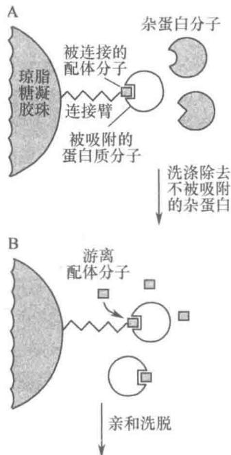  
图5-11 亲和层析的原理

## (十二) 高效液相层析

高效液相层析(high performance liquid chromatography)简称HPLC，是近二、三十年内发展起来的一项分离技术。它实际上是离子交换、分子排阻、吸附和分配等层析技术的发展新阶段。因此它以这些层析的原理为基础，在技术上作了很大的改进。HPLC采用了高压泵使蛋白质分子在柱上向下移动的速度加快，同时采用能耐高压的高质量层析材料（如载体颗粒的机械性能强、粒度小而均匀、化学性能稳定）和相应的设备。由于降低样品在柱上的经过时间，限制了蛋白质条带的扩散，因而分辨率有了很大提高。总之，HPLC使原来的各种层析变得快速、灵敏、高效。现在的HPLC多配有计算机，可自动完成分离纯化过程（图5-12），它已成为目前最通用、最有力和最多能的层析方式，用于蛋白质及其他生物分子的分析和制备。

反相 HPLC (reversed-phase HPLC) 广泛用于分离非极性化合物如药物及其代谢物、杀虫剂、氨基酸和肽等；现在也普遍用来纯化蛋白质。反相 HPLC 中固定相是非极性的，而流动相是相对极性的，也即固定

相极性小于流动相极性；反之为正相 HPLC。最常用的固定相是化学键合相（bonded phase）形式，反相键合相是由烷基硅烷（alkysilane）与硅胶通过化学反应连接而成。使用的烷基硅烷有丁基 $\left(\mathrm{C}_{4}\right)$ 、辛基 $\left(\mathrm{C}_{8}\right)$ 和十八烷基 $\left(\mathrm{C}_{18}\right)$ 等硅烷。流动相常用的有水或缓冲液、甲醇、乙腈或四氢呋喃及它们的混合物。反相液相层析与多数其他形式的层析不同之处在于固定相基本上是惰性的，固定相与被分离物只可能有疏水作用。反相技术吸引人的地方是流动相组成的小小变化，例如加入盐，改变 pH 或有机溶剂量就能成功地影响分离特性。

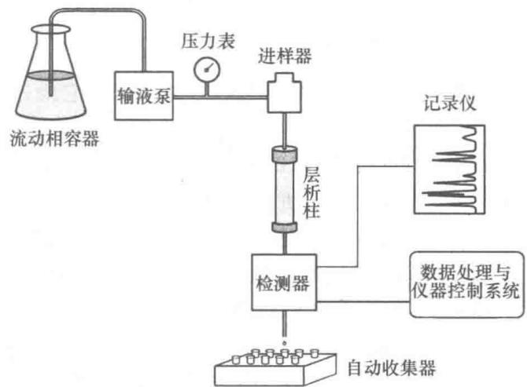  
图5-12 高效液相层析的图解

## 四、蛋白质相对分子质量的测定

蛋白质分子的质量是很大的,它的相对分子质量 $(M_{r})$ 变化范围在6 000到1 000 000或更大一些。用于和曾用于蛋白质分子质量测定的方法有多种,物理化学方法如渗透压、黏度、沉降平衡、沉降速度、光散射和质谱等,根据化学组成可以推定最低相对分子质量。近些年发展起来而又比较简便的方法有凝胶过滤和SDS-PAGE,但它们需要已知分子质量的标准蛋白质作对照。

## （一）凝胶过滤法测定相对分子质量

这种方法比较简便,不要求复杂的仪器就能相当精确地测出蛋白质的相对分子质量。从凝胶过滤的原理可知,蛋白质分子通过凝胶柱的速度并不直接取决于分子的质量,而是它的斯托克半径。如果某种蛋白质与一个非水化球体具有相同的过柱速度即相同的洗脱体积,则认为这种蛋白质具有与此球体相同的半径,称为斯托克半径(Stoke's radius)。因此利用凝胶过滤法测定蛋白质的相对分子质量时,已知 $M_{r}$ 和斯托克半径的标准蛋白质(standard protein)和待测蛋白质必须具有相似的分子形状(接近球体),否则不能得到比较准确的 $M_{r}$ 。分子形状为线形的或跟凝胶能发生吸附作用的蛋白质,则不能用这种方法测

$$
M _ {r}
$$

1966 年 Andrews 根据他的实验结果提出了一个经验公式：

$$
\lg_ {1 0} M _ {\mathrm{r}} = a - b V _ {\mathrm{e}}
$$

式中， $V_{e}$ 为洗脱体积， $M_{r}$ 为相对分子质量，在特定条件下 a 和 b 为常数。实验中，只要测得几种已知 $M_{r}$ 的标准蛋白质的 $V_{e}$ 值，并以它们的 $\lg_{10}M_{r}$ 对 $V_{e}$ 作图得一标准曲线，再测出待测样品的 $V_{e}$ 值，即可从标准曲线中确定它的相对分子质量（图 5-13）。利用凝胶过滤层析法测定 $M_{r}$ 还有一个优点，即待测样品可以是不纯的，只要它具有专一的生物活性，借助活性找出洗脱峰位置，确定它的洗脱体积即可测出它的 $M_{r}$ 。测定蛋白质的 $M_{r}$ ，一般用交联葡聚糖，根据需要可选用 Sephadex G-75（分级分离的 $M_{r}$ 范围 3000 到 80000）或 G-100（ $M_{r}$ 范围 4000 到 150000）等型号的凝胶。

  
图 5-13 凝胶过滤法测定蛋白质的 $M_{\mathrm{r}}$ 图中 A, B, C 为标准蛋白质

## （二）SDS-PAGE 测定相对分子质量

前面曾谈到，蛋白质分子在介质中电泳时，它的迁移率决定于它所带的净电荷以及分子大小和形状等因素。1967年Shapiro等人发现，如果在聚丙烯酰胺凝胶中加入阴离子去污剂十二烷基硫酸钠（sodium dodecyl sulfate, SDS；见图10-3）或同时加入少量巯基苏糖醇（或巯基乙醇），则蛋白质分子的电泳迁移率主要取决于它的相对分子质量，而与原来所带的电荷和分子形状无关。

SDS 是一种变性剂, 它能破坏蛋白质分子中的氢键和疏水相互作用, 而巯基苏糖醇能打开二硫键, 因此在有 SDS 或同时有巯基苏糖醇存在下, 蛋白质或亚基(此时寡聚蛋白质解离成亚基)的多肽链处于展开状态。SDS 以其烃链与蛋白质分子的侧链通过疏水相互作用结合成复合体。在一定条件下, SDS 与大多数蛋白质的结合比为 $1.4 \mathrm{~g} \mathrm{SDS} / 1$ 克蛋白质, 相当于每两个氨基酸残基结合一个 SDS。SDS 与蛋白质的结合带来了两个后果: 第一, 由于 SDS 是阴离子, 使多肽链覆盖上相同密度的负电荷, 该电荷量远超过蛋白质分子原有的电荷量, 因而掩盖了不同蛋白质间原有的电荷差别; 第二, 改变了蛋白质分子的天然构象, 使大多数蛋白质分子呈同样的棒状形。因此在 SDS 存在下的电泳几乎是完全基于分子质量分离蛋白质的, 多肽愈小迁移得愈快。电泳完毕, 蛋白质可用染料如考马斯亮蓝 (Coomassie blue) 显示 (此染料能跟蛋白质结合, 但不与凝胶本身结合)。

在聚丙烯酰胺凝胶电泳中迁移率虽不受蛋白质分子原有的电荷、分子形状等因素的影响，但蛋白质之间亲水基团和疏水基团的比例有较大的差别，这会影响对SDS的结合量从而影响蛋白质的泳动速度；因此，此法测定分子质量的偏差较大，一般在 $10\%$ 左右。电泳迁移率与多肽链的相对分子质量 $(M_{\mathrm{r}})$ 具有下列关系：

$$
\lg M _ {\mathrm{r}} = a - b \mu_ {\mathrm{R}}
$$

式中，a、b 为常数， $\mu_{R}$ 是相对迁移率 = 样品迁移距离 / 前沿（染料如溴酚蓝）迁移距离。实验测定时，以几种标准蛋白质的 $M_{r}$ 的对数值对其 $\mu_{R}$ 值作图，根据待测样品的 $\mu_{R}$ ，从标准曲线上查出它的 $M_{r}$ （图 5-14）。

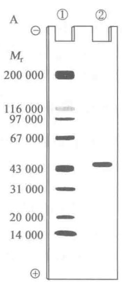

在聚丙烯酰胺凝胶电泳中迁移率虽不受蛋白质分子原有的电荷、分子形状因素的影响，但蛋白质之间亲水基团和疏水基团的比例有较大的差别，这会影响对SDS的结合量从而影响蛋白质的泳动速度；因此，此法测定分子质量的偏差较大，图 5-14 SDS-PAGE 法测定蛋白质的 $M_{r}$

A. 凝胶电泳谱: 泳道①为标准蛋白质, 自上而下为肌球蛋白(重链)、 $\beta$ -半乳糖苷酶、磷酸化酶b、血清清蛋白、卵清蛋白、碳酸酐酶、胰蛋白酶抑制剂、 $\alpha$ -乳清蛋白, 泳道②为待测蛋白质; B. 标准曲线

一般在 $10\%$ 左右。电泳迁移率与多肽链的相对分子质量 $(M_{\mathrm{r}})$ 具有下列关系：

$$
\lg M _ {\mathrm{r}} = a - b \mu_ {\mathrm{R}}
$$

式中，a、b 为常数， $\mu_{R}$ 是相对迁移率=样品迁移距离/前沿（染料如溴酚蓝）迁移距离。实验测定时，以几种标准蛋白质的 $M_{r}$ 的对数值对其 $\mu_{R}$ 值作图，根据待测样品的 $\mu_{R}$ ，从标准曲线上查出它的 $M_{r}$ （图 5-14）。

## （三）沉降速度法测定相对分子质量

前面讲的两种测定蛋白质分子质量的方法都需要标准蛋白质作参照。那么标准蛋白质的分子质量又是用什么方法测得的？其实多种测定方法都是直接法。下面介绍的沉降速度法（sedimentation velocity）是经典的常用方法。表5-5中所列的蛋白质 $M_{r}$ 数据多是用此法获得的。

蛋白质分子在溶液中受到强大的离心力作用时,如果蛋白质的密度大于溶液的密度,蛋白质分子就会沉降。沉降的速率与蛋白质分子的大小、形状和密度有关，而且与溶液的密度和黏度有关。测定蛋白质沉降速度，需要使用能够产生强大离心力的超速离心机（ultracentrifuge）。超速离心机每分钟转速达60 000\~80 000转，相当于单位质量(1 g)颗粒在距旋转轴中心10 cm处所受到的离心力为400 000 g\~700 000 g(g为重力加速度=9.807 m/s²)。超速离心机的最大转速为60 000\~80 000 r/min，离心场强度为400 000\~700 000。超速离心(ultracentrifugation)不仅用来测定蛋白质的分子质量也可用于蛋白质等大分子的分离纯化(如前述的密度梯度超离心)和制品分子均一性的鉴定。纯的蛋白质溶液只含有一种质量和形状相同的蛋白质分子，在离心场中，它们以同一沉降速度移动，因此在蛋白质溶液与溶剂之间有一清晰界面，并在沉降图谱上呈现一个峰；否则就会出现几个峰。

测定沉降速度的基本过程如下:把蛋白质样品溶液放到离心机内的特制离心池中,在离心力的作用下,蛋白质分子在池中从轴心向外周径向移动,并产生沉降界面,界面的移动速度代表蛋白质分子的沉降速度。在界面处由于浓度差造成折射率不同,可借助适当的光学系统,如 schlieren 光学系统,观察到这种界面的移动。在 schlieren 光学系统中,利用溶液的折射率梯度( $dn/dx$ )和样品的浓度梯度( $dc/dx$ )成正比这一特性,巧妙地设计光路,使移动的界面以峰形曲线呈现在照相底片上,峰顶代表最大的 $dn/dx$ 或 $dc/dx$ ,即移动界面。离心机的装置允许在离心机转头(centrifugal rotor)旋转时,对界面的移动进行观察和拍照(图 5-15)。

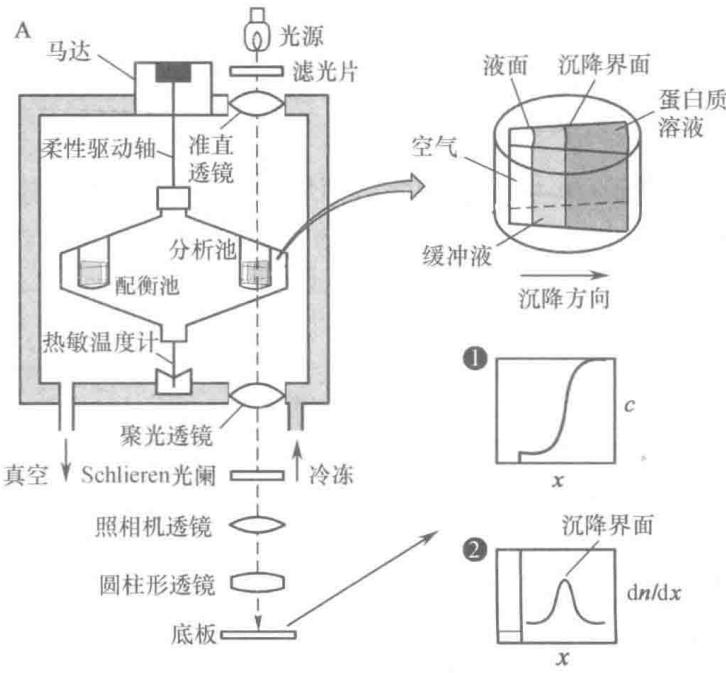

  
图 5-15 分析型超速离心机工作原理图解  
A. 分析型超速离心机，①浓度 c 对距离 x 的作图，②界面的 Schlieren 图谱，即 dn/dx(dc/dx) 对距离 x 的作图；B. 扇形分析池与离心轴的关系

在离心场中蛋白质颗粒发生沉降时,它将受到3种力的作用:

$$
\begin{array}{r l} & F _ {\mathrm{c}} (\text {离心力}) = m _ {\mathrm{p}} \omega^ {2} x \\ & F _ {\mathrm{b}} (\text {浮力}) = V _ {\mathrm{p}} \rho \omega^ {2} x = m _ {\mathrm{p}} \bar {v} \rho \omega^ {2} x \\ & F _ {\mathrm{f}} (\text {摩擦力}) = f \nu = f \frac {\mathrm{d} x}{\mathrm{d} t} \end{array}
$$

这里， $m_{p}$ 是分子颗粒的质量(g); $\omega$ 是转头的角速度(rad/s); x 是旋转中心至界面的径向距离(cm); $\omega^{2}x$ 是离心加速度(也称离心场, 是单位质量的力); $V_{p}$ 是分子颗粒的体积; $\rho(\text{rho})$ 是溶剂的密度( $g/cm^{3}$ ); $\bar{v}$ 是蛋白质的偏微比容或偏微比体积(partial specific volume), 偏微比容的定义是: 当加入1克干物质于无限大体积的溶剂中时溶液体积的增量; $V_{p}\rho$ 或 $m_{p}\bar{v}\rho$ 是被分子颗粒排开的溶剂质量; f 是摩擦系数; $\nu$ 是沉降速率, 即 $dx/dt$ 。离心力减去浮力为分子颗粒所受到的净离心力:

$$
\begin{array}{r l} F _ {\mathrm{c}} - F _ {\mathrm{b}} & = m _ {\mathrm{p}} \omega^ {2} x - m _ {\mathrm{p}} \bar {v} \rho \omega^ {2} x \\ & = m _ {\mathrm{p}} \omega^ {2} x (1 - \bar {v} \rho) \end{array}
$$

式中， $(1-\bar{v}\rho)$ 为浮力因子(buoyancy factor)。当分子颗粒以恒定速度移动时，净离心力与摩擦力(阻力)处于稳态平衡中：

$$
F _ {\mathrm{e}} - F _ {\mathrm{b}} = F _ {\mathrm{f}}
$$

即

$$
m _ {\mathrm{p}} \omega^ {2} x (1 - \bar {v} \rho) = f \frac {\mathrm{d} x}{\mathrm{d} t}
$$

或

$$
\frac {\mathrm{d} x / \mathrm{d} t}{\omega^ {2} x} = \frac {m _ {\mathrm{p}} (1 - \bar {v} \rho)}{f}
$$

可见单位离心场的沉降速度是个定值。称为沉降系数（sedimentation coefficient）或沉降常数，用 s（小写）表示：

$$
s = \frac {\mathrm{d} x / \mathrm{d} t}{\omega^ {2} x}
$$

将上式改写为：

$$
\frac {\mathrm{d} \lg x}{\mathrm{d} t} = \frac {s \omega^ {2}}{2 . 3 0 3}
$$

$\mathrm{d}\lg x / \mathrm{d}t$ 是 $\lg x$ 对 $t$ 作图所得的直线斜率，因此测得在 $t1,t2,t3\dots \dots$ 时间相应的 $x1,x2,x3\dots \dots$ 值，求出斜率，代入上式即得 $s$ 值。式中角速度（rad/s）：

$$
\omega = \mathrm{转速} \times \frac {2 \pi}{6 0}
$$

转速是每分钟转头的旋转次数(r/min)。

蛋白质、核酸、核糖体和病毒等的沉降系数介于 $1 \times 10^{-13} \sim 200 \times 10^{-13}$ s 的范围（表 5-5）。为方便起见，把 $10^{-13}$ s 作为一个单位，称为斯维德贝格单位（Svedberg unit）或称沉降系数单位，用 S（大写）表示。例如人血红蛋白的沉降系数为 4.46 S，即 $4.46 \times 10^{-13}$ s。

表 5-5 几种蛋白质的物理常数

<table><tr><td>蛋白质</td><td> $M_r$ </td><td> $^1 D_{20,w} \times 10^{-7}/cm^2 s^{-1}$ </td><td> $s_{20,w}/S$ </td></tr><tr><td>核糖核酸酶A(牛)</td><td>12600</td><td>11.9</td><td>1.85</td></tr><tr><td>细胞色素c(牛心肌)</td><td>13370</td><td>11.4</td><td>1.71</td></tr><tr><td>肌红蛋白(马心肌)</td><td>16900</td><td>11.3</td><td>2.04</td></tr><tr><td>胰凝乳蛋白酶原(牛胰)</td><td>23240</td><td>9.5</td><td>2.54</td></tr><tr><td>β-乳球蛋白(山羊乳)</td><td>37100</td><td>7.48</td><td>2.85</td></tr><tr><td>血红蛋白(人)</td><td>64500</td><td>6.9</td><td>4.46</td></tr><tr><td>血清清蛋白(人)</td><td>68500</td><td>6.1</td><td>4.6</td></tr><tr><td>过氧化氢酶(马肝)</td><td>247500</td><td>4.1</td><td>11.3</td></tr><tr><td>血纤蛋白原(人)</td><td>339700</td><td>1.98</td><td>7.63</td></tr><tr><td>肌球蛋白(鳕鱼肌)</td><td>524800</td><td>1.10</td><td>6.43</td></tr><tr><td>烟草花叶病毒</td><td>40590000</td><td>0.46</td><td>198</td></tr></table>

① $D_{20,W}$ 和 $s_{20,W}$ 的右下标 20,W 表示它们是校正到标准条件（温度为 $20^{\circ}C$ ，溶剂为水）下的扩散系数 (D) 和沉降系数 (s)。

蛋白质的沉降系数(s)与相对分子质量 $(M_{r})$ 的关系可用斯维德贝格方程表达：

$$
M _ {v} = \frac {R T s}{D (1 - \bar {v} \rho)}
$$

这里，R 为气体常数（8.314 JK $^{-1}$ ·mol $^{-1}$ ）；T 为绝对温度（K）；D 为蛋白质的扩散系数（cm $^{2}$ /s），数值上等于当浓度梯度为 1 个单位时在 1 秒钟内通过 1 平方厘米面积的蛋白质质量； $\bar{v}$ 为偏微比容（cm $^{3}$ /g），蛋白质溶于水的 $\bar{v}$ 值约为 0.74； $\rho$ 为溶剂的密度（g/cm $^{3}$ ）。

在相同的实验条件下测得蛋白质 s 值、D 值和偏微比容以及溶剂（一般用缓冲液）密度，即可计算出蛋白质的相对分子质量。

## （四）质谱法

质谱法(MS)的基本原理见第2章(图2-34和2-35)。虽然MS应用于化学研究已有多年,但它不能应用于像蛋白质和核酸这样的大分子。直至1988年才有技术上的突破(ESI和MALDI),目前生物素质谱可以测定相对分子质量高达400 000的生物大分子;精确度达0.001%\~0.1%,远高于凝胶过滤法和SDS-PAGE法。

用电喷雾离子化质谱（ESIMS）测定蛋白质分子质量的过程示于图5-16A。当蛋白质溶液注射入气相，蛋白质则从溶剂中获得不同数目的质子，因而是带正电的。这样形成了一系列具有不同质量-电荷比的离子形式；每一个连续峰相当于一种离子形式。虽然任一特定峰的电荷数目是未知的，但任何两个相邻峰的离子只相差一个电荷和一个质量（一个质子）。这些离子的 $m / z$ 与其分子质量的关系如下式所示：

$$
m / z = \frac {M + n H}{n}
$$

式中， $M$ 是蛋白质的分子质量， $n$ 是电荷的数目， $H$ 是质子的质量。蛋白质的分子质量可以从任两个相邻峰的 $m / z$ 来确定。若一个 $(m / z)_1$ 的峰，其电荷数为 $n_1$

则

$$
(m / z) _ {1} = \frac {M + n _ {1} H}{n _ {1}}
$$

  
图 5-16 电喷雾质谱法测定蛋白质分子质量  
A. 电喷雾离子化; B. 电喷雾质谱图

同样，其右侧相邻峰 $(m/z)_{2}$ ，电荷数为 $n_{2}$ ，则

$$
(m / z) _ {2} = \frac {M + n _ {2} H}{n _ {2}}
$$

这里 $n_1$ 和 $n_2$ 的关系是

$$
n _ {1} = n _ {2} + 1
$$

现在有 3 个方程式和两个未知数 M 和 $n_{2}$ 。我们可以先解出 $n_{2}$ ，然后解出 M：

$$
\begin{array}{r l} & n _ {2} = \frac {(m / z) _ {2} - H}{(m / z) _ {2} - (m / z) _ {1}} \\ & M = n _ {2} [ (m / z) _ {2} - H ] \end{array}
$$

根据图 5-16B 质谱图中任两个相邻峰的 m/z 值, 即可算得蛋白质的相对分子质量(这里是碳酸酐酶, 29012), 误差为 ±0.01%。如果取几组相邻峰重复计算, 取平均值, 一般可以提供更精确的 $M_{r}$ 。计算机算法可以把 m/z 谱转换成一个单一峰, 同样可以提供很精确的 $M_{r}$ (见图 5-16B 中的插图)。

## 五、蛋白质的含量测定与纯度鉴定

在蛋白质分离纯化的过程中,经常需要测定蛋白质的含量和检查某一蛋白质的纯化程度。这些分析工作包括:测定蛋白质的总量,测定蛋白质混合物中某一特定蛋白质的含量以及鉴定最后制品的纯度等。

## （一）总蛋白质含量的测定

测定蛋白质总量的方法有很多种。凯氏定氮法是经典的标准方法，但现在已不多用；双缩脲法用于需要快速但不需要十分精确的测定，如用于蛋白质纯化的头几个步骤的测定；Lowry法也称Folin-酚试剂法，多年来被选为蛋白质标准测定方法，此法基于能定量地与 $\mathrm{Cu^{+}}$ 反应， $\mathrm{Cu^{+}}$ 是由蛋白质的易氧化成分（如巯基、酚基）还原 $\mathrm{Cu^{2 + }}$ 而产生的；新近开发的一个测定蛋白质的试剂， $4,4^{\prime} -$ 二羧-2, $2^{\prime} -$ 二喹啉（bisinchoninic acid, BCA），在碱性溶液中与 $\mathrm{Cu^{+}}$ 反应形成紫色复合体，BCA与 $\mathrm{Cu^{+}}$ 反应比Folin-酚试剂与 $\mathrm{Cu^{+}}$ 反应更强，基于此反应的方法称为BCA法；紫外吸收法（波长 $280~\mathrm{nm}$ 处测定），精确度虽然不高，但操作简便，样品可以回收，还可以估算核酸含量；Bradford法（考马斯亮蓝结合法）灵敏度高，能检测出 $1\mu \mathrm{g}$ 的蛋白质，重复性也好。胶体金测定法是几种方法中灵敏度最高的，检测量是纳克(ng)水平，胶体金是一种带负电荷的疏水胶体，呈洋红色，遇蛋白质转变为蓝色，颜色改变与蛋白质有定量关系，因此可用于蛋白质的定量。上述这些方法在普通的实验手册中都有详细的叙述。

## （二）特定蛋白质含量的测定

测定蛋白质混合物中某一特定蛋白质的含量通常要用具有专一性的生物学方法。酶和激素类蛋白质可以分别根据酶的活性和激素的活性来测定含量。有些蛋白质虽然没有酶或激素那样特异的生物学活性，但是大多数蛋白质（作为抗原）当它被注射到动物（如兔子）的血流中时，会产生抗体。如果制得某一特定蛋白质的抗体，则借抗体-抗原反应，可用来测定该蛋白质的含量。

对于这些具有生物活性的蛋白质,活力(活性)大小就代表它的含量。例如作为酶的蛋白质,在一个给定溶液或组织提取液中的量就用酶的催化效应——即在酶存在下底物转化为反应产物时速率的增加。为此,研究者必须知道①酶催化的反应的总方程式,②确定底物消失或一个反应产物出现的分析方法,③酶需要什么辅因子如金属离子或辅酶,④底物浓度对酶活力的影响,⑤最适pH,和⑥最适温度(酶处于稳定和高活性的温度范围)。酶活力测定一般在最适pH和较方便温度(25\~38℃)下进行。并且使用高底物浓度,以便实验测定时初始反应速率与酶浓度呈正比(详见第7章)。

根据国际协定,对大多数酶来说,1.0单位的酶活力被定义为在最适测定条件下于25℃每分钟引起1.0 $\mu$ mol 的底物转化为产物的酶量(对某些酶,这一定义并不方便,单位可另作规定)。酶的活力(activity)是指一个溶液中酶的总单位数。酶的比活或比活力(specific activity)是每毫克总蛋白质中酶的单位数(U/mg)。比活是酶纯度的量度,在酶纯化过程中它不断增加,直至达到最大而不变,表明酶已是纯的(表5-6)。

表 5-6 蛋白质纯化过程的实例

<table><tr><td>步骤</td><td>体积/mL</td><td>蛋白质浓度/(mg/mL)</td><td>总蛋白/mg</td><td>活力浓度 $^1$ /(U/mL)</td><td>总活力/U</td><td>比活力/(U/mg)</td><td>纯化倍数 $^2$ </td><td>回收率 $^3$ /%</td></tr><tr><td>匀浆液</td><td>8500</td><td>40</td><td>340000</td><td>1.8</td><td>15300</td><td>0.045</td><td>1</td><td>100</td></tr><tr><td>硫酸铵沉淀(45%~70%)</td><td>530</td><td>194</td><td>103000</td><td>23.3</td><td>12350</td><td>0.12</td><td>2.7</td><td>81</td></tr><tr><td>CM-纤维素</td><td>420</td><td>19.5</td><td>8190</td><td>25</td><td>10500</td><td>1.28</td><td>28.4</td><td>69</td></tr><tr><td>亲和层析</td><td>48</td><td>2.2</td><td>105.6</td><td>198</td><td>9500</td><td>88.4</td><td>1964</td><td>62</td></tr><tr><td>DEAE-Sepharose</td><td>12</td><td>2.3</td><td>27.5</td><td>633</td><td>7600</td><td>275</td><td>6110</td><td>50</td></tr></table>

① 对酶来说, 活力浓度即酶浓度(酶单位数/单位体积)(见第6章); ② 纯化倍数 = 该步的比活力/匀浆液的比活力; ③ 回收率 = 该步的总活力/匀浆液的总活力。

通常在每一步纯化之后，对制剂进行活力测试，总蛋白量需要另行测定，两者之比得比活力。一般纯化的每一步，活力和总蛋白量都会降低。活力降低是因为总有一些难以避免的损失，例如失活或者与层析材料发生不理想的相互作用。总蛋白降低是因为纯化目的就是为了尽可能多地除去不要的或非专一的蛋白质。一个成功的步骤，非专一蛋白质的丢失要比活力丢失多得多；因此总活力下降的同时比活力却升高。把这些数据汇集成表，如表5-6所示。一个蛋白质，当进一步纯化不再增加比活力并且用电泳等方法只检测出一个蛋白条带时，则被认为是纯的。

## （三）蛋白质纯度鉴定

蛋白质纯度鉴定通常采用物理化学的方法，如电泳、沉降、HPLC等。目前采用的电泳分析有IEF、PAGE和SDS-PAGE等。纯的蛋白质在一系列不同的pH条件下进行电泳时，都将以单一的速度移动，它的电泳图谱只呈现一个条带（或峰）。同样的，纯的蛋白质在超速离心场中，应以单一的沉降速度移动。由于沉降系数主要是由分子大小和形状决定的，而与化学组成无关，因此作为鉴定纯度的方法，它要比电泳分析差些。HPLC常用于多肽、蛋白质纯度的鉴定。高纯的蛋白质制品在HPLC的洗脱图谱上呈现出单一的对称峰。此外N-末端分析（第2章）也用于纯度鉴定，因为均一的单链蛋白质制品中，N端残基只可能有一种氨基酸。

必需指出,采用任何单独一种方法鉴定所得的结果,只能作为蛋白质均一性的必要条件而不是充分条件。事实上只有很少几个蛋白质能够全部满足上面的严格要求,往往是在一种鉴定中表现为均一的蛋白质,在另一种鉴定中又表现出不均一性。

## 提要

蛋白质也是一种两性电解质。它的酸碱性质主要决定于肽链上可解离的 R 基团。对某些蛋白质来说，在某一 pH 下它所带的正电荷与负电荷相等，即净电荷为零，此 pH 称为蛋白质的等电点。各种蛋白质都有自己特定的等电点。在等电点以上的 pH，蛋白质分子带净负电荷；在等电点以下的 pH，带净正电荷。蛋白质处于等电点时溶解度最小。在无盐类干扰情况下，一种蛋白质的质子供体基团解离出来的质子数与质子受体基团结合的质子数相等时的 pH 是它的真正等电点，称为等离子点，它是该蛋白质的特征常数。

蛋白质溶液是亲水胶体系统。蛋白质分子颗粒(直径1\~100 nm)是系统的分散相,水是分散介质。蛋白质分子颗粒周围的水化层与电荷是稳定蛋白质胶体系统的主要因素。

使蛋白质沉淀的方法有①盐析法，②有机溶剂沉淀法，③重金属盐沉淀法，④生物碱试剂和某些酸

沉淀法，⑤加热变性沉淀法。

蛋白质分离纯化的一般程序可以分为前处理、粗分级分离和细分级分离，有时还加上结晶步骤。

蛋白质的分离纯化是根据它们的性质不同。改变 pH 或温度，特别是加入某些中性盐可以选择性地沉淀蛋白质，包括低温下使用适当的有机溶剂分级分离；这些方法主要用于蛋白质分离的头几步。透析和超滤是利用蛋白质不能通过半透膜的性质使蛋白质分子和小分子分开，常用于蛋白质的浓缩和脱盐。一系列的层析方法是利用蛋白质的分子大小、电荷、疏水相互作用、生物学结合亲和力和其他性质。这些方法包括分子排阻（凝胶过滤）、离子交换、疏水作用、亲和以及高效液相层析。电泳法分离纯化蛋白质是根据电荷和质量。凝胶电泳（如 PAGE 或 SDS-PAGE）和等电聚焦可以单独使用或结合使用（双向电泳），具有高分辨率。

凝胶过滤是一种简便的测定蛋白质 $M_{\mathrm{r}}$ 的方法。SDS-聚丙烯酰胺凝胶电泳用于测定单体蛋白质或亚基的 $M_{\mathrm{r}}$ 。沉降速度法是直接测定蛋白质分子质量的经典方法。沉降系数 $(s)$ 的定义是单位离心场的沉降速度。 $s$ 也常用来近似地描述生物大分子的大小。新近，质谱用于生物大分子精确分子质量的测定。

最常用的蛋白质检测和定量方法有Folin-酚试剂（Lowry法）、双缩脲试剂和考马斯亮蓝G-250染料(Bdrafold法)等。测定蛋白质混合物中某一特定蛋白质的含量通常要用具有专一性的生物学方法。制品的纯度鉴定通常采用分辨率高的物理化学方法，例如PAGE、等电聚焦、沉降分析和HPLC等。如果制品是纯的，在这些分析的图谱上只呈现一个峰或一个条带。必须指出，任何单独一种鉴定只能认为是蛋白质分子均一性的必要条件而不是充分条件。

## 习题

1. 解释下列名词：(a) 等电点和等离子点，(b) 生物碱试剂，(c) 差速离心，(d) 盐溶和盐析，(e) 透析和超过滤，(f) 电泳和电泳迁移率，(g) 双向电泳，(h) 亲和层析，(i) HPLC，(j) SDS-PAGE，(k) 沉降常数和斯维德贝格单位，(l) 活力和比活。

2. 为什么说蛋白质溶液是一种稳定的亲水胶体？

3. 有机溶剂引起蛋白质沉淀的主要原因是什么？

4. 试述蛋白质分离纯化的一般程序。

5. 凝胶过滤层析中和凝胶电泳中的分子筛效应有什么不同？为什么？

6. 一个纯化的蛋白质溶于 $\mathrm{pH}7,500\mathrm{mmol / LNaCl}$ 的Hepes[N-(2-羟乙基)哌嗪- $N^{\prime} = (2 -$ 乙磺酸)]缓冲液。1mL蛋白质样品置于透析袋中，对1L除不含NaCl外的同一Hepes缓冲液进行透析。小分子、无机离子（如 $\mathrm{Na^{+}}$ 、 $\mathrm{Cl^-}$ 和Hepes）可以通过半透膜，但蛋白质不能。问：

(a) 透析达到平衡后,蛋白质样品中 NaCl 的浓度是多少? 假设透析期间样品的体积没有发生变化。

（b）如果原来的 1 mL 样品进行 2 次透析，第二次对 100 mL 除不含 NaCl 外的同一 Hepes 缓冲液进行透析，样品中 NaCl 的最终浓度是多少？

7. 当用凝胶过滤法测定时，一种蛋白质的相对分子质量为 400 000。当在 SDS 存在下进行凝胶电泳时，该蛋白质给出相对分子质量为 180 000、160 000 和 60 000 的 3 个条带。当有 SDS 和巯基苏糖醇存在下进行凝胶电泳时，也出现 3 个蛋白质条带，但此时相对分子质量为 160 000、90 000 和 60 000。试确定该蛋白质的亚基组成。

8. 电泳时，在下面所指的 pH 条件下，下述蛋白质在电场中向正极还是向负极移动，还是不动？（根据表 5-2 的数据判断）(a) 卵清蛋白，在 pH 5.0；(b) β-乳球蛋白，在 pH 5.0 和 7.0；(c) 胰凝乳蛋白酶原，在 pH 5.0、9.1 和 11.0。

9. (a) 当 Ala、Ser、Phe、Leu、Arg、Asp 和 His 的混合物在 pH 3.9 进行纸电泳时，哪些氨基酸移向正极？哪些氨基酸移向负极？(b) 纸电泳时，带有相同电荷的氨基酸常有少许分开，例如 Gly 可与 Leu 分开；试说明为什么？(c) 设 Ala、Val、Glu、Lys 和 Thr 的混合物 pH 为 6.0，指出纸电泳后氨基酸的分离情况。

10. 指出从凝胶过滤层析柱（分级分离范围 5 000\~400 000）上洗脱下列蛋白质时的顺序：肌红蛋白，过氧化氢酶，细胞色素 c，胰凝乳蛋白酶原和血清清蛋白（它们的 $M_{r}$ 见表 5-5）。

11. 从凝胶过滤层析柱（分级分离范围5000\~400000）洗脱细胞色素c、 $\beta-$ 乳球蛋白、未知蛋白质和血红蛋白时，其洗脱体积分别为118、58、37和24 mL，问未知蛋白质的 $M_{r}$ 是多少？（假定所有蛋白质都是球形的，并且都处在柱的分级分离范围之内）

12. 超速离心机的转速为 58 000 r/min 时，(a) 计算角速度 $\omega$ ，以每秒的弧度 (rad/s) 表示；(b) 计算距旋转中心 6.2 cm 处

的离心加速度 a; (c) 此离心加速度相当于重力加速度“g”的多少倍?

13. 一种蛋白质的偏微比容为 $0.707 \mathrm{~cm}^{3} / \mathrm{g}$ , 扩散系数 $(D_{20, \mathrm{w}})$ 为 $13.1 \times 10^{-7} \mathrm{~cm}^{2} / \mathrm{s}$ , 沉降系数 $(s_{20, \mathrm{w}})$ 为 $2.05 \mathrm{~S}, 20^{\circ} \mathrm{C}$ 时水的密度为 $0.998 \mathrm{~g} / \mathrm{cm}^{3}$ 。根据斯维德贝格公式计算该蛋白质的相对分子质量。

14. 一个单体蛋白质含有682个氨基酸残基。问此蛋白质的约略相对分子质量是多少？

15. 按下表配制一系列不同浓度的牛血清清蛋白(BSA)稀释液,每一种浓度的溶液取0.1 mL进行Bradford法测定。对适当的空白(比色杯)在595 nm波长处测定光吸收 $(A_{595})$ 值。结果如下表所示:

<table><tr><td>BSA 的浓度/ $(mg \cdot mL^{-1})$ </td><td> $A_{595}$ </td><td>BSA 的浓度/ $(mg \cdot mL^{-1})$ </td><td> $A_{595}$ </td></tr><tr><td>1.5</td><td>1.4</td><td>0.6</td><td>0.59</td></tr><tr><td>1.0</td><td>0.97</td><td>0.4</td><td>0.37</td></tr><tr><td>0.8</td><td>0.79</td><td>0.2</td><td>0.17</td></tr></table>

BSA 浓度对 $A_{595}$ 作图得标准曲线。E. coli 的蛋白质提取液样品 (0.1 mL) 测得的 $A_{595}$ 为 0.84。根据标准曲线算出 E. coli 提取液中的蛋白质浓度。

## 主要参考书目

1. 王镜岩, 朱圣庚, 徐长法. 生物化学教程. 北京: 高等教育出版社, 2008.

2. 张龙翔, 张庭芳, 李令媛. 生化实验方法和技术. 2 版. 北京: 高等教育出版社, 1997.

3. 王克夷. 蛋白质导论. 北京: 科学出版社, 2007.

4. 鞠焜先,邱宗荫,丁世家,等. 生物分析化学. 北京: 科学出版社, 2007.

5. Segel I H. 生物化学计算. 吴经才, 等译. 北京: 科学出版社, 1984.

6. 刘思职, 等译. 蛋白质的生物化学. 北京: 科学出版社, 1955.

7. Wilson K, Walker J. Principles and Techniques of Practical Biochemistry. 5th ed. Cambridge: University Press, 2000.

8. Nelson D L, Cox M M. Lehninger Principles of Biochemistry. 6th ed. New York: W. H. Freeman and Company, 2013.

(徐长法)

## 网上资源

习题答案

## 第6章 酶的催化作用

新陈代谢是生命活动的基础,是生命活动最重要的特征。而构成新陈代谢的许多复杂而有规律的物质变化和能量变化,都是在酶催化下进行的。生物的生长发育、繁殖、遗传、运动、神经传导等生命活动都与酶的催化过程紧密相关,可以说,没有酶的参与,生命活动一刻也不能进行。因此从酶作用的分子水平上研究生命活动的本质及其规律无疑是十分重要的。

## 一、酶研究的简史

人们对酶的认识起源于生产与生活实践。我国人民早在八千年以前就开始利用酶。约公元前21世纪夏禹时代，人们就会酿酒，公元前12世纪周代已能制作饴糖和酱，2000多年前，春秋战国时期已知用曲治疗消化不良的疾病。凡此种种都说明，虽然我们祖先并不知道酶是何物，也无法了解其性质，但根据生产和生活的积累，已把酶利用到相当广泛的程度。西方国家19世纪对酿酒发酵过程进行了大量研究。1810年Jaseph发现酵母可将糖转化为酒精。1857年微生物学家L.Pasteur等人提出酒精发酵是酵母细胞活动的结果，他认为只有活的酵母细胞才能进行发酵。J.Liebig反对这种观点，他认为发酵现象是由溶解于酵母细胞液中的酶引起的。直到1897年，E.Büchner兄弟用石英砂磨碎酵母细胞，制备了不含酵母细胞的抽提液，并证明此不含细胞的酵母提取液也能使糖发酵，说明发酵与细胞的活动无关。从而说明了发酵是酶作用的化学本质，为此E.Büchner获得了1911年诺贝尔化学奖。1833年A.Payen和J.F.Persoz从麦芽的水抽提物中，用酒精沉淀得到了一种对热不稳定的物质，它可使淀粉水解成可溶性的糖。他们把这种物质称之为淀粉酶制剂（diastase），其意思是“分离”，表示可以从淀粉中分离出可溶性糖来。尽管当时它还是一个很粗的酶制剂，但由于他们采用了最简单的提纯方法，得到了一个无细胞酶制剂，并指出了它的催化特性和热不稳定性，因而开始涉及酶的一些本质性问题，所以人们认为A.Payen和J.F.Persoz首先发现了酶。1878年W.Kühne才给酶一个统一的名词，叫Enzyme，这个字来自希腊文，其意思“在酵母中”。1835—1837年，Berzelius提出了催化作用的概念，该概念的产生对酶学和化学的发展都是十分重要的。可见，对于酶的认识一开始就与它具有催化作用的能力联系在一起。1894年E.Fischer提出了酶与底物作用的“锁钥”学说，用以解释酶作用的专一性。1903年V.C.R.Henri提出了酶与底物作用的中间复合物学说。1913年L.Michaelis和M.Menten根据中间复合物学说，导出了米氏方程，对酶反应机制的研究是一个重要突破。1925年G.E.Briggs和J.B.S.Handane对米氏方程作了一项重要修正，提出了稳态学说。1926年美国化学家J.Sumner从刀豆提取出了脲酶并获得结晶，证明脲酶具有蛋白质性质。直到1930—1936年J.H.Northrop和M.Kunitz得到了胃蛋白酶、胰蛋白酶和胰凝乳蛋白酶结晶，并用相应方法证实酶是一种蛋白质后，酶是蛋白质的属性才普遍被人们所接受。为此J.Sumner和J.H.Northrop于1949年共同获得诺贝尔化学奖。1960年F.Jacob和J.Monod提出了操纵子学说，阐明了酶生物合成的调节机制。1963年,S.Moore和W.H.Stein测定了RNase A的氨基酸顺序，1972年获得诺贝尔化学奖。1965年P.Phillips首次用X射线晶体结构分析法阐明了鸡蛋清溶菌酶的三维结构。1969年B.Merrifield等人工合成了具有酶活性的胰RNase。80年代初T.R.Cech和S.Altman分别发现了具有催化功能的RNA——核酶(ribozyme)，这一发现打破了酶是蛋白质的传统观念，开辟了酶学研究的新领域，为此T.R.Cech和S.Altman于1989年共同获得诺贝尔化学奖。90年代初P.Boyer和J.Walker阐明了ATP合酶(ATP synthase)合成与分解ATP的分子机制，于1997年获得诺贝尔化学奖。近几十年来有不少酶的作用机制被阐明。随着DNA重组技术及聚合酶链式反应（PCR）技术的广泛应用，使酶结构与功能的研究进入新阶段。现已发现生物体内存在八千多种酶，有几千种酶被纯化，数百种酶已得

到结晶，而且每年都有新酶被发现。

近几十年来酶学研究得到很大发展，一些新理论和新概念不断涌现。一方面在酶的分子水平上揭示酶和生命活动的关系，阐明酶在细胞代谢调节和分化过程中的作用，酶生物合成的遗传机制，酶的起源和酶的催化机制与调节机制等方面的研究取得进展。另一方面酶的应用研究也得到迅速发展。酶工程已成为当代生物工程的重要支柱。酶的研究成果用来指导有关医学实践和工农业生产，必将会给催化剂的设计、药物的设计、疾病的诊断、预防和治疗、农作物品种选育及病虫害的防治等提供理论依据和新思想、新概念。除了酶已普遍使用于食品、发酵、制革、纺织、日用化学及医药保健等部门，酶在生物工程、化学分析、生物传感器及环保等方面的应用也日益扩大。

## 二、酶是生物催化剂

## （一）酶与一般催化剂的共同点

酶作为生物催化剂(biocatalyst)和一般催化剂相比有共同性:①能显著改变化学反应速率(rate),缩短化学反应达到平衡的时间,但不能改变反应的平衡常数(K),也即虽能增大一个化学反应的前向速率常数( $k_{1}$ )和逆向反应的速率常数( $k_{-1}$ ),但不改变 $k_{1}/k_{-1}$ 的比值;②催化剂在反应系统中量很少,在反应前后它的化学本质和数量保持不变;③通过改变化学反应途径降低化学反应的活化能,提高化学反应速率。总之,酶与其他催化剂一样只能催化完成在热力学上允许的反应。

## （二）反应速率理论与活化能

化学反应的速率决定于反应物本身的化学性质,其次决定于反应的条件,包括反应物的浓度、温度和催化剂等。在反应速率理论的发展中先后形成了两个理论——碰撞理论和过渡态理论。

## 1. 碰撞理论 (collision theory) 与活化能

认为分子必须经过碰撞才能发生反应。在一个化学反应体系中，因为各个分子所含的能量高低不同，每一瞬间并非全部反应物分子都能进行反应，只有那些具有较高能量，处于活化态（activated state）的分子即活化分子才能在分子碰撞中发生化学反应，即为有效碰撞。反应物中活化分子越多，则反应速率越快。活化分子要比一般分子高出一定的能量称为活化能（activation energy），却在反应物转变成产物之前所提供给反应物的能量。可定义为：在一定温度下1 mol反应物全部进入活化态所需要的自由能（free energy），单位为 $kJ \cdot mol^{-1}$ 。反应所需要的活化能愈高相对地活化分子数愈少，反应速率就愈慢。

根据碰撞理论推导的反应速率常数：

$$
k = Z \exp (- E _ {\mathrm{a}} / R T) \text {或} k = Z \mathrm{e} (- E _ {\mathrm{a}} / R T)\tag{6-1}
$$

式中，exp 是 e 指数的另一种表示方式；R 是摩尔气体常数；T 是绝对温度； $E_{a}$ 代表活化能；Z 通常表示 1s 每 L 体积内 1 mol 反应物分子的碰撞次数； $\exp(-E_{a}/RT)$ 是活化分子分率。此式与 Arrhenius 经验公式（反应速率的指数定律）：

$$
k = A \exp (- E _ {\mathrm{a}} / R T)\tag{6-2}
$$

是相当的。Arrhenius公式中速度常数 $k$ 也可分解为两项： $A$ 项称为指数前因子或频率因子，因为它与碰撞频率有关，其实对很多反应，它还与碰撞方位以及其他因素有关，因此人们把方程6-1中的 $Z$ 值修正为 $ZP,P$ 称为频率因子或方位因子； $\exp (-E_{\mathrm{a}} / RT)$ 项称为指数因子，相当于活化分子分率，并表明反应速率与反应温度和活化能是指数关系，也可表示为 $\frac{1}{k} = \left(\frac{1}{A}\right)\mathrm{e}^{E_{\mathrm{a}} / RT}$ ，即 $k$ 与 $\mathrm{e}^{E_{\mathrm{a}} / RT}$ 成反比，因此，假若反应活化能降低，反应速率增加。在指数定律中 $A_{\mathrm{a}}$ 一般被认为与温度无关，仅决定于反应的特性。

碰撞理论对 Arrhenius 经验公式中的指数项、A 因子和活化能都给予较明确的物理意义。但该理论把分子看成是刚球，未考虑分子内部的结构，因此仍有相当的局限性。

## 2. 过渡态理论 (transition state theory)

又称绝对反应速率理论,该理论认为化学反应不仅需要碰撞而且必须经过一个短暂的过渡态或活化复合物(activated complex,符号为“≠”)才能形成产物。例如 L-pro 通过脯氨酸消旋酶转变为 D-pro 反应。

L-pro 在酶促下,首先失去一个质子形成由四面体的 $\alpha-$ 碳原子变成三角形的过渡态,在此形式中三个键于同一平面上, $C_{\alpha}$ 携带上一个负电荷,对称的碳阴离子在一侧重新质子化,可生成 D-pro。由于反应中形成过渡态中间物,降低反应活化能容易生成产物。反应物分子相互碰撞时,它们的动能减小,势能增加,被用于分子内部键的应变和拉伸。当反应物分子进入过渡态时,势能达到某一最高值,因此活化能也可表达为反应物基态和过渡态之间的势能差。

在过渡态理论中,形成活化复合物时除需要满足能量要求外,对分子的空间方位也有一定的要求。因此,这一理论比碰撞理论更符合实际。在这里碰撞理论中的活化能 $E_{a}$ 被一个更恰当的物理量活化自由能 $\Delta G^{\ominus\neq*}$ (见方程6-6)所代替。根据过渡态理论,平衡式可表示如下:

$$
\begin{array}{c c c} {\mathrm{A+B} \xrightarrow {K ^ {*}}} & {\mathrm{AB} ^ {*}} & {\xrightarrow {k} \mathrm{P+Q}} \\ {\text {反应物}} & {\text {活化复合物}} & {\text {产物}} \end{array}
$$

式中， $K^{\neq}$ 是过渡态平衡常数，k 是一级速率常数。A 和 B 的总反应速率 v 决定于活化复合物生成产物这一步骤，即 $v \propto [AB^{\neq}]$ 。反应物和活化复合物处于平衡状态，即：

$$
K ^ {\mathrm{气}} = \frac {[ \mathrm{AB} ^ {\mathrm{气}} ]}{[ \mathrm{A} ] [ \mathrm{B} ]} \quad \text {或} \quad [ \mathrm{AB} ^ {\mathrm{气}} ] = K ^ {\mathrm{气}} [ \mathrm{A} ] [ \mathrm{B} ]\tag{6-3}
$$

活化复合物的势能比反应物和生成物的势能都要高些，因此 $K^{\text{常}}$ 是一个不稳定的平衡常数。当活化复合物分解成为产物时，键断裂所需要的能量从该键的振动自由度转化为反应轴的平动自由度而来，过渡态的分解频率与该键的振动频率是一致的。因此反应总速率 $(v)$ 显然等于活化复合物的浓度和振动频率 $v (= RT/Nh, N$ 是Avogadro常数， $h$ 是planck常数)的乘积。

$$
v = \left[ \mathrm{AB} ^ {\text {   艺   }} \right] v = K ^ {\text {   艺   }} \left[ \mathrm{A} \right] \left[ \mathrm{B} \right] \frac {R T}{N h}\tag{6-4}
$$

根据质量作用定律得反应总速率, $v=k[A][B]$ ，则： $k[A][B]=K^{\text{气}}[A][B]\frac{RT}{Nh}$ ，所以一级速率常数：

$$
k = \frac {R T}{N h} K ^ {\text {气}}\tag{6-5}
$$

这就是过渡态理论得到的基本公式。如果以 $\Delta G^{\ominus}$ 、 $\Delta H^{\ominus}$ 和 $\Delta S^{\ominus}$ 分别表示反应物的基态和过渡态之间的标准自由能、标准焓和标准熵的差值（一般称为标准活化自由能，活化焓和活化熵）。因为 $-\Delta G^{\ominus}=RT/nK^{\ominus}$ ，式(6-5)化为：

$$
k = \frac {R T}{N h} \exp^ {(- \Delta G ^ {\ominus} \neq / R T)}\tag{6-6}
$$

这就是说在一定温度下，反应速率是自由活化能 $\Delta G^{\ominus \asymp}$ 决定。由式(6-6)可看出， $\Delta G^{\ominus \asymp}$ 减少很小便可使 $k$ 值增加很多。表6-1表示在 $25^{\circ}C$ 下一些典型的 $\Delta G^{\ominus \asymp}$ 值用公式(6-6)所算出的与反应速率常数间的关系。从表6-1可知， $\Delta G^{\ominus \asymp}$ 每减少 $20.9\mathrm{kJ}\cdot \mathrm{mol}^{-1}$ 便会使已知条件下的反应速率增加 $4.57\times 10^{3}$ 倍。如果一种酶能把 $\Delta G^{\ominus \asymp}$ 从 $104.6\mathrm{kJ}\cdot \mathrm{mol}^{-1}$ 减少到 $62.8\mathrm{kJ}\cdot \mathrm{mol}^{-1}$ 则实际上它将反应速率增加约2千万倍。

表 6-1 标准活化自由能 $\left( {\Delta {G}^{\ominus  * }}\right)$ 和速率常数的关系

<table><tr><td> $\Delta G^{\ominus} \approx / [kJ \cdot mol^{-1}(kcal \cdot mol^{-1})]$ </td><td> $k/(mol^{-1} \cdot L \cdot s^{-1})$ </td><td> $\Delta G^{\ominus} \approx / [kJ \cdot mol^{-1}(kcal \cdot mol^{-1})]$ </td><td> $k/(mol^{-1} \cdot L \cdot s^{-1})$ </td></tr><tr><td>104.6(25)</td><td> $3.16 \times 10^{-6}$ </td><td>41.8(10)</td><td> $2.91 \times 10^{5}$ </td></tr><tr><td>83.7(20)</td><td> $1.38 \times 10^{-2}$ </td><td>20.9(5)</td><td> $1.33 \times 10^{9}$ </td></tr><tr><td>62.8(15)</td><td>63.7</td><td></td><td></td></tr></table>

但是，

$$
- \Delta G ^ {\ominus} = T \Delta S ^ {\ominus} - \Delta H ^ {\ominus}\tag{6-7}
$$

代入式(6-6)即得：

$$
k = \frac {R T}{N h} \exp^ {(\Delta S ^ {\ominus \text {等}} / R)} \cdot \exp^ {(- \Delta H ^ {\ominus \text {等}} / R T)}\tag{6-8}
$$

式中 $\Delta H^{\ominus}$ 可用 $E_{a}$ 代替，而不致造成很大误差。

$$
k = \frac {R T}{N h} \exp^ {(\Delta S ^ {\ominus k _ {e}} / R)} \cdot \exp^ {(- E _ {a} / R T)}\tag{6-9}
$$

把式(6-9)与Arrhenius公式比较, $\frac{RT}{Nh}\exp^{(\Delta S^{\ominus\neq/R})}$ 相当于Z或A,说明Z或A由标准活化熵决定。当两个分子碰撞结合成活化复合物时,它们必须将失去一些平动和转动自由度, $\Delta S^{\ominus\neq}$ 变为负值,因为分子里有序程度增加了。如果反应物分子是简单的, $\Delta S^{\ominus\neq}$ 的变化是小的,可从统计力学证明碰撞理论里的Z和过渡态理论的A是相同的。如果反应物分子有复杂的构造, $\Delta S^{\ominus\neq}$ 的负值是相当的大,A的数值就会大大地降低,远小于碰撞理论计算的Z值,这就是Z值需要修正为ZP的原因。

## （三）酶通过降低活化自由能提高反应速率

在一般情况下化学反应的进程决定于两种因素:体系自由能的改变和转化速度。第一种是热力学因素,第二种是动力学因素。对于实际上不可逆的反应,转化速度具有决定性的意义。因此,往往由于转化速度大而使反应按热力学上不太有利的方向进行。如果反应是可逆的并且进行得足够快,则这一反应的进程决定于热力学因素,因为平衡状态和达到平衡的速度无关,而只决定于正逆过程速率常数的比值。对于进行得缓慢的可逆反应,两种因素都起作用。有机反应只有在比较少的情况下才达到建立平衡的阶段,因此,复杂过程的结果决定于动力学因素的情况较之决定于热力学因素的情况为多。但在一般情况下两种因素都有明显的影响,这就给研究和解释化学反应过程造成很大的困难。

根据碰撞理论所得公式(6-1)可知,速率常数 k 与反应的温度和活化自由能有关,因此提高温度或降低活化自由能都可以显著地增加反应速率。对于活的生物来说只能或主要借助降低活化自由能来提高反应速率,这就是酶分子承担的催化功能。对于一个酶促反应(enzymatic reaction)来说,酶(E)与反应物通常称为底物(substrate,S)反应先形成酶底物的中间复合物(ES),然后转变成酶-过渡态复合物( $ES^{\text{※}}$ ),再转变成酶与产物中间复合物(EP),最后生成产物(P),释放出E。

$$
\mathrm{E} + \mathrm{S} \rightleftharpoons \mathrm{ES} \rightleftharpoons \mathrm{ES} ^ {\text {   责   }} (\text {   或   } \mathrm{EX} ^ {\text {   责   }}) \rightleftharpoons \mathrm{EP} \longrightarrow \mathrm{E} + \mathrm{P}
$$

图6-1是 $\mathrm{S}\rightarrow \mathrm{P}$ 化学反应过程中能量变化的图解，图中纵轴是自由能水平（ $G$ )，横轴是反应进程或反应坐标。图示出酶促反应和非催化反应所经的能量途径和活化能大小 $(\Delta G^{\ominus \circ})$ 的比较。反应 $(\mathrm{S}\rightarrow \mathrm{P})$ 的前向和逆向的起始点分别称为初态和终态，或统称为基态（ground state），一般是指热力学标准态 $(\ominus)$ 或生物化学标准态 $(^{\ominus}\prime)$ 的自由能水平。S和P之间的平衡反映它们的标准自由能差（ $\Delta G^{\ominus}$ 或 $\Delta G^{\ominus \prime}$ ）。在示出的例子中S的基态自由能高于P的基态自由能，即 $\mathrm{S}\rightarrow \mathrm{P}$ 反应的 $\Delta G^{\ominus} <   0$ ，平衡有利于P方。平衡位置和方向不

受任何催化剂的影响。

有利的平衡并不意味反应能够以可测的速率进行，因为在S和P之间，还有反应能障（energy barrier）需要克服。能障的阈值等于活化自由能 $\left(\Delta G^{\ominus\ddagger}\right)$ 。能障是一座“能山”，“山”的顶点或能峰是过渡态，它崩解成P或S的概率相等。过渡态不是一种稳定的分子形式，只存在飞逝的一瞬间（典型寿命为 $10^{-13}s$ ）。注意，不要把中间复合物和过渡态复合物等同起来，前者是相对稳定的分子形式（寿命为 $10^{-13}\sim10^{-3}s$ ），在能量-反应坐标图上前者处于能谷中。其实，反应能障的存在并不总是坏事，正是它保证了地球上生命的存在。否则，热力学上的自发反应即 $\Delta G<0$ 的反应将随时发生。这样世界上所有的有机物质包括生物大分子、细胞和生物都将被燃烧（氧化）成 $CO_{2}$ 和 $H_{2}O$ 等。

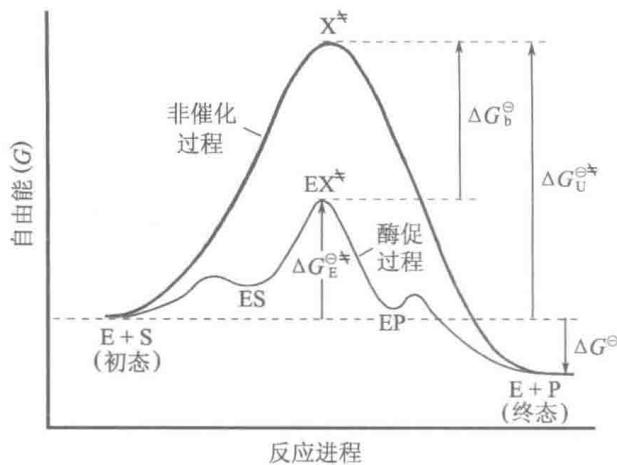  
图 6-1 酶促反应和非催化反应中活化自由能的变化图中 $\Delta G_{b}^{\ominus}$ 为标准结合自由能变化， $\Delta G_{E}^{\ominus\infty}$ 和 $\Delta G_{U}^{\ominus\infty}$ 分别为酶促反应和非催化反应的标准活化自由能

从图6-1可以看出，酶促反应标准活化自由能 $(\Delta G_{\mathrm{E}}^{\ominus \approx})$ 比非催化反应的标准活化自由能 $(\Delta G_{\mathrm{U}}^{\ominus \approx})$ 显著降低，因而使酶促反应速率加快。例如在没有催化剂存在下，过氧化氢分解所需活化能为 $75.4\mathrm{kJ}\cdot \mathrm{mol}^{-1}$ ，用无机物液态钯作催化剂时，所需活化能降低为 $48.9\mathrm{kJ}\cdot \mathrm{mol}^{-1}$ ，当用过氧化氢酶催化时，则活化能只需 $8.4\mathrm{kJ}\cdot \mathrm{mol}^{-1}$ 。再如，无催化剂时使蔗糖水解所需活化能为 $1339.8\mathrm{kJ}\cdot \mathrm{mol}^{-1}$ ，用 $\mathrm{H^{+}}$ 作催化剂时，活化能降低为 $104.7\mathrm{kJ}\cdot \mathrm{mol}^{-1}$ ，用蔗糖酶时只需要 $39.4\mathrm{kJ}\cdot \mathrm{mol}^{-1}$ 。由此可见酶作为催化剂比一般催化剂更显著地降低活化能，催化效率更高。

酶是怎样克服能障，降低活化能的？这是一个复杂的催化机制问题，看来关键在于形成酶-底物复合物（包括ES和 $\mathrm{EX}^{\text{等}}$ ）。根据方程(6-7)活化自由能（ $\Delta G^{\text{等}}$ ）是由活化熵（ $\Delta S^{\text{等}}$ ）和活化焓（ $\Delta H^{\text{等}}$ ）两项构成的。因此，酶降低反应的活化自由能也可从熵和焓两个方面来考虑。

熵因子方面:有两个效应值得注意,邻近效应和定向效应。邻近(proximity)是指双分子酶促反应中两个底物分子被束缚在酶分子的表面使之彼此接近;定向(orientation)是指两个底物的反应基团之间和底物反应基团与酶催化基团之间的正确定位取向。邻近和定向的效果相当于增加了局部底物浓度和有效碰撞概率。一般说,两个底物分子形成一个活化复合物时,需要经历平动自由度和转动自由度的丢失,造成熵的锐减, $\Delta S^{\text{※}}$ 是负值,于是方程6-7中 $-T\Delta S^{\text{※}}$ 项是正值,这意味着将有一个大的活化自由能( $\Delta G^{\text{※}}$ ),显然对反应是不利的。但在酶促反应中自由度的丢失是在进入过渡态( $EX^{\text{※}}$ )之前形成ES中间复合物时发生的,并由酶与底物非共价结合时释放的自由能,称为结合[自由]能(binding energy, $\Delta G_{b}$ ),补偿了自由度丢失引起的熵减,因此进入过渡态时的 $\Delta S^{\text{※}}$ (绝对值)减小,从而 $\Delta G^{\text{※}}$ 比非催化反应时降低。

焓因子方面:底物形变和诱导契合涉及活化焓 $\Delta H^{\sim}$ 的降低。对于大多数反应来说,底物进入过渡态时都会发生形变(distortion),反应键被拉长、扭曲,处于所谓电子应变或电子张力(electronic strain)状态。底物形变需要给反应系统提供能量( $\Delta H^{\sim}$ )。但在酶促反应中底物形变所需的能量也是由 E 和 S 之间形成弱相互作用时释放的结合自由能(内能)提供的,因而减少了进入过渡态( $EX^{\sim}$ )所需的 $\Delta H^{\sim}$ 。底物与酶结合的同时,通常酶分子也发生形变或构象变化,以“迎合”底物进入过渡态时的需要,即所谓诱导契合(见图 8-1)。诱导契合使酶分子上的催化基团进入适当位置,包括向底物提供广义酸碱催化和共价催化的基团,以削弱反应键,这也是减少 $\Delta H^{\sim}$ 的一种方式。

底物通过与酶结合的方式虽能有效地降低活化自由能 $\left(\Delta G_{\mathrm{E}}^{\infty}\right)$ ，但仍有一部分活化自由能需要从别处获得，才能进入或通过过渡态（图6-1）。鉴于底物已被固定在酶分子上，自身没有留下使其进入过渡态的平动能，因此只能从溶剂分子碰撞酶-底物复合物时的动能中获得这部分能量，这暗示酶分子在反应过程中还可能起能量捕获和传导的作用。

酶降低活化自由能的细节将在第8章酶作用机制中进一步讨论。

## （四）酶作为生物催化剂的特点

酶是细胞所产生的,受多种因素调节控制的具有催化能力的生物催化剂,与一般非生物催化剂相比较有以下几个特点:

## 1. 酶易失活

酶是由细胞产生的生物大分子,凡能使生物大分子变性的因素,如高温、强碱、强酸、重金属盐等都能使酶失去催化活性,因此酶所催化的反应往往都是在比较温和的常温、常压和接近中性酸碱条件下进行。例如:生物固氮在植物中是由固氮酶催化的,通常在27℃和中性pH下进行,每年可从空气中将1亿吨左右的氮固定下来。而在工业上合成氨,需要在500℃,几十个MPa下才能完成。

## 2. 酶具有很高的催化效率

生物体内的大多数反应,在没有酶的情况下,几乎是不能进行的。即使像 $CO_{2}$ 水合作用这样简单的反应也是通过体内碳酸酐酶催化的。

$$
\mathrm{CO} _ {2} + \mathrm{H} _ {2} \mathrm{O} \rightleftharpoons \mathrm{H} _ {2} \mathrm{CO} _ {3}
$$

每个酶分子在 1 s 内可以使 $6 \times 10^{5}$ 个 $CO_{2}$ 发生水合作用, 这样以保证使细胞组织中的 $CO_{2}$ 迅速进入血液, 然后再通过肺泡及时排出, 这个经酶催化的反应, 要比未经催化的反应快 $10^{7}$ 倍。再如刀豆脲酶催化尿素水解的反应:

$$
\mathrm{H} _ {2} \mathrm{N} - \stackrel {\mathrm{O}} {\mathrm{C}} - \mathrm{NH} _ {2} + 2 \mathrm{H} _ {2} \mathrm{O} + \mathrm{H} ^ {+} \longrightarrow 2 \mathrm{NH} _ {4} ^ {+} + \mathrm{HCO} _ {3} ^ {-}
$$

在 $20^{\circ}C$ 酶催化反应的速率常数是 $3 \times 10^{4} s^{-1}$ ，尿素非催化水解的速率常数为 $3 \times 10^{-10} s^{-1}$ ，因此，脲酶催化反应的速率比非催化反应速率大 $10^{14}$ 倍。据报道，如果在人的消化道中没有各种酶类参与催化作用，那么，在体温 $37^{\circ}C$ 的情况下，要消化一餐简单的午饭，大约需要 50 年。经过实验分析，动物吃下的肉食，在消化道内只要几小时就可完全消化分解。再如将唾液淀粉酶稀释 100 万倍后，仍具有催化能力。由此可见，酶的催化效率是极高的。酶催化反应速率对非催化反应速率的比率定为酶的催化力（catalytic power）。酶催化反应的反应速率比非催化反应高 $10^{8} \sim 10^{20}$ 倍，比非生物催化剂高 $10^{7} \sim 10^{13}$ 倍。但应指出，酶催化的反应与非酶催化的反应历程不同，只能估计出一个下限。表 6-2 列出一些酶催化反应与它们非催化反应速率的比较。

表 6-2 酶催化反应与非催化反应速率的比较

<table><tr><td>酶</td><td>非催化反应速率 $k_{\text{un}}/(s^{-1})$ </td><td>酶催化反应速率 $k_{\text{cat}}/(s^{-1})$ </td><td>酶的催化力 $k_{\text{cat}}/k_{\text{un}}$ </td></tr><tr><td>1,6-二磷酸果糖磷酸酶(fructose-1,6-bisphosphatase)</td><td> $2\times 10^{-20}$ </td><td>21</td><td> $1.05\times 10^{21}$ </td></tr><tr><td>β-淀粉酶(β-amylase)</td><td> $1.9\times 10^{-15}$ </td><td> $1.4\times 10^{3}$ </td><td> $7.4\times 10^{17}$ </td></tr><tr><td>碱性磷酸酶(alkaline phosphatase)</td><td> $1.0\times 10^{-15}$ </td><td>14</td><td> $1.4\times 10^{16}$ </td></tr><tr><td>脲酶(urease)</td><td> $3\times 10^{-10}$ </td><td> $3\times 10^{4}$ </td><td> $1.0\times 10^{14}$ </td></tr><tr><td>胰凝乳蛋白酶(chymotrypsin)</td><td> $1.0\times 10^{-10}$ </td><td> $1\times 10^{2}$ </td><td> $1.0\times 10^{12}$ </td></tr><tr><td>糖原磷酸化酶(glycogen phosphorylase)</td><td> $<5\times 10^{-15}$ </td><td> $1.6\times 10^{-3}$ </td><td> $>3.2\times 10^{11}$ </td></tr><tr><td>己糖激酶(hexokinase)</td><td> $<1.0\times 10^{-13}$ </td><td> $1.3\times 10^{-3}$ </td><td> $>1.3\times 10^{10}$ </td></tr><tr><td>磷酸丙糖异构酶(triose phosphate isomerase)</td><td> $4.3\times 10^{-6}$ </td><td> $4.3\times 10^{3}$ </td><td> $1.0\times 10^{9}$ </td></tr><tr><td>醇脱氢酶(alcohol dehydrogenase)</td><td> $<6\times 10^{-12}$ </td><td> $2.7\times 10^{-3}$ </td><td> $>4.5\times 10^{8}$ </td></tr><tr><td>碳酸酐酶(carbonic anhydrase)</td><td> $1.0\times 10^{-2}$ </td><td> $1.0\times 10^{5}$ </td><td> $1.0\times 10^{7}$ </td></tr><tr><td>分枝酸变位酶(chorismate mutase)</td><td> $2.6\times 10^{-5}$ </td><td>50</td><td> $1.9\times 10^{6}$ </td></tr><tr><td>肌酸激酶(creatine kinase)</td><td> $<3\times 10^{-9}$ </td><td> $4\times 10^{-5}$ </td><td> $>1.33\times 10^{4}$ </td></tr></table>

## 3. 酶具有高度专一性

所谓高度专一性(specificity)是指酶对作用的反应物和催化的反应有严格的选择性。这种选择性是通过酶与反应物之间相互作用或是通过基于结构互补的分子识别实现的。酶往往只能催化一种或一类反应，作用于一种或一类物质。而一般催化剂没有这样严格的选择性。氢离子可以催化淀粉、脂肪和蛋白质的水解，而淀粉酶只能催化淀粉糖苷键的水解，蛋白酶只能催化蛋白质肽键的水解，脂肪酶只能催化脂肪酯键的水解，而对其他类物质则没有催化作用。酶作用的专一性，是酶最重要的特点之一，也是和一般催化剂最主要的区别。

## 4. 酶活性受到调节和控制

有机体的生命活动表现了它内部化学反应历程的有序性,这种有序性是受多方面因素调节控制的,一旦破坏了这种有序性,就会导致代谢紊乱,产生疾病,甚至死亡。酶活力受到调节和控制是区别于一般催化剂的重要特征。细胞内酶的调节和控制有多种方式,主要有:

（1）调节酶的浓度 酶浓度的调节主要有2种方式：一种是诱导或抑制酶的合成；一种是调节酶的降解。例如乳糖操纵子(lac operon)可以合成β-半乳糖苷酶、半乳糖苷通透酶和硫半乳糖苷转乙酰酶，它们可以受乳糖或诱导物异丙基硫代-β-D-半乳糖苷(IPTG)的诱导而促进合成。乳糖或IPTG可以与原来存在于该系统的阻遏物结合，使阻遏物和DNA的结合能力降低约1000倍，解除抑制，使3种酶的合成加快，酶浓度提高。大肠杆菌有一种所谓的葡萄糖效应，就是当有葡萄糖存在下，不利用乳糖，表明葡萄糖抑制了上述3个酶的合成。

（2）通过激素调节酶活性 激素通过与细胞膜或细胞内受体相结合而引起一系列生物学效应，以此来调节酶活性（见第14章）。有些酶的专一性是由激素调控的，乳腺组织合成乳糖是一个明显的例子。哺乳动物乳腺组织中合成乳糖是由乳糖合成酶催化的，该酶由两个亚基即催化亚基和调节亚基组成。催化亚基单独存在时不能催化合成乳糖，但能催化半乳糖以共价键的方式连接到蛋白质上形成糖蛋白。调节亚基实际上就是乳汁中的 $\alpha-$ 乳清蛋白，其本身无催化活性，但当与催化亚基结合后，就可以改变催化亚基的专一性，催化半乳糖和葡萄糖反应生成乳糖：

$$
\mathrm{UDP} - \text { 半乳糖 } + \mathrm{D} - \text { 葡萄糖 } \rightleftharpoons \mathrm{UDP} + \text { 乳糖 }
$$

调节亚基合成是受激素控制的。在怀孕期间，催化亚基和调节亚基在乳腺中合成，但调节亚基合成的很少，当分娩后，由于激素急剧增加，调节亚基大量合成，并和催化亚基结合成乳糖合成酶，大量合成乳糖以适应生理的需要。

（3）反馈抑制调节酶活性 许多小分子物质的合成是由一连串的反应组成的，催化此物质生成的第一步的酶，往往被它们终端产物抑制。这种抑制叫反馈抑制(feedback inhibition)(图6-2)，例如由苏氨酸生物合成为异亮氨酸，要经过5步，反应第1步由苏氨酸脱氨酶(threonine deaminase)催化，当终产物异亮氨酸浓度达到足够水平时，该酶就被抑制，异亮氨酸结合到酶的一个调节部位上，通过可逆的别构作用对酶产生抑制。当异亮氨酸的浓度下降到一定程度，苏氨酸脱氨酶又重新表现活性，从而又重新合成异亮氨酸。

  
图 6-2 通过终产物可逆的结合对途径中的第一个酶进行  
反馈抑制

（4）抑制剂和激活剂对酶活性的调节 酶受大分子抑制剂或小分子物质抑制，从而影响酶的活性。例如大分子物质胰蛋白酶抑制剂，可以抑制胰蛋白酶的活性。小分子的抑制剂如一些反应产物，像1,3-二磷酸甘油酸变位酶的活性受到它的产物2,3-二磷酸甘油酸的抑制，从而对这一反应进行调节。

此外某些无机离子可对一些酶产生抑制,对另外一些酶产生激活,从而对酶活性起调节作用。酶活性也可受到大分子物质的调节,例如抗血友病因子(凝血因子Ⅷ)可增强丝氨酸蛋白酶的活性,因此它可明显地促进血液凝固过程。

（5）其他调节方式 通过别构调控、酶原的激活、酶的可逆共价修饰和同工酶来调节酶活性，这些形式的调节将在第8章进行讨论。

## 三、酶的化学本质及其组成

## （一）酶的化学本质

酶的化学本质除有催化活性的核酶(ribozyme)和脱氧核酶(deoxyribozyme)之外都是蛋白质。到目前为止,被人们分离纯化研究的酶已有数千种,经过物理和化学方法的分析证明了酶的化学本质是蛋白质。主要依据是:①酶经酸碱水解后的最终产物是氨基酸,酶能被蛋白酶水解而失活;②酶是具有空间结构的生物大分子,凡使蛋白质变性的因素都可使酶变性失活;③酶是两性电解质,在不同pH下呈现不同的离子状态,在电场中向某一电极泳动,各自具有特定的等电点;④酶和蛋白质一样,具有不能通过半透膜等胶体性质;⑤酶也有蛋白质所具有的化学呈色反应。以上事实表明酶在本质上属于蛋白质。

但是,不能说所有的蛋白质都是酶,只是具有催化作用的蛋白质,才称为酶。

酶的催化活性依赖于它们天然蛋白质构象的完整性,假若一种酶被变性或解离成亚基就会失活。因此,蛋白质酶的空间结构对它们的催化活性是必需的。

## （二）酶的化学组成

酶作为一类具有催化功能的蛋白质,与其他蛋白质一样,相对分子质量很大,一般从一万到几十万甚至百万以上,见表6-3。

表 6-3 一些酶的相对分子质量

<table><tr><td>名称</td><td>相对分子质量/ $\times 10^{3}$ </td><td>氨基酸残基数</td><td>肽链数</td></tr><tr><td>RNA酶A(牛胰)</td><td>13.7</td><td>124</td><td>1</td></tr><tr><td>溶菌酶(鸡蛋清)</td><td>13.93</td><td>129</td><td>1</td></tr><tr><td>胰凝乳蛋白酶(牛胰)</td><td>21.6</td><td>291</td><td>3</td></tr><tr><td>己糖激酶(酵母)</td><td>102.0</td><td>800</td><td>2</td></tr><tr><td>RNA聚合酶(E.coli)</td><td>450.0</td><td>4100</td><td>5</td></tr><tr><td>谷氨酸脱氢酶(牛心)</td><td>1000.0</td><td>8300</td><td>40</td></tr></table>

从化学组成来看酶可分为单纯蛋白质（simple protein）和缀合蛋白质（conjugated protein）两类。属于单纯蛋白质的酶类，除了蛋白质外，不含其他物质，如脲酶、蛋白酶、淀粉酶、脂肪酶和核糖核酸酶等。属于缀合蛋白质的酶类，除了蛋白质外，还要结合一些对热稳定的非蛋白质小分子物质或金属离子，前者称为脱辅酶（apoenzyme 或 apoprotein），后者称为辅因子（cofactor），脱辅酶与辅因子结合后所形成的复合物称为“全酶”（holoenzyme），即全酶=脱辅酶+辅因子。在酶催化时，一定要有脱辅酶和辅因子同时存在才起作用,二者各自单独存在时,均无催化作用。酶的辅因子,包括金属离子及有机化合物,根据它们与脱辅酶结合的松紧程度不同,可分为两类,即辅酶(coenzyme)和辅基(prosthetic group)。通常辅酶是指与脱辅酶结合比较松弛的小分子有机物质,通过透析方法可以除去,如辅酶I和辅酶II等。辅基是以共价键和脱辅酶结合,不能通过透析除去,需要经过一定的化学处理才能与蛋白分开,如细胞色素氧化酶中的铁卟啉,丙酮酸氧化酶中的黄素腺嘌呤二核苷酸(FAD),都属于辅基。所以辅酶和辅基的区别只在于它们与脱辅酶结合的牢固程度不同,并无严格的界线。每一种需要辅酶(辅基)的脱辅酶往往只能与一特定的辅酶(辅基)结合,即酶对辅酶(辅基)的要求有一定的选择性,当换另一种辅酶(辅基)就不具活力,如谷氨酸脱氢酶需要辅酶I,若换以辅酶II就失去活性。但生物体内辅酶(辅基)数目有限,而酶的种类繁多,故同一种辅酶(辅基)往往可以与多种不同的脱辅酶结合而表现出多种不同的催化作用,如3-磷酸甘油醛脱氢酶、乳酸脱氢酶都需要辅酶I,但各自催化不同的底物脱氢。这说明脱辅酶部分决定酶催化的专一性。辅酶(辅基)在酶催化中通常是起着电子、原子或某些化学基团的传递作用。一些可作为酶的辅因子的某些金属离子见表6-4,作为电子、原子和基团转移载体的辅酶和辅基见表6-5。从表6-5可以看出许多维生素就是辅酶(辅基)的前体。

表 6-4 作为酶辅因子的某些金属离子

<table><tr><td>金属离子</td><td>酶</td></tr><tr><td> $Zn^{2+}$ </td><td>碳酸酐酶(carbonic anhydrase)、醇脱氢酶(alcohol dehydrogenase)、羧肽酶(carboxypeptidase)A和B、DNA聚合酶(DNA-polymerase)</td></tr><tr><td> $Cu^{2+}$ </td><td>细胞色素氧化酶(cytochrome oxidase)、超氧化物歧化酶(superoxide dismutase)</td></tr><tr><td> $K^{+}$ </td><td>丙酮酸激酶(pyruvate kinase)、丙酰CoA羧化酶(propionyl CoA carboxylase)</td></tr><tr><td> $Mg^{2+}$ </td><td>己糖激酶(hexokinase)、丙酮酸激酶、6-磷酸葡糖磷酸酶(glucose-6-phosphatase)</td></tr><tr><td> $Mn^{2+}$ </td><td>精氨酸酶(arginase)、核糖核酸还原酶(RNA reductase)、超氧化物歧化酶</td></tr><tr><td> $Fe^{2+}$ 或 $Fe^{3+}$ </td><td>过氧化物酶(catalase)、过氧化氢酶(peroxidase)、细胞色素氧化酶(cytochrome oxidase)</td></tr><tr><td> $Ni^{2+}$ </td><td>脲酶(urease)</td></tr><tr><td> $Mo^{2+}$ </td><td>硝酸盐还原酶(nitrate reductase)、固氮酶(nitrogenase)</td></tr><tr><td>Se</td><td>谷胱甘肽过氧化物酶(glutathione peroxidase)</td></tr><tr><td> $Na^{+}$ </td><td>质膜ATP酶(plasmalemma adenosine triphosphatase)</td></tr></table>

表 6-5 作为电子、原子和基团转移载体的某些辅酶(辅基)

<table><tr><td>辅酶(辅基)</td><td>被转移基团</td><td>需要该辅酶(辅基)的酶</td></tr><tr><td>硫胺素焦磷酸(TPP)</td><td>醛类</td><td>丙酮酸脱氢酶(pyruvate dehydrogenase)</td></tr><tr><td>黄素腺嘌呤核苷酸(FMN、FAD)</td><td>氢原子、电子</td><td>单胺氧化酶(monoamine oxidase)</td></tr><tr><td>烟酰胺腺嘌呤二核苷酸( $NAD^+$ )</td><td></td><td>乳酸脱氢酶(lactate dehydrogenase)</td></tr><tr><td>烟酰胺腺嘌呤二核苷酸磷酸( $NADP^+$ )</td><td>氢负离子(: $H^-$ )、电子</td><td>6-磷酸葡糖脱氢酶(glucose-6-phosphate dehydrogenase)</td></tr><tr><td>辅酶A(CoA)</td><td>酰基</td><td>乙酰CoA羧化酶(acetyl CoA carboxylase)</td></tr><tr><td>磷酸吡哆醛(PLP)</td><td>氨基</td><td>天冬氨酸转氨酶(aspartate aminotransferase)</td></tr><tr><td>生物素(生物胞素)</td><td> $CO_2$ </td><td>丙酮酸羧化酶(pyruvate carboxylase)</td></tr><tr><td>5′-脱氧腺苷酸钴胺素( $CoB_{12}$ )</td><td>氢原子、烷基</td><td>甲基丙二酰-CoA变位酶(methylmalonyl-CoA mutase)</td></tr><tr><td>四氢叶酸(CoF)</td><td>一碳基团</td><td>胸苷酸合酶(thymidylate synthase)</td></tr><tr><td>硫辛酸</td><td>酰基</td><td>丙酮酸脱氢酶(pyruvate dehydrogenase)</td></tr></table>

## （三）单体酶、寡聚酶、多酶复合物

根据酶蛋白分子的特点,又可将酶分为以下3类:

(1) 单体酶 单体酶 (monomeric enzyme) 一般是由一条肽链组成, 例如, 牛胰核糖核酸酶、溶菌酶、羧肽酶 A 等,但有的单体酶是由多条肽链组成,如胰凝乳蛋白酶是由 3 条肽链组成,肽链间二硫键相连构成一个共价整体。单体酶种类较少,一般多是催化水解反应的酶,相对分子质量在 $(13 \sim 35) \times 10^{3}$ 之间。

（2）寡聚酶 寡聚酶(oligomeric enzyme)是由两个或两个以上亚基组成的酶,这些亚基可以是相同的,也可以是不相同的。绝大部分寡聚酶都含偶数亚基,但个别寡聚酶含奇数亚基,如荧光素酶、嘌呤核苷磷酸化酶均含3个亚基。亚基之间靠次级键结合,彼此容易分开。寡聚酶的相对分子质量一般大于 $35\times10^{3}$ 。大多数寡聚酶,其聚合形式是活性型,解聚形式是失活型。相当数量的寡聚酶是调节酶,在代谢调控中起重要作用。

表 6-6 列举了一些含相同亚基的寡聚酶, 表 6-7 列举了一些含不同亚基的寡聚酶。

表 6-6 含相同亚基的寡聚酶

<table><tr><td>酶</td><td>来源</td><td>亚基数</td><td>相对分子质量/ $\times 10^{3}$ </td></tr><tr><td>苹果酸脱氢酶(malate dehydrogenase)</td><td>鼠肝</td><td>2</td><td> $2 \times 37.5$ </td></tr><tr><td>碱性磷酸酶(alkaline phosphatase)</td><td>E. coli</td><td>2</td><td> $2 \times 40.0$ </td></tr><tr><td>肌酸激酶(creatine kinase)</td><td>鸡或兔肌</td><td>2</td><td> $2 \times 40.0$ </td></tr><tr><td>醛缩酶(aldolase)</td><td>酵母</td><td>2</td><td> $2 \times 40.0$ </td></tr><tr><td>己糖激酶(hexokinase)</td><td>酵母</td><td>4</td><td> $4 \times 27.5$ </td></tr><tr><td>醇脱氢酶(alcohol dehydrogenase)</td><td>酵母</td><td>4</td><td> $4 \times 37.0$ </td></tr><tr><td>丙酮酸激酶(pyruvate kinase)</td><td>兔肝</td><td>4</td><td> $4 \times 57.2$ </td></tr><tr><td>过氧化氢酶(catalase)</td><td>牛肝</td><td>4</td><td> $4 \times 57.5$ </td></tr></table>

表 6-7 含不同亚基的寡聚酶

<table><tr><td>酶</td><td>来源</td><td>亚基数及类型</td><td>相对分子质量/ $\times 10^{3}$ </td></tr><tr><td rowspan="2">1,6-二磷果糖磷酸酸酶(fructose-1,6-diphosphatase)</td><td rowspan="2">兔肝</td><td>2A</td><td> $2 \times 29.0$ </td></tr><tr><td>2B</td><td> $2 \times 37.0$ </td></tr><tr><td rowspan="2">琥珀酸脱氢酶(succinate dehydrogenase)</td><td rowspan="2">牛心</td><td> $\alpha$ </td><td>70.0</td></tr><tr><td> $\beta$ </td><td>27.0</td></tr><tr><td rowspan="2"> $Na^{+},K^{+}-ATP$ 酶(adenosine triphosphatase)</td><td rowspan="2">兔肾</td><td> $2\alpha$ </td><td> $2 \times 95.0$ </td></tr><tr><td> $2\beta$ </td><td> $2 \times 45.0$ </td></tr><tr><td rowspan="2">乳酸脱氢酶(lactate dehydrogenase)</td><td rowspan="2">牛心、肝</td><td>4H</td><td> $4 \times 35.0$ </td></tr><tr><td>4M</td><td> $4 \times 35.0$ </td></tr><tr><td rowspan="3">RNA聚合酶(RNA polymerase)</td><td rowspan="3">E.coli</td><td> $2\alpha$ </td><td> $2 \times 39.0$ </td></tr><tr><td> $\beta\beta'$ </td><td>155.0,165.0</td></tr><tr><td> $\sigma$ </td><td>95.0</td></tr><tr><td rowspan="2">组氨酸脱羧酶(histidine decarboxylase)</td><td rowspan="2">乳酸杆菌</td><td> $A_{5}$ </td><td> $5 \times 29.9$ </td></tr><tr><td> $B_{5}$ </td><td> $5 \times 9.0$ </td></tr><tr><td rowspan="2">天冬氨酸转氨甲酰酶(aspartate transcarbamoylase)</td><td rowspan="2">E.coli</td><td> $(C_{3})_{2}$ </td><td> $6 \times 34.0$ </td></tr><tr><td> $(R_{2})_{3}$ </td><td> $6 \times 17.0$ </td></tr><tr><td rowspan="2"> $\alpha$ -L-岩藻糖苷酶(fucosidase)</td><td rowspan="2">大鼠附睾</td><td> $2\alpha$ </td><td> $2 \times 60.0$ </td></tr><tr><td> $2\beta$ </td><td> $2 \times 47.0$ </td></tr></table>

（3）多酶复合物 多酶复合物(multienzyme complex)是由几种酶靠非共价键彼此嵌合而成。所有反应依次连接，有利于一系列反应的连续进行。这类多酶复合物相对分子质量很高，例如脂肪酸合成中的脂肪酸合酶(fatty acid synthase)复合物，是由7种酶和一个酰基携带蛋白构成，相对分子质量为 $2200 \times 10^{3}$ （见第24章）；E. coli丙酮酸脱氢酶复合物(E. coli pyruvate dehydrogenase complex)由60个亚基3种酶组成,相对分子质量约 $4600 \times 10^{3}$ , 在柠檬酸循环中催化丙酮酸的脱羧、脱氢, 最后生成 $CO_{2}$ 和乙酰 CoA 的反应(见第 18 章)。

## 四、酶的命名和分类

迄今为止已发现几千种蛋白质的酶，在生物体中的酶远远大于这个数量。随着生物化学、分子生物学等生命科学的发展，会发现更多的新酶。为了研究和使用的方便，需要对已知的酶加以分类，并给以科学名称。1961年前酶的分类和命名都很混乱，酶的名称往往是沿用下来的，缺乏系统性和科学性，有时会出现一酶数名或一名数酶的情况。1961年国际生物化学学会酶学委员会推荐了一套新的系统命名方案及分类方法，1972年、1978年和1984年又先后作了修改和补充，这一系统，现在已得到国际上普遍的认同。规定给每一种酶一个系统名称（systematic name）和一个习惯名称（俗名）。

由于核酶发现较晚,国际酶学委员会还未规定其分类方法及命名方案。

## （一）习惯命名法

1961年以前使用的酶的名称都是沿用习惯方法命名,称为习惯名。主要依据两个原则:

（1）根据酶作用的底物命名，如催化水解淀粉的酶叫淀粉酶，催化水解蛋白质的酶叫蛋白酶。有时还加上来源以区别不同来源的同一类酶，如胃蛋白酶，胰蛋白酶。

（2）根据酶催化反应的性质及类型命名，如水解酶、转移酶、氧化酶等。有的酶结合上述两个原则来命名，如琥珀酸脱氢酶是催化琥珀酸脱氢反应的酶。

习惯命名比较简单,应用历史较长,尽管缺乏系统性,但现在还被人们使用。

## （二）国际系统命名法

酶的国际系统命名,是根据1972年国际酶学委员会《酶命名法》中的规定——按酶催化的反应命名。规定每种酶的名称应当明确标明酶的底物及催化反应的性质。如果一种酶催化两个底物起反应,应在它们的系统名称中包括两种底物的名称,并以“:”号将它们隔开。若底物之一是水时,可将水略去不写(见表6-8)。酶(名)都用“ase”作为后缀。

表 6-8 酶国际系统命名法举例

<table><tr><td>习惯名称</td><td>系统名称</td><td>催化的反应</td></tr><tr><td>乙醇脱氢酶</td><td>乙醇: $NAD^{+}$ 氧化还原酶</td><td> $乙醇+NAD^{+} \longrightarrow$ 乙醛+NADH</td></tr><tr><td>谷丙转氨酶(丙氨酸转氨酶)</td><td>丙氨酸: $\alpha$ -酮戊二酸转氨酶</td><td>丙氨酸+ $\alpha$ -酮戊二酸—→谷氨酸+丙酮酸</td></tr><tr><td>脂肪酶</td><td>脂肪:水解酶</td><td>脂肪+ $H_{2}O \longrightarrow$ 脂肪酸+甘油</td></tr></table>

## （三）国际系统分类法及酶的编号

国际酶学委员会,根据各种酶所催化反应的类型,把酶分为6大类,即氧化还原酶类、转移酶类、水解酶类、裂合酶类、异构酶类和连接酶类。分别用1、2、3、4、5、6来表示。再根据底物中被作用的基团或键的特点将每一大类分为若干个亚类,每一个亚类又按顺序编成1、2、3、4……等数字。每一个亚类可再分为亚亚类,仍用1、2、3、4……编号。每一个酶的分类编号由4个数字组成,数字间由“·”隔开。第一个数字指明该酶属于6个大类中的哪一类;第二个数字指出该酶属于哪一个亚类;第三个数字指出该酶属于哪一个亚亚类;第四个数字则表明该酶在亚亚类中的排号。编号之前冠以EC(为Enzyme Commission的缩写)。例如:EC 1.1.1表示氧化还原酶,作用于CHOH基团,受体是NAD $^{+}$ 或NADP $^{+}$ ;1.1.2表示氧化还原酶,作用于CHOH基团,受体是细胞色素;1.1.3表示氧化还原酶,作用于CHOH基团,受体是分子氧;编号中第4个数字仅表示该酶在亚亚类中的位置。这种系统命名原则及系统编号是相当严格的,一种酶只可能有一个名称和一个编号。一切新发现的酶,都能按此系统得到适当的编号。从酶的编号可了解到该酶的类型和反应性质。表 6-9 列出了酶的分类, 指明了酶的编号、系统名称、习惯名称及所催化的反应。

表 6-9 酶的分类

<table><tr><td>编号</td><td>系统名称</td><td>习惯名称</td><td>反应</td></tr><tr><td>1</td><td>氧化还原酶类</td><td></td><td></td></tr><tr><td>1.1</td><td>作用于供体的CHOH基</td><td></td><td></td></tr><tr><td>1.1.1</td><td>以 $NAD^{+}$ 或 $NADP^{+}$ 为受体</td><td></td><td></td></tr><tr><td>1.1.1.1</td><td>醇: $NAD^{+}$ 氧化还原酶</td><td>醇脱氢酶</td><td>醇+ $NAD^{+} \rightleftharpoons$ 醛或酮+ $NADH$ </td></tr><tr><td>1.2</td><td>作用于供体的醛基或酮基</td><td></td><td></td></tr><tr><td>1.2.1</td><td>以 $NAD^{+}$ 或 $NADP^{+}$ 为受体</td><td></td><td></td></tr><tr><td>1.2.3</td><td>以 $O_{2}$ 为受体</td><td></td><td></td></tr><tr><td>1.2.3.2</td><td>黄嘌呤:氧氧化还原酶</td><td>黄嘌呤氧化酶</td><td>黄嘌呤+ $H_{2}O+O_{2} \rightleftharpoons$ 尿酸+ $H_{2}O_{2}$ </td></tr><tr><td>1.3</td><td>作用于供体的CH—CH基</td><td></td><td></td></tr><tr><td>1.3.1</td><td>以 $NAD^{+}$ 或 $NADP^{+}$ 为受体</td><td></td><td></td></tr><tr><td>1.3.1.1</td><td>4,5-二氢尿嘧啶: $NAD^{+}$ 氧化还原酶</td><td>二氢尿嘧啶脱氢酶</td><td>4,5-二氢尿嘧啶+ $NAD^{+} \rightleftharpoons$ 尿嘧啶+ $NADH$ </td></tr><tr><td>1.4</td><td>作用于供体的 $CH-NH_{2}$ 基</td><td></td><td></td></tr><tr><td>1.5</td><td>作用于供体的 $CH-NH-$ </td><td></td><td></td></tr><tr><td>1.6</td><td>作用于供体的NADH或NADPH</td><td></td><td></td></tr><tr><td>2</td><td>转移酶类</td><td></td><td></td></tr><tr><td>2.1</td><td>转移C1基团</td><td></td><td></td></tr><tr><td>2.1.1</td><td>甲基转移酶类</td><td></td><td></td></tr><tr><td>2.1.1.2</td><td>S-腺苷甲硫氨酸:胍乙酸-N-甲基转移酶</td><td>胍乙酸转甲基酶</td><td>S-腺苷甲硫氨酸+胍乙酸 $\rightleftharpoons$ S-腺苷高半胱氨酸+肌酸</td></tr><tr><td>2.2</td><td>转移醛基或酮基</td><td></td><td></td></tr><tr><td>2.3</td><td>酰基转移酶类</td><td></td><td></td></tr><tr><td>2.4</td><td>糖基转移酶类</td><td></td><td></td></tr><tr><td>2.6</td><td>转移含氮基团</td><td></td><td></td></tr><tr><td>2.6.1</td><td>氨基转移酶类</td><td></td><td></td></tr><tr><td>2.6.1.1</td><td>L-天冬氨酸:α-酮戊二酸转氨酶</td><td>天冬氨酸转氨酶</td><td>L-天冬氨酸+α-酮戊二酸 $\rightleftharpoons$ 草酰乙酸+L-谷氨酸</td></tr><tr><td>2.7</td><td>转移含磷基团</td><td></td><td></td></tr><tr><td>2.8</td><td>转移含硫基团</td><td></td><td></td></tr><tr><td>3</td><td>水解酶类</td><td></td><td></td></tr><tr><td>3.1</td><td>水解酯键</td><td></td><td></td></tr><tr><td>3.1.1</td><td>羧酸酯水解酶类</td><td></td><td></td></tr><tr><td>3.1.1.7</td><td>乙酰胆碱水解酶</td><td>乙酰胆碱酯酶</td><td>乙酰胆碱+ $H_{2}O \rightleftharpoons$ 胆碱+乙酸</td></tr><tr><td>3.2</td><td>水解糖苷键</td><td></td><td></td></tr><tr><td>3.3</td><td>水解肽键</td><td></td><td></td></tr><tr><td>3.4</td><td>水解肽键以外的C—N键</td><td></td><td></td></tr><tr><td>4</td><td>裂合酶类</td><td></td><td></td></tr><tr><td>4.1</td><td>C—C裂合酶类</td><td></td><td></td></tr><tr><td>4.1.1</td><td>羧基裂合酶</td><td></td><td></td></tr><tr><td>4.1.1.1</td><td>2-氧(代)酸羧基裂合酶</td><td>丙酮酸脱羧酶</td><td>2-氧(代)酸 $\rightleftharpoons$ 醛+ $CO_{2}$ </td></tr><tr><td>4.2</td><td>C—O裂合酶类</td><td></td><td></td></tr><tr><td>4.3</td><td>C—N裂合酶类</td><td></td><td></td></tr><tr><td>5</td><td>异构酶类</td><td></td><td></td></tr><tr><td>5.1</td><td>消旋酶类和差向异构酶类</td><td></td><td></td></tr><tr><td>5.1.3</td><td>作用于糖</td><td></td><td></td></tr><tr><td>5.1.3.1</td><td>D-核酮糖-5-磷酸-3-差向异构酶</td><td>磷酸核酮糖差向异构酶</td><td>D-核酮糖-5-磷酸 $\rightleftharpoons$ D-木酮糖-5-磷酸</td></tr><tr><td>5.2</td><td>顺-反异构酶类</td><td></td><td></td></tr><tr><td>5.3</td><td>分子内氧化还原酶类</td><td></td><td></td></tr><tr><td>5.4</td><td>分子内转移酶类</td><td></td><td></td></tr><tr><td>6</td><td>连接酶</td><td></td><td></td></tr><tr><td>6.1</td><td>形成C—O键</td><td></td><td></td></tr><tr><td>6.1.1</td><td>氨基酸-RNA连接酶类</td><td></td><td></td></tr><tr><td>6.1.1.1</td><td>L-酪氨酸:tRNA连接酶</td><td>酪氨酰-tRNA合成酶</td><td>ATP+L-酪氨酸+tRNA $\rightleftharpoons$ AMP+焦磷酸+L-酪氨酰-tRNA</td></tr><tr><td>6.2</td><td>形成C—S键</td><td></td><td></td></tr><tr><td>6.3</td><td>形成C—N键</td><td></td><td></td></tr><tr><td>6.4</td><td>形成C—C键</td><td></td><td></td></tr></table>

需要指出,酶的分类和命名仅基于酶所催化的反应,与酶的来源无关,各种不同物种来源的催化同一反应的同源酶(homologous enzyme),它们的氨基酸顺序、催化机理可能不同,这种结构上的不同无法用系统命名和分类法加以区别。

EC 规定在第一次出现所涉及的酶发表在论文或专著时,应该将酶的编号、系统名称和来源写出来,以免混乱。

## 五、酶的专一性

## （一）酶对底物的专一性

酶的专一性可分为两种类型：

## 1. 结构专一性

有些酶对底物的要求非常严格,只作用于一种底物,而不作用于任何其他物质,这种专一性称为“绝对专一性”(absolute specificity)。例如脲酶只能水解尿素,而对尿素的各种衍生物不起作用;DNA聚合酶I催化4种脱氧核苷三磷酸合成DNA,在合成DNA时要求有一条DNA链作为模板,新合成DNA链的排列顺序完全由模板DNA链的排列顺序决定,DNA聚合酶I在执行模板给出的指令时特别精确,在新DNA链中插入一个错误核苷酸的机会还不到百万分之一,DNA聚合酶I也可以说具有绝对专一性;此外,如麦芽糖酶只作用于麦芽糖,而不作用于其他双糖;碳酸酐酶只作用于碳酸等,均属于绝对专一性的例子。

有些酶对底物的要求比上述绝对专一性要低一些，可作用一类结构相近的底物，这种专一性称为“相对专一性”（relative specificity）。具有相对专一性的酶作用于底物时，对键两端的基团要求程度不同，对其中一个基团要求严格，对另一个则要求不严格，这种专一性称为“族专一性”或“基团专一性”。例如 $\alpha -\mathrm{D}$ -葡糖苷酶不但要求 $\alpha$ -糖苷键，并且要求 $\alpha$ -糖苷键的一端必须有葡萄糖残基，即 $\alpha$ -葡糖苷，而对键的另一端R基团则要求不严，因此它可催化各种 $\alpha -\mathrm{D}$ -葡糖苷衍生物 $\alpha$ -糖苷键的水解。

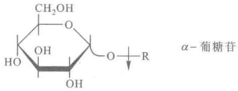

有些酶只要求作用于底物一定的键,而对键两端的基团并无严格要求,这种是另一种相对专一性,称为“键专一性”(bond specificity)或称“反应专一性”。例如酯酶催化酯键的水解,对底物 R—C $\begin{array}{c}O\\ \backslash \\ OR^{\prime}\end{array}$ 中的 R

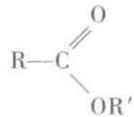

及 R' 基团都没有严格的要求, 只是对于不同的酯类, 水解速率有所不同。

蛋白酶可以催化肽键的水解,不同蛋白水解酶对底物的专一性各不相同。如凝血酶是参与血液凝固过程的一个酶,专一性程度相当高,它对于被水解的肽键羧基一端和氨基一端都有严格要求,只水解羧基端L-精氨酸残基,氨基端为甘氨酸残基所构成的肽键(图6-3)。

  
图 6-3 凝血酶的专一性（箭头表示作用点）

在动物消化道中几种蛋白酶专一性各不相同。如胰蛋白酶只专一地水解赖氨酸或精氨酸羧基形成的肽键，胰凝乳蛋白酶专一地水解由芳香氨基

酸或带有较大非极性侧链氨基酸羧基形成的肽键，弹性蛋白酶专一地水解丙氨酸、甘氨酸及短脂肪链氨基酸羧基形成的肽键，胃蛋白酶水解芳香族或其他疏水氨基酸的羧基或氨基形成的肽键。氨肽酶水解氨基端氨基酸残基，羧肽酶水解羧基端氨基酸残基。当食物中的蛋白质进入动物消化道后，经过上述酶的联合作用，最终水解为氨基酸。图6-4表示消化道中几种蛋白酶的专一性。

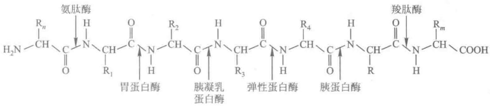  
图 6-4 消化道中几种蛋白酶的专一性  
$R_{1}, R_{2}$ : 芳香氨基酸及其他疏水氨基酸; $R_{3}$ : 丙氨酸、甘氨酸、丝氨酸等短脂肪链氨基酸; $R_{4}$ : 赖氨酸和精氨酸

## 2. 立体异构专一性

当底物具有立体异构体时，酶只能作用其中的一种，这种专一性称为立体异构专一性（stereospecificity）。酶的立体异构专一性是相当普遍的现象。

（1）旋光异构专一性(optical isomerism specificity) 例如 L-氨基酸氧化酶只能催化 L-氨基酸氧化，而对 D-氨基酸无作用：

$$
\mathrm{L} - \text { 氨基酸 } + \mathrm{H} _ {2} \mathrm{O} + \mathrm{O} _ {2} \xrightarrow {\mathrm{L} - \text { 氨基酸氧化酶 }} \alpha - \text { 酮酸 } + \mathrm{NH} _ {3} + \mathrm{H} _ {2} \mathrm{O} _ {2}
$$

又如胰蛋白酶只作用于 L-氨基酸残基构成的肽键或其衍生物, 而不作用于 D-氨基酸残基构成的肽键或其衍生物。 $\beta$ -葡糖氧化酶仅能将 $\beta$ -D-葡萄糖转变成葡糖酸, 而对 $\alpha$ -D-葡萄糖不起作用。上述例子, 均称为旋光异构专一性。

（2）几何异构专一性 当底物具有几何异构体时，酶只能作用于其中的一种。例如，琥珀酸脱氢酶只能催化琥珀酸脱氢生成延胡索酸，而不能生成顺丁烯二酸，称为几何异构专一性。

$$
\begin{array}{c c} \mathrm{CH} _ {2} \mathrm{COOH} & \text {HOOC-CH} \\ | & \| \\ \mathrm{CH} _ {2} \mathrm{COOH} & \xlongequal {\text {琥珀酸脱氢酶}} \quad \mathrm{CH-COOH} \\ \text {琥珀酸} & \text {延胡索酸} \end{array}
$$

酶的立体异构专一性还表现在能区分从有机化学观点来看属于对称分子中的两个等同的基团，只催化其中的一个，而不催化另一个。例如，一端由 $^{14}$ C标记的甘油，在甘油激酶的催化下可以与ATP作用，仅产生一种标记产物，甘油-1-磷酸。甘油分子中的两个—CH $_{2}$ OH基团从有机化学观点来看完全相同，但是酶却能加以区分。另外，用氚标记的方法发现在脱氢酶催化下，底物和NAD $^{+}$ 之间发生氢的转移也有着严格的立体异构专一性，表现在对尼克酰胺环中C4上的氢有选择性。如酵母醇脱氢酶在催化时，辅酶的尼克酰胺环C4上只有一侧可以加氢或脱氢，另一侧则不被作用：

酵母醇脱氢酶的这种专一性被定为 A 型, 凡具有与酵母醇脱氢酶同侧专一性的酶称为 A 型专一性的酶——A 型脱氢酶, 如苹果酸脱氢酶及异柠檬酸脱氢酶等都属于此类型。凡是与酵母醇脱氢酶不同, 处于异侧, 具有另一侧专一性的称为 B 型专一性的酶——B 型脱氢酶, 如谷氨酸脱氢酶, $\alpha-$ 甘油磷酸脱氢酶等。

酶的立体专一性在实践中很有意义,例如某些药物只有某一种构型才有生理效用,而有机合成的药物只能是消旋的产物,若用酶可进行不对称合成或不对称拆分。

## （二）关于酶作用专一性的假说

为了解释酶作用的专一性,曾提出过不同的假说,早在1894年E.Fisher提出“锁钥学说”(lock and

key theory), 即酶与底物为锁与钥匙的关系, 以此说明酶与底物结构上的互补性(图6-5)。该学说的局限性不能解释酶的逆反应, 如果酶的活性中心是“锁钥学说”中的锁, 那么, 这种结构不可能既适合于可逆反应的底物, 又适合于可逆反应的产物。针对刚性模型, 1958年D. Koshland提出“诱导契合”假说(induced-fit hypothesis), 他认为酶分子是高柔性的动态构象分子, 当酶分子与底物分子接近时, 酶蛋白受底物分子诱导, 其构象发生有利于底物结合的变化, 酶与底物在此基础上互补契合进行反应。近年来X射线晶体结构分析的实验结果支持这一假说, 证明了酶与底物结合时, 确有显著的构象变化。因

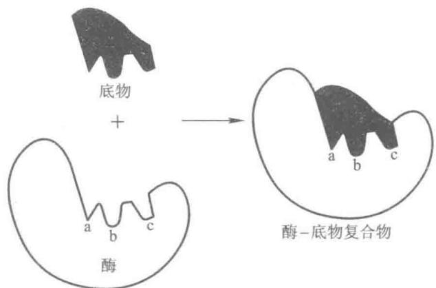  
图 6-5 酶与底物的相互关系——酶与底物的“锁钥学说”示意图

此人们认为这一假说比较满意地说明了酶的专一性。图 6-6 表示了酶构象在专一性底物及非专一性底物存在时的变化。

图中黑线条表示带有催化基团①②及结合基团③的肽段，它与带斜线的“酶”共同组成酶分子，A图表示底物与酶分子活性部位的原有构象，B图表示专一性底物引入后，酶蛋白构象改变，诱导契合，使催化基团④⑤并列成有利于结合底物的状态，并形成酶-底物复合物。但是，如果引入了不正常的、非专一性的底物，情况就不同了，C图表示在底物上加入了一个庞大的基团，妨碍了酶的⑥⑦基团的并列，因此不利于酶与底物的结合，例如加入某些竞争性抑制剂等。D图则表示在正常底物上切除某些基团后，酶蛋白的带⑧基的肽链顶住了⑨基的肽链，也阻止了⑩⑪基的并列，因此不利于酶与底物结合，这样，酶也不能起催化作用。

近年来，通过对酶结构与功能的研究，确信酶与底物作用的专一性是由于酶与底物分子的结构互补，

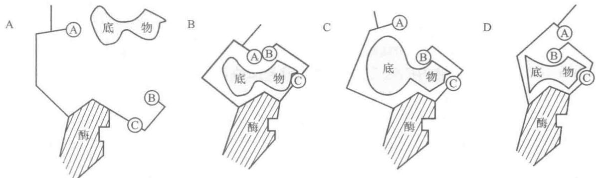  
图 6-6 专一性、非专一性底物存在时，酶的构象变化模型  
诱导契合是通过分子的相互识别而产生的。诱导契合说有力支持了酶催化过程中过渡态的形成。

## 六、酶的活力测定和分离纯化

## （一）酶活力的测定

酶活力(enzyme activity)也称为酶活性,酶的活力测定实际上就是酶的定量测定。在研究酶的性质、酶的分离纯化及酶的应用工作中都需要测定酶的活力。检查酶的含量及存在,不能直接用重量或体积来衡量,通常是用催化某一化学反应的能力来表示,即用酶活力大小来表示。

## 1. 酶活力

酶活力是指酶催化某一化学反应的能力,酶活力的大小可以用在一定条件下所催化的某一化学反应的反应速率(reaction velocity; reaction rate)来表示,两者呈线性关系。酶催化的反应速率愈大,酶的活力愈高;反应速率愈小,酶的活力就愈低。所以测定酶的活力就是测定酶促反应的速率。酶催化的反应速率可用单位时间内底物的减少量或产物的增加量来表示。在酶活力测定实验中底物往往是过量的,因此底物

的减少量只占总量的极小部分,测定时不易准确,而相反产物从无到有,只要测定方法足够灵敏,就可以准确测定。由于在酶促反应中,底物减少与产物增加的速率相等,因此在实际酶活测定中一般以测定产物的增加量为准。

产物生成量(或底物减少量)对反应时间作图,如图6-7所示。曲线的斜率表示单位时间内产物生成量的变化,所以曲线上任何一点的斜率就是该相应时间的反应速率。从图中的曲线可看出在反应开始的一段时间内斜率几乎不变,但随着时间的延长,曲线逐渐变平坦,斜率发生改变,反应速率降低,显然这时测得的反应速率不能代表真实的酶活力。引起酶促反应速率随时间延长而降低的原因很多,如底物浓度的降低使酶被底物所饱和的程度降低;产物浓度增加加速了

  
图6-7 酶促反应的速率曲线

逆反应的进行；反应产物对酶的抑制或激活作用以及随着时间的延长引起酶本身部分分子失活等。因此测定酶活力，应测定酶促反应的初速率（initial rate, $v_{0}$ ）或初速度（initial velocity），从而避免上述种种复杂因素对反应速率的影响。反应初速率与酶量呈线性关系，因此可以用初速率来测定制剂中酶的含量。

酶的催化作用受测定环境的影响,因此测定酶活力要在最适条件下进行,即最适温度、最适 pH、最适底物浓度和最适缓冲液离子强度等,只有在最适条件下测定才能真实反映酶活力的大小。测定酶活力时,为了保证所测定的速率是初速率,通常以底物浓度的变化在起始浓度的 5% 以内的速率为初速率。底物浓度太低时,5% 以下的底物浓度变化实验上不易测准,所以在测定酶的活力时,往往使底物浓度足够大,至少比酶的米氏常数大 5 倍。这样整个酶反应对底物来说是零级反应,反应初速率与底物浓度无关。而对酶来说却是一级反应,反应初速率与酶浓度成正比。这样测得的速率就比较可靠地反映酶的含量。

## 2. 酶的活力单位(U, activity unit)

酶活力的大小即酶含量的多少,用酶活力单位表示,即酶单位(U)。酶单位的定义是:在一定条件下,一定时间内将一定量的底物转化为产物所需的酶量。这样酶的含量就可以用每克酶制剂或与每毫升酶制剂含有多少酶单位来表示(U/g 或 U/ml)。

为使各种酶活力单位标准化,1961年国际生物化学协会酶学委员会及国际纯化学和应用化学协会临床化学委员会提出采用统一的“国际单位”(IU)来表示酶活力,规定为:在最适反应条件(温度25℃)下,每分钟内催化1微摩尔(μmol)底物转化为产物所需的酶量定为一个酶活力单位,即 $1\ IU=1\ \mu mol\cdot min^{-1}$ 。但人们仍常用习惯沿用的单位。例如 $\alpha-$ 淀粉酶的活力单位规定为每小时催化1g可溶性淀粉液化所需要的酶量,也有用每小时催化1ml 2%的可溶性淀粉液所需要的酶量定为一个酶活力单位。不过习惯上沿用的单位表示方法不统一,同一种酶有几种不同的单位,不便于对同一种酶的活力进行比较。

1972 年国际酶学委员会又推荐一种新的酶活力国际单位, 即 Katal(简称 Kat) 单位。规定为: 在最适条件下, 每秒钟能催化 1 摩尔 (mol) 底物转化为产物所需的酶量, 定为 1 Kat 单位 (1 Kat = 1 mol · s $^{-1}$ )。Kat 单位与 IU 单位之间的换算关系如下:

$$
\begin{array}{r l} & 1 \mathrm{Kat} = 6 0 \times 1 0 ^ {6} \mathrm{IU} \\ & 1 \mathrm{IU} = \frac {1}{6 0} \mu \mathrm{Kat} = 1 6. 7 \mathrm{nKat} \end{array}
$$

## 3. 酶的比活力

酶的比活力(specific activity)代表酶的纯度,根据国际酶学委员会的规定比活力用每 mg 蛋白质所含的酶活力单位数表示,对同一种酶来说,比活力愈大,表示酶的纯度愈高。

$$
\mathrm{比活力} = \mathrm{活力U/mg蛋白} = \mathrm{总活力U/总蛋白mg}
$$

有时用每 g 酶制剂或每 ml 酶制剂含有多少个活力单位来表示(U/g 或 U/ml)。比活力大小可用来比较每单位质量蛋白质的催化能力。比活力是酶学研究及生产中经常使用的数据。

## 4. 酶活力的测定方法

通过两种方式可进行酶活力测定,其一是测定完成一定量反应所需的时间,其二是测定单位时间内酶催化的化学反应量。测定酶活力就是测定产物增加量或底物减少量,主要根据产物或底物的物理或化学特性来决定具体酶促反应的测定方法,现将最常用的方法介绍如下:

（1）分光光度法(spectrophotometry) 这一方法主要利用底物和产物在紫外或可见光部分的光吸收的不同,选择一适当的波长,测定反应过程中反应进行的情况。

这一方法的优点是简便、节省时间和样品，可检测到 $nmol \cdot L^{-1}$ 水平的变化。该方法可以连续地读出反应过程中光吸收的变化，已成为酶活力测定中一种最重要的方法。几乎所有的氧化还原酶都可用此法测定，如脱氢酶的辅酶 $\mathrm{NAD(P)H}$ 在 340 nm 有吸收高峰，而氧化型则无（图 6-8），因此对于这类酶的活力测定，可以测定 340 nm 处光吸收的变化。

由于分光光度法有其独特的优点,因此把一些原来没有光吸收变化的酶反应,可以通过与一些能引起光吸收变化的酶反应偶联,使第一个酶反应的产物转变成为第二个酶的具有光吸收变化的产物来进行测量。例如,己糖激酶(hexokinase,HK)催化ATP和葡萄糖的磷酰化反应,它的活力测定可以在含有过量6-磷酸葡糖脱氢酶(glucose-6-phosphate dehydrogenase,G-6-PDH)和NADP $^{+}$ 存在下进行,通过测定NADPH在340 nm光

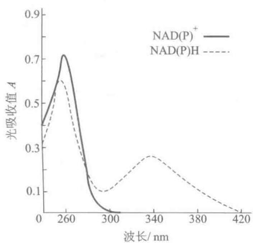  
图 6-8 NAD(P) $^{+}$ 和 NAD(P)H 的光吸收曲线

吸收值的增加来达到。

$$
\mathrm{葡萄糖} + \mathrm{ATP} \stackrel {\mathrm{HK}} {\rightleftharpoons} 6 - \mathrm{磷酸葡糖} + \mathrm{ADP}
$$

$$
6 - \text {   磷酸葡糖   } + \mathrm{NADP} ^ {+} \xrightarrow {\mathrm{G-6-PDH}} 6 - \text {   磷酸葡糖酸   } + \mathrm{NADPH} + \mathrm{H} ^ {+}
$$

上述方法称为酶偶联分析法(enzyme coupling assay)。

（2）荧光法(fluorometry) 主要是根据底物或产物的荧光性质的差别来进行测定。由于荧光方法的灵敏度往往比分光光度法要高若干个数量级，而且荧光强度和激发光的光源有关，因此在酶学研究中，越来越多地被采用，特别是一些快速反应的测定方法。荧光测定方法的一个缺点是易受其他物质干扰，有些物质如蛋白质能吸收和发射荧光，这种干扰在紫外区尤为显著，故用荧光法测定酶活力时，尽可能选择可见光范围的荧光进行测定。

（3）同位素测定方法 用放射性同位素的底物，经酶作用后所得到的产物，通过适当的分离，测定产物的脉冲数即可换算出酶的活力单位。该方法的优点是灵敏度极高，可达f mol或更高水平。已知六大类酶几乎都可以用此方法测定。通常用于底物标记的同位素有 $^{3}H$ 、 $^{14}C$ 、 $^{32}P$ 、 $^{35}S$ 和 $^{131}I$ 等。例如测定蛋白激酶的活力，可以通过蛋白激酶催化组蛋白的磷酰化反应，用 $[\gamma-^{32}P]$ -ATP作为底物，用三氯乙酸沉淀法把磷酰化的组蛋白和未反应的 $[\gamma-^{32}P]$ -ATP分开，然后经洗涤烘干，计数。通过放射性同位素计数的改变就能计算出蛋白激酶的活力。

## (4) 电化学方法(electrochemical method)

pH 测定法 最常用的是玻璃电极, 配合一高灵敏度的 pH 计, 跟踪反应过程中 $H^{+}$ 变化的情况, 用 pH 的变化来测定酶的反应速率。也可以用恒定 pH 测定法, 在酶反应过程中, 所引起的 $H^{+}$ 的变化, 用不断加入碱或酸来保持其 pH 恒定, 用加入的碱或酸的速率来表示反应速率。用此法可以测定许多酯酶的活力。

另外还使用离子选择电极法测定某些酶的酶活力,用氧电极可以测定一些耗氧的酶反应,如葡糖氧化酶的活力就可用这个方法很方便地测定。

此外还有一些测定酶活力的方法,例如旋光法、量气法、量热法和层析法等,但这些方法使用范围有限,灵敏度较差,只是应用于个别酶活力的测定。

## （二）酶的分离纯化

酶的分离纯化是酶学研究的基础。研究酶的性质、催化作用、反应动力学、结构与功能关系、阐明代谢途径和作为工具酶等都需要高度纯化的酶制剂以免除其他的酶或蛋白质的干扰。例如基因工程中所使用的各种工具酶都有高纯度的要求，内切酶中不能含有外切酶，反之一样，否则结果无法判断。再如，要区别一个酶催化两种不同的反应是酶本身的特点还是由于该酶制剂中污染了其他的酶杂质，可以用许多方法来进行判断，但是必须是在该酶制剂纯化后才能做出结论。由于使用酶制剂的目的不同，对酶制剂的纯度要求不一样，要根据不同的需要采用不同的方法纯化酶制剂。

已知绝大多数酶是蛋白质,因此酶的分离提纯方法,也就是常用来分离提纯蛋白质的方法。酶的提纯常包括两方面的工作,一是把酶制剂从很大体积浓缩到比较小的体积,二是把酶制剂中大量的杂质蛋白和其他大分子物质分离出去。为了判断分离提纯方法的优劣,一般用两个指标来衡量,一是总活力的回收;二是比活力提高的倍数。总活力的回收是表示提纯过程中酶的损失情况,比活力提高的倍数是表示提纯方法的有效程度。一个理想的分离提纯方法希望比活力和总活力的回收率越高越好,但是实际上常常两者不可兼得。因此考虑分离提纯条件和方法时,不得不在比活力多提高一些和总活力多回收一些之间作适当的选择。

生物细胞中产生的酶有两类,一类由细胞内产生然后分泌到细胞外进行作用的酶,称为胞外酶,这类酶大多都是水解酶类。另一类酶在细胞内合成后并不分泌到细胞外,而是在细胞内起催化作用的称为胞内酶,这类酶数量较多。一般而言,胞外酶比胞内酶更易于分离纯化。

分离纯化蛋白质的方法已在第5章详细介绍,这里不再赘述。根据酶的特点在分离纯化中应注意以下几点:

（1）选材 选择酶含量丰富的新鲜生物材料，一种酶含量丰富的器官或组织往往和含量较低的器官或组织相差上千倍或上万倍。目前常用微生物为材料制备各种酶制剂。

酶的提取工作应在获得材料后立即开始,否则应在低温下保存, $-70\sim-20^{\circ}C$ 为宜。或将生物组织做成丙酮粉保存。

（2）破碎 动物组织细胞较易破碎，通过一般的研磨器、匀浆器、高速组织捣碎机就可达到目的。微生物及植物细胞壁较厚，需要用超声波、细菌磨、冻融、渗透压法、酶消化法或用某些化学溶剂如甲苯、去氧胆酸钠、去垢剂等处理加以破碎，制成组织匀浆。

（3）抽提 在低温下，以水或低盐缓冲液，从组织匀浆中抽提酶，得到酶的粗提液。

（4）分离及纯化 酶是生物活性物质，在分离纯化时必须注意尽量减少酶活性损失，操作条件要温和，全部操作一般在0\~5℃间进行。

根据酶大多属于蛋白质这一特性,用一系列分离蛋白质的方法,如盐析、等电点沉淀、有机溶剂分级、选择性热变性等方法可从酶粗提液中初步分离酶。然后再采用吸附层析、离子交换层析、凝胶过滤、亲和层析、疏水层析及高效液相层析等技术或各种制备电泳技术进一步纯化酶,以得到纯的酶制品。为了得到比较理想的纯化结果,往往采用几种方法配合使用。这要根据不同酶的特点,通过实验选择合适的方法。

盐析法是根据酶和杂蛋白在不同盐浓度的溶液中溶解度的不同而达到分离目的,硫酸铵分级沉淀法可去除抽提液中75%的杂蛋白,并可大大浓缩酶液。盐析法简便安全,大多数酶在高浓度盐溶液中相当稳定,重复性好。

有机溶剂分级法分离酶时,最重要的是严格控制温度,要在-20\~-15℃下进行,冰冻离心得到的沉淀应立刻溶于适量的冷水或缓冲液中,以使有机溶剂稀释至无害的浓度,或将它在低温下透析。

选择性热变性方法是酶分离纯化工作中常用到的一类简便有效的方法,通过热变性可以除去很多核和颗粒性物质,因而常常能把一个混浊的抽提液变成完全澄清的溶液。只要控制好 pH 和保温时间,应用得当,就可较大地提高酶的纯度。

使用各种柱层析技术分级分离酶时,要根据所分离酶的性质选择合适的层析介质,柱大小要适当,特别要注意作为洗脱用缓冲液的 pH 和离子强度,要控制一定的流速。

制备电泳多采用凝胶电泳,要选择好电泳缓冲液,根据电泳设备条件选择一定的上样量,电泳后及时将样品透析,冰冻干燥保存。

重金属离子对于某些酶有破坏作用,为此制备这类酶时,在提取液中加入少量金属螯合剂乙二胺四乙酸(EDTA)或乙二醇双(2-氨基乙醚)四乙酸(EGTA)以防止重金属离子对酶的破坏作用。有些含巯基的酶在分离提纯过程中,往往需要加入某种巯基试剂,如巯基乙醇、二硫苏糖醇(1,4-dithiothreitol, DTT)等,可防止酶的巯基在制备过程中被氧化。有时为了防止内源蛋白酶对酶的水解作用,在提取液加入少量蛋白酶抑制剂,如对甲苯磺酰氟(PMSF)、亮抑蛋白酶肽(Leupeptin)、抑蛋白酶多肽(aprotinin)等。

在酶的制备过程中,每一步骤都应测定留用以及准备弃去部分中所含酶的总活力和比活力,以了解经过某一步骤后酶的回收率,纯化倍数,从而决定这一步的取舍。

$$
\mathrm{总活力} = \mathrm{活力单位数} / \mathrm{mL} \mathrm{酶液} \times \mathrm{总体积(mL)}
$$

$$
\mathrm{比活力} = \mathrm{活力单位数} / \mathrm{mg} \mathrm{蛋白(氮)} = \mathrm{总活力单位数} / \mathrm{总蛋白(氮)} \mathrm{mg}
$$

$$
\mathrm{纯化倍数} = \frac {\mathrm{每次比活力}}{\mathrm{第一次比活力}}
$$

$$
\mathrm{回收率(产率)} = \frac {\mathrm{每次总活力}}{\mathrm{第一次总活力}} \times 1 0 0
$$

（5）结晶 通过各种提纯方法获得较纯的酶溶液后，就可能将酶进行结晶。常用的方法有：盐析、有机溶剂、透析平衡、等电点等结晶方法。酶的结晶过程进行得很慢，如果要得到好的晶体也许需要数天或数星期。通常的方法是把盐加入一个比较浓的酶溶液中至微呈混浊为止。有时需要改变溶液的 pH 及温

度,轻轻摩擦玻璃壁等方法以便达到结晶的目的。

（6）保存 通常将纯化后的酶溶液经透析除盐后冰冻干燥得到酶粉，低温下可较长时期保存。或将酶溶液用饱和硫酸铵溶液反透析后在浓盐溶液中保存。也可将酶溶液制成25%甘油或50%甘油分别贮于-25℃或-50℃冰箱中保存。注意酶溶液浓度越低越易变性，因此切记不能保存酶的稀溶液。

## 七、非蛋白质生物催化剂——核酶

## （一）核酶的发现

自从 1926 年 J. Sumner 首次从刀豆中获得脲酶结晶并证明是蛋白质以来, 现已有数千种酶经研究证明是蛋白质。因此, 长期以来人们一直认为酶的化学本质就是蛋白质。1981 年美国 T. R. Cech 等人发现原生动物嗜热四膜虫 (Tetrahymena thermophila) 的核糖体 RNA(rRNA) 前体能通过自剪接 (self-splicing) 切去间插序列 (intervening sequence, IVS) 或称内含子 (intron), 表明 RNA 也具有催化功能, 称它们为核酶 (ribozyme)。1983 年 S. Altman 等人在研究细菌 RNase P 时发现, 该酶的 RNA 组分能单独完成前体 tRNA 加工。随后又发现了一些植物类病毒 (viroid)、拟病毒 (virusoid) 和卫星 RNA 在复制过程中也能自剪切 (self-cleavage) 和环化。生物体内一些重要 RNA-蛋白质颗粒如剪接体 (spliceosome) 和核糖体 (ribosome) 等也可认为是核酶复合体。

核酶的发现被认为是现代生物化学领域内最令人鼓舞的发现之一,不仅丰富和发展了酶的概念,并对于地球上生命起源的研究具有重要意义。为此 T. R. Cech 和 S. Altmans 共同获得了 1989 年度诺贝尔化学奖。

1994 年, R. R. Breaker 等人首先发现能够催化 RNA 磷酸二酯键水解的单链 DNA 分子, 随后又发现 DNA 还具有连接酶的活性, 称它们为脱氧核酶 (deoxyribozyme)。这样, 在蛋白质和 RNA 之后, DNA 也成酶家族的最新成员。

核酶(ribozyme)是作为生物催化剂的RNA分子,为核糖核酸酶(ribonucleic acid enzyme)的缩写;同样,脱氧核酶(deoxyribozyme)是作为生物催化剂的DNA分子,为脱氧核糖核酸酶(deoxyribonucleic acid enzyme)的缩写。核酸酶(nucleic acid enzyme)是核酶和脱氧核酶的总称,是具有催化功能的核酸分子。这样,酶的新概念应是指具有生物催化功能的蛋白质和核酸。

## （二）核酶的种类

根据分子大小可将核酶分成两类:大分子核酶和小分子核酶。大分子核酶包括Ⅰ型内含子(Ⅰ型 IVS)、Ⅱ型内含子和 RNase P 的 RNA 组分。它们都是由几百个核苷酸组成的结构复杂的大分子。Ⅰ型内含子分布广泛,现发现千种以上。Ⅱ型内含子也发现一百多种。小分子核酶常见的有 4 种类型:锤头状(hammerhead)核酶、发夹状(hairpin)核酶、肝炎 δ 病毒(HDV)核酶和 Vs 核酶。小分子核酶活性片段一般小于 100 个核苷酸,主要生物学功能是通过剪切和环化从滚环复制的中间物上产生单位长度的基因组,都能剪切 RNA 磷酸二酯键,产物具有 5′-OH 基和 2′,3′-环状磷酸二酯键,有些还可以催化连接反应。下面介绍几种常见的核酶。

## 1. L19RNA (L19IVS)

1985 年 T. R. Cech 等人通过对四膜虫 rRNA 前体自剪接机制的深入研究, 发现前体中的内含子具有催化功能, 这个由 395 nt 构成的线状 RNA 分子(称为

  
图 6-9 L19RNA 的催化机制

A. 酶本身；B. $C_{5}$ 通过氢键与酶结合，剩下的 $C_{4}$ 部分可以自由地从酶上解离下来；C. GpC 水解使酶恢复原状 (C→A)；D. 或者是共价结合的 pC 与第二个 $C_{5}$ 分子连接形成 $C_{6}, C_{6}$ 释放后酶恢复原状 (C→D→A)

L19RNA或L19IVS)，相当于四膜虫rRNA前体内含子的 $3^{\prime}$ 部分（切除 $5^{\prime}$ 部分18个nt），这个RNA分子具有特征的三维结构，已测定了活性部位并进行了改造。在体外(in vitro)L19RNA能催化一系列分子间的反应，例如，在一定条件下L19RNA能高度特异地催化寡聚核糖核苷酸底物的切割和连接。五聚胞苷酸 $(C_5,$ pentacytidylate)能被L19RNA转化为或长或短的寡聚体，特别是能将 $\mathrm{C}_5$ 降解成 $\mathrm{C}_4$ 和 $\mathrm{C}_3$ ，而同时形成 $\mathrm{C}_6$ 和更长的寡聚体(图6-9)。因此说明L19RNA既有RNA酶活性，又有RNA聚合酶(RNA polymerase)活性。此核酶催化 $\mathrm{C}_5$ 水解的速率为非催化的水解速率的 $10^{10}$ 倍。

这种 L19RNA 对 $C_{5}$ 的作用比对 $U_{5}$ 快得多，而对 $A_{5}$ 和 $G_{5}$ 则毫无作用。它遵循 Michaelis-Meten 动力学。对于 $C_{5}$ ，其 $K_{m}$ 为 $42 \mu mol \cdot L^{-1}$ 和 $k_{cat}$ 为 $0.033 s^{-1}$ ， $k_{cat}/K_{m}$ 为 $7.9 \times 10^{2} mol^{-1} \cdot L \cdot s^{-1}$ 与 RNaseA 类似。已发现脱氧 $C_{5}$ 为 $C_{5}$ 的竞争性抑制剂， $K_{i}$ 为 $260 \mu mol \cdot L^{-1}$ ，证明底物中的 $2^{\prime}-OH$ 是必需的。这样 L19RNA 表现出了经典的酶促催化的几个标志：高度的底物专一性，Michaelis-Menten 动力学和对竞争性抑制剂的敏感性。

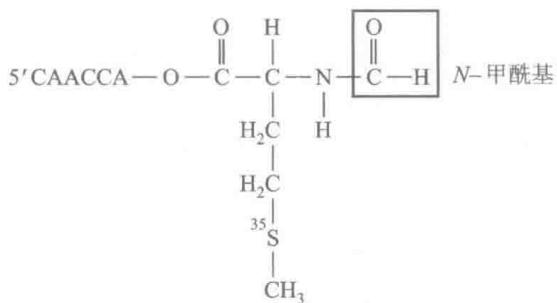

1992 年 J. A. Piccirilli 等人发现 L19RNA 具有氨酰酯酶 (aminoacyl esterase) 的活性, 催化氨酰酯的水解 (图 6-10), 这是氨酰-tRNA 合成酶的逆反应。另外, 发现 L19RNA 还有 RNA 限制性内切酶作用, 如:

$$
- \mathrm{CpUpCpUpN-+G} \longrightarrow - \mathrm{CpUpCpU+GpN}
$$

N-甲酰甲硫氨酰寡核苷酸  

L19RNA 作用底物均是多聚嘧啶核苷酸,因此推测该 RNA 催化剂的活性部位是富含鸟苷酸的寡聚嘌呤核苷酸。催化剂和底物间通过碱基配对形成非共价键发生作用。已研究证明 L19RNA 分子的第 22\~27 位的 5'-GGAGGG-3' 是其催化中心。改造这一序列,可以得到人工 RNA 催化剂。如 3' 端无 G,丧失反应能力,加入 G 后则恢复正常。

  
N-甲酰甲硫氨酸

1997 年 B. Zhang 和 T. R. Cech 得到了一组直接催化肽链生成的人造 RNA 分子, 证明了 RNA 具有肽基转移酶活性。表明 RNA 与蛋白质生物合成有关。

## 2. RNase P 的 RNA 组分是核酶

RNase P 是催化 tRNA 前体 5' 端成熟的内切核酸酶，是由 RNA（称为 MIRNA，含 377 个 nt）和蛋白质（称为 $C_{5}$ 蛋白，含 119 个氨基酸残基）两部分组成，前者占全酶总重量的 77%，后者占 23%。1983—1984 年间 S. Altman图 6-10 四膜虫核酶的氨酰酯酶活性

$^{35}$ S-标记的 N-甲酰甲硫氨酸通过酯键与 RNA 寡核苷酸( $5^{\prime}-CAACCA$ ) $3^{\prime}-OH$ 末端连接。核酶能够催化羧酸酯及磷酸酯的水解。注意氨酰 RNA 酯水解的逆反应是氨酰 RNA 酯的合成(这是蛋白质合成中氨基酸提供给核糖体的化学形式)。该反应提示了,由原始的 RNAs 能够催化形成氨酰-tRNAs 类似物

和 N. Pace 研究发现, 用层析或电泳从 E. coli 的 RNase P 中分离出来的 MIRNA 组分, 在高浓度 $Mg^{2+}$ (20 mmol·L $^{-1}$ 以上) 存在下, 可显示出催化 tRNA 前体成熟的活性, MIRNA 催化 E. coli tRNA $^{tyr}$ 前体的 $K_{m}$ 值与 RNase P 的 $(5\times10^{-7}\ \mathrm{mol}\cdot\mathrm{L}^{-1})$ 相同, $k_{cat}$ 值为 $33\ min^{-1}$ , $k_{cat}/K_{m}$ 为 $1.1\times10^{6}\ mol^{-1}\cdotL\cdot s^{-1}$ 。而分离出的 $C_{5}$ 蛋白在任何条件下都无催化活性, 只起维护 RNA 构象的作用, 而真正的催化剂是 MIRNA。将 MIRNA 的基因进行体外转录, 其转录产物 RNA 具有催化 tRNA 前体 5' 端成熟的活性, 这一研究结果直接证明了 RNA 确有催化功能。但尚未测出真核生物 RNase P 的 RNA 具有催化活性。

另一个蛋白质-RNA复合物酶中RNA单独具有催化功能的例子是兔肌1,4-α-葡聚糖分支酶(1,4-α-dextran branching enzyme)，该酶中RNA共有31个核苷酸残基(31 nt)，其中含8种10个修饰成分，该RNA催化的底物是葡聚糖而非RNA，这是一个很奇特的核酶，有待深入研究。

## 3. 锤头状核酶

R. Symons 在比较研究了一些植物类病毒、拟病毒和卫星病毒自我剪切规律后，于 1986 年提出锤头结

构(hammer head structure)的二级结构模型,来解释RNA的自剪切机制。锤头结构是由13个保守核苷酸碱基和3个螺旋区构成(图6-11),是较小的核酶。所有锤头状核酶具有相似的二级结构和三级结构。典型的二级结构由两部分组成,一个是催化部分,另一个为底物部分。自我剪切活性依赖于结构和构象的完整性,只要满足锤头状的二级结构和13个核苷酸的保守序列,剪切反应就会在锤头结构右上方的GUN序列的3'端自动发生。1989年M. Koizumi等证明只要保证其中11个nt的保守序列不变,剪切反应就可发

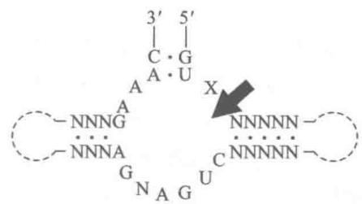  
图 6-11 核酶锤头结构

生。1992年报道小至10 nt以及3 nt的核酶即具有催化活性。例如：在 $Mn^{2+}$ 存在下，UUU可切割 $(5')G\downarrow$ AAA $(3')$ ，UUU便是3 nt的核酶。有人报道5-羟基胞苷能催化氧化还原反应，扩展了核酶的定义。

按已知自剪切原理,剪切是高度专一的,把自剪切转换成分子间剪切,利用锤头结构就可以设计出自然界不存在的各种核酶。利用锤头状结构核酶的 RNA 限制性内切酶活性,可以设计定点切割 tRNA、5S rRNA、28S RNA、mRNA、病毒 RNA 等任何一种靶 RNA 分子。

## 4. 脱氧核酶

脱氧核酶是指具有催化功能的 DNA 分子。脱氧核酶一般获得方法是体外选择。现已发现：① 以 RNA 和 DNA 为底物的具有酯酶活性的脱氧核酶；② 具有 N-糖基化酶活性的脱氧核酶；③ 具有连接酶活性、具有激酶活性和具有氧化酶活性的脱氧核酶。脱氧核酶作为生物催化剂的新成员，越来越受到人们的重视。

## （三）核酶的研究意义及应用前景

现有研究结果表明,核酶都是 RNA 分子,可被体内 RNase 所破坏,从而限制了核酶的直接使用。近年来,利用核酶进行基因治疗的研究已取得很大进展。根据锤头结构或发夹结构原理设计核酶基因,构建于特定的表达载体,在不同细胞内表达已经成功。结果表明核酶基因导入细胞或体内可以阻断基因表达,用作抗病毒感染,抗肿瘤的有效药物。如利用 I 型内含子可进行基因修复,治疗肌强直性营养不良缺陷等疾病;抗 HIV 核酶已进入 II 期临床试验;抗肝炎病毒的核酶在肝细胞培养中成功地抑制了病毒的复制;其他还有抗生殖道感染、抗白血病、抗免疫排斥反应等等。虽然目前还有诸多问题有待解决,但发展前景是诱人的,应用将是广泛的。

在研究了核酶催化氨酰酯的水解可逆反应和转移反应后指出,核酶很可能具有氨酰 tRNA 合成酶和肽基转移酶活性,这些反应均与蛋白质生物合成有关,表明 RNA 在翻译过程和核糖体功能中起着非常重要的作用,问题的突破将是对分子生物学的重要贡献。

也应指出，核酶与蛋白质酶的差异不仅在于化学本质的不同，同时两者的催化活性也相差很大。已知核酶的转换数在0.1\~5之间，比大多数蛋白质酶低几个数量级。从进化角度考虑，生物催化剂从核酶到蛋白质酶的转变，伴随着生物代谢高效率和生命现象的更趋复杂。

图 6-12 表示生物催化分子进化的可能过程, 它表示生物催化功能从 RNA 到蛋白质的转移。现在, 主要的生物催化剂是蛋白质-辅酶(辅基)。

$$
\mathrm{RNA} \rightarrow \mathrm{RNA} - \text {蛋白质} \rightarrow \text {蛋白质} - \mathrm{RNA} \rightarrow \text {蛋白质} - \text {辅酶(辅基)} \rightarrow \text {蛋白质}
$$

$$
\text { 图 } 6 - 1 2 \quad \text { 生物催化分子进化的可能过程 }
$$

具有催化功能 RNA 的重大发现,表明 RNA 是一种既能携带遗传信息又有生物催化功能的生物分子。因此很可能 RNA 早于蛋白质和 DNA,是生命起源中首先出现的生物大分子,而一些有酶活性的内含子可能是生物进化过程中残存的分子“化石”。酶活性 RNA 的发现,提出了生物大分子和生命起源的新概念,无疑将促进对生物进化和生命起源的研究。

## 八、抗体酶

抗体酶(abzyme)是20世纪80年代后期才发现的一种具有催化能力的蛋白质,其本质上是免疫球蛋白,但是在易变区被赋予了酶的属性,所以又称为“催化性抗体”(catalytic antibody),它既具有抗体的高度选择性,又具有酶的高度催化效率。抗体酶是生物学与化学的研究成果在分子水平上交叉渗透的产物,是将抗体的多样性和酶分子的巨大催化能力结合在一起的蛋白质分子设计的新方法。人们早就注意到,酶与抗体这两种蛋白质之间尽管功能不同,但存在着惊人的相似之处,尤其是它们在与各自的配基特异的结合过程中,遵守同样的方式并表现出相似的动力学行为。人们不禁要问:抗体分子极其多样的结合专一性能被用来产生新的酶吗?催化作用的实质是专一结合的相互作用形成过渡态,因此,用过渡态的类似物作为半抗原(hapten)免疫动物将有可能产生有催化活性的抗体。这一设想已得到证实。

1986年P.Schultz与R.Lerner两个实验室同时报道了他们成功地得到了具有酶催化活性的抗体。这标志着抗体酶的研究进入了一个新阶段。P.Schultz等人认为对硝基苯酚磷酸胆碱酯（PNPPC）作为相应羧酸二酯水解反应的过渡态类似物（图6-13），推测用这个类似物作为半抗原诱导产生的单克隆抗体可能对羧酸二酯的水解反应有催化活性。通过对单克隆抗体的筛选，找到一株MOPC167单抗，可使水解反应速率加快 $1.2\times 10^{4}$ 倍， $K_{\mathrm{m}}$ 值为 $208~\mu \mathrm{mol}\cdot \mathrm{L}^{-1},k_{\mathrm{cat}}$ 值为 $6.7\times 10^{-1}\mathrm{s}^{-1}$ ，其 $k_{\mathrm{cat}} / K_{\mathrm{m}}$ 是 $3.2\times 10^{3}\mathrm{mol}^{-1}\cdot \mathrm{L}\cdot \mathrm{s}^{-1}$ 。

  
图 6-13 酯酶的底物、过渡态及过渡态类似物的结构

以后又筛选到另一株抗体酶 T15, 可以使反应加快 $9.2 \times 10^{3}$ 倍。证明该催化反应的动力学行为满足米氏方程, 具有底物专一性及 pH 依赖性等酶反应的特征。随后还初步确定了参与催化反应的氨基酸残基。同时证实, 该抗体酶具有抗原结合位点的 $F_{ab}$ 段单独具有全酶一样的催化效率。

R. Lerner 等人从金属肽酶的研究成果中得到启发, 合成了一个含有吡啶甲酸的膦酸酯类似物为半抗原诱导产生一个单抗 6D4, 用来催化不含吡啶甲酸的相应羧酸酯化合物的水解反应, 使反应加速近 $10^{3}$ 倍, 并表现出底物专一性和对介质 pH 的依赖性等。相关结构如下:

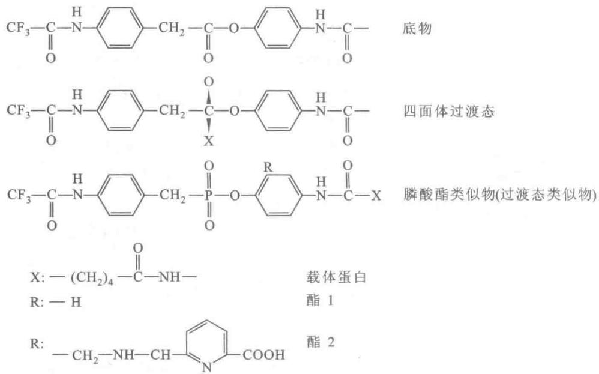

酯 1 和酯 2 用于免疫动物产生的单克隆抗体可以催化碳酸酯的水解反应。

$$
\begin{array}{l} \mathrm {X: - CH_ {3}} \\ \mathrm{R: - H} \\ \mathrm{R:} \quad - \mathrm {CH_ {2} -NH - CH_ {2} -} \quad \mathrm{N-COOH} \end{array} \text {酯3}
$$

而酯 3 和酯 4 是抗体的抑制剂, 竞争性抑制抗体的催化。酯 3 和酯 4 的抑制常数分别是 $0.6 \mu mol \cdot L^{-1}$ 和 $0.16 \mu mol \cdot L^{-1}$ 。

铁螯合酶(ferrochelatase)是血红素生物合成中最终端的酶,催化 $Fe^{2+}$ 插入原卟啉区,为了 $Fe^{2+}$ 的插入,平面状卟啉必须发生弯曲。而N-甲基原卟啉由于N-烷基化使卟啉发生弯曲,N-烷基化原卟啉螯合金属

离子的能力,比未烷基化的对应物快 $10^{4}$ 倍。该化合物类似反应中的过渡态,也是铁螯合酶的强烈抑制剂。P. Schultz 等用 N-甲基原卟啉诱导产生抗体,可以催化平面状卟啉的金属螯合反应。所得抗体每小时每个抗体分子可使 80 个卟啉分子与金属螯合,仅比金属螯合酶速率低 10 倍,抗体酶比非催化反应快 2500 倍。相关结构式如图 6-14 所示。

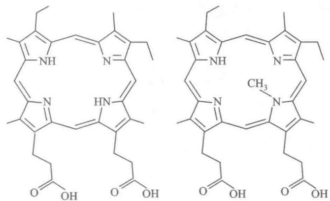

以上 3 个例子说明了抗体酶研制的原理及途径,为开展抗体酶的研究奠定了基础。

近年来,随着半抗原设计和抗体酶筛选技术

图 6-14 原卟啉及 N-甲基原卟啉结构

的不断提高,有关抗体酶的研究得到迅速发展。在有些情况下,抗体酶催化反应速率达到非催化反应速率的 $10^{4} \sim 10^{8}$ 倍,有些已接近天然酶的反应速率。反应类型不仅是上面讨论过的水解反应和金属螯合反应,现已制备出可以催化酰胺键生成反应、光诱导裂解及聚合反应、氧化还原反应、脱羧反应、转酯反应、分子重排反应以及立体专一性抗体酶。抗体酶所催化的反应类型已达数十种之多。抗体酶的研究不仅有重要的理论价值,为酶的过渡态理论提供了有力的实验证据,而且抗体酶有令人鼓舞的应用前景。如果能制备出按照人们的设计对特定的肽键进行水解的抗体酶,则将为蛋白质结构的研究提供新的手段。在医学上这种抗体酶将有可能用来专一地破坏病毒蛋白质及专一地清除心血管病人血管壁上的血液凝块。正研究设计降解可卡因的催化性抗体,用于帮助治疗可卡因毒瘾。若将具有立体专一性的抗体酶用于制药工业,它有助于避免化学合成中遇到的对映体拆分的难题。抗体酶的固定化已取得成功,具有酯酶活力的抗体酶已用于生物传感器的制造上。不久的将来,人们有可能研制成功用于蛋白质氨基酸序列分析的抗体酶,从而大大简化和快速蛋白质氨基酸序列的测定。

抗体酶技术已受到高度重视,抗体酶的定向设计开辟了一个不依赖于蛋白质工程的酶工程的领域。

## 九、酶工程简介

酶的开发和利用是现代生物技术的重要内容。酶工程（enzyme engineering）是在1971年第一届国际酶工程会议上才得到命名的一项新技术。酶工程主要研究酶的生产、纯化、固定化技术、酶分子结构的修饰和改造以及在工农业、医药卫生和理论研究等方面的应用。天然酶在开发和应用中受到一定限制，一是酶的不稳定性；二是分离纯化难，成本高，价格贵。由于上述原因，尽管已被发现和鉴定的酶有数千种，但是目前国际上工业用和研究用的商品酶的种类也仅数百种。为了解决酶的应用和新酶开发问题，现采用两种方法。一是化学方法，即通过对酶的化学修饰或固定化处理，改善酶的性质以提高酶的效率和降低成本，甚至通过化学合成法制造人工酶；另一种是用基因重组技术生产酶以及对酶基因进行修饰或设计新基因，从而生产性能稳定，具有新的生物活性及催化效率更高的酶。因此酶工程可以说是把酶学基本原理与化学工程技术及基因重组技术有机结合而形成的新型应用技术。根据研究和解决问题的手段不同将酶工

程分为化学酶工程和生物酶工程。

## （一）化学酶工程

化学酶工程也可称为初级酶工程（primary enzyme engineering），是指天然酶、化学修饰酶、固定化酶及人工模拟酶的研究和应用。

## 1. 天然酶

工业用酶制剂多属于通过微生物发酵而获得的粗酶，价格低，应用方式简单，产品种类少，使用范围窄。例如，洗涤剂、皮革生产等用的蛋白酶；纸张制造、棉布退浆等用的淀粉酶；漆生产用的多酚氧化酶；乳制品用的凝乳酶等。天然酶的分离纯化随着各种层析技术及电泳技术的发展，得到长足的进展，目前医药及科研用酶多数从生物材料中分离纯化得到。

## 2. 化学修饰酶

通过对酶分子的化学修饰可以改善酶的性能,以适用于医药的应用及研究工作的要求。化学修饰的途径,可以通过对酶分子表面进行修饰,亦可对酶分子的内部修饰。其主要方法有:

（1）化学修饰酶的功能基 对酶分子的侧链基团，尤其是酶活性部位中的必需基团进行化学修饰，最经常修饰的氨基酸残基既可是亲核的（Ser、Cys、Thr、Lys、His），也可是亲电的（Tyr、Trp），或者是可氧化的（Tyr、Trp、Met）。例如通过脱氨基作用，酰化反应可修饰抗白血病药物天冬酰胺酶（asparaginase）的游离氨基，使该酶在血浆中的稳定性提高若干倍。再如，将 $\alpha-$ 胰凝乳蛋白酶（ $\alpha-$ chymotrypsin）表面的氨基修饰成亲水性更强的一 $\mathrm{NHCH}_2\mathrm{COOH}$ ，使酶抗不可逆热失活的稳定性在 $60^{\circ}\mathrm{C}$ 时提高1000倍，在更高温度下，稳定化效应更好，以致难以在同一温度下与天然酶比较。

（2）交联反应 用某些双功能试剂能使酶分子间或分子内发生交联反应。如将人 $\alpha$ -半乳糖苷酶A（ $\alpha$ -galactosidase A)经交联反应修饰后，其酶活性比天然酶稳定，对热变性与蛋白质水解酶的稳定性也明显增加。用戊二醛将胰蛋白酶和碱性磷酸酶（basic phosphatase)交联而成杂化酶，可作为部分代谢途径的有用模型，测定复杂的生物结构。若将两种大小、电荷和生物功能不同的药用酶交联在一起，则有可能在体内将这两种酶同时输送到同一部位，提高药效。

（3）大分子修饰作用 可溶性高分子化合物如肝素（heparin）、葡聚糖（dextran）、聚乙二醇（polyethylene glycol）可修饰酶蛋白的侧链，提高酶的稳定性，改变酶的一些重要性质。如 $\alpha-$ 淀粉酶（ $\alpha-$ amylase）与葡聚糖结合后热稳定性显著增加，在 $65^{\circ}C$ 结合酶的半寿期为 63 min，而天然酶的半寿期只有 2.5 min。再如用葡聚糖修饰超氧化物歧化酶（superoxide dismutase, SOD），聚乙二醇修饰天冬酰胺酶（asparaginase），肝素、葡聚糖或聚乙二醇修饰尿激酶，修饰过的酶在血液中的半寿期无一例外的成几倍、几十倍的增长，抗原性消失，耐热性提高，并具有耐酸、耐碱和抗蛋白酶的作用。还有报道，将聚乙二醇连到脂肪酶（lipase）、胰凝乳蛋白酶上，所得产物溶于有机溶剂，可在有机溶剂中有效地起催化作用。

## 3. 固定化酶

固定化酶（immobilized enzyme）是20世纪50年代发展起来的一种新技术。通常酶催化反应都是在水溶液中进行的，而固定化酶是将水溶性酶用物理或化学方法处理，使之成为不溶于水的，但仍具有酶活性的状态。在1971年第一届国际酶工程会议上，正式建议采用“固定化酶”的名称。酶的固定化方法大致分为物理法和化学法，物理法有吸附法和包埋法；化学法有共价偶联法和交联法（图6-15）。经过固定化的酶不仅仍具有高的催化效率和高度专一性，而且固定化酶提高了对酸碱和温度的稳定性，增加了酶的使用寿命；可简化工艺，反应后易与反应产物分离，减少了产物分离纯化的困难，而提高了产量和质量。由于它具有上述优点，固定化酶已成为酶应用的一种主要形式，据报道，已有100多种酶进行了固定化。目前，固定化酶已经在工农业、医药、分析、亲和层析、能源开发、环保和理论研究等方面得到了广泛应用，取得了丰硕成果。例如我国已用固定化氨基酰化酶拆分D、L-氨基酸，用固定化的葡糖异构酶（glucose isomerase）生产高果糖玉米糖浆，用固定化酶法生产脂肪酸，半合成新青霉素等。自60年代以来，为了检测目的，制出了附有固定化酶的酶电极，其中应用的电极部分包括各种离子电极、氧电极和 $\mathrm{CO}_{2}$ 电极等，酶电极兼有酶的专一性、灵敏性及电位测定简单性的双重优点，目前已有80多种固定化酶用于酶电极中。

模拟生物体内的多酶体系，将完成某一组反应的多种酶和辅因子固定化，可制作特定的生物反应器。近年来，以固定化微生物组成的生物反应器已获得工业应用。例如固定化酵母细胞反应器连续发酵生产酒精、啤酒，该技术我国于1982年即研制成功并投入生产。现已可用固定化细胞生产有机溶剂、有机酸、氨基酸、抗生素、单克隆抗体和酶等。生物传感器是利用生物高分子物质来检测特殊化合物的一种电子元件，利用酶组成的生物传感器已经使用几十年。它们由固定化酶和离子敏感型电极组成，可以用于测定由酶催化的反应底物。生物传感器工作时非常迅速，非常灵敏。近年来，在用酶制造生物传感器的基础上，又发展了利用微生物细胞或动、植物细胞组织形成的生物传感器。活细胞的利用，为生物传感器的再生提供了可能。生物传感器在近期必将获得更广泛的应用和发展。

  
图6-15 固定化酶制备方法

## 4. 模拟酶

模拟酶(mimic enzyme)是在深入了解酶的结构和功能以及催化作用机制的基础上,用有机化学半合成法或全合成法合成的比天然酶简单的非蛋白质分子,又称为人工酶(artificial enzyme)催化剂。固氮酶的模拟最令人瞩目,人们从天然固氮酶由铁蛋白和铁铜蛋白两种组分得到启发,提出了多种固氮酶模型。再如将电子传递催化剂 $\left[\mathrm{Ru}\left(\mathrm{NH}_{3}\right)_{3}\right]^{3+}$ 与巨头鲸肌红蛋白结合,产生了一种“半合成的无机生物酶”,这样把能与 $O_{2}$ 结合,而无催化功能的肌红蛋白转变成能氧化各种有机物(如抗坏血酸)的半合成酶,它接近于

天然的抗坏血酸氧化酶的催化效率。全合成酶不是蛋白质，而是一些有机物。它们通过并入酶的催化基团与控制空间构象，从而像天然酶那样专一性地催化化学反应。利用环糊精成功地模拟了胰凝乳蛋白酶、RNase、转氨酶、碳酸酐酶等。例如1985年Bender等人利用β-环糊精的空穴作为底物的结合部位，以连在环糊精侧链上的羧基、咪唑基及环糊精自身的一个羟基共同构成催化中心，制成了名为β-benzyme的胰凝乳蛋白酶模拟酶（图6-16）。实验表明，模拟酶催化简单酯反应的速率与天然酶相近，但模拟酶的热稳定性与pH稳定性大大优于天然酶，模拟酶的活力至少在80℃仍能保持，在pH2\~13的大范围内都是稳定的。1977年人工合成的八肽：Glu-Phe-Ala-Glu-Glu-Ala-Ser-Phe具有溶菌酶的活力可达到天然酶的50%。1993年曾报道了人工合成了两种“肽酶”（pezyme），每种仅含有29个氨基酸，但分别具有胰凝乳蛋白酶及胰蛋白酶的催化活性。人工模拟酶的研究虽已取得一些可喜的成果，但是达到实际应用还有很长的距离。

  
图 6-16 人工模拟酶 $\beta$ -benzyme，有一小的侧链连接到环糊精上，可模拟胰凝乳蛋白酶

## （二）生物酶工程

生物酶工程是酶学和以 DNA 重组技术为主的现代分子生物学技术相结合的产物,因此,亦可称为高级酶工程(advanced enzyme engineering)。主要包括 3 个方面内容:用基因工程技术大量生产酶(克隆酶);对酶基因进行修饰,产生遗传修饰酶(突变酶);设计新酶基因,合成自然界不曾有的新酶(图 6-17)。

酶基因的克隆和表达技术的应用,已有可能克隆各种天然的酶基因。目前,在酶生产的基因工程研究中，已成功地实现 $\alpha-$ 淀粉酶基因的克隆，使产酶能力提高 3～5 倍，这是第一个获得美国食品药品管理局（FDA）批准用基因工程菌生产的酶制剂。此外青霉素酰胺酶基因和耐热菌亮氨酸合成酶基因已在 E. coli 中表达成功。利用 DNA 重组技术，提高葡萄糖异构酶、木糖异构酶、纤维素酶、糖化酶等酶活力的研究，已取得初步成果。在医用酶方面，继第一代溶血栓剂尿激酶、链激酶基因克隆表达以后，现在第二代溶血栓剂尿激酶原及组织型纤溶酶原激活物（tPA）表达成功，已投入生产。据报道有几百种酶的基因已经克隆成功，其中一些已进行了高效表达。

20 世纪 70 年代以来, 被称为第二代基因工程的蛋白质工程 (protein engineering) 迅速兴起, 使得人们有可能根据蛋白质结构的研究结果, 按照既定的蓝图, 利用

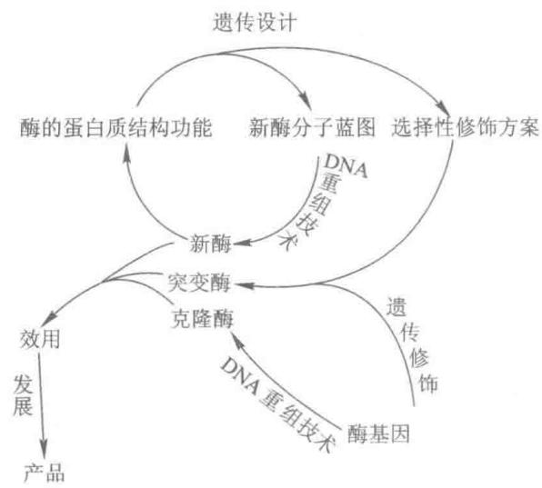  
图 6-17 生物酶工程示意图

定点诱变(site-directed mutagenesis)技术,改造编码蛋白质基因中的DNA顺序,经过寄主细胞的表达,能够产生被改造的具有特定氨基酸顺序、高级结构、理化性质和生物功能的新蛋白质(参见第35章)。目前,蛋白质工程技术在生产酶(遗传修饰酶)方面的应用,已取得令人鼓舞的成果。通过对酶基因的遗传修饰,可改变酶的催化活性、底物专一性、最适pH;改变含金属酶的氧化还原能力;改变酶的别构调节功能;改变酶对辅酶的要求;可提高酶的稳定性。表6-10列举了一些遗传修饰酶。

表 6-10 酶的选择性修饰

<table><tr><td rowspan="2">酶</td><td colspan="2">修饰</td><td rowspan="2">酶性质的改变</td></tr><tr><td>修饰部位</td><td>原氨基酸残基 新氨基酸残基</td></tr><tr><td rowspan="2">枯草杆菌蛋白酶</td><td>222</td><td>Met→Lys</td><td>最适 pH 由 8.6 变为 9.6</td></tr><tr><td>166</td><td>Gly→Lys</td><td>水解邻近 Glu 肽键能力提高 500 倍</td></tr><tr><td>T4 溶菌酶</td><td>3</td><td>Ile→Lys</td><td>提高耐热性</td></tr><tr><td>天冬氨酸氨甲酰转移酶</td><td>165</td><td>Tyr→Ser</td><td>失去别构调节性质</td></tr><tr><td rowspan="2">胰蛋白酶</td><td>216</td><td>Gly→Ala</td><td>提高 Arg 底物的专一性</td></tr><tr><td>226</td><td>Gly→Ala</td><td>提高 Lys 底物的专一性</td></tr><tr><td>二氢叶酸还原酶</td><td>27</td><td>Asp→Asn</td><td>活性降低为正常酶的 0.1%</td></tr><tr><td rowspan="2">酪氨酰-tRNA 合成酶</td><td>51</td><td>Thr→Ala</td><td rowspan="2">对底物 ATP 的亲和力提高 100 倍</td></tr><tr><td>51</td><td>Thr→Pro</td></tr><tr><td rowspan="2">β-内酰胺酶</td><td>70~71</td><td>Ser·Thr→Thr·Ser</td><td>完全失活</td></tr><tr><td>70~71</td><td>Thr·Ser→Ser·Ser</td><td>恢复活性</td></tr><tr><td rowspan="3">环氧化物水合酶</td><td>108</td><td>Phe→Leu</td><td rowspan="3">可以催化顺-二氯环氧乙烷新底物明显增加  $V_{\text{max}}/k_{\text{cat}} k_{\text{cat}}/K_{\text{m}}$  比值</td></tr><tr><td>214</td><td>Ile→Leu</td></tr><tr><td>248</td><td>Cys→ILe</td></tr></table>

DNA 合成技术的迅速发展为酶的遗传设计开创了令人鼓舞的美好前景。只要有遗传设计蓝图，就能人工合成酶基因。现在的关键问题是如何设计超自然的优质酶基因，即如何绘制优质酶基因的遗传设计图案。但随着计算机技术和化学理论的进步和发展，酶或其他生物大分子的模拟在精确度、速率及规模上都会得到大的改善。相信遗传设计新酶的研究在不久的将来，会受到人们的更多关注，并取得进展。

酶工程作为现代生物工程的支柱，有着广阔的发展前景。随着酶学、分子生物学基础理论的研究，化

学工程技术和基因工程技术的不断发展和更新，酶工程必将发展成为一个更大的生物技术产业。

# 提要

生物体内的各种化学变化都是在酶催化下进行的。酶是由生物细胞产生的，受多种因素调节控制的具有催化能力的生物催化剂。与一般催化剂相比有其共同性，但又有显著的特点，酶的催化效率高，具有高度的专一性，酶活性受到调节和控制，酶作用条件温和，但不够稳定，酶易失活。

酶作为生物催化剂与其他催化剂一样，只能催化完成热力学上允许的反应。酶促反应中，首先酶与底物结合形成ES复合物，释放结合自由能 $(\Delta G_{\mathrm{b}})$ ，补偿了自由度丢失引起的熵减，减少了进入过渡态（ $\mathrm{ES}^{\ddagger}$ ）所需的活化熵（ $\Delta H^{\ddagger}$ ），从而降低了过渡态的活化自由能，提高反应速率。

酶的化学本质除有催化活性的核酶和脱氧核酶之外都是蛋白质。根据酶的化学组成可分为单纯蛋白质和缀合蛋白质两类。缀合蛋白质是由不表现酶活力的脱辅酶及辅因子（包括辅酶、辅基及某些金属离子）两部分组成。脱辅酶部分决定酶催化的专一性，而辅酶（或辅基）在酶催化作用中通常起传递电子、原子或某些化学基团的作用。

根据各种酶所催化反应的类型,把酶分为六大类,即氧化还原酶类、转移酶类、水解酶类、裂合酶类、异构酶类和连接酶类。按规定每种酶都有一个习惯名称和国际系统名称,并且有一个编号。

酶对催化的底物有高度的选择性,即专一性。酶往往只能催化一种或一类反应,作用于一种或一类物质。酶的专一性可分为结构专一性和立体异构专一性两种类型。用“诱导契合说”解释酶的专一性已被人们所接受。

酶的分离纯化是酶学研究的基础。已知大多数酶的本质是蛋白质，因此用分离纯化蛋白质的方法纯化酶。在酶的制备过程中，每一步都要测定酶的活力和比活力，以了解酶的回收率及提纯倍数，以便判断提纯的效果。酶活力是指在一定条件下酶催化某一化学反应的能力，可用反应初速率来表示。测定酶活力即测酶反应的初速率。酶活力大小来表示酶含量的多少，通常用酶的国际单位数表示。每mg蛋白质所含酶的活力单位数叫做酶的比活力，代表酶的纯度。

具有催化功能核酶的发现,开辟了生物化学研究的新领域,提出了生命起源的新概念。根据发夹状或锤头状二级结构原理,可以设计出各种人工核酶,用作抗病毒和抗肿瘤的防治药物将会有良好的应用前景。

抗体酶是一种具有催化能力的蛋白质,本质上是免疫球蛋白,但是在易变区赋予了酶的属性,抗体酶具有酶的一切性质。抗体酶的发现,不仅为酶的过渡态理论提供了有力的实验证据,而且抗体酶将会得到广泛的应用。

酶工程是将酶学原理与化学工程技术及基因重组技术有机结合而形成的新型应用技术，是生物工程的支柱。根据研究和解决问题的手段不同将酶工程分为化学酶工程和生物酶工程。随着化学工程技术及基因工程技术的发展，酶工程发展更为迅速，必将成为一个很大的生物技术产业。

## 习题

1. 酶作为生物催化剂有哪些特点？

2. 何谓酶的专一性？酶的专一性有哪几类？如何解释酶作用的专一性？研究酶的专一性有何意义？

3. 酶活性有哪些调节方式，试说明之。

4. 辅基和辅酶有何不同？在酶催化反应中起什么作用？

5. 酶分哪几大类？举例说明酶的国际系统命名法及酶的编号。

6. 什么叫酶的活力和比活力？测定酶活力应注意什么？为什么测定酶活力时要测定酶反应的初速率？应如何选择底物浓度？

7. 什么叫核酶和抗体酶？它们的发现有什么重要意义？

8. 解释下列名词: (a) 生物酶工程; (b) 固定化酶; (c) 活化能; (d) 过渡态; (e) 寡聚酶; (f) 酶国际单位和 Kat 单位;

(g)酶偶联分析法；(h)诱导契合说；(i)反馈抑制；(j)多酶复合物。

9. 用 $AgNO_{3}$ 对在 10 mL 含有 1.0 mg/mL 蛋白质的纯酶溶液进行全抑制，需用 0.342 μmol $AgNO_{3}$ ，求该酶的最低相对分子质量。

10. $1\mu \mathrm{g}$ 纯酶 $(\mathrm{M}_r92\times 10^3)$ 在最适条件下，催化反应速率为 $0.5\mu \mathrm{mol}\cdot \mathrm{min}^{-1}$ ，试计算：

(a)酶的比活力。(b)转换数。

[酶的转换数 $(k_{\mathrm{cat}})$ : 当酶被底物饱和时每秒钟每个酶分子将底物转变成产物的分子数]

11. 1 g 鲜重的肌肉含有 40 单位的某种酶, 其转换数为 $6 \times 10^{4} min^{-1}$ , 试计算该酶在细胞内的浓度 (假设新鲜组织含水 80%, 并全部在胞内)。

12. 焦磷酸酶可以催化焦磷酸水解成磷酸，其相对分子质量为 $120 \times 10^{3}$ ，由 6 个相同亚基组成。纯酶的 $V_{max}$ 为 2800 U/mg 酶。它的一个活力单位规定为：在标准测定条件下，37℃，15 min 内水解 10 μmol 焦磷酸所需要的酶量。问：

(a) 每 mg 酶在每秒钟内水解多少 mol 底物？

(b) 每 mg 酶中有多少 mol 的活性部位(假设每个亚基上有一个活性部位)?

(c) 酶的转换数是多少?

13. 称取 25 mg 蛋白酶粉配制成 25 mL 酶溶液，从中取出 0.1 mL 酶液，以酪蛋白为底物，用 Folin-酚比色法测定酶活力，得知每小时产生 1500 μg 酪氨酸。另取 2 mL 酶液，用凯氏定氮法测得蛋白氮为 0.2 mg。若以每分钟产生 1 μg 酪氨酸的酶量为 1 个活力单位计算，根据以上数据，求出：

(a) 1 mL 酶液中所含蛋白质量及活力单位。

(b) 比活力。

(c) 1 g 酶制剂的总蛋白含量及总活力。

14. 有 1 g 淀粉酶制剂,用水溶解成 1 000 mL,从中取出 1 mL 测定淀粉酶活力,测知每 5 min 分解 0.25 g 淀粉。计算每 g 酶制剂所含的淀粉酶活力单位数?

（淀粉酶活力单位的定义：在最适条件下每小时分解1 g淀粉的酶量称为1个活力单位）

15. 某酶的初提取液经过一次纯化后，经测定得到下列数据：试计算比活力、回收率及纯化倍数。

<table><tr><td></td><td>体积/mL</td><td>活力单位/(U/mL)</td><td>蛋白质/(mg/mL)</td></tr><tr><td>初提取液</td><td>120</td><td>200</td><td>10</td></tr><tr><td> $(NH_4)_2SO_4$ 盐析</td><td>5</td><td>800</td><td>4</td></tr></table>

16. 许多提取的酶液, 假设在 $37^{\circ}$ C 保温, 酶将变性失活。然而在底物存在下 $37^{\circ}$ C 保温, 酶保持催化活性。试解释这一相互矛盾的事实。

17. 酶是怎样克服反应能障,降低活化自由能的?

## 主要参考书目

1. 王镜岩, 朱圣庚, 徐长法. 生物化学教程. 北京: 高等教育出版社, 2008.

2. 袁勤生. 现代酶学. 2 版. 上海: 华东理工大学出版社, 2007.

3. Berg J M, Tymoczko J L, Stryer L. Biochemistry. 7th ed. New York: W. H. Freemam and company, 2012.

4. Garrett R M, Grisham C M. Biochemistry. 5th ed. Boston: Brooks/cole, Cengage Learning, 2013.

5. Nelson D L, Cox M M. Lehninger Prenciphes of Biochemistry. 5th ed. New York: W. H. Freemam and company, 2008.

6. International Union of Biochemistry and Molecular Biology Nomenclature Committee. Enzyme Nomenclature. New York: Academic Press, 1992.

(张庭芳)

## 网上资源

## 第7章 酶动力学

酶促反应动力学(kinetics of enzyme-catalyzed reactions)是研究酶促反应的速率以及影响此速率的各种因素的科学。在研究酶的结构与功能的关系以及酶的作用机制时,需要动力学提供实验证据;为了发挥酶催化反应的高效率,寻找最有利的反应条件;为了解酶在代谢中的作用和某些药物的作用机制等,都需要掌握酶促反应速率的规律。因此,酶促反应动力学的研究既有重要的理论意义又具有一定的实践意义。为了掌握酶促反应动力学,有必要首先了解一些有关化学动力学的基本概念。

## 一、化学动力学基础

化学反应有两个方面的基本问题,一方面是反应进行的方向、可能性和限度;另一方面是反应进行的速率和反应机制。前者属于化学热力学的研究范围,后者属于化学动力学研究范围。在化学动力学的研究中,将确定各反应或反应步骤的速率,了解各种因素(如浓度、温度、pH 和催化剂等)对反应速率的影响,并揭示化学反应的机制。由此可以看出化学动力学和化学热力学的不同之处。例如 $O_{2}$ 和 $H_{2}$ 化合成水的反应热力学上可能的,但是在室温下,这个反应的速率却慢到不可察觉的程度。再如, $NO_{2}$ 聚合成 $N_{2}O_{4}$ 的反应也是热力学上可能的,实际上,其反应速率却是快得无法测量。同是热力学可能的反应,为什么有些反应速率快,有些反应速率慢?这个问题不是化学热力学所能回答的。因为热力学只研究体系的状态改变,并不追究某一化学变化所需的时间和具体过程的机制,而这些问题正是化学动力学所研究的。

各种化学反应的速率可以相差很大,如爆炸反应、溶液中的离子反应等瞬时即可完成;而另外一些反应完成的时间以分、时、日,甚至年来计算;还有更慢的反应,在有限的时间内无从察觉。同一反应由于进行时的条件不同,反应速率也有很大差别。因此,我们常需要改变条件来控制反应速率。另外还有许多化学反应,常有副反应同时伴随进行,我们也需要设法减小其副反应的速率,而使主要的反应速率增大。由此可见,通过化学动力学的研究,在理论上能够阐明化学反应的机制,使我们能了解反应的具体过程和途径。在实际应用上,可以根据反应速率来估计反应进行到某种程度所需的时间;也可以根据影响反应速率的因素进一步对反应进行控制。因此,化学动力学的研究无论在理论上和实践中都是很重要的。

## （一）化学反应速率及其测定

反应速率是以单位时间内反应物或生成物浓度的改变来表示。随着反应的进行，反应物逐渐消耗，分子碰撞的机会也逐渐渐小，因此反应速率也随着减慢（图7-1）。因为每一瞬间的反应速率都不相同，所以用瞬时速率表示反应速率。设瞬时dt内反应物浓度的很小的改变为dc，则：

$$
v = - \frac {\mathrm{d} c}{\mathrm{d} t}
$$

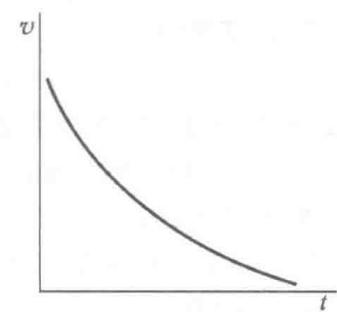  
图 7-1 反应速率与时间的关系

上式中负号表示反应物浓度的减少。有时反应速率也可用单位时间内生成物浓度的增加来表示，即：

$$
v = + \frac {\mathrm{d} c}{\mathrm{d} t}
$$

上式中正号表示生成物随时间的延长而增多,至于反应速率用哪一种反应物或生成物浓度的改变来表示,则没有关系,可根据取得的实验数据来决定。

反应速率的测定,实际上是测定不同时间的反应物或生成物的浓度,可以通过化学方法或物理方法进行定量测定。

## （二）反应分子数和反应级数

在化学动力学中研究化学反应速率与反应物浓度的关系时,有两种分类方法:即以反应分子数及反应级数来分类。

## 1. 反应分子数

反应分子数是在反应中真正相互作用的分子的数目。仅有1个反应的分子参加的反应称为单分子反应，有2个反应物分子参加的反应称为双分子反应，依此类推。实际上，大多数反应都是以单分子或双分子反应的步骤进行的，3个分子同时反应的可能性很小，3分子以上的反应还没有被发现过。反应分子数显然都是简单整数。

放射性元素的蜕变,有机反应中的分子重排以及同分异构体的相互转变等反应属于单分子反应。

$$
\mathrm{A} \longrightarrow \mathrm{P}
$$

根据质量作用定律,单分子反应的速率方程式(或称动力学方程式)是:

$$
v = - \frac {\mathrm{d} c}{\mathrm{d} t} = k c
$$

式中 c 代表反应物的浓度 $(\mathrm{mol}\cdot\mathrm{L}^{-1})$ ，k 是比例常数，称为反应速率常数，比值大小可作为反应速率大小的衡量。

乙酸的酯化反应, $H_{2}$ 和 $I_{2}$ 的化合反应等都属于双分子反应。

$$
\mathrm{A} + \mathrm{B} \longrightarrow \mathrm{P} + \mathrm{Q}
$$

双分子反应的速率方程式是：

$$
v = - \frac {\mathrm{d} c}{\mathrm{d} t} = k c _ {1} c _ {2}
$$

式中 $c_{1}$ 和 $c_{2}$ 分别代表两种反应物的浓度。

判断一个反应是单分子反应还是双分子反应,必须先了解反应机制,即了解反应过程中各个单元反应是如何进行的。反应机制往往是很复杂的,不容易弄清楚,然而反应速率与浓度的关系即可用实验方法来测量,从而可帮助推论反应机制。

## 2. 反应级数

根据实验结果,整个化学反应的速率服从哪种分子反应速率方程式,则这个反应即为几级反应。如有某反应,其总反应速率与浓度的关系能以单分子反应的速率方程式来表示,那么这个反应为一级反应。如能用双分子反应速率方程式来表示,则为二级反应,余类推。另外,我们把反应速率与反应物浓度无关的反应叫做零级反应。

反应分子数和反应级数这两种分类方法对很简单的反应来说是一致的,但对某些反应来说是不一致的。例如蔗糖的酶促水解作用:

$$
\mathrm{蔗糖} + \mathrm {H_ {2} O} \xrightarrow {\text {蔗糖酶}} \mathrm{葡萄糖} + \mathrm{果糖}
$$

是双分子反应,但却为一级反应。因为蔗糖的稀水溶液中,水的浓度比蔗糖浓度大得多,水浓度的减少与蔗糖比较可以忽略不计,故我们可将水的浓度当作常数。因此,反应速率只决定于蔗糖的浓度。

$$
v = k ^ {\prime} c _ {\mathrm{蔗糖}} \cdot c _ {\mathrm{水}} = k c _ {\mathrm{蔗糖}}
$$

既然反应速率和浓度的关系采用单分子反应动力学方程式表示,所以是一级反应,有时叫做假单分子反应。一般来说,在一双分子反应中,如果有一反应物的存在量极大,则显然此反应可以按照一级动力学方程式进行,如各种水解反应。

复杂反应是由一连串简单反应所组成,所以确定反应级数比较复杂,并且,不一定就是整数。实际上反应级数等于反应速率方程式中各个反应物浓度指数的总和,有时和分子数一致,有时不一致。

由上述可知,反应分子数和反应级数是两个不同的概念。前者表示实际参加反应的分子数,是一个反应机制的问题;后者是由实验测得的表示反应速率与反应物浓度之间的关系问题。

在实际应用上常采用反应级数,因为用反应级数时不必了解反应的机制,而只需由实验确定反应服从哪级反应,便可得到反应速率与反应物浓度的关系。

## （三）各级反应的特征

各级反应的特征实际上已经表现在各级反应的反应速率方程式里。由于研究化学动力学时实际所测得的是反应经过的不同时间 t 和相应于该时间的反应物或生成物浓度 c，因此常以 c 和 t 的变化关系来表示各级反应的特征。这种 c 和 t 的关系，只要将反应速率式积分，就容易看出。

## 1. 一级反应

凡是反应速率只与反应物的浓度的一次方成正比的,这种反应就称为一级反应。这类反应的反应速率与反应物浓度的关系可用下式表示:

$$
- \frac {\mathrm{d} c}{\mathrm{d} t} = k c
$$

将上式移项后,积分得:

$$
\ln c = - k t + B
$$

式中 B 为积分常数, 若反应开始时 $(t=0)$ 的浓度为 $c_{0}$ (初浓度), 代入上式求得 $B=\ln c_{0}$ , 因而:

$$
\ln c = - k t + \ln c _ {0}\tag{7-1}
$$

整理

$$
k = \frac {1}{t} \ln \frac {c _ {0}}{c}
$$

或

$$
c = c _ {0} \mathrm{e} ^ {- k t}
$$

式(7-2)表示了一级反应的反应物浓度(或产物浓度)随时间变化的规律,如图7-2所示。图中c和[P](产物浓度)两曲线交于一点,该点的纵坐标为 $c_{0}/2$ ,横坐标为 $t_{1/2},t_{1/2}$ 叫半衰期,即有一半反应物转为产物所需的时间。

(7-2)

从式(7-1)可以看出,若以 $\ln c_{0}$ 对时间 t 作图应得一条直线,见图 7-3,直线斜率的负值就是反应速率

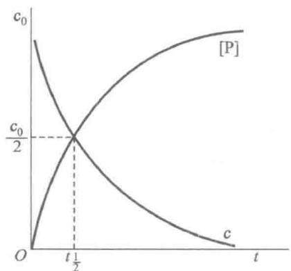  
图7-2 一级反应的反应物消耗和  
产物形成与时间的关系曲线

  
图7-3 一级反应 $\ln c$ 与时间关系

常数 $k, k$ 的单位是时间的倒数。当 $t = t_{1/2}$ 时，则 $c = \frac{1}{2} c_0$ 代入式(7-1)得：

或

$$
\begin{array}{r l} & k = (\ln 2) / t _ {1 / 2} \\ & t _ {1 / 2} \approx 0. 6 9 3 / k \end{array}\tag{7-3}
$$

即速率常数与半衰期成反比,半衰期与反应物的初浓度无关。换言之,不管反应物的初浓度是多少,半衰期是一样的,这也是一级反应的一个特征。例如放射性同位素常以它的半衰期表示其衰变的速率。

## 2. 二级反应

凡是反应速率与反应物质浓度二次方(或两种物质浓度的乘积)成正比的,这种反应就称为二级反应。二级反应是最常见的。二级反应的速率与反应物浓度的关系可用下式来表示:

$$
- \frac {\mathrm{d} c}{\mathrm{d} t} = k c _ {1} c _ {2}
$$

或

$$
\frac {\mathrm{d} x}{\mathrm{d} t} = k (a - x) (b - x)\tag{7-4}
$$

式中 a、b 分别代表反应物 A、B 的初浓度，x 为反应 t 时已发生反应的物质浓度。（a-x）与（b-x）分别为反应 t 时后的反应物 A 与 B 的浓度。若 A 与 B 的初浓度相同，则可将上式写为：

$$
\frac {\mathrm{d} x}{\mathrm{d} t} = k (a - x) ^ {2}
$$

移项,积分后整理得:

$$
k = \frac {1}{t} \cdot \frac {x}{a (a - x)}\tag{7-5}
$$

若 A 和 B 的初浓度不同, 将式(7-4)移项积分后的结果为:

$$
k = \frac {1}{t (a - b)} \cdot \ln \frac {b (a - x)}{a (b - x)}\tag{7-6}
$$

从式(7-5)及(7-6)可以看出,若以 $\frac{x}{a-x}$ 或 $\ln\frac{b(a-x)}{a(b-x)}$ 分别对时间t作图,皆为直线(图7-4)。

其斜率等于速率常数 k, k 的单位是 $mol^{-1} \cdot L \cdot s^{-1}$ ，这是二级反应的特征，也是求 k 和决定是不是二级反应的一个方法。

当 $x = \frac{1}{2} a$ 时， $t$ 即为半衰期 $t_{1/2}$ ，代入式(7-5)得：

或

$$
\begin{array}{r l} & k = \frac {1}{a t _ {1 / 2}} \\ & t _ {1 / 2} = \frac {1}{k a} \end{array}
$$

  
图7-4 二级反应 $\frac{x}{a - x}$ 或 $\ln \frac{(a - x)}{(b - x)}$ 与时间关系

(7-7)

上式表明二级反应与一级反应不同,二级反应半衰期不仅与二级反应速率常数成反比,而且与反应物初浓度成反比。换句话说,初浓度愈大,反应物减少一半所需要的时间愈短,这也是二级反应的一个特征。

## 3. 零级反应

凡是反应速率与反应物浓度无关而受它种因素影响而改变的反应称为零级反应,即反应速率为一常数。可将零级反应的动力学方程式表示为:

$$
- \frac {\mathrm{d} c}{\mathrm{d} t} = k  , \quad \text {或} \quad \frac {\mathrm{d} x}{\mathrm{d} t} = k
$$

积分后得：

$$
x = k t, k = \frac {x}{t}\tag{7-8}
$$

零级反应中 k 的单位是 $mol \cdot L^{-1} \cdot s^{-1}$ 。若以 x 对 t 作图，得一直线，如图 7-5，其斜率为 k。当 $x = \frac{1}{2} a$ 时，代入式 (7-8)，其反应半衰期与反应速率常数成反比而与反应物初浓度成正比，即：

$$
t _ {1 / 2} = \frac {a}{2 k}\tag{7-9}
$$

  
图7-5 零级反应 $x$ 与时间关系

上式说明，初浓度愈大，半衰期愈长。

## 二、底物浓度对酶促反应速率的影响

## （一）中间复合物学说

1903 年 V. C. R. Henri 用蔗糖酶水解蔗糖做实验, 研究底物浓度与反应速率的关系。当酶浓度不变时, 可以测出一系列不同底物浓度下的反应速率, 以反应速率对底物浓度作图, 可得到图 7-6 正相关曲线。从该曲线可以看出, 当底物浓度较低时, 反应速率与底物浓度的关系呈正比关系, 表现为一级反应。随着底物浓度的增加, 反应速率不再按正比升高, 反应表现为混合级反应。当底物浓度达到相当高时, 底物浓度对反应速率影响变小, 最后反应速率与底物浓度几乎无关, 反应达到最大速率 ( $V_{max}$ ), 表现为零级反应。根据这一实验结果, V. C. R. Henri 提出了酶底物中间复合物学说。该学说认为当酶催化某一化学反应时, 酶首先和底物结合生成中间复合物 (ES), 然后生成产物 (P), 并释放出酶。反应用下式表示:

$$
\mathrm{S+E} \rightleftharpoons \mathrm{ES} \longrightarrow \mathrm{P+E}
$$

根据中间复合物学说可以解释图7-6实验曲线，在酶浓度恒定条件下，当底物浓度很小时，酶未被底物饱和，这时反应速率取决于底物浓度。随着底物浓度变大，根据质量作用定律，ES生成也越多，而反应速率取决于ES的浓度，故反应速率也随之增高。当底物浓度相当高时，溶液中的酶全部被底物饱和，溶液中没有多余的酶，虽增加底物浓度也不会有更多的中间复合物生成，因此酶促反应速率与底物浓度无关，反应达到最大反应速率 $(V_{\mathrm{max}})$ 。当底物浓度对反应速率作图时，就形成一条双曲线。需要指出的是只有酶催化反应才有这种饱和现象，与此相反，非催化反应无此饱和现象（图7-6）。

酶和底物形成中间复合物的学说,已得到许多实验证明:

（1）ES 复合物已被电子显微镜和 X 射线晶体结构分析直接观察到。如在电子显微镜下可观察到 DNA 聚合酶 I 可结合到它合成的 DNA 模板上。用 X 射线晶体结构分析，研究了羧肽酶 A 和它的底物 Gly-L-Tyr 的相互作用及其作用位置。

（2）许多酶和底物的光谱特性在形成 ES 复合物后发生变化。例如色氨酸合成酶为一细菌酶，含有一个磷酸吡哆醛辅基，该酶催化 L-Ser 和吲哚合成 Trp，加 L-Ser 到酶中磷酸吡哆醛的荧光显著增加，随后加吲哚使荧光猝灭到低于单独酶的水平（图 7-7），因此荧光光谱揭示了酶-Ser 和酶-Ser-吲哚复合物的存在。其他光谱学方法，如核磁和顺磁共振，园二色谱也能对 ES 的形成提供信息。

（3）酶的物理性质，如溶解度或热稳定性，经常在形成 ES 复合物后发生变化。

（4）已分离得到某些酶与底物相互作用生成的 ES 复合物，如已得到乙酰化胰凝乳蛋白酶及 D-氨基酸氧化酶和底物复合物的结晶。

（5）超离心沉降过程中，可观察到酶和底物共沉降现象。平衡透析时观察到底物浓度在半透膜内外不同等。

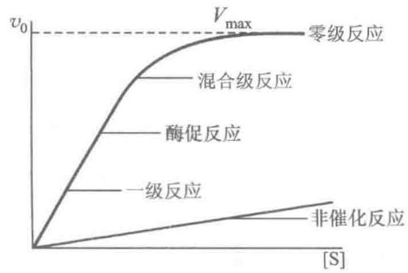  
图 7-6 底物浓度对酶催化反应和非催化反应初速率的影响

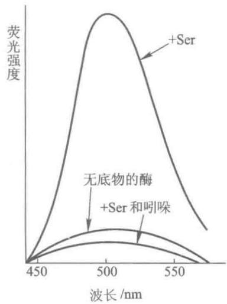  
图 7-7 磷酸吡哆醛辅基在色氨酸合成酶的活性部位上产生的荧光强度随加入底物 L-Ser 和吲哚而改变的情况

## （二）酶促反应的动力学方程式

## 1. 米氏方程式的建立

1913 年 L. Michaelis 和 M. Menten 根据中间复合物学说提出了单底物酶促反应的快速平衡：

$$
\begin{array}{r l r} {\mathrm{E}} & {+} & {\mathrm{S} \xrightarrow [ k _ {- 1} ]{k _ {1}} \mathrm{ES} \xrightarrow [ k _ {2} ]{k _ {2}} \mathrm{P+E}} \\ {\text {   酶   }} & {} & {\text {   底物   } \qquad \text {   中间复合物   } \qquad \text {   产物   }} \end{array}\tag{7-10}
$$

式中 $k_{1}, k_{-1}$ 分别为 $E + S \rightleftharpoons ES$ 正逆反应两方向的速率常数， $k_{2}$ 为第二步的前向速率常数。

$$
K _ {s} \rightleftharpoons \frac {k _ {- 1}}{k _ {1}} \quad \text { 表示   ES   的解离常数。 }
$$

L. Michaelis 和 M. Menten 在推导模型的动力学速率方程时作了以下几点假设：

（1）式(7-10)中没有考虑 $\mathrm{E} + \mathrm{P}\xrightarrow{n_{-2}}\mathrm{ES}$ 这一逆反应，但是显然 $k_{-2}$ 是一个不等于零的常数。要忽略这一步反应，必须使产物浓度[P]趋于零。这就是说，Michaelis-Menten方程只运用于测定反应的初速率。

（2）底物浓度[S]是以初始浓度 $\left[\mathrm{S}_0\right]$ 计算的，这就要求底物浓度远大于酶浓度。否则，由于ES的存在，[S]就不能用 $\left[\mathrm{S}_0\right]$ 代替。

（3）反应的第二步 $\mathrm{ES}\xrightarrow{k_2}\mathrm{P} + \mathrm{E}$ 是限速步骤，这里 $k_{2}\ll k_{-1}$ ，也即ES分解生成产物的速度不足以破坏E和ES之间的快速平衡。这就是“平衡学说”，又称“快速平衡学说”。

根据上述假设,就可推导出以下动力学方程。

若式(7-10)迅速达到平衡, $k_{-1}[ES]=k_{1}[E][S]$

$$
K _ {\mathrm{s}} = \frac {k _ {- 1}}{k _ {1}} = \frac {[ \mathrm{E} ] [ \mathrm{S} ]}{[ \mathrm{ES} ]}\tag{7-11}
$$

酶总浓度 $\left[\mathrm{E}_0\right]$ 为游离酶浓度 $[\mathrm{E}]$ 和结合酶浓度[ES]之和。由于总酶浓度 $\left[\mathrm{E}_0\right]$ 容易测定，故将 $\left[\mathrm{E}_0\right]$ 代替[E]，则有：

$$
[ \mathrm{E} ] = [ \mathrm{E} _ {0} ] - [ \mathrm{ES} ]\tag{7-12}
$$

由式 $(7-12)$ 代入式 $(7-11)$ 可得：

$$
\frac {(\mathrm {[ E_ {0} ] - [ ES]}) \mathrm{[S]}}{\mathrm{[ES]}} = K _ {\mathrm{s}}\tag{7-13}
$$

$$
K _ {\mathrm{S}} [ \mathrm{ES} ] = [ \mathrm{E} _ {0} ] [ \mathrm{S} ] - [ \mathrm{ES} ] [ \mathrm{S} ]
$$

即：

$$
[ \mathrm{ES} ] = \frac {[ \mathrm{E} _ {0} ] [ \mathrm{S} ]}{K _ {\mathrm{s}} + [ \mathrm{S} ]}\tag{7-14}
$$

前已提及,反应初速率取决于[ES],即 $v_{0}=k_{2}[ES]$

$$
v _ {0} = k _ {2} \frac {[ \mathrm{E} _ {0} ] [ \mathrm{S} ]}{K _ {\mathrm{s}} + [ \mathrm{S} ]}\tag{7-15}
$$

若底物浓度很高时，酶被底物饱和，则初速率达到最大值： $V_{\mathrm{max}} = k_2[\mathrm{E}_0]$ 。以 $V_{\mathrm{max}}$ 代替 $k_{2}[\mathrm{E}_{0}]$ 则式（7-15）变为：

$$
v _ {0} = \frac {V _ {\max} [ S ]}{K _ {s} + [ S ]}\tag{7-16}
$$

这就是著名的 Michaelis-Menten 方程, 简称米氏方程 (Michaelis equation)

## 2. Briggs-Haldane 修正的米氏方程

1925 年 G. E. Briggs 和 J. B. S. Haldane 鉴于酶催化效率很高, 当 ES 形成后, 随即迅速的转变成产物而释放出酶。认为 L. Michaelis 和 M. Menten 所述快速平衡不一定能够成立, 即当 $k_{2}$ 远大于 $k_{-1}$ 时, 就不能用快速平衡模型来推导。他们在保留了上述前 2 点假设下, 用稳态模型:

$$
\mathrm{E} + \mathrm{S} \xrightarrow [ k _ {- 1} ]{k _ {1}} \mathrm{ES} \xrightarrow [ k _ {- 2} ]{k _ {2}} \mathrm{P} + \mathrm{E}\tag{7-17}
$$

代替了平衡态模型。酶促反应分两步进行：

第一步:酶与底物作用,形成酶-底物复合物:

$$
\mathrm{E} + \mathrm{S} \xrightarrow [ k _ {- 1} ]{k _ {1}} \mathrm{ES}\tag{7-18}
$$

第二步:ES 复合物分解形成产物,释放出游离酶:

$$
\mathrm{ES} \underset {k _ {- 2}} {\overset {k _ {2}} {\rightleftharpoons}} \mathrm{P+E}\tag{7-19}
$$

这两步反应都是可逆的。它们的正反应与逆反应的速率常数分别为 $k_{1}, k_{-1}, k_{2}, k_{-2}$ 。

由于酶促反应的速率与 ES 的形成与分解直接相关,所以必须考虑 ES 的形成速率和分解速率。G. E. Briggs 和 J. B. S. Haldane 的发展就在于指出 ES 量不仅与式(7-18)平衡有关,而且还与式(7-19)平衡有关,用稳态代替了平衡态。

所谓稳态是指反应进行一段时间后,系统的复合物 ES 浓度,由零逐渐增加到一定数值,在一定时间内,尽管底物浓度和产物浓度不断地变化,复合物 ES 也在不断地生成和分解,但是当反应系统中 ES 的生成速率和 ES 的分解速率相等时,络合物 ES 浓度保持不变的这种反应状态称为稳态(steady state),即:

$$
\frac {\mathrm{d} [ \mathrm{ES} ]}{\mathrm{d} t} = 0
$$

图 7-8 表示实验所得各种浓度对时间的曲线, 表示了底物浓度降低, 产物形成及 ES 稳态过程。

在稳态下，ES的生成速率 $\mathrm{d}[\mathrm{ES}] / \mathrm{dt}$ 应与 $\mathrm{E + S}\xrightarrow{k_1}$ ES和 $\mathrm{E + P}\xrightarrow{k_{-2}}$ ES有关。但是在反应初速率阶段，产物浓度很低， $\mathrm{E + P}\xrightarrow{k_{-2}}$ ES的速率极小，可以忽略不计。因此ES的生成速率只与 $\mathrm{E + S}\xrightarrow{k_1}$ ES有关，可用下式表示：

$$
\frac {\mathrm{d} [ \mathrm{ES} ]}{\mathrm{d} t} = k _ {1} ([ \mathrm{E} ] - [ \mathrm{ES} ]) \cdot [ \mathrm{S} ]\tag{7-20}
$$

[E]表示酶的总浓度

[ES] 表示酶与底物结合的中间复合物的浓度

[E]-[ES]表示未与底物结合的游离状态的酶浓度

[S]表示底物浓度

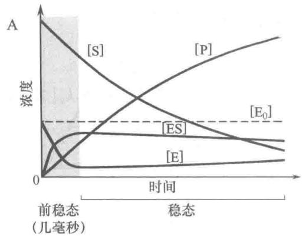

  
图 7-8 酶促反应过程中前稳态(阴影部分)和稳态期间各种浓度变化(A)和速率变化(B)

通常底物浓度远比酶浓度大很多，即 $[\mathrm{S}] \gg [\mathrm{E}]$ ，因此被酶结合的S量，亦即[ES]，它与总的底物浓度相比，可以忽略不计。所以 $[\mathrm{S}] - [\mathrm{ES}] \approx [\mathrm{S}]$ 。ES的分解速率- $\mathrm{d}[\mathrm{ES}] / \mathrm{dt}$ 则与 $\mathrm{ES} \xrightarrow{k_{-1}} \mathrm{S} + \mathrm{E}$ 及 $\mathrm{ES} \xrightarrow{k_2} \mathrm{P} + \mathrm{E}$ 有关。因此ES分解速率为两式速率之和。

$$
- \frac {\mathrm{d} [ \mathrm{ES} ]}{\mathrm{d} t} = k _ {- 1} [ \mathrm{ES} ] + k _ {2} [ \mathrm{ES} ]\tag{7-21}
$$

在稳态下，ES的生成速率和ES的分解速率相等，即[ES]保持动态平衡，式(7-20)=(7-21)，即

$$
k _ {1} ([ \mathrm{E} ] - [ \mathrm{ES} ]) \cdot [ \mathrm{S} ] = k _ {- 1} [ \mathrm{ES} ] + k _ {2} [ \mathrm{ES} ]
$$

移项得：

$$
\frac {([ \mathrm{E} ] - [ \mathrm{ES} ]) \cdot [ \mathrm{S} ]}{[ \mathrm{ES} ]} = \frac {k _ {- 1} + k _ {2}}{k _ {1}}\tag{7-22}
$$

用 $K_{m}$ 表示 $k_{1}, k_{-1}, k_{2}$ 这3个常数的关系：

$$
K _ {\mathrm{m}} = \frac {k _ {- 1} + k _ {2}}{k _ {1}}\tag{7-23}
$$

将式 $(7-23)$ 代入式 $(7-22)$ :

$$
\frac {(\mathrm{[E]} - \mathrm{[ES]}) \cdot \mathrm{[S]}}{\mathrm{[ES]}} = K _ {\mathrm{m}}\tag{7-24}
$$

由式(7-24)可得到稳态时[ES]:

$$
[ \mathrm{ES} ] = \frac {[ \mathrm{E} ] [ \mathrm{S} ]}{K _ {\mathrm{m}} + [ \mathrm{S} ]}\tag{7-25}
$$

因为酶反应速率 $(v_{0})$ 与[ES]成正比，即：

$$
v _ {0} = k _ {2} [ \mathrm{ES} ]\tag{7-26}
$$

将式 $(7-25)$ 代入式 $(7-26)$ 得：

$$
v _ {0} = k _ {2} \frac {[ \mathrm{E} ] [ \mathrm{S} ]}{K _ {\mathrm{m}} + [ \mathrm{S} ]}\tag{7-27}
$$

由于反应系统中 $[\mathrm{S}] \gg [\mathrm{E}]$ ，当 $[\mathrm{S}]$ 很高时所有的酶都被底物所饱和形成ES，即 $[\mathrm{E}] = [\mathrm{ES}]$ ，酶促反应达

到最大速率 $V_{\mathrm{max}}$ ，则：

$$
V _ {\max} = k _ {2} [ \mathrm{ES} ] = k _ {2} [ \mathrm{E} ]\tag{7-28}
$$

将式 $(7-28)$ 代入式 $(7-27)$ ，即得：

$$
v _ {0} = \frac {V _ {\max} \cdot [ S ]}{K _ {\mathrm{m}} + [ S ]}\tag{7-29}
$$

这就是根据稳态理论推导出的动力学方程式，为纪念L. Michaelis和M. Meten，习惯上把式(7-16)，式(7-29)都称为米氏方程。 $K_{\mathrm{m}}$ 称为米氏常数，是由一些速率常数组成的一个复合常数。该方程式表明了当已知 $K_{\mathrm{m}}$ 及 $V_{\mathrm{max}}$ 时，酶反应速率与底物浓度之间的定量关系。若以[S]作横坐标， $v_{0}$ 作纵坐标作图，可得到一条双曲线（图7-9），该曲线正好与实验所得的图7-6相符合。

米氏方程所确定的图形是一直角双曲线，由式(7-29)移项，加项及整理，可得：

$$
v _ {0} K _ {\mathrm{m}} + v _ {0} [ \mathrm{S} ] = V _ {\mathrm{max}} [ \mathrm{S} ]\tag{7-30}
$$

$$
v _ {0} K _ {\mathrm{m}} + v _ {0} [ \mathrm{S} ] - V _ {\max} [ \mathrm{S} ] - V _ {\max} K _ {\mathrm{m}} = - V _ {\max} K _ {\mathrm{m}}\tag{7-31}
$$

$$
(v _ {0} - V _ {\max}) ([ \mathrm{S} ] + K _ {\mathrm{m}}) = - V _ {\max} K _ {\mathrm{m}}\tag{7-32}
$$

因 $V_{max}$ 和 $K_{m}$ 均为常数，而 $v_{0}$ 及 [S] 为变数，故式 (7-32) 实际上可写成 $(x-a)(y+b)=K$ ，这就是典型的双曲线方程。此方程所确定的图形是以坐标轴 $(x,y)$ 为渐近线 $(v_{0}=V_{\max}$ 和 $[S]=-K_{m})$ 的直角双曲线。双曲线的两部分对应的中心点为 $(-K_{m}, V_{\max})$ ，也是两条渐近线的正交点（图 7-10）。实验测量的只不过是双曲线的实线部分（见图 7-10 中阴影部分）。

  
图 7-9 米式方程曲线

  
图 7-10 米氏方程曲线是直角双曲线的一部分（阴影部分）

从式(7-29)可以看出,当反应速率达到最大速率一半时,即 $v_{0}=\frac{V_{\max}}{2}$ ,可以得到:

$$
\frac {V _ {\max}}{2} = \frac {V _ {\max} \cdot [ \mathrm{S} ]}{K _ {\mathrm{m}} + [ \mathrm{S} ]}
$$

$$
\frac {1}{2} = \frac {[ S ]}{K _ {\mathrm{m}} + [ S ]}
$$

则

$$
[ \mathrm{S} ] = K _ {\mathrm{m}}
$$

由此可以看出 $K_{m}$ 值的物理意义, 即 $K_{m}$ 值是当酶反应速率达到最大反应速率一半时的底物浓度, 单位是 $mol \cdot L^{-1}$ , 与底物浓度的单位一样。

根据米氏方程式可以说明以下关系：

(1) 当 $[S] \ll K_{m}$ 时，则 (7-29) 式变为：

$$
v _ {0} = \frac {V _ {\max} \cdot [ S ]}{K _ {\mathrm{m}}}
$$

由于 $V_{max}$ 和 $K_{m}$ 为常数, 两者的比可用一常数 K 表示, 因此

$$
v _ {0} = \frac {V _ {\mathrm{max}}}{K _ {\mathrm{m}}} \cdot [ \mathrm{S} ] = K [ \mathrm{S} ]
$$

即[S]远远小于 $K_{m}$ 时，反应速率与底物浓度成正比， $v_{o}$ 与[S]的关系符合一级动力学（图7-6）。这时由于底物浓度低，酶没有全部被底物所饱和，因此在底物浓度低的条件下是不能正确测得酶活力的。

(2) 当 $[S] \gg K_{m}$ 时, 则式 (7-29) 变为:

$$
v _ {0} = \frac {V _ {\max} [ S ]}{[ S ]}
$$

$$
v _ {0} = V _ {\max}
$$

表示当底物浓度远大于 $K_{m}$ 值时，反应速率已达到最大速率，这时酶全部被底物所饱和， $v_{o}$ 与[S]无关，符合零级动力学，只有在此条件下才能正确测得酶活力（图7-6）。

(3) 当 $[S] = K_{m}$ 时, 由式 (7-29) 得:

$$
v _ {0} = \frac {V _ {\max} \cdot [ S ]}{[ S ] + [ S ]} = \frac {V _ {\max}}{2}
$$

也就是说，当底物浓度等于 $K_{m}$ 值时，反应速率为最大速率的一半。

## 3. 动力学参数的意义

## (1) 米氏常数的意义

① $K_{\mathrm{m}}$ 是酶的一个特性常数： $K_{\mathrm{m}}$ 的大小只与酶的性质有关，而与酶浓度无关。 $K_{\mathrm{m}}$ 值随测定的底物、反应的温度、 $\mathrm{pH}$ 及离子强度而改变。因此， $K_{\mathrm{m}}$ 值作为常数只是对一定的底物、 $\mathrm{pH}$ 、温度和离子强度等条件而言。故对某一酶促反应而言，在一定条件下都有特定的 $K_{\mathrm{m}}$ 值，可用来鉴别酶。例如对于不同来源或相同来源但在不同发育阶段，不同生理状况下催化相同反应的酶是否属于同一种酶。各种酶的 $K_{\mathrm{m}}$ 值相差很大，大多数酶的 $K_{\mathrm{m}}$ 值介于 $10^{-6} \sim 10^{-1} \mathrm{~mol} \cdot \mathrm{L}^{-1}$ 之间。表7-1列举了某些酶的 $K_{\mathrm{m}}$ 值。

表 7-1 一些酶的 ${K}_{\mathrm{m}}$ 值

<table><tr><td>酶</td><td>底物</td><td> $K_{\text{m}} / (\text{mol} \cdot \text{L}^{-1})$ </td></tr><tr><td>过氧化氢酶(catalase)</td><td> $H_2O_2$ </td><td> $2.5 \times 10^{-2}$ </td></tr><tr><td>脲酶(urease)</td><td>尿素</td><td> $2.5 \times 10^{-2}$ </td></tr><tr><td rowspan="2">己糖激酶(hexokinase)</td><td>葡萄糖</td><td> $1.5 \times 10^{-4}$ </td></tr><tr><td>果糖</td><td> $1.5 \times 10^{-3}$ </td></tr><tr><td rowspan="2">蔗糖酶(sucrase)</td><td>蔗糖</td><td> $2.8 \times 10^{-2}$ </td></tr><tr><td>棉子糖</td><td> $3.5 \times 10^{-1}$ </td></tr><tr><td rowspan="4">胰凝乳蛋白酶(chymotrypsin)</td><td>N-苯甲酰酪氨酰胺</td><td> $2.5 \times 10^{-3}$ </td></tr><tr><td>N-甲酰酪氨酰胺</td><td> $1.2 \times 10^{-2}$ </td></tr><tr><td>N-乙酰酪氨酰胺</td><td> $3.2 \times 10^{-2}$ </td></tr><tr><td>甘氨酰酪氨酰胺</td><td> $1.22 \times 10^{-1}$ </td></tr><tr><td>碳酸酐酶(carbonic anhydrase)酶</td><td> $HCO_3^-$ 底物</td><td> $2.6 \times 10^{-2}$  $K_{\mathrm {m}}/( \mathrm {mol} \cdot \mathrm {L}^{-1})$ </td></tr><tr><td rowspan="4">谷氨酸脱氢酶(glutamate dehydrogenase)</td><td>谷氨酸</td><td> $1.2\times 10^{-4}$ </td></tr><tr><td>α-酮戊二酸</td><td> $2.0\times 10^{-3}$ </td></tr><tr><td>NAD+</td><td> $2.5\times 10^{-5}$ </td></tr><tr><td>NADH</td><td> $1.8\times 10^{-5}$ </td></tr><tr><td rowspan="3">肌酸激酶(creatine kinase)</td><td>肌酸</td><td> $6.0\times 10^{-4}$ </td></tr><tr><td>ADP</td><td> $1.9\times 10^{-2}$ </td></tr><tr><td>磷酸肌酸</td><td> $5\times 10^{-3}$ </td></tr><tr><td>乳酸脱氢酶(lactate dehydrogenase)</td><td>丙酮酸</td><td> $1.7\times 10^{-5}$ </td></tr><tr><td>丙酮酸脱氢酶(pyruvate dehydrogenase)</td><td>丙酮酸</td><td> $1.3\times 10^{-3}$ </td></tr><tr><td>6-磷酸葡糖脱氢酶(glucose-6-phosphate dehydrogenase)</td><td>6-磷酸葡糖</td><td> $5.8\times 10^{-5}$ </td></tr><tr><td>6-磷酸己糖异构酶(hexose-6-phosphate isomerase)</td><td>6-磷酸葡糖</td><td> $7.0\times 10^{-4}$ </td></tr><tr><td>β-半乳糖苷糖(β-galactosidase)</td><td>乳糖</td><td> $4.0\times 10^{-3}$ </td></tr><tr><td>溶菌酶(lysozyme)</td><td>六聚-N-乙酰葡糖胺</td><td> $6.0\times 10^{-6}$ </td></tr><tr><td>苏氨酸脱氨酶(threonine deaminase)</td><td>苏氨酸</td><td> $5.0\times 10^{-3}$ </td></tr><tr><td>青霉素酶(penicillinase)</td><td>苄基青霉素</td><td> $5.0\times 10^{-5}$ </td></tr><tr><td rowspan="3">丙酮酸羧化酶(pyruvate carboxylase)</td><td>丙酮酸</td><td> $4.0\times 10^{-4}$ </td></tr><tr><td>HCO3-</td><td> $1.0\times 10^{-3}$ </td></tr><tr><td>ATP</td><td> $6.0\times 10^{-5}$ </td></tr><tr><td rowspan="3">精氨酰-tRNA合成酶(arginyl-tRNA-synthetase)</td><td>精氨酸</td><td> $3.0\times 10^{-6}$ </td></tr><tr><td>tRNAArg</td><td> $4.0\times 10^{-7}$ </td></tr><tr><td>ATP</td><td> $3.0\times 10^{-4}$ </td></tr></table>

② $K_{\mathrm{m}}$ 值可以判断酶的专一性和天然底物：有的酶可作用于几种底物，因此就有几个 $K_{\mathrm{m}}$ 值，其中 $K_{\mathrm{m}}$ 值最小的底物称为该酶的最适底物也就是天然底物。如谷氨酸脱氢酶可作用于谷氨酸、 $\alpha-$ 酮戊二酸、 $\mathrm{NAD}^{+}$ 、NADH，它们的 $K_{\mathrm{m}}$ 值依次为 $1.2\times 10^{-4},2.0\times 10^{-3},2.5\times 10^{-5}$ 和 $1.8\times 10^{-5}\mathrm{mol}\cdot \mathrm{L}^{-1}$ ，显然NADH为谷氨酸脱氢酶的最适底物。 $\frac{1}{K_{\mathrm{m}}}$ 可近似地表示酶对底物亲和力的大小， $\frac{1}{K_{\mathrm{m}}}$ 愈大，表明亲和力愈大，因为 $\frac{1}{K_{\mathrm{m}}}$ 愈大，则 $K_{\mathrm{m}}$ 愈小，达到最大反应速率一半所需要的底物浓度就愈小。显然，最适底物时酶的亲和力最大， $K_{\mathrm{m}}$ 最小。因此， $K_{\mathrm{m}}$ 值随不同底物而异的现象可以帮助判断酶的专一性，并且有助于研究酶的活性部位。

③ 由式(7-25)可知, 当 $k_{2} \ll k_{-1}$ 时, $K_{\mathrm{m}} = k_{-1} / k_{1}$ , 即 $K_{\mathrm{m}} = K_{\mathrm{s}}$ 。换言之当 ES 的分解为反应的限制速率时, $K_{\mathrm{m}}$ 等于 ES 复合物的解离常数 (底物常数), 可以作为酶和底物结合紧密程度的一个度量, 表示酶和底物结合的亲和力大小。当 $k_{2}$ 和 $k_{-1}$ 大小相当时, $K_{\mathrm{m}}$ 是三个速率常数的函数 (式 7-23), 此时 $K_{\mathrm{m}}$ 不再是酶对底物亲和力的确切量度。因此, 在不知道 $K_{\mathrm{m}}$ 确实等于 $K_{\mathrm{s}}$ 之前, 用 $K_{\mathrm{m}}$ 表示酶和底物的亲和力是不确切的。上面提到的 $\frac{1}{K_{\mathrm{m}}}$ 可近似地表示酶与底物亲和力的大小, 严格地说应该用 $1 / K_{\mathrm{s}}$ 表示, 只是当 $k_{2}$ 极小时, 才能用 $1 / K_{\mathrm{m}}$ 来近似地说明酶与底物结合的难易程度。

④ 若已知某个酶的 $K_{m}$ 值, 就可以计算出在某一底物浓度时, 其反应速率相当于 $V_{max}$ 的百分率。例如, 当 $[S]=3K_{m}$ 时, 代入米氏方程式 $v_{0}=\frac{V_{\max}\cdot[S]}{K_{m}+[S]}$ , 得:

$$
v _ {0} = \frac {V _ {\mathrm{max}} \cdot 3 K _ {\mathrm{m}}}{K _ {\mathrm{m}} + 3 K _ {\mathrm{m}}} = 0. 7 5 V _ {\mathrm{max}}
$$

达到最大反应速率的 $75\%$ 时，底物浓度相当于 $3K_{\mathrm{m}}$ 。米氏方程[S]和 $\upsilon_0$ 的关系见表7-2。

表 7-2 米氏方程 [S] 与 ${\nu }_{0}$ 关系

<table><tr><td>[S]</td><td> $v_0$ </td><td>[S]</td><td> $v_0$ </td></tr><tr><td>1 000 $K_m$ </td><td>0.999 $V_{max}$ </td><td> $1K_m$ </td><td>0.50 $V_{max}$ </td></tr><tr><td>100 $K_m$ </td><td>0.99 $V_{max}$ </td><td>0.33 $K_m$ </td><td>0.25 $V_{max}$ </td></tr><tr><td>10 $K_m$ </td><td>0.91 $V_{max}$ </td><td>0.10 $K_m$ </td><td>0.091 $V_{max}$ </td></tr><tr><td>3 $K_m$ </td><td>0.75 $V_{max}$ </td><td>0.01 $K_m$ </td><td>0.01 $V_{max}$ </td></tr></table>

当 $v_{0} = V_{\mathrm{max}}$ 时，反应初速率与底物浓度无关，只与 $[\mathrm{E}_0]$ 成正比，表明酶的活性部位全部被底物占据。当 $K_{\mathrm{m}}$ 已知时，任何底物浓度下被底物饱和的百分数可用下式表示：

$$
f _ {\mathrm{ES}} = \frac {v _ {0}}{V _ {\mathrm{max}}} = \frac {[ \mathrm{S} ]}{K _ {\mathrm{m}} + [ \mathrm{S} ]}
$$

当然这是一种简单的情况，在反应经历复杂的机制时， $f_{ES}$ 并不代表酶活性部位被底物饱和百分数。

⑤ $K_{m}$ 值可以帮助推断某一代谢反应的方向和途径：催化可逆反应的酶，对正逆两向底物的 $K_{m}$ 值往往是不同的，例如谷氨酸脱氢酶，NAD 的 $K_{m}$ 值为 $2.5 \times 10^{-5} \, mol \cdot L^{-1}$ ，而 NADH 为 $1.5 \times 10^{-5} \, mol \cdot L^{-1}$ 。测定这些 $K_{m}$ 的差别以及细胞内正逆两向底物的浓度，可以大致推测该酶催化正逆两向反应的效率，这对于了解酶在细胞内的主要催化方向及生理功能有重要意义。

当一系列不同的酶催化一个代谢过程的连续反应时,如能确定各种酶的 $K_{m}$ 及其相应底物的浓度,便可有助于寻找代谢过程的限速步骤。例如酶 1、2、3 分别催化 A $\xrightarrow{1}$ B $\xrightarrow{2}$ C $\xrightarrow{3}$ D 三步连续反应,若它们对相应底物 A、B、C 的 $K_{m}$ 分别为 $10^{-2}$ 、 $10^{-3}$ 和 $10^{-4}$ mol·L $^{-1}$ ,而细胞内 A、B、C 的浓度均接近 $10^{-4}$ mol·L $^{-1}$ ,则可推知限速反应是 A→B 的一步。

生物体内的代谢作用往往是在多酶体系下进行的，同一种底物往往可以被几种酶作用，催化不同的反应，走不同的途径。如丙酮酸在体内至少可被乳酸脱氢酶、丙酮酸脱氢酶和丙酮酸脱羧酶等3种酶催化，分别形成乳酸、乙酰辅酶A和乙醛。它们的 $K_{m}$ 值分别为 $1.7\times10^{-5}$ 、 $1.3\times10^{-3}$ 和 $1.0\times10^{-3}mol\cdotL^{-1}$ 。当丙酮酸浓度较低时，不能同时被几种酶作用。究竟走哪一条途径则决定于 $K_{m}$ 值最小的酶，只有 $K_{m}$ 值小的酶反应比较占优势。从上述3种酶的 $K_{m}$ 值可以推断在丙酮酸浓度较低时容易走乳酸脱氢酶催化丙酮酸形成乳酸的途径。

（2） $V_{max}$ 和 $k_{cat}$ （催化常数）的意义 在一定酶浓度下，酶对特定底物的 $V_{max}$ 也是一个常数。 $V_{max}$ 与 $K_{m}$ 相似，同一种酶对不同底物的 $V_{max}$ 也不同。pH、温度和离子强度也影响 $V_{max}$ 的数值。

当[S]很大时，根据式(7-28)， $V_{\mathrm{max}} = k_2[\mathrm{E}](k_2 \text{即 } k_{\mathrm{cat}})$ 。说明 $V_{\mathrm{max}}$ 和[E]呈线性关系，而直线的斜率为 $k_2$ ，为一级反应速率常数，它的因次为 $s^{-1}$ 。 $k_{\mathrm{cat}}$ 也称为酶的转换数（turnover number, TN），它是酶的最大催化活力的量度。TN定义为：当酶被底物饱和时每秒钟每个酶分子或每个活性部位（对多亚基酶而言）将底物转换为产物的分子数，转换数也称为分子活力（molecular activity）。一些酶的转换数见表7-3。只要已知反应液中 E 的总浓度, 即可由 $V_{max}$ 计算出。 $k_{cat}$ 值越大, 表示酶的催化效率越高。对于简单酶反应, $k_{cat} = k_{2}$ , 而对于较复杂的反应, $k_{cat}$ 是几个速率常数的函数。

表 7-3 一些酶的最大转换数

<table><tr><td>酶</td><td>转换数( $k_{cat}$ )/ $s^{-1}$ </td></tr><tr><td>过氧化氢酶(catalase)</td><td>40 000 000</td></tr><tr><td>碳酸酐酶(carbonic anhydrase)</td><td>1 000 000( $CO_2$ )</td></tr><tr><td></td><td>400 000( $HCO_3^-$ )</td></tr><tr><td>3-酮类固醇异构酶(3-ketosteroid isomerase)</td><td>280 000</td></tr><tr><td>乙酰胆碱酯酶(acetylcholinesterase)</td><td>25 000</td></tr><tr><td>青霉素酶(penicillinase)</td><td>2 000</td></tr><tr><td>乳酸脱氢酶(lactate dehydrogenase)</td><td>1 000</td></tr><tr><td>胰凝乳蛋白酶(chymotrypsin)</td><td>100</td></tr><tr><td>DNA聚合酶I(DNA polymerase I)</td><td>15</td></tr><tr><td>色氨酸合成酶(tryptophan synthetase)</td><td>2</td></tr><tr><td>溶菌酶(lysozyme)</td><td>0.5</td></tr></table>

(3) $k_{\mathrm{cat}} / K_{\mathrm{m}}$ ——催化效率指数（index of catalytic efficiency）或专一性常数（specificity constant）在生理条件下，大多数酶并不被底物所饱和。在体内 $[\mathrm{S}] / K_{\mathrm{m}}$ 的比值通常介于 $0.01 \sim 1.0$ 之间。根据米氏方程：

$$
v _ {0} = \frac {V _ {\mathrm{max}} [ \mathrm{S} ]}{K _ {\mathrm{m}} + [ \mathrm{S} ]}
$$

按照 $V_{\max} = k_{\text{cat}} \left[ E_{T} \right]$ , $\left[ E_{T} \right]$ 代表酶的总浓度。则：

$$
v _ {0} = \frac {k _ {\mathrm{cat}} [ \mathrm{E} _ {\mathrm{T}} ] [ \mathrm{S} ]}{K _ {\mathrm{m}} + [ \mathrm{S} ]}
$$

当 $[\mathrm{S}] \ll K_{\mathrm{m}}$ 时，自由酶浓度 $[\mathrm{E}] \simeq [\mathrm{E}_{\mathrm{T}}]$

$$
\therefore \quad v _ {0} = \left(\frac {k _ {\mathrm{cat}}}{K _ {\mathrm{m}}}\right) [ \mathrm{E} ] [ \mathrm{S} ]
$$

即 $k_{\mathrm{cat}} / K_{\mathrm{m}}$ 是E和S反应形成产物的表观二级速率常数(apparent second-order rate constant)单位为 $\mathrm{mol}^{-1}\cdot \mathrm{L}\cdot \mathrm{s}^{-1}$ 有时也称为专一性常数。因此，当[S] $\ll K_{\mathrm{m}}$ 时，酶反应速率取决于 $k_{\mathrm{cat}} / K_{\mathrm{m}}$ 的值和[S]。对于 $k_{\mathrm{cat}} / K_{\mathrm{m}}$ 值，有其物理限制，这个比值取决于 $k_{1},k_{-1}$ 和 $k_{2}$ ，这儿 $k_{\mathrm{cat}} = k_2$ ，将 $K_{\mathrm{m}}$ 取代后可以得出：

$$
k _ {\mathrm{cat}} / K _ {\mathrm{m}} = \frac {k _ {2} k _ {1}}{k _ {- 1} + k _ {2}}
$$

当 $k_{2} \gg k_{-1}$ 时，则 $k_{\mathrm{cat}} / K_{\mathrm{m}} = k_{1}$ ，比值 $k_{\mathrm{cat}} / K_{\mathrm{m}}$ 的上限为 $k_{1}$ ，即生成ES复合物的速率常数。换言之，酶的催化效率不能超过E和S形成ES的扩散控制的结合速率。扩散限制了 $k_{1}$ 的数值，在水中扩散的速率常数为 $10^{8} \sim 10^{9} \mathrm{~mol}^{-1} \cdot \mathrm{L} \cdot \mathrm{s}^{-1}$ ，因此 $k_{\mathrm{cat}} / K_{\mathrm{m}}$ 的上限为 $10^{9} \mathrm{~mol}^{-1} \cdot \mathrm{L} \cdot \mathrm{s}^{-1}$ ，酶的催化效率不能超过此极限范围。对酶来说，比值 $k_{\mathrm{cat}} / K_{\mathrm{m}}$ 可作为远低于饱和量的底物浓度下酶的催化效率参数。事实上，如乙酰胆碱酯酶和磷酸丙糖异构酶等许多酶的 $k_{\mathrm{cat}} / K_{\mathrm{m}}$ 比值都达到 $10^{8} \mathrm{~mol}^{-1} \cdot \mathrm{L} \cdot \mathrm{s}^{-1}$ ，说明它们都已达酶催化效率的完美程度。它们的催化反应速率只受它们与溶液中底物迁移速率的限制。如果要使催化速率进一步加快，只有减少扩散时间才有可能。表7-4列出了在这个范畴中一些酶的动力学参数。可见由 $k_{\mathrm{cat}} / K_{\mathrm{m}}$ 值的大小，可以比较不同酶的催化效率，特别是比较同一种酶对不同底物的催化效率（表7-5），因此也称为专一性常数。

表 7-4 $k_{\mathrm{cat}} / K_{\mathrm{m}}$ 比值接近扩散控制极限的一些酶

<table><tr><td>酶</td><td>底物</td><td> $k_{cat}/s^{-1}$ </td><td> $K_m/(mol·L^{-1})$ </td><td> $k_{cat}/K_m/(mol^{-1}·L·s^{-1})$ </td></tr><tr><td>乙酰胆碱酯酶(acetylcholinesterase)</td><td>乙酰胆碱</td><td> $1.4×10^4$ </td><td> $9×10^{-5}$ </td><td> $1.6×10^8$ </td></tr><tr><td rowspan="2">碳酸酐酶(carbonic anhydrase)</td><td> $CO_2$ </td><td> $1×10^6$ </td><td> $1.2×10^{-2}$ </td><td> $8.3×10^7$ </td></tr><tr><td> $HCO_3^-$ </td><td> $4×10^5$ </td><td> $2.6×10^{-2}$ </td><td> $1.5×10^7$ </td></tr><tr><td>过氧化氢酶(catalase)</td><td> $H_2O_2$ </td><td> $4×10^7$ </td><td>1.1</td><td> $3.6×10^7$ </td></tr><tr><td>巴豆酸酶(crotonase)</td><td>巴豆酰-CoA</td><td> $5.7×10^3$ </td><td> $2×10^{-5}$ </td><td> $2.8×10^8$ </td></tr><tr><td rowspan="2">延胡索酸酶(fumarase)</td><td>延胡索酸</td><td> $8×10^2$ </td><td> $5×10^{-6}$ </td><td> $1.6×10^8$ </td></tr><tr><td>苹果酸</td><td> $9×10^2$ </td><td> $2.5×10^{-5}$ </td><td> $3.6×10^7$ </td></tr><tr><td>磷酸丙糖异构酶(triosephosphate isomerase)</td><td>3-磷酸甘油醛</td><td> $4.3×10^3$ </td><td> $1.8×10^{-5}$ </td><td> $2.4×10^8$ </td></tr><tr><td>β-内酰胺酶(β-lactamase)</td><td>苄基青霉素</td><td> $2.0×10^3$ </td><td> $2×10^{-5}$ </td><td> $1×10^8$ </td></tr></table>

表 7-5 胰凝乳蛋白酶选择水解几种 N-乙酰氨基酸甲酯所测 $k_{cat}/K_{m}$

<table><tr><td>在酯中的氨基酸</td><td>氨基酸侧链</td><td> $k_{\text{cat}}/K_m/(mol^{-1} \cdot L \cdot s^{-1})$ </td></tr><tr><td>甘氨酸</td><td>—H</td><td> $1.3 \times 10^{-1}$ </td></tr><tr><td>缬氨酸</td><td>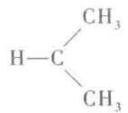</td><td>2.0</td></tr><tr><td>正缬氨酸</td><td>—CH2CH2CH3</td><td> $3.6 \times 10^{2}$ </td></tr><tr><td>正亮氨酸</td><td>—CH2CH2CH2CH3</td><td> $3.0 \times 10^{3}$ </td></tr><tr><td>苯丙氨酸</td><td>—CH2—</td><td> $1.0 \times 10^{5}$ </td></tr></table>

4. 利用作图法测定 $K_{\mathrm{m}}$ 和 $V_{\mathrm{max}}$ 值

米氏常数可根据实验数据通过作图法直接求得。先测定不同底物浓度的反应初速率，以 $v_{0} \sim [S]$ 作图，如从图7-9可以得到 $V_{max}$ ，再从 $\frac{1}{2} V_{max}$ 可求得相应的[S]，即 $K_{m}$ 值。但实际上即使用很大的底物浓度，也只能得到趋近于 $V_{max}$ 的反应速率，而达不到真正的 $V_{max}$ ，因此得不到准确的 $K_{m}$ 与 $V_{max}$ 值。为了方便地测得准确的 $K_{m}$ 与 $V_{max}$ 值，可把米氏方程式的形式加以变换，使它成为直线方程，然后用图解法求出 $K_{m}$ 与 $V_{max}$ 值。

(1) Lineweaver-Burk 双倒数作图法 将米氏方程式两侧取双倒数, 得到下面方程式:

$$
\frac {1}{v _ {0}} = \frac {K _ {\mathrm{m}}}{V _ {\mathrm{max}}} \cdot \frac {1}{[ \mathrm{S} ]} + \frac {1}{V _ {\mathrm{max}}}\tag{7-33}
$$

以 $\frac{1}{v_0} \sim \frac{1}{[S]}$ 作图，得出一直线，如图7-11。横轴截距为 $= -\frac{1}{K_{\mathrm{m}}}$ ，纵轴截距为 $\frac{1}{V_{\mathrm{max}}}$ 。该作图缺点是：实验点过分集中在直线的左下方，而低浓度S的实验点又因倒数后误差较大，往往偏离直线较远，从而影响 $K_{\mathrm{m}}$ 和 $V_{\mathrm{max}}$ 的准确测定。

(2) Eadie-Hofstee 作图法 将米氏方程式改写成:

$$
v _ {0} = V _ {\mathrm{max}} - K _ {\mathrm{m}} \cdot \frac {v _ {0}}{[ \mathrm{S} ]}\tag{7-34}
$$

以 $v_{0} \sim \frac{v_{0}}{[S]}$ 作图，得一直线，其纵轴截距为 $V_{\mathrm{max}}$ ，斜率为 $-K_{\mathrm{m}}$ ，见图7-12。

  
图7-11 双倒数作图法

  
图 7-12 Eadie-Hofstee 作图法

(3) Hanes-Woolf 作图法 将式(7-33)两边均乘以[S]即得:

$$
\frac {[ \mathrm{S} ]}{v _ {0}} = \frac {[ \mathrm{S} ]}{V _ {\max}} + \frac {K _ {\mathrm{m}}}{V _ {\max}}\tag{7-35}
$$

以 $\frac{[S]}{v_0} \sim [S]$ 作图，得一直线，横轴的截距为 $-K_{\mathrm{m}}$ ，斜率为 $\frac{1}{V_{\mathrm{max}}}$ ，见图7-13。

(4) Eisenthal 和 Cornish-Bowden 直接线性作图法 将米氏方程改写为:

$$
V _ {\mathrm{max}} = v _ {0} + \frac {v _ {0}}{\left[ \mathrm{S} \right]} \cdot K _ {\mathrm{m}}\tag{7-36}
$$

以 $V_{\mathrm{max}}$ 对 $K_{\mathrm{m}}$ 作图可得一直线。把[S]标在横轴的负半轴上，测得的 $v_{0}$ 数值标在纵轴上，相应的[S]和 $v_{0}$ 联成直线，这一簇直线交于一点，这一点的坐标为 $K_{\mathrm{m}}$ 和 $V_{\mathrm{max}}$ ，如图7-14。直线性作图法有其优点，不需要计算，可直接读出 $K_{\mathrm{m}}$ 和 $V_{\mathrm{max}}$ 值；另外它使人们容易识别出那些不正确的观测结果，这些结果将产生不通过靠近共同交叉点的直线。

  
图 7-13 Hanes-Woolf 作图法

  
图7-14 Eisenthal和Cornish-Bowden直线性作图法

## （三）多底物的酶促反应动力学

上面主要讨论了单底物反应的动力学,但在酶促反应中更常见的是两个或两个以上底物参加的反应,称作多底物反应。其中双底物反应最为重要,即底物 A 和 B 经酶催化生成产物 P 和 Q 的反应:

$$
\mathrm{A} + \mathrm{B} \stackrel {\text {酶}} {\rightleftharpoons} \mathrm{P} + \mathrm{Q}
$$

多底物反应动力学方程十分复杂,推导也很繁琐,这里仅就双底物反应机制及动力学方程作一简要介绍。

## 1. 酶促反应按底物分子数的分类

按照参加酶促反应底物分子数的多少可分为单底物、双底物和三底物反应，见表7-6。

表 7-6 酶促反应按底物分子数的分类

<table><tr><td>底物数</td><td>酶分类</td><td>催化反应</td><td>酶种类占总酶百分率</td></tr><tr><td>单底物</td><td>异构酶</td><td> $A \rightleftharpoons B$ </td><td>5%</td></tr><tr><td>单向单底物</td><td>裂合酶</td><td> $A \rightleftharpoons B + C$ </td><td>12%</td></tr><tr><td>假单底物</td><td>水解酶</td><td> $A \cdot B + H_2O \rightleftharpoons A \cdot OH + B \cdot H$ </td><td>26%</td></tr><tr><td rowspan="2">双底物</td><td>氧化还原酶</td><td> $A \cdot H_2 + B \rightleftharpoons A + B \cdot H_2$  $A^{2+} + B^{3+} \rightleftharpoons A^{3+} + B^{2+}$ </td><td>27%</td></tr><tr><td>转移酶</td><td> $A + B \cdot X \rightleftharpoons AX + B$ </td><td>24%</td></tr><tr><td>三底物</td><td>连接酶</td><td> $A + B + ATP \rightleftharpoons AB + ADP + Pi$  $A + B + ATP \rightleftharpoons A \cdot B + AMP + PPi$ </td><td>6%</td></tr></table>

由表可见,前面介绍的动力学只适用于表中1,3两类反应及第2类中的正向反应。

## 2. 多底物反应按动力学机制分类

(1) 序列反应 (sequential reactions) 或单置换反应 (single-displacement reactions)

底物的结合和产物的释放有一定的顺序,产物不能在底物完全结合前释放。A 和 B 底物二者均结合到酶上,然后反应产生 P 和 Q:

$$
\mathrm{E} + \mathrm{A} + \mathrm{B} \longrightarrow \mathrm{AEB} \longrightarrow \mathrm{PEQ} \longrightarrow \mathrm{E} + \mathrm{P} + \mathrm{Q}
$$

这种类型的反应称为序列反应,又可分为两种类型:

① 有序反应(ordered reactions)可写作 Ordered Bi Bi, 前一个 Bi 表示 2 个底物有序反应, 后一个 Bi 表示 2 个产物有序生成。A 定为先导底物(leading substrate), 在结合 B 前首先与酶结合。严格地说, 在缺少 A 时 B 不能结合自由的酶。反应在 A 和 B 之间产生三元复合物(ternary complex), 随后有序的释放反应产物 P 和 Q。在下面的图解中, Q 是 A 的产物, 最后被释放出来。

$$
\mathrm{E} \xrightarrow {\mathrm{A}} \mathrm{AE} \xrightarrow {\mathrm{B}} \mathrm{AEB} \xlongequal {} \mathrm{QEP} \xrightarrow {\mathrm{P}} \mathrm{QE} \xrightarrow {\mathrm{Q}} \mathrm{E}
$$

这一机制的另一种方式描述如下：

从上式可看出，A 和 Q 相互竞争地与自由酶结合，但是底物 A 和 B（或者 Q 和 B）互不竞争。

需要 $NAD^{+}$ 或 $NADP^{+}$ 的脱氢酶就属于这种类型, 这些脱氢酶的一般反应为:

$$
\mathrm{NAD} ^ {+} (\text {或} \mathrm{NADP} ^ {+}) + \mathrm{BH} _ {2} \rightleftharpoons \mathrm{NADH} (\text {或} \mathrm{NADPH}) + \mathrm{H} ^ {+} + \mathrm{B}
$$

先导底物 A 是 $\mathrm{NAD}^{+}$ （或 $\mathrm{NADP}^{+}$ ），而 $\mathrm{NAD}^{+}$ 和 $\mathrm{NADH}$ （产物 Q）竞争酶的同一结合位点，用醇脱氢酶为例来说明：

$$
\begin{array}{c}\mathrm{NAD} ^ {+} + \mathrm{CH} _ {3} \mathrm{CH} _ {2} \mathrm{OH} \rightleftharpoons \mathrm{NADH} + \mathrm{H} ^ {+} + \mathrm{CH} _ {3} \mathrm{CHO}\\\text {乙醇}\end{array}
$$

$$
\begin{array}{c} \mathrm{NAD} ^ {+} \xrightarrow {\mathrm{NAD} ^ {+} : \mathrm{E}} \mathrm{CH} _ {3} \mathrm{CH} _ {2} \mathrm{OH} \\ \mathrm{NADH} \xrightarrow {\mathrm{NADH} : \mathrm{E}} \mathrm{NADH}: \mathrm{E} \xrightarrow {\mathrm{NADH} : \mathrm{E}} \mathrm{CH} _ {3} \mathrm{CHO} \\ \mathrm{CH} _ {3} \mathrm{CHO} \end{array}
$$

能够鉴别该有序机制在缺少 $A(NAD^{+})$ 时, 没有 $B(CH_{3}CH_{2}OH)$ 结合到 E 上, 证明不是下面所述的随机反应。

② 随机反应(random reactions)可写作 Random Bi Bi, 前一个 Bi 表示 2 个底物随机结合, 后一个 Bi 表示 2 个产物随机释放。可用下式表示:

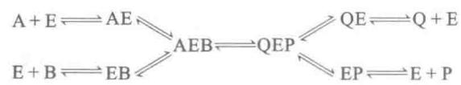

也可用图式说明：

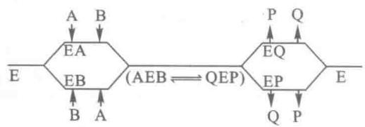

限速步骤是反应 AEB→QEP, 不论 A 或 B 首先同 E 结合, 还是 Q 或 P 首先从 QEP 释放都无关系。肌酸激酶(creatine kinase)使肌酸磷酸化的反应是随机反应机制的典型例子。肌酸(creatine, Cr)和磷酸肌酸(creatine phosphate, CrP)的结构式见第 16 章。

$$
\begin{array}{l}\mathrm{ATP+E} \rightleftharpoons \mathrm{ATP:E}\\\mathrm{E+Cr} \rightleftharpoons \mathrm{E:Cr}\end{array}\quad\begin{array}{l}\mathrm{ATP:E:Cr} \rightleftharpoons \mathrm{ADP:E:CrP}\\\mathrm{E:CrP} \rightleftharpoons \mathrm{E+CrP}\end{array}
$$

反应的总方向将决定于 ATP、ADP、Cr 和 CrP 的浓度和反应的平衡常数。可以认为，该酶有 2 个同底物（或产物）的结合位点：一个是腺苷酸位点，与 ATP 或 ADP 结合；另一个是肌酸位点，与 Cr 或 CrP 结合。在此反应机制中，ATP 和 ADP 在特异的位点上相互竞争，而 Cr 和 CrP 相互竞争 Cr 和 CrP 结合位点。注意：在该反应过程中，没有出现修饰的酶形式（E'），如像 E-P 中间物。该反应的特点是迅速和可逆地形成 ES 二元复合物，随后加上剩余底物，形成的三元复合物决定反应速率。

## (2) 乒乓反应(Ping Pong reactions)或双置换反应(double-displacement reactions)

这类反应的特点是,酶同 A 的反应产物(P)是在酶同第二个底物 B 反应前释放出来,作为这一过程的结果,酶 E 转变为一种修饰酶形式 $E'$ ,然后再同底物 B 反应生成第二个产物 Q,和再生为未修饰的酶形式 E:

从图解可知，A 和 Q 竞争自由酶 E 形式，而 B 和 P 竞争修饰酶形式 $E'$ ，A 和 Q 不同 $E'$ 结合，而 B 和 P 也不与 E 结合。该反应历程中间形成 4 种二元复合物，而无三元复合物形成。乒乓反应按其底物和产物作用方式可写作 Uni Uni Uni Uni Ping Pong（Uni 表示单底物或单产物），但对双底物、双产物系统写 Ping Pong Bi Bi，也不会引起误解，因为只有这一种方式。

氨基转移酶是遵循乒乓反应机制的酶,这类酶催化从氨基酸转移氨基到酮酸,产生一种新的氨基酸和酮酸:

$$
\mathrm{氨基酸} _ {1} + \mathrm{酮酸} _ {2} \longrightarrow \mathrm{酮酸} _ {1} + \mathrm{氨基酸} _ {2}
$$

一个典型的例子是谷草转氨酶(glutamic-oxaloacetic transaminase)的反应：

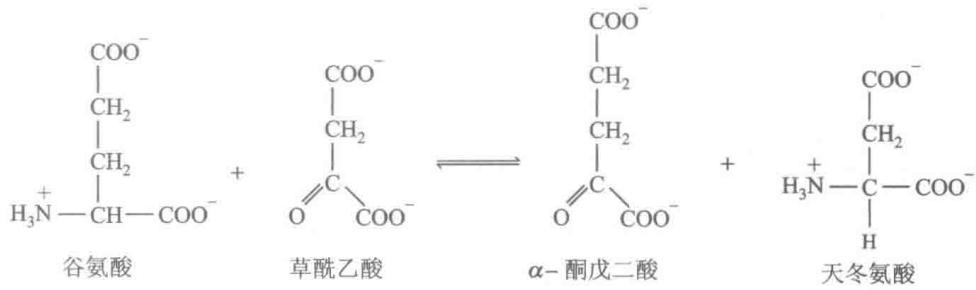

从上面反应可知,谷氨酸和天冬氨酸相互竞争 E,而草酰乙酸和 $\alpha-$ 酮戊二酸彼此竞争 $E'$ 。在谷草转氨酶中,未修饰酶(E)结合的辅酶是磷酸吡哆醛,在酶促反应中作为氨基受体/供体。而修饰酶形式 $E'$ 的辅酶是磷酸吡哆胺(见第13章)。

## 3. 双底物反应的动力学方程

以 A、B 双底物反应为例, 如将底物 B 固定在几个浓度, 在每一个固定的 B 浓度时, 测定不同 A 浓度对反应速率的影响。反之, 再在每一个固定的 A 浓度时, 测定不同 B 浓度对反应速率的影响。然后分别

作双倒数动力学图,则可区分乒乓机制和序列机制。

（1）乒乓机制的动力学方程和动力学图 根据乒乓机制的反应历程及稳态学说，可推导出动力学方程为：

$$
v _ {0} = \frac {V _ {\mathrm{max}} [ \mathrm{A} ] [ \mathrm{B} ]}{K _ {\mathrm{m}} ^ {\mathrm{A}} [ \mathrm{B} ] + K _ {\mathrm{m}} ^ {\mathrm{B}} [ \mathrm{A} ] + [ \mathrm{A} ] [ \mathrm{B} ]}\tag{7-37}
$$

式中[A]、[B]分别为底物A和B的浓度， $K_{\mathrm{m}}^{\mathrm{A}}, K_{\mathrm{m}}^{\mathrm{B}}$ 分别为底物A和B的米氏常数。在多底物反应中，一个底物的米氏常数往往可随另一底物的浓度变化而发生改变，故 $K_{\mathrm{m}}^{\mathrm{A}}$ 是指在B的浓度达饱和浓度时A的米氏常数。而在B低于饱和浓度时所测得的随[B]而变的A的各个 $K_{\mathrm{m}}$ 称为表观米氏常数。并且在[B]不饱和时， $\frac{1}{[\mathrm{A}]}$ 对 $\frac{1}{v_0}$ 作图求出的 $V_{\max}$ 同样也随[B]而变化。同理对B亦如此。式中 $V_{\max}$ 是指[A]、[B]都达饱和浓度时的最大反应速率。

取式 $(7-37)$ 的双倒数，则

$$
\frac {1}{v _ {0}} = \frac {K _ {\mathrm{m}} ^ {\mathrm{A}}}{V _ {\mathrm{max}} [ \mathrm{A} ]} + \left(1 + \frac {K _ {\mathrm{m}} ^ {\mathrm{B}}}{[ \mathrm{B} ]}\right) \frac {1}{V _ {\mathrm{max}}}\tag{7-38}
$$

当[B]固定或[A]固定时,式(7-38)均为直线方程式。如在几个不同而固定的[B]时, $\frac{1}{[A]}$ 对 $\frac{1}{v_{0}}$ 作图得图7-15A,同样,在几个不同而固定的[A]时, $\frac{1}{[B]}$ 对 $\frac{1}{v_{0}}$ 作图,得图7-15B。分别得到两组平行直线,这是乒乓机制的特点。

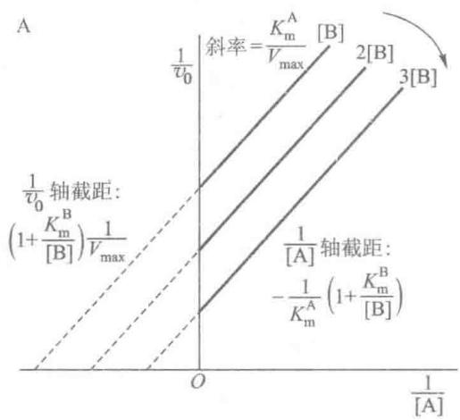

  
图 7-15 乒乓机制 Lineweaver-Burk 作图法

$$
\frac {1}{[ \mathrm{A} ]}
$$

$$
\frac {1}{v _ {0}}
$$

$$
\frac {1}{[ \mathrm{B} ]}
$$

由图 7-15 还不能求得各动力学常数, 必须进一步采用第二次作图法。

(2) 序列机制的底物动力学方程和动力学图 序列机制的动力学方程为:

$$
v _ {0} = \frac {V _ {\max} \cdot [ \mathrm{A} ] [ \mathrm{B} ]}{[ \mathrm{A} ] [ \mathrm{B} ] + [ \mathrm{B} ] K _ {\mathrm{m}} ^ {\mathrm{A}} + [ \mathrm{A} ] K _ {\mathrm{m}} ^ {\mathrm{B}} + K _ {\mathrm{s}} ^ {\mathrm{A}} K _ {\mathrm{m}} ^ {\mathrm{B}}}\tag{7-39}
$$

取式(7-39)的双倒数方程为：

$$
\frac {1}{v _ {0}} = \frac {1}{V _ {\max}} \left(K _ {\mathrm{m}} ^ {\mathrm{A}} + \frac {K _ {\mathrm{s}} ^ {\mathrm{A}} K _ {\mathrm{m}} ^ {\mathrm{B}}}{[ \mathrm{B} ]}\right) \frac {1}{[ \mathrm{A} ]} + \frac {1}{V _ {\max}} \left(1 + \frac {K _ {\mathrm{m}} ^ {\mathrm{B}}}{[ \mathrm{B} ]}\right)\tag{7-40}
$$

式中 $[A]$ 、 $[B]$ 、 $K_{\mathrm{m}}^{\mathrm{A}}$ 、 $K_{\mathrm{m}}^{\mathrm{B}}$ 、 $V_{\mathrm{max}}$ 的含义与乒乓机制相同，而 $K_{\mathrm{s}}^{\mathrm{A}}$ 为底物A与酶结合的解离常数。由方程（7-

40) 可知, 当在不同固定的 [B] 将 $\frac{1}{[A]}$ 对 $\frac{1}{v_0}$ 作图, 或在不同固定的 [A], 将 $\frac{1}{[B]}$ 对 $\frac{1}{v_0}$ 作图均可得一组直线 (图 7-16)。但和乒乓机制不同, 这组直线相交于横坐标的负侧, 这是序列机制的特点。直线的交点可以在横坐标上, 也可以在横坐标以上或以下。如交于横坐标上, 说明固定浓度的底物与酶的结合不影响变量底物的 $K_{\mathrm{m}}$ , 即 A 和 B 的浓度的大小彼此互不影响各自的 $K_{\mathrm{m}}$ , 此时表观 $K_{\mathrm{m}} = K_{\mathrm{m}}$ 。如直线的交点在横坐标以下, 说明 A 的表观 $K_{\mathrm{m}}$ 随 B 浓度的增高而增高, 反之, 直线的交点在横坐标以上, 说明 A 的表观 $K_{\mathrm{m}}$ 随 B 浓度的增加而减小。若求得各动力学常数, 还需要第二次作图法。

  
图 7-16 序列机制 Lineweaver-Burk 作图法

上述作图方法,可适用于序列机制中有序机制及快速平衡的随机机制,但不能区分两者,需要进一步用产物抑制动力学的方法及同位素交换法才能把它们区别开来。

## 三、酶的抑制作用

酶是蛋白质,凡可使酶蛋白变性而引起酶活力丧失的作用称为失活作用(inactivation)。由于酶的必需基团化学性质的改变,但酶未变性,而引起酶活力的降低或丧失而称为抑制作用(inhibition)。引起抑制作用的物质称为抑制剂(inhibitor)。变性剂对酶的变性作用无选择性,而一种抑制剂只能使一种酶或一类酶产生抑制作用,因此抑制剂对酶的抑制作用是有选择性的。所以,抑制作用与变性作用是不同的。

研究酶的抑制作用是研究酶的结构与功能、酶的催化机制以及阐明代谢途径的基本手段，也可以为医药设计新药物和为农业生产新农药提供理论依据，因此抑制作用的研究不仅有重要的理论意义，而且在实践上有重要价值。

## （一）抑制程度的表示方法

酶受抑制后活力降低的程度是研究酶抑制作用的一个重要指标,一般用反应速率的变化来表示。若以不加抑制剂时的反应速率为 $v_{0}$ ，加入抑制剂后的反应速率为 $v_{i}$ ，则酶活力的抑制程度可用下述方法表示：

(1) 相对活力分数(残余活力分数)

$$
a = \frac {v _ {\mathrm{i}}}{v _ {0}}
$$

(2) 相对活力百分数(残余活力百分数)

$$
a\% = \frac{v_{i}}{v_{0}}\times 100\%
$$

(3) 抑制分数: 指被抑制而失去活力的分数

$$
i = 1 - a = 1 - \frac {v _ {\mathrm{i}}}{v _ {0}}
$$

(4) 抑制百分数

$$
\begin{aligned} i\% & = (1 - a)\times 100\% \\ & = \left(1 - \frac{v_{i}}{v_{0}}\right)\times 100\% \end{aligned}
$$

通常所谓抑制率是指抑制分数或抑制百分数。

## （二）抑制作用的类型

根据抑制剂与酶的作用方式及抑制作用是否可逆,可把抑制作用分为两大类。

## 1. 不可逆的抑制作用

抑制剂与酶的必需基团以共价键结合而引起酶活力丧失，不能用透析、超滤等物理方法除去抑制剂而使酶复活，称为不可逆抑制（irreversible inhibition）。由于被抑制的酶分子受到不同程度的化学修饰，故不可逆抑制也就是酶的修饰抑制。

## 2. 可逆的抑制作用

抑制剂与酶以非共价键结合而引起酶活力降低或丧失,能用物理方法除去抑制剂而使酶复活,这种抑制作用是可逆的,称为可逆抑制(reversible inhibition)。

根据可逆抑制剂与底物的关系,可逆抑制作用分为4种类型:

（1）竞争性抑制（competitive inhibition）是最常见的一种可逆抑制作用。抑制剂(I)和底物(S)竞争酶的结合部位，从而影响了底物与酶的正常结合(图7-17B)。因为酶的活性部位不能同时既与底物结合又与抑制剂结合，因而在底物和抑制剂之间产生竞争，形成一定的平衡关系。大多数竞争性抑制剂的结构与底物结构类似，因此能与酶的活性部位结合，与酶形成可逆的EI复合物，但EI不能分解成产物P，酶反应速率下降。其抑制程度取决于底物及抑制剂的相对浓度，这种抑制作用可以通过增加底物浓度而解除。这类抑制最典型的例子是丙二酸和戊二酸与琥珀酸脱氢酶结合，但不能催化脱氢。

再如,抑制素(statins)作为竞争性抑制剂的药物,通过竞争性抑制胆固醇生物合成的关键酶而降低高胆固醇的水平。

（2）非竞争性抑制（noncompetitive inhibition）这类抑制作用的特点是底物和抑制剂同时和酶结合，两者没有竞争作用。酶与抑制剂结合后，还可以与底物结合：EI+S→ESI；酶与底物结合后，还可以与抑制剂结合：ES+I→ESI。但是中间的三元复合物不能进一步分解为产物，因此酶活力降低。这类抑制剂与酶活性部位以外的基团相结合（图7-17C），其结构与底物无共同之处，这种抑制作用不能用增加底物浓度来解除抑制，故称非竞争性抑制。例如亮氨酸是精氨酸酶的一种非竞争性抑制剂。某些重金属离子 $Ag^{+}$ 、 $Cu^{2+}$ 、 $Hg^{2+}$ 、 $Pb^{2+}$ 等对酶的抑制作用均属这类抑制剂。

（3）反竞争性抑制（uncompetitive inhibition）酶只有与底物结合后，才能与抑制剂结合（图7-17D），即 $\mathrm{ES + I\rightarrow ESI,ESI\xrightarrow{\times}P}$ 。反竞争性抑制作用常见于多底物反应中，而在单底物反应中比较少见。有人证明，L-Phe,L-同型精氨酸等多种氨基酸对碱性磷酸酶的作用是反竞争性抑制，肼类化合物抑制胃蛋白酶，氰化物抑制芳香硫酸酯酶的作用也属于反竞争性抑制。再如，锄草剂草甘膦（roundup, glyphosate）是芳香氨基酸生物合成途径中一种酶的反竞争性抑制剂。

（4）混合型抑制(mixed inhibition) 在非竞争性抑制作用中,是假设底物和抑制剂同酶的结合互不

曲线 1, 无抑制剂; 曲线 2, 不可逆抑制剂; 曲线 3, 可逆抑制剂

图 7-19 可逆抑制剂与不可逆抑制剂的区别(二)
A. 可逆抑制剂的作用; B. 不可逆抑制剂的作用  
  
图7-17 可逆抑制剂之间的区别  
A. 酶-底物复合物；B. 竞争性抑制剂结合在活性部位阻止了与底物的结合；C. 非竞争性抑制剂不妨碍酶与底物的结合；D. 反竞争性抑制剂仅与酶-底物复合物结合

影响,但实际上有很多抑制剂与酶结合后会部分影响酶与底物的结合,其结果介于竞争性抑制和非竞争性抑制之间,称为混合型抑制。例如单底物条件下,邻甲苯甲醛和间甲苯甲醛均为酪氨酸酶的混合型抑制剂。混合型抑制多见于双底物和多底物酶促反应。

## （三）可逆抑制作用和不可逆抑制作用的鉴别

除了用透析、超滤或凝胶过滤等方法能除去抑制剂来区别可逆抑制作用和不可逆抑制作用外，还可采用动力学的方法来鉴别。

在测定酶活力系统中加入一定量的抑制剂，然后测定不同酶浓度的反应初速率，以初速率对酶浓度作图。在测活系统中不加抑制剂时，初速率对酶浓度作图得到一条通过原点的直线（图7-18曲线1）；当测活系统中加入一定量的不可逆抑制剂时，抑制剂使一定量的酶失活，只有加入的酶量大于不可逆抑制剂的量时，才表现出酶活力，不可逆抑制剂的作用相当于把曲线向右平移（图7-18曲线2）；在测活系统中加入一定量的可逆抑制剂后，由于抑制剂的量是恒定的，因此得到一条通过原点，但斜率较低于曲线1的直线（图7-18曲线3）。如果在不同抑制剂浓度下，每一个抑制剂浓度都作一条初速率和酶浓度关系曲线，不可逆抑制剂可以得到一组不通过原点的并行线（图7-19B），而可逆抑制剂得到一组通过原点但斜率不同的直线（图7-19A）。这样可逆抑制作用和不可逆抑制作用从图7-19更清楚地区分开来。

  
图 7-18 可逆抑制剂与不可逆抑制剂的区别(一)

## （四）可逆抑制作用动力学

可逆抑制剂与酶结合后产生的抑制作用,可以根据米氏学说原理加以推导,定量说明抑制剂对酶促反应速率的影响,下面讨论4种可逆抑制类型的动力学。

## 1. 竞争性抑制

在竞争性抑制中,底物或抑制剂与酶的结合都是可逆的,存在着下面平衡式:

$$
\begin{array}{r l} \mathrm{E} & + \mathrm{S} \xrightarrow [ k _ {- 1} ]{k _ {1}} \mathrm{ES} \xrightarrow [ k _ {2} ]{k _ {2}} \mathrm{E} + \mathrm{P} \\ + & \\ \mathrm{I} & \\ k _ {\mathrm{i} 1} \Bigg \downarrow k _ {\mathrm{i} 2} & \\ \mathrm{EI} & \end{array}
$$

$K_{i}$ 为抑制剂常数(inhibitor constant)， $K_{i}=\frac{k_{i2}}{k_{i1}}$ ，为EI的解离常数。ES的解离常数为 $K_{m}$ 。

酶不能同时与 S、I 结合，所以，有 ES 和 EI，而没有 ESI

$$
[ \mathrm{E} ] = [ \mathrm{E} _ {\mathrm{f}} ] + [ \mathrm{ES} ] + [ \mathrm{EI} ]\tag{7-41}
$$

$[E_{f}]$ 为游离酶的浓度， $[E]$ 为酶的总浓度。

根据式 $(7-26)$ ， $(7-28)$

$$
V _ {\max} = k _ {2} [ \mathrm{E} ]
$$

$$
v _ {0} = k _ {2} [ \mathrm{ES} ]
$$

所以

$$
\frac {V _ {\mathrm{max}}}{v _ {0}} = \frac {[ \mathrm{E} ]}{[ \mathrm{ES} ]}\tag{7-42}
$$

将式 $(7-41)$ 代入式 $(7-42)$ :

$$
\frac {V _ {\max}}{v _ {0}} = \frac {[ \mathrm{E} _ {\mathrm{f}} ] + [ \mathrm{ES} ] + [ \mathrm{EI} ]}{[ \mathrm{ES} ]}\tag{7-43}
$$

为了消去[ES]项，根据 $K_{\mathrm{m}}$ 和 $K_{\mathrm{i}}$ 的平衡式求出 $[\mathrm{E_f}]$ 项及[EI]项：

因为 $K_{m}=\frac{[E_{i}][S]}{[ES]}$

所以 $[\mathrm{E_f}] = \frac{K_{\mathrm{m}}}{[\mathrm{S}]} [\mathrm{ES}]$

因为 $K_{i}=\frac{[E_{i}][I]}{[EI]}$

所以 $[\mathrm{EI}] = \frac{[\mathrm{E_f}][\mathrm{I}]}{K_i}$

将 $[\mathrm{E_f}]$ 代入[EI]式中，则[EI] $= \frac{K_{\mathrm{m}}}{[\mathrm{S}]}\cdot [\mathrm{ES}]\cdot \frac{[\mathrm{I}]}{K_{\mathrm{i}}} = \frac{K_{\mathrm{m}}[\mathrm{I}]}{K_{\mathrm{i}}[\mathrm{S}]} [\mathrm{ES}]$ 。

再将 $[\mathrm{E_f}]$ 及[EI]代入式(7-43)得： $\frac{V_{\max}}{v_0} = \frac{\frac{K_{\mathrm{m}}}{[\mathrm{S}]} [\mathrm{ES}] + [\mathrm{ES}] + \frac{K_{\mathrm{m}}[\mathrm{I}]}{K_{\mathrm{i}}[\mathrm{S}]} [\mathrm{ES}]}{[\mathrm{ES}]}$

整理后得：

$$
v _ {0} = \frac {V _ {\mathrm{max}} [ \mathrm{S} ]}{K _ {\mathrm{m}} \left(1 + \frac {[ \mathrm{I} ]}{K _ {\mathrm{i}}}\right) + [ \mathrm{S} ]}\tag{7-44}
$$

将式(7-44)与标准米氏方程式(7-29)比较,这里相当于 $K_{m}$ 的是 $K_{m}\left(1+\frac{[I]}{K_{i}}\right)$ 项,它是在抑制剂存在下实验观察得到的米氏常数,即达到 $V_{max}/2$ 时的[S]值,被称为表观米氏常数 $(K_{m}^{\prime})$ 。

双倒数式：

$$
\frac {1}{v _ {0}} = \frac {K _ {\mathrm{m}}}{V _ {\max}} \left(1 + \frac {[ 1 ]}{K _ {\mathrm{i}}}\right) \cdot \frac {1}{[ \mathrm{S} ]} + \frac {1}{V _ {\max}}\tag{7-45}
$$

将式(7-44)以 $v_{0}$ 对[S]作图得图7-20A，用式(7-45)以双倒数作图得图7-20B。

从图 7-20A 可以看出, 加入竞争性抑制剂后, $V_{max}$ 不变, 这是因为在任一固定的 [I] 下, 只要 [S] 达到饱和，则所有的酶将以ES形式存在。 $K_{m}$ 变大， $K_{m}^{\prime}>K_{m}$ ，而且 $K_{m}^{\prime}$ 随[I]的增加而增大。双倒数作图直线相交于纵轴，这是竞争性抑制作用的特点。抑制分数与[I]成正比，而与[S]成反比。

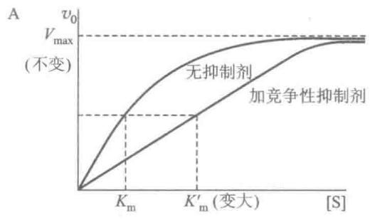

  
图 7-20 竞争性抑制曲线

## 2. 非竞争性抑制

在非竞争时抑制中存在如下的平衡：

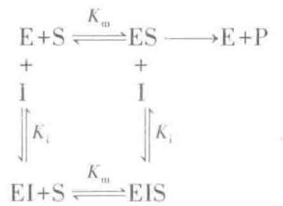

酶与底物结合后，可再与抑制剂结合，酶与抑制剂结合后，也可再与底物结合。

$$
\mathrm{ES} + \mathrm{I} \rightleftharpoons \mathrm{EIS} \quad K _ {\mathrm{i}} = \frac {[ \mathrm{ES} ] \cdot [ \mathrm{I} ]}{[ \mathrm{EIS} ]}
$$

$$
\text {或} \mathrm{EI+S} \rightleftharpoons \mathrm{EIS} K _ {\mathrm{i}} = \frac {[ \mathrm{EI} ] \cdot [ \mathrm{S} ]}{[ \mathrm{EIS} ]}
$$

所以，与酶结合的中间产物有 ES、EI 及 EIS。

$$
[ \mathrm{E} ] = [ \mathrm{E} _ {\mathrm{f}} ] + [ \mathrm{ES} ] + [ \mathrm{EI} ] + [ \mathrm{EIS} ]
$$

按平衡态处理,在非竞争性抑制中:

$$
[ \mathrm{ES} ] = \frac {[ \mathrm{E} ] [ \mathrm{S} ]}{K _ {\mathrm{m}}}, [ \mathrm{EI} ] = \frac {[ \mathrm{E} ] [ \mathrm{I} ]}{K _ {\mathrm{i}}}, [ \mathrm{EIS} ] = \frac {[ \mathrm{ES} ] [ \mathrm{I} ]}{K _ {\mathrm{i}}} = \frac {[ \mathrm{EI} ] [ \mathrm{S} ]}{K _ {\mathrm{i}}}
$$

代入式(7-42)， $\frac{V_{\mathrm{max}}}{v_{0}}=\frac{[E]}{[ES]}$ ，再经过推导后，得到：

$$
v _ {0} = \frac {V _ {\max} [ S ]}{(K _ {\mathrm{m}} + [ S ]) \left(1 + \frac {[ I ]}{K _ {\mathrm{i}}}\right)}\tag{7-46}
$$

将式(7-46)与标准米氏方程来比较, $K_{m}$ 未变,而 $V_{max}^{\prime}<V_{max},V_{max}^{\prime}$ 为 $V_{max}/1+\frac{[1]}{K_{i}}$ 。

双倒数方程为：

$$
\frac {1}{v _ {0}} = \frac {K _ {\mathrm{m}}}{V _ {\mathrm{max}}} \left(1 + \frac {[ \mathrm{I} ]}{K _ {\mathrm{i}}}\right) \frac {1}{[ \mathrm{S} ]} + \frac {1}{V _ {\mathrm{max}}} \left(1 + \frac {[ \mathrm{I} ]}{K _ {\mathrm{i}}}\right)\tag{7-47}
$$

由式(7-46)和式(7-47)作图得图7-21A和B。由图7-21A可以看出，加入非竞争性抑制剂后， $K_{m}$ 值不变，表示不受抑制剂影响。而 $V_{max}$ 变小，即使[S]足够使酶饱和，但总有一定比例的ES将以无活性的EIS存在。 $K_{m}^{\prime}=K_{m},V_{max}^{\prime}$ 随[I]的增加而减小。双倒数作图直线相交于横轴（图7-21B），这是非竞争性抑制作用的特点。抑制分数与[I]成正比，而与[S]无关，即[I]不变时，任何[S]的抑制分数是一个常数。

  
图 7-21 非竞争性抑制曲线

## 3. 反竞争性抑制

这类抑制作用的特点是酶先与底物结合,然后才与抑制剂结合,存在以下平衡:

这类抑制与酶结合的中间产物有 ES、ESI、而无 EI。

$$
[ \mathrm{E} ] = [ \mathrm{E} _ {\mathrm{f}} ] + [ \mathrm{ES} ] + [ \mathrm{ESI} ]
$$

按稳态处理可以推导出： $[\mathrm{ES}] = \frac{[\mathrm{E}][\mathrm{S}]}{K_{\mathrm{m}}}, [\mathrm{ESI}] = \frac{[\mathrm{E}][\mathrm{S}]}{K_{\mathrm{m}}} \cdot \frac{[I]}{K_{\mathrm{i}}}$

代入式(7-42)， $\frac{V_{\max}}{v_{0}}=\frac{[E]}{[ES]}$ ，再经推导后得以下方程：

$$
v _ {0} = \frac {V _ {\mathrm{max}} [ \mathrm{S} ]}{K _ {\mathrm{m}} + [ \mathrm{S} ] \left(1 + \frac {[ \mathrm{I} ]}{K _ {\mathrm{i}}}\right)}\tag{7-48}
$$

双倒数式：

$$
\frac {1}{v _ {0}} = \frac {K _ {\mathrm{m}}}{V _ {\mathrm{max}}} \cdot \frac {1}{[ \mathrm{S} ]} + \frac {1}{V _ {\mathrm{max}}} \left(1 + \frac {[ \mathrm{I} ]}{K _ {\mathrm{i}}}\right)\tag{7-49}
$$

由式(7-48)及式(7-49)作图得图7-22A和B。由图7-22A可以看出，加入反竞争性抑制剂后， $K_{m}$ 及 $V_{max}$ 都变小，而且都降低同样倍数（式7-48）。 $K_{m}^{\prime}<K_{m},V_{max}^{\prime}<V_{max}$ ，即表观 $K_{m}$ 及表观 $V_{max}$ 都随[I]的增加而减小。因为斜率 $K_{m}/V_{max}$ 保持不变，因此双倒数作图为一组平行线，这是反竞争性抑制作用的特点。抑

  
图 7-22 反竞争性抑制曲线

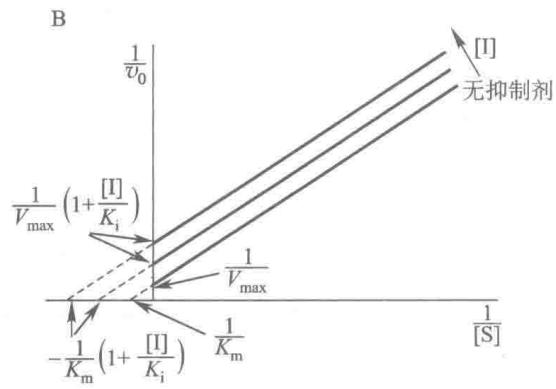

制分数既与[I]成正比也与[S]成正比。

## 4. 混合型抑制

混合型抑制包括两种类型:非竞争性和反竞争性混合抑制,非竞争性和竞争性混合抑制。根据平衡态假设,同样推导出混合型抑制动力学方程式,得知 $K_{m}$ 和 $V_{max}$ 的变化。混合型抑制的动力学方程:

$$
v _ {0} = \frac {V _ {\mathrm{max}} [ \mathrm{S} ]}{\left(1 + \frac {[ \mathrm{I} ]}{K _ {\mathrm{i}}}\right) K _ {\mathrm{m}} + \left(1 + \frac {[ \mathrm{I} ]}{K _ {\mathrm{i}} ^ {\prime}}\right) [ \mathrm{S} ]}\tag{7-50}
$$

其双倒数式：

$$
\frac {1}{v _ {0}} = \frac {K _ {\mathrm{m}}}{V _ {\max}} \left(1 + \frac {[ \mathrm{I} ]}{K _ {\mathrm{i}}}\right) \frac {1}{[ \mathrm{S} ]} + \frac {1}{V _ {\max}} \left(1 + \frac {[ \mathrm{I} ]}{K _ {\mathrm{i}} ^ {\prime}}\right)\tag{7-51}
$$

双倒数作图时，一组直线相交于纵轴左侧，如果 $K_{i}^{\prime}>K_{i}$ 则相交于横轴上方第二象限内（图7-23A），这种情形介于非竞争性与竞争性图谱之间，故称为非竞争-竞争性抑制。若 $K_{i}^{\prime}<K_{i}$ 则相交于横轴下方第三象限内（图7-23B），介于非竞争性和反竞争性图谱之间，故此又称为非竞争-反竞争性抑制。

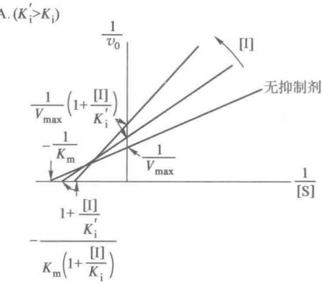

  
图7-23 混合型抑制曲线  
A. 非竞争-竞争性抑制曲线；B. 非竞争-反竞争性抑制曲线

现将无抑制剂和有抑制剂时的米氏方程和 $V_{\mathrm{max}}$ 和 $K_{\mathrm{m}}$ 的变化，归纳于表7-7中。

表 7-7 不同类型可逆抑制剂对米氏方程和常数的影响

<table><tr><td>抑制类型</td><td>方程式</td><td>表观  $V_{\max}$ </td><td>表观  $K_m$ </td></tr><tr><td>无抑制剂</td><td> $v_0 = \frac{V_{\max} [S]}{K_m + [S]}$ </td><td> $V_{\max}$ </td><td> $K_m$ </td></tr><tr><td>竞争性抑制</td><td> $v_0 = \frac{V_{\max} [S]}{K_m \left(1 + \frac{[I]}{K_i}\right) + [S]}$ </td><td> $V_{\max}$ </td><td> $K_m \left(1 + \frac{[I]}{K_i}\right)$ </td></tr><tr><td>非竞争性抑制</td><td> $v_0 = \frac{V_{\max} [S]}{(K_m + [S])(1 + \frac{[I]}{K_i})}$ </td><td> $\frac{V_{\max}}{1 + \frac{[I]}{K_i}}$ </td><td> $K_m$ </td></tr><tr><td>反竞争性抑制</td><td> $v_0 = \frac{V_{\max} [S]}{K_m + \left(1 + \frac{[I]}{K_i}\right) [S]}$ </td><td> $\frac{V_{\max}}{1 + \frac{[I]}{K_i}}$ </td><td> $\frac{K_m}{1 + \frac{[I]}{K_i}}$ </td></tr><tr><td>混合型抑制</td><td> $v_0 = \frac{V_{\max} [S]}{\left(1 + \frac{[I]}{K_i}\right) K_m + \left(1 + \frac{[I]}{K_i'}\right) [S]}$ </td><td> $\frac{V_{\max}}{1 + \frac{[I]}{K_i'}}$ </td><td> $\frac{K_m \left(1 + \frac{[I]}{K_i}\right)}{1 + \frac{[I]}{K_i'}}$ </td></tr></table>

  
图7-24 Dixon作图法求 $K_{1}([S_{2}] > [S_{1}])$  
A. 非竞争性抑制；B. 竞争性抑制；C. 反竞争性抑制

用Dixon作图法，求 $K_{\mathrm{i}}$ ，只要以[I]为横坐标，以 $\frac{1}{v_0}$ 为纵坐标，采用一个以上的[S]，给出不同[S]时的直线，由这些直线的交点即可求得 $K_{\mathrm{i}}$ ，见图7-24。

## （五）一些酶的可逆与不可逆抑制剂

## 1. 不可逆抑制剂

按照不可逆抑制作用的选择性不同,可将不可逆抑制剂分为两类,非专一性不可逆抑制剂及专一性不可逆抑制剂,前者作用于酶的一类或几类基团,这些基团中包含了必需基团,作用后引起酶的失活;后者专一地作用于某一种酶活性部位的必需基团而导致酶的失活,它是研究酶活性部位的重要试剂。

(1) 非专一性不可逆抑制剂 主要有以下几类：

① 有机磷化合物 常见的有二异丙基氟磷酸（DFP）、农药敌敌畏、敌百虫、对硫磷和萨林等，它们的通式和结构式如下：

这些有机磷化合物能抑制某些蛋白酶及酯酶活力，与酶分子活性部位的丝氨酸羟基共价结合，从而使酶失活。这类化合物强烈地抑制与神经传导有关的胆碱酯酶活力，使乙酰胆碱不能分解为乙酸和胆碱，引起乙酰胆碱的积累，使一些以乙酰胆碱为传导介质的神经系统处于过度兴奋状态，引起神经中毒症状，因此这类有机磷化合物又称为神经毒剂。有机磷制剂与酶结合后虽不解离，但用解磷定（pyridine aldoxime methyl iodine，吡啶醛肟甲碘化物）或氯磷定（吡啶醛肟甲氯化物）能把酶上的磷酸根除去，使酶复活。在临床上它们作为有机磷中毒后的解毒药物。其作用过程如下：

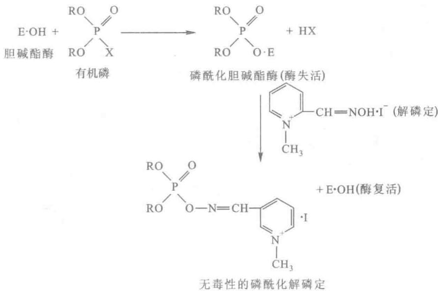

② 有机汞、有机砷化合物 这类化合物与酶分子中半胱氨酸残基的巯基作用,抑制含巯基的酶,如对氯汞苯甲酸(PCMB),其作用如下:

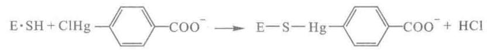

这类抑制可通过加入过量的巯基化合物如半胱氨酸或还原型谷胱甘肽(GSH)而解除。

有机砷化合物如路易斯毒气(Lewisite, CHCl=CHAsCl₂)与酶的巯基结合而使人畜中毒。砷化物的毒理作用可能是由于破坏了硫辛酸辅酶，从而抑制了丙酮酸氧化酶系统。

英国发明了一种能与 Lewisite 有更大亲和力的解毒剂，称 BAL(British Anti-Lewisite)。可重新使酶恢复活性。

③ 重金属盐 含 $Ag^{+}$ 、 $Cu^{2+}$ 、 $Hg^{2+}$ 、 $Pb^{2+}$ 、 $Fe^{3+}$ 的重金属盐在高浓度时，能使酶蛋白变性失活。在低浓度时对某些酶的活性产生抑制作用，一般可以使用金属螯合剂如 EDTA、半胱氨酸等螯合除去有害的重金属离子，恢复酶的活力。

④ 烷化试剂 这一类试剂往往含一个活泼的卤素原子,如碘乙酸、碘乙酰胺和2,4-二硝基氟苯等,被作用的酶分子侧链基团有巯基、氨基、羧基、咪唑基和硫醚基等。例如与巯基酶的作用:

$$
\mathrm{E} \cdot \mathrm{SH} + \mathrm{ICH} _ {2} \mathrm{CONH} _ {2} \rightarrow \mathrm{E} - \mathrm{S} - \mathrm{CH} _ {2} - \mathrm{CONH} _ {2} + \mathrm{HI}
$$

⑤ 氰化物、硫化物和 CO 这类物质能与酶中金属离子形成较为稳定的络合物，使酶的活性受到抑制。如氰化物作为剧毒物质与含铁卟啉的酶（如细胞色素氧化酶）中的 $Fe^{2+}$ 络合，使酶失活而阻止细胞呼吸。

(2) 专一性不可逆抑制剂 专一性的不可逆制剂可分为 $K_{s}$ 型和 $k_{cat}$ 型两大类。

① $K_{\mathrm{S}}$ 型不可逆抑制剂 这类抑制剂是根据底物的化学结构设计的, 具有底物类似的结构, 可以和相应的酶结合, 同时还带有一个活泼的化学基团, 能与酶分子中的必需基团反应进行化学修饰, 从而抑制酶活性。因抑制是通过对酶的亲和力来对酶进行修饰标记的, 故称为亲和标记试剂 (affinity labeling reagent)。这种抑制剂虽然主要“攻击”酶活性部位的必需基团, 但由于它的活泼基团也可以修饰酶分子其他部位的同一基团, 因此其专一性有一定的限度。这取决于抑制剂与活性部位必需基团在反应前形成非共价络合物的解离常数以及非活性部位同类基团形成非共价络合物的解离常数之比, 即 $K_{\mathrm{S}}$ 的比值, 故这类抑制剂称为 $K_{\mathrm{S}}$ 型不可逆抑制剂。例如: 胰蛋白酶要求催化的底物具有一个带正电荷的侧链, 如 Lys、Arg 侧链。对甲苯磺酰-L-赖氨酰氯甲酮 (TLCK) 和胰蛋白酶的底物对甲苯磺酰-L-赖氨酰甲酯 (TLME) 有相似的结构 (图 7-25), 因此前者可以与胰蛋白酶活性部位必需基团 $\mathrm{His}_{57}$ 共价结合, 引起不可逆地失活。失活作用是以化学计算量进行, 伴随着活性 $100\%$ 丧失。所以 TLCK 是胰蛋白酶的 $K_{\mathrm{S}}$ 型不可逆抑制剂。

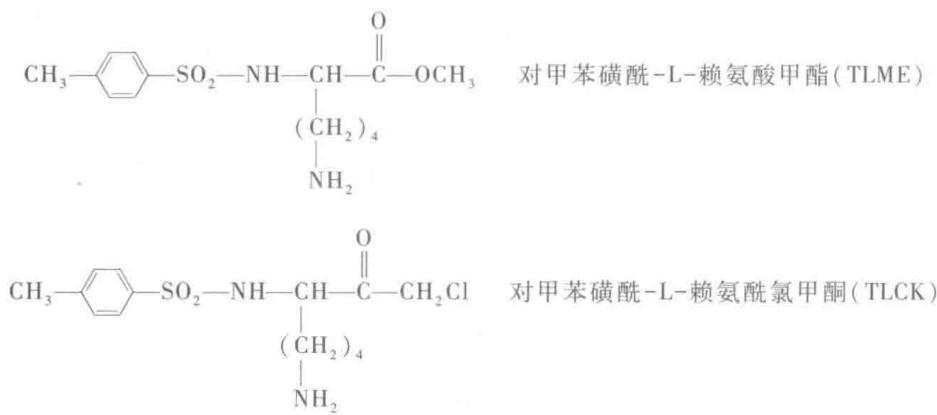  
图7-25 胰蛋白酶底物与其 $K_{\mathrm{s}}$ 型不可逆抑制剂的化学结构比较

再如，3-溴丙酮醇磷酸（3-bromoacetal phosphate）是磷酸丙糖异构酶（triose phosphate isomerase）的亲和标记试剂。它是正常底物磷酸二羟丙酮的类似物，能与酶的活性部位结合，共价修饰酶活性必需的 Glu 残基（图 7-26）而使酶失活。

  
图 7-26 3-溴丙酮醇磷酸对磷酸丙糖异构酶的亲和标记

② $k_{\mathrm{cat}}$ 型不可逆抑制剂 是根据酶催化过程设计的，设计此类抑制剂，要求对酶的作用机制预先有一定的了解。 $k_{\mathrm{cat}}$ 抑制剂不但具有天然底物的类似结构，且本身也是酶的底物，能与酶结合发生类似于底物的变化。但抑制剂还有一个潜伏的反应基团（latent group），当酶对它进行催化反应时，这个潜伏反应基团被暴露或活化，并作用于酶活性部位的必需基团或酶的辅基，使酶不可逆失活。这类抑制剂是专一性极高的不可逆抑制剂。因此 $k_{\mathrm{cat}}$ 型抑制剂称为自杀性底物（suicide substrate）。

若以 E 及 $S_{i}$ 分别代表酶和自杀性底物，I 为 $S_{i}$ 被酶催化生成的抑制物，则反应可表示如下：

$$
\mathrm{E} + \mathrm{S} _ {\mathrm{i}} \xrightarrow {K _ {\mathrm{s}}} \mathrm{ES} _ {\mathrm{i}} \xrightarrow {k _ {\mathrm{cat}}} \mathrm{E} \cdot \mathrm{I} \xrightarrow {k _ {\mathrm{i}}} \mathrm{E} - \mathrm{I}
$$

式中 $K_{\mathrm{S}}$ 为 $\mathrm{ES}_{\mathrm{i}}$ 的解离常数， $k_{\mathrm{cat}}$ 为 $\mathrm{ES}_{\mathrm{i}}$ 转变为 $\mathrm{E} \cdot \mathrm{I}$ 的催化常数，而 $k_{\mathrm{i}}$ 是 $\mathrm{E}$ 与 $\mathrm{I}$ 共价结合的速率常数。抑制作用的效率及专一性不但与 $K_{\mathrm{S}}$ 有关，更重要的是决定于 $k_{\mathrm{cat}}$ ，因为 $\mathrm{S}_{\mathrm{i}}$ 与 $\mathrm{E}$ 结合还不能成为抑制剂，只有生成产物 $\mathrm{I}$ 后才产生抑制作用。 $k_{\mathrm{cat}}$ 愈大，生成产物的速度愈快，抑制作用愈强，故这种取决于 $k_{\mathrm{cat}}$ 的抑制剂称为

$k_{cat}$ 型抑制剂。

自杀性底物所具有的 $k_{\mathrm{cat}}$ 型抑制作用有下列特点：① 自杀底物 $\mathrm{S}_{\mathrm{i}}$ 的浓度愈大，抑制作用也愈大，其抑制动力学呈一级反应；② 在自杀性底物过量时加入酶愈多，产生的抑制愈大；③ $\mathrm{S}_{\mathrm{i}}$ 本身无抑制作用，而生成的I是一种亲和标记抑制物；④ 酶活性中心的必需基团与I的化学计量关系是1:1；⑤ 真正的底物S能竞争性的阻断 $\mathrm{S}_{\mathrm{i}}$ 的抑制作用。以上④、⑤两点也运用于 $\mathrm{K}_{\mathrm{s}}$ 型抑制剂。

例如:单胺氧化酶(monoamine oxidase)对神经递质的合成有重要作用,它以FAD为辅基。N,N-二甲丙炔胺是单胺氧化酶的一种 $k_{cat}$ 型抑制剂,被单胺氧化酶黄素辅基氧化后,经烷基化共价修饰黄素辅基,则酶失活(图7-27)。单胺氧化酶脱氨作用,可引起神经递质如多巴胺和5-羟色胺在脑中水平的降低,帕金森病(Parkinson disease)与低水平的多巴胺有关,而抑郁症(depression)与低水平5-羟色胺相联系。治疗这两种病的药物(-)deprenyl就是单胺氧化酶的自杀性底物。

  
(单胺氧化酶自杀性底物)

  
图7-27 单胺氧化酶被自杀性底物抑制的机制

再如 $\beta-$ 卤代-D-Ala 是细菌中丙氨酸消旋酶（alanine racemase, AR）的不可逆抑制剂，属于磷酸吡哆醛酶类的自杀性底物，作用机制如图 7-28 所示。因丙氨酸消旋酶能使 L-Ala 转变成为 D-Ala，而 D-Ala 是细菌合成胞壁肽聚糖的重要原料，丙氨酸消旋酶受抑制后可阻断肽聚糖的合成，则抑制细菌生长，故 $\beta-$ 卤代-D-Ala 是一种抗菌药物。

青霉素（penicillin）是糖肽转肽酶（glycopeptide transpeptidase）的 $k_{\mathrm{cat}}$ 型不可逆抑制剂。糖肽转肽酶是在细菌细胞壁合成期间催化肽聚糖链的交联。青霉素通过干扰肽聚糖链之间的肽交联桥的形成，使细菌失去抗渗透能力，因此细菌停止生长或死亡。现已证明青霉素内酰胺环上的高反应性肽键受到酶活性部位上Ser残基的一OH基的亲核攻击形成共价键。产生的青霉噻唑酰基-酶复合体是无活性的（图7-29）。青霉素是转肽酶的底物之一，是酰基-D-Ala-D-Ala的结构类似物。青霉素对人体的低毒性正是因为它具有高度专一性的缘故。它选择性地作用于细菌并引起溶菌作用。几乎不损害人和动物的细胞，所以青霉素是一种比较理想的抗生素（antibiotics）。

## 2. 可逆抑制剂

可逆抑制剂中最重要和最常见的是竞争性抑制剂。如像一些竞争性抑制剂与天然代谢物在结构上十分相似,能选择性地抑制病菌或癌细胞在代谢过程中的某些酶,而具有抗菌和抗癌作用。这类抑制剂可称为抗代谢物或代谢类似物。例如 5'-氟尿嘧啶是一种抗癌药物,它的结构与尿嘧啶十分相似,能抑制胸腺嘧啶合成酶的活性,阻碍胸腺嘧啶的合成代谢,使体内核酸不能正常合成,使癌细胞的增殖受阻,起到抗癌作用。磺胺药,以对氨基苯磺酰胺为例,它的结构与对氨基苯甲酸十分相似,是对氨基苯甲酸的竞争性抑制剂。对氨基苯甲酸是叶酸结构的一部分,叶酸和二氢叶酸则是核酸的嘌呤核苷酸合成中的重要辅酶——四氢叶酸的前身,如果缺少四氢叶酸,细菌生长繁殖便会受到影响。

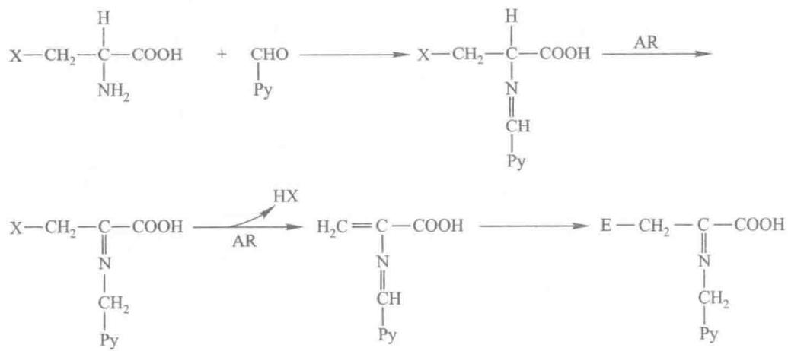  
图7-28 $\beta$ -卤代-D-丙氨酸抑制丙氨酸消旋酶的机制

  
图 7-29 青霉素是糖肽转肽酶的不可逆抑制剂

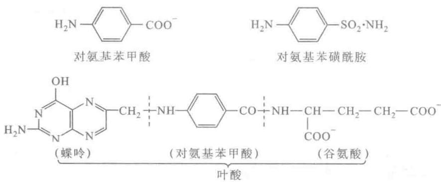

人体能直接利用食物中的叶酸,某些细菌则不能直接利用外源的叶酸,只能在二氢叶酸合成酶的作用下,利用对氨基苯甲酸为原料合成二氢叶酸。而磺胺药物可与对氨基苯甲酸相互竞争,抑制二氢叶酸合成酶的活性,影响二氢叶酸的合成,导致细菌的生长繁殖受抑制,从而达到治病的效果。再如,氨甲蝶呤(methotrexate)是二氢叶酸还原酶很强的竞争性抑制剂,氨甲蝶呤结构类似于二氢叶酸还原酶的底物二氢叶酸。它对酶的结合能力是天然底物的1000倍,强力抑制该酶的活性,从而影响了对核苷酸碱基的合成,因此可用于治疗癌症。

利用竞争性抑制的原理用来设计药物,如抗癌药物阿拉伯糖胞苷、氨基叶酸等都是利用这一原理而设计出来的。

过渡态底物类似物可作为竞争性抑制剂,所谓过渡态(transition state)底物是指底物和酶结合成中间复合物后被活化的过渡形式，由于能障小，和酶结合就紧密得多，这是酶具有高度催化效力的原因之一。可以设想，如抑制剂的化学结构能类似过渡态底物，则其对酶的亲和力就会远大于底物，可达到 $10^{2} \sim 10^{6}$ 倍，从而引起酶被强烈抑制。根据酶作用机制研究的进展，目前已报道了各种酶反应的几百种过渡态底物类似物，它们都属于竞争性抑制剂，其抑制效率比其基态底物类似物高得多。

例如嘌呤核苷水合物是小牛肠腺苷脱氨酶(adenosine deaminase)反应过渡态的类似物,是该酶强的抑制剂, $K_{i}=3\times10^{-13}\ mol\cdot L^{-1}$ （图7-30A）。酵母醛缩酶(aldolase)反应的过渡态类似物比对底物的结合能力大4万倍(图7-30B)。

A. 嘌呤核苷水合物是小牛肠腺苷脱氨酶反应过渡态类似物，是该酶有力的抑制剂；  
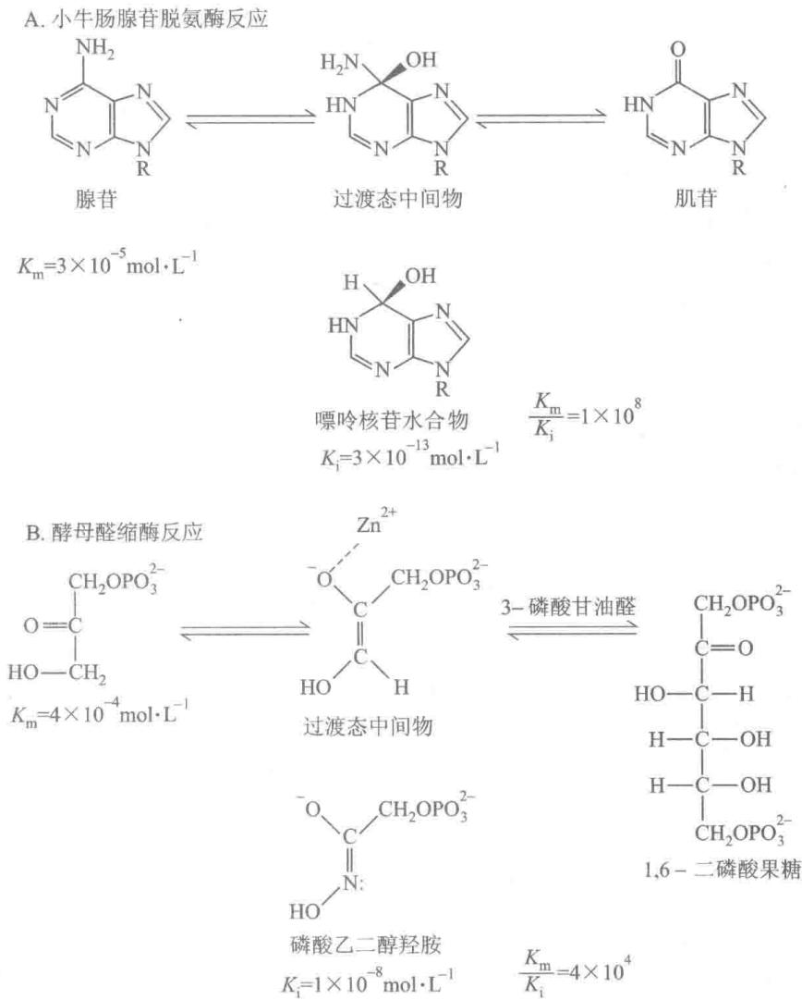  
图 7-30 过渡态类似物举例

再如，催化 $\mathrm{ATP} + \mathrm{AMP} \rightarrow 2\mathrm{ADP}$ 的腺苷酸激酶（adenylate kinase），经研究腺苷五磷酸（ $\mathrm{AP}_5\mathrm{A}$ ）是底物过渡态类似物，对该酶有强烈地抑制作用。又如乳酸脱氢酶（lactate dehydrogenase）、草酰乙酸脱羧酶（oxaloacetic decarboxylase）、丙酮酸羧化酶（pyruvate carboxylase）在催化各自底物（分别为乳酸、草酰乙酸、丙酮酸）变成产物的过程中，烯醇式丙酮酸是共有的过渡态，而草酸是烯醇式丙酮酸的类似物，故对3种酶都有强烈的抑制作用。 $K_{i}$ 为 $3.5 \times 10^{-6} \sim 1.1 \times 10^{-5} \mathrm{~mol} \cdot \mathrm{L}^{-1}$ ，和相应的底物有竞争作用。

对过渡态底物类似物抑制剂的研究,具有很大的理论和实践意义,不但有利于对酶催化机制的了解,还可据此合成具有高效而特异的新药物。

## 四、温度对酶促反应的影响

大多数化学反应的速率,都和温度有关,酶催化的反应也不例外。如果在不同温度条件下进行某种酶

反应,然后将测得的反应速率相对于温度作图,即可得到图7-31所示的钟罩形曲线。从图上曲线可以看出,在较低的温度范围内,酶反应速率随温度升高而增大,但超过一定温度后,反应速率反而下降,因此只有在某一温度下,反应速率达到最大值,这个温度通常就称为酶反应的最适温度(optimum temperature)。每种酶在一定条件下都有其最适温度。一般讲,动物细胞内的酶最适温度在35\~40℃,植物细胞中的酶最适温度稍高,通常在40\~50℃之间,微生物中的酶最适温度差别较大,如Taq DNA聚合酶的最适温度可高达70℃。

温度对酶促反应速率的影响表现在两个方面,一方面是当温度升高时,与一般化学反应一样,反应速率加快。另一方面由于酶是蛋白质,随着温度升高,使酶蛋白逐渐变性而失活,引起酶反应速率下

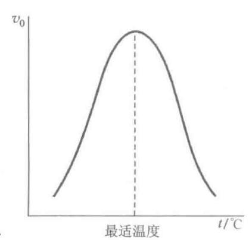  
图 7-31 温度对酶反应速率的影响

降。酶所表现的最适温度是这两种影响的综合结果。在酶反应的最初阶段，酶蛋白的变性尚未表现出来，因此反应速率随温度升高而增加，但高于最适温度时，酶蛋白变性逐渐突出，反应速率随温度升高的效应将逐渐为酶蛋白变性效应所抵消，反应速率迅速下降，因此表现出最适温度。最适温度不是酶的特征物理

常数,常受到其他条件如底物种类、作用时间、pH 和离子强度等因素影响而改变。如最适温度随着酶促作用时间的长短而改变,由于温度使酶蛋白变性是随时间累加的。一般讲反应时间长,酶的最适温度低,反应时间短则最适温度就高(图 7-32),因此只有在规定的反应时间内才可确定酶的最适温度。

温度对酶促反应速率的影响常用 Arrhenius 方程(式 6-2)来表示, $k=A\exp^{(-E_{a}/RT)}$ ,取对数,得到:

$$
\lg k = \frac {E _ {\mathrm{a}}}{2 . 3 R} \cdot \frac {1}{T} + \lg A\tag{7-52}
$$

式中，k 为酶促反应速率常数，A 为频率因子，R 为气体常数，T 为绝对温度， $E_{a}$ 为活化能。以 $\lg k$ 对 $\frac{1}{T}$ 作图可得到一条直线，由直线的斜率可得出活化能。

图 7-32 在不同温度下典型的酶反应过程的曲线,表明酶的最适温度决定于时间

如果相应于速率常数 $k_{1}$ 和 $k_{2}$ ，选择积分极限 $T_{1}$ 和 $T_{2}$ ，则，

$$
\lg \frac {k _ {2}}{k _ {1}} = \frac {E _ {\mathrm{a}}}{2 . 3 R} \left(\frac {T _ {2} - T _ {1}}{T _ {2} T _ {1}}\right)\tag{7-53}
$$

反应速率的温度效应常以 $Q_{10}$ 表示， $Q_{10}$ 指反应温度提高 $10^{\circ}C$ ，其反应速率与原来反应速率之比称为反应的温度系数。

$$
Q _ {1 0} = \frac {k _ {2}}{k _ {1}}\tag{7-54}
$$

根据 $Q_{10}$ 的定义, $T_{2}-T_{1}=10^{\circ}C$ , 由式(7-53)可求出酶促反应的活化能。

$$
\mathrm{lg} Q _ {1 0} = \frac {E _ {\mathrm{a}}}{2 . 3 R} \bigg (\frac {1 0}{T _ {1} T _ {2}} \bigg)
$$

$$
E _ {\mathrm{a}} = \frac {2 . 3 R T _ {1} T _ {2} \lg Q _ {1 0}}{1 0}\tag{7-55}
$$

从式(7-55)可看出, $E_{a}$ 与 $Q_{10}$ 成正比,活化能愈高, $Q_{10}$ 愈大,表示温度对反应速率影响大。由于酶作为生物催化剂可显著降低反应的活化能,所以比一般催化反应的温度系数要低,一般为1.4\~2.0。

酶的固体状态比在溶液中对温度的耐受力要高。酶的冰冻干粉置冰箱中可放置几个月甚至更长时间。而酶溶液在冰箱中只能保存几周，甚至几天就会失活。通常酶制剂以固体保存为佳。

## 五、pH 对酶促反应的影响

酶的活力受环境 pH 的影响, 在一定 pH 下, 酶表现最大活力, 高于或低于此 pH, 酶活力降低, 通常把表现出酶最大活力的 pH 称为该酶的最适 pH (optimum pH) (图 7-33)。

各种酶在一定条件下都有其特定的最适 pH，因此最适 pH 是酶的特性之一。但酶的最适 pH 不是一个常数，受许多因素影响，随底物种类和浓度、缓冲液种类和浓度的不同而改变，因此最适 pH 只有在一定条件下才有意义。大多数酶的最适 pH 在 5\~8 之间，动物体的酶多在 pH 6.5\~8.0 之间，植物及微生物中的酶多在 pH 4.5\~6.5。但也有例外，如胃蛋白酶的最适 pH 为 1.5，肝中精氨酸酶最适 pH 为 9.7。表 7-8 列举了几种酶的最适 pH。

  
图 7-33 pH 对酶活力的影响

表 7-8 一些酶的最适 pH

<table><tr><td>酶</td><td>底物</td><td>最适 pH</td></tr><tr><td rowspan="2">胃蛋白酶(pepsin)</td><td>鸡蛋白蛋白</td><td>1.5</td></tr><tr><td>血红蛋白</td><td>2.2</td></tr><tr><td>丙酮酸羧化酶(pyruvate carboxylase)</td><td>丙酮酸</td><td>4.8</td></tr><tr><td>脂肪酶(lipase)</td><td>低级酯</td><td>5.5~5.8</td></tr><tr><td rowspan="2">延胡索酸酶(fumarase)</td><td>延胡索酸</td><td>6.5</td></tr><tr><td>苹果酸</td><td>8.0</td></tr><tr><td>过氧化氢酶(catalase)</td><td> $H_2O_2$ </td><td>7.6</td></tr><tr><td>核糖核酸酶(ribonuclease)</td><td>RNA</td><td>7.8</td></tr><tr><td rowspan="2">胰蛋白酶(trypsin)</td><td>苯甲酰精氨酰胺</td><td>7.7</td></tr><tr><td>苯甲酰精氨酸甲酯</td><td>7.0</td></tr><tr><td>碱性磷酸酶(alkaline phosphatase)</td><td>3-磷酸甘油</td><td>9.5</td></tr><tr><td>精氨酸酶(arginase)</td><td>精氨酸</td><td>9.7</td></tr></table>

pH 影响酶活力的原因可能有以下几个方面：

（1）过酸或过碱可以使酶的空间结构破坏，引起酶构象的改变，酶活性丧失。

（2）当 pH 改变不很剧烈时，酶虽未变性，但活力受到影响。pH 影响了底物的解离状态，或者使底物不能和酶结合，或者结合后不能生成产物；pH 影响酶分子活性部位上有关基团的解离，从而影响与底物的结合或催化，使酶活性降低；也可能影响到中间复合物 ES 的解离状态，不利于催化生成产物。

(3) pH 影响维持酶分子空间结构的有关基团解离, 从而影响了酶活性部位的构象, 进而影响酶的

活性。

各种酶在最适 pH 时所处的某一种解离状态, 最有利于与底物结合并发生催化作用, 活力最高, 如胆碱酯酶解离成两性离子, 精氨酸酶呈负离子时活力最大。

由于酶活力受 pH 的影响很大,因此在酶的提纯及测活时要选择酶的稳定 pH,通常在某一 pH 缓冲液

中进行。一般最适 pH 总是在该酶的稳定 pH 范围内，故酶在最适 pH 附近最为稳定。虽然多数酶的 pH-酶活性曲线为钟罩形，但有的酶并非如此，如胃蛋白酶和胆碱酯酶为钟形的一半，而木瓜蛋白酶的活性在较大的 pH 范围内几乎不受 pH 的影响（图 7-34）。

应当指出酶在体外所测定的最适 pH 与它在生物体细胞内的生理 pH 并不一定相同。因为细胞内存在多种多样的酶，不同的酶对此细胞内的生理 pH 的敏感性不同，也就是说此 pH 对一些酶是最适 pH，而对另一些酶则不是，因而不同的酶表现出不同的活性。这种不同对于控制细胞内复杂的代谢途径可能具有重要的意义。

  
图 7-34 4 种酶的 pH-酶活性曲线

酶分子含有许多酸性和碱性氨基酸的侧链基团，随着 pH 的变化可处于不同的解离状态，而酶活性伴随着变化，可帮助判断所涉及的氨基酸残基，为酶作用机制的研究提供线索。

## 六、激活剂对酶促反应的影响

凡是能提高酶活性的物质都称为激活剂（activator），其中大部分是无机离子或简单的有机化合物。作为激活剂的金属离子有 $\mathrm{K}^{+}$ 、 $\mathrm{Na}^{+}$ 、 $\mathrm{Ca}^{2+}$ 、 $\mathrm{Mg}^{2+}$ 、 $\mathrm{Zn}^{2+}$ 及 $\mathrm{Fe}^{2+}$ 等离子，无机阴离子如 $\mathrm{Cl}^{-}$ 、 $\mathrm{Br}^{-}$ 、 $\mathrm{I}^{-}$ 、 $\mathrm{CN}^{-}$ 、 $\mathrm{PO}_{4}^{3-}$ 等都可作为激活剂。如 $\mathrm{Mg}^{2+}$ 是多数激酶及合成酶的激活剂， $\mathrm{Cl}^{-}$ 是唾液淀粉酶的激活剂。

激活剂对酶的作用具有一定的选择性,即一种激活剂对某种酶起激活作用,而对另一种酶可能起抑制作用,如 $Mg^{2+}$ 对脱羧酶有激活作用而对肌球蛋白腺三磷酶却有抑制作用; $Ca^{2+}$ 则相反,对前者有抑制作用,但对后者却起激活作用。有时离子之间有拮抗作用,例如 $Na^{+}$ 抑制 $K^{+}$ 激活的酶, $Ca^{2+}$ 能抑制 $Mg^{2+}$ 激活的酶。有时金属离子之间也可相互替代,如 $Mg^{2+}$ 作为激酶的激活剂可被 $Mn^{2+}$ 代替。另外,激活离子对于同一种酶,可因浓度不同而起不同的作用,如对于 $NADP^{+}$ 合成酶,当 $Mg^{2+}$ 浓度为 $(5\sim10)\times10^{-3}\mathrm{mol}\cdot\mathrm{L}^{-1}$ 时起激活作用,但当浓度升高为 $30\times10^{-3}\mathrm{mol}\cdot\mathrm{L}^{-1}$ 时则酶活性下降;若用 $Mn^{2+}$ 代替 $Mg^{2+}$ ,则在 $1\times10^{-3}\mathrm{mol}\cdot\mathrm{L}^{-1}$ 起激活作用,高于此浓度,酶活性下降,不再有激活作用。

有些小分子有机化合物可作为酶的激活剂，例如半胱氨酸，还原型谷胱甘肽等还原剂对某些含巯基的酶有激活作用，使酶中二硫键还原成巯基，从而提高酶活性。木瓜蛋白酶和甘油醛3-磷酸脱氢酶都属于巯基酶，在它们分离纯化过程中，往往需加上述还原剂，以保护巯基不被氧化。再如一些金属螯合剂如EDTA（乙二胺四乙酸）等能除去重金属离子对酶的抑制，也可视为酶的激活剂。

另外酶原可被一些蛋白酶选择性水解肽键而被激活,这些蛋白酶也可看成为激活剂。关于酶原的激活将在第8章讨论。

## 提要

酶促反应动力学是研究酶促反应的速率以及影响此速率各种因素的科学。它是以化学动力学为基础讨论底物浓度、抑制剂、pH、温度及激活剂等因素对酶反应速率的影响。化学动力学中在研究化学反应速率与反应物浓度的关系时，常分为一级反应、二级反应及零级反应。研究证明，酶催化过程的第一步是生成酶-底物中间复合物，Michaelis和Menten根据中间复合物学说的理论推导出酶反应动力学方程式，即米氏方程。并经Briggs和Haldane以稳态理论加以修正。从米氏方程得到几个重要的物理常数，即 $K_{m}$ 、

$V_{max}$ 、 $k_{cat}$ 、 $k_{cat}/K_{m}$ 。 $K_{m}$ 是酶的一个特征常数，以浓度为单位， $K_{m}$ 有多种用途，通过直线作图法可以得到 $K_{m}$ 及 $V_{max}$ 。 $k_{cat}$ 称为催化常数，又叫做转换数（TN值），它的单位为 $s^{-1}$ ， $k_{cat}$ 值越大，表示酶的催化速率越高。 $k_{cat}/K_{m}$ 常用来比较酶催化效率的参数。酶促反应除了单底物反应外，最常见的为双底物反应，按其动力学机制分为序列反应和乒乓反应，用动力学直线作图法可以区分。

酶促反应速率常受抑制剂影响，根据抑制剂与酶的作用方式及抑制作用是否可逆，将抑制作用分为可逆抑制作用及不可逆抑制作用。根据可逆抑制剂与底物的关系分为竞争性抑制、非竞争性抑制、反竞争性抑制及混合型抑制4类，可以分别推导出抑制作用的动力学方程。竞争性抑制可以通过增加底物浓度而解除，其动力学常数 $K_{m}^{\prime}$ 变大， $V_{max}$ 不变；非竞争性抑制 $K_{m}$ 不变， $V_{max}^{\prime}$ 变小；反竞争性抑制 $K_{m}^{\prime}$ 及 $V_{max}^{\prime}$ 均变小。通过动力学作图可以区分这4种类型的可逆抑制作用。可逆抑制剂中最重要的是竞争性抑制剂，过渡态底物类似物为强有力的竞争性抑制剂。不可逆抑制剂中，最有意义的为专一性 $K_{s}$ 型及 $k_{cat}$ 型不可逆抑制剂，前者称为亲和标记试剂，后者称为自杀性底物。研究酶的抑制作用是研究酶的结构与功能、酶的催化机制、阐明代谢途径以及设计新药物的重要手段。

温度、pH 及激活剂都会对酶促反应速率产生重要影响，酶反应有最适温度及最适 pH，要选择合适的激活剂。在研究酶促反应速率及测定酶的活力时，都应选择酶的最适反应条件。

## 习题

1. 解释下列名词：(a) 反应分子数；(b) 反应级数；(c) $K_{m}$ 与 $K_{s}$ ；(d) 催化常数 $(k_{\mathrm{cat}})$ ；(e) 催化效率指数 $(k_{\mathrm{cat}}/K_{\mathrm{m}})$ ；(f) 随机反应和有序反应；(g) 乒乓反应；(h) 抑制作用；(i) 最适 pH；(j) 最适温度。

2. 当一酶促反应进行的速率为 $V_{max}$ 的 80% 时，在 $K_{m}$ 和 [S] 之间有何关系？

3. 过氧化氢酶的 $K_{m}$ 值为 $2.5 \times 10^{-2} \, mol \cdot L^{-1}$ ，当底物过氧化氢浓度为 $100 \, mmol \cdot L^{-1}$ 时，求在此浓度下，过氧化氢酶被底物所饱和的百分数。

4. 由酶反应 S→P 测得如下数据：

<table><tr><td> $[S]/(mol·L^{-1})$ </td><td> $v/(nmol·L^{-1}·min^{-1})$ </td><td> $[S]/(mol·L^{-1})$ </td><td> $v/(nmol·L^{-1}·min^{-1})$ </td></tr><tr><td> $6.25×10^{-6}$ </td><td>15.0</td><td> $1.00×10^{-3}$ </td><td>74.9</td></tr><tr><td> $7.50×10^{-5}$ </td><td>56.25</td><td> $1.00×10^{-2}$ </td><td>75.0</td></tr><tr><td> $1.00×10^{-4}$ </td><td>60.0</td><td></td><td></td></tr></table>

(a) 计算 $K_{m}$ 及 $V_{max}$

(b) 当 $[\mathrm{S}] = 5 \times 10^{-5} \mathrm{~mol} \cdot \mathrm{L}^{-1}$ 时, 酶催化反应的速率是多少?

(c) 若 $[\mathrm{S}] = 5 \times 10^{-5} \mathrm{~mol} \cdot \mathrm{L}^{-1}$ 时, 酶的浓度增加一倍, 此时 $v$ 是多少?

(d) 表中的 v 是根据保温 10 min 产物生成量计算出来的, 证明 v 是真正的初速率。

5. 由酶反应 $\mathrm{S} \rightarrow \mathrm{P}$ , 得到下列数据。用 Eisenthal 和 Cornish-Bowden 直接线性作图法, 求 $K_{\mathrm{m}}$ 和 $V_{\max}$ 。

<table><tr><td> $[S]/(mol·L^{-1})$ </td><td> $v/(nmol·L^{-1}·min^{-1})$ </td><td> $[S]/(mol·L^{-1})$ </td><td> $v/(nmol·L^{-1}·min^{-1})$ </td></tr><tr><td> $8.33×10^{-6}$ </td><td>13.8</td><td> $1.67×10^{-5}$ </td><td>23.6</td></tr><tr><td> $1.00×10^{-5}$ </td><td>16.0</td><td> $2.00×10^{-5}$ </td><td>26.7</td></tr><tr><td> $1.25×10^{-5}$ </td><td>19.0</td><td></td><td></td></tr></table>

6. 某酶的 $K_{m}$ 为 $4.7 \times 10^{-5} \, mol \cdot L^{-1}$ ， $V_{max}$ 为 $22 \, \mu mol \cdot L^{-1} \cdot min^{-1}$ ，底物浓度为 $2 \times 10^{-4} \, mol \cdot L^{-1}$ 试计算 (a) 竞争性抑制剂，(b) 非竞争性抑制剂，(c) 反竞争性抑制剂的浓度均为 $5 \times 10^{-4} \, mol \cdot L^{-1}$ 时的酶催化反应速率？这 3 种情况的 $K_{i}$ 值都是 $3 \times 10^{-4} \, mol \cdot L^{-1}$ 。(d) 上述 3 种情况下，抑制百分数是多少？

7. 在酶促反应: $E+S \xlongequal{k_{1}} ES \xlongequal{k_{2}} E+P$ 中。 $V_{max}=k_{2}[E]$ ，若反应中加入非竞争性抑制剂，这时 $V_{max}$ 值下降， $k_{2}$ 是否也下

降？为什么？

8. 乙酰胆碱酯酶能水解神经递质乙酰胆碱：

$$
\mathrm{乙酰胆碱} + \mathrm {H_ {2} O} \rightleftharpoons \mathrm{乙酸} + \mathrm{胆碱}
$$

乙酰胆碱酯酶对底物乙酰胆碱的 $K_{m}$ 是 $9 \times 10^{-5} \, mol \cdot L^{-1}$ ，反应混合物中含 $5 \, nmol \cdot mL^{-1}$ 乙酰胆碱酯酶和 $150 \, \mu mol \cdot L^{-1}$ 乙酰胆碱， $v_{0}$ 为 $40 \, \mu mol \cdot mL^{-1} \cdot s^{-1}$ 。计算：

(a) 该酶量的 $V_{\mathrm{max}}$

(b) 乙酰胆碱酯酶的 $k_{cat}$

(c) 乙酰胆碱酯酶催化效率指数 $(k_{\mathrm{cat}} / K_{\mathrm{m}})$ ，并判断此酶是否是一个相当有效的酶（见表7-4）？

9. 对一个遵从米氏方程的酶来说, 当底物浓度 $[S] = K_{m}$ , 竞争性抑制剂浓度 $[I] = K_{i}$ 时, 反应的初速率为多少?

10. 用下表列出的数据, 确定此酶促反应:

(a) 无抑制剂和有抑制剂时的 $V_{max}$ 和 $K_{m}$ 值。

(b) 抑制的类型。

(c) EI 复合物的解离常数 $K_{i}$ 。

<table><tr><td rowspan="2">[S]/mol·L-1</td><td colspan="2">v/μmol·L-1·min-1</td></tr><tr><td>无抑制剂</td><td>有抑制剂(2×10-3mol·L-1)</td></tr><tr><td>0.3×10-5</td><td>10.4</td><td>4.1</td></tr><tr><td>0.5×10-5</td><td>14.5</td><td>6.4</td></tr><tr><td>1.0×10-5</td><td>22.5</td><td>11.5</td></tr><tr><td>3.0×10-5</td><td>33.8</td><td>22.6</td></tr><tr><td>9.0×10-5</td><td>40.5</td><td>33.8</td></tr></table>

11. 在题 10 中, 若用另一种抑制剂, 给出下表资料, 请确定:

(a) 有抑制剂时的 $K_{\mathrm{m}}$ 及 $V_{\mathrm{max}}$ 值。

(b) 抑制的类型。

(c) EI 的解离常数 $K_{i}$ 。

<table><tr><td rowspan="2">[S]/mol·L-1</td><td colspan="2">v/μmol·L-1·min-1</td></tr><tr><td>无抑制剂</td><td>有抑制剂(1×10-4mol·L-1)</td></tr><tr><td>0.3×10-5</td><td>10.4</td><td>2.1</td></tr><tr><td>0.5×10-5</td><td>14.5</td><td>2.9</td></tr><tr><td>1.0×10-5</td><td>22.5</td><td>4.5</td></tr><tr><td>3.0×10-5</td><td>33.8</td><td>6.8</td></tr><tr><td>9.0×10-5</td><td>40.5</td><td>8.1</td></tr></table>

12. 今有一酶反应, 它符合 Michaelis-Menten 动力学, 其 $K_{\mathrm{m}}$ 为 $1 \times 10^{-6} \mathrm{~mol} \cdot \mathrm{L}^{-1}$ 。底物浓度为 $0.1 \mathrm{~mol} \cdot \mathrm{L}^{-1}$ 时, 反应初速率为 $0.1 \mu \mathrm{mol} \cdot \mathrm{L}^{-1} \cdot \min^{-1}$ 。试问, 底物浓度分别为 $10^{-2} \mathrm{~mol} \cdot \mathrm{L}^{-1}, 10^{-3} \mathrm{~mol} \cdot \mathrm{L}^{-1}$ 和 $10^{-6} \mathrm{~mol} \cdot \mathrm{L}^{-1}$ 时的反应初速率是多少? 13. 假设 $2 \times 10^{-4} \mathrm{~mol} \cdot \mathrm{L}^{-1}$ 的 [I] 抑制了一个酶催化反应的 $75\%$ , 计算这个非竞争性抑制剂的 $K_{\mathrm{i}}$ ?

14. 如果 $K_{m}$ 为 $2.9 \times 10^{-4} \, mol \cdot L^{-1}$ ， $K_{i}$ 为 $2 \times 10^{-5} \, mol \cdot L^{-1}$ ，在底物浓度为 $1.5 \times 10^{-3} \, mol \cdot L^{-1}$ 时，要得到 75% 的抑制，需要竞争性抑制剂的浓度是多少？

15. 举例说明什么是 $K_{\mathrm{S}}$ 型和 $k_{\mathrm{cat}}$ 型不可逆抑制剂。什么是过渡态底物类似物？它属于何种类型抑制剂？

16. 酶催化-单底物反应,采用了3种不同的酶浓度测定,用双倒数作图(图7-35)。下面3种图形中哪一种是你期望得到的?给以解释。

A  

B  
  
图7-35 3种不同酶浓度下双倒数作图

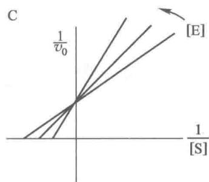

## 主要参考书目

1. 王镜岩, 朱圣庚, 徐长法. 生物化学教程. 北京: 高等教育出版社, 2008.

2. 陈惠黎, 李文杰. 分子酶学. 北京: 人民卫生出版社, 1983.

3. Berg J M, Tymoczko J L, Stryer L. Biochemistry. 7th ed. New York: W. H. Freeman and Company, 2012.

4. Garrett R H, Grisham C M. Biochemistry. 5th ed. Boston: Brooks/Cole, Cengage Learning, 2013.

5. Nelson D L, Cox M M. Lehninger Principles of Biochemistry. 4rd ed. New York: W. H. Freeman and Company, 2008.

(张庭芳)

## 网上资源

习题答案

自测题

## 第 8 章 酶作用机制和酶活性调节

## 一、酶的活性部位

## （一）酶活性部位的特点

通过各种研究证明,酶的特殊催化能力只局限在大分子的一定区域,也就是说,只有少数特异的氨基酸残基参与底物结合及催化作用。这些特异的氨基酸残基比较集中的区域,即与酶活力直接相关的区域称为酶的活性部位(active site)或活性中心(active center)。通常又将活性部位分为结合部位和催化部位,前者负责与底物的结合,决定酶的专一性;后者负责催化底物键的断裂形成新键,决定酶的催化能力。对需要辅酶的酶来说,辅酶分子,或辅酶分子上的某一部分结构,往往也是酶活性部位组成部分。虽然酶在结构、专一性和催化模式上差别很大,就活性部位而言有其共同特点。

（1）活性部位在酶分子的总体中只占相当小的部分，通常只占整个酶分子体积的 $1\% \sim 2\%$ ，酶分子中大多数氨基酸残基不与底物接触。已知几乎所有的酶都由100多个氨基酸残基所组成，相对分子质量在 $10\times 10^{3}$ 以上，直径大于 $2.5\mathrm{nm}$ 。而活性部位只有几个氨基酸残基所构成。酶分子的催化部位一般只由 $2\sim 3$ 个氨基酸残基组成，而结合部位的残基数目因不同的酶而异，可能是一个，也可能是数个。表8-1为某些酶活性部位的氨基酸残基。

表 8-1 某些酶活性部位的氨基酸残基

<table><tr><td>酶</td><td>氨基酸残基数</td><td>活性部位的氨基酸残基</td></tr><tr><td>核糖核酸酶 A(ribonuclease A)</td><td>124</td><td> $His_{12}, His_{119}, Lys_{41}$ </td></tr><tr><td>溶菌酶(lysozyme)</td><td>129</td><td> $Asp_{52}, Glu_{35}$ </td></tr><tr><td>胰凝乳蛋白酶(chymotrypsin)</td><td>241</td><td> $His_{57}, Asp_{102}, Ser_{195}$ </td></tr><tr><td>胰蛋白酶(trypsin)</td><td>223</td><td> $His_{57}, Asp_{102}, Ser_{195}$ </td></tr><tr><td>弹性蛋白酶(elastase)</td><td>240</td><td> $His_{57}, Asp_{102}, Ser_{195}$ </td></tr><tr><td>胃蛋白酶(pepsin)</td><td>348</td><td> $Asp_{32}, Asp_{215}$ </td></tr><tr><td>HIV-1 蛋白酶(HIV-1 proteinase)</td><td>99×2(二聚体)</td><td> $Asp_{25}, Asp_{25'}$ </td></tr><tr><td>木瓜蛋白酶(papain)</td><td>212</td><td> $Cys_{25}, His_{159}$ </td></tr><tr><td>枯草杆菌蛋白酶(subtilisin)</td><td>275</td><td> $His_{64}, Ser_{221}, Asp_{32}$ </td></tr><tr><td>碳酸酐酶(carbonic anhydrase)</td><td>259</td><td> $His_{94}-Zn-His_{96} \mid His_{119}$ </td></tr><tr><td>羧肽酶 A(carboxypeptidase A)</td><td>307</td><td> $Arg_{127}, Glu_{270}, Tyr_{248}, Zn^{2+}$ </td></tr><tr><td>醇脱氢酶(alcohol dehydrogenase)</td><td>374×2(二聚体)</td><td> $Ser_{48}, His_{51}, NAD^{+}, Zn^{2+}$ </td></tr></table>

（2）酶的活性部位是一个三维实体。酶的活性部位不是一个点，一条线，甚至也不是一个面。活性部位的三维结构是由酶的一级结构所决定且在一定外界条件下形成的。活性部位的氨基酸残基在一级结构上可能相距甚远，甚至位于不同的肽链上，通过肽链的盘绕、折叠而在空间结构上相互靠近。可以说没有酶的空间结构，也就没有酶的活性部位。一旦酶的高级结构受到物理因素或化学因素影响时，酶的活性

部位遭到破坏，酶即失活。

（3）酶的活性部位并不是和底物的形状正好互补的，而是在酶和底物结合的过程中，底物分子或酶

分子,有时是两者的构象同时发生了一定的变化后才互补的,这时催化基团的位置也正好在所催化底物键的断裂和即将生成键的适当位置。这个动态的辨认过程称为诱导契合(induced-fit),如图8-1所示。

（4）酶的活性部位是位于酶分子表面的一个空穴或裂缝（crevice）内。底物分子（或一部分）结合到裂缝内并发生催化作用。裂缝内是相当疏水的区域，非极性基团较多，但在裂缝内也含有某些极性的氨基酸残基，以便与底物结合并发生催化作用。其非极性性质在于产生一个微环境，提高与底物的结合能力有利于催化。在此裂缝内底物有效浓度可达到很高。

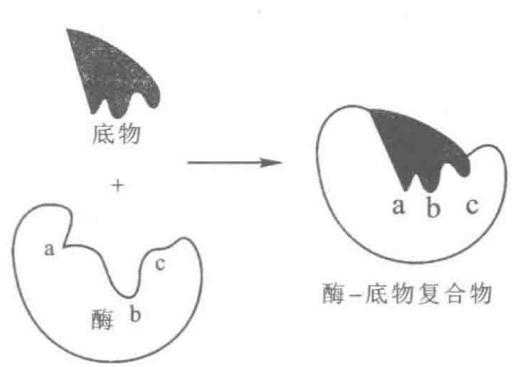  
图 8-1 底物和酶相互作用的诱导契合模型酶在与底物结合后改变了形状。活性部位在形状上只有在与底物结合后才与后者互补

（5）底物通过多种次级键较弱的力结合到酶上。酶与底物结合成 ES 复合物主要靠次级键：氢键、盐键、范德华力

(van der Waalsforce)和疏水相互作用(见第3章)。ES复合物的平衡常数可在 $10^{-8}\sim10^{-2}$ mol·L $^{-1}$ 范围内变化,相当于相互作用的自由能在-50.2\~-12.6kJ·mol $^{-1}$ 范围内变化。这些数值可与共价键的强度作个比较,共价键的自由能变化范围为 $-4.6\times10^{2}\sim-2.1\times10^{2}$ kJ·mol $^{-1}$ 。

（6）酶活性部位具有柔性(flexibility)或可运动性。邹承鲁对酶分子变性过程中构象变化与活性变化进行了比较研究，发现在酶的变性过程中，当酶分子的整体构象还没有受到明显影响之前，活性部位已大部分被破坏，因而造成活性的丧失。说明酶的活性部位相对于整个酶分子来说更具柔性，这种柔性或可运动性，很可能正是表现其催化活性的一个必要因素。

活性部位的形成要求酶蛋白分子具有一定的空间构象,因此,酶分子中其他部位的作用对于酶的催化作用来说,可能是次要的,但绝不是毫无意义的,它们至少为酶活性部位的形成提供了结构的基础。所以酶的活性部位与酶蛋白空间构象的完整性之间,是辩证统一的关系。

## （二）研究酶活性部位的方法

## 1. 酶分子侧链基团的化学修饰法

这种方法需要选择一种化合物,当其与被研究的酶作用时能专门与活性部位氨基酸残基侧链基团共价结合,然后将这个带标记化合物的酶水解,肽键被打开,但标记化合物共价键不被打开,因此可以分离得到带有标签的肽段,即可分析出活性部位的氨基酸残基,由此可确定活性部位在一级结构上的位置,并为X射线晶体结构分析法提供资料。

酶分子中可以被化学修饰的侧链基团很多，如巯基、羟基、咪唑基、氨基、羧基、吲哚基和胍基等。可以用做化学修饰的试剂也很多，目前已有70多种，但非常专一的并不多。

化学修饰法有一定的缺陷,因为化学修饰有可能使活性部位之外的某个氨基酸残基的侧链改变,而影响酶分子的正常空间结构,因而导致酶活性的丧失。为了排除这种可能,常常比较在底物或竞争性抑制剂存在与否进行化学修饰所得结果。如果底物或抑制剂存在下保护了活性部位,则一般可以认为该试剂是作用于活性部位的。

（1）非特异性共价修饰 某些化学试剂能和酶蛋白中氨基酸残基的侧链基团反应而引起共价结合、氧化或还原等修饰反应，使基团的结构和性质发生改变。如果某基团修饰后不引起酶活力的变化，可以初步认为，此基团可能是非必需基团。反之，如修饰后引起酶活力的降低或丧失，则此基团可能是酶的必需基团。有两点可作为化学试剂已经和活性部位基团结合的鉴别标准。其一是酶活力的丧失程度和修饰剂浓度成一定的比例关系，即修饰剂的浓度和酶活力丧失的速率常数 $k$ 成正比。其二是底物或与活性部位结合的可逆抑制剂可保护共价修饰剂的抑制作用，此法不但可以肯定某种基团是必需基团，还可以确信此

基团位于酶的活性部位。

（2）特异性共价修饰 某一种化学试剂专一地修饰酶活性部位的某一氨基酸残基，使酶失活。通过水解分离标记的肽段，即可判断出被修饰的酶活性部位的氨基酸残基。例如二异丙基氟磷酸（DFP）能专一性地与酶活性部位的丝氨酸残基的羟基共价结合，使酶活力丧失。例如，DFP与胰凝乳蛋白酶作用，标记在特定的丝氨酸残基上，形成二异丙基磷酰化酶（DIP-酶），酶活性完全丧失，反应式如下：

$$
\begin{array}{r l} & \mathrm {E - Ser - OH + (CH_ {3}) _ {2} CH - O} \\ & \mathrm {(CH_ {3}) _ {2} CH - O} \\ & \mathrm {\overset {\parallel} {O}} \end{array} \xrightarrow [ ]{\mathrm{P-F}} \mathrm {E\cdot Ser - O - P - O - CH(C H_ {3}) _ {2}} \\ & \text {   酶   } \quad \text {   DFP   } \quad \text {   DIP - E   }
$$

DFP 一般不与蛋白质反应,也不与胰凝乳蛋白酶原和变性的胰凝乳蛋白酶反应,它也不和天然胰凝乳蛋白酶活性部位 $Ser_{195}$ 以外的 27 个 Ser 结合,可见活性部位 Ser 处于一个特殊的结构中,对 DFP 敏感。由于 DFP 与 Ser-OH 形成的酯键结合牢固,当用 $6 \, mol \cdot L^{-1} HCl$ 对 DIP-酶进行部分水解,然后将水解产物进行分离,从中得到含有 DIP 基团的片段 (DIP-O-Ser-肽),分析该片段的氨基酸顺序,并与已知的胰凝乳蛋白酶的氨基酸顺序相比较。不仅知道该酶活性部位附近的氨基酸顺序,也可得知 DIP 标记在该酶分子的 $Ser_{195}$ 残基上。类似的工作对其他蛋白水解酶及酯酶——弹性蛋白酶、凝血酶、胰蛋白酶及乙酰胆碱酯酶等进行了研究,这些酶的活性部位都含有 Ser,具有相似的肽段。表 8-2 列举了一部分用 DFP 标记酶的 DIP-肽段的氨基酸顺序。从表中可以看出许多酶活性部位都含有丝氨酸,某些蛋白水解酶活性部位有一个共同的 Gly-Asp-Ser-Gly-Gly-Pro 顺序。

表 8-2 一些酶活性部位的氨基酸顺序

<table><tr><td>酶</td><td>氨基酸顺序</td></tr><tr><td>牛胰蛋白酶</td><td>......Ser · Cys · Gly ·Gly · Asp · Ser · Gly · Gly · Pro · Val......</td></tr><tr><td>牛胰凝乳蛋白酶</td><td>......Ser · Cys · Met ·Gly · Asp · Ser · Gly · Gly · Pro · Leu......</td></tr><tr><td>猪弹性蛋白酶</td><td>......Gly · Cys · Gln ·Gly · Asp · Ser · Gly · Gly · Pro · Leu......</td></tr><tr><td>猪凝血酶</td><td>......Asp · Ala · Cys · Glu ·Gly · Asp · Ser · Gly · Gly · Pro......</td></tr></table>

又如牛肝谷氨酸脱氢酶共含有30个Lys残基侧链，2,4,6-三硝基苯磺酸盐只作用于 $\mathrm{Lys}_{126}$ 侧链而引起酶失活，证明 $\mathrm{Lys}_{126}$ 是该酶活性中心的必需氨基酸残基。

（3）亲和标记( affinity labeling)法 上述特殊基团标记法往往专一性差,不太特异地标记活性部位。为了提高化学修饰剂对酶活性部位的专一性修饰作用,合成了一些与底物结构相似的共价修饰剂。这种修饰剂有两个特点:① 可以较专一地引入酶的活性部位,接近底物结合位点。② 具有活泼的化学基团可以与活性部位的某一基团结合形成稳定的共价键。因其作用机制是利用酶对底物的特殊亲和力将酶加以修饰标记,故称为亲和标记。亲和标记试剂又称“活性部位指示试剂”。用于胰凝乳蛋白酶和胰蛋白酶活性部位的亲和标记是两个非常成功的例子。对甲苯磺酰-L-苯丙氨酸乙酯(TPE)是胰凝乳蛋白酶的底物,而对甲苯磺酰-L-苯丙氨酰氯甲基酮(TPCK)是它的亲和标记试剂,结构相似。当胰凝乳蛋白酶与TPCK保温后,酶活力完全丧失,二者的结合是共价的与定量的。TPCK不与胰凝乳蛋白酶原,变性的胰凝乳蛋白酶也不和DIP-胰凝乳蛋白酶结合,可见该酶必须有空间结构完整的活性部位才能与TPCK结合。与TPCK已结合的酶,也不再与DFP反应,说明烷化作用发生在活性部位上。胰凝乳蛋白酶分子中有两个His残基(40,57),与TPCK烷化后经水解,分析其水解肽段,发现只是与 $His_{57}$ 结合,发生在 $N^{3}-(咪唑环)$ 上,说明 $His_{57}$ 是胰凝乳蛋白酶活性部位的一个氨基酸残基。TPE及TPCK结构式及修饰反应如下:

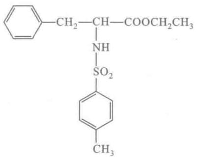  
对甲苯磺酰 - L - 苯丙氨酸乙酯 (TPE)

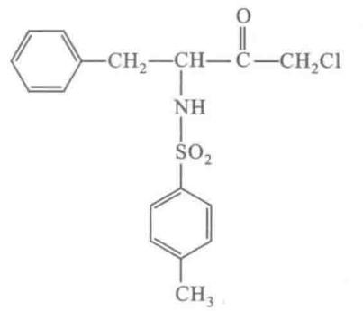  
对甲苯磺酰 -L-苯丙氨酰氯甲基酮
(TPCK)

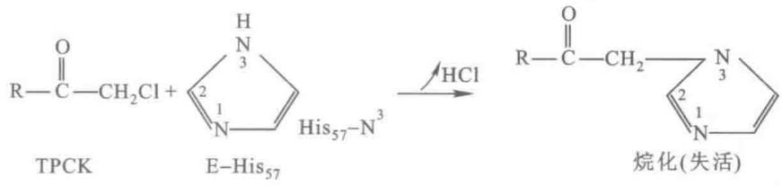

邹承鲁研究了酶必需基团的化学修饰和酶活性丧失的定量关系,他从统计学上考虑,根据不同情况得出一系列公式。根据这些公式,就可以对实验结果进行处理得出关于必需基团数的结论。邹的公式、方法和作图,现已成为国际上通过侧链基团化学修饰和酶活性丧失定量关系来确定必需基团数的主要方法。

## 2. 动力学参数测定法

活性部位氨基酸残基的解离状态和酶的活性直接相关，因此通过动力学方法求得有关参数后，就可对酶的活性部位的化学性质作出判断。溶液 $\mathrm{pH}$ 对酶活力有显著影响， $\mathrm{pH}$ 对表观米氏常数 $(K_{\mathrm{m}}^{\prime})$ 的影响可以反映酶-底物复合物的解离情况， $\mathrm{pH}$ 对 $V_{\max}^{\prime}$ 和 $K_{\mathrm{m}}^{\prime}$ 的影响反映了自由酶的解离情况，由此可以了解与酶活性有关的氨基酸残基的解离，便可知道哪个氨基酸残基与酶活性有关。例如RNase活性部位两个组氨酸残基（ $\mathrm{His}_{12}, \mathrm{His}_{119}$ ）就是用这个方法判断出的，并经过了X射线晶体结构分析研究和其他方法所证实。

## 3. X 射线晶体结构分析法

X 射线晶体结构分析法可以解析酶分子的三维结构，有助于了解酶活性部位氨基酸残基所处的相对位置与实际状态，以及与活性部位有关的其他基团。1965 年 D. Phillips 等人，首次用射 X 射线晶体结构分析法，以 0.2 nm 的水平测定了溶菌酶（lysozyme）的空间结构及其作用机制。通过溶菌酶的三维结构可以看出：溶菌酶活性部位有关氨基酸的排列位置；酶-底物复合物中，底物周围氨基酸的排列状况；根据被水解的糖苷键邻近氨基酸残基的分析，确定了溶菌酶的催化基团为 Glu $_{35}$ 和 Asp $_{52}$ 。再如，通过 X 射线晶体结构分析，表明胰凝乳蛋白酶活性部位由 Ser $_{195}$ 、His $_{57}$ 、Asp $_{102}$ 组成，这 3 个氨基酸残基联在一起形成一个“电荷中继网”（charge relay network），使 Ser $_{195}$ 的羟基具有非常高的亲核性。Ile $_{16}$ 是凝乳蛋白酶原转变为酶的关键，X 射线晶体结构分析表明，其作用可能是通过 Ile $_{16}$ 氨基和 Ser $_{195}$ 邻近的 Asp $_{194}$ 羧基形成静电键，促成电荷中继网的建立。

由于第三代同步辐射的出现和实际应用,使 X 射线晶体结构分析达到一个新的水平,至今已完成晶体结构分析的酶在 3000 种以上。显然,用 X 射线晶体结构分析方法研究酶的活性部位及结构和功能的关系已成为重要手段。

## 4. 定点诱变法

迄今为止，已有几百个酶的基因被克隆。根据蛋白质结构研究的结果，可以利用定点诱变（site-directed mutagenesis）技术，改变编码蛋白质基因中的DNA顺序，研究酶活性部位的必需氨基酸。例如1987年C.Craik等人将胰蛋白酶 $\mathrm{Asp}_{102}$ 诱变为 $\mathrm{Asn}_{102}$ ，突变体的 $k_{\mathrm{cat}}$ 比野生型低5000倍，突变体水解酯底物的活性仅是天然胰蛋白酶的万分之一，可见 $\mathrm{Asp}_{102}$ 对胰蛋白酶催化活性是必需的。再如，羧肽酶A中 $\mathrm{Tyr}_{248}$ 原认为催化所必需，1985年S.Gardell等人用寡核苷酸定位突变把 $\mathrm{Tyr}_{248}$ 的密码子(TAT)变为Phe的密码子(TTT)。含有这一基因的重组质粒在酵母中进行表达,发现突变酶的 $k_{cat}$ 值和天然酶一样,但其 $K_{m}$ 值高出6倍。这一结果说明 $Tyr_{248}$ 参与底物的结合,与催化活性无关。由于 DNA 重组技术的日趋成熟,目前越来越多地利用定点诱变技术研究酶的结构和功能的关系。

此外，质谱分析、旋光色散（ORD）、园二色性（CD）荧光偏振、拉曼光谱和核磁共振（NMR）等也成为酶蛋白三维结构研究的重要手段，在此不再赘述。

## 二、酶催化反应的独特性质

酶催化反应的某些独特性质为许多反应所共有,可概括如下:

（1）酶反应可分成两类，一类反应仅仅涉及电子的转移，这类反应的速率或转换数在 $10^{8}s^{-1}$ 数量级；另一类反应涉及到电子和质子两者或者其他基团的转移，它们的速率在 $10^{3}s^{-1}$ 数量级。大部分反应属第二类。

（2）酶的催化作用是由氨基酸侧链上的功能基团和辅酶为媒介的。主要的是 His, Ser, Cys, Lys, Glu 和 Asp 的侧链常常直接参加催化过程。辅酶或金属离子与酶协同在一起发挥作用，比只利用氨基酸侧链来说，为催化过程提供了更多种类的功能基团。将在第 13 章详细讨论。

（3）酶催化反应的最适 pH 范围通常是狭小的。除少数例外，最适 pH 接近于中性。

（4）除核酸酶、蛋白酶和水解黏多糖的酶外，一般的酶分子与它们的底物分子相比是大得多的。而酶活性部位通常只比底物稍大一些，这是因为在大多数情况下，只有活性部位围着底物。此外，一个大的酶分子结构对稳定活性部位的构象是必要的。

（5）酶除了具有进行催化反应所必需的活性基团外，还有别的特性，使上述反应的进行更有利，并使更复杂的多底物反应按一定途径进行，这些已超出了较简单催化剂的范畴。酶的复杂的折叠结构使这些作用成为可能。酶具有的4个主要有利条件是：

① 在活性部位存在 1 个以上的催化基团, 所以能进行协同催化;

② 存在有结合部位,因此底物分子可以以反应中固有的方位结合在活性部位附近;

③ 在有 2 个或 2 个以上底物分子参加反应的情况中, 存在着 1 个以上的底物分子结合部位;

④ 底物以某种方式被结合到酶分子上,使底物分子中的键产生张力,从而有利于过渡态复合物的形成。

通过对酶催化反应机制的实例介绍,就可以最具体地了解酶催化作用的上述特点。

## 三、酶促反应机制

在酶催化过程中,酶分子与底物分子相互作用,经过一系列化学变化,最后由底物生成产物。阐明酶催化过程中酶分子与底物分子的相互作用及其反应过程中键的裂解和新键形成的机理,即称为酶促反应机制。通过对酶促反应机制的研究,可进一步了解酶分子结构与催化功能的关系,以及酶催化作用具有催化效率高和专一性强的原因,为新酶分子的合理设计提供理论基础。

## （一）基元催化反应

酶的催化作用是由一些基元催化反应组成的,但是这些基元催化反应在酶的作用过程中又有其独特之处。基元催化是由某些基团或小分子催化的反应,包括酸碱催化、共价催化和金属离子催化等,它们也常见于有机化学中。

## 1. 酸碱催化 (acid-base catalysis)

酸碱催化是通过瞬时的向反应物提供质子或从反应物接受质子以稳定过渡态，加速反应的一类催化机制。在水溶液中通过高反应性的质子和氢氧离子进行的催化称为专一的酸碱催化（specific acid-base catalysis）或狭义酸碱催化；而通过 $\mathrm{H^{+}}$ 和 $\mathrm{OH^{-}}$ 以及能提供 $\mathrm{H^{+}}$ 及 $\mathrm{OH^{-}}$ 的供体进行的催化称为总酸碱催化

(general acid-base catalysis) 或广义酸碱催化。这两种酸碱催化类型通过图 8-2A 和 B 来区分，专一的酸碱催化的表观速率常数 ( $k_{obs}$ ) 仅依赖于溶液的 pH 而不受缓冲液的浓度影响；总酸碱催化的 $k_{obs}$ 除依赖于 pH 外，还与缓冲液的浓度成正比。

在生理条件下,因 $H^{+}$ 和 $OH^{-}$ 的浓度甚低,故体内的酶反应以总酸碱催化作用较为重要。在很多酶的活性部位存在几种参与总酸碱催化作用的功能基,如氨基、羧基、巯基、羟基、酚羟基

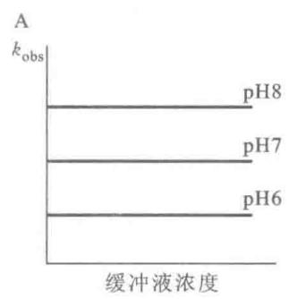

  
图 8-2 专一酸碱催化作用(A)和总酸碱催化作用(B)

及咪唑基，它们能在近中性 $\mathrm{pH}$ 的范围内，作为催化性的质子供体或受体，即作为Brφnsted酸或碱而参与总酸或总碱催化作用（表8-3）。总酸或总碱的催化可提高反应速率 $10^{2} \sim 10^{5}$ 倍。事实上，质子转移是最普通的生物化学反应。这类反应有：羰基的加成作用，酮基和烯醇的互变异构，肽和酯的水解以及磷酸和焦磷酸参与的反应等。

表 8-3 酶分子中可作为总酸碱催化的功能基团

<table><tr><td>氨基酸残基</td><td>广义酸基团(质子供体)</td><td>广义碱基团(质子受体)</td></tr><tr><td>Glu, Asp</td><td> $-COOH$ </td><td> $-COO^{-}$ </td></tr><tr><td>Lys, Arg</td><td> $-NH_{3}$ </td><td> $-NH_{2}$ </td></tr><tr><td>Tyr</td><td></td><td></td></tr><tr><td>Cys</td><td> $-SH$ </td><td> $-S^{-}$ </td></tr><tr><td>His</td><td>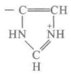</td><td> $-C=CH$  $|$  $HN$  $\backslash$  $C$  $H$ </td></tr><tr><td>Ser</td><td> $-OH$ </td><td> $-O^{-}$ </td></tr></table>

酸碱催化效率取决于总酸碱的解离常数(pK)，对于总酸催化作用，则：

$$
\lg k _ {\mathrm{a}} = C _ {\mathrm{A}} - \alpha (\mathrm{p} K _ {\mathrm{a}})\tag{8-1}
$$

对于总碱催化作用,则:

$$
\lg k _ {\mathrm{b}} = C _ {\mathrm{B}} - \beta (\mathrm{p} K _ {\mathrm{b}})\tag{8-2}
$$

其中 $k_{\mathrm{a}}$ 和 $k_{\mathrm{b}}$ 分别代表总酸催化和总碱催化的反应速率常数， $C_{\mathrm{A}}$ 和 $C_{\mathrm{B}}$ 为常数，是纵坐标上的截距，它的大小由反应类型、温度及溶剂系统等因素决定。 $\alpha$ 和 $\beta$ 为直线的斜率，称为Brφnsted系数（图8-3A和B），它们是衡量酸碱强度对反应速率影响的灵敏度指标。 $\alpha$ 或 $\beta$ 值的范围在0\~1之间。具有 $\alpha$ 或 $\beta$ 值接近1的反应对酸或碱的强度是最灵敏的。此时在水溶液中所有可能存在的组分中，只有 $\mathrm{H^{+}}$ 和 $\mathrm{OH^{-}}$ 能强得足够使反应速率显著提高，故反应速率只取决于溶液的 $\mathrm{pH}$ 。因此，具有 $\alpha$ 或 $\beta \approx 1$ 的总酸或总碱催化作用实际上是专一的酸碱催化作用。在另一方面，如果 $\alpha$ 或 $\beta$ 接近于0，则反应速率对催化剂的酸度或碱度几乎无关，因此具有 $\alpha$ 或 $\beta \approx 0$ 的一种总酸或总碱催化的反应实际上是未被酸或碱所催化的反应。上面式(8-1)及式(8-2)所表示的关系称为Brφnsted催化作用定律。

影响酸碱催化反应速率的因素有两个，即酸或碱的强度(pK值)及质子传递的速率。在表8-3所列的功能基中组氨酸咪唑基的解离常数 $pK_{a}$ 介于5.6\~7.0之间（由它在蛋白质分子中的环境而定），因此在接近于生物体液pH的条件下，即在中性条件下，有一半以酸形式存在，另一半以碱形式存在，即可作为质子供体，又可作为质子受体在酶反应中发挥催化作用。同时咪唑基接受质子和供出质子的速率十分迅速，其半衰期小于 $10^{-10}s$ 。由于咪唑基有如此特点，所以在很多蛋白质中His含量虽少，却占很重要地位。推测His很可能在进化过程中,不是作为一般的结构蛋白成分,而是被选择作为酶分子中的催化结构而保留下来的。

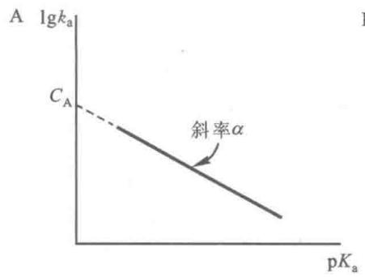  
图 8-3 Brφnsted 作图
A. 广义酸催化; B. 广义碱催化

  
图8-4 酶蛋白上的重要亲核基团

参与总酸碱催化作用的酶很多,例如溶菌酶、天冬氨酸蛋白酶类和丝氨酸蛋白酶类等。有关这些酶的酸碱催化机制,将在下一节中做详细讨论。

## 2. 共价催化 (covalent catalysis)

共价催化又称亲核催化（nucleophilic catalysis）或亲电子催化（electrophilic catalysis），在催化时，亲核催化剂或亲电子催化剂能分别放出电子或汲取电子并作用于底物的缺电子中心或负电中心，迅速形成不稳定的共价中间复合物，降低反应活化能，使反应加速。

酶蛋白氨基酸侧链提供各种亲核中心，图8-4表示了酶蛋白上最常见的3种亲核基团，即丝氨酸羟基、半胱氨酸巯基、组氨酸咪唑基。这些基团容易攻击底物的亲电中心，形成酶-底物共价结合的中间物。底物中典型的亲电中心，包括磷酰基、酰基和糖基（图8-5）。形成的共价中间物在随后步骤中被水分子或第二种底物攻击生成所需的产物。共价亲电催化也在包含辅酶产生的亲电中心观察到。值得注意的是，进行共价催化的大多数酶都具有乒乓动力学机制（见第7章）。

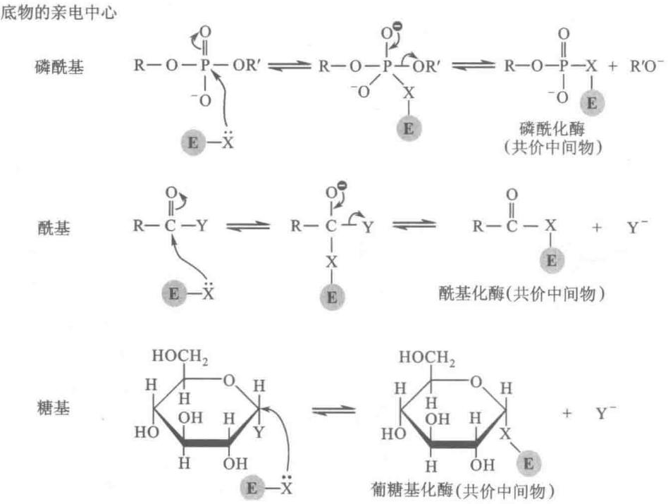  
图8-5 酶和底物形成共价结合的中间物  
在每一情形中，酶上的亲核中心(X:)攻击底物上的亲电中心

现已知 100 多种酶在催化过程中形成共价中间物, 表 8-4 列举了某些典型的例子。底物与酶分子中亲核基团分别形成酰基-丝氨酸、酰基-半胱氨酸、磷酸丝氨酸、磷酸组氨酸和西佛碱(Schiff base)。

表 8-4 形成共价 ES 中间物的一些酶  
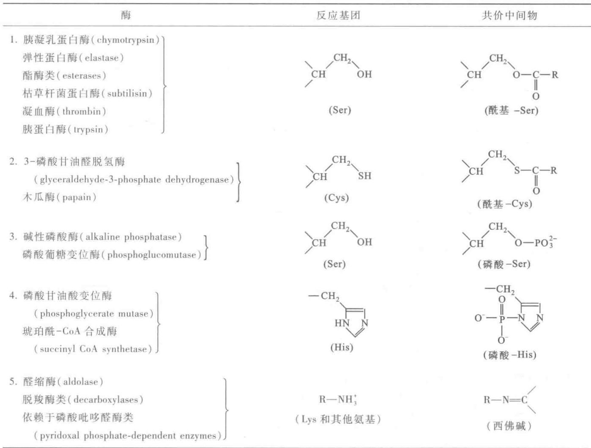

亲电催化与亲核催化相反,它是由亲电催化剂起催化反应的。亲电催化剂通常涉及产生亲电子中心的辅酶。以磷酸吡哆醛为辅酶的天冬氨酸转氨酶(asparate amino-transferase)和丙氨酸消旋酶(alanine racemase)等都可能是通过亲电子机制催化的。

## 3. 金属离子催化 (metal ion catalysis)

在所有已知的酶中,几乎 1/3 的酶催化活性需要金属离子,根据金属离子-蛋白质结合作用的大小将需要金属的酶分为两类:

（1）金属酶(metalloenzymes) 具有紧密结合的金属离子,多属于过渡金属离子如 $Fe^{2+}$ 、 $Fe^{3+}$ 、 $Cu^{2+}$ 、 $Zn^{2+}$ 、 $Mn^{2+}$ 或 $Co^{3+}$ 。

（2）金属-激活酶(metal-activated enzyme) 含松散结合的金属离子,通常为碱金属和碱土金属离子,如 $Na^{+}$ 、 $K^{+}$ 、 $Mg^{2+}$ 或 $Ca^{2+}$ 。

金属离子通常以 3 种方式参与催化作用:① 通过结合底物使其在反应中正确定向;② 通过金属离子氧化态的变化进行氧化还原反应;③ 通过静电作用稳定或屏蔽负电荷。下面举例讨论金属离子的催化作用。

金属离子通过电荷稳定性促进催化:金属离子的催化作用往往和酸的催化作用相似,但有些金属离子不止带一个正电荷,作用比质子要强。另外,不少金属离子有络合作用,并且在中性 pH 溶液中, $H^{+}$ 浓度很低,但金属离子也能以高浓度存在。如 $Cu^{2+}$ 和 $Ni^{2+}$ 催化二甲草酰乙酸脱羧,是被金属离子催化的非酶促反应例子: