  
图 10-8 甘油磷脂结构通式(A)和磷脂酰胆碱分子模型(B)

际上代表多种分子形式(molecular species)，其中每种形式都有独特的一套脂肪酸。分子形式的分布对不同的生物、同一种生物的不同组织、甚至同一细胞或同一组织中的不同磷酸甘油都是专一的。一般说，甘油磷脂C1位上连接的是 $C_{16}$ 或 $C_{18}$ 饱和脂肪酸，C2位上是 $C_{18}$ 或 $C_{20}$ 不饱和脂肪酸。除少数几个例外，脂肪酸和头基方面变化的生物学意义尚不清楚。几种常见的甘油磷脂及其头基醇的名称和X的结构式列于表10-4。

## 3. 甘油磷脂的一般性质

纯的甘油磷脂为白色蜡状固体。暴露于空气中由于多不饱和脂肪酸的过氧化作用，磷脂颜色逐渐变暗。甘油磷脂溶于大多数含少量水的非极性溶剂，但难溶于无水丙酮，用氯仿-甲醇混合液可从细胞和组织中提取磷脂。

在生理 pH 时, 甘油磷脂分子的磷酸基带 1 个负电荷 ( $pK_{a}^{\prime}=1$ 到 2); 乙醇胺或胆碱部分带 1 个正电荷; 丝氨酸部分带 1 个正电荷 ( $pK_{a}^{\prime}=9.2$ ) 和 1 个负电荷 ( $pK_{a}^{\prime}=2.2$ ); 肌肌醇和甘油基不带电荷。几种甘油磷脂分子的净电荷见图 10-10。因此磷脂属于两亲脂质, 是成膜分子, 在水中能形成双分子层的微囊 (图 10-29)。

甘油磷脂用弱碱水解产生脂肪酸盐和3-磷酰醇甘油（glycerol-3-phosphorylalcohol）。用强碱水解则生成脂肪酸盐、醇（XOH）和3-磷酸甘油。磷酸与甘油之间的键对碱稳定，但能被酸水解。

大多数细胞不断地降解和更换它们的膜脂。甘油磷脂中每一个可水解的键在溶酶体中都有一种专一的水解酶（图10-9）。A型磷脂酶（phospholipase）能除去甘油磷脂的两个脂肪酸中的一个，甘油磷脂的酯键和磷酸二酯键能被磷脂酶专一地水解。这些脂酶根据它们所水解的键（图10-9中箭头所指者）分别命名为磷脂酶 $A_{1}$ 、 $A_{2}$ 、C和D。

磷脂酶 $A_{1}$ 广泛分布于生物界；磷脂酶 $A_{2}$ 主要存在于蛇毒、蜂毒和哺乳类胰脏（酶原形式）中；磷脂酶 C 来源于细

图10-9 磷脂酶的专一性

菌及其他生物组织；磷脂酶 D 多存在于高等植物中。磷脂酶 $A_{1}$ 和 $A_{2}$ 分别专一地除去甘油磷脂中 sn-1 或 sn-2 碳上的脂肪酸，生成仅含一个脂肪酸的产物，称溶血甘油磷脂（lysophosphoglyceride）或溶血磷脂，如溶血磷脂酰乙醇胺。它们是体内甘油磷脂代谢的中间产物，但在细胞或组织中含量很小，如果浓度高，则将对膜造成毒害。因为溶血甘油磷脂是一种很强的表面活性剂，能使细胞膜如红细胞膜溶解。菱背响尾蛇（Crotalus adamanteus）和印度眼镜蛇（Naja naja）的蛇毒含磷脂酶 $A_{2}$ 。在印度眼镜蛇每年毒死数千人。磷脂酶常作为工具酶与薄层层析技术一起用于磷脂的结构分析。

## 4. 几种常见的甘油磷脂(表 10-4)

磷脂酰胆碱（phosphatidylcholine）也称卵磷脂（lecithin），系统名称为1,2-二酰基-sn-甘油-3-磷酸胆碱（1,2-diacyl-sn-glycero-3-phosphocholine）。磷脂酰胆碱和磷脂酰乙醇胺是细胞膜中最丰富的脂质之一（见表10-8）。胆碱成分是一种季胺离子，碱性极强。胆碱具有重要的生物学功能，是代谢中的一种甲基供体；在某些条件下是膳食中必需的，因此有人把它归为B族维生素。乙酰化的胆碱，称乙酰胆碱（acetylcholine）， $\mathrm{(CH_3)_3N^+CH_2CH_2OCOCH_3}$ ，是一种神经递质，与神经冲动的传导有关。卵磷脂和胆碱被认为有防止脂肪肝形成的作用。卵磷脂在蛋黄和大豆中特别丰富，食品工业中广泛用作乳化剂。医药用卵磷脂主要是作为大豆油精炼过程中的副产品获得。

表 10-4 几种甘油磷脂的极性头基及其静电荷

<table><tr><td>甘油磷脂名称</td><td>HO-X 的名称</td><td>极性头基中-X 的结构</td><td>极性头基净电荷(pH=7)</td></tr><tr><td>磷脂酸</td><td>——</td><td>-H</td><td>-2</td></tr><tr><td>磷脂酰乙醇胺</td><td>乙醇胺</td><td></td><td>0</td></tr><tr><td>磷脂酰胆碱</td><td>胆碱</td><td>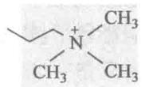</td><td>0</td></tr><tr><td>磷脂酰丝氨酸</td><td>丝氨酸</td><td>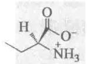</td><td>-1</td></tr><tr><td>磷脂酰甘油</td><td>甘油</td><td></td><td>-1</td></tr><tr><td>磷脂酰肌醇-4,5-二磷酸( $PIP_2$ )</td><td>[肌]肌醇-4,5-二磷酸</td><td></td><td>-4 $^{\text{1}}$ </td></tr><tr><td>心磷脂</td><td>磷脂酰甘油</td><td></td><td>-2</td></tr></table>

① 注：磷脂酰肌醇-4,5-二磷酸中的磷酸酯，每个约有-1.5个电荷；它们的—OH基中的一个仅部分电离。

磷脂酰乙醇胺（phosphatidylethanolamine）也称脑磷脂（cephalin）；后一名称有时也包括磷脂酰丝氨酸在内。含氮碱部分是乙醇胺，也称胆胺（colamine）。磷脂酰乙醇胺中sn-1位上的脂[肪]酰基也和卵磷脂中一样，主要是棕榈酸和硬脂酸，但sn-2位含有较多的PUFA，如花生四烯酸(20：4)或DHA(22：6)。

磷脂酰丝氨酸(phosphatidylserine)常见于血小板的膜中,也称血小板第三因子。当组织受损血小板被激活时,膜中的磷脂酰丝氨酸由内侧转向外侧,作为表面催化剂与其他凝血因子一起致使凝血酶原活化。

磷脂酰肌醇-4,5-二磷酸（phosphatidylinositol-4,5-bisphosphate; $\mathrm{PIP}_2$ ）广泛存在于真核细胞的质膜中，它是两个胞内信使：肌醇-1,4,5-三磷酸（ $\mathrm{IP}_3$ ）和1,2-二酰基-sn-甘油（DAG）的前体，这些信使参与激素信号的放大（见第14章和第28章）。

磷脂酰甘油（phosphatidylglycerol）在细菌细胞膜中含量丰富。磷脂酰甘油是心磷脂头基的X部分。

双磷脂酰甘油（diphosphatidylglycerol）最先在心肌线粒体膜和细菌细胞膜中找到，因此又称心磷脂（cardiolipin）。它是由两个磷脂酰甘油的磷酸部分通过一个甘油分子共价连接而成（表10-4）。

## （二）某些甘油磷脂含醚键连接的脂肪酰链

某些动物组织和某些单细胞生物富含醚甘油磷脂(ether glycerophospholipid)或称醚脂(ether lipid)。醚脂中甘油骨架上的两个脂[肪]链中的一个是以醚键而不是酯键相连的。醚键连接的脂链可以是饱和的，如烷基醚脂中，也可以在脂链的C1和C2之间含有一个双键，如缩醛磷脂(plasmalogen）（图10-10A）。常见的缩醛磷脂中头基醇X包括胆碱、乙醇胺或丝氨酸。脊椎动物的心肌组织特别富含醚脂，心脏磷脂

的约一半是缩醛磷脂,其中又以缩醛磷脂酰胆碱(phosphatidal choline)含量为多。此外,嗜盐菌、纤毛原生生物和某些无脊椎动物的膜也含有很高比例的缩醛磷脂。醚脂在这些膜中的功能意义尚不清楚;也许它们的抗磷脂酶性质在某些作用中有重要意义,因为此酶能从膜脂中断裂酯键连接的脂肪酸。

至少有一种醚脂，称血小板活化因子（platelet-activating factor, PAF），是一种强力的分子信号，在组织中它的浓度只要达到 $10^{-12} \mathrm{~mol} / \mathrm{L}$ 就会发生效应。在PAF中甘油的 $sn - 1$ 位是 $O-$ 连接(醚连接)的烷基，十六烷基； $sn - 2$ 位是乙酰

  
图 10-10 缩醛磷脂(A)和血小板活化因子(B)

基(图 10-10B)，这使 PAF 比大多数的甘油磷脂和缩醛磷脂更易溶于水。PAF 是从称为嗜碱性粒细胞 (basophil) 的白细胞中释放的，它促进血小板凝集和血小板释放 5-羟色胺（一种血管收缩剂）。PAF 对肝、平滑肌、心、子宫和肺等组织还有多种影响，并在炎症和过敏反应中起着重要作用。

## （三）叶绿体含半乳糖脂和硫脂

植物细胞中占优势的脂质是第二类膜脂：甘油糖脂（glyceroglycolipid）也称糖基甘油酯（glycoglyceride）它们常与鞘糖脂一起归于糖脂类（glycolipids）。甘油糖脂是由1,2-二酰甘油sn-3位上的羟基与糖基（例如一个或两个半乳糖残基）以糖苷键连接而成。最常见的就是半乳糖脂（galactolipid），如单半乳糖二酰甘油（monogalactosyldiacylglycerol；MGDG）和二半乳糖二酰甘油（DGDG）（图10-11）。甘油糖脂主要存在于植物界和微生物中。植物叶绿体的类囊体膜（内膜）含有大量的半乳糖脂；它们占维管植物的总膜脂的70%\~80%，因此可能是生物圈中最丰富的膜脂。磷酸盐经常是土壤中限制性的植物营养素，也许为保存磷酸盐以用于更关键角色的进化压力，选择制造无磷酸脂质的植物。甘油糖脂也出现于哺乳类，但分布不普遍，主要存在于睾丸和精子的质膜中。植物细胞膜也含有硫脂（sulfolipid），其中一个磺基化的葡萄糖残基以糖苷键与二酰基甘油连接；像甘油磷脂中的磷酸基，此磺酸基也带有一个负电荷（图10-11）。

  
单半乳糖二酰甘油(MGDG)

  
二半乳糖二酰甘油(DGDG)

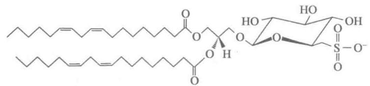  
6-磺基-6-脱氧- $\alpha$ -D-葡糖吡喃二酰甘油(一种硫脂)  
图 10-11 叶绿体类囊体膜的半乳糖脂和硫脂

## （四）古菌具有独特的膜脂

生活在极端条件——高温(沸水)、低 pH、高离子强度等——的生态位(niche)的某些古菌具有含长链(32 碳)分支(8 个甲基)烃的膜脂,烃的每一末端跟甘油连接(图 10-12)。这些连接都是通过醚键完成的;醚键对低 pH 和高温下的水解比细菌和真核细胞中存在的酯键要稳定得多。在完全伸展的状态,这些古菌脂质的长度是磷脂和鞘脂的两倍,能跨过质膜的整个厚度。在伸展分子的每一端是一个由甘油和甘油磷酸基或糖基连接而成的极性头。此类化合物的一般名称,甘油二烷基甘油四醚(glycerol dialkyl glycerol tetraether, GDGT),反映了它们的独特结构。古菌中脂质甘油部分的立体异构体与细菌和真核细胞中的不同,在古菌中甘油中央的碳是 S 构型,细菌和真核细胞中的是 R 构型(图 10-7)。

  
图10-12 在某些古菌中发现的一种特殊膜脂

## （五）鞘脂是鞘氨醇的衍生物

鞘脂(sphingolipid)也有1个极性头基和2个非极性尾部,但与甘油磷脂和甘油糖脂(如半乳糖脂)不同,它不含甘油成分。鞘脂是由1分子的长链( $C_{18}$ )氨基醇——鞘氨醇(sphingosine;4-sphingenine)或其衍生物,1分子长链脂肪酸和1分子极性头基组成。极性头基在鞘磷脂中通过磷酸二酯键被连接,在鞘糖脂中通过糖苷键被连接。鞘氨醇(图10-13)的C1、C2和C3携有3个官能团(分别是—OH、—NH $_{2}$ 和—OH)结构上很像甘油磷脂中甘油的3个羟基。脂肪酸通过酰胺键与鞘氨醇C2上的—NH $_{2}$ 基连接,形成的化合物称神经酰胺(ceramide,Cer),后者在结构上类似于二酰甘油,是所有鞘脂(鞘磷脂和鞘糖脂)的结构母体(图10-13A)。作为神经酰胺衍生物的鞘脂,根据其极性头基的不同,可分为两类:鞘磷脂和鞘糖脂。

  
系统名称：反式-D-赤藓糖型-2-氨基-4-十八碳烯-1,3-二醇

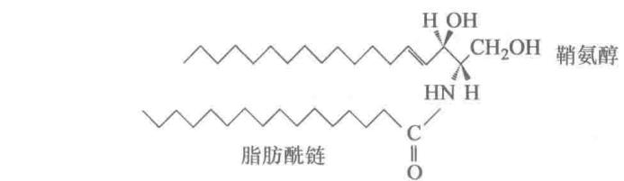  
图10-13 鞘氨醇和神经酰胺的结构

鞘磷脂(sphingomyelin)是在神经酰胺的C1位上含磷酸胆碱或磷酸乙醇胺作为它的极性头基，因此跟甘油磷脂一起被归于磷脂类。诚然，鞘磷脂在一般性质、三维结构以及极性头基没有净电荷等方面（图10-14）都和磷脂酰胆碱和磷脂酰乙醇胺相似。鞘磷脂存在于动物细胞的质膜，特别是髓鞘（延展的质膜)中。髓鞘(myelin)是一种膜性鞘,它包围某些神经元并使之绝缘,鞘磷脂因之而得名。

  
图 10-14 A. 鞘磷脂结构通式; B. 胆碱鞘磷脂的空间填充模型

鞘糖脂(glycosphingolipid)主要存在于质膜的外表面;它们具有一个通过糖苷键直接连接于神经酰胺C1位—OH基的单糖或寡糖,但不含磷酸基。根据糖基是否含有唾液酸或硫酸成分,鞘糖脂又可分为中性鞘糖脂(或称中性糖脂)和酸性鞘糖脂(包括硫苷脂和神经节苷脂)。

中性糖脂(neutral glycolipid)，它们的糖基不含唾液酸成分，在pH 7时不带电荷。常见的糖基有半乳糖、葡萄糖等单糖，或二糖、三糖等寡糖。第一个被发现的鞘糖脂是由一个半乳糖与神经酰胺连接而成的半乳糖基神经酰胺(galactosylceramide)；因为最先是从人脑中获得，所以又称脑苷脂(cerebroside)或半乳糖脑苷脂(galactocerebroside)(图10-15A)。现已知脑苷脂除半乳糖脑苷脂，Gal(β1→1)Cer，外，还有葡萄糖脑苷脂(glucocerebroside)，Glc(β1→1)Cer；前者是神经组织中的细胞质膜特有的，后者存在于非神经组织的细胞质膜中。红细胞糖苷脂(globoside)也是中性鞘糖脂，极性头基是寡糖链，单糖单位一般是D-Glc、D-Gal或D-GalNAc，例如乳糖基神经酰胺Gal(β1→4)Glc(β1→1)Cer。ABO血型的细胞表面抗原物质(O抗原、A抗原和B抗原)也是鞘糖脂，是由各自的抗原决定簇O、A和B(表9-4)与乳糖基神经酰胺共价连接而成的五糖基神经酰胺或六糖基神经酰胺(图10-15B)(也发现这些鞘糖脂的寡糖头基相应地与O、A和B血型个体的一些血中蛋白质连接)；由于这些糖脂含有岩藻糖，因此也称它们为岩藻糖脂(fucolipid)。鞘糖脂的疏水尾部伸入膜的脂双层，极性糖基露在细胞表面，它们不仅是与血型抗原而且与

  
图10-15 几种鞘糖脂的化学结构

组织和器官的特异性,细胞-细胞识别等有关。

硫苷脂(sulfatide)是鞘糖脂的糖基被硫酸化形成的。最简单的硫苷脂是硫酸脑苷脂(cerebroside sulfate)(图10-15A)。已分离到的硫苷脂有几十种。它们广泛地分布于哺乳动物的各器官中，以脑中含量最为丰富。硫苷脂可能与血液凝固和细胞黏着有关。

鞘脂(sphingolipid)也有极性头基和非极性尾部,但与甘油磷脂不同,它不含甘油成分。

神经节苷脂(ganglioside)也称唾液酸鞘糖脂,是最复杂的一类鞘脂,它们以寡糖链作为极性头基。在寡糖链内部的或末端的半乳糖残基上常以( $\alpha2\rightarrow3$ )糖苷键连接上一个或多个N-乙酰神经氨酸(NeuNAc),它是一种唾液酸,也经常简单地称它为唾液酸(Sia)。唾液酸使神经节苷脂在pH 7时带负电荷,这是它们与红细胞糖苷脂不同的地方。唾液酸鞘糖脂的命名是头一个字母G代表神经节苷脂,第二个字母M、D、T和Q分别表示含1、2、3和4个唾液酸的神经节苷脂,最后的数字1、2、3等表示糖链的序列不同(图10-15C)。神经节苷脂在神经系统特别是神经末梢中含量丰富,种类很多。它们可能在神经冲动传递中起重要作用。

## （六）细胞表面上的鞘脂是生物识别的位点

在一个多世纪前医学化学家 Johann Thudichum 发现鞘脂时,鞘脂的生物学作用还是像“狮身人面像 (Sphinx)”一样的不可思议,因此他把这些化合物命名为 sphingolipid(鞘脂)。在人体的细胞膜中至少已有 60 种不同的鞘脂被鉴定出。其中许多是在神经元的质膜中特别丰富的,某些显然是细胞表面上的识别位点,但至今只有少数几种鞘脂的专一功能被发现。有些鞘脂的糖质部分是定义人的血型的,并因此可以确定输血时一个人能够安全接受的血型(图 10-15B)。

神经节苷脂集中在细胞的外表面，在这里它们提供给胞外分子或相邻细胞的表面以识别点。质膜中神经节苷脂的种类和数量在胚胎发育期间发生剧烈变化。肿瘤形成诱导神经节苷脂新组分的合成，并发现了一种专一的神经节苷脂在很低浓度时就能诱导培养的神经元肿瘤细胞的分化。各种神经节苷脂的生物学作用的研究方兴未艾。

神经节苷脂能被溶酶体的一套酶降解,这些酶催化逐步除去单糖残基,最后生成神经酰胺。这些水解酶的任一种遗传缺失都会导致细胞中神经节苷脂的积累,带来严重的医学后果。

## （七）类固醇具有四个稠合的碳环

类固醇(steroid)中有一大类称为固醇或甾醇(sterol)的化合物, 是一类膜结构脂质, 存在于大多数真核细胞的膜系统中。这类膜脂的特征结构是一个由4个稠环组成的类固醇核, 它在生物体内是由2-碳乙酸开始, 经5-碳异戊二烯单位(isoprene subunit)合成的(第24章)。除了作为膜的结构成分外, 固醇还是某些具有特异生物活性的产物——活性脂质(见下一节)——的前体, 例如类固醇激素是调节基因表达的强力生物学信号。

## 1. 类固醇核的结构

类固醇核的结构以环戊烷多氢菲(perhydrocyclopentanophenanthrene)为基础,如图10-16所示,它是由3个六碳环(A、B、C环)和1个五碳环(D环)稠合而成。在环戊烷多氢菲的A和B环之间和C和D环之间各有一个甲基(C18和C19),称为角甲基;带有角甲基的环戊烷多氢菲称为类固醇核或甾核(steroid nucleus),它是类固醇化合物的母体。甾核的碳原子编号从A环开始,接着是B、C和D环。

类固醇的结构特点:①甾核的 C3 上常为

  
图10-16 环戊烷多氢菲和甾核的结构

羟基或酮基；② C17 上可以是羟基、酮基或其他各种形式的侧链；③ C4 和 C5 之间及 C5 和 C6 之间常是双键；④ A 环在某些化合物如雌酮 (estrone) 中是苯环，这些类固醇无 C19（角甲基）。

如图 10-17 所示甾核中 3 个六碳环可采取无张力的椅式构象(图右边)，但跟简单的环己烷或吡喃糖环不同，固醇的六碳环不能发生椅-椅互换(环转向)(见图 9-9)。甾核的构象基本上是一个刚性的平面。在固醇中 A 环和 B 环的稠合(A-B)可以是顺式，也可以是反式的；但其他环的稠合(B-C,C-D)都是反式的；这些稠环不允许绕 C—C 键旋转。反式类固醇(如胆甾烷醇)中，C10 上的角甲基(C19)伸向分子平面的上方(称 $\beta$ 取向)，在透视式(图左边)中用实楔形键表示；C5 位上的氢原子伸向分子平面的下方(称 $\alpha$ 取向)，用虚楔形键(或虚线键)表示。A-B 顺式类固醇(如粪固醇)中，C10 上的角甲基和 C5 上的氢原子都伸向分子平面的上方( $\beta$ 取向)。这两种类固醇分子都比较长而扁平，两个角甲基直立地伸向分子平面的上方。类固醇分子平面上的取代基可能是直立的，也可能是平伏的。一般说，由于空间上的原因平伏取代比直立取代稳定；例如胆甾烷醇(及胆固醇)C3 上的羟基是平伏取代的(图 10-17,右上方构象式中)。

  
胆甾烷醇(A-B反式二氢胆固醇)

  
粪甾醇(A-B顺式二氢胆固醇)  
图 10-17 固醇的立体化学(左边)和构象式(右边)

## 2. 胆固醇和其他动物固醇

固醇化合物的结构特点是在甾核的 C3 上有一个 $\beta$ 取向的羟基，C17 上有一个含 8 到 10 个碳原子的烃侧链。大多数真核生物都能合成固醇，并存在于它们的膜系统中；但细菌不能合成固醇，只有少数几种细菌能把外源的固醇结合到它们的细胞膜中。

胆固醇(cholesterol)在脑、肝、肾和蛋黄中含量很高,它是动物组织中最常见的一种动物固醇(zoosterol)。此外还有胆甾烷醇(cholestanol)也称二氢胆固醇和粪甾醇(coprostanol)它是二氢胆固醇的异构体(图10-17),以及羊毛固醇(lanosterol)(图10-24)和7-脱氢胆固醇等也是动物固醇。胆固醇的化学结构和分子模型如图10-18所示。胆固醇也是一种两亲分子,但它的极性头基(C3上的羟基)是弱小的,而非极性烃体(甾核和C17上的烷烃侧链)是大而刚性的平面;伸展的胆固醇约为16-碳脂肪酸的长度。胆固醇的两亲性质使它对膜中脂质的物理状态具有调节作用(见本章后面)。胆固醇主要参与动物细胞膜的组成,但它也是血中脂蛋白复合体的成分之一,并与动脉粥样硬化斑块的形成有关。胆固醇还是类固醇激素、维生素D和胆汁酸的前体,例如存在于皮肤中的7-脱氢胆固醇在紫外线作用下转化为维生素 $D_{3}$ (第13章)。

胆固醇除人体自身合成外，尚可从膳食中获取。胆固醇既是生理必需的，但过多时又会引起某些疾病；例如胆结石症的胆石几乎是胆固醇的晶体，又如冠心病患者血清总胆固醇含量很高，超过正常值(3.10\~5.70 mmol/L)上限。因此必须控制膳食中的胆固醇量。

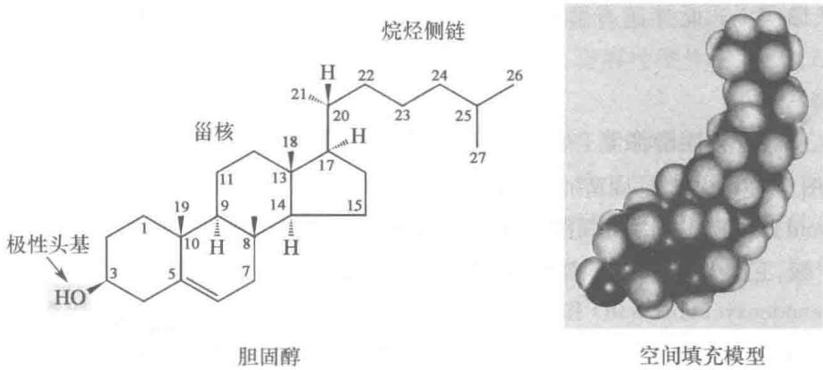  
图 10-18 胆固醇的化学结构和立体模型

自 1784 年从胆石中提取出胆固醇以来,因致力于围绕胆固醇这种生物小分子的研究,已有十几位学者获得诺贝尔奖,足见胆固醇在生物学和医学上的重要性。

## 3. 植物固醇和真菌固醇

植物很少含胆固醇，但含有其他固醇，称植物固醇（phytosterol）。其中最丰富的是 $\beta-$ 谷固醇（ $\beta-$ sitosterol），存在于小麦、大豆等谷物中。 $\beta-$ 谷固醇的结构几乎跟胆固醇一样，只是在C17上的侧链是 $C_{10}$ 不是 $C_8$ ；因为在侧链C24位连有一个 $\beta$ 取向的乙基（C24是手性碳，属 $R$ 构型），所以也称24-乙基胆固醇。常见的植物固醇还有豆固醇（stigmasterol），菜油固醇（campesterol）等（图10-19）。

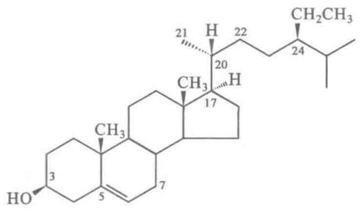

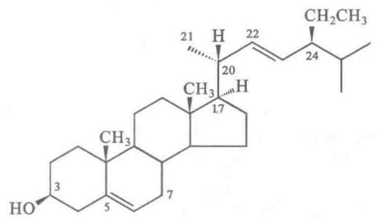  
豆固醇（24β-乙基-5,22-胆甾二烯-3β-醇）

$\beta-$ 谷固醇(24 $\beta-$ 乙基胆固醇)  
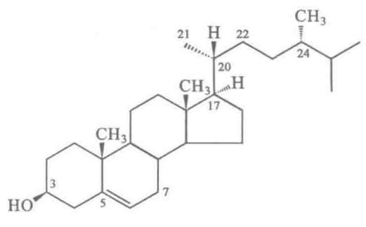  
菜油固醇（24α-甲基-5-胆甾烯-3β-醇）

  
麦角固醇（24β-甲基-5,7,22-胆甾三烯-3β-醇）  
图 10-19 几种植物固醇和真菌固醇

植物固醇很少被人的肠黏膜细胞吸收，并能抑制胆固醇的吸收。开发降低胆固醇用的植物固醇类药物，不仅与这些固醇本身的结构有关，而且取决于投药的剂型。例如谷固醇在人肠道内少量被吸收，但它的饱和类似物，谷甾固醇（sitostanol），则完全不被吸收。此外，植物固醇在抑制胆固醇方面，以可溶性微团形式投药比固体结晶形式投药更为有效。

真菌类如酵母和麦角菌(Claveceps)产生的麦角固醇(ergosterol)也是维生素D原,经加工处理可以转变成维生素 $D_{2}$ （第 13 章）。此外还有酵母产生的酵母固醇（zymosterol），即 8,24-胆甾二烯-3β-醇，及其他固醇。

## 4. 固醇衍生物

从胆固醇衍生来的有类固醇激素(第14章)、维生素 $D_{3}$ (第13章)和胆汁酸;植物中的强心苷配基和某些皂苷的配基(图9-24)也都是固醇衍生物。

胆汁酸(bile acid)是在肝内由胆固醇直接转化而来。人体内每天合成胆固醇1\~1.5g，其中0.4\~0.6g在肝内转变为胆汁酸，它是机体内胆固醇的主要代谢终产物。人胆汁中含3种胆汁酸：胆酸(cholic acid)、鹅[脱氧]胆酸(chenodeoxycholic acid)和脱氧胆酸(deoxycholic acid)。胆酸和鹅胆酸是在肝中合成的，称为初级胆汁酸；脱氧胆酸是胆酸在肠道中经细菌7-脱羟作用衍生而来的，称为次级胆汁酸。由于在肠道内胆汁酸被重吸收并通过肠肝循环(enterohepatic circulation)，初级和次级胆汁酸均在胆汁中出现。这些胆汁酸的结构见图10-20A。已证实，胆汁酸属A-B顺式类固醇（图10-17），C3、C7和C12位上的羟基均为α取向，C10和C13上的两个角甲基为β取向，羧基伸向羟基一侧，因而胆汁酸分子一个面是亲水的，另一个面是疏水的（图10-20B）。胆汁酸是一种去污剂，具有增溶作用；脱氧胆酸和胆酸都是实验室里用来增溶膜蛋白的重要试剂。

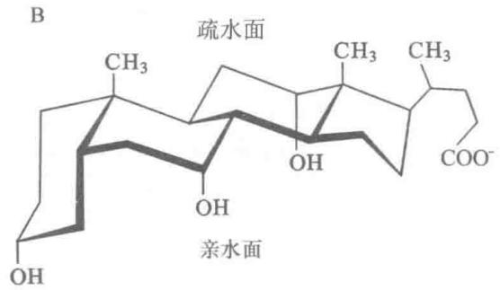

  
图10-20 胆汁酸和结合胆汁酸的结构

在肝中胆汁酸的羧基通过酰胺键与牛磺酸(taurine)或甘氨酸连接,分别生成胆汁酸的牛磺结合物或甘氨结合物,如牛磺胆酸(taurocholic acid)和甘氨胆酸(glycocholic acid)(图10-20C)。这种结合物是胆汁酸的主要形式。胆汁盐是结合物的钠盐或钾盐,它们是很强的去污剂,能溶于油-水界面处,其疏水面与油脂接近,亲水面与水接触,使油脂乳化,便于水溶性脂酶发挥作用,因而促进肠道中油脂和脂溶性维生素的消化吸收。

## 三、活性脂质——作为信号、辅因子和色素

前面我们考虑了两类按功能分类的脂质:贮存脂质和膜结构脂质,它们是细胞的主要成分;膜脂占大多数细胞干重的5%\~10%;贮脂占脂肪细胞质量的80%以上。一般说,这些脂质在细胞中担当比较“被动的”角色。还有另一类脂质——活性脂质,它们的含量虽不多,但在代谢过程中作为代谢物和信使起“主动的”作用。下面介绍几种有代表性的生物活性脂质：类二十烷酸、作为胞内信使的磷脂酰肌醇和鞘氨醇衍生物、类固醇激素、类异戊二烯化合物（如植物挥发性信号分子，脂溶性维生素A、D、E和K，泛醌和质体醌，植物色素和多萜醇）和缩酮化合物等。

活性脂质从化学本质和生物功能上看,可谓是多种多样。但在生物体内它们都是由乙酸(以乙酰-CoA形式)作为最初前体合成的。类萜和类固醇是由中间物5-碳异戊二烯单位缩合而成;缩合中出现的第一个固醇(羊毛固醇)是由30-碳的萜(鲨烯)环化而来,因此羊毛固醇是其他固醇的前体。详细的合成途径见第24章。

## （一）类二十烷酸是局部性的激素

类二十烷酸(eicosanoid; eikosi, 希腊文, “二十”)是由20-碳PUFA(至少含三个双键)衍生而来的, 因为它们都含有20个碳原子, 因此得名。这些化合物包括几类信号分子: 前列腺素、凝血噁烷和白三烯; 人和哺乳动物的很多组织和细胞都能合成它们。合成的前体主要是花生四烯酸(20:4), 少量是 $\gamma$ -高亚麻酸( $\gamma$ -homolinolenic acid; $20:3\Delta^{8,11,14}$ ) 和 EPA(20:5); 当细胞受到某些外来信号作用时 (如组织损伤), 膜磷脂释放出花生四烯酸。前列腺素和凝血噁烷是经环加氧酶(cyclooxygenase)途径或称前列腺素 $\mathbf{H}_2$ 合酶(PGH $_2$ synthase)途径产生; 白三烯是经脂加氧酶(lipoxygenase)途径合成; 关于类二十烷酸的生物合成细节见第24章。类二十烷酸是体内的局部性激素(local hormone), 效应一般局限在合成部位的附近, 在很低浓度(n mol/L 到 p mol/L 数量级)时则能起作用, 半寿期( $t_{1/2}$ )只有几十秒到几分钟, 同一物质在不同的组织中可以产生不同的效应。

前列腺素（prostaglandin, PG）是瑞典学者 S. Bergstrom 和 B. Samuelsson 最先从前列腺的脂质提取物中分离出来，并测定了它的结构。这种物质被注射到动物体内时，能引起平滑肌收缩和血压下降。因为当时以为这种物质是前列腺（prostatic gland）分泌的，1930 年代瑞典生理学家 U. S. von Euler 称它为前列腺素。后来证明这类物质广泛地分布于人和动物组织中。最初被分离的两个前列腺素分别称为前列腺素 E 和前列腺素 F，因为前者优先溶于乙醚（E；ether）而后者溶于磷酸盐缓冲液（F；fosfat，瑞典文，“磷酸盐”）；现在常分别用缩写符号 PGE 和 PGF 来表示。由一个饱和五元环和两条侧链组成的二十烷酸称前列腺烷酸（prostanoic acid），后者可看作是前列腺素类的母体化合物（图 10-21）。天然前列腺素中已发现 8 种不同类型的取代环，分别用 A、B、D、E、F、G、H 和 I 来表示。PGA 和 PGB 在环的 C9 位上有一个酮基和一个双键（前者在 C10 和 C11 之间，后者在 C12 和 C8 之间）；PGD 在 C9 有一个羟基，C11 一个酮基；PGE 与之相反，在 C9 有一个酮基，C11 一个羟基；PGF 在 C9 和 C11 各有一个羟基；PGG 和 PGH 具有相同的戊烷环结构——内过氧化物（endoperoxide），它们的不同仅在侧链 C15 上的取代基，PGG 取代的是一个过氧羟基（—OOH），PGH 是一个羟基；PGI 具有一个双环结构，环戊烷环 C9 上的氧与侧链的 C6 相连形成第二个五元环。每种类型的前列腺素又含多种亚类： $PGE_{1}$ 、 $PGE_{2}$ 、 $PGF_{1}$ 等。亚类名称（如 $PGF_{2\alpha}$ ）中，右下标的数字指环外两条侧链上碳-碳双键的数目，希腊字母 α 表示五碳环中 C9 上—OH 基的空间取向（α 取向）；希腊字母仅出现于 F 类，天然存在的 F 类前列腺素都是 α 构型，即 $F_{\alpha}$ 。几种常见的类二十烷酸见图 10-21。

前列腺素有一系列的生理功能:有的刺激分娩和月经期间子宫肌肉收缩;有的影响进入特定器官的血流、醒-睡周期(wake-sleep cycle)和某些组织对激素如肾上腺素和胰高血糖素的反应性;另一些能升高体温(发烧),促进炎症并产生疼痛。已证实在许多组织中前列腺素是通过专一性细胞受体调节胞内信使合成而起作用的。例如 $PGE_{1}$ 能促进某些细胞中腺苷酸环化酶的活性, $PGF_{2}$ 可提高靶细胞中 $3',5'-环鸟苷酸(cGMP)$ 的水平(见第 14 和 28 章)。虽然前列腺素作用的分子机制知道得还不多,但它们的生理作用已被用于实践。例如 $PGF_{2}$ 被用于足月孕妇的引产,也用于诱导中期流产或死胎分娩。前列腺素还用于畜牧业,诱导一组雌畜同时进入发情期。

凝血噁烷（thromboxane；TX）最先从血小板（也称凝血细胞）中分离获得。它跟前列腺素不同在于有一个氧原子参与成环（含氧六元环；氧杂的饱和烃环俗称噁烷）；对 TXA 来说，另有一个氧原子以环氧丙烷形式存在于六元环中央，突出于环面之下（图 10-21）。其他方面凝血噁烷的结构与前列腺素相似，合成途径和代谢性质两者也相似，因此凝血噁烷可被认为是前列腺素的类似物。 $TXA_{2}$ 从花生四烯酸合成，是血小板产生的主要类前列腺素物质(图 10-21)。 $TXA_{2}$ 的效应是引起动脉收缩、诱发血小板聚集，促进血栓形成，降低通向血栓处的血流。 $TXA_{2}$ 的半寿期只有 30 s；在水中 $TXA_{2}$ 的环氧丙烷被迅速水解，转变为 $TXB_{2}$ ，这是一个无活性的代谢物。

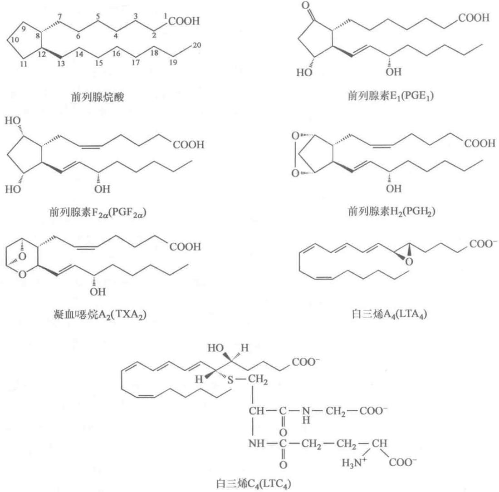  
图10-21 几种常见的类二十烷酸

白三烯(leukotriene; LT)最早在白细胞中找到, 含 3 个共轭双键, 因而得名。从花生四烯酸形成的白三烯含 4 个双键, 其中 1 个是非共轭双键 (C14 和 C15 之间); 白三烯的缩写为 $\mathrm{LT}_{4}$ , 右下标“4”表示碳-碳双键总数。在白细胞中花生四烯酸经 5-脂加氧酶途径先转变为 5,6-环氧化物 (5,6-epoxide), 称 $\mathrm{LTA}_{4}$ 。后者在水解酶作用下, 加水生成 5,12-二羟衍生物, 称 $\mathrm{LTB}_{4}$ ; 或在还原型谷胱甘肽参与下打开环氧环 (epoxide ring) 形成 $\mathrm{LTC}_{4}$ 。然后酶促除去谷胱甘肽中的谷氨酸残基, 转变为 $\mathrm{LTD}_{4}$ 。再除去甘氨酸残基转变为 $\mathrm{LTE}_{4}$ 。 $\mathrm{LTA}_{4}$ 和 $\mathrm{LTC}_{4}$ 的结构见图 10-21。白三烯是强力的生物信号, 例如 $\mathrm{LTC}_{4}$ 和 $\mathrm{LTD}_{4}$ 能引起平滑肌收缩, 微血管通透性增大 (渗出液增多) 和冠状动脉缩小; 造成肺气管缩小的作用比组胺 (histamine) 强 1000 倍。白三烯的过度产生会引起气喘发作。白三烯的合成是抗气喘药物如强的松 (prednisone; 一个人工合成的胆固醇衍生物) 的一个靶子。过敏性休克期间肺平滑肌的强烈收缩是在对蜂刺、青霉素或其他因素过敏的个体中发生的可能致命的变态反应的一部分。

阿司匹林(aspirin,即乙酰水杨酸)属于非类固醇抗炎药物(NSAIDS),在医学上用于消炎、镇痛、退热已逾百年,但它的作用机制一直不清楚,直至1971年J.Vane发现阿司匹林通过抑制PGH $_{2}$ 合酶而关闭前列腺素的合成。更确切地说,阿司匹林通过乙酰化该酶活性中心的Ser530羟基,不可逆地抑制酶的环加氧酶活性,即抑制前列腺素合成的第一步(PGH $_{2}$ 的形成;见第24章),因此它是一种强抗炎药;属于这类抗炎药还有布洛芬(ibuprofen;异丁苯丙酸)、乙酰氨基苯酚(acetaminophen)等。显然阿司匹林也抑制凝血噁烷 $A_{2}$ 的形成（因为 $TXA_{2}$ 合成的直接前体是 $PGH_{2}$ ），因此它又是一种抗凝剂，被广泛地用于防止过度血凝。每天服用一次小剂量的阿司匹林可以有效地降低血小板聚集。

## （二）磷脂酰肌醇和鞘氨醇衍生物是胞内信使

磷脂酰肌醇及其磷酸化衍生物在几个水平上起调节细胞结构和代谢作用。磷脂酰肌醇4,5-二磷酸(表10-4)在质膜内面(胞质面)作为信使分子的储库;它们在应答跟专一性表面受体相互作用的胞外信号时在胞内被释放。当胞外信号如血管升压素(一种激素,见图2-23)激活膜中的专一性磷脂酶C(图10-9),被活化的磷脂酶C水解磷脂酰肌醇4,5-二磷酸,释放出两个产物,作为胞内信使:一个是肌醇1,4,5-三磷酸( $IP_{3}$ ),水溶性的;另一个是二酰甘油(DAG),仍处于跟膜结合。 $IP_{3}$ 引发 $Ca^{2+}$ 从内质网释放,二酰甘油的结合和细胞溶胶的 $Ca^{2+}$ 浓度升高激活蛋白激酶C。通过对专一性蛋白质的磷酸化,蛋白激酶C引起细胞对胞外信号的应答。关于信号传递(signaling)的机制将在第14章详细介绍。

肌醇磷脂也作为涉及信号传递和胞吞的超分子复合体的成核点(point of nucleation)。某些信号传递蛋白质专一地跟质膜中的磷脂酰肌醇3,4,5-三磷酸的结合，引发在膜的细胞溶胶面上多酶复合体的形成。因此，在应答胞外信号时磷脂酰肌醇3,4,5-三磷酸的形成致使这些蛋白质聚集在该质膜表面的信号传递复合体(见图14-26)。

膜鞘脂也能作为胞内信使的来源。神经酰胺和鞘磷脂(图 10-13 和 10-14)两者是蛋白激酶的强调节剂,神经酰胺或其衍生物参与调节细胞分裂、分化、迁移和程序性细胞死亡(programmed cell death)或称编程性细胞死亡(apoptosis)(见第 28 章)。

## （三）类固醇激素在组织之间运载信息

类固醇是固醇的氧化衍生物；它们有固醇核，但缺少连接在胆固醇D环上的烃链，因此比胆固醇的极性大。类固醇激素通过血流（在蛋白质载体上）从产生的部位移动到靶组织，在那里进入细胞，跟核中高度专一的受体蛋白质结合，引发在基因方面并因此在代谢方面的变化。因为激素对它们的受体有很高的亲和力，很低的激素浓度（nmol或低于nmol）就足以使靶组织产生应答。类固醇激素的主要类别有性激素，包括雄性和雌性激素；肾上腺皮质产生的激素，可的松、皮质醇和醛固酮，它们分别调节葡萄糖代谢和水盐代谢。关于它们的结构和生物功能将在第14章作较详细介绍。有些人工合成的类固醇激素，例如强的松（prednisone）和强的松龙（prednisolone）（图10-22），它们的抗风湿性关节炎和抗过敏的活性都比可的松强。

  
图10-22 几种人工合成的类固醇激素和类固醇样植物激素油菜素内酯

维管植物含有类固醇样的物质,如油菜素内酯(brassinolide)(图10-22),它是一种强植物生长调节剂,能增加茎伸长的速度,并在生长期间影响细胞壁中微纤维的定向。

## （四）许多类异戊二烯（类萜）是活性脂质

## 1. 萜的结构和分类

萜(terpene)是一类结构上极其多种多样的有机分子；尽管如此，它们是相关的化合物。按L.Ruzicka提出的异戊二烯法则，认为萜分子的碳架是由两个或多个5-碳 $\left(\mathrm{C}_{5}\right)$ 异戊二烯单位头-尾连接形成的；连接方式一般是头-尾相连（图10-23）。形成的萜可以是开链的，也可以是含环分子；可以是单环，也可以是双环或多环。这里必须指出，异戊二烯本身不是萜的生物合成前体，真正的前体是两个异戊二烯的“等当物”：异戊烯基焦磷酸(isopentenyl pyrophosphate）和二甲丙烯基焦磷酸(dimethylallyl pyrophosphate)，这些5-碳分子本身又是由3个2-碳单位（乙酰-CoA）经一系列反应缩合而成（详见第24章）。它们头-尾相接形成的第一个10-碳单位是牻牛儿基焦磷酸；相应的醇是牻牛儿醇（图10-24），具有牻牛儿苗即老鹳草(Geranium）所特有的气味。

  
图10-23 异戊二烯（2-甲基-1,3-丁二烯）的结构和在萜中的连接方式

根据所含异戊二烯单位 $\left(\mathrm{C}_{5}\right)$ 的数目，萜可分为单萜、倍半萜、双萜、三萜和多萜等。由两个 $C_{5}$ 单位构成的萜称单萜，由3个 $C_{5}$ 构成的称倍半萜，由4个 $C_{5}$ 构成的称双萜，其余依此类推。这些萜及其衍生物也称类萜(terpenoid)或类异戊二烯(isoprenoid)。单萜和倍半萜主要在植物中发现，高级萜则在植物和动物中都存在。萜类的一些代表性化合物见图10-24和图10-25。

单萜（monoterpene）碳原子数为 $C_{10}$ ；存在于各种高等植物中，许多是植物精油的成分。开链单萜如香茅醛，存在于香茅油和玫瑰油中；环状单萜如柠檬中的柠檬烯。

倍半萜（sesquiterpene）碳数为 $C_{15}$ ; 倍半萜结构形式多种, 虽知道得不甚多, 但有些是中草药中的研究对象, 如防风根烯和桉叶醇等。

双萜(diterpene) 碳数 $C_{20}$ ; 如叶绿素分子的成分叶绿醇也称植醇(第 23 章)、全反-视黄醇(第 13 章)以及赤霉酸(一种植物激素, 见图 14-14)。

三萜(triterpene) 碳数为 $C_{30}$ ; 属于三萜的如鲨烯和羊毛固醇, 它们是胆固醇和其他类固醇的前体。

四萜（tetraterpene）碳数为 $C_{40}$ ; 除类胡萝卜素外, 其他类型的四萜少见。类胡萝卜素（carotenoid）是有色光合色素, 包括番茄红素、胡萝卜素及其氧化物约 70 种。番茄红素是存在于番茄中的一种色素, 分子中有 11 个共轭双键（图 10-24），胡萝卜素的结构与番茄红素很相似, 只是前者在链的两端或一端含有一个环己烯环。胡萝卜素根据双键数目或位置不同, 有 $\alpha$ 、 $\beta$ 、 $\gamma$ 等 6 种异构体。其中 $\beta$ -胡萝卜素是维生素 A 原（见第 13 章）。存在于玉米和蛋黄中的玉米黄质（zeaxanthin）是 3,3'-二羟基- $\beta$ -胡萝卜素; 节肢动物中的虾青素（astaxanthin）及其氧化产物虾红素（astacin）是 $\beta$ -胡萝卜素的氧化物; 细菌中的紫菌素（rhodomycetin）也是一种类胡萝卜素。泛醌（辅酶 Q）和质体醌的侧链含 5 到 10 个异戊二烯单位。

多萜(polyterpene) 如多萜醇,含9到22个异戊二烯单位;天然橡胶是由几千个异戊二烯单位头-尾连接而成的大分子,异戊二烯可由蒸馏天然橡胶产生。

## 2. 维管植物产生很多种挥发性的信号分子和保护物质

植物产生数以千计的不同的挥发性脂质。它们作为通过空气传播的信号，允许植物彼此间进行通讯，招引传粉者、防御食草动物和吸引能保护植物和抗衡食草动物的生物。例如从膜脂的 $\alpha-$ 亚麻油酸$(18:3\Delta^{9,12,15})$ 衍生来的茉莉酮酸（jasmonate；结构类似前列腺素），在应答遭受虫害时能引发植物进行抵御。茉莉酮酸甲酯给茉莉油以特有的香气，它被广泛地用于香料工业。植物挥发物有些是从脂肪酸衍生而来，更多是由异戊二烯单位缩合而成，如上面提到的牻牛儿醇、香茅醛、柠檬烯和桉叶醇等。

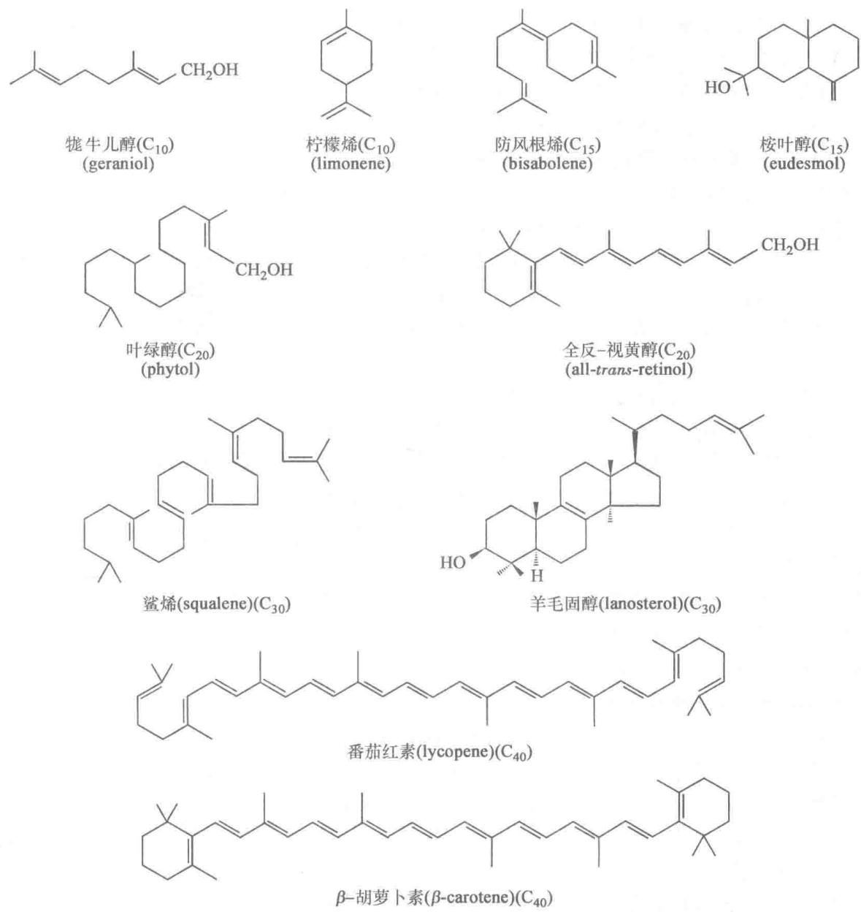  
图10-24 某些类萜化合物的结构

植物经常散发出异戊二烯，约占光合作用中被固定碳的15%。全球从植被散发的异戊二烯估计达 $3\times10^{11}$ kg/年。散发出的异戊二烯形成气氛，覆盖在植被上，保护叶子免遭因高温（炎夏）引起的不可逆损伤。这可能是因为植物周围空气中的异戊二烯溶入叶细胞膜，并改变脂双层和膜中脂质-蛋白质、蛋白质-蛋白质的相互作用而增加对热的耐受性。

## 3. 维生素(vitamin)A 和 D 是激素的前体

维生素 A 也称视黄醇(retinol)，它以不同的形式行使激素和视色素的功能。一种形式是视黄酸(retinoic acid)，它在上皮组织(包括皮肤)发育过程中通过细胞核中的受体蛋白质调节基因表达。视黄酸是一种外用药维 A 酸(英文商品名为 tretinoin)的活性成分，用于治疗严重的痤疮和具皱皮肤。另一种形式是视黄醛(retinal)，它引发视网膜视杆细胞和视锥细胞对光的应答，产生一个神经信号传给大脑。视黄醛的这一作用详见第 13 章。前面谈到，维生素 D 族有从胆固醇转化来的 D₃ 和麦角固醇转化来的 D₂。维生素 $\mathrm{D}_3$ 也称胆钙化醇（cholecalciferol），它本身无活性，但在肝和肾中被酶转化为有生物活性的 $1\alpha, 25-$ 二羟维生素 $\mathrm{D}_3$ ，简称骨化三醇（calcitriol）。骨化三醇是一种激素，它的主要靶细胞是小肠黏膜、肾小管和骨骼；在小肠黏膜促进钙和磷的吸收，在肾小管促进钙、磷的重吸收；总的生理效应是提高血钙和血磷浓度，以利于新骨生成和钙化。看来《黄帝内经》中说“肾主骨”，这是科学的。与类固醇激素一样，骨化三醇也是通过跟核内专一的受体蛋白相互作用调节基因表达。

## 4. 维生素 E、K 和脂质醌是氧化还原的辅因子

维生素E也称生育酚（tocopherol），它是一个族名，族中的所有成员都含一个取代的芳香环和一个类异戊二烯侧链（见第13章）。生育酚在细胞内多集中在膜的脂双层中，例如线粒体膜中，每2100个磷脂就有一个维生素E分子。维生素E是生物体内最重要的自由基清除剂，主要清除膜中活性氧自由基包括脂质过氧化中产生的LO·和LOO·，以免膜上的不饱和脂肪酸遭到过氧化而损害膜脂，使细胞变得脆弱。维生素K又称凝血维生素；从结构上看，它是2-甲基-1,4-萘醌的衍生物。天然的有维生素 $\mathrm{K}_{1}$ （叶绿醌）和 $\mathrm{K}_{2}$ （甲基萘醌类）；人工合成的有维生素 $\mathrm{K}_{3}$ (2-甲萘醌)。现已知参与血凝过程的许多凝血因子（见第4章和第8章）如因子Ⅱ（凝血酶原）、Ⅶ、Ⅸ和X都含有γ-羧基谷氨酸残基。例如正常的凝血酶原在其N端区含有10个γ-羧基谷氨酸残基。这些残基能与 $\mathrm{Ca}^{2+}$ 螯合，并促进凝血酶原与受伤部位的血小板磷脂膜表面结合以利跟因子 $\mathrm{X}_{\mathrm{a}}$ 和 $\mathrm{V}_{\mathrm{a}}$ 形成复合体，在该复合体作用下凝血酶原转化为凝血酶（Ⅱa）。这些凝血因子的γ-羧基谷氨酸残基是在以维生素K作为辅因子的谷氨酰羧化酶(glutamyl carboxylase)催化下，通过翻译后加工修饰而成的。在这一过程中维生素K的萘醌经历了氧化还原循环。关于维生素E和K的结构、存在和生理功能详见第13章。

泛醌(也称辅酶 Q)和质体醌都是类异戊二烯化合物(图 10-25);它们是氧化还原反应中亲脂的电子载体,分别在线粒体和叶绿体中驱动 ATP 合成。泛醌和质体醌都能接受 1 个或 2 个电子,抑或 1 个或 2 个质子(见第 19 章和第 23 章)。

## 5. 许多植物色素是共轭双烯脂质

共轭双烯是具有共轭双键系统(单键和双键交替的碳链)的脂质,是吸收可见光的色素分子。因为这种结构排列允许电子离域,所以这些分子能被低能电磁辐射(可见光)激发,使它们具有被人和动物看得见的颜色。它们在化学上的细微差别,产生各种颜色明显不同的色素。其中有些是在视觉和光合作用中起着捕光作用的色素,如视黄醛、胡萝卜素等;其他起天然呈色作用,如番茄的红色,胡萝卜的橙黄色,类似的化合物使得鸟羽披上了醒目的红、橙、黄颜色,如金丝鸟的羽毛是亮黄色的,这是因为鸟吃了含类胡萝卜素如玉米黄质和角黄质(canthaxanthin)等(图10-25)植物食料产生的;雄鸟和雌鸟之间的色素形成不同是它们肠道吸收和类胡萝卜素加工的不同结果。这些色素也是类异戊二烯化合物或衍生物。

## 6. 多萜醇在糖生物合成中活化单糖前体

在细菌细胞壁的多糖装配时和真核细胞中单糖单位加入某些蛋白质(糖蛋白)和脂质(糖脂)时,待加入的单糖单位先在化学上把它连接到称为多萜醇(dolichol)的类异戊二烯醇(图10-25)上使之活化。这些化合物跟膜脂有很强的疏水相互作用,能把被连上的单糖锚定在膜上,在这里参与糖-转移反应(详见第21章)。

## （五）聚酮化合物是具有强力生物活性的天然产物

聚酮化合物(polyketide)是一类多种多样的脂质,它们的生物合成途径是 Claisen 缩合,缩合是两个乙酰-CoA 分子之间发生的涉及亲核酰基取代的反应,类似脂肪酸的生物合成,但无两个还原步骤(见第 24 章)。聚酮化合物是次级代谢物(secondary matabolite),对一个生物的代谢来说虽不是关键的化合物,但对产生者在某些生态位中起着辅助性作用。很多聚酮化合物在医学上用作抗生素如红霉素,抗真菌剂如两性霉素 B 以及胆固醇合成抑制剂如洛伐他丁等。

红霉素(erythromycin)是1952年从红链霉菌(Streptomyces erythreus)中获得的一种碱性抗生素。其分子结构中含有一个母核——大环内酯(macrolide)。具有大环内酯的抗生素总称大环内酯类抗生素。提取的红霉素中可分离出 A、B 和 C 三个组分，其中组分 A 的结构式见图 10-26。红霉素是一种广谱抗生素，临床上主要用它治疗耐药性金黄色葡萄球菌所引起的各种严重感染，如肺炎、败血症等。

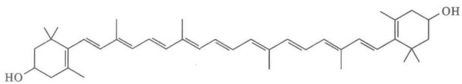  
玉米黄质 $\left(C_{40}\right)$ ：作为植物和鸟羽色素的脂质

  
角黄质 $(\mathrm{C}_{40})$ ：作为植物和鸟羽色素的脂质

  
泛醌(辅酶Q): 线粒体的一种电子载体(n=4\~8)

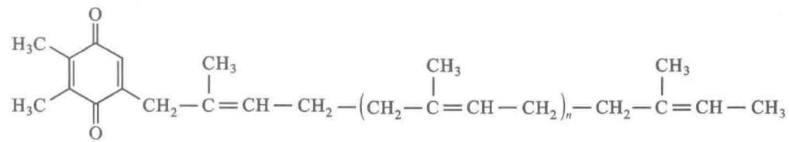  
质体醌：叶绿体的一种电子载体 $(n = 4\sim 8)$

  
图10-25 一些其他类萜化合物或衍生物

两性霉素 B(amphotericin B)属于多烯大环内酯类(polyene macrolides)或多烯类的抗真菌抗生素。多烯大环内酯类抗生素的结构特点是在分子中既有经内酯化而闭合的大碳环(38元)，又有一系列的共轭双键(图10-26)。正因为有一系列的共轭双键，所以与大环内酯类抗生素相比它们有不同的生物学性质。两性霉素的结构中含有一个游离氨基(在氨基糖部分)和一个游离羧基(在大环内酯部分)，所以它是一种两性化合物。两性霉素能抑制多种致病真菌的生长。主要用于治疗假丝菌的感染，特别是用于抗阴道假丝菌的感染；口服可减少肠道霉菌和酵母菌的数量；肺部感染可采用雾化吸入。

洛伐他丁（lovastatin）是从土曲霉（Aspergillus terreus）的一个菌株中提取出来的。现在已被广泛推荐作为降低血清胆固醇的药物。每天服用20\~80mg剂量时观察到血清胆固醇水平有明显降低。羟甲戊二酸单酰CoA还原酶（hydroxymethyl glutaryl CoA reductase）简称HMG-CoA还原酶，它是体内胆固醇合成的限速酶；洛伐他丁被口服摄入后则水解为有活性的酸形式，后者是此限速酶的竞争性抑制剂。

## 四、血浆脂蛋白

脂蛋白(lipoprotein)是由脂质和蛋白质以非共价键结合的复合体。脂蛋白中的蛋白质部分称为脱辅基脂蛋白或载脂蛋白(apolipoprotein;apo)。脂蛋白广泛存在于血浆中，因此也称血浆脂蛋白。此外生物

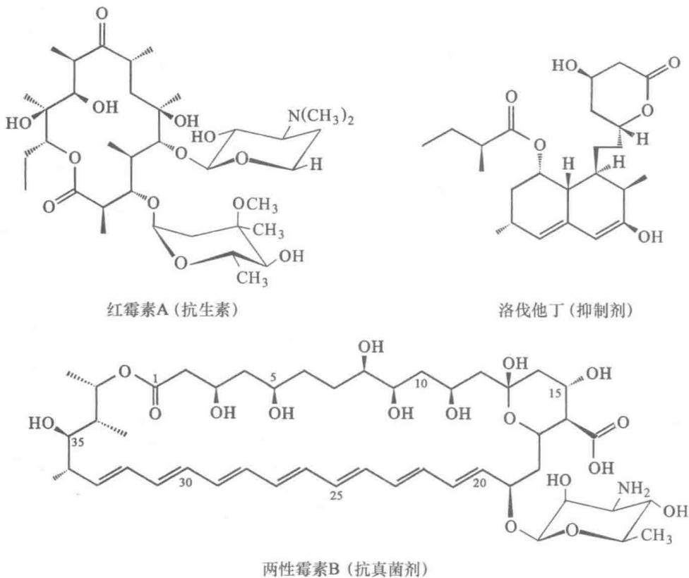  
图10-26 几种用作药物的聚酮化合物  
膜中跟脂质融合的蛋白质也可看成是脂蛋白，并称为细胞脂蛋白。

## （一）血浆脂蛋白的分类

在血液中游离的脂肪酸只要结合到血浆中的血清清蛋白或其他蛋白质上则可被转运。但磷脂、三酰甘油、胆固醇和胆固醇酯是以更复杂的可溶性脂蛋白颗粒形式被转运的，因为这些脂质基本上都不溶于水。

血浆脂蛋白颗粒中脂质和蛋白质的含量是相对固定的。因为大多数蛋白质的密度为 $1.3 \sim 1.4 \mathrm{~g} / \mathrm{cm}^{3}$ , 脂质聚集体的密度一般为 $0.8 \sim 0.9 \mathrm{~g} / \mathrm{cm}^{3}$ , 所以复合体中蛋白质含量愈高, 复合体的密度愈大。脂蛋白颗粒依密度增加为序可分为乳糜微粒 (chylomicron)、极低密度脂蛋白 (very-low-density lipoprotein; VLDL)、低密度脂蛋白 (low-density lipoprotein, LDL) 和高密度脂蛋白 (high-density lipoprotein, HDL) 等 (表 10-5)。血浆脂蛋白颗粒可利用密度梯度超速离心法 (第 5 章) 把它们分离开来 (图 10-27A); 4 类血浆脂蛋白中有的还存在亚类, 如乳糜微粒残留物 (chylomicron remnant), 它是由乳糜微粒形成的, 其密度范围在 $0.9 \sim 1.006 \mathrm{~g} / \mathrm{cm}^{3}$ , 因此残留物的密度有部分与 VLDL 重叠。此外, HDL 也不是均一的, 这可以从离心图谱 (图 10-27A) 上看出, HDL 峰是一个多相峰, 尚含 $\mathrm{HDL}_{2}$ 和 $\mathrm{HDL}_{3}$ 。血浆脂蛋白也可利用更方便的电泳方法 (第 5 章) 把它们分开。如图 10-27B 所示, 电泳也得到 4 个条带: 一条留在原点, 含乳糜微粒; 另一条称为 $\beta$ -脂蛋白, 它与 $\beta$ -球蛋白一起迁移, 含 LDL; 第三条迁移在 $\beta$ -区的前沿, 称为前 $\beta$ -脂蛋白, 含 VLDL; 第四条称为 $\alpha$ -脂蛋白, 它和 $\alpha$ -球蛋白迁移在一起, 含 HDL。临床实验室的血浆脂蛋白分析一般采用醋酸纤维薄膜电泳进行, 含脂的条带用油红 O (oil red O) 染色显示。

## （二）血浆脂蛋白的结构与功能

血浆脂蛋白都是球状颗粒，由一个疏水脂（包括三酰甘油和胆固醇酯）组成的核心和一个极性脂（磷脂和游离胆固醇）与载脂蛋白参与的外壳层构成（图10-28）。外壳层中极性脂以极性头基面向外部水相，它的非极性尾部向着疏水核心。整个外壳层将内部的疏水脂与外部的溶剂水隔离开来。载脂蛋白富含疏水氨基酸残基，构成两亲的 $\alpha$ 螺旋区，一方面（疏水区）可以与脂质很好结合，另一方面（亲水区）可以与溶剂水相互作用。载脂蛋白的主要作用是:①作为疏水脂质的增溶剂;②作为细胞膜上脂蛋白受体的识别部位(细胞导向信号)。至今已有10多种专一的载脂蛋白(表10-6)被分离和鉴定,它们主要是在肝和肠中合成并分泌的。

表 10-5 主要人血浆脂蛋白的组成和性质

<table><tr><td rowspan="2">脂蛋白的类别</td><td rowspan="2">密度/ $(g \cdot cm^{-3})$ </td><td rowspan="2">颗粒直径/nm</td><td colspan="5">组成/% $^{\text{1}}$ </td></tr><tr><td>蛋白质</td><td>游离胆固醇</td><td>胆固醇酯</td><td>磷脂</td><td>三酰甘油</td></tr><tr><td>乳糜微粒</td><td>&lt;1.006</td><td>50~200</td><td>2</td><td>1</td><td>3</td><td>9</td><td>85</td></tr><tr><td>VLDL</td><td>0.95~1.006</td><td>28~70</td><td>10</td><td>8</td><td>14</td><td>18</td><td>50</td></tr><tr><td>LDL</td><td>1.019~1.063</td><td>20~25</td><td>25</td><td>8</td><td>37</td><td>20</td><td>10</td></tr><tr><td>HDL</td><td>1.063~1.210</td><td>8~11</td><td>55</td><td>2</td><td>15</td><td>24</td><td>4</td></tr></table>

① 质量(干重)分数。

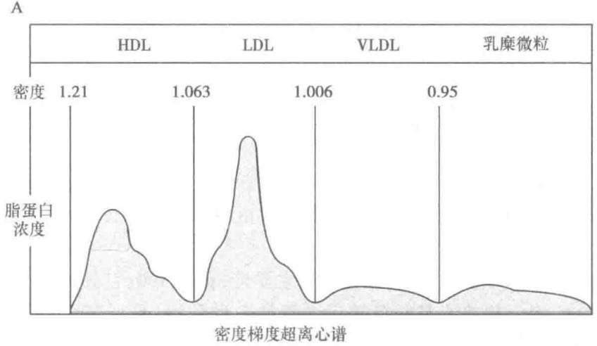

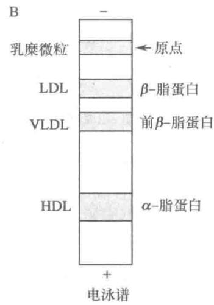  
图10-27 血浆脂蛋白超离心密度(A)和电泳迁移率(B)之间的对应关系

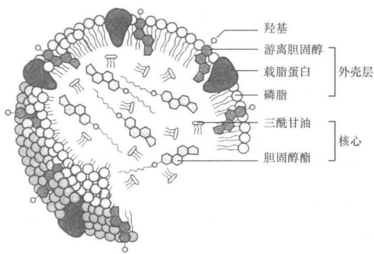  
图10-28 血浆脂蛋白的结构图解

乳糜微粒是在肠细胞(enterocyte)即内衬小肠的上皮细胞的内质网(ER)中合成,然后进入血流。由于它的颗粒很大,当在血液中大量存在时,会使血浆或血清呈乳白色。乳糜微粒是最大的脂蛋白,含有很高比例的三酰甘油,占整个乳糜微粒质量的85%到95%,因此它是密度最小的脂蛋白。乳糜微粒的载脂蛋白有apoB-48(乳糜微粒所特有的)、apoA-Ⅳ、apoC-Ⅱ和apoE。乳糜微粒的主要功能是从小肠转运被吸收的膳食三酰甘油、胆固醇及少量其他脂质到血浆和其他组织。乳糜微粒中的三酰甘油被肌肉和脂肪等组织中的毛细血管内壁上的脂蛋白脂酶(lipoprotein lipase)所水解,水解产物脂肪酸被这些组织吸收并用作燃料或脂肪合成的前体。富含胆固醇的乳糜微粒残留物(大部分三酰甘油已被耗去,但仍含胆固醇、apoE 和 apoB-48)被肝所吸收。

表 10-6 人血浆脂蛋白的载脂蛋白

<table><tr><td>载脂蛋白(Apo)</td><td> $M_{r}$ </td><td>血浆中质量浓度/(mg·dL-1)</td><td>脂蛋白中的分布</td><td>功能</td></tr><tr><td>A-I</td><td>28 100</td><td>90~120</td><td>HDL</td><td>活化 LCAT1</td></tr><tr><td>A-II</td><td>17 400(二聚体)</td><td>30~50</td><td>HDL</td><td>抑制 LCAT</td></tr><tr><td>A-IV</td><td>44 500</td><td>15</td><td>乳糜微粒,HDL</td><td>活化 LCAT,转运或清除胆固醇</td></tr><tr><td>B-48</td><td>242 000</td><td>&lt;5</td><td>乳糜微粒</td><td>转运或清除胆固醇</td></tr><tr><td>B-100</td><td>500 000</td><td>80~100</td><td>VLDL, LDL</td><td>与 LDL 受体结合</td></tr><tr><td>C-I</td><td>7 000</td><td>4~7</td><td>VLDL, HDL</td><td></td></tr><tr><td>C-II</td><td>9 000</td><td>3~8</td><td>乳糜微粒,VLDL, HDL</td><td>活化脂蛋白脂酶</td></tr><tr><td>C-III</td><td>9 000</td><td>8~15</td><td>乳糜微粒,VLDL, HDL</td><td>抑制脂蛋白脂酶</td></tr><tr><td>D</td><td>32 500</td><td>8~10</td><td>HDL</td><td></td></tr><tr><td>E</td><td>34 200</td><td>3~6</td><td>乳糜微粒,VLDL, HDL</td><td>引发 VLDL 和乳糜微粒残留物的清除</td></tr></table>

① LCAT 是卵磷脂-胆固醇酰基转移酶的缩写。

极低密度脂蛋白(VLDL)在肝细胞的ER中合成;它的载脂蛋白主要是apoB-100(已知的最大蛋白质之一)、apoC-I、apoC-II、apoC-III和apoE。其功能是从肝转运内源的三酰甘油(肝所需之外的多余部分)和在肝包装的胆固醇到肌肉和脂肪等靶组织。VLDL的三酰甘油也跟乳糜微粒中的一样,被靶组织中毛细血管内壁上的脂酶水解,释放的脂肪酸为脂肪细胞吸收并重新转化为三酰甘油,以胞内脂质小滴形式贮存起来;肌肉细胞与之相反,它主要是氧化脂肪酸以便供能。丢失三酰甘油剩下的VLDL颗粒称为VLDL残留物,也称中间密度脂蛋白(intermediate-density lipoprotein,IDL)。

低密度脂蛋白(LDL)是从VLDL残留物(IDL)中进一步除去三酰甘油产生的。LDL富含胆固醇和胆固醇脂,是血液中总胆固醇的主要载体;它的主要载脂蛋白也是apoB-100。LDL的功能是转运胆固醇到肝外组织如肌肉、肾上腺和脂肪组织;这些靶组织的质膜上有LDL受体,它能识别apoB-100并介导胆固醇和胆固醇酯的吸收。LDL可能与动脉粥样硬化有关,特别是在血管壁受到氧化性损伤时,LDL容易使胆固醇在受伤处沉积。

高密度脂蛋白(HDL)是以称为新生HDL的前体形式在肝和小肠中合成的。分泌出来的新生HDL是圆盘状的；含蛋白质、磷脂和胆固醇，但无胆固醇酯。HDL主要含apoA-I和其他载脂蛋白(表10-6)，此外也含卵磷脂-胆固醇酰基转移酶(lecithin-cholesterol acyl transferase, LCAT), LCAT催化由卵磷脂(磷脂酰胆碱)和胆固醇形成胆固醇酯。在新生HDL颗粒表面上LCAT将血流中遇到的乳糜微粒和VLDL残留物(IDL)的胆固醇和磷脂酰胆碱转变为胆固醇酯，后者开始形成一个核心，使新生的圆盘状HDL转型为成熟的球状HDL颗粒。在转型过程中HDL也收集从死细胞和进行更新的膜等细胞器释放到血浆中的胆固醇和磷脂。然后，成熟的HDL回到肝，在那里卸下胆固醇。HDL中的某些胆固醇酯可由胆固醇酯转移蛋白转移给LDL。可见HDL是除肝外的其他地方的胆固醇清除剂，甚至能除去已形成斑块的胆固醇。临床研究证明，脂蛋白代谢不正常是造成动脉粥样硬化的主要原因。血浆中LDL水平高而HDL水平低的个体容易患心血管疾病。

## 五、生物膜的组成和结构

地球上第一个细胞可能出现于膜的形成,膜把少量的水溶液包围起来与环境分开。膜不仅规定细胞的外边界,而且控制穿过边界(膜)的分子运输。这层膜称为细胞膜或质膜。此外真核细胞中还有内膜系统（system of internal membrane），把内部空间分隔成若干独立的区室（compartment），即所谓细胞器和亚细胞结构。原核细胞的内膜系统不发达，只有少量的内膜结构。细胞的质膜和内膜系统总称为生物膜（biomembrane）。生物膜为组织许多复杂的反应序列、能量转换中心和细胞-细胞通讯中心提供了必要的结构基础。生物膜具有多种功能，生命活动中许多重要过程，如物质运输、能量转换、细胞识别、细胞免疫、神经传导、代谢调控等都与之有关。

生物膜的研究不仅具有重要的理论意义,而且在工、农、医实践方面也有广阔的应用前景。例如医药方面,几乎所有疾病都与膜的变异有密切关系。很多质膜上的受体可能是药物的靶体。人工膜(脂质体)作为药物载体已经进行了大量研究,有的已经进入临床试验阶段。生物膜的研究已深入到生物医学和生物学的很多领域。

## （一）每种膜都有特定的脂质和蛋白质

要了解膜的功能,一种途径是研究膜的组成,例如测定哪些成分是所有的膜共有的,哪些是具有专一功能的膜所特有的。因此讨论膜的结构和功能之前,需要考虑一下膜的分子成分:蛋白质、极性脂质和糖质。蛋白质和脂质构成生物膜的几乎全部质量,糖只作为糖蛋白和糖脂的一部分(占真核细胞质膜质量的2%\~10%)而存在。每种类型的生物膜都含有特定的脂质和蛋白质。脂质和蛋白质的相对比例,因膜的类型不同可以有很大的变动(表10-7);这反映出生物学功能的多样性。例如神经元的髓鞘(一种延展的质膜)是起电的绝缘体作用的,它主要由脂质组成;而细菌质膜以及线粒体和叶绿体膜是很多酶促过程的场所,膜蛋白[质]的含量比膜脂[质]多。一般说,功能复杂的膜,蛋白质的种类和含量较多;功能简单的膜,蛋白质的种类和含量较少。

表 10-7 不同生物中质膜的主要成分

<table><tr><td rowspan="2">类别</td><td colspan="5">组分/100% $^{\text{1}}$ </td></tr><tr><td>蛋白质</td><td>磷脂</td><td>固醇</td><td>固醇类型</td><td>其他脂质</td></tr><tr><td>人神经髓鞘</td><td>30</td><td>30</td><td>19</td><td>胆固醇</td><td>半乳糖脂、缩醛磷脂</td></tr><tr><td>小鼠肝细胞</td><td>45</td><td>27</td><td>25</td><td>胆固醇</td><td>—</td></tr><tr><td>玉米叶细胞</td><td>47</td><td>26</td><td>7</td><td>谷固醇</td><td>半乳糖脂</td></tr><tr><td>酵母</td><td>52</td><td>7</td><td>4</td><td>麦角固醇</td><td>三酰甘油、硬脂酸脂</td></tr><tr><td>草履虫(纤毛原生生物)</td><td>56</td><td>40</td><td>4</td><td>豆固醇</td><td>—</td></tr><tr><td>大肠杆菌(E.coli)</td><td>75</td><td>25</td><td>0</td><td>—</td><td>—</td></tr></table>

① 质量分数。在每一情况数值加起来不等于 $100\%$ ，因为除蛋白质、磷脂和固醇外还有其他成分；例如植物含有很高的糖脂。

膜脂有磷脂、糖脂和固醇等，其中以磷脂为主要成分。磷脂中又以甘油磷脂为主，特别是其中的磷脂酰胆碱和磷脂酰乙醇胺最丰富，也最普遍（表10-8）。动物细胞的质膜几乎都含糖脂，主要是鞘糖脂，如脑苷脂、神经节苷脂等。细菌和植物细胞的质膜大多为甘油糖脂。一般讲，动物细胞的固醇含量比植物细胞的高。而质膜的固醇含量又多于内膜系统的固醇。动物质膜含的是胆固醇；植物质膜含的是植物固醇如谷固醇、豆固醇等；细菌细胞一般不含固醇。

表 10-8 某些生物膜中各种脂质的组成/% $^{1}$

<table><tr><td>脂质名称</td><td>人红细胞</td><td>人髓鞘</td><td>牛心线粒体</td><td>大肠杆菌</td></tr><tr><td>磷脂酸</td><td>1.5</td><td>0.5</td><td>0</td><td>0</td></tr><tr><td>磷脂酰胆碱</td><td>19</td><td>10</td><td>39</td><td>0</td></tr><tr><td>磷脂酰乙醇胺</td><td>18</td><td>20</td><td>27</td><td>65</td></tr><tr><td>磷脂酰丝氨酸</td><td>8</td><td>8</td><td>0.5</td><td>0</td></tr><tr><td>磷脂酰肌醇</td><td>1</td><td>1</td><td>7</td><td>0</td></tr><tr><td>磷脂酰甘油</td><td>0</td><td>0</td><td>0</td><td>18</td></tr><tr><td>心磷脂</td><td>0</td><td>0</td><td>22.5</td><td>12</td></tr><tr><td>鞘磷脂</td><td>17.5</td><td>8.5</td><td>0</td><td>0</td></tr><tr><td>糖脂</td><td>10</td><td>26</td><td>0</td><td>0</td></tr><tr><td>胆固醇</td><td>25</td><td>26</td><td>3</td><td>0</td></tr></table>

不同来源的膜蛋白组分要比它们的膜脂组分变化大，这反映功能上的专门化。此外，某些膜蛋白跟寡糖共价连接。例如在血型糖蛋白中，红细胞质膜的糖蛋白60%的质量由复杂寡糖组成。寡糖连接在专一的氨基酸残基上；Ser、Thr和Asn残基是最常见的连接点（见图9-41）。在质膜外表面形成的这层寡糖-蛋白质复合体称为糖萼(glycocalyx)或细胞外壳(cell coat)。这些天线般的寡糖链影响新生肽的折叠及其稳定性以及胞内定位；并在配体与糖蛋白表面受体的专一性结合中起着重要作用，跟细胞识别和黏着以及细胞免疫等有关（见第9章“糖蛋白”部分）。

## （二）脂双层是膜的基本结构元件

膜脂(甘油磷脂、鞘脂和固醇)虽是两亲分子,但实际上不溶于水。当与水混合时,它们自发地形成微小的脂质聚集体:微团、脂双层和微囊(图10-29);它们都是以脂质分子的尾部借疏水相互作用彼此接触,头基借氢键跟周围的水分子相互作用。脂质聚集体的形成减小了暴露于水的疏水表面积,因而使在脂质-水界面处有序水壳中的水分子数目降至最小(见图1-11A),结果是系统中熵增加。脂质分子之间的疏水相互作用为这些聚集体的形成和维持提供了热力学驱动力。

  
图10-29 磷脂分子在水中自发形成的几种聚集体（切面观）

脂质在水中组装成何种形式的聚集体，取决于脂质本质和当时条件。微团（micelle）是球形结构，它含有几十到几千个两亲分子。这些分子排列成疏水尾部聚集在内部，在那里水被排出；亲水头基在表面，跟水接触。头基的横切面大于尾部（酰基链）横切面的，如游离脂肪酸、溶血磷脂（只有一条酰基链）和去污剂如十二烷基硫酸钠（SDS）倾向于形成微团。头基横切面等于酰基链横切面的，如甘油磷脂和鞘脂，则有利于脂双层（bilayer）的形成；在每一单层中的疏水部分，排开水，彼此相互作用；在脂双层片的每一表面（“叶面”），亲水头基跟水相互作用。但由于其边缘的疏水区仍暴露在水中，结构相对不稳定，自发地回折，形成中空的球形，称微囊（vesicle）。在实验室中从纯脂质形成的微囊或称脂质体（liposome），跟天然膜一样，对极性溶质基本上也是不通透的。微囊的连续表面消去了暴露的疏水区域，使脂双层在水环境中达到最大的稳定性。现已证实脂双层是生物膜的基本结构。

## （三）膜成分在脂双层两侧的分布是不对称的

膜对大多数极性的和荷电的溶质是不通透的，但对非极性化合物允许它们通过。脂双层本身的厚度约为3 nm，如果包括从膜两侧伸出的蛋白质在内（电镜下横切面观呈三层），膜厚度为5\~8 nm。

膜蛋白在脂双层两侧(两个单层)的分布是不对称的(图 10-30)。某些蛋白质只从膜的一侧伸出,另一些则在膜的两侧都有暴露的结构域，并且暴露在两侧的结构域也是不同的；蛋白质在脂双层中定向的不对称性使膜有“正反面”的区别，这反映膜在功能上的不对称性。膜中的蛋白质和脂质形成一个镶嵌图案，但跟用瓷砖和灰膏镶嵌起来的不同；膜是一种流体，镶嵌的图案可以不断地自由变化；因为其组分之间的相互作用大多是非共价的，这使得单个脂质和蛋白质分子能够在膜平面上自由地作侧向运动。但跟膜脂不同，膜蛋白不能从脂双层的一层翻转到另一层，这有利于膜蛋白的不对称分布的维持。

  
图 10-30 膜成分分布的不对称性(流动镶嵌模型)

质膜的脂质在脂双层两个单层的分布,虽然也是不对称的,但没有像膜蛋白那样的绝对。例如,在红细胞的质膜中,含胆碱的脂质(磷脂酰胆碱和胆碱鞘磷脂)主要存在于质膜的胞外面(外层),而磷脂酰丝氨酸、磷脂酰乙醇胺和磷脂酰肌醇更多是在胞质面(内层)。脂质在质膜内外层分布的变化是有生物学效果的。例如,血小板只有它质膜中的磷脂酰丝氨酸移到外层,才能在血凝块形成中起作用。对很多其他类型的细胞,磷脂酰丝氨酸暴露在细胞外表面,标示着一个细胞将遭程序性细胞死亡(programmed cell death)的破坏。

糖质在脂双层的分布也是不对称的,无论质膜还是内膜系统中糖脂和糖蛋白的寡糖分布都是不对称的。质膜的糖蛋白总是把携有寡糖的结构域定向在细胞的外表面。

## （四）有三类膜蛋白跟膜结合的方式不同

膜蛋白根据在膜上定位和跟膜脂结合的牢固程度可分为外周膜蛋白质、内在膜蛋白质和兼在蛋白质。

外周膜蛋白质(peripheral membrane protein)分布在脂双层的内、外层表面上，借静电相互作用和氢键跟内在蛋白质的亲水结构域或膜脂的极性头基结合(图10-31)。大多数外周蛋白质通常只要用比较温和的(能干扰静电相互作用和破坏氢键的)方法，如改变 $\mathrm{pH}$ 或离子强度、用螯合剂除去 $\mathrm{Ca}^{2+}$ 或加入尿素或碳酸盐，即可把它们从膜上分离下来。外周膜蛋白质一般占膜蛋白的 $20\% \sim 30\%$ 。

内在膜蛋白质(integral membrane protein)主要是靠跟脂双层的疏水相互作用与膜结合的。蛋白质分子的非极性氨基酸残基常以 $\alpha$ 螺旋形式与脂双层的疏水部分相互作用（细菌膜的内在蛋白质中常见有借多股β桶结合的）。内在蛋白质，有的只是部分埋在脂双层中，有的则横跨整个膜层（图10-30）；有的（如血型糖蛋白）跨越脂双层只是单个螺旋段（图10-30，图3-46），有的（如细菌视紫红质）是来回多个螺旋段（见图3-47）。内在蛋白质与脂双层结合得很牢固，只有用那些能够破坏跟脂双层疏水相互作用的介质，如去污剂、有机溶剂或变性剂，才能将它们提取出来。有些内在膜蛋白质本身并不进入膜内，而是跟一个或几个脂质分子如脂肪酸，类异戊二烯或糖基磷脂酰肌醇(glycosyl phosphatidylinositol;GPI)共价相连，并以它们为疏水锚钩(anchor)锚定在脂双层中（见图10-31和图9-38B），这些膜蛋白可用专一性酶处理，例如以GPI为锚钩的内在蛋白质(GPI-锚定蛋白质)用磷脂酶C水解即可被释放。内在膜蛋白质占膜蛋白的 $70\% \sim 80\%$ 。

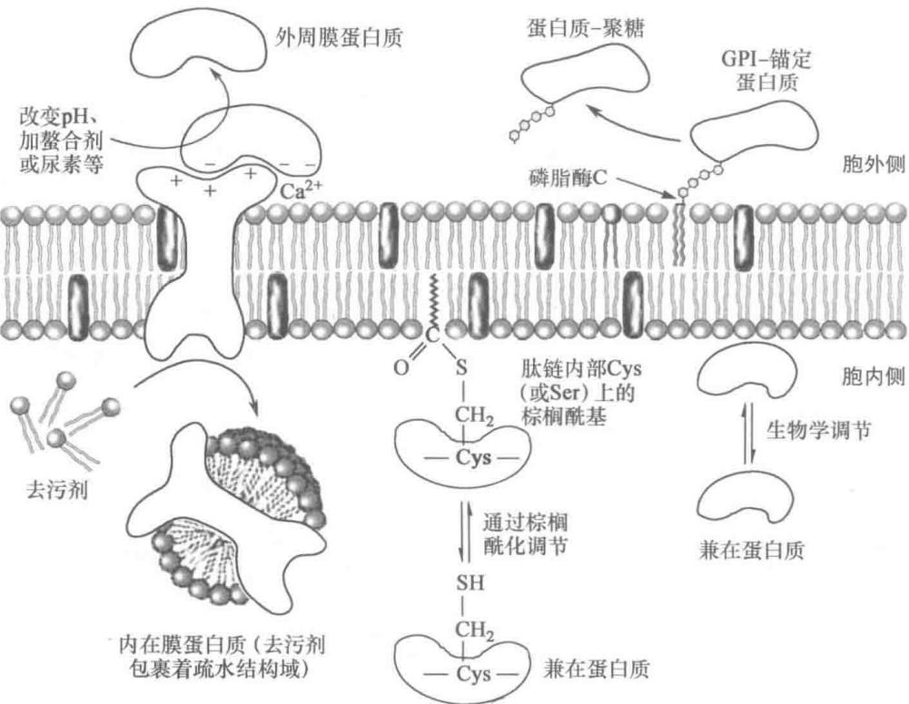  
图 10-31 三类膜蛋白: 外周蛋白质, 内在蛋白质和兼在蛋白质

兼在蛋白质(amphitropic protein)有时存在于细胞溶胶,有时处于跟膜结合之中。它们对膜的亲和力在有些场合是由于这些蛋白质跟一个膜蛋白或膜脂的非共价相互作用或静电相互作用,在另些场合是因为存在一个或多个跟兼在蛋白质共价结合的脂质(图10-31)。一般说,兼在蛋白质跟膜的可逆结合是受调节的;例如磷酸化作用或配体结合可以使该蛋白质发生构象改变,暴露出原先接近不到的膜结合部位。因此兼在蛋白质有时跟膜结合,有时不与膜结合;这取决于调节过程的类型,如可逆的棕榈酰化(palmitoylation),如图10-31。

## （五）生物膜是动态的

所有生物膜的一个显著特点是它们的柔性(flexibility)——不丢失它的完整性而改变形状的能力。这一性质的基础是脂双层中脂质分子之间的非共价相互作用和单个脂质的运动性(mobility)，因为脂质不是相互共价锚定的。可见膜是处于流动状态的，既包括膜脂，也包括膜蛋白的流动。合适的流动性(fluidity)对膜表现它的正常功能十分重要。例如物质转运、能量转换、信息传递、细胞分裂和融合、胞吞和胞吐等都跟膜的流动性有密切关系。

## 1. 脂双层中的脂质能以有序液态或无序液态存在

虽然脂双层的整体结构是稳定的,但膜平面内的单个磷脂分子具有很大的运动自由度,这取决于温度和脂质组成。低于正常生理温度,膜脂运动慢,脂双层变成半固体的有序液态(liquid-ordered state; $L_{o}$ )或称类晶态(paracrystalline state)或凝胶态(gel state),在这种状态单个脂质的所有运动形式都受到很大限制(图10-32A)。在生理温度以上,膜脂运动加快,脂肪酸烃链处于不断的运动中,包括绕长脂酰链C—C键的旋转和单个脂质分子在脂双层内的侧向扩散(图10-33A);此时脂双层是流动的无序液态(liquid-disor-

dered state; $L_{d}$ ), 或称液晶态 (liquid-crystalline state) (图 10-32B)。从 $L_{o}$ 态过渡到 $L_{d}$ 态, 脂双层总的形状和大小保持不变, 但单个脂质分子的运动 (侧向和旋转) 程度有变化。

对哺乳动物在生理温度范围(20\~40℃)，长链脂肪酸(如16:0和18:0)倾向于组装成 $L_{0}$

  
有序液态 $L_{0}$ （凝胶态）  
无序液态 $L_{d}$ （液晶态）  
图10-32 脂双层的两种极端状态

很快
(1μm/s)

凝胶态,但不饱和脂肪酸中的结节干扰装配,有利于处在 $L_{d}$ 态。短链脂肪酸也有同样的效果。一个膜的固醇含量(随不同生物和细胞器有很大变化;表10-7)是脂质状态的另一重要的决定因素。固醇(例如胆固醇)对脂双层流动性的影响似乎是反常的:固醇跟含不饱和脂酰链的磷脂相互作用,使脂酰链挤得更紧,并限制它们在脂双层中的运动;固醇跟携有长饱和脂酰链的磷脂和鞘脂结合,反而加快膜的流动性,此膜在没有胆固醇时是采取 $L_{o}$ 态的。其实,前者是因为固醇刚性环系统减少了它附近脂酰链绕 C—C 键旋转的运动自由度造成的,后者是因为刚性甾核阻挠了脂酰链的有序装配的结果。

为获得恒定的膜流动性,细胞在各种生长条件下调节它们的膜成分。例如细菌在低温下培养时比在高温下培养时,合成的不饱和脂肪酸更多,而饱和脂肪酸则更少。脂质成分的这种调整结果是在低温或高温下培养的细菌,约有同样程度的膜流动性。推测这是对脂双层中的许多蛋白质——酶、转运蛋白和受体——行使功能所必需的。

## 2. 脂质的跨膜运动需要酶催化

在生理温度下,脂质分子从脂双层的一层(一面)翻到另一层的运动称为跨膜运动(transmembrane movement)或翻转扩散(flip-flop diffusion)(图10-33A)。翻转扩散在大多数膜中即使发生也是很慢的,但在脂双层的同一层中进行的侧向扩散则很快(10-33B)。由于膜脂都是两亲分子,要从脂双层的一层翻转到另一层,它必须穿过脂双层的疏水区;这是一个需能过程,自由能变化是一个大的正值,因此比侧向扩散的速度要慢得多。然而这种高耗能的翻转在原核和真核细胞中都有发生。一个称为翻转酶(flippase)的转位蛋白(translocator)催化翻转扩散。此酶催化氨基磷脂(磷脂酰乙醇胺和磷脂酰丝氨酸)从质膜的胞外层到细胞溶胶层(内层)的转位,并因而造成磷脂的不对称分布:磷脂酰乙醇胺和磷脂酰丝氨酸主要在细胞溶胶层,鞘脂和磷脂酰胆碱在胞外层。翻转酶每转位一分子磷脂消耗约一个ATP分子(图10-33C)。此外还发现两个其他类型的磷脂转位蛋白质,但对它们了解得还不多。一个称转出酶(floppase;暂用译名——编者),催化质膜磷脂从细胞溶胶层转移到胞外层,它跟翻转酶一样,需要ATP。另一个称促翻转酶(scramblase),沿该脂浓度梯度(从高浓度层到低浓度层)跨膜转移任一种膜磷脂。它们的活性不依赖于ATP。爬行酶活性导致脂双层两面的头基组成有控制的随机化(转移趋于平衡)。

B. 非催化侧向扩散

C. 催化跨膜转位

  
氨基磷脂(PE和PS)从胞外层移动到胞内层  
图10-33 单个磷脂在脂双层中的运动

## 3. 脂质和蛋白质在膜内作侧向扩散

脂质在膜内的侧向扩散(lateral diffusion)或侧向移动是指磷脂分子在脂双层的同一层中与邻近分子进行交换；也即，这些分子在膜内进行布朗运动(图10-33B)。侧向扩散在生物膜和人工膜中都能发生，而且速度很快。例如，红细胞质膜外层中的一个脂质分子进行侧向扩散，在几秒钟内就能绕红细胞一圈。该脂双层平面内的这种快速侧向扩散在几秒钟内可使各个分子的位置趋于随机化(均匀分布)。

很多膜蛋白的行为好像它们被漂浮在脂质的海洋里。和膜脂一样，这些蛋白质能在脂双层的流体平面内自由地侧向扩散，并处于恒定的运动中。测定膜蛋白（或膜脂）的侧向扩散常采用光漂白荧光恢复法

(fluorescence recovery after photobleaching; FRAP) (图 10-34)。这种方法是利用强激光使膜上某一微区(5 μm²)内标有荧光探针的膜蛋白(或膜脂)进行彻底漂白,然后用荧光显微镜可观察到其他部位的膜蛋白(未经光漂白的)因侧向扩散进入该微区,微区内荧光又重新出现,表明膜蛋白发生侧向运动。光漂白后的荧光恢复速率是蛋白质(或脂质)侧向扩散速率的量度。

某些膜蛋白在细胞或细胞器的表面缔合成大的聚集体（“小块”）；例如乙酰胆碱受体在突触的神经元质膜上形成密集的近似晶状的小块，在这里单个蛋白质分子彼此不会发生相对移动。另一些膜蛋白被锚定在细胞内部的结构（如细胞骨架）以阻止它们的自由扩散。例如红细胞质膜上的血型糖蛋白和氯化物-重碳酸盐交换蛋白（chloride-bicarbonate exchanger）都是通过锚蛋白（ankyrin）被拴在丝状的细胞骨架蛋白质——血影蛋白（spectrin）上，因此这些膜蛋白的运动受到很大的限制（图10-35）。

## （六）质膜的内在蛋白质参与表面黏着、信号传递和其他细胞过程

质膜中几个家族的内在蛋白质提供细胞和细胞之间以及细胞和胞外基质蛋白质之间的专一性连接位点。整联蛋白（integrin）是表面黏着蛋白质，它介导细胞跟胞外基质和跟其他细胞包括某些病原体的相互作用。整联蛋白也在跨质膜的两个方向传递整合有关胞内、外环境的信息的信号。所

  
图 10-34 光漂白荧光法测定膜蛋白或膜脂的侧向扩散速率

有的整联蛋白都是杂二聚体(heterodimer)，由两个不同的亚基 $\alpha$ 和 $\beta$ 组成。每个亚基借一个跨膜螺旋锚定在质膜内。 $\alpha$ 和 $\beta$ 亚基的胞外大结构域缔合成一个专一性结合位点，以结合胞外蛋白质如胶原蛋白和纤连蛋白(fibronectin)，这些胞外蛋白质含有一个共同的整联蛋白结合决定簇：Arg-Gly-Asp。

涉及表面黏着的其他蛋白质是钙黏着蛋白（cadherin），它能跟相邻细胞中的同一种钙黏着蛋白进行同嗜性同种间（homophilic）的相互作用。另一是选择蛋白，它有胞外结构域；在 $\mathrm{Ca}^{2+}$ 存在下，该结构域能跟相邻细胞表面上的专一多糖结合。选择蛋白主要存在于各类血细胞和衬在血管壁上的内皮细胞中。它们是血液凝固的必需部分。

内在膜蛋白质还在许多其他细胞过程中起作用。它们用作转运蛋白和离子通道，用作激素、神经递质和生长因子的受体（第14章）。它们担当氧化磷酸化（第19章）、光合磷酸化（第23章）以及免疫系统中细胞-细胞和细胞-抗原识别的中心角色(第4章)。内在蛋白质也在膜融合(包括胞吞、胞吐和病毒入侵宿主细胞)中起重要作用。

  
图10-35 红细胞膜的氯化物-重碳酸盐交换蛋白的运动受膜骨架限制

## （七）生物膜的流动镶嵌模型

从19世纪末到20世纪中叶对生物膜的结构曾提出过多种模型，包括脂双层模型、三夹板模型和单位膜模型等。1972年美国S.T.Singer和G.R.Nicolson吸取了前人提出的模型中合理部分，并总合膜的电镜观察、化学组成及其分布不对称性的研究、膜通透性和膜流动性的物理研究，提出了流动镶嵌模型（fluid mosaic model）。该模型认为：膜是蛋白质和磷脂组成的动态结构；脂双层是一种流体基质，实质上是蛋白质的二维溶剂。脂双层的每层中脂质分子的非极性尾部面向双层片的核心，极性头基面向外侧，跟每侧的水介质相互作用；蛋白质埋在双层片中，借脂质和蛋白质的疏水结构域之间的疏水相互作用维系在一起。在这里膜脂和膜蛋白能作旋转和侧向运动。Singer和Nicolson还指出，这些蛋白质部分地或

全部地嵌入脂双层中，有些甚至横跨整个脂双层（图10-36）。此模型跟以往提出的各种模型主要差别在于：它突出膜的流动性和膜蛋白分布的不对称性。流动镶嵌模型虽还存在很多局限性，例如近年来很多实验结果表明，膜各部分的流动性是不均匀的。由于脂质组成不同、膜蛋白-膜脂的和膜蛋白-膜蛋白的相互作用以及环境因素（如温度、pH等）的影响，在一定温度下有的膜脂处于凝胶态 $(\mathrm{L}_{\mathrm{o}})$ ，有的则呈流动的液晶态 $(\mathrm{L}_{\mathrm{d}})$ 。即使都处于 $\mathrm{L}_{\mathrm{d}}$ 态，膜中各部分的流动性也不全相同。这样，整个

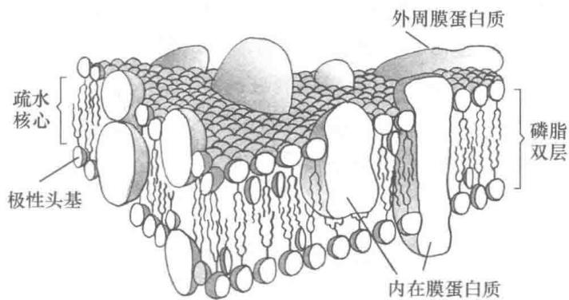  
图10-36 Singer和Nicolson提出的膜结构流动镶嵌模型

膜可视为具有不同流动性的“微区”相间隔的动态结构。因而 Jain 和 White 提出了一种“板块镶嵌”模型。然而至今尚无一个模型像流动镶嵌模型那样受到广泛的应用。

## 六、脂质的提取、分离和分析

脂质存在于细胞、细胞器和胞外体液如血浆、胆汁、乳和肠液中。欲研究某一特定部分（例如红细胞、线粒体或脂蛋白）的脂质，首先须将它们所在的组织、细胞或细胞器分离出来。由于脂质不溶于水，它们的提取和随后的分级分离都要求使用有机溶剂和某些特殊技术，这跟用于纯化水溶性分子如蛋白质和糖质是很不相同的。一般说，复杂的脂质混合物分离是根据它们在非极性溶剂中的极性或溶解度差别进行的。含酯键连接或酰胺键连接的脂肪酸的脂质可用酸、碱或高度专一的水解酶处理使成可用于分析的成分。

## （一）脂质用有机溶剂提取

非极性脂质(三酰甘油、蜡和色素等)用乙醚、氯仿或苯等容易从组织中提取出来,因为这些溶剂不致使脂质因疏水相互作用而集聚在一起。膜脂(磷脂、糖脂、类固醇等)要用极性有机溶剂如乙醇或甲醇提取,这种溶剂既能降低脂质分子间的疏水相互作用,又能减弱膜脂与膜蛋白之间的氢键键合和静电相互作用。常用的提取剂(extractant)是氯仿、甲醇和水(体积比1:2:0.8)的混合液。按此体积比配制的混合液是混溶的,形成一个相。组织(如肝)在此混合液中匀浆以提取所含脂质;匀浆后形成的不溶物包括蛋白质、核酸和多糖用离心或过滤方法除去。向所得的提取液(extract)加入过量的水使之分成两个相,上相是甲醇/水,下相是氯仿。脂质留在氯仿相,极性大的分子如蛋白质、多糖进入极性相(甲醇/水)。取出氯仿并蒸发浓缩,取一部分干燥,称重;其余用于下步分离分析。

## （二）吸附层析分离不同极性的脂质

被提取的脂质混合物可采用基于各类脂质极性不同分开的层析手段进行分级分离。例如硅胶吸附柱层析(柱层析装置参见图2-14)可把脂质分成非极性、极性和荷电的多个组分。硅胶(silica)是硅酸 $\mathrm{Si(OH)_4}$ 的一种形式，一种极性的不溶物。当脂质混合物(氯仿提取液)通过柱中的硅胶时，由于极性脂质跟极性硅酸结合得紧密被留在柱上；中性脂质则直接通过柱子，出现在最先流出的氯仿洗涤液中。然后用逐步提高极性的溶剂洗涤，极性脂质按极性增加的顺序被洗脱。不带荷电的极性脂质(如脑苷脂)用丙酮洗脱，极性强的或带荷电的脂质(如甘油磷脂)用甲醇洗脱。分别收集各个组分，在不同的层析系统中再层析，以分离单个脂质组分。例如磷脂组分可进一步分离成磷脂酰胆碱、鞘磷脂、磷脂酰乙醇胺等。如果采用高效液相色谱(HPLC,见第5章)或薄层层析(TLC)进行脂质分离则速度更快，分辨率更高。

硅胶薄层层析(装置见图2-16)利用同一原理。硅胶薄层涂抹在一块能黏附它的玻璃板上。溶于氯仿的少量脂质样品点加在玻璃板一边的附近,然后把玻璃板的这一边浸入加有有机溶剂或溶剂混合液的浅槽中;整套装置封闭在被溶剂蒸气饱和的箱(或缸)内。随溶剂在玻璃板上上升(由于毛细管作用),也带着脂质一起移动。极性小的脂质移动最快,因为它们跟硅酸结合的程度小。分开的脂质可以用一种称罗丹明(rhodamine)的染料喷洒玻璃板,这种染料与脂质结合后,会发出荧光;或用碘蒸气熏蒸玻璃板,碘与脂肪酸中的双键发生可逆反应,结果含不饱和脂肪酸的脂质显示出黄色或棕色。几种其他的喷显剂也用于检测一些特异的脂质。为了后面分析,含被分开的脂质区域可从板上刮下,脂质用有机溶剂提取回收。

## （三）气-液色谱用于分析挥发性脂质混合物

气-液色谱(gas-liquid chromatography; GLC)是分离混合物的挥发性组分的。分离的原则是按它们溶于填充在色谱柱中的惰性材料的相对倾向,或是按它们被惰性气体(如氦、氢或氮)流动所推进的挥发和过柱的相对速度。除某些脂质具有天然挥发性外,大多数脂质沸点很高,6-碳以上的脂肪酸沸点都在200℃以上。因此进行分析前必须先将脂质转变为它们的衍生物(如酯类)以增加挥发性(即降低沸点)。为分析油脂或磷脂样品中的脂肪酸,首先需要在甲醇/HCl或甲醇/NaOH混合物中加热,使脂肪酸成分发生转酯[基]作用(transesterification),从甘油酯转变为脂肪酸甲酯。然后将甲酯混合物加样到气-液色谱柱上,加热柱子,使样品挥发,以利GLC分析。在柱材料中溶解度最大的脂肪酸酯留在柱上的时间最长;溶解度小的脂质被惰性气流带走,最先从柱中出来。洗脱顺序主要决定于柱中固体吸附剂的性质和脂质混合物组分的沸点。利用GLC技术,各种链长和各种不饱和度的脂肪酸混合物可以得到完全分开。气-液色谱仪的基本组件如图10-37所示。

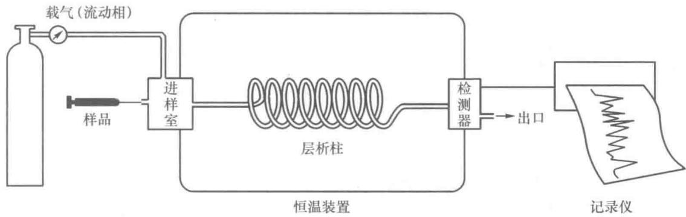  
图 10-37 气-液色谱仪的基本组件

## （四）专一性水解有助脂质结构测定

某些种类的脂质对在特异条件下的降解特别敏感，例如三酰甘油、甘油磷脂和固醇酯中酯键连接的脂肪酸只要用温和的酸或碱处理则被释放。而鞘脂中酰胺键连接的脂肪酸则需要在较强的水解条件下才能被释放。专一性水解某些脂质的酶也被用于脂质结构的测定。前面谈到过的磷脂酶 $\mathrm{A}_1$ 、 $\mathrm{A}_2$ 、C和D（见图10-9）都能断裂甘油磷脂分子中的一个特定的键，并产生具有特征溶解度和层析行为的产物。例如磷脂酶C作用于磷脂，释放一个水溶性的磷酰醇（例如从磷脂酰胆碱释放出磷酸胆碱）和一个氯仿溶的二酰甘油，这些成分可以分别加以鉴定，以确定完整磷脂的结构。专一性水解跟这些产物的TLC、GLC或HPLC鉴定相结合常可用来测定一个脂质的结构。

## （五）质谱与脂质结构测定和脂质组学

脂质或其挥发性衍生物的质谱分析是确定烃链长度和双键位置的最佳技术。相似的脂质（例如，两个相同链长、在不同位置上不饱和的脂肪酸，或两个含不同数目异戊二烯单位的类异戊二烯）的物理化学性质是非常相像的，从各种色谱洗脱的顺序经常不能把它们区分开来。然而，当从一个色谱柱流出的洗脱物（eluate）加样到质谱仪上进行分析，一个脂质混合物的组分只要根据它们唯一的分级分离谱就能同时得到分离和鉴定。随着质谱法分辨率的不断提高，有可能粗提取液无须进行预分级分离就能在很复杂的混合物中鉴定出单个脂质。这种“鸟枪”（shotgun）法可以避免脂质组分的再分离（亚类的分离），因而速度更快。

为探索细胞和组织中脂质的生物学作用,重要的是要知道什么脂质以什么比例存在,并要知道这些脂质的组成随胚胎发育、疾病或药物治疗发生的变化;这些内容构成了脂质组学(lipidomics)。脂质组学的目的是试图编录所有的脂质及其功能。应用具有高处理量和高分别率的质谱技术可以提供在特定条件下专一类型细胞中存在的全部脂质的定量编目——脂质组(lipidome),以及脂质组随分化、疾病(如癌症)或药物治疗的变化方式。一个动物细胞含有上千种不同的脂质,大概每一种都有专门的功能。越来越多的脂质它们的功能为人们了解,但仍然还有大量未探索的脂质组,为下一代的生物化学家和生物学家提供丰富的新课题,等待解决。

## 提要

脂质是细胞的水不溶性成分,结构多种多样,能用有机溶剂如乙醚、氯仿等进行提取。脂质按化学组成可分为单纯脂质、复合脂质和衍生脂质;按生物功能可分为贮存脂质、结构脂质和活性脂质。

脂肪酸是多数脂质的烃成分,通常具有偶数碳原子(一般12到24)。脂肪酸可分为饱和与不饱和的,双键几乎总是顺式的。脂肪酸的物理性质主要决定于烃链长度与不饱和程度。必需脂肪酸是指对人体的功能不可缺少,但必须由膳食提供的两种多不饱和脂肪酸:亚油酸和 $\alpha-$ 亚麻酸;前者属 $\omega-6$ 家族,后者属 $\omega-3$ 家族。

三酰甘油是由脂肪酸与甘油形成的三酯。三酰甘油可分为简单三酰甘油和混合三酰甘油；天然油脂是简单和混合三酰甘油的混合物。三酰甘油与碱共热可发生皂化，生成脂肪酸盐（皂）和甘油。三酰甘油跟游离脂肪酸一样，它的不饱和键能发生氢化、卤化和过氧化等作用。三酰甘油是主要的贮存脂质，以脂肪滴形式存在于细胞中。

脂质过氧化是典型的活性氧参与的自由基链式反应。活性氧( $\cdot O_{2}^{-}$ 、 $\cdot OH$ 、 $H_{2}O_{2}$ 和 $^{1}O_{2}$ 等)使生物膜发生脂质过氧化,造成膜的损伤、蛋白质和核酸等大分子的异常。脂质过氧化与多种疾病有关。体内的抗氧化剂如超氧化物歧化酶(SOD)、维生素E和 $\beta-$ 胡萝卜素等是与脂质过氧化抗衡的保护系统。

三酰甘油是食物的重要成分。食品工业中植物油的部分氢化会使某些脂肪酸的顺式双键转化为反式构型。食物中的反式脂肪酸是冠心病的一个重要风险因素。

蜡是指长链脂肪酸和长链一元醇或固醇形成的酯。天然蜡如蜂蜡是多种蜡酯的混合物。蜡是海洋浮游生物中代谢燃料的主要贮存形式。蜡还有其他的生物功能如防水、防侵袭等。

具有极性头和非极性尾的极性脂质是生物膜的主要成分。最丰富的极性脂质是甘油磷脂；最简单的甘油磷脂是3-sn-磷脂酸，它是其他甘油磷脂的母体。磷脂酸进一步被一个极性醇（如胆碱、乙醇胺等）酯化，则形成各种甘油磷脂。常见的甘油磷脂是磷脂酰胆碱和磷脂酰乙醇胺。甘油磷脂的极性头基在pH 7附近荷电。

叶绿体膜富含半乳糖脂和硫脂，它们是甘油糖脂。前者由二酰甘油跟1个或2个相连的半乳糖残基组成，后者由二酰甘油跟一个磺酸化的糖残基组成，并因此是一个荷电的头基。

某些古菌含有独特的膜脂,它有一个很长的链烷基,在链烷基的两端以醚键跟甘油相连,还有一个糖基和/或一个甘油磷酸基跟甘油连接以提供一个极性的或荷电的头基。这类脂质在这些古菌生活的苛刻条件下是稳定的。

鞘脂含有鞘氨醇，一个长链的脂肪族氨基醇，但不含甘油。鞘氨醇的2-位氨基以酰胺键与脂肪酸连接形成神经酰胺，它是鞘脂类的母体。神经酰胺的1-位羟基被磷酰胆碱或磷酰乙醇胺酯化则形成相应的鞘磷脂：胆碱鞘磷脂和乙醇胺鞘磷脂。神经酰胺的1-位羟基以糖苷键跟糖基连接则成鞘糖脂。重要的鞘糖脂有脑苷脂、红细胞糖苷脂和神经节苷脂。细胞表面的鞘糖脂是细胞识别的位点。

固醇含有4个稠合的碳环(环戊烷多氢菲)和一个羟基。固醇存在于大多数真核细胞的膜中,但细菌不含固醇。胆固醇是动物中的主要固醇,是膜的结构成分,也是体内类固醇激素和胆汁酸的前体。

有些种类的脂质存在量虽然较少,但起着辅因子和信号的关键作用。类二十烷酸,包括前列腺素、凝血酶和白三烯;它们由花生四烯酸合成,是一类极强的局部性激素。

磷脂酰肌醇-4,5-二磷酸经水解产生2个胞内信使：二酰甘油（DAG）和肌醇-1,4,5-三磷酸（ $\mathrm{IP}_3$ ）。磷脂酰肌醇-3,4,5-三磷酸是参与生物信号传递的超分子蛋白质复合体的成核点。

类固醇激素如性激素和皮质激素都由固醇衍生而来,它们作为强力的生物信号改变靶细胞中的基因表达,从而影响代谢和生理方面的变化。

许多由异戊二烯单位 $(\mathrm{C}_5)$ 合成的类萜（类异戊二烯）是生物活性脂质。例如维生素A、D、E和K在动物的代谢和生理活动中起重要作用。维生素A和D是相应激素的前体。泛醌和质体醌分别是线粒体和叶绿体的电子载体。脂质共轭双烯，如胡萝卜素、玉米黄质等，作为花朵和水果中的色素，以及给鸟的羽毛以亮丽的颜色。多萜醇（长醇）活化和锚定简单糖到细胞膜上；聚糖基然后用于合成复杂糖质、糖脂和糖蛋白。

聚酮化合物如红霉素、两性霉素 B 等是天然产物，被广泛用于医学。

血浆脂蛋白是血浆中转运脂质的脂蛋白颗粒。这些颗粒都有一个由三酰甘油和胆固醇酯组成的疏水核心和一个由磷脂、胆固醇和载脂蛋白参与的极性外壳。载脂蛋白（apo）是脂蛋白中的蛋白质部分，主要作用是增溶疏水脂质和作为脂蛋白受体的识别部位。脂蛋白颗粒依密度增加为序可分为乳糜微粒、VLDL、LDL和HDL。VLDL从肝运载胆固醇、胆固醇酯和三酰甘油到其他组织，在那里三酰甘油为脂蛋白脂酶所降解，VLDL转变为LDL。富含胆固醇和胆固醇酯的LDL被受体介导的胞吞所摄取，胞吞过程中LDL的载脂蛋白B-100为质膜中的受体所识别。HDL是除肝以外的其他组织的胆固醇清除剂。

细胞的外周膜(质膜)和内膜系统统称生物膜。膜主要由蛋白质(包括酶)、脂质(主要是磷脂)和糖类等组成。脂双层是膜的基本结构元件。膜对极性的和荷电的溶质一般是不通透的,但对非极性化合物则允许它们通过。膜脂和膜蛋白在脂双层中的定向是不对称的,使膜有“正反面”的之分,这也反映膜在功能上的不对称性。质膜的糖蛋白总是把携有寡糖的结构域定向在细胞的外表面。膜蛋白可分为三类:外周膜蛋白质、内在膜蛋白质和兼在蛋白质。膜的流动性是膜结构的主要特征;脂酰链的热运动使脂双层内部成为流体;流动性受温度、脂肪酸组成和固醇含量的影响。膜脂和膜蛋白可以进行侧向扩散,速度很快;膜脂还可以发生翻转扩散,但速度比前者慢得多,除非有翻转酶的参与。整联蛋白是质膜的跨膜蛋白质,起连接细胞-细胞以及在胞外基质和细胞质之间运载信息两个方面的作用。膜的流动镶嵌模型仍是迄今应用最广的。

测定脂质组成时，脂质首先需要用有机溶剂从组织中提取，再用薄层层析、气液色谱或高效液相色谱分离。单个的脂质可根据其层析行为、对专一性酶水解的敏感性或质谱来鉴定。高分别率的质谱无须预分级分离即可进行脂质粗混合物分析。脂质组学的任务是利用先进的分析技术，测定一个细胞或组织中的全套脂质（脂质组）并组建有注释的数据库，比较不同类型和不同条件下的细胞脂质。

## 习题

1. 天然脂肪酸在结构上有哪些共同的特点？

2. (a) 由甘油和三种不同的脂肪酸(如豆蔻酸、棕榈酸和硬脂酸)可形成多少种不同的三酰甘油(包括立体异构体)? (b) 其中从量方面的组成不同考虑, 形成三酰甘油可有多少种?

3. (a) 为什么饱和的 18 碳脂肪酸——硬脂酸的熔点比 18 碳不饱和脂肪酸——油酸的熔点高？(b) 干酪乳杆菌产生的乳杆菌酸（19 碳脂肪酸）的熔点更接近硬脂酸的熔点还是更接近油酸的熔点？为什么？

4. 画出 $\omega - 6$ 脂肪酸 $16:1$ 的结构式。

5. 从植物种子中提取出 $1\mathrm{g}$ 油脂，把它等分为两份，分别用于测定该油脂的皂化值和碘值。测定皂化值的一份样品消耗 $\mathrm{KOH}65\mathrm{mg}$ ，测定碘值的一份样品消耗碘 $(\mathrm{I}_2)510\mathrm{mg}$ 。试计算该油脂的平均相对分子质量和碘值。

6. 某油脂的碘值为 68，皂化值为 210。计算每个油脂分子平均含多少个双键。

7. (a) 解释与脂质过氧化有关的几个术语: 自由基、活性氧、自由基链式反应、自动氧化、抗氧化剂和自由基清除剂; (b) 为什么 PUFA 容易发生脂质过氧化?

8. 为解决甘油磷脂构型上的不明确性, 国际生物化学命名委员会建议采取立体专一编号命名原则。试以磷酸甘油为例说明此命名原则。

9. 写出下列化合物的名称: (a) 在低 pH 时, 携带一个正净电荷的甘油磷脂; (b) 在中性 pH 时, 携带负净电荷的甘油磷脂; (c) 在中性 pH 时, 净电荷为零的甘油磷脂。

10. 给定下列分子成分: 甘油、脂肪酸、磷酸、长链醇和糖。试问 (a) 哪两个成分在蜡和鞘磷脂中都存在? (b) 哪两个成分在脂肪和磷脂酰胆碱中都存在? (c) 哪些 (个) 成分只在神经节苷脂而不在脂肪中存在?

11. 今有两个无标签的样品: 一个鞘磷脂, 一个磷脂酰胆碱。试用化学、层析或酶学方法把它们鉴别开来。

12. 指出下列膜脂的亲水成分和疏水成分: (a) 磷脂酰乙醇胺; (b) 鞘磷脂; (c) 半乳糖脑苷脂; (d) 神经节苷脂; (e) 胆固醇。

13. 从第2章中我们知道茚三酮在弱酸溶液中能专门跟一级胺(伯胺)反应生成紫蓝色产物。试问鼠肝磷脂的薄层层析谱上喷上茚三酮溶液能显色的是哪些(个)磷脂?

14. (a) 造成类固醇化合物种类很多的原因是什么? (b) 人和动物体内胆固醇可转变为哪些具有重要生理意义的类固醇物质?

15. 胆酸是人胆汁中发现的 A-B 顺式类固醇(图 10-20)。请按图 10-17 所示的椅式构象画出胆酸的构象式，并以直立键或平伏键标出 C3, C7 和 C12 位上的 3 个羟基。

16. 一种血浆脂蛋白的密度为 $1.08 \mathrm{~g} / \mathrm{cm}^{3}$ , 载脂蛋白的平均密度为 $1.35 \mathrm{~g} / \mathrm{cm}^{3}$ , 脂质的平均密度为 $0.90 \mathrm{~g} / \mathrm{cm}^{3}$ 。问该脂蛋白中载脂蛋白和脂质的质量分数是多少？

17. 一种低密度脂蛋白(LDL)含 apo B-100( $M_{\mathrm{r}}$ 为500000)和总胆固醇(假设平均 $M_{\mathrm{r}}$ 为590)的质量分数分别为25%和50%。试计算 apo B-100与总胆固醇的摩尔比。

18. 对于饱和脂酰链中单键碳的碳-碳距离约为 0.15 nm。试估计一个完全伸展的棕榈酸分子的长度。如果 2 个棕榈

酸分子端-端相接,它们的总长度与生物膜中的脂双层厚度相比,将如何?

19. 图 10-34 中描述的实验是在 $37^{\circ} \mathrm{C}$ 完成的, 如果实验在 $10^{\circ} \mathrm{C}$ 进行, 你预料对扩散速率会有怎样的影响? 为什么?

20. 人红细胞膜的内层(单层)主要是由磷脂酰乙醇胺和磷脂酰丝氨酸组成,外层主要是由磷脂酰胆碱和鞘磷脂组成。虽然膜的这些磷脂在流体脂双层中可以扩散,但膜的两面(内、外层)始终保持这种不同的分布。这是如何做到的?

## 主要参考书目

1. 王镜岩, 朱圣庚, 徐长法. 生物化学教程. 北京: 高等教育出版社, 2008.

2. 赵保路. 氧自由基和天然抗氧化剂. 北京: 科学出版社, 1999.

3. 鞠焜先, 邱宗荫, 丁世家, 等. 生物分析化学. 北京: 科学出版社, 2007.

4. Nelson D L, Cox M M. Lehninger Principles of Biochemistry. 6th ed. New York: W. H. Freeman and Company, 2013.

5. Garrett R H, Grisham C M. Biochemistry. 3rd ed. Boston: Saunders College Publishing, 2004.

6. Stryer L. Biochemistry. 6th ed. New York: W. H. Freeman and Company, 2006.

7. Meyers R. Molecular Biology and Biotechnology—a Comprehensive Desk Reference. VCH Publishers Inc, 1995.

8. McMurry I. Organic Chemistry. 3rd ed. California: Brooks/Cole Publishing Company, 1992.

(徐长法)

## 网上资源

习题答案

## 第 11 章 核酸的结构和功能

核酸(nucleic acid)的结构和功能是生物化学和分子生物学的重要研究领域。生物的特征是由生物大分子所决定的,生物大分子有4类:核酸、蛋白质、多糖和脂质复合物。糖和脂质是由酶(蛋白质)催化合成的,它们与蛋白质结合,增加了蛋白质结构与功能的多样性。核酸是遗传信息载体,蛋白质的合成取决于核酸;然而生物功能需要通过蛋白质来实现,包括核酸合成也有赖于蛋白质的作用。核酸有两类,即脱氧核糖核酸(deoxyribonucleic acid,DNA)和核糖核酸(ribonucleic acid,RNA)。因此,最重要的生物大分子是DNA、RNA和蛋白质。由生物大分子和有关生物分子以及无机分子或离子共同构成生物机体不同层次的结构;生物大分子之间以及与其他分子之间的相互作用决定了一切生命活动。有关核酸的结构、功能、性质和研究方法将分两章予以介绍。

## 一、核酸的发现和研究简史

由于核酸的结构与功能比较复杂,分子很不稳定,在4类生物大分子中,它的研究开始最晚。现代生物化学建立于18世纪下半叶。“蛋白质”一词最早于1838年由J.J.Berzelius所提出,“核酸”这个词的出现要晚半个世纪。然而对它的研究却改变了整个生命科学的面貌,并由此而诞生了分子生物学这一当今发展最迅速、最有活力的学科。

## （一）核酸的发现

1868 年瑞士青年科学家 F. Miescher 由脓细胞分离得到细胞核，并从中提取出一种含磷量很高的酸性物质，称为核素（nuclein）。他的导师 F. Hoppe-Seyler 对其发现十分惊讶，经过重复验证后才于 1871 年将原论文和补充论文一起发表在 Med. Chem. Unters. 上。此后，Miescher 转向研究鲑鱼精子头部的物质，除分离到酸性高含磷化合物（即现在所知的 DNA）外，还提取出一种碱性化合物，称为鱼精蛋白（protamine）。Miescher 被认为是细胞核化学的创始人和 DNA 的发现者。Miescher 的工作为其后继者所继续。其中，最主要者为 R. Altmann，他发展了从酵母和动物组织中制备不含蛋白质的核酸的方法，核酸这个名称就是由 Altmann 在 1889 年最先提出来的。

胸腺的细胞核特别大，酵母的细胞质很丰富，这是两种容易提取核酸的材料，因此这两种核酸也就研究得最多。O. Hammarsten 于 1894 年证明酵母核酸中的糖是戊糖，1909 年由 P. A. Levene 和 W. A. Jacobs 鉴定是 D-核糖。当时曾认为胸腺核酸中的糖是己糖，直至 1930 年才由 Levene 确定为 2-脱氧-D-核糖。两类核酸的碱基也有差别，在 19 世纪末和 20 世纪初分别得到鉴定。这就是说，在 19 世纪末已经发现有两类核酸存在，虽然对它们的化学本质还不完全清楚。

## （二）核酸的早期研究

Miescher 的发现曾给生物学家带来巨大希望。Hoppe-Seyler 认为，核素“可能在细胞发育中发挥着极为重要的作用”。1885 年细胞学家 O. Hertwig 提出，核素可能负责受精和传递遗传性状。1895 年遗传学家 E. B. Wilson 推测，染色质与核素是同一种物质，可作为遗传的物质基础。然而，随后核酸化学的研究却偏离了最初的正确方向。

核酸中的碱基大部分是由 A. Kossel 及其同事所鉴定。1910 年因其在核酸化学研究中的成就而被授予诺贝尔医学奖，但他却认为决定染色体功能的是蛋白质，因而在获奖后转而研究染色体蛋白质。P. A. Levene 在鉴定核酸中的糖以及阐明核苷酸的化学键中作出了重要贡献，但他认为核酸是以四核苷酸为单位的简单聚合物,从而使生物学家失去对它的关注,他的“四核苷酸假说”曾严重阻碍核酸研究达30年之久。当时还流行一种错误的看法,认为胸腺核酸代表动物核酸;酵母核酸代表植物核酸,这种观点也误导了对核酸生物功能的认识。

理论研究的重大发展往往首先从技术上的突破开始。20世纪40年代微量生化分析技术有很大的发展，T. Caspersson的显微紫外分光光度测定，J. Brachet的组织化学，A. L. Dounce的亚细胞部分分级分离，以及J. N. Davidson的生化分析都有力证明细胞含有两类核酸，脱氧核糖核酸（DNA）存在于细胞核，核糖核酸（RNA）存在于细胞质，它们都是动物、植物和细菌细胞共同具有的重要组成成分。碱基成分的精确测定推翻了“四核苷酸假说”，并证明了核酸的高度特异性。1944年O.T.Avery证明，细菌的转化因子是DNA。其后，噬菌体实验进一步证明DNA是遗传物质。细胞化学的研究还发现，蛋白质合成能力强RNA含量也丰富。于是开始认识到DNA功能是传递遗传信息，RNA功能是合成蛋白质。

## （三）DNA 双螺旋结构模型的建立

20世纪上半叶，数理学科进一步渗入生物学，生物化学本身是一门交叉学科，也就成为数理学科与生物学之间的桥梁。数理学科的渗入不仅带来了新的理论和思想方法，而且引入了许多新的技术和实验方法。1953年J.D.Watson和F.Crick提出DNA双螺旋结构模型，就是在学科融合的背景下产生的。该模型的提出被认为是20世纪自然科学中最伟大的成就之一，它给生命科学带来深远的影响，并为分子生物学的发展奠定了基础。

分子生物学的先驱者沿着三条思想路线去探讨生命的本质，并形成了三个学派：结构学派、信息学派和生化遗传学派。结构学派以英国物理学家 W. T. Astbury、J. D. Bernal 和他们的学生为代表，他们的兴趣在于用 X 射线结晶学技术研究生物大分子的三维结构，并认为这是解决生物学问题的根本途径。Astbury 曾用 X 射线衍射的方法研究蛋白质和 DNA 的结构，他于 1945 年最早使用分子生物学这一术语。他认为研究生物分子的三维结构，研究它们的起源和功能问题，是当代分子生物学的主旨。

信息学派以物理学家 M. Delbrück 与微生物学家 S. Luria 领导的“噬菌体小组”为代表。这一学派深受量子论思潮的影响，Delbrück 就是量子论奠基者 N. Bohr 的学生。量子论的另一奠基者 E. Schrödinger 在其《生命是什么？》一书中指出，“有机体赖负熵为生”，并认为最重要的问题是“基因的信息内容”。他的观点当时有很大影响力。噬菌体小组致力于揭示染色体上的信息编码，他们认为噬菌体就是裸露的染色体。1952 年噬菌体小组的两个成员 A. Hershey 和 M. Chase 用 $^{32}\mathrm{P}$ 标记噬菌体的 DNA, $^{35}\mathrm{S}$ 标记蛋白质，然后感染大肠杆菌。结果只有 $^{32}\mathrm{P}-\mathrm{DNA}$ 进入细菌细胞内， $^{35}\mathrm{S}-$ 蛋白质仍留在细胞外，从而有力证明 DNA 是噬菌体的遗传物质。Watson 是噬菌体小组中最年轻的成员，1950 年在 Luria 指导下取得博士学位，其年 22 岁。他善于集思广益，博采众长，从别人的工作中吸取所需要的东西，对新事物敏感。1951 年他在剑桥遇到正在 M. Perutz 小组做研究生的 Crick，两人便开始合作探求 DNA 的分子结构。

生化遗传学派包括一批用生物化学方法从事遗传学研究的科学家,他们试图阐明基因是如何行使功能而控制特定性状的。早在1909年A. Garrod就发表了“代谢的先天错误”的论文,表明孟德尔遗传因子很可能是通过代谢过程的特定步骤而发挥其功能。其后,G.W.Beadle和E.L.Tatum利用红色面包霉的营养缺陷型突变体于20世纪40年代证明了“一个基因一种酶”的假说。

Watson 和 Crick 提出 DNA 双螺旋结构模型的主要依据是: 已知的核酸化学结构知识; E. Chargaff 发现的 DNA 碱基组成规律; M. Wilkins 和 R. Franklin 得到的 DNA X 射线衍射结果。此外, W. T. Astbury 对 DNA 衍射图的研究以及 L. Pauling 提出蛋白质的 $\alpha$ 螺旋结构也都有启发作用。DNA 双螺旋结构模型的建立说明了基因的结构、信息和功能三者之间的关系, 因而使三个学派得到统一, 并推动了分子生物学的迅猛发展。

20 世纪 50 年代许多实验室对 DNA 双螺旋结构模型进行验证。1956 年 A. Kornberg 发现 DNA 聚合酶, 可用以在体外复制 DNA。1958 年 Crick 总结了当时分子生物学的成果, 提出了“中心法则”(central dogma), 即遗传信息从 DNA 传到 RNA, 再传到蛋白质, 一旦传给蛋白质就不再转移。

每当 DNA 研究取得理论上或技术上的重大进展,都会带动 RNA 研究出现一个高潮。60 年代 RNA 研究取得巨大发展。1961 年 F. Jacob 和 J. Monod 提出操纵子学说并假设了 mRNA 的功能。1965 年

R. W. Holley 等最早测定了酵母丙氨酸 tRNA 核苷酸序列。1966 年由 M. W. Nirenberg 等的多个实验室共同破译了遗传密码。所有这些成果都是在“中心法则”的框架内取得的。虽然 1970 年 H. M. Temin 等和 D. Baltimore 从致瘤 RNA 病毒中发现了逆转录酶，但只看作是对“中心法则”的补充，并没有从根本上动摇“中心法则”的基础。

## （四）DNA克隆技术的兴起和RNA研究的重大突破

20 世纪 70 年代前期诞生了 DNA 重组技术 (DNA recombinant technology)。这一技术体系是在三项关键技术的基础上建立起来的, 即 DNA 切割、分子克隆和快速测序技术。W. Arber 最早发现细菌细胞中存在 DNA 限制性内切酶。1970 年 H. O. Smith 分离纯化出特异的限制酶。次年 D. Nathans 用限制酶切割猿猴空泡病毒 40 的 (SV40) DNA, 绘制出酶切位点的图谱, 即限制图谱。DNA 的特异切割使得分离基因或其片段成为可能。许多 DNA 修饰酶, 包括 DNA 连接酶、DNA 聚合酶、逆转录酶等, 可用于基因操作, 这些酶统称为工具酶。1972 年 P. Berg 将外源 DNA 片段插入 SV40 病毒环状 DNA 分子内, 获得第一个 DNA 体外重组体。由于 SV40 病毒具有致癌的潜在危险, Berg 未将其重组体进行克隆 (克隆的意思是无性繁殖)。1973 年 S. Cohen 等用细菌的质粒重组体得到克隆。1975 年 F. Sanger 等建立了 DNA 的酶法测序技术。1976 年 A. M. Maxam 和 W. Gilbert 建立了 DNA 的化学测序技术。此后, DNA 重组技术不断获得改进和发展。

将 DNA 重组技术用于改变生物机体的性状特征,改造基因,以至改造物种统称为基因工程或遗传工程(genetic engineering)。工程一词原指大规模的建筑和其他施工项目,现用于表示对基因的分子施工。在 DNA 重组技术的带动下又发展出分子水平、细胞水平和个体水平的各种生物技术和生物工程。70 年代 DNA 重组技术的出现,被认为是分子生物学的第二次革命。它改变了分子生物学的面貌,并导致一个新的生物技术产业群的兴起。

DNA 重组技术的出现极大推动了 DNA 和 RNA 的研究。80 年代 RNA 研究出现了第二个高潮，取得了一系列生命科学研究领域最富挑战性的成果。1981 年 T. Cech 发现四膜虫 rRNA 前体能够通过自我剪接切除内含子，表明 RNA 也具有催化功能，称为核酶（ribozyme）。这是对“酶一定是蛋白质”的传统观点一次大的冲击。1983 年 R. Simons 等以及 T. Mizuno 等分别发现反义 RNA（antisense RNA），表明 RNA 还具有调节功能。其后发现一个基因转录产物通过选择性拼接可以形成多种同源异形体（isoform）蛋白质，从而使“一个基因一条多肽链”的传统观念也受到冲击。1986 年 R. Benne 等发现锥虫线粒体 mRNA 的序列可以发生改变，称为编辑（editing），于是基因与其产物蛋白质的共线性关系也被打破。1986 年 W. Gilbert 提出“RNA 世界”的假说，这对“DNA 中心”的观点是一次有力的冲击。1987 年 R. Weiss 论述了核糖体移码，说明遗传信息的解码也是可以改变的。许多传统观点被打破，RNA 已成为最活跃的研究领域之一。

## （五）人类基因组计划开辟了生命科学新纪元

1986年，美国微生物学和分子生物学家、诺贝尔奖获得者H. Dulbecco在Science杂志上率先提出“人类基因组计划”（简称HGP）。基因组是指染色体上的整套基因，其英文名genome前三个字母取自基因gene，后三个字母取自染色体chromosome。人类细胞有22对常染色体，一对性染色体(X和Y)，单倍体 $(22 + X + Y)$ 基因组大约有 $3\times 10^{9}$ 碱基对。完成人类基因组DNA全序列测定的意义是十分明显的。人类对自己遗传信息的认识将有益于人类健康、医疗、制药、人口、环境等诸多方面的实践，并且对生命科学也将有极大贡献。但是投入大量人力、物力、时间去完成这项工作是否值得？其间还可能遇到许多事先想象不到的问题。经过3年多的激烈争论，1990年10月美国政府决定出资30亿美元，正式启动这项工作，拟用15年时间(1990—2005年)完成“人类基因组计划”。“人类基因组计划”是生物学有史以来最巨大和意义深远的一项科学工程，它首先在美国启动，并很快便得到国际科学界的重视和支持，英国、日本、法国、德国和中国科学家先后加入这个国际合作计划。中国是在1999年加入的，承担了 $1\%$ 的测序任务。美国Celera公司也用其自己的测序方法，独立绘制人类基因组图谱。由于技术上的突破，进度一再提前，基因组序列的测定于2003年全部完成。在人类基因组计划的带动下，许多生物基因组DNA全序列也已陆续被测定。生命科学进入了后基因组时代(post-genomic era)。

在后基因组时代,科学家们对基因组的研究重心已从绘图和测序转移到在整体水平上对基因组功能的研究。这种转向的第一个标志就是产生了一门称为功能基因组学(functional genomics)的新学科。由于生物功能是由结构决定的,功能基因组学需要从测定基因产物的结构入手进行研究,因此又产生了结构基因组学(structural genomics)这一新的研究领域。结构基因组学的任务是系统测定基因组所代表的全部大分子的结构,目前更多关注仍限于对蛋白质结构的研究。

生物功能是通过蛋白质来体现的,蛋白质有其自身活动规律,显然仅仅从基因层面进行研究不能充分揭示蛋白质在细胞生命运动中的作用。因此,在功能基因组学的基础上产生了蛋白质组学(proteomics)。蛋白质组学是在整体水平上研究细胞内蛋白质组分及其活动规律的新学科。“蛋白质组”这一概念是于1994年由澳大利亚学者M. Wilkins和K. Williams首先提出来的,是指细胞内基因组表达的所有蛋白质。这两位学者认为,生命科学的研究重点将转移到在蛋白质组水平上揭示细胞的生命活动规律。人类基因组中编码蛋白质的基因总数不超过3万,通过组合能够产生蛋白质的数目大约是基因数的10倍,通常细胞内只有一小部分基因表达,合成的肽链需经加工修饰才能成为有活性的蛋白,基因表达及表达后加工修饰均存在复杂的调控机制。所以细胞基因组图谱及其转录谱、mRNA或cDNA谱并不代表蛋白质组。此外,蛋白质的许多性质和功能,不仅要在蛋白质的一级结构和表达水平上来认识,而且还必须从蛋白质空间结构、动态变化以及分子间相互作用来加以阐明。自从1997年举行第一次国际“蛋白质组学”会议以来,在这个研究领域内基础研究和实际应用都得到了迅速发展。

RNA 也是基因组产生的重要功能分子。近年来不断发现新的 RNA 功能和新的 RNA 基因，RNA 结构与功能的研究是功能基因组学的一个重要方面。与蛋白质组学相对应，形成了 RNA 组学(RNomics)或核糖核酸组学(ribonomics)，以研究细胞全部功能 RNA 的结构和作用。RNA 结构基因组学的任务主要是研究所有非编码 RNA(non-coding RNA, ncRNA)，以及与其作用的分子和形成复合物（如核糖体、各种核糖核蛋白颗粒等）的结构特征；而通常所说的结构基因组学实际上只是蛋白质结构基因组学。

基因组学和蛋白质组学分别从基因和蛋白质层面探讨生命活动规律，而实际上细胞内许多生命活动都是由低分子量代谢物参与作用的，如物质代谢、能量转化、信号转导等，因此从整体上研究代谢物也十分重要。代谢组学(metabonomics/metabolomics)研究生物体内所有代谢物的总体组分、动态变化及其与生理机能的关系。它在医疗诊断、药物开发、营养保健等许多领域都有重要实践意义。

20 世纪末 21 世纪初,陆续兴起了一系列“组学”。除上述功能和结构基因组学、蛋白质组学以及 RNA 组学外,主要的还有:环境基因组学(environmental genomics),对参与或介导环境因子引起生物机体表型改变的相关基因进行识别、鉴定,并研究其功能;比较基因组学(comparative genomics),依据基因组图谱和测序资料,对已知基因和基因组结构进行比较,以了解基因的功能、表达调节和进化关系;表观基因组学(epigenomics),在基因组的水平上研究不改变基因组序列,而通过表观遗传修饰发生的遗传现象和规律。所有这些“组学”都是后基因组学衍生的学科,或者说是后基因组学的组成部分,故而后基因组时代又被称为“组学”时代。

人类基因组计划带动生命科学进入一个新的发展时期,其主要特点为:生命科学已不再限于研究单个基因、单个蛋白质和单个生物分子,研究重点业已转向整个基因组和多分子系统,转向生物分子间的相互识别和相互作用,以及它们在相互作用过程中结构的动态变化。生命科学开始摆脱了把生命运动简单还原(分解)为分子和原子变化的还原论(reductionism)思想影响,得益于系统科学、信息科学和复杂性科学的理论和研究方法,系统生物学(systems biology)和生物信息学(bioinformatics)得以兴起,从而进入整体的、在分解基础上综合的研究。在研究技术上不断引入各类新技术(如光谱、核磁、微电子、芯片、纳米技术等),生命科学研究能力获得空前提高,尤其是生物分子的识别、检测和操作技术、高通量生物技术和生物信息技术得到迅猛发展。例如,人类基因组计划由6国有关科学家花费了13年时间才得以完成,现在采用激光、高通量芯片和单分子测序技术,只要数天甚至一天就能完成全基因组测序工作。

生命科学和生物技术的快速发展推动生物技术产业以前所未有的规模发展。当今是信息经济时代，信息技术产业在世界经济中起着领头的作用，据估计它对世界经济的贡献达到20%左右，为人类带来巨大效益和财富。生物技术产业正在以更快的速度增长。科学家和经济学家们预测，信息经济时代之后将是生物经济时代，其时生物技术产业超过信息技术产业而成为新的领头产业。

## 二、核酸的种类和分布

所有生物细胞都含有两类核酸:脱氧核糖核酸(DNA)和核糖核酸(RNA)。生物机体的遗传信息以密码形式编码在核酸分子上,表现为特定的核苷酸序列。DNA是主要的遗传物质,通过复制而将遗传信息由亲代传给子代。RNA的功能与遗传信息在子代的表达有关。DNA和RNA在结构上的差异与其不同的功能密切相关。DNA通常为双链结构,含有D-2-脱氧核糖,并以胸腺嘧啶取代RNA中的尿嘧啶,使DNA分子稳定并便于复制。RNA为单链结构,含有D-核糖和尿嘧啶(另3种碱基两者相同),与其在解读过程中的信息加工机制有关。

## （一）脱氧核糖核酸

原核细胞中 DNA 集中在核区。真核细胞中 DNA 分布在核内，组成染色体（染色质）。线粒体、叶绿体等细胞器也含有 DNA。病毒或只含 DNA，或只含 RNA，从未发现两者兼有的病毒。原核生物染色体 DNA、质粒 DNA、真核生物细胞器 DNA 都是环状双链 DNA（circular double-stranded DNA）。所谓质粒是指染色体外 DNA 分子，它们能够自主复制，并给出附加的性状。真核生物染色体是线状双链 DNA（linear double-stranded DNA），末端具有高度重复序列形成的端粒（telomere）结构（表 11-1）。

表 11-1 DNA 分子大小和结构特征

<table><tr><td>来源</td><td>碱基(对)数目</td><td>结构特征</td></tr><tr><td>病毒</td><td></td><td></td></tr><tr><td>多瘤病毒(PyV)</td><td>5 297</td><td>环状双链</td></tr><tr><td>痘病毒(Vaccinia)</td><td> $2.0 \times 10^{5}$ </td><td>线状双链,末端形成封闭突环</td></tr><tr><td>虹彩病毒(CIV)</td><td> $2.55 \times 10^{5}$ </td><td>线状双链,末端冗余,循环变换</td></tr><tr><td>腺病毒(Ad)</td><td>35 937</td><td>线状双链,末端反向重复, $5'-P$ 与引物蛋白质连接</td></tr><tr><td>微小病毒(MVM)</td><td> $5 \times 10^{3}$ </td><td>线状单链,分叉发夹结构</td></tr><tr><td>噬菌体 $\phi X174$ </td><td>5 387</td><td>环状单链</td></tr><tr><td>噬菌体 $\lambda$ </td><td>48 502</td><td>线状双链, $5'$ 端12个核苷酸单链形成互补黏性末端</td></tr><tr><td>细菌</td><td></td><td></td></tr><tr><td>生殖道支原体</td><td> $0.58 \times 10^{6}$ </td><td>环状双链</td></tr><tr><td>大肠杆菌</td><td> $4.6 \times 10^{6}$ </td><td>环状双链</td></tr><tr><td>古菌</td><td></td><td></td></tr><tr><td>詹氏甲烷球菌</td><td> $1.66 \times 10^{6}$ </td><td>环状双链</td></tr><tr><td>真核生物</td><td></td><td></td></tr><tr><td>啤酒酵母(单倍体)</td><td> $1.35 \times 10^{7}$ </td><td>线状双链,共16个单倍体染色体DNA分子,末端为端粒结构</td></tr><tr><td>黑腹果蝇(二倍体,4对染色体)</td><td> $1.65 \times 10^{8}$ </td><td>线状双链,共5个单倍体染色体( $3+X+Y$ )DNA分子,末端为端粒</td></tr><tr><td>人(二倍体,23对染色体)</td><td> $3.3 \times 10^{9}$ </td><td>线状双链,共24个单倍体染色体( $22+X+Y$ )DNA分子,末端为端粒</td></tr></table>

病毒必须依赖宿主细胞才能生存,因此可以看作是游离的染色体或携带遗传信息的分子。适应各种特殊环境下复制、重组和装配的要求,病毒 DNA 种类很多,结构各异。动物病毒 DNA 通常是环状双链或线状双链。前者如乳头瘤病毒、多瘤病毒、杆状病毒和嗜肝 DNA 病毒等。后者如痘病毒、虹彩病毒、疱疹病毒和腺病毒等。线状 DNA 的末端常有特殊的结构。例如,痘病毒 DNA 的末端很特别(图 11-1A),互补双链相连接,形成封闭的突环(loop)。DNA 分子两端常为重复序列,如为正向重复(direct repeat),经酶切开再连接即发生重组,分子内两端连接使 DNA 成环,分子间连接使 DNA 形成串联体(concatemer)。许多病毒 DNA 以串联体形式进行包装，当病毒空外壳装满DNA时未进入部分即被切去。若病毒包装的DNA大于病毒基因组时，即产生末端冗余（terminal redundancy）。有时各病毒颗粒内DNA并不完全相同，而呈现循环变换（circular permutation）。如虹彩病毒6型，其病毒DNA比基因组大 $12\%$ ，串联体包装第二个病毒颗粒时基因组DNA前端少了 $12\%$ ，后端添了 $24\%$ ，仍然具有完整的基因组，依次发生循环变化（图11-1B）。腺病毒DNA末端为反向重复(inverted repeat)，5'端磷酸与引物蛋白连接（图11-1C）。微小病毒科的病毒，如小鼠微小病毒(MVM)，为线状单链DNA(linear single-stranded DNA)，病毒颗粒或含正链DNA，或含负链DNA，以含负链DNA为多，末端形成分叉发夹结构（图11-1D）。植物病毒基因组大多是RNA，DNA较少见。少数植物病毒DNA或是环状双链，或是环状单链。噬菌体DNA多数是线状双链，如 $\lambda$ 噬菌体，T系列噬菌体；也有为环状双链，如覆盖噬菌体PM2；或环状单链，如微噬菌体 $\phi X174$ 和丝杆噬菌体fd和M13。

A. 痘病毒DNA末端封闭突环  

B. 虹彩病毒DNA末端冗余, 循环变换(数字爱表相邻基因组片段)  

C. 腺病毒DNA末端反向重复

D. 微小病毒DNA末端分叉发夹结构  
  
图 11-1 几种病毒 DNA 的末端结构

## （二）核糖核酸

参与蛋白质合成的 RNA 有三类: 转移 RNA (transfer RNA, tRNA), 核糖体 RNA (ribosomal RNA, rRNA) 和信使 RNA (messenger RNA, mRNA)。无论是原核生物或是真核生物都有这三类 RNA。两者 tRNA 的大小和结构基本相同, rRNA 和 mRNA 却有明显的差异。原核生物核糖体小亚基含 16S rRNA, 大亚基含 5S rRNA 和 23S rRNA; 高等真核生物核糖体小亚基含 18S rRNA, 大亚基含 5S、5.8S 和 28S rRNA; 低等真核生物的小亚基含 17S rRNA, 大亚基含 5S、5.8S 和 26S rRNA。原核生物的 mRNA 结构比较简单, 由编码序列和非编码序列组成。原核生物有些功能相近的基因组成操纵子, 作为一个转录单位, 产生多顺反子 mRNA (polycistronic mRNA)。真核生物 mRNA 结构复杂, 有 5' 端帽子, 3' 端 poly(A) 尾巴, 以及非翻译区调控序列, 但功能相关的基因不形成操纵子, 不产生多顺反子 mRNA。真核生物细胞器有自身的 tRNA、rRNA 和 mRNA, 与原核生物较相近。

20 世纪 80 年代以来,陆续发现许多新的具有特殊功能的 RNA,几乎涉及细胞功能的各个方面。这些 RNA 或是以大小来分类,如 4.5S RNA、5S RNA 等。在凝胶电泳中 7S 位置分出两个 RNA 条带,分别称为 7SK RNA 和 7SL RNA。这些 RNA 分子大小在 300 个核苷酸左右或更小,常统称之为小 RNA (small RNA, sRNA)。最近发现一些长度在 20 多核苷酸起调节作用的 RNA 称为微 RNA (microRNA, miRNA)。RNA 或是以在细胞中的位置来分类,如核内小 RNA (small nuclear RNA, snRNA)、核仁小 RNA (small nucleolar RNA, snoRNA)、胞质小 RNA (small cytoplasmic RNA, scRNA)。已知功能的 RNA 也可以用功能来命名和分类,如反义 RNA (antisense RNA)、小分子干扰 RNA (small interfering RNA, siRNA)、小分子时序 RNA (small temporal RNA, stRNA)、指导 RNA (guide RNA, gRNA)、核酶 (ribozyme) 等。

病毒和亚病毒 RNA 种类很多, 结构也是多种多样。含有正链 RNA 的病毒, 例如脊髓灰质炎病毒 (poliovirus) 和噬菌体 Qβ。含有负链 RNA 的病毒, 如狂犬病病毒 (rabies virus) 和水泡性口炎病毒 (vesicular-stomatitis virus)。含有双链 RNA 的病毒, 如呼肠孤病毒 (reovirus)。比病毒结构更简单的病原体称为亚病毒, 亚病毒包括类病毒 (viroid)、卫星病毒 (satellite virus) 和朊病毒 (prion) 等。类病毒是已知最小的致病 RNA, 不含蛋白质, 如马铃薯纺锤形块茎类病毒 (PSTV) 和柑橘裂皮类病毒 (CEV)。类病毒 RNA 约含 300 个核苷酸 (相对分子质量 $1 \times 10^{5}$ ), 环状单链并通过链内碱基配对形成棒状结构。卫星病毒或卫星 RNA 是指没有辅助性病毒 (helper virus) 的协助, 在宿主细胞内不能复制的病毒或 RNA。前者可形成病毒颗粒, 后者包被于辅助性病毒的衣壳内。卫星病毒和卫星 RNA 能够干扰辅助病毒的复制, 可以看作是病毒的寄生物。

## 三、核酸的化学组成

核酸是一种多聚核苷酸（polynucleotide），它的基本结构单位是核苷酸（nucleotide）。采用不同的降解法，可以将核酸降解成核苷酸。核苷酸可分为核糖核苷酸（ribonucleotide）和脱氧核糖核苷酸（deoxyribonucleotide）两类。两者基本化学结构相同，只是所含戊糖不同。核糖核苷酸是核糖核酸的结构单位；脱氧核糖核苷酸是脱氧核糖核酸的结构单位。细胞内还有各种游离的核苷酸和核苷酸衍生物，它们具有重要的生理功能。由此可见，对于核酸和蛋白质系统来说，核苷酸相当于氨基酸，碱基相当于氨基酸的功能基。

核苷酸还可以进一步分解成核苷（nucleoside）和磷酸。核苷再进一步分解生成碱基（base）和戊糖。核酸中的戊糖有两类：D-核糖（D-ribose）和D-2-脱氧核糖（D-2-deoxyribose）。核酸的分类就是根据所含戊糖种类不同而分为核糖核酸（RNA）和脱氧核糖核酸（DNA）。DNA中的碱基主要有四种：腺嘌呤、鸟嘌呤、胞嘧啶、胸腺嘧啶；RNA中的碱基主要也是四种，三种与DNA中的相同，只是尿嘧啶代替了胸腺嘧啶。现将两类核酸的基本化学组成列于表11-2中。

表 11-2 两类核酸的基本化学组成

<table><tr><td></td><td>DNA</td><td>RNA</td></tr><tr><td rowspan="2">嘌呤碱(purine base)</td><td>腺嘌呤(adenine)</td><td>腺嘌呤(adenine)</td></tr><tr><td>鸟嘌呤(guanine)</td><td>鸟嘌呤(guanine)</td></tr><tr><td rowspan="2">嘧啶碱(pyrimidine base)</td><td>胞嘧啶(cytosine)</td><td>胞嘧啶(cytosine)</td></tr><tr><td>胸腺嘧啶(thymine)</td><td>尿嘧啶(uracil)</td></tr><tr><td>戊糖(pentose)</td><td>D-2-脱氧核糖(D-2-deoxyribose)</td><td>D-核糖(D-ribose)</td></tr><tr><td>酸(acid)</td><td>磷酸(phosphoric acid)</td><td>磷酸(phosphoric acid)</td></tr></table>

## (一) 碱基

核酸中的碱基分两类:嘧啶碱和嘌呤碱。

## 1. 嘧啶碱

嘧啶碱是母体化合物嘧啶的衍生物。嘧啶上的原子编号有新旧两种方法。

国际“有机化学物质的系统命名原则”中采用的是新系统，所以本书也采用这个系统。核酸中常见的

胞嘧啶

嘧啶有三类:胞嘧啶、尿嘧啶和胸腺嘧啶。其中胞嘧啶为 DNA 和 RNA 两类核酸所共有。胸腺嘧啶只存在于 DNA 中,但是 tRNA 中也有少量存在;尿嘧啶只存在于 RNA 中。植物 DNA 中有相当量的 5-甲基胞嘧啶。一些大肠杆菌噬菌体 DNA 中,5-羟甲基胞嘧啶代替了胞嘧啶。

胸腺嘧啶  

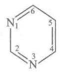

  
嘧啶
(旧系统)

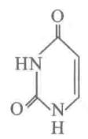  
尿嘧啶

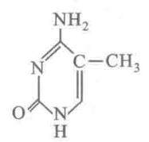

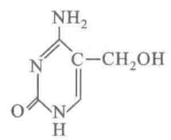  
5-羟甲基胞嘧啶(5-hydroxymethylcytosine)

## 2. 嘌呤碱

核酸中常见的嘌呤碱有两类:腺嘌呤及鸟嘌呤。嘌呤碱是由母体化合物嘌呤衍生而来的。

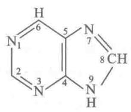  
嘌呤

  
腺嘌呤

  
鸟嘌呤

应用 X 射线衍射分析法已证明了各种嘌呤和嘧啶的三维空间结构。嘌呤和嘧啶环很接近平面，但稍有挠折。

自然界存在许多重要的嘌呤衍生物。一些生物碱，如茶叶碱（1,3-二甲基黄嘌呤）、可可碱（3,7-二甲基黄嘌呤）、咖啡碱（1,3,7-三甲基黄嘌呤）等都是黄嘌呤（2,6-二羟嘌呤）的衍生物。有些植物激素，如玉米素（ $N^{6}$ -异戊烯腺嘌呤）、激动素（ $N^{6}$ -呋喃甲基腺嘌呤）等也是嘌呤类物质。此外，还有些抗生素也是嘌呤类衍生物（详见抗生素部分）。

## 3. 稀有碱基

除了表 11-4 中所列 5 种基本的碱基外, 核酸中还有一些含量甚少的碱基, 称为稀有碱基。稀有碱基种类极多, 大多数都是甲基化碱基。tRNA 中含有较多的稀有碱基, 可高达 10%。表 11-3 为核酸中一部分稀有碱基的名称。目前已知的稀有碱基和核苷达近百种。

表 11-3 核酸中的稀有碱基

<table><tr><td>DNA</td><td>RNA</td><td>DNA</td><td>RNA</td></tr><tr><td>尿嘧啶(U)*</td><td>5,6-二氢尿嘧啶(DHU)</td><td></td><td> $N^{6},N^{6}$ -二甲基腺嘌呤( $m_{2}^{6}A$ )</td></tr><tr><td>5-羟甲基尿嘧啶( $hm^{5}U$ )</td><td>5-甲基尿嘧啶,即胸腺嘧啶(T)</td><td></td><td> $N^{6}$ -异戊烯基腺嘌呤( $i^{6}A$ )</td></tr><tr><td>5-甲基胞嘧啶( $m^{5}C$ )</td><td>4-硫尿嘧啶( $s^{4}U$ )</td><td></td><td>1-甲基鸟嘌呤( $m^{1}G$ )</td></tr><tr><td>5-羟甲基胞嘧啶( $hm^{5}C$ )</td><td>5-甲氧基尿嘧啶( $mo^{5}U$ )</td><td></td><td> $N^{2},N^{2},N^{7}$ -三甲基鸟嘌呤( $m_{3}^{2,2,7}G$ )</td></tr><tr><td> $N^{6}$ -甲基腺嘌呤( $m^{6}A$ )</td><td> $N^{4}$ -乙酰基胞嘧啶( $ac^{4}C$ )</td><td></td><td>次黄嘌呤(I)</td></tr><tr><td></td><td>2-硫胞嘧啶( $s^{2}C$ )</td><td></td><td>1-甲基次黄嘌呤( $m^{1}I$ )</td></tr><tr><td></td><td>1-甲基腺嘌呤( $m^{1}A$ )</td><td></td><td></td></tr></table>

\* 括号中为缩写符号。

## （二）核苷

核苷是一种糖苷，由戊糖和碱基缩合而成。糖与碱基之间以糖苷键相连接。糖的第一位碳原子（C1）与嘧啶碱的第一位氮原子(N1)或与嘌呤碱的第九位氮原子(N9)相连接。所以，糖与碱基间的连键是N—C键，一般称之为N-糖苷键。

核苷中的 D-核糖及 D-2-脱氧核糖均为呋喃型环状结构。糖环中的 C1 是不对称碳原子，所以有 $\alpha-$ 及 $\beta-$ 两种构型。但核酸分子中的糖苷键均为 $\beta-$ 糖苷键。

应用 X 射线衍射法已证明,核苷中的碱基与糖环平面互相垂直。

根据核苷中所含戊糖的不同,将核苷分成两大类:核糖核苷和脱氧核糖核苷。对核苷进行命名时,必须先冠以碱基的名称,例如腺嘌呤核苷、腺嘌呤脱氧核苷等。糖环中的碳原子标号右上角加撇“’”,而碱基中原子的标号不加撇“’”,以示区别。腺嘌呤核苷和胞嘧啶脱氧核苷的结构式如下:

  
表 11-4 为常见核苷的名称。

表 11-4 各种常见核苷

<table><tr><td>碱基</td><td>核糖核苷</td><td>脱氧核糖核苷</td></tr><tr><td>腺嘌呤</td><td>腺嘌呤核苷(adenosine)</td><td>腺嘌呤脱氧核苷(deoxyadenosine)</td></tr><tr><td>鸟嘌呤</td><td>鸟嘌呤核苷(guanosine)</td><td>鸟嘌呤脱氧核苷(deoxyguanosine)</td></tr><tr><td>胞嘧啶</td><td>胞嘧啶核苷(cytidine)</td><td>胞嘧啶脱氧核苷(deoxycytidine)</td></tr><tr><td>尿嘧啶</td><td>尿嘧啶核苷(uridine)</td><td>—</td></tr><tr><td>胸腺嘧啶</td><td>—</td><td>胸腺嘧啶脱氧核苷(deoxythymidine)</td></tr></table>

RNA 中含有某些修饰和异构化的核苷。修饰碱基如前所述。核糖也能被修饰，主要是甲基化。tRNA 和 rRNA 中还含有少量假尿嘧啶核苷（以符号 $\varphi$ 表示），它的结构很特殊，核糖不是与尿嘧啶的第一位氮（N1），而是与第 5 位碳（C5）相连接。细胞内有特异的异构化酶催化尿嘧啶核苷转变为假尿嘧啶核苷。有些 tRNA 中含有 W(Y) 核苷和 Q 核苷，其碱基母核不是嘌呤环，但可以把它们看作是鸟嘌呤核苷的衍生物（见结构式）。从酵母苯丙氨酸 tRNA 中分离出一种荧光核苷 Y，后在其他来源的苯丙氨酸 tRNA 中也分离到这种核苷。这类核苷都含有二甲基三杂环部分，化学名为 1, $N^{2}$ -异丙烯-3-甲基鸟苷。不同来源的该类核苷在碱基杂环上的侧链 R' 不同，R 为核糖。Y 核苷后又被称为 W 核苷。Q 核苷的碱基骨架为 7-去氮鸟嘌呤，在第 7 位（C7）上连以侧链 R'，不同 Q 核苷的 R' 不同。假尿嘧啶核苷、W(Y) 核苷和 Q 核苷的结构式如下：

## （三）核苷酸

核苷中的戊糖羟基被磷酸酯化,就形成核苷酸。因此核苷酸是核苷的磷酸酯。下面为两种核苷酸的结构式。

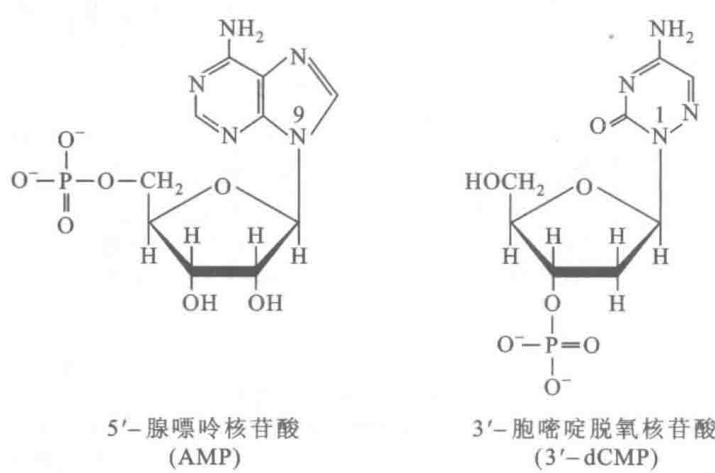

核糖核苷的糖环上有3个自由羟基，能形成3种不同的核苷酸：2'-核糖核苷酸，3'-核糖核苷酸和5'-核糖核苷酸。脱氧核苷的糖环上只有2个自由羟基，所以只能形成两种核苷酸：3'-脱氧核糖核苷酸和5'-脱氧核糖核苷酸。生物体内游离存在核苷酸多是5'-核苷酸。用碱水解RNA时，可得到2'-与3'-核糖核苷酸的混合物。

常见的核苷酸列于表 11-5 中。

表 11-5 常见的核苷酸

<table><tr><td>碱基</td><td>核糖核苷酸</td><td>脱氧核糖核苷酸</td></tr><tr><td>腺嘌呤</td><td>腺嘌呤核苷酸(adenylate,AMP)</td><td>腺嘌呤脱氧核苷酸(deoxyadenylate,dAMP)</td></tr><tr><td>鸟嘌呤</td><td>鸟嘌呤核苷酸(guanylate,GMP)</td><td>鸟嘌呤脱氧核苷酸(deoxyguanylate,dGMP)</td></tr><tr><td>胞嘧啶</td><td>胞嘧啶核苷酸(cytidylate,CMP)</td><td>胞嘧啶脱氧核苷酸(deoxycytidylate,dCMP)</td></tr><tr><td>尿嘧啶</td><td>尿嘧啶核苷酸(uridylate,UMP)</td><td>—</td></tr><tr><td>胸腺嘧啶</td><td>—</td><td>胸腺嘧啶脱氧核苷酸(deoxythymidylate,dTMP)</td></tr></table>

## （四）核苷酸的衍生物

核苷酸除作为核酸的结构单元外,其游离分子和衍生物具有多种生理功能,广泛参与细胞的各种生命活动,并起着关键的作用,因此这是一类极为重要的生物分子。据推测,核苷酸可能也是生命起源之初最早出现的生物分子。

细胞内有一类多磷酸核苷酸,它们是能量载体、核酸合成的前体和重要的辅酶。5'-二磷酸核苷(5'-nucleoside diphosphate, 5'-NDP) 是核苷的焦磷酸酯, 5'-三磷酸核苷 (5'-nucleoside triphosphate, 5'-NTP) 是核苷的三磷酸酯。最常见的是腺苷三磷酸 (5'-adenosine triphosphate, ATP)。ATP 的结构式如下:

多磷酸核苷酸的磷酸基团之间以酸酐键(anhydride bond)连接,此酸酐键在热力学上极不稳定,易水解并释放出大量自由能,故称为“高能键”(high-energy bond),以符号“\~”表示。“高能键”这个术语容易与化学中使用的“键能”(bond energy)相混淆,而且不确切,水解反应释放自由能受种种因素影响,并不仅限于“键”本身。然而,“高能键”这个术语已被广泛使用,简洁易懂,故迄今仍被沿用。ATP含有两个高能键,可水解下末端磷酸基团和焦磷酸基团,水解时自由能变化 $\Delta G^{\ominus}$ 分别为-30.5 kJ/mol(-7.3 kcal/mol)和-45.6 kJ/mol(-10.9 kcal/mol)。

$$
\begin{array}{r l r} \mathrm {ATP+ H_ {2} O\longrightarrow ADP+ Pi} & & \Delta G ^ {\ominus \prime} = - 3 0. 5 \mathrm{kJ/mol} \\ \mathrm {ATP+ H_ {2} O\longrightarrow AMP+ PPi} & & \Delta G ^ {\ominus \prime} = - 4 5. 6 \mathrm{kJ/mol} \end{array}
$$

ATP 还能够转移出三种基团: 磷酸基团 \~ ①、焦磷酸基团 \~ ①\~ ②和腺苷酸基团 \~ AMP, 将相应的自由能转移给受体分子。由于 ATP 的 $\Delta G^{\ominus}$ 居于中间位置, 它可以从代谢物降解或光合作用中产生, 并将获得的能量用于生物合成、细胞运动和膜运输等需能过程, 因此 ATP 是生物机体通用的能量载体。UTP、GTP 和 CTP 具有类似的高能键, 它们与 dNTP 分别是 RNA 和 DNA 合成的前体。

腺苷酸还是许多辅酶的组成部分。烟酰胺腺嘌呤二核苷酸（NAD）、烟酰胺腺嘌呤二核苷酸磷酸（NADP）、黄素腺嘌呤二核苷酸（FAD）和辅酶A中都含有腺苷酸，辅酶 $B_{12}$ 则含有脱氧腺苷（详见维生素和辅酶一章）。在这些辅酶中，腺苷酸并不参与辅酶的功能，但却有助于底物或辅酶与酶的结合。对这种情况的一种合理解释认为，ATP广泛参与细胞的各种反应，故而细胞内无处不在，含量丰富，能与之识别和作用的蛋白质组件，核苷酸结合折叠子（nucleotide-binding fold），也必然存在于多种酶（蛋白质）中。新的蛋白质可借助基因重组和突变而产生，结合腺苷的结构便常出现于各类蛋白质。从进化的观点来看，含有腺苷酸或腺苷的辅酶较易与酶结合，于是这类辅酶便被选择下来。

细胞能接收环境信号并给出适当的反应。当激素或化学信号分子(第一信使)作用于细胞膜受体时,信号传递到细胞内部,在胞内合成第二信使,经级联系统将信号放大,以调节基因表达或细胞代谢。腺苷3',5'-环磷酸(adenosine 3',5' cyclic monophosphate,cAMP)和鸟苷3',5'-环磷酸(guanosine 3',5'-cyclic monophosphate,cGMP)是两种重要的第二信使,它们的结构式如下:

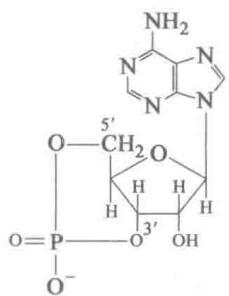  
腺苷3', 5'-环磷酸 (cAMP)

  
鸟苷3', 5'-环磷酸 (cGMP)

cAMP 由质膜内侧的腺苷酸环化酶催化 ATP 合成；cGMP 由鸟苷酸环化酶催化 GTP 合成。详见激素和信号转导部分。

B 代表碱基, 竖线代表戊糖碳链, P 代表磷酸基, 与 P 相连的斜线表示 $3', 5'$ -磷酸二酯链

此外,还有多种调节核苷酸。例如细菌在氨基酸饥饿时便会合成出鸟苷 $5^{\prime}-$ 二磷酸, $3^{\prime}-$ 二磷酸（ppGpp），这是由 ATP 将焦磷酸基转移给 GDP 而成，它能抑制 rRNA 和 tRNA 的合成，从而降低细菌的蛋白质合成速度和生长速度。

## （五）核苷酸的聚合物

核酸是由核苷酸线性(不分支)聚合而成的生物大分子。细胞内有一些聚合度较低的核苷酸聚合物,主要是核糖核苷酸聚合物,它们往往具有特殊的生物功能(详见 RNA 的生物功能)。由几个或几十个核苷酸(一般指 50 个以下)连接而成的聚合物称为寡核苷酸(oligonucleotide)。由几十个至上百个核苷酸(50 个以上)连接而成的聚合物称为多(聚)核苷酸(polynucleotide)。更大的聚合物则为核酸。

核酸可被酸、碱和酶水解。核酸水解产生各种寡核苷酸、核苷酸、核苷和碱基。这就证明，核苷酸是核酸的结构单位，核苷和碱基都是由核苷酸水解而来。核酸的酸碱滴定曲线显示，在核酸分子中的磷酸基只

有一级解离,它的另两个酸基必定与糖环的羟基形成了磷酸二酯键。由此可见,核酸中的核苷酸以磷酸二酯键彼此相连。RNA 的核糖上有 3 个羟基,即 $2'-3'-$ 和 $5'-$ 羟基,核苷酸之间是由哪两个羟基形成磷酸二酯键的?用磷酸二酯酶可以水解核酸的磷酸二酯键。牛脾磷酸二酯酶可从核酸的 $5'$ 端逐个水解下 $3'-$ 核苷酸;蛇毒磷酸二酯酶从核酸的 $3'$ 端逐个水解下 $5'-$ 核苷酸(图 11-2)。这就清楚说明 RNA 以 $3',5'-$ 磷酸二酯键连接核苷酸。DNA 的糖为 2-脱氧核糖,只能形成 $3',5'-$ 磷酸二酯键。实验也证明此结论。

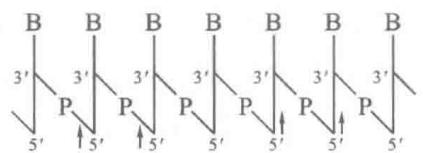  
图 11-2 多核苷酸链被磷酸二酯酶水解

核酸酶在核酸结构分析中十分有用。借助酶作用的特异性可用以鉴别共价键的性质。牛脾磷酸二酯酶和蛇毒磷酸二酯酶都是

非专一性的外切核酸酶,但它们识别不同羟基形成的磷酸酯键。前者水解 5'-羟基形成的磷酸酯键;后者水解 3'-羟基形成的磷酸酯键。

核酸的共价结构(一级结构)有几种表示方法。上图为竖线式,用竖线代表戊糖,B为碱基,P为磷酸基。也可用文字式来表示,以字母代表核苷或核苷酸。原则上5'端在左侧,3'端在右侧,磷酸二酯键的走向为3'→5'。在文字式中,P在核苷之左表示与5'-羟基相连,在右表示与3'-羟基相连。有时,多核苷酸链中磷酸基P也可省略,仅以字母表示核苷酸的序列。这两种写法对DNA和RNA都适用。

## 四、DNA 的结构和功能

前已介绍，DNA是由脱氧核糖核苷酸聚合而成的长链生物大分子。与蛋白质类似，DNA也有不同层次的结构。DNA的一级结构是指其核苷酸链的共价结构，亦即核苷酸序列。DNA的二级结构是指由次级键形成的双螺旋(duplex)或多股螺旋(multiplex)结构。DNA的三级结构是指其超螺旋(superhelix)结构。有些书上将DNA的拓扑结构(topology)也列为二级结构，因其由DNA双螺旋缠绕数改变所引起。也有一些书将DNA三股螺旋(triplex)或四股螺旋(tetraplex)列为三级结构。本书按照比较公认的看法，将DNA螺旋结构归为二级结构，超螺旋结构归为三级结构。

## (一) DNA 的一级结构

DNA 的一级结构是由数量极其庞大的 4 种脱氧核糖核苷酸通过 3',5'-磷酸二酯键连接起来的直线形或环形多聚体（图 11-3 表示 DNA 的一个小片段）。DNA 的相对分子质量非常大，通常一个染色体就是一个 DNA 分子，最大的染色体 DNA 可超过 $10^{8}$ bp，也即 $M_{r}$ 大于 $1 \times 10^{11}$ 。如此大的分子能够编码的信息量是十分巨大的。为了阐明生物的遗传信息，首先要测定生物基因组的序列。迄今已经测定基因组序列的生物数近万种，其中包括病毒、大肠杆菌、酵母、线虫、果蝇、拟南芥、玉米、水稻、鸡、小鼠、猩猩和人类的基因组。病毒基因组较小，但十分紧凑，有些基因是重叠的（overlapping）。细菌的基因是连续的，无内含子；有些功能相关的基因组成操纵子，有共同的调节和控制序列；调控序列所占比例较小；很少重复序列。真核生物的基因是断裂的，有内含子；功能相关的基因不组成操纵子；调控序列所占比例大；有大量重复序列。重复序列可分为低拷贝重复，中等程度重复和高度重复。重复序列或取向一致（正向重复）或取向相反（反向重复）。回文结构（palindrome）也即反向重复。有时同一条链上序列彼此反向重复，称为镜像重复（mirror repeat），它们相互并不互补。越是高等的真核生物其调控序列和重复序列的比例越大。

人类基因组的大小为 3.286 Gb (gigabases, $10^{9}$ bp), 其中 2.95 Gb 为常染色质 (染色较弱, 富含基因)。真正用于编码蛋白质的序列仅约占基因组的 1%。也就是说, 编码蛋白质的基因只占基因组的 25%, 其中 1% 是用于形成 mRNA 的外显子 (exon), 24% 是剪接过程中需切除的内含子 (intron)。基因组中超过一半是各种类型的重复序列, 其中 45% 为各种转座子 DNA (包括转座子和逆转座子等), 3% 为简单的高度重复序列, 5% 为近期进化中倍增的 DNA 片段。编码蛋白质的基因大约为 25000 个。与人类基因组相比, 酵母细胞的编码基因为 6034, 果蝇为 13601, 蠕虫为 18424, 而拟南芥为 25498。

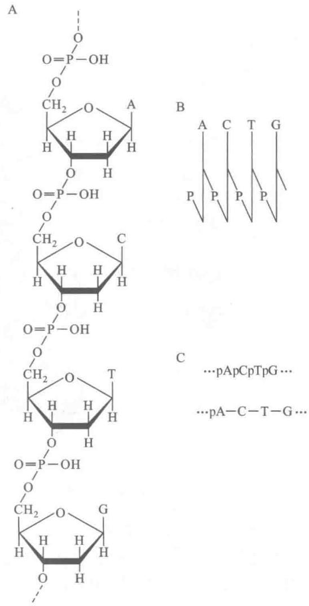

## （二）DNA 的双螺旋结构

Watson 与 Crick 提出 DNA 双螺旋结构模型 (double helix model), 揭示了 DNA 分子结构与功能的关系, 其主要有三个方面的依据: 一是已知核酸的化学性质和核苷酸键长与键角的数据; 二是 Chargaff 发现的 DNA 碱基组成规图 11-3 DNA 中多核苷酸链的一个小片段及缩写符号

A. DNA 中多核苷酸链的一个小片段；B. 为竖线式缩写；C. 为文字式缩写

律,显示碱基间的配对关系;三是对 DNA 纤维进行 X 射线衍射分析的结果。

E. Chargaff 等科学家在 20 世纪 40 年代应用纸层析及紫外分光光度技术测定各种生物 DNA 的碱基组成。结果发现 DNA 碱基组成有物种特异性，不同科的 DNA 碱基组成不同；而同一种生物不同组织和器官的 DNA 碱基组成是一样的，不受生长发育、营养状况以及环境条件的影响。1950 年 Chargaff 总结出 DNA 碱基组成的规律，称为 Chargaff 规则，其主要内容为：① DNA 的腺嘌呤和胸腺嘧啶摩尔数相等，即 A = T；② 鸟嘌呤和胞嘧啶的摩尔数也相等，即 G = C；③ 含 6-氨基的碱基数等于含 6-酮基的碱基数，即 A + C = G + T；④ 嘌呤的总摩尔数等于嘧啶的总摩尔数，即 A + G = C + T。这些规律暗示，在 DNA 分子中 A 与 T、G 与 C 之间存在着配对关系。

比较直接测定生物大分子结构的方法是用 X 射线晶体衍射技术。但是 DNA 分子太大,很难制得晶体。用针从浓的 DNA 溶液中抽出纤维,可使 DNA 分子成束整齐排列,即可用于衍射研究。1938 年 Astbury 等用小牛胸腺 DNA 纤维作 X 射线衍射分析,发现在子午线上有 0.334 nm 的衍射点。他认为这反映了 DNA 中扁平核苷酸间的距离;但是由于他认为核苷酸是直线排列的,无法解释其他衍射点,也与核酸的一些化学性质不符。稍后 Franklin 和 Wilkins 对 DNA 的 X 射线衍射进行了更多的研究,获得清晰的衍射图。

在前人研究工作的基础上, Watson 和 Crick 于 1953 年提出了 DNA 分子双螺旋结构模型(图 11-4)。该模型具有以下特征：

（1）两条反向平行的多核苷酸链围绕同一中心轴相互缠绕；两条链均为右手螺旋。

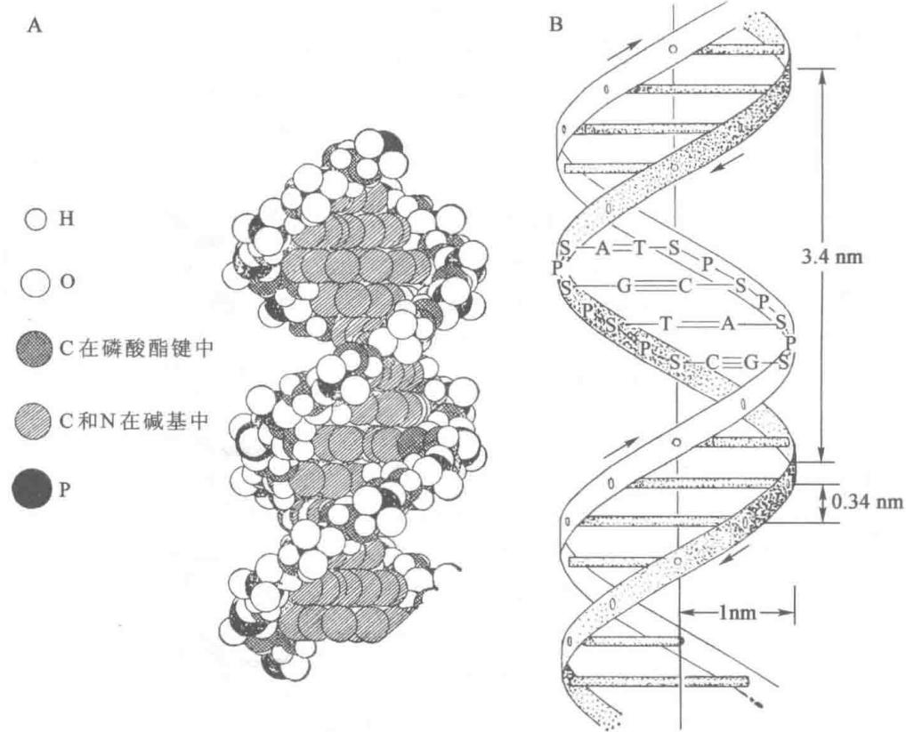  
图 11-4 DNA 分子双螺旋结构模型(A)及其图解(B)

（2）嘌呤与嘧啶碱位于双螺旋的内侧。磷酸与核糖在外侧，彼此通过 $3^{\prime}, 5^{\prime}-$ 磷酸二酯键相连接，形成分子的骨架。碱基平面与纵轴垂直，糖环的平面则与纵轴平行。多核苷酸链的方向取决于核苷酸间磷酸二酯键的走向，以 $\mathrm{C}^{\prime}3 \rightarrow \mathrm{C}^{\prime}5$ 为正向。两条配对链偏向一侧，形成一条大沟（major groove）和一条小沟（minor groove）。

（3）双螺旋的平均直径为 2 nm，两个相邻的碱基对之间的高度距离为 0.34 nm，两个核苷酸之间的夹角为 $36^{\circ}$ 。因此，沿中心轴每旋转一周有 10 个核苷酸，高度（即螺距）为 3.4 nm。

（4）两条核苷酸链依靠彼此碱基之间形成的氢键而结合在一起。根据分子模型的计算，一条链上的

嘌呤碱必须与另一条链上的嘧啶碱相匹配，其距离才正好与双螺旋的直径相吻合。碱基之间A只能与T相配对，形成两个氢键；G与C相配对，形成三个氢键。所以G-C之间的结合较为稳定（图11-5）。

（5）碱基在一条链上的排列顺序不受任何限制。但是根据碱基配对原则，当一条多核苷酸链的序列被确定后，即可决定另一条互补链的序列。这就表明，遗传信息由碱基的序列所携带。

在生理条件下,DNA 分子是稳定的,有许多因素维持着 DNA 的双螺旋结构,其中最主要的作用力来自两方面:一是配对碱基间的氢键,单个氢键虽然很弱,无数碱基对累积的氢键能量就相当大了。二是堆积力(stacking force),扁平的碱基对之间藉 $\pi,\pi$ 电子相互作用产生吸引力,这是范德华力(van der Waals force)的一种形式。碱基对的疏水性,造成疏水作用,也是堆积力的

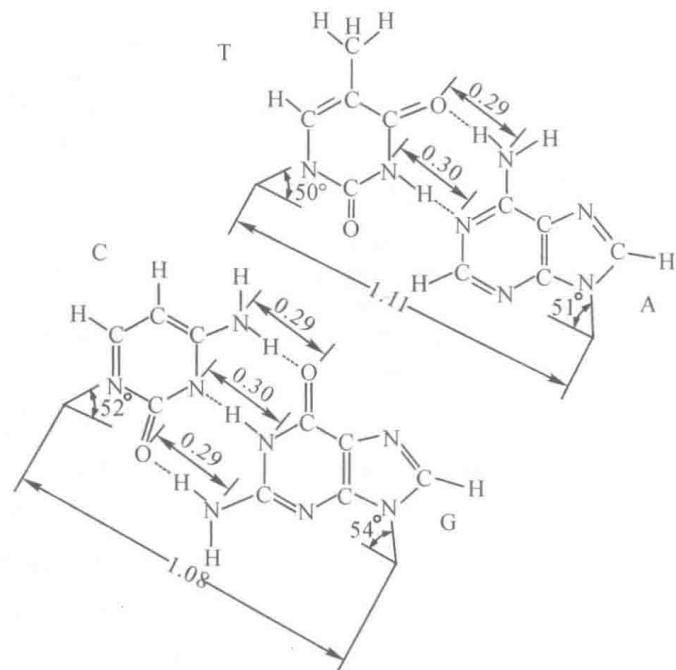  
图 11-5 DNA 分子中的 A-T, G-C 配对（图中长度单位为 nm）

成因之一。

由于 Watson 和 Crick 的模型是根据 DNA 纤维的 X 射线衍射资料推导出来的, 它所提供的只是 DNA 结构的平均特征。后来, 对 DNA 合成片段晶体所作的 X 射线衍射分析才提供了更为精确的信息。K. Dickerson 等人用人工合成的多聚脱氧核糖核苷酸(十二聚体)晶体进行 X 射线衍射分析后, 认为这种十二聚体的结构与 Watson 和 Crick 模型所提供的结构十分相似, 但在结构上并不像 Watson-Crick 模型所说的那样均一。这是由于碱基序列的不同, 以致在局部结构上有较大的差异。这些差异是:

（1）Watson-Crick 模型认为每一螺周含有 10 个碱基对，所以两个核苷酸之间的夹角是 $36^{\circ}$ 。但 Dickerson 合成的十二聚体中，两个碱基间的夹角可由 $28^{\circ}$ 至 $42^{\circ}$ 不等。实际平均每一螺周含 10.4 个碱基对。分子大小的各参数也随序列不同而有变动。

（2）Dickerson所研究的十二聚体结构中，组成碱基对的两个碱基的分布并非在同一平面上，而是沿长轴旋转一定角度，从而使碱基对的形状像螺旋桨叶片的样子（图11-6），故称为螺旋桨状扭曲（propeller twisting）。这种结构可提高碱基堆积力，使DNA结构更稳定。

  
图11-6 碱基对的螺旋桨状结构

DNA 的结构可受环境条件的影响而改变。Watson 和 Crick 所建议的结构代表 DNA 钠盐在较高湿度下 (92%) 制得的纤维的结构, 称为 B 型 (B form)。由于它的水分含量较高, 可能比较接近大部分 DNA 在细胞中的构象。DNA 能以多种不同的构象存在, 除 B 型外通常还有 A 型、C 型、D 型、E 型和左手双螺旋的 Z 型。这里包括天然的和人工合成的各种双螺旋 DNA。其中 A 型和 B 型是 DNA 的两种基本的构象, Z 型则比较特殊。C 型、D 型和 E 型与 B 型接近, 可看成同一族。

在相对湿度为 75% 以下所获得 DNA 纤维的 X 射线衍射分析资料表明，这种 DNA 纤维具有不同于 B 型的结构特点，称为 A 型（A-DNA）。A-DNA 也是由两条反向的多核苷酸链组成的右手双螺旋；但是螺体较粗而短，碱基对与中心轴之倾角不同，呈 $19^{\circ}$ 。RNA 分子的双螺旋区以及 RNA-DNA 杂交双链具有与 A-DNA 相似的结构。

由于呋喃糖环并非平面，糖环上通常有一个或两个原子偏离平面，糖环因此而折叠。如若折叠偏向 $C_{5}$ 一侧称为内式（endo）；若偏向另一侧称为外式（exo）。A 型为 $C_{3}$ 内式，B 型为 $C_{2}$ 内式。碱基平面绕 N-糖苷键旋转产生顺式（syn）和反式（anti）构象。反式构象是指嘌呤六元环或嘧啶的 2-酮基指向远离糖的方向；顺式构象则指向糖。碱基与糖的旋转位置在立体结构上是受限制的，天然核苷中反式更合宜。A 型和 B 型均为反式。

自然界双螺旋 DNA 大多为右手螺旋，但也有左手螺旋。A. Rich 在研究人工合成的 d(CGCGCG) 寡核苷酸结构时发现存在左手螺旋的构象。六聚体 (dC·dG) 的晶体结构中，自身互补的寡核苷酸排列成反平行，每转 12 个碱基对为一圈，螺距 4.56 nm，碱基对移向边缘，只有小沟，大沟被胞嘧啶的 C5 和鸟嘌呤的 N7、C8 原子填充。与右手螺旋不同，在左手螺旋中糖环折叠和糖苷键的构象对于嘧啶碱和嘌呤碱各不相同。dC 是 C₂' 内式，碱基反式；dG 是 C₃' 内式，碱基顺式。因此，磷酸和糖的骨架呈现 Z 字形 (zigzag) 走向，Z 型名称即源于此 (图 11-7)。随后发现天然 DNA 局部也有 Z 型结构。

  
图11-7 Z-DNA与B-DNA之比较

共价结构的改变涉及共价键的断裂与连接。构象受环境条件的影响，它的改变不涉及共价键。DNA的各型构象在一定条件下可以相互转变。除上述相对湿度能影响DNA纤维的构象外，溶液的盐浓度、离子种类、有机溶剂等都能引起DNA构象的改变。增加NaCl浓度可使B型转变为A型。当DNA是钠盐时，A、B、C三种形态都能出现；改成锂盐时，只有B型和C型可能出现。Z型DNA的序列必须含鸟嘌呤，并且嘌呤碱与嘧啶碱交替出现，在此条件下存在盐和有机溶剂有利于Z型的形成。DNA的甲基化使大沟表面暴露的胞嘧啶形成5-甲基胞嘧啶，即可导致B-DNA向Z-DNA的转化。DNA的变构效应可能与基因表达的调节有关。

表 11-6 列出了 A 型、B 型和 Z 型 DNA 的主要特征数据。由于各实验室测定样品的方法和条件各不相同，所得数据有较大出入，所列数据可作为了解各类构象特性的比较。

表 11-6 A 型、B 型和 Z 型 DNA 的比较

<table><tr><td rowspan="2"></td><td colspan="3">螺旋类型</td></tr><tr><td>A</td><td>B</td><td>Z</td></tr><tr><td>外形</td><td>粗短</td><td>适中</td><td>细长</td></tr><tr><td>螺旋方向</td><td>右手</td><td>右手</td><td>左手</td></tr><tr><td>螺旋直径</td><td>2.55 nm</td><td>2.37 nm</td><td>1.84 nm</td></tr><tr><td>碱基轴升</td><td>0.23 nm</td><td>0.34 nm</td><td>0.38 nm</td></tr><tr><td>碱基夹角</td><td>32.7°</td><td>34.6°</td><td> $60^{\circ}$ 1</td></tr><tr><td>每圈碱基数</td><td>11</td><td>10.4</td><td>12</td></tr><tr><td>螺距</td><td>2.53 nm</td><td>3.54 nm</td><td>4.56 nm</td></tr><tr><td>轴心与碱基对的关系</td><td>不穿过碱基对</td><td>穿过碱基对</td><td>不穿过碱基对</td></tr><tr><td>碱基倾角</td><td>19°</td><td>-1.2°</td><td>-9°</td></tr><tr><td>糖环折叠</td><td> $C_{3}$ 内式</td><td> $C_{2}$ 内式</td><td>嘧啶  $C_{2}$ 内式,嘌呤  $C_{3}$ 内式</td></tr><tr><td>糖苷键构象</td><td>反式</td><td>反式</td><td>嘧啶反式,嘌呤顺式</td></tr><tr><td>大沟</td><td>很狭、很深</td><td>很宽、较深</td><td>平坦</td></tr><tr><td>小沟</td><td>很宽、浅</td><td>狭、深</td><td>很狭、很深</td></tr></table>

① Z-DNA 的核苷酸交替出现顺反式，故以 2 个核苷酸为单位，转角为 $60^{\circ}$ 。

## （三）DNA 的三股螺旋和四股螺旋

早在20世纪50年代，双螺旋结构发现之后不久就已观察到一些人工合成的寡核苷酸能够形成三股螺旋，寡核苷酸包括核糖核苷酸和脱氧核糖核苷酸。K. Hoogsteen于1963年首先描述了三股螺旋的结构。在三股螺旋中，通常是一条同型寡核苷酸（即或为寡嘧啶核苷酸，或为寡嘌呤核苷酸）与寡嘧啶核苷酸-寡嘌呤核苷酸双螺旋的大沟结合。第三股的碱基可与Watson-Crick碱基对中的嘌呤碱形成Hoogsteen配对。第三股与寡嘌呤核苷酸之间为同向平行。根据第三股的组成可分为不同的型，例如： $\mathrm{Py}\cdot \mathrm{Pu}*\mathrm{Py}$ 、 $\mathrm{Py}\cdot \mathrm{Pu}*\mathrm{Pu}$ 和 $\mathrm{Py}\cdot \mathrm{Pu}*\mathrm{rPy}$ 等。“·”表示Watson-Crick配对，“\*”表示Hoogsteen配对。一般认为，三股中碱基配对方式必须符合Hoogsteen模型，即第三个碱基以A或T与 $\mathrm{A} = \mathrm{T}$ 碱基对中的A配对；G或C与 $\mathrm{G} = \mathrm{C}$ 碱基对中的G配对，第三个碱基C必须质子化，以作为与G的N7结合的氢键供体，并且它与G配对只形成两个氢键(图11-8)。

三股螺旋中的第三股可以来自分子间,也可以来自分子内。铰链 DNA(hinged-DNA)是一种分子内折叠形成的三股螺旋。当 DNA 的一段多聚嘧啶核苷酸或多聚嘌呤核苷酸组成镜像重复,即可回折产生 H-DNA,该重复序列又称为 H 回文结构(H-palindrome)。例如,交替出现的 T 和 C 序列,其互补链为交替的 A 和 G 序列,在其中间取一核苷酸,两侧即为镜像重复,就可能形成 H-DNA 结构(图 11-9)。在酸性 pH 或负超螺旋张力的情况下即可发生 B-DNA→H-DNA 转变。酸性 pH 促使胞嘧啶质子化,从而提高了形成三股螺旋时以 Hoogsteen 氢键与鸟嘌呤配对的能力。

H-DNA 存在于基因调控区和其他重要区域,从而显示出它具有重要生物学意义。实验表明,启动子的 S1 核酸酶敏感区存在一些短的、同向或镜像重复的聚嘧啶-嘌呤区，该区域可以形成 H-DNA，因而产生可被 S1 酶消化的单链结构。

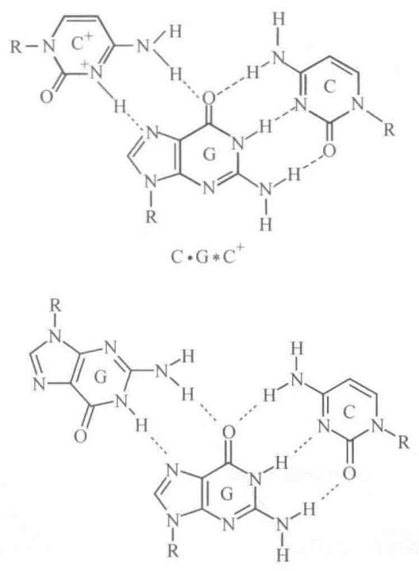

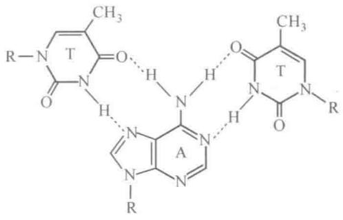  
T·A\*T

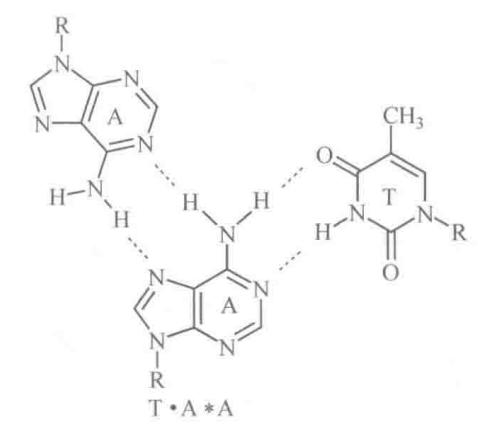  
图 11-8 三股螺旋 DNA 中的碱基配对图中左上角的碱基位于第三股

C·G\*G  
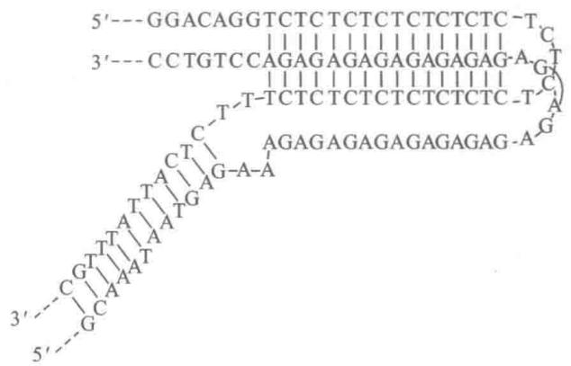  
图11-9 H-DNA的结构

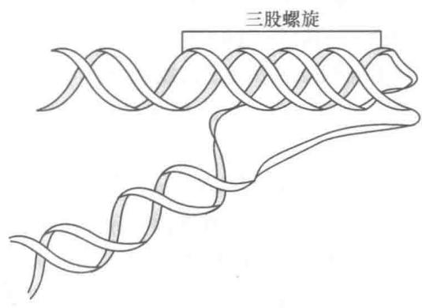

DNA 还能形成四股螺旋,但只见于富含鸟嘌呤区。四股 DNA 链(tetraplex 或 quadruplex)借鸟嘌呤之间氢键配对形成稳定的 G-四链体(guanine quartet)(图 11-10A)。四股螺旋 DNA 链的走向,可以是全部相同方向,也可以是两两相反(图 11-10B)。染色体 DNA 某些富含鸟嘌呤的区域,通过回折形成四股螺旋,如在着丝粒和端粒区域可出现此类结构,其生物学意义目前还不清楚。

## (四) DNA 的超螺旋

DNA 的三级结构是在二级结构基础上,通过扭曲和折叠所形成的特定构象,其中包括单链与双链、双螺旋与双螺旋的相互作用,以及一些具有拓扑学特征的结构。上述三股螺旋和四股螺旋仅就螺旋结构而言,仍为二级结构,但涉及分子回折和链之间的相互作用,故有些书中将之列为三级结构。超螺旋则是 DNA 三级结构的一种形式。

当 DNA 双螺旋分子在溶液中以一定构象自由存在时,双螺旋处于能量最低的状态,此为松弛态。

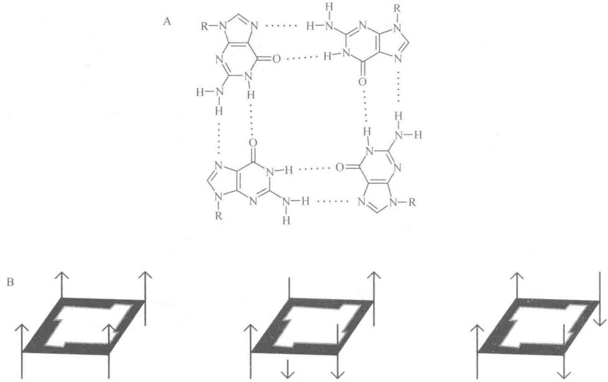  
图11-10 四股螺旋DNA的结构  
A. G-四碱基体可能的氢键配对方式；B. 四股螺旋链的几种走向

如果使这种正常的 DNA 分子额外地多转几圈或少转几圈, 就会使双螺旋中存在张力。如若双螺旋分子的末端是开放的, 这种张力可以通过链的转动而释放出来, DNA 可恢复正常的双螺旋状态。但若 DNA 分子的两端是固定的, 或者是环状分子, 这种额外的张力就不能释放掉, DNA 分子本身就会发生扭曲, 用以抵消张力。这种扭曲称为超螺旋 (superhelix) 或超卷曲 (supercoil), 是双螺旋的进一步螺旋。

20 世纪 60 年代, J. Vinograd 对环状 DNA 分子的拓扑结构进行了研究, 作出很大贡献。DNA 的拓扑学公式就是他提出来的。拓扑学 (topology) 是数学的一个分支, 它研究图形的几何性质, 而不理会其“度量”。许多 DNA 是双链环状分子 (double-stranded circular molecule), 如细菌染色体 DNA、质粒 DNA、细胞器 DNA、某些病毒 DNA 等。细菌染色体 DNA 太大, 很难分离出完整的分子。但可以提取到相对分子质量不太大的质粒和病毒的天然环状 DNA。通常在这类制剂中可以观察到 3 种形式的 DNA: 共价闭环 DNA (covalently closed circular DNA, cccDNA), 这类 DNA 常呈超螺旋型 (superhelical form); 双链环状 DNA 的一条链断裂, 称为开环 DNA (open circular DNA, ocDNA), 分子呈松弛态; 环状 DNA 双链断裂, 成为线状 DNA (linear DNA)。1966 年 Vinograd 发现 cccDNA 的双链互绕数 (intertwining number) $\alpha$ 等于螺旋圈数 (helical turn) $\beta$ 与超螺旋数 (superhelical number) $\tau$ 之和, 即:

$$
\alpha = \beta + \tau\tag{11-1}
$$

在上述公式中， $\beta$ 值是由双螺旋的构象所决定的，也即是松弛状态下的螺旋圈数。例如： $2.6\mathrm{kb}$ 的环状DNA，如为B型，其 $\beta$ 值为 $2600 / 10.4 = 250$ 。若双螺旋互绕圈数大于构象规定的螺旋圈数，即 $\alpha >\beta$ ，此时DNA为卷曲过量（overwinding）；互绕圈数小于构象规定的螺旋圈数，即 $\alpha < \beta$ ，此时DNA为卷曲不足（underwinding）。无论卷曲过量或不足，都将产生超螺旋。 $\alpha$ 值必定是整数，因为闭环分子的螺旋数总是整数。 $\beta$ 和 $\tau$ 值则不一定是整数。 $\alpha$ 与 $\beta$ 值根据螺旋走向取正负，右手螺旋为正（+），左手螺旋为负（-）。超螺旋为 $\alpha$ 与 $\beta$ 之差，当 $\alpha$ 大于 $\beta$ 时超螺旋为正， $\alpha$ 小于 $\beta$ 时超螺旋为负。如果外力部分撑开双螺旋，此时 $\alpha$ 值不变， $\beta$ 值变小（因双螺旋区缩小），将产生正超螺旋，即向左拧用以抵消过量右手螺旋产生的张力（图11-11B）。主链共价键不经断开-再连接， $\alpha$ 值不变，但体内存在多种拓扑异构酶（topoisomerase）可以改变 $\alpha$ 值, 从而改变 DNA 的拓扑结构。为了比较超螺旋强度, 需要引入一个新的参数, 比超螺旋 (specific superhelix) 或超螺旋密度 (superhelical density), 以 $\sigma$ 来表示。 $\sigma = (\alpha - \beta) / \beta$ 。细胞 DNA 通常处于负螺旋状态, 其 $\sigma$ 值为 -0.07 \~ -0.05。

  
图11-11 cccDNA的拓扑结构

与此同时，数学家在研究闭合带的拓扑性质中取得重要成果。1969年J.H. White推导出闭合带两边之间的连环数（Linking number, $L_{k}$ ）等于带的扭转数（twisting number, $T_{w}$ ）与轴曲线的高斯积分（Gauss integral）之和，高斯积分后被称为缠绕数（Writhing number, $W_{r}$ ）。其关系为：

$$
L _ {k} = T _ {w} + W _ {r}\tag{11-2}
$$

比较上述两个公式可以看出， $\alpha$ 与 $L_{k}$ 相同，两公式也十分类似。但公式(11-1)只涉及DNA的拓扑结构，各参数受DNA的构象限制，并且都是可以测量的；公式(11-2)是抽象的数学公式，对 $T_{w}$ 与 $W_{r}$ 的定义和公式(11-1)不同，并且不可测量。许多书中混淆了两者的差别。问题不在于采用什么符号，关键是要掌握它的确切含义。

## （五）DNA 贮存遗传信息

子代与亲代相似是生物界的普遍现象。这意味着亲代细胞必定有某种机制影响或决定子代细胞的性状。那么，这种遗传机制（遗传功能）的承载物质是什么？许多科学家在探索这个问题。十九世纪中期，两位杰出的科学家 G. Mendel 和 F. Miescher 几乎同时朝这个问题迈出了关键的一步。1865 年 Mendel 发表了他著名的豌豆杂交论文，后被 C. Correns 于 20 世纪初归结为“性状分离定律”和“自由组合定律”，从而奠定了遗传学基础。Miescher 于 1868 年提交的论文中公布他从脓细胞核中分离出核素（DNA）的结果。两位科学家的工作都不被同时代的学术界所接受。Mendel 的论文直到 1900 年才被 Hugo de Vries、Carl Correns 和 Erich von Tschemak 所重新发现和极力推崇；而 Miescher 的发现却迟至 20 世纪 40 年代始重受关注。其时，一系列实验证明，DNA 是遗传物质。

## 1. DNA 是染色体的主要成分

早在 19 世纪后期,有关细胞分裂、染色体行为和受精过程的研究为遗传的染色体学说奠定了基础。Miescher 从细胞核中提取出核素,于是有些生物学家推测核素是染色体的组成物质。20 世纪前期,Levene 的“四核苷酸假说”广为流行,该假说否定核酸特异性,较长时间阻碍了核酸的研究。直到 20 世纪 40 年代,Chargaff 发现 DNA 碱基组成规律和种属特异性,才推翻“四核苷酸假说”。由此可见,科学研究不仅要有“实验手段”,还要有“想象力”。

20 世纪 30—40 年代细胞化学技术有了很大发展, 对细胞中 DNA 含量测定结果表明, 任何一种生物细胞其 DNA 含量都是恒定的, 不受外界环境、营养条件和细胞本身代谢状态的影响。细胞具有固定数目的染色体, 与 DNA 含量一致, 单倍体生殖细胞的 DNA 含量正好是双倍体体细胞的一半。这些数据都符合遗传物质的特性。表 11-7 列出几种动物细胞中 DNA 的平均含量。

表 11-7 细胞的 DNA 含量 (每个细胞/pg)

<table><tr><td>生物种类</td><td>体细胞(二倍体)</td><td>精细胞(单倍体)</td><td>生物种类</td><td>体细胞(二倍体)</td><td>精细胞(单倍体)</td></tr><tr><td>牛</td><td>6.5</td><td>3.4</td><td>蟾蜍</td><td>7.3</td><td>3.7</td></tr><tr><td>小鼠</td><td>5.3</td><td>2.7</td><td>鲤鱼</td><td>3.4</td><td>1.6</td></tr><tr><td>鸡</td><td>2.4</td><td>1.3</td><td></td><td></td><td></td></tr></table>

每个细胞中 DNA 含量与生物机体的复杂性有关,生物机体越复杂,遗传信息量越大,就需要更多遗传物质携带遗传信息。从图 11-12 可见,生物进化程度越高,每个细胞中 DNA 含量(C 值)也越高。例如,细菌每个细胞约含 DNA 0.006 pg( $6 \times 10^{-12}$ g),而高等动物每个细胞约含 6 pg,比细菌多近千倍。但是,细胞 DNA 含量与进化程度并不是简单的平行关系,相同进化程度的生物在不同物种间细胞 DNA 含量可以差别很大。例如,昆虫、两栖类不同种之间细胞 DNA 含量可以相差数十倍,开花植物甚至可以相差数百倍。不少动植物的细胞 DNA 含量远大于人类细胞 DNA 含量(6.57 pg)。这种现象称为 C 值悖理(C value paradox)。造成此现象的原因是基因组 DNA 存在重复序列和染色体的多倍性。此外,基因组除染色体基因外还有染色体外基因(extrachromosomal gene)和细胞器基因,它们往往以多拷贝形式存在。图 11-12 列出一些细胞的大致 DNA 含量(以单倍体基因组的碱基对数来表示)。

  
图11-12 一些细胞的DNA含量

由此可知，DNA 的信息量只与 DNA 的复杂度 (complexity) 有关，而 DNA 的复杂度是指单倍体细胞基因组 DNA 非重复序列的碱基对数，并不等于细胞 DNA 含量。信息量 (I) 与概率 (P) 有关，可按以下公式计算：

$$
I = - k \ln P
$$

k 是常数, P 由 DNA 的碱基对数 (n) 决定:

$$
P = \frac {1}{4 ^ {n}}
$$

生物在进化过程中,借助基因扩增和重组,基因组 DNA 增大,信息量增加。随机突变经中性漂移而固定,增加了生物的多样性,也增加了适应的潜力。然而,只有经过自然选择,才使生物性状具有适应性。DNA 的大小只表明它可能编码信息的量,它实际具有的编码信息,是在进化过程中获得的。换句话说,遗传漂变和自然选择赋予 DNA 有义信息。现有生物分子的结构都是进化的结果。

## 2. DNA 是细菌的转化因子

细菌的转化现象,最初是在1928年由F.Griffith所发现。肺炎球菌通常包有一层黏稠的多糖荚膜,形成光滑的菌落,称为S型,这个多糖荚膜是细菌致病所必需的;失去荚膜的突变株就没有致病能力,称为粗糙不光滑的菌落,称为 R 型。Griffith 发现,单独给小鼠注射活的 R 型肺炎球菌,或单独注射加热杀死的 S 型肺炎球菌都不能致病。但是若将两者混合后一起注射,则可使小鼠得肺炎致死,并且从小鼠体内可分离出 S 型肺炎球菌。这一事实说明,非致病的 R 型肺炎球菌可被存在于 S 型菌中一种耐热成分转化为 S 型。在这之后他又发现,S 型菌加热杀死后的无细菌提取液,也能在体外经试管培养,使 R 型菌转化为 S 型菌。转化产生的 S 型后代,还能继续繁殖,并遗传此性状。

1944 年 O. Avery 等人首次证明 DNA 是细菌遗传性状的转化因子。他们从有荚膜、菌落光滑的Ⅲ型肺炎球菌（Pneumococcus）细胞（ⅢS）中提取出纯化的 DNA，加到无荚膜、菌落粗糙的Ⅱ型细菌（ⅡR）培养物中，结果发现 DNA 能使一部分ⅡR 型细胞获得合成ⅢS 型细胞特有荚膜多糖的能力。蛋白质及多糖物质没有这种转化能力。若将 DNA 事先用脱氧核糖核酸酶降解，也就失去转化能力（图 11-13）。这一实验不可能是表型改变，也不可能是恢复突变，因为ⅡR 型菌产生的是ⅢS 型的荚膜。它有力地证明了 DNA 是转化物质。已经转化了的细菌，其后代仍保留合成Ⅲ型荚膜的能力，说明此性状可以遗传给后代。

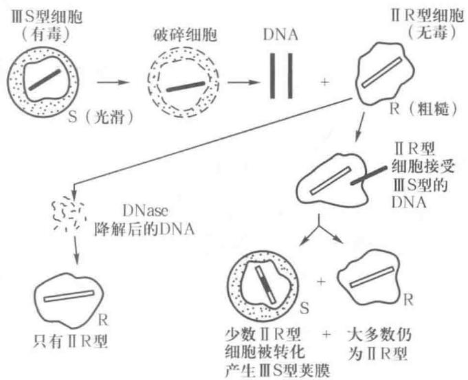  
图11-13 肺炎球菌转化作用图解

然而,当时多数生物学家都还以为 DNA 只是简单聚合物,蛋白质才是遗传物质,并没有认识到 Avery 发现的重要意义。对 Avery 的实验抱怀疑态度,认为也许是 DNA 制剂中混杂了少量不被检测出来的蛋白质起作用;或是认为 DNA 只不过是一种特异诱变剂,改变了菌体的特性。直到 20 世纪 50 年代初,Hershey 和 Chase 证明噬菌体的遗传物质是 DNA 后,才逐渐改变了学术界的看法。

在此之后,许多细菌的遗传性状都用 DNA 转化获得成功;并且真核生物也同样可用 DNA 进行转化。其实,细菌的转化现象十分普遍。在自然界,细菌借此而获得新的有用基因。由于滥用抗生素而使不少致病菌提高了对药物的抗性,R 质粒(抗性质粒)的横向扩散也是其中原因之一。在实验室,借助转化而得以构建各种基因工程菌。

## 3. DNA 是病毒遗传信息载体

1952 年属于噬菌体小组的 Hershey 和 Chase 用 $^{32}$ P 标记 T2 噬菌体的 DNA，用 $^{35}$ S 标记噬菌体的蛋白质，然后用此双标记的噬菌体去感染大肠杆菌。经短暂培养后，将培养物搅拌数分钟，使吸附在大肠杆菌表面的噬菌体脱落。通过离心，上清液中可检测到 $^{35}$ S 标记物， $^{32}$ P 却在管底菌体内。这就有力证明了进入宿主细胞内的是噬菌体 DNA，它携带了噬菌体的全部遗传信息。在 Hershey 和 Chase 实验的启发下，Watson 和 Crick 才于 1953 年提出 DNA 双螺旋结构模型。1969 年，Delbrück、Hershey 和 Luria 共获诺贝尔生理学或医学奖，以表彰他们在噬菌体遗传学研究中的功绩。

有些病毒不含 DNA 而含 RNA, 例如多数植物病毒都是 RNA 病毒。1955 年 H. Fraenkel-Conrat 和 B. Singer 将提纯的烟草花叶病毒 (TMV) 外壳蛋白和 RNA 在体外混合, 它们可以自装配成棒状的病毒。如果将甲株的 RNA 与乙株的外壳蛋白混合, 所得到重组 TMV 具感染力和产生的子代病毒特征都与甲株完全相同, 而与乙株相异; 反之亦然。实际上, 从 TMV 中分离出来的 RNA 也具有感染性, 只是比天然完整病毒的感染力要低得多。Fraenkel-Conrat 的重组实验表明, RNA 也可以是遗传因子, 携带亲代传递给子代的遗传信息。

1970 年 D. Baltimore 和 H. Temin 同时发现动物致瘤 RNA 病毒含有逆转录酶, 当病毒 RNA 侵入宿主细胞后可以逆转录成 cDNA, 然后整合到宿主染色体 DNA 中去。其后知道, 嗜肝 DNA 病毒和植物花椰菜花叶病毒 (CaMV) 虽是 DNA 病毒, 但其病毒 DNA 是由病毒 RNA 逆转录而来的。这说明 RNA 能指导 DNA 的合成。

病毒感染宿主细胞后,病毒核酸(无论是 DNA 还是 RNA)可以在细胞内单独复制;或是整合到宿主染色体 DNA 中去(RNA 需逆转录成 cDNA)随宿主 DNA 一起复制。游离的或整合的病毒核酸,在适当条件下又可装配成病毒粒子,而离开宿主细胞。总之,病毒不能离开细胞独立生活,病毒的一切生命活动都需要在细胞内进行,这就是说病毒核酸所能做的事(包括 RNA 复制和逆转录)都是细胞核酸原本就可做的事,病毒核酸只是获得了游离的能力。

上述真核生物、细菌和病毒的遗传实验都证明，DNA 是携带遗传信息的分子。

## 五、RNA 的结构与功能

核糖核酸(RNA)是由几十至几千个核苷酸聚合而成,在生物体内通常都以单链的形式存在。RNA的化学组成和单链结构使其远不如DNA稳定,从而增加了RNA研究的难度。因此,RNA的研究落后于DNA,经常是DNA的研究取得突破后有关理论和技术用来研究RNA,带动了RNA研究的发展。

## (一) RNA 的一级结构

RNA 是无分支的线形多聚核糖核苷酸,除含有常见的 4 种碱基外,有时还含有某些稀有碱基。图11-14 为 RNA 分子中的一小段,以示 RNA 结构。

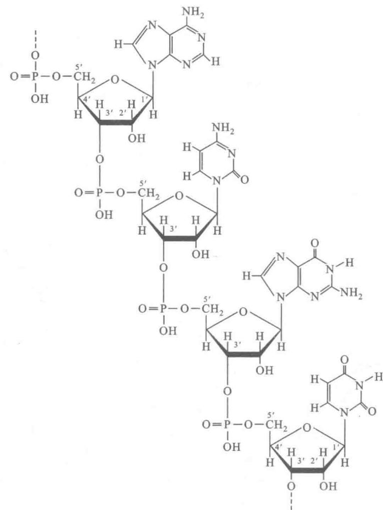  
图 11-14 RNA 分子中一小段结构

RNA 的种类甚多, 结构各不一样。参与蛋白质生物合成的 RNA 有三类: tRNA、rRNA 和 mRNA。酵母丙氨酸 tRNA 是第一个被测定核苷酸序列的 RNA, 由 76 个核苷酸组成。tRNA 通常由 60\~95 个核苷酸组成,相对分子质量都在25 000左右,沉降常数为4S。它含有较多稀有碱基,可达碱基总数的10%\~15%,因而增加了识别和疏水作用。3'端皆为CpCpAOH;5'端多数为pG,也有为pC的。tRNA的一级结构中有一些保守序列,与其特殊的结构与功能有关。

细菌和真核生物的 5S rRNA 由 120 个核苷酸组成,无稀有碱基,可与 tRNA、大亚基的 rRNA 和蛋白质相识别和作用。真核生物 5.8S rRNA 由 160 个核苷酸组成,含有修饰核苷,如假尿嘧啶核苷(ψ)和核糖被甲基化的核苷(Gm、Um),它与细菌 5S rRNA 有共同序列,表明它可能起着细菌 5S rRNA 某些相似的功能。细菌的 16S 和 23S rRNA 分别有约 10 个和 20 个甲基化核苷。脊椎动物 18S 和 28S rRNA 分别有 40 多和 70 多个甲基化核苷,其中 80% 的为甲基化核糖。此外,还有不少假尿嘧啶核苷和修饰的假尿嘧啶核苷。与 tRNA 不同,rRNA 的甲基化较多发生在核糖上,而且真核生物 rRNA 的修饰核苷比原核生物要多。rRNA 除作为核糖体的骨架外,还分别与 mRNA 和 tRNA 作用,催化肽键的形成,促使蛋白质合成的正确进行。

原核生物或以单个基因,或以多个基因组成的操纵子作为转录单位,前者产生单顺反子 mRNA (monocistronic mRNA),后者产生多顺反子 mRNA (polycistronic mRNA),即一条 mRNA 链上有多个编码区 (coding region),5'端、3'端和各编码区之间为非翻译区 (untranslated region, UTR),见图 11-15。原核生物 mRNA,包括噬菌体 RNA,都无修饰碱基。

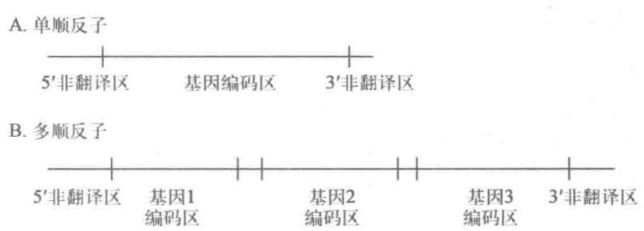  
图11-15 细菌mRNA

真核生物的 mRNA 都是单顺反子, 其一级结构的通式如图 11-16 所示。真核生物 mRNA 的 5' 端有帽子 (cap) 结构, 然后依次是 5' 非翻译区、编码区、3' 非翻译区, 3' 端为聚腺苷酸 (polyadenylic acid, poly(A)) 尾巴。其分子内有时还有极少量甲基化的碱基。

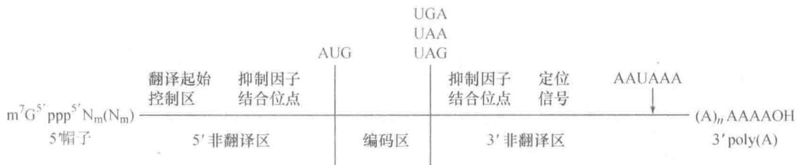  
图11-16 真核生物mRNA

绝大多数真核细胞 mRNA 3'端有一段长 20\~250 的聚腺苷酸。poly(A) 是在转录后经 poly(A) 聚合酶 (poly(A) polymerase) 的作用添加上去的。poly(A) 聚合酶专一作用于 mRNA，对 rRNA 和 tRNA 无作用。poly(A) 尾巴可能与 mRNA 从细胞核到细胞质的运输有关。它还可能与 mRNA 的半寿期有关，新生 mRNA 的 poly(A) 较长，而衰老的 mRNA poly(A) 较短。

5'端帽子是一个特殊的结构。它由甲基化鸟苷酸经焦磷酸与mRNA的5'端核苷酸相连，形成5',5'-三磷酸连接(5',5'-triphosphate linkage)。帽子结构通常有三种类型(m $^{7}$ G $^{5'}$ ppp $^{5'}$ Np,m $^{7}$ G $^{5'}$ ppp $^{5'}$ NmpNp和m $^{7}$ G $^{5'}$ ppp $^{5'}$ NmpNmpNp)，分别称为O型、I型、II型。O型是指末端核苷酸的核糖未甲基化，I型指末端一个核苷酸的核糖甲基化，II型指末端两个核苷酸的核糖均甲基化。在这里G代表鸟苷，N代表任意核苷；m在字母左侧表示碱基被甲基化，右上角数字表示甲基化位置，右下角数字表示甲基数目；m在字母右侧表示核糖被甲基化。这种结构有抗5'-外切核酸酶的降解作用。在蛋白质合成过程中，它有助于核糖体对mRNA的识别和结合，使翻译得以正确起始。I型帽子的结构如下：

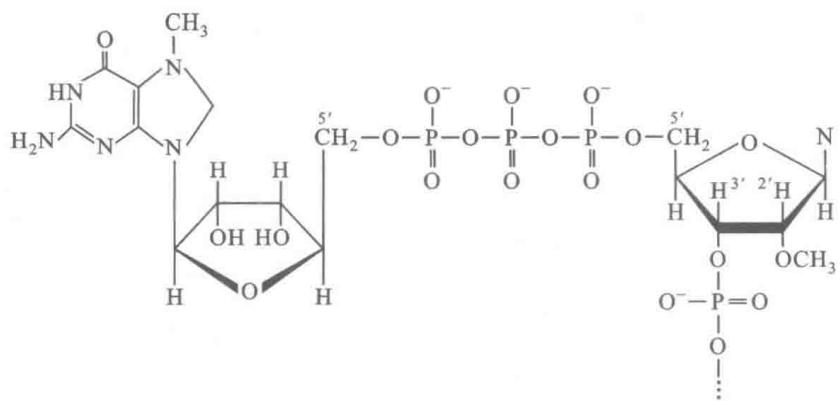

U 系列的核内小 RNA(snRNA)，如 U1 至 U5 snRNA，也有 5' 帽子结构。但它们的帽子是三甲基鸟苷三磷酸 $\left(\mathrm{m}_{3}^{2,2,7}\mathrm{G}^{5'}\mathrm{ppp}^{5'}\mathrm{AmpNp}\right)$ ，而不是 mRNA 的甲基鸟苷三磷酸 $\left(\mathrm{m}^{7}\mathrm{G}^{5'}\mathrm{ppp}^{5'}\mathrm{Np}\right)$ 。此外，动植物病毒 RNA 也有 5' 帽子结构和 3' 聚腺苷酸；但有的没有 5' 帽或 3' 聚腺苷酸。一些植物病毒 RNA 有类似 tRNA 的 3' 端结构，可以接受氨基酸。

## （二）RNA的高级结构

RNA是单链线型分子，在溶液中可通过碱基堆积形成单链右手螺旋。嘌呤碱与嘌呤碱之间 $\pi$ 电子相互作用的堆积力和疏水力较强，夹在两个嘌呤碱之间的嘧啶碱可被排除在螺旋之外。这种单链螺旋很不稳定，易受溶液中各种因素的影响，因而有较大柔性。但RNA可通过自身回折形成较稳定的局部双螺旋（二级结构），并借助链内次级键而发生折叠（三级结构）。RNA链内除形成A·U和G·C碱基对外，还可形成G·U碱基对（如图11-17），RNA双螺旋构象类似于DNA的A型。不配对的碱基可排除在双螺旋区之外，形成突起(loop)。RNA链中磷酸基的氧和糖的羟基也可参与形成氢键，增加三级结构的稳定性。当RNA链回折在不连续序列之间碱配对，形成犹如打结的结构，称为假结(pseudoknot)(图11-18)。除tRNA外，几乎全部细胞中的RNA都与蛋白质形成核蛋白复合物（四级结构）。RNA和RNA与蛋白质的复合物(RNP)担负着细胞的各种重要功能。

  
图11-17 $\mathrm{G}\cdot \mathrm{U}$ 碱基对

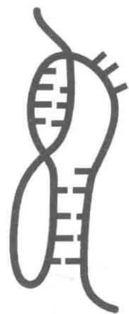  
图11-18 RNA链的假结

## 1. tRNA 的高级结构

tRNA 参与蛋白质生物合成,起着转运氨基酸和识别密码子的作用,转移 RNA 的名称即由此而得。合成蛋白质的氨基酸有 20 种,每一种氨基酸都有其相应的一种或几种 tRNA。而所有种类的 tRNA 都有十分相似的二级结构和三级结构。tRNA 功能复杂,结构小巧,近于完美,这是长期成功进化的结果。

tRNA 的二级结构都呈三叶草形(图 11-19)。茎环结构的突环(loop)区好像是三叶草的三片小叶；双螺旋的茎(stem)构成叶柄。由于双螺旋结构所占比例很大，tRNA 的二级结构十分稳定。三叶草形二级机构由氨基酸臂(amino acid arm)或受体臂(acceptor arm)、二氢尿嘧啶环(dihydrouracil loop, DHU)、反密码子环(anticodon loop)、额外环(extra loop)或可变环(variable loop)和胸苷-假尿苷-胞苷环(TψC loop)等5个部分组成。氨基酸臂含有7对碱基，5'端为磷酸基，3'端为CCA-OH，可接受活化的氨基酸。DHU环(D环)由8\~12个核苷酸组成，含有两个二氢尿嘧啶故得名，由3\~4对碱基的双螺旋区构成茎。反密码子环由7个核苷酸组成，中间3个核苷酸为反密码子，可以识别mRNA上的密码子，其茎含5对碱基。额外环大小不等，故又称为可变环，常由3\~18个核苷酸组成。TψC环(T环)由7个核苷酸组成，其茎也含5对碱基。

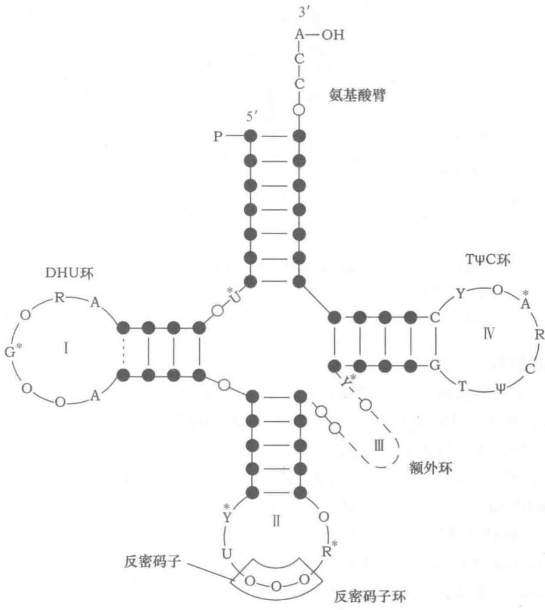  
图 11-19 tRNA 三叶草形二级结构  
R, 嘌呤核苷酸; Y, 嘧啶核苷酸; $\psi$ , 假尿嘧啶核苷酸; \* 代表修饰碱基; ● 代表螺旋区碱基; ○ 代表不配对碱基

1974 年 S. H. Kim 等采用高分辨率 X 射线衍射仪测定酵母苯丙氨酸 tRNA 的晶体结构，揭示了 tRNA 具有倒 L 形的三级结构（图 11-20）。tRNA 的三叶草形二级结构通过折叠，使氨基酸臂与 TψC 茎环形成一连续的双螺旋区，构成倒 L 的一横；而 DHU 环、额外环和反密码子的茎环共同构成字母 L 的一竖。形成三级结构的氢键许多与 tRNA 中的不变核苷酸有关。除 Watson-Crick 碱基对外，还有非配对的碱基之间、碱基与核糖-磷酸骨架之间以及第三个碱基与碱基对之间形成氢键。tRNA 中几乎所有相邻碱基都通过疏水作用相互堆积，看来这种堆积作用是稳定 tRNA 构象的主要因素。

tRNA 的三级结构与其生物学功能有密切关系。tRNA 含有大量修饰核苷酸，它们可能参与三级结构的形成，同时也增加了 tRNA 的识别功能。除参与蛋白质合成外，tRNA 还有许多其他的生物学作用。例如，谷氨酰-tRNA 参与叶绿素的生物合成，某些氨酰-tRNA 参与细菌细胞壁糖肽以及细胞膜氨酰磷脂酰甘油的合成，tRNA 是转录酶的引物，tRNA 还可以参与细胞代谢和基因表达的调节。这是一类十分重要的生物大分子，很可能也是一类最古老的生物分子。细胞内 tRNA 的种类很多，每一种氨基酸都有其相应的一种或几种 tRNA。

  
图 11-20 酵母苯丙氨酸 tRNA 的三级结构  
黑色阶梯表示碱基间形成三级结构的氢键,阿拉伯数字表示 tRNA 序列中核苷酸的编号

## 2. rRNA 的高级结构

蛋白质生物合成是细胞代谢最核心和最复杂的过程，有数百种生物大分子直接参与作用。核糖体是蛋白质合成的场所，它由3\~4种rRNA和50\~80种蛋白质所组成。在电子显微镜下可以看到核糖体包含小亚基和大亚基两部分。采用免疫电镜、化学交联、中子衍射和X射线衍射等技术，才得出核糖体的精细结构。根据传统看法，rRNA是核糖体的骨架，蛋白质肽键的合成是由核糖体蛋白所催化的，该酶活性称为肽基转移酶(peptidyl transferase)。直到20世纪90年代初，H.F.Noller等证明大肠杆菌23S rRNA能够催化肽键形成，才确认核糖体RNA是一种核酶，从而改变了传统的观点。

2000年对核糖体晶体学研究取得划时代意义的重大成果，几个实验室分别解析了核糖体小亚基和大亚基高分辨率的结构。核糖体含有超过4500个核苷酸的rRNA以及数十种蛋白质分子，对于如此复杂的复合物能在原子水平上揭示其结构，这充分体现了当今结构生物学所能达到的最高水平。在小亚基的16S rRNA中， $46\%$ 的碱基配对形成的50个大小不等的茎环结构，组成4个结构域，并折叠成两叶（图11-21）。A型RNA螺旋之间相互作用决定了30S小亚基的形状，核糖体蛋白结合在外表，没有蛋白质完全埋在RNA中，也极少存在于和50S亚基的界面处。核糖体的解码中心（decoding centre）位于小亚基上。通过小亚基的晶体结构显示出结合tRNA的A、P、E部位以及结合mRNA的部位，这些部位虽然有蛋白质，但看起来除去蛋白质并不会改变其结构，表明解码是小亚基rRNA的功能。

大亚基 23S rRNA 有 6 个结构域,彼此连接成为一个整体,并不像小亚基 rRNA 那样结构域轮廓分明。大亚基有三个突起,5S rRNA 紧密结合在中间突起上,核糖体蛋白质同样位于外表。肽基转移酶中心 (peptidyl transferase centre) 位于大亚基上,该反应中心只有 rRNA,并无蛋白质,这就更清楚证明肽键的合成是由大亚基 rRNA 所催化。

真核生物的核糖体也是由小亚基和大亚基所组成，但比原核生物核糖体更大，结构更复杂。哺乳动物小亚基18S rRNA和大亚基28S rRNA与原核生物的16S和23S rRNA相似。真核生物大亚基还含有5S和5.8S rRNA。5.8S rRNA与28S rRNA碱基配对，它与原核生物23S rRNA5'端序列同源，推测由其演变而来。

## 3. 其他 RNA 的高级结构

游离的 mRNA 可以产生高级结构,但在核糖体上翻译时 mRNA 必须解开。mRNA 产生的高级结构对翻译效率有显著影响,有可能借此作为调节翻译的一种方式。

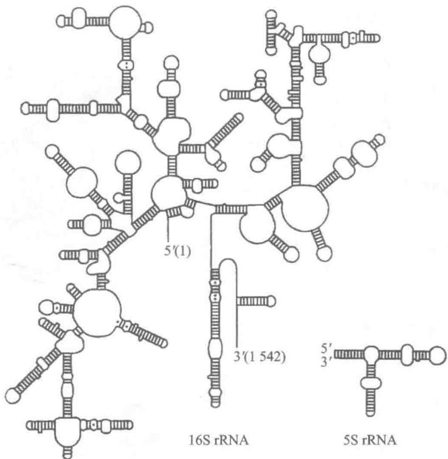  
图11-21 16S和5S rRNA的二级结构

核酶(ribozyme)的催化功能与其空间结构密切相关,因此核酶具有较稳定的高级结构。如上所述,大亚基 rRNA 是一种核酶。类型 I 和类型 II 自我拼接的内含子,RNaseP 的 RNA 亚基(M1 RNA),某些病毒、类病毒和卫星病毒自我加工的 RNA 都是核酶。核酶可以是单独的 RNA 或是 RNA 与蛋白质的复合物。核酶 RNA 可以在水溶液中形成单链或双链螺旋,折叠成特定的空间结构,反应底物被结合在活性中心,定向排列,并提供反应所需的条件(例如某些反应需要的疏水环境)。RNA 虽无蛋白质的众多反应基团,但易结合金属离子,许多核酶都需金属离子参与作用。有些核酶还可借助碱基、氨基酸、咪唑和其他小分子化合物作为辅助因子。

R. Symons 比较了一些类病毒 RNA 具有自我剪切作用的结构后提出了锤头(hammerhead)核酶的模型,它约有 40 个核苷酸,是已知最小的核酶,由 13 个保守核苷酸连接区和三个螺旋区构成,形似锤头故得名(图 11-22A)。将锤头核酶分成两部分,16 核苷酸的酶链(含连接区的保守序列)与 25 核苷酸的底物链(含切割位点),相互间通过碱基对结合在一起。其 X 射线结构分析表明,确是形成三个 A 型螺旋区,但整个外形更像丫形,而不太像锤头形(图 11-22B)。自然界存在的自我切割的核酸以锤头核酶较为常见,并已得到广泛应用。

此外还存在发夹形(hairpin)、斧头形(axe)和VS核酶,这些核酶都比较小,统称为小型核酶。发夹形核酶最初在负链烟草环斑病毒卫星RNA(sTRSV)中发现(图11-23),其大小约为70个核苷酸。天然斧头核酶存在于人类丁型肝炎病毒(HDV)的正链和负链RNA中。HDV是一个1700核苷酸组成的单链环状RNA病毒,其基因组以滚环方式进行复制。斧头核酶由两个假结结构所构成,在复制后RNA加工过程中起作用。该自我剪切的核酶约由90个核苷核组成,可被分为25核苷酸的催化部分和65核苷酸的底物部分(图11-24)。链孢霉线粒体Varkud卫星RNA(VS RNA)的自我剪切结构完全不同于上述三种核酶,由多个茎环结构组成,因此是另一种核酶,它的大小约为160核苷酸。

RNA 一般都与蛋白质形成复合物，并以复合物的形成执行细胞功能。在核糖核蛋白复合物中，何者起主要作用？按照传统的看法，蛋白质是主体，RNA 是辅基，或者说只起着“衣架”（coat hanger）的作用。进一步研究发现 RNA 在其中起着关键的作用。于是 RNA 成为主体，蛋白质只是辅基或是支架。RNA 的某些功能只与其序列，即一级结构有关；但许多功能，尤其是核酶功能，与其空间结构有关。因此，不仅要了解各类 RNA 的一级结构，还要了解它们的二级结构、三级结构和与蛋白质形成复合物的四级结构或更高级的结构。

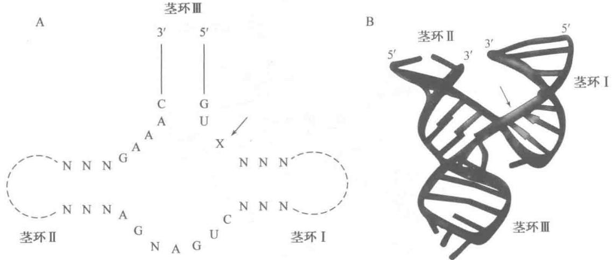  
图11-22 锤头型核酶的结构  
A. 锤头核酶的二级结构；B. 锤头核酶的三级结构

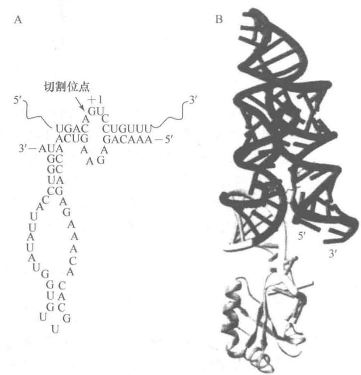  
图11-23 发夹型核酶的结构  
A. 发夹核酶与底物的二级结构；B. 发夹核酶的三级结构

## （三）RNA 表达遗传信息

DNA 将遗传信息由亲代传递给子代；在子代 RNA 使遗传信息得以表达。RNA 是单链分子，并能折叠成特殊的空间结构，这就使 RNA 既能像 DNA 那样编码和贮存遗传信息，又能像蛋白质那样具有催化和调节功能。RNA 能够转录和加工遗传信息，控制蛋白质合成，并在细胞内执行各种功能。基因对表型的影响是通过基因产物来实现的，基因产物包括蛋白质和 RNA 两类，而前者也是在后者控制下合成的，故而 RNA 对表型有专一效应。

转录水平的调节使得细胞在不同环境和时空条件下,表达不同基因编码的信息。转录是一个传真的过程,初级转录物(primary transcript)RNA与被转录DNA的序列基本一致。RNA在转录后常常要经过一系列的加工才成为成熟的、有功能的RNA。一般性加工(general processing),包括切割(cutting)、修剪(trimming)、添加(appending)、修饰(modification)和异构化(isomerization),不改变RNA的编码序列,是一个抽提有效信息的过程。选择性加工(alternative processing)改变编码序列,包括剪接(splicing)、编辑(editing)和再编码(recoding),则改变了携带的遗传信息。不同的加工可以得到不同的表达产物,因此基因的表达有赖于RNA的解读(reading)。加工需要有催化功能的RNA(核酶)作用,或在RNA指导下经酶作用。总之,如果说DNA是遗传信息的储存器,RNA则是遗传信息的处理和显示器。

  
图 11-24 斧头型核酶的结构  
A. HDV 基因组和反基因组斧头核酶的二级结构；B. 斧头核酶的二级结构

RNA 的功能多种多样。它合成蛋白质、加工遗传信息、调节基因表达、组装染色体以及构成某些病毒的基因组，几乎参与细胞的一切生命活动。

## 1. RNA 参与蛋白质的合成

早在20世纪40年代，细胞化学研究证明，在生长和分泌细胞中，蛋白质合成旺盛，RNA含量也丰富，于是推测RNA的功能可能是参与蛋白质合成。20世纪50年代中期，P.Zamecnik实验室用放射性同位素 $^{14}$ C标记氨基酸，然后在大鼠肝匀浆或其他生物材料制成的无细胞系统（cell-free systems）中追踪 $^{14}$ C-氨基酸掺入蛋白质的过程，发现氨基酸在酶催化下被ATP激活，之后连到一种可溶性RNA（soluble RNA，sRNA）上，并被带到微粒体（microsome），进入蛋白质中。所谓微粒体即是内质网的碎片，其中含有核糖核蛋白颗粒（ribonucleoprotein particle）。其时，Crick认为将核酸语言（由核苷酸编码）转变为蛋白质语言（由氨基酸编码）需要一种转接器（adapter）。1958年，按sRNA的功能将其称为转移RNA（transfer RNA，tRNA），后来证实此RNA即相当于Crick的转接器。当年还将核糖核蛋白颗粒称为核糖体（ribosome），知道核糖体是蛋白质合成的场所。曾经以为核糖体RNA（ribosomal RNA，rRNA）是蛋白质合成的模板，但随后发现rRNA碱基组成与DNA不一致，而且代谢稳定，与作为模板的要求不符。当噬菌体T₂感染大肠杆菌后，在宿主细胞内产生一类RNA，其碱基组成与噬菌体T₂DNA一致，并且代谢不稳定，实际上正常细胞内也有这类代谢不稳定的RNA。1961年J.Monod和F.Jacob将这类RNA命名为信使RNA（messenger RNA，mRNA），它才是合成蛋白质的模板。

现在知道,三类 RNA 控制着蛋白质的合成。tRNA 是转接器,或者说是翻译者(transtator),它携带活化的氨基酸到核糖体上,由其反密码子识别 mRNA 的密码子,起翻译作用。rRNA 是装配者(assembler),它与数十种蛋白质组成核糖体,使 mRNA 和 tRNA 在其上正确定位,并催化肽键的合成。mRNA 起指导者(instructor)作用,它从 DNA 处获得遗传信息,作为蛋白质合成的模板,决定蛋白质的氨基酸序列。RNA 通过合成蛋白质使遗传信息得以表达。

## 2. RNA 具有催化功能

长期以来一直以为 RNA 的功能只是参与蛋白质合成。1958 年 Crick 在其著名的论文“论蛋白质的合成”中详细阐述了分子生物学的“中心法则”。在分子生物学早期，对于贮存于 DNA 分子内的遗传信息如何得以复制，如何传递给蛋白质，以及对 DNA 和 RNA 碱基序列与蛋白质氨基酸序列之间线性关系的理解，“中心法则”起了积极的促进作用；然而，“中心法则”将遗传信息的表达看作犹如录放机的播放过程，以为是不变的，不了解RNA在解读遗传信息过程的加工和调节作用，“中心法则”束缚了对RNA功能多样性的认识。直到上世纪80年代这种看法才开始发生改变。

1982 年 Cech 证明, 四膜虫 rRNA 前体 (pre-rRNA) 的剪接 (splicing) 由类型 I 内含子 RNA 自我催化完成。次年 Altman 证明大肠杆菌 RNase P 剪切 (cleavage) tRNA 前体 (pre-tRNA) 可由其 RNA (M1 RNA) 单独完成。由此证明, 某些 RNA 具有催化功能, 称为核酶。RNA 可催化多种反应, 包括 RNA 底物中磷酸二酯键的转移、水解和连接, DNA 的水解, 肽键和酰胺键的转移和水解, NADH 的氧化还原和 1,4-α-葡聚糖的分支反应等。其中以蛋白质合成的转肽反应和 RNA 信息加工的剪切和剪接反应最为重要。

小型核酶家族,如锤头核酶、发夹核酶、HDV 假结核酶和链孢霉 VS 核酶,可在特异位点催化核酸降解 (nucleolysis),以切除多余序列。在自然界上述核酶多用于病毒、类病毒和卫星 RNA 复制时形成的基因组串联体的自我剪切。如将核酶分离出来也可用于降解靶 RNA,因此用途很多。它们有类似的作用机制,当底物 RNA 链与核酶结合时,剪切处的 2'-羟基对磷酸二酯键的磷原子发动亲核攻击,形成 2',3'-环磷酸酯和 5'-羟基,反应式如下:

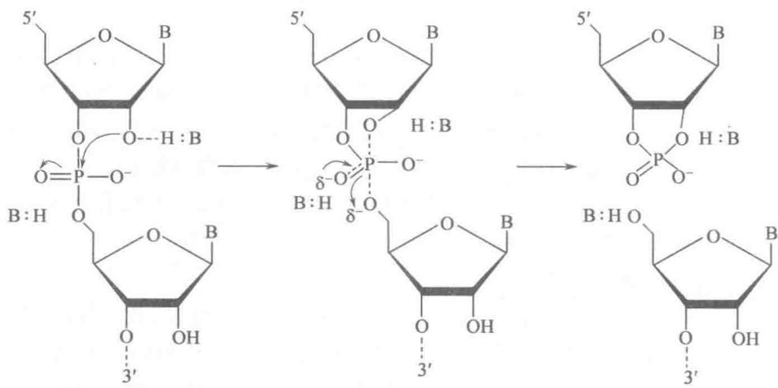

在该反应中磷酸二酯键并未被水解，反应是可逆的；但是VS核酶与底物仅在剪切点一侧结合，底物另一侧是游离的，因此反应不可逆。RNase P的M1 RNA分子较大，对Pre-tRNA的剪切为水解反应（hydrolysis），不形成环磷酸酯，产物为带5'-磷酸基的tRNA。

真核生物的基因多数是断裂的(interrupted)，其内含子需在转录后RNA加工水平上通过剪接切除。RNA剪接共有4种方式：类型I自我剪接、类型Ⅱ自我剪接、剪接体（spliceosome）的剪接和核tRNA的酶促剪接。类型I内含子核酶催化的剪接过程包括两次转酯反应：先由游离的鸟苷酸或鸟苷提供3'-羟基，内含子的5'-磷酸基转移其上；然后由第一个外显子产生的3'-羟基攻击第二个外显子的5'-磷酸基，两个外显子得以连接，内含子则被切除。类型Ⅱ内含子核酶催化的剪接过程也包括两次转酯反应，但由靠近3'剪接点的内含子腺苷酸提供2'-羟基。剪接体含有类似类型Ⅱ的核酶，剪接过程与类型Ⅱ自我剪接类似。

RNA 转录后加工是一个抽提信息或重新组合信息的过程,需要识别 RNA 的序列和高级结构,十分复杂,单靠酶难以完成,因此或由核酶来完成,或由核酶在蛋白质辅助下完成,或在 RNA 指导下由酶来完成。真核生物细胞内存在许多小 RNA 起着加工的指导作用,如核内小 RNA (small nuclear RNA, snRNA) 指导 mRNA 前体的剪接,核仁小 RNA (small nucleolar RNA, snoRNA) 指导 rRNA 前体的剪接,以及 RNA 编辑 (RNA editing) 中的指导 RNA (guide RNA, gRNA) 等。

## 3. RNA 对基因表达的调节作用

基因表达有赖于 RNA 对遗传信息的解读, 在表达的各个阶段都存在调节 (regulation) 和控制 (control), RNA 在其中起着重要的作用。RNA 作为调节物 (regulator) 能够识别 DNA 和 mRNA 的序列或结构, 从而在转录和翻译水平上调节和控制基因表达。控制是指靶位点被调节物关闭 (阻遏) 或打开 (激活），相关表达过程得以在一定范围内进行。一些基因含有相同或类似的靶位点，可以被同一调节物协同控制。调节是指调节物对基因表达过程量的调整。调节物本身也可被调节和控制，有时受一些可反映环境条件的小分子所调节和控制，或被另一些调节物所调节和控制，由此构成调控网络。

早在上世纪中期即有一些科学家推测 RNA 在基因表达过程中起调节控制作用。但直到 1983 年由 T. Mizuno 等以及 R. Simons 等分别在大肠杆菌中发现反义 RNA(antisense RNA)，才开始了解其调节的具体过程。Mizuno 等人从大肠杆菌中分离出一种 RNA(174 个核苷酸)，与低渗外膜蛋白 Omp F 的 mRNA 5' 端序列互补，可与之结合而使其失去翻译活性。Simons 等证明，大肠杆菌转座子 Tn10 在合成转座酶 mRNA 的同时还合成出一条与其 5' 端序列互补的小 RNA，可抑制 mRNA 的活性，从而使转座酶维持在一定的水平，避免转座频率过高而导致宿主死亡。他们将这类 RNA 称为干扰 mRNA 的互补 RNA(mRNA-interfering Complementary RNA, micRNA)。其后知道利用反义链进行调节的现象在原核生物和真核生物中均十分普遍。

细菌存在数百个编码调节 RNA(regulatory RNA) 的基因, 这些调节 RNA 长度在 50\~200 个核苷酸之间, 统称之为小 RNA(small RNA, sRNA)。sRNA 通常与靶基因转录物部分互补, 因此属于反义 RNA。它们在不同水平上(转录、加工和翻译)或影响许多基因的表达, 或只影响一个基因的表达; 主要通过 RNA-RNA 的相互作用, 使靶 RNA 失活或被降解。大肠杆菌在氧胁迫(oxydative stress)下的反应是研究此类控制系统的一个很好例子。S. Altuvia 等发现大肠杆菌可被过氧化氢诱导产生一种小 RNA, 称为 oxyS RNA, 109 个核苷酸, 不编码蛋白质, 能抗氧的毒害和抗诱变。实际过程极为复杂, 过氧化氢活化转录激活蛋白 Oxy R, 该激活蛋白促进多个基因转录, 其中包括 oxyS RNA。而后者可以激活或阻遏数十个基因表达, 并有多种蛋白质因子和 RNA 调节物参与协同调节。

RNA干扰(RNA interference, RNAi)现象最初是在秀丽新小杆线虫(Caenorhabditis elegans)中发现的。1998年A. Fire、C. Mello及其同事在用反义RNA抑制线虫控制胚胎极性基因的表达时发现，双链RNA比有义RNA(sense RNA)或反义RNA(antisense RNA)更为有效，他们将此双链RNA引起特异序列基因沉默的现象称为RNA干扰。dsRNA通过注射、喂饲或浸泡即可干扰线虫有关基因的表达，少量dsRNA进入细胞可引发系统(全身)反应，并且还能传递给后一代。随后证实RNA干扰广泛存在于各类真核生物中。其实，早在1990年R.Jorgensen和他的同事将色素基因导入矮牵牛花，结果花的紫色反而被抑制，这表明不仅外源基因本身失活，还可使体内同源基因也受抑制，他们称此现象为共抑制(cosuppression)。与此同时，一些实验室发现RNA病毒能诱导同源基因沉默，植物还能借助类似共抑制的机制识别和降解病毒RNA。在链孢霉中也发现外源基因引起沉默的现象，曾称为基因遏制。无论是外源基因的导入，或是病毒RNA的入侵，均能产生dsRNA，因此基因共抑制和遏制与RNA干扰并无本质差别。由于Fire和Mello最早明确提出RNA干扰，故而他们共同获得了2006年诺贝尔生理学或医学奖。

现在知道，RNA 干扰是生物机体演化产生用以对付外源基因入侵、某些转座子和高度重复序列的转录或内源异常 RNA 生成的一种重要机制。上述情况都可能会产生双链 RNA。RNA 内切酶 Dicer 是一种类似细菌 RNase III 的酶，它可识别和剪切长的 dsRNA，产生 21\~25 个核苷酸长的短双链 RNA，即短的干扰 RNA（short interfering RNA, siRNA）。siRNA 可通过多条途径抑制同源基因的表达：它可促使含有互补序列的 mRNA 降解；以多种方式抑制 mRNA 的翻译；或者在启动子处诱导染色质修饰使基因沉默。无论通过何种途径，siRNA 在发挥其作用时都需要与有关蛋白质一起形成 RNA 诱导的沉默复合物（RNA-induced silencing complex, RISC）。在此复合物中，由水解 ATP 提供能量使双链 siRNA 解开，并促使单链 siRNA 与其互补的 mRNA 配对。结果或使靶 mRNA 降解，或使其翻译受抑制，可能取决于 siRNA 与靶 mRNA 之间的匹配关系。如果两者完全互补，后者被降解；若两者并不完全互补，则主要是翻译受抑制。靶 mRNA 的降解由 RISC 的核酸酶来完成。RISC 还能进入核内，由 siRNA 与其互补的基因组序列配对。当复合物结合到染色质上时，即能招募与染色质修饰有关的蛋白质聚集在基因的启动子处，使染色质修饰并改变结构，导致基因转录沉默。RNAi 的效率很高，极微量的 siRNA 可以使靶基因完全关闭。因此推测它可借助依赖 RNA 的 RNA 聚合酶（RNA-dependent RNA polymerase, RdRp）获得扩增。值得指出的是，当给予 mRNA 某一区段特异的 siRNA 时，还能产生该区段邻近序列的 siRNA。这就表明 siRNA 与 mRNA 配对可以发生 RNA 复制,从而二次产生 siRNA。事实上某些 RNAi 还能由亲代传递给子代。

尤为引人注目的是，从线虫中先后发现控制发育时序的小分子 RNA lin-4 和 let-7，称为小分子时序 RNA（small temporal RNA, stRNA）；前者长 22 个核苷酸，后者为 21 个核苷酸。它们与控制发育程序的蛋白质 mRNA 3' 非编码区互补，可抑制其翻译功能。后来陆续发多种与 lin-4 和 let-7 类似的 RNA，大小在 22 核苷酸左右，广泛存在于所研究的各类生物中，被称为微（小）RNA（microRNA, miRNA）。目前已有数以千计存在于线虫、果蝇、哺乳动物、人、水稻、拟南芥等真核生物的 miRNA 被报导。miRNA 与 siRNA 有许多相似之处，如长度均为 20 多个核苷酸，都由 Dicer 酶加工产生，都与蛋白质形成复合物以影响基因活性。但与 siRNA 不同，miRNA 由其基因转录产生大的前体 RNA，自身回折形成双链，先经内切酶 Drosha 切断，再由 Dicer 酶不对称剪切成小片段，然后解开形成单链分子，主要在转录后和翻译水平起调节作用。人类大约有上千个 miRNA 基因，或分布在编码基因的内含子中，或在基因间隔区。miRNA 的发现极大丰富了对于 RNA 在基因表达调控中重要性的认识。

上述起调节作用的 RNA 与被调节的靶分子不是同一分子, 因此是反式作用(trans-acting); 然而, 许多 mRNA 自身具有调控其翻译活性的结构, 这种顺式作用(cis-acting)的结构称为 RNA 开关(RNA switch), 简称核糖开关或核开关(riboswitch)。核开关在原核生物和真核生物的一些 mRNA 中都有, 但对原核生物更重要, 因为真核生物还存在许多其他的调控方式。2002 年 R. R. Breaker 发现大肠杆菌编码维生素 B1 的辅酶(TPP)生物合成相关酶的 mRNA 可以通过感受 TPP 含量来调节其活性, TPP 含量高时酶的生成就受阻遏。与核酶类似, 核开关也由一些 RNA 茎环结构所组成, 某些小分子代谢物可以结合其上, 从而影响 mRNA 的结构和功能。核开关可以位于 mRNA 的 5' 非翻译区, 也可以在 3' 非翻译区, 或在 mRNA 前体的内含子处。其作用可以发生在转录水平, 或是提前转录终止, 或是改变剪接方式; 也可以发生在翻译水平, 或是阻遏, 或是激活。有些核开关本身是一种核酶, 在小分子代谢物激活下 mRNA 被自身核开关的核酶所降解。

过去总以为 RNA 转录后加工切下的小片段是无用的下脚料, 现在却发现它们也可能成为调节 RNA 或具有其他特殊功能的 RNA。总之, 凡具有某种特定功能的 RNA 统称功能 RNA (functional RNA, fRNA)。其中, mRNA 编码合成蛋白质的信息; 其余的 RNA 则为非编码 RNA (noncoding RNA, ncRNA), 如长度超过 200 个核苷酸则为长非编码 RNA (long noncoding RNA, lnc RNA)。过去总以为只有编码基因才能转录, 现在却发现人类基因组 90% 以上的序列都能转录, 而编码序列不到基因组的 2%。如此众多的非编码 RNA 意味着什么? 科学家们正在试图揭开这个奥秘。

## 4. RNA 对染色体结构的组装作用

在染色体中含有少量 RNA, 一些科学家推测这类 RNA 可能在染色体结构的组装中起某种作用。研究显示, 细菌染色体 DNA 并非完全散开的, 它们在细胞内组装成致密体, 称为拟核 (nucleoid)。基因组环状双链 DNA 以超螺旋形式存在, 其上结合碱性蛋白质和未知 RNA, 组成 10\~40 kb 的突环结构域。如果破坏 RNA, DNA 即散开, 说明 RNA 对形成 DNA 结构域是必要的, 详细情况迄今尚不清楚。

真核生物染色体结构十分复杂。基因组线状双链 DNA 与组蛋白形成核小体（nucleosome），具有不同层次的折叠压缩结构，构成常染色质（euchromatin）和异染色质（heterochromatin）两类染色质（chromatin）。异染色质是对碱性染料着色较深，更为浓缩的染色质，大多不能转录。在有丝分裂时，染色质浓缩成染色体（chromosome）。染色体 DNA 的末端为高度重复序列构成的端粒结构，与染色体的复制和稳定有关。端粒酶含有合成端粒 DNA 序列的 RNA 模板，是一种逆转录酶。染色质的异染色质化和染色体的形成都需要某些非编码 RNA 参与。例如，哺乳动物雌性细胞含有两条 X 染色体，在发育早期随机关闭其中一条，便成为异染色质小体，此性分化和剂量补偿效应的起始和维持均由长非编码 RNA 即 Xist RNA 介导。

病毒可看作是游离的染色体。有些病毒的组装需要 RNA 参与作用，如枯草芽孢杆菌噬菌体 $\phi29$ ，其噬菌体颗粒的组装有赖于组装 RNA（package RNA，pRNA）。由 6 个 pRNA 聚合形成六聚体圆环，位于噬菌体衣壳前体的入口处，该圆环裹住 DNA，通过旋转将 DNA 送入衣壳内，旋转所需能量由水解 ATP 供给。因此 pRNA 同时也是一种分子马达。

## 5. RNA 的表型效应

生物亲代通过 DNA 复制将遗传信息传递给子代，在子代通过 RNA 转录和蛋白质翻译使遗传信息得以表达。20 世纪后期开始与 20 世纪中期对基因表达的看法有较大的不同：① 20 世纪中期认为所有表达性状（表型）都是通过蛋白质产生的，而 20 世纪 80 年代后才认识到 RNA 参与细胞各种功能，性状是由 RNA 和蛋白质共同产生的。② 20 世纪中期认为 RNA 仅起着将遗传信息由 DNA 传给蛋白质的中介作用，80 年代后才认识到 RNA 可根据内外条件的改变重新组合遗传信息；蛋白质虽然在加工中能切成有活性的多肽，而蛋白质的剪接和修饰只和活性有关，不能重新组合信息。③ 21 世纪初期，人类基因组测序获得令人吃惊的结果：人类的编码基因数目不到 30 000，外显子（编码序列）仅占基因组 1%；然而转录组学的研究结果更令人吃惊：基因组 90% 的序列都能被转录。这就是说，RNA 携带基因组 90% 的信息，而蛋白质只携带基因组 1% 的信息，似乎表明生物机体的时空调节信息远大于结构信息。所谓表型是指基因型在一定环境条件下表现的性状，也就是说表型是基因表达的结果，表达受 RNA 和蛋白质调节物的调节，并受环境影响，其中选择性主要取决于 RNA。

生物体内 DNA 和 RNA 的合成需要蛋白质的酶活性催化,而蛋白质的合成又需要核酸的指令,那么生命起源的初期先出现核酸还是先出现蛋白质?这个问题类似“先有鸡还是先有蛋”。1982 年 Cech 证明 RNA 具有催化功能,称之为核酶。既然 RNA 能像 DNA 一样携带和复制遗传信息,又能像蛋白质一样催化生化反应,可以设想最早出现的生命物质是 RNA,而不是 DNA 或蛋白质。因而 W. Gilbert 于 1986 年提出“RNA 世界(RNA World)”的假说,认为生命起源于“RNA 世界”,后来才分化产生“蛋白质世界”和“DNA 世界”。这一假说显得十分合理,因此提出不久便被广泛接受。从“RNA 世界”到“三驾马车”(DNA、RNA 和蛋白质)的复杂系统,RNA 将复制功能转给 DNA,将大部分生理功能转给蛋白质,而自身始终掌控着表达过程的信息处理。一切生命活动取决于 DNA、RNA 和蛋白质三者的相互作用,但三者的作用还是有区别的,遗传信息的解读主要靠 RNA,蛋白质只起辅助作用。

## 提要

1868年Miescher发现核素（相当于DNA）。RNA的研究开始于19世纪末，1894年Hammarsten证明酵母核酸中的糖是戊糖。Levene曾对核酸化学结构和核酸中糖的鉴定作出重要贡献，但他的“四核苷酸假说”严重阻碍了核酸研究。直到20世纪40年代，新的核酸研究技术证明DNA和RNA都是细胞重要组成，并且是特异的大分子。Chargaff等揭示了DNA的碱基配对规律。Watson和Crick在前人工作基础上于1953年提出DNA双螺旋结构模型，说明基因结构、信息和功能三者间的关系，奠定了分子生物学基础。Crick提出分子生物学“中心法则”。20世纪60年代RNA研究出现高潮，Holley测定了酵母丙氨酸tRNA核苷酸序列，Nirenberg等破译了遗传密码，三类RNA参与蛋白质合成过程也基本弄清。70年代在DNA重组技术和测序技术的带领下，生物技术和生物工程得到迅猛发展。RNA研究出现第二个高潮，RNA的催化功能和调节功能相继被发现，冲破了传统观点。人类基因组计划是生物学有史以来最伟大的科学工程。该计划的完成，使生命科学进入后基因组学的时代，各类组学纷纷兴起，生命科学已不再限于对单个因子、单个基因、单个生物分子的研究，而是侧重综合研究，侧重对生物分子间相互识别、相互作用和动态的研究。

核酸有两类:脱氧核糖核酸(DNA)和核糖核酸(RNA)。DNA是生物主要的遗传物质,分布在原核细胞的核区,真核细胞的核和细胞器以及DNA病毒中。DNA通常是双链分子,环状或线状,线状DNA(无论单链或双链)的末端常有特殊结构。RNA种类很多,功能各异,分布在细胞或RNA病毒中,通常是单链分子。RNA或以功能分,或以大小分,或以在细胞中的位置分。有关RNA的功能不断有新的发现,RNA最基本的功能是解读遗传信息。

核酸是一类多聚核苷酸，其基本结构单元是核苷酸。DNA由4种碱基（胞嘧啶、胸腺嘧啶、腺嘌呤和鸟嘌呤）、D-2-脱氧核糖和磷酸所组成；RNA则由4种碱基（胞嘧啶、尿嘧啶、腺嘌呤和鸟嘌呤）、D-核糖和磷酸所组成。在DNA和RNA中都含有少量修饰碱基和核苷。细胞内还有一些游离的核苷酸、核苷酸

衍生物和寡聚物，具有重要的生理功能。

DNA 的一级结是指其核苷酸序列,一些特别的序列常有其特殊功能。DNA 的二级结构是指其双链、三链和四链螺旋结构。通常 DNA 以双螺旋形式存在,并可呈现不同的构象,A 型和 B 型是右手螺旋,在嘌呤和嘧啶交替出现的区段一定条件下可出现左手螺旋的 Z 型。三股螺旋出现在同型核苷酸链(即同为嘧啶或同为嘌呤)之间,第三股碱基与双螺旋的嘌呤碱形成 Hoogsteen 配对。H 回文结构有助于蛋白质的识别。在染色体 DNA 的着丝粒和端粒处还可见到 G-四链体形成的四股螺旋。从染色体行为、细菌转化和病毒感染中都表明 DNA 是遗传物质。

RNA 的一级结构主要指核苷酸序列,也包括 5' 端和 3' 端的化学结构及内部修饰。RNA 常以单链形式存在,但可回折形成局部双螺旋的二级结构,在此基础上折叠形成三级结构。RNA 有多种功能,几乎参与细胞所有生命活动。tRNA、rRNA 和 mRNA 参与蛋白质合成。tRNA 携带氨基酸,识别密码子,起翻译的作用。rRNA 与蛋白质组成核糖体引入 mRNA 和 tRNA,催化肽键合成,起装配的作用。mRNA 传递遗信息,给出合成蛋白质的指令,起信使的作用。RNA 具有催化功能,主要作用于合成肽键和加工 RNA。功能 RNA 可分为编码 RNA 和非编码 RNA 两类。许多非编码 RNA 都是调节 RNA,如 siRNA、miRNA 和核开关,有些长非编码 RNA 能调节染色质结构和活性。有些 RNA 在染色体组装中起重要作用。RNA 对表型有选择专一性效应。

## 习题

1. Miescher 的发现有何意义？

2. 为什么早期核酸研究进展比蛋白质研究缓慢？

3. Watson 和 Crick 提出 DNA 双螺旋结构模型的背景和依据是什么？

4. 为什么说 Watson 和 Crick 提出 DNA 双螺旋结构模型是 20 世纪最伟大的科学成就之一？

5. 什么是“中心法则”？如何看待这一“法则”提出的意义和局限性？

6. 什么是 DNA 重组技术？为什么说它的兴起导致分子生物学第二次革命？

7. 试述20世纪后半世纪RNA研究的两次高潮。主要成就是什么？有何深远意义？

8. 为什么人类基因组计划提出之初会有很大争议？它有何重大意义？

9. 为什么说生命科学已进入后基因组时代？它的意思是什么？

10. 当前有哪些最重要的组学？它们主要的研究领域是什么？

11. 生物化学与分子生物学、系统生物学和生物信息学有何关系？

12. 试分析还原论观点对生物化学与分子生物学的影响。

13. DNA 和 RNA 在化学组成和结构上有何差别？这些差别与其功能有何关系？

14. 游离核苷酸、核苷酸衍生物和多聚物有何生物功能？推测这类物质在生命起源中可能的作用？

15. 核酸中主要含有哪些稀有碱基和核苷？有何生物学意义？

16. 已经揭示的人类基因组结构有何特点？

17. 何谓正向重复？何谓反向重复？何谓镜像重复？

18. DNA 双螺旋结构模型有哪些基本要点？这些特点能够解释哪些基本生命现象？

19. DNA 晶体结构研究对 Watson 和 Crick 模型有何修正？比较 A-DNA、B-DNA 和 Z-DNA 的主要特征。它们存在的条件是什么？

20. 何谓 Hppgsteen 碱基对？它与 Watson-Crick 碱基对有何不同？

21. H-DNA存在的条件是什么？有何生物学意义？

22. 何谓 G-四链体？它的存在与链的走向有何关系？

23. 当 cccDNA 结合溴化乙锭、补骨脂素和放线菌素等嵌合物时，碱基对间每插入一个嵌合分子将使 DNA 螺旋减少 $26^{\circ}$ ，即 $\Delta\beta$ 为 -0.072，现有一种 5.2 kb 的质粒，超螺旋密度 ( $\sigma$ ) 为 -0.05，当其结合嵌合分子后 $\sigma$ 由 -0.05 变为 +0.015。问每一质粒结合多少分子嵌合物？

24. 何谓遗传物质？如何证明 DNA 是遗传物质？

25. 细胞具有恒定量的 DNA 说明什么？生殖细胞（精子和卵）的 DNA 量只有体细胞的一半，其 A+T/G+C 的比值是否

和体细胞一样？A=T、G=C 的关系是否仍存在？

26. DNA 的信息量与复杂度有何关系？当 DNA 的量增加一倍时信息量增加多少？

27. RNA 主要有哪些种类？比较其结构与功能的特点。

28. 试分析 RNA 三级结构的作用力。

29. 参与蛋白质合成的 RNA 有哪些种类？它们各起何作用？

30. 核酶有哪几种类型？它们各自催化什么反应？

31. 何谓非编码 RNA? 非编码 RNA、调节 RNA 和指导 RNA 这三个术语间有何关联?

32. RNA 在染色体组装中起何作用？

33. RNA 和蛋白质在解读遗传信息中各起什么作用?

34. 如何看待 RNA 携带遗传信息远比蛋白质为多？

## 主要参考书目

1. 王镜岩, 朱圣庚, 徐长法. 生物化学教程. 北京: 高等教育出版社, 2008.

2. Chargaff E, Davidson J N. The Nucleic Acids. New York: Academic Press, 1955.

3. Nelson D L, Cox M M. Lehninger Principles of Biochemistry. 6th ed. New York: W. H. Freeman, 2012.

4. Berg J, Tymoczko J, Stryer L. Biochemistry. 7th ed. New York: W. H. Freeman, 2010.

5. Krebs J E, Kilpatrick S T, Goldstein E S. Lewin's Genes XI. Boston: Jones and Bartlett Publishers, 2013.

6. Watson J D, et al. Molecular Biology of the Gene. 7th ed. San Francisco: Pearson Education, 2013.

(朱圣庚)

## 网上资源

习题答案

## 第 12 章 核酸的物理化学性质和研究方法

核酸的化学和大分子结构决定其物理化学性质,而许多核酸研究方法又与其物理化学性质有关。核酸的糖苷键和磷酸二酯键可被水解。核酸含有磷酸基和碱基,因此表现出酸碱性质。核酸的紫外吸收特性是因其所含碱基引起的。核酸的变性、复性和杂交均与其双螺旋结构密切相关。核酸的研究方法很多,这里仅结合核酸的化学结构和物化性质介绍核酸的水解、酸碱性质、紫外吸收、变性、分离、测序、合成和微阵等技术。有关 DNA 重组等基因操作技术有专门章节介绍。

## 一、核酸的水解

核酸嘌呤碱的 N9 和嘧啶碱的 N1 与戊糖的 C1 形成 N-糖苷键。有两种戊糖（核糖和脱氧核糖），所以可以形成 4 种糖苷，即嘌呤核苷、嘌呤脱氧核苷、嘧啶核苷、嘧啶脱氧核苷。磷酸基与两种糖分别形成核糖磷酸酯和脱氧核糖磷酸酯。所有这些糖苷键和磷酸酯键都能被酸、碱和酶水解。

## (一) 酸水解

糖苷键和磷酸酯键都能被酸水解,但糖苷键比磷酸酯键更易被酸水解。嘌呤碱的糖苷键比嘧啶碱的糖苷键对酸更不稳定。对酸最不稳定的是嘌呤与脱氧核糖之间的糖苷键。因此 DNA 在 pH 1.6 于 37 ℃ 对水透析即可完全除去嘌呤碱,而成为无嘌呤酸(apurinic acid);如在 pH 2.8 于 100 ℃ 加热 1 h,也可完全除去嘌呤碱。

为了水解嘧啶糖苷键，常需要较高的温度。用甲酸（98%\~100%）密封加热至175℃持续2 h，无论RNA或DNA都可以完全水解，产生嘌呤和嘧啶碱，缺点是尿嘧啶的回收率较低。改用三氟乙酸在155℃加热60 min（水解DNA）或80 min（水解RNA），嘧啶碱的回收率显著提高。

## (二) 碱水解

RNA 的磷酸酯键易被碱水解, 产生核苷酸; DNA 的磷酸酯键则不易被碱水解。这是因为 RNA 的核糖上有 2'-OH 基, 在碱作用下形成磷酸三酯, 磷酸三酯极不稳定, 随即水解产生核苷 2', 3'-环磷酸酯。该环磷酸酯继续水解产生 2'-核苷酸和 3'-核苷酸。DNA 的脱氧核糖无 2'-OH 基, 不能形成碱水解的中间产物, 故对碱有一定抗性。RNA 被碱水解的过程如下:

  
用于水解 RNA 的碱有 NaOH、KOH 等，以 KOH 较好，水解后可用 $HClO_{4}$ 中和。由于 $KClO_{4}$ 溶解度较

小，溶液中大部分 $K^{+}$ 即被除去。碱浓度一般为 0.3\~1 mol/L，在室温至 37 ℃ 下水解 18\~24 h 就可完毕。如采用较高温度，则时间应缩短。在上述条件下水解 RNA 的产物为 2'-和 3'-单核苷酸，但也可能有少量核苷、2',5'-和 3',5'-核苷二磷酸。DNA 一般对碱稳定，如在 1 mol/L NaOH 中加热至 100 ℃ 4 h，可以得到小分子的寡聚脱氧核苷酸。

## （三）酶水解

水解核酸的酶种类很多。非特异性水解磷酸二酯键的酶为磷酸二酯酶（phosphodiesterase），例如前述蛇毒磷酸二酯酶和牛脾磷酸二酯酶。专一水解核酸的磷酸二酯酶称为核酸酶（nuclease）。核酸酶又可分核糖核酸酶（ribonuclease，RNase），脱氧核糖核酸酶（deoxyribonuclease，DNase）；内切核酸酶（endonuclease），外切核酸酶（exonuclease）； $3'\rightarrow5'$ 外切核酸酶， $5'\rightarrow3'$ 外切核酸酶等。有些核酸酶的特异性很高，例如，限制性内切核酸酶能识别和切割DNA的特异序列，是DNA重组技术的重要工具酶。核糖核酸酶通常不能识别RNA的序列；特异的RNase可以识别RNA的空间结构，在RNA的特定位点进行切割，并且常需要小RNA（small RNA，sRNA）的指导。

核酸的 N-糖苷键可以被各种非特异 N-糖苷酶水解，有些 N-糖苷酶对碱基有特异性。

## 二、核酸的酸碱性质

核酸的碱基、核苷和核苷酸均能发生质子解离，核酸的酸碱性质与此有关。

## （一）碱基的解离

由于嘧啶和嘌呤化合物杂环中的氮以及各取代基具有结合和释放质子的能力,所以这些化合物既能碱性解离又能酸性解离。胞嘧啶环所含氮原子上有一对未共用电子,可与质子结合,使=N—转变成带正电的= $N^{+}H$ —基团。此外,胞嘧啶上的烯醇式羟基与酚基很相像,具有释放质子的能力,呈酸性。因此,在水溶液中,胞嘧啶的中性分子、阳离子和阴离子之间,具有一定的平衡关系:

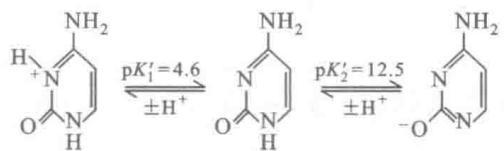

过去一直以为 pH 4.6 的解离与胞嘧啶的氨基有关。其实氨基在嘧啶碱中所呈的碱性极弱，这是因为嘧啶环与苯环相似，具有吸引电子的能力，使得氨基氮原子上的未共用电子对不易与氢离子结合。氢离子主要是与环中第三位上的氮原子（用 N3 表示）相结合。

尿嘧啶及胸腺嘧啶环上无氨基，N3酸性解离的 $pK_{1}^{\prime}$ 分别为9.5与9.9。

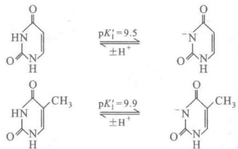

腺嘌呤中，质子结合于 N1 上，其 $pK_{1}^{\prime}=4.15$ 。pH 9.8 的解离在咪唑环的—NH—基上发生，在它的核苷及核苷酸中，由于 N9 上形成了糖苷键，所以没有 pH=9.8 的解离。

鸟嘌呤和次黄嘌呤中，质子则结合于N7上。以鸟嘌呤为例，N7上的解离 $\mathrm{pK}_1^{\prime} = 3.2$ 。N1上的解离， $\mathrm{pK}_2^{\prime} = 9.6$ 。咪唑环N9上的解离 $\mathrm{pK}_3^{\prime} = 12.4$ 。鸟嘌呤咪唑环上的 $\mathrm{pK}'$ 如此之大，可能是受到环上烯醇式羟基的影响所致。

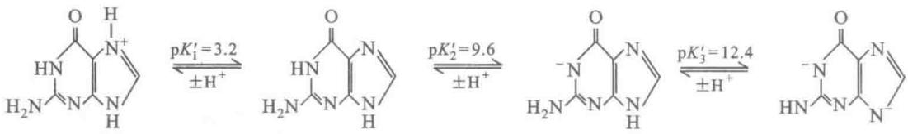

## （二）核苷的解离

由于戊糖的存在,核苷中碱基的解离受到一定的影响,例如,腺嘌呤环的 $pK_{1}^{\prime}$ 原为 4.15,在核苷中则降至 3.45。胞嘧啶 $pK_{1}^{\prime}$ 为 4.6,胞嘧啶核苷中则降至 4.22。 $pK^{\prime}$ 的下降说明糖的存在增强了碱基酸性解离。核糖中的羟基也可以发生解离,其 $pK_{1}^{\prime}$ 通常在 12 以上,所以一般不去考虑它。

## （三）核苷酸的解离

由于磷酸基的存在,使核苷酸具有较强的酸性。在核苷酸中,碱基部分的 $pK'$ 与核苷的相似,额外两个解离常数是由磷酸基引起的。这两个解离常数分别为 $pK_{1}' = 0.7 \sim 1.6$ , $pK_{2}' = 5.9 \sim 6.5$ (表 12-1)。

表 12-1 某些碱基、核苷和核苷酸的解离常数

<table><tr><td>碱基种类</td><td>碱基的 $pK'$ </td><td>核苷的 $pK'$ </td><td>核苷酸的 $pK'$ </td></tr><tr><td>腺嘌呤</td><td>4.15,9.8</td><td>3.45,12.5 $^{\text{1}}$ </td><td>0.9,3.8,6.2</td></tr><tr><td>鸟嘌呤</td><td>3.2,9.6,12.4</td><td>1.6,9.2,12.4 $^{\text{1}}$ </td><td>0.7,2.4,6.1,9.4</td></tr><tr><td>胞嘧啶</td><td>4.6,12.2</td><td>4.22,12.3 $^{\text{1}}$ ,12.5</td><td>0.8,4.5,6.3</td></tr><tr><td>尿嘧啶</td><td>9.5</td><td>9.2,12.5 $^{\text{1}}$ </td><td>1.0,6.4,9.5</td></tr><tr><td>胸腺嘧啶 $^{\text{2}}$ </td><td>9.9</td><td>9.8,&gt;13 $^{\text{1}}$ </td><td>1.6,6.5,10.0</td></tr></table>

① 戊糖羟基的 $pK'$ ; ② 其核苷和核苷酸中的戊糖为脱氧核糖。

$$
\begin{array}{c} \mathrm{O} \\ \mathrm{R-O-P-OH} \\ \mathrm{OH} \end{array} \xrightarrow [ \pm \mathrm{H} ^ {+} ]{\mathrm{pK} _ {1} ^ {\prime} = 0 . 7 \sim 1 . 6} \begin{array}{c} \mathrm{O} \\ \mathrm{R-O-P-O} ^ {-} \\ \mathrm{OH} \end{array} \xrightarrow [ \pm \mathrm{H} ^ {+} ]{\mathrm{pK} _ {2} ^ {\prime} = 5 . 9 \sim 6 . 5} \begin{array}{c} \mathrm{O} \\ \mathrm{R-O-P-O} ^ {-} \\ \mathrm{O} ^ {-} \end{array}
$$

但是在多核苷酸中，除了末端磷酸基外，磷酸二酯键中的磷酸基只有一个解离常数， $\mathrm{p}K_{1}^{\prime} = 1.5$ 。

综上所述,由于核苷酸含有磷酸基与碱基,为两性电解质,它们在不同 pH 的溶液中解离程度不同,在一定条件下可形成兼性离子。图 12-1 为 4 种核苷酸的解离曲线。在腺苷酸、鸟苷酸、胞苷酸中, $pK_{1}'$ 是由于第一磷酸基—— $PO_{3}H_{2}$ 的解离, $pK_{2}'$ 是由于含氮环= $N^{+}H$ —的解离,而 $pK_{3}'$ 则是由于第二磷酸基——

$PO_{3}H^{-}$ 的解离。从核苷酸的解离曲线可以看出，在第一磷酸基和含氮环解离曲线的交叉处，带负电荷的磷酸基正好与带正电荷的含氮环数目相等，这时的 pH 即为此核苷酸的等电点。核苷酸的等电点（pI）可以按下式计算：

$$
\mathrm{pI} = \frac {\mathrm{p} K _ {1} ^ {\prime} + \mathrm{p} K _ {2} ^ {\prime}}{2}
$$

处在等电点时,上述核苷酸主要呈兼性离子存在。当溶液 pH 小于 pI 值时,核苷酸的— $PO_{3}H^{-}$ 基即开始与 $H^{+}$ 结合成— $PO_{3}H_{2}$ ,因此= $N^{+}H-$ 数量比— $PO_{3}H^{-}$ 数量为多,核苷酸带正电荷。反之,当溶液的 pH 大于 pI 值时, $=N^{+}H-$ 上的 $H^{+}$ 解离下来,核苷酸即带负电荷。尿苷酸的碱基碱性极弱,实际上测不出其含氮环的解离曲线,故不能形成兼性离子。

核苷酸中磷酸基在糖环上的位置对其 $pK'$ 略有影响,一般说来,磷酸基与碱基之间的距离越小,由于静电场的作用,其 $pK'$ 应越大。例如 $2'-$ 胞苷酸的 $pK_{1}'$ 为 4.4 比 $3'-$ 胞苷酸的 $pK_{1}'$ 4.3 为大。

研究核苷酸的解离不仅对了解核酸的物化性质极其重要,而且在核苷酸的制备及分析中有很大的实用价值。应用离子交换柱层析和电泳等方法分级分离核苷酸及其衍生物,主要是利用它们在一定 pH 条件下具有不同的解离特性这一性质。

## （四）核酸的滴定曲线

电位滴定可用于确定参与酸碱反应的基团性质。将小牛胸腺 DNA 钠盐溶液由 pH 6\~7 滴定到 pH 2.5 或滴定到 pH 12，此滴定过程是不可逆的；用碱和酸进行反向滴定所得到的曲线显著不同于正向滴定曲线（图 12-2）。开始滴定时，没有酸碱基团解离，非缓冲区较宽，在 pH 4.5\~11.0 之间；而在反向滴定中非缓冲区只存在于 pH 6\~9 之间。这就是说，当最初的 DNA 溶液超过 pH 4.5 和 pH 11.0 时即迅速释

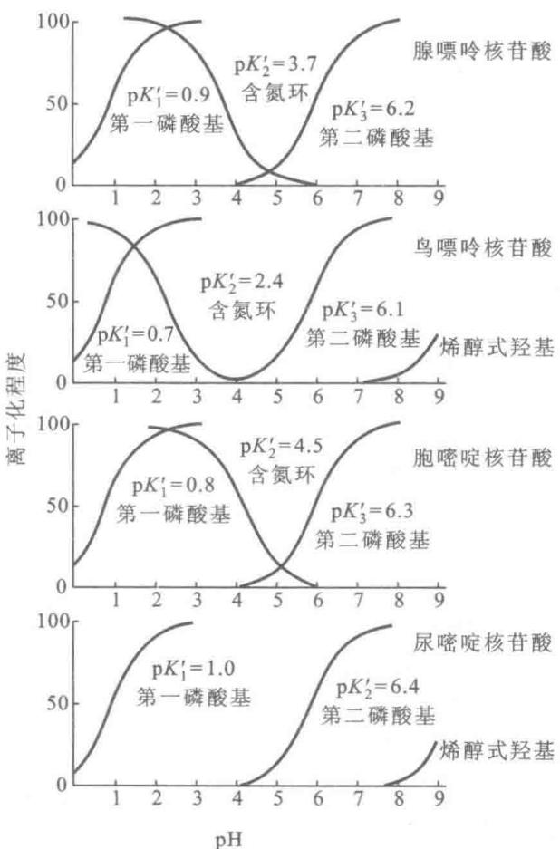  
图 12-1 核苷酸的解离曲线

  
图12-2 小牛胸腺DNA的滴定曲线  
I. 从 pH 6.9 用酸或碱正向滴定；Ⅱ. 从 pH 12 或 pH 2.5 分别用酸和碱反向滴定

放出酸碱基团参与 pH 2.0\~6.0 和 pH 9.0\~12.0 范围的滴定。由此可见天然 DNA 与变性 DNA 的滴定曲线是不同的，双链解开后碱基即参与酸碱滴定。

DNA 的酸碱滴定曲线对了解 DNA 的酸碱变性很有帮助。

## 三、核酸的紫外吸收

嘌呤碱与嘧啶碱具有芳香共轭体系，使碱基、核苷、核苷酸和核酸在240\~290 nm的紫外波段有一强烈的吸收峰，最大吸收值在260 nm附近。不同核苷酸有不同的吸收特性。核酸具有紫外吸收性质，故可用紫外分光光度计加以定性及定量测定。

紫外吸收是实验室中最常用的测定 DNA 或 RNA 的方法。核酸样品的纯度也可用紫外分光光度法进行鉴定。读出 260 nm 与 280 nm 的吸光度 (A) 即光密度 (OD) 值，从 $A_{260}/A_{280}$ 的比值即可判断样品的纯度。纯 DNA 的 $A_{260}/A_{280}$ 应大于 1.8，纯 RNA 应达到 2.0。样品中如含有杂蛋白及苯酚， $A_{260}/A_{280}$ 比值即明显降低。不纯的样品不能用紫外吸收法作定量测定。对于纯的样品，只要读出 260 nm 的 A 值即可算出其含量。

通常以 A 值为 1 相当于 $50 \mu g/mL$ 双螺旋 DNA，或 $40 \mu g/mL$ 单链 DNA（或 RNA），或 $20 \mu g/mL$ 寡核

苷酸计算。这个方法既快速，又相当准确，而且不会浪费样品。对于不纯的核酸可以用琼脂糖凝胶电泳分离出区带后，经溴化乙锭染色在紫外灯下粗略地估计其含量。

有时核酸溶液的紫外吸收以摩尔磷的吸光度来表示,摩尔磷即相当于摩尔核苷酸。据此先测定核酸溶液中的磷含量及紫外吸收值,然后求出摩尔磷吸光系数 $\varepsilon(\mathrm{P})$ :

$$
\varepsilon (\mathrm{P}) = \frac {A}{c L}
$$

A 为光吸收值(吸光度), c 为每升溶液中磷的摩尔数, L 为比色杯内径。

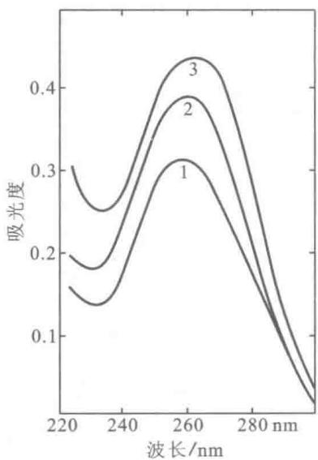

一般天然 DNA 的 $\varepsilon(\mathrm{P})$ 为 6 600, RNA 为 7 700\~7 800。核酸的 $\varepsilon(\mathrm{P})$ 值较所含核苷酸单体的 $\varepsilon(\mathrm{P})$ 要低 40%\~45%。单链多核苷酸的 $\varepsilon(\mathrm{P})$ 值比双螺旋多核苷酸的 $\varepsilon(\mathrm{P})$ 值要高，所以核酸发生变性时， $\varepsilon(\mathrm{P})$ 值升高，此现象称为增色效应（hyperchromic effect）（图 12-3）。复性后 $\varepsilon(\mathrm{P})$ 值又降低，此现象称减色效应（hypochromic effect）。这是因为双螺旋结构使碱基对的 $\pi$ 电子云发生重叠，因而减少了对紫外光的吸收。测定核酸的 $\varepsilon(\mathrm{P})$ 可判断 DNA 制剂是否发生变性或降解。

图12-3 DNA的紫外吸收光谱

1. 天然 DNA; 2. 变性 DNA; 3. 核苷酸

## 四、核酸的变性、复性及杂交

## (一) 变性

核酸变性(denaturation)是指核酸双螺旋碱基对的氢键断裂,双链转变成单链,从而使核酸的天然构象和性质发生改变。核酸链共价键(3',5'-磷酸二酯链)的断裂则称为降解,核酸降解引起核酸链相对分子质量降低。有时核酸变性和降解可同时进行。

引起核酸变性的因素很多。由温度升高引起的变性称为热变性。由酸碱度改变引起的变性称为酸碱变性。变性剂也能引起变性。在测定 DNA 序列进行聚丙烯酰胺凝胶电泳时，为使双链解开，常加入尿素作为变性剂。在用琼脂糖凝胶电泳测定 RNA 分子大小时，可用氢氧化甲基汞作为变性剂，因其能与 RNA 中尿嘧啶和鸟嘌呤的亚胺键反应，因而破坏碱基对的形成。也可用乙二醛或甲醛取代易造成公害的氢氧化甲基汞。这些变性剂都可以完全消除 RNA 的二级结构。此外，在无离子水溶液中，低浓度的核酸由于磷酸基负电荷的排斥作用也会引起变性。

核酸变性研究最多的是 DNA 的热变性。当 DNA 在稀盐溶液中加热到 80\~100 ℃ 时，双螺旋结构即被破坏，两条链随即分开，形成无规线团；如果温度降低，又可在链内和链间形成局部双螺旋（图 12-4）。DNA 在变性过程中一系列物化性质随之发生改变：260 nm 区紫外线吸光度升高，黏度降低，比旋下降，超速离心沉降系数变大，酸碱滴定曲线改变，流动双折射现象消失等。DNA 的变性是爆发式的，存在一个相变的过程。组分均一的 DNA 在一个狭窄的温度范围内变性；组分不均一的 DNA，变性发生在较宽的温度范围内。通常把 DNA 热变性引起物化性质改变一半时的温度称为该 DNA 的熔解温度（melting temperature, $T_{m}$ ）。

DNA 的 $T_{m}$ 受溶液离子强度、pH、极性溶质等各种因素的影响。一般来说，在离子强度较低的溶液中 DNA 的 $T_{m}$ 较低，而且变性过程发生在较宽的温度范围内；离子强度较高时， $T_{m}$ 较高，变性过程的温度范围较窄。甲酰胺的存在可以促进变性。DNA 的 G-C 含量对 $T_{m}$ 有较大影响，在一定条件下 G-C 含量与 $T_{m}$ 成正比关系（图 12-5）。这是因为 G-C 碱基对之间有 3 个氢键，A-T 碱基对只有 2 个氢键，前者比后者更有利于 DNA 的稳定性。E.T.Bolton 和 B.J.McCarthy 曾提出计算 $T_{m}$ 的经验公式为：

$$
T _ {\mathrm{m}} = 8 1. 5 ^ {\circ} \mathrm{C} + 1 6. 6 (\lg [ \mathrm{Na} ^ {+} ]) + 0. 4 1 (\% \mathrm{G} + \mathrm{C}) - 0. 6 3 (\% \text {甲酰胺}) - (6 0 0 / 1)
$$

上述公式只适用于一定范围,例如双螺旋 DNA 片段长度(l)在数百 bp 以上,不足数百 bp 应消除此项。此公式也可从 DNA 的 $T_{m}$ 来计算其 G+C 含量。

RNA 也能发生变性。互补双链 RNA 的变性与 DNA 的变性相似，但双链 RNA 比同样序列的 DNA 更稳定， $T_{m}$ 更高。单链 RNA 可以通过回折形成局部双螺旋区，变性过程各区段逐渐解开双螺旋，因此 $T_{m}$ 较低，变性温度范围较宽（图 12-6）。

  
图12-5 DNA的 $T_{\mathrm{m}}$ 与G-C含量之关系  
DNA 来源如下: 1. 草分枝杆菌; 2. 沙门氏菌; 3. 大肠杆菌; 4. 鲑鱼精子; 5. 小牛胸腺; 6. 肺炎球菌; 7. 酵母; 8. 噬菌体 T4; 9. 多聚 d(A-T)。DNA 变性在 1× SSC 溶液 (0.15mol/L NaCl, 0.015mol/L 柠檬酸钠, pH7.0) 中进行

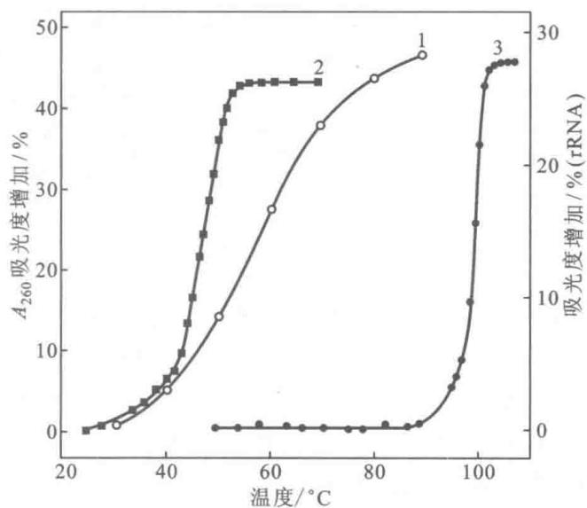  
图12-6 rRNA和双链RNA的热变性曲线  
1. 一种浮萍的 18S rRNA; 2. 酵母的杀伤 RNA (killer RNA) 在 0.017 mol/L Na $^{+}$ 和 67% 甲酰胺中变性; 3. 同 2, 但无甲酰胺

## （二）复性

变性 DNA 在适当条件下, 可使两条分开的链重新缔合 (reassociation), 恢复双螺旋结构, 这个过程称为复性 (renaturation)。DNA 复性后许多物化性质又得到恢复。复性过程符合二级反应动力学公式:

$$
\frac {\mathrm{d} C}{\mathrm{d} t} = - K C ^ {2}
$$

上式中， $C$ 为 $t$ 时单链DNA的浓度， $K$ 为重缔合速度常数。积分后得到：

$$
\frac {C}{C _ {0}} = \frac {1}{1 + K C _ {0} t}
$$

$C_{0}$ 是起始时完全变性 DNA 的浓度。t 以秒(s)为单位，C 为每升溶液中核苷酸的摩尔为单位。当复性反应进行一半时，即

$$
\frac {C}{C _ {0}} = \frac {1}{2} \text {时,} C _ {0} t _ {1 / 2} = \frac {1}{K}
$$

复性反应的速度受许多因素的影响,如果控制所有可变因素,包括温度、离子强度、片段长度等,复性速度便只决定于基因组大小,或者说决定于 DNA 序列的复杂性。实验证明,重缔合速度常数 K 与 DNA 复杂性 N 成反比。因此,测定 DNA 的复性动力学曲线(图 12-7),求出 $C_{0}t_{1/2}$ 值,即代表了基因组大小,也就是 DNA 序列复杂性。例如,大肠杆菌染色体 DNA 的大小为 $4.64 \times 10^{6}$ bp,测得其 $C_{0}t_{1/2}$ 是 $9(\mathrm{mol}\cdot\mathrm{s}\cdot\mathrm{L}^{-1})$ ; T4 噬菌体 DNA 为 $1.66 \times 10^{5}$ bp,测得其 $C_{0}t_{1/2}$ 是 $0.3(\mathrm{mol}\cdot\mathrm{s}\cdot\mathrm{L}^{-1})$ ,两者呈较好的比例关系。任何生物的 DNA,只要测出其 $C_{0}t_{1/2}$ 值,与已知基因组大小的大肠杆菌染色体 DNA $C_{0}t_{1/2}$ 相比,即可算出其基因组的大小。真核生物 DNA 含有大量重复序列,其复性动力学曲线比较复杂,包含多个组分,可以分别测出各组分的 $C_{0}t_{1/2}$ 和在总 DNA 中所占比例,然后计算各组分的复杂性和拷贝数。

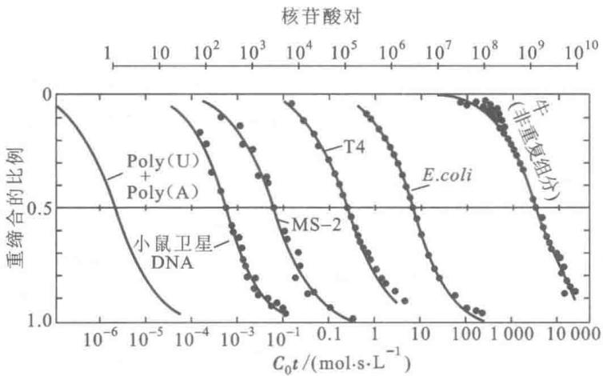  
图12-7 DNA的复性动力学曲线

将热变性的 DNA 迅速放置冰浴内，骤然冷却至低温，可以阻止 DNA 复性。若使热变性的 DNA 缓慢冷却，则可发生复性，此过程称为退火（annealing）。退火温度 $T_{a}$ 以低于变性温度 $T_{m}$ 20\~25℃为宜。复性过程可以在溶液中进行，然后将单链和双链 DNA 分开，以测定复性的部分。羟基磷灰石（hydroxyapatite）是一种碱性磷酸钙 $\mathrm{Ca}_{10}\left(\mathrm{PO}_{4}\right)_{6}\left(\mathrm{OH}\right)_{2}$ 结晶。它吸附双链 DNA 的能力大于单链 DNA，低盐溶液可洗脱单链 DNA，双链 DNA 则要较高浓度的盐溶液才能洗脱，从而将两者分开。复性过程也可在硝酸纤维素滤膜（nitrocellulose filter）或尼龙膜（nylon membrane）上进行。单链 DNA 经烘焙后可固定在膜上，将其浸泡在放射性同位素标记的互补链 DNA 溶液中即可进行链的配对，不配对的链很容易洗掉。利用上述膜进行核酸的复性和杂交，是核酸研究最常用和最重要的方法技术之一。

## （三）核酸分子杂交

将不同来源的 DNA 放在试管里, 经热变性后, 缓慢冷却, 使其复性。若这些异源 DNA 之间存在近似的序列, 则复性时会相互之交错配对, 形成杂交分子 (hybrid molecule)。DNA 与互补的 RNA 之间也可以发生杂交 (hybridization)。核酸分子杂交是基因操作最核心技术之一, 在基因工程、分子医学和分子生物学的研究中应用极广, 许多有关重要问题都是依靠分子杂交技术来解决的。

核酸杂交可以在液相中进行,也可以在固相表面进行,最常用的还是硝酸纤维素滤膜或尼龙膜作为支持物的分子杂交。英国分子生物学家 E.M.Southern 所发明的 Southern 印迹法(Southern blotting)就是将凝胶电泳分开的 DNA 限制片段转移到硝酸纤维素滤膜上用标记核酸作为探针进行杂交。其后 J.C.Alwine 等按照同样原理,将变性凝胶电泳分开的 RNA 转移到硝酸纤维素膜上,通过分子杂交以检测特异的 RNA。DNA 印迹法因是 Southern 所发明,故称为 Southern 印迹法;RNA 印迹法则被称为 Northern 印迹法,以“南”“北”分称 DNA 和 RNA 两种杂交技术,表现出科学家的幽默。这里仅以图解法(图 12-8)表示 Southern 杂交的全过程。

常用 $^{32}$ P 标记核酸作为探针(probe)。探针可以是DNA,也可以是RNA,可在末端标记(5'端或3'端),也可以采用均匀标记。应用核酸杂交技术不仅可检测特定的基因片段或RNA,也可用来钓出基因组中的单拷贝基因或特异的RNA。

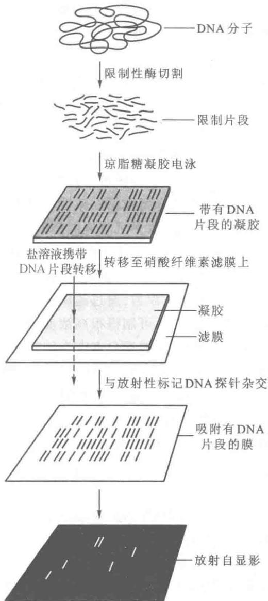  
图12-8 Southern印迹法图解

为了避免放射性同位素操作带来的不便,可以改用生物素、地高辛(DIG)或荧光素标记核酸探针。用酶联链霉亲和

素(streptavidin)或酶联抗地高辛抗体与各标记物结合,经酶反应产生呈色或荧光物质,以显示杂交条带。

## 五、核酸的分离和纯化

核酸制备是研究核酸结构与功能的首要步骤。核酸分离和纯化过程中需要特别注意的问题是防止核酸的降解和变性，应尽可能保持其在生物体内的天然状态。早期的研究工作受到方法学上的限制，由于得到的样品往往是一些降解产物，因此失去了它们的功能活性。要制备天然状态的核酸，必须采用温和的条件，防止过酸、过碱、高温、剧烈搅拌，尤其要防止核酸酶的作用。天然核酸具有生物活性，这是检验其完整性的重要指标。物理化学性质也常用来作为评价核酸质量的标准。最常用于分离纯化核酸的方法有：超速离心、柱层析、凝胶电泳、溶液抽提和选择沉淀，这里仅就有关方法的原理作简要的介绍。

## （一）核酸的超速离心

溶液中核酸分子受引力场的下沉作用可被分子热运动所抵消。但在超速离心机造成的巨大离心力场中，核酸分子沉降速度大大加快，这就可能用来测定核酸分子的相对分子质量、密度和构象，并用来大量制备核酸。目前实验室已常用更为简便的方法制备核酸，较少用超速离心的方法。

超速离心的方法很多,如沉降速度超离心、沉降平衡超离心、蔗糖(或甘油)密度梯度超离心、浮力密度超离心等。总体来说,超速离心可分为两类:一类是在超速离心时,各种核酸样品以不同速度往下沉降,根据沉降速度不同来求出沉降常数S。另一类是将超速离心的溶液制成各种密度(如CsCl、 $Cs_{2}SO_{4}$ 密度梯度),超速离心使核酸样品集中在等密度区,从而得出核酸的密度 $\rho$ 。沉降速度和沉降平衡超离心已在蛋白质纯化的一节中予以介绍,这里不再叙述。核酸样品的制备更常用的是密度梯度超离心。

通过蔗糖(或甘油)支持物构成的密度梯度可维持沉降力的稳定,防止对流,使铺在表层的核酸样品进入介质后成为狭窄的区带。样品各成分以不同速度沉降,所形成差速区带在沉降过程中逐渐分开。各类RNA常以此法分离纯化。碱性(NaOH)蔗糖密度梯度区带超离心可用来分离变性DNA的单链。蔗糖密度梯度超离心法属于沉降速度超离心,只不过介质采用蔗糖。

浮力密度超离心是于 1957 年 M. Meselson 等提出的。由于铯的相对原子质量很大，铯离子在超速离心力场作用下可克服分子热运动而发生沉降，形成浓度（密度）梯度。DNA 的密度很大，只有在浓的铯离子溶液中才能产生浮力，通过超离心可测定 DNA 的密度和得到其制品。常用的铯盐为氯化铯，因为它在水中的溶解度极大，可制得很高浓度（8.0 mol/L）的溶液。

现以测定 DNA 的浮力密度为例来说明该方法。将 DNA 溶于 8.0 mol/L 的氯化铯溶液中，置于离心管内，若以每分钟 45 000 转的速度离心 16 h 以上，即形成铯离子密度梯度，自底部的 $1.80 \, g/cm^{3}$ 到顶部的 $1.55 \, g/cm^{3}$ 。DNA 形成一稳定的区带，漂浮于等密度的位置上。用注射针头吸出该区带 DNA 溶液，或在离心管底部扎一孔，分部收集流出液。DNA 区带的氯化铯溶液密度为 DNA 的浮力密度。更方便的方法是用一已知密度为标准的 DNA 样品，与未知样品一起超离心。待达到平衡后，通过离心机的光学系统测定 DNA 与转头中轴之间的距离，按下式计算未知 DNA 的浮力密度：

$$
\rho = \rho_ {0} + 4. 2 \omega^ {2} (r ^ {2} - r _ {0} ^ {2}) \times 1 0 ^ {- 1 0}
$$

上式中 $\rho$ 为未知 DNA 的密度, $\rho_{0}$ 为标准 DNA 的密度, $\omega$ 为角速度, r 为未知 DNA 与中轴之间距离, $r_{0}$ 为已知 DNA 与中轴之间的距离。

DNA 的密度与其 G-C 含量有关。这是因为 G-C 碱基对的相对原子质量比 A-T 碱基对大；而且前者含 3 个氢键，后者只含 2 个，两者致密程度也不同。实验表明 G-C 的百分含量与 DNA 的浮力密度之间呈正比关系。Poty 等建立了如下计算公式：

$$
\rho = 1. 6 6 0 + 0. 0 0 0 9 8 (\% \mathrm{G} + \mathrm{C}) (\mathrm{g} \cdot \mathrm{cm} ^ {- 3})
$$

真核生物基因组 DNA 含有大量重复序列。在用氯化铯密度梯度离心时，除主要部分（主带）外还得到量较少的次带，或称为卫星带（satellite band）。

卫星 DNA 由一些短的高度重视序列所组成,因其碱基组成与 DNA 的主要部分不同,浮力密度也就不同。例如,小鼠 DNA 的主带占基因组的 92%, 平均 G-C 含量 42%, 浮力密度为 1.701; 卫星 DNA G-C 含量 30%, 浮力密度为 $1.690 \, g \cdot cm^{-3}$ (图 12-9)。

不同碱基组成、不同构象以及单链和双链 DNA，都可借氯化铯密度梯度离心得到分离。硫酸铯梯度也可以用来分离 DNA，但主要用来分离 DNA 与金属离子 $Ag^{+}$ 或 $Hg^{2+}$ 的复合物。 $Hg^{2+}$ 可专一结合于 A-T, $Ag^{+}$ 被认为对 G-C 有更大亲和力。与金属离子特异结合，可使富含 A-T 或 G-C 的重复序列更易与主带分离。某些嵌入染料和抗生素能插入 DNA 双螺旋的碱基对之间，导致构象改变和浮力密度的减少，双链闭环 DNA (cccDNA) 由于受到拓扑束缚限制了嵌入分子的插入，因此采用溴化乙锭-氯化铯密度梯度平衡超离心，可将质粒与染色体 DNA 分开（图 12-10）。

  
图 12-9 DNA 经氯化铯密度梯度离心后分成主带和卫星带

RNA 为单链分子, 只有局部双螺旋, 它的浮力密度比 DNA 高, DNA 密度比蛋白质密度高, 单链 DNA 又比双链 DNA 密度高。经氯化铯梯度离心得到的核酸有很高的纯度。

## （二）核酸的凝胶电泳

凝胶电泳将分子筛技术与电泳技术相结合,它可以分辨只差一个核苷酸的核酸片段,也可以分出上百 kb 的 DNA。它有许多优点:简单、快速、灵敏、微量,并且成本低廉。因此凝胶电泳已成为研究核酸最常用的方法。凝胶电泳的支持物主要有琼脂糖(agarose)和聚丙烯酰胺(polyacrylamide)两种。前者常在水平电泳槽中进行;后者常在垂直电泳槽中进行。

## 1. 琼脂糖凝胶电泳

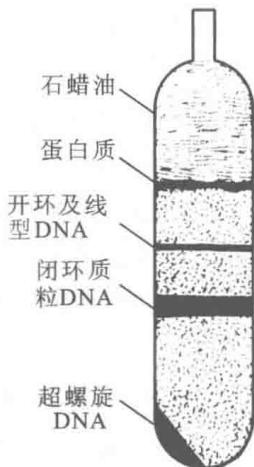  
图 12-10 经染料-氯化铯密度梯度超离心后,质粒 DNA 及各种杂质的分布

琼脂糖是从海产藻类中提取到的琼脂的主要成分,它由 D-吡喃半乳糖和 3,6-脱水-L-吡喃半乳糖交替连接而成。将琼脂反复洗涤

除去其中琼脂胶后即得到琼脂糖。其实琼脂胶只是琼脂糖羟基被硫酸基、丙酮酸等取代的衍生物。琼脂糖与缓冲液一起加热使其溶解，冷却后则成凝胶。凝胶的孔径与琼脂糖浓度成反比，凝胶浓度越大，孔径越小；反之，浓度越小，孔径越大。胶太浓，孔径太小，核酸样品无法进入胶内；胶太稀，机械强度差，无法维持固定形状，因此孔径也不可能太大。通常琼脂糖凝胶浓度在0.3%\~2.0%之间，分离DNA分子大小从数百bp到上百kb。琼脂糖凝胶电泳较少用于RNA，它只能分离某些大分子的RNA，如rRNA和病毒RNA。

核酸凝胶电泳常用的缓冲液为含有 EDTA 的 Tris-乙酸(TAE)、Tris-硼酸(TBE)或 Tris-磷酸(TPE)，浓度约为 50 mmol/L(pH 7.5\~7.8)，电压 1\~8 V/cm。此时核酸带负电荷，向正极方向移动。在一定范围内，线性双链 DNA 在电场中的迁移率与其碱基对数目的对数成反比。这是因为较大的分子穿过凝胶介质所受拖曳阻力较大以及蠕动通过凝胶孔径的效率较小。借助与已知分子大小的 DNA 标准物迁移距离相比较，就可算出 DNA 样品的分子大小。RNA 在变性凝胶中电泳时，相对分子质量的对数才与迁移率成反比，故常在制备凝胶时加入氢氧化甲基汞(methylmercuric hydroxide)或甲醛。

核酸在凝胶电泳后可用碱性染料或银染显色，洗去背景颜色后得到清晰的核酸条带。最简便的方法是利用嵌合荧光染料溴化乙锭(ethidium bromide, EB)，其分子结构式如下：

EB 是一种扁平分子, 可插入核酸双链相邻碱基对之间, 在紫外线激发下发射出红橙色 (590 nm) 荧光。它本身能吸收波长为 302 nm 和 360 nm 的紫外线能量; 核酸吸收的 254 nm 紫外线能量也能转给 EB, 而且 EB 结合在核酸碱基对之间的疏水环境大大增加了荧光产率。与游离的 EB 相比, EB-DNA 复合物发射的荧光强度可增大 100 倍。因此无需洗去凝胶中游离的 EB, 即可检测出 DNA 条带, 最低可检测 $10 \, \text{ng}(10^{-8} \, \text{g})$ 或更少的 DNA 含量。单链 DNA 或 RNA 对 EB 的结合能力较小, 荧光产率也相对较低。

凝胶电泳后核酸样品可用多种方法自胶上回收:① 浸泡法,将含 DNA 的胶带切下,用少量缓冲液重复抽提。②冻融法，将胶带在低温下冰冻，室温下融化，然后用高速离心除去凝胶沉淀。③电泳法，将胶带置于透析袋内，通过电泳使核酸进入袋内缓冲液中；也可以直接在凝胶电泳后于条带前切出一槽，前面插入一片透析膜，然后电泳使样品进入槽中。④溶胶法，胶带加NaI、KI、 $\mathrm{NaClO_4}$ 、柠檬酸钠等，在一定浓度和温度下使胶溶解；或用低熔点琼脂糖，将胶带溶解，然后再用酚等抽提回收核酸。⑤转移法，将凝胶上核酸条带转移到硝酸纤维素滤膜、尼龙膜或具有偶联基团的膜上。

## 2. 脉冲电场凝胶电泳

传统的琼脂糖凝胶电泳只能分离分子大小在 $20 \, kb (M_{r}$ 约 $10^{7}$ ) 以下的 DNA 片段以及小的质粒和病毒 DNA，更大的 DNA 分子彼此很难分开。这是因为 DNA 分子在凝胶介质中呈无规卷曲的构象，当 DNA 分子的有效直径超过凝胶孔径时，在电场作用下可变形挤过筛孔，此时其电泳迁移率不再决定于分子的大小。然而，细菌的染色体 DNA 在数千 kb 以上，真核生物的染色体 DNA 更大。为分离染色体 DNA 需要发展新的实验技术。

1983 年 Schwartz 等人根据 DNA 分子黏弹性弛豫时间对分子大小敏感的特性,设计了脉冲电场梯度凝胶电泳。通过交替用两个垂直方向的不均匀电场,使 DNA 分子在凝胶介质中不断改变泳动方向,从而将不同大小的分子分开。此后不少实验室对此技术进行研究,作了许多改进,并发现不同大小的大分子 DNA 在凝胶中可借助各种类型的交变脉冲电场而分离,电场梯度(电场不均匀性)对分离则并非必需,故此技术只称为脉冲电场凝胶电泳(pulsed field gel electrophoresis)。

目前国内外已有多种脉冲电场凝胶电泳装置问世。脉冲交变电场的夹角可以是直角（正交交变电场），也可以是 $120^{\circ}$ （六角形电泳槽相间两边电场的转换）或是 $180^{\circ}$ （周期性倒转电场）。脉冲电场凝胶电泳多数采用水平电泳槽，但也有垂直平板电泳槽，后者脉冲电场横向交替改方向。图12-11列出几种较常见的脉冲电场凝胶电泳方式。一些新的电泳装置还可使电泳中各种可变参数加以程序化控制，从而有效地提高了分辨率。

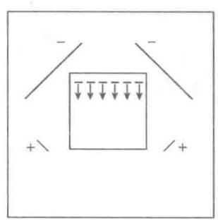

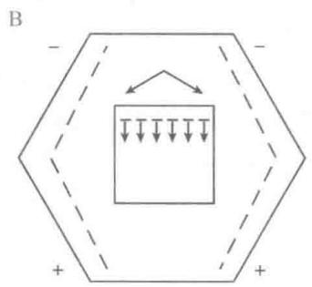

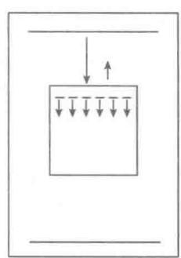

  
图 12-11 几种脉冲电场凝胶电泳  
A. 正交电场交变凝胶电泳 (orthogonal-field-alternation gel electrophoresis.OFAGE); B. 钳位均匀电场 (contour-clamped homogeneous electric field, CHEF) 凝胶电泳; C. 电场倒转凝胶电泳 (field-inversion gel electrophoresis, FIGE); D. 横向交变电场电泳 (transverse alternating field electrophoresis, TAFE)

大分子 DNA 在脉冲电场凝胶电泳中的迁移率受脉冲时间、电场形式、凝胶浓度、缓冲液和温度等诸多因素的影响。在这些因素中最重要的是脉冲时间，它取决于 DNA 分子长度，因此可以推导出公式：

$$
\lg t = A \lg M _ {\mathrm{r}} - B
$$

式中，t 为有效脉冲时间(s)， $M_{r}$ 为 DNA 相对分子质量，在一定范围内 A 与 B 均为常数。利用已知分子大小的 DNA，通过实验得出有效脉冲时间，代入上式可以计算出 A 和 B 的数值。脉冲时间与 DNA 的电泳速度有关，因此与电场强度成反比，例如当电场强度由 10 V/cm 降至 5 V/cm 时，脉冲时间应增加一倍。增加琼脂糖凝胶浓度和降低温度，脉冲时间应相应增加；反之亦然。固定脉冲时间，将 DNA 分子大小对迁移率作图可得出一条 S 形曲线，超过一定大小的 DNA 分子彼此不能分开，在直线部分的分离效果最好，低于转折点的 DNA 分子虽能分开，但间距较小。环状质粒 DNA 在交变电场中的迁移率远小于线性 DNA，并受脉冲时间的影响较小，易于与其分开。

从理论上来看,脉冲电场凝胶电泳分离大分子 DNA 并无上限,它已成为百万碱基级(Mb)基因组操作的一项关键技术。这一技术对分离大片段染色体 DNA、核型分析、DNA 物理图谱、DNA 的 $M_{r}$ 测定和流体动力学研究都十分有用。

## 3. 聚丙烯酰胺凝胶电泳

在有自由基存在时，丙烯酰胺(acrylamide)发生链式聚合反应，自由基通常由过硫酸铵供给，并由 $N$ ， $N,N^{\prime},N^{\prime}$ -四甲基乙二胺 $(N,N,N^{\prime},N^{\prime}$ -tetramethylethylenediamine,TEMED)使其稳定。在加入双功能剂 $N$ ， $N^{\prime}$ -甲叉双丙烯酰胺后，聚合链产生交联形成凝胶，孔径决定于链长和交联程度，即丙烯酰胺和甲叉双丙烯酰胺的浓度。通常凝胶浓度大于 $5\%$ 时，交联度可为 $2.5\%$ ；凝胶浓度小于 $5\%$ 时，交联度增至 $5\%$ ；当聚丙烯酰胺浓度小于 $3\%$ 时，由于凝胶太软而不易操作，这就限制了它不能用于分离大分子DNA。聚丙烯酰胺凝胶电泳(polyacrylamide gel electrophresis,PAGE)主要用于分离RNA样品以及分子小于 $2\mathrm{kb}$ 的DNA片段，因其高分辨率常用于DNA和RNA的测序。在变性条件下（如 $8\mathrm{mol / L}$ 尿素或 $98\%$ 甲酰胺）进行凝胶电泳，此时DNA和RNA的二级结构已被破坏，其电泳迁移率与单链 $M_{r}$ 的对数呈理想的反比关系。测序变性胶需根据所测核酸片段长度来选择胶的浓度，例如测序片段在50核苷酸之内，采用较高浓度的聚丙烯酰胺 $(12\% \sim 20\%)$ ，测序片段在300和400核苷酸可用 $8\%$ 或 $6\%$ 的胶。

## （三）核酸的柱层析

根据核酸的物理化学性质,可用分子筛层析、离子交换、吸附层析、分配层析、亲和层析等技术来分离和制备核酸样品。羟基磷灰石柱常用在核酸分子杂交中单链和双链的分离;寡聚脱氧胸苷酸亲和柱常用来分离真核生物 poly(A) $^{+}$ mRNA。这里简要介绍这两种技术。

## 1. 羟基磷灰石柱层析

羟基磷灰石（hydroxyapatite，HA）为碱性磷酸钙 $\mathrm{Ca}_{10}(\mathrm{PO}_4)_6(\mathrm{OH})_2$ 之晶体，由 $\mathrm{CaCl}_2\cdot 2\mathrm{H}_2\mathrm{O}$ 与 $\mathrm{Na_2HPO_4\cdot 2H_2O}$ 两溶液等量缓慢混合，并在 $\mathrm{NaOH}$ 中加热得到粗的颗粒。它通常保存在 $\mathrm{pH}6.8$ 的磷酸钾（或钠）缓冲溶液里。HA柱已广泛用于蛋白质和核酸的层析分离。

由于核酸的磷酸基可与羟基磷灰石的钙离子作用,从而被吸附其上,这种吸附力决定于核酸的性质,受分子大小的影响较小。双链核酸分子刚性较强,呈伸展状态,其磷酸基有效分布在表面;而变性或单链核酸分子较柔软,呈无规线团结构,有些磷酸基折叠在分子内。因此,双链核酸的吸附力比单链强,双链DNA的吸附力比双链RNA强,而DNA-RNA杂交分子的吸附力则介于两者之间。用它分离天然DNA和变性DNA,单链核酸和杂交核酸常可得到满意的结果。

双链和单链核酸可借不同浓度磷酸盐缓冲液洗脱而分开。0.12 mol/L 的磷酸盐缓冲液可洗脱单链 DNA，而双链 DNA 则需 0.4 mol/L 的磷酸盐缓冲液洗脱。羟基磷灰石具有承载量大，重复性好，回收率高，操作简便等优点，它是目前常用的核酸层析介质之一。

## 2. 寡聚脱氧胸苷酸亲和柱层析

真核生物细胞的 mRNA 在 3' 端通常都带有多聚腺苷酸 [poly(A)] 尾巴, 腺苷酸可长达 150\~200 nt。利用与固体支持物相偶联的寡聚脱氧胸苷酸 [oligo(dT) $_{12-18}$ ] 与 poly(A) 结合, 即可将 poly(A) $^{+}$ mRNA 从总 RNA 中分离出来。oligo(dT) 常与纤维素相偶联。在含高浓度盐 (0.3\~0.5 mol/L NaCl) 的 TES 缓冲液 (10 mol/L Tris-HCl, 1 mmol/L EDTA, 0.2% SDS, pH 7.4) 中将 RNA 样品上柱, 使 poly(A) 与 oligo(dT) 结合, 洗掉柱上非特异吸附的 RNA, 然后用不含盐的 TES 缓冲液将 mRNA 洗脱。多聚尿苷酸-琼脂糖珠 [poly(U)-Sepharose] 也能用来纯化 poly(A) $^{+}$ mRNA, 常可得到较理想的结果。

## （四）DNA 的提取和纯化

真核生物的染色体 DNA 可与碱性蛋白（组蛋白）结合成核蛋白（DNP），它溶于水和浓盐溶液（如 1 mol/L NaCl），但不溶于生理盐溶液（0.14 mol/L NaCl）。早期研究 DNA 常利用这一性质，将细胞破碎后用浓盐溶液提取，然后用水稀释至 0.14 mol/L 盐溶液，使 DNP 纤维沉淀出来。用玻璃棒将 DNP 纤维缠绕其上，再溶解和沉淀多次，可得到纯的核蛋白。用蛋白质变性剂除净蛋白质后即得到纯的 DNA。如此得

到的 DNA 只是一些短的片段,难于研究其生物功能。

苯酚是极强的蛋白质变性剂。用水饱和的苯酚与细胞匀浆或含蛋白质 DNA 提取液一起振荡，然后冷冻离心，DNA 溶于上层水相，不溶的变性蛋白质凝胶位于中间界面，一部分变性蛋白质停留在水相。反复多次用苯酚抽提，直到中间界面不再有变性蛋白质。合并含 DNA 的水相，在有盐存在的条件下加 2 倍体积的乙醇，低温放置使 DNA 沉淀出来，用乙醇和乙醚洗涤沉淀。用此法可以直接从细胞中制备纯的 DNA。用 24:1 氯仿-辛醇（或异戊醇）与含蛋白质的 DNA 溶液振荡，借助分散两相的表面变性可除去所含蛋白质，辛醇（异戊醇）在此起消沫剂的作用。用氯仿振荡可与苯酚抽提一样除净 DNA 溶液中的蛋白质。

细菌菌体经溶菌酶消化除去细胞壁，用碱或十二烷基硫酸钠（sodium dodecyl sulfate, SDS）促使细胞裂解，染色体 DNA 与大部分变性蛋白质通过离心与细胞碎片一起被沉淀，细菌中的质粒 DNA 则仍以溶解状态存在于上清液中。亲水离子和高聚物，如聚乙二醇（PEG），可以结合大量水而使核酸沉淀出来。质粒粗提物中的高相对分子质量 RNA 和蛋白质可在高浓度氯化锂（LiCl）溶液中形成沉淀。用 RNA 酶消化污染的小分子 RNA。然后用 PEG/MgCl₂ 沉淀质粒 DNA。用乙醇只能将所有 DNA 沉淀下来，PEG 却可以将不同大小 DNA 分开。

为了制备细胞染色体 DNA, 应尽量避免核酸酶和机械切力对 DNA 的降解作用。目前较常用的方法是在细胞悬液中直接加入 2 倍体积含 1% SDS 的缓冲液, 并加入广谱蛋白酶 (如蛋白酶 K) 最后浓度达 100 $\mu$ g/mL, 在 65℃ 保温 4 h, 使细胞蛋白质全部降解, 然后用苯酚抽提, 除净蛋白酶和残留的蛋白质。DNA 制品中混杂的少量 RNA 可用不含 DNase 的 RNase 分解除去。

商品化树脂或氯化铯密度梯度离心是实验室制备高质量 DNA 常用的方法。现在许多实验室喜欢采用商品试剂盒来制备核酸，层析树脂柱和各种试剂都是现成的，价格十分昂贵，但却可以节省时间。

## （五）RNA的提取和纯化

RNA 为单链结构, 易被酸、碱、酶所水解, 尤其是 RNase 几乎无处不在, 因此 RNA 的提取和纯化远比 DNA 更为困难。这也是 RNA 的研究落后于 DNA 的原因之一。目前已有一些克服上述困难的方法。

制备 RNA 特别需要注意三点: 第一, 所有用于制备 RNA 的玻璃器皿都要经过高温焙烤, 塑料用具经高压灭菌, 不能高压灭菌的用具要用 0.1% 焦碳酸二乙酯 (diethyl pyrocarbonate, DEPC) 处理, 再煮沸以分解和除净 DEPC。DEPC 能使蛋白质乙基化而破坏 RNase 活性。实验者应戴消毒手套。第二, 在破碎细胞的同时加入强的蛋白质变性剂 (如胍盐) 使 RNase 失活。第三, 在 RNA 反应体系内加入 RNase 的抑制剂 (如 RNasin)。

现在常用于制备 RNA 方法有两个: 其一, 用酸性胍盐/苯酚/氯仿 (acid guanidinium/phenol/chloroform) 提取。异硫氰酸胍 (guanidinium isothiocyanate) 是最强烈的蛋白质变性剂, 它几乎能使所有蛋白质都被变性, 而 RNA 仍溶于该盐溶液中。经离心后, 含 RNA 的水相用苯酚和氯仿多次抽提, 除净蛋白质。其二, 用胍盐/氯化铯法。细胞匀浆用胍盐提取后再进行氯化铯密度梯度离心。蛋白质密度 <1.33 g/cm³, 在最上层; DNA 密度在 1.71 g/cm³ 左右, 位于中间; RNA 密度 >1.89 g/cm³, 沉在底部。用此法可以制备大量高纯度的 RNA。用寡聚 (dT)-纤维素柱或多聚 (U)-琼脂糖珠柱可从总 RNA 中分离到高质量的 poly(A)⁺mRNA。总 RNA 也可以通过凝胶电泳将各类 RNA 分开。

不同功能的 RNA 常分布于细胞的不同部位, 分离这些 RNA 需先用差速离心法或其他方法将细胞核、线粒体、叶绿体、胞质体等各部分分开, 再从这些部分中分离出 RNA。

## 六、核酸序列的测定

20世纪50年代蛋白质的测序获得巨大成功。早在1953年，F.Sanger就已完成了胰岛素的测序工作。1954年P.R.Whitfeld提出测定多聚核糖核菌酸序列的降解法，即利用高碘酸盐的氧化作用逐一降解并鉴定末端核苷酸。60年代R.W.Holley测定了酵母丙氨酸tRNA的序列，他采用的测序法与蛋白质测序法的基本策略相同，都是将大分子先切成彼此重叠的小片段，然后用末端降解法测定小片段的序列。这种策略的工作量非常大，用来测定几十个核苷酸长的小分子RNA尚且需要十多年时间，要对付基因组

DNA 的序列就无能为力了。1975 年 Sanger 提出了一种崭新的策略，他并不逐个测定 DNA 的核苷酸序列，而是设法获得一系列多核苷酸片段，使其末端固定为一种核苷酸，然后通过测定片段长度来推测核苷酸的序列。其后发展起来的各种 DNA 和 RNA 快速测序法，无不以此原理为基础，因此这一原理的提出有划时代的意义。有了 Sanger 的快速测序法，完成人类基因组测序才成为可能。

快速测序是“人类基因组计划”的核心技术。该技术备受各界关注并获得巨大支持，得以融入物理、化学和信息技术的最新成果，成为发展最快的综合性的技术。以 Sanger 所建立和在其基础上加以改进的测序技术称为第一代测序技术。依赖于第一代测序技术，“人类基因组计划”用了 13 年时间提前完成。在“人类基因组计划”实施期间发展出了第二代测序技术，该技术引入 PCR 和高通量（high throughput）微阵（microarray）技术，大大提高了测序速度，在数周内即可完成 Gb（ $10^{9}$ bp）级的测序工作。但是第二代测序技术的测序长度较短，误差较大，适合于已知序列的重测序，在“人类基因组计划”后期的复查中起了作用。在 21 世纪第一个十年的中期和后期，即后基因组时代的初期，又发展出了第三代测序技术，其主要特点是单分子测序，不仅提高了测序速度，也提高了测序长度和精确度，同时还降低了成本。新一代测序技术可以在一天内，甚或数小时内，完成 Gb 级的测序工作。在这里，不仅显示出一流的精湛技术；也显示出一流的巧妙构思。第三代测序技术的商品化仪器正在推出，或即将推出。下面分别介绍有关的测序技术。

## （一）第一代测序技术

## 1. DNA 的酶法测序

1975 年 Sanger 最初提出 DNA 测序的方法是利用 DNA 聚合酶, 将待测序 DNA 样品作为模板, 在引物和底物 (dNTP) 存在下合成一条与模板互补的 DNA 链, DNA 链用同位素标记, 并通过“加”“减”底物来控制合成链各片段的末端核苷酸, 故称为加减法。测序反应中 DNA 链的合成是随机的, 各种长度的片段都有。随后从反应体系中除去四种 dNTP, 并将体系分为两部分, 一部分用于“加”系统, 分置四小管内, 各加一种核苷酸底物, 分别为 +dA、+dG、+dC、+dT; 另一部分为“减”系统, 也分置四小管内, 各加三种核苷酸底物, 即减去一种底物, 分别为 -dA、-dG、-dC、-dT。在“加”系统中, 由于 DNA 聚合酶的 $3^{\prime} \rightarrow 5^{\prime}$ 外切酶活性, 它使已合成的 DNA 链自 $3^{\prime}$ 端向 $5^{\prime}$ 端方向降解, 直至遇到所加入的核苷酸为止, 底物的存在阻止了降解反应。因此所有片段都以该核苷酸结尾, 片段的长度即为该核苷酸在 DNA 链中的位置。在“减”系统, DNA 聚合酶使链继续延伸, 直至遇上所缺核苷酸才停止。这就使各片段长度比所缺核苷酸位置少一个核苷酸。

1977 年 Sanger 对 DNA 的酶法测序技术又作了重要改进, 提出了双脱氧链终止法。其反应体系也包含待测序的单链 DNA 的模板、引物、四种 dNTP(其中一种用放射性同位素标记) 和 DNA 聚合酶。共分四组, 每组按一定比例加入一种底物类似物 2', 3'-双脱氧核苷三磷酸 (ddATP、ddGTP、ddCTP、ddTTP)。它能随机掺入合成的 DNA 链, 一旦掺入后 DNA 合成立即终止。于是各种不同大小片段的末端核苷酸必定为该种核苷酸, 片段长度也就代表相应核苷酸的位置。将各组样品同时进行含变性剂 (8 mol/L 尿素) 的聚丙烯酰胺凝胶电泳, 从放射自显影的图谱上可以直接读出 DNA 的核苷酸序列 (图 12-12)。

终止法测序极为方便,现已完全取代了加减法,但当初 Sanger 的巧妙设计仍给人以启示。由于测序技术的改进现已无需制备单链模板,只要有特异引物,可以直接用双链 DNA 进行测序。

## 2. DNA 的化学法测序

化学法测序由 A. M. Maxam 和 F. Gilbert 于 1977 年所提出。与酶法测序不同，Maxam-Gilbert 的方法并不合成 DNA 链，而是用化学试剂特异作用于 DNA 分子中不同的碱基，然后切断反应碱基的多核苷酸链。化学法测序前后有过一些修改，其基本过程是，先将 DNA 末端标记，并分成四个组，分别用不同的化学反应作用于各碱基。四组特异反应如下：

（1）G 反应 在 pH 8.0 用硫酸二甲酯 (dimethyl sulfate, DMS) 使鸟嘌呤上 N7 原子甲基化，结果导致 C8-C9 键和糖苷键易被水解。

(2) A+G 反应用甲酸使嘌呤碱质子化,从而发生脱嘌呤效应。

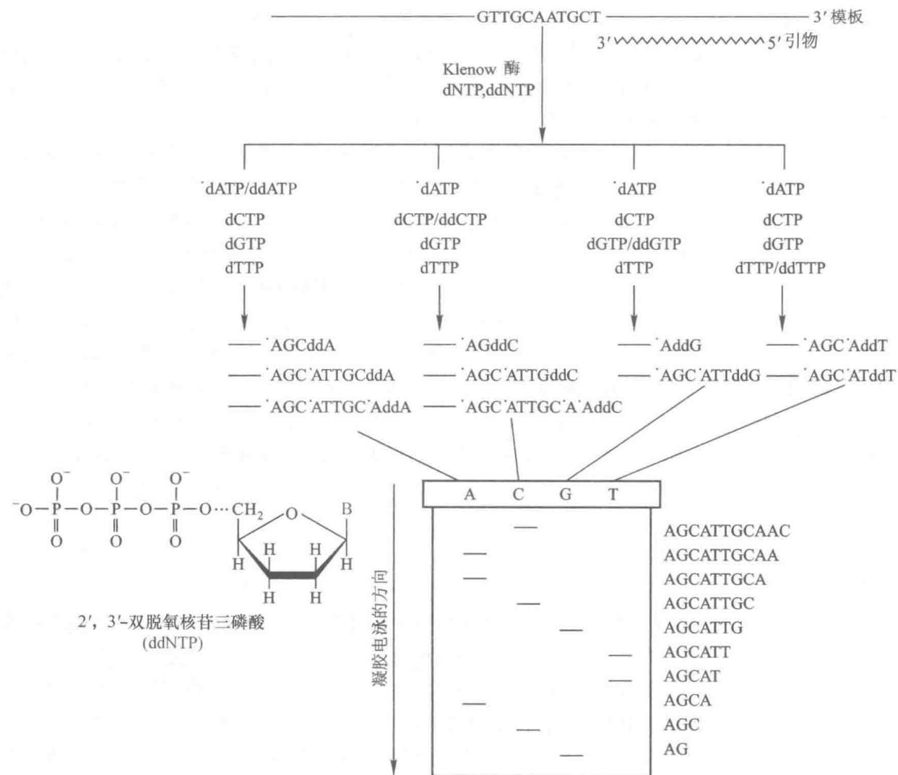  
图 12-12 Sanger 双脱氧链终止法测定 DNA 序列图解

（3）C+T 反应 用肼(hydrazine)将嘧啶环打开，形成新的开环，C 和 T 均被除去。

（4）C 反应 在 1.5 mol/L NaCl 存在下只有胞嘧啶可与肼反应。

四组碱基反应后,用 1 mol/L 哌啶(piperidine)加热(90 ℃)使 DNA 碱基破坏处的糖-磷酸酯键断裂。经变性凝胶电泳和放射自显影得到测序图谱(图 12-13)。

与 Sanger 的链终止法相比, Maxam-Gilbert 的化学测序法有一些独特的优点。它无需引物, 不进行体外合成, 操作简单, 有多种 3' 和 5' 端标记方法可以从两端进行测序, 双链 DNA 即可测序。但是终止法易于控制, 并且可以直接读出核苷酸序列, 因此应用更普遍, 各种自动化测序仪也以该法而设计。

## 3. RNA 的测序

DNA 的快速测序获得成功后,同样原理也被应用于 RNA 测序。RNA 的测序方法很多,归纳起来主要有三类。

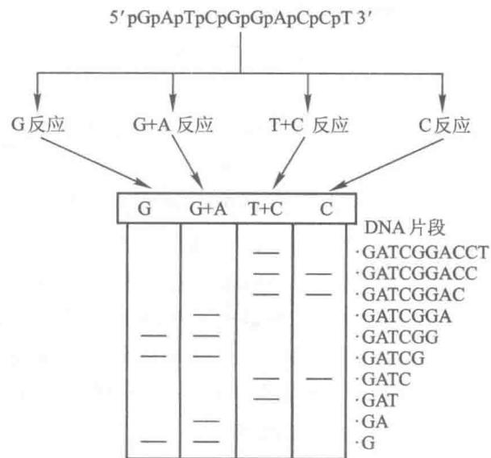  
图 12-13 化学法测定 DNA 序列图解

（1）用酶特异切断 RNA 链 从牛胰脏提取的 RNase A 水解 RNA 链中嘧啶核苷酸与相邻核苷酸 5'-OH 之间的酯链，产物为 3'-嘧啶核苷酸和以 3'-嘧啶核苷酸结尾的寡核苷酸。米曲霉 (Aspergillus oryzae) 中提取的 RNase T1 特异水解鸟苷酸与相邻核苷酸 5'-OH 的连键。黑粉菌 (Ustilago sphaerogena) 中提取的 RNase U2 在一定条件下水解腺苷酸的键。从多头黏菌(Physarum polycephalum)中提取的 RNase PhyI 水解 A、G、U 三种核苷酸，但不水解胞苷酸的链。利用上述四种酶促反应可以测定 RNA 序列。

（2）用化学试剂裂解 RNA，其基本原理与 DNA 的化学法测序相似。

(3) 逆转录成 cDNA, 即可用 DNA 测序法来测定该核苷酸序列。

## 4. DNA 序列分析的自动化

DNA 的快速测序法为生物基因组 DNA 全序列的测定和分析提供了有效手段。但是完成基因组 DNA 序列分析的工作量是十分巨大的，例如若按一个熟练技术人员用酶法测序每天可测定 1 kb 长度的 DNA 片段计算，完成人类或哺乳类基因组 $(3 \times 10^{9} \text{ bp})$ 全序列分析，至少要 100 个技术人员花 100 年时间。因此摆脱手工操作，使序列分析自动化已成为测序技术发展的主流。

DNA 序列分析自动化有两个方面的内容。一是指测序操作的自动化；另一是读序和分析的自动化。20 世纪 80 年代后期，这两个问题都已基本解决，才使人类基因组计划得以启动。按照 Sanger 的链终止法，只要在基因组 DNA 中依次采用适当的引物，就能完成全序列的测定。为了便于自动读序，用荧光检测来取代放射自显影。将荧光染料标记引物；或分别用 4 种发射不同波长的荧光染料来标记双脱氧底物，使 4 种链终止反应中每一种都用不同颜色来表示，例如绿色为 A，红色为 T，橙色为 G，蓝色为 C。聚合反应结束后进行凝胶电泳，使不同大小的片段分开。不同标记物的电泳方式也不同，荧光染料标记引物的 4 组反应物需要在并列的 4 个泳道中电泳，而标记双脱氧底物的 4 组反应物应合并后在一个泳道中电泳。当携带荧光染料的单链 DNA 片段到达泳道末端的检测窗口时，在激光的激发下使产生一定波长的荧光，电荷耦合元件（charge-coupled device, CCD）迅即将光信号转变为电信号，再输入到数据处理系统，由相关软件进行处理，最后通过打印机把各条带波峰或代表核苷酸的字母直接打印出来。90 年代中期开始采用毛细管电泳以取代传统的平板凝胶电泳。毛细管电泳大大提高了测序的速度，消除了泳道间的影响从而提高了测序精确度，也提高了测序通量。有些实验室自行设计和安装了 DNA 测序仪并研发出各种应用软件。至于商业化的 DNA 测序仪，在相当长一段时间内，一直由 ABI 公司占据世界最大供应商的地位，先后推出了各种型号的测序仪，直到 21 世纪前 10 年的中后期，多家生物科技仪器公司推出第二代 DNA 测序仪才打破这种垄断。不久又出现第三代 DNA 测序仪。DNA 测序技术产业化成为竞争最剧烈的领域之一。

## 5. 大规模基因组测序的逐步克隆法

通常,一台 DNA 测序仪每次操作只能读出几百个核苷酸长的片段序列,而人类基因组的长度为 $3 \times 10^{9}$ bp,两者相差甚远。因此,大规模基因组测序必须既要构思巧妙,又要切实可行。大体上有两种策略:一是逐步克隆法(clone by clone);另一是全基因组鸟枪法(whole genome shot-gun)(图 12-14)。

  
图 12-14 逐步克隆法和全基因组鸟枪法示意图

克隆(clone)是指细胞的无性繁殖系。将DNA(基因)片段插入复制载体(复制子)中,导入宿主细胞内,DNA随细胞繁殖而不断复制,由此得到DNA(基因)的分子克隆。所谓逐步克隆法就是先将染色体DNA用超声波或酶法切成大片段,获得大片段克隆,再将大片段切小获得亚克隆,由亚克隆片段切开即可获得测序的模板。大肠杆菌F因子经改造,保留其复制起点,插入克隆位点和选择标记,即可成为克隆DNA大片段的载体,称为细菌人工染色体(bacterial artificial chromosome,BAC)。也可以用酵母染色体自主复制序列(autonomously replicating sequence,ARS)、着丝粒(centromere,CEN)和端粒(telomere,TEL)以及选择标记组成酵母人工染色体(yeast artificial chromosome,YAC)。这两种载体都可克隆100\~200 kb的DNA大片段,用来构建BAC文库(library)和YAC文库。利用噬菌体和质粒DNA可以改建成亚克隆载体,以构建亚克隆文库,用以测序。

为从文库中挑选出彼此重叠的克隆片段并依次排列整齐，需要有一张带“路标”的“路线图”，也就是基因组的物理图谱。彼此重叠的一组DNA片段称为重叠群(contig)或毗连群。基因组DNA切开，还要能拼接回去，有了物理图谱才使完成克隆片段的依次排列成为可能。物理图谱是以特异的DNA序列为标志所展示的结构图。通常为随机从基因组上选择长度为 $200\sim 300$ bp的特异性短序列作为序列标签位点（sequence tagged site,STS)，间隔一定距离(平均为 $100\mathrm{kb}$ )取一段短序列，测出其序列，这就是以STS为路标的物理图谱。路标也可以选择为已知序列并定位的基因或表达序列标签(expressed sequence tag,EST），也可以是遗传标志序列(如微卫星标志)。由于基因组平均 $100\mathrm{kb}$ 就有一个STS路标，而且BAC和YAC平均克隆片段为 $150\mathrm{kb}$ ，也就是说每个克隆片有1个或2个STS标记，所以可以依次用STS探针从文库中选择出相应的克隆片段。1998年完成了具有52000个序列标签位点(STS)的人类基因组物理图谱，从而保证了人类基因组计划的顺利进行。

在 BAC 或 YAC 文库中,由于克隆片段的分布不均衡,往往在各重叠群间会留下一些缺口(gap),未被阳性克隆所覆盖。填补空隙的方法很多,最常用的方法是末端序列步移法(walking by end sequence)(图 12-15)。该方法是挑选靠近缺口的克隆片段,测定末端序列,设计并合成引物,以基因组 DNA 为模板,克隆出缺口处的 DNA,称为延伸克隆。

  
图12-15 末端序列步移法克隆延伸序列

逐步克隆法和鸟枪法有时可以交替使用，例如，获得亚克隆后即可用鸟枪法测序，从而大大加快了进度。完成测序后需要依赖计算机将各片段序列组装成完整的基因组序列。最常用的序列拼接软件是Phred-Phrap-Consed系统，Phred（读序软件）根据自动测序仪信号按顺序识别碱基，Phrap（组装软件）根据Phred的结果从头组装不同的短序列，由Consed（综合软件）编辑、整合和校对结果。

## 6. 全基因组鸟枪法测序

全基因组鸟枪法测序是由 J. C. Venter 等所发明, 其基本设想是, 将基因组 DNA 随机切成数百万个片段, 直接克隆测序, 借助庞大的计算机运算即可排列出完整的基因组序列。所以称为鸟枪法是由于, 若测定的基因组片段足够多时, 犹如鸟枪射出巨大数量的铁珠, 可以命中所有目标。1998 年世界最大 DNA 测序仪生产商美国 PE Biosystems 以其刚研制成功的集束化毛细管 DNA 测序仪（ABI 3700）和 3 亿美元资金，成立了以 Venter 为领导的 Celera Genomics 公司，宣称要在 3 年内用“全基因组鸟枪法测序策略”完成人类基因组测序工作，并要求获得 200\~400 个重要基因的专利。Celera 公司拥有多个学术研究机构，300 多雇员和一台据称“全球第三”的超大型计算机，自认为测序和组装能力超过全球的总和。形势十分严峻，如果 Celera 公司以十分之一的资金，五分之一的时间，将得到 6 国政府资助的公益性 HGP 排挤出局，其结果不仅使 6 国政府和有关科学家丢脸，更严重的是人类基因组信息将被私人企业所垄断。于是政府不得不进行干预。2000 年 3 月 14 日美国总统克林顿和英国首相布莱尔发表联合声明，呼吁将人类基因组研究成果公开。Celera 公司迫于压力，放弃了对人类基因的专利要求，并和公益性 HGP 达成了协议。HGP 也受到巨大压力，一再加快进度。同年 6 月双方联合宣布成功绘制出人类基因组草图。2001 年 2 月各自将人类基因组初步测序报告发表在学术刊物上，HGP 采取的是逐步克隆法，其测序结果发表在 Nature 上，Celera 的结果发表在 Science 上。2003 年人类基因组的测序工作提前两年完成，至此两个不同的组织使用不同的方法都实现了他们的共同目标。

Celera 公司的全基因组鸟枪法测序是将人类基因组 DNA 构建成含有 2 kb、10 kb 和 50 kb 片段的三个基因文库。通常高质量的 DNA 测序仪一次可以测出 1 000 多个碱基序列，因此 2 kb 的 DNA 片段可以从两头测出全部序列。大量测序后即可通过计算机运算进行排序，称为全基因组组装（whole genome assembly, WGA）。在此过程中不可避免会遇到缺口、错测和重复序列等障碍，就需要从另两个文库中寻找相应的 10 kb 或 50 kb 片段来填补，称为区间化组装（regional assembly）。前后共测定 $2.7 \times 10^{7}$ 次，测序总长度达 $1.48 \times 10^{10}$ bp，相当于覆盖人类基因组的 5 倍。

从 2000 年的人类基因组草图、2001 年的工作框架图到 2003 年后发表的序列图谱，两种策略所得结果有着惊人的相似。总的来说，鸟枪法测序进度快，但错误率高。实际上，由于公益性 HGP 随时公布其研究结果，Celera 公司可以大量下载其数据资料，相当于有了一张参考图，无疑获益甚多。可以说，两种策略是互补的，如结合使用，效果更好。

## （二）第二代测序技术

人类基因组计划带动了测序技术的发展,也带动了高通量基因组信息分析技术,例如微阵(芯片)技术,获得迅速发展。以 Sanger 终止法为基础的自动化测序技术,即第一代测序技术,为完成人类基因组计划提供技术平台;而在此期间以高通量为特征的第二代测序也先后得到了发展。第二代测序技术因其能提供大量基因组信息并进行深层次分析,故又称为深度测序技术(deep sequencing)。

2005 年 454 Life Science 公司（次年为 Roche 公司所收购）推出基于焦磷酸测序技术（pyrophosphate sequencing）的新一代测序仪。2006 年 Solexa 公司研制成利用可逆终止物（reversible terminator）的测序仪，随后 Illumina 公司收购了 Solexa 的核心技术并使其商品化。Roche 454 测序仪和 Illumina Solexa 测序仪的问世动摇了 ABI 测序仪的垄断地位，2007 年 ABI 公司也推出了新型 ABI SOLiD 测序仪，采用连接法测序（sequencing by ligation）。这三种仪器依据的测序技术虽然不同，但也存在一些共同点：① 用聚合酶链式反应（PCR）取代分子克隆技术；② 边合成边测序（sequencing by synthesis, sbs），故而无需用凝胶电泳分开相同末端核苷酸的核酸片段；③ 循环阵列测序（cyclic-array sequencing）测序的所有操作都在芯片上进行。

## 1. Roche 454 焦磷酸测序技术

最早出现的新一代测序仪,454测序仪,在传统测序技术的三个瓶颈问题上取得重大突破,这三个问题是:构建文库、制备模板和高通量测序。事实上,随后出现的新一代测序仪也都模仿了454测序仪的这些技术。当时已有许多测序方法,454测序仪选择焦磷酸测序法,这是因为该方法简单、高效。

（1）焦磷酸测序法原理 DNA 聚合酶在有模板、引物和 4 种 dNTP 底物存在时，可以催化聚合反应，使引物延伸，合成出模板的互补链。每聚合一个核苷酸就释放一分子焦磷酸（PPi）。焦磷酸在 ATP 硫酸化酶（ATP sulfurylase）催化下与腺苷酰硫酸（APS）反应，产生 ATP，反应是可逆的：

$$
\mathrm{PPi} + \mathrm{APS} \xrightarrow {\text {硫酸化酶}} \mathrm{ATP} + \mathrm{SO} _ {4} ^ {2 +}
$$

ATP 与荧光素(luciferin)在荧光素酶(luciferase)催化下生成氧化荧光素(oxyluciferin)，并产生荧光，ATP 被分解为 AMP 和 PPi:

$$
\mathrm{ATP} + \mathrm{荧光素} + \mathrm{O} _ {2} \xrightarrow {\mathrm{荧光素酶}} \mathrm{氧化荧光素} + \mathrm{CO} _ {2} + \mathrm{AMP} + \mathrm{PPi} + \mathrm{hr}
$$

每次聚合反应只加入一种 dNTP, 如产生荧光, 表明该核苷酸已被聚合, 反之则否。反应结束后除去未参与反应的底物和产生的副产物, 然后加入新的 dNTP, 进行下一轮反应。依次用 A、C、G、T 这 4 种 dNTP 反应, 即可边合成边测序。所有合成与测序反应都在芯片上数百万个小孔内进行, 这些小孔成为独立的反应单元。焦磷酸法测序平均链长为 $400 \mathrm{bp}$ 左右, 因此每张芯片可获得 4 亿\~6 亿个碱基对 (bp) 的数据, 显然信息量远大于第一代测序仪。该方法的缺点是无法正确识别连续的相同核苷酸, 虽然根据荧光强度可以大致判断存在连续的序列。焦磷酸测序法原理可简单用图 12-16 表示。

  
图 12-16 焦磷酸测序法示意图

（2）样品 DNA 文库的构建 将待测序列的样品 DNA 用机械方法打断成 300\~800 bp 的小片段，在小片段两端接上不同的接头 (adapter)。由此建立的基因文库是 DNA 单链文库，而不是克隆文库。

（3）乳液 PCR 扩增模板 在直径约为 $20 \mu m$ 的微珠表面固定与待测序列单链接头互补的寡核苷酸，用以捕捉待测 DNA 链，称为捕捉微珠（capture beads）。将样品 DNA 文库与微珠混合，有限稀释（limited dilution），使每一微珠只捕捉一条 DNA 链（与之退火）。加入 PCR 试剂和乳化剂使形成油包水（water in oil）乳液，经变性、退火、延伸反复循环使 DNA 链获得扩增，称为乳液 PCR（emulsion PCR）。扩增结束后，破坏乳液，分离出微珠，每一微珠带有上百万条 DNA 模板链。把微珠置于芯片小孔内，每一小孔比微珠略大，因此只能容纳一个微珠。

（4）循环阵列测序 将光纤束(fiber-optic bundle)固定在玻片上，排成阵列点(array)，另一端与电荷耦合元件(CCD)相连，使接收到的光信号转变成电信号，从而在计算机中记录下每次反应芯片上各斑点的亮度。玻片另一面与光纤固定点对应处用酸蚀刻技术(acid etching procedure)打上小孔，玻片被称为超微滴定板(pico titer plate, PTP)，或芯片(chip)。各小孔即为独立的测序反应小室，加入焦磷酸测序的酶和试剂，及一种dNTP。如若小孔内发生聚合反应，即会释放焦磷酸而产生荧光，计算机记录下该斑点发亮。一轮结束后用核苷三磷酸二磷酸酶(apyrase)水解掉dNTP和ATP，然后加入一种新的dNTP；或者利用层流(laminar flow)技术更换含有新dNTP的反应液。依次循环完成在芯片上测序，称为循环阵列测序(cyclic-array sequencing)。

## 2. Illumina Solexa 可逆终止测序技术

Solexa 测序有两项核心技术:一是桥式 PCR(brige PCR);另一是可逆终止测序(reversible terminators for sequencing)。其余方法大致都与 454 测序相似。

（1）样品 DNA 文库的构建 将样品 DNA 打断成数百 bp 或更小, 如果是 PCR 产物或是 RNA 这一步可省略, 在两端接上不同的接头, 以构成单链 DNA (ssDNA) 文库。

（2）桥式 PCR 芯片测序通常都需要在载片上按阵列点固定相同序列的 DNA 簇（cluster），这种 DNA 簇是借助 DNA 聚合酶体外扩增而获得的 DNA 克隆（英语 polony 是由 polymerase clony 缩写而成，意即 DNA 克隆）。454 借微珠形成 DNA 克隆（polony）；Solexa 则借桥式 PCR 形成 DNA 克隆。Solexa 芯片是一有八通道的流动池（flow cell），与待测序 DNA 接头互补的引物通过柔性接头成簇固定在通道表面。适当控制样品 DNA 浓度,使每一簇只有一条单链 DNA 与固定的引物配对,在 DNA 聚合酶催化下 4 种 dNTP 底物在样品 DNA 链上使引物不断延伸,合成出与之互补的链。双链 DNA 经变性成为单链 DNA,然后退火,新合成的 DNA 与附近引物配对犹如拱桥,再次合成新链。经过 30 轮扩增,所有模板链都被线性化处理 (linearization),3'羟基被封闭,以免干扰下一步边合成边测序。由此制备的芯片每一簇可以有上千个模板链,每一通道有数百万的模板簇(克隆),因此一次就可以同时对 8 个文库进行测序。桥式 PCR 示意图见图 12-17。

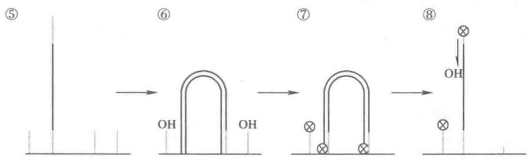  
图 12-17 桥式 PCR 示意图  
① 样品 DNA 打断成数百 bp 片段；② 两端连上接头；③ 与固定引物配对；④ 合成互补链；  
⑤ 变性；⑥ 新合成链与固定引物配对并复制；⑦ 线性化并封闭 $3^{\prime}-$ 羟基⊗；⑧ 测序

（3）可逆终止测序 按照边合成边测序的原理，加入 DNA 聚合酶、测序引物和 4 种 dNTP 底物。与通常的 dNTP 底物不同，在可逆终止测序法中 4 种碱分别用不同荧光物标记，并且这些 dNTP 的 3'羟基均被化学基团保护，因此每轮合成反应都只能添加一个核苷酸。用激光扫描反应板表面，经 CCD 记录下各阵列点的光信号，然后将保护基和荧光标记切除，又可进行下一轮的合成反应。3'保护基的切除可解除终止，故称为可逆终止。

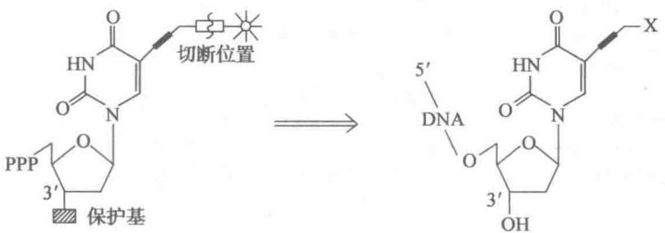

可逆终止法可以准确测出连续的核苷酸,但所测 DNA 链较短,通过对读可以测出 $2 \times 75$ bp。由于芯片包含的 DNA 簇较多,测定总数可达到 20\~25 Gb。

## 3. ABI SOLiD 连接测序技术

ABI 的 SOLiD(supported oligo ligation detection) 连接测序法核心技术有二: 一是由 DNA 连接酶将荧光标记的八聚寡核苷酸(fluorescently labeled octamers) 连接并据此测定序列; 二是使用了双碱基编码技术(two-base encoding), 通过两个碱基来对应一种荧光信号而不是上一方法的一个碱基对应一种荧光信号, 从而使该技术具有误差校正功能。其余建文库和乳液 PCR 与 454 测序法基本相同。

（1）样品 DNA 文库的构建 将样品 DNA 打断成小片段，两端接上接头。其片段可比 454 测序法的片段更小。

（2）乳液 PCR 扩增模板 在微珠表面固定与模板链接头互补的引物，用以捕捉模板链；通过控制 DNA 文库浓度使每一微珠仅结合一条模板链。ABI 的微珠比 454 的小，直径仅在 1 μm 左右。加入乳化剂，使形成油包水小滴，每一液滴内含有 PCR 试剂和一个微珠，成为独立的 PCR 扩增微系统，随后进行

PCR 循环。扩增反应结束后每一微珠大约携带 1 000 条模板链。破坏乳液分散系统，将微珠安置在芯片表面的小孔内，每一小孔恰好放置一个微珠。

（3）连接测序 连接测序是借助精心设计的八聚体荧光探针来识别模板链的序列，边连接边测序。八聚体3'端为2个确定的碱基(XX)，中间为3个任意碱基(NNN)，5'端为3个可与任何碱基配对的特殊碱基(ZZZ)。探针5'端分别与不同的荧光染料连接，由3'端2个碱基决定一种荧光颜色（双碱基编码），见图12-18A。八聚体荧光探针的结构见图12-18B。通用测序引物共有5种，分别以(n)、(n-1)、(n-2)、(n-3)、(n-4)来表示，各用于第一至第五轮测序。第一轮测序的第一次连接反应由引物(n)介导，由于每一微珠只含一种均质单链DNA模板，所以只有一种与引物5'端模板序列互补的八聚体荧光探针才能在连接酶催化下与引物连接。测序仪记录下荧光探针连接后发出的荧光颜色信号。随后用化学方法除去6\~8位核苷酸及5'端的荧光基团，游离出第5位核苷酸的5'磷酸，为下一次连接反应作准备，见图12-18C。第一次连接反应可以得到第1、2位碱基序列的颜色信息，第二次连接反应得到第6、7位碱基序列的颜色信息，第三次连接反应得到第11、12位碱基序列的颜色信息……见图12-18D。

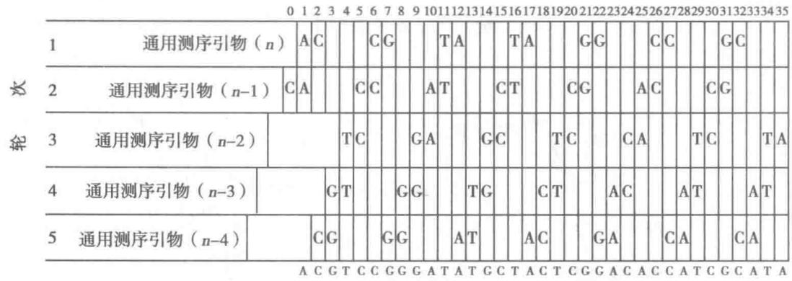  
图12-18 连接测序法示意图  
A. 双碱基编码系统,由两个碱基对应一种荧光颜色; B. 八聚体荧光探针; C. 连接酶催化八聚体荧光探针与引物连接; D. 五轮连接反应完成 35 个碱基的测序

第一轮共进行七次连接反应。然后变性去掉引物和八聚体形成的DNA链，重置引物，并开始第二轮的测序。第二轮引物 $(n - 1)$ 与模板链的配对位置向左移一格，第一次连接反应可获得第0、1位碱基序列的颜色信息，依次类推，第二轮以后各次连接分别得到第5、6位，第10、11位，第15、16位，第20、21位，第25、26位，第30、31位碱基序列颜色信息。在完成五轮连接反应后就测完35个碱基序列。如果两头测序可以完成读序 $70\mathrm{bp}$ 以上。

连接测序所需样品 DNA 少(0.1 $\mu$ g 以下)，准确性高(99.99%)，可以得到超高通量数据(180 Gb 以上)，但序列读长较短。

## （三）第三代测序技术

现代科学技术发展的特点是综合化、信息化和产业化。上世纪80年代开始兴起的纳米技术正体现了这些特点。第三代测序技术，也即单分子测序技术，广泛运用了纳米技术的原理和方法。一项新技术的应用，从最初设想到最后产品实现需要10\~20年，或更长时间。上世纪80年代在完善Sanger终止法并推出自动化测序仪的同时，有关实验室也在探索Sanger终止法之外的测序法，由此产生了第二代测序技术。当时PCR技术正在盛行，第二代测序技术中都用到PCR来扩增模板链。但是PCR容易引入错误，并且会改变文库的成分。纳米技术的兴起使得直接分子测序成为可能，而无需借助PCR来扩增DNA链。进入21世纪第二个10年，第三代测序仪已经或即将上市，主要有Helicos Biosciences公司的HeliScope单分子测序(SMS)仪，Pacific Biosciences公司的SMRT测序技术和Oxford Nanopore Technologies公司纳米孔测序技术。前两者依靠荧光信号测序，后一种依靠电信号测序。

## 1. HeliScope

Helicos 的 HeliScope 是最早上市的单分子测序仪。该测序仪所以能够较为准确地记录下单分子 DNA 在加入核苷酸时释放的非常微弱的荧光信号，是因为其采用了一项全内反射显微镜技术（total internal reflection microscopy, TIRM）。这项核心技术原本由 Quake 公司所开发，2007 年被 Helicos 公司收购，次年推出了 HeliScope。

带有高灵敏度荧光探测装置的 HeliScope 测序仪操作比较简单。首先，将基因组 DNA 随机切成小片段，单链 3' 端加上 poly(A) 尾巴，然后由末端核苷酸转移酶连上荧光标记的核苷酸。荧光染料选择为硫代吲哚花青 3(sulfoindo cyanine 3, Cy3)。通过与固定在芯片表面的 poly(T) 互补杂交，将模板链锚定在芯片上，制成测序芯片。模板上标记有 Cy3 以标识出它们在芯片上的位置。随后加入 DNA 聚合酶和 Cy5 荧光

标记的 dNTP，边合成边测序。每次聚合反应只加一种 dNTP，将未参与反应的底物和酶洗脱，记录下发出荧光信号的位置，用化学试剂去掉荧光标记。重新加入 DNA 聚合酶和另一种 dNTP，以进行下一次聚合反应。通过重复合成、洗脱、成像、淬灭过程完成整条链的测序。通常 HeliScope 的读序长度为 30\~35 bp，每一芯片的数据产出量为 21\~28 Gb。HeliScope 的测序原理见图 12-19。

HeliScope 开创了单分子测序的先例。它操作简便，试剂消耗少，能够快速完成大规模 DNA 测序任务。

  
图12-19 HeliScope的测序原理

但是它检测到的荧光信号弱,错误率高,不能识别连续的碱基,读序短。实际上它还没有完全摆脱第二代测序技术的一些操作。

## 2. PacBio SMRT

Pacific Biosciences 公司是较早推出第三代测序仪的公司之一,他们研发了一项全新的测序技术称为单分子实时测序技术(single molecular real time, SMRT)。PacBio RS(RS 表示 real time sequencing)核心技术有三个:一是通过零模波导(zero mode waveguide, ZMW)孔控制激光检测区;二是借助激光扫描荧光显微镜(laser scanning confocal microscope, LSCM)实时记录芯片上无数纳米微孔的荧光;三是分析荧光信号的时空变化进行高通量测序。

（1）零模波导(ZMW)纳米微孔板 SMRT 芯片是一种厚度为 100 nm 的金属片,其上打了许多直径为数十纳米圆形小孔,DNA 聚合酶固定在小孔底部玻璃板上。当小孔直径低于可见光波长(数百纳米)时,光线无法透射过小孔,而被束缚在浅表层(数纳米),形成一个非常小的检测区(图 12-20)。在芯片的一个反应池(SMRT cell)中有 15 万个 ZMW 纳米结构,一张芯片可以有多个反应池。向反应池中加入测序模板、试剂和荧光标记 dNTP。通常荧光基团都标记在 dNTP 的碱基上,而在本方法中荧光基团却连在末端磷酸基上,不同碱基的核苷酸用不同荧光基团标记末端磷酸。激光从底部打上去,DNA 聚合酶正

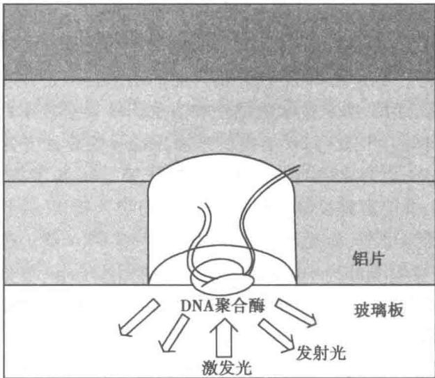  
图 12-20 零模波导(ZMW)纳米微孔板

好在检测区内。DNA 模板链结合在聚合酶活性中心凹槽催化位点上，在有配对核苷酸底物进入时即发生聚合反应，模板链随之发生移动，又可接纳新的核苷酸底物。小孔上方溶液内无光线照射，荧光标记的核苷酸处于黑暗中，只有借助扩散进出检测区的标记 dNTP 才会发出荧光。扩散速度较快，标记核苷酸在检测区内停留的时间约为几十微秒，而进入聚合酶的标记核苷酸停留时间为几十毫秒，因此后者有较强的荧光发生，根据荧光波长可以判断掺入的核苷酸种类。聚合酶在新合成的 DNA 链上加入核苷酸，并释放底物的焦磷酸，荧光基团也随之被除去。

（2）激光扫描共聚焦显微镜 该新型显微镜兴起于20世纪80年代，主要包括荧光显微镜、激光发

射器、扫描装置、光检测器、计算机系统和图像输出设备六部分。由于激光光源针孔和探测针孔相对于物镜焦平面是共轭关系，也就是“共聚焦”，样品焦平面上的点同时聚焦于光源针孔和探测针孔。因此对样品进行扫描时，扫描点以外的非观察点不会成像，背景成黑色，样品需经过逐点扫描后才形成整个标本的光学切面，快速对集成在板上的纳米微孔荧光实时进行记录。

（3）纳米微孔荧光信号的时空段分析 DNA 聚合酶催化 DNA 合成过程中，每进入一个核苷酸就会产生一个荧光脉冲峰。两个相邻脉冲峰之间有一定距离，也就是时间段。峰间距离与模板上碱基是否存在修饰有关，修饰碱基影响合成速度，导致两个峰之间距离加大。PacBio 测序技术不仅可以提供序列信息，还可以实时了解模板碱基的修饰情况。

在体内 DNA 聚合酶能快速、准确、持续复制 DNA。SMRT 充分发挥了 DNA 聚合酶的潜力，测序速度每分钟大于 100 个核苷酸，读长在数 kb 以上。将基因组 DNA 打断成数 kb 的双链片段，两端分别填平，用末端互补的单链环状接头连接正、负链，形成哑铃状 DNA（图 12-21）。通过滚环法完成正、负链测序后还可以继续重复测序，从而使准确率达到 99.999 9% 以上。

## 3. Oxford Nanopore

Oxford Nanopore Technologies 公司研发出一款新的纳米孔 (nanopore) 测序仪。他们用生物材料制作携带纳米孔的膜。金黄色葡萄球菌的 $\alpha-$ 溶血素 (Staphylococcus aureus $\alpha$ -hemolysin) 能在生物膜上穿孔，在孔内共价结合氨基化环状糊精 (aminocycdextrin)，由此形成纳米通道。在膜的两

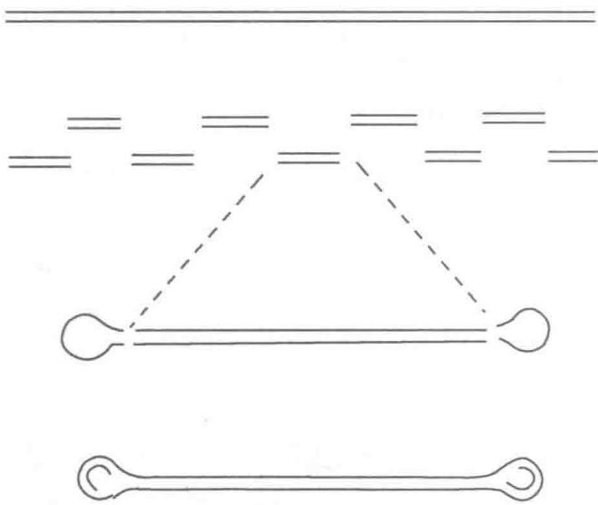  
图 12-21 哑铃状 SMRT DNA 的构建

侧给予一定的电位差(如+180 mV)，利用特殊设备精确测定通过孔的电流。将外切核酸酶固定在纳米孔上，加入待测序的单链DNA，外切核酸酶逐个切下核苷酸。核苷酸通过环状糊精孔影响到电流，依次记录下各核苷酸的电流信号。在固定条件下，不仅碱基种类，而且修饰碱基，也会给出特定的电流信号，通过电流信号可以获得序列信息。

上面介绍了三种有代表性的第三代测序技术。由于测序能为生命科学和医学提供最重要和最基本的信息，测序技术受到普遍关注。第三代测序技术虽然已经从研发走向应用，各种改进仍在进行中。而第四代测序技术的研究也已经有了一些设想和苗头。

一种设想是采用石墨烯和碳纳米管为材料,替代目前使用的纳米孔装置,利用碳材料的导电性直接记录下 DNA 链经过孔隙时的电流变化。这种新的“电测序”的想法目前还处于起步阶段,但已受到一些实验室和公司的青睐。

另一种设想是直接利用特殊显微镜,如扫描隧道显微镜(STM)和原子力显微镜(AFM)“观察”DNA 分子,区分不同的碱基。这方面也已有不少尝试,有待进一步的研发。

相信在新的世纪里，新的测序技术必将有重大突破和发展。

## 七、DNA 微阵技术

DNA 微阵(DNA microarray),或称为基因芯片(gene chip),是以硅、玻璃、微孔滤膜等材料作为承载基片,通过微加工技术,在其上固定密集的不同序列 DNA 微阵列,一次检测即可获得大量的 DNA 杂交信息。在 $1 \mathrm{~cm}^{2}$ 的芯片上排列的 DNA 片段常有数十、数百甚至数十万个。微阵技术因其检测快速、灵敏、信息量大,故近年来发展极为迅速。人类基因组计划的顺利完成,生命科学进入了后基因组的时代,研究重点已不仅是基因组的序列,而转向功能基因组学(functional genomics)、结构基因组学(structural genomics)、比较基因组学(comparative genomics)、转录组学(transcriptomics),并带动产生了蛋白质组学(proteomics)、核糖核酸组学(ribonomics)、代谢组学(metabonomics)和糖组学(glycomics)等领域。在众多组学的研究中,迫切需要发展出一种新的高通量分析技术。各种生物芯片(biochip)便应运而生,在综合分析各类生物大分子或大分子组的变化中特别有用,其中最成熟、得到最广泛应用的是 DNA 芯片(基因芯片)。

以微阵排列固定在芯片上的核酸或寡核苷酸称为靶标（target）；用放射性同位素、荧光染料或其他易检测物标记的核酸称为探针（probe）。借助计算机系统分析杂交图像即可得到有关信息。

## (一) DNA 芯片的类型

基片的材料、微加工技术和检测方法等都会影响芯片的性能，但决定芯片类型和用途的是以阵列分布的靶标分子。固定在芯片上的 DNA 可分为三类：① 从不同生物来源分离到的基因、基因片段或其克隆；② cDNA 或是其表达序列标签（expressed sequence tag, EST）；③ 合成的寡核苷酸。

基因或基因片段分子都比较长，因此反应稳定，重复性好。用PCR扩增极易获得所需要的基因片段，经纯化和活化，即可按阵列固定在芯片表面。cDNA，或是从cDNA库中分离到的部分表达序列，可用以检测细胞基因的表达水平或基因组的表达谱(expression pattern)。分离基因和cDNA克隆固然十分费时、费力，但现在一些与生物技术有关的公司已有人类和模式生物各种基因和cDNA克隆出售。

寡核苷酸的合成十分方便,现已可按各种需要设计出寡核苷酸的序列,通过 DNA 合成仪自动化合成。用于芯片的寡核苷酸长度一般为 20 至 25 聚体。合成的寡核苷酸几乎可用于所有用途的 DNA 芯片。寡核苷酸还可在阵列点的原位合成,因而使阵列点更为密集。但是原位合成的寡核苷酸比较短,通常小于 20 聚体,因此也为杂交结果带来一定的不确定性。

## （二）DNA 芯片的制作

以硅片、玻片或滤膜作为固相支持物，应事先进行特定处理，例如包被带正电荷的聚赖氨酸或氨基硅烷。现在一些公司已有比较成型的基片出售，这类基片表面带有氨基、醛基或环氧基等活性基团。3'端经修饰带有氨基的DNA（PCR产物或寡核苷酸）通过戊二醛（或其他长碳链含双功能基化合物）反应，从而共价结合在基片上。也有芯片的基质通过连接臂上活化的基团与DNA相连。点阵的制作主要有以下三种方法：接触打印法(contact printing)；照相平版印刷法(photolithography)和喷墨法(inkjet)。

## 1. 接触打印法

机械点样(mechanical spotting)因其操作简单,既可手工点样,又可全部操作由自动化仪器来完成,故而被广泛采用。DNA溶于点样缓冲液,吸入加样针内,然后与芯片基质表面接触,使DNA溶液转移其上。为提高效率,点样可用多道针头,同时点一、二十个样品。每一轮点样后,加样针需彻底清洗,然后再吸下一溶液，以免造成污染。采用微阵点样仪，编好程序，即可快速均匀完成点样。

## 2. 照相平版印刷法

把半导体加工的照相平版印刷术同 DNA 化学合成法结合起来,可以制造高密度的寡核苷酸微阵列。用挡光膜来控制光反应的部位,曝光使光敏保护基解离下来,从而与加入的特定核苷酸发生偶联反应。各核苷酸底物也用光敏基团保护,然后用另一挡光膜重复上述过程,最终得到包含不同序列寡核苷酸的微阵列。照相平版印刷法的优点是:①直接在点阵原位合成寡核苷酸,省去了寡核苷酸纯化处理和固定等步骤,提高了芯片制作效率。②光照反应较易控制,可以制作高密度的点阵,其密度比接触点样至少可提高2\~3个数量级。③全部过程采用自动化操作,芯片与芯片之间差异极小,便于大规模生产。其缺点是:①挡光膜非常昂贵,设计和操作十分复杂。②原位合成寡核苷酸的产率较低,通常只能合成长度<20聚体的寡核苷酸,限制了所能获得的杂交信息。这一技术经过改进显然还有更大发展前景。

## 3. 喷墨法

类似于喷墨打印机，将 DNA 溶液置于带有喷头的压电装置（piezoelectric device）内，在电流控制下使精确量的液体喷射在基质表面。之后经过清洗再换上另一 DNA 溶液，可进行新一轮喷射。这种方法可以用任何种类的 DNA 制作微阵列，包括基因组 DNA、cDNA 或寡核苷酸。喷墨法也可用于原位合成寡核苷酸。与彩色打印机的原理相同，用四个喷头分别贮存四种核苷酸的合成试剂，通过计算机控制喷射特定种类试剂到设定区域。去保护、偶联、氧化和冲洗等步骤一一如固相合成技术。如此循环可以合成出长度为 40\~50 个碱基的寡核苷酸，每步产率也比照相法高，但芯片密度却不如照相法。点样法和喷墨法所制作的芯片一般可达上万个点阵。

## （三）核酸杂交的检测

DNA 芯片通过各点阵上的靶标分子与基因组 DNA、cDNA 和 mRNA 杂交而得到这些核酸样品的信息。现在已有许多物理化学方法可用来检测核酸的杂交；最常用的方法是对核酸样品加以放射性或荧光标记，然后检测点阵的杂交标记。荧光标记的灵敏度虽略低于放射性标记，但操作方便，目前 DNA 芯片的检测主要用荧光法。常用硫代吲哚花青染料（sulfoindocyanine, Cy）进行荧光标记，Cy3 可激发绿色光，Cy5

可激发红色光,如将 Cy3 和 Cy5 分别标记诱导前和诱导后细胞的 RNA 或其 cDNA,然后再与 DNA 芯片杂交。杂交信号可通过激光显微扫描仪对 DNA 芯片进行扫描来收集,检测每个靶标上探针所发出的荧光,由计算机控制显示器(computer controller display,CCD)成像(图 12-22)。可以分别对两种荧光物扫描并成像;也可以同时扫描获取两种图像,视不同仪器而异。激光共聚焦装置使激发光从芯片背面射入,并在芯片与杂交溶液界面处聚焦,发射荧光由成像显微镜经滤色器到达

  
图12-22 DNA芯片的作用原理

检测器(光电倍增管),那些未与芯片探针结合的标记分子由于不在聚焦部位,发射光不被检测到,只有芯片表面的杂交物才形成二维荧光图像。Cy3 和 Cy5 荧光图像的差别即反映了细胞诱导前后转录的差别。

另一种荧光检测技术叫光导纤维 DNA 生物传感器微阵列 (fiber-optic DNA biosensor microarray)，将生物传感器技术与微阵列技术结合起来。它是将靶标核酸固定在传感器敏感膜上，每一阵列点分别与直径为 200 μm 光导纤维末端相连，形成微阵传感装置。靶标核酸可伸入探针溶液内，杂交的荧光信号由另一端偶联的 CCD 相机接受，样品检测十分快速灵敏。

探针和样品是相对而言的。固定在芯片上的核酸或寡核苷酸称为靶标，被检测的荧光标记核酸则为探针；反之，有些书上将芯片上固定的核酸或寡核苷酸称为探针，而将荧光标记的核酸称为样品，通过与芯片杂交而获得样品的序列信息，其意思与前者完全相同。

## （四）DNA芯片的应用

DNA 芯片的用途十分广泛,它是分析基因组或是其表达遗传信息的重要技术,归纳起来主要有以下几方面的应用。

## 1. 测定基因型、基因突变和多态性

利用各种基因探针,可以确定生物的基因型。由于 DNA 芯片包含的信息量十分巨大,它可以检测出基因的各种突变和多态性。通常以高密度寡核苷酸微阵列来研究种内和种间的基因突变及多态性,尤其是单核苷酸多态性(single-nucleotide polymorphism, SNP)。在检测突变的微阵列(芯片)中,由代表一个或一组基因所有突变体的寡核苷酸组成,样品与芯片杂交的高灵敏度可以检测出单个核苷酸的错配,因此可以从同源基因的大量变化中快速查出序列上的变异,包括导致遗传病的基因缺陷以及癌基因。通过基因组错配扫描(genomic mismatch scanning, GMS)以对阵列各点的荧光强度进行定量分析。当探针与芯片核酸完全匹配时所产生的荧光信号强度是具有单个或两个错配碱基时的 5\~35 倍,所以对荧光信号强度精确测定是找出错配的基础。当然荧光强度还可能受到其他各种因素的影响,因此需要做各种对照实验,以取得可靠结果。

## 2. DNA 的重测序

上面提到 DNA 芯片包含的信息量十分巨大。如果 DNA 芯片由高密度整套寡核苷酸所构成，这些寡核苷酸长度一定，而包含了所有可能的序列组合，因此可用于重测序（resequencing）。将待测序的 DNA 分子切成小的片段，经荧光标记后在芯片上杂交。由于这些寡核苷酸包含了全部可能的序列，寡核苷酸之间有各种重叠，根据杂交荧光图谱可以推导出 DNA 序列，故又称为杂交测序（sequencing by hybridization, SBH）。这种测序方法十分高效，一次杂交即可得出 DNA 的全序列。但若样品中含有重复序列，测序就会受到限制。

## 3. 测定基因的表达谱

借助 cDNA, 表达序列标签(EST)或寡核苷酸制成的芯片, 可测定细胞基因的表达情况, 包括特定基因是否表达、表达丰度, 不同组织、不同发育阶段以及不同生理状态下表达差异, 也就是所谓的基因表达谱(gene expression pattern)。基因表达谱可提供丰富的生物信息及有关基因功能的直接线索。测定基因表达谱还有助于了解疾病的发病机制、药物的生理反应和治疗的效果。这些研究在理论上和实践上都有重要意义。

DNA 芯片还可用于基因来源同一性(identity by descent)作图、基因连锁分析、基因定位等研究,这里不再一一详述。

## 八、核酸的化学合成

早在20世纪50年代，H.G.Khorana就开始了寡核苷酸的化学合成研究。1956年他首次成功合成了二核苷酸。其基本指导思想是将核苷酸所有活性基团都用保护剂加以封闭，只留下需要反应的基团；活化剂使反应基团激活；用缩合剂使一个核苷酸的羟基与另一核苷酸的磷酸基之间形成磷酸二酯键，从而定向发生聚合。他的工作为核酸的化学合成奠定了基础，因而与第一个测定tRNA序列的Holley以及从事遗传密码破译的Nirenburg共获1968年诺贝尔生理学或医学奖。

Khorana 用于合成 DNA 的是磷酸二酯法。Letsinger 等人于 1960 年发明了磷酸三酯法。由于磷酸中有三个羟基 (P-OH)，将其中之一保护起来，剩下 2 个可以分别与脱氧核糖形成磷酸二酯，这样将减少副反应，简化分离纯化步骤，提高产率。之后他们又发明了亚磷酸三酯法，使反应速度大大加快。在此基础上实现了 DNA 化学合成的固相化，也即将第一个核苷酸 3'-羟基固定在可控孔径玻璃微球 (controllable pored glass bead, CPG) 上，因此冲洗十分方便，也适合于自动化操作。

DNA 自动化合成都采用固相亚磷酸三酯法。底物的活性基团分别被保护，例如腺嘌呤和胞嘧啶碱基上的氨基用苯甲酰基（bz）保护，鸟嘌呤碱基的氨基用异丁酰基（Ib）保护，5'-羟基用二甲氧三苯甲基(DMT)保护。自3'向5'方向逐个加入核苷酸,每一循环周期分为四步反应:

第一步,脱保护基(deprotection)。用二氯乙酸(dichloroacetic acid, DCA)或三氯乙酸(trichloroacetic acid, TCA)处理,水解脱去核苷5'-羟基上的保护基DMT。

第二步,偶联反应(coupling)。用二异丙基亚磷酰胺(diisopropyl phosphoramidite)衍生物作为活化剂和缩合剂,在弱碱性化合物四唑催化下,偶联形成亚磷酸三酯。

第三步,终止反应(stop reaction)。加入乙酸酐使未参与偶联反应的5'-羟基均被乙酰化,以免与以后加入的核苷酸反应,出现错误序列。换句话说,合成的DNA链允许中途终止,但不能有序列错误。

第四步,氧化作用(oxidation)。合成的亚磷酸三酯用碘溶液氧化,使之成为较稳定的磷酸三酯。

按照事先设计的程序合成 DNA 链, 待合成结束后用硫酚和三乙胺脱掉保护基, 并用氨水将合成的全长寡核苷酸水解下来, 然后用高效液相色谱 (HPLC) 和凝胶电泳纯化并鉴定。每个核苷酸合成循环要 7\~10 min, 十分方便。图 12-23 为 DNA 固相合成过程的图解。

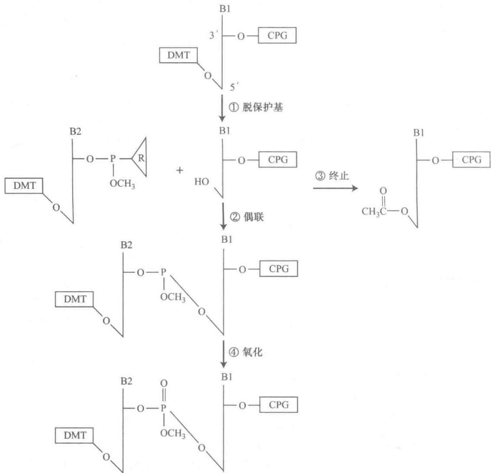  
图 12-23 DNA 固相合成(亚磷酸三酯法)

现在 RNA 也能自动化合成, 只是所用底物不同, 基本操作与 DNA 合成一样。

## 提要

核酸的糖苷键和磷酸二酯键可被酸、碱和酶水解，产生碱基、核苷、核苷酸和寡核苷酸。酸水解时，糖苷键比磷酸酯键易于水解；嘌呤碱的糖苷键比嘧啶碱的糖苷键易于水解；嘌呤碱与脱氧核糖的糖苷键最不稳定。RNA易被稀碱水解，产生2'-和3'-核苷酸，DNA对碱比较稳定。细胞内有各种核酸酶可以分解核

酸。限制性内切酶是基因工程的重要工具酶。

核酸的碱基和磷酸基均能解离,因此核酸具有酸碱性质。碱基杂环中的氮具有结合和释放质子的能力。核苷和核苷酸的碱基与游离碱基的解离性质相近,它们是兼性离子。核酸中的磷酸基只有一级解离。DNA 的酸碱变性使酸碱滴定曲线不可逆。

核酸的碱基具有共轭双键，因而有紫外吸收的性质。各种碱基、核苷和核苷酸的吸收光谱略有区别。核酸的紫外吸收峰在260 nm附近，可用于测定核酸。根据260 nm与280 nm的吸光度(A)可判断核酸纯度。天然DNA的 $\varepsilon(P)$ 为6600，RNA为7700\~7800，发生变性和降解时 $\varepsilon(P)$ 值会升高，以此可鉴别核酸制剂的质量。

变性作用是指核酸双螺旋结构被破坏，双链解开，但共价键并未断裂。引起变性的因素很多，升高温度、过酸、过碱、纯水以及加入变性剂等都能造成核酸变性。核酸变性时物理化学性质将发生改变。热变性一半时的温度称为熔点或变性温度，以 $T_{m}$ 来表示。DNA 的 G+C 含量影响 $T_{m}$ 。根据经验公式 $T_{m}=81.5^{\circ}C+16.6(\lg[Na^{+}])+0.41(\%G+C)-0.63(\%甲酰胺)-(600/1)$ 。可以由 DNA 的 $T_{m}$ 值计算 G+C 含量，或由 G+C 含量计算 $T_{m}$ 。

变性 DNA 在适当条件下可以复性, 物化性质得到恢复。复性快慢以 $C_{0}t_{1/2}$ 值来表示。用不同来源 DNA 进行退火, 得到杂交分子。也可以由 DNA 链与互补 RNA 链得到杂交分子。分子杂交是进行分子生物学研究的重要方法。Southern 印迹法和 Northern 印迹法是最常用的两种杂交技术。

核酸研究的迅猛发展得益于核酸研究方法的不断更新和改进,首要的研究方法是核酸的分离和纯化。溶液中核酸分子受巨大离心力场的作用沉降速度大大加快,从而可以用来测定核酸分子的沉降常数S并以此求出分子的相对质量,测定核酸分子密度和构象,还可用来分离和纯化核酸。常用的超速离心方法有:沉降速度超离心、沉降平衡超离心、蔗糖密度梯度超离心和漂浮密度超离心。凝胶电泳将分子筛技术与电泳技术相结合,常用的是琼脂糖凝胶电泳和聚丙烯酰胺凝胶电泳。在一定范围内电泳迁移率与DNA碱基对的对数成反比。脉冲电场凝胶电泳可用于分离分子相对质量大的DNA。核酸可用各种柱层析来分离和制备,常用的是羟基磷灰石柱层析和寡聚脱氧胸甘酸亲和柱层析。

目前分离 DNA 最重要的方法有 3 个:①用盐抽提,用苯酚和氯仿除去蛋白质。②用广谱蛋白酶在 SDS 存在下保温消化细胞悬液,再用苯酚和氯仿去蛋白,用 RNase 除去少量的 RNA。③用氯化铯密度梯度离心法分离纯化 DNA。制备 RNA 要防止 RNase 的降解:①器皿要高温处理或用 DEPC 除去 RNase。②破碎细胞的同时使蛋白质变性。③RNA 反应体系中加入 RNase 抑制剂(RNasin)。目前常用的 RNA 分离方法有两个:其一,用酸性钡盐/苯酚/氯仿抽提。其二,用钡盐/氯化铯密度梯度离心。分离 poly(A) $^{+}$ mRNA 可用寡聚(dT) $_{n}$ 亲和层析法。

核酸序列的测定是最重要、也是发展最快的生物技术。Sanger最初提出加减法测定DNA序列，后又改进为终止法。Maxam和Gilbert提出化学法测定DNA序列。Sanger的终止法经过改进实现自动化。RNA的测序原理基本与DNA测序相同。全基因组测序有逐步克隆法和鸟枪法两种谋略。人类基因组计划主要依赖第一代测序技术来完成。采用微阵技术发展出了第二代测序技术，主要有焦磷酸测序法、可逆终止测序法和连接测序法。采用纳米技术发展出了第三代测序技术，主要有藉全内反射显微镜技术的HeliScope，藉零模波导孔和激光扫描共聚焦显微镜的SMRT技术，以及纳米孔电信号测序技术。

DNA 微阵技术是一种高通量 DNA 杂交信息分析技术。将靶标核酸或其片段固定在芯片上，标记的核酸作为探针与之杂交，再用扫描仪收集杂交信息。制作芯片可用接触打印法、照相平板印刷法和喷墨法。DNA 微阵技术可用于测定基因型、基因突变和多态性，DNA 的重测序，以及测定基因的表达谱。

DNA 自动化合成都采用固相亚磷酸三酯法。合成过程分为四步: 第一步脱保护基。第二步偶联反应。第三步终止反应。第四步氧化反应。将产物脱保护基, 从载体上水解下来, 纯化。RNA 可以用同样原理合成。

## 习题

1. 比较核酸不同糖苷键和磷酸酯键对酸和碱的稳定性。

2. 为什么 RNA 比 DNA 更不稳定？

3. 试述核酸酶的种类和分类依据。

4. 为什么说核苷酸是兼性离子？是否所有核苷酸都是兼性离子？核苷酸中磷酸基的存在对碱基的解离有何影响？

5. $5'$ -鸟苷酸的 $pK_{1}'$ 为 0.7, $pK_{2}'$ 为 2.4, $pK_{3}'$ 为 6.1, $pK_{4}'$ 为 9.4, 这些 $pK'$ 各代表什么基团的解离常数? 其等电点 (pI) 是多少?

6. 为什么 DNA 酸碱滴定的正向曲线和反向曲线有显著不同？

7. 有一纯的质粒 DNA 溶液, 共 0.5 mL, 取少量稀释 100 倍后测得 $A_{260}$ 为 0.330, 计算此溶液共有 DNA 多少微克? (已知 DNAε(P) 为 6600; 1 mol 磷 DNA 平均为 310 g)

8. 何谓增色效应？何谓减色效应？

9. 肺炎球菌 DNA 的 G+C 含量为 40%，在 0.1 mol/L 盐溶液中其 $T_{m}$ 是多少？（不考虑分子长度）

10. 某真核生物基因组 DNA 变性后在标准条件下（溶液阳离子浓度 0.18 mol/L，DNA 片段大小 400 bp）复性，测得复性曲线分为三部分，快速复性部分占总量 25%， $C_{0}t_{1/2}$ 为 0.0013；中间部分占 30%， $C_{0}t_{1/2}$ 为 1.9；缓慢复性部分占 45%， $C_{0}t_{1/2}$ 为 630，试计算此基因组高度重复、中等重复和单拷贝序列的复杂度和拷贝数。（已知大肠杆菌 DNA 大小为 $4.64 \times 10^{6}$ bp， $C_{0}t_{1/2}$ 为 9）

11. 核酸杂交的分子基础是什么？有哪些应用价值？

12. 什么是 Southern 印迹法？什么是 Northern 印迹法？

13. G+C 含量为 40% 的 DNA 其密度为多少?

14. 比较蔗糖密度梯度超离心与氯化铯密度梯度超离心的异同。

15. 同一种质粒 DNA 在琼脂糖凝胶电泳中常分出三个条带,为什么?

16. 什么是脉冲电场凝胶电泳？如何选择最适电场和脉冲时间？

17. 为什么分离 RNA 要用变性聚丙烯酰胺凝胶电泳？

18. 什么是吸附层析？什么是亲和层析？比较两者核酸层析吸附条件和洗脱条件的异同。

19. 分离 DNA 和 RNA 主要有哪些方法？其原理是什么？

20. 简要叙述 Sanger 终止法测序的原理和操作步骤。

21. 简要叙述化学法测序的原理和步骤。

22. RNA 的测序有哪些方法？

23. 实现 DNA 测序自动化的核心技术是什么？

24. 什么是大规模基因组测序的逐步克隆法？

25. 比较基因组测序逐步克隆法和鸟枪法的优缺点。

26. 比较第一代测序技术、第二代测序技术和第三代测序技术主要特点。

27. 概述 454、Solexa 和 SOLiD 测序法的核心技术。比较三者的优缺点。

28. 比较 HeliScope、SMRT 和 Nanopore 测序法的原理和优缺点。

29. 何谓 DNA 微阵技术?

30. 制作 DNA 芯片的主要方法有哪几种？

31. DNA 芯片有哪些主要应用？

32. 概述 DNA 化学合成固相亚磷酸三酯法的原理。

33. DNA 化学合成自动化操作可分为哪几步？主要错误可能是什么？

## 主要参考书目

1. 王镜岩, 朱圣庚, 徐长法. 生物化学教程. 北京: 高等教育出版社, 2008.

2. 吴乃虎. 基因工程原理. 2 版. 北京: 高等教育出版社, 2001.

3. 张龙翔, 张庭芳, 李令媛. 生化实验方法和技术. 2 版. 北京: 高等教育出版社, 1997.

4. Green M R, Sambrook J. Molecular Cloning: A Laboratory Manual. 4th ed. New York: Cold Spring Harbor Laboratory

Press, 2012.
5. Nelson D L, Cox M M. Lehninger Principles of Biochemistry. 6th ed. New York: W. H. Freeman, 2012.
6. Berg J, Tymoczko J, Stryer L. Biochemistry. 7th ed. New York: W. H. Freeman, 2010.

(朱圣庚)

网上资源

习题答案 自测题

## 第 13 章 维生素和辅酶

## 一、维生素概论

## （一）维生素的概念

维生素是参与生物生长发育和代谢所必需的一类微量有机物质。这类物质由于体内不能合成或者合成量不足，所以虽然需要量很少，每日仅以 mg 或 $\mu g$ 计算，但必须由食物供给。维生素在生物体内的作用不同于糖类，脂肪和蛋白质，它不是作为碳源、氮源或能源物质，不是用来供能或构成生物体的组成部分，但却是代谢过程中所必需的。已知绝大多数维生素作为酶的辅酶或辅基的组成成分，在物质代谢中起重要作用。

机体缺乏维生素时,物质代谢发生障碍。因为各种维生素的生理功能不同,缺乏不同的维生素产生不同的疾病,这种由于缺乏维生素而引起的疾病称为维生素缺乏症(avitaminosis)。

维生素是由 vitamin 一词翻译而来, 其名称一般是按发现的先后, 在“维生素”(简式用 V 表示)之后加上 A、B、C、D 等拉丁字母来命名。还有初发现的以为是一种, 后来证明是多种维生素混合存在, 便又在拉丁字母右下方注以 1,2,3 等数字加以区别, 例如 $B_{1}$ 、 $B_{2}$ 、 $B_{6}$ 及 $B_{12}$ 等。

生物对维生素的需要量是非常小的，而对各种维生素的需要量差别很大，并且对同一种维生素的需要量不同又因生理状况和劳动状况不同而异。例如正常人每天所需 $V_{A}0.8 \sim 1.6 \, mg, V_{B_{1}}1 \sim 2 \, mg, V_{B_{2}}1 \sim 2 \, mg$ ，泛酸 $3 \sim 5 \, mg, V_{B_{6}}2 \sim 3 \, mg, V_{pp}10 \sim 20 \, mg$ ，生物素 $0.2 \, mg$ ，叶酸 $0.4 \, mg, V_{B_{12}}2 \sim 6 \, \mu g, V_{D}10 \sim 20 \, \mu g, V_{E}8 \sim 10 \, mg, V_{C}60 \sim 100 \, mg$ 。当然对维生素的需要量不是绝对的，在某些特殊情况下需要量也会相应变化。

## （二）维生素的发现

人们对维生素的认识来源于医药实践和科学试验。中国唐代医学家孙思邈曾经指出，用动物肝防治夜盲症，用谷皮汤熬粥防治脚气病。现在我们知道，肝中多含 $V_{A}$ ，所以防治 $V_{A}$ 缺乏症的夜盲病；谷皮中多含 $V_{B}$ ，可以防治 $V_{B_{1}}$ 缺乏症的脚气病。直到1886年荷兰医生C. Eijkman在印度尼西亚的爪哇岛研究当时亚洲普遍流行的脚气病，最初企图找出引起该病的细菌，但未成功。1890年，在他的实验鸡群中爆发了多发性神经炎，表现与脚气病极为相似。1897年，他终于证明该病是由于用白米喂养而引起的，将丢弃的米糠放回到饲料中就可治愈。他认为米壳中有一种“保护因素”可对抗食物中过量的糖。后来G. Grijns证明米糠含有一种营养因素，并首先提出营养缺乏症这个概念。日本海军于1878—1882年爆发脚气病，用大麦代替大部分的精米后，脚气病得到了控制。

维生素是通过实验动物的科学饲养试验而发现。英国的 F. G. Hopkins 于 1906 年发现，大鼠饲以纯化的饲料，包括蛋白质、脂肪、糖类和矿质后，不能存活；如果在纯化饲料中增加极微量的牛奶后，大鼠能正常生长。F. G. Hopkins 得出结论，正常膳食中除蛋白质、脂肪、糖类和矿质外，还有必需的食物辅助因子，即维生素。美国的生物化学家 L. B. Mendal 和 T. B. Osborni, E. V. McCollum 和 M. Davis 于 1913 年发现 $V_{A}$ 和 $V_{B}$ 。其后，其他维生素被陆续发现。

在微生物中也有和动物相似的情况，即它们本身不能合成所需要的维生素，而要外界供给。但也有一些微生物能合成某些维生素，如大肠杆菌能合成维生素K、生物素等，核黄菌能合成 $V_{B_{2}}$ 。一般说植物体内能够合成维生素。高等动物不能合成维生素也不是绝对的，例如人体能合成 $V_{D}$ ；大小白鼠能合成 $V_{C}$ 。

## （三）维生素的分类和辅酶的关系

维生素都是小分子有机化合物。它们在化学结构上无共同性，有脂肪族、芳香族、脂环族、杂环和类固醇类化合物等。通常根据其溶解性质分为脂溶性和水溶性两大类。脂溶性有维生素A、D、E、K等，水溶性有维生素 $B_{1}$ 、 $B_{2}$ 、烟酸和烟酰胺、 $B_{6}$ 、泛酸、生物素、叶酸、 $B_{12}$ 和维生素C等。在生物体内维生素多以辅酶和辅基形式存在，现将各种维生素的辅酶、辅基形式以及在酶促反应中的主要作用列于表13-1。

表 13-1 各种维生素的辅酶(辅基)形式及酶反应中的主要功能

<table><tr><td>类型</td><td>辅酶、辅基或其他活性形式</td><td>主要功能</td></tr><tr><td>水溶性维生素:</td><td></td><td></td></tr><tr><td>维生素 $B_1$ (硫胺素)</td><td>硫胺素焦磷酸(TPP)</td><td>醛基转移和α-酮酸的脱羧作用</td></tr><tr><td rowspan="2">维生素 $B_2$ (核黄素)</td><td>黄素单核苷酸(FMN)</td><td>氧化还原反应</td></tr><tr><td>黄素腺嘌呤二核苷酸(FAD)</td><td>氧化还原反应</td></tr><tr><td rowspan="2">维生素PP(烟酸和烟酰胺)</td><td>烟酰胺腺嘌呤二核苷酸(NAD)</td><td>氢原子(电子)转移</td></tr><tr><td>烟酰胺腺嘌呤二核苷酸磷酸(NADP)</td><td>氢原子(电子)转移</td></tr><tr><td>泛酸(逾多酸)</td><td>辅酶A(CoA)</td><td>酰基转移作用</td></tr><tr><td>维生素 $B_6$ [吡哆醛(醇、胺)]</td><td>磷酸吡哆醛、磷酸吡哆胺</td><td>氨基酸转氨基、脱羧作用</td></tr><tr><td>生物素(维生素H)</td><td>生物胞素</td><td>传递 $CO_2$ </td></tr><tr><td>叶酸</td><td>四氢叶酸</td><td>传递一碳单位</td></tr><tr><td>维生素 $B_{12}$ (钴胺素)</td><td>脱氧腺苷钴胺素(辅酶 $B_{12}$ )、甲基钴胺素</td><td>氢原子1,2交换(重排作用),甲基化</td></tr><tr><td>硫辛酸</td><td>硫辛酰赖氨酸</td><td>酰基转移,氧化还原反应</td></tr><tr><td>维生素C(抗坏血酸)</td><td>—</td><td>羟基化反应辅助因子</td></tr><tr><td>脂溶性维生素:</td><td></td><td></td></tr><tr><td>维生素A(视黄醇)</td><td>11-顺视黄醛</td><td>视循环</td></tr><tr><td>维生素D(钙化醇)</td><td>1,25-二羟胆钙化醇[1,25-(OH) $_2$ D $_3$ ]</td><td>调节钙、磷代谢</td></tr><tr><td>维生素E(生育酚)</td><td></td><td>保护膜脂质、抗氧化剂</td></tr><tr><td>维生素K(凝血维生素)</td><td></td><td>羧化反应的辅助因子,参与氧化还原反应</td></tr></table>

## 二、脂溶性维生素

维生素 A、D、E、K 等不溶于水，而溶于脂肪及脂溶剂（如苯、乙醚及氯仿等）中，故称为脂溶性维生素。在食物中，它们常和脂质共同存在，因此在肠道吸收时也与脂质的吸收密切相关。当脂质吸收不良时，脂溶性维生素的吸收大为减少，甚至会引起缺乏症。吸收后的脂溶性维生素可以在体内，尤其是在肝内储存。

## （一）维生素A

维生素 A 又名视黄醇(retinol)是一个具有脂环的不饱和一元醇,通常以视黄醇酯(retinol ester)的形式存在,醛的形式称为视黄醛(retinal 或 retinaldehyde)。像所有脂溶性维生素,视黄醇是一种类异戊二烯分子,是由异戊二烯构件分子生物合成的。视黄醇从动物饮食中吸收或由植物来源的 $\beta$ -胡萝卜素合成。维生素 A 包括 $A_{1}$ 和 $A_{2}$ 两种。 $A_{1}$ 存在于哺乳动物及咸水鱼的肝中,即一般所说的视黄醇; $A_{2}$ 存在于淡水鱼的肝中。 $A_{1}$ 和 $A_{2}$ 的生理功能相同，但 $A_{2}$ 的生理活性只有 $A_{1}$ 的一半， $A_{2}$ 比 $A_{1}$ 在化学结构上多一个双键，维生素 $A_{1}$ 和 $A_{2}$ 的结构如下：

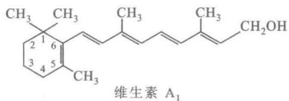  
$\lambda_{max}$ 325 nm(乙醇溶液)

  
$\lambda_{max}$ 325 nm(乙醇溶液)

由于维生素 A 的侧键含有 4 个双键, 故可形成 8 种顺、反异构体。在体内视黄醇可被氧化成视黄醛。视黄醛中最重要的为 9-及 11-顺视黄醛:

  
9-顺视黄醛  
11-顺视黄醛

维生素 A 的化学结构和 $\beta-$ 胡萝卜素 ( $\beta$ -carotene) 的结构相关, $\beta-$ 胡萝卜素分子可被小肠黏膜的 $\beta-$ 胡萝卜素 -15, 15'-双加氧酶 ( $\beta$ -carotene-15, 15'-dioxygenase) 从其碳氢链中间断开生成两分子的视黄醛, 后者经还原转变为视黄醇。因此, $\beta-$ 胡萝卜素是维生素 A 原。实际上胡萝卜素在体内的利用率较低, $\beta-$ 胡萝卜素仅相当于 1/6 维生素 A 活性, 而 $\alpha$ 及 r-胡萝卜素活性为 $\beta$ 型的一半。

  
$\beta$ -胡萝卜素

食物中的维生素 A 在小肠黏膜细胞内与脂肪酸结合成酯后掺入乳糜微粒，通过淋巴液转运，并被肝所摄取。维生素 A 酯在肝的储脂细胞内贮藏，应机体需要向血中释放。血浆中的维生素 A 是非酯化型的，与特异的转运蛋白——视黄醇结合蛋白（retinol-binding protein, RBP）结合而被转运，RBP-视黄醇复合物的 $K_{d}$ 值是很小的，大约 $5 \times 10^{-12} \, mol \cdot L^{-1}$ 。

维生素A是构成视觉细胞内感光物质的成分。眼球视网膜上有两类感觉细胞，即视锥细胞，对强光及颜色敏感；另一种为视杆细胞，对弱光敏感，对颜色不敏感，与暗视觉有关。这是因为视杆细胞内含有感光物质视紫红质（rhodopsin）。视紫红质在光中分解，在暗中再合成。视紫红质是由11-顺视黄醛和视蛋白内赖氨酸的 $\varepsilon-$ 氨基通过形成schiff碱缩合而成的一种结合蛋白质，而视黄醛是维生素A的氧化产物。眼睛对弱光的感光性取决于视紫红质的合成。当维生素A缺乏时，11-顺视黄醛得不到足够的补充，视紫红质合成受阻，使视网膜不能很好地感受弱光，在暗处不能辨别物体，暗适应能力降低，严重时可出现夜盲症。有关视紫红质的合成及视杆细胞的视循环分别如图13-1和图13-2所示。

  
图 13-1 光敏感蛋白——视紫红质的合成步骤

维生素 A 除了视觉功能之外, 在刺激组织生长及分化中也起重要作用, 这一方面还缺少了解。例如视黄酸能刺激实验动物生长, 但在视觉过程中不能代替视黄醛。维生素 A 也能刺激许多组织中的 RNA 合成。视黄醇衍生物的功能, 在特异的糖蛋白的合成中作为糖的携带者。被维生素 A 影响的其他分化过程是免疫反应, 当维生素 A 缺乏时机体的免疫功能会降低。细胞的黏附也受维生素 A 的影响, 当某些类型的细胞在无维生素 A 的介质中培养生长时, 加入维生素 A, 则恢复生长的接触性抑制, 并提高细胞之间的黏附。

维生素 A 主要来自动物性食品,以肝、乳制品及蛋黄中含量最多。维生素 A 原主要来自植物性食品,以胡萝卜、绿叶蔬

  
图13-2 视杆细胞的视循环