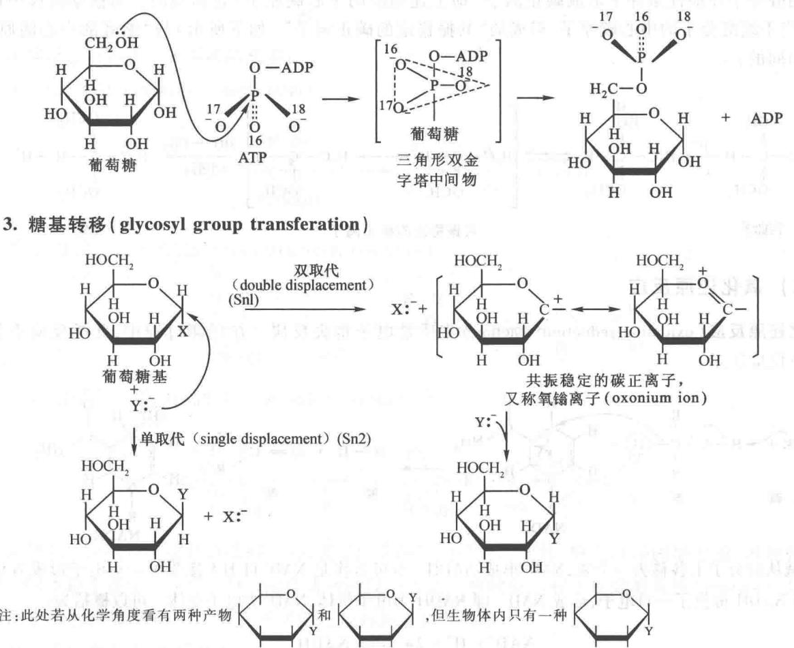
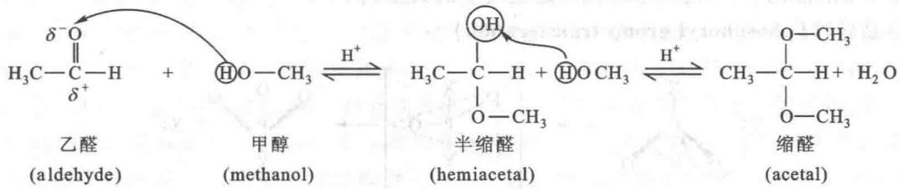
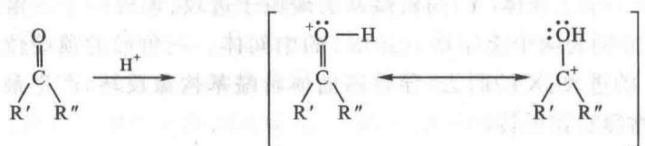
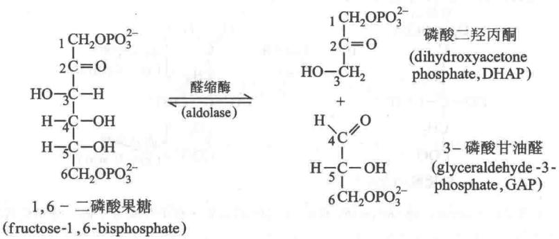
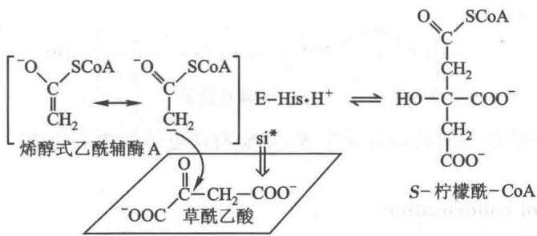
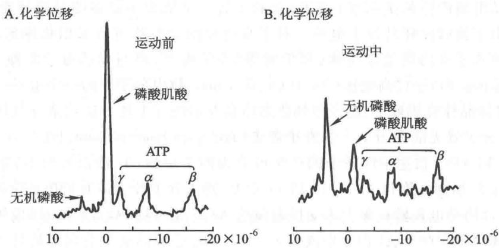

## 第 15 章 新陈代谢总论

新陈代谢(metabolism)是生物体内进行的所有化学变化的总称,是生物体一切生命活动的基础。生命机体和无生命物体的根本区别就在于前者能够通过新陈代谢不断自我更新。新陈代谢包括生物体与外界环境之间的物质和能量交换以及生物体内物质和能量的转变过程,可以将其分为5个方面:①从环境中取得所需物质;②将外界取得的物质转变为自身组成的构造元件(building block);③将构造元件组装成生物体特异的大分子;④合成或分解生物体内各种特殊功能的分子;⑤提供生命活动所需的能量。

本章主要介绍新陈代谢的基本概念、原理、反应机制和研究方法，以使初学者能对新陈代谢有一个总体的认识。

## 一、新陈代谢的基本概念和原理

新陈代谢遵循所有已知的物理学和化学规律,然而是在生物体内特殊条件下进行,受到这些特殊条件的制约。生物体内的新陈代谢有赖于酶的催化,一系列专一性作用的酶催化的连续化学反应构成各类物质的代谢途径(metabolic pathway)。代谢途径的连续酶促反应称为中间代谢(intermediary metabolism);中间代谢的产物称为中间产物或中间物(intermediate)。酶的灵活精确调节机制,使机体错综复杂的代谢过程成为高度协调的整合在一起的代谢网络(metabolic network)。当今生物界各类生物的新陈代谢千差万别,但是也普遍存在一些共有的途径,称为主要代谢途径或中心代谢途径(central metabolic pathway),表明生物界具有共同的起源。下面对新陈代谢的一些基本概念作进一步的阐述。

## （一）新陈代谢包括合成代谢和分解代谢

生物体将外界环境中取得的物质转化为自身组成的物质称为同化作用（assimilation）；将体内组成物质转化为外界环境中的物质称为异化作用（dissimilation）。同化作用和异化作用是一对相反的作用，然而又相互联系组成生物体统一的新陈代谢过程。同化作用是生物体利用能量将小分子物质合成为自身大分子物质的一系列代谢过程，因此又称为合成代谢（anabolism）。异化作用则是生物体分解体内较大较复杂的物质为轻小较简单物质并释放能量的过程，又称为分解代谢（catabolism）。所有参与代谢反应的物质，包括反应物、中间物和终产物统称为代谢物（metabolite）。

新陈代谢包含物质代谢(material metabolism)和能量代谢(energetic metabolism)两个不可分割的方面。一切生命活动都需要能量。除少数种类化能无机自养菌(chemolithotrophic bacteria)能够通过氧化环境中的无机物取得生命所需能量外,绝大多数生物所需的能量直接或间接来自太阳能。具有光合色素(photo-synthetic pigment)的生物,能够通过光合作用将太阳光能转变为化学能,例如绿色植物利用光能由 $CO_{2}$ 和 $H_{2}O$ 合成糖,以此贮存能量。这类生物称为光养生物(phototroph)。而依赖外界营养物质为生的生物称为异养生物(heterotroph)。异养生物将有机营养物经分解和氧化释放出能量供生命活动所需。

生物体内合成代谢和分解代谢采取的途径并不相同,只有在某些代谢环节上,两种代谢可以共同利用同一途径。这种共用途径称为两用代谢途径(amphibolic pathway)。例如:柠檬酸循环(citric acid cycle)就可看作是两用代谢途径的典型例证。

初学者往往不能理解何以会形成今日生物界这种代谢格局。为什么合成代谢和分解代谢要由一系列连续反应来完成而不能一步到位？为什么表面看似繁杂纷乱的代谢途径实际上只包含少数种类的反应、不多的构造元件和个别关键中间代谢物？为什么合成代谢和分解代谢需要采取不同途径而不能由一个可逆反应来完成？以下原则对理解当今生物界代谢格局的形成至关重要：① 现今的代谢途径是在生物进化过程中形成的，反映了进化的历程。② 生物在形成当今代谢格局中尽可能减少物质、能量和负熵的耗费。③ 所有格局要有利于细胞对代谢的调节控制。

## （二）代谢反应受自由能驱动

代谢反应受酶催化,酶能够降低活化能,增加反应速度,但不改变反应的平衡点。代谢反应仍然受热力学规律所支配。按照热力学原理,若一个反应能自发进行,其自由能变化为负值,即反应释放自由能。反之,反应的自由能变化若为正值,必须提供自由能才能使反应发生。生物体内通常将热力学不利的反应与热力学有利的反应偶联,以驱动其进行。

自养生物（autotroph）以太阳能或氧化无机物取得的化学能为能源；异养生物以分解食物中有机营养物取得的化学能为能源。所取得的能量一般贮存在能量载体 ATP 中，也可以通过形成还原型电子载体 NADH、NADPH 以及 FADH₂ 的方式贮存。还原型电子载体经电子传递和氧化磷酸化产生 ATP，又可以还原力形式参与生物合成。能够提供能量的核苷酸除 ATP 外，还有 GTP、UTP、CTP 等。以 ATP 形式贮存的自由能可以供给以下五方面对能量的需要：① 生物合成；② 细胞运动；③ 膜运输；④ 信号传导；⑤ 遗传信息的正确传递和表达。有关内容在后面章节中将会详细介绍。

## （三）核苷酸衍生物是能量和活性基团的载体

上面提到的 ATP、GTP、UTP 和 CTP 等多磷酸核苷酸均含有高能磷酸键（以“\~”符号表示），其水解时能释放出大量自由能。它们能通过转移磷酸基团、焦磷酸基团或腺苷酸基团而转移能量，以提供生物合成和其他各种生命活动所需的自由能。

一些核苷酸衍生物是重要辅酶,例如烟酰胺腺嘌呤二核苷酸(辅酶Ⅰ)、烟酰胺腺嘌呤二核苷酸磷酸(辅酶Ⅱ)、黄素单核苷酸(FMN)、黄素腺嘌呤二核苷酸(FAD)和辅酶A。烟酰胺辅酶(NAD和NADP)和黄素辅酶(FMN和FAD)是氢原子和电子载体,广泛参与各种氧化还原反应,将自由能转移给生物合成需能反应。辅酶A在酶促转酰基反应中起着接受和提供酰基的作用。辅酶A的巯基和酰基结合形成高能硫酯键,水解释放大量自由能(31.38 kJ/mol),与ATP高能酸酐键水解时释放的自由能(30.54 kJ/mol)相近,也就是说辅酶A携带活化的酰基。许多物质代谢,如糖、脂肪酸和氨基酸代谢都可形成乙酰辅酶A,而乙酰辅酶A是进入柠檬酸循环的关键中间代谢物。

## （四）代谢的基本要略在于形成 ATP、还原力和构造元件用于生物合成

生物大分子在生物体的生命活动中起着决定的作用。生物大分子由构造元件(即结构单位)所组成。多糖由少数单糖聚合而成；脂肪由脂肪酸和甘油合成；蛋白质由20种氨基酸聚合而成；核酸由4种核糖核苷酸或4种脱氧核苷酸聚合而成。生物大分子的合成消耗很多能量，只有一部分能量用于形成糖苷键、肽键和磷酸二酯键，另一部分能量用于推动生物合成的单向性，更多能量用于保证遗传信息传递和翻译的准确性。生物大分子水解所释放的自由能不能被利用，常以热能形式散发掉。为节省能量，糖原可在糖原磷酸化酶催化下磷酸解生成1-磷酸葡糖；核糖核酸可在多核苷酸磷酸化酶催化下磷酸解，生成核苷二磷酸。生成的磷酸化产物有利于再利用。

大分子的各种结构单位经分解代谢形成乙酰辅酶 A, 产生少量 ATP, 进入柠檬酸循环后彻底氧化成 $CO_{2}$ 和 $H_{2}O$ , 并通过氧化磷酸化产生大量 ATP。分解代谢是一个氧化过程和产能过程; 合成代谢则是还原过程和需能过程。总的来说, 新陈代谢的基本要略是将分解代谢产生的 ATP、还原力和构造元件用于生物合成。

## （五）代谢在分子、细胞和整体三个水平上调节

生物体内的新陈代谢具有精确、高效的调节机制，从而使错综复杂的代谢过程得以协调一致，并且随着细胞内外条件的改变及时调整，始终有条不紊的进行。代谢调节可在三个不同的水平上进行，即分子水

平的调节、细胞水平的调节和整体水平的调节。

分子水平调节包括底物的调节、酶活性的调节和酶量的调节等方面。各代谢途径通过共同中间产物而彼此沟通。底物量的增加促进下游代谢反应；产物的积累则减少上游反应，两者均会促进相应的代谢分流。变构效应(allosteric effect)是酶活性调节的一种常见方式。当效应物(effector)与酶的变构部位结合，即引起酶活性改变。底物或底物类似物可提高酶活性；产物或产物类似物抑制酶活性。酶的共价修饰是酶活性较长期效应的一种调节方式。酶数量的调节涉及酶的合成和降解的调节。

细胞水平调节包括细胞结构对酶和代谢物的分隔,使不同代谢途径分开在不同结构区域内进行;膜运输控制着各类代谢底物和产物的流通;膜结构还影响酶的物理状态和性质,例如膜结合的酶与溶解的酶活性有很大不同。细胞还通过接受环境的信号,调节其代谢活动。

生物机体作为一个整体,还存在整体水平上的调节,使各组织器官的细胞代谢协调一致,并对机体内外条件的改变作出反应。整体水平的调节包括体液调节和神经系统的调节。

## 二、新陈代谢的主要反应机制

生物体内的新陈代谢反应基本上都是酶催化的有机化学反应。然而，并非所有的有机化学反应都能在生物体内出现，只有符合下述要求的反应才能在体内进行。一是机体需要；二是机体在进化过程中产生合适的酶，能在细胞生理条件下提高反应速度。偶尔细胞内蛋白质引发一些新的反应，如果这些新的反应对机体有益，就会被选择留下，成为新陈代谢中的一个反应。

机体的新陈代谢反应可概括为五大类:① 基团转移反应;② 氧化还原反应;③ 消除、异构化和重排反应;④ 碳-碳键的形成或断裂反应;⑤ 自由基反应。在介绍上述五大类反应之前,先对有机化学中与代谢反应关系密切的基本原理作一些简要介绍。

首先要指出的是,有机化合物都含有共价键。共价键是两个原子间共享的一对电子。这样形成的键断裂时它们的电子对或是留在一个原子内,称为异裂断键(heterolytic bond cleavage);或是电子对分开,每一个电子留在一个原子内,称为均裂断键(homolytic bond cleavage)。现以最常见的C—H和C—C键为例,对键的异裂和均裂表示如下:

C—H键的异裂断键，常伴随碳负离子及质子 $(\mathrm{H}^{+})$ 的形成，或氢负离子 $(\mathrm{H}^{-})$ 及碳正离子的形成。碳原子较氢原子的电负性稍高（原子成键时，该原子对于成键电子对的吸引能力称为电负性。C的电负性为2.5,H的电负性为2.1）。因此在生物化学体系中，C—H键的断裂以电子对留在碳原子一侧，形成碳负离子的方式居多。另一方面，氢负离子 $(\mathrm{H}^{-})$ 具有高度的反应性，所以只要当氢负离子的受体，例如 $\mathrm{NAD}^{+}$ （或 $\mathrm{NADP}^{+}$ )同时存在时，氢负离子一旦形成，就立即转移到受体上。只有在此种情况下，才可以发生形成碳正离子及氢负离子的断裂。C—C键的异裂断键同时产生碳负离子和碳正离子；与氢负离子类似，碳负离子和碳正离子极不稳定，一旦形成立即参与进一步的反应。下面还将专门讨论C—C键的断裂和形成反应。C—H和C—C键的均裂断键常产生不稳定基团，这类基团携带一个不配对的电子，称为自由基（radical）。自由基反应下面也会专门讨论。

第二条基本原理是,许多生化反应涉及亲核体(nucleophile)和亲电子体(electrophile)之间的相互作用。亲核体是指其功能团富有并能给出电子的化合物;亲电子体是指缺电子并能接受电子的化合物。亲核体持未共用的电子对,而呈负电性,易与缺电子体形成共价键。常见的亲核基团有:带负电荷的氧(如未质子化的羟基或解离的羧基)、带负电荷的巯基、碳负离子、不带电荷的氨基、咪唑基等。亲电子体有一个未饱和的电子壳,呈正电性。常见的缺电子体是 $H^{+}$ 、金属离子、羰基碳原子、质子化亚胺、磷酸基的磷等。生化反应中常见的亲核体和亲电子体如下所示:

生物化学的一个重要反应是胺与醛或酮的反应。这个反应的第一步是胺的未共用电子对向缺电子的羰基进攻，使 C=O 双键的电子对更向氧原子靠近，并使氮原子上的一个氢原子转移到氧原子上。第二步是甲醇胺中间体氮原子上的未共用电子对向缺电子的碳原子进攻，在质子 $\left(\mathrm{H}^{+}\right)$ 的参与下，释出一分子水。下面我们讨论生物化学中的五大类反应。需要强调的是，这五类反应并非是互相排斥的，往往一个生化反应可以同时有两类以上的反应，例如自由基反应常存在于其他反应中。

## （一）基团转移反应

在生物化学体系中,基因转移反应(group-transfer reaction)常表现为亲电子基团(如 A)从一个亲核体(如 X:)转移到另一亲核体(如 Y:):

$$
\begin{array}{r l} \mathrm{Y}: & + \quad \mathrm{A-X} \longrightarrow \quad \mathrm{Y-A+X}: \\ (\text {亲核体}) & (\text {亲电子体-亲核体}) \end{array}
$$

这类反应也可称为亲核体的取代反应。在代谢反应中，最常见的转移基团是酰基（acyl）、磷酰基（phosphoryl）及糖基（glycosyl）等。

## 1. 酰基转移(acyl group transferation)

酰基转移是酰基从一个亲核体转移到另一亲核体,它常是亲核体向酰基的羰基碳原子也就是亲电子碳原子进攻,先形成四面体结构的中间体。原来的酰基载体 X 与酰基脱离后又与其他酰基形成新化合物。在胰蛋白酶的催化下，肽键的水解就是这类反应的典型例子。

## 2. 磷酰基转移 (phosphoryl group transferation)

磷酰基的转移起始于一个亲核体(Y)向磷酰基的磷原子进攻,形成一个三角形,双金字塔结构(三角形为金字塔的底座,X、Y分别为两个金字塔的顶端)的中间体。三角形的顶端位置原来由一个被攻击的离子基团(X)所占据。Y的进攻,X的脱去,导致四面体磷酰基构象反转,产生最后的产物。实验证明具有“手性”的磷酰基化合物确实在反转。

例如,在形成 ATP 的 $\gamma$ -磷酰基中,引进同位素证实了当它在己糖激酶(hexokinase)催化下向葡萄糖转移时,即发生构型的反转。

3. 糖基转移 (glycosyl group transferation)

注:此处若从化学角度看有两种产物 | 和 | ,但生物体内只有一种 |

葡萄糖基转移过程是一个亲核体(图中的 Y:⁻)取代葡萄糖环上 C1 处另一亲核体(图中的 X)的过程。这个反应一般发生的是双取代,其机制是葡萄糖基上的 X 脱下,形成共振稳定的碳正离子,随后是亲核体 Y:⁻ 的进攻。这个反应也可以单取代机制进行,即 Y 直接地取代 X,与此同时“构型”发生逆转。

进一步说,这里存在着一个缩醛碳原子。缩醛中心碳原子是一分子醇和一分子醛或酮在酸性条件下发生如下反应而生成的:

上述平衡受醛(或酮)所左右,即这个取代步骤的产生取决于醛(或酮)分子。以酮为例,它在酸性条件下形成“碳正离子”,如下所示:

  
共振稳定的碳正离子

它与半缩醛分子在酸性条件下形成碳正离子(即上述缩醛的中心碳原子)是相当的。葡糖基转移中糖的C1也相当于缩醛分子的中心碳原子,形成的“共振稳定的碳正离子”(如下所示)与“缩醛的中心碳原子”意义是相同的:

## （二）氧化还原反应

氧化还原反应(oxidation-reduction reaction)实质是电子得失反应。在代谢过程中,此类反应十分重要。如下反应所示:

$NAD^{+}$ 和碱从醇分子上各移去一个氢, $NAD^{+}$ 形成 NADH。也可看作是 $NAD^{+}$ 自 H: 接受了一对电子形成 NADH; 或反过来 NADH 提供了一对电子, 形成 $NAD^{+}$ , 即 NADH 为电子供体, $NAD^{+}$ 为电子受体。可以概括为:

$$
\mathrm{NAD} ^ {+} + \mathrm{H} ^ {+} + 2 \mathrm{e} ^ {-} \rightleftharpoons \mathrm{NADH}
$$

在生物体的能量代谢中，NADH 提供两个电子进入电子传递链，即：

进一步说,当代谢物被氧化,移出一对电子时,这对电子的最终受体常是分子氧,而且这对电子对 $O_{2}$ 的进攻是一个一个地分别进行的,如下式:

$$
\mathrm{H:H} \longrightarrow \mathrm {H\cdot + H\cdot}
$$

$$
\mathrm{H} \cdot + \ddot {\mathrm{O}}: \longrightarrow \mathrm{H}: \ddot {\mathrm{O}} ^ {\cdot}
$$

$$
\mathrm{H} \cdot + \mathrm{H}: \ddot {\mathrm{O}} ^ {\cdot} \longrightarrow \mathrm{H}: \ddot {\mathrm{O}}: \mathrm{H}
$$

## （三）消除、异构化及重排反应

## 1. 消除反应(elimination reaction)

碳-碳双键的形成是单键饱和中心发生消除反应后形成的。消除掉的分子一般是 $H_{2}O$ 、 $NH_{3}$ 、R—OH 或 $R—NH_{2}$ 。醇的脱水就是消除反应的一例：

$$
\begin{array}{c} \mathrm{R} - \mathrm{C} - \mathrm{C} - \mathrm{R} ^ {\prime} \\ \mathrm{H} \quad \mathrm{OH} \\ \text {醇} \end{array} \longrightarrow \begin{array}{c} \mathrm{R} - \mathrm{C} = \mathrm{C} - \mathrm{H} \\ \mathrm{H} ^ {\prime} \quad \mathrm{R} ^ {\prime} \end{array} + \mathrm{H} ^ {+} + \mathrm{OH} ^ {-}
$$

消除反应有以下 3 种可能的机制：

① 协同机制(concordant mechanism)

$$
\mathrm{R} - \underset {\mathrm{H}} {\overset {\mathrm{H}} {\mathrm{C}}} - \underset {\mathrm{OH}} {\overset {\mathrm{H}} {\mathrm{C}}} - \mathrm{R} ^ {\prime} \longrightarrow \underset {\mathrm{H}} {\overset {\mathrm{R}} {\mathrm{C}}} = \underset {\mathrm{R} ^ {\prime}} {\overset {\mathrm{H}} {\mathrm{C}}} + \mathrm{H} ^ {+} + \mathrm{OH} ^ {-}
$$

② 经过碳正离子的机制(via carbocation mechanism)

$$
\begin{array}{c} \mathrm{H} \\ \mathrm{R} - \mathrm{C} - \mathrm{C} - \mathrm{R} ^ {\prime} \\ \mathrm{H} \stackrel {\mid} {\underset {\mid} {\mathrm{C}}} \mathrm{OH} \end{array} \xrightarrow [ \mathrm{OH} ^ {-} ]{\quad} \begin{array}{c} \mathrm{H} \\ \mathrm{R} - \mathrm{C} - \mathrm{C} ^ {+} - \mathrm{R} ^ {\prime} \\ \mathrm{H} \end{array} \xrightarrow [ \mathrm{H} ^ {+} ]{\quad} \begin{array}{c} \mathrm{R} \\ \mathrm{H} \end{array} \xrightarrow [ \mathrm{R} ^ {\prime} ]{\mathrm{C}}
$$

③ 经过碳负离子的机制(via carbanion mechanism)

$$
\mathrm{R} - \underset {\mathrm{H}} {\overset {\mathrm{H}} {\mathrm{C}}} - \underset {\mathrm{OH}} {\overset {\mathrm{H}} {\mathrm{C}}} - \mathrm{R} ^ {\prime} \xrightarrow [ \mathrm{H} ^ {+} ]{\mathrm{H}} \mathrm{R} - \underset {\mathrm{H}} {\overset {\mathrm{H}} {\mathrm{C}}} - \underset {\mathrm{OH}} {\overset {\mathrm{H}} {\mathrm{C}}} - \mathrm{R} ^ {\prime} \xrightarrow [ \mathrm{OH} ^ {-} ]{\mathrm{H}} \underset {\mathrm{H}} {\overset {\mathrm{H}} {\mathrm{C}}} = \underset {\mathrm{R} ^ {\prime}} {\overset {\mathrm{H}} {\mathrm{C}}}
$$

酶催化的消除反应或是以②的形式,或是以③的形式进行。此外,酶活性基团的电荷,可使带不同电荷的中间体趋于稳定。这是一种分阶段进行的反应方式。糖酵解过程中的烯醇化酶(enolase)、柠檬酸循环中的延胡索酸酶(fumarase)催化的消除反应都属于这种类型。

从立体化学来看,有反式消除和顺式消除两类:

① 反式消除(trans elimination)

$$
\begin{array}{c} \mathrm{aH} \\ \mathrm{R-C} \\ \mathrm{bH} \end{array} \xrightarrow [ \mathrm{OH} ]{\text {   }} \begin{array}{c} \mathrm{R} \\ \mathrm{C=C} \\ \mathrm{bH} \end{array} \xrightarrow [ \mathrm{OH} ^ {-} ]{\text {   }} \begin{array}{c} \mathrm{H} \\ \mathrm{R} ^ {\prime} \\ \mathrm{R} ^ {\prime} \end{array}
$$

② 顺式消除(cis elimination)

注：为表明反应式中原子的位置，在原子旁边用小字 a, b, c…表示，以下皆同。其中反式消除是生物化学发生最多的机制。顺式消除在生物体中很少发生。

## 2. 分子内氢原子的迁移——异构化反应(isomerization)

生物化学中的异构化反应是指一个氢原子在分子内迁移,即质子从一个碳原子脱离,转移到另一个碳原子上,由此发生了双键位置的改变。

在代谢中,最常见的异构化反应是醛糖-酮糖互变反应。它是在碱性催化下,经过形成单烯二羟负离子(enediolate anion)中间体而发生的。糖酵解酶系中的磷酸葡萄糖变位酶(phosphoglucomutase)所催化的反应就属此类反应。醛糖-酮糖互变反应机制如下:

## 3. 分子重排反应 (rearrangement)

重排是 C—C 键断裂又重新形成的反应, 其结果是碳骨架发生了变化。例如, 在甲基丙二酰单酰-CoA 变位酶 (methylmalonyl-CoA mutase) 的作用下, L-甲基丙二酰单酰辅酶 A 转化为琥珀酰-CoA (succinyl-CoA) 是最常见的一种转化。这种变位酶的辅基是维生素 B $_{12}$ 的衍生物。

从上式可看到,实际上发生了碳骨架的重排:

具有奇数碳原子脂肪酸的氧化,某些氨基酸的降解属于这一类反应。

## （四）碳-碳键的形成与断裂反应

分解代谢与合成代谢实质就是以碳-碳键的断裂与形成为基础的反应过程。葡萄糖经过5次断裂反应成为 $CO_{2}$ ，葡萄糖的生物合成则是碳-碳键形成的反应过程。

从合成的走向来看,这类碳-碳键形成的生物合成过程包括亲核的碳负离子向亲电子的碳正原子进攻。最常见的亲电子的碳原子是醛、酮、酯、 $CO_{2}$ 等的 $SP^{2}$ 杂化轨道的羰基碳原子。如：

亲核的碳负离子 亲电子的碳正原子

在这一反应中,必须有一个稳定态的碳负离子生成,才能向亲电子的中心进攻。有关此类反应可以举出3种类型。

## 1. 羟醛缩合反应 (aldol condensation)

又称醛醇缩合反应。例如醛缩酶所催化的反应：

  
注：“aldolase”中译名常用醛缩酶，实际上它催化的是羟醛缩合的逆反应，即碳-碳键的断裂反应。

以上反应是羟醛裂解(羟醛缩合的逆反应)。这一反应是在有机碱的催化下进行的。其一般式如下：

  
注：碳原子左侧数字标示碳原子在分子中的位置；a，b标示氢原子的位置。

羟醛裂解发生于1,6-二磷酸果糖的 $\mathrm{C}_3$ 和 $\mathrm{C}_4$ 之间，这一裂解发生的条件是由于 $\mathrm{C}_2$ 为羰基碳， $\mathrm{C}_4$ 处有一羟基。上示的一般式中，反应的第1步为有机碱的 $\mathrm{OH}^-$ 夺去底物（ $\mathrm{C}_4$ ）上的羟基氢，使与羟基相连的碳原子成为 $\mathrm{C}-\mathrm{O}^-$ 。第2步反应发生羟醛断裂，是由于 $\mathrm{C}_2$ 处羰基碳吸引电子的倾向使 $\mathrm{C}-\mathrm{O}^-$ 的电子转移成为 $\mathrm{C}=\mathrm{O}, \mathrm{C}-\mathrm{C}$ 间的电子转移发生 $\mathrm{C}-\mathrm{C}$ 键断裂。反应2之所以发生，是由于烯醇化物共振中间体的稳定性。

## 2. 克莱森酯缩合反应 (Clasen ester condensation)

这个反应是在柠檬酸合酶的催化下发生的。可以说这是一个羟醛-克莱森酯缩合反应，又称醇醛-克莱森酯缩合反应。它包括以下3个步骤：

（1）乙酰-CoA 碳负离子的形成 这是由于特定酶的组氨酸残基(E-His)以碱性催化夺去乙酰基的一个质子。酶-His 成为酶- $His \cdot H^{+}$ 。SCoA 的硫酯键使烯醇式碳负离子通过共振而稳定。即：

（2）乙酰-CoA 碳负离子对草酰乙酸的羰基碳进行亲核进攻，反应所得柠檬酰-CoA 仍然保持与酶成键。

(3) 柠檬酰- CoA 的水解, 形成柠檬酸及 CoASH:

  
注：对 S、R、前-S(pro-S)、前-R(pro-R) 和 si、re 的解释见第一章中生物分子的三维结构部分。

此外，在这反应中该提及的是，酶促反应常是立体专一的。在醛醇-克莱森酯缩合反应中，可以看到乙酰-CoA碳负离子对草酰乙酸羰基碳的进攻是专一地进攻于si面。因此所产生的全部是S-柠檬酰-CoA，即乙酰-CoA的乙酰基只专一地形成柠檬酸的前-S羰甲基基团（即前S型臂）。

## 3. $\beta$ -酮酸的氧化脱羧反应

这类反应是在异柠檬酸脱氢酶或脂肪酸合酶的催化下发生的。例如在柠檬酸循环中，由异柠檬酸脱氢酶催化的脱羧过程中， $NAD^{+}$ 还原形成NADH，异柠檬酸氧化后形成 $\beta-$ 酮酸的中间体——草酰琥珀酸。此 $\beta-$ 酮酸发生脱羧反应，形成 $\alpha-$ 酮戊二酸。反应式如下：

在哺乳动物组织中,有两种不同形式的异柠檬酸脱氢酶,一种是参与柠檬酸循环从线粒体中分离获得的,在发生作用时 $NAD^{+}$ 是它的辅助因子;另一种在线粒体及细胞溶胶中都存在,以 $NADP^{+}$ 作为辅助因子。前者,既需要 $NAD^{+}$ 为辅助因子的异柠檬酸脱氢酶,在发生作用的过程中还需 $Mn^{2+}$ 或 $Mg^{2+}$ 作为辅助因子参与反应。它先氧化二级醇的醇基(即异柠檬酸的一OH),使醇基转化为酮基即转化为草酰琥珀酸(oxalo-succinate),同时与 $Mn^{2+}$ 离子发生静电结合并紧接着进行脱羧形成 $\alpha-$ 酮戊二酸。

## （五）自由基反应

过去曾经以为共价键均裂产生自由基的反应极为罕见，现在知道其实不然，在许多生化反应中都存在共价键的均裂断键，自由基还可引发连锁反应。例如， $5^{\prime}$ -脱氧腺苷钴胺素（辅酶 $\mathrm{B}_{12}$ ）中 $\mathrm{C}-5^{\prime}$ 与钴的共价键较弱，其解离能仅为 $110\mathrm{kJ/mol}$ ，相比之下 $\mathrm{C}-\mathrm{C}$ 键的解离能 $348\mathrm{kJ/mol}$ 和 $\mathrm{C}-\mathrm{H}$ 键的解离能 $414\mathrm{kJ/mol}$ 远比它大。这就可以解释为什么光照会破坏辅酶 $\mathrm{B}_{12}$ 。当 $\mathrm{Co}-\mathrm{C}$ 键均裂时，产生 $5^{\prime}$ -脱氧腺苷自由基和钴胺素，钴由 $3^{+}$ 变为 $2^{+}$ 。 $^{5^{\prime}}$ -脱氧腺苷自由基能从底物中取得氢原子，并使底物转变为底物自由基。辅酶 $\mathrm{B}_{12}$ 的均裂断键反应式如下所示：

## 三、新陈代谢的研究方法

生物化学是一门实验科学,其积累的知识主要是通过实验研究得来的。实验方法对生物化学的发展往往起着决定的作用。研究生物机体的新陈代谢需要一些特殊的实验方法,用以检测发生在“活细胞(living cell)”内的化学变化。生命世界种类繁多,它们的代谢方式千差万别,然而也存在共同的途径和共同的规律。用于代谢研究的生物材料,其选择主要根据研究目的和是否便于阐明问题,同时也要考虑培养方便和成本适宜。新陈代谢可以在不同水平上进行研究。用生物整体进行研究,称为体内研究,用拉丁语“in vivo”表示(“在体内”的意思)。用“灌注器官”或微生物细胞群体进行研究也称为“in vivo”。用组织切片、匀浆、提取液,或是用分离的细胞器以及酶和代谢物进行研究,称为“in vitro”,表示“在体外”或“在试管内”的意思,属于体外研究。研究中间代谢主要采用以下几种方法。

## （一）利用酶的抑制剂研究代谢途径

酶的抑制剂(inhibitor)可使代谢途径受到阻断,结果造成某一种代谢中间物的积累,从而揭示该中间代谢物在代谢途径中可能的关系。

用这种方法最早探明的代谢过程是酵母的酒精发酵,即由葡萄糖(或淀粉)经过酵解途径形成酒精的过程。在这项研究中,发现一些代谢抑制剂可在代谢过程的某些特定环节阻滞有关酶的作用,结果造成受该酶作用的中间代谢物积累。例如,碘乙酸(iodoacetate)造成酵母发酵液中积累1,6-二磷酸果糖(由于抑制了醛缩酶的作用)。氟化物造成3-磷酸甘油酸和2-磷酸甘油酸的积累(由于抑制了烯醇化酶的作用)。对这些代谢中间物的分离、纯化和鉴定,为阐明糖酵解途径提供了直接的证据。对酶和代谢中间物的分离、纯化,使得在试管内对某一特定反应进行验证实验成为可能。

又例如,在研究氧化呼吸链过程中,用电子传递的抑制剂选择性地阻断呼吸链中某个特定的电子传递步骤,再测定呼吸链中各个组分的氧化还原情况,成为研究电子传递顺序的一种重要手段。

## （二）利用遗传缺陷症研究代谢途径

患有遗传缺陷症的病人,由于先天性基因的突变,在体内往往表现为缺乏某一种酶活性,致使为该酶作用的前体不能进一步参加代谢过程,从而造成这种前体物的积累。这些代谢中间物因不能进一步利用而出现在血液中或随尿排出体外。测定这些代谢中间物有助于阐明有关的代谢途径。

例如,先天缺乏尿黑酸氧化酶的病人,酪氨酸的代谢中间物尿黑酸(homogentisate)不能氧化而随尿排出体外,在空气中使尿变为黑色。由此而推测出尿黑酸是酪氨酸正常分解代谢的中间物。

又例如,由遗传缺陷产生的苯丙酮尿症(phenylketonuria),若婴儿患此疾病不加治疗,就会发生严重的精神障碍。这种遗传疾病也是苯丙氨酸发生异常代谢的结果,这时尿中出现苯丙酮酸(phenylpyruvate),但酪氨酸的代谢仍然正常。通过以上两种不正常的代谢现象,使苯丙氨酸的代谢途径得到了阐明,如下图:

由人类先天性代谢缺陷症研究的启发,人们进一步使用微生物的基因突变型研究代谢途径。利用各种诱变法,例如,X射线照射法,引起微生物的基因发生突变。这种突变型微生物可能造成酶或代谢途径的缺陷。这种方式已成为研究代谢机制的重要工具,也成为研究分子生物学的重要方法。

例如,将正常生长的红色面包霉(Neurosporacrassa)(称为野生型,wild type)用X射线照射后,由于基因发生了突变而造成在原有简单培养基中不能正常生存的营养缺陷型突变体(autotrophic mutant)。突变体失去了自身制造精氨酸的能力,必需在培养基中补加精氨酸才能正常生存。经深入探索,发现各种酶的基因都有可能发生突变而导致不同合成阶段上酶的缺失。对这类突变型,只有在培养基中添加有关酶作用后的产物,才能维持正常生长。这类不同的缺陷型使得能够一步步阐明生物合成途径。

又例如,对能够生长在乳糖培养基的大肠杆菌(E.coli)进行突变诱导后,形成一种不能在乳糖培养基上生长的突变型。这种突变型经研究发现,缺失了能够将乳糖分解为半乳糖和葡萄糖的 $\beta-$ 半乳糖苷酶( $\beta$ -galactosidase)。从而进一步阐明了乳糖的分解代谢机制。

利用微生物的遗传突变型研究新陈代谢机制，比利用其他生物有很多优越性。它不仅容易引起突变，而且经济、简便。许多代谢途径的中间步骤都是利用这种方法得以阐明的。

## （三）同位素示踪法

早在同位素示踪法应用之前,1904年德国科学家 Franz Knoop 就开始应用苯基标记化合物示踪法研究脂肪酸的代谢,这就是著名的脂肪酸 $\beta$ 氧化学说。

在随后的研究中，科学家改用同位素示踪法。用同位素来标记化合物具有优越性，因为它不改变被标记化合物的化学性质。化合物的标记，可根据需要来选定不同的同位素和不同标记部位。例如，标记 $\alpha-$ 氨基酸的 $\alpha-$ 氨基，用同位素 $^{15}\mathrm{N}$ 标记后成为 $\alpha^{-15}\mathrm{NH}_2$ 。测定含有 $^{15}\mathrm{N}$ 的化合物，须用质谱测定仪（mass spectrometer）。氮转化为气体后，产生不同相对分子质量的产物。普通氮气的相对分子质量为 $28(^{14}\mathrm{N},$ $^{14}\mathrm{N})$ ，带有同位素氮的氮气相对分子质量为 $29(^{15}\mathrm{N},^{14}\mathrm{N})$ 。用重氢标记的化合物经过燃烧形成重水 $\mathrm{D}_2\mathrm{O}$ 与普通水的相对分子质量也可加以鉴别。

当代最常使用的方法是放射性同位素示踪法。放射性同位素可用人工方法制得，它们都不稳定，有一定的半寿期或称半衰期（half-life）。常用的放射性同位素有氚（tritium，T或 $^{3}$ H）、碳14（ $^{14}$ C）、磷32（ $^{32}$ P）、硫34（ $^{34}$ S）、碘131（ $^{131}$ I）等。

以下列出一些放射性同位素的半寿期(半衰期)和放射线的类型可供参考。

常用放射性同位素表

<table><tr><td>同位素名称</td><td>符号</td><td>放射线类型</td><td>半寿期</td></tr><tr><td>氢3(氚)</td><td> $^{3}H,T$ </td><td> $\beta$ </td><td>12.26年</td></tr><tr><td>碳14</td><td> $^{14}C$ </td><td> $\beta$ </td><td>5730天</td></tr><tr><td>磷32</td><td> $^{32}P$ </td><td> $\beta$ </td><td>14.3天</td></tr><tr><td>碘131</td><td> $^{131}I$ </td><td> $\beta$ </td><td>8.070±0.009天</td></tr><tr><td>硫34</td><td> $^{34}S$ </td><td> $\beta$ </td><td>87.1天</td></tr></table>

放射性同位素的放射性可用不同的技术加以测定。在生物化学研究中，最常用的是正比计数法（proportional counting）。最简单的计数器是盖格计数器（Geiger counter）。此外还常使用液体闪烁测定法（liquid scintillation counting）和放射自显影（autoradiography）。正比计数法是测定由放射线通过对闪烁器内某种物质的冲击，使之产生离子化，并能放出闪光。经光电倍增管把光转变为电子脉冲的振幅。经倍增管放大后，即可加以检测。这种测定法对于穿透力较强的 $\gamma$ 射线比较适合。而对于穿透力较小的 $\beta$ 射线（ $^3\mathrm{H}$ 和 $^{14}\mathrm{C}$ ）则不易穿透到闪烁器内。而液体闪烁仪正是为改进这种不足而设计的。液体闪烁仪是使用一种芳香族的溶剂，同位素化合物或是溶解，或是悬浮其中。这种芳香族溶剂受到射线激发时，即产生荧光，成为发射光。发射光可用电子仪器进行测定。

放射自显影是将带有放射性标记的化合物与照相感光底片放在一起,利用放射性能使感光底片感光变黑的性质,测定放射性标记化合物的分布。

最早使用天然同位素取得研究成果的是 Rudolf Schoenheimer, 他在 1941 年发表的 The Dynamic State of Body Constituent 一书中叙述了用天然同位素标记的营养物喂养小鼠的实验研究。他发现天然同位素掺入了肝、肠壁、肌肉、皮肤等组织；还发现标记同位素的氨基酸进入了血清的球蛋白、抗体、清蛋白等。应用重氢标记的软脂酸喂养小鼠，发现重氢掺入到小鼠体内许多其他脂肪酸内。Schoenheimer 的一系列实验证明，生物机体虽然从表面上看保持着恒定状态；但实际上在不断地进行新陈代谢，不断地更新。

1945 年 David Shemin 和 David Rittenberg 首先成功地用 ${}^{14}C$ 和 ${}^{15}N$ 标记的乙酸和甘氨酸证明了血红素 (heme) 分子中的全部碳原子和氮原子都来源于乙酸和甘氨酸 (参看血红素的生物合成)。

胆固醇分子中碳原子的来源也是用同样的同位素示踪法阐明的。胆固醇的碳原子来源于乙酰辅酶 A（参看胆固醇的生物合成）。

当前的生物化学以及分子生物学的研究中,同位素示踪法已成为一种重要的必不可少的常规先进技术。仅就新陈代谢而言,无论在代谢途径、反应机制还是调节控制方面,都取得了较大的成果。

## （四）核磁共振波谱法

核磁共振波谱(nuclear magnetic resonance spectroscopy)是指磁性原子核在高强磁场作用下,产生不同的核自旋能级,在吸收电磁辐射后引起能级跃迁所给出的共振波谱。核磁共振波谱可用于测定分子中某些原子的数目、类型和相对位置,是研究生命物质结构的有力手段,并可用来分析活组织和活细胞中代谢物的变化。红外、紫外、质谱和核磁共振共称为四大波谱,尤以核磁共振波谱给出的信息最为丰富。

早在5世纪30年代，物理学家Isider Rabi发现在磁场中原子核会沿磁场方向呈正向或反向有序排列，而施加电磁辐射后原子核的自旋方向发生翻转。由于Rabi揭示了原子核的磁性，于1944年获得诺贝尔物理学奖。之后F.Bloch和E.M.Purcell发现，具有奇数核子(质子和中子)的原子核在磁场中，若加以特定频率的电磁辐射，就会发生原子核吸收辐射能量的现象，这是最早对核磁共振的认识。为此他们两人获得了1952年诺贝尔物理学奖。

在发现核磁共振现象之后,有关研究领域吸引了许多科学家的关注,很快弄清了其发生机制,并且产生了实际用途。原子核自旋特征用自旋量子数 $I$ 来描述,质量数(核子数)与电荷数(质子数)都为偶数的核, $I=0$ ,无自旋现象,如 $^{12}\mathrm{C}$ 、 $^{16}\mathrm{O}$ 等。质量数为奇数,电荷数或为奇数,如 $^{1}\mathrm{H}$ 、 $^{19}\mathrm{F}$ 等;或为偶数,如 $^{13}\mathrm{C}$ 等, $I=$ 半整数(1/2、3/2、5/2……)。质量数为偶数,电荷数为奇数,如 $^{2}\mathrm{H}$ 等, $I=$ 整数(1,2,3……)。 $I$ 不为0的核能发生自旋,它的自旋方向在一定条件下总是取一定的角度。由于原子核带有正电荷,它的旋转便产生核磁矩,其方向与自旋轴一致,大小与自旋角动量成正比。如果将自旋的核放在外加磁场 $\mathrm{H}_{\circ}$ 中,核磁矩与外磁场相互作用,其取向不是任意的,而是量子化的。核磁矩的取向有 $2I+1$ 个,不同取向的能量不同。例如, $^{1}\mathrm{H}(I=1/2)$ 的核磁矩有2个取向,分别与正向和反向磁场取一夹角 $\theta$ ,前者能量低,后者能量高。核自旋轴以 $\theta$ 角绕磁场转动,类似重力场下陀螺自旋轴的转动,称为进动。进动频率与外加磁场以及核的磁性有关。若有射频振荡器发射时电磁波照射自旋核,其频率恰与自旋核进动频率相同,自旋核就会吸收电磁波能量,进动由一个能级跃迁到相邻更高能级上,由此发生核磁共振(见图15-1)。

  
图15-1 核磁共振波谱仪的原理  
A. 自旋核在磁场中的进动；B. 进动核的取向变化；C. 核磁共振波谱；D. 核磁共振波谱仪

当自旋核吸取电磁波能量后由低能态跃迁到高能态,为维持核磁共振信号的检测,高能态的核必须放出能量回到低能态。大多情况下高能态核是以非辐射形式放出能量,这种非辐射放出能量的过程称为弛豫过程。高能态的核在弛豫过程中可将能量传给环境(晶格或溶剂),或将能量传给相邻低能态的同类核。

为获得核磁共振波谱,有两种方法:一是固定辐射频率,改变磁场强度来满足共振条件,这种方法叫扫场(swept field)。另一是固定磁场强度,改变辐射频率来满足共振条件,这种方法叫扫频(swept frequency)。通常核磁共振波谱仪采用扫场法。以核磁共振信号强度对磁场强度(或辐射频率)作图即为核磁共振波谱(NMR spectrum)。NMR 谱可提供四个重要参数:化学位移值、谱峰多重性、偶合常数值和谱峰相对强度。不同分子或不同基团中同类原子核具有不同的共振频率。这是由于原子核外电子云环流产生磁场的“屏蔽”作用,处于不同化学环境中的原子核受到不同的屏蔽作用而引起共振频率的差异。实际操作时采用一定参照物作为基准,精确测定样品和参照物共振频率的偏离程度,称为化学位移。化学位移受核外电子云的影响,如邻近基团的电负性、磁各向异性、 $\pi$ 共轭键、氢键、自由基、顺磁离子、基团解离和溶剂等的影响。核与核之间以价电子为媒介相互耦合引起谱线分裂的现象称为自旋裂分,由此形成多重峰。相邻两峰间的距离称为自旋-自旋耦合常数,表征两核之间耦合作用的大小。信号峰的积分面积与同类核的数量有关,可用于计算处于相同化学环境中原子核的数量。

所有有机分子都含氢和碳。氢( $^{1}$ H)的核磁共振波谱是研究最多的一种。相对来说,氢谱比较容易分析,能够给出较多的分子结构信息,主要能用以确定:①氢的类型( $-CH_{3}$ 、 $-CH_{2}-$ 、 $\equiv CH$ 、 $=CH_{2}$ 、Ar—H、—OH、—CHO)及其化学环境;②氢的分布;③核间关系。随着核磁共振波谱技术的改进,碳( $^{13}C$ )谱分析成为可能。主要原因是 $^{12}C$ 无自旋,同位素 $^{13}C$ 的天然丰度太低。乃至上世纪70年代采用脉冲电磁辐射取代传统的连续辐射以及Fourier转换的应用,极大提高了NMR信号的分辨率,才开始用碳谱研究有机物的碳骨架和含碳功能团。此外,氟( $^{19}F$ )谱、磷( $^{31}P$ )谱、氮( $^{15}N$ )谱、硫( $^{33}S$ )谱,在生物化学研究中也十分有用。

近代高分辨率核磁共振波谱技术的建立和应用是与 Richard Ernst 所作的开发研究分不开的。因此，他们获得了 1991 年诺贝尔化学奖。

核磁共振分析对样品无需纯化、无需标记、不会破坏，而且可以在活体内实时测定，最能反映机体内化学反应的真实情况。这些优点对于新陈代谢研究至关重要，故而被广泛采用。尤其对人体的实验，如对骨骼肌、心肌和脑等组织代谢的研究，前述方法都不可用，而用NMR技术则取得了重要的研究成果。最为人知的实验是1986年用NMR对人体前臂肌肉在运动前和运动后的比较。这项研究是以测定磷谱为基础。

有趣的是,由人体前臂肌肉测得的磷谱只表现为5个明显的峰谱。这5个峰谱中的3个来自于ATP的 $\alpha$ 、 $\beta$ 、 $\gamma$ 这3个磷原子;另外两个来自于磷酸肌酸和无机磷酸的磷原子。ADP和其他磷酸化合物,因为浓度或因其磷原子不能自由旋转或转动过于缓慢,而不能表现出明显的光谱峰。实验表明,人的前臂在运动前和经过19分钟的运动后所显示的磷谱有明显的变化,磷酸肌酸显示出的峰明显降低,而由无机磷酸显示出的峰则明显升高;但ATP的3个磷原子所显示出的峰谱却几乎没有变化。实验结果如图15-2所示:

  
图 15-2 人体前臂肌肉在运动前后磷酸肌酸、无机磷酸和 ATP 三个磷酸基团的 $^{31}$ P NMR 波谱  
A. 运动前, B. 运动 19 min 后; A 为 256s 内的波谱, B 为 645s 内的波谱

这个实验生动地表明了人体代谢随机体的活动所发生的动态变化,也表明了肌肉运动时 ATP 的恒定水平是由磷酸肌酸提供的磷酰基维持的。

核磁共振成像技术(nuclear magnetic resonance imaging, NMRI)或者称为磁共振成像技术(MRI)，是在上世纪70年代发展起来的。其主要原理是：在主磁场外再增加一个方向不同的磁场，造成磁场梯度（现在的核磁共振成像仪产生X、Y、Z三个方向的梯度磁场），从而可以使分子在磁场中定位。通常测定的是氢( $^{1}$ H)谱，因为机体中氢原子的数目最多。NMR信号强度与样品中氢核密度有关，人体各种组织中含水和碳氢化合物比例不同，NMR信号强度也就不同，利用这种差异作为特征量，把各种组织分开，经计算机处理而获得氢核密度的核磁共振图像。核磁共振成像技术在医学、神经生物学和认知科学中被广泛应用。为表彰Paul C. Lauterbur和Peter Mansfield在建立和应用核磁共振成像技术中作出的重大贡献，授予两人2003年诺贝尔生理学或医学奖。

## （五）色谱-质谱联用法

色谱法（chromatography）又可称为层析法或色层法，是利用生化物质在流动相和固定相之间分配系数的差别而将各类物质分开的技术。流动相一般是气体或液体，固定相一般都是固体。气相色谱（gas chromatography），通常以惰性气体（如 $\mathbf{N}_2$ ）作为流动相，以吸附剂作为固定相，样品为气体或在 $300^{\circ}\mathrm{C}$ 左右汽化的化合物。流动相携带样品通过与固定相间不断吸附与解吸而将各组分分开。不挥发，不耐热和生物大分子不能用气相色谱，需要用高效液相色谱（high-performance liquid chromatography, HPLC）进行分离。HPLC的流动相常为极性挥发性的溶液，固定相常为反相柱（reversed phase column）或亲和柱（affinity column）。反相柱是指柱中填充疏水的层析介质，从而使流动相与固定相属性相反，前者是极性的，后者是非极性的。亲和柱借生物亲和力（如抗原-抗体、配体-受体、生物素-亲和素等）分离特殊的生物样品。色谱法能够有效分离生物样品，但是仅仅凭滞留时间不足以鉴别各组成成分，只能用标准品进行比较。质谱法（mass spectrometry, MS）可以精确测定相对分子质量，对于鉴定化合物十分有用。它在一定范围内也可测定混合物中各组分的相对分子质量。但组分较多、较复杂，质谱就无能为力了。将色谱与质谱联用，使两者优势互补，已成为研究各类生物分子组学最有效的手段。

质谱法是利用电场和磁场将运动的离子(带电荷原子、分子或分子碎片)按它们的质荷比(mass-to-charge ratio)分开并检测其强度的一种技术。若将离子的质荷比m/z(横坐标)对离子流的强度(纵坐标)作图即得到质谱图(mass spectrum)。质谱测定是在真空系统中进行的,测定装置包括进样系统、离子源、质量分析器、检测系统以及数据系统。单独测定质谱可以直接进样;与气相色谱或高效液相色谱联用的必需调整色谱已分离样品的状态,去除溶剂和杂质使适于测定质谱。

离子源是使样品电离产生带电粒子(离子)束的装置。早期用得最多的是电子电离(electron ionization, EI), 通过发射电子流以使样品发生电离。对于难电离的化合物可以采用化学电离(chemical ionization, CI), 即电子流使离子室内的反应气体(如甲烷等)发生电离, 再与样品分子碰撞, 产生准分子离子。场致电离(field ionization, FI)是以高电压(7\~10 kV, d<1 mm)拉出分子中的一个电子; 场致解吸(field desorption, FD)则是将样品涂在钨丝上, 高压电场激起电离及解吸。上述方法只适合气体或易挥发样品, 对不耐热、不挥发和大分子就无能为力了。快原子轰击(fast atom bombardment, FAB)技术可以解决这些问题, 它已逐渐取代了FI/FD。快速中性原子的产生可分为四个步骤: ①冷阴极放电; ②气体氩(Ar)失去电子Ar→Ar+e-; ③加速并聚焦Ar+(\~10 kV); ④Ar+进入含中性气体B的电荷交换室, 将电荷转给中性气体, 在离子源出口用静电偏转板除去未交换电荷的Ar+。此时氩(Ar)原子束以极快速度射向样品, 生物样品制成含甘油糊状液涂在金属(白金板或粉末)上。快原子束的能量会因电离甘油而消耗掉, 甘油离子进而与其他甘油分子作用, 引起离子-分子反应, 而成为电离过程中富有活性的离子。在甘油离子的促进下, 样品分子结合或丢失质子, 或与甘油离子结合, 成为离子并被溅出进入分析器。

近年来发展很快、在生物样品质谱分析中取得很好效果的电离方法还有电喷雾(electrospray ionization, ESI)和基质辅助激光解析(matrix-assisted laser desorption ionization, MALDI)。ESI是在毛细管的出口处施加一高电压，所产生的高电场使从毛细管流出的液体雾化成细小的带电液滴，随着溶剂的蒸发，液滴表面电荷的强度逐渐增大，最后液滴崩解为大量带一个或多个电荷的离子进入气相。MALDI的基本原理是将生物样品分散在基质中并形成晶体，当激光照射晶体时基质分子吸收辐射能量跃迁到激发态，导致样品分子电离和逸出，样品电离通常是由于基质的质子转移到样品分子上所致。

样品分子离子化后经电场加速进入质量分析器，在那里按质荷比的大小不同分开，由检测器收集并记录。质量分析器种类很多，主要有单聚焦（single focusing）、双聚焦（double focusing）、四极杆（quadrupole）/离子阱（ion trap）和飞行时间（time of flight, TOF）等。带电离子进入电场后运行方向发生偏转，速度快的偏转小，速度慢的偏转大；在磁场中离子发生与角速度矢量相反的偏转，角速度快的偏转小，角速度慢的偏转大。单聚焦磁场分析器（图15-3A）是在磁场中将相同质荷比而入射方向不同的离子聚焦，不同质荷比离子的聚焦点不同，但基本上在同一平面上，由收集器检测并记录样品离子。单聚焦磁场分析器结构较简单，但分辨率不高。双聚焦分析器（图15-3B）是带电离子经电场和磁场双重聚焦。在电场中相同质荷比而速度(能量)不同的离子聚焦;在磁场中离子的曲线轨迹半径取决于质量(实际是质荷比)、磁场强度和飞行速度,双聚焦可以更精确测定离子质荷比。

四极杆质量分析器(图 15-3C)是四根与中轴等距离的圆柱或双曲面柱电极,相对两电极分别连接相同的正、负电源和射频电源,在四极电场控制下只有特定质荷比的离子才能通过通道,其余离子撞上电极而失去电荷。离子阱是在四极杆分析器基础上发展起来的,它是在环形电极两端加上适当电场用以捕捉特定质荷比的离子,就像一个电场势阱。通过调节电场而将离子推出阱外。

  
图15-3 4种质量分析器的示意图  
A. 单聚焦磁场分析器；B. 双聚焦分析器；C. 四极杆质量分析器；D. 飞行时间质量分析器

飞行时间质量分析器(图 15-3D)是使不同质荷比的离子在同一时间以相同的初速度进入漂流管(drift tube)，这样才能保证无场飞行时间与质量的平方根成反比。常采用脉冲式离子源，对离子加速后时间和空间分布进行校正，以提高检测的精确度。图 15-3 简略表示 4 种质量分析器的构造和检测原理。

色谱-质谱联用仪将色谱与质谱组装在一起，它结合了色谱的高效分离能力和质谱的超强组分鉴定能力。联机的关键是采用适当的接口，以使色谱分离产物适合于质谱的进样要求，包括样品的量和状态，以及溶剂和杂质的去除。图15-4是色谱-质谱联用仪的示意图。

  
图 15-4 色谱-质谱联用仪示意图

在基因组学和蛋白质组学的带动下，20世纪末发展出了代谢组学（metabonomics）。1999年Jeremy Nicholson最早提出研究代谢组分总体的“代谢组学”。代谢组学主要研究不同生理、病理条件下各种代谢途径底物和产物（即代谢物）的变化，研究生物机体对内外环境条件扰动后应答的不同，以及不同个体间表型的差异。因此对医学、农学、生理学、生态学、微生物发酵等学科有广泛理论和生产实践意义。如果说基因组学和蛋白质组学可以了解机体的代谢能力，那么代谢组学则揭示了机体代谢的现状。在代谢组学研究中最重要的研究手段是气相色谱-质谱联用技术（GC-MS）、高效液相色谱-质谱联用技术（HPLC-MS）和核磁共振技术（NMR）。

新陈代谢是生物体内进行的所有化学变化的总称,是生物体一切生命活动的基础。新陈代谢包括:①从环境中取得所需物质;②将外界取得的物质转变为自身组成的构造元件;③将构造元件组装成生物体特异的大分子;④合成或分解生物体内各种特殊功能的分子;⑤提供生命活动所需的能量。

新陈代谢遵循所有已知的物理学和化学规律,并受到生物体内条件的制约。各种代谢途径由一系列酶促反应所组成;错综复杂的代谢途径构成代谢网络。生物界存在共同的中心代谢途径,各类生物又有其代谢特点。

新陈代谢包含同化作用和异化作用两个方面,同化作用为合成代谢;异化作用为分解代谢。物质代谢和能量代谢总是相伴而行的。生物按照能量来源的不同,可分为自养生物和异养生物,归根到底生命活动的能量来自太阳的光能。当今生物体的代谢格局是在长期进化过程中形成的;能够有效节省物质、能量和负熵的消耗;并能灵活进行调节。

生物体内通常将热力学不利的反应与有利的反应偶联,以驱动其进行。ATP是通用的能量载体;还原型电子载体可以产生ATP,又可以还原力形式参与生物合成。各类核苷酸衍生物是能量和活性基团的载体。代谢的基本要略在于形成ATP、还原力和构造元件,用于生物合成。新陈代谢在分子水平、细胞水平和整体水平上进行调节。

生物分子是由碳、氢等多种元素原子组成的有机化合物,共价键是生物分子的主键。共价键的异裂产生亲电子体和亲核体;共价键的均裂产生自由基。所有代谢反应都可归纳为几种基本的亲电子体和亲核体之间以及与自由基之间的反应,最基本的反应是:①基团转移反应;②氧化还原反应;③消除、异构化及重排反应;④C—C键的形成与断裂反应;⑤自由基反应。对各类反应中电子转移规律的了解,有助于对新陈代谢途径的认识,例如,可以帮助了解代谢途径各步反应的原理、代谢物的稳定性和反应条件等。

新陈代谢的研究有赖于研究技术的开发和发展,每一个新的重大技术的出现都会开拓新的研究领域,都会推动新陈代谢研究进入一个新的发展阶段。新陈代谢研究“活的”整体或细胞的化学变化,需要“体内(in vivo)”研究,也需要试管或“体外(in vitro)”研究。利用酶的抑制剂抑制酶活性,可以了解该酶催化的反应在代谢途径中的作用。通过基因突变使基因产物(酶)失活,也是研究酶促反应在代谢途径中作用的一种重要方法。

同位素示踪法在代谢研究中起着重要作用。有两类同位素,稳定性同位素和放射性同位素。稳定性同位素要用质谱仪来检测;放射性同位素需要测定放射性。无论是稳定同位素或是放射同位素都可用来研究和追踪代谢物的转变途径、反应机制和调节方式。

核磁共振波谱法可用以测定分子的化学基团、分子结构和在溶液中的构象,其主要原理是原子核自旋量子数不为零时能够自旋产生核磁矩,如果有外加磁场在相互作用下发生自旋量子化,此时若有辐射电磁波的频率与自旋核进动频率相同,自旋核就能吸收电磁波能量由低能级跃迁到高能级,通过扫频(或扫场)获得核磁共振波谱(NMR)。核磁共振波谱可提供4个重要参数:化学位移值、谱峰多重性、耦合常数值和谱峰相对强度,它们分别反映了原子核的化学环境、相邻核与核的关系、受价电子影响的耦合常数以及同类核的数量。

色谱技术利用各类样品分子在流动相和固定相之间分配系数的不同而加以分开。气相色谱的流动相是惰性气体,固定相是填以吸附剂的柱;高效液相色谱的流动相较常用的是极性挥发性溶液,固定相较常用的是填以疏水介质的反相柱或填以亲和介质的亲和柱。质谱技术是使样品分子电离成为带电的离子,然后进入质量分析器检测其质荷比。常用的电离方法有:电子电离、化学电离、场致电离、场致解吸、电喷雾、基质辅助激光解吸等。质量分析器有:单聚焦磁场分析器、双聚焦分析器、四极杆/离子阱分析器、飞行时间分析器等。色谱技术具有高效分离样品的能力;质谱技术能精确测定样品离子的质荷比,两者联用能够十分有效检测生物材料中各组分。

代谢组学研究生物体各代谢物的总体组分。如果说基因组学和蛋白质组学揭示生物体的代谢能力;

# 提要

那么，代谢组学揭示的是生物体代谢现状。在代谢组学的研究中，气相色谱-质谱联用、高效液相色谱-质谱联用和核磁共振波谱是三项最重要的技术。

## 习题

1. 什么是新陈代谢？什么是同化作用和异化作用？研究新陈代谢有何理论意义和实践意义？

2. 如何理解物质代谢和能量代谢之间的关系？哪些物质在传递和贮存能量中起重要作用？

3. 生物的代谢格局是如何形成的？

4. 为什么生物在进化过程中选择核苷酸衍生物作为能量和活性基团的载体？

5. 新陈代谢的基本要略是什么？

6. 新陈代谢有何调节机制？有何生物学意义？

7. 何谓亲电子体？何谓亲核体？何谓自由基？是否所有代谢反应都包含上述三类物质间的反应？

8. 是否所有基团转移反应都是由亲电子基团从一个亲核体转移到另一个亲核体？

9. 试述氧化还原反应中电子的转移过程。

10. 简要说明消除、异构化及分子重排反应。

11. 碳-碳键的形成和断裂主要有哪些种类反应？它们在代谢中占何地位？

12. 举例说明自由基反应在代谢中的重要性。

13. 什么是“体内”研究？什么是“体外”研究？

14. 举例说明如何利用酶的抑制剂研究代谢途径。

15. 是否所有代谢途径都可以用基因突变的方法进行研究？为什么？

16. 简要说明核磁共振波谱技术的原理。它对代谢研究有何意义？

17. 简要说明色谱和质谱技术的原理。举例说明如何用色谱-质谱技术研究代谢。

18. 什么是代谢组学？研究代谢组有何理论和实践意义？

## 主要参考书目

1. 王镜岩, 朱圣庚, 徐长法. 生物化学教程. 北京: 高等教育出版社, 2008.

2. 袁存光, 等. 现代仪器分析. 北京: 化学工业出版社, 2012.

3. Nelson D L, Cox M M. Lehninger Principles of Biochemistry. 6th ed. New York: W. H. Freeman, 2012.

(王镜岩 朱圣庚)

## 网上资源

自测题
