## 第 17 章 六碳糖的分解和糖酵解作用

葡萄糖在动物、植物即许多微生物的代谢中占据着核心地位。葡萄糖含有丰富的能量，以高分子质量聚合物如淀粉或糖原的形式存在，从而使细胞能够在维持相对较低的细胞渗透压下储存大量的己糖单元。当能量需要突然增加时，葡萄糖从这些细胞内贮存的聚合物中释放。在有氧条件下，它被彻底氧化成 $CO_{2}$ 和水，释

放出大量自由能形成大量的 ATP。在无氧条件下，葡萄糖分解为丙酮酸，产生 2 分子 ATP，这一过程称为糖酵解作用。

葡萄糖不仅是非常高效的燃料分子,也是多功能的起始物,可以提供大量的生物合成反应中间代谢物。细菌如大肠杆菌(Escherichia coli)可以从葡萄糖获得生长所需的氨基酸、核苷酸、辅酶、脂肪酸或其他代谢中间物的碳骨架。在高等植物和动物中,葡萄糖的主要代谢途径为:作为糖或蔗糖被贮存;通过糖酵解途径被氧化为三碳化合物(丙酮酸),产生ATP和代谢中间物;通过戊糖磷酸途径被氧化为五碳糖,生成5-磷酸核糖和NADPH。

糖酵解(glycolysis)一词来源于希腊语glykos的词根,是“甜”的意思。lysis是“分解”或“解开”的意思。糖酵解过程被认为是生物最古老、最原始获取能量的一种方式。在自然发展过程中出现的大多数较高等生物,虽然进化为利用有氧条件进行生物氧化获取大量的自由能,但仍保留了这种原始的方式。这一系列过程,不但成为生物体共同经历的葡萄糖的分解代谢前期途径,而且有些生物体还利用这一途径在供氧不足的条件下,给机体提供能量,或供应急需要。这一途径也是人们最早阐明的酶促反应系统,也是研究得非常透彻的一个过程。因为这一过程的反应原则以及调节机制,在所有细胞代谢途径中具有普遍意义,所以有必要对此过程作较详细的介绍。此外,其他糖类是怎样进入酵解途径的,也将进行适当的讨论。

## 一、糖酵解作用的研究历史

发酵(fermentation)是指葡萄糖或其他有机营养物通过无氧呼吸降解获得能量,贮存 ATP。从历史的纪元开始,人们就已经会用酵母菌将葡萄糖发酵成乙醇和 $CO_{2}$ 。在生活实践中,人们发展了酿酒、制作工业酒精以及面包制造业等。这些都是利用酵母菌的发酵过程。虽然人们很早就开始利用“发酵”,但是对发酵的研究却只是在 19 世纪后半叶才开始的。

对发酵现象的解释,1854—1864的10年间,Louis Paster的观点占有统治地位。他认为发酵现象是由微生物引起的,发酵过程以及各种生物过程都离不开一种生命物质所固有的“活力”(vital force)的作用。他称发酵为“不要空气的生命”。

1897 年, Hans Buchner 和 Edward Buchner 兄弟, 开始制作不含有细胞的酵母浸出液拟供药用。他们用细沙和酵母一起研磨, 加上硅藻土 (kieselguhr), 用水力压榨机榨出汁液来。取得了汁液后, 需要考虑如何防腐的问题。因为他们打算将榨液用于动物实验, 选择了不妨碍动物实验的防腐剂, 日常惯用的蔗糖。这就是重大发现的开端。酵母菌的榨液居然引起了蔗糖发酵。这是第一次发现没有活酵母存在的发酵现象。从此开始了研究没有活细胞参加的酒精发酵的新纪元。在研究中发现, 葡萄糖几乎是全量地按照下面方程式分解为乙醇和 $CO_{2}$ :

$$
\mathrm{C} _ {6} \mathrm{H} _ {1 2} \mathrm{O} _ {6} = 2 \mathrm{CH} _ {3} \mathrm{CH} _ {2} \mathrm{OH} + 2 \mathrm{CO} _ {2}
$$

$$
\text { 葡   萄   糖 } \quad \text { 乙   醇 }
$$

此外，在发酵液中还发现有微量的甘油。

上述实验中还发现,新鲜酵母的发酵液远不如活酵母菌的发酵能力。用气体测量法测定生成 $CO_{2}$ 的量来测定发酵的速度。实验表明,活酵母的发酵能力比等当量的榨液大 10\~20 倍。如果将酵母榨液搁置起来放一些时候,其发酵能力随时间的延长很快地下降。如果将榨液在 30℃ 条件下干燥,仍能保持发酵能力。氯仿对发酵没有影响。但是若将发酵液加热至 50℃ 以上,便会失效。这些都表明发酵力与酶有关。

对于酵母榨液的作用原理,最早做出贡献的是 Arthur Harden 和 William Young 在 1905 年的工作。他们将新鲜的酵母榨液加到 pH 5\~6 的葡萄糖溶液中。如果再加入一些磷酸,发酵就又恢复起来。但这种恢复也只是暂时的。加进去的无机磷酸消失了。游离磷酸的存在量越低,其发酵速度减退得也越快。每次再加入一些磷酸就可以再看到有一阵新的发酵现象出现。

无机磷酸加入到发酵混合液中就很快消失的现象使人们想到可能形成了有机磷酸酯。1905年，A. Harden 和 W. J. Young 两人果然分离得到了 1,6-二磷酸果糖。如果将人工合成的 1,6-二磷酸果糖加入到发酵液中，它和葡萄糖一样被酵解。这一现象表明了 1,6-二磷酸果糖很可能是发酵过程中的一种过渡产物。随后，Robinson 又分析得到另外一种糖的磷酸酯。经分析证明，它是 6-磷酸葡糖和 6-磷酸果糖的平衡混合物。这两种 6-磷酸己糖加入到酵母液中，都可以被酵解。以上的事实表明，这些磷酸酯是葡萄糖与无机磷酸作用的结果，当时已经测出由葡萄糖磷酸化形成磷酸糖酯的次序可能如下：

  
葡萄糖
(glucose,G)

  
6-磷酸葡糖
(glucose-6-phosphate)

  
6-磷酸果糖
(fructose-6-phosphate)

  
1,6-二磷酸果糖
(fructose -1,6-bisphosphate)

这些磷酸糖酯是怎样形成的？又是怎样转变成乙醇和 $CO_{2}$ 的？阐明这些问题又经历了几十年的光景，通过不同国别科学家的共同努力才得以解决。在阐明发酵机制的过程中，越来越多的证据表明，酵母菌的榨液使葡萄糖发酵的过程和肌肉浸出液利用葡萄糖发生的酵解作用，是几乎完全相似的过程。除去产物有些差异外，其余过程都是一致的。这就更有利于互相参照阐明其全过程的机制。

Harden 和 Young 还发现,酵母榨液经透析后就失去了发酵能力。向透析剩下的液体中加入少量透析液或煮沸过的使酶失活的榨液,发酵能力就得到恢复。这表明,酵母菌榨液包括两类重要物质,一类是不耐热的、不能透析的酶,命名为发酵酶(zymase),另一类是耐热的、可以透析的物质,命名为发酵辅酶(co-zymase)。发酵作用依靠这两种物质组合而成。发酵酶是催化葡萄糖发酵的。发酵辅酶是酶发挥作用所必需的,后来又进一步证明了发酵辅酶实际是烟酰胺腺嘌呤二核苷酸(NAD,或称辅酶I)和腺嘌呤核苷酸的混合物、此外还有 ADP、ATP 以及金属离子。

当认清以上这些物质的存在后,将它们分别加入到透析残余物中,对深入探讨发酵机制起到重要的作用。此外，在实验过程中还发现了许多化学物质具有阻滞发酵进行的作用。这些物质可以导致某些发酵中间产物的积累。这对阐明发酵机制也起到重要的作用。例如，实验证明氟化物（fluoride）抑制发酵液的发酵过程，造成3-磷酸甘油酸和2-磷酸甘油酸的积累。碘乙酸（iodoacetate）造成1,6-二磷酸果糖的积累。这些物质得到明确以后，大大促进了对这些物质产生机制的研究。

以上这些基本的研究,以及随后发现的,肌肉提取液能使葡萄糖发生酵解作用而产生乳酸的研究,都促使20世纪30年代德国生物化学家对酵解的更加深入地研究。贡献最显著的是Gustav Embden。他提出1,6-二磷酸果糖裂解的形式以及随后的步骤。还有Otto Meyerhof,他对Embden提出的假设作了合理修改,而且研究了酵解作用的能力学。由于他们的重要贡献,从葡萄糖开始至产生丙酮酸的过程常常被称为Embden-Meyerhof途径。他们将肌肉中由葡萄糖形成乳酸的过程称之为酵解过程。

此外，在酵解的研究中做出重要贡献的科学家还应举出德国的 Otto Warburg, Garl Neuberg, 美国的 Carl Cori 和 Gerty Cori 以及波兰的 J. Parnas 等人。

可以说,糖酵解的各个步骤在20世纪60年代就已经很清楚了。但对糖酵解的深入研究,例如对有关酶的结构与功能的研究,还在不断深入地进行着。

从以上的研究中可以看出,发酵(fermentation)是最早研究的,由酵母菌将葡萄糖转化为酒精的过程。而酵解这一名词最初是来自动物肌肉利用葡萄糖最后转化为乳酸的过程。

但是,经过广泛的研究表明:它们的基本途径都是一致的,只存在极小的差异。除在产物上可能有所差别(例如乙醇和乳酸)外,在不同种属和不同类型细胞之间还可能存在同工酶以及不同的调节方式。当前人们将葡萄糖降解产生丙酮酸这一段过程称为糖酵解过程或酵解过程。

## 二、糖酵解过程概述

从历史的叙述中,已经可以明了,糖酵解是葡萄糖转变为丙酮酸的一系列反应。酵解过程的生物学意义在于,它是在不需要氧供应的条件下,产生 ATP 的一种供能方式。

在详细探讨酵解的全过程之前,不妨先从葡萄糖骨架的变化得到一些粗略的概念。

对于酵解过程,由葡萄糖经历丙酮酸最后生成乳酸,其碳原子的变化可作如下的概括:

$$
\begin{array}{r l r}{\mathrm{C-C-C-C-C-C}}&{\rightarrow}&{\mathrm {C - C - C + C - C - C \rightarrow CH_ {3} CH(OH)COO^ {-} + CH_ {3} CH(OH)COO^ {-}}}\\{1 2 3 4 5 6}&&{1 2 3 4 5 6}\\{\text {葡萄糖(六碳糖)}}&&{\text {三碳糖} \quad \text {三碳糖} \quad \text {乳酸} \quad \text {乳酸}}\end{array}
$$

对于发酵作用产生的酒精(又简称酒精发酵),其碳原子的变化情况如下:

C—C—C—C—C—C → C—C—C + C—C—C → $CH_{3}$ — $CH_{2}OH$ + $CO_{2}$ + $CH_{3}$ — $CH_{2}OH$ + $CO_{2}$ 1 2 3 4 5 6
葡萄糖(六碳糖)
三碳糖
三碳糖
乙醇
乙醇

有了碳骨架变化的概念之后,再来看看酵解和酒精发酵作用,包括其形成 ATP 的反应式。酵解作用的反应式:

$$
\begin{array}{l l}\mathrm{C} _ {6} \mathrm{H} _ {1 2} \mathrm{O} _ {6} + 2 \mathrm{Pi} + 2 \mathrm{ADP} \rightarrow 2 \mathrm{CH} _ {3} \mathrm{CH(OH)COO} ^ {-} + 2 \mathrm{ATP} + 2 \mathrm{H} _ {2} \mathrm{O} + 2 \mathrm{H} ^ {+}\\\text {葡萄糖}&\text {无机磷酸} \quad \text {乳酸}\end{array}
$$

酒精发酵作用的反应式：

$$
\mathrm{C} _ {6} \mathrm{H} _ {1 2} \mathrm{O} _ {6} + 2 \mathrm{Pi} + 2 \mathrm{ADP} \rightarrow 2 \mathrm{CH} _ {3} \mathrm{CH} _ {2} \mathrm{OH} + 2 \mathrm{ATP} + 2 \mathrm{H} _ {2} \mathrm{O} + 2 \mathrm{CO} _ {2}
$$

从能量观点出发,可以把酵解过程划分为两个方面。一方面从葡萄糖转变为乳酸是物质的分解过程,其中伴随有自由能的释放。即放能过程。另一方面 ADP 和无机磷酸形成 ATP,则是吸收能量的过程:

$$
\text { 葡   萄   糖 } \rightarrow 2 \text { 乳   酸 } \quad \Delta G _ {1} ^ {\ominus^ {\prime}} = - 1 9 6. 7 \mathrm{kJ/mol} (- 4 7. 0 \mathrm{kcal/mol}) (\text { 放   能   过   程 })
$$

$$
2 \mathrm{ADP} + 2 \mathrm{Pi} \rightarrow 2 \mathrm{ATP} + \mathrm{H} _ {2} \mathrm{O} \quad \Delta G _ {2} ^ {\ominus^ {\prime}} = 2 \times 7. 3 0 = + 6 1. 1 \mathrm{kJ/mol(+14.6kcal/mol)} (\text {吸能反应})
$$

总括上述能量反应。由葡萄糖形成乳酸过程的总能量变化为：

$$
\Delta G _ {\mathrm{总}} ^ {\ominus \prime} = \Delta G _ {1} ^ {\ominus \prime} + \Delta G _ {2} ^ {\ominus \prime} = - 4 7. 0 + 1 4. 6 = - 1 3 5. 5 6 \mathrm{kJ/mol(-32.4kcal/mol)}
$$

因此，从酵解的总能量变化来考虑，可知这是一个放能过程。其中由形成ATP捕获的能量所占释放全部能量的百分比为 $14.6 / 47.4 \times 100\% = 31\%$ 。但在细胞内，真正的反应物和产物浓度并不是标准状况下的 $1.0 \mathrm{~mol} / \mathrm{L}$ ，而是低许多倍。这样计算起来，酵解的实际效益远不只 $31\%$ 。由于酵解所释放的净能量为 $-135.56 \mathrm{~kJ} / \mathrm{mol}(-32.4 \mathrm{kcal} / \mathrm{mol})$ ，因此酵解过程实际是一个不可逆的（irreversible）反应过程。但在全部过程中，大多数反应步骤的标准自由能变化差异并不大。因此，这类反应的逆反应也可用于葡萄糖在细胞内的再合成。

应该引起注意的是:糖酵解过程由葡萄糖到所有的中间产物都是以磷酸化合物的形式来实现的。中间产物磷酸化至少有三种意义:①带有负电荷的磷酸基团使中间产物具有极性,从而使这些产物不易透过脂膜而失散;②磷酸基团在各反应步骤中,对酶来说,起到信号基团的作用,有利于与酶结合而被催化;③磷酸基团经酵解作用后,最终形成ATP的末端磷酸基团,因此具有保存能量的作用。

糖酵解过程从葡萄糖到形成丙酮酸共包括10步反应，可划分为两个主要阶段。前5步为准备阶段，葡萄糖通过磷酸化、异构化裂解为三碳糖。每裂解一个己糖分子，共消耗2分子ATP。使己糖分子的1,6位磷酸化。磷酸化的己糖裂解和异构化，最后形成一个共同中间物即3-磷酸甘油醛。

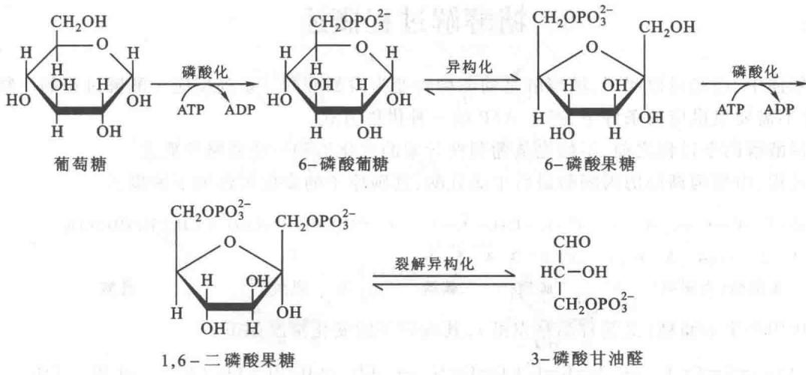

后 5 步为产生 ATP 的贮能阶段。磷酸三碳糖转变成丙酮酸。每分子三碳糖产生 2 分子 ATP。整个过程需要 10 种酶。这些酶都存在于胞质溶胶中，大部分过程都有 $Mg^{2+}$ 离子作为辅助因子。

## 三、糖酵解和酒精发酵的全过程图解

前面已经提到,酵解和酒精发酵基本路线完全相同,只是在形成丙酮酸以后才有差异。丙酮酸转化为乳酸时称为酵解;丙酮酸转化为乙醛、乙醇时,称为发酵。图17-1列出酵解和发酵化学过程的总貌。关于每步化学反应的机制,将在下一节中详细讨论。

## 四、糖酵解第一阶段的反应机制

前面已经提到糖酵解的第一阶段是酵解的准备阶段,包括5步反应,以下逐步进行讨论。

  
图17-1 糖酵解和发酵的全过程

注：图中P代表磷酰基（磷酸基团），Pi代表无机磷酸，括号内数字代表催化相应反应的酶如下：①己糖激酶（hexokinase）或葡糖激酶（glucokinase）；②磷酸己糖异构酶（phosphohexose isomerase）；③磷酸果糖激酶-1（phosphofructokinase 1, PFK1）；④醛缩酶（aldolase）；⑤磷酸丙糖异构酶（triose phosphate isomerase）；⑥磷酸甘油醛脱氢酶（glyceraldehyde phosphate dehydrogenase）；⑦磷酸甘油酸激酶（phosphoglycerate kinase）；⑧磷酸甘油酸变位酶（phosphoglycerate mutase）；⑨烯醇化酶（enolase）；⑩丙酮酸激酶（pyruvate kinase）；⑪非酶促反应；⑫乳酸脱氢酶（lactate dehydrogenase）；⑬丙酮酸脱羧酶（pyruvate decarboxylase）；⑭乙醇脱氢酶（alcohol dehydrogenase）

## （一）葡萄糖的磷酸化

葡萄糖发生酵解作用的第一步是 D-葡萄糖分子在第 6 位的磷酸化,形成 6-磷酸葡糖(glucose-6-phosphate),可简写为 G6P。这是一个磷酸基团转移的反应,即 ATP 的 $\gamma$ -磷酸基团在己糖激酶(hexokinase)的催化下,转移到葡萄糖分子上。这个反应必须有 $Mg^{2+}$ 的存在。反应式如下:

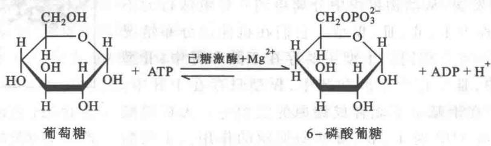

葡萄糖与 ATP 的反应机制如下：

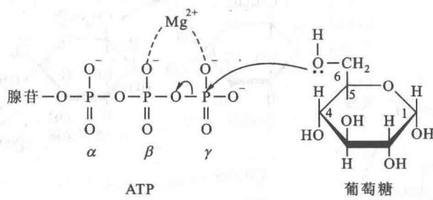

上图表明,葡萄糖第6位碳原子上的羟基[可用C(6)-OH或C6-OH表示]氧原子上有一孤电子对,它向 $Mg^{2+}-ATP$ 的γ-磷原子进攻,γ-磷原子所以具有亲电子性质,主要是由于2价 $Mg^{2+}$ 的作用。 $Mg^{2+}$ 如图所示,吸引了ATP磷酸基团上2个O(氧)的负电荷,使γ-磷原子更易接受孤电子对的亲核进攻,其结果促使γ-磷原子与β-磷原子之间氧桥所共有的电子对向氧原子一方转移,于是ATP的γ-磷酸基团与氧桥断键并与葡萄糖分子结合成6-磷酸葡糖。

磷酸基团从 ATP 分子转移到葡萄糖分子上的反应其标准自由能变化是 $\Delta G^{\ominus'}$ (ATP 酸酐键的水解) = -7.3 kcal/mol (-30.54 kJ/mol)。6-磷酸葡糖的磷酸酯水解时标准自由能变化是 $\Delta G^{\ominus'} = -13.81$ kJ/mol (-3.3 kcal/mol)。由于能量的损失，使葡萄糖形成 6-磷酸葡糖的反应基本上是不可逆的。这一反应保证了进入细胞的葡萄糖可立即被转化为磷酸化形式。不但为葡萄糖随后的裂解活化了葡萄糖分子，还保证了葡萄糖分子一旦进入细胞就有效地被捕获，不会再透出胞外。

催化葡萄糖形成6-磷酸葡糖反应的酶称为己糖激酶，因为它所催化的底物不只限于D-葡萄糖，对其他六碳糖如D-甘露糖（D-mannose）、D-果糖（D-fructose）、氨基葡萄糖（aminoglucose）都有催化作用，字头“hexo”即表示不专一的“六碳糖”。激酶是能够在ATP和任何一种底物之间起催化作用，转移磷酸基团的一类酶。六碳糖激酶存在于所有细胞内。

参与上述反应的 ATP, 必须与 $Mg^{2+}$ 形成 $Mg^{2+}-ATP$ 复合物 ( $Mg^{2+}-ATP$ complex)。未形成复合物的 ATP 分子, 对己糖激酶反而有强的竞争性抑制作用。 $Mg^{2+}$ 屏蔽了 ATP 磷酸基团的负电荷, 使 $\gamma-$ 磷原子更容易接受来自于葡萄糖 C6 位 -OH 上孤电子对的亲核进攻。由图 17-2 可看出, 在未与葡萄糖结合之前, U 形的己糖激酶分子分成大小不等的两个亚基, 处于非活性状态。当与葡萄糖和 $Mg^{2+}-ATP$ 结合后, 诱导

酶分子构象发生变化,符合诱导契合的理论,即两个亚基相互靠近,恰好使 ATP 分子和葡萄糖 C6 位-OH 靠拢,同时阻断溶剂中水分子进入活性位点水解 ATP。

己糖激酶是一种调节酶。它催化的反应产物6-磷酸葡糖和ADP能使该酶受到变构抑制。但葡糖激酶却不受6-磷酸葡糖的抑制。它对葡萄糖的米氏常数 $K_{m}(5\sim10\ \text{mmol/L})$ 比己糖激酶的 $K_{m}$ 值(0.1 mmol/L)大得多。因此当葡糖浓度相当高时，葡糖激酶才起作用。当血液中和肝细胞内游离葡萄糖的浓度增高时，它催化葡萄糖形成6-磷酸葡糖，该物质是葡萄糖合成糖原的中间物，由肝合成糖原。

随着电泳技术的发展,从动物组织中分离得到4种电泳行为不同的己糖激酶,分别称为Ⅰ、Ⅱ、Ⅲ、Ⅳ型。它们在机体的分布情况不同,催化的性质也不完全相同。Ⅰ型主要存在于脑和肾中,Ⅱ型存在于骨骼和心肌中,Ⅲ型存在于肝和肺中,Ⅳ型只存在于肝中。Ⅰ、Ⅱ、Ⅲ型酶大都存在于基本不能合成糖原的组织中。无机磷酸有解除6-磷酸葡糖和ADP对Ⅰ、Ⅱ、Ⅲ型酶抑制的作用。Ⅰ型酶对无机磷酸最为敏感。这和脑细胞需要保持一定的酵解速度以维持能量的需要有关，只要有少量的无机磷酸存在，就能解除6-磷酸葡糖的抑制作用，使酵解中间物维持在一定水平。Ⅱ型酶由于对无机磷酸远不及Ⅰ型敏感，当肌肉处于静息状态时，并不要求高的酵解速度，而是受6-磷酸葡糖的抑制，使酵解速度保持低的水平。此外，Ⅰ型酶还可由柠檬酸激活。Ⅳ型酶（葡糖激酶）在动力学性质和调节性质方面与其他形式的己糖激酶不同，对葡萄糖有更高的特异性，它的合成受胰岛素(insulin)的诱导，使肝中的酶Ⅳ维持在较高的水平。当肝细胞损伤或患糖尿病时，此酶的合成速度降低，不仅糖的合成受阻碍，糖的降解也受影响。肝细胞内也有专一性不强的己糖激酶，存在于肝细胞线粒体和细胞溶胶两部分。结合于线粒体上的酶，活性较高。肝细胞内己糖激酶的分布受到某些条件的调节，例如6-磷酸葡糖和无机磷酸等。酶的区域性分布，是机体对酶活性调控的一种方式。

  
图17-2 己糖激酶与底物结合产生“诱导契合”构象变化

## （二）6-磷酸葡糖异构化形成6-磷酸果糖

由 6-磷酸葡糖异构化形成 6-磷酸果糖的反应式如下：

这一反应的标准自由能变化是极其微小的， $\Delta G^{\ominus'} = 1.67 \mathrm{~kJ} / \mathrm{mol}(0.4 \mathrm{kcal} / \mathrm{mol})$ 。因此，这一反应是可逆的。在正常情况下，6-磷酸葡糖和6-磷酸果糖保持或接近平衡状态。在这一反应中葡萄糖C1位上的羰基（成环后的半缩醛基），不像C6位上的羟基那样容易磷酸化，所以下一步反应是使葡萄糖分子发生异构化。这就是葡萄糖的羰基从C1位转移到C2位，使葡萄糖分子由醛式转变成酮式的果糖，其C1位上即形成了自由羟基。6-磷酸葡糖和6-磷酸果糖的存在形式都是以环式为主，而异构化反应需以开链形式进行。

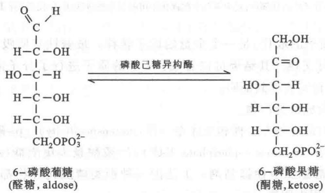

异构化形成的 6-磷酸果糖随后又形成环状结构。

催化这一反应的酶称为磷酸葡糖异构酶(phosphoglucose isomerase)。当前对该酶的催化机制已作出如下的解释：

从实验获得的信息表明,该酶活性部位的催化残基可能为赖氨酸(Lys)和组氨酸(His)。催化反应的实质包括一般的酶促酸-碱催化机制。如图17-3所示。

图 17-3 的第 1 步反应为: 酸性催化开环。图中的 $-B^{+}-H$ 是一例, 可代表酶分子上的 Lys 残基即 $\varepsilon-$ 氨基 $(\varepsilon-NH_{3}^{+})$ 吸引 O-C1 中间的电子对, 于是引起断键, 开环。

第2步反应为:酶分子上的碱,例如 His 的咪唑环,取掉 C2 上的质子(这个质子由于它处在羰基的 $\alpha$ 位,所以具有酸性)形成了 cis-烯二醇,(HO—C=C—OH)的中间体。

  
图17-3 磷酸葡糖异构酶催化的反应机制  
外环表示酶分子的活性部位,其中有两个起催化作用的氢基酸残基: $B^{+}H$ 代表Lys, $\ddot{B}'$ 代表His

第 3 步反应为: C1 上质子的取代, 是一个全盘的质子转移。被碱性基所吸引的质子是很不稳定的。它迅速地与溶剂的质子进行交换。其结果可以看成: C2 上的质子进行了分子内的质子转移, 移到了 C1 位。这个机制曾使用 ${}^{3}$ H 进行实验得到证明。

第 4 步反应为: 关环, 形成最终产物。

磷酸葡糖异构酶有绝对的底物专一性和立体专一性(stereospecificity)。6-磷酸葡糖酸(6-phosphogluconate,6PG)、4-磷酸赤藓糖(erythrose-4-phosphate,E4P)、7-磷酸景天庚酮糖(sedoheptulose-7-phosphate,S7P)等对磷酸葡糖异构酶都是竞争性抑制剂。上述的三种糖类磷酸化合物都是五碳糖磷酸途径(pentosephosphate pathway)的代谢中间物。

## （三）6-磷酸果糖形成1,6-二磷酸果糖

这一步是糖降解或酒精发酵过程中的第二个磷酸化反应。也是糖酵解过程使用第二个 ATP 分子的反应。6-磷酸果糖被 ATP 进一步磷酸化形成 1,6-二磷酸果糖。该化合物的英文名称为 fructose -1,6-bisphosphate，它的旧名称为 fructose -1,6-diphosphate。把“diphosphate”，变为“bisphosphate”的原因：“bisphosphate”表示两个磷酸基团是互相分离的，而“diphosphate”表示两个磷酸基团是相连的。例如腺苷二磷酸的英文名称为“adenosin diphosphate”。腺苷二磷酸中的两个磷酸基团是以酸酐键（anhydride bond）相连的。由 6-磷酸果糖形成 1,6-二磷酸果糖的反应式如下：

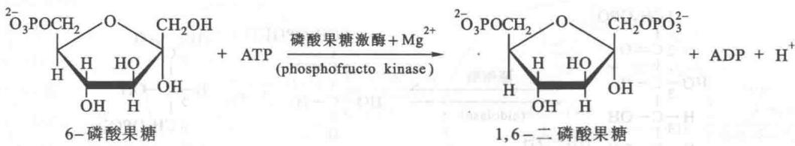

在这一反应中，ATP 酸酐键的水解和 1,6-二磷酸果糖在其碳 1 位上形成磷酯键的两个反应 $\Delta G^{\ominus\prime} = -14.23 \, \text{kJ/mol} (-3.4 \, \text{kcal/mol})$ ，因此该反应是不可逆反应。

催化此反应的酶称为磷酸果糖激酶（phosphofructokinase, PFK）。该酶需要 $Mg^{2+}$ 参加反应，其他 2 价金属离子虽然也有一定作用，但以 $Mg^{2+}$ 的作用最为显著。

该酶的催化机制和己糖激酶催化的反应机制基本一致。可用图 17-4 表示：

  
图17-4 6-磷酸果糖与ATP的结合机制

上图表明,6-磷酸果糖第1个碳原子上的羟基 $\left[\mathrm{C}(1)-\mathrm{OH}\right]$ 氧原子的孤电子对向 $Mg^{2+}-ATP$ 的 $\gamma-$ 磷原子进行亲核进攻,导致 $\gamma-$ 磷原子与 $\beta-$ 磷原子之间氧桥的共用电子对向氧原子转移,从而断键,于是6-磷酸果糖与 $\gamma-$ 磷酸基团结合而形成1,6-二磷酸果糖。

磷酸果糖激酶是一种变构酶(allosteric enzyme)。它的催化效率很低,糖酵解的速率严格地依赖该酶的活力水平。它是哺乳动物糖酵解途径最重要的调控关键酶,该酶由4个亚基组成,是一个四聚体(tetramer)。由肝提取的酶相对分子质量为340 000。该酶的活性受到许多因素的控制。例如,肝中的磷酸果糖激酶受高浓度ATP的抑制。ATP可降低该酶对6-磷酸果糖的亲和力。ATP对该酶的变构效应是由于ATP结合到酶的一个特殊的调控部位上,调节部位不同于催化部位。但是ATP对该酶的这种变构抑制效应可被AMP解除。因此ATP/AMP的比例关系对此酶也有明显的调节作用。特别是 $H^{+}$ 浓度对该酶活性的影响。当pH下降时, $H^{+}$ 对该酶有抑制作用。在生物体内这种抑制作用具有重要的生物学意义。因为通过它可以阻止整个酵解途径的继续进行,从而防止乳酸的继续形成;这又可防止血液pH的下降,有利于避免酸中毒(acidosis)。

从兔分离得到的磷酸果糖激酶,发现有三种同工酶,分别称为磷酸果糖激酶 A、B、C。同工酶 A 存在于心肌和骨骼中,同工酶 B 存在于肝和红细胞中,同工酶 C 存在于脑中。这三种同工酶对影响酶活力的不同因素反应各异。例如,A 型对磷酸肌酸(phosphocreatine)、柠檬酸和无机磷酸的抑制作用最敏感,B 型对 2,3-二磷酸甘油酸(2,3-bisphosphoglycerate,BPG)的抑制作用最敏感,C 型对腺嘌呤核苷酸的作用最敏感。

通过上述的三个步骤,从葡糖磷酸化开始到形成1,6-二磷酸果糖,可以说为下一步的分子裂解完成了条件准备。

## （四）1,6-二磷酸果糖转变为3-磷酸甘油醛和磷酸二羟丙酮

这是一个由六碳糖——1,6-二磷酸果糖裂解为两个三碳糖的反应过程。1,6-二磷酸果糖在醛缩酶（aldolase）的作用下发生裂解反应生成一分子磷酸二羟丙酮（dihydroxyacetone phosphate）和一分子3-磷酸甘油醛（glyceraldehyde-3-phosphate）：

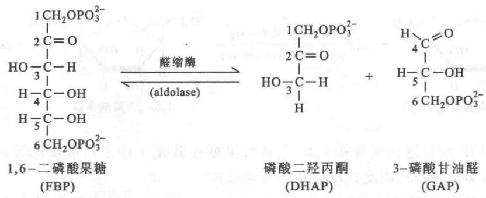

上述反应的机制请参看第19章。前面已经提到，醛缩酶的名称来自于该酶所催化的逆反应。由1,6-二磷酸果糖裂解为磷酸二羟丙酮和3-磷酸甘油醛的 $\Delta G^{\ominus'} = 23.97\mathrm{kJ / mol(+5.73kcal / mol)}$ 。可以理解，在标准状况下，这一反应是向缩合的方向，即自右向左进行。但在细胞内的条件下，该反应却是很容易地自左向右进行，即向裂解的方向进行。如果细胞内产生的1,6-二磷酸果糖的浓度为 $0.1\mathrm{mmol / L}$ ，根据计算有 $53.9\%$ 即被醛缩酶所裂解。

醛缩酶有两种不同的类型。高等动、植物中的醛缩酶称为Ⅰ型，从肌肉中分离出来的醛缩酶相对分子质量为160 000，含有4个亚基。分子内有数个游离的一SH基。游离的一SH基是酶催化活性所必需的。醛缩酶Ⅰ型又有三种同工酶。分别称为醛缩酶A、B、C。醛缩酶A主要存在于肌肉中，醛缩酶B主要存在于肝脏，醛缩酶C主要存在于脑组织。这三种醛缩酶都由氨基酸组分不同的四个多肽链构成。

第Ⅱ种类型的醛缩酶主要存在于细菌、酵母、真菌以及藻类中。它和第Ⅰ种类型的区别在于，含有2价金属离子。通常是 $Zn^{2+}$ 、 $Ca^{2+}$ 或 $Fe^{2+}$ ，也需要 $K^{+}$ 。它的相对分子质量约为65000，只相当于动、植物中醛缩酶的一半左右。它的催化机制也和Ⅰ型不同。下面重点讨论醛缩酶Ⅰ型的催化步骤。

该酶的催化步骤可分为5步,如图17-5所示。

图 17-5 表明,醛缩酶类型 I (class I) 的第 1 步反应是酶和底物的结合。第 2 步反应是 1,6-二磷酸果糖的羰基与酶活性部位赖氨酸的 ε-氨基发生反应,形成一个亚胺阳离子,即质子化的西佛碱。第 3 步反应 C3 和 C4 发生醇醛断裂形成酶的烯胺 (enamine) 中间体并释放出 3-磷酸甘油醛 (GAP)。亚胺离子比前体羰基的氧原子更容易拉电子,因此 C3 和 C4 间的共价键电子对也被吸引,促使醇醛断裂的催化反应发生。第 4 步是西佛氏碱的烯胺发生互变异构,形成了亚胺阳离子。第 5 步是亚胺水解放出磷酸二羟丙酮后,又形成了游离的酶。

酶分子活性部位的半胱氨酸和组氨酸残基在酶的催化反应中,相当酸和碱的作用。它们有增强质子转移的作用。

## （五）磷酸二羟丙酮转变为3-磷酸甘油醛

1,6-二磷酸果糖裂解后形成的两分子三碳糖磷酸中，只有3-磷酸甘油醛能继续进入糖酵解途径，磷酸二羟丙酮必须转变为3-磷酸甘油醛才能进入糖酵解途径。磷酸丙糖异构酶(triose phosphate isomerase)正是担负这一转变的酶(图17-6)。在该酶催化下，磷酸二羟丙酮和3-磷酸甘油醛可以互变，它们之间正是醛酮化合物的互变异构关系，正像6-磷酸葡糖和6-磷酸果糖的互变所以可能实现，是因为它们通过一个共同中间体即顺式-单烯二羟负离子中间体(cis-enediolate intermediate)(参看第19章代谢中的有机反应机制)

在探讨葡萄糖分子的碳原子和2分子3-磷酸甘油醛碳原子之间的关系中发现,葡萄糖分子的第3、4位碳原子形成了2分子3-磷酸甘油醛的醛基碳原子,葡萄糖分子的第1、6位碳原子形成了3-磷酸甘油醛分子上的第3位碳原子。

磷酸二羟丙酮和3-磷酸甘油醛的互变异构关系如图17-7所示。

  
图 17-5 醛缩酶类的反应机制  
图中圆圈代表酶的活性部位，圈内赖氨酸（Lys）、组氨酸（His）和半胱氨酸（Cys）三个残基直接参与酶的催化反应

  
图17-6 磷酸丙糖异构酶的结构图  
8 股 $\beta$ 折叠链构成中间的中心核, 8 股 $\alpha$ 螺旋链与 $\beta$ 折叠链相对应环绕在外 $\beta$ 折叠链周围, 两种不同型式的链条以无规肽链相连

  
图17-7 磷酸二羟丙酮和3-磷酸甘油醛的互变异构关系

实验证明,磷酸丙糖异构酶的活性部位是以谷氨酸(Glu)残基的游离羧基与底物相结合。

磷酸丙糖异构酶的催化反应是极其迅速的，只要酶与底物分子一旦相互碰撞，反应就即刻完成。因此，任何加速磷酸丙糖异构酶催化效率的措施都不能再提高它的反应速度。又由于磷酸二羟丙酮和3-磷酸甘油醛互变异构极其迅速，因此这两种物质总是维持在反应的平衡状态。磷酸二羟丙酮3-磷酸到甘油醛的 $\Delta G^{\ominus} = 7.7\mathrm{kJ / mol(+1.83kcal / mol)}$ ；在平衡点时， $K = [3 -$ 磷酸甘油醛]/[磷酸二羟丙酮] $= 4.73\times$ $10^{-2}$ 。由此可见，磷酸二羟丙酮的浓度在平衡点远远超过3-磷酸甘油醛的浓度。但3-磷酸甘油醛不断在糖酵解途径中被消耗，所以磷酸二羟丙酮也就不断地转变为3-磷酸甘油醛。

磷酸丙糖异构酶的相对分子质量为 56 000, 它是由 8 股平行的 β 折叠链环抱构成一个中心核。在 β 折叠链周围环绕着与每条折叠相对应的 α 螺旋链, 折叠链与 α 螺旋链之间以无规则的卷曲肽链相连接。如图 17-6 所示。

## 五、酵解第二阶段——放能阶段的反应机制

从前述的5步反应完成了糖酵解的准备阶段。酵解的准备阶段包括两个磷酸化步骤由六碳糖裂解为两分子三碳糖，最后都转变为3-磷酸甘油醛。在准备阶段中，并没有从中获得任何能量，与此相反，却消耗了两个ATP分子。以下的5步反应包括氧化还原反应、磷酸化反应。这些反应正是从3-磷酸甘油醛提取能量形成ATP分子的过程。

## (一) 3-磷酸甘油醛氧化成 1,3-二磷酸甘油酸

这是糖酵解过程中的第6步反应,也是一步重要的反应。因为在3-磷酸甘油醛的醛基氧化为羧基时,将氧化过程产生的能量贮存到ATP的分子中。

3-磷酸甘油醛的氧化和磷酸化是在3-磷酸甘油醛脱氢酶(glyceraldehyde-3-phosphate dehydrogenase, GAPDH)的催化下将3-磷酸甘油醛氧化为1,3-二磷酸甘油酸(1,3-bisphosphoglycerate,1,3-BPG),NAD $^{+}$ 和无机磷酸(Pi)参与该反应。在此反应中,醛基脱氢并不形成自由的羧基,而是和磷酸形成羧酸酐,这种酐称为酰基磷酸(acylphosphate),是具有高能磷酸基团转移势能的化合物。

3-磷酸甘油醛的氧化是放能反应,然而,磷酸酐键的形成是非常吸能的反应,两反应相偶联后的 $\Delta G^{\ominus'}=+6.28\ kJ/mol(+1.5\ kcal/mol)$ 。这表明,在标准状况下,整个反应是稍吸能的。但是下一步反应又是一个放能反应,这就使该反应可以顺利地进行。

## 1. 3-磷酸甘油醛脱氢酶的催化机制

3-磷酸甘油醛脱氢酶的反应机制可用图17-8表示。该酶的活性部位含有一个带游离巯基（一SH）的半胱氨酸。巯基是亲核体，它以解离形式向作为底物的醛分子中带电正性的羰基碳原子进攻，从而形成一个与酶分子结合着的半缩硫醛（hemithioacetal），这时醛分子上与原来羰基相连的氢原子就以氢负离子（ $\mathrm{:H^{-}}$ ）的形式离开羰基碳原子，也就是离开半缩硫醛，于是形成了还原的NADH和硫酯。同时释放出一个 $\mathrm{H^{+}}$ 。NADH一旦形成就立即从酶分子上解离下来，而氧化型的 $\mathrm{NAD^{+}}$ 又立即结合到酶分子上。随后磷酸分子又向硫酯进行亲核攻击，形成1,3-二磷酸甘油酸和游离的酶。和酶结合的硫酯是一种高能中间产物；1,3-二磷酸甘油酸也是一种高能磷酸酯。以上的反应机制可用图17-8所示。

从兔肌肉分离出的结晶酶其相对分子质量为 14 000, 含有 4 个相同的亚基。每个亚基由 330 个氨基酸残基组成。重金属离子和烷化剂如碘乙酸能抑制酶的活性。这成为推测酶的活性部位是否有巯基的有力证据。

  
图17-8 3-磷酸甘油醛脱氢酶的反应机制

①—S—H 的 H 为酸性（即荷正电），酶分子上的 B 的孤电子对向 H 进攻。②—S—H 形成—S：向醛分子的羰基 C 进攻形成半缩硫醛中间产物。③ 醛分子与原羰基相连的 H 原子以： $H^{-}$ 形式脱离，而与氧化型的 $NAD^{+}$ 结合形成 NADH 及硫酯。④ 被还原的 NADH 立即脱离酶分子，同时酶又结合上另一氧化型 $NAD^{+}$ 。⑤ 磷酸分子向硫酯进行亲核攻击，使硫酯键断键形成游离的 1,3-二磷酸甘油酸，同时酶又恢复原状

## 2. 砷酸盐 (arsenate) 破坏 1,3-二磷酸甘油酸的形成

砷酸盐 $\left(\mathrm{AsO}_{4}^{3-}\right)$ 在结构和反应方面都和无机磷酸极为相似,因此,能代替磷酸进攻硫酯中间产物的高能键,产生1-砷酸-3-磷酸甘油酸(1-arseno-3-phosphoglycerate)。其结构式如下:

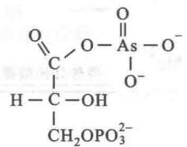  
1-砷酸-3-磷酸甘油酸
(1-arseno-3-phosphoglcerate)

砷酸化合物是很不稳定的化合物。它迅速地进行水解。其结果是:砷酸盐代替磷酸与3-磷酸甘油醛结合并氧化,生成的不是1,3-二磷酸甘油酸,而是3-磷酸甘油酸反应式如下:

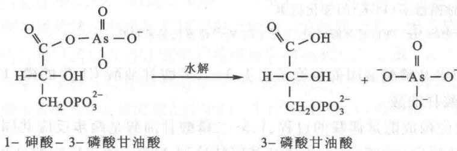

在砷酸盐存在下,虽然酵解过程照样进行,但是却没有形成高能磷酸键。由3-磷酸甘油醛氧化释放的能量,未能与磷酸化作用相偶联而被贮存。因此砷酸盐起着解偶联的作用,即解除了氧化和磷酸化的偶联作用。

从以上事实得到的启发是,在生物分子的进化中,为什么选择了具有较大动力学稳定性的磷酸基团作

为递能基团，而不是砷酸。

## （二）1,3-二磷酸甘油酸转移高能磷酸基团形成 ATP

这一步反应是糖酵解过程的第7步反应,也是糖酵解过程开始收获的阶段。在此过程中产生了第一个ATP。

Warburg 等人证明, 1,3-二磷酸甘油酸 (1,3-bisphosphoglycerate, 1,3-BPG) 在磷酸甘油酸激酶 (phosphoglycerate kinase, PGK) 的催化下, 将其以高能酸酐键连接在碳 1 位 [C(1)] 上的高能磷酸基团转移到 ADP 分子上形成 ATP 分子。1,3-二磷酸甘油酸则转变为 3-磷酸甘油酸 (3-phosphoglycerate, 3-PG):

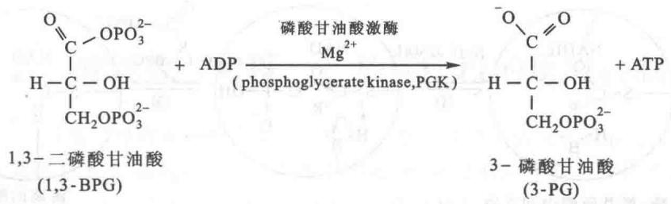

该反应的 $\Delta G^{\ominus'} = -18.83 \, \text{kJ/mol} (-4.50 \, \text{kcal/mol})$ ，是一个高效地放能反应，因此起到推动前一步反应顺利进行的作用。

磷酸甘油酸激酶分子的外观和己糖激酶极其相似。都由两叶构成，很像钳子，中间有很深的裂缝。活性部位在裂缝的底部。 $Mg^{2+}-ADP$ 结合位点在酶的一个结构域中。1,3-二磷酸甘油酸的结合部位在另一个结构域中，二者相距大约1 nm。当酶与底物结合后，酶的两个结构域合拢，使底物得以在无水的环境中发生反应。这种情况和己糖激酶的作用机制也非常相似。但它们的蛋白质组成却是完全不同的。磷酸甘油酸激酶(PGK)的催化机制可用图17-9表示。

  
图 17-9 磷酸甘油酸激酶(PGK)的催化机制  
在 ADP 和 ATP 分子中的 $Mg^{2+}$ 的位置是假设的, 实际上的 $Mg^{2+}$ 位置仍是未知的

由图 17-9 可见, ADP β 磷酸基团的氧原子向 1,3-二磷酸甘油酸 C1 位的磷(P)原子进行亲核攻击, 从而生成 ATP 和 3-磷酸甘油酸。

第 6 步和第 7 步反应构成能量偶联的过程,1,3-二磷酸甘油酸是两步反应共同的中间产物:它在第 6 步反应中形成,在第 7 步反应(放能反应)中磷酸基团转移到 ADP。两步反应的总和是:

$$
1, 3 - \text {   二磷酸甘油酸   } + \mathrm{ADP} + \mathrm{Pi} + \mathrm{NAD} ^ {+} \longrightarrow 3 - \text {   磷酸甘油酸   } + \mathrm{ATP} + \mathrm{NADH} + \mathrm{H} ^ {+}
$$

总反应的 $\Delta G^{\ominus'} = -12.5 \, kJ/mol$ ，是一个放能反应。细胞内实际自由能变化 $\Delta G$ 是由标准自由能变化 $\Delta G^{\ominus'}$ 和质量作用比（Q）决定的。对于第6步反应：

$$
\begin{array}{r l} \Delta G & = \Delta G ^ {\ominus \prime} + R T \mathrm{In} Q \\ & = \Delta G ^ {\ominus \prime} + R T \mathrm{In} \frac {[ 1 , 3 - \text {二磷酸甘油酸} ] [ \mathrm{NADH} ]}{[ 1 , 3 - \text {二磷酸甘油酸} ] [ \mathrm{Pi} ] [ \mathrm{NAD} ^ {+} ]} \end{array}
$$

请注意 $\left[\mathrm{H}^{+}\right]$ 不包含在Q中。在生物研究中， $\left[\mathrm{H}^{+}\right]$ 假定为常数 $(10^{-7}\mathrm{mol / L})$ ， $\Delta G^{\prime}$ 的定义中也包括此常数。步骤7消耗步骤6产生的1,3-二磷酸甘油酸，降低[1,3-二磷酸甘油酸]，从而减少整个能量偶联过程的Q值。当Q值小于1.0时，自然对数为负值。如果Q很小，对数值可以是 $\Delta G$ 变为负值。这一偶联反应在细胞内是可逆的，其结果是在醛基氧化为羧基时释放的能量可以通过ADP形成ATP的偶联反应而贮存。磷酸基团从底物如1,3-二磷酸甘油酸转移到ADP形成ATP，这被称为底物水平磷酸化（substrate-level phosphorylation）。

## （三）3-磷酸甘油酸转变为2-磷酸甘油酸

这一反应是糖酵解过程的第8步反应,该反应是由磷酸甘油酸变位酶(phosphoglycerate mutase)催化, $\Delta G^{\ominus'}=4.6\ kJ/mol$ 的。通常将催化分子内化学基团移位的酶称为变位酶(mutase)。由3-磷酸甘油酸转变为2-磷酸甘油酸是为酵解过程的下一步骤准备条件。

磷酸甘油酸变位酶的活性部位结合有一个磷酸基团。当3-磷酸甘油酸作为酶的底物结合到酶的活性部位后，原来结合在酶活性部位的那个磷酸基团便立即转移到底物分子上，形成一个与酶结合的二磷酸的中间产物，2,3-二磷酸甘油酸（2,3-bisphosphoglycerate,2,3-BPG），这个中间产物又立即使酶分子的活性部位再磷酸化，同时产生游离的2-磷酸甘油酸。

对上述反应机制的解释曾有以下的实验根据。

（1）磷酸甘油酸变位酶的催化机制需有2,3-二磷酸甘油酸作为引物，或者说是必需因素。

（2）将极少量用 $^{32}$ P标记的2,3-二磷酸甘油酸与酶一起保温发现，具有放射性的磷酸基团标记到酶的组氨酸残基上。

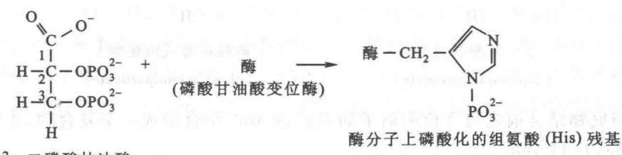

（3）用 X 射线观察酶的结构发现，在酶的活性部位 His8（第 8 位的组氨酸残基）上有放射性磷标记的磷酸基团。

上面的实验还有力地证明了与磷酸基团结合的残基是酶活性部位中第8位的组氨酸。

这里应该提及的是,上述的2,3-二磷酸甘油酸(2,3-BPG)不只在磷酸甘油酸变位酶的催化过程中起着重要的作用,在红细胞对氧的转运中还起着调节剂的作用。它使脱氧血红蛋白稳定化,从而降低血红蛋白对氧的亲和力。没有它,血红蛋白在通过组织的毛细血管时就很难脱下氧。2,3-二磷酸甘油酸在红细胞中的浓度极高,大约与血红蛋白具有相同的浓度,在其他的细胞中则只存在微量。

2,3-二磷酸甘油酸的合成和降解是糖酵解途径中的一个短支路(short detour)。全部反应可用下式表示：

上述的两步反应几乎都是不可逆的。此外，2,3-二磷酸甘油酸是二磷酸甘油酸变位酶（bisphosphoglycerate mutase）强有力的竞争性抑制剂。2,3-二磷酸甘油酸的浓度不只决定于二磷酸甘油酸变位酶的活力，还决定于2,3-二磷酸甘油酸磷酸酶(2,3-bisphosphoglycerate phosphatase)的活力。一般将催化磷酸酯水解的酶总称为磷酸酶(phosphatase)。

催化 1,3-二磷酸甘油酸转变为 2,3-二磷酸甘油酸的二磷酸甘油酸变位酶的作用机制已了解得很清楚。该变位酶先同时结合 1,3-二磷酸甘油酸和 3-磷酸甘油酸，然后磷酸基团从 1,3-二磷酸甘油酸的 C1 上移位到 3-磷酸甘油酸的 C2 上。从化学计算上看不到 3-磷酸甘油酸的出现，但它却是磷酸基团转移的重要参加者，磷酸基团的转移情况可用图 17-10 表示。

  
1,3-二磷酸甘油酸 3-磷酸甘油酸 3-磷酸甘油酸 2,3-二磷酸甘油酸  
图 17-10 二磷酸甘油酸变位酶催化的磷酸基团转移反应

P、P、P代表不同碳原子上的磷酸基因，从不同的图形可看到磷酸基团转移的来龙去脉

## （四）2-磷酸甘油酸脱水生成磷酸烯醇式丙酮酸

这是酵解过程的第9步反应。这一反应是烯醇化酶(enolase)催化的。

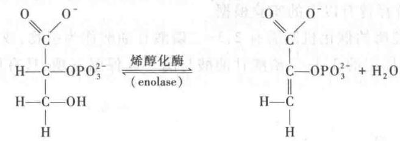

烯醇化酶在与底物结合前先与2价阳离子如 $Mg^{2+}$ 或 $Mn^{2+}$ 结合形成一个复合物，才有活性。烯醇化酶的催化作用可用图17-11表示。

  
图17-11 烯醇化酶可能的反应机制

反应1:酶分子碱性残基用B:表示它的孤对电子吸引2-磷酸甘油酸C2上的H原子,使C2成为负碳离子,从而形成负碳离子中间物。反应2:2-磷酸甘油酸C(3)上的-OH基团离开负碳离子中间物,从而形成磷酸烯醇式丙酮酸和一分子水

烯醇化酶分子活性部位碱性残基上的孤电子对吸引2-磷酸甘油酸第2碳原子上的氢原子。形成负碳离子中间产物，于是2-磷酸甘油酸第3碳原子上的-OH基团即离开负碳离子中间产物，形成磷酸烯醇式丙酮酸。在上述的两步反应中，2-磷酸甘油酸第2位碳原子被孤电子对吸引的质子能极迅速地与溶剂中的质子相互交换。而且2-磷酸甘油酸负碳离子中间产物第3碳原子上—OH基团的消除是比较缓慢的。因此—OH 的消除速度是 2-磷酸甘油酸脱水形成磷酸烯醇式丙酮酸的限速步骤。用 $^{18}$ O 标记—OH 基团曾证明，放射性氧(O)从中间产物消除的速度和放射性 O 与溶剂互相交换的速度是相同的。

尽管该反应的标准自由能( $\triangle G^{\ominus'}=-7.6\ kJ/mol$ )变化相对较小,但是反应物和产物水解释放磷酰基团产生的标准自由能变化差别很大:2-磷酸甘油酸(低能磷酸酯)水解的标准自由能 $\triangle G^{\ominus'}$ 为-17.6 kJ/mol,磷酸烯醇式丙酮酸(高能磷酸酯)水解的标准自由能 $\triangle G^{\ominus'}=-61.9\ kJ/mol$ 。2-磷酸甘油酸失去一分子水使得分子内能量重新排布,从而导致磷酸酯水解的标准自由能增加。

烯醇化酶的相对分子质量为 85 000。氟化物是该酶强烈的抑制剂。其原因是，氟与镁和无机磷酸形成一个复合物，取代天然情况下酶分子上镁离子的位置，从而使酶失活。

## (五) 磷酸烯醇式丙酮酸转变为丙酮酸并产生一个 ATP 分子

这是糖酵解过程的第 10 步反应。是由葡萄糖形成丙酮酸的最后一步反应。催化此反应的酶称为丙酮酸激酶(pyruvate kinase)。反应式如下：

烯醇磷酸酯具有高的基团转移势能。磷酸基团由磷酸烯醇式丙酮酸转移到ADP上同时形成丙酮酸， $\Delta G^{\ominus \prime} = -31.38\mathrm{kJ / mol}$ ，是一个不可逆、高放能的反应。这是因为磷酸烯醇式丙酮酸水解的 $\Delta G^{\ominus \prime} = -61.9\mathrm{kJ}/$ mol，大约一半的能量以ATP（ $\Delta G^{\ominus \prime} = -30.5\mathrm{kJ / mol}$ ）形式贮存起来，剩余的能量用于推动ATP合成。

丙酮酸激酶的催化活性需要2价阳离子参与，如 $\mathrm{Mg}^{2+}$ 和 $\mathrm{Mn}^{2+}$ 。它是糖酵解途径中的一个重要变构调节酶(regulatory enzyme)。ATP、长链脂肪酸、乙酰-CoA、丙氨酸都对该酶有抑制作用；而1,6-二磷酸果糖和磷酸烯醇式丙酮酸对该酶都有激活作用。丙酮酸激酶的相对分子质量为250000，由四个相对分子质量为55000的亚基构成四聚体。该酶至少有三种不同类型的同工酶。在肝中占优势的称为L型。肌肉和脑中占优势的称为M型，其他组织中的称为A型。这些同工酶结构相似，但调控机制不同。

## 六、由葡萄糖转变为两分子丙酮酸能量转变的估算

由葡萄糖分解为两分子丙酮酸包括能量的产生可用下面的总反应式表示：

$$
\mathrm{葡萄糖} + 2 \mathrm{Pi} + 2 \mathrm{ADP} + 2 \mathrm{NAD} ^ {+} \rightarrow 2 \mathrm{丙酮酸} + 2 \mathrm{ATP} + 2 \mathrm{NADH} + 2 \mathrm{H} ^ {+} + 2 \mathrm{H} _ {2} \mathrm{O}
$$

从反应式中可一目了然,从一分子葡萄糖的降解到形成2分子丙酮酸的过程,净产生2分子ATP。在酵解过程中,ATP的消耗和产生可用表17-1作一概括;其每步反应的标准自由能和自由能的变化如表17-2所示。

表 17-1 酵解过程中 ATP 的消耗和产生

<table><tr><td>消耗或产生 ATP 的反应</td><td>每分子 ATP 葡萄糖 ATP 变化的分子数</td></tr><tr><td>葡萄糖→6-磷酸葡糖</td><td>-1</td></tr><tr><td>6-磷酸果糖→1,6-二磷酸果糖</td><td>-1</td></tr><tr><td>2×1,3-二磷酸甘油酸→2×3-磷酸甘油酸</td><td>+2</td></tr><tr><td>2×磷酸烯醇式丙酮酸→2×丙酮酸</td><td>+2</td></tr><tr><td>总计</td><td>+2</td></tr></table>

注：负号（-）代表消耗，正号代表产生。

表 17-2 糖酵解过程中各步反应的能量变化

<table><tr><td>反应内容</td><td>酶</td><td> $\Delta {G}^{\ominus }$  kcal(kJ)/mol</td><td> $\Delta G$  kcal(kJ)/mol</td></tr><tr><td>1.葡萄糖+ATP→6-磷酸葡糖+ADP+H+</td><td>己糖激酶</td><td>-0.4(-16.74)</td><td>-8.0(-33.47)</td></tr><tr><td>2.6-磷酸葡糖→6-磷酸果糖</td><td>磷酸己糖异构酶</td><td>+0.4(+1.67)</td><td>-0.6(-2.51)</td></tr><tr><td>3.6-磷酸果糖+ATP→1,6-二磷酸果糖+ADP+H+</td><td>磷酸果糖激酶-1</td><td>-3.4(-14.23)</td><td>-5.3(-22.18)</td></tr><tr><td>4.1,6-二磷酸果糖→磷酸二羟丙酮+3-磷酸甘油醛</td><td>醛缩酶</td><td>+5.7(+23.85)</td><td>-0.3(-1.25)</td></tr><tr><td>5.磷酸二羟丙酮→3-磷酸甘油醛</td><td>磷酸己糖异构酶</td><td>+1.8(+7.53)</td><td>+0.6(+2.51)</td></tr><tr><td>6.3-磷酸甘油醛+Pi+NAD+→1,3-二磷酸甘油酸+NADH +H+</td><td>磷酸甘油醛脱氢酶</td><td>+1.5(+6.28)</td><td>-0.4(-1.67)</td></tr><tr><td>7.1,3-二磷酸甘油酸+ADP→3-磷酸甘油酸+ATP</td><td>磷酸甘油酸激酶</td><td>-4.5(-18.83)</td><td>+0.3(+1.26)</td></tr><tr><td>8.3-磷酸甘油酸→2-磷酸甘油酸</td><td>磷酸甘油酸变位酶</td><td>+1.1(+4.60)</td><td>+0.2(+0.84)</td></tr><tr><td>9.2-磷酸甘油酸→磷酸烯醇式丙酮酸+H2O</td><td>烯醇化酶</td><td>+0.4(+1.67)</td><td>-0.8(-3.35)</td></tr><tr><td>10.磷酸烯醇式丙酮酸+ADP+H+→丙酮酸+ATP</td><td>丙酮酸激酶</td><td>-7.5(-31.38)</td><td>-4.0(-16.74)</td></tr></table>

注：上表中 $\Delta G^{\ominus}$ 和 $\Delta G$ 用 kcal/mol 和 kJ/mol 单位表示。实际的自由能变化 $\Delta G$ 是在正常生理条件下测得的反应物浓度和标准自由能 $\Delta G^{\ominus}$ 的数据计算所得

上表所示糖酵解各步反应的实际自由能变化,有三项其 $\Delta G$ 为正值。其中包括:磷酸丙糖变位酶催化的磷酸二羟丙酮转变为 3-磷酸甘油醛,磷酸甘油酸激酶催化的由 1,3-二磷酸甘油酸和 ADP 形成 3-磷酸甘油酸和 ATP,由磷酸甘油酸变位酶催化的 3-磷酸甘油酸转变为 2-磷酸甘油酸的反应。根据热力学原理,糖酵解过程只有在全部反应的值都为负值时才能进行。这些小的正值表明,细胞内进行着的酵解中间产物的浓度难于准确测得。

## 七、丙酮酸的去路

从葡萄糖到形成丙酮酸的酵解过程,在生物界都是极其相似的。丙酮酸以后的途径却随着机体所处的条件和发生在什么样的生物体中各不相同。在有氧条件下丙酮酸的转变这里不作讨论,请参看下面的章节,本章只讨论在无氧条件下丙酮酸的去路。

## (一) 生成乳酸

动物包括人,在激烈运动时或由于呼吸、循环系统障碍而发生供氧不足时,缺氧的细胞必须用糖酵解产生的 ATP 分子暂时满足对能量的需要。为了使 3-磷酸甘油醛继续氧化,必须提供氧化型的 $NAD^{+}$ 。丙酮酸作为 NADH 的受氢体,使细胞在无氧条件下重新生成 $NAD^{+}$ ,于是丙酮酸的羰基被还原,生成乳酸 (lactic acid 或 lactate)。反应式如下所示:

在无氧条件下,每分子葡萄糖代谢形成乳酸的总方程式如下:

$$
\begin{array}{c c} \mathrm{C} _ {6} \mathrm{H} _ {1 2} \mathrm{O} _ {6} + 2 \mathrm{ADP} + 2 \mathrm{Pi} & \longrightarrow 2 \mathrm{C} _ {3} \mathrm{H} _ {6} \mathrm{O} _ {3} + 2 \mathrm{ATP} + 2 \mathrm{H} _ {2} \mathrm{O} \\ \text {葡萄糖} & \text {乳酸} \end{array}
$$

由于糖酵解产生等摩尔的 NADH 和丙酮酸, 每分子葡萄糖所产生的 NADH 分子, 都可通过利用丙酮酸分子而重新被氧化。

催化上述反应的酶称为乳酸脱氢酶(lactate dehydrogenase, LDH)。

哺乳动物有两种不同的乳酸脱氢酶亚基。一种是 M 型（或称为 A 型），一种是 H 型（或称为 B 型）。这 2 种亚基类型构成 5 种同工酶： $M_{4}$ 、 $M_{3}H$ 、 $M_{2}H_{2}$ 、 $MH_{3}$ 、 $H_{4}$ 。所有这 5 种同工酶催化相同的反应。但每种同工酶都有对底物（丙酮酸和 NADH 或乳酸和 $NAD^{+}$ ）特有的 $K_{m}$ 值。 $M_{4}$ 和 $M_{3}H$ 型对丙酮酸有较小的 $K_{m}$ 值，也就是较高的亲和力。它们在骨骼肌和其他一些依赖糖酵解获得能量的组织中占优势。相反， $MH_{3}$ 和 $H_{4}$ 型对丙酮酸有较大的 $K_{m}$ 值，即较低的亲和力，它们在需氧的组织中占优势。例如，心肌中是 $H_{4}$ 型， $H_{4}$ 型对丙酮酸的亲和力最小。这确保了在心肌中丙酮酸不能转变为乳酸，而有利于丙酮酸脱氢酶（pyruvate dehydrogenase）的催化，使其朝有氧代谢方向进行

乳酸脱氢酶催化 NADH 被丙酮酸氧化为 $NAD^{+}$ 的过程，与其他由酶催化的 NADH 的氧化或 $NAD^{+}$ 的还原反应都具有绝对的立体专一性（stereospecificity）。在 NADHC(4) 上的 Pro-R(A-面) 的氢，立体特异地转移到丙酮酸 C(2) 位的 re 面，使丙酮酸形成 L-乳酸（也称为 S-乳酸）。这是带一对电子的质子（氢阴离子）的转移。这一氢阴离子是从烟酰胺环的对面（opposite face），直接转移到丙酮酸上的。这种情况和甘油醛磷酸脱氢酶在 3-磷酸甘油醛（GAP）转变为 1,3-二磷酸甘油酸的反应中，由 $NAD^{+}$ 还原为 $NADH + H^{+}$ 的反应方式是一致的，丙酮酸还原的机制，可用图 17-12 表示。

机体血液内乳酸脱氢酶同工酶的比例是比较恒定的。临床上利用测定血液中乳酸脱氢酶同工酶的比例关系作为诊断心肌、肝等疾患的重要指标之一。

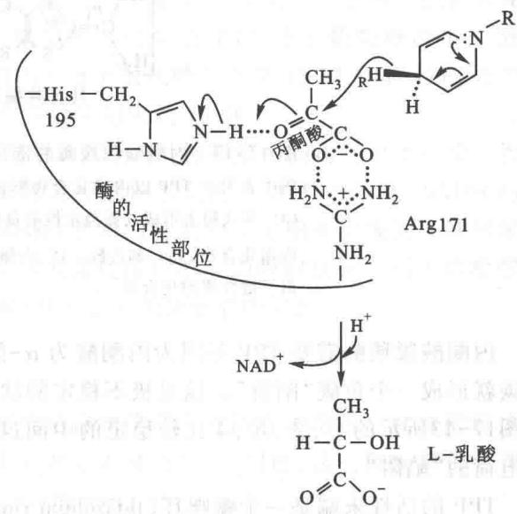  
图 17-12 乳酸脱氢酶的催化反应机制  
图中表明负氢离子从 NADH 直接向丙酮酸羰基转移的情况

生长在厌氧或相对厌氧条件下的许多细菌以乳酸为最终产物。这种以乳酸为终产物的厌氧发酵称为乳酸发酵。乳酸发酵在经济上是非常重要的。人们利用细菌对牛乳中乳糖的发酵生产奶酪、酸奶和其他食品。

## （二）生成乙醇

酵母在无氧条件下,将丙酮酸转变为乙醇和 $CO_{2}$ 。这一过程实际包括两个反应步骤。第一步是丙酮酸脱羧形成乙醛和 $CO_{2}$ , 第二步乙醛由 $NADH+H^{+}$ 还原生成乙醇同时产生氧化型 $NAD^{+}$ 。

## 1. 丙酮酸脱羧形成乙醛

催化这一步反应的酶是丙酮酸脱羧酶(pyruvate decarboxylase)。该酶在动物细胞中不存在。它以硫胺素焦磷酸(TPP)为辅酶。TPP以非共价键和酶紧密结合。

丙酮酸脱羧酶的催化机制可用图 17-13 表示。

  
图 17-13 丙酮酸脱羧酶的催化机制

图中表明① TPP 以内镝化合物形式对丙酮酸的羰基进行亲核攻击；② 羰基以 $CO_{2}$ 形式脱去形成共振稳定性的负碳离子；③ 负碳离子质子化；④ 脱去 TPP 的内镝化合物 (ylid) 和乙醛。注：内镝化合物是碳和其他元素间既有共价键又有离子键性质的化合物

丙酮酸脱羧酶需要 TPP 是因为丙酮酸为 $\alpha-$ 酮酸。它直接脱羧必然在羰基碳原子上产生电负性，羰基碳就形成一个负碳“陷阱”。这是极不稳定的状态，因此是根本不可能的。只有丙酮酸和 TPP 结合，经过图17-13所示的①、②、③、④比较稳定的中间过程才可以实现。经过这些过程乃避开了羰基碳形成带负电荷的“陷阱”。

TPP 的活性末端是一个噻唑环(thiazolium ring)。它第 2 碳原子上的氢,由于相邻的 4 价氮原子上正电荷的影响而具有相对酸性。氮原子上的正电荷使质子解离后形成的碳负离子得以稳定。这一两性负碳离子(是一个内镝离子,见图 17-13 之注)是 TPP 的活性形式。

丙酮酸脱羧酶催化的脱羧过程可归纳为4个反应步骤:第一步,TPP的内鎓离子对丙酮酸的羰基碳进行亲核攻击;第二步,释放出 $CO_{2}$ 并生成一个共振稳定的负碳离子加合物,在这个加合物上TPP的噻唑环起着电子陷阱的作用;第三步,负碳离子质子化;第四步,乙醛被释放出又形成游离的活性酶(图17-13)。

## 2. 乙醛还原成乙醇同时产生氧化型 $\mathrm{NAD}^{+}$

催化这一反应的酶是乙醇脱氢酶(alcohol dehydrogenase, ADH)。酵母乙醇脱氢酶(YADH)是含有4个亚基的四聚体。每个亚基结合一个NADH和一个 $Zn^{2+}$ 。 $Zn^{2+}$ 的作用是使乙醛的羰基极化，这可使处于反应中的中间态产生的负碳电荷比较稳定，从而对NADH Pro-R的氢原子的转移有促进作用。这一氢原子转移到乙醛的re-面上，从而产生一个氢原子在Pro-R位的乙醇分子。如图17-14所示：

乙醇发酵有很大的经济意义，在发面、制作面包和馒头，以及酿酒工业中起着关键性的作用。在酿醋工业上，微生物也是先在不需氧条件下形成乙醛而后在有氧条件下氧化为醋。

  
图 17-14 乙醇脱氢酶催化反应机制  
图中表明 NADH Pro-R 的负氢离子定向地转移到乙醛的 re 面

## 八、糖酵解作用的调节

巴斯德在研究酵母的葡糖发酵中发现，在无氧条件下葡萄糖消耗的速率和总量比在有氧条件下高出很多。后来对肌肉的研究也表明，糖酵解速率在无氧和有氧条件下显示很大差异。这种“巴斯德效应（Pasteur effect）”的生化基础仍不清楚。在无氧条件下，糖酵解产生的ATP（1分子葡萄糖产生2分子ATP），比在有氧条件下葡萄糖彻底氧化为 $\mathrm{CO}_{2}$ 产生的ATP（1分子葡萄糖产生30或32分子ATP）要少得多。消耗相等量的葡萄糖，有氧条件下产生的ATP是无氧条件下的大约15倍。

细胞通过调节葡萄糖在糖酵解途径的流动而获得稳定的 ATP 水平(糖酵解中间物可用于后续生物合成)。对于糖酵解的短期调控(short-term regulation)，糖酵解速率的调节是通过 ATP 的消耗、NADH 的再生及变构调节酶（己糖激酶、磷酸果糖激酶-1 和丙酮酸激酶）之间的复杂相互作用而实现的。糖酵解速率的调节也依赖于可以反应细胞内 ATP 产出和消耗平衡的关键代谢物浓度的瞬时变化。对于糖酵解的长期调控(long-term regulation)，糖酵解速率受胰高血糖素、肾上腺素和胰岛素的调控。

## （一）磷酸果糖激酶是关键酶

在代谢途径中,催化基本上不可逆反应的酶所处的部位是控制代谢反应的有力部位。在糖酵解途径中由己糖激酶、磷酸果糖激酶和丙酮酸激酶催化的反应实际都是不可逆反应,因此,这三种酶都具有调节糖酵解途径的作用。它们的活性受到变构效应物(allosteric effectors)

可逆地结合以及酶共价修饰的调节。当然这些酶的量还根据代谢情况的需要受到转录的控制。酶的可逆的变构调控，磷酸化作用的调节以及转录的控制根据不同情况可在百万分之一秒、几秒或几小时内发生变化。

6-磷酸葡糖可以进入糖酵解途径或者进入其他代谢途径，包括糖原合成和磷酸戊糖途径。细胞通过磷酸果糖激酶PFK-1催化的不可逆反应将葡萄糖送入糖酵解途径。除了它的底物结合位点，该酶有多个别构激活因子或者抑制因子结合的调节位点。ATP不仅是PFK-1的底物，也是糖酵解途径的终产物。当细胞内ATP合成速度大于消耗速度，ATP通过结合到PFK-1别构调节位点并降低该酶与6-磷酸果糖的亲和力，从而抑制PFK-1的活性，从图17-15可看出，高的 ATP 浓度使酶与底物 6-磷酸果糖的结合曲线从双曲线形变为 S 形。当 ATP 的消耗超过合成时，导致 ADP 和 AMP 的浓度增加，它们通过别构调节减弱由 ATP 造成的抑制。当 6-磷酸果糖、ADP、AMP 积累时，这些效应则联合起来产生更高的酶活性。

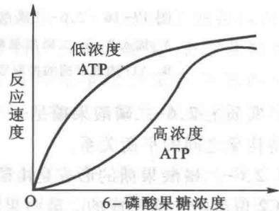  
图 17-15 ATP 对磷酸果糖激酶的变构调节作用表明高浓度 ATP 降低酶和底物的亲和力,从而降低反应速度

因糖酵解作用不只是在缺氧条件下提供能量,也为生物合成提供碳骨架,因此,碳骨架需要的情况也必然影响酵解作用的速度。柠檬酸对磷酸果糖激酶的抑制作用正具有这种意义。细胞内的柠檬酸含量高,意味着有丰富的生物合成前体存在,葡萄糖无需为提供合成前体而降解,柠檬酸是通过加强 ATP 的抑制效应来抑制磷酸果糖激酶的活性,从而使糖酵解过程减慢。

因磷酸果糖激酶是糖酵解作用的限速酶,因此,对此酶的调节是调节酵解作用的关键步骤。

## （二）2,6-二磷酸果糖对酵解的调节作用

2,6-二磷酸果糖（fructose-2,6-bisphosphate，F-2,6-BP）是1980年由Henri-GeryHers和EmileVanSchaftinggen新发现的酵解过程的调节物。它的结构如下：

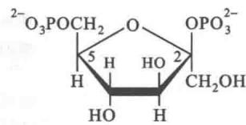  
2,6-二磷酸果糖  
(fructose-2,6-bisphosphate F-2,6-BP)

它是磷酸果糖激酶强有力的激动剂。在肝中，2,6-二磷酸果糖提高果糖激酶与6-磷酸果糖的亲和力并降低ATP的抑制效应。2,6-二磷酸果糖对磷酸果糖激酶的激活作用可用图17-16表示。

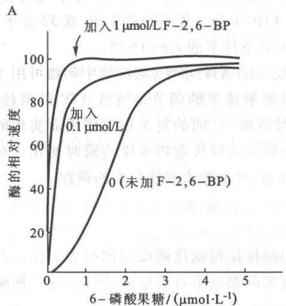

  
图 17-16 2,6-二磷酸果糖对磷酸果糖激酶的激活作用  
A. 加入 2,6-二磷酸果糖 1 $\mu$ mol/L 后，底物浓度对酶的活性影响由图中的 S 形变为双曲线形  
B. ATP浓度对酶的抑制效应当加入不同浓度的2,6-二磷酸果糖后受到不同的解除

实质上 2,6-二磷酸果糖是一个变构激活剂（allosteric activator）。它控制磷酸果糖激酶的构象转换，维持构象之间的平衡关系。

2,6-二磷酸果糖的形成是由磷酸果糖激酶-2(phosphofructokinase-2, PFK2)催化6-磷酸果糖，使其在C2位磷酸化而形成的。磷酸果糖激酶-2和磷酸果糖激酶(PFK)是两种不同的酶。它们的催化机制不同。2,6-二磷酸果糖的水解也是由一种特殊的磷酸酶，称为二磷酸果糖磷酸酶-2(fructose bisphosphatase 2, FBPase 2)催化的。水解的产物是6-磷酸果糖。有趣的是，这两种酶，即磷酸果糖激酶-2和二磷酸果糖磷酸酶-2，处于同一条单一的多肽链上，这条多肽链的相对分子质量为55000，也可以说这是一个具有双重功能的酶。

6-磷酸果糖有加速2,6-二磷酸果糖合成的作用，还有抑制该化合物被水解的作用。因此，高的6-磷酸果糖浓度可导致高浓度2,6-二磷酸果糖的形成。2,6-二磷酸果糖又进一步激活磷酸果糖激酶。这种过程称为前馈刺激作用（feedforward stimulation）。

磷酸果糖激酶-2和二磷酸果糖磷酸酶-2的活性由酶分子上一个丝氨酸残基往复地磷酸化所控制(图17-17)。

如图 17-17 所示, 当葡萄糖缺乏时, 血液中的胰高血糖素(glucagon)启动环 AMP(cyclic AMP)的级联效应, 激活 cAMP 依赖的蛋白激酶, 从而引起该双重功能酶的磷酸化。酶的共价修饰使二磷酸果糖磷酸酶-2激活, 同时使磷酸果糖激酶-2受到抑制。结果使 2,6-二磷酸果糖减

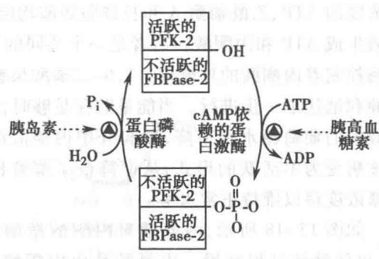  
图 17-17 磷酸果糖激酶-2/二磷酸果糖磷酸酶-2的活性受磷酸化和去磷酸化调节

少，抑制糖酵解。当葡萄糖过剩时，胰岛素激活蛋白磷酸酶的活性，使磷酸基团从酶分子上脱落，激活磷酸果糖激酶-2,2,6-二磷酸果糖的含量于是上升，结果使糖酵解过程加速。这一调控称为协同控制作用（coordinated control）。因激酶和磷酸酶的结构域同处在一条肽链上，使上述协同作用得到加强。

## （三）己糖激酶和丙酮酸激酶对糖酵解的调节作用

己糖激酶催化葡萄糖进入糖酵解途径，是另一个调节酶。为什么磷酸果糖激酶是限速酶而不是己糖激酶？因为6-磷酸葡糖并不是唯一的糖酵解的中间物，6-磷酸葡糖还可以转变为糖原，还可以经五碳糖磷酸途径(pentose phosphate pathway)进行氧化。己糖激酶有四种同工酶（I\~IV），由四个不同的基因编码。肌细胞内的己糖激酶Ⅱ对葡萄糖有高度的亲和性，它在大约0.1 mmol/L时处于半饱和状态。因为葡萄糖从血液（葡萄糖浓度为4\~5 mmol/L）进入肌细胞，葡萄糖的浓度足够饱和己糖激酶Ⅱ。肌肉己糖激酶被它的催化产物6-磷酸葡糖别构抑制。一旦细胞内6-磷酸葡糖的浓度超过正常水平，己糖激酶便暂时可逆地受到抑制，使得6-磷酸葡糖产生和消耗的速度达到平衡。

肝和肌肉中存在不同的己糖激酶同工酶,反映了这些器官在糖代谢中的不同作用:肌肉消耗葡萄糖产生能量,而肝产生并重新分配葡萄糖到其他组织。肝中的己糖激酶Ⅳ也称葡糖激酶(glucokinase),它在三个重要方面不同于肌肉己糖激酶。

首先,葡糖激酶被半饱和的葡萄糖浓度大约为 10 mmol/L,高于血液中的葡萄糖浓度。由于肝细胞中有效的葡萄糖转运蛋白(GLUT2)保持肝细胞与血液中的葡萄糖浓度相近,葡糖激酶的这种性质使其受到血液葡萄糖的直接调控。当血糖浓度升高时,血液中过量的葡萄糖会被运送到肝,由葡糖激酶催化转化为 6-磷酸葡糖。由于葡糖激酶对于 10 mmol/L 葡萄糖处于不饱和状态,它的活性随葡萄糖浓度上升而增加。

其次，葡糖激酶还受到另外一个核蛋白即葡糖激酶调节蛋白（glucokinase regulatory protein）可逆的抑制调节。在高浓度6-磷酸果糖存在的条件下，该核蛋白与葡糖激酶结合并定位于细胞核内，使葡糖激酶与其他定位于胞质内的糖酵解酶隔离开来，糖酵解受到抑制。当食入糖类，血液葡萄糖浓度升高，葡萄糖被GLUT2运送至肝细胞内，由于葡萄糖与6-磷酸果糖竞争结合葡糖激酶调节蛋白，高浓度的葡萄糖使葡糖激酶与调节蛋白发生解离，葡糖激酶从细胞核内转运至胞质，糖酵解被激活。

最后,葡糖激酶并不受反应产物6-磷酸葡糖的抑制,而受6-磷酸果糖的抑制,而6-磷酸果糖是通过果糖磷酸异构酶的作用与6-磷酸葡糖达到平衡。因此,当6-磷酸葡糖的积累引起己糖激酶Ⅰ-Ⅲ被完全抑制时,葡糖激酶仍能够继续发挥作用。

## （四）丙酮酸激酶对糖酵解的调节作用

在脊椎动物中至少发现3种丙酮酸激酶同工酶，它们在组织分布和对调节因子的反应上是下同的。

高浓度的 ATP、乙酰辅酶 A 和长链脂肪酸均能够抑制丙酮酸激酶的活性。丙酮酸激酶催化磷酸烯醇式丙酮酸生成 ATP 和丙酮酸。后者是一个共同的代谢中间物，它可进一步被氧化，或用作结构元件。丙酮酸激酶控制着丙酮酸的外流量。1,6-二磷酸果糖对丙酮酸激酶的激活作用，使糖酵解过程的反应中间物能够顺利地往下一步进行。当能量贮存足够时，ATP 对丙酮酸激酶的变构抑制效应使酵解过程减慢。如果

血液中的葡萄糖水平下降,激起肝中丙酮酸激酶的磷酸化,

使该酶变为不活跃的形式,从而降低了酵解作用的进行,使血糖浓度得以维持正常水平。

如图 17-18 所示, 丙氨酸对丙酮酸激酶的变构抑制效应, 也使酵解过程减慢。丙氨酸是由丙酮酸接受一个氨基形成的, 丙氨酸浓度增加意味着丙酮酸作为丙氨酸的前体过量, 因此丙氨酸对丙酮酸减慢的抑制效应也是维持代谢动态平衡的一种有效措施。肝丙酮酸激酶同工酶是通过磷酸化和去磷酸化转变其活性。其活跃形式是去磷酸化形式, 而磷酸化形式是不活跃形式。当血液中葡萄糖浓度降

  
1,6-二磷酸果糖 ATP 丙氨酸  
图17-18 丙酮酸激酶催化活性控制关系图

低时，胰高血糖素释放，cAMP依赖的蛋白激酶磷酸化肝中的丙酮酸激酶使其失活，从而减慢葡萄糖在肝中作为燃料的使用，节省的葡萄糖被输送至大脑及其他器官。肌肉丙酮酸激酶同工酶不受磷酸化调控。

## （五）5-磷酸木酮糖对糖代谢调节作用

在哺乳动物的肝中,由单磷酸己糖途径产生的5-磷酸木酮糖能够调节糖酵解途径。随着葡萄糖进入肝并转化为6-磷酸葡糖,进入糖酵解和单磷酸己糖途径,导致5-磷酸木酮糖浓度上升。5-磷酸木酮糖激活蛋白磷酸酶PP2A,使双功能酶PFK-2/FBPase-2酶在磷酸化。去磷酸化激活PFK-2,抑制FBPase-2,使2,6-二磷酸果糖浓度增加,激活糖酵解。

## （六）癌组织中糖代谢紊乱

在非癌组织中葡萄糖的摄取和糖酵解的速度比在大多数癌组织中快大约10倍。因为肿瘤细胞最初缺乏广泛的毛细血管网络提供氧气，处于有限的氧气供应状态，所以比正常细胞摄取更多的葡萄糖，转换为丙酮酸并在重新生成NADH时进一步转化成乳酸。糖酵解高速率的原因之一可能是肿瘤细胞中线粒体数目减少，导致线粒体氧化磷酸产生的ATP不足，所需要的ATP从糖酵解途径中获得。另外，一些肿瘤细胞过度表达几种糖酵解酶，包括线粒体己糖激酶的同工酶，它对6-磷酸葡糖的反馈抑制不敏感，这种酶可能垄断线粒体中的ATP，利用它将葡萄糖转化为6-磷酸葡糖，使细胞继续进行后续的糖酵解反应。低氧诱导的转录因子(HIF-1)作用于mRNA合成水平，促进至少八种糖酵解酶的合成，为肿瘤细胞在无氧条件下提供了生存能力。

早在1928年，德国生化学家Otto Warburg第一个发现肿瘤组织中的葡萄糖代谢速率显著高于其他组织。Warburg纯化和结晶了糖酵解途径中的七个酶。在这些研究中，他建立的生物化学实验方法彻底“变革”了氧化代谢的生化研究，如Warburg压力计通过监测气体体积的变化直接检测氧气的消耗量，用于定量测定氧化酶的活性。Otto Warburg是20世纪上半叶最卓越的生物化学家之一，对生物化学的其他研究领域（呼吸作用，光合作用和中间代谢的酶学）也做出了开创性的贡献，并于1931年荣获诺贝尔生理和医学奖。

## 九、其他六碳糖进入糖酵解途径

淀粉和糖原经消化后都转变为葡萄糖进入糖酵解途径。由蔗糖水解产生的果糖，由乳糖水解产生的半乳糖，由糖蛋白等多糖经消化产生的甘露糖都是通过转变成糖酵解途径的中间产物而进入酵解途径。

## (一) 果糖

在肌肉中,果糖由己糖激酶催化磷酸化形成6-磷酸果糖。

在肝中,因只含有葡糖激酶,此酶只催化葡萄糖的磷酸化,所以果糖在肝中进入糖酵解途径不能像在肌肉中那么简单,需经过6种酶的催化,其转变过程如下。

（1）果糖由果糖激酶（fructokinase）催化，在 C1 位磷酸化，消耗 1 个 ATP 分子，形成 1-磷酸果糖（fructose-1-phosphate）。

## (2) 1-磷酸果糖进行醇、醛裂解形成磷酸二羟丙酮和甘油醛

前面已经提到,醛缩酶有不同类型。肌肉中为 A 型,只对 1,6-二磷酸果糖起作用;肝中为 B 型,也可利用 1-磷酸果糖作为底物。因此 B 型醛缩酶有时也称为 1-磷酸果糖醛缩酶。它催化如下的反应:

  
开链式1-磷酸果糖
(open chain fructose-1-phosphate)

（3）甘油醛在甘油醛激酶(glyceraldehyde kinase)催化下，消耗1分子ATP，形成3-磷酸甘油醛。反应如下：

(4) 甘油醛还可在醇脱氢酶(alcohol dehydrogenase)催化下,由 NADH 还原形成甘油,反应如下:

（5）甘油在甘油激酶(glycerol kinase)的催化下，消耗1分子ATP，转变为3-磷酸甘油(glycerol-3-phosphate):

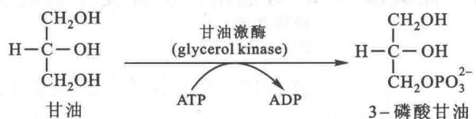

（6）3-磷酸甘油在甘油磷酸脱氢酶(glycerol phosphate dehydrogenase)催化下，由 $NAD^{+}$ 氧化，形成磷酸二羟丙酮，反应如下：

磷酸二羟丙酮经酵解途径中的磷酸丙糖异构酶(triosephosphate isomerase)转变为3-磷酸甘油醛，从而进入糖酵解途径。

临床上,过去认为给病人输入果糖优于葡萄糖。但血中果糖浓度过高超出肝中醛缩酶 B 的正常功能范围,引起 1-磷酸果糖积累,造成肝中无机磷酸的大量消耗以致耗竭,进而使 ATP 浓度下降,于是糖酵解过程加速产生大量乳酸。血中乳酸浓度过高,甚至达到危及生命的地步。

有一种遗传病,称为果糖不耐症(fructose intolerance),是由于肝中缺乏B型醛缩酶。食人的果糖不能被正常代谢,也造成1-磷酸果糖积累引起一系列和临床输入果糖同样的症状。这种病人对任何甜味都失去感觉。

## （二）半乳糖

## 1. 半乳糖(galactose)转变为能进入糖酵解途径的中间产物,包括5个步骤

（1）半乳糖由半乳糖激酶(galactokinase)催化其第一个碳原子C1磷酸化,形成1-磷酸半乳糖(galactose-1-phosphate),也需要消耗1分子ATP。

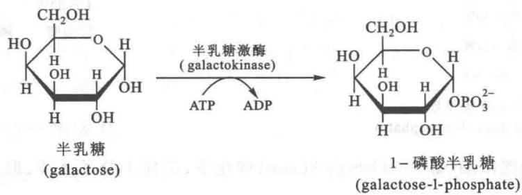

（2）1-磷酸半乳糖形成 UDP-半乳糖（尿苷二磷酸-半乳糖，uridine diphosphate-galactose）。催化此反应的酶称为尿苷酰转移酶（uridylyl transferase）。它催化尿苷酰基团从 UDP-葡萄糖分子在焦磷酸键处断裂转移到 1-磷酸半乳糖的磷酸基团上。反应如下：

（3）UDP-半乳糖转化为 UDP-葡萄糖。催化此反应的酶称为 UDP-半乳糖 4-差向异构酶（UDP-galactose-4-epimerase）。此酶以 NAD $^{+}$ 为辅酶。在转变中需经过氧化还原过程。反应如下。

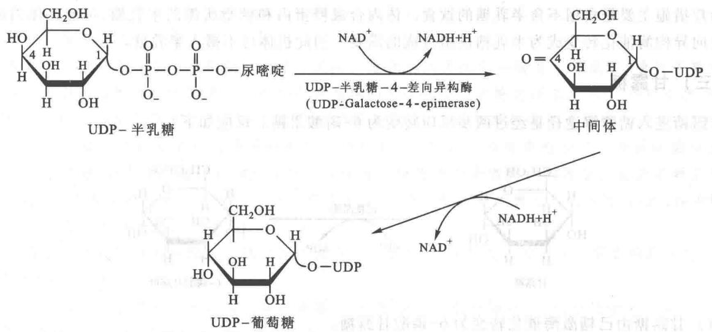

（4）UDP-葡萄糖转变为1-磷酸葡糖。催化此反应的酶为 UDP-葡糖焦磷酸化酶（UDP-glucose pyrophosphorylase）。反应式如下：

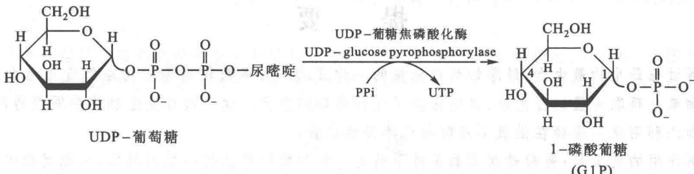

（5）1-磷酸葡糖由磷酸葡糖变位酶（phosphoglucomutase）转变为糖酵解过程的中间产物6-磷酸葡糖。反应式如下：

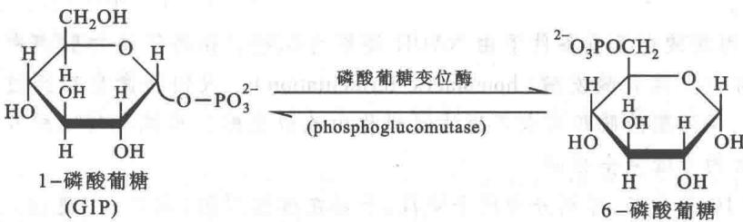

## 2. 半乳糖血症

半乳糖血症(galactosemia)是一种遗传病。这种患者体内不能将半乳糖转化为葡萄糖。原因是缺乏1-磷酸半乳糖尿苷酰转移酶，不能使1-磷酸半乳糖转变为UDP-半乳糖。结果使血中半乳糖积累，进一步造成眼睛晶状体半乳糖含量升高。并还原为半乳糖醇(galactitol)，它的结构如下：

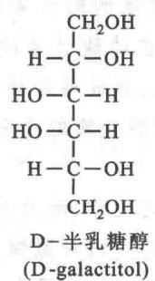

晶状体内的半乳糖醇最后造成晶状体混浊引起白内障。

半乳糖血症严重的引起生长停滞，智力迟钝，还往往引起肝损伤而致死亡。

治疗措施主要是食用不含半乳糖的饮食。体内合成糖蛋白和糖脂所需的半乳糖，可能在体内由葡萄糖经差向异构酶催化转变成为半乳糖供给合成的需要。因此机体可不摄入半乳糖。

## （三）甘露糖

甘露糖进入糖酵解途径是经过两步反应转变为6-磷酸果糖。反应如下：

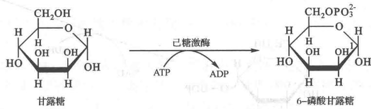

(1) 甘露糖由己糖激酶催化转变为 6-磷酸甘露糖。

（2）6-磷酸甘露糖由磷酸甘露糖异构酶(phosphomannose isomerase)催化转变为6-磷酸果糖(F6P)，其催化机制和磷酸葡糖异构酶相似。

## 提要

糖酵解过程是生物最古老、最原始获得能量的一种方式。大多数较高等生物虽然进化为利用有氧条件进行生物氧化获取大量的自由能，但仍保留了这种原始的方式。这一过程是生物体共同经历的途径，而且有些生物还利用这一途径在供氧不足时给机体提供能量。

糖酵解作用的定义是:葡萄糖在无氧条件下转变为丙酮酸所经历的一系列反应,在此过程中净生成两个 ATP 分子。

这一过程是最早阐明的酶促反应过程,也是研究得非常透彻的过程。糖酵解作用机制的研究是最富于启发性的科学工作。

酵解过程产生的丙酮酸在无氧条件下由 NADH 还原为乳酸。在高等动物肌肉中糖酵解的最终产物为乳酸，这一过程又称为单纯乳酸发酵（homolactic fermentation）。人们将微生物经过无氧条件产生乳酸的过程称为乳酸发酵，将丙酮酸脱羧形成乙醇的过程称为乙醇发酵。单纯乳酸发酵和乙醇发酵除了在最后步骤不同外，所经历的步骤完全相同。

糖酵解过程共有10步反应,可划分为两个阶段,全部在细胞溶胶(胞液)中进行。第一阶段是支付能量的准备阶段,即预先支出阶段,包括5步反应。葡萄糖与2分子ATP反应,通过磷酸化、异构化、第二次磷酸化,形成1,6-二磷酸果糖。每次磷酸化都需要由ATP提供能量。第二阶段是收入阶段,也包括5步反应。1,6-二磷酸果糖由醛缩酶裂解为磷酸二羟丙酮和3-磷酸甘油醛。这两种化合物在丙糖异构酶作用下,很容易互变。在3-磷酸甘油醛脱氢酶作用下,3-磷酸甘油醛被氧化和磷酸化即与 $NAD^{+}$ 和Pi形成1,3-二磷酸甘油酸,形成的高能酰基磷酸,具有高的转移势能,在磷酸甘油酸激酶的作用下,生成一分子ATP同时产生一分子3-磷酸甘油酸。随后又在磷酸甘油酸变位酶的催化下,异构化为2-磷酸甘油酸。后者由烯醇化酶脱氢发生磷酸基团变位和脱水,形成磷酸烯醇式丙酮酸。它是第2个高能磷酸基团转移势能的酵解中间物。磷酸烯醇式丙酮酸在丙酮酸激酶的作用下,将高能磷酸基团转移给ADP形成另外1分子ATP和丙酮酸。

催化酵解 10 步反应的酶作用机制都已通过化学、动力学测定并结合 X 射线结构分析基本得到阐明。酵解酶的催化过程表现出严格的立体专一性,其中两种激酶由底物引起酶分子的构象变化,防止了底物上高能磷酸基团向水分子的转移而且直接转移到 ADP 分子上。

糖酵解作用能在无氧条件下继续进行,必须有使 NADH 再被氧化为 $NAD^{+}$ 的途径。乳酸或乙醇(先脱羧形成乙醛,再由 $NADH + H^{+}$ 还原成乙醇)的形成解决了 NAD 再生的问题。丙酮酸脱羧形成乙醛由丙酮酸脱羧酶催化。此酶需焦磷酸硫胺素作为辅助因素。催化乙醛还原为乙醇的酶是乙醇脱氢酶。催化丙酮酸形成乳酸的酶是乳酸脱氢酶。

糖酵解过程有三个反应步骤是基本上不可逆的。催化这三步反应的酶是己糖激酶、磷酸果糖激酶和丙酮酸激酶。其中磷酸果糖激酶催化的反应是糖酵解的限速反应。该酶受高浓度 ATP 和柠檬酸的抑制，被 AMP 和 2,6-二磷酸果糖激活。己糖激酶受 6-磷酸葡糖抑制，如果磷酸果糖激酶受到抑制，则 6-磷酸葡糖积累。丙酮酸激酶受 ATP 和丙氨酸引起的变构抑制，受 1,6-二磷酸果糖激活。当机体能荷或糖酵解的中间物积累时，丙酮酸激酶达到活跃顶峰。丙酮酸激酶的活性受磷酸化的调节。血液中葡萄糖水平降低时，激起肝中丙酮酸激酶的磷酸化从而使其活性降低，于是肝中葡萄糖的利用下降，因此，丙酮酸激酶对维持血糖浓度的相对稳定起着调节作用。

己糖激酶和磷酸丙糖异构酶对底物引起的诱导式的配合,使催化反应避开了不需要的副反应,这大大提高了酶的催化效率。

磷酸丙糖异构酶的催化效率是最完善的典型,一旦酶分子与底物接触,在碰撞的瞬间反应已经完成,因此,这种酶促反应是由底物分子的扩散速度调节的。

3-磷酸甘油醛脱氢酶在催化3-磷酸甘油醛氧化和磷酸化为1,3-二磷酸甘油酸的过程中，形成一个半缩硫醛中间物，这一硫酯中保存了3-磷酸甘油醛氧化释放出的部分能量，是一个高能中间物，它接受无机磷酸的攻击而形成具有高能磷酸基团的1,3-二磷酸甘油酸。砷酸是磷酸的类似物（analog），它使氧化和磷酸化解偶联。

双糖及多糖经消化后形成的单糖主要是葡萄糖，其他的单糖产物还有果糖、半乳糖、甘露糖等。这些单糖都转变为糖酵解的中间物之一而进入糖酵解的共同途径。

## 习题

1. 为什么应用蔗糖保存食品而不用葡萄糖？

2. 用 $^{14}$ C 标记葡萄糖的第一个碳原子,用作糖酵解底物,写出标记碳原子在酵解各个步骤中的位置。

3. 写出从葡萄糖转变为丙酮酸的化学平衡式。

4. 已知 ATP 和 6-磷酸葡糖在 pH 7 和 25℃时水解的标准自由能变化 $\Delta G^{\ominus}$ 分别为 -7.3 和 -3.183 kcal/mol，计算己糖激酶催化的葡萄糖和 ATP 反应的 $\Delta G^{\ominus}$ 和 Keq。

5. 由丙酮酸转变为乳酸的标准自由能变化 $\Delta G^{\ominus'} = -25.10\mathrm{kJ / mol}$ , 计算出由葡萄糖转变为乳酸的标准自由能变化。

6. 当葡萄糖的浓度为 5 mmol/L，乳酸的浓度为 0.05 mmol/L，ATP 和 ADP 的浓度都为 2 mmol/L，无机磷酸(Pi)的浓度为 1 mmol/L 时，计算该由葡萄糖转变为乳酸的自由能( $\Delta G^{\ominus'}$ )变化。

7. 参考表 22-2, 计算在标准状况下当 $[ATP]/[ADP]=10$ 时, 磷酸烯醇式丙酮酸和丙酮酸的平衡比。

8. 若以 $^{14}$ C 标记葡萄糖的 C3 作为酵母的底物, 经发酵产生 CO $_{2}$ 和乙醇, 试问 $^{14}$ C 将在何处发现?

9. 总结一下在糖酵解过程中磷酸基团参与了哪些反应,它所参与的反应有何意义?

10. 为什么砷酸是糖酵解作用的毒物？氟化物和碘乙酸对糖酵解过程有什么作用？

11. 总结一下参与糖酵解作用的酶有些什么特点及关键酶受到怎样的调控？

12. 糖酵解过程有哪些金属离子参加反应,它们起什么作用?

13. 概括除葡萄糖以外的其他单糖是如何进入分解代谢的？

## 主要参考书目

1. 李建武. 生物化学. 北京: 北京大学出版社, 1990.

2. Stryer L. Biochemistry. 4th ed. New York: W. H. Freeman and Company, 1995.

3. Lehnniger A R. Biochemistry. 2nd ed. New York: Worth Publishers. Inc., 1975.

4. Lebioda L, Stec B. Crystal structure of enolase indicates that enolase and pyruvate kinase from a common ancestor. Nature, 1988.

5. Nelson D L, Cox M M. Lehnninger 生物化学原理. 3 版. 周海梦, 等译. 北京: 高等教育出版社, 2005.

6. Nelson D L, Cox M M. Lehninger Principles of Biochemistry. 6th ed. New York: W. H. Freeman and Company, 2012.

7. Gatenby R, A Gilles R J. Why do cancers have high aerobic glycolysis? Nat. Rev. Cancer, 2004.

(王镜岩 秦咏梅)

## 网上资源

习题答案

自测题

## [1] 美登堂生
