## 第 19 章 氧化磷酸化作用

非光合作用生物体所需的能量大都来自糖、脂肪、蛋白质等有机物的氧化。生物体内的氧化和自然界的燃烧在化学本质上类似，即最终产物都是水和二氧化碳，所释放的能量也完全相等，但二者所进行的方式却大不相同。糖、脂肪、蛋白质在细胞内的彻底氧化都经过分解代谢实现，代谢物的脱氢伴随辅酶 $\mathrm{NAD}^{+}$ 或FAD的还原。这些携带着氢离子和电子的还原型辅酶NADH或 $\mathrm{FADH}_2$ ，将电子传递给氧时，都需经历电子传递过程。有机分子在细胞内氧化分解成二氧化碳和水并释放出能量的过程，被统称为生物氧化（biological oxidation）。生物氧化实际上是需氧细胞中的一系列氧化还原反应，所以又称为细胞氧化或细胞呼吸。生物氧化的特点是：在体温条件下进行；依赖酶的催化；有机分子发生一系列的化学变化，在此过程中逐步氧化并释放能量。这种逐步地放能方式，不会引起体温的突然升高，而且可使放出的能量被有效捕获。而有机分子在体外燃烧需要高温，而且能量是被一次性地释放，产生大量的光和热。生物氧化的另一个特点是在氧化过程中产生的能量一般都被贮存在一些特殊的化合物中，如NAD,FAD和ATP。电子由还原型辅酶传递到氧的过程中所释放出的能量，这可用于形成大量的ATP，这可占全部生物氧化产生能量的绝大部分。例如，一个葡萄糖分子彻底氧化时生成大约30个ATP分子，其中26个是由还原型辅酶氧化得到的。

## 一、氧化还原电势

氧化磷酸化(oxidative phosphorylation)是指 NADH 和 $FADH_{2}$ 上的电子通过一系列电子传递载体传递给 $O_{2}$ ，并利用所释放的能量使 ADP 磷酸化形成 ATP 的过程。有机分子中的电子是如何转移和传递的？又是如何与分子氧结合形成水并释放能量的？都是生物氧化作用的关键问题。为了比较深刻地了解生物氧化作用，有必要先复习一下氧化还原电势的概念。

凡是有电子从一种物质转移到另一种物质的化学反应都被称为氧化还原反应(oxidation-reduction reactions, 又可称为 oxidoreductions 或 redox reactions); 换言之, 电子转移反应就是氧化还原反应。提供电子的分子称为还原剂(reducing agent 或 reductant), 接受电子的分子称为氧化剂(oxidizing agent 或称为 oxidant)。一种还原剂和其失去电子后的氧化剂形式即构成一个氧化还原电子对(reduction-oxidation pairs), 简称氧还电对(redox pairs)。

氧化还原反应往往是可逆的,物质失去电子后,称为氧化型,氧化型再得到电子后又成为还原型。可将反应按以下方式书写:

$$
\mathrm{A} ^ {n +} + n \mathrm{e} ^ {-} \rightleftharpoons \mathrm{A}\tag{19-1}
$$

其中 $A^{n+}$ 为氧化型，即电子受体；A 为还原型，为电子供体；n 为电子数目，e 为电子。 $A^{n+}$ 和 A 之间为一氧还电对。

## （一）氧化还原电势

在容器 A 和 B 中分别放入硫酸锌和硫酸铜溶液, 如图 19-1 所示。

在盛有硫酸锌的容器中放入锌片，在盛有硫酸铜的容器中放入铜片，两个容器用盐桥连接起来，盐桥为饱和氯化钾溶液与琼脂做成的凝胶。如果用导线将两片金属连接起来，中间串联一检流计（voltmeter），则检流计的指针会立即向一方偏转，表明有电流通过导线。与此同时，锌片开始溶解，而铜片上则有铜沉积上去。这是因为锌失去了两个电子形成锌离子。反应如下：

$$
\mathrm{Zn} \rightleftharpoons \mathrm{Zn} ^ {2 +} + 2 \mathrm{e} ^ {-}\tag{19-2}
$$

$Zn^{2+}$ 进入溶液中,电子则留在锌片上、锌片上的电子经导线向铜片流动,使硫酸铜溶液中的铜离子在金属铜上与电子结合还原为铜原子而沉积在铜片上。反应如下:

$$
\mathrm{Cu} ^ {2 +} + 2 \mathrm{e} ^ {-} \rightleftharpoons \mathrm{Cu}\tag{19-3}
$$

盐桥消除了由于电解质离子迁移(扩散)而引起的扩散电势。以上这种将化学能转变为电能的装置称为化学电池,又称原电池。通常我们把发生氧化反应的电极定义为阳极,把发生还原反应的电极定义为阴极。

从图 19-1 可见,电子流动的方向是从锌电极(阳极)流向铜电极(阴极),电极的方向则相反。从电学观点看,既然电流是从阴极经导线流向阳极,阴极的电势必然高于阳极的电势。因此,从电位高低看,又可把原电池的阴极称为正极,阳极为负极。此外,根据电学惯例,把电池的电动势( $\varepsilon$ )规定为正极电势减去负极的电极电势。

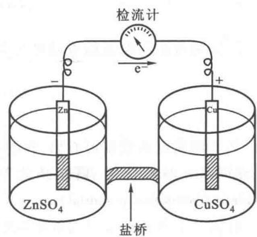

在氧化还原反应中,如果反应物的组成原子或离子能提供电子,则该物质称为还原剂;如果能夺得电子,则该反应物称为氧化剂。

图 19-1 化学电池示意图

以上事例还可作如下的概括和分析: 当把一金属电极 (electrode) M 放入它的盐溶液即构成一个半电池 (half cell), 一方面金属 M 表面的一些原子有一种把电子留在金属电极上, 而自身以离子 $M^{n+}$ 的形式进入溶液的倾向 (金属越活泼, 溶液越稀, 这种倾向越大); 另一方面, 盐溶液中的 $M^{n+}$ 又有一种从金属电极 M 表面获得电子而沉淀在金属电极上的倾向 (金属越不活泼, 浓度越浓, 这种倾向越大)。这两种倾向可用如下反应式表示:

$$
\mathrm{M} \rightleftharpoons \mathrm{M} ^ {n +} + n \mathrm{e} ^ {-}\tag{19-4}
$$

若失去电子的倾向大于获得电子的倾向,结果是金属进入溶液,使金属电极带负电,而靠近金属电极附近的溶液带正电。在金属电极和盐溶液之间即产生电势(electric potential)或称电位,这就是电极电势或称电极势或电极电位。若金属失去电子的倾向小于它的离子获得电子的倾向,在金属和盐溶液之间也产生电极电势,只是金属电极带正电,靠近金属电极附近的溶液带负电。金属电极势除同本金属的性质和金属离子在溶液中的活度(浓度)有关外,还与温度有关。单个电极即半电池的电极电势的绝对值无法直接测量。人们能测量的是由两个电极即两个半电池组成的电动势(简称 $\varepsilon$ 或 $E$ )。实际上能够比较和衡量的只能是电极的相对电势。根据国际纯粹和应用化学联合会(International Union of Pure and Applied Chemistry,简称IUPAC)的建议,通常用一种特定的氢电极作为标准,将所测得的电势称为氢标电势。这种氢电极是由一个镀有铂黑的铂电极,在 $25^{\circ}\mathrm{C}$ 一大气压的氢压力下,浸于氢离子活度为1质量摩尔浓度的溶液中,即 $\mathrm{pH} = 0$ (标准状态)而组成的。发生氧化作用的电极为阴极,又称为负极,用“-”表示。发生还原作用的电极即阳极,称为正极,用“+”号表示。如果将锌电极与氢电极构成原电池,则氢电极为正极,锌电极为负极。如果将铜电极与氢电极构成原电池,则氢电极为负极,铜电极为正极。按氢标电势的规定,标准氢电极的电极势为零( $E_{\mathrm{H^{+}/H_{2}}}^{\ominus} = 0$ )。原电池的电动势与电极势的关系可用下式表示:

$$
\varepsilon = E _ {\mathrm{正极}} - E _ {\mathrm{负极}}\tag{19-5}
$$

式中 $\varepsilon$ 代表电动势, $E_{正极}$ 和 $E_{负极}$ 分别代表电池正极和负极的电极势。

根据以上公式即可计算出氢锌原电池的电极势。

标准电动势被定义为在反应中各种物质的活度均为1质量摩尔浓度时的电动势。用 $\varepsilon^{\ominus}$ 表示。

当电解质溶液活度为 1(质量摩尔浓度)时的电极势称为标准电极势,用 $E^{\ominus}$ 表示。则标准电动势和标准电极的关系是:

$$
\varepsilon^ {\ominus} = E _ {\mathrm{正极}} ^ {\ominus} - E _ {\mathrm{负极}} ^ {\ominus}\tag{19-6}
$$

经测量,氢锌电池的标准电动势 $\varepsilon^{\ominus}=0.763\ V$ , 则

$$
0. 7 6 3 = E _ {\mathrm{H} ^ {+} / \mathrm{H} _ {2}} ^ {\ominus} - E _ {\mathrm{Zn} ^ {2 +} / \mathrm{Zn}} ^ {\ominus}
$$

因根据定义 $E_{H^{+}/H_{2}}^{\ominus}=0$ ，所以，

$$
E _ {\mathrm{Zn} ^ {2 +} / \mathrm{Zn}} ^ {\ominus} = - 0. 7 6 3 \mathrm{V}
$$

同法测得铜氢电池的电动势为 0.34 V, 铜是正极, 氢为负极。则

$$
\begin{array}{r l} 0. 3 4 & = E _ {\mathrm {Cu^ {2 + } /Cu}} ^ {\ominus} - E _ {\mathrm {H^ {+} / H_ {2}}} ^ {\ominus} \\ & E _ {\mathrm {Cu^ {2 + } /Cu}} ^ {\ominus} = + 0. 3 4 \mathrm{V} \end{array}
$$

从上面测定的数据可看出,锌的标准电极势带有负号,铜的标准电极势带有正号。因此锌的还原能力强,而铜离子的氧化能力强,还原剂失掉电子的倾向(氧化剂得到电子的倾向)称为氧化还原电势(oxidation-reduction potential)。

任何一个氧化还原对与标准氢电极组成原电池,都可测定其标准氧化还原电势,并可依上法求出其标准电极电势。在实际工作中,由于氢电极使用不便,往往采用一些比较简便稳定的参比电极来代替氢电极,例如甘汞电极。

因铂和金放入溶液中几乎不发生反应,常用于作为指示电极(工作电极)来测定溶液中氧化还原电对的电势,亦即氧化还原电势。如将两个铂电极分别插入铁离子 $\left(\mathrm{Fe}^{3+}\right)$ 和氢醌 $\left(\mathrm{H}_{2}\mathrm{Q}\right)$ 两种溶液中并组成原电池,则 $Fe^{3+}$ 会从铂电极上获得电子还原为 $Fe^{2+}$ ;氢醌 $\left(\mathrm{H}_{2}\mathrm{Q}\right)$ 将电子释放到铂电极上本身氧化形成醌Q。两种溶液混合后的反应式为:

$$
\begin{array}{l l}\mathrm{H} _ {2} \mathrm{Q} + 2 \mathrm{Fe} ^ {3 +} \rightleftharpoons \mathrm{Q} + 2 \mathrm{H} ^ {+} + 2 \mathrm{Fe} ^ {2 +}\\\text { 氢醌 }&\text { 醌 }\end{array}\tag{19-7}
$$

如果上述反应中 $Fe^{3+}$ 和 $Fe^{2+}$ 的浓度为已知, 根据电极势的能斯特方程 (Nernst equation) 即可算出电极在溶液中的电极势。能斯特方程如下:

$$
E _ {n} = E ^ {\ominus} + R T / n F \cdot \ln [ \mathrm{电子受体} ] ^ {a} / [ \mathrm{电子供体} ] ^ {b}\tag{19-8}
$$

式中 $E_{n}$ 为待测溶液中氧还电对的电极势， $E^{\ominus}$ 为标准电极势。R为气体常数（8.314 J·L $^{-1}$ ·mol $^{-1}$ ），T为25℃或298K的绝对温度，n为电极上的价数变化（即体系中每摩尔物质给予或接受的电子摩尔数），F为法拉第常数等于23062 Cal/V（卡/伏）又等于96494 C/mol（库仑/摩尔）电子，ln为自然对数。

对于 $Fe^{3+}/Fe^{2+}$ 其电极势的计算公式为：

$$
E _ {n} = E ^ {\ominus} + \frac {R T}{n F} \ln \frac {[ \mathrm{Fe} ^ {3 +} ] ^ {2}}{[ \mathrm{Fe} ^ {2 +} ] ^ {2}}
$$

式中 $E_{n}$ 为 $Fe^{3+}/Fe^{2+}$ 的电极势, 其他符号含意同上。

在很多情况下,氢离子也参与电极上的氧化还原反应。这时溶液的 pH 会直接影响这个体系的氧化还原电势。前述标准氧化还原电势的 pH=0,而在 pH=7 的标准生物化学反应条件下测得的标准氧化还原电势用 $\varepsilon^{\ominus}$ 或 $E^{\ominus}$ 表示。

生物体系中的电子转移可通过下列 4 种方式进行：

① 以电子形式直接转移。例如 $Fe^{2+}-Fe^{3+}$ 电对可将电子直接转移到 $Cu^{+}-Cu^{2+}$ 电对：

$$
\mathrm{Fe} ^ {2 +} + \mathrm{Cu} ^ {2 +} \longrightarrow \mathrm{Fe} ^ {3 +} + \mathrm{Cu} ^ {+}\tag{19-9}
$$

② 电子以氢原子的形式转移。氢原子由一个质子 $\left(\mathrm{H}^{+}\right)$ 和一个电子 $\left(\mathrm{e}^{-}\right)$ 组成。这种电子转移可写成：

$$
\mathrm{AH} _ {2} \rightleftharpoons \mathrm{A} + 2 \mathrm{e} ^ {-} + 2 \mathrm{H} ^ {+}\tag{19-10}
$$

$AH_{2}$ 是氢原子供体, A 是氢原子受体, 所以 $AH_{2}$ 和 A 组成氧还电对, 可使另一电子受体 B 以获得氢原子的形式还原:

$$
\mathrm{AH} _ {2} + \mathrm{B} \longrightarrow \mathrm{A} + \mathrm{BH} _ {2}\tag{19-11}
$$

③ 电子以氢负离子( $:H^{-}$ )的形式(它带有2个电子)从电子供体转移到电子受体(通常为脱氢酶中的 $NAD^{+}$ 辅基)上。

④ 有机还原剂直接与氧结合时的电子转移。例如，碳氢化合物氧化形成醇的反应：

$$
\begin{array}{c} \mathrm{R-CH} _ {3} + 1 / 2 \mathrm{O} _ {2} \longrightarrow \mathrm{R-CH} _ {2} - \mathrm{OH} \\ \text {   碳氢化物   } \end{array}\tag{19-12}
$$

此反应式中,碳氢化物是电子供体,氧原子是电子受体。

以上 4 种电子传递方式在细胞中都发生。生物化学中常用“一个还原当量”（reducing equivalent）这一名词，指的是参加到氧化还原反应中的是一个电子，不管电子本身（electron per se）以一个氢原子或一个电子形式转移。因此，一个氢负离子为二个还原当量。

生物燃料分子的酶促脱氢反应一般是同时失去两个还原当量,每个氧原子能够接受两个还原当量。

## （二）生物体中某些重要氧还电对的氧化还原电势

生物体内的氧化还原对进行氧化还原反应时,基本原理和化学电池一样。也可以把生物体内的氧化剂和还原剂做成化学电池,无论是有机物,无机物或混合的有机、无机物。任何的氧还电对都有其特定的标准电势(standard potential),用 $\varepsilon^{\ominus}$ 或 $E^{\ominus}$ 表示,称标准还原势(standard reduction potential),或标准氧化还原电势(standard oxidation-reduction potential)。生物体内一些重要物质的标准氧化还原电势已经测出,如表19-1所示。

表 19-1 生物体中某些氧化还原电对的标准氧化还原电势 $\left( {E}^{ \ominus  }\right)$

<table><tr><td>氧化还原电对</td><td>标准还原势/V</td></tr><tr><td>乙酸 $+ {\mathrm{{CO}}}_{2} + 2{\mathrm{H}}^{ + } + 2{\mathrm{e}}^{ - } \longrightarrow$ 丙酮酸 $+ {\mathrm{H}}_{2}\mathrm{O}$ </td><td>-0.70</td></tr><tr><td>琥珀酸 $+ {\mathrm{{CO}}}_{2} + 2{\mathrm{H}}^{ + } + 2{\mathrm{e}}^{ - } \longrightarrow \alpha$ -酮戊二酸 $+ {\mathrm{H}}_{2}\mathrm{O}$ </td><td>-0.67</td></tr><tr><td>乙酸 $+ 2{\mathrm{H}}^{ + } + 2{\mathrm{e}}^{ - } \longrightarrow$ 乙醛 $+ {\mathrm{H}}_{2}\mathrm{O}$ </td><td>-0.58</td></tr><tr><td>3-磷酸甘油酸 $+ 2{\mathrm{H}}^{ + } + 2{\mathrm{e}}^{ - } \longrightarrow 3$ -磷酸甘油醛 $+ {\mathrm{H}}_{2}\mathrm{O}$ </td><td>-0.55</td></tr><tr><td> $\alpha$ -酮戊二酸 $+ 2{\mathrm{H}}^{ + } + 2{\mathrm{e}}^{ - } \longrightarrow$ 异柠檬酸</td><td>-0.38</td></tr><tr><td>乙酰 $- \mathrm{{CoA}} + {\mathrm{{CO}}}_{2} + 2{\mathrm{H}}^{ + } + 2{\mathrm{e}}^{ - } \longrightarrow$ 丙酮酸 $+ \mathrm{{CoA}}$ </td><td>-0.48</td></tr><tr><td>1,3-二磷酸甘油酸 $+ 2{\mathrm{H}}^{ + } + 2{\mathrm{e}}^{ - } \longrightarrow 3$ -磷酸甘油醛 $+ \mathrm{{Pi}}$ </td><td>-0.29</td></tr><tr><td>硫辛酸 $+ 2{\mathrm{H}}^{ + } + 2{\mathrm{e}}^{ - } \longrightarrow$ 二氢硫辛酸</td><td>-0.29</td></tr><tr><td> $\mathrm{S} + 2{\mathrm{H}}^{ + } + 2{\mathrm{e}}^{ - } \longrightarrow {\mathrm{H}}_{2}\mathrm{\;S}$ </td><td>-0.23</td></tr><tr><td>乙醛 $+ 2{\mathrm{H}}^{ + } + 2{\mathrm{e}}^{ - } \longrightarrow$ 乙醇</td><td>-0.197</td></tr><tr><td>丙酮酸 $+ 2{\mathrm{H}}^{ + } + 2{\mathrm{e}}^{ - } \longrightarrow$ 乳酸</td><td>-0.185</td></tr><tr><td> $\mathrm{{FAD}} + 2{\mathrm{H}}^{ + } + 2{\mathrm{e}}^{ - } \longrightarrow \mathrm{{FAD}}{\mathrm{H}}_{2}$ </td><td>-0.18*</td></tr><tr><td>草酰乙酸 $+ 2{\mathrm{H}}^{ + } + 2{\mathrm{e}}^{ - } \longrightarrow$ 苹果酸</td><td>-0.166</td></tr><tr><td>延胡索酸 $+ 2{\mathrm{H}}^{ + } + 2{\mathrm{e}}^{ - } \longrightarrow$ 琥珀酸</td><td>-0.031</td></tr><tr><td> $2{\mathrm{H}}^{ + } + 2{\mathrm{e}}^{ - } \longrightarrow {\mathrm{H}}_{2}$ </td><td>-0.421</td></tr><tr><td>乙酰乙酸 $+ 2{\mathrm{H}}^{ + } + 2{\mathrm{e}}^{ - } \longrightarrow \beta$ -羟丁酸</td><td>-0.346</td></tr><tr><td>胱氨酸 $+ 2{\mathrm{H}}^{ + } + 2{\mathrm{e}}^{ - } \longrightarrow 2$ 半胱氨酸</td><td>-0.340</td></tr><tr><td> $\mathrm{{NAD}}^{ + } + 2{\mathrm{H}}^{ + } + 2{\mathrm{e}}^{ - } \longrightarrow \mathrm{{NADH}}$ </td><td>-0.32</td></tr><tr><td> $\mathrm{{NADP}}^{ + } + 2{\mathrm{H}}^{ + } + 2{\mathrm{e}}^{ - } \longrightarrow \mathrm{{NADPH}}$ </td><td>-0.32</td></tr><tr><td>NADH脱氢酶(FMN型) $+ 2{\mathrm{H}}^{ + } + 2{\mathrm{e}}^{ - } \longrightarrow$ NADH脱氢酶( ${\mathrm{{FMNH}}}_{2}$ 型)</td><td>-0.30</td></tr><tr><td>标准氢电极 ${E}^{\ominus } = {0.00}$ </td><td></td></tr><tr><td> $\text{CoQ} + 2\text{H}^{+} + 2\text{e}^{-} \longrightarrow \text{CoQH}_{2}$ </td><td>+0.045</td></tr><tr><td>细胞色素  $b(\text{ox}) + \text{e}^{-} \longrightarrow \text{细胞色素 } b(\text{red})$ </td><td>+0.07</td></tr><tr><td>细胞色素  $c_{1}(\text{ox}) + \text{e}^{-} \longrightarrow \text{细胞色素 } c_{1}(\text{red})$ </td><td>+0.215</td></tr><tr><td>细胞色素  $c(\text{ox}) + \text{e}^{-} \longrightarrow \text{细胞色素 } c(\text{red})$ </td><td>+0.235</td></tr><tr><td>细胞色素  $a(\text{ox}) + \text{e}^{-} \longrightarrow \text{细胞色素 } a(\text{red})$ </td><td>+0.210</td></tr><tr><td>细胞色素  $a_{3}(\text{ox}) + \text{e}^{-} \longrightarrow \text{细胞色素 } a_{3}(\text{red})$ </td><td>+0.385</td></tr><tr><td> $1/2\text{O}_{2} + 2\text{H}^{+} + 2\text{e}^{-} \longrightarrow \text{H}_{2}\text{O}$ </td><td>+0.815</td></tr><tr><td> $\text{Fe}^{3+} + \text{e}^{-} \longrightarrow \text{Fe}^{2+}$ </td><td>+0.77</td></tr></table>

注： $E^{\ominus}$ '的测定条件为pH 7.0,25℃，即标准氢电极构成的化学电池的测定值。电子供体和受体的浓度都是1 mol/L。  
\* FAD/FADH $_2$ 的测定值仅为辅酶的单独测定值, 当辅酶与酶蛋白结合后 $E^{\ominus}$ 在 0.0 到 +0.3 V 之间, 随蛋白质而异。

按照传统定义标准还原电势具有较大负值的氧还电对比具有较小负值的氧还电对更倾向于失去电子；换言之，标准还原电势的正值越大的，越倾向于获得电子。例如，异柠檬酸/ $(\alpha-\text{酮戊二酸}+\mathrm{CO}_{2})$ 电对，其标准还原电势 $E^{\ominus'}$ 为-0.38 V。这个氧还电对倾向于将电子传递给氧还电对NADH/NAD $^{+}$ ，因为后者的 $E^{\ominus'}=-0.32\ V$ ，如果有柠檬酸脱氢酶存在，这个电对具有相对的正电势。水/氧电对的标准电势为+0.82 V，这表明水分子失去电子形成分子氧的倾向性极小。相反，分子氧对电子或氢原子具有极高的亲和力。标准电势的单位是V。

氧化还原反应对生物体之所以重要,不只是因为生物体内的许多重要反应属于氧化还原反应,更重要的是因为生物体所需的能量基本都来源于体内所进行的氧化还原反应。要了解氧化还原反应和能量之间的关系,还必须弄清楚氧化还原电势和自由能的关系。

## （三）标准还原电势差和自由能变化的关系

前面已经阐明,体系自由能的改变等于体系所做最大功的能量,可用下式表示:

$$
- \Delta G = W _ {\mathrm{max}}
$$

式中 $\Delta G$ 为体系中自由能的变化, 此处应为负值, 表示体系自由能减少之量, $W_{max}$ 为最大功。

可以把一个氧化还原反应看成是能做最大功的电池。当通过这个电池的电流为无限小时，它所做的功就是最大。其电动势 $\varepsilon=\Delta E$ 可以测出。因电池所做的功在数值上等于两个电极之间的电动势和电量的乘积。当电池传递的电子为 1 mol（即 $6.02\times10^{23}$ 个电子）时，则该电池在标准状态下所做的功可用下式表示：

$$
W = n \Delta E ^ {\ominus} F\tag{19-13}
$$

$\Delta E^{\ominus}$ 为相应反应的标准电极势差，n 为氧化还原反应中传递的电子数目，F 为法拉第常数(96 485 C/mol)。因以上所做的功为最大功，所以也可以把它看成是自由能的变化，即

$$
W _ {\mathrm{max}} = - \Delta G ^ {\ominus \prime} = - n \Delta E ^ {\ominus \prime} F\tag{19-14}
$$

式中各符号含义同上， $-\Delta G^{\ominus'}$ 表示体系自由能降低的变化。利用以上公式即可由氧化还原电势差计算出化学反应的自由能变化。

在生物化学反应中,这种自由能变化决定于一个体系转移电子的能力。

## （四）标准电动势和平衡常数的关系

标准电动势和化学反应平衡常数的关系可根据平衡常数和标准自由能的关系以及标准电动势和标准自由能的关系导出。可表示如下：

$$
\varepsilon^ {\ominus} = \Delta E ^ {\ominus} = \frac {R T}{n F} \mathrm{ln} K _ {\mathrm{eq}} = 2. 3 \frac {R T}{n F} \mathrm{lg} K _ {\mathrm{eq}}\tag{19-15}
$$

式中的对数关系表明电势的微小变化都将引起平衡常数的很大变化。在 $25^{\circ}$ C 下若 n=2 时，一个能够进行到 99% 的反应 ( $K_{eq}=100$ ) 只需 118 mV 的电势。

在实际反应条件下,如果反应物和产物都不是 1 mol,则需根据能斯特方程即(19-8)式求出反应的电动势。

机体中的许多反应都是靠电动势推动的,例如,在细胞膜表面发生的许多反应往往就是靠电势差推动的。细胞或细胞器表面的脂质膜不能使游离电子自由通过,这就形成了一种跨膜的离子梯度,从而产生了电势。跨膜电势即可提供一种能量,驱使膜上的某些反应得以进行。这方面的问题不在此作详细讨论。

## 二、电子传递和氧化呼吸链

## （一）电子传递过程的总体自由能释放

需氧细胞内糖、脂肪、氨基酸等通过各自的分解途径所形成的还原型辅基，包括 NADH 和 $FADH_{2}$ ，通过电子传递途径被重新氧化。还原型辅基分子中的氢原子以质子形式脱下，而其电子则沿着一系列的电子载体传递，最后传递到分子氧，形成离子型氧，后者与质子结合而成水。在电子传递过程中释放出的自由能则使 ADP 磷酸化生成 ATP。

电子传递过程包括电子从还原型辅基通过一系列按照电子亲和力递增顺序排列的电子载体所构成的电子传递链，也称呼吸链，传递到氧的过程。这些电子载体都具有氧化还原作用。电子传递和形成 ATP 过程的偶联即为氧化磷酸化作用。氧化磷酸化作用是电子沿着电子传递链传递释放自由能，并将 ADP 磷酸化而形成 ATP 的全过程。

通过电子传递,还原型辅基借助氧分子得以氧化并释放自由能的过程可用下式表示:

$$
\begin{array}{l l} \mathrm {NADH+ H^ {+} +1 / 2O_ {2} \longrightarrow NAD+ H_ {2} O} & \Delta G ^ {\ominus \prime} = - 2 2 0. 0 7 \mathrm{kJ/mol(-52.6kcal/mol)} \\ \mathrm {FADH_ {2} +1 / 2O_ {2} \longrightarrow FAD+ H_ {2} O} & \Delta G ^ {\ominus \prime} = - 1 8 1. 5 8 \mathrm{kJ/mol(-43.4kcal/mol)} \end{array}
$$

上述反应式既表明还原型辅基的氧化,氧的消耗,又表明在此反应中有水的生成。细胞对其燃料物质的彻底氧化最终形成 $CO_{2}$ 和 $H_{2}O$ 。 $CO_{2}$ 是通过柠檬酸循环形成的;水则是在电子传递过程的最后阶段生成。

上式所标明的标准自由能变化 $\Delta G^{\ominus}$ 显示，NADH或 $\mathrm{FADH}_2$ 的氧化，都有大量自由能的释放。表明它们所带的电子对，都具有高的转移势能。它推动电子从还原型辅基顺坡而下，直到转移至分子氧上。这种由电子传递而释放的自由能即可用于合成ATP。当葡萄糖氧化为 $\mathrm{CO}_{2}$ 时，一分子葡萄糖共生成10个NADH和2个 $\mathrm{FADH}_2$ ，它们的总标准自由能为 $10\times (52.6\mathrm{kJ / mol}) + 210\times (43.4\mathrm{kJ / mol}) = 2564.8\mathrm{kJ / mol}$ （613kcal/mol）。在完全燃烧时，一个葡萄糖分子可释放出2870.23kJ/mol(686kcal/mol)的热，因此可推算，葡萄糖分子氧化时所释放自由能的 $90\%$ 都仍贮存在这两种还原型辅基中。

电子传递链存在于原核细胞的质膜上,以及真核细胞线粒体的内膜上。

在电子传递过程中,电子的传递仅发生在相邻的电子载体之间,它的传递方向取决于每种电子载体所具有的还原势的大小。电子传递还伴有 $H^{+}$ 从膜一侧到另一侧的定向转移,形成质子的跨膜梯度,从而推动 ATP 的合成。

前面已经提到,根据各种氧化还原电对的 $E^{\ominus'}$ 值,可以判断电子传递的方向,但是必须有催化剂催化,反应才能发生。催化剂的作用并不能改变电子传递的方向。电子的传递方向总是由电负性较强的氧还电对流向具有更强电正性的氧还电对。例如,NADH/NAD $^{+}$ 的 $E^{\ominus'} = -0.32 \, V$ ,还原型细胞色素 c/氧化型细胞色素 c 的 $E^{\ominus'} = +0.235 \, V$ 。电子将从 NADH 流向氧化型细胞色素 c。结果使 NADH 氧化为 $NAD^{+}$ ，而氧化型细胞色素 c 还原为还原型细胞色素 c；又因 $\mathrm{H}_{2}\mathrm{O}/\left(\frac{1}{2}\mathrm{O}_{2}\right)$ 电对的 $E^{\ominus'} = +0.815 \, V$ ，所以电子的流向一定是从还原型细胞色素 c 到氧。电子从电负性流向电正性系统将伴随着自由能的降低。在两个氧还电对之间，当电子从电负性电对流向电正性电对时，标准还原电势之差越大，自由能的释放也越多。如果一对电子从 NADH 转移到氧，它的标准自由能变化可根据公式(19-14)求出：

$$
\Delta G ^ {\ominus \prime} = - n F \Delta E ^ {\ominus \prime}
$$

NADH/NAD $^{+}$ 电对的标准还原电势 $E^{\ominus'} = -0.32\ V, H_{2}O/\left(\frac{1}{2}O_{2}\right)$ 电对的 $E^{\ominus'} = +0.815\ V$ 。n 为转移电子数，F 为法拉第常数 = 23 062 cal/Vmol。 $\Delta E^{\ominus'}$ 是电子供体和电子受体之间的标准还原电势差。

假设所有参加反应物质的浓度都是 $1.0 \, mol/L$ 、反应条件是 $25^{\circ}C$ ，pH = 7。则：

$$
\Delta G ^ {\ominus \prime} = - 2 \times 2 3 0 6 2 \times [ 0. 8 1 5 - (- 0. 3 2) ] \mathrm{kJ} = - 2 1 9. 1 3 \mathrm{kJ} (- 5 2. 3 5 \mathrm{kcal})
$$

公式 $\Delta G^{\ominus'} = -nF\Delta E^{\ominus'}$ 对计算电子传递链中的每一步电子传递的标准自由能变化是非常有用的。

## （二）呼吸链概念的建立

呼吸链概念的建立将两个争论多年的学派最后统一起来了。

在 1900 年至 1920 年间,人们曾发现,催化脱氢作用的脱氢酶可以在完全没有氧的条件下,将底物的氢原子脱下,于是产生了氢激活学说。Wieland 提出,氢的激活是生物氧化的关键过程,而氧分子无需激活,即可与被激活的氢原子结合。1913 年 Warburg 发现,极少量的氰化物即能全部抑制组织和细胞对分子氧的利用,而氰化物对于脱氢酶并无抑制作用。氰化物与铁原子可以形成非常稳定的化合物(如铁氰化物),于是提出生物氧化作用需要一种含铁的“氧化酶”来激活分子氧,氧的激活是生物氧化的关键步骤。后来匈牙利的科学工作者 A. Szent-Gyorgyi 将两种学说合并在一起,提出在生物氧化过程中氢的激活和氧的激活都是需要的。还提出在“氧化酶”和脱氢酶之间起电子传递作用的是黄素蛋白类物质。1925 年 David Keilin 提出,细胞色素起着连接两类酶的作用。后来,对生物氧化的研究,越来越多地改用分离提纯的电子传递链不同组分在试管中进行重组研究的方法,为进一步阐明生物氧化机制创造了条件。应该指出,直到现在有关呼吸链电子传递及 ATP 的生成机制还未全部阐明,有待进一步深入研究。

## （三）电子传递链

电子从 NADH 或 $FADH_{2}$ 传递到 $O_{2}$ 所经过的一系列电子载体被形象地称为电子传递链，或称呼吸链（respiratory chain）。这条链主要由蛋白质复合体组成，大致分为 4 个部分，分别称为 NADH-Q 还原酶（NADH-Q reductase）、琥珀酸-Q 还原酶（succinate-Q reductase）、细胞色素还原酶（cytochrome reductase）和细胞色素氧化酶（cytochrome oxidase）。它们的排列顺序和主要特点如图 19-2 和表 19-2 所示。

从表 19-2 中可看出,电子传递酶复合体中的辅基有:黄素(flavins)、铁硫中心(iron-sulfur center)、血红素(hemes)和铜离子(copper ions)等,这些辅基都是电子载体。电子传递通过与酶分子结合的这些辅基来完成。

$$
\begin{array}{r l}&\text { 黄素蛋白中的FADH } _ {2}\\&\text { 琥珀酸 - Q还原酶 } \downarrow\\&\mathrm{NAD} \rightarrow \mathrm{NADH-Q} \rightarrow \mathrm{Q} \rightarrow \text { 细胞色素 } \rightarrow \text { 细胞色素c } \rightarrow \text { 细胞色素氧化酶 } \rightarrow \mathrm{O} _ {2}\\&\text { 还原酶 }\end{array}
$$

图 19-2 电子传递链中的电子载体及其顺序

表 19-2 电子传递链中四种复合体的性质

<table><tr><td></td><td>酶复合体</td><td>相对分子质量 $\left( {\times {10}^{3}}\right)$ </td><td>亚基数</td><td>辅基</td><td colspan="3">电子供受体</td></tr><tr><td></td><td></td><td></td><td></td><td></td><td>线粒体基质侧</td><td>线粒体内膜</td><td>膜间隙侧</td></tr><tr><td>复合体I</td><td>NADH-Q还原酶</td><td>880</td><td>46</td><td>FMN,Fe-S</td><td>NADH</td><td>Q</td><td></td></tr><tr><td>复合体II</td><td>琥珀酸-Q还原酶</td><td>140</td><td>4</td><td>FAD,Fe-S</td><td>琥珀酸</td><td>Q</td><td></td></tr><tr><td rowspan="4">复合体III</td><td rowspan="4">细胞色素还原酶</td><td rowspan="4">250</td><td rowspan="4">11</td><td>血红素 $b_{562}$ </td><td></td><td> ${\mathrm{{QH}}}_{2}$ </td><td>细胞色素c</td></tr><tr><td>血红素 $b_{566}$ </td><td></td><td></td><td></td></tr><tr><td>血红素 $c_1$ </td><td></td><td></td><td></td></tr><tr><td>Fe-S</td><td></td><td></td><td></td></tr><tr><td rowspan="3">复合体IV</td><td rowspan="3">细胞色素氧化酶</td><td rowspan="3">160</td><td rowspan="3">13</td><td>血红素a</td><td></td><td></td><td>细胞色素c</td></tr><tr><td>血红素 $a_3$ </td><td></td><td></td><td></td></tr><tr><td> ${\mathrm{{Cu}}}_{\mathrm{A}}$ 和 ${\mathrm{{Cu}}}_{\mathrm{B}}$ </td><td></td><td></td><td></td></tr></table>

辅酶 Q(coenzyme-Q)，又称泛醌(ubiquinone)，简写为 Q。该命名反映它广泛存在于具有呼吸作用的生物体内，故采用了英文“ubiquity”（普遍存在）为字头。它是疏水的醌(quinone)类化合物，在线粒体内膜内部扩散迅速。辅酶 Q 在电子传递链中的作用是将电子从 NADH-Q 还原酶（复合体 I，complex I）和琥珀酸-Q 还原酶（复合体 II）转移到细胞色素还原酶（复合体 III），反应式如下：

$$
\begin{array}{r l} & {\mathrm {NADH+ Q(氧化型)\longrightarrow NAD^ {+} + QH_ {2} (还原型)}} \\ & {\Delta E ^ {\ominus \prime} = 0. 3 6 0 \mathrm{V}, \quad \Delta G ^ {\ominus \prime} = - 6 9. 5 \mathrm{kJ/mol}} \end{array}
$$

细胞色素还原酶(复合体Ⅲ)借助于细胞色素 $c(\text{cytochrome } c)$ ，使还原型 $QH_{2}$ 再氧化，反应式如下：

$$
\begin{array}{r l} \mathrm {QH_ {2}} (\text {还原型}) + \text {细胞色素} c (\text {氧化型}) & \longrightarrow \mathrm{Q(氧化型)} + \text {细胞色素} c (\text {还原型}) \\ \Delta E ^ {\ominus^ {\prime}} = 0. 1 9 0 \mathrm{V}, & \Delta G ^ {\ominus^ {\prime}} = - 3 6. 7 \mathrm{kJ/mol} \end{array}
$$

细胞色素氧化酶(复合体Ⅳ)催化氧使还原型细胞色素c氧化的反应式如下：

还原型细胞色素 $c + 1/2 \, O_{2} \longrightarrow$ 氧化型细胞色素 $c + H_{2}O$

$$
\Delta E ^ {\ominus \prime} = 0. 5 8 0 \mathrm{V}, \quad \Delta G ^ {\ominus \prime} = - 1 1 2 \mathrm{kJ/mol}
$$

当电子对陆续通过复合体Ⅰ、Ⅲ和Ⅳ时，都可释放出足够的自由能，使若干质子发生跨膜转运。

复合体Ⅱ的作用是借助 Q 催化 $FADH_{2}$ 的氧化。反应式如下：

$$
\begin{array}{r l} & {\mathrm {FADH_ {2} + Q(氧化型)\longrightarrow FAD+ QH_ {2} (还原型)}} \\ & {\Delta E _ {0} ^ {\ominus} = 0. 0 1 5 \mathrm{V}, \Delta G ^ {\ominus \prime} = - 2. 9 \mathrm{kJ/mol}} \end{array}
$$

这一步氧化还原反应所释放的自由能不足以使质子跨膜转运,它的作用只是将 $FADH_{2}$ 的电子脱下并往下传递。

合成 ATP 所需要的自由能就是靠上述 4 种酶复合体将 NADH 或 FADH $_{2}$ 所携带的电子从标准还原势较低的成员传递到较高的成员所释放的。这个过程的全貌可用图 19-2 表示。

## （四）电子传递链详情

## 1. NADH-Q 还原酶

真核生物的 NADH-Q 还原酶, 又称为 NADH 脱氢酶 (NADH dehydrogenase) 或复合体 I, 是一个相对分子质量为 880 000 的蛋白质复合体, 由大约 46 种不同亚基组成, 分别由细胞核和线粒体基因组编码。在电子传递链中共有 3 个质子泵 (proton pump), 该酶复合体是第一个质子泵。

该酶复合体催化的第一步反应是将 NADH 上的两个高势能电子转移到 FMN 辅基上, 使 NADH 氧化,

  
图19-3 电子传递链部分组分的标准还原势及自由能变化示意图

FMN 还原, 反应如下:

$$
\mathrm{NADH} + \mathrm{H} ^ {+} + \mathrm{FMN} \longrightarrow \mathrm{FMNH} _ {2} + \mathrm{NAD} ^ {+}
$$

FMN 既可接受两个电子形成 $FMNH_{2}$ ，又可接受一个电子，或由 $FMNH_{2}$ 给出一个电子形成一个稳定的半醌中间产物，反应如图 19-4 所示。

在 NADH-Q 还原酶复合体上, 辅基 $FMNH_{2}$ 上的电子又转移到铁硫中心上, 铁硫中心一般简写为 Fe-S。它是 NADH-Q 还原酶中的第二种辅基。Fe-S 中心与蛋白质相结合形成铁硫蛋白, 又称非血红素铁蛋白 (nonheme iron proteins)。这种铁硫蛋白在生物系统的许多氧化还原反应中起着关键性的电子传递作用。铁硫中心有几种不同的类型, 有的只含有一个铁原子 [FeS], 有的含有两个铁原子 [2Fe-2S], 有的含有 4 个铁原子 [4Fe-4S]。只有一个铁原子的铁硫中心其铁原子以四面体形式与蛋白质的 4 个半胱氨酸残基上的巯基 [-SH] 配位相连。含有两个铁原子的 [2Fe-2S], 每个铁原子分别与两个半胱氨酸残基的 -SH 相连, 此外每个铁原子还同时与一个无机硫原子相连 (该中心共有 2 个无机硫原子)。含有 4 个铁原子的铁硫中心 [4Fe-4S], 除每个铁原子各与一个半胱氨酸残基的 -SH 相连外, 每个铁原子还与 3 个无机硫原子相连 (该中心共有 4 个无机硫原子)。三种类型的铁硫中心可用图 19-5 表示。

## 2. 辅酶Q

辅酶 Q 是一种脂溶性辅酶, 存在于线粒体内膜中, 可结合到膜蛋白上, 也可以游离状态存在。它以不同的形式在电子传递链中起作用。它不只接受 NADH-Q 还原酶催化脱下的电子和氢原子，还接受线粒体其他黄素酶类脱下的电子和氢原子，包括琥珀酸-Q 还原酶、脂酰-CoA 脱氢酶（acyl-CoA dehydrogenase）等。可以说辅酶 Q 在电子传递链中处于一个重要地位。它在呼吸链中是一种和蛋白质结合不紧密的辅酶。这使它在黄素蛋白和细胞色素之间能够作为一种特殊灵活的电子载体起作用。电子传递复合体和辅酶 Q 等在可流动的线粒体脂双层膜中进行局部扩散和碰撞。

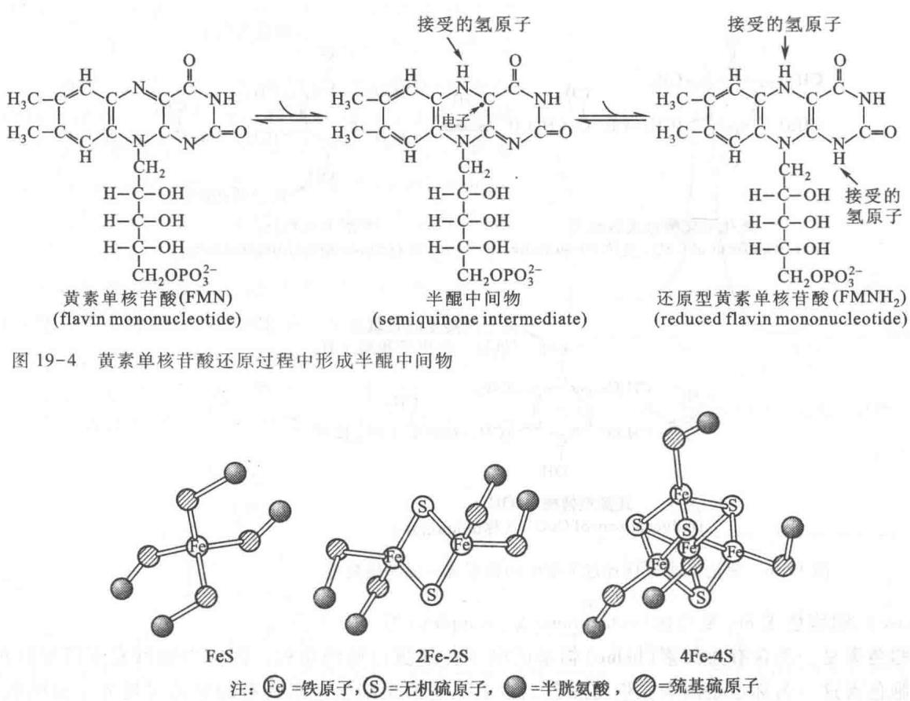  
图 19-5 三种类型铁硫中心的铁原子与硫原子关系示意图

辅酶 Q 中存在一个以异戊二烯(isoprene)为单位构成的碳氢长链,在不同生物中其长度不同。哺乳动物中最常见的是具有 10 个异戊二烯单位的长链,简写为 $Q_{10}$ ,为了简便也往往省略“10”这个脚注。在非哺乳类动物中可能只有 6\~8 个异戊二烯单位。辅酶 Q 的异戊二烯碳氢长链称为类异戊二烯(isoprenoid)链。它的作用是使 Q 成为非极性化合物,使其在线粒体内膜的脂双层中可以迅速扩散。

辅酶 Q 和 FMN 都是 NADH-Q 还原酶的辅酶。辅酶 Q 和 FMN 一样，也能够接受或给出一个或者两个电子，因为它们都能以稳定的半醌形式存在，如图 19-6 所示。

## 3. 琥珀酸-Q 还原酶

琥珀酸-Q还原酶(复合体Ⅱ)是嵌在线粒体内膜中的蛋白质复合体。它就是柠檬酸循环中使琥珀酸氧化为延胡索酸的琥珀酸脱氢酶。FAD作为该酶的辅基在传递电子时并不与酶分离，只是将电子传递给琥珀酸脱氢酶分子的铁硫中心。这些铁硫中心以2Fe-2S,3Fe-3S和4Fe-4S形式存在。电子经过铁硫中心又传递给辅酶Q，从而进入了电子传递链。琥珀酸-Q还原酶和NADH还原酶中的辅酶Q辅基已证明具有完全相同的结构和性质。

在琥珀酸-Q 还原酶以及其他黄素酶中, 将电子从 $FADH_{2}$ 转移到辅酶 Q 上的标准氧还电势变化不能产生足够的自由能用以驱动质子跨膜转运。这一步反应的重要意义在于, 它使得 $FADH_{2}$ 上的具有相对高转移势能的电子进入电子传递链。

## 4. 细胞色素还原酶

细胞色素还原酶的名称多种多样,又称复合体Ⅲ,辅酶 Q-细胞色素 c 还原酶(coenzyme Q-cytochrome

  
图 19-6 氧化型辅酶 Q 经过半醌中间物形成还原型辅酶 Q

c reductase）、细胞色素 $bc_{1}$ 复合体（cytochrome $bc_{1}$ complex）等。

细胞色素是一类含有血红素(heme)辅基的电子传递蛋白质的总称。因含有血红素所以显红色或褐色。细胞色素这一名称也是因为它们有颜色而得名。还原型细胞色素具有明显的可见光光谱吸收现象。可看到 $\alpha, \beta$ 和 $\gamma$ 三条光谱吸收带或称 $\alpha, \beta, \gamma$ 吸收峰。 $\gamma$ 光谱带又称为索瑞氏(soret)光谱带。 $\alpha$ 峰的吸收波长随细胞色素种类的不同而不同。这是区别细胞色素不同种类的重要指标。氧化型的细胞色素看不到有吸收峰的存在。

细胞色素在细胞呼吸中的重要作用前面已经提到,是1925年David Keilin最先发现的。他还根据吸收光谱的不同将细胞色素分为a、b、c三类。细胞色素几乎存在于所有的生物体内。只有极少数的专性厌氧微生物(obligate anaerobes)缺乏这类蛋白质。

同一种细胞色素又因为其所处的环境不同，其 $\alpha$ 吸收峰的波长位置也有一些差异。例如，细胞色素还原酶（复合体Ⅲ）中的细胞色素 $b$ 含有两个血红素 $b$ 分子：其中一种的最大吸收峰在 $562\mathrm{nm}$ ，写作 $b_{562}$ 或 $b_{\mathrm{H}}$ ；另一种的最大吸收峰在 $566\mathrm{nm}$ ，写作 $b_{566}$ 或 $b_{\mathrm{L}}$ 。这两种血红素 $b$ 对电子的亲和力不同，主要是因为环绕它们的蛋白质（结构）不同。琥珀酸-Q还原酶（复合体Ⅱ）已知含有细胞色素 $b_{562}$ ，但并不参与电子传递。细胞色素的可见吸收光谱如图19-7所示。

不同细胞色素最大吸收峰的位置差异如表 19-3 所示。

表 19-3 不同细胞色素的最大吸收峰位置举例

<table><tr><td rowspan="2">细胞色素</td><td colspan="3">波长/nm</td></tr><tr><td> $\alpha$ </td><td> $\beta$ </td><td> $\gamma$ </td></tr><tr><td> $a$ </td><td>600</td><td></td><td>439</td></tr><tr><td> $b_{566}$ </td><td>566</td><td></td><td></td></tr><tr><td> $b_{562}$ </td><td>562</td><td>532</td><td>429</td></tr><tr><td> $c$ </td><td>550</td><td>521</td><td>415</td></tr><tr><td> $c_1$ </td><td>554</td><td>524</td><td>418</td></tr></table>

不同类型的细胞色素中的血红素分子内卟啉环上的取代基团各不相同，这将影响铁原子的氧化还原活性。b型细胞色素的血红素是铁-原卟啉IX（protoporphyrin IX）。铁-原卟啉IX也存在于血红蛋白和肌红蛋白分子中，这种血红素又称为b型血红素。c型细胞色素中的血红素和铁-原卟啉IX的区别是，血红素上的乙烯基（vinyl groups）通过其双键与蛋白质的半胱氨酸（Cys）的巯基作用，形成硫醚键与蛋白质相连。铁-原卟啉IX的结构（b型血红素）和细胞色素c类型（c型血红素）的结构如图19-8所示。

细胞色素还原酶除含有细胞色素 b 外, 还含有 2Fe-2S 类铁硫蛋白, 以及细胞色素 $c_{1}$ 。细胞色素 b 在细胞色素还原酶中以非共价形式结合, 而细胞色素 $c_{1}$ 则是以共价键与蛋白质相连。细胞色素还原酶的部分结构可用图 19-9 表示。

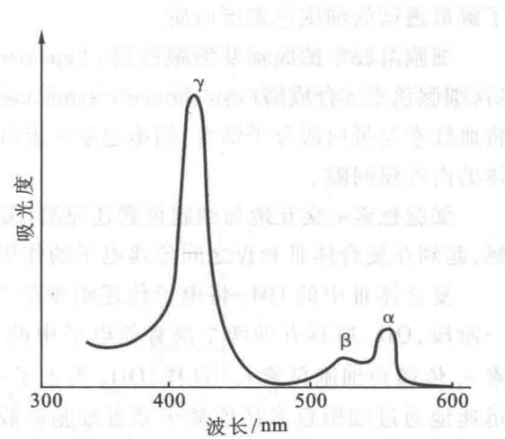  
图19-7 还原型细胞色素 $c$ 的光吸收峰

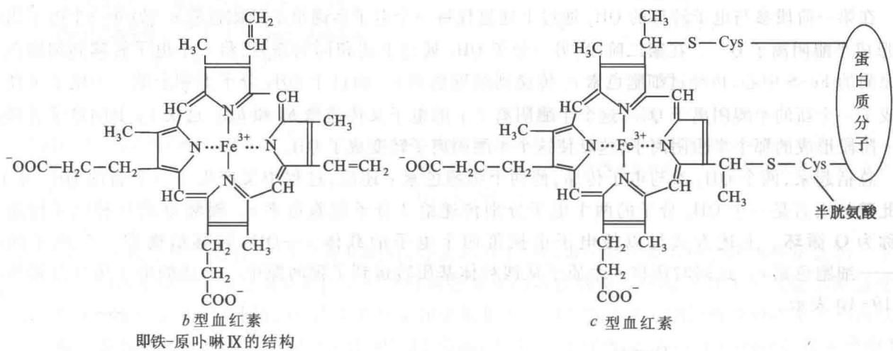  
图19-8 $b$ 型细胞色素和 $c$ 型血红素的基本结构及差异

细胞色素还原酶各亚基在线粒体内膜中的排列方式如下：细胞色素 $c_{1}$ 和铁硫蛋白（又名Rieske铁硫蛋白）位于线粒体内膜的外表面。根据编码细胞色素 $b$ 的线粒体DNA序列推测，不同物种来源细胞色素 $b$ 的多肽链，其氨基酸数目都在380到385之间，并表现出氨基酸序列上的高度一致。细胞色素 $b$ 的多肽链有9次跨线粒体膜的弯曲，每两个弯曲之间是大于20个氨基酸的以疏水残基占优势的伸展多肽链。它们以稳定的 $\alpha$ 螺旋形式跨越脂双层膜。细胞色素 $b$ 中的两个血红素可能是以配位的形式与4个组氨酸(His)残基相连。4个组氨酸残基在肽链中的位置也已经被推测出来。

细胞色素还原酶中血红素辅基的铁原子,在电子传递中发生可逆的 $Fe^{2+}$ 和 $Fe^{3+}$ 的价态变化。在电子传递链中细胞色素还原酶的作用是催化电子从 $QH_{2}$ 转移到细胞色素 c。

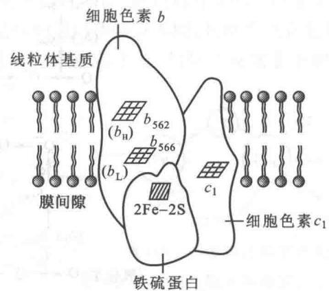  
图 19-9 细胞色素还原酶的部分结构模式

## 5. 细胞色素 $c$

细胞色素 c 是一种相对分子质量为 13000 的球形蛋白质, 直径为 3.4 nm; 它由 104 个氨基酸构成, 为一条单一的多肽链。它是唯一能溶于水的细胞色素。它的氨基酸序列及三维空间结构都已经被测定。是

了解最透彻的细胞色素蛋白质。

细胞溶胶中的脱辅基细胞色素 c(apocytochrome c) 可以跨过线粒体外膜进入线粒体内外膜间隙,之后,细胞色素 c 合成酶(cytochrome c synthetase),又称细胞色素 c 血红素裂合酶(cytochrome c hemelyase),将血红素与蛋白质分子结合,细胞色素 c 蛋白分子发生构象变化,不再能穿过线粒体外膜,被“锁”在线粒体的内外膜间隙。

细胞色素 c 交互地与细胞色素还原酶(复合体Ⅲ)中的细胞色素 $c_{1}$ 和细胞色素氧化酶(复合体Ⅳ)接触,起到在复合体Ⅲ和Ⅳ之间传递电子的作用。

复合体Ⅲ中的 $QH_{2}$ 将电子传递给细胞色素 c 不是简单地一次性完成的，而是分为两个阶段。在第一阶段， $QH_{2}$ 所具有的两个高势能电子中的一个被转移到细胞色素还原酶的铁硫中心，再经过细胞色素 $c_{1}$ 传递到细胞色素 c。这样， $QH_{2}$ 失去了一个电子转变为半醌阴离子，即 $Q^{\cdot\cdot}$ 。半醌中间体上的电子迅速地通过细胞色素还原酶中靠近细胞溶胶侧的血红素 $b_{\mathrm{L}}(b_{566})$ 转移到对电子具有较高亲和力的靠近线粒体基质侧的血红素 $b_{\mathrm{H}}(b_{562})$ 。半醌阴离子 $Q^{\cdot\cdot}$ 失去电子后形成 Q。Q 在线粒体膜内处于自由流动状态。血红素 $b_{H}$ 上的电子之后转移到接近细胞溶胶一边的一个 Q 分子上，于是又形成了一个半醌阴离子 $Q^{\cdot\cdot}$ 。

在第一阶段参与电子转移的 $\mathrm{QH}_2$ 通过上述过程将一个电子传递给了细胞色素 $c$ 。另外一个电子供给Q，形成半醌阴离子 $\mathbf{Q}^{\prime \prime}$ 。在第二阶段，另一分子 $\mathrm{QH}_2$ 通过上述相同的途径，将一个电子转移到细胞色素还原酶的Fe-S中心，再经过细胞色素 $c_{1}$ 传递到细胞色素 $c$ 。而这个 $\mathrm{QH}_2$ 分子上剩余的一个电子又使它形成了一个新的半醌阴离子 $\mathbf{Q}^{\prime \prime}$ ，这个半醌阴离子上的电子又传递给 $b_{\mathrm{L}}$ 和 $b_{\mathrm{H}}$ 。这次 $b_{\mathrm{H}}$ 上的电子传递给第一阶段形成的那个半醌阴离子，这就使这个半醌阴离子转变成了 $\mathrm{QH}_2$ 。

总括起来,两个 $QH_{2}$ 参与电子传递,使两个细胞色素 c 还原,过程中又产生了一个新的 $QH_{2}$ 分子。因此整体而言是一个 $QH_{2}$ 分子的两个电子分别传递给 2 分子细胞色素 c。辅酶 Q 的这种电子传递方式称为 Q 循环。上述方式得以使电子由携带两个电子的载体—— $QH_{2}$ 转移给携带一个电子的载体——细胞色素 c。这同时还将 4 个质子从线粒体基质转运到了膜间隙中。上述的电子传递过程可用图 19-10 表示。

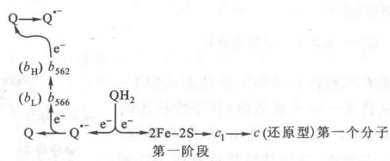

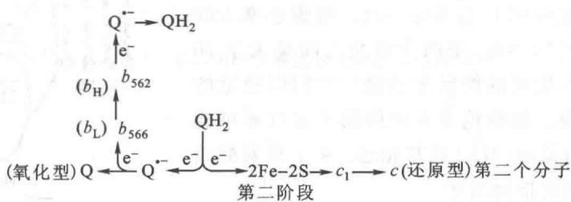  
图 19-10 从细胞色素还原酶到细胞色素 c 的 Q 循环电子传递途径

图中表明细胞色素还原酶接受了两个 $\mathrm{QH}_2$ 分子上的电子，每个 $\mathrm{QH}_2$ 上的一个电子被传递给细胞色素 $c$ 分子；这样，每个 $\mathrm{QH}_2$ 上带有另一个电子，分别形成两个半醌中间体（ $\mathbf{Q}^{\cdot -}$ ）分子。随后，两个半醌中间体上的电子，分别进入另一条传递途径：第一个半醌中间体上的电子经细胞色素 $b(b_{566} \rightarrow b_{562})$ 传递给一个氧化型Q分子，结果形成一个半醌中间体分子；第二个半醌中间体上的电子也经细胞色素 $b(b_{566} \rightarrow b_{562})$ 传递给前面形成的那个半醌中间体分子，结果形成一个新的 $\mathrm{QH}_2$ 分子

## 6. 细胞色素氧化酶

细胞色素氧化酶又称为细胞色素 c 氧化酶(cytochrome c oxidase)或复合体Ⅳ(complex Ⅳ)。

哺乳动物细胞色素氧化酶的相对分子质量大约为 200 000, 是嵌在线粒体内膜的跨膜蛋白质复合体, 其结构如图 19-11 所示。

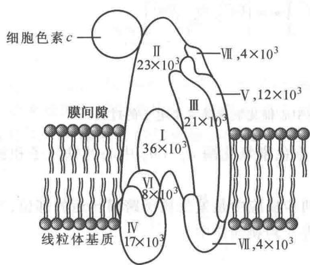  
图 19-11 细胞色素氧化酶结构示意图

  
图中数字表示各亚基的相对分子质量  
图19-12 $a$ 型血红素的结构图

a型血红素(或血红素A)是细胞色素氧化酶中的铁卟啉分子。它与其他血红素的区别在于,一个甲酰基取代了一个甲基,而且拥有一个长达17个碳的碳氢链

哺乳动物细胞色素氧化酶由13个亚基构成，分别称为I、II、III…其中最大的和疏水性最强的三个亚基都由线粒体DNA编码。这些亚基形成类似于细胞色素b的跨膜螺旋。该酶共有4个氧化还原活性中心，为两个a型血红素和三个铜离子，位于亚基Ⅰ和亚基Ⅱ上。两个血红素分别被称为血红素a和血红素 $a_{3}$ 。a型血红素和其他血红素的不同点于图19-12所示：①由一个甲酰基（formyl group）取代一个甲基，②由一15个碳原子组成的碳氢链取代乙烯基（vinyl group）。血红素和蛋白质以非共价键结合。两个血红素a分子虽然在化学结构上完全相同，但因处于细胞色素氧化酶的不同部位，它们具有不同的电子亲和力。三个Cu离子中两个为 $Cu_{A}$ ，另一个为 $Cu_{B}$ ，也是由于它们所结合的蛋白质部位不同，其性质也有差异。 $Cu_{A}$ 的势能较低（\~0.24 V）， $Cu_{B}$ 的势能较高（\~0.34 V）。血红素a位于亚基Ⅰ上，与位于亚基Ⅱ上的两

个 $Cu_{A}$ 接近，血红素 $a_{3}$ 与 $Cu_{B}$ 位于亚基 I 上。血色素 $a_{3}$ 和 $Cu_{B}$ 之间可能通过一个硫(S)原子相连；铁原子和 $Cu_{B}$ 原子构成一个双核中心，可能是 $O_{2}$ 的结合部位，如图 19-13 所示。

细胞色素氧化酶传递电子的顺序如下:先由还原型细胞色素 c 将所携带的电子传递给 $Cu_{A}$ 双核中心,然后再传递给血红素 a,最后传给血红素 $a_{3}-Cu_{B}$ 中的双核中心。在这里 $O_{2}$ 经过一系列还原反应最后生成 2 分子 $H_{2}O$ 。

分子氧是一种理想的最终电子受体。它对电子的强亲和力保证了电子传递所需的热力学驱动力。还原型细胞色素 c 的第 1 个

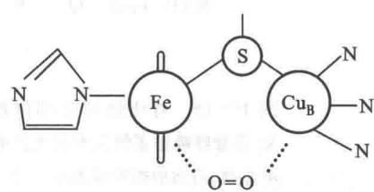  
图 19-13 氧( $O_{2}$ ) 在细胞色素氧化酶中与细胞色素 $a_{3}$ 的铁原子和相邻的铜原子( $Cu_{B}$ ) 的结合关系示意图

电子先传递给 $Cu_{B}$ ，使 $Cu^{2+}$ 还原为 $Cu^{+}$ ; 第 2 个电子传递给血红素 $a_{3}$ 的铁离子，使 $Fe^{3+}$ 还原为 $Fe^{2+}$ 。被 $Cu_{B}-a_{3}$ 双核中心吸引的氧分别从 $Fe^{2+}$ 和 $Cu^{+}$ 上各吸引一个电子形成一种过氧中间体（peroxy intermediate）（图 19-14）。这个中间体再吸引一个电子和两个 $H^{+}$ 形成另一个中间体，称为高铁中间体（ferryl intermediate）。在这一中间产物中，一个氧原子以 -2 价形式结合到 +4 价 Fe 原子上。另外一个氧原子则以 HOH 形式结合到 2 价 Cu 原子上。这个高价中间产物又接受一个电子和 2 个 $H^{+}$ ，最后释放出 2 分子 $H_{2}O$ 。这种结合方式保证了 $O_{2}$ 在和电子结合的过程中避免产生对细胞有害的超氧化负离子（superoxide anion） $O_{2}^{-}$ 。这种超氧化负离子 $O_{2}^{-}$ 是 $O_{2}$ 接受一个电子形成的。

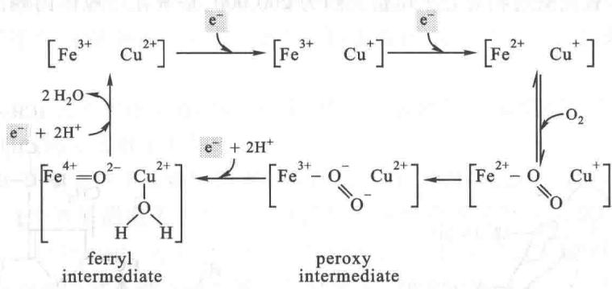  
图19-14 细胞色素氧化酶中的血红素 $a_{3} - \mathrm{Cu}_{\mathrm{B}}$ 双核中心催化氧接受4个电子的过程

通过上述电子传递过程最终产生 2 分子 $H_{2}O$ 的同时，细胞色素氧化酶 $a_{3}-Cu_{B}$ 中心的铁原子和铜原子完成一次循环，回到原来的氧化态。

在上述电子传递过程中,从过氧化物中间体到形成水的两步反应中是发生质子跨膜转运的部位,当一对电子流经细胞色素氧化酶时,有4个质子跨越线粒体内膜进入到膜间质中。

## （五）电子传递的抑制剂

能够阻断呼吸链中某部位电子传递的物质称为电子传递抑制剂。利用专一性抑制剂选择性阻断呼吸链中某个传递步骤，再测定链中各组分的氧化还原态情况，是研究电子传递链顺序的一种重要方法。这种方法的原理正像连通管中的水位图19-15，越靠近出水口水位越低，从入水口到出水口形成均匀下降的梯度；若连通管中某一环节受阻，则在受阻部位之前的水管将充满水，而在受阻部位之后的水管，因无水补充而将流空。

  
图19-15 呼吸链特定部位被抑制后的效果比拟图解

A. 正常呼吸链正像流水在水管中畅流无阻,水面沿流向逐步降低; B. 被阻断后,在阻断部位前面的水管被水充满,后面的则即将流尽

常见的抑制剂有以下几类：

（1）鱼藤酮(rotenone)、安密妥(amytal)、杀粉蝶菌素A(piericidin A)。它们的作用是阻断NADH-Q还原酶中的电子传递，即阻断电子由NADH向辅酶Q的传递。鱼藤酮是一种极毒的植物来源物质，常用作重要的杀虫剂。这几种抑制剂的结构如下：

（2）抗霉素 A(antimycin A)。它是从链霉菌(streptomyces griseus)中分离出来的一种抗生素，能干扰细胞色素还原酶中电子从细胞色素 $b_{H}$ 的传递作用，从而抑制电子从还原型辅酶 Q(QH $_{2}$ ) 到细胞色素 $c_{1}$ 的传递作用。抗霉素 A 的结构如下所示。

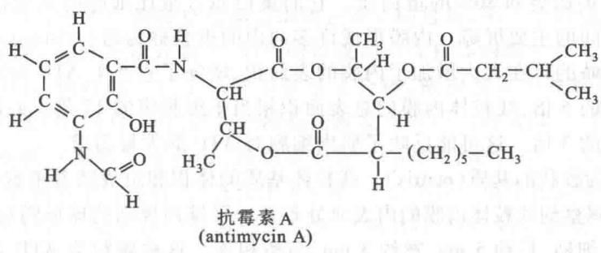

（3）氰化物（cyanide, $\mathrm{CN}^{-}$ ），叠氮化物（azide, $\mathrm{N}_3^-$ ），一氧化碳（carbon monoxide, CO）。它们都能阻断电子在细胞色素氧化酶中的传递。氰化物和叠氮化物与血红素 $a_3$ 的高铁形式（ferric form）作用，而一氧化碳则是抑制 $a_3$ 的亚铁形式（ferrous form）。

上述各种抑制剂对电子传递链的抑制部位可用图 19-16 表示。

  
图19-16 几种电子传递抑制剂的作用部位

## 三、氧化磷酸化作用

真核生物中的电子传递和氧化磷酸化都在线粒体内膜上发生。原核生物中的则在细胞质膜上发生。为了阐明真核细胞内氧化磷酸化发生的机制，有必要在讨论氧化磷酸化机制之前对线粒体的结构做一介绍。

## （一）线粒体的结构

线粒体普遍存在于动、植物细胞内。是需氧细胞产生 ATP 的主要部位。不同类型细胞中的线粒体数目和特性不同；其数目可达到数百甚至数千。例如，每个鼠肝细胞大约含有 800 个线粒体。细胞内的线粒体常位于消耗 ATP 的结构附近，或处于细胞进行氧化作用所需燃料例如脂肪滴附近。昆虫飞翔肌细胞的线粒体规则地排列在肌原纤维周围，这有利于细胞对 ATP 的利用。在细胞溶胶中线粒体所占空间的比例相当可观，在肝细胞中占 20%，在心肌细胞中超过 50%。

线粒体的形状随不同细胞而异。例如，褐色脂肪细胞的线粒体呈球状或近似球状，肝细胞的线粒体呈足球状，肾细胞的线粒体呈圆筒状，成纤维细胞的线粒体为线状。酵母细胞线粒体的形状极不规则，且带有长的突起。线粒体的平均长度为 $1 \sim 2 \mu m$ ，宽为 $0.1 \sim 0.5 \mu m$ 。

线粒体的结构可由图 19-17 表示。

  
图19-17 线粒体的结构

  
A. 线粒体的模式结构 B. 线粒体嵴上的球体示意图

线粒体含有两层膜，及夹在两层膜中间的膜间隙。外膜平滑稍有弹性，大约由一半脂质和一半蛋白质构成，外膜含有线粒体孔道蛋白，构成外膜孔道，能通过相对分子质量小于4 000\~5 000的物质，包括质子。内膜含有大约20%的脂类和80%的蛋白质。它的蛋白质含量比细胞的其他任何膜都高。内膜是细胞溶胶和线粒体基质之间的主要屏障。内膜形成许多向内的折叠称为嵴（cristae）。嵴的数目和结构随细胞类型的不同而不同。嵴的存在大大增加了内膜的表面积，增强了它产生ATP的能力。肝细胞线粒体内膜的表面积相当于外膜的5倍，线粒体内膜的总表面积相当于细胞膜的17倍。心脏和骨骼肌线粒体的嵴相当于肝线粒体细胞嵴的3倍。这可能反映了肌肉细胞对ATP的大量需求。

内膜所包围的空间为胶状的基质(matrix)。线粒体基质的体积和组成随着细胞代谢的变化而变化。通过负染法和电子显微镜观察到线粒体内膜的内表面分布着一层排列规则的球形颗粒(图19-17B)。球的直径为8\~9 nm,并带有一细柄,长约5 nm,宽约3 nm,与嵴相连。这种颗粒为ATP合酶。内膜还含有许多涉及电子传递的蛋白质复合体,以及负责物质跨膜运送的转运蛋白(transporters)。因为有些分子,如ADP、Pi以及ATP等,都不能透过线粒体内膜,这些蛋白质分子使ADP和Pi从细胞溶胶进入线粒体基质,也使ATP等分子从线粒体基质进入到细胞溶胶。占内膜约20%的脂主要构成其磷脂双层。这大大降低了内膜对质子的通透性,从而使得形成跨线粒体内膜的质子梯度成为可能。

与细胞溶胶相接触的膜间隙也含有酶类,如腺苷酸激酶(adenylate kinase)等。

可以把线粒体的功能概括为3个方面。第一方面是丙酮酸以及脂肪酸等氧化为 $CO_{2}$ ，同时使 $NAD^{+}$ 和FAD还原为NADH和 $FADH_{2}$ 。这是发生在线粒体基质或面向基质的内膜蛋白质上。第二方面是电子从NADH和 $FADH_{2}$ 传至 $O_{2}$ ，并同时形成跨膜质子梯度。第三方面是将贮存于电化学质子梯度的能量由内膜上的ATP合酶(ATP synthase)复合体合成ATP。

## （二）氧化磷酸化作用机制

前面着重讨论了电子传递过程及在此过程中自由能的释放,电子从一个 NADH 到 $O_{2}$ 传递过程的化学反应式为:

$$
\mathrm{NADH} + \mathrm{H} ^ {+} + 1 / 2 \mathrm{O} _ {2} \longrightarrow \mathrm{NAD} ^ {+} + \mathrm{H} _ {2} \mathrm{O}
$$

这一反应所释放的标准自由能 $\Delta G^{\ominus'} = -220.5 \, \text{kJ/mol} (-52.7 \, \text{kcal/mol})$

下面要讨论的是一个 NADH 分子将电子传递过程中所释放的自由能贮存于 ATP 的过程。全过程大约能合成 3 个分子的 ATP，总反应式为：

$$
3 \mathrm{ADP} + 3 \mathrm{Pi} \longrightarrow 3 \mathrm{ATP} + 3 \mathrm{H} _ {2} \mathrm{O}
$$

这一吸能反应的标准自由能变化 $\Delta G^{\ominus'} = 3 \times 7.3 \, kJ/mol = +91.6 \, kJ/mol (+21.9 \, kcal/mol)$

从上面的反应和计算表明,3个ATP分子的形成共劫获了电子由NADH传递到氧所释放全部自由能的42%(21.9/52.7×100%)。

前面已经提到,氧化磷酸化作用和底物水平磷酸化作用有原则的区别。氧化磷酸化作用是指与电子传递链相偶联的由 ADP 形成 ATP 的过程,底物水平的磷酸化是指直接将一个代谢中间产物(例如磷酸烯醇式丙酮酸)上的磷酸基团转移到 ADP 分子上形成 ATP 的过程。

早在 1940 年, S. Ochoa 等人最先测定了呼吸过程中 $O_{2}$ 的消耗和 ATP 生成的定量关系。用组织匀浆 (tissue homogenates) 以及组织切片 (tissue slices) 所开展的研究工作表明, 组织利用 $O_{2}$ 的同时, ATP 含量随之增加, 测定放射性同位素标记的无机磷酸进入 ATP 中的量即可得出 ATP 的合成量。实验表明, 每消耗 1 个 O 原子合成约 3 个 ATP 分子。这个比例关系称为磷-氧比即 P/O 比。P/O 比也可以看作是一对电子通过呼吸链传至 $O_{2}$ 所产生的 ATP 分子数。从测出的 P/O 比值所得到的假设是, 在电子由 NADH 到 $O_{2}$ 的传递过程中, ATP 可能是在 3 个不同的部位生成的。实验结果也表明, 沿电子传递链确实有 3 个部位可以释放足够的能量形成一个 ATP。测量结果表明, $FADH_{2}$ (琥珀酸脱氢酶) 的电子通过辅酶 Q 进入电子传递链时, P/O 比值是 2。

## 1. ATP 合成的部位

前面已经讨论过, ATP 合成利用的是将 NADH 和 FADH₂ 上的电子传递给氧的过程中释放出来的自由能。其释放自由能的部位有三处: 第 1 个部位是由复合体 I 将 NADH 上的电子传递给辅酶 Q 的过程, 第 2 个部位是由复合体 III 将电子由辅酶 Q 传递给细胞色素 c 的过程, 第 3 个部位是复合体 IV 将电子从细胞色素 c 传递给氧的过程。后来的研究表明, ATP 的合成是由线粒体内膜上和电子传递完全不同的分子组装体 (molecular assembly) 执行的。它是一种多亚基复合体, 最初被称为线粒体 ATP 酶 (mitochondrial ATPase) 或称为 H-ATP 酶 (H⁺-ATPase), 因为该酶最初被发现可以水解 ATP。但是它在线粒体内的真正作用是合成 ATP。为强调该酶的实际功能, 现在普遍称为 ATP 合酶 (ATP synthase), 又称为复合体 V (complex V)。ATP 合酶和电子传递酶类 (复合体 I \~ IV) 完全不同。电子传递所释放出的自由能必须通过一种中间形式才可被 ATP 合酶利用。这种能量的保存和 ATP 合酶对它的利用称为能量偶联 (energy coupling) 或能量转换 (energy transduction)。

## 2. 能量偶联假说

氧化磷酸化作用与电子传递之间的偶联关系已经不存在任何疑问。但是电子在传递过程中究竟怎样促使 ADP 磷酸化, 还有许多未完全阐明的问题。历史上共存在三种主要假说: 化学偶联假说 (chemical coupling hypothesis)、结构偶联假说 (conformational coupling hypothesis) 和化学渗透假说 (chemiosmotic hypothesis)。这三种假说的要点如下:

（1）化学偶联假说 化学偶联假说是 1953 年 Edward Slater 最先提出的。他认为电子传递过程产生一种高能共价中间物。它随后的裂解驱动 ADP 的磷酸化作用。这种例证可见于糖酵解作用中 ATP 的合成。3-磷酸甘油醛被 $NAD^{+}$ 氧化释放的能量供给形成 1,3-二磷酸甘油酸的需要。1,3-二磷酸甘油酸是一种具有高能磷酸基团的酰基磷酸化物。它的高能磷酸基团随后在磷酸甘油酸激酶的作用下转移给 ADP 而生成 ATP。虽然在糖酵解作用中可看到这种情况，但是在氧化磷酸化作用中一直未能找到任何一种类似的高能中间产物。

（2）构象偶联假说 这一假说是1964年Paul Boyer最先提出的。他认为电子沿电子传递链传递使线粒体内膜某些蛋白质组分发生了构象变化，形成一种高能形式。这种高能形式通过ATP的合成而恢复其原来的构象。这一假说和化学偶联假说一样，至今未能找到有力的实验证据。但是在ATP合酶的催化过程中仍可能存在某种形式的构象偶联现象。

（3）化学渗透假说 这一假说是1961年由英国生物化学家Peter Mitchell最先提出的。他认为电子传递释放出自由能和ATP合成这两种过程是通过一种跨线粒体内膜的质子梯度(proton gradient)而偶联的。也就是，电子传递的自由能驱动 $\mathrm{H^{+}}$ 从线粒体基质跨过内膜进入到膜间隙，从而形成跨线粒体内膜的 $\mathrm{H^{+}}$ 电化学梯度(electrochemical $\mathrm{H^{+}}$ gradient)。这个梯度的电化学电势(electrochemical potential,用 $\Delta \mu \mathrm{H}^{+}$ 来表示)驱动ATP的合成。图19-18可作为化学渗透假说的示意图。

化学渗透假说可以解释许多关键的实验结果。例如：

① 氧化磷酸化作用的进行需要封闭的线粒体内膜存在。

② 线粒体内膜对 $H^{+}$ 、 $OH^{-}$ 、 $K^{+}$ 和 $Cl^{-}$ 等离子都是不通透的。

③ 破坏 $H^{+}$ 浓度梯度的形成(用解偶联剂或离子载体试剂等)将破坏氧化磷酸化作用的进行。

④ 在分离到的线粒体内膜两侧人工制造一个质子和电化学梯度可导致 ATP 的生成。

Mitchell 因提出化学渗透假说而获得 1978 年的诺贝尔化学奖。迄今虽然能量偶联的具体分子机制尚未完全阐明，但是跨膜质子电化学梯度产生的质子化学电势即 $\Delta\mu H^{+}$ 和质子跨膜循环在能量偶联中起关键作用的理论已经成为共识。

虽然化学渗透假说能够解释氧化磷酸化过程的大部分问题,但仍有一些问题尚未得到圆满解决。例如 $H^{+}$ 究竟是怎样通过电子传递链而被逐出的,当前虽然已经有些设想,但仍无被公认的揭示机制。

## （三）质子梯度的形成

电子传递使复合体Ⅰ、Ⅲ和Ⅳ推动 $H^{+}$ 跨过线粒体内膜到线粒体的间隙(图19-19)，线粒体膜间隙与细胞溶胶相通。 $H^{+}$ 跨膜流动的结果造成线粒体基质的 $H^{+}$ 浓度低于膜间隙。线粒体基质形成负电势，而膜间隙形成正电势，这样产生的电化学梯度即电动势(electromotive force, emf)称为质子动势或质子动力(protonmotive force, pmf)。其中蕴藏的自由能为ATP合成提供动力。

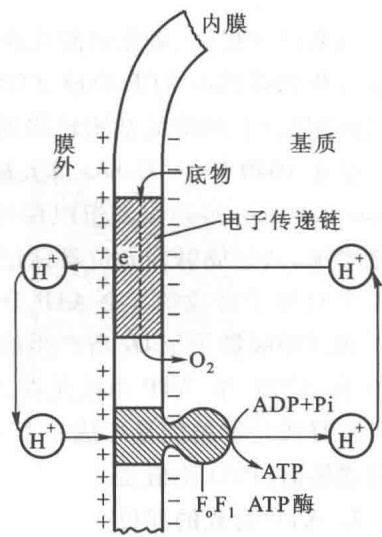  
图 19-18 化学渗透假说示意图

图中表明电子传递链是一个 $H^{+}$ 离子泵（质子泵）使 $H^{+}$ 从线粒体基质排到内膜外，在内膜外面的 $H^{+}$ 浓度比膜内高，即形成一种 $H^{+}$ 浓度梯度，所产生的电化学电势驱动 $H^{+}$ 通过 ATP 合成酶系统的 $F_{0}F_{1}ATP$ 酶分子上的特殊通道回流到线粒体基质，同时释放出自由能与 ATP 的合成相偶联

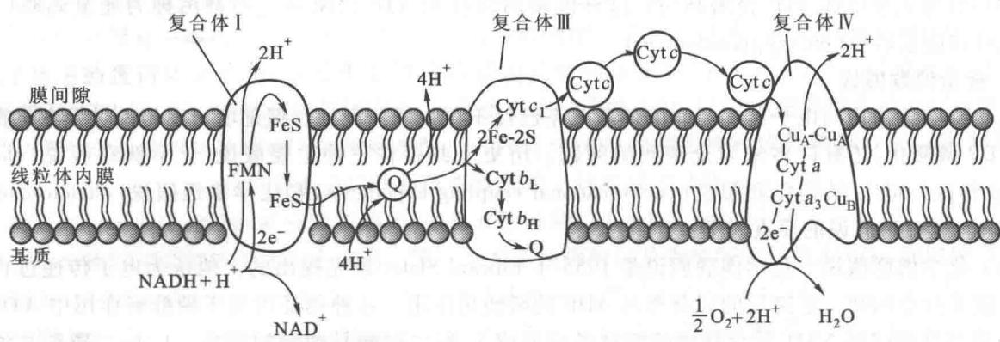  
图 19-19 表明电子传递和 $H^{+}$ 排出偶联关系的线粒体电子传递链图解

## 1. 质子泵出是耗能过程

一个质子逆电化学梯度跨过线粒体内膜的自由能变化公式可以表示如下：

$$
\Delta G = 2. 3 R T [ \mathrm{pH(膜内)} - \mathrm{pH(膜外)} ] + Z F \Delta \Psi
$$

式中 Z 为质子上的电荷（包括符号），F 为法拉第（faraday）常数， $\Delta\Psi$ 为跨膜电势差。习惯上当电子从负极转移到正极时， $\Delta\Psi$ 为正值。因为线粒体内膜外的 pH 低于内膜内的 pH，因此质子从线粒体基质转运到膜间隙是逆质子梯度转移，所以是一个耗能过程。而且质子从基质转运出去后使内膜的内表面比外表面电负性更强。一个正离子（阳离子）向外转移必然使其自由能增加，是个耗能过程。如果是一个负离子被转移出去，就会得到完全相反的结果。

## 2. 质子转移的机制有两种假设

电子传递链的4种电子传递复合体中的3种复合体即复合体Ⅰ、Ⅲ和Ⅳ都被认为和质子转移有密切关系。有关质子主动转移和电子传递产生的自由能如何偶联的机制当前存在两种假设：一种是氧化还原回路机制（redox loop mechanism），另一种是质子泵机制（proton pump mechanism）。

（1）氧化还原回路机制 该机制由 Mitchell 提出。可简称为氧还回路机制。他认为线粒体内膜呼吸链的各个氧化还原中心即 FMN、辅酶 Q、细胞色素以及铁硫中心的排列可能既使电子转移，也使质子转移。前一个被还原的氧还中心被后一个氧还中心再氧化，同时伴随质子的转移，包括质子由基质泵出和在线粒体内膜外的质子回流到基质一边。氧还回路机制可用图 19-20 表示。

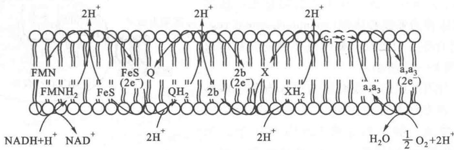  
图 19-20 线粒体内电子传递与质子转移相结合的氧还回路机制示意图  
FMN 和辅酶 Q 起着 $\left(\mathrm{H}^{+}+\mathrm{e}^{-}\right)$ 载体的作用。铁硫中心和细胞色素是单纯的 $e^{-}$ 载体，这些组分的排列既  
能满足电子传递又能伴有 $\mathrm{H}^+$ 的转移。图中的X是假想的呼吸链中的第3个转移 $\mathrm{H}^+$ 的分子

氧化还原回路机制要求第1个氧化还原载体处在还原态时比其氧化态含有更多的氢原子，其第2个氧化还原载体在氧化态和还原态时所含的氢原子数没有差异。事实上FMN和辅酶Q在还原态时确实含有较多的氢原子，因此可以起质子载体和电子载体的双重作用。如果这些中心专一地与细胞色素和铁硫中心这样的纯电子载体进行交换，这种设想的机制是可以成立的。图19-20即表示这种交换机制。

这种氧化还原回路机制的主要问题是,呼吸链中只发现2种 $\left(\mathrm{H}^{+}+\mathrm{e}^{-}\right)$ 电子载体的存在。而已知最早表明似乎有3个部位能转运质子。因此,按此种机制设想必须有另外一个 $\left(\mathrm{H}^{+}+\mathrm{e}^{-}\right)$ X载体存在(图19-20)。

为了解决上述问题, Mitchell 曾提出一种设想, 即辅酶 Q 可能在复合体的质子转移中发挥两次作用, 通过所谓的 Q 循环。但是 Q 循环不能在复合体Ⅳ中起作用, 复合体Ⅳ中没有 $\left(\mathrm{H}^{+}+\mathrm{e}^{-}\right)$ 载体。虽然如此复合体Ⅳ还是被认为在电子传递过程中能将质子从基质“泵”出到膜间隙中。

（2）质子泵机制 这个机制的内容是，电子传递导致复合体的构象变化。质子的转移是氨基酸侧链pK值变化产生的结果。构象变化造成氨基酸侧链pK值的改变，结果发挥质子泵作用的侧链暴露在外并交替地暴露在线粒体内膜的内侧或外侧，从而使质子发生移位。

当前,以上两种机制虽然各自都有一些旁证,但尚未能在电子传递链本身得到完全令人信服的证据。

质子的跨膜转运和 ATP 形成的机制是复杂的,在电子传递链的不同部位发生的质子转运可能通过不同的机制实现。这正是当前仍旧引人注目的课题。

（3）合成一个 ATP 需要 2\~3 个质子跨膜转运 在生理条件下合成一个 ATP 分子所需自由能为 +(40\~50) kJ/mol。这个值不可能由一个质子流回到线粒体基质的跨膜驱动力提供，至少需要两个质子的流回。尽管此值很难精确测得，因为被转移到膜间隙的质子还有一部分又漏回基质。但测定的结果表明，每合成一分子 ATP 有 2\~3 个质子从膜间隙跨膜转运到基质。

## （四）ATP合成机制

ATP 的合成是由一个蛋白质复合体完成的。这个复合体被称为 ATP 合酶 (ATP synthase)，它由两个主要的单元 (unit) 构成，如图 19-21 所示。起质子通道作用 (proton-conducting) 的单元称为 $F_{0}$ 单元 [ $F_{0}$ 右下角的注脚为英文的“o”字母而不是“零”， $F_{0}$ 中的 o 表示此酶是寡酶素 (oligomycin) 敏感型的酶]，催化 ATP 合成的单元称为 $F_{1}$ 单元。因此，ATP 合酶又称为 $F_{0}F_{1}-ATP$ 酶 ( $F_{0}F_{1}-ATPase$ )。

研究质子动力如何用于合成 ATP 的实验材料可使用通过超声波制备的亚线粒体结构。

## 1. 亚线粒体结构

1960 年 Efraim Racker 发现用超声波处理线粒体, 可将其嵴打成碎片, 这些碎片会自动重新封闭起来形成泡状体。这些泡状体称为亚线粒体泡 (submitochondrial vesicles)。这种囊泡的特点是使原有朝向基质侧的线粒体内膜翻转朝外, 如图 19-22 所示。

由内膜重新封闭形成的亚线粒体泡仍保有氧化磷酸化作用的功能。在亚线粒体泡的外周可见内膜球体，即ATP合酶的 $F_{1}$ 单元。如果用尿素（urea）或胰蛋白酶（trypsin）处理这些囊泡，则内膜上的 $F_{1}$ 球状体会从囊泡上脱落。但 $F_{0}$ 单元仍留在上面。这种处理过的囊泡还保

图 19-21 ATP 合酶结构示意图

该酶像一个花朵, $F_{0}$ 单元是质子通道, $F_{1}$ 单元是 ATP 的合成部位

  
图19-22 亚线粒体泡的制备及重组示意图  
将亚线粒体泡分解成失去磷酸化作用的无球体的部分和可溶性的 $F_{1}$ ATP 酶球体部分, 然后又重组为具有氧化磷酸化作用的泡, 多数亚线粒体泡的膜是内表面翻转向外的线粒体内膜

有电子传递的功能,但却失去了合成 ATP 的功能。而脱落下来的球体却具有催化 ATP 水解的功能。当将 $F_{1}$ 球体再加回到保有 $F_{0}$ 的囊泡时,则氧化磷酸化作用又可恢复,即恢复了 ATP 合成的功能。这时又可看到在囊泡周围的 $F_{1}$ 球体。因此,可以认为 $F_{1}$ 单元的正常功能是催化 ATP 合成,其水解 ATP 的功能是在缺乏质子梯度的情况下表现出的非正常生理功能。

## 2. $\mathbf{F}_1$ 单元和 $\mathbf{F}_0$ 单元的结构

$F_{1}$ 单元是球状结构, 其直径为 8.5\~9.0 nm, 已知由 5 种不同的亚基组成(表 19-4)。各亚基的化学计量比为 $\alpha_{3}\beta_{3}\gamma\delta\varepsilon$ , 总的相对分子质量为 378 000。用电子显微镜观察到的 $F_{o}F_{1}$ 颗粒呈蘑菇状。催化 ATP 合成的部位在 $\beta$ 亚基上, $\delta$ 亚基是 $F_{1}$ 和 $F_{o}$ 相连接所必需的。 $F_{o}$ 通过一个大约 5 nm 的柄与 $F_{1}$ 单元相连。柄包含有两种蛋白质。一种称为寡霉素敏感性赋予蛋白 (oligomycin-sensitivity-conferring protein, OSCP)。另一种蛋白质称为偶合因子 6 (coupling factor 6, $F_{6}$ )。

$F_{0}$ 是跨线粒体内膜的疏水蛋白质复合体。它是质子通道，除上述两种蛋白质外它还包括由 a, b, c 三种亚基组的 $ab_{2}c_{8\sim15}$ 结构。每个 $F_{0}$ 单元的 8\~15 个相对分子质量为 8000 的 c 亚基在膜内形成一个环状结构。寡霉素对 ATP 合酶的抑制作用是由于它结合到 ATP 合酶的 $F_{0}$ 亚基上，从而抑制 $H^{+}$ 通过 $F_{0}$ ，有趣的是寡霉素抑制剂并非结合到寡霉素敏感性赋予蛋白上，而是结合在 a 亚基和 c 亚基的相互作用表面上。寡霉素（oligomycin）是一种抗生素，它的结构如下：

  
寡霉素B的结构式

有一种脂溶性的羧基试剂（carboxyl reagent）称为二环己基碳二亚胺（dicyclohexylcarbodiimide）简称DCCD，它的结构如下：

二环己基碳二亚胺(DCCD)

因 DCCD 是一个脂溶性的羧基试剂, $F_{0}$ 上的 c 亚基与 DCCD 发生反应表明有一个羧基位于脂质环境, 即埋藏在膜内。

表 19-4 线粒体 ATP 合酶复合体组分

<table><tr><td>亚基</td><td>相对分子质量</td><td>作用</td><td>定位</td></tr><tr><td> $F_1$ </td><td>378 000</td><td>含有合成 ATP 的催化部位</td><td>线粒体内膜向基质侧的球状体</td></tr><tr><td>α</td><td>56 000</td><td></td><td></td></tr><tr><td>β</td><td>52 000</td><td></td><td></td></tr><tr><td>γ</td><td>34 000</td><td></td><td></td></tr><tr><td>δ</td><td>14 000</td><td></td><td></td></tr><tr><td>ε</td><td>6 000</td><td></td><td></td></tr><tr><td> $F_o$ </td><td>113 000</td><td>含有质子通道</td><td>跨膜部位</td></tr><tr><td>a</td><td>21 000</td><td></td><td></td></tr><tr><td>b</td><td>12 000</td><td></td><td></td></tr><tr><td>c</td><td>8 000</td><td></td><td></td></tr><tr><td>OSCP</td><td>23 000</td><td></td><td></td></tr><tr><td> $F_6$ </td><td>8 000</td><td></td><td></td></tr><tr><td> $F_1$ 抑制因子( $IF_1$ )</td><td>10 000</td><td>抑制 ATP 水解</td><td> $F_oF_1$ 之间的柄</td></tr></table>

## 3. 质子流通过 ATP 合酶时释出与酶牢固结合的 ATP 分子

质子流是如何驱动 ATP 合成的？这个问题一直是科学家感兴趣的课题。一种假设认为最初是能化的质子(energized protons)通过 $F_{0}$ 质子通道集中到 $F_{1}$ 的催化部位，在此处质子脱去无机磷酸上的一个氧原子，结果使平衡驱向 ATP 合成。但是用同位素交换实验却证明了在没有质子动力的情况下 ATP 就能有效合成。将 ADP 和无机磷酸加入到含有 $H_{2}^{18}O$ 的 ATP 合酶中， $^{18}O$ 可通过 ATP 的合成和随后的水解被掺入到无机磷酸分子中。如下式：

$^{18}$ O 掺入到无机磷酸的速度表明,在没有质子梯度存在的情况下,与 $F_{1}$ 催化部位结合着的 ATP 和游离的 ADP 处于平衡状态。但是如果没有质子流通过 $F_{0}$ , 合成的 ATP 就不能离开催化部位。因此 Paul Boyer 认为质子梯度的作用并不是形成 ATP, 而是使 ATP 从酶分子上释放出来。Paul Boyer 还发现, ATP 合酶分子与 ADP 和 Pi 的结合, 有促使 ATP 分子从酶上释放出来的作用。这表明 ATP 合酶分子上的核苷酸 (ATP、ADP) 结合部位在催化过程中有相互协同的作用。Paul Boyer 对于质子驱动 ATP 合成的机制问题提出“结合变化机制”(binding-change mechanism)。这个机制可用图 19-23 表示。

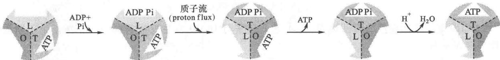  
图 19-23 ATP 合酶的结合变化机制示意图

Paul Boyer 提出, 在 ATP 合酶上的 3 个. $\beta$ 亚基尽管氨基酸序列完全相同, 但它们的作用在任何一个时间点都是不相同的。其中之一处于 “O” (open) 状态, 即是开放形式, 对底物的亲和力极低。另一个处于 “L” (loose) 状态。这种状态与底物的结合较松弛, 对底物没有催化能力。第 3 个处于 “T” (tight) 状态, 与底物结合紧密, 并有催化活性。如果在酶分子的 “T” 部位结合着一个 ATP 分子, 又有 ADP 和 Pi 结合到它的 “L” 部位, 这时质子流的能量使 “T” 部位转变为 “O” 部位, “L” 部位转变为 “T” 部位, “O” 部位转变为 “L” 部位 (图 19-23)。当 “T” 部位转变为 “O” 部位时, ATP 就可以解脱下来, 同时又使原来结合 ADP 和 Pi 的 “L” 部位转变成 “T” 部位并合成新的 ATP 分子。只有当质子流从 $F_{0}$ 流经 ATP 合酶时才发生 “O” “L” 和 “T” 状态之间的相互转变。这种构象转变是连续发生的, 很可能是通过 $\gamma$ 亚基与 $\beta$ 亚基的非对称相互作用实现。

ATP 合酶的作用是由质子动力所驱动的。这种动力实质上是由 pH 梯度和膜电势产生的。某些氨基酸残基在 pH 梯度的条件下可以发生质子化(protonation)或去质子化(deprotonation)。这种在一边的质子化和另一边的去质子化而驱动的一个单方向的反应循环可构成促使 ATP 合成的驱动力。

## （五）氧化磷酸化的解偶联和抑制

正常情况下,电子传递和磷酸化是紧密偶联的。在静止状态(resting state),氧化磷酸化处于最低水平,这时通过线粒体内膜的电化学梯度的大小正好能够阻止质子泵的活动,于是电子传递也就受到抑制。在有些情况下,电子传递和磷酸化作用可被解偶联,可举出以下情况:

## 1. 特殊试剂的解偶联作用

特殊的化学试剂可干扰氧化磷酸化过程的不同步骤,这是研究氧化磷酸化中间过程的有效方法。不同的化学试剂对氧化磷酸化作用的影响方式不同,可分为三大类,一类称为解偶联剂,另一类称为氧化磷酸化抑制剂,第三类称为离子载体抑制剂。

（1）解偶联剂(uncoupler) 这类试剂的作用是通过消除跨膜质子梯度而使电子传递和 ATP 形成两个过程分离,不再紧密关联。它们不抑制电子传递过程,使电子传递产生的自由能最终都变为热能。这种试剂使电子传递不再与 ATP 生成偶联,造成过分地消耗氧和燃料底物,但能量得不到贮存。典型的解偶联剂是弱酸性亲脂试剂如2,4-二硝基苯酚(2,4-dinitrophenol,DNP)，它的作用机制可用图19-24表示。解偶联剂的作用只抑制氧化磷酸化的ATP形成，对底物水平的磷酸化没有影响。

  
图19-24 2,4-二硝基苯酚消除跨膜质子梯度的作用机制

在 pH 7 的环境下,2,4-二硝基苯酚以离解的形式存在( )这种形式不能透过膜,因它是脂不

溶性的。在酸性的环境中2,4-二硝基苯酚接受质子后成为不解离的形式而变为脂溶性的，从而可有效地透过膜，同时将一个质子带入膜内。解偶联剂使膜对 $\mathrm{H^{+}}$ 的通透性增加，将其带到 $\mathrm{H^{+}}$ 浓度低的一边。这样就破坏了跨膜质子梯度的形成（参看化学渗透偶联学说），这种破坏 $\mathrm{H^{+}}$ 梯度而引起解偶联现象的试剂又称质子载体试剂。

其他一些酸性芳香族化合物如 FCCP（为三氟甲氧基苯腙羰基氰化物，carbonylcyanide-p-trifluoromethoxyphenylhydrazone 的简称）也有同样作用。FCCP 的结构式如图 19-25 所示。

（2）氧化磷酸化抑制剂(inhibitor) 这类试剂的作用特点是既抑制氧的利用也抑制 ATP 的形成,但不直接抑制电子传递链上电子载体的作用。这一点和电子传递抑制剂不同。氧化磷酸化抑制剂的作用是直接干扰 ATP 的生成过程。由于它干扰了由电子传递的高能状态形成 ATP 的过程,结果也使电子传递不能进行。寡霉素(oligomycin) 就属于这类抑制剂。寡霉素作用和 2,4-二硝基苯酚(解偶联试剂) 作用之不同,可用实验清楚地表明(图 19-26):当在线粒体悬浮液中,加入寡霉素后,再加入 ADP,不见有刺激呼吸的作用发生,这时若加入 DNP 解偶联试剂,则可看到呼吸作用立即加快,表明寡霉素对利用氧的抑制作用可被解偶联试剂解除。

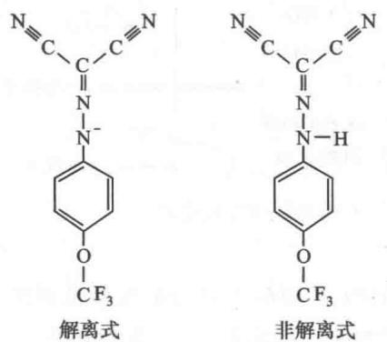  
图 19-25 FCCP(三氟甲氧基苯腙羰基氰化物)的结构式

  
图 19-26 线粒体呼吸时的氧气消耗和 ATP 生成之间的关联, 寡霉素对氧消耗的抑制作用, 以及 DNP 解除寡霉素的抑制作用

（3）离子载体抑制剂（ionophore） 这是一类脂溶性物质。这种物质能与某些离子结合并作为它们的载体使这些离子能够穿过膜。它和解偶联试剂的区别在于它是除 $H^{+}$ 以外其他一价阳离子的载体，例如缬氨霉素（valinomycin）能够结合 $K^{+}$ 离子，与 $K^{+}$ 形成脂溶性的复合物，于是携带 $K^{+}$ 透过膜。如果 $K^{+}$ 离子不与缬氨霉素结合,它透过膜的速度就很低。又如短杆菌肽(gramicidin)可使 $K^{+}$ 、 $Na^{+}$ 以及其他一些一价阳离子穿过膜。因此,这类抑制剂是通过增加线粒体内膜对一价阳离子的通透性而破坏氧化磷酸化过程的(参看生物膜与物质运送)。

## 2. 激素控制褐色脂肪线粒体氧化磷酸化解偶联机制使产生热量

电子传递过程所产生的电化学 $\mathrm{H^{+}}$ 离子梯度受到人为破坏而与ATP形成过程解偶联并产生热已如前述。有一种褐色脂肪组织(brown adipose tissue)，由含大量甘油三酯和大量线粒体的细胞构成。线粒体内的细胞色素使褐色脂肪呈褐色。人类、新生无毛的哺乳动物和冬眠哺乳动物在颈部和背部都含有褐色脂肪。它的作用是非战栗性产热(nonshivering thermogenesis)。这和由战栗性肌肉收缩或其他活动引起ATP水解产热机制不同，褐色脂肪的产热是线粒体氧化磷酸化解偶联的结果。褐色脂肪线粒体内膜上含有一种蛋白质称为产热蛋白(thermogenin)，或解偶联蛋白(uncoupling protein)，这种蛋白质只存在于褐色脂肪的线粒体中，它控制着线粒体内膜对质子的通透性。适应于寒冷生活的动物在褐色脂肪的线粒体内膜蛋白质中含有高达 $15\%$ 的产热蛋白。该蛋白质可被游离脂肪酸激活，但被嘌呤核苷酸（如ADP和GDP）抑制。核苷酸类对它的抑制可被游离脂肪酸解除。脂肪酸刺激质子流通过该蛋白质并使氧化磷酸化解偶联从而产生热量。褐色脂肪中游离脂肪酸的产生又受到去甲肾上腺素(norepinephrine)的调节。在去甲肾上腺素的作用下，去甲肾上腺素受体系统合成cAMP，于是变构激活cAMP依赖性蛋白激酶(cAMP-dependent protein kinase)，随后激酶又通过磷酸化作用激活激素敏感的甘油三酯酶(hormone-sensitive triacylglycerol lipase)，最后被激活的脂酶催化甘油三酯水解产生游离脂肪酸。

## （六）细胞溶胶内的NADH的再氧化

细胞溶胶内的 NADH 不能透过线粒体内膜进入线粒体氧化。目前已知可通过两种“穿梭”途径解决这些 NADH 的再氧化问题。一种称为 3-磷酸甘油穿梭途径（glycerol-3-phosphate shuttle），另一种称为苹果酸-天冬氨酸穿梭途径（malate-aspartate shuttle）。

## 1. 3-磷酸甘油穿梭途径

由糖酵解过程产生的 NADH 虽不能穿过线粒体内膜,但是 NADH 上的电子却可以通过该穿梭机制进入到线粒体内膜上的电子传递链。在这里起电子载体作用的即是 3-磷酸甘油。后者所介导的穿梭作用如图 19-27 所示。

图 19-27 中所示的穿梭作用的第 1 步是电子从 NADH 转移到磷酸二羟丙酮形成 3-磷酸甘油。催化这一反应的酶称为 3-磷酸甘油脱氢酶，该反应是在细胞溶胶中进行的。3-磷酸甘油上的电子对然后转移到位于线粒体内膜上的线粒体 3-磷酸甘油脱氢酶（mitochondrial glycerol-3-phosphate dehydrogenase）的辅基 FAD

  
图19-27 3-磷酸甘油穿梭途径

分子上。3-磷酸甘油转变为磷酸二羟丙酮，FAD 还原为 $FADH_{2}$ 。磷酸二羟丙酮被释放到细胞溶胶中，这就使 3-磷酸甘油完成了携带 NADH 电子进入线粒体内膜的使命，并完成了一次穿梭历程。

在线粒体内膜上被还原的 $FADH_{2}$ 将电子传递给辅酶 Q 使之还原为 $QH_{2}$ ，于是进入了电子传递链，已如前述。

甘油磷酸穿梭途径将 NADH 电子转移进入电子传递链进行氧化磷酸化所利用的电子传递中介体是 FAD 而不是 $NAD^{+}$ ，这就使从 NADH 脱下的电子通过氧化磷酸化最后生成的 ATP 分子数比以 $NAD^{+}$ 作为传递体时少大约 1 个 ATP 分子。也就是说细胞溶胶中的 NADH 上的电子通过甘油磷酸穿梭途径转运后形成的 ATP 分子不是 2.5 个，而是 1.5 个。昆虫飞行肌中存在这种穿梭途径。

## 2. 苹果酸-天冬氨酸穿梭途径

心脏和肝细胞溶胶内的 NADH 的电子进入线粒体是通过苹果酸-天冬氨酸穿梭途径。在这条途径中，NADH 的电子由细胞溶胶的苹果酸脱氢酶（cytoplasmic malate dehydrogenase）催化传递给草酰乙酸使后者转变为苹果酸，同时 NADH 氧化为 $NAD^{+}$ 。苹果酸通过苹果酸- $\alpha-$ 酮戊二酸转运蛋白（malate- $\alpha-ketoglutarate$ transporter）穿过线粒体内膜。进入线粒体内的苹果酸在线粒体基质内被 $NAD^{+}$ 氧化失去电子又转变为草酰乙酸，形成 NADH。基质内的草酰乙酸并不易透过线粒体内膜，但是由草酰乙酸经过转氨基作用（参看第 25 章）形成的天冬氨酸，通过谷氨酸-天冬氨酸转运蛋白可透过线粒体内膜转移到细胞溶胶侧，随后通过转氨基作用又转变为草酰乙酸。这种穿梭途径和甘油磷酸穿梭途径的差异是它可逆转。由于该反应的可逆性，因此只有当细胞溶胶中的 NADH 和 $NAD^{+}$ 之比值比线粒体基质内的比值高时，NADH 才通过这条途径进入线粒体。这条途径的最终结果是将细胞溶胶中的 NADH 所荷电子转移到线粒体基质内，为进入电子传递链创造条件。苹果酸-天冬氨酸穿梭途径可用图 19-28 表示。

  
图 19-28 苹果酸-天冬氨酸穿梭示意图

## (七) 氧化磷酸化的调控

细胞内电子传递和 ATP 形成的偶联关系是强制性的, ATP 的生成必须以电子传递为前提, 而呼吸链上的电子传递也只有在 ATP 被生成时才可发生。完整的线粒体只有当无机磷酸和 ADP 都充分时电子传递速度才能达到最高水平。当缺少 ADP 时, 因为缺乏磷酸的受体则不能进行磷酸化作用。[ATP]/[ADP]之比在细胞内对电子传递速度起着重要的调节作用, 同时对还原型辅酶的积累和氧化也起调节作用。ADP 作为关键物质对氧化磷酸化作用的调节称为呼吸的受体控制 (receptor control)。当细胞利用 ATP 做功时, 细胞内 ATP 水平迅速下降, 同时 ADP 的浓度迅速升高。这无论从热力学或动力学方面都有利于氧化磷酸化的进行。于是 ATP 的合成加速, 电子传递也加速, 各种辅酶往复的氧化还原反应又活跃起来, 底物又不断地被氧化, 氧的利用也增加。反之, 若 ATP 在细胞内积累时, ADP 的浓度必然很低。这时电子传递变缓或停止, 还原型辅酶浓度增加以致不能再接受电子, 于是整个呼吸链也受到抑制或停止。因此, 氧化磷酸化作用的进行和细胞对 ATP 的需要是相适应的。这种精确的适应正是靠以 ADP 作为关键物质的“受体控制”来实现的。

B. Chance 和 G. R. Williams 曾根据线粒体利用氧的情况观察到呼吸作用的 5 种状态, 如图 19-29 所示。

悬浮的线粒体在既无可氧化的底物又无 ADP 情况下的呼吸状态称为状态 I（state I），这时的氧利用率极低。加入 ADP 后的呼吸状态称为状态 II，ADP 刚加入时有一个短暂刺激呼吸的作用。如果既加入 ADP 又加入底物，这时的氧化状态称为状态 III。这时氧的利用速度很快。这种状态一直继续到 ADP被用尽,再加入 ADP,于是氧的利用又迅速增加,这时的状态称为状态Ⅳ。当氧被耗尽时,线粒体呼吸停止,这时称为状态 V。在这些状态中,只有状态Ⅳ和Ⅲ经常发生。状态Ⅲ和 ADP 的加入直接相关。这也说明 ADP 对呼吸链的重要调节作用。

受体控制的定量表示法是测定有 ADP 存在时氧的利用速度(状态Ⅲ)和没有 ADP 时氧的利用速度(状态Ⅳ)的比值。

完整的线粒体其受体控制值可高达10以上,而受损伤或衰老的线粒体此值可低至1,这表明电子传递速度和ATP的形成已经失去偶联,或只有很少偶联,虽然电子传递仍保持最大速度,但失去了磷酸化作用。

受体控制比值是鉴定分离的线粒体完整状况的指标,比值越高表明线粒体越接近完整。如图 19-30 所示,由 ADP 的浓度改变所导出的氧的消耗可测得 $\Delta ADP/\Delta O$ 的比值,这个比值和 P/O 比正相吻合。

  
图19-29 线粒体呼吸的5种状态

  
图19-30 呼吸的受体控制

随着呼吸第Ⅳ状态(没有 ADP)和第Ⅲ状态(过量的 ADP)的互相转变,线粒体的超微结构也相应发生着明显的变化。这些变化是线粒体基质变化所造成的。当缺乏 ADP 时,线粒体的内部分隔完全充满整个线粒体空间,内膜与外膜相接,这种状态称为常态(orthodox state)(图 19-31)。当加入 ADP 后,线粒体处于呼吸活动状态(即第Ⅲ状态)。基质的体积压缩成只有常态体积的 50%,内膜和嵴的折叠变得更密更曲折,这种状态称为紧缩态(condensed state)(图 19-31)。常态和紧缩态的结构相应地反映着线粒体的 ATP 生成系统处于“静止”或“活动”状态。完整的肝细胞内,线粒体处于第Ⅲ状态和第Ⅳ状态之间。ADP 的浓度比较低,不足以使呼吸达到最大速度。当细胞受刺激而活动时,呼吸速度增加,线粒体处于紧缩态,即第Ⅲ种呼吸状态。

  
常态（“静止态”）

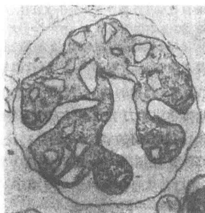  
紧缩态（“活动态”）  
图 19-31 线粒体常态和紧缩态的电子显微图  
图中表明鼠肝线粒体在静止态(状态Ⅳ)和活动态(状态Ⅲ)的超微结构变化,内膜-基质的结构和体积的显著变化可能和内膜ADP-ATP移位酶与ADP分子的结合有关

## (八) 一个葡萄糖分子彻底氧化产生 ATP 分子数的总结算

关于一个葡萄糖分子彻底氧化为水和 $CO_{2}$ 究竟产生多少 ATP 分子的问题一直受到人们的关注。葡萄糖分解通过糖酵解和柠檬酸循环形成的 ATP 或 GTP 的分子数，根据化学计算可以得到明确的答案。但是氧化磷酸化产生的 ATP 分子数还难以精确计算或测定。因为根据化学渗透学说 P/O 比等无须为整数，也无须为一固定值。根据当前最新测定，在一对电子经 NADH-Q 还原酶、细胞色素还原酶和细胞色素氧化酶传到 $O_{2}$ 的过程中，从线粒体基质泵出到内膜外的细胞溶胶侧的质子数依次为 4、2 和 4。合成一个 ATP 分子可能是由 3 个 $H^{+}$ 通过 ATP 合酶所驱动。还需要一个 $H^{+}$ 用于将 ATP 从基质运往膜外细胞溶胶。因此一对电子从 NADH 传至 $O_{2}$ ，所产生的 ATP 分子数是 2.5 个。经由细胞色素还原酶部位进入电子传递链的电子，例如琥珀酸，或细胞溶胶中的 NADH，它们的电子对只产生 1.5 个 ATP 分子。这样，当一分子葡萄糖彻底氧化为 $CO_{2}$ 和水所得到的 ATP 分子数和过去传统的统计数相比（36 个 ATP）少了 6 个 ATP 分子，成为 30 个。全部的统计列于表 19-5。在这 30 个 ATP 分子中，26 个是由氧化磷酸化作用生成的。

表 19-5 一个葡萄糖分子彻底氧化生成 ATP 分子的统计

<table><tr><td>反应名称</td><td>生成 ATP 分子数</td></tr><tr><td>糖酵解作用(在细胞溶胶中进行)</td><td></td></tr><tr><td>1.葡萄糖磷酸化</td><td>-1</td></tr><tr><td>2.6-磷酸果糖磷酸化</td><td>-1</td></tr><tr><td>3.2分子1,3-二磷酸甘油(1,3-BPG)去磷酸化</td><td>+2</td></tr><tr><td>4.2分子磷酸烯醇式丙酮酸去磷酸化</td><td>+2</td></tr><tr><td>5.2分子3-磷酸甘油醛氧化产生2分子NADH</td><td></td></tr><tr><td>2分子丙酮酸转变为乙酰-CoA产生2分子NADH(在线粒体中进行)</td><td></td></tr><tr><td>柠檬酸循环(在线粒体内进行)</td><td></td></tr><tr><td>1.2分子琥珀酰-CoA产生2分子GTP(相当ATP)</td><td>+2</td></tr><tr><td>2.2分子异柠檬酸氧化产生2分子NADH</td><td></td></tr><tr><td>3.2分子α-酮戊二酸氧化产生2分子NADH</td><td></td></tr><tr><td>4.2分子苹果酸氧化产生2分子NADH</td><td></td></tr><tr><td>5.2分子琥珀酸氧化产生2分子 $FADH_2$ </td><td></td></tr><tr><td>氧化磷酸化作用(在线粒体内膜进行)</td><td></td></tr><tr><td>1.糖酵解作用中产生的2个NADH每分子形成1.5个ATP(NADH假定通过甘油磷酸穿梭途径转运)</td><td>+3</td></tr><tr><td>2.丙酮酸氧化脱羧反应产生2分子NADH每分子生成2.5个ATP分子</td><td>+5</td></tr><tr><td>3.柠檬酸循环形成两分子 $FADH_2$ ,每分子产生1.5个ATP</td><td>+3</td></tr><tr><td>4.异柠檬酸、α-酮戊二酸、苹果酸氧化共产生6分子NADH,每分子生成2.5个ATP分子</td><td>+15</td></tr><tr><td>总计</td><td>+30</td></tr></table>

注:如果在葡萄糖氧化过程中是通过苹果酸-天冬氨酸穿梭途径运转 NADH, 在总结算中还多形成 2 分子 ATP, 于是总计形成 32 个 ATP

## （九）氧的不完全还原

呼吸链电子传递过程中的几步都可能产生具有很高反应活性的活性氧,如细胞色素还原酶中产生的半醌中间体可能将其电子传给 $O_{2}$ ，形成氧的自由基(oxygen radicals)。一个电子使氧还原形成超氧化物负离子(superoxide anion, $O_{2}^{\cdot-}$ )，两个电子使氧还原形成过氧化氢(hydrogen peroxide, $H_{2}O_{2}$ )，3个电子使氧还原形成羟自由基(hydroxyl radical, OH $^{-}$ )。反应式如下：

$$
\begin{array}{r l} & {\mathrm {O_ {2} + e^ {-} \longrightarrow O_ {2} ^ {\cdot - }}} \\ & {\mathrm {O_ {2} + 2e^ {-} + 2H^ {+} \longrightarrow H_ {2} O_ {2}}} \\ & {\mathrm {O_ {2} + 3e^ {-} + 3H^ {+} \longrightarrow H_ {2} O + OH^ {\cdot}}} \end{array}
$$

不完全还原形式的氧反应性极强，对机体非常有害。羟自由基是其中最强的氧化剂也是最活跃的诱变剂（mutagen）。这种自由基当机体受到电离辐射时就会产生。生物要存活必须将这些毒性极强的高活性氧转变为活性较小的形式。需氧细胞有几种主要的自我保护机制使机体免受不完全还原氧的侵害。其中最主要的一种方式是通过酶的作用，包括超氧化物歧化酶（superoxide dismutase）、过氧化氢酶（catalase）和过氧化物酶（peroxidase）。

使超氧化物阴离子解毒的主要方式是由超氧化物歧化酶将其转变为过氧化氢 $\left(\mathrm{H}_{2}\mathrm{O}_{2}\right)$ 。该酶催化的是一种歧化反应(dismutation reaction)，即两个相同的底物形成两种不同的产物，一个超氧化物负离子被氧化，而另一个则被还原。反应如下式：

$$
\mathrm{O} _ {2} ^ {\cdot -} + \mathrm{O} _ {2} ^ {\cdot -} + 2 \mathrm{H} ^ {+} \longrightarrow \mathrm{H} _ {2} \mathrm{O} _ {2} + \mathrm{O} _ {2}
$$

超氧化物歧化酶清除 $O_{2}^{\cdot-}$ 的可能机制如下所述：

红细胞的细胞溶胶中的超氧化物歧化酶的活性部位含有一个铜离子和一个锌离子，因此又称为铜-锌超氧化物歧化酶。这两个离子在催化反应中与酶蛋白侧链的组氨酸（His）残基协同作用。带有负电荷的超氧化物，由于静电作用，被吸引到超氧化物歧化酶的带正电荷的活性部位。这个活性部位正处于球形酶的凹陷底部。在凹陷处的外围由带有负电荷的残基所环绕。超氧化物负离子 $\mathrm{O}_2^{+ - }$ 与 $\mathrm{Cu}^{2 + }$ 和精氨酸的胍基（guanido group）相结合，使超氧化物上的一个电子被转移到2价铜离子（cupric ion）上形成1价的 $\mathrm{Cu^{+}}$ 和 $\mathrm{O_2}$ ，后者被释出。第2个超氧化物负离子进入酶的活性部位与1价的 $\mathrm{Cu^{+}}$ 、精氨酸和 $\mathrm{H}_3\mathrm{O}^+$ 结合，被结合的 $\mathrm{O}_2^{+ - }$ 从 $\mathrm{Cu^{+}}$ 上得到一个电子，从被结合的 $\mathrm{H}_3\mathrm{O}^+$ 得到两个质子形成 $\mathrm{H}_2\mathrm{O}_2$ 。于是酶活性部位的1价铜离子又恢复到2价 $\mathrm{Cu}^{2 + }$ 。反应机制如图19-32所示。

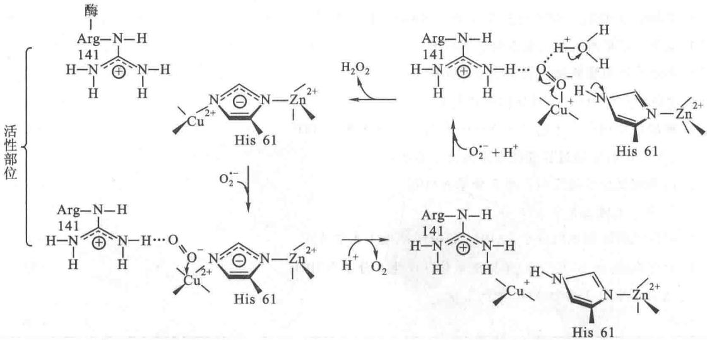  
图 19-32 超氧化物歧化酶可能的催化机制,在反应过程中铜离子在 1 价和 2 价之间发生价态变化  
在酶与 $O_{2}^{\cdot-}$ 开始作用时组氨酸残基既与铜离子 $(\mathrm{Cu}^{2+})$ 相结合也与 $Zn^{2+}$ 相结合，精氨酸的胍基以正电荷吸引 $O_{2}^{\cdot-}$ ，经电子转移后释出 $O_{2}$ ，铜离子还原为 $Cu^{+}$ ，与组氨酸暂时分离，当再与另一分子 $O_{2}^{\cdot-}$ 结合后释出 $H_{2}O_{2}$ ，酶复原， $Cu^{+}$ 氧化为 $Cu^{2+}$ 并恢复与组氨酸结合

超氧化物负离子还可通过第二条途径形成过氧化氢。首先是 $O_{2}^{\cdot-}$ 的质子化，生成过氧羟自由基（hydroperoxyl radical, $HO_{2}^{\cdot-}$ ）。它是超氧化物负离子的共轭酸（conjugate acid）。2 分子过氧羟自由基自发

地结合形成过氧化氢。反应如下式：

$$
\begin{array}{r l} & {\mathrm {O_ {2} ^ {\cdot - } + H^ {+} \longrightarrow HO_ {2} ^ {\cdot}}} \\ & {\mathrm {HO_ {2} ^ {\cdot} + HO_ {2} ^ {\cdot} \xrightarrow [ \text {自发地} ]{} H_ {2} O_ {2} + O_ {2}}} \end{array}
$$

无论是由超氧化物负离子或由其他代谢反应生成的过氧化氢都是对机体有害的。机体内由过氧化氢酶将其分解为水和 $O_{2}$ 。反应如下式：

$$
2 \mathrm{H} _ {2} \mathrm{O} _ {2} \xrightarrow {\text {过氧化氢酶}} 2 \mathrm{H} _ {2} \mathrm{O} + \mathrm{O} _ {2}
$$

过氧化物酶也可以破坏过氧化氢,但需有一个可提供电子的化合物作为电子供体存在,此电子供体用 $AH_{2}$ 表示。反应如下式:

$$
\mathrm{AH} _ {2} + \mathrm{H} _ {2} \mathrm{O} _ {2} \xrightarrow {\text {过氧化物酶}} 2 \mathrm{H} _ {2} \mathrm{O} + \mathrm{A}
$$

谷胱甘肽过氧化物酶(glutathione peroxidase)是一种含硒(selenium)的酶,存在于红细胞内。它与谷胱甘肽的氧化相偶联,催化红细胞内过氧化氢的分解。反应如下式:

$$
\mathrm{H} _ {2} \mathrm{O} _ {2} + 2 \mathrm{GSH} \xrightarrow [ \text {谷胱甘肽(还原型)} ]{\text {谷胱甘肽过氧化物酶}} \mathrm{GSSG} + 2 \mathrm{H} _ {2} \mathrm{O}
$$

谷胱甘肽过氧化物酶对保护红细胞不受 $H_{2}O_{2}$ 的损害是必需的。氧化型的谷胱甘肽在谷胱甘肽还原酶的作用下还原，又生成 GSH。

羟自由基主要由过氧化物负离子与过氧化氢反应生成：

$$
\mathrm{O} _ {2} ^ {\cdot -} + \mathrm{H} _ {2} \mathrm{O} _ {2} \longrightarrow \mathrm{OH} ^ {\cdot} + \mathrm{OH} ^ {\cdot} + \mathrm{O} _ {2}
$$

因此清除过氧化物负离子和过氧化氢不只除去了这两种有害的活性氧,还防止了更有害的羟自由基的生成。

虽然机体存在有效的消除自由基的途径,但不可避免地在机体内还会存在一些羟自由基。它们可能参与3种主要反应:

① 使金属离子氧化形成高氧化态：

$$
\mathrm{OH} ^ {\cdot} + \underset {\text {金属离子}} {\mathrm{M} ^ {n +}} \longrightarrow (\mathrm{MOH}) ^ {n +} \longrightarrow \mathrm{M} ^ {n +} + \mathrm{H} _ {2} \mathrm{O}
$$

② 从 C—H 键中获取一个氢原子,使形成水和有机物自由基(organic radical)。

③加到双键上形成二级基团。

由于不完全还原氧造成对人类的危害极大,甚至和癌症、衰老以及其他许多疾病有关,因此有人主张每天服用一些有抗氧化作用的维生素例如维生素 A、C 和 E,对于抗病以及抗衰老或许是有益的。

## 提要

氧化磷酸化使 NADH 和 $FADH_{2}$ 再氧化，并将释放出的能量以 ATP 的形式进行贮存。真核细胞氧化磷酸化在细胞的线粒体内膜上进行，而原核细胞则在细胞质膜上进行。

物质氧化还原电势 E 的大小代表它对电子的亲和力。标准氧还势 $(E^{\ominus})$ 是在 pH 7 及标准状态下测得的数值，用伏特(V)表示。反应的标准自由能变化在 pH 7 时用 $\Delta G^{\ominus}$ 表示，可从反应物和产物的氧还电势的变化 $\Delta E^{\ominus}$ 计算求得。 $\Delta E^{\ominus}$ 为正值的反应，它的 $\Delta G^{\ominus}$ 为负值，这种反应为放能反应。

电子从 NADH 传递到氧是沿着一条电子传递链，也叫呼吸链进行的。这条电子传递链主要包括 4 种蛋白质复合体：NADH-Q 还原酶（复合体 I）、琥珀酸-Q 还原酶（复合体 II）、细胞色素还原酶（复合体 III）和细胞色素氧化酶（复合体 IV）。它们所利用的电子载体有 FMN、铁硫中心、醌类、血红素基团以及铜离子等。在 NADH-Q 还原酶中电子从 NADH 先转移到 FMN 辅基，形成 $FMNH_{2}$ ，再转移到 Fe-S 中心，使其中的铁原子发生 3 价 $\left(\mathrm{Fe}^{3+}\right)$ 和 2 价 $\left(\mathrm{Fe}^{2+}\right)$ 的价态变化。电子最后转移到辅酶 Q，使其从氧化型辅酶 Q 转变为还原型的 $QH_{2}$ 。辅酶 Q 是疏水性电子载体，能够在膜内自由地扩散。 $QH_{2}$ 上的电子随后传递给细胞色素还原酶。后者是由细胞色素 b 和 $c_{1}$ 以及铁硫蛋白构成的复合体。含有血红素的细胞色素，其中的铁原子在传递电子过程中，从 $Fe^{3+}$ 变为 $Fe^{2+}$ ，当电子再转移到其他组分后铁原子又恢复其 $Fe^{3+}$ 状态。细胞色素还原酶（复合体Ⅲ）上的电子最后转移到细胞色素 c 上。细胞色素 c 是一个水溶性的周边膜蛋白（peripheral membrane protein），它和辅酶 Q 一样都是传递电子的流动载体。细胞色素 c 接受电子后立即将其传递给细胞色素氧化酶。该酶含有两种细胞色素（细胞色素 a 和 $a_{3}$ ）以及两种铜离子 $\left(\mathrm{Cu}_{\mathrm{A}}\right.$ 和 $\left.\mathrm{Cu}_{\mathrm{B}}\right)$ 。在电子传递时，铜原子往复地发生 $Cu^{2+}$ 和 $Cu^{+}$ 的价态变化。最后细胞色素氧化酶传递 4 个电子到氧分子，形成 2 分子 $H_{2}O$ 。

沿电子传递链发生的氧还电势的变化是每一步自由能变化的依据。在 NADH-Q 还原酶、细胞色素还原酶（又称细胞色素 $bc_{1}$ 复合体）和细胞色素氧化酶催化的三步反应中，自由能的变化足以将 $H^{+}$ 离子（质子）从线粒体内膜基质“泵”（pump）出线粒体内膜进入到线粒体的内外膜间隙，于是产生了一种跨内膜的 $H^{+}$ 离子梯度。因此，上述三种酶（即三种复合体）的每一种都一个质子泵。质子泵都由电子传递提供驱动力。

$FADH_{2}$ 再氧化为 FAD 时, 是将其所带的电子对传递给琥珀酸-Q 还原酶。后者将电子传递给辅酶 Q, 电子通过辅酶 Q 进入电子传递链, 经进一步传递形成跨膜质子梯度以及合成 ATP 分子。琥珀酸-Q 还原酶本身并没有质子泵的作用。

鱼藤酮、安密妥通过抑制 NADH-Q 还原酶抑制电子传递，抗霉素 A 抑制细胞色素还原酶，氰化物 $\left(\mathrm{CN}^{-}\right)$ 、叠氮化物 $\left(\mathrm{N}_{3}^{-}\right)$ 以及一氧化碳 (CO) 抑制细胞色素氧化酶。

电子流经复合体Ⅰ、Ⅲ、Ⅳ时将质子从线粒体内膜的基质侧泵出到细胞溶胶侧。由pH梯度和膜电势构成质子动力。这时细胞溶胶侧为酸性，其电性为电正性。当质子从细胞溶胶侧经ATP合酶流回到线粒体基质时，则产生驱动力使ADP和Pi合成ATP。ATP合酶由 $F_{0}$ 和 $F_{1}$ 两个单元构成。质子流回基质通过 $F_{0}$ 中的通道，ATP的合成部位则是在 $F_{1}$ 单元。与ATP合酶紧密结合着的ATP分子，当质子流经该酶时被释放出来。

一对电子流经 NADH-Q 还原酶所产生的质子动力足够形成 1 个 ATP 分子, 流经细胞色素还原酶形成 0.5 个 ATP 分子, 流经细胞色素氧化酶形成 1 个 ATP。因此每个 NADH 分子通过氧化磷酸化所产生的 ATP 分子是 2.5 个。而一个 FADH₂ 的氧化只形成 1.5 个 ATP 分子。因为它通过辅酶 Q 进入电子传递链上的细胞色素还原酶, 细胞溶胶中的 NADH 通过呼吸链一般也形成 1.5 个 ATP 分子。因为它的电子一般是通过甘油磷酸穿梭途径进入电子传递链。一个葡萄糖分子完全氧化为 CO₂ 和 H₂O 可产生大约 30 个 ATP 分子。

电子传递在正常情况下是与 ATP 的合成强制性偶联的。只有当 ATP 被合成时，电子才可流经电子传递链传递到氧。也只有当 ATP 合成发生时电子的传递才继续进行；如果 ATP 的合成减少，电子传递也随之下降。因此只有当细胞需要 ATP 分子时，电子传递过程才会有效进行。

有一些化合物例如 2,4-二硝基苯酚(DNP)属于解偶联试剂。这类试剂使电子传递有效进行,尽管不合成 ATP。因为它们可使 H $^{+}$ 离子通过线粒体内膜,从而破坏质子梯度,从而电子传递与 ATP 形成之间的偶联解除了,致使产生的能量只能以热的形式释放。在机体的某些组织例如褐色脂肪组织的线粒体中,电子传递和 ATP 合成也被一种产热蛋白(thermogenin)解偶联。由这种脂肪组织产生的热称为非战栗产热,对新生儿有保护敏感机体组织的作用,对冬眠动物有维持体温的作用。

细胞溶胶的 NADH 不能直接跨过线粒体内膜进入线粒体基质进行再氧化。它可通过 3-磷酸甘油穿梭途径再氧化。细胞溶胶的 3-磷酸甘油脱氢酶催化 NADH 氧化，并使磷酸二羟丙酮还原为 3-磷酸甘油。而后又由位于线粒体内膜外侧的 3-磷酸甘油脱氢酶将其转变为磷酸二羟丙酮。该酶以 FAD 为辅助因子。磷酸二羟丙酮可回到细胞溶胶内。在心脏和肝细胞溶胶内 NADH 的再氧化通过苹果酸-天冬氨酸穿梭途径使其电子进入氧化呼吸链。在细胞溶胶中的草酰乙酸由 NADH 还原为苹果酸，通过线粒体内膜上的苹果酸- $\alpha$ -酮戊二酸载体进入线粒体基质。在基质内苹果酸由 $NAD^{+}$ 氧化又形成草酰乙酸，而 $NAD^{+}$ 则还原为NADH，结果相当于细胞溶胶中的NADH将电子传递给了基质内的NADH，后者可以进入呼吸链。草酰乙酸通过转氨酶的作用形成天冬氨酸后离开线粒体基质，在细胞溶胶内又通过转氨酶的作用形成草酰乙酸。

## 习题

1. 什么是氧化还原电势？怎样计算氧化还原电势？

2. 将下列物质按照容易接受电子的顺序加以排列：

(a) $\alpha-$ 酮戊二酸+CO $_{2}$ (c) O $_{2}$

(b) 草酰乙酸 (d) $\mathrm{NADP}^{+}$

3. 在电子传递链中各成员的排列顺序根据什么原则？

4. 在一个具有全部细胞功能的哺乳动物细胞匀浆中加入下列不同的底物, 当每种底物完全被氧化为 $CO_{2}$ 和 $H_{2}O$ 时, 能产生多少 ATP 分子?

(a) 葡萄糖 (e) 磷酸烯醇式丙酮酸

(b) 丙酮酸 (f) 柠檬酸

(c) 乳酸 (g) 磷酸二羟丙酮

(d) 1,6-二磷酸果糖 (h) NADH

5. 在生物化学中 $O_{2}$ 形成 $H_{2}O$ 所测得的标准氧化还原电势为 0.82 V, 而在化学测定中测得的数值为 1.23 V, 这种差异是怎样产生的?

6. 电子传递链和氧化磷酸化之间有何关系？

7. 解释下列的化合物对电子传递和氧化呼吸链有何作用？当供给充分的底物包括异柠檬酸、 $\mathrm{Pi}$ 、 $\mathrm{ADP}$ 、 $\mathrm{O}_2$ ，并分别加入下列化合物时，估计线粒体中的氧化呼吸链各个成员所处的氧化还原状态。

(a) DNP (e) $\mathbf{N}_3^-$

(b) 鱼藤酮 (f) CO

(c) 抗霉素 A (g) 寡霉素

(d) $CN^{-}$

8. 什么是磷/氧比(P/O 比), 测定磷/氧比有何意义?

9. P/O 比、每对电子转运质子数之比 $\left(\mathrm{H}^{+}/2\mathrm{e}^{-}\right)$ 、形成一分子 ATP 所需质子数的比例、将 ATP 转运到细胞溶胶所需质子数之比 $\left(\mathrm{P}/\mathrm{H}^{+}\right)$ ，它们之间是否有相关性？

10. 计算琥珀酸由 FAD 氧化和由 $NAD^{+}$ 氧化的 $\Delta G^{\ominus'}$ (利用表 19-1 的数据)。设 $FAD//FADH_{2}$ 氧还电对的 $\Delta E^{\ominus'}$ 接近于 0 V。解释为什么在琥珀酸脱氧酶催化的反应中只有 FAD 能作为电子受体而不是 $NAD^{+}$ ?

11. 电子传递链产生的质子电动势为 0.2 V, 转运 2、3、4 个质子, 温度为 $25^{\circ}$ C, 所得到的有效自由能为多少? 用这些能可合成多少 ATP 分子?

## 主要参考书目

1. 吉林大学. 物理化学. 北京: 人民教育出版社, 1979.

2. 王镜岩, 朱圣庚, 徐长法. 生物化学教程. 北京: 高等教育出版社, 2008.

3. 郑集, 陈钧辉. 普通生物化学. 3 版. 北京: 高等教育出版社, 1998.

4. Stryer L. Biochemistry. 4th ed. New York: W. H. Freeman and Company, 1995.

5. Voet D, Voet J G. Biochemistry. New York: John Wiley and Sons, 1990.

6. Stenesh J. Biochemistry. New York: Plenum Press, 1998.

7. Roskoski R. Biochemistry. New York: W. B. Saunders Company, 1996.

8. Hames B D, Hooper N M, Houghton J D. Instant Notes in Biochemistry. Berlin: Springer, 1998.

9. Pedersen P L, L Amzel M. ATP synthases. Journal of Biological Chemistry, 1993, (268): 9937-9940.

10. Nelson D L, Cox M M. Lehninger Principles of Biochemistry. 6th ed. New York: Worth Publishers, 2013.

11. Fetter J R, Qian J, Shapleigh J, et al. Possible proton relay pathways in cytochrome c oxidase. Proc Natl Acad Sci USA. 1995, (92): 1604-1608.

12. Gray H B, Winkler J R. Electron transfer in proteins. Annu Rev Biochem. 1996, (65): 537-561.

13. Boyer P D. The ATP synthase—a splendid molecular machine. Annu. Rov. Biochem. 1998, (66):717-749.

14. Kinosita K J, Yasuda R, Noji H, et al. F $_{1}$ ATPase: a rotary motor made of a single molecule. cell. 1998, (93):21-24.

15. Stock D, Losile A G W, Walker J E. Molecular architecture of the rotary motor in ATP synthase. Science. 1999, (286): 1700-1705.

16. Klinganberg M, Huang S G. Stucture and function of the ancoupling protein from brown adipose tissue. Biochim. Biophys. Acta. 1999, (1415):271-296.

(王镜岩 昌增益)

## 网上资源

自测题
