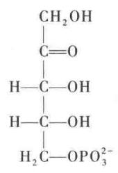
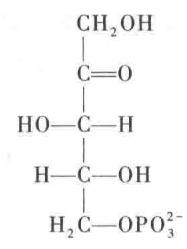
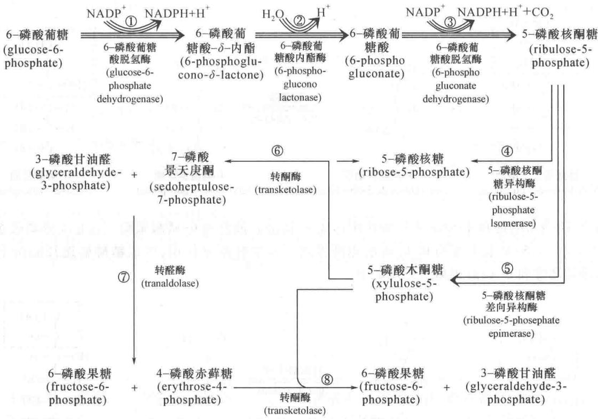

# 第 20 章 戊糖磷酸途径

## 一、戊糖磷酸途径的发现

戊糖磷酸途径(pentose phosphate pathway)又称戊糖支路(pentose shunt)、己糖单磷酸途径(hexose monophosphate pathway)、磷酸葡糖酸途径(phosphogluconate pathway)及戊糖磷酸循环(pentose phosphate cycle)等。这些名称强调的是从磷酸化的六碳糖形成磷酸化的五碳糖。

这条途径的发现是从研究糖酵解过程的观察中开始的。向供研究糖酵解使用的组织匀浆中添加碘乙酸、氟化物等抑制剂，葡萄糖的利用仍在继续。许多现象表明在已发现的糖酵解途径之外，还存在另外未知的糖代谢途径。特别是1931年，Otto Warburg及同事，还有Fritz Lipman发现了6-磷酸葡糖脱氢酶(glucose phosphate dehydrogenase)和6-磷酸葡糖酸脱氢酶(6-phosphogluconate dehydrogenase)，这两种酶都促使葡萄糖分子的代谢走向糖酵解以外的未知途径。他们还发现了 $\mathrm{NADP^{+}}$ （当时称为TPN，是triphosphopyridinenucleotide的缩写，中文名称为三磷酸吡啶核苷酸）是上述两种酶的辅酶。这些发现不只引起人们对这条未知途径的进一步探索，还在酶学、中间代谢以及维生素和辅酶研究的发展中具有重要的历史意义。他们还提出6-磷酸葡糖酸脱氢酶催化6-磷酸葡糖酸氧化脱羧形成的直接产物可能是戊糖磷酸。Frank Dickens继续O.Warburg等人的研究，分离得到许多戊糖磷酸途径的混合中间产物，包括磷酸戊糖酸(phosphopentonic acid)和磷酸己糖酸(phosphohexonic acid)以及其他一些五碳和四碳化合物的磷酸酯等，其中五碳化合物经鉴定证明是戊糖。Frank Dickens还提出了一条6-磷酸葡糖降解新途径的设想。此外，在各种生物体内所发现的五碳糖、六碳糖、七碳糖以及它们的衍生物景天庚酮糖(sedoheptulose)、核糖(ribose)、脱氧核糖(deoxyribose)等，它们的来源不可能从糖酵解途径中得到解释，这些事实也支持有未知的新途径存在，但当时的酶制剂还不可能达到只催化某单一反应的纯度，也缺乏分离和鉴定少量反应产物的方法，因此通过实验和推理所得到的研究结果还有待进一步地验证。

20世纪30年代虽然已发现了戊糖磷酸途径的存在，也认识到这条途径的某些重要性，但由于战争和研究的极大困难，这一课题竟停顿了约10年之久。1953年F. Dickens总结了前人的研究成果，发表在英国的医学杂志上(British Medical Bulletin, 英国医学公报)，这项研究又得到了进一步发展。50年代开始，随着酶分离方法的进展，获得了较纯的酶制剂，大大促进了对一步反应产物的认识。最早分离得到戊糖的是在1951年，D. B. Scott和S. S. Cohen。他们用F. Dickens的酶制剂得到少量的5-磷酸核糖。当时的鉴定手段是用纸层析法和酶促分析法。

同位素标记研究的应用使这条途径得到了进一步的确证,还显示了这条途径存在的普遍性。

在探索戊糖磷酸途径中做出重要贡献的人除了前述的 Otto Warburg、Fritz Lipman、Frank Dickens 等人外，还应提出 Bernard Horecker、Efraim Racker 等人。有人也将戊糖磷酸途径称为 Warburg-Dickens 戊糖磷酸途径。

## 二、戊糖磷酸途径的主要反应

戊糖磷酸途径是糖代谢的第二条重要途径,它是葡萄糖分解的另外一种机制。这条途径在细胞溶胶内进行,广泛存在于动植物细胞内。

它由一个循环式的反应体系构成。该反应体系的起始物为6-磷酸葡糖，经过氧化分解后产生五碳糖、 $CO_{2}$ 、无机磷酸和 NADPH 即还原型烟酰胺腺嘌呤二核苷酸磷酸（reduced nicotinamide adenine dinucleotide phosphate，又称还原型辅酶Ⅱ）。NADPH 的结构式如图 20-1 所示。

  
图20-1 还原型NADPH的结构式

戊糖磷酸途径的核心反应可作如下的概括：

6-磷酸葡糖 + 2NADP $^{+}$ + H $_{2}$ O $\longrightarrow$ 5-磷酸核酮糖 + 2NADPH + 2H $^{+}$ + CO $_{2}$

一般可将其全部反应划分为两个阶段:氧化阶段(oxidative phase)和非氧化阶段(nonoxidative phase)。

## 1. 氧化阶段

这个阶段包括六碳糖氧化脱羧形成五碳糖(核酮糖,ribulose)并使 $NADP^{+}$ 还原形成还原型 NADPH。氧化阶段共包括三步反应：

（1）6-磷酸葡糖在6-磷酸葡糖脱氢酶(glucose-6-phosphate dehydrogenase)的作用下形成6-磷酸葡糖酸-δ-内酯(6-phosphoglucono-δ-lactone)。该反应是分子内第1碳(C1)的羧基和第5碳(C5)的羟基之间发生酯化作用。酶的催化过程需要辅酶NADP $^{+}$ 参加反应。

6-磷酸葡糖脱氢酶高度严格地以 $\mathrm{NADP}^{+}$ 为电子受体。以 $\mathrm{NAD}^{+}$ 为辅酶测得的 $K_{\mathrm{M}}$ 值相当于以 $\mathrm{NADP}^{+}$ 为辅酶的千倍。

(2) 6-磷酸葡糖酸- $\delta$ -内酯在一个专一内酯酶(lactonase)作用下水解,形成6-磷酸葡糖酸(6-

phosphogluconate）。这是戊糖磷酸途径的第2步反应：

（3）6-磷酸葡糖酸在6-磷酸葡糖酸脱氢酶(6-phosphogluconate dehydrogenase)作用下，氧化脱羧形成5-磷酸核酮糖(ribulose-5-phosphate,简称Ru5P)。这里参与反应的电子受体仍是NADP $^{+}$ 。

6-磷酸葡糖酸脱氢酶也是专一地以 $NADP^{+}$ 为电子受体，催化的反应包括脱氢和脱羧步骤。

## 2. 非氧化反应阶段

全部戊糖磷酸途径除上述的三步反应外，都是非氧化反应。包括5-磷酸核酮糖通过形成烯二醇中间步骤，异构化为5-磷酸核糖。5-磷酸核酮糖还通过差向异构形成5-磷酸木酮糖，再通过转酮基反应和转醛基反应，将戊糖磷酸途径与糖酵解途径联系起来，并使6-磷酸葡糖再生。

（1）5-磷酸核酮糖异构化为5-磷酸核糖 5-磷酸核酮糖在其异构酶(ribulose-5-phosphate isomerase)作用下,通过形成烯二醇中间产物,异构化为5-磷酸核糖(ribose-5-phosphate):

上述反应和糖酵解过程中 6-磷酸葡糖转变为 6-磷酸果糖的反应以及磷酸二羟丙酮异构化为 3-磷酸甘油醛的反应都属于酮醛异构化反应。它们都通过烯二醇中间产物步骤。

6-磷酸葡糖通过三步氧化反应和一步异构化反应形成两分子NADPH和一分子5-磷酸核糖。

(2) 5-磷酸核酮糖转变为 5-磷酸木酮糖 5-磷酸核酮糖在其差向异构酶(ribulose-5-phosphate epimerase)作用下转变成 5-磷酸核酮糖的差向异构体(epimer)5-磷酸木酮糖(xylulose-5-phosphate):

  
5-磷酸核酮糖
(ribulose-5-phosphate)

  
5-磷酸木酮糖
(xylulose-5-phosphate)

5-磷酸核酮糖转变为差向异构体5-磷酸木酮糖具有特别的生物学意义。因为酮糖(ketose)作为转酮酶(transketolase)的底物只有当其C3位羟基的构型(configuration)相当于木酮糖C3的构型时才起作用。核酮糖C3位羟基的构型不能满足转酮酶的要求。木酮糖的C1和C2构成转酮酶转移的基团：

（3）5-磷酸木酮糖与5-磷酸核糖作用，形成7-磷酸景天庚酮糖和3-磷酸甘油醛 木酮糖不仅具有转酮酶所要求的结构，还将戊糖磷酸途径与糖酵解途径联成一体。木酮糖经转酮酶的作用，将两碳单位(two-carbon unit)转移到5-磷酸核糖上。结果木酮糖转变为3-磷酸甘油醛，同时形成另外一个七碳产物，即7-磷酸景天庚酮糖(sedoheptulose-7-phosphate):

（4）7-磷酸景天庚酮糖与3-磷酸甘油醛之间发生转醛基反应，形成6-磷酸果糖和4-磷酸赤藓糖(erythrose-4-phosphate) 在转醛酶(transaldolase)的催化下，将7-磷酸景天庚酮糖的3个碳单位转移给3-磷酸甘油醛，形成6-磷酸果糖，剩余的4个碳则转变为4-磷酸赤藓糖。转醛酶催化转移的三碳单位(three-carbon unit)，如下所示：

转醛酶催化的全部反应如下：

（5）5-磷酸木酮糖和4-磷酸赤藓糖作用形成3-磷酸甘油醛和6-磷酸果糖这是戊糖磷酸途径的第2次转酮基反应。5-磷酸木酮糖和4-磷酸赤藓糖之间发生转酮基作用，生成糖酵解途径的两个中间产物：3-磷酸甘油醛和6-磷酸果糖。反应如下：

由前述反应可看出,在转酮酶和转醛酶的作用下,戊糖磷酸途径和糖酵解途径之间的沟通主要是通过下列的碳原子的转换过程:

$$
\begin{array}{r l} & {\mathrm{C} _ {5} + \mathrm{C} _ {5} \xrightarrow [ (\mathrm{transketolase}) ]{\text {转酮酶}} \mathrm{C} _ {3} + \mathrm{C} _ {7}} \\ & {\mathrm{C} _ {7} + \mathrm{C} _ {3} \xrightarrow [ (\mathrm{transaldolase}) ]{\text {转醛酶}} \mathrm{C} _ {4} + \mathrm{C} _ {6}} \\ & {\mathrm{C} _ {5} + \mathrm{C} _ {4} \xrightarrow [ ]{\text {转酮酶}} \mathrm{C} _ {3} + \mathrm{C} _ {6}} \end{array}
$$

这些反应的结果由3分子五碳糖可产生2分子六碳糖和1分子三碳糖。这里提供2碳和3碳单位的糖永远是酮糖，接受此单位的则永远是醛糖。

通过上述的沟通,可产生更多的 NADPH,使那些需要更多 NADPH 的细胞满足其对还原力的需要。

另一方面，6-磷酸果糖可在磷酸葡糖异构酶（phosphoglucose isomerase）催化下转变为6-磷酸葡糖。如果6个6-磷酸葡糖分子通过戊糖磷酸途径后，每个6-磷酸葡糖分子氧化脱羧失掉一个 $\mathrm{CO}_{2}$ ，最后失去了一个6-磷酸葡糖分子，又生成了5个6-磷酸葡糖分子。全部反应可用下式表示：

$$
6 6 - \text { 磷酸葡糖 } + 6 \mathrm{H} _ {2} \mathrm{O} + 1 2 \mathrm{NADP} ^ {+} \longrightarrow 6 \mathrm{CO} _ {2} + 5 6 - \text { 磷酸葡糖 } + 1 2 \mathrm{NADPH} + \mathrm{Pi}
$$

由上式可看出通过戊糖磷酸途径使一个6-磷酸葡糖分子全部氧化为6分子 $\mathrm{CO}_{2}$ ，并产生12个具有强还原力的分子即12个NADPH。但此反应不可能由1个6-磷酸葡糖分子来完成，而是由6个6-磷酸葡糖分子共同作用才能完成全部过程。

戊糖代谢的非氧化阶段,全部反应都是可逆的。这保证了细胞能以极大的灵活性满足自己对糖代谢中间产物以及大量还原力的需求。戊糖磷酸途径的总览以3个6-磷酸葡糖分子为例,如图20-2所示。

  
图 20-2 戊糖磷酸途径总览(以 3 分子 6-磷酸葡糖的转变为例)  
图中带箭头的线条数表示在将3分子6-磷酸葡糖转变为3分子 $CO_{2}$ 、2分子6-磷酸果糖、1分子3-磷酸甘油醛的1次轮回中所参加的分子数。图中还表明3分子6-磷酸葡糖转变为3分子 $CO_{2}$ 、2分子6-磷酸果糖、1分子3-磷酸甘油醛，并将6个 $NADP^{+}$ 转变为6个 $NADPH+6H^{+}$ 。为了容易理解，在反应箭头中用数字(①\~⑧)表示出反应步骤

## 三、戊糖磷酸途径反应速率的调控

戊糖磷酸途径氧化阶段的第一步反应,即6-磷酸葡糖脱氢酶催化的6-磷酸葡糖的脱氢反应,实质上是不可逆的。在生理条件下属于限速反应(rate-limiting reaction),是一个重要的调控点。最重要的调控因子是 $NADP^{+}$ 的水平。因为 $NADP^{+}$ 在6-磷酸葡糖氧化形成6-磷酸葡糖酸-δ-内酯的反应中起电子受体的作用。形成的还原型NADPH与 $NADP^{+}$ 争相与酶的活性部位结合从而引起酶活性的降低,即竞争性地抑制6-磷酸葡糖脱氢酶及6-磷酸葡糖酸脱氢酶的活性。所以 $NADP^{+}/NADPH$ 的比例直接影响6-磷酸葡糖脱氢酶的活性。从营养充足的大白鼠肝细胞溶胶测得的 $NADP^{+}/NADPH$ 的比值大约为0.014,这个比值比 $NAD^{+}$ 和NADH的比值低若干个数量级。NAD和NADH的比值在完全相同的条件下为700。0.014表明 $NADP^{+}$ 的水平只略高于NADPH水平。这表明, $NADP^{+}$ 的水平对戊糖磷酸途径的氧化阶段具有极明显的效果。只要 $NADP^{+}$ 的浓度稍高于NADPH,即能够使酶激活从而保证所产生的NADPH及时满足还原性生物合成以及其他方面的需要。所以说 $NADP^{+}$ 的水平对戊糖磷酸途径在氧化阶段产生NADPH的速度和机体在生物合成时对NADPH的利用形成偶联关系。

如前所述,转酮酶和转醛酶催化的反应都是可逆反应。因此根据细胞代谢的需要,戊糖磷酸途径和糖酵解途径可以灵活地相互联系。

戊糖磷酸途径中 6-磷酸葡糖的去路, 可受到机体对 NADPH、5-磷酸核糖和 ATP 不同需要的调节。可能有 3 种情况。

第 1 种情况是机体对 5-磷酸核糖的需要远远超过对 NADPH 的需要。这种情况可见于细胞分裂期，这时需要由 5-磷酸核糖合成 DNA 的前体——核苷酸。为了满足这种需要，大量的 6-磷酸葡糖通过糖酵解途径转变为6-磷酸果糖以及3-磷酸甘油醛。这时由转酮酶和转醛酶将2分子6-磷酸果糖和1分子3-磷酸甘油醛通过反方向戊糖磷酸途径反应转变为3分子5-磷酸核糖。全部反应的化学计算关系可表示如下：

$$
5 6 - \text {   磷酸葡糖   } + \mathrm{ATP} \longrightarrow 6 5 - \text {   磷酸核糖   } + \mathrm{ADP} + \mathrm{H} ^ {+}
$$

第 2 种情况是机体对 NADPH 的需要和对 5-磷酸核糖的需要处于平衡状态。这时戊糖磷酸途径的氧化阶段处于优势。通过这一阶段形成 2 分子 NADPH 和 1 分子 5-磷酸核糖。这一系列反应的化学计算关系可表示为：

$$
6 - \mathrm{磷酸葡糖} + 2 \mathrm{NADP} ^ {+} + \mathrm{H} _ {2} \mathrm{O} \longrightarrow 5 - \mathrm{磷酸核糖} + 2 \mathrm{NADPH} + 2 \mathrm{H} ^ {+} + \mathrm{CO} _ {2}
$$

第3种情况是机体需要的NADPH远远超过5-磷酸核糖，于是6-磷酸葡糖彻底氧化为 $\mathrm{CO}_{2}$ 。例如，脂肪组织①需要大量的NADPH作为还原力来合成脂肪酸(参看第24章)。组织对NADPH的需要促使以下3组反应活跃起来：首先，是由戊糖磷酸途径在氧化阶段形成2分子NADPH和1分子5-磷酸核糖；第2组反应是5-磷酸核糖由转酮酶和转醛酶转变为6-磷酸果糖和3-磷酸甘油醛；第3组反应是6-磷酸果糖和3-磷酸甘油醛，通过糖异生途径(见第23章)形成6-磷酸葡糖。三组反应全过程的化学计算式可表示如下：

$$
① 6 6 - \text { 磷酸葡糖 } + 1 2 \mathrm{NADP} ^ {+} + 6 \mathrm{H} _ {2} \mathrm{O} \longrightarrow 6 5 - \text { 磷酸核糖 } + 1 2 \mathrm{NADPH} + 1 2 \mathrm{H} ^ {+} + 6 \mathrm{CO} _ {2}
$$

$$
② 6 5 - \text { 磷酸核糖 } \longrightarrow 4 6 - \text { 磷酸果糖 } + 2 3 - \text { 磷酸甘油醛 }
$$

$$
③ 4 6 - \text { 磷酸果糖 } + 2 3 - \text { 磷酸甘油醛 } + \mathrm{H} _ {2} \mathrm{O} \longrightarrow 5 6 - \text { 磷酸葡糖 } + \mathrm{Pi}
$$

以上 3 种反应的总反应式即是：

$$
6 - \mathrm{磷酸葡糖} + 1 2 \mathrm{NADP} ^ {+} + 7 \mathrm{H} _ {2} \mathrm{O} \longrightarrow 6 \mathrm{CO} _ {2} + 1 2 \mathrm{NADPH} + 1 2 \mathrm{H} ^ {+} + \mathrm{Pi}
$$

从物质的计量关系上看,1 分子 6-磷酸葡糖可以完全被氧化为 6 分子 $CO_{2}$ , 同时产生 12 个 NADPH。实际上形成的 5-磷酸核糖又通过转酮基、转醛基和糖异生途径中的一些酶的作用转变为 6-磷酸葡糖。

此外，由戊糖磷酸途径形成的5-磷酸核糖还可转变为丙酮酸。丙酮酸又可进一步氧化产生ATP，也可用作生物合成中的结构元件。由5-磷酸核糖形成的6-磷酸果糖和3-磷酸甘油醛都可进入糖酵解途径。所以既可产生ATP又可产生NADPH。

## 四、戊糖磷酸途径的生物学意义

可将戊糖磷酸途径的主要功能概括为以下两个方面：

## 1. 戊糖磷酸途径是细胞产生还原力(NADPH)的主要途径

生活细胞获得的燃料分子经分解代谢将一部分高潜能的电子通过电子传递链传至 $O_{2}$ ，产生 ATP 提供能量消耗的需要，另一部分高潜能的电子并不产生 ATP，而是以还原力的形式供还原性生物合成的需要。NADPH 分子不只是因为它的核糖单位的第 2 个碳原子上有一个磷酸基团而在结构上区别于 NADH，它的功能在大多数生物化学反应中也和 NADH 根本不同。NADH 的作用主要是通过呼吸链提供 ATP 分子，而 NADPH 在还原性生物合成中起氢负离子供体的作用。例如，肝、脂肪组织、授乳期的乳腺脂肪酸合成强劲的部位，肝、肾上腺、性腺等胆固醇和固醇类合成的部位都需要 NADPH（参看脂肪酸及胆固醇的生物合成）；还可用于抵消氧自由基造成的损伤在光合作用中戊糖磷酸途径的部分途径参加由 $CO_{2}$ 合成葡萄糖的途径，由核糖核苷酸转变为脱氧核糖核苷酸等都需要 NADPH。

在脊椎动物的红细胞(red blood cell)中戊糖磷酸途径酶类的活性也很高。因为在红细胞中戊糖磷酸途径提供的还原力可保证红细胞中的谷胱甘肽(glutathion, GSSG)处于还原状态：

$$
\begin{array}{c c c c c} \text {GSSG} & + & \text {NADPH} & + & \mathrm{H} ^ {+} \\ \text {谷胱甘肽} & & & & \xrightarrow [ (\text {glutathione reductase}) ]{\text {谷胱甘肽还原酶}} \\ (\text {glutathione}) & & & & \end{array} \quad \begin{array}{c c c c c} 2 \mathrm{GSH} & + & \mathrm{NADP} ^ {+} \\ \text {还原型谷胱甘肽} \\ (\text {reduced glutathione}) & & & \end{array}
$$

红细胞需要大量的还原型谷胱甘肽，一方面红细胞与还原型谷胱甘肽共用一SH基团来维持其蛋白质结构的完整性；另一方面用于保护脂膜防止被过氧化物、过氧化氢等氧化；再一方面使维持红细胞内血红素的铁原子处于2价 $\left(\mathrm{Fe}^{2+}\right)$ 状态；含有 $Fe^{3+}$ 的高铁血红蛋白（methemoglobin）没有运输氧的功能。NADPH水平的降低可使蛋白质发生变化，使脂质发生过氧化作用，使红细胞产生高血红素 $\left(\mathrm{Fe}^{3+}\right)$ 。此外，眼球、角膜组织直接暴露于氧气环境易受氧自由基的侵害，都需要NADPH的保护。

有些人群,在我国多发生在南方,在国外多发生在黑人,因遗传缺陷6-磷酸葡糖脱氢酶,他们的红细胞中NADPH浓度达不到需要水平,很容易患贫血症(anemia)。这种病人对具有氧化性的药物例如原奎宁、磺胺类药物(sulfa drugs)以及阿司匹林(aspirin)等药物过敏。他们的氧化红细胞内因缺乏NADPH保护而容易破裂,结果造成严重的溶血性贫血症(hemolytic anemia),表现为黄胆、尿呈黑色、血色素下降等症状,严重者甚至因大量红细胞破裂而死亡。

## 2. 戊糖磷酸途径是细胞内不同结构糖分子的重要来源,并为各种单糖的相互转变提供条件

三碳糖、四碳糖、五碳糖、六碳糖以及七碳糖的碳骨架都是细胞内糖类不同的结构分子，其中核糖及其衍生物作为 ATP、CoA、NAD $^{+}$ 、FAD、RNA 以及 DNA 等重要生物分子的组成部分，都来源于戊糖磷酸途径。核酸等的生物合成在生长、再生的组织例如骨髓、皮肤、小肠黏膜以及癌细胞中，其速度都是极高的，因此需要戊糖磷酸途径迅速地提供原料。

## 提要

戊糖磷酸途径主要作用是形成 NADPH 和 5-磷酸核糖。有关作用的酶都存在于细胞溶胶中。NADPH 在还原性生物合成中，例如，脂肪酸和固醇类的合成用于提供还原力。而 5-磷酸核糖及其衍生物则用于合成 RNA、DNA、 $NAD^{+}$ 、FAD、ATP 和辅酶 A 等重要生物分子。戊糖磷酸途径由 6-磷酸葡糖脱氢开始形成一个内酯（lacton），内酯水解形成 6-磷酸葡糖酸，紧接着进行氧化脱羧作用产生 5-磷酸核酮糖。 $NADP^{+}$ 在上述的氧化过程中都是电子受体。最后的步骤是 5-磷酸核酮糖发生差向异构由酮糖形式转变为醛糖形式即 5-磷酸核糖。因机体对 5-磷酸核糖的需要量远不及对 NADPH 的需要量，于是借助转酮基和转醛基作用将 5-磷酸核糖转变为 6-磷酸果糖和 3-磷酸甘油醛。这就使戊糖磷酸途径和糖酵解途径连接起来。5-磷酸木酮糖，7-磷酸景天庚酮糖和 4-磷酸赤藓糖，都在相互转变过程中作为中间产物。通过这条途径每分子 6-磷酸葡糖，如果完全氧化为 $CO_{2}$ 可形成 12 分子 NADPH。如果 5-磷酸核糖的需要量超过对 NADPH 的需要，这时非氧化反应步骤就会相对地更活跃。在这种情况下，6-磷酸果糖和 3-磷酸甘油醛就转变为 5-磷酸核糖而不产生 NADPH。如果相反，由氧化步骤形成的 5-磷酸核糖还可以通过 6-磷酸果糖和 3-磷酸甘油醛转变为丙酮酸。以这种方式，6-磷酸葡糖的 6 个碳原子中的 5 个碳原子参与形成丙酮酸分子，并且产生出 ATP 和 NADPH。戊糖磷酸途径和糖酵解途径之间的穿插作用，使得机体内的 NADPH、ATP、5-磷酸核糖以及丙酮酸等物质可以根据需要保持合理的水平。

## 习题

1. 如果在 6-磷酸葡糖的 C2 上作标记, 在戊糖磷酸途径的产物 6-磷酸果酸的 C1 和 C3 都得到标记, 请绘出标记 C 转变的过程。

2. 用 $^{14}$ C 标记葡萄糖的 C6 原子, 加入到含有戊糖磷酸途径的酶和辅助因子的体系中, 请问放射性标记将在何处出现?

3. 用 $^{14}$ C 标记 5-磷酸核糖的 C1 原子，加入到含有转酮酶、转醛酶、磷酸戊糖差向异构酶、磷酸戊糖异构酶和 3-磷酸甘油醛的溶液中，在 4-磷酸赤藓糖和 6-磷酸果糖中的放射性标记将怎样分布？

4. 写出由 6-磷酸葡糖到 5-磷酸核糖在不产生 NADPH 情况下的化学平衡式。

5. 写出 6-磷酸葡糖在不产生戊糖的情况下产生 NADPH 的化学平衡式？

6. 比较柠檬酸循环途径和戊糖磷酸途径的脱羧反应机制。

7. 戊糖磷酸途径受到怎样的调控？

8. 说明戊糖磷酸途径的生物学意义。

## 主要参考书目

1. Nelson D L, Cox M M. Lehninger 生物化学原理. 3 版. 周海梦, 等译. 北京: 高等教育出版社, 2005.

2. 王琳芳, 杨克恭. 医学分子生物学原理. 北京: 高等教育出版社, 2001.

3. Nelson D L, Cox M M. Lehninger Principles of Biochemistry. 6th ed. New York: W. H. Freeman and Company, 2012.

4. Greenberg D M. Metabolic Pathways. New York: Academic Press, 1960.

5. Roskoski R. Biochemistry. St. Louis: W. B. Saunders Company, 1997:135-138.

6. Hames B D, Hooper N M, Houghton J D. Instant Notes in Biochemistry. Oxford: Bios Scientific Publishers, 1997.

7. Zubay, Gecffrey. Biochemistry. 3rd ed. Dubuque: Wm. C. Brown Publishers, 1993:347-376, 585-609.

8. Berthon H A, Kuchel P W, Nixon P E. High control coefficient of transketolase in the nonoxidative pentose phosphate pathway of human erythrocytes: NMR, antibody, and computer simulation studies. Biochemistry, 1992, 31: 12792-12798.

(王镜岩 秦咏梅)

## 网上资源

习题答案

自测题
