## 第 35 章 基因工程、蛋白质工程及相关技术

基因工程(genetic engineering)兴起于20世纪70年代初。1972年P. Berg和他的同事将 $\lambda$ 噬菌体基因和大肠杆菌乳糖操纵子插入猴病毒SV40 DNA中，首次构建出DNA的重组体（recombinant）。由于SV40能使动物致癌，出于安全的考虑，这项工作没有进行下去。第二年，S. Cohen和H. Boyer将细菌质粒通过体外重组后导入宿主大肠杆菌细胞内，经繁殖得到基因的分子克隆(molecular cloning)，由此产生了基因工程。基因工程是对携带遗传信息的基因进行设计和施工的分子工程，包括基因重组、克隆和表达。基因工程这个术语既可用来表示特定的基因施工项目，也可泛指它所涉及的技术体系，其核心是构建重组体DNA的技术，因此基因工程和重组体DNA技术有时也就成为同义词。蛋白质工程（protein engineering）是在基因工程基础上发展起来的。1983年K.M.Ulmer最早提出蛋白质工程这个名词，随即被学术界广泛采用。蛋白质工程是指通过对蛋白质已知结构与功能的认识，借助计算机辅助设计，利用基因定位诱变等技术改造蛋白质，以达到改进其某些性能的目的。基因工程和蛋白质工程既反映了基础学科研究的最新成果，也充分体现了工程科学所开拓出来的新技术和新工艺。它的兴起标志着人类已经进入设计和创建新的基因、新的蛋白质和生物新的性状的时代。

## 一、DNA 克隆的基本原理

克隆(clone)意为无性繁殖系。DNA 克隆即将 DNA 的限制酶切片段插入自主复制载体,导入宿主细胞,经无性繁殖,以获得相同的 DNA 扩增分子。DNA 克隆也就是基因的分子克隆。

## (一) DNA 限制酶与片段连接

W. Arber 等早在 20 世纪 50 年代就已发现大肠杆菌具有对付噬菌体和外来 DNA 的限制系统, 及至 60 年代后期始证明存在修饰酶和限制酶, 前者修饰宿主自身的 DNA, 使之打上标记; 后者用以切割无标记的外来 DNA。1970 年 H. O. Smith 和 K. W. Wilcox 从流感嗜血杆菌 (Hemophilus influenzae Rd) 中分离出特异切割 DNA 的限制性内切核酸酶, 简称为限制酶。1971 年 K. Danna 和 D. Nathans 用此限制酶切割 SV40 DNA (5 234 bp), 绘制出第一个 DNA 限制酶切图谱。此后数年从不同细菌中分离出许多修饰性甲基化酶 (modification methylase) 和限制性内切核酸酶 (restriction endonuclease)。1973 年 Smith 和 Nathans 提出修饰-限制酶的命名法: 取分离菌属名的第一个字母, 种名的前两个字母, 如有株名也取一个字母, 当一个分离菌中不止一种酶时, 以罗马数字表示分离出来的先后次序。修饰性甲基化酶标以 M, 限制酶标以 R。例如, Smith 等最初分离到的限制酶因是第 2 个分离出来的酶, 应称为 R·Hind II, 但 R 通常都省略不写; 相应的甲基化酶则为 M·Hind II。又如, 从大肠杆菌 Escherichia coli RY13 中最先分离到的甲基化酶为 M·EcoR'I, 限制酶为 EcoR I。限制酶的发现为切割基因提供了方便的工具, DNA 重组才得以成为可能。

修饰-限制酶主要有三类。类型 I 酶为多亚基双功能酶，对 DNA 甲基化和切割由同一酶完成。该酶共有 S、M 和 R 三种亚基。S 亚基为识别亚基，其 DNA 的识别位点分为两部分序列，中间隔以一定长度的任意碱基对。例如，EcoB 识别序列为 TGAN\$\_{8}\$TGCT，EcoK 识别序列为 AACN\$\_{6}\$GTGC。M 亚基具有甲基化酶活性，甲基由 S-腺苷甲硫氨酸(SAM)供给。R 亚基具有限制酶活性，可在远离识别位点至少 1 kb 以上处随机进行切割。当类型 I 酶特异结合在识别位点上时，由于两条链识别位点碱基甲基化的不同而反应不同。如果两条链均已甲基化则不发生反应，通过分解 ATP 获得能量而使酶脱落下来。对半甲基化 DNA，即一条链甲基化,另一条链未甲基化,可使未甲基化的链甲基化。在识别位点上两条链均未甲基化,则DNA被酶切割,并需要由ATP提供能量,推测能量用来弯折DNA,并在其上移动,使酶得以在远处作用于DNA。由于切割是随机的,这类酶在基因操作中并无实际用途。

类型Ⅱ酶的修饰和限制活性由分开的两个酶来完成。甲基化酶由一条多肽链组成；限制酶由两条相同的多肽链组成。类型Ⅱ酶的识别序列常为4\~6 bp的回文序列。甲基化酶能使半甲基化DNA识别位点上特定碱基甲基化，产生5-甲基胞嘧啶、4-甲基胞嘧啶或6-甲基腺嘌呤。DNA两条链都已甲基化时无反应；两条链都未甲基化则被限制酶降解。限制酶的切割位点在识别位点内，或靠近识别位点。切割DNA或是将两条链对应酯键切开，形成平末端；或是将两条链交错切开，形成单链突出的末端。切开的两末端单链彼此互补，可以配对，故称为黏性末端。从已知的上千种限制酶来看，形成5'单链突出黏性末端的酶超过一半以上，形成平末端和3'单链突出黏性末端的酶较少。由不同微生物分离得到的限制酶，如果识别位点和切割位点完全一样，称为同裂酶(isoschizomer)；如仅仅是黏性末端突出的单链相同，称为同尾酶(isocaudarner)。由同尾酶切割的限制片段彼此相连，将不再被原来的限制酶切割。例如，BamH I $\left(\begin{array}{c}G\downarrow GATCC\\CCTAG\uparrow G\end{array}\right)$ 的限制片段与BglⅡ $\left(\begin{array}{c}A\downarrow GATC T\\T CTAG\uparrow A\end{array}\right)$ 的限制片段相连后，其序列变为GGATCT CCTAGA，与原来两个限制酶的识别序列均不相同，因此不再为原来的酶所切割。

类型Ⅲ酶为两个亚基双功能酶，M亚基负责识别与修饰，R亚基负责切割。其修饰与切割均需ATP提供能量，切割位点在识别位点下游24\~26 bp处。

在基因工程操作中限制酶可作为切割 DNA 分子的手术刀，用以制作 DNA 限制酶谱、分离限制片段、进行 DNA 体外重组等，是十分有用的工具酶。限制片段常用凝胶电泳或高效液相层析（HPLC）法分离。DNA 连接酶（DNA ligase）可将 DNA 相容末端（compatible end）彼此连接。实验室使用的 DNA 连接酶有两种：T4 DNA 连接酶和大肠杆菌 DNA 连接酶，前者以 ATP 提供连接所需能量，后者以 $NAD^{+}$ 提供能量。T4 DNA 连接酶可以连接黏性末端，也可以连接平末端；大肠杆菌 DNA 连接酶只连接黏性末端。因此，DNA 连接反应常用 T4 DNA 连接酶，大肠杆菌 DNA 连接酶使用较少。

互补黏性末端之间碱基配对促使连接反应容易进行。平末端之间连接反应效率很低，为提高平末端连接效率常采取以下措施：① 提高 T4 DNA 连接酶浓度；② 提高 DNA 片段浓度；③ 降低 ATP 浓度，以增强连接酶与 DNA 的结合；④ 加入多胺化合物，如亚精胺（spermidine），降低 DNA 的静电排斥力；⑤ 加浓缩剂，如大分子排阻剂乙二醇（PEG）、强水化物三氯化六氨钴等。

DNA 片段两末端若为相容黏性末端或平末端,连接时可以发生分子间串联,或是分子自身环化。此两过程以何者占优势取决于 DNA 片段的链长与浓度,DNA 链较短,浓度较低,有利于自身环化;反之,链较长,浓度较高,有利于分子间串联。DNA 的黏性末端和平末端连接见图 35-1。

在 DNA 的末端加上一段限制性内切酶的识别序列,随后用限制酶切出所需要的黏性末端,使 DNA 的平端得以转变成为较易进行连接的黏性末端。此合成的含限制酶识别序列的 DNA 称为接头(linker),通常是一条含回文结构(palindrome)的寡核苷酸,在溶液中自身配对成为双链片段。例如,EcoR I 的接头为 GGAATTCC;Hind III 的接头为 CCCAAGCTTGGG。限制酶的切割位点靠近 DNA 片段的末端时其活性将受影响,不同限制酶所受影响不同,因此限制酶的接头通常要比识别序列长,EcoR I 的接头八核苷酸就足够了,Hind III 的接头十二核苷酸仍然酶切不完全。当合成的片段含有不止一种限制酶的识别序列,则称为多接头(polylinker)。如果合成两条互补的寡核苷酸,使其配对后一端为平末端,另一端为黏性末端,或两端为不同的黏性末端,此合成的片段称为衔接物(adaptor)。衔接头可以使 DNA 片段的平末端转变为黏性末端,或由一种黏性末端转变为另一种黏性末端,并且无需用限制酶切,在基因工程中十分有用。

在需要连接的两个 DNA 片段末端加上互补的均聚核苷酸后，连接反应比较容易进行。末端核苷酸转移酶(terminqal deoxynucleotidyl transferase)能催化 DNA 末端 3'-OH 上添加脱氧核苷酸。如果在一个 DNA 片段的末端添加寡聚 dT，在另一片段末端添加寡聚 dA；或者分别添加寡聚 dC 和寡聚 dG，这样两个片段末端可以“黏合”。然后用 DNA 聚合酶（常用 DNA 聚合酶 I 的大片段 Klenow 酶）填补缺口，最后留下的缺刻被 T4 DNA 连接酶连上。互补均聚核苷酸末端的连接可显著提高连接效率，其过程见图 35-2。

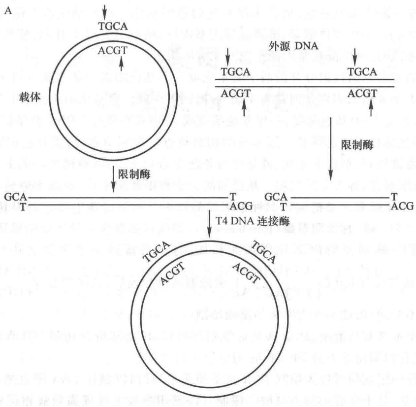

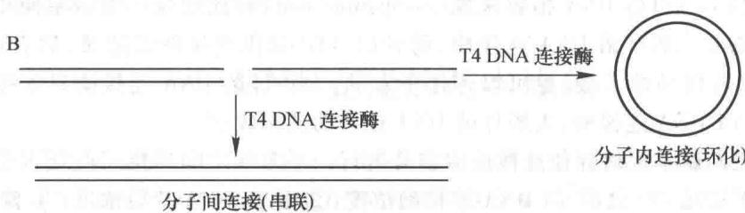  
图35-1 DNA的连接  
A. 黏性末端连接 B. 平末端连接

在基因工程操作中需要用到许多工具酶，除上面提到的限制酶、修饰酶、DNA 连接酶、DNA 聚合酶及末端核苷酸转移酶外，常用的酶还有逆转录酶、RNA 聚合酶、多核苷酸激酶、磷酸酯酶、外切核酸酶及内切核酸酶等。基因工程酶学已成为基因工程技术体系的主要内容之一。

## （二）分子克隆的载体与宿主

借助限制酶可切出含有目的基因序列的 DNA 片段。将外源 DNA 带入宿主细胞并进行复制的运载工具称为载体 (vector)。克隆载体含有在受体细胞内复制的起点，因此可以自主复制，是一个复制子。克隆载体，通常是由质粒、病毒或一段能自主复制的染色体 DNA 改造而成。质粒是染色体外自主复制的遗传因子，多为共价闭环 DNA 分子。细菌与真菌的克隆载体常用质粒来构建，只对特殊的要求才用噬菌体构建。动、植物的基因载体更多是用病毒或染色体 DNA 构建。

作为克隆载体最基本的要求是:① 具有自主复制的能力;② 携带易于筛选的选择标记;③ 含有多种限制酶的单一识别序列,以供外源基因插入;④ 除保留必要序列外,载体应尽可能小,便于导入细胞和进行繁殖;⑤ 使用安全。从安全性上考虑,克隆载体应只存在有限范围的宿主,在体内不进行重组,不发生转移,不产生有害性状,并且不能离开工程宿主自由扩散。此外,根据不同目的还有各种特殊的要求。

构建载体时,通常需选择适当质粒、病毒或染色体复制子作为起始物质,删除其中非必需序列,然后插入或融合选择标记序列。最常用的选择标记是抗生素抗性基因,如氨苄青霉素抗性基因 $(amp^{r})$ 、四环素抗性基因 $(tet^{r})$ 、氯霉素抗性基因 $(chl^{r})$ 及卡那霉素抗性基因 $(kan^{r})$ 等。利用营养缺陷型宿主可以将相应生物合成基因作为标记,带有合成基因的载体可使宿主细胞在基础培养基中生长,无需补充原来所缺的营养成分。如果抗性基因位于转座子中,可通过转座作用转入载体。当载体过大时,常用限制酶将其切成小碎片,再随机连接,并用选择培养基选出带有抗性、拷贝数多、长度较小的载体,此过程称为分子重排(rearrangement)。在构建载体时保留一些限制酶的切点可作为外源DNA插入位点。现常用一段合成的多接头插入载体,其上十分紧凑地排列着多种限制酶的单一识别序列,因此在用限制酶切时不致将载体切成碎片。对于载体上不合适的序列则需要用定位诱变的方法予以改造。

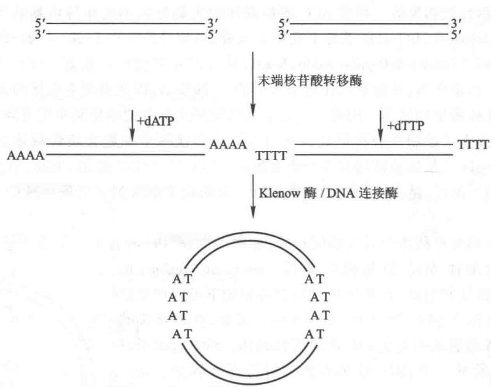  
图35-2 互补均聚核苷酸末端之间的连接

20 世纪 70 年代初期, 常用从天然存在的质粒和 $\lambda$ 噬菌体构建成各种克隆载体。1977 年 Bolivar 等从天然质粒出发, 经删除、融合、转座及重排等操作, 构建成功适合多种用途至今仍在广泛使用的克隆载体 pBR322。它全长 4361 bp, 含两个抗性基因 ( $tet^{r}$ 和 $amp^{r}$ ), 具有天然质粒 pMB 的复制起点 (ori)。最初分离的质粒受严紧型控制 (stringent control), 每个细胞只有 1\~2 个拷贝; 而 pBR322 为松弛型控制 (relaxed control), 每个细胞含 25 个拷贝以上 (图 35-3)。由于染色体的复制需要新合成的蛋白质参与作用, 质粒的复制通常无需同时进行蛋白质合成, 因此当培养基中加入蛋白质合成的抑制剂, 如氯霉素和链霉素, 细

胞不再生长,也不复制染色体,全部有关底物和酶都用于合成质粒,质粒载体的数目可达1 000\~3 000拷贝。现今许多新构建的载体,往往是由pBR322改建而成。

1982年Vieira和Messing构建出pUC系列的质粒载体，集中了当时载体的诸多优点。它包括4个组成部分：①来自pBR322的复制起点（ori）；②氨苄青霉素抗性基因 $(amp^{\mathrm{r}})$ ，但其序列已经过改造，不再含原来的限制位点；③大肠杆菌乳糖操纵子的调节基因（laci）、启动子 $(p_{lac})$ 和 $\beta-$ 半乳糖苷酶的 $\alpha-$ 肽 $(lacZ')$ ；④位于lac $Z^{\prime}$ 基因中靠近 $5^{\prime}$ 端的一段多接头，或称为多克隆位点（MCS）。当宿主细胞的 $\beta-$ 半乳糖苷酶基因发生删除突变（ΔM15），缺失N端的一段氨基酸序列使酶失活，但在 $\alpha-$ 肽存在时可以补足酶的N端

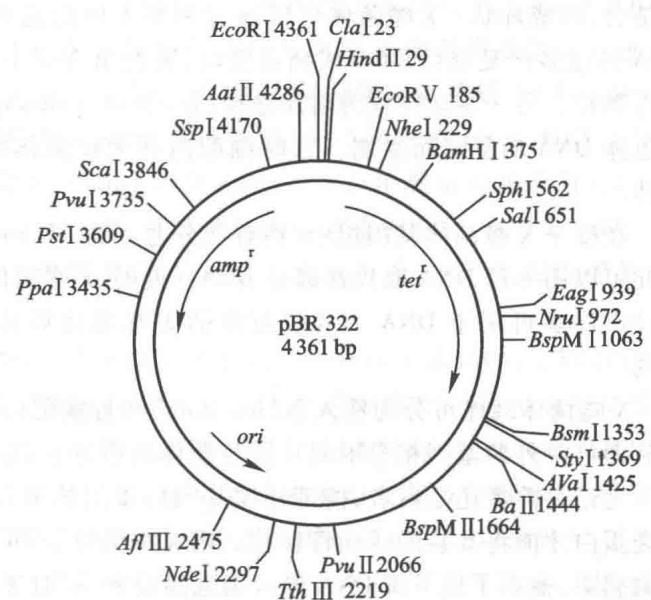  
图 35-3 质粒 pBR322

缺失,使酶恢复具有活性的四聚体。携带 pUC 质粒载体的大肠杆菌细胞在异丙基硫代- $\beta$ -D-半乳糖苷(isopropylthio- $\beta$ -D-galactoside, IPTG)的诱导下发生 $\alpha$ 互补,可使呈色底物5-溴-4-氯-3-吲哚- $\beta$ -D-半乳糖苷(5-bromo-4-chloro-3-indolyl- $\beta$ -D-galactoside, X-gal)被分解并氧化产生靛蓝。多接头上十分紧凑地排列着多种限制酶单一识别序列,外源基因在此插入后使 $\alpha$ -肽失活,因此携带空载体的大肠杆菌呈蓝菌落,携带外源基因的大肠杆菌呈白菌落。用此组织化学方法能够十分方便地鉴别重组克隆。该载体不仅相对分子质量小,而且还除去了控制质粒拷贝数的基因 rop,从而使每个细胞含质粒载体高达500\~700个拷贝。此外,pUC 系列还除去了质粒被切开及与牵引蛋白(Mob)结合的位点 nic/bom,不会发生转移。20世纪80年代初,一些用于酵母、昆虫,高等动、植物基因工程的载体也得到了发展。其后逐年都有许多新的载体出售。

借助一些辅助序列可在载体中引入新的功能,如在 pUC18/19(两者差别只在多接头方向不同)质粒

载体中插入丝状噬菌体 M13 的基因间隔区（intergenic region, IG region），其中含有单链复制起点，在 M13 辅助噬菌体帮助下可以产生单链 DNA 模板，该载体称为 pUC118/119（图 35-4）。又如，在多接头的一端插入噬菌体 SP6 的启动子构成 pSP 系列质粒载体。SP6 启动子可被 SP6 RNA 聚合酶特异识别，因而能够在体外进行高效转录。载体 pGEM 系列和 Bluescript M13 十分类似，它们都含有标记基因 $amp^{r}$ 和 $lacZ'$ ，丝状噬菌体 f1 的 IG 区，并在多接头的两端插入高效转录的启动子，pGEM 系列载体插入 T7 和 SP6 启动子，Bluescript M13 插入 T3 和 T7 启动子，因此用相应特异的 RNA 聚合酶在两个方向都能进行体外高效转录。

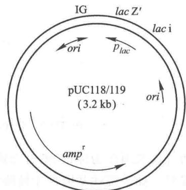  
图35-4 质粒载体pUC118/119

质粒载体用途很广，借助插入各种特殊序列而适用于不同目的。

当质粒含有噬菌体的复制起点时,称为噬菌粒(phagemid),在有关噬菌体帮助下可按噬菌体的方式复制和装配。上述pUC118/119、pGEM系列以及Bluescript M13均为噬菌粒。若质粒含有两种宿主细胞中复制的起点,可在两种细胞中复制和存在,则称为穿梭质粒(shuttle plasmid)。真核生物的克隆载体,为便于操作,常使其先在大肠杆菌中扩增,将目的基因与之构成合适的重组体后,才转入真核细胞,因此常构成穿梭载体。如果插入控制外源基因在宿主细胞内表达的序列,称为表达载体(expression vector)。

一般质粒载体约可携带外源 DNA 数 kb, 但如欲构建基因文库 (genomic library), 需要载体的容量更大些, 常用 $\lambda$ 噬菌体改造而成的载体。 $\lambda$ 噬菌体是大肠杆菌的一种温和噬菌体, 基因组为双链 DNA, 大小在 $50 \mathrm{~kb}$ 左右。DNA 两端有黏性末端, 由 12 个核苷酸组成。一旦进入宿主细胞后, $\lambda$ DNA 两端的黏性末端配对结合, 形成环状。 $\lambda$ 噬菌体可以通过两条不同的途径增殖。一条称为裂解途径 (lytic pathway)。环状 DNA 经过多次复制后, 才合成病毒蛋白, 装配出许多子代病毒粒子, 最终导致宿主细胞裂解, 释放出许多病毒颗粒。另一条途径称为溶原途径 (lysogenic pathway)。 $\lambda$ 噬菌体 DNA 插入到细菌染色体 DNA 中, 随染色体 DNA 的复制而复制。这时细胞内并无噬菌体颗粒。但某些因子可诱导细菌经裂解途径产生噬菌体。

在整个 $\lambda$ 噬菌体基因组中, 约有三分之一的 DNA 序列对于噬菌体的复制和装配来说并不是必需的, 因此可以用外源 DNA 取代这部分 DNA。此时, $\lambda$ 噬菌体携带外源 DNA 一起增殖, 起到载体的作用。已经设计出许多可用于 DNA 大片段克隆的 $\lambda$ 噬菌体载体, 其中用得较多的是凯伦 (Charon)、EMBL 和 $\lambda_{gt}$ 系列。

$\lambda$ 噬菌体载体可分为插入型(insertion)和置换型(substitution)两种，前者将线性载体用单个限制酶切开后即可将外源基因相容限制片段与载体两臂连接；后者需切除载体的一个片段，再将外源基因与之替换。无论是前者还是后者，携带外源基因后重组体DNA总长度应为 $\lambda$ 噬菌体DNA的 $78\% \sim 105\%$ ，病毒外壳蛋白才能将其装配成病毒颗粒。用 $\lambda$ 噬菌体DNA作载体进行DNA克隆的另一个优点是易于使细菌细胞感染，提高了使外源DNA导入细胞的效率，这对于建库来说十分重要。图35-5为以 $\lambda$ 噬菌体载体克隆DNA的图解。

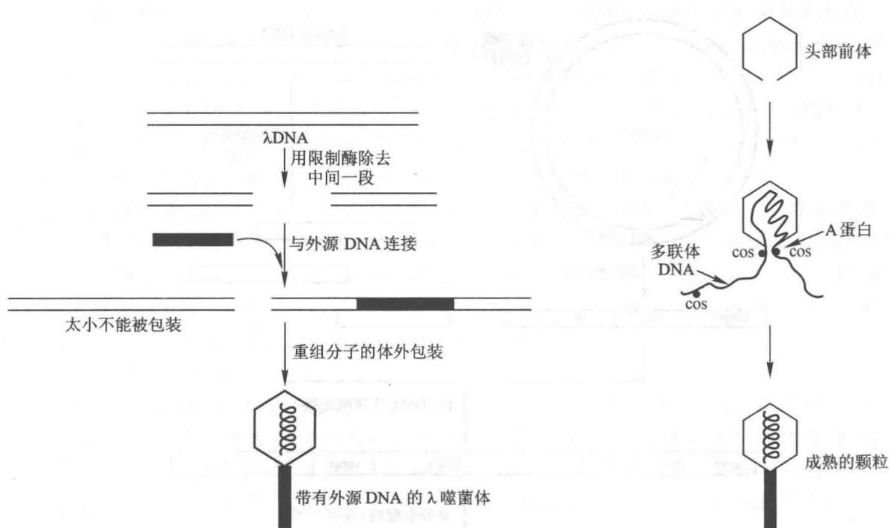  
图 35-5 以 $\lambda$ 噬菌体为载体进行 DNA 克隆  
图 35-6 λ 噬菌体的装配过程

λ 噬菌体外壳蛋白在包装噬菌体颗粒时,需先形成囊状头部前体。λDNA 经滚环复制使单位长度基因组(单体)串联成一条长链,称为多联体(concatemer),彼此以 cos 位点相连接。噬菌体编码的 Nu1 和 A 蛋白结合在左侧 cos 位点上,并将 λDNA 带到头部前体的入口处,DNA 填满头部,第二个 cos 位点也正好到达入口处,A 蛋白将两个 cos 位点交错切开产生黏性末端(cohesive end)。接着分别装配的针筒状尾部与头部结构连成一体,最终成为成熟的 λ 噬菌体颗粒(图 35-6)。含有 cos 位点的质粒称为柯斯质粒或黏粒(cosmid),这种质粒可以携带 35\~48 kb 的外源 DNA,而 λ 噬菌体载体最多只能携带 23 kb 的外源 DNA。黏粒主要用于构建基因文库,以获得基因组大片段 DNA 的克隆。黏粒与外源 DNA 的重组体只要两 cos 位点间的长度合适,即可装配成 λ 噬菌体颗粒,但其中的 DNA 却并非 λDNA。该噬菌颗粒仍可感染大肠杆菌,进入宿主细胞内的重组黏粒携带了外源 DNA,因不含 λ 噬菌体基因,只能以质粒形式存在于细胞内。图 35-7 为黏粒克隆基因组 DNA 的示意图。

大肠杆菌丝状噬菌体包括亲缘关系十分相近的 M13、f1 和 fd，它们基因组为长度约 6.4 kb 的单链环状 DNA，基因组共编码 11 种蛋白质（或小肽），复制起点和装配起始信号均位于基因间隔区（intergenic region, IG）。丝状噬菌体经 F 菌毛（pilus）感染大肠杆菌。噬菌体 DNA 的复制需先将单链 DNA（ssDNA）转变成双链复制型 DNA（replication form DNA, RF DNA）。构建 M13 载体（M13mp 系列）是在 M13 复制型的 IG 区插入乳糖操纵子（lac）的一个片段，其中包含 lacI $^{q}$ （lacI 的突变体，可以产生超量阻遏蛋白）、lac 启动子（P）以及带有多接头的 lacZ'（β-半乳糖苷酶的 α-肽），使 M13 载体转染宿主细胞后，在 IPTG 和 X-gal 存在下由于 α 互补作用产生蓝色噬菌斑；但载体插入外源 DNA 后不能形成 α 互补，只产生白色噬菌斑。这为重组噬菌体的筛选提供了方便的标志。

丝状噬菌体复制型双链 DNA 先经过几轮 $\theta$ 型复制，再通过滚环复制产生单链正链 DNA，正链 DNA 环化后装配成噬菌体颗粒。外壳蛋白在合成后即转移到质膜上，装配发生在噬菌体单链 DNA 复合物穿膜过程中。装配不受基因组 DNA 长度的影响，M13 载体通常可携带外源 DNA 300\~400 bp，过长易造成基因组不稳定。由于从丝状噬菌体颗粒中可得到单链 DNA 模板，因此这类载体主要用于制备单链探针、单链测序和定位诱变。近年来噬菌体展示技术得到迅速发展，该技术是将外源基因通过接头与噬菌体外壳蛋白基因相融合，从而使外源蛋白能够在噬菌体表面展示，借此可以研究蛋白质分子的相互识别与作用，或从展示库中选择特定功能的蛋白质。噬菌体展示主要用噬菌体 M13 作为载体。

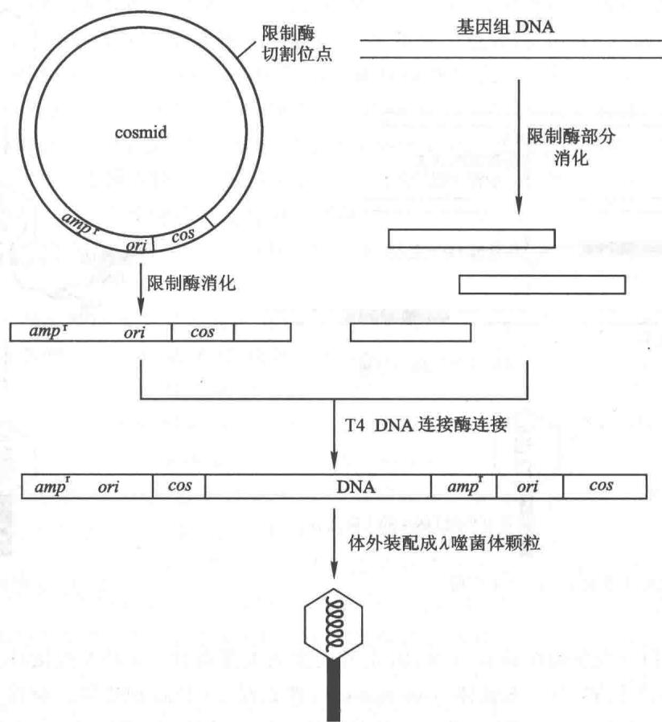  
图 35-7 黏粒载体克隆基因组 DNA  
现将大肠杆菌主要的载体系统列于表 35-1。

表 35-1 各类载体的主要功用

<table><tr><td></td><td>质粒</td><td>λ噬菌体</td><td>黏粒</td><td>单链噬菌体</td></tr><tr><td>实例</td><td>pBR322、pUC系列Bluescript M13</td><td>凯伦、 $\lambda gt$ 系列</td><td>pJC、pWE系列</td><td>M13mp系列</td></tr><tr><td>克隆DNA片段大小</td><td>&lt;10 kb</td><td>&lt;23 kb</td><td>&lt;49 kb</td><td>300~400 bp</td></tr><tr><td>装配成噬菌体颗粒</td><td>不能</td><td>能</td><td>能</td><td>能</td></tr><tr><td>用途</td><td>外源基因的克隆和表达,以及各种基因操作和分析</td><td>建基因文库和cDNA文库</td><td>建基因文库</td><td>制备单链模板和单链探针、定位诱变、噬菌体展示</td></tr></table>

选择克隆载体的宿主细胞通常要满足以下要求:①易于接受外源DNA的感受态细胞(competent cell);②宿主细胞必须无限制酶,即其宿主防护DNA系统(host safeguarding DNA system,hsd)应为 $S^{-}$ 、 $R^{-}$ 、 $M^{-}$ ;③宿主细胞应无重组能力,即 $recA^{-}$ ;④宿主细胞应易于生长和筛选,克隆载体的选择标志必须与之匹配,例如载体带有α-肽基因 $lacZ'$ ,其宿主细胞的β-半乳糖苷酶基因必须是突变体 $lacZ\Delta M15$ ;⑤符合安全标准。通常工程菌的生长都必须依赖人工培养基,在自然界不能独立生存。对于有害基因的克隆,宿主细胞应有更高的安全要求。

## （三）外源基因导入宿主细胞

## 1. 外源基因导入原核细胞

早在 1944 年, Avery 就已证明 DNA 进入肺炎双球菌细胞能引起遗传性状的转化。1970 年 Mandel 和

Higa 将大肠杆菌细胞置于冰冷的 $CaCl_{2}$ 溶液中，然后瞬间加热， $\lambda DNA$ 随即高效转染大肠杆菌。将外源 DNA 导入宿主细胞，以改变细胞遗传性状，称为转化（transformation）；将病毒 DNA 或病毒重组 DNA 直接导入宿主细胞，称为转染（transfection），以与病毒的感染（infection）相区别。用氯化钙法使大肠杆菌细胞处于感受态，从而将外源 DNA 导入细胞，至今仍然是应用最广的方法。氯化钙法的作用机制并不完全清楚，可能是在低温下 $Ca^{2+}$ 使质膜变脆，经瞬间加热产生裂隙，外源 DNA 得以进入细胞。制备感受态细胞的方法有不少改进，主要是加入各种金属离子或用还原剂和二甲亚砜处理细胞膜。

采用脉冲高压电瞬间击穿双脂层细胞膜能使外源 DNA 高效导入细胞,该方法称为电穿孔法(electroporation)。电击转化的效率与两电极间的电位梯度有关;在相等电位梯度下,细胞越大,细胞两端的电位差也越大,因此细胞膜易被击穿。用于动、植物细胞的电穿孔仪所需电压远比用于细菌的为低,前者只需数百伏,后者需要数千伏。早期电穿孔法主要用于转化动、植物细胞;现在已有专门用于细菌、真菌、藻类等的电穿孔仪出售,各类微生物用电穿孔法转化已十分普遍。

## 2. $\lambda$ 噬菌体的体外包装

$\lambda$ 噬菌体颗粒能将其DNA分子有效注入大肠杆菌宿主细胞内，而与颗粒内所含DNA的来源无关。前已提到，重组的 $\lambda$ 噬菌体载体DNA或黏粒载体DNA，只要大小合适，都能和 $\lambda$ 噬菌体外壳蛋白和协助包装的蛋白一起在体外包装成噬菌体颗粒。将重组体DNA包装成噬菌体颗粒可以大大提高导入宿主细胞的效率，在适宜条件下每微克重组DNA可形成 $10^{9}$ 以上的pfu（plaque forming unit，噬菌斑形成单位），比感受态细胞的转化率提高 $10^{2} \sim 10^{3}$ 倍。

λ噬菌体的体外包装技术,最初是由 Becker 和 Gold 于 20 世纪 70 年代中建立的。随后经过不少改进,现在已能十分简便和有效地进行操作,各种包装制剂也都有商品出售。为获得 λ 噬菌体的整套包装蛋白,以与重组 DNA 在体外进行包装,必须设法阻止包装蛋白与细胞内 λDNA 的包装。有两种方法可以实现这一点。其一,从两株各带有 λ 噬菌体缺陷溶源体的大肠杆菌中制备出一对互补的提取物。这两种提取物分别缺少一种关键的包装蛋白,它们单独存在时不会与内源 λDNA 发生包装,只在有重组 DNA 存在时将二者合并,包装才得以完成。例如,溶源性菌株 BHB2690 和 BHB2688,其 λ 噬菌体头部蛋白 D 和蛋白 E 的基因分别为琥珀突变,必须互补才能发生包装。其二,溶原菌中 λ 溶原体的 cos 位点被去除,因此可用单一菌株的包装蛋白提取物,因其只能和外源重组 DNA 发生包装。

## 3. 外源基因导入真核细胞

基因工程有时需要将外源基因导入真核细胞，以进行基因改造和表达。常用的真核工程细胞包括酵母、动物和植物细胞。酵母菌由于生长条件简单，成为真核生物基因工程优先选择的宿主细胞。酵母细胞进行外源DNA的转化，常需先用酶将细胞壁消化掉，制成原生质体。蜗牛消化酶含纤维素酶、甘露聚糖酶、葡糖酸酶及几丁质酶等，它对酵母菌的细胞壁有良好水解作用。原生质体在 $\mathrm{CaCl}_2$ 和聚乙二醇存在下，重组DNA便很容易被细胞吸收。再将转化的原生质体悬浮在营养琼脂中，即再生出新的细胞壁。

外源基因导入动物细胞常用的方法有:① 磷酸钙共沉淀法,用 $Ca^{2+}$ 沉淀磷酸根离子和 DNA,沉积在细胞质膜上的 DNA 被细胞吸收,可能是通过吞噬作用;② DEAE-葡聚糖(DEAE-dextran)或聚阳离子(polycation)法,它能结合 DNA 并促使细胞吸收;③ 脂质体(liposome)法,利用类脂经超声波、机械搅拌等处理,形成双脂层小囊泡,将 DNA 溶液包裹在内,通过与细胞质膜融合而使 DNA 进入细胞;④ 脂质转染法(li-pofection),用人工合成的阳离子类脂与 DNA 形成复合物,借助类脂穿过质膜而将 DNA 导入细胞内;⑤ 电穿孔法,如上所述在脉冲高压电场作用下质膜瞬间被击穿,DNA 得以进入细胞,细胞膜随即修复正常。在以上诸方法中,磷酸钙共沉淀法成本低,操作方便,但效率低;脂质转染法和电穿孔法成本高,前者需要昂贵的试剂,后者需要特殊的仪器,但效率高,现在较常用。对哺乳动物受精卵等较大的细胞,导入外源 DNA 可以用显微注射法。在显微镜下,用极细的玻璃注射器针头(0.1\~0.5 $\mu$ m)插入细胞内并注入 DNA 溶液。该方法效率极高,还可直接将 DNA 送入核内,但需要昂贵仪器,且技术复杂不易掌握好。

将外源 DNA 导入植物细胞,通常需要先用纤维素酶消化细胞壁,制备原生质体,再经聚乙二醇(PEG)、磷酸钙、氯化钙等化学试剂处理后,原生质体即可有效摄取外源 DNA。前述电穿孔法和脂质体法也适用于原生质体的转化。原生质体经细胞培养后可以再生出细胞壁。显微注射法可直接将外源 DNA

<!-- END OFFICIAL API PART part_006 -->

<!-- BEGIN OFFICIAL API PART part_007 -->

注入细胞内，而无需制备原生质体。根瘤土壤杆菌（Agrobacterium tumefaciens）的 Ti 质粒（tumor-inducing plasmid）有一段转移 DNA，即 T-DNA，能携带基因转移到植物细胞内并整合到染色体 DNA 中去。因此 Ti 质粒是目前植物基因工程最常用的基因载体。土壤杆菌能够从植株伤口处侵入，吸附在植物细胞壁上，T-DNA 随即进入植物细胞内，诱发植株形成冠瘿瘤，土壤杆菌本身并不进入植物细胞。将带有重组 Ti 质粒的土壤杆菌与刚开始再生新细胞壁的原生质体共同培养，易于促使植物细胞发生转化。目前较常用的是叶盘转化法（leaf disc transformation），即用打孔器从叶片上取下盘状圆片，然后接种上土壤杆菌，放在培养皿中培养，再经“长芽培养基”和“生根培养基”诱导叶盘长芽和生根，最后将转化的植株移栽在土壤中。借助土壤杆菌将外源基因导入植物细胞的方法有一定局限性，因土壤杆菌只能感染双子叶植物，不能感染单子叶植物。

利用动物病毒和植物病毒作为转移基因的载体,不仅能将外源基因导入培养的细胞,而且可以直接导入个体,通常效率都比较高。然而使用病毒载体应特别注意安全性,在构建载体时通常需将病毒的毒性基因删除,并有效防止病毒基因组在细胞内发生重组。在个体水平上进行转基因的另一有效方法是采用高速微弹发射装置(high-velocity microprojectiles bombardment),俗称基因枪(gene gun)。常用直径为1 $\mu$ m左右的惰性重金属粉末作为微弹,如钨粉或金粉,其上沾有DNA,置于挡板的凹穴内。当用火药或高压气体发射弹头撞击挡板时,微弹即以极高的速度射向靶目标。基因枪在植物基因工程中使用较多,常用携带外源DNA的微弹射击植物的分生组织,获得转基因植物。用基因枪射击动物的表皮、肌肉和乳房等获得成功的例子已有不少报道。

## 二、基因的分离、合成和测序

从事一项基因工程,通常总是先要获得目的基因。利用限制酶切割生物基因组 DNA,然后用适当方法常可分离到所需要的基因片段。倘若基因的序列是已知的,可以用化学方法合成,或者用聚合酶链式反应(PCR)由模板扩增出该基因。此外,最常用并且无需已知序列的方法是建立一个基因文库(genomic library)或 cDNA 文库(cDNA library),从中筛选出目的基因的克隆。

## （一）基因文库的构建

基因文库是指整套由基因组 DNA 片段插入克隆载体获得的分子克隆之总和。在理想情况下基因文库应包含该基因组的全部遗传信息。究竟基因文库中应包含多少 DNA 克隆才能使任意所需要的基因以极高的概率存在于该库中？其计算公式如下：

$$
N = \ln (1 - p) / \ln (1 - f)
$$

式中：N—基因文库所包含克隆的数目；

p—任意所需基因存在于基因文库中的概率,通常要求其大于99%;

f—克隆的 DNA 片段大小(bp)占基因组大小(bp)的分数。

例如,哺乳动物单倍体基因组含有 $3 \times 10^{9}$ bp,用 $\lambda$ 噬菌体为基因文库的克隆载体,所克隆基因组 DNA 片段的大小为 $2 \times 10^{4}$ bp,为使目的基因存在库中的概率大于 99%,该基因文库含有重组体克隆数应大于:

$$
N = \ln (1 - 0. 9 9) / \ln [ 1 - (2 \times 1 0 ^ {4} / 3 \times 1 0 ^ {9}) ] = 6. 9 \times 1 0 ^ {5}
$$

在构建基因文库时按上公式计算,可以估计各步操作所应达到的数量。

基因文库的构建,大致可分为五个步骤:

（1）染色体 DNA 的片段化 从生物组织中提取染色体 DNA 需将其切割成一定大小的片段，才能在插入 $\lambda$ 噬菌体载体后被包装成噬菌体颗粒。DNA 的切割必须是随机的，这样才可使各种不同片段被克隆的概率相等。细长的 DNA 分子很容易用机械的方法随机切割，如 DNA 溶液用超声波处理、高速搅拌或通过细的注射器针头等。机械切割 DNA 片段的克隆操作比较麻烦，需要先将片段分级分离，取合适大小的片段,并使末端填平补齐,再连上衔接物,方能与相应切开的载体 DNA 两片段(臂)连接。而用限制酶部分消化的 DNA 片段克隆比较方便,只需将消化所得片段经分级分离后就可以直接与相应切开的载体 DNA 连接。但是由于限制酶的切点在染色体 DNA 中的分布并非随机的,采用识别序列较短的限制酶部分消化所得片段的随机程度比长识别序列限制酶消化片段要高些。常用来构建基因文库的限制酶是识别 4 bp 的 MboI 和 Sau3A 等,它们接近于随机切割,称为准随机切割(quasi-random cutting)。此外,限制片段超过一定大小范围就不能在 $\lambda$ 噬菌体载体中克隆,因此,在构建基因文库过程中可能会丢失一部分遗传信息。

（2）载体 DNA 的制备 选择适当的 $\lambda$ 噬菌体载体或黏粒 DNA，用限制酶切开，得到左、右两臂，以便分别与染色体 DNA 片段的两端连接。

（3）体外连接与包装 将染色体 DNA 片段与载体 DNA 片段用 $T_{4}$ DNA 连接酶连接。然后重组体 DNA 与 $\lambda$ 噬菌体包装蛋白在体外进行包装。

（4）重组噬菌体感染大肠杆菌 将 $\lambda$ 噬菌体载体与外源 DNA 连接和包装得到的重组噬菌体，用以感染大肠杆菌。重组体 DNA 在大肠杆菌细胞内经增殖并裂解宿主细胞，得到重组噬菌体克隆库，即基因文库。黏粒具有更大的容载外源 DNA 能力，它虽然也能包装成类似噬菌体的颗粒并按噬菌体感染的方式将重组 DNA 导入大肠杆菌细胞，但载体中已将噬菌体增殖和裂解的基因删除，重组体 DNA 进入宿主细胞后只能以质粒的形式存在和复制，不再能包装成噬菌体颗粒。因此，由黏粒构建的基因文库是以细菌克隆组成的，而不是噬菌体克隆库。

（5）基因文库的鉴定和扩增 构建得到的基因文库应测定其库容量，即库中包含的克隆数。噬菌体通常以噬菌斑形成单位(pfu)来表示；重组体不能形成噬菌斑则以菌落形成单位(colony forming unit, cfu)来表示。对于文库的鉴定，可以通过随机挑选一定数量的克隆，用限制酶切、PCR或其他方法对重组体DNA进行分析。一个基因文库可以多次使用，从中筛选出各种克隆的基因，如果需要可以适当对文库加以扩增。但必须认识到，在扩增基因文库时并不是所有克隆成员都以同样速度增殖的，插入外源DNA在大小及序列上的差异可能会影响重组体的复制速度。这样，当基因文库经过扩增后，某些重组体的比例可能会增加，而另一些重组体可能会减少，甚至全然丢失。现在由于新的载体和克隆技术的发展，构建基因文库的程序已大为简化，一些工作者宁愿在每次筛选基因时重新构建文库，而不喜欢使用经过贮存和扩增的文库。

构建基因文库的全部过程可以归纳为图 35-8。

## （二）cDNA 文库的构建

## 1. cDNA 文库构建的原理

真核生物基因的结构和表达控制元件与原核生物有很大的不同。真核生物的基因是断裂的，需经RNA转录后剪接过程才使编码序列连接在一起。真核生物的基因不能直接在原核生物中表达；只有将经加工成熟的mRNA逆转录合成互补DNA（complementary DNA, cDNA），接上原核生物表达控制元件，才能在原核生物中表达。再有，真核细胞的基因组通常只有一小部分基因进行表达，由于mRNA的不稳定性，对基因表达和存在的mRNA常通过对其cDNA来进行研究的。为分离cDNA克隆或研究细胞的cDNA谱，需要先构建cDNA文库。所谓cDNA文库是指细胞全部mRNA逆转录成cDNA并被克隆的总和。

高等动、植物机体在发育过程中随着各种组织的分化，一些基因被永久性封闭，表达的基因随之减少。例如，哺乳类动物胚胎时期表达的 mRNA 种类大约为基因总数的 30%，分化成熟的组织 mRNA 种类只有基因总数 10% 左右。在表达的 mRNA 中，有些 mRNA 的丰度极高，每种有几十万个拷贝，有些 mRNA 丰度极低，只有几个或几十个拷贝。显然，从 cDNA 文库中分离高丰度的 cDNA 克隆很容易，但要分离低丰度的 cDNA 克隆就难多了。为使低丰度 mRNA 的 cDNA 克隆存在概率大于 99%，cDNA 文库应包含的克隆数可由以下公式来计算：

$$
N = \ln (1 - p) / \ln (1 - 1 / n)
$$

式中：N—cDNA 文库所包含的克隆数目；

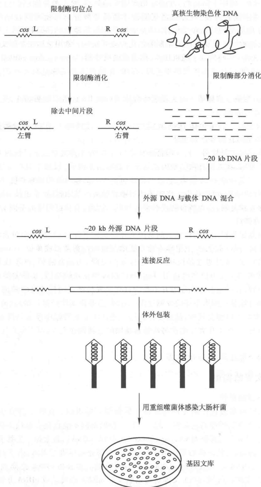  
图 35-8 用随机切割的真核生物染色体 DNA 片段构建基因文库

p—低丰度 cDNA 存在于库中的概率,通常要求其大于 99%;

1/n—每一种低丰度 mRNA 占总 mRNA 的分数。

## 2. mRNA 的分离制备

构建 cDNA 文库质量好坏的关键是制得高质量的 mRNA。无处不在的 RNA 酶极易降解 mRNA，在制备 mRNA 的操作过程中自始至终都必须防止 RNA 酶的降解作用。① 所有用于 mRNA 实验的器皿都要高温焙烤，或是用 RNA 酶的强变性剂焦碳酸二乙酯（diethyl pyrocarbonate, DEPC）0.1% 溶液洗涤，所有试剂都要用 DEPC 处理过的水配制, DEPC 经煮沸即分解除去, 以避免残留物影响实验; ② 在破碎细胞的同时用强变性剂(如酚、氯盐等)使 RNA 酶失活; ③ 在 mRNA 反应中加 RNA 酶的抑制剂 RNasin。

目前实验室中提取细胞总 RNA 的方法主要有: 钧盐/氯化铯密度梯度超速离心法和酸性钡/酚/氯仿抽提法。前一方法常用于大量制备 RNA; 后一方法用于一般小量制备 RNA, 因此更为常用。真核生物的 mRNA 3' 端通常都含有聚腺苷酸 [poly(A)], 可以用寡聚胸苷酸 [oligo(dT)] 纤维素或琼脂糖亲和层析法来分离纯化。在高盐缓冲溶液中 poly(A)RNA 与 oligo(dT) 结合, 低盐缓冲液使它们解离和洗脱。

## 3. cDNA 的合成

合成 cDNA 的逆转录酶有两种,一种来自禽成髓细胞性白血病病毒(avian myeloblastosis virus, AMV),另一种来自莫洛尼鼠白血病病毒(Moloney murine leukemia virus, M-MuLV)。逆转录酶为多功能酶,它能以 RNA 链为模板合成第一条 cDNA 链,并具有 RNase H 活性,水解杂合分子中的 RNA 链,再以第一条 cDNA链为模板合成第二条 cDNA 链。逆转录酶以 4 种 dNTP 为底物,合成 cDNA 时需要引物,无校对功能。AMV 逆转录酶由两条多肽链组成,它们由同一基因编码,但在翻译后加工不同,使 A 链比 B 链短。AMV 逆转录酶反应的最适温度为 42℃,最适 pH 8.3,并且具有较强的 RNase H 活性。M-MuLV 逆转录酶由一条多肽链构成,反应最适温度为 37℃,最适 pH 7.6,具有较弱的 RNase H 活性。

第一条 cDNA 链的合成常用的引物为 oligo(dT) $_{12\sim18}$ ，或是六核苷酸的随机引物(dN) $_{6}$ ，如果序列是已知的，也可以用与 mRNA 3' 端序列互补的引物。杂合分子中的 RNA 链用 RNase H 或碱溶液水解除去。

第二条 cDNA 链可用以下方法合成: ① 回折法, 利用第一条 cDNA 链自身回折来引发第二条链的合成, 双链合成后用核酸酶 S1(nuclease S1) 切去回折处的单链 DNA。这一步操作常使 cDNA 失去 5' 端的部分序列, 因此现在较少使用。② 取代法, 用 RNase H 部分水解 DNA-RNA 杂合分子中的 RNA 链, 留下一些小片段 RNA 作为合成 cDNA 第二条链的引物, 反应系统除加入 DNA 聚合酶 I 和 4 种 dNTP 底物进行 DNA 合成外, 还需加入大肠杆菌 DNA 连接酶和 NAD $^{+}$ , 使各片段连接。③ 随机引物法, 用六核苷酸在 DNA 链上随机引发合成第二条链。④ 均聚物引发法 (homopolymer priming), 用末端转移酶和一种 dNTP 在 cDNA 第一条链 3' 端加上均聚物尾巴, 然后用配对的寡聚物作为引物合成第二条链。⑤ 如果序列是已知的, 也可用特异引物来合成第二条链。

## 4. 双链 cDNA 的克隆

用来克隆 cDNA 的载体主要为质粒和 $\lambda$ 噬菌体载体。常用的克隆方法有:① 平端连接法,需先用 Klenow 酶或 T4 DNA 聚合酶将双链 cDNA 两端填平补齐,然后用平末端与载体 DNA 连接,平端连接效率较低。② cDNA 两端加接头或衔接物,接头需用限制酶水解,因此加接头前 cDNA 应先用相应甲基化酶加以甲基化,以保护 cDNA 不被消化。用衔接物则无需使 cDNA 甲基化。二者都可使 cDNA 以黏性末端与载体 DNA 连接。③ 均聚物加尾法,用末端转移酶在 cDNA 两条链的 3' 端各加均聚(A)或均聚(G),载体 DNA 的 3' 端加配对的均聚(T)或均聚(C),当 cDNA 末端与载体 DNA 末端“退火”(annealing)后彼此“黏合”,即可用于转化宿主细胞。④ 在几种改进的方法中可以将上述几步合并进行,例如,用衔接物与引物合在一起,当合成 cDNA 后即具有黏性末端,或者将引物加在载体 DNA 上,cDNA 合成后直接连在载体上。

## 5. 构建 cDNA 文库的基本步骤

构建 cDNA 文库的基本步骤有五步: ① 制备 mRNA; ② 合成 cDNA; ③ 制备载体 DNA; ④ 双链 cDNA 的分子克隆; ⑤ 对构建的 cDNA 文库进行鉴定, 测定文库包含的克隆数, 抽查克隆的质量和异质性, 如果需要可适当扩增。上述步骤与基因文库的构建十分相似。对 cDNA 文库的要求: 一是希望文库能包含各种稀有 mRNA 的 cDNA 克隆; 二是克隆的 cDNA 应是全长的, 避免丢掉 5' 端的序列。现在已有一些改进的方法可以达到上述要求。cDNA 文库的构建如图 35-9 所示。

## （三）克隆基因的分离与鉴定

从一个庞大的库中分离出所需要重组体克隆,这是一项难度很大、费时费力的工作。现在虽然已经发展出一系列构思巧妙、效率极高的方法,但要分离得到目的基因,仍然要通过一系列繁杂操作,工作量很大。分离带有目的基因的重组体克隆,通常或是按照重组体某种特征直接从库中挑选出来,称为选择(se-

lection);或是将库筛一遍,从中得到所要的重组体,称为筛选(screening)。无论是选择或是筛选,所选的依据或是载体的特征,或是目的基因的序列,或是基因的产物。

## 1. 载体特征的直接选择

根据载体的表型特征直接选择重组体克隆是十分有效也是最常用的办法。将它与微生物学的方法技术相配合使用，常能处理大量的微生物群体。通常载体都带有可选择的遗传标志，最常用的是抗药性标记、营养标记和显色标记。对噬菌体而言，噬菌斑的形成则是其自我选择的结果。

（1）抗药性选择 载体常携带氨苄青霉素抗性基因 $(amp^{r})$ 、氯霉素抗性基因 $(chl^{r})$ 、四环素抗性基因 $(tet^{r})$ 等。将细胞培养在含抗生素的选择培养基中，便可以检测出获得此种载体的转化子

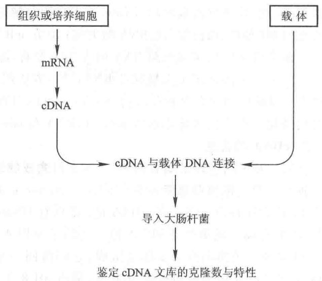  
图 35-9 构建 cDNA 文库示意图

细胞。若将外源 DNA 插在抗性基因编码序列内，可通过插入失活进行选择。例如，外源 DNA 插在 $tet^{r}$ 基因内，抗性基因失活成为对四环素敏感的表型 $Tet^{s}$ ，将转化子培养在加有环丝氨酸和四环素的培养基中，环丝氨酸能杀死生长的细胞，四环素只是抑制敏感细胞生长。经此处理，凡载体带有四环素抗性基因未被失活的细胞均被杀死；抗性基因插入失活的重组体细胞便被保存下来，及至转移到不含环丝氨酸和四环素的培养基中就能正常生长。

（2）营养标记选择 当细胞生物合成途径某个酶的编码基因失活，就成为营养缺陷型（auxotroph），但如果导入细胞的重组体 DNA 能够弥补缺陷的基因，培养基中就无需补充有关的营养成分。营养标记为重组体克隆的选择提供了方便的方法。

（3） $\beta$ -半乳糖苷酶显色反应的选择 当载体的 $lacZ'$ 区插入外源 DNA 后就失去编码 $\alpha$ -肽的活性，在显色反应后带有外源 DNA 的菌落呈白色，不带外源 DNA 的菌落呈蓝色，由此将二者区分。

## 2. 细菌菌落或噬菌斑的原位杂交

从众多重组体中分离目的基因克隆常用特异的探针进行原位杂交(in situ hybridization)。这是一种十分灵敏、快速的方法，其大致步骤如下：将生长在平皿上的菌落复印到硝酸纤维素滤膜(nitrocellulose filter)或尼龙膜(nylon membrane)上，然后用NaOH处理膜上的菌落，使菌体裂解，DNA变性并释放到膜上。中和并将膜在80℃烘干2 h，使变性DNA牢固吸附在膜上。将膜与放射性同位素标记的探针在封闭的塑料袋内进行杂交。探针可以是一小段与所要筛选DNA互补的单链或双链DNA，也可以是RNA。杂交液的一个极重要因素是盐的浓度。杂交一般要十多小时，视样品浓度而定，然后用一定离子强度的溶液将膜上非专一吸附的放射性物质洗去。再烘干膜，进行放射自显影。从显影后的底片上，可以显示出曝光的黑点，即代表杂交菌落。全部过程如图35-10所示。然后按底片上菌落的位置找出培养基上相应的菌落，将它扩大培养，制备出重组体DNA，以作进一步分析。这些分析包括：插入DNA的长度、限制酶切图谱、DNA序列等等。将滤膜置于琼脂平板培养基上，细菌可以直接在膜上生长并形成菌落。通过滤膜与滤膜接触，还可复印多份。借此可以在一张滤膜上筛选出50 000个菌落。

对于噬菌体载体的克隆,可以通过噬菌斑的原位杂交来筛选。用硝酸纤维滤膜或尼龙膜置于含噬菌斑的平板表面,使滤膜与噬菌斑直接接触,噬菌体 DNA 即转移到滤膜上。用 NaOH 溶液处理,然后中和,烘干,固定变性 DNA,用 ${}^{32}$ P 标记探针杂交,最后进行放射自显影。噬菌斑原位杂交与菌落原位杂交十分类似。

显然,有效进行杂交筛选的关键是获得特异的探针。如果目的基因序列是已知的或部分已知的,探针可以从已有的克隆中制备,或是设计一对引物从基因组中扩增,也可以用化学法合成一段寡核苷酸(一般应大于16个核苷酸)。但如果目的基因是未知的,而有其他种生物同源基因的序列是已知的,可用同源基因的序列作为探针。若基因序列完全不知道，但其蛋白质序列已知或部分已知，可以按照密码子的简并性，合成简并探针。选择简并探针的序列应使其简并性尽可能小。简并密码子的第三位加入A、G、C、T四种核苷酸，或用I（次黄嘌呤核苷酸）代替。此外，还可利用遗传突变找出突变的序列，或利用基因表达差异找出差异的cDNA，用来筛选特异的基因克隆。杂交的检测常用放射性标记探针，通过自显影来进行。现已发展出多种非放射性的检测方法，如探针偶联产生颜色反应的酶，或偶联发光物质等。

## 3. 差别杂交或扣除杂交法分离克隆基因

细胞在不同的发育、分化和生理状态下其基因表达往往有差别，有些决定某种状态的特异基因只在该状态细胞中表达，利用差别杂交法（differential hybridization）可以分离出该特异基因克隆。例如，为了了解生长因子对激活细胞基因表达的调节作用，将细胞培养物分成A、B两组，A组用生长因子激活，B组细胞不经处理。从激活细胞中提取poly(A)mRNA，逆转录成cDNA，经克隆构建成cDNA文库。然后分别用A、B两组细胞的mRNA或cDNA作探针对文库克隆进行原位杂交筛选。A、B两组细胞的mRNA绝大多数是相同的，因此克隆对A、B探针大多为阳性，少数A探针为阳性、B探针不能杂交的克隆即为生长因子特异诱导表达的克隆。

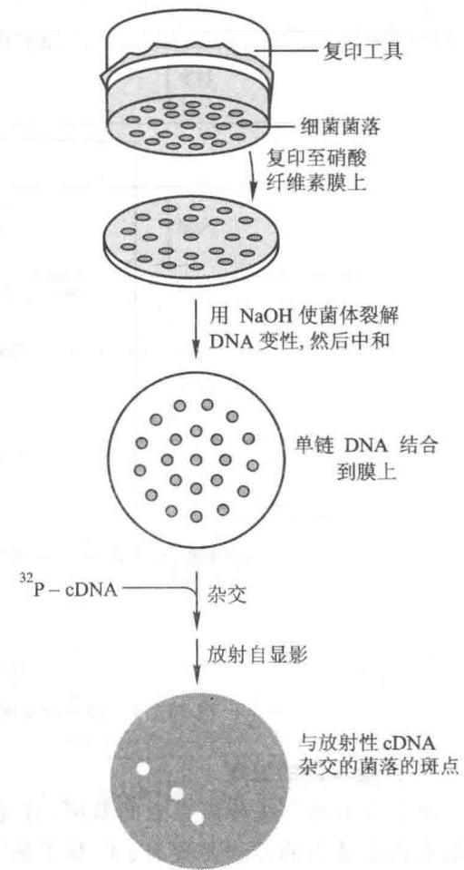

在差别杂交法中比较两组杂交的结果十分费时、费力，灵敏度又低，对于低丰度 cDNA 克隆的检测往往难以成功。于是发展出了消减杂交（subtractive hybridization）。所谓消减图35-10 原位杂交法筛选DNA重组体图解

杂交, 就是用一般细胞的 mRNA 与特殊细胞的 cDNA 杂交, 先消减一般共有的 cDNA, 再将剩下特异的 cDNA 进行克隆, 用此方法已成功克隆出控制动物胚胎发育和组织分化的基因。消减杂交的操作流程是: 从 A 组(特异)细胞中提取 mRNA, 合成其第一条 cDNA 链, 并与从 B 组(非特异)细胞中提取的过量(20 倍)mRNA 杂交, 将杂交溶液通过羟基磷灰石(hydroxyapatite)柱。在适当盐浓度条件下, 羟基磷灰石能吸附双链核酸, 而使单链 cDNA 和 mRNA 流走。过量的与 A 组细胞特征无关的 mRNA 和其 cDNA 杂交并被羟基磷灰石吸附, 以除去非特异的 cDNA。一次杂交可能消减不完全, 再用 50 倍和 100 倍过量的 mRNA 杂交, 最后剩下特异的 cDNA, 与自身 mRNA 杂交, 并用羟基磷灰石吸附, 洗脱后进行克隆, 由此分离出与细胞特征相关的 cDNA 克隆。消减杂交流程如图 35-11 所示。

## 4. 从表达文库中分离克隆基因

真核生物与原核生物的密码规则是相同的，只不过不同生物对各种简并密码子的使用频率不同，即存在偏爱性。但是真核生物与原核生物基因表达的调控机制却有很大不同。而且真核生物基因是断裂的，原核生物缺乏对其转录产物的加工剪接机制，因此真核生物基因不能在原核生物表达。只有将真核生物的cDNA或编码序列接上原核生物基因调控元件，其中包括启动子、SD序列和终止子等，才能在原核细胞中表达，就是说外源DNA在原核生物的表达依赖于原核表达载体。将真核生物的cDNA或原核生物染色体DNA片段插入原核表达载体并导入宿主细胞即构建成表达文库。

从表达文库中可通过表达产物来分离克隆的基因。常用的方法主要有:①免疫学方法。用放射性、显色酶或发光物质标记抗体,可以十分灵敏检测到克隆基因的表达产物。②检测产物的功能活性。如果产物是酶,或酶的激活剂与抑制剂,可通过酶促反应来检测,显色反应还能直接在平板菌落上进行。如果产物是配体,可通过与受体的结合来筛选。③检测产物的蛋白质结构和性质,如产物的相对分子质量、肽谱等。

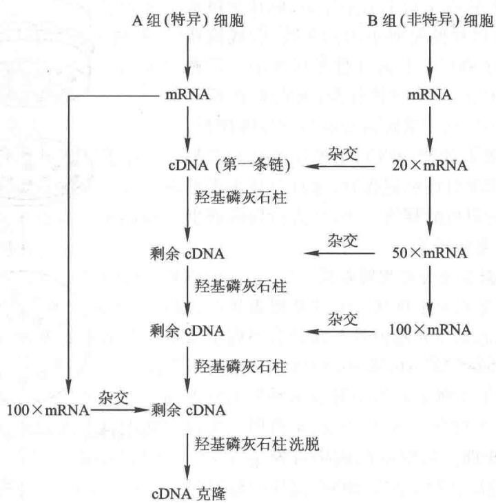  
图35-11 消减杂交流程图

## 5. 克隆基因的鉴定

无论用哪种方法分离克隆的基因,首先要重复核实,避免假阳性,然后进一步对基因进行鉴定。通常用来鉴定基因的方法主要有:①基于基因的结构和序列,如限制酶切图谱、分子杂交、测序等;②基于表型特征,如抗性、报道基因的性状等;③基于基因产物的性质,如与抗体反应、肽谱、蛋白质活性等。

## （四）聚合酶链反应扩增基因

聚合酶链反应（polymerase chain reaction, PCR）是 DNA 的体外酶促扩增，故又称为无细胞分子克隆法。

## 1. PCR 的基本原理

1985 年 K. Mullis 发明 PCR 快速扩增 DNA 的方法。PCR 方法模拟体内 DNA 的复制过程, 首先使 DNA 变性, 两条链解开; 然后使引物模板退火, 二者碱基配对; DNA 聚合酶随即以 4 种 dNTP 为底物, 在引物的引导下合成与模板互补的 DNA 新链。重复此过程, DNA 以指数方式扩增。最初采用复制 DNA 的酶是 DNA 聚合酶 I 的大片段 Klenow 酶, 因此每轮加热变性 DNA 都会使酶失活, 需要补充酶, 十分不方便。1988 年 Saiki 等人从栖热水生菌 (Thermus aquaticus) 中分离出耐热的 DNA 聚合酶, 称为 Taq DNA 聚合酶, 用以取代 Klenow 酶, 从而使 PCR 技术成熟并得到广泛应用。该技术可用于扩增任意 DNA 片段, 只要设计出片段的两端引物。DNA 正链 5' 端的引物又称为正向引物、右向引物、上游引物、有义链引物及 Watson 引物, 简称为 5' 引物; 与正链 3' 端互补的引物称为反向引物、左向引物、下游引物、反义链引物及 Crick 引物, 简称为 3' 引物。PCR 技术操作简便, 只需加入试剂并控制三步反应的温度和时间, 然而其扩增效率却是惊人的。扩增的公式为:

$$
Y = (1 + X) ^ {n}
$$

式中：Y—产量；X—扩增效率；n—循环次数。

设扩增效率为 60%, 经过 30 次循环, DNA 量即可扩增 $1.33 \times 10^{6}$ 倍, 只要极其痕量的 DNA 就可扩增达到能检测的水平。PCR 的原理如图 35-12 所示。

## 2. PCR 的最适条件

为取得 PCR 的成功,首要条件是设计好引物。设计引物的主要原则为:①引物长度应大于 16 个核苷酸,一般为 20\~24 个核苷酸。这是因为 $4^{16}=4.29\times10^{9}$ ,已大于哺乳类动物单倍体基因组 $3\times10^{9}$ bp,故 16 个以上核苷酸的引物可防止随机结合。②引物与靶序列间的 $T_{m}$ 不应过低(一般不低于 $55^{\circ}C$ )。小于 30 个核苷酸的引物可按公式 $T_{\mathrm{m}}=(\mathrm{G}+\mathrm{C})\times4+(\mathrm{A}+\mathrm{T})\times2$ 来计算变性温度,即每个 G 或 C 为 $4^{\circ}C$ ,每个 A 或 T 为 $2^{\circ}C$ 。③引物不应有发夹结构,即不能有 4 bp 以上的回文序列。④两引物间不应有大于 4 bp 以上的互补序列或同源序列,在 $3^{\prime}$ 端不应有任何互补的碱基。实验证明,两引物 $3^{\prime}$ 端如有两个互补碱基,经 PCR 即可产生显著的引物二聚体。⑤引物中碱基的分布尽可能均匀, $G+C$ 含量接近 50%。

PCR 的温度控制十分关键。通常反应开始时先在 $94^{\circ}C$ 加热 5\~10 min 使 DNA 完全变性，然后进入热循环。循环包括三步反应：变性， $94^{\circ}C$ ， $45 s \sim 1 min$ ；退火 1 min，退火温度约比引物变性温度低 $2 \sim 3^{\circ}C$ ，实际最适退火温度要通过实验来确定；延伸， $72^{\circ}C$ ， $1 \sim 1.5 min$ ，经过 25\~30 次循环扩增后，最后一次延伸时间延长到 10 min。以上条件用于扩增 300\~500 bp 长的 DNA 片段，如果扩增更长的 DNA，反应时间可以适当延长。

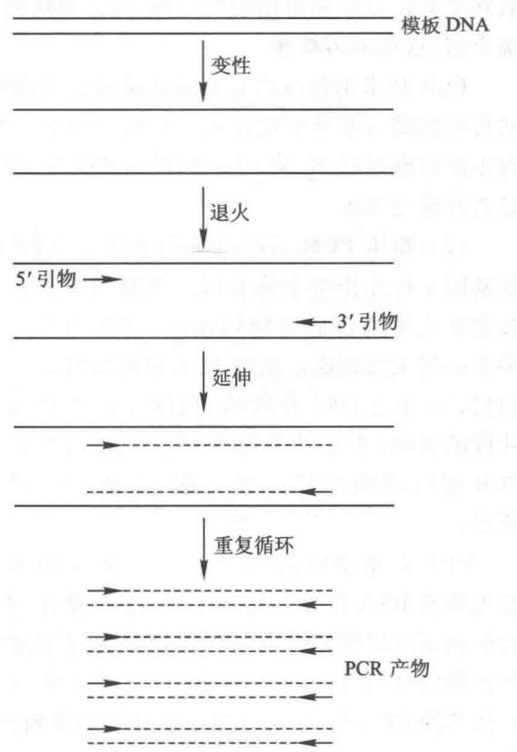  
图 35-12 聚合酶链反应示意图

Taq DNA 聚合酶在 100 μL 反应溶液中约加 2 单位。Taq DNA 聚合酶无校正功能，故 PCR 产物易发生错误。现在已有多种具有校正功能的耐热 DNA 聚合酶作为商品出售。模板 DNA 靶序列通常用量为 1 pg 至 1 ng。缓冲溶液与底物按规定用量，一般不再变动。

## 3. PCR 技术的发展与应用

在所有生物技术中，PCR 技术是发展最迅速、应用最广泛的一项技术；它对生物学、医学和相邻学科带来了最巨大的影响。它发展形成的新技术和用途大约有以下几个方面：

（1）PCR 常用于合成基因或基因探针 利用两端已知序列, 可以设计出一对引物, 用以扩增出任意基因或基因片段。通常 PCR 所加两端引物的摩尔数是相等的, 若加入不等量的引物, 例如 60:1, 即为不对称 PCR(asymmetric PCR), 可用于合成单链探针或其他用途的单链模板。

（2）用于 DNA 的测序 PCR 可用于制备测序用样品。在 PCR 系统中加入测序引物和 4 种底物，并分成 4 组其中各有一种双脱氧核苷三磷酸（ddNTP），或用 4 种荧光物分别标记其中一种，即可按 Sanger 的双脱氧链终止法测定 DNA 序列。在染色体 DNA 中依次加入各种测序引物可以完成整个基因组测序（genomic sequencing）。

（3）逆转录与 PCR 偶联 逆转录 PCR(RT-PCR) 将特定 RNA 序列逆转录成 cDNA 形式, 然后加以扩增。单个细胞或少数细胞中的特异 RNA 都能用此技术检测出来。Rappolee 等据此设计出“单个细胞 mRNA 的表型鉴定”方法。逆转录反应与 PCR 可分开进行, 也可以合在一个系统中进行, 在合成第一条 cDNA 后即作为 PCR 的模板进行扩增。RT-PCR 主要用途为: ① 分析基因转录产物; ② 构建 cDNA 库; ③ 克隆特异 cDNA; ④ 合成 cRNA 探针; ⑤ 构建 RNA 高效转录系统。

（4）产生和分析基因突变 PCR 技术十分容易用于基因定位诱变。利用寡核苷酸引物可在扩增 DNA 片段末端引入附加序列，或造成碱基的取代、缺失和插入。设计引物时应使与模板不配对的碱基安置在引物中间或是 5' 端，在不配对碱基的 3' 端必须有 15 个以上配对碱基。PCR 的引物通常总是在扩增 DNA 片段的两端，但有时需要诱变的部位在片段的中间，这时可在 DNA 片段中间设置引物，引入变异，然后在变异位点外侧再用引物延伸,此称为巢式 PCR(nested PCR)。有关 PCR 诱变技术在下一节中有较详细介绍,这里不再赘述。

PCR 技术不仅可以有效促使基因定位诱变,而且也是检测基因突变的灵敏方法。已知人类的癌症和遗传疾病都与基因突变有关。应用 PCR 扩增可以快速获得患者需要检查的基因片段,通过分子杂交,含有不配对碱基时 $T_{m}$ 将下降,以此检测突变;也可以根据癌变位点设计特殊的引物,通过 PCR 来直接检查是否有癌变基因。

(5) 重组 PCR(recombinant PCR) 将不同 DNA 序列片段通过 PCR 连在一起称为重组 PCR, 该技术

在基因工程操作中十分有用。用酶切割和连接常常找不到合适的酶切位点，而且引入的多余序列无法删除。重组 PCR 只需设计 3 个引物，① 左边 DNA 片段的 5' 引物；② 连接两片段的引物；③ 右边片段的 3' 引物，经过数轮 PCR 即可将两片段连在一起，如图 35-13 所示。

(6) 未知序列的 PCR 扩增 通常 PCR 必须知道 DNA 片段两端的序列, 才能设计一对引物用以扩增该片段。但在许多情况下需要扩增的片段序列并不知道, 为此发展出一些特殊的 PCR 技术, 可以用来扩增未知序列,

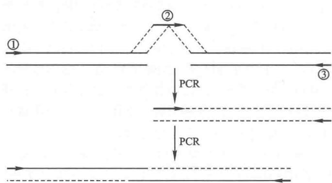  
图35-13 重组PCR示意图  
① 左边 DNA 片段的 5' 引物；② 连接引物；③ 右边片段 3' 引物

或者从已知序列扩增出其上游或下游未知序列。反向 PCR (inverse PCR) 通过使部分序列已知的限制片段自身环化连接, 然后在已知序列部位设计一对反向的引物, 经 PCR 而使未知序列得到扩增 (图 35-14A)。重复进行反向 PCR, 从染色体已知序列出发, 逐步扩增出未知序列, 称为染色体步移 (chromosome walking), 为染色体 DNA 的研究提供了有用的手段。与反向 PCR 类似, 锅柄 PCR (panhandle PCR) 也能由已知序列扩增邻侧未知序列, 但避开了限制片段自身环化的步骤, 提高了效率。其操作过程为: ① 首先选择限制酶将染色体 DNA 切成适当大小片段, 末端填平补齐, 用碱性磷酸酯酶去除 5' 磷酸。② 合成已知序列 (-) 链 5' 端互补的寡核苷酸参与 DNA 片段连接, 寡核苷酸的 5'-P 只能与 DNA 片段 3'-OH 连接。因此 (-) 链的两端均有彼此互补的已知序列, 变性后退火可形成链内二级结构, 犹如锅柄故而得名。③ 将已知序列的引物进行 PCR 即可扩增出未知序列 (图 35-14B)。

此外还有一些 PCR 技术可以扩增未知序列。例如，锚定 PCR(anchored PCR)，用末端核苷酸转移酶在合成 DNA 链的 3' 端加上均聚物，再用此均聚物互补的寡聚核苷酸作为另一引物进行 PCR。利用人类基因组 DNA 中分散分布的 Alu 序列，用一段已知序列和 Alu 序列作为一对引物，也可以扩增出未知序列。

（7）基因组序列的比较研究 用随机引物进行 PCR 扩增，便能比较两个生物基因组之间的差异。这种技术称为随机扩增多态 DNA（random amplified polymorphic DNA, RAPD）。如用随机引物寻找生物表达基因的差异，称为 mRNA 差异显示（differential display）。PCR 技术在人类学、古生物学、进化论等的研究中也起了重要作用。

（8）在临床医学和法医学中的应用 PCR 技术已被广泛用于临床诊断，如对肿瘤、遗传病等疑难病和恶性疾病的确诊，病原体的检测，胎儿的早期检查等。由于 PCR 技术的高度灵敏性，即使多年残存的痕量 DNA 也能够被检测出来，因此对刑侦工作，亲缘关系的确证等也起着重要作用。

## (五) DNA 的化学合成

H. G. Khorana 于 20 世纪 50 年代开创了 DNA 的化学合成研究，并在 1956 年首次成功合成了二核苷酸。他将核苷酸所有活性基团都用保护剂加以封闭，只留下需要反应的基团，然后用活化剂使反应基团激活，再用缩合剂使一个核苷酸羟基与另一核苷酸磷酸基之间形成磷酸二酯键，从而定向发生聚合。由于他奠定了核酸的化学合成技术，与第一个测定 tRNA 序列的 Holley 以及从事遗传密码解译研究的 Nirenburg

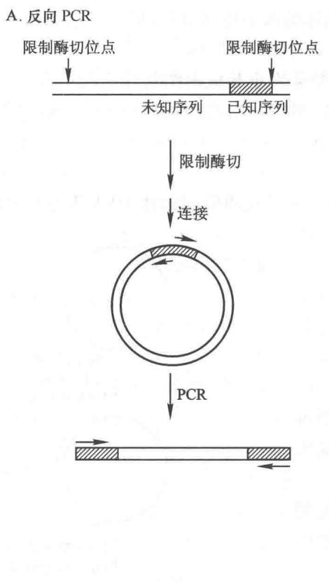

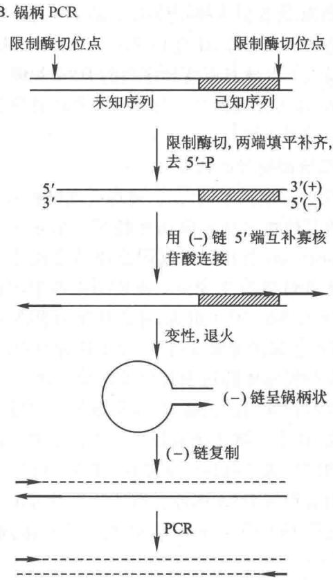  
图35-14 未知序列的PCR扩增

共获 1968 年诺贝尔生理学或医学奖。

Khorana 采用的 DNA 合成法是磷酸二酯法。60 年代 Letsinger 等人发明了磷酸三酯法，即将磷酸基的一个酸根(P—OH)保护起来，剩下 2 个酸根可以形成二酯，这样既减少副反应，简化分离纯化步骤，又提高了产率。其后又发明亚磷酸三酯法，使反应速度大大提高。DNA 化学合成技术的进一步发展实现了固相化和自动化，合成采用快速的亚磷酸三酯法，全部操作都由仪器自动完成。商售四种核苷底物均已加以保护，腺嘌呤、胞嘧啶碱基上的氨基用苯甲酰基(Bz)保护，鸟嘌呤碱基的氨基用异丁酰基(Ib)保护，5'-羟基用二甲氧三苯甲基(DMT)保护。由亚磷酰氯酯衍生物亚磷酸化并缩合，然后再氧化，全部合成后从载体上脱落下来，再予脱保护基和纯化。

每一合成循环周期分为以下四步反应:①用酸处理脱去保护基。②用二异丙基氨基亚磷酰氯甲酯作为活化剂和缩合剂,在弱碱性化合物四唑催化下,偶联形成亚磷酸三酯。③加入乙酸酐使未参与偶联反应的5'-羟基均被乙酰化封闭,以免与以后加入的核苷酸反应。④合成亚磷酸三酯后用碘溶液氧化,使之成为较稳定的磷酸三酯。待合成结束后用硫酚和三乙胺脱掉保护基,并用氨水将合成的全长序列寡核苷酸水解下来,然后用高效液相色谱仪(HPLC)和凝胶电泳纯化并鉴定。每个核苷酸合成循环要7\~10 min,十分方便(参看第11章)。

## （六）基因定位诱变

基因定位诱变(site-directed mutagenesis)是基因工程的一项关键技术,借助这一技术才使基因有效表达和定向改造成为可能。基因定位诱变是指按照设计的要求,使基因的特定序列发生插入、删除、置换和重组等变异。目前常用的定位诱变方法主要有:在酶切位点处插入、删除和置换序列,用寡核苷酸指导的诱变(oligonucleotide-directed mutagenesis)和PCR诱变。

## 1. 酶切定位诱变

利用基因的酶切位点,可以在切点处改造基因序列。先选择合适的限制酶将基因切开,然后插入或删除有关序列。如若基因内部在需要诱变的部位缺乏可被利用的限制酶酶切位点,就要先用寡核苷酸指导的诱变或 PCR 诱变引入酶切位点。有时不能确定插入或删除的最适序列，可以插入一组变异的序列或是进行系统的插入或删除，由此构建成突变体库，从中再挑选最理想的突变体。

用一段人工合成具有变异序列的 DNA 片段,取代野生型基因中相应两酶切位点间的序列,如同置换盒式录音带,称为盒式诱变。应用简并寡核苷酸作盒式诱变,可在一次盒式置换中产生一群随机突变体,增加了选择的可能性。

## 2. 寡核苷酸指导的诱变

DNA 化学合成技术的发展,使得合成寡核苷酸十分方便,于是在单链噬菌体 DNA 体外复制的基础上

DNA 化学合成技术的发展,使得合成寡核苷酸十分方便,于产生了寡核苷酸指导的定位诱变技术。早在 20 世纪 70 年代末 C. A. Hutchison 及其同事就用合成的寡核苷酸在体外诱导单链噬菌体 $\phi X174$ 发生变异。他们用带有错配碱基的寡核苷酸与 $\phi X174$ 的单链 DNA 退火,并以其作为引物用 Klenow 酶合成 DNA,所产生局部异源双链的 DNA 转染细菌,结果使得显示预期突变表型噬菌体的频率有明显增加。1983 年 M. Smith 改进了寡核苷酸指导的诱变技术,他用噬菌体 M13 载体克隆基因作定位诱变,使定位诱变技术趋于成热并得到广泛应用。寡核苷酸指导的定位诱变包括以下步骤(图 35-15):

（1）制备单链 DNA 模板 将外源基因插入 M13 载体复制型 (RF) 双链 DNA 的克隆位点，转化大肠杆菌，制备重组单链 DNA 模板。

（2）合成诱变寡核苷酸 作为诱变剂的寡核苷酸，除定位诱变的错配碱基外其余部分应和模板完全配对，如仅需引入一个核苷酸的取代、插入和删除，其长度为17\~19个核苷酸，错配碱基应置于中间；如引入两个核苷酸的变异，其长度应在25个核苷酸以上。

（3）寡核苷酸与模板退火并合成异源双链 DNA 磷酸化的寡核苷酸引物与模板混合后加热变性，去除二级结构；再缓慢退火至室温，用 Klenow 酶或 T4 DNA 聚合酶合成互补链，DNA 连接酶封闭切口。

（4）闭环异源双链 DNA 的富集 单链 M13 DNA 和未完全合成与封闭的双链 DNA 也会转染宿主，产生高的本底（即高比例的野生型 DNA），这部分 DNA 应用 S1 核酸酶处理除去，或用碱性蔗糖密度梯度离心法纯化闭环异源双链 DNA。

（5）转染宿主细胞 异源双链 DNA 进入宿主细胞后进行复制，产生两类双链 DNA，一类是野生型的，另一类是突变型的。

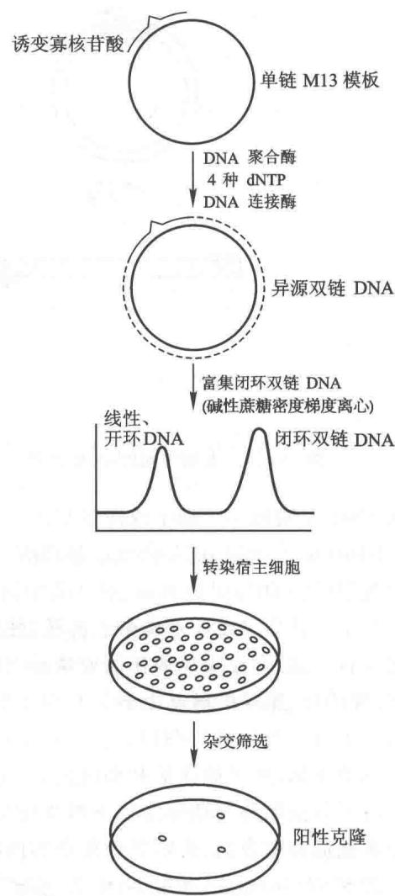  
图35-15 寡核苷酸指导的诱变

（6）突变体的筛选与鉴定 可以用限制位点、杂交和生物学方法来筛选突变体克隆。当诱变寡核苷酸引入新的酶切位点时，用限制酶来筛选比较简单和方便。一般的可用杂交法筛选。由于诱变引物与突变型基因完全同源，而与野生型基因有不配对碱基，前者变性温度高于后者，故而在较高杂交温度下出现的阳性噬菌斑可能含有突变型基因。如果突变体表型易于检测，也可用生物学方法来筛选。筛选到的突变体最后需经 DNA 测序，鉴定突变基因是否正确。

## 3. PCR 诱变

PCR 技术的发展,使定位诱变变得更为容易。通过 PCR 引物可以在扩增 DNA 片段的两端引入各种变异,嵌套式 PCR 还可以在基因内部或在一次 PCR 中同时在多处引入变异。各种变异,包括插入、删除、置换和重组,都可用 PCR 的方法来进行。图 35-16 表示巢式 PCR。

## (七) DNA 序列的测定

DNA体外重组工作中往往需要有关DNA序列的信息，以便于设计载体及重组体。目前通用的两种DNA序列测定法——Maxam和Gilbert的化学法和Sanger的双脱氧终止法（酶法）都是建立在分辨力极高的变性聚丙烯酰胺凝胶电泳的基础上的。这种电泳可将相差仅为一个核苷酸的单链DNA区分开来。化学法可以提供比较清晰的结果，但比较费事。Sanger提出的酶法十分快速、省事，也不需要比强很高的 ${}^{32}\mathrm{P - dNTP}$ ，但有时会出现一些不够清晰的实验结果。有关化学法和双脱氧终止法测序的原理可参看第12章。应用双脱氧法测序在20世纪80年代早期就已实现程序自动化，并有各种测序仪出售。人类基因组计划极大带动了测序技术的发展。

自动化测序需将寡核苷酸引物或双脱氧核苷酸用荧光染料标记，使检测更为方便。测序各DNA片段经凝胶电泳分离后标记染料用激光活化，光信号被光电倍增管捕获，用计算机控制显示器(CCD)获取图像。最初有两种自动化测序仪器，一种用单染色4泳道分离；另一种是用4染色单泳道分离，目前流行用的是后者。毛细管电泳因其管径 $(50\sim 100~\mu \mathrm{m})$ 小，在电泳过程中产生的热量易于散发，可以用高电压在短时间内完成分离，因此较常用。4组反应系统加入不同的荧光标记引物（引物是相同的）和不同的ddNTP，其余成分相同。反应后被混合加到一个泳道内进行电泳。采用能量转移(energy transfer,ET)技术，由供体染料接受氩离子激光的激发，将能量转移给4组不同发射光谱的受体染料上，使荧光信号增加 $3\sim 4$ 倍。末端标记比引物标记使用更为方便，4种不同的荧光染料直接与4种ddNTP的氨基

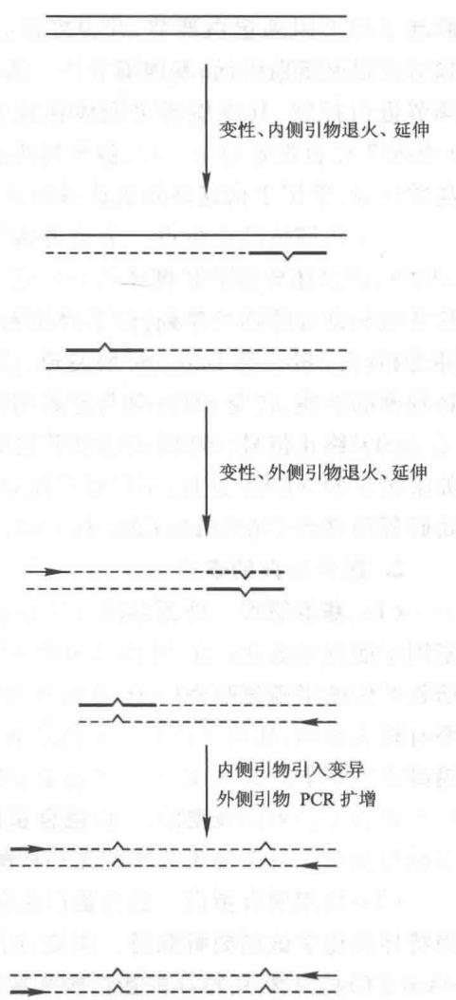  
图35-16 PCR诱变

相偶联,因此省去了每次测序需要用4种荧光染料标记引物这一麻烦的步骤。难点在于选用合适的DNA聚合酶,它能同样有效地使4种带有不同染料的ddNTP掺入并终止DNA链的合成。现在这一难点基本解决,用末端标记的方法所得结果已与引物标记法相差无几了。

## 三、克隆基因的表达

真核生物基因通常都是不连续的(外显子被内含子隔开)，并且与原核生物基因的表达调控有很大差别。因此真核生物的 cDNA 必须接上原核生物的调控元件，才能在原核细胞内表达。

## （一）外源基因在原核细胞中的表达

构建外源基因在原核细胞中的表达载体必须根据需要,选择合适的调控元件,以得到高水平、可调节的表达。

## 1. 基因表达的控制元件

（1）启动子 基因的转录由启动子控制，选用强启动子可提高克隆基因转录的表达水平。在原核细胞内表达常用的强启动子主要有：① lacUV5，即乳糖操纵子的启动子经紫外线诱变，其活性无需 cAMP 活化，但被调节基因 lacI 的阻遏蛋白所关闭，受异丙基硫代- $\beta-D-$ 半乳糖苷（isopropylthio- $\beta-D$ -galactoside，IPTG）诱导表达。通常基因工程采用的强启动子都是可调节的，以待菌体适度生长后再诱导外源基因表达。② tac 启动子，由 trp 启动子的-35 区和 lac 启动子的-10 区融合而成，可被 IPTG 诱导。③ $\lambda P_{L}$ 或 $P_{R}$ 启动子受 $\lambda$ 阻遏蛋白调节，其温度敏感突变体（ $\lambda cIts857$ ）在 $30^{\circ}C$ 时启动子处于阻遏状态，温度升高超过 $42^{\circ}C$ 使阻遏蛋白失活，基因即表达。④ ompF 是低渗透压外膜蛋白基因的启动子，受 ompR 基因编码的正调节蛋白控制，其冷敏感突变体在较低温度时无活性，温度升高后呈现活性，活化 ompF 启动子。它与 $\lambda cIts857$ 在表观效应上一样，但作用机制不同。⑤ T7 噬菌体的启动子，可被 T7 RNA 聚合酶特异识别并高效转录，常用于构建高效表达系统或体外转录系统。

（2）核糖体结合位点 为使外源基因能在大肠杆菌中高水平表达，不仅要用强启动子以产生大量mRNA，而且还要强的核糖体结合位点，使mRNA高效翻译。大肠杆菌的核糖体结合位点是一段3\~9个核苷酸长富含嘌呤的序列，位于起始密码子(AUG)上游3\~11个核苷酸处。该序列与16S rRNA 3'端互补，因其由Shine和Dalgarno所发现，故称为SD序列。mRNA的翻译效率受SD序列与16S rRNA 3'端互补程度的影响，还受SD序列与起始密码子间距离以及起始密码子上、下游序列的影响。

（3）终止信号 基因表达水平也受转录终止信号(终止子)和翻译终止信号(终止密码子)的影响。如果转录的 mRNA 过长,不仅耗费能量和底物,而且 3' 端序列易于和前导序列或编码序列形成二级结构,妨碍翻译进行。在 UAA、UAG 和 UGA 三个终止密码子中以 UAA 的终止能力最强。

## 2. 融合蛋白的表达

（1）基本原理 外源基因直接在宿主细胞内表达可以简化产品的后加工处理，但在有些情况下外源基因不能直接表达。①外源基因的活性蛋白质第一个氨基酸可能不是蛋氨酸，在表达时需要加上作为起始氨基酸的甲硫氨酸密码子，有时外加的甲硫氨酸会影响产物活性。②蛋白质的N端序列对其合成和折叠有较大影响，如将外源基因编码序列与宿主细胞高表达基因N端序列融合，以融合蛋白形式表达可以提高表达水平。③外源蛋白在宿主细胞内往往不稳定，易被宿主细胞蛋白酶降解，含有宿主蛋白N端序列的融合蛋白则比较稳定。④融合蛋白不影响某些表位结构，因而易于进行抗体工程。⑤与某些特定多肽和蛋白质融合易于分离纯化和检测。

（2）切割融合蛋白 融合蛋白在分离纯化后常需要切除 N 端融合的附加部分。常用的方法有：① 利用特异的化学试剂裂解肽键。例如，用溴化氰可裂解甲硫氨酸，甲酸加热分解-Asp↓Pro-，羟胺加热分解-Asn↓Gly-。② 用特异的蛋白酶水解融合部位的肽键。例如，若外源蛋白内没有可被胰蛋白酶水解的碱性氨基酸，就可使融合处的氨基酸变为精氨酸或赖氨酸，然后用胰蛋白酶水解。有些蛋白酶识别和分解特异的序列，用来切割融合蛋白可取得较好的效果。如肠激酶分解-Asp-Asp-Asp-Asp-Lys↓， $X_{a}$ 因子分解-Ile-Glu（或 Asp)-Gly-Arg↓，枯草杆菌蛋白酶 Ala64 突变体分解-Gly-Ala-His-Arg↓。

（3）切除分泌蛋白的信号肽 无论是真核生物还是原核生物，其分泌蛋白质 N 端都有一段信号肽引导新合成的肽链穿过细胞膜，然后由信号肽酶将信号肽切除。利用此机制，将外源蛋白和信号肽的编码序列融合，表达的蛋白质即被分泌到细菌的周质或培养基中，在此过程中信号肽被切除并产生有活性的蛋白质。

## 3. 提高外源基因的表达水平

许多因素会影响外源基因的表达,即使用强调控元件构建的表达载体也经常不能达到理想的表达水平。其主要原因:① 外源基因的产物常不能正确折叠或不稳定,尤其是长度大于100个氨基酸残基的蛋白质,易被降解或形成包涵体。② 外源基因的过量表达常对宿主细胞有害,有些产物还有毒。③ 不同外源基因的表达各有对细胞内外条件的要求,这些条件未必都已满足。总之,外源基因的表达并非正常的生理过程,对宿主细胞本身往往并不有利,因此必须对表达载体和宿主菌各项影响因素分别实验,以求得到高水平表达。

现已知道有不少措施可用来提高外源基因的表达水平，归纳起来有一下几类：①选用高效表达载体。对于某一外源基因需选择何种类型表达载体、何种启动子、与转录起点间的距离，以及起始密码子附近的序列等可逐项试验，以便得到最好的效果。②增加表达载体在细胞内的拷贝数。③挑选蛋白酶活性低或有缺陷的菌株作为宿主。④宿主细胞要能高水平表达分子伴侣，必要时通过基因工程增强其表达。⑤选用宿主细胞偏爱密码子（biased codon）。由于密码存在简并性，对应于一个氨基酸可以有不止一个密码子，生物往往对其中某个密码子的使用频率高于另外的密码子。不同生物或不同的蛋白质其密码子的使用频率各不相同,挑选使用频率最高的密码子以提高表达。⑥ 以融合蛋白形式表达。使外源蛋白的 N 端与宿主细胞丰度高的蛋白质 N 端部分序列相连。⑦ 以分泌蛋白形式表达。⑧ 从包涵体中分离纯化外源蛋白,并使其复性。⑨ 选择合适的宿主菌,找出高产的生长、诱导和发酵条件。

通常在构建高产工程菌后还可通过诱变和选育以提高外源蛋白的产量。

## （二）原核细胞基因表达产物的分离和鉴定

## 1. 产物的一般分离和鉴定方法

建成工程菌后通常要对菌体所含表达载体进行各种必要的鉴定,然后对表达产物进行 SDS-聚丙烯酰胺凝胶电泳,初步判断外源基因是否表达以及表达产量多少。为检测表达产物,将工程菌培养和诱导后经离心得到菌体,悬浮于 2% 十二烷基硫酸钠(SDS)、0.1 mol/L 二硫苏糖醇(DTT)、0.05 mol/L Tris-HCl (pH6.8)缓冲液,煮沸加热 3 min,除去不溶物,对产物进行 SDS-聚丙烯酰胺凝胶电泳。以不表达外源基因的菌体蛋白作对照,检查有无新增加的表达产物。

为便于产物分离,常需确定表达产物在细胞内分布。用溶菌酶消化掉细菌细胞壁,提取周质蛋白。破碎细胞后离心,分成可溶性和沉淀部分,再测定表达产物主要存在哪一部位。

表达产物可按一般蛋白质分离纯化的方法来处理。最常用的方法有:盐析、离子交换层析、亲和层析、分子筛层析、电泳、超滤等,根据产物性质,选择合适的分离方法,以达到所需要的纯度。为便于分离纯化,可在构建表达载体时使外源蛋白质带上标签(tag),例如多聚组氨酸。但如果外加的标签会妨碍产物的应用,最后还需除去标签。

产物的鉴定主要有:① 测定产物的相对分子质量。利用 SDS-凝胶电泳、高效液相色谱、毛细管电泳以及质谱等技术可以快速、准确测出蛋白质的相对分子质量。② 根据蛋白质的结构进行鉴定。如测定 N 端和 C 端氨基酸,测定氨基酸组成、利用蛋白酶测定肽谱等。③ 测定生物活性,也可以用抗体测定其免疫原性。

## 2. 从包涵体中纯化产物

蛋白质在细菌中高水平表达时,常常导致形成不溶性颗粒,这时大量折叠不完全的产物蛋白质中混杂少量其他蛋白质的聚集物,称为包涵体(inclusion body)。尽管以包涵体形式表达外源蛋白质有许多优点,例如易于分离纯化,免受胞内蛋白酶的降解,因无活性不会给宿主造成毒害等。然而,从包涵体中回收具有生物活性的产物却是十分困难的事,终产量常会因此而降低。

将培养物破碎、离心，包涵体很容易和可溶性蛋白及膜结合蛋白相分离。用去污剂（Triton X100）和螯合剂（EDTA）洗涤沉淀，除去包涵体表面吸附的杂蛋白，通常产物纯度可达90%以上。为了回收有活性的产物，需将包涵体溶于浓的变性剂和去污剂溶液，例如5\~8 mol/L盐酸胍、6\~8 mol/L尿素、SDS、碱性pH溶液或乙腈/丙酮等。如果产物蛋白质含有二硫键，溶解液中还应加入还原剂。然后逐渐除去变性剂，使蛋白质再折叠。后一过程常用稀释、透析、超滤、分子筛层析等方法。控制复性的条件，或加入一些帮助蛋白质再折叠的制剂和复合物，常可提高得率。

为省去从包涵体中回收有活性产物这一费时、费力、得率又低的操作步骤，可在工程菌发酵时降低蛋白质合成速度，降低培养温度，或使分子伴侣共表达，都有可能使产物成为可溶性蛋白质，避免包涵体的形成。

## 3. 用金属螯合柱纯化带组氨酸标签的蛋白质。

多聚组氨酸能与多种过渡金属离子或其螯合物结合,因此在构建表达载体时将 His $_{6}$ 引入外源蛋白,即可十分方便地用金属螯合柱分离产物。常用固相化的 Ni $^{2+}$ 或 Co $^{2+}$ 作为金属螯合亲和层析介质,例如次氮基三乙酸镍-琼脂糖 (nickel nitrilotriacetate-agarose, NTA Ni $^{2+}$ -Agarose) 是目前最常用的介质。

为使 His $_{6}$ 序列位于分离靶蛋白暴露的柔性部分, 通常将其连在 N 端或 C 端, 并在 His $_{6}$ 与靶蛋白序列间插入一个或 2 个 Gly 残基, 以增加柔性。在连接处也可以引入蛋白酶的切点, 以便在纯化后切去 His $_{6}$ 序列。当靶蛋白与金属螯合柱结合后, 充分洗涤柱以除去杂蛋白。然后用螯合剂如咪唑或 EDTA 溶液洗脱靶蛋白。咪唑的选择性较好; EDTA 效率更高, 但易使柱上的 Ni $^{2+}$ 洗下来, 需要进一步透析或用其他方法

去除 $\mathrm{Ni}^{2+}$ 。

金属螯合柱纯化带组氨酸标签的蛋白质因其效率高、容量大、体积较小、操作方便，而被广泛应用。而且 $Ni^{2+}$ 柱还可回收，反复使用多次，成本也相对较低，不失为一种较理想的分离纯化蛋白质的方法。

## （三）外源基因在真核细胞中的表达

基因工程涉及的真核细胞主要有酵母(真菌)、昆虫、高等动植物等的细胞,其表达载体通常由质粒、病毒和染色体 DNA 改造而成。为便于操作,真核生物表达载体都含有在大肠杆菌中复制的起点,构建和鉴定操作可以通过大肠杆菌进行。真核生物基因表达的调节主要在转录和翻译水平上进行,但还增加了转录后加工的调节,其控制元件比原核生物更为复杂。

## 1. 外源基因在酵母细胞中的克隆与表达

酵母是单细胞真核生物。因其基因组小( $\sim1.2\times10^{7}bp$ )，世代时间短（在丰富培养基中仅90 min），遗传学背景清楚（约6 000个基因，大多已知），故常作为真核生物细胞结构和基因表达调节研究的对象，真核生物基因工程也以它为首选，因而有真核生物的大肠杆菌之称。1996年完成其基因组全序列的测定，更有助于酵母的基因操作。

酵母细胞的克隆载体共有五类:①酵母整合质粒(yeast integrating plasmid, YIP)含有可选择遗传标记,但无酵母复制起点,在酵母细胞内只有整合到染色体中才能稳定存在。②酵母附加体质粒(yeast episomal plasmid, YEP)含有可选择遗传标记和酵母2μ质粒的复制起点,在酵母细胞内以高拷贝数存在。③酵母复制质粒(yeast replicating plasmid, YRP)含有酵母染色体DNA的自主复制序列(autonomous replicating sequence, ARS),以中等拷贝数存在于酵母细胞内。④酵母着丝粒(CEN)质粒(yeast centromere-containing plasmid, YCP),含有ARS和CEN,后者在有丝分裂时与纺锤体结合,以单拷贝稳定存在。⑤酵母人工染色体(yeast artificial chromosome, YAC),含有构成染色体的关键序列ARS、CEN和TEL(telomere,端粒),能以微型染色体的形式存在,可用以克隆超过100 kb的大片段DNA。上述载体的酵母选择标记常用生物合成基因,如合成尿苷酸的URA3,以便用营养缺陷型宿主细胞进行选择。为便于操作,除酵母选择标记和复制起点外,还常加入大肠杆菌的选择标记和复制起点(ori),构成穿梭载体(图35-17)。

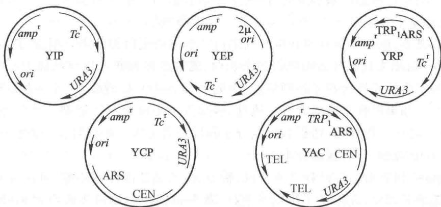  
图 35-17 酵母克隆载体

用于基因表达的酵母载体,需要具有酵母的各种表达控制元件。首先,要有可被 RNA 聚合酶Ⅱ识别的强启动子,或者是可诱导的(如 GAL、PHO5),或者是组成型的(如 ADH1、PGK、GPD)。GAL 为半乳糖代谢有关基因,其中 GAL1(半乳糖激酶)启动子受其正调节和负调节蛋白的调节。当激活因子(GAL4)结合于转录起点上游的 UAS 位点时,转录即开始。而细胞在含葡萄糖的培养基中,它的负调节因子(GAL80 产物)可以与 GAL4 形成复合物,阻止启动子的活化;但在含半乳糖的培养基中,GAL80 与 GAL4 解离,GAL4 即结合到 UAS 上。与此类似,PHO5(碱性磷酸酯酶)启动子受激活因子(PHO4)和负调节因子(PHO80)的调节。细胞在缺无机磷的培养基中 PHO5 启动子被活化,而在富含磷的培养基中 PHO80 阻止

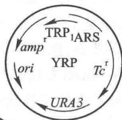

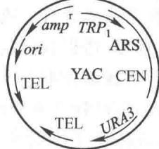

PHO4 的活化作用。组成型的启动子能始终维持较高水平的转录，其 mRNA 可占细胞总 mRNA 的 1% 以上。这类常用的有 ADH1（醇脱氢酶）、PGK（磷酸甘油酸激酶）和 GPD（6-磷酸葡糖脱氢酶）的启动子。组成型启动子虽说是不可诱导的，但其转录活性仍受各种生理条件的影响，当酵母生长在非葡萄糖碳源的培养基中时这类启动子的表达活性都较低。增加外源基因的拷贝数是提高表达水平的重要途径。

mRNA 的翻译活性受前导序列的影响较大,但是其间的关系十分复杂,需要考虑的因素较多。此外,转录的终止子包括形成 3'末端和腺苷酸化的信号序列,对于表达效率都是十分重要的。

## 2. 克隆基因在植物细胞中的表达

根瘤土壤杆菌(Agrobacterium tumefaciens)是诱发裸子植物和双子叶植物产生冠瘿(crown gall)的病原菌。在植物创伤部位,这类病原土壤杆菌侵入并附着在植物细胞壁表面,产生细纤丝将细菌裹起来形成细菌集结。随后,根瘤土壤杆菌细胞内质粒上的一段DNA转移到植物细胞内,并整合到染色体DNA中,导致植物细胞形成肿瘤,然后大量合成和分泌冠瘿碱,以供细菌营养的需要。根瘤土壤杆菌携带的特殊质粒受到分子生物学家的关注并被开发成植物基因工程广泛使用的克隆载体。

根瘤土壤杆菌的质粒称为 Ti 质粒 (tumor-inducing plasmid)，即诱发寄主植物产生肿瘤的质粒，其大小在 200 kb 左右 ( $M_{r}=90\times10^{6}\sim150\times10^{6}$ )，为双链闭环分子。Ti 质粒中与诱发肿瘤有关的基因区段有两个，即 T-区段和毒性 (vir) 区段，其余的基因分别控制冠瘿碱代谢、细菌的生长周期、宿主特异性以及 Ti 质粒的接合转移等。

T-DNA 长度约为 15\~30 kb, 相当于 Ti 质粒 DNA 长度的十分之一, 其两端为 25 bp 的正向重复, 分别称为左端边缘 (left-handed border, LB) 和右端边缘 (right-handed border, RB)。T-DNA 的转移同细菌的接合作用十分相似。vir 基因区段编码多种蛋白质, 分别参与 T-DNA 的转移与整合, 其中一种为内切核酸酶, 可在 T-DNA 两端造成单链切口, 单链分子从 Ti 质粒上脱离, 5' 端 RB 序列与 vir 基因编码的蛋白质共价结合, 在其引导下转移到植物细胞的核内, 并整合到染色体中去。

T-DNA 携带的基因只有在插入植物染色体后才被激活表达,其中包括:①冠瘿碱合成酶基因(opine synthetase gene),不同 Ti 质粒合成不同的冠瘿碱,章鱼碱(octopine)Ti 质粒含有章鱼碱合成酶的基因 ocs,胭脂碱(nopaline)Ti 质粒含有胭脂碱合成酶的基因 nos。②细胞分裂素合成酶基因 tmr,这个基因突变的结果激发肿瘤出现大量根的增生,故又称为根性肿瘤(rooty tumor)基因。③植物生长素合成酶基因 tms1 和 tms2,这两个基因中任何一个发生突变都会激发肿瘤出现芽的增生,故称为芽性肿瘤(shooty tumor)基因。tmr、tms1 和 tms2 这三个基因统称为致瘤基因(onc)。

Ti 质粒是理想的植物基因工程载体, 将外源基因插入 T-DNA, 即可借以转化植物细胞。但是 Ti 质粒太大, 操作十分不便, 对此提出了两种解决的谋略: 一是构建二元载体系统 (binary vector system); 另一是采用共整合载体 (cointegrate vector)。二元载体系统是将 Ti 质粒的 T-DNA 和 vir 基因区段分置于两个载体。T-DNA 通常插在易于操作的细菌小质粒载体中, 为免于引起宿主产生肿瘤, 将 T-DNA 的致瘤基因全部除去, 但保留合成胭脂碱的基因 nos, 作为遗传标记。vir 基因则仍留在缺失 T-DNA 的 Ti 质粒内存在于土壤杆菌中。外源基因插入小质粒的 T-DNA 后, 将质粒转移到根瘤土壤杆菌中, 在 vir 基因产物的作用下 T-DNA 即转入植物细胞核染色体内。

共整合载体是使用无致瘤基因 $(onc^{-})$ 的Ti质粒作载体，其中T-DNA只保留边缘区和nos基因，其余部分被删除，而代之以pBR型质粒的一段序列，例如，氨苄青霉素抗性基因 $(amp^{\mathrm{r}})$ 序列。外源基因插入pBR型的质粒内。为便于T-DNA转化后植物细胞的筛选，pBR型质粒带有对植物细胞有剧毒的新霉素的抗性基因(neo)，并与胭脂碱合成酶基因(nos)的启动子融合，nos-neo杂合基因可在植物细胞内表达。此外，pBR型质粒还带有细菌选择标记卡那霉素的抗性基因 $(kan^{\mathrm{r}})$ 。携带外源基因的pBR型质粒转入根瘤土壤杆菌后， $onc^{-}\mathrm{Ti}$ 质粒与pBR型质粒都存在一段相同的序列，很容易发生同源重组，形成两质粒的共整合体，其中外源基因被包围在T-DNA的边缘区之间，因此可转化植物细胞。图35-18表示二元载体系统与共整合载体的结构。

pBR 型质粒与一般细菌小的质粒一样, 其自身无接合转移的能力, 转移需要在携带转移基因 tra 和牵引蛋白基因 mob 的质粒 (如 R64 衍生质粒 R64drd11) 帮助下才能发生。pBR 型质粒上有结合 Mob 蛋白的位点 $bom$ ，故能被转移。将带有外源基因的重组质粒由大肠杆菌转移到土壤杆菌，还需要另外一个细菌菌株提供辅助转移的质粒。将三种有关的细菌菌株共同培养，彼此配对，促使质粒转移，称为三亲株配对（triparental mating）。三个菌株是：①具有辅助转移质粒的大肠杆菌菌株；②具有携带外源基因的给体载体的大肠杆菌菌株；③具 $on\bar{c}$ Ti 质粒衍生的受体载体的根瘤土壤杆菌菌株。它们共同培养时，辅助质粒即转移到给体载体的宿主细胞内，并帮助给体载体转入根瘤土壤杆菌细胞内，随之发生 T-DNA 携带外源基因转移。三亲株配对有较高的转移效率。

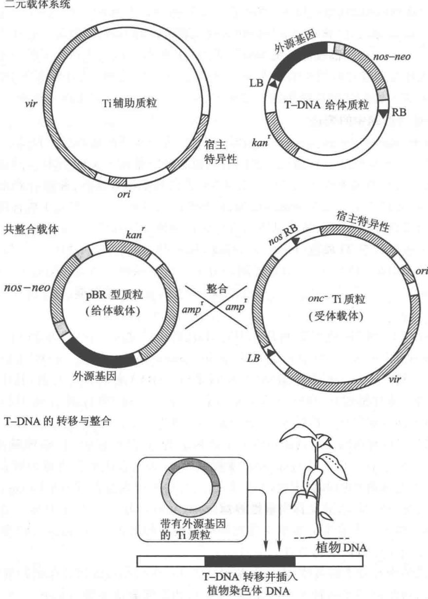  
图 35-18 用 Ti 质粒为载体进行植物基因工程图解

用于植物基因工程的克隆载体除 Ti 质粒外,还有另一种诱发植物形成肿瘤的质粒,即发根土壤杆菌 (Agrobacterium rhizogenes) 的诱发毛根质粒 (root-inducing plasmid, Ri)。与 Ti 质粒类似,Ri 质粒诱发植物产生茎瘿 (cane gall),在茎部表面密布毛根。Ri 质粒已被改造成各种用途的载体。特别值得提出的是,Ri 质粒产生的不定根切下来经培养可以再生成可育的植株。此外,各种植物病毒也可改造成为基因载体,如花椰菜花叶病毒 (CaMV) DNA 载体即是一例。花椰菜花叶病毒的 35S 启动子被广泛用于构建植物基因工程的表达载体。烟草花叶病毒 (TMV) 是单链 RNA 病毒,将其 RNA 逆转录成 cDNA 再插入质粒载体,由此构建成重组病毒载体。植物病毒载体易于操作,可以高效感染植物细胞,并在植物细胞中高水平表达。但一般植物病毒载体在植物细胞内并不发生整合,故其携带的外源基因不能通过种子稳定传代。

## 3. 克隆基因在哺乳动物细胞中的表达

哺乳动物基因工程的表达载体通常都由动物病毒改造而得,常用的病毒如猿猴空泡病毒40(simian vacuolating virus 40,SV40)、逆转录病毒和腺病毒等。载体的功能组分包括:①原核生物的复制起点和选择标记,常选用pBR型的基本序列,以构成穿梭质粒,便于操作。②真核生物的表达控制元件,如启动子和增强子,转录终止和腺苷酸化信号,剪接的信号等。③在真核细胞中复制和选择的遗传因子。

SV40 是一种小的二十面体病毒, 含双链环状 DNA, 长约 5kb, 它感染猿猴细胞, 如非洲绿猴肾细胞

(CV-1 细胞), 便产生感染性病毒颗粒, 并使寄主细胞裂解, 故称猿猴细胞为允许细胞 (permissive cell)。但如果感染啮齿动物的细胞, 就不产生感染性颗粒, 病毒 DNA 整合到寄主 DNA 中去, 细胞被转化, 也就是说发生癌变, 啮齿类细胞为非允许细胞 (non-permissive cell)。人体细胞是半允许细胞 (semi-permissive cell), 只有 $1\% \sim 2\%$ 的细胞产生感染性病毒颗粒, 在极少的例子中发生整合。在允许细胞内, SV40 的基因组形成核小体, 成为微小染色体, 其表达受严格的时序控制, 早期基因转录产物经加工产生两种早期 mRNA, 它们分别编码 T 抗原和 t 抗原, T 抗原的功能为启动复制, t 抗原功能尚不清楚。晚期基因转录产物经加工产生三种晚期 mRNA, 它们分别产生病毒外壳蛋白 VP1、VP2 和 VP3。SV40 的基因组结构见图 35-19。

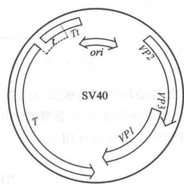  
图 35-19 SV40 基因组结构

SV40 病毒载体有两类。一类是取代型重组病毒载体(substitution recombinant virus vector)。在这种类型载体中,外源基因取代病毒基因组的一定区段,二者大小相等,因此形成的重组体 DNA 能够被包装成具有感染活性的病毒颗粒,并在哺乳动物允许细胞中增殖。但是重组体中一部分病毒基因被取代,必须用与之互补的辅助病毒或辅助细胞补充缺失的基因功能。较常用的载体是晚期基因取代载体。而其互补的辅助病毒用温度敏感突变体 tsA58,它合成一种温度敏感的 T 抗原,T 抗原的表达受自调节,在 41℃时 T 抗原失活并不再合成,但能正常合成病毒外壳蛋白。重组体病毒能提供 T 抗原,结果重组体病毒与突变体 tsA58 均得到复制与包装。如果用早期基因取代载体,复制所需 T 抗原可以由辅助细胞来提供。利用辅助细胞就无需用辅助病毒共感染,常用的辅助细胞为 COS 细胞。将复制起点失活的 SV40 早期基因区段转化猿猴允许细胞 CV-1,由此得到的细胞株称为 COS(CV-1、origin 和 SV40 各取第一个字母)细胞,该细胞能组成地表达 T 抗原,故早期基因取代载体可在其中繁殖,最终导致寄主细胞裂解。

另一类载体称为重组病毒质粒载体（recombinant virus plasmid vector）。它是将SV40复制起点的DNA片段插入大肠杆菌质粒载体中，由此构建成一种病毒复制子-质粒载体，当它在COS细胞内就能利用细胞提供的T抗原进行质粒的大量复制。无论是上述病毒载体，或是病毒-质粒载体，都只能短时间保留在寄主细胞中，外源基因只能作瞬时表达(transient expression)，因为病毒的感染或复制子的复制失控，最终都会导致寄主细胞的裂解死亡。

逆转录病毒以其高效感染和整合而受关注，并被构建成基因工程的重要载体。逆转录病毒为致瘤RNA病毒，其病毒RNA经逆转录产生原病毒DNA，两端为重复逆转录形成的长末端重复序列（long terminal repeat, LTR），5'端附近有结合tRNA引物的引物结合位点（primer binding site, PBS）和包装位点ψ，3'端附近有多聚嘌呤序列（polypurine tract, PPT），可作为合成正链DNA的引物。共有三个编码基因，gag（group specific antigen gene，种群特异性抗原基因）、pol（polymerase gene，聚合酶基因）和env（envelope gene，被膜基因）。在gag-pol左边有5'剪接位点（splicing site, SS），右边有3'剪接位点。在构建病毒质粒载体时，将原病毒DNA插入大肠杆菌质粒pBR322，然后删除gag、pol和env三个基因的大部分或全部序列，加入选择标记和外源基因，常用的选择标记为neo（新霉素抗性基因）、gpt（黄嘌呤-鸟嘌呤磷酸核糖转移酶基因）、dhfr（二氢叶酸还原酶基因）。重组体DNA用以转化适当的受体细胞，并用辅助病毒超感染转化细胞，产生“假型包装”（pseudotype）的病毒颗粒，就是说它具有感染所需的全部必要蛋白质，而其中基因组RNA却是重组体DNA转录的RNA。如果用包装缺陷的原病毒DNA转化寄主细胞，并发生整合，由此可以得到辅助细胞，用以取代辅助病毒。它产生的重组病毒产量甚高，转移基因成功率几乎可达100%。病毒载体的LTR具有控制基因整合和表达的能力，可使转化细胞持久表达外源基因，故广泛用于转基因动物和基因治疗。图35-20所示为逆转录病毒质粒载体及其RNA转录物的一般结构。

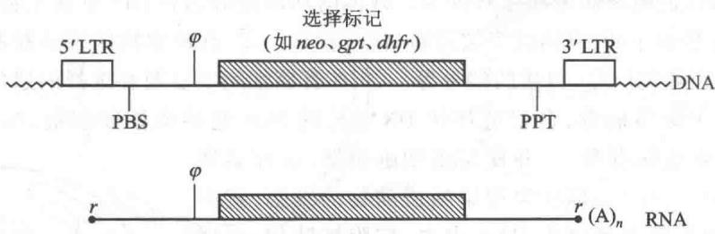  
图35-20 逆转录病毒载体的一般结构

各种动物病毒构成的载体各有其特点和特殊用途。逆转录病毒载体具有较高整合和表达外源基因的效率，但只能转染正在分裂的细胞。腺病毒较大，其载体可以容载较大的外源基因片段，并且可以转染非分裂细胞。痘病毒可用于构建工程疫苗。这里不多作介绍。

## 四、转基因植物和转基因动物

1972 年 D. Jackson, R. Symons 和 P. Berg 将外源基因插入 SV40 DNA, 构建出首个 DNA 重组体, 在此基础上产生和发展了 DNA 重组技术。1982 年 H. De Greve 等人, 利用 Ti 质粒使章鱼碱合成酶基因在烟草冠瘿产生的再生植物中表达。同年, R. D. Palmiter 等人将大鼠生长激素基因微注射到小鼠的受精卵内, 培育出超级硕鼠。也就是说在 DNA 重组技术诞生 10 年之后, 转基因植物和转基因动物培育均获成功, 揭开了植物和动物基因工程新的一页。

## （一）获得转基因植物的方法

植物细胞具有全能性，一块组织在适当条件下即能诱导长出根、茎、叶，形成植株。将外源基因导入植物细胞，转化的胚性悬浮细胞、胚性愈伤组织或者用叶盘转化法（leaf disc transformation）获得的转化叶片，可用植物激素诱导生根和生芽，产生转基因再生植物。

## 1. 常用的选择标记基因和报告基因

将外源的目的基因转化受体细胞,无论用什么化学的、物理的或生物学的方法,通常都只能使一小部分细胞获得外源 DNA,转化率都较低。因此要用选择剂将获得外源 DNA 的转化子选择出来。为使选择剂有效作用,外源 DNA 常带有选择标记基因(selectable marker gene)。选择标记基因主要有两类:一是抗性基因;另一是营养性基因。植物细胞通常用抗性基因作为选择标记基因,主要是编码能使抗生素(如新霉素、链霉素、潮霉素和庆大霉素等)或除草剂(如草甘膦、膦丝菌素等)失活的酶。报告基因(reporter gene)用来判断外源 DNA 是否成功导入宿主细胞以及检测其表达的水平,通常是一些编码产生荧光的蛋白或催化呈色反应、抗性反应的酶的基因。有时标记基因也可用作报告基因,反之亦然。

（1）新霉素磷酸转移酶基因 新霉素（neomycin）、卡那霉素（kanamycin）和遗传霉素（geneticin，常用的商品名G418)均为氨基糖苷类抗生素。新霉素是由弗氏链霉菌（Streptomyces fradiae）所产生。因其能与细菌30S核糖体亚基结合，抑制蛋白合成，而对革兰氏阳性和革兰氏阴性细菌都有抗菌作用。新霉素亦能抑制植物叶绿体和线粒体的蛋白质合成，破坏光合作用和能量代谢，而杀死植物细胞。大肠杆菌转座子Tn5携带的抗性基因neo编码新霉素磷酸转移酶（neomycin phosphotransferase，NPT），或称为卡那霉素激酶（kanamycin kinase），能通过磷酸化作用使氨基糖苷类抗生素失活。在转基因实验中，将neo基因随外源DNA导入植物受体细胞中表达，也能使新霉素、卡那霉素以及G418失去活性，从而使受体细胞获得对这些抗生素的抗性。该基因已广泛用作植物细胞转化的选择标记基因，并在水稻、小麦、玉米及甘蔗等农作物的转基因实验中获得成功应用。然而值得注意的是，有些单子叶植物细胞对这些氨基糖苷类抗生素天然具有较高水平的抗性,不宜用 neo 作为选择标记基因。

(2) bar(Basta resistance)基因 除草剂膦丝菌素的商品名为 Basta。它可抑制谷氨酰胺合成酶的活性,使敏感的非转化细胞大量积累氨而致死,由此除去杂草。吸水链霉菌(Streptomyces hygroscopicus)的 bar 基因编码膦丝菌素乙酰转移酶,能使膦丝菌素失活。表达 bar 基因的植物转化细胞能在致死剂量膦丝菌素存在下存活并生长,而非转化细胞在 10\~20 天内死亡。bar 基因已在水稻、小麦、玉米、高粱以及大麦、燕麦、黑麦等多种粮食作物的转基因研究中得到成功应用。

（3）绿色荧光蛋白基因 当前常用的报告基因有： $\beta-$ 葡糖苷酸酶( $\beta$ -glucuronidase, GUS)基因、荧光素酶(luciferase, LUC)基因、氯霉素乙酰转移酶(chloramphenicol acetyltransferase, CAT)基因和绿色荧光蛋白(green fluorescent protein, GFP)基因。其中以绿色荧光蛋白基因使用最为方便。

报告基因的用途很多,除了检测外源基因是否导入受体细胞以及在受体细胞中的表达水平外,亦可以用来研究启动子、增强子、各类顺式作用元件和反式作用因子以及表达要求的条件。报告基因还可用来研究蛋白质之间的相互识别和相互作用,寻找特定蛋白作用的靶蛋白。例如,S. Fields 等人建立的酵母双杂交技术,可以从一个 cDNA 文库中用已知蛋白质(X)找出与之相互作用的未知蛋白质(Y)。通常转录激活蛋白都有两个结构域:一个是 DNA 结合结构域(DNA-binding domain, DNA-BD);另一个是激活结构域(activation domain, AD)。将已知蛋白 X 的基因与编码 DNA-BD 的基因融合,构建成 BD-X 融合蛋白的表达载体。BD-X 融合蛋白被称为是诱饵(bait)蛋白。未知蛋白 Y 基因(或是 cDNA 文库中的序列)与 AD 基因融合,构建其表达载体。AD-Y 融合蛋白被称为是猎物(prey)蛋白,或靶(target)蛋白。将诱饵和猎物两者的表达载体导入携带报告基因的酵母细胞中,表达产物 BD-X 结合在报告基因上游激活序列(up-strem activating sequence, UAS)上,若 X 与 Y 能相互作用,AD-Y 就会激活报告基因的表达。反之,报告基因不表达或很弱表达(因有内源激活因子存在)。

GFP 基因分离自多管水母(Aequorea victoria)。荧光蛋白与荧光素酶的发光机理不同,绿色荧光蛋白能吸收蓝光激发出绿色荧光;荧光素酶需在 ATP 存在下氧化荧光素才能激发产生荧光。绿色荧光蛋白能够直接激发荧光,不仅操作简单方便,而且易于在生物体内检测,使用共聚焦显微镜(confocal microscope)可以直接观察到 GFP 在生物体内的表达状况。绿色荧光蛋白对生物学研究意义十分重大,因此 2008 年诺贝尔化学奖授予在该领域作出巨大贡献的三位科学家 Martin Chalfie,Osamu Shimomura(下村修)和 Roger T. Tsien(钱永健)。

## 2. 转基因植物的再生

高等植物除通过花粉受精进行有性生殖外,还可以通过插枝和外植体(即用于组织培养的植物体)生根、生芽,形成完整植株,进行无性生殖。植物细胞具有全能性,就是说分化的植物细胞在一定条件下仍然可以脱分化和再分化,具有发育成植株的潜能。转基因植物细胞或组织可以通过愈伤组织培养(callus culture)和原生质体培养(protoplast culture)诱导分化成为可育的成熟转基因植株。花粉有时亦可诱导产生愈伤组织,进而分化出单倍体植株。

（1）愈伤组织培养 植物伤口会长出一团软的薄壁细胞，称为愈伤组织。该组织逐渐积累酚类化合物并且变硬，有效封闭伤口，即为植物的伤疤。如果将新鲜的、柔软的愈伤组织转移到含有无机盐、糖、维生素、氨基酸和适量植物生长激素的培养基上，细胞就不被硬化，而继续分裂，成为相对未分化的细胞。通过改变培养基中植物激素（phytohormone）的种类和浓度，就会诱导愈伤组织发生分化。主要植物激素有：植物生长素（auxin）、细胞分裂素（cytokinin）和赤霉素（gibberellin）。当植物生长素对细胞分裂素比值高达一定水平时，即会诱导根的产生；而当细胞分裂素对植物生长素的比值高达一定水平时，即会诱导芽的产生。有时愈伤组织在培养过程中能形成胚状体（embryoid）的结构。由愈伤组织培养分化产生完整可育的植株称为植株再生（regeneration）。

除植物激素的浓度比例外,各种因素也对愈伤组织的再分化有重要影响。如培养细胞的时间、湿度、光强、pH等,而且不同物种和不同外植体组织也有不同的培养要求,需要通过实践来摸索。需要指出的是,并非所有植物都能进行愈伤组织培养,也并非所有愈伤组织都能再生出植株。当愈伤组织培养不成功时,就需要改用其他途经获得再生植株。

（2）原生质体培养 植物细胞的细胞壁可以用纤维素酶（cellulase）和果胶酶（pectinase）混合作用消化掉。蜗牛酶是从蜗牛的嗉囊和消化道制备的混合酶，其中含有纤维素酶、半纤维素酶（hemicellulase）、果胶酶、几丁质酶（chitinase）等9种酶，实验室常用来消化酵母和植物细胞的细胞壁。在渗透压平衡的培养液内，去掉细胞壁的原生质体游离出来，其质膜易受各种物理和化学因素的影响，但也容易通过磷酸钙、阳离子类脂、PEG介导、电穿孔等方法将外源DNA导入原生质体。不同物种的原生质体之间经适当处理可以发生融合，形成杂交种。原生质体融合使远缘植物之间染色体的重新组合成为可能。

植物的多种组织都能产生游离的原生质体，然而最常用的还是叶肉组织（mesophyll tissue）。比较而言，叶肉组织更易分离，再生能力也较强。原生质体在等渗液体培养基或软琼脂培养基上培养数天，就会重新合成出细胞壁，并开始细胞分裂。将单个细胞先放在滤纸片上，再移到植物细胞层上，可以较好促进细胞生长和分裂，称为饲养层技术（feeder layer technique）。由此形成愈伤组织就可用于继代培养，诱导再生出完整可育的植株。无论是悬浮培养物或是愈伤组织都不宜过长时间保存，过长保存会丧失再生能力。而且还会发生有丝分裂异常，产生出多倍体、非整倍体和染色体畸形。

（3）花粉培养单倍体植株 高等植物在自然界主要以二倍体形式存在，有时也可以是多倍体，单倍体极为罕见。单倍体植物不能进行有性生殖，只能无性繁殖。通过花粉培养可以得到单倍体原生质体，也可以得到单倍体愈伤组织，经过激素诱导便可再生出单倍体植株。单倍体育种对实验室研究极为重要。这是因为单倍体育种周期短；而且单倍体只有一套基因，不分隐性和显性，便于基因突变体的分离；也便于分析野生型和突变型基因的作用；尤其在基因表达调节元件和调节因子的分析中单倍体育种的优势更为突出。用化学药剂（如秋水仙碱）处理单倍体细胞或原生质体，得到纯二倍体，诱导产生二倍体植株可以进行有性生殖。

## 3. 外源基因在植株中的表达

植物细胞的基因表达在多层次上受到调节和控制,大致有三种类型:① 组成型,一些持家基因(house-keeping gene),如编码结构蛋白和维持基本生理功能的蛋白质的基因,通常都能持续表达。② 封闭型,位于异染色质上的基因始终被封闭。③ 特异型,它们往往只在特定的组织、特定的发育阶段、或特定的条件下(光照、温度、重金属等)表达。为提高外源基因在植株中的表达水平和特异性,克服转基因失活,获得更理想的转基因植株,需要抓好三个环节:① 构建基因表达载体;② 筛选转化细胞;③ 培育转基因植株。上面已经介绍如何借助标记基因和报告基因筛选转化细胞、培育转基因植株。这里主要叙述如何选择基因表达的调控序列和改造基因,以及如何避免转基因沉默。

（1）构建高效基因表达载体 实现高效基因表达的首要条件是在基因上、下游插入合适的启动子、终止子和其他调控序列，并对基因序列作适当改造。较为常用的组成型启动子是花椰菜花叶病毒（CaMV）指导35S RNA合成的启动子，简称为35S启动子。该启动子在单子叶和双子叶植物中都适用，但在单子叶植物中较弱。单子叶植物常用的启动子是水稻肌动蛋白基因启动子Act1和玉米泛素基因的启动子Ubi。有些基因工程要求选用组织特异性表达的启动子，例如由花粉绒毡层特异启动子（tapetum-specific promoter)指导核糖核酸酶mRNA的表达，培育出雄性不育的转基因农作物。有些启动子受特异因子的诱导，大致可将这些诱导型启动子人为分为三类：A型启动子可对特定的植物激素做出反应，植物激素包括脱落酸（ABA）、生长素、赤霉素、分裂素、系统素（创伤诱发产生）等；B型启动子受环境物理化学因素的诱导，环境因素如高温、低温、水涝、盐渍、重金属离子污染等；C型启动子受人工合成的化合物诱导，对抗生素和化学药剂发生反应。

终止子对提高基因表达水平也有较大影响,常用的终止子有 CaMV 35S 终止子、nos 终止子等。根据外源基因表达的要求,应在适当位置插入各种调节序列。在选用各类启动子、终止子和不同的调节序列中,各实验室的创新层出不穷。

为了提高基因表达效果,对调节序列和基因作适当改造是十分有益的。有报导将同一启动子重复串联能增强其作用;还有将两个不同的启动子融合或是改变启动子内部某些序列,取得显著效果。基因的非编码区影响 mRNA 的二级结构,也影响调节蛋白质和调节 RNA 与之作用,某些序列的改变可能会对表达有重要影响。插入高表达基因的内含子 1 和外显子 1 有时能显著提高基因表达水平。采用转基因植物自身的偏爱密码子常能取得好的效果。有时外加定位的信号序列可以帮助基因产物定位输送。

（2）克服转基因沉默 从20世纪80年代初转基因植物获得成功以来，已有数百种重要农作物品种性状进行遗传转化，植物基因工程发展极为迅速。可以说基因工程改变了农业面貌。在转基因植物的实践中常遇到的一个问题是外源基因表达很弱或不表达，即转基因失活(transgene inactivation)或转基因沉默(transgene silencing)。当发生转基因沉默时如果植株自身存在同源基因，同样也被共遏制(cosuppression)。现在已经研究清楚，这种转基因沉默可以发生在基因表达的不同水平：转基因DNA的甲基化和异染色质化（DNA methylation and heterochromatinization）导致转录水平基因沉默(transcriptional gene silencing, TGS)；转基因mRNA的翻译受抑制和被降解，则是转录后基因沉默(post-transcriptional gene silencing, PTGS)。

一般来说,外源基因的整合是随机的,当整合在重复序列和异染色质区内或其附近,外源基因即被甲基化和异染色质化,这是位置效应(position effect)。若外源基因成串多拷贝整合,其转录RNA回折形成互补双链RNA,引起RNA干扰。两者均会造成转基因沉默。基质附着区(matrix attachment region,MAR)或称为支架附着区(scaffold attachment region,SAR)是一段与细胞核中蛋白质基质特异结合的DNA序列。在表达载体外源基因的两侧插入MAR序列,然后导入植物细胞并整合进宿主基因组DNA。MAR与核基质结合,外源基因形成突环(loop),从而阻断了邻近DNA序列对基因表达的影响,可以阻止或减轻转基因沉默。借助选择标记基因和报告基因,对转基因细胞进行筛选,仔细挑选出高效表达外源基因的细胞,可以一定程度上淘汰掉转基因沉默细胞。

## （二）获得转基因哺乳动物的方法

转基因植物和转基因动物获得的方法有不同点,也有相同点,取决于两者细胞的异同。主要差别在于,植物细胞有细胞壁,动物细胞没有;植物细胞有全能性,动物细胞没有,但是动物细胞核具有全套遗传信息,将体细胞核移植到去核的受精卵中可以在一定程度上返回未分化状态。

## 1. 哺乳动物细胞转基因选择标记

哺乳动物细胞的转基因载体或由病毒改造而成，或由质粒加真核细胞基因表达元件而成。病毒载体可以直接感染宿主组胞；质粒载体经扩增后可以切除质粒部分，将外源基因通过磷酸钙、脂质体、电击法或显微注射法导入细胞。显微注射需逐个细胞操作，但注射到生殖细胞、胚胎干细胞和受精卵中却十分有效。外源基因常需要带上选择标记基因，以方便检测和筛选。经常使用的标记基因有：胸苷激酶基因（tk）、二氢叶酸还原酶基因（dhfr）、氯霉素乙酰转移酶基因（cat）、黄嘌呤-鸟嘌呤磷酸核糖基转移酶基因（xgprt）以及新霉素磷酸转移酶基因（neo）。选择标记一定要与对应的选择系统配套使用。

（1）胸苷激酶基因 胸苷激酶(thymidine kinase, TK)催化胸苷转化为胸苷酸，与胸腺嘧啶和胸苷的再利用有关。该基因分离自单纯疱疹病毒(HSV)，几乎在所有真核细胞中都能表达，因此被广泛使用。如若将细胞培养在添加5-溴尿嘧啶脱氧核苷(BUdR)的培养基中，BUdR作为胸苷类似物转化为胸苷酸并掺入细胞DNA分子中，导致DNA复制错误。携带BUdR-DNA的细胞对紫外线(UV)敏感，可被UV迅速杀死，而TK失活的细胞(TK-表型)却能够存活下来，用这种方法可以筛选到TK-表型细胞株。氨基蝶呤(aminopterin, APT)和氨甲蝶呤(methotrexate, MTX)是二氢叶酸还原酶的抑制剂，能够阻止四氢叶酸的生成，从而抑制嘌呤核苷酸和胸苷酸的合成。HAT选择培养基中加入次黄嘌呤(H)、氨基蝶呤(A)和胸苷(T), TK-表型细胞株不能在其上存活；但是携带tk选择标记的细胞因能利用胸苷并有次黄嘌呤提供嘌呤来源，因而被保存下来。

（2）二氢叶酸还原酶基因 如上所述，氨甲蝶呤(MTX)能抑制通常的二氢叶酸还原酶，但在自然界存在或经人工诱变，可以得到抗MTX的二氢叶酸还原酶基因，携带具有抗性的dhfr标记细胞能在含MTX的培养基中生存。从小鼠成纤维细胞株的抗MTX突变体和细菌的抗药性质粒上分离到dhfr标记基因，并已用来转化哺乳动物细胞，使其获MTX的抗性。

（3）氯霉素乙酰基转移酶基因 该基因分离自大肠杆菌转座子 Tn9,编码的酶能够催化乙酰基从乙酰辅酶 A 转移到氯霉素分子上,与一个或两个羟基反应,使氯霉素失活。氯霉素能作用于细菌和真核生物线粒体的核糖体，抑制其肽酰转移酶活性，从而抑制蛋白质合成。真核生物细胞自身不具有氯霉素乙酰基转移酶（CAT），但真核细胞的启动子接到外源 cat 上能指导其表达。测定 CAT 酶活性，可以定量测出外源基因的表达水平。

（4）黄嘌呤-鸟嘌呤磷酸核糖基转移酶基因 黄嘌呤-鸟嘌呤磷酸核糖基转移酶(XGPRT)催化黄嘌呤或鸟嘌呤与磷酸核糖焦磷酸(PRPP)反应,生成黄嘌呤核苷酸(XMP)或鸟嘌呤核苷酸(GMP)。这是嘌呤补救途径的一种酶。大肠杆菌有此酶,但哺乳动物没有。哺乳动物只有类似的次黄嘌呤-鸟嘌呤磷酸核糖基转移酶(HGPRT),因此哺乳动物能再利用次黄嘌呤,而不能利用黄嘌呤,黄嘌呤只能进入分解途径。抗生素麦可酚酸(mycophenolic acid,MPA)能特异抑制次黄嘌呤核苷酸(IMP)脱氢酶,阻断IMP转变为XMP。培养基中加适量麦可酚酸和氨基蝶呤并补充黄嘌呤和腺嘌呤,哺乳动物细胞因在其中不能合成GMP而无法生存,导入选择标记xgprt,即能利用XMP合成GMP而存活。

（5）氨基糖苷磷酸转移酶基因 在结构上新霉素、卡那霉素和庆大霉素十分相似，都能抑制核糖体上蛋白质的合成而杀死细胞。neo 编码的新霉素磷酸转移酶(NPT)能使 G418 失去活性，因此成为哺乳动物细胞培养较常用的一种选择标记基因。

## 2. 哺乳动物细胞的基因组编辑

基因工程新技术不断涌现，对细胞基因组进行精心编辑（editing）已成为可能。20世纪80年代末兴起基因打靶技术（gene targeting）。通过转染导入的外源基因与核内基因组的目标基因发生同源重组（homologous recombination），使外源基因定点整合，对基因作敲除(knock-out)或敲入(knock-in)。90年代末发现RNA干扰现象，通过siRNA使基因表达敲减(knock-down)，某些调节RNA还能促进基因表达。近年来陆续推出一些能够特异识别序列并定点切割基因组DNA的核酸酶，借以精确修饰和改造基因。这些技术有助于对基因功能的研究，并应用于医学基因治疗。

（1）基因敲除和敲入 当外源打靶基因与内源目标基因之间存在同源序列时，导入外源基因就能够与目标基因间发生同源重组，从而改变细胞遗传性状。结果或是使目标基因失活（敲除），或是用正常基因矫正目标基因突变（敲入），或是可用于检查改变某些序列的效果。同源序列应大于25 bp，同源序列越长打靶效率越高，长达14 kb时效率最高。发生同源重组时，首先由断开的DNA末端与靶基因同源区配对，再发生链交换、断裂和再连接等一系列反应（见第31章）。因此，基因打靶载体应线性化，使片段（包括外源打靶基因和选择标记基因）两末端分别为目标基因两侧的同源序列。现在基因敲除和敲入技术已有极大改进，并有各种配套的试剂盒出售。

（2）基因表达的敲减和激活 基因入侵或异常表达常产生双链 RNA(dsRNA)，引起 RNA 干扰，造成基因沉默。这种基因沉默与基因敲除不同，往往只是降低基因表达的水平，并不能彻底排除基因表现的性状，故称为敲减。采用回文序列构建小发夹 RNA(shRNA) 表达载体，在细胞内经 Dicer 加工产生干扰小 RNA(siRNA)。微 RNA(microRNA,miRNA) 和其他调节 RNA 也可以通过基因工程导入哺乳动物细胞，调节目标基因的表达。

（3）特异切割基因的核酸酶 有害基因，如病毒基因、癌基因和其他致病基因，可以通敲除和敲减来消除；然而正常基因发生突变导致失去功能，就不能采取敲除或敲减的方法，而需要精确修复。进入21世纪，一些新的基因编辑技术得到迅速发展，其中最突出的是先后推出的三种特异切割基因的核酸酶，ZFN、TALEN和CRISPR-Cas。前两者由蛋白质的DNA结合结构域指导核酸酶对基因的特异切割；后一者由RNA指导核酸酶特异切割。借助这些核酸酶，使基因组的精确修饰和编辑成为可能。

锌指核酸酶(zinc-finger nuclease, ZFN)是由锌指蛋白与核酸酶融合而成。锌指结构域广泛存在于各种 DNA 结合蛋白，含有一个或多个锌指单位，每个单位有 30 多个氨基酸残基，分别形成 β 折叠和 α 螺旋，两者回折并通过前者所含两个 Cys 和后者两个 His 以配价键结合一个 $Zn^{2+}$ ，由此形成锌指结构。锌指核酸酶为异二聚体，当两个亚基结合在一起才有核酸酶活性；而锌指的 α 螺旋能识别 DNA 的碱基序列，每一螺旋能识别并结合 3\~4 bp。由不同亚基组合形成的锌指蛋白可以识别不同 DNA 序列。构建 ZFN 表达载体导入细胞，用以特异切割基因组 DNA，然后借助细胞双链断口修复机制使末端连接。非同源末端连接（non-homologous end-joining, NHEJ）发生频率高，但易引入突变；如有同源序列存在，可产生同源定向修复tracrRNA 借碱基配对激活 crRNA, 由 crRNA 识别外源 DNA, 引导 Cas 切割外源 DNA 双链。为方便基因工程操作, 将两 RNA 连在一起 (用虚线表示)。

(homology-directed repair, HDR)。借助 ZFN 得以实现基因敲除、敲入、激活、突变和修复。

转录激活因子样效应物核酸酶(transcription-activator-like effector nuclease, TALEN)是由植物细菌黄单胞杆菌(Xanthomonas)产生的对DNA序列具有高识别能力的效应物附加核酸酶而成。锌指核酸酶的设计思路很好，但锌指识别DNA序列的能力较差，而且并不是所有基因都能找到与之特异作用的锌指结构，锌指核酸酶的效率较低，再者其脱靶(off-target)作用有较大为害。当发现TAL效应子具有极强识别碱基序列能力，就将TAL效应子取代锌指，构建TALEN用于特异切割基因。TALEN也是二聚体，所用的核酸酶与ZFN一样，实际用法与ZFN基本相同，而TALEN的氨基酸序列与碱基序列有对应的关系，一个氨基酸对应两个碱基，因此较易设计和构建出特异切割基因一定序列的TALEN。而且后者效率高，脱靶作用远比ZFN为低。

CRISPR (clustered regularly interspaced short palindromic repeat, 成簇规则分散短回文序列) -Cas 系统依赖于 RNA 对 DNA 序列的识别, 因此有更高的识别能力。CRISPR-Cas 系统是细菌用于对付入侵 DNA 的防御系统。该系统基因座包括 CRISPR 序列和 Cas 基因。CRISPR 含有前导序列、一系列短的回文重复序列和间隔序列。Cas 基因编码 DNA 切割酶 (nickase)。反式激活 crRNA (trans-activating crRNA, tracrRNA) 是重复序列的转录产物。当有外源 DNA (噬菌体或质粒 DNA) 入侵时, 细菌能够获取小段外源 DNA 序列插入 CRISPR 的间隔区, 并由 CRISPR 转录产生 crRNA (即向导 RNA, gRNA) 的前体 (Pre-crRNA)。Pre-crRNA 与 tracrRNA 结合形成 Pre-crRNA : tracrRNA 二元复合物, 经加工产生成熟的 crRNA。由于 crRNA 含有外源 DNA 片段的序列, 可以识别外源 DNA, 其与 Cas 的复合物在 crRNA 的指导下特异切割外源 DNA。人工合成的 CRISPR-Cas 系统表达载体能够在细胞内产生 Cas9 (Cas 的一种) 和 gRNA, 在 gRNA 的 5' 端含有 20 个 nt 的识别序列, 可用以指导 Cas9 的特异切割 (图 35-21)。Cas9 的 HNH 结构域切割 DNA 互补链, RuvC 结构域可以同时切断另一条链 (DSB)。单链切断易被重新连接, 双链切断可以进行基因的敲除、敲入和修复等遗传信息的编辑。CRISPR-Cas 技术也可用于细菌、真菌和各类动植物的基因组改造, 但人类和哺乳动物基因组精确编辑显然更被关注, 研究得更多。该技术被认为是近十年来基因工程在技术上最重大的突破之一。

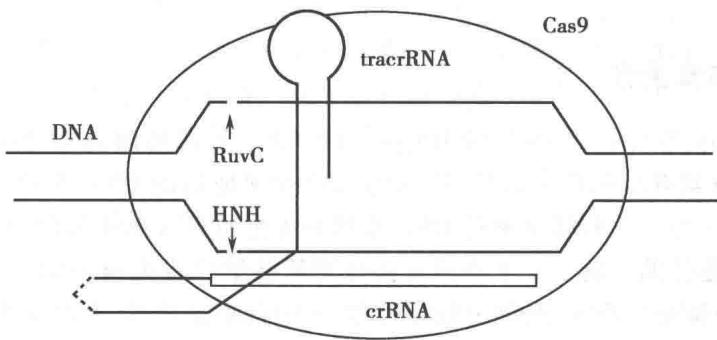  
图 35-21 CRISPR-Cas 切割外源 DNA 示意图

## 3. 获得转基因哺乳动物个体

高等动物体细胞不具有全能性，因此转基因细胞株不能直接培育为成年个体。利用病毒载体携带外源基因只能感染局部组织和细胞。从成年个体中取出部分组织和细胞，在体外进行基因组编辑，然后再输送回个体，可以作为基因治疗的一种手段。例如，从HIV携带者分离出CD4阳性T细胞，在体外改造其受体基因再送回体内，能够有效提升T细胞数量，提高免疫力，减轻发病症状。为获得转基因哺乳动物个体，需将外源基因导入生殖细胞、受精卵或胚胎干细胞，才能培育成转基因个体或嵌合体。采用细胞核移植法克隆动物，也必须将核移植到去核的受精卵内。

（1）显微注射法将外源基因导入受精卵 在哺乳动物的受精过程中，精子进入卵细胞后一个小时内，雄性前核(male pronucleus)和卵细胞核(egg nucleus)一直保持分开。及至卵细胞核完成减数分裂，成为雌性前核(female pronucleus)，才发生核融合。显微注导入外源基因的最好时间就是在受精后一小时之内，此时雄性前核比雌性前核更大，在显微镜下更易操作，更易取得转基因成功。显微注射的外源DNA通常是删除原核载体序列的线性分子。

完成显微注射后将数十个(一般取25\~40个)受精卵用显微外科手术移植到代孕雌性哺乳动物的子宫内。先让雌性动物与切断输精管的雄性交配,然后移植受精卵,因雄性动物在交配过程并无精子,雌性动物自身的卵细胞不会受精。受精卵移植到子宫后逐渐发育生长为幼子,首例转基因小鼠就是用这样的方法产生的。并不是所有受精卵都能在代孕母体子宫内发育生长,也不是所有生下的幼子都转基因成功,因此要对后代幼子进行鉴定和筛选。

现在已有许多方法提高转基因的成功率,也有许多方法使外源基因定向整合,并且可以控制外源基因在特定发育阶段、特定组织中表达。用显微注射法将外源基因导入受精卵而发育成为转基因动物成年个体,已在各类实验动物和家畜、家禽、鱼类等获得成功,转基因动物在技术上已经成熟。

（2）由转基因胚胎干细胞培育嵌合体 哺乳动物发育过程细胞发生分化，但仍有一些细胞保持较低分化水平，具有进一步分化为功能细胞的潜能，称为干细胞（stem cell），如造血干细胞、皮肤干细胞和神经干细胞等。从受精卵发育早期的胚泡中分离出来具有全能性的细胞称为胚胎干细胞（embryonic stem cell, ES），这类细胞将分化为各种组织。将这类细胞取出，由病毒载体或其他方法导入外源基因，经过筛选和鉴定，得到外源基因在正确位点整合并较好表达的ES细胞。然后再将转基因ES细胞放回胚泡中，胚泡移植到代孕母体子宫内。由此产生嵌合转基因动物。再经过多代选择、培育、交配，才能得到纯合的转基因动物。

（3）有缺陷线粒体的置换 线粒体是细胞的能量供应站，并且是柠檬酸循环等代谢途径进行的场所。线粒体含有自身的 DNA，当线粒体 DNA 有缺陷时，将给个体带来许多有害症状，严重时可能威胁到生命。父、母双方各为子代细胞提供一套基因，而子代细胞的线粒体均来自母体卵细胞。如果确定某个体的线粒体有缺陷，而且这种缺陷是由线粒体 DNA 造成的，那么，矫正其后代线粒体缺陷的最好方法是进行“胞浆置换”。该技术是将母体卵细胞的核转移到另一线粒体正常的去核卵细胞内，然后再受精和孕育。“三亲线粒体”是指线粒体蛋白质大部分由父母双方的核基因所编码，而另一女性提供线粒体 DNA 编码某些线粒体特殊的蛋白质。

## （三）基因工程的安全性

早在 1972 年, P. Berg 等人在 SV40 环状 DNA 分子中插入外源基因乳糖操纵子, 构建了第一个 DNA 重组体。但考虑到 SV40 具有潜在致癌危险, Berg 等人终止了他们的 DNA 重组工作, 表现出科学家对基因工程安全性的高度责任心。一些科学家对 DNA 重组技术抱有巨大热情和期望; 另一些科学家则对其安全性极为担忧。一些有远见的生物产业主和商人已急切筹备早日将重组 DNA 产品投放市场。而不少群众害怕 DNA 重组技术会带来生物灾难, 加上媒体炒作, 一时间舆论哗然, 有些城市还发生上街游行示威反对进行重组 DNA 的研究和产业化。对此, 科学家们于 1975 年在美国加州 Asilomar 召开国际会议, 共同商讨转基因生物安全问题。会议取得共识: 重组 DNA 会带来巨大利益, 也存在极大风险; 必须对重组 DNA 研究采取严格的安全管理。1976 年美国国立卫生院 (NIH) 发布《重组 DNA 分子研究准则》, 在这之后, 德、法、英、日、澳等国政府也发布了类似的准则或指南。我国的重组 DNA 工作起步较晚, 1990 年有关部委才发布《重组 DNA 工作安全管理条例》。由此统一了对重组 DNA 研究的认识, 加强了安全管理。其后这类准则或条例不断有修改并拟定了许多具体的规定。

重组 DNA 的安全问题可分为三个层次: 实验室、生产和产品的安全性。

## 1. 重组 DNA 实验室操作的安全性

潜在的生物危害（potential biohazard）主要有三方面：①有害的细菌和病毒；②癌基因和其他致病基因；③污染环境和破坏生态平衡。首先，为防止在实验室操作过程发生任何生物危害事件，重组DNA的载体和宿主必须是安全的，如若涉及有害基因，载体自身必须没有转移能力，宿主必须不能离开实验室生存。也就是说，不会发生有害基因和重组体从实验室逃逸。其次，在工作过程要注意无菌操作，所有转基因细胞都必须经高压灭菌，才能洗涤并倒入下水道。第三，尤为重要的是，实验室的物理防护（physical

containment), 也即实验室的构造和设备。

根据所从事研究涉及的潜在生物危害程度,对实验室的物理防护设定四个等级,P1至P4。P1实验室从事一般重组DNA的操作,也就是利用普通的微生物学和生物化学实验室,但要在酒精灯或煤气灯旁无菌操作,一切基因工程产品和菌种都需高压灭菌后才能废弃。因为我们不希望抗性基因被扩散,而且所用大肠杆菌为条件致病菌,再者重组DNA可能发生未知事件,因此对非致病基因的重组仍需严格遵守实验室的安全规则。

P2 实验室从事可能有害但不严重的基因操作,在普通实验室内放置无菌操作箱(manipulator trunk),操作箱可灭菌,抽气使箱内为负压,空气通过滤器进入箱内,箱内空气和悬浮细颗粒或气溶胶不扩散到箱外,手经套筒伸入箱内进行无菌操作。

P3 实验室可以从事有害基因和病原体的基因操作,整个实验室可消毒灭菌,抽气时室内为负压,空气通过滤器进入室内,人员进出需通过缓冲室。

P4 实验室可从事高危病原体的基因操作。整个实验室群为特殊设计的独立建筑，与外界有隔离带，人员进出实验室需先沐浴更衣，穿上隔离正压防护服，实验室为负压，因此室内空气不会进入防护服。实验室空气经无菌过滤，水和所有物品都需经过特殊处理才离开实验室。2015 年建立的中国科学院武汉国家生物安全实验室即为 P4 实验室，可独立开展高危的埃博拉病毒研究。

## 2. 转基因生物产业生产的安全问题

转基因生物技术产业是高科技产业,生产基地相当于扩大的实验室,上述安全规则在生产中也必须严格执行。此外,大规模生产对安全管理也有一些特别需要关注的问题:①如何防止转基因生物的扩散;②如何防止重组基因(包括目标基因、选择标记基因和报告基因)的扩散;③如何处理转基因生物的废弃物;④如何防止对环境的污染;⑤如何防止破坏生态平衡。

（1）生产基地需要有隔离带，防止转基因生物扩散 转基因农作物的大田周围应有隔离带，最好还在附近种植不接受转基因花粉的其他作物作为缓冲区。植物花粉或通过风媒、或通过虫媒进行传播，都有一定距离。由于隔离带和缓冲区的存在，可以有效防止花粉扩散。家畜、家禽养殖场也应有隔离墙，严防转基因动物逃逸。

（2）生产基地严格消毒，以阻止细菌或病毒携带重组基因转移 在构建原核生物 DNA 重组体时删除了载体自身重组和转移功能，但在外源病毒作用下所转基因有可能发生再重组和被包装，从转基因生物中逃逸。因此严格的隔离和消毒措施是必要，尤其在家畜、家禽饲养场。

（3）集中处理转基因生物的废弃物 废弃物数量庞大。为防止重组基因扩散，所有废弃物都要集中处理。

（4）防止对环境的污染 转基因生物对环境最主要的污染是“基因污染”。对环境的监测数据表明，各类抗性基因有不同程度的扩散。从一些土壤微生物和下水道微生物中都测到对抗生素抗性有显著提高，一方面是由于大量使用抗生素，在选择压力下微生物的抗性提高；另一方面，抗性基因的扩散也是重要原因。抗虫害基因和抗除草剂基因也在扩散，曾报导出现过“超级杂草”。

（5）防止破坏生态平衡 迄今尚未有转基因生物破坏地球生态平衡的报导。广泛使用 Bt 基因并没有减少鳞翅目昆虫的种类和数量，也没有影响到以昆虫为食的鸟类种类和数量，毕竟转基因生物只存在局部地区。也尚未发现转基因生物对任何物种的进化速度有何改变，例如，种植转基因作物地区昆虫和杂草的进化未发现有何异常现象。但是生态平衡的影响是长期的，对此决不能掉以轻心，必须坚持监测和深入研究。

## 3. 转基因食品的安全问题

转基因食品的安全性是关系国计民生的重大问题。美国比较开放，已有百多种转基因食品批准上市；欧洲比较保守，仅少数种类食品上市。对转基因食品的安全性至今仍争论不休。究竟应该如何对待转基因食品，一是要看到转基因食品是发展方向，应积极对待；二是要严格执行安全措施。政府的食品管理、环境保护和监测部门与科研单位和生产单位应相互配合，共同确保食品安全。

转基因食品必须完成动物试验,才能报送审批上市。转基因食品要严格监测,除需符合食品质量标准外,还应达到转基因食品的规格标准。

(1) 转基因食品中可能含有转基因 DNA, 其含量有严格限制 食品中不能残留任何有潜在危害性的

基因 DNA, 对一般转基因 DNA 的残留量也有严格规定。

（2）转基因食品不能含有过敏原 曾报导为提高大豆蛋白的甲硫氨酸含量，通过转基因引入甲硫氨酸含量高的巴西坚果蛋白基因，结果食用转基因大豆后导致多人过敏反应，该转基因大豆即被停止使用。转基因食品中不能有过敏原，也不能有易引起过敏反应的表位结构。

（3）关注转基因食品对免疫力的影响 曾有多项研究报导称，喂饲转基因玉米和转基因马铃薯后，大鼠体重下降，免疫力下降。虽然其后在复查中发现上述报导的动物数量不够，缺乏严格对照，不足以得出结论，但转基因食物对免疫力的影响仍然是动物试验以及人类食用后的观察重点。

（4）关注转基因食品对生殖力的影响 转基因的影响也许是长期的，因此需要在动物试验和人类食用后关注对生殖力和遗传是否有影响。

(5)转基因食品都应该标明 所有转基因食品都应说明转了什么基因。食用者应有知情权和选择权。

总之，发展转基因食品是今后总的趋势，加强安全管理则是关键。

## 五、蛋白质工程

通过基因工程能够大规模生产生物体内微量存在的活性物质，并借助转移基因而改变动、植物性状，得以在人类医疗保健中进行基因诊断和基因治疗。然而，在广泛利用自然界存在的各种蛋白质的过程中就发现，这些蛋白质只是适应生物自身的需要，而对它们产业化开发往往并不合意，需要加以改造。1983年美国基因公司的Ulmer首先提出蛋白质工程这个名词，它是指按照特定的需要，对蛋白质进行分子设计和改造的工程。自此之后，蛋白质工程迅速发展，已成为生物工程的重要组成部分。

## （一）蛋白质的分子设计和改造

蛋白质工程的产生和发展是许多学科相互融合、共同努力的结果，它涉及包括生物物理学、生物化学、分子生物学、计算机科学和化学工程学以及一些有关的相邻学科和交叉学科。蛋白质工程是在充分掌握蛋白质结构规律的基础上发展起来的，通过对蛋白质一级结构、晶体结构和溶液构象的研究，积累了成千上万种蛋白质一级结构和高级结构的数据资料，并编制成系统的数据库，得以从中找出蛋白质分子间的进化关系、一级结构和高级结构的关系、结构与功能的关系等方面的规律。特别值得指出的是，计算机科学技术和图像显示技术的迅猛发展，使蛋白质结构分析、三维结构预测和模型构建、分子设计及能量计算等理论与技术以及相关软件，正在发展成为一个独立的研究领域，而成为生物信息学的一门分支。它在蛋白质工程定向改造的分子设计中是必不可少的条件和重要手段。

蛋白质工程是基因工程的重要组成部分,或者说是新一代的基因工程。蛋白质的改造通常需要先经精细的分子设计,然后依赖基因工程获得突变蛋白质(mutein),以检验其是否达到了预期的效果。如果改造的结果并不理想,还需要从新设计再进行改造,往往要经历多次实践摸索才能达到改进蛋白质性能的预定目标。

## （二）蛋白质的实验进化

蛋白质的分子设计和结构改造在技术上取得重大突破后，备受各界关注，十多年来发展极为迅速，取得了一系列重要成果。然而，这些成果多数属于理论上的，或是技术上的，获得改进性能的实用蛋白质并不多。其主要原因在于分子设计的不精确性。分子设计的主要依据来自三个方面关系的知识：①蛋白质分子间的进化关系，从同源蛋白质序列的微观差异可找出其对空间结构和生物功能的影响；另一方面蛋白质的进化研究也为蛋白质的构造规则提供了信息。②蛋白质一级结构与空间结构的关系，由此可以从一级结构预测三级结构。③蛋白质结构与功能的关系，找出结构改变对功能的影响。从已知蛋白质的上述关系可用以推测一级结构的改变对空间结构和生物功能可能的影响，而目前对蛋白质结构规律的认识还十分有限，这种推测也就并不可靠，往往差之毫厘，失之千里。于是蛋白质改造的另一途径即在实验室条件下模拟生物分子的进化，通过随机变异和靶功能的选择，多次重复，从而获得改进性能的蛋白质。此过

程称为实验进化。

达尔文式的进化基本上是三个过程的循环重复:变异—选择—增殖。可遗传的变异是进化的基础,只有从足够庞大的随机突变体库中才能选择到适宜的突变体。选择,无论是自然选择或是人工选择,都是把“优者”从“劣者”中分离出来的过程,因此选择具有方向性。增殖是使选择到的突变体保存下来。生物大分子(包括基因和蛋白质)实验进化技术已日趋成熟。

遗传变异包括突变和重组。在实验室条件下，基因突变可以用易错PCR(error-prone PCR)来获得。Taq DNA聚合酶缺乏校正功能，其核苷酸掺入错误率为 $2 \times 10^{-4}$ ，积30次循环，错误率可达 $0.25\%$ 。如果提高反应底物dNTP的浓度，加入 $\mathrm{Mn}^{2+}$ 或 $\mathrm{Co}^{2+}$ 等，错误率能够提高到 $2\%$ ，此即为错误倾向PCR。有害变异往往远比有益变异为多，变异率过大易造成变异分子群丢失有用信息。DNA混编（DNA shuffling）是一种体外基因重组技术。将错误倾向PCR产物进行DNA改组，可以增加异质性，促使有害变异与有益变异分离，通过选择获得有益变异的优化组合。DNA混编包括三个主要步骤：① DNA随机片段化（random fragmentation），在 $\mathrm{Mn}^{2+}$ 存在下用DNaseI部分消化DNA， $\mathrm{Mn}^{2+}$ 使DNaseI在DNA双链相同部位切断，得到平端的片段或接近平端的片段。② 自身引发PCR(self-priming PCR)，DNA片段重叠部分两互补链的 $3'$ 端彼此配对，各作为引物，以互补链为模板向前延伸，然后以同样方式与互补链配对延伸，直至合成出全长的基因。③ 重组合PCR(reassembly PCR)，用基因 $5'$ 端和 $3'$ 端引物将上述经重组合的全长基因扩增出来，即可用于表达和选择。DNA混编的流程见图35-22。

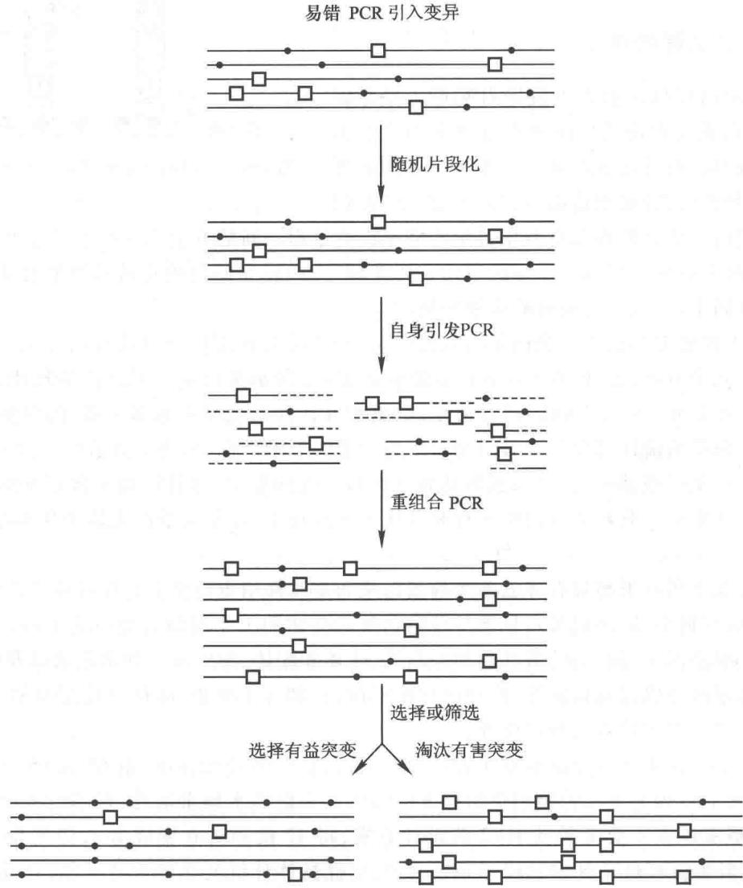  
图35-22 DNA混编流程  
—□—有害变异 —●—有益变异

自然选择是通过选择生物的表型来选择基因型的，在分子水平上则是通过选择蛋白质来选择基因。噬菌体展示技术将展示的蛋白质与其基因偶联在一起，因此，在选择到突变型蛋白质的同时也就选择到了它的基因。1985年G.P.Smith最先将外源基因插入丝状噬菌体f1的基因Ⅲ，使目的基因编码的多肽链与外壳蛋白gp3融合，以相对独立的空间结构展示在噬菌体表面，为表面展示技术奠定了基础。表面展示主要以丝状噬菌体M13或其噬菌粒作为载体。噬菌体主要外壳蛋白gp8分子很小，围绕基因组DNA呈螺旋对称排列；低拷贝数(3\~5)外壳蛋白gp3分子较大，在尾部，具有识别大肠杆菌性纤毛并引导噬菌体进入宿主细胞的功能，它们的N端均游离在外，外源蛋白与之融合而被展示。外壳蛋白融合外源蛋白后会影响其正常功能，因此噬菌体载体采用双拷贝的基因Ⅲ或基因Ⅷ，使一个拷贝为正常（野生型）基因，另一拷贝为融合基因。噬菌粒除含质粒复制起点和选择标记外，只含丝状噬菌体的复制起点与基因间隔区(IG)以及外源蛋白与外壳蛋白融合的基因，其ssDNA的产生与装配依赖于辅助噬菌体。外源蛋白以融合蛋白质形式展现在噬菌体表面，通过适当的选择可获得具有特定功能的多肽结构。

选择可以用各种方式进行,或是正选择(挑选有益突变),或是负选择(淘汰有害突变),最简单和常用

的是亲和选择( affinity selection ), 因其犹如淘金故称为亲和淘选( affinity panning )。亲和淘选常将选择剂固定在支持物上, 用以吸附高亲和力的突变型蛋白质, 例如, 用于选择受体的配体、酶的抑制剂、靶蛋白的作用物等。噬菌体表面展示与特异选择见图 35-23。

## （三）蛋白质工程的进展

蛋白质工程的出现标志着人类改造自然进入一个新的发展阶段。蛋白质工程使我们能更充分地利用自然界存在的基因和蛋白质，而且还能在分子水平上对基因和蛋白质进行再设计和改造，进而创造出自然界不存在的基因

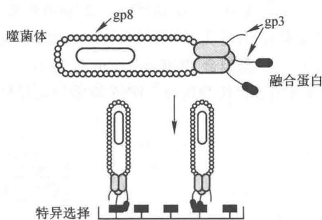  
图 35-23 噬菌体表面展示与特异选择

和蛋白质，在短期内完成自然界几百万年进化才能完成的过程。新的方法不仅改进了过去传统的方法，而且还开辟了新的研究领域。蛋白质工程的应用主要在两个方面：为蛋白质及其基因的科学研究提供强有力的手段；改进基因工程产品，开发新的应用领域。

目前蛋白质工程更多侧重于对蛋白质的理论研究，并已成为常用的不可或缺的方法。用于蛋白质的研究，大致有以下几个方面：①有助于对蛋白质结构的解析，揭示蛋白质分子结构的规律，由一级结构预测空间结构。②确定蛋白质分子间的相互关系，找出相互作用的氨基酸残基。③阐明蛋白质结构与功能的关系，了解蛋白质的活性部位和一级结构对生物功能的影响。例如，为了弄清楚蛋白质中各半胱氨酸的作用，可逐个用丝氨酸残基取代，之后观察其对结构和功能的影响。同样，对关键氨基酸残基可予以删除或置换，以确定其作用。有赖于蛋白质工程和其他一些新技术，近年来蛋白质结构和功能的研究取得突飞猛进的发展。

在应用方面,几乎所有类型具有开发前景的蛋白质和多肽都用蛋白质工程作过改造的尝试,并取得不同程度的成果。研究最多、取得成果最显著的是生物技术药物和工业用酶的蛋白质工程。蛋白质和多肽类药物包括激素、细胞因子、酶、酶的激活剂和抑制剂、受体和配体、细胞毒素和杀菌肽以及抗体和疫苗等。作为药物,希望通过改造以提高其活性、特异性和稳定性,控制分子聚集,降低免疫原性和毒副反应,延长在体内的半寿期,增强对靶位点的导向性等。

例如,水蛭素是水蛭唾液腺分泌的凝血酶特异抑制剂,它有多种变异体,由65或66个氨基酸残基组成。水蛭素在临床上可作为抗栓药物用于治疗血栓疾病。为提高水蛭素活性,在综合各变异体结构特点的基础上提出改造水蛭素主要变异体HV2的设计方案,将47位的Asn变成Lys,使其与分子内Thr4或Asp5间形成氢键来帮助水蛭素N端肽段正确取向,从而提高体外抗凝血效率达4倍,在动物模型上检验抗血栓形成的效果,提高20倍。

生长激素通过对它特异受体的作用促进细胞和机体的生长发育,然而它不仅可以结合生长激素受体,还可以结合许多种不同类型细胞的激素受体(例如催乳激素受体)，引起其他生理过程。在治疗过程中为减少副作用，需使人的重组生长激素（rh-GH）只与生长激素受体结合，尽可能减少与其他激素受体的结合。经研究发现，二者受体结合区有一部分重叠，但并不完全相同，有可能通过改造加以区别。由于人的生长激素和催乳激素受体结合需要锌离子参与作用，而它与生长激素受体结合则无需锌离子，于是考虑取代充当锌离子配基的氨基酸侧链，如第18和21位的His和第174位的Glu。实验结果与预先设想一致，但要开发作为临床用药物还有大量研究工作要做。

已得到分离并进行生物化学研究的酶不下数千种，然而应用于工业生产的酶却只有数十种，可见工业用酶的开发潜力还很大。用蛋白质工程的方法提高酶的活性、特异性和稳定性，改变反应介质和动力学的性质，从而可以改进现有的工业用酶，开发更多新的工业用酶。去污剂中添加的蛋白酶和脂酶需要具有耐热、耐碱、耐氧化剂的性能，从生物体内分离的酶往往达不到这些要求，故而要加以改造。为提高酶的热稳定性，可在蛋白质分子中引入二硫键、置换不稳定的氨基酸残基、增加内部疏水性氨基酸等。枯草杆菌蛋白酶(subtilisin)是去污剂的一种成分，H. Chao等利用定向进化的方法得到一系列热稳定的突变型蛋白，其中一种突变型1E2A含有4个错义突变，V93I、N109S、N181D和N218S，用DNA改组技术进行回交(back-crossing)，即以此突变型与野生型基因等量进行改组。任何一个突变将以1/2的概率出现在改组群体的基因中，通过筛选和测序，发现中性突变占 $50\%$ ，不利突变在选择过程中全部排除。将两个有利突变(N218S和N181D)组合在一起得到的突变型与野生型相比，在 $65^{\circ}\mathrm{C}$ 的半衰期提高近10倍，变性温度提高 $6.5^{\circ}\mathrm{C}$ ，比活提高2倍多。

蛋白质工程的发展很快,研究工作很多,这里仅介绍几个例子。

## 六、基因工程的应用与展望

在基因工程(包括蛋白质工程)技术的带动下生物技术获得迅猛发展,从而改变了分子生物学的面貌,并促进了生物技术产业的兴起,由此带动并开启了一个新的科技时代。

## （一）基因工程开辟了生物学研究的新纪元

基因工程的新技术和新方法为解决生物化学、分子生物学和医学中的一些重大问题提供了强有力的手段。过去分离一个基因，测定基因的序列，确定基因的功能，用以改变生物性状，都是十分困难的事，往往需要数年，甚至数十年的时间，现在任何生物学实验室都能在短时间内完成。测定蛋白质分子的氨基酸序列原是一项十分费时费力的工作，现在可由DNA的快速测序法来代替。一些生物体内微量存在的蛋白质也可通过克隆基因的大量表达来制备。借助基因工程，分子生物学的进展达到了空前的速度和规模，重大突破不断出现，研究成果日新月异，生物化学与分子生物学已成为自然科学中最富挑战性、发展最快的学科之一。

基因工程已成为生物学各分支学科在分子水平上研究生命活动规律所不可缺少的重要手段。新的生物技术不仅为分子生物学家所掌握，也为生物科学其他分支学科的研究者所掌握，各学科都能在分子水平上，在基因、基因表达和其调控的水平上阐明生命活动过程，学科的界线已不那么分明了。一些过去难以研究的问题，如细胞识别、发育的基因控制、神经系统和大脑活动的分子基础等，借助新的技术都得到深入研究，从而开辟了许多新的研究领域。结构分子生物学、发育分子生物学、神经分子生物学和分子医学已成为当今最活跃、发展最快的分支学科。

按照传统的方法,生物学的研究通常是根据生物的性状,找到有关的蛋白质,再确定其基因,在这条途径上生物学家已经摸索了一个半世纪;利用基因工程则可以先分离出基因,经克隆后测序并进行表达,然后再研究其功能,这一研究途径要容易得多。由于新的途径与传统生物学相反,故称为反向生物学(inverse biology)。反向生物学不仅是生物学的一种新的研究方法,而且是一种新的思路和新的理论系统。

由于基因工程的迅速进展,绘制人类基因组图谱才成为可能。人类细胞含有23对染色体,单倍体基因组 DNA 由大约 $3 \times 10^{9}$ bp 所组成，共有约 3 万个基因。科学家们认为，通过全部基因序列的测定，人们将能够更有效的找到新的方法来治疗和预防许多疾病，如癌症和心脏病等。1986 年，著名生物学家、诺贝尔奖获得者 R. Dulbecco 在 Science 杂志上率先提出“人类基因组计划”，该建议引发了科学界长达 3 年的激烈争论。在此基础上，美国政府决定用 15 年时间（1990—2005 年）出资 30 亿美元来完成这一计划。各国科学家和政府也纷纷响应美国科学家的倡议。美国、英国、日本、中国、德国及法国等六国科学家参与了这项生命科学历史上迄今最为浩大的科学工程的研究。经过 10 年努力，于 2000 年 6 月人类基因组草图宣告完成。全部基因组的测序工作已于 2003 年提前完成。

人类基因组的研究带动了有关技术的突破和发展,在测定人类基因组序列的同时,上千种从低等生物到高等动、植物的基因组完成全序列的测定,其中包括多种病原体、大肠杆菌、枯草杆菌、酿酒酵母、线虫、果蝇、小鼠、大鼠、水稻和拟南芥等的基因组,绘制了数百个模式生物(model organism)和代表性物种的基因组图谱,对于生命科学的发展至关重要。

人类基因组计划的顺利进展鼓励了科学家们进一步规划后基因组时代(post genome era)的研究任务,由此提出了功能基因组的研究方案。也就是说不仅要了解人类基因组的语言信息,即测定其全序列;还要了解其语义信息,弄清全部编码基因的功能;并进而了解其语用信息,阐明基因表达的时空调节。基因组学(genomics)的任务已不仅限于研究基因组的结构,还要研究基因组的功能,研究基因组表达的产物。然而,生命的分子逻辑在于系统内生物分子的相互作用,仅从基因组水平进行研究不足以揭示复杂的生命活动规律。1994年M. Wilkins和K. Williams提出蛋白质组(proteome)的概念,从而产生了一门新的学科——蛋白质组学(proteomics),即研究细胞内全部蛋白质的存在及其活动方式。基因组的产物不仅仅是蛋白质,还有许多具有复杂功能的RNA,于是1997年提出了转录物组学(transcriptomics),用以表示对基因组全部转录物的研究。1999年又提出了RNA组学(RNomics)的研究任务。其后又出现了糖组学(glycomics)、脂类组学(lipidomics)、代谢组学(metabolomics)等一系列组学。生命科学已由研究个别生物分子进入研究生物分子群体;从研究生物分子静态结构进入研究生物分子动态结构;从研究单独生物分子结构与功能的关系进入研究生物分子相互识别和作用所体现的生命机能。基因工程的发展不但改变了生物化学与分子生物学的面貌,而且给整个生物学带来巨大影响,新的发现不断涌现,新的研究领域不断开拓,一个生物学的新纪元已经开始。

## （二）基因工程促进了生物技术产业的兴起

现在是新技术革命的时代。基因工程的诞生带动了现代生物技术的不断突破和迅猛发展，依赖于生物技术的产业随之兴起。生物技术以基因重组技术为前沿和核心，还包括酶技术、细胞技术、微生物发酵技术、生化工程技术、生物模拟技术和生物信息技术等内容。基因工程的产业化往往涉及不止一种技术，而是配套的技术，或者说综合的生物技术。基因工程首先在医药和化工等领域中崭露头角。其实，它的最大用武之地是在农业领域和医疗保健领域。基因工程产业化的范围十分宽广，这里仅就主要方面举例加以说明。

## 1. 基因工程药物

1977 年 K. Itakura 和 H. Boyer 利用当时刚趋成熟的基因工程技术, 在大肠杆菌中产生下丘脑激素 14 肽生长素释放抑制激素, 商品名 Somatostatin(SMT)。他们将化学合成的 14 肽基因与 β-半乳糖苷酶基因融合, 插入质粒载体 pBR322, 在 lac 启动子控制下表达融合蛋白。表达产物用溴化氰处理, 溴化氰使甲硫氨酸裂解, 由此分离得到 14 肽的激素。该激素可用于治疗儿童发育时期因生长素分泌过多造成的四肢巨大症。从 1 L 工程菌发酵液中可得到 50 mg 的基因表达产物, 相当于 50 万头羊下丘脑提取的该激素量, 由此可以了解到基因工程产业化的意义。

其后,基因工程药物不断成功问世。1978年胰岛素原在大肠杆菌中表达成功。1979年人生长素基因在大肠杆菌中获得直接表达。1980年人白细胞干扰素基因获得克隆和表达。1981年抗口蹄疫的基因工程抗原疫苗研制成功。1982年乙肝抗原疫苗在酵母菌中表达成功。同年转基因植物和转基因动物也分别获得成功。

基因工程药物包括体内微量存在的各类因子和调节肽，采用基因工程大量制备，才得以确定其生物功能和临床应用价值。借助蛋白质工程不断改进蛋白质和多肽药物性能，并设计和制造出自然界不存在的新的蛋白质和多肽，其意义远比抗生素的发现和应用更为深远。一些恶性疾病，过去无药可治，现在有了特异的基因工程药物。将识别靶部位的肽段或抗体与蛋白质药物融合，可构成导向药物，它们能够选择性作用于靶部位，从而大大提高了疗效。当前在生物技术药物市场中抗体仍是主要的生物药物。应用基因工程产生抗体称为抗体工程。通过免疫动物获得的抗体为第一代抗体，由杂交瘤产生的单克隆抗体为第二代抗体，抗体工程产生的抗体则为第三代抗体。利用噬菌体展示技术，使抗体基因的表达产物展示于噬菌体表面，由此构建成噬菌体抗体库，可以在体外进行克隆选择，而无需免疫动物。总之，基因工程正在改变，今后将更大地改变化学治疗的面貌和药物生产途径。

## 2. 基因工程在农业上的应用

20世纪50年代开始的“绿色革命”对全世界范围重要粮食作物，如小麦、玉米和水稻等的改良与产量提高，做出了重要贡献。农业生产的惊人进步，是由于作物育种的成就同农业机械化和化学化的发展相配合的结果。然而，传统的育种方法有其局限性，并且费时费力。高产的农作物新品种往往需要大量施用优质化肥、各种杀虫剂和除草剂等化学药品，这就造成环境污染，土壤肥力下降，农业成本增加等新的问题。而且，传统的育种方法难以克服物种之间的遗传屏障，高度近亲繁殖造成作物遗传背景越来越窄，容易发生病虫害。70年代兴起的生物技术应用于农业，于是出现了第二次“绿色革命”。

转基因技术改变了传统的育种方法，通过导入优良基因而使作物获得新的性状。最早进行的基因工程育种是使作物获得各种抗性，如抗病毒、抗病菌、抗虫害、抗除草剂、抗寒、抗涝、抗干旱及抗盐碱等。通过转基因可以控制作物的生长发育，缩短生长期，影响各器官的形成。新的育种方法增加了农产品的产量，还可改良农产品的品质，增加营养成分，并使农产品便于保存。基因工程促进了对光合作用和固氮作用的基础研究，可望提高栽培作物的光合作用效率，直接从空气中利用氮源。基因工程也改变了作物的栽培技术和田间管理，技术上落后的农业正在变成高新技术的产业。

畜牧饲养业也得益于基因工程，在短时间内就培育出各种高产、优质、抗病及短生长期的新品种。新的转基因动物获得许多优良性状，改变了饲养条件，也改善了畜牧产品的性能和品质。

基因工程还可将栽培植物和饲养动物作为生物反应器，通过转基因使植物的茎、根、种子和禽类的蛋、哺乳类动物的奶汁中含有大量珍贵的药物或疫苗。基因工程使得人类能够充分利用自然界的基因资源。

## 3. 基因治疗

所谓基因治疗(gene therapy)，是指向受体细胞中引入具有正常功能的基因，以纠正或补偿基因的缺陷，也可以是利用引入基因以杀死体内的病原体或恶性细胞。基因工程的兴起，使得基因治疗成为可能。一些目前尚无有效治疗手段的疾病，如遗传病、肿瘤、心脑血管疾病、阿尔茨海默病及艾滋病等，可望通过基因治疗来达到防治的目的。

1990年，美国正式开始首例临床基因治疗，患儿由于腺苷脱氨酶(ADA)基因缺陷，而患重度免疫缺陷症(SCID)。研究人员将克隆的腺苷脱氨酶基因(ada)导入患者淋巴细胞，经体外培养淋巴细胞可以产生腺苷脱氨酶，然后再将这种淋巴细胞转入患者体内，患者症状有明显缓解，治疗取得令人鼓舞的成功。继美国之后，许多国家都开始了基因治疗试验。我国于1991年首例B型血友病基因治疗也获得满意结果。然而目前基因治疗在技术上还未成熟，许多试验都没有成功。关键问题是：①如何选择有效的治疗基因。②如何构建安全载体。病毒载体效率较高，但却有潜在的危险性。③如何定向导入靶细胞，并获得高表达。人类基因组计划的完成必将有助于人类重要疾病基因的发现，基因治疗技术也在不断改进。根据乐观的估计，在今后20年中，基因治疗有可能取得重大突破，成为临床广泛采用的有效治疗手段。

在诸多基因治疗途径中最早得以实现的可能是基因疫苗和基因抗体。毕竟要修复或取代人体内有缺陷的重要基因绝非易于。除了上面所提到的表达效率和安全性问题外，还要考虑到人体内重要基因的影响是多方面的，引入基因在补偿缺陷的同时，还可能引起其他许多的反应，甚而有可能抑制体内正常基因的表达。相对来说，免疫基因治疗容易操作，也比较安全。将疫苗蛋白基因的表达重组体皮下注射到体内，或将抗体基因表达重组体导入患者淋巴细胞内，再输入体内，可以在体内产生所需要的疫苗蛋白或抗体蛋白。免疫反应在治疗恶性传染病、肿瘤、艾滋病等难于医治的疾病中常有特殊的疗效。采用基因治疗有下列优点：①能在较长时期内持续产生生物治疗量的疫苗蛋白或抗体蛋白；②易于控制其表达，也可以定点注射到患处；③可以针对患者疾病制备特异的基因，达到个性化治疗。2006年美国科学家报导采用抗体基因疗法首次治愈癌症。2名皮肤癌患者，癌细胞已经扩散，在用抗体基因治疗18个月后，体内癌细胞全被清除。这一成果增强了人们对基因治疗的信心。

取出淋巴细胞或用干细胞在体外进行基因组编辑,然后再输送回体内,可能是基因治疗的有效途径。用这种方法在皮肤癌、乳腺癌的治疗中已取得较好结果。

反义 RNA 和 RNA 干扰已在临床开始试用,由于 RNA 制剂本身十分不稳定,其化学衍生物又常有毒,最好的方法是引入基因,使在体内表达产生 RNA。RNA 干扰可用以对付外来病原体基因或体内突变产生的有害基因,因此称为基因组免疫。无论是反义 RNA 或干扰 RNA 的基因制剂,有望成为治疗的有效途径。

## （三）基因工程研究的展望

20世纪70年代初基因工程的出现带动了生物技术的兴起和发展，由此使生物科学进入了一个新的发展时期，其主要特点是：第一，生物科学得以前所未有的高速度向前发展。技术上的不断创新和突破，使得生物科学具有赖以迅猛发展的方法和手段。第二，生物科学与工程学相结合，出现空前规模大科学工程的研究。巨大的信息网将世界各实验室相连，生物科学的研究变得更有计划、更有组织、更有规模了。第三，生物科学进入了一个创造和实践的新时代。如果说过去生物学主要是在认识生物的基础上研究怎样利用生物，那么今天已能够在分子水平上重新设计和创建自然界未曾出现过的基因、蛋白质和生物新品种。

基因工程和有关的生物技术为人类认识生命世界，认识人类自己提供了有效手段。首先，人类需要了解自身基因组编码的遗传信息。只有在基因工程的基础上才有可能提出和完成“人类基因组计划”这样一个生物学历史上迄今最宏大的科学工程。“人类基因组计划”已经提前完成，科学家们又制定了“后基因组研究计划”，着手功能基因组学和结构基因组学的研究。这项工作具有巨大的理论意义和实践意义，对生物学和医学将产生深远的影响，由此发展起来的新策略、新技术在生物技术产业中也能发挥重大作用，有关基因序列的信息在科学研究和实践应用中的价值也会越来越大。

其次，高等动、植物及至人体如何从一个受精卵开始发育成为成体的，这也是人们长期以来不断探索以求解决的基本问题之一。由于采用了基因工程技术，对发育过程的研究才深入到基因选择性表达和其产物对发育过程的控制等分子水平。通过基因标签技术，即利用转位因子插入控制发育的基因内使其失活，或是通过基因敲除，生物发育就停留在该基因控制的阶段，用这样的方法及其他一些方法，可以克隆到控制发育的基因。现在知道，发育程序并不是在受精卵中早已完全确定的，而是在发育过程中通过有关基因间一系列相互作用而逐渐展开的。果蝇发育的遗传实验表明，决定胚胎体轴和分节的基因形成一个分层次的网络。决定初级体轴的基因是原初基因，这些基因产物不均匀地分布在卵子中，从而使卵裂过程中到达一定空间的细胞核基因组选择性被激活。激活的分节基因又对体轴和分节的发育进一步起作用。第三个层次是同源异形基因（homeotic gene），它们决定体节分化为头、胸和腹的器官。目前已经克隆了许多同源异形基因，它们都具有一个类似的同源框序列，这类同源框也存在于脊椎动物的基因组中，估计这些同源异形基因的产物是一类转录因子。目前即使是果蝇的发育都还远未弄清楚，更何况是人体的发育。但重要的是，生物发育已不再是不可捉摸的事，它被归结为一系列连续发生、彼此相关的基因事件，只要假以时日，这一系列基因事件都将会研究清楚。

第三,最重要也是最困难的研究课题是了解人类大脑的活动规律。当代自然科学面临的最大挑战之一是揭开大脑的秘密。基因工程作为研究分子生物学的重要手段,在神经生物学的研究中也发挥了重要作用。神经信号的基本形式是沿神经元质膜迅速传播的动作电位或神经脉冲,它由神经细胞膜发生瞬间离子通道透性改变而引起的。现已将多种离子通道蛋白的基因及神经递质受体的基因克隆出来,因而能够通过克隆基因的表达获得足够量的通道受体蛋白,在体外研究它们的作用,了解神经回路的作用机制。更引人注目的是学习和记忆分子基础的研究。学习可能使神经细胞突触连接的有效性产生长期的变化,其中涉及基因表达的改变和第二信使系统的信号转导,前者与长期记忆有关,后者参与短期记忆。对大脑的研究是人类探索自然的重要组成部分,它不仅反映了人类对自然和人类自己的认识水平、认识能力,并将直接影响到人类的思想和意识形态。

在基因工程的带动下,有关的生物技术得到迅速发展,构成了一个新兴的综合技术领域,它们运用生命科学和邻近基础学科的知识,并结合工程学的现代技术,成为巨大的生产力。一批以生物技术为基础的新产业群得以迅速兴起。这些产业能为社会提供大量商品和各种社会服务,创造出庞大的财富,其发展规模更是始料不及的。它们提供的商品或是生物技术药物、食品、化工产品、生物材料和加工制品,或是优良的生物品种。社会服务的含义也很宽,它们产生的直接效果是社会效益,如疾病诊断和医疗保健、水的净化和废物处理等。

新技术革命引起新的产业革命，促使世界产业迅速地朝向尖端技术化、知识密集化、高增殖价值化方向发生结构性的变化。领头产业正在更替。当今是信息经济时代，信息技术改变了整个社会面貌。任何经济形式都有始有终，都要经历形成、成长、成熟和转化四个明确的阶段。20世纪从电讯技术诞生、计算机出现、网络的形成到大规模使用芯片，信息经济进入了它的成熟阶段。据估计，再过二三十年，生物经济可能进入成熟阶段，并将取代目前的信息经济。到那时生物技术产业将会是领头的产业，生物技术会影响到经济结构、生活方式和社会的各个主要方面。

## 提 要

基因工程是对携带遗传信息的分子进行设计和施工的分子工程，包括基因重组、克隆和表达。基因工程的核心技术是构建重组体 DNA 的技术。蛋白质工程是在基因工程基础上发展起来的，它是指通过对蛋白质已知结构与功能的认识，借助计算机辅助设计，利用基因定位诱变等技术改造蛋白质分子，以达到改进其性能的目的。

DNA 分子克隆,即将 DNA 的限制片段插入克隆载体,导入宿主细胞,经细胞无性繁殖,获得相同的 DNA 扩增分子。DNA 限制片段是用限制性核酸内切酶切割 DNA 分子获得的片段。限制酶共有三类,常用的是类型 II 限制酶。生物来源不同但识别序列和切割序列相同的限制酶称为同裂酶;切割产生相同单链末端的限制酶为同尾酶。相容的限制片段可用 DNA 连接酶相连接。平末端连接效率较低,利用接头、衔接物或在两平末端加上均聚物可以帮助平末端连接。

将外源 DNA 带入宿主细胞并进行复制的运载体称为载体。克隆载体通常由质粒、病毒或一段染色体 DNA 改造而成。大肠杆菌载体主要有: 质粒载体、 $\lambda$ 噬菌体载体、柯斯质粒和丝状噬菌体 M13 载体, 它们携带 DNA 片段大小不同, 用途也各异。宿主细胞应根据载体的性质来选定。

将外源 DNA 导入宿主细胞, 从而改变细胞遗传性状, 称为转化; 将病毒 DNA 直接导入细胞, 称为转染。用氯化钙处理大肠杆菌细胞, 使处于感受态, 易于转化。 $\lambda$ 噬菌体和柯斯质粒重组体 DNA 在体外包装后可用以感染大肠杆菌, 柯斯质粒在大肠杆菌细胞内以质粒形式存在。外源 DNA 导入真核细胞常用钙盐沉淀、高分子葡聚糖、高聚阳离子、脂质体和电穿孔等方法。

基因文库是指整套基因组 DNA 片段分子克隆的总体。基因文库的构建包括基因组 DNA 的随机片段化、载体 DNA 的制备、重组体 DNA 的体外包装、重组噬菌体感染大肠杆菌、基因文库的鉴定和扩增等步骤。由于真核生物的基因是断裂的，只有用它 mRNA 逆转录获得的 cDNA，才能得到连续的编码序列。细胞全部 mRNA 的 cDNA 克隆的总体称为 cDNA 文库。从文库中选择基因或 cDNA 克隆，主要依据重组体 DNA 序列、基因表达产物特征和性质。

聚合酶链反应(PCR)借助一对引物,在耐热 DNA 聚合酶作用下,通过变性、复性和延伸多轮酶促反应,使 DNA 序列得到指数级的扩增。PCR 技术因其检测和扩增 DNA 序列快速高效,并且易于操作,而被广泛应用于生物学、医学、检验、刑侦和其他有关基因检测的领域。

DNA 可用化学方法合成。在寡核苷酸指导下通过 DNA 复制或 PCR 可使基因定位诱变。DNA 测序法可分化学法和酶法两种，酶法测序先是加减法，后改进为双脱氧核苷酸法（终止法），并可用自动化仪器进行测序。人类基因组计划极大带动了测序技术的发展，第二代测序方法主要有：454 FLX、Solexa 和

SOLID。这些方法的共同点是高通量、边合成边测序。进入21世纪后又产生第三代测序方法，tSMSTM、SMRT和Nanopore都属于单分子测序。全基因组测序主要有两种谋略：鸟枪法和逐步克隆法。

基因表达的主要调控元件有:启动子和上游元件、核糖体结合位点、转录终止位点和终止密码子等。外源基因在宿主细胞内可以非融合蛋白形式表达,也可以融合蛋白形式表达。在信号肽的引导下表达蛋白可以穿过细胞膜,分泌到细菌的周质或细胞外。外源基因高水平表达时易产生不溶性的包涵体。为便于操作,真核生物表达载体常插入能在大肠杆菌中复制的起点,因而构成穿梭载体。酵母菌的克隆和表达载体常用整合质粒、附加体质粒、复制质粒、含着丝点质粒构建而成。为克隆基因组 DNA 大片段,常用酵母人工染色体。植物基因工程常用的载体是 Ti 质粒。高等动物常用各种病毒构建表达载体。

植物细胞具有全能性。外源基因导入植物细胞，转化的胚性悬浮细胞、胚性愈伤组织或转化的叶片组织可用植物激素诱导生根和生芽，产生转基因再生植株。选择转化细胞常用标记基因，主要是抗性基因和营养基因，也可用报告基因。绿色荧光蛋白是最常用的报告基因，可用来研究转化效率、表达调控机制和表达蛋白的相互作用。植物激素主要有植物生长素、细胞分裂素和赤霉素，秋水仙碱可使单倍体细胞或原生质体转变为双倍体。为提高外源基因在植株中的表达水平，需要构建高效表达载体，克服转基因沉默。

动物转化细胞的选择标记基因主要有:胸苷激酶基因、二氢叶酸还原酶基因、氯霉素乙酰基转移酶基因、黄嘌呤-乌嘌呤磷酸核糖基转移酶基因和氨基糖苷磷酸转移酶基因。基因组编辑技术使精确修改细胞基因组(包括动物、植物和细菌的基因组)成为可能。20世纪80年代兴起的基因打靶技术可以将外源基因敲除或敲入。90年代发现的RNA干扰现象使基因表达可以敲减或激活。近年来发展出一些特异切割和替换基因组基因的技术,如ZFN、TALEN和CRISPR-Cas。CRISPR-Cas借助RNA准确识别基因组序列,并引导核酸酶切割,从而可精确施行基因组编辑。动物细胞不具有全能性,但细胞核含有整套染色体基因。将外源基因导入生殖细胞、受精卵或胚胎干细胞,能够培育成转基因个体或嵌合体。采用细胞核移植法克隆动物,则必须将核移植到去核的受精卵内。有缺陷的线粒体可以通过线粒体置换来弥补。

基因工程带来希望,也带来风险。在大力推广基因工程技术的同时,应严格遵守基因工程技术的各项安全准则和规定。转基因操作的安全性可分为三个层次:实验室、生产流程和产品的安全性。根据潜在的生物危害风险大小,实验室的物理防护设定分四个等级:P1\~P4。转基因生物产业的生产基地要有隔离带,要严格消毒,集中处理废弃物,防止污染环境和破坏生态平衡。转基因食品要严控DNA含量,不能有过敏原,关注长期食用对免疫力和生殖力的影响,食品应标明转基因。

蛋白质的改造通常需要先经周密的分子设计,然后依赖基因工程获得突变蛋白质。蛋白质的实验进化为蛋白质改造提供了又一条有效途径。蛋白质工程已成为研究蛋白质结构和功能最重要的手段之一,并在改进和开发蛋白质产品中日益发挥重要作用。

基因工程开辟了生物学研究的新纪元。借助基因工程，分子生物学的发展达到空前的速度和规模，新的研究领域不断在开拓。“人类基因组计划”是生物学历史上最巨大的科学工程；后基因组时代已经到来。基因工程带动了生物技术产业的兴起。制药、化工、食品、农业和医疗保健业无不得益于基因工程。基因工程帮助人类认识和改造世界，也帮助人类更好认识自己。

## 习题

1. DNA 分子克隆包括哪些步骤？有何应用价值？

2. 大肠杆菌质粒 pBR322 含有 10 个 Hinf I 的酶切位点, 当以此酶部分水解时可得到多少种限制片段?

3. 何谓同裂酶？何谓同尾酶？不同同尾酶切割的片段连接后是否还可用原来的限制性内切酶切开？

4. 克隆载体的必要条件是哪些？

5. 比较黏粒和 $\lambda$ 噬菌体为载体进行 DNA 克隆的异同。

6. 如何进行单链 DNA 的克隆？

7. 有哪些方法可以使外源 DNA 与载体 DNA 相连接？比较它们的优缺点。

8. 对克隆载体和宿主菌有哪些基本要求？

9. 将重组 DNA 导入细胞内有哪些方法？它们的原理是什么？

10. 何谓基因文库？何谓 cDNA 文库？两者有何不同？

11. 构建哺乳动物基因文库, 将染色体 DNA 用 MboI 部分水解并分离出约为 20 kb 的片段, 其切割分离的效率为 20%; 与 $\lambda$ 载体左右臂 (共 28 kb) 连接, 其连接效率 90%; 然后进行体外包装, 已知 $1 \mu g$ 重组 DNA 经体外包装后感染大肠杆菌的 cfu 为 $10^{9}$ , 若哺乳动物单倍体基因组大小为 $3 \times 10^{9} bp$ , 最初需要多少染色体 DNA 建库才能使任意基因存在库中的概率大于 99%。

12. 建立人胚 cDNA 文库, 已知人胚低丰度 mRNA 为 28000 种, 占总 mRNA 的 40%, 为使低丰度 cDNA 存在的概率大于 99%, 此 cDNA 文库应包含多少克隆?

13. 比较 cfu 和 pfu 两者的差别。

14. 如何利用 $tet^{r}$ 基因插入失活来筛选插入外源基因的重组体？

15. 原位杂交的原理是什么？有何用途？

16. 何谓差别杂交和扣除杂交？举例说明用以分离基因的过程。

17. 何谓表达文库？如何从表达文库中分离克隆的基因？

18. 说明聚合酶链反应(PCR)的原理和用途。

19. 设计 PCR 引物应遵循哪些原则？

20. 简要说明重组 PCR 的原理。

21. 如何利用 PCR 扩增未知序列？

22. 基因定位诱变的主要方法有哪几种？它们的原理是什么？

23. 比较化学法和双脱氧法测序的原理和优缺点。

24. 为什么称 T7 DNA 聚合酶为测序酶？用它测序有何优点？

25. 试述自动化测序的原理。

26. 原核生物基因表达主要调控元件有哪些?

27. 何谓 tac 启动子？为什么用 IPTG 可诱导基因表达？

28. 分析融合蛋白表达和非融合蛋白表达的利弊。

29. 如何提高外源基因的表达水平？

30. 如何从包涵体中纯化产物？

31. 试述金属螯合柱纯化带组氨酸标签蛋白质的原理和步骤。

32. 酵母的克隆载体有哪几种？它们的基本特点是什么？

33. 如何将外源基因导入植物细胞并使之表达？

34. 何谓细胞全能性？

35. 何谓选择标记基因？何谓报告基因？比较两者异同。

36. 什么是愈伤组织？如何利用愈伤组织培育转基因植株？

37. 如何得到植物细胞的原生质体？如何利用原生质体培育再生植株？

38. 怎样控制外源基因在植株中定向表达？

39. 为什么转基因植物会引起基因沉默？如何克服？

40. 用胸苷激酶基因作为选择标记时,采用 HAT 培养基,其成分是什么?各起什么作用?

41. 用 xgprt 基因作为选择标记时, 培养基中应添加什么成分? 起何作用?

42. 何谓基因敲除和敲入？何谓基因敲减？

43. 比较 ZFN、TALEN 和 CRISPR-Cas 三者的异同。CRISPR-Cas 系统的出现引发对基因组编辑安全性性的争议，你如何看待？

44. 何谓胚胎干细胞培育的嵌合体？培育转基因嵌合体有何意义？

45. 何谓“三亲线粒体”？

46. 实验室安全性等级是如何划分的？有何安全的要求？

47. 如何防止转基因植物花粉传播？

48. 如何防止抗性基因扩散？

49. 转基因食品的安全性应注意哪些方面？

50. 什么是蛋白质工程？举例说明蛋白质工程的意义。

51. 何谓蛋白质实验进化？有何理论和实践意义？

52. 叙述 DNA 混编的步骤和原理。

53. 何谓基因治疗？其核心技术是什么？举例说明基因治疗的新进展。

54. 提出你对基因工程未来发展的看法。

## 主要参考书目

1. Green M R, Sambrook J. Molecular Cloning: A Laboratory Manual. 4th ed. New York: Cold Spring Harbor Laboratory Press, 2012.

2. Watson J D, Gilman M, Wifkowski J, et al. Recombinant DNA. 2nd ed. New York: Scientific American Books, 1992.

3. Ausubel F M, Brent R, Kingston R E. Short Protocols in Molecular Biology. 5th ed. New York: John Wiley & Sons, 2002.

4. 卢圣栋. 现代分子生物学实验技术. 2 版. 北京: 中国协和医科大学出版社, 1999.

5. 吴乃虎. 基因工程原理. 2 版. 北京: 科学出版社, 1998.

6. 王镜岩, 朱圣庚, 徐长法. 生物化学教程. 北京: 高等教育出版社, 2008.

(朱圣庚)

## 网上资源

