# 生物化学

# BIOCHEMISTRY

第

4

版

下册

主编 朱圣庚 徐长法

第 1 版 1988 年获首届国家教委高等学校优秀教材奖一等奖

第 2 版 1997 年获国家教委科学技术进步奖（科技教材类）二等奖

第 3 版入选普通高等教育 “九五” 国家级重点教材和教育部 “面向 21 世纪课程教材”，

2009年获国家级教学成果奖二等奖

# 生物化学

# BIOCHEMISTRY

第

4

版

下册

主编

朱圣庚 徐长法

编著者

王镜岩 朱圣庚 徐长法

张庭芳 昌增益 秦咏梅

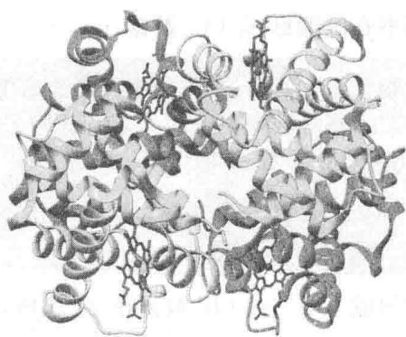

## 内容简介

本书前3版是国内经典的生物化学教材，先后由北京大学沈同教授、王镜岩教授担任第一主编。第4版是在第3版的基础上精简、补充、修订而成，在注重基础性、系统性和完整性的同时，特别注意内容的精炼和更新，使教材及时反映学科发展的新思想、新成果。

全书共36章，上册包括第1\~14章，主要讲述生命的分子基础，分别介绍蛋白质、酶、维生素、糖类、脂质、核酸、激素等各类生物分子的结构与功能。下册为第15\~36章，介绍各类生物分子在体内的分解和合成代谢，遗传信息的复制、重组、转录、翻译和表达调控，以及基因工程、蛋白质工程、基因组学和蛋白质组学的新进展。

本书涵盖生物化学学科最基本的理论知识，力求反映生物化学的全貌，内容全面详尽，阐述深入浅出。在压缩经典内容的同时，增添学科的最新进展，保持内容的先进性和科学性；穿插基本和最新的实验技术及原理，突出实验科学的特点。配套的数字课程提供各章习题的答案、每章的自测题、生化名词英汉对照以及常用生化名词缩写，有助于知识的巩固和拓展。

本书适合综合性院校、师范院校、农林院校及医学院校等生命科学类专业及相关专业的本科生使用，也可供教师、研究生及相关科研人员参考。

## 图书在版编目(CIP)数据

生物化学．下册／朱圣庚，徐长法主编．--4版.
-- 北京：高等教育出版社，2016.12

ISBN 978-7-04-045799-5

I. ①生… II. ①朱… ②徐… III. ①生物化学—高等学校—教材 IV. ①Q5

中国版本图书馆 CIP 数据核字(2016)第 198640 号

Shengwuhuaxue

策划编辑 王莉

责任印制 毛斯璐

责任编辑 王莉

特约编辑 陈龙飞

封面设计 张申申

出版发行 高等教育出版社

社 址 北京市西城区德外大街 4 号

网址 http://www.hep.edu.cn

http://www.hep.com.cn

邮政编码 100120

网上订购 http://www.hepmall.com.cn

印刷 北京中科印刷有限公司

开 本 850 mm×1168 mm 1/16

http://www.hepmall.com

http://www.hepmall.cn

印 张 41.5

版 次 1980 年 4 月第 1 版

字 数 1230 千字

2016年12月第4版

购书热线 010-58581118

咨询电话 400-810-0598

印 次 2016年12月第1次印刷

定 价 75.00 元

本书如有缺页、倒页、脱页等质量问题，请到所购图书销售部门联系调换

版权所有 侵权必究

物料号 45799-00

数字课程（基础版）

# 生物化学

(第 4 版) (下册)

主编 朱圣庚 徐长法

## 登录方法：

1. 访问http://abook.hep.com.cn/45799，进行注册。已注册的用户输入用户名和密码登录，进入“我的课程”。

2. 点击页面右上方“绑定课程”，正确输入教材封底数字课程账号（20位密码，刮开涂层可见），进行课程绑定。

3. 在“我的课程”中选择本课程并点击“进入课程”即可进行学习。课程在首次使用时，会出现在“申请学习”列表中。

课程绑定后一年为数字课程使用有效期。如有
使用问题，请发邮件至：lifescience@pub.
:hep.cn

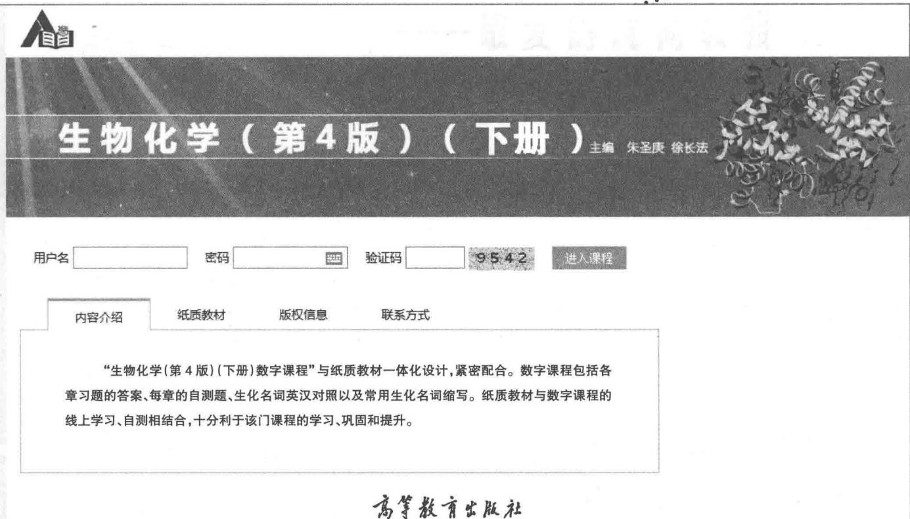

“生物化学(第4版)(下册)数字课程”与纸质教材一体化设计,紧密配合。数字课程包括各章习题的答案、每章的自测题、生化名词英汉对照以及常用生化名词缩写。纸质教材与数字课程的线上学习、自测相结合,十分利于该门课程的学习、巩固和提升。

## 高等教育出版社

http://abook.hep.com.cn/45799

深切怀念我们的导师

——敬爱的沈同教授

## 前言

生物化学是一门交叉学科,它引入数学、物理、化学学科的理论和方法研究生命现象,使生命科学得以从分子水平认识生命活动的本质。在生物化学的基础上发展出了分子生物学和生物信息学,这三个学科已成为当今生命科学领域最活跃、发展最快的前沿学科,并且是沟通数学、物理、化学和生命科学的桥梁。生命科学所以能成为21世纪自然科学的前沿学科,是与上述三个学科的飞速发展和取得的巨大成就分不开的。

生物化学是生命科学以及与之相关的医学、药学、农学、食品、发酵等各专业的必修基础课，也是数学、物理、化学各专业对生命科学有兴趣，愿意结合本专业从事生命现象研究的学生的辅修基础课。生物化学初学者往往因其内容涉及多个学科而倍感学习困难，此问题需要从课程安排、课堂讲授和教材建设等诸多方面来解决。显然，编写一套好的教材对确保教学质量至关重要。我们认为衡量教材的质量首先要看其内容，作为教材必须涵盖学科最基本的理论知识，既注重基础性、系统性，又能够反映学科发展的新思想、新成果。生物化学是一门实验科学，其教材对基本的和最新的实验技术也应给予适当介绍，着重说明各类技术的原理。作为教材，内容编排要有一个好的框架，各章节条理清晰，概念准确明了，阐述深入浅出，并且考虑到学生和自学者的背景知识，在涉及数学、物理、化学等学科内容时给予必要的补充知识和解释。我们努力按上述要求来编写本书，并在内容深浅和广窄的分量上与国外流行的教科书相一致。作为课堂用的教材，本书分量是重了一些，为解决此问题我们曾编写了一本比较简明的《生物化学教程》，各院校也可根据安排的课程学时自行取舍内容；如果要想了解生物化学的全貌，或寻求解决某一问题的思路和答案，有一本内容比较齐全的生物化学教学用书还是很必要的。

由于生物化学发展极快，用“日新月异”来形容并不为过，生物化学教材也需要不断更新。国外一些较好的教科书通常5\~6年就会改版。《生物化学》第3版出版后，直至今天的《生物化学》第4版付梓，中间推出了《生物化学教程》。生物化学内容不断增加，作为教材不能无限增厚，我们采取的办法是适当压缩经典内容，增添新的资料，使《生物化学》第4版保持原来的篇幅大小。

《生物化学》第4版共分三篇36章。第一篇“生物分子：结构和功能”，14章，叙述生命的分子基础，分别介绍各类生物分子的结构与功能，包括蛋白质、酶、维生素、糖类、脂质、核酸、激素等。生物膜（结构与功能）与脂质合为一章，信号转导与激素合为一章。第二篇“新陈代谢：途径和能学”，14章，分别介绍各类生物分子在体内的分解和合成代谢过程，以及相伴随的能量变化。新陈代谢内容较多，有必要概括出一些共同的规律。“新陈代谢总论”一章介绍代谢基本概念、反应机制和研究方法。“生物能学”介绍在生物化学中涉及的热力学基本概念、生化反应中自由能变化和高能化合物。在叙述各类生物分子的代谢途径后，简要归纳了新阵代谢的调节控制机制。第三篇“遗传信息：传递和表达”，8章。有关遗传信息的基本概念放在“基因和染色体”一章中介绍。DNA复制、重组、转录、翻译和表达调节是遗传信息传递和表达的主要内容。最后是基因工程、蛋白质工程，以及基因组学和蛋白质组学，着重介绍基因和蛋白质的工程学及各类组学的最新进展。各章之间相互衔接，避免重复。

《生物化学》第1版主编是沈同、王镜岩、赵邦悌，由北京大学生物化学教研室前后主讲生物化学课的教师沈同、王镜岩、赵邦悌、李建武、徐长法、朱圣庚、俞梅敏参加编写，在教研室原有教材的基础上补充提高，于1980年由高等教育出版社出版。第2版主编是沈同、王镜岩，编者除第1版的成员外，又增加了杨端、杨福愉、黄有国，于1990年出版。第3版主编是王镜岩、朱圣庚、徐长法，编者为王镜岩、朱圣庚、徐长法、唐建国、俞梅敏、杨福愉、黄有国、张旭家、王兰仙、文重，于2002年出版。第4版主编是朱圣庚、徐长法，编者为王镜岩、朱圣庚、徐长法、张庭芳、昌增益、秦咏梅。需要特别指出的是，王镜岩教授虽然不再承担第4版的主编和改写工作，但是《生物化学》一书是由沈同教授和王镜岩教授奠定基础的，前3版的编写都是由王镜岩教授主持，并且对第4版的编写仍起着指导作用。王兰仙教授参加第3版光合作用一章的编写和第4版该章的主要改写，还为本书的文字录入和绘图做了大量工作，我们非常感谢。

本书编写过程得到北京大学生命科学学院和高等教育出版社生命科学与医学出版事业部领导的关心和支持，出版社的王莉编辑承担本书责任编辑，为本书的编写、设计和出版做了大量工作，在此表示衷心感谢。使用过《生物化学》前3版的各高校师生曾直接向我们，或通过高等教育出版社转告，提出许多宝贵的批评和意见，还有些师生询问书中某些内容和思考题，所有这些反馈信息都帮助我们在第4版中加以改进，我们也向他们表示感谢。我们还要感谢编者的家人们，他们的多方支持和幕后付出的辛勤劳动，使本书得以顺利完成。

限于我们的水平,本书可能存在不少错误和问题,敬请读者批评指正。

主 编

2016年3月于燕园

## 目录

## 第二篇 新陈代谢:途径和能学

第15章 新陈代谢总论 …… 1
一、新陈代谢的基本概念和原理 …… 1
（一）新陈代谢包括合成代谢和分解代谢 …… 1
（二）代谢反应受自由能驱动 …… 2
（三）核苷酸衍生物是能量和活性基团的载体 …… 2
（四）代谢的基本要略在于形成 ATP、还原力和构造元件用于生物合成 …… 2
（五）代谢在分子、细胞和整体三个水平上调节 …… 2
二、新陈代谢的主要反应机制 …… 3
（一）基团转移反应 …… 4
（二）氧化还原反应 …… 6
（三）消除、异构化及重排反应 …… 7
（四）碳-碳键的形成与断裂反应 …… 8
（五）自由基反应 …… 10
三、新陈代谢的研究方法 …… 11
（一）利用酶的抑制剂研究代谢途径 …… 11
（二）利用遗传缺陷症研究代谢途径 …… 11
（三）同位素示踪法 …… 12
（四）核磁共振波谱法 …… 13
（五）色谱-质谱联用法 …… 16
提要 …… 18
习题 …… 19
主要参考书目 …… 19

第16章 生物能学 …… 20
一、生物能学与热力学 …… 20
（一）系统(体系)、性质、状态和过程 …… 20
（二）热、功和内能 …… 21
（三）热力学第一定律和焓 …… 22
（四）热化学 …… 22
（五）热力学第二定律和熵 …… 23
（六）Gibbs 自由能 …… 27
二、化学反应中自由能的变化和意义 …… 28
（一）化学反应的自由能变化和标准生成自由能 …… 28
（二）标准自由能变化和化学平衡的关系 …… 30（三）实际自由能变化决定于反应物和产物的浓度 …… 31
（四）偶联反应的标准自由能变化具有可加性 …… 32
三、ATP与磷酰基转移 …… 34
（一）ATP水解的自由能变化是大的负值 …… 34
（二）细胞中影响ATP水解自由能变化的因素 …… 35
（三）其他磷酸化合物和硫酯也有大量的水解自由能 …… 36
（四）ATP是通过基团转移而不是简单水解提供能量的 …… 38
（五）ATP水解生成磷酰基、焦磷酰基和腺苷酰基 …… 40
（六）ATP为信息大分子组装、主动运输和肌肉收缩供能 …… 41
（七）核苷酸之间的转磷酸作用在所有类型细胞中存在 …… 42
（八）无机多磷酸是潜在的磷酰基供体 …… 43
（九）ATP系统的动态平衡 …… 44
提要 …… 45
习题 …… 46
主要参考书目 …… 47

17章 六碳糖的分解和糖酵解作用 …… 49
一、糖酵解作用的研究历史 …… 49
二、糖酵解过程概述 …… 51
三、糖酵解和酒精发酵的全过程图解 …… 52
四、糖酵解第一阶段的反应机制 …… 52
（一）葡萄糖的磷酸化 …… 53
（二）6-磷酸葡糖异构化形成6-磷酸果糖 …… 55
（三）6-磷酸果糖形成1,6-二磷酸果糖 …… 56
（四）1,6-二磷酸果糖转变为3-磷酸甘油醛和磷酸二羟丙酮 …… 57
（五）磷酸二羟丙酮转变为3-磷酸甘油醛 …… 58
五、酵解第二阶段——放能阶段的反应机制 …… 60

（一）3-磷酸甘油醛氧化成1,3-二磷酸
甘油酸 …… 60
（二）1,3-二磷酸甘油酸转移高能磷酸基团
形成 ATP …… 62
（三）3-磷酸甘油酸转变为2-磷酸甘油酸 …… 63
（四）2-磷酸甘油酸脱水生成磷酸烯醇式
丙酮酸 …… 64
（五）磷酸烯醇式丙酮酸转变为丙酮酸并产生
一个 ATP 分子 …… 65
六、由葡萄糖转变为两分子丙酮酸能量
转变的估算 …… 65
七、丙酮酸的去路 …… 66
（一）生成乳酸 …… 66
（二）生成乙醇 …… 67
八、糖酵解作用的调节 …… 69
（一）磷酸果糖激酶是关键酶 …… 69
（二）2,6-二磷酸果糖对酵解的调节作用 …… 70
（三）己糖激酶和丙酮酸激酶对糖酵解的
调节作用 …… 71
（四）丙酮酸激酶对糖酵解的调节作用 …… 71
（五）5-磷酸木酮糖对糖代谢调节作用 …… 72
（六）癌组织中糖代谢紊乱 …… 72
九、其他六碳糖进入糖酵解途径 …… 72
（一）果糖 …… 73
（二）半乳糖 …… 74
（三）甘露糖 …… 76
提要 …… 76
习题 …… 77
主要参考书目 …… 77

第18章 柠檬酸循环 …… 79
一、丙酮酸转化成乙酰辅酶A的过程 …… 79
二、柠檬酸循环 …… 82
三、柠檬酸循环的化学总结算 …… 87
四、柠檬酸循环的调控 …… 88
五、柠檬酸循环在代谢中的双重角色 …… 89
六、乙醛酸途径 …… 90
提要 …… 92
习题 …… 92
主要参考书目 …… 93

第19章 氧化磷酸化作用 …… 94
一、氧化还原电势 …… 94
（一）氧化还原电势 …… 94
（二）生物体中某些重要氧还电对的氧化
还原电势 …… 97（三）标准还原电势差和自由能变化的关系 98  
（四）标准电动势和平衡常数的关系 98  
二、电子传递和氧化呼吸链 99  
（一）电子传递过程的总体自由能释放 99  
（二）呼吸链概念的建立 100  
（三）电子传递链 100  
（四）电子传递链详情 101  
（五）电子传递的抑制剂 108  
三、氧化磷酸化作用 109  
（一）线粒体的结构 109  
（二）氧化磷酸化作用机制 110  
（三）质子梯度的形成 112  
（四）ATP合成机制 113  
（五）氧化磷酸化的解偶联和抑制 116  
（六）细胞溶胶内的NADH的再氧化 118  
（七）氧化磷酸化的调控 119  
（八）一个葡萄糖分子彻底氧化产生ATP分子数的总结算 121  
（九）氧的不完全还原 121  
提要 123  
习题 125  
主要参考书目 125  
第20章 戊糖磷酸途径 127  
一、戊糖磷酸途径的发现 127  
二、戊糖磷酸途径的主要反应 127  
三、戊糖磷酸途径反应速率的调控 132  
四、戊糖磷酸途径的生物学意义 133  
提要 134  
习题 134  
主要参考书目 135  
第21章 糖异生和糖的其他代谢途径 136  
一、糖异生作用 136  
（一）糖异生作用的途径 136  
（二）糖异生途径总览 139  
（三）由丙酮酸形成葡萄糖的能量消耗及意义 139  
（四）糖异生作用的调节 140  
（五）乳酸的再利用和可立氏循环 141  
二、葡萄糖的转运 141  
三、乙醛酸途径 142  
四、寡糖类的生物合成和分解 142  
（一）概论 142  
（二）乳糖的生物合成和分解 144  
（三）糖蛋白的生物合成 147

（四）糖蛋白糖链的分解代谢 …… 155  
提要 …… 155  
习题 …… 156  
主要参考书目 …… 156  

第22章 糖原的分解和生物合成 …… 158  
一、糖原的生物学意义 …… 158  
二、糖原的降解 …… 158  
（一）糖原磷酸化酶 …… 159  
（二）糖原脱支酶 …… 162  
（三）磷酸葡糖变位酶的作用 …… 163  
（四）6-磷酸葡糖磷酸酶 …… 164  
三、糖原的生物合成 …… 165  
（一）糖原生物合成的研究经历了缓慢的历程 …… 165  
（二）催化糖原合成的三种酶 …… 166  
四、糖原代谢的调控 …… 168  
（一）糖原磷酸化酶的调节机制 …… 169  
（二）糖原合酶的调节机制 …… 171  
（三）G蛋白及其对激素信号的传递作用 …… 172  
（四）糖原累积症 …… 172  
提要 …… 173  
习题 …… 174  
主要参考书目 …… 174  

第23章 光合作用 …… 175  
一、光合作用的概况 …… 175  
（一）日光是地球上所有生物能的最终来源 …… 175  
（二）光合作用的发现 …… 175  
（三）光合作用的场所——叶绿体 …… 176  
（四）光合作用的总过程 …… 177  
（五）光合作用所需的光是可见光 …… 179  

二、叶绿素的光反应性：光吸收 …… 180  
（一）叶绿素吸收光能供光合作用之需 …… 180  
（二）辅助集光色素扩展光吸收的范围 …… 181  
（三）叶绿素分子在膜上被组织成光合单位 …… 182  
（四）叶绿素通过共振(或激子)传递把吸收来的能量汇集到反应中心 …… 183  

三、光驱动的电子流：中心光化学事件 …… 184  
（一）光合细菌只有两种类型反应中心中的一种 …… 184  
（二）热力学和动力学的因素防止内转换引起的能量散失 …… 188  
（三）生氧光合生物同时具有两种类型的反应中心 …… 188  
（四）生氧光合生物反应中心的分子构造 …… 190  
（五）生氧光合细胞中PSⅡ和PSⅠ以串联方式起作用 …… 191
（六）细胞色素 $b_{6}f$ 复合体连接PSⅡ和PSⅠ …… 193
（七）水被放氧复合体光解 …… 194
（八）PSⅠ和PSⅡ在类囊体膜上的定位 …… 195
四、光驱动的ATP合成：光合磷酸化 …… 196
（一）质子梯度把电子流和磷酸化偶联起来 …… 196
（二）光合磷酸化的机制——化学渗透 …… 196
（三）循环和非循环光合磷酸化 …… 197
（四）叶绿体的ATP合酶与线粒体的相似 …… 198
（五）盐细菌的光合磷酸化 …… 198
（六）光合作用中能量的利用效率 …… 199
五、暗反应： $CO_{2}$ 固定 …… 199
（一） $CO_{2}$ 固定与核酮糖二磷酸羧化酶/
加氧酶 …… 199
（二）经过Calvin循环 $CO_{2}$ 固定为糖 …… 201
（三）Calvin循环反应可以分为3个阶段 …… 203
（四）Calvin循环中4种酶受光的间接激活 …… 206
六、光呼吸和 $C_{4}$ 途径 …… 207
（一）光呼吸是rubisco加氧酶活性引起的 …… 207
（二）在 $C_{4}$ 植物中 $CO_{2}$ 固定和rubisco活性是分开的 …… 208
（三）CAM植物中 $CO_{2}$ 吸收和rubisco作用是暂时被分开的 …… 211
提要 …… 211
习题 …… 212
主要参考书目 …… 213

第24章 脂质的代谢 …… 214
一、三酰甘油的消化、吸收和转运 …… 214
二、脂肪酸的氧化 …… 216
（一）脂肪酸的活化 …… 216
（二）脂肪酸转入线粒体 …… 216
（三）β氧化 …… 218
（四）脂肪酸氧化是高度的放能过程 …… 223
三、不饱和脂肪酸的氧化 …… 223
（一）不饱和脂肪酸的氧化 …… 223
（二）奇数碳原子脂肪酸的氧化生成丙酰-CoA …… 225
（三）过氧化物酶体中脂肪酸的β氧化 …… 226
（四）脂肪酸还可发生α或ω氧化 …… 227
（五）脂肪酸β氧化酶的进化 …… 227
四、酮体 …… 228
（一）乙酰-CoA的代谢结局 …… 228
（二）肝中酮体的形成 …… 228
（三）肝外组织使用酮体作为燃料 …… 229
五、脂肪酸代谢的调节 …… 229
（一）脂肪酸进入线粒体的调控 …… 230

（二）心脏中脂肪酸氧化的调节 …… 230
（三）激素对脂肪酸代谢的调节 …… 230
（四）根据机体代谢需要的调控 …… 231
（五）长时间膳食的改变导致相关酶水平的调整 …… 231

六、脂质的生物合成 …… 231
（一）贮存脂肪 …… 231
（二）脂肪酸的生物合成 …… 232
（三）脂酰甘油的生物合成 …… 242
（四）磷脂类的生物合成 …… 243
（五）鞘磷脂和鞘糖脂的生物生成 …… 250
（六）类二十烷酸的生物合成 …… 253
（七）胆固醇的生物合成 …… 258
（八）胆固醇转化产物的生物合成 …… 266
提要 …… 272
习题 …… 274
主要参考书目 …… 274

第25章 蛋白质降解和氨基酸的分解
代谢 …… 276
一、蛋白质的降解 …… 276
（一）蛋白质降解的特性 …… 276
（二）蛋白质降解的反应机制 …… 277
（三）机体对外源蛋白质的需要及其消化作用 …… 278
二、氨基酸分解代谢 …… 279
（一）氨基酸的脱氨基作用 …… 280
（二）氧化脱氨基作用：谷氨酸脱氢酶 …… 283
（三）其他的脱氨基作用 …… 284
（四）联合脱氨作用 …… 284
（五）氨基酸的脱羧基作用 …… 284
（六）氨的命运 …… 286
三、尿素的形成 …… 288
（一）尿素循环的发现 …… 288
（二）尿素循环 …… 289
（三）尿素循环的调节 …… 290
四、氨基酸碳骨架的氧化途径 …… 291
（一）形成乙酰-CoA 的途径 …… 292
（二）α-酮戊二酸途径 …… 297
（三）形成琥珀酰-CoA 的途径 …… 303
（四）形成延胡索酸途径 …… 303
（五）形成草酰乙酸途径 …… 306
五、生糖氨基酸和生酮氨基酸 …… 306
六、由氨基酸衍生的其他重要物质 …… 306
（一）氨基酸与一碳单位 …… 306
（二）氨基酸与生物活性物质 …… 309
七、氨基酸代谢缺陷症 …… 314提要 …… 315
习题 …… 316
主要参考书目 …… 317

第26章 氨基酸的生物合成和生物固氮 …… 318
一、生物固氮 …… 318
二、氨的同化作用——氨通过谷氨酸和谷氨酰胺掺入生物分子 …… 319
三、氨基酸的生物合成 …… 320
（一）由α-酮戊二酸形成的氨基酸——谷氨酸、谷氨酰胺、脯氨酸、精氨酸、赖氨酸 …… 321
（二）由草酰乙酸形成的氨基酸——天冬氨酸、天冬酰胺、甲硫氨酸、苏氨酸、赖氨酸（细菌、植物）、异亮氨酸 …… 325
（三）丙酮酸族的生物合成：L-丙氨酸、L-缬氨酸、L-亮氨酸 …… 331
（四）丝氨酸族的生物合成：L-丝氨酸、L-甘氨酸、L-半胱氨酸的生物合成及固硫作用 …… 333
（五）芳香族氨基酸及组氨酸的生物合成 …… 335
四、氨基酸生物合成的调节 …… 340
（一）通过终端产物对氨基酸生物合成的抑制 …… 340
（二）通过酶生成量的改变调节氨基酸的生物合成 …… 342
五、氨基酸转化为其他氨基酸及其他代谢物 …… 342
（一）氧化氮的形成 …… 343
（二）谷胱甘肽 …… 343
（三）肌酸的生物合成 …… 345
（四）卟啉、血红素的生物合成 …… 345
（五）短杆菌肽S …… 352
（六）D-氨基酸的形成 …… 354
提要 …… 354
习题 …… 354
主要参考书目 …… 355

第27章 核酸的降解和核苷酸代谢 …… 356
一、核酸和核苷酸的分解代谢 …… 356
（一）核酸的降解 …… 356
（二）核苷酸的分解 …… 357
（三）嘌呤碱的分解 …… 357
（四）嘧啶碱的分解 …… 358
二、核苷酸的生物合成 …… 359
（一）嘌呤核糖核苷酸的合成 …… 359
（二）嘧啶核糖核苷酸的合成 …… 366
（三）核苷一磷酸转变为核苷三磷酸 …… 368

（四）脱氧核糖核苷酸的合成 …… 368
三、辅酶核苷酸的生物合成 …… 373
（一）烟酰胺核苷酸的合成 …… 373
（二）黄素核苷酸的合成 …… 374
（三）辅酶A的合成 …… 374
提要 …… 375
习题 …… 375
主要参考书目 …… 376

## 第三篇 遗传信息:传递和表达

第29章 基因和染色体 …… 403  
一、基因概念的演变 …… 404  
（一）孟德尔的遗传因子假说 …… 404  
（二）摩尔根的基因学说和染色体理论 …… 405  
（三）基因是编码多肽链和RNA的一段DNA …… 406  
二、基因和基因组的结构 …… 407  
（一）原核生物的基因和基因组结构 …… 407  
（二）真核生物的基因和基因组结构 …… 408  
三、染色体的结构 …… 409  
（一）染色体不同层次的结构 …… 409  
（二）细菌拟核的结构 …… 410  
（三）真核生物染色体的结构 …… 411  
四、染色质重塑 …… 414  
（一）组蛋白变异和修饰 …… 415  
（二）DNA的修饰 …… 417  
（三）染色质重塑和基因表达调节 …… 419  
五、基因的进化 …… 419  
（一）进化热力学和动力学 …… 420  
（二）生命的起源：化学进化和“RNA世界”学说 …… 420  
（三）生物的进化：驱动力、多样性和适应性 …… 423  
（四）基因和基因组的进化 …… 425  
（五）表观遗传对生物进化的作用 …… 426  
提要 …… 426

（三）酶活性的特异激活和抑制 …… 385
（四）酶原激活、共价修饰和级联反应 …… 386
（五）酶量的调节 …… 387
三、细胞对代谢途径的分隔与控制 …… 388
（一）细胞结构和酶的区域化分布 …… 388
（二）细胞膜结构对代谢的调节 …… 389
（三）信号途径对代谢的调节 …… 390
四、机体在整体水平上对细胞代谢的
调节控制 …… 391
（一）激素和递质对代谢的调节 …… 391
（二）神经对代谢的调节 …… 394
（三）各器官间代谢的协调 …… 396
五、代谢紊乱造成疾病 …… 397
（一）糖尿病与胰岛素 …… 397
（二）肥胖病与脂代谢紊乱 …… 398
（三）长期禁食和饥饿造成的代谢紊乱 …… 398
提要 …… 399
习题 …… 401
主要参考书目 …… 402

传递和表达

习题 …… 428
主要参考书目 …… 429

第30章 DNA 的复制和修复 …… 430
一、DNA 的复制 …… 430
（一）DNA 的半保留复制 …… 430
（二）DNA 的复制起点和复制方式 …… 432
（三）DNA 聚合反应和有关的酶 …… 435
（四）DNA 的半不连续复制 …… 439
（五）DNA 复制的拓扑性质 …… 440
（六）DNA 的复制过程 …… 442
（七）真核生物 DNA 的复制 …… 445
二、DNA 的损伤修复 …… 449
（一）错配修复 …… 449
（二）直接修复 …… 449
（三）切除修复 …… 450
（四）重组修复 …… 451
（五）应急反应和易错修复 …… 452
三、DNA 的突变 …… 453
（一）突变的类型 …… 453
（二）诱变剂的作用 …… 454
（三）诱变剂和致癌剂的检测 …… 455
提要 …… 456
习题 …… 457

主要参考书目 …… 458

第31章 DNA 的重组 …… 459

一、同源重组 …… 459

（一）Holliday 模型 …… 459

（二）细菌的基因转移与重组 …… 460

（三）重组有关的酶 …… 462

二、特异位点重组 …… 463

（一）λ噬菌体 DNA 的整合与切除 …… 464

（二）细菌的特异位点重组 …… 465

（三）免疫球蛋白基因的重排 …… 465

三、转座重组 …… 468

（一）细菌的转座因子 …… 468

（二）真核生物的转座因子 …… 471

提要 …… 472

习题 …… 474

主要参考书目 …… 474

第32章 RNA 的生物合成和加工 …… 475

一、DNA 指导下 RNA 的合成 …… 475

（一）DNA 指导的 RNA 聚合酶 …… 475

（二）启动子和转录因子 …… 479

（三）链的延伸和延伸因子 …… 483

（四）终止子和终止因子 …… 484

（五）转录的调节控制 …… 485

（六）RNA 生物合成的抑制剂 …… 486

二、RNA 的转录后加工 …… 488

（一）原核生物中 RNA 的加工 …… 488

（二）真核生物中 RNA 的一般加工 …… 490

（三）RNA 的剪接、编辑和再编码 …… 493

（四）RNA 生物功能的多样性 …… 504

（五）RNA 的降解 …… 505

三、RNA 指导下 RNA 和 DNA 的合成 …… 505

（一）RNA 的复制 …… 505

（二）RNA 的逆转录 …… 508

（三）逆转座子的种类和作用机制 …… 513

提要 …… 514

习题 …… 516

主要参考书目 …… 516

第33章 蛋白质合成、加工和定位 …… 518

一、遗传密码 …… 518

（一）遗传密码的破译 …… 518

（二）遗传密码的基本性质 …… 521

（三）RNA 对遗传密码的解读 …… 524

二、蛋白质合成有关 RNA 和装置 …… 526（一）核糖体 …… 526  
（二）转移RNA和氨酰-tRNA合成酶 …… 529  
（三）信使RNA …… 531  

三、蛋白质合成的步骤 …… 533  
（一）氨酰-tRNA的合成 …… 533  
（二）多肽链合成的起始 …… 535  
（三）多肽链合成的延伸 …… 536  
（四）多肽链合成的终止 …… 539  
（五）多肽链的折叠、加工和修饰 …… 540  

四、蛋白质合成的忠实性 …… 542  
（一）蛋白质合成忠实性需要消耗能量 …… 542  
（二）合成酶的校对功能提高了忠实性 …… 543  
（三）核糖体对忠实性的影响 …… 543  

五、蛋白质的定位 …… 543  
（一）蛋白质的信号肽和跨膜运输 …… 544  
（二）糖基化在蛋白质定位中的作用 …… 546  
（三）线粒体和叶绿体蛋白质的定位 …… 546  
（四）核蛋白质的定位 …… 547  

六、蛋白质合成的抑制物 …… 549  

提要 …… 550  

习题 …… 551  

主要参考书目 …… 552  

第34章 基因表达调节 …… 553  

一、基因表达调节的基本原理 …… 553  
（一）基因表达不同水平上的调节 …… 553  
（二）反式作用因子和顺式作用元件的调节 …… 553  
（三）正调节和负调节 …… 554  
（四）调节蛋白具有结合DNA的结构域 …… 554  
（五）调节蛋白具有蛋白质-蛋白质相互作用结构域 …… 555  

二、原核生物基因表达调节 …… 556  
（一）细菌功能相关的基因组成操纵子 …… 556  
（二）细菌的降解物阻遏 …… 557  
（三）合成途径操纵子的衰减作用 …… 558  
（四）核糖体蛋白与rRNA的协同合成 …… 559  
（五）mRNA翻译的调节和小RNA的调节作用 …… 560  

三、真核生物基因表达调节 …… 563  
（一）转录前水平的调节 …… 564  
（二）转录水平的调节 …… 565  
（三）RNA加工和剪接的调节 …… 569  
（四）翻译水平的调节 …… 570  
（五）RNA干扰和多种RNA的调节 …… 571  
（六）翻译后加工的调节 …… 572  
（七）蛋白质降解的调节 …… 573  

提要 …… 575

习题 …… 576
主要参考书目 …… 576

第35章 基因工程、蛋白质工程及相关技术 …… 578
一、DNA克隆的基本原理 …… 578
（一）DNA限制酶与片段连接 …… 578
（二）分子克隆的载体与宿主 …… 580
（三）外源基因导入宿主细胞 …… 584
二、基因的分离、合成和测序 …… 586
（一）基因文库的构建 …… 586
（二）cDNA文库的构建 …… 587
（三）克隆基因的分离与鉴定 …… 589
（四）聚合酶链反应扩增基因 …… 592
（五）DNA的化学合成 …… 594
（六）基因定位诱变 …… 595
（七）DNA序列的测定 …… 597
三、克隆基因的表达 …… 597
（一）外源基因在原核细胞中的表达 …… 597
（二）原核细胞基因表达产物的分离和鉴定 …… 599
（三）外源基因在真核细胞中的表达 …… 600
四、转基因植物和转基因动物 …… 604
（一）获得转基因植物的方法 …… 604
（二）获得转基因哺乳动物的方法 …… 607
（三）基因工程的安全性 …… 610
五、蛋白质工程 …… 612
（一）蛋白质的分子设计和改造 …… 612
（二）蛋白质的实验进化 …… 612
（三）蛋白质工程的进展 …… 614

六、基因工程的应用与展望 …… 615
（一）基因工程开辟了生物学研究的新纪元…… 615
（二）基因工程促进了生物技术产业的兴起…… 616
（三）基因工程研究的展望…… 618
提要 …… 619
习题 …… 620
主要参考书目 …… 622

第36章 基因组学及蛋白质组学 …… 623
一、全基因组DNA序列的测定和注释 …… 623
（一）全基因组测序的基本内涵 …… 624
（二）大肠杆菌全基因组DNA序列的测定和注释 …… 626
（三）人类基因组DNA序列的测定和注释 …… 627
二、功能基因组学 …… 628
（一）转录谱分析 …… 628
（二）基因敲除 …… 629
（三）基因敲低 …… 629
三、蛋白质组学 …… 630
（一）利用二维电泳技术高通量分离蛋白质…… 630
（二）通过质谱技术对蛋白质的高通量鉴定…… 630
（三）蛋白质-蛋白质相互作用网络的分析…… 631
（四）蛋白质翻译后修饰的高通量鉴定 …… 631
（五）人类蛋白质组工程 …… 632
（六）系统生物学 …… 632
提要 …… 632
习题 …… 632
主要参考书目 …… 633

## 第 15 章 新陈代谢总论

新陈代谢(metabolism)是生物体内进行的所有化学变化的总称,是生物体一切生命活动的基础。生命机体和无生命物体的根本区别就在于前者能够通过新陈代谢不断自我更新。新陈代谢包括生物体与外界环境之间的物质和能量交换以及生物体内物质和能量的转变过程,可以将其分为5个方面:①从环境中取得所需物质;②将外界取得的物质转变为自身组成的构造元件(building block);③将构造元件组装成生物体特异的大分子;④合成或分解生物体内各种特殊功能的分子;⑤提供生命活动所需的能量。

本章主要介绍新陈代谢的基本概念、原理、反应机制和研究方法，以使初学者能对新陈代谢有一个总体的认识。

## 一、新陈代谢的基本概念和原理

新陈代谢遵循所有已知的物理学和化学规律,然而是在生物体内特殊条件下进行,受到这些特殊条件的制约。生物体内的新陈代谢有赖于酶的催化,一系列专一性作用的酶催化的连续化学反应构成各类物质的代谢途径(metabolic pathway)。代谢途径的连续酶促反应称为中间代谢(intermediary metabolism);中间代谢的产物称为中间产物或中间物(intermediate)。酶的灵活精确调节机制,使机体错综复杂的代谢过程成为高度协调的整合在一起的代谢网络(metabolic network)。当今生物界各类生物的新陈代谢千差万别,但是也普遍存在一些共有的途径,称为主要代谢途径或中心代谢途径(central metabolic pathway),表明生物界具有共同的起源。下面对新陈代谢的一些基本概念作进一步的阐述。

## （一）新陈代谢包括合成代谢和分解代谢

生物体将外界环境中取得的物质转化为自身组成的物质称为同化作用（assimilation）；将体内组成物质转化为外界环境中的物质称为异化作用（dissimilation）。同化作用和异化作用是一对相反的作用，然而又相互联系组成生物体统一的新陈代谢过程。同化作用是生物体利用能量将小分子物质合成为自身大分子物质的一系列代谢过程，因此又称为合成代谢（anabolism）。异化作用则是生物体分解体内较大较复杂的物质为轻小较简单物质并释放能量的过程，又称为分解代谢（catabolism）。所有参与代谢反应的物质，包括反应物、中间物和终产物统称为代谢物（metabolite）。

新陈代谢包含物质代谢(material metabolism)和能量代谢(energetic metabolism)两个不可分割的方面。一切生命活动都需要能量。除少数种类化能无机自养菌(chemolithotrophic bacteria)能够通过氧化环境中的无机物取得生命所需能量外,绝大多数生物所需的能量直接或间接来自太阳能。具有光合色素(photo-synthetic pigment)的生物,能够通过光合作用将太阳光能转变为化学能,例如绿色植物利用光能由 $CO_{2}$ 和 $H_{2}O$ 合成糖,以此贮存能量。这类生物称为光养生物(phototroph)。而依赖外界营养物质为生的生物称为异养生物(heterotroph)。异养生物将有机营养物经分解和氧化释放出能量供生命活动所需。

生物体内合成代谢和分解代谢采取的途径并不相同,只有在某些代谢环节上,两种代谢可以共同利用同一途径。这种共用途径称为两用代谢途径(amphibolic pathway)。例如:柠檬酸循环(citric acid cycle)就可看作是两用代谢途径的典型例证。

初学者往往不能理解何以会形成今日生物界这种代谢格局。为什么合成代谢和分解代谢要由一系列连续反应来完成而不能一步到位？为什么表面看似繁杂纷乱的代谢途径实际上只包含少数种类的反应、不多的构造元件和个别关键中间代谢物？为什么合成代谢和分解代谢需要采取不同途径而不能由一个可逆反应来完成？以下原则对理解当今生物界代谢格局的形成至关重要：① 现今的代谢途径是在生物进化过程中形成的，反映了进化的历程。② 生物在形成当今代谢格局中尽可能减少物质、能量和负熵的耗费。③ 所有格局要有利于细胞对代谢的调节控制。

## （二）代谢反应受自由能驱动

代谢反应受酶催化,酶能够降低活化能,增加反应速度,但不改变反应的平衡点。代谢反应仍然受热力学规律所支配。按照热力学原理,若一个反应能自发进行,其自由能变化为负值,即反应释放自由能。反之,反应的自由能变化若为正值,必须提供自由能才能使反应发生。生物体内通常将热力学不利的反应与热力学有利的反应偶联,以驱动其进行。

自养生物（autotroph）以太阳能或氧化无机物取得的化学能为能源；异养生物以分解食物中有机营养物取得的化学能为能源。所取得的能量一般贮存在能量载体 ATP 中，也可以通过形成还原型电子载体 NADH、NADPH 以及 FADH₂ 的方式贮存。还原型电子载体经电子传递和氧化磷酸化产生 ATP，又可以还原力形式参与生物合成。能够提供能量的核苷酸除 ATP 外，还有 GTP、UTP、CTP 等。以 ATP 形式贮存的自由能可以供给以下五方面对能量的需要：① 生物合成；② 细胞运动；③ 膜运输；④ 信号传导；⑤ 遗传信息的正确传递和表达。有关内容在后面章节中将会详细介绍。

## （三）核苷酸衍生物是能量和活性基团的载体

上面提到的 ATP、GTP、UTP 和 CTP 等多磷酸核苷酸均含有高能磷酸键（以“\~”符号表示），其水解时能释放出大量自由能。它们能通过转移磷酸基团、焦磷酸基团或腺苷酸基团而转移能量，以提供生物合成和其他各种生命活动所需的自由能。

一些核苷酸衍生物是重要辅酶,例如烟酰胺腺嘌呤二核苷酸(辅酶Ⅰ)、烟酰胺腺嘌呤二核苷酸磷酸(辅酶Ⅱ)、黄素单核苷酸(FMN)、黄素腺嘌呤二核苷酸(FAD)和辅酶A。烟酰胺辅酶(NAD和NADP)和黄素辅酶(FMN和FAD)是氢原子和电子载体,广泛参与各种氧化还原反应,将自由能转移给生物合成需能反应。辅酶A在酶促转酰基反应中起着接受和提供酰基的作用。辅酶A的巯基和酰基结合形成高能硫酯键,水解释放大量自由能(31.38 kJ/mol),与ATP高能酸酐键水解时释放的自由能(30.54 kJ/mol)相近,也就是说辅酶A携带活化的酰基。许多物质代谢,如糖、脂肪酸和氨基酸代谢都可形成乙酰辅酶A,而乙酰辅酶A是进入柠檬酸循环的关键中间代谢物。

## （四）代谢的基本要略在于形成 ATP、还原力和构造元件用于生物合成

生物大分子在生物体的生命活动中起着决定的作用。生物大分子由构造元件(即结构单位)所组成。多糖由少数单糖聚合而成；脂肪由脂肪酸和甘油合成；蛋白质由20种氨基酸聚合而成；核酸由4种核糖核苷酸或4种脱氧核苷酸聚合而成。生物大分子的合成消耗很多能量，只有一部分能量用于形成糖苷键、肽键和磷酸二酯键，另一部分能量用于推动生物合成的单向性，更多能量用于保证遗传信息传递和翻译的准确性。生物大分子水解所释放的自由能不能被利用，常以热能形式散发掉。为节省能量，糖原可在糖原磷酸化酶催化下磷酸解生成1-磷酸葡糖；核糖核酸可在多核苷酸磷酸化酶催化下磷酸解，生成核苷二磷酸。生成的磷酸化产物有利于再利用。

大分子的各种结构单位经分解代谢形成乙酰辅酶 A, 产生少量 ATP, 进入柠檬酸循环后彻底氧化成 $CO_{2}$ 和 $H_{2}O$ , 并通过氧化磷酸化产生大量 ATP。分解代谢是一个氧化过程和产能过程; 合成代谢则是还原过程和需能过程。总的来说, 新陈代谢的基本要略是将分解代谢产生的 ATP、还原力和构造元件用于生物合成。

## （五）代谢在分子、细胞和整体三个水平上调节

生物体内的新陈代谢具有精确、高效的调节机制，从而使错综复杂的代谢过程得以协调一致，并且随着细胞内外条件的改变及时调整，始终有条不紊的进行。代谢调节可在三个不同的水平上进行，即分子水

平的调节、细胞水平的调节和整体水平的调节。

分子水平调节包括底物的调节、酶活性的调节和酶量的调节等方面。各代谢途径通过共同中间产物而彼此沟通。底物量的增加促进下游代谢反应；产物的积累则减少上游反应，两者均会促进相应的代谢分流。变构效应(allosteric effect)是酶活性调节的一种常见方式。当效应物(effector)与酶的变构部位结合，即引起酶活性改变。底物或底物类似物可提高酶活性；产物或产物类似物抑制酶活性。酶的共价修饰是酶活性较长期效应的一种调节方式。酶数量的调节涉及酶的合成和降解的调节。

细胞水平调节包括细胞结构对酶和代谢物的分隔,使不同代谢途径分开在不同结构区域内进行;膜运输控制着各类代谢底物和产物的流通;膜结构还影响酶的物理状态和性质,例如膜结合的酶与溶解的酶活性有很大不同。细胞还通过接受环境的信号,调节其代谢活动。

生物机体作为一个整体,还存在整体水平上的调节,使各组织器官的细胞代谢协调一致,并对机体内外条件的改变作出反应。整体水平的调节包括体液调节和神经系统的调节。

## 二、新陈代谢的主要反应机制

生物体内的新陈代谢反应基本上都是酶催化的有机化学反应。然而，并非所有的有机化学反应都能在生物体内出现，只有符合下述要求的反应才能在体内进行。一是机体需要；二是机体在进化过程中产生合适的酶，能在细胞生理条件下提高反应速度。偶尔细胞内蛋白质引发一些新的反应，如果这些新的反应对机体有益，就会被选择留下，成为新陈代谢中的一个反应。

机体的新陈代谢反应可概括为五大类:① 基团转移反应;② 氧化还原反应;③ 消除、异构化和重排反应;④ 碳-碳键的形成或断裂反应;⑤ 自由基反应。在介绍上述五大类反应之前,先对有机化学中与代谢反应关系密切的基本原理作一些简要介绍。

首先要指出的是,有机化合物都含有共价键。共价键是两个原子间共享的一对电子。这样形成的键断裂时它们的电子对或是留在一个原子内,称为异裂断键(heterolytic bond cleavage);或是电子对分开,每一个电子留在一个原子内,称为均裂断键(homolytic bond cleavage)。现以最常见的C—H和C—C键为例,对键的异裂和均裂表示如下:

C—H键的异裂断键，常伴随碳负离子及质子 $(\mathrm{H}^{+})$ 的形成，或氢负离子 $(\mathrm{H}^{-})$ 及碳正离子的形成。碳原子较氢原子的电负性稍高（原子成键时，该原子对于成键电子对的吸引能力称为电负性。C的电负性为2.5,H的电负性为2.1）。因此在生物化学体系中，C—H键的断裂以电子对留在碳原子一侧，形成碳负离子的方式居多。另一方面，氢负离子 $(\mathrm{H}^{-})$ 具有高度的反应性，所以只要当氢负离子的受体，例如 $\mathrm{NAD}^{+}$ （或 $\mathrm{NADP}^{+}$ )同时存在时，氢负离子一旦形成，就立即转移到受体上。只有在此种情况下，才可以发生形成碳正离子及氢负离子的断裂。C—C键的异裂断键同时产生碳负离子和碳正离子；与氢负离子类似，碳负离子和碳正离子极不稳定，一旦形成立即参与进一步的反应。下面还将专门讨论C—C键的断裂和形成反应。C—H和C—C键的均裂断键常产生不稳定基团，这类基团携带一个不配对的电子，称为自由基（radical）。自由基反应下面也会专门讨论。

第二条基本原理是,许多生化反应涉及亲核体(nucleophile)和亲电子体(electrophile)之间的相互作用。亲核体是指其功能团富有并能给出电子的化合物;亲电子体是指缺电子并能接受电子的化合物。亲核体持未共用的电子对,而呈负电性,易与缺电子体形成共价键。常见的亲核基团有:带负电荷的氧(如未质子化的羟基或解离的羧基)、带负电荷的巯基、碳负离子、不带电荷的氨基、咪唑基等。亲电子体有一个未饱和的电子壳,呈正电性。常见的缺电子体是 $H^{+}$ 、金属离子、羰基碳原子、质子化亚胺、磷酸基的磷等。生化反应中常见的亲核体和亲电子体如下所示:

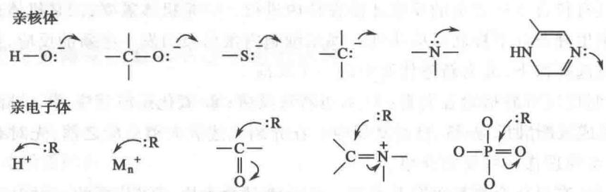

生物化学的一个重要反应是胺与醛或酮的反应。这个反应的第一步是胺的未共用电子对向缺电子的羰基进攻，使 C=O 双键的电子对更向氧原子靠近，并使氮原子上的一个氢原子转移到氧原子上。第二步是甲醇胺中间体氮原子上的未共用电子对向缺电子的碳原子进攻，在质子 $\left(\mathrm{H}^{+}\right)$ 的参与下，释出一分子水。下面我们讨论生物化学中的五大类反应。需要强调的是，这五类反应并非是互相排斥的，往往一个生化反应可以同时有两类以上的反应，例如自由基反应常存在于其他反应中。

## （一）基团转移反应

在生物化学体系中,基因转移反应(group-transfer reaction)常表现为亲电子基团(如 A)从一个亲核体(如 X:)转移到另一亲核体(如 Y:):

$$
\begin{array}{r l} \mathrm{Y}: & + \quad \mathrm{A-X} \longrightarrow \quad \mathrm{Y-A+X}: \\ (\text {亲核体}) & (\text {亲电子体-亲核体}) \end{array}
$$

这类反应也可称为亲核体的取代反应。在代谢反应中，最常见的转移基团是酰基（acyl）、磷酰基（phosphoryl）及糖基（glycosyl）等。

## 1. 酰基转移(acyl group transferation)

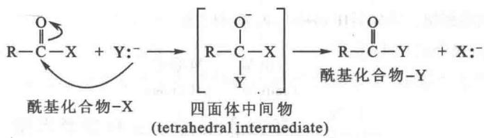

酰基转移是酰基从一个亲核体转移到另一亲核体,它常是亲核体向酰基的羰基碳原子也就是亲电子碳原子进攻,先形成四面体结构的中间体。原来的酰基载体 X 与酰基脱离后又与其他酰基形成新化合物。在胰蛋白酶的催化下，肽键的水解就是这类反应的典型例子。

## 2. 磷酰基转移 (phosphoryl group transferation)

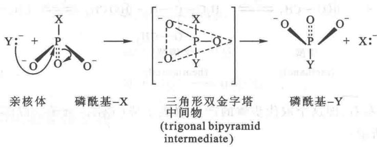

磷酰基的转移起始于一个亲核体(Y)向磷酰基的磷原子进攻,形成一个三角形,双金字塔结构(三角形为金字塔的底座,X、Y分别为两个金字塔的顶端)的中间体。三角形的顶端位置原来由一个被攻击的离子基团(X)所占据。Y的进攻,X的脱去,导致四面体磷酰基构象反转,产生最后的产物。实验证明具有“手性”的磷酰基化合物确实在反转。

例如,在形成 ATP 的 $\gamma$ -磷酰基中,引进同位素证实了当它在己糖激酶(hexokinase)催化下向葡萄糖转移时,即发生构型的反转。

3. 糖基转移 (glycosyl group transferation)

注:此处若从化学角度看有两种产物 | 和 | ,但生物体内只有一种 |

葡萄糖基转移过程是一个亲核体(图中的 Y:⁻)取代葡萄糖环上 C1 处另一亲核体(图中的 X)的过程。这个反应一般发生的是双取代,其机制是葡萄糖基上的 X 脱下,形成共振稳定的碳正离子,随后是亲核体 Y:⁻ 的进攻。这个反应也可以单取代机制进行,即 Y 直接地取代 X,与此同时“构型”发生逆转。

进一步说,这里存在着一个缩醛碳原子。缩醛中心碳原子是一分子醇和一分子醛或酮在酸性条件下发生如下反应而生成的:

上述平衡受醛(或酮)所左右,即这个取代步骤的产生取决于醛(或酮)分子。以酮为例,它在酸性条件下形成“碳正离子”,如下所示:

  
共振稳定的碳正离子

它与半缩醛分子在酸性条件下形成碳正离子(即上述缩醛的中心碳原子)是相当的。葡糖基转移中糖的C1也相当于缩醛分子的中心碳原子,形成的“共振稳定的碳正离子”(如下所示)与“缩醛的中心碳原子”意义是相同的:

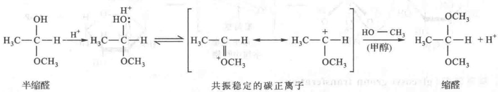

## （二）氧化还原反应

氧化还原反应(oxidation-reduction reaction)实质是电子得失反应。在代谢过程中,此类反应十分重要。如下反应所示:

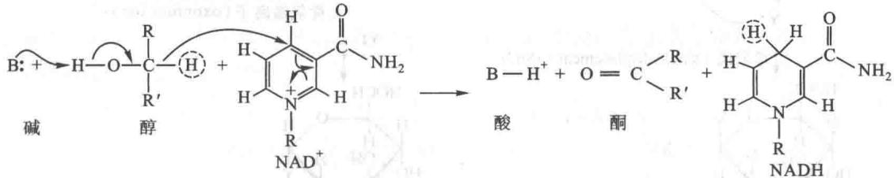

$NAD^{+}$ 和碱从醇分子上各移去一个氢, $NAD^{+}$ 形成 NADH。也可看作是 $NAD^{+}$ 自 H: 接受了一对电子形成 NADH; 或反过来 NADH 提供了一对电子, 形成 $NAD^{+}$ , 即 NADH 为电子供体, $NAD^{+}$ 为电子受体。可以概括为:

$$
\mathrm{NAD} ^ {+} + \mathrm{H} ^ {+} + 2 \mathrm{e} ^ {-} \rightleftharpoons \mathrm{NADH}
$$

在生物体的能量代谢中，NADH 提供两个电子进入电子传递链，即：

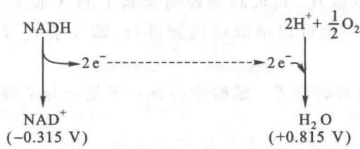

进一步说,当代谢物被氧化,移出一对电子时,这对电子的最终受体常是分子氧,而且这对电子对 $O_{2}$ 的进攻是一个一个地分别进行的,如下式:

$$
\mathrm{H:H} \longrightarrow \mathrm {H\cdot + H\cdot}
$$

$$
\mathrm{H} \cdot + \ddot {\mathrm{O}}: \longrightarrow \mathrm{H}: \ddot {\mathrm{O}} ^ {\cdot}
$$

$$
\mathrm{H} \cdot + \mathrm{H}: \ddot {\mathrm{O}} ^ {\cdot} \longrightarrow \mathrm{H}: \ddot {\mathrm{O}}: \mathrm{H}
$$

## （三）消除、异构化及重排反应

## 1. 消除反应(elimination reaction)

碳-碳双键的形成是单键饱和中心发生消除反应后形成的。消除掉的分子一般是 $H_{2}O$ 、 $NH_{3}$ 、R—OH 或 $R—NH_{2}$ 。醇的脱水就是消除反应的一例：

$$
\begin{array}{c} \mathrm{R} - \mathrm{C} - \mathrm{C} - \mathrm{R} ^ {\prime} \\ \mathrm{H} \quad \mathrm{OH} \\ \text {醇} \end{array} \longrightarrow \begin{array}{c} \mathrm{R} - \mathrm{C} = \mathrm{C} - \mathrm{H} \\ \mathrm{H} ^ {\prime} \quad \mathrm{R} ^ {\prime} \end{array} + \mathrm{H} ^ {+} + \mathrm{OH} ^ {-}
$$

消除反应有以下 3 种可能的机制：

① 协同机制(concordant mechanism)

$$
\mathrm{R} - \underset {\mathrm{H}} {\overset {\mathrm{H}} {\mathrm{C}}} - \underset {\mathrm{OH}} {\overset {\mathrm{H}} {\mathrm{C}}} - \mathrm{R} ^ {\prime} \longrightarrow \underset {\mathrm{H}} {\overset {\mathrm{R}} {\mathrm{C}}} = \underset {\mathrm{R} ^ {\prime}} {\overset {\mathrm{H}} {\mathrm{C}}} + \mathrm{H} ^ {+} + \mathrm{OH} ^ {-}
$$

② 经过碳正离子的机制(via carbocation mechanism)

$$
\begin{array}{c} \mathrm{H} \\ \mathrm{R} - \mathrm{C} - \mathrm{C} - \mathrm{R} ^ {\prime} \\ \mathrm{H} \stackrel {\mid} {\underset {\mid} {\mathrm{C}}} \mathrm{OH} \end{array} \xrightarrow [ \mathrm{OH} ^ {-} ]{\quad} \begin{array}{c} \mathrm{H} \\ \mathrm{R} - \mathrm{C} - \mathrm{C} ^ {+} - \mathrm{R} ^ {\prime} \\ \mathrm{H} \end{array} \xrightarrow [ \mathrm{H} ^ {+} ]{\quad} \begin{array}{c} \mathrm{R} \\ \mathrm{H} \end{array} \xrightarrow [ \mathrm{R} ^ {\prime} ]{\mathrm{C}}
$$

③ 经过碳负离子的机制(via carbanion mechanism)

$$
\mathrm{R} - \underset {\mathrm{H}} {\overset {\mathrm{H}} {\mathrm{C}}} - \underset {\mathrm{OH}} {\overset {\mathrm{H}} {\mathrm{C}}} - \mathrm{R} ^ {\prime} \xrightarrow [ \mathrm{H} ^ {+} ]{\mathrm{H}} \mathrm{R} - \underset {\mathrm{H}} {\overset {\mathrm{H}} {\mathrm{C}}} - \underset {\mathrm{OH}} {\overset {\mathrm{H}} {\mathrm{C}}} - \mathrm{R} ^ {\prime} \xrightarrow [ \mathrm{OH} ^ {-} ]{\mathrm{H}} \underset {\mathrm{H}} {\overset {\mathrm{H}} {\mathrm{C}}} = \underset {\mathrm{R} ^ {\prime}} {\overset {\mathrm{H}} {\mathrm{C}}}
$$

酶催化的消除反应或是以②的形式,或是以③的形式进行。此外,酶活性基团的电荷,可使带不同电荷的中间体趋于稳定。这是一种分阶段进行的反应方式。糖酵解过程中的烯醇化酶(enolase)、柠檬酸循环中的延胡索酸酶(fumarase)催化的消除反应都属于这种类型。

从立体化学来看,有反式消除和顺式消除两类:

① 反式消除(trans elimination)

$$
\begin{array}{c} \mathrm{aH} \\ \mathrm{R-C} \\ \mathrm{bH} \end{array} \xrightarrow [ \mathrm{OH} ]{\text {   }} \begin{array}{c} \mathrm{R} \\ \mathrm{C=C} \\ \mathrm{bH} \end{array} \xrightarrow [ \mathrm{OH} ^ {-} ]{\text {   }} \begin{array}{c} \mathrm{H} \\ \mathrm{R} ^ {\prime} \\ \mathrm{R} ^ {\prime} \end{array}
$$

② 顺式消除(cis elimination)

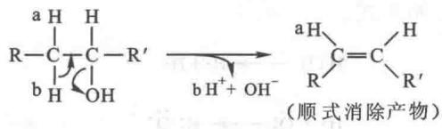

注：为表明反应式中原子的位置，在原子旁边用小字 a, b, c…表示，以下皆同。其中反式消除是生物化学发生最多的机制。顺式消除在生物体中很少发生。

## 2. 分子内氢原子的迁移——异构化反应(isomerization)

生物化学中的异构化反应是指一个氢原子在分子内迁移,即质子从一个碳原子脱离,转移到另一个碳原子上,由此发生了双键位置的改变。

在代谢中,最常见的异构化反应是醛糖-酮糖互变反应。它是在碱性催化下,经过形成单烯二羟负离子(enediolate anion)中间体而发生的。糖酵解酶系中的磷酸葡萄糖变位酶(phosphoglucomutase)所催化的反应就属此类反应。醛糖-酮糖互变反应机制如下:

## 3. 分子重排反应 (rearrangement)

重排是 C—C 键断裂又重新形成的反应, 其结果是碳骨架发生了变化。例如, 在甲基丙二酰单酰-CoA 变位酶 (methylmalonyl-CoA mutase) 的作用下, L-甲基丙二酰单酰辅酶 A 转化为琥珀酰-CoA (succinyl-CoA) 是最常见的一种转化。这种变位酶的辅基是维生素 B $_{12}$ 的衍生物。

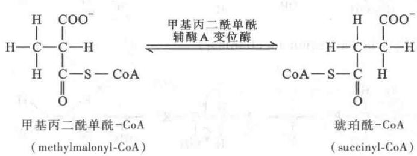

从上式可看到,实际上发生了碳骨架的重排:

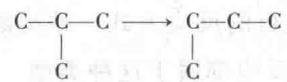

具有奇数碳原子脂肪酸的氧化,某些氨基酸的降解属于这一类反应。

## （四）碳-碳键的形成与断裂反应

分解代谢与合成代谢实质就是以碳-碳键的断裂与形成为基础的反应过程。葡萄糖经过5次断裂反应成为 $CO_{2}$ ，葡萄糖的生物合成则是碳-碳键形成的反应过程。

从合成的走向来看,这类碳-碳键形成的生物合成过程包括亲核的碳负离子向亲电子的碳正原子进攻。最常见的亲电子的碳原子是醛、酮、酯、 $CO_{2}$ 等的 $SP^{2}$ 杂化轨道的羰基碳原子。如：

亲核的碳负离子 亲电子的碳正原子

在这一反应中,必须有一个稳定态的碳负离子生成,才能向亲电子的中心进攻。有关此类反应可以举出3种类型。

## 1. 羟醛缩合反应 (aldol condensation)

又称醛醇缩合反应。例如醛缩酶所催化的反应：

  
注：“aldolase”中译名常用醛缩酶，实际上它催化的是羟醛缩合的逆反应，即碳-碳键的断裂反应。

以上反应是羟醛裂解(羟醛缩合的逆反应)。这一反应是在有机碱的催化下进行的。其一般式如下：

  
注：碳原子左侧数字标示碳原子在分子中的位置；a，b标示氢原子的位置。

羟醛裂解发生于1,6-二磷酸果糖的 $\mathrm{C}_3$ 和 $\mathrm{C}_4$ 之间，这一裂解发生的条件是由于 $\mathrm{C}_2$ 为羰基碳， $\mathrm{C}_4$ 处有一羟基。上示的一般式中，反应的第1步为有机碱的 $\mathrm{OH}^-$ 夺去底物（ $\mathrm{C}_4$ ）上的羟基氢，使与羟基相连的碳原子成为 $\mathrm{C}-\mathrm{O}^-$ 。第2步反应发生羟醛断裂，是由于 $\mathrm{C}_2$ 处羰基碳吸引电子的倾向使 $\mathrm{C}-\mathrm{O}^-$ 的电子转移成为 $\mathrm{C}=\mathrm{O}, \mathrm{C}-\mathrm{C}$ 间的电子转移发生 $\mathrm{C}-\mathrm{C}$ 键断裂。反应2之所以发生，是由于烯醇化物共振中间体的稳定性。

## 2. 克莱森酯缩合反应 (Clasen ester condensation)

这个反应是在柠檬酸合酶的催化下发生的。可以说这是一个羟醛-克莱森酯缩合反应，又称醇醛-克莱森酯缩合反应。它包括以下3个步骤：

（1）乙酰-CoA 碳负离子的形成 这是由于特定酶的组氨酸残基(E-His)以碱性催化夺去乙酰基的一个质子。酶-His 成为酶- $His \cdot H^{+}$ 。SCoA 的硫酯键使烯醇式碳负离子通过共振而稳定。即：

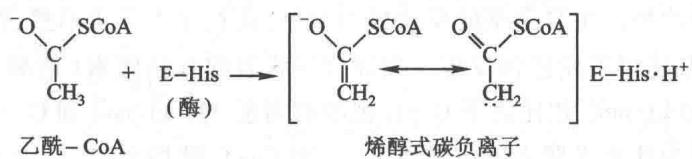

（2）乙酰-CoA 碳负离子对草酰乙酸的羰基碳进行亲核进攻，反应所得柠檬酰-CoA 仍然保持与酶成键。

(3) 柠檬酰- CoA 的水解, 形成柠檬酸及 CoASH:

  
注：对 S、R、前-S(pro-S)、前-R(pro-R) 和 si、re 的解释见第一章中生物分子的三维结构部分。

此外，在这反应中该提及的是，酶促反应常是立体专一的。在醛醇-克莱森酯缩合反应中，可以看到乙酰-CoA碳负离子对草酰乙酸羰基碳的进攻是专一地进攻于si面。因此所产生的全部是S-柠檬酰-CoA，即乙酰-CoA的乙酰基只专一地形成柠檬酸的前-S羰甲基基团（即前S型臂）。

## 3. $\beta$ -酮酸的氧化脱羧反应

这类反应是在异柠檬酸脱氢酶或脂肪酸合酶的催化下发生的。例如在柠檬酸循环中，由异柠檬酸脱氢酶催化的脱羧过程中， $NAD^{+}$ 还原形成NADH，异柠檬酸氧化后形成 $\beta-$ 酮酸的中间体——草酰琥珀酸。此 $\beta-$ 酮酸发生脱羧反应，形成 $\alpha-$ 酮戊二酸。反应式如下：

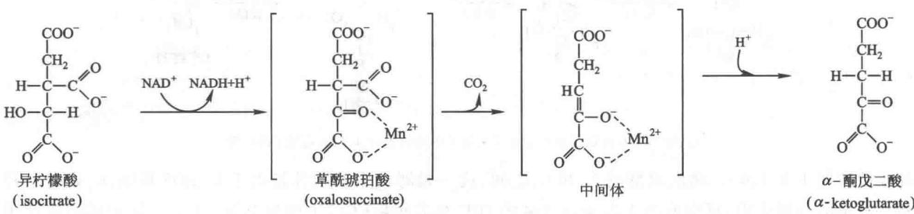

在哺乳动物组织中,有两种不同形式的异柠檬酸脱氢酶,一种是参与柠檬酸循环从线粒体中分离获得的,在发生作用时 $NAD^{+}$ 是它的辅助因子;另一种在线粒体及细胞溶胶中都存在,以 $NADP^{+}$ 作为辅助因子。前者,既需要 $NAD^{+}$ 为辅助因子的异柠檬酸脱氢酶,在发生作用的过程中还需 $Mn^{2+}$ 或 $Mg^{2+}$ 作为辅助因子参与反应。它先氧化二级醇的醇基(即异柠檬酸的一OH),使醇基转化为酮基即转化为草酰琥珀酸(oxalo-succinate),同时与 $Mn^{2+}$ 离子发生静电结合并紧接着进行脱羧形成 $\alpha-$ 酮戊二酸。

## （五）自由基反应

过去曾经以为共价键均裂产生自由基的反应极为罕见，现在知道其实不然，在许多生化反应中都存在共价键的均裂断键，自由基还可引发连锁反应。例如， $5^{\prime}$ -脱氧腺苷钴胺素（辅酶 $\mathrm{B}_{12}$ ）中 $\mathrm{C}-5^{\prime}$ 与钴的共价键较弱，其解离能仅为 $110\mathrm{kJ/mol}$ ，相比之下 $\mathrm{C}-\mathrm{C}$ 键的解离能 $348\mathrm{kJ/mol}$ 和 $\mathrm{C}-\mathrm{H}$ 键的解离能 $414\mathrm{kJ/mol}$ 远比它大。这就可以解释为什么光照会破坏辅酶 $\mathrm{B}_{12}$ 。当 $\mathrm{Co}-\mathrm{C}$ 键均裂时，产生 $5^{\prime}$ -脱氧腺苷自由基和钴胺素，钴由 $3^{+}$ 变为 $2^{+}$ 。 $^{5^{\prime}}$ -脱氧腺苷自由基能从底物中取得氢原子，并使底物转变为底物自由基。辅酶 $\mathrm{B}_{12}$ 的均裂断键反应式如下所示：

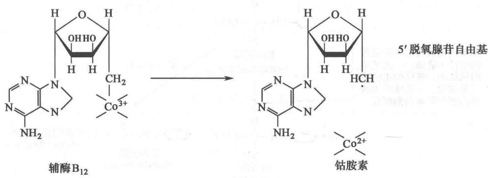

## 三、新陈代谢的研究方法

生物化学是一门实验科学,其积累的知识主要是通过实验研究得来的。实验方法对生物化学的发展往往起着决定的作用。研究生物机体的新陈代谢需要一些特殊的实验方法,用以检测发生在“活细胞(living cell)”内的化学变化。生命世界种类繁多,它们的代谢方式千差万别,然而也存在共同的途径和共同的规律。用于代谢研究的生物材料,其选择主要根据研究目的和是否便于阐明问题,同时也要考虑培养方便和成本适宜。新陈代谢可以在不同水平上进行研究。用生物整体进行研究,称为体内研究,用拉丁语“in vivo”表示(“在体内”的意思)。用“灌注器官”或微生物细胞群体进行研究也称为“in vivo”。用组织切片、匀浆、提取液,或是用分离的细胞器以及酶和代谢物进行研究,称为“in vitro”,表示“在体外”或“在试管内”的意思,属于体外研究。研究中间代谢主要采用以下几种方法。

## （一）利用酶的抑制剂研究代谢途径

酶的抑制剂(inhibitor)可使代谢途径受到阻断,结果造成某一种代谢中间物的积累,从而揭示该中间代谢物在代谢途径中可能的关系。

用这种方法最早探明的代谢过程是酵母的酒精发酵,即由葡萄糖(或淀粉)经过酵解途径形成酒精的过程。在这项研究中,发现一些代谢抑制剂可在代谢过程的某些特定环节阻滞有关酶的作用,结果造成受该酶作用的中间代谢物积累。例如,碘乙酸(iodoacetate)造成酵母发酵液中积累1,6-二磷酸果糖(由于抑制了醛缩酶的作用)。氟化物造成3-磷酸甘油酸和2-磷酸甘油酸的积累(由于抑制了烯醇化酶的作用)。对这些代谢中间物的分离、纯化和鉴定,为阐明糖酵解途径提供了直接的证据。对酶和代谢中间物的分离、纯化,使得在试管内对某一特定反应进行验证实验成为可能。

又例如,在研究氧化呼吸链过程中,用电子传递的抑制剂选择性地阻断呼吸链中某个特定的电子传递步骤,再测定呼吸链中各个组分的氧化还原情况,成为研究电子传递顺序的一种重要手段。

## （二）利用遗传缺陷症研究代谢途径

患有遗传缺陷症的病人,由于先天性基因的突变,在体内往往表现为缺乏某一种酶活性,致使为该酶作用的前体不能进一步参加代谢过程,从而造成这种前体物的积累。这些代谢中间物因不能进一步利用而出现在血液中或随尿排出体外。测定这些代谢中间物有助于阐明有关的代谢途径。

例如,先天缺乏尿黑酸氧化酶的病人,酪氨酸的代谢中间物尿黑酸(homogentisate)不能氧化而随尿排出体外,在空气中使尿变为黑色。由此而推测出尿黑酸是酪氨酸正常分解代谢的中间物。

又例如,由遗传缺陷产生的苯丙酮尿症(phenylketonuria),若婴儿患此疾病不加治疗,就会发生严重的精神障碍。这种遗传疾病也是苯丙氨酸发生异常代谢的结果,这时尿中出现苯丙酮酸(phenylpyruvate),但酪氨酸的代谢仍然正常。通过以上两种不正常的代谢现象,使苯丙氨酸的代谢途径得到了阐明,如下图:

由人类先天性代谢缺陷症研究的启发,人们进一步使用微生物的基因突变型研究代谢途径。利用各种诱变法,例如,X射线照射法,引起微生物的基因发生突变。这种突变型微生物可能造成酶或代谢途径的缺陷。这种方式已成为研究代谢机制的重要工具,也成为研究分子生物学的重要方法。

例如,将正常生长的红色面包霉(Neurosporacrassa)(称为野生型,wild type)用X射线照射后,由于基因发生了突变而造成在原有简单培养基中不能正常生存的营养缺陷型突变体(autotrophic mutant)。突变体失去了自身制造精氨酸的能力,必需在培养基中补加精氨酸才能正常生存。经深入探索,发现各种酶的基因都有可能发生突变而导致不同合成阶段上酶的缺失。对这类突变型,只有在培养基中添加有关酶作用后的产物,才能维持正常生长。这类不同的缺陷型使得能够一步步阐明生物合成途径。

又例如,对能够生长在乳糖培养基的大肠杆菌(E.coli)进行突变诱导后,形成一种不能在乳糖培养基上生长的突变型。这种突变型经研究发现,缺失了能够将乳糖分解为半乳糖和葡萄糖的 $\beta-$ 半乳糖苷酶( $\beta$ -galactosidase)。从而进一步阐明了乳糖的分解代谢机制。

利用微生物的遗传突变型研究新陈代谢机制，比利用其他生物有很多优越性。它不仅容易引起突变，而且经济、简便。许多代谢途径的中间步骤都是利用这种方法得以阐明的。

## （三）同位素示踪法

早在同位素示踪法应用之前,1904年德国科学家 Franz Knoop 就开始应用苯基标记化合物示踪法研究脂肪酸的代谢,这就是著名的脂肪酸 $\beta$ 氧化学说。

在随后的研究中，科学家改用同位素示踪法。用同位素来标记化合物具有优越性，因为它不改变被标记化合物的化学性质。化合物的标记，可根据需要来选定不同的同位素和不同标记部位。例如，标记 $\alpha-$ 氨基酸的 $\alpha-$ 氨基，用同位素 $^{15}\mathrm{N}$ 标记后成为 $\alpha^{-15}\mathrm{NH}_2$ 。测定含有 $^{15}\mathrm{N}$ 的化合物，须用质谱测定仪（mass spectrometer）。氮转化为气体后，产生不同相对分子质量的产物。普通氮气的相对分子质量为 $28(^{14}\mathrm{N},$ $^{14}\mathrm{N})$ ，带有同位素氮的氮气相对分子质量为 $29(^{15}\mathrm{N},^{14}\mathrm{N})$ 。用重氢标记的化合物经过燃烧形成重水 $\mathrm{D}_2\mathrm{O}$ 与普通水的相对分子质量也可加以鉴别。

当代最常使用的方法是放射性同位素示踪法。放射性同位素可用人工方法制得，它们都不稳定，有一定的半寿期或称半衰期（half-life）。常用的放射性同位素有氚（tritium，T或 $^{3}$ H）、碳14（ $^{14}$ C）、磷32（ $^{32}$ P）、硫34（ $^{34}$ S）、碘131（ $^{131}$ I）等。

以下列出一些放射性同位素的半寿期(半衰期)和放射线的类型可供参考。

常用放射性同位素表

<table><tr><td>同位素名称</td><td>符号</td><td>放射线类型</td><td>半寿期</td></tr><tr><td>氢3(氚)</td><td> $^{3}H,T$ </td><td> $\beta$ </td><td>12.26年</td></tr><tr><td>碳14</td><td> $^{14}C$ </td><td> $\beta$ </td><td>5730天</td></tr><tr><td>磷32</td><td> $^{32}P$ </td><td> $\beta$ </td><td>14.3天</td></tr><tr><td>碘131</td><td> $^{131}I$ </td><td> $\beta$ </td><td>8.070±0.009天</td></tr><tr><td>硫34</td><td> $^{34}S$ </td><td> $\beta$ </td><td>87.1天</td></tr></table>

放射性同位素的放射性可用不同的技术加以测定。在生物化学研究中，最常用的是正比计数法（proportional counting）。最简单的计数器是盖格计数器（Geiger counter）。此外还常使用液体闪烁测定法（liquid scintillation counting）和放射自显影（autoradiography）。正比计数法是测定由放射线通过对闪烁器内某种物质的冲击，使之产生离子化，并能放出闪光。经光电倍增管把光转变为电子脉冲的振幅。经倍增管放大后，即可加以检测。这种测定法对于穿透力较强的 $\gamma$ 射线比较适合。而对于穿透力较小的 $\beta$ 射线（ $^3\mathrm{H}$ 和 $^{14}\mathrm{C}$ ）则不易穿透到闪烁器内。而液体闪烁仪正是为改进这种不足而设计的。液体闪烁仪是使用一种芳香族的溶剂，同位素化合物或是溶解，或是悬浮其中。这种芳香族溶剂受到射线激发时，即产生荧光，成为发射光。发射光可用电子仪器进行测定。

放射自显影是将带有放射性标记的化合物与照相感光底片放在一起,利用放射性能使感光底片感光变黑的性质,测定放射性标记化合物的分布。

最早使用天然同位素取得研究成果的是 Rudolf Schoenheimer, 他在 1941 年发表的 The Dynamic State of Body Constituent 一书中叙述了用天然同位素标记的营养物喂养小鼠的实验研究。他发现天然同位素掺入了肝、肠壁、肌肉、皮肤等组织；还发现标记同位素的氨基酸进入了血清的球蛋白、抗体、清蛋白等。应用重氢标记的软脂酸喂养小鼠，发现重氢掺入到小鼠体内许多其他脂肪酸内。Schoenheimer 的一系列实验证明，生物机体虽然从表面上看保持着恒定状态；但实际上在不断地进行新陈代谢，不断地更新。

1945 年 David Shemin 和 David Rittenberg 首先成功地用 ${}^{14}C$ 和 ${}^{15}N$ 标记的乙酸和甘氨酸证明了血红素 (heme) 分子中的全部碳原子和氮原子都来源于乙酸和甘氨酸 (参看血红素的生物合成)。

胆固醇分子中碳原子的来源也是用同样的同位素示踪法阐明的。胆固醇的碳原子来源于乙酰辅酶 A（参看胆固醇的生物合成）。

当前的生物化学以及分子生物学的研究中,同位素示踪法已成为一种重要的必不可少的常规先进技术。仅就新陈代谢而言,无论在代谢途径、反应机制还是调节控制方面,都取得了较大的成果。

## （四）核磁共振波谱法

核磁共振波谱(nuclear magnetic resonance spectroscopy)是指磁性原子核在高强磁场作用下,产生不同的核自旋能级,在吸收电磁辐射后引起能级跃迁所给出的共振波谱。核磁共振波谱可用于测定分子中某些原子的数目、类型和相对位置,是研究生命物质结构的有力手段,并可用来分析活组织和活细胞中代谢物的变化。红外、紫外、质谱和核磁共振共称为四大波谱,尤以核磁共振波谱给出的信息最为丰富。

早在5世纪30年代，物理学家Isider Rabi发现在磁场中原子核会沿磁场方向呈正向或反向有序排列，而施加电磁辐射后原子核的自旋方向发生翻转。由于Rabi揭示了原子核的磁性，于1944年获得诺贝尔物理学奖。之后F.Bloch和E.M.Purcell发现，具有奇数核子(质子和中子)的原子核在磁场中，若加以特定频率的电磁辐射，就会发生原子核吸收辐射能量的现象，这是最早对核磁共振的认识。为此他们两人获得了1952年诺贝尔物理学奖。

在发现核磁共振现象之后,有关研究领域吸引了许多科学家的关注,很快弄清了其发生机制,并且产生了实际用途。原子核自旋特征用自旋量子数 $I$ 来描述,质量数(核子数)与电荷数(质子数)都为偶数的核, $I=0$ ,无自旋现象,如 $^{12}\mathrm{C}$ 、 $^{16}\mathrm{O}$ 等。质量数为奇数,电荷数或为奇数,如 $^{1}\mathrm{H}$ 、 $^{19}\mathrm{F}$ 等;或为偶数,如 $^{13}\mathrm{C}$ 等, $I=$ 半整数(1/2、3/2、5/2……)。质量数为偶数,电荷数为奇数,如 $^{2}\mathrm{H}$ 等, $I=$ 整数(1,2,3……)。 $I$ 不为0的核能发生自旋,它的自旋方向在一定条件下总是取一定的角度。由于原子核带有正电荷,它的旋转便产生核磁矩,其方向与自旋轴一致,大小与自旋角动量成正比。如果将自旋的核放在外加磁场 $\mathrm{H}_{\circ}$ 中,核磁矩与外磁场相互作用,其取向不是任意的,而是量子化的。核磁矩的取向有 $2I+1$ 个,不同取向的能量不同。例如, $^{1}\mathrm{H}(I=1/2)$ 的核磁矩有2个取向,分别与正向和反向磁场取一夹角 $\theta$ ,前者能量低,后者能量高。核自旋轴以 $\theta$ 角绕磁场转动,类似重力场下陀螺自旋轴的转动,称为进动。进动频率与外加磁场以及核的磁性有关。若有射频振荡器发射时电磁波照射自旋核,其频率恰与自旋核进动频率相同,自旋核就会吸收电磁波能量,进动由一个能级跃迁到相邻更高能级上,由此发生核磁共振(见图15-1)。

  
图15-1 核磁共振波谱仪的原理  
A. 自旋核在磁场中的进动；B. 进动核的取向变化；C. 核磁共振波谱；D. 核磁共振波谱仪

当自旋核吸取电磁波能量后由低能态跃迁到高能态,为维持核磁共振信号的检测,高能态的核必须放出能量回到低能态。大多情况下高能态核是以非辐射形式放出能量,这种非辐射放出能量的过程称为弛豫过程。高能态的核在弛豫过程中可将能量传给环境(晶格或溶剂),或将能量传给相邻低能态的同类核。

为获得核磁共振波谱,有两种方法:一是固定辐射频率,改变磁场强度来满足共振条件,这种方法叫扫场(swept field)。另一是固定磁场强度,改变辐射频率来满足共振条件,这种方法叫扫频(swept frequency)。通常核磁共振波谱仪采用扫场法。以核磁共振信号强度对磁场强度(或辐射频率)作图即为核磁共振波谱(NMR spectrum)。NMR 谱可提供四个重要参数:化学位移值、谱峰多重性、偶合常数值和谱峰相对强度。不同分子或不同基团中同类原子核具有不同的共振频率。这是由于原子核外电子云环流产生磁场的“屏蔽”作用,处于不同化学环境中的原子核受到不同的屏蔽作用而引起共振频率的差异。实际操作时采用一定参照物作为基准,精确测定样品和参照物共振频率的偏离程度,称为化学位移。化学位移受核外电子云的影响,如邻近基团的电负性、磁各向异性、 $\pi$ 共轭键、氢键、自由基、顺磁离子、基团解离和溶剂等的影响。核与核之间以价电子为媒介相互耦合引起谱线分裂的现象称为自旋裂分,由此形成多重峰。相邻两峰间的距离称为自旋-自旋耦合常数,表征两核之间耦合作用的大小。信号峰的积分面积与同类核的数量有关,可用于计算处于相同化学环境中原子核的数量。

所有有机分子都含氢和碳。氢( $^{1}$ H)的核磁共振波谱是研究最多的一种。相对来说,氢谱比较容易分析,能够给出较多的分子结构信息,主要能用以确定:①氢的类型( $-CH_{3}$ 、 $-CH_{2}-$ 、 $\equiv CH$ 、 $=CH_{2}$ 、Ar—H、—OH、—CHO)及其化学环境;②氢的分布;③核间关系。随着核磁共振波谱技术的改进,碳( $^{13}C$ )谱分析成为可能。主要原因是 $^{12}C$ 无自旋,同位素 $^{13}C$ 的天然丰度太低。乃至上世纪70年代采用脉冲电磁辐射取代传统的连续辐射以及Fourier转换的应用,极大提高了NMR信号的分辨率,才开始用碳谱研究有机物的碳骨架和含碳功能团。此外,氟( $^{19}F$ )谱、磷( $^{31}P$ )谱、氮( $^{15}N$ )谱、硫( $^{33}S$ )谱,在生物化学研究中也十分有用。

近代高分辨率核磁共振波谱技术的建立和应用是与 Richard Ernst 所作的开发研究分不开的。因此，他们获得了 1991 年诺贝尔化学奖。

核磁共振分析对样品无需纯化、无需标记、不会破坏，而且可以在活体内实时测定，最能反映机体内化学反应的真实情况。这些优点对于新陈代谢研究至关重要，故而被广泛采用。尤其对人体的实验，如对骨骼肌、心肌和脑等组织代谢的研究，前述方法都不可用，而用NMR技术则取得了重要的研究成果。最为人知的实验是1986年用NMR对人体前臂肌肉在运动前和运动后的比较。这项研究是以测定磷谱为基础。

有趣的是,由人体前臂肌肉测得的磷谱只表现为5个明显的峰谱。这5个峰谱中的3个来自于ATP的 $\alpha$ 、 $\beta$ 、 $\gamma$ 这3个磷原子;另外两个来自于磷酸肌酸和无机磷酸的磷原子。ADP和其他磷酸化合物,因为浓度或因其磷原子不能自由旋转或转动过于缓慢,而不能表现出明显的光谱峰。实验表明,人的前臂在运动前和经过19分钟的运动后所显示的磷谱有明显的变化,磷酸肌酸显示出的峰明显降低,而由无机磷酸显示出的峰则明显升高;但ATP的3个磷原子所显示出的峰谱却几乎没有变化。实验结果如图15-2所示:

  
图 15-2 人体前臂肌肉在运动前后磷酸肌酸、无机磷酸和 ATP 三个磷酸基团的 $^{31}$ P NMR 波谱  
A. 运动前, B. 运动 19 min 后; A 为 256s 内的波谱, B 为 645s 内的波谱

这个实验生动地表明了人体代谢随机体的活动所发生的动态变化,也表明了肌肉运动时 ATP 的恒定水平是由磷酸肌酸提供的磷酰基维持的。

核磁共振成像技术(nuclear magnetic resonance imaging, NMRI)或者称为磁共振成像技术(MRI)，是在上世纪70年代发展起来的。其主要原理是：在主磁场外再增加一个方向不同的磁场，造成磁场梯度（现在的核磁共振成像仪产生X、Y、Z三个方向的梯度磁场），从而可以使分子在磁场中定位。通常测定的是氢( $^{1}$ H)谱，因为机体中氢原子的数目最多。NMR信号强度与样品中氢核密度有关，人体各种组织中含水和碳氢化合物比例不同，NMR信号强度也就不同，利用这种差异作为特征量，把各种组织分开，经计算机处理而获得氢核密度的核磁共振图像。核磁共振成像技术在医学、神经生物学和认知科学中被广泛应用。为表彰Paul C. Lauterbur和Peter Mansfield在建立和应用核磁共振成像技术中作出的重大贡献，授予两人2003年诺贝尔生理学或医学奖。

## （五）色谱-质谱联用法

色谱法（chromatography）又可称为层析法或色层法，是利用生化物质在流动相和固定相之间分配系数的差别而将各类物质分开的技术。流动相一般是气体或液体，固定相一般都是固体。气相色谱（gas chromatography），通常以惰性气体（如 $\mathbf{N}_2$ ）作为流动相，以吸附剂作为固定相，样品为气体或在 $300^{\circ}\mathrm{C}$ 左右汽化的化合物。流动相携带样品通过与固定相间不断吸附与解吸而将各组分分开。不挥发，不耐热和生物大分子不能用气相色谱，需要用高效液相色谱（high-performance liquid chromatography, HPLC）进行分离。HPLC的流动相常为极性挥发性的溶液，固定相常为反相柱（reversed phase column）或亲和柱（affinity column）。反相柱是指柱中填充疏水的层析介质，从而使流动相与固定相属性相反，前者是极性的，后者是非极性的。亲和柱借生物亲和力（如抗原-抗体、配体-受体、生物素-亲和素等）分离特殊的生物样品。色谱法能够有效分离生物样品，但是仅仅凭滞留时间不足以鉴别各组成成分，只能用标准品进行比较。质谱法（mass spectrometry, MS）可以精确测定相对分子质量，对于鉴定化合物十分有用。它在一定范围内也可测定混合物中各组分的相对分子质量。但组分较多、较复杂，质谱就无能为力了。将色谱与质谱联用，使两者优势互补，已成为研究各类生物分子组学最有效的手段。

质谱法是利用电场和磁场将运动的离子(带电荷原子、分子或分子碎片)按它们的质荷比(mass-to-charge ratio)分开并检测其强度的一种技术。若将离子的质荷比m/z(横坐标)对离子流的强度(纵坐标)作图即得到质谱图(mass spectrum)。质谱测定是在真空系统中进行的,测定装置包括进样系统、离子源、质量分析器、检测系统以及数据系统。单独测定质谱可以直接进样;与气相色谱或高效液相色谱联用的必需调整色谱已分离样品的状态,去除溶剂和杂质使适于测定质谱。

离子源是使样品电离产生带电粒子(离子)束的装置。早期用得最多的是电子电离(electron ionization, EI), 通过发射电子流以使样品发生电离。对于难电离的化合物可以采用化学电离(chemical ionization, CI), 即电子流使离子室内的反应气体(如甲烷等)发生电离, 再与样品分子碰撞, 产生准分子离子。场致电离(field ionization, FI)是以高电压(7\~10 kV, d<1 mm)拉出分子中的一个电子; 场致解吸(field desorption, FD)则是将样品涂在钨丝上, 高压电场激起电离及解吸。上述方法只适合气体或易挥发样品, 对不耐热、不挥发和大分子就无能为力了。快原子轰击(fast atom bombardment, FAB)技术可以解决这些问题, 它已逐渐取代了FI/FD。快速中性原子的产生可分为四个步骤: ①冷阴极放电; ②气体氩(Ar)失去电子Ar→Ar+e-; ③加速并聚焦Ar+(\~10 kV); ④Ar+进入含中性气体B的电荷交换室, 将电荷转给中性气体, 在离子源出口用静电偏转板除去未交换电荷的Ar+。此时氩(Ar)原子束以极快速度射向样品, 生物样品制成含甘油糊状液涂在金属(白金板或粉末)上。快原子束的能量会因电离甘油而消耗掉, 甘油离子进而与其他甘油分子作用, 引起离子-分子反应, 而成为电离过程中富有活性的离子。在甘油离子的促进下, 样品分子结合或丢失质子, 或与甘油离子结合, 成为离子并被溅出进入分析器。

近年来发展很快、在生物样品质谱分析中取得很好效果的电离方法还有电喷雾(electrospray ionization, ESI)和基质辅助激光解析(matrix-assisted laser desorption ionization, MALDI)。ESI是在毛细管的出口处施加一高电压，所产生的高电场使从毛细管流出的液体雾化成细小的带电液滴，随着溶剂的蒸发，液滴表面电荷的强度逐渐增大，最后液滴崩解为大量带一个或多个电荷的离子进入气相。MALDI的基本原理是将生物样品分散在基质中并形成晶体，当激光照射晶体时基质分子吸收辐射能量跃迁到激发态，导致样品分子电离和逸出，样品电离通常是由于基质的质子转移到样品分子上所致。

样品分子离子化后经电场加速进入质量分析器，在那里按质荷比的大小不同分开，由检测器收集并记录。质量分析器种类很多，主要有单聚焦（single focusing）、双聚焦（double focusing）、四极杆（quadrupole）/离子阱（ion trap）和飞行时间（time of flight, TOF）等。带电离子进入电场后运行方向发生偏转，速度快的偏转小，速度慢的偏转大；在磁场中离子发生与角速度矢量相反的偏转，角速度快的偏转小，角速度慢的偏转大。单聚焦磁场分析器（图15-3A）是在磁场中将相同质荷比而入射方向不同的离子聚焦，不同质荷比离子的聚焦点不同，但基本上在同一平面上，由收集器检测并记录样品离子。单聚焦磁场分析器结构较简单，但分辨率不高。双聚焦分析器（图15-3B）是带电离子经电场和磁场双重聚焦。在电场中相同质荷比而速度(能量)不同的离子聚焦;在磁场中离子的曲线轨迹半径取决于质量(实际是质荷比)、磁场强度和飞行速度,双聚焦可以更精确测定离子质荷比。

四极杆质量分析器(图 15-3C)是四根与中轴等距离的圆柱或双曲面柱电极,相对两电极分别连接相同的正、负电源和射频电源,在四极电场控制下只有特定质荷比的离子才能通过通道,其余离子撞上电极而失去电荷。离子阱是在四极杆分析器基础上发展起来的,它是在环形电极两端加上适当电场用以捕捉特定质荷比的离子,就像一个电场势阱。通过调节电场而将离子推出阱外。

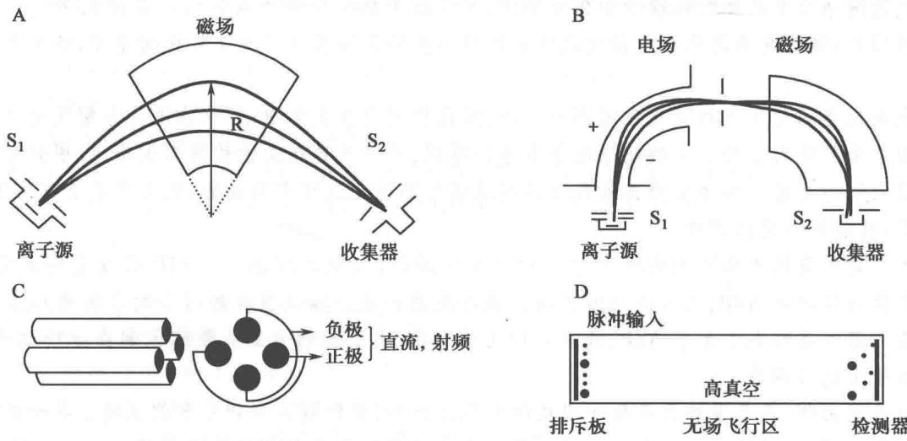  
图15-3 4种质量分析器的示意图  
A. 单聚焦磁场分析器；B. 双聚焦分析器；C. 四极杆质量分析器；D. 飞行时间质量分析器

飞行时间质量分析器(图 15-3D)是使不同质荷比的离子在同一时间以相同的初速度进入漂流管(drift tube)，这样才能保证无场飞行时间与质量的平方根成反比。常采用脉冲式离子源，对离子加速后时间和空间分布进行校正，以提高检测的精确度。图 15-3 简略表示 4 种质量分析器的构造和检测原理。

色谱-质谱联用仪将色谱与质谱组装在一起，它结合了色谱的高效分离能力和质谱的超强组分鉴定能力。联机的关键是采用适当的接口，以使色谱分离产物适合于质谱的进样要求，包括样品的量和状态，以及溶剂和杂质的去除。图15-4是色谱-质谱联用仪的示意图。

  
图 15-4 色谱-质谱联用仪示意图

在基因组学和蛋白质组学的带动下，20世纪末发展出了代谢组学（metabonomics）。1999年Jeremy Nicholson最早提出研究代谢组分总体的“代谢组学”。代谢组学主要研究不同生理、病理条件下各种代谢途径底物和产物（即代谢物）的变化，研究生物机体对内外环境条件扰动后应答的不同，以及不同个体间表型的差异。因此对医学、农学、生理学、生态学、微生物发酵等学科有广泛理论和生产实践意义。如果说基因组学和蛋白质组学可以了解机体的代谢能力，那么代谢组学则揭示了机体代谢的现状。在代谢组学研究中最重要的研究手段是气相色谱-质谱联用技术（GC-MS）、高效液相色谱-质谱联用技术（HPLC-MS）和核磁共振技术（NMR）。

新陈代谢是生物体内进行的所有化学变化的总称,是生物体一切生命活动的基础。新陈代谢包括:①从环境中取得所需物质;②将外界取得的物质转变为自身组成的构造元件;③将构造元件组装成生物体特异的大分子;④合成或分解生物体内各种特殊功能的分子;⑤提供生命活动所需的能量。

新陈代谢遵循所有已知的物理学和化学规律,并受到生物体内条件的制约。各种代谢途径由一系列酶促反应所组成;错综复杂的代谢途径构成代谢网络。生物界存在共同的中心代谢途径,各类生物又有其代谢特点。

新陈代谢包含同化作用和异化作用两个方面,同化作用为合成代谢;异化作用为分解代谢。物质代谢和能量代谢总是相伴而行的。生物按照能量来源的不同,可分为自养生物和异养生物,归根到底生命活动的能量来自太阳的光能。当今生物体的代谢格局是在长期进化过程中形成的;能够有效节省物质、能量和负熵的消耗;并能灵活进行调节。

生物体内通常将热力学不利的反应与有利的反应偶联,以驱动其进行。ATP是通用的能量载体;还原型电子载体可以产生ATP,又可以还原力形式参与生物合成。各类核苷酸衍生物是能量和活性基团的载体。代谢的基本要略在于形成ATP、还原力和构造元件,用于生物合成。新陈代谢在分子水平、细胞水平和整体水平上进行调节。

生物分子是由碳、氢等多种元素原子组成的有机化合物,共价键是生物分子的主键。共价键的异裂产生亲电子体和亲核体;共价键的均裂产生自由基。所有代谢反应都可归纳为几种基本的亲电子体和亲核体之间以及与自由基之间的反应,最基本的反应是:①基团转移反应;②氧化还原反应;③消除、异构化及重排反应;④C—C键的形成与断裂反应;⑤自由基反应。对各类反应中电子转移规律的了解,有助于对新陈代谢途径的认识,例如,可以帮助了解代谢途径各步反应的原理、代谢物的稳定性和反应条件等。

新陈代谢的研究有赖于研究技术的开发和发展,每一个新的重大技术的出现都会开拓新的研究领域,都会推动新陈代谢研究进入一个新的发展阶段。新陈代谢研究“活的”整体或细胞的化学变化,需要“体内(in vivo)”研究,也需要试管或“体外(in vitro)”研究。利用酶的抑制剂抑制酶活性,可以了解该酶催化的反应在代谢途径中的作用。通过基因突变使基因产物(酶)失活,也是研究酶促反应在代谢途径中作用的一种重要方法。

同位素示踪法在代谢研究中起着重要作用。有两类同位素,稳定性同位素和放射性同位素。稳定性同位素要用质谱仪来检测;放射性同位素需要测定放射性。无论是稳定同位素或是放射同位素都可用来研究和追踪代谢物的转变途径、反应机制和调节方式。

核磁共振波谱法可用以测定分子的化学基团、分子结构和在溶液中的构象,其主要原理是原子核自旋量子数不为零时能够自旋产生核磁矩,如果有外加磁场在相互作用下发生自旋量子化,此时若有辐射电磁波的频率与自旋核进动频率相同,自旋核就能吸收电磁波能量由低能级跃迁到高能级,通过扫频(或扫场)获得核磁共振波谱(NMR)。核磁共振波谱可提供4个重要参数:化学位移值、谱峰多重性、耦合常数值和谱峰相对强度,它们分别反映了原子核的化学环境、相邻核与核的关系、受价电子影响的耦合常数以及同类核的数量。

色谱技术利用各类样品分子在流动相和固定相之间分配系数的不同而加以分开。气相色谱的流动相是惰性气体,固定相是填以吸附剂的柱;高效液相色谱的流动相较常用的是极性挥发性溶液,固定相较常用的是填以疏水介质的反相柱或填以亲和介质的亲和柱。质谱技术是使样品分子电离成为带电的离子,然后进入质量分析器检测其质荷比。常用的电离方法有:电子电离、化学电离、场致电离、场致解吸、电喷雾、基质辅助激光解吸等。质量分析器有:单聚焦磁场分析器、双聚焦分析器、四极杆/离子阱分析器、飞行时间分析器等。色谱技术具有高效分离样品的能力;质谱技术能精确测定样品离子的质荷比,两者联用能够十分有效检测生物材料中各组分。

代谢组学研究生物体各代谢物的总体组分。如果说基因组学和蛋白质组学揭示生物体的代谢能力;

# 提要

那么，代谢组学揭示的是生物体代谢现状。在代谢组学的研究中，气相色谱-质谱联用、高效液相色谱-质谱联用和核磁共振波谱是三项最重要的技术。

## 习题

1. 什么是新陈代谢？什么是同化作用和异化作用？研究新陈代谢有何理论意义和实践意义？

2. 如何理解物质代谢和能量代谢之间的关系？哪些物质在传递和贮存能量中起重要作用？

3. 生物的代谢格局是如何形成的？

4. 为什么生物在进化过程中选择核苷酸衍生物作为能量和活性基团的载体？

5. 新陈代谢的基本要略是什么？

6. 新陈代谢有何调节机制？有何生物学意义？

7. 何谓亲电子体？何谓亲核体？何谓自由基？是否所有代谢反应都包含上述三类物质间的反应？

8. 是否所有基团转移反应都是由亲电子基团从一个亲核体转移到另一个亲核体？

9. 试述氧化还原反应中电子的转移过程。

10. 简要说明消除、异构化及分子重排反应。

11. 碳-碳键的形成和断裂主要有哪些种类反应？它们在代谢中占何地位？

12. 举例说明自由基反应在代谢中的重要性。

13. 什么是“体内”研究？什么是“体外”研究？

14. 举例说明如何利用酶的抑制剂研究代谢途径。

15. 是否所有代谢途径都可以用基因突变的方法进行研究？为什么？

16. 简要说明核磁共振波谱技术的原理。它对代谢研究有何意义？

17. 简要说明色谱和质谱技术的原理。举例说明如何用色谱-质谱技术研究代谢。

18. 什么是代谢组学？研究代谢组有何理论和实践意义？

## 主要参考书目

1. 王镜岩, 朱圣庚, 徐长法. 生物化学教程. 北京: 高等教育出版社, 2008.

2. 袁存光, 等. 现代仪器分析. 北京: 化学工业出版社, 2012.

3. Nelson D L, Cox M M. Lehninger Principles of Biochemistry. 6th ed. New York: W. H. Freeman, 2012.

(王镜岩 朱圣庚)

## 网上资源

自测题

## 第 16 章 生物能学

活细胞和活生物为了生存、生长和繁殖必须做功。利用能量并使它做生物功的能力是所有活生物的基本性质，这种能力必定在细胞进化的很早阶段就已获得。生物进行多种多样的能量转换，一种能量形式转变为另一种形式。生物利用燃料中的化学能从简单的前体合成复杂、高度有序的大分子。它们也把燃料的化学能转化为浓度梯度和电梯度，运动和热，在少数生物如萤火虫和深海鱼中把光能转化为各种其他形式的能量。

作为生物能转换基础的化学机制曾困扰生物学家几个世纪。法国化学家 A. Lavoisier(见第 1 章)最先认识到动物以某种方式把化学燃料(食物)转化为热,认识到这个过程对生命是必需的。他得出结论:呼吸作用与点亮的蜡烛中发生的过程是完全相同的,只不过呼吸是碳和氧的缓慢燃烧。

20 世纪的人们开始认知很多作为生命基础的化学。随着生物化学的发展特别是新陈代谢研究的深入,生物能学已成为动态生物化学不可分的部分。生物能的转换遵守管控所有其他自然过程的同一物理和化学法则——热力学的定律。因此本章首先复习一下热力学中有关的一些基本概念、基本定律以及自由能、熵和焓之间的关系,然后介绍生物化学反应中的自由能变化及其与平衡常数的关系,最后讲述磷酰基转移和 ATP。

## 一、生物能学与热力学

生物能学(bioenergetics)是定量研究活细胞中发生的能量转换(energy transduction)和作为能量转换基础的化学过程的性质和作用。虽然许多热力学的原理在前面的一些章节已经涉及,并可能为大家所熟悉,但在这里复习一下这些原理定量方面的知识还是有必要的。

## （一）系统（体系）、性质、状态和过程

热力学系统(thermodynamic system)是指从宇宙中被划分出来作为研究对象的那部分实体；系统一般由物理界面所限定。环境(surrounding)或称外界，是指系统以外与系统相联系的其余部分。系统和它的环境一起构成宇宙。对于在溶液中发生的化学反应，一个系统可以定义为所有组成的反应物、产物、溶解它们的溶剂以及紧接的大气——简言之，一个限定空间区域内的所有物质。对于生物化学来说，系统可能是一个生物体、一个细胞或几个反应物。

系统和环境之间可以进行物质、能量或两者的交换。根据交换情况的不同，系统一般被分为三种类型：① 开放系统(open system)，它与其环境既有物质交换，又有能量交换；② 封闭系统(closed system)是指与其环境只有能量传输，但无物质交换；③ 隔离系统或称孤立系统(isolated system)，它与其环境既无物质交换，也无能量交流。

在实验室里,某些化学或物理的过程可以在隔离或封闭的系统中进行。然而活细胞和活生物是典型的开放系统。活系统与其环境从不处于平衡;系统和环境之间的不断交流正是生物体在热力学第二定律允许的范围内能够创造自身的有序性结构的原因(见第1章)。

热力学与系统的宏观性质如体积、质量、能量、压力和温度等有关；这些热力学性质可分为广度（广延）性质和强度性质。一个系统的广度性质（extensive property）是指可写成亚系统（系统隔成两部分形成的较小系统）相应性质的总和的性质。体积、物质的量（mol）和能量是典型的广延性质；例如，一个系统的体积是它的亚系统体积的总和。强度性质（intensive property）是指同于亚系统相应性质的性质。温度和压力是典型的强度性质；如果一个298 K的系统把它分成两半，那么每一半仍将是298 K。广延性质与强度性质是有联系的,给定了物质的量(mol)的广延性质可以变成强度性质,如摩尔体积。

热力学状态(thermodynamic state)是一个系统的各种性质具有唯一的确定值并与时间无关(即系统达到平衡态)的宏观情况,也称宏观状态。一个系统的状态可以由某几种性质的物理量例如压力(P)、体积(V)或温度(T)来确定和描述。例如,对一个指定物质的量(mol)的系统只要给出它的任何两个独立的性质(物理量)即可确定一个系统的热力学状态;因此,对1 mol的一个气体只要规定了P和T,则不仅确定了体积V,而且也确定了该系统的所有其他性质如内能(U)等。这说明系统中各性质之间是相互联系和相互制约的,也说明各性质与状态之间存在着单值对应关系,即函数关系。人们把决定一个系统的状态的那些性质(物理量)称为状态函数或态函数(state function),如压力、体积、温度、内能、焓(H)、熵(S)和自由能(G)等。其中一些状态函数如P、V和T是可直接测量的宏观变量或基本参[变]数;U、H、S和G是从这些宏观变量导出的状态函数。

值得注意的是:每个状态函数在系统的每一状态都有它的唯一确定值,而此值与达到该状态的途径无关;换言之,如果一个系统的一种性质发生变化而与途径无关,则此性质一定是状态函数;同样,任何一个状态函数的变化(如 $\Delta U$ )只取决于系统的始态(initial state)和终态(final state),而与状态变化的途径无关。

热力学过程(thermodynamic process)是导致一个系统的热力学状态发生变化的过程。这样的过程可以是一个物理过程,也可以是一个化学过程。通常把变化的经过称为过程,完成过程的具体程序称为途径或路径(path)。理想气体状态在恒温下发生变化的过程称为等温过程(isothermal process, $\Delta T=0$ ),恒压下进行的称等压过程(isobaric process, $\Delta P=0$ ),等体积下进行的称等容过程(isochoric process, $\Delta V=0$ ),系统与环境之间没有热传递的过程称为绝热过程(adiabatic process, $\Delta q=0$ )等。

热力学中常提到可逆过程和不可逆过程这两个概念。可逆过程(reversible process)是指一个系统由A态变到B态时如果它对环境所做的功恰与系统由B态回复到A态时环境对它所做的功相等，并保证系统和环境同时恢复到原来的状态。在可逆过程中系统对环境所做的功最大，如果环境对系统做功，则所做的功最小，并且最大功和最小功数值上相等。可逆过程是经历一系列连续的平衡态(热力学状态)造成的，变化无限小，时间则无限长。因此，可逆过程实际上是不存在的，只是一种理想态。然而，如果过程进行得足够慢，步骤足够小，实际过程(不可逆过程)可视为接近于可逆过程。可逆过程概念促使人们想方设法地去提高实际过程的效率。不可逆过程(irreversible process)是一个不是经过一系列平衡态进行的、不能借外力无限小的变化所逆转的过程；也即不可逆过程发生后，不可能使系统和环境都恢复到原来的状态而不留下任何影响或痕迹，这就是它的不可逆性。

## （二）热、功和内能

热力学中热(heat)是指系统和环境之间因温度差而发生传递(系统吸收或放出)的能量,或者说是系统和环境之间能量传递的一种形式——微观分子的不规则运动。热用符号q(或Q)表示。一般规定:系统从环境吸收热量,q为正值;系统向环境释放热量,q为负值。

功(work)是系统和环境之间能量传递的另一种形式——宏观物体的有规则运动。力学上机械功的定义是作用于物体的外力跟受作用的物体在力的方向上移动的距离的乘积。化学和生物化学系统中一种重要的机械功是压力-体积功，它是在外力影响下气体体积压缩或膨胀所做的功。功可以有多种存在形式，除机械功外还有电功、磁功和化学功等。功的符号为 $w$ （或W），通常规定：系统对环境做功， $w$ 为正值；环境对系统做功， $w$ 为负值（注意：有些书中W的正、负号与此相反）。

热和功只是转移中的能量,都不是状态函数,不是系统的性质,没有过程发生就没有热和功。对任何一个系统,不能说它含有多少热和功,只能说它吸收或释放了多少热,对环境或环境对它做了多少功。

一个系统的能量通常由三部分组成:①整个系统处于运动的动能,②整个系统因外力场存在造成的势能,③内能。但在热力学中研究的是静止系统,也不考虑外力场对系统的影响,因此系统的全部能量就等于内能。

内能(internal energy)是一个系统内部各种质点或微粒(particle)的动能和微粒间相互作用势能的总和,用符号U(或E)表示。它包括系统内分子的平动能、转动能、振动能、分子间的势能、分子内原子、电子的势能和动能以及原子核内的能量等。内能是一个系统的状态函数， $\Delta U$ 只决定于系统的始态和终态。一个系统的内能绝对量迄今尚无法得知，但内能的改变量 $\Delta U$ 可以通过系统和环境的能量交换求出（见下面）。

## （三）热力学第一定律和焓

热力学第一定律(first law of thermodynamics)描述能量守恒和能量转化的原理:在任何的物理或化学变化中虽然能量的形式可以变化,但宇宙的总能量保持不变。这意思是说,当能量被系统利用时,能量并没有“被消耗掉”;只是从一种形式转变为另一种形式,例如从化学键中的势能转化为热和运动的动能。细胞是能量的完美转换器,能够使化学能、电能、磁能、机械能和渗透能高效地互相转换。热力学第一定律的数学形式是:

$$
\Delta U = q - w\tag{16-1}
$$

它表达了在一个过程中如果系统的量是固定的，则系统的内能增加量 $(\Delta U)$ 等于它从环境所吸收的热 $(q)$ 减去它反抗外力时对环境所做的功 $(w)$ 。如果系统发生的是一个微小的变化，上式具有下列形式：

$$
\mathrm{d} U = \delta q - \delta w\tag{16-2}
$$

这里， $\mathrm{d}U$ 表示系统内能的全微分； $\delta q$ 和 $\delta w$ 分别是热和功的微小变化，由于它们与变化途径有关，因此不是全微分。

化学反应通常是在恒容、恒压特别是在恒压(如1 atm)条件下进行的。在恒压条件下,式16-1中的q则称为恒压反应热,以 $q_{p}$ 表示。如果此时反应过程中只做体积功(反抗外压所做的功),则第一定律可写为:

$$
\begin{array}{r l} & \Delta U = q _ {\mathrm{p}} - P \Delta V \\ & q _ {\mathrm{p}} = \Delta U + P \Delta V \end{array}\tag{16-3}
$$

因为恒压时 $P\Delta V=\Delta(PV)$ ，代入式 16-3 得：

$$
q _ {\mathrm{p}} = \Delta U + \Delta (P V) = \Delta (U + P V)\tag{16-4}
$$

令

$$
H = U + P V\tag{16-5}
$$

这就是焓(enthalpy)也称热函或热含[量](heat content)H的定义。因为U、P和V都是状态函数，当然焓H也是状态函数。

从式16-4和式16-5可以推得：

$$
q _ {\mathrm{p}} = \Delta H\tag{16-6}
$$

此式的物理意义是恒压反应热等于系统的焓变[化]。

根据式 16-3 和恒容条件下 $P\Delta V=0$ 的事实, 则

$$
q _ {\mathrm{v}} = \Delta U\tag{16-7}
$$

这里, $q_{v}$ 是恒容反应热。此式表明,对于一个在恒容条件下的吸热反应,系统从环境吸收的热量全部用于内能的增加。

## （四）热化学

在化学和生物化学中系统的能量变化,除了前述的机械功和热接触引起之外,一个很重要的原因是化学反应放出或吸入的热。研究这些热效应的学科称为热化学(thermochemistry)。前面讲到的焓及其应用构成热化学的重要内容。

化学反应中,向环境释放热的( $\Delta H<0$ )称为放热反应(exothermic reaction),从环境吸收热的( $\Delta H>0$ )称为吸热反应(endothermic reaction)。反应系统的热量变化可用热量计(calorimeter)进行测量。一个反应发生后,当产物温度恢复到反应物温度时,系统释放的或吸收的热量称为该反应的反应热或热效应,如 $q_{p}$ 和 $q_{v}$ 。由于多数化学反应都在恒压条件下进行,并且当系统体积变化不大时 $\Delta H$ 值接近 $\Delta U$ ,因此反应热用 $\Delta H(=q_{p})$ 表示,并称之为反应焓。

表示化学反应和热效应关系的方程式称为热化学方程式,例如:

$$
\begin{array}{l l} \mathrm{CO(g)} + 1 / 2 \mathrm {O_ {2} (g)} = \mathrm {CO_ {2} (g)} & \Delta H = - 2 8 3. 0 \mathrm{kJ} \\ \mathrm {CO_ {2} (g)} = \mathrm{CO(g)} + 1 / 2 \mathrm {O_ {2} (g)} & \Delta H = + 2 8 3. 0 \mathrm{kJ} \end{array}
$$

书写热化学方程时应注意:① 注明反应物和产物的物态,如气体(g)、液体(l)、固体(s)等;② 在 $\Delta H$ 的右上角和右下角分别标明压力和温度值,否则表示 1 atm 和 298 K;③ $\Delta H$ 值应与方程式的形式(系数)相对应,因为 $\Delta H$ 是广延性质;④ 正、逆反应的热效应数值相等符号相反,如上面方程所示,CO 氧化是放热反应, $\Delta H$ 为负值;其逆向反应必是吸热过程, $\Delta H$ 为正值。

Hess定律是陈述化学反应中能量守恒和转化的规律:在恒温、恒压下某一化学反应不论是一步完成,还是分几步完成,总的热效应是相同的;或者说,如果二个或多个化学方程相加得到另一个化学方程,则相应的反应焓也必定是相加。Hess定律的提出极大方便了热效应研究,许多实验难测的和尚无法测得的 $\Delta H$ 值可通过计算获得。

一个反应的标准焓定义为所有的反应物和产物在 1 atm(101 325 Pa) 压力和 25℃ 即 298 K(或其他指定温度) 下的焓变, 用符号 $\Delta H^{\ominus}$ 表示, 单位为 kJ·mol $^{-1}$ 。焓和内能一样, 它的绝对值无法测定或计算。因此对物质的焓必须要有一个参考态, 如规定稳定态元素的标准生成焓为零。一个化合物的标准生成焓 (standard enthalpy of formation; $\Delta H_{f}^{\ominus}$ ) 也称标准生成热, 被定义为在 1 atm 压力和 25℃ 下从稳定态的单质 (元素) 产生 1 mol 化合物的焓变。一般说, $\Delta H_{f}^{\ominus}$ 的负值愈大, 化合物愈稳定。

另一个重要的反应焓是有机化合物的燃烧焓(enthalpy of combustion)也称燃烧热。标准燃烧焓是指在1 atm压力和25℃下1 mol有机化合物完全燃烧(氧化)成最稳定的(或指定的)氧化物或单质(如 $CO_{2}(g)$ 、 $H_{2}O(l)$ 、 $SO_{2}(g)$ 和 $N_{2}(g)$ 等)时的焓变,符号为 $\Delta H_{c}^{\ominus}$ 。1 mol的葡萄糖在体内氧化成终产物 $CO_{2}$ 和 $H_{2}O$ 时所释放的总能量与葡萄糖体外燃烧实验测得的标准燃烧焓是相等的。燃烧是放热反应,因此燃烧焓均为负值。

化学反应的实质是旧键的破裂和新键的形成以及所涉及的分子中原子排列构型的改变。断裂化学键消耗能量（克服原子间的吸引力），形成化学键释放能量。如果一个化学反应断裂键时消耗的能量大于形成键时释放的能量则为吸热反应（热能转化为化学能），反之为放热反应（化学能转化为热能）。研究化学反应时还有一个重要的参数是键焓。一个化学键的键焓（bond enthalpy）定义为在1 atm压力和25℃下断开1 mol处于气态的某一化学键的焓变，符号为 $\Delta H_{B,298}^{\ominus}$ 。键焓总是正值，因为断裂键必须向稳定分子群加入热量。键焓有时也称键能( $\Delta E$ )，有些键能是在恒容条件下测得的，但两者数值相差不大。

## （五）热力学第二定律和熵

热力学第二定律和第一定律一样,是建立在无数事实基础上的一种经验总结,它不能从其他更普遍的定律推导而来。如果第一定律告诉了我们“孤立系统的总能量不变”,第二定律则将告诉我们“孤立系统的熵总是增加到最大值”。第二定律除了这种说法之外,尚有多种陈述。例如德国学者 R. Clausius (1822—1888) 提出:“热不能自动地、不付代价地由低温物体传至高温物体”;英国学者 W. Thomson (Kelvin, 1824—1907) 认为:“一个机器从单一热源吸取热使之完全转变为功而不发生其他的变化是不可能的”。

## 1. 熵概念的诞生——熵函数是可逆过程的热温商

这里我们先提一下自发过程(spontaneous process)这一概念。众所周知，自然过程有一种自动趋向于平衡态的趋势，例如热自发地由高温物体传到低温物体，直至它们的温度相等为止；物质自发地由高浓度区向低浓度区扩散，直至浓度相等为止；锌片投入硫酸铜溶液自发地引起置换反应，直至反应达到平衡为止……所有这些自发过程(或自发变化)的共同特点是：都有一定的方向性(或不可逆性)和限度。简而言之，自发过程都是热力学的不可逆过程。

下面将讨论的熵函数正是为了判断过程进行的方向和限度,判断过程的可逆与否。引出熵概念之前,先复习一下热机效率和卡诺循环。热机效率(efficiency of engine) $\eta$ 定义为:

$$
\eta = \frac {w _ {\mathrm{net}}}{q _ {1}} = \frac {q _ {1} - | q _ {2} |}{q _ {1}} = 1 - \frac {| q _ {2} |}{q _ {1}}\tag{16-8}
$$

此处， $w_{net}$ 是系统（热机的工作物）经过一轮循环后对外所做的净功， $q_{1}$ 是系统从高温热源吸入的热量， $q_{2}$ 是向低温热源释放的热量。法国工程师 Z.Carnot(1796—1832) 提出了一种可获得最大效率的热机——卡诺机。卡诺机工作在高温热源 ( $T_{1}$ ) 和低温热源 ( $T_{2}$ ) 之间，以理想气体作为工作物（系统），经由 4 步可逆过程（等温膨胀→绝热膨胀→等温压缩→绝热压缩）构成的所谓卡诺循环（Carnot cycle）周而复始地运转。热机从状态 A ( $P_{1}, V_{1}, T_{1}$ ) 出发，经状态 B ( $P_{2}, V_{2}, T_{1}$ )、C ( $P_{3}, V_{3}, T_{2}$ ) 和 D ( $P_{4}, V_{4}, T_{2}$ )，回到原状态 A，完成一个循环。根据卡诺循环的 P-V 图和热力学第一定律（参见普通物理或物理化学教本），不难推导出卡诺机的热机效率为：

$$
\eta_ {\mathrm{Carnot}} = \frac {T _ {1} - T _ {2}}{T _ {1}} = 1 - \frac {T _ {2}}{T _ {1}}\tag{16-9}
$$

上式的意义是: 提高热机效率的关键在于提高高温热源的温度。Carnot 研究热机效率时得出一个重要结论: 工作于同一高温热源和同一低温热源之间的不可逆热机的效率( $\eta$ ) 不可能大于可逆热机的效率( $\eta_{Carnot}$ ), 这就是卡诺定理:

即

$$
\begin{array}{r l} & \eta \leqslant \eta_ {\mathrm{Carnot}} \\ & 1 - \frac {| q _ {2} |}{q _ {1}} \leqslant 1 - \frac {T _ {2}}{T _ {1}} \end{array}\tag{16-10}
$$

式中 $1 - \frac{|q_2|}{q_1}$ 代表任何热机（包括可逆与不可逆的）的效率， $1 - \frac{T_2}{T_1}$ 只表示可逆卡诺机的热机效率。Clausius发现，如果把卡诺定理的表达式中 $\frac{|q_2|}{q_1} = \frac{T_2}{T_1}$ 之比改写成：

$$
\frac {q _ {1}}{T _ {1}} = - \frac {| q _ {2} |}{T _ {2}}
$$

则由式(16-10)可得：

$$
\frac {q _ {1}}{T _ {1}} + \frac {q _ {2}}{T _ {2}} \leqslant 0\tag{16-11}
$$

式16-11称为克劳修斯不等式（Clausius's inequality）；式中“=”对应可逆循环，“<”对应不可逆循环。此式表示在高、低温热源之间可逆循环的热温商或热温比 $(q / T)$ 的代数和为零，而不可逆循环的热温商的代数和小于零；热温商的代数和大于零的循环是不可能的。

对于一个任意的循环可分成许多个微过程来处理,并证得任意循环的各微过程的热温商 $\frac{\delta q_{i}}{T_{i}}$ 总和仍满足式16-11:

$$
\sum_ {i = 1} ^ {\infty} \frac {\delta q _ {i}}{T _ {i}} \leqslant 0\tag{16-12}
$$

这是任意循环的克劳修斯不等式。

Clausius 注意到对于一个可逆循环从始态到终态的热温商总和与从终态回到始态的热温商总和相等, 即 $\sum_{i} \frac{\delta q_{i}}{T_{i}} = 0$ (见式 16-12), 反映出这里有一个定值, 并可证得它与途径无关, 仅由状态决定, 显示出它具有状态函数的特性。Clausius 据此定义了一个热力学函数, 称为熵 (entropy), 用符号 $S$ 表示。如果用

$S_{终}$ 和 $S_{始}$ 分别代表终态和始态的熵, 则

$$
S _ {\mathrm{终}} - S _ {\mathrm{始}} = \Delta S = \int_ {\mathrm{终}} ^ {\mathrm{始}} \left(\frac {\delta q}{T}\right) _ {\mathrm{可逆}}\tag{16-13}
$$

对于一个微过程的微小熵变可写成微分形式：

$$
\mathrm{d} S = \left(\frac {\delta q}{T}\right) _ {\text {可逆}}\tag{16-14}
$$

式 16-13 和式 16-14 都可作为熵(其实是熵变)的定义。

内能和焓需要凭借系统与环境间的热、功交换来推断系统的 $\Delta U$ 和 $\Delta H$ 。熵也一样，要用可逆过程中的热温商来衡量它的变化值 ( $\Delta S$ )，因为只有可逆过程中的 $\frac{\delta q}{T}$ 才等于 dS。

## 2. 热力学第二定律的数学表达式与熵增原理

由上面的式16-12和式16-14可推得：

$$
\mathrm{d} S > \left(\frac {\delta q}{T}\right) _ {\text { 不   可   逆 }}
$$

综合上式和式 16-14 得：

$$
\mathrm{d} S \geqslant \frac {\delta q}{T}\tag{16-15}
$$

式 16-15 是热力学第二定律最普遍的表达式。它的积分形式是：

$$
\Delta S _ {\mathrm{始} \rightarrow \mathrm{终}} \geqslant \int_ {\mathrm{始}} ^ {\mathrm{终}} \frac {\delta q}{T}\tag{16-16}
$$

第二定律表达式给了我们区分可逆和不可逆过程的判据： $\mathrm{d}S = \frac{\delta q}{T}$ 必为可逆， $\mathrm{d}S > \frac{\delta q}{T}$ 必不可逆， $\mathrm{d}S$ 与 $\frac{\delta q}{T}$ 相差愈大，不可逆性愈强。

第二定律的数学表达式(16-15,16-16)对于孤立系统和绝热系统中发生的变化,必有 dq=0,因此

$$
\mathrm{d} S \geqslant 0 \quad \text {或} \quad \Delta S \geqslant 0\tag{16-17}
$$

式16-17表示在孤立或绝热系统中，熵不可能减少，即不可能发生 $\mathrm{d}S < 0$ 的变化；对可逆过程（处于平衡态的），熵不变（ $\mathrm{d}S = 0$ ）；对不可逆过程，也即趋向于平衡态的过程，熵总是增加（ $\mathrm{d}S > 0$ ）。这就是熵增原理。有了它我们就有了判断过程进行的方向和限度的准则。任何自发过程都是由非平衡态趋向于平衡态，到达平衡态时熵函数达到最大值。必须指出利用熵增原理判断反应的自发性只适用于孤立和绝热系统。对于其他系统，可以把系统和与之有关的那部分环境合起来作为一个新孤立系统（总的）来对待。此时熵增原理可表示为：

$$
\Delta S _ {\mathrm{总}} = \Delta S _ {\mathrm{系统}} + \Delta S _ {\mathrm{环境}} \geqslant 0\tag{16-18}
$$

有人以为绝热过程 $(\mathrm{dq} = 0)$ 一定是 $\mathrm{dS} = 0$ 。其实不然，这是因为导致系统熵变的有两种机制：一是系统和环境之间发生热交换时必伴随着熵交换，这是熵传输（熵流）造成的机制，例如系统吸热 $(\mathrm{dq} > 0)$ 引起熵增加；二是系统内部的不可逆过程（如热传导、扩散和金属氧化）是熵产生的源泉，这是“熵增原理”造成的机制。绝热系统固然不发生熵流，但第二种机制可以引起熵增 $(\mathrm{dS} > 0)$ 。

## 3. 熵的本质——系统无序度(randomness)或混乱度(disorder)的量度

熵的概念是从卡诺定理中抽象出来的,对初学者常有困惑感。如果将“熵”跟系统内部的分子运动和分布状态联系起来,可能就容易理解了。例如一种物质的固、液、气三态,从微观角度看,固态分子相对地排列最有序,运动范围最有限,液态分子情况次之,气态分子分布最混乱,运动范围最大(可到达整个容器)。这说明,在固→液→气的相变过程中分子的无序度逐级增加。与之相应的熵值也逐级增高: $S_{固}<S_{液}<S_{气}$ 。从这里不难悟出熵与分子的混乱度或无序度有关。

讲熵与混乱度的关系之前,先谈一下不可逆性(irreversibility)和热力学几率(thermodynamic probability)问题。今设有一室,中间用隔板分成体积相等的左、右两半。左室是1 mol气体,右室是真空的。当隔板抽去,左室气体自由膨胀进入右室,直至在全室均匀分布即达到平衡状态,或称混乱度达到最大,显然这是一个不可逆过程。这时要想全部气体自动地重新回到左室是不可能的了,这就是所谓不可逆性。但如果左室放的不是1 mol而是一个分子,情况就大不一样了。此时抽去隔板,这个分子在左、右两室的几率是一样的,各为 $\frac{1}{2}$ 。可以想象,它向真空膨胀和自动返回都同样可以发生。因此,这里谈过程的方向性和不可逆性是根本没有意义的。

如果左室放的是4个分子,则同时分布在左室(即左4,右0)的几率为 $\left(\frac{1}{2}\right)^{4}=\frac{1}{16}$ (其中指数4是分子数目),均匀分布(左2,右2)的几率为 $\frac{6}{16}$ 。不难理解4个分子在左、右两室分布的花样数(即微观状态数)是 $2^{4}=16$ 个,共6个类型,包括(4,0)或(0,4)分布者各一个,(3,1)和(1,3)分布者各4个,(2,2)分布者6个(每一类型的微观状态数可按组合公式计算,如 $C_{4}^{2}=6$ )。可见,随着系统中的分子数增加,分子同时分布在左室的几率很快下降,能观察到的与气体膨胀反向的过程的可能性也急速减小。当系统中分子数增至1 mol数量级时,分子同时集中在左室的几率为 $\left(\frac{1}{2}\right)^{6\times10^{23}}=\left(\frac{1}{10}\right)^{1.8\times10^{23}}$ ,这是一个几乎为零的小数,而均匀分布的几率却接近于1(注意;数学几率的范围从0→1)。因此这样大的分子数不可能观察到气体膨胀后又自动逆转(压缩)的过程。由此可见,过程的方向性或不可逆性本质上是大量分子的随机、统计行为。

一个系统的宏观状态(热力学状态)本质上是系统中大量分子的微观状态的外部表现。值得注意的是,相应于一个确定的宏观状态的微观状态数目却不止一个,可以有许许多多个微观状态都对应于同一个宏观状态。术语“微观状态”(microscopic state, microstate)是用来规定分子在它们可及的空间(位置)和动量(能级)的特定分布。一个系统可采取的微观状态数[目](number of microstate)用符号 $\Omega$ 表示,它有时也称为分子的无序度。热力学熵函数 S 和微观状态数 $\Omega$ 有下列关系:

$$
S = k _ {\mathrm{B}} \ln \Omega\tag{16-19}
$$

上式称为 Boltzmann 公式。其中 $k_{B}$ 为 Boltzmann 常数 ( $=R/N=3.299\times10^{-24}$ )。Boltzmann 公式把宏观性质的熵 (S) 和微观性质的无序度 ( $\Omega$ ) 联系起来。

热力学第三定律是在概括了低温现象的实验事实基础上提出来的。它可表述为：当温度在绝对零度 $(T=0\ \mathrm{K})$ 时，任何一种理想晶体（纯净、完美的晶体物质）的熵为零 $(S=0)$ 。如果一个系统中所有的质点（分子、原子等）在空间上都严格地按照一定次序排列，能量上都位于同一能级，此时显然只有一种分布方式，系统的微观状态数 $\Omega=1$ 。这是一种最有秩序的状态，也即混乱度最小的状态，根据 Boltzmann 公式可算的 S=0。

绝对零度实际上达不到,所有质点能够完全停止运动的理想晶体也不存在,显然直接在 $0 \, \text{K}(-273^{\circ}\text{C})$ 做实验是不可能的。但是第三定律有它的实际意义,因为它给出了一个方便的参考值, $S_{0}=0$ 。这样就可以通过量热实验算出一个物质的绝对熵(absolute entropy)。当某一物质在恒压下,温度由 $0 \, K$ 升至 $T \, K$ ,它的绝对熵( $S_{T}$ )可由下式算得:

$$
S _ {T} = n \int_ {0} ^ {T} \frac {c _ {\mathrm{p}}}{T} \mathrm{d} T\tag{16-20}
$$

式中 n 是摩尔数, $c_{p}$ 是等压热容。

在标准状况(压力为 1 atm 和温度为 298 K 或其他指定温度)下, 1 mol 物质所具有的绝对熵称为标准

熵，用符号 $S_T^\ominus$ 表示，单位 $\mathrm{JK}^{-1}\cdot \mathrm{mol}^{-1}$ ，例如 $S_{298,\mathrm{H}_2\mathrm{O}(aq)}^\ominus = 69.91$ 。

## (六) Gibbs 自由能

上面式 16-17 和式 16-18 表示一个孤立系统的熵变或系统加环境的总熵变可用来作为一个过程是自发、可逆、还是不可能的判据。然而多数的化学反应特别是生物化学反应是在恒温、恒压和与环境有能量交换的条件下进行的，因此需要寻找一个无须考虑环境熵变的新函数来作为过程自发性的判据。

我们还是从第二定律的基本公式 16-15:

$$
\mathrm{d} S - \left(\frac {\delta q}{T}\right) \geqslant 0
$$

开始来考虑问题。为了突出恒压的特点,第一定律表达式表示为下列形式(式16-3的微分式):

$$
\mathrm{d} q _ {\mathrm{p}} = \mathrm{d} U + P \mathrm{d} V
$$

将它代入式16-15中的 $\delta q$ 得

$$
\begin{array}{r l} \mathrm{d} S - (\mathrm{d} U + P \mathrm{d} V) / T & \geqslant 0 \\ \mathrm{d} U - T \mathrm{d} S + P \mathrm{d} V & \leqslant 0 \end{array}
$$

上式两边各乘以-T得

(16-21)

因为这里讨论的是恒温恒压过程， $T$ 和 $P$ 是恒数，所以上式可写为

或

令

$$
\begin{array}{r l} \mathrm{d} (U - T S + P V) & \leqslant 0 \\ \mathrm{d} (H - T S) & \leqslant 0 \\ G = H - T S \end{array}\tag{16-22}
$$

则

$$
\mathrm{d} G \leqslant 0\tag{16-23}
$$

或

$$
\Delta G \leqslant 0
$$

这里 $\mathrm{d}G < 0$ 适用于自发过程， $\mathrm{d}G = 0$ 适用于可逆过程或系统处于平衡态；在恒温恒压条件下 $\mathrm{d}G > 0$ 的过程如果外界不给系统以有用功（能量）是不可能发生的，即所谓非自发过程（它的逆向过程必 $\mathrm{d}G < 0$ ，并能自发发生）。因此 $G$ 单独可以作为过程自发性的判据。把系统的焓和熵组合成这个新状态函数 $G$ 是美国学者J.W.Gibbs(1839—1903)于1876年最先提出的，称之为自由焓(free enthalpy)，现在多称为Gibbs自由能，简称自由能(free energy)。

上面提出了自由能的定义和自由能作为过程方向判断的关系式, 这是一类不定式。下面介绍的是自由能函数在可逆过程或平衡态中的变化关系式, 它们以等式形式出现。这类式子常用来处理化学平衡的问题。

将第二定律的表示式(16-14) $\delta q_{可逆}=TdS$ 代入第一定律表达式(16-2) $dU=\delta q-\delta w$ 得

$$
\mathrm{d} U = T \mathrm{d} S - \delta w\tag{16-24}
$$

这是可逆过程关系式中最基本的一个,它只适用于可逆过程。

前面曾提到,热力学系统除了能做体积功之外尚能做其他形式的功,如电功等。体积功之外的其他功习惯上称为有用功(有些书上称它为非体积功),常用 $w'$ 表示(但不要以为体积功就是无用功,其实一切热机所做的都是体积功。只是系统只做反抗外压的体积功时不能被利用)。如果以PdV代表体积功, $w'$ 代表有用功,则式16-24可写为

$$
\mathrm{d} U = T \mathrm{d} S - P \mathrm{d} V - \delta w ^ {\prime}\tag{16-25}
$$

为找出自由能在可逆过程中的变化关系式,将自由能定义式 16-22 微分得

$$
\mathrm{d} G = \mathrm{d} H - T \mathrm{d} S - S \mathrm{d} T
$$

用式 16-25 写出焓定义式(16-5)的微分式：

$$
\begin{array}{r l} \mathrm{d} H & = \mathrm{d} (U + P V) \\ & = \mathrm{d} U + P \mathrm{d} V + V \mathrm{d} P \\ & = T \mathrm{d} S + V \mathrm{d} P - \delta w ^ {\prime} \end{array}
$$

把此 $\mathrm{d}H$ 表示式代入上面的 $\mathrm{d}G$ 微分式得

$$
\mathrm{d} G = S \mathrm{d} T + V \mathrm{d} P - \delta w ^ {\prime}\tag{16-26}
$$

对这个关系式我们关心的是在恒温恒压条件下的情况,此时 $dT=0, dP=0$ , 因此式 16-26 变为

或

$$
\begin{array}{r l} - \mathrm{d} G & = \delta w ^ {\prime} \\ - \Delta G & = w ^ {\prime} \end{array}
$$

可见，在恒温恒压的可逆过程中如果做有用功，系统的自由能减少等于它对环境所做的最大有用功（式中 $w' = w_{\text{最大}}'$ ）。换言之，系统对外所做的最大有用功是消耗自身自由能的结果。这就是自由能的物理意义。如果系统不做有用功（ $w' = 0$ ），则在恒温恒压的可逆过程中系统的自由能不变：

$$
\begin{array}{l} \mathrm{d} G = 0 \\ \Delta G = 0 \end{array}
$$

或

(16-27)

式16-27是经常应用的关系式。

## 二、化学反应中自由能的变化和意义

细胞是等温系统,它们是在基本恒定的温度(和恒定的压力)下行使功能的。因此热的流动不能作为细胞的能量来源。细胞能够而且必须利用 Gibbs 自由能函数 G 所描述的自由能。正如上一节所介绍的,状态函数 G 能够预测在恒温恒压下发生的化学反应的方向( $\Delta G<0$ )、准确的平衡点( $\Delta G=0$ )和能够(理论上)完成的有用功的量( $w'$ )。异养型细胞从营养物分子获得自由能,光合细胞从吸收的日光辐射获得它。这两类细胞将这些自由能转化为 ATP 和其他富能化合物,为在恒温下的生物功提供能量。

这一节主要介绍化学反应中自由能变化和化学平衡之间的关系。

## （一）化学反应的自由能变化和标准生成自由能

## 1. 热力学的标准状态和标准函数

前面曾提到标准状态、标准焓 $\left(\Delta H^{\ominus}\right)$ 和标准熵 $\left(S^{\ominus}\right)$ 等术语。在这里作进一步地概括说明。为了比较不同反应发生的能量变化，人们按照惯例规定了标准反应条件：温度，298 K（25℃）；压力，1 atm（101 325 Pa）；组成，所有成分在其规定的标准状态。

物质的标准状态定为处于 298 K 和 1 atm 的纯物质, 如气态二氧化碳、液态水和固态葡萄糖。对于溶液中溶质的标准状态通常定义为单位活度或 $1 \, mol \cdot L^{-1}$ 溶液; 对于溶剂同样规定为单位活度。

也像 $\Delta H^{\ominus}$ 和 $S^{\ominus}$ 一样，用 $\Delta G^{\ominus}$ 表示当全程保持在标准状态的压力和温度下，从 1 mol 的反应物生成产物时反应发生的自由能变化，称为标准自由能变[化]（代表驱使反应趋于平衡的力）。右上角标上“ $^{\ominus}$ ”的 $\Delta G$ 以示区别于非标准条件的 $\Delta G$ 。

## 2. 化学反应的自由能变化

在生物系统条件(包括恒温和恒压)下,一个反应中自由能 G、焓 H 和熵 S 的变化有以下关系:

$$
\Delta G = \Delta H - T \Delta S\tag{16-28}
$$

这是恒温恒压下一个化学反应的自由能变化公式。系统在反应前的状态为状态1，反应后的为状态2，式中 $\Delta G = G_{2} - G_{1},\Delta H = H_{2} - H_{1},\Delta S = S_{2} - S_{1}$ 。此式也称为Gibbs-Helmholtz方程，可用于计算恒温恒压下的自由能变化。例如，在 $36^{\circ}\mathrm{C}$ (309 K)、1 atm 和 pH 7 时，在 $\mathrm{Mg}^{2+}$ 存在下进行 ATP 水解的实验；测得 $\Delta H$ 为 -20.08 kJ·mol $^{-1}$ ，此时 $\Delta S$ 应为 +35.21 J·K $^{-1}$ ·mol $^{-1}$ （根据 $\Delta S$ 等于 $q_{\text{可逆}}/T$ 算得），试计算该反应的 $\Delta G$ 。式 16-28 适用于此恒温恒压的封闭系统的条件。因此：

$$
\begin{array}{r l} \Delta G & = - 2 0 0 8 0 \mathrm{J} \cdot \mathrm{mol} ^ {- 1} - 3 0 9 \mathrm{K} \times 3 5. 2 1 \mathrm{J} \cdot \mathrm{K} ^ {- 1} \cdot \mathrm{mol} ^ {- 1} \\ & = - 3 0 9 6 0 \mathrm{J} \cdot \mathrm{mol} ^ {- 1} = - 3 0. 9 6 \mathrm{kJ} \cdot \mathrm{mol} ^ {- 1} \end{array}
$$

## 3. 标准生成自由能

虽然我们不可能知道一个物质的自由能绝对值,但可以像标准生成焓那样来定义标准生成自由能(standard Gibbs free energy of formation)。一个化合物的标准生成自由能被规定为全程在标准状态(1 atm压力)和指定温度(一般为25℃)下由稳定态的单质生成1 mol化合物的反应的自由能变化,符号为 $\Delta G_{f}^{\ominus}$ ，单位为 $kJ\cdot mol^{-1}$ 。这里稳定态单质的标准生成自由能被规定为零。

包括生物有机化合物在内许多物质的标准生成自由能以列表形式载入《化学和物理手册》(“Handbook of chemistry and physics”)及其他相关书籍。利用标准生成自由能(表16-1)可以计算一个化学反应的标准自由能变化 $(\Delta G^{\ominus})$ 。 $\Delta G^{\ominus}$ 等于产物 $\Delta G_{\mathrm{f}}^{\ominus}$ 值的总和减去反应物 $\Delta G_{\mathrm{f}}^{\ominus}$ 值的总和，即

$$
\Delta G ^ {\ominus} = \sum \Delta G _ {\mathrm{f产物}} ^ {\ominus} - \sum \Delta G _ {\mathrm{f反应物}} ^ {\ominus}\tag{16-29}
$$

表 16-1 一些化合物的标准生成自由能

<table><tr><td>化合物</td><td> $\Delta {G}_{\mathrm{f}}^{\ominus },\mathrm{{kJ}}/\mathrm{{mol}}$ </td><td>化合物</td><td> $\Delta {G}_{\mathrm{f}}^{\ominus },\mathrm{{kJ}}/\mathrm{{mol}}$ </td></tr><tr><td>乙酸 $^{-}$ (aq)</td><td>-371.30</td><td> ${\mathrm{H}}_{2}\left( g\right)$ </td><td>0.0</td></tr><tr><td>顺-乌头酸 $^{3 - }$ (aq)</td><td>-922.61</td><td> ${\mathrm{H}}^{ + }\left( {aq}\right) \left( {{10}^{-7}\mathrm{\;{mol}}/\mathrm{L}}\right) ^{\text{1 }}$ </td><td>-39.96</td></tr><tr><td>L-Ala(aq)</td><td>-371.3</td><td> ${\mathrm{{OH}}}^{ - }\left( {aq}\right)$ </td><td>-157.32</td></tr><tr><td> ${\mathrm{{NH}}}_{4}^{ + }\left( {aq}\right)$ </td><td>-79.50</td><td> $\alpha$ -酮戊二酸 $^{2 - }$ (aq)</td><td>-797.56</td></tr><tr><td>L-Asp(aq)</td><td>-489.49</td><td>乳酸 $^{-}$ (aq)</td><td>-517.81</td></tr><tr><td> ${\mathrm{{HCO}}}_{3}^{ - }\left( {aq}\right)$ </td><td>-587.14</td><td>L-苹果酸 $^{2 - }$ (aq)</td><td>-845.08</td></tr><tr><td> ${\mathrm{{CO}}}_{2}\left( g\right)$ </td><td>-395.18</td><td>草酰乙酸 $^{2 - }$ (aq)</td><td>-797.18</td></tr><tr><td>乙醇(aq)</td><td>-181.60</td><td> ${\mathrm{O}}_{2}\left( g\right)$ </td><td>0.0</td></tr><tr><td>延胡索酸 $^{2 - }$ (aq)</td><td>-604.21</td><td>丙酮酸 $^{-}$ (aq)</td><td>-474.63</td></tr><tr><td> $\alpha$ -D-葡萄糖(aq)</td><td>-917.22</td><td>琥珀酸 $^{2 - }$ (aq)</td><td>-690.23</td></tr><tr><td>甘油(aq)</td><td>-488.64</td><td> ${\mathrm{H}}_{2}\mathrm{O}\left( l\right)$ </td><td>-237.19</td></tr></table>

① 氢离子浓度在单位活度(1 mol/L)条件下它的标准生成自由能变化为零。

举例计算由草酰乙酸脱羧形成丙酮酸反应的标准自由能变化。其反应式如下：

$$
\text {   草酰乙酸   } ^ {2 -} + \mathrm{H} ^ {+} (1 0 ^ {- 7} \mathrm{mol/L}) \longrightarrow \mathrm{CO} _ {2} (g) + \text {   丙酮酸   }
$$

查得它们的 $\Delta G_{f}^{\ominus}$ : 草酰乙酸 $^{2-}$ 为 -797.18 kJ·mol $^{-1}$ , H $^{+}$ (10 $^{-7}$ mol·L $^{-1}$ ) 为 -39.96 kJ·mol $^{-1}$ , CO $_{2}$ (g) 为 -395.18 kJ·mol $^{-1}$ , 丙酮酸 $^{-}$ 为 -474.63 kJ·mol $^{-1}$ 。将这些数据按式 16-29 计算得

$$
\Delta G ^ {\ominus} = [ (- 3 9 5. 1 8) + (- 4 7 4. 6 3) ] - [ (- 7 9 7. 1 8) + (- 3 9. 9 6) ] = - 3 2. 6 7 \mathrm{kJ} \cdot \mathrm{mol} ^ {- 1}
$$

这一结果说明了当反应成分浓度草酰乙酸根离子为 $1 \, mol \cdot L^{-1}$ 、氢离子为 $10^{-7} \, mol \cdot L^{-1}$ 、 $CO_{2}$ 为 1 atm 和丙酮酸为 $1 \, mol \cdot L^{-1}$ 时，反应的 $\Delta G^{\ominus}$ 值是负的，此反应应会发生。但在 $1 \, mol \cdot L^{-1}$ 草酰乙酸根离子存在的条件下， $CO_{2}$ 不可能是气体而是 $HCO_{3}^{-}$ 。因此上面求得的 $\Delta G^{\ominus}$ ，尚需校正。校正办法之一是求出 $CO_{2} + H_{2}O \longrightarrow HCO_{3}^{-} + H^{+}(10^{-7} \, \text{mol} \cdot L^{-1})$ 反应的标准自由能变化：

$$
\Delta G ^ {\ominus} = [ (- 5 8 7. 1 4) + (- 3 9. 9 6) ] - [ (- 3 9 5. 1 8) + (- 2 3 7. 1 9) ] = 5. 2 7 \mathrm{kJ} \cdot \mathrm{mol} ^ {- 1}
$$

然后将前一反应式的 $\Delta G^{\ominus}$ 减去此反应式的 $\Delta G^{\ominus}$ 即得校正后的 $\Delta G^{\ominus} = -27.40 \, kJ \cdot mol^{-1}$ 。

如果一个反应的 $\Delta H^{\ominus}$ 和 $\Delta S^{\ominus}$ 值为已知，可利用 $\Delta G^{\ominus} = \Delta H^{\ominus} - T\Delta S^{\ominus}$ （式 16-28）计算该反应的 $\Delta G^{\ominus}$ 。此外从反应的平衡常数值也可求得 $\Delta G^{\ominus}$ （见下面）。

## （二）标准自由能变化和化学平衡的关系

一个反应系统(反应物和产物的混合物)的组成倾向于连续变化直至达到平衡为止。处在反应物和产物的平衡浓度时,正向和逆向反应的速率精确相等,并且系统中没有进一步的净变化发生。平衡时的反应物和产物的浓度决定了平衡常数(参见第1章)。对一个通用反应:

$$
a \mathrm{A} + b \mathrm{B} \rightleftharpoons c \mathrm{C} + d \mathrm{D}
$$

平衡常数由下式给出：

$$
K _ {\mathrm{eq}} = \frac {[ \mathrm{C} ] ^ {c} [ \mathrm{D} ] ^ {d}}{[ \mathrm{A} ] ^ {a} [ \mathrm{B} ] ^ {b}}\tag{16-30}
$$

式中[A]、[B]、[C]和[D]代表处于平衡点时反应物(A、B)和产物(C、D)的摩尔浓度(严格说应是活度，但稀溶液时浓度接近于活度)。a、b、c和d分别是反应式中参与反应的物质A、B、C和D的系数(分子数)。

当一个反应系统不处于平衡时，移向平衡的倾向性代表了一种驱动力（一种势），其大小可用该反应的自由能变化， $\Delta G$ ，表示。在标准条件（298 K 即 25°C）下，当反应物和产物的起始浓度为 $1 \mathrm{~mol} \cdot \mathrm{L}^{-1}$ ，如果是气体，其分压为 101325 Pa(1 atm) 时，驱动系统趋于平衡的力被定义为标准自由能变[化]， $\Delta G^{\ominus}$ 。按这一定义，涉及氢离子的反应的标准状态是 $[\mathrm{H}]^{+} = 1 \mathrm{~mol} \cdot \mathrm{L}^{-1}$ 或 $\mathrm{pH} = 0$ 。但大多数生物化学反应是在很好缓冲和约 pH 7 的水溶液中发生的； $\mathrm{pH}$ 和水的浓度（55.5 mol·L⁻¹）基本恒定。

为了计算的方便,生物化学家规定了一个与化学和物理学中所使用的不完全相同的标准状态:在生物化学的标准状态中, $\left[H\right]^{+}$ 是 $10^{-7}\ mol\cdot L^{-1},\left[H_{2}O\right]$ 是 $55.5\ mol\cdot L^{-1}$ 。对于涉及 $Mg^{2+}$ 的反应(包括以ATP作为反应物的多数反应),溶液中的 $\left[Mg^{2+}\right]$ 一般维持在 $1\ mmol\cdot L^{-1}$ 。

基于此生物化学标准状态的物理常数称为标准转换常数(standard transformed constant)，书写时加上一撇(例如 $\Delta G^{\ominus'}$ 和 $K_{eq}'$ )以区别于化学和物理上使用的非转换常数。为简便起见，以后把这些转换常数仍称为标准自由能变化(但记住加一撇和不加一撇的含义是不同的)。生物化学家使用的另一个约定是：当 $H_{2}O$ 、 $H^{+}$ 和/或 $Mg^{2+}$ 是反应物或产物时，它们的浓度不包括在如式 16-29 的方程中，而代之以将它们并入常数 $K_{eq}'$ 和 $\Delta G^{\ominus'}$ 。

$K'_{eq}$ 和 $\Delta G^{\ominus'}$ 是每个反应所特有的物理常数。它们之间有以下这样一个简单关系式：

$$
\Delta G ^ {\ominus \prime} = - R T \ln K _ {\mathrm{eq}} ^ {\prime}\tag{16-31}
$$

一个化学反应的标准自由能变只是作为表达其平衡常数的另一种数学方式，也即 $\Delta G^{\ominus}$ 和 $K_{\mathrm{eq}}^{\prime}$ 两者传达的是同一信息——在标准状态下一个反应将向哪个方向变化以及变化到何种程度。表16-2示出 $\Delta G^{\ominus}$ 和 $K_{\mathrm{eq}}^{\prime}$ 之间的关系。如果一个给定的化学反应的平衡常数是1.0，该反应的标准自由能变化是0.0。如果一个反应的 $K_{\mathrm{eq}}^{\prime}$ 大于0，则它的 $\Delta G^{\ominus}$ 是负值。如果 $K_{\mathrm{eq}}^{\prime}$ 小于1.0， $\Delta G^{\ominus}$ 是正值。因为 $\Delta G^{\ominus}$ 和 $K_{\mathrm{eq}}^{\prime}$ 之间的关系是指数关系： $\Delta G^{\ominus}$ 的较小变化就引起相应 $K_{\mathrm{eq}}^{\prime}$ 的较大变化。

表 16-2 化学反应的平衡常数和标准自由能变化的关系

<table><tr><td> $K'_{eq}$ </td><td> $\Delta G^{\ominus'}$ </td><td> $K'_{eq}$ </td><td> $\Delta G^{\ominus'}$ </td></tr><tr><td> $10^{-5}$ </td><td>287.55</td><td>10</td><td>-5.69</td></tr><tr><td> $10^{-4}$ </td><td>22.85</td><td> $10^{2}$ </td><td>-11.42</td></tr><tr><td> $10^{-3}$ </td><td>16.95</td><td> $10^{3}$ </td><td>-17.11</td></tr><tr><td> $10^{-2}$ </td><td>11.42</td><td> $10^{4}$ </td><td>-22.85</td></tr><tr><td> $10^{-1}$ </td><td>5.69</td><td> $10^{5}$ </td><td>-28.54</td></tr><tr><td>1</td><td>0.0</td><td> $10^{6}$ </td><td>-34.20</td></tr></table>

可以换一个方式来考虑标准自由能变化。 $\Delta G^{\ominus'}$ 是在标准条件下产物自由能的量和反应物自由能的量之间的差。当是负值时，产物比反应物含的自由能少，在标准条件下反应将自发进行。所有的化学反应都是向着使系统的自由能降低的方向进行。 $\Delta G^{\ominus}$ 正值表示反应的产物比反应物含有更多的自由能，如果在标准条件下所有成分的起始浓度是 $1\mathrm{mol}\cdot \mathrm{L}^{-1}$ ，这个反应将逆向进行。

下面计算磷酸葡糖变位酶催化的反应的标准自由能变化：

## 1-磷酸葡糖 $\Longleftrightarrow$ 6-磷酸葡糖

设 1-磷酸葡糖的起始浓度为 $20 \, mmol \cdot L^{-1}$ 并且不含有 6-磷酸葡糖，或反之；在 $25^{\circ}C$ 和 pH 7.0 时最终平衡的混合物含 $1.0 \, mmol \cdot L^{-1}$ 1-磷酸葡糖和 $19 \, mmol \cdot L^{-1}$ 6-磷酸葡糖。试问按生成 6-磷酸葡糖的方向进行的反应是丢失（负值）还是获得（正值）自由能？

解: 计算反应的平衡常数

$$
K _ {\mathrm{eq}} ^ {\prime} = \frac {[ 6 - \mathrm{磷酸葡糖} ]}{[ 1 - \mathrm{磷酸葡糖} ]} = \frac {1 9 \mathrm{mmol} \cdot \mathrm{L} ^ {- 1}}{1 . 0 \mathrm{mmol} \cdot \mathrm{L} ^ {- 1}} = 1 9
$$

然后按式 16-31 计算标准自由能变化：

$$
\begin{array}{r l} \Delta G ^ {\ominus^ {\prime}} & = - R T \ln K _ {\mathrm{eq}} ^ {\prime} \\ & = - (8. 3 1 4 \mathrm{J} \cdot \mathrm{mol} ^ {- 1} \cdot \mathrm{K} ^ {- 1}) (2 9 8 \mathrm{K}) (2. 3 \lg 1 9) = - 7. 3 \mathrm{kJ} \cdot \mathrm{mol} ^ {- 1} \end{array}
$$

表 16-3 给出某些有代表性的化学反应的自由能变化。注意到简单的酯、酰胺、肽和糖苷的水解以及重排和消去作用进行时伴随的标准自由能变化较小，而酸酐的水解标准自由能降低较大。在细胞内有机化合物如葡萄糖和棕榈酸完全氧化成 $CO_{2}$ 和 $H_{2}O$ 需要多步反应，引起标准自由能很大减少。然而，像表 16-3 中那样的标准自由能变化只是表示在标准条件下从一个反应中有多少自由能可以利用。但要描述细胞中存在的条件下释放的自由能，就必须表达实际的自由能变化。

表 16-3 一些化学反应的标准自由能变化

<table><tr><td>反应类型</td><td> $\Delta G^{\ominus'}$  $(\text{kJ} \cdot \text{mol}^{-1})$ </td><td>反应类型</td><td> $\Delta G^{\ominus'}$  $(\text{kJ} \cdot \text{mol}^{-1})$ </td></tr><tr><td>水解反应</td><td></td><td rowspan="2">甘氨酰甘氨酸+ $H_2O \longrightarrow 2$ 甘氨酸糖苷:</td><td rowspan="2">-9.2</td></tr><tr><td>酸酐:</td><td></td></tr><tr><td>乙酸酐+ $H_2O \longrightarrow 2$ 乙酸</td><td>-91.1</td><td>麦芽糖+ $H_2O \longrightarrow 2$ 葡萄糖</td><td>-15.5</td></tr><tr><td>ATP+ $H_2O \longrightarrow$ ADP+Pi</td><td>-30.5</td><td>乳糖+ $H_2O \longrightarrow$ 葡萄糖+半乳糖</td><td>-15.9</td></tr><tr><td>ATP+ $H_2O \longrightarrow$ AMP+PPi</td><td>-45.6</td><td>重排</td><td></td></tr><tr><td>PPi+ $H_2O \longrightarrow 2$ Pi</td><td>-19.2</td><td>1-磷酸葡糖—→6-磷酸葡糖</td><td>-7.3</td></tr><tr><td>UDP-葡萄糖+ $H_2O \longrightarrow$ UMP+1-磷酸葡糖</td><td>-43.0</td><td>6-磷酸果糖—→6-磷酸葡糖</td><td>-1.7</td></tr><tr><td>酯:</td><td></td><td>消去水</td><td></td></tr><tr><td>乙酸乙酯+ $H_2O \longrightarrow$ 乙醇+乙酸</td><td>-19.6</td><td>苹果酸—→延胡索酸+ $H_2O$ </td><td>3.1</td></tr><tr><td>6-磷酸葡糖+ $H_2O \longrightarrow$ 葡萄糖+Pi</td><td>-13.8</td><td>用分子氧氧化</td><td></td></tr><tr><td>酰胺和肽:</td><td></td><td>葡萄糖+ $6O_2 \longrightarrow 6CO_2 + 6H_2O$ </td><td>-2840</td></tr><tr><td>谷氨酰胺+ $H_2O \longrightarrow$ 谷氨酸+ $NH_4^+$ </td><td>-14.2</td><td>棕榈酸+ $23O_2 \longrightarrow 16CO_2 + 16H_2O$ </td><td>-9770</td></tr></table>

## （三）实际自由能变化决定于反应物和产物的浓度

需要注意的是,不可把实际自由能变化( $\Delta G$ )跟标准自由能变化( $\Delta G^{\ominus'}$ )混淆起来,两者是有很大区别的。每个化学反应都有一个特有的标准自由能变化,它可以是正的、负的或零,这取决于反应的平衡常数。再次强调标准自由能变化告诉我们的是:当每种成分的起始浓度为1.0 mol·L $^{-1}$ , pH为7.0,温度为25℃和压力为1 atm(101 325 Pa)时,一个给定的反应必须向哪个方向进行,离达到平衡有多远。因此, $\Delta G^{\ominus'}$ 是一个常数,对每个反应都有其特定的、不变的数值。但是实际自由能变化( $\Delta G$ )是反应物和产物浓度和反应期间主要温度的函数,它们都不需要与上面规定的标准条件相一致。而且,自发向平衡方向进行的任一反应 $\Delta G$ 总是负的,随着反应的进行负值减少,到平衡点时为零,表示该反应不能再做任何功。

对任一反应 $aA+bB \longleftrightarrow cC+dD, \Delta G$ 和 $\Delta G^{\ominus'}$ 的关系应是如下方程所示：

$$
\Delta G = \Delta G ^ {\ominus^ {\prime}} + R T \ln \frac {[ \mathrm{C} ] ^ {c} [ \mathrm{D} ] ^ {d}}{[ \mathrm{A} ] ^ {a} [ \mathrm{B} ] ^ {b}}\tag{16-32}
$$

式中 $RT\ln \frac{[C]^c[D]^d}{[A]^a[B]^b}$ 各项是观测时系统中的实际情况。方程中的浓度项表示通常称为质量作用的效应， $[C]^c[D]^d / [A]^a[B]^b$ 项称为质量作用比（mass-action ratio）， $Q$ 。因此式(16-31)可表示为 $\Delta G = \Delta G^{\ominus'} + RT\ln Q$ 。作为一个例子，我们假设 $A + B \rightleftharpoons C + D$ 这个反应是在温度（25℃）和压力（1 atm）的标准条件下进行的，但 A、B、C 和 D 的浓度并不相等，也没有一个成分是处于 $1.0\mathrm{mol} \cdot \mathrm{L}^{-1}$ 的标准浓度。为确定在这些非标准条件的浓度下反应从左向右进行的实际自由能变化，我们只要考虑方程(16-32)中 A、B、C 和 D 的实际浓度； $R, T$ 和 $\Delta G^{\ominus'}$ 是标准数值。当反应进行时 $\Delta G$ 是负值，并向零接近，因为 A 和 B 的实际浓度下降，C 和 D 的浓度上升。注意，当反应处于平衡时（当系统无力驱使反应向任一方向进行时，即 $\Delta G = 0$ ），式 16-32 被还原为

$$
0 = \Delta G = \Delta G ^ {\ominus^ {\prime}} + R T \ln \frac {[ \mathrm{C} ] ^ {c} [ \mathrm{D} ] ^ {d}}{[ \mathrm{A} ] ^ {a} [ \mathrm{B} ] ^ {b}}
$$

或

$$
\Delta G ^ {\ominus \prime} = - R T \ln K _ {\mathrm{eq}} ^ {\prime}
$$

这是联系标准自由能和平衡常数的方程(式 16-30)。

一个反应的自发性判据是 $\Delta G$ 值，不是 $\Delta G^{\ominus}$ 。如果 $\Delta G$ 是负的，即使具有正 $\Delta G^{\ominus}$ 的一个反应也有可能前向进行。如果方程式16-32中 $RT\ln ([产物]/[反应物])$ 项是负的，并有比 $\Delta G^{\ominus}$ 更大的绝对值，情况就是如此。例如，随时除去反应的产物保持[产物]/[反应物]比远低于1，这样 $RT\ln ([产物]/[反应物])$ 项就有一个大的负值。 $\Delta G^{\ominus}$ 和 $\Delta G$ 是一个给定反应在理论上所能提供的最大量的自由能——仅在有完美高效的装置可用来捕获它时才能实现的能量数。已知不可能有这样的装置（在任何过程中总有一些能量转变为熵），在恒温恒压下反应所做的功的量总是少于理论值。

另一点需要注意的是,某些热力学上有利的反应(即 $\Delta G^{\ominus}$ 大而负的反应)没有以可测的速度发生。例如,柴火燃烧成 $CO_{2}$ 和 $H_{2}O$ 是热力学上很有利的,但柴火能多年处于稳定的状态;这是因为燃烧反应的活化能比室温下可利用的能量高(见第6章)。如果提供必需的活化能(例如用点燃的火柴),燃烧很快开始,把木头转变为更稳定的产物 $CO_{2}$ 和 $H_{2}O$ ,并以光和热形式释放出能量。这个放热反应释放的热又为附近的柴火提供了活化能,过程是自我延续的。

在活细胞中的反应(如果没有催化将是极其缓慢的)之所以能够进行,不是由于提供了额外的热,而是通过利用酶降低了反应的活化能。酶提供了另一种比非催化反应具有更低自由能的反应途径,所以在室温下大部分底物分子有足够的热能克服活化屏障,反应速率急速增加。一个反应的自由能变与反应借以发生的途径无关;它只决定于起始反应物和终产物的性质和浓度。因此酶不能改变平衡常数,但能增加在热力学管控的方向上进行的反应速率(见第8章)。

## （四）偶联反应的标准自由能变化具有可加性

在两个连续的化学反应: A $\rightleftharpoons$ B 和 B $\rightleftharpoons$ C, 每个反应都有它自己的平衡常数和特定的标准自由能变化, $\Delta G_{1}^{\ominus'}$ 和 $\Delta G_{2}^{\ominus'}$ 。因为这两个反应是连续的, B 则被消去, 给出总的反应 A $\rightleftharpoons$ C, 这个反应有它自己的平衡常数, 并因此也有它自己的标准自由能变化, $\Delta G_{总}^{\ominus'}$ 。连续的化学反应的 $\Delta G^{\ominus'}$ 值是可以相加的。对总反应 A $\rightleftharpoons$ C, $\Delta G_{总}^{\ominus'}$ 是两个反应各自的标准自由能变化, $\Delta G_{1}^{\ominus'}$ 和 $\Delta G_{2}^{\ominus'}$ 的总和: $\Delta G_{总}^{\ominus'} = \Delta G_{1}^{\ominus'} + \Delta G_{2}^{\ominus'}$ 。

<table><tr><td>(1)</td><td>A→B</td><td> $\Delta G_{1}^{\ominus'}$ </td></tr><tr><td>(2)</td><td>B→C</td><td> $\Delta G_{2}^{\ominus'}$ </td></tr><tr><td>总</td><td>A→C</td><td> $\Delta G_{\text{总}}^{\ominus'}$ </td></tr></table>

生物能学的原理解释了一个热力学上不利的(吸能的)反应是如何能通过一个共同的中间物把它跟一个高放能反应偶联而被驱动朝着前向进行的。例如6-磷酸葡糖的合成是许多生物利用葡萄糖时的第一步：

$$
\mathrm{葡萄糖} + \mathrm{Pi} \longrightarrow 6 - \mathrm{磷酸葡糖} + \mathrm {H_ {2} O} \quad \Delta G ^ {\ominus \prime} = + 1 3. 8 \mathrm{kJ} \cdot \mathrm{mol} ^ {- 1}
$$

$\Delta G^{\ominus'}$ 正值预示在标准条件下该反应在所写的方向不会自发进行。另一个细胞反应, ATP 水解为 ADP 和 Pi, 是高放能反应:

$$
\mathrm{ATP} + \mathrm{H} _ {2} \mathrm{O} \longrightarrow \mathrm{ADP} + \mathrm{Pi} \quad \Delta G ^ {\ominus \prime} = - 3 0. 5 \mathrm{kJ} \cdot \mathrm{mol} ^ {- 1}
$$

这两个反应有共同的中间物 Pi 和 $H_{2}O$ ，可表示为连续的反应：

$$
\begin{array}{r l} & \text {(1)} \quad \text {葡萄糖+Pi} \longrightarrow 6 - \text {磷酸葡糖+H} _ {2} \mathrm{O} \\ & \text {(2)} \quad \mathrm{ATP+H} _ {2} \mathrm{O} \longrightarrow \mathrm{ADP+Pi} \\ & \text {总} \quad \text {葡萄糖+ATP} \longrightarrow 6 - \text {磷酸葡糖+ADP} \end{array}
$$

把两个单独反应的 $\Delta G^{\ominus}$ 相加给出总的标准自由能变化：

$$
\Delta G _ {\text {总}} ^ {\prime} = 1 3. 8 \mathrm{kJ} \cdot \mathrm{mol} ^ {- 1} + (- 3 0. 5 \mathrm{kJ} \cdot \mathrm{mol} ^ {- 1}) = - 1 6. 7 \mathrm{kJ} \cdot \mathrm{mol} ^ {- 1}
$$

总反应是放能的。在这种情况，贮存在 ATP 的能量被用来驱动 6-磷酸葡糖的合成，虽然从葡萄糖和无机磷(Pi)合成 6-磷酸葡糖是吸能反应。通过从 ATP 转移磷酰基的方式由葡萄糖合成 6-磷酸葡糖的途径与上述的反应(1)和(2)是不同的，但净结果跟这两个反应的总和一样。在热力学计算方面，所有的问题都存在于过程开始和终了时系统的状态上；始态和终态之间的路径是无关紧要的。

前面已经说过, $\Delta G^{\ominus}$ 是表达一个反应的平衡常数的一种方式,对上述反应(1)来说,

$$
K _ {\mathrm{eq} _ {1}} ^ {\prime} = \frac {[ 6 - \mathrm{磷酸葡糖} ]}{[ \mathrm{葡萄糖} ] [ \mathrm{Pi} ]} = 3. 9 \times 1 0 ^ {- 3} \mathrm{L} \cdot \mathrm{mol} ^ {- 1}
$$

注意, $H_{2}O$ 不包括在表达式中,因为它的浓度(55.5 mol·L $^{-1}$ )被假定为在反应中保持不变。反应(2)ATP的水解[平衡]常数是

$$
K _ {\mathrm{eq} _ {2}} ^ {\prime} = \frac {[ \mathrm{ADP} ] [ \mathrm{Pi} ]}{[ \mathrm{ATP} ]} = 2. 0 \times 1 0 ^ {5} \mathrm{mol} \cdot \mathrm{L} ^ {- 1}
$$

两个偶联反应的平衡常数是

$$
\begin{array}{r l} K _ {\mathrm{eq} \text {总}} ^ {\prime} & = \frac {[ 6 - \text {磷酸葡糖} ] [ \mathrm{ADP} ] [ \mathrm{Pi} ]}{[ \text {葡萄糖} ] [ \mathrm{Pi} ] [ \mathrm{ATP} ]} \\ & = (K _ {\mathrm{eq} _ {1}} ^ {\prime}) (K _ {\mathrm{eq} _ {2}} ^ {\prime}) = (3. 9 \times 1 0 ^ {- 3} \mathrm{L} \cdot \mathrm{mol} ^ {- 1}) (2. 0 \times 1 0 ^ {5} \mathrm{mol} \cdot \mathrm{L} ^ {- 1}) \\ & = 7. 8 \times 1 0 ^ {2} \end{array}
$$

通过把 ATP 水解和 6-磷酸葡糖合成偶联的途径,由葡萄糖合成 6-磷酸葡糖的 $K_{eq}^{\prime}$ 被提高到约原来的 $2 \times 10^{5}$ 倍。

这个共同中间物的策略,在合成代谢中间物和细胞成分时为所有活细胞所利用。显然,只有像 ATP 这样的化合物不断地被利用时,这个策略才会被使用。

上面计算中关于平衡常数有一点值得注意:总反应的 $\Delta G^{\ominus'}$ 是两个反应各自的 $\Delta G^{\ominus'}$ 值的和,标准自由能变化是相加的(additive);但总反应的 $K_{eq}'$ 值是两个反应的单独 $K_{eq}'$ 值的乘积,平衡常数是相乘的(multiplicative)。这是因为自由能变化与平衡常数是指数关系,如果在下式:

$$
K _ {\mathrm{eq} _ {\mathrm{总}}} ^ {\prime} = (K _ {\mathrm{eq} _ {1}} ^ {\prime}) (K _ {\mathrm{eq} _ {2}} ^ {\prime})
$$

的等号两边各取自然对数并乘以-RT,即得:

根据式16-31，

则

$$
\begin{array}{r l} - R T \ln K _ {\mathrm{eq总}} ^ {\prime} & = - R T \ln K _ {\mathrm{eq} _ {1}} ^ {\prime} - R T \ln K _ {\mathrm{eq} _ {2}} ^ {\prime} \\ - R T \ln K _ {\mathrm{eq}} ^ {\prime} & = \Delta G ^ {\ominus^ {\prime}} \\ G _ {\mathrm{总}} ^ {\ominus^ {\prime}} & = \Delta G _ {1} ^ {\ominus^ {\prime}} + \Delta G _ {2} ^ {\ominus^ {\prime}} \end{array}
$$

## 三、ATP 与磷酰基转移

前面曾提到活生物以两种方式从环境中获取所需能量。光能自养生物是通过吸收太阳辐射的量子得到能量；化能自养生物则是通过氧化预先合成的燃料分子获得能量。与能量的吸收、转换和利用相适应的是细胞的代谢活动被组成相反相成的两类途径：有关合成反应的合成途径和涉及降解反应的分解途径。合成途径中原子的有序性一般增加（熵降低），本质上常是还原性的，并且几乎总是吸能的过程（消耗ATP），而分解途径通常是放能的反应（产生ATP）。大体上来说，细胞通过合成反应完成生命系统生长、发育和繁殖所需的一切；而分解反应则主要为合成反应提供能量。

生命系统在热力学上变得有利的关键是把产能过程跟需能过程有效地偶联起来。这种偶联有赖于通用的媒介物——化学能载体 ATP, ATP 被喻为细胞能量系统中的“流通货币”。

## (一) ATP 水解的自由能变化是大的负值

腺苷三磷酸 (adenosine triphosphate, ATP) 是细胞中主要的贮能化合物, 是细胞能量代谢的中心分子。ATP 的化学结构见图 16-1。ATP 分子中的 3 个磷酸基从跟腺苷基直接相连的那个开始向外依次标为 $\alpha$ 、 $\beta$ 和 $\gamma$ 。ATP 分子中在 $\alpha$ 和 $\beta$ 之间或 $\beta$ 和 $\gamma$ 之间的磷酐键 (phosphoanhydride bond) 水解断裂分别释放出

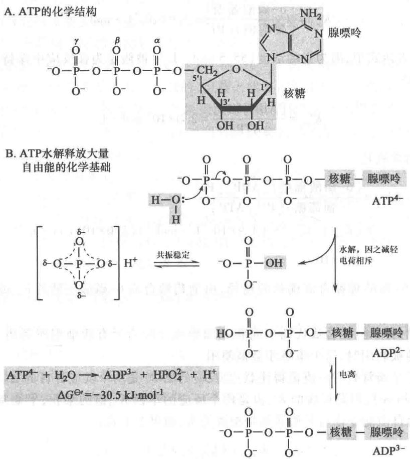  
图 16-1 ATP 的化学结构(A)和 ATP 水解释放大量自由能的化学基础(B)

的自由能是：

$$
\mathrm{ATP} \longrightarrow \mathrm{AMP} + \mathrm{PPi} \quad \Delta G ^ {\ominus \prime} = - 3 2. 2 \mathrm{kJ} \cdot \mathrm{mol} ^ {- 1}
$$

$$
\mathrm{ATP} \longrightarrow \mathrm{ADP} + \mathrm{Pi} \quad \Delta G ^ {\ominus \prime} = - 3 0. 5 \mathrm{kJ} \cdot \mathrm{mol} ^ {- 1}
$$

但腺苷基团的核糖基与 $\alpha$ 磷酸基之间的磷酯键裂解要比这低得多，例如6-磷酸葡糖的磷酯键水解，它的 $\Delta G^{\ominus}\prime = -13.8\mathrm{kJ}\cdot \mathrm{mol}^{-1}$ 。历史上曾把水解时能释放出大量自由能（ $>25\mathrm{kJ}\cdot \mathrm{mol}^{-1}$ ）的化合物称为“高能”化合物，如ATP、ADP和PPi等；相应的酸酐键（磷酸二酯键）曾不恰当地被称为“高能键”，显然这不是“键”本身含有高能量。事实上所有化学键的破裂都需要输入能量（见前面讲的键焓或键能 $\Delta H_{\mathrm{B},298}^{\ominus}$ ）。磷酸化合物水解释放的自由能不是来自被破裂的特定键，而是由于反应的产物所含的自由能比反应物低的原因。

图 16-1 概括了 ATP 水解的标准自由能大而负的化学基础。一是 ATP 中末端( $\gamma$ )磷[酸]酐键的水解断裂除去 3 个荷负电磷酸基中的一个,因此减小了 ATP 中 4 个负电荷之间的静电相斥;二是释放的产物 $\mathrm{Pi}(\mathrm{HPO}_{4}^{2-})$ 由于形成一个共振杂化体(这在 ATP 中是不可能的)而得到稳定。杂化体中 4 个磷-氧键中的每一个都具有相同的部分双键性质,氢离子并不是固定地跟 4 个氧原子中的某一个结合。(虽然共振稳定在某种程度也存在于涉及酯键或酸酐键的磷酸基中,但共振形式可能比无机磷酸的少。)有利 ATP 水解的第三个因素(图中未示出)是产物 Pi 和 ADP 的溶剂化(水化)程度比 ATP 要大。跟反应物溶剂化相比,溶剂化进一步稳定了产物。此外还有熵因素和其他因素;熵因素是指由于水解和随后的电离使产物的质点数(如 ATP、ADP Pi 和 $H^{+}$ )比反应物(如 ATP 和 $H_{2}O$ )的多,即系统的混乱度增加,这有利于水解。

总之,导致 ATP 容易水解和释放大量自由能的因素很多,但归结起来主要是两个:一个是引起反应物不稳定的因素(分子内静电斥力),另一个是造成产物稳定的因素(共振稳定化)。

## （二）细胞中影响 ATP 水解自由能变化的因素

在标准条件下 ATP 水解的自由能变化 $\Delta G^{\ominus'} = -30.5 \, kJ \cdot mol^{-1}$ ，但活细胞中 ATP 的实际水解自由能变化 ( $\Delta G$ ) 是很不相同的：ATP、ADP 和 Pi 的细胞浓度不一样，比标准条件的 $1 \, mol \cdot L^{-1}$ 要低得多（表 16-4）。而且细胞溶胶中的 $Mg^{2+}$ 是跟 ATP 和 ADP 结合的（图 16-2）；对大多数以 ATP 为磷酰基供体的酶促反应来说，真正的底物是 $MgATP^{2-}$ 。因此相应的 $\Delta G^{\ominus'}$ 是 $MgATP^{2-}$ 水解的标准自由能变化。我们可以利用如表 16-4 中所列的数据来计算 ATP 水解的 $\Delta G$ 。在细胞内的条件下 ATP 水解的实际自由能常被称为它的磷酸化势（phosphorylation potential）， $\Delta G_{p}$ 。

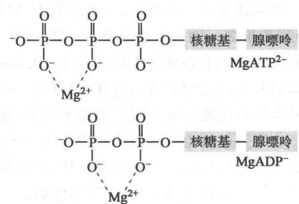  
图16-2 $\mathrm{Mg}^{2+}$ 和ATP结合成复合体

$Mg^{2+}$ 复合体的形成部分地掩盖了负电荷并影响核苷酸(如 ATP 和 ADP)中磷酸基团的构象

表 16-4 在某些细胞中腺苷酸、无机磷酸和焦磷酸的浓度

<table><tr><td rowspan="2"></td><td colspan="5">浓度(mmol/L) $^1$ </td></tr><tr><td>ATP</td><td> $ADP^{2}$ </td><td>AMP</td><td>Pi</td><td>PCr</td></tr><tr><td>大鼠肝细胞</td><td>3.38</td><td>1.32</td><td>0.29</td><td>4.8</td><td>0</td></tr><tr><td>大鼠肌细胞</td><td>8.05</td><td>0.93</td><td>0.04</td><td>8.05</td><td>28</td></tr><tr><td>大鼠神经元</td><td>2.59</td><td>0.73</td><td>0.06</td><td>2.72</td><td>4.7</td></tr><tr><td>人红细胞</td><td>2.25</td><td>0.25</td><td>0.02</td><td>1.65</td><td>0</td></tr><tr><td>E.coli细胞</td><td>7.90</td><td>1.04</td><td>0.82</td><td>7.9</td><td>0</td></tr></table>

① 人红细胞因没有核和线粒体,此浓度为细胞溶胶中的浓度。在其他类型细胞中此浓度为整个细胞内容物的数据,虽然线粒体与细胞溶胶的 ADP 浓度有很大的不同。PCr 是磷酸肌酸的英文缩写。② 此值反映了总浓度;游离 ADP 的真实数值可能要小得多。

总之影响 ATP 水解自由能释放的因素很多, 如反应物、产物、pH 和二价阳离子特别是 $Mg^{2+}$ 等。在不同的细胞类型之间 ATP、ADP 和 Pi 的浓度不相同, 从一种细胞到另一种细胞 ATP 的 $\Delta G_{p}$ 也不相同。而且，在一个给定的细胞中不同的时间 $\Delta G_{p}$ 也会变化，这取决于代谢条件以及这些条件是如何影响 ATP、ADP、Pi 和 $H^{+}$ 浓度 (pH) 的。我们可以计算一个细胞中发生的任一个给定代谢反应的实际自由能变，只要我们知道所有可以影响实际自由能变化的反应物、产物和其他的因素（例如 pH、温度和 $[Mg^{2+}]$ ）。

这里举一个磷酸化势计算的例子。计算人红细胞中 ATP 水解的实际自由能， $\Delta G_{p}$ 。ATP 水解的标准自由能是 $-30.5 \, kJ \cdot mol^{-1}$ ，在人红细胞中 ATP、ADP 和 Pi 的浓度如表 16-4 中所示。假设 pH 是 7.0，温度是 $37^{\circ}C$ （体温）。试问在同一细胞条件下合成 ATP 需要多少能量？解：在人红细胞中 ATP、ADP 和 Pi 的浓度分别是 2.25、0.25 和 $1.65 \, mmol \cdot L^{-1}$ 。在这些条件下 ATP 水解的实际自由能由下面关系式（见式 16-32）：

$$
\Delta G _ {\mathrm{p}} = \Delta G ^ {\ominus \prime} + R T \ln \frac {[ \mathrm{ADP} ] [ \mathrm{Pi} ]}{[ \mathrm{ATP} ]}
$$

给出。将适当的数值代入上式得：

$$
\begin{array}{r l} \Delta G _ {\mathrm{p}} & = - 3 0. 5 \mathrm{kJ} \cdot \mathrm{mol} ^ {- 1} + \left[ (8. 3 1 4 \mathrm{J} \cdot \mathrm{mol} ^ {- 1} \cdot \mathrm{K} ^ {- 1}) \times (3 1 0 \mathrm{K}) \ln \frac {(0 . 2 5 \times 1 0 ^ {- 3}) (1 . 6 5 \times 1 0 ^ {- 3})}{(2 . 2 5 \times 1 0 ^ {- 3})} \right] \\ & = - 3 0. 5 \mathrm{kJ} \cdot \mathrm{mol} ^ {- 1} + 2. 3 \times (2. 5 8 \mathrm{kJ} \cdot \mathrm{mol} ^ {- 1}) \times \lg (1. 8 \times 1 0 ^ {- 4}) \\ & = - 3 0. 5 \mathrm{kJ} \cdot \mathrm{mol} ^ {- 1} + (2. 5 8 \mathrm{kJ} \cdot \mathrm{mol} ^ {- 1}) \times (- 8. 6) \\ & = - 3 0. 5 \mathrm{kJ} \cdot \mathrm{mol} ^ {- 1} - 2 2 \mathrm{kJ} \cdot \mathrm{mol} ^ {- 1} \\ & = - 5 2. 5 \mathrm{kJ} \cdot \mathrm{mol} ^ {- 1} (\text {经舍入处理取二位有效数，最后答案为} - 5 2 \mathrm{kJ} \cdot \mathrm{mol} ^ {- 1}) \end{array}
$$

因此在完整红细胞中 ATP 水解的实际自由能变化( $\Delta G_{p}=-52\ kJ\cdot mol^{-1}$ ) 要比标准自由能变化大很多。同理，在红细胞中的优势条件下由 ADP 和 Pi 合成 ATP 所需的自由能应是 $52\ kJ\cdot mol^{-1}$ 。

使问题更复杂化的是,一个细胞中 ATP、ADP、Pi 和 $H^{+}$ 的总浓度可以比自由浓度(热力学上的相关浓度)高出很多。这个差值是由于 ATP、ADP 和 Pi 跟细胞的蛋白质结合得紧密造成的。例如,静息肌肉中的自由 ADP 已有各种估计值,介于 $1 \sim 37 \mu mol \cdot L^{-1}$ 之间。在上面举的计算例子中利用 ADP 为 $25 \mu mol \cdot L^{-1}$ 的数值对大鼠肌细胞进行计算,得 $\Delta G_{p} = -64 kJ \cdot mol^{-1}$ 。然而, $\Delta G_{p}$ 的精确值计算其指导意义也许不比我们对实际自由能变化所做的概括来得大:在活体内 ATP 水解释放的能量比标准自由能变化 $\Delta G^{\ominus}$ 要大。

在下面的讨论中我们常利用 ATP 水解的 $\Delta G^{\ominus}$ 值, 因为这样可以在同样的基础上跟其他的细胞反应的能量学进行比较。但一定要记住, 在活细胞中 $\Delta G$ 是实际上相关的量——对 ATP 的水解和所有其他的反应——它可以跟 $\Delta G^{\ominus}$ 有很大的差别。

这里我们必须对细胞的 ATP 水平给与关注。前面已经说明 ATP 的化学性质是它适于担当细胞中能量通货的原因。但这不仅是分子固有的化学性质给它以驱动代谢反应和其他需能过程的能力；更重要的是在进化过程中，已经有了一个很强的选择压力为其水解反应维持 ATP 的细胞浓度远高于平衡浓度。当 ATP 的水平下降时，不仅燃料的量减少，而且燃料本身失去它的效力：ATP 水解的 $\Delta G$ （即磷酸化势， $\Delta G_{p}$ ）降低。在讨论产生和消耗 ATP 的代谢途径时，我们会看到活细胞有发达的精巧机制来维持 ATP 的高浓度。

## （三）其他磷酸化合物和硫酯也有大量的水解自由能

磷酸烯醇丙酮酸(phosphoenolpyruvate, PEP; 图 16-3)含有一个磷酸酯键, 此键发生水解产生烯醇式丙酮酸, 这个直接的产物可以通过自发的互变异构化(tautomerazation)成为更稳定的酮式。因为反应物(PEP)只有一种形式(烯醇式), 产物(丙酮酸)可以有两种形式(烯醇式和酮式), 所以产物比反应物更稳定。这是PEP的水解自由能高的最重要原因: $\Delta G^{\ominus'} = -61.9 \mathrm{~kJ} \cdot \mathrm{mol}^{-1}$ 。

另一个3-碳化合物是1,3-二磷酸甘油酸(1,3-bisphosphoglycerate;图16-4)，在C1羰基和一个末端磷酸之间含有一个酸酐键。此酰基磷酸的水解有一个大而负的标准自由能变化 $(\Delta G^{\ominus} = -49.3\mathrm{kJ}\cdot \mathrm{mol}^{-1})$ ，它也可用反应物和产物的结构原因来解释。当 $\mathrm{H}_2\mathrm{O}$ 加入1,3-二磷酸甘油酸的酸酐键时，直接产物之一的3-磷酸甘油酸丢掉一个质子成为羧酸离子，即3-磷酸甘油酸根，后者有两种同样几率的共振形式（图16-4）。3-磷酸甘油酸的移去及其共振稳定离子的形成有利于反应前向进行。

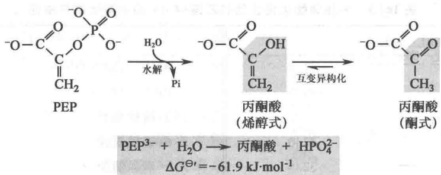  
图 16-3 磷酸烯醇丙酮酸(PEP)的水解

图 16-4 1,3-二磷酸甘油酸的水解  
  
图16-5 磷酸肌酸的水解

在磷酸肌酸中(图 16-5)，P—N 键水解产生游离的肌酸和 Pi。Pi 的释放和肌酸的共振稳定有利于前向反应。磷酸肌酸水解的标准自由能变化也是一个大的负值， $\Delta G^{\ominus'} = -43.0 \, kJ \cdot mol^{-1}$ 。

  
图16-6 乙酰辅酶A的水解

在所有这些释放磷酸的反应中, Pi 可以利用几种能量近似的共振形式(图 16-1)以稳定对反应负的自由能变化做出贡献的产物。表 16-5 列出几种生物学上重要的磷酸化合物的水解标准自由能。

表 16-5 一些磷酸化化合物和乙酰-CoA 的水解标准自由能

<table><tr><td colspan="2"> $\Delta G^{\ominus'}(kJ·mol^{-1})$ </td><td colspan="2"> $\Delta G^{\ominus'}(kJ·mol^{-1})$ </td></tr><tr><td>磷酸烯醇丙酮酸</td><td>-61.9</td><td>AMP(→腺苷+Pi)</td><td>-14.2</td></tr><tr><td>1,3-二磷酸甘油酸</td><td>-49.3</td><td>PPi(→2Pi)</td><td>-19.2</td></tr><tr><td>(→3-磷酸甘油酸+Pi)</td><td></td><td>3-磷酸葡糖</td><td>-20.9</td></tr><tr><td>磷酸肌酸</td><td>-43.0</td><td>6-磷酸果糖</td><td>-15.9</td></tr><tr><td>ADP(→AMP+Pi)</td><td>-32.8</td><td>6-磷酸葡糖</td><td>-13.8</td></tr><tr><td>ATP(→ADP+Pi)</td><td>-30.5</td><td>3-磷酸甘油</td><td>-9.2</td></tr><tr><td>ATP(→AMP+PPi)</td><td>-45.6</td><td>乙酰-CoA</td><td>-31.4</td></tr></table>

(此表引自 Nelson D L, Cox M M. Lehninger Principles of Biochemistry. 6th ed. 2013.)

在硫酯(thioester)的结构中一个硫原子代替酯键中通常的氧,形成硫酯键;硫酯水解也有大的负标准自由能。乙酰辅酶A或乙酰-CoA(图16-6;CoA的完整结构见第13章)是代谢上重要的许多硫酯中的一个。这些化合物中的酰基在转酰基作用、缩合作用或氧化还原反应时被活化。硫酯发生共振稳定比氧酯发生的少得多;因此,反应物和它的水解产物之间自由能差,硫酯要比可比较的氧酯大(图16-7)。在两种情况,酯的水解产生一个羧酸,后者可以电离并采取几种共振形式。这些因素一起造成乙酰-CoA水解的大而负的 $\Delta G^{\ominus'}(-31.4\ \text{kJ}\cdot\text{mol}^{-1})$ 。

  
图 16-7 硫酯和氧酯的水解自由能  
这两种水解反应的产物具有大约相同的自由能含量(G)，但硫酯的自由能含量比氧酯高；因为O和C原子之间的轨道重叠能在氧酯中起共振稳定，而S和C原子之间的轨道重叠较差，共振稳定作用很小

概括起来说,对具有大而负的标准自由能变化的水解反应,产物比反应物更稳定,由于下面一个或多个原因:① 反应物中由于静电相斥引起的键张力因电荷分离而缓解,如 ATP 的情况;② 产物因电离而稳定,如 ATP、酰基磷酸和硫酯;③ 产物由于异构化(互变异构化)而稳定,如 PEP;④ 产物通过共振而稳定,例如磷酸肌酸释放的肌酸、酰基磷酸和硫酯释放的羧酸离子,和酸酐或酯键断裂释放的磷酸(Pi)。

## （四）ATP 是通过基团转移而不是简单水解提供能量的

在全书多处地方你可以看到 ATP 提供能量的反应或过程, ATP 对这些反应的作用常常像图 16-8A 中那样用一个单箭头示出, 表示 ATP 转变为 ADP 和 Pi(或在某些情况, ATP 转变为 AMP 和 PPi)。书写成这种方式, 似乎 ATP 的这些反应是简单的水解过程, 反应中 $H_{2}O$ 置换了 Pi(或 PPi), 这样容易使人误认为 ATP 依赖型反应是“受 ATP 水解驱动的”。实际上不是这样的, ATP 水解本身通常除了释放热之外并没有什么伴随着, 热在等温系统中是不能驱动化学过程的。事实上像图 16-8A 中那样的一个简单反应箭头几乎总是代表一个两步过程(图 16-8B), 在此过程中 ATP 分子的一部分, 磷酰基、焦磷酰基、腺苷酸部分(AMP)首先被转移到底物分子或酶中的一个氨基酸残基上,变成共价地与底物或酶连接,以提高其自

由能含量；然后在第二步中，第一步时被转移的含磷酸部分被置换，产生 Pi、PPi 或 AMP。因此 ATP 共价地参与酶促反应，并把自由能贡献给它。

然而,某些过程确实涉及 ATP(或 GTP)的直接水解。例如 ATP(或 GTP)的非共价结合,随后水解成 ADP(或 GDP)和 Pi,这给某些往返在两种构象之间的蛋白质提供能量以产生机械运动。这种情况在肌肉收缩(第 4 章)、酶沿着 DNA(第 30 章)或核糖体沿信使 RNA(第 33 章)的移动中出现。螺旋酶(helicase)催化的能量依赖型反应、Rec 蛋白、某些拓扑异构酶(topoisomerase)和其他也涉及磷酐键的直接水解(第 30 章)。在信号传递途径中起作用的 GTP 结合蛋白质直接水解 GTP 以驱动构象变化以终止激素和其他胞外因子触发的信号(第 14 章)。

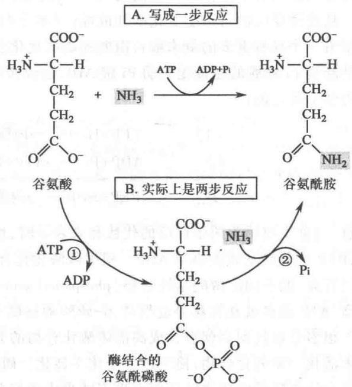

在活生物中发现的磷酸化合物根据它们的水解标准自由能可以大致分成两类(图 16-9)。“高能”化合物是指水解时 $\Delta G^{\ominus}$ 的负值 > -25 kJ·mol $^{-1}$ 的化合物；“低能”化合物水解时 $\Delta G^{\ominus}$ 的负值 < -25 kJ·mol $^{-1}$ 。按这一标准，ATP，水解 $\Delta G^{\ominus} = -30.5$ kJ·mol $^{-1}$ ，是高能化合物；6-磷酸葡糖，水解 $\Delta G^{\ominus} = -13.8$ kJ·mol $^{-1}$ ，是低能化合物。前面曾指出“高能

图16-8 两步的ATP水解

A. ATP 对一个反应的作用常以一步反应示出,但实际上几乎都是二步过程;B. 这里示出的是 ATP 依赖型谷氨酰胺合成酶催化的反应:① 磷酰基从 ATP 转移到谷氨酸,② 磷酰基被 $NH_{3}$ 置换,以 Pi 释出

  
图 16-9 生物磷酸化合物按水解的标准自由能排列  
此图示出在细胞条件下激酶催化的磷酰基①的流动:从高能磷酰基供体经ATP到受体分子(如葡萄糖和甘油)以形成它们的低能磷酸衍生物

化合物”和“高能键”的说法是不准确的。但为了简便起见，我们有时仍使用“高能磷酸化合物”术语来表示含有大量的负水解标准自由能的 ATP 和其他磷酸化合物。

从连续反应的自由能变化的加成性(见本章前面)也可以看出,任一磷酸化化合物可以通过把它的合成跟另一个具有更多的负水解自由能的磷酸化化合物的降解相偶联来完成。例如,因为从磷酸烯醇丙酮酸上断裂 Pi 释放的能量比驱动 Pi 跟 ADP 缩合所需的能量更多,所以从 PEP 直接把磷酰基供给 ADP 是热力学上可行的:

$$
\mathrm{PEP} + \mathrm{H} _ {2} \mathrm{O} \longrightarrow \text {丙酮酸} + \mathrm{Pi} - 6 1. 9 \mathrm{kJ} \cdot \mathrm{mol} ^ {- 1} \tag {1}
$$

$$
\mathrm{ADP} + \mathrm{Pi} \longrightarrow \mathrm{ATP} + \mathrm{H} _ {2} \mathrm{O} \quad + 3 0. 5 \mathrm{kJ} \cdot \mathrm{mol} ^ {- 1} \tag {2}
$$

$$
\text { 总 } \quad \mathrm{PEP} + \mathrm{ADP} \longrightarrow \text { 丙酮酸 } + \mathrm{ATP} \quad - 3 1. 4 \mathrm{kJ} \cdot \mathrm{mol} ^ {- 1}
$$

注意: 当总反应用头两步反应的代数和来表示时, 这个总反应实际上是一个不涉及 Pi 的第三个不同的反应; PEP 把磷酰基直接供给 ADP。根据磷酸化化合物的水解标准自由能(列于表 16-5), 可以把它们描写为具有高、低不同的磷酰基转移势(phosphoryl group transfer potential)的化合物。PEP 的磷酰基转移势为最高, ATP 的磷酰基转移势也很高, 6-磷酸葡糖属于低的(图 16-9)。

很多分解代谢是朝着合成高能磷酸化合物的方向进行的,但是它们的形成并不是本身的结束;它们被用来活化一系列化合物,使之进一步化学转化。磷酰基转移给一个化合物有效地把自由能给了它,结果这个化合物在随后的代谢转化中有更多的自由能释放。上面我们描述了磷酰基从 ATP 的转移是如何伴随 6-磷酸葡糖合成的。在下面有关糖代谢的几章中我们会看到葡萄糖的磷酸化是如何激活或“引发”葡萄糖分解代谢反应的,这些反应几乎在每个活细胞中都会发生。因为 ATP 在基团转移势标度尺上的中间位置,它能从分解代谢产生的高能磷酸化合物携带能量到像 ATP 这样的化合物,使它们转变成反应性更高的分子。因此 ATP 在所有的活细胞中被用作普适能量通货。

ATP 有一个更重要的化学特性是它在代谢中起作用的关键, 这就是: 虽然在水溶液中 ATP 在热力学上是不稳定的, 并因此是一个良好的磷酰基供体, 但 ATP 在动力学上是稳定的。因为 ATP 磷酐键的非催化断裂要求很高的活化能 (200\~400 kJ·mol $^{-1}$ ), 因此它不会自发地把磷酰基供给细胞中的水或其他许许多多的潜在受体。只有当专一的酶存在把活化能降低时, 从 ATP 转移磷酰基才会发生。因此细胞能够通过调节各种跟 ATP 作用的酶来调整 ATP 所携带的能量的分配。

## （五）ATP 水解生成磷酰基、焦磷酰基和腺苷酰基

ATP 的反应一般是 $S_{N}2$ 亲核取代（见第 15 章），在取代时亲核剂可以是，醇或羧酸的氧，或肌酸的氮、或精氨酸或组氨酸侧链的氮。ATP 的三个磷酸中的每一个都对亲核攻击敏感（图 16-10），每个攻击位点产生不同类型的产物。

醇对 $\gamma$ 磷酸的亲核攻击(图 6-10A)置换出 ADP, 产生一个新的磷酸酯。用 ${}^{18}O$ -标记的反应物研究已证明新化合物中的氧桥是来自醇,不是来自 ATP;因此从 ATP 转移的基团是一个磷酰基 $\left(-\mathrm{PO}_{3}^{2-}\right)$ ,不是磷酸基 $\left(-\mathrm{OPO}_{3}^{2-}\right)$ 。磷酰基从 ATP 转移到谷氨酸(图 16-8)或转移到葡萄糖都涉及 ATP 分子的 $\gamma$ 位置受到攻击。

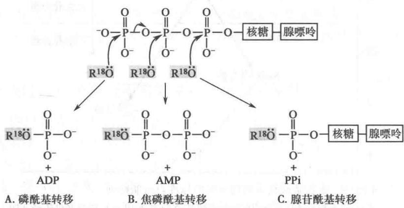  
图16-10 ATP的亲核攻击反应

对 ATP 的 $\beta$ 磷酸位置的攻击置换 AMP，并把焦磷酰基（不是焦磷酸基）转移给攻击中的亲核剂（图 16-10B）。例如，5-磷酸核糖-1-焦磷酸（核苷酸合成的一个关键中间物）的形成是由于核糖的一个-OH 对 ATP 的 $\beta$ 磷酸进行攻击的结果（第 27 章）。

对 ATP 的 $\alpha$ 磷酸位置的亲核攻击置换 P Pi，并以腺苷酰基的形式转移出腺苷酸 (5'-AMP)（图 16-10C）；此反应称为腺苷酰化 [作用]（adenylylation）。注意： $\alpha-\beta$ 磷酐键的水解释放出的自由能 ( $\sim46\ kJ\cdot mol^{-1}$ ) 比 $\beta-\gamma$ 磷酐键的水解 ( $\sim31kJ\cdot mol^{-1}$ ) 大相当多（表 16-5）。此外，作为腺苷酰化的副产品 P Pi 被普遍存在的无机焦磷酸酶 (inoganic pyrophosphatase) 水解成两个 Pi，释放 $19\ kJ\cdot mol^{-1}$ ，从而提供更多的能量“推动”腺苷酰化反应。实际上 ATP 的两个磷酐键在总反应中都被断裂。因此腺苷酰化反应在热力学上是很有利的。当 ATP 的能量被用来驱动特别不利的代谢反应，腺苷酰化作用经常作为能量偶联机制。脂肪酸活化是这种能量偶联策略的一个很好例子。

脂肪酸活化的第一步——或为了产能氧化,或为了用于合成更复杂的脂质——是形成它的硫酯(见第24章)。脂肪酸(RCOOH)与辅酶A的直接缩合是吸能反应,但脂肪酰-CoA(RCOS-CoA)的形成通过从ATP分步除去二个磷酰基被转变为放能反应。第一步,从ATP把腺苷酸(AMP)转移到脂肪酸的羧基,形成一个混合酸酐(脂肪酰腺苷酸)并释放出PPi。第二步,辅酶A的巯基取代了腺苷酰基,形成带有脂肪酸的硫酯。这两步的总反应:

$$
\mathrm{ATP} + \mathrm{RCOOH} + \mathrm{CoA} - \mathrm{SH} + 2 \mathrm{H} _ {2} \mathrm{O} \longrightarrow \mathrm{AMP} + 2 \mathrm{Pi} + \mathrm{RCOS} - \mathrm{CoA} + 2 \mathrm{H} ^ {+}
$$

在能量上相当于 ATP(→AMP+PPi) 的放能水解 ( $\Delta G^{\ominus'} = -45.6 \, kJ \cdot mol^{-1}$ ) 和脂肪酰-CoA 的吸能形成 ( $\Delta G^{\ominus'} = 31.4 \, kJ \cdot mol^{-1}$ )。脂肪酰-CoA 的形成由于 PPi 被无机焦磷酸酶水解在能量上变成有利的反应。因此，脂肪酸活化时 ATP 的两个磷酐键都被破裂，得到的 $\Delta G^{\ominus'}$ 是这些键裂解的 $\Delta G^{\ominus'}$ 的总和或 (-45.6 kJ·mol $^{-1}$ ) + (-19.2 kJ·mol $^{-1}$ ):

$$
\mathrm{ATP} + 2 \mathrm{H} _ {2} \mathrm{O} \longrightarrow \mathrm{AMP} + 2 \mathrm{Pi} \quad \Delta G ^ {\ominus \prime} = - 6 4. 8 \mathrm{kJ} \cdot \mathrm{mol} ^ {- 1}
$$

氨基酸在聚合成蛋白质之前需要活化,活化是由一套类似的反应完成的,反应中转移 RNA 分子代替辅酶 A(第 33 章)。ATP 断裂成 AMP 和 PPi 的反应似乎有它特殊的意义,例如萤火虫(Lampyridae 科的一种甲虫)就是利用 ATP 降解为 AMP 和 PPi 作为闪光的能源。萤火虫的体内含有一种称为虫荧光素(luciferin)的复杂羧酸和虫荧光素酶(luciferase)。闪光的产生需要虫荧光素经酶促反应活化,活化中 ATP 断去 PPi 形成虫荧光酰腺苷酸(luciferyl adenylate):

实验室中纯的虫荧光素和虫荧光素酶凭借产生的闪光强度用于测定微量的 ATP。少至几个 pmol $(10^{-12} \text{ mol})$ 的 ATP 可以用这种方法测出。

## （六）ATP 为信息大分子组装、主动运输和肌肉收缩供能

由小分子前体组装成具有规定序列的高分子多聚体(DNA、RNA和蛋白质)时无论单体的缩合和序列的形成都需要能量(详见第3篇)。DNA和RNA合成的前体是核苷三磷酸;聚合时伴随着 $\alpha$ 和 $\beta$ 磷酸之间的磷酐键断裂和PPi的释放(图16-10)。合成RNA时这些反应中被转移到增长中多聚体的部分是腺苷酸(AMP)、鸟苷酸(GMP)、胞苷酸(CMP)或尿苷酸(UMP),合成DNA时脱氧核苷酸的情况类似,只是CMP换成TMP。如上面提到的,合成蛋白质时氨基酸的活化涉及ATP提供腺苷酰基,在第33章我们将看到蛋白质合成在核糖体上的几步也伴随 GTP 的水解。在所有这些情况，核苷三磷酸降解的放能反应都是与专一序列的多聚体合成的吸能过程相偶联的。

ATP 可以为离子或分子逆浓度梯度的跨膜转运提供能量。转运过程是能量的主要消费者；例如在人的肾和脑中，静止时消耗的能量三分之二以上是用于经钠钾 ATP 酶跨质膜泵送（pumping） $Na^{+}$ 和 $K^{+}$ 。 $Na^{+}$ 和 $K^{+}$ 的转运是以 ATP 为磷酰基供体由转运蛋白质交替磷酸化和去磷酸化驱动的。钠钾 ATP 酶的 $Na^{+}$ -依赖型磷酸化迫使蛋白质构象发生变化。 $K^{+}$ -依赖型的去磷酸化有利于返回原来的构象。转运过程中每次交替都引起 ATP 转化为 ADP 和 Pi，这是 ATP 水解的自由能变化，它驱动蛋白质构象的交替变化，结果是 $Na^{+}$ 和 $K^{+}$ 的生电泵送（electrogenic pumping）。注意，在这种情况 ATP 共价相互作用是把磷酰基转移到酶，而不是底物上发生的。

在骨骼肌细胞的收缩系统中,肌球蛋白和肌动蛋白是专门把 ATP 的化学能转导为运动能的(见图 4-36)。ATP 与肌球蛋白的一种构象紧密而非共价地结合,使蛋白质保持在那种构象。当肌球蛋白催化跟它结合的 ATP 水解时,ADP 和 Pi 从蛋白质上解离,使蛋白质松弛成第二种构象直至跟另一个 ATP 分子结合。ATP 的结合和随后的水解(被肌球蛋白的 ATP 酶活性)提供致使肌球蛋白头部的构象发生交替变化所需的能量。许多单个的肌球蛋白分子的构象变化引起肌球蛋白原纤维(fibril)沿肌动蛋白丝(filament)滑动(见图 4-35),这种滑动转化为宏观的肌纤维收缩。正如前面注意到的,靠消耗 ATP 产生的机械运动是 ATP 水解本身而不是从 ATP 转移基团作为偶联过程的化学能来源的几种少数情况之一。

## （七）核苷酸之间的转磷酸作用在所有类型细胞中存在

在细胞的能量传递中,ATP 起着能量通货和磷酰基供体的作用,但是所有的其他核苷三磷酸(GTP、UTP 和 CTP)以及所有的脱氧核苷三磷酸(dATP、dGTP、dTTP 和 dCTP)在能量上都是与 ATP 相当的。与它们的磷酐键水解相关的标准自由能变化几乎跟 ATP 的相应值是相同的(表 16-5)。这些其他核苷酸有着多种生物学作用,如上面讲到的作为 RNA 和 DNA 的合成前体。因此细胞内这些核苷三磷酸要不断地产生并维持在一定水平,它们是通过磷酰基转移到相应的核苷二磷酸(NDP)和核苷一磷酸(NMP)形成的。

ATP 是在酵解和氧化磷酸化中的分解代谢以及光合细胞中的光合磷酸化产生的主要高能磷酸化合物。有几种酶能把磷酰基从 ATP 转移到其他核苷酸，其中一种存在于所有的细胞（细胞溶胶和线粒体）中，称为核苷二磷酸激酶（nucleoside diphosphate kinase）。此酶催化下面的反应：

$$
\mathrm{ATP} + \mathrm{NDP(dNDP)} \longrightarrow \mathrm{ADP} + \mathrm{NTP(dNTP)}
$$

虽然此反应是完全可逆的,但细胞中[ATP]/[ADP]之比相对较高,驱动反应向右进行,造成NTP和dNTP的净形成。此酶实际上催化二步式的磷酰基转移,是一个双置换(乒乓)机制的经典例证(图16-11和第7章)。首先,磷酰基从ATP转移到活性部位His残基,生成磷酸-酶中间体,然后,磷酰基从P-His残基被转移到受体NDP。因为此酶对NDP的碱基是非专一性的,对dNDP和NDP的作用效力是同等的;只要有相应的NDP并供给ATP,它能合成所有的NDP和dNDP。

  
图 16-11 核苷二磷酸激酶的乒乓机制  
酶结合它的第一个底物(此例中是 ATP)，磷酰基被转移至 His 残基的侧链上。ADP 与酶脱离，另一个核苷(或脱氧核苷)二磷酸取代了 ADP，并通过从磷酸组氨酸残基转移磷酰基被转变为相应的核苷三磷酸

从 ATP 转移磷酰基的结果是 ADP 的积累;例如,当肌肉剧烈收缩时 ADP 积累并干扰 ATP 依赖型的收缩。在强烈需要 ATP 期间,细胞通过腺苷酸激酶(adenylate kinase)的作用降低 ADP 浓度,并同时补充了 ATP:

$$
2 \mathrm{ADP} \stackrel {\mathrm{Mg} ^ {2 +}} {\rightleftharpoons} \mathrm{ATP} + \mathrm{AMP} \quad \Delta G ^ {\ominus^ {\prime}} \approx 0
$$

此反应是完全可逆的,所以结束对 ATP 的强烈需求后,酶能重新利用 AMP,把它转化为 ADP,后者在线粒体内进一步磷酸化为 ATP。一个类似的酶,鸟苷酸激酶,依靠消耗 ATP 把 GMP 转化为 GDP。通过这样的途径,贮存在 ATP 的分解代谢中的能量被用来满足细胞对所有 NTP 和 dNTP 的需求。

磷酸肌酸(phosphocreatine, PCr; 见图 16-5)也称肌酸磷酸, 它是磷酰基的现成来源, 用于从 ADP 快速合成 ATP。虽然神经和肌肉等细胞活动的直接供能物质是 ATP, 但它在细胞中的含量很低(只有几个 mmol·L $^{-1}$ ), 仅够肌肉剧烈活动 1 s 左右。而骨骼肌中 PCr 的浓度约 30 mmol·L $^{-1}$ , 是 ATP 浓度的近 10 倍; 在其他组织如平滑肌、大脑和肾中, PCr 是 5 到 10 mmol·L $^{-1}$ 。在肌酸激酶(creatine kinase)催化下 PCr 的磷酰基转移给 ADP, 生成 ATP。反应式如下:

$$
\mathrm{ADP} + \mathrm{PCr} \xrightarrow {\mathrm{Mg} ^ {2 +}} \mathrm{ATP} + \mathrm{Cr} \quad \Delta G ^ {\ominus \prime} = - 1 2. 5 \mathrm{kJ} \cdot \mathrm{mol} ^ {- 1}
$$

当突然需要能量而把 ATP 耗尽时, PCr 贮库正好通过此反应被用来补充 ATP, 这要比经分解代谢途径合成 ATP 的速度快得多。当对能量的需求缓解下来时, 分解代谢产生的 ATP 借助肌酸激酶反应用以充实 PCr 贮库。

从 PCr 的含量高和它的磷酰基转移势比 ATP 高可以看出,肌肉活动急需能量的情况下,磷酸肌酸可使 ATP 含量维持在一个高的稳定水平。它可提供给肌肉强烈活动 4\~6 s 的能量需要。一般认为,人体肌肉中磷酸肌酸的含量及其再合成的速度是运动员速度素质的物质基础。

在运动后的恢复期,细胞内积累的肌酸(Cr)又由肌酸激酶催化重新合成PCr,因为肌酸激酶催化的反应是可逆的。ATP和Cr形成PCr的反应是细胞代谢反应中接近平衡的一个典型例子(从整体看,细胞内的代谢都是远离平衡的)。此反应的生物学意义在于,它能够随时有效地调整反应物和产物的浓度变化。反应能够进行的原因正是因为其反应物和产物的浓度接近反应的平衡点( $\Delta G\approx0$ )。当细胞处于静息状态时,ATP的浓度较高,反应向合成磷酸肌酸的方向进行。当细胞处于活动状态时,ATP的浓度下降,反应即转向合成ATP的方向进行。因此磷酸肌酸有“ATP缓冲剂”之称。

一些低等动物门的生物如蟹和龙虾的肌肉中含有磷酸精氨酸(phosphoarginine)和其他的PCr样分子作为磷酰基的贮库,这些分子总称为磷酸原(phosphagen)。磷酸精氨酸或称精氨酸磷酸(arginine phosphate),其结构式如下:

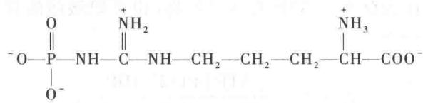

## (八) 无机多磷酸是潜在的磷酰基供体

无机多磷酸(inoganic polyphosphate)，缩写为polyP或 $(\mathrm{P})_n$ （这里 $n$ 是正磷酸残基的数目），是由几十或几百个Pi残基通过磷酐键连接而成的线型多聚体。此多聚体存在于所有的生物中，在某些细胞中可以积累到相当高的水平。例如酵母液泡中积累的polyP量，如果均匀地分布在整个细胞，相当于 $200\mathrm{mmol}\cdot \mathrm{L}^{-1}$ 的浓度！（将它与表16-4中所列的其他磷酰基供体的浓度进行比较。）

  
无机多磷酸(polyP)

PolyP 的一个潜在作用也是作为磷酸原, 磷酰基的贮库, 像肌肉中的磷酸肌酸那样用于产生 ATP。PolyP 的磷酰基转移势与 PPi 相近。最短的 polyP, PPi (n=2), 在植物细胞中可作为跨液泡膜的 $H^{+}$ 主动转运的能源。植物中至少对一种形式的磷酸果糖激酶, PPi 是磷酰基的供体, 是动物和微生物中 ATP 所担当的角色(见第 2 篇糖代谢部分)。火山冷凝物和蒸汽出口处发现高浓度的 polyP, 这表明它可能曾在生物前和细胞进化早期作为一种能源。

在细菌中多磷酸激酶-1(PPK-1)通过酶-结合的①-His中间体参与的机制(参见图16-11)催化下面的可逆反应：

$$
\mathrm{ATP} + (\mathrm{P}) _ {n} \xrightarrow {\mathrm{Mg} ^ {2 +}} \mathrm{ADP} + (\mathrm{P}) _ {n + 1} \quad \Delta G ^ {\ominus \prime} = - 2 0 \mathrm{kJ} \cdot \mathrm{mol} ^ {- 1}
$$

多磷酸激酶-2(PPK-2)催化由多磷酸和GDP(或ADP)合成GTP(或ATP)的可逆反应:

$$
\mathrm{GDP} + (\mathrm{P}) _ {n + 1} \xrightarrow {\mathrm{Mg} ^ {2 +}} \mathrm{GTP} + \mathrm{poly(P)} _ {n}
$$

PPK-2 的作用被认为主要是朝 GTP 和 ATP 合成方向, 而 PPK-1 是朝多磷酸合成方向。PPK-1 和 PPK-2 存在于多种细菌, 包括许多病原菌。

已经证明，在细菌中高水平的 polyP 促进涉及生物体适应饥饿或其他危及生命状况的基因表达。例如，在 E. coli 中当细胞发生氨基酸或 Pi 饥饿时 polyP 则积累，polyP 的积累有利于生命存活。多磷酸激酶基因的缺失降低某些病原细菌对动物组织侵染的能力。因此表明这些多磷酸激酶是开发新的抗微生物药物的合适靶子。

酵母的基因没有编码 PPK 样的蛋白质,但有 4 个基因——跟细菌的 PPK 基因无关——是合成多磷酸所必需的。真核生物中多磷酸合成的机制似乎跟细菌中的有很大不同。

## （九）ATP系统的动态平衡

前面曾谈到,如果 ATP 的末端磷酐键直接水解成 ADP 和 Pi,它就会以热的形式释出自由能。但如果借酶的作用把 ATP 水解和其他需能反应偶联起来,则水解的自由能可做有用功。活细胞的生命活动中无时无刻不需要能量供应,因此 ATP 必需不断地产生。ATP 的更新是非常快的,一个处于静息状态的人(平均体重 50 kg/人),据估算需要消耗 50 kg/d 的 ATP。在紧张活动的情况下,ATP 的消耗量可达 0.5 kg/min。虽然机体需要如此多的 ATP,但细胞中的周转率能够满足细胞对能量的需求,也即它们在体内总是保持在相应的平衡水平。

细胞所处的能量状态可用能荷(energy charge)来表示。能荷是指在 ATP-ADP-AMP 系统中含高能磷酸基团的分数,或者说在腺苷酸总池中 ATP 及其当量物(由于肌酸激酶催化 ADP 和 ATP 的相互转化,2ADP 相当 1ATP)所占的 mol 分数:

$$
\mathrm{能荷} = \frac {[ \mathrm{ATP} ] + 1 / 2 [ \mathrm{ADP} ]}{[ \mathrm{ATP} ] + [ \mathrm{ADP} ] + [ \mathrm{AMP} ]}
$$

当细胞中的 ATP 全部转变为 AMP 时, 能荷值为“0”。当 AMP 全部转变为 ATP 时, 能荷值为“1”。可见能荷值是在 0\~1 之间变动。高能荷值对 ATP 的生成途径有抑制作用, 但是高能荷可以促进 ATP 的利用, 即促进生物体内的合成代谢。已知大多数细胞的能荷值处于 0.80\~0.95 之间。此值表明了细胞中 ATP 的产生和利用处在一个相对稳定的平衡状态。

细胞内有一系列的调节机制,一方面调节 ATP 的生成以供细胞对能量的需要,另一方面调节 ATP 的利用,维持它处于相对稳定的动态平衡。

细胞中 ATP 维持在动态平衡的状态已被用放射性 $^{32}$ P 标记的磷酸作为探针的实验——测定细胞内 ATP 末端( $\gamma$ )磷酸基的周转率——所证实。将标记的磷酸注入到活细胞，随后迅速分离出细胞内的 ATP，测定其放射性。实验表明，虽然 ATP 的表观含量并没有发生变化，但它的末端磷酸基已经被放射性 $^{32}$ P 所标记。而且可以看到 ATP 的放射性和无机磷酸的放射性强度完全一致。 $^{32}$ P 取代 ATP $\gamma$ 磷酸基的速度以肝细胞为例只需要 1\~2 min。细菌只需几秒钟。但是在 ATP 分子中跟核糖直接相连的 $\alpha$ 磷酸基的周转率却很慢。

## 提要

活细胞是不间断地进行工作的。它们需要能量以维持高度有组织的结构，合成各种细胞成分，产生电流以及很多其他过程。

生物能学是定量研究生物系统中的能量关系和能量转换的学科。生物能转换严格遵守热力学定律。热力学系统一般被分为三种类型：①隔离系统或称孤立系统；②封闭系统；③开放系统。活细胞就是开放系统，它与其环境既有物质交换又有能量交流，吸收和引导能量以维持自身处于远离平衡态的稳态。

热力学状态函数是指决定一个系统状态的那些性质(物理量)如压力、体积、温度、内能、焓(H)、熵(S)和自由能(G)等。每个状态函数在系统的每一状态都有它的唯一确定值,而此值与达到该状态的途径无关。同样,任何一个状态函数的变化(如 $\Delta G$ )只取决于系统的始态和终态,而与状态变化的途径无关。

热是系统和环境之间能量传递的一种形式——微观分子的不规则运动。功是系统和环境之间能量传递的另一种形式——宏观物体的有规则运动。热和功只是转移中的能量，都不是状态函数，不是系统的性质，没有过程发生就没有热和功。

焓，H，是一个反应系统的热含[量]。热含反映了在反应物和产物中化学键数目和种类。当一个化学反应释放热时，被称为放热反应，习惯上 $\Delta H$ 为负值；从环境吸收热的反应称为吸热反应， $\Delta H$ 为正值。

熵,S,是一个系统中无序度或混乱度的定量表示。当一个反应的产物比反应物更复杂、更混乱时,反应随着熵增进行。

自由能,G,表示在恒温恒压条件下一个反应过程中能够做有用功的能的量。当一个反应伴随着自由能释放时,自由能变化 $\Delta G$ 为负值,此反应称为放能反应,能自发进行的反应。吸能反应时,系统获得自由能, $\Delta G$ 为正值,为非自发反应。

所有化学反应都受两种力的影响:一个力是趋于获得最稳定的键合状态(用焓,H表示),另一个是倾向于获得最大的无序度(用熵,S表示)。一个反应的净驱动力是自由能变化, $\Delta G$ ,它代表焓和熵因子的总结果: $\Delta G=\Delta H-T\Delta S$ 。

利用标准生成自由能 $\left(\Delta G_{\mathrm{f}}^{\ominus}\right)$ 可以计算一个化学反应的标准自由能变 $\left(\Delta G^{\ominus}\right)$ 。 $\Delta G^{\ominus}$ 等于产物 $\Delta G_{f}^{\ominus}$ 值的总和减去反应物 $\Delta G_{f}^{\ominus}$ 值的总和。

标准转换自由能变 $\Delta G^{\ominus'}$ 是一个给定反应所特有的物理常数，它能从它的反应平衡常数计算获得： $\Delta G^{\ominus'} = -RT\ln K_{\mathrm{eq}}'$ 。

实际自由能变 $\Delta G$ 是一个变量, 它取决于 $\Delta G^{\ominus'}$ 以及反应物和产物的浓度: $\Delta G = \Delta G^{\ominus'} + RT \ln([产物]/[反应物])$ 。

当 $\Delta G$ 值大而负, 反应趋于前向进行; $\Delta G$ 值大而正, 趋于逆向进行; $\Delta G = 0$ , 系统处于平衡。一个反应的自由能变与反应所经的途径无关。自由能变化是可以相加的; 具有一个共同中间物的连续反应, 其净反应的总自由能变化是各个反应的 $\Delta G$ 值的总和。

ATP 是分解代谢和合成代谢之间的化学链节, 是活细胞中的能量货币。ATP 转化为 ADP 和 Pi 或转化为 AMP 和 PPi 的放能反应与许多吸能反应和过程相偶联。

ATP 的直接水解是构象变化驱动的某些过程中能量的来源（占少数），但一般说能量的来源不是 ATP 水解，而是从 ATP 把磷酰基、焦磷酰基或腺苷酰基转移给底物或酶，酶使 ATP 降解的能量跟底物的吸能转化相偶联。

通过这些基团的转移,ATP 把能量供给合成代谢反应包括信息大分子的合成以及分子和离子的逆浓

度梯度和逆电位梯度的跨膜转运。

为了维持 ATP 有高的基团转移势,它的浓度必须通过分解代谢的产能反应保持在远高于平衡浓度之上。

细胞含有其他携有大而负水解自由能的代谢物包括磷酸烯醇丙酮酸、1,3-二磷酸甘油酸和磷酸肌醇。这些高能化合物，如 ATP，具有高的磷酰基转移势。硫酯也具有大的水解自由能。

在所有细胞中都存在的无机多磷酸可作为具有高转移势的磷酰基贮库。

细胞中 ATPγ 磷酸基周转率是极其高的,而 ATP 的含量却维持在一个相对稳定的水平,这是一种动态稳定。动态稳定表明 ATPγ 磷酸基的消耗和再生速度是相对平衡的。

## 习题

1. 解释下列热力学的术语：(a) 系统（体系）；(b) 状态和状态函数；(c) 热和功；(d) 内能和焓；(e) 热力学第二定律；(f) 熵；(g) Gibbs 自由能；(h) $\Delta G^{\ominus}$ 和 $\Delta G^{\ominus'}$ ；(i) 可逆过程和不可逆过程；(j) “高能键”；(k) 磷酸化势和能荷。

2. 用“是”或“否”回答下列说法。如果“否”，说明其原因。

（a）在生物圈内，能量只能从光养生物群落流到异养生物群落，而物质却能在这两类生物之间循环；

(b) 活生物体可利用体内较热部位传递到较冷部位的热来做功；

(c) 当一个系统的熵值降低到最低时,该系统即处于热力学平衡状态;

(d) $\Delta G^{\ominus}$ '值为0表明一个反应处于平衡状态；

(e) ATP 水解为 ADP 和 Pi 的反应, $\Delta G^{\ominus}$ 约等于 $\Delta G^{\ominus}$ 。

3. 怎样判断一个化学反应是否能自发进行？

4. 当反应物和产物的起始浓度为 $1 \, mol \cdot L^{-1}$ 时。试判断下列反应进行的方向。（利用表 16-5 中的数据）。

(a) 磷酸肌酸+ADP⇌ATP+肌酸

(b) 磷酸烯醇式丙酮酸+ADP⇌丙酮酸+ATP

(c) 6-磷酸葡糖+ADP⇌ATP+葡萄糖

5. 从 ATP 的结构特点说明 ATP 在能量传递中的作用。

6. 标准状况(25℃, 1 atm)下, 由 $H_{2}$ 和 $O_{2}$ 形成 $H_{2}O$ 的过程中, 如果反应物和产物的起始活度(浓度)为 1.0 单位 ( $1 \, mol \cdot L^{-1}$ ), 求它的标准自由能变 $\Delta G^{\ominus}$ 。

7. 当磷酸二羟丙酮与3-磷酸甘油醛互变达到平衡时， $[3-\text{磷酸甘油醛}]/[\text{磷酸二羟丙酮}] = 0.0475$ ，其反应条件是 $25^{\circ}\mathrm{C}$ 和pH=7。3-磷酸甘油醛的起始浓度为 $3\times10^{-6}\ mol\cdot L^{-1}$ ，磷酸二羟丙酮的起始浓度为 $2\times10^{-4}\ mol\cdot L^{-1}$ 。求该反应的 $\Delta G^{\ominus}$ 和 $\Delta G'$ 值。

8. 乙酸解离方程式为乙酸 $\rightleftharpoons$ 乙酸根 $^{-1}$ + H $^{+}$ , 解离常数 $K_{\mathrm{a}} = ([ \text{乙酸根}^{-} ] [ \text{H}^{+} ]) / [\text{乙酸}] = 1.75 \times 10^{-5}$ 。计算 (a) pH = 0 和 (b) pH = 5 时的标准状态的自由能变化 ( $\Delta G$ ), (c) pH = 5.0 时的 $\Delta G_{\text{解离}}$ (是指起始浓度为 $1 \, \mathrm{mol} \cdot \mathrm{L}^{-1}$ 的某一化合物因电离而引起的每摩尔自由能变化; 此化合物的总浓度, [乙酸] + [乙酸根 $^{-}$ ], 仍为 $1 \, \mathrm{mol} \cdot \mathrm{L}^{-1}$ )。(此题可参看本章参考书目 3)

9. 在延胡索酸酶的催化下苹果酸消去水生成延胡索酸。试计算反应的标准自由能变 $\Delta G^{\ominus}$ 。

10. 葡糖磷酸变位酶催化的 1-磷酸葡糖和 6-磷酸葡糖互相转化的反应, 如果在 $25^{\circ}$ C 达到平衡时, 6-磷酸葡糖占 95%。试计算 $10^{-2} \, mol \cdot L^{-1}$ 1-磷酸葡糖和 $10^{-4} \, mol \cdot L^{-1}$ 6-磷酸葡糖反应的 $\Delta G'$ 。

11. 在 $25^{\circ}$ C 时, 某一酶促反应的平衡常数 ( $K_{eq}$ ) 为 1。试问:

(a) 反应的 $\Delta G^{\ominus}$ 值是多少?

(b) 无酶存在时, 在 $25^{\circ}$ C 下 $K_{eq}$ 值是多少?

(c) 如果这个反应产生 $H^{+}$ 离子, 在 $25^{\circ}C$ 和 pH 7 时:

(i) $K_{\mathrm{eq}}^{\prime}$ 值将 $< 1, = 1$ ，还是 $>1?$

(ii) $\Delta G^{\ominus}$ 是正值还是负值？

(iii) 在标准状况和 pH 7 时, 此反应能够自发进行吗?

12. 根据下面测得的反应平衡常数值：

$$
6 - \mathrm{磷酸葡糖} + \mathrm {H_ {2} O} \longrightarrow \mathrm{葡萄糖} + \mathrm{Pi} (K _ {\mathrm{eq}} ^ {\prime} = 2 7 0)
$$

$$
\mathrm{ATP} + \text {   葡萄糖   } \longrightarrow \mathrm{ADP} + 6 - \text {   磷酸葡糖   } (K _ {\mathrm{eq}} ^ {\prime} = 8 9 0)
$$

求出 ATP 水解成 ADP 和 Pi 的标准自由能变化值。

13. ATP 水解成 ADP 和 Pi 的 $\Delta G^{\ominus}$ 是 $-30.54\ kJ \cdot mol^{-1}$ 。(a) 计算此反应的平衡常数；(b) 问此反应在细胞内是否处于平衡状态？

14. 在细胞内 ATP 水解的 $\Delta G'$ 值一般是否比 $\Delta G^{\ominus'}$ 更负些？为什么？

15. 利用表 16-5 的数据, 计算反应:

$$
\mathrm{ATP} + \text { 丙酮酸 } \rightleftharpoons \text { 磷酸烯醇式丙酮酸 } + \mathrm{ADP}
$$

在 $25^{\circ}C$ 下的 $\Delta G^{\ominus'}$ 和 $K_{eq}'$ 值。如果 ATP 与 ADP 之比为 10 时，求丙酮酸与磷酸烯醇式丙酮酸的平衡比。

16. 利用方程式 16-32 和下表中所列的 $25^{\circ}C$ 下 ATP、ADP 和 Pi 的浓度，将 $\Delta G'$ 对 $\ln Q$ （质量作用比）作图，观察 [ATP]/[ADP] 比值对 ATP 水解的自由能的影响。该反应的 $\Delta G^{\ominus'}$ 是 $-30.5 \, kJ \cdot mol^{-1}$ 。使用所得的作图解释为什么代谢时要把 [ATP]/[ADP] 之比调高。

<table><tr><td colspan="6">浓度(mmol/L)</td></tr><tr><td>ATP</td><td>5</td><td>3</td><td>1</td><td>0.2</td><td>5</td></tr><tr><td>ADP</td><td>0.2</td><td>2.2</td><td>4.2</td><td>5.0</td><td>25</td></tr><tr><td>Pi</td><td>10</td><td>12.1</td><td>14.1</td><td>14.9</td><td>10</td></tr></table>

17. 假设有一个由 A 向 B 的转化反应 (A→B)，它的 $\Delta G^{\ominus'} = 20 \, kJ \cdot mol^{-1}$

(a) 计算达到平衡时的 $[\mathrm{B}] / [\mathrm{A}]$ 比值；

(b) 如果 A→B 反应同时与 ATP 水解为 ADP 和 Pi 的反应偶联, 总反应是:

$$
\mathrm{A} + \mathrm{ATP} + \mathrm{H} _ {2} \mathrm{O} \longrightarrow \mathrm{B} + \mathrm{ADP} + \mathrm{Pi}
$$

计算此反应达到平衡时的[产物]/[反应物]之比值；

（c）在生理条件下 ATP、ADP 和 Pi 的浓度不可能是 $1 \, mol \cdot L^{-1}$ 。当 ATP、ADP 和 Pi 的浓度分别为 $8.05 \, mmol \cdot L^{-1}$ 、 $0.93 \, mmol \cdot L^{-1}$ 和 $8.05 \, mmol \cdot L^{-1}$ 。计算此偶联反应的 [产物] / [反应物] 之比值。

18. 在大鼠肝细胞的细胞溶胶中, 温度 $37^{\circ}$ C, 质量作用比 Q:

$$
[ \mathrm{ATP} ] / ([ \mathrm{ADP} ] [ \mathrm{Pi} ]) = 5. 3 3 \times 1 0 ^ {2} \mathrm{L} \cdot \mathrm{mol} ^ {- 1}
$$

试计算在大鼠肝细胞中合成 ATP 所需的自由能。

## 主要参考书目

1. 李庆国, 汪和睦, 李安之. 分子生物物理学. 北京: 高等教育出版社, 1992.

2. 王镜岩, 朱圣庚, 徐长法. 生物化学教程. 北京: 高等教育出版社, 2008.

3. Segel I H. 生物化学计算(中译本). 吴经才, 等译. 北京: 科学出版社, 1984.

4. Morris J G. 生物学工作者的物理化学(中译本). 王嶽等译. 北京: 科学出版社, 1981.

5. Wood W B, Wilson J H, Benbow R M, et al. 生物化学习题入门(中译本). 姚仁杰, 等译. 北京: 北京大学出版社, 1987.

6. Zubay G. 生物化学(中译本). 曹凯鸣, 等译. 上海: 复旦大学出版社, 1989.

7. Oxtoby D W, Gillis H P, Nachtrieb N H. Principles of modern chemistry. 4th ed. New York: Saunders college publishing, 2002.

8. Nelson D L, Cox M M. Lehninger Principles of Biochemistry. 6th ed. New York: W. H. Freeman and Company, 2013.

9. Garrett R H, Grisham C M. Biochemistry. 3rd ed. Boston: Thomson Learning, 2004.

10. Stryer L. Biochemistry, 5th ed. New York: W. H. Freeman and company, 2006.

11. Hanson R W. The role of ATP in metabolism. Biochemical Education, 1989.

12. Bergethon P R. The Physical Basis of Biochemistry. New York: Springer Verlag, 1998.

(王镜岩 徐长法)

## 网上资源

自测题

## 第 17 章 六碳糖的分解和糖酵解作用

葡萄糖在动物、植物即许多微生物的代谢中占据着核心地位。葡萄糖含有丰富的能量，以高分子质量聚合物如淀粉或糖原的形式存在，从而使细胞能够在维持相对较低的细胞渗透压下储存大量的己糖单元。当能量需要突然增加时，葡萄糖从这些细胞内贮存的聚合物中释放。在有氧条件下，它被彻底氧化成 $CO_{2}$ 和水，释

放出大量自由能形成大量的 ATP。在无氧条件下，葡萄糖分解为丙酮酸，产生 2 分子 ATP，这一过程称为糖酵解作用。

葡萄糖不仅是非常高效的燃料分子,也是多功能的起始物,可以提供大量的生物合成反应中间代谢物。细菌如大肠杆菌(Escherichia coli)可以从葡萄糖获得生长所需的氨基酸、核苷酸、辅酶、脂肪酸或其他代谢中间物的碳骨架。在高等植物和动物中,葡萄糖的主要代谢途径为:作为糖或蔗糖被贮存;通过糖酵解途径被氧化为三碳化合物(丙酮酸),产生ATP和代谢中间物;通过戊糖磷酸途径被氧化为五碳糖,生成5-磷酸核糖和NADPH。

糖酵解(glycolysis)一词来源于希腊语glykos的词根,是“甜”的意思。lysis是“分解”或“解开”的意思。糖酵解过程被认为是生物最古老、最原始获取能量的一种方式。在自然发展过程中出现的大多数较高等生物,虽然进化为利用有氧条件进行生物氧化获取大量的自由能,但仍保留了这种原始的方式。这一系列过程,不但成为生物体共同经历的葡萄糖的分解代谢前期途径,而且有些生物体还利用这一途径在供氧不足的条件下,给机体提供能量,或供应急需要。这一途径也是人们最早阐明的酶促反应系统,也是研究得非常透彻的一个过程。因为这一过程的反应原则以及调节机制,在所有细胞代谢途径中具有普遍意义,所以有必要对此过程作较详细的介绍。此外,其他糖类是怎样进入酵解途径的,也将进行适当的讨论。

## 一、糖酵解作用的研究历史

发酵(fermentation)是指葡萄糖或其他有机营养物通过无氧呼吸降解获得能量,贮存 ATP。从历史的纪元开始,人们就已经会用酵母菌将葡萄糖发酵成乙醇和 $CO_{2}$ 。在生活实践中,人们发展了酿酒、制作工业酒精以及面包制造业等。这些都是利用酵母菌的发酵过程。虽然人们很早就开始利用“发酵”,但是对发酵的研究却只是在 19 世纪后半叶才开始的。

对发酵现象的解释,1854—1864的10年间,Louis Paster的观点占有统治地位。他认为发酵现象是由微生物引起的,发酵过程以及各种生物过程都离不开一种生命物质所固有的“活力”(vital force)的作用。他称发酵为“不要空气的生命”。

1897 年, Hans Buchner 和 Edward Buchner 兄弟, 开始制作不含有细胞的酵母浸出液拟供药用。他们用细沙和酵母一起研磨, 加上硅藻土 (kieselguhr), 用水力压榨机榨出汁液来。取得了汁液后, 需要考虑如何防腐的问题。因为他们打算将榨液用于动物实验, 选择了不妨碍动物实验的防腐剂, 日常惯用的蔗糖。这就是重大发现的开端。酵母菌的榨液居然引起了蔗糖发酵。这是第一次发现没有活酵母存在的发酵现象。从此开始了研究没有活细胞参加的酒精发酵的新纪元。在研究中发现, 葡萄糖几乎是全量地按照下面方程式分解为乙醇和 $CO_{2}$ :

$$
\mathrm{C} _ {6} \mathrm{H} _ {1 2} \mathrm{O} _ {6} = 2 \mathrm{CH} _ {3} \mathrm{CH} _ {2} \mathrm{OH} + 2 \mathrm{CO} _ {2}
$$

$$
\text { 葡   萄   糖 } \quad \text { 乙   醇 }
$$

此外，在发酵液中还发现有微量的甘油。

上述实验中还发现,新鲜酵母的发酵液远不如活酵母菌的发酵能力。用气体测量法测定生成 $CO_{2}$ 的量来测定发酵的速度。实验表明,活酵母的发酵能力比等当量的榨液大 10\~20 倍。如果将酵母榨液搁置起来放一些时候,其发酵能力随时间的延长很快地下降。如果将榨液在 30℃ 条件下干燥,仍能保持发酵能力。氯仿对发酵没有影响。但是若将发酵液加热至 50℃ 以上,便会失效。这些都表明发酵力与酶有关。

对于酵母榨液的作用原理,最早做出贡献的是 Arthur Harden 和 William Young 在 1905 年的工作。他们将新鲜的酵母榨液加到 pH 5\~6 的葡萄糖溶液中。如果再加入一些磷酸,发酵就又恢复起来。但这种恢复也只是暂时的。加进去的无机磷酸消失了。游离磷酸的存在量越低,其发酵速度减退得也越快。每次再加入一些磷酸就可以再看到有一阵新的发酵现象出现。

无机磷酸加入到发酵混合液中就很快消失的现象使人们想到可能形成了有机磷酸酯。1905年，A. Harden 和 W. J. Young 两人果然分离得到了 1,6-二磷酸果糖。如果将人工合成的 1,6-二磷酸果糖加入到发酵液中，它和葡萄糖一样被酵解。这一现象表明了 1,6-二磷酸果糖很可能是发酵过程中的一种过渡产物。随后，Robinson 又分析得到另外一种糖的磷酸酯。经分析证明，它是 6-磷酸葡糖和 6-磷酸果糖的平衡混合物。这两种 6-磷酸己糖加入到酵母液中，都可以被酵解。以上的事实表明，这些磷酸酯是葡萄糖与无机磷酸作用的结果，当时已经测出由葡萄糖磷酸化形成磷酸糖酯的次序可能如下：

  
葡萄糖
(glucose,G)

  
6-磷酸葡糖
(glucose-6-phosphate)

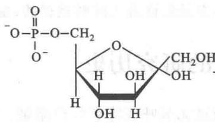  
6-磷酸果糖
(fructose-6-phosphate)

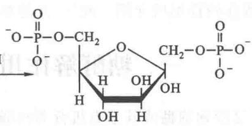  
1,6-二磷酸果糖
(fructose -1,6-bisphosphate)

这些磷酸糖酯是怎样形成的？又是怎样转变成乙醇和 $CO_{2}$ 的？阐明这些问题又经历了几十年的光景，通过不同国别科学家的共同努力才得以解决。在阐明发酵机制的过程中，越来越多的证据表明，酵母菌的榨液使葡萄糖发酵的过程和肌肉浸出液利用葡萄糖发生的酵解作用，是几乎完全相似的过程。除去产物有些差异外，其余过程都是一致的。这就更有利于互相参照阐明其全过程的机制。

Harden 和 Young 还发现,酵母榨液经透析后就失去了发酵能力。向透析剩下的液体中加入少量透析液或煮沸过的使酶失活的榨液,发酵能力就得到恢复。这表明,酵母菌榨液包括两类重要物质,一类是不耐热的、不能透析的酶,命名为发酵酶(zymase),另一类是耐热的、可以透析的物质,命名为发酵辅酶(co-zymase)。发酵作用依靠这两种物质组合而成。发酵酶是催化葡萄糖发酵的。发酵辅酶是酶发挥作用所必需的,后来又进一步证明了发酵辅酶实际是烟酰胺腺嘌呤二核苷酸(NAD,或称辅酶I)和腺嘌呤核苷酸的混合物、此外还有 ADP、ATP 以及金属离子。

当认清以上这些物质的存在后,将它们分别加入到透析残余物中,对深入探讨发酵机制起到重要的作用。此外，在实验过程中还发现了许多化学物质具有阻滞发酵进行的作用。这些物质可以导致某些发酵中间产物的积累。这对阐明发酵机制也起到重要的作用。例如，实验证明氟化物（fluoride）抑制发酵液的发酵过程，造成3-磷酸甘油酸和2-磷酸甘油酸的积累。碘乙酸（iodoacetate）造成1,6-二磷酸果糖的积累。这些物质得到明确以后，大大促进了对这些物质产生机制的研究。

以上这些基本的研究,以及随后发现的,肌肉提取液能使葡萄糖发生酵解作用而产生乳酸的研究,都促使20世纪30年代德国生物化学家对酵解的更加深入地研究。贡献最显著的是Gustav Embden。他提出1,6-二磷酸果糖裂解的形式以及随后的步骤。还有Otto Meyerhof,他对Embden提出的假设作了合理修改,而且研究了酵解作用的能力学。由于他们的重要贡献,从葡萄糖开始至产生丙酮酸的过程常常被称为Embden-Meyerhof途径。他们将肌肉中由葡萄糖形成乳酸的过程称之为酵解过程。

此外，在酵解的研究中做出重要贡献的科学家还应举出德国的 Otto Warburg, Garl Neuberg, 美国的 Carl Cori 和 Gerty Cori 以及波兰的 J. Parnas 等人。

可以说,糖酵解的各个步骤在20世纪60年代就已经很清楚了。但对糖酵解的深入研究,例如对有关酶的结构与功能的研究,还在不断深入地进行着。

从以上的研究中可以看出,发酵(fermentation)是最早研究的,由酵母菌将葡萄糖转化为酒精的过程。而酵解这一名词最初是来自动物肌肉利用葡萄糖最后转化为乳酸的过程。

但是,经过广泛的研究表明:它们的基本途径都是一致的,只存在极小的差异。除在产物上可能有所差别(例如乙醇和乳酸)外,在不同种属和不同类型细胞之间还可能存在同工酶以及不同的调节方式。当前人们将葡萄糖降解产生丙酮酸这一段过程称为糖酵解过程或酵解过程。

## 二、糖酵解过程概述

从历史的叙述中,已经可以明了,糖酵解是葡萄糖转变为丙酮酸的一系列反应。酵解过程的生物学意义在于,它是在不需要氧供应的条件下,产生 ATP 的一种供能方式。

在详细探讨酵解的全过程之前,不妨先从葡萄糖骨架的变化得到一些粗略的概念。

对于酵解过程,由葡萄糖经历丙酮酸最后生成乳酸,其碳原子的变化可作如下的概括:

$$
\begin{array}{r l r}{\mathrm{C-C-C-C-C-C}}&{\rightarrow}&{\mathrm {C - C - C + C - C - C \rightarrow CH_ {3} CH(OH)COO^ {-} + CH_ {3} CH(OH)COO^ {-}}}\\{1 2 3 4 5 6}&&{1 2 3 4 5 6}\\{\text {葡萄糖(六碳糖)}}&&{\text {三碳糖} \quad \text {三碳糖} \quad \text {乳酸} \quad \text {乳酸}}\end{array}
$$

对于发酵作用产生的酒精(又简称酒精发酵),其碳原子的变化情况如下:

C—C—C—C—C—C → C—C—C + C—C—C → $CH_{3}$ — $CH_{2}OH$ + $CO_{2}$ + $CH_{3}$ — $CH_{2}OH$ + $CO_{2}$ 1 2 3 4 5 6
葡萄糖(六碳糖)
三碳糖
三碳糖
乙醇
乙醇

有了碳骨架变化的概念之后,再来看看酵解和酒精发酵作用,包括其形成 ATP 的反应式。酵解作用的反应式:

$$
\begin{array}{l l}\mathrm{C} _ {6} \mathrm{H} _ {1 2} \mathrm{O} _ {6} + 2 \mathrm{Pi} + 2 \mathrm{ADP} \rightarrow 2 \mathrm{CH} _ {3} \mathrm{CH(OH)COO} ^ {-} + 2 \mathrm{ATP} + 2 \mathrm{H} _ {2} \mathrm{O} + 2 \mathrm{H} ^ {+}\\\text {葡萄糖}&\text {无机磷酸} \quad \text {乳酸}\end{array}
$$

酒精发酵作用的反应式：

$$
\mathrm{C} _ {6} \mathrm{H} _ {1 2} \mathrm{O} _ {6} + 2 \mathrm{Pi} + 2 \mathrm{ADP} \rightarrow 2 \mathrm{CH} _ {3} \mathrm{CH} _ {2} \mathrm{OH} + 2 \mathrm{ATP} + 2 \mathrm{H} _ {2} \mathrm{O} + 2 \mathrm{CO} _ {2}
$$

从能量观点出发,可以把酵解过程划分为两个方面。一方面从葡萄糖转变为乳酸是物质的分解过程,其中伴随有自由能的释放。即放能过程。另一方面 ADP 和无机磷酸形成 ATP,则是吸收能量的过程:

$$
\text { 葡   萄   糖 } \rightarrow 2 \text { 乳   酸 } \quad \Delta G _ {1} ^ {\ominus^ {\prime}} = - 1 9 6. 7 \mathrm{kJ/mol} (- 4 7. 0 \mathrm{kcal/mol}) (\text { 放   能   过   程 })
$$

$$
2 \mathrm{ADP} + 2 \mathrm{Pi} \rightarrow 2 \mathrm{ATP} + \mathrm{H} _ {2} \mathrm{O} \quad \Delta G _ {2} ^ {\ominus^ {\prime}} = 2 \times 7. 3 0 = + 6 1. 1 \mathrm{kJ/mol(+14.6kcal/mol)} (\text {吸能反应})
$$

总括上述能量反应。由葡萄糖形成乳酸过程的总能量变化为：

$$
\Delta G _ {\mathrm{总}} ^ {\ominus \prime} = \Delta G _ {1} ^ {\ominus \prime} + \Delta G _ {2} ^ {\ominus \prime} = - 4 7. 0 + 1 4. 6 = - 1 3 5. 5 6 \mathrm{kJ/mol(-32.4kcal/mol)}
$$

因此，从酵解的总能量变化来考虑，可知这是一个放能过程。其中由形成ATP捕获的能量所占释放全部能量的百分比为 $14.6 / 47.4 \times 100\% = 31\%$ 。但在细胞内，真正的反应物和产物浓度并不是标准状况下的 $1.0 \mathrm{~mol} / \mathrm{L}$ ，而是低许多倍。这样计算起来，酵解的实际效益远不只 $31\%$ 。由于酵解所释放的净能量为 $-135.56 \mathrm{~kJ} / \mathrm{mol}(-32.4 \mathrm{kcal} / \mathrm{mol})$ ，因此酵解过程实际是一个不可逆的（irreversible）反应过程。但在全部过程中，大多数反应步骤的标准自由能变化差异并不大。因此，这类反应的逆反应也可用于葡萄糖在细胞内的再合成。

应该引起注意的是:糖酵解过程由葡萄糖到所有的中间产物都是以磷酸化合物的形式来实现的。中间产物磷酸化至少有三种意义:①带有负电荷的磷酸基团使中间产物具有极性,从而使这些产物不易透过脂膜而失散;②磷酸基团在各反应步骤中,对酶来说,起到信号基团的作用,有利于与酶结合而被催化;③磷酸基团经酵解作用后,最终形成ATP的末端磷酸基团,因此具有保存能量的作用。

糖酵解过程从葡萄糖到形成丙酮酸共包括10步反应，可划分为两个主要阶段。前5步为准备阶段，葡萄糖通过磷酸化、异构化裂解为三碳糖。每裂解一个己糖分子，共消耗2分子ATP。使己糖分子的1,6位磷酸化。磷酸化的己糖裂解和异构化，最后形成一个共同中间物即3-磷酸甘油醛。

后 5 步为产生 ATP 的贮能阶段。磷酸三碳糖转变成丙酮酸。每分子三碳糖产生 2 分子 ATP。整个过程需要 10 种酶。这些酶都存在于胞质溶胶中，大部分过程都有 $Mg^{2+}$ 离子作为辅助因子。

## 三、糖酵解和酒精发酵的全过程图解

前面已经提到,酵解和酒精发酵基本路线完全相同,只是在形成丙酮酸以后才有差异。丙酮酸转化为乳酸时称为酵解;丙酮酸转化为乙醛、乙醇时,称为发酵。图17-1列出酵解和发酵化学过程的总貌。关于每步化学反应的机制,将在下一节中详细讨论。

## 四、糖酵解第一阶段的反应机制

前面已经提到糖酵解的第一阶段是酵解的准备阶段,包括5步反应,以下逐步进行讨论。

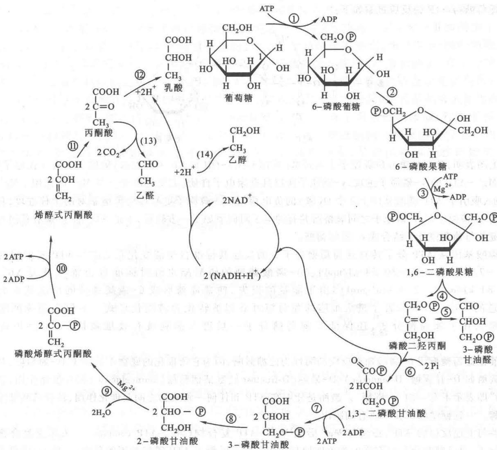  
图17-1 糖酵解和发酵的全过程

注：图中P代表磷酰基（磷酸基团），Pi代表无机磷酸，括号内数字代表催化相应反应的酶如下：①己糖激酶（hexokinase）或葡糖激酶（glucokinase）；②磷酸己糖异构酶（phosphohexose isomerase）；③磷酸果糖激酶-1（phosphofructokinase 1, PFK1）；④醛缩酶（aldolase）；⑤磷酸丙糖异构酶（triose phosphate isomerase）；⑥磷酸甘油醛脱氢酶（glyceraldehyde phosphate dehydrogenase）；⑦磷酸甘油酸激酶（phosphoglycerate kinase）；⑧磷酸甘油酸变位酶（phosphoglycerate mutase）；⑨烯醇化酶（enolase）；⑩丙酮酸激酶（pyruvate kinase）；⑪非酶促反应；⑫乳酸脱氢酶（lactate dehydrogenase）；⑬丙酮酸脱羧酶（pyruvate decarboxylase）；⑭乙醇脱氢酶（alcohol dehydrogenase）

## （一）葡萄糖的磷酸化

葡萄糖发生酵解作用的第一步是 D-葡萄糖分子在第 6 位的磷酸化,形成 6-磷酸葡糖(glucose-6-phosphate),可简写为 G6P。这是一个磷酸基团转移的反应,即 ATP 的 $\gamma$ -磷酸基团在己糖激酶(hexokinase)的催化下,转移到葡萄糖分子上。这个反应必须有 $Mg^{2+}$ 的存在。反应式如下:

葡萄糖与 ATP 的反应机制如下：

上图表明,葡萄糖第6位碳原子上的羟基[可用C(6)-OH或C6-OH表示]氧原子上有一孤电子对,它向 $Mg^{2+}-ATP$ 的γ-磷原子进攻,γ-磷原子所以具有亲电子性质,主要是由于2价 $Mg^{2+}$ 的作用。 $Mg^{2+}$ 如图所示,吸引了ATP磷酸基团上2个O(氧)的负电荷,使γ-磷原子更易接受孤电子对的亲核进攻,其结果促使γ-磷原子与β-磷原子之间氧桥所共有的电子对向氧原子一方转移,于是ATP的γ-磷酸基团与氧桥断键并与葡萄糖分子结合成6-磷酸葡糖。

磷酸基团从 ATP 分子转移到葡萄糖分子上的反应其标准自由能变化是 $\Delta G^{\ominus'}$ (ATP 酸酐键的水解) = -7.3 kcal/mol (-30.54 kJ/mol)。6-磷酸葡糖的磷酸酯水解时标准自由能变化是 $\Delta G^{\ominus'} = -13.81$ kJ/mol (-3.3 kcal/mol)。由于能量的损失，使葡萄糖形成 6-磷酸葡糖的反应基本上是不可逆的。这一反应保证了进入细胞的葡萄糖可立即被转化为磷酸化形式。不但为葡萄糖随后的裂解活化了葡萄糖分子，还保证了葡萄糖分子一旦进入细胞就有效地被捕获，不会再透出胞外。

催化葡萄糖形成6-磷酸葡糖反应的酶称为己糖激酶，因为它所催化的底物不只限于D-葡萄糖，对其他六碳糖如D-甘露糖（D-mannose）、D-果糖（D-fructose）、氨基葡萄糖（aminoglucose）都有催化作用，字头“hexo”即表示不专一的“六碳糖”。激酶是能够在ATP和任何一种底物之间起催化作用，转移磷酸基团的一类酶。六碳糖激酶存在于所有细胞内。

参与上述反应的 ATP, 必须与 $Mg^{2+}$ 形成 $Mg^{2+}-ATP$ 复合物 ( $Mg^{2+}-ATP$ complex)。未形成复合物的 ATP 分子, 对己糖激酶反而有强的竞争性抑制作用。 $Mg^{2+}$ 屏蔽了 ATP 磷酸基团的负电荷, 使 $\gamma-$ 磷原子更容易接受来自于葡萄糖 C6 位 -OH 上孤电子对的亲核进攻。由图 17-2 可看出, 在未与葡萄糖结合之前, U 形的己糖激酶分子分成大小不等的两个亚基, 处于非活性状态。当与葡萄糖和 $Mg^{2+}-ATP$ 结合后, 诱导

酶分子构象发生变化,符合诱导契合的理论,即两个亚基相互靠近,恰好使 ATP 分子和葡萄糖 C6 位-OH 靠拢,同时阻断溶剂中水分子进入活性位点水解 ATP。

己糖激酶是一种调节酶。它催化的反应产物6-磷酸葡糖和ADP能使该酶受到变构抑制。但葡糖激酶却不受6-磷酸葡糖的抑制。它对葡萄糖的米氏常数 $K_{m}(5\sim10\ \text{mmol/L})$ 比己糖激酶的 $K_{m}$ 值(0.1 mmol/L)大得多。因此当葡糖浓度相当高时，葡糖激酶才起作用。当血液中和肝细胞内游离葡萄糖的浓度增高时，它催化葡萄糖形成6-磷酸葡糖，该物质是葡萄糖合成糖原的中间物，由肝合成糖原。

随着电泳技术的发展,从动物组织中分离得到4种电泳行为不同的己糖激酶,分别称为Ⅰ、Ⅱ、Ⅲ、Ⅳ型。它们在机体的分布情况不同,催化的性质也不完全相同。Ⅰ型主要存在于脑和肾中,Ⅱ型存在于骨骼和心肌中,Ⅲ型存在于肝和肺中,Ⅳ型只存在于肝中。Ⅰ、Ⅱ、Ⅲ型酶大都存在于基本不能合成糖原的组织中。无机磷酸有解除6-磷酸葡糖和ADP对Ⅰ、Ⅱ、Ⅲ型酶抑制的作用。Ⅰ型酶对无机磷酸最为敏感。这和脑细胞需要保持一定的酵解速度以维持能量的需要有关，只要有少量的无机磷酸存在，就能解除6-磷酸葡糖的抑制作用，使酵解中间物维持在一定水平。Ⅱ型酶由于对无机磷酸远不及Ⅰ型敏感，当肌肉处于静息状态时，并不要求高的酵解速度，而是受6-磷酸葡糖的抑制，使酵解速度保持低的水平。此外，Ⅰ型酶还可由柠檬酸激活。Ⅳ型酶（葡糖激酶）在动力学性质和调节性质方面与其他形式的己糖激酶不同，对葡萄糖有更高的特异性，它的合成受胰岛素(insulin)的诱导，使肝中的酶Ⅳ维持在较高的水平。当肝细胞损伤或患糖尿病时，此酶的合成速度降低，不仅糖的合成受阻碍，糖的降解也受影响。肝细胞内也有专一性不强的己糖激酶，存在于肝细胞线粒体和细胞溶胶两部分。结合于线粒体上的酶，活性较高。肝细胞内己糖激酶的分布受到某些条件的调节，例如6-磷酸葡糖和无机磷酸等。酶的区域性分布，是机体对酶活性调控的一种方式。

  
图17-2 己糖激酶与底物结合产生“诱导契合”构象变化

## （二）6-磷酸葡糖异构化形成6-磷酸果糖

由 6-磷酸葡糖异构化形成 6-磷酸果糖的反应式如下：

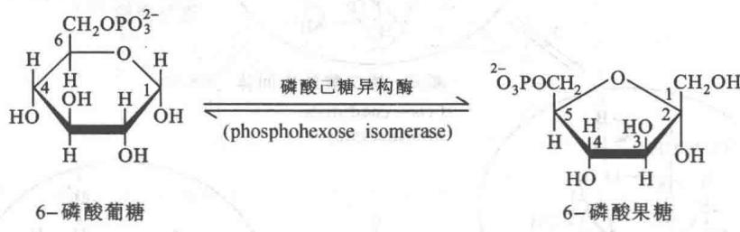

这一反应的标准自由能变化是极其微小的， $\Delta G^{\ominus'} = 1.67 \mathrm{~kJ} / \mathrm{mol}(0.4 \mathrm{kcal} / \mathrm{mol})$ 。因此，这一反应是可逆的。在正常情况下，6-磷酸葡糖和6-磷酸果糖保持或接近平衡状态。在这一反应中葡萄糖C1位上的羰基（成环后的半缩醛基），不像C6位上的羟基那样容易磷酸化，所以下一步反应是使葡萄糖分子发生异构化。这就是葡萄糖的羰基从C1位转移到C2位，使葡萄糖分子由醛式转变成酮式的果糖，其C1位上即形成了自由羟基。6-磷酸葡糖和6-磷酸果糖的存在形式都是以环式为主，而异构化反应需以开链形式进行。

异构化形成的 6-磷酸果糖随后又形成环状结构。

催化这一反应的酶称为磷酸葡糖异构酶(phosphoglucose isomerase)。当前对该酶的催化机制已作出如下的解释：

从实验获得的信息表明,该酶活性部位的催化残基可能为赖氨酸(Lys)和组氨酸(His)。催化反应的实质包括一般的酶促酸-碱催化机制。如图17-3所示。

图 17-3 的第 1 步反应为: 酸性催化开环。图中的 $-B^{+}-H$ 是一例, 可代表酶分子上的 Lys 残基即 $\varepsilon-$ 氨基 $(\varepsilon-NH_{3}^{+})$ 吸引 O-C1 中间的电子对, 于是引起断键, 开环。

第2步反应为:酶分子上的碱,例如 His 的咪唑环,取掉 C2 上的质子(这个质子由于它处在羰基的 $\alpha$ 位,所以具有酸性)形成了 cis-烯二醇,(HO—C=C—OH)的中间体。

  
图17-3 磷酸葡糖异构酶催化的反应机制  
外环表示酶分子的活性部位,其中有两个起催化作用的氢基酸残基: $B^{+}H$ 代表Lys, $\ddot{B}'$ 代表His

第 3 步反应为: C1 上质子的取代, 是一个全盘的质子转移。被碱性基所吸引的质子是很不稳定的。它迅速地与溶剂的质子进行交换。其结果可以看成: C2 上的质子进行了分子内的质子转移, 移到了 C1 位。这个机制曾使用 ${}^{3}$ H 进行实验得到证明。

第 4 步反应为: 关环, 形成最终产物。

磷酸葡糖异构酶有绝对的底物专一性和立体专一性(stereospecificity)。6-磷酸葡糖酸(6-phosphogluconate,6PG)、4-磷酸赤藓糖(erythrose-4-phosphate,E4P)、7-磷酸景天庚酮糖(sedoheptulose-7-phosphate,S7P)等对磷酸葡糖异构酶都是竞争性抑制剂。上述的三种糖类磷酸化合物都是五碳糖磷酸途径(pentosephosphate pathway)的代谢中间物。

## （三）6-磷酸果糖形成1,6-二磷酸果糖

这一步是糖降解或酒精发酵过程中的第二个磷酸化反应。也是糖酵解过程使用第二个 ATP 分子的反应。6-磷酸果糖被 ATP 进一步磷酸化形成 1,6-二磷酸果糖。该化合物的英文名称为 fructose -1,6-bisphosphate，它的旧名称为 fructose -1,6-diphosphate。把“diphosphate”，变为“bisphosphate”的原因：“bisphosphate”表示两个磷酸基团是互相分离的，而“diphosphate”表示两个磷酸基团是相连的。例如腺苷二磷酸的英文名称为“adenosin diphosphate”。腺苷二磷酸中的两个磷酸基团是以酸酐键（anhydride bond）相连的。由 6-磷酸果糖形成 1,6-二磷酸果糖的反应式如下：

在这一反应中，ATP 酸酐键的水解和 1,6-二磷酸果糖在其碳 1 位上形成磷酯键的两个反应 $\Delta G^{\ominus\prime} = -14.23 \, \text{kJ/mol} (-3.4 \, \text{kcal/mol})$ ，因此该反应是不可逆反应。

催化此反应的酶称为磷酸果糖激酶（phosphofructokinase, PFK）。该酶需要 $Mg^{2+}$ 参加反应，其他 2 价金属离子虽然也有一定作用，但以 $Mg^{2+}$ 的作用最为显著。

该酶的催化机制和己糖激酶催化的反应机制基本一致。可用图 17-4 表示：

  
图17-4 6-磷酸果糖与ATP的结合机制

上图表明,6-磷酸果糖第1个碳原子上的羟基 $\left[\mathrm{C}(1)-\mathrm{OH}\right]$ 氧原子的孤电子对向 $Mg^{2+}-ATP$ 的 $\gamma-$ 磷原子进行亲核进攻,导致 $\gamma-$ 磷原子与 $\beta-$ 磷原子之间氧桥的共用电子对向氧原子转移,从而断键,于是6-磷酸果糖与 $\gamma-$ 磷酸基团结合而形成1,6-二磷酸果糖。

磷酸果糖激酶是一种变构酶(allosteric enzyme)。它的催化效率很低,糖酵解的速率严格地依赖该酶的活力水平。它是哺乳动物糖酵解途径最重要的调控关键酶,该酶由4个亚基组成,是一个四聚体(tetramer)。由肝提取的酶相对分子质量为340 000。该酶的活性受到许多因素的控制。例如,肝中的磷酸果糖激酶受高浓度ATP的抑制。ATP可降低该酶对6-磷酸果糖的亲和力。ATP对该酶的变构效应是由于ATP结合到酶的一个特殊的调控部位上,调节部位不同于催化部位。但是ATP对该酶的这种变构抑制效应可被AMP解除。因此ATP/AMP的比例关系对此酶也有明显的调节作用。特别是 $H^{+}$ 浓度对该酶活性的影响。当pH下降时, $H^{+}$ 对该酶有抑制作用。在生物体内这种抑制作用具有重要的生物学意义。因为通过它可以阻止整个酵解途径的继续进行,从而防止乳酸的继续形成;这又可防止血液pH的下降,有利于避免酸中毒(acidosis)。

从兔分离得到的磷酸果糖激酶,发现有三种同工酶,分别称为磷酸果糖激酶 A、B、C。同工酶 A 存在于心肌和骨骼中,同工酶 B 存在于肝和红细胞中,同工酶 C 存在于脑中。这三种同工酶对影响酶活力的不同因素反应各异。例如,A 型对磷酸肌酸(phosphocreatine)、柠檬酸和无机磷酸的抑制作用最敏感,B 型对 2,3-二磷酸甘油酸(2,3-bisphosphoglycerate,BPG)的抑制作用最敏感,C 型对腺嘌呤核苷酸的作用最敏感。

通过上述的三个步骤,从葡糖磷酸化开始到形成1,6-二磷酸果糖,可以说为下一步的分子裂解完成了条件准备。

## （四）1,6-二磷酸果糖转变为3-磷酸甘油醛和磷酸二羟丙酮

这是一个由六碳糖——1,6-二磷酸果糖裂解为两个三碳糖的反应过程。1,6-二磷酸果糖在醛缩酶（aldolase）的作用下发生裂解反应生成一分子磷酸二羟丙酮（dihydroxyacetone phosphate）和一分子3-磷酸甘油醛（glyceraldehyde-3-phosphate）：

上述反应的机制请参看第19章。前面已经提到，醛缩酶的名称来自于该酶所催化的逆反应。由1,6-二磷酸果糖裂解为磷酸二羟丙酮和3-磷酸甘油醛的 $\Delta G^{\ominus'} = 23.97\mathrm{kJ / mol(+5.73kcal / mol)}$ 。可以理解，在标准状况下，这一反应是向缩合的方向，即自右向左进行。但在细胞内的条件下，该反应却是很容易地自左向右进行，即向裂解的方向进行。如果细胞内产生的1,6-二磷酸果糖的浓度为 $0.1\mathrm{mmol / L}$ ，根据计算有 $53.9\%$ 即被醛缩酶所裂解。

醛缩酶有两种不同的类型。高等动、植物中的醛缩酶称为Ⅰ型，从肌肉中分离出来的醛缩酶相对分子质量为160 000，含有4个亚基。分子内有数个游离的一SH基。游离的一SH基是酶催化活性所必需的。醛缩酶Ⅰ型又有三种同工酶。分别称为醛缩酶A、B、C。醛缩酶A主要存在于肌肉中，醛缩酶B主要存在于肝脏，醛缩酶C主要存在于脑组织。这三种醛缩酶都由氨基酸组分不同的四个多肽链构成。

第Ⅱ种类型的醛缩酶主要存在于细菌、酵母、真菌以及藻类中。它和第Ⅰ种类型的区别在于，含有2价金属离子。通常是 $Zn^{2+}$ 、 $Ca^{2+}$ 或 $Fe^{2+}$ ，也需要 $K^{+}$ 。它的相对分子质量约为65000，只相当于动、植物中醛缩酶的一半左右。它的催化机制也和Ⅰ型不同。下面重点讨论醛缩酶Ⅰ型的催化步骤。

该酶的催化步骤可分为5步,如图17-5所示。

图 17-5 表明,醛缩酶类型 I (class I) 的第 1 步反应是酶和底物的结合。第 2 步反应是 1,6-二磷酸果糖的羰基与酶活性部位赖氨酸的 ε-氨基发生反应,形成一个亚胺阳离子,即质子化的西佛碱。第 3 步反应 C3 和 C4 发生醇醛断裂形成酶的烯胺 (enamine) 中间体并释放出 3-磷酸甘油醛 (GAP)。亚胺离子比前体羰基的氧原子更容易拉电子,因此 C3 和 C4 间的共价键电子对也被吸引,促使醇醛断裂的催化反应发生。第 4 步是西佛氏碱的烯胺发生互变异构,形成了亚胺阳离子。第 5 步是亚胺水解放出磷酸二羟丙酮后,又形成了游离的酶。

酶分子活性部位的半胱氨酸和组氨酸残基在酶的催化反应中,相当酸和碱的作用。它们有增强质子转移的作用。

## （五）磷酸二羟丙酮转变为3-磷酸甘油醛

1,6-二磷酸果糖裂解后形成的两分子三碳糖磷酸中，只有3-磷酸甘油醛能继续进入糖酵解途径，磷酸二羟丙酮必须转变为3-磷酸甘油醛才能进入糖酵解途径。磷酸丙糖异构酶(triose phosphate isomerase)正是担负这一转变的酶(图17-6)。在该酶催化下，磷酸二羟丙酮和3-磷酸甘油醛可以互变，它们之间正是醛酮化合物的互变异构关系，正像6-磷酸葡糖和6-磷酸果糖的互变所以可能实现，是因为它们通过一个共同中间体即顺式-单烯二羟负离子中间体(cis-enediolate intermediate)(参看第19章代谢中的有机反应机制)

在探讨葡萄糖分子的碳原子和2分子3-磷酸甘油醛碳原子之间的关系中发现,葡萄糖分子的第3、4位碳原子形成了2分子3-磷酸甘油醛的醛基碳原子,葡萄糖分子的第1、6位碳原子形成了3-磷酸甘油醛分子上的第3位碳原子。

磷酸二羟丙酮和3-磷酸甘油醛的互变异构关系如图17-7所示。

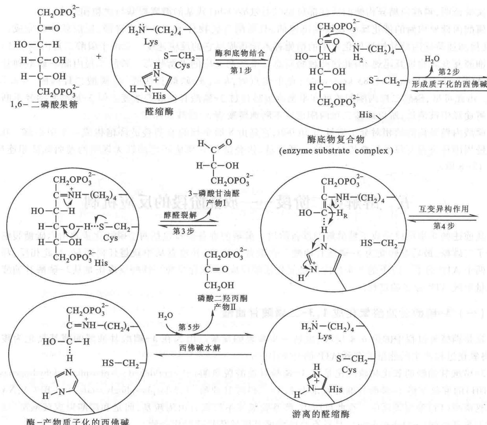  
图 17-5 醛缩酶类的反应机制  
图中圆圈代表酶的活性部位，圈内赖氨酸（Lys）、组氨酸（His）和半胱氨酸（Cys）三个残基直接参与酶的催化反应

  
图17-6 磷酸丙糖异构酶的结构图  
8 股 $\beta$ 折叠链构成中间的中心核, 8 股 $\alpha$ 螺旋链与 $\beta$ 折叠链相对应环绕在外 $\beta$ 折叠链周围, 两种不同型式的链条以无规肽链相连

  
图17-7 磷酸二羟丙酮和3-磷酸甘油醛的互变异构关系

实验证明,磷酸丙糖异构酶的活性部位是以谷氨酸(Glu)残基的游离羧基与底物相结合。

磷酸丙糖异构酶的催化反应是极其迅速的，只要酶与底物分子一旦相互碰撞，反应就即刻完成。因此，任何加速磷酸丙糖异构酶催化效率的措施都不能再提高它的反应速度。又由于磷酸二羟丙酮和3-磷酸甘油醛互变异构极其迅速，因此这两种物质总是维持在反应的平衡状态。磷酸二羟丙酮3-磷酸到甘油醛的 $\Delta G^{\ominus} = 7.7\mathrm{kJ / mol(+1.83kcal / mol)}$ ；在平衡点时， $K = [3 -$ 磷酸甘油醛]/[磷酸二羟丙酮] $= 4.73\times$ $10^{-2}$ 。由此可见，磷酸二羟丙酮的浓度在平衡点远远超过3-磷酸甘油醛的浓度。但3-磷酸甘油醛不断在糖酵解途径中被消耗，所以磷酸二羟丙酮也就不断地转变为3-磷酸甘油醛。

磷酸丙糖异构酶的相对分子质量为 56 000, 它是由 8 股平行的 β 折叠链环抱构成一个中心核。在 β 折叠链周围环绕着与每条折叠相对应的 α 螺旋链, 折叠链与 α 螺旋链之间以无规则的卷曲肽链相连接。如图 17-6 所示。

## 五、酵解第二阶段——放能阶段的反应机制

从前述的5步反应完成了糖酵解的准备阶段。酵解的准备阶段包括两个磷酸化步骤由六碳糖裂解为两分子三碳糖，最后都转变为3-磷酸甘油醛。在准备阶段中，并没有从中获得任何能量，与此相反，却消耗了两个ATP分子。以下的5步反应包括氧化还原反应、磷酸化反应。这些反应正是从3-磷酸甘油醛提取能量形成ATP分子的过程。

## (一) 3-磷酸甘油醛氧化成 1,3-二磷酸甘油酸

这是糖酵解过程中的第6步反应,也是一步重要的反应。因为在3-磷酸甘油醛的醛基氧化为羧基时,将氧化过程产生的能量贮存到ATP的分子中。

3-磷酸甘油醛的氧化和磷酸化是在3-磷酸甘油醛脱氢酶(glyceraldehyde-3-phosphate dehydrogenase, GAPDH)的催化下将3-磷酸甘油醛氧化为1,3-二磷酸甘油酸(1,3-bisphosphoglycerate,1,3-BPG),NAD $^{+}$ 和无机磷酸(Pi)参与该反应。在此反应中,醛基脱氢并不形成自由的羧基,而是和磷酸形成羧酸酐,这种酐称为酰基磷酸(acylphosphate),是具有高能磷酸基团转移势能的化合物。

3-磷酸甘油醛的氧化是放能反应,然而,磷酸酐键的形成是非常吸能的反应,两反应相偶联后的 $\Delta G^{\ominus'}=+6.28\ kJ/mol(+1.5\ kcal/mol)$ 。这表明,在标准状况下,整个反应是稍吸能的。但是下一步反应又是一个放能反应,这就使该反应可以顺利地进行。

## 1. 3-磷酸甘油醛脱氢酶的催化机制

3-磷酸甘油醛脱氢酶的反应机制可用图17-8表示。该酶的活性部位含有一个带游离巯基（一SH）的半胱氨酸。巯基是亲核体，它以解离形式向作为底物的醛分子中带电正性的羰基碳原子进攻，从而形成一个与酶分子结合着的半缩硫醛（hemithioacetal），这时醛分子上与原来羰基相连的氢原子就以氢负离子（ $\mathrm{:H^{-}}$ ）的形式离开羰基碳原子，也就是离开半缩硫醛，于是形成了还原的NADH和硫酯。同时释放出一个 $\mathrm{H^{+}}$ 。NADH一旦形成就立即从酶分子上解离下来，而氧化型的 $\mathrm{NAD^{+}}$ 又立即结合到酶分子上。随后磷酸分子又向硫酯进行亲核攻击，形成1,3-二磷酸甘油酸和游离的酶。和酶结合的硫酯是一种高能中间产物；1,3-二磷酸甘油酸也是一种高能磷酸酯。以上的反应机制可用图17-8所示。

从兔肌肉分离出的结晶酶其相对分子质量为 14 000, 含有 4 个相同的亚基。每个亚基由 330 个氨基酸残基组成。重金属离子和烷化剂如碘乙酸能抑制酶的活性。这成为推测酶的活性部位是否有巯基的有力证据。

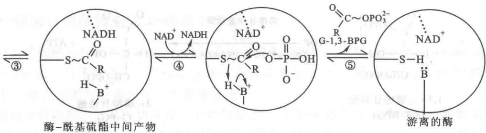  
图17-8 3-磷酸甘油醛脱氢酶的反应机制

①—S—H 的 H 为酸性（即荷正电），酶分子上的 B 的孤电子对向 H 进攻。②—S—H 形成—S：向醛分子的羰基 C 进攻形成半缩硫醛中间产物。③ 醛分子与原羰基相连的 H 原子以： $H^{-}$ 形式脱离，而与氧化型的 $NAD^{+}$ 结合形成 NADH 及硫酯。④ 被还原的 NADH 立即脱离酶分子，同时酶又结合上另一氧化型 $NAD^{+}$ 。⑤ 磷酸分子向硫酯进行亲核攻击，使硫酯键断键形成游离的 1,3-二磷酸甘油酸，同时酶又恢复原状

## 2. 砷酸盐 (arsenate) 破坏 1,3-二磷酸甘油酸的形成

砷酸盐 $\left(\mathrm{AsO}_{4}^{3-}\right)$ 在结构和反应方面都和无机磷酸极为相似,因此,能代替磷酸进攻硫酯中间产物的高能键,产生1-砷酸-3-磷酸甘油酸(1-arseno-3-phosphoglycerate)。其结构式如下:

  
1-砷酸-3-磷酸甘油酸
(1-arseno-3-phosphoglcerate)

砷酸化合物是很不稳定的化合物。它迅速地进行水解。其结果是:砷酸盐代替磷酸与3-磷酸甘油醛结合并氧化,生成的不是1,3-二磷酸甘油酸,而是3-磷酸甘油酸反应式如下:

在砷酸盐存在下,虽然酵解过程照样进行,但是却没有形成高能磷酸键。由3-磷酸甘油醛氧化释放的能量,未能与磷酸化作用相偶联而被贮存。因此砷酸盐起着解偶联的作用,即解除了氧化和磷酸化的偶联作用。

从以上事实得到的启发是,在生物分子的进化中,为什么选择了具有较大动力学稳定性的磷酸基团作

为递能基团，而不是砷酸。

## （二）1,3-二磷酸甘油酸转移高能磷酸基团形成 ATP

这一步反应是糖酵解过程的第7步反应,也是糖酵解过程开始收获的阶段。在此过程中产生了第一个ATP。

Warburg 等人证明, 1,3-二磷酸甘油酸 (1,3-bisphosphoglycerate, 1,3-BPG) 在磷酸甘油酸激酶 (phosphoglycerate kinase, PGK) 的催化下, 将其以高能酸酐键连接在碳 1 位 [C(1)] 上的高能磷酸基团转移到 ADP 分子上形成 ATP 分子。1,3-二磷酸甘油酸则转变为 3-磷酸甘油酸 (3-phosphoglycerate, 3-PG):

该反应的 $\Delta G^{\ominus'} = -18.83 \, \text{kJ/mol} (-4.50 \, \text{kcal/mol})$ ，是一个高效地放能反应，因此起到推动前一步反应顺利进行的作用。

磷酸甘油酸激酶分子的外观和己糖激酶极其相似。都由两叶构成，很像钳子，中间有很深的裂缝。活性部位在裂缝的底部。 $Mg^{2+}-ADP$ 结合位点在酶的一个结构域中。1,3-二磷酸甘油酸的结合部位在另一个结构域中，二者相距大约1 nm。当酶与底物结合后，酶的两个结构域合拢，使底物得以在无水的环境中发生反应。这种情况和己糖激酶的作用机制也非常相似。但它们的蛋白质组成却是完全不同的。磷酸甘油酸激酶(PGK)的催化机制可用图17-9表示。

  
图 17-9 磷酸甘油酸激酶(PGK)的催化机制  
在 ADP 和 ATP 分子中的 $Mg^{2+}$ 的位置是假设的, 实际上的 $Mg^{2+}$ 位置仍是未知的

由图 17-9 可见, ADP β 磷酸基团的氧原子向 1,3-二磷酸甘油酸 C1 位的磷(P)原子进行亲核攻击, 从而生成 ATP 和 3-磷酸甘油酸。

第 6 步和第 7 步反应构成能量偶联的过程,1,3-二磷酸甘油酸是两步反应共同的中间产物:它在第 6 步反应中形成,在第 7 步反应(放能反应)中磷酸基团转移到 ADP。两步反应的总和是:

$$
1, 3 - \text {   二磷酸甘油酸   } + \mathrm{ADP} + \mathrm{Pi} + \mathrm{NAD} ^ {+} \longrightarrow 3 - \text {   磷酸甘油酸   } + \mathrm{ATP} + \mathrm{NADH} + \mathrm{H} ^ {+}
$$

总反应的 $\Delta G^{\ominus'} = -12.5 \, kJ/mol$ ，是一个放能反应。细胞内实际自由能变化 $\Delta G$ 是由标准自由能变化 $\Delta G^{\ominus'}$ 和质量作用比（Q）决定的。对于第6步反应：

$$
\begin{array}{r l} \Delta G & = \Delta G ^ {\ominus \prime} + R T \mathrm{In} Q \\ & = \Delta G ^ {\ominus \prime} + R T \mathrm{In} \frac {[ 1 , 3 - \text {二磷酸甘油酸} ] [ \mathrm{NADH} ]}{[ 1 , 3 - \text {二磷酸甘油酸} ] [ \mathrm{Pi} ] [ \mathrm{NAD} ^ {+} ]} \end{array}
$$

请注意 $\left[\mathrm{H}^{+}\right]$ 不包含在Q中。在生物研究中， $\left[\mathrm{H}^{+}\right]$ 假定为常数 $(10^{-7}\mathrm{mol / L})$ ， $\Delta G^{\prime}$ 的定义中也包括此常数。步骤7消耗步骤6产生的1,3-二磷酸甘油酸，降低[1,3-二磷酸甘油酸]，从而减少整个能量偶联过程的Q值。当Q值小于1.0时，自然对数为负值。如果Q很小，对数值可以是 $\Delta G$ 变为负值。这一偶联反应在细胞内是可逆的，其结果是在醛基氧化为羧基时释放的能量可以通过ADP形成ATP的偶联反应而贮存。磷酸基团从底物如1,3-二磷酸甘油酸转移到ADP形成ATP，这被称为底物水平磷酸化（substrate-level phosphorylation）。

## （三）3-磷酸甘油酸转变为2-磷酸甘油酸

这一反应是糖酵解过程的第8步反应,该反应是由磷酸甘油酸变位酶(phosphoglycerate mutase)催化, $\Delta G^{\ominus'}=4.6\ kJ/mol$ 的。通常将催化分子内化学基团移位的酶称为变位酶(mutase)。由3-磷酸甘油酸转变为2-磷酸甘油酸是为酵解过程的下一步骤准备条件。

磷酸甘油酸变位酶的活性部位结合有一个磷酸基团。当3-磷酸甘油酸作为酶的底物结合到酶的活性部位后，原来结合在酶活性部位的那个磷酸基团便立即转移到底物分子上，形成一个与酶结合的二磷酸的中间产物，2,3-二磷酸甘油酸（2,3-bisphosphoglycerate,2,3-BPG），这个中间产物又立即使酶分子的活性部位再磷酸化，同时产生游离的2-磷酸甘油酸。

对上述反应机制的解释曾有以下的实验根据。

（1）磷酸甘油酸变位酶的催化机制需有2,3-二磷酸甘油酸作为引物，或者说是必需因素。

（2）将极少量用 $^{32}$ P标记的2,3-二磷酸甘油酸与酶一起保温发现，具有放射性的磷酸基团标记到酶的组氨酸残基上。

（3）用 X 射线观察酶的结构发现，在酶的活性部位 His8（第 8 位的组氨酸残基）上有放射性磷标记的磷酸基团。

上面的实验还有力地证明了与磷酸基团结合的残基是酶活性部位中第8位的组氨酸。

这里应该提及的是,上述的2,3-二磷酸甘油酸(2,3-BPG)不只在磷酸甘油酸变位酶的催化过程中起着重要的作用,在红细胞对氧的转运中还起着调节剂的作用。它使脱氧血红蛋白稳定化,从而降低血红蛋白对氧的亲和力。没有它,血红蛋白在通过组织的毛细血管时就很难脱下氧。2,3-二磷酸甘油酸在红细胞中的浓度极高,大约与血红蛋白具有相同的浓度,在其他的细胞中则只存在微量。

2,3-二磷酸甘油酸的合成和降解是糖酵解途径中的一个短支路(short detour)。全部反应可用下式表示：

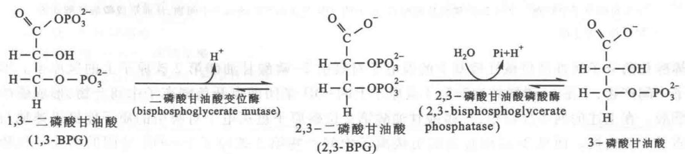

上述的两步反应几乎都是不可逆的。此外，2,3-二磷酸甘油酸是二磷酸甘油酸变位酶（bisphosphoglycerate mutase）强有力的竞争性抑制剂。2,3-二磷酸甘油酸的浓度不只决定于二磷酸甘油酸变位酶的活力，还决定于2,3-二磷酸甘油酸磷酸酶(2,3-bisphosphoglycerate phosphatase)的活力。一般将催化磷酸酯水解的酶总称为磷酸酶(phosphatase)。

催化 1,3-二磷酸甘油酸转变为 2,3-二磷酸甘油酸的二磷酸甘油酸变位酶的作用机制已了解得很清楚。该变位酶先同时结合 1,3-二磷酸甘油酸和 3-磷酸甘油酸，然后磷酸基团从 1,3-二磷酸甘油酸的 C1 上移位到 3-磷酸甘油酸的 C2 上。从化学计算上看不到 3-磷酸甘油酸的出现，但它却是磷酸基团转移的重要参加者，磷酸基团的转移情况可用图 17-10 表示。

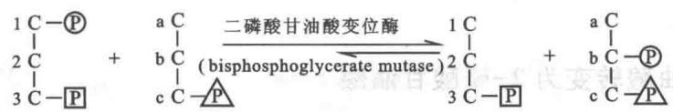  
1,3-二磷酸甘油酸 3-磷酸甘油酸 3-磷酸甘油酸 2,3-二磷酸甘油酸  
图 17-10 二磷酸甘油酸变位酶催化的磷酸基团转移反应

P、P、P代表不同碳原子上的磷酸基因，从不同的图形可看到磷酸基团转移的来龙去脉

## （四）2-磷酸甘油酸脱水生成磷酸烯醇式丙酮酸

这是酵解过程的第9步反应。这一反应是烯醇化酶(enolase)催化的。

烯醇化酶在与底物结合前先与2价阳离子如 $Mg^{2+}$ 或 $Mn^{2+}$ 结合形成一个复合物，才有活性。烯醇化酶的催化作用可用图17-11表示。

  
图17-11 烯醇化酶可能的反应机制

反应1:酶分子碱性残基用B:表示它的孤对电子吸引2-磷酸甘油酸C2上的H原子,使C2成为负碳离子,从而形成负碳离子中间物。反应2:2-磷酸甘油酸C(3)上的-OH基团离开负碳离子中间物,从而形成磷酸烯醇式丙酮酸和一分子水

烯醇化酶分子活性部位碱性残基上的孤电子对吸引2-磷酸甘油酸第2碳原子上的氢原子。形成负碳离子中间产物，于是2-磷酸甘油酸第3碳原子上的-OH基团即离开负碳离子中间产物，形成磷酸烯醇式丙酮酸。在上述的两步反应中，2-磷酸甘油酸第2位碳原子被孤电子对吸引的质子能极迅速地与溶剂中的质子相互交换。而且2-磷酸甘油酸负碳离子中间产物第3碳原子上—OH基团的消除是比较缓慢的。因此—OH 的消除速度是 2-磷酸甘油酸脱水形成磷酸烯醇式丙酮酸的限速步骤。用 $^{18}$ O 标记—OH 基团曾证明，放射性氧(O)从中间产物消除的速度和放射性 O 与溶剂互相交换的速度是相同的。

尽管该反应的标准自由能( $\triangle G^{\ominus'}=-7.6\ kJ/mol$ )变化相对较小,但是反应物和产物水解释放磷酰基团产生的标准自由能变化差别很大:2-磷酸甘油酸(低能磷酸酯)水解的标准自由能 $\triangle G^{\ominus'}$ 为-17.6 kJ/mol,磷酸烯醇式丙酮酸(高能磷酸酯)水解的标准自由能 $\triangle G^{\ominus'}=-61.9\ kJ/mol$ 。2-磷酸甘油酸失去一分子水使得分子内能量重新排布,从而导致磷酸酯水解的标准自由能增加。

烯醇化酶的相对分子质量为 85 000。氟化物是该酶强烈的抑制剂。其原因是，氟与镁和无机磷酸形成一个复合物，取代天然情况下酶分子上镁离子的位置，从而使酶失活。

## (五) 磷酸烯醇式丙酮酸转变为丙酮酸并产生一个 ATP 分子

这是糖酵解过程的第 10 步反应。是由葡萄糖形成丙酮酸的最后一步反应。催化此反应的酶称为丙酮酸激酶(pyruvate kinase)。反应式如下：

烯醇磷酸酯具有高的基团转移势能。磷酸基团由磷酸烯醇式丙酮酸转移到ADP上同时形成丙酮酸， $\Delta G^{\ominus \prime} = -31.38\mathrm{kJ / mol}$ ，是一个不可逆、高放能的反应。这是因为磷酸烯醇式丙酮酸水解的 $\Delta G^{\ominus \prime} = -61.9\mathrm{kJ}/$ mol，大约一半的能量以ATP（ $\Delta G^{\ominus \prime} = -30.5\mathrm{kJ / mol}$ ）形式贮存起来，剩余的能量用于推动ATP合成。

丙酮酸激酶的催化活性需要2价阳离子参与，如 $\mathrm{Mg}^{2+}$ 和 $\mathrm{Mn}^{2+}$ 。它是糖酵解途径中的一个重要变构调节酶(regulatory enzyme)。ATP、长链脂肪酸、乙酰-CoA、丙氨酸都对该酶有抑制作用；而1,6-二磷酸果糖和磷酸烯醇式丙酮酸对该酶都有激活作用。丙酮酸激酶的相对分子质量为250000，由四个相对分子质量为55000的亚基构成四聚体。该酶至少有三种不同类型的同工酶。在肝中占优势的称为L型。肌肉和脑中占优势的称为M型，其他组织中的称为A型。这些同工酶结构相似，但调控机制不同。

## 六、由葡萄糖转变为两分子丙酮酸能量转变的估算

由葡萄糖分解为两分子丙酮酸包括能量的产生可用下面的总反应式表示：

$$
\mathrm{葡萄糖} + 2 \mathrm{Pi} + 2 \mathrm{ADP} + 2 \mathrm{NAD} ^ {+} \rightarrow 2 \mathrm{丙酮酸} + 2 \mathrm{ATP} + 2 \mathrm{NADH} + 2 \mathrm{H} ^ {+} + 2 \mathrm{H} _ {2} \mathrm{O}
$$

从反应式中可一目了然,从一分子葡萄糖的降解到形成2分子丙酮酸的过程,净产生2分子ATP。在酵解过程中,ATP的消耗和产生可用表17-1作一概括;其每步反应的标准自由能和自由能的变化如表17-2所示。

表 17-1 酵解过程中 ATP 的消耗和产生

<table><tr><td>消耗或产生 ATP 的反应</td><td>每分子 ATP 葡萄糖 ATP 变化的分子数</td></tr><tr><td>葡萄糖→6-磷酸葡糖</td><td>-1</td></tr><tr><td>6-磷酸果糖→1,6-二磷酸果糖</td><td>-1</td></tr><tr><td>2×1,3-二磷酸甘油酸→2×3-磷酸甘油酸</td><td>+2</td></tr><tr><td>2×磷酸烯醇式丙酮酸→2×丙酮酸</td><td>+2</td></tr><tr><td>总计</td><td>+2</td></tr></table>

注：负号（-）代表消耗，正号代表产生。

表 17-2 糖酵解过程中各步反应的能量变化

<table><tr><td>反应内容</td><td>酶</td><td> $\Delta {G}^{\ominus }$  kcal(kJ)/mol</td><td> $\Delta G$  kcal(kJ)/mol</td></tr><tr><td>1.葡萄糖+ATP→6-磷酸葡糖+ADP+H+</td><td>己糖激酶</td><td>-0.4(-16.74)</td><td>-8.0(-33.47)</td></tr><tr><td>2.6-磷酸葡糖→6-磷酸果糖</td><td>磷酸己糖异构酶</td><td>+0.4(+1.67)</td><td>-0.6(-2.51)</td></tr><tr><td>3.6-磷酸果糖+ATP→1,6-二磷酸果糖+ADP+H+</td><td>磷酸果糖激酶-1</td><td>-3.4(-14.23)</td><td>-5.3(-22.18)</td></tr><tr><td>4.1,6-二磷酸果糖→磷酸二羟丙酮+3-磷酸甘油醛</td><td>醛缩酶</td><td>+5.7(+23.85)</td><td>-0.3(-1.25)</td></tr><tr><td>5.磷酸二羟丙酮→3-磷酸甘油醛</td><td>磷酸己糖异构酶</td><td>+1.8(+7.53)</td><td>+0.6(+2.51)</td></tr><tr><td>6.3-磷酸甘油醛+Pi+NAD+→1,3-二磷酸甘油酸+NADH +H+</td><td>磷酸甘油醛脱氢酶</td><td>+1.5(+6.28)</td><td>-0.4(-1.67)</td></tr><tr><td>7.1,3-二磷酸甘油酸+ADP→3-磷酸甘油酸+ATP</td><td>磷酸甘油酸激酶</td><td>-4.5(-18.83)</td><td>+0.3(+1.26)</td></tr><tr><td>8.3-磷酸甘油酸→2-磷酸甘油酸</td><td>磷酸甘油酸变位酶</td><td>+1.1(+4.60)</td><td>+0.2(+0.84)</td></tr><tr><td>9.2-磷酸甘油酸→磷酸烯醇式丙酮酸+H2O</td><td>烯醇化酶</td><td>+0.4(+1.67)</td><td>-0.8(-3.35)</td></tr><tr><td>10.磷酸烯醇式丙酮酸+ADP+H+→丙酮酸+ATP</td><td>丙酮酸激酶</td><td>-7.5(-31.38)</td><td>-4.0(-16.74)</td></tr></table>

注：上表中 $\Delta G^{\ominus}$ 和 $\Delta G$ 用 kcal/mol 和 kJ/mol 单位表示。实际的自由能变化 $\Delta G$ 是在正常生理条件下测得的反应物浓度和标准自由能 $\Delta G^{\ominus}$ 的数据计算所得

上表所示糖酵解各步反应的实际自由能变化,有三项其 $\Delta G$ 为正值。其中包括:磷酸丙糖变位酶催化的磷酸二羟丙酮转变为 3-磷酸甘油醛,磷酸甘油酸激酶催化的由 1,3-二磷酸甘油酸和 ADP 形成 3-磷酸甘油酸和 ATP,由磷酸甘油酸变位酶催化的 3-磷酸甘油酸转变为 2-磷酸甘油酸的反应。根据热力学原理,糖酵解过程只有在全部反应的值都为负值时才能进行。这些小的正值表明,细胞内进行着的酵解中间产物的浓度难于准确测得。

## 七、丙酮酸的去路

从葡萄糖到形成丙酮酸的酵解过程,在生物界都是极其相似的。丙酮酸以后的途径却随着机体所处的条件和发生在什么样的生物体中各不相同。在有氧条件下丙酮酸的转变这里不作讨论,请参看下面的章节,本章只讨论在无氧条件下丙酮酸的去路。

## (一) 生成乳酸

动物包括人,在激烈运动时或由于呼吸、循环系统障碍而发生供氧不足时,缺氧的细胞必须用糖酵解产生的 ATP 分子暂时满足对能量的需要。为了使 3-磷酸甘油醛继续氧化,必须提供氧化型的 $NAD^{+}$ 。丙酮酸作为 NADH 的受氢体,使细胞在无氧条件下重新生成 $NAD^{+}$ ,于是丙酮酸的羰基被还原,生成乳酸 (lactic acid 或 lactate)。反应式如下所示:

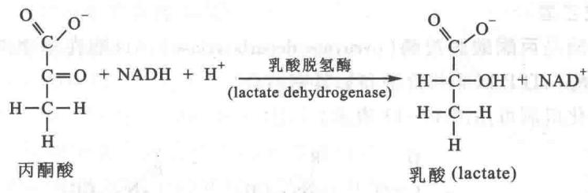

在无氧条件下,每分子葡萄糖代谢形成乳酸的总方程式如下:

$$
\begin{array}{c c} \mathrm{C} _ {6} \mathrm{H} _ {1 2} \mathrm{O} _ {6} + 2 \mathrm{ADP} + 2 \mathrm{Pi} & \longrightarrow 2 \mathrm{C} _ {3} \mathrm{H} _ {6} \mathrm{O} _ {3} + 2 \mathrm{ATP} + 2 \mathrm{H} _ {2} \mathrm{O} \\ \text {葡萄糖} & \text {乳酸} \end{array}
$$

由于糖酵解产生等摩尔的 NADH 和丙酮酸, 每分子葡萄糖所产生的 NADH 分子, 都可通过利用丙酮酸分子而重新被氧化。

催化上述反应的酶称为乳酸脱氢酶(lactate dehydrogenase, LDH)。

哺乳动物有两种不同的乳酸脱氢酶亚基。一种是 M 型（或称为 A 型），一种是 H 型（或称为 B 型）。这 2 种亚基类型构成 5 种同工酶： $M_{4}$ 、 $M_{3}H$ 、 $M_{2}H_{2}$ 、 $MH_{3}$ 、 $H_{4}$ 。所有这 5 种同工酶催化相同的反应。但每种同工酶都有对底物（丙酮酸和 NADH 或乳酸和 $NAD^{+}$ ）特有的 $K_{m}$ 值。 $M_{4}$ 和 $M_{3}H$ 型对丙酮酸有较小的 $K_{m}$ 值，也就是较高的亲和力。它们在骨骼肌和其他一些依赖糖酵解获得能量的组织中占优势。相反， $MH_{3}$ 和 $H_{4}$ 型对丙酮酸有较大的 $K_{m}$ 值，即较低的亲和力，它们在需氧的组织中占优势。例如，心肌中是 $H_{4}$ 型， $H_{4}$ 型对丙酮酸的亲和力最小。这确保了在心肌中丙酮酸不能转变为乳酸，而有利于丙酮酸脱氢酶（pyruvate dehydrogenase）的催化，使其朝有氧代谢方向进行

乳酸脱氢酶催化 NADH 被丙酮酸氧化为 $NAD^{+}$ 的过程，与其他由酶催化的 NADH 的氧化或 $NAD^{+}$ 的还原反应都具有绝对的立体专一性（stereospecificity）。在 NADHC(4) 上的 Pro-R(A-面) 的氢，立体特异地转移到丙酮酸 C(2) 位的 re 面，使丙酮酸形成 L-乳酸（也称为 S-乳酸）。这是带一对电子的质子（氢阴离子）的转移。这一氢阴离子是从烟酰胺环的对面（opposite face），直接转移到丙酮酸上的。这种情况和甘油醛磷酸脱氢酶在 3-磷酸甘油醛（GAP）转变为 1,3-二磷酸甘油酸的反应中，由 $NAD^{+}$ 还原为 $NADH + H^{+}$ 的反应方式是一致的，丙酮酸还原的机制，可用图 17-12 表示。

机体血液内乳酸脱氢酶同工酶的比例是比较恒定的。临床上利用测定血液中乳酸脱氢酶同工酶的比例关系作为诊断心肌、肝等疾患的重要指标之一。

  
图 17-12 乳酸脱氢酶的催化反应机制  
图中表明负氢离子从 NADH 直接向丙酮酸羰基转移的情况

生长在厌氧或相对厌氧条件下的许多细菌以乳酸为最终产物。这种以乳酸为终产物的厌氧发酵称为乳酸发酵。乳酸发酵在经济上是非常重要的。人们利用细菌对牛乳中乳糖的发酵生产奶酪、酸奶和其他食品。

## （二）生成乙醇

酵母在无氧条件下,将丙酮酸转变为乙醇和 $CO_{2}$ 。这一过程实际包括两个反应步骤。第一步是丙酮酸脱羧形成乙醛和 $CO_{2}$ , 第二步乙醛由 $NADH+H^{+}$ 还原生成乙醇同时产生氧化型 $NAD^{+}$ 。

## 1. 丙酮酸脱羧形成乙醛

催化这一步反应的酶是丙酮酸脱羧酶(pyruvate decarboxylase)。该酶在动物细胞中不存在。它以硫胺素焦磷酸(TPP)为辅酶。TPP以非共价键和酶紧密结合。

丙酮酸脱羧酶的催化机制可用图 17-13 表示。

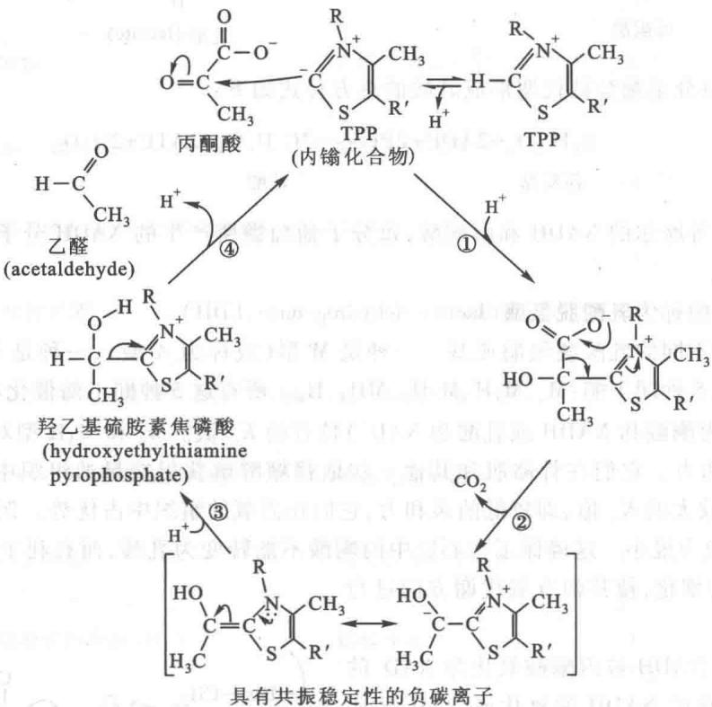  
图 17-13 丙酮酸脱羧酶的催化机制

图中表明① TPP 以内镝化合物形式对丙酮酸的羰基进行亲核攻击；② 羰基以 $CO_{2}$ 形式脱去形成共振稳定性的负碳离子；③ 负碳离子质子化；④ 脱去 TPP 的内镝化合物 (ylid) 和乙醛。注：内镝化合物是碳和其他元素间既有共价键又有离子键性质的化合物

丙酮酸脱羧酶需要 TPP 是因为丙酮酸为 $\alpha-$ 酮酸。它直接脱羧必然在羰基碳原子上产生电负性，羰基碳就形成一个负碳“陷阱”。这是极不稳定的状态，因此是根本不可能的。只有丙酮酸和 TPP 结合，经过图17-13所示的①、②、③、④比较稳定的中间过程才可以实现。经过这些过程乃避开了羰基碳形成带负电荷的“陷阱”。

TPP 的活性末端是一个噻唑环(thiazolium ring)。它第 2 碳原子上的氢,由于相邻的 4 价氮原子上正电荷的影响而具有相对酸性。氮原子上的正电荷使质子解离后形成的碳负离子得以稳定。这一两性负碳离子(是一个内镝离子,见图 17-13 之注)是 TPP 的活性形式。

丙酮酸脱羧酶催化的脱羧过程可归纳为4个反应步骤:第一步,TPP的内鎓离子对丙酮酸的羰基碳进行亲核攻击;第二步,释放出 $CO_{2}$ 并生成一个共振稳定的负碳离子加合物,在这个加合物上TPP的噻唑环起着电子陷阱的作用;第三步,负碳离子质子化;第四步,乙醛被释放出又形成游离的活性酶(图17-13)。

## 2. 乙醛还原成乙醇同时产生氧化型 $\mathrm{NAD}^{+}$

催化这一反应的酶是乙醇脱氢酶(alcohol dehydrogenase, ADH)。酵母乙醇脱氢酶(YADH)是含有4个亚基的四聚体。每个亚基结合一个NADH和一个 $Zn^{2+}$ 。 $Zn^{2+}$ 的作用是使乙醛的羰基极化，这可使处于反应中的中间态产生的负碳电荷比较稳定，从而对NADH Pro-R的氢原子的转移有促进作用。这一氢原子转移到乙醛的re-面上，从而产生一个氢原子在Pro-R位的乙醇分子。如图17-14所示：

乙醇发酵有很大的经济意义，在发面、制作面包和馒头，以及酿酒工业中起着关键性的作用。在酿醋工业上，微生物也是先在不需氧条件下形成乙醛而后在有氧条件下氧化为醋。

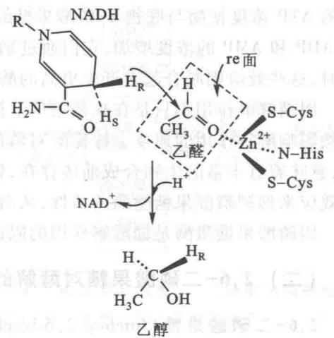  
图 17-14 乙醇脱氢酶催化反应机制  
图中表明 NADH Pro-R 的负氢离子定向地转移到乙醛的 re 面

## 八、糖酵解作用的调节

巴斯德在研究酵母的葡糖发酵中发现，在无氧条件下葡萄糖消耗的速率和总量比在有氧条件下高出很多。后来对肌肉的研究也表明，糖酵解速率在无氧和有氧条件下显示很大差异。这种“巴斯德效应（Pasteur effect）”的生化基础仍不清楚。在无氧条件下，糖酵解产生的ATP（1分子葡萄糖产生2分子ATP），比在有氧条件下葡萄糖彻底氧化为 $\mathrm{CO}_{2}$ 产生的ATP（1分子葡萄糖产生30或32分子ATP）要少得多。消耗相等量的葡萄糖，有氧条件下产生的ATP是无氧条件下的大约15倍。

细胞通过调节葡萄糖在糖酵解途径的流动而获得稳定的 ATP 水平(糖酵解中间物可用于后续生物合成)。对于糖酵解的短期调控(short-term regulation)，糖酵解速率的调节是通过 ATP 的消耗、NADH 的再生及变构调节酶（己糖激酶、磷酸果糖激酶-1 和丙酮酸激酶）之间的复杂相互作用而实现的。糖酵解速率的调节也依赖于可以反应细胞内 ATP 产出和消耗平衡的关键代谢物浓度的瞬时变化。对于糖酵解的长期调控(long-term regulation)，糖酵解速率受胰高血糖素、肾上腺素和胰岛素的调控。

## （一）磷酸果糖激酶是关键酶

在代谢途径中,催化基本上不可逆反应的酶所处的部位是控制代谢反应的有力部位。在糖酵解途径中由己糖激酶、磷酸果糖激酶和丙酮酸激酶催化的反应实际都是不可逆反应,因此,这三种酶都具有调节糖酵解途径的作用。它们的活性受到变构效应物(allosteric effectors)

可逆地结合以及酶共价修饰的调节。当然这些酶的量还根据代谢情况的需要受到转录的控制。酶的可逆的变构调控，磷酸化作用的调节以及转录的控制根据不同情况可在百万分之一秒、几秒或几小时内发生变化。

6-磷酸葡糖可以进入糖酵解途径或者进入其他代谢途径，包括糖原合成和磷酸戊糖途径。细胞通过磷酸果糖激酶PFK-1催化的不可逆反应将葡萄糖送入糖酵解途径。除了它的底物结合位点，该酶有多个别构激活因子或者抑制因子结合的调节位点。ATP不仅是PFK-1的底物，也是糖酵解途径的终产物。当细胞内ATP合成速度大于消耗速度，ATP通过结合到PFK-1别构调节位点并降低该酶与6-磷酸果糖的亲和力，从而抑制PFK-1的活性，从图17-15可看出，高的 ATP 浓度使酶与底物 6-磷酸果糖的结合曲线从双曲线形变为 S 形。当 ATP 的消耗超过合成时，导致 ADP 和 AMP 的浓度增加，它们通过别构调节减弱由 ATP 造成的抑制。当 6-磷酸果糖、ADP、AMP 积累时，这些效应则联合起来产生更高的酶活性。

  
图 17-15 ATP 对磷酸果糖激酶的变构调节作用表明高浓度 ATP 降低酶和底物的亲和力,从而降低反应速度

因糖酵解作用不只是在缺氧条件下提供能量,也为生物合成提供碳骨架,因此,碳骨架需要的情况也必然影响酵解作用的速度。柠檬酸对磷酸果糖激酶的抑制作用正具有这种意义。细胞内的柠檬酸含量高,意味着有丰富的生物合成前体存在,葡萄糖无需为提供合成前体而降解,柠檬酸是通过加强 ATP 的抑制效应来抑制磷酸果糖激酶的活性,从而使糖酵解过程减慢。

因磷酸果糖激酶是糖酵解作用的限速酶,因此,对此酶的调节是调节酵解作用的关键步骤。

## （二）2,6-二磷酸果糖对酵解的调节作用

2,6-二磷酸果糖（fructose-2,6-bisphosphate，F-2,6-BP）是1980年由Henri-GeryHers和EmileVanSchaftinggen新发现的酵解过程的调节物。它的结构如下：

  
2,6-二磷酸果糖  
(fructose-2,6-bisphosphate F-2,6-BP)

它是磷酸果糖激酶强有力的激动剂。在肝中，2,6-二磷酸果糖提高果糖激酶与6-磷酸果糖的亲和力并降低ATP的抑制效应。2,6-二磷酸果糖对磷酸果糖激酶的激活作用可用图17-16表示。

  
图 17-16 2,6-二磷酸果糖对磷酸果糖激酶的激活作用  
A. 加入 2,6-二磷酸果糖 1 $\mu$ mol/L 后，底物浓度对酶的活性影响由图中的 S 形变为双曲线形  
B. ATP浓度对酶的抑制效应当加入不同浓度的2,6-二磷酸果糖后受到不同的解除

实质上 2,6-二磷酸果糖是一个变构激活剂（allosteric activator）。它控制磷酸果糖激酶的构象转换，维持构象之间的平衡关系。

2,6-二磷酸果糖的形成是由磷酸果糖激酶-2(phosphofructokinase-2, PFK2)催化6-磷酸果糖，使其在C2位磷酸化而形成的。磷酸果糖激酶-2和磷酸果糖激酶(PFK)是两种不同的酶。它们的催化机制不同。2,6-二磷酸果糖的水解也是由一种特殊的磷酸酶，称为二磷酸果糖磷酸酶-2(fructose bisphosphatase 2, FBPase 2)催化的。水解的产物是6-磷酸果糖。有趣的是，这两种酶，即磷酸果糖激酶-2和二磷酸果糖磷酸酶-2，处于同一条单一的多肽链上，这条多肽链的相对分子质量为55000，也可以说这是一个具有双重功能的酶。

6-磷酸果糖有加速2,6-二磷酸果糖合成的作用，还有抑制该化合物被水解的作用。因此，高的6-磷酸果糖浓度可导致高浓度2,6-二磷酸果糖的形成。2,6-二磷酸果糖又进一步激活磷酸果糖激酶。这种过程称为前馈刺激作用（feedforward stimulation）。

磷酸果糖激酶-2和二磷酸果糖磷酸酶-2的活性由酶分子上一个丝氨酸残基往复地磷酸化所控制(图17-17)。

如图 17-17 所示, 当葡萄糖缺乏时, 血液中的胰高血糖素(glucagon)启动环 AMP(cyclic AMP)的级联效应, 激活 cAMP 依赖的蛋白激酶, 从而引起该双重功能酶的磷酸化。酶的共价修饰使二磷酸果糖磷酸酶-2激活, 同时使磷酸果糖激酶-2受到抑制。结果使 2,6-二磷酸果糖减

  
图 17-17 磷酸果糖激酶-2/二磷酸果糖磷酸酶-2的活性受磷酸化和去磷酸化调节

少，抑制糖酵解。当葡萄糖过剩时，胰岛素激活蛋白磷酸酶的活性，使磷酸基团从酶分子上脱落，激活磷酸果糖激酶-2,2,6-二磷酸果糖的含量于是上升，结果使糖酵解过程加速。这一调控称为协同控制作用（coordinated control）。因激酶和磷酸酶的结构域同处在一条肽链上，使上述协同作用得到加强。

## （三）己糖激酶和丙酮酸激酶对糖酵解的调节作用

己糖激酶催化葡萄糖进入糖酵解途径，是另一个调节酶。为什么磷酸果糖激酶是限速酶而不是己糖激酶？因为6-磷酸葡糖并不是唯一的糖酵解的中间物，6-磷酸葡糖还可以转变为糖原，还可以经五碳糖磷酸途径(pentose phosphate pathway)进行氧化。己糖激酶有四种同工酶（I\~IV），由四个不同的基因编码。肌细胞内的己糖激酶Ⅱ对葡萄糖有高度的亲和性，它在大约0.1 mmol/L时处于半饱和状态。因为葡萄糖从血液（葡萄糖浓度为4\~5 mmol/L）进入肌细胞，葡萄糖的浓度足够饱和己糖激酶Ⅱ。肌肉己糖激酶被它的催化产物6-磷酸葡糖别构抑制。一旦细胞内6-磷酸葡糖的浓度超过正常水平，己糖激酶便暂时可逆地受到抑制，使得6-磷酸葡糖产生和消耗的速度达到平衡。

肝和肌肉中存在不同的己糖激酶同工酶,反映了这些器官在糖代谢中的不同作用:肌肉消耗葡萄糖产生能量,而肝产生并重新分配葡萄糖到其他组织。肝中的己糖激酶Ⅳ也称葡糖激酶(glucokinase),它在三个重要方面不同于肌肉己糖激酶。

首先,葡糖激酶被半饱和的葡萄糖浓度大约为 10 mmol/L,高于血液中的葡萄糖浓度。由于肝细胞中有效的葡萄糖转运蛋白(GLUT2)保持肝细胞与血液中的葡萄糖浓度相近,葡糖激酶的这种性质使其受到血液葡萄糖的直接调控。当血糖浓度升高时,血液中过量的葡萄糖会被运送到肝,由葡糖激酶催化转化为 6-磷酸葡糖。由于葡糖激酶对于 10 mmol/L 葡萄糖处于不饱和状态,它的活性随葡萄糖浓度上升而增加。

其次，葡糖激酶还受到另外一个核蛋白即葡糖激酶调节蛋白（glucokinase regulatory protein）可逆的抑制调节。在高浓度6-磷酸果糖存在的条件下，该核蛋白与葡糖激酶结合并定位于细胞核内，使葡糖激酶与其他定位于胞质内的糖酵解酶隔离开来，糖酵解受到抑制。当食入糖类，血液葡萄糖浓度升高，葡萄糖被GLUT2运送至肝细胞内，由于葡萄糖与6-磷酸果糖竞争结合葡糖激酶调节蛋白，高浓度的葡萄糖使葡糖激酶与调节蛋白发生解离，葡糖激酶从细胞核内转运至胞质，糖酵解被激活。

最后,葡糖激酶并不受反应产物6-磷酸葡糖的抑制,而受6-磷酸果糖的抑制,而6-磷酸果糖是通过果糖磷酸异构酶的作用与6-磷酸葡糖达到平衡。因此,当6-磷酸葡糖的积累引起己糖激酶Ⅰ-Ⅲ被完全抑制时,葡糖激酶仍能够继续发挥作用。

## （四）丙酮酸激酶对糖酵解的调节作用

在脊椎动物中至少发现3种丙酮酸激酶同工酶，它们在组织分布和对调节因子的反应上是下同的。

高浓度的 ATP、乙酰辅酶 A 和长链脂肪酸均能够抑制丙酮酸激酶的活性。丙酮酸激酶催化磷酸烯醇式丙酮酸生成 ATP 和丙酮酸。后者是一个共同的代谢中间物，它可进一步被氧化，或用作结构元件。丙酮酸激酶控制着丙酮酸的外流量。1,6-二磷酸果糖对丙酮酸激酶的激活作用，使糖酵解过程的反应中间物能够顺利地往下一步进行。当能量贮存足够时，ATP 对丙酮酸激酶的变构抑制效应使酵解过程减慢。如果

血液中的葡萄糖水平下降,激起肝中丙酮酸激酶的磷酸化,

使该酶变为不活跃的形式,从而降低了酵解作用的进行,使血糖浓度得以维持正常水平。

如图 17-18 所示, 丙氨酸对丙酮酸激酶的变构抑制效应, 也使酵解过程减慢。丙氨酸是由丙酮酸接受一个氨基形成的, 丙氨酸浓度增加意味着丙酮酸作为丙氨酸的前体过量, 因此丙氨酸对丙酮酸减慢的抑制效应也是维持代谢动态平衡的一种有效措施。肝丙酮酸激酶同工酶是通过磷酸化和去磷酸化转变其活性。其活跃形式是去磷酸化形式, 而磷酸化形式是不活跃形式。当血液中葡萄糖浓度降

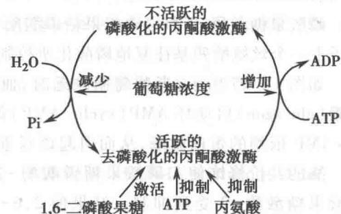  
1,6-二磷酸果糖 ATP 丙氨酸  
图17-18 丙酮酸激酶催化活性控制关系图

低时，胰高血糖素释放，cAMP依赖的蛋白激酶磷酸化肝中的丙酮酸激酶使其失活，从而减慢葡萄糖在肝中作为燃料的使用，节省的葡萄糖被输送至大脑及其他器官。肌肉丙酮酸激酶同工酶不受磷酸化调控。

## （五）5-磷酸木酮糖对糖代谢调节作用

在哺乳动物的肝中,由单磷酸己糖途径产生的5-磷酸木酮糖能够调节糖酵解途径。随着葡萄糖进入肝并转化为6-磷酸葡糖,进入糖酵解和单磷酸己糖途径,导致5-磷酸木酮糖浓度上升。5-磷酸木酮糖激活蛋白磷酸酶PP2A,使双功能酶PFK-2/FBPase-2酶在磷酸化。去磷酸化激活PFK-2,抑制FBPase-2,使2,6-二磷酸果糖浓度增加,激活糖酵解。

## （六）癌组织中糖代谢紊乱

在非癌组织中葡萄糖的摄取和糖酵解的速度比在大多数癌组织中快大约10倍。因为肿瘤细胞最初缺乏广泛的毛细血管网络提供氧气，处于有限的氧气供应状态，所以比正常细胞摄取更多的葡萄糖，转换为丙酮酸并在重新生成NADH时进一步转化成乳酸。糖酵解高速率的原因之一可能是肿瘤细胞中线粒体数目减少，导致线粒体氧化磷酸产生的ATP不足，所需要的ATP从糖酵解途径中获得。另外，一些肿瘤细胞过度表达几种糖酵解酶，包括线粒体己糖激酶的同工酶，它对6-磷酸葡糖的反馈抑制不敏感，这种酶可能垄断线粒体中的ATP，利用它将葡萄糖转化为6-磷酸葡糖，使细胞继续进行后续的糖酵解反应。低氧诱导的转录因子(HIF-1)作用于mRNA合成水平，促进至少八种糖酵解酶的合成，为肿瘤细胞在无氧条件下提供了生存能力。

早在1928年，德国生化学家Otto Warburg第一个发现肿瘤组织中的葡萄糖代谢速率显著高于其他组织。Warburg纯化和结晶了糖酵解途径中的七个酶。在这些研究中，他建立的生物化学实验方法彻底“变革”了氧化代谢的生化研究，如Warburg压力计通过监测气体体积的变化直接检测氧气的消耗量，用于定量测定氧化酶的活性。Otto Warburg是20世纪上半叶最卓越的生物化学家之一，对生物化学的其他研究领域（呼吸作用，光合作用和中间代谢的酶学）也做出了开创性的贡献，并于1931年荣获诺贝尔生理和医学奖。

## 九、其他六碳糖进入糖酵解途径

淀粉和糖原经消化后都转变为葡萄糖进入糖酵解途径。由蔗糖水解产生的果糖，由乳糖水解产生的半乳糖，由糖蛋白等多糖经消化产生的甘露糖都是通过转变成糖酵解途径的中间产物而进入酵解途径。

## (一) 果糖

在肌肉中,果糖由己糖激酶催化磷酸化形成6-磷酸果糖。

在肝中,因只含有葡糖激酶,此酶只催化葡萄糖的磷酸化,所以果糖在肝中进入糖酵解途径不能像在肌肉中那么简单,需经过6种酶的催化,其转变过程如下。

（1）果糖由果糖激酶（fructokinase）催化，在 C1 位磷酸化，消耗 1 个 ATP 分子，形成 1-磷酸果糖（fructose-1-phosphate）。

## (2) 1-磷酸果糖进行醇、醛裂解形成磷酸二羟丙酮和甘油醛

前面已经提到,醛缩酶有不同类型。肌肉中为 A 型,只对 1,6-二磷酸果糖起作用;肝中为 B 型,也可利用 1-磷酸果糖作为底物。因此 B 型醛缩酶有时也称为 1-磷酸果糖醛缩酶。它催化如下的反应:

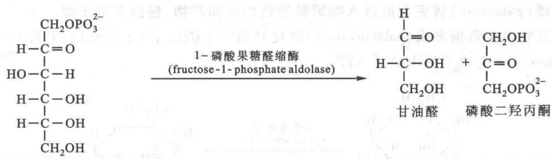  
开链式1-磷酸果糖
(open chain fructose-1-phosphate)

（3）甘油醛在甘油醛激酶(glyceraldehyde kinase)催化下，消耗1分子ATP，形成3-磷酸甘油醛。反应如下：

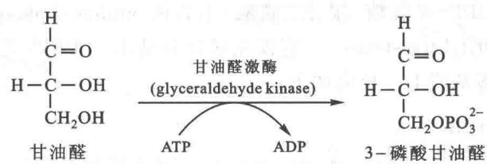

(4) 甘油醛还可在醇脱氢酶(alcohol dehydrogenase)催化下,由 NADH 还原形成甘油,反应如下:

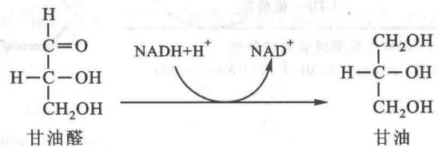

（5）甘油在甘油激酶(glycerol kinase)的催化下，消耗1分子ATP，转变为3-磷酸甘油(glycerol-3-phosphate):

（6）3-磷酸甘油在甘油磷酸脱氢酶(glycerol phosphate dehydrogenase)催化下，由 $NAD^{+}$ 氧化，形成磷酸二羟丙酮，反应如下：

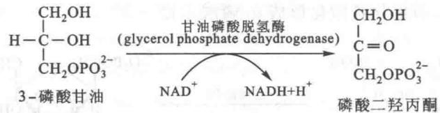

磷酸二羟丙酮经酵解途径中的磷酸丙糖异构酶(triosephosphate isomerase)转变为3-磷酸甘油醛，从而进入糖酵解途径。

临床上,过去认为给病人输入果糖优于葡萄糖。但血中果糖浓度过高超出肝中醛缩酶 B 的正常功能范围,引起 1-磷酸果糖积累,造成肝中无机磷酸的大量消耗以致耗竭,进而使 ATP 浓度下降,于是糖酵解过程加速产生大量乳酸。血中乳酸浓度过高,甚至达到危及生命的地步。

有一种遗传病,称为果糖不耐症(fructose intolerance),是由于肝中缺乏B型醛缩酶。食人的果糖不能被正常代谢,也造成1-磷酸果糖积累引起一系列和临床输入果糖同样的症状。这种病人对任何甜味都失去感觉。

## （二）半乳糖

## 1. 半乳糖(galactose)转变为能进入糖酵解途径的中间产物,包括5个步骤

（1）半乳糖由半乳糖激酶(galactokinase)催化其第一个碳原子C1磷酸化,形成1-磷酸半乳糖(galactose-1-phosphate),也需要消耗1分子ATP。

（2）1-磷酸半乳糖形成 UDP-半乳糖（尿苷二磷酸-半乳糖，uridine diphosphate-galactose）。催化此反应的酶称为尿苷酰转移酶（uridylyl transferase）。它催化尿苷酰基团从 UDP-葡萄糖分子在焦磷酸键处断裂转移到 1-磷酸半乳糖的磷酸基团上。反应如下：

（3）UDP-半乳糖转化为 UDP-葡萄糖。催化此反应的酶称为 UDP-半乳糖 4-差向异构酶（UDP-galactose-4-epimerase）。此酶以 NAD $^{+}$ 为辅酶。在转变中需经过氧化还原过程。反应如下。

（4）UDP-葡萄糖转变为1-磷酸葡糖。催化此反应的酶为 UDP-葡糖焦磷酸化酶（UDP-glucose pyrophosphorylase）。反应式如下：

（5）1-磷酸葡糖由磷酸葡糖变位酶（phosphoglucomutase）转变为糖酵解过程的中间产物6-磷酸葡糖。反应式如下：

## 2. 半乳糖血症

半乳糖血症(galactosemia)是一种遗传病。这种患者体内不能将半乳糖转化为葡萄糖。原因是缺乏1-磷酸半乳糖尿苷酰转移酶，不能使1-磷酸半乳糖转变为UDP-半乳糖。结果使血中半乳糖积累，进一步造成眼睛晶状体半乳糖含量升高。并还原为半乳糖醇(galactitol)，它的结构如下：

晶状体内的半乳糖醇最后造成晶状体混浊引起白内障。

半乳糖血症严重的引起生长停滞，智力迟钝，还往往引起肝损伤而致死亡。

治疗措施主要是食用不含半乳糖的饮食。体内合成糖蛋白和糖脂所需的半乳糖，可能在体内由葡萄糖经差向异构酶催化转变成为半乳糖供给合成的需要。因此机体可不摄入半乳糖。

## （三）甘露糖

甘露糖进入糖酵解途径是经过两步反应转变为6-磷酸果糖。反应如下：

(1) 甘露糖由己糖激酶催化转变为 6-磷酸甘露糖。

（2）6-磷酸甘露糖由磷酸甘露糖异构酶(phosphomannose isomerase)催化转变为6-磷酸果糖(F6P)，其催化机制和磷酸葡糖异构酶相似。

## 提要

糖酵解过程是生物最古老、最原始获得能量的一种方式。大多数较高等生物虽然进化为利用有氧条件进行生物氧化获取大量的自由能，但仍保留了这种原始的方式。这一过程是生物体共同经历的途径，而且有些生物还利用这一途径在供氧不足时给机体提供能量。

糖酵解作用的定义是:葡萄糖在无氧条件下转变为丙酮酸所经历的一系列反应,在此过程中净生成两个 ATP 分子。

这一过程是最早阐明的酶促反应过程,也是研究得非常透彻的过程。糖酵解作用机制的研究是最富于启发性的科学工作。

酵解过程产生的丙酮酸在无氧条件下由 NADH 还原为乳酸。在高等动物肌肉中糖酵解的最终产物为乳酸，这一过程又称为单纯乳酸发酵（homolactic fermentation）。人们将微生物经过无氧条件产生乳酸的过程称为乳酸发酵，将丙酮酸脱羧形成乙醇的过程称为乙醇发酵。单纯乳酸发酵和乙醇发酵除了在最后步骤不同外，所经历的步骤完全相同。

糖酵解过程共有10步反应,可划分为两个阶段,全部在细胞溶胶(胞液)中进行。第一阶段是支付能量的准备阶段,即预先支出阶段,包括5步反应。葡萄糖与2分子ATP反应,通过磷酸化、异构化、第二次磷酸化,形成1,6-二磷酸果糖。每次磷酸化都需要由ATP提供能量。第二阶段是收入阶段,也包括5步反应。1,6-二磷酸果糖由醛缩酶裂解为磷酸二羟丙酮和3-磷酸甘油醛。这两种化合物在丙糖异构酶作用下,很容易互变。在3-磷酸甘油醛脱氢酶作用下,3-磷酸甘油醛被氧化和磷酸化即与 $NAD^{+}$ 和Pi形成1,3-二磷酸甘油酸,形成的高能酰基磷酸,具有高的转移势能,在磷酸甘油酸激酶的作用下,生成一分子ATP同时产生一分子3-磷酸甘油酸。随后又在磷酸甘油酸变位酶的催化下,异构化为2-磷酸甘油酸。后者由烯醇化酶脱氢发生磷酸基团变位和脱水,形成磷酸烯醇式丙酮酸。它是第2个高能磷酸基团转移势能的酵解中间物。磷酸烯醇式丙酮酸在丙酮酸激酶的作用下,将高能磷酸基团转移给ADP形成另外1分子ATP和丙酮酸。

催化酵解 10 步反应的酶作用机制都已通过化学、动力学测定并结合 X 射线结构分析基本得到阐明。酵解酶的催化过程表现出严格的立体专一性,其中两种激酶由底物引起酶分子的构象变化,防止了底物上高能磷酸基团向水分子的转移而且直接转移到 ADP 分子上。

糖酵解作用能在无氧条件下继续进行,必须有使 NADH 再被氧化为 $NAD^{+}$ 的途径。乳酸或乙醇(先脱羧形成乙醛,再由 $NADH + H^{+}$ 还原成乙醇)的形成解决了 NAD 再生的问题。丙酮酸脱羧形成乙醛由丙酮酸脱羧酶催化。此酶需焦磷酸硫胺素作为辅助因素。催化乙醛还原为乙醇的酶是乙醇脱氢酶。催化丙酮酸形成乳酸的酶是乳酸脱氢酶。

糖酵解过程有三个反应步骤是基本上不可逆的。催化这三步反应的酶是己糖激酶、磷酸果糖激酶和丙酮酸激酶。其中磷酸果糖激酶催化的反应是糖酵解的限速反应。该酶受高浓度 ATP 和柠檬酸的抑制，被 AMP 和 2,6-二磷酸果糖激活。己糖激酶受 6-磷酸葡糖抑制，如果磷酸果糖激酶受到抑制，则 6-磷酸葡糖积累。丙酮酸激酶受 ATP 和丙氨酸引起的变构抑制，受 1,6-二磷酸果糖激活。当机体能荷或糖酵解的中间物积累时，丙酮酸激酶达到活跃顶峰。丙酮酸激酶的活性受磷酸化的调节。血液中葡萄糖水平降低时，激起肝中丙酮酸激酶的磷酸化从而使其活性降低，于是肝中葡萄糖的利用下降，因此，丙酮酸激酶对维持血糖浓度的相对稳定起着调节作用。

己糖激酶和磷酸丙糖异构酶对底物引起的诱导式的配合,使催化反应避开了不需要的副反应,这大大提高了酶的催化效率。

磷酸丙糖异构酶的催化效率是最完善的典型,一旦酶分子与底物接触,在碰撞的瞬间反应已经完成,因此,这种酶促反应是由底物分子的扩散速度调节的。

3-磷酸甘油醛脱氢酶在催化3-磷酸甘油醛氧化和磷酸化为1,3-二磷酸甘油酸的过程中，形成一个半缩硫醛中间物，这一硫酯中保存了3-磷酸甘油醛氧化释放出的部分能量，是一个高能中间物，它接受无机磷酸的攻击而形成具有高能磷酸基团的1,3-二磷酸甘油酸。砷酸是磷酸的类似物（analog），它使氧化和磷酸化解偶联。

双糖及多糖经消化后形成的单糖主要是葡萄糖，其他的单糖产物还有果糖、半乳糖、甘露糖等。这些单糖都转变为糖酵解的中间物之一而进入糖酵解的共同途径。

## 习题

1. 为什么应用蔗糖保存食品而不用葡萄糖？

2. 用 $^{14}$ C 标记葡萄糖的第一个碳原子,用作糖酵解底物,写出标记碳原子在酵解各个步骤中的位置。

3. 写出从葡萄糖转变为丙酮酸的化学平衡式。

4. 已知 ATP 和 6-磷酸葡糖在 pH 7 和 25℃时水解的标准自由能变化 $\Delta G^{\ominus}$ 分别为 -7.3 和 -3.183 kcal/mol，计算己糖激酶催化的葡萄糖和 ATP 反应的 $\Delta G^{\ominus}$ 和 Keq。

5. 由丙酮酸转变为乳酸的标准自由能变化 $\Delta G^{\ominus'} = -25.10\mathrm{kJ / mol}$ , 计算出由葡萄糖转变为乳酸的标准自由能变化。

6. 当葡萄糖的浓度为 5 mmol/L，乳酸的浓度为 0.05 mmol/L，ATP 和 ADP 的浓度都为 2 mmol/L，无机磷酸(Pi)的浓度为 1 mmol/L 时，计算该由葡萄糖转变为乳酸的自由能( $\Delta G^{\ominus'}$ )变化。

7. 参考表 22-2, 计算在标准状况下当 $[ATP]/[ADP]=10$ 时, 磷酸烯醇式丙酮酸和丙酮酸的平衡比。

8. 若以 $^{14}$ C 标记葡萄糖的 C3 作为酵母的底物, 经发酵产生 CO $_{2}$ 和乙醇, 试问 $^{14}$ C 将在何处发现?

9. 总结一下在糖酵解过程中磷酸基团参与了哪些反应,它所参与的反应有何意义?

10. 为什么砷酸是糖酵解作用的毒物？氟化物和碘乙酸对糖酵解过程有什么作用？

11. 总结一下参与糖酵解作用的酶有些什么特点及关键酶受到怎样的调控？

12. 糖酵解过程有哪些金属离子参加反应,它们起什么作用?

13. 概括除葡萄糖以外的其他单糖是如何进入分解代谢的？

## 主要参考书目

1. 李建武. 生物化学. 北京: 北京大学出版社, 1990.

2. Stryer L. Biochemistry. 4th ed. New York: W. H. Freeman and Company, 1995.

3. Lehnniger A R. Biochemistry. 2nd ed. New York: Worth Publishers. Inc., 1975.

4. Lebioda L, Stec B. Crystal structure of enolase indicates that enolase and pyruvate kinase from a common ancestor. Nature, 1988.

5. Nelson D L, Cox M M. Lehnninger 生物化学原理. 3 版. 周海梦, 等译. 北京: 高等教育出版社, 2005.

6. Nelson D L, Cox M M. Lehninger Principles of Biochemistry. 6th ed. New York: W. H. Freeman and Company, 2012.

7. Gatenby R, A Gilles R J. Why do cancers have high aerobic glycolysis? Nat. Rev. Cancer, 2004.

(王镜岩 秦咏梅)

## 网上资源

习题答案

自测题

## [1] 美登堂生

## 第 18 章 柠檬酸循环

在有氧条件下,由糖酵解过程所产生的丙酮酸将会被继续氧化,经历柠檬酸循环(citric acid cycle)和氧化磷酸化(oxidative phosphorylation)两个阶段后形成 $CO_{2}$ 和 $H_{2}O$ ,所释放出来的能量用于合成更多的ATP 分子。这里我们先讨论柠檬酸循环。

为纪念德裔英国科学家 Hans Krebs(1900—1981) 在揭示柠檬酸循环方面所做出的卓越贡献, 柠檬酸循环也被称为 Krebs 循环。在 1937 年提出柠檬酸循环之前, 他还于 1932 年提出过动物体内负责将氨转化为尿素的尿素循环 (也被称为鸟氨酸循环)。柠檬酸循环途径的揭示是生命科学领域的一项重大成就, Krebs 因此与发现乙酰辅酶 A 的 Fritz Lipmann 分享了 1953 年的诺贝尔生理学或医学奖。这项发现的独特之处在于它是在像同位素示踪法这样的研究代谢的有效方法建立之前而获得的。

柠檬酸循环发生于原核细胞的细胞质中或真核细胞的线粒体基质中。线粒体具有双层膜，所以细胞质中生成的丙酮酸将先通过外膜上非特异性的孔道蛋白通道进入内外膜间隙，然后由内膜上专一的丙酮酸移位酶转运进入线粒体基质。丙酮酸的转运伴有 $\mathrm{H}^{+}$ 的同向转运。丙酮酸继而在线粒体基质中通过柠檬酸循环进行脱羧和脱氢：碳原子形成 $\mathrm{CO}_{2}$ ，氢原子则随着电子载体 $\mathrm{NAD}^{+}$ 或 FAD 进入电子传递链并最终被 $\mathrm{O}_{2}$ 接收而形成 $\mathrm{H}_{2} \mathrm{O}$ 。电子传递过程所释放出的自由能量进而使 ADP 磷酸化形成能量货币 ATP（详见第 19 章）。

柠檬酸循环也是脂肪酸和氨基酸等各种燃料分子完全氧化分解必须经历的途径。同时，柠檬酸循环所形成的一些中间代谢物分子也是合成许多其他重要生物分子的前体（见本书讨论合成代谢的有关章节）。因此，柠檬酸循环为一种两用代谢途径（amphibolic pathway），即在生物分子的分解和合成过程中都发挥重要作用，是代谢反应的一个核心通路。

丙酮酸在进入柠檬酸循环之前,需先转化为乙酰辅酶 A(acetyl-CoA)。乙酰辅酶 A 同时也是脂肪酸和部分氨基酸降解的产物。下面先讨论丙酮酸转化为乙酰辅酶 A 的过程。

## 一、丙酮酸转化成乙酰辅酶 A 的过程

丙酮酸转化为乙酰辅酶 A(乙酰-CoA) 涉及四步反应、三种酶、五种辅基，形成一个相对分子质量非常高的丙酮酸脱氢酶复合体（pyruvate dehydrogenase complex）。其中的每一种酶皆有多个亚基参与组装。丙酮酸转化为乙酰-CoA 的总反应式如下：

组成丙酮酸脱氢酶复合体的三种酶为：丙酮酸脱氢酶 $\left(\mathrm{E}_{1}\right)$ ，二氢硫辛酰转乙酰酶（dihydrolipoyl transacetylase, $E_{2}$ ）和二氢硫辛酰脱氢酶（dihydrolipoyl dehydrogenase, $E_{3}$ ）。从革兰氏阴性细菌中分离到的丙酮酸脱氢酶复合体的相对分子质量约为4600000，大到可在电子显微镜下直接观察到，其直径约为45nm，它的核心由24个 $E_{2}$ 亚基构成一个立方体，再有24个 $E_{1}$ 亚基和12个 $E_{3}$ 亚基围绕着 $E_{2}$ 核心分布。来自真核细胞的这种酶结构更为复杂：它是一个十二面体，其核心为60个 $E_{2}$ 亚基，外围为60个 $E_{1}$ 亚基和12个 $E_{3}$ 亚基，另外还含有约12个非催化性的 $E_{3}$ 结合亚基（过去被称为X组分），它似乎帮助 $E_{3}$ 亚基结合到 $E_{2}$ 核心,但其具体位置还并不清楚。此外,真核生物的丙酮酸脱氢酶复合体还结合着其特异的丙酮酸脱氢酶激酶和丙酮酸脱氢酶磷酸酶,通过促进磷酸化和去磷酸化 $E_{1}$ 亚基而分别抑制和激活丙酮酸脱氢酶复合体的生物学活性。

丙酮酸脱氢酶复合体催化由丙酮酸形成乙酰-CoA 的全过程, 依次需要以下五种辅助因子参与, 即焦磷酸硫胺素 (thiamine pyrophosphate, TPP)、硫辛酸、辅酶 A、FAD 和 NAD $^{+}$ 。

丙酮酸脱氢酶复合体催化反应的全过程如图 18-1 表示。

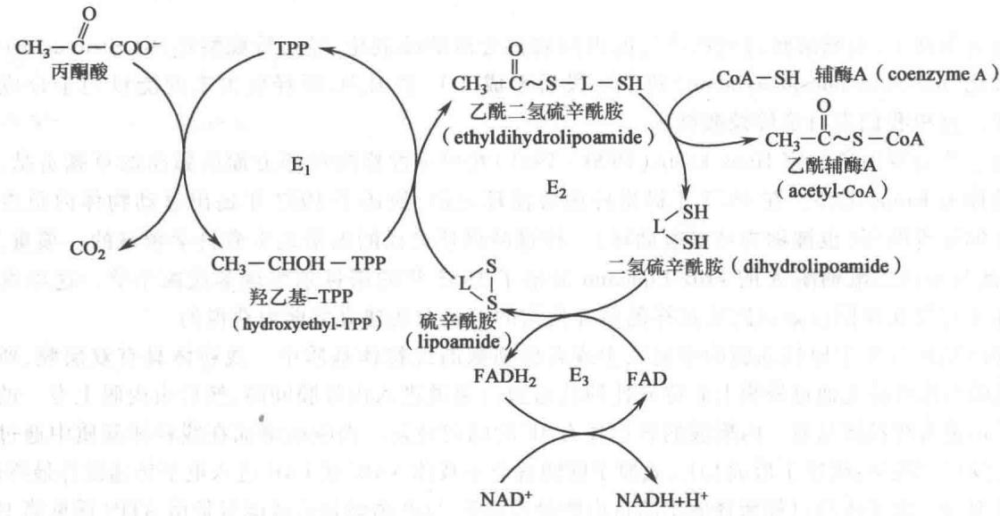  
图 18-1 丙酮酸脱氢酶复合体所催化的化学反应

## 1. 由 $\mathbf{E}_1$ 和 $\mathbf{E}_2$ 催化的丙酮酸脱羧转变成乙酰基的反应

丙酮酸脱氢酶复合体催化丙酮酸转变为乙酰辅酶 A 的第一步反应是由 $E_{1}$ 亚基催化的脱羧反应。 $E_{1}$ 亚基以 TPP 为辅基，反应分两步进行：

$E_{1}$ 上的辅基 TPP 进攻丙酮酸 TPP 的噻唑环上位于氮和硫两原子之间的碳原子具有很强的酸性，解离成碳负离子后进攻丙酮酸的羰基碳，形成丙酮酸与 TPP 的加成化合物：

  
丙酮酸TPP加成化合物

丙酮酸-TPP 加成物紧接着发生脱羧反应,形成羟乙基硫胺素焦磷酸(羟乙基-TPP)。该反应之所以能进行是因为 TPP 环上带正电荷的氮原子起到了电子“陷阱”的作用,使脱羧后形成的羟乙基上产生较稳定的碳负离子:

羟乙基氧化形成乙酰基 $E_{1}$ 催化形成的羟乙基-TPP中间物接着被转移到二氢硫辛酰转乙酰酶( $E_{2}$ )。硫辛酸辅基与 $E_{2}$ 酶分子中一个Lys残基的侧链氨基共价连接形成硫辛酰胺。硫辛酰胺辅基的活性基团是一个含有二硫键的环，它能被可逆地还原成二氢硫辛酰胺。羟乙基上的碳负离子进攻硫辛酰胺的二硫键后，TPP所携带的羟乙基即被氧化为乙酰基，同时硫辛酰胺辅基上的二硫键也被还原成巯基，具体如下图所示。

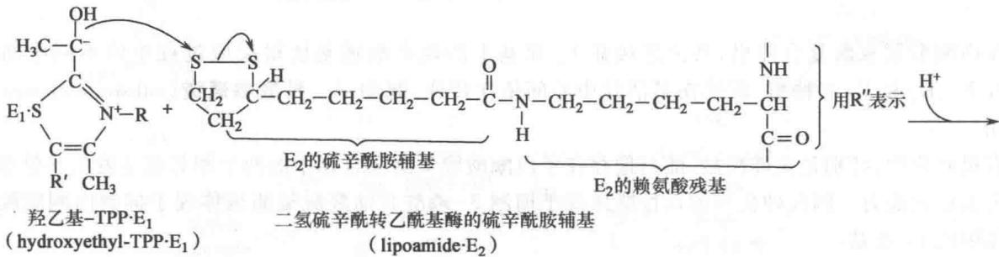

至此， $E_{1}$ 亚基恢复原状，可开始新一轮的催化过程。

2. 由 $\mathbf{E}_2$ 催化的乙酰基转移到辅酶A形成乙酰辅酶A的反应

结合在 $E_{2}$ 亚基上的乙酰基，将由该酶催化转移到辅酶 A 分子上形成乙酰辅酶 A，同时 $E_{2}$ 亚基上的硫辛酰胺辅基则转变为二氢硫辛酰胺：

乙酰辅酶 A 通过其硫酯键保留了高水平的自由能。

## 3. $E_{3}$ 催化 $E_{2}$ 中的二氢硫辛酰胺辅基的再氧化

$E_{3}$ (二氢硫辛酰脱氢酶)的辅基 FAD 及蛋白质分子中的二硫键起着氧化剂的作用, 催化 $E_{2}$ 中的二氢硫辛酰胺的再氧化, 这一催化过程图解如下:

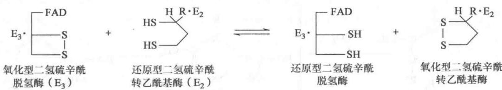

这一步标志着 $E_{2}$ 酶蛋白分子本身的复原。

## 4. 还原型 $E_{3}$ 亚基的再氧化

还原型 $E_{3}$ 需再氧化形成二硫键，是先由其辅基 FAD 按受附近被还原的巯基—SH 上的氢原子形成 $FADH_{2}$ ，接着氢原子又被转移给 $NAD^{+}$ ，于是 $E_{3}$ 也完全恢复成其氧化型。图解反应如下：

在丙酮酸脱氢酶复合体里,共价连接在 $E_{2}$ 亚基上的硫辛酸辅基使得反应过程中的不同中间体无法离开 $E_{1}$ 、 $E_{2}$ 和 $E_{3}$ 三种酶,而是在其活性中心间依次传递,起到了一种底物通道(substrate channeling)的作用。

有机砷化物,特别是亚砷酸盐,能与像存在于丙酮酸脱氢酶复合体中的两个相邻巯基发生共价结合而使酶失去催化能力。因此砷化物的毒性既体现于抑制3-磷酸甘油醛脱氢酶也体现于抑制丙酮酸脱氢酶复合体中的 $E_{2}$ 亚基。

## 二、柠檬酸循环

柠檬酸循环的全貌如图18-2所示。它起始于四碳化合物草酰乙酸与乙酰辅酶A中的2个碳原子之间缩合成含有6个碳的柠檬酸的反应。柠檬酸经过异构化后形成异柠檬酸，然后氧化脱氢形成草酰琥珀酸中间体（仍为6个碳），后者通过脱羧脱去一个碳形成五碳化合物 $\alpha-$ 酮戊二酸。五碳化合物再氧化脱羧形成四碳化合物，后者经过3次转化，最后再形成起始的四碳化合物草酰乙酸，完成一次循环。该循环过程中形成一个高能化合物（GTP），并使FAD和 $\mathrm{NAD}^+$ 分别还原成 $\mathrm{FADH}_2$ 和 $\mathrm{NADH}$ 。

柠檬酸循环可概括为如下8步反应。

## 1. 草酰乙酸与乙酰辅酶 A 缩合形成柠檬酸

催化草酰乙酸与乙酰辅酶 A 缩合的酶为柠檬酸合酶（citrate synthase）。柠檬酸合酶的催化过程严格按以下顺序进行：先与草酰乙酸结合，诱发构象变化后才能与乙酰辅酶 A 结合。具体反应式如下：

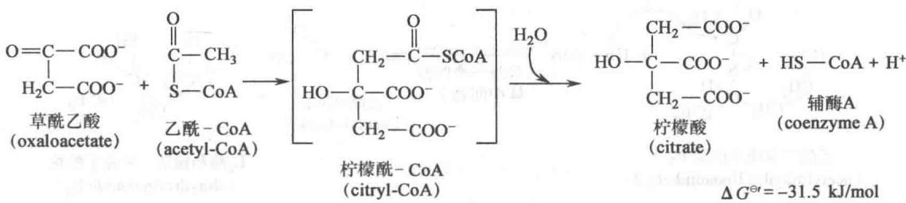

结合在酶分子上的柠檬酰辅酶 A 很快就水解形成柠檬酸和辅酶 A。

  
图 18-2 柠檬酸循环全貌  
图中数字代表如下酶：①柠檬酸合酶，②和③乌头酸酶，④异柠檬酸脱氢酶，⑤α-酮戊二酸脱氢酶复合体，⑥琥珀酰辅  
酶 A 合成酶，⑦琥珀酸脱氢酶，⑧延胡索酸酶，⑨苹果酸脱氢酶

由氟乙酸形成的氟乙酰辅酶 A 可由柠檬酸合酶催化与草酰乙酸缩合生成氟代柠檬酸(fluorocitrate)，取代柠檬酸结合到乌头酸酶上，从而抑制酶的活性。这一特性可用于制造杀虫剂或灭鼠药。有毒植物的叶子大都含有氟乙酸，可作天然杀虫剂。丙酮基辅酶 A（acetonyl-CoA）是乙酰辅酶 A 的类似物，可与柠檬酸合酶结合而抑制其活性，用此法曾测出了乙酰辅酶 A 与酶的结合部位（即活性中心）。上述化合物结构如图 18-3 所示。

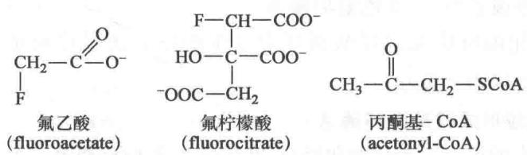  
图 18-3 氟乙酸、氟柠檬酸和丙酮基辅酶 A 的结构

## 2. 柠檬酸异构化形成异柠檬酸

柠檬酸是一种叔醇化合物,它的羟基所处位置不利于柠檬酸的进一步氧化。但异柠檬酸是可以被氧化的仲醇。催化此转变过程的酶为乌头酸酶(aconitase;更准确地说应该是乌头酸水合酶),也曾被称为顺乌头酸酶(cis-aconitase)。具体反应如下所示:

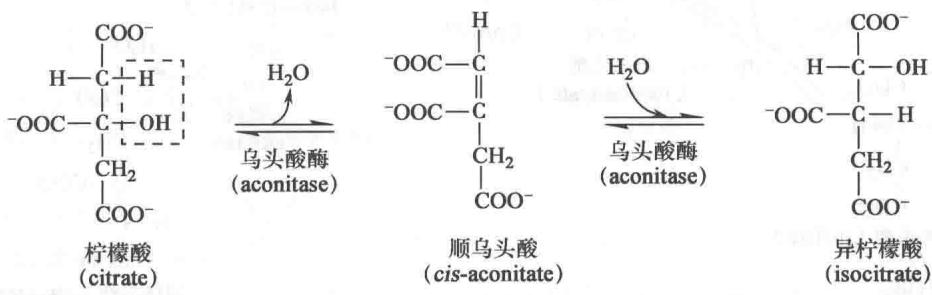

反应的中间产物顺式乌头酸不与酶分离,其中的 $H_{2}O$ 可往复地以两种不同的方式与双键结合,分别形成柠檬酸和异柠檬酸。在 pH 7.4 和 25℃ 的环境中,当反应达到平衡时,只有 10% 的异柠檬酸形成。在细胞内,异柠檬酸不断被消耗,因此推动此反应不断地由左向右进行。乌头酸酶含有一个「4Fe-4S」铁硫簇(iron-sulfur cluster),又称铁硫中心,在结合底物、催化脱水和再水合的过程中都起重要作用。乌头酸酶催化的无论是脱水还是水合反应,都具有严格的立体化学专一性。含有铁硫簇的蛋白质被统称为铁硫蛋白或非血红素铁蛋白。

## 3. 异柠檬酸氧化形成 $\alpha-$ 酮戊二酸

异柠檬酸的氧化脱羧反应由异柠檬酸脱氢酶(isocitrate dehydrogenase)催化,反应如下所示:

异柠檬酸脱氢酶在真核细胞中存在两种同工酶形式,一种以 $NAD^{+}$ 为辅酶,只存在于线粒体中;一种以 $NADP^{+}$ 为辅酶,既存在于线粒体中也存在于细胞溶胶中。

经异柠檬酸脱氢酶的催化,一种 $\beta-$ 羟酸(异柠檬酸)被氧化为一种 $\beta-$ 酮酸( $\alpha-$ 酮戊二酸),这有利于下一步与羰基相邻的 C—C 键断裂而引发的脱羧反应。这种 C—C 键断裂方式常见于生物化学反应中。这里脱下的羧基碳来源于草酰乙酸,而非乙酰辅酶 A。

由异柠檬酸脱氢酶催化的反应是柠檬酸循环中发生的第一次氧化脱羧反应,产生第一个 $CO_{2}$ 和 NADH。该酶需要 $Mn^{2+}$ 作为辅因子参与。

## 4. $\alpha$ -酮戊二酸氧化脱羧形成琥珀酰辅酶 A

这是柠檬酸循环中发生的第二次氧化脱羧反应,产生第二个 $CO_{2}$ 和第二个 NADH,并形成带有高能硫酯键的琥珀酰辅酶 A。反应由 $\alpha-$ 酮戊二酸脱氢酶复合体 ( $\alpha-$ ketoglutarate dehydrogenase complex) 催化,如下所示:

该酶复合体与丙酮酸脱氢酶复合体极其相似，也由三种酶组成：α-酮戊二酸脱氢酶 $\left(\mathrm{E}_{1}\right)$ 、二氢硫辛酰转琥珀酰酶 $\left(\mathrm{E}_{2}\right)$ 和二氢硫辛酰脱氢酶 $\left(\mathrm{E}_{3}\right)$ 。该复合体所催化反应的机制也与丙酮酸脱氢酶复合体的类似，也需TPP、硫辛酸、辅酶A、FAD、NAD $^{+}$ 等5种辅因子。两种酶复合体的 $E_{1}$ 的氨基酸序列相似但不相同，因此对底物的专一性不同。它们的 $E_{2}$ 结构也很相似，而 $E_{3}$ 则完全相同。这表明它们很可能具有相同的进化起源。

## 5. 琥珀酰辅酶 A 转化为琥珀酸并伴随底物水平磷酸化反应的发生

琥珀酰辅酶 A 将进一步转化成琥珀酸，由琥珀酰辅酶 A 合成酶（succinyl-CoA synthetase）、或称琥珀酸硫激酶（succinate thiokinase）催化。后面的命名方式反映反方向的催化反应。反应式如下：

琥珀酰辅酶 A 水解的标准自由能为 -36 kJ/mol。由它释放的自由能中有一部分被用于合成 GTP 或 ATP 的磷酸酐键，因此净余的自由能只有大约 -3 kJ/mol。

这是柠檬酸循环中直接产生高能磷酸酐键的唯一步骤。与糖酵解时生成 ATP 的过程类似，也属于底物水平的磷酸化反应。

通过上述柠檬酸循环的5步反应,一个乙酰基进入循环,氧化产生了2分子 $CO_{2}$ ,同时使2分子 $NAD^{+}$ 还原为NADH,还产生了一分子的GTP或ATP。为了使乙酰基在细胞内有效地进行氧化分解,所有的生物体都进化产生了一种循环氧化乙酰基的反应过程。为此,后面的第六、七、八步反应将琥珀酸重新转变为能够接受乙酰基的草酰乙酸而完成一轮的循环。

这里应提起注意的是关于合酶(synthase)和合成酶(synthetase)在概念上的区别。合酶(如柠檬酸合酶)催化的缩合反应无需ATP提供能量,而合成酶(如琥珀酰辅酶A合成酶)在催化缩合反应时则需由ATP或GTP等提供能量。

## 6. 琥珀酸脱氢形成延胡索酸

琥珀酸脱氢形成延胡索酸(fumarate)的反应由琥珀酸脱氢酶(succinate dehydrogenase)催化,如下所示:

  
$\Delta G^{\ominus \prime} = +6\mathrm{kJ / mol}$