氨基酸脱羧酶的专一性很高,一般是一种氨基酸对应一种脱羧酶,而且只对 L-氨基酸起作用。在脱羧酶中只有组氨酸脱羧酶不需要辅酶。

氨基酸的脱羧反应普遍存在于微生物,高等动、植物组织中。动物的肝、肾、脑中都发现有氨基酸脱羧酶,脑组织中富有 L-谷氨酸脱羧酶,能使 L-谷氨酸脱羧形成 γ-氨基丁酸。氨基酸脱羧后形成的胺,有许多具有重要的生理作用。如上述的 γ-氨基丁酸是重要的神经递质(neurotransmitter)。组氨酸脱羧形成的组胺(histamine)有降低血压的作用,又是胃液分泌的刺激剂。酪氨酸脱羧形成的酪胺(tyramine)有升高血压的作用,这点将在氨基酸与生物活性物质一节中详细讨论。绝大多数胺类是对动物有毒性的。但体内有胺氧化酶,能将胺氧化为醛和氨。醛可进一步氧化成脂肪酸,氨可合成尿素,又可形成新的氨基酸。

## (六) 氨的命运

氨基酸经过前述的氧化脱氨基作用、脱酰氨基作用，或经嘌呤核苷酸循环等途径将氨基氮转变为氨。氨对生物机体是毒性物质，特别是高等动物的脑对氨极为敏感，血液中1%的氨就可引起中枢神经系统中毒，因此氨的排泄是生物体维持正常生命活动所必需的。

人类氨中毒的症状表现为语言紊乱、视力模糊，机体发生一种特有的震颤，甚至昏迷或死亡。氨对中枢神经系统危害的机制目前尚未完全阐明。已知脑细胞线粒体可将氨与 $\alpha-$ 酮戊二酸作用形成谷氨酸：

$$
\mathrm{NH} _ {4} ^ {+} + \alpha - \text { 酮   戊   二   酸 } + \mathrm{NADPH} + \mathrm{H} ^ {+} \longrightarrow \text { 谷   氨   酸 } + \mathrm{NADP} ^ {+} + \mathrm{H} _ {2} \mathrm{O}
$$

此反应一方面大量消耗了 $\alpha-$ 酮戊二酸，从而破坏了柠檬酸循环的正常进行；另一方面，对 NADPH 的大量消耗，严重地影响需要还原力 $(NADPH+H^{+})$ 反应的正常进行。

有些微生物可将游离氨用于形成细胞的其他含氮物质。当以某种氨基酸作为氮源时，从氨基酸上脱下的氨，除一部分用于进行生物合成外，多余的氨即排到周围环境中。

某些水生的或海洋动物,如原生动物和线虫以及鱼类、水生两栖类等,都以氨的形式将氨基氮排出体外。这些动物称为排氨动物(ammonotelic animal)。

绝大多数陆生动物将脱下的氨转变为尿素。鸟类和陆生的爬虫类，因体内水分有限，它们的排氨方式是形成固体尿酸的悬浮液排出体外。因此鸟类和爬虫类又称为排尿酸动物（uricotelic animal）。

有些两栖类处于中间位置，幼虫为排氨动物，如蝌蚪，变态时肝产生出必要的酶，成蛙后，即排泄尿素。

概括地说,生活着的有机体把氨基酸分解代谢产生的氮的多余部分排出体外,有3种形式:①排氨,包括许多水生动物,排泄时需要少量的水;②排尿素,包括绝大多数陆生脊椎动物;③排尿酸,包括鸟类和陆生爬行动物。有些生物在水供应受到限制时,可以从排氨类转变为排尿素类或排尿酸类。

## 1. 氨的转运

氨的转运主要是通过谷氨酰胺,多数动物细胞内有谷氨酰胺合成酶(glutamine synthetase),催化谷氨酸与氨结合而形成谷氨酰胺。

$$
\mathrm{NH} _ {4} ^ {+} + \mathrm{谷氨酸} + \mathrm{ATP} \xrightarrow {\text {谷氨酰胺合成酶}} \mathrm{谷氨酰胺} + \mathrm{ADP} + \mathrm{Pi} + \mathrm{H} ^ {+}
$$

在该反应中形成中间产物谷氨酰-5-磷酸,是一种与酶结合的高能中间产物,是谷氨酸第5位的羧基磷酸化的结果,提供磷酸基团的是ATP。谷氨酰-5-磷酸的磷酯键是活泼键,很容易脱下磷酸基团而与氨结合形成谷氨酰胺。

  
谷氨酰-5-磷酸（与酶相结合）

谷氨酰胺是中性无毒物质,容易透过细胞膜,是氨的主要运输形式;而谷氨酸带有负电荷,不能透过细胞膜。

谷氨酰胺由血液运送到肝，肝细胞的谷氨酰胺酶(glutaminase)又将其分解为谷氨酸和氨。

$$
\mathrm{谷氨酰胺} + \mathrm {H_ {2} O} \xrightarrow {\mathrm{谷氨酰胺酶}} \mathrm{谷氨酸} + \mathrm {NH_ {4} ^ {+}}
$$

前已述及,肌肉可利用葡萄糖-丙氨酸循环转运氨,将氨送到肝。在肌肉中谷氨酸与丙酮酸进行转氨形成丙氨酸:

$$
\mathrm{谷氨酸} + \mathrm{丙酮酸} \xrightarrow [ (\mathrm{在肌肉}) ]{\mathrm{丙酮酸转氨酶}} \alpha - \mathrm{酮戊二酸} + \mathrm{丙氨酸}
$$

丙氨酸在 pH 近于 7 的条件下是中性不带电荷的化合物,通过血液运送到肝,再与 $\alpha-$ 酮戊二酸转氨又变为丙酮酸和谷氨酸:

$$
\mathrm{丙氨酸} + \alpha - \mathrm{酮戊二酸} \xrightarrow [ (\text {在肝}) ]{\mathrm{丙氨酸转氨酶}} \mathrm{丙酮酸} + \mathrm{谷氨酸}
$$

肌肉中所需的丙酮酸由糖酵解提供,在肝中多余的丙酮酸又可通过糖异生作用转化为葡萄糖。

生物体利用丙氨酸作为从肌肉到肝运送氨的载体,是机体在维持生命活动中遵循经济原则的一种表现。肌肉在紧张活动中既产生大量的氨,又产生大量的丙酮酸,二者都需要运送到肝进一步转化。将丙酮酸与氨转化为丙氨酸,收到一举两得的功效。

## 2. 氨的排泄

（1）排氨动物由氨基酸的 $\alpha-$ 氨基形成的氨，经谷氨酰胺形式运送到排泄部位。例如，鱼类的鳃，经鳃内谷氨酰胺酶分解，游离的氨即借助扩散作用排出体外。

（2）尿素的形成——尿素循环(urea cycle) 排尿素动物合成尿素是在肝中进行的，由一个循环机制完成，这一循环称为尿素循环，如图 25-10 所示。

  
图25-10 Krebs和Henseleit最早提出的尿素循环

## 三、尿素的形成

## （一）尿素循环的发现

尿素循环是最早发现的代谢循环，比发现柠檬酸循环还早5年。1932年发现柠檬酸循环的同一人，Hans A. Krebs和他的学生Kurt Henseleit观察到，当往悬浮有肝切片的缓冲液中加入鸟氨酸（ornithine）、瓜氨酸（citrulline）或精氨酸的任何一种时，都可促使肝切片显著加快尿素的合成，而其他任何氨基酸或含氮化合物都不能起到上述3种氨基酸的促进作用。较早人们就已经知道精氨酸可以由精氨酸酶（arginase）水解为鸟氨酸和尿素。

$$
\mathrm{精氨酸} + \mathrm {H_ {2} O} \xrightarrow {\mathrm{精氨酸酶}} \mathrm{鸟氨酸} + \mathrm{尿素}
$$

Krebs 和 Henseleit 研究了前述 3 种氨基酸的结构关系, 发现它们彼此的相关结构, 提出鸟氨酸是瓜氨酸的前体, 瓜氨酸是精氨酸的前体, 它们的相互关系见图 25-10。

在以上实验和分析的基础上，Krebs提出了尿素循环的设想。在此循环中，鸟氨酸所起的作用类似草酰乙酸在柠檬酸循环中的作用，一分子鸟氨酸和一分子氨及二氧化碳结合形成瓜氨酸。瓜氨酸与另一分子氨结合形成精氨酸。精氨酸水解形成尿素和鸟氨酸完成一次循环。当今公认的尿素循环表示如图25-11。

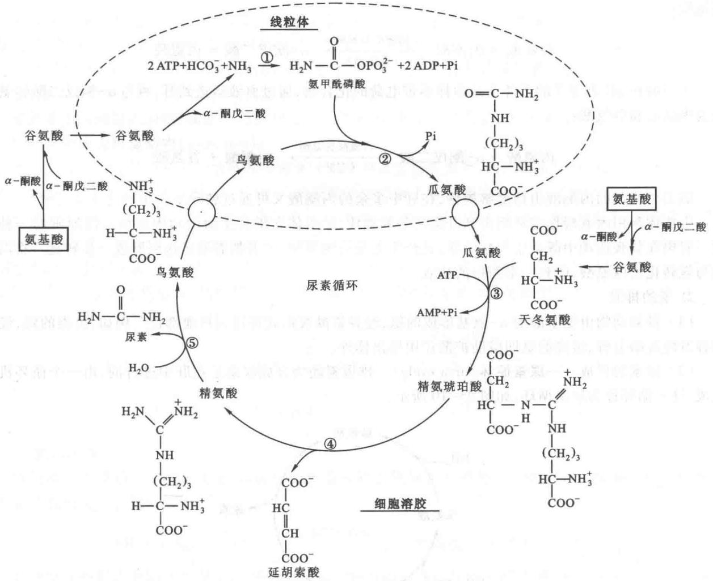  
图 25-11 尿素循环部分发生在线粒体,部分发生在细胞溶胶  
其通路是分别经鸟氨酸及瓜氨酸在特异的运输体系下穿过线粒体膜实现的。在尿素循环中分布有5种酶：①氨甲酰磷酸合成酶；②鸟氨酸氨甲酰基转移酶；③精氨琥珀酸合成酶；④精氨琥珀酸酶；⑤精氨酸酶

## （二）尿素循环

尿素是肝中由尿素循环的一系列酶催化形成的。合成的尿素被分泌进入血流，再被肾汇集，从尿中排出。尿素循环的过程可概括为：

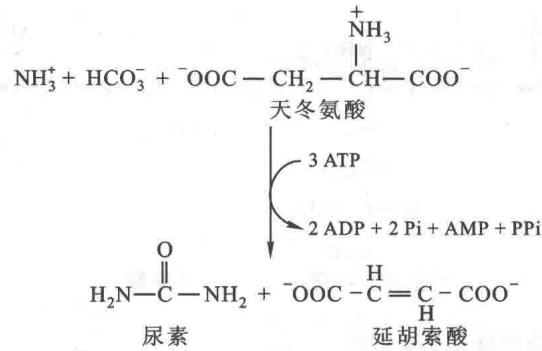

尿素的两个 N 原子来自一个氨分子和一个天冬氨酸分子, 其 C 原子则来自 $HCO_{3}^{-}$ 。在尿素循环中包括有 5 步酶反应, 其中 2 步发生在线粒体内, 3 步发生在细胞溶胶中 (见图 25-11)。下面着重讨论鸟氨酸循环的反应机制:

## 1. 氨甲酰磷酸合成酶, 尿素的第一个氮原子的获取

氨甲酰磷酸合成酶(carbamoyl phosphate synthetase, CPS)严格地说,其实不属于尿素循环的一员。它催化 $NH_{3}$ 及 $HCO_{3}^{-}$ 使之活化并缩合形成氨甲酰磷酸。它是尿素循环的两个含氮底物中的一个。这个反应伴随有两个ATP的水解。真核生物中的CPS有两类,即:

（1）线粒体的氨甲酰磷酸合成酶Ⅰ（CPSⅠ）用氨作为它的氮给体，参与尿素的生物合成。

（2）细胞溶胶的氨甲酰磷酸合成酶Ⅱ（CPSⅡ）用谷氨酸作为它的氮给体，分担着嘧啶生物合成的任务。

CPS所催化的反应包含有3个步骤（图25-12）：① $\mathrm{HCO_3^-}$ 受ATP作用而活化，形成羰基磷酸。②氨对羰基磷酸进攻，取代磷酸基团形成氨基甲酸酯。③受第2个ATP作用，发生氨基甲酸酯的磷酸化，形成氨甲酰磷酸及ADP。本反应基本上是不可逆的，它在尿素循环中是限速的一步。

## 2. 鸟氨酸氨甲酰基转移酶

鸟氨酸氨甲酰基转移酶(ornithine transcarbamoylase)的作用是将氨甲酰磷酸的氨甲酰基转移到鸟氨酸(ornithine)上,形成瓜氨酸(citrulline),这是尿素循环的第2步。此反应发生在线粒体中,而鸟氨酸则产生于细胞溶胶,所以它必须通过一个特异的运送体系进入线粒体。同样地,尿素循环的以后几步皆在细胞溶胶中进行,瓜氨酸就必须从线粒体中脱出(见图25-11)。

## 3. 精氨琥珀酸合成酶, 尿素第二个氮原子的获取

尿素第2个氮原子的获取是在尿素循环的第3步反应中实现的,即:在精氨琥珀酸合成酶(argininosuccinate synthetase)作用下,瓜氨酸的脲基(ureido group)与天冬

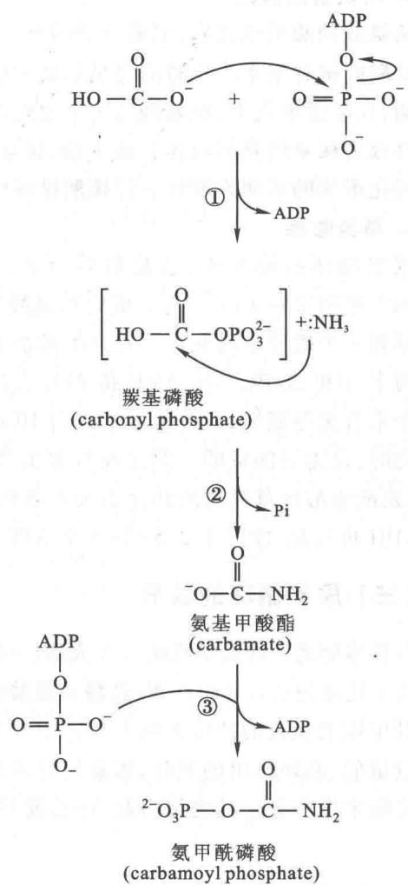  
图25-12 CPSI酶促反应的机制

① $HCO_{3}^{-}$ 被磷酸化而活化,形成一个假设的中间体——羰基磷酸;② $NH_{3}$ 向羰基磷酸进攻,形成氨基甲酸酯;③氨基甲酸酯受ATP作用发生磷酸化反应,产生氨甲酰磷酸

氨酸的氨基进行缩合。反应的机制是瓜氨酸经 ATP 作用，形成瓜氨酸-AMP（citrullyl-AMP）中间体，此时瓜氨酸的脲基氧活化成为脱离基团。这个中间体立即与天冬氨酸的氨基发生置换反应，形成精氨琥珀酸（argininosuccinate）（图 25-13）。使用 $^{18}$ O 标记的瓜氨酸，最后在释出的 AMP 中分离得到了带标记的 AMP。这个实验证明 AMP 与瓜氨酸确实是通过脲基氧以共价联合在一起。

  
图 25-13 精氨琥珀酸合成酶的催化反应机制  
①瓜氨酸的脲基氧由于形成瓜氨酸-AMP而被活化；②天冬氨酸以其氨基与AMP置换，星号（\*）表示用 $^{18}$ O标记的氧及相应化合物

## 4. 精氨琥珀酸酶

精氨琥珀酸形成之后，尿素分子的全部组成成分都已齐备。但是天冬氨酸所提供的氨基仍然连接在天冬氨酸的碳骨架上。这时需要精氨琥珀酸酶的作用，精氨琥珀酸酶（argininosuccinase）又称精氨琥珀酸裂解酶，在它的催化下，精氨酸与天冬氨酸的碳骨架脱离，脱下的是延胡索酸（见图25-11反应④）。精氨酸最终成为尿素的直接前体。请注意，尿素循环与柠檬酸循环之间的沟通，正是通过尿素循环中精氨琥珀酸酶催化形成的延胡索酸和在柠檬酸循环中形成草酰乙酸经转氨基反应形成天冬氨酸而连接在一起的。

## 5. 精氨酸酶

尿素循环的第5步，也是最后一步，是精氨酸酶（arginase）催化水解精氨酸产生尿素及再生成鸟氨酸（见图25-11）。再生成的鸟氨酸又回到线粒体中进入另一轮尿素循环。就这样，尿素循环把两个氨基和一个碳原子转化为非毒性的排泄物尿素。在这个循环中使用了4个“高能”磷酸键（3个ATP水解为两个ADP及Pi，一个AMP和PPi，后者并随之迅速水解为Pi）。上述的两个氨基，其中一个来自氨，另一个来自天冬氨酸；一个碳原子来自 $\mathrm{HCO_3^-}$ 。在这过程中，能量的消耗大于能量的获取，因为在形成尿素底物时，是需要能量的。但是在谷氨酸脱氢酶催化下，由谷氨酸释出氨的反应中，伴随着NADH的形成；在延胡索酸经草酰乙酸转化为天冬氨酸（图25-14）的过程中，同样也伴有NADH生成。在线粒体中对NADH再氧化，能产生 $2.5\times 2 = 5$ 个ATP。

## （三）尿素循环的调节

线粒体酶之一的氨甲酰磷酸合成酶I承担着尿素循环关键的第一步反应,它被 N-乙酰-谷氨酸别构激活。这个代谢物是谷氨酸在 N-乙酰谷氨酸合酶(N-acetylglutamate synthase)的催化下与乙酰-CoA 合成的。

肝中尿素生成的速度实际上与这个 N-乙酰谷氨酸合酶的浓度直接相关。当氨基酸降解速度提高，产生出过量的、必须排出的氮时，尿素的合成增加。氨基酸降解速度增高的“信号”使转氨反应加速从而引起谷氨酸浓度增高。随之又引起 N-乙酰谷氨酸合成的增加，又激化了氨甲酰磷酸合成酶，乃至整个尿素循环。

  
N-乙酰谷氨酸

  
图25-14 尿素循环与柠檬酸循环的联系是基于精氨琥珀酸的断裂与形成实现的  
酶①延胡索酸酶及酶②苹果酸脱氢酶是属于柠檬酸循环的成员。草酰乙酸自柠檬酸循环改道形成天冬氨酸是受酶③氨基转移酶的作用所致。ATP 的水解发生于酶⑤氨甲酰磷酸合成酶I及酶⑥精氨琥珀酸合成酶所催化的两个反应中。在酶④谷氨酸脱氢酶的作用下，由于产生出的 NAD(P)H 及酶②苹果酸脱氢酶的反应中产生出 NADH，经氧化磷酸化作用后又形成 5 个 ATP

尿素循环中的其他酶则是由它们的底物所控制。正因为这样，遗传性尿素循环中某些酶的不足，除精氨酸酶以外，都不会因此发生尿素的重大减量（但是任何一种尿素循环酶的完全丧失，都会导致初生儿死亡）。当这些缺欠酶的底物增加时，它会使由于缺欠某种酶引起的某一速度之不足恢复正常。当然，这种欠量底物的增加，不是不需付出的。底物浓度的提升会使尿素循环逆行直至产生氨的各个途径，结果会发生“高血氨症”（hyperammonemia）。迄今，氨毒性的根源尚未彻底弄清，氨的高浓度会使“氨清除体系”（ammonia-clearing system）过分耗力，特别是在脑中（尿素循环酶缺欠症状包括有智力迟钝、嗜眠症等）。上述的“氨清除体系”中包含有谷氨酸脱氢酶（反方向工作）及谷氨酰胺合成酶。这个体系可使 $\alpha-$ 酮戊二酸及谷氨酸的“蓄池水位”下降，这些蓄池如若耗竭，脑将发生极其敏感的反应。 $\alpha-$ 酮戊二酸的耗尽，会引发产生能量的柠檬酸循环失速，而谷氨酸既是神经递质，又是 $\gamma-$ 氨基丁酸（GABA）的前体，后者是另一种神经递质。

## 四、氨基酸碳骨架的氧化途径

脊椎动物体内的20种氨基酸的碳骨架，由20种不同的多酶体系进行氧化分解。虽然氨基酸的氧化分解途径各异，但它们都集中形成5种产物而进入柠檬酸循环，最后氧化为 $\mathrm{CO}_{2}$ 和水，图25-15表明20种氨基酸进入柠檬酸循环的途径。

图 25-15 表明，丙氨酸、苏氨酸、丝氨酸、半胱氨酸、甘氨酸、苯丙氨酸、酪氨酸、亮氨酸、赖氨酸及色氨酸共 10 种氨基酸的碳骨架分解后形成乙酰-CoA；精氨酸、组氨酸、谷氨酰胺、脯氨酸及谷氨酸共 5 种氨基酸形成 α-酮戊二酸；异亮氨酸、甲硫氨酸及缬氨酸共 3 种氨基酸变为琥珀酰-CoA；苯丙氨酸、酪氨酸形成延胡索酸；天冬氨酸、天冬酰胺转变为草酰乙酸。因此构成蛋白质的 20 种氨基酸通过转变为乙酰-CoA、α-酮戊二酸、琥珀酰-CoA、延胡索酸以及草酰乙酸这 5 种物质都能进入柠檬酸循环。此外，苯丙氨酸和酪氨酸碳骨架的一部分也以乙酰-CoA 的形式进入柠檬酸循环。当氨基酸脱羧形成胺类后，即失去了进入柠檬酸循环的可能性。

  
图 25-15 氨基酸碳骨架进入三羧酸循环的途径

氨基酸的分解途径并不是其合成途径的逆转,虽然在分解和合成途径之间也有共同的步骤。氨基酸分解代谢过程中有许多中间产物具有其他生物功能,特别是用作组成细胞其他成分的前体。脊椎动物分解代谢主要是在肝中进行,肾中也比较活跃。肌肉中氨基酸的分解是很少的。

下面将按照氨基酸碳骨架进入柠檬酸循环的入口方式分述其代谢途径。

## （一）形成乙酰-CoA的途径

乙酰-CoA 是进入柠檬酸循环的主要入口物质,通过形成乙酰-CoA 进入柠檬酸循环的氨基酸又有三条途径:一条是由氨基酸先转变为丙酮酸再形成乙酰-CoA;第二条是经过乙酰乙酰-CoA 再形成乙酰-CoA;第三条是氨基酸直接形成乙酰-CoA(参看图 25-15)。现分述如下。

## 1. 经丙酮酸到乙酰 CoA 的途径——氨基酸转变为丙酮酸的途径

（1）丙氨酸 经与 $\alpha-$ 酮戊二酸转氨。催化此反应的酶为谷-丙转氨酶，反应如下：

$$
\mathrm{L} - \text {丙氨酸} + \alpha - \text {酮戊二酸} \xrightarrow {\text {谷-丙转氨酶}} \text {丙酮酸} + \text {谷氨酸}
$$

（2）甘氨酸 先转变为丝氨酸，再由丝氨酸转变为丙酮酸。催化甘氨酸转变为丝氨酸的酶称为丝氨酸转羟甲基酶（serine transhydroxymethylase），该酶以磷酸吡哆醛为辅基，但其转移的羟甲基以四氢叶酸（tetrahydrofolate, THF）为载体，反应如下：

$$
\begin{array}{r l} & {\text {甘氨酸} + N ^ {5}, N ^ {1 0} - \text {甲烯基四氢叶酸} \xrightarrow [ \mathrm{Mn} ^ {2 +} ]{\text {丝氨酸转羟甲基酶}} \mathrm{L-丝氨酸} + \text {四氢叶酸}} \\ & {(N ^ {5}, N ^ {1 0} - \text {Methylentetrahydrofolate})} \end{array}
$$

丝氨酸和甘氨酸的互变是极为灵活的,因此该反应也是丝氨酸生物合成的重要途径,关于四氢叶酸将在“氨基酸与一碳单位”一节中详述。

甘氨酸的分解代谢不是以形成乙酰-CoA为主要途径。甘氨酸的重要作用是一碳单位的提供者，在此反应中，同时产生 $CO_{2}$ 和 $NH_{4}^{+}$ 。该反应需 $NAD^{+}$ 作为氢的传递体，反应如下式：

$$
\begin{array}{r l}&{\mathrm{H} _ {3} \stackrel {+} {\mathrm{N}} - \mathrm{CH} _ {2} - \mathrm{COO} ^ {-} + \mathrm{THF} + \mathrm{NAD} ^ {+} \rightleftharpoons N ^ {5}, N ^ {1 0} - \text {甲烯} \mathrm{THF} + \mathrm{CO} _ {2} + \mathrm{NH} _ {4} ^ {+} + \mathrm{NADH} + \mathrm{H} ^ {+}}\\&{\text {甘氨酸} \qquad \qquad \text {四氢叶酸}}\end{array}
$$

（3）丝氨酸 本身脱水、脱氨转变成丙酮酸，催化该反应的酶称为丝氨酸脱水酶。该酶也是磷酸吡哆醛酶类，又称为丝氨酸-苏氨酸脱水酶（serine-threonine dehydratase），反应如图25-16所示。

  
图25-16 丝氨酸脱水转变为丙酮酸的机制  
①丝氨酸与磷酸吡哆醛(PLP)形成希夫碱；②丝氨酸脱下一个 $\alpha-H$ 原子形成共振稳定的负碳离子；③ $OH^{-}$ 基的 $\beta-$ 消除；④希夫碱水解，游离出PLP-酶并产生氨基丙烯酸；⑤非酶促互变异构形成亚胺；⑥非酶促水解形成丙酮酸和氨

（4）苏氨酸 由苏氨酸羟甲基转移酶（threonine aldolase）催化裂解生成甘氨酸和乙醛(acetaldehyde)，后者氧化形成乙酸。乙酸氧化形成乙酰-CoA。甘氨酸形成丙酮酸的途径已如前述，苏氨酸的分解代谢还有两条其他途径，一条是由丝氨酸-苏氨酸脱水酶（serine-threonine dehydratase）转变为 $\alpha-$ 酮丁酸，另一条是脱氢、脱羧形成氨基丙酮(aminoacetone）。

(5) 半胱氨酸 形成丙酮酸的途径如图 25-17 所示。

在某些细菌可发生半胱氨酸的加水分解反应。

$$
\mathrm{半胱氨酸} + \mathrm {H_ {2} O} \xrightarrow [ (\mathrm{cysteinedesulfhydrase}) ]{\mathrm{半胱氨酸脱巯基酶}} \mathrm{丙酮酸} + \mathrm {NH_ {3}} + \mathrm {H_ {2} S}
$$

上述 5 种氨基酸经丙酮酸转变为乙酰-CoA 的关系概括如图 25-18。

  
图25-17 半胱氨酸转为丙酮酸的途径  
在动物体内主要分3步进行。第1个中间产物半胱氨酸亚磺酸是一个分支点。一方面可以形成丙酮酸，另一方面也可形成牛磺酸  
图 25-18 苏氨酸、甘氨酸、丝氨酸、丙氨酸及半胱氨酸  
5种氨基酸通过丙酮酸形成乙酰-CoA的关系图

## 2. 经乙酰乙酰-CoA 到乙酰-CoA 的途径

通过形成乙酰乙酰-CoA 再形成乙酰-CoA 的氨基酸有苯丙氨酸、酪氨酸、亮氨酸、赖氨酸及色氨酸 5 种氨基酸。它们的转变可概括如图 25-19。

下面分述以上 5 种氨基酸的分解途径：

（1）苯丙氨酸 在分解代谢中先转变为酪氨酸，因此它的分解途径和酪氨酸相同（参看酪氨酸的分解），苯丙氨酸转变为酪氨酸的反应如下：

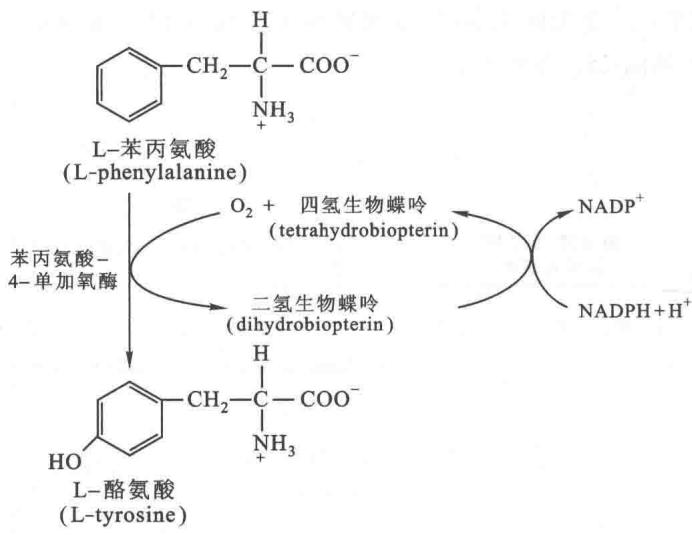

苯丙氨酸-4-单加氧酶（phenylalanine-4-monooxygenase）又称苯丙氨酸羟化酶（phenylalanine hydroxylase），该酶是一种混合功能酶，它同时催化两个反应，一方面使分子 $\mathrm{O}_2$ 中的一个氧原子将底物羟基化，另一方面使另一个氧原子还原为 $\mathrm{H}_2\mathrm{O}$ 。它的辅助因子是四氢生物蝶呤。

  
图 25-19 通过乙酰乙酰-CoA 途径形成乙酰-CoA 的氨基酸共 5 种: 赖氨酸、色氨酸、苯丙氨酸、酪氨酸和亮氨酸

（2）酪氨酸 酪氨酸既可转变为延胡索酸，又可转变为乙酰-CoA。苯丙氨酸和酪氨酸转变为延胡索酸和乙酰乙酰-CoA的途径如图25-20所示。

  
图25-20 酪氨酸转变为延胡索酸和乙酰乙酰-CoA的途径

酪氨酸在酪氨酸转氨酶催化下将氨基转移到 $\alpha-$ 酮戊二酸上，本身转变为 4-羟苯丙酮酸，后者脱羧形成尿黑酸，并产生 1 个 $CO_{2}$ 。酪氨酸和苯丙氨酸有 4 个碳原子转变为延胡索酸，因此这 2 种氨基酸可通过形成延胡索酸进入柠檬酸循环，除形成 1 个 $CO_{2}$ 和 4 个碳的延胡索酸外，其余的 4 个碳原子即形成乙酰乙酸，后者经琥珀酰-CoA 的活化形成乙酰乙酰-CoA。

在苯丙氨酸、酪氨酸代谢途径中，有两个酶和分子遗传缺陷症有关，将在本章第七节中讨论。

（3）亮氨酸 先经转氨形成 $\alpha-$ 酮酸，再氧化脱羧形成异戊酰-CoA(isovaleryl CoA)，后者再经脱氢、羧化、加水，形成六碳 $\beta-$ 羟- $\beta-$ 甲基戊二酰-CoA( $\beta-hydroxy-\beta-methyl\ glutaryl\ CoA$ )，随后分裂为乙酰-CoA 和乙酰乙酸，后者转变为乙酰乙酰-CoA 已如前述。 $\beta-$ 羟- $\beta-$ 甲基戊二酰-CoA 是胆固醇生物合成的前体之一。现将亮氨酸的分解途径概括如图 25-21。

（4）赖氨酸 其转变过程如图25-22所示。在复杂的转变过程中，4个碳原子转变为乙酰乙酰-CoA，其他两个碳原子经脱羧失去。赖氨酸不进行转氨作用。在一条途径中，赖氨酸先与 $\alpha-$ 酮戊二酸缩合，形成酵母氨酸(saccharopine)[ $\varepsilon-N(L-$ 戊二酸基-2-)-L-赖氨酸]，最后形成乙酰乙酰-CoA。在第二条途径中，赖氨酸的 $\alpha-$ 氨基可能被L-氨基酸氧化酶氧化。两条途径都形成L- $\alpha-$ 氨基己二酸半醛(L- $\alpha-$ aminoadipic semialdehyde)。

（5）色氨酸 其分解路线也颇复杂如图25-23所示。色氨酸的11个碳原子中的4个转变为乙酰乙酰-CoA，另外3个转变为丙氨酸，其余的4个形成3分子 $\mathrm{CO}_{2}$ 和1分子甲酸。色氨酸分解的第一步是氧化，形成 $N-$ 醛基犬尿氨酸。催化此反应的酶称为色氨酸2,3-二加氧酶，又名色氨酸吡咯酶（pyrrolase），该酶含有铜和血红素。人类患色氨酸2,3-二加氧酶遗传缺陷症，导致智力迟钝。中间产物3-羟犬尿氨酸在某些昆虫类用作色素的前体称为眼色素（ommochrome）。犬尿氨酸酶催化3-羟犬尿氨酸的分解，生成丙氨酸和3-羟邻氨基苯甲酸，该酶含有磷酸吡哆醛。哺乳动物缺乏维生素 $B_{6}$ 时，在尿中排出大量的犬尿氨酸，中间产物3-羟邻氨基苯甲酸是尼克酸生物合成的前体。

  
图 25-21 亮氨酸转变为乙酰-CoA 和乙酰乙酸途径

色氨酸分解代谢的中间产物是许多其他重要物质生物合成的前体,如5-羟色胺(serotonin)是一种神经递质和血管收缩物质,吲哚乙酸(indoleacetic acid)是一种植物激素,烟酸又称尼克酸是NAD和NADP的前体(图25-24)。

## （二） $\alpha-$ 酮戊二酸途径

参见图 25-15 所示, 经 $\alpha$ -酮戊二酸进入柠檬酸循环的氨基酸有精氨酸、组氨酸、谷氨酰胺、脯氨酸以及谷氨酸 5 种氨基酸。它们的转变关系可概括如图 25-25, 其中每个氨基酸的转变扼要分述如下:

## 1. 精氨酸

在精氨酸酶的作用下,水解形成尿素和鸟氨酸,经鸟氨酸转氨酶的作用,将 $\delta-$ 氨基转给 $\alpha-$ 酮戊二酸,本身转变为谷氨酸 $\gamma-$ 半醛;再经脱氢酶的作用形成谷氨酸,反应步骤参看图 25-26。谷氨酸转氨或氧化脱氨又形成 $\alpha-$ 酮戊二酸。

  
图25-22 赖氨酸转变为乙酰乙酰-CoA

由赖氨酸变为 $\alpha-$ 氨基己二酸半醛有两条不同路线，在肝占优势的是形成中间产物酵母氨酸途径

  
图25-23 色氨酸的分解代谢形成2分子乙酰-CoA的途径

  
图25-24 色氨酸的重要衍生物

  
图25-25 精氨酸、组氨酸、谷氨酰胺、脯氨酸和谷氨酸形成 $\alpha$ -酮戊二酸的途径

  
图25-26 精氨酸形成 $\alpha$ -酮戊二酸的途径

## 2. 组氨酸

经组氨酸氨裂合酶(histidine ammonia lyase)的作用,移去(α,β)一分子NH₃,转变为尿刊酸(urocanic acid),再经尿刊酸水合酶(urocanate hydratase)作用,形成4-咪唑酮-5丙酸(4-imidazolone-5-propionate),这步转变包括加入水分子和分子内部的氧化还原反应。咪唑酮丙酸酶催化水解使咪唑酮丙酸转变为N-甲亚氨基谷氨酸(N-formimioglutamic acid),后者在谷氨酸转甲亚氨酶(glutamate transformiminase)作用下,将甲亚氨基转移到四氢叶酸的第5位N原子上,本身转变为谷氨酸。组氨酸转变为谷氨酸的全过程如图25-27所示。

  
图25-27 组氨酸形成 $\alpha$ -酮戊二酸的途径

## 3.谷氨酰胺

可有三条途径形成谷氨酸,再形成 $\alpha-$ 酮戊二酸。

(1) 经谷氨酰胺酶水解：

$$
\mathrm{谷氨酰胺} + \mathrm {H_ {2} O\xrightarrow {\mathrm{谷氨酰胺酶}} \mathrm{谷氨酸} + NH_ {3}}
$$

（2）由谷氨酸合成酶催化，借助 $\mathrm{NADPH + H^{+}}$ 的还原作用，使 $\alpha-$ 酮戊二酸与谷氨酰胺转变为2分子谷氨酸：

$$
\text {   谷氨酰胺   } + \alpha - \text {   酮戊二酸   } + \mathrm{NADPH} + \mathrm{H} ^ {+} \xrightarrow {\text {   谷氨酸合成酶   }} 2 \text {   谷氨酸   } + \mathrm{NADP} ^ {+}
$$

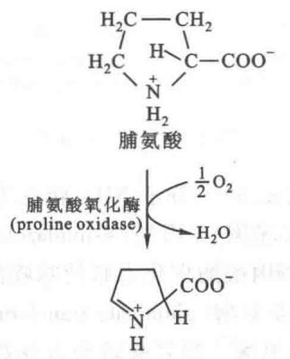  
$\Delta^{\prime}$ -吡咯啉-5-羧酸 $(\Delta^{\prime}$ -pyrroline-5-carboxylate）

（3）与 $\alpha-$ 酮戊二酸的 $\gamma-$ 位羧基转氨形成 $\alpha-$ 酮谷酰胺酸 ( $\alpha-$ ketoglutarmic acid)，又进而水解形成 $\alpha-$ 酮戊二酸和氨：

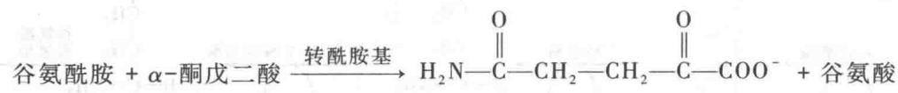

## 4. 脯氨酸和羟脯氨酸

如图 25-28 所示, 经氧化、加水等步骤形成谷氨酸- $\gamma$ -半醛, 再脱氢形成谷氨酸。

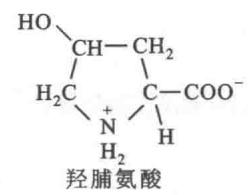

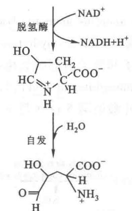

(γ-hydroxyglutamate - γ-semialdehyde)  

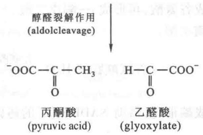  
图 25-28 脯氨酸和羟脯氨酸的分解途径

值得提出的是羟脯氨酸的转变与脯氨酸有所不同,它的分解产物是丙酮酸和乙醛酸,参看图25-28。但在脯氨酸和羟脯氨酸开始分解到形成 $\gamma$ -羟谷氨酸的过程,二者的分解方式是类似的,脯氨酸则形成谷氨酸。

## 5. 谷氨酸

经谷氨酸脱氢酶或经转氨都可形成 $\alpha-$ 酮戊二酸。

## （三）形成琥珀酰-CoA的途径

甲硫氨酸、异亮氨酸、缬氨酸的碳骨架最后形成丙酰辅酶 A 和甲基-丙二酰辅酶 A，进而转变为琥珀酰辅酶 A，概括如图 25-29。

  
图25-29 甲硫氨酸、异亮氨酸、缬氨酸转变为琥珀酰-CoA的途径

## 1. 甲硫氨酸

甲硫氨酸转变为琥珀酰-CoA的途径如图25-30所示。

## 2. 异亮氨酸

异亮氨酸转变为琥珀酰-CoA 以及乙酰-CoA 的步骤如图 25-31 所示。

## 3. 缬氨酸

缬氨酸转变为琥珀酰-CoA 的途径如图 25-32 所示。

## （四）形成延胡索酸途径

经延胡索酸进入柠檬酸循环的氨基酸有苯丙氨酸和酪氨酸。这两种氨基酸的分解已在图25-19和图25-20中表明，在分解过程中，其芳香环的降解通过氧化酶的作用，苯丙氨酸羟化酶为单加氧酶，以四氢蝶呤为还原剂，中间产物4-延胡索酰乙酰乙酸由延胡索酰乙酰乙酸酶催化，形成两个产物，一个是乙酰乙酸，另一个是延胡索酸。因此，苯丙氨酸和酪氨酸分子都是通过两条途径进入柠檬酸循环的，一条是通过乙酰乙酰-CoA再形成乙酰-CoA的途径，另一条则是延胡索酸途径。

  
图25-30 甲硫氨酸转变为琥珀酰-CoA的途径

(methylmalonyl semialdehyde)  
甲基丙二酰半醛  
缬氨酸  
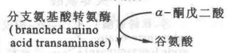

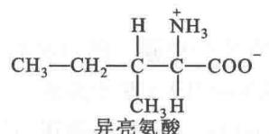

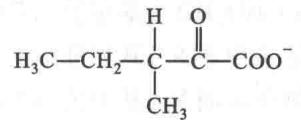

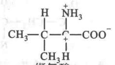

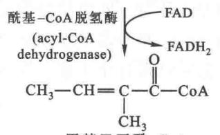

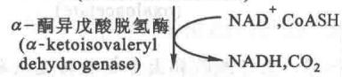

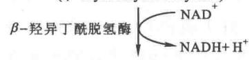

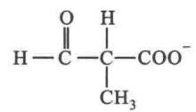

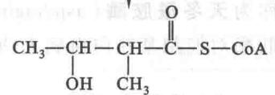

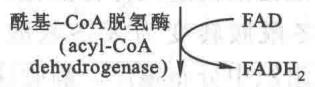

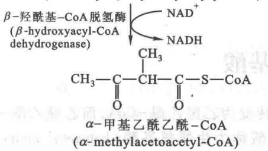

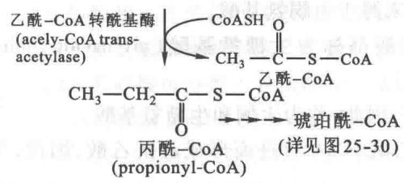

  
图 25-31 异亮氨酸转变为琥珀酰-CoA 以 图 25-32 缬氨酸转变为琥珀酰-CoA 的途径及乙酰-CoA 的途径

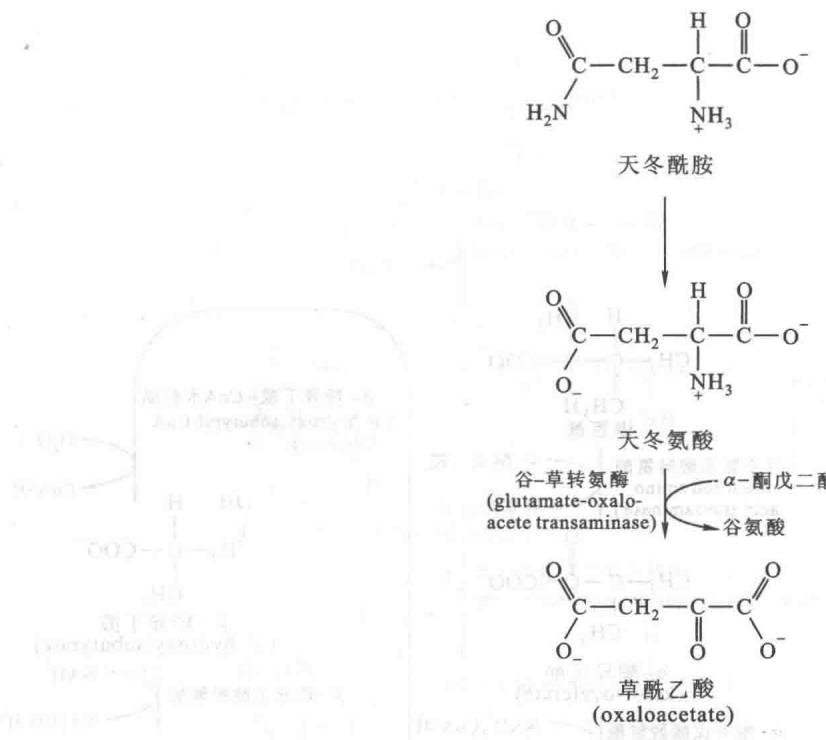  
图 25-33 天冬酰胺和天冬氨酸转变为草酰乙酸的途径

## （五）形成草酰乙酸途径

天冬酰胺和天冬氨酸可转变为草酰乙酸而进入柠檬酸循环。天冬酰胺先转变为天冬氨酸，然后再经转氨作用而形成草酰乙酸。催化天冬酰胺转变为天冬氨酸和氨的酶称为天冬酰胺酶（asparaginase）（图25-33）。天冬酰胺酶在动、植物组织中分布很广。静脉注射天冬酰胺酶对控制某些白血病人的症状有一定效果，可能是由于该酶能够限制恶性白细胞利用天冬酰胺。

植物和某些微生物的天冬氨酸还可直接脱氨形成延胡索酸。催化此反应的酶为天冬氨酸氨裂解酶(aspartate ammonia lyase)，该酶在动物组织中不存在。

## 五、生糖氨基酸和生酮氨基酸

有些氨基酸如苯丙氨酸、酪氨酸、亮氨酸、色氨酸，在分解过程中转变为乙酰乙酰-CoA，而乙酰乙酰-CoA在动物的肝中可转变为乙酰乙酸和β-羟丁酸，因此这5种氨基酸称为生酮氨基酸（ketogenic amino acid）。糖尿病人的肝所形成的大量酮体，除来源于脂肪酸外，还来源于生酮氨基酸。

凡能形成丙酮酸、 $\alpha-$ 酮戊二酸、琥珀酸和草酰乙酸的氨基酸都称为生糖氨基酸（glycogenic amino acid）。因为这些物质都能导致生成葡萄糖和糖原（参看第22章）。

有的氨基酸如苯丙氨酸和酪氨酸，既可生成酮体又可生成糖，因此，称为生酮和生糖氨基酸。

还有些氨基酸如丙氨酸、丝氨酸、半胱氨酸，也可通过形成乙酰-CoA后进而形成乙酰乙酸，因此，生酮氨基酸和生糖氨基酸的界限并不是非常严格的。

## 六、由氨基酸衍生的其他重要物质

## （一）氨基酸与一碳单位

生物化学中将具有一个碳原子的基团称为“一碳单位”（one carbon unit）或“一碳基团”（one carbon

group)。

生物体内的一碳单位有许多形式,例如:

(1) 亚氨甲基—CH=NH (formimino-)

(2) 甲酰基 H—C—(formyl-)
O

(3) 羟甲基— $CH_{2}OH$ (hydroxymethyl-)

(4) 亚甲基(又称甲叉基)— $CH_{2}$ —(methylene-)

(5) 次甲基(又称为甲川基)—CH=(methenyl)

(6) 甲基— $CH_{3}$ (methyl-)

许多氨基酸都可作为一碳单位来源，如甘氨酸、苏氨酸、丝氨酸和组氨酸等。

一碳单位不只与氨基酸代谢密切相关,还参与嘌呤和嘧啶的生物合成以及S-腺苷甲硫氨酸的生物合成。它是生物体各种化合物甲基化的甲基来源。

许多带有甲基的化合物在生物学上都有重要功能。如肾上腺素、肌酸、卵磷脂等。嘌呤和嘧啶又是合成核酸的重要成分。

一碳单位的转移靠四氢叶酸(5,6,7,8-tetrahydrofolic acid)，用符号THF表示，曾用 $\mathrm{HF}_4$ 表示，携带甲基的部位是在 $N^5, N^{10}$ 位（参看维生素章叶酸部分）。THF是一个6-甲基蝶呤(6-methylpterin)的衍生物，依次与对氨基苯甲酸(p-aminobenzoic acid)和谷氨酸残基相连（图25-34）。四氢叶酸有附加的5个谷氨酸残基与第1个谷氨酸残基通过异肽键(isopeptide bond)相连，形成多谷氨酸尾部。

  
图25-34 四氢叶酸结构图

一碳单位与 THF 在 N5, N10, 或 N5 和 N10 位以共价相连。与 THF 相连的一碳单位可处于不同的氧化水平, 如甲酸(formate)、甲醛(formaldehyde)或甲醇(methanol)等, 在氧化还原酶的催化下, 可以互相转化(图 25-35)。

氨基酸和一碳单位的关系可列举如下：

（1）甘氨酸脱氨基生成乙醛酸后，与THF反应生成 $N^{5},N^{10}$ -亚甲基THF。

(2) 苏氨酸可分解为甘氨酸和乙醛, 所以苏氨酸是通过甘氨酸形成一碳单位。

（3）丝氨酸分子上的 $\beta-$ 碳原子可转移到 THF 上，同时脱去一分子水，生成 $N^{5}, N^{10}-$ 亚甲基 THF ( $N^{5}, N^{10}-CH_{2}-THF$ )。丝氨酸的 $\beta-$ 碳原子转移后变为甘氨酸。所以丝氨酸既可直接与 THF 作用形成一碳衍生物，又可通过甘氨酸途径形成 $N^{5}, N^{10}-$ 亚甲基 THF。

（4）组氨酸在分解过程中形成亚氨甲酰谷氨酸(N-formimino glutamate)后与THF作用,将亚氨甲酰基转移到THF上,形成亚氨甲酰THF,再脱去氨后即形成 $N^{5},N^{10}$ -次甲基四氢叶酸。

（5）S-腺苷甲硫氨酸可提供甲基，它是在甲硫氨酸腺苷转移酶(methionine adenosyl transferase)作用下，由ATP和甲硫氨酸合成(图25-36)。在这个反应中，甲硫氨酸上的硫原子对ATP核糖上的5'碳原子发起亲核进攻，导致三磷酸基被释放，裂解成PPi和Pi，随后，PPi通过焦磷酸酶的作用进一步裂解。

  
图25-35 与四氢叶酸结合的一碳单位的转变形式

  
图 25-36 活化甲基循环中蛋氨酸和 S-腺苷甲硫氨酸合成

尽管 $N^{5}$ -甲基四氢叶酸在 N5 上携带一个甲基，但是其转移势对于体内大多数合成反应是不够的。生物体内合成胆碱、肌酸、肾上腺素等所需的甲基都是由 S-腺苷甲硫氨酸提供。S-腺苷甲硫氨酸是大约 50 种不同甲基受体的供给者。催化甲基转移的酶称为甲基转移酶，脱甲基后的产物是 S-腺苷高半胱氨酸。虽然甲硫氨酸是甲基的供给者，但是，甲硫氨酸的甲基却只能由极少数反应提供，主要途径是从 $N^{5}$ -甲基四氢叶酸的甲基转移到高半胱氨酸上。

一碳单位还可参与嘌呤和胸腺嘧啶的合成。

如上所述,甲基的转移靠四氢叶酸。叶酸是四氢叶酸的前体。人体所需叶酸来源于食物,因体内没有合成叶酸的酶,而细菌所需叶酸靠自身合成。叶酸分子的组成成分之一是对氨基苯甲酸。常用的磺胺类药物是对氨基苯甲酸的颉颃剂,因此能抑制细菌的生长,而对人体影响不大。抗叶酸药物如三甲氧苄二氨嘧啶(trimethoprim,TMP)等二氢叶酸类似物,能抑制二氢叶酸还原酶的活性从而影响叶酸还原为四氢叶酸。若将甲氧苄氨嘧啶与磺胺药共同使用,可明显增强药力并减少两种药物的用量。这类药物称为“增效剂”。

## （二）氨基酸与生物活性物质

有些氨基酸在神经系统活动中起着重要作用,它们本身都属于生物活性物质,此外,生物体在生命活动中还需要由氨基酸合成许多其他生物分子来调节代谢及生命活动。这类生物分子,少量就能发挥明显的生物功能,因此称为生物活性物质。表 25-2 列举了一部分由氨基酸来源的生物分子。

表 25-2 氨基酸来源的生物活性物质

<table><tr><td>氨基酸</td><td>转变产物</td><td>生物学作用</td><td>备注</td></tr><tr><td rowspan="3">甘氨酸</td><td>嘌呤碱</td><td>核酸及核苷酸成分</td><td>与Gln、Asp、一碳单位 $CO_{2}$ 共同合成</td></tr><tr><td>肌酸</td><td>组织中储能物质</td><td>与Arg、Met共同合成</td></tr><tr><td>卟啉</td><td>血红蛋白及细胞色素等辅基</td><td>与琥珀酰-CoA共同合成</td></tr><tr><td rowspan="2">丝氨酸</td><td>乙醇胺及胆碱</td><td>磷脂成分</td><td>胆碱由Met提供甲基</td></tr><tr><td>乙酰胆碱</td><td>神经递质</td><td></td></tr><tr><td>半胱氨酸</td><td>牛磺酸</td><td>结合胆汁酸成分</td><td></td></tr><tr><td>天冬氨酸</td><td>嘧啶碱</td><td>核酸及核苷酸成分</td><td>与 $CO_{2}$ 、Gln共同合成</td></tr><tr><td>谷氨酸</td><td>γ-氨基丁酸</td><td>抑制性神经递质</td><td></td></tr><tr><td>组氨酸</td><td>组胺</td><td>神经递质</td><td></td></tr><tr><td rowspan="3">酪氨酸</td><td>儿茶酚胺类</td><td>神经递质</td><td>肾上腺素由Met提供甲基</td></tr><tr><td>甲状腺激素</td><td>激素</td><td></td></tr><tr><td>黑色素</td><td>皮、发形成黑色</td><td></td></tr><tr><td rowspan="3">色氨酸</td><td>5-羟色胺</td><td>神经递质促进平滑肌收缩</td><td>即N-乙酰-5-甲氧色胺</td></tr><tr><td>退黑素</td><td>松果体激素</td><td></td></tr><tr><td>烟酸</td><td>维生素PP</td><td></td></tr><tr><td>鸟氨酸</td><td>腐胺亚精胺</td><td>促进细胞增殖</td><td></td></tr><tr><td>天冬氨酸</td><td>—</td><td>兴奋性神经递质</td><td></td></tr><tr><td>谷氨酸</td><td>—</td><td>兴奋性神经递质</td><td></td></tr></table>

下面列举几种生物分子的形成机制。

## 1. 酪氨酸代谢与黑色素(melanin)的形成

酪氨酸在酪氨酸酶(tyrosinase)作用下形成二羟苯丙氨酸(dihydroxy phenylalanine, dopa)，后者是一辅助底物(cosubstrate)，再被同一酶作用形成多巴醌(dopaquinone)又称苯丙氨酸-3,4-醌(phenylalanine-3,4-quinone)。极少量的多巴醌能起到催化作用，酮式的苯丙氨酸3,4-醌是不稳定物质，自发进行一系列反应形成吲哚5,6-醌(indole-5,6-quinone)，后者聚合形成黑色素(melanin pigment)(图25-37)。

## 2. 酪氨酸代谢和肾上腺素、去甲肾上腺素、多巴及多巴胺的形成

肾上腺素和去甲肾上腺素最早发现于肾上腺髓质，其生理功能除对心脏、血管有作用（参看第14章激素）外，还发现它们与多巴(dopa)、多巴胺(dopamine)这些由酪氨酸衍生来的系列物，都在神经系统中起重要作用。它们和神经活动、行为以及大脑皮层的醒觉和睡眠节律等都有关系。

肾上腺素、去甲肾上腺素、多巴及多巴胺由酪氨酸的衍生途径如图 25-38。

肾上腺素（AD）、去甲肾上腺素（NA）、多巴和多巴胺（DA）等统称为儿茶酚胺（catecholamine）类物质。

## 3. 色氨酸代谢与 5-羟色胺及吲哚乙酸

如前所述,5-羟色胺是脊椎动物的一种神经递质,在神经系统中的含量与神经的兴奋和抑制状态有密切关系,也是一种血管收缩素。吲哚乙酸是一种植物生长激素。二者都是由色氨酸形成的,其形成途径如图25-39所示。

## 4. 肌酸和磷酸肌酸的形成

肌酸存在于动物的肌肉、脑和血液。既可以游离形式存在，也可以磷酸化形式存在。后者称为磷酸肌酸。肌酸和磷酸肌酸在贮存和转移磷酸键能中起重要作用（参看第16章生物能学）。参与肌酸合成的有3种氨基酸：精氨酸、甘氨酸和甲硫氨酸。合成反应如图25-40所示。

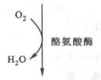

  
图 25-37 酪氨酸代谢与黑色素的形成  
肾上腺素(epinephrine)  
图25-38 酪氨酸形成多巴、多巴胺、去甲肾上腺素、肾上腺素的途径

  
图25-39 由色氨酸形成5-羟色胺及吲哚乙酸的途径

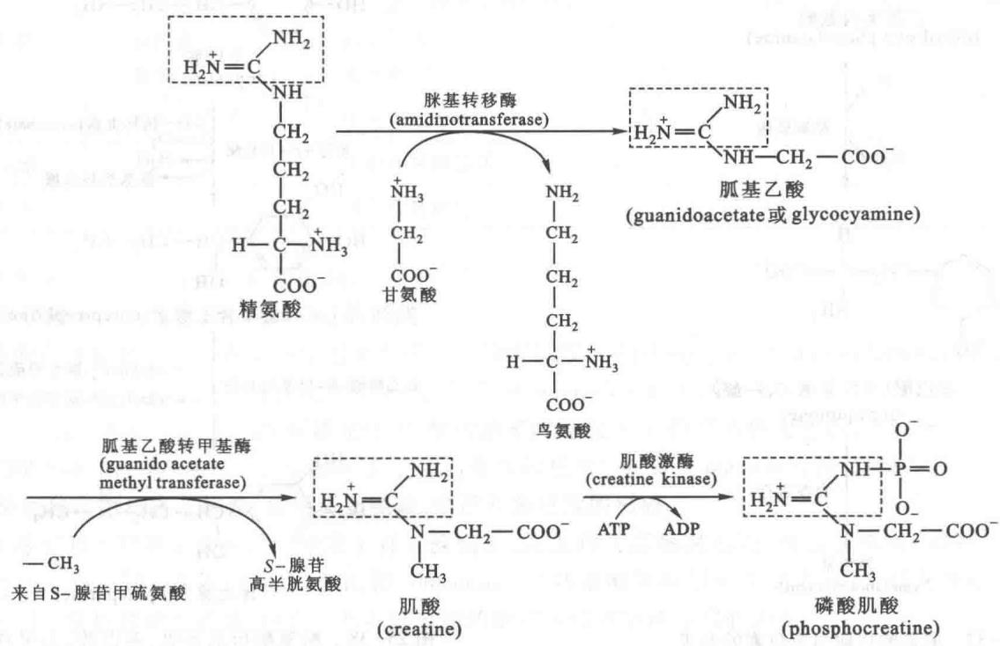  
图 25-40 精氨酸、甘氨酸、甲硫氨酸形成磷酸肌酸的途径

## 5. 组胺的形成

肺、肝、胃黏膜的壁细胞、肌肉、乳腺及神经组织都有组胺存在。它是一种强烈的血管舒张物质，浓度过高可引起虚脱。创伤性休克或炎症病变部位都有组胺释放。它还有刺激胃黏膜分泌胃蛋白酶和胃酸的作用。在神经组织中它是感觉神经的一种递质，和周围神经的感觉与传递有密切关系。

组胺是组氨酸脱羧基的产物,它的形成如下式:

## 6. 腐胺、精胺、亚精胺（精脒）的形成

腐胺(putrescine)名称的起源是因为它发现于腐败的肉中。它是鸟氨酸脱羧的产物,鸟氨酸来源于精氨酸的水解。

亚精胺(spermidine)和精胺(spermine)名称的来源是因为它们发现于人的精液中。这两种物质在法律上一直用于鉴定犯罪事实。但它们的结构直至1926年才弄清。现已知亚精胺、精胺和腐胺广泛存在于各种组织，而且可能具有重要的功能。它们总是与核酸并存，可能在转录和细胞分裂的调节中起作用。

亚精胺来源于腐胺。三者的形成途径如图 25-41 所示。

  
图 25-41 腐胺、亚精胺和精胺的形成途径

亚精胺和精胺的分子中,含有多个氨基,因此又统称多胺(polyamine)。

## 7. 谷氨酸和 $\gamma$ -氨基丁酸

谷氨酸在动物脑中含量占全身各组织的首位。在脑和脊髓中是一种广泛存在的具有兴奋作用的神经递质。谷氨酸脱羧形成 $\gamma-$ 氨基丁酸（ $\gamma-$ aminobutyric acid，简称 GABA），可增加突触后神经元细胞膜对 $Na^{+}$ 的通透性，使神经元细胞膜超极化，从而提高动作电位的启动阈值，因此，是脑组织中具有抑制作用的神经递质。

$\gamma$ -氨基丁酸的形成途径如下：

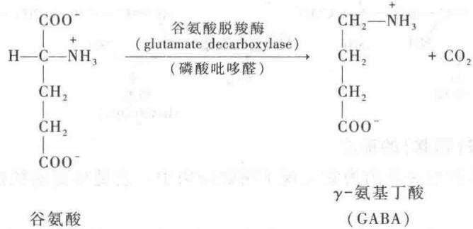

γ-氨基丁酸并非氨基酸中唯一的抑制性神经递质，甘氨酸、牛磺酸等也都是不同程度的抑制性神经递质。谷氨酸也并非唯一的兴奋性神经递质，天冬氨酸也有类似的作用。

## 8. 牛磺酸和半胱氨酸

牛磺酸来源于半胱氨酸氧化脱羧,反应参见图 25-17。牛磺酸是某些胆酸的组分,也被认为是一种抑制性神经递质。

## 七、氨基酸代谢缺陷症

氨基酸代谢中缺乏某一种酶,都可能引起疾患,这种疾病称为代谢缺陷症。由于某种酶的缺乏,致使该酶的作用物在血或尿中大量出现。这种代谢缺陷属于分子疾病。其病因和 DNA 分子突变有关,往往是先天性的,又称为先天性遗传代谢病。这类先天性代谢缺陷症,大部分发生在婴儿时期,常在幼年就导致死亡,发病的症状表现有智力迟钝、发育不良、周期性呕吐、沉睡、搐溺、共济失调及昏迷等。目前已发现的氨基酸代谢病已达 30 多种。表 25-3 列举一些与先天性氨基酸代谢病有关的酶,以及血或尿中出现的不正常代谢产物。

表 25-3 先天性氨基酸代谢缺陷症

<table><tr><td>病名</td><td>涉及的氨基酸代谢途径</td><td>临床症状</td><td>代谢缺陷</td></tr><tr><td>精氨酸血和高血氨症(argininemia and hyperammonemia)</td><td>精氨酸和尿素循环</td><td>智力迟钝,血中出现精氨酸及氨</td><td>缺乏精氨酸酶</td></tr><tr><td>鸟氨酸血和高血氨症(ornithinemia and hyperammonemia)</td><td>尿素循环</td><td>新生儿死亡、昏睡、惊厥、智力迟钝</td><td>缺乏氨甲酰磷酸合成酶、鸟氨酸脱羧酶</td></tr><tr><td>高甘氨酸血症(hyperglycinemia)</td><td>甘氨酸</td><td>严重的智力迟钝</td><td>甘氨酸代谢系统疾患</td></tr><tr><td>高组氨酸血症(hyperhistidinemia)</td><td>组氨酸</td><td>语言缺陷,某些情况有智力迟钝</td><td>组氨酸酶缺欠</td></tr><tr><td>枫糖尿症(maple syrup urine disease,MSUD,又称支链酮酸尿症)</td><td>异亮氨酸、亮氨酸、缬氨酸</td><td>新生儿呕吐、惊厥、死亡,严重的智力迟钝</td><td>支链酮酸脱氢酶复合体缺欠</td></tr><tr><td>甲基丙二酸血症(methylmalonic acidemia)</td><td>异亮氨酸、甲硫氨酸、苏氨酸及缬氨酸</td><td>除血中积累甲基丙二酸外,其他症状同上</td><td>缺乏甲基丙二酰-CoA、变位酶(有些病人对维生素 $B_{12}$ 治疗有反应)</td></tr><tr><td>异戊酸血症(isovaleric acidemia)</td><td>亮氨酸</td><td>新生儿呕吐、酸中毒、昏睡及昏迷,生存者智力迟钝</td><td>缺乏异戊酰-CoA脱氢酶</td></tr><tr><td>高赖氨酸血症(hyperlysinemia)</td><td>赖氨酸</td><td>智力迟钝,同时某些非中枢神经系统不正常</td><td>缺乏赖氨酸-酮戊二酸还原酶</td></tr><tr><td>高胱氨酸尿症(homocystinuria)</td><td>甲硫氨酸</td><td>智力迟钝,眼疾患,血栓栓塞,骨质疏松、骨结构不正常</td><td>缺乏胱硫醚- $\beta$ -合酶</td></tr><tr><td>苯丙酮尿症和高苯丙氨酸尿症(phenylketonuria and hyperphenylalaninemia)</td><td>苯丙氨酸</td><td>新生儿呕吐,智力迟钝以及其他神经疾患</td><td>缺乏苯丙氨酸-4-单加氧酶</td></tr><tr><td>高脯氨酸血症I型(hyperprolinemia type I)</td><td>脯氨酸</td><td>临床检验除血中含有过量脯氨酸外,未发现其他症状</td><td>缺乏脯氨酸氧化酶、脯氨酸脱氢酶</td></tr><tr><td>尿黑酸症(alkaptonuria)</td><td>酪氨酸</td><td>尿中含有尿黑酸,在碱性条件下,在空气中变黑。成人皮肤和软骨变黑,发展成关节炎</td><td>缺乏尿黑酸氧化酶</td></tr><tr><td>白化病(albinism)</td><td></td><td>最普通的类型是眼皮肤白化,头发变为白色,皮肤呈粉色,惧光,眼睛缺少色素</td><td>缺失黑色素细胞的酪氨酸酶</td></tr></table>

上表中值得特别提出的是在苯丙氨酸代谢中由于缺乏苯丙氨酸-4-单加氧酶（phenylalanine-4-monooxygenase）而引起的苯丙酮尿症（phenylketonuria, PKU 症）。这种病，在 1 万人中即可发现一人。当机体缺乏这种酶时，苯丙氨酸的正常代谢途径（参见图 25-19，图 25-20）即改变为在正常情况下很少起作用的第二条途径，即苯丙氨酸与 α-酮戊二酸转氨形成苯丙酮酸，聚集在血液中，最后由尿排出体外。这是人们最早认识的一种代谢遗传缺陷症。患者若在儿童时期限制吃含有苯丙氨酸的饮食，可以防止发生智力迟钝。

尿黑酸症,是酪氨酸代谢中缺乏尿黑酸氧化酶引起(图25-42)。这种病人尿中含有尿黑酸,在碱性条件下暴露于氧气中即氧化并聚合成为类似黑色素的物质而使尿显黑色。因此称为尿黑酸症(alkaptonuria),这种病人的结缔组织有不正常的色素沉着。

  
图 25-42 酪氨酸代谢中间产物尿黑酸的氧化分解途径  
缺乏尿黑酸1,2-二加氧酶导致尿黑酸症

枫糖尿症(maple syrup urine disease)名称的来源并不是由于尿中有枫糖排出,而是患者的尿有类似枫糖的气味。患者血液及尿中出现大量支链氨基酸(缬氨酸、亮氨酸、异亮氨酸)及其相应酮酸,因此,又称为支链酮酸尿症。患者出生后约一周末出现症状,喂食困难、呕吐、昏睡等,出现广泛的大脑损伤,一般在周岁死亡。

## 提要

细胞不断地把氨基酸合成为蛋白质，又不断把蛋白质降解为其组成成分——氨基酸。这个过程有二重功能,其一是排除不正常的蛋白质,它们若一旦聚集,将对细胞有害;其二是通过排除积累过多的酶和调节蛋白,使细胞代谢得以秩序井然地进行。对正常蛋白质的降解,细胞是有选择性的。绝大多数的非正常蛋白质很可能基于它们的化学修饰及/或“这些分子不变性”而降解。细胞中蛋白质的降解速度还因它的营养及激素状态而有所差异。

真核细胞对蛋白质的降解有二个体系,一个是溶酶体系,另一个是以细胞溶胶为基础,依赖ATP的机制。溶酶体系含有约50种水解酶。溶酶体融合细胞中的自噬泡,随即分解其内溶物;溶酶体还能降解一些物质,这些物质是细胞的胞吞作用的目的物。溶酶体降解蛋白质是非选择性的,这个机制有着多样的生理功能。依赖ATP,以细胞溶胶为基础的机制,又称泛素标记选择性蛋白质降解。有选择性的蛋白质先以共价键与泛素连接,这个程序的目的是“标记”氨基酸的激活,它经过3步反应,泛素连接的蛋白质乃在ATP依赖的反应中由泛素结合降解酶——专一降解与泛素相接的蛋白质的水解酶催化而被降解。

氨基酸的分解代谢总是先脱去氨基。脱氨基的方式，不同生物不完全相同，氧化脱氨基作用普遍存在于动植物中，非氧化脱氨基作用主要见于微生物。转氨基作用是氨基酸脱去氨基的一种重要方式。不同氨基酸和 $\alpha-$ 酮戊二酸的转氨形成谷氨酸在氨基酸的分解代谢中占有重要地位。催化转氨基作用的酶称为转氨酶，以磷酸吡哆醛作为辅基。与转氨作用相偶联的反应有氨基酸的氧化脱氨基作用和嘌呤核苷酸循环。谷氨酸脱氢酶将谷氨酸脱去氨基形成 $\mathrm{NH}_{4}^{+}$ 和 $\alpha-$ 酮戊二酸。 $\mathrm{NAD}^{+}$ 或 $\mathrm{NADP}^{+}$ 是该反应的电子受体。陆生脊椎动物将脱下的氨合成尿素。嘌呤核苷酸循环将氨基酸的 $\alpha$ 氨基与次黄嘌呤核苷酸结合形成腺嘌呤核苷酸，再经水解脱下氨基形成 $\mathrm{NH}_{4}^{+}$ 。氨的运输形式是形成谷氨酰胺。

尿素的形成通过尿素循环,尿素的直接前体是精氨酸。精氨酸水解形成尿素和鸟氨酸,后者又与由氨、二氧化碳和 ATP 合成的氨甲酰磷酸作用,形成瓜氨酸。瓜氨酸又在天冬氨酸参与下,加入亚氨基形成精氨酸。

氨基酸的碳骨架进行氧化分解时,先形成能够进入柠檬酸循环的化合物。氨基酸可通过5条途径进入柠檬酸循环:通过形成乙酰-CoA、α-酮戊二酸、琥珀酰-CoA、延胡索酸和草酰乙酸,大多数氨基酸是生糖氨基酸,两种氨基酸是生酮氨基酸,少数氨基酸既能生糖也能生酮。丙氨酸、丝氨酸、半胱氨酸、甘氨酸、苏氨酸都能转变为丙酮酸。天冬酰胺和天冬氨酸都能转变为草酰乙酸。α-酮戊二酸是谷氨酸以及谷氨酰胺、组氨酸、脯氨酸和精氨酸5种氨基酸碳骨架的入口,后4种氨基酸都可转变为谷氨酸。琥珀酰-CoA是甲硫氨酸、异亮氨酸、缬氨酸部分碳原子的入口,这3种氨基酸都通过形成甲基丙二酰-CoA转变为琥珀酰-CoA。亮氨酸可转变为乙酰乙酰-CoA和乙酰-CoA。酪氨酸和苯丙氨酸通过两条途径进入柠檬酸循环。一条是通过乙酰乙酰-CoA再形成乙酰-CoA,另一条是延胡索酸途径。

生物体许多重要生物分子都是由氨基酸衍生而来。氨基酸是“一碳单位”的直接提供者。此外氨基酸还是多种生物活性物质的前体，如黑色素、儿茶酚胺、5-羟色胺、γ-氨基丁酸以及肌酸等。

## 习题

1. 动物体内有哪些主要的酶参加蛋白质水解反应？总结这些酶的作用特点。

2. 氨基酸脱氨基后的碳链如何进入柠檬酸循环？

3. 有一种遗传病人, 在血浆中异戊酸的含量增高, 可能影响了哪种氨基酸的代谢? 如果这种氨基酸及其 $\alpha$ -酮酸在血液中含量是正常的, 可能缺乏哪一种酶?

4. 写出苯丙氨酸在排氨动物和排尿素动物体内完全氧化时的平衡式，包括全部活化和能量贮存步骤。

5. 组氨酸分解代谢时,下面标出的原子会出现在谷氨酸的什么位置上?

6. 写出丙氨酸转变为乙酰乙酸和尿素的总平衡式。

7. 根据化学计算, 在尿素合成中消耗了 4 个高能磷酸键 ( $\sim P$ ), 在此反应中天冬氨酸转变为延胡索酸。假设延胡索酸又转回到天冬氨酸, 尿素合成的化学计算结果如何? 消耗了几个高能磷酸键?

8. 用成年大白鼠做同位素示踪实验,得到下面的结果:肌酸分子中的标记原子是由下面所列的一些前体而来,从这样的实验结果设计一条肌酸合成的可能途径。

$$
\begin{array}{r l} & \mathrm {H_3N^* - C - NH - (CH_2)_3 - CH - COO^- 精氨酸} \\ & \quad \Bigg | _ {\mathrm{NH}} \quad \quad \quad \quad \quad \quad \quad \quad \quad \quad \quad \quad \quad \quad \quad \quad \quad \quad \quad \quad \quad \quad \quad \quad \quad \quad \quad \text {肌酸} \\ & \mathrm {H_3C^* - N^* - CH_2 - COO^-} \\ & \uparrow \quad \quad \quad \quad \quad \quad \quad \quad \quad \quad \quad \quad \quad \quad \quad \quad \text {甘氨酸} \\ & \mathrm {H_3C^* - S - (CH_2)_2 - CH - COO^- 甲硫氨酸} \\ & \quad \quad \quad \quad \quad \quad \quad \quad \quad \quad \quad \quad \quad \quad \text {NH_2} \end{array}
$$

9. 说明尿素形成的机制和意义。

## 主要参考书目

1. Nelson D L, Cox M M. Lehninger Principles of Biochemistry. 6th ed. New York: W. H. Freeman and Company, 2012.

2. Ciechanover A, Hod Y, Hershko A. Biochem Biophys Res Commun, 2012, (425): 565-570.

3. Brusilow S. Urea Cycle Enzymes //The Metabolic & Molecular bases of Inherited Disease. New York: McGraw Hill, 2001: 1909-1963.

4. Umbarger H E. Amino Acid Biosynthesis and its Regulation. Ann. Rev. Biochem, 1978, (47): 553-606.

5. Cooper A J. Biochemistry of sulfur-containing amino acids. Ann. Rev. Biochem, 1983, (52): 187-222.

6. Hermann K M, Somerville R L. Amino Acids: Biosynthesis and genetic regulation. Upper Saddle River: Addison-Wesley, 1983.

(王镜岩 秦咏梅)

## 网上资源

习题答案 自测题

# 第 26 章 氨基酸的生物合成和生物固氮

## 一、生物固氮

氮是构成生命物质的基本元素,也是农业生产的基本肥料。尽管分子氮 $\left(\mathrm{N}_{2}\right)$ 占空气的79%,但因 $N\equiv N$ 键非常牢固,高等植物无法直接利用它。只有通过某些微生物把空气中游离的氮固定,转化为含氮化合物后植物方可利用。这种通过微生物将分子氮转化为含氮化合物的过程即称为生物固氮。

生物固氮的研究领域,包括生物固氮机制、共生固氮机制、固氮分子遗传及固氮微生物等等。从1862年发现生物固氮现象到目前为止,生物固氮的研究已有一百多年的历史。以生物固氮机制为主线,可以把这一百年的研究史大致分为三个时期。

第一个时期,从 1862 年到 1960 年,大约一百年,是细胞水平时期。在这漫长的历史时期内,生物固氮的研究,是用完整的细胞作为实验材料的。1888 年,贝杰林克(Beijierink)第一个从豆科植物中分离到根瘤菌。从此以后,各种各样的固氮微生物相继被分离鉴定出来。20 世纪初期,将圆褐固氮菌、根瘤菌等应用于农业,使一些农作物获得了明显的增产。由于当时实验材料摆脱不了完整的细胞,使生物固氮机制的研究受到了很大的限制,生物固氮机制的研究进展十分缓慢。虽然早在 1893 年维诺格拉得斯基(Winogradsky)就推测过, $NH_{3}$ 可能是生物固氮的产物,但是关于生物固氮的产物是不是 $NH_{3}$ 的问题,一直争论不休。1942 年,鲍利斯应用 $^{15}N$ 实验示踪确定了 $NH_{3}$ 是生物固氮的产物。

第二个时期,从 1960 年到 1966 年,是无细胞水平时期。在这一时期,生物固氮机制的研究,主要是用无细胞抽提液作为实验材料的。首先把固氮菌细胞粉碎,用超速离心分离,除去细胞的残渣碎片,得到无细胞的抽提液。然后,以此抽提液为实验材料,来研究生物固氮机制。

1960年，美国卡纳汉(Carnahan)等人，通过将丙酮酸加到巴氏梭菌的无细胞抽提液中，成功地实现了 $\mathrm{N}_2$ 还原成 $\mathrm{NH}_3$ 的试验，这一试验的成功，打破了长期以来生物固氮机制的研究摆脱不了完整细胞的困难局面，开辟了用无细胞抽提液研究生物固氮机制的新途径。1962年，莫顿森(Mortenson)等人发现，生物固氮必须有铁氧还蛋白作电子传递体，并从巴氏梭菌中得到了这种蛋白。1964年，哈迪等人直接明确地证明了生物固氮必须有ATP的参与。1965年，布伦(Bulen)等人发现， $\mathrm{Na}_2\mathrm{S}_2\mathrm{O}_4$ 可以代替由铁氧还蛋白、氢化酶和 $\mathrm{H}_{2}$ 所组成的电子供体系统。1966年，迪尔沃思(Dilworth)和肖勒霍恩(Schollhorn)同时发现了 $\mathrm{C}_2\mathrm{H}_2$ 可作为固氮酶的底物，并且创建了一个测定固氮酶活性的新方法——乙炔还原法。

第三个时期，从1966年到目前，是分子水平时期。1966年，布伦等和莫顿森等分别从棕色固氮菌和巴氏梭菌的抽提液中，得到了部分纯化的钼铁蛋白和铁蛋白制剂。1972年，伊迪（Eady）等人从肺炎克氏杆菌中分离到了纯的钼铁蛋白和铁蛋白制剂。固氮酶提纯的成功，得以使固氮酶结构与功能为中心的生物固氮机制的研究进入更本质的阶段。1992年，固氮酶的空间结构得到测定。

自然界中只有少数原核生物能固定原子态的氮。这些原核生物包括在土壤、空气和海洋中的蓝藻（blue-green algae）、一些自养型土壤细菌及豆科植物根瘤的共生固氮菌，能够将空气中的 $\mathrm{N}_2$ 还原为 $\mathrm{NH}_3$ （ $\mathrm{NH}_4^+$ ）。迄今已知的能固氮的生物属于原核生物，从其固氮类型来说，可分为两大类（图26-1）：其一为能独立生存的自生型固氮微生物，种类较多，包括细菌、放线菌类微生物和蓝藻等；其二为与其他植物共生的共生型固氮微生物。所有这些固氮微生物中最重要的是豆科植物的根瘤菌。形成的 $\mathrm{NH}_4^+$ ，由土壤中的微生物氧化为 $\mathrm{NO}_2^-$ 及 $\mathrm{NO}_3^-$ ，称为硝化作用（nitrification）。植物和许多微生物都含有硝酸及亚硝酸还原酶能将 $\mathrm{NO}_2^-$ 及 $\mathrm{NO}_3^-$ 再还原为 $\mathrm{NH}_4^+$ 。植物利用它作为合成氨基酸的氮源。动物则利用植物作为氨基酸的来源。

固氮微生物 $\left\{\begin{array}{l}\text { 共生型固氮微生物 } \left\{\begin{array}{l}\text { 豆科植物(如大豆、花生)的根瘤菌 } \\ \text { 非豆科植物(如木麻黄属、杨梅属)的根瘤菌 }\end{array}\right. \\ \text { 自主型固氮微生物 } \left\{\begin{array}{l}\text { 厌氧的巴氏梭菌,需氧固氮杆菌,光合细菌,兼性厌氧的克氏杆菌, } \\ \text { 厌氧和光合自养的蓝藻,需氧和光合自养的细菌 }\end{array}\right.\end{array}\right.$

图26-1 固氮生物的类型

氮还原为 $NH_{4}^{+}$ 的反应是放能反应：

$$
\mathrm{N} _ {2} + 3 \mathrm{H} _ {2} \longrightarrow 2 \mathrm{NH} _ {3} \quad \Delta G ^ {\ominus^ {\prime}} = - 3 3. 5 \mathrm{kJ/mol}
$$

虽然 $N_{2}$ 是不易参与反应的惰性气体，在机体酶的催化下固氮反应却有极高的活化能促使过程进行。生物固氮反应是由固氮酶复合体（nitrogenase complex）催化完成的。它由两个主要组分构成：固氮酶还原酶（dinitrogenase reductase）和固氮酶（dinitrogenase）。还原酶又称铁蛋白，相对分子质量 60 000～64 000，具有相同亚基的二聚体，每个亚基含有一个铁硫 [4Fe-4S] 中心，可接受或给出一个电子，还有两个结合 ATP/ADP 的位点。固氮酶又称铁钼蛋白，相对分子质量 220 000～240 000，由两种不同亚基组成的四聚体 $(\alpha_{2}\beta_{2})$ ，并含有 2 个钼原子 (Mo)，32 个铁 (Fe) 原子和 30 个硫 (S) 原子。已发现存在一种含钒 (V, canadium)，而不是含钼的固氮酶。有些固氮菌可产生这两种类型的固氮酶。

固氮酶复合体的还原酶能使电子具有高的还原力。而固氮酶则利用高的还原力电子将 $N_{2}$ 还原为 $NH_{3}$ 。电子从还原酶到固氮酶的转移需消耗 ATP 分子。固氮酶催化的固氮作用共需要 8 个电子参与反应。由 $N_{2}$ 还原为 $NH_{3}$ ，需要 6 个电子参与反应，另 2 个电子参与 $H_{2}$ 的生成：

$$
\mathrm{N} _ {2} + 8 \mathrm{e} ^ {-} + 8 \mathrm{H} ^ {+} \longrightarrow 2 \mathrm{NH} _ {3} + \mathrm{H} _ {2}
$$

生物固氮化学反应的总计量式如下：

$$
\mathrm{N} _ {2} + 8 \mathrm{e} ^ {-} + 1 6 \mathrm{ATP} + 1 6 \mathrm{H} _ {2} \mathrm{O} \longrightarrow 2 \mathrm{NH} _ {3} + \mathrm{H} _ {2} + 1 6 \mathrm{ADP} + 1 6 \mathrm{Pi} + 8 \mathrm{H} ^ {+}
$$

所需的8个高势能电子来自还原型的铁氧还蛋白（ferredoxin）。铁氧还蛋白的电子或由叶绿体中的光合系统I产生，或是在电子传递的氧化中产生（图26-2）。固氮酶复合体对 $\mathrm{O}_2$ 的抑制作用非常敏感。氧会不可逆地破坏固氮酶组分的结构，因此固氮酶的催化反应需在厌氧环境下进行。在这个过程中ATP起着催化作用而不是发挥热动力学效应。ATP不仅通过水解一个或多个磷酸键提供化学能，而且也能通过非共价键结合的结合能来降低反应活化能。在固氮酶复合体还原酶的反应中，ATP的结合和水解可引起蛋白质构象发生明显的变化以提供固氮所需的高活化能。ATP结合到还原酶可使还原电势从-250mV降低到-400mV，提高电子转移到固氮酶所需要的还原电势。

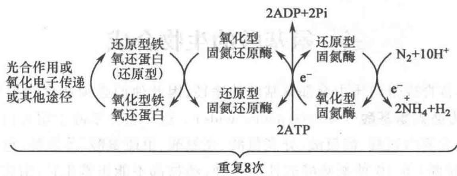  
图26-2 固氮酶催化下 $\mathbf{N}_2$ 还原为 $\mathrm{NH}_3$ 中的电子转移

## 二、氨的同化作用——氨通过谷氨酸和谷氨酰胺掺入生物分子

由固氮作用形成的氨是合成氨基酸所需氨基的来源。氨不仅给氨基酸提供氨基，也是其他含氮生物分子的氮源。在将氨引入氨基酸分子中起中介作用的有两个氨基酸，即谷氨酸和谷氨酰胺。通过转氨基作用，谷氨酸提供氨基使之形成许多其他氨基酸。谷氨酰胺的酰胺氮则是生物合成中广泛的氨基提供者。

氨在动物、植物、微生物中都存在的同化途径是通过谷氨酸脱氢酶的作用，使 $\alpha-$ 酮戊二酸还原、氨化形成谷氨酸。这一途径虽然普遍存在，但并不是主要的。L-谷氨酸脱氢酶在不同生物种属甚至同一物种不同组织中队辅酶 NADH 或 NADPH 的要求不尽一致，也有的无选择性。L-谷氨酸脱氢酶催化的反应表示如下：

$$
\alpha \mathrm{-酮戊二酸} + \mathrm{NH} _ {4} ^ {+} + \mathrm{NADPH} \longrightarrow \mathrm{L-谷氨酸} + \mathrm{NADP} ^ {+} + \mathrm{H} _ {2} \mathrm{O}
$$

在真核细胞中，L-谷氨酸脱氢酶定位于线粒体。反应平衡倾向于反应物的方向，对 $NH_{4}^{+}$ 的 $K_{M}$ 值相当高（大约为 mmol/L），因而这个反应将 $NH_{4}^{+}$ 引入到氨基酸及其他代谢物中所起的作用不大。谷氨酸脱氢酶在反应中要求 $NH_{4}^{+}$ 的浓度非常高，因此只有当土壤中加入大量的 $NH_{3}$ 或者在提供高氮的实验条件下，这个反应才能对谷氨酸的产生起到决定性作用。

生物体中最重要的同化氨的途径是谷氨酰胺合成酶(glutamine synthetase)催化的由谷氨酸形成谷氨酰胺。该反应发生在酶分子上分2步进行。第一步先形成 $\gamma-$ 谷氨酰磷酸，然后由 $\mathrm{NH}_{4}^{+}$ 取代其磷酸基团形成谷氨酰胺。

$$
\mathrm{谷氨酸} + \mathrm{ATP} \longrightarrow \gamma - \mathrm{谷氨酰磷酸} + \mathrm{ADP}
$$

$$
\gamma \text {-谷氨酰磷酸} + \mathrm{NH} _ {4} ^ {+} + \mathrm{ATP} \longrightarrow \text {谷氨酰胺} + \mathrm{Pi} + \mathrm{H} ^ {+}
$$

$$
\text {   总反应式:谷氨酸   } + \mathrm{NH} _ {4} ^ {+} + \mathrm{ATP} \longrightarrow \text {   谷氨酰胺   } + \mathrm{ADP} + \mathrm{Pi} + \mathrm{H} ^ {+}
$$

谷氨酰胺除了在细菌中吸收 $NH_{4}^{+}$ ，对哺乳动物机体还有重要的生理作用，它将机体有毒的氨转变为无毒的谷氨酰胺。

在细菌和植物中,谷氨酰胺提供氨基给 $\alpha-$ 酮戊二酸,由谷氨酸合酶(glutamate synthase,动物体内部存在此酶)催化形成2分子谷氨酸:

$$
\alpha - \text { 酮   戊   二   酸 } + \text { 谷   氨   酰   胺 } + \mathrm{NADPH} + \mathrm{H} ^ {+} \longrightarrow 2 \text { 谷   氨   酸 } + \mathrm{NADP} ^ {+}
$$

在原核生物中,当环境中的氨浓度降低时,谷氨酰胺合成酶和谷氨酸合酶联合作用,谷氨酰胺合成酶可将氨与谷氨酸合成谷氨酰胺,再由谷氨酸合酶催化产生谷氨酸,净反应式表示如下:

$$
\alpha \mathrm{-酮戊二酸} + \mathrm{NH} _ {4} ^ {+} + \mathrm{NADPH} + \mathrm{ATP} \rightarrow \mathrm{谷氨酸} + \mathrm{NADP} ^ {+} + \mathrm{ADP} + \mathrm{Pi}
$$

对于大多数原核生物, 当 $NH_{4}^{+}$ 的浓度低时, 仍可进行由 $\alpha-$ 酮戊二酸形成谷氨酸的反应。因为谷氨酰胺合成酶对 $NH_{4}^{+}$ 的 $K_{M}$ 值远远低于谷氨酸脱氢酶对的对 $NH_{4}^{+}$ 的 $K_{M}$ 值。

谷氨酰胺合成酶由 12 个相同的亚基组成, 每个亚基的相对分子质量为 50 000。它受到别构效应、共价修饰以及反馈效应的多重调节。而且各种抑制效应对酶的抑制可以加合。因此该酶对控制谷氨酰胺的水平起着关键作用。

## 三、氨基酸的生物合成

人和其他动物不具备合成蛋白质中全部氨基酸的途径,因此他们必须从食物中获得自身不能合成的氨基酸,这些氨基酸称为必需氨基酸(essential amino acids)。这一名称来源于用大白鼠所作的实验。若在喂饲大白鼠的膳食中缺乏苯丙氨酸、赖氨酸、异亮氨酸、亮氨酸、甲硫氨酸、苏氨酸、色氨酸、缬氨酸、组氨酸或精氨酸(对幼小动物需要)等10种氨基酸的任何一种,动物都不能正常生长,由此得名。凡机体能自己合成的氨基酸称为非必需氨基酸(nonessential amino acids)。人类和大白鼠的必需氨基酸是相同的。高等植物有能力合成自己所需的全部氨基酸,而且既可利用氨又可利用硝酸根作为合成氨基酸的氮源。微生物合成氨基酸的能力有很大差异,例如,大肠杆菌可合成全部所需氨基酸,而乳酸菌却需从外界获取某些氨基酸。

虽然生物合成氨基酸的能力有种种差异,但仍可总结出氨基酸生物合成的某些共性。本章将讨论它们的共性以及构成蛋白质20种氨基酸的各种合成途径。

氨基酸生物合成的研究,大多数以微生物作为材料。这不仅因为取材方便,最大的优越性是比较容易地将遗传和生物化学技术结合起来。应用遗传突变技术可获得在合成氨基酸方面具有各种特点的遗传突变株。例如,某个突变株在某种氨基酸合成过程中缺乏某一种酶,则该氨基酸合成过程就在这缺乏酶的一步受阻,这时全部合成反应就停留在这缺失酶的步骤上,而使前一步反应的产物大量积累。在突变株微生物的培养基中就可测出此积累产物的浓度大大提高。又例如,某种突变株有合成某一种氨基酸的特殊能力,则该突变株即可为研究这种氨基酸的合成途径提供便利条件。

若将氨基酸的生物合成反应步骤用下列反应式表示：

$$
\mathrm{A} \xrightarrow {\text {酶I}} \mathrm{B} \xrightarrow {\text {酶II}} \mathrm{C} \xrightarrow {\text {酶III}} \mathrm{D} \xrightarrow {\text {酶IV}} \mathrm{E} \xrightarrow {\text {酶V}} \mathrm{F}
$$

式中 A 代表某种氨基酸生物合成前体物质，B、C、D、E、F 代表不同的中间产物，酶（I、II、III、IV、V）代表不同的酶，F 代表最终产物，即某种氨基酸。

突变株微生物的同一种氨基酸的正常合成路线在发生变异的步骤受阻可用下式表示：

$$
\begin{array}{r l} & {\mathrm{A} \xrightarrow {\text {酶I}} \mathrm{B} \xrightarrow {\text {酶II}} \mathrm{C} \xrightarrow {\text {酶III缺失}} \mathrm{D} \xrightarrow {\text {酶IV}} \mathrm{E} \xrightarrow {\text {酶V}} \mathrm{F}} \\ & {\qquad \qquad \qquad \qquad \text {中间物积累} \quad \mathrm{D}, \mathrm{E}, \mathrm{F} \text {都不产生}} \end{array}
$$

上式表明当酶Ⅲ缺失时,此突变株培养基中即大量积累中间产物 C。通过对中间产物 C 的测定,即可判断氨基酸(F)的一个中间代谢环节。

用上述材料和方法阐明的氨基酸合成途径,还需用其他生物材料弄清不同生物合成氨基酸的特殊性。

讨论氨基酸的生物合成,首先要说明的是:它的碳骨架是怎样形成的?氮是经怎样的途径进入的?

概括地说,在生物合成中,各种氨基酸碳骨架的形成,源起于代谢的几条“主要干线”(柠檬酸循环、糖酵解以及磷酸戊糖途径等)中的关键中间体。根据生物合成起始物——代谢中间体的不同,可将氨基酸的生物合成途径归纳为六族,将在下面分族讨论。它们的氨基基团多来自谷氨酸的转氨基反应。

氨基酸生物合成分族情况如图 26-3 所示。氨基酸生物合成的概貌如图 26-4 所示。

  
图 26-3 氨基酸生物合成的分族情况

## （一）由 $\alpha-$ 酮戊二酸形成的氨基酸——谷氨酸、谷氨酰胺、脯氨酸、精氨酸、赖氨酸

这些氨基酸的生物合成都以 $\alpha-$ 酮戊二酸为前体, 即它们都是由 $\alpha-$ 酮戊二酸衍生而来, 下面分述它们的生物合成。

  
图 26-4 20 种氨基酸的生物合成概貌(各氨基酸全为 L-型)  
图为蛋白质中的是20种氨基酸生物合成的概貌。氨基酸生物合成与相关的柠檬酸循环，糖酵解及磷酸戊糖途径。图中画出了一些重要的中间物，丙酮酸起始的两条虚线指向二氨基庚二酸（diaminopimelate, DAP），及异亮氨酸，表示丙酮酸为这两个化合物的某侧链之碳源做出贡献。请注意，赖氨酸的生物合成是独特的，它有着两条完全不同的途径。图中数字表明通过的反应步骤数

## 1. 谷氨酸的生物合成

$\alpha-$ 酮戊二酸和氨基酸经转氨酶的作用即形成谷氨酸。 $\alpha-$ 酮戊二酸与游离氨可在谷氨酸脱氢酶的催化下发生还原氨基化而形成谷氨酸。反应式如下：

$$
\alpha \text {-酮戊二酸} + \mathrm{NH} _ {4} ^ {+} + \mathrm{NADH(或NADPH)} + \mathrm{H} ^ {+} \xrightarrow {\text {谷氨酸脱氢酶}} \text {谷氨酸} + \mathrm{NAD} ^ {+} (\text {或NADP} ^ {+}) + \mathrm{H} _ {2} \mathrm{O}
$$

这种反应在自然界并不普遍, 植物、蕈类以及细菌只有当环境中的 $NH_{4}^{+}$ 浓度很高时才由此途径形成谷氨酸。在动物的细胞中, 过多的 $NH_{4}^{+}$ 也可通过这一途径形成谷氨酸, 再由谷氨酰胺合成酶催化转变为谷氨酰胺。谷氨酸脱氢酶和谷氨酰胺合成酶在脑中的含量都相当高。当然由形成谷氨酰胺而消除 $NH_{4}^{+}$ 的作用可能比由 $\alpha-$ 酮戊二酸形成谷氨酸更为重要。

L-谷氨酸脱氢酶在动物体内可利用 $NAD^{+}/NADH$ 和 $NADP^{+}/NADPH$ 两类辅酶，利用 $NAD^{+}$ 作辅酶的酶一般是催化谷氨酸脱氨基转变为 $\alpha-$ 酮戊二酸。无论利用哪种辅酶的 L-谷氨酸脱氢酶，都能催化可逆反应。

实验表明:植物、微生物、蕈类的谷氨酸氨基一般并非来源于游离氨,而是来源于谷氨酰胺的酰胺基。后面还将进一步讨论。

## 2. 谷氨酰胺的生物合成

由 $\alpha-$ 酮戊二酸先经转氨基作用形成 L-谷氨酸已如上述，再经谷氨酰胺合成酶（glutamate synthetase）催化由 L-谷氨酸形成 L-谷氨酰胺。这一过程需 ATP 提供能量。

谷氨酰胺合成酶是催化氨转变为有机含氮物的主要酶。该酶活性受到机体对含氮物需要情况的灵活控制。

从大肠杆菌中获得的谷氨酰胺合成酶的结构以及其调控机制都已经得到阐明。该酶由12个相同的亚基对称排列成两个六面体环棱柱状结构。每个亚基的相对分子质量为51600。它的活性受到复杂的反馈控制系统以及共价修饰调控。有9种含氮物以不同程度对该酶发生反馈别构抑制效应。每一种都有自己与酶的结合部位。这9种含氮物是：6-磷酸氨基葡糖、色氨酸、丙氨酸、甘氨酸、丝氨酸、组氨酸、胞苷三磷酸、AMP及氨甲酰磷酸。除甘氨酸、丙氨酸、丝氨酸外，所有上述其他含氮物的氮都直接来源于谷氨酰胺，而且都是由谷氨酰胺导出的反应最终产物。虽然丙氨酸、丝氨酸和甘氨酸的氨基也来源于谷氨酰胺，但都不是反应系列的最终产物。在培养细胞时检测培养液中丙氨酸、丝氨酸和甘氨酸含量的高低，却可作为了解氮源供给情况的鉴定指标。

谷氨酰胺合成酶的调节机制,可作为氨基酸生物合成调控机制复杂性的典型,将在氨基酸生物合成的调控中讨论。

前已述及， $\alpha-$ 酮戊二酸直接与氨由谷氨酸脱氢酶催化还原反应，合成谷氨酸的途径，在自然界并不普遍。在一般情况下最普遍的合成谷氨酸的途径是在谷氨酸合酶（glutamate synthase）催化下， $\alpha-$ 酮戊二酸接受L-谷氨酰胺的酰胺基形成谷氨酸的反应。在这个反应中实际上形成了两个谷氨酸分子。

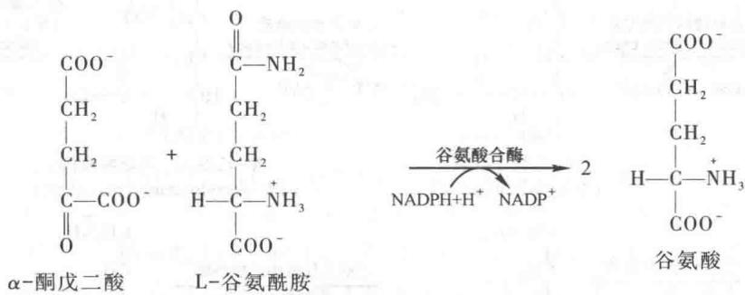

虽然经这种形式合成谷氨酸从能量观点看并不经济。因为由谷氨酸形成谷氨酰胺需要消耗ATP如前所示。但这种方式有很多优越性。由谷氨酰胺合成酶催化的酰胺基的形成可在 $\mathrm{NH}_4^+$ 浓度极低的条件下进行，而由谷氨酸脱氢酶催化的反应却需要很高的 $\mathrm{NH}_4^+$ 浓度。以大肠杆菌(E.coli)为例，其谷氨酸脱氢酶所催化的反应，以 $\mathrm{NH}_4^+$ 计算， $K_{\mathrm{m}}$ 值为 $1.1\mathrm{mmol}$ ，而谷氨酰胺合成酶的 $K_{\mathrm{m}}$ 值仅为 $0.2\mathrm{mmol}$ 。因此谷氨酰

胺合成酶所催化的反应方向更倾向于脱去酰胺基。一般在自然条件下 $NH_{4}^{+}$ 的浓度不会很高。所以由谷氨酰胺提供酰胺基使 $\alpha-$ 酮戊二酸形成谷氨酸的可能性是最大的。 $\alpha-$ 酮戊二酸、谷氨酸和谷氨酰胺的合成关系如图 26-5 所示。

谷氨酸合酶的氢供给者(hydrogen donor)随不同来源的酶而异。细菌以NADPH为供氢体，有些蕈类以NADH为供氢体。植物则有两种类型。有一种对还原型“铁氧还蛋白”(reduced ferredoxin)是特异的，另一种，体外试验表明需要NADPH或NADH。因为在土壤中， $\mathrm{NH}_4^+$ 的浓度常是不高的，因此在植物中氨基的形成是在低浓度下进行的，而 $\alpha-$ 酮戊二酸的氨基化则需由谷氨酰胺的酰胺基提供。

  
图 26-5 由 $\alpha$ -酮戊二酸、谷氨酰胺和谷氨酸形成关系图

## 3. 脯氨酸的生物合成

L-脯氨酸的合成步骤如图26-6所示。由 $\alpha$ -酮戊二酸先形成谷氨酸。后者在谷氨酸激酶催化下由ATP提供磷酸基团形成谷氨酰磷酸，又在谷氨酸脱氢酶作用下将谷氨酸的 $\gamma$ -羧基还原形成 $\gamma$ -半醛谷氨酸（glutamic- $\gamma$ -semialdehyde），然后自发环化形成五元环化合物5-羧酸- $\Delta'$ 二氢吡咯（ $\Delta'$ -pyrroline-5-carboxylate），再由二氢吡咯还原酶催化还原形成脯氨酸。

  
图 26-6 L-脯氨酸的合成途径

## 4. L-精氨酸的生物合成

精氨酸的生物合成如图 26-7 所示, 它是由谷氨酸经过许多步骤形成。谷氨酸先在转乙酰基酶催化下，转化为 $N-$ 乙酰谷氨酸（ $N$ -acetylglutamate），再经激酶作用由ATP上转移一个高能磷酸基团，形成 $N-$ 乙酰- $\gamma-$ 谷氨酰磷酸（ $N$ -acetyl- $\gamma$ -glutamyl phosphate），再经以NADPH为辅酶的还原酶作用，形成 $N-$ 乙酰谷氨酸- $\gamma-$ 半醛（ $N$ -acetylglutamic- $\gamma$ -semialdehyde），又经转氨酶作用，自谷氨酸分子转移一个 $\alpha-$ 氨基，形成 $\alpha-N-$ 乙酰鸟氨酸（ $\alpha-N$ -acetyl ornithine），经酶促脱去乙酰基（脱乙酰基作用或转乙酰基作用），形成L-鸟氨酸，接受由转氨甲酰酶催化，自氨甲酰磷酸转移的氨甲酰基先形成L-瓜氨酸，L-瓜氨酸在合成酶的催化下，与L-天冬氨酸结合（需 $\mathrm{Mg}^{2+}$ 离子，同时ATP $\longrightarrow$ AMP+PPi），形成精氨琥珀酸，精氨琥珀酸在裂解酶的作用下，形成精氨酸，同时产生延胡索酸。

  
图26-7 精氨酸的生物合成途径

谷氨酸 $\alpha-$ 氨基的乙酰化, 可使氨基受到保护, 以利于羧酸的活化和还原, 并防止发生环化作用, 使反应向形成精氨酸的方向进行。乙酰基可通过谷氨酸转乙酰基酶的作用, 在全部合成反应中得到保护。

精氨酸不只是构成蛋白质的组分,也是尿素形成的前体物质(请参看尿素的形成)。

## 5. 赖氨酸的生物合成

L-赖氨酸的生物合成在不同生物体内有完全不同的两条途径。蕈类(和眼虫)L-赖氨酸的合成以 $\alpha$ -酮戊二酸为起始物。图26-8表明蕈类(和眼虫)由 $\alpha$ -酮戊二酸合成L-赖氨酸的途径。细菌和绿色植物则是通过丙酮酸和天冬氨酸途径(参看天冬氨酸族的生物合成,图26-9)。

α-酮戊二酸有5个碳原子。而赖氨酸有6个碳原子。因此，α-酮戊二酸形成赖氨酸需延长碳链。第一步是α-酮戊二酸在高柠檬酸合酶(homocitrate synthase)的催化下，与乙酰辅酶A作用，形成高柠檬酸，高柠檬酸在脱水酶催化下脱水形成顺-高乌头酸(cis-homoaconitate)，再由水化酶催化形成高异柠檬酸(homoisocitrate)，然后在脱氢酶催化下脱氢，形成α-酮己二酸(α-ketoadipate)。该反应所需辅酶为 $NAD^{+}$ ，反应过程中还脱去羧基。

由 $\alpha-$ 酮戊二酸形成 $\alpha-$ 酮己二酸所经过的碳链延长过程和柠檬酸循环中草酰乙酸转变为 $\alpha-$ 酮戊二酸以及在亮氨酸生物合成中碳链延长过程都基本相同。不同处是 $\alpha-$ 酮戊二酸的 $\alpha-$ 羧基是由草酰乙酸的 $\beta-$ 羧基形成，不是转来的乙酰基。以上表明这些 $\alpha-$ 酮酸碳链的延长都遵循一般 $\alpha-$ 酮酸碳链延长的规律。

α-酮戊二酸的形成提供了赖氨酸的碳骨架结构，下一步的变化是δ-羧基的还原。羧基的活化需ATP参与反应，可能形成酸酐和AMP的复合物，即δ-腺苷-α-氨基己二酸，这和脯氨酸以及鸟氨酸生物合成中的羧基活化机制不同。δ-腺苷-α-氨基己二酸在其还原酶的催化下，以NADPH为辅酶还原，同时释放出腺苷基团形成α-氨基己二酸-δ-半醛（α-aminoadipic-δ-semialdehgde）。己醛基团一旦形成，在α-氨基己二酸-δ-半醛-谷氨酸还原酶作用下，即与谷氨酸在氨基部位缩合。这是一个需NADPH的还原缩合反应。缩合后形成ε-N(2-戊二酸)-赖氨酸(saccharopine)。后者在ε'-N(2-戊二酸)-赖氨酸脱氢酶作用下，再氧化裂解形成L-赖氨酸和α-酮戊二酸。此反应专一地以NAD $^{+}$ 为辅酶。上述的两步反应，实际是一种氨基转移反应。它和以磷酸吡哆醛为辅酶的氨基转移反应方式完全不同。

（二）由草酰乙酸形成的氨基酸——天冬氨酸、天冬酰胺、甲硫氨酸、苏氨酸、赖氨酸（细菌、植物）、异亮氨酸

## 1. 天冬氨酸的生物合成

L-天冬氨酸是由草酰乙酸接受由谷氨酸转来的氨基形式。催化这一反应的酶称为谷-草转氨酶或称天冬氨酸-谷氨酸转氨酶。天冬氨酸的合成途径如下所示：

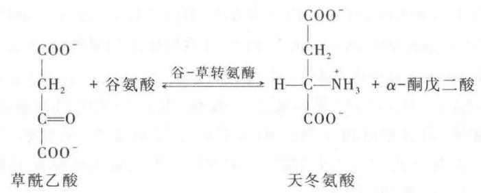

  
图 26-8 蕈类和眼虫 L-赖氨酸的生物合成途径

## 2. 天冬酰胺的生物合成

哺乳动物天冬酰胺的合成可能都是在天冬氨酸的 $\beta-$ 羧基上转移一个谷氨酰胺的酰胺基而成。催化该反应的酶称为天冬酰胺合成酶(asparagine synthetase)，需 ATP 参与作用。ATP 在反应中降解为 AMP 和

PPi。天冬酰胺的合成反应可用下式表示：

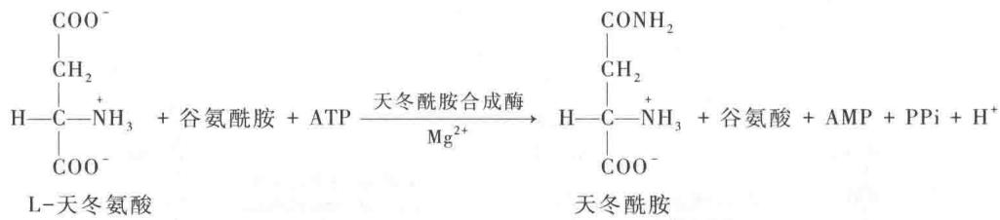

该反应可能在酰胺基断裂时形成一个酶和氨基结合的中间产物。

除上述的天冬酰胺合成途径外，在细菌则有另外一种由 $NH_{4}$ 提供酰胺基氮源的合成途径。这一途径也伴有 ATP 降解为 AMP 和 PPi 的反应。

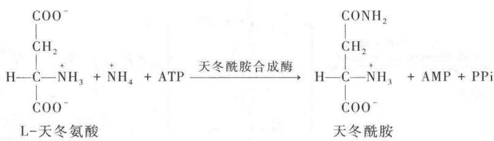

在这个反应中,也可能包括一个形成与酶结合的 $\beta$ -天冬酰腺苷酸( $\beta$ -aspartyladenylate)中间物的步骤。

催化上述两种形成天冬酰胺的酶都称为天冬酰胺合成酶(asparagen synthetase)，它们区别在于一种催化酰基的断裂，另一种则对游离氨有高的亲和力。

天冬酰胺和谷氨酰胺合成的机制有许多类似之处,主要的不同是在谷氨酰胺合成反应中 ATP 转变成 ADP 和 Pi,天冬酰胺合成反应中 ATP 则形成 AMP 和 PPi。在机体内催化 PPi 水解为 2Pi 的酶是焦磷酸酶。这一水解反应可释放约 34 kJ 能,因此,天冬酰胺的合成反应比谷氨酰胺的合成反应更易于进行。

## 3. 细菌和植物 L-赖氨酸的生物合成

由 L-天冬氨酸作为起始物的 L-赖氨酸合成途径如图 26-9 所示。首先要使 L-天冬氨酸的 β-羧基还原。该反应需 ATP 活化羧基。催化此反应的酶称为天冬氨酸激酶(aspartokinase)。羧基活化后，形成天冬氨酰-β-磷酸(aspartyl-β-phosphate)。这一还原反应和谷氨酸羧基的还原以及 3-磷酸甘油酸还原为 3-磷酸甘油醛的情况都很相似。再由天冬氨酸-β-半醛脱氢酶催化逆反应，使天冬氨酰-β-磷酸还原。参与天冬氨酸还原反应的辅酶是 NADPH。还原的产物是天冬氨酸-γ-半醛。天冬氨酸-γ-半醛与丙酮酸缩合形成一环状化合物称为 2,3-二氢吡啶-2,6-二羧酸(2,3-dihydropyridine 2,6-dicarboxylate)。因此，也可将植物 L-赖氨酸的合成看作是起始于丙酮酸和天冬氨酸。催化天冬氨酸-γ-半醛和丙酮酸缩合的酶称为 2,3-二氢吡啶-2,6-二羧酸合酶。该酶受赖氨酸抑制。2,3-二氢吡啶-2,6-二羧酸由以 NADPH 为辅酶的脱氢酶还原为 Δ'-哌啶-2,6-二羧酸（又称 2,3,4,5-四氢吡啶-2,6-二羧酸）。该二羧酸与琥珀酰-CoA 作用形成 N-琥珀酰-2-氨基-6-酮庚二酸(N-Succinyl-2-amino-6-keto-L-pimelate)。在有些生物由乙酰基代替琥珀酰基。6-酮基通过与谷氨酸的转氨基作用而形成氨基，使 N-琥珀酰-2-氨基-6-酮庚二酸转变为 N-琥珀酰-L,L-2,6-二氨基庚二酸。在琥珀酰-二氨基庚二酸脱琥珀酸酶的作用下，脱去琥珀酸形成 L,L-2,6-二氨基庚二酸或称 L-α,ε-二氨基庚二酸。在二氨基庚二酸差向异构酶的作用下，形成消旋-α,ε-二氨基庚二酸(meso-α,ε-diaminopimelate)。再经二氨基庚二酸脱羧酶的作用。脱去羧基形成 L-赖氨酸。

## 4. 甲硫氨酸的生物合成

甲硫氨酸的生物合成如图26-10及图26-11所示，由天冬氨酸的羧基还原，此反应有ATP参与。它活化了羧基并提供一个磷酸基，形成天冬氨酰磷酸。反应进一步形成天冬氨酸- $\beta$ -半醛。以上反应过程与细菌及植物合成L-赖氨酸的一段过程完全相同。天冬氨酸- $\beta$ -半醛以NADPH为辅酶，在脱氢酶作用下还原形成L-高丝氨酸（L-homoserine）。由L-高丝氨酸转化为甲硫氨酸的途径不止一种。它的酰基化也有不同方式。在绿色植物形成O-磷酰高丝氨酸。一般从高丝氨酸转变为酰基高丝氨酸，进而转变为 L-高半胱氨酸。转变为 L-高半胱氨酸也有不同路线。在细菌中，是在胱硫醚- $\gamma$ -合酶（cystathionine- $\gamma$ -synthase）催化下，与半胱氨酸作用形成 L,L-胱硫醚（L,L cystathionine）。后者又在 $\beta$ -胱硫醚酶（ $\beta$ -cystathionase）作用下，形成 L-高半胱氨酸。另外的途径是 O-琥珀酰基高丝氨酸在硫水解酶（sulfhydrolase）作用下与 $H_{2}S$ 作用直接生成 L-高半胱氨酸（图中虚线标示），接着 L-高半胱氨酸在转移酶（tranferase）催化下，接受 $N^{5}$ -甲基四氢叶酸的甲基，生成 L-甲硫氨酸。高丝氨酸还可在酰基转移酶作用下与琥珀酰基结合形成 O-琥珀酰高丝氨酸，又在胱硫醚- $\gamma$ -合酶催化下由半胱氨酸替下琥珀酰基形成胱硫醚，又在胱硫醚- $\beta$ -裂解酶作用下，脱出丙酮酸和氨形成高半胱氨酸再由 $N^{5}$ -甲基四氢叶酸提供甲基，由转移酶催化形成甲硫氨酸。

  
图26-9 细菌和绿色植物赖氨酸的合成途径

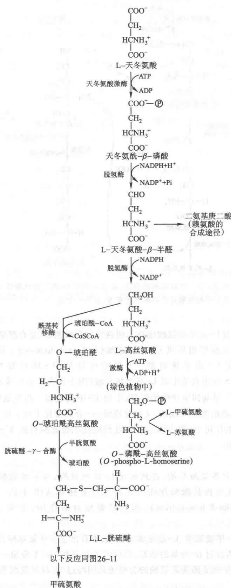  
图 26-10 天冬氨酸族的氨基酸（赖氨酸、甲硫氨酸、苏氨酸）共同经历的合成途径

  
图 26-11 甲硫氨酸的合成, 最后一步的 L-高半胱氨酸转  
变为甲硫氨酸还有依赖维生素 $\mathrm{B}_{12}$ 的另一途径

## 5. 苏氨酸的生物合成

苏氨酸的合成,从 L-天冬氨酸开始,直到形成 L-高丝氨酸,与甲硫氨酸的合成步骤是完全相同的(图 26-10)。L-高丝氨酸在其激酶作用下在羟基位置转移 ATP 上的一个磷酸基团形成 O-磷酰-L-高丝氨酸(O-phospho-L-homoserine),再经苏氨酸合酶作用,水解下磷酸基团形成苏氨酸(图 26-12)。

纵观上述 L-赖氨酸、L-甲硫氨酸、L-苏氨酸的合成，可看出这三种氨基酸有一段共同的合成途径，由 L-天冬氨酸为共同起点都需经过 $\beta$ -羧基的还原，形成的天冬氨酸- $\beta$ -半醛是一个分支点化合物，L-赖氨酸的合成即由此物质分道，甲硫氨酸和苏氨酸的合成还共同经过 L-高丝氨酸再分道，L-高丝氨酸也是分支点化合物（见图 26-10）。

## 6. 异亮氨酸的生物合成

异亮氨酸的6个碳原子有4个来自天冬氨酸，只有2个来自丙酮酸，所以一般将异亮氨酸的合成列入天冬氨酸类型。在异亮氨酸合成过程中有4种酶和缬氨酸合成中的酶是相同的，而缬氨酸的合成属于丙酮酸衍生类型，因此异亮氨酸的生物合成也可视为丙酮酸衍生类型。鉴于异亮氨酸和缬氨酸生物合成中

  
图 26-12 L-苏氨酸的生物合成

4种酶的相同,异亮氨酸的合成途径和缬氨酸共同讨论(图26-13)异亮氨酸和缬氨酸的合成途径。

## （三）丙酮酸族的生物合成：L-丙氨酸、L-缬氨酸、L-亮氨酸

由丙酮酸形成的氨基酸有 L-丙氨酸、L-缬氨酸、L-亮氨酸，还为异亮氨酸的合成提供两个碳原子，为赖氨酸的合成提供两个或 3 个碳原子（图 26-8 及图 26-9 赖氨酸的生物合成）。因异亮氨酸和缬氨酸生物合成途径的平行关系，本节将一并讨论其合成途径。

## 1. 丙氨酸的生物合成

丙氨酸是丙酮酸与谷氨酸在谷-丙转氨酶的作用下形成的,如图26-14所示。

丙氨酸的合成没有反馈抑制效应。机体细胞内可找到许多丙氨酸库。又因转氨酶的作用是可逆的，丙酮酸和丙氨酸可根据需要而互相转换。

## 2. 缬氨酸和异亮氨酸的生物合成

缬氨酸和异亮氨酸的生物合成如图26-13所示。这两种氨基酸的第一步是相应地由丙酮酸和丁酮酸与活性乙醛基缩合。活性乙醛基可能是乙醛基与 $\alpha-$ 羟乙基硫胺素焦磷酸结合的产物。醛基是由丙酮酸脱羧而成。缩合后所形成的产物是相应的 $\alpha-$ 乙酰- $\alpha-$ 羟酸。形成的两种化合物进行甲基、乙基的自动位移，产物经脱水后形成缬氨酸和异亮氨酸的相应酮酸，再经转氨作用形成缬氨酸和异亮氨酸。

## 3. 亮氨酸的生物合成

亮氨酸的合成途径从丙酮酸开始直至形成 $\alpha$ -酮异戊酸和 L-缬氨酸以及异亮氨酸的合成途径完全相同（参看图 26-13, L-缬氨酸的生物合成）。 $\alpha$ -酮异戊酸（ $\alpha$ -ketoisovalerate）在 $\alpha$ -异丙基苹果酸合酶（ $\alpha$ -isopropyl malate synthase）作用下，由乙酰-CoA 转来酰基形成 $\alpha$ -异丙基苹果酸，后者在（同分）异构酶作用下形成 $\beta$ -异丙基苹果酸。再经以 NAD $^{+}$ 为辅助因子的脱氢酶作用形成 $\alpha$ -酮异己酸。后者再由亮氨酸转氨酶催化与谷氨酸转氨形成 L-亮氨酸（图 26-15）。

  
图26-13 异亮氨酸和缬氨酸的合成途径

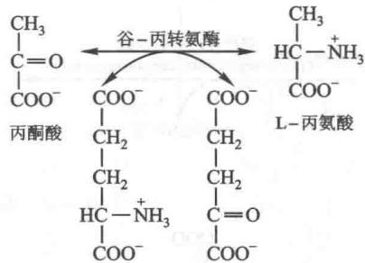  
图26-14 丙氨酸的生物合成

  
图26-15 L-亮氨酸的生物合成途径

（四）丝氨酸族的生物合成：L-丝氨酸、L-甘氨酸、L-半胱氨酸的生物合成及固硫作用

## 1. 丝氨酸和甘氨酸的生物合成

如图 26-16 所示, 这两种氨基酸合成的第一步, 是由糖酵解过程的中间产物 3-磷酸甘油酸作为起始物质, 它的 $\alpha$ -羟基在磷酸甘油酸脱氨酶催化下, 由 $NAD^{+}$ 脱氢形成 3-磷酸羟基丙酮酸, 后者再经磷酸丝氨酸转氨酶催化由谷氨酸转来氨基形成 3-磷酸丝氨酸。在磷酸丝氨酸磷酸酶 (phosphoserine phosphatase) 的作用下脱去磷酸, 即形成 L-丝氨酸。L-丝氨酸在丝氨酸转羟甲基酶 (serine hydroxymethyltransferase) 的作用下, 脱去羟甲基, 即形成甘氨酸, 丝氨酸转羟甲基酶的辅酶是四氢叶酸。

## 2. 半胱氨酸的生物合成

半胱氨酸生物合成中的关键是硫氢基的来源,在大多数植物和微生物,其硫氢基主要来源于硫酸,可能还原为某种硫化物,这一过程相当复杂,迄今了解很少。在动物体内,硫氢基团主要来源于高半胱氨酸。

大多数植物和微生物的半胱氨酸合成途径如图 26-17 所示。起始步骤是乙酰-CoA 的乙酰基转移到丝氨酸上，形成 O-乙酰丝氨酸。催化这一反应的酶为丝氨酸转乙酰基酶。O-乙酰丝氨酸将 $\beta$ -丙氨酸基团部分 $(-CH_{2}-CHNH_{3}-COO^{-})$ 提供给与酶结合的硫氢基团而形成L-半胱氨酸。

  
图26-16 丝氨酸和甘氨酸的生物合成途径

  
图26-17 某些植物和微生物体内半胱氨酸的合成途径

关于硫酸的还原问题即由 $SO_{4}^{2-}$ 还原为 $H_{2}S$ 的过程, 目前所了解的首先是通过硫酸与 ATP 作用形成活化形式, 即 5'-磷酸腺嘌呤硫酸 (adenosine-5'-phosphosulfate, APS), 催化这一反应的酶称为腺苷硫酸焦磷酸化酶 (adenylylsulfate pyrophosphorylase), 该化合物又在 5'-磷酸腺嘌呤硫酸激酶 (APS-激酶) 的作用下, 再从另一分子 ATP 上接受一磷酸基团形成 5'-磷酸-3-磷酸腺嘌呤硫酸 (3-phosphoadenosine-5'-phosphosulfate, PAPS) (图 26-18)。

在动物体内半胱氨酸的直接前体为丝氨酸和高半胱氨酸。后者也是甲硫氨酸生物合成的一个中间产物，也可称为前体（见图26-10及26-11甲硫氨酸的生物合成途径）

丝氨酸和高半胱氨酸在胱硫醚 $\beta-$ 合酶作用下，形成 L- 胱硫醚，后者在胱硫醚 $-\gamma-$ 水解酶（胱硫醚 $-\gamma-$ 裂合酶）作用下，分解为 $\alpha-$ 酮丁酸、 $NH_{4}^{+}$ 和 L- 半胱氨酸（图 26-19）。

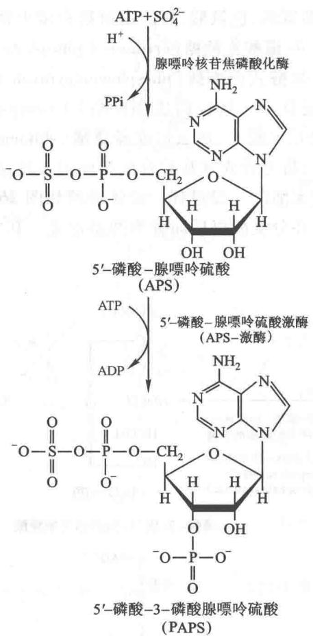

图26-18 硫酸还原过程中所形成的活性中间  
  
图 26-19 动物体内半胱氨酸的合成途径

## （五）芳香族氨基酸及组氨酸的生物合成

1. 苯丙氨酸、酪氨酸及色氨酸的生物合成

芳香族氨基酸包括苯丙氨酸、酪氨酸、色氨酸，只能由植物和微生物合成。这3种氨基酸的合成途径有7步是共同的。合成的起始物是4-磷酸赤藓糖(erythose 4-phosphate)(戊糖磷酸途径的中间产物)和糖酵解过程的一个中间产物——磷酸烯醇式丙酮酸(phosphoenolpyruvate)。二者缩合形成一个七碳酮糖开链磷酸化合物，称为7-磷酸-3-脱氧- $\alpha$ -阿拉伯庚酮糖酸(3 deoxy- $\alpha$ -arabinoheptulosonate-7-phosphate, DAHP)，再经脱磷酸环化，形成苯环后又脱水、加氢形成莽草酸(shikimate)。可以把莽草酸看作合成此3种芳香族氨基酸的共同前体，因此可将芳香族氨基酸合成相同的一段过程称为莽草酸途径。这一途径指的是以莽草酸为起始物直至形成分支酸的一段过程。具体步骤如图26-20所示。分支酸(chorismate)是芳香族氨基酸合成途径的分支点。在分支酸以后即分为两条途径。其中一条是形成苯丙氨酸和酪氨酸，另一条是形成色氨酸。

  
图 26-20 分支酸的生物合成, 它的成环导致芳香族氨基酸的形成, 例如, 苯丙氨酸、色氨酸  
①代表磷酸基团，PEP代表烯醇式丙酮酸磷酸

## (1) 由分支酸形成苯丙氨酸和酪氨酸

如图 26-21 所示, 分支酸在分支酸变位酶 (chorismate mutase) 作用下, 转变为预苯酸 (prephenate), 经脱水、脱羧后形成苯丙酮酸 (phenylpyruvate), 后者在转氨酶作用下, 与谷氨酸进行转氨形成苯丙氨酸。

预苯酸经氧化脱羧作用形成对-羟苯丙酮酸，再由谷氨酸进行转氨即形成酪氨酸。

虽然苯丙氨酸和酪氨酸都以预苯酸作为由分支酸转变的第一步反应,但它们的合成确实是通过两条不同的途径。分支酸形成苯丙酮酸经过两个步骤，都是由一个酶催化的，称为分支酸变位酶P-预苯酸脱水酶（chorismate mutase P-prephenate dehydratase）。该酶先将分支酸转变为预苯酸。酶蛋白和预苯酸结合在一起，由同一酶脱水、脱羧，将预苯酸转化为苯丙酮酸。催化形成4-羟苯丙酮酸是另外一个酶，称为 $\mathrm{NAD^{+}}$ 依赖性分支酸变位酶T-预苯酸脱氢酶(NAD dependent chorismate T-prephenate dehydrogenase)。它催化分支酸形成4-羟苯丙酮酸也是先形成与它结合在一起的预苯酸中间产物再脱氢，脱羟(图26-21)，形成4-羟苯丙酮酸。

  
图 26-21 L-苯丙氨酸和 L-酪氨酸的生物合成, 它们都来自分支酸, 经过预  
苯酸后，步向两条不同途径

预苯酸无论转变为苯丙酮酸或4-羟苯丙酮酸都需脱去羧基同时脱水或脱氢。这一步骤也可视为“成环”即形成芳香环的最后步骤。

酪氨酸的生物合成除上述途径外,还可由苯丙氨酸羟基化而形成。催化此反应的酶称为苯丙氨酸羟化酶(phenylalanine hydroxylase)又称4-单加氧酶苯丙氨酸。

有些人遗传缺欠苯丙氨酸羟化酶而产生苯丙酮酸尿症。

## (2) 由分支酸形成色氨酸

如图 26-22 所示,由分支酸形成色氨酸的第①步是形成邻-氨基苯甲酸(anthranilate)。这一步是在氨基苯甲酸合酶(anthranilate synthase)作用下,需谷氨酰胺的酰胺基团提供氨基,同时以丙酮酸形式脱去分支酸的烯醇式丙酮酸侧链。第②步是邻-氨基苯甲酸在氨基苯甲酸磷酸核糖转移酶(anthranilate-phosphoribosyl transferase)作用下,将1'-焦磷酸-5'-磷酸核糖(PRPP)的5'-磷酸核糖部分转移到邻-氨基

酸，N 来源于谷氨酰胺的酰胺基

  
图26-22 由分支酸形成色氨酸的途径

苯甲酸的氨基上,同时脱掉一个焦磷酸分子,形成 $N-5'$ -磷酸核糖-氨基苯甲酸[ $N-(5'-phosphoribosyl)$ anthranilate]。核糖的 $C_1$ 和 $C_2$ 为吲哚环的形成提供两个碳原子。第③步的转变是在同分异构酶作用下,核糖的呋喃环被打开进行互变异构,转变为烯醇式 $1-(O-$ 羧基苯氨基)-1-脱氧 $5'$ -磷酸核酮糖[ $\text{enol}-1-(O-$ carboxyphenylamino)-1-deoxyribulose- $5'$ -phosphate]。又在3-甘油磷酸吲哚合酶(Indole-3-glycerol phosphate synthase)作用下环化,形成3-甘油磷酸吲哚。3-甘油磷酸吲哚在色氨酸合酶催化下脱掉3-磷酸甘油醛形成吲哚(indole),在同一酶作用下与丝氨酸结合,脱去水,形成色氨酸。

通过上述的合成反应,总览一下色氨酸碳原子和氮原子的来源可以看到,吲哚环上苯环的 $C_{1}$ 和 $C_{6}$ 来源于磷酸烯醇式丙酮酸: $C_{2}$ 、 $C_{3}$ 、 $C_{4}$ 、 $C_{5}$ 来源于 4-磷酸赤藓糖。色氨酸吲哚环的氮原子来源于谷氨酰胺的酰胺氮,吲哚环的 $C_{7}$ 和 $C_{8}$ 来源于 PRPP,色氨酸的侧链部分来源于丝氨酸(图 26-22)。

## 2. 组氨酸的生物合成

组氨酸的酶促合成有9种酶参与催化，并经过9步特殊反应，如图26-23。

  
图 26-23 组氨酸的生物合成  
图中①ATP 磷酸核糖转移酶(ATP phosphoribosyl transferase)，②焦磷酸水解酶(pyrophosphohydrolase)，③磷酸核糖-AMP 环化水解酶(phosphoribosyl-AMP cyclohydrolase)，④亚氨甲基-5-氨基咪唑-4-羧酰胺核苷酸磷酸核糖同分异构酶(phosphoribosylformimino-5-aminoimidazole carboxamide ribonucleotide isomerase)，⑤谷氨酰胺酰氨基转移酶(glutamine aminotransferase)，⑥咪唑甘油磷酸脱水酶(imidazole glycerol phosphate dehydrogenase)，⑦L-组氨醇磷酸氨基转移酶(L-histidinol phosphate aminotransferase)，⑧L-组氨醇磷酸磷酸酶(L-histidinol phosphate phosphatase)，⑨组氨醇脱氢酶(histidinol dehydrogenase)⑩组氨醛脱氢酶(histinal dehydrogenase)

组氨酸合成的第1步是 $1'$ 焦磷酸- $5'-$ 磷酸核糖(PRPP)的 $5'-$ 磷酸核糖部分转移到ATP分子上，与ATP嘌呤环的第一个氮原子形成以N-糖苷键(N-glycosyl linkage)相连的化合物 $N^{1}-(5'-$ 磷酸核糖)-ATP。第2步，上述化合物ATP部分水解除掉一个焦磷酸分子形成 $N^{1}-(5'-$ 磷酸核糖)-AMP。该化合物的 $C_{6}$ 与一亚氨离子(iminium ion)相连，亚氨离子有强烈吸收电子的作用，因此容易受水的亲核攻击。第

3步，在磷酸核糖-AMP解环酶(cyclohydrolase)作用下，上述 $N^1 -(5^{\prime}$ -磷酸核糖)-AMP的嘌呤环在 $\mathbf{C}_6$ 和 $N_{1}$ 之间被打开，形成 $N^1 -(5^{\prime}$ -磷酸核糖亚氨甲基）-5-氨基咪唑-4-羧酰胺核苷酸（ $N^1 -5^{\prime}$ phosphoribosylformimino-5-aminoimidazole-4-carboxamide ribonucleotide）。第4步，由同分异构酶打开核糖的呋喃环，将其转变为酮糖，形成 $N^1 -(5^{\prime}$ -磷酸核酮糖亚氨甲基)-5-氨基咪唑-4-羧酰胺核苷酸。即分子内的核糖转变为核酮糖(ribulose)。第5步，由谷氨酰胺酰氨基转移酶催化形成咪唑甘油磷酸和 $5^{\prime}$ -磷酸核糖-4-羧酰胺-5-氨基咪唑核苷酸。后者是嘌呤核苷酸生物合成的中间产物。参加组氨酸合成的是咪唑甘油磷酸。在第5步中，谷氨酰胺的酰胺基可能在酶的活性部位短暂地以 $\mathrm{NH}_3$ 的形式攻击亚氨甲基的碳原子，使亚氨甲基键断裂，并紧接着环化形成咪唑环。谷氨酰胺的酰胺氮即进入了组氨酸咪唑环 $\mathbf{N}_{1}$ 的位置。咪唑环的 $\mathbf{N}_2,\mathbf{C}_5$ 来源于起始步骤中ATP的嘌呤环，咪唑甘油磷酸其余的5个碳原子都来源于PRPP。第6步，咪唑甘油磷酸脱水酶催化脱水，生成的烯醇式产物互变异构形成咪唑丙酮醇磷酸(imidazole acetol phosphate)。第7步，需谷氨酸的组氨醇磷酸氨基转移酶将谷氨酸的氨基转移到咪唑丙酮醇磷酸上，形成L-组氨醇磷酸。第8步，组氨醇磷酸磷酸酶将上述磷酸酯水解生成L-组氨醇。第9步是由需 $\mathrm{NAD^{+}}$ 的组氨醇脱氢酶将L-组氨醇连续脱氢，第一次脱氢形成L-组氨醛，第二次则生成L-组氨酸。

## 四、氨基酸生物合成的调节

氨基酸的生物合成,根据机体的需要情况有严格的调节机制。不同氨基酸的调节机制不同,甚至不同机体同一种氨基酸的调节机制也不同。当前研究得透彻的是大肠杆菌、鼠伤寒沙门氏杆菌(Salmonella typhimurium),对其20种氨基酸合成的调节机制都做过比较深入的研究。但从其他细菌、真菌以及植物中得到的结果,与上述两种机体的调节机制往往有很大差异,本节着重讨论以大肠杆菌作为主要材料所得到的一些一般调节规律。

氨基酸合成既可通过调节酶活性或代谢过程中的代谢物,又可通过调节酶的生成量实现调节。最有效的调节是通过合成过程的终端产物抑制其反应系列中第一个酶的活性,亦即通过别构效应(allosteric effect)调节第一个酶的生成物。

## （一）通过终端产物对氨基酸生物合成的抑制

可概括为以下几种形式：

1. 简单的终端产物抑制可用下式表示：

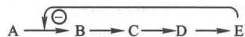

终端产物 E 抑制合成途径中第一个酶的活性,例如,由苏氨酸合成异亮氨酸,后者即是苏氨酸脱氨酶 (threonine deaminase) 的反馈抑制物(见图 26-13)。

2. 不同终端产物对共经合成途径的协同抑制 (concerted end product inhibition)

终端产物 E 和 H 既抑制在合成过程中共经途径的第一个酶,也抑制在分道后第一个产物的合成酶。例如,谷氨酸形成谷氨酰胺第 1 步反应中起催化作用的酶,即谷氨酰胺合酶(参看本章第一节, $\alpha-$ 酮戊二酸形成谷氨酰胺)受到 8 种产物的反馈抑制。

3. 不同分支产物对多个同工酶的特殊抑制——酶的多重性抑制 (enzyme multiplicity)

A 形成 B 由两个酶分别合成,两个酶分别受不同分支产物的特殊控制。两个分支产物又分别抑制其分道后第一个产物 E 和 F 的形成。例如,由 4-磷酸赤藓糖和磷酸烯醇式丙酮酸形成 3 种芳香族氨基酸的途径(图 26-24)。

4. 连续产物抑制 (sequential end product inhibition), 又称连续反馈控制 (sequential feedback control) 或逐步反馈抑制 (step feedback inhibition)

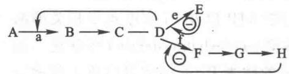

终端产物 E 和 H 只分别抑制分道后自己途径中第一个酶的作用。共经途径的终端产物 D 抑制全合成过程第一个酶的作用。这种抑制的特点是由于 E 对 e 酶的抑制致使 D 产物增加，D 的增加促使反应向 D→F→G→H 方向进行，而使产物 H 增加，又对 f 酶产生抑制，结果也造成 D 物质的积累，D 物质反馈抑制 a 酶的作用，而使 A→B 的速度减慢。枯草杆菌（Bacillus subtilis）中芳香族氨基酸生物合成的反馈抑制即属这种类型。苯丙氨酸、酪氨酸、色氨酸分支途径的第一步都分别受各自终产物的抑制。如果 3 种终端产物都过量，则分支酸即行积累。分支点中间产物积累的结果，使共经途径催化第一步反应的酶受到反馈抑制，从而抑制 4-磷酸赤藓糖和磷酸烯醇式丙酮酸的缩合反应（见图 26-24）。

由天冬氨酸生成赖氨酸、甲硫氨酸、异亮氨酸的过程也出现有各种类型的抑制现象(图 26-25)。

  
图 26-24 苯丙氨酸、色氨酸、酪氨酸合成的连续产物抑制

  
图26-25 赖氨酸、甲硫氨酸、异亮氨酸合成的连续产物抑制

催化谷氨酸与氨结合形成谷氨酰胺的谷氨酰胺合成酶受 Ala、Gly 和至少 6 种谷氨酸代谢的终产物的催化谷氨酸与氨结合形成谷氨酰胺的谷氨酰胺合成酶受 Ala、Gly 和别构抑制调节。每种抑制剂单独作用时只能产生部分的抑制作用。只有当所有 8 种抑制剂同时作用的时候才能完全抑制这个酶。这种调控机制可连续调节谷氨酸水平以满足瞬时代谢的需要。在 E.coil 这样的肠道细菌中，谷氨酰胺合成酶的调控是极其复杂的。这种酶含有 12 个相对分子质量为 50 000 的相同亚基，并且可以通过别构作用和共价修饰进行调节。除了别构调节，位于酶活性部位的 Tyr $^{397}$ 的腺苷酰化作用（加入 AMP）也能产生抑制效应。

这种共价修饰提高了别构抑制剂的敏感度，随着亚基的腺苷酰化增加，其活性逐渐降低。不论是腺苷酰化反应还是脱腺苷酰化反应，都是一种复杂的与谷氨酸、 $\alpha-$ 酮戊二酸、ATP以及Pi浓度水平相关的酶级联反应，它们均可被腺苷酰转移酶（adenylyltransferase）所催化。腺苷酰转移酶的活性可通过结合到一种称为 $\mathrm{P}_{\mathrm{II}}$ 的调节蛋白质上而进行调节， $\mathrm{P}_{\mathrm{II}}$ 的活性则又是被 $\mathrm{P}_{\mathrm{II}}$ 的一个Tyr残基的尿苷酰化共价修饰所调节。腺苷酰转移酶复合物与尿苷酰化的 $\mathrm{P}_{\mathrm{II}}(\mathrm{P}_{\mathrm{II}} - \mathrm{UMP})$ 结合可引起谷氨酰胺合成酶的腺苷酰化。 $\mathrm{P}_{\mathrm{II}}$ 的尿苷酰化和脱尿苷酰化都是由尿苷酰转移酶（uridylyltransferase）催化的。尿苷酰化可以被谷氨酸和Pi结合到尿苷转移酶所抑制，也可被 $\alpha-$ 酮戊二酸和ATP结合到 $\mathrm{P}_{\mathrm{II}}$ 所激活。

  
图26-26 谷氨酰胺合成的连续产物抑制

这种调控并没有就此终止，尿苷酰化的 $\mathrm{P}_{\mathrm{II}}$ 也可以介导编码谷氨酰胺合成酶基因的转录激活，最终使细胞中该酶的浓度增加。同样脱尿苷酰化的 $\mathrm{P}_{\mathrm{II}}$ 会使谷氨酰胺合成酶基因的转录水平下降。这种机制涉及一种 $\mathrm{P}_{\mathrm{II}}$ 与其他蛋白相互作用的机制，这些蛋白与基因调控相关。这种复杂机制的总效应就是当存在高浓度的谷氨酰胺时，谷氨酰胺合成酶的活件降低；而谷氨酰胺浓度降低以及同时存在 $\alpha-$ 酮戊二酸和ATP时，谷氨酰胺合成酶的活性升高。这种多层次的调控就决定了谷氨酰胺的合成的敏锐应答受控于细胞的需要。

并不是所有氨基酸的生物合成都受最终产物的反馈抑制，丙氨酸、天冬氨酸、谷氨酸就是例外。这3种氨基酸靠与其相对应的酮酸的可逆反应维持平衡。这3种氨基酸是中心代谢环节的关键中间产物。

甘氨酸的合成酶也不受最终产物抑制，此酶可能受到一碳单位和四氢叶酸的调节。

## （二）通过酶生成量的改变调节氨基酸的生物合成

酶生成量的控制主要是通过有关酶编码基因活性的改变。当某种氨基酸的合成能够提供超过需要量的产物时，则该合成途径酶的编码基因即受到抑制；而当合成产物浓度下降时，有关编码基因则解除抑制，从而合成增加产物浓度所需要的酶。有关酶基因的调控问题请参考第39章。

在氨基酸的合成途径中,有些酶能够受到细胞合成量的控制,这种酶称为阻遏酶(repressible enzyme)。例如,在大肠杆菌由天冬氨酸衍生的几种氨基酸的合成过程中(图26-25),标有A、B、C的3种酶都不属于变构酶,这些酶属于阻遏酶,它们的调控靠细胞对其合成速度的改变。当甲硫氨酸的量足够时,同工酶A和B都受到阻遏。同样当异亮氨酸的合成足够时同工酶C的合成速度就受到阻遏。靠阻遏与去阻遏(derepression)调控氨基酸的生物合成一般比别构调控缓慢。

因 20 种氨基酸在蛋白质生物合成中都需以准确的比例提供需要,因此生物机体不仅有个别氨基酸合成的调控机制,而且有使各种氨基酸在合成中相互协调(coordination)的调控机制。在生长迅速的细菌中,这种机制比电子计算机还要完善。

## 五、氨基酸转化为其他氨基酸及其他代谢物

某些氨基酸,除了它是蛋白质的组成单元外,还可成为一些重要生物分子的前体。这些分子包括一些核苷酸、核苷酸辅酶、血红素、各种激素、神经介质、氧化氮及谷胱甘肽等。本节将介绍氧化氮、谷胱甘肽、肌酸、卟啉及血红素、短杆菌肽等是如何从氨基酸转化形成的。有关核苷酸、核苷酸辅酶将在有关章节介绍。

## （一）氧化氮的形成

氧化氮(nitric oxide, NO)最近被发现在脊椎动物体内是一种重要的信息分子。它在信号传导过程中起重要作用。它是由精氨酸在氧化氮合酶(nitric oxide synthase, NOS)催化下形成的，产物是氧化氮和瓜氨酸，反应如下式：

(γ-谷氨酰半胱氨酰甘氨酸)  

以上的反应,实际上是一复杂反应。反应中还原型的 NADPH 和 $O_{2}$ 都需要。对这两种物质的需要表明氧化氮合酶(NOS)可能类似于细胞色素 P450。后者在催化羟基化反应中有活化分子氧的作用。实验证明,氧化氮合酶的 cDNA 序列自羧基端有一半与 P450 加氧酶(oxygenases)的序列相似。特别是在结合部位,二者都有黄素(flavins)和 NADPH 的结合部位。氧化氮可自由地跨膜扩散。因它非常活跃,其存在时间极短,甚至少于几秒钟。一氧化氮非常适合于在细胞内部以及在细胞之间作为瞬间的信号分子。

## （二）谷胱甘肽

谷胱甘肽(glutathion)含有巯基(一SH)，能保护血液中的红细胞不受氧化损伤、维持血红素中半胱氨酸处于还原态。正常情况下，还原型谷胱甘肽(GSH)与氧化型谷胱苷肽(GSSG)之比为500：1以上。在运动细胞中谷胱甘肽的含量很高(约5 mol/L)，因此谷胱甘肽可起到一SH“缓冲剂”(sulfhydryl buffer)的作用。

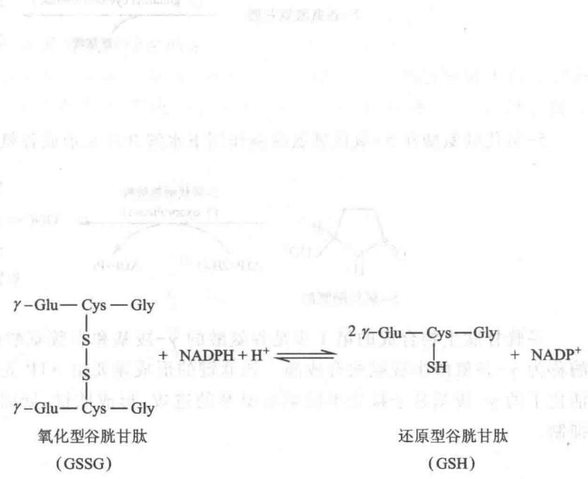

还原型谷胱甘肽与过氧化氢或其他有机氧化物反应还可起到解毒作用。

谷胱甘肽还参与氨基酸的转运, Meister A 首先提出 $\gamma-$ 谷氨酰循环, 解释了谷胱甘肽在氨基酸跨膜转运中的机制(图 26-27)。

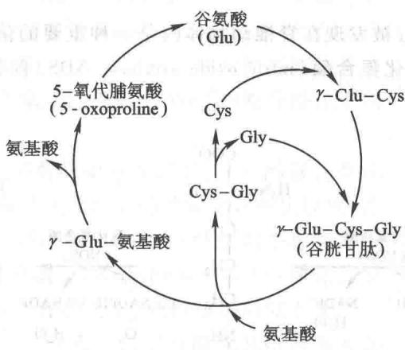  
图26-27 谷胱甘肽在氨基酸跨膜转运的作用机制  
谷胱甘肽通过 $\gamma-$ 谷氨酰循环完成氨基酸的跨膜运转，氨基酸以 $\gamma-$ 谷氨酰衍生物（ $\gamma-$ glutamyl derivative）的形式，从一个细胞转移到另一个细胞，谷胱甘肽与氨基酸形成 $\gamma-$ 谷氨酰氨基酸的反应发生于细胞质膜的外表面。循环中所有其他反应都在细胞溶胶内进行

在此循环中存在一个与膜结合的酶,称为 $\gamma-$ 谷氨酰转肽酶( $\gamma$ -glutamyl transpeptidase)。该酶的催化作用是使谷胱甘肽分子上的 $\gamma-$ 谷氨酰基转移到任何一个氨基酸上,形成 $\gamma-$ 谷氨酰氨基酸:

该酶的催化部位在细胞膜外侧(肾细胞)。谷胱甘肽能跨过质膜进行上述反应,形成的 $\gamma-$ 谷氨酰氨基酸被其他器官的细胞吸收并环化形成 5-氧代脯氨酸(5-oxoproline)。同时将被运转的氨基酸释出:

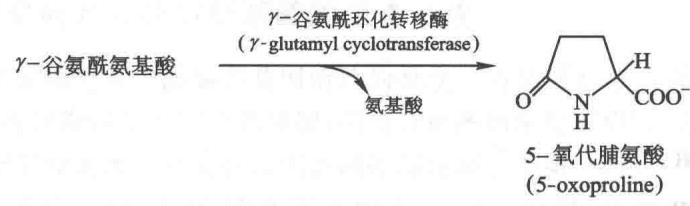

5-氧代脯氨酸在 5-氧代脯氨酸酶作用下水解开环又形成谷氨酸。该反应为需能反应。

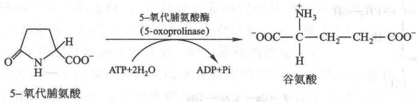

谷胱甘肽生物合成的第1步是谷氨酸的 $\gamma$ -羧基和半胱氨酸的氨基之间形成肽键。催化此反应的酶称为 $\gamma$ -谷氨酸半胱氨酸合成酶。该肽键的形成需要由ATP先将 $\gamma$ -羧基活化，形成 $\gamma$ -谷氨酰磷酸，活化了的 $\gamma$ -羧基易于接受半胱氨酸氨基的进攻，形成肽键，同时脱去磷酸，该反应受谷胱甘肽的反馈抑制。

$\delta$ -氨基乙酰丙酸  
甘氨酸 琥珀酰-CoA  
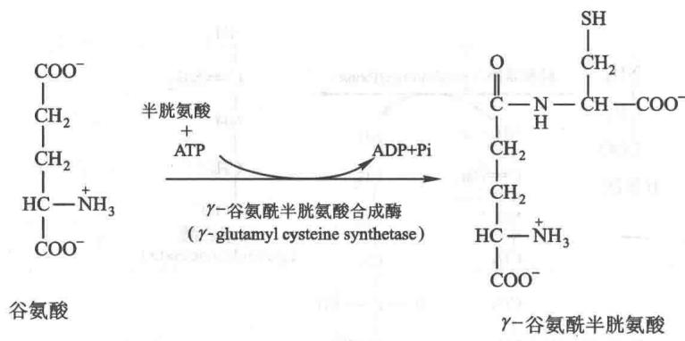

谷胱甘肽合成的第二步是 $\gamma-$ 谷氨酰半胱氨酸分子中半胱氨酸部分的羧基与甘氨酸的氨基之间形成肽键。催化此反应的酶称为谷胱甘肽合成酶，反应的机制和上述肽键的形成基本上相同，在 ATP 参与下使半胱氨酸的羧基活化，而易于接受甘氨酸氨基的进攻。

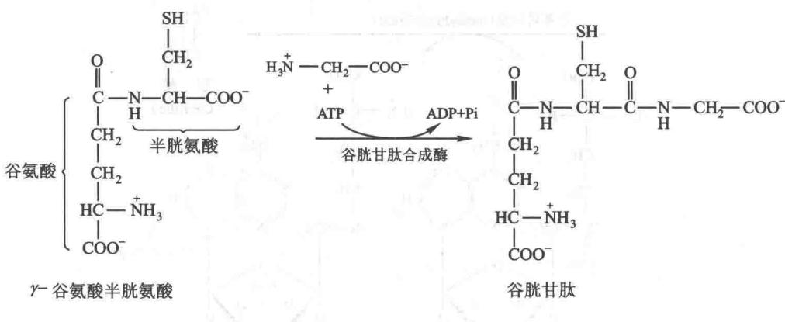

## （三）肌酸的生物合成

肌酸(creatine)可形成磷酸肌酸在肌肉和神经的贮能中占有重要地位(参看第16章生物能学)。

肌酸的生物合成是由甘氨酸、精氨酸、甲硫氨酸形成。精氨酸提供胍基（guanidino group），甲硫氨酸提供甲基，其合成步骤可表示如图26-28。

## （四）卟啉、血红素的生物合成

## 1. 叶啉(porphyrin)是从琥珀酰-CoA及甘氨酸衍生而来

（1）自甘氨酸形成 $\delta-$ 氨基 $-\gamma-$ 酮戊酸 ( $\delta-$ aminolevulinate, ALA) 甘氨酸在与琥珀酰辅酶 A 缩合前先与 $\delta-$ 氨基 $-\gamma-$ 酮戊酸合成酶的辅酶磷酸吡哆醛结合，形成一个中间产物 $\alpha-$ 氨基 $-\beta-$ 酮己二酸，然后脱羧而成 $\delta-$ 氨基 $-\gamma-$ 酮戊酸。

  
图26-28 肌酸的生物合成

其反应机制如图 26-29 所示。

（2）自 $\delta-$ 氨基 $-\gamma-$ 酮戊酸生成胆色素原（porphobilinogen，PBG）在细胞溶胶中，两分子 $\delta-$ 氨基乙酰丙酸缩合形成一分子胆色素原，这是第二个中间产物。催化此反应的酶 $\delta-$ 氨基乙酰丙酸脱水酶（ $\delta-$ aminolevulinate dehydrase）。催化过程经过两分子 $\delta-$ 氨基 $-\gamma-$ 酮戊酸间的醇醛缩合反应，加合物的脱水以及环化等反应最后形成胆色素原。以上反应都是在与酶结合的状态下进行。

  
图 26-29 叶啉合成过程中甘氨酸与琥珀酰-CoA 形成中间产物 δ-氨基-γ-酮戊酸的反应机制  
①甘氨酸在酶促催化下发生转氨基反应，辅因子为吡哆醛磷酸（PLP）；②PLP使碳负离子的形成得到稳定；③C—C键的形成；④CoA的释出；⑤PLP希夫碱易化脱羧反应，⑥发生转亚氨基作用，产生 $\delta-$ 氨基- $\gamma-$ 酮戊酸（ALA）同时PLP酶又得到再生。■、▲、\*为C和N原子来源的标记

全部过程可表示如图 26-30。

（3）胆色素原是吡咯化合物的母体 4 分子胆色素原在胆色素原脱氨酶（porphobilinogendeaminase）催化下，缩合形成一线型四吡咯（tetrapyrrole），即聚吡咯基甲烷（polypyrrole methane）。每一缩合即形成一个乙烯桥，同时失去一铵离子。仔细考察可以看到这个四吡咯中的氮和碳原子来源于甘氨酸，其他则来自琥珀酰-CoA，其反应机制见图 26-31。

  
图26-30 由 $\delta$ -氨基- $\gamma$ -酮戊酸（ALA）合成胆色素原

图中所示反应包括①形成希夫碱；②形成第二个希夫碱；③形成α-负碳离子（carbanion）与希夫碱反应；④以羟醛（aldol）形式缩合而环化；⑤消除酶的 $NH_{2}$ 基团；⑥互变异构化，形成胆色素原

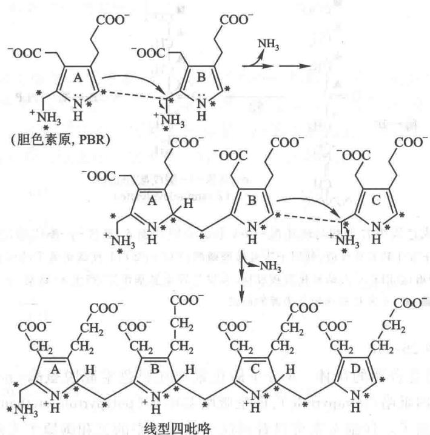  
(linear tetrapyrrole, polypyrryl methane)  
图 26-31 胆色素原缩合形成线型四吡咯反应机制

（4）线型四吡咯的环化 如果没有其他酶存在，线型四吡咯可自行环化，形成尿卟啉原Ⅰ（uroporphyrinogen I）。该化合物的结构特点如图26-32所示。它的四个吡咯环内的双键以两个对称平面彼此对称；侧链的乙酸和丙酸基都以该分子的中心互相对称，尿卟啉原Ⅰ并不是血红素的前体，它的前体是尿卟啉原Ⅲ，后者是由胆色素原脱氨酶和尿卟啉原Ⅲ同合酶（uroporphyrinogen III cosynthase）共同作用形成的，它的结构如图26-33所示。尿卟啉原Ⅲ和尿卟啉原Ⅰ的区别在于第4个吡咯环（B环）上的乙酸基和丙酸基侧链位置相反，因此失去以分子对称中心的对称关系。此侧链异位是由于辅合成酶催化四吡咯D环双键的互变异构后环化产生的。胆色素原(PBG)合成尿卟啉原Ⅲ的过程如图26-34所示，图中参与反应的与胆色素原脱氨酶(porphobilinogen deaminase)结合的辅助因子——联吡咯甲烷是由胆色素原脱氢酶自己用两个胆色素原预先合成的。

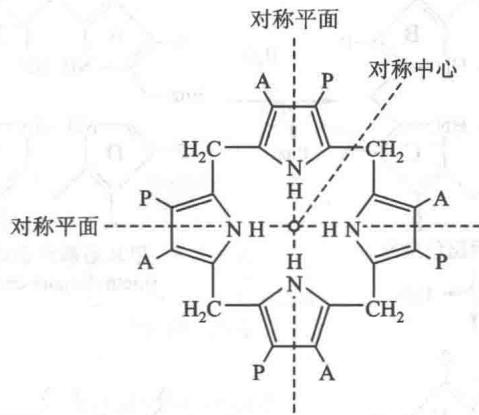  
尿卟啉原 I 又称六氢尿卟啉 I (uroporphyrinogen I)  
图 26-32 尿卟啉原 I (nroporphyrinogen I) 的结构  
图中 A 代表乙酸基；P 代表丙酸基。吡咯核双键以两个对称平面对称，乙酸基和丙酸基侧链以对称中心对称

  
图 26-33 尿卟啉原Ⅲ（uroporphyrinogenⅢ）与尿卟啉原Ⅰ的结构（见图 26-32）的区别仅在于一个吡咯环上的侧链，乙酸基和丙酸基的位置不同，图中 A 代表乙酸基；P 代表丙酸基

尿卟啉原Ⅲ在一系列酶的催化下，经粪卟啉原Ⅲ（coproporphyrinogen Ⅲ）（图26-35），在原卟啉Ⅸ氧化酶作用下转变为原卟啉原Ⅸ（protoporphyrinogen Ⅸ）（图26-36），在亚铁螯合酶（ferrochelatase）催化下，亚铁原子掺入原卟啉Ⅸ形成血红素，它的结构如图26-37所示。

## 2. 血红素(heme)生物合成的历程

$\delta$ -氨基- $\gamma$ -酮戊酸(ALA)的合成完成于线粒体中。它从线粒体脱出转化为胆色素原(PBG)。由胆色素原脱氨酶催化,4个分子的PBG缩合脱氨又羧基化形成线型羟基甲基后胆色素原,然后在尿卟啉原Ⅲ同合酶(uroporphyrinogen III cosynthase)的作用下形成尿卟啉原Ⅲ(uroporphyrinogen Ⅲ),它在尿卟啉原Ⅲ脱羧酶的作用下形成血红素的前体粪卟啉原Ⅲ(coproporphyrinogen Ⅲ)(图26-35)。接着对吡咯环取代基的氧化作用产生原卟啉IX(protoporphyrin IX)。这三步反应是伴随反应物又返回线粒体发生的。与吡咯环相接的亚甲基(methylene)被氧化后,产生原卟啉原IX(protoporphyrinogen IX)。亚铁螯合酶催化下,对原卟啉IX螯合 $\mathrm{Fe}^{2+}$ 离子,得到血红素(heme)。血红素合成的全过程如图26-38所示。图中A为乙基 $(-\mathrm{CH}_{2}-\mathrm{CH}_{3})$ ,D为丙酰基 $(-\mathrm{CH}_{2}-\mathrm{CH}_{2}-\mathrm{COO}^{-})$ ,M为甲基 $(-\mathrm{CH}_{3})\mathrm{V}$ 为乙烯基 $(-\mathrm{CH}=\mathrm{CH}_{2})$ 。

粪卟啉原Ⅲ在生物合成的地位十分重要，除血红素外，它还是生成叶绿素，维生素 $B_{12}$ 及 siro-血红素的中间体，从它出发，经原卟啉IX，若螯合 $Fe^{2+}$ 得（正铁）血红素（protoheme），它是血红素的前体。若螯合 $Mg^{2+}$ ，则得到 $Mg^{2+}$ 原卟啉IX（Mg protoporphyrin IX），它是叶绿素的前体。从尿卟啉原走向另一途径，可生成维生素 $B_{12}$ 等。

应附带提及的是,铁卟啉或血红蛋白血红素降解后的产物为 $Fe^{2+}$ 和胆红素(bilirubin)。后者是一线型开链四吡咯衍生物,结构如图 26-39 所示。

临床上由于血红素合成的某种酶缺失,而引起卟啉化合物或前体物堆积,称为卟啉症(porphyria),这

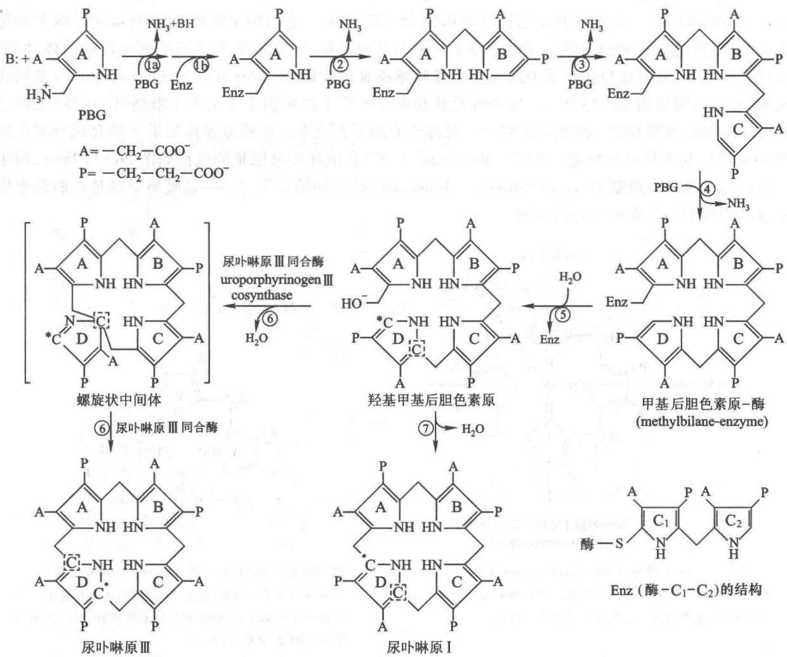  
图 26-34 从胆色素原(PBG)合成尿卟啉原Ⅲ的过程

①由一般碱催化脱氨形成亚甲吡咯烯啉（methylene pyrrolinene）中间体，②与胆色素原脱氨酶-联吡咯甲烷（ $\mathrm{E - C_1 - C_2}$ ）相结合。（②\~④）第二，三，四 PBG 连续加成并脱氨形成甲基-后胆色素原-酶- $\mathrm{C_1 - C_2}$ ，每次的反应过程重复 1a 和 1b。⑤甲基后胆色素原-酶- $\mathrm{C_1 - C_2}$ 水解形成羟基甲基后胆色素原，并脱下酶- $\mathrm{C_1 - C_2}$ 。⑥由胆色素原脱氨酶和尿卟啉原Ⅲ同合酶催化经螺旋状中间体，转化为尿卟啉原Ⅲ⑦羟基甲基后胆色素原还可自动环合，形成尿卟啉原 I

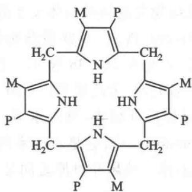  
图26-35 粪卟啉原Ⅲ的结构

图中 M 代表甲基; P 代表丙酸基

图 26-36 原卟啉 IX 的结构 $^{°}$ C 代表来源于琥珀酰辅酶 A 的碳原子  

$C^{*}$ , $N^{*}$ 代表来源于甘氨酸的碳原子和氮原子

  
图26-37 血红素(heme)的结构

  
图 26-38 胆红素的结构(bilirubin)  
图中 M 代表甲基 $(-CH_{3})$ ; V 代表乙烯基 $(-CH=CH_{2})$

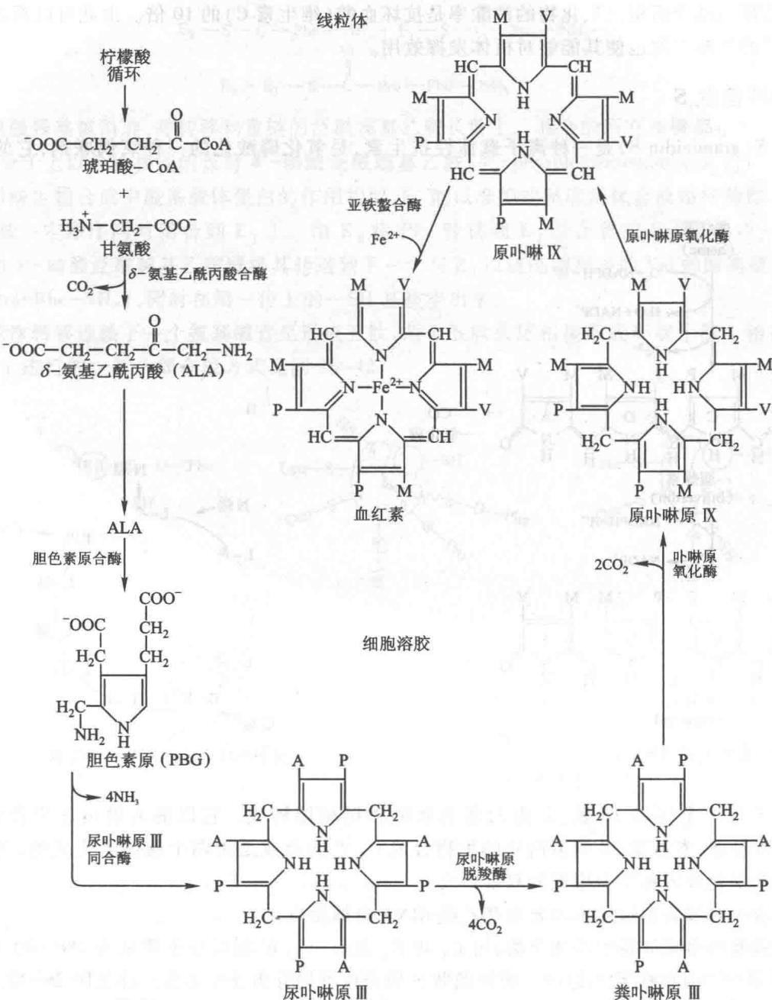  
图26-39 血红素生物合成的全路线

种病属于遗传病。如缺乏尿卟啉原Ⅲ同合酶，则尿卟啉原Ⅰ在红细胞中积累，尿中含有大量尿卟啉原Ⅰ和粪卟啉原Ⅰ并呈红色，牙齿在紫外光下有强的荧光，皮肤对阳光过敏。另一种类型卟啉症是肝细胞中积累胆色素原而且出现周期性的精神和行为失常。

正常人的红细胞寿命大约为 120 天, 衰老的红细胞随血流进入脾降解, 血红蛋白脱辅基蛋白质 (apoprotein) 被水解为氨基酸, 血红素则转变为胆红素。后者与血清清蛋白结合形成复合体被转移到肝, 形成胆红素二葡糖苷酸 (bilirubin diglucoronide) 被分泌到胆汁中, 而铁原子则可被再利用。

黄胆(Jaundice)表现为血液中胆红素浓度升高,并且皮肤和眼球变黄。黄疸的产生有几种可能,红细胞的过分破裂,肝功能的损坏或机械性胆道梗阻都可导致黄疸。测定血液中的结合胆红素和非结合胆红素的浓度比例有助于疾病的诊断。

血红素降解的第1步是形成胆绿素，它比胆红素有更好的溶解度，而哺乳动物却选择了胆红素，其重要原因是胆红素对机体是非常有效的抗氧化剂（antioxidant）。它可消除过氧羟自由基（hydroperoxy radical, $\mathrm{HO}_2$ ）。每分子可结合2分子 $\mathrm{HO}_2$ 而转变为胆绿素（图26-40），它又可还原为胆红素。按浓度计算，胆红素与清蛋白结合后对过氧化物的消除率是抗坏血酸（维生素C）的10倍。由此可以看到在自然选择中，代谢途径的分解产物也使其能够对机体发挥效用。

## (五) 短杆菌肽 S

短杆菌肽 S(gramicidin S) 是一种离子载体性抗生素, 是氧化磷酸化的一种氧偶联剂, 它的结构如图 26-41 所示。

  
图26-40 血红素的降解

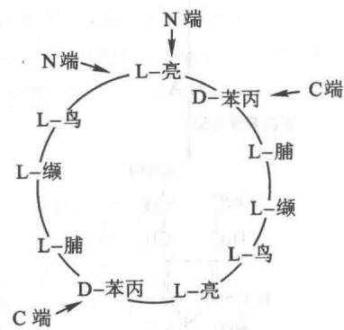  
图26-41 短杆菌肽S的结构

短杆菌肽 S 是一个环状 10 肽, 是由两条五肽链头尾相接构成。它以酶为模板逐步合成, 不需要 mRNA 和核糖体参加(参看第 38 章蛋白质的生物合成)。它的合成是由两个酶体系完成的, 其中两个酶中的一个酶具有催化合成和作为模板的双重功能。

在合成过程中氨基酸的活化不需要氨基乙酰 tRNA 参加反应。

催化短杆菌肽的多酶体系中的两个酶，用 $E_{I}$ 和 $E_{II}$ 表示。 $E_{I}$ 的相对分子质量为 280 000，称为重链。 $E_{II}$ 相对分子质量为 100 000，称为轻链。短杆菌肽 S 的合成可划分为 5 个步骤。详见图 26-42。

反应包括氨基酸在相应酶作用下的活化、硫酯化和消旋。 $E_{II}$ 能使苯丙氨酸消旋并与之结合形成硫酯键， $E_{II}$ 只与 D-Phe 结合。 $E_{I}$ 则可同时与短杆菌肽所需的其他 4 个氨基酸结合，无论与 $E_{I}$ 或 $E_{II}$ 形成硫酯键都是由氨基酰基腺苷酸(aminoacyl adenylates)与之作用。短杆菌肽S合成时氨基酸的活化包括两步如下：

  
图 26-42 在蛋白质模板上形成短杆菌肽 S 的可能机制

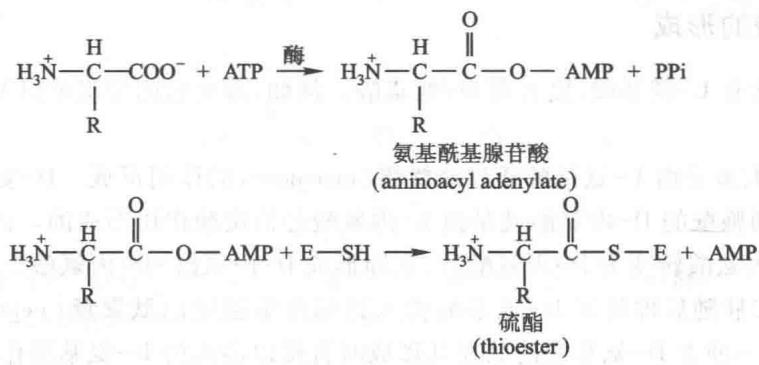

合成的下一步是活化的氨基酸结合到酶的轻链 $E_{1}(D-Phe)$ 和重链 $E_{II}(Pro_{2}, Val, Orn, Leu)$ 上。

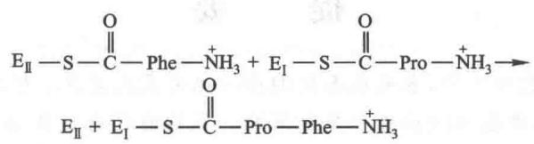

苯丙氨酸残基被消旋，并转移到重链的泛酰巯基乙胺长臂上。其余的所有步骤都在 $E_{1}$ 上进行。

在 $E_{I}$ 分子上以共价相连的长臂 4'-磷酸泛酰巯基乙胺（4'-phosphopantethlotheine），可视为该酶的辅基。与脂肪酸生物合成中酰基载体蛋白的作用相似， $E_{I}$ 能以准确的顺序活化合成短杆菌肽 S 所需的 4 个氨基酸，并按一定顺序同时结合到 $E_{I}$ 上。由 $E_{II}$ 将 Phe 转移到 $E_{I}$ 结合着的 Pro 上形成一个二肽 Pro-Phe，然后由 4'-磷酸泛酰巯基乙胺臂将其转送到下一个与 $E_{I}$ 以硫酯键相连的 Val 的游离氨基上形成三肽链（-Val-Pro-Phe- $NH_{2}$ ），同时在第一位上的一SH 基被空出来。

如上依次转移连接下一个氨基酸直至形成五肽，两个五肽头尾相接形成环状十肽。相接反应也是在酶分子 $E_{1}$ 上进行的。其全部合成方式见图26-42。

A

A. 活化的氨基酸以硫酯键分别结合到酶体系的轻链和重链上,苯丙氨酸残基与轻链结合被消旋并转移到重链的泛酰巯基乙胺臂上。B. 苯丙氨酰基从泛酰巯基乙胺臂上转移到脯氨酰残基上形成第一个肽键。C. 苯丙氨酰-脯氨酰残基转移到泛酰巯基乙胺的游离巯基上,同时轻链接受另外一个已被消旋的苯丙氨酰基。D. 苯丙氨酰-脯氨酰残基转移到缬氨酰残基上。E. 形成的五肽被转移到“等候”部位6上,第二个五肽也同时合成并与第一个五肽缩合形成短杆菌肽S,游离的泛酰巯基乙胺臂又为下一个肽的合成做好准备

许多寡肽其链长在有 15 个氨基酸残基以下的, 几乎都是通过上述类似的方式合成。

## (六) D-氨基酸的形成

许多生物体内既含有 L-氨基酸,也含有 D-氨基酸。例如,微生物的细胞壁以及许多肽类的抗生素都含有 D-氨基酸。

D-氨基酸的来源大多是由 L-氨基酸通过消旋酶(racemase)的作用形成。D-氨基酸一旦形成就立即掺入到肽链中。细菌细胞壁的 D-丙氨酸就是由 L-丙氨酸经消旋酶作用形成的。丙氨酸消旋酶以磷酸吡哆醛为辅助因子。L-丙氨酸转变为 D-丙氨酸后，立即形成 D-丙氨酰-D-丙氨酸二肽，消旋酶催化的反应是需能反应。形成的二肽随后即将其 D-氨基酸掺入到细菌细胞壁的肽聚糖(peptidoglycan)分子中。到现在为止，还没有发现一种含 D-氨基酸的肽在其形成时直接以游离的 D-氨基酸作为合成肽的底物。

## 提要

不同生物合成氨基酸的能力不同,合成氨基酸的种类也有很大差异。机体维持正常生长所必需,而又不能自己合成,需从外界摄取的氨基酸称为必需氨基酸。凡能自己合成的为非必需氨基酸。人和大白鼠需10种必需氨基酸。研究氨基酸生物合成大多用微生物的遗传突变株,使突变株在氨基酸的某个合成环节上产生缺失,造成某种中间物的积累,从而判明各个中间代谢环节。当前20种氨基酸的生物合成途径已得到基本阐明。

在生物合成中,氨基酸的各种碳骨架起源于代谢的几条主要途径,即柠檬酸循环,糖酵解及戊糖磷酸途径。因此,可将这几条途径中与氨基酸合成密切相关的几种化合物看作氨基酸生物合成的起始物。氮的来源起始于无机氮,如 $N_{2}, NH_{3}$ 。 $N_{2}$ 的转化是经生物固氮, $NH_{3}$ 的转化是经同化作用。氨基酸生物合成可按碳来源于柠檬酸循环、糖酵解、戊糖磷酸途径划分为若干类型。

α-酮戊二酸衍生类型包括谷氨酸、谷氨酰胺、甲硫氨酸、苏氨酸、异亮氨酸及赖氨酸（以草酰乙酸为底物）提供碳原子。

3-磷酸甘油酸衍生类型包括丝氨酸、半胱氨酸、甘氨酸。

芳香族氨基酸——苯丙氨酸、酪氨酸、色氨酸生物合成的起始物为4-磷酸赤藓糖和磷酸烯醇式丙酮酸。色氨酸还需要磷酸核糖焦磷酸（PRPP）以及丝氨酸参与合成反应。

组氨酸的生物合成需要 PRPP 以及 ATP 的 N—C 基团。因此，组氨酸的合成也可认为是嘌呤核苷酸代谢的一个分支。

氨基酸的生物合成根据需要有严格的调控机制,调控机制中最有效的是通过合成过程的终产物抑制反应系列中第一个酶的活性。

有许多重要的生物活性物质来源于氨基酸,如氧化氮、谷胱甘肽、肌酸、卟啉及短杆菌肽 S 等。D-氨基酸大多是由 L-氨基酸经过消旋酶作用形成的。

## 习题

1. 哪些氨基酸对人体是必需氨基酸？为什么有些氨基酸称为非必需氨基酸？

2. 写出由葡萄糖合成丙氨酸的总平衡式。

3. 在氨基酸生物合成中哪些氨基酸和柠檬酸循环有联系？哪些氨基酸和糖酵解过程以及磷酸五碳糖途径有直接联系？

4. 在下列的每个转变中是哪种叶酸的中间产物参与反应？

(a) 甘氨酸→丝氨酸(四氢叶酸)

(b) 组氨酸→谷氨酰胺(四氢叶酸)

(c) 高半胱氨酸→甲硫氨酸( $N^{5}$ -甲基四氢叶酸)

5. 芳香族氨基酸生物合成的共同前体是什么？它们以哪种中间产物作为合成路线的分支点？

6. 缺乏苯丙氨酸羟化酶(苯丙氨酸单加氧酶)的病人为什么出现苯丙酮酸尿症?

7. 从漂白过的面粉中有时可分离到一种甲硫氨酸衍生物——甲硫氨酸亚砜亚胺（methionine sulfoximine），它的结构如下：

  
甲硫氨酸亚砜亚胺

它可引起机体抽搐，是谷氨酰胺合成酶的强烈抑制剂。请提出这一抑制剂可能的作用机制？

8. 由 $\mathbf{N}_2$ 到血红素(heme)在氮的流程中有哪些中间产物？

## 主要参考书目

1. Stryer L. Biochemistry. 4th ed. New York: W. H. Freeman and Company, 1995.

2. Lehnninger A R. Biochemistry. 2nd ed. New York: Worth Publishers. Inc. 1975.

3. Lebioda L, Stec B. Crystal structure of enolase indicates that enolase and pyruvate kinase from a common ancestor. Nature, 1988.

4. Nelson D L, Cox M M. Lehnninger 生物化学原理. 3 版. 周海梦, 等译. 北京: 高等教育出版社, 2005.

5. Nelson D L, Cox M M. Lehninger Principles of Biochemistry. 6th ed. New York: W. H. Freeman and Company, 2012.

6. Herrmann K M, Somerville R L (Eds.). Amino Acids: Biosynthesis and genetic regulation. Addison-Wesley, 1983.

7. Frey P A, Hegeman A D. Enzymatic Reaction Mechanism. New York: Oxford University Press, 2007.

8. Richards N G J, Kilberg M S. Asparagine synthetase chemotherapy. Annu. Rev. Biochem, 2006, 75: 629-654.

(王镜岩 秦咏梅)

## 网上资源

习题答案

自测题

## [1] 2023年1月1日（星期二）

## 第 27 章 核酸的降解和核苷酸代谢

核酸的基本结构单位是核苷酸。遗传信息的复制、重组、转录和各种加工变化均需通过核酸代谢才得以实现，而核酸代谢则与核苷酸代谢紧密关联。细胞内存在许多游离的核苷酸，它们几乎参与细胞的所有生化过程。总结起来，核苷酸有以下几个方面的作用：核苷酸是核酸生物合成的前体。ATP是生物新陈代谢通用的能量载体；GTP是推动某些重要生命过程的能量供体。核苷酸衍生物是许多生物合成反应的活性中间物。例如，UDP-葡萄糖和CDP-二脂酰甘油分别是糖原和磷酸甘油酯合成的中间物。腺苷酸和腺苷是重要辅酶和辅助因子（烟酰胺核苷酸、黄素腺嘌呤二核苷酸、辅酶A、辅酶 $\mathrm{B}_{12}$ 和 $S-$ 腺苷甲硫氨酸）的组分。核苷酸作为信号分子，在调节细胞功能和基因表达中起重要作用。例如cAMP和cGMP是信号转导的第二信使；腺苷酰基、尿苷酰基是酶活性调节的共价修饰基团；ATP在蛋白质激酶作用下给出磷酸基以调节蛋白质活性； $(\mathrm{P})_{\mathrm{PP}}\mathrm{G}_{\mathrm{PP}}$ 是细菌在氨基酸饥饿时调节生长的效应分子。

核酸降解产生核苷酸，核苷酸还能进一步分解。在生物体内，核苷酸可由少数化合物从头合成（de novo）。核苷酸的生物合成受反馈调节。核酸的分解产物核苷和碱基还可以通过补救途径（salvage pathway）加以再利用。核苷酸代谢和氨基酸代谢相互关系密切，它们的合成有共同的氨供体和一碳供体，也有类似的代谢产物；有些核苷酸参与氨基酸的合成，有些氨基酸参与核苷酸的合成，从而推测在早期代谢途径形成时两者是相伴而成的。核苷酸代谢还与其他物质代谢相关联，如有些辅酶含有腺苷酸，是由ATP供给。核苷酸是重要生命分子，其代谢异常将造成疾病。

## 一、核酸和核苷酸的分解代谢

动物和异养型微生物可以分泌消化酶类来分解食物或体外的核蛋白和核酸类物质，以获得各种核苷酸。核苷酸水解脱去磷酸而生成核苷，核苷再分解生成嘌呤碱或嘧啶碱和戊糖。核苷酸及其水解产物均可被细胞吸收和利用。植物一般不能消化体外的有机物质。但所有生物的细胞都含有与核酸代谢有关的酶类，能够分解细胞内各种核酸，促使外界入侵核酸或胞内无用核酸的分解。在体内，核酸的水解产物戊糖可参加戊糖代谢，嘌呤碱和嘧啶碱还可以进一步分解。核酸的分解过程如下：

$$
\text { 核酸 } \xrightarrow [ (\text { 磷酸二酯酶 }) ]{\text { 核酸酶 }} \text { 核苷酸 } \xrightarrow [ (\text { 磷酸单酯酶 }) ]{\text { 核苷酸酶 }} \text { 核苷 } + \text { 磷酸 } \xrightarrow {\text { 核苷磷酸化酶 }} \text { 嘌呤碱和嘧啶碱 } + 1 - \text { 磷酸戊糖 }
$$

## (一) 核酸的降解

核酸是由许多核苷酸以 $3^{\prime}, 5^{\prime}$ -磷酸二酯键连接而成的大分子化合物。核酸分解代谢的第一步是水解连接核苷酸之间的磷酸二酯键，生成低级多核苷酸或单核苷酸。在生物体内有许多磷酸二酯酶可以催化这一解聚作用。作用于核酸的磷酸二酯酶称为核酸酶。水解核糖核酸的称核糖核酸酶(RNase)，水解脱氧核糖核酸的称脱氧核糖核酸酶(DNase)。核糖核酸酶和脱氧核糖核酸酶中能够水解核酸分子内磷酸二酯键的酶又称为内切核酸酶(endonuclease)，从核酸链的一端逐步水解下核苷酸的酶称为外切酶核酸(exonuclease)。

细胞中 DNA 的含量是相当恒定的,而 RNA 的含量却有显著变化。但是,令人惊异的是脱氧核糖核酸酶含量在相当众多的细胞中却是很高的。推测这种脱氧核糖核酸酶的可能生物学功能在于消除异常的、无用的或外来的 DNA,以维持细胞遗传性的稳定;或是用于细胞凋亡和自溶。总之,细胞核酸,无论是 DNA 或 RNA,都不是永恒不变的,细胞的各种核酸酶参与了核酸的代谢。

## （二）核苷酸的分解

核苷酸水解下磷酸即成为核苷。生物体内广泛存在的磷酸单酯酶或核苷酸酶可以催化这个反应。非特异性的磷酸单酯酶对一切核苷酸都能作用，无论磷酸基在核苷的2'、3'或5'位置上都可被水解下来。某些特异性强的磷酸单酯酶只能水解3'-核苷酸或5'-核苷酸，则分别称为3'-核苷酸酶或5'-核苷酸酶。

核苷经核苷酶(nucleosidase)作用分解为嘌呤碱或嘧啶碱和戊糖。分解核苷的酶有两类。一类是核苷磷酸化酶(nucleoside phosphorylase)，另一类是核苷水解酶(nucleoside hydrolase)。前者分解核苷生成含氮碱和戊糖的磷酸酯，后者生成含氮碱和戊糖：

$$
\mathrm{核苷} + \mathrm{磷酸} \xrightarrow {\mathrm{核苷磷酸化酶}} \mathrm{嘌呤碱或嘧啶碱} + \mathrm{戊糖} - 1 - \mathrm{磷酸}
$$

$$
\mathrm{核苷} + \mathrm {H_ {2} O} \xrightarrow {\mathrm{核苷水解酶}} \mathrm{嘌呤碱或嘧啶碱} + \mathrm{戊糖}
$$

核苷磷酸化酶存在比较广泛,其所催化的反应是可逆的。核苷水解酶主要是存在于植物和微生物体内,并且只能对核糖核苷作用,对脱氧核糖核苷没有作用,反应是不可逆的。它们对作用底物常具有一定的特异性。

核苷酸的降解产物嘌呤碱和嘧啶碱还可以继续分解。

## （三）嘌呤碱的分解

不同种类的生物分解嘌呤碱的能力不一样,因而代谢产物亦各不相同。人和猿类及一些排尿酸的动物(如鸟类,某些爬行类和昆虫等)以尿酸作为嘌呤碱代谢的最终产物。其他多种生物则还能进一步分解尿酸,形成不同的代谢产物,直至最后分解成二氧化碳和氨。

嘌呤碱的分解首先是在各种脱氨酶的作用下水解脱去氨基。腺嘌呤和鸟嘌呤水解脱氨分别生成次黄嘌呤和黄嘌呤。脱氨反应也可以在核苷或核苷酸的水平上进行。在动物组织中腺嘌呤脱氨酶（adenine deaminase）的含量极少，而腺嘌呤核苷脱氨酶（adenosine deaminase）和腺嘌呤核苷酸脱氨酶（adenylate deaminase）的活性较高，因此，腺嘌呤的脱氨分解可在其核苷和核苷酸的水平上发生，然后再水解生成次黄嘌呤。它们的关系如下：

$$
\begin{array}{c} \text {腺嘌呤核苷酸} \\ (\text {腺嘌呤核苷}) \end{array} \xrightarrow [ \mathrm{H} _ {2} \mathrm{O} , - \mathrm{NH} _ {3} ]{\text {腺嘌呤核苷酸(核苷)}} \text {次黄嘌呤核苷酸}
$$

$$
\text {次黄嘌呤核苷酸} \xrightarrow {\text {核苷酸酶}} \text {次黄嘌呤核苷} \xrightarrow {\text {核苷磷酸化酶}} \text {次黄嘌呤}
$$

鸟嘌呤脱氨酶(guanine deaminase)的分布较广,鸟嘌呤的脱氨分解主要是在该酶的作用下进行的:

$$
\mathrm{鸟嘌呤} + \mathrm {H_ {2} O} \xrightarrow {\mathrm{鸟嘌呤脱氨酶}} \mathrm{黄嘌呤} + \mathrm {NH_ {3}}
$$

次黄嘌呤和黄嘌呤在黄嘌呤氧化酶(xanthine oxidase)的作用下氧化生成尿酸：

$$
\begin{array}{r l} & {\mathrm{次黄嘌呤} + \mathrm {O_ {2}} + \mathrm {H_ {2} O} \xrightarrow {\mathrm{黄嘌呤氧化酶}} \mathrm{黄嘌呤} + \mathrm {H_ {2} O}} \\ & {\mathrm{黄嘌呤} + \mathrm {O_ {2}} + \mathrm {H_ {2} O} \xrightarrow {\mathrm{黄嘌呤氧化酶}} \mathrm{尿酸} + \mathrm {H_ {2} O}} \end{array}
$$

黄嘌呤氧化酶是一种复合黄素酶，它由2个相同的亚基所组成。每一个亚基的Mr为145000，含有一个FAD，一个钼辅因子和两个不同的铁-硫中心(Fe/S I和Ⅱ)。黄嘌呤（或次黄嘌呤）的氧化是一个极其复杂的过程，它要求分子氧作为电子受体，还原产物是过氧化氢，进入尿酸的氧来自水。当底物与酶结合后，Mo(VI)被还原成Mo(IV)，电子经过铁硫中心和黄素等一系列转移步骤而传递给分子氧，并与氢离子形成过氧化氢，被还原的Mo(IV)则再氧化成Mo(VI)。产物过氧化氢随即被过氧化氢酶所分解，生成氧和水。

结构与次黄嘌呤很相似的别嘌呤醇(allopurinol)对黄嘌呤氧化酶有很强的抑制作用。所以有时用它治疗痛风。该病是由于尿酸在体内过量积累而引起的。经别嘌呤醇治疗的患者排泄黄嘌呤和次黄嘌呤以代替尿酸。别嘌呤醇可被黄嘌呤氧化酶氧化成别黄嘌呤(alloxanthine)，它与酶活性中心的Mo(Ⅳ)牢固结合，从而使Mo(Ⅳ)不易被氧化转变成Mo(VI)。这种底物类似物经酶作用后成为酶的灭活物，称为自杀作用物(suicide substrate)。别嘌呤醇转变成别黄嘌呤的反应如下：

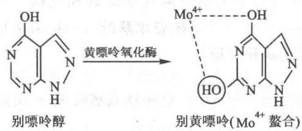

如前所述,尿酸的进一步分解代谢随不同种类生物而异。人和猿类缺乏分解尿酸的能力。鸟类等排尿酸动物不仅可将嘌呤碱分解成尿酸,还可以把大量其他含氮代谢物转变成尿酸,再排出体外。然而大多数种类的生物能够继续分解尿酸。尿酸在尿酸氧化酶(urate oxidase)的作用下被氧化,同时脱掉二氧化碳,而生成尿囊素(allantoin)。尿酸氧化酶是一种铜酶,它以氧作为直接电子受体,产生过氧化氢。

$$
\mathrm{尿酸} + 2 \mathrm{H} _ {2} \mathrm{O} + \mathrm{O} _ {2} \xrightarrow {\text {尿酸氧化酶}} \mathrm{尿囊素} + \mathrm{CO} _ {2} + \mathrm{H} _ {2} \mathrm{O} _ {2}
$$

尿囊素是除人及猿类以外其他哺乳类嘌呤代谢的排泄物。也就是说，它们分解尿酸到尿囊素为止。其他多数种类生物则含有尿囊素酶(allantoinase)，能水解尿囊素生成尿囊酸(allantoic acid)：

$$
\mathrm{尿囊素} + \mathrm {H_ {2} O} \xrightarrow {\mathrm{尿囊素酶}} \mathrm{尿囊酸}
$$

尿囊酸是某些硬骨鱼的嘌呤碱代谢排泄物。尿囊酸在尿囊酸酶(allantoicase)作用下水解生成尿素和乙醛酸：

$$
\mathrm{尿囊酸} + \mathrm {H_ {2} O} \xrightarrow {\mathrm{尿囊酸酶}} 2 \mathrm{尿素} + \mathrm{乙醛酸}
$$

尿素是多数鱼类及两栖类的嘌呤碱代谢排泄物。然而，某些低等动物还能将尿素分解成氨和二氧化碳再排出体外。

植物和微生物体内嘌呤碱代谢的途径大致与动物相似。植物体内广泛存在着尿囊素酶、尿囊酸酶和脲酶等；嘌呤碱代谢的中间产物，如尿囊素和尿囊酸等也在多种植物中大量存在。微生物一般能分解嘌呤碱类物质，生成氨、二氧化碳以及一些有机酸，如甲酸、乙酸、乳酸等。现将嘌呤碱的分解过程总结如图27-1。

## (四) 嘧啶碱的分解

核苷酸的分解产物嘧啶碱可以在生物体内进一步被分解。不同种类生物对嘧啶碱的分解过程也不完全一样。一般具有氨基的嘧啶需要先水解脱去氨基，如胞嘧啶脱氨生成尿嘧啶：

$$
\mathrm{胞嘧啶} + \mathrm {H_ {2} O} \xrightarrow {\mathrm{胞嘧啶脱氨酶}} \mathrm{尿嘧啶} + \mathrm {NH_ {3}}
$$

在人和某些动物体内其脱氨过程也可能是在核苷或核苷酸的水平上进行的。

尿嘧啶经还原生成二氢尿嘧啶，并水解使环开裂，然后水解生成二氧化碳、氨和 $\beta-$ 丙氨酸； $\beta-$ 丙氨酸经转氨作用脱去氨基后还可参加有机酸代谢：

$$
\begin{array}{r l} & {\mathrm{尿嘧啶} + \mathrm{NAD(P)H} + \mathrm {H^ {+}} \xrightarrow {\text {二氢尿嘧啶脱氢酶}} \mathrm{二氢尿嘧啶} + \mathrm{NAD(P)} ^ {+}} \\ & {\qquad \qquad \qquad \qquad \text {二氢尿嘧啶} + \mathrm {H_ {2} O} \xrightarrow {\text {二氢嘧啶酶}} \beta - \text {脲基丙酸}} \\ & {\qquad \qquad \qquad \beta - \text {脲基丙酸} + \mathrm {H_ {2} O} \xrightarrow {\text {脲基丙酸酶}} \beta - \text {丙氨酸} + \mathrm {CO_ {2}} + \mathrm {NH_ {3}}} \end{array}
$$

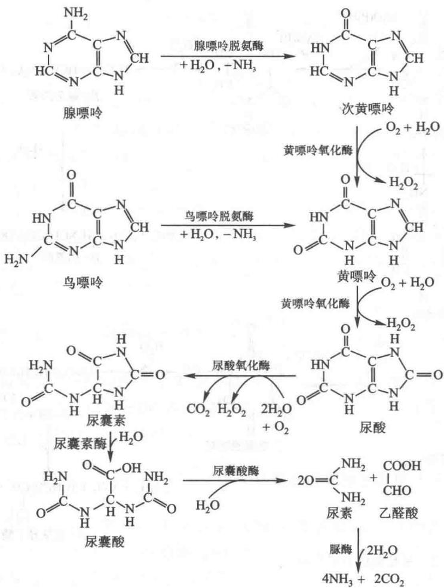  
图 27-1 嘌呤碱的分解代谢

胸腺嘧啶的分解与尿嘧啶相似,其分解过程如下:

$$
\begin{array}{r l} & {\text {胸腺嘧啶} + \mathrm{NAD(P)H} + \mathrm{H} ^ {+} \xrightarrow {\text {二氢胸腺嘧啶脱氢酶}} \text {二氢胸腺嘧啶} + \mathrm{NAD(P)} ^ {+}} \\ & {\qquad \text {二氢胸腺嘧啶} + \mathrm{H} _ {2} \mathrm{O} \xrightarrow {\text {二氢嘧啶酶}} \beta - \text {脲基异丁酸}} \end{array}
$$

$$
\beta \mathrm{-脲基异丁酸} + \mathrm {H_ {2} O\xrightarrow {\text {脲基丙酸酶}} \beta - 氨基异丁酸} + \mathrm {CO_ {2} + NH_ {3}}
$$

现将嘧啶碱的分解途径总结如图 27-2。

## 二、核苷酸的生物合成

无论动物、植物或微生物,通常都能用少数简单化合物合成各种嘌呤和嘧啶核苷酸,而且合成途径基本相同。从而表明,核苷酸的生物合成途径可能是生命起源早期形成的古老代谢途径之一。

## （一）嘌呤核糖核苷酸的合成

用同位素标记的化合物做实验，证明生物体内能利用二氧化碳、甲酸盐、谷氨酰胺、天冬氨酸和甘氨酸作为合成嘌呤环的前体。嘌呤环中的第1位氮来自天冬氨酸的氨基，第3位及第9位氮来自谷氨酰胺的酰胺基。第2及第8位碳来自 $N^{10}$ -甲酰四氢叶酸，甲酰基由甲酸盐供给；第6位碳来自二氧化碳；而第4位碳、第5位碳及第7位氮则来自甘氨酸。这些关系如图27-3所示。

目前关于嘌呤碱的合成途径已经了解得比较清楚。生物体内不是先合成嘌呤碱，再与核糖和磷酸结合成核苷酸,而是从5-磷酸核糖焦磷酸开始,经过一系列酶促反应,生成次黄嘌呤核苷酸,然后再转变为其他嘌呤核苷酸。

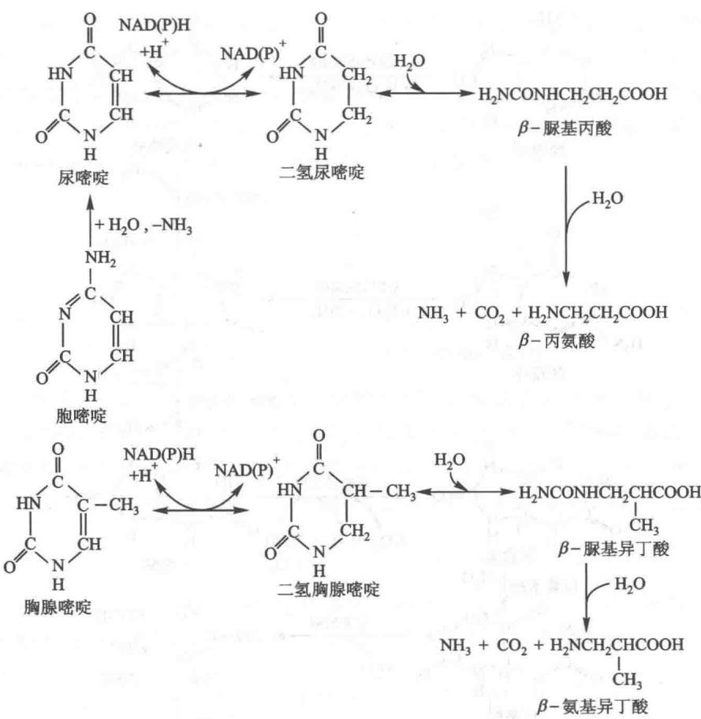  
图27-2 嘧啶碱的分解代谢

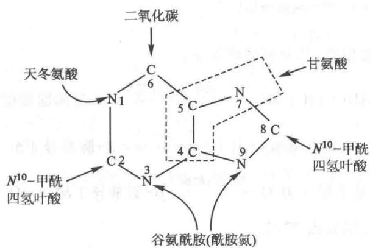  
图27-3 嘌呤环的元素来源

## 1. 次黄嘌呤核苷酸的合成

次黄嘌呤核苷酸的酶促合成过程,主要是以鸽肝的酶系统为材料研究清楚的。以后在其他动物、植物和微生物中也找到有类似的酶和中间产物,由此推测它们的合成过程也大致相同。

次黄嘌呤核苷酸的合成是一系列连续的酶促反应过程，首先是由5-磷酸核糖焦磷酸(5-phosphoribosyl pyrophosphate)供给核苷酸的磷酸核糖部分，在其上再完成嘌呤环的装配。在体内，5-磷酸核糖焦磷酸可由5-磷酸核糖与ATP作用产生。催化这一反应的酶称为磷酸核糖焦磷酸激酶（phosphoribosyl pyrophosphokinase）。在此反应中ATP的焦磷酸基是作为一个单位直接转移到5-磷酸核糖分子的第一位碳的羟基上。

$$
5 - \mathrm{磷酸核糖} + \mathrm{ATP} \xrightarrow [ \mathrm{Mg} ^ {2 +} ]{\mathrm{焦磷酸激酶}} 5 - \mathrm{磷酸核糖焦磷酸} + \mathrm{AMP}
$$

次黄嘌呤核苷酸的合成过程共有十步反应，可分成两个阶段。在第一阶段的反应中，由5-磷酸核糖焦磷酸与谷氨酰胺反应生成5-磷酸核糖胺（5-phosphoribosylamine），再与甘氨酸结合，经甲酰化和转移谷氨酰胺的氮原子，然后闭环生成5-氨基咪唑核糖核苷酸（5-aminoimidazole ribonucleotide），至此形成了嘌呤的咪唑环。第二阶段的反应则由5-氨基咪唑核糖核苷酸羧化，进一步获得天冬氨酸的氨基，再甲酰化，最后脱水闭环生成次黄嘌呤核苷酸。现依次叙述如下。

（1）第一阶段的反应 5-磷酸核糖焦磷酸可与谷氨酰胺反应生成5-磷酸核糖胺、谷氨酸和无机焦磷酸盐（反应27-1）。催化这一步骤的酶为谷氨酰胺磷酸核糖焦磷酸酰胺转移酶（Gln-PRPP amidotransferase）。也就在这一步，使原来的 $\alpha$ -构型核糖化合物变为 $\beta$ -构型。因为5-磷酸核糖焦磷酸具有 $\alpha$ -构型，而5-磷酸核糖胺则具有 $\beta$ -构型。

$$
5 - \mathrm{磷酸核糖焦磷酸} + \mathrm{谷氨酰胺} + \mathrm {H_ {2} O} \xrightarrow [ \mathrm {Mg^ {2 + }} ]{\mathrm{酰胺转移酶}} 5 - \mathrm{磷酸核糖胺} + \mathrm{谷氨酸} + \mathrm{PPi}\tag{27-1}
$$

5-磷酸核糖胺和甘氨酸在有 ATP 供给能量的情况下, 合成为甘氨酰胺核糖核苷酸 (glycinamide ribonucleotide, GAR), 同时 ATP 分解成 ADP 和正磷酸盐 (反应 27-2)。这一步骤是由甘氨酰胺核糖核苷酸合成酶 (GAY synthetase) 所催化, 反应是可逆的。

$$
5 - \mathrm{磷酸核糖胺} + \mathrm{甘氨酸} + \mathrm{ATP} \xrightarrow [ \mathrm{Mg} ^ {2 +} ]{\mathrm{合成酶}} \mathrm{甘氨酰胺核糖核苷酸} + \mathrm{ADP} + \mathrm{Pi}\tag{27-2}
$$

甘氨酰胺核糖核苷酸经甲酰甘氨酰胺核糖核苷酸（formylglycinamide ribonucleotide, FGAR）。在此处甲酰基的供体为 $N^{10}$ -甲酰四氢叶酸 ( $N^{10}$ -formyltetrahydrofolate)（反应 27-3）。催化这个甲酰化反应的酶为甘氨酰胺核糖核苷酸转甲酰基酶（FGAR transformylase）。在体内， $N^{10}$ -甲酰四氢叶酸的甲酰基可由甲酸供给。在酶的催化下，甲酸经 ATP 活化并以甲酰基形式转移给四氢叶酸生成 $N^{10}$ -甲酰四氢叶酸 ( $N^{10}$ -formyltetrahydrofolate)。

甘氨酰胺核糖核苷酸 + $N^{10}$ -甲酰四氢叶酸 + $H_{2}O \xlongequal{转甲酰基酶} Mg^{2+}$

$$
\text {   甲酰甘氨酰胺核糖核苷酸   } + \text {   四氢叶酸   }\tag{27-3}
$$

甲酰甘氨酰胺核糖核苷酸在有谷氨酰胺供给酰胺基并有 ATP 存在时,转变成甲酰甘氨脒核糖核苷酸 (formylglycinamidine ribonucleotide, FGAM)。谷氨酰胺脱去酰胺基后生成谷氨酸,ATP 则分解成 ADP 和正磷酸盐(反应 27-4)。促进这个反应的酶为甲酰甘氨脒核糖核苷酸合成酶(FGAM synthetase)。

甲酰甘氨酰胺核糖核苷酸 + 谷氨酰胺 + ATP + $H_{2}O$ $\xrightarrow{合成酶}$

$$
\text {   甲酰甘氨脒核糖核苷酸   } + \text {   谷氨酸   } + \mathrm{ADP} + \mathrm{Pi} \tag {27-4}
$$

这一步反应可被抗生素重氮丝氨酸（azaserine）和6-重氮-5-氧-L-正亮氨酸（6-diazo-5-oxo-L-norleucine）不可逆地抑制。这两种抗生素与谷氨酰胺有类似的结构：

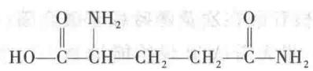  
谷氨酰胺

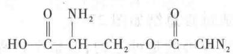  
重氮丝氨酸

$$
\begin{array}{c} \mathrm{O} \quad \mathrm{NH} _ {2} \\ \parallel \quad \mid \\ \mathrm{HO} - \mathrm{C} - \mathrm{CH} - \mathrm{CH} _ {2} - \mathrm{CH} _ {2} - \mathrm{C} - \mathrm{CHN} _ {2} \\ 6 - \text {重氮} - 5 - \text {氧} - \mathrm{L} - \text {正亮氨酸} \end{array}
$$

其他有谷氨酰胺参与的反应,如5-磷酸核糖胺的合成等,也受重氮丝氨酸和6-重氮-5-氧-L-正亮氨酸的抑制。这些抗生素虽有抗癌作用,但副作用大,临床上不宜使用。

在有 ATP 存在时,甲酰甘氨脒核糖核苷酸经氨基咪唑核糖核苷酸合成酶(AIR synthetase)的作用转变成 5-氨基咪唑核糖核苷酸(5-aminoimidazole ribonucleotide, AIR)。这个作用可被镁离子和钾离子激活。反应式如下:

$$
\mathrm{甲酰甘氨脒核糖核苷酸} + \mathrm{ATP} \xrightarrow [ \mathrm {Mg^ {2 + } , K^ {+}} ]{\mathrm{合成酶}} 5 - \mathrm{氨基咪唑核糖核苷酸} + \mathrm{ADP} + \mathrm{Pi}\tag{27-5}
$$

（2）第二阶段的反应 在咪唑环上进一步完成嘌呤第二个环。首先加入一个羧基，生成羧基氨基咪唑核糖核苷酸（carboxyaminoimidazole ribonucleotide, CAIR）。此过程与一般羧化反应不同，无需生物素，而是由溶液中的碳酸氢盐经ATP磷酸化所激活，随即加在咪唑环的氨基上，然后经分子重排转移至咪唑环的第四位上（反应27-6）。催化前一反应的酶为 $N^{5}$ -CAIR合成酶；催化后一反应的酶为 $N^{5}$ -CAIR变位酶。但在哺乳动物中这步却无需ATP，碳酸氢根直接与咪唑环上的氨基反应，然后转移到环上，因此被认为由羧化酶所催化。可能不同生物的反应略有差异。

$$
5 - \mathrm{氨基咪唑核糖核苷酸} + \mathrm {HC O _ {3} ^ {-}} + \mathrm{ATP} \xrightarrow {\text {合成酶}} N ^ {5} - \mathrm{羧基氨基咪唑核糖核苷酸} + \mathrm{ADP} + \mathrm{Pi}
$$

$$
N ^ {5} \text {-羧基氨基咪唑核糖核苷酸} \xrightarrow {\text {变位酶}} 5 \text {-氨基-4-羧基-咪唑核糖核苷酸}\tag{27-6}
$$

在有 ATP 存在时,5-氨基-4-羧基-咪唑核糖核苷酸与天冬氨酸缩合生成 N-琥珀酸(基)-5-氨基咪唑-4-羧酰胺核糖核苷酸(N-succino-5-aminoimidazole-4-carboxamide ribonucleotide, SAICAR)(反应 27-7)。反应由 SAICAR 合成酶所催化的。该分子进而脱去延胡索酸,生成 5-氨基咪唑-4-羧酰胺核糖核苷酸(5-aminoimidazole-4-carboxamide ribonucleotide, AICAR)(反应 27-8)。现已了解这个酶同时具有分解腺苷酸(基)琥珀酸(adenylosuccinate)的活力,因此称为腺苷酸琥珀酸裂合酶(adenylosuccinate lyase)或 SAICAR 裂合酶。

$$
5 - \mathrm{氨基} - 4 - \mathrm{羧基} - \mathrm{咪唑核糖核苷酸} + \mathrm{天冬氨酸} + \mathrm{ATP} \xrightarrow {\mathrm{合成酶}}
$$

$$
N - \mathrm{琥珀酸} - 5 - \mathrm{氨基咪唑} - 4 - \mathrm{羧酰胺核糖核苷酸} + \mathrm{ADP} + \mathrm{Pi}\tag{27-7}
$$

N-琥珀酸-5-氨基咪唑-4-羧酰胺核糖核苷酸 $\xrightarrow{裂合酶}$

$$
5 - \text { 氨基咪唑 } - 4 - \text { 羧酰胺核糖核苷酸 } + \text { 延胡索酸 } \tag {27-8}
$$

在以 $N^{10}$ -甲酰四氢叶酸供给甲酰基的情况下，5-氨基咪唑-4-羧酰胺核糖核苷酸经甲酰化生成5-甲酰胺基咪唑-4-羧酰胺核糖核苷酸（5-formamidoimidazole-4-carboxamide ribonucleotide, FAICAR）（反应27-9）。催化这个反应的酶是AICAR转甲酰基酶（AICAR transformylase）。

$$
5 - \mathrm{氨基咪唑} - 4 - \mathrm{羧酰胺核糖核苷酸} + N ^ {1 0} - \mathrm{甲酰四氢叶酸} \xrightarrow {\mathrm{转甲酰基酶}}
$$

$$
5 - \text { 甲酰胺基咪唑 } - 4 - \text { 羧酰胺核糖核苷酸 } + \text { 四氢叶酸 } \tag {27-9}
$$

5-甲酰胺基咪唑-4-羧酰胺核糖核苷酸在次黄嘌呤核苷酸合酶(IMP synthase)作用下脱水环化,形成次黄嘌呤核苷酸(inosinate,IMP),这一步无需ATP供给能量。

$$
5 - \text {   甲酰胺基咪唑   } - 4 - \text {   羧酰胺核糖核苷酸   } \xrightarrow {\text {   合酶   }} \text {   次黄嘌呤核苷酸   } + \mathrm{H} _ {2} \mathrm{O}\tag{27-10}
$$

现将次黄嘌呤核苷酸全部酶促合成过程总结如图 27-4。

次黄嘌呤核苷酸合成过程的个别反应可能是可逆的，但整个过程是不可逆的。合成过程共消耗7个高能磷酸键以推动反应的完成，这些高能磷酸键都是由ATP供给的。第一步反应由谷氨酰胺的酰胺取代5-磷酸核糖焦磷酸的焦磷酸基，脱下的焦磷酸随即被水解。其后包括五步需要ATP的合成酶催化的反应,两步由 $N^{10}$ -甲酰四氢叶酸供给甲酰基的转甲酰基反应和两步裂合酶催化的反应。正如色氨酸合成组氨酸的生物合成,次黄嘌呤核苷酸合成途径的酶在细胞中组成一个大的多酶复合物(multienzyme complex)。这就使一个酶促反应的产物直接进入下一个反应,防止了中间产物被扩散丢失,也防止了不稳定中间产物的分解。在真核生物中还发现几个酶融合成一条多功能的肽链,而且它们催化的反应可以是非连续的步骤。例如,反应(27-2)、(27-3)和(27-5),反应(27-9)和(27-10)分别由单个的多功能酶所催化。此外,催化反应(27-7)的酶还具有使羧基变位的酶活性。多功能酶使反应产物由一个活性中心经隧道直达第二个活性中心,比多酶复合物有更高效率。

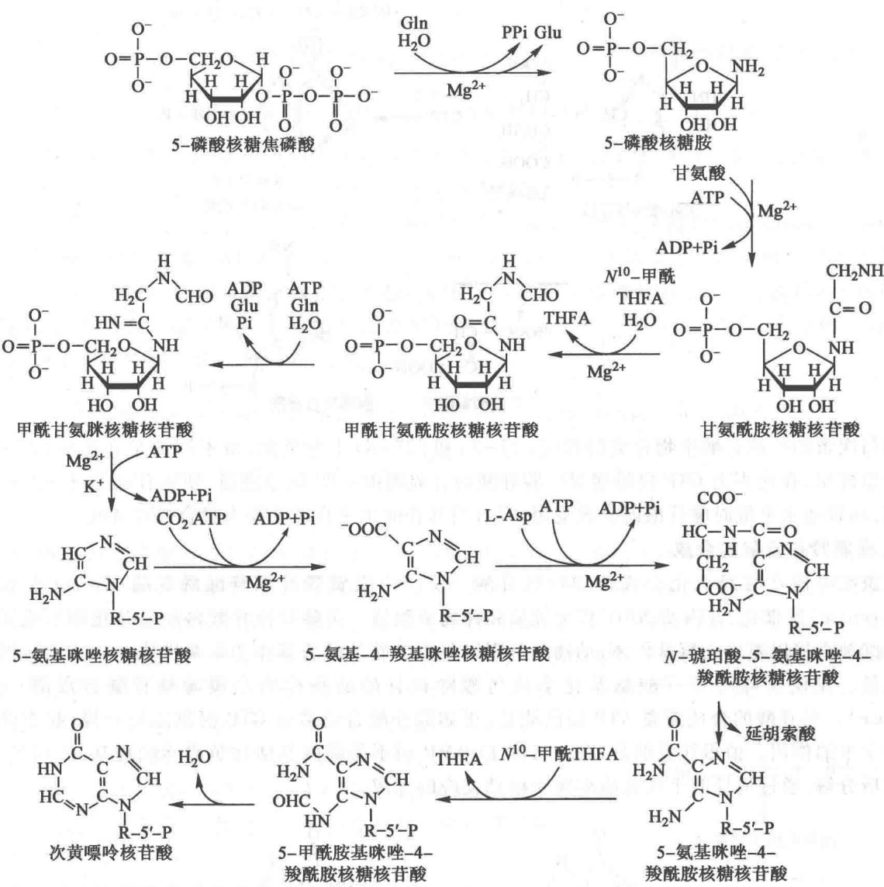  
图 27-4 次黄嘌呤核苷酸的合成途径

## 2. 腺嘌呤核苷酸的合成

生物体内由次黄嘌呤核苷酸氨基化生成腺嘌呤核苷酸，共分两步进行：次黄嘌呤核苷酸在GTP供给能量的条件下与天冬氨酸合成腺苷酸琥珀酸（adenylosuccinic acid），GTP则分解成GDP和正磷酸盐。这个反应是由腺苷酸琥珀酸合成酶（adenylosuccinate synthetase）所催化的。中间产物腺苷酸琥珀酸随即在腺苷酸琥珀酸裂合酶的催化下分解成腺嘌呤核苷酸和延胡索酸。反应过程如下所示：

此过程与次黄嘌呤核苷酸生物合成的反应(27-7)和(27-8)十分类似,所不同的是在反应(27-7)中由ATP供给能量,在此则由GTP供给能量。腺苷酸的合成需由GTP供给能量,使腺苷酸与鸟苷酸的水平得以协调,鸟苷酸水平低时腺苷酸的合成受阻,只有当鸟苷酸水平高时才能大量合成腺苷酸。

## 3. 鸟嘌呤核苷酸的合成

次黄嘌呤核苷酸经氧化生成黄嘌呤核苷酸。反应由次黄嘌呤核苷酸脱氢酶（inosine-5'-phosphate dehydrogenase）所催化，并需要 $\mathrm{NAD}^+$ 作为辅酶和钾离子激活。黄嘌呤核苷酸再经氨基化即生成鸟嘌呤核苷酸。细菌直接以氨作为氨基供体；动物细胞则以谷氨酰胺的酰胺基作为氨基供体。氨基化时需要ATP供给能量。促使黄嘌呤核苷酸氨基化生成鸟嘌呤核苷酸的酶称为鸟嘌呤核苷酸合成酶（guanylate synthetase）。鸟苷酸的合成需要ATP提供能量，正如腺苷酸合成需要GTP提供能量一样，起着协调两种核苷酸水平的作用。值得注意的是，在此ATP以AMP而不是磷酸基活化黄嘌呤的羟基，使其氨基化，焦磷酸随后分解，通过消耗两个高能磷酸键来推动反应的完成。

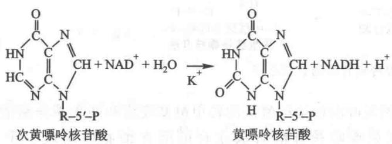

## 4. 由嘌呤碱和核苷合成核苷酸

生物体内除能以简单前体物质“从头合成”(de novo synthesis)核苷酸外,尚能由已有的碱基和核苷合成核苷酸,这是对核苷酸代谢的一种“回收”途径或称“补救”(salvage)途径,以便更经济地利用已有的成分。

前已提到,核苷磷酸化酶所催化的转核糖基反应是可逆的。在特异的核苷磷酸化酶作用下,各种碱基可与1-磷酸核糖反应生成核苷:

$$
\mathrm{碱基} + 1 - \mathrm{磷酸核糖} \xrightarrow {\mathrm{核苷磷酸化酶}} \mathrm{核苷} + \mathrm{Pi}
$$

由此所产生的核苷在适当的磷酸激酶(phosphokinase)作用下,由 ATP 供给磷酸基,即形成核苷酸:

$$
\mathrm{核苷} + \mathrm{ATP} \xrightarrow {\mathrm{核苷激酶}} \mathrm{核苷酸} + \mathrm{ADP}
$$

但在生物体内,除腺苷激酶(adenosine kinase)外,缺乏其他嘌呤核苷的激酶。显然,在嘌呤类物质的再利用过程中,核苷激酶途径即使不能完全排除,也是不重要的。

另一更为重要的途径是,嘌呤碱与5-磷酸核糖焦磷酸在磷酸核糖转移酶(phosphoribosyl transferase, PRT),或称为核苷酸焦磷酸化酶(nucleotide pyrophosphorylase)的作用下形成嘌呤核苷酸。已经分离出两种具有不同特异性的酶:腺嘌呤磷酸核糖转移酶(APRT)催化形成腺嘌呤核苷酸;次黄嘌呤-鸟嘌呤磷酸核糖转移酶(HGPRT)催化形成次黄嘌呤核苷酸和鸟嘌呤核苷酸。嘌呤核苷则可先分解成嘌呤碱,再与5-磷酸核糖焦磷酸反应,而形成核苷酸。

$$
\begin{array}{r l} & \text {   腺嘌呤   } + 5 \text {-磷酸核糖焦磷酸 } \xrightarrow {\text {   磷酸核糖转移酶   }} \text {   腺嘌呤核苷酸   } + \mathrm{PPi} \\ & \text {   次黄嘌呤   } + 5 \text {-磷酸核糖焦磷酸 } \xrightarrow {\text {   磷酸核糖转移酶   }} \text {   次黄嘌呤核苷酸   } + \mathrm{PPi} \\ & (\text {   或鸟嘌呤   }) \end{array}
$$

Lesch-Nyhan 综合征是一种与 X 染色体连锁的遗传代谢病,患者先天性缺乏次黄嘌呤-鸟嘌呤磷酸核糖转移酶。这种缺陷是伴性的隐性遗传性状,主要见于男性儿童,发病多在 2 岁左右。由于鸟嘌呤和次黄嘌呤回收途径的障碍,导致过量产生尿酸。嘌呤核苷酸的从头合成和回收途径之间通常存在协调和平衡。5-磷酸核糖焦磷酸是回收途径的主要底物,失去 HGPRT 活性导致 5-磷酸核糖焦磷酸大量积累,引起嘌呤核苷酸合成的增加。结果大量积累尿酸,并造成肾结石和痛风。这些症状可通过别嘌呤醇对黄嘌呤

氧化酶的抑制而得到缓解。Lesch-Nyhan 综合征更严重的后果是招致神经系统损伤，例如痉挛、智力发育迟缓、高度攻击性与破坏性的行为以及自残肢体。别嘌呤醇可以缓解尿酸积累和痛风，但对神经疾病症状无效。这表明，回收途径障碍在发育过程中造成了神经系统不可逆的损伤。

## 5. 嘌呤核苷酸生物合成的调节

嘌呤核苷酸的从头合成受其两个终产物腺苷酸和鸟苷酸的反馈控制。主要控制点有三个。第一个控制点在合成途径的第一步反应，即氨基被转移到5-磷酸核糖焦磷酸上以形成5-磷酸核糖胺。催化该反应的酶是一种变构酶，它可被终产物IMP、AMP和GMP所抑制。因此，无论是IMP、AMP或是GMP的过量积累均会导致由PRPP开始的合成途径第一步反应的抑制。5-磷酸核糖焦磷酸是合成反应的最初底物，它的合成也受产物的反馈抑制。5-磷酸核糖焦磷酸是由5-磷酸核糖和ATP在磷酸核糖焦磷酸激酶作用下合成的。它受IMP、ADP和GDP核苷酸的抑制。另两个控制点分别位于次黄苷酸后分支途径的第一步反应，这就使得GMP过量的变构效应仅抑制其自身的形成，而不影响AMP的形成。反之，AMP的积累抑制其自身的形成，而不影响GMP的生物合成。大肠杆菌中嘌呤核苷酸生物合成的反馈控制机制如图27-5所示。不同生物的调节方式略有不同。

  
图27-5 嘌呤核苷酸生物合成的反馈控制机制

## （二）嘧啶核糖核苷酸的合成

嘧啶核苷酸的嘧啶环是由氨甲酰磷酸和天冬氨酸合成的(图 27-6)。

与嘌呤核苷酸不同,在合成嘧啶核苷酸时首先形成嘧啶环,再与磷酸核糖结合成为乳清苷酸(orotidine-5'-phosphate),然后生成尿嘧啶核苷酸。其他嘧啶核苷酸则由尿嘧啶核苷酸转变而成。

## 1. 尿嘧啶核苷酸的合成

首先,由氨甲酰磷酸(carbamyl phosphate)与天冬氨酸合成氨甲酰天冬氨酸(carbamyl aspartate),闭环并被氧化生成乳清酸(orotic acid)。乳清酸与5-磷酸核糖焦磷酸作用生成乳清苷酸,脱羧后就成为尿嘧啶核苷酸。

图27-6 嘧啶环的来源

真核生物有两类氨甲酰磷酸合成酶(carbamyl phosphate synthetase)。酶Ⅰ存在于线粒体,参与尿素合成;酶Ⅱ存在于细胞质,参与嘧啶环的合成。用于形成嘧啶环的氨甲酰磷酸需由谷氨酰胺作为氨基的供体,与 $HCO_{3}^{-}$ 和ATP反应,每合成1分子氨甲酰磷酸消耗2分子ATP。细菌则只有一类氨甲酰磷酸合成酶。合成反应如下:

$$
\mathrm{谷氨酰胺} + 2 \mathrm{ATP} + \mathrm {HC O _ {3} ^ {-}} + \mathrm {H_ {2} O} \xrightarrow {\mathrm{氨甲酰磷酸合成酶}} \mathrm{氨甲酰磷酸} + 2 \mathrm{ADP} + \mathrm{Pi} + \mathrm{谷氨酸(27-11)}
$$

氨甲酰磷酸在天冬氨酸转氨甲酰酶(aspartate carbamyl transferase)的作用下,将氨甲酰部分转移至天冬氨酸的 $\alpha-$ 氨基上,形成氨甲酰天冬氨酸。

$$
\mathrm{氨甲酰磷酸} + \mathrm{天冬氨酸} \xrightarrow {\mathrm{转氨甲酰酶}} \mathrm{氨甲酰天冬氨酸} + \mathrm{Pi}\tag{27-12}
$$

氨甲酰天冬氨酸通过可逆的环化脱水作用转变成二氢乳清酸(dihydroorotic acid)。催化这一步骤的酶为二氢乳清酸酶(dihydroorotase)。

$$
\mathrm{氨甲酰天冬氨酸} \xrightarrow {\mathrm{二氢乳清酸酶}} \mathrm{二氢乳清酸} + \mathrm {H_ {2} O}\tag{27-13}
$$

二氢乳清酸随后在二氢乳清酸脱氢酶(dihydroorotate dehydrogenase)催化下被氧化成乳清酸。该酶是一含铁的黄素酶。在以氧作为电子受体时生成过氧化氢，烟酰胺腺嘌呤二核苷酸可代替氧被还原。

$$
\mathrm{二氢乳清酸} + \mathrm {NA D ^ {+}} \xrightarrow [ \mathrm{Fe,FMN} ]{\text {二氢乳清酸脱氢酶}} \mathrm{乳清酸} + \mathrm{NADH} + \mathrm {H^ {+}}\tag{27-14}
$$

乳清酸是合成尿嘧啶核苷酸的重要中间产物,至此已形成嘧啶环,而后再和5-磷酸核糖相连接。催化乳清酸与5-磷酸核糖焦磷酸作用生成乳清苷酸的酶,称为乳清酸磷酸核糖转移酶（orotate phosphoribosyl transferase）。反应是可逆的。镁离子可活化此反应。

$$
\mathrm{乳清酸} + 5 \mathrm{-磷酸核糖焦磷酸} \xrightarrow [ \mathrm {Mg^ {2 + }} ]{\mathrm{磷酸核糖转移酶}} \mathrm{乳清苷酸} + \mathrm{PPi}\tag{27-15}
$$

乳清苷酸在乳清苷酸脱羧酶(orotidylic acid decarboxylase)作用下脱去羧基,即生成尿嘧啶核苷酸。

$$
\mathrm{乳清苷酸} \xrightarrow {\mathrm{脱羧酶}} \mathrm{尿嘧啶核苷酸} + \mathrm {CO_ {2}}\tag{27-16}
$$

尿嘧啶核苷酸的酶促合成过程总结如图 27-7。

与次黄嘌呤核苷酸的生物合成相似，在动物中尿嘧啶核苷酸合成途径前三个酶（氨甲酰磷酸合成酶Ⅱ、天冬氨酸转氨甲酰酶和二氢乳清酸酶）组成一个多功能酶，缩写为 CAD。它由三个相同的多肽链亚基（各自 $M_{r}$ 为 230 000）组成，每一亚基都包含全部三个反应的活性中心。最后两步反应的酶也融合成一条多肽链，简称为 UMP 合成酶。当这个酶有缺陷时，即患乳清酸尿症。患者需在饮食中提供尿苷或胞苷，或抑制氨甲酰磷酸合成酶Ⅱ，以减少乳清酸的合成。

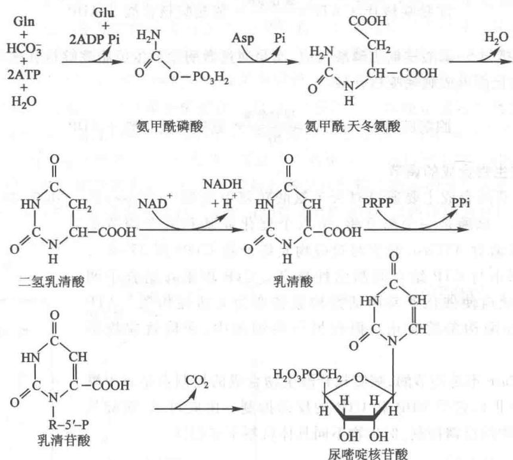  
图27-7 尿嘧啶核苷酸的合成途径

## 2. 胞嘧啶核苷酸的合成

由尿嘧啶核苷酸转变为胞嘧啶核苷酸是在尿嘧啶核苷三磷酸的水平上进行的。尿嘧啶核苷三磷酸可以由尿嘧啶核苷酸在相应的激酶作用下经ATP转移磷酸基而生成。催化尿嘧啶核苷酸转变为尿嘧啶核苷二磷酸的酶为特异的尿嘧啶核苷酸激酶（uridine-5'-phosphate kinase）。催化尿嘧啶核苷二磷酸转变为尿嘧啶核苷三磷酸的酶为特异性较广的核苷二磷酸激酶（nucleoside diphosphokinase）。

$$
\begin{array}{r l} & \mathrm{UMP+ATP} \xrightarrow [ \mathrm {Mg^ {2 + }} ]{\text {尿嘧啶核苷酸激酶}} \mathrm{UDP+ADP} \\ & \mathrm{UDP+ATP} \xrightarrow [ \mathrm {Mg^ {2 + }} ]{\text {核苷二磷酸激酶}} \mathrm{UTP+ADP} \end{array}
$$

尿嘧啶、尿嘧啶核苷和尿嘧啶核苷酸都不能氨基化变成相应的胞嘧啶化合物，只有尿嘧啶核苷三磷酸才能氨基化生成胞嘧啶核苷三磷酸。在细菌中尿嘧啶核苷三磷酸可以直接与氨作用；动物组织则需要由谷氨酰胺供给氨基。反应要由ATP供给能量。催化此反应的酶为CTP合成酶（CTP synthetase）。反应式如下：

$$
\mathrm{UTP} + \mathrm{谷氨酰胺} + \mathrm{ATP} + \mathrm {H_ {2} O} \xrightarrow {\mathrm{CTP} \text {合成酶}} \mathrm{CTP} + \mathrm{谷氨酸} + \mathrm{ADP} + \mathrm{Pi}
$$

## 3. 由嘧啶碱和核苷合成核苷酸

生物体对外源的或核苷酸代谢产生的嘧啶碱和核苷可以重新利用。在嘌呤核苷酸的(回收或补救)途径中,主要是通过磷酸核糖转移酶反应,直接由碱基形成核苷酸;然而嘧啶核苷激酶(pyrimidine nucleoside kinase)在嘧啶的回收(补救)途径中却起着重要作用。例如,尿嘧啶转变为尿嘧啶核苷酸可以通过两种方式进行:① 尿嘧啶与5-磷酸核糖焦磷酸反应;② 尿嘧啶与1-磷酸核糖反应产生尿嘧啶核苷,后者在尿苷激酶作用下被磷酸化而形成尿嘧啶核苷酸。反应式如下:

$$
\begin{array}{r l} & \text { 尿嘧啶 } + 5 - \text { 磷酸核糖焦磷酸 } \xrightarrow {\mathrm{UMP磷酸核糖转移酶}} \text { 尿嘧啶核苷酸 } + \mathrm{PPi} \\ & \text { 尿嘧啶 } + 1 - \text { 磷酸核糖 } \xrightarrow {\text { 尿苷磷酸化酶 }} \text { 尿嘧啶核苷 } + \mathrm{Pi} \end{array}
$$

$$
\mathrm{尿嘧啶核苷} + \mathrm{ATP} \xrightarrow [ \mathrm {Mg^ {2 + }} ]{\mathrm{尿苷激酶}} \mathrm{尿嘧啶核苷酸} + \mathrm{ADP}
$$

胞嘧啶不能直接与 5-磷酸核糖焦磷酸反应,而是通过激酶途径生成胞嘧啶核苷酸。尿苷激酶也能催化胞苷被 ATP 磷酸化而形成胞嘧啶核苷酸。

$$
\mathrm{胞嘧啶核苷} + \mathrm{ATP} \xrightarrow [ \mathrm{Mg} ^ {2 +} ]{\mathrm{尿苷激酶}} \mathrm{胞嘧啶核苷酸} + \mathrm{ADP}
$$

## 4.嘧啶核苷酸生物合成的调节

细菌的嘧啶核苷酸合成主要通过对天冬氨酸转氨甲酰酶(ATCase)活性的控制来进行的。该酶是一个调节酶，由六个催化亚基和六个调节亚基所组成。大肠杆菌对ATCase调节的效应物是终产物CTP（图27-8），当全部调节亚基都未与CTP结合时酶活性最高。CTP积累并结合于调节亚基，通过变构效应使催化亚基由活性构象转变为无活性构象。ATP能够阻止CTP诱导酶构象的变化。但在另一些细菌中，变构效应物则是UTP。

在动物中,ATCase不是调节酶,嘧啶核苷酸生物合成的控制点是氨甲酰磷酸合成酶Ⅱ(CPSⅡ),它受UDP和UTP的反馈抑制。由此可见,嘧啶核苷酸生物合成受产物的反馈控制,但生物不同具体机制不尽相同。

## （三）核苷一磷酸转变为核苷三磷酸

许多核苷酸参与的反应常是以核苷三磷酸的形式进行的,细胞内核苷一磷酸可以转变为核苷三磷酸。催化 AMP 磷酸化为 ADP 的酶称为腺苷酸激酶:

$$
\mathrm{ATP} + \mathrm{AMP} \rightleftharpoons 2 \mathrm{ADP}
$$

由此形成的 ADP 经过酵解或者氧化磷酸化（或光合磷酸化）而转变成 ATP。

图27-8 大肠杆菌嘧啶核苷酸生物合成的调节

四种核苷(或脱氧核苷)一磷酸可以分别在对碱基特异而对糖不特异的

核苷一磷酸激酶(nucleoside monophosphate kinase)作用下,由 ATP 供给磷酸基,而转变成核苷(或脱氧核苷)二磷酸。从动物和细菌中已分别提取出 AMP 激酶、GMP 激酶、UMP 激酶、CMP 激酶和 dTMP 激酶,可以催化这类反应。反应如下:

$$
\mathrm{ATP} + \mathrm{NMP} \rightleftharpoons \mathrm{ADP} + \mathrm{NDP}
$$

核苷二磷酸与核苷三磷酸可在核苷二磷酸激酶(nucleoside diphosphokinase)作用下相互转变。核苷二磷酸激酶的特异性很低,如以X和Y代表几种核糖核苷和脱氧核糖核苷,它可催化下列反应:

$$
\mathrm{XDP+YTP} \rightleftharpoons \mathrm{XTP+YDP}
$$

## （四）脱氧核糖核苷酸的合成

脱氧核糖核苷酸是脱氧核糖核酸合成的前体。此外，某些脱氧核糖核苷酸衍生物在代谢中还起着重要作用。如dTDP-鼠李糖可由dTDP-葡萄糖还原而成；dTDP-葡萄糖还可转化成dTDP-半乳糖。

生物体内脱氧核糖核苷酸可以由核糖核苷酸还原形成。腺嘌呤、鸟嘌呤和胞嘧啶核糖核苷酸经还原，将其中核糖第二位碳原子上的氧脱去，即成为相应的脱氧核糖核苷酸。胸腺嘧啶脱氧核糖核苷酸的形成则需要经过两个步骤，首先由尿嘧啶核糖核苷酸还原形成尿嘧啶脱氧核糖核苷酸，然后尿嘧啶再经甲基化转变成胸腺嘧啶。

## 1. 核糖核苷酸的还原

在生物体内，腺嘌呤、鸟嘌呤、胞嘧啶和尿嘧啶四种核糖核苷酸均可被还原成相应的脱氧核糖核苷酸。

由细菌和动物组织中已分别提取出催化此还原反应的酶体系。核糖核苷酸还原酶由催化亚基R1和自由基产生亚基R2所组成，它们分开时没有酶的活性，只有合在一起并有镁离子存在时才形成有催化活性的酶。R1亚基含有两条相同的多肽链 $(\alpha_{2})$ ，每条多肽链上有两个变构调节位点和一对参与还原反应的硫氢基。R2亚基也含有两条相同的多肽链 $(\beta_{2})$ ，每条多肽链上有一个酪氨酰自由基和一个铁中心。铁中心含有两个铁 $(\mathrm{Fe}^{3+})$ 离子，由氧 $(\mathrm{O}^{2-})$ 离子桥连在一起，其功能是产生和稳定酪氨酰自由基。R1与R2亚基的交界处形成催化反应的活性位点。酪氨酰自由基经芳香族氨基酸使活性位点上产生另一自由基，激活底物NDP。从而发动单电子转移反应，导致R1亚基上一对巯基（—SH)被氧化，同时核糖核苷酸上 $2^{\prime}-$ 羟基被氢取代生成脱氧核糖核苷酸和水。通常核糖核苷酸是在核糖二磷酸的水平被还原的，4种NDP（即ADP、GDP、UDP和CDP）是还原反应的底物。ATP、dATP、dGTP、dTTP是还原酶的变构效应物。大肠杆菌核糖核苷酸还原酶的结构如图27-9所示。

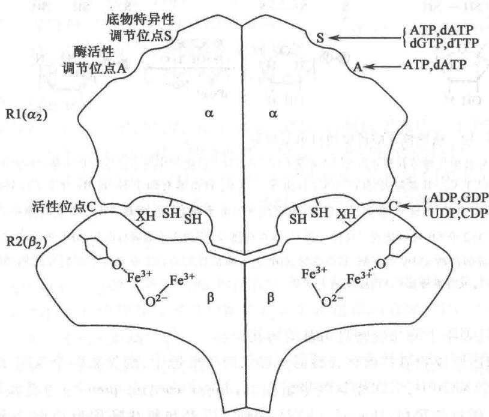  
图 27-9 大肠杆菌核糖核苷酸还原酶

目前已发现的核糖核苷酸还原酶可分为四种类型，它们的区别是在于提供活性位点自由基的基团和用于产生它的辅助因子不同。以上所述的酶属于类型Ⅰ，其代表为大肠杆菌的酶，在酪氨酸自由基被淬灭后要求氧进行再生，因此必须在有氧环境下才具有功能。类型Ⅱ的酶发现于其他微生物，它含有5'-脱氧腺苷钴胺素（5'-deoxyadenosylcobalamin），而不是双核铁中心（binuclear iron center）。类型Ⅲ核糖核苷酸还原酶适应于厌氧环境下反应，大肠杆菌除类型I的酶外，还含有类型Ⅲ的酶。该酶含铁硫簇（iron-sulfur cluster），其结构有别于类型I的双核铁中心，并且活化要求NADPH和S-腺苷甲硫氨酸。它以核苷三磷酸作为底物，而不是通常的核苷二磷酸。类型Ⅳ核糖核苷酸还原酶含有双核锰中心（binuclear manganese center），它存在于某些微生物中。生物在进化过程中产生不同种类核糖核苷酸还原酶，使得不同环境下均能合成DNA的前体，它们基本过程和机制又完成相同，反映了该反应在核苷酸代谢中的重要性。

核糖核苷酸还原酶催化反应的自由基机制最初是由 J. A. Stubbe 于 1990 年提出来的。研究主要以大肠杆菌的酶为对象进行，但后来在其他来源的酶中也证实存在同样的自由基反应。大致过程为：反应开始时大肠杆菌还原酶 R2 亚基上 $Cys^{439}$ 的 H 原子被 $Tyr^{122}$ 自由基的孤电子所置换，Cys 生成高活性的硫自由基。它吸引底物 NDP 上 $C_{3}-H$ ，因而产生 3'-碳自由基。该自由基促使 $C_{2}-OH$ 从 R1 亚基上的一个 Cys 获得 $H^{+}$ 并脱 $H_{2}O$ ，产生 $C_{2}$ 阳离子。然后从另一个 Cys 上获得氢负离子， $C_{2}$ 位被还原，同时 R1 亚基的 $Cys^{225}$ 和 $Cys^{462}$ 被氧化形成二硫键。 $C_{3}$ 自由基再次从 $Cys^{439}$ 捕获氢原子，生成的 dNDP 离开酶。酶的二硫键由还原型硫氧还蛋白（或谷氧还蛋白）所还原。自由基反应机制见图 27-10。需要指出的是，该图已简

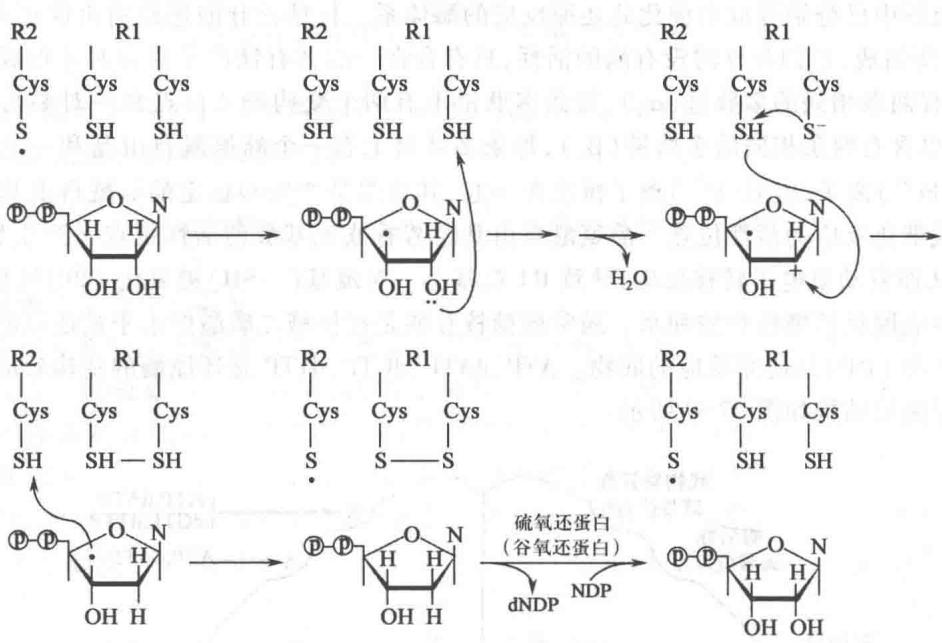  
图 27-10 核糖核苷酸还原的自由基机制

① 大肠杆菌核糖核苷酸还原酶 R2 亚基 $Cys^{439}$ 在 $Tyr^{122}$ 自由基作用下形成硫自由基，从而导致底物 NDP 上 $C_{3'}-H$ 被除去，并产生 $C_{3'}$ 自由基。② $C_{3'}$ 自由基有助于 $C_{2'}$ 自 R1 亚基 Cys 处获取 $H^{+}$ ，脱去 $H_{2}O$ ，形成 $C_{2'}$ 阳离子。③ $C_{2'}$ 再获两个单电子和 $H^{+}$ ，从而被还原，R1 亚基的 $Cys^{225}$ 和 $Cys^{462}$ 上 2 个 SH 被氧化成二硫键。④ $C_{3'}$ 自由基使 $Cys^{439}$ 再次生成硫自由基，NDP 还原成 dNDP。⑤ 生成的产物 dNDP 离开酶，新的底物 NDP 进入酶活性中心，R1 亚基的二硫键被还原型硫氧还蛋白（或谷氧还蛋白）还原成两个巯基

化了整个反应过程,只表明了酶与底物自由基的转化。

核糖核苷酸被酶还原成脱氧核糖核苷酸需要提供两个氢原子，酶失去两个氢原子后需要氢供体使其恢复，氢的最终给体是NADPH，其间经氢携带蛋白（hydrogen carrying protein）再转移给还原酶，再传递到四种底物核苷酸上。硫氧还蛋白（thioredoxin）是一种广泛参与氧化还原反应的小分子蛋白质，它含有一对巯基，给出两个氢后即成为氧化型或二硫化物型，在硫氧还蛋白还原酶催化下被NADPH所还原。硫氧还蛋白还原酶是一种含FAD的黄素酶。另一种氢携带蛋白谷氧还蛋白（glutaredoxin），也能起同样传递氢的作用。谷氧还蛋白还原酶结合两分子的谷胱甘肽（GSH，氧化型为GSSG），可以还原谷氧还蛋白。谷胱甘肽还原酶也是一种黄素酶，它从NADPH获得氢，并还原谷胱甘肽。它们传递的关系如图27-11所示。

  
图 27-11 核糖核苷酸还原为脱氧核糖核苷酸的氢和电子传递过程

由于核糖核苷酸还原反应极为重要,核糖核苷酸还原酶受到两方面的精确调节:一是核糖核苷酸和脱

氧核苷酸供求关系的调节；二是四种脱氧核苷二磷酸之间维持平衡。核糖核苷酸还原酶R1有两个酶活性调节位点和两个底物特异性调节位点。前一位点可根据细胞内核糖核苷酸和脱氧核糖核苷酸水平打开或关闭酶的整个活性；后一位点是用于选择底物，使四种核苷酸获得协调。DNA合成的前体是dATP、dGTP、dTTP和dCTP四种dNTP，dATP的浓度可以作为反映四种dNTP水平的指标。ATP的浓度则反映了核糖核苷酸和供能的水平。当ATP结合于酶活性调节位点时，酶被激活，dATP结合时酶被抑制。换言之，前者是酶活性的正效应物，后者是负效应物，它们竞争同一位点。效应物与酶结合，改变酶的结构，从而影响酶的活性。dATP过量存在，与核糖核苷酸还原酶结合，促使有活性的 $\alpha_{2}\beta_{2}$ 聚合成无活性的环状 $\alpha_{4}\beta_{4}$ 。 $\alpha_{4}\beta_{4}$ 的结构如图27-12所示。

  
图27-12 环状 $\alpha_{4}\beta_{4}$ 结构示意图

底物特异性调节位点可被 ATP、dATP、dGTP 和 dTTP 结合，酶的底物特异性决定于上述四种核苷酸何者结合在调节位点上。如果 ATP 或 dATP 结合在调节位点上，还原酶优先结合嘧啶核苷酸底物（UDP 或 CDP），并使其还原为 dUDP 和 dCDP。dTTP 结合，促进 GDP 还原，但抑制 UDP 和 CDP 还原。dGTP 结合，促进 ADP 还原，但抑制 UDP、CDP 和 GDP 还原。这种错综复杂的关系使得四种脱氧核糖核苷酸得以达到平衡。

## 2. 胸腺嘧啶核苷酸的合成

胸腺嘧啶核苷酸(dTMP)是脱氧核糖核酸的组成部分,它是由尿嘧啶脱氧核糖核苷酸(dUMP)经甲基化而生成。催化尿嘧啶脱氧核糖核苷酸甲基化的酶称为胸腺嘧啶核苷酸合酶(thymidylate synthase)。甲基的供体是 $N^{5},N^{10}$ -亚甲基四氢叶酸( $N^{5},N^{10}$ -methylenetetrahydrofolate)。 $N^{5},N^{10}$ -亚甲基四氢叶酸给出亚甲基并使其还原成甲基,自身即变成二氢叶酸。二氢叶酸再经二氢叶酸还原酶催化,由还原型烟酰胺腺嘌呤二核苷酸磷酸供给氢,而被还原成四氢叶酸。如果有亚甲基的供体,例如丝氨酸存在时,四氢叶酸可获得亚甲基而转变成 $N^{5},N^{10}$ -亚甲基四氢叶酸。其反应过程如下:

$$
\begin{array}{r l} & 7, 8 - \text {   二氢叶酸   } + \mathrm{NADPH} + \mathrm{H} ^ {+} \xrightarrow {\text {   二氢叶酸还原酶   }} 5, 6, 7, 8 - \text {   四氢叶酸   } + \mathrm{NADP} ^ {+} \\ & \text {   丝氨酸   } + \text {   四氢叶酸   } \xrightarrow {\text {   丝氨酸羟甲基转移酶   }} \text {   甘氨酸   } + N ^ {5}, N ^ {1 0} - \text {   亚甲基四氢叶酸   } + \mathrm{H} _ {2} \mathrm{O} \end{array}
$$

叶酸的衍生物四氢叶酸是一碳单位的载体,它在嘌呤和嘧啶核苷酸的生物合成中起着重要的作用。某些叶酸的结构类似物,如氨基蝶呤(aminopterin)、氨甲蝶呤(methotrexate)等,能与二氢叶酸还原酶牢固结合,结果阻止了四氢叶酸的生成,从而抑制了它参与的各种一碳单位转移反应。氨甲蝶呤等的主要作用点是胸腺嘧啶核苷酸合成中的一碳单位转移反应。它们的结构式如下:

氨甲蝶呤是一类重要的抗肿瘤药物，它对急性白血病、绒毛膜上皮癌等有一定疗效。这类药物能够抑制肿瘤细胞核酸的合成，但对正常细胞亦有影响，故毒性较大，限制了在临床上的运用。但作为二氢叶酸还原酶特异抑制剂，在实验室可用于配制选择培养基，筛选抗性基因或鉴定胸腺嘧啶核苷激酶基因，十分有用。

5-氟尿嘧啶在临床上是有用的抗肿瘤药物。它在体内能转化为氟脱氧尿苷酸（fluorodeoxyuridylate，FdUMP），作为dUMP的类似物，与胸苷酸合酶发生不可逆的结合，成为自杀性抑制物。胸苷酸合酶和二氢叶酸还原酶常被选作设计抗肿瘤药物的靶位点。

至于合成胸腺嘧啶核苷酸时所需要的底物尿嘧啶脱氧核苷酸,可以由尿嘧啶核苷二磷酸还原成尿嘧啶脱氧核苷二磷酸,经磷酸化成为尿嘧啶脱氧核苷三磷酸,再经尿嘧啶脱氧核苷三磷酸酶(dUTPase)转变成尿嘧啶脱氧核苷一磷酸。另一条途径是由胞嘧啶脱氧核苷三磷酸脱氨,经尿嘧啶脱氧核苷三磷酸再转变成尿嘧啶脱氧核苷酸。何者为主在不同生物体内可能不一样。胸苷酸(thymidylate)的合成途径如下:

$$
\begin{array}{l} \text { CDP } \xrightarrow {\text { 核糖核苷酸还原酶 }} \text { dCDP } \xrightarrow {\text { 核苷二磷酸激酶 }} \text { dCTP } \\ \text { UDP } \xrightarrow {\text { dUDP }} \text { dUTP } \xrightarrow {\text { dUTPase }} \text { dUMP } \xrightarrow {\text { 胸苷酸合酶 }} \text { dTMP } \end{array}
$$

为防止尿苷酸掺入 DNA, 细胞内尿嘧啶脱氧核苷三磷酸一生成即被 dUTPase 转变成尿嘧啶脱氧核苷一磷酸, 保持尿嘧啶脱氧核苷三磷酸在一个很低的水平。dUTPase 是一种焦磷酸酶, 它从 dUTP 上水解 PPi。

## 3. 由碱基和脱氧核苷合成脱氧核苷酸

脱氧核糖核苷酸也能利用已有的碱基和核苷进行合成。但体内不存在相应于磷酸核糖转移酶的磷酸脱氧核糖转移酶途径；四种脱氧核糖核苷可以分别在特异的脱氧核糖核苷激酶和ATP作用下，被磷酸化而形成相应的脱氧核糖核苷酸。脱氧核糖核苷则由碱基和脱氧核糖-1-磷酸，在嘌呤或嘧啶核苷磷酸化酶的催化下形成。微生物体内存在的核苷脱氧核糖基转移酶（nucleoside deoxyribosyl transferase），还可以使碱基与脱氧核糖核苷之间互相转变。例如，胸腺嘧啶与脱氧腺苷可转变成脱氧胸苷与腺嘌呤，反应式如下：

$$
\mathrm{胸腺嘧啶} + \mathrm{脱氧腺苷} \xrightarrow {\mathrm{脱氧核糖基转移酶}} \mathrm{脱氧胸苷} + \mathrm{腺嘌呤}
$$

根据以上所述,可将核苷酸的合成总结如图 27-13 所示。

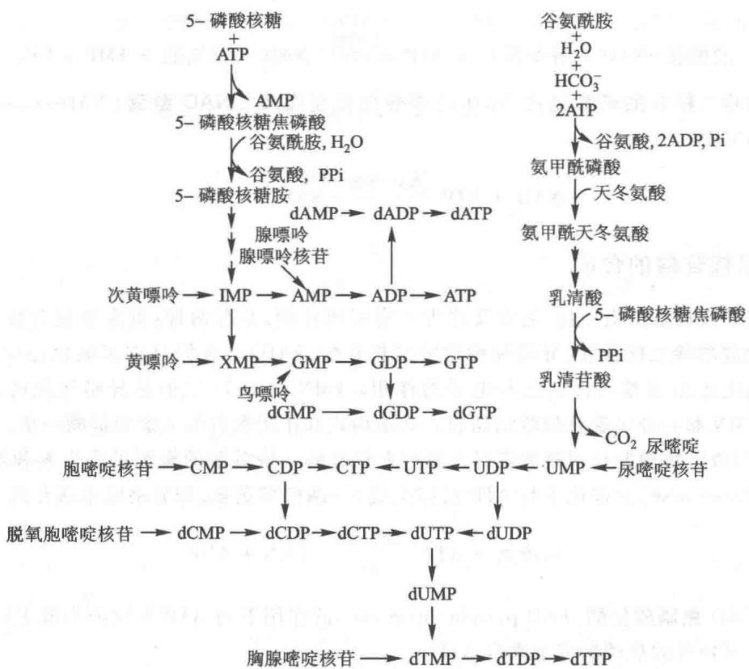  
图27-13 核苷酸的生物合成

## 三、辅酶核苷酸的生物合成

生物体内尚有多种核苷酸衍生物作为辅酶而起作用。其中重要的有:烟酰胺腺嘌呤二核苷酸、烟酰胺腺嘌呤二核苷酸磷酸、黄素单核苷酸、黄素腺嘌呤二核苷酸及辅酶 A。这几种辅酶核苷酸可在体内自由存在。现将其生物合成途径分别叙述如下。

## （一）烟酰胺核苷酸的合成

烟酰胺腺嘌呤二核苷酸(即辅酶Ⅰ、NAD或DPN)和烟酰胺腺嘌呤二核苷酸磷酸(辅酶Ⅱ,NADP或TPN)是含有烟酰胺的两种腺嘌呤核苷酸的衍生物。它们为脱氢酶的辅酶,在生物氧化还原系统中起着氢传递体的作用。烟酰胺腺嘌呤二核苷酸由一分子烟酰胺核苷酸(NMN)和一分子腺嘌呤核苷酸连接而成。烟酰胺腺嘌呤二核苷酸磷酸则在腺苷酸核糖的2'-羟基上多一个磷酸基。烟酰胺核苷酸的结构和作用见维生素和辅酶一章。

由烟酸合成烟酰胺腺嘌呤二核苷酸需要经过三步反应。烟酸先与5-磷酸核糖焦磷酸反应产生烟酸单核苷酸；催化该反应的酶称为烟酸单核苷酸焦磷酸化酶（nicotinate mononucleotide pyrophosphorylase）。在5-磷酸核糖焦磷酸中，焦磷酸部分为 $\alpha$ -构型，而在NAD中，核糖与烟酰胺之间的连接为 $\beta$ -构型，因此认为可能在这一步发生构型的变化。第二步为烟酸单核苷酸与三磷酸腺苷在脱酰胺-NAD焦磷酸化酶（deamido-NAD pyrophosphorylase）催化下进行缩合。最后，烟酸腺嘌呤二核苷酸（脱酰胺-NAD）酰胺化形成烟酰胺腺嘌呤二核苷酸。催化该反应的酶称为NAD合成酶（NAD synthetase），并且需要谷氨酰胺作为酰胺氮的供体。

$$
\text {   烟酸   } + 5 \text {-磷酸核糖焦磷酸   } \xrightarrow {\text {   烟酸单核苷酸   }} \text {   烟酸单核苷酸   } + \mathrm{PPi}
$$

$$
\text {   烟酸单核苷酸   } + \mathrm{ATP} \xrightarrow [ \text {   焦磷酸化酶   } ]{\text {   脱酰胺   -   NAD   }} \text {   脱酰胺   -   NAD   +   P   P   i   }
$$

$$
\mathrm{脱酰胺-NAD+谷氨酰胺+ATP} \stackrel {\mathrm{NAD}} {\underset {\mathrm{合成酶}} {\rightleftharpoons}} \mathrm{NAD+谷氨酸+AMP+PPi}
$$

烟酰胺腺嘌呤二核苷酸磷酸是由 NAD 经磷酸化转变而成。NAD 激酶(NAD-kinase)催化 NAD 与 ATP 反应生成 NADP。

$$
\mathrm{NAD} ^ {+} + \mathrm{ATP} \xrightarrow {\mathrm{NAD激酶}} \mathrm{NADP} + \mathrm{ADP}
$$

## （二）黄素核苷酸的合成

黄素核苷酸是核黄素的衍生物，通常又称为异咯嗪核苷酸，共有两种：黄素单核苷酸（异咯嗪单核苷酸，FMN）和黄素腺嘌呤二核苷酸（异咯嗪腺嘌呤二核苷酸，FAD）。它们是许多氧化还原酶的辅基；以其异咯嗪部分的氧化还原而参与传递氢和电子的作用。FMN由6,7-二甲基异咯嗪核醇和磷酸所组成。FAD由一分子FMN和一分子腺苷酸联结而成。其结构式和作用参看维生素和辅酶一章。

动物、植物和微生物均能利用核黄素以合成黄素核苷酸。核黄素的来源见维生素和辅酶一章。核黄素在黄素激酶(flavokinase)的催化下与ATP反应生成5'-磷酸核黄素，即异咯嗪单核苷酸。

$$
\mathrm{核黄素} + \mathrm{ATP} \xrightarrow [ \mathrm {Mg^ {2 + }} ]{\mathrm{黄素激酶}} \mathrm{FMN} + \mathrm{ADP}
$$

FMN 又在 FAD 焦磷酸化酶(FAD pyrophosphorylase)的作用下与 ATP 反应而生成 FAD。反应是可逆的。在此反应中所释放的焦磷酸完全来自 ATP。

$$
\mathrm{FMN} + \mathrm{ATP} \xrightarrow {\mathrm{FAD} \text {焦磷酸化酶}} \mathrm{FAD} + \mathrm{PPi}
$$

## （三）辅酶A的合成

辅酶 A 分子中含有腺苷酸、泛酸、巯基乙胺和磷酸，它们连接的方式是 3-磷酸-ADP-泛酰-巯基乙胺。辅酶 A 是酰基转移酶的辅酶。关于辅酶 A 的结构和作用以及泛酸的来源等见维生素和辅酶一章。

从泛酸开始合成辅酶 A, 其主要合成途径如下:

第一步，在泛酸激酶（pantothenate kinase）催化下泛酸与ATP反应形成4'-磷酸泛酸（4'-phosphopantothenate）。该激酶已从动物、细菌和酵母中分别提取得到。

$$
\mathrm{泛酸} + \mathrm{ATP} \xrightarrow {\mathrm{激酶}} 4 ^ {\prime} - \mathrm{磷酸泛酸} + \mathrm{ADP}
$$

下一步反应为:4'-磷酸泛酸与半胱氨酸缩合产生4'-磷酸泛酰半胱氨酸(4'-phosphopantothenoylcysteine)。催化此反应的酶称为磷酸泛酰半胱氨酸合成酶(phosphopantothenylcysteine synthetase)。从细菌中提取得到的合成酶必须以CTP供给能量,但从动物系统中提得的合成酶可用其他核苷三磷酸来代替CTP。

$$
4 ^ {\prime} - \mathrm{磷酸泛酸} + \mathrm{半胱氨酸} \xrightarrow [ \mathrm{CTP} \mathrm{or} \mathrm{ATP} ]{\mathrm{合成酶}} 4 ^ {\prime} - \mathrm{磷酸泛酰半胱氨酸}
$$

所生成的 4'-磷酸泛酰半胱氨酸在磷酸泛酰半胱氨酸脱羧酶(phosphopantothenoylcysteine decarboxylase)的催化下脱去羧基,转变成 4'-磷酸泛酰巯基乙胺(phosphopantetheine)。

$$
4 ^ {\prime} - \text {   磷酸泛酰半胱氨酸   } \xrightarrow {\text {   脱羧酶   }} 4 ^ {\prime} - \text {   磷酸泛酰巯基乙胺   } + \mathrm{CO} _ {2}
$$

4'-磷酸泛酰巯基乙胺可与 ATP 缩合形成脱磷酸辅酶 A(dephospho-CoA)，并释放出无机焦磷酸。这是辅酶 A 生物合成过程中唯一的可逆反应；催化该反应的酶为脱磷酸辅酶 A 焦磷酸化酶(dephospho-CoA pyrophosphorylase)。

$$
4 ^ {\prime} - \mathrm{磷酸泛酰巯基乙胺} + \mathrm{ATP} \xrightarrow {\mathrm{焦磷酸化酶}} \mathrm{脱磷酸辅酶A+PPi}
$$

最后,脱磷酸辅酶 A 在脱磷酸辅酶 A 激酶(dephospho-CoA kinase)催化下,被磷酸化而形成辅酶 A,磷酸基的供体必须是 ATP,并且在有半胱氨酸时酶活性最大。

脱磷酸辅酶 A + ATP $\xrightarrow{激酶}$ 辅酶 A + ADP

# 提要

核苷酸是一类在代谢上极为重要的物质。核苷酸是核酸生物合成的前体。ATP 是生物通用的能量载体。核苷酸衍生物是许多生物合成反应的中间物。腺苷酸和腺苷是重要辅酶和辅助因子的组分。某些核苷酸还是调节细胞功能和基因表达的信号分子。

核酸在核酸酶的作用下水解产生寡聚核苷酸和单核苷酸。水解核酸链内磷酸二酯键的酶称为内切核酸酶，包括作用于 RNA 的核糖核酸酶和作用于 DNA 的脱氧核糖核酸酶。某些内切核酸酶具有较高的特异性。在细菌中存在一类能识别和水解外源 DNA 的内切核酸酶，称为限制性内切酶。从多核苷酸链的 5'端或 3'端逐个水解下单核苷酸的酶称为外切核酸酶。有的磷酸二酯酶特异性较低，既能作用于核糖核酸链，又能作用于脱氧核糖核酸链。

核苷酸在核苷酸酶作用下水解成核苷和磷酸。核苷又可被核苷酶分解成嘌呤碱和嘧啶碱以及糖。嘌呤碱和嘧啶碱还可进一步分解。腺嘌呤和鸟嘌呤经脱氨和氧化后生成尿酸。尿酸再分解成一系列产物（尿囊素、尿囊酸、尿素和乙醛酸等）。各类生物对尿酸的代谢能力不同。人体内尿酸过量积累引起痛风，可用次黄嘌呤类似物别嘌呤醇治疗。胞嘧啶脱氨后生成尿嘧啶。胸腺嘧啶和尿嘧啶可被还原后再分解。

无论动物、植物或微生物，通常都能由一些简单的前体物质合成嘌呤和嘧啶核苷酸。嘌呤核苷酸的合成不是先形成嘌呤环，再与核糖和磷酸结合成核苷酸，而是从5-磷酸核糖焦磷酸开始，经过一系列酶促反应，生成次黄嘌呤核苷酸，然后再转变成腺嘌呤核苷酸和鸟嘌呤核苷酸。嘧啶核苷酸则相反，须先形成嘧啶环，再与磷酸核糖结合成为乳清苷酸，然后生成尿嘧啶核苷酸。其他嘧啶核苷酸是由尿嘧啶核苷酸转变而来的。尿嘧啶核苷三磷酸经氨基化后即成为胞嘧啶核苷三磷酸。嘌呤核苷酸和嘧啶核苷酸合成途径的一些酶常形成多功能复合酶或多功能多肽。核苷酸生物合成存在反馈控制调节。

外源的或降解产生的碱基和核苷，可被生物体重新利用。嘌呤碱的再利用主要是通过磷酸核糖转移酶的反应，直接由碱基和5-磷酸核糖焦磷酸生成核苷酸。嘧啶碱除上述与5-磷酸核糖焦磷酸反应外，尚能与1-磷酸核糖反应生成核苷，然后在核苷激酶作用下被磷酸化而生成核苷酸。胸腺嘧啶核苷和脱氧胞嘧啶核苷亦可在相应核苷激酶作用下生成脱氧核糖核苷酸。先天性缺乏次黄嘌呤-鸟嘌呤磷酸核糖转移酶会造成Lesch-Nyhan综合征。

四种核苷(或脱氧核苷)一磷酸可以分别在特异的核苷一磷酸激酶作用下,由 ATP 供给磷酸基,而转变成相应的核苷(或脱氧核苷)二磷酸。核苷二磷酸和核苷三磷酸可在核苷二磷酸激酶的作用下互相转变。核苷二磷酸激酶的特异性很低,与核酸有关的所有核苷(包括脱氧核苷)二磷酸和三磷酸均可在该酶作用下作为磷酸基的受体和供体。

腺嘌呤、鸟嘌呤、胞嘧啶和尿嘧啶核苷二磷酸在核糖核苷酸还原酶系的作用下，可被还原成相应的脱氧核糖核苷二磷酸。该酶系包括硫氧还蛋白、硫氧还蛋白还原酶以及核糖核苷酸还原酶。谷氧还蛋白、谷氧还蛋白还原酶、谷胱甘肽还原酶可取代硫氧还蛋白和硫氧还蛋白还原酶。核糖核苷酸较为稳定，自由基机制可以说明何以核糖 $\mathrm{C}_2^{\prime}$ -OH能够发生脱氧反应。核糖核苷酸还原酶的催化亚基有两个调节位点，酶活性调节位点和底物特异性调节位点。胸腺嘧啶脱氧核糖核苷酸的形成需经过两个步骤，首先由尿嘧啶核糖核苷酸还原形成尿嘧啶脱氧核糖核苷酸，然后尿嘧啶再经甲基化转变成胸腺嘧啶。

某些重要的辅酶,如烟酰胺核苷酸、黄素核苷酸和辅酶 A 等,它们的分子结构中包含有腺苷酸部分。这几种辅酶的合成亦与核苷酸代谢有关。

## 习题

1. 细胞内游离核苷酸有何重要生物功能？

2. 催化核酸水解的酶有哪几类？参与核苷酸分解的酶有哪几类？

3. 核酸有无营养价值？如果供给动物缺乏核酸的食物，动物能否生存？

4. 为什么别嘌呤醇能治疗痛风？过量服用别嘌呤醇可能会造成什么代谢紊乱？

5. 举例说明两个“自杀作用物”的原理。

6. 比较不同生物分解嘌呤碱能力的差异,从中能总结出什么规律?

7. 分解尿嘧啶和胸腺嘧啶的酶是同一套酶, 还是不同的酶?

8. 生物分解嘌呤碱和嘧啶碱需要消耗 ATP, 还是产生 ATP?

9. 说明嘌呤环上各个原子的来源。装配一个嘌呤环共需要消耗多少个 ATP 分子？

10. 试比较原核生物和真核生物嘌呤核苷酸合成途径可能的差别。

11. 合成次黄嘌呤核苷酸的酶组成多酶复合物，在真核生物有些融合为多功能蛋白，试说明其生物学意义？

12. 由次黄嘌呤核苷酸转变为腺嘌呤核苷酸和鸟嘌呤核苷酸都有氨基化反应,两者氨基来源有何不同,能量供给有何差别?

13. 嘌呤碱和核苷的回收途径以何者为主？

14. 何谓 Lesch-Nyhan 综合征？如何治疗？

15. 嘌呤核苷酸生物合成的反馈控制点有哪几个？

16. 分析 6-巯基嘌呤(次黄嘌呤的类似物)和氮鸟嘌呤(鸟嘌呤的类似物)进入体内后可能的转变途径和作用机制。

17. 嘧啶环的合成与嘌呤环的合成有何异同？

18. UMP 合成酶发生缺陷的患者可表现出什么症状？如何治疗？

19. 嘧啶碱和核苷的回收主要通过什么途径？

20. 细菌和动物的嘧啶核苷酸生物合成调节有何差别？

21. 试比较核苷一磷酸激酶和核苷二磷酸激酶的特异性。

22. 说明下面抗代谢物抑制核苷酸生物合成的原理和主要作用点。
重氮丝氨酸 6-重氮-5-氧-正亮氨酸 氨基蝶呤 氨甲蝶呤 5-氟尿嘧啶

23. 说明核糖核苷酸还原的自由基机制。

24. 比较核糖核苷酸还原过程中硫氧还蛋白和谷氧还蛋白传递氢和电子的异同。

25. 解释核糖核苷酸还原酶的调节机制。

26. 胸腺嘧啶核苷酸合酶促使亚甲基给 dUMP, 然后使其甲基化, 为什么?

27. 请解释为什么在含胸苷和氨甲蝶呤的培养基中正常细胞即死亡，而胸苷酸合酶有缺陷的突变菌株却能存活生长。

28. 尿苷酸需在不同磷酸化水平上转变为其他核苷酸, 如 UTP 氨基化为 CTP, UDP 还原为 dUDP, dUMP 甲基化为 dTMP, dUTP 水解焦磷酸为 dUMP, 这是为什么?

29. 哪些辅酶含有核苷酸？它们合成的共同步骤是什么？

30. 试分析为什么在一些不同类型的辅酶和辅因子中都含有腺苷酸或腺苷。

## 主要参考书目

1. Nelson D L, Cox M M. Lehninger Principles of Biochemistry. 6th ed. New York: W. H. Freeman and Company, 2013.

2. Berg J M, Tymozko J L, Stryer L. Biochemistry. 7th ed. New York: W. H. Freeman and Company, 2010.

3. Garrett R H, Grisham C M. Biochemistry. 4th ed. Orlando: Thomson Learning, 2009.

4. Voet D, Voet J G, Pratt C W. Biochemistry. 4th ed. New York: John Wiley & Sons, 2010.

5. McKee T, McKee J R. Biochemistry: The Molecular Basis of Life. 4th ed. Oxford: Oxford University Press Inc, 2008.

6. 王镜岩, 朱圣庚, 徐长法. 生物化学教程. 北京: 高等教育出版社, 2008.

(朱圣庚)

## 网上资源

## 第 28 章 新陈代谢的调节控制

新陈代谢是生物机体一切生命活动的基础。新陈代谢包括物质代谢、能量代谢和信息代谢三个方面。任何系统的物质变化总伴有能量变化，而物质变化和能量变化又总表现出其组织结构相对无序和有序的变更。系统的这种无序和有序变化可以通过称为“熵”的热力学函数进行度量。熵标志着一个系统的混乱程度，或者说无组织程度。熵越大，系统越混乱；反之熵越小，系统的有组织程度就越高。信息也可以作为系统组织程度的量度，获得信息便意味着混乱程度或者不确定程度的减少，也就是说它的组织程度提高。在物理学的计算公式中，信息与熵只差一个符号，因此可以说信息就是负熵。生物机体不断与环境交换物质，摄取能量，输入负熵，从而得以构建和维持其复杂的组织结构；一旦这种关系破坏，死亡便到来，生物就解体了。

细胞是生物机体的结构和功能单位。细胞由四类生物大分子（多糖、脂质、蛋白质和核酸）、有机分子、无机盐和水所组成。在细胞内同时进行着上千种生化反应，这些反应错综复杂却有条不紊，当细胞内外环境发生改变时能适时调整，维持着细胞的生理稳态。代谢调节（metabolic regulation）是指在代谢途径通量(flux)发生改变时，使有关代谢物浓度得以保持其稳态的机制。代谢控制（metabolic control）是指改变代谢途径的通量，以适应环境变化的机制。也就是说，代谢调节是对代谢物浓度变化的节制；代谢控制是对代谢途径通量的管控。两者合起来简称为调控，或者就称为调节。代谢的“自调节”是生命的重要特征之一。新陈代谢的调节控制机制是生物在长期进化过程中建立和完善的。

前面几章我们分别叙述了各类物质的代谢过程,以及在这些物质代谢过程中能量和信息的变化。实际上,生物机体的新陈代谢是一个完整统一的过程,并且存在复杂的自我调节机制。本章首先介绍细胞代谢调节控制的基本原理。然后分别介绍在分子、细胞和整体三个水平上的代谢调节控制机制。最后举例介绍代谢紊乱造成的疾病和防治途径。

## 一、细胞代谢调节控制的基本原理

生物界,包括人类、动物、植物和微生物,其结构特征和生活方式多种多样,千变万化。然而,它们的新陈代谢有着共同的基本途径和调控机制。这也表明地球上的生物有统一的起源。

细胞从环境中取得物质和能量,用以构建自身的组成结构,同时分解已有的成分,获得能量和前体,加以再利用,并将不被利用的代谢产物排出细胞。细胞是如何经济有效地转化各类物质的?如何维持代谢稳态的?这里就细胞代谢调节总的原则和方略作一概述。

## （一）代谢途径相互联系形成网络

细胞内有数百种小分子在代谢中起着关键的作用，由它们构成了各种特异的生物大分子。如果这些分子各自单独进行代谢而互不相关，那么代谢反应将变得无比庞杂，以至细胞无法容纳。细胞代谢的原则和方略是，将各类物质分别纳入各自的共同代谢途径，通过少数种类的反应，例如，氧化还原、基团转移、水解合成、基团脱加及异构反应等，以转化种类繁多的分子。连续的反应称为代谢途径，不同的代谢途径可通过交叉点上共同的中间代谢物而相互转化，使各代谢途径得以沟通，形成经济有效、运转良好的代谢网络通路。其中三个最关键的中间代谢物是：6-磷酸葡萄糖、丙酮酸和乙酰辅酶A。

细胞内 4 类主要生物分子: 糖、脂类、蛋白质和核酸在代谢过程中相互转化, 密切相关, 在代谢部分已有介绍。在此需强调指出, 柠檬酸循环不仅是各类物质共同的代谢途径, 而且也是它们之间相互联系的渠道。现将 4 类物质的主要代谢关系总结如图 28-1。

  
图 28-1 糖、脂质、蛋白质及核酸代谢的相互关系示意图

不同代谢途径之间虽然相互沟通,但它们各自存在调节与控制,转化是有节制的。各代谢途径相互协同配合,形成调节网络。

## （二）代谢保持动力学的稳态

细胞和机体通常都处于动力学的稳态(dynamic steady state)。在正常生理条件下，机体的组成和各代谢途径的运行保持不变。机体摄入营养物，排出废弃物，消耗自由能并以热能形式释放体外。所消耗的自由能主要用于对抗熵的作用力。也就是说，机体通过增加环境的熵来维持体内的稳态(homeostasis)。如若在生物发育过程，或是环境发生重大变化，代谢格局也将随之改变，从一种稳态转变为另一种稳态。

动力学稳态是指代谢途径的物流(flow)处于稳定状态,代谢物的生成与消耗速率相等,其浓度保持不变。稳态与物流速率(即通量)的大小或是否变动无关,在稳态条件下各代谢物浓度恒定,使代谢得以平稳进行。在两步反应中

$$
\mathrm{A} \xrightarrow {\mathrm{V} _ {1}} \mathrm{S} \xrightarrow {\mathrm{V} _ {2}} \mathrm{P}
$$

当 $V_{1}=V_{2}$ ，[S] 即保持不变。现以 ATP 为例来说明代谢稳态。ATP 是生物通用能量载体，广泛参与各种产能和需能反应；ATP 又是能量水平的标记，在代谢调节中起重要作用。因此，细胞充分供应并保持其浓度恒定。通常利用 ATP 的酶其 $K_{m}$ 值在 $0.1 \sim 1 \, mmol \cdot L^{-1}$ 之间，正常细胞 ATP 的浓度为 $5 \sim 10 \, mmol \cdot L^{-1}$ ，明显大于 $K_{m}$ 值（常在 10 倍以上）。昆虫和鸟类在起飞时，或运动员在开始奔跑时，肌肉细胞对 ATP 的需求瞬间增加数十倍，甚至上百倍。在这种情况下，氧的供应跟不上机体对 ATP 的急需，于是迅速通过增强葡萄糖酵解等途径加大对 ATP 的供应，然而细胞中 ATP 和其他许多代谢物的浓度却并无显著变化。

生物机体的种种代谢调节控制机制是在进化过程中获得的。机体在进化中积累的有用信息很大一部分用于编码调控机制。人类大约有4000个基因编码调节蛋白，约占基因组的12%，其中包括各种转录因子、细胞因子、受体、信号蛋白，以及超过500种的蛋白质激酶。越是高等生物，其代谢调控机制越复杂。

## （三）代谢调节点常是远离平衡的反应

一切可逆反应,只要有足够时间,都能自发达到平衡。在平衡点,正向和逆向反应速率相等,自由能的变化 $\Delta G$ 为零。处于动力学稳态的细胞内,代谢途径的多数反应接近平衡。当反应接近平衡时,较小的底物或产物浓度变化可以引起较大的净物流速率变化,并且自由能的变化也较小。这就是说,接近平衡的反应易于使物流平稳;而远离平衡的反应,消耗的自由能较大,故常为调节点。

“接近”平衡的标准是什么？通常用质量作用比（mass-action ratio）Q值和平衡常数 $K_{eg}^{\prime}$ 进行比较来判断。在下列反应中：

$$
\mathrm{A} + \mathrm{B} \rightleftharpoons \mathrm{C} + \mathrm{D}
$$

$$
\mathrm{Q} = \frac {[ \mathrm{C} ] [ \mathrm{D} ]}{[ \mathrm{A} ] [ \mathrm{B} ]}
$$

Q 是细胞内产物浓度乘积被底物浓度乘积相除的数值。当 Q 值和平衡常数 $K_{eg}^{\prime}$ 的比值不超过 2 个数量级，即不超过 100 时，就可认为反应接近平衡。一个反应的平衡常数是固定的，但质量作用比则在不同细胞、不同状态下可以有较大差别。

在细胞内远离平衡的反应常是一些释放高能的反应,例如一些利用 ATP 和其他高能化谷物的酶促反应,其逆反应接近于零,在稳态条件下该正向反应的速率也就代表了整个代谢途径物流的速率。因此,这些反应也就成为代谢的调节点。从糖的酵解途径来看,共有 10 步反应,其中己糖激酶、磷酸果糖激酶和丙酮酸激酶催化的反应均为调节点,这 3 个酶也就是调节酶。

综上所述,远离平衡的反应适于作为调节点,这是由于:① 远离平衡的反应可看作单向或接近单向的反应,其速率与代谢途径的速率直接相关联;② 远离平衡的反应通常都是释放高能的反应,或利用 ATP 和其他高能化合物,或本身即是高能化合物,机体必需对其节制;③ 远离平衡的反应通常都是一些对机体十分重要的反应,它们涉及高能释放,并且常位于代谢途径的关键位置(起点或终点),故而机体严格限制其速率,有关的酶也大多是调节酶。单向、高能、受限制,这三点正符合代谢调节点的基本要求。自然选择压力使催化该反应的酶在进化过程中获得调节功能,成为调节酶。

## （四）代谢控制分析

最早研究代谢控制并取得显著成果的科学家是 Louis Pasteur。1861 年, Pasteur 发现将酵母培养物从有氧转变为无氧条件, 葡萄糖的消耗量随即增加 10 倍以上。这一现象被称为“巴斯德效应”。现在知道, 有氧对酵解的抑制是通过腺苷酸系统作用的。有氧条件下能够产生较多的 ATP, 无氧时细胞增加酵解过程, 以维持 ATP 的稳定供应, 从而使葡萄糖的消耗增加。在其后的一个半世纪时间里, 代谢研究取得巨大进展, 弄清楚了各类物质的代谢途径, 也弄清楚了代谢的调节控制机制。

“单一限速步骤”假说(single rate-limiting step hypothesis)曾在相当长一段时间内被广泛接受。该假说认为代谢途径的物流速率由系列反应中速率最小的反应(步骤)所决定。在当时实验条件下,要想在完整细胞或无细胞提取液中精确测定酶和底物浓度殊不容易。直到20世纪70年代基因克隆技术兴起,利用克隆技术可以增加基因拷贝数以提高酶的浓度;也可以在提取液中添加提纯的酶,或是用酶的激活剂和抑制剂控制酶的活性;底物浓度也可以用许多生化方法测定,实验技术的突破为代谢分析提供可能。实验结果却令人大感意外。曾以为磷酸果糖激酶(PFK-1)是酵解途径的限速步骤,但是将该酶浓度提高五倍,酵解物流速度提高还不到10%。对其他代谢途径的检验结果也与“限速步骤”假设不一致。早在1973年Kacser等人就提出影响通量的有诸多因素,而不是单独一步反应。次年Heinrich等人阐述了代谢控制分析的基本原理。然而,当时对Heinrich和Kacser等人的观点并不重视,及至实验揭示了“限速步骤”假说

的局限性,才使该学说获得普遍关注。

代谢控制分析(metabolic control analysis, MCA)将研究对象看作是由代谢反应步骤和代谢途径组成的代谢系统,因此应对整个系统进行分析,不能局限于个别反应,并认为代谢通量的控制是由组成代谢途径各个步骤及其相互关系决定的,随环境改变而改变。MCA不仅对代谢控制作了数学推导,而且还可以通过实验进行验证。许多实验与MCA预期结果一致或接近一致,然而迄今仍有一些代谢途径过于复杂,尚未分析清楚。

MCA 理论有三个基本参数可用来描述代谢途径对环境变化的反应性。通量控制系数 C(flux control coefficient, C) 用以表示代谢途径中每个酶对调节代谢物流速的相对贡献。通量(flux, J) 是指物流的速率，改变酶量引起代谢通量的相对变化之比，可以得到 C 值。例如，在大鼠肝提取液的酵解途径中己糖激酶

的通量控制系数为 0.79, PFK-1 为 0.21, 磷酸己糖异构酶为 0.0。C 值不是常数, 它随代谢系统底物和效应物浓度的改变而不同; C 值可以是负数, 如有分支途径, 分支途径的酶对主干途径的通量就起负作用, 如图 28-2 所示。无论是直线途径或是分支途径, 各酶 C 值的总和必为 1, 因为我们将代谢的整体控制定义为 1。

  
图 28-2 分支代谢途径的通量控制系数 C

弹性系数 $\varepsilon(\text{elasticity coefficient},\varepsilon)$ 用以定量表示代谢途径中单个酶对代谢物或效应物 (effector) 浓度的反应性,也就是说反应速率变化与代谢物或效应物浓度变化之比,它是酶固有的动力学性质函数。对于具有典型 Michaelis-Menten 动力学性质的酶来说,底物浓度对反应速率所作的曲线为一双曲线(见第7章酶促反应的底物饱和曲线)。曲线上各点的斜率即为弹性系数 $\varepsilon$ ,当底物浓度较低时(如 $0.1 K_{m}$ ),底物浓度稍微增加可引起酶活性的相应增加, $\varepsilon$ 接近于 1.0;而当底物浓度较高时(如 $10 K_{m}$ ),底物浓度稍微增加,对酶活性几乎没有影响, $\varepsilon$ 接近于 0.0。具有变构效应的酶, $\varepsilon$ 可以大于 1,但不能超过 Hill 系数,因此在 1.0 与 4.0 之间。

反应系数 R(response coefficient, R) 表示外部控制物(outside controller) 对流经代谢途径通量的影响。所谓外部控制物是指激素、生长因子或其他细胞因子。通过实验可以测定改变激素等外部化学调节因子浓度(P) 时代谢途径通量发生的变化，从而获得 R。三个系数 C、 $\varepsilon$ 和 R 之间彼此相关：外部控制物总是通过代谢途径的某一环节(某-酶)而对通量发生控制的，因此 R 是 C 的函数；而该酶受控制因子的影响，故也是 $\varepsilon$ 的函数，由此得到下列关系式。

$$
\mathrm{R} = \mathrm{C} \cdot \varepsilon
$$

总和原理(代谢途径各步反应酶的 C 值总和为 1) 和各参数相关性原理(R 为 C 和 $\varepsilon$ 的乘积) 是 MCA 的两个基本原理。运用 MCA 进行实验, 不仅弄清楚了许多代谢途径的调控机制, 而且在利用生物技术改造机体代谢, 即代谢工程中, 也取得许多重大成果。然而, MCA 也有其局限性, 它主要基于对酶活性和动力学性质分析, 有时酶浓度的影响并不明显, 而且通量控制系数只在测定条件下有效, 随着系统状态变化而变化, 其预测值的作用有限。因此 MCA 还需进一步研究改进。

## （五）代谢的协同调节

上面提到,细胞和机体各代谢途径存在调节控制机制。当环境改变时可通过控制代谢途径通量改变代谢格局;调节机制使代谢途径维持在稳态。然而,细胞和机体是一个整体,各代谢途径彼此沟通,其调控也是相互协调,使代谢得以恰到好处的进行。代谢的协同调节表现为各代谢途径(包括分解途径和合成途径)间的协调配合,各组织器官间的分工合作以及不同调控机制间的协作互补。

生物体内的代谢反应都是由酶催化的。任何催化剂，包括酶在内，仅能改变化学反应的速率，并不能改变化学反应的平衡点。因此，它对正反应和逆反应起着同样的促进作用。代谢途径中大量生化反应都是可逆的。然而，实际上整个代谢过程是单向的，分解代谢和合成代谢各有其自身的途径。在分解代谢和合成代谢途径中，许多反应的酶是相同的，但是某些关键部位的正反应和逆反应往往是由两种不同的酶所催化，一种酶催化正向反应，另一种酶催化逆向反应。因此，这些反应被称为相对立的单向反应（opposingunidirectional reaction)。这种分开机制可使生物合成和分解途径或者正向反应和逆向反应分别处于热力学最有利状态。生物合成是一个吸能反应(endergonic reaction)，它通过与一定数量ATP的水解相偶联而得以进行。分解则是放能反应(exergonic reaction)。这些吸能反应和放能反应均远离平衡点，从而保证了反应的单向进行。另一方面，分解代谢和合成代谢的单向性也有利于对它们的调节控制。例如，哺乳动物肝脏可以在糖原被耗尽并且无食物葡萄糖来源时，由丙酮酸经葡糖异生途径转化为葡萄糖，以维持血糖稳定，供脑和其他组织所需，丙酮酸可以由乳酸、丙氨酸和甘油等物质转变而成。葡糖异生有11步反应，糖酵解有10步反应，两者间有7步反应是可逆的，由相同的酶所催化。糖酵解有3步放能反应基本上是不可逆的，催化这3步反应的酶为己糖激酶、PFK-1和丙酮酸激酶。葡糖异生绕过对应的3步不可逆反应，取代的4步反应也有较大的负 $\Delta G^{\prime}$ 值。这些单向的放能反应也正是代谢的调节点，催化的酶也都是调节酶，受代谢物和效应物的调节。糖酵解和葡糖异生途径见图28-3。

  
图 28-3 糖酵解和糖异生途径  
糖酵解有10步反应，糖异生有11步反应，其中7步可逆反应的酶两者共有。糖酵解有3步  
单向放能反应，在糖异生中对应有4步反应，为两代谢途径的重要调节点

生物机体的代谢有时一种反应由不止一种酶催化,多种酶催化同一种反应称为同工酶(isozyme)。这些酶的催化功能虽然相同,但酶学性质不同,调节功能也不同,分布在不同的组织分别起着不同的作用。人类的己糖激酶同工酶共有4种,分别称为I至IV型,由不同基因编码。肌细胞由血液获得的葡萄糖主要用作肌肉收缩的能源。肌细胞有I至III型己糖激酶,这3种同工酶性质相近,对葡萄糖的亲和力都很高(如肌细胞占优势的II型 $V_{m}$ 值为0.1 mmol)。血液中的葡萄糖浓度通常为4\~5 mmol,当血液与肌细胞糖浓度达到平衡时,足以使己糖激酶饱和,酶的活性为最大,而且血糖浓度的波动实际上对酶活性的影响不大。己糖激酶I至III均为变构酶,其产物6-磷酸葡萄糖浓度升高将会有效抑制酶活性,从而使反应维持在一定的稳态。

肝细胞承担着维持血糖浓度稳定的功能,其己糖激酶为Ⅳ型, $K_{m}$ 值高达约10 mM。高效的葡萄糖运输系统使肝细胞与血液间糖浓度迅速达到平衡,此时的糖浓度低于酶的半饱和值,故而血糖浓度可以直接影响肝细胞己糖激酶的活性。餐后血糖浓度升高,己糖激酶Ⅳ活性随之升高,该酶不受产物6-磷酸葡萄糖的抑制,糖酵解途径通量因之而增加,己糖激酶Ⅳ受其特异的调节蛋白(regulatory protein)抑制,该调节蛋白为肝细胞特有并固着于核内,在变构效应物6-磷酸果糖存在下己糖激酶从胞液移至核内与调节蛋白牢固结合。葡萄糖是6-磷酸果糖的竞争结合物,在正常血糖浓度下6-磷酸果糖的作用受竞争抑制;当血糖浓度低于正常值时,葡萄糖被6-磷酸果糖所替代,己糖激酶Ⅳ活性被抑制,肝不再与其他器官竞争消耗葡萄糖。

葡糖异生或糖原分解产生的6-磷酸葡萄糖需经6-磷酸葡萄糖酶(G6 Pase)水解,生成葡萄糖才能进入血液。6-磷酸葡萄糖酶是一种复合膜蛋白,固定在内质网的内膜上,包括水解酶和3种转运蛋白,分别负责6-磷酸葡萄糖 $(\mathrm{T}_{1})$ 、无机磷酸盐 $(\mathrm{T}_{2})$ 和葡萄糖 $(\mathrm{T}_{3})$ 的运输。底物6-磷酸葡萄糖由胞液经 $\mathrm{T}_{1}$ 运送到内质网腔，水解后产物磷酸盐和葡萄糖经 $\mathrm{T}_{2}$ 和 $\mathrm{T}_{3}$ 送回胞液。己糖激酶和6-磷酸葡萄糖酶被分隔在细胞的不同部位，可用以控制该两途径通量并防止葡萄糖磷酸化和去磷酸循环反应，即所谓底物循环（subtract cycling）的无谓耗能反应。同样原因，糖异生第一步反应的酶丙酮酸羧化酶位于线粒体的基质，底物丙酮酸可以自由进出线粒体，产物草酰乙酸没有进出线粒体的通道，需要转变成苹果酸（通过苹果酸脱氢酶逆反应）和天冬氨酸（转氨酶反应）才能穿过线粒体膜，进入胞液后再转变回草酰乙酸，防止底物循环还可以经由其他途径，例如对立反应的交互调节，其中一种反应有活性，另一种则被抑制，反之亦然。

激素可以调节酶的活性,也可以在转录水平上调节酶的生成。高血糖促进胰岛素分泌,胰岛素与受体结合经信号转导激活磷脂酰肌醇3-激酶(PI3 kinase),从而催化磷脂酰肌醇(4,5)二磷酸( $PIP_{2}$ )转变为磷脂酰肌醇(3,4,5)三磷酸( $PIP_{3}$ ), $PIP_{3}$ 能够抑制G6Pase活性。另一方面,胰岛素信号途径还能抑制G6 Pase基因的转录。低血糖则促进胰高血糖素的分泌,胰高血糖素经cAMP信号途径增强G6Pase基因的转录。此外,G6Pase还需要 $Ca^{2+}$ 结合稳定蛋白( $Ca^{2+}$ -binding stabilizing protein)活化,因此受 $Ca^{2+}$ 信号调节。己糖激酶和6-磷酸葡萄糖酶受不同调控机制的协同作用见图28-4。

  
▲ 激活作用；⊗ 抑制作用

6-磷酸果糖激酶(PFK-1)和1,6-二磷酸果糖酶(FBPase-1)分别是催化糖酵解和糖异生关键步骤反应的酶,这两个酶也都是变构酶。ADP和AMP对磷酸果糖激酶有激活作用,而AMP对1,6-二磷酸果糖酶则起抑制作用。ADP和AMP浓度高表明细胞需要加速ATP的合成,因此增强糖酵解并抑制糖异生。与此类似,柠檬酸和ATP对6-磷酸果糖激酶起抑制作用,从而抑制糖酵解;柠檬酸对1,6二磷酸果糖酶起激活作用,促进糖异生。6-磷酸果糖激酶和1,6-二磷酸果糖酶还受激素通过信号分子2,6-二磷酸果糖(F-2,6-BP)进行的协同调节。6-磷酸果糖在磷酸果糖激酶-2(PFK-2)催化下与ATP反应产生信号分子2,6-二磷酸果糖,后者在2,6-二磷酸果糖酶(FBPase-2)催化下水解重新生成6-磷酸果糖。值得指出的是,PFK-2和FBPase-2是同一个双功能蛋白质的两种酶活性,当酶蛋白在依赖cAMP的蛋白激酶(PKA)催化下被磷酸化,呈现FBPase-2活性;经磷蛋白磷酸酶作用去掉磷酸基,则呈现PFK-2活性。胰高血糖素可产生cAMP,激活PKA。胰岛素的作用相反,促进磷蛋白磷酸酶活性。前者降低F-2,6-BP浓度,抑制糖酵解,促进葡糖异生;后者增加F-2,6-BP浓度,增强糖酵解,抑制葡糖异生。磷酸果糖激酶和1,6-二磷酸果糖酶的交互调节见图28-5。

同样，丙酮酸激酶、丙酮酸羧化酶和磷酸烯醇式丙酮酸羧激酶都是调节点的变构酶。高浓度 ATP、乙酰-CoA 和丙氨酸反映细胞能量和氨基酸丰富，因而糖酵解受到抑制。丙酮酸激酶还受到代谢物 1,6-二磷酸果糖的正反馈激活。丙酮酸激酶至少有三个同工酶，肝丙酮酸激酶(L型)在PKA催化下被磷酸化而失活，磷蛋白磷酸酶(PP)使其水解去磷酸基而恢复活性并受变构调节。PKA受胰高血糖素诱导产生的cAMP激活。前面提到糖异生第一步反应的酶丙酮酸羧化酶位于线粒体的基质，受ADP变构抑制，为乙酰-CoA激活。磷酸烯醇式丙酮酸羧激酶在线粒体和胞液内都有，受ADP抑制。这3个酶的调节见图28-6。

  
图 28-5 磷酸果糖激酶和果糖 1,6-二磷酸酶的交互调节  
激活作用；抑制作用

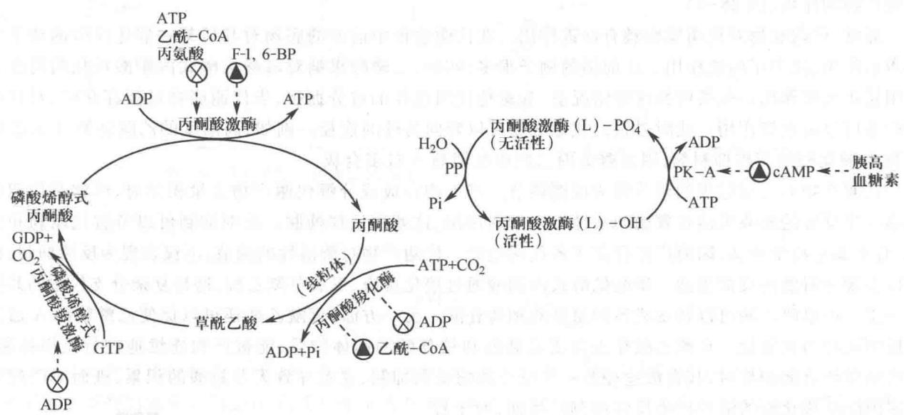  
图 28-6 丙酮酸激酶、丙酮酸羧化酶和磷酸烯醇式丙酮酸羧激酶之间的调节  
▲ 激活作用;⊗ 抑制作用

## 二、酶活性和酶量的调节

生物体内的各种代谢变化都是由酶驱动的。酶有两种功能:其一,催化各种生化反应,是生物催化剂;其二,调节和控制代谢的速度、方向和途径,是新陈代谢的调节物。虽说酶并不改变反应的热力学性质,但却能从动力学上使本来不易发生的反应得以进行。酶对正反应和逆反应起着同样的促进作用,这是对单个反应来说的,酶对代谢过程的调节控制是由于:①酶使吸能反应与放能反应相偶联,因而能推动吸能反应的完成;②代谢途径由系列酶所催化,中间产物迅速被除去,并不积累;③反应在酶或酶复合物的表面进行,往往直到终产物才脱离,成为定向的过程。“酶水平”的调节是代谢最基本、最关键的调节。酶调节主要有两种方式:一种是通过激活或抑制以改变细胞内已有酶分子的催化活性;另一种是通过影响酶分子的合成或降解,以改变酶分子存在的量。虽然,代谢底物和代谢产物都对代谢反应有影响。质量作用定律表明,反应速度与反应物的摩尔浓度乘积成正比。因此,增加代谢底物的浓度,将促进正向反应;反之,增加代谢产物的浓度,将促进逆向反应。代谢物的调节也属于分子水平的调节,然而代谢物的调节是十分有限的,主要受到酶的调节。

酶活性的调节主要包括酶的抑制和激活作用、变构效应、共价修饰和酶切激活等方式。而酶的合成则涉及基因表达调控。本节侧重介绍酶促反应的前馈和反馈、能荷的调节、级联反应、酶切激活、共价修饰以及酶量的调节。

## （一）酶活性的变构调节：前馈和反馈

前馈(feedforward)和反馈(feedback)这两个术语来自电子工程学。前者意思是“输入对输出的影

响”，后者意思是“输出对输入的影响”。这里分别借用来说明代谢底物和代谢产物对代谢过程的作用。前馈或反馈又可分为正作用和负作用两种。凡反应物能使代谢过程速度加快者，称为正作用；反之，则称为负作用。下面图解表明前馈和反馈，S代表底物，有 $S_{0}$ 、 $S_{1}\cdots S_{n}$ 等先后出现的各种底物；E代表酶，有 $E_{0}$ 、 $E_{1}\cdots E_{n}$ 等先后出现的不同的酶；“+”表示激活作用，“-”表示抑制作用。无论是前馈还是反馈都是变构效应，代谢底物和代谢产物在这里起效应物的作用（图28-7）。

  
图 28-7 酶促反应的前馈和反馈

通常,代谢底物对代谢反应具有促进作用。在代谢途径中前面的底物对其后某一催化反应的调节酶起激活作用,称为正前馈作用。正前馈的例子很多,例如,二磷酸果糖对磷酸烯醇式丙酮酸羧化酶的激活作用是正前馈作用。在某些特殊的情况下,为避免代谢途径的过分拥挤,当代谢底物过量存在时,对代谢过程亦可呈负前馈作用。此时过量的代谢底物可以转向另外的途径。例如,高浓度的乙酰辅酶A是乙酰辅酶A羧化酶的变构抑制剂,因而避免丙二酸单酰辅酶A过多合成。

代谢产物对代谢过程的调节即为反馈调节。当生物合成或分解代谢产物大量积累时，产物对代谢途径第一步反应的酶或关键步骤的酶活性发生抑制作用，这就是反馈抑制。反馈抑制可以节省代谢物和能量，有重要生物学意义，因而广泛存在于各代谢途径。代谢产物对酶活性的调节，不仅表现为反馈抑制，也可以表现为对酶的反馈激活。磷酸烯醇式丙酮酸通过羧化反应，形成草酰乙酸，这是复杂分支代谢的共同第一步。由草酰乙酸可以转变成各种氨基酸和核苷酸。另一方面，草酰乙酸还可以促使乙酰辅酶A通过柠檬酸循环而被氧化。草酰乙酸作为合成氨基酸和核苷酸的前体物质，能被产物连续地进行反馈抑制。即当嘧啶核苷酸积累时，其合成途径第一步反应的酶受到抑制，这就导致天冬氨酸的积累，进而对磷酸烯

醇式丙酮酸羧化酶的活性产生反馈抑制。然而，对于柠檬酸循环中柠檬酸的合成，又必需有草酰乙酸参加，从而对磷酸烯醇式丙酮酸羧化酶产生了三种正调节：①嘧啶核苷酸的反馈激活；②乙酰辅酶A的反馈激活；③前体二磷酸果糖的前馈激活。此外，乙酰辅酶A还能增加磷酸烯醇式丙酮酸羧化酶对嘧啶核苷酸的亲和力，从而促进了它们的反馈激活效应。这样，通过错综复杂的调节系统，就能使磷酸烯醇式丙酮酸羧化反应处于最适当的水平(图28-8)。

## （二）产能反应与需能反应的调节

细胞内许多代谢反应受到能量状态的调节。ATP 是通用的能量载体，ADP 是形成 ATP 的磷酸受体。

  
图 28-8 磷酸烯醇式丙酮酸羧化反应的调节控制

ATP、ADP 和无机磷酸盐广泛参与细胞的各种能量代谢。通常产能反应与 ADP 的磷酸化相偶联，需能反应则与 ATP 高能磷酸键的水解相偶联。因此 ATP 与 ADP 和 Pi 的浓度比值 [ATP] / { [ADP] [Pi]}，成为细胞能量状态的一种指标，被称作 ATP 系统的质量作用比 (mass-action ratio)。在正常状态下，该比值是很高的，ATP-ADP 系统总是充分被磷酸化。这使 ADP 的浓度变得非常低，远不足以使氧化磷酸化达到最大速度。此时 ATP 的合成速度足够用来维持细胞的一般需要。但当某些需要 ATP 的细胞活动突然增加时，ATP 迅速分解成 ADP 和磷酸盐，从而降低 [ATP] / { [ADP] [Pi]} 比值。ADP 浓度的增加即能自动增加电子传递和氧化磷酸化的速度，从而加速由 ADP 合成 ATP 的反应。该过程一直持续到 [ATP] / { [ADP] [Pi]} 比值返回正常的高水平，于是氧化磷酸化的速度再次降低。

正常情况时,细胞有机物氧化速度的调节极其灵敏和精确,ATP、ADP 和磷酸盐不仅是代谢反应的底物和产物,可以通过质量作用效应而调节能量代谢,而且更重要的还是许多重要调节酶的变构效应物。例如,在糖酵解、柠檬酸循环和氧化磷酸化途径中,ATP 是抑制效应物,ADP、AMP 和磷酸盐是激活效应物。因此,他们浓度发生任何变化都将迅速引起相应调节酶活性的改变。它们对调节酶的作用见图 28-9。

  
图 28-9 糖酵解与柠檬酸循环途径的调节

Atkinson 建议以能荷来表示细胞的能量状态。能荷的定义为在总的腺苷酸系统中（即 ATP、ADP 和 AMP 之和）所负荷的高能磷酸基数量：

$$
\mathrm{能荷} = \frac {[ \mathrm{ATP} ] + 1 / 2 [ \mathrm{ADP} ]}{[ \mathrm{ATP} ] + [ \mathrm{ADP} ] + [ \mathrm{AMP} ]}
$$

当所有腺苷酸充分磷酸化为 ATP 时, 能荷值为 1.0; 如所有腺苷酸“卸空”成为 AMP 时, 能荷则等于零。正常情况下细胞的能荷大约为 0.9, 变动范围为 0.85\~0.95。能荷是腺苷酸总池中 ATP 或其当量物质量的分数; 由于 AMP 激酶催化二分子 ADP 转化成一分子 ATP 和一分子 AMP, 故 ADP 只相当于 1/2 ATP。在某些条件下, 能荷值可作为细胞产能和需能代谢过程间变构调节的信号。

## （三）酶活性的特异激活和抑制

酶活性受到多种离子和有机分子的影响,尤其是特异的蛋白质激活剂和抑制剂在酶活性的调节中起重要作用。例如,钙调蛋白,它能感受细胞内 $Ca^{2+}$ 浓度的变化,当钙的水平升高时即激活许多种相关蛋白质。

蛋白水解酶也许是生命起源早期就出现的酶，自有蛋白质世界就有蛋白酶。蛋白酶进化至今已成为最庞大的酶家族，其中包括丝氨酸蛋白酶、半胱氨酸蛋白酶、金属蛋白酶和酸性蛋白酶4个主要家族，它们广泛参与各种重要生理过程，并有各类特异的激活剂和抑制剂精确调节其功能。凝血系统的大多组分都是丝氨酸蛋白酶，凝血因子Ⅷ（抗血友病因子）和凝血因子V本身不是蛋白酶，而是丝氨酸蛋白酶激活剂。它们通过级联激活，促使血纤维蛋白原转变为血纤维蛋白，在伤口处造成血液凝固。一旦出现血液栓塞，则由溶栓系统将其水解，该系统也由丝氨酸蛋白酶所组成，并受丝氨酸蛋白酶抑制剂的抑制。凝血与溶栓