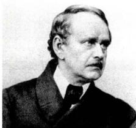
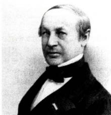
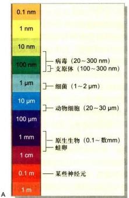
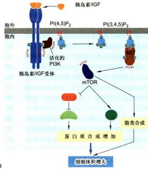
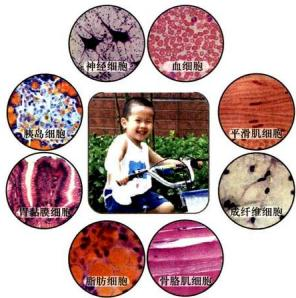
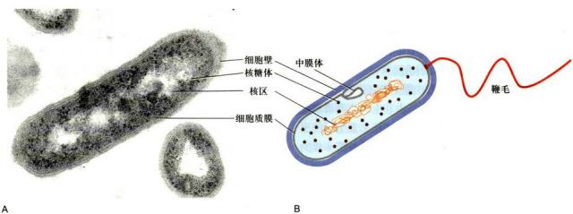
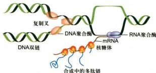
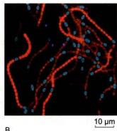
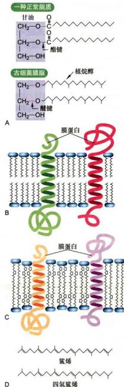

# 第1章 绪论

<!-- 章节边界按正文内容恢复；原始 MinerU 内容保留如下。 -->

# 绪论

许多科学家认为，生命科学的发展可以划分为三个阶段，即：19世纪以及更早的时期，是以形态描述为主的生物科学时期；20世纪上半叶，主要是实验生物学时期；20世纪50年代以来，由于DNA双螺旋结构的发现与中心法则的确立，生命科学进入了精细定性与定量的现代生物学时期。人们对细胞的认识大致也符合这一历史进程。那么作为经典生物学重要分支的细胞学（cytology）是在怎样的历史条件下建立和发展起来的呢？现代的细胞生物学（cell biology）又如何取代了细胞学的位置，发展成当今生命科学中一门备受关注的前沿学科呢？为此我们有必要重温这段科学发展的历史。

回顾学科发展史，不仅是简单地知道一些著名科学家的名字和他们对学科发展的贡献，更重要的是要了解人们在认知细胞的过程中，在每个时期所面临的核心问题及相关的代表人物，他们是如何分析和解决这些问题，最终形成学科的基本概念和基本理论。

因此，追溯本学科领域的认知历程，对我们了解和掌握认知规律，总结和归纳出本学科目前的基本理论与基本概念，以及学科面临的科学问题及解决途径，开创出自己未来的一片天地，是大有裨益的。我们也力求把这一教学思路贯穿在本书的其他章节中。

如果从细胞的角度去看整个生物界，我们会发现，五彩缤纷的生物界是由种类繁多、类型各异的细胞组成。在本书详细讲述细胞结构与功能之前，有必要浏览一下细胞世界中不同类型的细胞及其基本特征，了解细胞的同一性与多样性。作为非细胞形态的生物体——病毒及其与细胞的关系也将在本章作扼要的介绍。

## 第一节 细胞学与细胞生物学

人们通常称1838—1839年施莱登（M.J.Schleiden）和施万（T.Schwann）确立的细胞学说、1859年达尔文（C.R.Darwin）确立的进化论和1866年孟德尔（G.J.Mendel）确立的遗传学为现代生物学的三大基石，可以说细胞学说又是后两者的“基石”，细胞学也正是在此基础上建立和发展的。20世纪50年代，分子生物学的建立和发展，改变了诸如动物学、植物学、胚胎学、生理学、遗传学等经典生物学的面貌，同时也产生了细胞生物学等新型的学科，极大促进了整个生命科学和生物技术的发展。

细胞学是研究细胞结构和功能的生物学分支学科。细胞生物学是应用现代物理学与化学的技术成就和分子生物学的方法与概念，在细胞水平上研究生命活动的学科。那么这两个学科有什么联系，区别在哪里？当前人们又是如何理解细胞生物学这一学科的呢？我们只要从这两个学科的建立和发展历程就不难得出答案。

## 一、细胞的发现

人的肉眼很难观察到细胞，没有显微镜的研制，就不会有细胞的发现。欧洲13世纪就发明了眼镜，16世纪末才研制出第一台显微镜。英国学者胡克（R.Hooke）对软木塞良好的密封性感到好奇，于是用自制的显微镜（放大倍数为 $40\sim 140$ 倍），观察了软木（栎树皮）的薄片，第一次描述了植物细胞的构造，并首次借用拉丁文cellar（小室）这个词，来描述他所看到的类似蜂巢状结构（实际上观察到的只是死亡组织中的细胞壁）。后来英文用cell这个词，中文译为“细胞”。胡克有关细胞的首次描述，出现在他1665年发表的著作《显微图谱》中。因此，人们也就认为细胞是在1665年由胡克发现的。

此后不久，荷兰学者列文虎克（A. van Leeuwenhoek）设计和研制了当时最好的显微镜，以极大的好奇心，观察了许多活体动植物细胞、原生动物甚至细菌，孜孜不倦长达50年之久。1674年他在观察鱼的红细胞时，还描述了细胞核的结构。就真正的活细胞发现而言，当属列文虎克是不足为过的。令人惊叹的是，为人们打开细胞世界之门做出巨大贡献的列文虎克（见知识窗1-1 $^{⑥}$ ）竟是一位布店的学徒。

随着显微技术的发展，在此之后的170多年历史中，更多的学者对动植物的微观结构进行了广泛的研究，积累了大量资料：如1833年，英国植物学家R. Brown发现植物细胞内存在细胞核；接着人们观察到动物细胞的核仁。随着对细胞及其与有机体关系的认识不断加深，人们终于有可能对这些知识进行科学的概括，并上升到具有普遍指导意义的理论高度，提出了细胞学说。

## 二、细胞学说的建立及其意义

细胞学说产生于19世纪的德国，这并非偶然。当时的德国自然科学相当发达，自然哲学非常流行，科学家面对纷繁复杂的自然界时，总是力图运用哲学思辨，提炼出纷乱现象背后的本质。于是，人们对植物和动物的大量显微观察所得到的结果，借助哲学思辨的头脑分析和总结归纳，上升到理论的高度，细胞学说应运而生。1838年，德国植物学家施莱登发表了《植物发生论》，指出细胞是构成植物的基本单位。1839年，德国动物学家施万发表了《关于动植物的结构和生长的一致性的显微研究》论文，在总结前人工作的基础上提出：一切植物、动物都是由细胞组成的，细胞是生物体的基本结构单位。这就是著名的“细胞学说”(celltheory)。然而，此刻的细胞学说并不完善，在不少细节上还存在谬误。如施莱登曾认为，细胞的繁殖是新细胞在老细胞的核中产生，通过细胞崩解而完成的。这种看法随即被一系列学者的研究所修正。德国医生和病理学家R. Virchow 1858年指出，“细胞只能来自细胞”，“正如动物只能来自动物，植物只能来自植物一样”。此外，他还提出有机体的一切病理表现都是基于细胞的损伤。Virchow关于细胞来自细胞的观点，进一步指明了细胞作为一个相对独立的生命活动基本单位的性质，通常被认为是对细胞学说的一个重要补充和完善。因此，有些人认为细胞学说应当是在1858年才最后完成的。

  
施莱登（1804—1881）

  
施万（1810—1882）

细胞学说提出后的十几年中，这一理论迅速得到充实、发展而日臻完善，并影响了许多生物领域的研究。如 C. T. E. von Siebold 研究表明，不仅动植物，而且原生动物也是由细胞组成的，它就是只含一个细胞的动物，能独立地进行全部生命活动；A. Kolliker 通过对胚胎学的研究，证明了生物个体发育的过程就是细胞不断繁殖和分化的连续过程。至19世末期，细胞学说得到了普遍的承认，也标志着细胞学的建立，从而为现代生物学的发展奠定了基础。恩格斯说：“有了这个发现，有机的有生命的自然产物的研究——比较解剖学、生理学和胚胎学——才获得了巩固的基础。”同时他把细胞学说、能量守恒定律和达尔文进化论并列为19世纪自然科学的“三大发现”。进化论解释了生物的多样性，而细胞学说提出了生物同一性的细胞学基础，因而大大推进了人类对整个自然界的认识，有力地促进了自然科学和哲学的进步。

## 三、从经典细胞学到实验细胞学时期

细胞学说的建立，很自然地掀起了对多种细胞进行广泛地观察与描述的高潮。19世纪的最后25年，各种细胞器和细胞分裂活动相继被发现，这称为细胞学的经典时期。进入20世纪以后，人们对细胞的探索从好奇或消遣性地观察进入了主动地科学实验，称为实验细胞学时期，细胞学呈现出繁荣的景象，同时也促进和带动了生物学多学科的发展。

经典细胞学时期的主要进展有如下几个方面：

(1) 原生质理论的提出 1840 年 J. E. Pukinje 和 1846 年 H. von Mohl 首次将动物和植物细胞内的均匀、有弹性的胶状物质称为 “原生质”（protoplasm）。1861 年，M. Schultze 提出了原生质理论，认为组成有机体的基本单位是一小团原生质，这种物质在各种有机体中是相似的。1880 年，J. von Hanstein 提出 “原生质体”（protoplast）概念，细胞的概念进一步演绎成具有生命活性的一小团原生质。protoplast 显然比 cell（小室）对细胞的理解更为确切，但由于 cell 一词已经通行，所以就沿用下来。然而，这一重要的基本概念的深化，极大促进了人们对细胞中具有生命活性的物质及其结构的研究进程。

(2) 细胞分裂的研究 W. Flemming 在动物细胞, E. A. Strasburger 在植物细胞中都发现了细胞核的分裂过程, 1880 年 Flemming 称其为有丝分裂 (mitosis), 并证实有丝分裂的实质是核内丝状物 (染色体) 的形成及其向两个子细胞的平均分配。van Beneden (1883 年) 和 Strasburger (1886 年) 分别在动物与植物细胞中发现减数分裂, 至此发现了细胞分裂的基本类型。

(3) 细胞器的发现 随着显微镜分辨力的提高和石蜡切片及多种染色方法的发明，各种细胞器相继被发现。如1883年van Beneden和T. Boveri发现中心体，1894年R. Altmann发现线粒体，1898年C. Golgi发现高尔基体等。这一系列重要的发现，极大地丰富了人们对细胞的认识并引发人们更深入的探索。

1892年，O.Hertwig在《细胞和组织》一书中，提出生物学的基础在于研究细胞的特性、结构和机能，并以细胞为基础，对所有生物学现象进行归纳与综合，从而使细胞学成为生命科学的一个独立分支。同时，由于他采用实验方法研究海胆和蛔虫卵发育中的核质关系，实际上创立了实验细胞学。此后，人们广泛应用实验的手段与分析的方法，借助各种模式生物来研究细胞学中的一些重要问题，为细胞学的研究开辟了众多新的领域，并与生物学其他领域相结合，形成了一些重要的分支学科。特别是在后期，组织与细胞体外培养技术的建立与应用，使实验细胞学得到迅速的发展，其主要内容包括：

(1) 细胞遗传学 1876 年 Hertwig 发现了动物的受精现象；1883 年 van Beneden 发现了蛔虫的卵和精子的染色体只有体细胞的一半；1888 年 Strasburger 等在植物体中也发现受精现象，并证明生殖细胞的染色体数是体细胞的一半；1900 年，孟德尔在 34 年前发现的遗传法则被重新提出；1905 年 E. B. Wilson 发现性别与染色体的关系，A. Weissman 推测遗传单位有序地排列在染色体上。在这些研究的基础上，德国的 Boveri 同美国的 W. Sutton 不谋而合地提出遗传的染色体假说，把染色体的行为同孟德尔的遗传因子联系起来；1910 年，摩尔根 (T. H. Morgan) 用果蝇做了大量的实验遗传学工作，证明基因是决定遗传性状的基本单位，而且直线排列在染色体上。上述的工作使细胞学与遗传学结合起来，奠定了细胞遗传学的基础（见知识窗 1-2 $^{⑥}$ ）。

细胞遗传学主要从细胞学角度，特别是从染色体的结构和功能，以及染色体和其他细胞器的关系来研究遗传现象，阐明遗传和变异的机制。其核心就是染色体—基因学说。虽然当今染色体和基因的概念与研究内容已发生了根本的变化，人们已经很少提起细胞遗传学这个概念，但染色体结构与基因表达控制关系这一科学问题仍是人们关注的热点。

(2) 细胞生理学 19 世纪末期开始, 人们注意到活细胞的运动, 如细胞的变形运动、细胞质流动、纤毛与鞭毛运动和肌肉收缩等, 并进行了相关的研究。随着生理学技术的发展, 人们在细胞质膜及其通透性、细胞的应激性与神经传导等方面也开展了大量研究工作。

1909年，R. Harrison和A.Carrel创立了组织培养技术，为研究细胞生理学开辟了一条重要途径。1943年，A.Claude用高速离心机从活细胞内把细胞核和各种细胞器（如线粒体、叶绿体）分离出来，在体外研究它们的生理活性，这对研究细胞器的功能和化学组成，以及酶在各细胞器中的定位等起了很大的作用。细胞生理学的主要研究内容是：细胞对其周围环境的反应，细胞生长与繁殖的机制，细胞从环境中摄取营养的能力，细胞的兴奋性、收缩性、分泌性，生物膜的主动运输和能量传递与生物电等。随着现代生物学的快速发展，细胞生理学这一分支学科似乎在逐渐淡化，但其研究内容却不断延伸，如物质跨膜运输、信号转导等已成为当前细胞生物学的重点。可认为这是细胞生理学研究与其他学科交融发展的结果。

(3) 细胞化学 早期对生物体化学成分和基本生化反应的研究，是脱离细胞的形态结构进行的。1924年，R. Feulgen等首先建立了对细胞内脱氧核糖核酸（DNA）特异性的定性检测方法，这就是众所周知的福尔根反应（Feulgen reaction）。此后，1940年J. Brachet用甲基绿-派洛宁染色方法来测定细胞中的DNA与RNA，T.O.Casperson用紫外显微分光光度法测定DNA在细胞中的含量。细胞组分分离技术、放射自显影技术和超微量分析等方法的广泛运用，对细胞内核酸与蛋白质的代谢研究也有很大的促进作用。细胞化学这一分支学科一直保持着强劲的发展势头，由显微分光光度法到流式细胞术，由福尔根反应到核酸分子原位杂交技术，由免疫荧光技术到激光扫描共聚焦显微技术等，使人们对细胞成分，特别是核酸与蛋白质的定性、定位、定量以及动态变化研究达到前所未有的精确性与专一性。

上述实验细胞学分支学科并没有停步不前，其内容与内涵也在不断发展与演变，直至现在依然还是细胞生物学的重要组成部分。

## 四、细胞生物学学科的形成与发展

20世纪50年代以来，随着电子显微镜超薄切片技术的发展，在人们眼前呈现出一个崭新的细胞微观世界——细胞超微结构。不仅已知的细胞结构，诸如线粒体、高尔基体、细胞质膜、核膜、核仁、染色质与染色体等结构以新的面貌展现在人们的面前，而且还发现了一些新的重要的细胞结构，如内质网、核糖体、溶酶体、核孔复合体与细胞骨架体系等，从而为细胞生物学学科的形成奠定了基础。那么，这些精细的细胞结构是怎样组成的？确切的功能是什么？它们又是如何相互协同作用，完成各种复杂的代谢活动和生命过程呢？这些问题仅靠超微形态学的研究是难以回答的。1953年沃森(J.Watson)和克里克(F.Crick)等人发现了DNA分子双螺旋结构，随后，人们提出了遗传中心法则，标志着分子生物学这一新兴学科的问世。正是由于分子生物学概念与技术的引入，分子生物学、生物化学、遗传学等学科与细胞学之间相互渗透与结合，人们对细胞结构与功能的研究水平达到了新的高度。20世纪70年代以后，细胞生物学这一学科最后得以形成并确立。20世纪70年代建立的转基因技术和单克隆抗体技术，80年代各种模式生物的建立及其大量突变株的分析，特别是90年代以来，经典基因打靶技术以及TALEN、CRISPR/Cas技术的广泛应用，DNA测序技术、生物芯片技术的快速发展，都极大地促进了人们在分子水平上对细胞的基本生命活动规律的探索。人类基因组计划及随后的蛋白质组等“组学”的兴起和快速发展，极大地拓展了对生物分子研究的视野，各种高通量技术以及生物信息技术的发展使人们能够“认识”并能以实验手段加以研究的基因和蛋白质的种类有了爆炸性的增加，从而也使得过去相对孤立的调控因子或信号通路的研究，日益趋于迅速细化的网络式系统。而细胞生物学自身也成为一门学科综合性很强、特别是与分子生物学密不可分的前沿学科。正因如此，自20世纪80年代以来，人们开始赋予细胞生物学以“分子细胞生物学”或“细胞分子生物学”等名称。诺贝尔奖最能集中反映当代生物科学的重大成就。综观近50年来荣获诺贝尔生理学或医学奖、化学奖的课题内容，很多都是与细胞生物学密切相关（见本书附录及配套数字课程）。

细胞生物学是应用现代物理学与化学的技术，以及分子生物学的概念与方法，侧重从细胞作为生命活动的基本单位的思维为出发点，研究和揭示细胞基本生命活动规律的科学。它从显微、亚显微与分子水平上研究细胞结构与功能，细胞的增殖、分化、衰老、死亡，以及细胞信号转导和基因表达调控，细胞起源与进化等重大生命过程。可以看到，细胞的结构与功能、细胞重大生命活动及其分子机制的研究日趋深入，已经成为21世纪生命科学研究的重要领域，并以空前的广度和深度，直接和强有力地影响和改变着人类的生活。

无论是单细胞的生物还是多细胞的有机体，生命体都呈现出多层次、非线性的复杂体系的性质，是高度动态的耗散性的结构体系，而细胞则是生命体结构与功能的基本单位，有了细胞才有完整的生命活动。所以毫不奇怪，细胞是生命活动的枢纽层次，细胞生物学成为生命科学的枢纽学科和前沿学科。细胞的研究既是生命科学的出发点，又是生命科学微观和宏观研究的汇聚点，也因之成为当前生命科学中发展最快的领域之一。早在1925年，生物学大师Wilson就提出“一切生命的关键问题都要到细胞中去寻找答案”。重温这句名言，至今仍感内涵深刻。

生物的生殖发育、遗传、神经（脑）活动等重大生命现象的研究都要以细胞为基础，一切疾病发病机制也是以细胞病变为基础，以基因工程和蛋白质工程为核心的现代生物技术主要是以细胞操作为基础而进行的，因此，细胞生物学不仅与生命科学的各个分支学科，而且也与农业、医学的发展有着密不可分的联系，它将在解决人类面临的重大问题、促进经济和社会发展中发挥重要的作用。

## 第二节 细胞的同一性与多样性

地球上的生命形式千差万别，已经命名的物种超过200万种，实际存在的物种估计数以千万计，但作为生命基本单位的细胞，则有显著的基本共性，诸如相似的化学组成、最基本的结构形式、类似的遗传语言和相似的代谢调控机制。同时，细胞又表现出它的多样性，正是由于存在种类繁多、形态各异、功能多样的细胞，才得以形成不同的物种和构建多细胞生物体的组织和器官。本书的开始，有必要扼要介绍一下五彩缤纷的细胞世界的同一性与多样性。

## 一、细胞是生命活动的基本单位

地球上只存在一种生命形式, 就是以细胞为基本形态结构的生命体。细胞是生命活动的基本单位, 所有的细胞都具有共同的基本特征:

（一）细胞的基本共性

## 1. 相似的化学组成

在自然界存在的90种元素中，细胞只利用其中的20多种元素构成自身，其中包括碳（C）、氢（H）、氧（O）、氮（N）、磷（P）、硫（S）等，这些化学元素形成以碳为基本骨架的氨基酸、核苷酸、脂质和糖类，是构成细胞的基本构件；与细胞种类多样性相比，细胞的化学组成显得非常同一，所有细胞都是由几乎同样的材料建成的。也正因如此，生物体可以拆卸其他生物的“零件”来构建自身，这也是生物存活和演化的物质基础。

## 2. 脂 - 蛋白体系的细胞质膜

所有的细胞表面均有主要由磷脂双分子层与蛋白质构成的细胞质膜，细胞质膜使细胞与周围环境保持相对的独立性，形成相对稳定的细胞内环境，并通过细胞质膜与周围环境进行物质交换和信号传递。

## 3. 相同的遗传装置

所有的细胞都以双链 DNA 作为遗传信息的载体，以 RNA 作为转录物指导蛋白质的合成，蛋白质的合成场所都是核糖体。除一些原生生物外，所有的细胞都使用几乎相同的一套遗传密码。提示所有的细胞都起源于共同的原始祖先。

## 4. 一分为二的分裂方式

所有细胞的增殖都以一分为二的方式进行分裂，核内的遗传物质在分裂时均匀地分配到两个子细胞内，这是生命繁衍的基础与保证。从演化的观点看，现存的所有细胞都是共同原始祖先的后代。

## （二）细胞的大小

细胞的大小是细胞的重要特征，各类细胞的大小有一定规律（图1-1A）。一般而言，按细胞平均直径粗略计算，支原体细胞比最小的病毒大10倍，细菌细胞比支原体大10倍，而多数动植物细胞比细菌大10多倍，一些原生动物细胞又比一般动植物细胞大10倍。

对于高等动植物，不论物种的差异多大，同一器官与组织的细胞，其大小总是在一个恒定的范围之内。合适的细胞体积，能够保证细胞与周围环境进行正常的物质与信息交换，保证细胞内物质运输和信号传递的正常进行，对于细胞行使正常的生物学功能至关重要。那么细胞的体积受什么因素控制呢？

一般认为，细胞的大小取决于核糖体的活性，因为蛋白质的量由核糖体来决定。在酵母和果蝇中已经得到几种核糖体蛋白发生变异的突变体，它们的细胞大小都发生了变化。随之人们发现从果蝇到哺乳类的各种生物，都应用一套几乎完全相同的信号网络来调控细胞大小。如在哺乳动物中，这一网络的中心是一个叫做mTOR（mammalian target of rapamycin，哺乳动物雷帕霉素靶蛋白）的蛋白激酶，因其能被雷帕霉素（rapamycin）抑制而得名，如果该蛋白失活，会导致细胞体积变小（图1-1B）。

  
图1-1 细胞的大小及其调控

  
A. 各类细胞直径的比较。B. 多细胞生物主要通过 IGF/PI3K/Akt/mTOR 信号途径调控细胞的体积。IGF：胰岛素样生长因子；PI(4,5)P $_{2}$ ：4,5-二磷酸磷脂酰肌醇；PI(3,4,5)P $_{3}$ ：3,4,5-三磷酸磷脂酰肌醇；PI3K：3-磷脂酰肌醇激酶；Akt：蛋白激酶 B；mTOR：哺乳动物雷帕霉素靶蛋白。

细胞大小的决定还受到其他多种因素的影响。例如植物细胞在旺盛分裂期的大小，也是取决于蛋白质等生物大分子的积累；但在完成分裂后，植物细胞的体积会增加数倍甚至数千倍，这个过程不是依赖有机物的积累，而是中央液泡的膨胀。

那么能够独立生存的最小的生命体有多大呢？也就是能够独立完成全部生命活动的最小的细胞是哪种细胞呢？这就是单细胞生物——支原体（mycoplast）。支原体的直径一般只有0.1\~0.3 $\mu$ m，具有细胞基本的结构和功能。近年来通过对支原体基因系统的删除，人们发现至少需要约400个基因，才能维持一个自由生活的细胞的代谢活动。前几年轰动一时的“人造生命”（见知识窗1-3）的成功，也正是以支原体作为研究对象的。然而从严格的意义上讲，细胞中“人造”的部分只是体外合成的支原体基因组，而细胞的其余部分仍是现存的支原体细胞的组分。可见，即使是最小、最简单的细胞，目前也无法人工合成。

## （三）细胞是生命活动的基本单位

从生命起源的角度看，细胞的出现标志着生命的诞生。在此后漫长的生命演化过程中，细胞一直扮演生命活动基本单位的重要角色。

1. 一切有机体都由细胞构成，细胞是构成有机体的基本单位

尽管地球上生命的形态和代谢方式大相径庭，但无一例外均由细胞构成。有些生物仅由一个细胞构成，另一些生物则由数百乃至万亿计细胞构成。人体内的细胞大约分为200多种不同的类型（图1-2），刚出生的婴儿约由 $2 \times 10^{12}$ 个细胞组成，成年人大约含有 $3.7 \times 10^{13}$ 个细胞；人脑是由 $10^{11}$ 个神经元和几十倍于此的神经胶质细胞构成的复杂体系。

  
图1-2 人体由200多种不同的细胞组成（董巍博士惠赠）

## 2. 细胞是代谢与功能的基本单位

有机体一切代谢活动最终要靠各种细胞来完成。单细胞生物依靠一个细胞完成运动、呼吸、排泄和生殖等一系列生理活动；多细胞生物则更多地依靠细胞之间的相互协同作用，通过不同形态结构的细胞有机地组织起来，形成执行特定功能的器官，完成其复杂的生理功能。

## 3. 细胞是有机体生长发育的基础

有机体的发育与生长是依靠细胞的分裂、分化、迁移与凋亡来实现的，这是自然界最为复杂的过程之一。虽然目前对其中的很多机理还不甚了解，但毋庸置疑，细胞是生长与发育的基本单位。

## 4. 细胞是繁殖的基本单位，是遗传的桥梁

单细胞生物的繁殖表现为细胞一分为二，多细胞生物依靠细胞分裂形成特殊形式的生殖细胞——孢子或配子，上一代的遗传信息存在于生殖细胞的核中。孢子萌发或配子结合为合子，是下一代生命的开始，细胞核中的遗传信息指导下一代生命体的构建。

## 5. 细胞是生命起源的标志，是生物演化的起点

生命是经过长期的化学演化，由非生命的物质形成的。含有遗传物质的原始细胞的形成，标志着生命的出现，此后便进入生物演化阶段，最终形成了纷繁多样的生命世界。

## 二、细胞的基本类型

生物圈的成员数以千万计，而我们的肉眼能看到的成员，包括已发现的150万种以上的动物、50万种左右的植物和接近8万种的真菌，它们形态结构都大相径庭，表现出明显的不连续，这也是生物分类的基础。但在显微镜下，从大象到小鼠，从参天巨树到高不盈寸的小草，它们的细胞结构却大致相同：都由细胞质膜、细胞质和细胞核组成。而细菌等微生物，它们的细胞结构则表现出很大的不同，最明显的一点是没有膜围绕的典型的细胞核。由此看来，生物界最显著的差异更多地表现在细胞层次上，而不是大象和小鼠的区别，甚至不是大象和小草的不同。

## （一）细胞的类型与生物界的类群

根据细胞结构上的的差异，可以把细胞分为真核细胞（eucaryotic cell, $eu$ 是希腊语“真实”的意思，karyon是希腊语“核”的意思）与原核细胞（procaryotic cell）两大类。这一概念最早是在20世纪60年代由著名细胞生物学家H.Ris提出来的，它不仅对细胞生物学，而且对整个现代生命科学均具有深远影响，由此延伸而把整个生物界划分为原核生物（prokaryote）与真核生物（eukaryote）两大类群（域，domain）。原核生物几乎都由单个原核细胞构成，而真核生物却可以分为单细胞真核生物与多细胞真核生物。随着研究的深人们发现，原核细胞与真核细胞的区别，远不只有无细胞核，它们在代谢方式、遗传信息传递方式、基因表达调控、信号转导等各个方面都存在显著差异。

通过在基因和基因组层次上的深入研究，人们发现，在原核细胞中有一类群，它们的遗传信息表达系统与其他的原核细胞差异相当大，反而与真核细胞更为接近。于是人们把这类细胞从原核细胞中独立出来，另立一个类群，称为古核细胞（即古细菌，archaea），由古核细胞所构成的生物称古核生物（archaeon）。

这样，整个生物界的类群包括3个域：原核生物、古核生物和真核生物。在此基础上又分为6个界：由原核生物组成的原核生物界，由古核生物组成的古核生物界，以及由真核生物组成的原生生物界、真菌界、植物界和动物界（图1-3）。

## （二）两类代表性的原核细胞：细菌与蓝藻

原核细胞大约出现在30\~35亿年前，代表一种原始的细胞类群。原核生物一般体积小，直径0.2\~10 $\mu$ m，但其繁殖快，在地球上分布的广度与对生态环境的适应

  
图1-3 生物界的基本类群

所有生物起源于共同的祖先，最终演化出3种基本的的细胞类型和构成生物类群的6个界。古核细胞与真核细胞在进化上的亲缘关系更近些。

性比真核生物大得多。另一方面，原核生物取得的选择优势是有代价的——它们的基因量少，基因表达调控简单，无法进行复杂的细胞分化，也就难以形成多细胞生命体。因此它们虽然选择优势明显，却只能占有非常有限的生态位，导致物种数目远少于真核生物。

原核生物包括支原体、衣原体、立克次氏体、细菌、放线菌和蓝藻等多个家族。下面我们以细菌和蓝藻为代表，介绍原核细胞的基本特征。

## 1. 细菌

细菌是自然界分布最广、个体数量最多、与人类关系极为密切的有机体，在大自然物质循环过程中处于极重要的地位。多数细菌的直径大小在0.5\~5.0μm之间。

（1）细菌细胞的基本结构 电子显微镜下可以看到构成细菌的细胞壁、细胞质膜、核糖体和核区等基本结构（图1-4），有时还可以观察到中膜体、荚膜与鞭毛等特化结构。

所有细菌的细胞壁具有的共同成分是肽聚糖，青霉素可抑制肽聚糖的合成。革兰氏阳性菌（G+）因细胞壁的肽聚糖含量极高，故对青霉素很敏感；反之，革兰氏阴性菌（G-）由于肽聚糖含量很少，对青霉素不敏感。

细菌的细胞质膜除了具有选择性交换物质等功能外，膜上丰富的酶系执行许多重要的代谢功能，如有氧呼吸、蛋白质的合成与分泌及细胞壁合成等。因此，细菌的细胞质膜可以完成真核细胞中诸如线粒体、内质网和高尔基体所承担的部分功能。

某些细菌具有鞭毛（flagellum），直径约20 nm。虽然中英文单词完全相同，但细菌鞭毛的结构与真核生物的鞭毛完全不一样，它仅由一种鞭毛蛋白（flagellin）构成，运动机理也迥然不同。

每个细菌细胞含 5 000～50 000 个核糖体，核糖体的沉降系数为 70S（详见第十章）。除了核糖体外，没有类似真核细胞的细胞器。

细菌细胞没有核膜围绕的典型的细胞核结构，但绝大多数细菌有明显的核区或称类核（nucleoid）。核区形态不规则，四周是较致密的胞质物质。细菌

  
图1-4 细菌的结构  
A. 猪丹毒杆菌（Erysipelothrix rhusiopathiae）（G\*）的电镜照片。B. 细菌结构的模式图。（A图由丁明孝提供）

DNA 也在拟核蛋白（不同于组蛋白）的协助下进行高效包装：在不到 $1 \mu m^{3}$ 的核区空间内，折叠着长达 $1200 \sim 1400 \mu m$ 的环状 DNA，所含的遗传信息量足够编码 $2000 \sim 5000$ 种蛋白质，因此细菌 DNA 的空间构建十分精巧。

人们常把细菌的核区 DNA 也称为染色体，实际上它没有真正的染色体结构，只是习惯上沿用了真核细胞的染色体概念。

(2) 细菌基因组与遗传信息表达体系 细菌基因组很小，为环状 DNA，如大肠杆菌仅为 $4.64 \times 10^{6}$ bp。一般有一个复制起始点，复制时，细菌 DNA 环附在细菌质膜上作为支持点，复制不受细胞分裂周期的限制，可以连续进行。细菌的 DNA 复制、RNA 转录与蛋白质合成的结构装置在空间上没有分隔，可以同时进行，即细菌 DNA 分子边复制边转录，正在转录的 mRNA 又与核糖体结合翻译肽链。转录与翻译在时间与空间上是连续进行的，这是细菌乃至整个原核细胞与真核细胞最显著的差异之一（图 1-5）。

在细菌细胞内还存在可进行自主复制的更小的环状DNA分子，称质粒（plasmid），质粒基因可以赋予细菌某种新的性状。细菌失去质粒DNA而无妨于正常代谢活动。质粒也常用作实验室基因重组与基因转移的载体。

(3) 细菌的增殖 细菌以二分裂方式进行增殖，速度非常快，在适宜的培养条件下，大肠杆菌每 $20\mathrm{min}$ 就增殖一代，而其DNA复制则需要 $40\mathrm{min}$ ，是细胞周期长度的两倍。为什么细胞周期比DNA复制的时间还短呢？原来在迅速增殖的细菌中，上一次DNA复制尚未完成时，下一次DNA复制就已经开始了。在刚刚分开的子细胞中，DNA已经完成了部分复制（详见第十二章）。

细菌的细胞分裂受到严格调控。人们已发现起始DNA分离的关键蛋白FtsZ（filamenting temperature-sensitive mutant Z)。FtsZ 与真核细胞的管蛋白（tubulin）是同源物，其功能类似于动物胞质分裂中的微丝。

  
图1-5 细菌的复制、转录和翻译连续进行的示意图

## 2. 蓝藻

蓝藻又称蓝细菌（cyanobacteria），是自养型原核生物，能进行与高等植物类似的光合作用并放出 $\mathrm{O}_2$ 。蓝藻出现在约30亿年以前， $\mathrm{O}_2$ 的释放，改变了地球大气圈的组成，使原始地球的还原型大气变成富含 $\mathrm{O}_2$ 的氧化型大气，为真核生物和后生生物的起源与演化创造了条件。

蓝藻分布十分广泛，且能生长在极为贫瘠的环境下。蓝藻细胞内含有丰富的色素，使细胞呈现各种颜色，虽名为蓝藻，却不一定都是蓝绿色。

蓝藻细胞的体积比其他原核细胞大得多，直径一般在1\~10 μm，有的可达60 μm（如颤藻，Oscillatoria princeps）。有些蓝藻经常以丝状、片状或中空球状的细胞群体存在，“发菜”就是蓝藻的丝状体，对固定沙漠有重要作用。

（1）蓝藻的细胞结构 蓝藻细胞质膜外有细胞壁和一层胶质的鞘。蓝藻的细胞壁与革兰氏阴性菌十分相似，由一层薄的肽聚糖组成，外面包有外膜。所不同的是，细胞壁内层含有纤维素。蓝藻的细胞质部分有很多同心环样的膜片层结构，称为类囊体（thylakoid），光合色素和电子传递链均位于此。类囊体膜上还有大量藻胆蛋白所构成的藻胆体，负责将光能传递给叶绿素a。蓝藻细胞中央部位在光镜下较周围原生质明亮，是遗传物质DNA所在部位，相当于细菌的核区，称为中心质或中央体。实际上“中心质”经常不位于中央，与周围胞质无明确界限。蓝藻的DNA也几乎为裸露的，复制也可连续进行。与细菌的核区不同，中心质DNA的拷贝数在不同种类和不同个体中变动很大，有些种类含有多个DNA拷贝。

蓝藻细胞中有许多内含物，如脂滴、羧酶体（光合作用固定 $CO_{2}$ 的酶）和气泡（外被蛋白质鞘，调节细胞在水中的位置）等（图 1-6）。

(2) 细胞分裂与分化 蓝藻细胞分裂时, 细胞中部向内生长出新横隔壁, 将中心质与原生质分为两半。一般情况下, 两个子细胞在一个公共的胶质鞘包围下保持在一起, 并不断分裂而形成丝状、片状等多细胞群体。

丝状蓝藻在氮源不足时，群体中5%\~10%的细胞分化为异形胞（heterocyst）（图1-6B）。异形胞中的固氮酶以光系统Ⅰ制造的ATP为能量，将 $N_{2}$ 还原为 $NH_{3}$ 。

C  
  
图1-6 蓝藻

  
A. 电镜下鱼腥藻（Anabaena）的超微结构示意图，显示细胞壁、细胞质膜、类囊体等结构。B. 荧光显微镜下的丝状蓝藻鱼腥藻，红色细胞为正常的营养体细胞，蓝色细胞为具有固氮作用的异形胞。C. 鱼腥藻电镜超薄切片图片。（B 图由赵进东博士惠赠；C 图由胡迎春博士惠赠）

## （三）古核细胞（古细菌）

通过直系同源基因（orthologous gene）序列相似性的比较，可以确定物种间的演化关系。应用这种方法，人们赫然发现，形态结构非常相似的原核生物并不是统一的类群，而是在极早的时候就演化为两大类：古细菌（archaebacteria）与真细菌（eubacteria）。

古细菌又称为古核生物（archaeon），常常发现于极端特殊环境中，过去把它们归属为原核生物，是因为其形态结构、DNA结构及其基本生命活动方式与原核细胞相似。最早发现的古细菌是产甲烷细菌类，接着陆续又发现盐细菌（halobacteria，生长在浓度大的盐水中）、热原质体（thermoplasma，生长在煤堆中）、硫氧化菌（sulfolobus，生长在硫磺温泉中）等几百种古细菌。后来发现古细菌在地球上广泛分布。

因为很多古细菌生存在极度特殊的环境中，所以长期不为人们所重视。后来发现在海洋深处的热泉周围高温的环境中存在众多嗜热细菌，人们很自然联想到它们可能代表了原始地球环境中生命存在与繁衍的特定形式，在细胞起源与演化中扮演过重要角色而非演化盲支。因而，古细菌成为细胞起源与演化研究领域的热点。

古细菌形态多样，细胞大小在0.1\~15 $\mu$ m不等，以分裂或出芽的方式进行增殖。

## 1. 细胞壁

古细菌也有细胞壁，染色呈 $\mathrm{G}^{+}$ 或 $\mathrm{G}^{-}$ ，但没有胞壁酸和肽聚糖，因此溶菌酶以及抑制肽聚糖合成的青霉素等抗生素对古细菌的生长没有抑制作用。

## 2. 细胞质膜

虽然古细菌的质膜也是由脂类与蛋白质构成，但却具有其独自的特征：如细菌的脂肪酸是以酯键与甘油结合，而在古细菌中，是以醚键与甘油结合；膜脂中还有一类特殊的中性脂质——鲨烯衍生物；极端耐热菌的质膜甚至是由40个碳长的四乙醚组成的“单层膜”（图1-7）。

## 3. DNA 及其基因结构

古细菌DNA为环状，有操纵子结构，大部分基因无内含子，有多顺反子mRNA存在，这些都与细菌相似。另外一些特征却与真核细胞类似，如DNA和组蛋白结合成类似核小体结构；编码tRNA和rRNA，甚至部分编码蛋白质的基因中有内含子；RNA聚合酶为复杂多聚体；翻译起始的氨基酸为Met（细菌是fMet）等。已经测序的詹氏甲烷球菌（Methanococcus jannaschii）的1700多个编码蛋白质的基因中，近 $60\%$ 是特有的基因序列。

## 4. 核糖体

多数古细菌类的核糖体虽然也是70S，但含有60种以上蛋白，数量介于真核细胞与真细菌之间，而且其中的rRNA与蛋白质的性质更接近于真核生物。根据对5S rRNA基因的分子演化分析，认为古细菌与真核生物同属一大类，而与细菌差距甚远。与真核细胞类似，针对细菌核糖体的抗生素不能与古核细胞核糖体结合，所以不能抑制其蛋白质合成。古核生物核糖体的结构和生物学特性显然更接近于真核生物。

## 图1-7 古细菌的细胞膜脂

A. 古细菌的膜脂中，经链通常由20个碳组成，并以醚键与甘油结合。B. 古细菌的脂双层膜，由双层 $C_{20}$ 二乙醚（植烷醇甘油二乙醚）组成，镶嵌有蛋白质。C. 嗜热古细菌的膜是由膜蛋白和 $C_{40}$ 四乙醚（如二联植烷醇二甘油四乙醚、环式二植烷醇二甘油四乙醚等）组成的单层膜，十分坚挺，能够对抗高温。D. 古细菌膜中常常含有一定量的非极性脂质，它们是鲨烯的衍生物。

## （四）真核细胞

人们发现最早真核细胞的化石年龄约21亿年。现存的真核生物种类繁多，包括了单细胞原生生物和全部多细胞生物（动植物和大部分真菌）。在此仅就真核细胞的最基本知识作概要介绍，有关真核细胞的结构与功能以及重要生命活动，将在本书的各章节一一详述。

## 1. 真核细胞的基本结构体系及其组装

真核细胞在内部构建成许多精细的具有专门功能的结构单位。在亚显微结构水平上，真核细胞可以划分为三大基本结构系统：①以脂质及蛋白质成分为基础的生物膜结构系统；②以核酸与蛋白质为主要成分的遗传信息传递与表达系统；③由特异蛋白质分子装配构成的细胞骨架系统。这些由生物大分子构成的基本结构体系，构成了细胞内部结构精密、分工明确、职能专一的各种细胞器，并以此为基础保证了细胞生命活动具有高度程序化与高度自控性。

(1) 生物膜系统 生物膜的厚度基本在 $8 \sim 10 \mathrm{~nm}$ 范围之内。细胞表面的质膜及其相关结构，主要功能是进行选择性的物质跨膜运输与信号转导。细胞内部由双层核膜将细胞分成两大结构与功能区域——细胞质与细胞核，使得基因表达得以精密调控。在细胞质内以膜围绕形成很多重要的细胞器：线粒体与叶绿体是主要的供能与产能结构；内质网是生物分子合成的基地，脂质、糖类与很多蛋白质分子是在内质网表面合成并分选运输；高尔基体是对内质网上合成的物质进行加工，包装与运输的细胞器；溶酶体是细胞内的“消化系统”。生物膜还为生命的化学反应提供了表面，很多重要的酶定位在膜上，大部分生化反应在膜的表面进行。

(2) 遗传信息传递与表达系统 遗传信息的储存、传递与表达系统是由 DNA、RNA 和蛋白质组成的复杂体系。DNA 与组蛋白构成了染色质的基本结构——核小体（nucleosome），它们的直径为 10 nm；由核小体盘绕与折叠成紧密程度不同的异染色质与常染色质，在细胞分裂阶段又进一步包装而形成染色体。染色质结构，连同 DNA 的修饰酶和转录因子等共同调控基因的转录。核仁主要是转录 rRNA 与核糖体亚基装配的场所。核糖体是由 rRNA 与数十种蛋白质构成的颗粒结构，其功能是将 tRNA 携带的氨基酸根据 mRNA 的指令连接成肽链。

（3）细胞骨架系统 细胞的骨架系统是由一系列特异的结构蛋白装配而成的网架，对细胞形态与内部结构的合理排布起支架作用。细胞骨架可分为胞质骨架与核骨架，实际上它们又是相互联系的。胞质骨架主要由微丝、微管与中间纤维（也称中间丝）等构成。微丝直径5\~7 nm，主要功能是细胞运动和信号传递；微管直径为24 nm，其主要功能是为细胞内物质的运输提供轨道，以及形成有丝分裂的纺锤丝；中等纤维直径为10 nm，分为多种类型，具有组织特异性，主要对细胞起支撑作用。

核骨架包括核纤层（nuclear lamina）与核基质（nuclear matrix）。核纤层的成分是核纤层蛋白（lamin），核基质的成分则颇为复杂。它们与基因表达、染色质构建与排布有关系。

从上述三种基本结构体系的分析，我们可以在亚显微尺度上找到一个基本共同点，不论是生物膜的厚度，遗传信息表达体系中颗粒与纤维结构的大小，还是骨架纤维的直径，都是在5\~20 nm的尺度范围。近年，纳米生物学（nanobiology）——在纳米尺度上的生物分子结构与功能的研究，可能为在更深层次上揭示大分子复合体与生命现象的关系提供更有力的证据。

蛋白质、核酸和脂质等生物分子如何逐级组装并最终形成细胞赖以进行生命活动的细胞结构体系，是当前生命科学研究中所面临的基本问题之一。现在已知的生物大分子组装方式，大体可分为自我装配（self-assembly）、协助装配（aided-assembly）和直接装配（direct-assembly）三种。自我装配可视为从头发生（de novo），装配的相关信息存在于参与装配的分子本身，中间纤维的自组装就属于这类。协助装配方式是指，在组成大分子复合物装配过程中，除需要形成最终结构的亚基外，还需要其他组分的介入，但这些组分不参加最终的产物，像核糖体的组装需要200多种蛋白质的介入。直接装配是指某些亚基直接装配到预先形成的基础结构上，如细胞质膜扩展过程中，新的膜脂和膜蛋白加入到已存在的膜上。

通过装配形成细胞的基本结构体系，具有重要的生物学意义。首先，以蛋白质复合体取代超大蛋白质，可以加快转录和翻译的速度，减少基因突变和转录、翻译过程中发生错误的概率；其次，通过装配与去装配，更容易调节与控制多种生物学过程，如在细胞有丝分裂中，细胞发生的复杂变化及其精准的调控（详见第十四章）。

## 2. 植物细胞与动物细胞

动植物体内存在多种不同的、功能各异的细胞类型，但这些细胞却都有着基本相同的结构与功能体系。大部分细胞器与细胞结构，其形态结构与成分相近，功能也很类似（图1-8）。

但是，由于动物与植物的营养方式和代谢方式有很大的区别，因此以自养和根植为特征的植物的细胞，在某些方面与动物细胞也表现出明显的区别。

（1）细胞壁 植物细胞壁的主要成分是纤维素，还有果胶质、半纤维素与木质素等。显然，这是植物定植生存和自养的代谢方式所必需的。由于细胞壁的存在，植物细胞之间形成了区别动物细胞的特殊的连接通道——胞间连丝（详见第十六章）。也许由于同样的原因，植物细胞中至今尚未发现类似动物细胞的中间纤维。

(2) 液泡 液泡是由单层脂蛋白膜包围的封闭系统，溶液中含有无机盐、糖类、氨基酸、蛋白质、生物碱与色素等物质。植物细胞常常同时存在两种不同的液泡，即中性的储存蛋白质的液泡和酸性的裂解液泡。前者是植物细胞的代谢库，起调节细胞内环境的作用；后者含有水解酶，能够降解衰老的细胞器，起着类似溶酶

  
图1-8 动物细胞（A）和植物细胞（B）模式图

体的功能。

中央大液泡是随着细胞的生长，由小液泡合并与增大而形成的。因而，在细胞质中氮元素基本不增加的情况下，通过“廉价”的液泡填充细胞，增加细胞的体积，从而扩大了吸收太阳能的面积。同时，为了维持植物细胞内的膨压，必须不断地将溶质转运进液泡中，以维持植物细胞和组织的刚性。

（3）叶绿体 叶绿体是植物细胞内最重要、普遍存在的质体（plastid），是进行光合作用的细胞器。质体是植物细胞中由双层膜包裹的一类细胞器的总称，与糖类的合成与贮藏密切相关，是绿色植物细胞特有的细胞器。

质体是由原质体发育而来。原质体没有色素，存在于茎尖的分生组织细胞中。光照情况下，原质体内合成叶绿素，发育为叶绿体。

除了在上述的结构与功能方面的明显差别外，植物细胞与动物细胞在细胞的增殖、分化、衰老和死亡等生命活动中，以及细胞的能量与物质代谢、信息传递和物质转运方面，也存在明显的差异。如植物细胞分裂以后，普遍有一个体积增大与成熟的过程，细胞体积会增加数倍甚至成千上万倍；又如植物细胞常常要合成数以万种的、并不直接参与生长发育过程的次生代谢产物（secondary metabolite），又称植物天然产物（natural product）。这些神秘的代谢产物不仅为人类提供了药物和调味剂等多种化合物，更是在长期的演化过程中，植物体能够适应周围的生态环境并得以生存的必要保障。

## （五）原核细胞、古核细胞与真核细胞的比较

原核细胞、古核细胞与真核细胞是三个最基本的细胞类群，它们最根本的区别归纳如下（表1-1）：

## 1. 细胞膜系统的演化

真核细胞以膜系统的演化为基础，首先把细胞分为两个相对独立的部分——细胞核与细胞质，细胞质内又以膜系统为基础分隔为结构更精细、功能更专一的单位——各种重要的细胞器。细胞内部结构与职能的分工是真核细胞区别于原核细胞的重要标志。

随着细胞体积的增大与细胞内部结构的复杂化，细胞内部需要有空间上的合理布局，必然需要有一个精密的支架。细胞骨架主要担任了这个角色。

## 2. 遗传信息量与遗传装置的扩增与复杂化

正是在细胞内膜系统演化基础上，出现了细胞内部结构与功能的区域化与专一化，这是细胞演化过程中的一次重大飞跃，导致了遗传装置的扩增与基因表达方式的相应变化。真核细胞的基因组一般远远大于原核细胞的，作为遗传信息载体的DNA也由原核细胞的环状单倍性变为线状多倍性；基因数量大大增加，由几千个演化到2万～3万个；同时，细胞核的存在，使真核细胞基因表达实现了多层次调控，远比原核生物精细与复杂，为完成复杂的生命活动提供了基础。真核生物除了编码基因外，还有不编码任何蛋白质或RNA的基因间隔序列和内含子。内含子的出现，使同一个RNA可以通过可变剪接，编码出多种不同的蛋白质。哺乳动物的2.5万\~3万个编码蛋白质的基因，估计能够翻译出10万多种蛋白质，大大增加了生物的复杂程度。在此基础上，很多真核生物成为多细胞生物，细胞出现了显著而复杂的分化。

表 1-1 三类细胞基本特征的比较

<table><tr><td>特征</td><td>原核细胞</td><td>古核细胞</td><td>真核细胞</td></tr><tr><td>细胞质膜</td><td>有(多功能性)</td><td>有(多功能性)</td><td>有</td></tr><tr><td>核膜</td><td>无</td><td>无</td><td>有</td></tr><tr><td>染色体</td><td>由一个(少数多个)环状DNA分子构成的单个染色体,DNA不与或很少与蛋白质结合</td><td>由环状DNA分子构成的单个染色体,DNA与与组蛋白结合</td><td>2个染色体以上,染色体由线状DNA与蛋白质组成</td></tr><tr><td>核仁</td><td>无</td><td>无</td><td>有</td></tr><tr><td>核糖体</td><td>70S(包括50S与30S的大小亚基),对氯霉素敏感</td><td>70S(包括50S与30S的大小亚单位),对氯霉素不敏感</td><td>80S(包括60S与40S的大小亚基),但对氯霉素不敏感</td></tr><tr><td>翻译起始</td><td>fMet</td><td>Met</td><td>Met</td></tr><tr><td>膜质细胞器</td><td>无</td><td>无</td><td>有</td></tr><tr><td>核外DNA</td><td>细菌具有裸露的质粒DNA</td><td>有质粒</td><td>线粒体DNA,叶绿体DNA</td></tr><tr><td>细胞壁</td><td>主要由肽聚糖形成</td><td>由蛋白质形成,不含肽聚糖</td><td>如有,成分为纤维素与果胶(植物)或几丁质(真菌)</td></tr><tr><td>细胞骨架</td><td>无</td><td>无</td><td>有</td></tr><tr><td>细胞增殖(分裂)方式</td><td>二分裂</td><td>二分裂</td><td>有丝分裂为主</td></tr></table>

由于真核细胞拥有多条DNA分子，并且DNA与蛋白质形成复杂的染色质和染色体等高级结构形式，加之真核细胞内部结构的庞大与复杂性，给遗传物质的准确复制与均等无误地分配到子细胞增加了“难度”，真核细胞发展出一整套复杂精密的体系，严格调控细胞周期的进程，完成细胞增殖（详见第十三章）。原核细胞增殖过程中没有有丝分裂器的出现，也没有像真核细胞那样明确的细胞周期。

原核生物和真核生物在地球上已经共同生存了20多亿年，长期的共存，使两者之间形成了复杂的相互关系。有些原核生物是真核生物的病原体，有些相互依存。例如人的消化道中存在由1000多种微生物组成的肠道菌群，总数达10万亿。在正常情况下，人体肠道菌群的结构相对稳定，宿主为它们提供栖息地和营养物质，而菌群的定植不仅不会对宿主致病，反而对宿主的正常生命活动必不可少，它们合成许多种B族维生素和必需氨基酸，促进铁、锌等元素的吸收，某些肠道菌群还对免疫系统的正常发育与维持至关重要（图1-9）。

  
图 1-9 定植于小鼠回肠末端的分节丝状菌（segmented filamentous bacterium，箭头所示）。这种细菌能够刺激宿主 T 辅助淋巴细胞 Th17 的增殖，分泌 IL17 等细胞因子，加强宿主对致病菌的抵御能力。（梁凤霞博士、Ivaylo Ivanov 博士和 Dan Littman 博士惠赠）

## 三、病毒及其与细胞的关系

既然细胞是生命活动的基本单位，那么作为非细胞形态的生命体——病毒，是否是个例外呢？我们知道，病毒是迄今发现的最小、最简单的有机体。病毒只是一种生物大分子复合体，本身不表现任何生命特征，所有的病毒必须在细胞内繁殖才能表现出其生命特征。因此，从这个角度去看，细胞依然可以看作生命活动的基本单位。如果我们对病毒做一些扼要介绍，就更清楚地看出，不仅病毒繁殖的每一步骤，就连病毒的起源也与细胞密不可分。

## （一）病毒与细胞的区别

病毒与细胞的区别主要表现在以下几个方面：

（1）病毒很小，结构极其简单，没有核糖体等任何细胞结构，因此，不可能独自进行任何代谢活动。绝大部分病毒的大小只有20～200 nm，必须在电子显微镜下才能清楚地看到。

(2) 遗传物载体为 DNA 或 RNA。所有细胞中都含有 DNA 和 RNA，并以双链 DNA 分子作为遗传物质的载体。然而，有些病毒的遗传物质为 DNA，有些为 RNA。因此分别称之为 DNA 病毒或 RNA 病毒。通常每一种病毒粒子中只含有 DNA 或 RNA，病毒的基因组复制与基因表达，也必须在细胞内进行。

(3) 以复制和装配的方式进行增殖。病毒的增殖过程，如同生产汽车，在细胞这个生产病毒的工厂中，首先合成大量的病毒核酸以及各种病毒蛋白，然后由这些“部件”装配成新的子代病毒。因此，一般把病毒的增殖称为复制，而细胞只能以分裂的方式增殖。

（4）彻底的寄生性。病毒虽然具备了生命活动的最基本特征（增殖与遗传），但只是一类不“完全”的生命体，必须利用宿主细胞结构、“原料”、能量与酶系统进行繁殖，因此，有人称之为分子水平上的寄生。有些病毒，只要把它们的遗传物质（DNA或RNA），注入到细胞中，就可以繁殖出正常的子代病毒。

## （二）病毒及其在细胞内的增殖

病毒是由核酸和一种或多种蛋白质组成的（图1-10）。包裹病毒核酸的衣壳（capsid）由蛋白质形成，衣壳与核酸构成病毒的核壳体（nucleocapsid），病毒的衣壳有保护核酸的作用。有些病毒在核壳体之外，还围有脂双层的囊膜（envelope），其主要成分为脂质与蛋白质。脂双层来自于细胞膜，而蛋白质由病毒基因编码。

  
图1-10 几种病毒结构的示意图  
A. 腺病毒，由病毒 DNA 和衣壳组成。B. 疱疹病毒，病毒的核衣壳外面包被一层脂双层囊膜。C. 烟草花叶病毒，一种 RNA 病毒。

病毒在宿主细胞内的增殖是病毒生命活动与遗传性的具体表现。病毒增殖的第一步是识别并进入细胞。不同的病毒可通过其表面的蛋白质，识别细胞表面特异的受体（蛋白质或糖蛋白），因而感染特定的细胞，我们把这种细胞称之为病毒的宿主细胞。目前，人们成功治愈艾滋病的一种方法，就是将造血干细胞中HIV受体蛋白基因Ccr5剔除，然后对患者进行骨髓移植，患者体内新生成的T淋巴细胞，由于缺少HIV受体蛋白，病毒无法识别和侵染，最终病愈。

病毒可以通过不同途径进入宿主细胞。腺病毒、流感病毒、HIV和辛德毕斯病毒等病毒采用一种如同特洛伊“木马计”的策略：细胞通过主动的胞饮作用，把与细胞受体结合的病毒拉进细胞，造成了病毒的感染；随后，病毒“篡夺”了细胞对代谢过程的“指导”作用，利用宿主细胞的全套代谢机构，以病毒核酸为模板，进行病毒核酸的复制与转录，并翻译病毒蛋白质，进而装配成新一代的病毒颗粒，最后从细胞中释放出来，再感染其他的细胞，开始下一轮的增殖周期（图 1-11）。

病毒在细胞内的增殖过程是病毒与细胞相互作用的极为复杂的过程，多种病毒感染可诱发细胞凋亡。有趣的是，某些病毒编码的蛋白质起到抑制细胞凋亡的作用，使病毒得以完成其繁殖过程。

对病毒与细胞相互关系的研究，极大地推动了细胞生物学研究的进展。比如病毒癌基因致细胞癌变过程的研究，不仅促进了细胞原癌基因的发现，也加深了人们对细胞增殖与调控机制的认识。

## （三）病毒与细胞在起源与演化中的关系

病毒是非细胞形态的生命体，其生命活动只能在细胞内实现。因此，病毒与细胞在起源上的关系一直是人们很感兴趣的问题，目前存在三种主要观点：

$$
\begin{array}{l} \text {生物大分子} \longrightarrow \text {病毒} \longrightarrow \text {细胞} \\ \text {生物大分子} \stackrel {{\text {病毒}}} {{<  }} \text {细胞} \\ \text {生物大分子} \longrightarrow \text {细胞} \longrightarrow \text {病毒} \end{array}
$$

在半个多世纪前，第一种观点占优势，认为病毒是生物与非生物之间的桥梁，病毒具有生物与非生物的两重性。按此逻辑的推理，显然是生物大分子先组装成病毒，再由病毒进化为细胞。然而，由于病毒彻底的寄生性，所有病毒必须在细胞内增殖，所以，没有细胞的存在，很难想象会有病毒的生存。因此，病毒的起源不可能先于细胞。目前，第二与第三种观点比较容易接受。在生命起源过程中，由生物大分子分别演化出细胞与病毒这两种不同类型的生命体。但由于尚未发现病毒的化石，因此，人们更倾向于第三种观点，即病毒是由细胞或细胞组分演化来的，这一观点也得到了很多实验结果的支持。

细胞是生命的基本单位。人们对生命的认识过程是从个体一细胞一分子逐渐深入，这也是学科发展的基本趋势。如果从生命的层次或生物演化的角度来看，细胞则是产生和决定生命活动的最基本层次。从17世纪人们在显微镜下发现细胞至细胞学说的建立，从19世纪Flemming发现染色体，20世纪20年代摩尔根提出遗传的染色体学说，到20世纪50年代初DNA双螺旋结构的发现以及2003年人类基因组计划的完成，从核移植到体外干细胞的诱导成功，这些人类探索生命奥秘的里程碑，无不显示出细胞生物学是生命科学的核心学科。

  
图 1-11 病毒在细胞中的增殖过程  
辛德毕斯病毒（Sindbis virus）是一种昆虫病毒，属披膜病毒科，由正二十面体的核衣壳和脂蛋白囊膜组成。图示病毒在细胞质中繁殖的过程。电镜图片显示病毒出芽、释放的过程。（梁凤霞博士惠赠）

细胞生物学的发展速度与发展趋势，从细胞生物学教科书的内容及其版本更新之快也可以明显地反映出来。在此，我们推荐下面6本教材作为主要参考书，并以此做为本章的结束。

[1] Alberts B, Johnson A, Lewis J, et al. Molecular Biology of the Cell. 6th ed. New York: Garland Publishing Inc., 2014.

[2] Alberts B, Hopkin K, Johnson A D, et al. Essential Cell Biology. 5th ed. New York: Garland Publishing Inc., 2018.

[3] Karp G. Cell and Molecular Biology: Concepts

## 思考题

1. 如何理解“细胞是生命活动的基本单位”这一重要概念？

2. 为什么说支原体可能是最小、最简单的细胞存在形式？

and Experiments. 8th ed. New York: John Wiley and Sons Inc., 2015.

[4] Lodish H, Berk A, Kaiser C A, et al. Molecular Cell Biology. 8th ed. New York: W. H. Freeman and Company, 2016.

[5] Becker W H, Kleinsmith L J, Hardin J, et al. The World of the Cell. 8th ed. San Francisco: Benjamin Cummings, 2014.

[6] Cassimeris L, Lingappa V R, Plopper G. Lewin's Cells. 3rd ed. Sudbury: Jones and Bartlett Publishers, 2013.

3. 怎样理解“病毒是非细胞形态的生命体”？请比较病毒与细胞的区别并讨论其相互的关系。

4. 试从演化的角度比较原核细胞、古核细胞及真核细胞的异同。

5. 细胞的结构与功能相关是细胞生物学的一个基本原则，你是否能提出相关的论据来说明之？

1. Eme L, Spang A, Lombard J, et al. Archaea and the origin of eukaryotes. Nature Reviews Microbiology, 2017, 15(12): 711-723.

2. Kater L, Thoms M, Barrio-Garcia C, et al. Visualizing the assembly pathway of nucleolar pre-60S ribosomes. Cell, 2017, 171(7): 1599-1610.

3. Lloyd A C. The regulation of cell size. Cell, 2013, 154(6): 1194-1205.

4. Ruvinsky I, Meyuhas O. Ribosomal protein S6 phosphorylation: from protein synthesis to cell size. Trends in Biochemical Sciences, 2006, 31(6): 342-348.

5. Serino M, Luche E, Chabo C, et al. Intestinal microflora and metabolic diseases. Diabetes & Metabolism, 2009, 35(4): 262-272.

6. Young J K. Introduction to Cell Biology. Singapore: World Scientific Publishing Co., 2010.
