# 第2章 细胞生物学研究方法

<!-- 章节边界按正文内容恢复；原始 MinerU 内容保留如下。 -->

# 细胞生物学研究方法

技术的进步在细胞生物学乃至整个生物学的建立与发展中起着巨大的作用。没有显微镜的发明就不会有细胞的发现，也就不可能提出细胞学说；同样，如果没有电子显微镜技术的建立及其与分子生物学技术的相互结合，也难以想象细胞生物学会有今天这样的长足进展。那么，究竟哪些技术属于细胞生物学研究方法的范畴呢？一般来说，凡是用来解决细胞生物学问题所采用的方法都应属于细胞生物学研究方法。然而，随着学科的交叉与融合，当今几乎没有哪些生物学问题与细胞和细胞生物学无关。所以，人们很难给细胞生物学的研究方法界定一个明确的范畴。虽然对生物大分子结构与功能的分析是了解细胞结构与细胞生命活动的基础，在目前细胞生物学研究中也常常使用这些实验方法与技术，如基因的克隆、表达与DNA序列测定，研究特异DNA、RNA片段或蛋白质所常用的Southern杂交、Northern杂交和蛋白质免疫印迹技术等。但这些技术在生物化学、分子生物学和遗传学等学科中已有介绍，本教材不再过多重复。着眼于细胞生物学的学科特点、发展历史及当前所研究的内容，本章拟从细胞形态的结构观察、细胞及其组分的分析、细胞培养与生物工程、细胞及生物大分子的动态变化等几个方面介绍有关细胞生物学研究方法，侧重于实验方法的基本原理及所能解决的问题。具体的操作步骤详见相关参考书。

## 第一节 细胞形态结构的观察方法

肉眼的分辨率一般只有0.2 mm，很难识别单个细胞；光学显微镜的分辨率可达0.2 $\mu$ m，借此发现了细胞；电子显微镜分辨率高达0.2 nm，将细胞的超微结构展现在人们面前。图2-1比较了光学显微镜、电子显微镜和扫描隧道显微镜适宜观察的样品大小及分辨率。有趣的是，光学显微镜、电子显微镜和扫描隧道显微镜，除了它们因提高分辨率而称之为显微镜这一共性外，在其成像原理、仪器构造以及使用和操作方法等方面，几乎没有任何共同之处。

## 一、光学显微镜

17 世纪，光学显微镜（light microscope）的发明使人们第一次看见了细胞，进而建立了细胞学说，为细胞学的兴起和发展打下基础。光学显微镜至今仍然是细胞生物学研究的重要工具。随着光学显微术与图像处理技术的快速发展，光学显微镜在研究细胞的结构与功能，特别是生物大分子在活细胞中的定位及其动态变化和相互作用等方面展示出了新的活力。

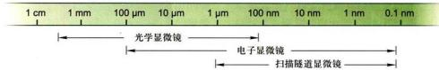  
图 2-1 几种显微镜可观察的样品大小（箭头之间的范围）及其分辨能力（右侧箭头所指位置）

## （一）普通复式光学显微镜

光学显微镜主要由三部分组成：① 光学放大系统（图 2-2），为两组玻璃透镜：目镜与物镜。② 照明系统：包括光源和聚光镜，有时另加各种滤光片以控制光的波长范围。③ 镜架及样品调节系统。1872年，德国科学家阿贝（E. K. Abbe）等研制出了完美程度几乎可与现代普通光学显微镜媲美的复式显微镜。

显微镜最重要的性能参数是分辨率（resolution），而不是放大倍数。分辨率是指能区分开两个质点间的最小距离。分辨率 D 的高低取决于光源的波长 $\lambda$ ，物镜镜口角 $\alpha$ （标本在光轴上的一点对物镜镜口的张角）和介质折射率 N（图 2-3），它们之间的关系是：

$$
D = \frac {0 . 6 1 \lambda}{N \cdot \sin (\alpha / 2)}
$$

通常 $\alpha$ 最大值可达 $140^{\circ}$ ，空气中 N=1，最短的可见光波长 $\lambda=400\ nm$ ，此时分辨率 D=260 nm，约 $0.3\ \mu m$ 。若在油镜下，N 可提高到 1.5，分辨率 D 则可达 $0.2\ \mu m$ ，所以普通光学显微镜的最大分辨率是 $0.2\ \mu m$ 。

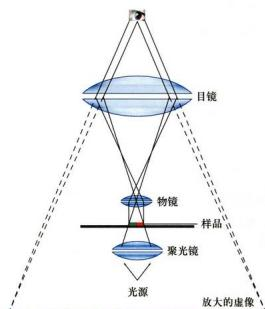  
图2-2 普通光学显微镜成像示意图

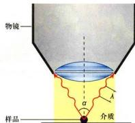  
图2-3 决定光学显微镜分辨率的要素：物镜的镜口角（ $\alpha$ ）、入射光的波长（ $\lambda$ ）以及介质的折射率（ $N$ ）

光学显微镜可以直接用于观察单细胞生物或体外培养细胞。如果观察生物组织样品，则通常需要对所观察的材料进行固定和包埋（常用的固定剂如甲醛，包埋剂如石蜡等），再将包埋好的样品切成厚度约5 μm的切片，最后进行染色（图2-4A）。如苏木精和伊红染色（又称H-E染色）就是一种常用的染色方法。碱性染料苏木精和酸性染料伊红分别与细胞核和细胞质的某些成分特异性地结合，从而改变透射光线的波长，我们就可以清晰观察到蓝紫色的细胞核和红色的细胞质的形态（图2-4B）。

## （二）相差显微镜和微分干涉显微镜

生物样品一经固定就失去了生物活性，活细胞显微结构的细节可以借助相差显微镜（phase-contrast microscope）来观察。光波的基本属性包括波长、频率、振幅和相位等。可见光的波长和频率的变化表现为颜色的不同，振幅的变化表现为亮暗的区别，而相位的变化却是人眼不能觉察的。当两束光通过光学系统时，会发生相互干涉。如果它们的相位相同，干涉的结果是使光的振幅加大，亮度增强。反之，就会相互抵消而亮度变暗（图2-5）。相差显微镜和干涉差显微镜就是利用这样的原理增强样品的反差，从而实现对非染色活细胞的观察。

光线通过不同密度的物质时，其滞留程度也不同。

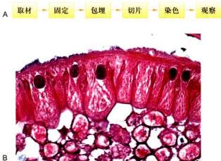  
图2-4 石蜡切片的制备程序（A）及其显微图片（B）B为蛔虫子宫上皮细胞的H-E染色图片。

  
图2-5 两束光波之间的相互干涉  
A. 当两束光的相位相同时，相互干涉的结果使光波的振幅增加。  
B. 当两束光的相位相反时，则导致光波的振幅降低。

密度大则光的滞留时间长，密度小则光的滞留时间短，因而，其光程或相位发生了不同程度的改变。相差显微镜是在普通光学显微镜的基础上，添加两个元件，即“环状光阑”和在物镜后焦面上的“相差板”，从而可将这种光程差或相位差，通过光的干涉作用，转换成振幅差，因此，可以分辨出细胞中密度不同的各个区域（图2-6）。1932年，德国物理学家P.Zernike制备出第一台相差显微镜，他因此项发明在1953年获诺贝尔物理学奖。

1952 年，G. Nomarski 在相差显微镜的基础上，发明了微分干涉显微镜（differential-interference micros-cope)，又称 Nomarski 相差显微镜。微分干涉显微镜是以平面偏振光为光源。光线经棱镜折射后分成两束，在不同时间经过样品的相邻部位，然后再经过另一棱镜将这两束光汇合，从而使样品中厚度上的微小区别转化成明暗区别。微分干涉显微镜更适于研究活细胞。

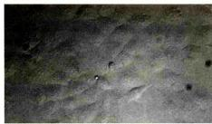

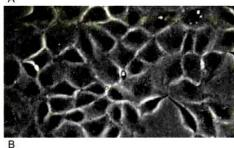  
图2-6 两种不同类型的光学显微镜所拍摄的图像比较  
体外培养的MDCK细胞在普通光学显微镜（A）和相差显微镜（B）下拍摄图像效果的比较。（梁凤霞博士惠赠）

如果将微分干涉显微镜接上高分辨率录像装置，就可以用来观察并记录活细胞中的颗粒及细胞器的运动。计算机辅助的微分干涉显微镜可以进一步提高样品的反差并降低图像的背景“噪声”，使一些常规光学显微镜难于观察的一些显微结构，如单根微管（直径约24 nm）等也可以在光镜下分辨出来。其分辨率比普通光镜提高了一个数量级。从而为在高分辨率条件下研究活细胞提供了必要的工具。应用这一原理制备的录像增差显微镜（video-enhance microscope）可以用来直接观察颗粒物质沿着微管运输的动态过程。

## （三）荧光显微镜

荧光显微镜（fluorescence microscope）是在光镜水平上，对细胞内特异的蛋白质、核酸、糖类、脂质以及某些离子等组分进行定性定位研究的有力工具。荧光显微镜采用的光源和光学系统均与普通光学显微镜有所不同，其核心部件是滤光片系统以及专用的物镜镜头（图2-7A）。滤光片系统由激发滤光片（安装在光源和样品之间，只允许特定波长的激发光通过）和阻断滤光片（安装在物镜和目镜之间，只容许荧光染料所发出的荧光通过）组成。这样，通过激发滤光片的短波长的激发光，照射标记在样品中的荧光分子上，使之产生一定波长的可见光即荧光（图2-7B）。由于荧光显微镜的暗视野为荧光信号提供了强反差背景，非常微弱的荧光信号亦可得以分辨。

荧光显微镜样品制备技术包括免疫荧光技术（见本章第二节）和荧光素直接标记技术。荧光染料DAPI特异性地直接与细胞中的DNA相结合，从而显示出细胞核或染色体在细胞中的定位。这是一种常用的直接标记技术。目前，荧光显微术得到了广泛的应用，特别是细胞内动态变化的研究。例如，用显微注射器将标记荧光素的肌动蛋白注射到培养细胞中，可以看到肌动蛋白分子组装成肌动蛋白纤维的过程。又如，将在激发光作用下，可产生荧光的绿色荧光蛋白（green fluorescent protein, GFP)的基因与编码某种蛋白质的基因相融合，利用荧光显微镜，就可以在表达这种融合蛋白基因的活细胞中，观察到该蛋白质的动态变化。由于不同荧光素所激发出的荧光波长不同，同一样品可以用两种以上的荧光素标记，从而同时显示不同成分在细胞中的定位（图2-7C，图2-9A）。

  
图2-7 荧光显微镜的基本原理及其应用  
A. 荧光显微镜的工作原理与光路示意图。B. 不同荧光素所需激发光波长与所产生的荧光波长的比较。C. 荧光显微镜显示出在有丝分裂中期细胞中，纺锤体微管（绿色）、中期染色体（蓝色）和原纤维状蛋白（fibrillarin）（红色）等结构成分。（C图由郭焱和陈建国博士提供）

## （四）激光扫描共焦显微镜

在普通荧光显微镜下，许多来自样品中焦平面以外的荧光会使观察到的图像反差减小、分辨能力降低。而激光扫描共焦显微镜（laser scanning confocal microscope, LSCM，简称共焦显微镜）相当于在荧光显微镜上安装了一套激光共焦成像系统，并以激光（可见或紫外激光）为光源，从而，极大地提高了图像的分辨率（图2-8）。所谓共焦，是指聚光镜和物镜同时聚焦

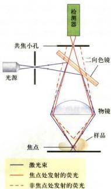  
图2-8 激光扫描共焦显微镜的原理图

激光束（光源）经二向色镜反射后，通过物镜会聚到样品某一焦点；从焦点发射的荧光（样品一般经免疫荧光标记）经透镜会聚成像，被检测器检出；样品其他部位发射的荧光不会聚焦成像，因而检测器不能检出。

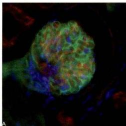

  
图2-9 荧光显微镜（A）和激光扫描共焦显微镜（B）所观察图像的比较  
图中显示小鼠肾小球的厚切片（厚度20μm）中，用不同的标记方法和不同的荧光染料，分别显示其凝集素（绿色）、微丝（红色）和细胞核（蓝色）的分布。激光扫描共焦显微镜所获得的图像更为清晰。（梁凤霞博士惠赠）

到同一点上，因而只有聚光镜聚焦在样品中的某一位点上所产生的激发荧光才能清晰成像，而来自焦平面以外的散射光则被小孔或狭缝挡住，再利用激光扫描装置和计算机高速采集与处理会聚每一个点上的信息，形成一幅清晰的二维图像。激光扫描共焦显微镜的分辨率可以比普通荧光显微镜的分辨率提高1.4\~1.7倍。其纵向分辨率（axial resolution）也得到很大的改善。由于可自动调节并改变观察的焦平面，所以可以通过“光学切片”即改变焦点获得一系列不同切面上的细胞图像，经叠加后重构出样品的三维结构。早在1955年，M. Minsky就发明了扫描共焦显微镜。但是直到30年后，随着激光光源的应用和一系列的改进，这种新型的显微镜才得以问世。目前，它在研究亚细胞结构与组分的定位及动态变化等方面的应用越来越广泛，其中包括本章后面所谈到的荧光共振能量转移技术、荧光漂白恢复技术等，都离不开激光扫描共焦显微镜（图2-9B）。

## （五）超高分辨率显微术

根据传统的光学理论，远场光学显微镜在 x、y 轴向的理论分辨率的极限值为 200 nm，而 z 轴向的分辨率还要比这个数值低得多，大约是 500～800 nm，远远不能满足要求。于是，人们开始寻找突破光学显微镜分辨率极限的方法。经过 20 多年的努力，研制出诸如 TIRFM、PALM/STORM、4π 和 STED 显微术，以及 SIM 等多种不同类型的超高分辨率显微术。

## 1. 全内反射荧光显微术（total internal reflection fluorescence microscopy, TIRFM）

根据瑞利/阿贝公式，显微镜的分辨率主要取决于光线的波长和物镜的数值孔径。而且，由于成像过程中产生的泊松噪声和检测元件的背景噪声使光学显微镜的实际分辨率远远低于理论值。可见，降低噪声是提高分辨率的有效途径。激光扫描共焦显微镜主要是依靠针孔来减少非焦平面的信息从而提高图像的清晰度，但针孔不能无限缩小。而全内反射荧光显微镜的原理是基于斯涅耳定律，即当光线从光密介质进入光疏介质时，一部分光会发生折射，而另一部分光线会发生反射（图2-10）。并且，当入射角 $(\theta_{1})$ 的角度增大时，折射角 $(\theta_{2})$ 也随之增大。当入射角达到临界角 $(\theta_{c})$ 时，折射角的角度达到 $90^{\circ}$ 。当入射角继续增大时，就会发生全内反射（TIR）现象。此时，光线会在介质的另一面产生隐失波。隐失波的能量范围通常在 $200~\mathrm{nm}$ 以内，且在 $z$ 上轴上呈现指数衰减，因此可以激发很薄一层（约

  
图2-10 全内反射示意图  
$n_1$ 和 $n_2$ 分别为玻璃和液体的折射率， $\theta_{1}$ 和 $\theta_{2}$ 分别为入射角和折射角， $\theta_{C}$ 为临界角。

100 nm）样品内特定的荧光分子发光，这样就大大降低了背景噪声的干扰，提高了图像分辨率。该技术的特点是只能观察细胞紧靠玻片的大约 100 nm 的范围，例如观察细胞质膜以及紧靠细胞质膜的细胞骨架组分的动态行为，而对细胞的其他部分的观察则无能为力。

## 2. 基于单分子成像技术的 PALM/STORM 方法

对于单个荧光光源的光子分布，通过特定的数学方法（如高斯函数）拟合，可以比较容易地定位荧光光源，精度达到纳米量级。P. Selvin 研究小组应用单分子成像技术在体外条件下分析肌球蛋白分子的行为，达到 1.5 nm 的定位精度。但是，如果两个荧光光源相距很近并且同时发光，应用该技术并不能区分它们。

一种绿色荧光蛋白的突变体（PA-GFP）的出现使情况出现了转机。PA-GFP在激活之前对488 nm的光没有反应，但如果用405 nm的激光激活一段时间，再用488 nm激光照射时，可发出绿色荧光。E. Betzig等将PA-GFP的发光特性与单分子荧光的定位精度相结合，成功地突破了光学显微镜的分辨率极限。其基本原理是将目的蛋白克隆到PA-GFP表达载体，并转染细胞。待融合蛋白表达后用较低能量的405 nm激光照射细胞，随机地使很少一部分（相隔较远的）PA-GFP激活，再用488 nm激光激发激活的PA-GFP发出绿色荧光，通过高斯函数拟合将这些荧光分子定位，然后用488 nm激光将这些已经精确定位的荧光分子漂白，使其不能在下一轮激光照射时被激活。重复上述过程，每次都用405 nm和488 nm激光来激活、激发、定位和漂白少量的荧光分子，如此持续进行数百个循环，直到将细胞内几乎所有的荧光分子都精确地定位，并将所得到的图像合成在一张图上。这样就可以得到分辨率比传统的光学显微技术高10倍以上的图像。由此建立了光激活定位显微术（photoactivated localization microscopy, PALM）。后来Betzig的研究小组进一步发展PALM，成功记录了细胞内两种蛋白质的相对位置。PALM的缺点是只能用于观察外源表达蛋白的定位，并且每一幅图像照相所需的时间很长，不适合用于活细胞动态观察。

庄小威的研究小组开发了一种与PALM类似，但可以用来做细胞内源性蛋白的超分辨率定位的方法。其原理是基于花青染料可以被一种波长的光激活发出荧光，还可以被另一种波长的光波关闭而处于暗态，可以用不同波长的光波照射这些花青染料以控制它们发光或不发光。所以，就可以将原本靠得很紧的蛋白质用成对的染料（如Cy3/Cy5）标记的特异抗体反应，在显微镜下先用激光使报告分子Cy5失活，然后用 $561\mathrm{nm}$ 激光随机地激活少数几个Cy3，并导致其配对的Cy5活化，再用 $647\mathrm{nm}$ 激光激发Cy5，使其发出 $670\mathrm{nm}$ 的荧光，信号被相机捕捉后通过高斯拟合求出其中心位置。重复上述过程10000次以上，以得到100万个以上的数据，就可以重构出内源蛋白分布的高分辨率图像，该方法被命名为随机光学重构显微术（stochastic optical reconstruction microscopy, STORM）。采用不同的荧光染料对，应用STORM可以对多达4种内源性蛋白进行精细定位，分辨率可以达到 $20\mathrm{nm}$ 左右（图2-11）。其缺点是得到一张超分辨图像的时间很长，在活细胞中很难实现。

  
图2-11 基于单分子定位原理的STORM超高分辨率成像技术

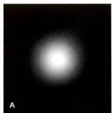

  
图2-12 激光扫描共焦显微镜（A）与STED超高分辨率显微镜（B）观察中心粒蛋白的分布的图像比较  
在STED超高分辨率显微镜图像中，可分辨出中心粒蛋白在中心粒中的分布。（陈建国博士和黄宁博士提供）

## 3. $4\pi$ 和STED显微术

S. Hell 发明的 $4\pi$ 显微镜是基于增加物镜的接受角而等效增加物镜的数值孔径（NA）。具体是在样品的两侧各放置一个相同的高性能物镜，使总的接受角接近 $4\pi$ ，进而提高了 NA。Hell 的这一设计成功地将 z 轴分辨率从 500 nm 工高到 100 nm 左右，但 $4\pi$ 显微镜并没有突破衍射极限。此后，Hell 设想使用一束激光，仅仅激发一个点的荧光基团并使其发出荧光，然后再用第二束象面包圈那样的环状高强度的脉冲激光照射那个点周围的荧光，该激光的波长可以使发光物质从受激状态返回到基态。这样，就只有中间没有完全损耗的荧光分子可以观察到。环状激光中间的孔径越小，图像的分辨率就越高。Hell 给这项发明取名受激发射损耗（stimulated emission depletion, STED）显微术（图 2-12）。理论上，STED 显微术的分辨率不受光的衍射过程所限制，利用该技术可以使水平面的分辨率达到纳米级，而且可以快速地观察活细胞内的实时动态变化，如记录神经元突触小泡的行为，但没有提高 z 轴方向的分辨率。如果将 $4\pi$ 和 STED 结合，将可以同时提高 z 轴方向的分辨率。

## 4. 结构照明显微术

M. Gustafsson 博士将非线性结构照明部件引入到传统的显微镜上，使显微镜的硬件系统增加了光栅和控制元件，软件系统可对所获取的图像信息进行计算。其原理是通过光栅的旋转和移动将多重相互衍射的光束照射到样本上，并在此发生干涉，然后从收集到的发射光模式中提取高分辨信息，生成一幅完整的图像。这一技术称为结构照明显微术（structured-illumination microscopy, SIM）。利用结构照明术可使 x、y 平面分辨率达到 100 nm，z 轴向分辨率也提高了 2 倍。其优点是对于普通的免疫荧光标记样本和各种荧光蛋白表达样本，可以不经特殊处理直接观察。其缺点是分辨率远低于其他超高分辨率显微术（图 2-13）。

  
图2-13 激光扫描共焦显微镜（A）与SIM超高分辨率显微镜（B）的图像比较  
SIM 超高分辨率显微镜图像中，可清晰分辨出动物细胞纤毛基体（即母中心粒）中由三联体微管围成的空隙（箭号所示）。（陈建国博士和黄宁博士提供）

## 二、电子显微镜

光学显微镜技术在细胞生物学研究中起着极为重要的作用。但由于光波波长的限制，光镜的分辨率难以得到进一步提高。只有借助分辨率更高的电子显微镜(electron microscope, EM, 简称电镜)，才可能观察到细胞内部的精细结构。电子显微镜经过了多位科学家共同努力，最终由德国科学家E. Ruska于1932年制作而成，Ruska因此于1986年获诺贝尔物理学奖。

## （一）电子显微镜的基本知识

电子显微镜的基本原理与光学显微镜完全不同，构造也要比光学显微镜复杂得多。但电子显微镜的光路却与光学显微镜具有相似性（图2-14）。

## 1. 电子显微镜与光学显微镜的基本区别

电子显微镜的高分辨率主要是因为使用了波长比可见光短得多的电子束作为光源，波长一般小于0.1 nm。光源的差异决定了电镜与光镜的一系列不同点（表2-1）：比如电子显微镜需要通过电磁透镜聚焦，电镜镜筒中要求高度真空，图像需要通过荧光屏、感光胶片或电荷耦合器件（charge-coupled device, CCD）进行显示和记录等。

表 2-1 电子显微镜与普通光学显微镜的基本区别

<table><tr><td></td><td>分辨本领</td><td>光源</td><td>透镜</td><td>真空</td><td>成像原理</td></tr><tr><td>光学显微镜</td><td>200 nm</td><td>可见光(波长400~760 nm)</td><td>玻璃透镜</td><td>不要求真空</td><td>利用样本对光的吸收形成明暗反差和颜色变化</td></tr><tr><td>电子显微镜</td><td>0.2 nm</td><td>电子束(波长0.01~0.9 nm)</td><td>电磁透镜</td><td>真空</td><td>利用样品对电子的散射和透射形成明暗反差</td></tr></table>

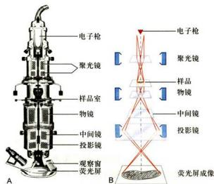  
图 2-14 电子显微镜的基本结构（A）和成像原理（B）

## 2. 电子显微镜的有效放大倍数与分辨本领

如前所述，人眼的分辨率一般为 0.2 mm，光学显微镜的分辨率为 0.2 μm 左右，其放大倍数为 0.2 mm/0.2 μm，即 1 000 倍。而电子显微镜的分辨率可达 0.2 nm，其放大倍数为 $10^{6}$ 倍。上述放大倍数称之为有效放大倍数。如果通过光学手段继续放大，再也不会得到任何有意义的信息，因此称之为“空放大”。

电镜的分辨率与分辨本领并不等同，电镜的分辨本领是指电镜处于最佳状态下的分辨率。实际情况下，电镜的实际分辨率常常受到生物制样技术本身的限制，如在超薄切片样品中其分辨率约为超薄切片厚度的1/10，即通常超薄切片厚度若为50 nm，则实际分辨率约为5 nm，远低于电镜的分辨本领0.2 nm。

## 3. 电子显微镜的基本构造

电子显微镜主要由以下4部分组成（图2-14）：

(1) 电子束照明系统 包括电子枪和聚光镜。如可用高频电流加热钨丝发出电子，通过高电压的阳极使电子加速（这一装置称电子枪），射出的电子经聚光镜会聚成电子束。

(2) 成像系统 包括物镜、中间镜与投影镜等。它们是经过精密加工的中空圆柱体，里面装置线圈，通过改变线圈的电流大小，调节圆柱体内空间的磁场强度。电子束经过磁场时发生螺旋式运动，最终的结果如同光线通过玻璃透镜时一样，聚焦成像。

(3) 真空系统 用两级真空泵不断抽气，保持电子枪、镜筒及记录系统内的高度真空，以利于电子的运动。

（4）记录系统 电子成像须通过荧光屏显示用于观察，或用感光胶片或CCD相机记录下来。

## （二）主要电镜制样技术

## 1. 超薄切片技术

由于电子束的穿透能力有限，为获得较高分辨率，切片厚度一般仅为40\~50 nm，即一个直径为20 μm的细胞可切成几百片，故称超薄切片（ultrathin section）。这需要样品既要有一定刚性又要有一定韧性，而生物样品并不具备这些特性，为此，样品往往需要包埋在特殊的介质中。但包埋的过程会破坏样品的细微结构，所以超薄切片样品制备的第一步就是样品的固定，以期更好地保存细胞的精细结构（图2-15）。

(1) 固定 固定是保持样品的真实性的一个最重要的环节。固定不仅要求保持样品的形态和精细结构不发生改变；有时还要求细胞内部的成分保持在原来的位置上，甚至其免疫原性尽可能的不发生改变。透射电镜常用化学法进行样品的固定，固定剂为戊二醛和四氧化锇（ $\mathrm{OsO_4}$ ，常称为锇酸）等（表2-2）。同时，为了更好地保存细胞的超微结构，还可以利用物理方法，如超低温冷冻等方法进行固定。在固定操作过程中，动物的处死和取材都要快速进行，以防细胞自溶作用造成的损伤。固定的样品块直径一般小于 $1\mathrm{mm}$ ，以便固定剂迅速渗透。

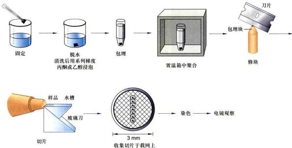  
图2-15 电镜超薄切片样本制备示意图  
电镜超薄切片样本的制备包括固定、脱水、包埋、切片和染色等基本步骤。

表 2-2 几种固定剂对细胞不同成分的固定效果的比较

<table><tr><td>固定剂</td><td>核酸</td><td>蛋白质</td><td>磷脂</td><td>多糖</td><td>不饱和脂肪酸</td></tr><tr><td>银酸</td><td>+</td><td>++</td><td>+++</td><td>+</td><td>+++</td></tr><tr><td>戊二醛</td><td>+</td><td>++</td><td>+</td><td>+</td><td>+</td></tr><tr><td>高锰酸钾</td><td>+</td><td>+++</td><td>+++</td><td>+</td><td>+++</td></tr></table>

“+”表示固定剂对不同细胞成分的相对固定效果。

(2) 包埋 包埋的目的是保证在切片过程中，包埋介质能均匀良好地支撑样品，以便获得连续、完整并有足够强度的超薄切片。包埋介质要求具有良好的机械性能（如刚度和韧性等）以利于切片；在聚合过程中，不发生明显的膨胀与收缩；观察样品时，易被电子穿透并能耐受的电子轰击；在高倍放大的图像中不显示本身结构等特征。目前常用的包埋剂是各种环氧树脂。生物样品固定后含有大量水分，而包埋剂多具疏水性质。因此固定的样品在包埋前通常要经过一系列的脱水处理。

（3）切片 超薄切片的制备过程如图2-15所示。切片厚度通常是40\~50 nm。切片厚度可通过样品杆的金属热膨胀或机械伸缩来控制。切片刀以玻璃或钻石为材料，最常使用的是玻璃刀。切片须捞在覆有支持膜（如Formvar膜）的载网（铜网或镍网，一般直径3 nm）上，用于染色和电镜观察。

(4) 染色 电镜样品用重金属盐进行染色。样品

中的不同成分对各种重金属盐“染料”有不同的亲和性，如锇酸宜染脂质，柠檬酸铅易染蛋白质，乙酸双氧铀用以染核酸等。当电子束穿过样品时，样品中的金属离子不同程度地散射和吸收电子，在样品的图像上形成明暗差别。因此，电镜下观察到图像只能为黑白图像。

应用超薄切片技术，几乎可以观察各种细胞的超微结构。图2-16即是动物细胞的超薄切片电镜图片。此外，超薄切片技术还可以与细胞化学、免疫化学和原位杂交等技术结合，在超微结构水平上完成蛋白质与核酸等组分的定性、定位和半定量研究。

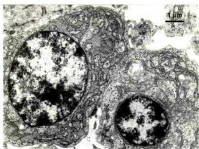  
图2-16 超薄切片技术显示的动物细胞超微结构（洪健惠赠）

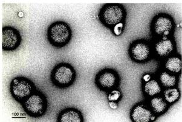  
图2-17 流感病毒负染色电镜照片（梁静楠惠赠）

## 2. 负染色技术

经纯化的细胞组分或结构，如线粒体基粒、核糖体、蛋白颗粒及细胞骨架纤维甚至病毒等可以通过电镜负染色技术（negative staining）显示其精细结构，分辨率可达1.5 nm左右。负染色是用重金属盐，如磷钨酸或醋酸双氧铀溶液对铺展在载网上的样品进行染色。吸去多余染料，样品自然干燥后，整个载网上都铺上了一薄层重金属盐，从而衬托出样品的精细结构（图2-17）。

## 3. 冷冻蚀刻技术

冷冻蚀刻技术 (freeze etching) 的样品制备过程包括冰冻断裂与蚀刻复型两步，因此又称冷冻断裂－蚀刻复型技术。用快速低温冷冻法，在液氮或液氨中将样品迅速冷冻，然后在低温下进行断裂。这时冷冻样品往往从其结构相对“脆弱”的部位（即膜脂双分子层的疏水端）裂开，从而显示出镶嵌在膜脂中的蛋白质颗粒。经过一段时间冰的升华（又称蚀刻），进一步增强图像“浮雕”样的效果。再用铂等重金属进行倾斜喷镀，以形成对应于凹凸断裂面的电子反差。接着，用碳进行垂直喷镀，在断裂面上形成一层连续的碳膜。最后用消化液把生物样品消化掉，将复型膜（碳膜及其被碳膜包裹的，含有图像信息的金属微粒膜）移到载网上，并在电镜下进行观察（图2-18A）。

冷冻蚀刻技术主要用来观察膜断裂面上的蛋白质颗粒和膜表面形貌特征，图像富有立体感，样品不需包埋甚至也不需要固定，因而能更好地保持样品的真实结构（图2-18B）。在此基础上又发展了快速冷冻深度蚀刻技术（quick freeze deep etching），该技术主要用于观察胞质中的细胞骨架纤维及其结合蛋白，从而拓宽了这一技

术的应用范围。

## 4. 电镜三维重构与低温电镜技术

因为透射电镜利用穿透样品的电子成像，这部分的电子已经携带了样品的内部结构信息，因此我们得到的二维电镜图像中，实际上包含了样品三维结构的全部信息。从二维电镜图像出发，构建出样品的三维图像，称电镜图像的三维重构。从20世纪60年代开始，英国学者A.Klug率先把晶体学的图像数据处理方法用于电镜样品的研究中，成功地获得了负染色样品中T噬菌体的三维结构图像，开创了蛋白质三维结构研究的新方向，因此获得1982年诺贝尔化学奖。

由于染色方法的局限性及负染色后干燥过程对样品本身结构细节的损伤，负染色技术制备的生物样品的分辨率只能达到1.5\~2 nm。经过几十年的不懈努力，人们建立了和发展了低温电镜技术（cryo-electron microscopy），这一技术在细胞内各种生物大分子及其复合物的三维结构分析中，发挥了其他技术不可替代的重要作用，例如膜蛋白（见图3-15“γ-分泌酶复合物三维结构”）、核糖体、30 nm染色质（见图9-12“染色质纤维的三维结构”）以及病毒颗粒等。顾名思义，低温电镜技术制备的生物样品，一般不经过固定、包埋、染色和干燥等步骤，而是将样品直接在冷冻剂中快速冷冻，形成100\~300 nm厚的冰膜，在电镜内-160℃低温下利用相位衬度成像。获得的大量图像还要经过一系列数据处理后，构建出样品的三维结构密度图。

目前主要应用低温电镜单颗粒分析技术（single particle analysis）来研究生物大分子的三维结构，即对包被在冰膜中相同的、分散的、取向随机性的大量颗粒性样品进行拍照和三维重构处理。这是目前最主要的也是发展最快的电镜三维重构方法，其三维结构图像已接近原子尺度的分辨率，为解析生命活动运转中的各种“纳米机器”的结构与作用机理，提供了重要的实验手段。在发展低温电镜技术中贡献巨大的三位科学家J.Dubochet、J.Frank、R.Henderson也因此获得2017年诺贝尔化学奖。

电子断层成像技术（electron tomography）也是利用电镜图像进行三维重构的另一项重要技术。它是对样品中同一物体，在不同的倾角下连续拍照，获得一系列二维投影图片，再重构其三维结构。电子断层成像技术也可用于研究蛋白质复合体的三维结构，但其分辨率明显低于低温电镜单颗粒分析技术。然而这一技术还可用于更大尺度的细胞器、细胞骨架、膜泡运输系统等的三维结构研究，因此在细胞生物学研究中也得到日益广泛的应用。电子断层成像技术可用于冷冻的样品，更多的是用于超薄切片样品（图2-19）。

  
图2-18 冷冻蚀刻技术示意图  
A. 样品制备流程图。B. 牛肾原代细胞的冷冻蚀刻电镜图片，显示双层核膜（箭头所示）、核孔复合体结构（三角所示）以及线粒体（Mi）和细胞质中的囊泡等结构。（B 图由王梅和丁明孝提供）

利用扫描电镜背散射电子成像（back scattered electron imaging）技术可以研究细胞、组织等更大尺度的超微结构的三维结构，这在揭示神经元之间的相互关系的脑科学研究中，是一项不可或缺的重要技术。经典的扫描电镜是利用细胞表面的二次电子成像，以观察细胞表面的形貌（见下述“扫描电镜技术”）。而扫描电镜背散射电子图像携带了原子序数的信息，因此，对所观察的组织块染色后，可以显示出如同超薄切片样品的细胞内部结构（图2-20）。在扫描电镜中，做类似超薄切片的处理，同时利用其背散射电子成像，就可以得到一幅幅样品内部的超微结构图像，进而构建成整个组织的三维结构图象。

## 5. 扫描电镜技术

扫描电镜（scanning electron microscope, SEM）问世于20世纪60年代。其电子枪发射出的电子束被磁透镜会聚成极细的电子“探针”，在样品表面进行“扫描”，激发样品表面放出二次电子、背散射电子等。二次电子由探测器收集并被闪烁器转变成光信号，其产生的多少与样品表面的形貌相关。这样，通过扫描电镜可以得到样品表面的立体图像信息（图2-21）。

为了保证样品在扫描观察前不发生表面变形，通常需要利用 $CO_{2}$ 临界点干燥法对样品进行干燥处理。此外，为了得到正确的二次电子信号，样品表面需有良好的导电性。所以样品在观察前还要喷镀一层金膜。

扫描电镜景深长，成像具有强烈的立体感，一般扫描电镜的分辨本领仅为3 nm。近些年研制的低压高分辨扫描电镜分辨本领可达0.7 nm，可用于观察核孔复合

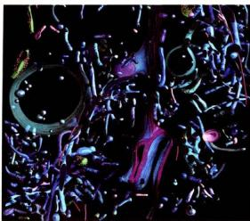

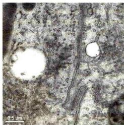  
图2-19 电子断层成像技术显示的细胞内膜及膜泡运输系统的三维图像（A）及同一区域的二维超薄切片图像（B）（何万忠博士惠赠）

  
图2-20 利用扫描电镜背散射电子成像获得的细胞断面超微结构图像

细胞中的细胞核、线粒体、高尔基体等细胞器清晰可见，其分辨率接近透射电镜超薄切片图像。（刘轶群博士惠赠）

  
图2-21 扫描电镜原理示意图（A）及扫描电镜下清晰显示的原生动物四膜虫表面的纤毛和口器（B）（B图由韩飞和丁明孝提供）

体等更精细的结构。

尽管电子显微镜具有分辨率高这一光学显微镜无可比拟的优越性，但直至目前人们还不能用它来观察活的生物样品，而且难以观察细胞的全貌，因此在很多研究中仍需要光镜与电镜技术相结合，这就是为什么各种光-电关联技术（correlative light microscopy and electron microscopy）得到越来越广泛的关注和应用。

## 三、扫描隧道显微镜

扫描隧道显微镜（scanning tunnel microscope, STM）是 IBM 苏黎世实验室的 G. Binnig 和 H. Rohrer 等人于 1981 年发明的，它是一种探测微观世界物质表面形貌的仪器。此项发明获得 1986 年的诺贝尔物理学奖。

STM 的主要原理是利用量子力学中的隧道效应。通常在低电压下，二电极之间具有很大的阻抗，阻止电流通过，称之为势垒；当二电极之间近到一定距离（50 nm 以内）时，电极之间产生了电流，称隧道电流；这种现象称隧道效应。并且隧道电流 (l) 和针尖与样品之间的间距 (d) 呈指数关系 [一维近似 $l \propto \exp(-2Kd)$ ，K 为常数]，这样 d 可转化为 l 的函数而被测定，针尖的位置就可以确定，由此样品的表面形貌也可确定。

STM 的主要装置包括实现 x、y、z 三个方向扫描的压电陶瓷，逼近装置，电子学反馈控制系统和数据采集、处理、显示系统。

STM 的主要特点有：① 具有原子尺度的高分辨本领，侧分辨率为 0.1～0.2 nm，纵分辨率可达 0.001 nm；

② 可以在真空、大气、液体（接近于生理环境的离子强度）等多种条件下工作，这一点在生物学领域的研究中尤其重要；③ 非破坏性测量，因为扫描时不接触样品，又没有高能电子束轰击，基本上可避免样品的形变。

目前，STM作为一种新技术，已被广泛应用于生命科学各研究领域。人们已用STM直接观察到DNA、RNA和蛋白质等生物大分子及生物膜、病毒等的结构。与其功能类似的还有原子力显微镜（atomic force microscope, AFM）。原子力显微镜，顾名思义，是利用微小的探针来操纵和测量样品的形貌和力学性质。这个微小的探针在一个悬梁臂弹簧的末端，在与样品直接作用时，悬梁臂的微小位移通过“光杠杆”效应得以放大上千倍投射到光电探测器上，并通过一个反馈通路来控制探针和样品之间的相互作用。原子力显微镜不仅可以精确地测量出样品的形貌，而且还可以测量样品的微观力学性质。其作用力范围在10 pN（皮牛）到几十nN（纳牛）之间，恰恰适合于细胞信号分子与配体结合以及蛋白质分子的折叠和展开等研究。

可以预料，STM 和 AFM 等将在纳米生物学乃至纳米科学各领域研究中将发挥越来越重要的作用。

## 第二节 细胞及其组分的分析方法

形态学观察与细胞组分分析相结合是当代细胞生物学研究中常常采用的实验方法。它为揭示生物大分子在细胞内的空间定位、相互关系及其功能的研究提供了有力的工具。

## 一、用超离心技术分离细胞组分

用低渗匀浆、超声破碎或研磨等方法可使细胞质膜破损，形成细胞核、线粒体、叶绿体、内质网、高尔基体、溶酶体等细胞器和细胞组分组成的混合匀浆，再通过差速离心，即利用不同的离心速度所产生的不同离心力，将各种质量和密度不同的亚细胞组分和各种颗粒分开（图2-22）。

密度梯度离心是将要分离的细胞组分小心地铺放在含有密度逐渐增加的、高溶解性的惰性物质（如蔗糖）形成的密度梯度溶液表面，通过重力或离心力的作用使样品中不同组分以不同的沉降率沉降，形成不同的沉降带。各组分的沉降率与它们的形状和大小有关，通常以沉降系数（S值）表示。超速离心机可达转数 $10^{5}/min$ ，产生60万倍重力场。在这巨大离心力的作用下，甚至相当小的tRNA（沉降系数4S）和单一的酶都可根据其沉降系数相互分离开。密度梯度离心又可分为速度沉降和等密度沉降两种。常用的介质有蔗糖和氯化铯等。

速度沉降主要是用于分离密度相近而大小不一的细胞组分。离心前，将要分离的细胞匀浆物放置在蔗糖浓度梯度（通常质量分数范围为5%—40%）溶液的上层，各种细胞组分根据它们的大小以不同的速度沉降，形成不同的沉降带（图2-23），然后分别收集不同的沉降带中的组分，用于分析。

等密度沉降用于分离不同密度的细胞组分。细胞组分在连续梯度的高密度介质中经离心力场长时间的作用沉降或漂浮到与自身密度相等的位置，形成不同的密度区带。这种方法非常灵敏，甚至可以将掺入重同位素如 ${}^{14}C$ 或 ${}^{15}N$ 的生物大分子和未标记物分开。1957 年，M. Meselson 和 F. Stahl 利用 ${}^{15}N$ 标记大肠杆菌 DNA，并用氯化铯等密度沉降法直接证明了 DNA 的半保留复制。

  
图 2-22 用差速离心法分离细胞匀浆中的各种细胞组分  
图中显示，随着离心力（g）大小和离心时间的不同，各种细胞组分沉淀在不同的离心管底部。

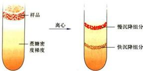  
图 2-23 用密度梯度离心分离细胞组分示意图

## 二、特异蛋白抗原的定位与定性

20世纪70年代以来，免疫学的迅速发展为细胞生物学的研究提供了强有力的手段，特别是在细胞内特异蛋白的定位与定性方面，单克隆抗体与其他一些检测手段相结合发挥了重要作用。免疫荧光与免疫电镜是最常见的研究细胞内蛋白质分子定位的定位，而对蛋白质组分进行体外分析定性通常则采用免疫迹（Western blotting）。放射免疫沉淀（radioimmuno-precipitation）和蛋白质芯片、质谱分析等技术，这里不再一一介绍。

## （一）免疫荧光技术

前面已经介绍了荧光显微镜技术，其中也提到免疫荧光技术。所谓免疫荧光技术就是将免疫学方法（抗原－抗体特异结合）与荧光标记技术相结合用于研究特异蛋白抗原在细胞内分布的方法，它包括直接和间接免疫荧光技术两种（图2-24）。实验步骤主要包括荧光抗体的制备、标本的处理、免疫染色和观察记录等过程。

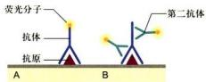  
图2-24 直接免疫荧光标记与间接免疫荧光标记技术

A. 直接免疫荧光标记技术：将荧光分子与抗体偶联后直接用于免疫标记技术。B. 间接免疫标记技术：先将抗体（称第一抗体）与抗原反应，然后加入与荧光分子相偶联的抗第一抗体的抗体（称第二抗体）。

标本处理有多种方法，组织切片、冷冻切片、整装细胞都可应用，其宗旨只有一个，即要尽量完好地保持被检测蛋白质的抗原性；免疫染色就是抗原-抗体反应的过程，这里要注意设立各种实验对照以保证结果的可靠性。除免疫荧光技术外，还可用免疫酶标记技术，即以酶（如辣根过氧化物酶）代替荧光素与抗体偶联，因此可在普通显微镜下观察。近年来，激光扫描共焦显微镜的应用使免疫荧光技术在细胞生物学研究中发挥了越来越大的作用。

## （二）免疫电镜技术

免疫荧光技术快速、灵敏、特异性强，但其分辨率有限。免疫电镜技术则能有效地提高样品的分辨率，在超微结构水平上研究特异蛋白抗原的定位。

免疫电镜技术可分为免疫铁蛋白技术、免疫酶标技术与免疫胶体金技术，其主要区别是与抗体结合的标志物不同，这在一定程度上也反映了免疫电镜技术的发展过程。目前，免疫铁蛋白技术几乎已无人问津，而免疫胶体金技术则受到越来越多的青睐。胶体金本身具有许多优点，如：在电镜下金颗粒容易识别，并可以制成5 nm、10 nm或20 nm等不同直径的金颗粒，用以双重标记或多重标记。

免疫电镜技术的样品制备程序与免疫荧光技术类似（图2-25），包括样品的固定、包埋、超薄切片制备、免疫标记和染色等步骤。其技术关键是在样品制备过程

  
图2-25 免疫胶体金电镜技术的基本原理与应用

A. 免疫胶体金标记技术原理的示意图：细菌蛋白 A 可与胶体金结合，也可以与抗体（如 IgG）的 Fc 端特异结合。B. 免疫胶体金标记显示膀胱上皮细胞中特异的膜蛋白的分布（箭头所指）。(B 图由梁凤霞博士和丁明孝提供)

中既要保持样品中蛋白的抗原性，又要尽量保存样品的精细结构。免疫电镜技术至今已得到广泛应用。

## 三、细胞内特异核酸的定位与定性

细胞内特异核酸（DNA或RNA）的定性与定位的研究，通常采用原位杂交（in situ hybridization）技术。用标记的核酸探针通过分子杂交确定特异核苷酸序列在染色体上或在细胞中的位置的方法称为原位杂交。

原位杂交技术首先是在光镜水平上发展起来的，放射性同位素标记的探针与样品中的DNA或RNA杂交后，用显微放射自显影的方法显示杂交物的存在部位；或用荧光素标记的探针进行杂交，在荧光显微镜下直接显示细胞中与探针杂交的特异核酸。近年来，以生物素等生物小分子代替同位素或荧光素标记探针，使原位杂交技术得到了更为广泛的应用发展。电镜原位杂交技术可将特异序列核苷酸的定位与细胞的超微结构结合起来，其基本原理与光镜原位杂交类似，只是探针标记物不同，杂交反应的检测常常是通过与抗生物素抗体相连的胶体金颗粒显示出来的。

原位杂交技术在显微与亚显微水平上研究基因定位、特异mRNA表达等问题的研究中具有重要作用（图2-26）。

## 四、细胞成分的分析与细胞分选技术

流式细胞术（flow cytometry）可定量地测定某一细胞中的 DNA、RNA 或某一特异的标记蛋白的含量，以及细胞群体中上述成分含量不同的细胞的数量，它还可将某一特异染色的细胞从数以万计的细胞群体中分离出来，以及将 DNA 含量不同的中期染色体分离出来，甚至可用于细胞的分选。

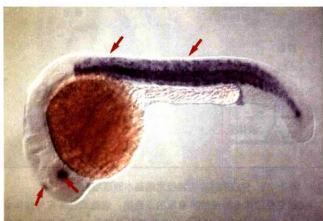  
图2-26 用原位杂交技术显示Z13基因在受精后1天的斑马鱼胚胎的体节、眼和松果体中的表达（箭头所指）。（张博博士惠赠）

细胞群体一般需要分散后对待测的某种成分进行特异的荧光染色，然后使悬液中的细胞一个个快速通过流式细胞仪（每秒可达几万个细胞）。当含有单个细胞的液滴通过激光束时，带有不同荧光的细胞所在的液滴被充上正电荷、负电荷，或不被充电，同时检测器可测出并记录每个细胞中的待测成分的含量。因带有不同表面标志的细胞所带的电荷的种类不同，当液滴通过高压偏转板时，带不同电荷的液滴发生偏转，从而达到将细胞分选的目的（图2-27）。如果染色过程不影响细胞活性，那么分离出来的细胞还可以继续培养。

## 第三节 细胞培养与细胞工程

## 一、细胞培养

细胞培养是当前细胞生物学乃至整个生命科学研究与生物工程中最基本的实验技术。干细胞生物学的发展及其应用在很大程度上基于细胞培养技术的发展。细胞培养包括原核生物细胞（如大肠杆菌）、真核单细胞（如酵母菌、四膜虫）、植物细胞与动物细胞的培养以及与此密切相关的病毒的培养。本节扼要介绍动植物细胞培养技术以及与细胞培养直接相关的一些技术。

## （一）动物细胞培养

体外培养的动物细胞可分为原代细胞（primary culture cell）与传代细胞（subculture cell）。原代细胞是指从机体取出后立即培养的细胞，进行传代培养后的细胞即称为传代细胞。也有人把传至10代以内的细胞统称为原代细胞培养。适应在体外培养条件下持续传代培养的细胞称为传代细胞。

任何动物细胞的培养均需从原代细胞培养做起。动物很多组织的细胞，如幼年动物的肾、肺、卵巢、精巢、肌肉及肿瘤等组织的细胞较易培养，而神经细胞等则较难培养。原代细胞培养步骤如下：首先取出健康动物的组织块，剪碎，用浓度与活性适中的胰酶或胶原酶与EDTA（螯合剂）等将细胞连接处消化使其分散，给予良好的营养液与无菌的培养环境（接近体温与体内pH），在培养中进行静置或慢速转动培养。但不论用何种培养液一般都要加一定量的小牛（或胎牛）血清，这样细胞才能很好地贴壁生长与分裂（图2-28A）。

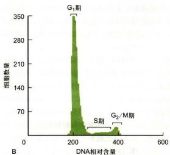  
图2-27 流式细胞仪的工作原理  
A. 流式细胞仪分选原理示意图。B. 显示流式细胞仪分析处在不同时相的 HeLa 细胞的实验结果。(B 图由杜立颖惠赠)

分散的细胞悬液在培养瓶中很快（在几十分钟至数小时内）就贴附在瓶壁上，称为细胞贴壁。分散呈圆球形的细胞一经贴壁就迅速铺展并开始有丝分裂，逐渐形成致密的细胞单层，称为单层细胞（single layer cell），这种培养方法称为单层细胞培养。

原代培养的细胞一般传至10代左右就不易传下去了，细胞生长出现停滞，大部分细胞衰老死亡，但有极少数细胞可能渡过“危机”而传下去。这些存活的细胞一般又可顺利地传40\~50代次，并且仍保持原来染色体的二倍体数量及接触抑制的行为，很多学者把这种传代细胞称作细胞系（cell line）。一般情况下（胚胎干细胞等除外），当细胞传至50代以后又要出现“危机”，难以再传下去。这种传代次数有限的体外培养细胞通常称为有限细胞系（finite cell line）。但在传代过程中如有部分细胞发生了遗传突变，并使其带有癌细胞的特点，有可能在培养条件下无限制地传代培养下去，这种传代细胞称为永生细胞系（infinite cell line），或连续细胞系（continuous cell line）。该细胞系细胞的根本特点是染色体明显改变，一般呈亚二倍体或非整倍体，失去接触抑制，容易传代培养。HeLa细胞系（来自宫颈瘤细胞）、BHK21（baby hamster kidney）细胞系与CHO（Chinese hamster ovany）细胞系等都是常用的连续细胞系（图2-28B、C）。依靠这些细胞系做了大量卓有成效的研究工作。

用单细胞克隆培养或通过药物筛选的方法从某一细胞系中分离出单个细胞，并由此增殖形成的、具有基本相同的遗传性状的细胞群体称为细胞克隆。该细胞群体经过生物学鉴定，如具有特殊的遗传标记或性质，这样的细胞系可以称为细胞株（cell strain）。

体外培养的细胞，不论是原代细胞还是传代细胞，一般不能保持体内原有的细胞形态。但大体可以分为两种基本形态：成纤维样细胞（fibroblast like cell）与上皮样细胞（epithelial like cell）。此外还有一些可移动的游走细胞。

某些传代细胞还可用悬浮方法培养。其培养条件比较复杂，悬浮培养的最大优点是在有限的培养液中获得大量细胞。

## （二）植物细胞培养

目前植物细胞培养主要有两种类型：

（1）细胞培养 常用单倍体细胞培养，这种培养方法主要用花药在人工培养基上进行培养。可以从小孢子（雄性生殖细胞）直接发育成胚状体，然后长成单倍体植株。单倍体细胞培养在植物育种中已取得了很大成就。

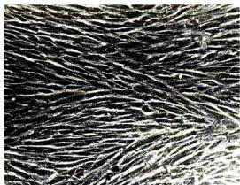

  
图2-28 体外培养的细胞  
A. 长满单层的牛肾原代细胞。B. 正在生长分裂的 HeLa 细胞。C. 长满单层的 CHO 原代细胞。（任显辉博士和邱殷庆博士惠赠）

(2) 原生质体培养 一般用植物的体细胞（二倍体细胞），先经纤维素酶处理去掉细胞壁，去壁的细胞称为原生质体（protoplast）。原生质体在无菌培养基中可以生长与分裂，经过诱导分化最终可长成植株。也可以用不同植物的原生质体进行融合与体细胞杂交，由此而获得体细胞杂交的植株。转基因植物细胞的培养与分化的研究是植物基因工程的基础。

目前在植物无性繁殖中常采用植物组织培养，即分离出小块的植物体，又称外殖体（explant），在体外无菌条件下进行培养，形成愈伤组织（callus），即植物创面的新生组织。在一定条件下，诱导分化最终长成植株。

## 二、细胞工程

细胞工程是生物工程的重要领域之一。细胞工程所涉及的主要技术包括细胞培养、细胞分化的定向诱导、细胞融合和显微注射等。通过细胞融合技术发展起来的单克隆抗体技术已取得了重大成就。细胞工程与基因工程结合，前景尤为广阔。

## （一）细胞融合与单克隆抗体技术

两个或多个细胞融合成一个双核或多核细胞的现象称为细胞融合（cell fusion）。介导动物细胞融合常用的促融剂有灭活的病毒（如仙台病毒）或化学物质（如聚乙二醇，PEG）；植物细胞融合时，要先用纤维素酶去掉细胞壁，然后才便于原生质体融合。20世纪80年代又发明了电融合技术（electrofusion method）。将悬浮细胞在低压交流电场中聚集成串珠状细胞群，或对相互接触的单层培养细胞，再施加高压电脉冲处理使其融合。

1975年，英国科学家C. Milstein和G.J.F.Köhler将产生抗体的淋巴细胞同肿瘤细胞融合，成功地建立了B.淋巴细胞杂交瘤技术（B-lymphocyte hybridoma technique）用于制备单克隆抗体（monoclonal antibody），他们因此而获得1984年的诺贝尔生理学或医学奖。动物受到外界抗原刺激后可激发B.淋巴细胞活化，产生相应的抗体，但B.淋巴细胞在体外难以增殖，而一些骨髓瘤细胞[TK（胸苷激酶）或HGPRT（次黄嘌呤鸟嘌呤磷酸核糖）缺陷型]不分泌抗体，但在体外培养条件下可以无限传代。为了大量制备纯一的单克隆抗体，Milstein和Köhler把小鼠骨髓瘤细胞与经绵羊红细胞免疫过的小鼠脾细胞（B淋巴细胞）在聚乙二醇或灭活的病毒的介导下发生融合。融合后的杂交瘤细胞具有两种亲本细胞的特性，一方面可分泌抗绵羊红细胞的抗体，另一方面像肿瘤细胞一样，可在体外培养条件下或移植到体内无限增殖。由于骨髓瘤细胞缺乏TK或HGPRT，在含氨基蝶呤的培养液内不能成活。只有融合细胞才能在含HAT（次黄嘌呤、氨基蝶呤和胸腺嘧啶核苷）的培养液内通过旁路合成核酸而得以生存。通过HAT选择培养和细胞克隆，可以获得能大量分泌单克隆抗体的杂交瘤细胞株。单克隆抗体的制备过程如图2-29所示。

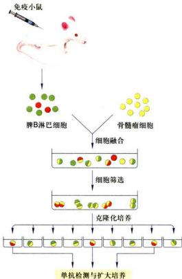  
图2-29 单克隆抗体制备过程示意图

单克隆抗体技术最主要的优点是可以用混合性的异质抗原制备出针对某单一性抗原分子上特异决定簇的同质性单克隆抗体。单克隆抗体技术与基因克隆技术相结合为分离和鉴定新的蛋白质和基因开辟了一条广阔途径。而且在临床诊断与肿瘤等疾病的治疗中也具有重要作用。

## （二）显微操作技术与动物的克隆

真核细胞是由细胞核和细胞质两大部分组成的，为了探明核质相互作用的机制，科学家们创建了细胞拆合技术。所谓细胞拆合，就是把细胞核与细胞质分离开来，然后把不同来源的胞质体（cytoplast）和核质体（karyoplast）相互组合，形成核质杂交细胞。

细胞拆合可以分为物理法和化学法两种类型。物理法就是用机械方法或短波光把细胞核去掉或使之失活，然后用微吸管吸取其他细胞的核，注入去核的细胞质中，组成新的杂交细胞。这种核移植必须用显微操纵仪进行操作。化学法是用细胞松弛素B（cytochalasin B）处理细胞，细胞出现排核现象，再结合离心技术，将细胞拆分为核质体和胞质体两部分。显微操作（micromanipulation）技术是早期建立的一种实验胚胎学技术，即在显微镜下，用显微操作装置对细胞进行解剖和微量注射（microinjection）的技术。现在显微操作装置的设计愈来愈精密，不仅用于核移植，而且亦可对细胞核进行解剖和向核内注入基因（图2-30）。

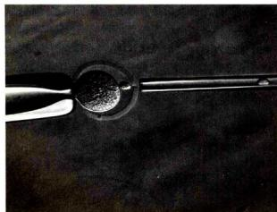  
图2-30 应用显微注射技术进行细胞核移植（邓宏魁博士提供）

细胞拆合、显微注射与现代分子生物学技术相结合使这些经典的胚胎学技术展现出极大的潜力，它不仅成为核质关系、细胞内某种 mRNA 或蛋白质功能等基础研究的重要手段，而且在转基因动物、高等动物的克隆方面的理论与实践研究中取得了重大的突破。

## 第四节 细胞及生物大分子的动态变化

## 一、荧光漂白恢复技术

荧光漂白恢复（fluorescence photobleaching recovery, FPR）技术是使用亲脂性或亲水性的荧光分子，如荧光素、绿色荧光蛋白等与蛋白或脂质偶联，用于检测所标记分子在活体细胞表面或细胞内部的运动及其迁移速率。FPR技术的原理是：利用高能激光束照射细胞的某一特定区域，使该区域内标记的荧光分子发生不可逆的淬灭，这一区域称光漂白（photobleaching）区。随后，由于细胞中脂质分子或蛋白质分子的运动，周围非漂白区的荧光分子不断向光漂白区迁移。结果使光漂白区的荧光强度逐渐地恢复到原有水平。这一过程称荧光恢复(fluorescence recovery)。荧光恢复的速度在很大的程度上反映荧光标记的脂质或蛋白质在细胞中运动速率（图2-31）。FPR技术不仅能给出活细胞内脂质或蛋白质运动的定性的结果，而且还可以获得某些定量的信息。如膜脂分子的扩散系数和蛋白质的迁移率等，从而有助于解决细胞内脂质和蛋白质分子的动态变化以及与其他成分相互作用等一系列问题。

  
图2-31 荧光漂白恢复技术原理示意图

## 二、酵母双杂交技术

酵母双杂交系统（yeast two-hybrid system）是一种利用单细胞真核生物酵母在体内分析蛋白质－蛋白质相互作用的系统。该技术由Fields等人于1989年首次建立，目前已得到广泛的应用。酵母双杂交系统的建立得益于对真核生物调控转录起始过程的认识和DNA重组质粒的构建技术。细胞基因转录起始需要转录激活因子的参与，转录激活因子一般由两个或两个以上相互独立的结构域构成，即DNA结合域（DNA binding domain, DB）和转录激活域（activation domain, AD）。前者可识别DNA上的特异转录调控序列并与之结合；后者可与其他成分作用形成转录复合体的，从而启动它所调节的基因的转录。酵母双杂交系统正是利用这个原理来研究蛋白质-蛋白质的相互作用。如果要证明蛋白A是否与蛋白B在细胞内相互作用，或寻找与蛋白A可能发生作用的蛋白，则可分别制备DB与蛋白A的融合蛋白（又称“诱饵”，bait)，以及AD与蛋白B或可能与蛋白A发生作用蛋白的融合蛋白（又称“猎物”，prey）。如果蛋白A与蛋白B或其他蛋白在细胞内相互结合，则可形成与转录激活因子类似的具有的DB和AD结构域的复合物，从而启动报告基因的表达。反之，则报告基因不表达。这样就可以分析蛋白质-蛋白质之间的相互作用（图2-32）。

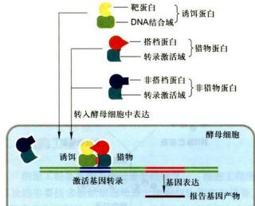  
图2-32 用于检测蛋白质－蛋白质互作的酵母双杂交技术原理示意图

酵母双杂交系统是一种具有高灵敏度的，在活细胞内研究蛋白质相互作用的实验技术。该技术既可以用来研究哺乳动物，也可以用来研究高等植物蛋白质之间的相互作用。因此，它在许多的研究领域诸如细胞信号转导网络中各种蛋白质的相互关系等方面有着广泛的应用。值得提出的是，由于“猎物”蛋白可能与“诱饵”蛋白存在非特异性结合等原因，所以该实验系统有可能存在假阳性的问题。目前，酵母双杂交技术还在不断完善，并由此衍生出一些相关的新技术。

## 三、荧光共振能量转移技术

荧光共振能量转移（fluorescence resonance energy transfer, FRET）技术是用来检测活细胞内两种蛋白质分子是否直接相互作用的重要手段。其基本原理是：在一定波长的激发光照射下，只有携带发光基团A的供体分子可被激发出荧光A，而同一激发光不能激发携带发光基团B的受体分子发出荧光B。然而，当供体所发出的荧光光谱A与受体上的发光基团的吸收光谱B相互重叠，并且两个发光基团之间的距离小到一定程度时，就会发生不同程度的能量转移现象，即以供体的激发波长A激发时，可观察到受体发射的荧光B，这种现象称为FRET（图2-33）。在体内，如果两个蛋白质分子的距离在10 nm之内，就可能发生FRET现象，由此认为这两个蛋白质存在着直接的相互作用。

FRET技术用于检测体内两种蛋白质之间是否存在直接的相互作用。例如，选择青色荧光蛋白（CFP）和黄色荧光蛋白（YFP）的基因分别与目的蛋白（或称供体蛋白和受体蛋白）的基因融合表达。如果这两个融合蛋白之间的距离大于10 nm时，在一定波长的激发光照射下，只有供体蛋白中的CFP被激发，放出蓝色荧光。如果这两个融合蛋白之间的距离在5\~10 nm的范围内时，供体蛋白中CFP发出的荧光可以被受体蛋白中的YFP所吸收，并激发YFP发出黄色荧光。此时可

  
图2-33 荧光共振能量转移原理图

A. 携带 CFP 的供体蛋白与携带 YFP 的受体蛋白分子之间的距离大于 10 nm 时，在一定波长的激发光（430 nm）的照射下，只有供体蛋白中的 CFP 被激发，放出波长为 490 nm 的青色荧光，而受体中的 YFP 不会被激发出黄色荧光。B. 如果这两个蛋白质之间的距离在 1\~10 nm 的范围内，将发生荧光共振能量转移（FRET），只有 YFP 发出波长为 530 nm 的黄色荧光。

以通过测量 CFP 的荧光强度的损失量来判断这两个蛋白是否存在相互作用。两个蛋白距离越近，CFP 所发出的荧光被 YFP 接收的量就越多，检测器所接收到的蓝色荧光就越弱，而黄色荧光就越强。反之就不会出现 FRET 现象。荧光共振能量转移的效率在很大程度上反映了细胞内两种蛋白相互作用的可能性与作用的强弱。

## 四、放射自显影技术

放射自显影技术 (autoradiography) 是利用放射性同位素的电离射线对乳胶（含 AgBr 或 AgCl）的感光作用，对细胞内生物大分子进行定性、定位与半定量研究的一种细胞化学技术。对细胞或生物体内生物大分子进行动态研究和追踪（pulse-chase）是这一技术独具的特征。放射自显影技术包括两个主要步骤，即同位素标记的生物大分子前体的掺入和细胞内同位素所在位置的显示。常用于生物学研究的同位素及其性质如表 2-3 所示，根据实验要求可选择合适的同位素。

研究 DNA 合成时通常用氚 $\left(^{3}\mathrm{H}\right)$ 标记的胸腺嘧啶脱氧核苷 $\left(^{3}\mathrm{H}-\mathrm{TdR}\right)$ ，研究 RNA 合成用氚标记的尿嘧啶核苷 $\left(^{3}\mathrm{H}-\mathrm{U}\right)$ ；在研究含硫蛋白分子代谢时，可用 ${}^{35}S$ 标记的蛋氨酸和半胱氨酸， ${}^{3}H$ 或 ${}^{14}C$ 标记的蛋氨酸、亮氨酸等也是常用于蛋白质合成的前体化合物。

显微放射自显影的基本实验步骤如下：首先用合适的放射性前体分子标记机体或细胞，根据实验的需要，按标记的持续时间分为持续标记和脉冲标记。标记后的组织与细胞可按常规方法制片，在暗室中向样品表面均匀地敷一层厚3\~10μm的乳胶膜，然后在暗盒中曝光（或称自显影）数天，再经显影、定影后于显微镜下观察。细胞中银颗粒所在的部位即代表放射性同位素的标记部位。

电镜放射自显影技术的基本原理与显微放射自显影相同，实验操作过程亦相似。与显微放射自显影不同之

表 2-3 常用放射性同位素的基本特点

<table><tr><td>同位素</td><td>放射性粒子</td><td>在乳胶内的射程</td><td>半衰期</td></tr><tr><td> $^{32}\mathrm{P}$ </td><td>硬β</td><td>数mm</td><td>14.2天</td></tr><tr><td> $^{14}\mathrm{C}$ </td><td>中等能量β</td><td>平均10μm</td><td>5760年</td></tr><tr><td> $^{2}\mathrm{H}$ </td><td>软β</td><td>0.8μm</td><td>12年</td></tr><tr><td> $^{35}\mathrm{S}$ </td><td>中等能量β</td><td>10μm~1mm</td><td>87天</td></tr></table>

  
图 2-34 电镜放射自显影图片

鸭瘟病毒感染鸡胚成纤维细胞 24 h 后，用 ${}^{3}$ H-尿嘧啶核苷脉冲标记 10 min 的电镜放射自显影图片，显示 RNA 在细胞内合成的部位。SG：银颗粒；N：细胞核；Nu：核仁。（丁明孝和翟中和提供）

点是，对样品制备与敷乳胶的要求更为严格，曝光时间一般长达数月（图 2-34）。

## 第五节 模式生物与功能基因组的研究

显微镜和电子显微镜技术的建立与发展极大地开拓了人们的视野，帮助科学家们发现了细胞内各种复杂的精细结构。然而对其成分的了解，特别是数以万种的基因及其表达产物的功能，以及它们在细胞代谢与细胞生长、分化、衰老、凋亡等生命活动的协同作用与调节机制，则更多地需要通过各种模式生物，借助于多种生物化学与分子生物学的技术手段进行研究。

理想的研究系统往往是实验成功的关键，现代细胞生物学乃至生命科学的研究进展，在很大程度上是依赖于选择合适的生物材料。如大肠杆菌与操纵子学说的建立及现代分子生物学的发展，豌豆和果蝇与遗传学定律的发现，酵母和海胆与对细胞周期调控机制的认识，线虫与对细胞凋亡机制的揭示，小鼠与对哺乳动物功能基因组学的研究等等。由于基因在进化上的保守性以及遗传密码的通用性，从一种实验生物得到的实验结果常常也适用于其他生物，至少具有有益的借鉴作用。细胞分子生物学研究中应用最广的几种代表性模式生物见知识窗2-18。

多种模式生物的功能基因组学、蛋白质组学以及生物信息学的研究，对细胞生物学等学科的发展，甚至是人类自身疾病的研究与防治，起到了巨大的推动作用。与之相关的实验技术，诸如基因测序、突变体的制备以及蛋白质分离鉴定技术等在生物化学和分子生物学教材中已有较为详尽的描述，在本书数字课程中也作了扼要地介绍（见知识窗2-2 $^{⑥}$ ），因此这里不再赘述。

近年来，随着实验技术的不断改进和新技术的大量涌现，极大地提高了后基因组时代科学研究的效率和科研水平。如“人类基因组计划”曾耗时10年，花费30亿美元。而今完成一个人的全基因组测序只需要几周时间，花费仅为几千美元。又如就功能基因组学中最重要的实验技术之一基因打靶技术而言，通过传统的方法获得突变株小鼠，通常需要1\~2年时间。而应用新建立的CRISPR（clustered regularly interspaced short palindromic repeat）技术（见知识窗2-3），只需要几周时间且极大地提高了成功率。本章前面提到的低温电镜技术近几年已发展成为解析膜蛋白等生物大分子以及核小体等细胞结构的利器。显然，层出不穷的具有的革命性的实验技术的建立，极大地促进了细胞生物学的发展。

最后，应当指出的是，当今生物学各学科之间的交叉性较强，在研究方法上更需多学科各种技术的巧妙结合。在运用某一技术进行细胞生物学研究时，对实验技术的精确掌握和进行必要的改进是非常重要的。由于研究对象和实验条件不同，可以说运用好任何一项实验技术都不仅仅是简单的重复。在原有实验技术的基础上如果能够有所改进或建立新的实验方法和研究模式，其本身就是一项具有创新性的研究工作。它不仅对于已选定的研究课题，而且对本学科的发展也可能产生重大的影响。

## 思考题

1. 试举 1\~2 例说明电子显微镜技术与细胞分子生物学技术的结合在现代细胞生物学研究中的应用。

2. 光学显微镜技术有哪些新发展？它们各有哪些突出优点？为什么电子显微镜不能完全代替光学显微镜？

3. 为什么说细胞培养是细胞生物学研究的最基本的实验技术之一？

4. 研究细胞内生物大分子之间的相互作用与动态变化涉及哪些实验技术？它们各有哪些优点和不足之处？

## - 参考文献

1. 丁明孝，梁凤霞，洪健，等. 生命科学中的电子显微镜技术. 北京：高等教育出版社，2020.

2. 吕志坚，陆敬泽，吴雅琼，等. 几种超分辨率荧光显微技术的原理和近期进展[J]. 生物化学与生物物理进展，2009，36(12): 1626-1634.

3. Ausubel F M. Current Protocols in Molecular Biology. New York: John Wiley and Sons Inc., 2001.

4. Hsu P D, Lander E S, Zhang F. Development and applications of CRISPR-Cas9 for genome engineering. Cell, 2014, 157(6): 1262-1278.

5. Spector D L, Goldman R D, Leinwand L A, et al. Cells: A Laboratory Manual. New York: Cold Spring Harbor Laboratory Press, 1998.
