# 第4章 物质的跨膜运输

<!-- 章节边界按正文内容恢复；原始 MinerU 内容保留如下。 -->

# 物质的跨膜运输

细胞质膜是细胞与细胞外环境之间一种选择性通透屏障，它既能保障细胞对基本营养物质的摄取、代谢产物或废物的排除，又能调节细胞内离子浓度，使细胞维持相对稳定的内环境。物质的跨膜运输对细胞的生存和生长至关重要。物质通过细胞质膜的转运主要有三种途径：被动运输（包括简单扩散和协助扩散）、主动运输以及胞吞与胞吐作用。

## 第一节 膜转运蛋白与小分子及离子的跨膜运输

## 一、膜转运蛋白

活细胞内外的离子浓度是高度不同的， $\mathrm{Na}^+$ 是细胞外最丰富的阳离子（cation），而 $\mathbf{K}^{+}$ 是细胞内最丰富的阳离子（表4-1）。细胞内外的离子浓度差异对于细胞的存活和功能至关重要。这种离子浓度差异分布主要由两种机制所调控：一是取决于一套特殊的膜转运蛋白(membrane transport protein）的活性；二是取决于质膜本身的脂双层所具有的疏水性特征。除了脂溶性分子和小的不带电荷的分子能以简单扩散的方式直接通过脂双层外，脂双层对绝大多数极性分子、离子以及细胞代谢

表 4-1 典型哺乳类动物细胞内外离子浓度的比较

<table><tr><td>组分</td><td>细胞内浓度  $/\left( {\mathrm{{mmol}} \cdot  {\mathrm{L}}^{-1}}\right)$ </td><td>细胞外浓度  $/\left( {\mathrm{{mmol}} \cdot  {\mathrm{L}}^{-1}}\right)$ </td></tr><tr><td colspan="3">阳离子</td></tr><tr><td> ${\mathrm{{Na}}}^{ + }$ </td><td>5~15</td><td>145</td></tr><tr><td> ${\mathrm{K}}^{ + }$ </td><td>140</td><td>5</td></tr><tr><td> ${\mathrm{{Mg}}}^{2 + }$ </td><td>0.5</td><td> $1 \sim  2$ </td></tr><tr><td> ${\mathrm{{Ca}}}^{2 + }$ </td><td> ${10}^{-4}$ </td><td> $1 \sim  2$ </td></tr><tr><td> ${\mathrm{H}}^{ + }$ </td><td> $7 \times  {10}^{-5}\left( {\mathrm{{pH}}{7.2}}\right)$ </td><td> $4 \times  {10}^{-5}\left( {\mathrm{{pH}}{7.4}}\right)$ </td></tr><tr><td>阴离子</td><td></td><td></td></tr><tr><td> ${\mathrm{{Cl}}}^{ - }$ </td><td>5~15</td><td>110</td></tr></table>

•细胞必须含有等量的正负电荷，即呈电中性。因此细胞内除含有Cl $^{-}$ 外，还含有许多其他未列在表中的阴离子（如HCO $_{3}^{-}$ 、PO $_{4}^{2-}$ 、蛋白质、核酸和荷载磷酸及羧基基团的代谢产物等），固定的阴离子是带负电荷的大小不同的有机分子，它们被捕获在细胞内，不能透过质膜。表中给出的Ca $^{2+}$ 和Mg $^{2+}$ 浓度是胞质中的游离离子浓度。细胞内总的Ca $^{2+}$ 浓度为1\~2 mmol/L，而Mg $^{2+}$ 浓度约为20 mmol/L，但它们绝大多数与蛋白质或其他物质结合，Ca $^{2+}$ 还储存在各种细胞器中。

产物的通透性都极低，形成了细胞的渗透屏障。这些物质的跨膜转运需要质膜上的膜转运蛋白参与。转运蛋白在细胞营养物摄取、代谢产物释放以及信号跨膜转换等生命活动中起重要作用。不少疾病都与膜转运蛋白的功能失常有关。

各种细胞膜结合蛋白中，约15%\~30%是膜转运蛋白。膜转运蛋白可分为两大类：一类是载体蛋白（carrier protein, transporter）；另一类是通道蛋白（channel protein）。有些载体蛋白介导主动运输，有些介导协助扩散，而通道蛋白只介导协助扩散。

## （一）载体蛋白及其功能

载体蛋白几乎存在于所有类型的生物膜上，属于多次跨膜蛋白。每种载体蛋白能与特定的溶质结合，通过一系列构象改变介导溶质的跨膜转运（图4-1）。20世纪50年代中期，在细菌中发现单基因突变可导致半乳糖跨膜运输被阻断，从而发现了细菌质膜上负责β-半乳糖转运的载体蛋白。类似的基因突变在人的胱氨酸尿(cystinuria）遗传病患者中发现，这种病人的肾细胞和肠细胞不能将胱氨酸和半胱氨酸转运到血液，从而导致这些氨基酸在尿中积累并在肾中形成胱氨酸结石。

不同的生物膜往往含有各自功能相关的不同载体蛋白（表4-2），质膜具有输入营养物糖、氨基酸和核苷酸的载体蛋白。线粒体内膜具有输入丙酮酸和ADP以及输出ATP的载体蛋白等。载体蛋白与酶类似：具有与溶质（底物）特异性结合的位点，所以每种载体蛋白对溶质具有高度选择性；转运过程具有类似于酶与底物作用的饱和动力学特征；既可被底物类似物竞争性地抑制，又可被某种抑制剂非竞争性抑制以及对pH有依赖性等。因此，有人将载体蛋白称为通透酶（permease）。与酶不同的是，载体蛋白对转运的溶质不作任何共价修饰。

## （二）通道蛋白及其功能

目前发现的通道蛋白有上百种，普遍存在于各类真核细胞的质膜以及细胞内膜上。通道蛋白通过形成亲水性通道，实现对特异溶质的跨膜转运，有三种类型：离

  
图4-1 载体蛋白通过构象改变介导溶质（葡萄糖）协助扩散的模型

载体蛋白以两种构象状态存在：状态 A，溶质结合位点在膜外侧暴露；状态 B，同样的溶质结合位点在膜内侧暴露。两种构象状态的转变随机发生而不依赖于是否有溶质结合和是否完全可逆。若膜外侧溶质浓度高，则与状态 A 载体蛋白结合的溶质就比与状态 B 载体蛋白结合的多，净效果表现为溶质顺浓度梯度进入细胞。

子通道（ion channel）、孔蛋白（porin）以及水孔蛋白（aquaporin, AQP）。目前所发现的大多数通道蛋白都是离子通道。

离子通道蛋白通常形成选择性和门控性跨膜通道。因为对离子的选择性取决于通道的直径、形状以及通道内带电荷氨基酸残基的分布，所以离子通道介导协助扩散时不需要与溶质结合，只有大小和电荷适宜的离子才能通过。孔蛋白存在于革兰氏阴性细菌的外膜以及线粒体和叶绿体的外膜上，其跨膜区域由β折叠片层形成柱状亲水性通道。与离子通道蛋白相比，孔蛋白选择性很低，而且能通过较大的分子，如线粒体外膜上的孔蛋白可允许分子量为5000的分子通过。水孔蛋白是近年来发现的一类新的通道蛋白，其转运机制随后介绍。

根据对离子通道的研究，发现与载体蛋白相比，离子通道具有两个显著特征：第一个特征是具有极高的转运速率，比已知任何一种载体蛋白最快转运速率要高1000倍以上，每个通道每秒钟可通过 $10^{7}\sim10^{8}$ 个离子，接近自由扩散的理论值。驱动离子跨膜转运的动力来自溶质的浓度梯度和跨膜电位差两种力的合力，即跨膜的电化学梯度(electrochemical gradient)，运输的方向顺电化学梯度进行。第二个特征是离子通道并非连续性开放而是门控的，即通道的开启或关闭受膜电位变化、化学信号或压力刺激的调控。因此，根据激活信号的不同，离子通道可分为电压门控通道(voltage-gated channel)、配体门控通道(ligand-gated channel）和应力激活通道(stress-activated channel)(图4-2)。在电压门控通道中，带电荷的蛋白质结构域会随跨膜电位梯度的改变而发生相应的移动，从而使离子通道开启或关闭。在配体门控通道中，细胞内外的某些小分子配体与通道蛋白结合后引起通道开启或关闭。应力激活通道是通道蛋白感受应力而开启通道形成离子流，产生电信号。内耳听觉毛细胞就是依赖于这类通道的典型例子。离子通道决定了细胞膜对于特定离子的通透性，并与离子泵（如Na $^{+}$ -K $^{+}$ 泵）一起，调节细胞内的离子浓度和跨膜电位。神经细胞离子通道的迅速激活导致动作电位的产生和传递；肌细胞中肌质网膜Ca $^{2+}$ 通道的迅速开启使得储存的Ca $^{2+}$ 释放到细胞质基质，从而引发肌肉的收缩。

表 4-2 载体蛋白的举例

<table><tr><td>载体蛋白</td><td>典型定位</td><td>能源</td><td>功能</td></tr><tr><td>葡萄糖载体</td><td>大多数动物细胞的质膜</td><td>无</td><td>被动输入葡萄糖</td></tr><tr><td> ${\mathrm{{Na}}}^{ + }$  驱动的葡萄糖泵</td><td>肾和肠细胞的顶部质膜</td><td> ${\mathrm{{Na}}}^{ + }$  梯度</td><td>主动输入葡萄糖</td></tr><tr><td> ${\mathrm{{Na}}}^{ + } - {\mathrm{H}}^{ + }$  交换器</td><td>动物细胞的质膜</td><td> ${\mathrm{{Na}}}^{ + }$  梯度</td><td>主动输出  ${\mathrm{H}}^{ + }$  ,调节  $\mathrm{{pH}}$ </td></tr><tr><td> ${\mathrm{{Na}}}^{ + } - {\mathrm{K}}^{ + }$  泵</td><td>大多数动物细胞的质膜</td><td>ATP 水解</td><td>主动输出  ${\mathrm{{Na}}}^{ + }$  和输入  ${\mathrm{K}}^{ + }$ </td></tr><tr><td> ${\mathrm{{Ca}}}^{2 + }$  泵</td><td>真核细胞的质膜</td><td>ATP 水解</td><td>主动输出  ${\mathrm{{Ca}}}^{2 + }$ </td></tr><tr><td rowspan="2"> ${\mathrm{H}}^{ + }$  泵(  ${\mathrm{H}}^{ + }$  -ATP 酶)</td><td>植物细胞、真菌和一些细菌细胞的质膜</td><td>ATP 水解</td><td>从细胞主动输出  ${\mathrm{H}}^{ + }$ </td></tr><tr><td>动物细胞溶酶体膜、植物和真菌细胞的液泡膜</td><td>ATP 水解</td><td>主动将胞质内  ${\mathrm{H}}^{ + }$  转运到溶酶体或液泡</td></tr><tr><td>菌素红质</td><td>一些细菌的质膜</td><td>光</td><td>主动将  ${\mathrm{H}}^{ + }$  转运到细胞外</td></tr></table>

## （一）简单扩散

相关，如神经细胞的可兴奋性传递、细胞对营养物的摄取、细胞信号转导、细胞渗透压的维持以及细胞能量转换中ATP的产生等。根据跨膜转运是否需要细胞提供能量，跨膜运输分为两种类型：被动运输（passive transport）和主动运输（active transport）。被动运输中又根据是否需要膜转运蛋白参与，分为两种类型：简单扩散（simple diffusion）和协助扩散（facilitated diffusion）（图4-3）。

小分子或离子的跨膜运输与诸多生物学过程密切

## 二、小分子及离子的跨膜运输类型

小分子或离子以热自由运动的方式顺着电化学梯度或浓度梯度直接通过脂双层进出细胞，不需要细胞提供能量，也无需膜转运蛋白的协助，称为简单扩散。不同性质的小分子及离子跨膜运动的速率差异极大。疏水性小分子如 $\mathrm{O}_2$ 、 $\mathbf{N}_2$ 以及不带电荷的极性小分子很容易通过简单扩散进出细胞。在简单扩散的跨膜运动中，脂双层对溶质的通透性大小主要取决于分子大小和极性。小分子比大分子更容易跨膜，非极性分子比极性分子更容易跨膜，而带电荷的离子跨膜运动则需要更高的自由能，所以没有膜转运蛋白的人工脂双层对离子是高度不透的。图4-4显示在通过无膜转运蛋白的人工脂双层时，不同性质的小分子或离子具有不同的跨膜运动速率。

物质对膜的通透性（P）可以根据它在油和水中的分配系数（K）及其扩散系数（D）来计算：

$$
P = K D / t
$$

  
图 4-2 三种类型的离子通道示意图  
A. 电压门控通道。B, C. 配体门控通道（B 为胞外配体，C 为胞内配体）。D. 应力激活通道。

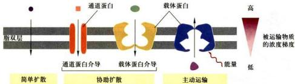

## 图4-3 跨膜运输类型

简单扩散和协助扩散都是溶质顺着电化学梯度进行跨膜转运，也都不需要细胞提供能量。不同的是，简单扩散不需要膜转运蛋白协助，而协助扩散需要膜转运蛋白的协助；主动运输需要细胞提供能量，溶质逆着电化学梯度进行跨膜转运。此外，载体蛋白既能够执行协助扩散，又能够执行主动运输，而通道蛋白只执行协助扩散。

  
图 4-4 不同性质的物质通过无膜转运蛋白的人工脂双层  
A. 人工脂双层膜对不同分子的相对透性。B. 不同物质通过人工脂双层膜的渗透系数。

式中，t 为膜的厚度。

## （二）协助扩散

协助扩散是指溶质顺着电化学梯度或浓度梯度，在膜转运蛋白协助下的跨膜转运方式，又叫易化扩散。协助扩散不需要细胞提供代谢能量，转运的动力来自物质的电化学梯度或浓度梯度。借助膜转运蛋白，多种极性小分子和无机离子，包括水分子、糖、氨基酸、核苷酸以及细胞代谢物等，都可以顺着电化学梯度或浓度梯度完成跨膜转运。

## 1. 葡糖转运蛋白

绝大多数哺乳动物细胞都是利用葡萄糖作为细胞的主要能源。人类基因组编码十多种葡糖转运蛋白(glucose transporter, GLUT)，构成GLUT蛋白家族，它们具有高度相似的氨基酸序列，都含有12个跨膜的α螺旋。其中，Glut1是介导葡糖糖进入红细胞及通过血脑屏障的主要转运蛋白，对于维持血糖浓度的稳定和大脑供能起关键作用。Glut1三维晶体结构呈现出该家族成员典型的折叠方式——12个跨膜螺旋组成N端和C端两个结构域（图4-5A）。Glut1通过开口朝向胞外和开口朝向胞内的有序的构象改变过程，完成葡萄糖的协助转运（图4-5B）。

## 2. 水孔蛋白：水分子的跨膜通道

生物体的主要组成成分是水，约占人体质量的70%。水分子不带电荷但具有极性，尽管它可以通过简单扩散的方式缓慢穿过脂双层，但对于某些组织来说，如肾小管和集合管对水的重吸收、从脑中排出额外的水、唾液和眼泪的形成等，水分子就必须借助质膜上的大量水孔蛋白以实现快速跨膜转运（图4-6A）。水孔蛋白对于细胞渗透压以及生理与病理的调节作用十分重要，比如人肾近曲小管对原尿中水重吸收作用，通常一个正常成年人每天要产生180 L的原尿，这些原尿经近曲小管的水孔蛋白的吸收，大部分水分被人体循环利用，最终只有约1 L的尿液排出人体。

红细胞是研究水孔蛋白的一个理想模型。20世纪80年代，在红细胞膜中发现了第一个水孔蛋白CHIP28 (channel-forming integral protein, 28 kDa)，后来统一命名为AQP1。到现在，超过200种水孔蛋白陆续被发现，从细菌到植物、从动物到人，水孔蛋白广泛存在于所有细胞质膜上。水孔蛋白是一个大家族，仅哺乳类细胞至少就发现了十多种水孔蛋白。表 4-3 列出了部分水孔蛋白的主要分布及其功能。

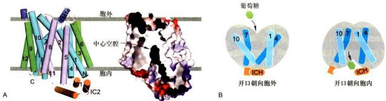  
图4-5 Glut1的晶体结构（含N45T和E329Q突变）和转运葡萄糖的工作模型  
A. Glut1 的三维晶体结构含 12 个跨膜螺旋，组成 N 端和 C 端两个结构域。处于这种构象状态时，两个结构域之间的底物结合位点朝向胞质开放，呈现向内开放构象。跨膜区域 TM1 和 TM7 的胞外部分相互作用，封住了 Glut1 胞外开口。胞内 4 个 $\alpha$ 螺旋组成的结构域 IC1—IC4 的相互接触或位移有助于关闭或开启 Glut1 胞质一侧的开口（颜宁博士惠赠）。B. Glut1 底物结合位点朝胞外开放时，葡萄糖结合，Glut1 构象发生变化，朝胞内开放，释放葡萄糖，完成葡萄糖转运的构象变化循环。通过这种有序的构象改变完成葡萄糖的协助转运。

对 AQP1 晶体学数据分析表明，水孔蛋白由 4 个亚基组成四聚体（图 4-6B），每个亚基都由 6 个跨膜 $\alpha$ 螺旋组成（图 4-6C、D）。每个水孔蛋白亚基单独形成一个供水分子通过的中央孔，孔的直径稍大于水分子直径，约 0.28 nm，水孔长约 2 nm。尽管还没有完全揭示为何 AQP1 在对水分子快速通过的同时能有效阻止质子的通过，表现出对水分子的特异通透性，但已有的数据表明，这种特异性与两个半跨膜区的 Asn-Pro-Ala 模式有关。AQP1 中央孔的孔径无法通过比水分子大的物质，而两个 Asn-Pro-Ala 中的 Asn 残基所带的正电荷也排除了质子的通过，因此，AQP1 是一个高度特异的亲水通道，只允许水而不允许离子或其他小分子溶质通过。值得一提的是，有些水孔蛋白对溶质的通透不仅局限于水分子，如 AQP8 对尿素也有通透性，AQP7 对甘油具有通透性。

植物水孔蛋白在种子萌发、细胞伸长、气孔运动以及受精等过程中调节水分的快速跨膜转运。此外，有些水孔蛋白还在植物逆境应答如抗旱性中起着重要作用。

  
图4-6 水孔蛋白分布与结构示意图  
A. 豚鼠细胞质膜上分布的大量水孔蛋白电镜照片。B. 水孔蛋白 AQP1 由 4 个亚基组成四聚体。C. 每个亚基由 3 对同源的跨膜 α 螺旋（aa'、bb' 和 cc'）组成。D. 亚基三维结构示意图。（A 图由 Bechara Kachar 博士惠赠：B、D 图基于 PDB 数据库 3GD8 结构绘制）

表 4-3 部分水孔蛋白举例

<table><tr><td>水孔蛋白</td><td>组织分布</td><td>功能</td></tr><tr><td>AQP0</td><td>晶状体纤维细胞</td><td>维持晶状体透明度</td></tr><tr><td rowspan="5">AQP1</td><td>红细胞</td><td>多种功能</td></tr><tr><td>肾近曲小管</td><td>近曲肾小管水分重吸收</td></tr><tr><td>眼睛缝状上皮</td><td>眼中水状液的分泌</td></tr><tr><td>大脑脉络丛</td><td>中枢系统脑脊髓液的分泌</td></tr><tr><td>肺泡上皮细胞</td><td>肺中水平衡</td></tr><tr><td>AQP2</td><td>肾集合管</td><td>肾集合管中水通透力(突变产生肾源性尿崩症)</td></tr><tr><td>AQP3</td><td>肾集合管,呼吸道支气管上皮细胞</td><td>水重吸收进入血液,气管和支气管液体分泌</td></tr><tr><td rowspan="3">AQP4</td><td>肾集合管</td><td>水重吸收</td></tr><tr><td>中枢神经系统</td><td>中枢神经系统中脑脊髓液的重吸收;脑水肿的调节</td></tr><tr><td>呼吸道支气管上皮细胞</td><td>支气管液体分泌</td></tr><tr><td>AQP5</td><td>唾液腺、泪腺、汗腺</td><td>唾液、眼泪、汗液的分泌</td></tr><tr><td>AQP7</td><td>脂肪组织、肾、睾丸</td><td>转运水以及甘油</td></tr><tr><td> $\gamma$ -TIP</td><td>植物液泡膜</td><td>植物液泡水的摄入,调节膨压</td></tr></table>

## （三）主动运输

与被动运输不同，主动运输是由载体蛋白所介导的物质逆着电化学梯度或浓度梯度进行跨膜转运的方式。主动运输普遍存在于动、植物细胞和微生物细胞。根据能量来源的不同，可将主动运输分为：由ATP直接提供能量（ATP驱动泵）、间接提供能量（协同转运或偶联转运蛋白）以及光驱动泵三种基本类型（图4-7）。

## 1. ATP 驱动泵

ATP驱动泵（ATP-driven pump）是ATP酶直接利用水解ATP提供的能量，实现离子或小分子逆浓度梯度或电化学梯度的跨膜运输。这种主动运输是一种能量偶联的化学反应过程，即离子或小分子逆电化学梯度的“上山”运动（需要能量）与ATP水解（释放能量）相偶联。主动运输每秒转运的离子数为 $1\sim10^{3}$ 不等。

## 2. 协同转运蛋白

协同转运蛋白（cotransporter）或偶联转运蛋白（coupled transporter）介导各种离子和分子的跨膜运动。这类转运蛋白包括两种基本类型：同向协同转运蛋白（symporter）和反向协同转运蛋白（antiporter）。同向协同转运是偶联物的运输方向相同，如小肠上皮细胞和肾小管上皮细胞吸收葡萄糖或氨基酸等有机物，就是伴随 $\mathrm{Na}^{+}$ 从细胞外流入细胞内而完成的；而反向协同转运是偶联物的运输方向相反，如质膜上 $\mathrm{Na}^{+}/\mathrm{H}^{+}$ 交换载体在完成 $\mathrm{H}^{+}$ 输出细胞的同时伴随着 $\mathrm{Na}^{+}$ 输入细胞。这两类转运蛋白使一种离子或分子逆浓度梯度的转运与另一种或多种其他溶质顺着电化学梯度或浓度梯度的转运偶联起来。与ATP驱动泵直接利用水解ATP提供能量的方式不同，协同转运蛋白所利用的能量储存在其中一种溶质的电化学梯度中。在动物细胞的质膜上， $\mathrm{Na^{+}}$ 是常用的协同转运离子，它的电化学梯度为另一种物质的主动运输提供了驱动力。由于 $\mathrm{Na^{+}}$ 电化学梯度的形成需要 $\mathrm{Na^{+} - K^{+}}$ 泵水解ATP，因此，协同转运是一种间接消耗能量的主动转运方式。在细菌、酵母、植物和动物细胞的被膜细胞器，绝大多数协同运输是靠 $\mathrm{H^{+}}$ 而不是靠 $\mathrm{Na^{+}}$ 电化学梯度来驱动的。协同转运蛋白每秒转运的底物数 $10^{2}\sim 10^{4}$ 不等。

  
图4-7 主动运输三种类型

## 3. 光驱动泵

光驱动泵（light-driven pump）主要发现于细菌细胞，对溶质的主动运输与光能的输入相偶联，如菌紫红质。

## 第二节 ATP 驱动泵与主动运输

在三种能量来源形式的主动运输中，最常见的是ATP驱动泵。ATP驱动泵将ATP水解生成ADP和无机磷酸（Pi），并利用释放的能量将小分子物质或离子进行跨膜转运，因此ATP驱动泵通常又被称为转运ATP酶。正常情况下转运ATP酶并不能单独水解ATP，而是将ATP的水解与物质的跨膜转运紧密偶联在一起。根据泵蛋白的结构和功能特性，ATP驱动泵可分为

4 类：P 型泵、V 型质子泵、F 型质子泵和 ABC 超家族。前三种转运离子，后一种主要转运小分子（图 4-8）。

## 一、P型泵

所有 P 型泵 (P-type pump) 都有 2 个独立的 $\alpha$ 催化亚基，具有 ATP 结合位点；绝大多数还具有 2 个起调节作用的小的 $\beta$ 亚基。在转运离子过程中，至少有一个 $\alpha$ 催化亚基发生磷酸化和去磷酸化反应，从而改变转运泵的构象，实现离子的跨膜转运。由于转运泵水解 ATP 使自身形成磷酸化的中间体，因此称作 P 型泵。大多数 P 型泵都是离子泵，负责 $Na^{+}$ 、 $K^{+}$ 、 $H^{+}$ 和 $Ca^{2+}$ 跨膜梯度的形成和维持。

## (一) $Na^{+}-K^{+}$ 泵

## 1. $\mathrm{Na}^{+}-\mathrm{K}^{+}$ 泵结构与转运机制

$\mathrm{Na^{+} - K^{+}}$ 泵（ $\mathrm{Na^{+} - K^{+}}$ pump），又称 $\mathrm{Na^{+} - K^{+}}$ ATP酶，位于动物细胞的质膜上，由2个α和2个β亚基组成四聚体（图4-9A），β亚基是糖基化的多肽，并不直接参与离子跨膜转运，但帮助在内质网新合成的α亚基进行折叠。 $\mathrm{Na^{+} - K^{+}}$ 泵的转运机制总结在图4-9B中：在细胞内侧α亚基与 $\mathrm{Na^{+}}$ 相结合促进ATP水解，α亚基上的一个天冬氨酸残基磷酸化引起α亚基构象发生变化，将 $\mathrm{Na^{+}}$ 泵出细胞，同时细胞外的 $\mathrm{K^{+}}$ 与α亚基的另一位点结合，使其去磷酸化，α亚基构象再度发生变化将 $\mathrm{K^{+}}$ 泵入细胞，完成整个循环。从整个转运过程可以看出，α亚基的磷酸化发生在 $\mathrm{Na^{+}}$ 结合后，而去磷酸化则发生在 $\mathrm{K^{+}}$ 结合后。 $\mathrm{Na^{+}}$ 依赖性的磷酸化和 $\mathrm{K^{+}}$ 依赖性的去磷酸化引起 $\mathrm{Na^{+} - K^{+}}$ 泵构象发生有序变化，每秒钟可发生1000次左右。此外，每个循环消耗一个ATP分子，可以逆着电化学梯度泵出3个 $\mathrm{Na}^{+}$ 和泵入2个 $\mathbf{K}^{+}$ 。这是由ATP直接提供能量的主动转运，而非协同转运，因为 $\mathrm{Na}^{+}$ 和 $\mathbf{K}^{+}$ 都是逆着电化学梯度进行跨膜转运。极少量的乌本苷（ouabain）便可抑制 $\mathrm{Na}^{+}-\mathrm{K}^{+}$ 氵的活性（乌本苷的半数抑制量 $I_{50}$ 为 $1\mu \mathrm{mol} / \mathrm{L})$ ，而 $\mathrm{Mg}^{2 + }$ 和少量的膜脂有助于 $\mathrm{Na}^{+}-\mathrm{K}^{+}$ 水性的提高，生物氧化抑制剂如氟化物使ATP供应中断， $\mathrm{Na}^{+}-\mathrm{K}^{+}$ 泵失去能源以致停止工作。

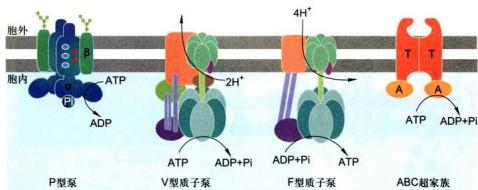  
图 4-8 4 种类型的 ATP 驱动泵  
P型泵、V型质子泵和ABC超家族利用ATP水解释放的能量进行物质跨膜运输，而F型质子泵通常情况下是利用质子动力势合成ATP。

## 2. $\mathrm{Na}^{+}-\mathrm{K}^{+}$ 泵主要生理功能

如表 5-1 所示，动物细胞胞外 Na $^{+}$ 浓度比胞内高，而 K $^{+}$ 离子比胞内低。一般的动物细胞要消耗 1/3 的总 ATP 供 Na $^{+}$ -K $^{+}$ 泵工作以维持细胞内高 K $^{+}$ 低 Na $^{+}$ 的离子环境（神经细胞可消耗高达 2/3 的总 ATP），其生理意义主要体现在以下几方面：

（1）维持细胞膜电位 细胞质膜两侧均具有一定的电位差，称为膜电位（membrane potential）。膜电位是膜两侧的离子浓度不同形成的，细胞在静息状态时膜电位质膜内侧为负，外侧为正。每一个工作循环下来， $\mathrm{Na}^{+}-\mathrm{K}^{+}$ 泵将从细胞泵出3个 $\mathrm{Na}^{+}$ 并泵入2个 $\mathrm{K}^{+}$ ，结果对膜电位的形成起到了一定作用。

(2) 维持动物细胞渗透平衡 动物细胞内含有多种溶质，包括多种阴离子以及阳离子。如果没有 $Na^{+}-K^{+}$ 泵的工作将 $Na^{+}$ 泵出细胞，那么水分子将由于渗透压的缘故顺着自身浓度梯度通过水孔蛋白大量进入细胞引起细胞吸水膨胀。显然， $Na^{+}-K^{+}$ 泵不断地将 $Na^{+}$ 泵到胞外维持了细胞的渗透平衡。胞外除了高浓度的 $Na^{+}$ 外，还有 $Cl^{-}$ （靠膜电位停留在胞外）参与维持动物细胞渗透压平衡。人的红细胞膜上含有丰富的水孔蛋白，如果利用 $Na^{+}-K^{+}$ 泵的抑制剂乌本苷处理，红细胞将因为胞外 $Na^{+}$ 浓度降低而不断吸水膨胀，甚至破裂。

不同类型细胞用不同的机制解决渗透压问题。动物细胞靠 $\mathrm{Na}^{+}-\mathrm{K}^{+}$ 泵工作维持渗透平衡，而植物细胞依靠其坚韧的细胞壁防止膨胀和破裂，能耐受较大的跨膜渗图4-9 $\mathrm{Na^{+} - K^{+}}$ 泵的结构（A）与工作模式（B）示意图

透差异，并具有相应的生理功能，如保持植物茎坚挺，调节气孔的气体交换等；生活在水中的一些原生动物（如草履虫），通过收缩泡收集后排除过量的水。

(3) 吸收营养 动物细胞对葡萄糖或氨基酸等有机物吸收的能量由蕴藏在 $Na^{+}$ 电化学梯度中的势能提供。 $Na^{+}-K^{+}$ 泵工作形成的 $Na^{+}$ 电化学梯度驱动葡萄糖协同转运载体以同向协同转运的方式，将葡萄糖等有机物转运进入小肠上皮细胞，然后再经 Glut2 以协助扩散的方式转运进入血液，完成对葡萄糖的吸收（图 4-10）。

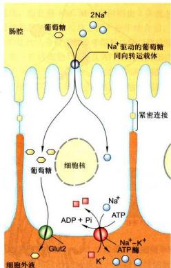  
图4-10 小肠上皮细胞吸收葡萄糖的示意图

葡萄糖分子通过 $Na^{+}$ 驱动的同向协同运输方式进入上皮细胞，再经载体介导的协助扩散方式进入血液， $Na^{+}-K^{+}$ 泵消耗 ATP 维持 $Na^{+}$ 的电化学梯度。

动物细胞利用膜两侧的 $\mathrm{Na^{+}}$ 电化学梯度以协同转运的方式吸收营养物，而植物细胞、真菌和细菌细胞通常利用质膜上的 $\mathrm{H^{+}}$ -ATP酶形成的 $\mathrm{H^{+}}$ 电化学梯度来吸收营养物，如在某些细菌中，乳糖的吸收伴随着 $\mathrm{H^{+}}$ 从细胞质膜外进入细胞，每转移一个 $\mathrm{H^{+}}$ ，吸收一个乳糖分子。

## （二） $\mathrm{Ca^{2+}}$ 泵及其他P型泵

## 1. $\mathrm{Ca^{2+}}$ 泵的结构与功能

$\mathrm{Ca^{2+}}$ 是细胞内重要的信号物质，细胞质基质中游离的 $\mathrm{Ca^{2+}}$ 浓度始终维持在一个很低水平。细胞质基质中低 $\mathrm{Ca^{2+}}$ 浓度的维持主要得益于质膜或细胞器膜上的钙泵（ $\mathrm{Ca^{2+}}$ pump）将 $\mathrm{Ca^{2+}}$ 泵到细胞外或细胞器内。 $\mathrm{Ca^{2+}}$ 泵，又称 $\mathrm{Ca^{2+}}$ -ATP酶，是另一类P型泵，分布在所有真核细胞的质膜和某些细胞器如内质网、叶绿体和液泡膜上。在肌肉细胞的肌质网膜上， $\mathrm{Ca^{2+}}$ 泵占肌质网膜蛋白 $90\%$ 以上，对细胞引发刺激-反应偶联具有重要作用。对肌质网膜上 $\mathrm{Ca^{2+}}$ 泵三维结构已获得高分辨解析（图4-11）。 $\mathrm{Ca^{2 + }}$ 泵是一个由1000个氨基酸残基组成的跨膜蛋白，与 $\mathrm{Na^{+} - K^{+}}$ 泵的 $\alpha$ 亚基同源，含有10个跨膜 $\alpha$ 螺旋，其中3个螺旋形成了跨越脂双层的中央通道。在 $\mathrm{Ca^{2 + }}$ 泵处于非磷酸化状态时，2个通道螺旋中断形成胞质相结合2个 $\mathrm{Ca^{2 + }}$ 的空穴，ATP在胞质侧与其结合位点结合，伴随ATP水解使相邻结构域天冬氨酸残基磷酸化，从而导致跨膜螺旋的明显重排。跨膜螺旋的重排破坏了 $\mathrm{Ca^{2 + }}$ 结合位点并释放 $\mathrm{Ca^{2 + }}$ 进入膜的另一侧。

$\mathrm{Ca^{2+}}$ 泵工作与ATP的水解相偶联，每消耗1分子ATP从细胞质基质泵出2个 $\mathrm{Ca^{2+}}$ 。 $\mathrm{Ca^{2+}}$ 求要将 $\mathrm{Ca^{2+}}$ 输出细胞或泵入内质网腔中储存起来，以维持细胞质基质中低浓度的游离 $\mathrm{Ca^{2+}}$ 。 $\mathrm{Ca^{2+}}$ 泵将 $\mathrm{Ca^{2+}}$ 泵入肌质网，对调节肌细胞的收缩运动至关重要。在动物细胞质膜上分布的 $\mathrm{Ca^{2+}}$ 泵，其C端是细胞内钙调蛋白（CaM）的结合位点，当胞内 $\mathrm{Ca^{2+}}$ 浓度升高时， $\mathrm{Ca^{2+}}$ 与钙调蛋白结合形成激活的 $\mathrm{Ca^{2+}}$ -CaM复合物并与 $\mathrm{Ca^{2+}}$ 泵结合，进而调节 $\mathrm{Ca^{2+}}$ 泵的活性。内质网型的 $\mathrm{Ca^{2+}}$ 泵没有钙调蛋白的结合域。

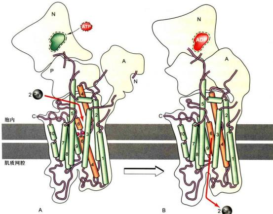  
图4-11 肌质网 $\mathrm{Ca^{2+}}$ 泵转运 $\mathrm{Ca^{2+}}$ 前（A）和后（B）的工作模型N：核苷酸结合部位；P：磷酸化部位；A：活化部位。

## 2. P型H $^{+}$ 泵

P型泵中除了 $\mathrm{Na}^+$ -K $^+$ 泵和 $\mathrm{Ca^{2+}}$ 泵外，还有 $\mathrm{H}^+$ 泵（ $\mathrm{H}^+$ pump）。植物细胞、真菌（包括酵母）和细菌细胞质膜上虽然没有 $\mathrm{Na}^+$ -K $^+$ 泵，但有P型H $^+$ 泵（ $\mathrm{H}^+$ -ATP酶）。P型H $^+$ 泵将 $\mathrm{H}^+$ 泵出细胞，建立和维持跨膜的 $\mathrm{H}^+$ 电化学梯度（作用类似动物细胞 $\mathrm{Na}^+$ 的电化学梯度），并用来驱动转运溶质进入细胞。细菌细胞对糖和氨基酸的摄取，主要是由 $\mathrm{H}^+$ 驱动的同向协同转运完成的。P型H $^+$ 泵的工作也使得细胞周围环境呈酸性。

## 二、V型质子泵和F型质子泵

V 型质子泵（V-type proton pump）广泛存在于动物细胞的内体膜、溶酶体膜，破骨细胞和某些肾小管细胞的质膜，以及植物、酵母和其他真菌细胞的液泡膜上（V 为 vesicle 第一个字母）。F 型质子泵（F-type proton pump）存在于细菌质膜、线粒体内膜和叶绿体类囊体膜上（F 为 factor 的第一个字母）。V 型质子泵和 F 型质子泵彼此相似，但与 P 型泵无关且结构更为复杂。V 型质子泵和 F 型质子泵都含有几种不同的跨膜和胞质侧亚基。两者与 P 型泵不同，在功能上都是只转运质子，并且在转运 H $^{-}$ 过程中不形成磷酸化的中间体。

V型质子泵利用ATP水解供能从细胞质基质中逆 $\mathrm{H^{+}}$ 电化学梯度将 $\mathrm{H^{+}}$ 泵入细胞器，以维持细胞质基质pH中性和细胞器内的pH酸性；而存在于线粒体内膜、植物类囊体膜和细菌质膜上的F型质子泵却以相反的方式发挥其生理作用。它通常利用质子动力势合成ATP，即当 $\mathrm{H^{+}}$ 顺着电化学梯度通过质子泵时，所释放的能量驱动F型质子泵合成ATP，如线粒体的氧化磷酸化和叶绿体的光合磷酸化作用，因此F型质子泵称作 $\mathrm{H^{+}}$ -ATP合酶（又称为 $\mathrm{F}_x\mathrm{F}_y\mathrm{-ATP}$ 合酶）更为贴切。

## 三、ABC 超家族

## （一）ABC 转运蛋白的结构与工作模式

ABC 超家族（ABC superfamily）也是一类 ATP 驱动泵，又叫 ABC（ATP-binding cassette）转运蛋白。该超家族含有几百种不同的转运蛋白，广泛分布于从细菌到人类各种生物中，是最大的一类转运蛋白。每种 ABC 转运蛋白对于底物或底物的基团有特异性。所有 ABC 转运蛋白都共享一种由 4 个“核心”结构域组成的结构模式（图 4-12）：2 个跨膜结构域（T），每个结构域由6个跨膜α螺旋组成，形成底物运输的通路并决定底物的特异性；2个胞质侧ATP结合域（A），具有ATP酶活性，凸向胞质。有些ABC转运蛋白由一条多肽链组成，而有些ABC转运蛋白则由2条或多条装配成相似结构的多肽链构成。ATP分子结合前，ABC转运蛋白的底物结合位点暴露于胞外一侧（原核细胞）或胞质一侧（真核细胞）。一旦ATP分子与ABC转运蛋白结合，将诱导ABC转运蛋白2个ATP结合域二聚化，引起转运蛋白构象改变，使底物结合部位暴露于质膜的另一侧；而ATP水解以及ADP的解离将导致ATP结合域解离，引起转运蛋白构象恢复原有状态。这样，通过ATP分子的结合与水解，ABC转运蛋白就能完成小分子物质的跨膜转运。

  
图4-12 原核细胞（A）和真核细胞（B）ABC超家族结构与工作示意图

细菌除了通过 $H^{+}-ATP$ 酶形成的 $H^{+}$ 电化学梯度来吸收营养物外，其质膜上含有大量依赖水解 ATP 提供能量逆浓度梯度从环境中摄取各种营养物的 ABC 转运蛋白。

## （二）ABC 转运蛋白与疾病

正常生理条件下，ABC 转运蛋白是细菌质膜上糖、氨基酸、磷脂和肽的转运蛋白，是哺乳类细胞质膜上磷脂、亲脂性药物、胆固醇和其他小分子的转运蛋白。ABC 蛋白在肝、小肠和肾等器官分布丰富，它们能将天然毒物和代谢废物排出体外。

由于有些 ABC 转运蛋白能够将抗生素或其他抗癌药物泵出细胞而赋予细胞抗药性，近些年来，ABC转运蛋白在医学领域引起了极大关注。事实上，真核细胞最早被鉴定的ABC转运蛋白就是从肿瘤细胞和抗药性培养细胞中发现的。这类ABC转运蛋白称为多药抗性（multidrug-resistance, MDR）转运蛋白，在多种肿瘤细胞中高表达，能利用水解ATP的能量将脂溶性的抗癌药物从细胞内转运到细胞外，从而降低细胞内药物浓度，导致肿瘤细胞抗药性增强而降低患者化疗效果。此外，引起疟疾的疟原虫对药物氯喹(chloroquine）的抗性也与病原体ABC转运蛋白高表达有关。

一些人类遗传病的发生与ABC转运蛋白功能改变有关，如囊性纤维化（cystic fibrosis）。囊性纤维化是白人中最常见的一种常染色体隐性遗传病，又称黏稠物阻寒症，是由于囊性纤维化跨膜转运调节蛋白（cystic fibrosis transmembrane conductance regulator, CFTR）发生突变。CFTR是一种ABC转运蛋白，常位于肺、汗腺和胰腺等上皮细胞的顶面（又称游离面），调节 $\mathrm{Cl^-}$ 转运。但由于CFTR突变功能异常时， $\mathrm{Cl^-}$ 转运发生问题，导致细胞外缺水而使得肺部黏稠分泌物堵塞支气管。

综上所述，主动运输都需要消耗能量，所需能量可直接来自ATP或来自离子电化学梯度；同样也需要膜上的特异性载体蛋白，这些载体蛋白不仅具有结构上的特异性，还具有结构上的可变性。细胞运用各种不同的方式通过不同的体系在不同的条件下完成小分子物质或离子的跨膜转运。

## 四、离子跨膜转运与膜电位

不同方式的物质跨膜运动，其结果是产生并维持了膜两侧不同物质特定的浓度分布。对某些带有电荷的物质，特别是对离子来说，就形成了膜两侧的电位差。插入细胞微电极便可测出细胞质膜两侧各种带电物质形成的电位差的总和，即膜电位。细胞在静息状态下的膜电位称静息电位（resting potential），在刺激作用下产生行使通讯功能的快速变化的膜电位称动作电位（active potential）。静息电位是细胞质膜内外相对稳定的电位差，质膜内为负值，质膜外为正值，这种现象又称极化（polarization）。在动物不同类型细胞中，静息电位有很大变化，典型的膜电位在-70\~-30 mV之间。

静息电位主要是由质膜上相对稳定的离子跨膜运输或离子流形成的。 $\mathrm{Na}^{+} - \mathrm{K}^{+}$ 泵的工作使细胞内外的 $\mathrm{Na}^{+}$ 和 $\mathrm{K}^{+}$ 浓度远离平衡态分布，胞内高浓度的 $\mathrm{K}^{+}$ 是细胞内有机分子所带负电荷的主要平衡者。处干静息状态的动物细胞，质膜上许多非门控的 $\mathrm{K}^{+}$ 渗漏通道通常是开放的，而其他离子（如 $\mathrm{Na}^{+},\mathrm{Cl}^{-}$ 或 $\mathrm{Ca}^{2 + }$ ）通道却很少开放。所以静息膜允许 $\mathrm{K}^{+}$ 通过开放的渗漏通道顺电化学梯度流向胞外。随着正电荷转移到胞外而留下胞内的非平衡负电荷，结果是膜外正离子过量和膜内负离子过量，从而产生外正内负的静息电位。动物细胞的静息电位值主要反映了跨膜的 $\mathrm{K}^{+}$ 电化学梯度。对植物和真菌细胞，静息电位的维持主要是通过ATP驱动的质子泵将大量 $\mathrm{H}^{+}$ 从细胞内转运到细胞外。

动物细胞质膜对 $K^{+}$ 的通透性大于 $Na^{+}$ 是产生静息电位的主要原因， $Cl^{-}$ 甚至细胞中的蛋白质分子（一般净电荷为负值）对静息电位的大小也有一定的影响。 $Na^{+}-K^{+}$ 泵对维持静息电位的相对恒定起重要的作用。

Na $^{+}$ 和 K $^{+}$ 离子通道都是膜上的电压门控通道，它们的开关变化应答于膜电位的变化，或者说电压门控通道打开的概率由膜电位控制。电压门控通道在神经细胞电信号的转导中具有重要作用，它们也存在于其他细胞，包括肌肉细胞、卵细胞、原生动物，甚至植物细胞。电压门控通道有特殊的带电荷的蛋白质结构域，称为电压感受器（voltage sensor），对膜电位的变化极其敏感，从而控制通道蛋白转换它的“关－开”构象。于是，在含有许多通道蛋白分子的膜片内，可能发现当膜处于某一电位时，平均10%的通道是打开的，而处于另一电位时，90%的通道是打开的。

当细胞接受刺激信号（电信号或化学信号）超过一定阈值时，电压门控 $\mathrm{Na}^+$ 通道将介导细胞产生动作电位。细胞接受阈值刺激， $\mathrm{Na}^+$ 通道打开，引起 $\mathrm{Na}^+$ 通透性大大增加，瞬间大量 $\mathrm{Na}^+$ 流入细胞内，致使静息电位减小乃至消失，此即质膜的去极化（depolarization）过程。当细胞内 $\mathrm{Na}^+$ 进一步增加达到 $\mathrm{Na}^+$ 平衡电位，形成瞬间的内正外负的动作电位，称质膜的反极化，动作电位随即达到最大值。只有达到一定的刺激阈，动作电位才会出现，这是一种全或无的正反馈阈值，在 $\mathrm{Na}^+$ 大量进入细胞时， $\mathrm{K}^+$ 通透性也逐渐增加，随着动作电位出现， $\mathrm{Na}^+$ 通道从失活时关闭，电压门控 $\mathrm{K}^+$ 通道完全打开， $\mathrm{K}^+$ 流出细胞从而使质膜再度极化，以至于超过原来的静息电位，此时称超极化（super polarization）。超极化时膜电位使 $\mathrm{K}^+$ 通道关闭，膜电位又恢复至静息状态（图4-13）。

③反极化期： $Na^{+}$ 通道关闭， $K^{+}$ 通道全面开启， $K^{+}$ 流出细胞。

②去极化期： $Na^{+}$ 通道打开，胞内 $Na^{+}$ 浓度升高，质膜去极化。  
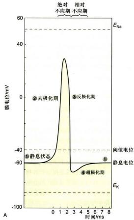

①静息状态： $Na^{+}$ ， $K^{+}$ 电压门控通道关闭。

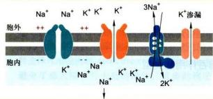

④ 超极化期： $K^{+}$ 不断流出细胞，使细胞膜超极化， $K^{+}$ 通道关闭。  
  
图4-13 离子流与动作电位的关系示意图  
A. 动作电位的产生和膜电位改变。B. 动作电位产生过程中，膜通透性改变。C. 动作电位产生过程中，离子通道开启与关闭示意图。

膜电位与质膜对 $\mathbf{K}^{+}$ 和 $\mathrm{Na}^{+}$ 不同的通透性有关，而质膜上 $\mathrm{Na}^{+}$ 、 $\mathbf{K}^{+}$ 通道蛋白及 $\mathrm{Na}^{+}-\mathrm{K}^{+}$ 泵等膜蛋白也随膜电位变化有规律地关闭和开启。细胞质膜膜电位具有重要的生物学意义，在神经、肌肉等可兴奋细胞中，是化学信号或电信号引起的兴奋传递的重要方式。

## 第三节 胞吞作用与胞吐作用

真核细胞通过胞吞 (endocytosis) 和胞吐 (exocytosis) 作用完成大分子与颗粒性物质的跨膜运输，如蛋白质、多核苷酸、多糖等。在转运过程中，物质包裹在脂双层膜包被的囊泡中，因此又称膜泡运输。这种运输方式常常可同时转运一种或一种以上数量不等的大分子甚至颗粒性物质，因此也有人称之为批量运输 (bulk transport)。膜泡运输涉及生物膜的断裂与融合，是一个耗能的过程。所谓胞吞作用，就是细胞通过质膜内陷形成囊泡，将胞外的生物大分子、颗粒性物质或液体等摄取到细胞内，以维持细胞正常的代谢活动；而胞吐作用则是细胞内合成的生物分子（蛋白质和脂质等）和代谢物以分泌泡的形式与质膜融合而将内含物分泌到细胞表面或细胞外的过程。由于胞吐作用将在第六章详细介绍，本节主要介绍胞吞作用。

## 一、胞吞作用的类型

胞吞时质膜内陷脱落形成的囊泡，称胞吞泡（endo-cytic vesicle)。根据胞吞泡形成的分子机制不同和胞吞泡的大小差异，胞吞作用可分为两种类型：吞噬作用（phagocytosis）和胞饮作用（pinocytosis）（图4-14）。吞噬作用形成的吞噬泡直径往往大于 $250\mathrm{nm}$ ，而胞饮作用形成的胞饮泡直径一般小于 $150\mathrm{nm}$ 。此外，所有真核细胞都能通过胞饮作用连续摄入溶液及可溶性分子，而吞噬作用往往发生于一些特化的吞噬细胞如巨噬细胞（macrophage）。

## （一）吞噬作用

吞噬作用是一类特殊的胞吞作用。通过吞噬作用形成的胞吞泡叫做吞噬体（phagosome）。对于原生生物，细胞通过吞噬作用将胞外的营养物取取到吞噬体，最后在溶酶体中消化降解成小分子物质供细胞利用。吞噬作用是原生生物摄取食物的一种方式。在高等多细胞生物体中，吞噬作用往往发生于巨噬细胞和中性粒细胞(neutrophil)，其作用不仅仅是摄取营养物，主要是清除侵染机体的病原体以及衰老或凋亡的细胞，如人的巨噬细胞每天通过吞噬作用清除 $10^{11}$ 个衰老的红细胞。

吞噬作用需要被吞噬物与吞噬细胞表面结合并激活细胞表面的受体，将信号传递到细胞内并引起细胞应答反应，是一个信号触发的过程。在激活吞噬作用过程中，抗体诱发的吞噬作用研究得最为清楚。当抗体与病原微生物表面结合后，暴露出尾部的Fc区域，该区域

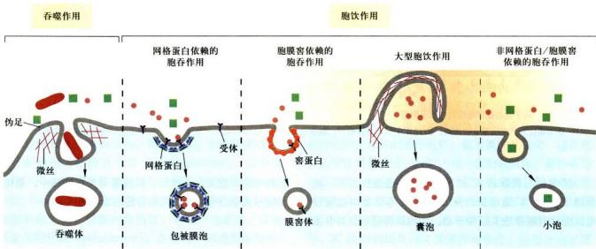

## 图4-14 胞吞作用的类型

胞吞作用可分为吞噬作用和胞饮作用两大类型，而胞饮作用又可分为网格蛋白依赖的胞吞作用、胞膜窖依赖的胞吞作用、大型胞饮作用以及非网格蛋白/胞膜窖依赖的胞吞作用4种类型。

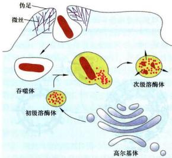  
图4-15 吞噬作用

吞噬细胞伸出伪足，包裹病原微生物形成吞噬体，吞噬体与溶酶体融合，在各种酸性水解酶的作用下，将病原微生物分解。未被分解的底物形成残余小体，可通过胞吐作用的方式将残余底物释放到细胞外。

被巨噬细胞和中性粒细胞表面的Fc受体识别，从而诱发吞噬细胞质膜伸出伪足（pseudopod），将病原微生物包裹起来形成吞噬体，最后与溶酶体融合，并在其中被各种水解酶降解（图4-15）。伪足的生成与细胞内微丝及其结合蛋白在质膜下局部装配密切相关，这一装配过程需要Rho家族蛋白的GTP酶活性以及活化的Rho-GEF。

吞噬细胞表面的受体除了能识别Fc启动吞噬作用以外，目前还发现了其他几类启动吞噬作用的受体，如有些受体可以识别补体（complement），从而与抗体一道吞噬降解病原微生物；有些受体可以直接识别某些微生物表面的寡糖链；还有些受体可以识别凋亡的细胞。

## （二）胞饮作用

与吞噬作用不同的是，胞饮作用几乎发生于所有类型的真核细胞中。胞饮作用可以分为网格蛋白依赖的胞吞作用（clathrin dependent endocytosis）、胞膜套依赖的胞吞作用（caveola dependent endocytosis）、大型胞饮作用（macropinocytosis）以及非网格蛋白/胞膜套依赖的胞吞作用（clathrin and caveola independent endocytosis）(图4-14)。其中，了解最多的胞饮作用就是网格蛋白依赖的胞吞作用。

## 1. 网格蛋白依赖的胞吞作用

网格蛋白（clathrin）由3个二聚体组成，每个二聚体包括1条 $180\mathrm{kDa}$ 的重链和1条 $35\sim 40\mathrm{kDa}$ 的轻链。3个二聚体形成三脚蛋白复合体（triskelion），是包被的结构单位。当配体与膜上受体结合后，网格蛋白聚集在膜下，逐渐形成直径 $50\sim 100\mathrm{nm}$ 的质膜凹陷，称网格蛋白包被小窝（clathrin-coated pit）。一种小分子GTP结合蛋白——发动蛋白（dynamini）在深陷的包被小窝的颈部组装成环，发动蛋白水解与其结合的GTP引起颈部缢缩，最终脱离质膜形成网格蛋白包被膜泡（clathrin-coated vesicle）。几秒钟后，网格蛋白便脱离包被膜泡返回质膜附近区域以便重复使用。脱包被的囊泡与早期内体（early endosome）融合，从而将转运分子及胞外液体摄入细胞。在大分子跨膜转运中，网格蛋白本身并不起捕获特异转运分子的作用，有特异性选择作用的是包被中另一类衔接蛋白(adaptin)，它既能结合网格蛋白，又能识别跨膜受体胞质面的尾部肽信号（peptide signal），从而通过网格蛋白包被膜泡介导跨膜受体及其结合配体的选择性运输（图4-16）。

根据胞吞的物质是否具有专一性，可将胞吞作用分为受体介导的胞吞作用（receptor mediated endocytosis）和非特异性的胞吞作用。受体介导的胞吞作用既是大多数动物细胞从胞外摄取特定大分子的有效途径，也是一种选择性浓缩机制（selective concentrating mechanism），避免了摄入细胞外大量的液体。重要的例子包括动物细胞通过受体介导的胞吞作用对胆固醇的摄取、鸟类卵细胞摄取卵黄蛋白以及肝细胞摄入转铁蛋白等。某些激素如胰岛素与靶细胞表面受体结合进入细胞，巨噬细胞通过表面受体对免疫球蛋白及其复合物、病毒、细菌乃至衰老细胞的识别和摄入，以及其他一些基本代谢物如合成血红蛋白所必需的维生素 $\mathrm{B}_{12}$ 和铁的摄取，都是通过受体介导的胞吞作用进行的。受体介导的胞吞作用也可以被某些病毒所利用，流感病毒和AIDS病病毒（HIV）就是通过这种胞吞途径侵染细胞的。

胆固醇是动物细胞质膜的基本成分，也是固醇类激素的前体。胆固醇主要在肝细胞中合成，是极端不溶的，它在血液中的运输是通过与磷脂和蛋白质结合形成低密度脂蛋白（low-density lipoprotein, LDL）颗粒的形式进行。LDL是分子质量为3000 kDa、直径为22 nm的多分子复合物，通过与细胞表面的低密度脂蛋白受体特异地结合形成受体-LDL复合物，几分钟内便通过网格蛋白包被膜泡的内化作用进入细胞，经脱包被作用并与内体（endosome）融合。内体是动物细胞内由膜包裹的细胞器，其作用是传输由胞吞作用新摄入的物质到溶酶体。内体膜上有ATP驱动的质子泵，将 $\mathrm{H}^+$ 泵入内体腔中，使腔内的pH降低（ $\mathrm{pH}5\sim 6$ ）。在此过程中，低pH环境可引起LDL与受体分离，而内体以出芽的方式形成含有受体的小囊泡，返回细胞质膜，受体重复使用。然后含有LDL的内体与溶酶体融合，低密度脂蛋白被水解，释放出胆固醇和脂肪酸供细胞利用（图4-17）。

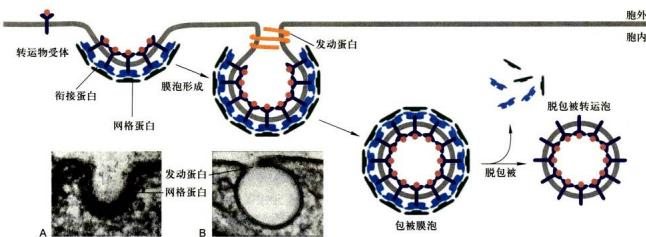  
图4-16 通过网格蛋白包被膜泡介导的选择性运输示意图  
A 和 B 是显示网格蛋白包被膜泡形成过程的电镜照片。(图中照片由 Bechara Kachar 博士惠赠)

在胞吞过程中，内体被认为是膜泡运输的主要分选站之一，其中的酸性环境在分选过程中起关键作用。已知有25种以上的不同受体，具有不同的分选信号，参与不同类型受体介导的胞吞作用。在受体介导的胞吞作用过程中，不同类型的受体具有不同的内体分选途径：① 大部分受体返回它们原来的质膜区域，如上述 LDL 受体循环到质膜再利用；② 有些受体不能再循环而是最后进入溶酶体被消化，如与表皮生长因子(epidermal growth factor, EGF) 结合的细胞表面受体，大部分在溶酶体被降解，从而导致细胞表面 EGF 受体浓度降低，这种现象称为受体下行调节（receptor downregulation）；③ 有些受体被运至细胞另一侧的质膜，该过程称为跨细胞转运 (transcytosis)。在具有极性的上皮细胞中，这是一种将胞吞作用与胞吐作用相结合的物质跨细胞转运方式，即转运的物质通过胞吞作用从上皮细胞的一侧被摄入细胞，再通过胞吐作用从细胞的另一侧释放出去。母鼠的抗体从血液通过上皮细胞进入母乳中，乳鼠肠上皮细胞将抗体摄入体内，都是通过跨细胞转运完成的。

  
图 4-17 LDL 通过受体介导的胞吞作用进入细胞

## 2. 其他类型的胞饮作用

并非所有的胞吞泡的形成都需要网格蛋白的参与，胞膜睿依赖的胞吞作用是目前关注较多的另一种胞饮作用。胞膜睿在质膜的脂筏区域形成，电镜观察发现有些细胞的胞膜睿呈内陷的瓶状。胞膜密的特征性蛋白是窑蛋白，包括caveolin-1、caveolin-2和caveolin-3。与网格蛋白参与的包被膜泡的形成不同，胞膜密的形成部位位于质膜的脂筏区域。胞吞时，胞膜睿携带着内吞物，利用发动蛋白的收缩作用从质膜上脱落，然后转交给内体样的细胞器——膜密体（caveosome）或者跨细胞转运到质膜的另一侧。在整个过程中，因为是整合膜蛋白，窑蛋白始终不会从胞吞泡膜上解离下来。由于胞膜密所在部位含有大量信号转导的受体和蛋白激酶等，这暗示胞膜密很可能发挥了一种细胞信号转导的平台作用。

大型胞饮作用是另一种胞饮作用，它是通过质膜皱褶包裹内吞物形成囊泡完成胞吞作用（图4-14）。与吞噬作用类似，大型胞饮作用形成的胞吞泡也比较大，质膜皱褶的形成过程也依赖微丝及其结合蛋白。但二者有着明显的差别，如启动吞噬作用的受体往往位于特异细胞表面，而启动大型胞饮作用的受体却位于很多类型的细胞表面，而且受体还能启动其他生理功能，如有些受体就是与细胞生长相关的生长因子受体。

此外，还有非网格蛋白/胞膜窖依赖的胞吞作用，如位于淋巴细胞膜上的白介素2（interleukin-2, IL2）受体就是介导非网格蛋白/胞膜窖依赖的胞吞作用。

## 二、胞吞作用与细胞信号转导

作为真核细胞的一种重要生命活动，胞吞作用不仅调控细胞对营养物的摄取和质膜构成等，近年来发现，胞吞作用还参与了细胞信号转导，并与多种信号整合在一起，在更高层次上参与了细胞和机体组织的调控。而信号转导过程也对胞吞作用进行调控，二者相互调节、彼此整合，在细胞生长、发育、代谢以及增殖等过程中发挥着重要作用。

## （一）胞吞作用对信号转导的下调

下调信号转导活性研究最为清楚的一个例子就是表皮生长因子及其受体的胞吞作用。EGF是一类分子量较小的胞外信号蛋白分子，能够刺激上皮细胞及其他多种细胞增殖。与LDL受体不同，当EGF受体与其配体EGF结合后，受体二聚化并引起受体胞质结构域酪氨酸残基自磷酸化而被活化，开启细胞下游信号级联反应（详见第十一章）；另一方面，细胞通过胞吞作用，将EGF受体及EGF吞入细胞内降解，从而导致细胞信号转导活性下调。这种调节作用即受体下行调节。而EGF受体的胞吞作用也受到细胞信号的调控，尽管调控的分子机制还很不清楚，但这一调控过程与受体的泛素化（ubiquitination）有关。当EGF受体与E3泛素连接酶Cbl（Casitas B-lineage lymphoma）结合后，后者催化泛素分子共价连接到受体上，从而引起泛素结合蛋白识别受体上的泛素分子，并帮助受体进入网格蛋白包被小窝，启动受体内吞。

## （二）胞吞作用对信号转导的激活

胞吞作用既可以下调信号转导活性，也可以激活信号转导活性。胞吞作用激活信号转导的最典型例子就是Notch信号通路。Notch信号是细胞与细胞间相互作用的主要信号通路之一，对多细胞生物中细胞分化命运的决定起关键作用。Notch信号通路的功能最早发现于果蝇神经系统的发育。果蝇正常发育的神经系统通过一种旁侧抑制（lateral inhibition）机制抑制其他上皮细胞发育成神经细胞。其过程是：前体神经细胞（信号细胞）在自身质膜上表达单次跨膜信号蛋白Delta，当该信号蛋白与邻近上皮细胞（靶细胞）表面的受体Notch结合后，激活邻近靶细胞的Notch途径；通过Notch信号通路调控，邻近靶细胞就无法分化成神经细胞，而仍然保持为上皮细胞。在这一过程中，除了配体（Delta/Serrate/Lag2家族，DSL）与Notch受体结合外，信号通路的激活还依赖于DSL和Notch的胞吞作用。首先，配体DSL与Notch受体结合，导致Notch暴露出其胞外S2切割位点并被裂解，胞外部分与配体被信号细胞

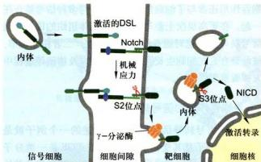  
图 4-18 胞吞作用对 Notch 信号转导的激活

Notch 及其配体 DSL 的胞吞作用对 Notch 活化是必需的，其中，DSL 的胞吞依赖泛素。DSL 与 Notch 结合并内吞，Notch 受体第一次被切割后，通过胞吞作用，第二次被切割，产生有活性片段进入细胞核，调节靶基因表达。

内吞，然后，Notch受体被靶细胞内吞至内体，并在S3位点被γ-分泌酶（γ-secretase）切割，产生有活性的Notch受体胞内活性片段（Notch intracellular domain, NICD）。该片段进入细胞核，调控靶基因表达，产生相应的细胞响应（图4-18）。在Notch受体活化过程中，无论是配体在信号细胞中的胞吞作用还是受体在S2位点切割后的胞吞作用，都对最后在S3位点被γ-分泌酶切割产生有活性的Notch受体胞内活性片段起到了决定性作用。当然，配体和受体的胞吞作用受泛素化等多种信号的调节。

综上所述，胞吞作用与细胞信号转导相互调节，对生命活动的调控发挥了很重要的作用。除了网格蛋白依赖性胞吞方式以外，细胞还通过非网格蛋白依赖性胞吞作用调节其他很多的细胞表面受体。不同类型的受体有

## 思考题

1. 比较载体蛋白与通道蛋白的异同。

不同的胞吞方式，对细胞信号调节、受体活性关闭与放大、信号持续时间长短等发挥着关键作用。

2. 比较 P 型离子泵、V 型质子泵、F 型质子泵和 ABC 超家族的异同。

## 三、胞吐作用

真核细胞无论是通过胞吞作用摄取大分子还是通过胞吐作用分泌大分子，都是通过膜泡运输的方式进行的，并且转运的膜泡只与特定的靶膜融合，从而保证了物质有序地跨膜转运。此外，当分泌泡或转运膜泡与质膜融合并通过胞吐作用释放其内含物后，会使质膜表面积增加，但发生在质膜其他区域的胞吞作用则减少其表面积，这种动态平衡过程对质膜成分的更新和维持细胞的生存与生长是必要的。有关胞吐作用的其他内容，参见本书第六章。

胞吐作用与胞吞作用相反，它是通过分泌泡或其他膜泡与质膜融合而将膜泡内的物质运出细胞的过程。真核细胞有从高尔基体反面网状结构（TGN）分泌的囊泡向质膜流动并与之融合的稳定过程，通过这种组成的胞吐途径（constitutive exocytosis pathway），新合成的蛋白质和脂质以囊泡形式连续不断地供应质膜更新，从而确保细胞分裂前质膜的生长；囊泡内可溶性蛋白分泌到细胞外，有的成为质膜外周蛋白，有的形成胞外基质组分，有的作为营养成分或信号分子扩散到胞外液。真核细胞除了这种连续的组成型胞吐途径之外，特化的分泌细胞还有一种调节型胞吐途径（regulated exocytosis pathway），这些分泌细胞产生的分泌物（如激素、黏液或消化酶）储存在分泌泡内，当细胞在受到胞外信号刺激时，分泌泡与质膜融合并将内含物释放出去。

3. 说明 $\mathrm{Na}^{+}-\mathrm{K}^{+}$ 泵的工作原理及其生物学意义。

4. 将哺乳动物红细胞置于清水中，会发现红细胞膨胀破裂（溶血现象），而在野外或实验室两栖类动物将卵产在清水中，卵细胞却不会膨胀，更不会破裂，根据所学知识推测红细胞和两栖类卵细胞耐低渗能力为何差异如此之大。

5. 试述胞吞作用的类型与功能。

1. Carafoli E, Brini M. Calcium pumps: structural basis for and mechanism of calcium transmembrane transport. Current Opinion in Chemical Biology, 2000, 4:152-161.

2. Deng D, Sun P, Yan C, et al. Molecular basis of ligand recognition and transport by glucose transporters. Nature, 2015, 526(7573): 391-396.

3. Deng D, Xu C, Sun P, et al. Crystal structure of the human glucose transporter GLUT1. Nature, 2014, 510 (7503): 121-125.

4. Higgins C F, Linton K J. The xyz of ABC transporters. Science, 2001, 293 (5536):1782-1784.

5. Hollenstein K, Dawson R J P, Locher K P. Structure and mechanism of ABC transporter proteins. Current Opinion in Structure Biology, 2007, 17: 412-418.

6. Holmgren M, Wagg J, Bezanilla F, et al. Three distinct and sequential steps in the release of sodium ions by the $\mathrm{Na^{+} / K^{+}}$ -ATPase. Nature, 2000, 403 (6772): 898-901.

7. Möbius W, van Donselaar E, Ohno-Iwashita Y, et al. Recycling compartments and the internal vesicles of multivesicular bodies harbor most of the cholesterol found in the endocytic pathway. Traffic, 2003, 4 (4): 222-231.

8. Murata K, Mitsuoka K, Hirai T, et al. Structural determinants of water permeation through aquaporin-1. Nature, 2000, 407 (6804): 599-605.

9. Nishi T, Forgac M. The vacuolar H $^{+}$ -ATPase-nature's most versatile proton pumps. Nature Reviews Molecular Cell Biology, 2002, 3: 94-103.

10. Polo S, Fiore P P. Endocytosis conducts the cell signaling orchestra. Cell, 2006, 124 (5): 897-900.

11. Raiborg C, Rusten T E, Stenmark H. Protein sorting into multivesicular endosomes. Current Opinion in Cell Biology, 2003, 15 (4): 446-455.
