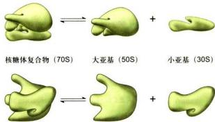
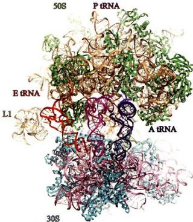
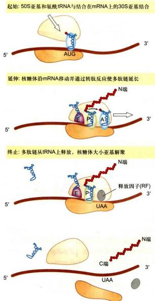

# 第10章 核糖体

<!-- 章节边界按正文内容恢复；原始 MinerU 内容保留如下。 -->

# 核糖体

核糖体（ribosome）是一种核糖核蛋白颗粒(ribonucleoprotein particle)，是细胞内合成蛋白质的细胞器，其功能是依照mRNA上携带的遗传信息，高效精确地将氨基酸合成为多肽链。1953年，E. Robinson和Brown用电镜观察植物细胞时发现了这种颗粒结构。1955年Palade在动物细胞中也观察到类似的结构。因为富含核苷酸，1958年R.B.Roberts正式建议把这种颗粒命名为核糖核蛋白体，简称核糖体。

核糖体几乎存在于一切细胞内。不论是原核细胞还是真核细胞，均含有大量的核糖体。即使最小最简单的细胞——支原体，也含有数以百计的核糖体。线粒体和叶绿体中含有合成自身某些蛋白质的专有核糖体。目前，仅发现在哺乳动物成熟的红细胞等极个别高度分化的细胞内没有核糖体，因此可以说核糖体是细胞最基本的不可缺少的组成成分。核糖体是一种不规则的颗粒状结构，主要成分是RNA与蛋白质。在原核生物中，其直径为20\~25 nm，而在真核生物中，其直径为25\~30 nm。核糖体RNA称为rRNA，蛋白质称核糖体蛋白。原核生物核糖体中，RNA质量约占核糖体整体质量的2/3，而蛋白质约占1/3；而在真核生物中，胞质成熟核糖体rRNA与蛋白质量比约为1∶1。核糖体蛋白分子主要分布在核糖体的表面，而rRNA则主要位于内部，二者靠非共价键结合在一起。rRNA在翻译的精确性、tRNA的选择、蛋白质因子的结合、肽键的形成等方面发挥重要作用。在真核细胞中很多核糖体附着在内质网的膜表面，称为附着核糖体，它与内质网形成复合细胞器，即糙面内质网。在原核细胞的质膜内侧也常有附着核糖体。还有一些核糖体不附着在膜上，呈游离状态，分布在细胞质基质中，称游离核糖体。附着核糖体与游离核糖体的结构与化学组成完全相同，只是所合成的蛋白质种类不同。

核糖体常常分布在细胞内蛋白质合成旺盛的区域，其数量与蛋白质合成旺盛程度有关。处在指数生长期的细菌，每个细胞内大约有数以万计的核糖体，其含量可达细胞干重的40%。而在处于饥饿状态的体外培养细胞内，仅有几百个核糖体。在体外培养的HeLa细胞中，核糖体的数目为 $5\times10^{6}\sim5\times10^{7}$ 个。

核糖体发现至今已有60多年。作为蛋白质合成的场所，核糖体在细胞代谢中具有举足轻重的地位。其复杂的结构，更是人们了解生物大分子及其复合物结构与功能关系的一个绝佳范例。因此，自从确定核糖体的生物学功能以来，研究者就对其发挥功能的结构基础非常关注，希望解开核糖体的结构之谜。2000年，核糖体的三维结构研究取得了突破性进展，这对更加全面地认识核糖体总体结构及翻译过程具有重要意义。核糖体的本质是核酶，核酶的发现为生命起源于RNA世界的假说提供了支撑。

## 第一节 核糖体的类型与结构

## 一、核糖体的基本类型与化学组成

核糖体有两种基本类型：一种是原核细胞核糖体，另一种是真核细胞核糖体。两种核糖体都由两个大小不同的亚基（subunit）组成，每个亚基都含有大量的rRNA和蛋白质。原核细胞核糖体沉降系数为70S（S为Svedberg沉降系数单位），分子质量约为2 500 kDa；真核细胞核糖体沉降系数为80S，分子质量约为4 200 kDa。体外实验表明，70S核糖体在 $Mg^{2+}$ 浓度小于1 mmol/L的溶液中，易解离为50S与30S的大小亚基（图10-1）。当溶液中 $Mg^{2+}$ 浓度大于10 mmol/L时，两个核糖体常常形成100S的二聚体。真核细胞线粒粒体与叶绿体内有自身的核糖体，叶绿体中核糖体沉降系数近似于70S，而线粒体中核糖体的沉降系数在不同物种间有所差异，酿酒酵母线粒体核糖体沉降系数近似于70S，而哺乳动物线粒体中核糖体沉降系数为55S。

用EDTA、尿素和一价盐可逐级去掉核糖体上的核糖体蛋白，最后得到纯的rRNA。对核糖体的成分分析结果如表10-1所示。在原核细胞大肠杆菌中，50S与30S的大小亚基的分子质量分别为 $1600\mathrm{kDa}$ 和 $900\mathrm{kDa}$ 。小亚基中含有一个16S的rRNA分子，分子质量为 $600\mathrm{kDa}$ ，由1542个核苷酸组成。大亚基含有一个23S的rRNA分子，分子质量为1200 kDa，由2904个核苷酸组成。大亚基还含有一个5S的rRNA，分子质量为30 kDa，仅由120个核苷酸组成。从30S小亚基中已发现有21种不同的蛋白质分子（称为S蛋白），50S的大亚基约含34种蛋白质（称为L蛋白）。在大肠杆菌核糖体中除了L7/L12有4个拷贝，其余的核糖体蛋白仅有一个拷贝。

  
图 10-1 原核细胞核糖体结构模式图（不同侧面观）

80S 核糖体普遍存在于真核细胞内，对分离的核糖体进行理化性质测定，发现与原核细胞核糖体具有类似的特征。随着溶液中 $Mg^{2+}$ 浓度的降低，80S 核糖体可解离为 60S 与 40S 的大小亚基；当 $Mg^{2+}$ 浓度增高时，80S 核糖体又可形成 120S 的二聚体。对 80S 核糖体的成分分析结果如表 10-1 所示，60S 与 40S 亚基的分子质量分别为 2 800 kDa 与 1 400 kDa。小亚基中含有一个 18S 的 rRNA 分子，分子质量为 900 kDa。大亚基中含有一个 28S 的 rRNA 分子，分子质量为 1 600 kDa，还含有一个 5S 的 rRNA 分子和一个 5.8S 的 rRNA 分子。

表 10-1 原核细胞与真核细胞核糖体成分比较

<table><tr><td rowspan="2">类型</td><td colspan="2">核糖体大小</td><td rowspan="2">亚基种类</td><td colspan="2">亚基大小</td><td rowspan="2">亚基蛋白数</td><td colspan="2">亚基RNA</td></tr><tr><td>S值</td><td>分子质量/kDa</td><td>S值</td><td>分子质量/kDa</td><td>S值</td><td>碱基数/bp</td></tr><tr><td rowspan="3">原核细胞的核糖体(大肠杆菌)</td><td>70</td><td>2300</td><td>大亚基</td><td>50</td><td>1600</td><td>34</td><td>23</td><td>2904</td></tr><tr><td></td><td></td><td></td><td></td><td></td><td></td><td>5</td><td>120</td></tr><tr><td></td><td></td><td>小亚基</td><td>30</td><td>900</td><td>21</td><td>16</td><td>1542</td></tr><tr><td rowspan="4">真核细胞质的核糖体</td><td>80</td><td>4200</td><td>大亚基</td><td>60</td><td>2800</td><td>46~47</td><td>25~28</td><td>约4700</td></tr><tr><td></td><td></td><td></td><td></td><td></td><td></td><td>5.8</td><td>160</td></tr><tr><td></td><td></td><td></td><td></td><td></td><td></td><td>5</td><td>120</td></tr><tr><td></td><td></td><td>小亚基</td><td>40</td><td>1400</td><td>33</td><td>18</td><td>1900</td></tr><tr><td rowspan="2">哺乳动物线粒体的核糖体</td><td>55</td><td>2700</td><td>大亚基</td><td>39</td><td></td><td>52</td><td>16</td><td>1569</td></tr><tr><td></td><td></td><td>小亚基</td><td>28</td><td></td><td>30</td><td>12</td><td>962</td></tr><tr><td rowspan="4">植物叶绿体的核糖体</td><td>70</td><td>2500</td><td>大亚基</td><td>50</td><td></td><td>33</td><td>23</td><td>3033</td></tr><tr><td></td><td></td><td></td><td></td><td></td><td></td><td>5</td><td>120</td></tr><tr><td></td><td></td><td></td><td></td><td></td><td></td><td>4.5~4.8</td><td>103</td></tr><tr><td></td><td></td><td>小亚基</td><td>30</td><td></td><td>25</td><td>16</td><td>1491</td></tr></table>

在不同的真核细胞中，核糖体也存在着差异，如动物细胞核糖体的大亚基内有28S rRNA，而植物细胞、真菌细胞与原生动物细胞核糖体的大亚基中却不是28S rRNA，而是25S～26S rRNA；在低等真核生物细胞中，构成核糖体的rRNA类型比较复杂，可能不仅限于以上几种。真核细胞核糖体的小亚基约含33种蛋白质，大亚基约含49种蛋白质（表10-1）。

rRNA中的某些核苷酸残基在修饰酶的作用下会发生化学修饰。这些修饰主要包括核糖2'-OH甲基化(2'-O-Me)、假尿嘧啶化。此外，核苷酸碱基上不同位置的氨基也可能发生不同的化学修饰，如： $\mathrm{N}^6$ ， $\mathrm{N}^6$ —双甲基腺苷酸（ $\mathrm{m}^6$ -A）、 $\mathrm{N}^5$ —甲基腺苷酸（ $\mathrm{m}^1$ -A）、 $\mathrm{N}^4$ —乙酰胞嘧啶（ $\mathrm{ac}^4$ -C）等。这些化学修饰的核苷酸残基通常位于核糖体保守的功能区域。如E. coli 16S rRNA上有10个核苷酸残基含有甲基化修饰，1个核苷酸残基含有假尿嘧啶化修饰，3'端高度保守序列中2个相邻的腺嘌呤核苷酸中的4个甲基化位点 $\mathrm{m}^6$ -A1518、 $\mathrm{m}^6$ -A1519，可能参与30S和50S亚基的结合过程。E. coli 23S rRNA上包含了25个有化学修饰的核苷酸残基。在酿酒酵母中，约有55个核苷酸残基发生2'-O-Me修饰，约有45个核苷酸残基发生假尿嘧啶化修饰。真核细胞rRNA修饰的种类和数量均比原核细胞rRNA高。

核糖体大小亚基也可以游离于细胞质基质中，通常当小亚基与mRNA结合后大亚基才与小亚基结合形成完整的核糖体。肽链合成终止后，大小亚基解离，又游离于细胞质基质中。

## 二、核糖体的结构

作为蛋白质的合成机器，核糖体是细胞中最为复杂的结构之一，它很像一个流动的小工厂，在其他辅助因子的帮助下，以极快的速度合成肽链（真核细胞每个核糖体每秒能将2个氨基酸添加到肽链上，而细菌核糖体合成速度可达20个氨基酸/秒）。对核糖体结构进行精细分析的一项重要手段是X射线衍射分析，其前提是获得高质量的核糖体晶体。由于核糖体分子量太大，结构太复杂，直到20世纪70年代，许多结晶学家对于核糖体能否结晶仍然表示怀疑。1980年，以色列科学家A.E.Yonath等得到了核糖体的第一个晶体。随后20年，通过不断改进，科学家们最终获得了死海微生物嗜盐古菌(Haloarcula marismortui)核糖体50S大亚基2.4Å分辨率三维结构以及嗜热栖热菌（Thermus thermophilus）

  
图 10-2 大肠杆菌 70S 核糖体（PDB：5H5U）结构图

核糖体大亚基蛋白使用绿色表示；核糖体大亚基 rRNA 使用橙黄色表示；小亚基蛋白用蓝绿色表示；小亚基 rRNA 使用粉色表示；E tRNA 表示结合在 E 位点的 tRNA，用红色标示；P tRNA 表示结合在 P 位点的 tRNA，用洋红色标示；A tRNA 表示结合在 A 位点的 tRNA，用蓝色标示。L1 代表核糖体大亚基蛋白 L1 的位置。（高宁博士惠赠）

3.3 Å 和 3 Å 分辨率的 30S 小亚基三维结构。2005 年又成功获得 E. coli 3.5 Å 分辨率的 70S 完整核糖体结构（图 10-2）。美国科学家 V. Ramakrishnan、T. A. Steitz 以及以色列科学家 Yonath 因为对核糖体三维结构研究做出了突出贡献而获得 2009 年诺贝尔化学奖。在核糖体结构研究中，电子显微镜也发挥了关键作用。20 世纪 50 年代，Palade 发现了核糖体，20 年后，电镜下观察到了大肠杆菌完整核糖体及其大小亚基的形态。20 世纪 90 年代中期，因为低温电子显微镜技术（cryo-EM）的应用，科学家们获得了核糖体与延伸因子（EF-Tu）以及 tRNA 等分子相互作用的一系列动态结构。结合 X 射线晶体衍射和低温电子显微镜两种技术获得的数据，人们对核糖体结构和功能的认识更加深入。这些研究结果揭示了核糖体蛋白质与 rRNA 的三维关系以及核糖体与翻译因子、mRNA、tRNA 相互作用的详细信息，对核糖体生物学活性部位有了更加准确的认识，也为基于核糖体结构的抗生素药物设计提供了基础。

从图 10-2 可见，rRNA 折叠成高度压缩的三维结构，不但构成了核糖体的核心，还决定了核糖体的整体形态。这些 rRNA 像三维拼图开具的部件一样在核糖体中相互连锁，从而构成一个统一整体。与 rRNA 的核心地位不同的是，核糖体蛋白通常定位在核糖体的表面，或填充于 rRNA 之间的缝隙。核糖体蛋白质大多有一个球形结构域和伸展的尾部。最出人意料的是，核糖体蛋白的球形结构域分布于核糖体表面，而其伸展的多肽链尾部则伸入核糖体内折叠的 rRNA 分子中。分析表明这些肽链由约 26% 的精氨酸、赖氨酸以及丰富的甘氨酸和脯氨酸组成。但核糖体上的活性部位——催化蛋白肽键形成的地方——只包括 rRNA。

对核糖体高分辨率的 X 射线衍射图谱分析表明：

（1）每个核糖体含有4个RNA分子的结合位点，其中1个位点供mRNA结合，3个位点供tRNA分子结合，分别为A位点（aminoacyl site）、P位点（peptidyl site）和E位点（exit site）。这些位点横跨核糖体大小亚基结合面。

(2) 在核糖体大小亚基结合面, 特别是 mRNA 和 tRNA 结合处, 无蛋白质分布。这也意味着在核糖体起源之初可能仅由 RNA 组成。

(3) 催化肽键形成的活性位点由 RNA 组成。

(4) 大多数核糖体蛋白有一个球形结构域和伸展的尾部，球形结构域分布于核糖体表面，而其伸展的多肽链尾部则伸入核糖体内折叠的 rRNA 分子中。也有些核糖体蛋白完全没有球形结构域，如小亚基的 S14 及大亚基的 L39e 蛋白。许多核糖体蛋白与 RNA 具有多个结合位点，发挥稳定 rRNA 三级结构的作用。

对于rRNA，特别是16S rRNA结构的研究已积累了丰富的资料。大肠杆菌16S rRNA有1542个碱基。通过对500多种不同生物的rRNA序列的分析，发现其一级结构在演化上非常保守，某些区域的序列完全一致。16S rRNA的二级结构具有更高的保守性，尽管不同种的rRNA的一级结构可能有所不同，但它们都折叠成相似的二级结构——即由多个茎环（stem-loop）所组成的结构。其中不到半数的碱基配对，且配对区一般小于8 bp，而未配对的碱基形成环（loop）。整个16S rRNA可分成4个结构域，即中心结构域（central domain）、5'端结构域（5' domain）、3'端主结构域（3' major domain）及3'端次结构域（3' minor domain）。23S rRNA结构比16S rRNA复杂，其二级结构有6个结构域，分别为结构域I\~VI。

rRNA 三级结构的稳定涉及多种作用力，如 rRNA 螺旋间的相互作用以及腺嘌呤插入螺旋小沟的作用力等。在形成三级结构后，16S rRNA 每一个大的结构域都对应小亚基的一个形态部位。如 5' 端结构域形成了小亚基的主体（body），中心结构域形成了平台（platform），3' 端主结构域形成了头部（head），3' 端次结构域横跨了界面。而 23S rRNA 的 6 个结构域在 50S 大亚基中却是相互交织在一起，形成一个“集成”结构。这种差异可能体现了韧性是小亚基发挥功能所需要的。

## 三、核糖体蛋白质与 rRNA 的功能

核糖体上具有一系列与蛋白质合成有关的结合位点与催化位点（图 10-3）：

(1) 与 mRNA 结合的位点 蛋白质的起始合成首先需要 mRNA 与小亚基结合。原核生物中，核糖体与 mRNA 的结合位点位于 16S rRNA 的 3' 端，其准确识别的基础是细菌 mRNA 有一段特殊的 Shine-Dalgarno 序列 (SD 序列)，位于起始密码子上游 5\~10 个核苷酸处。SD 序列能与核糖体小亚基 16S rRNA 的 3' 端序列互补结合。真核生物核糖体没有 SD 序列，其小亚基准确识别 mRNA 主要依赖于能够特异识别 mRNA 5' 端的甲基化帽子的翻译起始因子。

(2) A 位点 与新进入的氨酰 tRNA 结合的位点——氨酰基位点。

(3) P 位点 与延伸中的肽酰 tRNA 结合的位点——肽酰基位点。

(4) E 位点 tRNA 离开核糖体前的结合位点。

(5) 与肽酰 tRNA 从 A 位点转移到 P 位点有关的转移酶（即延伸因子 EF-G）的结合位点。

(6) 肽酰转移酶的催化位点。

此外还有与蛋白质合成有关的其他起始因子、延伸因子和终止因子的结合位点。这些结合位点位于核糖体的哪个亚基及其确切位点，已有比较多的了解。

  
图 10-3 核糖体中主要活性部位示意图

已知与 tRNA 结合的 P 位点、A 位点或 E 位点各自都涉及一套 rRNA 上不同的区域。16S RNA 与 tRNA 同 P 位点和 A 位点的结合有关，23S rRNA 与 tRNA 同 P 位点、A 位点和 E 位点的结合有关。例如，与 tRNA 结合的 A 位点，在 16S rRNA 中主要位于 530 和 1400/1500 区域两部分（数字指 rRNA 的核苷酸序号），这也是 16S rRNA 两个最保守的区域，与 tRNA 结合最强的区域是 G530、A1492 和 A1493（英文字母代表碱基种类），其次是 A1408 和 G1494。在 16S rRNA 和 23S rRNA 中与 A 位点、P 位点或 E 位点有关的碱基序列几乎都是共同的保守序列，而且与各结合位点有关的一套碱基又各自不同。某些核糖体蛋白，如小亚基上的 S2、S3 和 S14 参与氨酰 tRNA 与 A 位点的结合，L13 和 L27 则是大亚基上 P 位点的组成成分。延伸因子 EF-G 和 EF-Tu 结合到大亚基的一套相同位点上，位于 23S rRNA 2660 区域的共同保守序列，特别是与 G2655、A2660 和 G2661 结合更为紧密，这些区域也涉及核糖体蛋白 L11 和 L7/L12，它们位于大亚基突起的底部，均与 EF-G 的功能有关。在研究这些结合位点时，人们也注意到处于不同的结合条件下，核糖体的构象发生了相应的变化，而这些变化对核糖体行使其功能可能是十分必要的。

核糖体中最主要的活性部位是肽酰转移酶的催化位点。早些时候人们普遍认为既然酶的本质是蛋白质，那么核糖体中一定有某种蛋白质与蛋白质合成中的催化作用有关。虽然RNA占核糖体的 $60\%$ 以上，但长期以来它仅仅被看做是核糖体蛋白的组织者，即形成核糖体的内部结构框架或是与蛋白质合成过程中所涉及的RNA碱基配对有关。在对核糖体蛋白和rRNA进行大量研究特别是利用化学方法和遗传突变株来研究核糖体蛋白的功能以后，人们对核糖体蛋白是否具有催化蛋白质合成的活性提出了疑问：

（1）很难确定哪一种蛋白质具有催化功能，在大肠杆菌中很多核糖体蛋白突变甚至缺失对蛋白质合成并没有表现出“全”或“无”的影响，即并不引起蛋白质合成的完全抑制。

(2) 多数抗蛋白质合成抑制剂的突变株，并非由于核糖体蛋白的基因突变而往往是 rRNA 基因发生了突变。

(3) 在整个演化过程中，rRNA 的结构比核糖体蛋白的结构具有更高的保守性。越来越多的事实使人们推测，rRNA 在蛋白质合成过程中可能具有重要作用。

H. F. Noller 用高浓度的蛋白酶 K，强离子型去垢剂 SDS 以及苯酚等试剂处理大肠杆菌 50S 的大亚基，去掉与 23S rRNA 结合的各种核糖体蛋白。结果发现，得到的 23S rRNA 仍具有肽酰转移酶的活性。用对肽酰转移酶敏感的抗生素处理或用核酸酶处理均可抑制其合成多肽的活性，但用阻断蛋白质合成其他步骤的抗生素处理，则肽酰转移酶活性不受影响。这些结果初步揭示了在 50S 核糖体大亚基中，23S rRNA 参与催化肽酰转移酶的功能。当然抽提后的 23S rRNA 中，还残存不到 5% 的核糖体蛋白，这些蛋白质很可能是维持 rRNA 构象所必需的。1985 年，T. R. Cech 发现 RNA 具有催化 RNA 拼接过程的活性；1992 年又证明，RNA 具有催化蛋白质合成的活性，这些重要发现不仅有力推动了对核糖体结构与功能的研究，而且对生命的起源与演化过程的探索也提供了重要的依据。2000 年，耶鲁大学研究小组在核糖体晶体图谱中定位了肽酰转移酶位点（peptidyl transferase site），发现在该位点的成分全是 rRNA，这些成分属于 23S rRNA 结构域 V 的中央环。因此，人们相信 rRNA 才具有催化功能，核糖体实际上是核酶（ribozyme）。

目前认为，在核糖体中，rRNA 是起主要作用的结构成分，其主要功能是：

(1) 具有肽酰转移酶的活性。

(2) 为 tRNA 提供结合位点（A 位点、P 位点和 E 位点）。

(3) 为多种蛋白质合成因子提供结合位点。

(4) 在蛋白质合成起始时参与同 mRNA 选择性结合以及在肽链的延伸中与 mRNA 结合。此外，核糖体大小亚基的结合、校正阅读（proofreading）、模板链或读码框移位的校正，以及抗生素的作用等都与 rRNA 有关。

核糖体蛋白在翻译过程中也起着重要的作用，如果缺失某一种核糖体蛋白或对它进行化学修饰，或核糖体蛋白的基因发生突变，都将会影响核糖体的功能，降低多肽合成的活性。目前关于核糖体蛋白的功能有多种推测，主要有：①对rRNA折叠成有功能的三维结构是十分重要的；②在蛋白质合成中，核糖体的空间构象发生一系列的变化，某些核糖体蛋白可能对核糖体的构象起“微调”作用。

## 第二节 多核糖体与蛋白质的合成

## 一、多核糖体

核糖体是蛋白质合成的机器。核糖体在细胞内不仅能够单个独立地执行功能，而且通常还由多个核糖体串联在一条mRNA分子上高效地进行肽链的合成。这种具有特殊功能与形态结构的核糖体与mRNA的聚合体称为多核糖体（polyribosome或polysome）（图10-4）。每种多核糖体所包含的核糖体数量是由mRNA的长度决定的，也就是说，mRNA越长，合成的多肽分子量越大，核糖体的数目也越多。J.R.Waner和A.Rich等发现网织红细胞内合成血红蛋白分子的多核糖体常常含有5个核糖体。根据血红蛋白的一条多肽链的大小（约150个氨基酸）可推算出其mRNA分子的长度约为 $150\mathrm{nm}$ 。他们将密度梯度离心技术与电镜负染色技术相结合，观察到网织红细胞内，多核糖体是由一条直径 $1\sim 1.5\mathrm{nm}$ 的mRNA串联5个（有时6个或4个）核糖体组成，相邻核糖体的中心间距为 $30\sim 35\mathrm{nm}$ ，多核糖体的总长约 $150~\mathrm{nm}$ ，这与前面的推论相符。细菌的 $\beta-$ 半乳糖苷酶由1100个氨基酸残基组成，它的多核糖体中含有约50个核糖体，如将 $\beta-$ 半乳糖苷酶的基因截短，mRNA的长度随之缩短，多核糖体的大小及核糖体的数目也成比例地减少。

在真核细胞中每个核糖体每秒能将两个氨基酸残基加到多肽链上，而在细菌细胞中可将20个氨基酸加到多肽链上，因此合成一条完整的多肽链平均需要20秒至几分钟。即使在这样短的时间里，当第一个核糖体结合到mRNA上起始蛋白质合成后，不久第二个核糖体便结合到 mRNA 上，相邻的核糖体间距约 80 个核苷酸的距离。由于蛋白质的合成是以多核糖体的形式进行，这样细胞内各种多肽的合成，无论其分子量的大小或是 mRNA 的长短如何，单位时间内所合成的多肽分子数目都大体相等，即在相同数量的 mRNA 的情况下，可大大提高多肽合成速度，特别是对于分子量较大的多肽。多肽合成速度提高的倍数与结合在 mRNA 上的核糖体数目成正比。在细胞周期的不同阶段，细胞中数以万种的 mRNA 有些在合成，有些在降解，其种类与浓度不断发生变化，以多核糖体的形式进行多肽合成，这对 mRNA 的利用及对其数量的调控更为经济和有效。

  
图10-4 多核糖体模式图

原核细胞中，在 mRNA 合成的同时，核糖体就结合到 mRNA 上，即 DNA 转录成 mRNA 和 mRNA 翻译成蛋白质这两个生命活动是同时并几乎在同一部位进行的，所分离的多核糖体常常与 DNA 结合在一起。真核细胞中，多核糖体或附着在内质网上，或游离在细胞质基质中。

## 二、蛋白质的合成

蛋白质合成，或称蛋白质翻译是细胞中最复杂、最精确的生命活动之一。蛋白质的合成需要各种携带氨基酸的 tRNA、核糖体、mRNA、多种蛋白质因子及能量分子 GTP 等的参与。在蛋白质合成过程中，有三个关键问题，即如何催化肽键的形成？如何识别正确的 tRNA？tRNA 和 mRNA 如何通过核糖体的活性位点？目前这些问题都有了答案。

蛋白质合成主要包括三个主要阶段：肽链的起始（initiation）、肽链的延伸（elongation）和肽链的终止（termination）（图10-5）。原核细胞蛋白质合成最为清楚，下面以原核细胞为例，简单介绍蛋白质翻译的过程。

## （一）肽链的起始

蛋白质合成起始涉及 mRNA、起始 tRNA 和核糖体小亚基间相互作用和装配。

## 1. 30S 小亚基与 mRNA 的结合

蛋白质合成起始阶段，mRNA 只能够与细胞质基质中游离的核糖体 30S 小亚基结合，此时，mRNA 的起始密码子（initiation codon）AUG 必须精确地定位在 30S 小亚基的 P 位点上。由于 mRNA 内部仍然可能有密码子 AUG，那么 30S 小亚基是如何准确识别起始密码子 AUG 的呢？研究发现，在细菌 mRNA 起始密码子 AUG 上游 5～10 个碱基处有一段特殊的序列，即 SD 序列。SD 序列能与核糖体小亚基 16S rRNA 3' 端的碱基序列互补结合，从而保证 30S 小亚基能准确识别起始密码子 AUG，并结合到 mRNA 上。SD 序列为：5'-AGGAGG-3'，16S rRNA 3' 端与此互补的序列为：3'-UCCUCC-5'。

  
图10-5 蛋白质合成的三个阶段

30S 小亚基与 mRNA 的结合需要起始因子 (initiation factor, IF) 的帮助。这些起始因子仅位于 30S 亚基上，而且一旦 30S 亚基与 50S 亚基结合形成 70S 核糖体后便释放。显然，起始因子的主要作用是帮助形成起始复合物。原核细胞有三种起始因子，即 IF1、IF2和IF3。其中，30S-IF1复合体晶体结构显示，IF1与30S亚基A位点结合，协助30S亚基与mRNA的结合，并防止氨酰tRNA错误进入核糖体的A位点；IF2是一种GTP结合蛋白，协助第一个氨酰tRNA进入核糖体；IF3能防止核糖体50S大亚基提前与小亚基结合，并有助于第一个氨酰tRNA进入核糖体，在调节核糖体动态平衡以及30S亚基与mRNA结合能力方面发挥了重要作用（图10-6）。结合生化与结构数据，发现在蛋白质翻译起始阶段，30S亚基所有的tRNA结合位点都被占据，如A位点被IF1占据，P位点被起始tRNA占据，而E位点被IF3占据。其生物学意义可能与蛋白质合成的正确起始有关。

  
图 10-6 30S 亚基与 IF3

真核细胞蛋白质翻译的起始与原核细胞类似，但有一定的差异。如真核细胞40S小亚基需要十多种起始因子帮助形成起始复合物。起始复合物识别mRNA结合位点的机制不同，小亚基在起始因子的帮助下首先识别mRNA5'端甲基化帽子，然后沿着mRNA移动扫描(scanning)。通常情况下，起始复合物将扫描到的第一个AUG作为起始密码子。

## 2. 第一个氨酰 tRNA 进入核糖体

当 mRNA 与小亚基结合后，在 IF2 的帮助下，携带有甲酰甲硫氨酸的起始 tRNA（fMet-tRNA $_{i}^{fMet}$ ）进入核糖体 P 位点，通过反密码子与 mRNA 中的 AUG 识别，之后释放 IF3。

原核生物中的第一个氨酰 tRNA 是甲酰化的甲硫氨酰 tRNA，而真核生物中第一个氨酰 tRNA 的甲硫氨酸不会被甲酰化。

## 3. 完整起始复合物的装配

一旦起始 tRNA 与 AUG 密码子结合，核糖体大亚基便与起始复合物结合，形成完整的 70S 核糖体——mRNA 起始复合物。该过程伴随与 IF2 结合的 GTP 水解，IF1、IF2 和 IF3 释放。

## （二）肽链的延伸

一旦起始复合物形成，蛋白质合成随即开始，这一过程称为肽链的延伸。主要包括4个步骤：氨酰tRNA在核糖体A位点的入位、肽键的形成、转位(translocation）和tRNA的释放（图10-7）。

## 1. 氨酰 tRNA 在核糖体 A 位点的入位

起始的 $\mathrm{tRNA}^{\mathrm{Met}}$ 占据P位点，核糖体接受第二个氨酰tRNA进入A位点，这就是肽链延伸的第一步。为了有效地结合A位点，第二个氨酰tRNA必须与有GTP的延伸因子（elongation factor, EF）EF-Tu结合形成三元复合体（氨酰tRNA-EF-Tu-GTP）。尽管任何形成复合体的氨酰tRNA都能够进入A位点，但只有其反密码子能与A位点的mRNA密码子匹配的氨酰tRNA才能被核糖体牢牢捕捉并定位在A位点，从而保证正确识别tRNA。氨酰tRNA到位后，结合在EF-Tu上的GTP水解，EF-Tu连同结合在一起的GDP离开核糖体，被另一个因子EF-Ts介导重新生成EF-Tu-GTP。

在真核细胞中，延伸因子 eEF1A 的功能与原核细胞中 EF-Tu 功能类似。

## 2. 肽键的形成

当核糖体的P位点与A位点都有tRNA时，通过肽键的生成将两个氨基酸结合起来。具体来讲，是A位点氨酰tRNA上氨基酸的氨基与P位点tRNA上氨基酸的羧基形成肽键。这一反应由肽酰转移酶催化，该酶是核糖体大亚基rRNA，活性位点位于23S rRNA结构域V的中央环。

## 3. 转位

形成第一个肽键时，A位点的tRNA分子一端仍然与mRNA的密码子结合，另一端与一个二肽结合。此时，P位点的tRNA分子已经如释重负，没有携带任何氨基酸。接下来便是延伸反应的第三步：转位，即核糖

  
图10-7 多肽链延伸过程示意图

主要通过4个步骤完成：1. 氨酰tRNA分子结合到核糖体A位点；2. 肽酰转移酶催化形成新的肽键；3. 核糖体沿mRNA由 $5^{\prime} \rightarrow 3^{\prime}$ 准确移动3个核苷酸的距离；4. E位点上tRNA从核糖体释放，另一氨酰tRNA可以结合到A位点。如此循环完成整个多肽链的延伸。

体沿着 mRNA 分子的 $5'\rightarrow3'$ 方向移动 3 个核苷酸（一个密码子）。在转位过程中，携带二肽的 tRNA 从 A 位点移位到 P 位点，而没有携带任何氨基酸的 tRNA 从 P 位点移位到 E 位点。原核细胞 GTP 结合的延伸因子 EF-G 能促进移位过程的发生。在真核细胞中，结合 GTP 的延伸因子 eEF2 促进转位过程的发生。

## 4. tRNA 的释放

延伸反应的最后一步是 tRNA 离开核糖体 E 位点。一旦肽酰 tRNA 通过转位从 A 位点移位到 P 位点后，A 位点再次接受下一个能与 mRNA 第三个密码子匹配的氨酰 tRNA，又开始新的肽链延伸循环。

## （三）肽链的终止

如果 A 位点处 mRNA 上的三核苷酸是 UAA、UGA 或 UAG，即终止密码子 (termination codon 或 stop codon)，由于没有与之对应的 tRNA，于是蛋白质合成终止。释放因子 (release factor, RF) RF1 可识别 UAA 或 UAG，RF2 识别 UAA 或 UGA，催化蛋白质合成的终止。RF1 或 RF2 识别 A 位点的终止密码子并促使肽酰转移酶催化水分子添加到肽酰 tRNA 上。这一过程实际上与肽键形成类似，只不过是水分子代替了氨基成为活化肽酰基的受体。这一反应使得多肽链末端的羧基游离出来，肽链延伸终止形成完整的蛋白链。蛋白链随即脱离核糖体进入细胞质基质，而核糖体也在核糖体回收因子 (ribosome recycling factor) 的帮助下从 mRNA 上释放下来，同时解离成 30S 和 50S 亚基。

在真核细胞中，释放因子eRF1可以识别所有的终止密码子。释放因子eRF1正确识别终止密码子需要GTP酶eRF3的帮助，而eRF1介导肽酰tRNA的水解需要ATP酶Rli1的帮助。

在某些情况下，由于 mRNA 在转录或拼接过程中发生了错误，而缺少终止密码子，它们在蛋白质翻译过程中会导致核糖体无法从 mRNA 上释放下来。这不仅影响多肽链的合成，还会影响核糖体的再利用。然而，人们发现细胞中存在解决这一问题的“挽救”机制，如在细菌中的 ArfA-RF2 挽救系统，它能使缺少终止密码子的 mRNA 的肽链合成正常终止，将核糖体从 mRNA 上释放下来以循环使用。最近，人们应用低温电镜单颗粒技术阐释了这一复杂过程的分子机理。

研究发现，新生肽链通过核糖体大亚基的一个特定通道进入细胞质基质，该通道称为肽通道。肽通道长约10 nm，宽1\~2 nm，是一个亲水性通道，内壁主要由23S rRNA组成，仿佛不粘锅表面的聚四氟乙烯(teflon)一样，由于没有与肽链互补的结构存在，因此，新生肽链能顺利地通过肽通道。肽通道大小也提示，新生肽链通过肽通道时，往往不会以高级结构形式通过。从核糖体肽通道出来时，一些新生肽链将在共翻译分子伴侣的帮助下，形成正确的三维构象。另外一些肽链在翻译完成后，先从核糖体上释放出来，在细胞质分子伴侣的帮助下形成正确的三维构象。

核糖体结构的解析使我们对蛋白质合成的认识发生了很大变化。随着对结合了延伸因子与释放因子的70S核糖体结构的解析，特别是在整个翻译周期中核糖体结构状态的解析，汇合结构、生化及功能研究数据，一部核糖体如何合成蛋白质的分子“电影”逐渐清晰地呈现在我们面前。

## 三、核糖体与 RNA 世界

## （一）核糖体的本质是核酶

核酶是指一类具有催化活性的RNA分子。1981年，Cech和他的同事在研究四膜虫的26S前体rRNA(precursor rRNA)加工去除内含子时惊奇地发现，内含子的切除是由26S前体rRNA自身催化的，而不是蛋白质，这一现象称为RNA自剪接（self-splicing）。这说明RNA分子具有催化活性，因此被命名为核酶。Cech因为首次发现了核酶而获得1989年诺贝尔化学奖。从前面的介绍可以看到，核糖体是一种分子量大、结构复杂的细胞器，RNA组分占了核糖体整体质量 $50\%$ 以上。早先证据表明，在蛋白质合成过程中催化肽键形成的肽酰转移酶是23S rRNA，随后在核糖体的结构研究中获得直接证据。2000年，核糖体大小亚基的高分辨三维结构研究证实，rRNA负责维持核糖体的整体结构、tRNA在mRNA上的定位等功能；最有意义的发现是肽键形成位点，即肽酰转移酶中心仅由23S rRNA组成。显然，肽键形成的催化反应是由rRNA执行的。另外，核糖体的三个结合位点，即A位点、P位点和E位点也主要是由rRNA组成。因此，核糖体的本质是核酶。

## （二）RNA 世界与生命起源

遗传信息的表达需要一套复杂的机器，这套机器将 DNA 中储存的遗传信息表达为生命活动的主要执行者蛋白质。显然，在遗传信息表达过程中，蛋白质的合成依赖于DNA和RNA，而DNA和RNA的合成又离不开蛋白质。这就提出了一个有关生命起源最有趣的问题：在生命起源之初，究竟先有核酸，还是先有蛋白质。20世纪80年代，W.Gilbert等人大胆提出，最早出现的生物大分子很可能是RNA，它兼具了DNA与蛋白质的功能，不但可以像DNA一样储存遗传信息，而且还像蛋白质一样进行催化反应，DNA和蛋白质则是演化的产物。这就是著名的“RNA世界”(RNA world)假说。根据这一假说，原始的具有自我复制和催化能力的RNA在以后的亿万年演化过程中，逐渐将其携带遗传信息的功能让位于性质上更加稳定的DNA分子，将其催化功能让位给了催化能力更强的蛋白质。

核糖体23S rRNA具有肽酰转移酶的活性，在蛋白质合成中催化肽键形成。核糖体是核酶这一发现，对RNA世界假说起到了很大的支撑作用。除了RNA可催化RNA和DNA水解、连接、mRNA的拼接(splicing)等现存“活化石”证据外，在体外已证明人工合成的RNA还可催化RNA聚合反应以及RNA、DNA的磷酸化，RNA氨酰基化、烷基化，能催化糖苷键形成、氧化还原反应等多种反应。

那么，RNA是如何实现向DNA的转变的呢？通过体外加速演化手段，研究人员成功地在试管中将具有核酶活性的RNA转变成了DNA。这些发现有助于理解生命起源过程中RNA是如何实现向DNA转变的。遗传信息的储存让位于DNA，从演化来讲，更为有利，因为双链DNA比单链RNA稳定，且DNA链中胸腺嘧啶代替了RNA链中的尿嘧啶，使之易于修复，作为遗传物质载体可储存大量的信息并能更稳定地遗传。

此外，蛋白质的合成又是如何演化的呢？在今天的细胞中，蛋白质的合成是在一个结构非常复杂、由蛋白质和RNA组成的核糖体中完成的，显然，在演化中蛋白质合成必须是在有了一个原始的蛋白质合成机器后才可能发生。在今天的细胞中，有些短肽的合成就是通过肽合成酶的催化完成的，它不需要复杂的蛋白质翻译机器核糖体，也不需要mRNA的指令。这不禁让人推测，在RNA世界中，原始蛋白质的合成不需要mRNA，很可能就是直接通过RNA分子催化完成的。这种由RNA分子催化肽键形成的功能在今天的细胞中仍然被遗留下来了，只不过起催化作用的RNA与蛋白质一道形成核糖体，而且，实验室中的核酶也能执行氨酰化反应。因此，很可能在RNA世界，类似tRNA一样的接头分子能和特异的氨基酸结合。随后，一种特异性不高的肽酰转移酶随着时间的推移，逐渐获得了将氨酰 tRNA 精确定位到模板 RNA 分子上的功能，最终出现了今天的核糖体，蛋白质合成得以演化。而蛋白质因为自身的多样性，最终接管了 RNA 分子的绝大多数催化与结构功能，成为结构和功能复杂的细胞演化的基础。

如果生命起源于RNA的假说是对的，我们就不难勾画出生命起源的大致轮廓。生命的最早形式可能是由膜包裹的一套具有自我复制能力的分子体系和简单的物质与能量供应体系组成，其遗传物质的载体是RNA（原始RNA）而不是DNA。构成核酸的基本成分是核糖，而脱氧核糖是由核糖还原而成的事实也说明了这点。在最早的细胞中，可能还存在一个前RNA世界(pre-RNA world)，集遗传、结构与催化功能于一身，尔后RNA分子逐渐接管了这些功能。RNA的催化效率远远低于蛋白质，在漫长的演化过程中，由RNA催化产生了蛋白质，进而DNA代替了RNA的遗传信息功能，蛋白质则取代了绝大部分RNA作为酶的功能，逐渐演化成今天遗传信息流的模式——中心法则（图10-8）。

  
图10-8 RNA在生命起源中的地位及演化过程的假说

很有趣的是，生命演化到现在，仍然存在一个RNA世界。至今在遗传信息表达过程中，不仅还要通过RNA完成遗传信息的传递和密码的翻译，而且一些重要的反应过程如mRNA的拼接和蛋白质的合成仍需要RNA的催化作用。同时，RNA（包括microRNA）还可通过RNA干扰等方式决定mRNA的命运、对

DNA 进行修饰以调控基因的表达甚至使整条染色体失活（如哺乳动物 X 染色体失活）等。因此，无论在生命起源之初，还是在今天的细胞中，RNA 对生命演化的影响、对基因表达的调控都发挥着很重要的作用，也许我们对其认识才刚刚开始。

## 思考题

1. 核糖体上有哪些活性部位？它们在多肽合成中各起什么作用？

2. 何谓多核糖体？以多核糖体的形式行使功能的生物学意义是什么？

3. 试比较原核细胞与真核细胞的核糖体在结构、组分及蛋白质合成上的异同点。

4. 有哪些实验证据表明肽酰转移酶是 rRNA，而不是蛋白质？rRNA 催化功能的发现有什么意义？

## - 参考文献

1. Archer S K. Shirokikh N E, Beilharz T H, et al. Dynamics of ribosome scanning and recycling revealed by translation complex profiling. Nature, 2016, 535 (7613): 570-574.

2. Ban N, Nissen P, Hansen J, et al. Placement of protein and RNA structures into a 5 Å-resolution map of the 50S ribosomal subunit. Nature, 1999, 400 (6747): 841-847.

3. Ban N, Nissen P, Hansen J, et al. The complete atomic structure of the large ribosomal subunit at 2.4 Å resolution. Science, 2000, 289 (5481): 905-920.

4. Desai N, Brown A, Amunts A, et al. The structure of the yeast mitochondrial ribosome. Science, 2017, 355 (6324): 528-531.

5. Kornprobst M, Turk M, Kellner N, et al. Architecture of the 90S pre-ribosome: a structural view on the birth of the eukaryotic ribosome. Cell, 2016, 166 (2): 380-393.

6. Ma C, Kurita D, Li N, et al. Mechanistic insights into the alternative translation termination by ArfA and RF2. Nature, 2017, 541 (7638): 550-553.

7. Merrick W C, Pavitt G D. Protein synthesis initiation in eukaryotic cells. Cold Spring Harbor Perspectives in Biology, 2018, 10: a033092.

8. Nissen P, Hansen J, Ban N, et al. The structural basis of ribosome activity in peptide bond synthesis. Science, 2000, 289(5481): 920-930.

9. Orgel L. A simpler nucleic acid. Science, 2000, 290 (5495): 1306-1307.

10. Sanghai, Z A, Miller L, Molloy KR, et al. Modular assembly of the nucleolar pre-60S ribosomal subunit. Nature, 2018, 556(7699): 126-129.

11. Schuwirth B S, Borovinskaya M A, Hau C W, et al. Structures of the bacterial ribosome at 3.5 Å resolution. Science, 2005, 310 (5749): 827-834.

12. Steitz T A, Moore P B. RNA, the first macromolecular catalyst: the ribosome is a ribozyme. Trends in Biochemical Sciences, 2003, 28(8): 411-418.

13. Wimberly B T, Brodersen D E, Clemons W M Jr, et al. Structure of the 30S ribosomal subunit. Nature, 2000, 407 (6802): 327-339.
