# 第13章 细胞增殖调控与癌细胞

<!-- 章节边界按正文内容恢复；原始 MinerU 内容保留如下。 -->

# 细胞增殖调控与癌细胞

细胞增殖是生物繁殖和生长发育的基础，是细胞重大生命活动之一。细胞增殖是通过细胞周期来实现的，这是一个高度严格受控的细胞生命活动过程。为确保细胞增殖这一生命过程严格有序地进行，细胞内发展了一系列调控机制，在细胞周期不同阶段有一系列检查点对该过程进行严密监控。任何细胞，不管是简单的单细胞，还是高等生物体内的细胞，其增殖过程都必须遵循一定的规律。例如，遗传物质DNA在没有完全复制之前，细胞不能分裂；在DNA复制准备阶段尚未完成之前，DNA不能起始复制等。在细胞增殖过程中，任何一个关键步骤的错误，都有可能引起严重后果，或者引发细胞癌变，或者导致细胞死亡。在高等生物中，细胞增殖调控更为复杂。它不仅要遵循细胞自身的增殖调控规律，同时还要服从生物体整体的调控。不然，不受约束而生成的细胞将被机体免疫系统所清除，或者癌变，转化为癌细胞。癌细胞不仅表现出增殖失控，同时还具有浸润和转移的特征，最终导致个体的死亡。

在本章我们将重点介绍细胞增殖调控的机制以及癌细胞的发生。

## 第一节 细胞增殖调控

人们开展细胞周期调控研究已有几十年历史。在

20 世纪五六十年代，S 期的发现和细胞周期中 4 个时相的划分，使细胞周期调控研究辉煌多时。最近 30 多年，细胞周期调控研究再现辉煌，并取得了突飞猛进的发展，获得了许多突破性成果。

## 一、MPF 的发现及其作用

MPF，即卵细胞成熟促进因子（maturation-promoting factor），或细胞有丝分裂促进因子（mitosis-promoting factor），也称M期促进因子（M-phase-promoting factor）。MPF最早发现并被命名于20世纪70年代初期。随后的工作不仅逐步鉴定了MPF的构成，同时也逐步证明了其在细胞周期调控中的重要作用。

1970年，R. T. Johnson和P. N. Rao将HeLa细胞同步化在细胞周期中的不同时相，然后将M期细胞与其他间期细胞在仙台病毒介导下融合，并继续培养一定时间。他们发现，与M期细胞融合的间期细胞发生了形态各异的染色体凝缩，并称之为早熟染色体凝缩(premature chromosome condensation, PCC)。此种染色体则称为早熟凝缩染色体。不同时期的间期细胞与M期细胞融合，产生的PCC的形态各不相同。G期PCC为细单线状，S期PCC为粉末状，G期PCC为双线染色体状（图13-1）。PCC的这种形态变化可能与DNA复制状态有关。早熟染色体凝缩在其他细胞中也被证明。M期细胞可以诱导PCC，提示在M期细胞中可能存在一种诱导染色体凝缩的因子，称为细胞有丝分裂促进因子。

  
图13-1 M期细胞与 $\mathsf{G}_1$ 、S和 $\mathsf{G}_2$ 期细胞融合诱导早熟染色体凝缩  
A. M 期细胞与 G₁ 期细胞融合。B. M 期细胞与 S 期细胞融合。C. M 期细胞与 G₂ 期细胞融合。(Rao 博士惠赠)

1971年，Y. Masui和C.L. Markert用非洲爪蟾卵做实验，明确提出了MPF这一概念。非洲爪蟾卵细胞发育过程可以划分为6个阶段，即第I、II、III、IV、V和VI期。第I至IV期为卵母细胞生成和生长阶段。第IV期卵母细胞达到一定体积，停止生长，等待成熟。此时的卵母细胞处于减数第一次分裂期前期阶段，有一个体积较大的细胞核，称为生发泡（germinal vesicle, GV）。卵母细胞成熟需要孕酮的刺激。在孕酮作用下，卵母细胞向V和VI期转化，生发泡破裂（GV broken down），染色体凝缩，进行减数分裂I；然后立即进行减数分裂II，并停留在分裂中期，即成熟的卵细胞（第VI期卵细胞）。卵细胞受精后，形成受精卵，很快便开始卵裂（图13-2）。

Masui 和 Markert 用解剖方法分离第Ⅳ期卵母细胞，并用孕酮进行体外刺激，诱导卵母细胞成熟，然后进行细胞质移植实验。他们发现，将孕酮诱导成熟的卵细胞的细胞质注射到卵母细胞中，可以诱导后者成熟；再将后者的细胞质少量注射到一些新的卵母细胞中，这些新的卵母细胞仍被诱导成熟；再将刚被诱导成熟的卵细胞的细胞质少量注射到另一些新的卵母细胞中，仍然可以

  
图 13-2 非洲爪蟾卵细胞成熟过程、受精和第一次卵裂示意图

非洲爪蟾卵母细胞成熟过程可人为地划分为6个时期。第I至IV期为各级生长卵母细胞。第IV期卵母细胞在孕酮作用下向第V和第VI期转化，随即开始减数分裂I和II。成熟卵细胞受精后，便开始第一次卵裂。

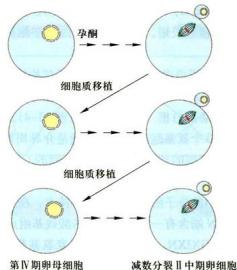  
图 13-3 成熟卵细胞细胞质移植发现 MPF 的存在

诱导卵母细胞成熟（图 13-3）。因而他们认为，在成熟的卵细胞的细胞质中，必然有一种物质，可以诱导卵母细胞成熟。他们将这种物质称作成熟促进因子，即 MPF。

进一步研究发现，用孕酮诱导卵母细胞成熟，卵母细胞需要进行一定程度的蛋白质合成。在有蛋白质合成抑制剂存在的情况下，孕酮不能诱导卵母细胞成熟。成熟卵细胞的细胞质诱导卵母细胞成熟，则不需要蛋白质合成；在蛋白质合成抑制剂存在的情况下，也可以诱导卵母细胞成熟。这些实验结果提示，在成熟卵细胞中，MPF已经存在，只是处于非活性状态，被称为前体MPF（pre-MPF）。非活性态的前体MPF通过翻译后修饰，可以转化为活性态的MPF。

MPF 被发现以后，不少学者便着手 MPF 的纯化工作，但一直进展缓慢，直到 1988 年，J. L. Maller 实验室的 M. J. Lohka 等人以非洲爪蟾卵为材料，分离获得了微克级的纯化 MPF，并证明其主要含有 p32 和 p45 两种蛋白。p32 和 p45 结合后，表现出蛋白激酶活性，可以使多种蛋白质底物磷酸化。因而证明，MPF 是一种蛋白激酶。

## 二、p34 $^{Cdc2}$ 激酶的发现及其与 MPF 的关系

在研究 MPF 工作的同时，另一批生物学家则以酵母为材料，从另一个侧面对细胞周期调控进行着深入研究。以 L. H. Hartwell 为代表的酵母遗传学家在不同温度条件下培养芽殖酵母，分离获得了数十个温度敏感型突变株（temperature-sensitive mutant, ts）。对芽殖酵母来说，允许温度（permissive temperature）常为20～23℃，限定温度（restrictive temperature）通常为35～37℃。突变株最基本的特点是，在允许温度条件下，可以正常分裂繁殖，而在限定温度条件下，则不能正常分裂繁殖。这种在限定温度下失去正常分裂繁殖能力的现象，是由于某个基因发生突变而引起的。不同的突变株，发生突变的基因不同；在限定温度下，细胞在细胞周期中所停留的时相以及细胞所表现出的形态结构也常常是不同的，因而可以对不同突变株的基因变化和基因表达进行综合分析。以P.M.Nurse为代表的另一批酵母生物学家在不同温度下培养裂殖酵母细胞，也分离出了数十个温度敏感型突变株。和芽殖酵母类似，在限定温度下，不同突变株的某个基因也发生了突变，其细胞停留在细胞周期中的某个特定时相。CDC基因调控酵母细胞分裂和细胞周期，根据CDC基因被发现的先后顺序等，对这些基因进行了命名，如Cdc2、Cdc25、Cdc28等，尽管当时CDC基因尚未被分离出来。

Cdc2基因是裂殖酵母细胞中最重要的基因之一。Cdc2基因突变导致细胞停留在 $\mathrm{G}_2 / \mathrm{M}$ 期交界处。Cdc2基因也是第一个被分离出来的CDC基因。它的表达产物为一种分子质量为 $34\mathrm{kDa}$ 的蛋白质，被称为p34Cdc2。进一步研究发现， $\mathsf{p34^{Cdc2}}$ 具有蛋白激酶活性，可以使多种蛋白底物磷酸化，因而又被称为 $\mathsf{p34^{Cdc2}}$ 激酶。 $\mathsf{p34^{Cdc2}}$ 激酶在裂殖酵母细胞周期调控过程中，起着关键性作用。在芽殖酵母中也有一个关键性的CDC基因，称为Cdc28。Cdc28基因突变，芽殖酵母细胞或者停留在 $\mathrm{G}_1/$ S期交界处，或者停留在 $\mathrm{G}_2 / \mathrm{M}$ 期交界处。Cdc28基因是继Cdc2基因之后，第二个被分离出来的CDC基因。Cdc28基因产物也是一种分子质量为 $34\mathrm{kDa}$ 的蛋白质，称为 $\mathsf{p34^{Cdc28}}$ 。 $\mathsf{p34^{Cdc28}}$ 也是一种蛋白激酶，在 $\mathrm{G}_2 / \mathrm{M}$ 期转换过程中起着中心调节作用，因而是 $\mathsf{p34^{Cdc2}}$ 的同源物。同时， $\mathsf{p34^{Cdc28}}$ 对 $\mathrm{G}_1 / \mathrm{S}$ 期转换也是必需的。更进一步的研究发现，不管是 $\mathsf{p34^{Cdc2}}$ 还是 $\mathsf{p34^{Cdc28}}$ ，其本身并不具有激酶活性，只有其与有关蛋白质结合后，其激酶活性才能够表现出来。例如， $\mathsf{p34^{Cdc2}}$ 必须和另一种蛋白质 $\mathsf{p56^{Cdc11}}$ 结合，才具有激酶活性。

知道 $p34^{Cdc2}$ 与 MPF 都具有激酶活性并能够促进 $G_{s}/M$ 期转换以后，人们不禁要问， $p34^{Cdc2}$ 和 MPF 有何关系呢？当 MPF 的基本构成被确认以后，Maller 实验室和 Nurse 实验室立即开始合作，很快便证明 MPF 中的 p32 可以被 $p34^{Cdc2}$ 特异抗体所识别，并且 $p34^{Cdc2}$ 多肽片段可以增强 MPF 活性，表明二者为同源物。其同源性又被后来的序列分析进一步证明。了解 p32 与 p34 $^{Cdc2}$ 以后，人们进一步提出，蛙 MPF 的 p45 和酵母的 p56 $^{Cdc13}$ 是否也有一定关系呢？

在开展上述工作的同时，以R.T.Hunt为代表的另一些科学家以海胆卵为材料，对细胞周期调控进行了深入的研究。J.R.Evans等人于1983年报道，在海胆卵细胞中存在有两种特殊蛋白质。这两种蛋白质的含量随细胞周期进程变化而变化，一般在细胞间期内积累，在细胞分裂期内消失，在下一个细胞周期中又重复这一消长现象，因而他们将这两种蛋白质命名为周期蛋白（cyclin）。随后，这些周期蛋白很快便被分离和克隆出来，并被证明广泛存在于从酵母到人类等各种真核生物中。进一步研究证明，周期蛋白为诱导细胞进入M期所必需。而且，各种生物之间的周期蛋白在功能上有着广泛的互补性。将海胆cyclinB的mRNA引入到非洲爪蟾卵非细胞体系中，其翻译产物可以诱导该非细胞体系进行多次细胞周期循环。将一种基因工程表达的抗降解的cyclin $\Delta 90$ 引入非洲爪蟾卵非细胞体系或直接显微注射到非洲爪蟾卵细胞中，可以稳定MPF活性。所有这些实验结果均提示周期蛋白可能参与MPF的功能调节。当MPF被提纯以后，Maller实验室和Hunt实验室立即开始合作，并很快证明MPF的另一种主要成分为cyclinB。序列分析证明，cyclinB与酵母的p56Cdc13为同源物。至此，MPF的生化成分便被确定下来，它含有两个亚基，即Cdc2为其催化亚基，周期蛋白为其调节亚基。当两者结合后，表现出蛋白激酶活性。

## 三、周期蛋白

自1983年首次发现周期蛋白后，许多科学家纷纷开展周期蛋白研究。在短短的十年间，人们便从各种生物体中克隆分离了数十种周期蛋白，如酵母的Cln1、Cln2、Cln3、Clb1—Clb6，高等动物的周期蛋白A1、A2、B1、B2、B3、C、D1、D2、D3、E1、E2、F、G、H、L1、L2、T1、T2等。目前在人体中已经发现25种周期蛋白。这些周期蛋白在细胞周期内表达的时相有所不同，所执行的功能也多种多样。这些周期蛋白有的只在 $G_{1}$ 期表达并只在 $G_{1}$ 期和S期转化过程中执行调节功能，所以常被称为 $G_{1}$ 期周期蛋白，如cyclin C、D、E、Cln1、Cln2、Cln3等；有的虽然在间期表达和积累，但到M期时才表现出调节功能，所以常被称为M期周期蛋白，如cyclin A、B等。 $\mathrm{G}_{1}$ 期周期蛋白在细胞周期中存在的时间相对较短。M期周期蛋白在细胞周期中则相对稳定。

各种周期蛋白之间有着共同的分子结构特点，但也各有特性。首先，它们均含有一段相当保守的氨基酸序列，称为周期蛋白框（cyclin box）（图13-4）。周期蛋白框含约100个氨基酸残基，其功能是介导周期蛋白与CDK结合。不同的周期蛋白框识别不同的CDK，组成不同的cyclin-CDK复合体，表现出不同的CDK活性。M期周期蛋白的分子结构还有另一个特点，在这些蛋白质分子的近N端含有一段由9个氨基酸残基组成的特殊序列（RXXLGXIXN，其中X代表任意氨基酸），称为破坏框（destruction box）。在破坏框之后，为一段约40个氨基酸残基组成的赖氨酸富集区。破坏框主要参与泛素依赖性的cyclin A和B的降解。 $G_{1}$ 期周期蛋白分子中不含破坏框，但其C端含有一段特殊的PEST序列。研究认为，PEST序列与 $G_{1}$ 期周期蛋白的更新有关。

不同的周期蛋白在细胞周期中表达的时期不同，并与不同的CDK结合，调节不同的CDK活性。图13-5显示了几种周期蛋白在哺乳动物细胞和酵母细胞中的表达和积累状态。在哺乳动物细胞中，cyclin A在 $\mathrm{G}_1$ 期的早期即开始表达并逐渐积累，到达 $\mathrm{G}_1 / \mathrm{S}$ 期交界处，其含量达到最大值并一直维持到 $\mathrm{G}_2 / \mathrm{M}$ 期；cyclin B则从 $\mathrm{G}_3$ 期晚期开始表达并逐渐积累，到 $\mathrm{G}_2$ 期后期阶段达到最大值并一直维持到M期的中期阶段，然后迅速降解；作为 $\mathrm{G}_1$ 期周期蛋白的cyclin D在细胞周期中持续表达；而cyclin E则在M期的晚期和 $\mathrm{G}_1$ 期早期开始表达并逐渐积累，到达 $\mathrm{G}_1$ 期的晚期，其含量达到最大值，然后

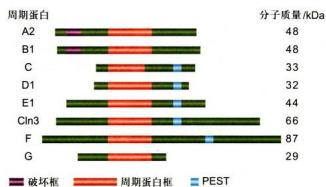  
图13-4 部分周期蛋白分子结构特征

图中显示的，除Cln3外，均为人类的周期蛋白分子。所有这些分子均含有一个周期蛋白框。M期周期蛋白（A2、B1）分子的N端含有一个破坏框。G₁期周期蛋白的C端含有一个PEST序列。

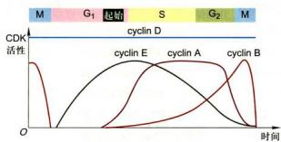

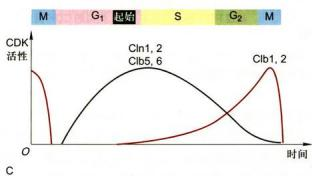

  
图 13-5 部分哺乳动物和酵母细胞周期蛋白在细胞周期中的积累及其与 CDK 活性的关系

A.哺乳动物细胞周期。B.芽殖酵母细胞周期。C.裂殖酵母细胞周期。

逐渐下降，到达 $G_{2}$ 期的晚期，其含量降到最低值。在裂殖酵母和芽殖酵母中，周期蛋白含量的消长情况与哺乳动物细胞中的有许多相似之处。作为 M 期周期蛋白，芽殖酵母中的 Clb1、Clb2 和裂殖酵母中的 Cdc13、Cig1 均在 $G_{1}$ 期的后期开始表达，到 $G_{2}$ 期达到最大值，到达 M 期中期后则迅速消失。作为 $G_{1}$ 期周期蛋白，芽殖酵母中的 Cln1、Cln2 和裂殖酵母中的 Cig2 则在 M 期的后期开始表达，到达 $G_{1}$ 期后期的“起始点”前，其含量达到最大值，然后逐渐降低，到达 $G_{2}$ 期时降到最低值。另外，在裂殖酵母中还发现其他两种 B 类周期蛋白 Clb3、Clb4。二者的表达早于 Clb1 和 Clb2。但对其功能尚了解不多。有人推测它们可能在 $G_{1}/S$ 期转化和 S

期中起调节作用。

对于其他种类的周期蛋白的功能研究，有的已经取得重要进展，有的尚在积极研究之中。

## 四、CDK 和 CDK 抑制因子

当酵母 Cdc2 和 Cdc28 基因被分离出来后，几个实验室便立即着手 Cdc2 或 Cdc28 类同基因的分离工作。他们首先通过 PCR 技术构建了人类、非洲爪蟾和果蝇的 cDNA 文库，然后对 cDNA 文库进行筛选。结果成功分离到了十多个 Cdc2 相关基因。通过基因序列和蛋白质功能分析，证明有的确实是 Cdc2 类同基因，与酵母 Cdc2 基因相比较，不仅同源性强，在蛋白质功能方面也有很强的互补性。也有的不仅在序列方面与 Cdc2 有一定差异，在蛋白质功能方面也表现出一定的特殊性。但是，它们又含有两个共同的特点：一个是它们含有一段类似的氨基酸序列，另一个是它们都可以与周期蛋白结合，并以周期蛋白作为调节亚基，进而表现出蛋白激酶活性。因而，它们被统称为周期蛋白依赖性蛋白激酶（cyclin-dependent kinase, CDK）。目前在人体中已发现并被命名的 CDK 包括 Cdc2、Cdk2—Cdk13 等。由于 Cdc2 第一个被发现，而其他几个 CDK 则是通过与其相比较而得来，因而 Cdc2 激酶被命名为 Cdk1。不同的 CDK 所结合的周期蛋白不同，在细胞周期中执行的调节功能也不相同。对不同的 CDK 的功能认识，有的比较清楚，有的正在深入。某些 CDK 与周期蛋白的配对关系，见表 13-1。

各种 CDK 分子均含有一段类似的 CDK 激酶结构域 (CDK kinase domain)。与 Cdk1 激酶结构域相比，其他几种 CDK 激酶结构域的保守程度有所不同（图 13-6）。但是，在 CDK 激酶结构域中，有一小段序列则相当保守，即 PSTAIRE 序列。据认为，此序列与周期蛋白结合有关。此外，在 CDK 分子中也发现一些重要位点。对这些位点进行磷酸化修饰，将对 CDK 活性起重要调节作用。细胞内存在多种因子，对 CDK 分子结构进行修饰，参与 CDK 活性的调节。

除周期蛋白和上述修饰性调控因子对 CDK 活性进行调控之外，细胞内还存在一些对 CDK 活性起负调控的蛋白质，称为 CDK 抑制因子（cyclin-dependent kinase inhibitor, CKI）。到目前为止，已经发现多种对 CDK 起负调控作用的 CKI，分别归为 Cip/Kip 家族和 INK4 家族。Cip/Kip 家族成员主要包括 p21 $^{Cip/Waft}$ 、p27 $^{Kip}$ 和p57Kp2，其中 p21 $^{CipWai1}$ 为此家族的典型代表。p21 主要对 G $_{1}$ 期 CDK（Cdk2、Cdk3、Cdk4 和 Cdk6）起抑制作用。p21 还可以与 PCNA（proliferating cell nuclear antigen）直接结合。PCNA 是 DNA 聚合酶 δ 的辅助因子，为 DNA 复制所必需。p21 与 PCNA 结合，可以直接抑制 DNA 复制。INK4 家族成员主要包括 p16、p15、p18 和 p19 等，p16 为此家族的典型代表。p16 主要抑制 Cdk4 和 Cdk6 活性。

表 13-1 某些 CDK 与周期蛋白的配对关系及执行功能的时期

<table><tr><td>CDK 种类</td><td>可能结合的周期蛋白</td><td>执行功能的可能时期</td></tr><tr><td>Cdk1(p34 $^{Cok2}$ )</td><td>A, B1, B2, B3</td><td> ${\mathrm{G}}_{\mathrm{i}}/\mathrm{M}$ </td></tr><tr><td>Cdk2</td><td>A, D1, D2, D3, E</td><td> ${\mathrm{G}}_{\mathrm{i}}/\mathrm{S},\mathrm{S}$ </td></tr><tr><td>Cdk3</td><td></td><td> ${\mathrm{G}}_{\mathrm{i}}/\mathrm{S}$ </td></tr><tr><td>Cdk4</td><td>D1, D2, D3</td><td> ${\mathrm{G}}_{\mathrm{i}}/\mathrm{S}$ </td></tr><tr><td>Cdk5</td><td>D1, D3</td><td></td></tr><tr><td>Cdk6</td><td>D1, D2, D3</td><td> ${\mathrm{G}}_{\mathrm{i}}/\mathrm{S}$ </td></tr><tr><td>Cdk7</td><td>H</td><td></td></tr><tr><td>Cdk8</td><td>C</td><td></td></tr><tr><td>Cdk9</td><td>T1, T2a, T2b, K</td><td></td></tr><tr><td>Cdk10</td><td></td><td> ${\mathrm{G}}_{\mathrm{i}}/\mathrm{M}$ </td></tr><tr><td>Cdk11p58</td><td></td><td> ${\mathrm{G}}_{\mathrm{i}}/\mathrm{M}$ </td></tr><tr><td>Cdk11p110</td><td></td><td></td></tr><tr><td>Cdk12L</td><td>L1, L2</td><td></td></tr><tr><td>Cdk12S</td><td>L1, L2</td><td></td></tr></table>

## 五、细胞周期运转调控

目前已经公认，CDK对细胞周期运行起着核心性调控作用，因此将其称为周期引擎分子（engine molecule）。不同种类的周期蛋白与不同种类的CDK结合，构成不同的 $\mathrm{CDK}$ 。不同的CDK在细胞周期的不同时期表现活性，因而对细胞周期的不同时期进行调节。例如，与 $\mathrm{G}_1$ 期周期蛋白结合的CDK在 $\mathrm{G}_1$ 期起调节作用，与M期周期蛋白结合的CDK在M期起调节作用。

## (一) $G_{2} / M$ 期转化与Cdk1的关键性调控作用

如上所述，Cdk1即MPF，或p34 $^{Cdc2}$ 激酶，由p34 $^{Cdc2}$ （或p34 $^{Cdc28}$ ）蛋白和cyclin B结合而成。p34 $^{Cdc2}$ 蛋白在细胞周期中的含量相对稳定，而cyclin B的含量则呈现周期性变化。 $p34^{cdc2}$ 蛋白只有与cyclin B结合后才有可能表现出激酶活性。因而，Cdk1活性首先依赖于cyclin B含量的积累。cyclin B一般在 $G_{1}$ 期的晚期开始合成，通过S期，其含量不断增加，到达 $G_{2}$ 期，其含量达到最大值。随cyclin B含量积累到一定程度，Cdk1活性开始出现。到 $G_{2}$ 期晚期阶段，Cdk1活性达到最大值并一直维持到M期的中期阶段。Cdk1活性和cyclin B含量的关系（图13-7）。cyclin A也可以与Cdk1结合成复合体，表现出CDK1活性。

  
图 13-6 通过 PCR 技术测定与 Cdk1 类似的 CDK 蛋白分子图解  
图中以 Cdk1（Cdc2）氨基酸序列为标准（100%），将其他 CDK 激酶结构域的氨基酸序列与其比较，得到序列相似度百分比。

Cdk1 通过使某些底物蛋白磷酸化，改变其下游的某些靶蛋白的结构和启动其功能，实现其调控细胞周期的作用。Cdk1 催化底物磷酸化有一定的位点特异性，即选择底物中某个特定序列中的某个丝氨酸或苏氨酸残基。Cdk1 可以使多种底物蛋白磷酸化，其中包括组蛋白 H1，核纤层蛋白 A、B、C，核仁蛋白 (nucleolin)，No38, p60 $^{5csc}$ ，c-Abl 等（表 13-2）。组蛋白 H1 磷酸化，促进染色质凝结；核纤层蛋白磷酸化，促使核纤层解

  
图 13-7 cyclin B 在 Cdk1 活性调节过程中的作用

Cdk1 活性首先依赖于 cyclin B 含量的积累。cyclin B 的含量达到一定值并与 CDK 蛋白结合，同时在其他一些因素的调节下，逐渐表现出最高激酶活性。

聚；核仁蛋白磷酸化，促使核仁解体； $p60^{c-Src}$ 蛋白磷酸化，促使细胞骨架重排；c-Abl蛋白磷酸化，促使细胞形态调整等。

CDK 活性受到多种因素的综合调节。周期蛋白与 CDK 结合是激活 CDK 活性的先决条件。但是，仅周期蛋白与 CDK 结合，并不能使 CDK 激活。还需要其他几个步骤的修饰，才能表现出激酶活性。首先，当周期蛋白与 CDK 结合形成复合物后，Weel/Mik1 激酶和 CDK 活化激酶（Cdk1-activiting kinase）催化 CDK 第 14 位的苏氨酸（Thr14）、第 15 位的酪氨酸（Tyr15）和第 161 位的苏氨酸（Thr161）磷酸化。但此时的 CDK 仍不表现激酶活性（称为前体 MPF）。然后，CDK 在蛋白磷酸水解酶 Cdc25C 的催化下，使其 Thr14 和 Tyr15 去磷酸化，才能表现出激酶活性。Cdk1 活性

调控见图 13-8。

在体外培养的细胞和单细胞生物中，CDK活性是细胞生命活动所需要的。解除CDK活性，往往导致细胞生命活动停滞和死亡。但在小鼠中，敲除一些被认为是细胞生命活动所必需的CDK活性，如Cdk2、Cdk4、Cdk6、cyclin A、cyclin E、cyclin D等，动物可以存活，因而推测CDK之间可以代偿一些功能。CDK活性敲除实验也揭示了CDK在个体发育等方面的功能。例如，Cdk4敲除小鼠个体矮小，内分泌器官发育不良，导致糖尿病和不育等。Cdk6敲除小鼠个体不正常，脾和胸腺发育不全，某些T淋巴细胞类群对抗原的应答滞后等。Cdk2敲除小鼠不育。由此可见，细胞周期调控因子对生物体个体和器官的发育也起着重要调节作用。

表 13-2 某些 Cdk1 底物及其磷酸化后可能产生的生理效应

<table><tr><td>Cdk1 底物</td><td>序 列</td><td>M 期的可能作用</td></tr><tr><td>核纤层蛋白 B</td><td>PLSPTR</td><td>核纤层解聚,核膜崩解</td></tr><tr><td>核纤层蛋白 A</td><td>TLSPTR</td><td>核纤层解聚,核膜崩解</td></tr><tr><td>核纤层蛋白 C</td><td>-</td><td>核纤层解聚,核膜崩解</td></tr><tr><td>核纤层 L67(clam)</td><td>SPTR</td><td>核纤层解聚,核膜崩解</td></tr><tr><td>波形蛋白</td><td>-</td><td>分裂期中间纤维体系再调整</td></tr><tr><td>微管结合蛋白 MAP-220</td><td>SSPGG</td><td>使其失去刺激微管组装作用</td></tr><tr><td>组蛋白 H1</td><td>-</td><td>染色体凝缩</td></tr><tr><td>p60  ${}^{\text{cDisc }}$ </td><td>K/RS/TPXK</td><td>进一步磷酸化其他物质(细胞骨架重排)</td></tr><tr><td>No38</td><td>QTPNK</td><td>核仁分解;抑制核糖体合成?</td></tr><tr><td>核仁蛋白</td><td>TPXKK</td><td>核仁分解,抑制核糖体合成?</td></tr><tr><td>cyclin B</td><td>TPXKK</td><td>调节 Cdk1 活性</td></tr><tr><td>EF-1b, EF-1r</td><td>-</td><td>翻译抑制</td></tr><tr><td>SV40T</td><td>-</td><td>-</td></tr><tr><td>p53</td><td>HSTPPKKKRKV</td><td>影响其亚细胞定位</td></tr><tr><td>c-Abl</td><td>SSSPOK</td><td>调节细胞形态</td></tr><tr><td>c-Myb</td><td>APDTPEL</td><td>降低与 DNA 结合能力</td></tr><tr><td>钙调蛋白结合蛋白 ( caldesmon )</td><td>PAVSPLL</td><td>降低与肌动蛋白结合能力,从微丝上游离下来</td></tr><tr><td>肌球蛋白</td><td>S/TPXK/R</td><td>抑制胞质分裂</td></tr><tr><td>GTP 结合蛋白</td><td>SP/TP</td><td>抑制细胞内物质运输</td></tr><tr><td>HMG1</td><td>Ser1, 2; Thr9 KIQSTPVK; RSPR ZPSZPTPK</td><td>降低与 DNA 结合能力</td></tr></table>

催化位点通式：S/TPXZ。S/T：Ser/Thr；X：一种极性氨基酸残基；Z：一般为一种碱性氨基酸残基。斜体字母表示磷酸化氨基酸残基位点。

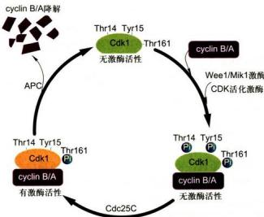  
图 13-8 Cdk1 激酶活性综合调控示意图

## （二）M期周期蛋白与细胞分裂中期向后期转换

细胞周期运转到分裂中期后，M期cyclin A和B将迅速降解，Cdk1活性丧失，上述被Cdk1磷酸化的靶蛋白去磷酸化，细胞周期便从M期中期向后期转化。目前已经知道，cyclin A和B的降解是通过泛素化依赖途径实现的。

如前所述，伴随cyclin-CDK复合物形成，CDK亚基Thr14、Tyr15和Thr161残基磷酸化，以及Thr14和Tyr15去磷酸化，cyclin-CDK复合物激酶活性表现出来，Thr161位点保持磷酸化状态是Cdk1活性表现所必需的（图13-8）。有丝分裂中期过后，周期蛋白与CDK分离，在APC的作用下，M期cyclinA和B通过泛素化依赖途径被蛋白酶体降解（参见图5-2由泛素和蛋白酶体所介导的蛋白质降解途径）。M期周期蛋白在泛素化途径降解过程中，其分子中的破坏框起着重要的调节作用。用基因突变方法将破坏框去除，所得到的突变分子将不能被泛素化途经所降解，因而可以较长时间地保持活性。

1995年，两个实验室率先分离并部分纯化了具有E3活性的蛋白质复合物。首先，V. Sudakin等人在青蛙卵中分离到了一个分子质量为 $1500\mathrm{kDa}$ 的蛋白质复合物，称为cyclosome。在E1、E2、泛素和ATP再生体系存在的情况下，cyclosome可以在体外将cyclinA和B通过泛素化途径降解。几乎与此同时，R.W.King等人在非洲瓜蛾卵中分离到了一个20S的蛋白质复合物，即后期促进复合物（anaphase-promoting complex,

APC),也支持cyclin B通过泛素化途径体外降解。此后证明，cyclosome和APC为同源物，而APC这一名词则更广为应用。APC的发现是细胞周期研究领域中又一大进展，表明细胞分裂中期向后期转换也受到精密调控。进一步研究证明，APC至少有15种成分组成，分别为Apc1—Apc15。这些蛋白质成分在不同物种中大部分已鉴定出来，如在人体中已鉴定了Apc1—Apc8，Apc10—Apc13，以及Cdc26等13种，在芽殖酵母和裂殖酵母中也已分别鉴定出了13种APC成分。在不同物种中鉴定的15种成分中，有的为过去已知的成分，如Cdc16、Cdc23、Cdc27和BimE等，有的为未知成分。S. Tugendreich等人（1995）克隆了人类的Cdc16和Cdc27基因，并证明Cdc16Hs和Cdc27Hs蛋白位于哺乳动物细胞的中心体和纺锤体上。用抗Cdc27Hs的抗体进行显微注射，可以将细胞抑制在分裂中期。在非洲爪蟾体系中，用抗Cdc27Hs的抗体处理上述20S的APC，可以使APC的泛素化活性丧失。在Kim Nasmyth实验室工作的另一些科学家则在芽殖酵母细胞中证明，Cdc16和Cdc23也为cyclin B的降解所必需。BimE基因最早发现于构巢曲霉（Aspergillus nidulans）温度敏感突变株bimE7。bimE7细胞在正常温度下可以正常生活，若放到限定温度下培养，BimE7基因会发生突变，引起细胞早熟性地进入分裂期。即使用药物处理，将细胞先抑制在S期，然后再放到限定温度下培养，也会引起细胞早熟性地进入分裂期，说明BimE是一种细胞分裂负调控因子。对BimE的确切作用机制，目前尚不甚清楚。APC除了调节M期周期蛋白泛素化依赖降解途径外，还调节其他一些与细胞周期调控有关的非周期蛋白类蛋白质的降解，如裂殖酵母中的Cut2和芽殖酵母中的Pds1p等。已知Cut2和Pds1p均为细胞分裂由中期向后期转换的负调控因子。

了解APC活性变化是认识细胞周期由分裂中期向后期转换的关键问题之一。APC活性受到多种因素的综合调节。目前已知，细胞中存在正、负两类APC活性调节因子。激活APC的正调控因子有Cdc20/Fizzy和Cdh1/Fzy等，负调控因子有Emi1、Emi2、Mad2、BubR1等。首先，已知各类APC在分裂间期中表达，但只有到达M期后才表现出活性，提示M期CDK激酶活性可能对APC的活性起着调节作用。体外实验显示，APC可以被活化的M期CDK所激活，且多种APC作为底物被M期CDK磷酸化；而活化的APC则可以被蛋白磷酸水解酶作用而失活。其次发现，Cdc20为APC有效的正调控因子。Cdc20主要位于染色体动粒上，为姐妹染色单体分离所必需。APC活性亦受到纺锤体组装检查点（spindle assembly checkpoint）的调控。纺锤体组装不完全，或所有动粒不能被动粒微管全部捕捉，APC则不能被激活。目前已经知道，在纺锤体组装调控过程中，Mad2（mitosis arrest deficient 2）蛋白起着重要作用。正常情况下，Mad2定位在早中期和错误排列的中期染色体的动粒上，纺锤体组装不完全，动粒不能被动粒微管捕捉，Mad2则不能从动粒上解离下来。因此，Mad2蛋白为细胞延迟进入后期提供了一种“等待”信号。Mad2与Cdc20结合，有效地抑制Cdc20的活性。当纺锤体组装完成以后，动粒全部被动粒微管捕捉，Mad2从动粒上消失，从而解除对Cdc20的抑制作用，促使APC活化，导致M期周期蛋白降解，M-CDK活性丧失；在酵母细胞中，促使Cut2/Pds1p降解，解除其对姐妹染色单体分离的抑制，细胞则由中期向后期转化。

## （三） $G_{1}/S$ 期转化与 $G_{1}$ 期周期蛋白依赖性 CDK

细胞由 $\mathrm{G}_1$ 期向S期转化是细胞增殖过程中的关键事件之一。细胞能否成功地实现由 $\mathrm{G}_1$ 期向S期转化，标志着该细胞能否完成其DNA复制和其他相关生物大分子的合成，进而完成细胞分裂。目前一般认为，细胞由 $\mathrm{G}_1$ 期向S期转化主要受 $\mathrm{G}_1$ 期周期蛋白依赖性CDK所控制。在哺乳动物细胞中， $\mathrm{G}_1$ 期周期蛋白主要包括cyclinD、E，或许还有cyclinA。与 $\mathrm{G}_1$ 期周期蛋白结合的CDK主要包括Cdk2、Cdk4和Cdk6等。cyclinD主要与Cdk4和Cdk6结合并调节后者的活性，而cyclinE则与Cdk2结合。cyclinA常被认为属M期周期蛋白，但cyclinA也可与Cdk2结合使后者表现激酶活性，提示cyclinA可能参与调控 $\mathrm{G}_1 / \mathrm{S}$ 转化过程。

目前已知哺乳动物细胞中表达三种cyclin D，即D1、D2和D3，但三者的表达有细胞和组织特异性。据推测，在快速增殖的细胞中至少表达一种cyclin D。一般情况下，一种细胞仅表达两种cyclin D，即D3和D1或D2。在细胞水平上所做的实验，包括特异的抗cyclin D的抗体显微注射和反义RNA显微注射等，显示cyclin D为细胞 $G_{1}/S$ 期转化所必需。cyclin D-Cdk4和cyclin D-Cdk6不能使组蛋白H1磷酸化。对cyclin D-CDK的底物仍已知甚少，目前仅知道Rb蛋白(retinoblastoma protein，成视网膜细胞瘤蛋白）为其底物。Rb蛋白是E2F的抑制因子，在哺乳类 $G_{1}$ 期细胞中起“刹车”作用，因此Rb蛋白是 $G_{1}/S$ 期转化的负调控因子，在 $G_{1}$ 期的晚期阶段通过磷酸化而失活。

cyclin E 是哺乳类细胞中表达的另一种 $G_{1}$ 期周期蛋白。它在 $G_{1}$ 期的晚期开始合成，并一直持续到细胞进入 S 期。当细胞进入 S 期后，cyclin E 很快即被降解。cyclin E 与 Cdk2 结合形成复合物，呈现 Cdk2 活性。因而，cyclin E-Cdk2 活性峰值时间为 $G_{1}$ 期晚期到 S 期的早期阶段。大量实验显示，cyclin E-Cdk2 活性为 S 期启动所必需。在果蝇胚胎发育过程中，如果将 cyclin E 进行基因突变，该胚胎的细胞则被阻止在 $G_{1}$ 期。将抗 cyclin E 的特异抗体做细胞显微注射，被注射的细胞便停留在 $G_{1}$ 期。用非洲爪蟾卵提取物进行细胞核重建和 DNA 复制实验，如果事先将 cyclin E 从卵提取物中用免疫沉淀方法去除，重建的细胞核不能复制 DNA。在哺乳动物细胞中，TGFβ 是一种生长抑制因子。有实验表明，cyclin E-Cdk2 是 TGFβ 作用的主要靶酶。TGFβ 可以有效地抑制 cyclin E-Cdk2 活性，进而将细胞阻止在 $G_{1}$ 期。也有一些证据显示，cyclin E 在肿瘤细胞中的含量比正常细胞中要高得多。在细胞中提高 cyclin E 的表达，该细胞则快速进入 S 期，而且对生长因子的依赖性降低。

实验表明，cyclin E-Cdk2 可以与类 Rb 蛋白 p107 和转录因子 E2F 结合形成复合物。与 Rb 蛋白相似，p107 可以将 SAOS 细胞抑制在 $G_{1}$ 期。而 E2F 则可以促进与 $G_{1}/S$ 期转化和 DNA 复制有关的基因转录。一般认为，当 cyclin E-Cdk2 激酶与 p107 和 E2F 结合形成复合物之后，Cdk2 催化 p107 磷酸化，使 p107 失去抑制作用，则 E2F 的作用被显现出来，促进有关基因的转录，从而促使细胞周期由 $G_{1}$ 期向 S 期转化。此外，最近有几个实验室相继证明，cyclin E-Cdk2 直接参与了中心体复制的起始调控。

cyclin A 也可以与 Cdk2 结合，形成 cyclin A-Cdk2。cyclin A 的合成开始于 G₁/S 期转化时期。进入 S 期后，cyclin A-Cdk2 激酶成为该时期主要的 CDK。目前有实验显示 cyclin A-Cdk2 与 DNA 复制有关。在 S 期，cyclin A-Cdk2 复合物位于 DNA 复制中心。将抗 cyclin A 的抗体注射到细胞中将抑制细胞 DNA 的合成。在体外，cyclin A-Cdk2 可以使 DNA 复制因子 RF-A 磷酸化并使其活性增强。此外，cyclin A-Cdk2 也可以与 p107 和 E2F 结合形成复合物，进而影响 E2F 促进基

因转录的功能。

到达S期的一定阶段， $\mathrm{G}_1$ 期周期蛋白也是通过泛素化依赖途径降解的，但与M期周期蛋白的降解有所不同。 $\mathrm{G}_1$ 期周期蛋白的降解是通过SCF(Skp-cullin-F-box protein)泛素化途径降解的，同时需要 $\mathrm{G}_1$ 期CDK活性的参与。 $\mathrm{G}_1$ 期周期蛋白分子中不含有破坏框序列，而是含有PEST序列。PEST序列对 $\mathrm{G}_1$ 期周期蛋白降解起促进作用。此外，一些参与DNA复制的调控因子如Cdt1和Orc1，以及CDK抑制因子如p21、p27和p57等，也是通过SCF泛素化依赖途径降解的。SCF通过降解细胞周期的不同时期的不同的底物从而在整个细胞周期中都发挥作用（图13-9）。SCF是一种由多亚基构成的蛋白复合物，具有E3泛素连接酶的功能。SCF主要由Skp1、Cul1和Rbx1三种亚基构成，可以被Skp2、Fbw7和β-TrCP三种F-box蛋白分别活化，催化底物蛋白的泛素化。SCF的底物特异性的识别是由F-box蛋白来决定的（图13-10）。

除 $\mathrm{G}_{1}$ 期周期蛋白依赖性CDK活性之外，细胞内还存在其他多种因素对DNA复制起始活动进行综合调控。首先，DNA复制起始点的识别，是DNA复制调

  
图 13-9 APC 和 SCF 在细胞周期中的活性及其底物

图中显示细胞周期不同时相 SCF 和 APC 泛素化连接酶的底物蛋白。SCF 主要在细胞间期 $G_{1}$ 、S 和 $G_{2}$ 期发挥功能。SCF 的 3 种 F-box 蛋白 Skp2、Fbw7 和 $\beta$ -TrCP 分别用 3 种不同的颜色表示，其相应的底物也用相应的颜色表示。APC 主要在细胞有丝分裂期 M 期以及 $G_{1}$ 期早期发挥功能。APC 的两个负责底物识别的因子 Cdc20 和 Cdh1 分别用两种不同的颜色表示，其相应的底物也用相应的颜色表示。

控中的重要事件之一。已经发现，从酵母细胞到高等哺乳类细胞，均存在一种多亚基蛋白复合物，称为复制起始点识别复合物（origin recognition complex, ORC）。ORC 含有 6 个亚基，分别称为 Orc1—Orc6。ORC 识别 DNA 复制起始位点并与之结合，是 DNA 复制起始所必需的。其次，Cdc6 和 Cdc45 也是 DNA 复制所必需的调控因子。如果将 Cdc6 和 Cdc45 去除，DNA 便不能起始复制。Cdc6 在 G₁ 期早期与染色质结合，到 S 期早期从染色质上解离下来。Cdc45 约在 G₁ 期晚期才与染色质结合，Cdc6 对 Cdc45 与染色质结合起促进作用，但尚不知道是起直接作用还是间接作用。另外，在 20 世纪 80 年代末，人们还提出了一种 “DNA 复制执照因子学说”（DNA replication-licensing factor theory），并在此后的研究中取得突破性进展。人们早已知道，在整个细胞周期中 DNA 复制一次，而且只能一次。是什么因素控制细胞在一个细胞周期中 DNA 只能复制一次呢？为此，J. Blow 和 R. Laskey 通过实验提出，在细胞的胞质内存在一种执照因子，对细胞核染色质 DNA 复制发行 “执照”（licensing）。在 M 期，细胞核膜破裂，胞质中的执照因子与染色质接触并与之结合，使后者获得 DNA 复制所必需的 “执照”。细胞通过 G₁ 期后进入 S 期，DNA 开始复制。随 DNA 复制过程的进行，“执照”信号不断减弱直到消失。到达 G₂ 期，细胞核不再含有“执照”信号，DNA复制结束并不再起始。只有等到下一个M期，染色质再次与胞质中的执照因子接触，重新获得“执照”，细胞核才能开始新一轮的DNA复制。DNA复制执照因子是一种什么物质呢？提纯工作发现，Mcm蛋白（minichromosome maintenance protein）是其主要成分。Mcm蛋白共有6种，分别称为Mcm2、Mcm3、Mcm4、Mcm5、Mcm6和Mcm7。在细胞中去除任何一种Mcm蛋白，都将使细胞失去DNA复制起始功能。除Mcm蛋白之外，执照因子中还包括其他某些成分，但目前还不清楚。关于ORC、Cdc6、Cdc45和Mcm蛋白在与染色质结合过程中的相互关系，见图13-11。

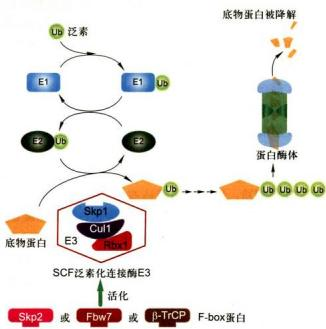  
图 13-10 SCF 泛素化依赖蛋白质降解途径

## （四） $S/G_{2}/M$ 期转换与 DNA 复制检查点

DNA复制结束，细胞周期由S期自动转换到 $\mathrm{G}_2$ 期，并准备进行细胞分裂。然而，为什么在DNA复制尚未完成之前，细胞不能开始 $\mathrm{S} / \mathrm{G}_2 / \mathrm{M}$ 期转化呢？原来，细胞中存在一系列检查DNA复制进程的监控机制。DNA复制还未完成或者DNA复制出现问题，细胞周期便不能向下一个阶段转换。DNA复制检查点主要包括两种：S期内部检查点（intra-S phase checkpoint）以及DNA复制检查点（replication checkpoint）（图13-12）。

S 期内部检查点是指在 S 期内发生 DNA 损伤如 DNA 双链发生断裂时，S 期内部检查点被激活，从而抑制复制起始点的启动，使 DNA 复制速度减慢，S 期延长，同时激活 DNA 修复和复制叉的恢复等机制。S 期内部检查点是通过两条信号通路来实现的。一条通路是通过染色体结构维持蛋白 Smc1 的磷酸化，从而实现 S 期的延长。而 Smc1 的磷酸化则依赖于 ATM-Mdc1-MRNC（Mre11-Rad50-Nbs1 complex）等中介物的系列催化过程。然而，磷酸化的 Smc1 是如何促使 DNA 复制停滞的，目前仍然不太清楚。另一条通路是通过 ATM/ATR 介导的 Cdc25A 磷酸酶过磷酸化而降解，从而抑制 cyclin E/A-Cdk2 活性。cyclin E/A-Cdk2 受到抑制后，阻止 Cdc45 在仍未起始复制的复制起始点上的募集。Cdc45 是 DNA 解旋酶 Mcm2—7 的关键的激活因子，因而这种方式能够抑制未起始复制的复制起始点。

另外一种是由于停滞的复制叉导致的S期的延长，被称为DNA复制检查点。DNA复制检查点主要是由 ATR/Chk1 激活来介导的。尽管对该机制中 ATR/Chk1 的底物还了解得很少，而 ATR/Chk1 介导的 Cdc25A 降解进而抑制 cyclin E/A-Cdk2 的通路在减缓整体 DNA 复制的效率中应该起到一定作用（图 13-12）。许多处于复制义上的复制蛋白都是 ATR 的底物并且被 ATR 磷酸化，它们包括 RFC 复合体 (replication factor C complex)、Rpa1 和 Rpa2、Mcm2—7 复合体、Mcm10，以及一些 DNA 聚合酶。然而，这些磷酸化事件的功能大部分都不清楚。

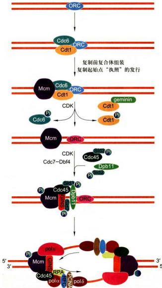  
图 13-11 ORC、Cdc6、Cdc45、CDK 和 Mcm 与染色质的结合及其在 DNA 复制起始调控中的作用

  
图 13-12 S/G₂/M 期转化与 DNA 复制检查点

S 期内部检查点和 DNA 复制检查点能够将细胞停滞在 S 期和 G/M 期。当 DNA 复制叉且阻尺引发单链 DNA 时，ATR-Chk1 通路被激活。当 DNA 双链断裂时，ATM-Chk2 通路被激活。S 期内部检查点由 Smc1 磷酸化通路和 Cdc25A-Cdk2/cyclin E/A-Cdc45 通路介导。DNA 复制检查点主要是由 ATR/Chk1 介导的 Cdc25A 降解从而抑制 cyclin E/A-Cdk2。ATM/ATR 是与 PI3K 同源的激酶，也是 DNA 损伤信号感受因子，进而激活下游信号通路。Chk2/Chk1：哺乳类细胞中 DNA 损伤信号感受因子的底物，又是下游效应器分子 Ser/Thr 激酶。

## 六、其他因素在细胞周期调控中的作用

除上述各种因素参与细胞周期调控之外，还有不少其他因素参与细胞周期调控，其中最为重要的一类因素为癌基因和抑癌基因。癌基因和抑癌基因均是细胞生命活动所必需的基因，其表达产物对细胞增殖和分化起着重要的调控作用。癌基因异常表达可导致细胞转化、增殖失控，甚至细胞癌变。目前已经分离了一百多种癌基因，其表达产物大致可归纳为蛋白激酶、多肽类生长因子、膜表面生长因子受体和激素受体、信号转导器、转录因子、类固醇和甲状腺激素受体、核蛋白等几个类型。它们在细胞周期信号调控过程中各自起着不同的作用。例如，生长因子与细胞表面的生长因子受体结合，可以促使 $\mathrm{G}_0$ 期的细胞返回细胞周期，开始细胞增殖。抑癌基因表达产物对细胞增殖起负调节作用，如p53、Rb等。p53是近年来研究较多的人类抑癌蛋白之一。p53基因突变，使细胞癌变的机会大大增加，已经证实，有许多肿瘤同时伴随p53基因突变。

除细胞内在因素外，细胞和机体的外在因素对细胞周期也有重要影响，如离子辐射、化学物质作用、病毒感染、温度变化、pH变化等。离子辐射对细胞最直接的影响之一是DNA损伤。DNA损伤后，细胞会很快启动其DNA损伤修复调控体系，抑制细胞周期运转，直到DNA损伤得以完全修复；或者最终不能完成修复，致使细胞走向死亡。在人类细胞DNA损伤修复过程中， $p53$ 表达水平大大提高，通过一些下游调控因子，抑制Cdk1、Cdk2、Cdk4等激酶活性，从而影响细胞周期运转。化学物质种类繁多，有的可直接参与调控DNA代谢，影响细胞周期变化；有的可以通过其他途径，影响酶类和其他调节因素的变化，改变细胞周期进程。病毒感染也是影响细胞周期进程的主要因素之一。有的病毒感染能快速抑制细胞周期，有的则可以诱导细胞转化和癌变，使整个细胞周期进程发生改变。

## 第二节 癌细胞

多细胞生物是由不同类型细胞受控于严格的调控机制而形成的细胞社会。癌细胞（cancer cell）脱离了细胞社会赖以构建和维持的规则的制约，表现出细胞增殖失控和侵袭并转移到机体的其他部位生长这两个基本特征，其结果破坏了组织和器官的正常生理功能。全世界每年死于癌症的人数达人口总数的0.01%\~0.035%。基因突变的结果有可能招致某些分化细胞的生长与分裂失控，脱离了衰老和死亡的正常途径而成为癌细胞。癌细胞与正常分化细胞明显不同的一点是，分化细胞的细胞类型各异，但都具有相同的基因组；而癌细胞的细胞类型相近，但基因组却发生不同形式的改变。随着环境因素的影响，基因突变率提高，细胞癌变的概率也随之增加。此外少数癌细胞其基因组DNA序列并未改变，但由于其DNA或组蛋白的修饰发生了变化，即表观遗传改变(epigenetic change)，导致基因表达模式的改变，从而引起癌症的发生。因此，对癌细胞形成与特征的了解不仅有助于了解细胞增殖、分化与凋亡的调节及其分子机制，而且也是人类健康所面临的十分严峻的问题。

## 一、癌细胞的基本特征

动物体内因细胞分裂调节失控而无限增殖的细胞称为肿瘤细胞（tumor cell）。具有转移能力的肿瘤称为恶性肿瘤（malignancy），源于上皮组织的恶性肿瘤称为癌。目前癌细胞已作为恶性肿瘤细胞的通用名称。其主要特征是：

## （一）细胞生长与分裂失去控制

在正常机体中细胞或生长与分裂，或处于静息状态，执行其特定的生理功能（如肝细胞和神经细胞）。在成体一些组织中，会有新生细胞的增殖、衰老细胞的死亡，在动态平衡中维持组织与器官的稳定，这是一种严格受控的过程。而癌细胞失去控制，成为“不死”的永生细胞，核质比例增大，分裂速度加快，结果破坏了正常组织的结构与功能。

## （二）具有浸润性和扩散性

动物体内特别是衰老的动物体内常常出现肿瘤，这些肿瘤细胞仅位于某些组织特定部位，称之为良性肿瘤，如疣和息肉。如果肿瘤细胞具有浸润性和扩散性，则称之为恶性肿瘤，即癌症发生。

良性肿瘤与恶性肿瘤细胞的最主要区别是：恶性肿瘤细胞（癌细胞）的细胞间黏着性下降，具有浸润性和扩散性，易于浸润周围健康组织，或通过血液循环和淋巴途径转移并在其他部位黏着和增殖。由转移并在身体其他部位增殖产生的次级肿瘤称为转移灶（metastasis），这是癌细胞的基本特征（图13-13）。此外，癌细胞在分化程度上低于正常细胞和良性肿瘤细胞，失去了原组织细胞的某些结构和功能。

## （三）细胞间相互作用改变

正常细胞之间的识别主要通过细胞表面特异性蛋白的相互作用实现的，进而形成特定的组织与器官。癌细胞冲破了细胞识别作用的束缚，在转移过程中，除了会产生水解酶类（如用于水解基底膜成分的酶类），而且要异常表达某些膜蛋白，以便与别处细胞黏着和继续增殖。并借此逃避免疫系统的监视，防止天然杀伤细胞等的识别和攻击。

## （四）表达谱改变或蛋白质活性改变

癌细胞的种种生物学特征主要归结于基因表达及调控方式的改变。人们曾用基因表达谱分析技术（serial analysis of gene expression, SAGE）对乳腺癌和直肠癌细胞与正常细胞中基因表达谱进行了比较。在检测的30万个转录片段（transcript），至少相当于4.5万个所表达的基因中只有500个转录片段（相当于75个基因）有明显不同，仅占整个基因表达谱中很少一部分。

癌细胞的蛋白质表达谱系中，往往出现一些在胚胎细胞中所表达的蛋白质，如在肝癌细胞中表达胚肝细胞中的多种蛋白质。多数癌细胞中具有较高的端粒酶活性。此外癌细胞还异常表达与其恶性增殖、扩散等过程相关的蛋白质组分，如纤连蛋白表达减少，某些蛋白如蛋白激酶Src、转录因子Myc等过量表达。

此外，由于癌细胞基因突变位点不同，同一种癌甚至同一癌灶中的不同癌细胞之间也可能具有不同的表型，而且其表型不稳定，特别是具有高转移潜能的癌细胞其表型更不稳定，这就决定了癌细胞异质性的特征。生物芯片技术可用于检测细胞 mRNA 或蛋白质的表达谱，目前已用于肿瘤的研究、诊断，并有望用于优化对肿瘤患者的个体化治疗。

## （五）体外培养的恶性转化细胞的特征

应用人工诱导技术可培养出恶性转化（malignant transformation）的细胞及恶性程度不同的转化细胞。恶性转化细胞同癌细胞一样具有无限增殖的潜能，在体外培养时贴壁性下降，可不依附在培养器皿壁上生长，有些还可进行悬浮式培养；正常细胞生长到彼此相互接触时，其运动和分裂活动将会停止，即所谓接触抑制。癌细胞失去运动和分裂的接触抑制，在软琼脂培养基中可形成细胞克隆，这也是细胞恶性程度的标志之一。当将恶性转化细胞注入易感染动物体内，往往会形成肿瘤。

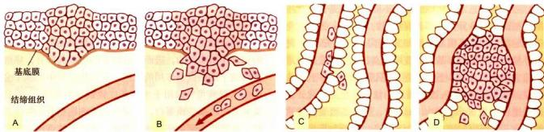  
图13-13 癌细胞的扩散  
癌细胞在上皮中恶性增殖（A）后，突破基膜的障碍，通过管壁进入血管或淋巴管（B）。进入淋巴管的癌细胞，首先滞留于淋巴结，形成淋巴结转移。只有不到1/1000的细胞能够转移到其他组织并形成新的肿瘤。这里显示的是癌细胞从肺向肝转移的情况，癌细胞黏附于肝的血管壁，穿过血管壁（C）后，在肝中增殖形成转移灶（D）。

对体外培养的恶性转化细胞及癌细胞的比较研究有助于了解癌细胞的特征及发生机制。

## （六）抵御死亡

抵御死亡是癌细胞的另一个基本特征。在过去的二十年间人们逐步认识到，成为“不死”的永生细胞的内在原因还应包括细胞自身对死亡的抵御。在生物机体内，细胞增殖即受到其内在的正反双向调控因子的严格监控，也受到外在正反因素的调节。在个体发育特定阶段完成时效任务的正常细胞往往通过程序化死亡而清除，而一些受到不良因素影响而发生变化的非正常细胞也往往会启动自行死亡机制。也有一些细胞，虽然不合时宜的产生，却逃脱不了有机体内的监控机制而难免被及时清除。因而，促使细胞死亡是生物机体免受癌症发生的重要机制之一。但是，癌症之所以发生，原因之一恰恰是癌细胞发展了抵御死亡的机制。

癌细胞能够抵御死亡，原因之一是获取了抗细胞凋亡的能力，既可能是其促凋亡基因突变而失活，也可能是抑制细胞凋亡基因突变而活性加强，最终表现为细胞凋亡调控通路的抑制（见第十五章第一节）。另一个原因是逃脱了生物机体对它的监控，这可能是由于自身基因突变而不能对细胞外来信号产生应答，也可能是外界信号的变化导致不能被有效监控所造成。另外一个原因是促使细胞增殖的细胞外信号过强，导致细胞增殖超越及时分化或细胞死亡。癌细胞正是这样的一类细胞，由于其逃离了凋亡调控径路或生物机体监控径路，对外界促增殖信号的应答尤显敏感，增殖愈加迅速。

## 二、癌基因与抑癌基因

癌症主要是由携带遗传信息的 DNA 的病理变化而引起的疾病。与遗传病不同，癌症主要是体细胞 DNA 突变，而不是生殖细胞 DNA 突变。然而由于癌症涉及多个基因位点的突变，因此生殖细胞某些基因位点的突变无疑也会加大癌变的可能性。

癌基因（oncogene）是控制细胞生长和分裂的一类正常基因，其突变能引起正常细胞发生癌变。癌基因最早发现于诱发鸡肿瘤的劳氏肉瘤病毒（Rous sarcoma virus，属于反转录病毒），称之为Src基因。该基因对病毒繁殖不是必需的，但当病毒感染鸡后，可以引起细胞癌变，导致肉瘤。20世纪70年代中后期和80年代，J.M.Bishop和H.E.Varmus证实癌基因起源于细胞，并普遍存在于许多生物基因组中，二人因此获得1989年诺贝尔生理学或医学奖。癌基因可以分成两大类：一类是病毒癌基因，指反转录病毒的基因组里带有可使受病毒感染的宿主细胞发生癌变的基因，简写成v-onc(v是virus的缩写)；另一类癌基因是细胞癌基因，简写成c-onc（c是cell的缩写），又称原癌基因（proto-oncogene）。在后来的研究中，大多数c-onc基因是依靠病毒的v-onc基因探针找到的。近年来研究表明，许多致癌病毒中的癌基因不仅与致癌密切相关，而且与正常细胞中的某些DNA序列高度同源，从而推测病毒癌基因起源于细胞的原癌基因。反转录病毒所携带的癌基因，可能是由于这类病毒特殊的增殖方式而从宿主细胞中获得的。病毒中的癌基因由于碱基序列的突变，引起所编码的蛋白质产物超活化或失去控制，最终导致

肿瘤的发生。

c-onc是在正常细胞基因组中对细胞正常生命活动起主要调控作用的基因，这些基因一旦发生突变或被异常激活，可使细胞发生恶性转化。换言之，在每一个正常细胞基因组里都带有原癌基因，但它不出现致癌活性，只是在发生突变或被异常激活后才变成具有致癌能力的癌基因。因为已活化的癌基因或是从癌细胞里分离出来的癌基因，可将体外培养的哺乳类细胞，转化成为具有癌变特征的癌细胞，所以癌基因有时又被称为转化基因(transforming gene)。因此，c-onc基因是一类具有正常的生理功能的基因，而只有在发生突变或异常表达的情况下才会引起细胞癌变。实际上，c-onc基因向癌基因的转化是一种功能获得性突变，即细胞的c-onc基因被不适当地激活后，会造成蛋白质产物的结构改变，c-onc基因出现组成型激活，以及过量表达或不能在适当的时刻关闭基因的表达等。

目前已识别的 c-onc 基因有 100 多个，其编码的蛋白质主要包括生长因子、生长因子受体、信号转导通路中的分子、基因转录调节因子、细胞凋亡蛋白、DNA 修复相关蛋白和细胞周期调控蛋白等几大类型（图 13-

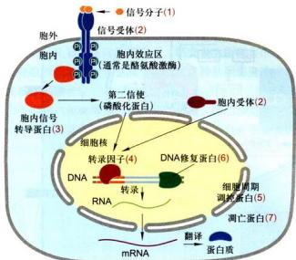  
图13-14 控制细胞生长和增殖，并与肿瘤发生相关的7类蛋白  
有7类蛋白调控细胞的增殖，它们的突变都可能致癌。很多胞外信号分子（1）、信号受体（2）、胞内信号转导蛋白（3）和转录因子（4）能够刺激细胞增殖，它们的致癌突变是显性的。而抑制细胞周期的调控蛋白（5）和负责修复DNA的蛋白（6）由抑癌基因编码，它们的致癌突变是隐性的。凋亡蛋白（7）也是抑癌蛋白，通过诱导细胞凋亡而抑制细胞的增殖。

14)。当然，因突变而诱发癌症的基因还不止这些。细胞信号转导是细胞增殖与分化过程的基本调控方式，而信号转导通路中蛋白因子的突变是细胞癌变的主要原因。如人类各种癌症中约 $30\%$ 的癌症是信号转导通路中的Ras基因突变达表达引起的。此外，很多癌基因在演化上是相当保守的，如 $c - Ras$ 基因在酵母、果蝇、小鼠和人的正常基因组均有存在。

人们还注意到，视网膜母细胞瘤（retinoblastoma）是由于 $Rb$ 基因突变失活而导致的。随后又发现 $p53$ 等基因均有类似的现象。这类基因称为抑癌基因或肿瘤抑制基因 (tumor-suppressor gene)，又称抗癌基因 (antioncogene)，或者更为确切地说是这类基因编码的蛋白质，其功能是正常细胞增殖过程中的负调控因子，在细胞周期的检查点上起阻止周期进程的作用（图13-15），或者是促进细胞凋亡，或者既抑制细胞周期调节，又促进细胞凋亡。如果抑癌基因突变，丧失其细胞增殖的负调控作用，则导致细胞周期失控而过度增殖。抑癌基因是基因的功能丢失性突变。抑癌基因原先有对细胞分裂周期或细胞生长设置限制的功能，当抑癌基因的一对等位基因都缺失或都失去活性时，

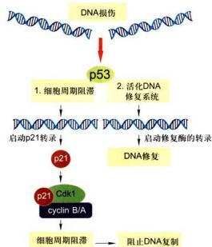  
图13-15 p53与细胞DNA损伤

p53 是一种转录因子，DNA 的损伤会导致 p53 的水平上升，激活 DNA 的修复系统，同时启动很多下游基因的转录，其中包括 p21 $^{Cp}$ 。p21 能够与各种 cyclin-CDK 复合物结合，抑制它们的活性，使细胞周期阻滞，等待 DNA 完成修复。在 DNA 严重损伤的情况下，p53 将诱导凋亡因子的表达，使细胞进入程序化死亡。

这种限制功能也就随之丢失，于是出现了细胞癌变。抑癌基因与癌基因之间的区别在于癌基因的突变性质是显性的，抑癌基因的突变性质是隐性的。目前已发现的抑癌基因有10多种。例如，p53基因是于1979年发现的第一个抑癌基因，开始时被认为是一种癌基因，因为它能加快细胞分裂的周期，以后的研究发现只有在p53的失活或突变时才会导致细胞改变，才认识到它是一个抑癌基因。抑癌基因或其编码的蛋白质的主要功能可概括为3类：①偶联细胞周期与DNA损伤，即只要细胞有DNA损伤，那么细胞将会分裂。如果DNA损伤被修复，那么细胞周期可以继续运行。②如果DNA损伤未被修复，那么细胞将起始调亡程序，以解除这类细胞可能对机体造成的危险。③与细胞黏着有关的某些蛋白质可以防止肿瘤细胞的扩散，阻止接触抑制的丧失并抑制转移，这类蛋白质起转移抑制者作用。

细胞癌变的基本特征之一是细胞增殖失控，而细胞的增殖是通过细胞信号调控网络中细胞增殖相关基因和抑制细胞增殖相关基因的协同作用而调控的。细胞的癌变归根结底也恰恰是这两大类基因的突变或异常表达，破坏了正常的细胞增殖的调控机制，形成了具有无限分裂潜能的肿瘤细胞（图13-16）。

## 三、肿瘤的发生是基因突变逐渐积累的结果

根据 DNA 复制过程中的基因突变率 $(10^{-6})$ 及人的一生中细胞分裂次数 $(10^{16})$ 推测，人类基因组中每个基因都可能发生 $10^{10}$ 次的突变。如果再考虑生活环境中的致癌因素（如辐射等物理因素、化学诱变剂等化学因素和肿瘤病毒感染等生物因素），令人们感到惊奇的并不是细胞为什么会癌变，而是肿瘤的发生频率为什么

  
图 13-16 细胞信号调控网络及肿瘤发生相关的主要调控因子

如此之低。

根据大量的病例分析，癌症的发生一般并不是单一基因的突变，而至少在一个细胞中发生5\~6个基因突变，才能赋予癌细胞所有的特征，即癌细胞不仅增殖速度快，而且其子代细胞能够逃脱细胞衰老的命运，取代相邻正常细胞的位置，不断从血液中获取营养，进而穿越基膜与血管壁在新的组织部位安置、存活与生长。因此，细胞基因组中产生与肿瘤发生相关的某一原癌基因的突变，并非马上形成癌，而是继续生长直至细胞群体中新的偶发突变的产生。某些在自然选择中具有竞争优势的细胞，再经过类似的过程，逐渐形成具有癌细胞一切特征的恶性肿瘤。如结肠癌发生的病程中开始的突变仅在肠壁形成多个良性的肿瘤（息肉），进一步突变才发展为恶性肿瘤（癌），全部过程至少需要10年或更长时间（图13-17）。从这一点上看，癌症是一种典型的老年性疾病，它涉及一系列的原癌基因与抑癌基因的致癌突变的积累。

在人的二倍体细胞中抑癌基因有两个拷贝，只要其中一个拷贝正常，便可保证正常的调控作用。如两个拷贝都丢失或失活，才能引起细胞增殖的失控，而原癌基因的两个拷贝中只需要一个基因发生突变，便可能起到与癌基因类似的作用。

在某些癌症病例中，其生殖细胞中原癌基因或肿瘤抑制因子发生致癌突变，结果个体所有的体细胞的相应基因都已变异。在这种情况下，癌变发生所需要的基因突变数的积累时间就会减少，携带这种基因突变的家族成员更易患癌症（图 13-18）。

同样白血病等血细胞的恶性增生，并不涉及浸润这一环节，而直接随血流遍布全身。因此，只有少数基因突变，便可导致癌症发生，患病年龄也相应提早。

## 四、肿瘤干细胞

在长期的肿瘤研究与临床治疗中人们注意到两个值得关注的现象：（1）在恶性肿瘤组织中，并非将每一个癌细胞移植到免疫缺陷的裸鼠体内，都能形成肿瘤，肿瘤的形成往往需要 $10^{6}$ 个癌组织的细胞。（2）化学药物是治疗恶性肿瘤的有效方法，但总有少量癌细胞依然存活，因而常常引起肿瘤的复发。

显然，癌组织中各细胞的致癌能力及对化学药物的抗性是有很大差别的。近年来，随着干细胞研究的进展，人们自然会联想到肿瘤组织中是否也存在着类似于成体干细胞的肿瘤干细胞（cancer stem cell）。这也是涉及肿瘤发生机制及肿瘤治疗策略的重要问题。

肿瘤干细胞是一群存在于某些肿瘤组织中的干细胞样细胞。自1997年首次报导分离出白血病肿瘤干细胞后，陆续报道分离与鉴定了乳腺癌干细胞、脑瘤干细胞和黑色素瘤干细胞，并建立了脑瘤干细胞和乳腺癌干细胞的体外培养。2004年，S.K.Singh等人在人脑肿瘤细胞中成功分离到含CD133标志的肿瘤干细胞，并将其注射到小鼠脑中，结果发现小鼠脑中长出了含有该标志的肿瘤，并可通过再注射而实现鼠-鼠传递。一般情况下，注射成千上万的不表达CD133标志的肿瘤细胞都不会致瘤，而注射不足百个含CD133标志的肿瘤细胞即可成功致瘤，说明致瘤干细胞只是致瘤中一个很小的类群，含有特殊的标志。随着肿瘤干细胞在更多的不同肿瘤组织中分离成功，更有力地证明了肿瘤干细胞的存在，同时为深入探讨肿瘤的发生、发展及评价预后等提供了新的理论依据，同时也为肿瘤的治疗带来了新的思路。

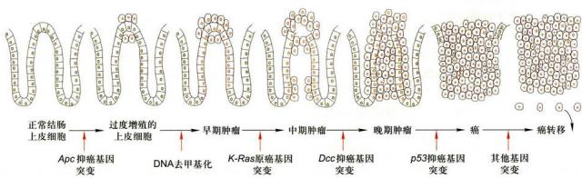  
图 13-17 一系列相关基因突变导致结肠癌发生  
Apc: adenomatosis polyposis coli; Dcc: deleted in colorectal cancer.

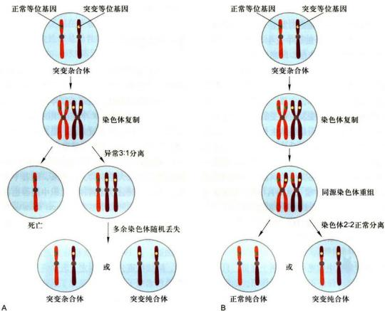  
图13-18 造成杂合性缺失的两种机制  
细胞如果含有一个正常的抑癌基因和一个突变的等位基因，一般是正常的。细胞分裂过程中，如果出现纺锤体结构的缺陷，导致染色体的错误分离（A），或者带有野生型和突变型的染色体之间发生重组（B），就可能形成抑癌基因的一对等位基因都突变的细胞。

干细胞具有自我更新和几乎无限增殖的能力，具有迁移至某些特定组织和排除有毒化学因子的能力。而肿瘤干细胞也具有无限增殖、转移和抗化学毒物损伤的能力。而且，二者使用一些共同的信号转导通路，如Wnt、Notch和Shh信号通路及相关的信号分子。然而肿瘤干细胞和正常干细胞在细胞增殖、分化潜能和细胞迁移等行为上有明显差异。正常干细胞的增殖（又称为自我更新）是严格受控的过程，具有迁移到特定组织分化成多种功能细胞的潜能，以构建正常的组织器官。而肿瘤干细胞增殖失控，失去正常分化的能力，转移到多种组织后形成异质性的肿瘤，破坏正常组织与器官的功能。与一般肿瘤细胞相比，肿瘤干细胞具有高致癌性。很少量的肿瘤干细胞在体外培养，就能生成集落。将很少量的肿瘤干细胞注入实验动物体内，即可以形成肿瘤。肿瘤干细胞耐药性强。多数肿瘤干细胞的细胞膜上表达ATP结合盒（ABC）家族膜转运蛋白。这类蛋白质大多可运输并外排包括代谢产物、药物、毒性物质、内源性脂质、多肽、核苷酸及固醇类等多种物质，使之对许多化疗药物产生耐药性。目前认为肿瘤干细胞的存在是导致肿瘤化疗失败的主要原因。

通过上面的比较，人们很容易想到肿瘤干细胞起源于成体干细胞的可能性。而且，与终末分化细胞相比较，成体干细胞的寿命要长得多（图13-19），细胞基因组发生多个位点突变的可能性更大。当然这也并不排除肿瘤干细胞来源于已分化细胞的可能性。因此，研究肿瘤干细胞存在的普遍性及探索其发生的机制，是目前肿瘤生物学研究的一个非常重要的课题。

## 五、肿瘤的治疗

肿瘤治疗的根本是移除肿瘤细胞，采取的方法手段当然离不开这一根本。手术移除、化学疗法和放射疗法是目前最常用的肿瘤治疗手段。但是，手术、化疗和放疗都有相当多的局限性和不确定性，如部位限制而不能有效移除，化疗和放疗的剂量与移除效果直接相关，对正常细胞同样具有杀伤力，从而产生副作用。生物学治疗近年来备受推崇，即有的放矢地对癌细胞采取相应措施，如通过寻找癌细胞特异靶点进行有目的攻击，或者通过分子细胞生物学方法如基因治疗、调节性微小核糖核酸（microRNA）导入、基因改造的肿瘤细胞免疫治疗等，干预发生变化的某个调控通路，达到杀死癌细胞、或者促其转化为不具恶性的正常细胞之目的。

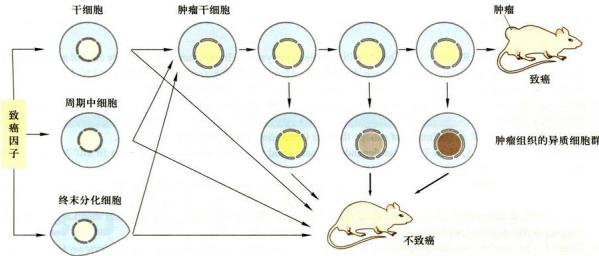  
图13-19 肿瘤干细胞与肿瘤的发生机制模型  
在正常情况下，干细胞、周期中细胞和终末分化细胞不具致癌性。在致癌因子的诱导下，这些细胞可能转化为肿瘤干细胞，最终能够增生为肿瘤。在肿瘤干细胞增生过程中，部分细胞也会发生异质化，失去致癌性，不能再增生为肿瘤。

肿瘤细胞免疫治疗是重要的生物学治疗模式之一。虽然这一模式包涵多种方法手段，但其基本原理则是基于细胞增殖、分化、代谢及机体免疫等方面的调控机制来设计的。例如，先从生物机体内分离出T淋巴细胞，通过基因改造的方法增加其对癌细胞的识别能力并进行扩增，获得能够特异识别含有某个特异标志的癌细胞的能力，然后将这些经过基因改造的T细胞回注到生物体内，让其自动寻找和杀伤具特异标志的癌细胞。

生物学治疗之所以受推崇，理论上说它可以精确清剿癌细胞，既适合早期恶性肿瘤患者，也适合较晚期的恶性肿瘤患者。若与其他疗法联合应用，还可以减少其他疗法所用剂量，减轻副作用，提高治愈率。更重要的是，生物学治疗将会实现对患者肿瘤发生特点的个体化分析，通过采取个体针对性强的方式，真正实现个体化治疗。因此，生物学肿瘤治疗将为有效移除癌细胞提供切实可行的手段。

## 思考题

1. 简述 p34 $^{Cdc2}$ /cyclin B 蛋白激酶的发现过程。

2. 细胞周期中有哪些主要检查点，各起何作用？

3. 举例说明 CDK 在细胞周期中是如何执行调节功能的？

4. 癌细胞的基本特征是什么？说明癌症的发生与癌基因和抑癌基因的关系。

5. 为什么说肿瘤的发生是基因突变逐渐积累的结果？

6. 什么是肿瘤干细胞？

1. Bassermann F, Eichner R, Pagano M. The ubiquitin proteasome system—Implications for cell cycle control and the targeted treatment of cancer. Biochimica et Biophysica Acta (BBA) - Molecular Cell Research, 2014, 1843(1): 150-162.

2. Batlle E, Clevers H. Cancer stem cells revisited. Nature Medicine, 2017, 23(10): 1124-1134.

3. Bloom J, Cross F R. Multiple levels of cyclin specificity in cell-cycle control. Nature Reviews Molecular Cell Biology, 2007, 8(2): 149-160.

4. Hanahan D, Weinberg R A. Hallmarks of cancer: the next Generation. Cell, 2011, 144(5): 646-674.

5. Hochegger H, Takeda S, Hunt T. Cyclin-dependent kinases and cell-cycle transitions: does one fit all? Nature Reviews Molecular Cell Biology, 2008, 9(11): 910-916.

6. Izawa D, Pines J. How APC/C-cdc20 changes its substrate specificity in mitosis. Nature Cell Biology, 2011, 13(3): 223-233.

7. Parker M W, Botchan M R, Berger J M. Mechanisms and regulation of DNA replication initiation in eukaryotes. Critical Reviews in Biochemistry and Molecular Biology, 2017, 52(2): 107-144.

8. Peters J. The anaphase promoting complex/cyclosome: a machine designed to destroy. Nature Reviews Molecular Cell Biology, 2006, 7(9): 644-656.

9. Salazar-RoaM, Malumbres M. Fueling the cell division cycle. Trends in Cell Biology, 2017, 27(1): 69-81.

10. Zachariae W, Tyson J J. Cell division: flipping the mitotic switches. Current Biology, 2016, 26(24): R1272-R1274.
