# 第1章 基因、基因组和遗传分析

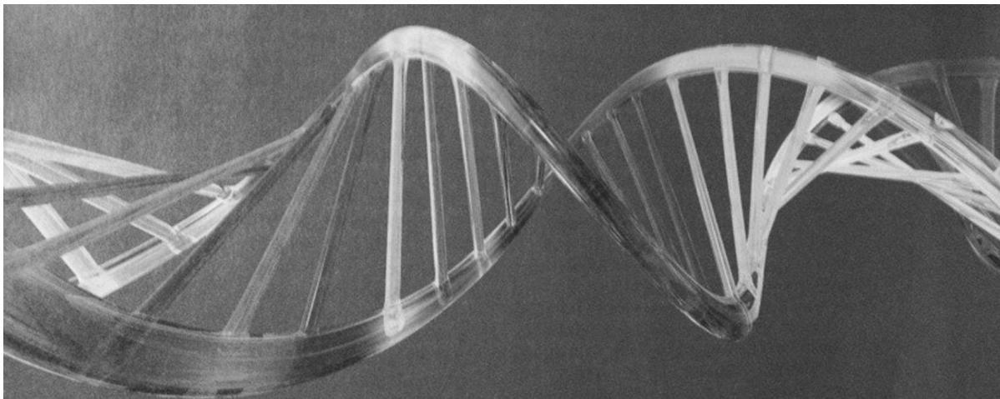  
精巧的双链 DNA 图。[©Billy Lobo Shutterstock, Inc.]

## 本章提纲

1.1 DNA：遗传物质  
1.2 DNA的结构与复制  
1.3 基因和蛋白质  
1.4 遗传分析  
1.5 基因表达：中心法则  
1.6 突变  
1.7 基因和环境

1.8 分子水平的生命统一性  
联系：黑尿病  
阿奇博尔德·加罗德，1908  
先天性代谢缺陷  
联系：一个基因，一个酶  
乔治·比德尔和爱德华·塔特姆，1941  
链孢霉生化反应的遗传控制

## 学习目标与科学能力

一旦理解并能运用本章所述的基因、基因组和遗传分析的原理，就会具备以下科学能力。

\- 已知编码蛋白质的 DNA 被转录链的碱基序列，能指出信使 RNA 中相应区域的碱基序列，以及蛋白质中相应的氨基酸序列。对于 DNA 中一个碱基被另一个碱基置换的突变，能推断出 mRNA 和蛋白质会如何改变。

\- 已知某一必需营养物的线性代谢途径，对于该途径中任何一种酶有缺陷的突变型菌株，能推断出哪些中间产物可使该缺陷型菌株恢复生长能力。反过来，已知某一线性代谢途径中哪些中间产物可使突变体恢复生长能力的数据，能够推断出在该途径中出现的各种酶和中间产物的顺序。

\- 对于影响某一生物过程的一组突变，已知其所有配对组合是互补还是不互补的数据，能够把这些突变分组，使每一个组与一个不同的基因对应。

现生生物的每一个物种都具有一套独特的遗传特征，这套特征使这一物种能与所有其他物种相区别。每个物种都有自己的发育规划——常常说成是构建这种生物的一套“蓝图”——它由自身细胞中的 DNA 分子编码。该发育规划决定遗传的特征。同一物种的生物个体具有相同的发育规划，因此，同一物种的个体通常彼此相像，如要把人类和黑猩猩或大猩猩区分开是很容易的。人惯于直立，长长的腿，体毛相对较少，大脑袋，扁脸，脸上有个突出的鼻子、凸出的下巴、棱角分明的嘴唇和细小的牙齿。所有这些性状——这是人类发育规划的一部分——都是遗传来的，这些性状使智人(Homo sapiens)显得与众不同。

但人类绝不是一模一样的。许多性状——即可见的特征——在人与人之间是不同的。除了男女之间的显著差别以外，在头发颜色、眼睛颜色、肤色、身高、体重、性格特点和其他特征上，都存在大量的差异。有些人类性状(如性别)是生物性传递的，有些性状是文化性传递的。眼睛的颜色是生物遗传的结果，但在孩提时学到的母语是文化传承的结果。许多性状受到生物遗传和环境因素的共同影响。如体重，部分由遗传决定，但也部分取决于环境：吃多少东西、吃的东西营养成分怎样、锻炼身体是否规律等。

遗传学(genetics)是研究生物遗传性状，包括在一定程度上由环境影响的性状的学科。基因组学(genomics)是研究一个生物体内所有基因的学科，目的是理解这些基因的分子组织、功能、相互作用和进化历史。遗传学和基因组学的根本概念是：

遗传性状由在生殖过程中从亲代传到子代的遗传因子所决定，这些遗传因子称为基因(gene)。

格雷戈尔·孟德尔(Gregor Mendel)在1866年首次阐述基因的存在及控制基因传代的规则(第3章)。孟德尔是从抽象规则的角度对遗传方式进行阐述，遗传因子(他称为“因子”)按这些规则从亲代传递到子代。他研究的对象是豌豆，豌豆有一些像豆子颜色和植株高度这样的可变性状。遗传学一度仅能靠交配产生的后代来研究，这就不可能阐明不同物种之间的遗传差异，因为不同物种的生物通常不交配，即使交配，产生的杂交后代要么死亡要么不育。通过分析交配后代来研究遗传学的方法常被说成是经典遗传学、机体遗传学或形态遗传学。有了分子遗传学或称现代遗传学的发展，才可能通过比较和分析DNA自身来研究物种之间的差异。经典遗传学和分子遗传学之间没有根本的差异。它们是不同但互补的两种方法，研究的是同一对象——遗传物质的功能。在本书中囊括了众多的例子，说明分子遗传学和经典遗传学的结合应用，如何使得遗传分析的威力大增。

遗传学之为分子科学，其奠基可追溯到1869年——就在孟德尔报道他的实验3年之后，弗里德里希·米歇尔(Friedrich Miescher)发现白细胞核内含量丰富的一种新型弱酸。米歇尔发现的弱酸其实就是现在叫做DNA(deoxyribonucleic acid，脱氧核糖核酸)的化学物质。DNA的生物学功能多年不为人知，没有人认为它在遗传中有作用。本章第一节告诉我们，DNA最终如何被分离出来，并被证明是构成基因的物质。

## 1.1 DNA: 遗传物质

19 世纪 70 年代，人们观察到受精过程中雄性和雌性生殖细胞的细胞核进行融合，据此认识到细胞核在遗传中发挥关键作用。此后不久，人们第一次在细胞核内观察到染色体 (chromosome)——细胞被某些染料染色后，在光学显微镜下变得可见的线状物。人们发现，在细胞分裂过程中，染色体表现出特有的“分裂”行为，每个子细胞藉此得到完全相同的一套染色体(第 4 章)。观察发现，尽管不同生物物种的细胞中染色体数目可以不同，但是在任一特定物种的细胞中，染色体数目几乎是恒定的，这为染色体的重要性提供了进一步的证据。1900 年左右，染色体的这些特点得到了充分理解，这些特点表明，染色体似乎是基因的载体。

20 世纪 20 年代，几条间接的证据链开始表明染色体和 DNA 之间有紧密联系。用特殊染料开展的显微研究证明：DNA 在染色体中。染色体也含有不同种类的蛋白质，但一个细胞类型与另一个细胞类型的染色体蛋白质数量和种类相差悬殊，而每个细胞所含的 DNA 总量是恒定的。还有，高等生物细胞的 DNA 几乎全部在染色体中。然而，这些证据没能让人信服 DNA 是遗传物质，原因是，粗糙的化学分析(最终证明是错误的)指出，DNA缺少遗传物质必备的化学多样性。人们看好的遗传物质的候选者是蛋白质，因为蛋白质是尽人皆知具有极度多样性的一类分子。于是，蛋白质被广泛承认是遗传物质，而认为DNA的功能仅仅是作为染色体的结构骨架。下述实验最终证实，DNA才是遗传物质。

## - DNA 遗传功能的实验证据

1928 年，弗雷德里克·格里菲斯 (Frederick Griffith) 跨出了重要的第一步，他证明遗传物质可以从一个细菌细胞转移到另一个细菌细胞。他用肺炎链球菌 (Streptococcus pneumoniae) 的两种菌株 (S 型和 R 型) 进行研究。在固体培养基上培养时，一个细菌细胞经过反复的细胞分裂，形成肉眼可见的一团细胞，这些细胞称为一个菌落 (colony)。S 型肺炎链球菌可合成由复合碳水化合物 (多糖) 构成的胶状荚膜。这种外被的荚膜使得每个菌落较大，外观油亮、光滑 (smooth, S) (图 1.1)。这种荚膜使细菌免遭被其感染的动物的防御机制的攻击，从而能够引起肺炎。R 型肺炎链球菌不能合成荚膜多糖；它们形成较小的菌落，菌落表面粗糙 (rough, R) (图 1.1)。由于没有荚膜，R 型菌株会被宿主的免疫系统灭活，因此不会引起肺炎。无论是 S 型还是 R 型，它们通过细胞分裂产生的后代都具有亲代的荚膜类型，从这点上来说，两种细菌都是 “纯种”。

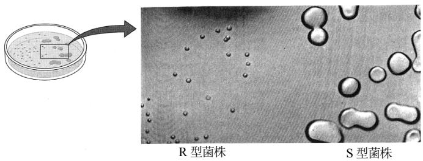

图 1.1 肺炎链球菌粗糙型(R 型，小菌落)和光滑型(S 型，大菌落)菌株的菌落。S 型菌落因为 S 型细胞外被胶状荚膜而较大[照片引自 O. T. Avery 等著的 Journal of Experimental Medicine。洛克菲勒大学出版社版权所有(1994)。通过版权决算中心，经洛克菲勒大学出版社许可，以教科书形式转载]。

注射了活 S 型细菌的小鼠会得肺炎。注射活 R 型细菌或热灭活 S 型细菌的小鼠保持健康。格里菲斯的关键发现是: 注射活 R 型细菌和热灭活 S 型细菌混合物的小鼠会得肺炎, 并往往死于肺炎(图 1.2)。虽然所注射的 S 型细菌是经加热灭活了的, 但从这些死鼠的血样中分离的细菌, 会产生 S 型培养物, 这些培养物具有所注射的 S 型细菌的典型荚膜。显然, 死 S 型细菌的注射物中含有某种物质, 能够转移给活 R 型细菌，使它们能够合成 S 型荚膜。换言之，R 型细菌能被改变——即经过转化 (transformation)——成 S 型细菌。而且，转化了的细菌，其后代可遗传这种合成荚膜的能力。

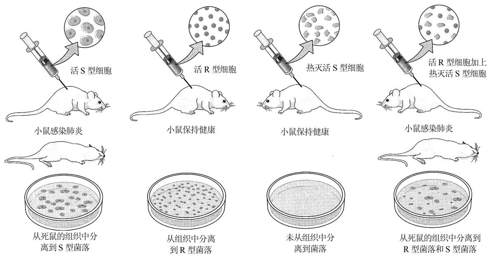  
图 1.2 证实细菌转化的格里菲斯实验。注射肺炎链球菌非致病性 R 型菌株或致病性 S 型菌株的热灭活细胞碎片，小鼠均保持健康。存在热灭活 S 型细胞时，R 型细胞被转化成致病性的 S 型菌株，导致小鼠患肺炎。

链球菌的转化现象最初发现于 1928 年，但直到 1944 年，导致 R 型细菌转变为 S 型细菌的化学物质才得以鉴定。奥斯瓦尔德·埃弗里 (Oswald Avery)、科林·麦克劳德 (Colin MacLeod) 和麦克林恩·麦卡蒂 (Maclyn McCarty) 在一个里程碑式的实验中证明，导致 R 型细菌转化为 S 型细菌的物质是 DNA。为了做这些实验，他们先要找到从细胞中分离到近乎纯净的 DNA 的化学方法，这在之前从未有人成功过。他们将从 S 型细菌中分离到的 DNA 加到正在培养的 R 型细菌中时，观察到了转化现象，也就是说，产生了一些 S 型细菌。尽管制备的 DNA 中含有痕量的蛋白质和 RNA (核糖核酸，一种在化学上与 DNA 密切相关的大分子，在细胞内含量丰富)，但通过处理破坏掉蛋白质或 RNA，不会改变转化活性。但是，破坏 DNA 的处理会使转化活性消失 (图 1.3)。这些实验说明，导致遗传转化的物质是细胞的 DNA，所以，DNA 是遗传物质。

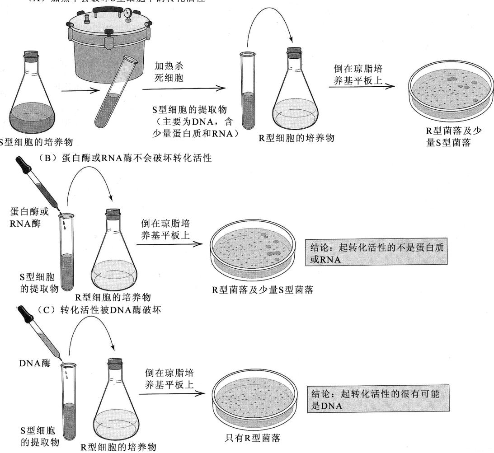  
图 1.3 埃弗里-麦克劳德-麦卡蒂实验图解，该实验证明 DNA 是细菌转化中的活性物质。(A)从热灭活 S 型细胞中提取的纯化 DNA 可将一些活 R 型细胞转变成 S 型细胞，但纯化的 DNA 中可能还含有检测不到的痕量蛋白质和 (或)RNA。(B)转化活力未被蛋白酶或 RNA 酶破坏。(C)转化活力被 DNA 酶破坏，因此，转化活力很可能来自 DNA。

## - 噬菌体 DNA 的遗传作用

1952 年，艾尔弗雷德·赫尔希 (Alfred Hershey) 和玛莎·蔡斯 (Martha Chase) 报道了另一个关键发现。他们研究被 T2 病毒感染后的肠道细菌大肠杆菌 (Escherichia coli)。侵染细菌细胞的

病毒称为细菌噬菌体(bacteriophage)，该词常常缩写成噬菌体(phage)。细菌噬菌体是“细菌-啮噬者(bacteria-eater)”的意思。T2噬菌体颗粒的结构如图1.4所示。T2极小，却有复杂的结构，由头(内含噬菌体DNA)、领、尾和尾丝组成(人类精子头部的长和宽均比T2头部大30～50倍)。赫尔希和蔡斯已注意到，T2的感染始于噬菌体尾的端部附着在细菌细胞壁上，随后有噬菌体物质进入细胞，继而这种物质大量增加，形成上百个子代噬菌体，然后使细菌宿主细胞破裂(溶菌)，释放出子代噬菌体。他们也知道，T2颗粒由含量大致相等的DNA和蛋白质组成。

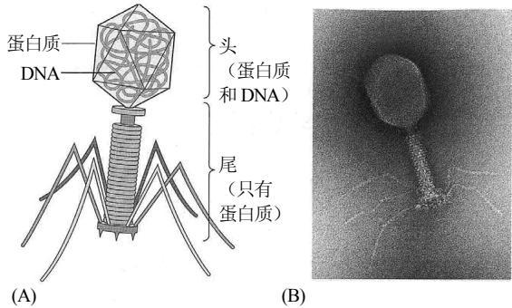  
图 1.4 (A) E. coli T2 噬菌体示意图，示各组成部分。DNA 仅存在于头内。(B) T4 噬菌体电镜照片，该噬菌体与 T2 噬菌体的亲缘关系很近[电镜照片蒙匹兹堡大学罗伯特·杜达(Robert Duda)馈赠]。

因为 DNA 含磷但不含硫，而大多数蛋白

质含硫而不含磷，所以，有可能可以用这两种元素的放射性同位素(isotope)分别标记 DNA 和蛋白质。赫尔希和蔡斯用 T2 感染在含 ${}^{32}$ P(磷的一种放射性同位素)的培养基中培养了数代的 E. coli，然后收集噬菌体后代，得到含有放射性 DNA 的噬菌体颗粒。以同样的方法，用含 ${}^{35}$ S(硫的一种放射性同位素)的培养基，获得含有放射性标记蛋白质的噬菌体颗粒。

在图 1.5 概括的实验中，为了分别追踪 DNA 和蛋白质，非放射性 E. coli 细胞或被 ${}^{32}$ P 标记的噬菌体感染(图 1.5A)，或被 ${}^{35}$ S 标记的噬菌体感染(图 1.5B)。通过离心，让被噬菌体感染的细胞和未附着细胞的噬菌体颗粒分离，将被感染细胞重新悬浮在新鲜培养基中，然后在家用厨房搅拌器中剧烈搅拌，把附着的噬菌体从细胞表面剥离下来。他们发现，这样的处理不会对感染的后续过程造成任何影响，这说明在噬菌体附着细胞后，噬菌体的遗传物质肯定在非常短的时间内就进入了被感染细胞。家用搅拌器是整个实验的关键。他们试过将噬菌体头部从细菌细胞表面扯下来的其他办法，但无一奏效。后来赫尔希曾解释道：“我们试过种种掰扯术，结果都不太理想。当玛格丽特·麦克唐纳(Margaret McDonald)把她的家用搅拌器借给我们时，实验马上就成了。”

通过搅拌器处理去掉噬菌体头部后，检测被感染的细菌。发现来自 ${}^{32}$ P 标记噬菌体的大部分放射活性在被感染的细菌中，而只有一小部分 ${}^{35}$ S 放射活性在被感染的细菌中。大部分标记 DNA 的保留，与大部分标记蛋白质的丢失，形成鲜明对比，说明 T2 噬菌体将其大部分 DNA 转移给它所感染的细胞，而转移的蛋白质极少。关键的发现(图 1.5)是，子代噬菌体颗粒继承了转移进细菌的 ${}^{32}$ P 标记 DNA 的大约 50%，而继承转移进去的 ${}^{35}$ S 标记蛋白质不到 1%。赫尔希和蔡斯认为，这个结果说明 T2 噬菌体中的遗传物质是 DNA。

证明基因由 DNA 构成，埃弗里、麦克劳德和麦卡蒂，以及赫尔希和蔡斯的实验堪称经典。现在，在遍布世界的许多实验室中，每天都在进行着和转化实验差不多的实验，这些实验通常使用在培养基中生长的细菌、酵母或动植物细胞。这些实验表明，如同在 T2 噬菌体中一样，DNA 是这些生物的遗传物质。DNA 是所有细胞生物和许多病毒的遗传物质，虽然这一概括尚无已知的例外，但已知有数类病毒的遗传物质由 RNA 构成。导致 AIDS(获得性免疫缺陷综合征)的人类免疫缺陷病毒 HIV-1，就是这些含 RNA 病毒的一种。

## 1.2 DNA 的结构与复制

DNA 是遗传物质，这一推论尚留下许多悬而未决的问题。细胞分裂时，基因中的 DNA 是如何复制的？基因中的 DNA 如何控制遗传性状？基因发生突变(DNA 中的改变)时，DNA 的变化到底是什么？20 世纪 50 年代早期，很多研究人员开始尝试理解 DNA 的精细分子结构，希望这个结构本身能对上述问题的回答有所启发。1953年，剑桥大学的詹姆斯·沃森(James Watson)和弗朗西斯·克里克(Francis Crick)提出第一个基本正确的DNA分子三维结构。这一结构指出DNA如何自我复制、控制遗传性状和发生突变，其睿智、简洁和天翻地覆的创新性，让人叹为观止。以致在他们还没有用铁皮和铁丝做完DNA分子模型的时候，克里克都想去他最喜欢的酒吧中嚷嚷：“我们发现了生命的秘密。”

图 1.5 赫尔希-蔡斯（“搅拌”）实验证明，在被感染的 E. coli 细胞中，负责指导 T2 噬菌体增殖的是 DNA 而不是蛋白质。(A) 放射性标记 DNA 大量转移到噬菌体后代中。(B) 放射性标记蛋白质转移到噬菌体后代中的量可忽略不计。  
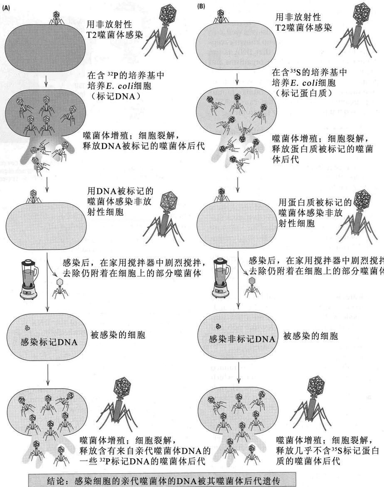

在沃森-克里克结构中，DNA由两条长链构成，链由亚基构成，每条链围着另一条链盘绕，形成一个双链的螺旋。这个双螺旋是向右旋转的，意思是，就像沿着枪管往前看一样，每条链都是沿着顺时针方向向前延伸。如图1.6A所示，如果想象从底部仰望结构的内部，就能看到向右的盘旋。图中的黑球勾勒出每条链的“骨架(主链)”，它们以顺时针方向盘旋。每条链的亚基是核苷酸(nucleotide)，每个核苷酸含有4种称为碱基(base)的化学成分中的一种，碱基与一个磷酸化的五碳糖(脱氧核糖，deoxyribose)分子连接。DNA中的4种碱基是：

$$
\bullet \text {   腺嘌呤(adenine,   A)   } \bullet \text {   鸟嘌呤(guanine,   G)   }
$$

$$
\bullet \text {   胸腺嘧啶   (thymine,   T)   } \bullet \text {   胞嘧啶   (cytosine,   C)   }
$$

此刻不必关心核苷酸和碱基的化学结构，将在第2章阐述。现在关注的要点是，双螺旋中的碱基是配对的，如图1.6B所示。即：

在 DNA 分子两条配对链上的任何位置，如果一条链上有一个 A，则配对链上就有一个 T；如果一条链上有一个 G，则配对链上就有一个 C。

A 和 T 之间及 G 和 C 之间的配对，称为互补(complementary); A 的互补物是 T, G 的互补物是 C。互补配对就是 DNA 的一条链上的每个碱基与另一条链上相对位置的碱基配对。并且：

单链中的碱基顺序不受任何限制，因此，在一条链上可以存在任何顺序。

这一原理解释了为什么 DNA 中仅有 4 种碱基，却能编码构造生物所需的海量信息。编码遗传信息的，是 DNA 上的碱基顺序，而碱基顺序完全不受限制。

互补配对也称为沃森-克里克配对(Watson-Crick pairing)。在图 1.6A 的三维结构中, 填充于双螺旋内部的浅色球表示碱

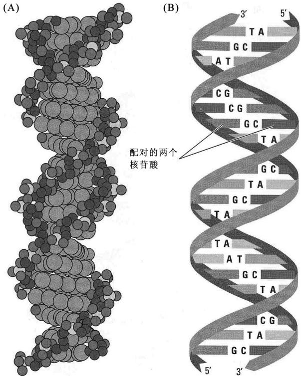  
图 1.6 标准 “B 型” DNA 双螺旋的分子结构。(A) 空间填充模型，其中每个原子绘成一个球。(B) 突出显示分子外部的两条螺旋形链和内部的 A-T、G-C 碱基对的示意图。

基对。碱基对几乎是平摊着的，与双螺旋长轴的方向垂直，像一叠硬币一样，一个摞一个地堆叠起来。谈到 DNA 分子时，生物学家时常把单条链称为单链 DNA(single-stranded DNA, ssDNA)，把双螺旋称为双链 DNA(double-stranded DNA, dsDNA)。

每条 DNA 链都具有极性(polarity)，或称方向性，就像马戏团里首尾相接(鼻子连到尾巴)的一串大象。在这个比方里，每头大象相当于 DNA 链上的一个核苷酸。极性取决于核苷酸所指的方向。链的“鼻子”一端称为该链的 3' 端，“尾巴”一端称为 5' 端。在双链 DNA 中，两条配对链的方向是相反的，一条链的 5' 端与另一条链的 3' 端对齐。极性的分子基础，以及 DNA 双链中两条链方向相反的原因，将在第 2 章阐述。本书中，在图示 DNA 分子时，用箭头样的丝带表示主链，用从丝带伸出的签条表示核苷酸。DNA 链的极性由箭头样丝带的方向来表示。箭头尾部表示 DNA 链的 5' 端，头部表示 3' 端。

对 DNA 结构的认识为了解其功能提供了线索:

1. DNA 中的碱基顺序可以这样拷贝：以每条分离的 “配对” 链作模板，产生一条具有互补碱基顺序的新的配对链。

2. DNA 可以以碱基顺序为编码形式蕴含遗传信息，类似于在纸条上写字。

3. 遗传信息的改变(突变)可以因拷贝过程中的错误(DNA 碱基顺序发生改变)而导致。

接下来将讨论这些线索的一些含义。

## - DNA 复制概述

沃森和克里克注意到，DNA 结构本身提示了它复制的机制。“这没逃过我们的眼睛，”他们写道，“我们假设的特异性碱基配对方式马上提示了一种拷贝机制。”一个 DNA 分子产生两个相同 DNA 分子的拷贝过程称为复制 (replication)。沃森和克里克心目中的复制机制如图 1.7 所示。

子代DNA分子  
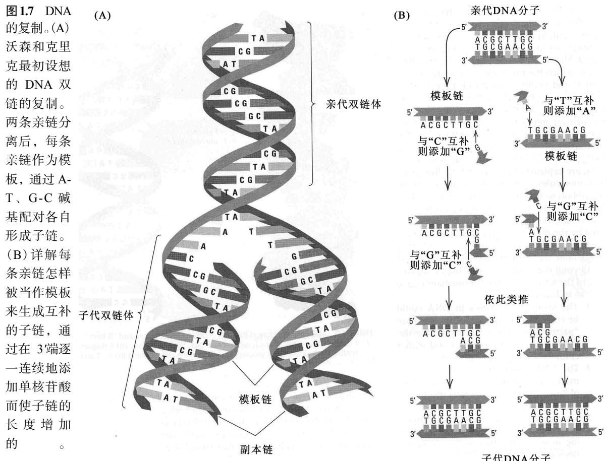

如图 1.7A 所示，原始(亲代)双链的两条链分离，每条链各自作为合成新链(副本链)的模板(template)。副本链是通过逐一连续地添加核苷酸而合成的，其方式是，副本中的每个碱基与对面模板链中的碱基互补(沃森-克里克配对的意思)(图 1.7B)。虽然图 1.7 所示的机制在理论上很简单，但它是一个复杂的过程，充满几何问题，需要多种多样的酶和其他蛋白质。这些细节将在第 6 章阐述。复制的最终结果是，单个双链分子被复制成具有相同序列的两个拷贝：

5'-ACGCTTGC-3'
3'-TGCGAACG-5'
5'-ACGCTTGC-3' 5'-ACGCTTGC-3'
3'-TGCGAACG-5' 3'-TGCGAACG-5'

在此处，新合成的链中的碱基用粗体表示。在左边的双链中，上面的链是来自亲代分子的模板，而下面的链是新合成的；在右边的双链中，下面的链是来自亲代分子的模板，上面的链是新合成的。注意，在图 1.7B 中，每条新链合成时，新的核苷酸只添加到生长链的 3' 端：

DNA 链仅在 3' 端延伸，这是 DNA 复制的基本特点。

图1.7 DNA的复制。(A)沃森和克里克最初设想的DNA双链的复制。两条亲链分离后，每条亲链作为模板，通过A-T、G-C碱基配对各自形成子链。(B)详解每条亲链怎样被当作模板来生成互补的子链，通过在3'端逐一连续地添加单核苷酸而使子链的长度增加的。

## 1.3 基因和蛋白质

既然已对遗传物质的结构组成有了一些基本认识，我们要问 DNA 中的核苷酸顺序怎样决定细胞和生物体的生化特性。如果把 DNA 上的核苷酸序列想象成一张纸上的一串字母，那么，基因就是由不同单词组成的，单词形成句子和段落，给字母的组合赋予意义。复杂多样的 DNA 密码产生的是蛋白质，它们是一类大分子，负责执行细胞中大多数的生化活动。细胞主要由蛋白质组成。蛋白质包括：赋予细胞刚性和运动能力的结构蛋白，在细胞膜上形成孔道以控制小分子进出细胞的蛋白质，以及对来自生长环境或其他细胞的分子信号作出反应以调控细胞活动的受体蛋白。蛋白质也负责细胞大多数的代谢活动。对于有机分子的合成和分解，以及产生细胞活动所需的化学能，蛋白质是必需的。1878年，人们首次采用酶(enzyme)一词来表示在细胞中加速生化反应的生物催化剂。1900年，酶被证明是蛋白质，这主要得益于德国生化学家埃米尔·费希尔(Emil Fischer)的工作。如同科学上常见的那样，自然的“错误”常常能为了解事物如何运作提供线索。在建立基因和疾病之间的联系上，正是这样的情况：因为基因中的一个“错误”(突变)，可以导致相应蛋白质中的一个“错误”(功能缺失)。这为遗传学研究开辟了一条硕果累累的探索之路。

## - 先天性代谢缺陷是遗传病的一个原因

约一个世纪之前，英国医生阿奇博尔德·加罗德(Archibald Garrod)认识到，某些遗传性疾病遵循孟德尔描述过的豌豆的传递规律。1908年，加罗德作了一系列的报道，提出一个关于遗传、酶和疾病之间关系的基本假设：

任何一种细胞代谢存在异常的遗传性疾病，都是某种酶的某个遗传缺陷导致的。

这类疾病被称为先天性代谢缺陷(inborn error of metabolism)，该词沿用至今。

加罗德研究了多种先天性代谢缺陷，这些疾病的患者在尿液中排泄异常物质。其中一种先天性代谢缺陷为尿黑酸尿症(alkaptonuria)，患者排泄的异常物质是高龙胆酸(homogentisic acid)。

早先高龙胆酸的一个名称是尿黑酸(alkapton)，因而该病得名尿黑酸尿症(alkaptonuria)。虽然尿黑酸尿症很罕见，发病率约为1/200 000，但它在加罗德研究之前就已广为人知了。该病本身相当轻微，但有个引人注目的症状：患者的尿液会变黑，这是高龙胆酸被氧化的缘故(图1.8)。这就是为什么尿黑酸尿症又被称为黑尿病(black urine disease)。

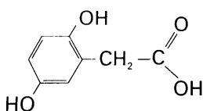  
高龙胆酸

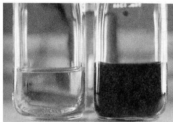

早在 1649 年，就有人这样描述过一个病例：

患者男性，排黑尿，14岁接受了一个疗程的激烈治疗，目的是去除他脏腑中的炽火——人们认为是这炽火把胆汁烧焦变黑，从而导致该病。医生开列的治疗方法有放血、通便、沐浴、冷稀饮食，以及大把的药物。这些方法没有一样有任何明显的效果，最后患者厌倦了这种毫无意义的治疗，决心顺其自然。之后也没有发生什么更加糟糕的事。患者结了婚，膝下子嗣颇多，过了长寿而健康的一生，就是总排像墨水一般的黑尿(加罗德讲述，1908年)。

图 1.8 尿黑酸尿症患者的尿液因为所含的高龙胆酸被氧化而变黑[丹尼尔·德阿吉亚尔 (Daniel de Aguiar) 馈赠]。

加罗德主要关注的是尿黑酸尿症的生物化学，但他注意到，家系研究显示该病是遗传的，起因似乎是单一基因的某种缺陷。在生化方面，他推断尿黑酸尿症的问题是，患者不能分解高龙胆

酸中的六碳苯环。这个环是从哪里来的呢？多数动物从食物中获得这个环。加罗德认为，高龙胆酸是苯丙氨酸和酪氨酸的分解产物，这两种氨基酸也含有苯环。氨基酸(amino acid)是构成蛋白质的“砖”。苯丙氨酸和酪氨酸都是正常蛋白质的组分。图1.9是解释这些分子之间关系的示意图。任何一个这样系列的生化反应称为生化途径(biochemical pathway)或代谢途径(metabolic pathway)。途径中的每个箭头代表一个单独的步骤，表示从箭头头部之处所示的“输入”或底物分子(substrate molecule)，转变成箭头尾部之处所示的“输出”或产物分子(product molecule)。生化途径通常如图1.9那样取垂直方向，用指向下的箭头，或取水平方向，用从左指向右的箭头。加罗德不知道图1.9所示途径的所有细节，但他已了解高龙胆酸分解的关键步骤是苯环断开，也了解高龙胆酸中的苯环来自饮食中的苯丙氨酸和酪氨酸。

是什么使生化途径中的每个步骤得以发生呢？加罗德正确地猜测出，每步需要一种特定的酶来催化化学转化反应。患先天代谢缺陷(如尿黑酸尿症)的人，其某个代谢途径的单一步骤有缺陷，因为他们缺少在那一步起作用的酶。当途径中某种酶有缺陷时，就说该途径在那个步骤有一个阻断(block)。途径被阻断后，一个常见的结果是缺陷酶的底物堆积。加罗德观察到尿黑酸尿症患者中高龙胆酸的堆积，据此认为，一定有一种酶，其功能是打开高龙胆酸的苯环，而这些患者没有这种酶。直到加罗德作了这些报告50年后，分离打开高龙胆酸苯环的酶才真正成功。在正常人中，

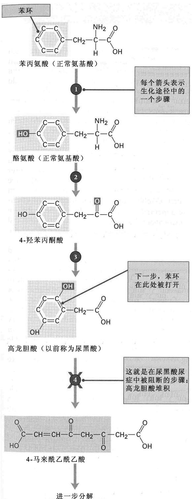  
图 1.9 分解苯丙氨酸和酪氨酸的代谢途径。途径中的每个步骤以箭头表示，每步需要一种特定的酶来催化反应。高龙胆酸分解的关键步骤是苯环断开。

这种酶见于肝细胞中，且正如加罗德预料的一样，尿黑酸尿症患者的这种酶有缺陷。

## 联系：黑尿病

阿奇博尔德·加罗德，1908

St. Bartholomew 医院

伦敦，英国

先天性代谢缺陷

尽管加罗德是一个杰出的医生，但他对遗传与先天性代谢缺陷关系的演讲，在发表之时未对人们产生什么大影响。一个基因对应一个酶（“一个基因一个酶”的假说）的重要概念是20世纪40年代乔治·比德尔和爱德华·塔特姆独立发展起来的，他们用面包霉——粗糙链孢霉Neurospora crassa——作为实验生物。当比德尔最终知道了《先天性代谢缺陷》一书后，他大加赞扬。加罗德在对尿黑酸尿症的阐述中，交织着历史、临床医学、遗传学和生物化学，本节选展现了他的这一最出色之处。本节选也说明了，人们对一种遗传病的严重程度的认识如何，视其社会背景而定。加罗德把尿黑酸尿症写得好像是一件无害的稀罕事，当人的平均寿命较短的时候，这确实大体正确。但在今天人的寿命比较长的情况下，尿黑酸尿症患者会在软骨和关节处逐渐堆积黑色素，最终导致患上关节炎。

先天性代谢缺陷给学遗传学的学生提供了一个充满希望的研究领域。……(其他人)指出，如果把尿黑酸尿症视为孟德尔意义上的稀有隐性性状，就找到了对这种疾病发生模式的现成解释……在尿黑酸尿症病例中，一级表亲婚配生的孩子所占的比例非常大。……同样值得注意的是，如果统计有5个或5个以上孩子的家庭(双亲正常，至少有一个孩子患尿黑酸尿症)，得到的总数完全符合孟德尔定律，即57(正常孩子):19(患儿)，比例是3:1。……在先天性代谢缺陷中，尿黑酸尿症是我们了解得最多的。它本身只不过是一件小事，不便，但无害。……在早期的医学著作中，可发现对这种异常体征的描述，例如，1584年对一个男学生体征的描述，该学生虽然身体健康，但一直排泄黑尿；又例如，1609年对一名僧侣的体征的描述，该僧侣出现同样的异象，并且他自述一生都是这样。……有充足的理由确定在尿中最初称为尿黑素的黑化物质是高龙胆酸，高龙胆酸的排泄是尿黑酸尿症的基本特征。……高龙胆酸是正常代谢的产物。……高龙胆酸中的苯环最有可能的来源是苯丙氨酸和酪氨酸，因为当给尿黑酸尿症患者服用这些氨基

酸时，可非常明显地导致高龙胆酸的排泄量升高。……尿黑酸尿症患者与正常个体的不同之处在于，生成高龙胆酸之后没有能力破坏它——换句话说就是，不能把这种化合物的苯环打断。……更进一步，我们设想在正常代谢中可能是某种特殊的酶起到使苯环断裂的作用，而在先天性尿黑酸尿症患者体内没有这种酶。

来源: H. Harris. Garrod's Inborn Errors of Metabolism, Second edition. Oxford University Press (1963). 最初由牛津大学出版社在英国伦敦出版。

今天所认识到的苯丙氨酸和酪氨酸的分解途径如图 1.10 所示。此图的重点在酶而不在代谢物 (metabolite，酶作用的小分子) 的结构，途径中的每个步骤需要有催化该步的专门的酶。虽然加罗德只知道尿黑酸尿症——这种病有缺陷的酶是高龙胆酸 1，2-双加氧酶——现在还知道其他酶缺陷的临床后果。与尿黑酸尿症这种相当温和的遗传病不同，其他的疾病很严重。有种病称为苯丙酮尿症 (phenylketonuria，PKU)，是因苯丙氨酸羟化酶 (phenylalanine hydroxylase，PAH) 缺失 (或缺陷) 而导致。当途径中的这一步骤被阻断时，苯丙氨酸堆积。过量的苯丙氨酸分解生成有害的代谢物，引起髓鞘生成缺陷，损害儿童发育中的神经系统，从而导致严重的智力低下。

不过，如果在儿童出生后尽早诊断出 PKU，可予以特别配制的低苯丙氨酸饮食，让患儿获得的苯丙氨酸量刚够用于蛋白质合成，这样就不会堆积过量的苯丙氨酸。这种特殊饮食要求非常严格，不能吃肉、家禽、鱼、蛋、牛奶及其制品、豆类、坚果，以及普通面粉做的烘焙食品。这些食物由一种昂贵的人工合成品代替。然而，通过特殊食疗，能够基本上避免过量苯丙氨酸给神经发育造成的伤害，不过，对于患 PKU 的成年妊娠妇女，胎儿会有危险。在包括美国在内的很多国家，所有新生儿都要化验血液中 PKU 的化学指标。PKU 相对比较常见，因而常规筛查比较划算。在美国白人新生儿中，PKU 的发病率是 1/8000。该病在其他族裔中不太常见。

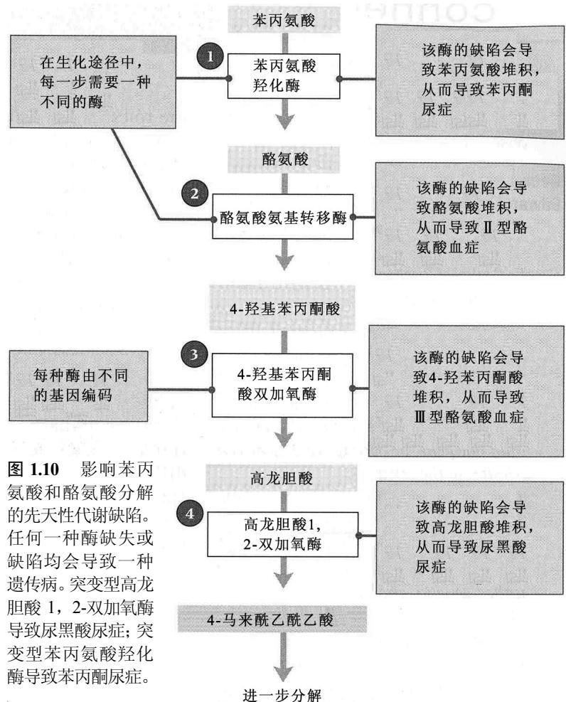

图 1.10 的代谢途径中，酪氨酸或 4-羟基苯丙酮酸的分解缺陷可导致多种酪氨酸血症。这些疾病也很严重。Ⅱ型酪氨酸血症伴随皮肤损伤和智力低下，Ⅲ型酪氨酸血症具有严重的肝功能障碍。

图 1.10 生化途径中所有酶的基因均已鉴定，其 DNA 的核苷酸序列均已测定。在下面的清单及全书中，沿用标准的印刷惯例，基因写成斜体，而基因的产物不以斜体书写。这种书写习惯比较方便，因为这意味着可以用和表示基因本身一样的符号来表示基因的蛋白质产物，只不过基因的符号是斜体形式，而蛋白质的符号不是斜体。图 1.10 中的数字对应于下列基因和酶。

1. 12 号染色体长臂上的基因 PAH，编码苯丙氨酸羟化酶 (PAH)。

2.16 号染色体长臂上的基因 TAT，编码酪氨酸氨基转移酶(TAT)。

3.12 号染色体长臂上的基因 HPD，编码 4-羟基苯丙酮酸双加氧酶(HPD)。

4.3 号染色体长臂上的基因 HGD，编码高龙胆酸 1，2-双加氧酶 (HGD)。

联系：一个基因，一个酶

乔治·比德尔和爱德华·塔特姆，1941

斯坦福大学

斯坦福，加利福尼亚

链孢霉生化反应的遗传控制

基因怎样控制代谢过程？在遗传学历史上，很早就有了基因控制酶的提法，最著名的要数英国医生阿奇博尔德·加罗德，1908年，他在《先天性代谢缺陷》一书中提出。但那时还不能肯定基因和酶之间的确切关系。有可能一个酶可由不止一个基因控制，也有可能一个基因可参与几个酶的控制。比德尔和塔特姆所做的经典实验证明，这种关系通常十分简单：一个基因编码一个酶。这一开拓性的实验整合了遗传学和生物化学，并且，因为“一个基因，一个酶”的概念，比德尔和塔特姆被授予1958年的诺贝尔奖(乔舒亚·莱德伯格因在微生物遗传学上的贡献，分享这一奖项)。现在我们知道有些酶包含两个(偶尔更多)不同基因编码的多肽链，因此，对该原理更为准确的表述是“一个基因，一个多肽”。比德尔和塔特姆的实验也证明了正确选择实验生物的重要性。采用链孢霉作为遗传实验生物不过数年，比德尔和塔特姆就认识到，这种生物可在由已知物质组成的简单培养基上生长的能力，可加以利用。

从生理遗传学的观点来看，机体的发育和运作实质上是基因以一定方式控制的化学反应所构成的有机整体。……在研究基因的作用时，生理遗传学家常常想弄清已知遗传性状的生理和生化基础。……然而，这种方法存在一些固有的局限。其中，最严重的局限也许是研究人员一般只能研究非致死的遗传性状，这样的性状很可能只涉及差不多是可有可无的所谓“终末”反应。……第二个困境是，用这种标准方法来解决问题，就意味着所用的性状要有肉眼可见的表现形式，此类性状多与形态变异有关，它们很可能是多个生化反应系统作用的结果，而这些系统非常复杂，分析起来极其困难。……考虑到刚才概括的那些，令我们颠倒通常的研究步骤，先研究发育和代谢反应的遗传控制的一般性问题，一开始就来探究基因能否控制及如何控制已知的生化反应，而不是试图解析已知遗传性状的化学基础。对这样的方法，子囊菌类的链孢霉具有许多优势，特别适合于遗传学研究。因此，我们围绕这种生物来开展研究。我们的实验方法基于这样的假设：X线处理会使控制已知特定化学反应的有关基因产生突变。如果链孢霉必须进行某种化学反应才能在给定的培养基上存活，则不能进行这种生化反应的突变体，在这种培养基上显然就是致死的。然而，如果在添加了因遗传上生化反应的阻断而缺少的必需物质的培养基上，突变体能够生长，则这样的突变体就能够得以保持和进行研究。……在X射线处理后从单细胞衍生而来的约2000个突变株中，发现有3个突变株在完全培养基上的生长基本正常，而几乎根本不能在基本培养基上生长。在这3个突变株中，第一个突变株被证实不能合成维生素 $B_{6}$ (吡哆醇)；第二个突变株被证明不能合成维生素 $B_{1}$ (硫胺素)；第三个突变株被证明不能合成对氨基苯甲酸。……在我们看来，这些初步的结果表明，该方法非常有望成为深入了解基因如何调控发育和功能的工具。例如，对某一给定合成代谢过程，如果能够找到一些不能进行某一特定步骤的突变体，应该能够判断在通常情况下是否仅有一个基因与某个特定化学反应的直接调控有关。

来源：G. W. Beadle and E. L. Tatum, Proc. Natl. Acad. Sci. USA 27 (1941): 499-506.

## 1.4 遗传分析

加罗德的先天性代谢缺陷研究对遗传学的意义曾未得到广泛的认可，很有可能是因为他的著作主要是关注生化途径，而不是遗传。基因和酶之间存在确凿的联系，是乔治·比德尔(George W. Beadle)和爱德华·塔特姆(Edward L. Tatum)在20世纪40年代开展的研究中总结出来的。他们使用一种丝状真菌——粗糙链孢霉(Neurospora crassa)，俗称红色面包霉——之所以选它，是因为用它能轻易地进行遗传和生化分析。在实验中，他们发现了一些新突变，每种突变可导致某些必需营养素合成代谢途径的一个阻断。他们证明，每一个阻断与某种有缺陷的酶相对应，该酶为代谢途径中某一步骤所必需。这项研究非常重要，不但因为它使遗传学和生物化学之间的联系更加牢固，而且因为他们的实验方法——现在称为遗传分析(genetic analysis)——一直在认识生物过程中得到成功运用，这包括从细胞周期和癌症的遗传控制，到发育和行为的遗传控制等广泛的生物学过程。因而，要比较详细地考察一下比德尔-塔特姆实验。

## - 突变基因与缺陷蛋白

粗糙链孢霉呈细丝状，可在各种基质上生长，包括在只含有数种无机盐、一种糖和维生素H(生物素)的实验培养基上。这种培养基称为基本培养基(minimal medium)，因为它只含有维持粗糙链孢霉生长必要的营养素。粗糙链孢霉由大量分支的细丝组成，细丝分隔成相互连接的多核的小室，小室间的细胞核和细胞质可以自由交换。每个细胞核含一套染色体(7条)。比德尔和塔特姆认识到，链孢霉能在基本培养基上生长，说明它一定能合成除生物素以外的所有代谢成分。如果生长必需的生物合成途径是由基因控制的，那么，负责合成某种必需营养素的基因发生突变，估计将使菌株不能生长，除非给菌株提供这种营养素。

这些想法通过以下方法进行了检验。用 X 线或紫外线照射非突变型链孢霉的孢子，产生具有各种不同营养需求的突变型菌株(为什么这些处理会导致突变，将在第 14 章讨论)。对影响任何一个生物学过程(此处是代谢)的一组突变体进行分离，称为突变筛查(mutant screen)。鉴定突变体的第一步，是用照射过的孢子(紫色)和未经处理的菌株(绿色)杂交，该过程概括于图 1.11 中。子实体通过有性生殖周期产生子囊孢子。让子囊孢子单个地在完全培养基(complete medium)上萌芽。完全培养基是富含各种氨基酸、维生素和其他物质(预计其合成可能会被突变所阻断的必需代谢物)的复合培养基。即使子囊孢子含有影响某种必需营养素合成的新突变，预计也能在完全培养基上萌芽生长。

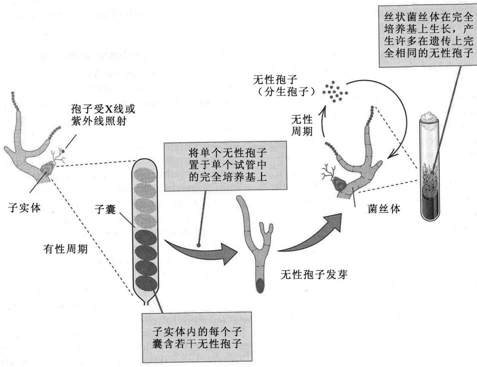

图 1.11 比德尔和塔特姆将丝状真菌粗糙链孢霉的无性孢子暴露于 X 线或紫外线中，获得突变体。经过处理的孢子在子实体中开始有性生殖周期。任意两个细胞及其细胞核融合后，几乎马上发生减数分裂，在单个子囊中形成 8 个有性孢子(子囊孢子)。逐一取出子囊孢子，培养于完全培养基中。随后根据携带新的营养型突变的子囊孢子不能在基本培养基上生长的特点，对其进行鉴定。

将每个培养物中的分生孢子转移到基本培养基上(图 1.12A)，以鉴定哪一个照射过的子囊孢子含有影响某种必需营养素合成的新突变。绝大多数的培养物能在基本培养基上生长，因为它们没有任何想要的新突变，予以丢弃。留下的是少数不能在基本培养基上生长的培养物，它们因为含有阻断某种必需营养素合成的新突变而不能在基本培养基上生长。

(A) 营养突变体的检测

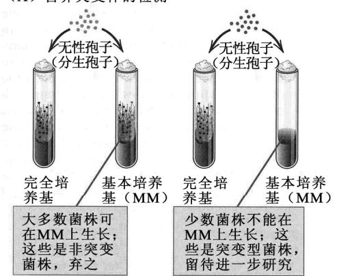

(B) 所需营养物的检测

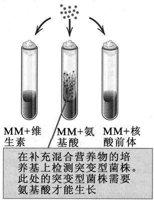  
(C) 特定氨基酸的检测  
(D) 精氨酸前体的检测

图 1.12 (A) 突变型孢子能在完全培养基上生长，但不能在基本培养基上生长。(B) 在添加不同营养素组合的基本培养基上检测每个新突变体能否生长。(C) 能在添加氨基酸的基本培养基上生长的突变体，用每种氨基酸逐一进行检测。(D) 缺乏精氨酸时不能生长的突变体，用可能是精氨酸前体的物质进行检测。

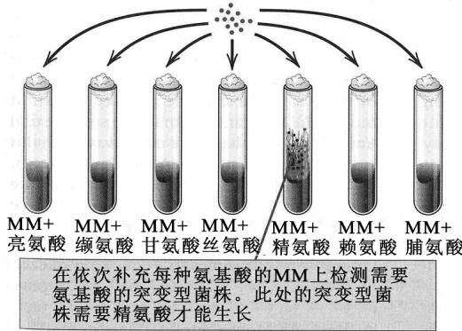

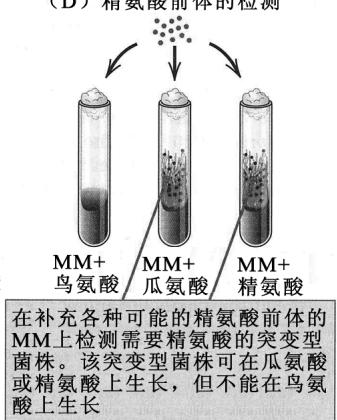

接下来，从每个突变培养物取一部分，分别转移到一系列培养基上，以检测该突变导致的是对维生素、氨基酸，还是对其他物质的需求(图 1.12B)。在图示的例子中，因为在基本培养基中加入所有氨基酸的混合物后，能够让菌株生长，所以突变型菌株需要的是一种(也有可能不止一种)氨基酸。因为在经过照射的培养物中具有新突变者所占的比例非常小，所以，含有两个或两个以上同时发生的新突变的培养物，其数量可忽略不计。

进一步对需要氨基酸的营养型突变体进行实验，逐个检测每种氨基酸，通常会发现只需要在基本培养基上添加某一种氨基酸就可以维持其生长。如图 1.12C 所示，突变型菌株需要精氨酸。即使在 20 世纪 40 年代，氨基酸生物合成中某些可能的中间产物就已被鉴定。它们因为与氨基酸的化学相似性及在生物细胞中以低浓度存在而得以识别。对精氨酸来说，两个候选的中间产物是鸟氨酸和瓜氨酸。因此，用单独添加鸟氨酸或瓜氨酸的培养基来对所有需要精氨酸的突变体进行检测(图 1.12D)。有一类精氨酸需求型突变体——命名为Ⅰ型——能够在添加鸟氨酸、瓜氨酸或精氨酸其中一种的基本培养基上生长。另一类突变体——命名为Ⅱ型——能在添加瓜氨酸或精氨酸的基本培养基上生长。第三种类型——Ⅲ型——只能在添加精氨酸的基本培养基上生长。

可以精氨酸需求型突变体的类型为例, 来说明遗传分析应用于代谢途径的逻辑。如图 1.13 所示, 这种逻辑很容易从代谢途径的上下联系中看到: 精氨酸是线性代谢途径的终产物, 该途径起始于某种前体代谢物, 而鸟氨酸和瓜氨酸是该途径的中间产物。这些突变体支持该途径的这种结构, 因为:

\- 能在存在鸟氨酸、瓜氨酸或精氨酸其中之一时生长的突变体，在前体代谢物和两个中间产物之间一定有一个代谢阻断。

\- 仅能在存在精氨酸时生长的突变体，在精氨酸和最“下游”的中间产物之间一定有一个代谢阻断。

\- 能在存在瓜氨酸或精氨酸时生长、但不能在存在鸟氨酸时生长的突变体，说明在代谢途径中鸟氨酸是瓜氨酸的“上游”。

观察发现，Ⅲ型突变体瓜氨酸累积，Ⅱ型突变体鸟氨酸累积，进一步证实了该途径的结构。最后，通过直接的生化实验证明，在非突变型菌株中确实存在推测出来的这些酶，而在突变型菌株中这些酶有缺陷。

## - 同一基因内突变的互补测验

比德尔和塔特姆很幸运,他们研究的是一种比较简单的生物的代谢途径,在这种生物中,一个基因对应一种酶。这种情况下,突变体的遗传分析可揭示关于代谢途径的大量内容,而不只是中间产物的先后顺序。按照突变所在的特定基因对每个突变进行划分,将每一个基因中的突变汇集到一起,这样,每组突变、同时也就是每个单独的基因可与生化途径中的某个酶学步骤相对应。例如,在图 1.13 中,每个 I 型突变体各与 3 个基因中的一个对应,说明在途径中前体和鸟氨酸之间有 3 个步骤。同样,

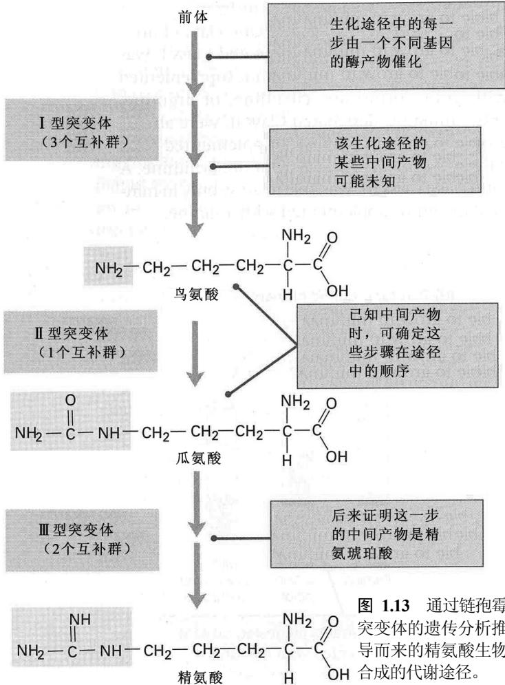

每个Ⅲ型突变体各与2个基因中的一个对应，说明在途径中瓜氨酸和精氨酸之间的步骤是2步。而所有Ⅱ型突变体都在同一个基因中发生突变，说明在途径中鸟氨酸和瓜氨酸之间只有1个步骤。

两个突变是否导致同一个基因的缺陷，是用互补测验(complementation test)进行鉴定的。在该实验中，两个突变被集中到相同细胞中。在多数多细胞生物甚至在一些有性生殖的单细胞生物中，做到这点的常用方法是进行杂交。两个亲本各自携带两种突变中的一种，当它们杂交时，受精产生同时含有这两种突变的生殖细胞，然后进行一般的细胞分裂，产生的后代每个细胞携带每个突变基因的一个拷贝。在链孢霉中，这种方法行不通，因为在细胞核融合之后紧接着几乎马上就是子囊孢子的形成，而每个子囊孢子仅有一套染色体。

不过，由于丝状体的多核特性，进行链孢霉的互补测验还是可能的。某些菌株，包括比德尔和塔特姆研究过的那些菌株，具有这样的性质：当两个突变型(或非突变型)菌株的丝状体产生物理接触时，丝状体会发生融合，新的丝状体包含来自参与融合的双方的多个细胞核。这种杂种丝状体称为异核体(heterokaryon)，它含有两种基因的突变型。Heterokaryon一词的词根是“不同细胞核”的意思(在本书后面可见一个遗传学中最常用词的词根表)。

将两个营养型突变体形成的异核体接种于基本培养基上，它有可能生长，也有可能不生长。如果它能在基本培养基上生长，就说两个突变型基因发生了互补（complementation），这一结果说明两个突变在不同的基因中。相反，如果异核体不能在基本培养基上生长，结果表明不互补（noncomplementation），可推断两个突变都在同一基因中。

根据互补或不互补得出的结论，出自图 1.14 所示的逻辑。此图示多核丝状体，其中，依据两个不同的基因(红色或紫色)哪一个发生突变，以颜色来标示突变型细胞核。红色和紫色的曲线表示突变型细胞核编码的蛋白质，“爆炸”符号表示蛋白质在此位置发生缺陷，这是由相应基因中的一个突变所致。

(A) 异核体的形成

突变体1

(B) 异核体的形成

突变体2

突变体3

图 1.14 互补测验的分子解释，互补测验用异核体来检测两个突变型菌株的突变是在不同基因中(A)还是在同一基因中(B)。(A)中，每一种细胞核为细胞提供了一种或另一种非突变型的多肽链，因此异核体能够在基本培养基上生长。(B)中，两种细胞核为细胞提供的都是同种多肽链的突变型，因此，不能合成该多肽链的非突变型，异核体不能在基本培养基上生长。

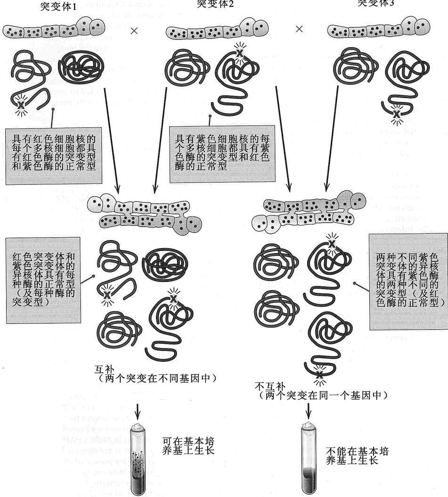

图 1.14A 描绘了两个突变型菌株的突变发生在不同基因中的情形。在异核体中，红色细胞核产生红色蛋白质的突变型和紫色蛋白质的正常型，而紫色细胞核产生紫色蛋白质的突变型和红色蛋白质的正常型。结果是，红色/紫色异核体正常型的红色蛋白质和紫色蛋白质两者都有。两种蛋白质的突变型也都有，但这并不重要。真正重要的是，两者正常型的存在，使异核体能够在基本培养基上生长，因为所有必需的营养素都能够合成。换句话说，红色细胞核中正常的紫色基因弥补了紫色细胞核中有缺陷的紫色基因，反之亦然。有首古老的童谣深得互补逻辑的精髓，“杰克·斯布拉特不吃肥/他的老婆不吃瘦/摆在中间的大盘子/他们总能舔光光”，因为夫妻俩互相弥补了对方的缺陷。

图 1.14B 显示在同一个基因中有缺陷的两个突变体之间形成的异核体，此处有缺陷的基因为紫色。两种紫色细胞核都编码正常型红色蛋白质，但每种紫色细胞核各编码一种有缺陷的紫色蛋白质。当两种细胞核在一起时，产生两种不同的突变型紫色蛋白质，因而，需要紫色蛋白质的生物合成途径仍然被阻断，从而异核体不能在基本培养基上生长。换句话说，图 1.14 中的突变体 2 和突变体 3 不能互补，所以，判定它们的突变在同一个基因中。

下面的原理是互补测验的基础。

互补原理：

互补测验将两个突变型基因集中到同一细胞或同一生物个体中。如果该细胞或个体为非突变体，就说这两个突变彼此互补，从而意味着两个亲本的突变在不同基因中。如果该细胞或个体是突变体，则两个突变不能彼此互补，从而意味着两个亲本的突变在同一基因中。

## ■ 互补数据分析

在链孢霉精氨酸需求型突变体的突变筛查中，比德尔和塔特姆发现不同类型(图 1.13 中的 I 型、II 型和III型)的突变体总能彼此互补。这一结果很容易理解，因为每一类型的基因各自编码在已知中间产物之间的不同阶段发挥作用的酶。而有些 I 型突变体不能与其他 I 型突变体互补，有些III型突变体不能与其他III型突变体互补。这些结果使每个类型中的基因数量得以鉴定。

为了说明这方面的遗传分析，来考察一下III型中的6个突变型菌株。将这些菌株两两配对以形成异核体，然后分析它们在基本培养基上的生长情况。所得数据如图1.15A所示。6个菌株中的突变型基因记为 $x1$ 、 $x2$ 等，以矩阵的形式显示数据，其中“+”表示可在基本培养基上生长(互补)，“-”表示在基本培养基上不生长(不互补)。对角线上的项都是“-”，反映了相同突变不能互补这一事实。矩阵中的+、-图案表明，突变 $x1$ 和突变 $x5$ 不能彼此互补；因此， $x1$ 和 $x5$ 是同一个基因内的突变。同样，突变 $x2$ 、突变 $x3$ 、突变 $x4$ 和突变 $x6$ 的所有配对组合也不能彼此互补；因此， $x2$ 、 $x3$ 、 $x4$ 和 $x6$ 都是同一个基因内的突变，但与 $x1$ 和 $x5$ 所代表的是不同的基因。

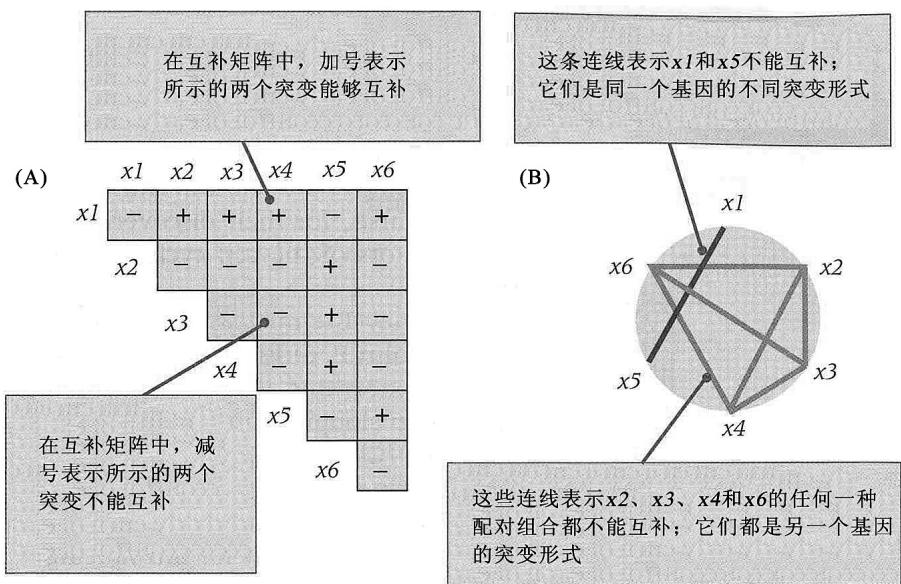

图 1.15 解读互补测验结果的一种方法。(A)互补测验结果。(B)为诠释该结果，将突变排成一圈。用直线连接不能互补（即产生突变型多核体）的任何一对突变。任何一对用直线连接起来的突变为同一基因中的突变，并且极有可能是在基因中不同核苷酸位点上的突变。此例显示了两个互补群，每个互补群代表精氨酸生物合成所需的一个基因。

如图 1.15B 所示，先将突变型基因排成圈状，可以方便地对互补矩阵中的数据进行分析。对每对可能配对的突变，如果两个突变不能互补(图 1.15A 中标 “-” 的)，就用直线将这对突变连起来。按照互补原理，这些直线连接了同一基因内的突变。不能彼此互补的一组突变称为互补群(complementation group)。正如我们所见，每个互补群界定一个基因，因此，互补测验事实上给基因提供了一个遗传学家式的操作性定义：

在实验上，基因可定义为构成单一互补群的一组突变。互补群内的任意一对突变不能彼此互补。

因此，图 1.15 的突变代表两个基因，它们中的任何一个发生突变，结果都是菌株不能将瓜氨酸转变为精氨酸。如果假设一个基因编码一种酶——这对于链孢霉的代谢酶是大体正确的——则图 1.13 中从瓜氨酸到精氨酸的途径必定含两个步骤，其间有一个未知的中间产物。后来发现这个中间产物是精氨琥珀酸。同样，Ⅰ型突变体界定了 3 个互补群，因而从前体到鸟氨酸存在 3 个酶学步骤。这些中间产物也很快得到了鉴定。最后，所有的Ⅱ型突变体彼此间都不能互补，仅有一个互补群，这一发现意味着把鸟氨酸转变成瓜氨酸的酶学步骤仅有 1 个。

## - 遗传分析的其他应用

由比德尔和塔特姆开创的这种遗传分析方法，对于认知复杂生物学过程的遗传控制非常有用。他们的方法开辟了一条探索基因的系统性路径——如果你愿意就可以按图索骥。首先，确定要研究什么过程。其次，搞清该过程中断的突变型生物会表现出什么特征。再次，进行突变筛查，找出表现这些特征的突变体。进行互补测验，以识别出有多少个不同的基因。最后，弄清这些基因的产物是什么、是干什么的、是怎样相互作用的，以及它们发挥功能的次序。

比德尔和塔特姆分析了各式各样基本营养素的许多代谢途径，他们的实验在破解氨基酸生物合成途径方面尤为重要。他们的发现在仅隔数年之后就被认为是“在氨基酸生物合成途径知识上的贡献，比数十年传统研究所积累的还要多。”他们因为这些研究，被授予1958年的诺贝尔生理学或医学奖。并且，迄今至少还有5项诺贝尔生理学或医学奖是由于遗传分析在其中发挥了重大作用，而这些遗传分析都是循着比德尔和塔特姆的道路开展的。下面是这些奖项的一个清单，引述的是诺贝尔基金会的颁奖词：

\- 1958 年: 比德尔和塔特姆“因为发现基因通过调控特定化学过程来行使功能”, 与乔舒亚·莱德伯格 (Joshua Lederberg) “因为遗传重组和细菌遗传物质构成的有关发现” 分享 (第 9 章)。

\- 1965 年：弗朗索瓦·雅各布 (François Jacob)、安德列·利沃夫 (André Lwoff) 和雅克·莫诺 (Jacques Monod) “因为酶和病毒合成遗传控制方面的发现” (第 11 章)。

\- 1995 年：爱德华·路易斯(Edward B. Lewis)、克里斯汀·纽斯林-沃尔哈德(Christiane Nüsslein-Volhard)和埃里克·威绍斯(Eric F. Wieschaus)“因为胚胎早期发育遗传控制方面的发现”（第 13 章）。

\- 2001 年：利兰·哈特韦尔 (Leland H. Hartwell)、蒂姆·亨特 (Tim Hunt) 和保罗·纳斯 (Paul Nurse) 爵士 “因为发现细胞周期的关键调节因子” (第 15 章)。

\- 2002 年：悉尼·布伦纳(Sydney Brenner)、罗伯特·霍维茨(H. Robert Horvitz)和约翰·萨尔斯顿(John E. Sulston)“因为器官发育和细胞程序性死亡的遗传调控方面的发现”（第 13 章）。

\- 2007 年：马里奥·卡佩奇 (Mario R. Capecchi)、马丁·埃文斯 (Martin J. Evans) 和奥利弗·史密斯 (Oliver Smithies) “因发现利用胚胎干细胞在小鼠中引入特定基因修饰的原理”（第 12 章）。

比德尔和塔特姆的实验证明有缺陷的酶是突变基因导致的，但是，是如何导致的呢？当时他们认为，基因就是酶。在那时，这是一个符合逻辑的假设。现在知道，基因和酶之间的关系不那么直接。除了少数例外，每种酶都是由一段 DNA 中特定的核苷酸序列编码的。编码酶的 DNA 区段，以及调控该酶何时产生、在什么细胞中产生的邻近区段，构成编码这种酶的“基因”。接下来，切入这个问题：基因怎样编码酶和其他蛋白质。

## 1.5 基因表达：中心法则

沃森和克里克提出，DNA中的遗传信息包含在碱基顺序中，其方式类似于写在纸条上的字母，这是正确的。在指导某种蛋白质合成的一段DNA中，蛋白质的遗传密码仅包含在一条链中，并且是以线性顺序解码的。典型的蛋白质由一条或多条多肽链组成；每条多肽链（polypeptide chain)由首尾相连的氨基酸线性序列组成。例如，PAH这种酶包含4条相同的多肽链，每条多肽链的长度是452个氨基酸。在DNA解码过程中，DNA中一个个连续的“码字”指定了在制造多肽链时下一个被添加到多肽链上的氨基酸。因此，编码PAH多肽链所需的DNA量是 $452 \times 3 = 1356$ 个核苷酸对。完整的PAH基因要长得多——约9万个核苷酸对。该基因仅有 $1.5\%$ 用来编码氨基酸。非编码部分包括一些控制基因活性的序列，但还不知道该基因有多少序列参与调控。

蛋白质中有 20 种不同的氨基酸。这 20 种氨基酸仅由 4 种碱基编码，遗传密码中的每个 “字” 由

3 个相邻的碱基组成。例如，碱基序列 ATG 编码甲硫氨酸(Met)，TCC 编码丝氨酸(Ser)，ACT 编码苏氨酸(Thr)，GCG 编码丙氨酸(Ala)。可能的三碱基组合有 64 种，但氨基酸仅有 20 种，因为有些组合编码相同的氨基酸。例如，TCT、TCC、TCA、TCG、AGT 和 AGC 都编码丝氨酸(Ser)，CTT、CTC、CTA、CTG、TTA 和 TTG 都编码亮氨酸(Leu)。图 1.16 中的例子显示了 DNA 双链中的核苷酸顺序与相应蛋白质中的氨基酸顺序之间的关系。这段 DNA 双链是编码人类 PAH 多肽链前 7 个氨基酸的序列。

图 1.16 所概括的示意图表明，DNA 不直接编码蛋白质，而是通过转录和翻译过程间接编码蛋白质。“DNA→RNA→蛋白质”这个信息传递的间接过程，称为分子遗传学的中心法则（central dogma）。“法则”这个词的意思是“成套的信条”，它始于中心法则这个概念首次作为一种理论提出。其后，该“法则”已为实验证实，但这个词延续了下来。中心法则如图 1.17 所示。中心法则的主要概念是，DNA 不直接编码蛋白质，而是通过中间分子核糖核酸（ribonucleic acid, RNA）起作用。RNA 的结构与 DNA 相似，但不完全相同。两者所含的糖存在差异 [RNA 含核糖 (ribose) 而不是脱氧核糖]；RNA 通常是单链 (而不是双链)；RNA 含尿嘧啶 (uracil, U) 碱基，而不是存在于 DNA 中的胸腺嘧啶 (T)。参与蛋白质合成的 RNA 有 3 类：

\- 信使 RNA(messenger RNA, mRNA)分子，携带来自 DNA 的遗传信息，作为多肽链合成的模板。在大多数

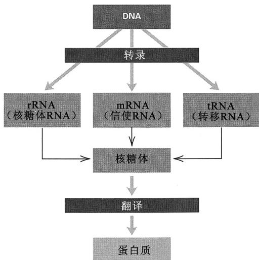  
图 1.17 分子遗传学的 “中心法则”：DNA 编码 RNA，RNA 编码蛋白质。DNA→RNA 这一步是转录，RNA→蛋白质这一步是翻译。

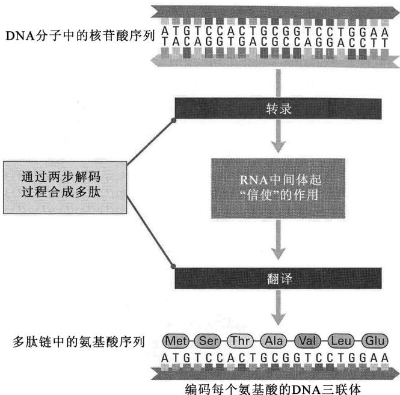  
图 1.16 编码某种多肽链前 7 个氨基酸的 DNA 序列。DNA 序列通过作为中间 “信使” 的 RNA 分子来编码氨基酸序列。虽然解码的过程不是直接的，但最终结果是，多肽链中的每个氨基酸由 DNA 中一组三个相邻的碱基来编码。本例中的多肽链是苯丙氨酸羟化酶(PAH)的多肽链。

mRNA 分子中，实际编码氨基酸的核苷酸所占的比例较高。例如，PAH 的 mRNA 长为 2400 个核苷酸，编码一条 452 个氨基酸的多肽；mRNA 全长的 50% 以上参与编码氨基酸。

\- 4种核糖体RNA(ribosomal RNA, rRNA), 是称为核糖体(ribosome)的这种细胞内颗粒的主要成分, 多肽的合成发生在核糖体上。

\- 一套约45种转移RNA (transfer RNA, tRNA)分子，每个tRNA携带一个特定的氨基酸，同时具有一个三碱基的识别区域，该区域与mRNA中一组三个相邻的碱基进行碱基配对。在参与翻译时，每个tRNA的氨基酸成为加在生长中的多肽链的末端亚单位。携带甲硫氨酸的tRNA记为 $\mathrm{tRNA}^{\mathrm{Met}}$ ，携带丝氨酸的记为 $\mathrm{tRNA}^{\mathrm{Ser}}$ ，以此类推(因为有不止20种不同的tRNA，但只有20种氨基酸，因此有些氨基酸对应的tRNA不止1种)。

中心法则是分子遗传学的基本原理，因为它概括了 DNA 中的遗传信息如何被表达成多肽链中的氨基酸顺序：

基因中的核苷酸顺序决定信使 RNA 分子中的核苷酸顺序；信使 RNA 中的核苷酸顺序再决定多肽链中的氨基酸顺序。

想一想，像 “DNA 编码蛋白质” 这样一个在概念上如此简单的过程，却因 RNA 中介的存在而产生额外的复杂性，这是什么原因？一个原因可能是存在 RNA 中介可多一级控制水平，如可通过

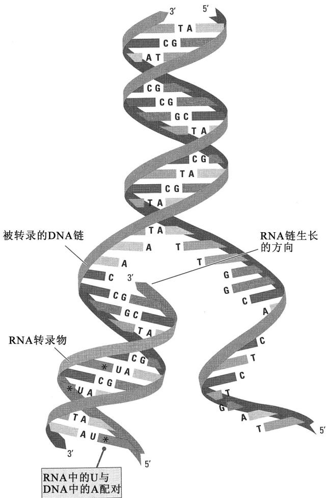  
图 1.18 转录是产生碱基序列与 DNA 链互补的 RNA 链的过程。在此例中，左边的 DNA 链正在被转录成 RNA 链。请注意，在 RNA 分子中，碱基 U(尿嘧啶) 起到 T(胸腺嘧啶) 的作用，与 A(腺嘌呤) 配对。每个 A-U 对均作了标记。

DNA 模板中的碱基序列互补(沃森-克里克配对的意思)，除了 U(与 A 配对)取代了 T 以外。DNA 和 RNA 之间碱基配对的规则总结于图 1.19 中。每条 RNA 链都具有极性——具有 5' 端和 3' 端，并且，与 DNA 合成一样，核苷酸只能加在生长中的 RNA 链的 3' 端。因此，RNA 转录物的 5' 端先合成，然后转录沿着 3'→5' 方向的模板 DNA 链继续进行。每个基因都含有起始和终止转录的核苷酸序列。从任何基因产生的 RNA 转录物都开始于模板链上的起始位点(位于氨基酸编码区的“上降解 mRNA 来控制不再需要的蛋白质。另一个可能是进化历史上的原因。RNA 结构独特，在其碱基顺序中，以及在使得有些 RNA 分子具有催化活性的复杂的三维折叠结构中，都存在信息内容。许多科学家认为，在最早的生命形式中，RNA 起到遗传信息和催化的双重作用。随着进化的推进，信息作用转移给 DNA，而催化作用转移给蛋白质。但是，RNA 逐渐锁定了它的中心地位，作为信息传递和蛋白质合成过程的中介。这一假说的意思是，RNA 参与蛋白质合成是进化最早阶段的一个遗迹——一块“分子化石”。该假说得到种种观察结果的支持。例如，① DNA 复制需要 RNA 分子才能启动(第 6 章)；② 在染色体端部的合成中，RNA 分子必不可少(第 7 章)；③ 有些 RNA 分子在蛋白质合成中发挥催化关键反应的作用(第 10 章)。

## 转录

遗传信息从 DNA 传输到 RNA 的方式如图 1.18 所示。DNA 打开，以其中一条链为模板，合成互补的 RNA 链(模板链是怎样选择的将在第 10 章讨论)。从 DNA 模板产生 RNA 链的过程就是转录(transcription)，产生的 RNA 链就是转录物(transcript)。RNA 中的碱基序列与

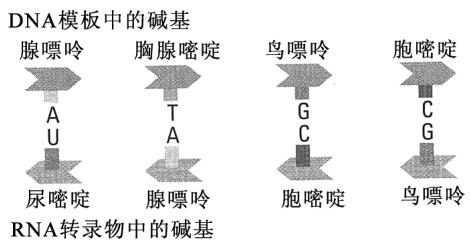  
图 1.19 DNA 中的碱基与 RNA 中的碱基之间的配对。DNA 碱基 A、T、G 和 C 分别与 RNA 碱基 U、A、C 和 G 配对。

游”），结束于终止位点(位于氨基酸编码区的“下游”)。对于任何基因，RNA转录物的长度都远远小于染色体中DNA的长度。例如，编码苯丙氨酸羟化酶的PAH基因的转录物长约9万个核苷酸，但12号染色体中的DNA大约有1.3亿个核苷酸对。在这个例子中，PAH转录物的长度不到染色体中DNA长度的 $0.1\%$ 。12号染色体上的其他基因会从12号染色体DNA分子的另一区域转录，并且可能是从另一条链转录，但是，被转录的区域与染色体DNA的全长相比，一样会很小。

## ■ 翻译

在 mRNA 指导下合成多肽链的过程称为翻译 (translation)。尽管编码多肽中氨基酸顺序的是 mRNA 中的碱基顺序，但真正做 “翻译” 工作的分子却是 tRNA 分子。mRNA 分子是以不相互重叠的三个碱基一组 (即密码子，codon) 的方式被翻译的。对于 mRNA 中编码氨基酸的每个密码子，有一个 tRNA 分子与之对应，该 tRNA 分子含有能与密码子互补配对的一组三个相邻的碱基。正确的氨基酸连接到 tRNA 的一端后，当 tRNA 就位时，与 tRNA 相连的氨基酸成为多肽链生长端最新增加的氨基酸。

图 1.20 示翻译中 tRNA 的作用，也可描述如下：

mRNA 被一个密码子一个密码子地读取。编码氨基酸的每个密码子与一个 tRNA 分子中一组三个相邻的互补碱基配对。该 tRNA 的一端与正确的氨基酸相连，所以正确的氨基酸就被带到正确的位置。

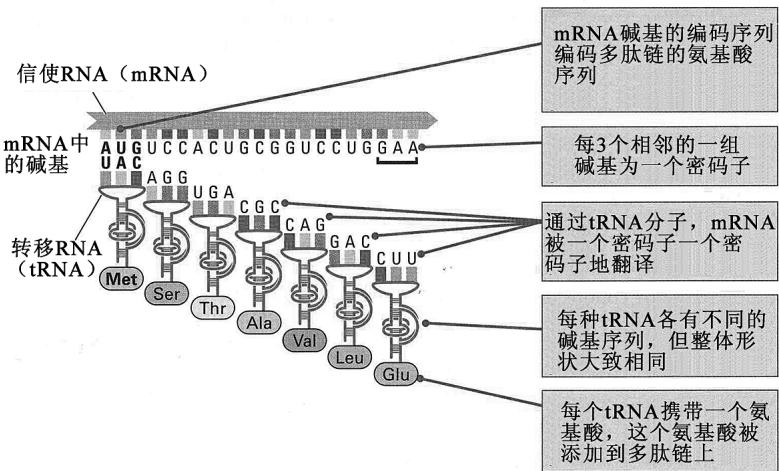

图 1.20 在翻译中，信使 RNA 的作用是将 DNA 碱基顺序中包含的信息携带到核糖体，该信息在核糖体处被翻译成多肽链。翻译由转移 RNA (tRNA) 介导，每个 tRNA 可与 mRNA 中一组三个相邻的碱基发生碱基配对。每个 tRNA 还携带着一个氨基酸。tRNA 依次来到核糖体，随着每个 tRNA 的到来，多肽链得以延伸。

在翻译中使用的 tRNA 分子不会像图 1.20 所示的那样沿着 mRNA 同时排成一条直线。翻译的过程发生在核糖体上，核糖体与单条 mRNA 结合，并沿着 mRNA 从一端一步一步地移动到另一端，每次移动 3 个核苷酸（一个密码子一个密码子地移动）。每次新的密码子到位后，下一个 tRNA 与核糖体结合。然后，多肽链的生长端得以与 tRNA 上的氨基酸连接。在多肽链合成时，每个 tRNA 都是以这种方式，依次起到暂时与多肽链结合的作用。每次多肽链从一个 tRNA 转移到下一个 tRNA 时，先前结合多肽链的 tRNA 从核糖体上释放。多肽链每步延伸一个氨基酸，直至碰到 3 个编码“终止”的特殊密码子中的一个为止。这时候，氨基酸链的合成结束，多肽链从核糖体上释放（这段对翻译的简单说明略去了许多细节，详见第 10 章）。

## ■ 遗传密码

如图 1.20 所示, mRNA 密码子 AUG 编码多肽链中的甲硫氨酸(Met), UCC 编码 Ser(丝氨酸), ACU 编码 Thr(苏氨酸)等。完整的译码表称为遗传密码(genetic code), 见表 1.1。对于任意密码子, 左边的列相当于密码子的第一个核苷酸(从 5' 端读起), 横跨顶部的行相当于第二个核苷酸, 右边的列相当于第三个核苷酸。表中给出了完整的密码子, 以及密码子编码的氨基酸(或翻译“终止”)。每个氨基酸均标明了全名及其三字母缩写和单字母缩写。在分子遗传学中, 这两种缩写类型都在使用。表 1.1 中的密码是 “标准” 遗传密码，几乎所有生物的细胞进行翻译时都使用该密码。在第 10 章中，会考察标准遗传密码的一般特征，以及在某些生物和细胞器的遗传密码中发现的细微差异。在这里，主要关注的是理解怎样用遗传密码来把 mRNA 中的密码子翻译成多肽链中的氨基酸。

表 1.1 标准遗传密码

<table><tr><td colspan="17">密码子第二个核苷酸</td></tr><tr><td></td><td></td><td colspan="3">U</td><td colspan="3">C</td><td colspan="3">A</td><td colspan="6">G</td></tr><tr><td rowspan="16">密码子第一个核苷酸</td><td rowspan="4">U</td><td>UUU</td><td>Phe</td><td>F 苯丙氨酸</td><td>UCU</td><td>Ser</td><td>S 丝氨酸</td><td>UAU</td><td>Tyr</td><td>Y 酪氨酸</td><td>UGU</td><td>Cys</td><td>C</td><td>半胱氨酸</td><td>U</td><td></td></tr><tr><td>UUC</td><td>Phe</td><td>F 苯丙氨酸</td><td>UCC</td><td>Ser</td><td>S 丝氨酸</td><td>UAC</td><td>Tyr</td><td>Y 酪氨酸</td><td>UGC</td><td>Cys</td><td>C</td><td>半胱氨酸</td><td>C</td><td></td></tr><tr><td>UUA</td><td>Leu</td><td>L 亮氨酸</td><td>UCA</td><td>Ser</td><td>S 丝氨酸</td><td>UAA</td><td>终止</td><td></td><td>UGA</td><td>终止</td><td></td><td></td><td>A</td><td></td></tr><tr><td>UUG</td><td>Leu</td><td>L 亮氨酸</td><td>UCG</td><td>Ser</td><td>S 丝氨酸</td><td>UAG</td><td>终止</td><td></td><td>UGG</td><td>Trp</td><td>W</td><td>色氨酸</td><td>G</td><td></td></tr><tr><td rowspan="4">C</td><td>CUU</td><td>Leu</td><td>L 亮氨酸</td><td>CCU</td><td>Pro</td><td>P 脯氨酸</td><td>CAU</td><td>His</td><td>H 组氨酸</td><td>CGU</td><td>Arg</td><td>R</td><td>精氨酸</td><td>U</td><td></td></tr><tr><td>CUC</td><td>Leu</td><td>L 亮氨酸</td><td>CCC</td><td>Pro</td><td>P 脯氨酸</td><td>CAC</td><td>His</td><td>H 组氨酸</td><td>CGC</td><td>Arg</td><td>R</td><td>精氨酸</td><td>C</td><td></td></tr><tr><td>CUA</td><td>Leu</td><td>L 亮氨酸</td><td>CCA</td><td>Pro</td><td>P 脯氨酸</td><td>CAA</td><td>Gln</td><td>Q 谷氨酰胺</td><td>CGA</td><td>Arg</td><td>R</td><td>精氨酸</td><td>A</td><td></td></tr><tr><td>CUG</td><td>Leu</td><td>L 亮氨酸</td><td>CCG</td><td>Pro</td><td>P 脯氨酸</td><td>CAG</td><td>Gln</td><td>Q 谷氨酰胺</td><td>CGG</td><td>Arg</td><td>R</td><td>精氨酸</td><td>G</td><td></td></tr><tr><td rowspan="4">A</td><td>AUU</td><td>Ile</td><td>I 异亮氨酸</td><td>ACU</td><td>Thr</td><td>T 苏氨酸</td><td>AAU</td><td>Asn</td><td>N 天冬酰胺</td><td>AGU</td><td>Ser</td><td>S</td><td>丝氨酸</td><td>U</td><td></td></tr><tr><td>AUC</td><td>Ile</td><td>I 异亮氨酸</td><td>ACC</td><td>Thr</td><td>T 苏氨酸</td><td>AAC</td><td>Asn</td><td>N 天冬酰胺</td><td>AGC</td><td>Ser</td><td>S</td><td>丝氨酸</td><td>C</td><td></td></tr><tr><td>AUA</td><td>Ile</td><td>I 异亮氨酸</td><td>ACA</td><td>Thr</td><td>T 苏氨酸</td><td>AAA</td><td>Lys</td><td>K 赖氨酸</td><td>AGA</td><td>Arg</td><td>R</td><td>精氨酸</td><td>A</td><td></td></tr><tr><td>AUG</td><td>Met</td><td>M 甲硫氨酸</td><td>ACG</td><td>Thr</td><td>T 苏氨酸</td><td>AAG</td><td>Lys</td><td>K 赖氨酸</td><td>AGG</td><td>Arg</td><td>R</td><td>精氨酸</td><td>G</td><td></td></tr><tr><td rowspan="4">G</td><td>GUU</td><td>Val</td><td>V 缬氨酸</td><td>GCU</td><td>Ala</td><td>A 丙氨酸</td><td>GAU</td><td>Asp</td><td>D 天冬氨酸</td><td>GGU</td><td>Gly</td><td>G</td><td>甘氨酸</td><td>U</td><td></td></tr><tr><td>GUC</td><td>Val</td><td>V 缬氨酸</td><td>GCC</td><td>Ala</td><td>A 丙氨酸</td><td>GAC</td><td>Asp</td><td>D 天冬氨酸</td><td>GGC</td><td>Gly</td><td>G</td><td>甘氨酸</td><td>C</td><td></td></tr><tr><td>GUA</td><td>Val</td><td>V 缬氨酸</td><td>GCA</td><td>Ala</td><td>A 丙氨酸</td><td>GAA</td><td>Glu</td><td>E 谷氨酸</td><td>GGA</td><td>Gly</td><td>G</td><td>甘氨酸</td><td>A</td><td></td></tr><tr><td>GUG</td><td>Val</td><td>V 缬氨酸</td><td>GCG</td><td>Ala</td><td>A 丙氨酸</td><td>GAG</td><td>Glu</td><td>E 谷氨酸</td><td>GGG</td><td>Gly</td><td>G</td><td>甘氨酸</td><td>G</td><td></td></tr></table>

除了 61 个只编码氨基酸的密码子外，有 4 个密码子具有专门的功能：

\- 密码子 AUG，编码 Met(甲硫氨酸)，也是多肽链合成的“起始”密码子。tRNA $^{Met}$ 结合于 AUG，起定位作用，这是多肽链合成起始的前几步之一，因而所有的多肽链都从 Met 开始（许多多肽的第一个 Met 在翻译完成之后被切除）。在多数生物中，用于翻译起始的 tRNA $^{Met}$ 与用于转运多肽链内部甲硫氨酸的 tRNA $^{Met}$ 是相同的。

\- 密码子 UAA、UAG 和 UGA，每个都是“终止”密码子，编码翻译终止，导致合成完的多肽链从核糖体上释放。这些密码子没有 tRNA 分子来识别它们，而是被终止翻译的蛋白质因子识别。

怎样将遗传密码表用于多肽链中氨基酸顺序的推导，可再用 PAH(具体而言是其编码第 1～7 个氨基酸的 DNA 序列)予以说明。该段 DNA 序列是：

## 5'-ATGTCCACTGCGGTCCTGGAA-3'

## 3'-TACAGGTGACGCCAGGACCTT-5'

这一区段按从左到右的方向转录成 RNA，并且因为 RNA 是在 3' 端连续添加核苷酸而被延伸(图 1.18)，所以被转录的是下面那条链。RNA 的核苷酸顺序是上面那条 DNA 链的顺序，只不过要将 U 换成 T，所以编码第 1～7 个氨基酸的 mRNA 是：

## 5'-AUGUCCACUGCGGUCCUGGAA-3'

密码子是按表 1.1 所示的遗传密码从左读到右。密码子 AUG 编码 Met(甲硫氨酸)，UCC 编码丝氨酸(Ser)等。总之，这一段多肽链的氨基酸序列是：

$$
\begin{array}{c} 5 ^ {\prime} \text {-AUG} \mid \mathrm{UCC} \mid \mathrm{ACU} \mid \mathrm{GCG} \mid \mathrm{GUC} \mid \mathrm{CUG} \mid \mathrm{GAA-3} ^ {\prime} \\ \text {Met} \mid \text {Ser} \mid \text {Thr} \mid \text {Ala} \mid \text {Val} \mid \text {Leu} \mid \text {Glu} \end{array}
$$

或用单字母缩写表示成:

$$
\begin{array}{c c c c c c c} 5 ^ {\prime} \text {-AUG} & \text {UCC} & \text {ACU} & \text {GCG} & \text {GUC} & \text {CUG} & \text {GAA - 3^ {\prime}} \\ \text {M} & \text {S} & \text {T} & \text {A} & \text {V} & \text {L} & \text {E} \end{array}
$$

这一段 PAH 基因完整的解码操作如图 1.21 所示。在该图中，突出显示了起始密码子 (start codon) AUG，因为有些 PKU 患者就在这个密码子有突变。AUG 是多肽链合成的起始密码子，从这一事实应该可以料到，在具有这种突变的患者的细胞中，一点 PAH 多肽也不会产生。接下来将考察突变及其后果。

图 1.21 中心法则在行动。编码 PAH 的 DNA 作为产生 mRNA 的模板，而 mRNA 通过与核糖体和 tRNA 分子的相互作用，起编码 PAH 多肽链中氨基酸序列的作用。PAH 多肽链中的氨基酸总数为 452 个，此处只显示了前 7 个。

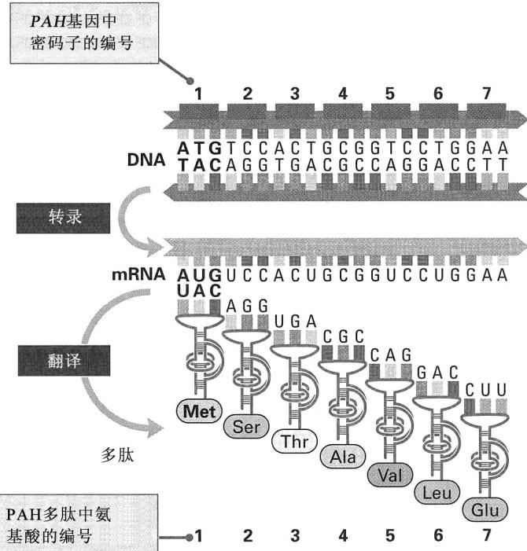

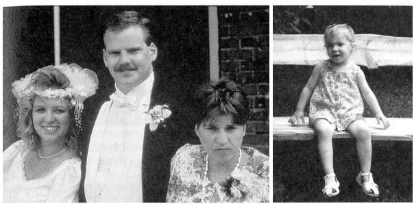

婚礼照片中的女人为两姐妹。两姐妹都有两个拷贝的突变型 $PAH$ 基因。新娘是妹妹，在出生3天后就得到确诊，很快就开始PKU饮食。伴娘是她的姐姐，被确诊的时间太晚，因而开始PKU饮食的时间太晚，导致智力障碍。右边照片中两岁大的女孩是这对夫妇的女儿。在怀这个女儿时，他们作了这样的计划：从怀孕到分娩，进行严格的饮食控制，以避免过量的苯丙氨酸对胎儿造成危害。他们的女儿顺利地通过了所有的发育里程碑[承麦吉尔大学蒙特利尔儿童医院研究所查尔斯·斯克里弗(Charles R. Scriver)惠赠]。

## 1.6 突变

突变 (mutation) 一词是指基因中 (或者更笼统一点，遗传物质中) 任何可遗传的改变，或者指这种改变发生的过程。有一种突变是导致 DNA 中碱基序列的改变。这种改变可以是比较简单的，如双链分子中的一个碱基对被置换为另一个碱基对。例如，双链分子中的一个 C-G 对可以突变成 T-A、A-T 或 G-C。核苷酸序列的改变也可能比较复杂，如碱基对的缺失或增加。这些及其他的突变类型将在第 7 章中讨论。遗传学家也用突变型 (mutant) 这个词，这是指突变的结果。突变造成突变型基因，突变型基因依次产生突变型 mRNA、突变型蛋白质，最后得到突变型生物，表现出突变的效果，例如，先天性代谢缺陷。

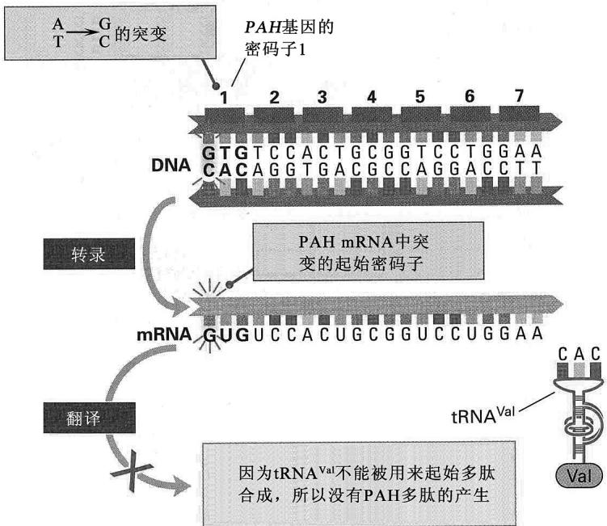  
图 1.22 PAH 基因中的 M1V 突变。翻译起始所需的甲硫氨酸密码子突变成缬氨酸密码子，翻译不能起始，因而没有 PAH 多肽生成。

人们研究世界各地苯丙酮尿症患者的 DNA，以探明什么类型的突变是导致这种先天缺陷的原因，结果发现突变类型种类繁多。在编码 PAH 的基因中，迄今已记载 400 余种不同的突变。在某些病例中，基因部分缺失，因此缺少生成完整 PAH 酶的遗传信息。在另一些病例中，遗传缺陷比较细微，但结果仍是不能产生 PAH 蛋白或产生的 PAH 蛋白没有活性。图 1.22 所示的突变中，编码序列起始处的一个正常的 A-T 碱基对被 G-C 碱基对取代，将用于翻译起始的正常密码子 AUG(Met) 改变为密码子 GUG，GUG 编码缬氨酸(Val)，不能当“起始”密码子用。结果

是，不可能发生 PAH mRNA 的翻译，因此不能产生 PAH 多肽。该突变被命名为 M1V，因为在 PAH 多肽中第 1 位氨基酸处编码 M(甲硫氨酸)的密码子，变成编码 V(缬氨酸)的密码子。尽管在世界范围内 M1V 突变十分少见，但在有些地方——如在加拿大的魁北克省——则比较常见。

有一种十分常见的 PAH 突变叫做 R408W, 它是 PAH 多肽链 408 位的密码子从编码精氨酸(R)

的密码子变为编码色氨酸(W)的密码子。这种突变是欧洲白人 PKU 患者中 4 种最常见的突变之一。该突变的分子基础如图 1.23 所示。在此例中，密码子 408 的第一个碱基对从 C-G 碱基对变为 T-A 碱基对。结果是，PAH mRNA 在 408 位是一个突变密码子；具体而言，是 UGG 置换了 CGG。在这种突变体中，翻译仍会发生，因为 mRNA 一切都是正常的，只不过结果是突变型 PAH 在多肽链 408 位携带的是色氨酸(Trp)，而不是精氨酸(Arg)。这种看似微小的一个氨基酸的改变，后果却非常严重。尽管 R408W 多肽是完整的，但其酶活性却不及正常酶活性的 3%。

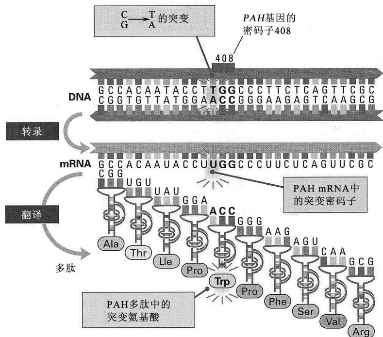  
图 1.23 PAH 基因中的 R408W 突变。编码精氨酸(R)的密码子 408 突变成编码色氨酸(W)的密码子。结果是，占据突变型 PAH 多肽 408 位的是色氨酸，而不是精氨酸。该突变型蛋白质只有很低的 PAH 酶活性水平。

## 1.7 基因和环境

先天性代谢缺陷说明了基因编码蛋白质、突变基因编码突变蛋白质的一般原理。在像 PKU 之类的例子中，突变蛋白质导致代谢发生如此剧烈的改变，以致产生严重的遗传缺陷。但是，仅凭生物定律不一定能决定一个人最终的命运，生物还要受到环境的影响。PKU 可以作为这一原理的例子，因为，坚持吃限制苯丙氨酸含量的饮食，PKU 患者的智力可发育到正常范围内。在此例中成立的，推而广之亦然，即多数性状是由基因和环境相互作用决定的。

大多数性状受多个基因的影响，这也是事实。没有人知道有多少基因参与大脑和神经系统的发育与成熟，只知道参与的基因数量一定是数以千计。这一数量还不包括所有细胞进行新陈代谢和实现其他基本生命功能所需要的基因。在 PKU 中，单个突变会给智力发育造成那么重大的影响，在考察这种极端例子的时候，容易忽视基因的多样性。这种情况与考察任何复杂机器时的情况类同。如果成千上万的部件协调工作时，一架飞机能够正常运行，但是，只要一个部件有缺陷，且这个部件影响到某个重要系统，就会让飞机掉下来。同样，每一个性状的发育及其功能的发挥，都需要大量基因的协调工作，但有时单个突变基因就会带来灾难性的后果。

换句话说，基因和性状之间的关系不一定简单。生物的生化活动是一个复杂的分支网络，不同的酶可能具有相同的底物，产生相同的产物，或应答相同的调节因子。结果是，多数可见的生

物性状是许多基因共同作用，并与环境因素联合作用的最终结果。PKU 为支配这些相互作用的 3 个原理提供了范例。

1. 一个基因可以影响不止一个性状。极端类型的 PKU 患儿的头发往往是金黄色，并且身体的色素减少。这是因为 PAH 缺乏是一种代谢阻断，阻止了苯丙氨酸转变为酪氨酸，而酪氨酸是黑色素的前体。在 PKU 中，严重智力低下与色素形成减少之间的关系，只有在知道苯丙氨酸、酪氨酸和黑色素之间的代谢联系后才容易理解。如果不知道这些代谢联系，这些性状看起来似乎毫不相干。在这方面，PKU 不算特别。有许多突变基因通过它们的继发效应或称间接效应来影响多个性状。一个突变基因所具有的各种不同的，有时看似互不相关的效应，称为多效性效应(pleiotropic effect)，而这种现象称为多效性(pleiotropy)。图 1.24 显示了一只蓝眼睛白猫，这种色素沉着方式往往伴有耳聋(出生时约 40%)。因此可将耳聋视为白色皮毛和蓝色眼睛的多效性效应。

  
图 1.24 在蓝眼睛白猫中，约有 40% 天生耳聋。原因是，起源于神经嵴的色素细胞会迁移到毛囊、眼睛和中耳等不同组织中，它们在中耳中的功能对于听力是必不可少的。因而，导致白毛和蓝眼的有缺陷的色素细胞，可引起耳聋，可将耳聋视为白毛和蓝眼的多效性效应 [© Ronen/ ShutterStock, Inc.]。

2. 任何一个性状可受不止一个基因影响。在先前讨论

关于大脑和神经系统的正常发育和行使功能需要大量基因时，讨论过这一原理。在这些基因中，包括影响血脑屏障功能的基因，血脑屏障由紧密包绕着脑内毛细血管壁的特化的神经胶质细胞构成，它对多数水溶性分子从血液到大脑的运输构成阻碍。因而，血脑屏障可影响血液中过量的游离苯丙氨酸进入大脑自身的程度。因为不同个体血脑屏障的效率有差异，所以血苯丙氨酸水平相似的 PKU 患者，在认知发育水平上会有巨大的差异。这也部分解释了为什么坚持吃限制苯丙氨酸的饮食对儿童极其重要，而对成年人就不太重要；儿童的血脑屏障发育得不够完善，因而在阻挡过量的苯丙氨酸上不太有效。

多个基因甚至会影响一些较为简单的代谢性状。用苯丙氨酸的分解和排泄作为例子非常合适。该代谢途径如图 1.10 所示。图中显示了该代谢途径中的 4 种酶，但在标有 “进一步分解” 的那个阶段还有更多的酶参与。因为这些酶中任何一种酶的活性的差异都可以影响到苯丙氨酸以何种速度被分解和排泄，所以该代谢途径中所有的酶对于决定 PKU 患者血液中苯丙氨酸过量的程度都很重要。

3. 大多数性状既受环境因素影响又受基因影响。在这里，回到低苯丙氨酸饮食。PKU 患儿不是注定要有严重的智力缺陷的。可以通过饮食疗法使他们的智力达到正常范围。PKU 可以作为一个例子，说明是什么驱使遗传学家们设法去探索遗传病的分子基础。遗传学家们希望的是，知道了该病的代谢基础，最终就有可能开发出临床干预的办法，通过饮食、药物或其他疗法，使该病的严重程度得到缓解。

## 1.8 分子水平的生命统一性

苯丙氨酸的分解和排泄途径绝不是人类独有的。来自分子遗传学的一个著名的概括是：差异非常明显的生物——如植物和动物——具有许多共同的遗传和生物化学特性。这些相似性说明存在一种根本的“生命统一性”：

地球上的所有生物在遗传装置上有许多共同特性，包括遗传信息编码于 DNA 碱基顺序中、转录到 RNA 中及在核糖体上利用转移 RNA 翻译到蛋白质中。所有生物也都具有某些共同的生物化学特性，包括许多酶和其他蛋白质在氨基酸顺序、三维结构和功能上的相似。

在植物(左)和动物(右)中都存在膜包围着的线粒体，其形态和功能相近。虽然这两个细胞来自差异极大的生物，但它们的相似性说明了根本上的生命统一性。细胞核占据每个细胞的大部分，其中存在遗传物质[左，Dr. Jeremy Burgess/Science Photo Library/ Photo Researchers, Inc. 右 ,Dr. Gopal/ Science Photo Library/Photo Researchers, Inc.]。

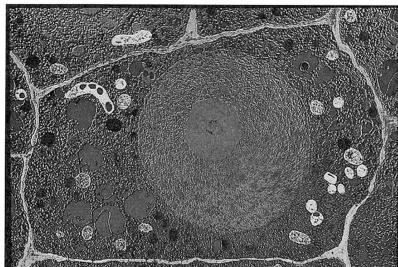

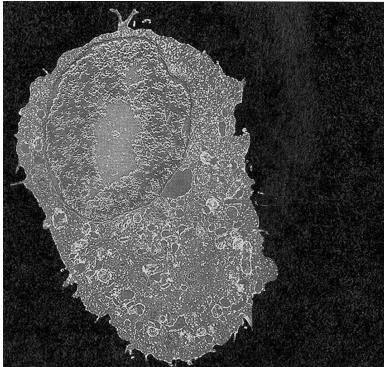

## ■ 原核生物和真核生物

不同的生物具有同一套相似的基因和蛋白质，是因为它们是从一个共同的祖先进化来的。进化 (evolution) 的过程，就是生物群体随着时间的推移在遗传组成上发生改变的过程。基因和蛋白质的进化性改变，会使不同生物个体在代谢、发育和行为上产生差异，这使它们能够逐渐更好地适应环境。从进化的观点来看，在现生生物中存在的基本分子过程的统一性，反映了这些过程是从一个遥远的共同祖先遗传而来的，在该祖先中，这些分子机制就已经存在了。

站在进化的立场上，不仅使生命的统一性能够被理解，而且使现生生物的许多其他特点也能够被理解。例如，如果最早的生命形式将 RNA 既用作遗传信息又用作催化酶，就容易理解 RNA 中介在遗传信息从 DNA 到 RNA 再到蛋白质的基本流程里的中间地位。在理解看似盲目或毫无必要的复杂的生物学的方方面面时，进化视角的重要性可概括成进化生物学家狄奥多西·杜布赞斯基 Theodosius Dobzhansky 的一句著名格言：“在生物学中没有什么是容易理解的，除非用进化来思考。”

生物学家将生物分成三大界。

1. 细菌界 (bacteria)。该类群包括大部分细菌和蓝藻(以前称为蓝绿藻)。这些生物的细胞没有以膜为界的细胞核和线粒体，细胞由细胞壁包绕，以二分裂方式增殖。

2. 古细菌界 (archaea)。该类群最初发现于产生甲烷气体或生活在极端环境(如温泉或高盐浓度)的微生物之中。它们也广泛分布于比较正常的环境中。表面上看起来古细菌与细菌相似，但古细菌细胞膜脂的化学连接方式与细菌有重大差异。古细菌 DNA 复制和转录的装置与真核生物类似，而它们的代谢方式与细菌非常相似。DNA 序列分析表明，在古细菌界中发现的基因，约有一半是该类群所独有的。

3. 真核生物界 (eukarya)。这一类群包括细胞具有复杂的内膜网络、以膜为界的细胞核和线粒体的所有生物。它们的 DNA 以组装成典型染色体的线性分子形式存在，细胞通过有丝分裂进行分裂 (在第 4 章讨论)。真核生物包括动植物和真菌，以及许多单细胞生物，如变形虫和纤毛原虫。

通常将细菌界和古细菌界这两个类群的成员合成一大类，称为原核生物(prokaryote)，其字面意思是“在细胞核(进化出来)之前”。这个术语将原核生物作为一个类群来称呼，利于显示出与真核生物(eukaryote)的区别，“真核生物”的字面意思是“完善的(组织良好的)细胞核”。

## - 地球上生命的起源

细菌和古细菌核心的细胞过程是十分相似的。两者都以双链 DNA 为遗传物质，都将 DNA 转录成信使 RNA，都凭借相同的遗传密码用信使 RNA 来编码蛋白质中的氨基酸序列。还有，它们合成或分解小分子的大多数代谢途径都是类似的。细菌和古细菌的相似性表明，它们极有可能具有同一个祖先。因为这两个类群之间的一个关键区别是膜脂上的化学差异，所以，细菌和古细菌所具有的共同祖先，似乎可能在生命能够合成出周围的膜而变得细胞化之前。

细菌和古细菌(及真核生物)的共同祖先还有个名字, 它被称为 LUCA, 代表“last universal common ancestor”(所有生命的最后一个共同祖先)。LUCA 从何而来呢? 有些科学家猜测它可能来自其他行星, 以小行星这样受污染的宇宙碎片的方式来到地球。但是, 假如 LUCA 没有细胞膜, 则它必定是一种脆弱的生物, 因而它似乎更有可能是在地球上自然的化学和物理过程中土生土长出来的。

在宇宙诞生约90亿年后，小颗粒的冰和尘埃开始聚集成团，并且随着它变得越来越大，而能够通过万有引力吸引较大的物体，这样逐渐形成地球这颗行星，这是在大约45亿年前。图1.25所示的24小时时钟，结束于现在，而将地球开始的时间显示为0点。在这个虚拟时钟中，每1秒相当于实际时间约5万年。据推测，新生的地球很快变冷，并获得从火山中逸出的氢气、甲烷、二氧化碳、氨气和氮气等气体构成的大气，加上与冰构成的小行星碰撞而得的液态水。在早期大气的成分中，没有游离氧，游离氧是很久以后随着光合作用的进化才出现的。没有

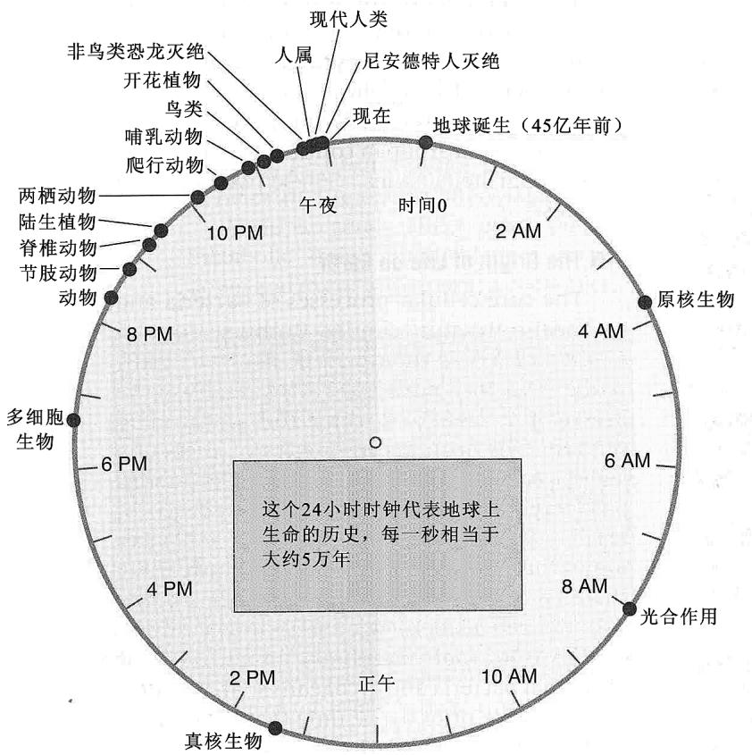  
图 1.25 生命历史主要事件的时间顺序, 按 24 小时时钟划分生命历史, 始于 45 亿年前地球形成之时。

游离氧，意味着大气是还原性的，因而存在现成的电子，有利于化学键的形成。20 世纪 50 年代早期，米勒(Stanley Miller)和尤里(Harold Urey)造了一套模拟闪电(电火花)的设备，在存在液态水的情况下，让电火花作用于氢气、甲烷和氨气的混合气体。他们证明这样可以产生许多有机分子，包括丙氨酸、甘氨酸、缬氨酸、丝氨酸、苯丙氨酸、天冬氨酸和谷氨酸等氨基酸。这些实验结果支持早期的猜测：生命最初产生于自发合成、逐渐累积的某种有机小分子浓汤中。RNA在现生生物中的核心地位，导致这一观点的产生：最早的生命形式既要依赖RNA来存储信息，又要依赖RNA作为酶来发挥催化作用；在后来的进化过程中，随着LUCA的逐渐诞生，RNA的信息作用被DNA接管，而其大部分的催化作用被蛋白质接管。

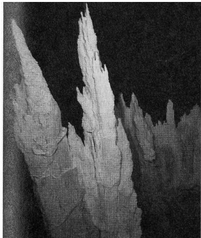  
图 1.26 生命的核心化学过程可能起源于此处所示的这种巨大碳酸盐尖塔内的微室中，这些碳酸盐尖塔由大洋中洋嵴附近的热液喷口形成。

目前流行的一个假说认为，地球上的生命可能起源于巨大碳酸盐尖塔内极小的多孔小室中。这些碳酸盐尖塔有10层楼高，在大洋中洋嵴附近的碱性热液喷口处形成。这里的海底平展，海水从洋嵴上飞泻下来，在被加热并再次升起之前，可富集矿物质(图1.26)。这些碳酸盐微室四面是一层薄薄的金属硫化物，在还原性环境中，金属硫化物可作为催化剂，促使流过微室的水中所含的化学物质进行化学反应。微室起到浓缩反应产物的作用，也使微室之间产生一定程度的分隔。在基本的细胞过程全部进化出来之后，才需要用膜来作为分隔。不过，膜的进化使得最早的细胞能够自由生活。

姑且不论生命是如何起源的、起源于何处，生物学家对其年谱确已有所了解。最早的原核生物的证据是已变成化石的生物膜，距今有38亿年。在图1.25的虚拟时钟中，时间大约在3:45AM。最早的光合作用细菌(蓝藻)化石的年代约在30亿年前，这在我们的时钟中是8:00AM。在此前后，因为光合作用生物吸收二氧化碳和水，释放游离

氧，大气开始发生改变。在化石记录中，直到大约20亿年前才出现真核生物，在我们的时钟中是1：20 PM左右。真核生物似乎源于古细菌细胞和细菌细胞之间的融合。最终，古细菌的基因组进化成细胞核，而细菌基因组进化成线粒体，但大多数细菌基因最终被转移到细胞核中(第16章中会有更多关于细胞器的内容)。多细胞生物的证据距今10亿年(在我们的时钟中为6:40 PM)，并最终通过与蓝藻(变成叶绿体)的融合而产生光合作用植物。从此，生命便生生不息了。在虚拟时钟中，午夜之前的一个小时包括鸟类的出现(来自恐龙祖先)、开花植物繁盛、恐龙灭绝，约250万年前(在时钟上午夜之前的48s)包含人类这个物种在内的人属(Homo)的初次登台，以及与人类亲缘关系最近的尼安德特人的灭绝(午夜之前0.5s)(在第19章将会看到，尼安德特人并未彻底灭绝，因为在今天现生人类的基因组中还有他们的一些基因)。在有记录的大约5000年人类历史中，又发生了些什么呢？在我们的时钟里，这不过是弹指之间——1/10s。

## - 基因组和蛋白质组

一个细胞、细胞核或细胞器中 DNA 的总和，称为该细胞、细胞核或细胞器的基因组 (genome)。在将 “基因组” 一词用于与某个生物物种相关的场合时——例如，在 “人类基因组” 这样的表述中——该词的定义是存在于一个正常生殖细胞中的 DNA。

由于现在 DNA 测序的方法(在第 6 章中讨论)极其快速而高效，人们已经知道了成百上千个生物物种的完整 DNA 序列。包括图 1.25 中提到的众多代表性物种的基因组，甚至包括尼安德特人的基因组(从骨化石中提取 DNA 来测序)。表 1.2 示几种已经测序的基因组。基因组大小以百万碱基对 (megabase, Mb) 为单位。流感嗜血杆菌 (Haemophilus influenzae) 基因组与大多数细菌的基因组一样，非常紧凑——大部分基因组都编码蛋白质。在出芽酵母、线虫、果蝇和小型开花植物拟南芥(Arabidopsis thaliana) 中，发现基因密度(相对于 DNA 总量而言)也较高。相比之下，人类基因组含有大量非编码 DNA。与线虫作一比较，就一目了然了。尽管人类基因组比线虫基因组大 30 倍左右，但人类基因的数量却不到线虫的 2 倍。这一矛盾反映了一个事实：人类基因组序列仅有约 1.5% 编码蛋白质(约 27% 的人类基因组序列组成基因，但基因中的大部分 DNA 序列是不编码蛋白质的)。

表 1.2 基因和蛋白质的比较

<table><tr><td>生物</td><td>基因组大小 $(Mb^a, \text{近似值})$ </td><td>基因数目(近似值)</td><td>蛋白质组中不同蛋白质的数目 $^b$ (近似值)</td><td>共同具有的蛋白质家族</td></tr><tr><td>Hemophilus influenzae(导致细菌性脑膜炎)</td><td>1.9</td><td>1 700</td><td>1 400</td><td></td></tr><tr><td>Saccharomyces cerevisiae(出芽酵母)</td><td>13</td><td>6 000</td><td>4 400</td><td></td></tr><tr><td>Caenorhabditis elegans(土壤线虫)</td><td>100</td><td>20 000</td><td>9 500</td><td>3 000</td></tr><tr><td>Drosophila melanogaster(果蝇)</td><td> $120^c$ </td><td>16 000</td><td>8 000</td><td>5 000</td></tr><tr><td>Mus musculus(实验小鼠)</td><td>2 500</td><td>25 000</td><td>10 000</td><td> $7\ 000^d$ </td></tr><tr><td>Homo sapiens(人类)</td><td> $2\ 900^e$ </td><td>25 000</td><td>10 000</td><td> $9\ 900^f$ </td></tr></table>

a 百万碱基对。b 不含序列相似(从而功能相关)的蛋白质 “家族”。c 不包括基因含量极低的 60Mb 特化(异染色质)DNA。d 基于信使 RNA (mRNA) 的序列相似性。e 为方便起见，在本书的其他地方将该近似值四舍五入至 3000Mb。f 基于这样的观察结果：仅有约 1% 的小鼠基因在人类基因组中没有相似的基因，反之亦然。

基因组编码的一整套蛋白质称为蛋白质组(proteome)。在像酵母、蠕虫和果蝇这样不太复杂的基因组中，一种生物的蛋白质组中蛋白质的数量与基因数量大致相同。然而，正如将在第11章看到的那样，有些基因可通过一种叫做选择性剪接(alternative splicing)的过程编码两种或多种蛋白质，在此过程中，初始RNA转录物片段可以多种排列组合方式连接在一起，产生不同的mRNA。在人类基因组中，选择性剪接尤为普遍。至少有1/3甚至多达2/3的基因进行选择性剪接，并且，在进行选择性剪接的基因中，平均每个基因可产生2～7种不同的mRNA。因此，人类基因组以看似有限的25 000个基因总数，却能产生60 000～90 000种不同的mRNA。普遍使用选择性剪接而使基因的编码能力大大增加，是人类遗传复杂性的根源之一。

根据氨基酸序列的相似性，可对蛋白质进行分类，构成蛋白质家族(families)。大多数真核生物都含有这种由相关蛋白质构成的家族。之所以存在这些家族，是因为进化出某种新的基因功能，通常始于一个现有基因的复制，继之以其中一个拷贝的核苷酸序列的改变，从而具有新功能。新功能通常与先前的功能相似(例如，某种转运蛋白只是改变了它的底物特异性)，因而新的蛋白质与原来的蛋白质在氨基酸序列上保持了足够的相似性，从而可以识别出它们的共同祖先。

在各种不同类型生物的蛋白质组中，从其在蛋白质上的相似性可以看出在分子水平上的生命统一性。表 1.2 右边一栏中显示了这样的比较。在该表中，为了估计蛋白质组中 “不同” 蛋白质(意指它们的序列不相似)的数量，每个由相关蛋白质组成的家族只统计一次。酵母、蠕虫和果蝇不同蛋白质的数量分别约为 4400、9500 和 8000。表 1.2 中的大括号表示不同物种之间共同拥有的具有序列相似性的蛋白质的数量。从这些比较可以看出，多数多细胞动物之间共同拥有 5000～10 000 个序列和功能相似的蛋白质。其中，与亲缘关系远至酵母的真核生物共有的约3000个，与亲缘关系远至细菌的原核生物共有的约1000个。在蛋白质组之间所做的这些比较表明，生物系统是建立在数以千计的蛋白质组分基础上的。要认识这一层次的复杂性，是富有挑战性的，但与早些时候曾经认为人类细胞能产生多达100万种不同蛋白质的那种挑战性比起来，这种挑战就不那么令人生畏了。

## 本章概要

\- 遗传性状受基因影响。

\- 基因由脱氧核糖核酸(DNA)这种化学物质组成。

\- DNA 通过复制形成自身的拷贝，这些拷贝都一模一样(除极少的突变外)。

\- DNA 含有遗传密码，遗传密码决定在细胞中产生什么样的酶和其他蛋白质。

\- DNA 偶尔会突变，突变型 DNA 编码变异的蛋白质，其活性和稳定性降低。

\- 突变酶是“先天性代谢缺陷”，它阻断小分子代谢生化途径中的一个步骤。

\- 性状不但受基因影响，也受环境影响。

\- 由于所有现生生物都来自共同的祖先，所以它们都具有某些共同的细胞生理和代谢特性。

\- 通过比较基因组和蛋白质组，可看出分子水平上的生命统一性。

## 基础回顾

\- 证明 DNA 是遗传物质的关键实验有哪些？

\- 对 DNA 分子结构的认识是如何为 DNA 能够复制、编码蛋白质和发生突变提供线索的？

\- 为什么说互补碱基的配对是 DNA 复制的主要特征？

\- 转录的过程是什么？它在哪些方面与 DNA 复制不同？

\- 参与蛋白质合成的 RNA 是哪三种？每一种的作用是什么？

\- 什么是“遗传密码”？它与从 mRNA 分子到多肽链的翻译过程是怎样联系起来的？

\- 什么是先天性代谢缺陷？这一概念是怎样成为遗传学和生物化学之间的桥梁的？

\- 加罗德发现，无功能的酶由突变基因导致。怎样用“中心法则”来解释这一发现？

\- 解释为什么许多突变型苯丙氨酸羟化酶仅有一个简单的氨基酸置换，却使得突变多肽链缺失或数量极少。

\- 什么是基因突变的多效性效应？举例说明。

\- 细菌、古细菌和真核生物在细胞结构上有何主要差异？

## 解题指南

习题 1 在人类亨廷顿蛋白(huntingtin，与 Huntington 病相关，故此得名)基因中，氨基酸编码区前 21 个核苷酸是：

## 3'-TACCCACCGTTATAAGAGAGT-5'

其配对链的序列是什么？

答案 DNA 双链中两条链之间的碱基配对是 A 与 T 配、C 与 G 配，而同样重要的是，两条链具有相反的极性。因此，要将互补链的 5' 端放在左边。配对链的碱基序列是：

$$
5 ^ {\prime} \text {-ATGGGTGGCAATATTCTCTCA-3^ {\prime}}
$$

习题 2 假如问题 1 中编码亨廷顿蛋白的 DNA 双链被从左到右转录, 推导在该编码区中 RNA 的碱基序列。

答案 推导该 RNA 序列，需要应用 3 个概念。第一，碱基配对的结果是 DNA 模板链中的 A、T、C、G 分别转录成 RNA 链中的 U、A、G、C。第二，DNA 模板链和 RNA 转录物具有相反的极性。第三(也是解答此题最关键的一点)，RNA 链总是按 5' 到 3' 的方向转录。因为已知是从左到右进行转录，所以可推断被转录的链就是问题 1 中所给的链。因此，RNA 转录物的碱基序列是：

## 5'-AUGGGUGGCAAUAUUCUCUCA-3'

习题3 已知问题2中推导的编码人亨廷顿蛋白的部分RNA序列,这一部分亨廷顿蛋白的氨基酸序列是什么?

答案 多肽链的翻译起始于编码序列的 5' 端，沿 $5'\rightarrow3'$ 的方向移动，以连续的 3 个碱基(密码子)一组的方式进行。在遗传密码表中，可查到与每个密码子对应的氨基酸。该多肽链前 7 个氨基酸是：

$$
5 ^ {\prime} \text {-AUG GGU GGC AAU AUU CUC UCA-3^ {\prime}}
$$

$$
\begin{array}{c c c c c c} \text {Met} & \text {Gly} & \text {Gly} & \text {Asn} & \text {Ile} & \text {Leu} & \text {Ser} \end{array}
$$

习题 4 假设问题 1 所示的 DNA 序列中发生了一个人亨廷顿基因的突变。在该突变中，粗体的 G 被 T 置换。该区域的 DNA 双链(两条链)和信使 RNA 的核苷酸序列是什么？突变型亨廷顿蛋白的氨基酸序列又是什么？

答案 DNA、RNA 和多肽链的序列如下，其中，与非突变基因不同之处为粗体。该突变造成终止密码子，从而亨廷顿蛋白的合成被提前终止。

DNA(转录链)

$$
3 ^ {\prime} \text {-TAC CCA CCG TTA TAA GAG ATT-5 ^ {\prime}}
$$

DNA(非转录链)

$$
5 ^ {\prime} \text {-ATG GGT GGC AAT ATT CTC TAA-3}
$$

RNA 编码区

$$
5 ^ {\prime} \text {-AUG GGU GGC AAU AUU CUC UAA-3^ {\prime}}
$$

多肽链

$$
\begin{array}{c c c c c} \text {Met} & \text {Gly} & \text {Gly} & \text {Asn} & \text {Ile} \\ \hline \end{array} \text {Leu STOP}
$$

分析与应用

1.1 区分下列说法的对错。

(a) 每一个基因只决定一个可见性状。

(b) 每个性状都有可能被多个基因影响。

(c)基因中的核苷酸顺序决定由该基因编码的蛋白质的氨基酸顺序。

(d) 遗传密码中的成套密码子与其编码的成套氨基酸之间是一一对应的关系。

1.2 沃森和克里克从他们对 DNA 结构的考察中推断出 DNA 复制、编码和突变可能机制是什么？

1.3 双链 DNA 分子的每条链都具有极性，这样说的意思是什么？双链 DNA 分子中的两条配对链具有相反的极性，这样说的意思又是什么？

1.4 对肺炎链球菌 S 菌株和 R 菌株的什么重要观察结果促使埃弗里、麦克劳德和麦卡蒂去研究这种生物？

1.5 在埃弗里、麦克劳德和麦卡蒂的转化实验中，说明导致转化的物质是 DNA 而不是蛋白质的最强有力的证据是什么？

1.6 有种叫做苯酚(石炭酸)的化学物质，可破坏蛋白质，但不能破坏核酸。而氢氧化钠之类的强碱，蛋白质和核酸都能破坏。在用肺炎链球菌进行的转化实验中，如果用苯酚处理 S 菌株的提取物，估计会得到什么结果？如果用强碱处理呢？

1.7 T2噬菌体在物理构造上的什么特性使得它适合用来做赫尔希-蔡斯实验？

1.8 RNA 分子像 DNA 一样含有大量的磷。赫尔希和蔡斯在存在放射性磷的情况下在细菌细胞中培养 T2 噬菌体，RNA 也应该吸收了带有放射性标记的磷，然而实验结果却并非如此。这是为什么？

1.9 从某种噬菌体中提取的 DNA 含 16% 的 A、16% 的 T、34% 的 G 和 34% 的 C，关于该 DNA 分子的结构，你能作出什么推论？

1.10 从某种噬菌体中提取的 DNA 含 20% 的 A、34% 的 T、35% 的 G 和 11% 的 C，该 DNA 有什么不寻常之处？关于其结构，你能得出什么推论？

1.11 一段被转录的 DNA 链不含 A，相应的 RNA 区段会缺少什么碱基？

1.12 如果一个 DNA 双链的一条链上有 5'-ATCAG-3' 的序列，其互补链的序列是什么？(在答案中将 5' 端写在左边)

1.13 假如把组成某个双链 DNA 分子的两条链分开，然后用高速离心来纯化这两条链。其中一条链的碱基组成是 25% 的 A、18% 的 T、20% 的 G 和 37% 的 C，另一条链的碱基组成是什么？

1.14 试想某一双链 DNA 分子某条链上的一段是由三核苷酸 5'-GTA-3' 的串联重复序列组成，因而该链中的序列是 5'-GTAGTAGTAGT...-3'，另一条链中的序列是什么？(在答案中将 5' 端写在左边)

1.15 如果某一 DNA 双链的模板链具有 5'-TCAG-3' 的序列，相应 RNA 转录物的序列是什么？(在答案中将 5' 端写在左边)

1.16 如果某一 DNA 双链的非模板链具有 5'-ATCAG-3' 的序列，在该区域的 RNA 转录物的序列是什么？

(在答案中将 5'端写在左边)

1.17 某一双链 DNA 分子包含一段随机序列，4 种核苷酸所占比例相同，出现 5'-ATGC-3' 序列的平均间隔是多少？出现 5'-TACGGC-3' 序列的平均间隔呢？

1.18 某一 RNA 分子自我折叠，通过局部的碱基配对连接在一起，形成一个 “发夹” 结构。在配对区域，该 RNA 分子的一段碱基序列是 5'-UAUCGUAU-3'，与该片段配对的碱基序列是什么？

1.19 某一人工合成的 mRNA 分子由重复碱基序列 5'-AAAAAAAAA...-3' 构成。用来自 E. coli 的核糖体、转移 RNA 和其他必需成分，对该 mRNA 分子进行体外翻译，结果得到由重复氨基酸 Lys-Lys-Lys-... 组成的多肽链。假设遗传密码是三联体密码，该结果说明赖氨酸 (Lys) 的密码子是什么？

1.20 某一人工合成的 mRNA 分子由重复碱基序列 5'-UUUUUUUUUU...-3' 组成，在右端加上一个带 A 的单核苷酸而结束。体外翻译时，产生的多肽由苯丙氨酸重复序列组成，末尾是单个亮氨酸。该结果说明亮氨酸的密码子是什么？

1.21 将 RNA 体外翻译成多肽时，可在 RNA 上的任何位置开始翻译。某一人工合成的 RNA 分子序列为 5'-CGCUUACCACAUGUCGCGAAC-3'，如果体外翻译该分子，可能会有多少种阅读框？如果体内翻译(翻译从 AUG 密码子开始)该分子，可能会有多少个阅读框？

1.22 假设你已对某一双链 DNA 分子的两条链都进行了测序，为了估计该分子编码氨基酸的可能性，你假想把它转录成 RNA，然后将 RNA 翻译成多肽链，你需要检验多少个阅读框？

1.23 某一人工合成的 mRNA 分子由重复碱基序列 5'-ACACACACACACAC...-3' 构成，体外翻译此分子，结果得到一种由交替排列的氨基酸 Thr-His-Thr-His-Thr-His... 组成的多肽链，为什么会出现交替排列的氨基酸？该结果说明编码苏氨酸(Thr)和组氨酸(His)的密码子是什么？

1.24 某一人工合成的 mRNA 分子由重复碱基序列 5'-AUCAUCAUCAUCAUC...-3' 组成，体外翻译此分子，结果得 3 种不同多肽链的混合物，一种由重复的异亮氨酸组成 (Ile-Ile-Ile-Ile...)，另一种由重复的丝氨酸组成 (Ser-Ser-Ser-Ser...)，第三种由重复的组氨酸组成 (His-His-His-His...)，该结果说明 mRNA 是以什么方式翻译的？

1.25 怎样才可能使得一个在编码区带有某个突变的基因，其编码的多肽与非突变基因的氨基酸序列一样？

1.26 合成一个随机序列多聚体，由 $75\%$ 的G和 $25\%$ 的U组成。预计在体外翻译所得多肽链的氨基酸中，Trp出现的频率是多少？Val呢？Phe呢？

1.27 所附矩阵示 6 个独立的隐性突变 $(a \sim f)$ 的互补测验结果，其中，“+”表示互补，“-”表示不互补。

<table><tr><td></td><td>b</td><td>c</td><td>d</td><td>e</td><td>f</td></tr><tr><td>a</td><td>+</td><td>+</td><td>-</td><td>-</td><td>+</td></tr><tr><td>b</td><td></td><td>+</td><td>+</td><td>+</td><td>+</td></tr><tr><td>c</td><td></td><td></td><td>+</td><td>+</td><td>+</td></tr><tr><td>d</td><td></td><td></td><td></td><td>-</td><td>+</td></tr><tr><td>e</td><td></td><td></td><td></td><td></td><td>+</td></tr></table>

请将突变分成互补群，在下列空格中填写每个互补群中突变的名称(有些空格可以空着)。

在互补群 1 中的突变: \_\_\_\_ \_\_\_\_ \_\_\_\_ \_\_\_\_ \_\_\_\_

在互补群 2 中的突变: \_\_\_\_ \_\_\_\_ \_\_\_\_ \_\_\_\_ \_\_\_\_

在互补群 3 中的突变: \_\_\_\_ \_\_\_\_ \_\_\_\_ \_\_\_\_

在互补群 4 中的突变: \_\_\_\_ \_\_\_\_ \_\_\_\_ \_\_\_\_ \_\_\_\_

1.28 在粗糙链孢霉中对不能合成某种氨基酸(用 G 来表示)的突变体进行突变筛查，分离到许多突变体，并且根据它们在分别添加可能的前体 D、E 或 F 的基本培养基上生长(+)或不生长(-)的能力，分成 4 类，数据如附表所示。

完成下面所示的示意图，每个箭头表示一个或多个生化反应，在每个圆圈中填写突变体的类型(1～4)，所填突变体的产物对箭头所示的反应起作用，在方框中填写该途径在此处的氨基酸或前体名称(D～G)。

<table><tr><td></td><td>D</td><td>E</td><td>F</td><td>G</td></tr><tr><td>第1类</td><td>+</td><td>+</td><td>+</td><td>+</td></tr><tr><td>第2类</td><td>-</td><td>-</td><td>-</td><td>+</td></tr><tr><td>第3类</td><td>-</td><td>-</td><td>+</td><td>+</td></tr><tr><td>第4类</td><td>+</td><td>-</td><td>+</td><td>+</td></tr></table>

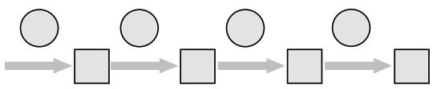

1.29 在人类苯丙氨酸羟化酶的信使 RNA 中，第 1\~10 位氨基酸的编码序列是：

(a)前10个氨基酸是什么？

(b) 如果粗体的 A 变为 G，突变 RNA 会得到什么氨基酸序列？

(c) 如果粗体的 C 变为 G，突变 RNA 会得到什么氨基酸序列？

(d) 如果粗体的 U 变为 C，突变 RNA 会得到什么氨基酸序列？

(e) 如果粗体的 G 变为 U，突变 RNA 会得到什么氨基酸序列？

1.30 “移码”突变是这样一种突变：在 DNA 编码区中，插入或缺失一定数量(但不是 3 的倍数)的碱基对。结果是，与非突变基因相比，翻译蛋白质的阅读框在移码突变位点处发生了位移。要想了解移码突变的后果，可参考人类 β 血红蛋白(血液中携带氧气的蛋白质的一部分)，编码其前 10 个氨基酸的信使 RNA 序列是

$$
5 ^ {\prime} \text {-AUG GUG CAC CUG ACU CCU GAG GAG AAG UCU... - 3 ^ {\prime}}
$$

(a)这一部分多肽链的氨基酸序列是什么？

(b) 在 RNA 中缺失粗体的 U 而导致的移码突变会带来什么后果?

(c) 在 RNA 中粗体的 U 之前插入一个 G 而导致的移码突变会带来什么后果?

## 挑战题

挑战题 1 就 1.30 题中所述的野生型和突变型 RNA 分子，推导出以下相应双链 DNA 两条链的碱基序列：

(a)野生型序列

(b) 单个碱基缺失

(c) 单个碱基插入

挑战题2 你打算用比德尔-塔特姆型实验来分析链孢霉中的某一代谢途径。已知该途径的前体是一个以P表示的分子，产物是以Z表示的某种维生素。从P到Z的途径肯定是线性的，且W、X和Y分子是中间产物。不过，还有可能存在其他未知的中间产物。你得到10个独立的突变，它们不能在添加P的基本培养基上生长，但能在添加Z的基本培养基上生长。根据在添加营养素W、X或Y的基本培养基上能生长 $(+)$ 或不能生长 $(-)$ ，可将这10种突变体分为4类。数据如附表所示：

<table><tr><td></td><td>P</td><td>W</td><td>X</td><td>Y</td><td>Z</td></tr><tr><td>第I类(突变形5)</td><td>-</td><td>-</td><td>-</td><td>-</td><td>+</td></tr><tr><td>第II类(突变形1、3、4、6、7)</td><td>-</td><td>+</td><td>+</td><td>+</td><td>+</td></tr><tr><td>第III类(突变形2)</td><td>-</td><td>+</td><td>-</td><td>+</td><td>+</td></tr><tr><td>第IV类(突变形8、9、10)</td><td>-</td><td>-</td><td>-</td><td>+</td><td>+</td></tr></table>

绘制线性代谢途径，将 P 放在左边、Z 放在右边，按其在代谢途径中出现的次序排列中间产物 W、X 和 Y。

挑战题 3 用异核体检测挑战题 2 中 10 种突变体所有成对组合的互补情况。结果如矩阵所示，其中，“+”

假设每个互补群界定一个不同的基因，并假设每个基因编码一个酶，该酶在生化途径中催化单一步骤，将某种底物分子转化为某种产物分子。

(a) 重绘挑战题 2 中所推导的代谢途径。用右箭头显示该途径的每个酶学步骤，在每个箭头上标记阻断该酶学步骤的突变体编号 (1～10)。在某些情况下可能确定不了途径中酶出现的次序，此时随你以什么次序书写。

(b) 在根据数据推导出来的上述代谢途径中, 前体 P 和维生素 Z 之间有几种未知的前体?

<table><tr><td></td><td>2</td><td>3</td><td>4</td><td>5</td><td>6</td><td>7</td><td>8</td><td>9</td><td>10</td></tr><tr><td>突变体 1</td><td>+</td><td>+</td><td>-</td><td>+</td><td>+</td><td>+</td><td>+</td><td>+</td><td>+</td></tr><tr><td>2</td><td></td><td>+</td><td>+</td><td>+</td><td>+</td><td>+</td><td>+</td><td>+</td><td>+</td></tr><tr><td>3</td><td></td><td></td><td>+</td><td>+</td><td>+</td><td>-</td><td>+</td><td>+</td><td>+</td></tr><tr><td>4</td><td></td><td></td><td></td><td>+</td><td>+</td><td>+</td><td>+</td><td>+</td><td>+</td></tr><tr><td>5</td><td></td><td></td><td></td><td></td><td>+</td><td>+</td><td>+</td><td>+</td><td>+</td></tr><tr><td>6</td><td></td><td></td><td></td><td></td><td></td><td>+</td><td>+</td><td>+</td><td>+</td></tr><tr><td>7</td><td></td><td></td><td></td><td></td><td></td><td></td><td>+</td><td>+</td><td>+</td></tr><tr><td>8</td><td></td><td></td><td></td><td></td><td></td><td></td><td></td><td>+</td><td>+</td></tr><tr><td>9</td><td></td><td></td><td></td><td></td><td></td><td></td><td></td><td></td><td>-</td></tr></table>

## 网上遗传学

“网上遗传学”(GeNETics)会为你介绍在互联网上寻找遗传学信息的某些最重要的站点。要浏览这些站点，请访问为《遗传学：基因和基因组分析》(第八版)配备的 Jones and Bartlett 公司配套站点http://biology.jbpub.com/book/genetics/8e/。

在该站点中，你会找到一个按章列出的重点关键词列表。选择某个关键词后，可链接到某个网站，其中包含与此关键词相关的信息。
