# 第 2 章 DNA 结构与遗传变异

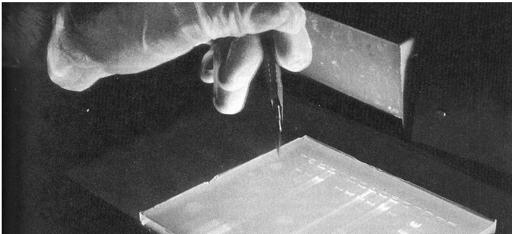  
用于按大小分离 DNA 片段的电泳凝胶。[承 James Gathany/CDC 馈赠。]

## 本章提纲

2.1 个体之间的遗传差异

2.2 DNA 的分子结构

2.3 基因组 DNA 片段的分离和鉴定

2.4 基因组 DNA 片段的选择性复制

2.5 遗传分析术语

2.6 基因组 DNA 中的 DNA 标记类型

2.7 DNA 标记的应用

联系：双螺旋

詹姆斯·沃森和弗朗西斯·克里克，1953

脱氧核糖核酸的一种结构

联系：人类遗传连锁图的由来

戴维·博特斯坦、雷蒙德·怀特、马克·斯科尔尼克和罗纳德·戴维斯，1980

用限制性片段长度多态性构建人类遗传连锁图

## 学习目标与科学能力

应用本章所阐述的 DNA 结构和遗传变异的原理，可让你具备解决以下问题的科学能力。

\- 给定双链 DNA 分子上一种或多种限制酶切割位点的位置，能推导出该 DNA 产生的片段数目和长度，并能绘图示意电泳后这些片段在凝胶上出现的位置。

\- 已知用数种限制酶分别和以不同组合切割某双链 DNA 分子所得 DNA 片段的凝胶图，能推断出显示整个 DNA 分子的酶切位点位置的限制图。

\- 根据 DNA 分型所用电泳凝胶上的 DNA 带型，能在一组个体中识别出哪一位——如果有的话——可能是 DNA 的来源。

\- 已知某双链 DNA 分子的限制图及被某个 DNA 或 RNA 探针覆盖的区域，能指出在用任何一种或多种限制酶进行的 Southern 印迹中，哪个或哪些 DNA 片段会被标记。

\- 对于已知的 DNA 序列，能选择可在聚合酶链式反应中扩增该分子的特定片段的引物寡核苷酸序列。

20 世纪 70 年代中期以来，遗传学研究一直在经历着一场以使用日趋复杂的方法为基础，来分离和鉴定特定 DNA 片段的革命。这些技术的极致是大规模基因组测序——能正确测定整个基因组中构成 DNA 的碱基对序列，并能识别出与基因有关的序列。由于在遗传学实验中使用的许多实验动物基因组比较小，这些基因组序列首先得以完成测序。而后，用于测定这些较简单基因组序列的技术，被放大规模来测定大得多的基因组，包括人类基因组的序列。

## 2.1 个体之间的遗传差异

人类一个生殖细胞中的基因组由大约30亿个碱基对组成，这些碱基组成23条不同的染色体(每条染色体含单个双链DNA分子)。一条典型的染色体可包含数百至数千个基因，它们按线性顺序排列在染色体中的DNA分子上。在这些基因中，编码蛋白质的序列实际上只占整个基因组的 $1.3\%$ 左右，其他 $98.7\%$ 的序列不编码蛋白质。一些非编码序列是遗传“糠壳”，在基因被转录、RNA转录物被加工成mRNA的时候，这些“糠壳”与编码蛋白质的“小麦”分离。另一些非编码序列是一些相当短的序列，多达数十万个拷贝，分散在整个基因组中。还有一些非编码序列是基因残骸，称为假基因。可以想象，在人类基因组这样庞大的非编码DNA背景中，要识别出编码蛋白质的基因，本身就是个挑战。

谈到人类基因组的核苷酸序列时，遗传学家常常泛指“人类的”基因组，这是因为来自任意两个人的相应DNA序列，在大约 $99.9\%$ 的核苷酸位点上是相同的。这些每个人都有的序列是我们的进化遗产；它们包含的遗传信息使我们得以成为人类。然而，实际上存在许多不同的人类基因组。遗传学家对人类基因组之间不同的这 $0.1\%$ 的DNA序列——300万个碱基对——极其感兴趣，因为在这些差异中既包含导致遗传病(如苯丙酮尿症和别的先天代谢缺陷)的突变，又包含使更为复杂的疾病(如心脏病、乳腺癌和糖尿病)的发病风险增加的突变。

所幸在 DNA 序列的全部差异中，仅有一小部分与疾病有关。另一些差异与身高、体重、头发颜色、眼睛颜色、面部特征及其他性状的遗传差异有关。人与人之间多数的遗传差异是完全无害的。许多遗传差异不对外表或健康造成可察觉的影响，这样的差异只能通过直接考察 DNA 本身来研究。然而，这些无害的差异十分重要，因为它们能够作为遗传标记。

## - DNA 标记作为染色体上的地标

在遗传学中，遗传标记(genetic marker)是指 DNA 中的任何差异——无论是怎样检测到的——它们一代代传递的方式是可被追踪的。携带某一标记的个体，也携带了该标记左右两端各一段染色体，因此，该标记标记了基因组的一个特定区域。两个个体在 DNA 序列上的任何差异都可以作为遗传标记。遗传标记本身往往是无害的，且它们使确定疾病基因在染色体上的位置成为可能，从而使疾病基因 DNA 得以被分离、鉴定和研究。

通过直接分析 DNA 而检测到的遗传标记，通常称为 DNA 标记 (DNA marker)。在遗传学中，DNA 标记很重要，因为它们可作为长 DNA 分子——如染色体中的 DNA 分子——上的地标使个体之间的遗传差异得以被追踪。它们就像公路上的路标一样。用 DNA 标记当地标，遗传学家得以定位正常基因、突变基因、染色体断点及遗传分析中的其他重要特征 (图 2.1)。

检测 DNA 标记，通常要求将基因组 DNA (genomic DNA，从生物细胞中提取的总 DNA) 打碎成片段，使其大小在实验可操作的范围内 (通常是几千个核苷酸对)。在以下几节中，将描述运用 DNA 来揭示个体间遗传差异 (无论这些差异是否具有外在表现) 的一些主要方法。这些方法的使用拓宽了遗传学的范围，使得对任何生物进行遗传分析成为可能。这意味着精细的遗传分析不再局限于人、家畜、栽培植物和适于进行遗传学研究的相对少数的模式生物。直接的 DNA 研究不再需要首先鉴定个体间的遗传差异，甚至不再需要人工杂交。本章讨论的分子分析方法完全改变了遗传学的风貌：

DNA 操作是现代遗传学的基本实验操作。

本章描述的方法，几乎是每个现代遗传学实验室都要使用的主要技术。

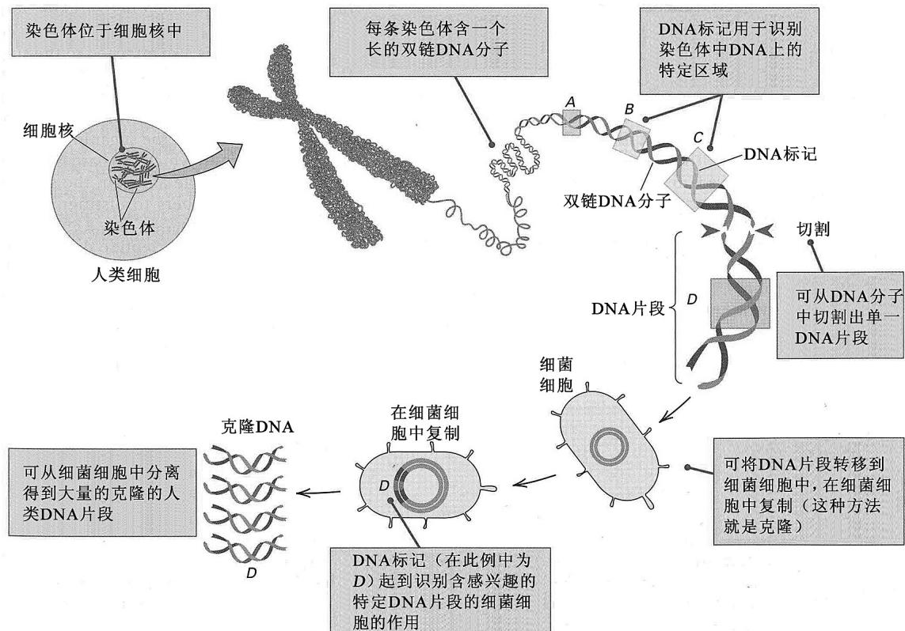  
图 2.1 DNA 标记可作为在 DNA 分子(如染色体 DNA)上标识物理位置的地标。如上所示，DNA 标记也可以用来鉴定导入了特定 DNA 片段的细菌细胞。DNA 克隆的程序远不像此处所示的那样简单；这将在第 12 章进一步讨论。

## 2.2 DNA 的分子结构

操作和分析 DNA 的现代实验方法，源自对 DNA 分子结构和复制的详细认识。因此，要理解这些方法，需要了解 DNA 的分子结构。在第 1 章中我们看到，DNA 是由两条配对互补链构成的双螺旋，每条链由一串有序的核苷酸组成，每个核苷酸上带有碱基 A(腺嘌呤)、T(胸腺嘧啶)、G(鸟嘌呤)或 C(胞嘧啶)之一。两条互补链的 A 和 T、G 和 C 之间的沃森-克里克碱基配对，使两条链结合在一起。互补链也正是复制的关键，因为每条链都可作为合成新的互补链的模板。现在来仔细看看 DNA 的结构及 DNA 复制的主要特征。

## ■ 多核苷酸链

用生物化学的措辞来说，DNA 链是多聚体——由重复单位构成的大分子。DNA 中的单位由 2'-脱氧核糖(一种五碳糖)、磷酸和 4 种含氮碱基(以 A、T、G、C 表示)组成。碱基的化学结构如图 2.2 所示。注意，其中两种碱基具双环结构，这两种碱基叫嘌呤(purines)；另外两种碱基具单环结构，这两种碱基叫嘧啶(pyrimidines)。

\- 嘌呤碱基是腺嘌呤(A)和鸟嘌呤(G)。

\- 嘧啶碱基是胸腺嘧啶(T)和胞嘧啶(C)。

在 DNA 中，每个碱基与一个脱氧核糖分子化学连接，形成叫做核苷(nucleoside)的化合物。当一个磷酸基再连接到糖分子上时，核苷就成为核苷酸(nucleotide)(图 2.3)。因此，核苷酸是核苷

加上磷酸。在图 2.3 中，按照糖中碳原子的惯用编号规则，碱基结合的碳原子是 1' 碳[糖中的原子以带撇号（') 的数字编号，以区别于碱基中的原子]。DNA 碱基的核苷及核苷酸衍生物的命名概括于表 2.1 中。在本书中，这些词汇多数不需要，之所以收入它们，是因为在深入阅读时很可能碰到。

在核酸(如 DNA 和 RNA)中，核苷酸被连接起来，形成多核苷酸链 (polynucleotide chain)；核苷酸的连接，是和糖分子 5' 碳相连的磷酸，与和生长链 3' 碳相连的羟基连接(图 2.4)。通过磷酸基将相邻核苷酸的糖组分连接起来的化学键称为磷酸二酯键 (phosphodiester bond)。这些键的 3'-5'-3'-5' 取向持续贯穿整条链，而链一般由数以百万的核苷酸构成。注

表 2.1 DNA 的命名

<table><tr><td>碱基</td><td>核苷</td><td>核苷酸</td></tr><tr><td rowspan="4">腺嘌呤(A)</td><td rowspan="4">脱氧腺苷</td><td>5&#x27;-脱氧腺苷</td></tr><tr><td>一磷酸(dAMP)</td></tr><tr><td>二磷酸(dADP)</td></tr><tr><td>三磷酸(dATP)</td></tr><tr><td rowspan="4">鸟嘌呤(G)</td><td rowspan="4">脱氧鸟苷</td><td>5&#x27;-脱氧鸟苷</td></tr><tr><td>一磷酸(dGMP)</td></tr><tr><td>二磷酸(dGDP)</td></tr><tr><td>三磷酸(dGTP)</td></tr><tr><td rowspan="4">胸腺嘧啶(T)</td><td rowspan="4">脱氧胸苷</td><td>5&#x27;-脱氧胸苷</td></tr><tr><td>一磷酸(dTMP)</td></tr><tr><td>二磷酸(dTDP)</td></tr><tr><td>三磷酸(dTTP)</td></tr><tr><td rowspan="4">胞嘧啶(C)</td><td rowspan="4">脱氧胞苷</td><td>5&#x27;-脱氧胞苷</td></tr><tr><td>一磷酸(dCMP)</td></tr><tr><td>二磷酸(dCDP)</td></tr><tr><td>三磷酸(dCTP)</td></tr></table>

意，每条多核苷酸链的末端基团，一端都是 5'-磷酸基(5'-P)，另一端都是 3'-羟基(3'-OH)。DNA 链两端不对称，意味着每条链都具有极性(polarity)，即由哪一端带 5'-磷酸、哪一端带 3'-羟基所决定的极性。

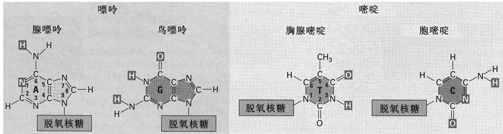  
图 2.2 DNA 中 4 种含氮碱基的化学结构：腺嘌呤、胸腺嘧啶、鸟嘌呤和胞嘧啶。与脱氧核糖连接的氮原子如图所示。参与形成 DNA 碱基对之间的氢键的原子，以红色显示。

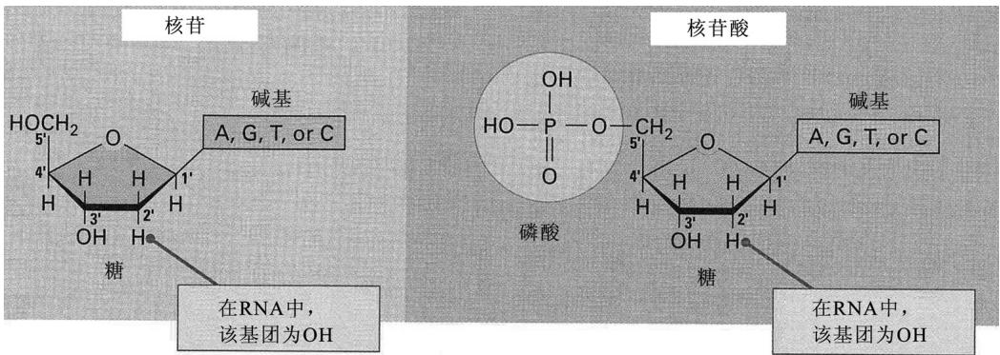  
图 2.3 典型的核苷酸，示 3 个主要成分(磷酸、糖和碱基)，DNA 和 RNA 之间的差异，以及核苷(没有磷酸基)和核苷酸(有磷酸)的区别。核苷酸是单磷酸盐(具有一个磷酸基)，核苷二磷酸含两个磷酸基，核苷三磷酸含三个磷酸基。

在沃森和克里克提出 DNA 的三维结构是双螺旋之前的数年，查加夫 (Erwin Chargaff) 研制了一种化学方法，用来测定 DNA 中每种碱基的数量。我们在叙述这一方法时，将碱基符号置于方括号中，表示碱基的摩尔浓度，例如，[A] 代表腺嘌呤的摩尔浓度。查加夫用该方法测量

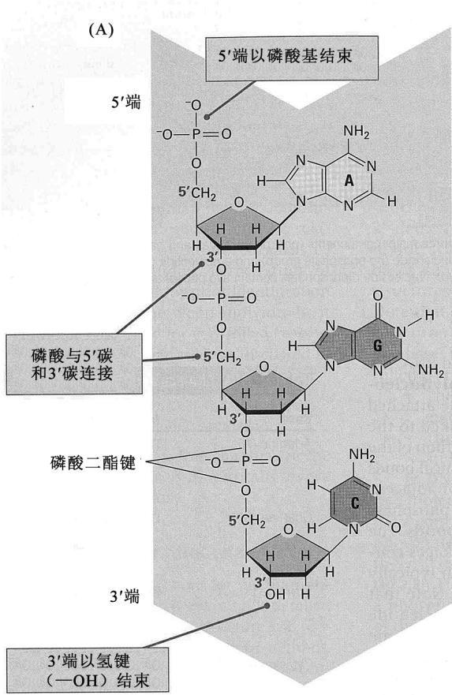

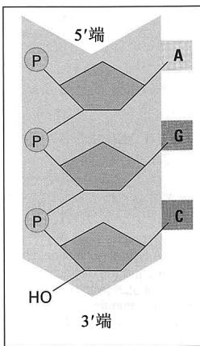

图 2.4 一条多核苷酸单链 5' 端的三个核苷酸。(A) 糖-磷酸键的化学结构，示链的 5'→3' 取向 (红色数字是碳原子的编号)。(B) 多核苷酸链的一种常用图示法。

了大量不同来源 DNA 的 [A]、[T]、[G] 和 [C]。他发现，DNA 的碱基组成 (base composition)——定义为 G+C 所占的百分比——在不同物种之间有差异，但在同一个个体的所有细胞及同一物种中是不变的。表 2.2 示来自许多不同生物的 DNA 碱基组成。

查加夫还观察到不同碱基的摩尔浓度之间存在某些有规律的关系。现在称这些关系为查加夫法则(Chargaff's rule):

\- 腺嘌呤的数量与胸腺嘧啶的数量相等: $[\mathrm{A}] = [\mathrm{T}]$ 。

表 2.2 不同生物的 DNA 碱基组成

<table><tr><td rowspan="2" colspan="2">生物</td><td colspan="4">碱基(占全部碱基的百分比)</td><td rowspan="2">碱基组成[(G+C)%]</td></tr><tr><td>腺嘌呤(A)</td><td>胸腺嘧啶(T)</td><td>鸟嘌呤(G)</td><td>胞嘧啶(C)</td></tr><tr><td rowspan="5">T7噬菌体细菌</td><td></td><td>26.0</td><td>26.0</td><td>24.0</td><td>24.0</td><td>48.0</td></tr><tr><td>产气荚膜梭状芽胞杆菌</td><td>36.9</td><td>36.3</td><td>14.0</td><td>12.8</td><td>26.8</td></tr><tr><td>肺炎链球菌</td><td>30.2</td><td>29.5</td><td>21.6</td><td>18.7</td><td>40.3</td></tr><tr><td>大肠杆菌</td><td>24.7</td><td>23.6</td><td>26.0</td><td>25.7</td><td>51.7</td></tr><tr><td>藤黄八叠菌</td><td>13.4</td><td>12.4</td><td>37.1</td><td>37.1</td><td>74.2</td></tr><tr><td rowspan="3">真菌</td><td></td><td></td><td></td><td></td><td></td><td></td></tr><tr><td>酿酒酵母</td><td>31.7</td><td>32.6</td><td>18.3</td><td>17.4</td><td>35.7</td></tr><tr><td>粗糙链孢霉</td><td>23.0</td><td>22.3</td><td>27.1</td><td>27.6</td><td>54.7</td></tr><tr><td rowspan="3">高等植物</td><td></td><td></td><td></td><td></td><td></td><td></td></tr><tr><td>小麦</td><td>27.3</td><td>27.2</td><td>22.7</td><td>22.8*</td><td>45.5</td></tr><tr><td>玉米</td><td>26.8</td><td>27.2</td><td>22.8</td><td>23.2*</td><td>46.0</td></tr><tr><td rowspan="5">动物</td><td></td><td></td><td></td><td></td><td></td><td></td></tr><tr><td>黑腹果蝇</td><td>30.8</td><td>29.4</td><td>19.6</td><td>20.2</td><td>39.8</td></tr><tr><td>猪</td><td>29.4</td><td>29.6</td><td>20.5</td><td>20.5</td><td>41.0</td></tr><tr><td>鲑鱼</td><td>29.7</td><td>29.1</td><td>20.8</td><td>20.4</td><td>41.2</td></tr><tr><td>人</td><td>29.8</td><td>31.8</td><td>20.2</td><td>18.2</td><td>38.4</td></tr></table>

\*包括1/4的5-甲基胞嘧啶，这是胞嘧啶的一种修饰形式，见于比藻类复杂的多数植物及许多动物中。  
- 鸟嘌呤的数量与胞嘧啶的数量相等: $[\mathbf{G}] = [\mathbf{C}]$ 。  
- 嘌呤碱基的数量与嘧啶碱基的数量相等： $[A] + [G] = [T] + [C]$ 。

尽管在提出沃森-克里克配对互补链结构之时，还不了解查加夫的这些观察结果的化学基础，但沃森-克里克结构的其中一个诱人特点是，它能解释查加夫法则。因为在双链DNA中，A总是与T配对，所以必然得出 $[\mathrm{A}] = [\mathrm{T}]$ 。同样，因为G与C配对，可知 $[\mathrm{G}] = [\mathrm{C}]$ 。两者相加必然得出第三条法则： $[\mathrm{A}] + [\mathrm{G}] = [\mathrm{T}] + [\mathrm{C}]$ 。在下一节中，将更详细地介绍碱基配对的分子基础。

## - 碱基配对和碱基堆积

在 1953 年沃森和克里克提出的 DNA 分子三维结构中，DNA 分子由两条多核苷酸链组成，两条链相互盘绕形成双螺旋，在双螺旋中，两条相对的链之间的腺嘌呤和胸腺嘧啶、鸟嘌呤和胞嘧啶配对(图 2.5)。在标准结构(称为 B 型 DNA，B form of DNA)中，每条链每 34 Å 旋转完整的一圈。双螺旋是右手螺旋，右手螺旋的意思是，从顶部俯视时，每条链都以顺时针方向向下延伸。碱基之间的间隔是 3.4 Å，因此在每条链中每圈螺旋为 10 个碱基，每圈双螺旋为 10 个碱基对。

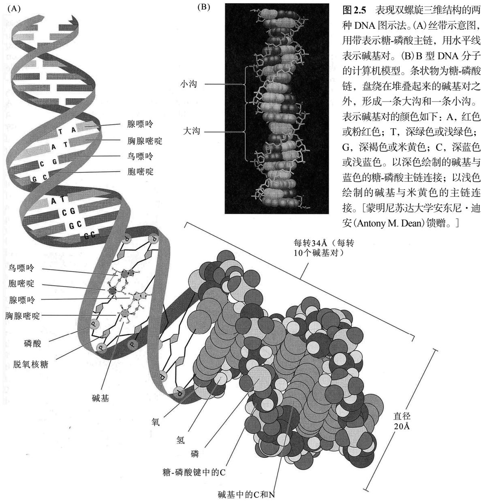

碱基配对是 DNA 双链的特征，每个碱基都要通过氢键与另一条链中的一个互补碱基配对[氢键(hydrogen bond)是一种弱键，参与形成氢键的两个原子共用它们之间的一个氢原子]。氢键提供将两条链结合在一起的一种力。在沃森-克里克碱基配对中，腺嘌呤(A)与胸腺嘧啶(T)配对，鸟嘌呤(G)与胞嘧啶(C)配对。在腺嘌呤-胸腺嘧啶碱基对和鸟嘌呤-胞嘧啶碱基对中形成的氢键如图2.6所示。注意，A-T对(图2.6A和B)有两个氢键，G-C对(图2.6C和D)有三个氢键。这意味着G和C之间的氢键连接比较强，这是从使其断裂需要更多能量的角度来讲的，例如，分离DNA双链中两条配对链所需的热量，随着 $\mathrm{G + C}$ 百分比的增加而增加。因为单链上的碱基顺序没有任何限制，所以一条链上可存在任何顺序。这就解释了查加夫的观察结果：不同生物的DNA，碱基组成可以不同。然而，因为双链DNA的两条链是互补的，所以，无论碱基组成如何，查加夫法则的[A]=[T]和[G]=[C]都是成立的。

图2.6 DNA中(A)

正常的碱基对。左侧，氢键（虚线）及其结合的原子以红色表示。(A和B)A-T碱基配对。(C和D)G-C碱基配对。在空间填充模型(B和D)中，颜色按照：C，灰色；N，蓝色；O，红色；H(仅显示碱基中的)，白色。每个氢键都绘成夹在共用氢的两个原子之间的白色圆盘。外围的条形表示沿堆积碱基对盘绕的主链。[空间填充模型蒙明尼苏达大学安东尼·迪安馈赠。]

(C)  
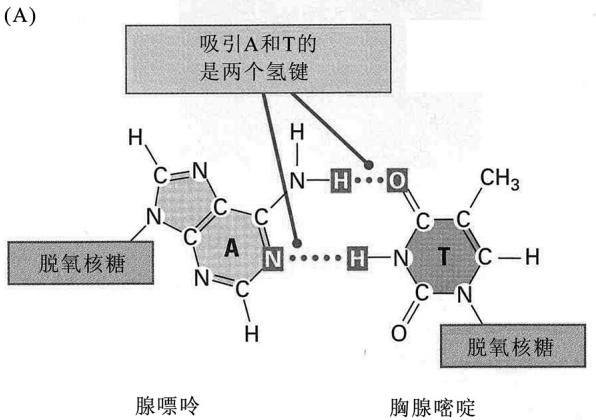

(B)  
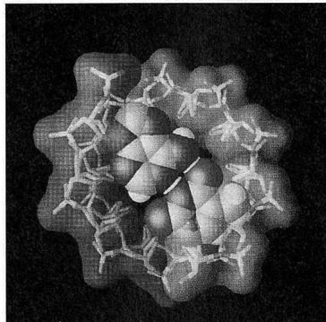

(D)  
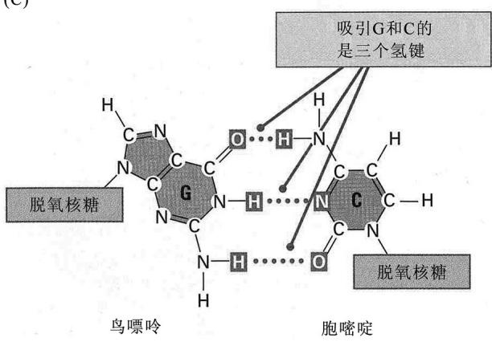

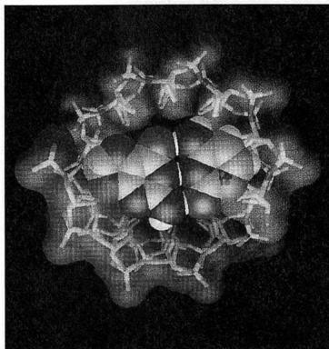

在 B 型 DNA 中，配对碱基一个摞一个地堆叠，就像一摞硬币。每个含氮碱基的上下两个面都较为平坦，且没有极性(不带电荷)。这些表面称为疏水表面，因为它们难以与具有强极性的水分子结合(水分子的极性是指电荷在其纵向上的分布不对称，水分子呈 V 形，处于 V 底部的氧往往带有较多负电荷，而顶部的两个氢则带有较多正电荷)。由于配对的含氮碱基排斥水分子，它们往往通过一个摞一个的堆叠方式，从双螺旋内部排除最大数量的水。双链 DNA 的这一特点即所谓的碱基堆积(base stacking)。因而，双链 DNA 有一个由堆积碱基形成的疏水核心，正是这种碱基堆积的能量，为双链 DNA 提供了大部分的化学稳定性。

分子生物学家在讨论 DNA 分子时，常常将单独的一条链称为单链(single strand)或单链 DNA(single-stranded DNA)；将双螺旋(double helix)称为双链 DNA(double-stranded DNA)或双螺旋分子(duplex molecule)。沿双螺旋外表面盘旋的两条沟是不对称的，较大的一条称为大沟(major groove)，另一条称为小沟(minor groove)。与双链 DNA 相互作用的蛋白质，往往具有一些刚好能够放入大沟、小沟或两条沟的区域，藉此与碱基对相接触(图 2.5B)。

## - 反向平行双链

双螺旋中的每条主链都是由脱氧核糖和磷酸基相间排列构成的，磷酸基连接一个糖的 3' 碳和下一个糖的 5' 碳(图 2.4)。双螺旋的两条多核苷酸链具有相反的极性，意思是一条链的 5' 端与另一条链的 3' 端配对。这样排列的两条链称为反向平行(antiparallel)链。双链 DNA 具有两条反向平行链，一层含义是：在每对碱基中，一个碱基与位于配对平面上方的糖连接，另一个碱基与位于配对平面下方的糖连接；另一层含义是：双螺旋的每个末端具有一个 5'-P 基团(在一条链上)和一个 3'-OH 基团(在另一条链上)，如图 2.7 所示。

图 2.5 中的 DNA 双链体 (DNA duplex) 示意图是静态的，因而会有几分误导。DNA 是动态分子，在不停地运动。两条链会在某些区域暂时分开，然后以相同或不同的构象再次结合到一起。图 2.5 中的右手双螺旋是标准的 B 型，但在不同条件下，DNA 实际上可形成 20 多种稍有不同的右手螺旋变体，有的区域甚至可形成双链向左盘旋的螺旋（称为 Z 型 DNA）。如果在同一条链上有互补的核苷酸区段，则该链与其配对链分离后，可自我折叠，像发夹一样。在一些包含适当碱基序列的 DNA 区域，甚至可以形成由三条链构成的三股螺旋。

## 联系：双螺旋

詹姆斯·沃森和弗朗西斯·克里克，1953

卡文迪许实验室，剑桥，英国

脱氧核糖核酸的一种结构

这是20世纪生物学上具有分水岭意义的论文之一。说

(以3'羟

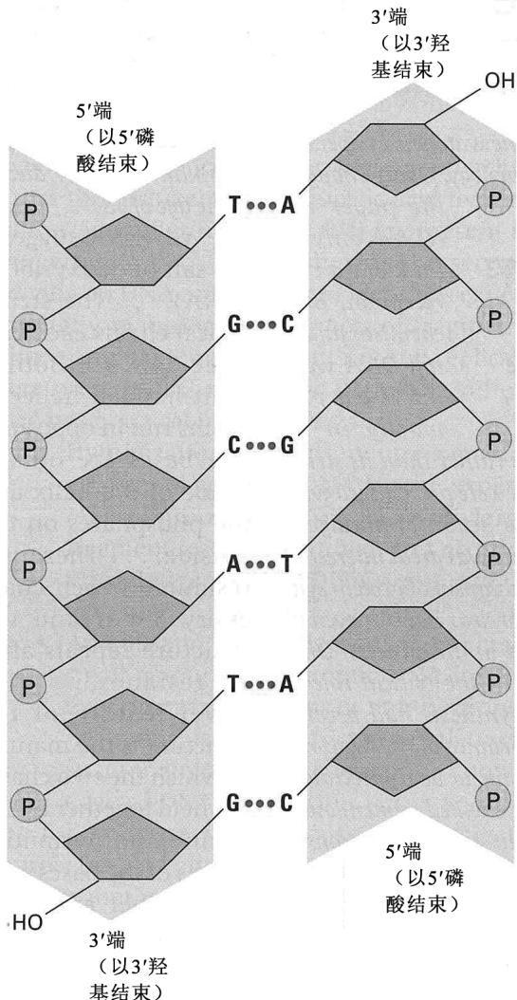  
图 2.7 一段 DNA 分子, 示两条互补链的反向平行方向。蓝色阴影箭头表示每条链的 $5'\rightarrow3'$ 方向。磷酸(P)连接一个脱氧核糖的 $3'$ 碳原子与相邻脱氧核糖的 $5'$ 碳原子。

来也怪，当初大家对这篇论文的反应不冷不热。当时研究 DNA 的生化学家主要只是对 DNA 的物理性质而不是对其结构感兴趣，而遗传学家正忙于了解 X 射线之类的诱变剂的作用。人们对于探求蛋白质的合成机制非常感兴趣，但还不清楚 DNA 如何(甚或是否)参与蛋白质合成的过程。只是到了 1960 年左右，当 RNA 在蛋白质合成中的关键作用已然明朗化之后，人们才开始意识到沃森-克里克结构的重要性。沃森和克里克事先知道他们的结构与莫里斯·威尔金斯(Maurice Wilkins)和罗莎琳德·富兰克林(Rosalind Franklin)未发表的结构方面的研究结果一致，从中获益良多。刊载沃森和克里克论文的同一期 Nature，也背靠背地刊载了一篇威尔金斯研究组的论文和一篇富兰克林研究组的论文，详述他们的数据，以及他们的数据与沃森和克里克所提出的结构之间的一致性。人们一直认为，富兰克林已经万事俱备，离单独发现 DNA 结构仅一步之遥。无论如何，沃森和克里克以及威尔金斯因为他们在 DNA 结构上的发现，被授予 1962 年的诺贝尔奖。令人悲哀的是，1958 年，富兰克林死于癌症，年仅 28 岁。

我们想提出脱氧核糖核酸盐(DNA)的一种结构。……该结构有两条螺旋链，每条链都围绕共同的轴盘绕。……两条链均属右手螺旋，但两条链的走向相反。……碱基在螺旋内部，磷酸在外侧。……每条链上每3.4Å有一个残基，该结构10个残基后重复出现。……该结构的新特征是两条链结合的方式——两条链通过嘌呤和嘧啶碱基结合到一起。碱基平面与纤丝的轴垂直。碱基成对结合在一起，一条链上的单个碱基通过氢键与另一条链上的单个碱基结合，所以这两个碱基并排平放在一起。这两个碱基之一必是嘌呤，另一个必是嘧啶，这样才能结合。……只有特定的成对碱基才能结合在一起。这些成对碱基是腺嘌呤(嘌呤)与胸腺嘧啶(嘧啶)、鸟嘌呤(嘌呤)与胞嘧啶(嘧啶)。换句话说，如果构成某个碱基对的其中一个碱基是腺嘌呤，那么根据假设，另一个碱基一定是胸腺嘧啶，无论该腺嘌呤在哪一条链上；对鸟嘌呤和胞嘧啶也一样。单链上的碱基顺序似乎不受任何形式的限制。然而，如果只能形成特定的成对碱基，则当一条链上的碱基顺序既定时，另一条链上的顺序就自然而然地确定了。……我们假设的特异性配对方式，马上让人想到一种可行的遗传物质拷贝机制——这没有逃过我们的眼睛。……我们非常感谢多诺霍(Jerry Donohue)博士不断的建议和批评，尤其是在原子距离方面。我们也得到伦敦国王学院威尔金斯博士、富兰克林博士及其同事在其未发表的实验结果及观点中所包含的有关DNA一般性质的知识的启发。

来源：J.D. Watson and F.H.C. Crick, Nature 171(1953):737-738.

## - DNA 的结构与功能相关

可从 DNA 分子的结构上来理解 DNA 是怎样满足作为遗传物质的 3 个基本要求的。

1. 任何遗传物质都必须能被准确复制，以使其携带的信息能被精确复制并遗传给子细胞。DNA 分子精确复制的基础，是两条多核苷酸链中 A 和 T、G 和 C 的配对。两条链解旋、分离，每条游离链被拷贝，结果形成两个一样的双螺旋(图 1.7)。

2. 遗传物质还必须能够携带指导细胞构建和代谢活动所需的所有信息。正如在第 1 章中所说，大多数基因的产物是蛋白质分子——一种由重复的氨基酸单位组成的多聚体。蛋白质的氨基酸顺序决定其化学和物理特性。基因的蛋白质产物被合成的过程，也就是基因表达的过程，因此，作为遗传物质，一个必要条件是：它要能够指导氨基酸单位添加到正在合成的蛋白质分子末端的顺序。在 DNA 中，这是通过遗传密码来实现的——以 3 个碱基为一组来编码氨基酸。因为 DNA 分子中的 4 种碱基可以按任意顺序排列，又因为 DNA 分子的不同部分、不同生物的 DNA，顺序可以不同，所以，DNA 可包含许许多多的独特区域，每个区域都可以是一个独特的基因。

3. 遗传物质还要能够发生偶尔的突变，在突变中遗传物质携带的信息发生改变。而且，为使突变能够遗传，突变型分子应像亲代分子那样能够被忠实地复制。要解释形形色色的生物是通过有利突变的缓慢积累而进化来的，这一特性是必需的。沃森和克里克提出，因为罕见的碱基错配，致使错误的核苷酸得以进入复制中的 DNA 链，就有可能在 DNA 中出现可遗传的突变。

## 2.3 基因组 DNA 片段的分离和鉴定

以下几节，讨论对 DNA 结构和复制的理解，是怎样在开发分离和鉴定特定 DNA 片段的方法上得到实际应用的。这些方法主要用来鉴定 DNA 标记，或分离遗传上感兴趣的特定 DNA 片段。例如，一个家族性乳腺癌家系，其中，某一特定的 DNA 片段是某个染色体区段的标记，该染色体区段也包含使发病风险增加的突变型基因。在此情况下，为了预测家系中每位女性患乳腺癌的风险，至关重要的是能够鉴定每位女性是否存在该标记。另举一例，假如有人想检验这样的假设：导致某种遗传病的某个突变在某特定 DNA 片段中。在此情况下，重要的是能够利用遗传标记对该片段进行精确定位，以便能从患者中分离到该片段、验证假设是否成立，并鉴定突变的性质。

分离和鉴定 DNA 片段的多数方法，可分成两大类。

1. 鉴定基因组 DNA 中特定 DNA 片段的方法。这类方法利用这一事实：在适当条件下，互补的单链 DNA 序列可形成双链分子。这些方法依赖于核酸杂交。

2. 特异性复制基因组 DNA 片段的方法。利用对某个 DNA 片段两端序列的了解，特异地、反复地从基因组 DNA 中复制该片段。这些方法依赖于使用聚合酶链式反应进行选择性 DNA 复制(扩增)。

这两类方法的主要差别是：第一类方法(依赖核酸杂交)是鉴定本身存在于基因组 DNA 中的片段；而第二类方法(依赖 DNA 扩增)是鉴定实验操作获得的片段副本，其原始模板(但不是副本)存在于基因组 DNA 中。这一差别的实践意义是：

\- 杂交方法的实验操作，要求的基因组 DNA 量较大，但可鉴定较大的片段，并且不需要

事先了解 DNA 序列。

\- 扩增方法的实验操作，要求的基因组 DNA 量极少，但扩增通常限于较小的片段，并且需要先对 DNA 序列有一定的了解。

以下几节对这两类方法都要讨论，并给出怎样使用它们的例子。在用核酸杂交来鉴定基因组特定片段的方法中，第一步通常是将基因组 DNA 切割成大小适于实验操作的片段，接下来讨论这一步骤。

## ■ 限制酶与位点特异的 DNA 切割

用化学方法分离 DNA，通常会使双链分子随机断裂成平均约 50 000 个碱基对的长度。该长度记为 50kb，其中，kb 代表千碱基对 (kilobase, 1kb=1000 碱基对)。50kb 接近于感染 E. coli 的 $\lambda$ 噬菌体的双链 DNA 长度。可以用剧烈的剪切力，使这些 50kb 大小的片段变得更短，但通过随机剪切将 DNA 大分子打断成小片段的一个问题是，包含某个特定基因或部分基因的片段将会大小各异。换句话说，用随机剪切方法，不可能按片段大小和序列内容，来分离和鉴定特定的 DNA 片段，因为所需序列在随机剪切分子中的位置不确定，且每个包含所需序列的随机剪切分子与包含该序列的其他所有分子在大小上不一样。在本节中，描述一种可用来在特异性位点切割 DNA 分子的重要酶学方法。该方法可确保包含特定序列的所有 DNA 片段具有相同的大小；而且，包含所需序列的每个片段，所需序列在片段中所处的位置完全一样。

这种切割方法使用一类重要的 DNA 切割酶，这些酶主要是从细菌中分离所得。这些酶称为限制性内切核酸酶 (restriction endonuclease) 或限制酶 (restriction enzyme)，它们能够于短的特定碱基序列所在之处切割 DNA。这些酶是细菌细胞本来就有的，可使攻击细菌的噬菌体的 DNA 失活，从

而保护细菌。1978 年，瑞士人沃纳·阿伯 (Werner Arber) 因发现限制酶而获得诺贝尔奖。这些酶在专业上称为 II 型限制性内切核酸酶 (type II restriction endonuclease)。以限制酶 BamH I 为例；它识别双链序列

$$
\begin{array}{c} 5 ^ {\prime} \text {-GGATCC-3^ {\prime}} \\ 3 ^ {\prime} \text {-CCTAGG-5^ {\prime}} \end{array}
$$

并在每条链上带 G 的两个核苷酸(粗体所示)之间切割。图 2.8 显示，在切割之前，构成 BamH I 活性位点的区域如何与识别位点(蓝色)接触；切割反应如图 2.9 所示。

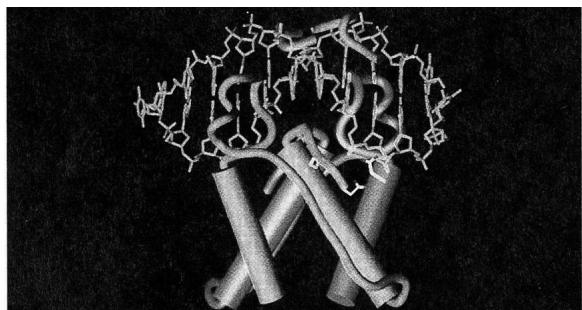  
图 2.8 与 DNA(蓝色)上的识别位点接触的那部分 BamHI 限制酶的结构。粉红和绿色柱状体代表酶的一些区域，其中的氨基酸链以右手螺旋方式扭曲。[引自 T. Newman, et al., Science 269(1995):656-663。经 AAAS 许可重印。]

迄今已知的限制酶有数百种，表 2.3 列出了其中的 9 种。大多数限制酶是根据发现它们所在的物种来命名。例如，BamH I 是从解淀粉芽胞杆菌 (Bacillus amyloliquefaciens) 的 H 菌株中分离到的，并且它是从这种生物中分离到的第一种 (I) 限制酶。因为限制酶名称中的前 3 个字母代表来源菌种名，所以这些字母写成斜体；名称中的其余符号写成正体。大多数限制酶仅能识别短的碱基序列，通常是 4 个或 6 个核苷酸对。酶在这些位点与 DNA 结合，并在 DNA 分子的每条链上形成一个断裂，在每个断裂处都要产生游离的 3'-OH 和 5'-P 基团。限制酶识别并切割的核苷酸序列称为该酶的限制位点 (restriction site)。表 2.3 中的例子显示，有些限制酶非对称地 (在两条 DNA 链中的不同位点) 切割限制位点，而其他限制酶对称地 (在两条链中的同一位点) 切割。前者产生黏端 (sticky end)，因为切割位点的两端各有一小的单链突出，这两个单链突出的碱基顺序相互补 (图 2.9)。相反，具有对称切割位点的酶，产生平端 (blunt end) DNA 片段。如果考虑到两条链的极性相反，则限制酶的限制位点在两条链上都是一样的，几乎无一例外；例如，在 BamH I 限制位点上，每条链都是 5'-GGATCC-3'。这种对称的 DNA 序列称为回文序列 (palindrome) (在日常英语中，回文是正读反读都一样的词或词组，如 “madam”)。

图 2.9 限制酶 BamHI 切割 DNA 的机制。在双螺旋上只要有 BamHI 限制位点，BamHI 就在该处每条 DNA 链的主链上造成一个切口。每次切割都会产生一个新的 3' 端和一个新的 5' 端，将双螺旋分成两个片段。对 BamHI 而言，切割方式为交错切割，所以产生的末端以单链区域结束，每个单链区

的长度都是4个核苷酸。

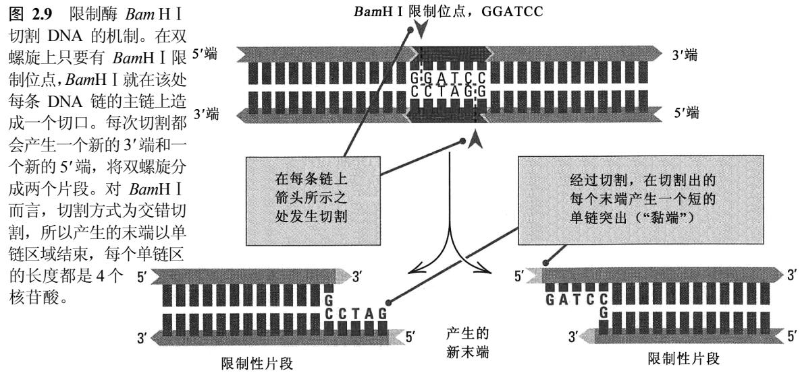

表 2.3 若干限制性内切核酸酶及其来源和切割位点  
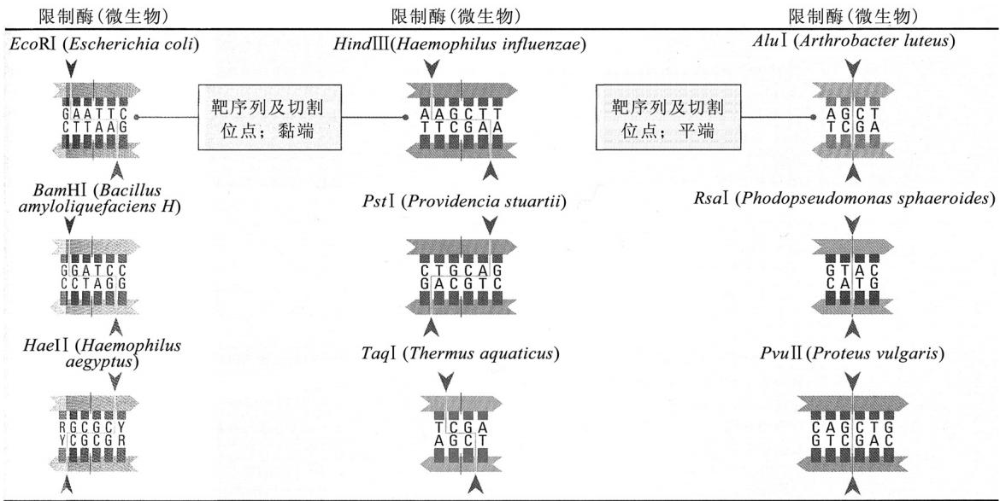  
限制酶具有以下重要特点:  
- 大多数限制酶都只识别单一限制位点。

\- 限制酶对限制位点的识别与 DNA 的来源无关。

\- 因为大多数限制酶只识别唯一一种限制位点序列，所以，特定生物 DNA 中的切点数目，取决于存在的限制位点数目。

在 DNA 分子中，由一对相邻切点产生的 DNA 片段称为限制性片段 (restriction fragment)。大的 DNA 分子一般会被切割成许多大小各异的限制性片段。例如，E. coli 的 DNA 分子含有 $4.6 \times 10^{6}$ 个碱基对，可被切割成数百至数千个片段，而哺乳动物基因组 DNA 可被切割成 100 万个以上的片段。

## ■ 凝胶电泳

DNA 带负电荷，可在电场作用下移动，据此，可以按照大小来分离限制酶产生的 DNA 片段。如果将电源两极与装有 DNA 溶液、水平放置的试管的两端连接，DNA 分子将向试管的正极一端移动，其移动速度取决于电场强度以及分子的形状和大小。带电分子在电场中的运动称为电泳(electrophoresis)。

在遗传学中，最常用的电泳是凝胶电泳(gel electrophoresis)。图2.10示一种DNA凝胶电泳的实验装置。制备带若干小槽(称为孔)的薄胶板(通常是用琼脂糖或丙烯酰胺制备)，样品置于孔中。加上电场后，带负电的DNA分子进入凝胶，在凝胶中向阳极(带正电的电极)移动。凝胶是复杂的分子网络，具有狭窄而曲折的通道，较小的DNA分子比较容易通过，因而，DNA片段的移动速率随DNA片段大小的减小而增加。图2.11示一组双链DNA分子在琼脂糖凝胶中电泳的结果。每一个含DNA的独立区域称为一个条带(band)。这些条带可在紫外光下看到，这需要事先将凝胶放在溴乙锭染料中浸泡，溴乙锭分子可插入双链DNA，使其能发荧光。在图2.11中，凝胶中的每个条带，是特定大小的所有DNA片段都迁移到凝胶中相同位置的结果。要产生肉眼可见的条带，至少需要约 $5 \times 10^{-9} \mathrm{~g}$ DNA，这对于大小为3kb的片段而言，相当于大约 $10^{9}$ 个分子。所以，任何特定的DNA片段要在电泳凝胶上产生肉眼可见的条带，必须要有数目众多的拷贝。

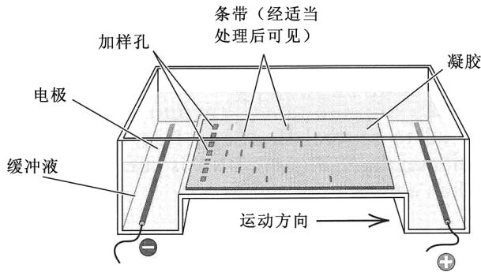

线性双链 DNA 片段的电泳迁移率与其长度(以碱基对为单位)的对数成反比——片段越长，迁移得越慢——但比例常数取决于琼脂糖浓度、缓冲液成分及电泳条件。这意味着，不同浓度的琼脂糖，可有效分离 DNA 片段的大小范围不同(图 2.12)。浓度较小的凝胶，如 0.6% 的琼脂糖凝胶，用来分离较大的片段；浓度较大的凝胶，如 2% 的琼脂糖凝胶，用来分离较小的片段。图 2.12 中的小图显示了电泳迁移率受片段大小的对数的影响。该图也表明，在一组给定的条件下，对于可分辨的最大片段，其电泳迁移率与片段大小的对数之间不存在线性关系。

由于限制酶切割的序列特异性，对于特定的 DNA 分子，特定的限制酶会产生一套独特的片段。另一种酶对同样的 DNA 分子会产生一套不同的片段。在图 2.13 中，以一个图 2.10 凝胶电泳装置。在液态凝胶凝固的同时，以适当形状的模具放置于适当位置，以形成样品槽。电泳之后，将凝胶浸泡于某种溶液中，该溶液含有能与 DNA 结合或反应的试剂，使位于凝胶不同位置上的 DNA 片段得以显示。样品中分离开的片段以条带的形式呈现，条带是肉眼可见的染色带或荧光带，这取决于具体用什么试剂。一个样品的片段在凝胶中泳动的区域，称为一个泳道。

图 2.11 DNA 凝胶电泳。将不同大小的片段混合后，加入加样孔中。电泳的方向向下。加入可与 DNA 结合的染料(溴乙锭)，当用短波紫外光照射凝胶时，染料发出荧光，从而使 DNA 得以可见。

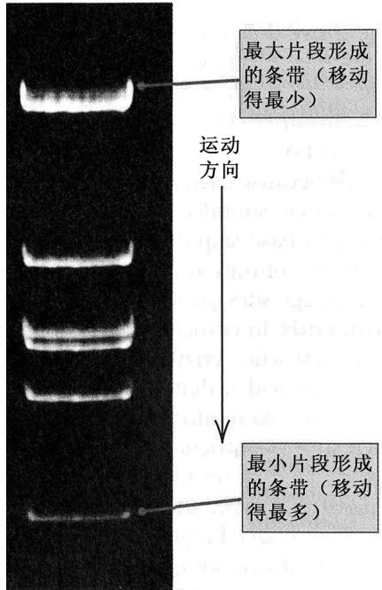

10kb 长的环状双链 DNA 分子的消化结果对该原理进行了解释。用限制酶 EcoR I 进行消化时(图 2.13A)，该环状分子产生 4kb 和 6kb 的两条带。要是两个 EcoR I 限制位点在环中的相对位置如凝胶正下方所示，则可产生这种带型。环的位置是任意指定的，只不过是将其中一个 EcoR I (E) 位点放在顶部。同样，用限制酶 BamH I 消化该环状分子(图 2.13B)，得到 3kb 和 7kb 的两条带，这说明环中有两个 BamH I 位点，其位置如凝胶正下方的示意图所示。该环的位置也是任意指定的，只不过这次是把其中一个 BamH I (B) 位点放在顶部。显示一种或多种限制酶在 DNA 分子上的切割位点的示意图称为限制图 (restriction map)。

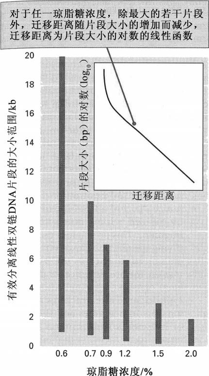  
图 2.12 在琼脂糖凝胶中，琼脂糖浓度是决定分离 DNA 片段的大小范围的一个重要因素。

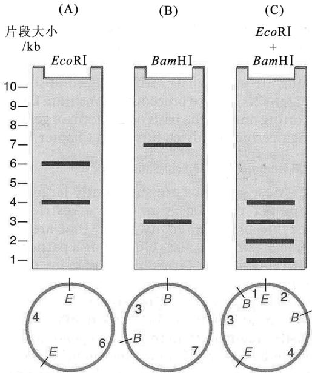  
图 2.13 凝胶示意图, 示用限制酶消化一个 10kb 的环状双链 DNA 分子所产生的限制性片段的大小。(A) 用 EcoR I 消化。(B) 用 BamH I 消化。(C) 两种酶一起消化。在每个示意图正下方各有一个限制图, 示限制位点的位置。(C) 中的限制图既考虑了 (A) 和 (B) 中的限制图, 又考虑了用两种酶一起消化所产生的片段大小。

当 EcoR I 和 BamH I 一起使用时，产生的 DNA 片段揭示了 EcoR I 位点和 BamH I 位点彼此之间的相对位置。在同时用两种酶来消化的情况下，产生 1kb、2kb、3kb 和 4kb 的条带（图 2.13C）。凝胶正下方所示的限制图标示了产生这些条带的两种限制位点的位置。将 B 部分的限制图叠加到 A 部分的限制图上，并将其旋转到使相邻的各对限制位点的距离等于 1kb、2kb、3kb 和 4kb 的位置（不一定按这个顺序），可得到该限制图。在此例中，只需要将 B 部分中的限制图向右旋转 2kb 的距离。注意，在图 2.13C 的限制酶消化产物中，这里的 4-kb 片段与在 A 部分中观察到的 4-kb 片段不是同一片段，这里的 3-kb 片段与在 B 部分中观察到的 3-kb 片段也不是同一片段。这种不一致是因为每种限制酶都会切割其他限制酶产生的片段而引起的。图 2.13C 中限制图的方位是任意指定的。将它翻个转，或者以任意方向旋转任意角度，它仍然是同一个限制图。

一旦明确了 DNA 分子的限制图，就可以将包含特定 DNA 片段的那一小部分凝胶切出来，然后从中分离出 DNA，从而得到特定的 DNA 片段。分离出来的限制性片段的一个重要用途是，利用 DNA 连接酶将其插入噬菌体、质粒乃至小的人工染色体之类的可自我复制的分子中(图 2.1)。这些方法是其中一类遗传工程的基础，属于 DNA 克隆(DNA cloning)的范畴，这些将在第 12 章中深入讨论。

## ■ 核酸杂交

大多数基因组大而复杂，以致仅用一种限制酶来消化，便能产生众多大小相同或相近的片段。在一个由众多大小相近的片段构成的背景中，要鉴定一个特定的 DNA 片段，这就提出了一个大海捞针般的问题(译者注：“大海捞针”是意译，直译是“在干草堆里找针”。下一段的叙述与此有关)。例如，我们对来自人类基因组的某个 3.0kb 的 BamH I 片段感兴趣，该片段是一个标记，说明某一特定家系中的妇女存在与乳腺癌有关的某种遗传风险因素。如果只根据片段大小，无法将这个 3.0kb 的片段与大小在 2.9～3.1kb 的片段区分开来。在这个大小范围内，估计有多少片段呢？用 BamH I 切割人类基因组 DNA 时，限制性片段的平均长度是 $4^{6}=4096$ 碱基对，预计 BamH I 片段的总数约为 730 000 个；在 2.9～3.1kb 的大小范围内，片段总数约为 17 000 个。这就意味着，即使知道目的片段的长度是 3kb，那也只是这 17 000 个片段中的一个，这些片段的大小非常接近，不能仅凭长度就把这个片段与其他片段区分开。

事实上，这种鉴定工作比在干草堆里找针还要困难，因为干草堆起码是干的。也许更准确的比喻是，将干草堆投入装满水的游泳池中，然后再在里面找针。这个比方的更为贴切之处在于，尽管凝胶因含支撑基质而变成半固体，但仍主要由水构成，因而凝胶中的每个 DNA 分子都完全在水的包围之中。很显然，我们需要某种方法来使凝胶中的分子固定，才能使特异片段得到鉴定。

固定凝胶中的 DNA 片段，通常是将 DNA 片段转移到一张由硝酸纤维组成的特殊滤纸上，DNA 可永久地与硝酸纤维(共价)结合。具体如何操作，会在下一节中描述。在本节中，我们来考察如何才能将双螺旋中的两条链分开成单链，以及在适当条件下，序列上互补或差不多互补的两条单链，如何才能回到一起，重新形成双螺旋。DNA 两条链的分离称为变性(denaturation)，而两条互补链的结合称为核酸杂交(nucleic acid hybridization)或复性(renaturation)(“杂交”这个词比较恰当，因为退火形成 DNA 双螺旋的两条链，可能不会刚好是变性之前配对的那两条链)。核酸杂交的实际应用很多：

\- DNA 片段的一小部分可与比其大得多的 DNA 片段杂交。这一原理用于在复杂混合物中鉴定特异的 DNA 片段，例如，鉴定我们一直在考虑的乳腺癌的 3kb BamH I 标记。这种应用包括追踪家系中的遗传标记及分离含特定突变基因的片段。

\- 来自一个基因的 DNA 片段，可与同一基因组中其他基因的相似片段杂交，这一原理用于鉴定基因家族的不同成员(基因家族的成员功能相关、序列相似但不相同)。

\- 来自一个物种的 DNA 片段可与其他物种的相似序列杂交。这使在多个物种中分离具有相同或相关功能的基因成为可能。这一原理用于分子进化若干方面的研究，例如，序列差异如何与功能差异相关、基因进化过程中序列变化的模式和速度等。

正如在 2.2 节中所见, DNA 的双链螺旋结构是由碱基堆积和互补碱基对之间的氢键维持的。

含 DNA 片段的溶液，当温度上升至 85～100℃，或 pH 升高到强碱性溶液的程度时，配对的两条链就开始分离。螺旋的解旋在不到几分钟内就可发生（时间取决于分子长度）。检测变性的一种常用方法是测量溶液中的 DNA 吸收 260 nm 波长紫外光的能力，因为单链分子溶液在 260 nm 处的吸收值 ( $A_{260}$ ) 比相同浓度的双链分子高 37%。如图 2.14 所示，通过对双链 DNA 溶液缓慢加热，并记录不同温度下的 $A_{260}$ 值，可跟踪变性的过程。变性所需的温度随 G+C 含量的增加而增加，这不仅是因为 G-C 碱基对有三个氢键、A-T 碱基对有两个氢键，而且是因为连续的 G-C 碱基对具有更强的碱基堆积。

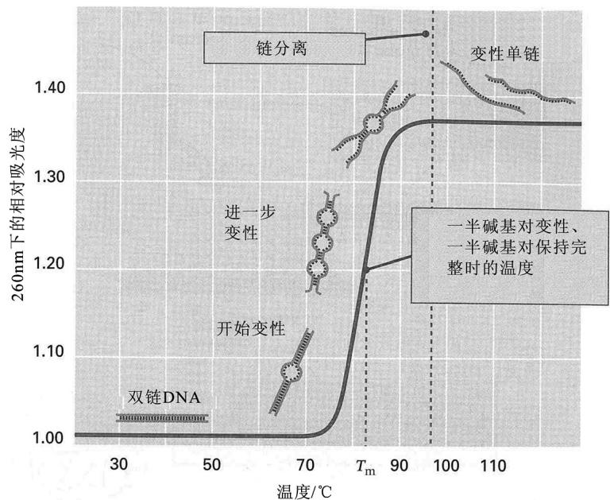  
图 2.14 DNA 热变性的机制。50%的碱基对变性时的温度为熔解温度，以符号 $T_{m}$ 表示。

为了使变性 DNA 链能够复性，必须满足两个要求。

1. 盐浓度必须较高(>0.25mol/L)以中和磷酸基的负电荷，否则会导致互补链互相排斥。

2. 温度必须高到能够瓦解同一条链内短的碱基序列之间随机形成的氢键，但又不至于高到能够瓦解互补链之间稳定的碱基对。

复性的起始阶段是个缓慢的过程，因复性起始的速度受制于两条互补链的相应区域可随机碰到一起，且能形成正确配对的短序列的可能性。该起始配对步骤继之以余下互补碱基的快速配对，以及螺旋的重新盘绕。螺旋的重新盘绕几秒钟就能完成，其速度与 DNA 浓度无关，因为互补链已经互相找到对方了。

图 2.15 中的例子让我们能够理解核酸杂交的一些分子细节，也让我们能够了解到怎样用杂交来“标记”和鉴定特定的 DNA 片段。(A)部分所示的是变性 DNA 溶液，该 DNA 称为探针 (probe)，每个探针分子都已被放射性原子或发光分子标记。探针 DNA 一般从克隆获得，标记的探针通常包括原来双链分子中两条链的变性形式[这引起了用词上的某些混乱。遗传学家说，探针 DNA 与含有相似(而不是互补)序列的 DNA 片段杂交。实际发生的是，探针的一条链与 DNA 片段中的互补序列进行杂交。但是，因为探针通常包含两条链，所以，存在包含相似序列的任何 DNA 片段时，杂交就会发生，探针的每条链都会与该片段中的互补序列进行杂交]。

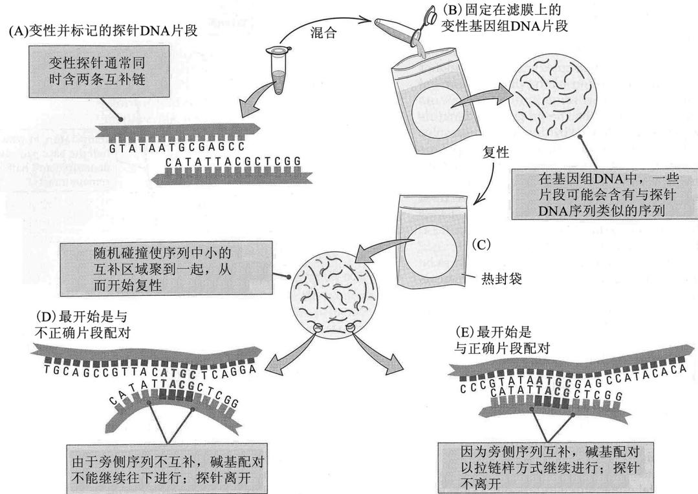  
图 2.15 核酸杂交。(A)令双链 DNA 探针分子(从克隆获得)变性。(B)令变性的探针 DNA 与结合有基因组 DNA 变性链的滤膜接触。(C)在合适的盐浓度和温度条件下，短的互补片段通过随机碰撞而结合。(D)如果配对区两侧的序列不互补，则配对不稳定，两条链再次分开。(E)如果配对区两侧的序列互补，则进一步的碱基配对使复性双链稳定下来。

图 2.15(B) 是已固定在硝酸纤维滤膜上的基因组 DNA 片段的示意图。当探针与基因组片段混合时(C)，随机碰撞使短的互补片段结合。如果互补序列区较短(D)，则随机碰撞不能启动复性，因为侧翼序列不能配对，在此情况下，探针几乎马上就掉下来。然而，如果碰撞使两个正好适合的短序列结合(E)，则会启动复性，因为配对会从最初接触之处开始呈拉链样进行下去。要点是，两个 DNA 片段只要可配对区域的长度足够, 就能够杂交。在配对区中存在一些错配是可以容忍的, 容许多少错配取决于实验条件。杂交的温度越低、盐浓度越高, 可容忍的错配比例就越高。

## - Southern 印迹

DNA 能以图 2.15 所概括的方式复性，意味着可用标记过的变性 DNA 小片段来 “标记” 复杂混合物中的分子：用适当方法标记小片段 DNA(例如，用放射性 ${}^{32}P$ )，将含变性小片段 DNA 的溶液与变性 DNA 片段的复杂混合物混合，在复性过程中，小片段将给混合物中能与其杂交的任何分子 “标记” 上放射性。这种放射性标记使这些分子得以被鉴定。

DNA 被切割、电泳、转移到硝酸纤维滤膜，然后与探针杂交，所有这些方法结合而成 Southern 印迹 (Southern blot)。Southern 印迹是以其发明者萨瑟恩 (Edwin Southern) 的名字来命名的。在此流程中，要先用电泳方法使 DNA 分子在凝胶上分离，然后用碱处理凝胶，使 DNA 变性成单链 (图 2.16)。然后，以保持 DNA 片段的相对位置不改变的方式，将 DNA 转移到硝酸纤维滤膜上。转移是这样实现的：将硝酸纤维滤膜覆盖在凝胶上，在顶上摞上多层吸水纸；吸水纸透过硝酸纤维滤膜从凝胶吸收水分子，DNA 片段就黏附到硝酸纤维滤膜上 (这一步就是 Southern 印迹的 “印迹” 部分，A 和 B)。然后，滤膜经处理使单链 DNA 成为永久结合。在允许互补链杂交形成双链分子的条件下，将处理过的滤膜与含变性探针 (DNA 或 RNA) 的溶液混合 (C)。在滤膜上，只有在已存在与探针互补的碱基序列，从而探针可形成双链分子之处，探针上的放射性标记或别的标记才能与滤膜牢固结合，在洗脱过程中才不会被洗掉。标记的位置是通过滤膜与 X 线片的接触来确定的，X 线片显影后，变黑区域指示含放射性标记或发光标记的条带所在位置 (D)。

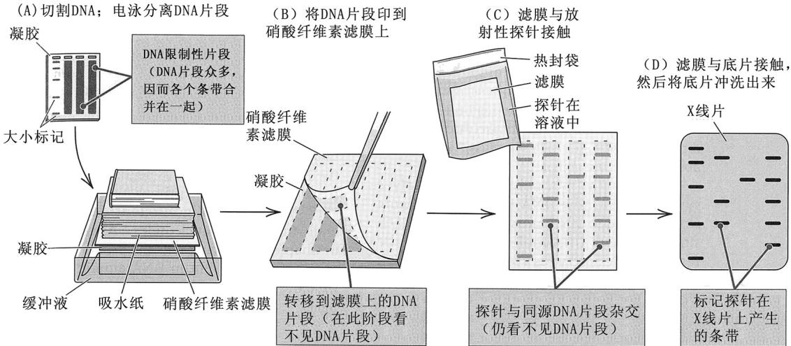  
图 2.16 Southern 印迹：鉴定凝胶中特定 DNA 片段的位置的实验流程。

图 2.16 中的流程通过将基因组 DNA 片段转移和固定到滤膜上，然后用杂交方法来鉴定目的片段，解决了湿草堆问题。在实际应用中，Southern 印迹以鉴定含与探针 DNA 或 RNA 相似的序列的 DNA 片段为核心，在此处，容许的错配核苷酸比例取决于杂交条件。Southern 印迹的优点是方便、灵敏。这种灵敏性是用标记探针进行杂交和用摄影胶片放大信号的共同结果。在一般情况下，只要 $5 \times 10^{-12}$ g DNA 就可在胶片上观察到条带——是在凝胶上产生可见条带所需 DNA 量的 1/1000。

## 2.4 基因组 DNA 片段的选择性复制

核酸杂交虽然能鉴定复杂片段混合物中的某个特定 DNA 片段，但不能将该片段与其他片段分开，不能纯化该片段。获得纯化形式的片段需要进行克隆，克隆不复杂但很费时间(克隆方法将在第 12 章中讨论)。然而，如果目的片段不太长，并且其两端的核苷酸序列已知的话，就有可能仅仅通过选择性复制而获得大量的片段。该过程称为扩增 (amplification)。怎样才能知道两端的序列呢？让我们回到 3.0-kb BamH I 片段的例子，该片段被用来标记某些家系中乳腺癌的一个风险因子。假设从某位患者基因组克隆这一片段并测序，发现相对于正常基因组序列的这一区域，该 BamH I 片段缺失了一段 500bp 的序列。现在片段两端的序列就知道了，并且我们还可以做出这样的推论：扩增该风险因子携带者的基因组 DNA，会产生一个 3.0kb 的片段，而扩增非携带者的基因组 DNA，会产生一个 3.5kb 的片段。这种差异使我们仅用 DNA 扩增的方法，就可以判断家系中的每个人是携带者还是非携带者。为了理解扩增是如何起作用的，首先要了解一下 DNA 复制的几个主要特点。

## - DNA 复制的约束因素：引物和 $5' \rightarrow 3'$ 链延伸

正如活细胞中大多数的代谢反应一样，核酸是在酶控制的化学反应中合成的。在 DNA 链中相邻脱氧核苷酸之间形成糖-磷酸键(磷酸二酯键)的酶称为 DNA 聚合酶(DNA polymerase)。现已纯化了多种 DNA 聚合酶，因而对于 DNA 片段的扩增而言，DNA 的合成就是在精确限定的条件下，在混合有若干纯化的细胞组分的试管中体外(in vitro)进行的(in vitro)的字面意思是“在玻璃杯内”，意指不存在活细胞)。

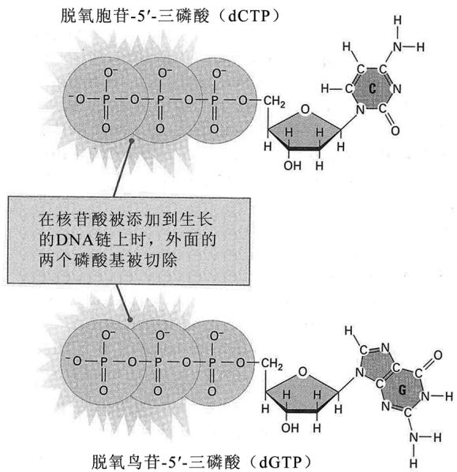  
图2.17 在DNA合成中使用的两种脱氧核苷三磷酸盐。外侧的两个磷酸基在合成过程中被去除。

为了让 DNA 聚合酶能够催化合成新的 DNA 链，必须事先存在单链 DNA。反应混合物中的每个单链 DNA 分子都可以作为模板，DNA 聚合酶在每个模板上生成一条新的配对链。要进行 DNA 复制，还必须存在 4 种脱氧核糖核苷的 5'-三磷酸盐。这一要求是不言而喻的，因为脱氧核苷磷酸盐是生成新 DNA 链的前体。所需的这些磷酸盐是表 2.1 中以 dATP、dGTP、dTTP 和 dCTP 表示的化合物，它们分别含腺嘌呤、鸟嘌呤、胸腺嘧啶和胞嘧啶碱基。dCTP 和 dGTP 的详细结构如图 2.17 所示，图中显示了在 DNA 合成过程中被切除的磷酸基。DNA 合成需要所有 4 种核苷 5'-三磷酸盐，漏掉任何一种都不能进行。

所有 DNA 聚合酶都有一个特点:

DNA 聚合酶只能延伸 DNA 链。即使存在模板分子，DNA 聚合酶也不可能起始新链的合成。

这一原理的一层重要含义是，DNA 合成需要事先存在与模板链以氢键结合的核酸片段，这种片段称为引物 (primer)。因为引物分子可以非常短，所以它是寡核苷酸 (oligonucleotide)，寡核苷酸的字面意思是“几个核苷酸”。正如将在第 6 章中看到的那样，在活细胞中，引物是短的 RNA 片段，而在体外扩增 DNA 时，使用的引物通常是 DNA 片段。

引物的 3' 端是关键，因为，正如在第 1 章中强调的：

DNA 合成就是在生长链的 3' 端不断添加核苷酸。换句话说，链的延伸总是以 $5'\rightarrow3'$ 的方向进行。

链延伸的方向是 $5'\rightarrow3'$ ，原因如图 2.18 所示。这是如下事实的结果：DNA 聚合酶所催化的反应，是在延伸链的游离 3'-OH 和要加入 3' 端的核苷三磷酸最里边的磷原子之间，形成磷酸二酯键。在复制中，对正确的、行将加入的核苷三磷酸的识别，取决于其与模板链上相对应的核苷酸是否能进行碱基配对。仅当碱基配对正确时，DNA 聚合酶才会催化聚合反应，将这个新的核苷酸加到引物末端。将 4 种脱氧核苷三磷酸添加到生长链 3'-OH 端，使用的都是同一种 DNA 聚合酶。

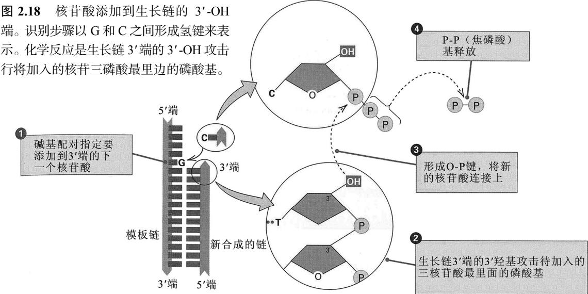

## ■ 聚合酶链式反应

对寡核苷酸引物的要求，以及对链延伸必须总是以 $5'\rightarrow3'$ 方向进行的约束，使得通过选择性体外扩增获得大量特定 DNA 序列成为可能。这种选择性扩增的方法称为聚合酶链反应 (polymerase chain reaction, PCR)。加州人穆利斯 (Kary B. Mullis) 因发明此方法而在 1993 年被授予诺贝尔奖。PCR 扩增使用 DNA 聚合酶和一对短的人工合成的寡核苷酸引物，引物长度通常为 18～22 个核苷酸，与被扩增 DNA 序列的两端互补。图 2.19 给出一例，其中的引物寡核苷酸 (绿色) 为 9 聚体。对大多数实际的应用来说，这些引物太短，但它们可用来解释原理。原始双链分子 (A) 以蓝色显示。该双链与大大过剩的引物分子、DNA 聚合酶和 4 种核苷三磷酸混合。当温度升高时，双链的两条链变性、分离。当温度再次降低以便复性时，引物——由于它们极度过剩——与分离的模板链 (B) 杂交 (即退火)。注意，两种引物的序列彼此不同，分别与原始 DNA 双链中两条链的序列互补，位于被扩增区域的左右两边。因为 DNA 链都只能在 $3'$ 端延伸，所以两条引物的 $3'$ 端都指向被扩增区域。引物退火后，DNA 聚合酶以原始链为模板延伸引物；合成进行的时候 (C)，两种引物新合成的 DNA 链 (红色) 延伸的方向相反。注意：

在原始反应混合物中的双链 DNA 的某一区域，仅当其两侧有引物寡核苷酸时才能被 PCR 扩增。

要开始第二轮 PCR 扩增，需再次升高温度，以使双链 DNA 变性。降低温度时，原始亲代链与引物退火，如图 2.19 B 和 C 所示的那样进行复制。在第一轮扩增中产生的子代链也与引物退火并被复制，如 D 部分所示。在此情况下，虽然子代双链分子与原始亲代分子的序列相同，但它们完全由引物寡核苷酸和在第一或第二轮 PCR 中合成的非亲代 DNA 组成。随着变性、引物退火和延伸循环的连续进行，原始亲代链被激增的新子代链迅速稀释，最后，在 PCR 中产生的分子几乎每个都是图 2.19 E 所示的结构。

PCR 扩增的威力在于，模板链的副本的数量是按 1、2、4、8、16、32、64、128、256、512、1024……指数级数增加，每复制一轮就翻倍。反复多轮的 DNA 复制可从含有少至一分子目的片段的混合物开始，使被扩增分子的数目指数性增加。例如，从单个分子开始，25 轮 DNA 复制会产生 $2^{25}=3.4\times10^{7}$ 个分子。被扩增片段的分子数目远远大于原始混合物中其他未被扩增的分子数目，以至于扩增的 DNA 常常无需进一步纯化就可以使用。例如，在 E. coli 中的单个 3kb 片段仅占该生物 DNA 的 0.06%。然而，如果该片段被复制 25 轮，则所得混合物的 99.995% 会由扩增序列组成。3kb 的 DNA 片段仅占人类总基因组大小的 0.0001%，将一个 3kb 的人类 DNA 片段扩增到纯度为 99.995%，只需大约 34 个 PCR 循环。

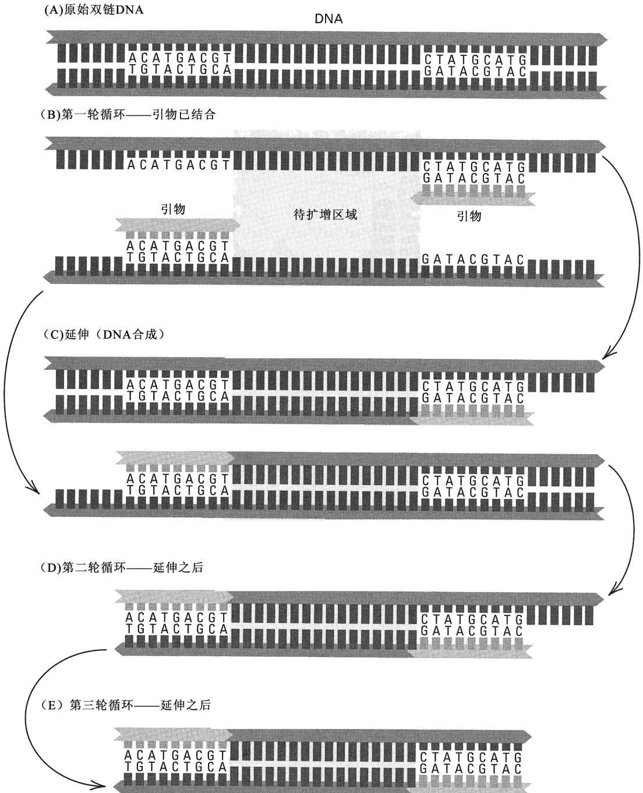  
图 2.19 PCR 扩增中引物序列的作用。(A)靶 DNA 双链(蓝色)，示位于待扩增区域两侧、选为引物结合位点的序列。(B)与靶 DNA 变性链结合的引物(绿色)。(C)第一轮扩增。新合成的 DNA 以粉红色显示。注意，每条引物被延伸至超出另一引物位点之外。(D)第二轮扩增(仅显示一条链)；在本轮扩增中，新合成的链终止于另一侧的引物位点。(E)第三轮扩增(仅显示一条链)；在本轮扩增中，两条链都缩短至引物位点。引物序列通常至少是此处所示的两倍长。

聚合酶链式反应的概况如图 2.20 所示。被扩增的 DNA 序列仍以蓝色显示，寡核苷酸引物以绿色显示。寡核苷酸与被扩增序列的两端退火，成为 DNA 聚合酶进行链式延伸的底物。在第一轮 PCR 扩增中，DNA 变性，使两条链分开，变性温度为 $95^{\circ}$ C 左右。然后，在极度过剩的引物寡核苷酸存在的情况下，降低温度以使退火发生。退火温度一般在 $50 \sim 60^{\circ}$ C，这主要取决于寡核苷酸引物的 G+C 含量。稍微升高温度至 $70^{\circ}$ C 左右，以使每条引物延伸，完成本轮循环。变性、复性和复制步骤被重复 20～30 次，在每个循环中被扩增序列的分子数目加倍。

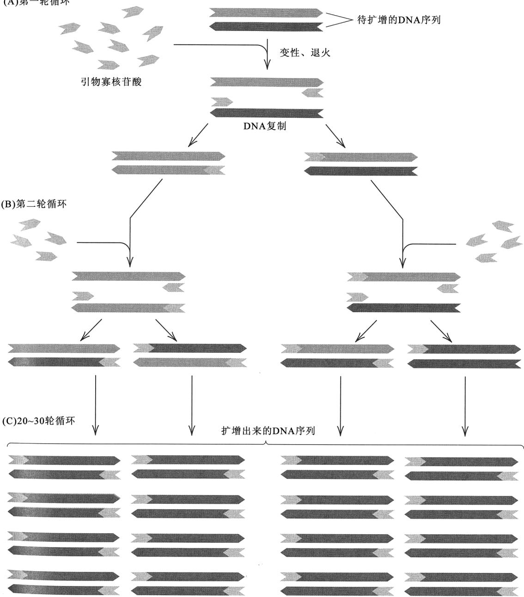  
图 2.20 扩增特定 DNA 序列的聚合酶链反应 (PCR)。仅显示被扩增的区域。在反复多轮的变性、退火和 DNA 复制中，使用与靶序列 (蓝色) 互补的寡核苷酸引物 (绿色)。新复制得的 DNA 以粉红色显示。在每一轮复制中，靶序列的副本的数目均加倍，最终远远超过任何其他可能存在的序列。

用常规的 DNA 聚合酶进行 PCR 是不实际的，因为在变性必需的高温下，这种聚合酶本身会不可逆地去折叠化，从而失去活性。然而，从某些生物分离到的 DNA 聚合酶是热稳定的，因为这些生物通常生活在温度为 $90^{\circ}$ C 以上的温泉中，如在黄石国家公园发现的温泉。这类生物称为嗜热生物(thermophiles)。使用最广泛的热稳定 DNA 聚合酶称为 Taq 聚合酶，因其最初是从嗜热细菌水生栖热菌(Thermus aquaticus)中分离到的。

PCR 扩增对于产生大量的特定 DNA 序列非常有用。但该技术的局限性主要表现在：待扩增区域两端的 DNA 序列必须已知才能人工合成引物寡核苷酸；长于 5000bp 左右的序列不能用常规的 PCR 方法进行有效的复制，但一些改进型的 PCR 能够扩增较长的片段。不过，许多应用只需要扩增相对较小的片段。PCR 扩增的主要优点是，它只需要痕量的模板 DNA。理论上只需要 1 个模板分子，但在实际操作中，用单个分子来扩增，可能会因为该分子的偶然断裂或损伤而失败。但在模板分子少至 10～100 个时，扩增通常仍是可靠的，这意味着 PCR 扩增比核酸杂交检测要灵敏 1 万～10 万倍。

PCR 扩增超凡的灵敏度，使其得以应用于犯罪案件的 DNA 分型。在犯罪案件中，作案者遗留的生物物质极其微量(烟蒂上的皮肤细胞或单根毛发上的发根细胞)，可以产生足够的模板 DNA 以供扩增。在科学研究上，PCR 被广泛用来研究序列已知的基因中的独立突变，目的是鉴定每个突变的分子基础，或研究自然群体中同一基因不同形式之间的 DNA 序列变异，或考察不同物种中功能相同的基因之间的差异。PCR 方法也已经开始广泛用于临床实验室的诊断中，仅举一个非常重要的例子，用与导致获得性免疫缺陷综合征(AIDS)的人类免疫缺陷病毒(HIV)的遗传物质序列互补的引物，可通过 PCR 检出血库中以痕量水平存在的 HIV。PCR 方法适合用自动机械来加样和运行反应，从而得以自动化，这使得 PCR 的应用变得更为容易。

## 2.5 遗传分析术语

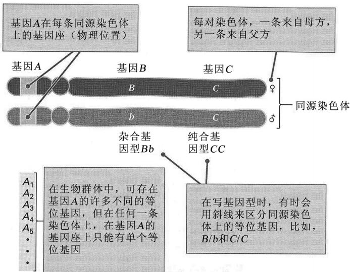  
图 2.21 现代遗传学中使用的关键概念和术语。注意，在整个群体中，一个基因可以有任意数量的等位基因，但在任何一个个体中不可能存在两个以上的等位基因。

为了讨论现代遗传学家在遗传分析中普遍使用的 DNA 标记类型，我们必须首先介绍一些关键术语，这些术语是遗传学的必备词汇。参考图 2.21 可以理解这些术语。在第 1 章中，我们将基因定义为在生殖过程中从亲代传递给子代，影响一个或多个遗传性状的遗传因子。从化学上讲，基因是 DNA 分子上的核苷酸序列。在生物群体中，一个基因的所有拷贝不一定都具有完全一样的核苷酸序列。如某个基因，其中一种形式的某个位点上的密码子可能是 GCA，而另一形式在相同位点上的密码子也许是 GCG，这两种密码子都编码丙氨酸。因此，该基因的这两

种形式都编码相同的氨基酸序列，但在 DNA 序列上有差异。一个基因的不同形式称为该基因的等位基因(alleles)。不同的等位基因也有可能编码不同的氨基酸序列，有时这种差异会产生严重后果。回忆一下第 1 章中编码苯丙氨酸羟化酶的 PAH 基因的例子，PAH 基因 408 位的密码子从 CGG(精氨酸)变成 TGG(色氨酸)，导致无活性的酶，表现为苯丙酮尿症这种先天性代谢缺陷。

在细胞内，基因以线性顺序排列于称为染色体(chromosome)的微小丝状体上，将在第4章和第7章详细介绍染色体。每个人类生殖细胞都包含完整的一套23条染色体，其中包含 $3\times10^{9}$ 个碱基对的DNA。一条典型的染色体包含几百到几千个基因。人类染色体平均每条有大约1000个基因。每条染色体都包含沿其纵向的单个双链 DNA 分子，DNA 与若干蛋白质结合，盘绕得十分紧密。完全伸展的时候，平均一条人类染色体中的 DNA，其相对尺寸相当于一根 25 英里 $^{①}$ 长的湿面条；当 DNA 盘绕成染色体形式时，其物理密实度相当于把同一根面条盘绕、塞进一条 18 英尺 $^{②}$ 长的独木舟。

一个基因在染色体上的物理位置称为该基因的基因座(locus)。在包括人类在内的大多数高等生物中，除精子或卵以外，每个细胞都含有每种染色体的两个拷贝——一个拷贝遗传自母亲、一个遗传自父亲。这样一对染色体中的每一成员被称为与另一成员是同源的(homologous)(决定性别的染色体是个重要的例外，将在第4章讨论)。因此，每一个体在任意基因座上携带两个等位基因，在每条同源母源染色体和同源父源染色体的相应位置上都存在一个等位基因(图2.21)。

一个个体的基因组成称为该个体的基因型(genotype)。对某个特定的基因而言，如果某个个体在该基因的基因座上的两个等位基因彼此无法区分，那么，就该基因来说，该个体的基因型被说成对此等位基因是纯合的(homozygous)。如果该基因座上的两个等位基因不同，那么，就该基因来说，该个体的基因型被说成对这两个等位基因是杂合的(heterozygous)。在印刷上，基因以斜体表示，不同的等位基因通常以大小写字母(A对a)、下标( $A_{1}$ 对 $A_{2}$ )、上标( $a^{+}$ 对 $a^{-}$ )来区分，有时仅用“+”、“-”来区分。用这些符号可能会将纯合基因写成下列形式中的任何一种：AA、aa、 $A_{1}A_{1}$ 、 $A_{2}A_{2}$ 、 $a^{+}a^{+}$ 、 $a^{-}a^{-}$ 、+/+或-/-。如同最后两例一样，有时会用斜杠来分隔同源染色体上的等位基因，以避免歧义。杂合基因可能会被写成下列形式中的任何一种：Aa、 $A_{1}A_{2}$ 、 $a^{+}a^{-}$ 或+/-。在图2.21中，Bb是杂合基因型，因为等位基因B和b是可以区别的(这就是为什么用不同的符号来表示它们)，而CC是纯合基因型。这两种基因型也可分别写成B/b或C/C。

鉴于一个个体中存在的两个等位基因构成其基因型，该基因型的形态或生化表现就称为表型 (phenotype)。说得尽可能简单一些，基因型和表型的区别在于，个体的基因型是内在的 (DNA 中的等位基因)，而表型是外在的 (可观察的性状，包括生化性状、行为性状等)。区别基因型和表型是极其重要的，因为在基因和性状之间通常不存在一一对应的关系。大多数复杂性状，诸如头发颜色、肤色、身高、体重、行为、寿命，以及对疾病的易感性等，受多个基因的影响。大多数性状也受环境或强或弱的影响。这意味着相同的基因型可以产生不同的表型，这取决于环境。例如，比较两个具有相同肺癌遗传风险的人，如果一个吸烟，而另一个不吸，则吸烟者更有可能患肺癌。环境影响的存在也意味着相同的表型可由不止一种基因型产生，这也可以吸烟为例，因为大多数没有遗传风险的吸烟者也可患肺癌。

## 2.6 基因组 DNA 中的 DNA 标记类型

在大多数自然生物群体中，许多基因存在以复等位基因形式表现的遗传差异。我们把个体之间的这种遗传差异称为 DNA 标记；它们也被称为 DNA 多态性 (DNA polymorphism)（多态性这个词的字面意思是“多型”）。在 2.3 和 2.4 节中介绍过的 DNA 操作方法，可以以种种方式组合，用来检测个体间的差异。任何一个阅读现代遗传学文献的人，总会碰到种种让人迷惑的关于检测遗传多态性的不同方法的首字母缩略词。之所以使用不同的方法，是因为没有适于所有应用的单一方法，每种方法各有其优势和局限，因而新方法层出不穷。在本节中，我们讨论检测个体间 DNA 多态性的一些主要方法。

## ■ 单核苷酸多态性(SNP)

在群体中的 DNA 分子的某个特定核苷酸位点上，若占据该位点的核苷酸对常常有差异，则该位点存在单核苷酸多态性(single-nucleotide polymorphism，SNP，读“snip”的音)。例如，在某个特定的核苷酸位点，群体中的有些DNA分子可能具有T-A碱基对，而同一群体的其他DNA分子在同一位点可能是C-G碱基对。这一差异就构成一个SNP。该SNP定义了两个“等位基因”，对这两个等位基因而言，在该群体的个体中可能会有3种基因型：在两条同源染色体的相应位点都具有T-A的纯合基因型；在两条同源染色体的相应位点都具有C-G的纯合基因型；在一条染色体上具有T-A，而同源染色体上具有C-G的杂合基因型。上面把等位基因这个词用引号括起来，是因为SNP不一定在编码序列内，甚至不一定在基因内。在人类群体中，任意两个人相应的DNA分子，大约每1000bp的非编码DNA中可能在1个SNP位点上有差异，大约每3000bp的蛋白编码DNA中可能在1个SNP位点上有差异。注意，在SNP的定义中，限定条件是DNA分子在核苷酸位点上必须“常常”有差异。这条规定排除了稀有的遗传变异，即在群体 $1\%$ 以下的DNA分子中发现的那些遗传变异。排除稀有遗传变异的原因是，在遗传分析中，过于稀有的遗传变异一般没有比较常见的变异有用。SNP是人与人之间遗传差异的最常见的形式。在人类群体中，已鉴定了大约1千万个比较常见的SNP，其中30万～60万个常用于可能与糖尿病或高血压之类的复杂疾病相关的SNP搜索。

使用 DNA 微阵列 (DNA microarray)，能够鉴定 100 万个 SNP 每个位点上具体的核苷酸。DNA 微阵列由在邮票大小的玻片上的数百万个极其微小的点组成，每个微点含某一独特 DNA 寡核苷酸序列的数百万个拷贝，这些拷贝是在制造微阵列时用微量化学 (microchemistry) 方法合成的。经过设计，每种寡核苷酸序列可特异地与包含 SNP 中的任意一种核苷酸对的基因组 DNA 小片段杂交。在微阵列中还含有每种杂交的大量对照。这些对照由含有故意错配的寡核苷酸组成，意在防止某些特殊核苷酸序列的误导，这些序列或特别“黏”、特别容易与基因组片段杂交，或可形成难以杂交或根本不能杂交的结构。这样的微阵列——有时称为 SNP 芯片 (SNP chip)——能以几乎 100% 的准确性确定个体的 SNP 基因型。

图 2.22 解释了寡核苷酸杂交的若干原理。此处，每条寡核苷酸的长度都是 7 个核苷酸，而在实际应用中，这个长度太短，典型的 SNP 芯片由长度至少 25 个核苷酸的寡核苷酸组成。A 部分显示可构成一个 SNP 的两种 DNA 双链。在这个例子中，有些染色体携带具有 T-A 碱基对(在红色所示位置)的 DNA 分子，而其他染色体中的 DNA 分子在相应位置具有 C-G 碱基对。以荧光标签标记基因组 DNA 的短片段，然后将其单链与含互补寡核苷酸及大量对照的 SNP 芯片杂交。含 T-A 的双链只会与左边的两种寡聚核苷酸杂交，而含 C-G 的双链只会与右边的两种寡聚核苷酸杂交。

杂交之后，用荧光显微镜检查 SNP 芯片，检测因为基因组 DNA 上的标签而发荧光的斑点，可能会出现的图案如 B 部分所示。染色体包含两拷贝 T-A 型双链的个体(纯合的 T-A/T-A)，其基因组 DNA 将使最左边的两个点发荧光，而最右边的两个点保持不被标记。同样，来自纯合 C-G/C-G 个体的基因组 DNA 将使最右边的两个点发荧光，而最左边的两个点不发荧光。最后，来自杂合 T-A/C-G 个体的基因组 DNA 会使所有四个点都发荧光，因为 T-A 双链标记最左边的两个点，而 C-G 双链标记最右边的两个点。

SNP 芯片及其他现有技术在高通量基因型分型上的应用，可对数以千计个体的数百万个 SNP 进行基因型分型，使疾病遗传风险因子的鉴定成为可能。典型的研究方法是比较特定疾病患者与健康人群的基因型，健康人群在性别、年龄和民族等因素上与患者匹配，比较这两种人群之间的 SNP 基因型，通常可揭示基因组中哪些 SNP 标记了遗传风险因子的位置，这将在 2.7 节中作更加详细的解释。

联系：人类遗传连锁图的由来

戴维·博特斯坦 $^{1}$ 、雷蒙德·怀特 $^{2}$ 、马克·斯科尔尼克 $^{3}$ 和罗纳德·戴维斯 $^{4}$ ，1980

$^{1}$ 麻省理工学院，剑桥，马萨诸塞州

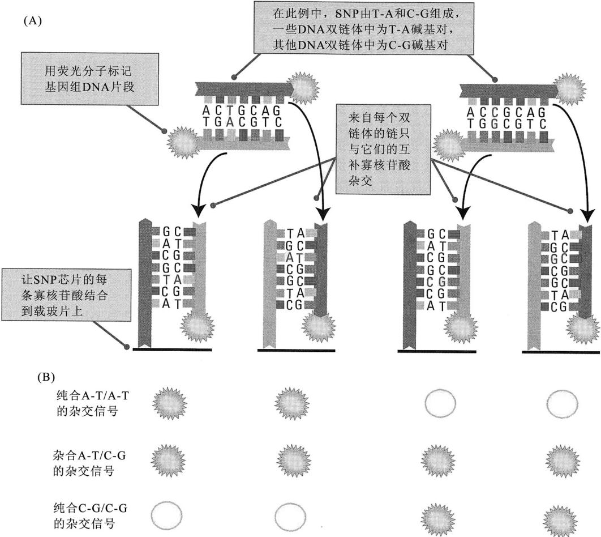  
图 2.22 (A) 在 SNP 芯片上，结合在玻片上的寡核苷酸可用来鉴定双链 DNA 分子包含的碱基对是 SNP 两种碱基对中的哪一种，本例中 SNP 的两种碱基对是 T-A 碱基对与 C-G 碱基对。(B) 因为来自纯合 T-A/T-A、纯合 C-G/C-G 或杂合 T-A/C-G 基因型的 DNA，杂交后得到各不相同的荧光图案，所以通过杂交能够确定个体的 SNP 基因型。

$^{2}$ 马萨诸塞大学医学中心，伍斯特，马萨诸塞州

$^{3}$ 犹他大学，盐湖城，犹他州

$^{4}$ 斯坦福大学，斯坦福，加利福尼亚州

用限制性片段长度多态性构建人类遗传连锁图

的基因型，从而能更加精确地评价次要基因之类的修饰因子、表型表达的可能性及环境的贡献。来源：D. Botstein, et al., Am. J. Hum. Genet. 32 (1980): 314-331。

## ■ 限制性片段长度多态性(RFLP)

尽管大多数 SNP 需要进行 DNA 测序才能研究，但那些碰巧位于限制位点内的 SNP，可以用别的方法来分析。图 2.23 显示这种情况的一个例子，此处的 SNP 由一些分子上的 T-A 核苷酸对和其他分子上的 C-G 对构成。在该例中，多态性核苷酸位点包含在限制酶 EcoR I 的切割位点 (5'-GAATTC-3') 中。图中也显示了 SNP 两侧最近的两个 EcoR I 位点。在这种情况下，在 SNP 位点具有 T-A 的 DNA 分子，既在两侧的位点被切割，也在中间的位点被切割，产生两个 EcoR I 限制性片段。而在 SNP 位点具有 C-G 的 DNA 分子，只有两侧的位点被切割，中间的位点不被切割（因为 C-G 的存在破坏了 EcoR I 限制位点），因此只产生一条大的限制性片段。使限制位点消除的 SNP 称为限制性片段长度多态性 (restriction fragment length polymorphism, RFLP, 读 “riflip” 的音，或直接拼出字母)。

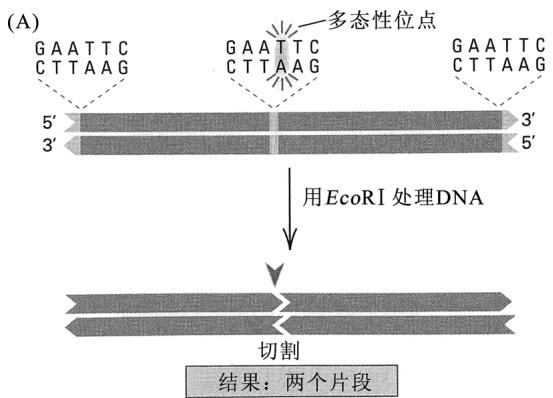

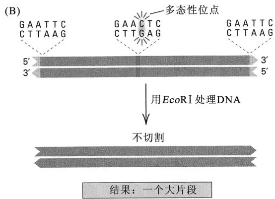  
图 2.23 如果两个 DNA 分子在序列上的某一差异可使一个限制位点消除，则可对该差异进行检测。(A)该分子含 3 个 EcoR I 限制位点，两个末端各有一个。该分子被 EcoR I 切成两个片段。(B)该分子中间的那个 EcoR I 位点变异，5'-GAATTC-3' 变成了 5'-GAACTC-3'。该变异位点不能被 EcoR I 切割，所以，用 EcoR I 处理该分子，产生一个大片段。

因为 RFLP 改变了限制酶消化产生的 DNA 片段的数目和大小，所以可以用 2.3 节讨论过的 Southern 印迹方法来检测。图 2.24 中可见一例，在此例中，标记探针 DNA 在最左边限制位点附近杂交，标识该限制性片段在电泳凝胶上的位置。标为 “等位基因 A” 的双链分子，在中间有一个限制位点，因此当酶切并电泳后，产生一个包含探针 DNA 同源序列的小条带。标为 “等位基因 a” 的双链分子缺少中间的限制位点，因而产生一个大的条带。在这种情况下，可有 3 种基因型——AA、Aa 或 aa，取决于在同源染色体上的是什么等位基因——并且 3 种基因型都可以如图 2.24 所示的那样得以区分。纯合的 AA 只产生一个小片段，纯合的 aa 只产生一个大片段，而杂合的 Aa 小片段和大片段都产生。因为杂合 Aa 基因型中 A 和 a 两种等位基因的存在都可以被检出，因而称 A 和 a 是共显性的 (codominant)。如图 2.24 所示，来自 AA 和 aa 的条带显得比来自 Aa 的条带要略粗一点，因为，在杂合基因型 Aa 中，每个等位基因只有一个拷贝，而与此相比，每个 AA 基因型有两个拷贝的 A 等位基因，每个 aa 基因型有两个拷贝的 a 等位基因。

## - 串联重复序列多态性

有一种重要的 DNA 多态性类型, 是由在染色体特定位点上可以串联方式多次重复的 DNA 序列的拷贝数差异所致。任何一条染色体上都可能有任意拷贝数的串联重复序列, 一般是十个到几百个拷贝。图 2.25 示串联重复序列数目不同的若干 DNA 分子。此处的重复序列数目从 1 到 10 不等。用

可在串联重复序列两侧的位点进行切割的限制酶，来切割任何一个 DNA 分子，所得限制性片段的大小由其包含的重复序列数目决定。含重复序列的双链 DNA 分子，也可用串联重复序列两侧的引物，通过聚合酶链反应 (PCR) 来扩增。无论是通过限制酶消化还是 PCR，所得 DNA 片段的大小都随其包含的重复序列数目的增加而增大。因此，如图 2.25 右侧所示，串联重复序列拷贝数不同的两个 DNA 分子能够被区分开来，因为两个分子产生的 DNA 片段大小不同，可用电泳方法分离。

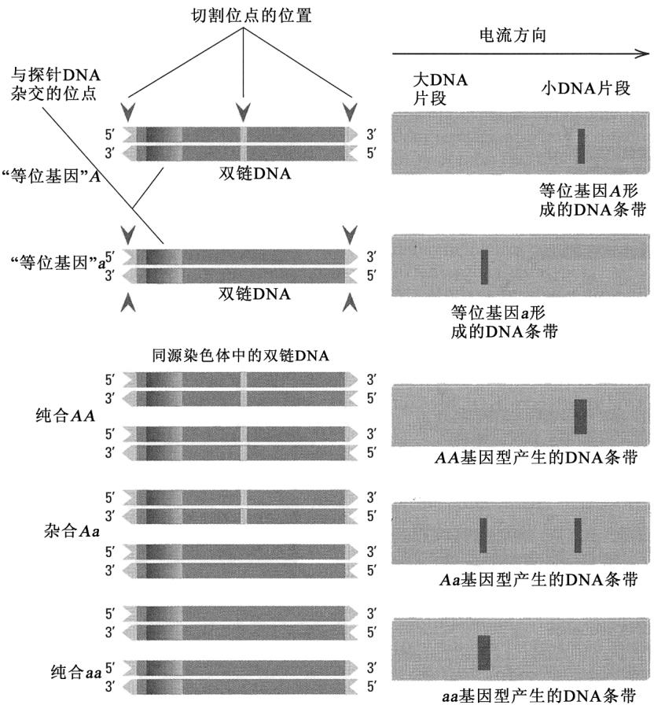

SSR 这个首字母缩写代表简单序列重复(simple sequence repeat)，SSR 的一个例子是重复序列 5' -...ACACACAC...-3'。SSR 在人类遗传分析中很重要，原因有二。

1. 人类基因组中 SSR 丰富。

图 2.24 在限制性片段长度多态性(RFLP)中，不同等位基因的差别在于在DNA中有无切割位点。在本例中，a等位基因缺乏一个在A等位基因的DNA中存在的限制位点。片段长度的差异可用Southern印迹来检测。RFLP等位基因是共显性的，这意味着来自杂合Aa基因型的DNA，会产生在纯合AA和aa基因型的DNA中观察到的每个单一条带。  
表 2.4 人类基因组中的一些简单重复序列

<table><tr><td>SSR 重复序列单位</td><td>在人类基因组中的 SSR 数目</td></tr><tr><td>5&#x27;-AC-3&#x27;</td><td>80 330</td></tr><tr><td>5&#x27;-AT-3&#x27;</td><td>56 260</td></tr><tr><td>5&#x27;-AG-3&#x27;</td><td>23 780</td></tr><tr><td>5&#x27;-GC-3&#x27;</td><td>290</td></tr><tr><td>5&#x27;-AAT-3&#x27;</td><td>11 890</td></tr><tr><td>5&#x27;-AAC-3&#x27;</td><td>7 540</td></tr><tr><td>5&#x27;-AGG-3&#x27;</td><td>4 350</td></tr><tr><td>5&#x27;-AAG-3&#x27;</td><td>4 060</td></tr><tr><td>5&#x27;-ATG-3&#x27;</td><td>2 030</td></tr><tr><td>5&#x27;-CGG-3&#x27;</td><td>1 740</td></tr><tr><td>5&#x27;-ACC-3&#x27;</td><td>1 160</td></tr><tr><td>5&#x27;-AGC-3&#x27;</td><td>870</td></tr><tr><td>5&#x27;-ACT-3&#x27;</td><td>580</td></tr></table>

来源：数据来自 International Human Genome Sequencing Consortium, Nature 409 (2001): 860-921。

## 2. 人类群体中 SSR 通常是高度多态性的。

关于人类基因组中 SSR 的丰度，可见表 2.4 所列举的最常见的 SSR。两核苷酸重复序列比三核苷酸重复序列要多，但在每一类中丰度的差异都极大。最常见的两核苷酸重复序列是 5' -...ACACACAC...-3'，它遍布人类基因组，存在于 80 000 多个地方。人类基因组平均每 2kb 的 DNA 有一个 SSR，也就是说共有大约 150 万个 SSR。

SSR 在拷贝数上的多态性倾向, 使其作为遗传标记非常有用。典型 SSR 重复单位的长度为 2～9 个核苷酸。当重复单位更长时 (10～60 个核苷酸), 重复数目的多态性称为可变数目串联重复 (variable number of tandem repeat, VNTR)。因为 VNTR 中的重复单位较长, 在电泳凝胶上

拷贝数不同的 DNA 片段比 SSR 的限制性片段(图 2.25)更容易区分。为此，在个人识别和个体间遗传相关度评估的 DNA 分型(DNA typing，有时称为 DNA 指纹分析，DNA fingerprinting)

中，VNTR 一直非常有用。

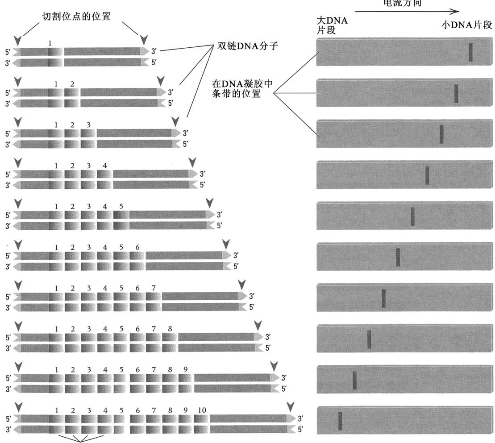  
某一DNA序列的串联重复  
图 2.25 一种遗传多态性，其中，群体中的等位基因在某种 DNA 序列(一般 2～60bp)的拷贝数上有差异，这种 DNA 序列在染色体上以串联排列方式重复。该例显示重复序列数目从 1 到 10 不等的等位基因。在重复序列两侧的限制位点切割，每个等位基因产生独特的片段大小。也可以用重复序列两侧的引物进行 PCR，根据扩增片段的大小来区分这些等位基因。

DNA 序列的串联重复序列不仅往往具有多态性，而且大多数的多态性往往具有大量的等位基因。每个 “等位基因” 相当于一个具有不同重复单位拷贝数的 DNA 分子，如图 2.25 所示的那样。换句话说，在群体中串联重复序列在数目上的多态性通常具有复等位基因 (multiple alleles)。然而，即便是复等位基因，对于以串联重复序列的数目来定义的等位基因，任何一条特定的染色体一定只能携带其中一个等位基因，任何个体的基因型最多可携带两个不同的等位基因。不过，等位基因的数量巨大意味着基因型的数量更加巨大。例如，在一个群体中，即使只有 10 种等位基因，也可能会有 10 种不同的纯合基因型和 45 种不同的杂合基因型。

一般地，对于 n 种等位基因，总共存在 $n(n+1)/2$ 种可能的基因型，其中 n 种是纯合的， $n(n-1)/2$ 种是杂合的。因此，如果某一群体中某种 SSR 或 VNTR 的等位基因比较多，但没有一个等位基因特别常见，那么在该群体中这许多的基因型每一个的频率都会相当低。如果同时考虑 6～8 个高度多态性基因座的基因型，则每种可能的多基因座基因型就会极其罕见。任意多基因座基因型的频率极低，就是串联重复序列多态性得以在 DNA 分型中发挥作用的原因。DNA 分型在刑事侦查中的应用，在本章后面的习题 2.29 和挑战题 2 中会有举例，并在第 17 章中进一步讨论。

## - 拷贝数变异(CNV)

拷贝数的小规模变异，以较短序列的串联重复(SSR 和 VNTR)这样的基因组部件(genomic feature)为代表，除此之外，人类基因组很大的一部分可发生更大规模但仍属亚显微尺度的重复或缺失，重复或缺失片段的大小在1kb至1Mb之间(Mb代表megabase pairs，即100万个碱基对)。这种变异称为拷贝数变异(copy-number variation，CNV)。在CNV中，基因组额外增加或缺失的拷贝，可在DNA微阵列中用寡核苷酸进行杂交而检出。因为微阵列上的每个点都是由一个特定寡核苷酸序列的数以百万计的相同拷贝组成，这些拷贝参与杂交的数量取决于基因组DNA中存在多少互补序列的拷贝。典型的区域有两个拷贝(一个遗传自母亲，另一个遗传自父亲)。如果某一个体具有该区域的一个额外拷贝，则杂交比会是3∶2，从而荧光强度比是3∶2。如果某一个体缺失一个拷贝，则杂交比和荧光强度比都会是1∶2，用DNA微阵列很容易检测到这些差异。而且，因为CNV比较大，所以在微阵列中通常会有许多不同的寡核苷酸可与CNV不同区段的序列互补，因此，CNV会导致其涵盖的所有寡核苷酸的信号强度全部升高或降低。现在的SNP芯片也包含了以检测已知CNV为目的的大约100万个寡核苷酸探针。

根据定义，CNV 的大小超过 1kb，但很多 CNV 要大得多。在一项约 300 人的研究中，通过微阵列杂交发现了大约 1500 个 CNV，这些人的祖先生活在非洲、欧洲或亚洲。这些 CNV 的平均长度为 200～300kb，总计 300～450Mb，占整个基因组核苷酸的 10%～15%。这些 CNV 中有许多位于与遗传病相关的已知突变基因附近的区域。已知 $\alpha$ 和 $\beta$ 血红蛋白基因中的 CNV 与对疟疾的抵抗力有关，而 HIV-1 受体基因 CCL3 中的 CNV 与对 AIDS 的抵抗力有关。CNV 的普遍存在业已促使 CNV 寡核苷酸成为 DNA 微阵列的一部分，以便能够评估 CNV 对糖尿病和阿尔茨海默病之类的复杂疾病的发病风险的可能影响。

## 2.7 DNA 标记的应用

为什么遗传学家会对 DNA 标记和 DNA 多态性感兴趣？有大量的理由可以对此进行说明。在本节中，我们来考察最常提及的若干理由。

## ■ 遗传标记、遗传作图与“疾病基因”

在人类遗传学中，研究 DNA 多态性的主要目的是鉴定与遗传病有关的突变基因在染色体上的位置。对于多种因遗传和环境因素的相互作用而引起的疾病，如心脏病、癌症、糖尿病和抑郁症等，重要的是将有害的等位基因视为疾病的风险因子(risk factor)而不是致病因子(causative agent)，风险因子只是增加疾病发生的可能性。这是必须强调的，特别是因为遗传风险因子常被称作疾病基因(disease gene)。例如，女性乳腺癌的主要“疾病基因”是 BRCA1 基因。对携带突变型 BRCA1 等位基因的女性而言，一生中患乳腺癌的风险约为 36%，因此，具有该遗传风险因子的大多数女性不会患乳腺癌。另一方面，在未携带该等位基因的女性中，一生中患乳腺癌的风险约为 12%，因此，许多没有该遗传风险因子的女性也会患乳腺癌。确实，在有乳腺癌家族史的女性患者中，仅 16% 发现有 BRCA1 突变。遗传风险因子的重要程度，可以定量地表示为相对风险(relative risk)，相对风险等于风险因子携带者中患者与非患者的比，除以非携带者中患者与非患者的比。因此，在 BRCA1 的例子中，相对风险为 0.36/0.64=0.562 除以 0.12/0.88=0.136，等于 4.1。

DNA 多态性能够在疾病基因的定位和鉴定中发挥作用，是存在遗传连锁 (genetic linkage) 的结果，遗传连锁是指在染色体中相互靠得很近的基因具有一起遗传下去的倾向。我们将在第 5 章中详细讨论遗传连锁，但在图 2.26 中总结了遗传连锁的若干关键概念，图中显示了某条染色体上的许多 DNA 多态性的位置，该染色体还携带一个遗传风险因子，以 D 表示 (表示 disease gene)。

<!-- END OFFICIAL API PART part_001 -->

<!-- BEGIN OFFICIAL API PART part_002 -->

每个 DNA 多态性都可作为其自身在染色体上的位置的遗传标记。遗传连锁的重要性在于，与疾病基因靠得很近的 DNA 标记，在家系中倾向于与疾病基因一起遗传下去——并且，标记越近，这种倾向性就越强。因此，疾病基因鉴定的头一道手续就是寻找与疾病基因遗传连锁的 DNA 标记，以确定疾病基因在染色体上的位置，该过程称为遗传作图 (genetic mapping)。一旦确定疾病基因在染色体上的位置，就可用其他方法来对疾病基因本身进行精确定位，并研究其功能。

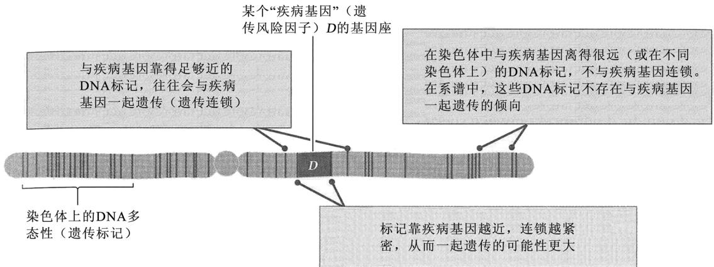  
图 2.26 疾病遗传风险因子基因定位相关概念。染色体中与遗传风险因子(D)靠近的多态性 DNA 标记(竖线所示)往往与该因子一起遗传。通过考察与风险因子连锁的已知 DNA 多态性在基因座中的位置，可确定风险因子在基因组中的位置。

如果说用遗传连锁来鉴定疾病基因似乎不是一种直截了当的方法，我们来看看别的思路。人类基因组包含大约 30 000 个基因。如果不存在遗传连锁，那么，为了找到一个疾病基因，我们可能不得不考察 30 000 种 DNA 多态性，每个基因一种。但人类基因组仅有 23 对染色体，并且由于遗传连锁的存在及遗传作图的威力，确定遗传风险因子所在的染色体及其大致位置，实际上只需要几百种 DNA 多态性。

## - DNA 标记的其他用途

DNA 多态性被广泛用于现代遗传学的各个方面, 因为它们为遗传作图及其他目的提供了大量唾手可得的遗传标记。以下是 DNA 多态性的一些其他用途。

个体识别。我们已经提到过，DNA 多态性可用作 DNA 分型 (DNA 指纹分析) 的一种手段，以识别特定人群中的不同个体。在其他生物中，DNA 分型用于确定濒危物种中的个体，以及鉴定群居动物中个体之间的遗传相关程度。例如，在野马中，由一匹公马掌管一群母马，但 DNA 分型显示，竟然只有不到 1/3 的幼驹是公马亲生的。

流行病学和食品安全科学。DNA 分型在追踪病毒性或细菌性流行病的传播，以及在鉴定被污染食物的污染源上，也有重要的应用。

人类种群历史。在人类学上，DNA 多态性可为重建人类种群的进化起源、全球扩张和多元化提供重要信息。

家养动植物的改良。动植物育种人员已经着手在谱系研究中将 DNA 多态性作为遗传标记，通过遗传作图，鉴定与有利性状相关的基因，以便将这些基因整合进目前使用的动植物品种中。

驯化史。动植物育种人员也通过研究遗传多样性来鉴定栽培作物和家畜的野生祖先，以及推测在驯化过程中令这些物种发生遗传改变的人工选择的具体办法。

DNA 多态性作为生态指针。DNA 多态性正在被研究是否能够作为遗传多样性的生物学指针，应用在处于化学、生物或物理压力之下的生物群落中的关键指标物种上。它们也被用来监测濒危及圈养物种的遗传多样性。

进化遗传学。在力图描述出现在全基因组范围内不同类型的遗传变异模式，推测维持遗传变异的进化机制，阐明种内遗传多样性转变成种间差异的过程等方面，都要对 DNA 多态性进行研究。

种群研究。种群生态学家利用 DNA 多态性来评估，在遗传构成、种群大小、繁育结构或生活史特点上不同的多种生物种群(原核生物、真核生物、细胞器)的遗传变异水平，他们还用物种亚群内的遗传多态性作为种群历史、迁移模式等的指针。

物种间的进化关系。物种间 DNA 序列的差异是分子系统发生学的基础，分子系统发生学通过分析序列来确定物种祖先的历史(系统发生)，追踪进化过程中形态的、行为的及其他类型适应的起源。

## 本章概要

\- DNA链是以磷酸二酯键连接起来的A、T、G、C脱氧核糖核苷酸的多聚物。

\- DNA 双链的两条链通过 A-T 和 G-C 碱基对之间的氢键，以及碱基对的碱基堆积结合在一起。

\- 每种限制性内切核酸酶都在特定碱基序列处切割双链 DNA，该序列的长度通常为 4 个或 6 个核苷酸。

\- 限制酶产生的 DNA 片段可被电泳分开，可分离、测序或以其他方式操作。

\- 核苷酸序列互补的、分离的 DNA 或 RNA 链，可自发结合到一起(杂交)，形成双链。

\- 只有通过向 $3'$ 端不断添加核苷酸，使生长链以 $5' \rightarrow 3'$ 方向延伸，DNA才能发生复制。

\- 聚合酶链式反应在连续的 DNA 复制循环中，利用短的寡聚核苷酸引物来选择性扩增 DNA 双链的特定区域。

\- DNA 中的遗传标记给基因组提供了大量易于获得的标记位点，可用来确定疾病基因在染色体上的位置，用于个人识别中的 DNA 分型、栽培作物和家畜的遗传改良，还有其他多种应用。

## 基础回顾

\- 在 DNA 的核苷酸中常见的是哪 4 种碱基？哪些碱基形成碱基对？

\- 在多聚核苷酸单链 $3^{\prime}$ 和 $5^{\prime}$ 最末端的化学基团是什么？

\- DNA 单链有极性是什么意思？双链分子中两条 DNA 链反向平行是什么意思？

\- 什么是限制酶？为什么它们在特定 DNA 片段的研究中很重要？大多数限制位点是回文序列，这样说是什么意思？

\- 描述如何进行 Southern 印迹，解释它是用来干什么的，探针的作用是什么？

\- 聚合酶链式反应是如何运作的？它是用来干什么的？事先必须了解靶序列的什么信息？寡核苷酸引物的作用是什么？

\- 什么是 DNA 标记？解释一下，在通过遗传作图鉴定疾病基因时，无害的 DNA 标记起什么辅助作用。

\- 给下列主要遗传学术语下定义，并各举一例：基因座、等位基因、基因型、杂合、纯合、表型。

## 解题指南

习题 1 从某种噬菌体分离得到一个线性双链 DNA，其两个 5' 端都用 ${}^{32}$ P 标记，然后用限制酶消化。用 Mlu I 产生 5kb、7kb 和 13kb 片段。该消化产物的 Southern 印迹显示，放射性标记在 5kb 和 7kb 条带上。Hind III 将相同分子切割成 3kb、7kb 和 15kb 片段，在此情况下 3kb 和 7kb 条带含 ${}^{32}$ P。同时以两种酶消化，产生 2kb、3kb、4kb、5kb 和 11kb 的片段。

(a) 画出该线性 DNA 的示意图，显示 Mlu I 和 Hind III 位点的相对位置，并以 kb 为单位表示位点之间的距离。

(b)用该噬菌体的其中一个基因制备一个 $^{32}$ P标记的探针，该探针可与Mlu I消化产物的5kb和13kb片段、Hind III消化产物的7kb和15kb片段杂交。指出该基因在限制图上的大致位置。

答案:

(a) 入手此题的最佳方法是单独建立 Mlu I 和 Hind III 位点的图谱。Mlu I 消化产物中的 13kb 片段未被标记，说明该片段在 DNA 分子中间。

因而，Mlu I 消化产物的限制图是：

## I

$$
\begin{array}{c c c c c} 5 & M & 1 3 & M & 7 \\ \hline \end{array}
$$

在 Hind III 消化产物中，15kb 片段未被标记，因此，该片段在中间。相对于 Mlu I 图谱，Hind III 消化产物的限制图有两种定向方式。

这是一种方式：

## II

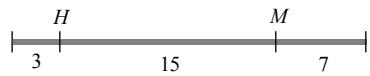

这是另一种方式:

## III

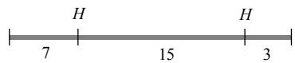

当我们将图谱Ⅰ和Ⅱ合并成图谱Ⅳ时，预测双重消化的片段为2kb、3kb、7kb和13kb，这一预测与观察结果不符。所以，图谱Ⅳ是错误的，故图谱Ⅱ是错误的。

IV

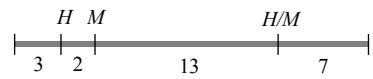

另一方面，合并图谱 I 和 III 所得结果如图谱 V 所示，该图谱可解释实验观察结果。

V

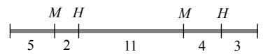

(b) 来自噬菌体基因的标记探针与 Mlu I 消化产物的 5kb 和 13kb 片段、Hind III 消化产物的 7kb 和 15kb 片段杂交。这些观察结果让我们得出这样的结论：在正确的限制图 V 中的 2kb 片段包含该基因的相应序列，且该基因的 5' 和 3' 端与 5kb 和 11kb 片段重叠。该基因在限制图中的大致位置如附图中的横条所示。

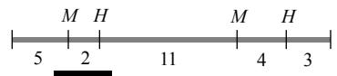

习题 2 某遗传学家拟用聚合酶链反应(PCR)扩增下面所示 DNA 序列的一部分, 所用寡核苷酸引物与标成粗体的区域杂交(这两个引物只是用作说明, 在实际应用中它们太短而不能使用)。指出应该使用的引物序列(包括极性), 并推导扩增出的 DNA 片段序列。

$$
\begin{array}{l} 5 ^ {\prime} \text {-GCGAAACGATCCTCATCCTGTCTCTTGATCAGAGCTTGATCCCCTG-3 ^ {\prime}} \\ 3 ^ {\prime} \text {-CGCTTTGCTAGGAGTAGGACAGAGAACTAGTCTCGAACTAGGGGAC-5 ^ {\prime}} \end{array}
$$

答案 引物应能与所选引物位点配对，且两条引物 3' 端的方向必须相对。因此，“正向”引物(以从左向右的方向延伸的引物)序列应为 5'-ACGAT-3'，而“反向”引物(以从右向左的方向延伸的引物)序列应为 3'-ACTAG-5'。因为书写核酸序列的习惯是将 5' 端放在左边，所以反向引物是 5'-GATCA-3'。

习题 3 M13 噬菌体的遗传物质是一条 6407 个核苷酸的单链 DNA 分子, 其完整序列可在 GenBank 之类可公开访问的数据库中查到。将 M13 DNA 导入细菌细胞后, 由细菌的酶合成一条互补 DNA, 产生噬菌体基因组的双链复制型。怎样才能确定, 在被感染细胞中复制型的两条链是否都被转录?

答案 为了确定是否两条 DNA 链都是合成 RNA 的模板，可以分离噬菌体 DNA 的复制型，将两条链分开，分别检测每条链能否与在 M13 感染的细胞中发现的 mRNA 杂交。另外(但确定性较差)，可以考察 GenBank 中 M13 的基因组序列，在两条 DNA 链上搜索可能编码蛋白质的阅读框。恰好只有一条 M13 链包含此类阅读框，因此，很可能只有一条 DNA 链被转录。

习题 4 一个 6200bp 的质粒包含某个病毒基因至少 3 个完整的拷贝，病毒基因以串联形式排列。用限制酶 Hind III 切割该质粒，产生 900bp、1300bp 和 4000bp 的片段。该基因的串联拷贝仅包含于其中一个 Hind III 片段中，该基因编码一种 405 个氨基酸的蛋白质，哪一个 Hind III 片段有可能包含该基因的这些拷贝？

答案 编码 405 个氨基酸的蛋白质至少需要 1215bp。因此，该基因的 3 个串联拷贝要 3645bp，4 个拷贝要 4860bp。最小的 Hind III 片段不够长，甚至还包含不了一个基因拷贝；1300bp 的片段能够包含一个拷贝，但不能

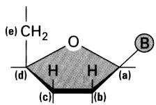

包含两个或两个以上的拷贝；只有最大的片段可能包含该基因的 3 个拷贝，但它也不可能包含 3 个以上的拷贝。

## 分析与应用

3'羟基?

2.1 单个多聚核苷酸分子的 3' 和 5' 端是什么化学基团？

2.2 在左侧所示的脱氧核苷中，哪一个碳原子携带磷酸基？哪一个碳原子携带

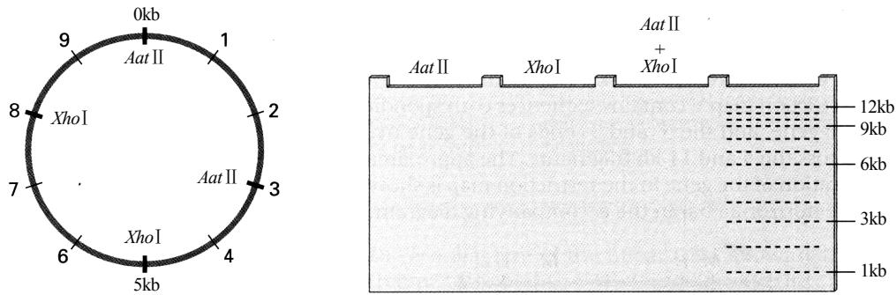

2.3 许多限制酶产生具有“黏端”的限制性片段。这是什么意思？

2.4 下面的序列哪些是回文序列，哪些不是？解释你的答案。

(a) $5'$ -CCGG- $3'$

(b) $5'$ -TTTT- $3'$

(c) 5'-GCTAGC-3'

(d) 5'-CCGCTC-3'

(e) 5'-AAGGTT-3'

2.5 下列为一组回文限制位点，但每个只给出了一半序列，将 N 置换掉，以完成每个限制位点的序列。

(a) 5' -AGNN-3'

(b) 5'-ATGNNN-3'

(c) 5' -ATTNNN-3'

(d) 5'-NNNAGC-3'

2.6 撇开核苷酸序列之间的差异来说，下列限制酶产生的限制性片段的末端有何差异？（向下的箭头代表每条链上的切割位点）

(a) Sca I (5'-AGT ↓ ACT-3')

(b) Nhe I (5'-G ↓ CTAG-3')

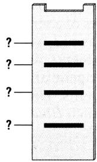

(c) Cfo I (5' -GCG ↓ C-3')

2.7 某溶液含大小为 4kb、8kb、10kb 和 13kb 的双链 DNA 片段，在电泳凝胶上进行分离。在所附凝胶示意图中，将片段大小与正确的条带搭配。

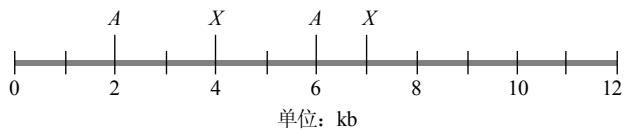

2.8 此处所示的线性 DNA 片段上有 Aat II (A) 和 Xho I (X) 的切割位点。在所附电泳凝胶示意图中，标出用以下方式消化后可找到条带的位置：

(a) 只用 Aat II 消化

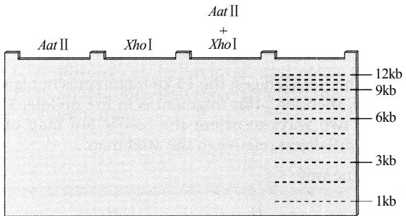

(b) 只用 Xho I 消化

(c) Aat II 和 Xho I 一起消化

右边的虚线指示 1～12kb 的条带会迁移到的位置。

2.9 此处所示的环状 DNA 分子有 Aat II 和 Xho I 的切割位点。在所附电泳凝胶示意图中，标出用以下方式消化后可找到条带的位置：

(a) 只用 Aat II 消化

(b) 只用 Xho I 消化

虚线指示 1～12kb 的条带会迁移到的位置。

(c) Aat II 和 Xho I 一起消化

2.10 考察所附一段双链 DNA 的示意图，其中， $B_{s}$ 代表沃森-克里克对中的碱基。尽可能准确地指出下列符号代表什么碱基：

(a) $B_{5}$ ，假定 $B_{1}=A$ 。

(b) $B_{6}$ ，假定 $B_{2}=C$ 。

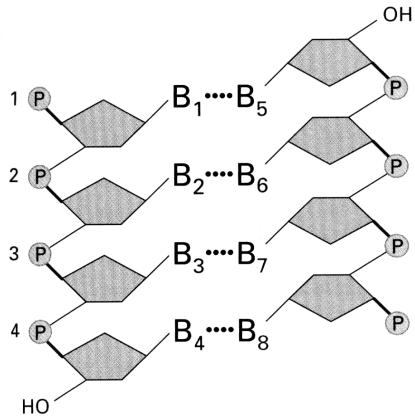  
(b) 具有 6 碱基切割位点的限制酶

(c) $B_{7}$ ，假定 $B_{3}=$ 任意嘌呤。

(d) $B_{8}$ ，假定 $B_{4}=A$ 或T。

2.11 在 2.10 题所示的 DNA 双链中，在核苷酸前体结合进多聚核苷酸链之前，磷酸基 1～4 分别与哪一个碱基相连？

2.12 在 4 种核苷酸等比例构成的随机序列中，某一特定的核苷酸短序列与下列限制酶的限制位点相同的概率是多少？

(a) 具有 4 碱基切割位点的限制酶

(b) 具有 6 碱基切割位点的限制酶

(c) 具有 8 碱基切割位点的限制酶

2.13 在 4 种核苷酸等比例构成的随机序列中，下列限制酶的限制位点之间的平均距离是多少？

(a) 具有 4 碱基切割位点的限制酶

(c) 具有 8 碱基切割位点的限制酶

2.14 假设大肠杆菌 DNA 是由 4 种核苷酸等比例构成的 $4.6 \times 10^{6} bp$ 的随机序列(这是一种超级简化)，以下列限制酶来切割，预计会产生多少个限制性片段？

(a) “4-切割” 限制酶

(b) “6-切割” 限制酶

(c) “8-切割” 限制酶

2.15 考察限制酶 AsiS I（切割位点为 5'-GCGAT↓CGC-3'）和限制酶 BsiE I（切割位点为 5'-CGAT↓CG-3'），向下的箭头表示每条链中的切割点。每个 AsiS I 位点都是 BsiE I 位点吗？每个 BsiE I 位点都是 AsiS I 位点吗？对你的答案进行解释。

2.16 以 Kas I (切割位点为 $5^{\prime}-G \downarrow GCGCC-3^{\prime}$ ) 切割具有如下所示序列的 DNA 双链，向下的箭头表示每条链中的切割点。如果把所得片段按原来双链中相同的顺序放在一起，并封闭主链上的缺口，预计会得到什么样的 DNA 双链？

$$
5 ^ {\prime} \text {-CTGGGGCGCCCTCGTCAGCGAGGGGGCGCCGAT-3^ {\prime}}
$$

$$
3 ^ {\prime} - \text { G   A   C   C   C   C   G   C   G   G   G   A   G   C   A   G   T   C   G   C   T   C   C   C   C   G   C   G   G   G   C   T   A } - 5 ^ {\prime}
$$

2.17 限制酶 Pst I、Pvu II 和 Mlu I 具有如下限制位点，箭头表示每条链中的切割点：

$$
P s t \mathrm{I} 5 ^ {\prime} \text {-CTGCA} \downarrow \mathrm{G-3} ^ {\prime}
$$

$$
P v u \text {   II   } 5 ^ {\prime} \text {-CAG } \downarrow \text {   CTG-3'   }
$$

$$
M l u \mathrm{I} 5 ^ {\prime} - \mathrm{A} \downarrow \text { CGCGT-3 } ^ {\prime}
$$

具有如下序列的 DNA 双链被消化

$$
5 ^ {\prime} \text {-ATGCCCTGCAGTACCATGACGCGTTACGCAGCTGATCGAAACGCGTATATATGCC-3^ {\prime}}
$$

$$
5 ^ {\prime} - \text { T   A   C   G   G   G   A   C   G   T   C   A   T   G   G   T   A   C   T   G   C   G   C   A   A   T   G   C   G   T   C   G   A   C   T   A   G   C   T   T   T   G   C   G   C   A   T   A   T   A   T   A   C   G   G } - 3 ^ {\prime}
$$

以下列酶切割会得到什么片段？

(a) Pst I

(b) Pvu II

(c) Mlu I

2.18 考察这一序列

$$
5 ^ {\prime} - \text { C   T   G   C   A   G   G   T   G } - 3 ^ {\prime}
$$

$$
5 ^ {\prime} \text {-GACGTCCAC-3^ {\prime}}
$$

如果该序列被 Pst I (5'-CTGCAG-3') 切割后，它还能被 Pvu II (5'-CAGCTG-3') 切割吗？如果该序列被 Pvu II 切割后，它还能被 Pst I 切割吗？对你的答案进行解释。

2.19 用 Afe I、Nhe I 或两种限制酶一起切割某一个环状 DNA 分子。附图示所得电泳凝胶，条带的大小已标出。绘制该环状 DNA 的示意图，显示 Afe I 和 Nhe I 位点的相对位置。

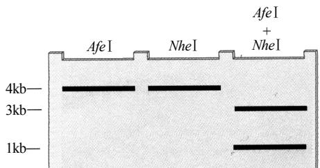

2.20 在此处所示的 DNA 片段示意图中，刻度线示某种限制酶的限制位点的位置。两种分子的混合物被消化后，用探针 A 或探针 B 进行 Southern 印迹分析，探针与方框所示之处的片段杂交。在所附凝胶示意图中，标出这种探针各自可能产生的条带(右侧的标尺示 1～12kb 片段的预期位置)。

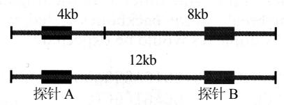

2.21 在所附示意图中，刻度线示两个片段中限制位点的位置，这是在某条人类染色体的某个基因座上可出现的两种不同的DNA片段。用与方框所示之处的片段杂交的探针DNA进行RFLP分析。就该RFLP而言，可能有多少种基因型(用符号 $A_{1}$ 代表产生上面那个DNA片段的等位基因，用 $A_{2}$ 代表产生下面那个DNA片段的等位基因)?在所附凝胶示意图中，

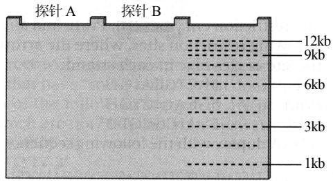

在顶上标出基因型，并标出每种基因型的预期表型(条带位置)。(右侧标尺示1～12kb片段的预期位置)

2.22 附图示人类基因组中与某一 RFLP 相关的两个 DNA 片段，该 RFLP 是用与方框所示位置杂交的一个探针揭示的。刻度线是在 RFLP 分析中所用限制酶的切割位点。该限制酶和该探针能够检测到多少个等位基因？可能有多少种基因型？在所附凝胶示意图中，标出每种基因型的期望表型(以条带方式)。(右侧标尺示 1～12kb 片段的预期位置)

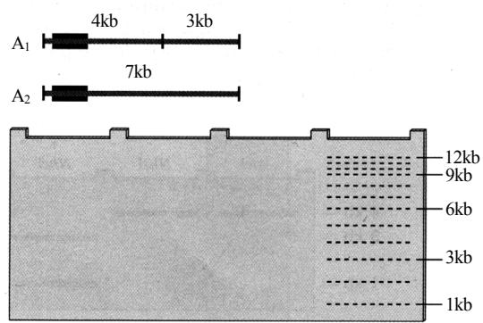

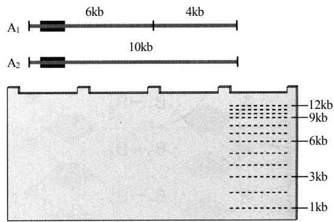

2.23 此处所示的水平粗线代表某条人类染色体中某个特定基因座上可能出现的不同 DNA 分子。刻度线标示某种限制酶的限制位点的位置。一组人类样本的基因组 DNA 被消化，并以 Southern 印迹分析，所用 DNA 探针与方框所示位置杂交。在该样本中可观察到多少种可能的 RFLP 等位基因？有多少种基因型？

2.24 用相同的限制酶、不同的探针分析 2.23 题中描述的 RFLP，探针与此处用方框显示的位点杂交。在此情况下，能发现多少种 RFLP 等位基因？有多少种基因型(用 $A_{1}$ 、 $A_{2}$ 等符号表示等位基因)？在所附凝胶示意图中，在顶上标出基因型，并标出每种基因型的预期表型(条带位置)。(右侧标尺示 1～12kb 片段的预期位置)

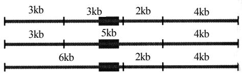

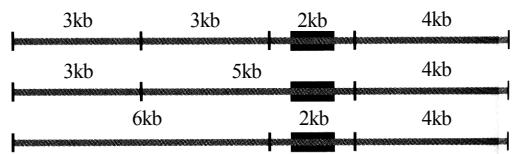

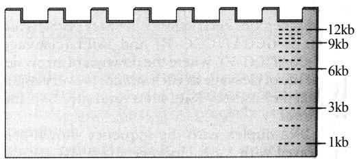

2.25 如果五聚体长到足够作为 PCR 的特异性寡核苷酸引物(实际上它们太短)，使用 “正向” 引物 5'-AATGC-3' 和 “反向” 引物 3'-GCATG-5' 作用于此处所示的双链 DNA 分子，可扩增出什么 DNA 片段？

# 5'-GATTACCGGTAAATGCCGGATTAACCCGGGTTATCAGGCCACGTACAACTGGAGTCC-3' 3'-CTAATGGCCATTTACGGCCTAATTGGGCCCAATAGTCCGGTGCATGTTGACCTCAGG-5'

2.26 引物对 3'-AATGC-5' 和 5'-GCATG-3' 能够扩增 2.25 题中描述的相同片段吗？解释你的答案。

2.27 假设用 PCR 扩增一个长 3kb 的人类 DNA 片段，总的基因组大小是 $3 \times 10^{6}$ kb，这等于 $3 \times 10^{9}$ 个碱基对。

(a)在扩增之前，靶序列在总DNA中所占的比例是多少？

(b) 在 10 个 PCR 循环之后，靶序列所占的比例是多少？

(c) 20 个 PCR 循环之后呢?

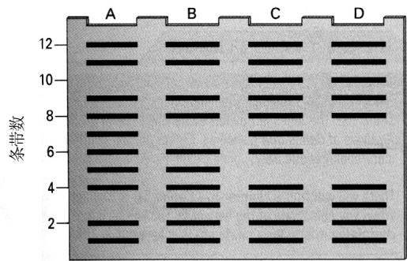

2.29 在某个抢劫案现场找到一个烟蒂，发现在烟纸上粘有足够数量的上皮细胞，可以提取 DNA，并用 DNA 分型进行分析。此处显示用 3 个探针 (基因座 1～基因座 3) 对上述物证及 7 位犯罪嫌疑人的细胞 (A～G) 进行分型的结果。哪些犯罪嫌疑人可以被排除？哪些不能被排除？能确认作案者吗？解释推理过程。

2.30 一位妇女不能确定两个男人哪一个是她孩子的生父。用两条不同染色体上的两个高度多态性 DNA 标记（“基因座 1”和“基因座 2”）的探针，对孩子(C)、母亲(M)和两个男人(A 和 B)的血液进行 DNA 分型，结果如附图所示。单独某个基因座或两个基因座一起可排除某个男人是孩子生父的可能性吗？解释推理过程。

## (d) 30 个 PCR 循环之后呢?

2.28 用随机选择序列的寡核苷酸作引物，可鉴定出某些多态性，这些多态性称为 RAPD 多态性，RAPD 是随机扩增多态 DNA (randomly amplified polymorphic DNA) 之意。引物寡核苷酸通常很短，会与基因组中的多个位点杂交，因此能够扩增出多个片段。如果在一些个体中可扩增出某一扩增片段，但在其他个体中不能扩增，就认为该片段是多态性片段。所附凝胶示意图示在 4 个个体的随机扩增 DNA 中观察到的典型带型。在此例中，哪些条带属于 RAPD 多态性？

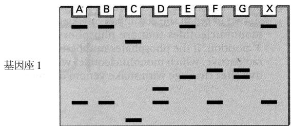

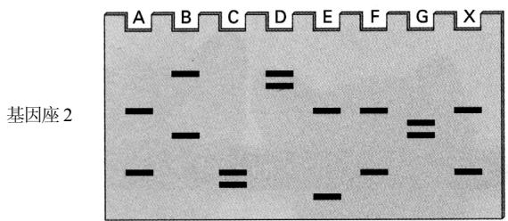

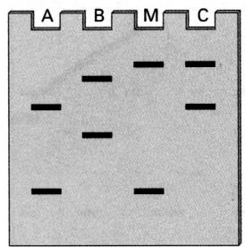  
基因座1

基因座2  
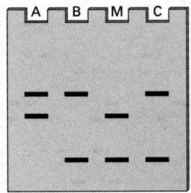

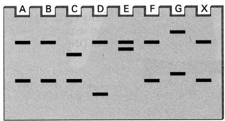

2.31 蛇毒二酯酶切割附图中以粗线显示的化学键，产生 $3'$ 位磷酸化的单核苷酸。如果 2、4 号磷酸具有放射活性，在用蛇毒二酯酶切割之后，哪些单核苷酸会具有放射活性？

## 挑战题

挑战题1 黑腹果蝇(Drosophila melanogaster)的基因组为 $180 \times 10^{6} \mathrm{bp}$ ，其中一个 $1.8 \mathrm{kb}$ 的片段被PCR扩增。要让扩增出的靶序列至少占总DNA的 $99\%$ ，需要多少个PCR循环？

挑战题 2 发现一位被谋杀的年轻受害人，已高度腐烂，不能够辨别身份。警方怀疑受害人是父母报失踪的 5 个人中的一个。用两条不同染色体上的两个高度多态性 DNA 标记（“基因座 1”和“基因座 2”）的探针，对受害人(X)和5对父母(A-E)的组织进行DNA分型，结果如附图所示。如何解释每个人的基因组DNA都产生两个条带？能够识别出受害人的父母吗？解释推理过程。

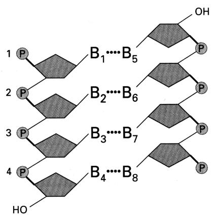

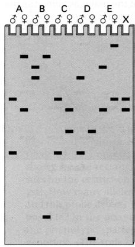  
基因座1

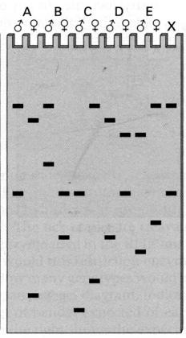  
基因座2

挑战题3 在2.31题中描述的蛇毒二酯酶，最初曾用在一种称为“最近邻”分析的方法中。在该方法中，在存在所有4种核苷三磷酸的情况下合成一条DNA链，其中一种核苷酸在最里边的位置上为放射性磷酸。然后，用蛇毒二酯酶对DNA进行完全消化，分离所得单核苷酸并测定放射性。考察2.31题中的示意图并解释：

(a)该方法如何揭示放射性标记核苷酸的“最近邻”核苷酸是什么？

(b) “最近邻”核苷酸是在放射性标记核苷酸的 $5'$ 一侧还是 $3'$ 一侧？

## 网上遗传学

“网上遗传学”(GeNETics)会为你介绍在互联网上寻找遗传学信息的某些最重要的站点。要浏览这些站点，请访问为《遗传学：基因和基因组分析》(第八版)配备的 Jones and Bartlett 公司配套站点http://biology.jbpub.com/book/genetics/8e/。

在该站点中，你会找到一个按章开列的重点关键词列表。选择某个关键词后，可链接到某个网站，其中包含与此关键词相关的信息。
