# 第3章 传递遗传学：分离的原理

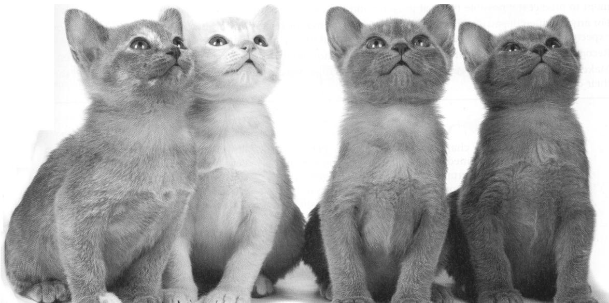

可爱的小猫，毛色呈3：1的比例。[Iv Mirin/Shutterstock, Inc.]

## 本章提纲

3.1 形态表型和分子表型

3.2 单个基因的分离

3.3 两个或两个以上基因的分离

3.4 遗传分析中的概率

3.5 人类系谱分析

3.6 不完全显性和上位性

联系：孟德尔认为他发现了什么？

格雷戈尔·孟德尔，1866

植物杂交实验

联系：这片土地是你的国

亨廷顿病合作研究组，1993

在亨廷顿病染色体上的一个含有扩增且不稳定的三核苷酸重复序列的新奇基因

## 学习目标与科学能力

当你学会分离和自由组合等传递遗传学的基础知识,并能将其与基本的概率原理结合时,你会具有若干重要的科学能力,让你能够解答如下问题。

\- 对于一个基因，已知双亲的基因型或表型，运用分离律来预测后代可能出现的类型及其期望比例。

\- 对于两个或两个以上的基因，已知双亲的基因型或表型，运用自由组合律来预测后代可能出现的类型及其期望比例。

\- 任意指定与显性或上位性有关的、与孟德尔假设不符的偏离，预测在任何特定杂交中后代类型的期望比例会如何改变。

■ 识别人类系谱中简单孟德尔显性或隐性性状的遗传方式。

\- 根据系谱中个体及其近亲的表型，推导个体的基因型。

单因子杂种杂交后代的表型

亲本品系1：显性

在本章中，我们考察基因怎样从亲代传递到子代，及其如何决定基因型和表型在有亲缘关系的个体中的分布。研究性状遗传方式的学科称为传递遗传学(transmission genetics)。这一学科也被称为孟德尔遗传学(Mendelian genetics)，因其基本原理是孟德尔在1856～1863年开展的豌豆(Pisum sativum)实验中首先推导来的。孟德尔是捷克共和国布尔诺(时为布隆)圣托马斯修道院的僧侣。1866年，他在当地的自然史学会报告了他的实验，在该学会的科学杂志上发表了实验结果和他的诠释，并开始与当时最重要的一位植物学家书信往来。他的实验周密、记录特别精确，他的论文首次清晰地阐述了控制基因一代代传递的统计学规律。尽管如此，在被忽略34年后，人们才最终认识到孟德尔论文的重要性。

## 3.1 形态表型和分子表型

在分子遗传学出现之前，遗传学家主要和形态性状打交道。生物体之间在形态性状上的差异，可用颜色、形状或大小来表示。孟德尔研究了在种子形状、种子颜色、花的颜色和豆荚形状等方面差异明显的7个形态性状(图3.1)。最广为人知的孟德尔相对性状的例子，也许是圆滑对皱缩。

亲本品系2：隐性

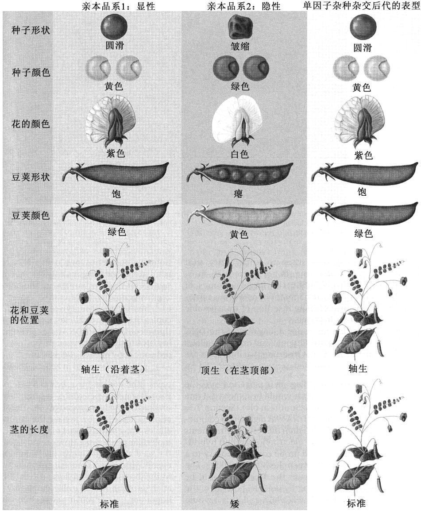  
图 3.1 孟德尔研究的 7 种不同的豌豆性状。最右边所示的表型为显性性状，出现在杂交产生的杂种中。

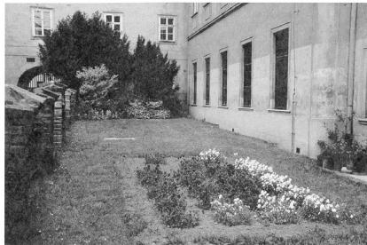

在与圣托马斯修道院相邻的这块小园子里，格雷戈尔·孟德尔在8年间种了33 500多株豌豆，其中有一年就种了6400多株。两名与他同一修道院的僧侣帮他做过一些实验。

豌豆种子变干时，会丢失水分并收缩，圆滑种子之所以圆滑，是因为它们均匀地收缩；皱缩种子之所以皱缩，是因为它们不规则地收缩。皱缩表型是因为缺乏一种称作amylopectin(支链淀粉)的分支链状型淀粉。在皱缩种子中，因为淀粉分支酶I(SBE I)的缺陷，没有支链淀粉合成。

用 W 表示 SBE I 基因的非突变型即野生型 (wildtype) 等位基因，用 w 表示突变型等位基因。杂合 Ww 种子只有野生型纯合 WW 种子一半的 SBE I，但这正常数量一半的酶，就可产生足够的支链淀粉，以使杂合 Ww 种子能够均匀收缩，从而使表型保持圆滑。因此，就种子形态而言，WW 和 Ww 具有相同的表型 (圆滑)。等位基因 W 称为显性等位基因 (dominant allele)，w 称为隐性等位基因 (recessive allele)。

皱缩突变的分子基础是，SBE I 基因因为插入一段称为转座因子(transposable element)的 DNA 序列而被打断。这类 DNA 序列能够在染色体内或染色体之间从一处移动(转座)到另一处。转座的分子机制将在第 14 章讨论，现在只要知道转座因子存在于大多数基因组中，尤其是真核生物巨大的基因组中，且许多自发突变(spontaneous mutation)是转座因子插入基因中所致。

图3.2包括野生型 $W$ 和突变型 $w$ 等位基因的DNA结构示意图，并示打断 $w$ 等位基因的DNA插入。高亮显示的部分是两个等位基因中都有的两个限制位点，位于插入位点两侧。C部分的示意图示Southern印迹(2.3节)的带型：如果做一个Southern印迹实验，用EcoRI完全消化基因组DNA，然后电泳分离所得片段，并与标记探针杂交——探针与 $W$ 和 $w$ 等位基因都有的一个区域互补，预计会产生这样的带型。因为在 $w$ 等位基因中存在插入的DNA， $W$ 等位基因的EcoRI片段会比 $w$ 等位基因的小，因此会比 $w$ 等位基因的相应片段迁移得快，从而泳动到更接近凝胶底部的位置。来自纯合WW的基图 3.2 (A) W(圆滑)为编码淀粉分支酶(SBE I)氨基酸序列的基因的一个等位基因。(B) w(皱缩)是编码该酶的无活性形式的等位基因，因其 DNA 序列被一个转座因子插入而打断。(C)在形态表型水平，W 对 w 为显性：基因型 WW 和 Ww 具有圆滑种子；而基因型 ww 具有皱缩种子。用 EcoR I 及与所示位点杂交的探针，可以限制性片段长度多态性(RFLP)形式检测这两个等位基因之间的分子差异。在分子水平上，这两个等位基因是共显性的：每种基因型的 DNA 产生不同的分子表型——纯合的 WW 和 ww 产生大小不同的单一条带，杂合的 Ww 两条带都有。

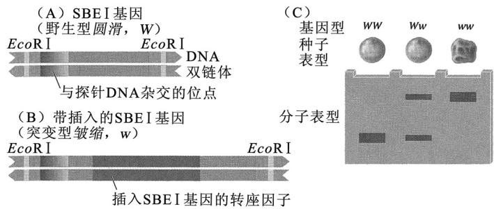

因组 DNA，会产生迁移较快的单个条带；来自纯合 ww 的基因组 DNA，产生迁移较慢的单个条带；而来自杂合 Ww 的基因组 DNA 会产生两个条带，其电泳迁移率分别与两种纯合基因型中观察到的条带相同。在图 3.2C 中，纯合基因型的条带，比杂合基因型的条带显得略粗。因为每种纯合基因型的单个条带，都是来自两个拷贝的纯合——无论是哪种纯合——等位基因，因此它含的 DNA 比杂合基因型相应的 DNA 要多，在杂合基因型中，每个等位基因只有一个拷贝。

因此，如图 3.2C 所示，RFLP 分析可清楚地区分 WW、Ww 和 ww，因为杂合 Ww 基因型显示出在两种纯合基因型中观察到的条带。这种情况被说成：就分子表型而言，W 和 w 等位基因是共显性的 (codominant)。然而，如图 3.2C 中种子形态所示的那样，就形态表型而言，W 对 w 是显性。在下面的讨论中，用 W 和 w 等位基因的 RFLP 分析来强调分子表型在现代遗传学中的重要性，并以实验证明遗传传递的原理。

## 3.2 单个基因的分离

孟德尔选择豌豆来做实验的原因主要有两个：第一，他有条件获得具有不同相对性状的变种，如圆滑种子对皱缩种子、黄色种子对绿色种子；第二，他早期的研究表明，豌豆一般通过自花授粉来繁殖，在自花授粉中，一朵花产生的花粉，给同一朵花中的卵受精。通过异花授粉(异型杂交，outcrossing)产生杂种，要在未成熟的花上极其细心地进行手术，露出可受精的雌性结构，切除尚未发育成熟的雄性花粉生产结构，然后让雌性结构与来自另一植株的成熟花粉接触。异花授粉后，每朵切开的花都要用细网眼袋包住，以防飘来的花粉与雌性结构接触。就如同他在论文中说的那样，每棵植株所需的生长空间较小，而可以获得的后代数量相当大，这给了他“查明杂种后代表现出来的不同类型的数量”及“弄清它们在数量上的相互关系”的机会。

豌豆通常为自花授粉，这意味着，如果不有意地进行异花授粉，具有相对性状的植株，对于作用于该性状的基因的不同的等位基因一般是纯合的。例如，种子圆滑的植株具有 $WW$ 的基因型，而种子皱缩的植株具有 $ww$ 的基因型。纯合基因型是通过实验指出的——通过观察发现，每个变种的遗传性状都是纯种 (true-breeding)。纯种的意思是，如果让植株正常自花授粉，它们只产生和它们一样的后代。在一个或多个性状有差异的植株之间进行异花授粉，产生杂种 (hybrid)。如果亲本在一个、两个或三个性状上有差异，杂种就是单杂种 (monohybrid)、双因子杂种 (dihybrid) 或三因子杂种 (trihybrid)。为了跟踪亲本及其杂种后代，将亲本称为 $\mathbf{P}_1$ 代 ( $\mathbf{P}_1$ generation)，而将它们的杂种后代称为 $\mathbf{F}_1$ 代 ( $\mathbf{F}_1$ generation)。

因为豌豆是有性生物，所以每种杂交都可以两种方式进行，取决于雌性亲本中存在的是哪种表型、雄性亲本中存在的是哪种表型。以圆滑对皱缩为例，可以是雌性亲本圆滑而雄性亲本皱缩，或者相反。这两种杂交方式统称正反交(reciprocal crosses)。孟德尔是证明下述重要原理的第一人：

遗传杂交的结果，不依赖于在雄性中是哪种性状、在雌性中是哪种性状，正反交产生相同的结果。

在图 3.3 中，以圆滑和皱缩种子为例对该原理加以说明。凝胶图显示，在这些杂交中，每种种子的基因组 DNA 会产生的 RFLP 条带。杂交双方及其后代的基因型如下。

杂交A:

$WW♀ \times ww♂ \rightarrow Ww$

杂交 B:

$$
w w \text { ♀ } \times W W _ {\bigcirc} ^ {\nearrow} \rightarrow W w
$$

在正反交中，后代都具有圆滑种子的形态表型。但如右边的 RFLP 示意图所示，实际上所有后代的基因型都是杂合的 $Ww$ ，因而与每个亲本都不同。图 3.3 中说明的正反交的遗传等效

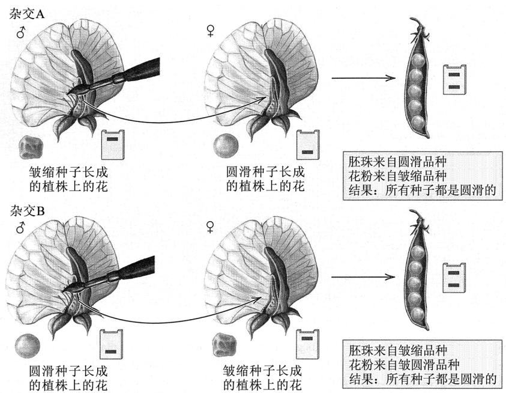  
图 3.3 形态表型和分子表型显示正反交的等效性。在此例中，无论杂交方向如何，杂种种子都为圆滑种子且都产生具有两个条带的 RFLP 图。

性，是一个适用性相当广泛的原理，但有一个非常重要的例外——在涉及性染色体的时候——这将在第4章中讨论。

下一节以 RFLP 分析为背景，来介绍当初孟德尔的几个实验，以便将形态表型及其比值，与预期的分子表型联系起来。

## - $\mathbf{F}_2$ 代的表型比值

在图 3.3 中，尽管杂交后代具有圆滑种子的显性表型，但 RFLP 分析显示，它们实际上是杂合的。就形态表型而言，w 等位基因被隐藏，因为 w 对 W 是隐性的。不过，如果让杂种后代进行自花授粉，在下一代中就会重新出现皱缩表型。例如，图 3.3 中杂交 A 圆滑的 $F_{1}$ 代种子，如果让其长成性成熟的植株并自花授粉，所得种子中，一些会是圆滑的，而余下的为皱缩的。 $F_{1}$ 代自花授粉产生的后代种

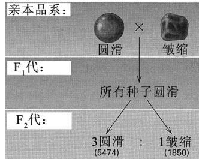

构成 $\mathbf{F}_2$ 代 $(\mathbf{F}_2$ generation)。孟德尔做这个实验的时候，在 $\mathrm{F}_2$ 代中观察到的结果如右图所示。注意，5474：1850的比值约为3：1。

在 $F_{2}$ 代中，显性：隐性类型的 3:1 比值，是简单孟德尔遗传的特征。表 3.1 为证明这一点的孟德尔的数据。注意，表中的头两个性状（圆滑种子对皱缩种子，黄色种子对绿色种子），观察结果比其他的性状多得多。原因是，这两个性状可直接在种子中进行区分，而其他的性状只能在成熟植株中进行区分，因而孟德尔分析的种子比成熟植株更多。从表 3.1 的数据中得到的主要观察结果是：

\- $\mathrm{F}_{1}$ 代杂种仅表现显性性状(因为 $\mathrm{F}_{1}$ 代是杂合的——如 $Ww$ )

\- 在 $\mathrm{F}_2$ 代中, 具有显性性状或隐性性状的植株都存在 (这意味着有些 $\mathrm{F}_2$ 代是纯合的——如 $ww$ )

\- 在 $\mathrm{F}_2$ 代中，具有显性性状的植株大约是具有隐性性状植株的3倍。

在 $F_{2}$ 代中观察到的 3:1 比值，是理解遗传传递机制的关键。下一节用 W 和 w 等位基因的 RFLP 分析，来解释为什么会产生这一比值。

表 3.1 孟德尔单杂种实验结果

<table><tr><td>亲本性状</td><td> $F_1$ 代性状</td><td> $F_2$ 代的数目</td><td> $F_2$ 代的比值</td></tr><tr><td>圆滑×皱缩(种子)</td><td>圆滑</td><td>5474 圆滑,1850 皱缩</td><td>2.96:1</td></tr><tr><td>黄色×绿色(种子)</td><td>黄色</td><td>6022 黄色,2001 绿色</td><td>3.01:1</td></tr><tr><td>紫色×白色(花)</td><td>紫色</td><td>705 紫色,224 白色</td><td>3.15:1</td></tr><tr><td>饱×瘪(豆荚)</td><td>饱</td><td>882 饱,299 瘦</td><td>2.95:1</td></tr><tr><td>绿色×黄色(未成熟豆荚)</td><td>绿色</td><td>428 绿色,152 黄色</td><td>2.82:1</td></tr><tr><td>轴生×顶生(花的位置)</td><td>轴生</td><td>651 轴生,207 顶生</td><td>3.14:1</td></tr><tr><td>长×短(茎)</td><td>长</td><td>787 长,277 短</td><td>2.84:1</td></tr></table>

## - 分离律

参考图 3.4 能够解释 3:1 的比值，这是孟德尔遗传学的核心，需要掌握，并能用它推导杂交产生的后代类型。该图说明了单基因遗传的以下主要特点。

1. 基因成对出现，意思是一个细胞或个体，每个基因有两个拷贝(等位基因)。

2. 对于每个基因，两个等位基因可以相同(纯合 WW 或纯合 ww)或不同(杂合 Ww)。

3. 个体产生的每个生殖细胞(配子，gamete)，只含有每个基因的一个等位基因(要么是 W，要么是 w)。

4. 在配子形成过程中，任何一个特定的配子包含两个等位基因中任一个的可能性相同(因此，杂合 $Ww$ 基因型的配子，一半含 $W$ ，另一半含 $w$ )。

5. 雌、雄生殖细胞的结合是个随机过程，在此过程中，等位基因重新结合成对。

传递遗传学的本质特点是，个体在形成生殖细胞的过程中，两个等位基因要分开，用术语称为分离(segregation)。分离与上面所列的第3和第4点对应。分离律有时称为孟德尔第一定律(Mendel's first law)。亲本：

分离律 (The Principle of Segregation): 在配子形成过程中，成对的遗传决定因子分开(分离)，其方式是，每个配子包含两个决定因子中任一个的可能性相同。

传递遗传学的另一个主要特点是，亲本及子代个体的遗传决定因子都是成对存在的，但在生殖细胞中为单拷贝。这一特点对应于上面所列的第1和第5点。

图 3.4 阐明了 $F_{2}$ 代中表型 3:1 和基因型 1:2:1 这些重要的孟德尔比值产生的生物学机制。要理解这些比例，先要想到亲代中原来的杂交是 $WW \times ww$ 。因为正反交产生一样的结果，所以没说亲本的性别(不过，在遗传学中，除非另有特别说明，惯例

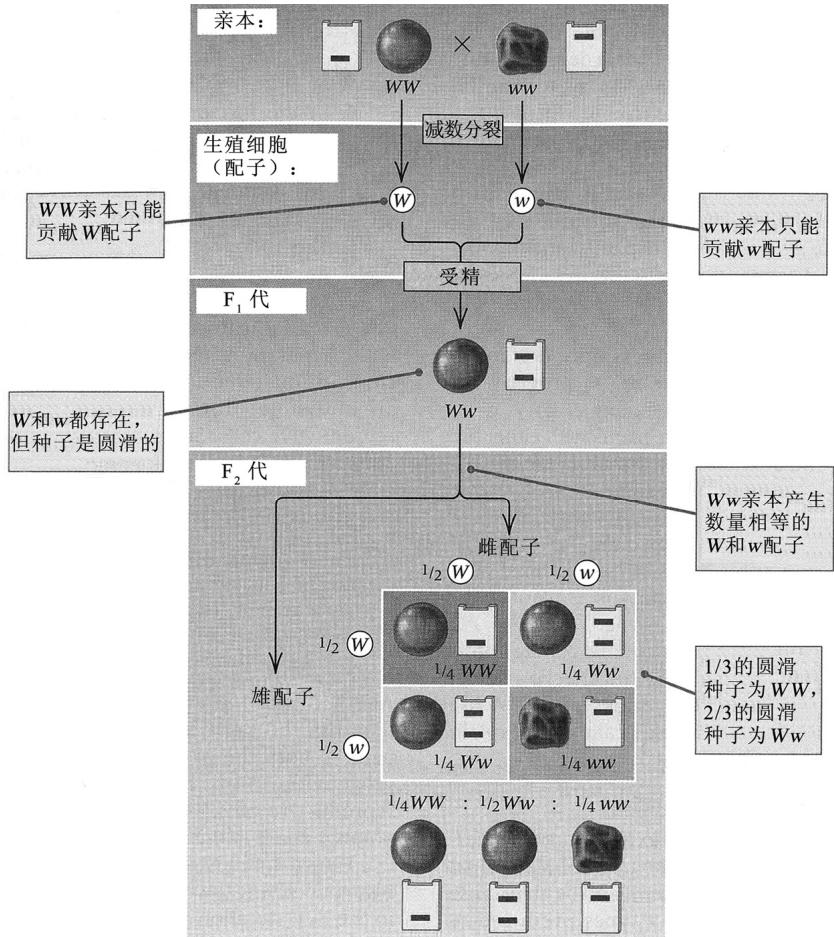  
图 3.4 图解单杂种杂交 $F_{2}$ 代中观察到的显性：隐性形态表型的 3:1 比值。由于存在显性而观察到 3:1 的比值。注意， $F_{2}$ 代中基因型 WW:Ww:ww 的比值是 1:2:1，这与从限制性片段表型中看到的一样。

是将雌性亲本列在杂交双方的第一位)。在原来的杂交中， $WW$ 亲本只产生含 $W$ 的配子，而 $ww$ 亲本只产生含 $w$ 的配子。在纯合基因型中，尽管所有的配子都携带同一种等位基因(来自纯合 $WW$ 的 $W$ 和来自纯合 $ww$ 的 $w$ )，分离仍然像在杂合基因型中一样进行。当带 $W$ 的配子和带 $w$ 的配子在授粉中相遇时，杂种基因型是杂合的 $Ww$ ，如紧挨着 $\mathrm{F}_1$ 代的凝胶图条带所示。就种子的形状而言，杂种 $Ww$ 种子是圆滑的，因为 $W$ 对 $w$ 是显性的。

当杂合的 $F_{1}$ 代形成配子时，分离意味着一半的配子将含有 W 等位基因，而另外一半的配子将含有 w 等位基因。当 $F_{1}$ 代个体自花授粉，或两个 $F_{1}$ 代个体杂交时，这些配子随机地结合到一起。随机受精的结果，可以从图 3.4 底部所示的那种杂交乘方 (cross-multiplication square) 推导而得，在杂交乘方中，雌配子及其频率排列于顶边，雄配子及其频率排列于左手边。这种计算方法广泛应用于遗传学中，以其发明者雷金纳德·庞尼特 (Reginald C. Punnett, 1875～1967) 的名字命名，称为庞尼特方 (Punnett square)。图 3.4 中的庞尼特方显示， $F_{1}$ 代配子随机组合的结果是， $F_{2}$ 代的基因型构成为：1/4WW、1/2Ww 和 1/4ww。这可通过凝胶图中的 RFLP 带型予以确认，因为就分子表型而言，W 和 w 是共显性。但就形态表型而言，W 对 w 是显性，所以 WW 和 Ww 基因型具有圆滑种子，而 ww 基因型具有皱缩种子，从而产生种子圆滑：皱缩的 3:1 表型比值。所以，分离、配子的随机结合及显性，联合导致了 3:1 的比值。

$F_{2}$ 代基因型比值与 $F_{2}$ 代表型比值一样重要。图 3.4 中的庞尼特方也显示了 WW:Ww:ww

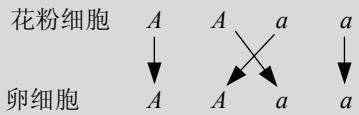

基因型比值是 1:2:1，这可以用 RFLP 分析直接证实。

联系：孟德尔认为他发现了什么？

格雷戈尔·孟德尔，1866

圣托马斯修道院，布尔诺（时为布隆），捷克共和国

植物杂交实验（原文为德文）

孟德尔的论文以准确和清晰而著称。仅出于这个原因，就值得阅读全文。尽管归功于孟德尔的最重要的发现是分离，但他从未用过这个词。在节选第一段中斜体的部分，可见他对分离的描述（所有的斜体部分都是从原文拷贝而来）。在对这一过程的叙述中，他细细地让我们了解配子中 $A$ 和 $a$ 的分离，以及在受精过程中它们以随机方式重新聚到一起。该描述的一个瑕疵是：孟德尔偶尔混淆了基因型和表型。说明这点的是：在这一段落快要结束时的式子中，他写的是 $A$ 而不是 $AA$ 、写的是 $a$ 而不是 $aa$ 。在1909年基因型和表型这两个词被造出来之前，大多数早期的遗传学家有时还不能区分基因型和表型。

此处报道的实验，发端于为了获得花朵颜色的新变种而对观赏植物进行的人工授粉。不管什么时候在相同物种之间授粉，都会再现相同的杂种类型，这种异乎寻常的规律性提示我们进行更深入的实验，其任务是探究它们的杂交后代中杂种的发展状况。……本文讨论的正是这样一个详细的实验。……安排和实施各个实验的方案，对于完成既定任务是否得当，应该由读者来做仁慈的判断……（此处详细描述实验结果）。因此，实验研究也证实了这一假设：豌豆杂种形成卵细胞和花粉细胞，这些细胞在构成上与经由受精结成的性状组合所产生的所有恒定类型，以同等数目相对应。在杂种的后代中观察到的各种类型之间的差异及其比例，从刚才推导的（分离）原理中，找到了恰当的解释。最简单的情况为一对分化性状的系列（杂种的后代）。可用表达式将该系列表示为： $A+2Aa+a$ ，其中，A 和 a 表示具有恒定分化性状的类型，而 Aa 为两者的杂种类型。该系列含 3 种类型的 4 个个体。在产生这些个体的过程中，A 类型和 a 类型的花粉细胞和卵细胞平等地参与受精，因为产生了 4 个个体，所以每种类型出现两次。所以，参与受精的是：

花粉细胞 $A + A + a + a$

卵细胞 $A + A + a + a$

两种花粉哪一种与单个的卵细胞组合，完全是随机的。然而，按照概率定律，在平均大量事件时，总是会出现这种情况：每个 A 类型和 a 类型的花粉，会以相同的可能性与每个 A 类型和 a 类型的卵细胞结合。因此，在受精时，两个 A 花粉细胞，一个会碰到 A 卵细胞，另一个会碰到 a 卵细胞，同样的，一个 a 花粉细胞会与一个 A 卵细胞结合，另一个 a 花粉细胞会与一个 a 卵细胞结合。

花粉细胞

卵细胞

为了使受精的结果形象化，可将结合的卵细胞和花粉细胞的名称写成分数的形式——花粉细胞在分数线上、卵细胞在下。对于我们正在讨论的情况，可得

$$
{\frac {A}{A}} + {\frac {A}{a}} + {\frac {a}{A}} + {\frac {a}{a}}
$$

在第一和第四项中，胚细胞和花粉细胞一样；因而，它们结合的产物必定是恒定的，即 A 和 a。然而，在第二项和第三项中，再次发生两个分化的亲本性状的结合，因而，这种受精所产生的类型，与产生它们的杂种，绝对一致。因此，再次发生了杂交。杂种除了能够产生两种亲本类型之外，还能产生与它们自己相像的后代，这一异乎寻常的现象就得到了解释：Aa 和 aA 都有相同的结合关系——Aa，因而，如前所述，两个分化性状，无论哪个属于花粉细胞、哪个属于卵细胞，对受精的结果没有区别。因此

$$
\frac {A}{A} + \frac {A}{a} + \frac {a}{A} + \frac {a}{a} = A + 2 A a + a
$$

这表示，当两种分化性状结合于杂种中时，杂种自花授粉的平均结果。然而，在个别的花或个别植株中，所形成的杂种后代的比值，可能会发生并非不显著的偏离。……因此，实验证实，在豌豆(Pisum)中，杂种会形成不同种类的卵细胞和花粉细胞，并且这是它们的后代存在变异的原因。

来源：G. Mendel, Verhandlungen des naturforschenden den Vereines in Brünn 4(1866): 3-47.

## - 分离的验证

图 3.4 中的圆滑种子隐藏着 1WW:2Ww 的基因型比值。换言之，在圆滑的 $F_{2}$ 代种子中（或更笼统些，在表现显性形态表型的个体中），1/3 是纯合的（此例中为 WW），2/3 为杂合的（此例中为 Ww）。从图 3.4 中的 RFLP 带型来看，这个结论是显而易见的，但从形态表型上，根本看不出来。除非已对遗传学略有所知，否则这是个非常大胆的假设，因为它意味着，尽管两个个体具有相同的形态性状（此处为圆滑种子），仍然可能会在分子表型和基因型上不同。

然而，这正是孟德尔提出来的。但是，怎样才能以实验来检验这一假设呢？他意识到可以通过

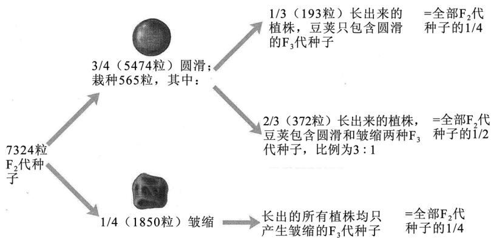

一假设呢？他意识到可以通过 $\mathrm{F}_{2}$ 代植株的自花授粉进行检验。通过自花授粉，纯合 $WW$ 基因型长成的植株，对圆滑种子来说应是纯种，而那些从杂合 $Ww$ 基因型长成的植株，会以3:1的比例产生圆滑和皱缩种子。另外，从皱缩种子长成的植株，对于皱缩来说应为纯种，因为这些植株是纯合的 $ww$ 。孟德尔获得的结果概括于图3.5中。如同该遗传假设图 3.5 概括 $F_{2}$ 代表型及通过自花授粉产生的后代。

预计的那样，从 $F_{2}$ 代皱缩种子长成的植株，是皱缩种子的纯种，在 $F_{3}$ 代中只产生皱缩种子。但证据显示，有些从圆滑种子长成的植株，出现分离，在从圆滑 $F_{2}$ 代种子长成的 565 棵植株中，有 372 棵植株产生圆滑和皱缩两种种子，其比例非常接近 3:1；而余下的 193 棵植株，在 $F_{3}$ 代中只产生圆滑种子。193:372 的比值等于 1:1.93，这与遗传假设预测的 WW:Ww 基因型比值 1:2 非常接近。

对于在 $F_{2}$ 代和 $F_{3}$ 代中产生的纯合圆滑和纯合皱缩的种子，一个重要的特点是，这些表型与在原先 $P_{1}$ 代亲本中观察到的一模一样。这从 DNA 方面就容易理解了，因为，除非碰巧发生新突变，否则每个等位基因的 DNA 维持不变。孟德尔曾在一封信中描述这一结果，说在杂交的后代中，“看来，两个亲本性状分开但未改变，且没有任何迹象表明，它们之一从另一个继承或接收了任何东西。”从这一发现中，他总结道：亲本性状的遗传决定因子作为两个不同的因子被传递，在杂种中保持其纯洁性。换句话说，遗传决定因子彼此不“混合”或“污染”。以现代术语来说就是，除了一些罕见但重要的例外，基因在一代代的传递中保持不变。

## ■ 测交和回交

检验图 3.4 中假设的另一个简单方法是通过测交 (testcross)，即一个或多个基因杂合的个体 (如 $Ww$ )，与隐性等位基因纯合的个体 (如 $ww$ ) 杂交。图 3.6 示这样一种测交的结果。因为预计杂合亲本产生相同数量的 $W$ 和 $w$ 配子，而纯合隐性亲本只产生 $w$ 配子，预计后代有 1/2 具有 $Ww$ 基因型，1/2 具有 $ww$ 基因型。前者具有显性表型，因为 $W$ 对 $w$ 是显性，而后者具有隐性表型。在遗传分析中，测交往往极为有用：

在测交中，后代的表型揭示了杂合亲本产生的不同

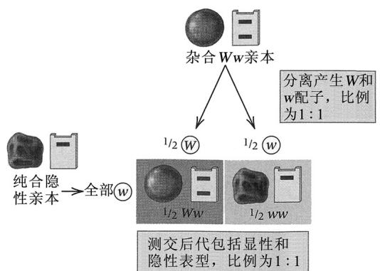  
图 3.6 Ww 杂合亲本与 ww 纯合隐性的测交，后代为 Ww 和 ww，比例是 1:1。测交显示分离的结果。

配子的相对频率，因为隐性亲本只贡献隐性等位基因。

表 3.2 孟德尔的测交结果

<table><tr><td>测交( $F_1$ 代杂合子×纯合隐性)</td><td>测交后代</td><td>比值</td></tr><tr><td>圆滑×皱缩种子</td><td>193 圆滑,192 皱缩</td><td>1.01:1</td></tr><tr><td>黄色×绿色种子</td><td>196 黄色,189 绿色</td><td>1.04:1</td></tr><tr><td>紫色×白色花</td><td>85 紫色,81 白色</td><td>1.05:1</td></tr><tr><td>高×矮茎</td><td>87 高,79 矮</td><td>1.10:1</td></tr></table>

孟德尔用不同的性状进行了一系列的测交。结果见表 3.2。在所有情况下，在测交后代中的表型比值都非常接近 1:1，这是杂合亲本中等位基因分离的期望比值。

另一种很重要的杂交是回交(back-cross)——杂种个体与亲本基因型之一杂交。回交常为遗传学家和动植物育种者所用，这

在后面的章节中会讨论。注意，表3.2中的测交也是回交，因为在每种情况下， $\mathrm{F}_1$ 代杂合亲本都是来自纯合显性和纯合隐性之间的杂交。

## 3.3 两个或两个以上基因的分离

许多遗传杂交的结果，由两个或两个以上基因的等位基因的分离决定。这些基因可能在不同的染色体上，也可能在同一条染色体上。虽然在本节中考察的是基因在两条不同染色体上的情况，但在同一条染色体上却彼此距离遥远而能独立分离的基因，也适用同样的原理。在同一条染色体上基因连锁的情况，将在第5章中学习。

为了解释该原理，我们再来考虑纯合基因型之间的杂交，只不过此处是两个基因的等位基因纯合。具体的例子是，具皱缩、绿色种子的豌豆纯系变种(基因型为 $ww\ gg$ )，对具圆滑、黄色种子的变种(基因型 $WW\ GG$ )。按照用大小写符号来表示等位基因的方法，显性等位基因是 $W$ 和 $G$ ，隐性等位基因是 $w$ 和 $g$ 。导致孟德尔的绿色种子的突变基因，已得到鉴定，它是一个先天性代谢缺陷，阻断了降解叶绿素这种绿色色素的代谢途径。纯合突变型种子不能降解叶绿素，因而继续保持绿色，而野生型种子能够降解叶绿素，于是像秋天的某些树叶一样，变成黄色。该基因的正式名字叫staygreen(常绿基因)。

WW GG 植株与 ww gg 植株杂交，产生基因型为 Ww Gg 的 $F_{1}$ 代种子，因为显性的关系，其表型为黄色圆滑。当 $F_{1}$ 代种子长成成熟植株且自花授粉时， $F_{2}$ 代表现出 W、w 等位基因对和 G、g 等位基因对同时分离的结果。孟德尔完成这个杂交后，得到以下数量的 $F_{2}$ 代种子：

```txt
圆滑、黄色 315
圆滑、绿色 108
皱缩、黄色 101
皱缩、绿色 32
总计 556
```

在这些数据中，首先要注意的是，分别考察每个性状的 3:1 期望比值。圆滑：皱缩的比值是：

$$
(3 1 5 + 1 0 8): (1 0 1 + 3 2) = 4 2 3: 1 3 3 = 3. 1 8: 1
$$

而黄色: 绿色的比值是

$$
(3 1 5 + 1 0 1): (1 0 8 + 3 2) = 4 1 6: 1 4 0 = 2. 9 7: 1
$$

这两个比值都与3:1吻合(期望比值的吻合度检验在第4章中叙述)。而且，在双因子杂种

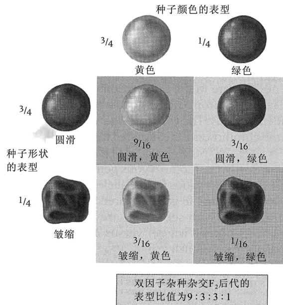  
图 3.7 圆滑：皱缩的 3:1 比值，与黄色：绿色的 3:1 比值随机组合后，产生在双因子杂种杂交 $F_{2}$ 代中观察到的 9:3:3:1 比值。

杂交的 $F_{2}$ 代中，这两个性状独立的 3:1 比值，以随机方式组合。如图 3.7 所示，通过随机组合，

<table><tr><td> $F_{2}$ 代</td><td>基因型</td><td>表型</td></tr><tr><td rowspan="4"></td><td> $1/16 WW GG + 2/16 WW Gg + 2/16 Ww GG + 4/16 Ww Gg$ </td><td>=  $9/16$  圆滑,黄色</td></tr><tr><td> $1/16 ww GG + 2/16 ww Gg$ </td><td>=  $3/16$  皱缩,黄色</td></tr><tr><td> $1/16 WW gg + 2/16 Ww gg$ </td><td>=  $3/16$  圆滑,绿色</td></tr><tr><td> $1/16 ww gg$ </td><td>=  $1/16$  皱缩,绿色</td></tr></table>

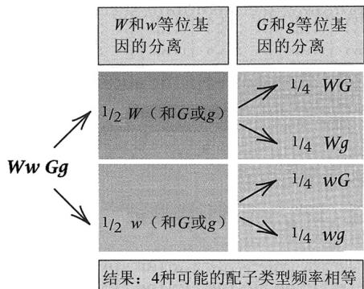  
图 3.8 W、w 和 G、g 等位基因对的独立分离，意思是，在 W 类或 w 类配子中，G:g 的比值都是 1:1。同样，在 G 类或 g 类配子中，W:w 的比值都为 1:1。

性相同；如果一个配子含有 w，它含有 G 或 g 的可能性相同。结论是，以相同的频率形成 4 种配子：

$$
\begin{array}{l l l l} 1 / 4 W G & 1 / 4 W g & 1 / 4 w G & 1 / 4 w g \end{array}
$$

4 种配子随机结合, 形成下一代的合子, 这一自由组合的结果如图 3.9 所示。注意在 $F_{2}$ 代中期望表型比值为

$$
9: 3: 3: 1
$$

然而，也正如庞尼特方显示的那样， $F_{2}$ 代中的基因型比值比较复杂，是

$$
1: 2: 1: 2: 4: 2: 1: 2: 1
$$

导致这一比值的原因如图 3.10 所示。在具有 WW 基因型的种子中，GG:Gg:gg 的比值等于

$$
1: 2: 1
$$

在具有 $Ww$ 基因型的种子中， $GG:Gg:gg$ 的比值等于

$$
2: 4: 2
$$

(即 1:2:1 的比值乘以 2，因为 Ww 基因型是 WW 或 ww 的两倍)。而在具有 ww 基因型的种子中，GG:Gg:gg 的比例等于

$$
1: 2: 1
$$

种子的表型显示在基因型下方, 联合的基因型比值是

$$
9: 3: 3: 1
$$

在 3/4 圆滑后代中，3/4 将是黄色，1/4 是绿色；同样，在 1/4 的皱缩后代中，3/4 是黄色，1/4 是绿色。因而，圆滑黄色、圆滑绿色、皱缩黄色和皱缩绿色的总体比例预计为

$$
\begin{array}{c} 3 / 4 \times 3 / 4: 3 / 4 \times 1 / 4: 1 / 4 \times 3 / 4: 1 / 4 \times 1 / 4 = 9 / 1 6: 3 / 1 6: 3 / 1 \\ 6: 1 / 1 6 \end{array}
$$

观察比值315:108:101:32等于9.84:3.38:3.16:1，这与图3.7中庞尼特方9:3:3:1的预期比值吻合。

## - 自由组合律

图 3.8 说明 W、w 和 G、g 等位基因对的独立分离。独立的意思是，如果一个配子含有 W，它含有 G 或 g 的可能

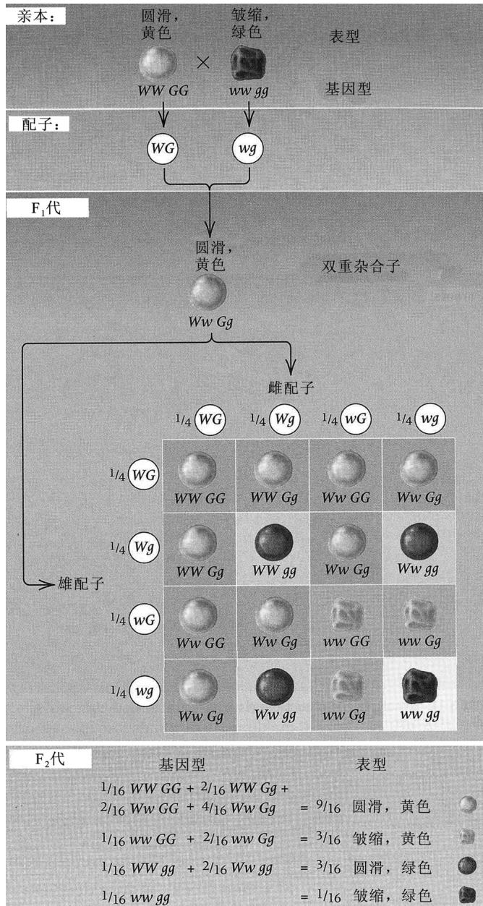  
图 3.9 自由组合是双因子杂交产生的 $F_{2}$ 代表型 9:3:3:1 比值的生物学基础。

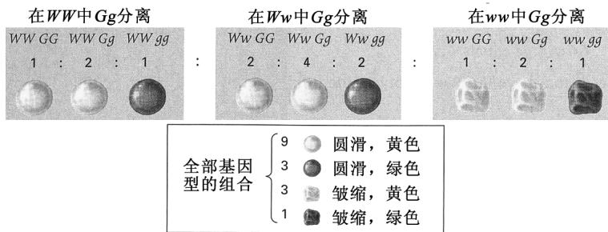  
图 3.10 种子形状和颜色的双因子杂交 $F_{2}$ 代的基因型和表型。

在不同染色体上(或位于同一条染色体上距离足够远的)两对等位基因的独立分离原理, 一直以来被称为自由组合律(the principle of independent assortment)。有时也称其为孟德尔第二定律(Mendel's second law)。

自由组合律：在生殖细胞形成过程中，任何一对等位基因的

分离，与其他等位基因对的分离无关。

虽然在孟德尔遗传学中自由组合律是一条基本定律，但由于同一染色体上基因的邻近而导致的连锁现象，是一个重要的例外。

## ■ 非连锁基因的测交

表现出自由组合的基因被说成是非连锁的(unlinked)。自由组合的假设可以用纯合双隐性

的测交直接进行检验:

$$
W w G g \times w w g g
$$

测交结果如图 3.11 所示。因为具有双重杂合基因型的植株产生 4 种频率相同的配子——W G、W g、w G 和 w g，而具有 ww gg 基因型的植株只产生 w g 配子，所以后代可能的基因型为 Ww Gg、Ww gg、ww Gg 和 ww gg，且预期这些基因型的频率相同。因为显性的关系——W 对 w 和 G 对 g 为显性——预期圆滑黄色、圆滑绿色、皱缩黄色和皱缩绿色后代的表型比值为

$$
1: 1: 1: 1
$$

与单基因的测交一样，在两基因测交中，后代的表型比值直接证实了双重杂合亲本所产生配子的比例。在实际的杂交中，孟德尔获得55株圆滑黄色、51株圆滑绿色、

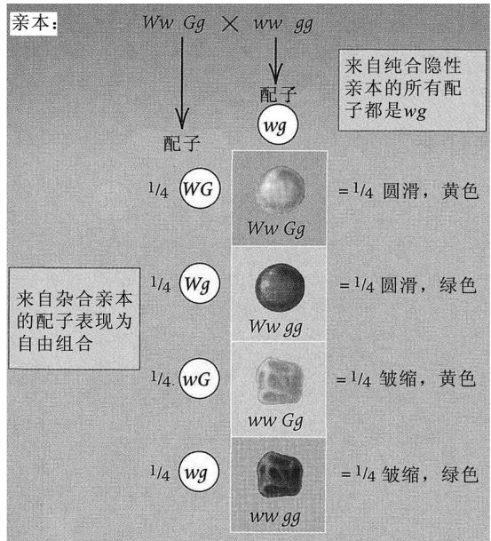  
图 3.11 Ww Gg 双重杂合子测交所得的基因型和表型。

49 株皱缩黄色和 53 株皱缩绿色，这与预期的 1:1:1:1 比值很好地吻合。

## - 三个或三个以上的基因

对于进行自由组合的两个基因，显示其基因型频率和表型频率背后的逻辑，图 3.9 中的这种庞尼特方是个好办法。然而，作为解答习题的方法，庞尼特方的效率不太高。在解答习题时，尤其是像在考试的时候，时间有限，要填画整个庞尼特方，花费的时间太长。另有一种方法，不太直观，但要快一些。例如，对于两个进行自由组合的基因，任何一种基因型的期望频率，可以通过选择下面表达式中相应的项而获得

$$
(1 / 4 W W + 1 / 2 W w + 1 / 4 w w) \times (1 / 4 G G + 1 / 2 G g + 1 / 4 g g)
$$

同样，任何一种表型的期望频率，由下面表达式中相应的项给出

$$
(3 / 4 \text {圆滑} + 1 / 4 \text {皱缩}) \times (3 / 4 \text {黄色} + 1 / 4 \text {绿色})
$$

例如，在 $F_{2}$ 代中，Wwgg 基因型的期望频率由 $1/2 \times 1/4 = 1/8$ 得到，而圆滑绿色表型的期望频率由 $3/4 \times 1/4 = 3/16$ 得到。

杂交只涉及两个基因时, 使用代数表达式节省的时间较少, 但对于表现出自由组合的 3 个基因, 节省的时间就相当多了。考察一个 3 对等位基因 $(W, w)$ 、 $(G, g)$ 和 $(P, p)$ 三因子杂交的例子, 其中, P 是控制紫色花的显性等位基因, p 是控制白色花的隐性突变。在此情况下, 庞尼特方是包含 64 个小格的立方体, 画起来难、填起来乏味。不过, 基因型频率对应于下面表达式中的项

$$
(1 / 4 W W + 1 / 2 W w + 1 / 4 w w) \times (1 / 4 G G + 1 / 2 G g + 1 / 4 g g) \times (1 / 4 P P + 1 / 2 P p + 1 / 4 p p)
$$

表型频率对应于下面表达式中的项

$$
(3 / 4 \text {圆滑} + 1 / 4 \text {皱缩}) \times (3 / 4 \text {黄色} + 1 / 4 \text {绿色}) \times (3 / 4 \text {紫色} + 1 / 4 \text {白色})
$$

例如，想知道某一后代基因型为 $Ww \ Gg \ Pp$ 的概率，可以把这些频率相乘得到： $1/2 \times 1/2 \times 1/2 = 1/8$ 。同样，如果想知道后代表型为圆滑、黄色、紫色的概率，可以这样计算：

$$
3 / 4 \times 3 / 4 \times 3 / 4 = 2 7 / 6 4 。
$$

孟德尔真的做了这个三基因杂交，表型的结果如图 3.12 所示，这些结果很好地吻合于根据自由组合预测的 27:9:9:9:3:3:3:1 比值。这些不同类型的后代有 $3^{3}=27$ 种不同的基因型。孟德尔对每个具有一个或更多显性性状的后代均做了测交，以确定对于每个基因，其基因型是纯合的还是杂合的。仅这项工作，就需要 632 次测交。难怪他抱怨道：“在所有的实验中，(这一项)耗费了大部分的时间和精力。”

<table><tr><td colspan="5"> $(3/4W + 1/4WW) \times (3/4G - + 1/4gg) \times (3/4P - + 1/4pp)$ </td></tr><tr><td></td><td></td><td></td><td>观测数</td><td>期望数</td></tr><tr><td>27/64</td><td> $W - G - P -$ </td><td>圆滑,黄色,紫色</td><td>269</td><td>270</td></tr><tr><td>9/64</td><td> $W - G - pp$ </td><td>圆滑,黄色,白色</td><td>98</td><td>90</td></tr><tr><td>9/64</td><td> $W - gg P -$ </td><td>圆滑,绿色,紫色</td><td>86</td><td>90</td></tr><tr><td>9/64</td><td> $wwG - P -$ </td><td>皱缩,黄色,紫色</td><td>88</td><td>90</td></tr><tr><td>3/64</td><td> $W - gg pp$ </td><td>圆滑,绿色,白色</td><td>27</td><td>30</td></tr><tr><td>3/64</td><td> $wwG - pp$ </td><td>皱缩,黄色,白色</td><td>34</td><td>30</td></tr><tr><td>3/64</td><td> $ww gg P -$ </td><td>皱缩,绿色,紫色</td><td>30</td><td>30</td></tr><tr><td>1/64</td><td> $ww gg pp$ </td><td>皱缩,绿色,白色</td><td>7</td><td>10</td></tr><tr><td colspan="2">对任何一个基因而言,表型比值都是48:16=3:1</td><td colspan="3">对任何一对基因而言,表型比值都是36:12:12:4=9:3:3:1</td></tr></table>

图 3.12 在自由组合的情况下，三因子杂交表型的期望比值可通过 3 个独立的显性和隐性表型的 3:1 比值相乘而得。在基因型符号中所用的破折号，表示存在的不是显性等位基因就是隐性等位基因，例如，W-总的指基因型 WW 和 Ww（因为舍入误差，期望值总计为 640，而不是 639）。

既然刚刚强调过，用较为抽象的方法来进行遗传计算，比庞尼特方高效和实用，此时正益对与孟德尔遗传学相关的概率基础，作稍微正式一点

的解释，并将这种理性思考向前推进重要的一步。

## 3.4 遗传分析中的概率

孟德尔的遗传传递定律从根本上说是随机(概率)定律。孟德尔的遗传原理，解释了他观察到的后代的不同类型，以及在这些后代中所见的比例。他在这方面的理解，超越了与他同时代的任何人。孟德尔是第一个认识到随机性在遗传中的根本作用的人，自孟德尔时代起，在遗传学中还没有什么发现动摇过它。

因此，想要充分理解孟德尔遗传学，就要理解基本的概率定律。每个概率问题都从一个实验开始，可以是真实的或想象的实验，在遗传学中，实验一般是杂交，与实验相关联的，是一组可能的实验结果。在遗传学中，这些可能的结果一般是基因型或表型，这些可能的结果称为基本结果(elementary outcome)。它们是基本结果，是从这个意义上来说的：它们中没有一个能被还原为其他结果的组合。在应用概率的时候，基本结果的数目通常相当小。概率定律也能用来处理概念性的实验，其中有无限数量的基本结果，但这需要的一些技术性细节超出了本书的范围。

每个基本结果分配到一个与其发生的可能性成正比的概率。理论上，概率可被任意分配，只有两条规则：第一，每个基本结果的概率一定是0和1之间的非负值，且实际上可为0或1，概率为0的基本结果，不可能发生，而概率为1的基本结果一定会发生；第二，所有基本结果的总概率等于1。这条规则确保总有某个基本结果一定会发生。这两条规则也可用来对付关于掷硬币的一个恼人的问题：如果硬币以边缘着地会怎么样？答案是：这一基本结果分配到的概率为0，所以不必理会它。

(A)  
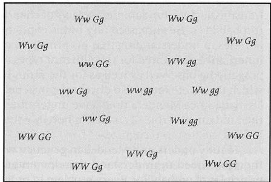

(B)  
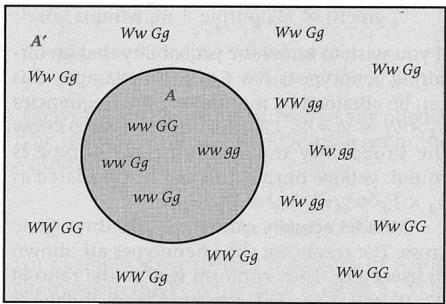

(C)  
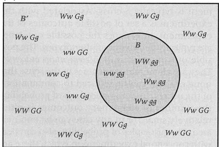

(D)  
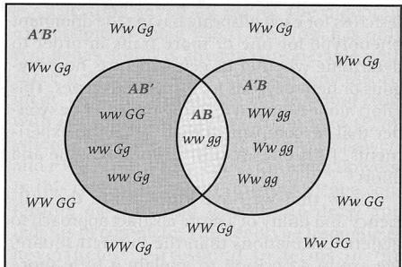  
图 3.13 (A) 控制种子圆滑对皱缩的 W、w 与控制种子黄色对绿色的 G、g 这两对等位基因的杂交，其可能后代的样本空间。(B) 事件 A 包括所有表型为皱缩的基因型。(C) 事件 B 包括所有表型为黄色的基因型。(D) A 和 B 的并集和交集(黄色)。可以产生后代基因型 Ww Gg(图 3.9)。

现在，来考察一个具体的例子，试想这个概念性的实验：圆滑 W 和黄色 G 等位基因纯合的植株，与 w 和 g 纯合的植株杂交，所得 $F_{1}$ 代自花授粉。W、w 和 G、g 两对等位基因进行自由组合，因此有 16 种基本结果，如图 3.13A 所示，每种基本结果具有相同的可能性，所以每种基本结果分配到的概率为 1/16。注意，后代基因型 WwGg 被列出 4 次。这是因为有 4 种可能的亲本配子组合

一般将基本结果及其概率构成的枚举，称为概率问题的样本空间(sample space)。 $Ww \ Gg$ 自花授粉后代的样本空间如图 3.13A 所示。这是与该概念性实验有关的所有概率都予以考虑的样本空间。

## ■ 基本结果与事件

在样本空间中，基本结果的任一组合构成一个事件(event)。在图3.13B中，标 $A$ 的圆圈含4个基本结果，将事件 $A$ 定义为“后代基因型为ww”。事件 $A$ 可等价地定义为“后代表型为皱缩”。在文字上定义 $A$ 的不同方法，显示基本结果的子集怎样把基因型和表型联系起来。每个事件存在一个与其对应的概率，此处以 $\operatorname{Pr}\{A\}$ 表示。概率的一个基本原理是：

任一事件的概率，等于该事件包含的所有基本结果的概率之和。

因此，在图 3.13B 的例子中， $\Pr\{A\}=4/16$ ，因为事件 A 包含 4 个基本结果（可能的后代基因型），每个基本结果的概率是 1/16。一个事件可以不含任何基本结果，在这种情况下，其概率为 0；或其可包含所有的基本结果，在这种情况下，其概率为 1。

在图 3.13B 中，定义事件 A 的圆圈之外的基本结果定义了另一个事件，已记为 $A'$ 。该事件包含不在 A 中的所有基本结果，所以，换言之，它包含所有基因型不是 ww 的后代，或等价于它包含表型为圆滑的所有后代。事件 $A'$ 称为 $A$ 的补，它也可以用 $A^C$ 、 $\bar{A}$ 或非 $A$ 等不同的方式来表示。同样， $A'$ 的概率等于构成 $A'$ 的基本结果的总概率，所以，在此情况下， $\Pr \{A'\} = 12 / 16$ 。

事件也可由其他事件组成。考察图 3.13C 中标 B 的事件。事件 B 定义为基因型为 gg 的所有杂交后代，也可以定义成种子为绿色的所有后代。因为 B 包括 4 个基本结果，所以其概率 $\Pr\{B\}=4/16$ 。同样，有一个补事件 $B'$ ，定义为不包含在 B 中的所有基本结果，或以另一种方式来定义 $B'$ ，即基因型为 GG 或 Gg 的所有后代。在 $B'$ 中有 12 个基本结果，所以 $\Pr\{B'\}=12/16$ 。

再来看图 3.13B 和图 3.13C，考察或包含于 A 中，或包含于 B 中，或两者均包含的基本结果组成的事件。该事件称为 A 和 B 的并集 (union)。我们将把 A 和 B 的并集表示为 $A+B$ ，但在许多概率教科书中，可能会发现它是用 $A \cup B$ 的符号来表示的，此处符号 $\cup$ 读 “cup” 音。事件 $A+B$ 包含 7 个基本结果，基因型为 ww 或 gg 之一，或两者兼有，所以 $\Pr\{A+B\}=7/16$ 。

事件 A 和 B 可以组合的另一个重要方式称为 A 和 B 的交集 (intersection)，它由 A 和 B 都包含的基本结果组成。图 3.13D 所示即为一例，此处 A 和 B 的交集着黄色阴影。我们将把 A 和 B 的交集表示为 AB，但在概率教科书中，交集一般表示成 $A \cap B$ ，此处符号 $\cap$ 读 “cap” 音。

## ■ 事件并集的概率

正如所有的事件一样,事件并集 $A+B$ 的概率等于包含于 A 或 B 或两者之中的所有基本结果的概率之和。同样,事件交集 AB 的概率等于既包含于 A 中又包含于 B 中的基本结果的概率之和。一般地,A 和 B 的并集的概率公式为

$$
\operatorname * {P r} \{A + B \} = \operatorname * {P r} \{A \} + \operatorname * {P r} \{B \} - \operatorname * {P r} \{A B \}\tag{1}
$$

减去 $\Pr\{AB\}$ 的原因，看图3.13D就清楚了。因为后代基因型 $ww gg$ 既包含于 $A$ 中又包含于 $B$ 中，当 $A$ 的基本结果的概率加上 $B$ 的基本结果的概率时，基因型 $ww gg$ 被两次计入，为了校正多算的部分，必须从总值中减去该基本结果的概率。因为被计算了两次的基本结果正好就是 $A$ 和 $B$ 中都存在的基本结果，所以它们构成 $A$ 和 $B$ 的交集。因此， $\Pr\{AB\}$ 为式(1)中被减去的数量。

在式(1)中，一个重要的特例是 A 和 B 不重叠的时候，即它们没有共同的基本结果的时候。在此情况下，A 和 B 称为互斥 (mutually exclusive) (或不相交的) 事件，所以 $\Pr\{AB\}=0$ 。因而，当 A 和 B 互斥时，式(1)变为

$$
\operatorname * {P r} \{A + B \} = \operatorname * {P r} \{A \} + \operatorname * {P r} \{B \}\tag{2}
$$

有时称该式为互斥事件的加法定律(addition rule)。当一个事件发生时，排除了另一事件的发生，这样的两个事件为互斥事件。换句话说，互斥事件是互不相容的，即没有基本结果能够同时存在于这两个事件中。图3.14所示的例子仍取材于 $Ww$ $Gg \times Ww$ $Gg$ 杂交实验，此处我们这样来定义事件 $A^{*}$ 和事件 $B^{*}$ ，它们是 $A$ 和 $B$ 的修改版，互不重叠。事件 $A^{*}$ 可用文字定义成“后代表型皱缩但非绿色”，而事件 $B^{*}$ 可以定义成“后代表型绿色但不皱缩”。如此定义之后， $A^{*}$ 和 $B^{*}$ 互斥，因而用式(2)可推导出 $\Pr\{A^{*} + B^{*}\} = \Pr\{A^{*}\} + \Pr\{B^{*}\} = 6/16$ 。

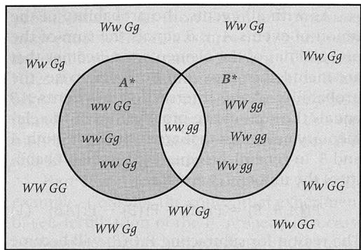  
图 3.14 事件 $A^{*}$ 和 $B^{*}$ 被这样定义：它们都排除了表型为皱缩且绿色的基因型。 $A^{*}$ 和 $B^{*}$ 不重叠，因此它们是互斥的。

## ■ 事件交集的概率

又回到图 3.13D 中的事件 A 和 B，考察交集 AB 的概率。该事件包含既在 A 中又在 B 中的所有基本结果，在该例仅包含一种基因型，即 wwgg。因此，AB 的概率 $\Pr\{AB\}=1/16$ 。这是事件为独立(independent)事件的特殊情况，“独立”的意思是，已知事件 A 是否发生，与事件 B 是否会发生完全无关。独立事件共同发生的概率的特性是：它与个别事件的概率的积成正比。在图 3.13D 的例子中，已经看到 $\Pr\{A\}=4/16$ 且 $\Pr\{B\}=4/16$ ，所以，在此情况下， $\Pr\{AB\}=4/16\times4/16=16/256=1/16$ 。在该例中，事件 A 和 B 说明了一个重要的一般原理：当事件 A 和 B 为独立事件时，它们的交集的概率由下式给出

$$
\operatorname * {P r} \{A B \} = \operatorname * {P r} \{A \} \operatorname * {P r} \{B \}\tag{3}
$$

(A)  
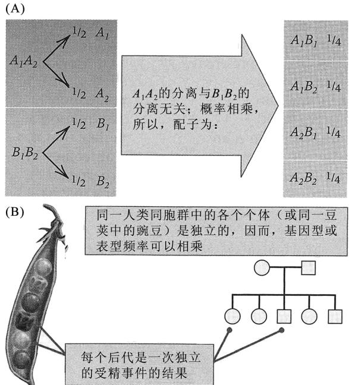  
图 3.15 在遗传学中，独立性的两种重要类型是(A)表现为自由组合的等位基因的独立分离，以及(B)产生连续后代的独立受精。

有时称该式为独立事件的乘法定律(multiplication rule)。“独立事件”和“独立分配”这两个术语的选择不是巧合，因为，独立分配的意思是，已知某个后代 $(W, w)$ 等位基因对的基因型，与 $(G, g)$ 等位基因对的基因型是什么完全无关。[译者注：“独立分配”约定俗成的译法是“自由组合”。在英文中，“独立事件(independent events)”和“独立分配(independent assortment)”都有“independent”一词，因此原书对这一共同点的内在联系进行解释]。该原理如图3.15A所示，B部分示遗传学中遵循独立性原则的另一种情况，用来处理一次杂交产生的连续后代。连续的后代是独立的，因为，前面的后代的基因型对后面的后代的基因型的概率没有影响。连续后代的独立性，与这种普遍看法矛盾：在每个人类家庭中，女孩与男孩一定是以大约 $1:1$ 的比例“平摊”。按照这种讲法，有4个女孩的家庭，下一次更有可能生男孩。但这种看法既不被理论支持，也不被实际数据支持。数据表

明，人类家庭每次生育时，生女孩或生男孩的可能性相同，不受之前生育的性别分布影响。尽管统计学保证，在平均大量情况之后，性别比例将会持平，但这并不意味着在任何个别的情况中都会平均。具体来说，在有5个孩子的家庭中，那些有5个男孩的家庭平衡了那些有5个女孩的家庭，产生1∶1的总的性别比例，不过，这两种性别比例都不常见。

## 3.5 人类系谱分析

在单个人类家庭和家养大牲畜中，因为后代数目相对较小，往往会见到与期望遗传学比值的巨大偏离。尽管如此，考察数代有亲缘关系的个体的表型，分离的效应仍是显而易见的。显示一群亲属中每个个体的表型的家谱示意图，称为系谱(pedigree)。本节介绍系谱分析的基本概念。

## ■ 显性遗传和隐性遗传的特点

图 3.16 说明用于绘制人类系谱的标准符号的含义。圆圈代表女性，方框代表男性(如果性别未知——如流产——用菱形)。对具有所关注表型的人，用彩色或阴影符号表示。对于隐性等位基因，有时用半填充符号表示杂合携带者。女性和男性之间的婚配，用一条水平线连接两人的符号来表示，该水平线下垂直连接第二条水平线，第二条水平线连接他们的后代的符号。同父同母的子女(同胞群，sibship)，称为同胞(sibling 或 sib)，按照他们的出生次序从左到右表示。

图 3.17 显示一个亨廷顿病 (Huntington disease) 的系谱, 该病由一个显性突变导致。系谱中的数字是为了提到具体的人时方便。用罗马数字表示连续的世代, 在任一世代中, 所有人被从左到右连续编号。该系谱从女人 I-1 和男人 I-2 开始。该男人患亨廷顿病, 这是一种进行性神经变性, 通常中年起病, 导致严重的身体和精神残疾, 然后死亡。引起亨廷顿病的显性等位基因 HD 很罕见。系谱中所有患者均为杂合基因型 HD hd, 而非患者为纯合的正常基因型 hd hd。在很多家系中, 该病具完全外显率。遗传病的外显率 (penetrance) 是指在具有危险基因型的人中, 表现出性状的个体所占

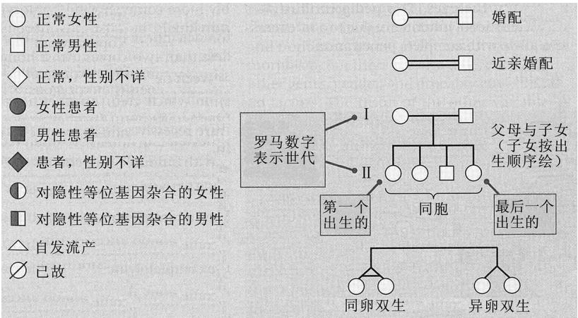

图 3.16 用于人类系谱绘制的常用符号。  
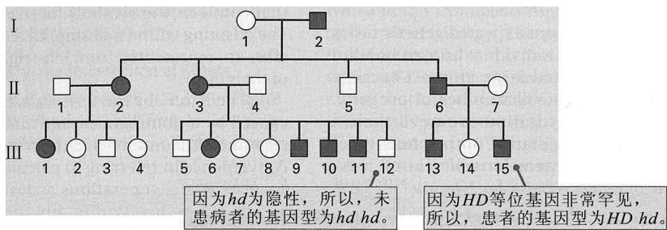  
图 3.17 一个人类家系的系谱，示导致亨廷顿病的显性基因的遗传方式。分别以圆圈和方框表示女性和男性，红色符号示该病患者。

的比例，完全外显率意味着具有危险基因型的人，100%表现性状。该系谱说明具完全外显率的稀有显性等位基因所致的遗传病有以下遗传特点。

1. 男女患病的可能性相同。

2. 患病后代的双亲之一是患者(除罕见的新突变之外)，且双亲中母亲或父亲是患者的可能

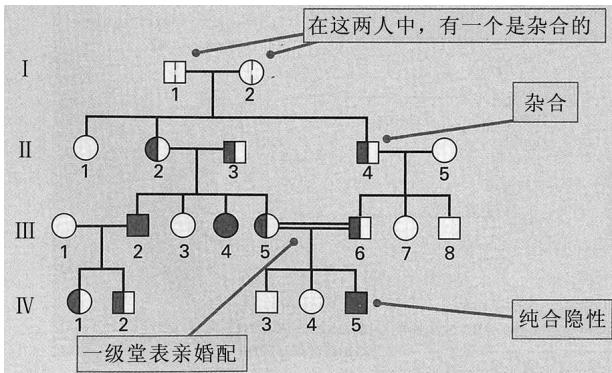  
图 3.18 白化病系谱。隐性遗传患者(全填充符号)通常具有未罹患的双亲。双横线表示血亲(此处为一级堂表亲)之间的婚配。

3. 平均而言，双亲之一患病时，同胞中一半的个体患病。

图 3.18 示一个纯合隐性等位基因所致性状的系谱。该性状为白化病(albinism)，患者皮肤、毛发和眼睛虹膜中色素缺乏。该系谱说明具完全外显率的稀有隐性等位基因所致的遗传病有以下遗传特点。

1. 男女患病的可能性相同。

2. 患者如生育，后代一般不患病。

3. 多数患者的双亲不患病。

4. 患者的双亲往往是亲戚。

5. 在患者同胞中，患病的比例约为 25%。

对于稀有隐性遗传，纯合患者的配偶对正常等位基因通常是纯合的，因此所有的子女都是杂合的，不会患病。突变型等位基因的杂合携带者(carrier)比纯合患者要常见得多，因为一个人只得到一个稀有突变型等位基因拷贝的可能性，比得到两个拷贝要大。因而，多数纯合隐性基因型来自携带者之间的婚配(杂合子×杂合子)，这样，每个子女有1/4的机会患病。稀有隐性遗传的另一个重要特点是，患者的双亲往往是有亲缘关系的(血亲，consanguineous)。血亲之间的婚配，用双线连接双方来表示，如图3.18中的一级堂表亲婚配那样。血亲之间的婚配对于隐性等位基因纯合化很重要，因为当一个隐性等位基因稀有时，通过一个共同祖先的遗传而变成纯合，比从完全无亲缘关系的双亲遗传而成为纯合，更有可能。其原因是，稀有等位基因的携带者，可能会有许多也为携带者的后代。如果这样的两个携带者要相互婚配(例如，一级堂表亲婚配)，则这个隐藏的等位基因有1/4的概率变成纯合。血亲之间的婚配即近亲婚配(inbreeding)，其后果将在第17章中深入讨论。因为患者的存在说明其双亲是杂合携带者，所以在同胞中患病个体的期望比例约为 $25\%$ ，但确切的值取决于如何对患病个体进行鉴定、如何归纳数据等细节。

## - 大多数人类遗传变异并不“坏”

在分子方法出现之前，人类遗传学研究存在许多实际障碍。除了诸如 ABO 及其他血型之类的性状以外，已知表现出简单孟德尔遗传的性状很少。但它们中的大多数与遗传病有关，这就引起了一些特殊的挑战：

\- 大多数导致简单孟德尔式遗传病的基因很罕见，所以只能在少量家系中观察到这些基因。

\- 许多导致孟德尔式疾病的基因为隐性，所以在杂合基因型中察觉不到这些基因的存在。

\- 每个人类家庭的后代数量都比较少，所以在单个同胞群中一般见不到分离。

\- 人类遗传学家不可能开展测交、回交或其他的实验性婚配。

本书含众多例子，说明分子遗传学怎样彻底地改变了人类遗传学的研究。例如，在第2章中，讨论过在人类基因组中广泛存在的单核苷酸多态性(SNP)和拷贝数变异(CNV)。在这些常见的多态性中，仅极少量与疾病有关，并且，即使是那些作为遗传风险因子的多态性，它们也与其他风险因子——包括其他基因及环境——相互作用。尽管大多数SNP和CNV并没有不利效应，但这两种类型的变异都表现为简单的孟德尔遗传，这就是为什么人类遗传学家日渐依赖

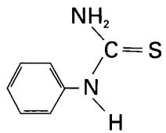

它们来进行家系和群体研究的原因。

但在前分子时代，就已经发现了一些看似无害的简单孟德尔性状。最有名的一个与称为苯硫脲(phenylthiocarbamide, PTC)的一种化学物质的尝味能力有关。PTC 的分子结构如左侧所示。

PTC 是 20 世纪 30 年代早期一位工业化学家创造的一种人工化学品。有一天，当他粗心地将许多粉状 PTC 喷到空气中时，发现了尝味多态性。PTC 粉末对这位化学家毫无影响，但他实验室的一位同事大声抱怨，说它在嘴里面很苦。出于好奇，这位化学家开始测试亲朋好友尝 PTC 的能力，并招来一位遗传学家，开始研究这种情况。不久，家系研究表明，PTC 尝味能力是一种以简单孟德尔显性方式遗传的性状。在欧洲人群中，约 70% 的人是尝味者 (taster)，30% 的人是味盲 (nontaster)，但这些比例在其他族群中差别很大。在非洲裔或亚裔人中，尝味者的频率约为 90%，而在澳洲土著中，该频率只有大约 50%。

然而，PTC 尝味能力是可定量的。最敏感的尝味者能够尝出的浓度低至 0.001mmol/L，而最不敏感的味盲，浓度高到 10mmol/L 也尝不出来。将个人分成 “尝味者” 或 “味盲”，使用了一个武断的界限值，通常是在 0.2mmol/L PTC 的浓度。尝味者和味盲之间在尝味能力上的大多数变异，是由于主要尝味者多态性 (major taster polymorphism) 所致，但也有一些差异是由其他基因、性别及可能的环境因素所致。其他可变因素的结果是，约 5% 的杂合尝味者被划分成 “味盲”，而至少 5% 的纯合味盲被划分成 “尝味者”。

现在已知，尝味者多态性的分子基础，是由一个称为 hTAS2R38 的味觉受体蛋白造成的。其基因有几个等位基因，最常见的两种称为 PAV 和 AVI，它们编码的蛋白质相差 3 个氨基酸（在 3 个分散的位置上）。在 PAV 蛋白中，这 3 个关键的氨基酸是脯氨酸(P)、丙氨酸(A)和缬氨酸(V)，而在 AVI 蛋白中，这 3 个位置上是丙氨酸(A)、缬氨酸(V)和异亮氨酸(I)。PAV 是赋予

PTC 尝味能力的类型。

想一想，你会觉得 PTC 尝味能力多态性的存在没有什么意义。PTC 全然是一种在实验室中合成的人工化学品，为什么会存在其尝味能力的多态性呢？通过观察，有了一条线索：PTC 的化学结构与硫代葡萄糖苷相似。硫代葡萄糖苷是一大类具有异质性的分子，是一些植物(包括一些人类的食用植物)合成的化合物，它们的合成很可能是作为对付植食性昆虫的化学防御手段而进化出来的。在产生硫代葡萄糖苷的植物中，有一种被美国前总统乔治·布什(George H. W. Bush)挑了出来。1989 年布什从白宫的菜谱中去除了西兰花，他声明：“我不喜欢西兰花。还有，我还是小孩的时候，我妈非得让我吃，打那时起我就一直不喜欢它。还有，现在我是美国总统，我不会再吃西兰花！”全美西兰花种植者进行了幽默的抗议，送给他数以吨计的西兰花。好笑的是，老布什的西兰花抵制运动之后 17 年，新的研究证明，比起编码 AVI 型的等位基因为纯合的人，携带 hTAS2R38 味觉受体 PAV 型的人，确实会觉得西兰花尝起来明显苦得多。尝味者还反映，感觉羽衣甘蓝、白萝卜、大头菜和辣根更苦。

## - 人类系谱中的分子标记

由于操作 DNA 的技术使人们能够直接研究 DNA，人类系谱的现代遗传学研究，主要是利用 DNA 自身的遗传标记，而不是通过突变基因产生的表型来开展。我们在第 2 章中讨论过多种 DNA 多态性，以及检测和研究它们的方法。图 3.19 示某种

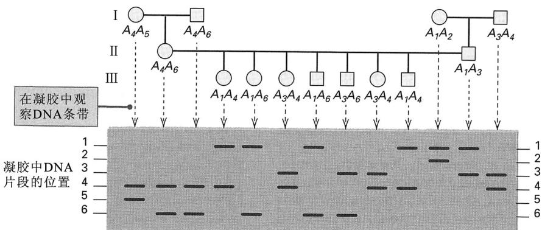  
图 3.19 人类系谱，示 SSRP 等位基因的分离。在系谱中有 6 种等位基因 $(A_{1} \sim A_{6})$ ，但任何一个人只能有一种（如果纯合）或两种（如果杂合）等位基因。

DNA 多态性在一个三代人的系谱中分离的例子。这种多态性是简单重复序列多态性 (simple sequence repeat polymorphism, SSRP)，其中，每个等位基因大小不同，取决于其所含的短串联重复 DNA 序列的拷贝数。大小的差异是用 PCR 扩增该区段之后，通过电泳检测到的。SSRP 通常有许多共显性的等位基因，并且大部分人是杂合的，有两个不同的等位基因。在图 3.19 的例子中，每一对父母都是杂合的，所有的孩子也都是杂合的。

图 3.19 中有 6 种等位基因，以 $A_{1} \sim A_{6}$ 表示。在凝胶上，条带的编号与等位基因的下标相对应。第 II 代是两个杂合基因型之间的婚配： $A_{4}A_{6} \times A_{1}A_{3}$ 。因为在每位父母中的分离，在子代中有 4 种可能的基因型 $(A_{4}A_{1}, A_{4}A_{3}, A_{6}A_{1} \text{ 和 } A_{6}A_{3})$ ；在这些基因型中，一般会把下标小的放前面，写成 $A_{1}A_{4}, A_{3}A_{4}, A_{1}A_{6}$ 和 $A_{3}A_{6}$ 。因为随机受精，这些子代基因型具有相同的可能性，这可以用该婚配的庞尼特方来证明。图 3.19 说明了共显性的复等位基因用于人类系谱分析的一些主要优点。

1. 杂合基因型可以与纯合基因型区分开。

2. 群体中许多人是杂合的，所以，许多婚配可提供关于分离的有用信息。

3. 每个分离的遗传标记产生多达 4 种不同的子代基因型。

联系：这片土地是你的国

亨廷顿病合作研究组，1993

包括来自 9 个研究机构的 58 位作者

## 在亨廷顿病染色体上的一个含有扩增且不稳定的三核苷酸重复序列的新奇基因

现代遗传学研究有时是由大的协作组完成的，这些协作组分散在数个国家的许多研究机构中。寻找导致亨廷顿病的基因，是此类协作方式的一个典范。因亨廷顿病的严重性、发病年龄晚和显性遗传方式，这项寻找工作被广为宣传。创作“这片土地是你的国”(This Land Is Your Land)和其他著名乐曲的知名民歌手伍迪·格思里(Woody Guthrie)，1967年死于该病。鉴定亨廷顿病基因后发现,它原来是编码一个功能未知的蛋白质(现在称为亨廷顿蛋白，huntintin)的基因，该基因在全身的许多种细胞中表达，而不像预计的那样只在神经组织中表达。在该基因的编码序列中，有一个三核苷酸重复序列(5'-CAG-3')，其按通式(5'-CAG-3') $_{n}$ 以串联方式重复若干次。在正常等位基因中，重复序列的数目n为11\~34，平均为18；在突变型等位基因中，重复序列的数目从40到86。该串联重复序列在遗传上不稳定，它能以某些未知的机制使拷贝数增加（“扩增”）。文章分析了两个家系的新的突变型等位基因，一个家系的重复序列拷贝数从36增加到44，另一个家系从33增加到49。在某些人类遗传病中，这是一种相当常见的突变机制。该节选举了几个其他的例子。作者们同时强调，他们的发现会引起一些重大的伦理争议，包括遗传检验、保密和知情同意等。

亨廷顿病 (Huntington disease, HD) 是以运动障碍、认知功能丧失和精神症状为特征的进行性神经退化性疾病。它以常染色体显性方式遗传，在大多数欧洲血统的人群中，发病率约为 1/10 000。HD 的特征性标志是特殊的舞蹈样运动(抽搐)疾患，通常在 40～50 岁以不易察觉的潜在方式发病，在 10～20 年的过程中逐渐恶化，直至死亡。……在人类中应用 DNA 标记来进行连锁分析，最早的成功案例之一，是将导致 HD 的遗传缺陷定位在 4 号染色体上。从那时起，我们就一直在逐步使其定位更加精确的基础上，寻找分离和鉴定 HD 基因的方法。……(我们发现一个)500-kb 片段是该遗传缺陷最有可能的位点(缩写 kb 代表千碱基对；1kb 等于 1000 个碱基对)。在该区域中，我们鉴定出一个全长约为 210 kb 的大基因，其编码一个之前没有描述过的蛋白质。其阅读框含有一个多态性的 (CAG) $_{n}$ 三核苷酸重复序列，在正常人群中至少有 17 个等位基因，CAG 拷贝数从 11 到 34 不等。在 HD 染色体上，三核苷酸重复序列的长度显著增加。……之前，已表明三核苷酸重复序列的延长与脆性 X 综合征、强直性肌营养不良和脊延髓肌萎缩等三种完全不同的人类疾病有关。……可以预计，在有 HD “风险” 的个体中直接检查该三核苷酸重复序列大小的能力，将彻底改变对该病的检测。……我们认识到，继续奉行检测有风险者的现行国际公认准则和咨询方法，以及不得随意或未经完全同意而检测未患病亲属的样品，是极其重要的。……既然 HD 遗传基础的奥秘显然已被破解，接下来的挑战就是力求理解和治疗这种毁灭性的疾病。

来源：The Huntington's Disease Collaborative Research Group, Cell 72 (1993): 971-983.

## ■ 条件概率

在人类系谱分析中，常常会出现许多这样的情况：已知某人的信息，会影响对此人具有某一特定基因型或表型的可能性的估计，这里有一个典型的例子。

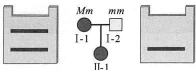  
图 3.20 在该系谱中，稀有的 M 等位基因与靠近凝胶顶部的 DNA 条带相关。M 等位基因使某种疾病的发病风险从纯合 mm 基因型中的 5%，升高到杂合 Mm 基因型中的 50%。一个典型的条件概率问题是：已知女儿 II-1 患病，计算她具有 Mm 基因型的概率。

问题 1 在图 3.20 的系谱中, 女人 I-1 对突变基因 M 杂合。M 使某种疾病的发病风险从 mm 基因型中观察到的 5% 升高到 Mm 中的 50%。M 等位基因与凝胶中较大的 DNA 条带 (靠近顶部的条带) 相关。男人 I-2 为对该基因的非突变型纯合的 mm, m 等位基因与较小的 DNA 条带 (靠近底部的条带) 相关。他们的女儿 II-1 患病。II-1 具有 Mm 基因型的概率是多少?

解这类题，乍看不容易，其实不难。诀窍是从自然频率 (natural frequency) 上来思考，自然频率的意思是预计在不同类别中的个体的实际数目，而不是概率、比例或百分比。在这个例子中，想象有 200 个图 3.20 中那样的系谱，女人 I -1 具有 $Mm$ 基因型，男人 I -2 具有 $mm$ 基因型。因为在 I -1 中

存在孟德尔分离，预计在100个系谱中女儿II-1会具有 $Mm$ 基因型，其中50个 $(50\%)$ 系谱的女儿会患病；在另外100个系谱中，预计女儿具有 $mm$ 基因型，其中有5个 $(5\%)$ 系谱的女儿会患病。已知女儿II-1现已患病的信息，则她具有 $Mm$ 基因型的概率是 $50 / (50 + 5) = 10 / 11 = 0.91$ 。这一概率远大于根据孟德尔分离预计的 $1 / 2 = 0.50$ ，这一差异说明，事先已知女儿患病，对于估计她具有 $Mm$ 基因型的可能性的大小有重大影响。

这类问题使用一种称为条件概率 (conditional probability) 的推理，须考虑已知存在的条件。下面这个问题也要使用条件概率，但方法稍有不同。

问题 2 再来考察图 3.20 中的 M 突变。设想一个人类群体，基因型 Mm 的人占 1% 的比例，纯合 MM 个体非常稀少，以致可以忽略不计。已知该群体中某一人患病，该患者具有 Mm 基因型的概率是多少？对于所述的这个人，病情是已知存在的，在已知这一条件的情况下，要推导该患者的基因型是 Mm 的概率。同样，可用自然频率来寻找答案，要做到这一点，先设想该群体有 2000 人。在这些人中，20 人(即 1%) 具有 Mm 基因型，他们中 10 人(即 50%) 会患病，余下的 1980 人具有 mm 基因型，其中 99 人(即 5%) 会患病。在患病的人中，基因型为 Mm 的概率是 $10/(10+99)=10/109=0.092$ 。注意，尽管 Mm 基因型使患该病的可能性大大增加，但绝大多数患者仍然为 mm 基因型。

在问题 1 中，患者具有 Mm 基因型的概率是 0.91，而问题 2 中为 0.092，有大约 10 倍的差异。这种差异从何而来？这是因为已知道的先验信息 (prior information) 极为不同。在问题 1 中，已知道母亲的基因型为 Mm，因此，事先知道子女具有 Mm 基因型的概率为 0.5（这称为先验概率）。在问题 2 中，将群体作为一个整体进行考虑，在此情况下，Mm 的先验概率被认为是 0.01(1%)。不过，不管这两个先验概率是多么的不同，都能够用自然概率来寻找出路，并得到正确的答案。下一节将用更正式的术语来讨论基于条件概率的推理。

## - 贝叶斯定理

对条件概率的精妙见解，归功于英格兰坦布里奇韦尔斯镇长老会牧师托马斯·贝叶斯(Thomas Bayes，1702～1761)。他的思想总结于《关于可能性理论中一个问题的求解》(Essay Towards Solving a Problem in the Doctrine of Chances)一文中，该文发表于1763年，在他死后两年。用现代概率符号来表达，已知事件 $B$ 已经发生时，事件 $A$ 发生的条件概率(conditional probability)可定义为： $A$ 和 $B$ 同时发生的概率(用 $\Pr\{AB\}$ 表示)，除以事件 $B$ 的概率(用 $\Pr\{B\}$ 表示)，前提是 $\Pr\{B\}$ 不等于0。

$$
\operatorname * {P r} \{A \mid B \} = \frac {\operatorname* {P r} \{A B \}}{\operatorname* {P r} \{B \}}\tag{4}
$$

式中， $\Pr \{A|B\}$ 可用文字表达为“已知 $B$ 时 $A$ 的概率”。例如，在问题1中，假设令 $A$ 为事件“图3.20中II-1患病”，令 $B$ 为事件“II-1的基因型为 $Mm$ ”。已知II-1的基因型为 $Mm$ 时，得出先验信息：她患病的概率等于0.50，因此， $\Pr \{A|B\} = 0.50$ 。但是，问题要求计算的是，已知II-1患病时，她的基因型为 $Mm$ 的概率，该概率表示为 $\Pr \{B|A\}$ ，与 $\Pr \{A|B\}$ 不一样。

但是，当已知 $\Pr\{A|B\}$ 时(与其他某些信息一起)，可以用称为贝叶斯定理(Bayes theorem)的公式来计算 $\Pr\{B|A\}$ :

$$
\operatorname * {P r} \{B \mid A \} = \frac {\operatorname* {P r} \{A \mid B \} \operatorname* {P r} \{B \}}{\operatorname* {P r} \{A \mid B \} \operatorname* {P r} \{B \} + \operatorname* {P r} \{A \mid B ^ {\prime} \} \operatorname* {P r} \{B ^ {\prime} \}}\tag{5}
$$

其中， $B'$ 为非 $B$ ，也称为 $B$ 的补。式(5)可通过以下论证从式(4)推出。式(5)中的分子是已知 $B$ 发生时 $A$ 发生的概率，乘以 $B$ 最初发生的概率，该乘积必定等于 $A$ 和 $B$ 同时发生的概率。同样，式(5)的分母为 $A$ 和 $B$ 同时发生，或 $A$ 和 $B'$ 同时发生的概率，其和必定等于 $A$ 发生的概率，因为，假如 $A$ 发生，它必定是要么与 $B$ 一起要么与 $B'$ 一起发生。将这些等价的表达式代入式(5)的分子和分母，得：

$$
\operatorname * {P r} \{B \mid A \} = \frac {\operatorname* {P r} \{B A \}}{\operatorname* {P r} \{A \}}\tag{6}
$$

注意，除了 A 和 B 的角色互换之外，式(6)与式(4)的形式完全一样。因此，虽然贝叶斯定理(式5)看起来非常复杂，但几乎可以直接从条件概率的定义推导出来。

对很多学生而言，主要困难是贝叶斯定理看起来太吓人，他们经常会问“我怎么知道选什么为事件 A、选什么为事件 B？”用自然频率来解条件概率题(尽管用贝叶斯定理要快一点)，可轻易地克服这个令人生畏的因素。而对于 A 和 B 的选择，取决于选择之后，使 $\Pr\{A|B\}$ 为先验信息、 $\Pr\{B|A\}$ 为想知道的概率。如何将贝叶斯定理应用到已用自然概率回答了的问题，先考察：

问题 1 已知 Pr{II-1 患病|II-1 为 Mm}=0.50，Pr{II-1 患病|II-1 为 mm}=0.50，且个体 I-1 为杂合的 Mm。因而，选 A=“个体 II-1 患病”，B=“个体 II-1 具 Mm 基因型”。因为已知道 I-1 为杂合的 Mm，则由于孟德尔分离，II-1 具 Mm 基因型的先验概率 Pr{B}=1/2，II-1 具 mm 基因型的先验概率 Pr{B'}=1/2。现在，就能够应用贝叶斯定理了，将已知的这些概率代入右侧，得：

$$
\operatorname * {P r} \{B \mid A \} = \frac {(0 . 5 0) (1 / 2)}{(0 . 5 0) (1 / 2) + (0 . 0 5) (1 / 2)} = \frac {5 0}{5 5} = 0. 9 1
$$

该结果正是之前对问题 1 用自然频率获得的结果。

问题 2 也可直接应用贝叶斯定理来解此题。在此题中，利用 Pr{某位个体患病|某位个体的基因型为 $Mm$ =0.50 和 Pr{某位个体患病|某位个体的基因型为 $mm$ =0.05 的先验信息，选 $A=$ “某位个体患病”和 $B=$ “该个体具有基因型 $Mm$ ”。在此题中，已知的不是父母的基因型，而是 $Mm$ 的群体频率 $\Pr\{B\}=0.01$ 和 $mm$ 的群体频率 $\Pr\{B'\}=0.99$ 。这些考量提供了贝叶斯定理右侧所需的各个因子，因此

$$
\operatorname * {P r} \{B \mid A \} = \frac {(0 . 5 0) (0 . 0 1)}{(0 . 5 0) (0 . 0 1) + (0 . 0 5) (0 . 9 0)} = \frac {1 0}{1 0 9} = 0. 0 9 2
$$

同样，这就是之前用自然频率计算出来的答案，不过，使用自然频率要更直观一些。

考察 1 道应用式(5)中的分母的题，作为在遗传学计算中使用条件概率的又一个例子。如同前面一样，会先用自然频率来解题，然后展示如何应用式(5)。

问题 3 考察问题 2 中由 1% 的 Mm 基因型个体和 99% 的 mm 基因型个体构成的人类群体。如果从该群体中随机挑出一个人，这个人是患者的概率是多少？从自然频率的角度来看，已经计算出，在该群体的 2000 人中，10 个基因型为 Mm 的人会患病，99 个基因型为 mm 的人会患病。因此，患者的总概率为 109/2000=0.0545。或者用式(5)的分母，设 A=“某个个体为患者”，B=“该个体具有基因型 Mm”，则 Pr{A|B}=0.50，Pr{A|B'}=0.05，Pr{B}=0.01，Pr{B'}=0.99。所以：

$$
\operatorname * {P r} \{A \} = \operatorname * {P r} \{A | B \} \operatorname * {P r} \{B \} + \operatorname * {P r} \{A | B ^ {\prime} \} \operatorname * {P r} \{B ^ {\prime} \} = (0. 5 0) (0. 0 1) + (0. 0 5) (0. 9 9) = 0. 0 5 4 5
$$

注意，0.0545 并不比 0.05 大多少，0.05 是已知某个个体的基因型为 mm 时该个体患病的概率，这一患病的总体风险与 0.05 如此接近，原因是在整个群体中 Mm 基因型所占的比例很小。

在求解条件概率题时，该用哪种方法，自然频率还是贝叶斯定理？无论哪种方法都行。有的学生喜欢不正式的自然频率方法，而有的学生喜欢比较正式的贝叶斯方法，无论喜欢哪一种方法，两种方法都应该尽量理解。

## 3.6 不完全显性和上位性

对于成对的等位基因，不是只有显性和共显性两种可能性，还有一种不完全显性(incomplete dominance)的情况——杂合基因型的表型介于两种纯合基因型的表型之间。不完全显性的一个典型例子是关于金鱼草(Antirrhinum majus)花的颜色(图3.21)。在野生型花中，通过一系列的酶学反应，形成一种红色的花青素。由等位基因 $I$ 编码的野生型的酶，控制总的反应速率，所以，红色色素的量由等位基因 $I$ 产生的酶的量决定。另一种等位基因 $i$ 编码无活性的酶，因而ii的花为乳白色。在 $Ii$ 杂合子中，因为关键酶的量减少，花中红色色素的量也减少，因而稀释的结果使得花呈粉红色。所以，花色不同的植株杂交，给分离提供了直接的表型上的证据(图3.21)。II(红色)×ii(乳白

色)杂交，产生基因型为 $Ii$ 且开粉红色花的 $\mathrm{F}_1$ 代植株。在一次实验中， $\mathbf{F}_1$ 代杂种自花授粉得 $\mathbf{F}_2$ 代，其中，得到22株红花、52株粉红色花和23株乳白色花的植株，这与 $1:2:1$ 的期望比值吻合。

## ■ 复等位基因

在图 3.19 的人类系谱中，SSRP 标记的等位基因 $A_{1} \sim A_{6}$ ，是复等位基因 (multiple allele) 存在的典型例子。在自然群体中，复等位基因相当常见，并且，如同该例一样，复等位基因最容易用分子方法来检测。在基因的 DNA 中，每个核苷酸可以是 A、T、G 或 C，具有 n 个核苷酸的基因，理论上可在任一位点上突变成其他 3 个核苷酸中的任一个。因此，长度为 n 的基因，具有单核苷酸差异的可能数目为 $3 \times n$ 。例如，设 n = 5000，则有 15000 个潜在的等位基因（不计一个以上核苷酸置换的任何可能性）。在任何时候，大部分潜在等位基因都不会真的存在。有些等位基因不存在，是因为它们不曾出现过；其他的等位基因曾经出现过，但或偶然或因有害而被淘汰掉了；还有的等位基因确实存在，但其频率很低，还没被发现。尽管如此，在 DNA 序列水平，大部分自然群体中的大部分基因都具有复等位基因，所有这些复等位基因都可以认为是“野生型”。野生型复等位基因在 DNA 分型之类的应用中非常有

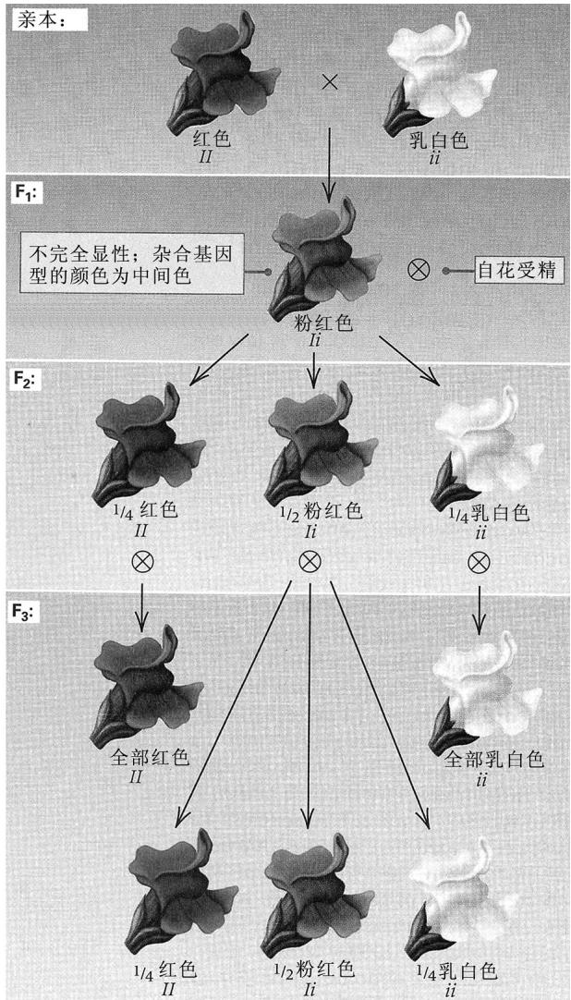  
图 3.21 金鱼草花色的红色对白色，示不完全显性。

用，因为，两个无亲缘关系的人不大可能具有相同的基因型，尤其是考察几个不同的基因座，而每个基因座都具有复等位基因时。许多有害突变也以复等位形式存在，回忆第1章讲过的，在苯丙酮尿症患者中已经鉴定出400多种突变型的苯丙氨酸羟化酶基因。图3.19中的等位基因 $A_{1}\sim A_{6}$ 也说明，尽管一个生物群体可以包含任意数量的等位基因，但任一特定的个体或细胞可能携带的等位基因不会超过两种，且任一配子携带的等位基因不超过一种。

在某些情况下，某个基因的复等位基因的存在纯属偶然，它们只不过反映了种群中曾经发生过突变，以及这些突变在种群各亚群间通过迁移和杂交而散播的历史。在其他情况下，存在利于维持大量等位基因的生物学机制。例如，某些开花植物中控制自花不育的基因可以具有大量的等位型。在许多牧场中野生的红三叶草中可见这种自花不育。自花不育基因之所以能阻止自花授粉，是因为只有花粉粒所含的自花不育基因与它着落的花中存在的两个等位基因都不相同时，它才能长出花粉管，然后才能授粉。换言之，含有花中已经存在的一个等位基因的花粉粒，在那朵花上将不起作用。因为某棵植株产生的花粉粒，必定含有植株中存在的一个自花不育等位基因，不能在产生它的同一植株上起作用，因而就不能进行自花授粉。因此，任何具有新等位基因的植株都会具有选择优势，因为包含新等位基因的花粉，能给同一植株之外的所有花授粉。通过进化，红三叶草种群积累了自花不育基因数以百计的等位基因，其中已有很多被分离且测定了DNA序列。

这些等位基因，很多在多个核苷酸位点上有差异，这说明在群体中这些等位基因非常古老。

## - 人类 ABO 血型

在一个复等位基因系列中，不同的等位基因对之间可能会有不同的显性关系。由3个等位基因

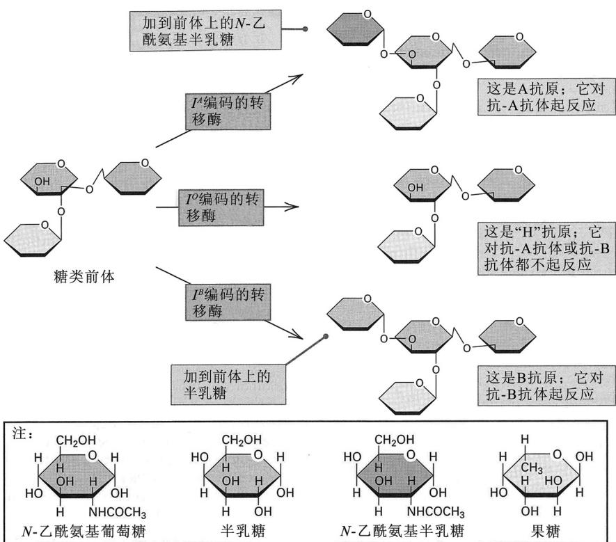  
图 3.22 人类红细胞表面上的 ABO 抗原为糖类。

(以 $I^{A}$ 、 $I^{B}$ 和 $I^{O}$ 表示) 决定的人类 ABO 血型可为一例(事实上，等位基因 $I^{A}$ 有两种稍有差别的变异体)。任何一个人的血型可为 A、B、AB 或 O，取决于红细胞表面存在的多糖(糖的多聚物)类型。A 和 B 是两种不同的多糖，都来自同样的前体分子，被等位基因 $I^{A}$ 和 $I^{B}$ 的酶产物分别修饰成 A 和 B。该基因产物为糖基转移酶，它将一个糖单位连接到前体上(图 3.22)。 $I^{A}$ 和 $I^{B}$ 编码该酶的不同形式，它们在 4 个氨基酸位点上有置换，这改变

了底物特异性，使得每种酶连接不同的糖。 $I^{A}I^{A}$ 基因型的人，产生的红细胞只有 A 多糖，说成是 A 型血，那些 $I^{B}I^{B}$ 基因型的人，红细胞只带 B 多糖，因而是 B 型血； $I^{A}I^{B}$ 杂合的人，具有 A 和 B 两种多糖都带的红细胞，为 AB 型血，第三种等位基因 $I^{O}$ 编码一种没有酶活性的蛋白质，不会改变前体，A 型或 B 型多糖都不产生，因此， $I^{O}I^{O}$ 纯合者，A 多糖和 B 多糖都没有，说成是 O 型血。

在此复等位基因系列中，等位基因 $I^{A}$ 和 $I^{B}$ 为共显性：杂合基因型具有两种纯合基因型的特征(在红细胞上 A 和 B 两种多糖都存在)。另一方面，等位基因 $I^{O}$ 对 $I^{A}$ 和 $I^{B}$ 两者都是隐性。因此，杂合的 $I^{A}I^{O}$ 基因型产生 A 多糖，为 A 型血；杂合的 $I^{B}I^{O}$ 基因型产生 B 多糖，为 B 型血。ABO 血型系统的基因型和表型概括于表 3.3 的前三栏中。

表 3.3 人类 ABO 血型的遗传控制

<table><tr><td>基因型</td><td>红细胞上存在的抗原</td><td>ABO血型(表型)</td><td>血液中存在的抗体</td><td>在输血中,能够接受的提供方血型</td><td>输血给别人,相容的接受方血型</td></tr><tr><td> $I^A I^A$ </td><td>A</td><td>A型</td><td>抗B</td><td>A和O</td><td>A和AB</td></tr><tr><td> $I^A I^O$ </td><td>A</td><td>A型</td><td>抗B</td><td>A和O</td><td>A和AB</td></tr><tr><td> $I^B I^B$ </td><td>B</td><td>B型</td><td>抗A</td><td>B和O</td><td>B和AB</td></tr><tr><td> $I^B I^O$ </td><td>B</td><td>B型</td><td>抗A</td><td>B和O</td><td>B和AB</td></tr><tr><td> $I^A I^B$ </td><td>A和B</td><td>AB型</td><td>抗A、抗B都无</td><td>A、B、AB和O</td><td>AB</td></tr><tr><td> $I^O I^O$ </td><td>A、B都无</td><td>O型</td><td>抗A和抗B</td><td>O</td><td>A、B、AB和O</td></tr></table>

因为要输血，所以 ABO 血型在医学上很重要。ABO 血型系统的关键特点是，大多数人类血液要么含 A 多糖的抗体，要么含 B 多糖的抗体。抗体 (antibody) 是由免疫系统制造、对称为抗原 (antigen) 的刺激分子作出反应的蛋白质，能与抗原结合。抗体一般是特异性的，一种抗体只能识别一种抗原。有的抗体与抗原结合，形成会沉淀的巨大分子聚集体。

抗体的作用是抵御入侵的病毒和细菌。未经抗原刺激，抗体一般不会形成，但有能力产生抗 A 和抗 B 抗体的人，总会产生它们。这些抗体的产生，可能是受到许多常见细菌表面存在的与 A 多糖和 B 多糖相似的抗原刺激。但是，一种称为耐受性 (tolerance) 的机制阻止个体产生抗其自身抗原的抗体。该机制确保仅在红细胞中分别不含 A 多糖或 B 多糖的人中，A 抗原或 B 抗原才诱导抗体物质产生。最终结果是：

O 血型的人，制造抗 A 和抗 B 两种抗体；A 血型的人，制造抗 B 抗体；B 血型的人，制造抗 A 抗体；AB 血型的人两种抗体都不制造。

在每种 ABO 血型的人血液中发现的抗体, 如表 3.3 中第 4 栏所示。ABO 血型 (ABO blood group) 的临床重要性在于, 含有红细胞抗原 A 或 B 的血液, 输给能够产生相应抗体的人, 会导致凝集反应, 使来自供血者的红细胞聚集成团块。在凝集反应中, 抗 A 抗体对 A 血型或 AB 血型的两种红细胞都凝集, 因为两者都含 A 抗原。同样的, 抗 B 抗体对 B 血型或 AB 血型的两种红细胞都凝集。红细胞凝集时, 许多血管被堵塞, 接着受血者进入休克状态, 并可能死亡。另一方面的不相容性, 即供血者血液含有抗受血者红细胞的抗体, 一般是可以接受的, 因为供血者的抗体被迅速稀释, 避免了凝集的发生。相容的输血类型如表 3.3 最后两栏所示, 注意, AB 血型的人, 可以接受任何其他 ABO 血型人的血液, AB 血型的人称为万能受血者 (universal recipient)。反过来, O 血型的人, 可以给任何 ABO 血型的人献血, O 血型的人称为万能输血者 (universal donor)。

## ■ 上位性

在第1章中提到，为完成一个生化途径的所有步骤，往往会需要几个基因的产物。在遗传杂交中，影响单一途径不同步骤的两个突变都要分别分离，但观察不到典型的9:3:3:1的 $F_{2}$ 比值。扰乱正常孟德尔比值的基因相互作用，称为上位性(epistasis)。其中一种上位性，可以豌豆中影响花着色的 $(C, c)$ 和 $(P, p)$ 等位基因对的相互作用为例。这些基因编码花青素生化合成途径中的酶，生产花青素需要存在每种基因至少一个野生型的显性等位基因。在遗传学上，表示这种情况的正确方法是把所需的基因型写成：

$$
C - P -
$$

其中，每个破折号是一个“空”，可用该基因两个等位基因中的任一个来填充。因此，C—包括基因型 CC 和 Cc，同样，P—包括基因型 PP 和 Pp。C—P—包含的所有 4 种基因型——并且只有这些基因型——具有紫色花。

图 3.23 示纯合隐性基因型 CC pp 和 cc PP 之间的杂交。 $F_{1}$ 代花的表型为野生型紫色，因为等位基因 C 对 c 为显性，P 对 p 为显性， $F_{1}$ 代植株是基因型为 Cc Pp 的双重杂合子，所以其具有紫色花。然而，该结果还是奇怪，因为，最初的杂交包含两个纯合隐性的突变体，每个突变体都具有白色的花。得知突变型 c 和突变型 p 这两个等位基因存在于不同基因中之后，在 $F_{1}$ 代中见到野生型花就合理了。但若不知道突变型等位基因是否在不同基因中，又该如何呢？如果两个突变体都是在一次突变筛选中挑出来的，或者是不同的实验室发现的，并且不知道等位基因 c 和等位基因 p 是同一基因的等位基因还是不同基因的等位基因，又该如何？答案是：如果 $F_{1}$ 代的表型如图 3.23 那样是野生型，c 和 p 是不同基因的等位基因；如果 $F_{1}$ 代的表型是突变型（此例中为开白花的植株），c 和 p 是同一个基因的等位基因。在后一种情况下，最好改变它们的名称以表明它们的等位性，如 $c=c_{1}$ 、 $p=c_{2}$ ，这样一来 $F_{1}$ 代植株可以写成 $c_{1}/c_{2}$ ，并且从基因型符号就可以明显看出该表型为突变型，因为该基因的每个等位基因都是突变型。

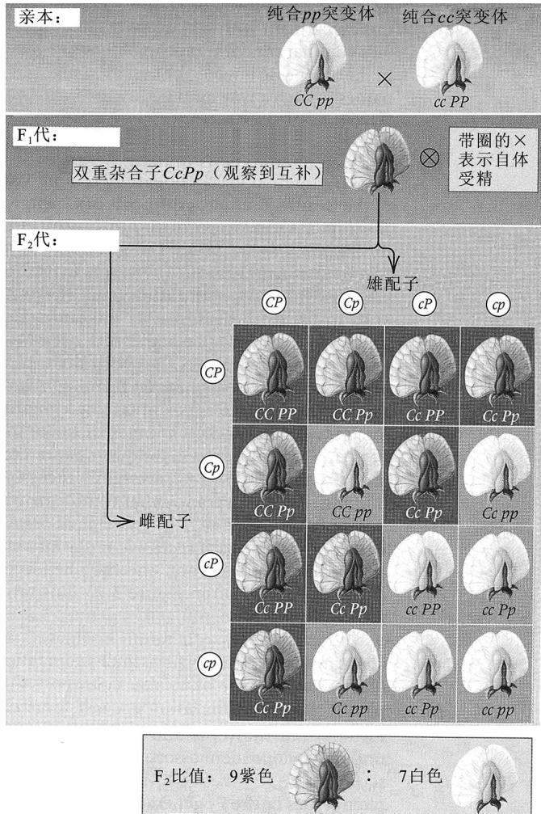  
图 3.23 豌豆花色决定中的上位性。紫色色素的形成需要基因 C 和 P 两者的显性等位基因。这种上位性使双因子杂种 $F_{2}$ 代的比值变为 9 紫色：7 白色。

因子杂种的 9:3:3:1 比值可以改变的方式仅有有限的几种。这些可能的方式如图 3.24 所示，不存在上位性时， $F_{2}$ 的表型比值为 9:3:3:1。在每一行中，不同的颜色表示不同的表型。例如，在最下面的修饰比值 (modified ratio) 中，“3:3:1” 的这几类表型是区分不开的，导致 9:7 的比值。这是在图 3.23 中观察到的 $(C, c)$ 和 $(P, p)$ 分离的比值，紫花与白花的比值为 9:7。把图 3.24 中所有可能的修饰比值放到一起，当两个基因都表现为完全显性时，有 9 种可能的双因

将这一讨论与第 1 章中的比德尔-塔特姆实验(1.4 节)联系起来，该实验使用互补试验来检测链孢霉中两个营养型突变体是否为同一基因的突变体，与图 3.23 中的原理是完全一样的。不同之处在于：比德尔和塔特姆用的是链孢霉异核体，突变型等位基因是通过两种单倍突变型细胞核形成杂种丝状体而集中到一起，而在像图 3.23 豌豆这样的二倍体生物中，杂种细胞核是通过两种纯合隐性突变体的杂交而生成的。要点是，互补试验也被用于有性生殖的二倍体生物中，用来鉴定隐性突变是否是等位基因，图 3.23 中 F $_{1}$ 代的表型说明了该原理。

在图 3.23 中， $F_{1}$ 代说明存在互补， $F_{2}$ 代说明存在一种上位性。假设 $F_{1}$ 代植株自花授粉（用圆圈包围的叉号表示），并假设 $(C, c)$ 和 $(P, p)$ 等位基因对进行自由组合。图 3.23 中的庞尼特方给出了 $F_{2}$ 代的基因型和表型。因为仅有 C—P—后代具有紫花，所以在 $F_{2}$ 代中紫花和白花的比例是 9:7。上位性没有改变独立分离的结果，只是隐藏了这一事实：基因型 C—P—：C—pp:ccP—:ccpp 的潜在比例为 9:3:3:1。

由两个基因的相互作用决定的性状，每个基因有一个显性等位基因，双

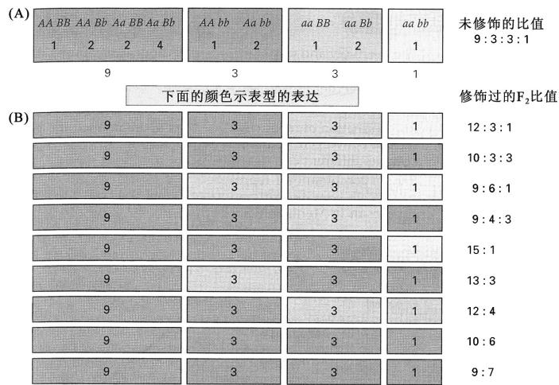  
图3.24 $\mathrm{F}_2$ 代双因子杂种的修饰比值。在每一行中，不同颜色表示不同表型。

子杂种比值。这些修饰比值，每一种均有已知的实例。导致这些修饰比值的上位性的类型，如下面的例子所示，这些例子采自多种生物。在本章后面的习题中，可见到其他例子。

9:7 两个不同的基因，一方或双方的纯合隐性突变导致相同的突变型表型时，可见该比值，如图 3.23 所示。

12:3:1 在某个基因座上存在一个显性等位基因，会掩盖另一基因座的表型时，导致该比值。例如，基因型 A—使得基因型 B—和 bb 没有区别。例如，在燕麦种子外壳的遗传学研究中，一个白壳变种与一个黑壳变种杂交， $F_{1}$ 代杂种种子具黑壳，在 $F_{2}$ 代的 560 个后代中，观察到的外壳表型是 418 黑、106 灰和 36 白，表现比值是 11.6:3.9:1，非常接近 12:3:1。解释这些结果的一个遗传学假设是：黑壳表型是因为存在显性等位基因 A，而灰壳表型是由于存在另一个显性等位基因 B，B 的效应仅在 aa 基因型中显现。根据这一假设，原来的变种基因型为 aa bb（白）和 AA BB（黑）， $F_{1}$ 代基因型为 Aa Bb（黑），如果 (A, a) 等位基因对和 (B, b) 等位基因对进行自由组合，那么预计 $F_{2}$ 代的基因型和表型组成为 9/16 A—B—（黑壳）、3/16 A—bb（黑壳）、3/16 aa B—（灰壳）、1/16 aa bb（白壳），也就是 12:3:1。

13:3 以白来航鸡(基因型 CC II)和白温多特鸡(基因型 cc ii)之间的差异为例。两个品种都有白色羽毛，因为，等位基因 C 是彩色羽毛必需的，但在白来航鸡中，等位基因 I 是羽毛着色的一个显性抑制子。这两个品种的双因子杂种杂交， $F_{1}$ 代具有 Cc Ii 基因型，因为等位基因 I 的抑制作用，表现为白色羽毛。在 $F_{2}$ 代中，仅 C—ii 基因型具有彩色羽毛，所以有白色：彩色的 13:3 比值。

9:4:3 某个基因的隐性等位基因的纯合，掩盖了另一基因表型的表达时，可见该比值。例如，无论基因型是 B—还是 bb, aa 基因型都具有相同的表型，就会导致 9:4:3 的比值。如在小鼠中，“鼠灰色(agouti)”的毛色，是刚好在每根毛的端部下方有一条黄色色素横带的结果。鼠灰色图案由一个显性等位基因 A 造成，在 aa 小鼠中，毛色为黑色。第二个显性基因 C，是任何类型的毛发色素形成都必需的，因而 cc 小鼠为白变种(白色)。在 AA CC(鼠灰色)×aa cc(白化)的杂交中， $F_{1}$ 代为 Aa Cc，鼠灰色表型。 $F_{1}$ 代雄性和雌性交配，产生 $F_{2}$ 代，比例为 9/16 A—C—(鼠灰色)、3/16 A—cc(白化)、3/16 aa C—(黑色)、1/16 aa cc(白化)，即 9 鼠灰色：4 白化：3 黑色。

9:6:1 意味着两种隐性等位基因中任一种的纯合都产生相同的表型，但双重纯合子的表型不同。在杜洛克-泽西猪中，红色的皮毛需要存在 R 和 S 两个显性等位基因。基因型为 R—ss 和 rr S—的猪具浅棕色皮毛，rr ss 的猪为白色。因而， $F_{2}$ 代的比值是 9/16 R—S—(红色)、3/16 R—ss(浅棕色)、3/16 rr S—(浅棕色)、1/16 rr ss(白色)，即 9 红色：6 浅棕色：1 白色。

## 本章概要

\- 遗传性状由存在于生殖细胞中、在受精中合并的基因决定。

\- 基因一般成对遗传：一个来自母方，一个来自父方。

\- 成对基因的 DNA 序列可能不同，从而对某个特定遗传性状的表达起不同的作用。

\- 同一个体中的母源和父源遗传基因不会因为在一起而被改变。

\- 在生殖细胞形成过程中，成对的基因再次分离到不同细胞中。

\- 含不同基因的生殖细胞随机组合，产生在后代中表现出来的性状的孟德尔比值。

\- 对于任何性状，实际观察到的比值，由显性的类型及基因相互作用的类型决定。

## 基础回顾

\- 什么是分离律？在单基因(单杂种)杂交的结果中，该定律是如何表现的？

\- 什么是自由组合律？在两基因(双因子杂种)杂交的结果中，该定律是如何表现的？

\- 解释为什么雄性和雌性配子的随机结合，对于在杂交后代中观察到孟德尔分离和自由组合是必要的。

\- 互斥事件和独立事件的差别是什么？这两种事件的概率如何组合？举两个互斥的遗传事件的例子及两个独立的遗传事件的例子。

\- 两对等位基因表现为自由组合时，在什么情况下，在 $\mathrm{F}_2$ 代中观察不到 $9:3:3:1$ 的表型比值？

\- 解释这句话：“在单杂种杂交的 $\mathrm{F}_2$ 代中，基因型比值是 $1:2:1$ ，但在表现为显性表型的后代中，基因型比值为 $1:2$ 。”

\- 有一个稀有的显性等位基因分离的人类系谱的主要特点是什么？有一个稀有的隐性等位基因分离的人类系谱呢？

\- 什么是突变筛选？在遗传分析中如何应用它？

\- 解释这句话：“在遗传学中，基因是在实验上由一组不能互补的突变型等位基因界定的。”什么是互补试验？互补试验如何让遗传学家确定两个不同的突变是否是同一基因内的突变？

\- 说上位性导致“双因子杂种 $\mathrm{F}_2$ 代的修饰比值”的意思是什么？举出两个双因子杂种 $\mathrm{F}_2$ 代的修饰比值的例子，并解释导致修饰比值的基因的相互作用。

## 解题指南

<table><tr><td rowspan="2">交配</td><td colspan="3">后代基因型</td></tr><tr><td>AA</td><td>Aa</td><td>aa</td></tr><tr><td> $AA \times AA$ </td><td></td><td></td><td></td></tr><tr><td> $AA \times Aa$ </td><td></td><td></td><td></td></tr><tr><td> $AA \times aa$ </td><td></td><td></td><td></td></tr><tr><td> $Aa \times Aa$ </td><td></td><td></td><td></td></tr><tr><td> $Aa \times aa$ </td><td></td><td></td><td></td></tr><tr><td> $aa \times aa$ </td><td></td><td></td><td></td></tr></table>

习题 1 用 0、1/4、1/2 或 1 填写表格，完成每种交配类型的每个后代的基因型的概率。有哪些交配双亲基因型相同，但后代基因型的变化达到单个基因座所能变化的极致？有哪些交配，双亲的不同达到单个基因座所能达到的极致，但后代彼此相同却与双亲皆不同？

答案 这种表格基本上能够用来解传递遗传学中几乎任何类型的定量题。

双亲的基因型相同，但后代基因型的变化达到单个基因座所能达到的变化极限，这种交配是 $Aa \times Aa$ 。双亲的不同达到单个基因座所能达到的极致，但后

代彼此相同且与双亲都不同，这种交配是 $AA \times aa$ 。

<table><tr><td rowspan="2">交配</td><td colspan="3">后代基因型</td></tr><tr><td>AA</td><td>Aa</td><td>aa</td></tr><tr><td> $AA \times AA$ </td><td>1</td><td>0</td><td>0</td></tr><tr><td> $AA \times Aa$ </td><td>1/2</td><td>1/2</td><td>0</td></tr><tr><td> $AA \times aa$ </td><td>0</td><td>1</td><td>0</td></tr><tr><td> $Aa \times Aa$ </td><td>1/4</td><td>1/2</td><td>1/4</td></tr><tr><td> $Aa \times aa$ </td><td>0</td><td>1/2</td><td>1/2</td></tr><tr><td> $aa \times aa$ </td><td>0</td><td>0</td><td>1</td></tr></table>

习题 2 下面的系谱示一种稀有的简单孟德尔显性突变的遗传方式，其外显率等于 1/3 (1/3 的外显率，意思是具有该突变基因型的个体，实际上有

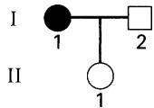

1/3 表现出突变表型)。I -1 这位女性必定具有基因型 $Mm$ ，其中， $M$ 为突变型等位基因。因为该突变型等位基因很罕见，你可以假设 I -2 这位男性具有基因型 $mm$ ，II -1 这个人未患病，II -1 具有 $Mm$ 基因型的概率是多少？

答案 这是利用贝叶斯定理的一个典型习题。令 A 为事件：Ⅱ-1 具有 Mm 基因型，令 B

为事件：II-1不患病。则事件 $A^{\prime}$ 为：II-1这个人具有mm基因型。因I-1具有基因型 $Mm$ ，所以 $\operatorname{Pr}\{A\} = 1 / 2$ 且 $\operatorname{Pr}\{\mathrm{A}'\} = 1 / 2$ 。现在可以应用贝叶斯定理：

$$
\operatorname * {P r} \left\{A \mid B \right\} = \frac {\operatorname* {P r} \left\{B \mid A \right\} \operatorname* {P r} \left\{A \right\}}{\operatorname* {P r} \left\{B \mid A \right\} \operatorname* {P r} \left\{A \right\} + \operatorname* {P r} \left\{B \mid A ^ {\prime} \right\} \operatorname* {P r} \left\{A ^ {\prime} \right\}}
$$

其中， $\Pr \{B|A\}$ 是个体具有 $Mm$ 基因型但不患病的概率， $\Pr \{B|A'\}$ 是个体具有 $mm$ 基因型但不患病的概率。因为外显率为 $1/3$ ，所以 $\Pr \{B|A\} = 2/3$ ；因为 $mm$ 基因型根本不会患病，得 $\Pr \{B|A'\} = 1$ 。把所有这些放到一起，得到所求的答案：

$$
\operatorname * {P r} \left\{A \mid B \right\} = \frac {(2 / 3) (1 / 2)}{(2 / 3) (1 / 2) + (1) (1 / 2)} = 2 / 5
$$

另一种方法可绕开贝叶斯定理。因为个体 I -1 具有基因型 $Mm$ ，I -1 的子女有 3 种可能：(1) $Mm$ 且患病，概率为 $1/2 \times 1/3 = 1/6$ ；(2) $Mm$ 且不患病，概率为 $1/2 \times 2/3 = 1/3$ ；(3) $mm$ 且不患病，概率为 $1/2$ 。因为已知 II -1 未患病，可排除第 (1) 种可能，所以，已知 II -1 未患病的情况下，她具有 $Mm$ 基因型的概率为 $(1/3)/(1/3 + 1/2) = 2/5$ ，这与上面的答案一致。

习题3 在家鸡中，显性等位基因 $C$ 为彩色羽毛必需，但一个非连锁基因的显性等位基因 $I$ 是颜色的抑制子，可掩盖 $C$ 的作用。白来航鸡具有 $CCII$ 基因型，而白温多特鸡具有 $ccii$ 基因型。两个品种都是白色，但原因不同。在白来航鸡和白温多特鸡杂交产生的 $\mathrm{F}_2$ 代中：

(a) 白色：彩色的表型比值是多少？

(b)在 $F_{2}$ 代的白鸡中，Cc Ii 的比例是多少？

## 答案

(a)一开始的 $CC II \times cc ii$ 杂交会产生基因型为 Cc Ii 的 $F_{1}$ 代鸡。因为这两个基因不连锁， $F_{2}$ 代将会有的基因型比值为 9 C—I—:3 C—ii:3 cc I—:1 cc ii。只有基因型为 C—ii 的鸡为彩色，因为 C 为彩色羽毛所必需，而 I 抑制 C 的作用。这种基因的相互作用，即上位性，将导致 13 白色：3 彩色的表型比值。

(b)在非连锁基因的双因子杂种杂交中， $\mathrm{F}_2$ 代两个基因均为杂合的概率等于 $(1/2) \times (1/2) = 1/4$ 。因为此例中只有 $13/16$ 的鸡为白色，在白鸡中 $Cc$ $Ii$ 的比例为 $(1/4)/(13/16) = 4/13$ 。也可以通过数格子，在双因子杂种杂交的庞尼特方中得到这一结果：总共有 13 种基因型产生白鸡，其中有 4 个对于两个基因均为杂合。

习题 4 在杜洛克-泽西猪中，R—S—基因型的猪为红色，R—ss 或 rr S—基因型的猪是浅棕色，而 rr ss 基因型的猪为白色，这两个基因表现为自由组合，RR ss 和 rr SS 基因型之间杂交，在 F₂ 代中：

(a) 红色：非红色的表型比值是多少？

(b)红色的 $\mathrm{F}_2$ 猪中， $RrSs$ 占的比例是多少？

## 答案

(a)一开始的杂交 $RR ss \times rr SS$ 会产生基因型为 $Rr Ss$ 的 $\mathrm{F}_1$ 代猪。 $\mathrm{F}_2$ 代会有的基因型比值为 $9 R - S - :3$ $R - ss:3 rr S -:1 rr ss$ . 只有基因型为 $R - S$ —的猪为红色，而所有其他的为非红色(有些浅棕色，有些白色，比值是 $6:1)$ 。两个基因的这种相互作用(上位性)，导致9红色：7非红色的表型比值。

(b) 4/9。基因型为 $Rr$ Ss 猪的比例，即那些对于两个基因都是杂合的猪所占的比例，等于 $1/2 \times 1/2 = 1/4$ 。因为只有 9/16 的猪是红色的，所以在其中 $Rr$ Ss 的比例是 $(1/2 \times 1/2)/(9/16) = 4/9$ 。也可以通过数格子，在双因子杂种杂交的庞尼特方中得到这个答案：总共有 9 种产生红色猪的基因型，其中有 4 种对于两个基因均为杂合。

## 分析与应用

3.1 在 Aa Bb Cc Dd×Aa Bb Cc Dd 的杂交中，所有的基因进行自由组合，预计所有 4 个基因均为杂合的后代的比例是多少？

3.2 试想某基因有 $A_{1}$ 、 $A_{2}$ 、 $A_{3}$ 和 $A_{4}$ 四个等位基因。在 $A_{1}A_{2}$ 和 $A_{3}A_{4}$ 的杂交中，某个后代单独得到 $A_{1}$ 、单独得到 $A_{3}$ 或两者均得到的概率各是多少？

3.3 假设男孩和女孩的数目相同，如果某对夫妻已经生育一个女孩，下一个孩子是男孩的概率是多少？如果某对夫妻已生育两个女孩，下一个孩子是男孩的概率是多少？答案是根据哪种概率论据？

3.4 Aa BB Cc dd Ee 和 Aa Bb cc DD Ee 基因型之间进行杂交，后代基因型可能有多少种？

3.5 基因型为 $AA Bb Cc DD Ee$ 的个体进行测交。假设这些基因座进行自由组合，预计有多少比例的后代具有 $Aa Bb Cc Dd Ee$ 基因型？

3.6 具有圆滑种子的纯合豌豆植株，与具有皱缩种子的纯合豌豆植株杂交。从 $F_{2}$ 代中随机选择一粒圆滑种子，如课文中所述，用电泳检测其 DNA，观察到的凝胶图为 B 的概率是多少？

3.7 假设在某种植物中进行 MM SS $tt \times mm ss TT$ 的三因子杂种杂交，其中，M 和 S 为显性，但在 T 和 t 之间没有显性，考察该杂交的 $F_{2}$ 代，并设基因间为自由组合。

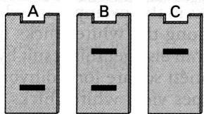

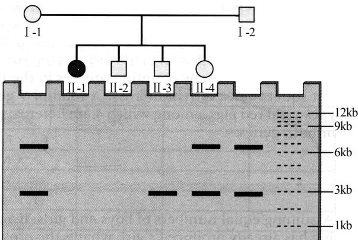

(a)预计有多少种基因型?

(b)基因型 MM SS tt 的概率是多少?

(c)预计所有基因均为纯合的比例是多少?

3.8 此处所示的是一个系谱和一个凝胶示意图，其中标出了临床表型(对苯丙酮尿症而言)和分子表型(对一个RFLP而言，其与苯丙氨酸羟化酶的PAH基因部分重叠)。个体II-1患病。

(a)标出II-1的预期分子表型。

(b)标出 II-2 可能的分子表型。

3.9 下面的系谱提示该系谱是什么遗传方式？在此假设的基础上，假定该性状罕见且具有完全外显率，该系谱中所有个体可能的基因型是什么？

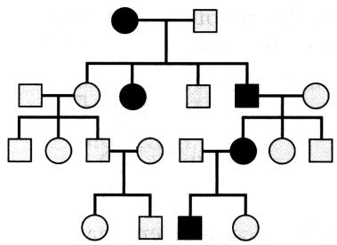

3.10 亨廷顿病是人类一种罕见的神经退行性疾病，由显性等位基因 HD 决定，该病一般在 45 岁后出现，一青年男子得知其父已发病。

(a)今后该青年男子发病的概率是多少?

(b)该青年男子的孩子携带 HD 等位基因的概率是多少?

3.11 下面的凝胶示意图显示，两个双重杂合基因型(左边所示的 P1 和 P2)之间杂交，在后代中观察到的带型(右边示在后代中观察到的带型)。这些条带编号为 1～4。

(a)指出哪两对编号的条带对应于两对分离的等位基因。

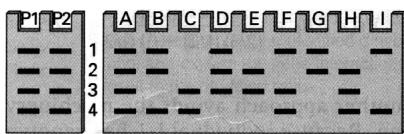

(b) 假设这两对等位基因进行自由组合, 表现出泳道 D 的带型的杂交后代的概率是多少?

3.12 假设所附系谱中的性状是由简单孟德尔遗传所致。

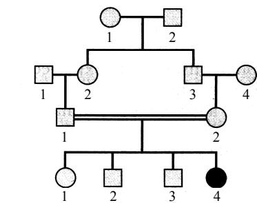

(a)该性状是由显性等位基因还是隐性等位基因导致？解释。

(b) 把III-1 和III-2 连起来的双横线是什么意思？

(c)在生物学上III-1和III-2之间是什么亲缘关系?

(d) 如果造成该病的等位基因是罕见的，系谱中 I、II 和 III 代所有人最可能的基因型是什么？(用 A 和 a 分别表示显性和隐性等位基因)

3.13 在果蝇中，导致棕色眼睛(正常眼睛为红色)的突变型等位基因 $bw^{dts}$ 为温度敏感型。在 $29^{\circ}C$ 培养的果蝇中，该突变型等位基因为显性，但在 $22^{\circ}C$ 培养的果蝇中，该突变型等位基因为隐性。 $bw^{dts}/+\times bw^{dts}/+$ 杂交，其中，+号表示 $bw^{dts}$ 的野生型等位基因，如果在

29℃培养杂交后代，棕眼果蝇与红眼果蝇的期望比值是多少？在 22℃培养呢？

3.14 系谱分析表明，某一亲本可能具有 $AA\ BB$ 或 $AA\ Bb$ 基因型，两种基因型的概率相同。假定为自由组合，该亲本产生 $Ab$ 配子的概率是多少？该亲本产生 $AB$ 配子的概率是多少？

3.15 此处所示为一罕见常染色体隐性性状的系谱，该性状具完全外显率，可以假设，该系谱中所有人都只能从 I-1 或 II-4（或同时从两者）获得隐性等位基因。

(a) 在不考虑第IV代同胞群的情况下，一级堂表亲婚配的两位亲本均为杂合的概率是多少？

(b) 把第IV代的同胞群考虑在内，一级堂表亲婚配的两位亲本均为杂合的概率是多少？

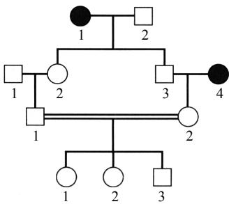

3.16 某种疾病的临床检验，对于患病个体 100% 准确，但对健康个体也会产生 0.2% 的假阳性结果。如果在某个群体中，患者所占的比例为 0.002，随机选择的个体产生阳性检验结果的总概率是多少？

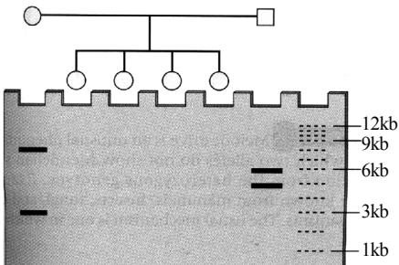

3.17 所附系谱及凝胶示意图示双亲的表型(对于某个具有复等位基因的 RFLP)，后代可能的表型是什么？预计这些表型所占的比例是多少？

3.18 一个具有圆滑种子的豌豆纯育品系，与一个具有皱缩种子的纯育品系杂交，从其 $F_{2}$ 代得到圆滑种子，收集其花粉，混在一起，用于给纯育皱缩品系的植株授粉。预计后代中皱缩种子的比例是多少？（假设所有的基因型生育力相同）

3.19 杂合的 Cp cp 鸡表现出一种称为匍匐鸡(creeper)的疾病，其腿骨和翅骨比正常鸡(cp cp)短。显性 Cp 等位基因纯合致死。

一个独立分离的基因的两个等位基因，决定皮肤颜色的白 $(W$ ——)与黄 $(ww)$ 。两个基因均为杂合的两只鸡交配，在存活的后代中，会出现什么基因型种类？这些基因型的期望相对频率是多少？

3.20 某个杂交的 $F_{2}$ 代表现出双因子杂种杂交修饰比值为 9:7 (而不是 9:3:3:1)，预计 $F_{1}$ 代测交会得到什么表型比值？

3.21 在交配 $Aa \times Aa$ 中，要使至少有一个 aa 后代的概率超过 95%，后代的最小数目 (n) 是多少？

3.22 一位妇女患一种由显性突变型等位基因导致，且外显率为 50% 的病。如果她生一个孩子，该孩子患病的概率是多少？

3.23 狗的皮毛着色方式由单一基因的等位基因决定，S(纯色)对 s(斑点)为显性。黑色的毛色由第二个基因的显性等位基因 A 决定，纯合隐性 aa 的狗为棕黄色。一只纯棕黄色毛的雌狗，与一只纯黑毛的雄狗交配，产下一窝 6 只小狗，小狗的表型为 2 只纯棕黄色、2 只纯黑色、1 只斑点棕黄色、1 只斑点黑色。两个亲本的基因型是什么？

3.24 考察一种表型，等位基因 N 对等位基因 n 为显性。进行 $Nn \times Nn$ 交配，然后随机选择一个具有显性表型的个体，该个体进行测交，产生 4 个后代，每个均为显性表型。具有显性表型的这个亲本具有 Nn 基因型的概率是多少？

3.25 有些多态性可用随机选取序列的寡核苷酸为引物来鉴定。这些多态性被称为 RAPD 多态性，RAPD 表示随机扩增多态 DNA (randomly amplified polymorphic DNA)。一个 RAPD 多态性通常由一个位点所导致，在该位点，群体中只有一些染色体能与引物结合，从而产生一个条带，而其他染色体不与引物结合，所以不产生条带。该位点为杂合的个体，其 DNA 会产生一个条带。此处所示的凝胶示意图含两个亲本 (X 和 Y) 的表型 (就两个 RAPD

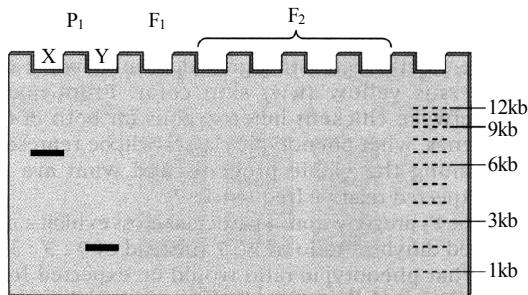

多态性而言，这些多态性与基因组中不同的位点对应)。每个亲本都是纯合的(对与其 DNA 显示出的 RAPD 条带相关的位点而言)。这两个 RAPD 多态性由基因组中不同位点的扩增所致，两个位点之间自由组合。在凝胶示意图中标出 $F_{1}$ 代的期望表型，以及 $F_{2}$ 代所有可能的表型及其期望比例。

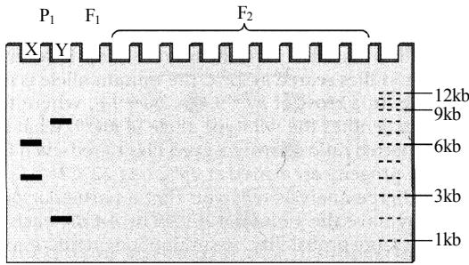

型组合，会产生与已知项相吻合的数据，根据需要，在每个圆圈中填+或-，完成该表。

3.26 所附凝胶示意图示两个亲本(X 和 Y)的表型，每个亲本对于两个自由组合的 RFLP 均为纯合。亲本 X 具有基因型 $A_{1}A_{1}$ $B_{1}B_{1}$ ，等位基因 $A_{1}$ 产生一个 4kb 条带，等位基因 $B_{1}$ 产生一个 6kb 条带。亲本 Y 具有基因型 $A_{2}A_{2}$ $B_{2}B_{2}$ ，等位基因 $A_{2}$ 产生一个 8kb 条带，等位基因 $B_{2}$ 产生一个 2kb 条带。指出 $F_{1}$ 代的期望表型，以及 $F_{2}$ 代所有可能的表型及其预期比例。

3.28 已知植物的某些突变基因影响配子参与受精的能力。假设等位基因 A 就是这样的一个突变，且带等位基因 A 的花粉细胞能够存活并参与受精的可能性，只有带等位基因 a 的花粉细胞的一半。完成单杂种杂交 $F_{2}$ 代的庞尼特方。在 $F_{2}$ 代中，AA:Aa:aa 植株的期望比值是多少？

3.27 进行隐性突变基因 $a \sim f$ 的互补试验，得到附表中的数据。圆圈表示数据缺失。假设所有这些缺失的突变

<table><tr><td></td><td>a</td><td>b</td><td>c</td><td>d</td><td>e</td><td>f</td></tr><tr><td>a</td><td> $\bigcirc$ </td><td>+</td><td>-</td><td> $\bigcirc$ </td><td>+</td><td> $\bigcirc$ </td></tr><tr><td>b</td><td></td><td> $\bigcirc$ </td><td> $\bigcirc$ </td><td> $\bigcirc$ </td><td> $\bigcirc$ </td><td>-</td></tr><tr><td>c</td><td></td><td></td><td> $\bigcirc$ </td><td>-</td><td> $\bigcirc$ </td><td> $\bigcirc$ </td></tr><tr><td>d</td><td></td><td></td><td></td><td> $\bigcirc$ </td><td> $\bigcirc$ </td><td> $\bigcirc$ </td></tr><tr><td>e</td><td></td><td></td><td></td><td></td><td> $\bigcirc$ </td><td>+</td></tr><tr><td>f</td><td></td><td></td><td></td><td></td><td></td><td> $\bigcirc$ </td></tr></table>

## 挑战题

挑战题 1 此处图示的 DNA 来自一个野生型等位基因(上)，及一个突变型等位基因(下)，后者因一个转座因

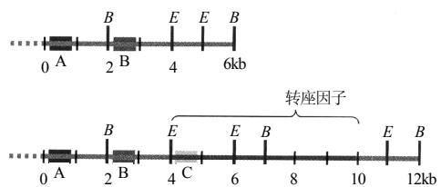

子的插入而失活。这种转座因子存在许多拷贝，散在于整个基因组中。符号 B 和 E 分别代表 BamH I 和 EcoR I 的限制位点，方框表示可用的 3 种探针 (A、B 和 C) 的杂交位点。左侧的点表示最近的 BamH I 或 EcoR I 切割位点离所示区域的左侧很远。用 RFLP 分析来鉴定这两个等位基因，你会用哪个探针和哪一种限制酶，请解释。还有，解释为什么另外的选择可能不合适。

挑战题 2 减数分裂驱动 (meiotic drive) 是杂合基因型中的两个等位基因不表现出孟德尔分离的异常现象。已经知晓来自哺乳动物、昆虫、真菌和其他生物的实例。其机制通常是这样：两种类型的配子都会形成，但其中一种不能正常发挥功能。驱动等位基因 (driving allele) 比另一个等位基因多出的量，其范围可从很小到近乎 100%。假设 D 是一个对其等位基因 d 表现出减数分裂驱动的等位基因，并假设 Dd 杂合子产生有功能的带 D

和带 d 配子的比例是 3/4:1/4。在 $Dd \times Dd$ 交配中：

(a) $DD$ 、 $Dd$ 和 $dd$ 基因型的期望比例是多少？

(b) 如果 $D$ 是显性的, $D$ —和 $dd$ 表型的期望比例是多少?

(c) 在 $D$ 一表型中， $DD: Dd$ 的比例是多少？

(d) 假设减数分裂驱动仅在一种性别中发生，回答 (a)～(c)。

挑战题 3 附表概括了在哺乳动物中遗传性组织抗原对移植组织(如皮肤移植物)的接受或排斥的作用。组

<table><tr><td rowspan="2">受者</td><td colspan="3">供者</td></tr><tr><td>AA</td><td>Aa</td><td>aa</td></tr><tr><td>AA</td><td>+</td><td>-</td><td>-</td></tr><tr><td>Aa</td><td>+</td><td>+</td><td>+</td></tr><tr><td>aa</td><td>-</td><td>-</td><td>+</td></tr></table>

织抗原受共显性方式决定，所以，从基因型为 $Aa$ 的供者得来的组织， $A$ 和 $a$ 两种抗原都携带。在表中，+号表示供者的移植组织被受者接受，-号表示供者的移植组织被受者排斥。原则是：凡供体组织含有受者中不存在的抗原时，移植物将会被排斥。换言之，当且仅当供体组织不含与受者已有的所有抗原不同的抗原时，移植物才会被接受。

此处的示意图示小鼠近交(纯合)系 $\left(\mathrm{P}_{1}\text{和}\mathrm{P}_{2}\right)$ 及其 $F_{1}$ 和 $F_{2}$ 代之间所有可能的皮肤移植方式。假设近交系 $P_{1}$ 和 $P_{2}$ 仅有一个组织相容性(histocompatibility)

基因不同。供体是从箭头基部所示的群体中随机选择的一只小鼠，受体是从箭头头部所示的群体中随机选择的一只小鼠，对于每个箭头，接受移植物的概率是多少？

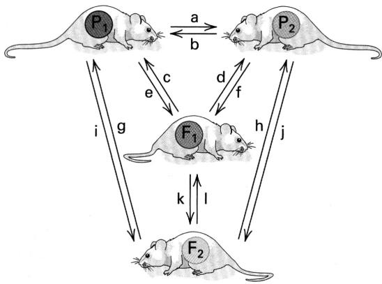

## 网上遗传学

“网上遗传学”(GeNETics)会为你介绍在互联网上寻找遗传学信息的某些最重要的站点。要浏览这些站点，请访问为《遗传学：基因和基因组分析》(第八版)配备的 Jones and Bartlett 公司配套站点http://biology.jbpub.com/book/genetics/8e/。

在该站点中，你会找到一个按章开列的重点关键词列表。选择某个关键词后，可链接到某个网站，其中包含与此关键词相关的信息。
