## 第4章 染色体和性染色体遗传

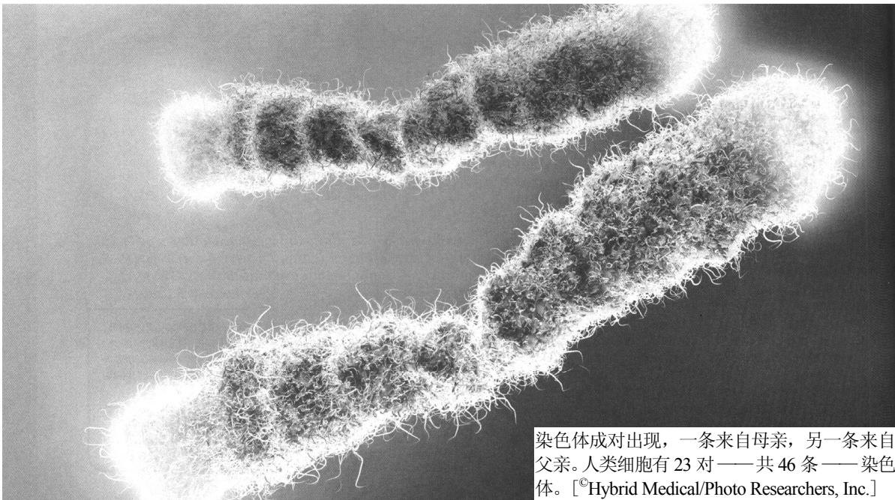

染色体成对出现，一条来自母亲，另一条来自父亲。人类细胞有23对——共46条——染色体。[©Hybrid Medical/Photo Researchers, Inc.]

## 本章提纲

4.1 染色体组的稳定性

4.2 有丝分裂

4.3 减数分裂

4.4 性染色体遗传

4.5 后代分布预测中的概率

4.6 遗传假设的拟合优度检验

联系：蝗虫、蝗虫

埃莉诺·卡罗瑟斯，1913

与某些直翅目昆虫染色体有关的孟德尔比值

联系：白眼雄性

托马斯·亨特·摩尔根，1910

果蝇的限性遗传

联系：可疑的种子

罗纳德·艾尔默·费希尔，1936

孟德尔的工作已经被重新发现了吗？

## 学习目标与科学能力

理解染色体和性染色体如何遗传，以及本章所述的概率的基本原理和假设的统计检验，会使你具备如下科学能力。

\- 能预测正常或异常的染色体行为会产生什么样的有丝分裂或减数分裂产物。

\- 能辨识 X 连锁遗传的特有方式，并能在 X 染色体在两性间一代代传递的过程中，追寻它们的踪迹。

\- 已知某一遗传杂交，能利用二项分布来计算后代中基因型或表型的任意特定组合的概率。

\- 能提出遗传假设，用它来预测杂交的期望结果，并通过拟合优度的卡方检验，来比较期望结果和观测结果。能根据是否应该拒绝假设来解释检验结果。

基因在染色体上，这不是什么重大发现。基因和染色体之间存在一些共性，使得这一点相当明显。

1. 基因成对出现；染色体成对出现。

2. 一个基因的两个等位基因会分离；同源染色体会分离。

3. 非连锁基因会进行自由组合；非同源染色体会进行自由组合。

这些共同点于 1903 年首次被指出，从那时起，对于染色体是细胞的基因载体，鲜有疑问。但是，共同点不算科学证据，也不是科学家的普遍共识。在本章中，将考察一些当时被认为是——且现在仍被认为是——足以证明遗传的染色体学说(chromosome theory of heredity)的实验证据。

## 4.1 染色体组的稳定性

1831 年首次发现细胞核，但直到 19 世纪 60 年代后期，才知道细胞分裂几乎总是伴随着细胞核分裂。差不多同时，发现在受精过程中两个配子的细胞核会融合，这使细胞核在遗传中的重要性得到加强。接下来的重大进展——染色体 (chromosome) 的发现——出现在 19 世纪 80

表 4.1 某些动植物物种的体细胞(二倍体)染色体数目

<table><tr><td>生物</td><td>染色体数目</td><td>生物</td><td>染色体数目</td></tr><tr><td>问荆</td><td>216</td><td>酿酒酵母</td><td>32</td></tr><tr><td>欧洲蕨</td><td>116</td><td>黑腹果蝇</td><td>8</td></tr><tr><td>巨杉</td><td>22</td><td>秀丽隐杆线虫</td><td>11♂,12♀</td></tr><tr><td>硬粒小麦</td><td>28</td><td>家蝇</td><td>12</td></tr><tr><td>普通小麦</td><td>42</td><td>蝎子</td><td>4</td></tr><tr><td>蚕豆</td><td>12</td><td>尺蠖蛾</td><td>224</td></tr><tr><td>豌豆</td><td>14</td><td>蟾蜍</td><td>22</td></tr><tr><td>拟南芥</td><td>10</td><td>鸡</td><td>78</td></tr><tr><td>玉米</td><td>20</td><td>小鼠</td><td>40</td></tr><tr><td>百合</td><td>24</td><td>长臂猿</td><td>44</td></tr><tr><td>金鱼草</td><td>16</td><td>人</td><td>46</td></tr></table>

年代。使用某些染料，可以在光学显微镜下轻易地用肉眼观察到染色体。数年之后，发现染色体通过一个有序的过程分开，进入由细胞分裂形成的子细胞，或由生殖细胞分裂形成的配子中。人们观察到动植物染色体组(chromosome complement, 完整的一套染色体)的3条重要规律。

1. 每个体细胞[somatic cell, 身体的细胞, 与种质细胞(germ cell)或配子不同]的细胞核中, 含有该物种特有的、固定数目的染色体。不同物种的染色体数目变化极大, 但染色体数目与生物的复杂程度关系不大(表4.1)。

4.1)。细胞核包含两套相似染色体的细胞，称为二倍体(diploid)。二倍体个体每对染色体上的每个基因具有两个等位拷贝。染色体成对出现，每对染色体中的一条来自雌性亲本，另一条来自雄性亲本。

2. 在体细胞核中，染色体一般成对存在。例如，人类的 46 条染色体由 23 对组成(图

图 4.1 人类男性的染色体组。有 46 条染色体，呈 23 对。在观察这些染色体时分裂周期所处的这一阶段，每条染色体由相同的两半组成，两半纵向并排。除了一对染色体(决定性别的那对)的成员以外，所有染色体对的成员颜色相同，因为它们含的 DNA 分子被相同的荧光染料混合物标记。一对染色体与另一对染色体的颜色不同，是因为染料混合物的颜色不同。在某些情况下，长臂和短臂标记了不同的颜色。[格拉茨医科大学基因组遗传学研究所迈克尔·斯派克 (Michael R. Speicher) 惠赠。]

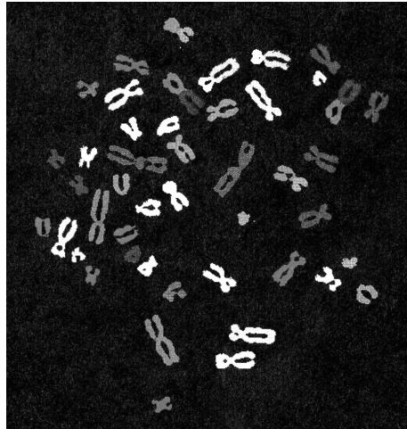

3. 在受精过

程中结合而产生二倍体体细胞的配子，其细胞核仅含有由每对染色体的一条组成的一套染色体。配子细胞核为单倍体(haploid)。

在从单个细胞发育而来的多细胞生物中，体细胞中存在二倍染色体数目，生殖细胞中存在单倍染色体数目，说明存在两种结果不同的细胞核分裂过程。其中一种(有丝分裂)保持染色体数目不变；另一种(减数分裂)使染色体数目减半。以下各节将讨论这两种过程。

## 4.2 有丝分裂

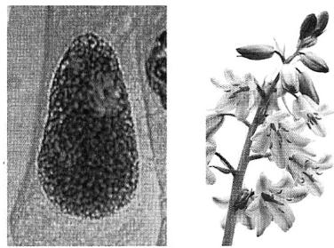  
风信子(右, Hyacinthoides)细胞的间期细胞核(左)。[左: ©Pr. G. Gimenez-Martin/Photo Researchers, Inc.; 右: ©Selectphoto/Dreamstime.com。]

有丝分裂 (mitosis) 是细胞核分裂的一种过程, 它确保两个子细胞都得到与母细胞二倍染色体组相同的一个二倍染色体组。有丝分裂通常伴随着胞质分裂 (cytokinesis), 在此过程中, 细胞自身分裂成两个子细胞。在所有生物中, 有丝分裂的基本过程非常一致。

1. 在细胞核分裂开始的时候，每条染色体就已经以复制后的结构存在。(每条染色体的复制与其包含的 DNA 的复制同时发生)。

2. 每条染色体纵向分开成相互分离的相同的两半。

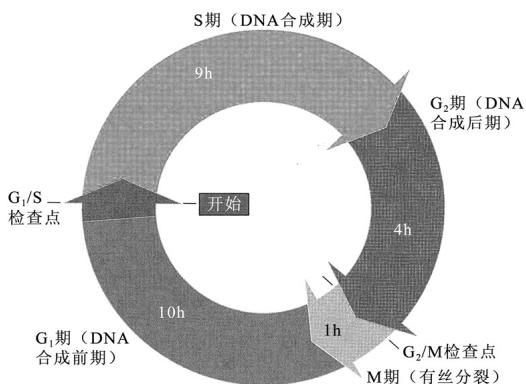  
图 4.2 在组织培养中生长的典型哺乳类细胞的细胞周期，一代的时间为 24h。

3. 分离后的两半染色体向相反的方向移动, 最终分别被包含在形成的两个子细胞核中。

在未进行有丝分裂的细胞中，在光学显微镜下看不到染色体，此时每条染色体由细到看不见的细长纤丝组成，细胞周期的这一阶段，称为间期(interphase)。准备有丝分裂时，染色体中的DNA在间期中称为S期的时期被复制(图4.2)，S表示DNA的合成(synthesis)。DNA复制伴随着染色体的复制。S期之前和之后的时期，分别称为 $\mathbf{G}_1$ 期和 $\mathbf{G}_2$ 期，其间不发生DNA的复制。常用来描述细胞周期(cell cycle，细胞的生命周期)的术语，包括间期的这3个时期，以及随后的有丝分裂——M期。因而，

这些事件的顺序为 $G_{1} \rightarrow S \rightarrow G_{2} \rightarrow M$ ，如图 4.2 所示。在该图中，M 期也包括了细胞质的分裂（胞质分裂，cytokinesis），形成大致相等的两个部分，各含一个子细胞核。一个完整的细胞周期所需的时间长短，因细胞类型而异，大多数高等真核生物细胞为 18～24h。细胞周期中不同时期的相对持续时间，也因细胞类型不同而有显著差异。有丝分裂通常是最短的时期，需 0.5～2h。

细胞周期是一个活跃但受调控的过程，其控制机制在所有真核生物中基本相同。这些机制将在第 15 章中详细讨论。从 $G_{1}$ 期进入 S 期和从 $G_{2}$ 期进入 M 期的过渡期，称为检查点 (checkpoint)，因为除非关键过程已经完成，否则过渡期会被延迟(图 4.2)。例如，在 $G_{1}/S$ 检查点处，要开始 DNA 的复制，要么自前一次有丝分裂以后必须经过足够的时间(在一些类型的细胞中)，要么细胞必须达到足够的大小(在其他类型的细胞中)。同样，要让 M 期开始， $G_{2}/M$ 检查点要求完成 DNA 复制和所有 DNA 损伤的修复。

图 4.3 所示为有丝分裂中染色体行为的基本特点。有丝分裂通常分成 4 个时期：前期 (prophase)、中期 (metaphase)、后期 (anaphase) 和末期 (telophase)。这些时期具有如下特征。

1. 前期 在间期中，染色体为伸展的细丝状，用光学显微镜看不到独立的实体。细胞核除了存在一个或几个明显的深色小体(核仁，nucleoli)外，外观呈弥散颗粒状。前期的开始，以染色体凝缩，形成在细胞核中清晰可见的纤丝为标志。染色质凝缩由称为凝缩蛋白(condensin)的巨大蛋白复合物引起。在这一时期，每条染色体在纵向上已经加倍，由两个紧密结合在一起的称为染色单体(chromatid)的亚基组成。每条染色体在纵向上由两部分构成，该性质在晚前期很容易看到。每对染色单体是在间期的S期中一条染色体的复制产物。成对的染色单体在染色体上称为着丝粒(centromere)的一个特殊区域结合在一起。随着前期的进行，染色体由于复杂的盘绕而变短变粗(第7章)。前期结束时，核仁消失，核被膜(包围细胞核的膜)突然裂解。

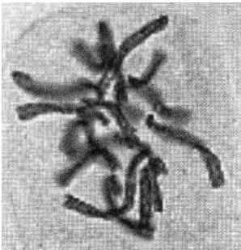  
风信子的前期[©Pr. G. Gimenez-Martin/Photo Researchers, Inc.]

2. 中期 在中期开始时，有丝分裂纺锤体 (mitotic spindle) 形成。纺锤体是排列成细长橄榄球状的大量纺锤丝，纺锤丝主要由微管蛋白聚合成的微管组装成。有许多其他的蛋白质和至少 1 种 RNA 蛋白复合物调控微管蛋白的聚合和微管的组装。纺锤体的两端，或

称为极(pole)，为微管会合之处，标示了中心体(centrosome)的位置。中心体是微管的组装中心，微管蛋白在此处开始聚合。每对中心体由单个中心体复制而来，该过程发生于间期中，继之以两个子代中心体迁移到核被膜的两侧(在第15章中，将更详细地讨论这些过程)。

纺锤体主要由3种微管组成：①将中心体锚定到细胞膜上的微管；②拱状跨接于两个中心体之间的微管；③与染色体连接的微管。这些微管的构建方式，是一种可以称之为试探与稳定(exploration and stabilization)的重要的生物学组织原理的范例。在微管形成时，新的微管蛋白亚单位加入多聚物的生长端，但该生长端也可以变得不稳定，从而开始去多聚化的过程，使微管缩短。有数种蛋白质辅助调节多聚化和

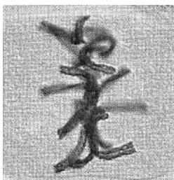  
风信子的中期[©Pr. G. Gimenez-Martin/Photo Researchers, Inc.]

去多聚化之间的平衡。在纺锤体形成过程中，微管基本上以随机的方向从纺锤极生长出来(这是该过程的试探部分)，除非恰好有什么稳定了生长端，每个多聚物将最终进行去多聚化并消失。对于得以与染色体连接的微管，稳定生长端的事件，是与一个专业上称为动粒(kinetochore)的结构接触，动粒与着丝粒在相同位置。因此，该随机试探与稳定的过程导致这样的情况：只有那些与动粒接触上的染色体微管得以稳定，其他的微管则解聚。类似的稳定化类型也很可能可以用来解释与细胞膜连接的微管和拱状跨接于中心体之间的微管。

纺锤丝附着到染色体之后，每条染色体被移到靠近细胞中央的位置，染色体的动粒位于离两个纺锤极的距离大致相等的一个假想的平面上。这个假想的平面称为赤道板 (metaphase plate)。排列在赤道板上之后，染色体达到其最大压缩状态，此时最易于计数和检查其在形状和外观上的差异。

在有丝分裂和减数分裂中，正确的染色体排列都是中期一个重要的细胞周期控制检查点。

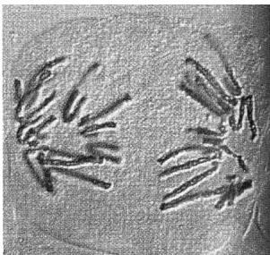  
风信子的后期[©Pr. G. Gimenez-Martin/Photo Researchers, Inc.]

在一个细胞中，如果某条染色体只与纺锤体的一极连接，中期的完成会被推迟。染色体排列正确的信号来自动粒，该信号的化学本质似乎是某些动粒相关蛋白的去磷酸化。通过该信号机制，当所有动粒在纺锤丝牵引下排列到赤道板上时，中期检查点开通，细胞继续分裂的过程。

3. 后期 在后期中，将染色单体结合到一起的蛋白质消失。着丝粒分裂，每条染色体的两条姐妹染色单体(sister chromatid)分别移向纺锤体的两极。一旦着丝粒分裂，每条姐妹染色单体就被视为独立的染色体。染色体的运动，部分是由于附着于着丝粒的纺锤丝逐渐缩短，向着两极相反的方向牵引染色体，部分通常也是正在分裂的细胞在与纺锤体平行的方向上暂时伸长所致。后期结束时，两组染色体分别位于纺锤体的两极附近。每组含有和起初间期细胞核中存在的相同的染色体数目。

4. 末期 在末期中，核被膜形成于每组凝缩的染色体周围，核仁形成，纺锤体消失。染色体经过凝缩的逆过程，直至不再看到独立的实体。随着细胞质通过围绕外缘的一条逐渐加深的沟一分为二，两个子细胞核慢慢呈现出典型的间期外观。

风信子的末期[©Pr. G. Gimenez-Martin/Photo Researchers, Inc.]

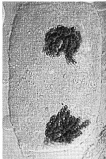

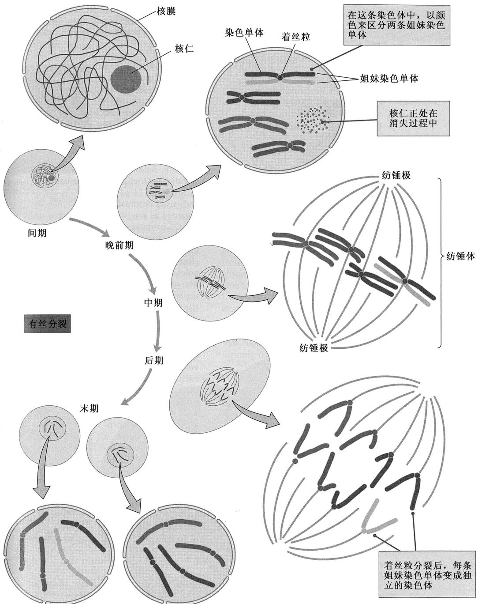  
图 4.3 具有两对染色体(红色/玫瑰红与绿色/蓝色)的某种生物，在有丝分裂过程中的染色体行为。每一时期，中间的小图代表完整的细胞，大图为分解图，示该时期的染色体。

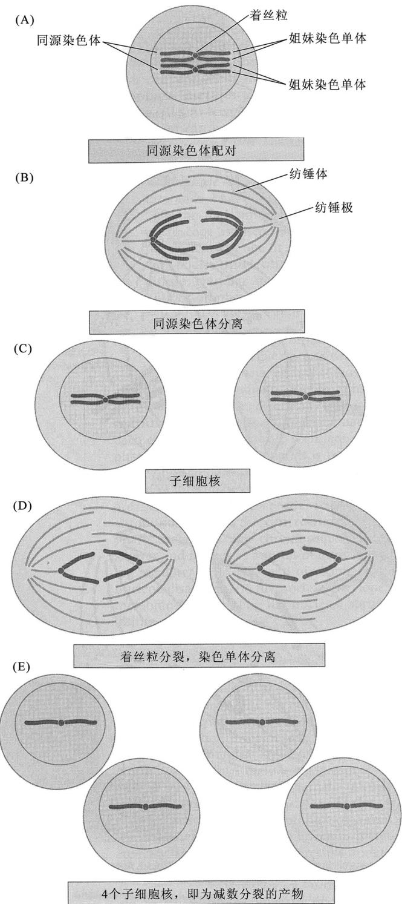  
图 4.4 减数分裂中单对同源染色体的行为概览。与有丝分裂的主要差别是，同源染色体配对(A)和使染色体数目减半的两次连续的核分裂(B 和 D)。为清楚起见，该示意图未将交换包括于内。交换是染色体片段的互换，发生于 A 部分所示的时期。

## 4.3 减数分裂

减数分裂 (meiosis) 是一种产生只含有每对染色体中一条染色体的单倍体子细胞的细胞分裂方式。该过程产生遗传多样性，因为每个子细胞各含一套不同的等位基因。减数分裂包括两次连续的细胞核分裂。其染色体行为概括于图 4.4 中。

1. 在第一次细胞核分裂之前，每对同源染色体的两个成员沿其纵向紧密结合(图 4.4)。每对染色体的每一成员均已复制，由在着丝粒处连接的两条姐妹染色单体组成。因而，同源染色体配对产生一个具有四条链的结构。

2. 在第一次细胞核分裂过程中，同源染色体相互分离，每对同源染色体的两个成员分别移向纺锤体的两极(图 4.4B)。每条子代染色体由两条结合于同一着丝粒的染色单体组成(图 4.4C)，所以，形成的两个细胞核都含有单倍染色体组(染色体是通过计算着丝粒数目来计数，而不是按染色单体数目来计数)。

3. 第二次细胞核分裂略似有丝分裂，但不存在 DNA 的复制。中期，

染色体排列到赤道板上；后期，每条染色体的两条染色单体分离，进入两个子细胞核中（图4.4D）。在减数分裂中，两次分裂的净效应是生成4个单倍子细胞核，每个细胞核含有来自每对同源染

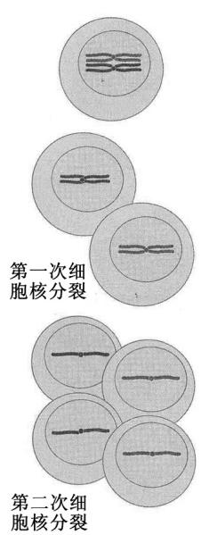

色体的单条姐妹染色单体(图 4.4E)。

图 4.4 没有显示配对的同源染色体能够交换基因。交换的结果是，形成由

来自一条同源染色体的片段与来自另一条同源染色体的片段混合组成的染色体。在图4.4中，交换过的染色体可以绘制成颜色相间的片段。交换过程是减数分裂的关键特征之一，将在下一节讨论。

在动物中，减数分裂发生在称为性母细胞 (meiocyte) 的特化细胞中，性母细胞是配子生成组织中初级卵母细胞和初级精母细胞的统称 (图 4.5)。卵母细胞形成卵细胞，而精母细胞形成精细胞。虽然在所有有性生殖的生物中，减数分裂的过程都类似，但在雌性动物

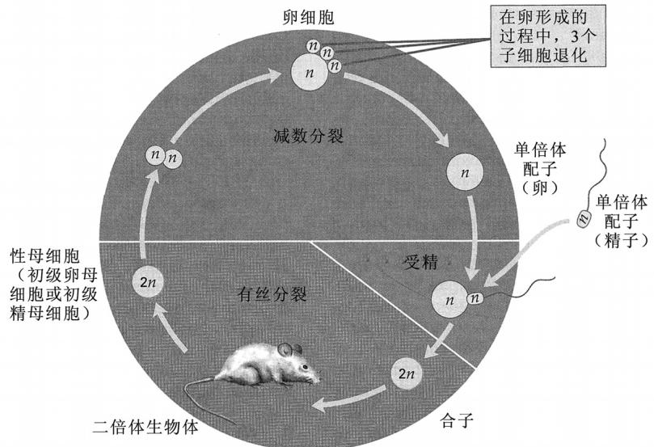  
图 4.5 典型动物的生活史。n 是单倍染色体组中染色体的数目。在雄性中，减数分裂的 4 个产物都发育成有功能的精子；在雌性中，4 个产物里仅有 1 个发育成卵。

和植物中，减数分裂产生的 4 个细胞中都只有一个发育为有功能的细胞，其他 3 个解体。在动物中，减数分裂的产物为精子或卵，在植物中，情况稍微复杂一些。

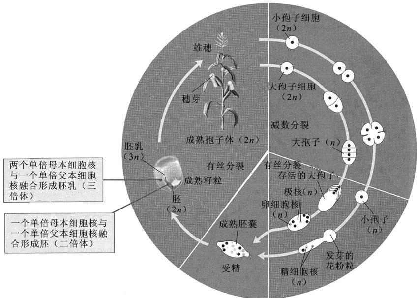  
图 4.6 玉米(Zea mays)的生活史。正如在高等植物中典型的那样，二倍体孢子生成(孢子体)世代是肉眼可见的，而配子生成(配子体)世代只能用显微镜观察。卵源孢子为大孢子，精源孢子为小孢子。分别以黄色和绿色示参与减数分裂的和参与受精的细胞核。

1. 减数分裂的产物一般为孢子(spore)，孢子经过一次或数次有丝分裂，生成单倍的配子体结构。配子体(gametophyte)通过单倍核的有丝分裂产生配子(图4.6)。

2. 单倍体配子融合产生二倍体合子，然后发育成孢子体 (sporophyte) 植株，孢子体植株经过减数分裂产生孢子，于是重新开始生殖周期。

减数分裂是一个比有丝分裂复杂而且长得多的过程，通常需要数天甚至数星期。图 4.7 联系细胞解释了减数分裂

的完整过程。其要旨是——减数分裂包括两次细胞核分裂，但染色体仅复制一次。两次细胞核分裂——称为第一次减数分裂和第二次减数分裂——可被分成一系列的时期，与用来描述有丝分裂的那些时期类似。这一重要过程中的独特事件，发生在细胞核的第一次分裂过程中。这些事件将在下节叙述。

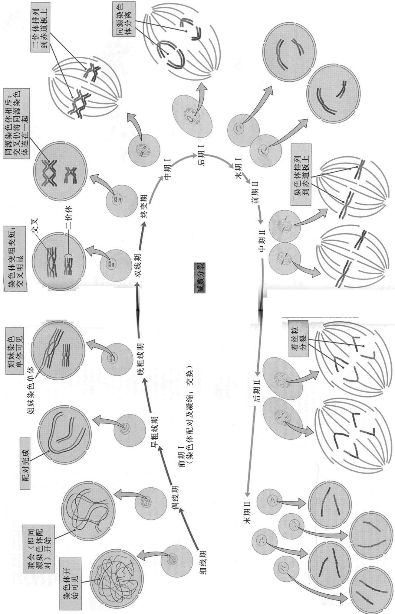  
图4.7 具有两对同源染色体(红色/粉红色和绿色/蓝色)的某种生物中，减数分裂期间的染色体行为。在每个时期中，小示意图代表整个细胞，大示意图是该时期染色体的展开图。

## ■ 第一次减数分裂：减数

有时称第一次减数分裂(减数分裂 I)为减数分裂(reductional division)，因其将染色体数目分为两半。仿照有丝分裂，可把第一次减数分裂分成4个时期，称为前期I（prophase I）、中期I（metaphase I）、后期I（anaphase I）和末期I（telophase I）。这些时期一般比有丝分裂的相应时期复杂，参考图4.7和图4.8，可获得对这些时期及亚期的形象化认识。

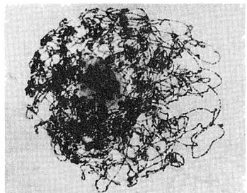  
(A) 细线期

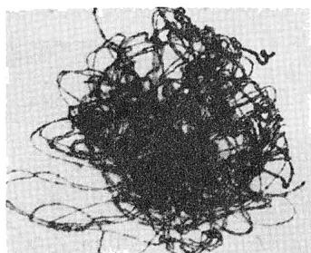  
(B) 偶线期

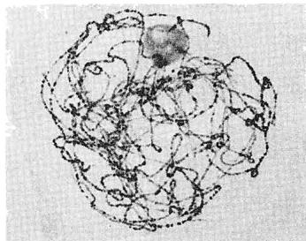  
(C) 早粗线期

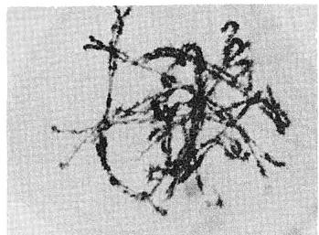  
(D) 晚粗线期

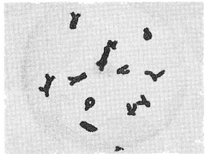  
(E) 双线期

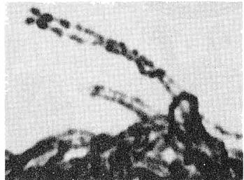  
(F) 联会的细节

图 4.8 麝香百合(Lilium longiflorum)小孢子母细胞前期Ⅰ各亚期。(A)细线期：染色体开始凝缩，染色体纵向上可见串珠样染色粒。(B)偶线期：出现同源染色体的配对(联会)(该照片左下部可见已配对和未配对区域)。(C)早粗线期：联会完成，出现同源染色体之间的交换。(D)晚粗线期：染色体继续变短变粗。(E)双线期：配对同源染色体相互排斥，沿其纵向以一个或多个交叉点(交叉，chiasmata)保持结合在一起。随后为终变期(未显示)：染色体达到最大压缩状态。(F)双线期(另一细胞，放大倍数更高)，示配对的同源染色体及联会过程中染色粒的配对。[A、B、C、E 和 F 部分承加州圣塔芭芭拉市玛尔塔·瓦尔特斯及圣塔芭芭拉植物园惠赠。D 部分承赫伯特·斯特恩(Herbert Stern)惠赠。经露丝·斯特恩(Ruth Stern)许可使用。]

1. 前期Ⅰ 这一时期较长，在大多数高等生物中，持续数天。通常将其分成5个亚期：细线期、偶线期、粗线期、双线期和终变期。这些词描述了每个亚期染色体的外观。

在细线期(leptotene，字面意思是“细的线”)中，染色体首次变得可见，为长的丝线样结构。用电子显微镜可以看到成对的姐妹染色单体。这是染色体开始凝缩的时期，在这一时期，染色体上出现许多致密颗粒，间距不等。这些局部的凝缩，称为染色粒(chromomere)，其在特定染色体上具有特有的数目、大小和位置(图4.8A)。

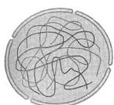  
细线期

偶线期(zygotene)以同源染色体的侧向配对——即联会(synapsis)——为标志，联会开始于染色体端部(zygotene一词的意思是“配成对的线”)。随着配对沿着染色体纵向以拉链样的方式不断推进，导致染色粒逐一精确结合(图4.8B和F)。联会由联会复合体(synaptonemal

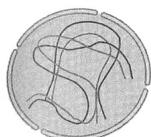  
偶线期

complex) 促成，联会复合体是一种蛋白质结构，它帮助对齐的染色体结合到一起，每对已联会的同源染色体称为一个二价体 (bivalent)。

粗线期(pachytene)的字面意思为“粗的线”。贯穿整个粗线期(图4.8C和D)，染色体持续变短、变粗(图4.7)。到晚粗线期，有时可见每个二价体(即每组配对的染色体)实际上是具有4条染色单体的四分体(tetrad)，但每条染色体的两条姐妹染色单体一般非常紧密地并排着。在粗线期中，通过交换(crossing over)发生了遗传交换。在图 4.7 中，交换的位点如不同颜色的染色单体相互交叉之处的点所示。

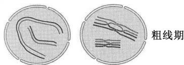

双线期(diplotene)一开始，联会复合体就解体，联会的染色

体开始分离。Diplotene 的意思是 “成双的线”，而此时的双线期染色体显然是成双的(图 4.8E)。成对的同源染色体通过交换所致的交叉连接(cross-connection)，维持着断断续续的结合。每个交叉连接称为一个交叉(chiasma，复数为 chiasmata)，由非姐妹染色单体之间的断裂和重接形成。如图 4.9 中的染色体及示意图所示，交叉是由同源染色体中染色单体之间的物理交换所致。在正常的减数分裂中，每个二价体通常具有至少一个交叉，长染色体的二价体常常具有 3 个或更多的交

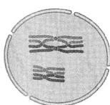  
双线期

(A)  
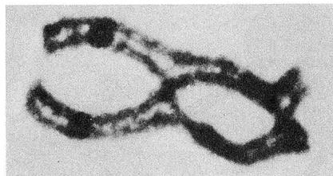

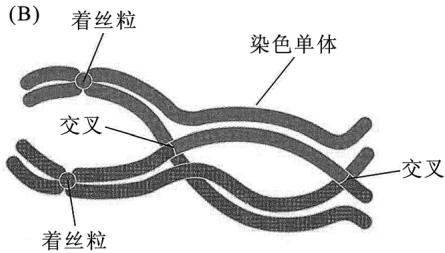  
图 4.9 由一对同源染色体形成的二价体的光学显微镜照片(A)及解说图(B)。该二价体拍摄于蝾螈(Oedipina poelzi)精母细胞晚双线期。可见两个交叉，交叉处同源染色体的染色单体看来交换了配对对象。[转引自富兰克林·斯塔尔(Franklin W. Stahl)著 The Mechanics of Inheritance, Prentice-Hall Inc.版权所有(1964)。经 Pearson Education Inc.允许转载。]

前期 I 的最后一个时期是终变期 (diakinesis)，在该期中，同源染色体似乎互相排斥，没有被交叉连接的片段相互分离。(Diakinesis 的意思是“移开”。)正是在前期 I 的这一亚期中，染色体达到最大的凝缩状态。每个二价体中的同源染色体通过至少一

个交叉来保持连接，这一直持续到第一次减数分裂后期。终变期快结束时，纺锤体开始形成，核被膜瓦解。

2. 中期Ⅰ 每个二价体被巧妙地移到一个位置，使其横跨赤道板，而同源染色体的着丝粒指向纺锤体的两极(图 4.10A)。着丝粒的定向决定了每个二价体中哪条染色体随后会移向哪一极，而母源或父源着丝粒具体指向哪一极，完全

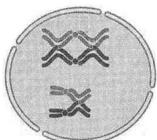  
终变期

是随机的。如图 4.11 所示，两个二价体在赤道板上可以有两种定向方式。假设每对染色体上的一对等位基因都是杂合的，则一种排列方式产生 A B 和 a b 配子，而另一种排列方式产生 A b 和 a B

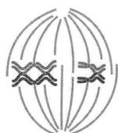  
中期I

配子(图 4.11)。因为这种中期排列是随机发生的，所以这两种排列方式——进而这 4 种配子——具有相同的频率。这 4 种配子的比例为 1:1:1:1，这意味着 $(A, a)$ 和 $(B, b)$ 这两对等位基因进行自由组合。就是说，

因为在减数分裂 I 中，非同源染色体在赤道板上随机排列，所以，在不同染色体上的基因进行自由组合。

3. 后期 I 在这一时期，同源染色体(每条由尚未分裂的着丝粒连接起来的两条染色单体组成)相互分离，并向纺锤体的两极移动(图 4.10B)。后期染色体的分离是等位基因分离的细胞基础：

在后期中，同源染色体在物理上的分离，是孟德尔分离律的物质基础。

然而，要注意的是，两条姐妹染色单体的着丝粒紧密地黏附在一起，表现得像单一单位似的。有种特殊的蛋白质像胶水一样把两个姐妹着丝粒结合到一起。该蛋白质在 S 期中出现于着丝粒及紧邻的染色体臂中，并持续存在于整

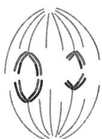  
后期I

个减数分裂Ⅰ中。在后期Ⅱ中，仅当姐妹着丝粒不再结合、两个姐妹着丝粒分开时，它才消失。

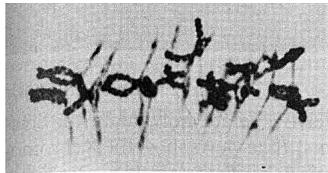  
(A) 中期 I

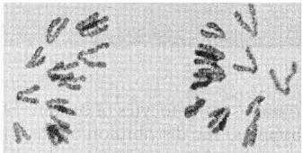  
(B) 后期 I

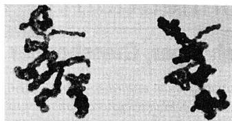  
（C）中期Ⅱ（未显示末期Ⅰ和前期Ⅱ）

图 4.10 麝香百合(Lilium longiflorum)小孢子母细胞减数分裂靠后的时期。(A)中期Ⅰ；(B)后期Ⅰ；(C)中期Ⅱ；(D)后期Ⅱ；(E)末期Ⅱ。在末期Ⅱ中已开始形成细胞壁，这将导致4个花粉粒的形成。[承赫伯特·斯特恩惠赠。经露丝·斯特恩许可使用。]  
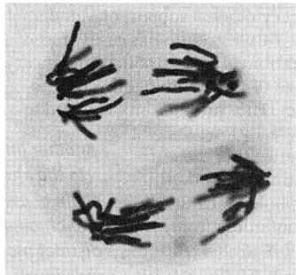  
(D) 后期Ⅱ

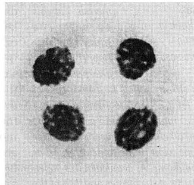  
(E) 末期Ⅱ

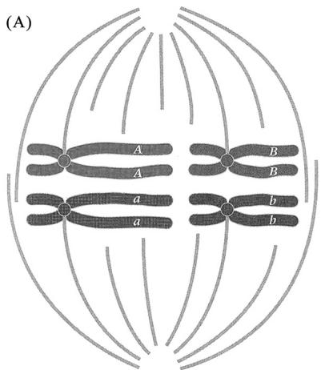

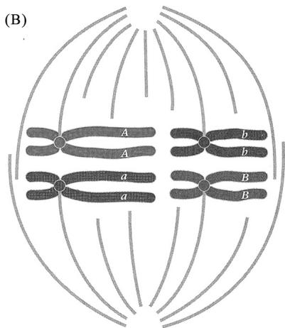  
这种排列方式所产生的配子为 $AB:AB:ab:ab$

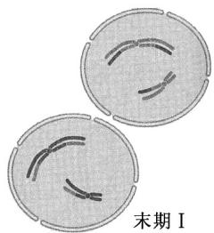  
这种排列方式所产生的配子为 $Ab:Ab:aB:aB$  
因为这两种排列方式具有相同的可能性，所以，配子的总比值为 $AB:Ab:aB:ab = 1:1:1:1$ 这个比值是自由组合的特征性比值

图 4.11 在中期 I 中非同源染色体的随机排列导致非同源染色体上基因的自由组合(A 或 B)。

4. 末期Ⅰ 后期Ⅰ结束时，由每个二价体中的一条同源染色体组成的单倍染色体组位于纺锤极附近(图4.6)。在末期Ⅰ中，纺锤体瓦解，并且，暂时在每组染色体周围形成核被膜，或仅在有限解旋之后，染色体即进入第二次减数分裂——这取

决于物种。

## 联系：蝗虫、蝗虫

埃莉诺·卡罗瑟斯，1913

堪萨斯大学，劳伦斯，堪萨斯州

与某些直翅目昆虫染色体有关的孟德尔比值

卡罗瑟斯在本科生阶段进行研究时证明，在减数分裂中非同源染色体进行自由组合。为此她研究了一种蝗虫，这种蝗虫有一对同源染色体的两条染色体长度不相等。在雄性减数分裂的第一个后期中，她可以通过观察确定与X染色体在相同方向上移动的是长染色体还是短染色体。正如该文详述的，她发现前者有154例，后者有146例，该结果与根据自由组合预计的 $1:1$ 比值非常吻合。她没有提到Y染色体，因为在她研究的蝗虫中，雌性的性染色体组成为XX，而雄性的性染色体组成为X。因而，在她考察的雄性中，X染色体没有配对伙伴。她提到的仪器是投影描绘器(camera lucida)，这在当时被广泛用于染色体及其他微观物质的研究。投影描绘器是一种光学仪器，含一个三棱镜或一列镜子，安装到显微镜上之后，可将微观物体的影像反射到一张纸上，在纸上可对微观物体进行描摹。

本文的目的是记述某些蝗虫的初级精母细胞中一个不等二价体的行为。该二价体的染色体分配遵循随机定律，且与X染色体有关，从而为孟德尔定律提供了直接的细胞学证据。由于这对同源染色体在大小上存在非常明显的差异，据此很容易追踪染色体的分配。已经有长长的证据链证明，染色体是代代延续的独特的有形个体，并因此是遗传特质的载体。本文在这个证据长链上又增加了一环。……这项工作主要基于大笨蝗Brachystola magna(一种短角蝗虫)。……整个染色体组可以分成两群，一群含6条小的染色体，另一群含17条较大的染色体(X染色体为较大的染色体之一)。检查发现，6条小染色体的这一群由5条略等大的染色体和1条明显较大的染色体组成(5条小染色体的其中一条为明显较大的那条染色体的同源染色体，使得这对同源染色体在大小上不同)。……在早中期，染色体呈12个独立的个体(二价体)。侧面观发现，X染色体处在靠近一极的特征性位置上。……在投影描绘器下绘制了300个细胞，以确定与X染色体相关的非对称二价体中染色体的分配。……在所绘的300个细胞中，较小的染色体与X染色体进入同一细胞核的有146次，即占总数的 $48.7\%$ ；较大的染色体有154次，即占总数的 $51.3\%$ 。……考虑到在任何动植物中，染色体数目有限，而性状数目巨大，显然每条染色体必定控制许多不同的性状。……自孟德尔定律被重新发现以来，所增加的知识一直不断地将起初似乎与之完全不相符的事实统一起来。对于任何其他的遗传方式，尚无细胞学解释。……在我看来，很可能所有的遗传方式实际上都是孟德尔遗传。

来源：E. E. Carothers, J. Morphol. 24(1913): 487-511.

## ■ 第二次减数分裂：等数

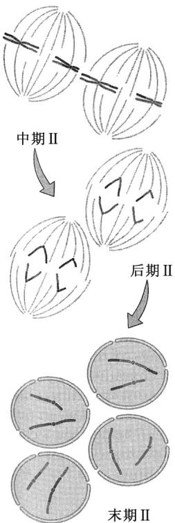

第二次减数分裂(减数分裂Ⅱ)有时被称为等数分裂(equational division)，因为在第二次分裂之前和之后，每个细胞中的染色体数目保持不变。在一些物种中，染色体未经去凝集而直接从末期Ⅰ进入前期Ⅱ(prophaseⅡ)；在其他物种中，在这两个减数分裂时期之间有个短暂的停顿，染色体可稍稍去凝集(解旋)。两次分裂之间从不发生染色体的复制；第二次分裂开始时存在的染色体，与第一次分裂结束时存在的染色体相同。

经过短暂的前期(前期Ⅱ)之后，第二次分裂的纺锤体形成，每个细胞核中的染色体着丝粒开始排列到中期Ⅱ (metaphase Ⅱ) 纺锤体的中央平面上(图 4.10C)。在后期Ⅱ (anaphase Ⅱ) 中，将姐妹着丝粒结合在一起的蛋白质解体。结果是，姐妹染色单体表现为纵向分裂，然后每条染色体的两条染色单体向纺锤体的两极移动(图 4.10D)。在后期Ⅱ中，一旦着丝粒分裂，每条染色单体即被看作单独的染色体。

末期 II (telophase II) (图 4.10E) 的特点是, 4 个单倍体细胞核中的染色体向间期状态的转变, 并伴随着细胞质的分裂。因此, 从表面上看, 第二次减数分裂与有丝分裂类似。但是, 存在一个重大差异:

由于在第一次分裂的前期中与交叉点形成相关的交换，在遗传上，一条染色体的两条染色单体在其全长上通常不同。

## 4.4 性染色体遗传

证明基因是染色体的组成部分，第一个严格的实验证据是在性染色体(sex chromosome)传递方式的实验中获得的。在一些植物和几乎所有动物中，性染色体是决定性别的原因。本节我们来考察这些实验结果。

## ■ 性别的染色体决定

二倍体生物的所有染色体，均以成对的、在形态上相似的同源染色体形式存在，对于这一规律，性染色体是个例外。早在1891年，显微镜分析就已证明，在某些种类的雄性昆虫中，有一条染色体没有同源染色体。这条未配对的染色体被称作X染色体(X chromosome)，它存在于雄性的所有体细胞中，但只有一半的精细胞中有。当发现同一物种的雌性具有两条X染色体之后，这些观察结果的生物学重要性就变得明朗了。

在雌性有两条X染色体的其他物种中，雄性除了有一条X染色体外，还有一条在形态上不匹配的染色体。这条不匹配的染色体被称为Y染色体（Ychromosome），在雄性减数分裂过程中，它与X染色体配对，但因为同源区域有限，通常仅在部分长度上配对。雄性和雌性在染色体组成上的差异，是在受精之时决定性别的一种染色体机制。每个卵细胞都含一条X染色体，而一半的精细胞含一条X染色体，其余的含一条Y染

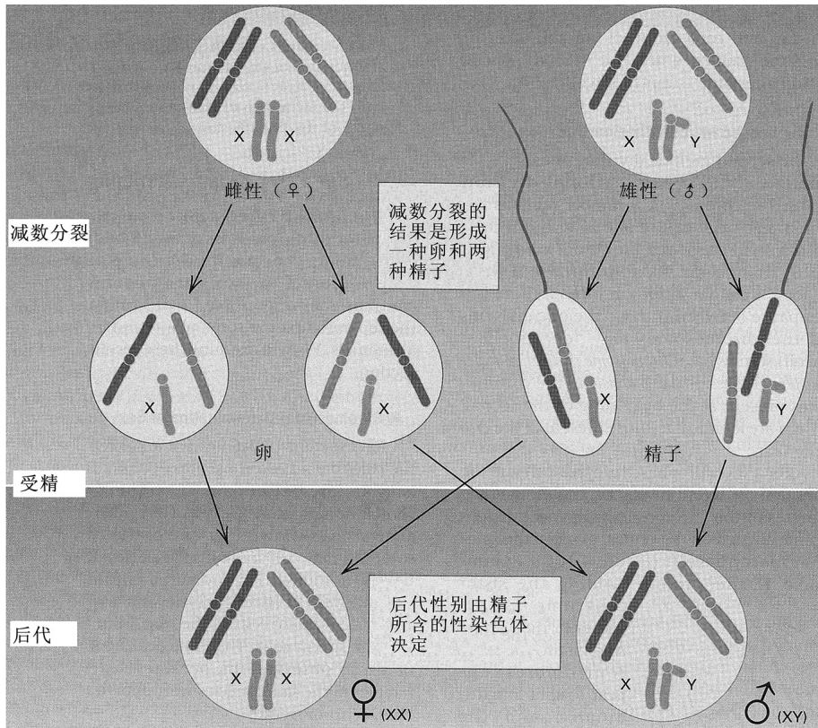  
图 4.12 在哺乳类、许多昆虫和其他动物中性别决定的染色体基础。

色体。带 X 的卵被带 X 的精子受精，产生 XX 合子，其通常发育成雌性；而被带 Y 的精子受精，得到 XY 合子，其一般发育成雄性(图 4.12)。结果是 X 染色体的交叉遗传方式：雄性从其母得到 X 染色体，而其 X 染色体只传给其女。

XX-XY 型的染色体性别决定见于哺乳动物(包括人类)、许多昆虫和其他动物，以及一些开花植物中。这种类型的雌性称为同配性别(homogametic sex)，因为只产生一种类型的配子(带 X 的)；而雄性称为异配性别(heterogametic sex)，因为产生两种不同类型的配子(带 X 的和带 Y 的)。当受精过程中配子的结合为随机时，预计受精时的性比为 1:1，因为雄性产生等量带 X 和带 Y 的精子。

X 染色体和 Y 染色体统称性染色体，该词把它们与其他的称为常染色体 (autosome) 的染色体对区别开来。虽然性染色体控制着决定雌性或雄性发育最初阶段的发育开关，发育过程本身还需要许多分散在整个基因组中的基因，包括常染色体上的基因。正如在下节即将看到的那样，X 染色体也含有许多功能与性别分化无关的基因。在大多数生物中，包括人类，除了与雄性决定相关的基因，Y 染色体携带的基因很少。

## - X 连锁遗传

(B)  
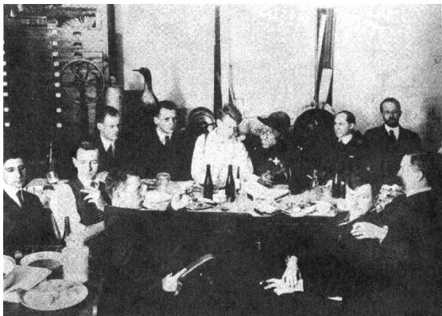  
1919年摩尔根的团队在哥伦比亚大学的蝇室聚会，庆祝斯特蒂文特(A. H. Sturtevant)从第一次世界大战中服兵役回来。摩尔根在后排最右边，他的边上是马勒(H. J. Muller)。斯特蒂文特在前排中间，斜靠在椅子上。布里奇斯(C. B. Bridges)穿了件衬衫，坐在一个像猿一样的东西旁边，这是专为这次聚会做的一个假人，被戏称为“猿人”。

$F_{1}$ 代雄性和雌性交配得到的 $F_{2}$ 代中，摩尔根观察到 2459 只红眼雌性、1011 只红眼雄性和 782 只白眼雄性。显然，白眼表型与性别有某种联系，因为所有的白眼果蝇都是雄性。

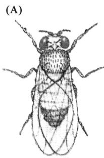  
雄（♂）

另外，白眼并不局限于雄性。例如，当来自野生型♀×白眼♂杂交的红眼 $F_{1}$ 代雌性，与她们的白眼父亲们进行回交时，  
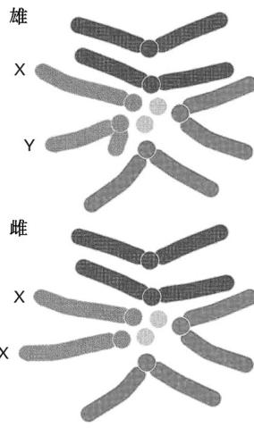

图 4.14 黑腹果蝇雄性和雌性的二倍染色体组。X 染色体的着丝粒靠近末端，而 Y 染色体的着丝粒将染色体分成不等的两条臂。在这些类型的细胞中，大的常染色体（2 号和 3 号染色体，蓝色和绿色所示）不易区分。小的常染色体（4 号染色体，黄色所示）看似一个点。

基因位于染色体上的令人信服的证据, 来自果蝇白眼基因的研究, 该基因被证明在 X 染色体上。第 3 章曾提到过, 在孟德尔杂交中, 哪个性状在雄性亲本中、哪个性状在雌性亲本中, 无关紧要——正反交得到相同的结果。1910 年, 摩尔根 (Thomas Hunt Morgan) 在白眼突变型果蝇的一项早期研究中, 最早发现这一规律的一个例外。野生型的眼睛颜色是混合红色色素和棕色色素而成的一种砖红色(图 4.13)。尽管白眼可由分别消除掉两种色素的某些常染色体基因的组合所导致, 但摩尔根研究的白眼突变却是同时敲除两种色素的一个代谢阻断所引起(该基因编码一种跨膜蛋白, 为将眼睛色素前体运输到色素细胞中所必需)。

摩尔根的研究从一只白眼雄果蝇开始，它出现于已经维持了许多代的一个野生型实验种群中。这只雄果蝇与野生型雌果蝇交配，两种性别的所有 $F_{1}$ 代都为红眼，这表明白眼等位基因为隐性。在

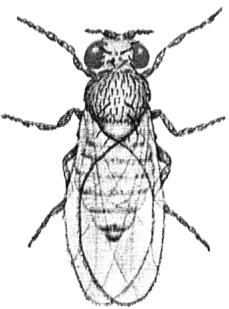  
雌（♀）

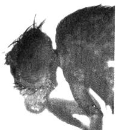

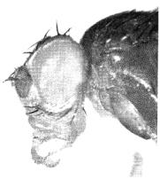  
红眼  
白眼  
图 4.13 图(A)为一只雄性和一只雌性的黑腹果蝇(Drosophila melanogaster)。照片(B)示野生型红眼雄性和突变型白眼雄性的眼睛。[示意图版权归 Carolina Biological Supply Company，经许可使用。照片承洛佐夫斯基惠赠。]

后代包括红眼和白眼雌性及红眼和白眼雄性，数量大致相等。

关键的观察结果，来自白眼雌性和野生型雄性的交配。所有的雌性后代都具有野生型眼睛，但所有的雄性后代均为白眼。这与最初的野生型♀×白眼♂杂交互为正反交，那种杂交只得到野生型雌性和野生型雄性，所以，正反交得出了不同的结果。

摩尔根意识到，如果白眼等位基因在 X 染色体上，正反交就会产生不同的结果。X 染色体上的基因，称为 X 连锁 (X-linked) 基因。正常的黑腹果蝇 (Drosophila melanogaster) 染色体组如图 4.14 所示：雌性为 XX 染色体组，而雄性为 XY。

摩尔根的假设是：X染色体含有野生型 $w^{+}$ 等位基因或突变型w等位基因之一，Y染色体不含对应的白眼基因(white)。用X染色体上的白眼等位基因来代表整个X染色体，可以把白眼雄性的基因型写成wY，把野生型雄性的基因型写成 $w^{+}Y$ 。因w等位基因为隐性，白眼雌性为ww基因型，而野生型雌性为杂合的 $w^{+}w$ 或纯合的 $w^{+}w^{+}$ 。该模型对于正反交的含义如图4.15所示，野生型♀×白眼♂的交配为杂交A，白眼♀×野生型♂的交配为杂交B。

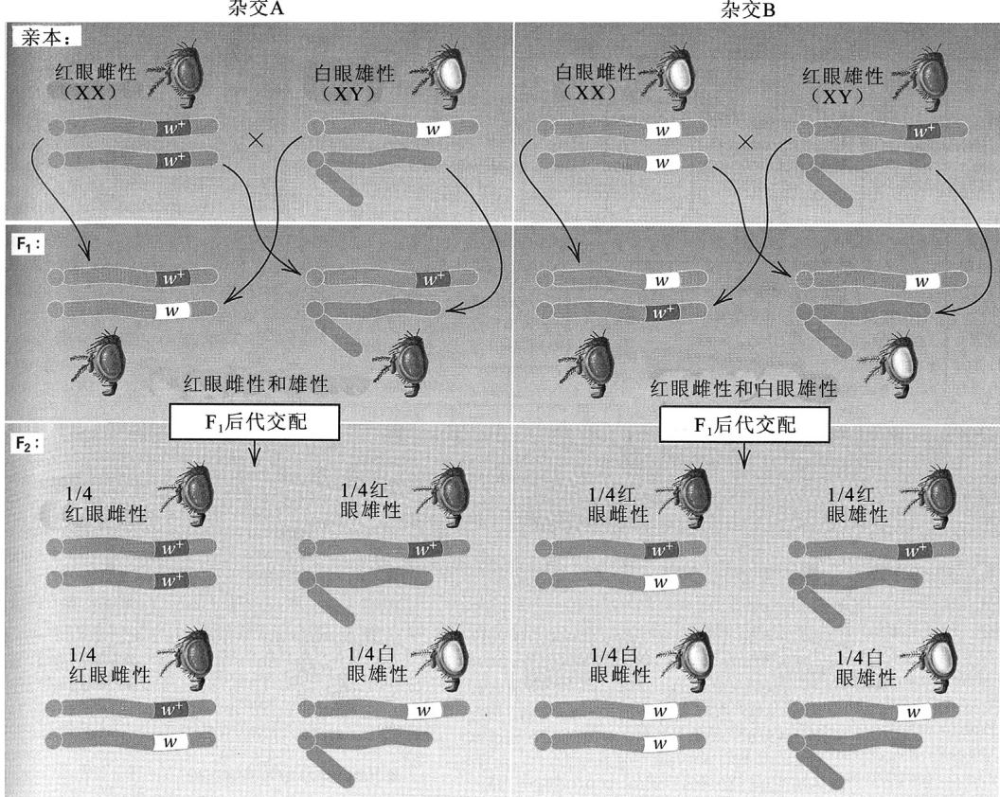  
图 4.15 果蝇杂交 $F_{1}$ 和 $F_{2}$ 代结果的染色体解释。杂交 A 是野生型(红眼)雌性与白眼雄性的交配。杂交 B 是白眼雌性与红眼雄性的交配。在 X 染色体上，野生型 $w^{+}$ 等位基因以红色显示，突变型 w 等位基因以白色显示。Y 染色体未携带 w 基因的等位基因。

X 连锁的遗传方式，确实能够解释在这些杂交所得的 $F_{1}$ 和 $F_{2}$ 代中观察到的不同的表型比值。X 连锁遗传的特点可总结如下。

1. 在两性中产生不同表型比值的正反交，往往表明是 X 连锁遗传。就果蝇的白眼来说，红眼雌性和白眼雄性杂交，得到的所有后代为红眼(图 4.15，杂交 A)，而白眼雌性和红眼雄性杂交，产生红眼雌性后代和白眼雄性后代(图 4.15，杂交 B)。

2. 杂合雌性将每个 X 连锁的等位基因传给约一半的雌性子代和一半的雄性子代。图 4.15 中杂交 B 的 $F_{2}$ 代说明了这一点。

3. 遗传了一个 X 连锁隐性等位基因的雄性，表现出隐性性状，因为 Y 染色体不含该基因的野生型等位基因。具有隐性性状的雄性，将隐性等位基因传给所有的雌性子代，但不传给任何一个雄性子代。图 4.15 中杂交 A 的 $F_{1}$ 代说明了这一原理。任何不具有隐性性状的雄性，其 X 染色体携带的一定是野生型等位基因。

图 4.16 中的庞尼特方准确地抓住了 X 连锁遗传的本质：雄性只将其 X 染色体传给雌性子代，而雌性传给两种性别的子代各一条 X 染色体。

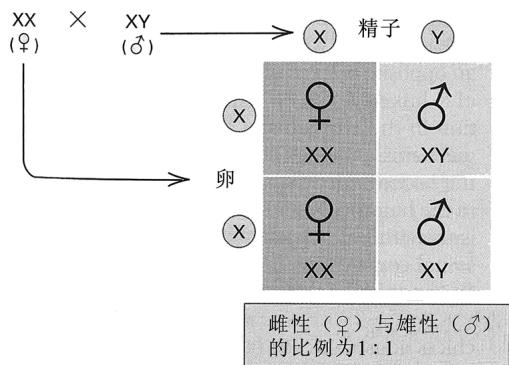  
图 4.16 在染色体的性别决定中, 每个雄性子代从其母得到 X 染色体, 从其父得到 Y 染色体。

## 联系：白眼雄性

托马斯·亨特·摩尔根，1910

哥伦比亚大学，纽约，纽约州

果蝇的限性遗传

摩尔根对白眼突变的遗传分析标志着果蝇遗传学的发端。随着知识的增加，用来描述事物的词汇也在改变，这是科学本质的应有之义。这篇论文可为一例，因为今天使用的限性遗传这一术语，其所指与摩尔根的用法完全不同。摩尔根所指的，现在称为 X 连锁遗传或性连锁遗传。为了避免混淆，我们冒昧地在适当之处用现代的相应词汇进行了替换。摩尔根也没有觉察到雄性果蝇有一条 Y 染色体。他认为像蝗虫那样，雌性为 XX、雄性为 X（见卡罗瑟斯的论文）。我们也已补上了这条缺少的 Y 染色体。另一方面，摩尔根

的基因符号仍照原样保留。他用 R 表示控制红眼的野生型等位基因，用 W 表示控制白眼的隐性等位基因。很奇怪，这背离了已由孟德尔开创的惯例——显性和隐性等位基因应该用相同的符号来表示。今天我们用 w 来表示隐性等位基因，用 $w^{+}$ 来表示显性等位基因。

在一个持续将近一年、历经很多代的果蝇谱系培养中，出现了一只白眼雄性。正常果蝇的眼睛为亮红色。这只白眼雄性与其红眼雌性同胞杂交，产生1237只红眼后代 $\left(\mathrm{F}_{1}\right)$ 。…… $F_{1}$ 杂种近交，得

2459 只红眼雌性

1011 只红眼雄性

782 只白眼雄性

没有出现白眼雌性。这一新性状表明它自己是性连锁性状，意思是它仅传给孙子。但是，下面的实验证明，该性状不是不能与雌性相容。随后，这只白眼雄性(突变体)与它的一些雌性后代 $(\mathrm{F}_1)$ 杂交，得

129 只红眼雌性

132 只红眼雄性

88 只白眼雌性

86 只白眼雄性

这些结果表明，这一新性状——白眼——能够通过适当的杂交传递给雌性，因此在此意义上它不限于一种性别。要注意的是，4类个体以大致相等的数目(25%)出现。……刚才所述结果，可用如下假设来解释。假设所有白眼雄性的精子都携带控制白眼的“因子”“W”，一半精子携带一个性别因子“X”，(且)另一半精子缺少该因子，亦即，对性别而言，雄性是杂合的。(雄性实际上是XY)。因此，表示雄性的符号为“WXY”，表示它的两种精子的符号为WX-Y。假设红眼雌性的所有的卵携带红眼“因子”R，且所有的卵(减数分裂之后)各携带一个X。因而，表示红眼雌性的符号将是RRXX，表示其卵的符号将是RX。……刚才用来解释这些首次获得的结果的假设，可以用几种方式进行检验(接着描述了4种类型的杂交，每种都产生了期望的结果)。……为了获得这些结果，有必要假设，RXY雄性在形成两种精子时，R和X总是在一起。……事实是，这个R和X是结合在一起的，因而从不分开存在。

来源：T. H. Morgan, Science 32 (1910): 120-122.

## - 人类 X 连锁遗传的系谱特点

具有 X 连锁遗传方式的人类性状的一个例子是血友病 A (hemophilia A)，这是由一个隐性等位基因决定的一种严重的凝血疾病。患者缺乏正常凝血所需的一种称为第Ⅷ因子的凝血蛋白，因此在受伤后会过度的、常常是致命的失血。一个著名的血友病家系，始于英国的维多利亚女王 (Queen Victoria of England) (图 4.17)。她的一个儿子利奥波德 (Leopold) 患血友病，她的两个女儿为该基因的杂合携带者。维多利亚的一个外孙女也是携带者，通过婚姻，她将这个基因传入俄罗斯和西班牙皇室。罗曼诺夫家族的俄罗斯王位继承人亚历克西斯皇储 (Tsarevich Alexis) 患该病。他从他的母亲亚历山德拉皇后 (Tsarina Alexandra) —— 维多利亚的孙女之一 —— 遗传得到该基因。在十月革命中，沙皇、皇后、亚历克西斯和他的4个姐姐被俄国布尔什维克于1918年处死。想不到的是，现在的英国皇室是维多利亚一个正常儿子的后代，没有这种疾病。

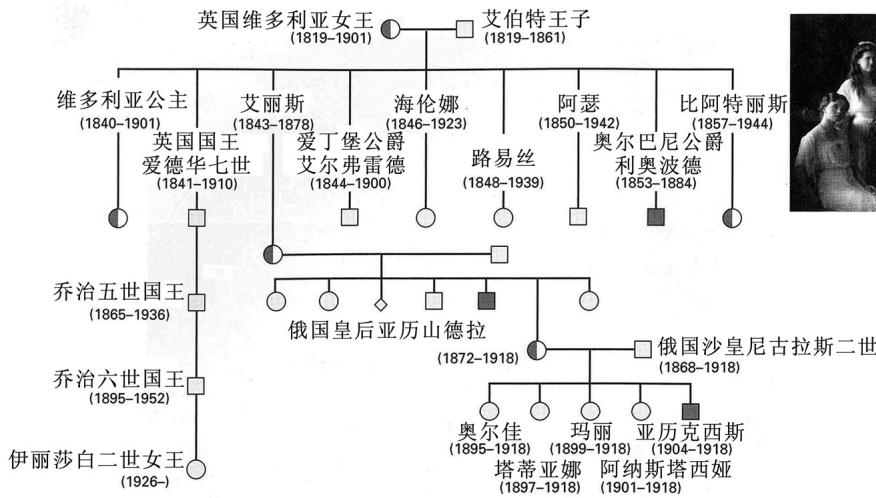  
女性携带者 男性血友病患者◇出生时死亡，性别未记录

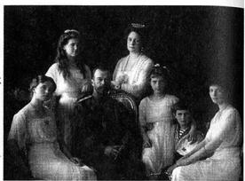  
图 4.17 英国维多利亚女王  
的子孙中血友病 A 的遗传传递，包括女王的外孙女——俄罗斯的亚历山德拉皇后，及亚历山德拉的 5 个孩子。照片为沙皇尼古拉斯二世、亚历山德拉皇后和他们的子女。皇储亚历克西斯患血友病。[来源：Culver Pictures Inc.]

在人类系谱中，X 连锁遗传表现出几个特点，使其有别于其他的遗传传递方式。

1. 对于任何由 X 连锁隐性等位基因引起的稀有性状，罹患个体全部或几乎全部是男性。男性多，是因为携带 X 连锁隐性等位基因的女性几乎全为杂合，所以不表现出突变表型。

2. 男性患者生育的话，儿子正常，这是男性只将他的 X 染色体传给女儿的必然结果。

3. 父亲为患者的女性，以 1:1 的比例生育正常儿子和患病儿子。因为，男患者的任一女儿，对于该隐性等位基因一定是杂合的。

## - 异配雌性

在有些生物中，同配和异配性别是反过来的，也就是说，雄性为 XX，雌性为 XY。这种性别决定见于鸟类、某些爬行类和鱼类，以及蛾类和蝴蝶。在性别中 XX 和 XY 的这种反转，导

致相反的 X 连锁基因的非互易遗传方式 (pattern of nonreciprocal inheritance)。为了把这些生物的性别决定与通常的 XX-XY 机制区别开来，将同配性别中的性染色体组成表示为 ZZ，异配性别表示为 WZ。因此，在异配雌性的生物中，雌性的性染色体组成表示为 WZ，而雄性的为 ZZ。

图 4.18 显示鸡中 Z 连锁遗传的一个具体例子。有几个鸡的品种具有由亮色和暗色横带间杂的羽毛，产生一种称为芦花纹 (barred) 的表型。其他品种的羽毛着色均匀，为非芦花纹。纯种芦花纹和纯种非芦花纹之间的正反交得到所示的结果，表明决定条纹形成的基因一定为显性，且一定位于 Z 染色体上。

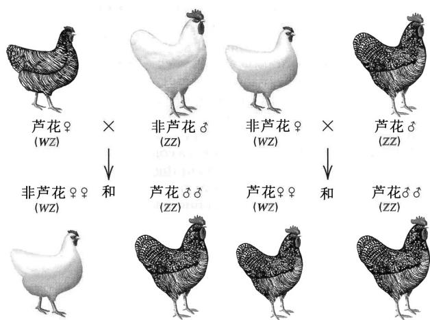  
图 4.18 显示鸟类染色体性别决定与哺乳类性别决定相反的典型例子——鸡的芦花羽毛。在鸟类中，雌性是异配性别。携带显性芦花突变的 Z 染色体以红色表示。

## - 不分离是染色体遗传学说的证据

果蝇白眼突变的遗传和 X 染色体的遗传传递之间的相似性，支持染色体遗传学说——基因为染色体的一部分。用果蝇做的其他实验提供了确凿证据。

摩尔根的一位学生卡尔文·布里奇斯(Calvin Bridges)在用几个X连锁基因进行的杂交中，发现了预期遗传方式的罕有的例外。例如，当白眼雌果蝇与红眼雄性交配时，大多数后代为预期的红眼雌性和白眼雄性。但是，约1/2000的 $\mathrm{F}_1$ 代果蝇是例外，或为白眼雌性，或为红眼雄性。布里

奇斯证明，这些稀有的例外子代，是母本的两条 X 染色体在减数分裂中相互分离的偶然失败——一种称为不分离（non-disjunction）的现象所致。X 染色体不分离，结果是形成的一些卵具有两条 X 染色体，而其他卵没有 X 染色体。这些异常的卵受精，预计可产生 4 种类型的合子（图 4.19）。未发现没有 X 染色体的果蝇，因为缺少 X 的胚胎不能存活，同样，具有 3 条 X 染色体的大多数后代，在发育早期就会死亡。白眼♀

×野生型♂杂交例外后代染色体的显微镜检查表明，例外的白眼雌性有两条X染色体和一条Y染色体，例外的红眼雄性有单条X染色体，但缺少Y染色体。后者为不育的雄性，用XO来表示其性染色体组成。

这些实验，以及一些相关的实验，无可置疑地证明了染色体遗传学说的正确性。

染色体遗传学说：基因的物理位置在染色体中。

布里奇斯证明染色体学说的证据是，染色体的异常行为与染色体上基因的异常遗传方式精确对应。对染色体学说的这一证明，跻身遗传学中最为重要、最为简洁的实验之列。

## ■ 果蝇的性别决定

在性别决定的 XX-XY 机制中，Y 染色体与雄性关联。在某些生物，包括人类中，这种关联的发生，是因为 Y 染色体的存在触发了胚胎发育中产生雄性性征的事件(第 8 章)。在具有 XX-XY

型性别决定的生物中，果蝇比较特别，虽然Y染色体与雄性关联，但却不决定雄性。图4.20所示的发现证明了这点：在果蝇中，XXY胚胎发育成形态正常的可育雌

  
图 4.20 在果蝇中，通过伴性致死基因 Sxl 的活性进行性别决定遗传控制的早期步骤。

性，而 XO 胚胎发育成形态正常但不育的雄性(在式 XO 中写 “O” 是强调少了一条性染色体)。XO 雄性的不育性说明，虽然雄性发育不需要 Y 染色体，但 Y 染色体对于雄性的生殖能力是必不可少的。事实上，果蝇的 Y 染色体含有形成正常精子所需的 6 个基因。

果蝇性别的遗传决定取决于一个 X 连锁基因，该基因称为伴性致死 (Sex-lethal, Sxl) 基因，因为它的有些突变型等位基因在雄性中是致死的。Sxl 基因在正常雌性中有活性，在正常雄性中失活。Sxl 基因的产物为伴性致死蛋白 SXL，这是一种 RNA 结合蛋白，可与几个基因的 RNA 转录物结合，从而引起雌性特异的 RNA 加工。在 SXL 缺乏时，这些转录物进行雄性特异的加工。因此，SXL 的靶标基因，通常只在雌性中生产蛋白质产物。SXL 的一个靶标就是它自己，因此，在雌性发育早期 SXL 活性的少量激增，会因加工出更多的 Sxl 转录物，形成反馈，导致 SXL 的自我维持式的生产。

决定 SXL 早期激增的是几个 X 连锁基因的产物量, 这些基因称为 X 连锁信号元件 (X-linked signal element, XSE)。如果 XSE 的量高, 则出现早期激增, 机体变成雌性; 而如果 XSE 的量低, 则不出现早期激增, 机体变成雄性 (图 4.20)。差不多 100 年来, 遗传学家认为果蝇性别是由 X 染色体的数目 (X) 相对于常染色体的套数 (A) 的比值决定的, 这种相关性是完美的。在正常雌性 (XXAA) 中, 该比值等于 1; 在正常雄性 (XAA) 中比值等于 1/2; 而在组成为 XXAAA 的稀有个体中, 比值为 2/3, 机体发育为间性。而且, 稀有的 XA 单倍体虽然最终死亡, 但它们最开始发育为雌性, 这再一次支持了这一观点: X:A 比值为 1/2 的胚胎发育为雄性, X:A 比值为 1 的胚胎发育为雌性, X:A 比值介于 1/2 和 1 之间的胚胎发育为间性。

然而，不管与 X:A 的相关性有多完美，近来的材料表明，该假说是错误的。果蝇的性别是基于 Sxl 对 XSE 量的反应，在正常果蝇中 XSE 的量由 X 染色体的数目决定，常染色体确实发挥了作用，但并未起到性别决定的作用，它们的作用是决定在早期发育中性别分化的定型 (commitment) 何时发生。在具有两套常染色体的正常 XXAA 或 XAA 胚胎中，定型发生在 XSE 的量足够诱导 Sxl 之后的一个细胞周期。在 XXAAA 胚胎中，有的细胞在第 13 个细胞周期定型，因而 XSE 的量太少，不能诱导 Sxl；而其他细胞在第 14 个细胞周期定型，有足够的 XSE 来诱导 Sxl。结果，胚胎是雌雄细胞的嵌合体，表型结果为间性。

果蝇的性别决定，为相关性不一定意味着因果关系的一个很好例子，也是如下原理的一个绝佳例子：科学观点——即便是那些根深蒂固的、公认的观点——有时也会被证明是错误的。

## 4.5 后代分布预测中的概率

遗传传递大体上是个可能性的问题。Aa 生物的某一特定配子，含或不含 A 等位基因，纯属偶然。Aa Bb 生物的某一特定配子，是否 A 和 B 两个等位基因都有，取决于染色体在中期 I 赤道板上的随机定位。遗传比值不仅是基因随机组合进入配子的结果，而且是配子随机组合进入合子的结果。如在第3章中讲到的那样，虽然不可能准确预测会发生的具体是什么事件，但是可以准确算出某一特定事件会发生的概率。在这一节，介绍诠释遗传学数据时使用的另外一些概率方法。

<table><tr><td rowspan="3">GGG</td><td rowspan="3"></td><td>GGB</td><td></td><td>GBB</td><td></td><td rowspan="3">BBB</td><td rowspan="3"></td><td rowspan="5">2个男孩1个女孩的概率也是3/8。因此,在3个孩子的家庭中,性比的概率分布为该式中性比的信息可通过展开二项式 $(p+q)^n$ 更直接地获得,其中,p为生女孩的概率(1/2),q为生男孩的概率(1/2),n为孩子数目。在目前的例子中,</td></tr><tr><td>GBG</td><td></td><td>BGB</td><td></td></tr><tr><td>BGG</td><td></td><td>BBG</td><td></td></tr><tr><td> $(1/2)^3$ </td><td>+</td><td> $3(1/2)^2(1/2)$ </td><td>+</td><td> $3(1/2)(1/2)^2$ </td><td>+</td><td> $(1/2)^3$ </td><td>=</td></tr><tr><td>1/8</td><td>+</td><td>3/8</td><td>+</td><td>3/8</td><td>+</td><td>1/8</td><td>=1</td></tr></table>

## - 在遗传学中应用二项分布

概率的加法定律处理遗传杂交中互斥的结果。如果两个结果不能同时发生，在此意义上不相容的两个结果，称为“互斥”的结果。例如，在3个孩子中，可能的性别分布由4个互斥结果构成：0个、1个、2个或3个女孩，这些结果分别具有1/8、3/8、3/8和1/8的概率。加法定律指出，互斥事件任意组合的总概率，等于事件各自所占概率之和。例如，大小为3的同胞群包含至少一个女孩的概率，包括了有1个、2个和3个女孩的结果，所以，至少有一位女孩的总概率等于 $3/8+3/8+1/8=7/8$ 。

概率的乘法定律处理遗传杂交中独立的结果。任何两个可能的结果，如果已知一个结果实际上已经发生，对另一个结果是否也已经发生，不能提供任何信息，则这两个结果为独立的。例如，在一个出生序列(sequence of births)中，任何一个孩子的性别，不受任何之前出生的同胞的性别影响，也不对任何之后出生的同胞的性别分布产生丝毫影响。每次出生都独立于其他所有的出生。乘法定律指出，当可能的结果为独立时，出现结果的任一组合的概率，等于结果各自所占概率之积。例如，3个孩子的同胞群由3个女孩组成的概率等于 $1/2 \times 1/2 \times 1/2$ ，因为，每次出生得到女孩的概率为 $1/2$ ，且每次出生都是独立的。

在遗传学的概率计算中，经常同时使用加法定律和乘法定律。例如，计算一个家庭中3个孩子全为同一性别的概率，加法定律和乘法定律都要使用。三个孩子全为女孩的概率为 $(1/2)(1/2)(1/2)=1/8$ ，三个孩子全为男孩的概率也是1/8。因为这两个结果是互斥的(大小为3的一个同胞群，不能既有3个男孩同时又有3个女孩)，要么有3个女孩、要么有3个男孩的概率为这两个概率之和，即 $1/8+1/8=1/4$ 。对于大小为3的同胞群，其他可能的结果有：两个孩子是女孩、另一个孩子是男孩；两个是男孩，另一个是女孩。对这两种结果的每一种，可能有3种不同的出生顺序——如GGB、GBG和BGG——每一种具有 $1/2\times1/2\times1/2=1/8$ 的概率。具有2个女孩1个男孩的概率，不考虑出生顺序，为这3种可能顺序的概率之和，即3/8。同样，有

$$
(p + q) ^ {3} = \mathbf {1} p ^ {3} + \mathbf {3} p ^ {2} q + \mathbf {3} p q ^ {2} + \mathbf {1} q ^ {3}
$$

其中，粗体数字是对于每种性别分布，出生顺序的可能数目。同样，在 5 个孩子的家庭中，性比概率的二项分布为

$$
(p + q) ^ {5} = \mathbf {1} p ^ {5} + \mathbf {5} p ^ {4} q + \mathbf {1 0} p ^ {3} q ^ {2} + \mathbf {1 0} p ^ {2} q ^ {3} + \mathbf {5} p q ^ {4} + \mathbf {1} q ^ {5}
$$

每一项给出一种特定组合的概率。例如，第三项为 5 个孩子的家庭中有 3 个女孩 $(p^{3})$ 和 2 个男孩 $(q^{2})$ 的概率：

$$
\mathbf {1 0} (1 / 2) ^ {3} (1 / 2) ^ {2} = 1 0 / 3 2 = 5 / 1 6
$$

n 次二项展开式有 $n+1$ 项。p 的指数，从第一项中的 n，逐项减一，到最后一项中的 0。q 的指数，从第一项中的 0，逐项加一，到最后一项中的 n。对 n 连续取值，所生成的系数可排列成一个等边三角形，称作帕斯卡三角 (Pascal's triangle)，图 4.21 显示了 n 为 0～10 的情况。该三角的横行是对称的，每行起止都是 1，且每一项是上一行中该项两边的两个数之和。

稍微推广一下，如果事件 A 的概率为 p，事件 B 的概率为 q，且这两个事件是独立的，则，根据乘法定律，A 发生 4 次且 B 发生 2 次（以指定顺序）的概率为 $p^{4}q^{2}$ 。通常我们感兴趣的是不管事件顺序的组合，如 “4 次 A 且 2 次 B”。此时，我们把组合 4A:2B 以任一指定顺序发生的概率，乘以可能的顺序数目。6 个事件——A 类 4 个、B 类 2 个——不同组合的数目，由 $(p+q)^{6}$ 展开式中 $p^{4}q^{2}$ 的系数给出。该系数可在帕斯卡三角中 n=6 的那一行找到，为左起第 3 项（其为第 3 项，是因为各项

  
图 4.21 帕斯卡三角。第 n 行中的数字为二项式 $(p+q)^{n}$ 展开式的系数。

依次为 $p^{6}q^{0}$ 、 $p^{5}q^{1}$ 、 $p^{4}q^{2}$ 、 $p^{3}q^{3}$ 、 $p^{2}q^{4}$ 、 $p^{1}q^{5}$ 、 $p^{0}q^{6}$ 的系数）。因此，在 6 次试验中 A 出现 4 次且 B 出现 2 次的总概率由 $15p^{4}q^{2}$ 给出。

具有恒定概率的事件，其重复试验的一般规则如下：

如果事件 A 的概率为 p，对立事件 B 的概率为 q，则，在 n 次试验中，事件 A 发生 s 次且事件 B 发生 t 次的概率为

$$
\frac {n !}{s ! t !} p ^ {s} q ^ {t}\tag{1}
$$

表 4.2 阶乘

<table><tr><td>n</td><td>n!</td><td>n</td><td>n!</td></tr><tr><td>0</td><td>1</td><td>8</td><td>40 320</td></tr><tr><td>1</td><td>1</td><td>9</td><td>362 880</td></tr><tr><td>2</td><td>2</td><td>10</td><td>3 628 800</td></tr><tr><td>3</td><td>6</td><td>11</td><td>39 916 800</td></tr><tr><td>4</td><td>24</td><td>12</td><td>479 001 600</td></tr><tr><td>5</td><td>120</td><td>13</td><td>6 227 020 800</td></tr><tr><td>6</td><td>720</td><td>14</td><td>87 178 291 200</td></tr><tr><td>7</td><td>5 040</td><td>15</td><td>1 307 674 368 000</td></tr></table>

其中， $s+t=n$ 且 $p+q=1$ 。符号 $n!$ 读作“ $n$ 的阶乘”，它代表从 1 到 $n$ 的所有正整数的积（就是说， $n!=1\times2\times3\times\cdots\times n$ ）。表 4.2 给出了从 $n=0$ 到 $n=15$ 的 $n$ 的阶乘的值。 $0!=1$ 是人为定义的，以推广其在数学公式中的应用。 $n!$ 的大小增加非常快，15! 已超过一万亿。

即便 s 或 t 等于 0，式(1)也适用，因为 $0!=1$ （要记住，任意数的零次幂也等于 1）。二项式 $(p+q)^{n}$ 的展开式中的任一项，由式(1)代入适当的 s 和 t 值得到。在帕斯卡三角中，第 n 行中的逐项，为 $t=0, 1, 2, \cdots, n$ 时， $n!/(s!t!)$ 的值。

让我们来考察式(1)的一个具体应用：计算两个杂合的双亲婚配，在给定大小的同胞群中，刚好产生显性性状和隐

性性状 3:1 期望比值的概率。某个孩子表现显性性状的概率 p 是 3/4，表现隐性性状的概率 q 是 1/4。欲知在有 8 个孩子的家庭中，有多少家庭具有 6 个显性性状的孩子和 2 个隐性性状的孩子，这就是“期望”孟德尔比值，此处，n=8, s=6, t=2，该事件组合的概率是

$$
\frac {8 !}{6 ! \times 2 !} p ^ {6} q ^ {2} = \frac {8 !}{6 ! \times 2 !} \left(\frac {3}{4}\right) ^ {6} \left(\frac {1}{4}\right) ^ {2} = 0. 3 1
$$

就是说，只在 31%有 8 个孩子的家庭中，子女会显示出期望的 3:1 表型比值，其他同胞群因偶然误差会向这边或那边偏离。该例的重要性在于证明：虽然 3:1 比值是 “期望” 结果(并且也是唯一最可能的结果)，但大部分家庭(69%)实际上具有与 3:1 不同的子女分布。

## ■ 二项式系数的意义

在式(1)中二项展开式的阶乘部分——等于 $n!/(s!t!)$ ——称为二项式系数。正如我们已经注意到的，该比值枚举了一个类别的s个元素和另一类别的t个元素按顺序排列的所有可能的方式，条件是 s 个元素之间不能相互区分、t 个元素之间不能相互区分。以包含 s 粒黄色豌豆和 t 粒绿色豌豆的具体例子来说。虽然黄色豌豆和绿色豌豆相互之间可以区分，因为它们有不同的颜色，但是，黄色豌豆彼此不能区分(因为它们都是黄色的)，绿色豌豆彼此也不能区分(因为它们都是绿色的)。

阶乘公式背后的道理，首先是要看到元素的总数 $s + t = n$ 。已知 $n$ 个元素，每个元素都与下一个不同，它们可以排列的不同方式的数目是：

$$
n \times (n - 1) \times (n - 2) \times \dots \times 3 \times 2 \times 1
$$

因为，第一个元素可有 n 种选择，并且一旦它选定之后，下一个元素有 n-1 种选择(因为只剩下 n-1 个以供选择)，一旦前两个选定之后，第三个可有 n-2 种选择，依次类推。最后，一旦已选定 n-1 个元素，选择最后一个元素就只有一种方式。 $s+t$ 个元素可以 n! 种方式排列，条件是这些元素全部相互可区分。然而，n! 种特定的排列中，每一种一定含有 s 个元素的 s! 种不同的排列和 t 个元素的 t! 种不同的排列，总共有 $s!\times t!$ 种排列。因而，当每种类别的元素相互不能区分时，n! 除以 $s!\times t!$ 得到 s 个元素和 t 个元素可排列方式的数目，即二项式系数。

## 4.6 遗传假设的拟合优度检验

遗传学家常常需要判断观测比值是否与理论预测值相吻合。只有数据是不能令人信服的，因为不同的研究人员可能会有分歧。例如，假设把开紫花的一棵植株和开白花的一棵植株杂交，在后代中，观察到14株具有紫花、6株具有白花。这一结果是否足以认为是 $1:1$ 的比值？如果观察到15株紫花植株和5株白花植株，又会怎样呢？这一结果是否与 $1:1$ 的比值相符？从一个实验到另一个的实验，在观测结果上必定会有统计变异。谁能断言什么结果才是与某个遗传假设相符的呢？在这一节中，描述一种判断观测结果是否太过偏离理论期望的检验。该检验称为拟合优度(goodness of fit)检验，其中，拟合(fit)一词的意思是观测结果与期望结果之间在多大程度上“拟合”或者说“一致”。

## ■ 卡方法

拟合优度的常用测度是一个称为卡方(chi-square，符号为 $\chi^2$ )的值，这是将每个不同类别中观察到的后代数量，与根据某种遗传假设预测的每个类别的数量进行比较，计算而得。例如，在紫花植株和白花植株的杂交中，我们可能会对检验这样一个假设感兴趣：对于决定花色的一对等位基因，紫花亲本为杂合，且白花亲本为纯合隐性。再假设检查了交配所得的20株后代，发现14株为紫色，6株为白色。用卡方法检验该遗传假设(或任意其他遗传假设)的步骤如下。

1. 详细陈述遗传假设，具体说明亲本及可能后代的基因型和表型。在用花色举的例子中，遗传假设的意思是，可把紫色×白色杂交的基因型用符号表示成 $Pp \times pp$ ，可能的后代基因型为 $Pp$ 和 $pp$ 。

2. 使用概率定律对遗传假设成立时应该观测到的后代类型和比例进行明确预测。将比例转换成后代数量(在 $\chi^{2}$ 检验中，百分比是不允许的)。如果关于花色杂交的假设成立，那么，应该期望后代基因型 Pp 和 pp 以 1:1 的比值出现。因为假设 Pp 花为紫色，pp 花为白色，期望后代表型为紫色或白色的比例是 1:1。在 20 株后代中，期望数为 10 株紫色、10 株白色。

3. 对每个类别的后代，用观测数减去期望数。将差平方，然后除以期望数。在这个例子中，紫色后代的计算结果为 $(14-10)^{2}/10=1.6$ ，白色后代的计算结果为 $(6-10)^{2}/10=1.6$ 。

4. 对所有后代类别，求第3步中计算结果之和。该总和即为这些数据的 $\chi^2$ 值。后代紫色类别和白色类别的和为 $1.6 + 1.6 = 3.2$ ，这就是该实验的 $\chi^2$ 值，这是在假定我们的遗传假设正确的情况下计算得的。

以符号方式， $\chi^{2}$ 的计算可用下式表示

$$
\chi^ {2} = \sum \frac {(\text {观测值} - \text {期望值}) ^ {2}}{\text {期望值}}
$$

式中， $\Sigma$ 表示所有后代类别的总和。注意 $\chi^2$ 是用观测值和期望值来计算，而非比例、比值或百分比。不用实际数目是初学者在应用 $\chi^2$ 法时最常见的错误。用 $\chi^2$ 值作为拟合优度的一个测度是合理的，因为观测值与期望值越接近， $\chi^2$ 值就越小， $\chi^2$ 值为0，说明观测值与期望值完美吻合。

再来看一个 $\chi^2$ 计算的例子，假设 $\mathrm{F}_1\times \mathrm{F}_1$ 杂交后代中包括两种相对表型，观察到的数目为99和45。在此例中，遗传假设可能是：该性状由单个基因的一对等位基因决定，在 $\mathrm{F}_2$ 代

中显性表型：隐性表型的期望比值为 3:1。思考一下这些数据，问题是：99:45 的观测值是否与期望的 3:1 吻合。 $\chi^{2}$ 值的计算见表 4.3：后代总数为 99+45=144。根据遗传假设，两种类别真正的比值为 3:1，两种类别的期望数计算为 $(3/4)\times144=108$ 和 $(1/4)\times144=36$ 。因为有两种数据类别，所以在 $\chi^{2}$ 计算中有两项

表 4.3 计算单杂种比值的 ${\chi }^{2}$

<table><tr><td>表型(类别)</td><td>观测数</td><td>期望数</td><td>与期望数的偏差</td><td> $\frac{(\text{偏差})^2}{\text{期望数}}$ </td></tr><tr><td>野生型</td><td>99</td><td>108</td><td>-9</td><td>0.75</td></tr><tr><td>突变型</td><td>45</td><td>36</td><td>19</td><td>2.25</td></tr><tr><td>总计</td><td>144</td><td>144</td><td></td><td> $\chi^2=3.00$ </td></tr></table>

$$
\chi^ {2} = \frac {(9 9 - 1 0 8) ^ {2}}{1 0 8} + \frac {(4 5 - 3 6) ^ {2}}{3 6} = 0. 7 5 + 2. 2 5 = 3. 0 0
$$

一旦计算出 $\chi^2$ 值，下一步就是诠释该值代表了与期望数的好的拟合还是差的拟合。这种评估在图4.22所示曲线图的帮助下达成。 $x$ 轴给出体现拟合优度的 $\chi^2$ 值， $y$ 轴给出概率 $P$ ， $P$ 是假定遗传假设为真时，偶然得到更差(或一样差)的拟合的概率。如果遗传假设为真，则观测数理应接近期望数。假如观测到的 $\chi^2$ 值太大，拟合差或更差的概率就会非常小，则观测结果与理论期望不相符。这就意味着，必须拒绝计算后代期望数的遗传假设，因为后代的观测数偏离期望数太多。

图 4.22 用卡方检验来解读遗传假设的拟合优度的曲线。x 轴上为计算得的 $\chi^{2}$ 值，对任何一个 $\chi^{2}$ 值，y 轴给出遗传假设正确时，仅因为偶然可得到与实际观测一样差或更差的拟合的概率 P。P 处于粉红色区域（小于 5%）或绿色区域（小于 1%）的检验，视为统计上显著，因而通常要拒绝用来进行预测的遗传假设。

在实践中，通常选 0.05(5%水平)和 0.01(1%水平)为 P 的临界值。对于从 0.01 到 0.05 范围的 P 值，仅因为偶然可导致差或更差拟合的概率分别是 20 次实验中 1 次和 100 次实验中 1 次。这是图 4.22 中的中间区域，如果 P 值落在该范围，遗传假设的正确性被认为非常可疑。该结果称为在 5%水平上是统计上显著的 (statistically significant)。对于小于 0.01 的 P 值，仅因为偶然可导致差或更差拟合的概率是 100 次实验中少于 1 次。这是图 4.22 中下面的区域，在此情况下，该结果称为在 1%水平上是高度显著的 (highly significant)，遗传假设被彻底拒绝。

要用图 4.22 来确定与计算得的 $\chi^{2}$ 对应的 P 值，需要特定 $\chi^{2}$ 检验的自由度 (degrees of freedom) 值。对于表 4.3 所示的这种 $\chi^{2}$ 检验，自由度值等于数据的类别数减 1。表 4.3 包括两种数据类别 (野生型和突变型)，所以自由度值为 2-1=1。减 1 的原因是，在计算后代的期望数时，要确保后代总数与实际观测的总数相同。为此，其中的一个数据类别不是真正 “自由地” 包含可能指定的任意数目。因为某个类别的期望数必须进行调整，以便得到正确的总数，所以就丧失了一个 “自由度”。以此类推，3 个数据类别的 $\chi^{2}$ 检验，自由度为 2，而 4 个数据类别的 $\chi^{2}$ 检验，自由度为 3。

一旦我们确定了适当的自由度值，就可以解释表4.3中的 $\chi^2$ 值了。查看图4.22，可见每条曲线都标注了自由度。为了给表4.3中的数据(其中 $\chi^2$ 值为3.00)确定 $P$ 值，首先在图4.22中的 $x$ 轴上找到 $\chi^2 = 3.00$ 之处，循着这条线垂直向上，直到与自由度为1的曲线相交。然后沿水平方向向左，直到与 $y$ 轴相交，读得 $P$ 值，在此情况下， $P = 0.08$ 。这意味着，在表4.3这种类型的实验中，约 $8\%$ 的实验会仅仅因为偶然而产生等于或大于3.00的 $\chi^2$ 值，并且，因为 $P$ 值在上面的区域内，所以野生型：突变型的 $3:1$ 比值假设的拟合优度被判定为吻合。

计算孟德尔的圆滑-皱缩数据与 3:1 期望比值的拟合优度，作为 $\chi^{2}$ 检验的第二个示例。在他观测的 7324 粒种子中，5474 粒为圆滑种子、1850 粒为皱缩种子。期望数为 $(3/4)\times7324=5493$ 粒圆滑种子和 $(1/4)\times7324=1831$ 粒皱缩种子。 $\chi^{2}$ 值计算为

$$
\chi^ {2} = \frac {(5 4 7 4 - 5 4 9 3) ^ {2}}{5 4 9 3} + \frac {(1 8 5 0 - 1 8 3 1) ^ {2}}{1 8 3 1} = 0. 2 6
$$

$\chi^2$ 小于1的事实已经说明该拟合很好。注意自由度的值等于 $2 - 1 = 1$ ，因为有两个数据类别(圆滑和皱缩)。从图4.22得，自由度为1时， $\chi^2 = 0.26$ 的 $P$ 值约为0.65。这表明，在这种类型的所有实验中，约 $65\%$ 的实验，仅因为偶然会得到差或更差的拟合。在所有实验中仅有约 $35\%$ 可能产生更好的拟合。

联系：可疑的种子

罗纳德·艾尔默·费希尔，1936

大学学院，伦敦，英国

孟德尔的工作已经被重新发现了吗？

现代统计学的奠基人之一费希尔也对遗传学感兴趣。他对孟德尔的数据进行了彻底的梳理，并得到一个“可恶的发现”。费希尔的令人不快的发现是，孟德尔的一些实验对错误期望值的拟合，比对正确期望值的拟合更佳。有争议的两组实验，都涉及对后代的检验：具有显性表型的 $F_{2}$ 植株自花授粉，然后检查它们的后代的分离情况，以确定每个亲本是杂合的还是纯合的。在第一组实验中，孟德尔清楚地陈述道，他种了从每棵植株而来的10粒种子。显然，孟德尔没有意识到的是，根据10个后代的表型来推断亲本的基因型，会导致轻微的误差。其原因如附图所示，因为，纯粹由于随机的原因，一个杂合亲本的10个后代会有 $(3/4)^{10}$ 的可能性不表现出分离，这样的Aa亲本被错误地归类为AA。“表观”AA植株的期望比例是 $(1/3)+(2/3)(3/4)^{10}$ ，而Aa植株的期望比例是 $(2/3)[1-(3/4)^{10}]$ ，比值为0.37:0.63。第一组实验，在所检验的600株植株中，孟德尔报告的比值为0.335:0.665，与之更加吻合的是不正确的期望比例0.33:0.67，而不是0.37:0.63。第二组实验，在473株后代中，孟德尔报告的比值为0.32:0.68，与之吻合得更好的同样是0.33:0.67，而不是0.37:0.63。现代学者得出的结论是，费希尔很可能误解了孟德尔对第二组实验的描述，而孟德尔第一组实验的结果事实上与费希尔的期望比例吻合得很好。通过检查自花授粉形成的10个后代来检验纯合性，被错误归类的植株所占的比例并非微不足道——这一发。现令人不安5%到6%的杂合植株会被归类为纯合植株。……在孟德尔检测的600株植株中，有201株被归为纯合植株。

这样幸运的误差，预计在29次试验中可能会发生1次。……(在第二组实验中)在所观察的这一量级，且在正确方向上的总的误差，预计在444次试验中仅可能发生1次，因而，这里存在严重的误差。……如果我们假设这一次种了数量更多的后代——如50株，就可排除大部分误差。……可是，这样的说法不能解释在第一组实验中观察到的误差，第一组实验详述了实验步骤，没有发生明显不可能的巧合。……这一(对孟德尔实验的)重建毫不怀疑他的报告完全忠实可信，也不怀疑他的实验是以其被叙述的方式和大致一样的顺序进行。在这一假设的基础上对他的实验方案的细致重建，没有产生丝毫误差。然而，在两组结果中出现了一种严重的、几乎是令人费解的误差，在这两组结果中，所观测到的数目与孟德尔自己期望的2∶1比值极好地吻合，但是，却与在考虑到他的测试后代的小规模、他的理论在被校正之后应该期望的比值，差异显著。……虽然不指望有什么解

释能够令人满意，但不失为其中一种可能性的是，孟德尔受到了某个助手的蒙蔽，这个助手深知孟德尔想要什么结果。来源：R. A. Fisher, Ann. Sci. 1 (1936): 115-137.

## ■ 孟德尔的数据好得难以置信吗？

孟德尔的很多实验结果与期望值非常接近。对于第3章表3.1中所列的比值， $\chi^2$ 值为0.26（圆

滑种子对皱缩种子）、0.01（黄色种子对绿色种子）、0.39（紫花对白花）、0.06（饱豆荚对瘪豆荚）、0.45（绿色豆荚对黄色豆荚）、0.35（轴生花对顶生花）和0.61（长茎对短茎）。（你应该自己来确认这些计算结果，以练习 $\chi^2$ ）所有的这些 $\chi^2$ 检验， $P$ 值为0.45或更大，说明他发表的结果与理论期望值之间极其吻合。

1936 年, 统计学家罗纳德·费希尔 (Ronald Fisher) 指出, 孟德尔的结果与理论期望太过接近, 让人生疑。可以预计, 在大量的实验中, 有些实验会产生看似可疑的拟合, 这完全是因为从一个实验到另一个实验存在随机变化。在孟德尔的数据中, 预计应会存在的可疑值, 似乎不见了。图 4.23 示孟德尔实验中观测到的偏差与

  
图 4.23 孟德尔的 69 个实验(黄色条)与期望值(橙色条)比较, 观察到的偏差的分布。没有迹象表明中部的数据经过调整, 以使拟合更好, 但有几个实验的偏离比期望的要大。有几个偏离较大的实验可能被抛弃, 或重做了实验。

期望随机偏差之间的比较(偏差的测度是 $\chi^{2}$ 值的平方根，根据大于期望数的是显性表现类别还是隐性表型类别，指定加号或减号)。对于每一量级的偏差，右边条形的高度表示孟德尔观测到的具有这一量级偏差的实验的次数，左边条形的高度示预计仅因为随机而偏离到这个量级的实验的次数。显然，偏差小于-1或大于+1的实验非常少。如果孟德尔抛弃或重做了一些偏差较大、让他怀疑结果不可信的实验，也许可以解释这种类型的误差。

孟德尔骗人？他为了让数据看起来更好而故意伪造数据？孟德尔的论文记述了一些单棵植株的极端偏离的比值，以及第一批结果可疑时重做的实验。仅需很小的系统误差，就可解释图4.23中过度的拟合优度。在种子或植株个体的计数中，只要约2/1000的表型被分到错误的类别中，就能解释检验单杂种比值时产生的数据中 $91\%$ 的系统误差。如果由于花粉污染或其他意外导致异常结果，从而抛弃或重做了三四个完整的实验，也能解释这种过度的拟合。1966年，进化遗传学家休厄尔·赖特(Sewall Wright)再次仔细检查孟德尔的数据之后，总结道：

孟德尔本是第一个对分离子进行计数的人。猜测他会意识到现在才知道的、保证数据完全客观的措施，这想得就太多了。……有意去掉自己不喜欢的计数结果，保留其他计数结果，会导致拟合上的系统误差。我怀疑，即便是当今的遗传学家，数据经得起完全满意的 $\chi^{2}$ 检验的也不多——只要他们的数据量大。……纵观一切，我确信，不存在刻意的伪造。

在遗传学中，孟德尔的数据是迄今发表过的最庞大、最完整的“原始数据”之一。随着新的统计方法被开发出来，这些数据肯定还会被检查。不过，要强调的是，时至今日，还没有哪位有声望的统计学家断言：孟德尔蓄意调整了支持理论期望的数据。

## 本章概要

\- 真核细胞中的染色体通常成对存在。

\- 在减数分裂中，每对染色体分离，分别进入不同配子中。

\- 在减数分裂中，因为非同源染色体独立移动，不同对的染色体进行自由组合。

\- 在许多动物中，性别由一对特殊的染色体——X 和 Y ——决定。

\- X连锁基因的“交叉”遗传方式，由这一事实决定：男性仅从其母获得X染色体，并只将X染色体传给其女。

\- 果蝇的一个X连锁基因在遗传上的异常，为染色体遗传学说提供了实验证据。

\- 遗传杂交后代遵循二项式概率公式。

\- 卡方统计检验被用来检测遗传学观测数据与根据假设得到的期望值之间吻合的程度。

## 基础回顾

\- 配子包含一半体细胞染色体组，这一事实的遗传重要性是什么？

\- mitosis 这个词来自希腊语 mitos，意思是“丝线”。meiosis 这个词来自希腊语 meioun，意思是“变小”。这两种类型的细胞核分裂的哪个或哪些特点可能导致选择这两个词？

\- 解释减数分裂(reductional division)和等数分裂(equational division)这两个词的意思。是什么被减少？是什么保持相等？这两个词指的是哪种细胞核分裂？

\- 解释这句话：“在减数分裂中期 I，非同源染色体的独立排列，是不同染色体中基因自由组合的物理基础。”

\- 第一次减数分裂和第二次减数分裂的重要差异有哪些？

\- 绘二价体示意图，并标出如下部分：着丝粒、姐妹染色单体、非姐妹染色单体、同源染色体、交叉。

\- 稀有X连锁隐性等位基因分离的人类系谱，其主要特点是什么？

\- Y连锁基因遗传和X连锁基因遗传在哪些方面有差异？

\- 不分离是如何“证明”染色体遗传学说的？

\- 判断一组观测数据与根据特定遗传假设预期的结果的吻合程度是否可以接受，为什么需要进行统计检验？

\- 常用于这一目的的统计检验是什么？

\- 对于显著和高度显著，常用 $P$ 值是多少？这些数值的含义是什么？

## 解题指南

习题 1 一个 X 连锁基因的隐性突变导致血友病，其特点是凝血所需的时间显著增加。假设一对表型正常

的父母生下 3 个正常女儿和 1 个罹患血友病的儿子。

(a)所有女儿均为杂合携带者的概率是多少?

(b) 如果其中一个女儿与一正常男性婚配并生育一个儿子，该儿子患病的概率是多少？

## 答案

(a)表型正常的双亲有一个患病的儿子，儿子唯一的一条X染色体来自其母，所以，其母必是突变携带者。因而，任一女儿为携带者的概率为 $1 / 2$ 。三个女儿均为携带者的概率为 $(1 / 2)^{3}$ ，因为她们的出生是独立事件。

(b)如该女儿不是携带者，她的儿子患病的概率为0；如果该女儿是携带者，她的儿子患病的概率为1/2。因为该女儿为携带者的概率是 $1 / 2(\mathrm{a}$ 部分)，所以儿子罹患的总概率是 $(1 / 2)\times 0 + (1 / 2)\times (1 / 2) = 1 / 4$

习题 2 在有 7 个孩子的一个同胞群中，包含 4 个男孩和 3 个女孩或 3 个男孩和 4 个女孩的概率是多少？设每个孩子为男孩或女孩的可能性相同。

## 答案

该同胞群包含 4 个男孩和 3 个女孩(以任意出生顺序)的概率等于 $[7!/(4!3!)] (1/2)^{4}(1/2)^{3}$ ，方括号中的因子为 4 个男孩和 3 个女孩可能的出生顺序的数目。这一概率算得 35/128。同样，该同胞群包括 3 个男孩和 4 个女孩的概率为 $[7!/(3!4!)] (1/2)^{3}(1/2)^{4}$ ，也等于 35/128。问题所求的是或 4 男 3 女、或 3 男 4 女的概率，这两个事件为互斥事件，因此，总概率为 $35/128 + 35/128 = 35/64$ ，即大约 $55\%$ 。

习题 3 某位遗传学家进行两个果蝇品系之间的杂交，这两个品系对于作用于眼睛颜色的两个基因的隐性等位基因 st(scarlet，鲜红色)和 bw(brown，棕色)均为杂合。st 纯合的果蝇具有鲜红色眼睛，而 $st^{+}/st^{+}$ 和 $st^{+}/st$ 基因型具有野生型砖红色眼睛。bw 纯合的果蝇具有棕色眼睛，而 $bw^{+}/bw^{+}$ 和 $bw^{+}/bw$ 基因型具有野生型砖红色眼睛。双重纯合基因型 st/st；bw/bw 导致白色眼睛。在这两个基因的一次自由组合实验中，该遗传学家把 $st^{+}/st$ ； $bw^{+}/bw$ 雌性与 $st^{+}/st$ ； $bw^{+}/bw$ 雄性杂交，在 240 只后代中，具有野生型眼睛的有 150 只、鲜红色眼睛的 36 只、棕色眼睛的 46 只、白色眼睛的 8 只。

(a)根据零假设“这两个基因进行自由组合”，各类表型的期望数是多少？

(b)根据自由组合的零假设，在观测值和期望值之间的拟合优度检验中，卡方值是多少？

(c)该卡方值具有的自由度是多少?

(d)在该拟合优度检验中，卡方值的 $P$ 值是多少？该 $P$ 值支持自由组合的零假设还是应该拒绝该假设？

(e) 更大的卡方值是增加还是降低 P 值?

## 答案

(a) 因为这是一个双因子杂种杂交 $st^{+}/st$ ; $bw^{+}/bw \times st^{+}/st$ ; $bw^{+}/bw$ ，如果两个基因自由组合，预计子代表型的比值应为 9:3:3:1。可以计算出在后代的每一类别中果蝇的期望数：

(b) 卡方计算为

$$
\chi^ {2} = \sum \frac {(\text {观测值} - \text {期望值}) ^ {2}}{\text {期望值}}
$$

<table><tr><td>表型</td><td>基因型</td><td>期望数</td></tr><tr><td>野生型</td><td> $st^{+}/-$ ;  $bw^{+}/-$ </td><td>(9/16)×240=135</td></tr><tr><td>鲜红色</td><td>st/st;  $bw^{+}/-$ </td><td>(3/16)×240=45</td></tr><tr><td>棕色</td><td> $st^{+}/-$ ; bw/bw</td><td>(3/16)×240=45</td></tr><tr><td>白色</td><td>st/st; bw/bw</td><td>(1/16)×240=15</td></tr></table>

其中，总和包括后代的所有类别，在本例中，

$$
\chi^ {2} = \frac {(1 5 0 - 1 3 5) ^ {2}}{1 3 5} + \frac {(3 6 - 4 5) ^ {2}}{4 5} + \frac {(4 6 - 4 5) ^ {2}}{4 5} + \frac {(8 - 1 5) ^ {2}}{1 5} = 6. 7 6
$$

(c) 自由度值等于数据的类别数减 1。在此例中有 4 个数据类别，因此有 3 个自由度。

(d) 自由度为 3 时，卡方值为 6.76 的 P 值等于 0.08，该 P 值大于 0.05。因此，我们不应该拒绝自由组合的零假设。

(e) 卡方值增大会使 P 值减小。

习题 4 在黑腹果蝇中，棒状眼突变显示如下遗传传递特点：

(a)棒状眼雄性与野生型雌性交配，产生野生型雄性子代和棒状眼雌性子代。

(b) a 部分交配所得的棒状眼雌性，与野生型雄性交配时，产生棒状眼：野生型比值为 1:1 的雄性后代和棒状眼：野生型比值为 1:1 的雌性后代。

这些特点提示了什么遗传方式？

## 答案

因为在 a 的交配后代中，两性具有棒状眼的比例不同，提示与性染色体有某种联系。来自交配 a 的后代提供了重

要线索。因为雄性从其雌性亲本获得 X 染色体，而观察到所有雄性均为野生型，提示棒状眼的基因在 X 染色体上。

假如 bar 突变为显性，所有雌性子代均为棒状眼的事实也就与 X 连锁一致。交配 b 证实了显性 X 连锁基因的假设，因为从交配 a 来的雌性会有基因型 bar/+，于是会产生观察到的后代。因而，数据与 bar 突变为 X 连锁显性一致。

## 分析与应用

4.1 下列各图示减数分裂前期Ⅰ中的一对同源染色体。分别与细线期、偶线期、粗线期、双线期和终变期对应的是哪个图？

4.2 下列各图示某种具有两对同源染色体的生物的后期，指出各图是有丝分裂、减数分裂Ⅰ还是减数分裂Ⅱ的后期。

aa 组成的概率是多少?

4.3 交配 $Aa \times Aa$ 的 4 个后代刚好由 3 个 $A-$ 和 1 个

4.4 对于一个苯丙酮尿症突变和一个 X 连锁的血友病突变都为杂合的一位女性，与一表型正常、苯丙酮尿症

突变也为杂合的男人，生下一个孩子。该孩子两种病都罹患的概率是多少？（假设生男孩和生女孩的可能性相同）

4.5 在所附系谱中，紫色符号表示患 X 连锁迪谢内肌营养不良的个体。III-3 这个女人为杂合携带者的概率是多少？

4.6 一位染色体正常的妇女和一位染色体正常的男人生下性染色体组成为 XYY 的一个儿子。不分离发生于双亲中的哪一位？发生于哪一次减数分裂？

4.7 果蝇(Drosophila virilis)为具有6对染色体(一共12条)的二倍体生物。在下列细胞分裂时期中，存在多少条染色单体和染色体？

(a)有丝分裂中期?

(b) 减数分裂中期 I?

(c) 减数分裂中期 II?

4.8 在基因进行自由组合的一个三因子杂种杂交中:

(a) 在 $F_{2}$ 代中，三重杂合后代的期望比例是多少？

(b) 在 $\mathrm{F}_{2}$ 代中, 三重纯合后代的期望比例是多少?

4.9 委内瑞拉的二倍体壁虎(Gonatodes taniae)体细胞染色体数为16。如果8对同源染色体的着丝粒以Aa、Bb、Cc、Dd、Ee、Ff、Gg和Hh表示：

(a)在减数分裂过程中，可能产生多少种不同的着丝粒组合？

(b)一个配子只含大写字母表示的着丝粒的概率是多少?

4.10 在由 6 个孩子构成的同胞群中，假定性比为 1:1:

(a)没有女孩的比例是多少?

(b)刚好有1个女孩的比例是多少?

(c)刚好有2个女孩的比例是多少?

(d)刚好有3个女孩的比例是多少?

(e)有3个或3个以上男孩的比例是多少?

4.11 一窝猫有 8 只小猫。这窝猫里雌性和雄性为偶数的概率是多少？假设具有雌雄小猫的可能性相同，且在本题中把 0 视为偶数。答案让你感到吃惊吗？为什么？

4.12 一位园艺学家将一株红色鳞茎的纯种洋葱与一株白色鳞茎的纯种洋葱杂交，所有 $\mathrm{F}_{1}$ 代植株都具有白色鳞茎。当 $\mathrm{F}_{1}$ 代植株自花授粉所得种子被种下后，得到的洋葱鳞茎比值为12白鳞茎：3红鳞茎：1黄鳞茎。提出一个假设来解释这些观察结果。

4.13 一位遗传学家在一个双因子杂种杂交 $\mathrm{F}_2$ 代的160个后代中，观察到4种不同的表型，比值为 $91:21:37:11$ 。她认为这一结果可能与 $9:3:3:1$ 的比值吻合。为了检验该假设，她要计算卡方值。该检验支持她的假设，还是她应该拒绝该假设？

4.14 观测数 40:60 和期望数 50:50 比较，其拟合优度检验的卡方值是多少？

4.15 7个孩子的同胞群包含至少一个男孩和至少一个女孩的概率是多少？设性比为1:1。

4.16 对于具有 6 个等位基因的一个常染色体基因，可能会有多少种基因型？对于具有 6 个等位基因的一个 X 连锁基因，可能会有多少种基因型？

4.17 弗吉尼亚花生(Arachis hypogaea)的生长习性可以是“匍匐型”(伸展的)或“丛生型”(紧实的)。两个具有丛生型生长习性的花生纯种品系杂交， $F_{1}$ 代植株具有匍匐型生长习性。如果让这些植株自花授粉， $F_{2}$ 代的比值是9匍匐：7丛生。什么遗传假设能解释这些观察结果？

4.18 在一些人类系谱中，蓝色/棕色眼睛颜色变异如同单基因差异一样分离，棕色等位基因对蓝色等位基因为显性。两个棕色眼睛的人婚配，他们各有一位蓝眼睛的父母。设在此系谱中该性状像单基因差异一样分离：

(a)第一个孩子具有棕色眼睛的概率是多少?

(b) 如果生出一个棕色眼睛的孩子，其为杂合的概率是多少？

(c)这对夫妻生3个孩子均长蓝眼睛的概率是多少？这3个孩子一个也不长蓝眼睛的概率是多少？

4.19 在下面的系谱中，I-2 这位男性罹患某一 X 连锁突变所致的红绿色盲。男子 IV-1 为色盲的概率是多少？（设在该系谱中色盲突变唯一可能的来源是来自男子 I-2 的突变）

4.20 在此处所示的系谱中，男子 II-1 具有一个稀有 X 连锁隐性等位基因所致性状。用条件概率原理计算女性 III-1 为杂合携带者的概率。

4.21 下面所示的系谱与 4.20 题中的相同，但增加了分子分析所得信息。同样，男子 II-1 具有一个稀有 X 连锁隐性等位基因所致性状。凝胶上的条带为鉴定野生型等位基因(短片段 S，对应于靠近凝胶底部的带)或突变型等位基因(长片段 L，对应于靠近凝胶顶部的带)的限制片段。根据系谱和凝胶中的已知信息，计算III-1 为杂合携带者的概率。

4.22 在此处所示的系谱中，男子 I-2 和 III-2 具有一个常见 X 连锁隐性等位基因所致的性状，个体 III-1 为杂合的概率是多少？

4.23 果蝇的黄色体色由一个 X 连锁基因的隐性等位基因 y 决定，而野生型的灰色体色由 $y^{+}$ 等位基因决定。在下列杂交中，预计基因型比值和表型比值是什么？

(a) 黄色雄性×野生型雌性；

(b)黄色雌性×野生型雄性；

(c) 来自 a 中交配的雌性子代×野生型雄性；

(d) 来自 a 中交配的雌性子代×黄色雄性。

4.24 所附系谱及凝胶图显示两个等位基因RFLP的分子表型，该系谱提示是什么遗传方式？根据这一假设，并用 $A_{1}$ 代表与3-kb条带相关的RFLP等位基因，用 $A_{2}$ 代表与8-kb条带相关的RFLP等位基因，推导系谱中每个人的基因型。

4.25 高秆黄花番红花与矮秆白花番红花交配。两个变种均为纯种，所有 $F_{1}$ 代植株均与矮秆白花变种回交，回交得 800 株后代，比例为 234 高秆黄花、203 高秆白花，175 矮秆黄花和 188 矮秆白花。以 $\chi^{2}$ 检验来评估，观测结果与 1:1:1:1 分离的遗传假设是否吻合？

4.26 果蝇的并联 X 染色体 (attached X chromosome) 由两条 X 染色体连接到同一个着丝粒而形成。基因型为 C(1)RM/Y 的雌性

[C(1)RM 表示并联 X 染色体]产生相等比例的带 C(1)RM 和带 Y 的配子。携带决定黄色身体的 X 连锁基因 (y) 的雄性，与具有野生型身体的并联 X 染色体雌性之间的交配，预计会产生什么后代？这一结果与典型的 X 连锁遗传方式有何不同？(注：含 3 条 X 染色体或没有 X 染色体的果蝇合子不能存活)

4.27 在一些欧洲人系谱中，有一个稀有的显性常染色体突变 W 导致毛茸茸的卷发。一位长茸发的 O 型血女人，与一位直发 (ww) AB 型血男子结婚。这两个基因在不同的染色体上。

(a)该婚配产生茸发B型血孩子的可能性是多少?

(b)该婚配产生直发B型血孩子的可能性是多少?

(c)假如该双亲已生育3个直发A型血的孩子，生下一个孩子为茸发B型血的可能性是多少？

4.28 家养绿头鸭(Anas platyrhynchos)的小鸭可表现出称为麻鸭型(mallard)的暗棕色背部羽毛、称为黑鸭型(dusky)的几乎全黑的背部羽毛，或一种称为限制型(restricted)、黑色仅限于头部和尾部斑点的样式。这些表型是单个常染色体基因的3个等位基因作用的结果。进行了3种类型的杂交，结果如下。

1. 限制型×麻鸭型： $F_{1}$ 代均为限制型； $F_{1} \times F_{1}$ 杂交产生 3 限制型：1 麻鸭型比值的 $F_{2}$ 代。

2. 麻鸭型×黑鸭型： $F_{1}$ 代均为麻鸭型； $F_{1} \times F_{1}$ 杂交产生 3 麻鸭型：1 黑鸭型比值的 $F_{2}$ 代。

3. 限制型×黑鸭型： $F_{1}$ 代均为限制型； $F_{1} \times F_{1}$ 杂交产生 3 限制型：1 黑鸭型比值的 $F_{2}$ 代。

(a) 假设来自杂交 1 的一只 $F_{1}$ 代雄性与来自杂交 2 的一只 $F_{1}$ 代雌性交配。列出这一杂交的后代中的表型及其期望频率。

(b) 假设来自杂交 3 的一只 $F_{1}$ 代雄性与来自杂交 2 的一只 $F_{1}$ 代雌性交配。列出这一杂交的后代中的表型及其期望频率。

4.29 在牛中，一个导致牛角缺失的等位基因表现为完全显性：HH 和 Hh 无角，而 hh 有角。此外，产生红色皮毛的等位基因(R)的作用表现为不完全显性，等位基因 r 产生白色皮毛。杂合基因型 Rr 为杂色毛，这是一种白毛和红毛相互混杂的中间色。H 和 R 进行自由组合。

(a) $RR\ HH \times rr\ hh$ 交配的 $F_{1}$ 代会有什么表型?

(b) a 中 $F_{1} \times F_{1}$ 杂交的 $F_{2}$ 代中，表型及其期望比例是什么？

(c) a 中 $F_{1}$ 代个体与有角的白牛杂交，所得后代的表型及其期望比例是什么？

4.30 家族性地中海热(FMF)是一种遗传性炎症性疾患，侵袭源自地中海周围的患者群体，尤其是亚美尼亚和非德系犹太人群、安纳托利亚土耳其人和地中海东部阿拉伯人。FMF以常染色体隐性方式遗传。在这些群体中，导致该病的基因是否相同，还不知道。为了研究这种可能性，检测了该等位基因与一系列VNTR(可变数目串联重复)多态性的连锁情况。16号染色体上的一个VNTR提供了特别有用的信息。对于该VNTR，来自同一地区的两个大家庭得到所附系谱和凝胶图中所示的结果。凝胶间的数字对应于VNTR等位基因。

(a) 存在 FMF 等位基因与任何 VNTR 等位基因连锁的证据吗？

(b) 是否有什么数据与你的解释矛盾？如果有，你怎样解释？

## 挑战题

挑战题 1 所附系谱及凝胶图是关于一种形态表型(系谱中绿色符号显示)和一种分子表型(一个二等位基因的 RFLP)。这些数据提示，每种性状是什么遗传方式？

挑战题 2 在小鼠中，显性的 T 等位基因导致短尾，但纯合的 T/T 基因型是致死的。两只短尾小鼠杂交，产生一窝 5 只幼鼠。从无尾到有尾的期望分布是什么？为什么可能性最大的两个结果会具有相同的可能性？

挑战题 3 在此处所示的系谱中，以红色符号表示 X 连锁的血友病。女人III-5 已经生了两个正常儿子，将这一信息考虑在内，III-5 为携带者的概率是多少？她的下一个儿子会患病的概率是多少？

## 网上遗传学

“网上遗传学”(GeNETics)会为你介绍在互联网上寻找遗传学信息的某些最重要的站点。要浏览这些站点，请访问为《遗传学：基因和基因组分析》(第八版)配备的 Jones and Bartlett 公司配套站点http://biology.jbpub.com/book/genetics/8e/。

在该站点中，你会找到一个按章开列的重点关键词列表。选择某个关键词后，可链接到某个网站，其中包含与此关键词相关的信息。
