# 第5章 遗传连锁和染色体作图

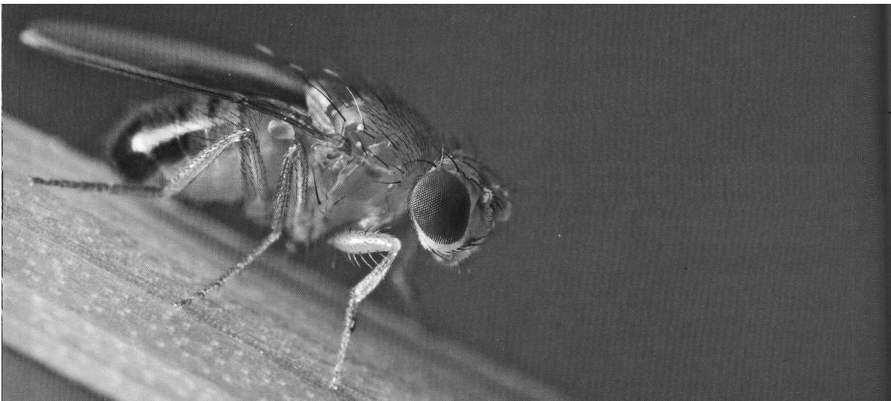

普通果蝇(Drosophila melanogaster)作为遗传学研究的模型已逾百年。这是一只突变型白眼雄果蝇的样子，它最终导致染色体遗传学说的诞生，该学说断言基因以线性顺序存在于染色体上。[©Studiotouch/Shutterstock, Inc.]

## 本章提纲

5.1 一条染色体上基因的连锁与重组

5.2 遗传作图

5.3 三点测交中的遗传作图

5.4 通过四分体分析作图

5.5 特殊的重组

联系：基因都是成串的

艾尔弗雷德·斯特蒂文特，1913

果蝇中六个性连锁因子的线性排列, 如它们的关联模式所示

联系：人类基因图

杰弗里·默里及其他26位研究人员，1994厘摩密度级的综合性人类连锁图

## 学习目标与科学能力

遗传连锁和染色体作图原理对于发现疾病基因和疾病的遗传风险因子是必不可少的。理解这些原理之后，你将具备如下科学能力。

\- 已知遗传图，能预测特定基因型的个体会产生的配子种类及相对频率。

\- 能分析 3 个连锁基因的遗传杂交结果，推导出双亲基因型、基因在染色体上的顺序、基因之间的遗传距离及交换之间的干涉程度。

\- 能发现非顺序四分体生物中两个基因之间的连锁，并能估计这两个基因在遗传图上的距离。

\- 能发现顺序四分体生物中基因与其着丝粒之间的连锁，并能估计该基因与其着丝粒之间的图距。

因为同源染色体在进行减数分裂时表现得像独立的单位，人们大概会认为，位于同一染色体上的基因，不会进行在非同源染色体中观察到的同样方式的自由组合。总是一起传递的基因称为表现出完全连锁(linkage)。摩尔根(Thomas Hunt Morgan)对这一问题进行了开拓性研究，他研究的是位于果蝇X染色体上的突变。他确实观察到了连锁，但他观察到的是一种不完全的连锁类型，证明这一点的是，后代表现出亲本没有的性状组合。

基因之间的连锁通常是不完全的，因为同源染色体在配对时，会进行片段交换。所以，在遗传中，每条染色体上的等位基因确实倾向于保持在一起，但同时可以传递一些具有新的等位基因组合的染色体。同源染色体之间的交换事件(交换，crossing over)导致基因重组(recombination)，产生携带亲代染色体中不存在的等位基因组合的子代染色体。在本章中我们了解到，任何两个基因之间交换的概率，可以作为这两个基因之间遗传距离的一个测度。这使得构建遗传图(genetic map)——显示基因相对位置的染色体示意图——成为可能。在遗传学中，连锁基因的遗传作图是一个重要的研究工具，因为它能将新基因定到某一染色体上，甚至能确定其相对于同一染色体上其他基因的准确位置。遗传作图常常是鉴定和分离新基因的第一步。在人类遗传学中，遗传作图对于鉴定遗传疾病相关基因(例如，使女性携带者易患乳腺癌的基因)是必不可少的。

## 5.1 一条染色体上基因的连锁与重组

正如在第 4 章中所见，对自由组合的直接验证，要进行 $F_{1}$ 代双重杂合子 (Aa Bb) 和双重隐性纯合子 (aa bb) 之间的测交。图 5.1 示基因在不同染色体上时，预计 Aa Bb 亲本会产生的配子。因为同源染色体两种可能的中期 I 排列具有相同的可能性，该双重杂合子以相同的比例产生所有

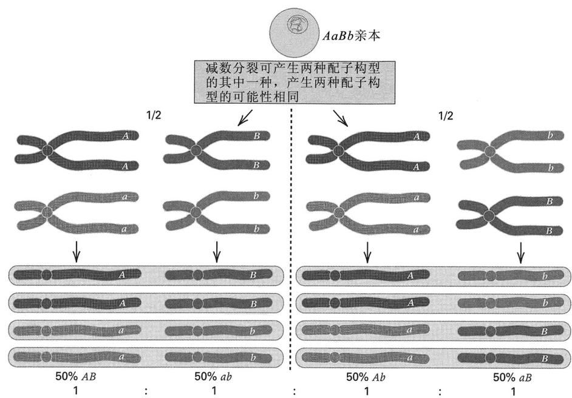  
图 5.1 不同染色体上基因自由组合的物质基础, 是在减数分裂中期 I 时, 非同源染色体的独立定向。在此例中, 左侧的定向产生 A B 和 a b 配子, 而右侧的定向产生 A b 和 a B 配子。

4 种可能的配子。通常将一个配子中的等位基因写成一串，各个基因之间空一格。在本例中，4 种具有相同可能性的配子为 $A B$ 、 $A b$ 、 $a B$ 和 $a b$ 。

在早期的果蝇实验中，摩尔根考察了 X 连锁的等位基因 w 对 $w^{+}$ (决定白眼对正常红眼) 和等位基因 m 对 $m^{+}$ (决定小翅对正常大小的翅) 的分离。当基因连锁时，记录哪些基因共同存在于同一条染色体上，非常重要。通常做法是，用斜线来分隔存在于同源染色体上的等位基因。摩尔根最初是在白眼、正常翅膀的雌性和红眼、小翅膀的雄性之间进行杂交。可用斜线把该杂交写成：

$$
w m ^ {+} / w m ^ {+} \text { ♀♀ } \times w ^ {+} m / Y \text { ♂♂ }
$$

所得 $F_{1}$ 代由野生型雌性 (基因型 $w m^{+}/w^{+}m$ ) 和白眼、非小翅的雄性 (基因型 $w m^{+}/Y$ ) 组成。然后， $F_{1}$ 代杂交：

$$
w m ^ {+} / w ^ {+} m \text {♀♀} \times w m ^ {+} / Y \text {♂♂}
$$

在该杂交中，携带等位基因组合 $w m^{+}$ 或等位基因组合 $w^{+} m$ 的 X 染色体称为亲本型 (parental types) 染色体。该术语反映了参与杂交的亲本携带了这些构型的等位基因的事实。如果 w 和 m 基因完全连锁，那么，所有的子代会获得一种或另一种亲本型染色体。另一方面，如果发生 w 和 m 基因之间的重组，那么，有些后代将获得具有 $w^{+} m^{+}$ 等位基因组合或 w m 等位基因组合的 X 染色体。这些称为重组型 (recombinant types) 染色体，因为它们包含的等位基因组合与亲本染色体中的不同。

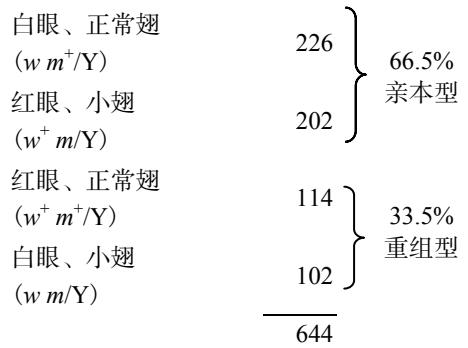

完成上面所示的杂交之后，雌性后代均为非小翅的，红眼：白眼的比值为1:1(如果理解起来有难度，可利用庞尼特方)，而雄性后代如下：因为每个雄性的X染色体都得自其母，所以，雄性的表型体现了它所得X染色体的基因型。如果自由组合，预计4种雄性表型的比值为 $1:1:1:1$ ，实验结果显著偏离这一期望比值，可是 $w:w^{+}$ 和 $m:m^{+}$ 的比值都接近 $1:1$ 。这种与自由组合的偏离，表明 $w$ 和 $m$ 基因的这些等位基因的亲本组合(parental combination)，在遗传中倾向于保

持在一起，但它们不是完全连锁的。在该实验中，亲本染色体中的等位基因组合，存在于 $428 / 644 = 66.5\%$ 的 $\mathrm{F}_2$ 代雄性中，而重组(非亲本)染色体存在于 $216 / 644 = 33.5\%$ 的 $\mathrm{F}_2$ 代雄性中。重组染色体的这个 $33.5\%$ 的值，称为重组频率(frequency of recombination)，也可写成0.335。该重组频率与自由组合时期望的 $50\%$ 重组，以及完全连锁时期望的 $0\%$ 重组，应该都是有差别的。

重组 X 染色体 $w^{+}m^{+}$ 和 wm 是 $F_{1}$ 代雌性减数分裂中交换的结果。在该例中，连锁基因 w 和 m 之间的重组频率为 33.5%，而对于其他成对的连锁基因，重组频率的范围从接近 0 到 50%。如果两个基因离得足够远，即便它们在同一条染色体，也能进行自由组合，这意味着它们的重组频率等于 50%。这说明了如下原理：

重组频率小于 50% 的基因，存在于同一染色体上(连锁)。由重组频率等于 50% 而表明进行自由组合的两个基因，要么在非同源染色体上，要么在单条染色体上，但相距甚远。

同一染色体上的两个基因可以不连锁，这种可能性引起了专业术语上的一个问题。不能说同一染色体上的所有基因都是“连锁的”，因为连锁的意思是重组频率小于50%，因而相距足够远的基因事实上是不连锁的。改用同线性(synten)一词：如果两个基因在同一条染色体上，称之为同线(syntenic)基因，无论它们表现出自由组合还是连锁。

## - 同线等位基因的相引与相斥

遗传学家用斜线表示法来表示连锁的基因，其一般形式如 $w^{+}m/w m^{+}$ 。 $\frac{w^{+}}{w}$ $\frac{m}{m^{+}}$ 这种表示法是右边这种更生动但非常麻烦的形式的一种简化：

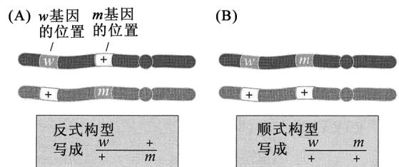  
图 5.2 在两个突变均为杂合的基因型中,突变等位基因的可能构型。(A)反式(或,相斥)构型,两个突变等位基因在不同染色体上。(B)顺式(或,相引)构型,两个突变等位基因在同一条染色体上。

在这种形式的表示法中，水平线替代了分隔两条同源染色体的斜线。为了一致，总是以相同的线性顺序书写连锁基因。这一惯例使得在适当位置用加号来表示野生型等位基因成为可能。例如，基因型 $w m^{+}/w^{+} m$ 也可写成 $w +/+ m$ 而没有歧义。这种基因表示方法被用于果蝇及许多其他生物上。

对于两个连锁基因均为杂合的基因型，其等位基因可为两种可能构型中的任一种，如图 5.2

中所示的 w 和 m 基因那样。在称为反式(trans)或相斥(repulsion)的构型中，突变等位基因在不同染色体上，基因型可写成 $w \pm / + m$ (图 5.2A)。在另一种称为顺式(cis)或相引(coupling)的构型中，突变等位基因在同一条染色体上，基因型写成 $w \pm / +$ 。

摩尔根对白眼和小翅等位基因的连锁研究始于反式构型。他也研究了从 w 和 m 等位基因的顺式构型而来的后代，这些后代是白眼、小翅雌性和红眼、非小翅雄性杂交所得。该杂交以 “+” 表示法表示为：

$$
\frac {w m}{w m} ♀ ♀ \times \frac {+ +}{\mathbf {Y}} ♂ ♂
$$

在此情况下， $F_{1}$ 代雌性在表型上为野生型双重杂合子，而雄性具有白眼和小翅。仍用 “+” 表示法，将 $F_{1}$ 代的杂交写成：

$$
\frac {w m}{+ +} ♀ ♀ \times \frac {w m}{Y} ♂ ♂
$$

该杂交产生如下后代:

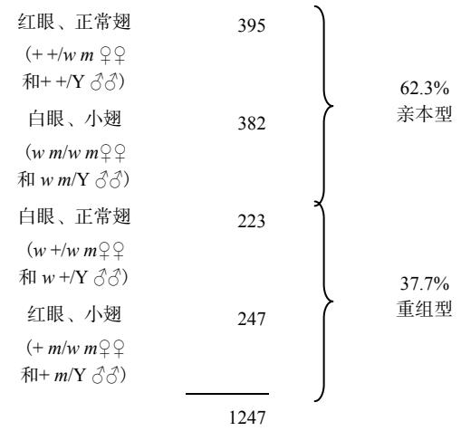

结果表明，在顺式(即相引)构型中 w 和 m 的重组频率，与在反式(即相斥)构型中观察到的 w 和 m 的重组频率，是一样的：37.7% 对 33.5%。其差异在实验抽样变异的期望范围之内。不过，在此例中，构成子代亲本型和重组型的染色体是相反的。它们之所以相反，是因为 $F_{1}$ 代雌性最初的亲本不同：一个是相斥的 $(w +/+m)$ ，另一个相引的 $(w m/++)$ 。在这类实验中反复发现相同的重组频率，得出如下结论：

无论连锁基因的等位基因是反式(相斥)构型还是顺式(相引)构型，连锁基因之间的重组都以相同频率发生，无论等位基因如何排列，结果都一样。

## ■ 连锁的卡方检验

任何一个重组频率 $(r)$ 的估计值都会受到从一个实验到另一个实验的抽样变异的影响。对于一个r<1/2的观测值，如何检验其对备择假设r=0.5的统计显著性？来看一个具体的例子：在上述w m相引构型的实验中，观察到r值为0.377，怎样才能确定这个值不是一个统计上的偶然事件？也许真实的r值是0.5，这两个基因虽然同线，但不连锁。连锁的统计显著性，可根据观测数，用第4章中讨论过的卡方法来检验。以得到估计值r=0.377的w m实验为例。测交数据的总卡方值在表5.1的顶行给出。由于有4种后代类别，所以自由度为4-1=3。但其中只有一个自由度与连锁的假设有关，其他的与w对 $w^{+}$ 、m对 $m^{+}$ 的分离有关，这一点如表的底下几行的卡方值所示。对w对 $w^{+}$ 的1:1分离进行检验，需将m和 $m^{+}$ 的数据合在一起，以获得观测比值：

$$
w: w ^ {+} = (3 8 2 + 2 2 3): (3 9 5 + 2 4 7) = 6 0 5: 6 4 2
$$

为了检验 m 对 $m^{+}$ 分离的 1:1，将 w 和 $w^{+}$ 的数据合并：

$$
m: m ^ {+} = (3 8 2 + 2 4 7): (3 9 5 + 2 2 3) = 6 2 9: 6 1 8
$$

根据不连锁 $(r=1/2)$ 的假设，预测重组后代：非重组后代的比值为1:1，所以，在此情况下我们这样合并数据：

$$
\text { 重组 }: \text { 非重组 } = (2 2 3 + 2 4 7): (3 9 5 + 3 8 2) = 4 7 0: 7 7 7
$$

表 5.1 用卡方检验连锁

<table><tr><td>卡方检验</td><td>计算过程</td><td>自由度</td><td>P值</td></tr><tr><td>总卡方</td><td> $(395-311.75)^{2}/311.75 + (382-311.75)^{2}/311.75 + (223-311.75)^{2}/311.75 + (247-311.75)^{2}/311.75 = 76.775$ </td><td>3</td><td> $1.5 \times 10^{-16}$ </td></tr><tr><td>w与w+的分离</td><td> $(605-623.5)^{2}/623.5 + (642-623.5)^{2}/623.5 = 1.098$ </td><td>1</td><td>0.295</td></tr><tr><td>m与m+的分离</td><td> $(629-623.5)^{2}/623.5 + (618-623.5)^{2}/623.5 = 0.097$ </td><td>1</td><td>0.755</td></tr><tr><td>连锁(重组与非重组)</td><td> $(470-623.5)^{2}/623.5 + (777-623.5)^{2}/623.5 = 75.580$ </td><td>1</td><td> $3.5 \times 10^{-18}$ </td></tr><tr><td>1 d.f.卡方值的和</td><td>76.775</td><td>3</td><td></td></tr></table>

这三个单独的卡方值，每个的自由度(d.f.)均为1，见表5.1。这个具有3 d.f.的总卡方值，其P值可用数值解法计算得 $1.5\times10^{-16}$ ；毫无疑问，这四种后代类别潜在的比值与1:1:1:1不同。为了解这一矛盾的根源，我们来检查具有1 d.f.的单个卡方值。w对 $w^{+}$ 的分离和m对 $m^{+}$ 的分离，均未给偏离1:1提供任何证据，P值分别为0.295和0.755。然而，重组对非重组的卡方值为高度显著的，其P值可计算得 $3.5\times10^{-18}$ 。根据这一检验，有把握得出结论——矛盾的原因是连锁，并

且，已经估计出重组频率 r=470/1247=0.377。

还要注意，在表 5.1 中，三个 1 d.f. 卡方值总和得 76.775 的总卡方值。这种可加性意味着被检验的三个假设是独立的，这是指，它们中任何一个的真或假，与其他假设的真实性无关。在实践中，人们常常不会对表 5.1 中概括的那种详细的分离分析感兴趣。通常只想检验连锁，而这种检验是基于重组体 (recombinant) 对非重组体 (nonrecombinant) 的卡方值。

连锁的卡方检验是检验重组后代与非重组后代的数目是否相等(1:1比值)的检验，其具有1个自由度。

一般不必检验个别的 1:1 分离。

## - 每对连锁基因都具有特有的重组频率

在果蝇中，另一个 X 连锁基因的隐性等位基因 y 导致黄色体色，而不是常见的由等位基因 $y^{+}$ 决定的灰色体色。在一次实验中，让白眼雌性与具有黄色身体的雄性交配，然后用身体黄色的白眼雄性对野生型 $F_{1}$ 代雌性进行测交：

$$
\begin{array}{c} + w / + w \text {♀♀} \times y + / \mathbf {Y} \text {♂♂} \\ \downarrow \\ + w / y + \text {♀♀} \times y w / \mathbf {Y} \text {♂♂} \end{array}
$$

后代为

在第二个实验中, 让黄色身体的白眼雌性与野生型雄性杂交, 然后让 $F_{1}$ 代野生型雌性与 $F_{1}$ 代黄色身体的白眼雄性杂交:

$$
\begin{array}{c} y   w /   y   w   \text { ♀♀ } \times +   + / \mathbf {Y}   \hat {\mathcal {O}} \hat {\mathcal {O}} \\ \downarrow \\ +   + /   y   w   \text { ♀♀ } \times y   w / \mathbf {Y}   \hat {\mathcal {O}} \hat {\mathcal {O}} \end{array}
$$

在此情况下，98.7%的 $F_{2}$ 代具有亲本染色体，1.3%具有重组染色体。亲本型和重组型与

互交中的相反，但重组频率几乎一样。具有反式基因型 $y + / + w$ 的雌性产生约 $1.4\%$ 的重组后代，后代携带重组染色体 $yw$ 或 $++$ ；具有顺式基因型 $yw / + +$ 的雌性产生约 $1.3\%$ 的重组后代，后代携带重组染色体 $y +$ 或 $+w$ 。不过，控制黄色体色和白眼的这两个基因之间的重组频率，大大低于控制白眼和小翅的两个基因之间的重组频率（ $1.4\%$ 与大约 $35\%$ ）。这些实验，以及其他实验，

使下列结论得以加强:

\- 重组频率是特定基因对的特征。

\- 在顺式(相引)和反式(相斥)杂合子中，重组频率相同。

## - 雌性的重组与雄性的重组

果蝇比较独特，其雄性不发生重组。尽管还不知道在雄性中交换怎样(或为什么)被阻止，雄性果蝇没有重组的结果是：雄性的所有同线基因(那些在同一条染色体上的基因)表现为完全连锁。例如，cn(朱砂眼)基因和bw(棕眼)基因都在2号染色体上，但相距甚远，在雌性中重组频率为50%。因此，这样的杂交

$$
\frac {c n b w}{+ +} ♀ ♀ \times \frac {c n b w}{c n b w} ♂ ♂
$$

产生基因型为 $+ + / cn \ bw$ 和 $cn \ bw / cn \ bw$ (非重组型)，以及 $cn + / cn \ bw$ 和 $+bw / cn \ bw$ (重组型)的后代，比例为 $1:1:1:1$ 。然而，因为在雄性中没有交换，反交

$$
\frac {c n b w}{c n b w} ♀ ♀ \times \frac {c n b w}{+ +} ♂ ♂
$$

只产生基因型为+ +/cn bw 和 cn bw/cn bw 的后代，比例相同。雄性果蝇中没有重组，是实验设计中常常加以利用的一种便利。如 cn 和 bw 的例子中所示，雄性任何一条染色体上的所有基因，一定会作为一个整体传递，不与同源染色体上的等位基因重组。

雄性果蝇完全没有交换是非典型的，但两性的重组频率有差异，并不罕见。例如，人类基因组也表现出女性的重组多于男性，但差别绝不像果蝇那样极端。平均而言，在整个人类基因组中，男性遗传标记之间的重组频率，约为女性相同遗传标记之间观测值的60%。

## 5.2 遗传作图

基因在染色体上的连锁情况可以用遗传图(genetic map)的形式来表示，遗传图显示基因在染色体上的线性顺序及相邻基因之间的距离，相邻基因之间的距离与它们之间的重组频率成正比。遗传图也称为连锁图(linkage map)或染色体图(chromosome map)。1913年，摩尔根的学生艾尔弗雷德·斯特蒂文特(Alfred H. Sturtevant)首次阐述遗传作图的概念。早期的遗传学家已经知道，基因间的重组是在今天称为交换的过程中，通过同源染色体之间片段的交换而进行。每次交换物理上表现为同源染色体之间的一个交叉(chiasma，即十字构型)，交叉见于减数分裂的前期I中(第4章)。每个交叉缘于非姐妹染色单体的断裂和重接，结果是非姐妹染色单体之间相应片段的互换。交换的原理是，每个交叉导致遗传标记的一个新关系。该过程如图5.3所示。当不交换时(图5.3A)，每条同源染色体中的等位基因以相同的组合保持不变。当交换确实发生时(图5.3B)，在两条染色单体远侧的等位基因互换(重组)。

## ■ 图距和重组频率

在遗传图中，距离的单位称为图距单位(map unit)。在短距离内，1个图距单位相当于 $1\%$ 的重组。例如，两个以 $3.5\%$ 的频率重组的基因，说成是位置有3.5图距单位远。为了纪念摩尔根，1个图距单位也称为1个厘摩(centimorgan，缩写为cM)。因而，3.5图距单位等于 $3.5\mathrm{cM}$ ，表示基因之间 $3.5\%$ 的重组。为了便于参考，列出可以表示两个基因之间遗传距离的4种完全等价的方式：

\- 重组频率(在上述例子中为 0.035)

\- 重组百分数(此处为 $3.5\%$ )

\- 以图距单位表示的图距(此处为3.5图距单位)

\- 以厘摩表示的图距(此处为3.5厘摩，缩写为 $3.5\mathrm{cM}$ )

在物理上，1个图距单位可被定义为一定的染色体长度，在该长度上，平均每50个进行减数分裂的细胞形成1次交换。该原理如图5.4所示，如果50个减数分裂细胞中有1个细胞具有1次交换，则交换频率等于1/50，或2%，但是，基因之间的重组频率是1%。1%的重组与2%的交换相当，是有点难以理解，除非领会到每次交换产生2条重组染色单体和2条非重组染色单体（图5.4）。1%的重组频率的意思是，在由50个细胞减数分裂产生的200条染色体中，恰好有2条染色体(参与交换的那两条)对于交

(A) 没有交换

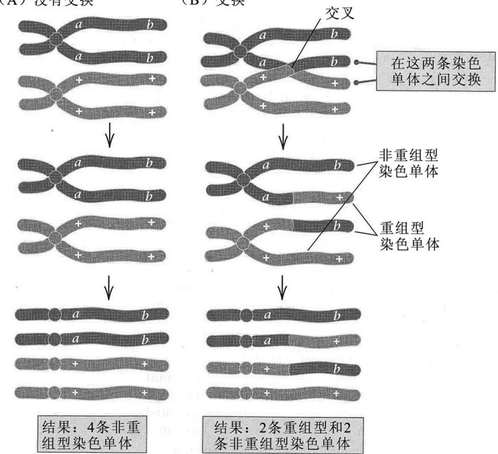  
图 5.3 (A) 同源染色体间不发生交换时，在同一条染色体上的等位基因保持在一起。(B) 存在交换时，产生两个重组产物和两个非重组产物，因为互换仅发生于 4 条姐妹染色单体中的两条间。

换点两侧的遗传标记而言为重组的。换个方式来表达，2%的交换相当于1%的重组，是因为在发生了一次互换的每个细胞中，实际上仅有一半的染色单体为重组的。

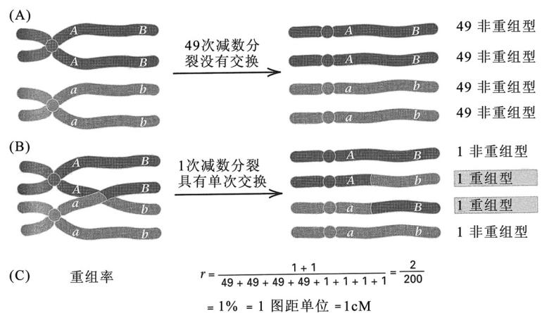

在染色体上存在遗传标记——如图 5.4 中的 $(A, a)$ 和 $(B, b)$ 这两对等位基因——的情况下，仅当交换发生在标记基因之间时，标记基因才会发生重组。在图 5.5 所示的例子中，交换发生在基因 A 和着丝粒之间，而不是在基因 A 和 B 之间。该交换确实导致了最里边两条染图 5.4 50 个减数分裂细胞的染色体构型，其中一个细胞在两个基因之间有一次交换。(A)49 个没有交换的细胞产生 98 条 A B 染色体和 98 条 a b 染色体，这些都是非重组体。(B)有交换的细胞产生的染色体为 A B、A b、a B 和 a b，其中，中间的两种为重组染色体。(C)重组频率等于 2/200，即 1%(也称为 1 图距单位或 1cM)。因此，1% 重组的意思是，在这两个基因之间的区域，在 50 个减数分裂的细胞中，有 1 个细胞具有 1 次交换。

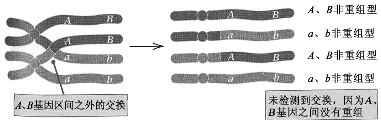  
图 5.5 通过重组不能发现两个基因间区域之外的交换。尽管染色体的一个片段发生了互换，但遗传标记保持非重组构型，此处为 A B 和 a b。

色单体之间片段的物理互换。但因为该互换位于 A 和 B 间的区域之外，所以产生的所有配子必定携带 A B 或 a b 等位基因组合，这些是非重组染色体，察觉不到该交换的存在，因为该交换不在遗传标记之间的区域内。

在有的情况下，遗传标记之间的区域大到足以在单个减数分裂细胞中形成两次(或更多次)交换。两次交换的一种可能的构型，如图5.6所示。在此例中，两次交换都在同一对染色单体之间。结果

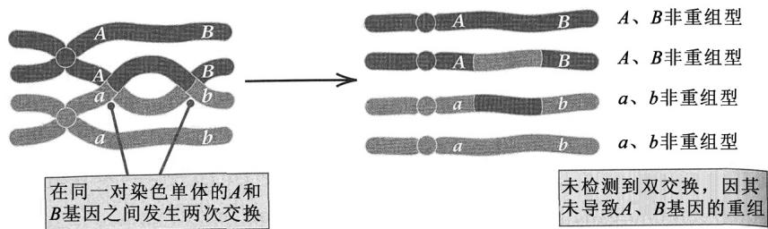  
图 5.6 如果在标记基因之间发生了两次交换，且两次交换都涉及同一对染色单体，则两次交换都检测不到，因为产生的所有染色体都为非重组的 A B 或 a b。

是，在标记基因之间存在片段的物理互换，但仍检测不到该双重交换，因为这些标记本身没被重组。没有重组，缘于这样的事实：仅就 A 和 B 之间的重组而论，第二次交换逆转了第一次交换的效应，所产生的染色体为 AB 或 ab，两者都是非重组的。

鉴于在两个基因间区域的双重交换因为不产生重组染色体而检测不到，以重组频率来量度两个基因间的距离，与以图距单位来量度两个基因间的距离，两者之间存在重要的区别。图距单位量度基因间发生了多少次交换。对于任意两个基因，它们之间的图距(map distance)定义如下：

$$
\mathrm{图距} (\mathbf {c M}) = (1 / 2) \times \mathrm{每个减数分裂细胞在该区域中交换的平均次数} \times 1 0 0\tag{1}
$$

而重组频率反映了在某个实验中实际观察到多少重组。未产生重组配子的双重交换——如图5.6中的那个——确实对图距有贡献，但对重组频率没有贡献。仅当所讨论的区域大到足以发生双重交换时，该区别才重要。如果基因间的区域很小，在任何一次减数分裂中，在该区域中能形成的交换不超过一次，那么，图距单位和重组频率是一样的(因为不存在能够互相抵消的多重交换)，这就是说“在短距离内，1个图距单位相当于 $1\%$ 的重组”的根据。在一个短至只产生 $1\%$ 重组的区间内，多重交换通常是不可能的，所以在此情况下图距等于重组频率。

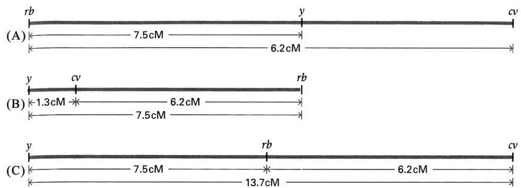  
图 5.7 在果蝇中，基因 y(黄色体色)和 rb(红宝石眼)具有 7.5% 的重组频率，rb 和 cv(变短的翅横脉)具有 6.2% 的重组频率。有三种可能的遗传图，取决于 y 在中间(A)、cv 在中间(B)还是 rb 在中间(C)。图谱 A 可排除，因为它表明 rb 和 y 比 rb 和 cv 更靠近，而观测到的 rb 和 y 之间的重组频率比 rb 和 cv 之间的大。图谱 B 和 C 都与已知数据一致。

对于一连串的连锁基因，如果在每一对相邻基因之间的染色体区域足够小、在该区域中不产生多重交换，那么，基因间的重组频率是可以累加的（从而，图距也是可以累加的）。图5.7示重组的这一重要特点，这也是遗传作图所用的逻辑。这些基因都在果蝇的X染色体上：y(黄色体

色)、rb(红宝石眼睛颜色)、cv(变短的翅横脉)。基因 y 和 rb 之间的重组频率是 7.5%，而基因 rb 和 cv 之间的重组频率是 6.2%。遗传图可以是三种可能性中的任何一种，取决于 y、cv 或 rb 哪一个在中间。图谱 A——y 在中间——可以排除，因为该图谱表明，rb 和 cv 之间的重组频率应该比 rb 和 y 之间的重组频率大，这与观测数据矛盾。

图谱 B 和 C 都与重组频率一致。它们对 y 和 cv 之间重组频率的预测不同。在图谱 B 中，预测距离为 1.3 图距单位，而在图谱 C 中，预测距离为 13.3 图距单位。实际上，在 y 和 cv 之间观测到的重组频率是 13.3%。因此，图谱 C 是正确的。

其实，与图谱 C 对应的遗传图有两种，它们的不同仅仅在于 y 放在左边还是右边，一个图谱是：

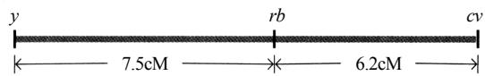

另一个图谱是:

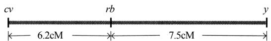

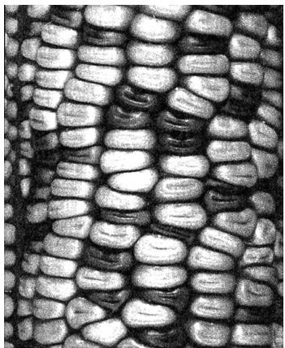  
[承密苏里大学农业、食品及自然资源学院诺伊弗(M. G. Neuffer)惠赠。]

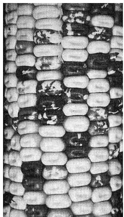  
[承密苏里大学农业、食品及自然资源学院诺伊弗惠赠。]

这两种绘制遗传图的方式是完全等价的。

用这种推理逐一考察由三个标记组成的子集，可在染色体遗传图中对染色体上所有已知的基因进行定位。每组同线基因构成一个连锁群(linkage group)。连锁群的数目与该物种单倍染色体的数目相同。例如，栽培玉米(Zea mays)有10对染色体，因而有10个连锁群。其10号染色体的部分遗传图如图5.8所示，图中也包括一些突变体的表型。图5.8C和5.8F中的玉米穗说明了孟德尔分离的结果。图5.8C显示，在两个杂合基因型之间的杂交中，由隐性等位基因棕色果皮-2(orp-2)产生的黄色籽粒：棕色籽粒的3∶1分离。图5.8F显

示，在一个杂合基因型和一个隐性正常玉米的杂交中，由显性等位基因 R1-mb 产生的大理石色籽粒：白色籽粒的 1:1 分离。

## ■ 交换

遗传图所表现出来的基因的有序排列，与每个基因在染色体上都要占据一个界限明确的位点(基因座，locus)的结论是一致的。在杂合子中，两个等位基因分别占据同源染色体的对应位置。交换是使同一条染色体上的基因产生新联系的片段的物理互换造成的，该过程具有如下特点。

1. 两条亲本染色单体间的片段互换发生于第一次减数分裂的前期，在染色体已经复制之后。在此时期，一对同源染色体的四条染色单体(链)紧密联会。交换是一对同源染色体中两条染色单体间的物理互换。

2. 互换过程包括两条染色单体的断裂和重接，导致两条染色单体间等长的对应片段的相互交换(图 5.3)。

3. 在一对染色体的全长上，交换的位点差不多是随机的。因此，两个基因之间交换的概率，随着染色体上基因间物理距离的变大而增加，该原理是遗传作图的依据。

## - 基因重组是染色体间物理互换的结果

重组与同源染色体之间片段的物理互换相关，对此的经典证明利用了两种结构变异的果蝇

X 染色体，它们使得在显微镜下识别亲本染色体和重组染色体成为可能。该实验由柯特·斯特恩(Curt Stern)于 1936 年进行，概括于图 5.9 中。其中一条异常的 X 染色体缺失一个片段，该片段与 4 号染色体连接；这条 X 染色体可通过其末端片段的缺失加以识别。第二条异常的 X 染色体，因其具有由一段 Y 染色体构成的小的附加臂而得以识别。突变等位基因 car(隐性等位基因，导致淡红色眼睛，而不是野生型的红色眼睛)和 B(显性等位基因，导致棒状眼，而不是圆眼)在第一种异常 X 染色体上，这两个基因的野生型等位基因在第二种异常 X 染色体上。具有这两种在结构上和遗传上都标记了的 X 染色体的雌性，与具有正常 X(携带这两个基因的隐性等位基因)的雄性交配(图 5.9)。在来自该交配的后代中，具有亲本染色体或重组染色体的果蝇，可根据它们眼睛的颜色和形状予以识别。在来自该交配的遗传重组后代中，如果基因的重组伴随着使染色体标记产生重新组合的互换，则 X 染色体会具有意料之中的外观。具体而言，表现为野生型或棒状眼的后代，带有一条缺失末端片段且具有附加 Y 臂的 X 染色体；表现为淡红眼或圆眼的后代，具有结构正常的 X 染色体，不缺失末端，也没有 Y 臂。正如预料的那样，发现非重组后代所具有的一条 X 染色体，在结构上与其母本的一条 X 染色体相同。

图5.8 玉米10号染色体的遗传图。每个基因到位置0(短臂端粒，左下)的图距以标准图距单位(厘摩)表示。(A)油黄-1(oy-1)基因中的突变产生黄绿色植株。前景中的植株对于该显性等位基因为杂合；背后为正常植株。(B)枯斑-16(les16)基因中的突变在叶片和叶鞘上产生许多小型到中型、不规则间隔的褪色斑点。照片显示显性基因Les16杂合子的表型。(C)等位基因orp2为隐性，表达为棕色果皮(包绕籽粒的组织)。该玉米穗显示在两个杂合基因型之间的一个杂交中orp2的分离，产生黄色籽粒：棕色籽粒的3∶1比值。(D)zn1基因为斑纹坏死-1，坏死组织出现在叶片的纵向条

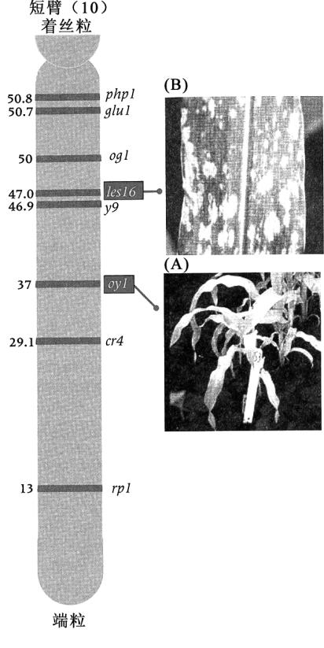

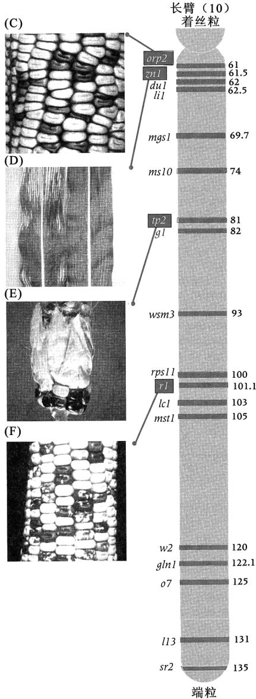

带中。左边的叶子是纯合的 zn1，右边的是野生型。(E)类蜀黍荚-2(tp2)基因中的突变产生许多小的、部分有荚的玉米穗和一个简单的雄穗。所示为来自显性等位基因 Tp2 杂合植株的一个穗。(F)突变 R1-mb 为 r1 基因的一个等位基因，在种子的糊粉层产生红色或紫色的颜色。注意，在玉米穗的籽粒中大理石色对于 R1-mb 是分离的。[改编自 E. H. Coe 的插图。照片承密苏里大学农业、食品及自然资源学院诺伊弗惠赠。]

图 5.9 (A) 杂交示意图，其中，雌果蝇中的两条 X 染色体，在形态上可相互区别，并可与正常 X 染色体区别。一条 X 染色体缺失一个末端片段，另一条具有由一个 Y 染色体片段构成的附加臂。(B) 杂交结果。淡红但非棒状的后代(单星号)含一条结构正常的 X 染色体，棒状但非淡红的后代(双星号)含一条两种形态标记都有的 X 染色体。该结果证明，标记基因间的遗传重组，与同源染色体间的物理互换相关联。X 染色体缺失的末端片段(与 4 号染色体连接)的分离未显示。

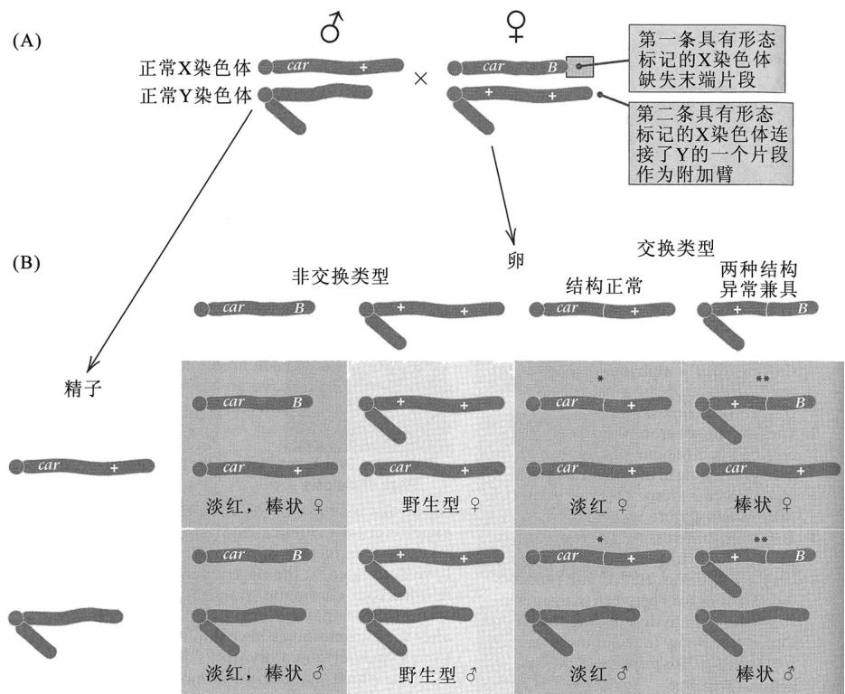

## - 交换发生在减数分裂的四线期

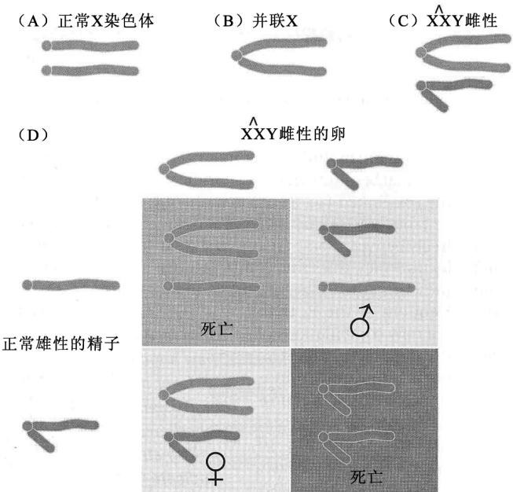  
图 5.10 果蝇的并联 X(复合 X)染色体。(A)雌性中结构正常的 X 染色体。(B)并联 X 染色体，两条正常 X 染色体的长臂连接到同一个着丝粒上。(C)典型的并联 X 雌性也含一条 Y 染色体。(D)并联 X 染色体雌性与正常雄性杂交的结果。具有 3 条 X 染色体或没有 X 染色体的基因型是致死的。注意，在此情况下，雄性果蝇从其父得到 X 染色体，从其母得到 Y 染色体——与果蝇的通常情况相反。

迄今为止，在没有引用实验证据的情况下，我们一直宣称交换发生在减数分裂中，在染色体复制之后，在每个二价体具有四条染色单体链的时期。交换发生于染色体复制之后的一个实验证明，来自一项黑腹果蝇实验室品系的研究，该品系雌性的两条X染色体连接于一个共同的着丝粒上，形成称为并联X染色体(attached-X chromosome)或复合X染色体(compound-X chromosome)的异常染色体。果蝇正常X染色体具有一个在染色体末端的着丝粒。两条这样的染色体与单个着丝粒连接，产生一条具有两个大小相同的臂的染色体，每条臂包含一条几乎完整的X。具有复合X染色体的雌性，通常也含有一条Y染色体，它们产生两种类别的可存活子代：具有母源复合X染色体和父源Y染色体的雌性，以及具有母源Y染色体和父源X染色体的雄性(图5.10)。并联X染色体常被用来研究果蝇的X连锁基因，因

为并联 X 雌性与携带任何 X 连锁突变的雄性交配时，雄性后代都得到突变的 X 染色体，而雌性后代得到并联 X 染色体。因而，在与并联 X 雌性的交配中，雄性中 X 连锁基因的遗传是从父传子、从子传孙……，这与通常的 X 连锁遗传相反。

在一条 X 臂携带一个隐性等位基因、另一条 X 臂携带其野生型非突变等位基因的并联 X 染色体中，在两条 X 染色体臂之间交换而产生的并联 X 产物，可以是两条臂上都存在隐性等位基因的并联 X 染色体(图 5.11)。因此，杂合的并联 X 雌性，可产生一些对于该隐性等位基因为纯合的雌性后代。观察到的纯合

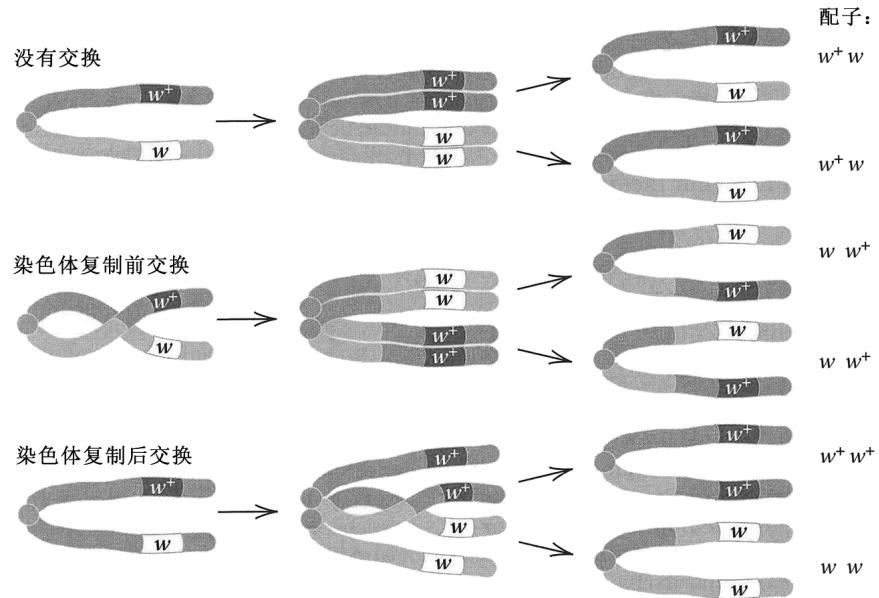  
图 5.11 交换必定发生在减数分裂的四线期中。对某个等位基因杂合的并联 X 染色体，通过交换产生纯合的并联 X 染色体。要纯合化，交换必定发生在着丝粒和基因之间。

化频率，随基因离着丝粒的图距的增加而增加。从图5.11中明显可见，基因和着丝粒之间的交换只有发生在染色体复制之后，才会造成纯合化。因而，发现纯合并联X雌性，说明交换发生在减数分裂的四线期。如果是在染色体复制之前(在二线期)发生交换，只会造成染色体两臂之间的等位基因的互换，决不会得到实际观察到的纯合产物。

联系：基因都是成串的

艾尔弗雷德·斯特蒂文特，1913

哥伦比亚大学，纽约，纽约州

果蝇六个性连锁因子的线性排列，如它们的关联模式所示

遗传作图现在仍是遗传分析的基石。在现代人类遗传学中，它是用于遗传病相关突变基因染色体定位的主要技术。目前在人类遗传学中使用的遗传标记通常是因人而异的单核苷酸多态性(SNP)，但遗传作图的基本原理与最初斯特蒂文特所阐述的一样。在本节选中，我们已将符号替换为目前用来表示基因的符号：y(黄色身体)、w(白眼)、v(朱砂眼)、m(小翅)和r(原始翅)(第六个被提及的基因是白眼基因的突变型等位基因，现在称为白-曙红)。在本论文中，斯特蒂文特用crossing over(交换)这个词，而不是recombination(重组)；用crossovers(交换体)，而不是recombinant chromosomes(重组染色体)。我们保留了他原来的这些词，但在少数情况下，将现代的对应词放在了括号中。

摩尔根通过把白眼、长翅果蝇与红眼、原始翅(新的性连锁性状)果蝇杂交，在 $F_{2}$ 代中得到白眼、原始翅果蝇。这只有在“交换”(重组)时，才可能发生，这意味着，在假设这两个因子都在X染色体上的情况下，发生了同源染色体之间的物质互换(仅在雌性中，因为雄性只有一条X染色体)。此时不曾注意到的一个关键之处，后来在联系到果蝇的其他性连锁因子时，显露了出来。显而易见，有些性连锁因子是相关联的，亦即，这些因子之间的交换不是自由发生的，正如这样的事实所示：在 $F_{2}$ 代中， $F_{1}$ 代果蝇中存在的组合比相同性状的新组合要多得多。从染色体来看，这意味着在减数分裂中，染色体或至少是染色体的某些片段，保持完整的可能性比互换物质的可能性大。……如果该假设正确，“交换体”(重组染色体)的比例也许可以用作任意两个因子之间距离的一个指标。那么，通过确定A和B之间及B和C之间的距离(在上述的意义上来说)，应能预测AC的距离。……下面的数据展示了我们的理论究竟经得起多大程度的检验，数据中给出了交换体(重组染色体)的观测百分数以及(根据短区间的总和)计算得的距离。

<table><tr><td>因子</td><td>计算出的距离</td><td>交换体的观测百分比</td></tr><tr><td>y-v</td><td>30.7</td><td>32.2</td></tr><tr><td>y-m</td><td>33.7</td><td>35.5</td></tr><tr><td>y-r</td><td>57.6</td><td>37.6</td></tr><tr><td>w-m</td><td>32.7</td><td>33.7</td></tr><tr><td>w-r</td><td>56.6</td><td>45.2</td></tr></table>

立刻会注意到，对于两个长的距离——y-r 和 w-r，交换体的百分数比计算出来的要小。这一点是事先就该料到的，这很可能由于在同一条染色体上发生两次断裂——“双交换”——而致。但在距离较短的情况下，交换体百分数可能与预期的非常接近。……我们发现，用每百例中交换体的数目(重组频率)作为任意两个因子间距离的指标，可以将果蝇的六个性连锁因子排列成一个线性系列。在预测未经检验的因子之间的关联强度时，误差的来源见于双交换中。这一现象的发生得到了证明。……这些结果是支持染色体遗传观点的一个新论据，因为它们强烈表明所研究的因子排列成一个线性系列。

来源：A. H. Sturtevant, J. Exp. Zool. 14(1913): 43-59.

## ■ 多重交换

当两个基因在染色体上的位置离得很远时，在单次减数分裂中在它们之间可发生不止一次交换，且多重交换的概率随着基因间距离的增大而增大。多重交换使得对重组数据的诠释变得复杂。问题在于，基因间的有些多重交换不产生重组，从而检测不到。正如我们在图5.6中看到的，一次交换的效应可以被另一次交换抵消。如果相同的两条染色单体间的两次互换都发生在基因 $A$ 和 $B$ 之间，那么它们的净效应将是所有的染色体均为非重组体，要么是 $AB$ ，要么是 $ab$ 。这次减数分裂的两个产物有中间片段的互换，但对于遗传标记而言，染色体不是重组体，所以它们在遗传上不能与非交换染色体相区别。存在这种抵消的可能性，意味着式(1)定义的真实的图距，如设其等于重组的观测频率，会被低估。

在高等生物中，在足够短的染色体片段中，双重交换实际上是不可能的。因而，使用紧密连锁标记的重组数据来构建遗传连锁图，可以避免相互抵消作用的多重交换。对于染色体上相距很远的基因，真实图距是通过累加较短的子区间(在子区间内不发生多重交换)的重组频率来估计的。

两个基因间最小的重组频率是 0，重组频率也有一个最大值：

无论两个基因相距多远，任意两个基因间的最大重组频率为 50%。

如果两个基因在非同源染色体上且自由组合，将会观测到相同的 $50\%$ 重组值。当两个基因在染色体上相距得非常远，以致在它们之间几乎总是会发生至少一次交换时，将观察到最大重组频率。图5.3B显示，在每次减数分裂中，单次互换的结果是，一半的产物具有亲本的基因组合，另一半具有重组组合。如图5.12所示，两个基因之间的两次互换具有相同的效应。图5.12A示二线双交换(two-strand double crossover)，其中，两条相同的染色单体两次都参与互换；检测不到标记基因间的重组。当两次互换有一条共同的染色单体时(three-strand double crossover，三线双交换，图5.12B和C)，其结果与单次交换的结果无法区分：产生两个具有亲本组合的产物和两个具有重组组合的产物。注意，三线双交换有两种类型，这取决于参与交换的是哪三条染色单体。最后还有一种可能，参与第二次互换的染色单体，未参与第一次互换(four-strand double crossover，四线双交换，图5.12D)，在此情况下，所有四个产物都是重组体。

在大多数生物中，在发生双重交换时，参与两次互换事件的染色单体是随机选择的。在此情况下，三种类型的双重交换的期望比例为 1/4 二线双交换、1/2 三线双交换和 1/4 四线双交换。这意味着，在一对基因之间发生两次互换的减数分裂，在它产生的 4 条染色单体中，平均而言，将发现 2 条重组染色单体。

$$
(1 / 4) (0) + (1 / 2) (2) + (1 / 4) (4) = 2
$$

这与基因之间单次互换所得的比例相同。不仅如此，任意多重的互换，最大重组频率都是 50%。

在对图 5.12 的讨论中，我们曾强调，在大多数生物中，参与双重互换事件的染色单体是随机选择的。如此，则最大重组频率是 50%。在连续的交换中，当存在染色单体的非随机选择时，这种现象称为染色单体干涉 (chromatid interference)。在图 5.12 中可见，相对于染色单体的随机选择，四线双交换过度（正染色单体干涉，positive chromatid interference）使最大重组频率大于 50%；而二线双交换过度（负染色单体干涉，negative chromatid interference）使最大重组频率小于 50%。因此，发现在同

(A) 二线双交换

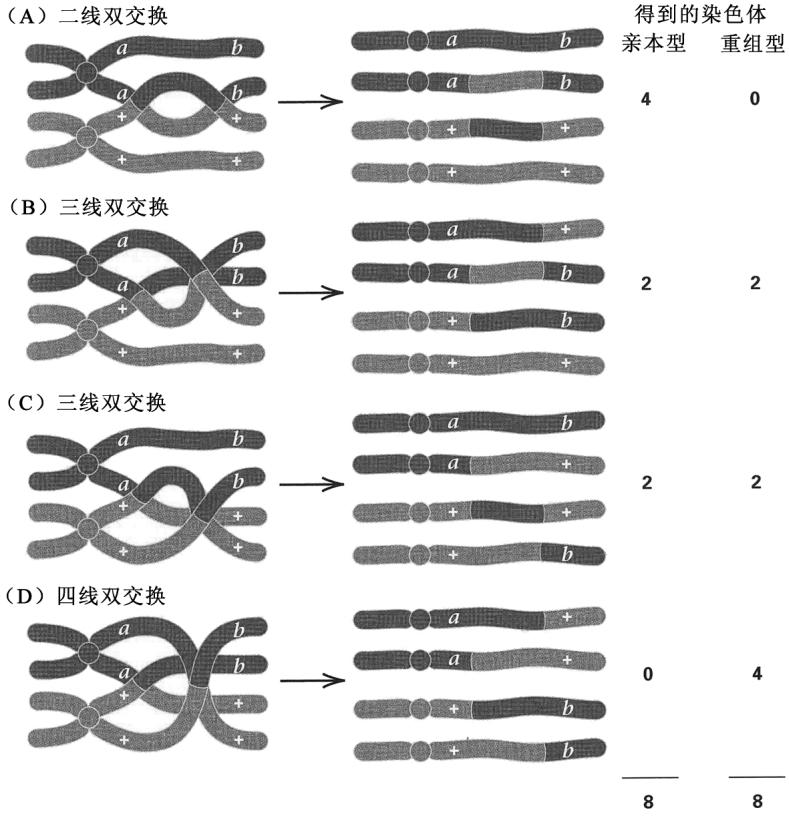  
图 5.12 若染色单体随机参与互换，则在两个基因之间的区域发生两次交换，其结果与这两个基因的自由组合难以区分。(A)二线双交换。(B, C)三线双交换的两种类型。(D)四线双交换。

一条染色体上的两个基因之间的最大重组频率不是 50%，可视为染色单体干涉的证据。迄今尚未在任何生物中观察到正染色单体干涉，已报道在某些真菌中存在负染色单体干涉。

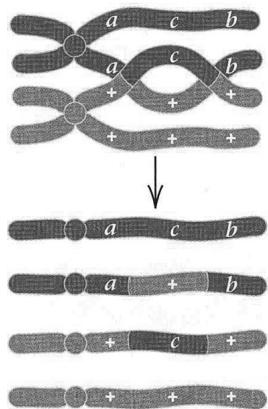  
图 5.13 在一个三重杂合子中，二线双交换横跨中间那对等位基因，导致参与二线双交换的两条染色单体的中间那对等位基因相互交换。

在采用三点杂交(three-point crosses)的重组实验中，可检测到双重交换。三点杂交包含三对等位基因。如果第三对等位基因 $(c^{+}$ 和 $c)$ 位于我们关注的两个基因(最外边的两个遗传标记)之间，那么，当两次交换分别在 $c$ 基因两侧时，可检测到该区域的双重互换(图5.13)。该例中的两次交换，发生在同一对染色单体之间，会导致这两条染色单体之间 $c^{+}$ 和 $c$ 等位基因的相互交换。三点杂交是获取重组数据的一种高效的方法，如同在下一节中即将看到的那样，它也是确定三个基因顺序的一种简单方法。

## 5.3 三点测交中的遗传作图

表 5.2 中的数据来自玉米三个连锁基因的一次测交，我们将用这些数据来解释对三点杂交的分析。隐性等位基因为 $lz$ (lazy，匍匐生长习性)、 $gl$ (glossy leaf, 有光泽的叶子) 和 $su$ (sugary endosperm, 甜胚乳)，杂交中多重杂合亲本的基因型为

$$
\frac {L z G l S u}{l z g l s u}
$$

因而，获得非交换型(亲本型)配子的两类后代是正常植株和具有匍匐-光泽-甜表型的植株。这两类的数量远远多于任何其他交换类别。如果事先不知道杂合亲本染色体上显性和隐性等位基因的组合情况，可以从后代的相对频率推断出非交换配子为 $Lz Gl Su$ 和 $lz gl su$ 。这一点相当重要，足以表述成一个普遍原则：

在涉及连锁基因的任何遗传杂交中，无论有多复杂，最常见的两种配子类型对任何一对基因而言均为非重组体；这两种类型规定了多重杂合亲本中各基因的等位基因连锁相(顺式与反式)。

表 5.2 玉米中一次三点测交所得的后代

<table><tr><td>测交后代的基因型</td><td>来自杂种亲本的配子的基因型</td><td>数目</td></tr><tr><td>正常(野生型)</td><td>Lz Gl Su</td><td>286</td></tr><tr><td>匍匐</td><td>lz Gl Su</td><td>33</td></tr><tr><td>光泽</td><td>Lz gl Su</td><td>59</td></tr><tr><td>甜</td><td>Lz Gl su</td><td>4</td></tr><tr><td>匍匐、光泽</td><td>lz gl Su</td><td>2</td></tr><tr><td>匍匐、甜</td><td>lz Gl su</td><td>44</td></tr><tr><td>光泽、甜</td><td>Lz gl su</td><td>40</td></tr><tr><td>匍匐、光泽、甜</td><td>lz gl su</td><td>272</td></tr></table>

这意味着，如果亲本染色体是

在作图实验中，事先往往不知道染色体上基因的顺序。在表 5.2 中，所示的三个基因的顺序完全是随意的。不过，有一种根据三点杂交数据确定正确顺序的简单方法，仅需找出杂合亲本产生的双重交换配子的基因型，然后与非重组配子进行比较。因为同时发生两次互换的概率会显著小于任何单次互换的概率，所以双重交换的配子会是最少的类型。表 5.2 显示，具有甜表型的 4 棵植株和具有匍匐-光泽表型的 2 棵植株属最少的两种类型，因而是双重交换后代。

如图 5.13 所示，双重交换的效应是，染色体之间中间那对等位基因互换。

而双重交换染色体是

$$
\begin{array}{r l} & {L z G l S u \text {和} l z g l s u} \\ & {L z G l s u \text {和} l z g l S u} \end{array}
$$

则，Su 和 su 被双重交换互换，因而必定是中间那对等位基因。因此，在此杂交中杂合亲本的基因型应写成

$$
\begin{array}{c c c} L z & S u & G l \\ \hline l z & s u & g l \end{array}
$$

现在，杂合亲本的基因型在同源染色体上的基因顺序和等位基因构型两方面都得到了正确的图示。这两种亲本型的染色单体间的二线双交换图示如下，可见其产物相当于在双重交换数据中确认的两种配子。

$$
\begin{array}{c}\underline {{L z}} \quad \underline {{S u}} \quad \underline {{G l}}\\\underline {{l z}} \quad \underline {{s u}} \quad \underline {{g l}}\end{array}\rightarrow\begin{array}{c}\underline {{L z}} \quad \underline {{s u}} \quad \underline {{G l}}\\\underline {{l z}} \quad \underline {{S u}} \quad \underline {{g l}}\end{array}
$$

从该示意图也可见，lz 和 su 之间单次交换的交互产物是 Lz su gl    Lz    Su    Gl    286
和 lz Su Gl ; su 和 gl 之间单次交换的产物是 Lz Su gl 和 lz su Gl。    lz    su    gl    272

现在，可以以一种更能提供信息的方式来总结这些数据——以正确的顺序书写基因，并明确后代中由杂合亲本产生的不同染色体类型的数目。

注意，每类单一重组体包括两种交互产物(reciprocal product)，并且它们的频率大致相等(40对33，及59对44)。这一观察结果说明了一个重要的原理：

任一交换(或交换的任意组合)产生的两种交互产物，在后代中应以大致相等的频率出现。

$$
\left. \begin{array}{c c c c} L z & S u & G l & 2 8 6 \\ l z & s u & g l & 2 7 2 \\ L z & s u & g l & 4 0 \\ l z & S u & G l & 3 3 \\ L z & S u & g l & 5 9 \\ l z & s u & G l & 4 4 \\ L z & s u & G l & 4 \\ l z & S u & g l & 2 \\ \hline \end{array} \right\}
$$

亲本型
lz 和 su 之间的单次交换
su 和 gl 之间的单次交换
双重交换
类型

<table><tr><td>Lz</td><td>Su</td><td>gl</td><td>59</td><td>在su和gl之间重组的染色体表现为:</td></tr><tr><td>lz</td><td>su</td><td>Gl</td><td>44</td><td rowspan="4">su和gl基因之间的重组频率为109/740(14.7%),所以,这两个基因之间的图距估计为14.7图距单位,即14.7cM。因此,这三个基因所在的染色体片段的遗传图为:在分析三点杂交时,许多学生会犯的一个错误是:</td></tr><tr><td>Lz</td><td>su</td><td>Gl</td><td>4</td></tr><tr><td>lz</td><td>Su</td><td>gl</td><td>2</td></tr><tr><td></td><td></td><td></td><td>109</td></tr></table>

根据这些数据计算重组频率时要记住，两次互换产生的双重重组染色体，每次互换分别发生在由三个基因所界定的两个染色体区域中。因此，在 $lz$ 和 $su$ 之间重组的染色体，表现为以下染色体类型：因为在后代中获得的79/740(10.7%)的染色体是 $lz$ 和 $su$ 基因之间的重组体，所以这两个基因间的图距估计为10.7图距单位，即10.7cM。同样，

在计算相邻基因之间的重组频率时，忘记计入双重重组体。记住双重重组染色体在两个区域均有单次重组，可避免这一错误。

## - 双交换中的染色体干涉

能够检测到双交换，使判断在两个不同区域中的互换是否独立发生成为可能。用上述玉米例子中的信息：根据重组频率可知，lz 和 su 之间重组的概率是 0.107，而 su 和 gl 之间为 0.147。如果这两个区域中的交换是独立的(意思是，一次互换的形成不改变第二次互换的概率)，那么，在两个区域中都发生一次互换的概率，为各自概率的乘积，即 $0.107 \times 0.147 = 0.0157$ 。这意味着在一个 740 个配子的样本中，双交换的期望数应该是 $740 \times 0.0157 = 11.6$ ，然而，实际观测数仅为 6。双交换观测数的这种短缺是常见的，它指出了一种称为染色体干涉(chromosome interference)的现象——染色体某一区域中的交换，减小相邻区域中第二次交换的概率。由于染色体干涉几乎是无处不在的，而染色单体干涉实际上是未知的，因此，当不加任何限定条件使用时，干涉一词几乎总是指染色体干涉。

并发系数(coefficient of coincidence)是双重重组染色体的观测数除以期望数。其值给干涉程度提供了一个定量测度，干涉程度定义为：

$$
i = \mathrm{干涉} = 1 - \mathrm{并发系数}
$$

根据例子中的数据，并发系数为 6/11.6=0.51，意思是，双交换的观测数仅为期望数(如果这两个区域中的交换为独立时，预计可观测到的数目)的 51%。干涉值取决于遗传标记之间的距离，也与物种有关。在某些物种中，干涉随着外侧两个标记之间的距离变小而增加，直至某一程度，双交换消失，就

是说，不再发现双交换，并发系数等于0(换言之，干涉等于1)。在果蝇中，该距离约为10图距单位。在大多数生物中，当遗传标记之间的总距离超过约30图距单位时，干涉基本消失，并发系数趋于1。

## - 遗传作图函数

干涉对遗传图距和重组频率之间关系的影响如图 5.14 所示。每条曲线都

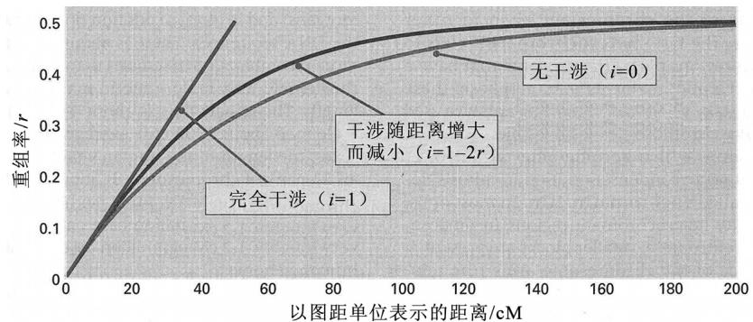  
图 5.14 作图函数是某一区间内的遗传图距与该区间内的观测重组频率之间的关系。图距的定义是平均交换次数的一半(转换为百分数)。三个作图函数对应于不同的干涉(i)假设。第一条曲线中，i=1(完全干涉)；在此情况下，曲线会突然终止，因为每条染色体最多只能发生一次交换。第三条曲线中，i=0(无干涉)。中间的作图函数基于此假设：i为距离的线性函数，随距离增大而减小。

是一个作图函数(mapping function)的例子，作图函数是某一区间内的遗传距离(以图距单位厘摩表示)与该区间内的观测重组频率之间的数学关系。换言之，作图函数将遗传标记之间的图距转换成标记之间的重组频率。正如前面所说，当标记之间的图距较小时，重组频率等于图距。在图5.14的各条曲线中，图距小于约15cM的区域反映了该原理。小于该距离时，所有的曲线差不多都是直线，这意味着图距和重组频率相等：1图距单位等于1%重组、10图距单位等于10%重组。

对大于 15 图距单位的距离，不同的曲线不一样。上面那条曲线是基于完全干涉的假设，所以 i=1 。对于该作图函数，线性关系一直保持到 50 cM 的图距。然后，曲线在 50 图距单位处突然中止，它之所以终止，是因为完全干涉意味着染色体在其全长上不能有超过一次的交换，因为一次交换相当于 50 图距单位，这就是该染色体的最大长度。

图 5.14 中的另外两条曲线针对染色体上不同的干涉模式。底下那条曲线一般以其提出者的名字命名为霍尔丹作图函数 (Haldane's mapping function)。该函数假设没有干涉 $(i=0)$ ，其数学形式为 $r=(1/2)(1-e^{-d/50})$ ，其中，d 是以厘摩表示的图距。i 为 0 和 1 之间的任何作图函数，必定落在上下两条曲线之间的区域。所示的具体例子为高善必作图函数 (Kosambi's mapping function)，其中，假设干涉为距离的线性函数，按 i=1-2r 递减。虽然其基本假设很简单，但高善必函数的公式却不简单。

大多数作图函数在靠近原点处几乎都是直线，就如同图 5.14 中的那些一样。这种与直线的近似表明，对于小于约 15cM 的图距，无论染色体干涉的模式是什么，因为双重重组体极少，所以重组频率(以百分数表示)基本上等于图距。因此，我们有信心认为，两个相距很远的遗传标记之间的图距，可通过累加这两个标记之间从头到尾的小片段的图距来估计，只要每个小片段的长度小于 15 图距单位。

## - 遗传图距与物理距离

一般而言，染色体上基因间的物理距离越大，其间的图距就越大。因为遗传标记之间的距离越大，发生交换的机会就越多，所以，物理距离与遗传图距往往是相关的。

但是，物理距离和遗传图距之间的一般相关性不是绝对的。我们已经注意到，在男性和女性中，基因间的重组频率可能会有差异。重组频率不相等，意味着两性的遗传图会存在不同的图距，尽管两性的染色体在物理上相同且基因必定有相同的线性顺序。雄果蝇就是一个极端的例子，在雄果蝇中没有交换发生。在雄果蝇中，在相同染色体上的任何一对基因之间的图距都是0，不过，不同染色体上的基因仍进行自由组合。

甚至在单一染色体中，物理距离和遗传图距之间的一般相关性也会被打破。例如，在染色体的某些区域，交换比其他区域少得多。异染色质(heterochromatin)一词是指在间期具有致密、压缩结构的某些染色体区域，这些区域大量吸收用来显示染色体的标准染料。其余的染色质称为常染色质(euchromatin)，仅在有丝分裂或减数分裂中染色体凝缩之后才变得可见。在大部分生物中，较大的异染色质区域在着丝粒附近；较小的区块在染色体臂的两端(端粒)或穿插在常染色质中。一般而言，在异染色质区的交换比常染色质区少得多。

因为在异染色质区的交换较少，所以，在遗传图中，给定长度的异染色质比相同长度的常染色质看起来会短得多。因此，在异染色质区，遗传图会使物理图(physical map)失真。图5.15示此类失真的一个例子，该图对果蝇2号染色体的物理图和遗传图进行了比较。物理图所绘的是有丝分裂中期出现的染色体。遗传图示靠近两端的两个基因和常染色质-异染色质交接处附近的两个基因。整个常染色质臂的图距分别是54.5和49.5图距单位，常染色质的总图距为104.0图距单位。然而，占整个染色体约 $25\%$ 的异染色质，仅具有3.0图距单位的遗传长度。遗传图中异染色质在长度上的失真，是异染色质中交换频率减少的结果。尽管遗传图在异染色质区存在失真，但在常染色质区，基因间的物理距离与遗传图中以图距单位表示的距离之间，还是存在很好的相关性。

## ■ 人类系谱中的遗传作图

在第 2 章中曾经强调，以 DNA 多态性作为人类基因组的遗传标记来对遗传风险因子（“疾病基因”）作图非常有用。精细的遗传作图通常是克隆遗传风险因子的第一步。目前的人类遗传图是在研究标准大家系集的基础上建立的，这个标准大家系集由巴黎人类多态性研究中心(Centre d'Etude du Polymorphisme Humain, CEPH)创立。在人类遗传图中，每个遗传标记所在的位置，其图谱位置(厘摩)和物理位置(在 DNA 序列上的位置)都是已知的。因为女性中的重组

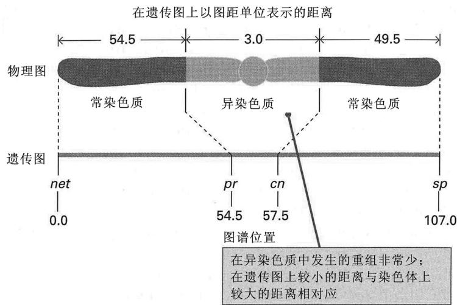  
图 5.15 有丝分裂中期出现的果蝇 2 号染色体(物理图，上面)及其遗传图(下面)。异染色质和常染色质以对比色表示。基因为 net(网状翅脉)、pr(紫眼色)、cn(朱砂眼色)和 sp(翅色素斑)。图谱总长为 $54.5+49.5+3.0=107.0$ 图距单位。异染色质占图谱总长的 3.0/107.0=2.8%，但却占中期染色体物理长度的 25% 左右。

比男性的多大约 60%，所以女性和男性的遗传图长度不同：女性图谱约 4400cM；男性图谱约 2700cM。男女平均后，人类所有 23 对染色体的遗传图长度约为 3500cM。因为每个单倍染色体组的总 DNA 含量是 29 亿碱基对，所以，非常粗略地估计，人类基因组每百万碱基对的图距为 1.2cM。

人类遗传学所用的作图方法与用于实验动物的那些方法稍有不同，因为

\- 不能为了实验的方便而安排配偶。

\- 通常不能区分双重杂合基因型的相引 $(A B / a b)$ 构型与相斥 $(A b / a B)$ 构型。

\- 后代数量少。

在本节中，我们介绍在人类遗传学中进行连锁分析的一种常用方法，该方法允许合并来自多个家系的数据。

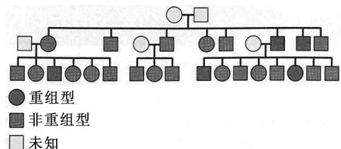  
□未知  
图 5.16 人类系谱，25 个个体可归类为携带重组染色体(红色)或非重组染色体(蓝色)的两类。检测人类的连锁通常需要结合许多不同家系的系谱进行分析。

图 5.16 示一个系谱, 系谱中有 25 个个体可归类为两个基因的重组体(红色)或非重组体(蓝色)。为简单起见, 没有标出基因型。在分析中, 将观察结果作为条件概率的结果(3.5 节)。重组型个体的观测比例为 r=5/25=0.20, 该值即任意个体为重组型的概率。已知 r=0.20 时, 观测到该结果的概率, 可根据 4.5 节中讨论的二项分布得到, 即

$$
\operatorname * {P r} \left\{\text {系谱} \mid r = 0. 2 0 \right\} = \frac {2 5 !}{5 ! \times 2 0 !} (0. 2 0) ^ {5} (0. 8 0) ^ {2 0} = 0. 1 9 6 0
$$

这一概率比较高，但与不存在连锁时 $(r = 0.50)$ 相应的值相比，多高才最合适呢？在本例中，

$$
\operatorname * {P r} \left\{\text {系谱} \left| r = 0. 5 0 \right\rbrace = \frac {2 5 !}{5 ! \times 2 0 !} (0. 5 0) ^ {5} (0. 5 0) ^ {2 0} = 0. 0 0 1 6 \right.
$$

$\Pr \{\text{系谱} | r = 0.20\}$ 与 $\Pr \{\text{系谱} | r = 0.50\}$ 的比值为

$$
\frac {\operatorname* {P r} \left\{\text {系谱} \mid r = 0 . 2 0 \right\}}{\operatorname* {P r} \left\{\text {系谱} \mid r = 0 . 5 0 \right\}} = \frac {0 . 1 9 6 0}{0 . 0 0 1 6} = 1 2 3. 8
$$

在人类遗传学中，该比值称为似然比 (likelihood ratio)，在该例中，它的意思是，所观察到的系谱在 r=0.20 的连锁模型下的可能性，比在非连锁模型 (r=0.50) 下高差不多 125 倍。似然比使已知系谱数据时，能够对连锁相对于非连锁的似然性作定量表述。

人类系谱包含的个体通常很少，以致不能明确断定是否存在连锁，但可以把涉及同一对基因的不同系谱集中起来，以增加个体的总数。如果这些系谱是独立的，则对于任意的 $r$ 值，可将概率乘起来，然后按上述方法计算所有系谱合起来的似然比。不过，报道的数据通常为似然比的对数值，该值称为这组系谱的对数优势比(Lod 记分，lod score)[lod 一词代表“log-odds(对数优势比)”，因为有时将似然比称为“odds(优势比)”]。分析一组系谱的连锁情况时，通常将3.0或3.0以上的Lod记分视为存在连锁的统计显著证据。3.0的Lod记分相当于1000的似然比。

用 Lod 记分来分析人类系谱，说明了人类系谱连锁分析的基本原理。实际上，疾病基因的遗传作图存在此处尚未涉及的许多复杂情况。例如，如果连锁相未知，会在假设相引和相斥的可能性相同的情况下，将每个系谱的概率计算为加权平均值。在不完全外显的情况下，也存在问题。例如，人类乳腺癌的主要遗传风险因子 BRCA1，40 岁之前外显率为 37%，55 岁之前为 66%，80 岁之前为 85%，所以，必须把乳腺癌家系中女性的年龄考虑进去。还存在导致乳腺癌的各种遗传的及环境的原因，使未携带 BRCA1 的妇女产生风险——40 岁之前为 0.4%，55 岁之前为 3%，80 岁之前为 8%。要理清诸如此类的复杂情况，需要的数据比简单孟德尔遗传需要的数据多得多。例如，对于一个使某种复杂疾病的风险加倍的基因，要通过比较成对患病同胞的标记基因型，将基因定位到 $1\mathrm{cM}(\approx10^{6}\mathrm{bp})$ 之内，需要同胞对的中值为 700。

联系：人类基因图

杰弗里·默里及其他26位研究人员，1994

艾奥瓦大学及其他9个研究机构

厘摩密度级的综合性人类连锁图

以遗传标记之间的距离来衡量，人类遗传图是任何生物中最密集的遗传图之一。目前，人类图谱含5000多个遗传标记。人类遗传图的组装是国际科学界的一项重大成就。它由在全世界许多国家工作的数百研究人员整合。这篇论文是一个进展报告，它阐述了人类遗传图的几个重要特点。首先，人类遗传图成为可能，是因为研究人员研究的是由CEPH(Centre d'Etude du Polymorphisme Humain, Paris，巴黎人类多态性研究中心)收集的同一套大规模的家系，因此他们的数据可以相互对照。第二，人类图谱中，极大比例的标记是用聚合酶链反应(PCR)扩增人类基因组中丰富且高度多态性的短串联重复序列(STR)而检测出来的。第三，这些数据的规模是如此之大，以致它们不会出现在论文本身之中，而是在大型挂图和互联网站(这样更为方便)中呈现。第四，作者们指出，用本章所述的方法，用遗传图来确定致病突变的染色体位置，是鉴定基因自身的首要步骤。最后，从该节选的最后几段可以清楚地看出，作者们已充分意识到现代人类遗传学对伦理、法律和社会政策的影响。

人类首次具备了理解自身遗传构成及其如何促成人类个体和全体病患的能力。迅速的科学进步已使其成为可能，并且，在分子生物学、遗传学和计算机技术上的发展，加之相互合作、相互促进的生物医学共同体，加快了研究人类遗传疾病的进程。推动这些进步的主要动力是人类遗传图的开发和应用，这让人们能够快速定位遗传疾病基因——这是识别和鉴定基因的起点。……这些遗传图是基于从 CEPH 参考系谱集获得的 DNA 样本产生的基因型。由于该材料是公开的，今后个别的研究组可将他们自己的遗传标记加进去。……虽然在图谱中仅包含对 CEPH 参考家系进行过基因分型的标记，但在册的标记是非常多的。CEPH 数据库包括血型标记和蛋白质多态性，也包括各种各样的基于 DNA 的标记，包括 RFLP 和短串联重复序列多态性 (STRP)。人们已经开始重视基于 PCR 的标记。……仅这 3617 个 STRP 标记，就为整个基因组每 $1 \times 10^{6}$ 碱基对 (bp) 提供了大约 1 个标记。一旦用一套全基因组遗传图初步鉴定 (一个新基因的) 位置，即可着手后续步骤，逐渐缩小搜索范围，最终挑选出一个特定区段，可在其中进行物理试剂 (如克隆的 DNA 片段) 的研究。……一旦物理试剂在手，就有可能用若干策略来搜索基因和突变，……但仍有相当多的问题和困难。……数据库对公众开放是人类基因组计划的一个特别重要的特点。这些数据库使用方便，利于迅速沟通新发现，能够高效地更新。……最后，应予以强调的是，这些标记密集型图谱在给生物医学研究带来新机遇和新挑战的同时，也造成了紧迫局面，要面对伦理、法律和社会政策等方面的挑战。我们能够进行刑事上的个人识别，鉴定稀有和常见遗传疾病的遗传因素，以及鉴定身高、智力、性倾向和人格类型等正常性状的变化的遗传组分的本质——如果存在的话，这些能力从未像现在这样强大。尽管在技术上可行，但这些图谱是否该用于这些目的，应公开对话，审视那些可能的影响，并制定政策以应对迄今尚无法预知的结果，之后才能得以解决。

来源：J. C. Murray, et al., Science 265 (1994): 2049-2054.

## 5.4 通过四分体分析作图

有些真菌种类特别适合用于遗传分析。它们是单倍体，因而隐性突变得以表达，并且它们产生的后代数量非常巨大。最重要的是，每次减数分裂的四分体包含于一个称为子囊(ascus)的囊状结构中，可作为一个整体回收。减数分裂的每个产物包含在一个称为子囊孢子(ascospore)的单独的生殖细胞中，而一个减数分裂细胞形成的所有子囊孢子都在子囊中(图5.17)。使用这些生物来研究重组的优点是，有可能分析每次减数分裂所得的所有产物。某些显示非1:1分离比的异常子囊，为重组的分子机制提供了重要信息，这将在第6章中讨论。在本节中，将说明对子囊中减数分裂产物的分析(四分体分析，tetrad analysis)，是如何被用来研究遗传连锁的。

这些生物的生活周期相当短。在出芽酵母中，在营养成分缺乏的培养基中培养，可诱导二倍体进行减数分裂。所得的单倍减数分裂产物(形成子囊孢子)发芽，产生该生物的营养期(图5.18)。在有的物种中，减数分裂的四个产物接着进行一次有丝分裂，其结果是四分体的每个成员产生一对在遗传上相同的子囊孢子。在大多数这类生物中，减数分裂的产物(或它们的衍生物)

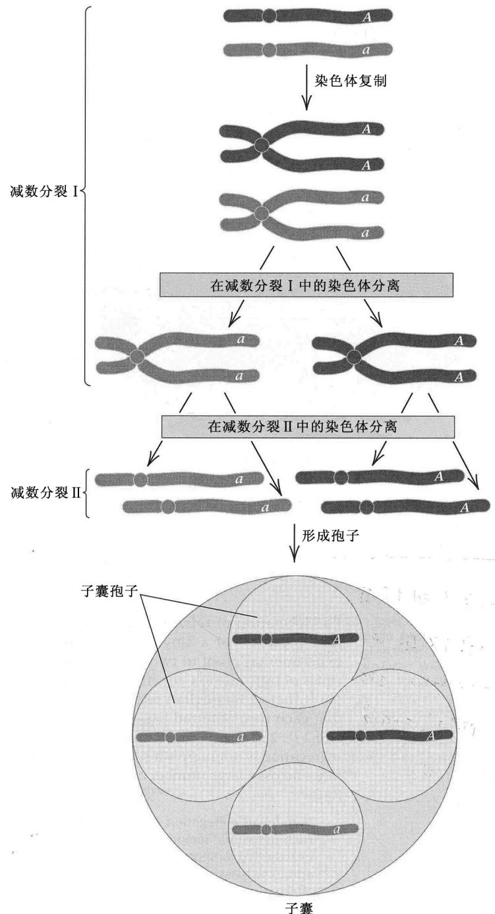  
图 5.17 一个子囊的形成，其中含有单一减数分裂的所有四个产物。减数分裂的每个产物形成一个称为子囊孢子的生殖细胞，这些细胞在子囊中聚在一起，显示了一对染色体的分离。

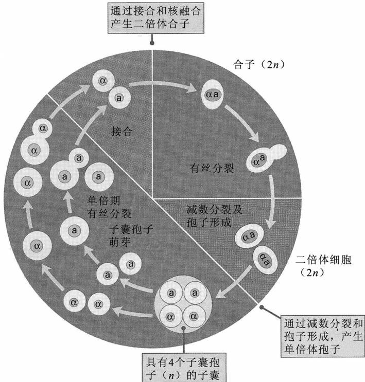  
图 5.18 出芽酵母酿酒酵母 (Saccharomyces cerevisiae) 的生活周期。交配型由等位基因 a 和 $\alpha$ 决定。单倍体和二倍体细胞通常都通过有丝分裂增殖 (出芽)。培养基中的营养枯竭会诱发减数分裂和二倍体状态的孢子细胞形成。二倍体核为橙色；单倍体核为黄色。

等位基因的孟德尔分离发生在每一次减数分裂中，精确地产生携带一个等位基因的两个子细胞和携带另一个等位基因的两个子细胞。

第二个原理与交换有关，观察发现，四型四分体由等位基因构型 A B、A b、a B 和 a b 组成。换言之，两个产物为亲本型，两个为重组型。亲本型和重组型的相等，表明：

A B A B a b a b在子囊中不按任何特定顺序排列。但是，链孢霉属(Neurospora)的面包霉及其近缘种具有一个很有用的特点——减数分裂产物按一定顺序排列，其顺序与减数分裂的中期平面直接相关。首先讨论非顺序四分体，之后再考察这种有序系统。

## 非顺序四分体的分析

在四分体中，当两对等位基因分离时，有三种可能的分离方式。例如，在杂交 $A B \times a b$ 中，三种四分体类型为
每个四分体含有单一减数分裂的所有四个产物，四分体的这种构造为传递遗传学的两个基本原理提供了实验证据。第一个原理是孟德尔分离律，观察发现，每种四分体都具有2A:2a和2B:2b的比值，这些比值表明，孟德尔分离不纯粹是大量减数分裂比值的统计平均。而是：

称为亲代双型(parental ditype, PD)四分体。仅出现两种基因型，等位基因组合与亲本相同。
称为非亲双型(nonparental ditype, NPD)四分体。仅出现两种基因型，但等位基因具有非亲本型组合。
称为四型(tetratype, TT)四分体。出现所有四种可能的基因型。

交换发生在减数分裂的四线期，产生两条重组的染色体和两条非重组的染色体。

四分体在真菌遗传学中一直发挥着重要作用，因为基因之间的连锁易于通过四分体分析得到识别。连锁的检测是根据亲代双型(PD)和非亲双型(NPD)四分体的相对数目：

当基因不连锁时，预计亲代双型四分体和非亲双型四分体具有相同频率(PD=NPD)。当非亲双型四分体以比亲代双型四分体低得多的频率出现时(NPD<<PD)，表明有连锁。

非连锁基因等式 PD=NPD 的原因如图 5.19(A) 所示，图中显示了位于不同染色体上的两对等位基因。在每个基因与其着丝粒之间都没有交换的情况下，在中期 I 两种染色体构型具有相同的可能性，所以 PD=NPD。当其中一个基因与其着丝粒之间存在一次交换时(图 5.19B)，一个四型四分体随之产生，但这不改变 PD=NPD 的事实。

相比之下，当基因连锁时，亲代双型远远比非亲双型多。假设两个基因连锁，并思考一下产生三种四分体类型所需的事件。图 5.20 显示，当两个基因之间没有交换发生时，产生 PD 四分体；基因之间的单次交换产生 TT 四分体；二线、三线或四线双交换的形成，分别产生 PD、TT 或 NPD 四分体。对于连锁基因，无交换的减数分裂细胞在数量上总是会比四线双交换的细胞多。这导致作为连锁特征的不等式 NPD<<PD。

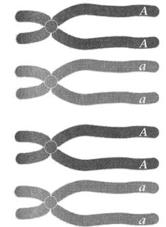

## (A) 没有交换

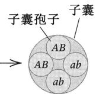

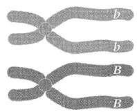  
亲代双型四分体

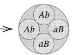

图 5.19 两个基因在不同染色体上时，所产生的非顺序四分体的类型。(A) 在没有交换时，在中期 I 染色体对的随机排列导致两种不同的染色单体组合，一种产生 PD 四分体，另一种产生 NPD 四分体。(B) 当一个基因与其着丝粒之间发生交换时，两种染色体的排列都产生 TT 四分体。如果两个基因都与它们的着丝粒紧密连锁（以致每个基因与其着丝粒之间的交换都非常少），产生的 TT 四分体会很少。

（B）在基因与其着丝粒之间交换  
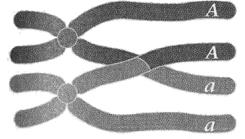

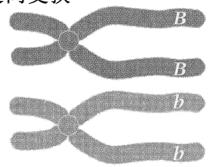  
非亲双型四分体

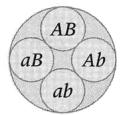

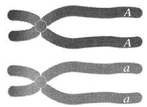

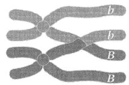  
四型四分体  
四型四分体

锁基因所产生的四分体类型。在没有交换时(A)，产生PD四分体。在基因间有单次交换时有单次交换时（B）单交换

图 5.20 两个连（A）没有交换  
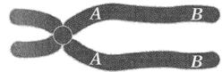  
(D) 三线双交换

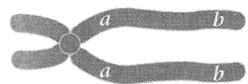

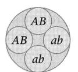  
亲代双型（PD）

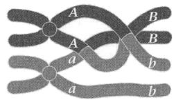

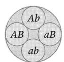  
四型（TT）

(B)，产生 TT 四分体。在两个基因之间四种可能的双交换类型中

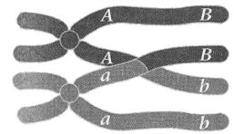

(E) 三线双交换  
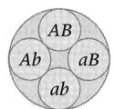

(C、D、E 和 F)，(C) 二线双交换

四型（TT）  
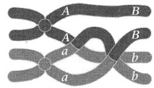

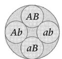  
四型（TT）

(F) 四线双交换

仅有 F 部分中的四线双交换产生 NPD 四分体。

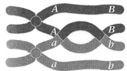

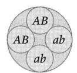  
亲代双型（PD）

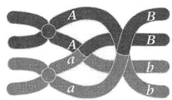

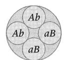  
非亲双型（NPD）

## ■ 非顺序四分体的遗传作图

假如两个连锁基因足够接近，以致可以忽略三交换及更高级别的交换，则可用不同类型四分体的相对频率来确定这两个基因之间的图距。要确定图距，首先要用NPD四分体的数目来估计双交换的频率。预计图5.20中四种双交换的频率相同，因而，双交换(图5.20的C、D、E和F部分)产生的四分体数目，应该为NPD四分体(F部分)数目的四倍，即 $4\times$ [NPD]，其中，方括号表示

NPD四分体的观测数。同时，三线双交换(D和E部分)产生TT四分体的数目，应该等于NPD四分体(F部分)数目的两倍，即 $2\times [\mathrm{NPD}]$ 。从四型四分体总数中减去 $2\times [\mathrm{NPD}]$ ，得到来源于单次交换的四型四分体的数目，即 $[\mathrm{TT}] - 2\times [\mathrm{NPD}]$ 。根据定义[式(1)]，两个基因之间的图距等于单交换四分体 $([\mathrm{TT}] - 2\times [\mathrm{NPD}])$ 频率的一半，加上双交换四分体 $(4\times [\mathrm{NPD}])$ 频率，乘以100。因此，

$$
\text {图距} = \frac {(1 / 2) ([ \mathrm{TT} ] - 2 [ \mathrm{NPD} ]) + 4 [ \mathrm{NPD} ]}{\text {四分体总数}} \times 1 0 0 = \frac {(1 / 2) [ \mathrm{TT} ] + 3 [ \mathrm{NPD} ]}{\text {四分体总数}} \times 1 0 0\tag{2}
$$

在这些表达式中所作的 1/2 的修正，是因为这样的事实：在由单次交换产生的 TT 四分体中，只有一半的减数分裂产物为重组体。在连锁基因足够靠近、[NPD]=0（没有双交换）的特殊情况下，图距等于 TT 四分体的百分比除以 2。

举一个连锁基因计算的例子：一个两因子杂交，产生112个PD、4个NPD和24个TT四分体。NPD<<PD(即，4<<112)的事实表明，这两个基因连锁。将3类四分体的数目代入式(2)，得：

$$
\text { 图距 } = \frac {[ (1 / 2) \times 2 4 ] + (3 \times 4)}{1 1 2 + 4 + 2 4} \times 1 0 0 = 1 7. 1 \mathrm{cM}
$$

注意，这种作图方法不同于本章早先出现过的作图方法，在那种方法中，不是直接从重组和非重组染色单体的数目来计算重组频率，而是从推导出的交换类型来计算。

四分体分析可得到大量信息，包括遗传标记之间的连锁关系，以及非连锁标记到它们各自的着丝粒的距离。如果只是评估是否连锁，就不需要进行完全的四分体分析，而是待四分体破裂散播出孢子之后，随机选择孢子来检查。就这种方法称为随机孢子分析（random-spore analysis），连锁关系完全按以前所述的对果蝇和玉米的方法来确定。特别要注意的是，对遗传标记而言重组频率等于重组的孢子的数目除以孢子总数。

## ■ 顺序四分体分析

比德尔和塔特姆在粗糙链孢霉(Neurospora crassa)中进行基因和酶之间关系的“诺贝尔奖”实验，粗糙链孢霉因此而闻名于世(第1章)。现在，我们来考察一下这种生物固有的一些特殊的遗传特性。在链孢霉中，减数分裂的产物包含在一串有序的子囊孢子中(图5.21)。合子细胞核包含在一个囊状子囊中，在其形成之后，几乎马上就进行减数分裂。减数分裂产生的4个细胞核在子囊中呈有序的线性顺序，然后每个细胞核经过一次有丝分裂，各形成两个在遗传上相同的、相邻的子囊孢子。每个成熟子囊包含8个子囊孢子，排成4对，每对来自一个减数分裂产物。可从子囊中逐一取出子囊孢子，让每个子囊孢子在一个培养管中发芽，以确定其基因型。

就两对等位基因而言，有序子囊也可以分成 PD、NPD 和 TT 三类。此外，减数分裂产物的有序排列，使得确定任一特定基因与其着丝粒之间的重组频率成为可能。这种作图方法的逻辑基础是图 5.22 所示的减数分裂的特性：

亲本染色体的同源着丝粒在第一次减数分裂时分离；姐妹染色单体的着丝粒在第二次减数分裂时分离。

因此，在某个基因与其着丝粒之间没有交换的情况下，该基因的等位基因(如 A 和 a)必定在第一次减数分裂时分离，这种分离称为第一次分裂分离(first-division segregation)。而如果在基因与其着丝粒之间发生交换，等位基因 A 和 a 到第二次减数分裂时才会分离，这种分离称为第二次分裂分离(second-division segregation)。第一次和第二次分裂分离的差别如图 5.22 所示，如 A 部分所示，存在 A A a a 或 a a A A 的孢子排列方式，表明存在第一次分裂分离；而如 B 部分所示，存在 A a A a、a A a A、A a a A 和 a A A a 四种方式中的任何一种，都表明存在第二次分裂分离。

第二次分裂分离的子囊所占的百分比，可用来确定基因相对于着丝粒的位置。例如，来自某次杂交的子囊样本中，30%表现为等位基因 A 和 a 的第二次分裂分离。这意味着在进行减数分裂的细胞中，30%的细胞在 A 基因与其着丝粒之间有一次交换。此外，在发生交换的每个细胞中，两条染色单体为重组体，两条染色单体为非重组体。换言之，30%的交换频率相当于 15% 的重组频率。照例，图距指的是减数分裂产物的重组频率，而不是有交换的细胞的频率。因而，基因与其着丝粒之间的图距由下式给出：

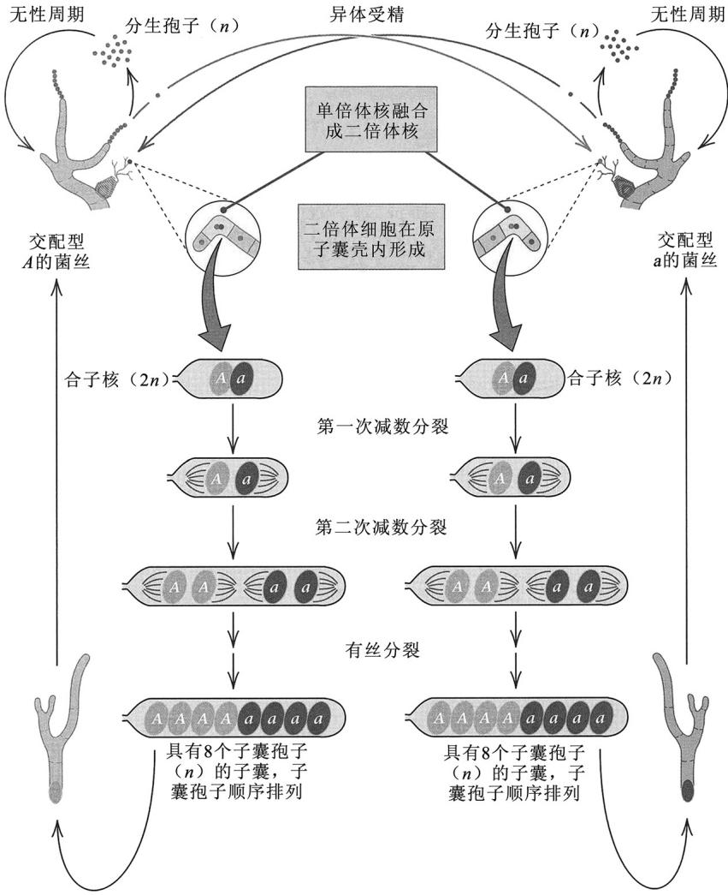  
图 5.21 粗糙链孢霉的生活周期。营养体由局部分节的纤丝(称为菌丝)构成。分生孢子为无性孢子，在相反交配型粗糙链孢霉的受精中发挥作用。原子囊壳发育成某种结构，其中有大量细胞进行减数分裂。

$$
\frac {(1 / 2) (\text {具有第二次分裂分离格局的子囊数})}{\text {子囊总数}} \times 1 0 0\tag{3}
$$

只要基因足够接近着丝粒，以致多重交换可以忽略，该式就是有效的。着丝粒附近的基因，最利于确定可靠的连锁值。较远基因的定位，是通过测定它们相对于其他离着丝粒较近的基因的距离而达成。

如果某个基因远离其着丝粒，该基因与其着丝粒间的交换非常频繁，就会造成四条染色单体随机携带等位基因 $A$ 或 $a$ 。其结果是，图5.22所示的六种孢子排列格局都有相同的可能性。如图5.23中的分支图所示，这种相同的可能性所表现出来的格局，可在子囊的 $2A$ 和 $2a$ 孢子对中随机抽样而得到。因此，在没有染色单体干涉的情况下，

第二次分裂分离子囊的最大频率是 2/3。

图 5.22 链孢霉的第一、第二次分裂分离。(A) 当基因和着丝粒之间不发生交换时，在子囊中见到第一次分裂分离格局。等位基因在减数分裂 I 时分离。有两种可能的孢子格局，取决于这对染色体在第一次分裂纺锤体上的定向。(B) 当基因与着丝粒之间的交换将 A 与 a 的分离推迟到减数分裂 II 时，在子囊中见到第二次分裂分离格局。有四种可能的孢子格局，取决于这对染色体在第一次分裂纺锤体上的定向，以及每条染色体的染色单体在第二次分裂纺锤体上的定向。

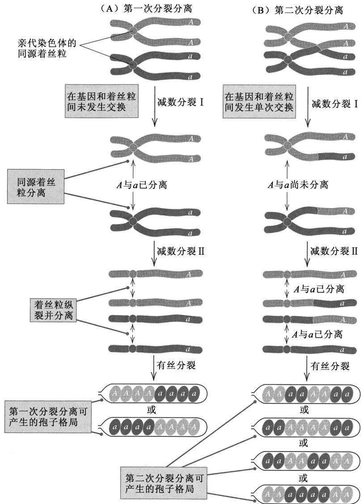

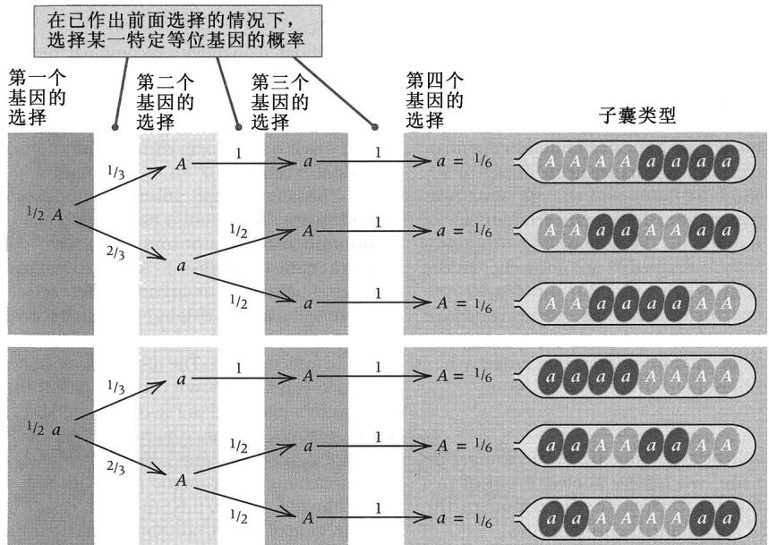  
图 5.23 一对等位基因 (A 和 a) 与着丝粒之间自由重组的结果。第二次分裂分离的频率等于 2/3。如果不存在染色单体干涉，这就是第二次分裂分离的最大频率。

## 5.5 特殊的重组

本节我们考察两个经典的实验，这两个实验表明：

1. 重组可发生在单个基因内的核苷酸之间。

2. 基因之间的重组可在有丝分裂过程中发生。

## ■ 基因内重组

基因内重组最初的证据来自对黑腹果蝇 X 染色体上一个称为菱形 (lozenge, $lz$ ) 的基因的研究。菱形基因的突变型等位基因均为隐性，其表型效应包括扰乱复眼小眼面的排列方式和使眼睛色素减少。现已知具有可辨别表型的众多 $lz$ 等位基因。

两个不同的 $lz$ 突变型等位基因分别在两条 X 染色体上时，杂合的雌性长菱形眼。这样的雌性与在 X 染色体上具有两个 $lz$ 突变型等位基因之一的雄性杂交，并检查大量后代，偶尔会发现长正常眼睛的果蝇。例如，曾进行的一次杂交为

$$
\begin{array}{c} \mathsf {X} \frac {+ \qquad l z ^ {B S} + \qquad +}{c t \qquad + l z ^ {g} \qquad v} \times \frac {+ \qquad + l z ^ {g} \qquad v}{\longrightarrow} \mathsf {Y} \\ \hline \end{array}
$$

其中， $lz^{BS}$ 和 $lz^{g}$ 为菱形基因的突变型等位基因，而 ct(截翅) 和 v(朱砂眼色) 为遗传标记，分别在菱形基因座左侧 7.7 图距单位和右侧 5.3 单位。在 16 000 多个杂交后代中，发现长野生型眼睛的雌雄果蝇 134 只，频率为 $8 \times 10^{-3}$ 。这些特殊的后代有可能是两个突变型菱形等位基因中的一个回复突变为 $lz^{+}$ 而导致的，但是，所观测到的频率——虽然很小——远大于已知的回复突变频率。在眼睛正常的后代中，母源 X 染色体的遗传构型也与这样的解释不符。雄性后代具有截翅，雌性为 $ct/+$ 杂合子。就是说，所有特殊的非菱形后代具有如下构型的 X 染色体

$$
\begin{array}{c c c} c t & + + & + \\ \hline \end{array}
$$

这可用两个菱形等位基因之间的重组来解释。该结论的证据是，在5个具有菱形表型的雄性后代中检测到相互重组染色体

$$
+ \quad l z ^ {B S} l z ^ {g} \quad +
$$

这5只果蝇具有的菱形表型，与 $lz^{BS}$ 或 $lz^g$ 等位基因单独存在时所产生的表型截然不同。例外的雄性也具有朱红色眼睛，正如根据相互重组预期的那样。对基因内重组的观察结果表明，基因具有亚单位结构——现在已知是核苷酸序列，并且，等位基因形式的多样性，可能是基因在不同位点(核苷酸)上发生突变的结果。

## ■ 有丝分裂重组

在有丝分裂中也可发生遗传互换，虽然其频率是在减数分裂中的1/1000，并且其机制与减数分裂重组可能稍有不同。有丝分裂重组的最初证据来自果蝇实验，但在酵母和曲霉(Aspergillus)等真菌中，该现象一直研究得最为仔细，真菌中的重组频率比大多数其他的生物高。可根据有丝分裂重组频率来构建遗传图。在有性周期未知的一些生物中，有丝分裂重组是获得连锁数据的唯一方法。在减数分裂重组和有丝分裂重组都有的生物中，有丝分裂重组的频率总是低得多。在有丝分裂重组中，特定基因之间的相应图距有时会与根据减数分裂重组频率所得的图距相符，但由于尚未知晓的原因，这两种图距往往显著不同。这些矛盾可能反映了不同的交换机制，也可能反映了潜在互换位点的分布是非随机的。

有丝分裂重组的遗传意义如图 5.24 所示。每条同源染色体在断裂/重接位点远侧，都有两个图 5.24 有丝分裂重组。有丝分裂前期的同源染色体以蓝色和绿色显示。在后期，每个着丝粒分裂，每个子细胞得到每种颜色的一个着丝粒及其附着的染色单体。当同源染色体的非姐妹染色单体之间发生罕见的相互交换时，子细胞可为两种类型之一。如果非交换的两条染色单体在一起、交换过的两条染色单体在一起（右上），则两个细胞在遗传上都与亲本一样——在此例中，为 A b/a B。如果一条非交换染色单体和一条交换过的染色单体一起进入每个细胞（右下），结果是交换点远侧的等位基因变成纯合。在此例中，一个子细胞为 a B/a B，另一个为 A b/A b。毗邻的细胞谱系要么为 aa 纯合，要么为 bb 纯合，在表型上为 aa 体细胞组织与 bb 体细胞组织毗邻的“孪生斑”，从而得以检测。

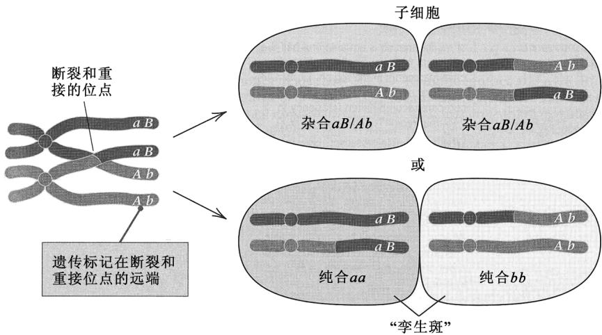

遗传标记，在随后的后期中，每个着丝粒分裂，每个子细胞得到不同颜色的两个着丝粒及其附着的染色单体。如右侧所示，分离可以两种方式发生。如果两条非交换染色单体在一起、交换过的两条染色单体在一起(右上)，交换的结果在遗传上不可检测。但是，如果每条非交换的染色单体与其中一条交换过的染色单体在一起，则结果是交换位点远侧的染色体区域变成纯合。在有适当遗传标记构型的情况下，这种交换就可以作为孪生斑

(twin spot) 而得以检测，在孪生斑中，一种纯合基因型的细胞群(此例中为 a B/a B 斑)与另一种纯合基因型的细胞群(此例中，为 A b/A b 斑)毗连。最初的实验是利用 X 连锁标记 $A=y^{+}$ 和 $a=y(y$ 为黄色体色)及 $B=sn^{+}$ 和 $b=sn(sn$ 是焦刚毛)。在雌性中，有丝分裂重组的结果是观察到孪生斑——具有黄色和正常刚毛的一小片表皮与具有正常颜色和焦刚毛的一小片表皮毗连。

通过 X 射线处理，可大幅度提高有丝分裂重组的频率。在遗传学中，有丝分裂重组是一个非常有用的工具，因为它导致体细胞嵌合体 (somatic mosaics) 的产生，体细胞嵌合体是包含两种或两种以上不同遗传类型的组织的生物体。例如，在上一段中讨论的雌性嵌合果蝇，由占绝对优势的野生型组织构成，但也包含一些 $y^{+}sn/y^{+}sn$ 斑块和一些 $y sn^{+}/y sn^{+}$ 斑块。突变型组织的每个孪生斑，都是由有丝分裂交换变成纯合的单个细胞反复分裂而来。在现代发育遗传学中，追踪特定细胞谱系迁移和分化，是通过研究有丝分裂重组导致的、在遗传上被标记的组织斑块而进行的。

## 本章概要

\- 在染色体上足够靠近的基因不进行自由组合，它们被称为连锁基因。

\- 连锁基因的等位基因往往作为一个整体遗传。

\- 同源染色体之间的交换导致重组，重组打破连锁等位基因的组合。

\- 遗传图是染色体上基因的相对位置的图示。

\- 在遗传图上，基因间的图距与基因间的重组频率相关。

\- 染色体上的物理距离通常(但不总是)与图距相关。

\- 四分体是连锁的灵敏指征，因为每个四分体包含单一减数分裂的所有产物。

\- 重组可发生在单个基因内的核苷酸之间。

## 基础回顾

\- 在遗传分析中，了解染色体上基因的图谱位置为什么重要？

\- 怎样估计重组频率？说两个基因具有 $10\%$ 的重组频率是什么意思？两个基因之间的最大重组频率是多少？两个基因之间存在最大图距吗？

\- 为什么染色体上较长区间的重组频率总是小于相同区间的图距？

\- 对于两个基因之间的区域，每个进行减数分裂的细胞在该区域中发生的交换不超过一次，则重组频率等于在该区域中出现交叉的减数分裂细胞的频率的一半。解释当把重组频率与交叉频率比较时，为什么会出现“一半”这个因子？

\- 什么是双交换？可能有多少种不同的双交换类型？图示二价体中两个杂合基因之间双交换的每种类型以及所产生的染色单体。

\- 什么是干涉？在一个高度干涉的区域，会观察到比预期多还是少的双交换？解释。

\- 与非并联X染色体的遗传方式相比，并联X染色体的遗传方式有何特别之处？

\- 解释在真菌中两个连锁基因的四型四分体的出现如何表明交换必定发生在减数分裂的四线期。

\- 解释两个连锁基因的真菌四分体分析如何使得在两点杂交(仅有两个基因分离的杂交)中双交换得以被检测。

\- 顺序四分体的回收让我们能够确定任一基因相对于该基因所在染色体的着丝粒的位置，解释这是如何实现的。

## 解题指南

习题 1 玉米 7 号染色体上的两个基因，隐性等位基因分别为 gl(glossy，光泽，决定有光泽的叶片)和 ra(ramosa，分支，决定穗分支)。当一株这两对等位基因均为杂合的植株与一株纯合隐性植株杂交，后代由如由所示各基因型及数目组成：

双重杂合亲本的基因型是什么？估计这两个基因之间的重组频率。

## 答案

来自双重杂合亲本的频率最高的配子为非重组配子，在此例中为 Gl ra 和 gl Ra。因而，该亲本的基因型是 Gl ra/gl Ra。重组配子为 gl ra 和 Gl Ra，所以重组频率估计为 $(6+4)/(93+105+6+4)=4.8\%$ .

习题 2 进行一次玉米杂交，亲本之一为三个连锁基因的三重杂合基因型。三对等位基因为 $(A, a)$ 、 $(D, d)$ 和 $(R, r)$ 。显性等位基因 A 导致红色叶子；aa 植株具有绿色叶子。显性等位基因 D 导致高秆植株；dd 植株

<table><tr><td>红色、高秆、参差</td><td>265</td><td rowspan="4">为矮秆。显性等位基因R导致参差型叶缘;rr植株具有平滑叶缘。该三重杂合子与三个等位基因纯合隐性的植株杂交,观察到以下表型的后代。假设在每个区间的干涉是完全的,所以,以厘摩(cM)为单位的图距与重组百分数相符。</td></tr><tr><td>红色、高秆、平滑</td><td>24</td></tr><tr><td>红色、矮秆、参差</td><td>120</td></tr><tr><td>红色、矮秆、平滑</td><td>90</td></tr><tr><td>绿色、高秆、参差</td><td>70</td><td>(a)这些基因的顺序是什么?</td></tr><tr><td>绿色、高秆、平滑</td><td>140</td><td>(b)以正确的顺序书写基因,三重杂合亲本的基因型是什么?</td></tr><tr><td>绿色、矮秆、参差</td><td>16</td><td>(c)相邻基因之间最短的图距是多少?</td></tr><tr><td>绿色、矮秆、平滑</td><td>275</td><td>(d)相邻基因之间最长的图距是多少?</td></tr><tr><td>总计</td><td>1000</td><td>(e)对于整个区间,干涉值是多少?</td></tr></table>

## 答案

(a)解这种类型的题，首先要推导出三重杂合亲本贡献给每种后代类型的配子的基因型。在该例中，配子类型从上到下为 $ADR$ 、 $ADR$ 、 $ADR$ 、 $ADR$ 、 $aDR$ 、 $aDR$ 、 $aDR$ 和 $adr$ 。要确定这些基因的顺序，必须识别出哪个基因在中间。可以通过比较亲本型配子与双交换配子做到这点。两个亲本型是 $ADR$ 和 $adr$ ，而双交换类型是 $ADR$ 和 $aDR$ （由于它们是频度最少的）。亲本型与双交换类型的比较揭示， $R$ 和 $r$ 相对于其他两个基因的等位基因互换了位置。因此，基因顺序是 $ARD$ ，或等价的 $DRA$ 。明确起见，我们用 $ARD$ 的顺序。

(b) 因而，三重杂合亲本具有基因型 A R D / a r d。

(c) 基因 R 和 D 之间的距离等于该区域中单交换后代数量加上双交换后代的数量，除以后代总数，即 $(90+70+24+16)/1000=20\mathrm{cM}$ （必须计入双交换后代，因为它们包含了 R-D 区间中的一次交换）。

(d) 基因 A 和 R 之间的距离等于该区域中单交换后代数量加上双交换后代的数量，除以后代总数，即 $(120+140+24+16)/1000=30\mathrm{cM}$ 。

(e) 双交换后代的期望数等于 $0.2 \times 0.3 \times 1000 = 60$ ，而双交换后代的观测数为 $24 + 16 = 40$ 。因此，干涉 i 等于 $1 - (40/60) = 1/3$ 。

习题 3 在所附人类系谱中，双亲 I-1 和 I-2 对囊性纤维变性隐性等位基因 (cf) 均为杂合，同时对一个限制性片段长度多态性 (RFLP) 也均为杂合，RFLP 的基因型如电泳凝胶示意图所示。DNA 片段 A 和 a 是等位基

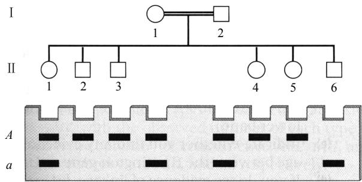

因 A 和 a 在限制性酶切位点上具有差异的结果。该 RFLP 与 CF 基因连锁。I -1 和 I -2 为一级堂表亲，对他们的父母和同胞的分子分析表明，I -1 和 I -2 都具有基因型 CF A/cfa。两个基因之间的重组频率为 12%。孩子 II -1 到 II -5 都没有罹患囊性纤维变性。

(a)孩子Ⅱ-6患病的概率是多少？

(b) 孩子 II-1 为携带者的概率是多少?

## 答案

(a) 要 II-6 患病，他的基因型就必须是 cf a / cf a，

所以两条染色体都必须是非重组的 cf a。来自其母的非重组 cfa 染色体的概率是 $(1-0.12)/2=0.44$ ，来自其父的也是 $(1-0.12)/2=0.44$ 。因此，II-6 患病的概率是 $0.44\times0.44=0.194$ 。

(b)要Ⅱ-1为携带者，她的基因型就必须是 $CF\ A / cf\ a$ 或 $CF\ a / cf\ A$ 。 $CF\ A / cf\ a$ 基因型要么具有来自其母的 $CF\ A$ 非重组染色体和来自其父的 $cf\ a$ 非重组染色体，要么具有来自其母的 $cf\ a$ 非重组染色体和来自其父的 $CF\ A$ 非重组染色体，因此， $CF\ A / cf\ a$ 的总概率是 $[(1 - 0.12) / 2]\times [(1 - 0.12) / 2] + [(1 - 0.12) / 2]\times [(1 - 0.12) / 2] = 0.3872$ 。 $CF\ a / cf\ A$ 基因型要么具有来自其母的重组染色体 $CF\ a$ 和来自其父的 $cf\ A$ 重组染色体，要么具有来自其母的 $cf\ A$ 重组染色体和来自其父的 $CF\ a$ 重组染色体，因此 $CF\ a / cfA$ 的总概率是 $0.12 / 2\times 0.12 / 2 + 0.12 / 2\times 0.12 / 2 = 0.0072$ 。因而，Ⅱ-1为携带者的总概率等于 $0.3872 + 0.0072 = 0.3944$ (注意，两种重组染色体的概率远远小

习题 4 隐性突变 b(黑色体色)、st(鲜红色眼色) 和 hk(钩状刚毛) 为黑腹果蝇三个常染色体基因的等位基因。下列后代来自三个基因均为杂合的雌性的一次测交。在每种后代类别中，仅标明了突变表型。

关于这三个基因的连锁关系，可以得出什么结论？计算出任何适当的图距。

## 答案

<table><tr><td>黑色、鲜红</td><td>243</td></tr><tr><td>黑色</td><td>241</td></tr><tr><td>黑色、钩状</td><td>15</td></tr><tr><td>黑色、钩状、鲜红</td><td>10</td></tr><tr><td>钩状</td><td>235</td></tr><tr><td>钩状、鲜红</td><td>226</td></tr><tr><td>鲜红</td><td>12</td></tr><tr><td>野生型</td><td>18</td></tr></table>

对于此类习题，最好的策略是先考虑成对的基因，不管第三个基因。对于 b 和 st 这对基因，相关的比较项为黑色、鲜红 $(243+10)$ ，黑色 $(241+15)$ ，鲜红 $(226+12)$

和非黑色、非鲜红(235+18)。总数分别为253、256、238和253，大致相等，表明b和st是非连锁的。同样，对于hk和st这对基因，相关的比较项为钩状、鲜红(10+226)，钩状(15+235)，鲜红(243+12)和非钩状、非鲜红(241+18)。在此情况下，具有大致相同的总数，分别是236、250、255和259，表明hk和st自由组合。对于剩下的一对基因b和hk，相关的比较项为黑色、钩状(15+10)，黑色(243+241)，钩状(235+226)和非黑色、非钩状(12+18)。总数分别为25、484、461和30，得到(25+30)/(25+484+461+30)=0.055的估计重组频率。

## 分析与应用

5.1 基因型为 $A b / a B$ 的雌雄果蝇交配，当两个基因在相同染色体上且它们之间的重组频率为 $3\%$ 时，产生的配子是什么？比值为多少？（注意：雌、雄的答案不同）

5.2 对于两个表现出 50% 最大重组频率的基因，下列哪些陈述是正确的？

(a) 这两个基因可能在不同染色体上。

(b) 这两个基因可能在同一条染色体上，但相距甚远。

(c) 这两个基因进行自由组合。

(d) 如果这两个基因是同线的，则在几乎每次减数分裂中在基因之间都发生了一次以上的交换。

(e)这两个基因总是进行第一次分裂分离。

(f)这两个基因位于异染色质中。

(g) 并发系数等于 0。

5.3 两个连锁基因相隔一定距离，使得进行减数分裂的细胞刚好有 4% 在基因之间具有一次交换 (交叉)、96% 没有交换。这两个基因之间的重组百分数是多少？

5.4 一个双重杂合子具有两个基因的相引构型 $AB / ab$ ，这两个基因具有0.05的重组频率。如果随机选择一个配子，其为非重组配子的概率是多少？

5.5 在具有顺序四分体的真菌链孢霉中，一个基因位于距着丝粒8图距单位之处。该基因第二次分裂分离的期望频率是多少？

5.6 如果参与两次交换的染色单体，每次都是独立的，二线：三线：四线双交换的期望比值是多少？

5.7 对于具有非顺序四分体的某种生物(如出芽酵母)中的两个连锁基因, 四线双交换产生什么类型的四分体?

5.8 试想在一种假想的生物中，所有的双交换都是四线双交换。两个基因相隔某一物理距离，使得每个减数分裂细胞在这两个基因间的区域内具有一次双交换。这两个基因之间的重组频率会是多少？这与在真实生物中的情况有什么差异？

5.9 如果在两个基因间的区域中 90% 的减数分裂细胞没有交换，6% 有一次交换，3% 有两次交换，1% 有三次交换，这两个基因间的图距是多少？

5.10 在像出芽酵母那样产生非顺序四分体的某种生物中，如果有两对等位基因分离，可能会有多少种不同的四分体类型？

5.11 试想对位于同一染色体上的两个基因均为杂合的某种生物，两个基因为相引构型 A B/a b。在进行减数分裂的每个细胞中，在这两个基因之间发生单次交换，但不发生多重交换，这两个基因之间的重组频率是多少？多重交换对重组频率会产生什么影响？

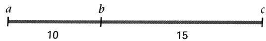

0.40 的并发系数。在 $ABC / abc$ 基因型个体的 1000 个配子中，每种可能的等位基因组合的期望数是多少？

5.13 亨廷顿病的显性基因在所附系谱中分离，以绿色表示患者，同时显示观察到的一个限制性片段长度多态性(RFLP)的DNA带型。将两条条带称为1和2。用HD和hd表示突变型和非突变型亨廷顿等位基因，分别以 $A_{1}$ 和 $A_{2}$ 表示产生RFLP条带1和2的等位基因。

(a) 推导系谱中每个人的亨廷顿等位基因和 RFLP 等位基因的基因型。

(b) 解释为什么没有只有小 DNA 片段(片段 2，下面的条带)的人。

(c)指出是否发现亨廷顿基因和该RFLP之间连锁的任何证据。

(d) 如果你确实看到了连锁的证据，按凝胶底下的编号列出每个携带重组染色体的人。

(e) 估计亨廷顿基因和该 RFLP 之间的重组频率。

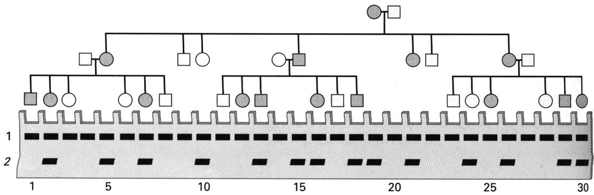

$\mathrm{F}_2$ 代表型

<table><tr><td></td><td>RT</td><td>Rt</td><td>rT</td><td>rt</td></tr><tr><td>(a)</td><td>106</td><td>34</td><td>0</td><td>0</td></tr><tr><td>(b)</td><td>0</td><td>0</td><td>104</td><td>36</td></tr><tr><td>(c)</td><td>99</td><td>0</td><td>31</td><td>0</td></tr><tr><td>(d)</td><td>64</td><td>10</td><td>8</td><td>18</td></tr></table>

5.14 对于连锁基因 R 和 T 的不同组合为纯合的植株(亦即，RR TT、RR tt、rr TT 或 rr tt)，配对杂交产生 $F_{1}$ 代植株，然后令 $F_{1}$ 代植株自花授粉产生 $F_{2}$ 代。R 对 r 为显性，T 对 t 为显性。对于左侧 $F_{2}$ 代表型分布，每个 $F_{1}$ 代亲本的染色体构型(如 RT/rt)是什么？

5.15 朱砂眼 $(v)$ 、黑色体色 $(s)$ 和分叉刚毛 $(f)$ 基因在黑腹果蝇的X染色体上。它们在图谱上的顺序为 $v s f$ ， $v$ 和 $s$ 之间为10图距单位， $s$ 和 $f$ 之间为14图距单位。假设将一只野生型雄性与一只 $v s f$ 雌性杂交，然后对 $\mathrm{F}_1$

代雌性进行测交。

(a) 设干涉为 i=1，指出后代类别及在总计 2000 只后代中各类别的期望数。

(b)设干涉值为 i=0.5，做同样的计算。

(c)再次设 $i = 1$ ，并假设一只纯合野生型雌性与一只vsf雄性杂交，然后让后代相互交配。可能的后代类别是什么？在2000只后代中各类别的期望数是多少？

5.16 试想在产生非顺序四分体的出芽酵母酿酒酵母中的下列杂交:

$$
l e u 2 t r p 1 + \times + + m e t 1 4
$$

产生的二倍体被诱导进行减数分裂，然后解剖子囊，对每个孢子进行遗传分析，发现如下四分体类型，纵列为每个

<!-- END OFFICIAL API PART part_002 -->

<!-- BEGIN OFFICIAL API PART part_003 -->

l tm    l t +    + t +    + t m    + t m    + t +    四分体中孢子的基因型，底部为每种类型四分体的观测数，为方便
l tm    l t +    + t +    + t m    l t m    l t +    起见，leu2、trp1 和 met14 分别缩写成 l、t 和 m。

尽可能充分地分析这些数据，分析每一个基因与其他每个基因的连锁关系，以及每一个基因与其着丝粒的连锁关系。如有遗传连锁，计算出图距。

5.17 右图示两个基因的限制性片段长度多态性的相应条带，一个基因具有称为 A 和 a 的等位基因，另一个基因具有称为 B 和 b 的等位基因。双亲 $P_{1}$ 和 $P_{2}$ 的带型示于左侧，在 200 个子代中观察到的具有每种可能带型的子代数目示于右侧。

(a)亲本 $\mathrm{P}_1$ 的基因型是什么？

(b) $A$ 和 $B$ 之间的重组频率是多少？

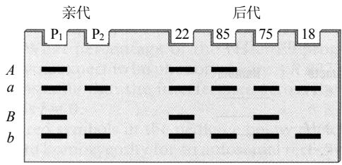

## 5.18 为了确定三个连锁基因的遗传图，在一次三点测交

实验中，观测一个三重杂合亲本的 1000 个配子，数据如附表所示。既不知道该杂合亲本的基因型，也不知道这些基因的顺序。

5.19 下图示三个常染色体连锁基因中的共显性分子标记的相应条带，这三个基因座的等位基因记为 $(A, a)$ 、 $(E, e)$ 和 $(H, h)$ 。亲本 $P_{1}$ 和 $P_{2}$ 的带型示于配子数目左侧，在1000个子代中具有每种可能带型的子代数目示于右侧。AEH

(a) 在每个空中填上该配子类型的观测数。

(b)这三个基因哪一个在中间？

(c)亲本 $\mathbf{P}_1$ 的基因型是什么？

(d) 以图距单位表示，中间的基因与最靠近它的基因之间的距离是多少？

(e) 以图距单位表示，中间的基因与离它最远的基因之间的距离是多少？

(f) 双交换后代的期望数是多少？

(g)根据这些数据计算并发系数(c)和干涉(i)。

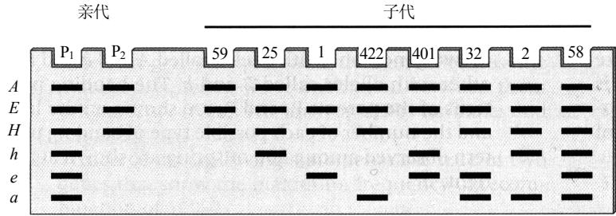

5.20 在秀丽隐杆线虫(Caenorhabditis elegans)中，突变 $dpy-21$ (短胖)和 $unc-34$ (不协调)为影响体型和运动协调性的两个连锁基因。这两个基因之间的重组频率是 $24\%$ 。如果杂合子 $dpy-21++unc-34$ 进行自体受精(该种生物正常的繁殖方式)，预计既为短胖又为不协调的后代的比例是多少？

5.21 一个小鼠品系对五个基因的某些等位基因为纯合: AA bb cc DD ee。第二个品系具有基因型 aa BB CC dd EE。基因 D 和 E 相互连锁，相距 20 cM。其他所有基因自由组合。这两个品系杂交产生 $F_{1}$ 代个体，然后对 $F_{1}$ 代雌性测交。

(a) 只考虑基因 $A 、 B$ 和 $C$ , 一个测交后代与 $\mathrm{F}_{1}$ 代雌性亲本表型相同的概率是多少?

(b) 考虑所有基因，一个测交后代与 $F_{1}$ 代雌性亲本表型相同的概率是多少？

5.22 一位果蝇遗传学家用某种化学诱变剂处理果蝇，得到 X 染色体上的 9 个突变，这些突变纯合致死。在互补试验中对这些突变进行成对测试，结果如附表所示。“+”表示互补(即同时携带这两种突变的果蝇能够得到下列数目的各种四分体类型。为方便起见，分别用 c、v 和 a 表示 cys3、vps8 和 ade1。尽管酵母四分体是非顺序四分体，但可以通过引入一个与着丝粒紧密连锁的杂合标记，对四分体进行排序。假设在该杂交中引入了这样的一个标记，从而使四分体基因型以顺序四分体的形式呈现。

<table><tr><td rowspan="2" colspan="3">存活),“-”表示不互补(同时携带两个突变的果蝇死亡)。这些突变代表了多少个基因(互补群)?每个互补群中的突变有哪些?</td><td>1</td><td>2</td><td>3</td><td>4</td><td>5</td><td>6</td><td>7</td><td>8</td><td>9</td><td></td></tr><tr><td>1</td><td>-</td><td>+</td><td>-</td><td>+</td><td>+</td><td>+</td><td>-</td><td>+</td><td>+</td></tr><tr><td> $ABC/abc$ </td><td>177</td><td>5.23 在纯合基因型  $ABC$  和  $abc$ </td><td>2</td><td></td><td>-</td><td>+</td><td>+</td><td>+</td><td>+</td><td>+</td><td>+</td><td>+</td></tr><tr><td> $ABC/abc$ </td><td>89</td><td>之间进行一次杂交,然后将三重杂合  $F_1$ </td><td>3</td><td></td><td></td><td>-</td><td>+</td><td>+</td><td>+</td><td>-</td><td>+</td><td>+</td></tr><tr><td> $abc/abc$ </td><td>81</td><td>代与纯合  $abc$  杂交,所得后代及数目为</td><td>4</td><td></td><td></td><td></td><td>-</td><td>+</td><td>-</td><td>+</td><td>+</td><td>+</td></tr><tr><td> $abc/abc$ </td><td>180</td><td>(a)对  $A$  和  $B$  基因之间的连锁进行卡</td><td>5</td><td></td><td></td><td></td><td></td><td>-</td><td>+</td><td>+</td><td>+</td><td>-</td></tr><tr><td> $aBC/abc$ </td><td>173</td><td>方检验,卡方值是多少?</td><td>6</td><td></td><td></td><td></td><td></td><td></td><td>-</td><td>+</td><td>+</td><td>+</td></tr><tr><td> $aBC/abc$ </td><td>71</td><td>(b)观测结果与这两个基因非连锁</td><td>7</td><td></td><td></td><td></td><td></td><td></td><td></td><td>-</td><td>+</td><td>+</td></tr><tr><td> $aBC/abc$ </td><td>68</td><td>的遗传假设吻合吗?</td><td>8</td><td></td><td></td><td></td><td></td><td></td><td></td><td></td><td>-</td><td>+</td></tr><tr><td> $abc/abc$ </td><td>161</td><td>5.24 假设进行具有如下基因型的</td><td>9</td><td></td><td></td><td></td><td></td><td></td><td></td><td></td><td></td><td>-</td></tr><tr><td>总计</td><td>1000</td><td colspan="11">两个出芽酵母品系的一次杂交:cys3 vps8 ade1×+++。二倍体进行减数分裂,形成子囊。</td></tr></table>

<table><tr><td>c va</td><td>c va</td><td>c va</td><td>c va</td><td>+va</td></tr><tr><td>c va</td><td>+va</td><td>++a</td><td>cv+</td><td>cv+</td></tr><tr><td>+++</td><td>c++</td><td>cv+</td><td>++a</td><td>++a</td></tr><tr><td>+++</td><td>+++</td><td>+++</td><td>+++</td><td>c++</td></tr><tr><td>159</td><td>83</td><td>41</td><td>116</td><td>1</td></tr></table>

(a) 使用这些数据评估每个基因与其着丝粒之间的连锁关系。

(b) 对任一与其着丝粒连锁的基因，根据所给数据计算其图距。

<table><tr><td></td><td colspan="3">孢子对</td><td>子囊数目</td></tr><tr><td>1-2</td><td>3-4</td><td>5-6</td><td>7-8</td><td></td></tr><tr><td> $a^{+}b^{+}$ </td><td> $a^{+}b^{+}$ </td><td> $ab$ </td><td> $ab$ </td><td>1766</td></tr><tr><td> $a^{+}b^{+}$ </td><td> $ab$ </td><td> $a^{+}b^{+}$ </td><td> $ab$ </td><td>220</td></tr><tr><td> $a^{+}b^{+}$ </td><td> $ab^{+}$ </td><td> $a^{+}b$ </td><td> $ab$ </td><td>14</td></tr></table>

5.25 左侧顺序四分体的类型和频率得自粗糙链孢霉的杂交 $a^{+}b^{+}\times a b$ (每对孢子只显示了一个)。

5.26 在家猫中，控制黄色毛色(实际上是一种橙色)和控制黑色毛色的基因是一个 X 连锁基因的两个等位基因。杂合雌性表现出黄斑和黑斑皮毛——一种称为“花斑”的图案。此处的系

谱图显示若干窝猫的毛色分布，同时还显示了对于两个限制性片段多态性所观察到的 DNA 带型。条带 1 和 2 由等位基因 $A_{1}$ 和 $A_{2}$ 产生的 DNA 片段产生，条带 3 和 4 由另一个基因的等位基因 $B_{3}$ 和 $B_{4}$ 产生的 DNA 片段产生。考察系谱，给尽可能多的猫指定完整基因型。

(a) 是否存在毛色基因与 $A_{1}$ 、 $A_{2}$ 等位基因对连锁的证据？

(b) 是否存在毛色基因与 $B_{3} 、 B_{4}$ 等位基因对连锁的证据？

(c) 如果存在连锁的证据，找出哪些猫携带有重组染色体。

(d) 估计连锁基因之间的重组频率。(提示：在第一代和第二代中所有的双重杂合雌性具有相同的等位基因顺反构型)

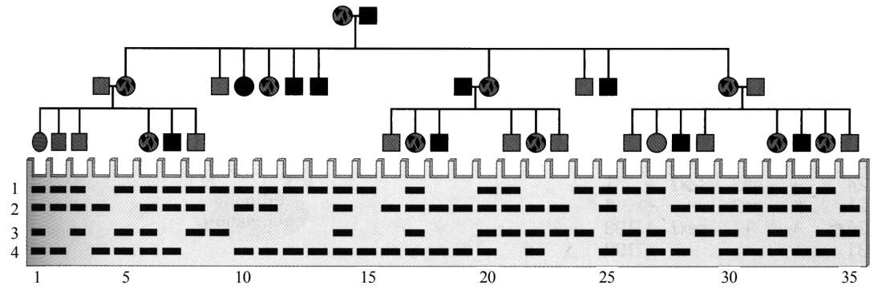

5.27 具有 A、B 和 R 三个连锁基因的某一区域的遗传图如右图所示。

假设将一个纯种的 A R B 品系与一个纯种的 a r b 品系杂交，然后对 $F_{1}$ 代进行测交。

(a)估计表型为 $Ar$ 的测交后代的百分比是多少？

(b) 估计表型为 $AB$ 的测交后代的百分比是多少？假设在整个区域内干涉 $i = 0$ 。

5.28 下面系谱中的实心符号表示一个常染色体隐性等位基因(以 a 表示)纯合子所致的性状。同时也显示

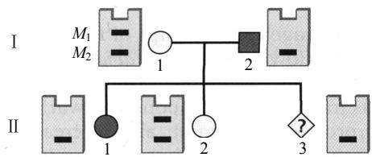

总体上它们的概率相同。

了具有等位基因 $M_{1}$ 和 $M_{2}$ 的一个连锁的限制性片段长度多态性的凝胶图。个体 I-1 和 II-2 未患病，但 I-2 和 II-1 患病。已对 II-3 进行了羊膜穿刺，如凝胶图所示；但 II-3 的表型未知（用问号表示）。该限制性片段长度多态性与该常染色体隐性基因之间的重组频率是 25%。不知道个体 I-1 的基因型是 $M_{1}A/M_{2}a$ （可称其为相引构型）还是 $M_{1}a/M_{2}A$ （相斥构型），但可以假设在群体中

(a)令 $X$ 代表II-1罹患且II-2不罹患这一事件。已知 $X$ 时，个体I-1具有相引构型 $(C)$ 的概率是多少？

(b) 已知 $X$ 时，个体 I-1 具有相斥构型 $(R)$ 的概率是多少？

(c) 对系谱中所示凝胶图予以考虑时，事件 Y ——个体 II-3 具有基因型 aa ——的概率是多少？

5.29 在此处所示系谱中，男性 I-2 罹患隐性 X 连锁血友病 A。凝胶图显示一个 DNA 片段的限制性片段

长度多态性(RFLP)，该 RFLP 也为 X 连锁，且位于与血友病基因座表现出 30% 重组的距离。RFLP 等位基因命名为：s，产生靠近凝胶顶部的移动慢的条带；f，产生靠近凝胶底部的移动快的条带。令 A 和 a 分别代表血友病基因的非突变型和突变型，并假设 I-2 是该系谱中血友病突变唯一可能的来源。

(a) 女性 II-3 对血友病突变为杂合的概率是多少?

(b) 女性III-2 对血友病突变为杂合的概率是多少?

(c) IV-1 罹患血友病的概率是多少?

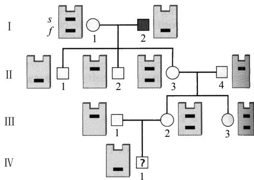

## 挑战题

挑战题 1 分析 5.24 题中的数据，确定每对基因之间的

连锁关系。对任一对连锁基因，计算其图距。

挑战题 2 研究开花植物拟南芥(Arabidopsis thaliana)中四个基因的连锁关系。隐性等位基因 cnx 提供氯酸盐抗性，ga3 引起赤霉素敏感矮小症，sex1 导致淀粉生产过剩，th2 产生对硫胺素的需求。令四个遗传标记均为纯合的一棵植株与野生型杂交，然后对 F₁ 代进行测交。发现来自杂合亲本的配子为：

<table><tr><td>cnx</td><td>ga3</td><td>sex1</td><td>th2</td><td>185</td><td>cnx</td><td>ga3</td><td>sex1</td><td>+</td><td>29</td></tr><tr><td>cnx</td><td>ga3</td><td>+</td><td>th2</td><td>205</td><td>cnx</td><td>ga3</td><td>+</td><td>+</td><td>28</td></tr><tr><td>cnx</td><td>+</td><td>sex1</td><td>th2</td><td>2</td><td>cnx</td><td>+</td><td>sex1</td><td>+</td><td>26</td></tr><tr><td>cnx</td><td>+</td><td>+</td><td>th2</td><td>3</td><td>cnx</td><td>+</td><td>+</td><td>+</td><td>19</td></tr><tr><td>+</td><td>ga3</td><td>sex1</td><td>th2</td><td>24</td><td>+</td><td>ga3</td><td>sex1</td><td>+</td><td>1</td></tr><tr><td>+</td><td>ga3</td><td>+</td><td>th2</td><td>21</td><td>+</td><td>ga3</td><td>+</td><td>+</td><td>4</td></tr><tr><td>+</td><td>+</td><td>sex1</td><td>th2</td><td>26</td><td>+</td><td>+</td><td>sex1</td><td>+</td><td>198</td></tr><tr><td>+</td><td>+</td><td>+</td><td>th2</td><td>31</td><td>+</td><td>+</td><td>+</td><td>+</td><td>19</td></tr></table>

(a)哪些基因——如果有的话——是连锁的？

(b)构建连锁基因的遗传图。

(c)在连锁基因区中，染色体干涉值是多少？

挑战题 3 组织抗原——例如那些决定皮肤移植成功或失败的抗原——是以共显性方式决定的。当且仅当

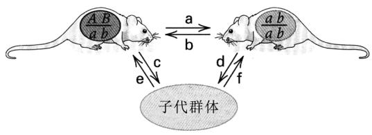

供体组织含有受体中不存在的抗原时，移植物才会被排斥。此处所示的示意图显示了小鼠的两个品系及其后代之间所有可能的皮肤移植。等位基因对 $(A, a)$ 和 $(B, b)$ 各自决定一种不同的组织抗原，并且这两个基因是连锁的，具有20%的重组频率。对于每一个箭头，供体是从箭头基部所示的群体中随机选择的一只小鼠，受体是从箭头头部所

示的群体中随机选择的一只小鼠。对于每个箭头，接受移植物的概率是多少？

挑战题 4 圣诞怪杰格林奇(Christmas Grinch)有一个遗传作图函数，由下列公式给出

$$
r = 5 0 [ 1 - (0. 2) ^ {d / 1 0 0} ]
$$

其中，r 为重组频率(百分数)，d 为图距(厘摩)。

(a) 多少重组频率相当于 10 图距单位？相当于 20 图距单位呢？相当于 50 图距单位呢？相当于 100 图距单位呢？

(b) 多少图距相当于 $1\%$ 重组？相当于 $5\%$ 重组呢？相当于 $25\%$ 重组呢？相当于 $40\%$ 重组呢？

(c)用该作图函数画出重组频率对图距的曲线图。

## 网上遗传学

“网上遗传学”(GeNETics)会为你介绍在互联网上寻找遗传学信息的某些最重要的站点。要浏览这些站点，请访问为《遗传学：基因和基因组分析》(第八版)配备的 Jones and Bartlett 公司配套站点http://biology.jbpub.com/book/genetics/8e/。

在该站点中，你会找到一个按章开列的重点关键词列表。选择某个关键词后，可链接到某个网站，其中包含与此关键词相关的信息。
