# 第 6 章 DNA 复制和重组的分子生物学

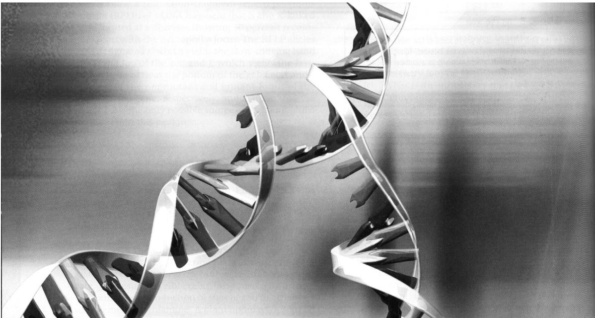  
电脑绘图，示 DNA 双链体的亲链及 DNA 复制产生的子链。[©Alfred Pasieka/Photo Researchers, Inc.]

## 本章提纲

6.1 起始、延伸和掺入错误问题  
6.2 双链DNA的半保留复制  
6.3 解链、稳定和应力释放  
6.4 通过引发体复合体起始  
6.5 链的延伸和校对  
6.6 后随链的不连续复制  
6.7 DNA的终止子测序

6.8 重组的分子机制

联系：分两半复制

马修·梅塞尔森和富兰克林·斯塔尔，1958

大肠杆菌 DNA 的复制

联系：霍利迪快乐(Happy Holliday)

罗宾·霍利迪，1964

真菌中基因转换的一种机制

## 学习目标与科学能力

学习并理解 DNA 复制和重组的分子生物学，将具有解决以下问题的科学能力。

\- 图示复制泡，示复制叉中的前导 DNA 链和后随 DNA 链，指出引发体、DNA 聚合酶 Pol III 和 Pol I 、解旋酶、单链 DNA 结合蛋白和拓扑异构酶 II (旋转酶) 的功能及作用位点。

\- 给PolIII的校对功能下定义，预测导致校对功能丧失的PolIII基因突变如何影响DNA复制的准确性。

\- 已知双脱氧 DNA 测序凝胶上条带的位置及荧光颜色，推断模板 DNA 的序列，并指出 5' 端和 3' 端。

\- 在重组的双链断裂与修复模型中产生的双霍利迪结构示意图中，指出产生交换产物还是非交换产物，霍利迪结构中哪些链需要断裂和重接。解释基因转换，绘图说明基因转换可能发生在什么地方。

DNA 的结构一被发现，就让人想到 DNA 会如何复制。沃森和克里克认为，配对的两条链可以分离，然后以每条分开的链作为模板，各合成一条核苷酸序列互补的新的伙伴链。该过程会产生两个子代双链体，两个双链体的核苷酸序列均与原来的双链体相同。尽管已证明该假说存在许多细节上的错误，但其基本概念是准确的：

\- 在 DNA 复制过程中，每条亲链都保持完整，是一个不间断的单位。

\- 每条亲链都作为合成互补链的模板。

\- DNA复制的最终结果是形成两个子代双链体，每个子代双链体与亲代双链体的核苷酸序列相同。

沃森-克里克模型的主要问题是，新链不能被起始，只能被延伸，并且，DNA 链的延伸只能发生在一个方向上。在应对这些及其他分子约束的过程中，细胞已进化出一套进行 DNA 复制的相当复杂的装置，它包含许多“分子机器”，本章将讨论这些分子机器的结构和功能。DNA 的合成也是遗传重组的一个重要组成部分，我们也会考察其分子模型。

## 6.1 起始、延伸和掺入错误问题

作为独立单位复制的一个 DNA 分子或一段 DNA 称为复制子(replicon)。大肠杆菌(Escherichia coli) K12 株的环状 DNA 分子是单一复制子，长 4.6Mb，其中，复制起始于一个 245bp 的特定区域，该区域称为复制起点(origin of replication)。大多数其他细菌的染色体也是单一复制子，质粒(plasmid)亦然，质粒常见于细菌和一些真核细胞中，是一些小的、通常为环状的分子。几乎所有的真核生物染色体都包含许多复制起点，因其所含 DNA 分子的长度非常长。有的人类染色体包含数千个复制起点。在出芽酵母中，DNA 复制起始之处的序列称为自主复制序列(autonomously

replicating sequence, ARS)。在 DNA 复制之前，细胞核中的特殊蛋白质识别复制起点特定的 DNA 序列并与之结合，这些区域就是 DNA 复制的起始点，它们的数目和活性协调一致，使得在每个细胞周期的 S 期每个染色体区域被复制一次，且只被复制一次。

DNA 复制的主要功能是复制亲代分子的核苷酸序列。碱基配对的特异性(腺嘌呤与胸腺嘧啶配对、鸟嘌呤与胞嘧啶配对)是所有遗传复制系统所采用的机制。每条亲链保持为一个完整的分子，并作为合成新的复制链——即核苷酸序列互补的子链(daughter strand)——的模板。例如，在亲链中无论何处有一个腺嘌呤核苷酸，一个胸腺嘧啶核苷酸就会被加到子链的生长端。对此过程的分子约束主要有三个。

\- 起始(initiation) 新 DNA 链赖以起始的机制未知。现在只知道 DNA 的合成是从一个称为引物 (primer) 的短的 RNA 分子开始，通过在 3' 端连续添加脱氧核糖核苷酸，使引物延伸。在链合成的后面阶段，引物 RNA 被去除，替换成一段等长的 DNA。

\- 延伸(elongation) 核苷酸单体只能添加到生长中的子链的 $3^{\prime}$ 端。这马上就引起一个问题，在图6.1中这点很明显。因为在双链DNA中，两条链是反向平行的(一条链是 $5^{\prime} \rightarrow 3^{\prime}$ 方向，另一条链是 $3^{\prime} \rightarrow$

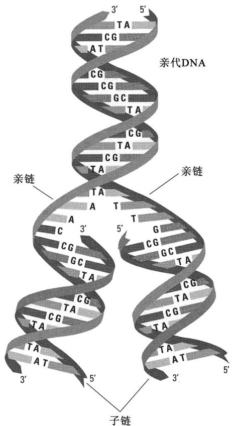  
图 6.1 沃森和克里克最初设想的 DNA 复制。

5'方向)，链的延伸只有在 DNA 双链体正在解旋的方向上才能连续进行。当螺旋打开时，3'端指向解旋方向(图 6.1 中向上的方向)的延伸链可被延伸。这条连续复制的链称为前导链(leading strand)。另一条链——称为后随链(lagging strand)，其 5'端指向解旋方向，而 5'端不可能延伸。后随链一定是以其他某种方式合成的。

\- 掺入错误(incorporation error) 碱基配对的分子特异性是不完美的。平均而言，错误(错配)核苷酸的掺入率约为 $10^{-5}$ 个/模板核苷酸/轮复制。在人类 DNA 中，这会在每个细胞周期中造成 6 万个新的碱基置换突变，这有可能会造成无法承受的遗传疾患负担。正如将要看到的那样，绝大多数掺入错误在出现之后马上就被一种称为校对(proofreading)的酶学功能所修正。

## 6.2 双链 DNA 的半保留复制

每条亲代 DNA 链保持完整并各自作为子链模板的机制称为半保留复制(semiconservative replication)。下面来考察半保留复制的实验证据。

## ■ 梅塞尔森-斯塔尔实验

从理论上说，除了半保留方式，DNA 有可能以许多机制复制，但 1958 年马修·梅塞尔森 (Matthew Meselson) 和富兰克林·斯塔尔 (Franklin Stahl) 通过实验证明了真实存在的是半保留复制。该实验利用了一种新开发的高速度离心机 (超速离心机)，它以非常快的速度旋转溶液，能使密度仅有细微差别的分子分开。在实验中，他们用氮的重同位素 $^{15}\mathrm{N}$ 来改变 DNA 的密度，使亲代和子代 DNA 分子得以分开。从生长在以 $^{15}\mathrm{N}$ 为唯一可用氮源的培养基中的大肠杆菌分离的 DNA，比从生长在具有普通 $^{14}\mathrm{N}$ 同位素的培养基中的细菌分离的 DNA，密度要大。这两种 DNA 可在超速离心机中分开，因为在浓度极高的氯化铯 (CsCl) 溶液中，两者的密度稍有差别。

高速离心含 DNA 的 CsCl 溶液时， $Cs^{+}$ 离子逐渐向离心管底部沉淀。这种运动受到扩散作用(分子的随机运动)的抵抗，阻止 $Cs^{+}$ 完全沉淀。达到平衡时，出现一个 CsCl 的线性浓度梯度(因而也是密度梯度)，从离心管顶部到底部，铯的浓度及密度逐渐增加。离心管中的 DNA 会向上或向下移动到梯度中的某个位置，在此处，溶液的局部密度等于 DNA 自身的密度。在达到平衡时，含 ${}^{14}N$ （“轻”）和含 ${}^{15}N$ （“重”）的大肠杆菌 DNA 混合物将分开到密度梯度中两个不同的区域，即使它们的密度只有细微的差别：在嘌呤环和嘧啶环中含 ${}^{14}N$ 的大肠杆菌 DNA，密度为 $1.708g/cm^{3}$ ；而在嘌呤环和嘧啶环中含 ${}^{15}N$ 的 DNA，密度为 $1.722g/cm^{3}$ 。这两种分子能够被分开，是因为 6.6mol/L 的 CsCl 溶液的密度为 $1.700g/cm^{3}$ 。在离心机中旋转时，CsCl 溶液会形成包含轻、重 DNA 分子密度在内的密度梯度。正是由于这一原因，这种分离技术被称为平衡密度梯度离心(equilibrium density-gradient centrifugation)。

想象一个实验，使用在含 ${}^{15}N$ 的培养基中生长了许多代的细菌，这样，所有的亲代 DNA 链都是“重”链。在实验开始的时候，将这些细胞转移到含 ${}^{14}N$ 的培养基中，以使新合成的 DNA 链为“轻”链。每隔一定时间，从培养物中取细胞样品，分离出双链 DNA，进行平衡密度梯度离心以检测双链 DNA 分子的密度。对于半保留复制来说，预期实验结果如图 6.2 所示。在一轮复制之后，每个双链体由一条重链和一条轻链组成，所以，所有的子链都为中间密度。两轮复制之后，含一条原始亲链的双链体，同样是中间密度，但现在有相同数目的由两条轻链组成的双链体，所以，离心产生两个密度有别的条带。第三轮复制之后，预计会再次出现轻密度和中间密度的 DNA 双链体，但在这一代中，两者的预期丰度比为 3:1，如带状图所示。

梅塞尔森-斯塔尔实验(Meselson-Stahl experiment)的实际结果如图6.3A部分所示。每张照片或每条吸收扫描曲线，都是像图6.2中那样的离心管中的CsCl溶液的照片或吸收扫描曲线，离心管呈水平方向放置，底部(高密度)在右边，顶部(低密度)在左边。图6.3A中的每张照片都

是在 260nm 波长的紫外光下拍摄的，该波长的紫外光被 DNA 吸收。因而，在密度梯度中，DNA 分子的位置由吸收紫外光的暗条带指示。扫描曲线显示紫外光沿离心管纵向的吸收情况，波峰相当于照片中条带的位置，因而峰的高度和宽度可对每条带中的 DNA 进行定量。

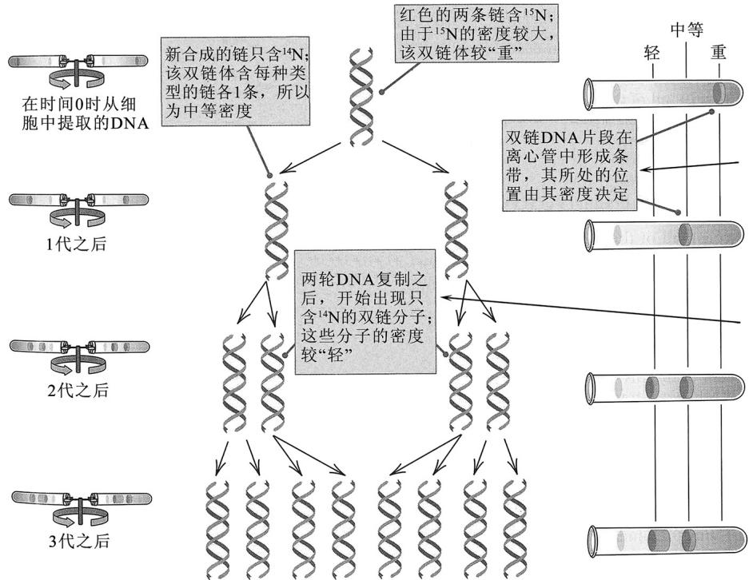

实验开始时
(第 0 代)，所有

图 6.2 梅塞尔森-斯塔尔实验中半保留复制的预期结果。

的 DNA 都是重

的 $(^{15}\mathrm{N})$ 。转移到 $^{14}\mathrm{N}$ 后，开始出现一条密度轻的条带，并随着细胞复制 DNA 和分裂，逐渐显著(图 6.3A)。生长 1.0 代(DNA 复制一轮，细胞数目加倍)之后，所有 DNA 为“混合”密度，密度刚好在 $^{15}\mathrm{N}$ -DNA 密度和 $^{14}\mathrm{N}$ -DNA 密度两者的中间。发现混合密度的分子，说明复制后的分子含有等量的两种氮同位素。在 $^{14}\mathrm{N}$ 培养基中复制 1.9 代之后，约一半的 DNA 具有两条链都带 $^{14}\mathrm{N}$ 的 DNA（“轻” DNA）的密度，而另一半具有混合密度。3.0 代后，轻 DNA 与混合 DNA 的比例约为 3:1，而 4.1 代后，该比例约为 7:1。 $^{15}\mathrm{N}$ 原子的这种分布，正是图 6.2 所示的根据半保留复制预测的结果。其后，在众多病毒和细菌中进行了类似的复制 DNA 实验，证实在这些类群中复制为半保留方式。

联系：分两半复制

马修·梅塞尔森和富兰克林·斯塔尔，1958

加州理工学院，帕萨迪纳，加利福尼亚州

大肠杆菌 DNA 的复制

DNA 的复制，是通过两条链分离，继而给每条分离的亲链合成一条新的配对链。这是一个非常基本的生物学机制，基本到让人容易忽略，它必须要经过实验证明。证明半保留复制的梅塞尔森-斯塔尔实验利用了一种新技术——密度梯度离心，这是两位作者为了分离在密度上略有差异的 DNA 分子而发明的。氯化铯的使用是必需的，因其浓溶液的密度与 DNA 的密度差不多。在现代分子生物学中，氯化铯密度离心方法仍很重要，它被用于 DNA 分子的分离。

对细菌转化和噬菌体感染的研究强烈提示，脱氧核糖核酸(DNA)可携带和传递遗传信息，并能指导其自我复制。DNA复制机制的不同假说的差异在于，它们对来自亲代分子的原子在子代分子中的分布所作的预测不同。……我们预计，使DNA分子密度增大的某种标记，使得有可能通过沉降技术对这种分布进行分析。为此，我们开发了一种用来检测大分子之间的微小密度差异的方法。……在氯化铯浓溶液中的小量DNA被离心，直到非常接近于平衡状态。此时，沉降和扩散相互对抗的过程形成了一个稳定的氯化铯浓度梯度，沿离心力方向密度不断增加。处于该密度梯度中的DNA大分子受离心力场的驱使，到达溶液密度与其浮力密度相等的区域。……均匀标记有 $\mathbf{N}^{15}$ 的细菌突然换到 $\mathbf{N}^{14}$ 培养基中。……立即从培养物中取样，之后每隔一段时间取样一次，持续数代。……随着时间流逝，直至到达一代的时间，在此历程中半标记分子逐渐累积。在转换到 $N^{14}$ 中一代之后，只观察到这些半标记或“混合”分子。其后，只能看到半标记 DNA 和完全无标记的 DNA。经过两代的时间后，半标记 DNA 和无标记 DNA 以相同数量存在。根据这些结果得出如下结论：1. 一个 DNA 分子的氮元素在两个亚单位之间是平均分配的，两个亚单位经历许多代都保持完整。……2. 在复制之后，每个子代分子获得一个亲代亚单位。……3. 复制活动的结果是分子加倍。……沃森和克里克提出一种 DNA 分子的结构……启发他们提出一个明确的、在结构上可信的 DNA 分子复制假说。……本实验的结果与沃森-克里克 DNA 复制模型的预测精确地一致。……此处所述结果使我们的注意力集中到(其他重要的问题上)。……完整传递给子代分子的 DNA 亚单位的分子结构是什么？在 DNA 分子中，这些亚单位相互之间的关系是什么？在生物活体内，这些亚单位合成与分离的机制是什么？

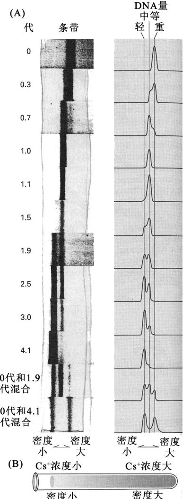  
图 6.3 梅塞尔森-斯塔尔实验结果与图 6.2 中的预测相符。(A)左侧示以紫外光拍摄的离心管照片。如 B 部分所示，离心管顶部在左边，底部在右边。在 A 部分中的平滑曲线定量显示整个离心管的紫外吸收量。[转引自 M. Meselson and F. W. Stahl, Proc. Natl. Acad. Sci. USA 44(1958): 671-682. 照片承哈佛大学分子与细胞生物学系马修·梅塞尔森(Matthew Meselson)惠赠。]

来源：M. Meselson and F. W. Stahl, Proc. Natl. Acad. Sci. USA 44(1958): 671-688.

## - 染色体 DNA 的半保留复制

真核细胞染色体中 DNA 的复制也是半保留式的。直接证据来自标记研究，这些研究本质上与梅塞尔森和斯塔尔的实验相同，但使用的是在光学显微镜下可在染色体中进行检测的标记。图 6.4 示一个使用人类染色体的例子。在该例中，标记物为溴脱氧尿苷 (bromodeoxyuridine, BUdR)，这是一种含 5-溴尿嘧啶碱基的胸苷的核苷类似物，其 5-溴尿嘧啶可与腺嘌呤进行碱基配对。在存在 BUdR 的情况下进行 DNA 复制时，BUdR 取代胸苷，高效地掺入新合成的链中。

图 6.4 BUdR 标记的人类染色体。[经得克萨斯大学休斯顿健康科学中心许可使用。]  
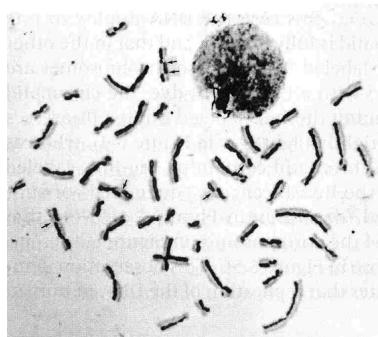

对图 6.4 中染色体的解释，概括于图 6.5 中。A 部分示存在 BUdR 的情况下经过一轮复制的一条染色体，每个 DNA 分子为半标记的。B 部分示第二轮 BUdR 复制后的一条染色体，在此情况下，一条染色单体中的 DNA 双链体是全标记

的，而另一条染色单体中的 DNA 双链体是半标记的。当用一种荧光染料对这些染色体进行染色后，含半标记双链体的染色单体发出非常明亮的荧光(图 6.4 中的浅灰色)，而含全标记 DNA 的染色单体，荧光被“猝灭”(抑制)(图 6.4 中的深灰色)。注意，图 6.4 中的大多数染色体与图 6.5C 中的染色体类似。这一观察结果证明，人类染色体中 DNA 的复制是半保留式的，因为半标记 DNA 相当于梅塞尔森-斯塔尔实验中经一轮复制之后的 DNA(图 6.2)。

图 6.4 也包括一些标记方式像图 6.5D 中那样的染色体。这些是半保留复制后，继之以姐妹染色单体交换(sister-chromatid exchange)的结果。在此过程中，两条姐妹染色单体发生断裂和重接，在 DNA 水平上相当于在两条染色单体中具有相同极性的两条链的断裂和重接。因为姐妹染色单体的 DNA 序列相同，所以姐妹染色单体交换通常没有遗传后果。图 6.4 和 6.5D 显示了姐妹染色单体交换的分子和细胞学证据。至于图 6.4 中的人类细胞，该培养物曾暴露于 X 射线下，X 射线使染色单体断裂。因此，该细胞显示出更多的姐妹染色单体交换。

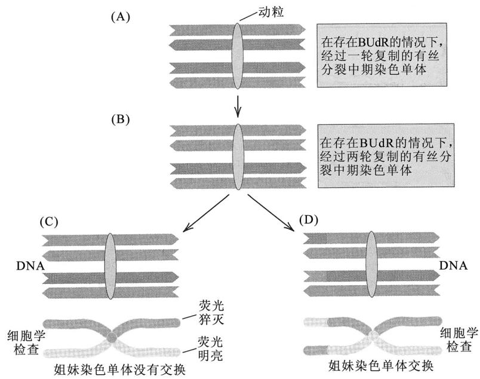

图 6.5 (A) 在存在 BUdR 的情况下，一轮染色体复制产生半标记 DNA 双链体。(B) 两轮复制产生一个全标记双链体和一个半标记双链体。(C) 全标记使荧光猝灭（不发光），因此，半标记染色单体有荧光，而全标记染色单体没有荧光。该发现证实染色体 DNA 的半保留复制。(D) 姐妹染色单体交换导致荧光从一条染色单体突然跳换到其伙伴单体上。

## - 环状DNA分子的 $\theta$ 复制

在梅塞尔森-斯塔尔实验中，大肠杆菌DNA在分离过程中大多已剪切断裂成片段，所以未知其原来的形态。遗传作图实验曾经提示细菌染色体为环状(第9章)，但直到后来通过未断裂分子的分离和对其进行电子显微镜检查，才直接证实了这一点。

大肠杆菌 DNA 以环状进行复制的第一个物证来自放射自显影实验。细胞被培养于含放射性胸腺嘧啶( $^{3}$ H-胸腺嘧啶)的培养基中，以使合成的所有 DNA 具有放射性。以避免断裂的方式分离 DNA，并将其置于摄影胶片上。每次放射性衰变都会使胶片上出现一个微小的黑点，数月之后，可得到足够的点，从而可用显微镜看见 DNA；胶片上黑点的图案勾画出 DNA 分子的轮廓。图 6.6 示这种实验的一张著名的放射自显影照片。大肠杆菌染色体的实际长度为 1.6mm(460 万碱基对)。图 6.7 示正在复制的质粒环状分子，该分子比大肠杆菌染色

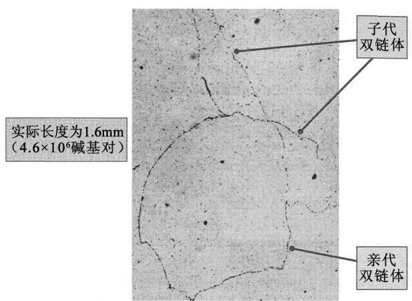  
图 6.6 一个大肠杆菌细胞正在复制的完整染色体的放射自显影照片，该细胞已在含 ${}^{3}$ H-胸腺嘧啶的培养基中培养了略少于两代。黑色颗粒构成的连续线条由 DNA 分子中 ${}^{3}$ H 原子衰变发射出的电子产生。这是在光学显微镜下观察到的图像。[引自 J. Cairns, Cold Spring Harb. Symp. Quant. Biol. 28 (1963): 43-46. 冷泉港实验室出版社版权所有。]

体小，全长仅 0.01mm(3000 碱基对)。这种正在复制的环略似希腊字母 $\theta$ ，所以通常称这种复制方式为 $\theta$ 复制( $\theta$ replication)。

(A)  
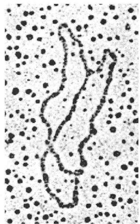

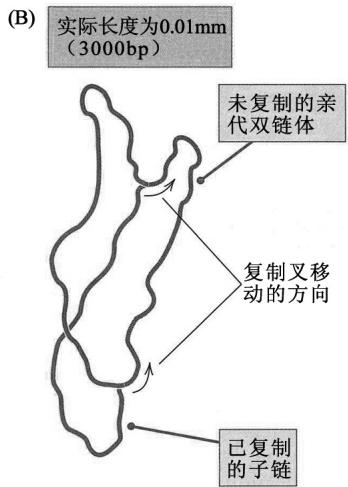  
图 6.7 以 $\theta$ 方式复制的一个小的环状 DNA 分子的电镜照片。亲代和子代片段如手绘图所示。[A 部分，承加州大学圣地亚哥分校生物科学部唐纳德·赫林斯基 (Donald R. Helinski) 惠赠。]  
在一个正在复制的 DNA 分子中，亲链正在分离、新链正在合成的区域称为复制叉 (replication fork)。如图 6.8 所示，以 $\theta$ 方式复制的环状 DNA 分子，可有一个或两个复制叉。只有一个复制叉时，复制叉从复制起点开始，朝一个方向绕环移动，然后又回到起点。有两个复制叉时，它们从起点开始向相反的方向移动，在环的另一边一个称为复制终点 (terminus of replication) 的区域会合。在环状和线状分子中，当复制在复制起点处起始时，都要从起点向两边移动以形成两个复制叉，仅有为数不多的例外。换言之，DNA 几乎总是进行双向复制 (bidirectional replication)。

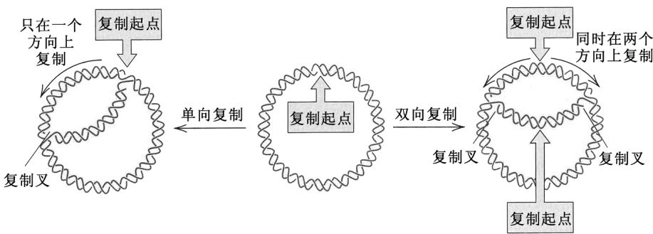  
图6.8 单向和双向DNA复制之间的差异。在单向复制中，仅有一个复制叉；双向复制需要两个复制叉。弧形箭头表示复制叉运动的方向。大多数DNA都是双向复制。

## - 滚环复制

有些环状 DNA 分子，包括许多细菌病毒和真核生物病毒的 DNA 分子，以不含 $\theta$ 形中间体的一种过程进行复制。这种复制方式称为滚环复制 (rolling-circle replication)。在该过程中，复

制始于双链环上一个特定糖-磷酸键处的单链切割(图6.9)。这一切割产生两个在化学上不同的末端:一个3'端(此处的核苷酸具有一个游离的3'-OH)和一个5'端(此处的核

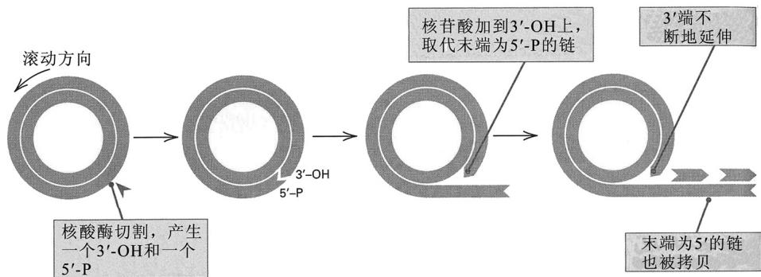  
图 6.9 滚环复制。新合成的链以红色显示。被替代的链以短片段方式复制。  
苷酸具有一个游离的 $5^{\prime}-P$ 。通过将脱氧核糖核苷酸连续添加到 $3^{\prime}$ 端，同时将 $5^{\prime}$ 端从环上替代掉，

DNA 得到复制。随着复制绕着环推进，5'端像一条会长长的尾巴一样“滚出来”。

在大多数情况下，随着单链尾巴的伸展，以该单链为模板合成了互补链，这就产生了双链DNA尾巴。因为被替代的链共价连接于环中新合成的DNA，所以，复制不终止，尾巴就不停息地伸展，可以形成比环的周长长许多倍的尾巴。因而，这条长尾巴由环中DNA序列的串联线性重复序列构成，每绕环完整复制一次，就给尾巴加上又一个串联重复序列(图6.10)。滚环复制是具有环状中间体的噬菌体在复制晚期的共同特点。在第9章中，在描述大肠杆菌供体细胞和受体细胞接合时，也会看到一个滚环复制的重要例子。

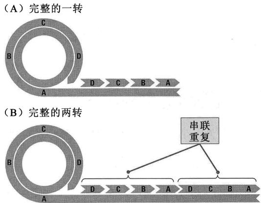  
图 6.10 持续的滚环复制产生线性延伸物, 其中含亲代环状分子中所见序列的串联重复。

## ■ 真核生物的多起点及双向复制

真核生物染色体中的 DNA 双链体是线性的，其复制为双向复制。复制起始于 DNA 中的许多位点。众多复制起点产生的结构，在电镜照片中看起来是沿着 DNA 分子的多个环(图 6.11)。这些环称为复制泡(replication bubble)。每个复制泡都产生于复制起点之处，在此处发生双向复制，随着两个复制叉从起点开始不断向两边移动，复制泡不断增大(图 6.12)。相邻复制泡的复制叉在相遇处融合。

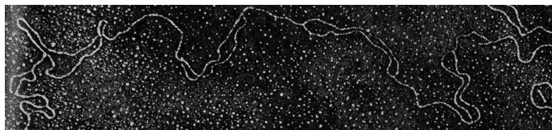

多重起始是缩短大分子总复制时间的一种方式。在真核细胞中，每个复制叉的移动以每秒 10～100 个核苷酸对的速度推进。例如，在黑腹果蝇中，在 25℃时，复制速度约为每秒 50 个核苷酸对。因为在果蝇中最长染色体中的 DNA 分子包含约 $7 \times 10^{7}$ 核苷酸对，如果从单个双向复制起点开始，复制过程要花大约 8 天时间。实际上，发育中的果蝇胚胎，每条染色体上使用约 8500 个复制起点，这使复制时间减少到几分钟。在典型的真核细

图 6.11 正在复制的黑腹果蝇 DNA。电子显微照片显示含 5 个复制泡的 30kb 区域。[显微照片承斯坦福大学医学院生物化学系戴维·霍格内斯 (David S. Hogness) 惠赠。]  
图 6.12 在双向复制中复制泡如何增大和融合。小箭头示复制叉运动的方向。  
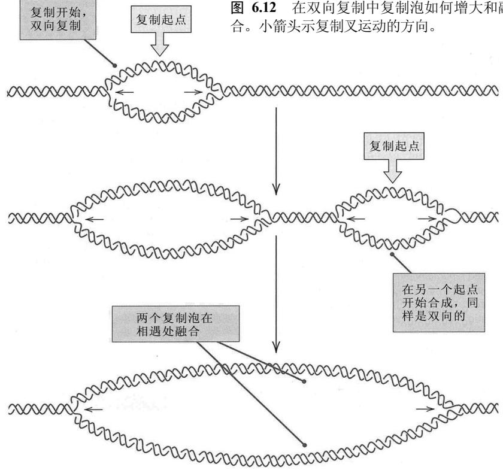

胞中，起点之间的间隔约为 40 000 核苷酸对，这使得每条染色体可以在 15～30min 内得到复制。因为染色体不都是同时复制，所以在真核生物中所有染色体全部复制往往要花 5～10h。

原核生物中的 DNA 复制要比真核生物中快得多。例如，在大肠杆菌中，DNA 分子的复制以大约每秒 1500 个核苷酸对的速度进行，相仿的速度也见于迄今研究过的所有噬菌体 DNA 的复制中。从大肠杆菌的单个双向复制起点开始，其 DNA 分子的完整复制需要大约 30min，因该分子包含约 $4.6 \times 10^{6}$ 核苷酸对。然而，在最理想的培养条件下，大肠杆菌细胞可以每 20min 分裂一次。这之所以可能，是因为每隔 20min 就在起点处开始新一轮的复制，即便前一轮的复制尚未完成。在大肠杆菌细胞的快速分裂培养物中，在细胞分裂中传给每个子细胞的 DNA 分子，已经处在为下一次分裂作准备的复制过程中。

## 6.3 解链、稳定和应力释放

图 6.13 示参与 DNA 复制过程的一些主要分子。使双螺旋解旋以将两条亲链分开，需要解旋酶(helicase)，它是一种水解 ATP 来驱动解旋反应的蛋白质。多数细胞具有数种专门针对不同任务(例如，复制、重组或修复)的解旋酶。在大肠杆菌中，在复制叉处发挥作用的主要解旋酶是 dnaB 基因的产物，该酶名为 DnaB 解旋酶。双螺旋解旋后的两条链有自发复性的倾向，因此，为了起到 DNA 合成模板的作用，它们一定要被稳定为单链。这种稳定作用是单链 DNA 结合蛋白(single-stranded DNA-binding protein, SSB)所具有的功能。SSB 能紧密地与单链 DNA 结合，它对单链 DNA 的亲和力比对双链 DNA 的亲和力强千倍以上。正是 SSB 与单链结合的这种强烈趋势，使复制模板得到稳定。在大肠杆菌中，DNA 复制、重组和修复中使用的看来是相同的 SSB。

图6.13 在  
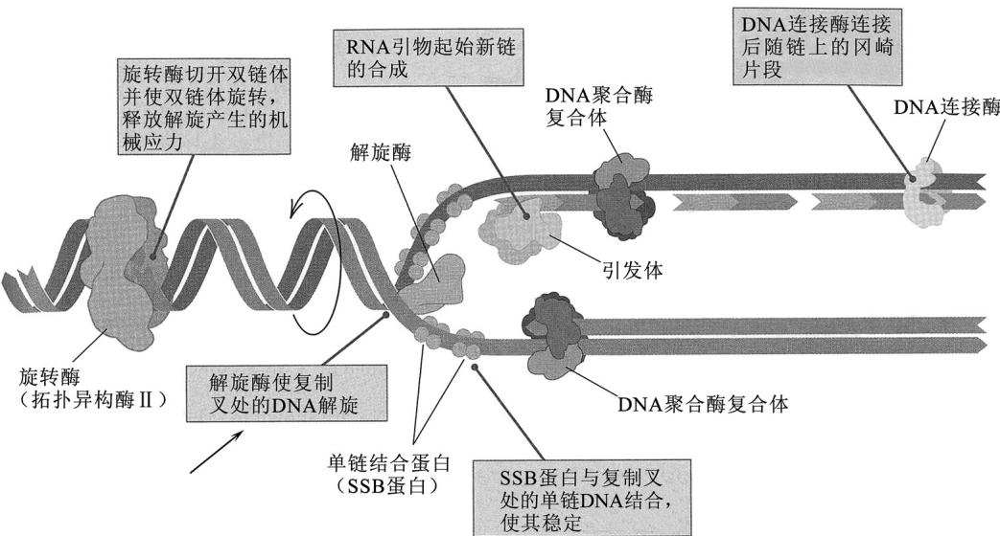

复制中双螺旋的两条链要解开每一匝螺旋，必须完整地旋转一周，因而，一定存在某种旋转机制，以避免在双螺旋上逐渐积累的应力过多而导致链分离的停止。例如，在大肠杆菌中，在解旋导致扭转应力变得过大而不能继续复制之前，仅有约 $10\%$ 的基因组能够复制。释放这种应力的酶称为旋转酶(gyrase)，它切割DNA双链体的两条链，旋转断链的末端以释放扭转应力，然后将链重新连接（图6.14）。能够催化DNA链断裂和重接的酶称为拓扑异构酶(topoisomerase)。因为旋转酶产生双链缺口，所以被称为拓扑异构酶II。

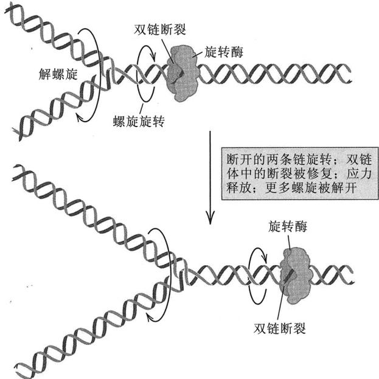  
图 6.14 DNA 旋转酶在复制叉之前产生一个双链缺口，然后绕中轴旋转断端，以释放双螺旋解旋的应力。

在双螺旋由解旋酶解旋、模板链被 SSBP 稳定、扭转应力被旋转酶释放的同时，为了准备延伸新的子链，引物寡核苷酸也合成了。接下来考察引物合成。

## 6.4 通过引发体复合体起始

主要 DNA 聚合酶(major DNA polymerase)不能起始新的多聚核苷酸链，所以，存在一条具有游离 3'羟基的引物链是复制起始绝对必需的。在活细胞中，引物是一个短 RNA 片段；在体外(in vitro)无细胞复制中，引物可以是 RNA 或 DNA。引物 RNA 是由 3',5'-磷酸二酯键连接的四种核糖核苷酸

组成的单链核酸。将 RNA 与 DNA 区别开来的化学差异如图 6.15 所示。第一个差别在糖的成分上，RNA 含核糖(ribose)，核糖在 2' 碳原子上存在一个-OH 基，除此之外与 DNA 的脱氧核糖相同。第二，在四种碱基中有一种有差别，在 DNA 中所见的胸腺嘧啶，在 RNA 中被非常相近的尿嘧啶(uracil, U)取代。在合成 RNA 时，以一条 DNA

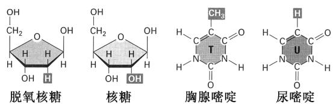  
图 6.15 DNA 与 RNA 的差异。突出显示的化学基团是区别脱氧核糖和核糖及胸腺嘧啶和尿嘧啶的特征。

链为模板形成一条互补链，其中，DNA 中的碱基与 RNA 中的碱基配对。

在细菌中, RNA 引物由一种称为引发酶 (primase) 的特殊 RNA 聚合酶产生。在大肠杆菌中,引发酶为 DnaG —— dnaG 基因的产物。细菌 RNA 引物通常很短, 由 2\~5 个核苷酸构成。

在真核生物中，引物为一个 RNA 短片段接着一个 DNA 短片段。该引物由一种称为 $\alpha$ 聚合酶 (polymerase $\alpha$ ) 的特殊 DNA 聚合酶产生。该酶分两个阶段发挥作用。它首先合成长约 12 个核苷酸的 RNA 短片段，然后转换为添加 DNA 核苷酸，直到 RNA-DNA 引物的总长度达 35 个核苷酸左右。 $\alpha$ 聚合酶常见于一种由 15～20 条多肽链构成的多酶复合体中，这种多酶复合体称为引发体 (primosome)。

一旦引物合成之后，在真核生物和原核生物中都由主要 DNA 聚合酶来接手。主要 DNA 聚合酶负责大部分的 DNA 合成，因为在复制过程中产生的每条 DNA 子链的大多数核苷酸都是由该酶聚合的。该酶通过将脱氧核糖核苷酸连续添加到引物序列的 3' 端而发挥作用 (图 6.16)。因为 DNA 合成的起始需要 RNA 引物, 所以每条子链在合成时具有图 6.17 所示的分子结构——在 5' 端有一个 RNA 短片段, 而延伸在 3' 端进行。

图 6.16 RNA 片段引发 DNA 合成。DNA 模板以蓝色显示，新合成的 DNA 以米黄色显示。RNA 片段以绿色显示。DNA 聚合酶可将一个脱氧核糖核苷酸加到引物 3' 端。脱氧核糖核苷酸连续添加到生长链的 3' 端。

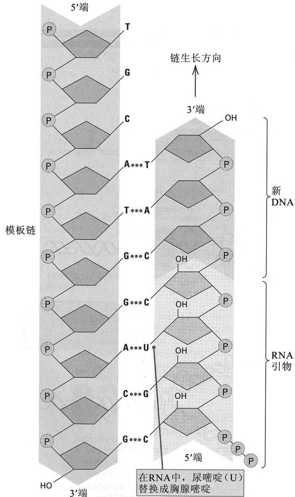

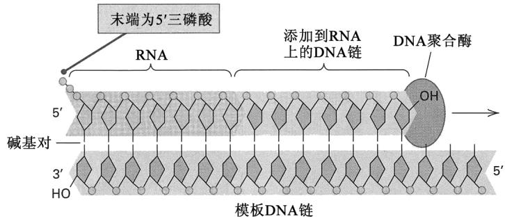  
图 6.17 在前体片段被连接起来之前，在后随链中的每个前体片段都具有此处所示的结构。RNA 短片段以绿色显示。  
6.5 链的延伸和校对

在一个称为 DNA 聚合酶复合体 (DNA polymerase complex) 的复合体中，主要 DNA 聚合酶与其他蛋白质结合，共同发挥功能。在真核生物和原核生物中，DNA 聚合酶复合体的组分不同。在真核生物中，主要 DNA 聚合酶为聚合酶 $\delta(\text{delta})$ ，它是被 DNA 聚合酶复合体中的其他蛋白质募集到 DNA 链的生长点的。聚合酶 $\delta$ 负责延伸引发体产生的 RNA-DNA 引物。

在大肠杆菌之类的细菌中，DNA 聚合酶复合体的分子质量约为 $1 \times 10^{6}$ Da。它被称为 Pol III 全酶 (Pol III holoenzyme)，因为它含有称为 DNA 聚合酶 III (Pol III) 的主要 DNA 聚合酶。细菌 DNA 聚合酶复合体含两个 Pol III 蛋白质 (各由 3 条不同的多肽链组成)，加上至少 7 个别的多肽，这些多

肽的功能包括聚合酶复合体的组装，以及形成抓握和移动模板链的分子钳(molecular clamp)。尽管每个细菌细胞仅有 10～20 个拷贝的含 Pol III 的聚合酶复合体，但它们既要负责引物的第一个脱氧核糖核苷酸的添加，又要负责随后子链的延伸。

由 DNA 聚合酶催化的延伸反应，是在延伸链的游离 3'-OH 和掺入 3' 端的核苷三磷酸最里边的磷原子之间，形成一个磷酸二酯键(图 6.18)。结果如下：

DNA 合成是通过引物链的延伸而进行的，合成方向总是从 5' 到 3'。

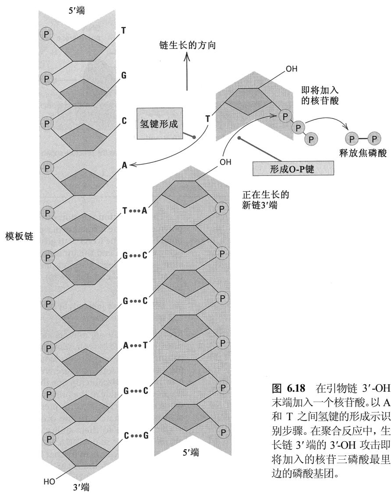

在复制中，识别即将加入的核苷三磷酸是否合适，取决于其与模板链中相对的

核苷酸的碱基配对情况。仅当存在正确的碱基对时，DNA 聚合酶才会催化聚合反应，将新的核苷酸加到引物末端，但是，仍会发生掺入错误。

除了能够聚合核苷酸外，主要 DNA 聚合酶也具有外切核酸酶(exonuclease)活性——在核酸链的糖-磷酸主链上使一个磷酸二酯键断裂，从而去除 3' 端的末端核苷酸。这种外切核酸酶称为 $3'\rightarrow5'$ 外切核酸酶。这种外切核酸酶活性在遗传上极其重要，因为它为校正聚合过程中发生的掺入错误提供了一种内置机制。聚合酶在正在生长的子链末端掺入错误核苷酸的速度，约为每复制 $10^{5}$ 个核苷酸掺入一个错误核苷酸。此处所说的“错误”核苷酸，是指不能与模板链中的碱基形成正确沃森-克里克碱基对的核苷酸。不配对碱基的存在可激活 $3'\rightarrow5'$ 外切核酸酶活性，将不配对的核苷酸从生长链的 3'-OH 端切掉(图 6.19)。因为 $3'\rightarrow5'$ 外切核酸酶活性将错误的核苷酸切除，使聚合酶得到改正这个核苷酸的机会，所以 DNA 聚合酶的这种活性称为校对(proofreading)。这种校对功能只能“回顾”一个碱基(最后添加的那个碱基)。不过，

图 6.19 校对功能的 $3'\rightarrow5'$ 外切核酸酶活性。生长链被切割，以释放一个不配对的核苷酸，在此例中为含 G 碱基的核苷酸，该碱基与模板链上的碱基 A 不配对。  
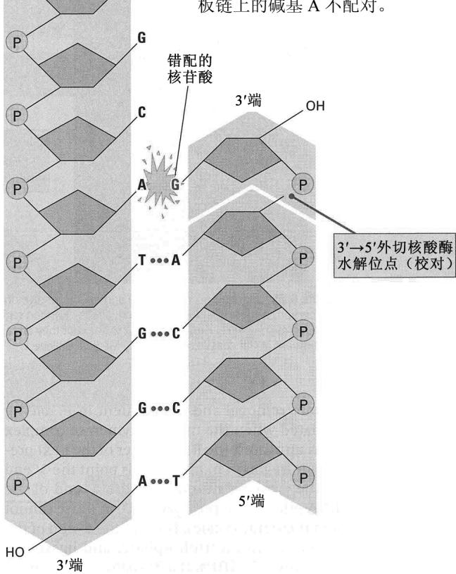

是以其发现者之名命名的。前体片段的大小，在原核细胞中为1000～2000碱基对，在真核细胞中为100～200碱基对。后随链的合成每隔一段时间启动一次，因而，在复制叉的一侧，至少总是会有一个亲代双链体的单链区(图6.20)。在复制中的DNA分子的高分辨电子显微图中可见到这种单链区，如图6.21A中箭头所示。在图6.20中，也可明显看出一条链不连续复制的另

校对的遗传重要性在于，它是一种纠错机制，用来减少 DNA 复制中掺入错误核苷酸所致的突变的频率。

因为 DNA 聚合酶只能在 3' 端延伸新合成的 DNA 链，所以，其中一条子链是以短片段形式生成，之后这些短片段才被连接在一起。下面介绍该机制的原因，以及这些片段的特性。

## 6.6 后随链的不连续复制

因为 DNA 链只能在 3' 端延伸，所以，5' 端紧靠复制叉的子链，不能在复制叉移动的相同方向上延伸。此链即后随链 (lagging strand)。如图 6.13 所示，后随链以短片段方式复制，之后才被连接到一起，成为连续的子链。

## - 复制叉中的片段

图 6.20 示 DNA 复制过程中的复制叉、前导链和后随链。在后随链合成中的短片段称为前体片段 (precursor fragment) 或冈崎片段 (Okazaki fragment)，冈崎片段

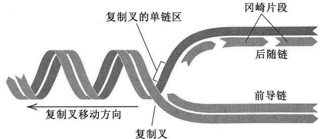  
图 6.20 复制叉中的短片段。就每一段碱基对而言，后随链总比前导链晚合成。

一层含义, 即连续复制链的 3' 端必定总是在不连续复制链的 5' 端的前面(更靠近复制叉)。这种差异, 就是用来区分两条复制链的术语——前导链和后随链——的物质基础。

## - 前体片段的连接

前体片段最终要被连接成一条连续的 DNA 链。这条链不含 RNA 序列，可见，最终将后随链拼接在一起，要求：

\- 去除 RNA 引物

\- 用 DNA 序列来替换引物

\- 连接相邻 DNA 片段相互接触之处

在大肠杆菌中，引物去除和替换开始于主要聚合酶复合体遇到上一个前体片段的 RNA 引物之时。此时，生长链的 3' 端指向 RNA 引物的 5' 端。但是，DNA 连接酶不能连接这两个核苷

酸，因为引物 5' 端带有一个三磷酸，而连接酶只能连接 3'-OH 和 5' 单磷酸。要连接前体片段，要募集一种称为 Pol I 的特殊的 DNA 聚合酶。该酶具有外切核酸酶活性，能从多核苷酸链的 5' 端连续去除核苷酸。这种活性为 5'→3' 外切核酸酶活性。Pol I 接手生长链的延伸工作，当它向前移动时，每次去除引物的一个核糖核苷酸，并以一个脱氧核糖核苷酸替换。当所有 RNA 核苷酸都被去除后，DNA 连接酶共价连接 3'-OH 和下一个 DNA 核苷酸末端的 5'-P。通过这一系列事件，

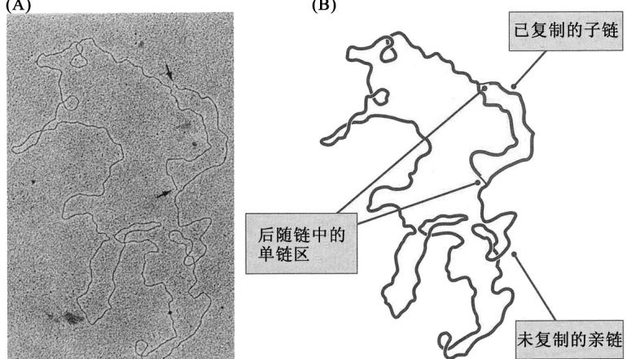  
图 6.21 正在复制的 $\lambda$ 噬菌体 DNA 的 $\theta$ 分子的电子显微照片 (A) 和解说图 (B)。在电子显微照片中，每个箭头都指向一个靠近复制叉的未复制的 DNA 短单链区。这些单链区有点不容易看清，但仔细看还是很明显的。[承梅哈里医学院癌症生物学系曼纽尔·瓦伦瑞拉 (Manuel Valenzuela) 惠赠。]

端的 5'-P。通过这一系列事件，RNA 引物被除去，前体片段得以连接。Pol I 是必不可少的，

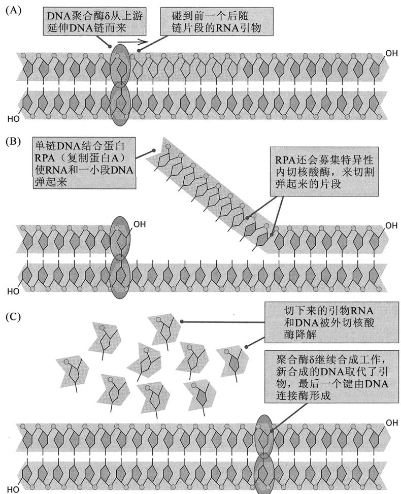  
图 6.22 真核生物中连接相邻前体片段的事件序列。

因为在 Pol III 中不存在去除 RNA 引物所需的 $5'\rightarrow3'$ 外切核酸酶活性。

在真核生物中，RNA 是作为一个完整单位去除的（图 6.22）。聚合酶 δ 复合体与上一个前体片段的 RNA 相遇，蛋白质 RPA（复制蛋白 A）在此处加入到复合体中。RPA 是一种单链 DNA 结合蛋白，它使双螺旋中的 RNA 和一小段 DNA 解旋，并与解旋的单链结合以使其稳定（图 6.22B）。RPA 还募集内切核酸酶，从双螺旋上切下解旋的单链，也切割在切除片段中连接 RNA 和 DNA 片段的磷酸二酯键。聚合酶 δ 复合体以 DNA 核苷酸替换切除片段，然后 DNA 连接酶催化最终连接两个前体片段的键形成（C 部分）。与此同时，切除片段的 RNA 和 DNA 组分被酶降解，核苷酸被回收利用。

## 6.7 DNA 的终止子测序

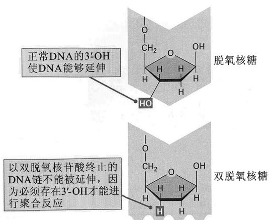  
图 6.23 正常脱氧核糖和 DNA 测序所用的双脱氧核糖的结构。在双脱氧核糖中，与 3' 碳连接的是一个氢原子(红色)，与之相比，在脱氧核糖中该位置为羟基。因为 3' 羟基为 DNA 生长链连接下一个核苷酸所必需，所以双脱氧核糖核苷酸的掺入使合成过程立即终止。

DNA 聚合酶通过一个化学反应延伸多核苷酸链，在该反应中，生长链的脱氧核糖上的 3'羟基，攻击待加入的核苷酸的 5'磷酸，形成一个新的磷酸二酯键，从而把一个新的核苷酸加到链上。如果待加入的核苷酸缺少 3'羟基，会出现什么情况呢？这个核苷酸还是会通过它的 5'磷酸连接到生长链上，可是，由于没有 3'羟基，进一步的延伸将会戛然而止。缺少 3'-OH 的核苷酸能够终止链的延伸，是 DNA 中的核苷酸序列能够得到测定的原理。

双脱氧测序法(dideoxy sequencing method)是在存在少量含双脱氧核糖(dideoxyribose)的核苷酸的情况下，利用 DNA 合成进行测序(图 6.23)。双脱氧核糖缺少 3'-OH，而 3'-OH 是在生长链上添加下一个核苷酸必需的，所以，掺入双脱氧核糖核苷酸而不是脱氧核糖核苷酸，会立即终止 DNA 链的进一步延伸。

要测 DNA 链的序列, 要用所有四种脱氧核苷

三磷酸前体来进行 DNA 合成反应。反应混合物中还含四种双脱氧核苷三磷酸各少量，各以发不同波长荧光的化学基团标记。将正常核苷酸和双脱氧核苷酸的浓度调整到一定比例，使得在每个合成步骤中，子链中掺入正常核苷酸的可能性远大于掺入双脱氧核苷酸的可能性。但是，在每个延伸步骤中，仍会有一小部分子链分子中掺入双脱氧核苷酸，阻止合成的继续进行。结果，得到一套长度各异的 DNA 片段，每个片段都终止于 3' 端一个荧光标记的双脱氧核苷酸。每个片段的长度由子链中掺入双脱氧核苷酸的位置所决定。通过凝胶电泳测定链终止产生的片段大小，然后按下述规则确定碱基序列：

如果在含某种双脱氧核苷酸的反应中产生含 n 个核苷酸的片段, 那么在子链的第 n 位的碱基为该双脱氧核苷酸中存在的那种碱基。从引物的 $5'$ 核苷酸开始计数。

不管引物是什么，如果在含双脱氧形式的 dATP 的反应中，存在一个 93 个碱基长的片段，那么，在通过 DNA 合成而得的子链中，第 93 个碱基必定为腺嘌呤(A)。因为大多数天然的双链 DNA 分子都是由互补链构成的，所以，测定的是模板链序列还是子链序列都无关紧要。模板链序列可以从子链序列推导而得，因为它们的核苷酸序列是互补的。不过，在实践中，DNA 分子的两条链往往都要独立测序，并相互比较，以排除可能因误读凝胶而产生的大多数错误。

在内径约 0.2mm(0.008 英寸 $^{①}$ ) 的毛细管中进行电泳，可以分离在大小上相差单个碱基的单链短片段。例如，如果某反应混合物中含有由 20、21、22……100 个核苷酸构成的一套 DNA 片段，那么，电泳会得到这些各自独立的条带——一个条带含大小为 20 个核苷酸的片段，下一个条带含大小为 21 个核苷酸的片段……这种对片段大小的非凡的敏感性，是 DNA 测序方法的基础。

## ■ 桑格测序法

桑格测序法(Sanger sequencing)是指用双脱氧终止子来进行 DNA 测序。它以弗雷德里克·桑格(Frederick Sanger)的名字来命名，桑格因该发明获得1980年的诺贝尔化学奖(此前桑格因发明测定多肽链氨基酸序列的方法而被授予1958年的诺贝尔化学奖)。桑格测序法的步骤如图6.24所示。在该例中，引物长度为20个核苷酸。在G处终止，产生21、24、27和29个核苷酸大小的片段；在A处终止，产生22和30个核苷酸大小的片段；在T处终止，产生26个核苷酸大小的片段；在C处终止，产生23、25和28个核苷酸大小的片段。通常，终止合成的双脱氧核苷酸各以不同的荧光染料进行标记。在图6.24中，双脱氧核苷酸的颜色编码为黑色(G)、绿色(A)、红色(T)和紫色(C)。通过电泳把DNA片段按大小分开后，即可直接读取子链中的核苷酸，得到如图6.24底部所示的那样的核苷酸序列。在该例中，可根据凝胶中条带的位置和颜色，从第21位开始，直接读取子链中各个位置上的核苷酸，得 $5^{\prime}$ -GACGCTGCGA- $3^{\prime}$ 。这相当于模板链中的序列 $3^{\prime}$ -CTGCGACGCT- $5^{\prime}$ 。

在实践中，桑格测序是用机器进行的，机器自动进行电泳和序列读取。自动测序仪持续电泳，直至每个条带依次离开毛细管底部。在每个条带离开毛细管底部时，条带中所含的荧光染料被激光激发，荧光的颜色被一个感光器自动读取，并被计算机记录。图 6.25 是一个荧光扫描图，扫描的是连续电泳之后出现在毛细管底部的荧光图像。核苷酸序列直接根据扫描图上逐个峰的颜色读取。在基因组测序计划中，双链 DNA 的每个长的区域需测序 10 次左右，这是为了将数据组装成一个连续整体，并使测序错误减到最低限度。在 DNA 测序中之所以需要高度的重复，是因为所得靶分子的序列是单链

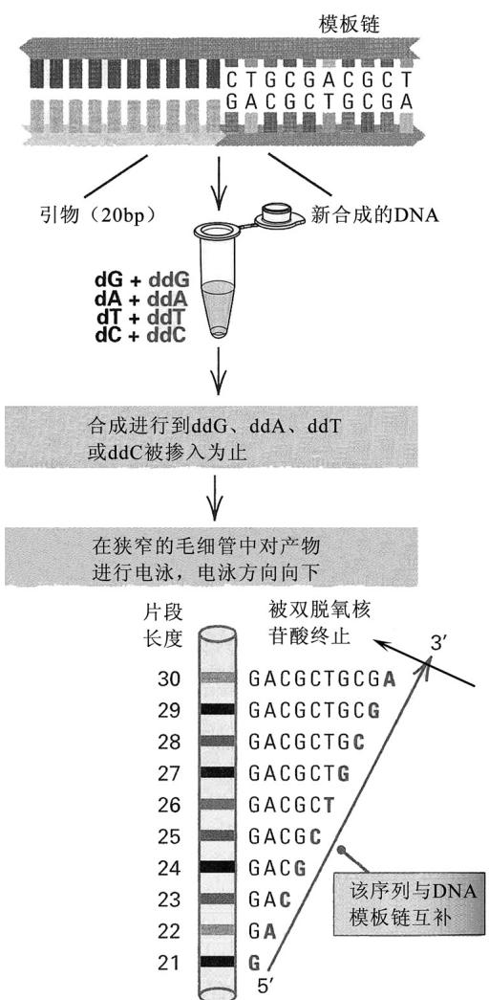  
图 6.24 双脱氧 DNA 测序法。通过毛细管电泳将终止的 DNA 片段按大小分开。根据每个条带的颜色，可从底部到顶部人工读出子链序列为 5'-GACGCTGCGA-3'。

小片段形式，这些片段是从随机位置克隆的，这些序列必须组装成完成序列 (finished sequence)。这种测序策略称为鸟枪测序法 (shotgun sequencing)。

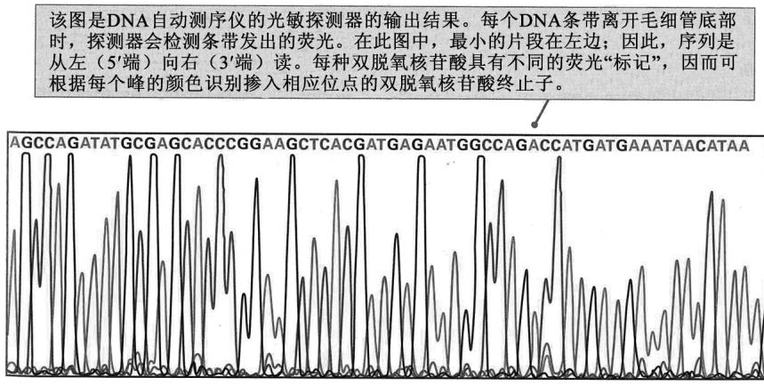  
图 6.25 从 DNA 测序凝胶获得的荧光扫描图。在连续电泳过程中，当每个条带离开毛细管底部时，自动检测每个条带的荧光，获得扫描图。

## - 大规模并行测序

大规模并行测序(massively parallel sequencing)是指用可对数百万个模板同时测序的机器来测序。在这些机器中，有些机器一轮测序可产生10亿碱基对的序列。使用大规模并行测序有得也有失，传统的桑格测序可产生长度达1000碱基对的序列，而目前大规模并行测序仪能读取的碱基对长度只有几百个，甚至更短。在许多情况下，这种折中是值得的，原因是，首先，可直接从基因组DNA获得模板DNA，然后用聚合酶链反应(PCR；在第2章中讨论过)扩增；其次，在很多情况下，数千万个短的序列读长(read)与数十万个长的读长能够提供同样有用的信息。

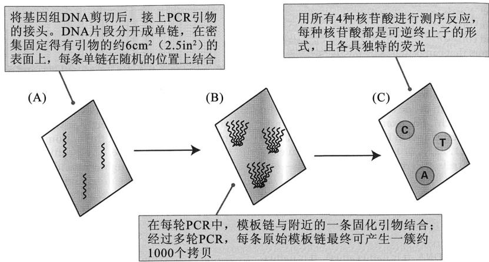  
图 6.26 大规模并行 DNA 测序的一种方法，在玻片上捕捉和扩增 DNA 模板链，然后用可逆终止子来测序。

图 6.26 概括了一种利用终止子的大规模并行方法。第一步是将基因组 DNA 剪切成小片段，并用酶在 3' 端和 5' 端连上 PCR 接头。PCR 接头 (adaptor) 是能与互补的 PCR 引物退火，从而令扩增得以发生的短序列。然后，将模板 DNA 链分开成单链，共价结合于一个平面的随机位置上 (A 部分)，该平面上密被结合好的引物，如同草地上竖起的草叶。一旦

模板链结合，即开始 PCR 阶段(B)。在每个循环中，模板链上游离的接头端与相邻的固定在平面上的互补引物杂交。固定引物的延伸产生一条子链，它的一端为拴系在原始模板附近的固定端，另一端为游离端，游离端作为下一轮 DNA 合成的起始位点。多轮 PCR 得到一簇围绕最初模板所在位置的 DNA 链(图 6.26B)。现在这些 DNA 链可作为终止子测序的测序模板，这种终止子测序巧妙利用了可逆终止子(reversible terminator)的化学性质：反应混合物中每种核苷三磷酸的 3' 端被一个荧光发射体封闭，四种核苷酸的荧光发射体的波长各不相同。在每个测序循环中，模板暴露于所有四种标记核苷酸中，每条子链掺入在当前位置与模板配对的核苷酸。由于子链的 3' 端是封闭的，所以不可能有进一步的延伸。此时进行荧光扫描，每簇模板链发出信号，其波长指示在该步中哪种核苷酸被掺入。例如，在图 6.26C 中，一个模板掺入的核苷酸是 C，另一个是 T，第三个是 A。然后，用化学方法除去荧光发射体，替换成 3'-OH，这使子链可在下一个测序步骤中被延伸。图 6.26 中的这种大规模并行方法，可同时进行 2500 万个测序反应，一轮测序一般可产生多达 10 亿个碱基对，但每个模板的读长通常为 100 个碱基对或更少。

图 6.27 示另一种大规模并行测序法，这种方法处理的模板较少，但产生的读长较长。在这种方法中，连接了 PCR 接头的模板链被微珠捕捉，微珠直径约 $30 \mu m$ (0.001 英寸)，使用稀释剂以使每个微珠最多得到一条模板。然后用微珠在含 PCR 所需的所有试剂(包括引物)的水溶性混合物中制备油滴乳浊液，每个油滴具有一个微珠(A 部分)。这些油滴经过多个 PCR 循环，直到每个微珠携有原始模板链的约 $10^{7}$ 个拷贝。然后，用去垢剂溶解乳浊液，并将微珠转移到一个蜂巢般的微室阵列上，每个微室恰好够容纳单个微珠及其连接的模板。反应试剂从微室顶上流过，而发出的测序信号从底部穿出。

图 6.27 中的测序方法不用终止子，而是利用偶联化学反应发出光信号，这种光信号是每个新的核苷酸加到生长链时释放的焦磷酸(共价结合的两个磷酸基团)所激发的(图 6.18)。因为无论哪种核苷酸被加到生长链上，信号都是一样的，所以，四种核苷酸必定是每次加一种到测序反应中，然后记录每个微室是否发出光信号。具有一连串相同碱基的模板，会发出一连串互补核苷酸的光信号，由于这种单核苷酸串的存在，检测器有时会数错发光的次数。不过，这种方法对大多数类型的序列是相当准确的，这种方法可同时进行50万个测序反应，一轮测序一般可产生1亿个碱基对，平均读长约为200个碱基对。

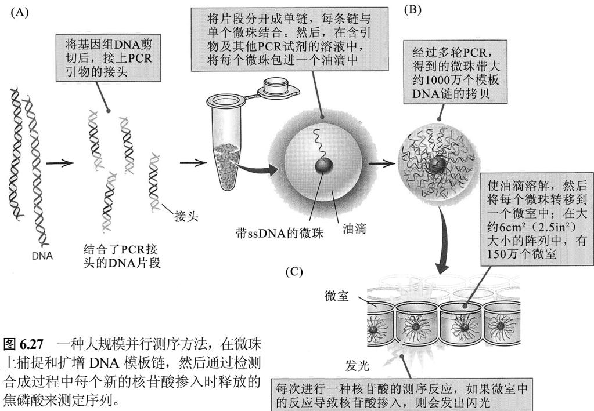

## 6.8 重组的分子机制

在第 5 章中讨论的遗传连锁作图的分子基础，是两个不同 DNA 分子之间的重组——这是一个断裂和重接的过程。在真核生物中，该过程发生在每个 DNA 分子都已复制之后的减数分裂早期。进行重组的遗传学研究，酵母或链孢霉等真菌的四分体分析特别有用，因为任何一次减数分裂的所有四个产物（“四分体”）都可以四孢子子囊(出芽酵母)或八孢子子囊(链孢霉)的形式得到回收(5.4 节)。进行正常的孟德尔分离时，来自杂合 Aa 二倍体的大多数子囊，比值为 2A:2a(四孢子子囊中)或 4A:4a(八孢子子囊)。但偶尔也会见到异常的比值，如四孢子子囊中的 3A:1a 或 1A:3a，以及八孢子子囊中的 6A:2a 或 2A:6a，还可能会出现另一些类型的异常比值。这些异常子囊被说成是基因转换(gene conversion)的结果，因为这看起来好像是一个等位基因把另一个等位基因“转换”成和它自身一样的形式。基因转换往往伴随着转换事件两侧遗传标记之间的重组，即使在两侧的标记紧密连锁的时候，这表明基因转换可能是重组过程的结果。

## - 基因转换和错配修复

基因转换是细胞中一种正常的 DNA 修复过程的结果，该过程称为错配修复 (mismatch repair)。在该过程中，一种酶可识别 DNA 双链体中错配的配对碱基，例如，G 与 T 配对，或 A 与 C 配对。当在双链 DNA 分子上发现这样一个错配时，一条链上的一个小片段被切除，并以剩下的链为模板合成一个新片段进行替换。以这种方式，错配碱基对被替换。图 6.28 中的例子示一个错配的 G-T 碱基对被修复。被切除的链可能是含 T 的链或含 G 的链，新合成的 (修复

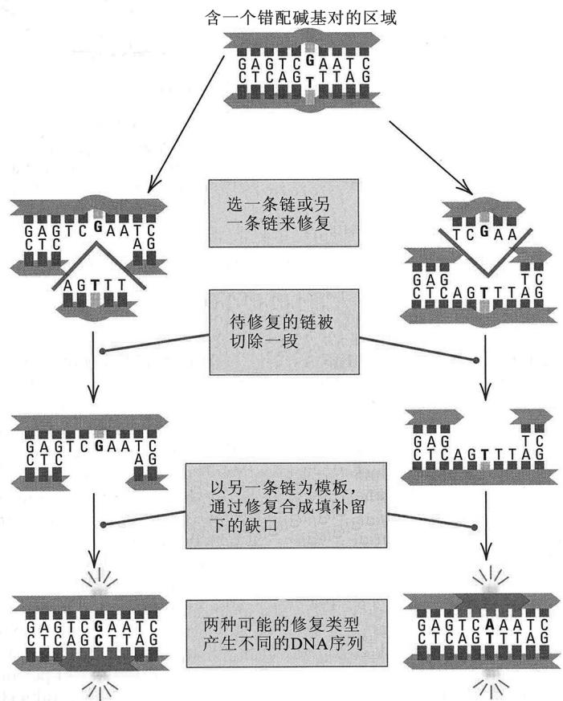  
图 6.28 错配修复，包括一条 DNA 链上含有错配碱基的片段的切除，以及随后的修复合成。两条链中任一条都可被切除和校正。在此例中，G-T 错配被校正为 G-C(左)或 A-T(右)之一。

的)片段分别含 C 或含 A(红色所示)。这两种可能的修复产物在 DNA 序列上不同。

图 6.29 示错配修复在基因转换中的作用。顶部的一对 DNA 双链体代表一个进行减数分裂的细胞的两个等位基因。一个双链体含有以颜色突出显示的一个 G-C 碱基对，这相当于等位基因 A。另一个双链体在相同位置含一个 A-T 碱基对，这相当于等位基因 a。在重组过程中，参与重组的两个 DNA 双链体可互换配对伙伴链，结果如第二行所示。配对伙伴链的互换产生一个异源双链 (heteroduplex) 区，在该区中，两个亲代双链体中不相同的任何碱基都变成错配碱基。在该例中，一个异源双链体含有一个 G-T 碱基对，另一个异源双链体含一个 A-C 碱基对。这时候，错配修复系统开始起作用，修复这些错配。每个错配都可以两种方式之一修复，所以，这些错配修复的可能方式有四种。一种修复导致从 a 到 A 的基因转换，

另一种导致从 $A$ 到 $a$ 的基因转换，余下的两种，恢复最初的双链体的序列，所以不导致基因转换。

## 联系：霍利迪快乐(Happy Holliday)

罗宾·霍利迪，1964

约翰英纳斯研究所，贝福特伯瑞，赫特福德郡，英国

真菌中基因转换的一种机制

霍利迪写这篇论文的时候，基因转换现象已为人熟知，但仍颇为费解。当时最受人青睐的解释是“拷贝选择”模型（“copy-choice” model），该模型认为，在 DNA 复制过程中，子链生长点的模板可在两个亲代 DNA 双螺旋中极性相同的 DNA 链之间切换。因而，假设在转换区域中有一次模板的切换，3:1 的转换比值就可以得到解释。拷贝选择模型预测 DNA 以全保留而不是半保留方式复制——染色体配对必须发生于 DNA 复制之前，且多重交换始终只会涉及同一对染色单体。这些预测没有一个得到实验证据的支持，但当时没有可供选择的让人满意的假说。尽管今天知道霍利迪假说太过简单化，但它提出的基因转换机制——DNA 链的交叉配对（而不是模板切换）产生异源双链区，在该区中的任何错配碱基可被酶学修复，解开了基因转换之谜。

(在许多真菌中)四分体分析已经证明任何杂合基因座通常都得到期望的2∶2孟德尔比值；但也显示偶尔会出现异常的四分体：一个等位基因出现三次，而另一个等位基因出现一次。……虽然拷贝选择模型存在这些困境，它仍受到许多作者的青睐。之所以如此，是因为它认为如果没有某种遗传复制，基因转换是不可能的。……在本文中，将讨论一种不涉及遗传复制的转换事件的起源。……该模型用DNA两条链的互补性来解释分子水平上特异染色单体的配对。在遗传复制及一般的遗传配对之后，来自相对的同源染色单体的DNA分子，在某些位点上解旋形成单链，然后这些单链与来自另一条染色单体的互补链退火或螺旋化。因而，可在短区域内出现特异的或有效的配对。至于DNA如何能够形成这种构型，有复杂程度不同的许多可能性。……如果退火区域跨越某个杂合位点(突变位点)会出现碱基的错配。……修复机制可能会运转，这些修复机制通过校正碱基序

列以恢复正常的碱基配对，可能会导致在没有任何遗传复制情况下的基因转换。该模型表明，在转换的邻近区域如何发生一种染色单体精确的断裂和重接，以致转换常常会伴随着外围标记的重组。

来源: R. Holliday, Genet. Res. 5 (1964): 282-304.

## - 双链断裂与修复模型

如同第 4 章中强调的那样, 交叉是 DNA 分子之间交换的物质表现。交叉结构在二价体中起到连接成对姐妹染色单体的作用, 二价体排列在赤道板上为后期 I 作准备时, 交叉对于二价体的正常排列非常重要。二价体如果缺少交叉来帮助它们结合在一起, 很容易发生不分离。

目前最常用的同源重组模型是图 6.30 所概括的双链断裂与修复模型 (double-strand break and repair model)。在该模型中，DNA 链之间的重组，由 DNA 双链体中的双链断裂启动 (图 6.30A)。双链断裂后，通常会通过核酸酶对断端的消化而使缺口增大，5' 端的降解较多，造成如图所示突出的 3' 端。细胞会以未断裂的同源 DNA 分子为模板，对这些缺口进行修复，但是，在减数分裂中，这种修复过程会造成交换，在非姐妹染色单体之间产生交叉，这些交换也是它们在遗传上重组的物质基础。在包括人类和其他哺乳类在内的一些生物中，基因组中的某些位置比其他

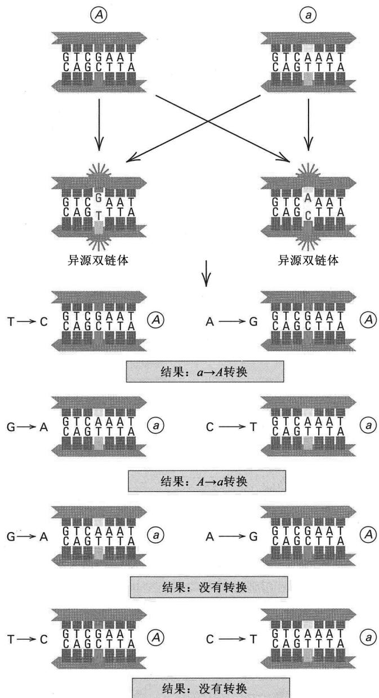  
图 6.29 错配修复导致基因转换。仅显示一小部分异源双链区。

位置更有可能发生 DNA 断裂。在这些位置，更有可能发生交换所致的重组，因此，这些位置被称为重组热点 (hot spot)。

然而，双链断裂不一定会导致交换。通过非交换途径进行的双链断裂修复如图 6.30B 所示。修复的第一步是一个 3' 断端侵入未断裂的同源 DNA 双链体，与一条链形成一个短的异源双链区，并在另一条链产生一个称为 D 环 (D loop) 的环状突出区（需要特定蛋白质介导链入侵；在大肠杆菌中，链入侵蛋白称为 RecA）。在该图中，异源双链区是浅蓝色链与红色链配对的区域。因其为异源双链体，在该区中的任何碱基对错配，都有可能通过导致基因转换的错配修复方式得到校正。此类异源双链区的长度通常只有几百个碱基。它们比基因短得多，更是大大短于染色体，所以，在这些非常靠近双链断裂位点的短区域之外，基因转换很少发生。

在异源双链体的一端，游离的 3' 端被延伸 (棕色)，但过一段时间后，它从模板上弹开，未断裂的双链体的两条链又能够结合在一起。这时候，3' 端的延伸使其长度达到足以和断裂双链

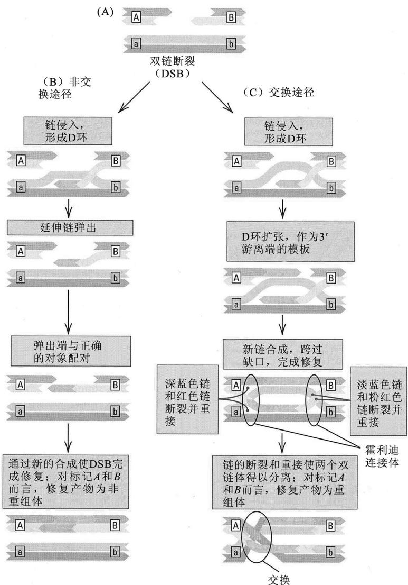  
图 6.30 (A)一个双链 DNA 分子中的双链断裂，具有指向缺口的 3' 突出端。断裂的修复利用了未断裂的同源双链体。(B)不造成交换的修复途径，尽管异源双链区仍产生基因转换。(C)造成交换的修复途径，在异源双链区也可能有基因转换。[改编自 D. K. Bishop and D. Zickler, Cell 117(2004):9-15.]

体中的互补链发生配对。同时，这种配对给另一条断裂链的 3' 端提供了模板，该 3' 端不断延伸，跨越正在修复的缺口，完成双链断裂的修复。注意，虽然在非交换途径中可发生基因转换，但产生的双链 DNA 分子是非重组的。

修复双链断裂的交换途径如图 6.30C 所示。同样，对未断裂双链体的入侵形成 D 环和短的异源双链区，在异源双链区中可发生基因转换。如同在非交换途径中一样，断裂 DNA 链的游离 3' 端被延伸(棕色)，但在这种途径中，延伸一直持续到置换模板链(红色)的配对链(粉红色)。然后，被置换的链可作为另一条断裂链 3' 端延伸的模板。最后，两条断裂链的延伸部分都变得足够长，能够与 5' 断端连接。这就完成了双链断裂的修复，但要注意的是，所产生的结构有两处的链互换了配对伙伴链。每个改变配对伙伴链之处的结构称为霍利迪连接体 (Holliday junction)，这是以罗宾·霍利迪(Robin Holliday)的名字来命名的，此人第一

个预测此类结构可能涉及重组。

霍利迪连接体带来的问题是，它们所在之处，不同双链分子的 DNA 链相互连接。图 6.31 的 A 部分示 DNA 双螺旋中这些链是如何相互连接的。这两个 DNA 分子要彼此分离，必须解开霍利迪连接体。这需要在每个霍利迪连接体处一对 DNA 链的断裂和重接。这种断裂和重接是一种酶学作用，由称为霍利迪连接体解离酶 (Holliday junction-resolving enzyme) 的一种酶来执行。

图 6.31 的 B、C 部分示霍利迪连接体的两种解离方式。红色箭头所示的链的断裂和重接，在左边霍利迪连接体所在位点产生一个交换；而蓝色箭头所示的链的断裂和重接，在右边霍利迪连接体所在位点产生一个交换。在两种情况下，所得 DNA 分子都有一个交换，产生相互重组的 A b 和 a B 产物(理论上，也可在一个霍利迪连接体中的红色箭头和另一个霍利迪连接体中的蓝色箭头之处进行解离，但结果是非交换产物，还不清楚这些非交换类型的解离的发生频度如何)。

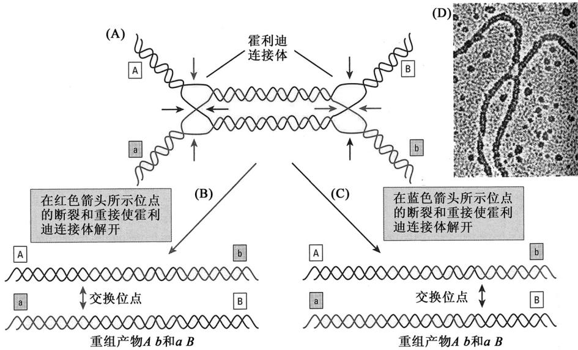  
图 6.31 (A) 在一对进行重组的 DNA 分子中的两个霍利迪连接体；(B 和 C) 两种解离方式，取决于哪些链断裂和重接。D 部分为电子显微照片，示一对 DNA 分子之间的单个霍利迪连接体。

## ■ 重组热点

在许多生物中，启动减数分裂重组的 DNA 双链断裂不是随机发生的，而是集中在某些称为重组热点 (hot spot) 的位点。人类基因组含大约 3 万个重组热点，平均距离为 100kb。这些重组热点通常位于基因间隔区，它们在双链断裂的可能性上差异很大。有一种特殊的蛋白质与整个人类基因组约 40% 的热点有关，这种蛋白质是 PRDM9，已知其在某些位点与双链 DNA 结合，这些位点具有几乎一致的 13 个核苷酸 (13-mer) 组成序列：5'-CCGCCGTMWCCWC-3' (M 指 A 或 C, W 指 T 或 A)。PRDM9 不直接引起双链断裂，它实际上是一种甲基转移酶，它将甲基 (—CH₃) 连接到组蛋白 H3 的赖氨酸上。H3 是一种含量丰富的蛋白质，它与其他组蛋白一起与 DNA 结合，形成一连串的 DNA-蛋白质小珠。这些小珠称为核小体 (nucleosome)，会在第 7 章讨论。现在要了解的重点是，DNA 通常包装在含组蛋白 H3 的核小体中，因此，存在 PRDM9 的 13-mer 靶序列的地方，就存在含组蛋白 H3 的核小体。有证据表明，PRDM9 使组蛋白 H3 甲基化，是造成 DNA 产生双链断裂的原因，但还不知道断裂形成的细节。现已鉴定出编码 PRDM9 基因的 30 多个等位基因，这些等位基因在识别 13-mer 靶序列和使组蛋白 H3 甲基化的倾向性上有差异。编码 PRDM9 的等位基因的差别是 PRDM9 相关热点具有不同效率的原因。

尽管重组往往是通过重组热点处的双链断裂启动的，但应该强调的是，相对于交换事件的数目而言，热点的数目太多，以至于在任一特定的减数分裂细胞中，重组位点都表现出很大的随机性。例如，在人类基因组中有大约3万个重组热点，每次减数分裂有大约60个交换事件。大致说来，每次交换可发生在附近约500个热点中的任何一个。每次减数分裂，交换的数目相对较少，说明交换基本是在存在于整个基因组中数目巨大的热点中随机选择的位点上发生的。

## 本章概要

这些片段的延伸被缺失 $3^{\prime}-OH$ 的双脱氧核糖核苷酸的掺入终止。

\- 在 DNA 水平上，重组由 DNA 分子中的双链断裂启动。使用同源 DNA 分子作为修复模板可导致交换，参与交换的 DNA 分子的两条链都要断裂和重接。

## 基础回顾

\- 在 DNA 链的合成过程中, DNA 链 3' 端的什么化学特征对于延伸是必需的? DNA 链也可在 5' 端延伸吗?

\- 在 DNA 复制过程中，哪些特征可将前导链和后随链区分开来？

\- 如果双链 DNA 中的两条配对链是平行而不是反向平行的，复制还会涉及前导链和后随链的问题吗？解释。

\- 在滚环复制中，新合成的链相当于普通复制的前导链还是后随链？解释答案。

\- 解释 DNA 聚合酶III (Pol III) 及相应的真核生物聚合酶的 “校对” 功能。

\- DNA复制的什么特征确保掺入双脱氧核苷酸会使链延伸终止？

\- 什么是“鸟枪测序法”？为什么这种方法要求大多数区域要在不同的独立克隆中测序多次？

\- 什么类型的异常四分体提供的证据表明，在重组过程中产生了异源双链DNA区？

\- 为什么霍利迪连接体的解离一半的时候产生外围标记重组的分子，一半的时候产生外围标记非重组的分子？

\- 为什么在重组的双链断裂与修复模型中存在两个霍利迪连接体？

## 解题指南

习题 1 鸡(Gallus gallus)的 1 号染色体含 $2 \times 10^{8}$ 个碱基对，如果从其一端开始复制，持续进行到另一端，复制该分子要花多长时间？设真核生物 DNA 合成的典型速率为每秒 50 个核苷酸。

## 答案

复制要花 $(2\times10^{8}/50)=4\times10^{6}$ s，或46.3天。该答案说明，真核生物中的DNA分子为什么一定要具有很多复制起点。

习题 2 凝胶中所示的 DNA 序列是通过双脱氧测序法获得的。颜色代码为黑色 (G)、绿色 (A)、红色 (T) 和紫色 (C)。在 A 部分的测序反应中，合成的子链的核苷酸序列是什么？在 B 部分呢？在每种情况下，互补模板链的核苷酸序列是什么？以 5' 和 3' 标出每个末端。能看出 A 和 B 中的序列之间有什么特殊关系吗？

## 答案

凝胶中的条带由未合成完全的链所产生，这些链的合成因双脱氧核苷酸的掺入而终止。这些片段按大小排列，最小的片段在凝胶底部。因为 DNA 链通过在 3' 端添加新的核苷酸而延伸，所以，在测序反应 A 中合成的链，其序列从底部到顶部为 5'-ACTAGAGACCATGATCCTGTGATGAATAGC-3'。模板链为互补且反向平行的链，所以其序列为 3'-TGATCTCTGGTACTAGGACACTACTTATCG-5'。同样，在 B 部分，在测序反应中合成的子链为 5'-GCTATTCATCACAGGATCATGGTCTCTAGT-3'，其模板链为 3'-CGATAAGTAGTGTCCTAGTACCAGAGA TCA-5'。如果把 B 中的模板链写成 5' 端在左边，将看到它与 A 中的模板链互补。也就是说，同一 DNA 区域的两条链均被测序。

习题 3 在出芽酵母酿酒酵母(Saccharomyces cerevisiae)中，野生型基因 ADE-2 及其突变型等位基因之一 ade-2 在 DNA 上相差单个碱基对：在野生型等位基因具有一个 A-T 碱基对之处，突变型等位基因具有一个 G-C 碱基对。如果在一个异源双链体中包含两个等位基因有差异的这一区域，且两个错配都被修复，如何解释含如下孢子的子囊：

(a) 孢子为 3 ADE-2:1 ade-2

(b) 孢子为 1 ADE-2:3 ade-2

(c) 孢子为 2 ADE-2:2 ade-2

## 答案

(a)一个异源双链体中的错配修复为 $C \rightarrow T$ ，另一个为 $G \rightarrow A$ 。(b)一个异源双链体中的错配修复为 $T \rightarrow C$ ，另一个为 $A \rightarrow G$ 。(c)可为两种情况之一：一个异源双链体中的错配修复为 $T \rightarrow C$ ，另一个为 $G \rightarrow A$ ；一个异源双链中的错配修复为 $C \rightarrow T$ ，另一个为 $A \rightarrow G$ 。

## 分析与应用

6.1 在原核生物和真核生物中，由主要 DNA 聚合酶起始 DNA 复制都需要引物。原核生物和真核生物的引物有什么差异？

6.2 DNA 聚合酶带有的 $3'\rightarrow5'$ 外切核酸酶活性的功能是什么？如果该功能因突变而失活，对于细胞来说，后果是什么？

6.3 DNA 连接酶连接的化学基团是什么？DNA 聚合酶连接的化学基团呢？

6.4 什么蛋白质负责通过分离亲代 DNA 链而起始双链 DNA 的解旋？

6.5 消除双链 DNA 解旋产生的扭转应力的蛋白质是什么？

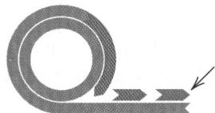

6.6 在所附滚环复制示意图中，指出子链所示末端的化学基团。

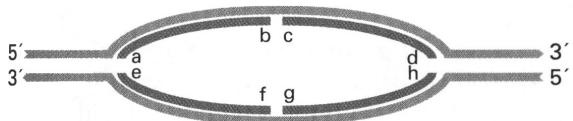

6.7 就此处所示的复制泡，指出每个复制叉中的前导链和后随链，并标出 $3'$ 和 $5'$ 端。

6.8 梅塞尔森和斯塔尔在他们的 DNA 复制实验中用来分离亲代和子代 DNA 分子的是:

(a) 放射自显影技术  
(b) 淀粉凝胶电泳  
(c) 密度梯度离心  
(d) 结晶学方法

6.9 在梅塞尔森-斯塔尔的 DNA 复制实验中，在含 ${}^{14}$ N 的培养基中生长一代之后，由一条轻链和一条重链

（“混合”）组成的 DNA 的比例是多少？在含 ${}^{14}N$ 的培养基中生长两代之后呢？在含 ${}^{14}N$ 的培养基中生长 n 代之后，预计混合 DNA 的比例是多少？

6.10 在此处所示的脱氧核糖示意图中,标出与糖的每个碳原子连接的原子或化学基团 $(a-d)$ 。

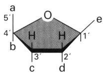

6.11 判断下面的结构是核苷还是核苷酸，指出其组分：哪一部分是糖？哪一部分是

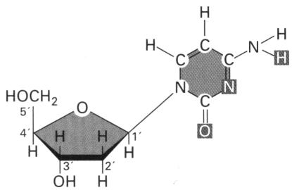

碱基？有磷酸吗？此处所示的碱基是嘌呤还是嘧啶？

6.12 此处所示的是每一端均为单链的两个双链 DNA 分子(这些单链末端称为“突出”端)。假设将这两种分子与 DNA 复制所需的所有组分一起放进一个试管中，并将该混合物置于一定温度下培养。会有聚合反应吗？如果有，指出所得产物。如果没有反应发生，解释原因。

5'-ATGGATCCTTATAAC -3' 5'-CTAGTACTGGTGC -3'
3'-CCTAGGAATATTGAT-5' 3'-GAAGATCATGACCA -5'

6.13 下面是一种脱氧核苷酸衍生物的结构。

(a) 是什么使得它与正常的脱氧核苷酸不同？

(b) 该核苷酸是嘌呤还是嘧啶？指出是什么碱基。

(c) 假设进行正确的碱基配对，在 DNA 复制过程中，DNA 聚合酶能够将该核苷酸加到 DNA 链上吗？解释。

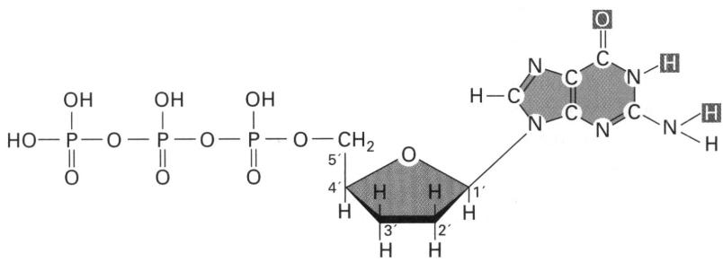

(d) 如果 DNA 聚合酶将该核

苷酸加到一条新 DNA 链上，这对 DNA 合成来说意味着什么？解释。

6.14 在梅塞尔森-斯塔尔实验中， $^{15}$ N 标记的细胞被转移到 ${}^{14}$ N 培养基中。对于半保留和保留复制模式，预计复制 1、2 和 3 轮之后 ${}^{15}$ N- ${}^{15}$ N、 ${}^{15}$ N- ${}^{14}$ N 和 ${}^{14}$ N- ${}^{14}$ N DNA 的比例是多少？

6.15 假设一个小行星探测器带回一种以 DNA 为遗传物质的病毒。梅塞尔森-斯塔尔实验显示，在 ${}^{14}N$ 培养基中复制一轮之后，一半的子代 DNA 双链体在两条链上都有 ${}^{15}N$ ，而另一半的子代 DNA 双链体在两条链上都有 ${}^{14}N$ ，解释这些数据的意义。

6.16 大肠杆菌的一个参考菌株具有一个包含 $4.3 \times 10^{6}$ 个碱基对的 DNA 环状基因组，复制开始于基因组中的某个位置，在两个方向上同时推进。在某一特定的生长条件下，每个复制叉每秒形成 800 个 DNA 碱基对。

(a)每个复制叉每分钟旋转的转数 $(\mathrm{r} / \mathrm{min})$ 是多少？

(b)在该条件下，复制全部大肠杆菌基因组要花多长时间？

6.17 将下列的酶(1\~5)与其功能(a\~e)配对:

1. DNA 连接酶 (a) 在复制过程中解旋DNA双螺旋  
2. DNA 聚合酶 (b) 在特异短序列处切割双链DNA  
3. DNA 解旋酶 (c) 将模板DNA拷贝成RNA  
4. RNA 聚合酶 (d) 复制DNA  
5. 限制酶 (e) 连接断裂的DNA链

6.18 在进化过程中，如果某种生物的双链 DNA 中鸟嘌呤所占的百分比下降了 5%，估计这对该 DNA 中腺嘌呤所占的比例会有什么影响？

6.19 一位生化学家分离并纯化了她认为是 DNA 复制所需的所有细胞组分。但当她加入模板 DNA 后，尽管发生了复制，但每个子代 DNA 分子都是由一条正常的链与无数个几百个核苷酸长的 DNA 片段配对组成。她可能在混合物中漏掉了什么？

6.20 某大肠杆菌突变株的 DNA 连接酶基因有一个突变，使得该酶在 $37^{\circ}$ C 有功能而在 $42^{\circ}$ C 无功能，这对 DNA 复制有什么影响？

6.21 在 DNA 研究的早期，有一种结合了化学和酶学的简洁而睿智的技术，使得科学家能够鉴定“毗邻”核苷酸(DNA 链中相邻的核苷酸)。例如，如果以这种方法处理单链四核苷酸 5'-AGTC-3'，毗邻会是 AG、GT 和 TC(除非另有说明，总是将核苷酸序列的 5'端写在左边)。在有 DNA 测序技术之前，毗邻分析被用来测定序列关系。毗邻分析表明，互补的 DNA 链是反向平行的，在本题中，要求通过预测一些毗邻的频率，来考察这一现象。假设已经测得如下毗邻的频率：AG，0.15；GT，0.03；GA，0.08；TT，0.10。

(a)毗邻CT、AC、TC和AA的频率是多少？

(b) 如果 DNA 具有平行 (而不是反向平行) 结构, 根据观测值会推断出怎样的毗邻频率?

6.22 从两个不同物种分离到的 DNA 具有相同的碱基比值 (A+T/G+C)。这是否意味着它们具有相同的毗邻频率？(如果对毗邻不熟悉，参考第 21 题)

6.23 与第 22 题相反，具有相同毗邻频率的生物，会具有相同的碱基比值 (A+T/G+C) 吗？

6.24 在滚环复制过程中，在最初的单链缺口产生之后，环状 DNA 的哪一条链成为前导链、哪一条链成为后随链？

6.25 在滚环复制过程中，两条亲代 DNA 链是同时复制还是其中一条链先复制？

6.26 假设一个 “轻的” ( $^{14}$ N 标记的) DNA 双链体与一个 “重的” ( $^{15}$ N 标记的) DNA 双链体形成一个霍利迪结构，霍利迪连接体刚好在链的正中间。将该霍利迪连接体解离，然后在 CsCl 梯度中离心，所得分子的密度会是怎样的？

6.27 下列核苷酸序列存在于一个复制叉处的 DNA 双链体的一条链上。从粗体所示碱基开始拷贝，在该模板上合成一条 RNA 引物。

$$
3 ^ {\prime} - \dots \text { AGTAGATACGTCCAG } \dots - 5 ^ {\prime}
$$

(a) 如果该 RNA 引物由 8 个核苷酸组成，它的碱基序列是什么？

(b) 在完整的 RNA 引物中，哪一个核苷酸具有一个游离的羟基(—OH)末端？

(c)与引物 $5'$ 端连接的化学基团是什么？

(d) 如果该亲代 DNA 链的反向链被作为前导链进行复制，复制叉是从左向右移动还是从右向左移动？

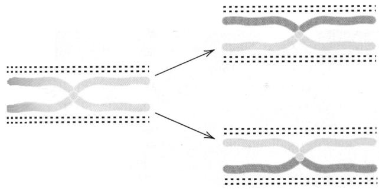

代表嘧啶(C 或 T)。

6.28 左图示存在 BUdR 的情况下，分别经过一轮和两轮 DNA 复制之后，有丝分裂中期染色体的荧光图。虚线代表每条染色单体中的 DNA 双螺旋的 DNA 链。图示每条染色单体的 BUdR 标记情况，方法是：(1) 如果链被 BUdR 标记，将虚线变为实线；(2) 如果链未被 BUdR 标记，保持虚线状态。

6.29 下列关于双链 DNA 的说法哪些是正确的？解释理由。符号 R 代表嘌呤(A 或 G)，Y

(a) $\mathrm{A + C = G + T}$

(b) $\mathrm{A + G = T + C}$

(c) R=Y

(A) (B)

6.30 所附凝胶图中所示的两段 DNA 序列有什么差别？颜色代码为黑色(G)、绿色(A)、红色(T)和紫色(C)。

## 挑战题

挑战题 1 此处所示的有丝分裂期染色体是在存在 BUdR 的情况下经过两轮 DNA 复制后观

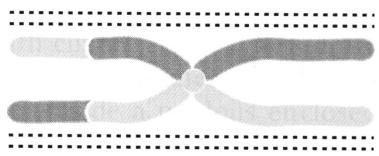

察到的。虚线代表每条染色单体中 DNA 双螺旋的 DNA 链。解释这样一种荧光图可能是什么过程导致的。图示每条染色单体的 BUdR 标记情况，方法是：(1) 如果链被 BUdR 标记，将虚线变为实线；(2) 如果链未被 BUdR 标记，保持虚线状态。

挑战题2 在出芽酵母酿酒酵母中进行一次涉及4个连锁基因的杂交 $(A B C D \times a b c d)$ 。在DNA上基因 $B$ 和 $C$ 极其靠近。在200个子囊中，发现一个子囊所含孢子为 $A b c d$ 、 $a b c D$ 、 $A B C D$ 和 $a b c D$ 。

(a)该子囊有什么不同寻常之处?

(b)能否用单一事件对其进行解释？

(c) 对 $(A, a)$ 和 $(D, d)$ 这两对等位基因而言，该四分体的类型对该事件意味着什么？

(d)一个含 $A b c D$ 、 $a b c d$ 、 $A B C D$ 和 $a b c d$ 的子囊可以有相同的解释吗？

挑战题3 分析来自粗糙链孢霉中一次涉及三个连锁基因杂交 $(\mathrm{his}^{+}\mathrm{co}^{+}\mathrm{leu}^{+}\times \mathrm{his}$ co leu)的四分体。有一小部分子囊表现出每种标记的 $3:1$ 分离，解释如下结果。

(a) 在具有 his 的 3:1 分离的子囊中，co-leu 对表现为 PD>>NPD (连锁)。

(b) 在具有 $co$ 的 3:1 分离的子囊中, his-leu 对表现为 PD=NPD (不连锁)。

(c) 在具有 leu 的 3:1 分离的子囊中，his-co 对表现为 PD>>NPD (连锁)。

## 网上遗传学

“网上遗传学”(GeNETics)会为你介绍在互联网上寻找遗传学信息的某些最重要的站点。要浏览这些站点，请访问为《遗传学：基因和基因组分析》(第八版)配备的 Jones and Bartlett 公司配套站点http://biology.jbpub.com/book/genetics/8e/。

在该站点中，你会找到一个按章开列的重点关键词列表。选择某个关键词后，可链接到某个网站，其中包含与此关键词相关的信息。
