# 第7章 染色体的分子组织

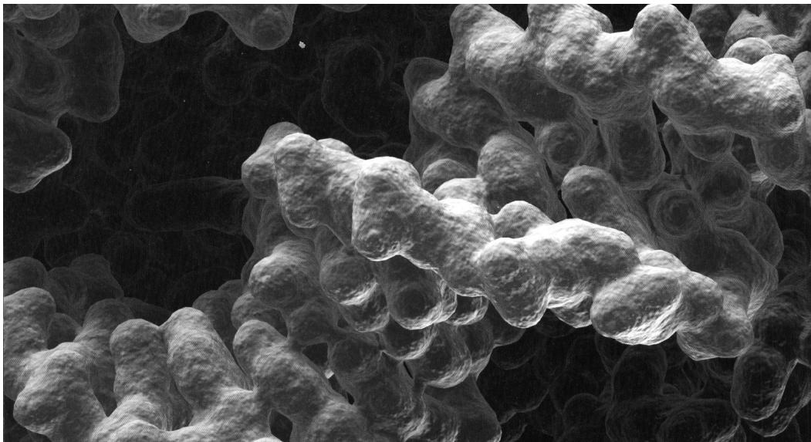  
盘绕的核小体纤维的数字化模型。[ $^{©}$ Kenneth Edward/Photo Researchers, Inc.]

## 本章提纲

7.1 基因组大小和进化复杂度：C 值悖理

7.2 DNA 的超螺旋化

7.3 细菌染色体结构

7.4 真核生物染色体结构

7.5 多线染色体

7.6 真核生物基因组的重复核苷酸序列

7.7 真核生物基因组的单一序列和重复序列

7.8 着丝粒的分子结构

## 7.9 端粒的分子结构

联系：后基因组遗传学

肖恩·艾哈迈德和乔纳森·霍奇金，2000秀丽隐杆线虫的种系永生和端粒复制需

要 MRT-2 检查点蛋白

联系：端粒——结束的开始

卡萝尔·格雷德和伊丽莎白·布莱克本，1987

四膜虫的端粒末端转移酶是具有两种引物专一性的核糖核蛋白酶

## 学习目标与科学能力

染色体的分子组织的知识有助于掌握以下科学能力。

\- 能比较细菌细胞和真核生物细胞在基因组 DNA 的分子组织上的异同。

■ 能叙述核小体的结构，并能解释为什么组蛋白尾的可访问性对于化学修饰很重要。

\- 能区分 DNA 中的高度重复序列、中度重复序列和单一序列，并能解释怎样用 DNA 复性来估计这几类序列的相对比例。

\- 能准确描述着丝粒的功能，并能陈述预测无着丝粒(或有两个着丝粒)的异常染色体在有丝分裂和减数分裂中的行为的假说。

\- 能图示正在进行 DNA 复制的双链 DNA 分子的一端。能解释为什么两条链都不能一直复制到末端及端粒如何恢复缺少的部分。能预测端粒酶中导致指导 RNA 单碱基改变的突变的后果。

在本章中，考察原核生物基因组和真核生物染色体的分子结构。原核生物和真核生物的基因组大小和组织方式差异巨大。原核生物为单细胞生物，基因组相对较小，由包含必要的遗传信息的一个或多个DNA分子组成。原核生物基因组通常仅由一个DNA分子组成，但在有些原核生物中，必要的基因被分成两个或多个分子。原核生物细胞也可含一个或多个拷贝的附属DNA分子(质粒)，它们包含非必需的信息。原核生物基因组及质粒往往为环状DNA分子，但有些原核生物基因组和质粒为线状。真核生物细胞通常具有较大的基因组，为线性DNA分子形式，与特征性的蛋白质(组蛋白)一道包装成染色体，聚集在核膜包绕的细胞核中(偶见环状染色体，但它们是畸变染色体)。线粒体和叶绿体中的DNA分子也为环状，这些细胞器的遗传学是第16章的主题。

## 7.1 基因组大小和进化复杂度：C 值悖理

表 7.1 概括了基因组大小的一个小样本。噬菌体 MS2 是最小的病毒之一，它只有 4 个基因，在一条含 3569 个核苷酸的单链 RNA 分子中。感染猴子和人类细胞的 SV40 病毒具有 5 个基因的基因组，在一个约 5kb (5000 个核苷酸对) 的环状双链 DNA 分子中。更复杂的噬菌体和动物病毒有多达 250 个基因，DNA 分子大小 50～300kb。原核生物基因组的大小大幅增加，古细菌基因组 [例如，詹氏甲烷球菌 (Methanococcus jannaschii)] 的大小一般与细菌基因组相似。有些原核生物基因组由线状 DNA 组成，其他的由环状 DNA 组成。例如，莱姆病的病原体伯氏疏螺旋体 (Borrelia burgdorferi) 的染色体为一个大约 910kb 的线状 DNA 分子，而大肠杆菌 (Escherichia coli) K12 株的染色体为一个 4600kb 的环状 DNA 分子。单细胞真核生物的基因组更大，出芽酵母酿酒酵母 (Saccharomyces cerevisiae) 的基因组大小为 13000kb。表示基因组大小的核苷酸长度单位通常如下。

1. 千碱基(kilobase, kb) $10^{3}$ 个核苷酸亚单位

2. 百万碱基(megabase, Mb) $10^{6}$ 个核苷酸亚单位

## 3. 十亿碱基(gigabase, Gb) $10^{9}$ 个核苷酸亚单位

以这些术语来表示，病毒基因组通常在 100～1000kb，细菌基因组通常在 1～10Mb，而真核生物基因组通常在 100～1000Mb（最小的真核生物基因组约为 10Mb）。

表 7.1 一些典型病毒、细菌和真核生物的基因组大小

<table><tr><td>基因组</td><td colspan="2">近似的基因组大小(千核苷酸)</td><td>形式</td></tr><tr><td>病毒</td><td></td><td></td><td></td></tr><tr><td>MS2</td><td>4</td><td rowspan="5">}</td><td rowspan="2">单链 RNA</td></tr><tr><td>人类免疫缺陷病毒(HIV)</td><td>9</td></tr><tr><td>科罗拉多蜱热病毒</td><td>29</td><td>环状双链 RNA</td></tr><tr><td>SV40</td><td>5</td><td rowspan="2">环状单链 DNA;双链复制型</td></tr><tr><td> $\Phi X174$ </td><td>5</td></tr><tr><td>λ</td><td>50</td><td rowspan="4">}</td><td rowspan="4">线状双链 DNA</td></tr><tr><td>单纯疱疹病毒</td><td>152</td></tr><tr><td>T2、T4、T6</td><td>165</td></tr><tr><td>天花病毒</td><td>267</td></tr><tr><td>原核生物</td><td></td><td></td><td></td></tr><tr><td>Methanococcus jannaschii(詹氏甲烷球菌)</td><td>1600</td><td rowspan="3">}</td><td rowspan="2">环状双链 DNA</td></tr><tr><td>Escherichia coli K12(大肠杆菌 K12 株)</td><td>4600</td></tr><tr><td>Borrelia burgdorferi(伯氏疏螺旋体)</td><td>910</td><td>线状双链 DNA</td></tr><tr><td>真核生物</td><td></td><td>单倍染色体数目</td></tr><tr><td>Saccharomyces cerevisiae(酿酒酵母,酵母)</td><td>1.3万</td><td>16</td></tr><tr><td>Caenorhabditis elegans(秀丽隐杆线虫,线虫)</td><td>9.7万</td><td>6</td></tr><tr><td>Arabidopsis thaliana(拟南芥,墙头芥)</td><td>10万</td><td>5</td></tr><tr><td>Drosophila melanogaster(黑腹果蝇,果蝇)</td><td>18万</td><td>4</td></tr><tr><td>Takifugu rubripes(红鳍东方鲀,鱼)</td><td>40万</td><td>22</td></tr><tr><td>Homo sapiens(人)</td><td>300万</td><td>23</td></tr><tr><td>Zea mays(玉米)</td><td>450万</td><td>10</td></tr><tr><td>Amphiuma means(二趾两栖鲵,蝾螈)</td><td>9000万</td><td>14</td></tr></table>

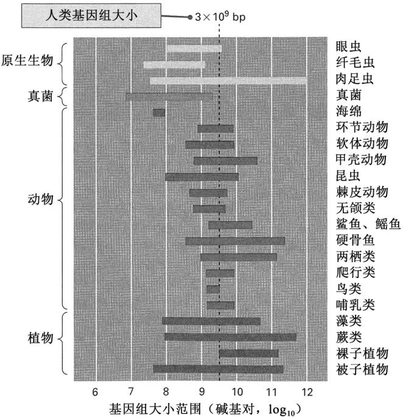  
图 7.1 在某些生物类群中，基因组大小的变化可达几个数量级，且基因组大小与发育、代谢或行为的复杂程度没有相关性。

然而，在多细胞真核生物中，具有相同的代谢、发育和行为复杂水平的物种之间，基因组大小常常差异巨大，这种相关性的缺乏称为 C 值悖理 (C-value paradox)。这种差异往往很大。原生动物之间在基因组大小上的差异为 5800 倍，节肢动物之间为 250 倍，鱼类 350 倍，藻类 5000 倍，而被子植物为 1000 倍(图 7.1)。注意到两栖鲵的基因组比人类基因组大 30 倍，用 “悖理” 这个词真是再贴切不过了。

C 值悖理不是因为基因数量有差异。例如，水稻和玉米的基因(转录物和蛋白质)数量大致相同，但玉米基因组为 2.5Gb，约为水稻基因组(0.4Gb)的 6 倍。在几乎所有的高等动植物中，实际的基因数量比理论上的最大值要少得多。这一矛盾的原因是，在高等生物中，大量 DNA 具有编码蛋白质氨基

酸序列之外的功能(如将在第 10 章中看到的那样)，且其余的大部分由转座因子和 7.6 节中讨论的其他类型的重复序列构成。

C 值悖理一例。日本河豚(红鳍东方鲀, Takifugu rubripes)的基因组大小为 400Mb；二趾两栖鲵(Amphiuma means)的基因组为 90 000Mb。后者并不比前者复杂。[左边照片：©Ken Lucas/Visuals Unlimited；右边照片：©Phil Dotson/Photo Research。]

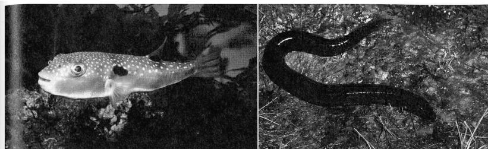  
7.2 DNA 的超螺旋化

大肠杆菌基因组是一个长约 $1500 \mu m$ 的环状 DNA 分子, 压缩在一个长仅约 $2 \mu m$ 、直径约 $1 \mu m$ 的细胞内。该 DNA 分子必须压缩，否则细胞内会放不下。同时，当需要基因表达时，这些基因要能够转录。该环状染色体的压缩，部分是由于它是超螺旋的 (supercoiled)，意思是双链 DNA 片段相互盘绕，有点像电话线自身相互缠绕的方式。超螺旋化的几何形状可用一个简单的例子来解释 (图 7.2)。首先想象一个线状双链 DNA 分子，连接其两端，使每条链成为一个连续的环。如果除了螺旋扭转之外，没有其他扭转 (图 7.2A)，这种共价闭合环状的 DNA 分子被称为松弛 (relaxed) 分子。松弛环的单条多核苷酸链形成通常的右手 (正) 螺旋结构，每圈螺旋有 10 对核苷酸。假设切断松弛环中的一条链，让它绕另一条链解开，旋转完整的一圈 (360°)，以使双螺旋解开完整的一转。当断开的两端重新连接后，会得到一个“盘绕不足”的环状螺旋。因为 DNA 分子具有维持其每圈 10 对核苷酸的标准螺旋形式的强烈倾向，该环状分子会对盘绕不足作出以下两种方式之一的反应：(1) 形成具有“泡”的区域，在泡中的碱基不配对 (图 7.2B)；(2) 向盘绕不足的方向的反方向扭转该环状分子。这种扭转就是超螺旋化，而具有向右扭转的分子为负超螺旋 (negatively supercoiled) 分子 (图 7.2C)。超螺旋分子的例子如图 7.2C 和图 7.2D 所示。这两种对螺旋不足的反应不是独立的，螺旋不足往往由这两种过程联合应对：一个螺旋不足的分子，含有一些未配对碱基的泡和某种程度的超螺旋，尽管超螺旋占主导地位。

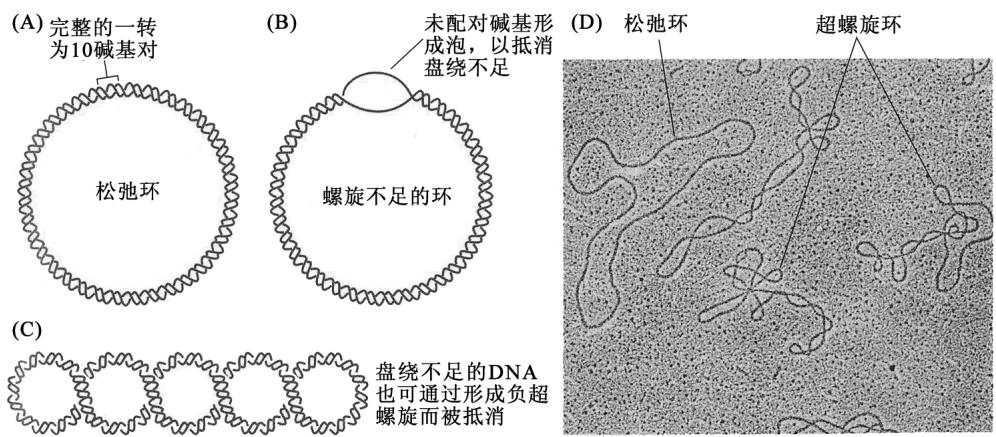  
图 7.2 共价环的不同状态。(A)具有 36 圈螺旋的非超螺旋(松弛)共价环。(B)只有 32 圈螺旋的螺旋不足的共价环。(C)B 部分中的分子，但具有 4 次扭转，以消除螺旋不足。(D)电子显微照片，示 PM2 噬菌体带缺口的环和超螺旋 DNA。注意在 C 部分中没有非配对碱基。在溶液中，B 部分和 C 部分会处于平衡状态。[D 部分承田纳西州孟菲斯市圣犹大儿童研究医院戈帕尔·默蒂(K. Gopal Murti)馈赠。]

大肠杆菌和大多数其他细菌具有负超螺旋 DNA，而大多数嗜热菌和其他古细菌界的成员具有正超螺旋 DNA，在正超螺旋 DNA 中，双螺旋相对地螺旋过度，在超螺旋 DNA 中的扭曲是向左的。真核生物中的超螺旋化是怎样的呢？真核生物染色体中的 DNA 通常只有为数不多的超螺旋区域，并且这些区域通常靠近正被活跃转录的基因。

## - 拓扑异构酶

天然 DNA 分子的超螺旋化是 DNA 拓扑异构酶 (topoisomerase) 的产物。其中，有一类酶称为拓扑异构酶 I，其作用方式是环绕 DNA 双链体将 DNA 完全包裹起来，使一条 DNA 链主链上的一个磷酸二酯键断裂，产生一个单链切口。两个切口端围绕完整的链旋转，改变螺旋扭曲状态 (螺旋圈数)。然后，切口重新封闭，双链从酶上释放。拓扑异构酶 I 可增减超螺旋的量，视具体情况而定。

第二类拓扑异构酶称为拓扑异构酶Ⅱ。这些酶工作的方式是，在一个分子中，在有另一个分子穿越之处，生成一个双链缺口。以这种方式，拓扑异构酶Ⅱ可让一个DNA双链体整个穿越另一个双链体，或使扣在一起的两个环状DNA分子分开。出芽酵母酿酒酵母的拓扑异构酶Ⅱ的作用机制如图7.3所示。该酶的分子结构包括两套“钳夹”，两者的位置略呈直角(图7.3A)。

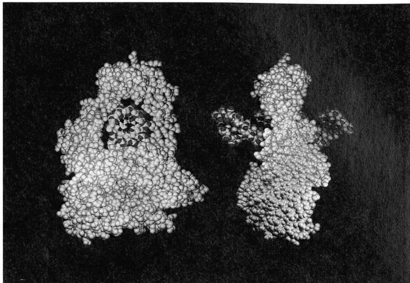  
利马(Lima)等提出的双链DNA与拓扑异构酶I结合的结构，DNA从酶形成的一个孔中穿过。两图的视角相互垂直。该酶的结构中含一对可以开合的钳状突起。此处所示的中间体是酶的两个钳子将一个DNA分子完全围住而成。接下来，一条DNA链被切断、旋转并重新连接，然后两个钳子打开，释放DNA分子。[经Macmillan Publishers Ltd许可重印：C.D.Lima,J.C.Wang,and A.Mondragon, Nature 367 (1994):138-146, http://www.nature.com/nature。]

里面的那对钳夹夹住一个双链体，外面的那对夹住另一个双链体(图7.3B和C)。为使外面的DNA分子能够完整地穿过里面的那条DNA分子，里面的双链体先被断开，然后外面的双链体穿过缺口(图7.3D和E)。穿过之后，缺口被修复，两个分子被释放(图7.3E)。

在没有维持超螺旋的蛋白质时，超螺旋 DNA 分子中的任一切口都会使所有的超螺旋消除，因为应力会因为完整的链绕着与切口相对的糖-磷酸键的自由旋转而释放。因此，任何使 DNA 产生切口的处理，都会使超螺旋松弛。单链切口可由多种酶产生，如切割糖-磷酸键的脱氧核糖核酸酶(deoxyribonuclease, DNase)。

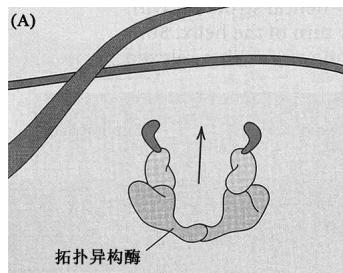

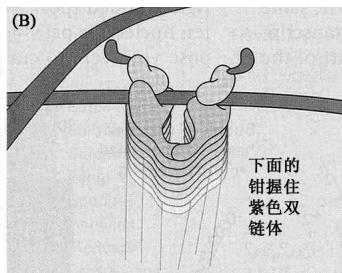

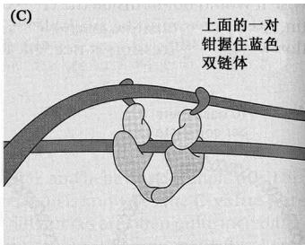

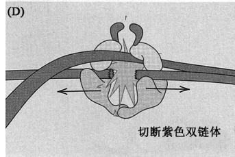

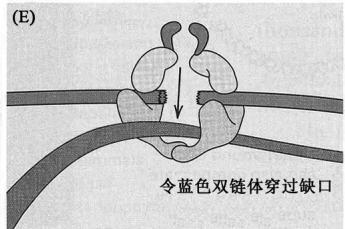

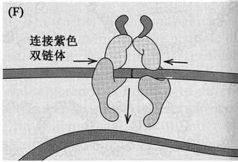  
图 7.3 拓扑异构酶Ⅱ通过切断一条 DNA 双链并让另一条双链穿过缺口，解开一对 DNA 分子之间的结。[改编自 J. M. Berer, et al., Nature 379 (1996):225-232.]

## 7.3 细菌染色体结构

在细菌细胞中，DNA 的压缩一部分是因为超螺旋化，另一部分是因为与 DNA 结合的蛋白质，使 DNA 分子缠绕、弯曲或压缩。在这一包装水平有 4 种蛋白质(HU 负责缠绕，FIS 和 IHF 负责弯曲，HNS 负责压缩)起主要作用，它们共占细胞总蛋白质的 10% 左右。最终结果是，大肠杆菌的染色体变成一个压缩体，称为折叠染色体或拟核(nucleoid)。对于该结构而言，染色体这个词严格说来是用词不当，因为从真核生物染色体的意义上来说，它不是真正的染色体。不过，该词已经被广泛应用。细菌拟核最显著的特点是，DNA 被组织成一系列环状域(loopeddomain) (图 7.4)。从细菌细胞中分离出来时，拟核含少量的数种蛋白质，这些蛋白质被认为是造成多重环状结构的原因。拟核的压缩程度(即其物理尺寸)受许多因素的影响，因而，关于细胞内拟核的状态，还存在一些争议。

图 7.4 也显示了大肠杆菌染色体中超螺旋的 DNA 袢环。那些没有超螺旋的袢环，是在分离过程中 DNase 作用的结果。同时存在超螺旋袢环和松弛袢环，说明这些袢环在某种程度上是相互独立的。在上一节中曾提到，在一个 DNA 分子中的超螺旋化一般会因一次单链断裂而被消除。可是，在大肠杆菌染色体中那样的一次断裂，不能消除所有的超螺旋。如果用 DNase 来处理所有袢环都超螺旋化的拟核，并在处理后的不同时间进行检查，可观察到超螺旋的消除是每次消除一个袢环的超螺旋，而不是所有袢环中的超螺旋同时消除(图 7.5)。这些袢环必定以某种方式彼此隔离，以致在一个袢环中的旋转不会传递给其他袢环。这种独立性可能是结合于 DNA 的蛋白质在某种程度上阻止了螺旋旋转的结果。

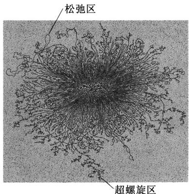  
图 7.4 大肠杆菌染色体的电子显微照片,示从中心区域发出的多重袢环。[承布鲁诺·齐姆(Bruno Zimm)和露丝·卡维诺夫(Ruth Kavenoff)惠赠。经加州大学圣地亚哥分校乔治亚娜·齐姆(Georgianna Zimm)许可使用。]

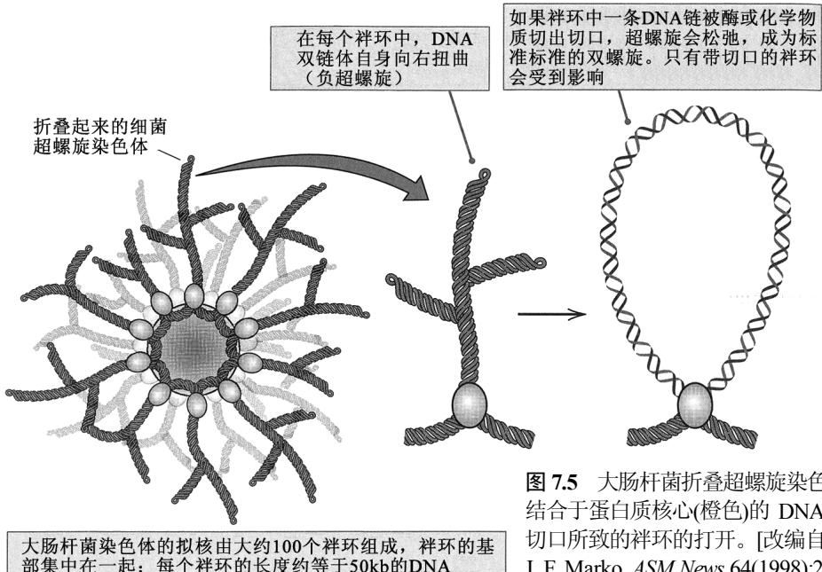  
图 7.5 大肠杆菌折叠超螺旋染色体示意图，示结合于蛋白质核心(橙色)的 DNA 袢环(蓝色)和切口所致的袢环的打开。[改编自 N. J. Trun and J. F. Marko, ASM News 64(1998):276-283.]

## 7.4 真核生物染色体结构

真核生物遗传装置的一个显著特征是染色体包装的壮举：遗传物质的巨大长度被压缩进很少的小染色体中。在23条人类染色体中，最大的染色体所含的DNA分子长度为 $82\mathrm{mm}$ $(8.2\times 10^{4}\mu \mathrm{m})$ 。然而，在有丝分裂中期，该DNA分子被压缩成一个大约 $10\mu \mathrm{m}$ 长、直径不到 $1\mu \mathrm{m}$ 的致密结构。为了更容易理解这样的染色体压缩究竟意味着怎样的包装上的惊人壮举，可以打个比方。假如人类1号染色体(最大的染色体)中的DNA分子是一根直径为 $1\mathrm{mm}$ 的煮熟的意大利面条，它拉直了会有25英里长。在染色体压缩过程中，这根面条被收拢来，卷了又卷，直到中期时，它变成一个16英尺长、2英尺宽的独木舟大小的面团，细胞分裂后，这根面条再次展开。

## ■ 核小体：染色质的结构单位

所有真核生物染色体的 DNA 都与众多的蛋白质分子一起存在于一个称为染色质 (chromatin) 的稳定、有序的聚集体中。染色质中的一些蛋白质决定染色体结构及在细胞分裂周期中出现的结构上的改变。其他染色质蛋白似乎在调节染色体功能上发挥重要作用。

## ■ 核小体核心颗粒

最简单的染色质形式存在于非分裂的真核生物细胞中，此时染色体尚未充分压缩，在光学显微镜下看不到。从这类细胞中分离到的染色质是一种复杂的 DNA 和蛋白质的聚集体。主要的一类蛋白质是组蛋白(histone)，组蛋白主要负责染色质的结构。在几乎所有真核生物的染色质中都存在 5 种主要的组蛋白——H1、H2A、H2B、H3 和 H4，其总重量与 DNA 大致相等。组蛋白是比较小的蛋白质(100～200 个氨基酸)，组蛋白与其他大多数蛋白质的差异在于，它有 20%～30% 的氨基酸是赖氨酸和精氨酸，这两种氨基酸都带正电荷(典型蛋白质的氨基酸仅有几个百分点是赖氨酸和精氨酸)。这些正电荷使组蛋白分子能够与 DNA 结合，主要是通过静电吸引力与 DNA 糖-磷酸主链中带负电荷的磷酸基结合。将染色质置于高盐浓度的溶液(如 2mol/L 的 NaCl) 中以消除静电吸引力，会导致组蛋白从 DNA 上解离。组蛋白也紧密地相互结合，DNA-组蛋白结合和组蛋白-组蛋白结合对染色质结构都非常重要。

不同生物的组蛋白分子极其相似，但 H1 例外。事实上，来自差异极大的物种的 H3 分子的氨基酸序列，几乎一模一样。例如，牛染色质和豌豆染色质的 H3 序列，在 135 个氨基酸中只有 4 个有差别。所有生物的 H4 蛋白质也非常相似：牛和豌豆的 H4，在 102 个氨基酸中仅 2 个有差别。从一个物种到另一个物种，氨基酸序列变异如此小的其他蛋白质是很少的。当生物之间的这种变异非常小时，称这种序列为高度保守 (conserved) 序列。虽历经数亿年的进化趋异，

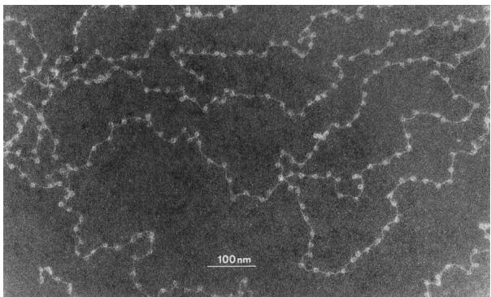  
图 7.6 染色质暗视野电子显微照片，示低盐浓度下的串珠状结构。这些珠子的直径约为 100Å。[承鲍登大学埃达·奥林斯(Ada L. Olins)和唐纳德·奥林斯(Donald E. Olins)惠赠]。

在组蛋白成分中仍具有这种非凡的保守性，与这些蛋白质在真核生物染色体的结构组织中的重要作用是一致的。

在电子显微镜下，染色质看起来像一根均匀地串着珠子的线(图 7.6)。染色质中的珠状单位称为核小体(nucleosome)。染色质中核小体的组织方式如图 7.7A 所示。每个核小体单位具有明确的组分，包含 H2A、H2B、H3 和 H4 各两个分子，一段约 200 对核苷酸的 DNA，以及一个组蛋白 H1 分子。H2A、H2B、H3 和 H4 各两个亚单位的复合体，加上部分 DNA，形成每个“珠子”，余下的 DNA 和组蛋白 H1 连接在珠子之间。

以某种 DNase(例如，来自金黄色葡萄球菌的微球菌核酸酶)短时处理染色质，会产生许多仅由组蛋白和 DNA 组成的大小一致的小颗粒。这些颗粒中的 DNA 片段的长度约为 200 个核苷酸对，或者为该单位的几倍(确切大小随物种和组织而变化)。这些颗粒是珠子之间的接头 DNA(linker DNA)片段断裂的结果(图 7.7B)。更深程度的 DNase 处理会导致 H1 组蛋白的丢失，以及除在珠子中受组蛋白保护的 DNA 之外的所有 DNA 的消化。这样得到的结构称为核心颗粒(core particle)，其精细结构如图 7.8 所示，核心颗粒包括 H2A(黄色)、H2B(红色)、H3(蓝色)和 H4(绿色)各两分子，围绕着它有一段大约 145 个核苷酸对的 DNA。每个核小体由一个核心颗粒、相邻核心颗粒之间的接头 DNA(可被核酸酶深度消化去除)和一个 H1 分子组成，H1 与组蛋白八聚体及接头 DNA 结合，导致从核心颗粒向两侧延伸的接头交叉并更靠近八聚体，尽管部分接头 DNA 不会接触任何组蛋白。不同物种的接头大小为 20～100 个核苷酸对，甚至在同种生物的不同细胞类型中也有变化(通常认为平均大小为 55 个核苷酸对)。关于接头 DNA 的结构及其是否具有特殊的遗传功能，知之甚少，其长度变异的原因也未知晓。

(A)  
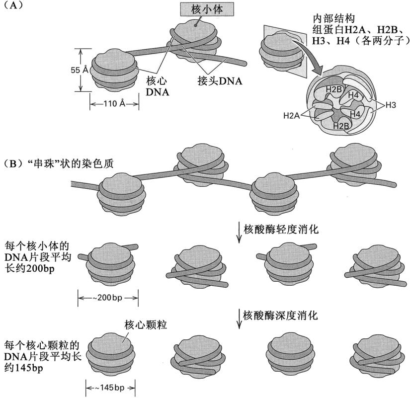

图 7.7 (A) 核小体的组织方式。DNA 分子围绕组蛋白八聚体(称为核心颗粒)缠绕 13/4 圈。如果存在 H1，它会与八聚体的表面及接头结合，导致接头相交。(B)以微球菌核酸酶处理的效果。短时处理会切断核小体之间的 DNA，产生与组蛋白 H1 及约 200bp DNA 连接在一起的核心颗粒。更深程度的处理会导致 H1 丢失，并且，除了与核心颗粒紧密结合的 145bp DNA 之外，所有 DNA 都会被消化掉。

占组蛋白全长约 25% 的氨基端称为组蛋白尾 (histone tail)，它们可允许某些酶造访，这些酶对特定的氨基酸残基进行修饰，如将一个或多个乙酰基 ( $—COCH_{3}$ )、甲基 ( $—CH_{3}$ ) 或磷酸基 [ $—OP(=O)(OH)_{2}$ ] 加到氨基酸上。这些组蛋白乙酰化酶、甲基化酶或磷酸化酶导致的修饰，可被相应的组蛋白去乙酰化酶、去甲基化酶或去磷酸化酶逆转。

组蛋白的修饰，尤其是组蛋白 H3 和 H4 的修饰，具有很重要的生物学功能。例如，人类基因组中约 40% 的重组热点具有组蛋白甲基转移酶 PRDM9 的 DNA 结合位点，PRDM9 将 3 个甲基 $(-CH_{3})$ 转移到 H3 组蛋白尾的第 4 位氨基酸（赖氨酸）上，产生的修饰组蛋白以 H3K4me3 表

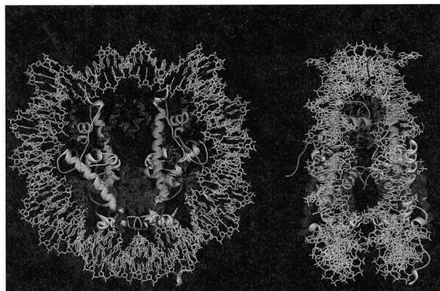  
图 7.8 核小体核心颗粒的亚单位结构，DNA 双链体围绕其缠绕。组蛋白单体的颜色编码为：H2A，黄色；H2B，红色；H3，蓝色；H4，绿色。[Protein Data Bank 1AOI, K. Luger, et al., Nature 389 (1997): 251-260.]

示(K 是表示赖氨酸的符号)。H3K4me3 的存在使该区域的 DNA 容易发生双链断裂，这会启动重组相关的双链断裂修复过程(第 6 章)。

组蛋白尾的修饰对于基因活性也很重要。乙酰化的组蛋白往往与 DNA 结合得较为松散，通常会使得染色质更方便转录；而甲基化的组蛋白促进或阻碍转录，取决于被修饰的具体的组蛋白残基。组蛋白修饰被认为是染色质重塑(chromatin remodeling)的重要特征，染色质重塑发生在基因活性的调节过程中，这将在第 11 章详细讨论。

■ 细胞核中的染色体域

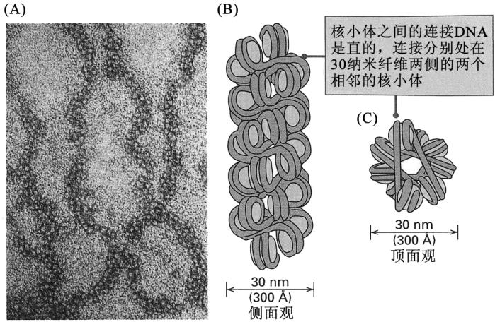  
图 7.9 (A) 小鼠染色体 30 纳米染色质丝的电子显微照片。(B 和 C) 染色质丝的模型，其中，DNA(蓝灰色)围绕每个核小体盘绕。[A 部分，承加州大学欧文分校芭芭拉·哈姆卡罗 (Barbara A. Hamkalo) 惠赠。B 部分，改编自 J. T. Finch and A. Klug, Proc. Natl. Acad. Sci. USA 73 (1976): 1897-1901.]。

纳米染色质丝被组织成可用现代光学切片和图像重建方法观察到的高级结构。图 7.10 示非分裂细胞核内 30 纳米染色质丝的计算机成像图。这些染色质丝被折叠成染色质环 (chromatin loop)，每个染色质环的 DNA 含量约为 100kb，染色质环被进一步组织成染色质域 (chromatin domain)，每个染色质域的 DNA 含量约为 1Mb。每条染色体臂占据一个独立的染色体域 (chromosome territory)，以不同的颜色表示。在进行有丝分裂的细胞中，当染色体压缩和细胞分裂时，染色体域瓦解，但在下一个间期它们再次重建。不过，在不同类型的细胞中，以及在同类细胞的不同发育时期，染色体域的位置可能不同。

乍看之下，图 7.10 中的染色质折叠方式如一团乱麻，但实际上染色质是以避免缠结的方式精心折叠的。该图像的证据来自这样的实验：用化学方法使相互靠近的 DNA 片段交联，然后分离、测序，以判断哪些染色体紧靠在一起。结果表明，间期染色质是以所谓的分形小球 (fractal

在活细胞中存在的盐浓度下，核小体纤维被压缩成平均直径为300～350Å的较短、较粗的纤维，这种纤维称为30纳米染色质丝(30-nm chromatin fiber)(图7.9，A部分)。在形成30纳米染色质丝的过程中，核小体纤维形成一连串堆叠起来的向右转的线圈(B部分)，其中，每个核小体都通过几乎是笔直地伸展、横穿到线圈对面的接头DNA，与其相邻的核小体连接。从30纳米纤维的顶部往下看(C部分)，可跟踪接头DNA沿着纤维纵向向下行进的路径。在围绕纤维轴的每次旋转中，接头DNA的路径非常接近于七角星的形状。

在非分裂细胞的细胞核中，30

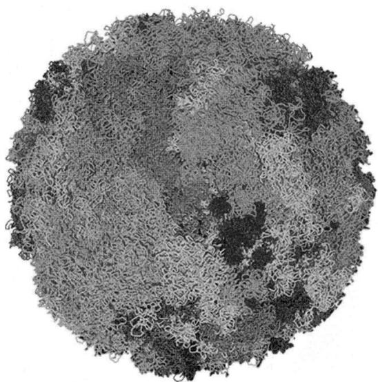  
图 7.10 在一个非分裂细胞的细胞核内,由 30 纳米染色质丝形成的染色体域的计算机成像图。[承荷兰鹿特丹伊拉斯谟医学中心及德国海德堡大学基尔霍夫物理研究所托拜厄斯·诺奇(Tobias A. Knoch)惠赠：TA.Knoch@taknoch.org。]

globule)的形式折叠起来的，在分形小球中，染色质丝采取的走向既允许紧密堆积又没有缠结。水手懂得精心地盘绳子，让绳子既能快速放松，又不形成缠结，与此相仿，间期染色质线圈既容易访问又容易解旋。分形小球型的折叠使染色质区域或单个基因能够在对附近区域或基因干扰最小的情况下去折叠或重新组织。

染色体域与基因密度相关。含基因相对较少的染色体域，往往位于细胞核边缘或靠近核仁，而基因相对丰富的染色体域往往靠近细胞核的中心区域。例如，人类18号染色体(大小为85Mb)基因相对贫乏，而19号染色体(大小为67Mb)基因相对丰富，在细胞核中，18号染色体域往往位于细胞核外缘，而19号染色体域往往位于中心区域。

染色质域之间的空间形成一个通道网络，如同遍布海绵的孔眼。这些通道大到足以让复制、转录和 RNA 加工的分子机器通行。有证据表明，这些分子通过被动扩散得以接触到染色质。复制、转录和 RNA 加工都是有序的过程，DNA 复制发生在小的不连续区域中，这些区域表现出可重复出现的时空模式，而转录在数百个不连续的位置进行。不过，关于细胞核中染色质的组织方式，以及染色质域在协调复制、转录和 RNA 加工的核心分子过程中如何发挥功能，有许多重要的细节仍未知晓。

## ■ 染色体压缩

染色体结构的层级性如图 7.11 所示。DNA 和组蛋白的组装是第一级，导致 DNA 长度减小为原来的 1/7，形成宽 110Å(11nm) 的串珠状柔韧纤维（图 7.11B），宽度大约为游离 DNA 的 5 倍（图 7.11A）。染色质的结构随盐浓度而变化，该 110Å 纤维仅当盐浓度很低时才存在。在活细胞中，110Å 纤维通常被压缩成 30 纳米染色质丝（图 7.11C），其在间期细胞核中被折叠成 100kb 的染色质环，染色质环被组织成 1Mb 的染色质域，染色质域形成染色体域。

在进行有丝分裂的细胞中，间期染色质的组织方式被一种更紧凑的组织方式代替，其中，30 纳米染色质丝压缩成中期染色体的

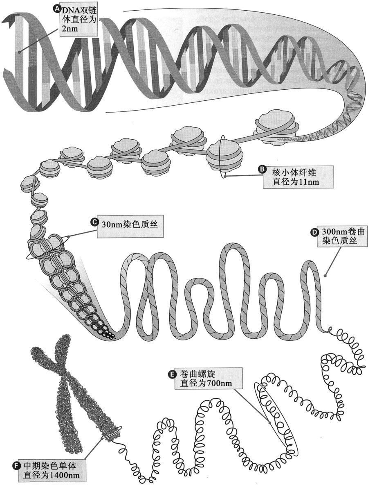  
图 7.11 在形成中期染色体(F)的过程中，DNA(A)和染色质(B到E)压缩的不同阶段。大小以已知的中间大小表示；在D\~F中的结构细节是假设的。

染色单体(图 7.11D)。染色体压缩是一个有序的耗能过程，由称为凝聚蛋白(condensin)的蛋白复合体主导，凝聚蛋白与拓扑异构酶II一起发挥作用，活跃地盘绕染色质。凝聚蛋白复合体至少由5种蛋白质组成，包括两类SMC蛋白(SMC表示染色体结构维持，structural maintenance of chromosome)，确切地说，是SMC2和SMC4。组蛋白H3的磷酸化也在染色质压缩中发挥作用。哺乳动物至少有两种凝聚蛋白，其中之一为靠近动粒的区域所特有。尽管已知凝聚蛋白复合体中有些蛋白质的结构，但染色质压缩的细节在很大程度上仍属未知，并且，尚无有力的证据来支持比图7.11中所绘的30纳米染色质丝更高级的任何一种盘绕结构。

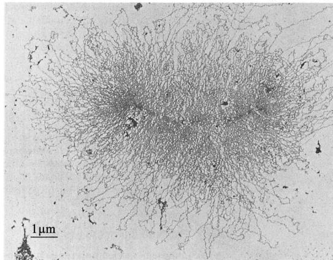  
图 7.12 马利筋的害虫脊胸长蝽 (Oncopeltus fasciatus) 的一条部分瓦解的后期染色体的电子显微照片, 示处于外围的众多 30 纳米染色质袢环。[转引自 Insect Ultrastructure, vol. 1, 1982, p. 222, “Morphological Analysis of Transcription in Insect Embryo.” V. Voe, et al., ©Plenum Publications Corporation, 经 Springer Science and Business Media 许可。照片承华盛顿大学维多利亚·福 (Victoria Foe) 和查尔斯·莱尔德 (Charles Laird), 及德州大学休·福里斯特 (Hugh Forrest) 惠赠。]

在去除组蛋白的中期染色体的电子显微照片中，部分展开的 DNA 是一种具有无数袢环的形式，这些袢环似乎是从一个核心或支架伸出（图 7.12）。这种染色体支架 (scaffold) 由许多非组蛋白染色体蛋白 (nonhistone chromosomal protein) 组成，包括 SMC2 家族的一个成员，但与在凝聚蛋白中所发现的不同。对有丝分裂和减数分裂中染色体压缩的电子显微镜研究表明，支架沿着染色单体延伸，30 纳米纤维被排列成一串串的袢环，从支架上散发出来。为了产生充分凝缩的中期染色体，每个袢环中的纤维还需要额外的折叠，关于这点的细节还不清楚。

将 DNA 和蛋白质压缩成染色质及最终压缩成染色体，其遗传重要性在于有利于细胞核分裂过程中遗传物质的运动。相对于完全伸展的 DNA 分子，中期染色体的长度减小为原来的 $1/10^{4}$ 。如果染色体没有压缩，染色体将变得盘根错节，以致在遗传物质分配到子细胞的过程中会有许多异常。

## 7.5 多线染色体

称为多线染色体(polytene chromosome)的巨型染色体，见于果蝇幼虫和其他双翅(双翅目)昆虫的唾液腺和某些其他组织的细胞核中。这些染色体包含约1000个横向排列的完全相同的DNA分子。每条多线染色体除了长度和横截面直径比普通体细胞有丝分裂中期的相应染色体大许多倍以外，还具有恒定而独特的横带(图7.13)。这种多线结构是一对紧密联会的同源染色体中的DNA反复复制，而复制后的染色质链未分离所形成的。多线染色体是非典型染色体，在幼虫的“终末”组织中形成，这些组织在蛹的形成过程中被清除。虽然幼虫的这些多线组织对成虫没有

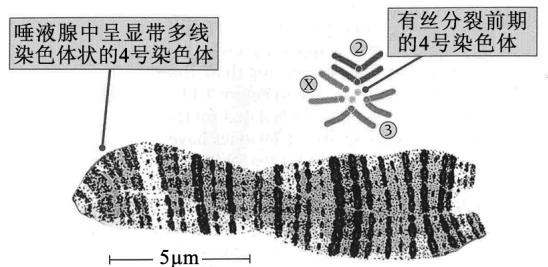  
图 7.13 黑腹果蝇 4 号多线染色体。右上方示有丝分裂前期出现的果蝇体细胞染色体，按照相对于 4 号多线染色体的比例绘制。[经牛津大学出版社许可，转引自 C. Bridges, “Salivary chromosome maps...”, J. Hered. 26(1935): 60-64.]

什么贡献，但它们在果蝇遗传学中特别有用，将在第8章中详述。

在黑腹果蝇及其他双翅目物种的多线细胞核中，毗邻着丝粒的大块异染色质聚集成单个致密团块，称为染色中心(chromocenter)。因为果蝇两条最大的染色体(2、3号染色体)具有位于中央的着丝粒，这些染色体表现出图7.14所示的布局。从染色中心伸出配对的X染色体(在雌性中)、2号和3号染色体的左臂和右臂，以及一条短的染色体(4号染色体)。在雄性中，几乎全由异染色质组成的Y染色体被合并入染色中心。

在多线染色体中，深染横带的宽度变化范围约有10倍。这些带是染色质链紧密折叠的区域并排的结果，在有丝分裂和减数分裂的前期染色体中，可见这些紧密折叠的区域常常是染色粒。带中的DNA量要比间带(浅染的)区域中的多。从黑腹果蝇的多线染色体中已鉴定了大约5000条带。这种带的线性排列——其带型对于每个物种稳定

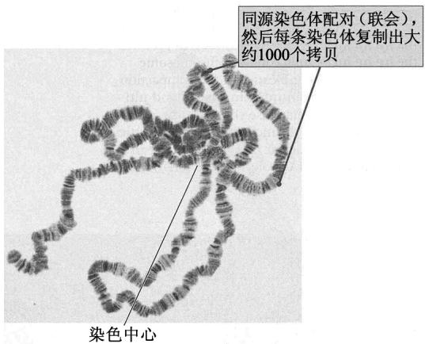  
图 7.14 黑腹果蝇幼虫唾腺细胞的多线染色体。染色中心在中央区域，所有染色体的着丝粒区汇集于此。[©Andrew Syred/Photo Researcher, Inc.]

而独特——为我们提供了这些染色体极为精细的细胞学图(cytological map)。经过充分培训、具有足够经验的观察者，能够根据这种带型鉴定任一染色体中很短的区域(图7.14)。

## 7.6 真核生物基因组的重复核苷酸序列

在细菌基因组中，在不同区域，平均碱基组成的变化通常相当小。相比之下，在真核生物基因组中，某些部分的碱基组成与平均值相差较多。例如，螃蟹 DNA 的某一部分仅有 3% 的 G+C，与此相较，余下的基因组的 G+C 平均值约为 50%。G+C 含量极低或极高的部分，通常由相当短的序列串联重复构成，在单倍基因组中可重复多达百万次，此类重复序列称为卫星 DNA (satellite DNA)。在小鼠中，卫星 DNA 约占基因组的 10%。在真核生物基因组中还存在其他重复序列 (repetitive sequence)。因为重复 DNA 由许多高度相似或一模一样的序列组成，重复 DNA 片段比非重复 DNA 片段更容易复性。通过对复性速率的研究，可获得有关重复序列大小及某个特定序列拷贝数的信息。下面考察 DNA 复性的定量分析。

## ■ DNA 复性动力学

在第 2 章中曾强调，因加热而变性的互补 DNA 单链，在较低温度下可进行复性，在溶液中形成双链分子。第一步是短的互补序列的随机碰撞。如果侧翼序列不互补，那么即使在较低的温度下，热运动也会使这种偶然的配对瓦解，两条链会再次“分道扬镳”。但是，如果侧翼序列互补，通过两侧更多的碱基配对，起始的短双链区将会非常迅速地增长，最终可形成一个长的双链分子。碱基配对不一定要完全正确，但错配碱基要少到使双链分子足以抵抗热变性。成对互补单链之间最初的碰撞是复性过程的限速步骤。因为初始碰撞的机会具有浓度依赖性，所以复性速率随 DNA 浓度增加而增加(图 7.15，A 部分)。对于给定的一条链，DNA 浓度的任何增加，会相应地导致潜在配对对象数目的增加。

DNA 总浓度只是影响复性速率的一个因素，序列的总体复杂度也很重要。某一 DNA 序列的复杂度，是指在给定量的 DNA 中，可能与该 DNA 序列任何一条链配对的对象数目。例如，考虑一个人工合成的 10kb DNA 双链体，由一条多聚 dA 链与一条多聚 dU 链配对组成，将其与一条包含随机核苷酸序列的 10kb 双链体比较。对于给定的浓度，来自 dA·dU 双链体的单链会比随机序列复性要快得多。原因是，对变性的 dA·dU 双链体而言，dA 的任何区域与 dU 的任何区域接触，都能够配对，侧翼序列也都是互补的，所以都会形成双链体。然而，对 10kb 的随机序列而言，在溶液中，只有一条链偶然与它准确互补的部分发生碰撞时，才能形成双链体。因为 dA·dU 双链体复性较快，所以它不如随机序列复杂。

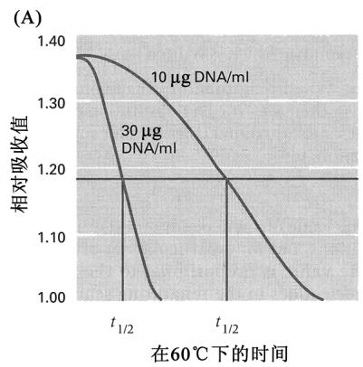

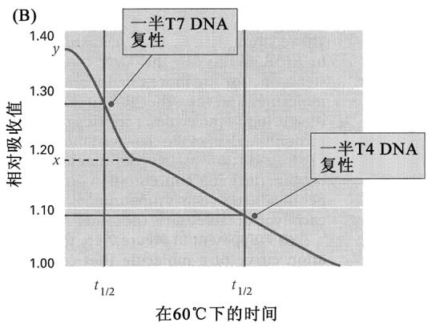  
图 7.15 (A) T7 噬菌体 DNA 的复性时间对浓度的依赖性。在 $90^{\circ}$ C 一段时间以使链分离之后，DNA 被冷却到 $60^{\circ}$ C。相对吸收值达到 1 时，复性完成。(B) T4 和 T7 DNA 混合物的复性，温度设置相同。外推(黑色虚线)得 T4 曲线的早期部分；x 点和 y 点处吸收值的比值，得总 DNA 中 T4 DNA 所占的比例。画一条红色水平线，使其在垂直方向上平分曲线，然后将红色垂线延伸到时间坐标轴，得到复性完成一半所需的时间 $(t_{1/2})$ 。

序列复杂度也依赖于长度。例如，比较 10kb 随机序列与 1000kb 的随机序列。10kb 序列会复性得比较快，因为对于给定的 DNA 核苷酸浓度，10kb 序列的拷贝数会比 1000kb 序列的拷贝数多，因而，10kb 序列的链更有可能与互补对象碰撞。所以，认为 10kb 随机序列不如 1000kb 随机序列复杂。如同在实际的实验中通常做的那样，即使将这两种双链分子断裂成同样大小的组分，仍能见到复性速率上的差异。分子是否断裂并不重要，因为分子断裂或不断裂，核苷酸的摩尔浓度是一样的。

图 7.15B 以一个真实的例子来显示序列复杂度的含义。该实验显示 T7 和 T4 噬菌体 DNA 分子混合物的复性过程，这两种分子没有共同的核苷酸序列，分子质量也不一样，T7 基因组的大小约为 T4 基因组的 1/4(T7 为 39.9kb，T4 为 168.9kb)。因而，如果每种噬菌体基因组在每毫升溶液中的 DNA 克数相同——像本实验中一样，则 T7 的摩尔浓度大约为 T4 的 4 倍。因为这两种噬菌体基因组不互补，来自 T7 的链只能与来自 T7 的其他链配对，来自 T4 的链也是如此。但是，因为 T7 的摩尔浓度较大，所以 T7 链会先开始复性，该混合物的复性曲线如图 7.15B 所示。在此例中，复性曲线由两个阶段组成：复性较快的 T7 分子为一个阶段，复性较慢的 T4 分子为另一个阶段。曲线中的每个阶段占溶液在 260nm 处吸收值 ( $A_{260}$ ) 变化的一半，因为两种分子的起始浓度（以 $\mu g$ DNA/ml 表示，与 $A_{260}$ 成正比）是相同的。

在图 7.15 中可明显看出，不含重复碱基序列的分子，其复性曲线仅由单个阶段组成，且复性速率是分子大小的函数。在复性曲线中存在多个阶段，不是将分子断裂为小片段就会产生的。既含单一组分又含不同重复序列的众多拷贝的序列混合物(或基因组)，其复性会产生多个阶段，因为含重复序列越多的片段，比含部分单一序列的片段复性越快。例如，考虑一个包含 50 000 个碱基对的分子，由一种 500 个碱基对的重复序列的 100 个串联拷贝组成，如果这些分子被断裂成大小差不多的 100 个片段，每个片段大约 500 个碱基对，尽管这些片段的复性曲线会只有一个阶段，但复性速率将是这种 500 个核苷酸长的分子所特有的。如果某个基因组包含多个丰度不同的重复序列家族，复性曲线会有多个阶段——每种重复序列一个阶段，该原理是复性动力学分析的基础。

复性动力学可以用一种简单的数学形式来描述，因为该反应是这样一种反应，其限速步骤是两个分子的初始碰撞。在此情况下，在复性开始之后的某一时刻 $(t)$ ，保持变性状态的单链的比例由下式给出：

$$
\frac {C}{C _ {0}} = \frac {1}{[ 1 + k C _ {0} t ]}\tag{1}
$$

其中，C 为单链 DNA 浓度，单位为核苷酸摩尔数/升； $C_{0}$ 为起始浓度；k 是一个常数。表达式 $C_{0}t$ 通常称为 Cot，而 $C/C_{0}$ 对 $C_{0}t$ 所作的图称为 Cot 曲线 (Cot curve)。 $C_{0}t$ 的单位是 DNA 浓度 (摩尔/升，mol/L) 与时间 (秒，s) 的积，写成 $\frac{摩尔}{升} \cdot 秒 (\frac{mol}{L} \cdot s)$ 。

当复性完成一半时 $(t=t_{1/2})$ ， $C/C_{0}=1/2$ ，将这些值代入式(1)，化简后得

$$
C _ {0} t _ {1 / 2} = 1 / k\tag{2}
$$

1/k 的值取决于实验条件，但在一组特定条件下，该值与复性序列中的核苷酸数成正比。对于特定的起始浓度，序列越长，达到完成一半复性的时间越多(因为分子数越少)。如果一个分子由几种子序列(subsequence)组成，那么，知道每种子序列的 $C_{0}$ ，可得到一组 1/k 值(在复性曲线中每个阶段一个)，每个值由子序列的长度决定。举例来对“长度”进行说明：在一条链中只含腺嘌呤的 DNA 分子，重复长度(repeating length)为 1；重复四核苷酸…GACTGACT…，重复长度为 4；含 n 个核苷酸对的非重复 DNA 分子，单一长度(unique length)为 n。

在实验中,每个重复单位的核苷酸数目不是直接测定的,通常要以一系列已知分子质量、在序列中无重复元件(从而会得到单阶段复性曲线)的分子的复性曲线作为标准。偶尔也会用短重复序列组成的分子。图 7.16 示这样的一组曲线。在这些简单的曲线中,有两条曲线代表大肠杆菌和

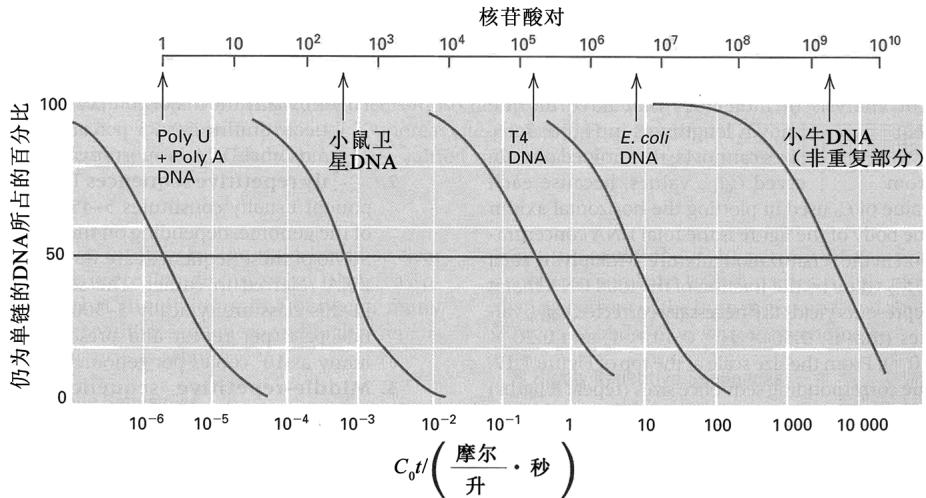  
图 7.16 不同 DNA 样品的一组 Cot 曲线。向上指向红色标尺的黑色箭头示每个样品的核苷酸对数目；它们与每条曲线与水平红线的交叉点对齐(半复性点，即 $C_{0}t_{1/2}$ )。如果留意到最大吸收值表示全部是单链 DNA，最小吸收值表示全部是双链 DNA，可将此图中的 y 轴与图 7.15 中的 y 轴联系起来。

T4 噬菌体的完整基因组。在用于获得这组曲线的 Cot 分析的标准条件下，产生特定 $C_{0}t_{1/2}$ 值的序列长度 n (单位为碱基对) 为

$$
n = (5 \times 1 0 ^ {5}) C _ {0} t _ {1 / 2}
$$

其中，t 的单位是秒， $C_{0}$ 的单位是核苷酸数/升， $5\times10^{5}$ 是由标准复性条件决定的一个常数。通过这个公式，可由实验测定的 Cot 值 $(C_{0}t_{1/2})$ 得出重复序列的重复长度的估计值 n。注意 $C_{0}$ 不是 DNA 总浓度，而是产生曲线的某一特定阶段的单种序列的浓度。如何得到所需的 $C_{0}$ 值，需要对 Cot 曲线进行分析。从关注曲线中阶段的数目（曲线的每个阶段代表某一特定长度的一条或一类序列）及每个阶段所代表的物质所占的比例开始，首先要推断出每类序列的 $C_{0}$ 值，对每个阶段的 $C_{0}t_{1/2}$ 观测值进行校正。然后拿校正值与标准值比较，确定序列的长度。最后，比较这些序列长度和序列丰度，得到每种序列的拷贝数。这种分析最好通过看一个例子来理解。

## ■ 用复性动力学进行基因组大小和重复序列分析

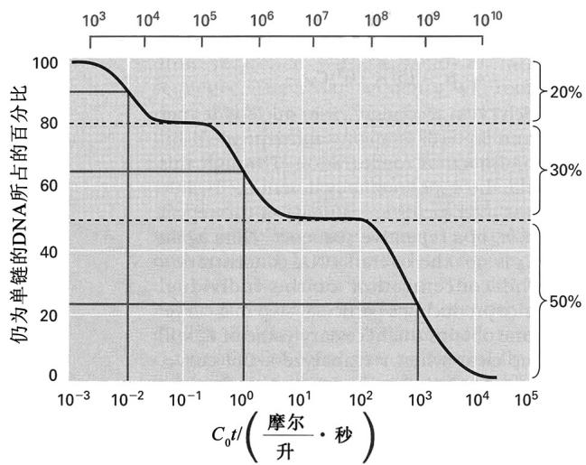  
图 7.17 课文中分析的 Cot 曲线。顶部的标尺与图 7.16 中的相同。黑色虚线标示每种分子在总 DNA 中所占的比例。

图 7.17 示真核生物基因组复性动力学分析中得到的一条典型的 Cot 曲线。显而易见有 3 个不同的阶段: 50% 的 DNA 的 $C_{0}t_{1/2}=10^{3}$ (蓝色); 30% 的 $C_{0}t_{1/2}=10^{0}=1$ (米色); 20% 的 $C_{0}t_{1/2}=10^{-2}$ (绿色)。图顶部的标尺系根据已知长度的单一序列分子的 Cot 分析而得, 与图 7.16 中的一样。序列大小不能根据 $C_{0}t_{1/2}$ 观测值直接确定, 因为在该图主体部分中, 用于绘制横坐标的每个 $C_{0}$ 值都是复性混合物中的 DNA 总浓度。每个 $C_{0}t_{1/2}$ 值乘以其占总 DNA 的比例, 得到所需的 $C_{0}t_{1/2}$ 校正值 (即 $0.50\times10^{3}$ 、 $0.30\times1$ 和 $0.20\times10^{-2}$ )。根据图 7.17 顶部的大小标尺, 相应的序列大小 (重复长度) 分别为 $3.0\times10^{8}$ 、 $2.2\times10^{5}$

和 $1 \times 10^{3}$ 个核苷酸对。

为了确定每种序列大致的拷贝数，我们利用这样的事实：具有特定复性速率的序列，其拷贝数与 $t_{1/2}$ 成反比，从而也与 $C_0t_{1/2}$ 观测值(未校正值)成反比。因此，如果该单倍基因组仅含有最长序列 $(3.0\times 10^{8}$ 个碱基对)的一个拷贝，那么，它含有长度为 $2.2\times 10^{5}$ 个碱基对的序列的 $10^{3}$ 个拷贝；含有长度为 $1\times 10^{3}$ 个碱基对的序列的 $10^{5}$ 个拷贝。在此情况下，每个基因组中碱基对总数的估计值是：

$$
3. 0 \times 1 0 ^ {8} + (1 0 ^ {3} \times 2. 2 \times 1 0 ^ {5}) + (1 0 ^ {5} \times 1 \times 1 0 ^ {3}) = 6. 2 \times 1 0 ^ {8} \text {个核苷酸对}
$$

真核生物 DNA 分子中的不同序列组分，可以通过回收在复性反应过程中在不同时间形成的双链 DNA 进行分离。所用的方法是，只让复性进行到某一特定的 $C_{0}t_{1/2}$ 值，然后，将在那一时刻存在的已复性的分子与其余的单链分子分开，通常使溶液通过一种填充有磷酸钙结晶(羟基磷灰石)的试管，该结晶可选择性结合双链 DNA。

## 7.7 真核生物基因组的单一序列和重复序列

许多真核生物基因组的核苷酸序列组成已通过 DNA 复性动力学分析进行了考察。主要的发现是，真核生物的重复 DNA 在基因组中所占的比例上，以及在重复序列的种类上，均存在巨大差异。在大多数真核生物基因组中，DNA 由 3 种主要组分构成。

1. 单一序列(unique sequence)或单拷贝序列(single-copy sequence)这类序列通常是主要组分，在大多数生物中，通常占染色体DNA的 $30\% \sim 75\%$ 。

2. 高度重复序列(highly repetitive sequence)这类组分通常占基因组的 $5\% \sim 45\%$ ，视物种而定。这些序列中有些是之前提过的卫星DNA。此类序列通常每个重复单位有 $5\sim 300$ 个核苷酸对，每个基因组中存在多达 $10^{5}$ 个拷贝。

3. 中度重复序列 (middle-repetitive sequence) 此类组分通常占真核生物基因组的 1%～30%，它包括在每个基因组中通常是以 10～1000 个拷贝存在的序列。

这些不同的组分不仅可以通过 DNA 复性动力学来鉴定，而且也可以用适当的探针，通过在 Southern 印迹中显示出来的条带数目来进行鉴定，还可以用其他方法来鉴定。通过前面对 DNA 复性的讨论应该很清楚，许多中度重复序列和高度重复序列之间的界限是主观的。

## 联系：后基因组遗传学

肖恩·艾哈迈德和乔纳森·霍奇金，2000

医学研究委员会分子生物学实验室，剑桥，英国

秀丽隐杆线虫的种系永生和端粒复制需要 MRT-2 检查点蛋白

这篇论文证明，即使在已知某种生物的基因组的全部 DNA 序列——正如本例一样——的情况下，中规中矩的遗传分析——突变分析和作图——仍能成为理解这种生物的生物学机制的一种独特而强大的方法。原因是，第一，序列并不总能揭示功能；第二，许多基因具有两种或多种功能，但(通过序列分析)只能认识到其中一种。在此例中，对一个具有使胚系逐渐消亡的潜在表型的突变的分析，出乎意料地揭示了一个具有端粒复制和 DNA 损伤应答双重功能的基因。那基因组序列有什么用呢？一旦在遗传上测定了新突变所在的区域，通过检查该区域中所有的编码序列，可马上找出可能的候选基因。然后，通过对突变体中的候选基因进行测序，就有可能迅速证明嫌犯就是真凶。

在大多数高等生物中，种系是物种得以延续的原因……因而可视为永生细胞系。……为了研究种系如何得以永生，我们对具有不能永生的种系的秀丽隐杆线虫突变体进行了筛查。……(在400个诱变品系中)鉴定得16个独立的非永生种系突变体，它们在 $F_{4}$ 到 $F_{16}$ 代之间变得不育。……在我们的小规模试验性筛查中，鉴定出mrt突变体的这一出乎意料的巨大数目，提示秀丽隐杆线虫种系永生特别需要的基因保守估计有50个。……在这些突变体中，一个突变体——mrt-2——不育的世代变化较大，从 $F_{10}$ 到 $F_{28}$ 代。……这些结果提示，mrt-2逐渐累积了某种可遗传的损伤。……mrt-2种系对X线高度敏感，X线可诱导双链切口而损伤DNA。……为了深入了解这种基因组的稳定性缺陷，对染色体进行了检查。较早世代的mrt-2线虫包含野生型线虫会有的6对染色体，而较晚世代的mrt-2线虫只有3、4或5对染色体，提示发生了染色体融合。……所检查的所有染色体融合都是纯合可存活的，表明它们没有缺失任何必需基因，因而很可能是末端融合。……迟发型染色体末端融合表型提示，在端粒复制过程中有一个缺陷。……(分子研究证明)mrt-2线虫的端粒以每次细胞分裂约12个碱基对的速率缩短(每代约125个碱基对)。……mrt-2基因是粟酒裂殖酵母(Schizosaccharomyces pombe)rad1 $^{+}$ 和酿酒酵母(Saccharomyces cerevisiae)RAD17检查点基因的同源基因，从酵母到哺乳类，rad1 $^{+}$ 和RAD17都是保守的。在酵母中，为了延迟细胞周期进程，以应答DNA损伤或DNA复制中的阻断，需要这些基因。……此处所述的检查点蛋白MRT-2，对于端粒复制和应答DNA损伤都是必需的。

来源：S. Ahmed and J. Hodgkin, Nature 403 (2000): 159-164.

## - 单一序列

大多数基因序列及其表达所需的邻近的核苷酸序列，包含在单一序列组分中。除了少数例外(例如，一个或几个基因的重复)，病毒和原核生物基因组全部由单拷贝序列组成。相比之下，这类序列只占某些海胆种类全基因组的40%左右，占人类基因组的50%多一点，约占黑腹果蝇基因组的70%。

## - 高度重复序列

许多高度重复序列局限于串联重复序列区段中，而其他高度重复序列分散在整个基因组中。散在的高度重复序列包括某些 SINE 和 LINE 反转录转座元件，这些反转录转座元件在某些基因组(包括人类基因组)中可见到高拷贝数(第 14 章)。在局部化的高度重复序列中，大多数序列相当短。在丰度上，它们从一个基因组到另一个基因组可有很大差异：在人类基因组中占 6%，在黑腹果蝇基因组中占 18%，而在 D. virilis 果蝇基因组中占 45%。一种最简单的重复序列占某种陆蟹基因组的 25%，它由一个间杂着约 3% 的 G+C 的 AT 交替序列(...ATATATAT...)构成。在 D. virilis 基因组中，局部化高度重复类别的主要组分是 3 种不同但相关的富含 A+T 的 7 碱基对序列：

## 5'-ATAAAACT-3'

## 5'-ACAAATT-3'

几种生物基因组中的卫星(高度重复)序列的区段，已通过中期染色体的原位杂交(in situ hybridization)得到定位。发现以此方法定位的卫星序列位于称为异染色质(heterochromatin)的染色体区域中。在前期中，这些区域先于染色体的其余部分凝缩，它们可被用来显示染色体的许多标准染料深染(图7.18)，有时，异染色质在整个细胞周期中一直保持高度凝缩。构成大部分基因组的常染色质(euchromatin)，仅在有丝分裂周期中可见。大的异染色质区毗邻着丝粒；较小的区段存在于染色体臂的末端(端粒)和散布在常染色质中。在许多物种中，某些染色体——如黑腹果蝇和哺乳类的Y染色体——整条染色体几乎全部都是异染色质。已从黑腹果蝇中纯化了不同的高度重复序列，原位杂交显示，每种序列在染色体上具有其各自独特的分布。

异染色质的基因含量概括如下:

相对于常染色质，位于异染色质中的基因数量较少。

基因数量相对较少，意味着许多大段的异染色质在遗传上几乎是没有活性的，即缺乏功能的。事实上，在基因组中，异染色质区段往往可以被重排、重复，甚至缺失，而不会有大的表型效果。

mophilus harrisii)的中期染色体，染色显示大多数染色体的着丝粒附近的异染色质区(红色箭头)及某些染色体端粒附近的异染色质区(黑色箭头)。(B)解说图。[承徐道觉(T. C. Hsu)博士惠赠，经得州大学安德森癌症中心森·帕沙克(Sen Pathak)博士许可使用。]

图 7.18 (A) 哈氏羚松鼠 (Ammosper- (A))  
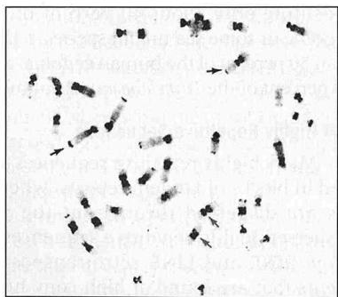

(B)  
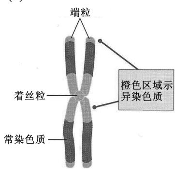

## ■ 中度重复序列

中度重复序列约占黑腹果蝇基因组的 12%，占人类及其他真核生物基因组的 40% 或更多。这些序列在拷贝数和在基因组中的位置上差异巨大。它们包含许多序列相关的家族，包括几种基因类群。例如，在大多数真核生物基因组中，主要的两种 rRNA 是从重复数百次的一对串联基因转录而来的。在所有真核生物的基因组中，编码 tRNA 分子的基因及那些编码组蛋白的基因都是重复的。tRNA 基因的拷贝是散在的，而组蛋白基因通常以串联重复形式成簇存在。每个组蛋白基因在鸡的每个基因组中重复约 10 次，在哺乳类中约 20 次，在果蝇中约 100 次，而在某些海胆种类中多达 600 次。

黑腹果蝇基因组中的大多数散在中度重复序列由转座因子组成(第 14 章)。此类因子约有 50 个不同的家族——其名称如 P、hobo、copia、jockey、Helena、roo、412、297 和 mdg 等——每个家族有 10～50 个拷贝，在整个基因组中的位置极为分散。

## 7.8 着丝粒的分子结构

着丝粒是真核生物染色体的一个特殊区域，其在凝缩的染色体上表现为一个狭窄的缢痕。它是动粒(kinetochore)的核心成分，动粒是DNA和蛋白质的复合体，纺锤丝与之连接，以便在有丝分裂和减数分裂中移动染色体。动粒也是纺锤丝缩短之处(从而导致染色体向两极移动)。

电子显微镜分析显示，在某些生物——如酿酒酵母——中，与着丝粒染色质连接的是单条纺锤蛋白丝。大多数其他生物有多条纺锤丝与着丝粒区连接。

在不同物种中，着丝粒表现出显著的结构变化。一个极端是全着丝粒染色体(holocentric chromosome)，遍布其全长都有着丝粒序列[形成所谓的弥散着丝粒(diffuse centromere)]。秀丽隐杆线虫(Caenorhabditis elegans)具有全着丝粒染色体。在全着丝粒染色体中，微管沿每条染色单体的全长与其连接。如果用X射线把全着丝粒染色体打断成片段，每个片段表现得像一个独立的小全着丝粒染色体，在细胞分裂中可以正常移动。因对弥散着丝粒的了解非常有限，不再进一步讨论。

常见的着丝粒类型是局部着丝粒 (localized centromere)，其中，微管与染色体的单一区域（动粒）连接。局部着丝粒分为两类：点着丝粒 (point centromere) 和区域着丝粒 (regional centromere)。点着丝粒见于许多不同的酵母 (包括酿酒酵母) 中，就 DNA 含量而言，它们相对较小。其他真核生物，包括高等真核生物，具有可含数百 kb DNA 的区域着丝粒，这些着丝粒区含重复 DNA 序列，这些 DNA 包装成核小体，以含着丝粒特异型的 H3 组蛋白为特征。

酿酒酵母着丝粒的染色质片段具有一种独特的结构，极其耐受不同DNase的作用，已被分离鉴定，它是一种含220～250个核苷酸对的蛋白质-DNA复合体。已经知道所有的酵母着丝粒的核小体构造和DNA序列。这些序列的几个共同特点如图7.19所示。所有的酵母着丝粒都具有与所示的CDE1、CDE2和CDE3区高度相似的序列，但CDE4区的序列在不同着丝粒之间有差异。值得注意的是，2区约有90%的碱基对是A-T对。着丝粒DNA包含于一个被命名为着丝粒核心颗粒（centromeric core particle)的结构中，该结构比典型的酵母核小体核心颗粒大，且所含DNA比典型核小体核心颗粒中的160对核苷酸多。该结构是着丝粒DNA耐受DNase的原因。纺锤丝被认为直接与此颗粒连接(图7.19)。

出芽酵母的着丝粒特别小而简单。在高等生物中，每个着丝粒区包含一百万个碱基对或更多，众多纺锤丝得以与之连接。图 7.20 示人类 2 号染色体短臂着丝粒区中 DNA 序列的组织方式，这一组织方式的独特之处在于，它是一个 DNA 序列的拼缀结构，由来自不同染色体的常染色质的重复区域构成。还不清楚这些小片

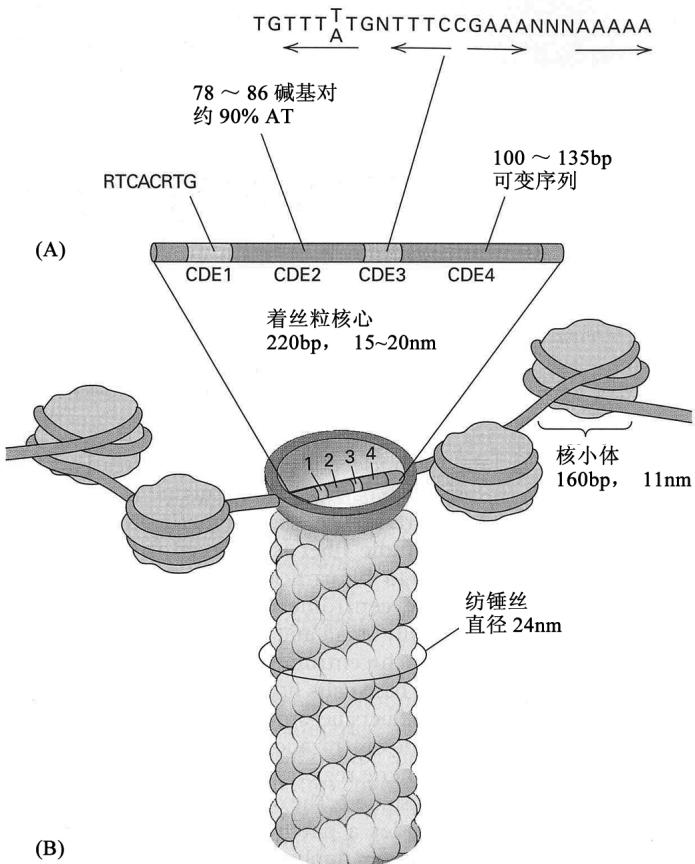  
图 7.19 酿酒酵母的一个着丝粒。(A) 着丝粒 DNA 示意图，示所有酵母着丝粒共有的主要区域 (CDE1 \~ CDE4)。字母 R 代表任意嘌呤 (A 或 G)，字母 N 表示任意核苷酸。在 3 区中的反向重复片段以箭头表示。在不同着丝粒中，CDE4 区的序列有变化。(B) 在 DNA 上着丝粒核心及核小体的位置。DNA 沿核小体中的组蛋白盘绕，但着丝粒核心的详细组织和成分未知。[改编自 K. S. Bloom, M. Fitzgerald-Hayes, and J. Carbon, Cold Spring Harb. Symp. Quant. Biol. 47 (1982): 1175.]

段是怎样拼合在一起的，但这种重复的发生率估计每百万年6～7次。2号染色体的独特之处还在于，它的重复DNA序列比例很大。左边的区域(最靠近着丝粒处)由一个DNA序列家族的串

联重复构成，该家族由与称为 $\alpha$ DNA(alphoid DNA) 的相关的 170bp DNA 构成。大多数人类染色体包含 100～1000 个拷贝的 $\alpha$ DNA(图 7.21)。纺锤丝连接所需的 DNA 序列散布在 $\alpha$ 重复序列之中，并且 $\alpha$ 重复序列本身似乎也有助于保持着丝粒的活性。

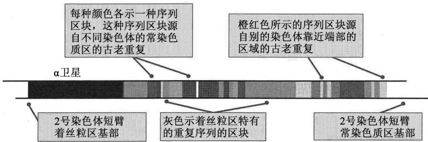  
图 7.20 2 号染色体短臂着丝粒区中拼合的重复序列的源流。所示区域总长约 750kb。[改编自 X. She, et al., Nature 430 (2004): 857-864.]

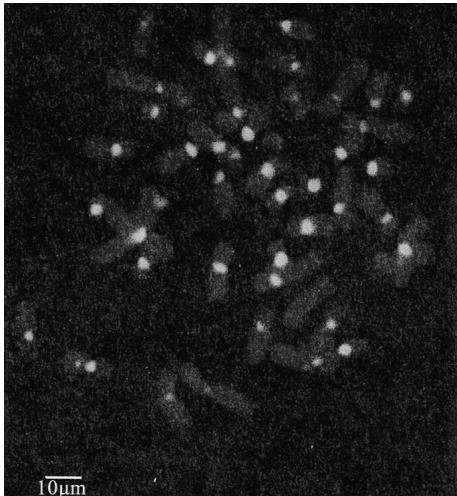  
图 7.21 人类中期染色体(红色)与 $\alpha$ 卫星 DNA 杂交。黄色区域是与标记 DNA 杂交的结果。 $\alpha$ 卫星的杂交位点与所有 46 条染色体的着丝粒区一致。[承葡萄牙分子与细胞生物学研究所葆拉·科埃略(Paula Coelho)和克劳迪奥·森克尔·卡莉奥拉(Claudio E. Sunkel Cariola)惠赠。]

## 7.9 端粒的分子结构

线状染色体的每一端由一个称为端粒(telomere)的特殊的DNA-蛋白质结构构成。遗传学及显微观察最先指出，端粒对于染色体的稳定性是必不可少的。赫尔曼·马勒(Hermann J. Muller)发现，在果蝇中，通过X射线处理使染色体断裂之后，没有末端的染色体不能重新获得末端。芭芭拉·麦克林托克(Barbara McClintock)观察到，在玉米中，断裂的染色体时常彼此融合，形成具有异常结构——常常具有两个着丝粒——的新的染色体。正如在第6章中曾提到的，DNA聚合酶自己不能起始DNA的合成，而是需要一个RNA引物。在染色体末端，一条DNA链的5'端以引物结束，当这条引物被去除后，在互补链的3'端有一段短的(8～12个核苷酸)单链突出端，该单链突出端容易被外切核酸酶降解。如果没有某种机制来恢复被降解的末端，每次复制会使染色体中的DNA分子稍稍变短一点。确实存在一种末端恢复的机制，在这种机制缺陷的突变细胞中，在每次复制中每个染色体末端确实会变短，直到最后，降解得太多，以至细胞死亡。

恢复染色体中 DNA 分子末端的机制依赖于一种酶，称为端粒酶(telomerase)。该酶的作用是把一个简单序列的串联重复序列加到 DNA 链的 3' 端。这种酶最先是在纤毛原生动物四膜虫(Tetrahymena)中发现的。在四膜虫中，简单重复序列为 5'-TTGGGG-3'；在人类和其他脊椎动物中，该序列为 5'-TTAGGG-3'（即使在昆虫中，果蝇也是与众不同的，其在染色体端部具有特化的非 LTR 反转录转座元件，而不是简单重复序列）。简单序列的串联重复序列，与相关蛋白质一起，构成端粒。当重复的端粒序列被延伸的时候，DNA 复制最终会出现只能合成一条配对链的时候，因而，以四膜虫为例，任何一条四膜虫染色体右端的端粒序列会成为如下形式的 DNA 双链体：

## 5'...TTGGGGTTGGGGTTGGGGTTGGGGTTGGGGTTGGGG-3'

## 3'...AACCCCAACCCCAACCCC-5'

这个 DNA 双链体在 3' 端有一个单链突出端，该突出端可被端粒酶进一步延伸。端粒酶在染色体 DNA 复制中的作用如图 7.22 所示。A 部分示一条染色体中的双链 DNA，端粒序列以红色显示。因为 DNA 复制不能精确地从 3' 端开始，所以在 B 部分中，每条子链的 5' 端比复制它的模板链要稍短一些。端粒序列未被复制的部分容易被核酸酶降解。每条子链的 3' 端也具有一个缩短了的端粒，因为这一端是从亲链端粒内缩的 5' 端复制来的。留在每个 3' 端的缩短的端粒是端粒酶的底物，端粒酶通过再添加重复的端粒单位——对四膜虫而言，是 5'-TTTGGGG-3'——延伸每个 3' 端。端粒的延伸恢复了原始亲代染色体的结构——在染色体的每一端，在 3' 端具有数量较多的端粒重复单位，在 5' 端具有较少的重复单位。

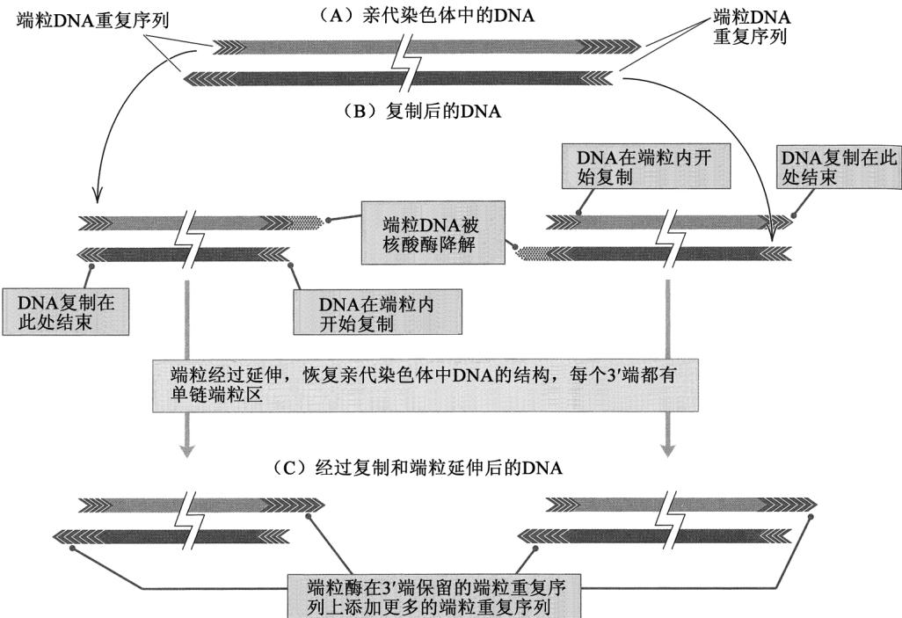  
图 7.22 端粒酶的功能。(A)染色体 DNA 为双链。每条链的每一端以一组端粒重复序列结束，但由于前次复制后端粒酶作用的结果，每条链的 3' 端较长。(B)在每条亲代 DNA 链的复制过程中，新的子代 DNA 链起始于 3' 端的端粒重复序列中；在新链中，5' 端的端粒比亲链中的端粒短。亲链未被复制的 3' 端易被核酸酶消化。(C)在复制形成的子代 DNA 双链体中，每端的 3' 链被端粒酶添加端粒重复序列而延伸。端粒的长度和 3' 突出端恢复到原始亲代分子中存在的状态。

## 联系：端粒——结束的开始

卡萝尔·格雷德和伊丽莎白·布莱克本，1987

加州大学，伯克利，加利福尼亚

四膜虫的端粒末端转移酶是具有两种引物专一性的核糖核蛋白酶

在端粒形成过程中，RNA 是关键组分之一——真是既奇妙又出人意料！DNA 聚合酶有两点局限：需要引物寡核苷酸和只能在 3' 端延伸 DNA 链。这些局限性意味着，随着每轮复制的进行，DNA 链的 3' 端会逐渐变短，因其最末端需要引物（事实上，缺乏正常端粒的染色体确实会逐渐变短）。在本研究中使用的生物——四膜虫——是一种纤毛原虫。每个四膜虫细胞有一个特化的细胞核，称为大核，其中含好几百条小染色体。端粒酶的活性水平比较高，因为这些微小染色体每一条都需要一对端粒。四膜虫适于端粒功能的研究，说明了贯穿遗传学历史的一个原理: 突破往往源于选择正好合适的生物来研究。本文作者推测在端粒中可能存在“指导”RNA。他们完全正确。

对核酸的精确识别往往是由 RNA 和蛋白质两种组分都含的酶进行。对这些核糖核蛋白(RNP)的其中一些来说，RNA 组分通过与底物的碱基配对而使反应具有专一性。对 RNA 能够发挥催化作用的认识，已使 RNP 催化反应的已知数目逐渐增多。我们在此报道一种 RNP，它参与四膜虫大核染色体两端的端粒序列的合成。……以前我们报道过，在四膜虫细胞提取物中鉴定出的一种活性，可以非模板方式将端粒重复序列加到适当的端粒序列引物上。……四膜虫端粒序列 TTGGGG 的拷贝，以每次一个核苷酸的方式，被加到输入引物的 3' 端。……为了研究端粒酶控制反应专一性的机制，我们已经开始对其进行鉴定和纯化。……我们认为，端粒酶的 RNA 组分或在编码所添加的端粒 TTGGGG 重复单位的序列上发挥作用，或在识别富含 G 的端粒序列引物的结构上发挥作用，或两者兼有。……在从粗提物中纯化端粒酶的过程中，我们注意到端粒酶对盐浓度非常敏感，高盐浓度可使端粒的延伸活性丧失。端粒酶的盐敏感性及较大的尺寸，提示它可能是一种含核酸成分的复合体。为了检测端粒酶是否含有必不可少的核酸，我们以微球菌核酸酶或 RNase A 处理活性部分。这两种酶的核酸酶活性都可终止端粒的延伸活性。……这些实验表明，端粒酶包含一种必不可少的 RNA 组分。……端粒酶的 RNA 可能只是为有活性的酶复合体的蛋白质组装提供一个支架；不过，……猜测端粒酶的 RNA 组分可能参与所合成的端粒重复单位的序列的决定和/或特异引物的识别，是非常诱人的。如果端粒酶的 RNA 含有 CCCCAA 序列，则该序列可作为内在指导序列。

来源：C. W. Greider and E. H. Blackburn, Cell 51 (1987): 887-898.

相对较少的端粒重复单位拷贝数，是端粒酶准备添加更多拷贝及形成端粒必不可少的。异乎寻常的是，端粒酶内含一种必不可少的 RNA 分子，称为指导 RNA (guide RNA)，它含有与端粒重复序列互补的序列，作为端粒合成和延伸的模板。例如，四膜虫的指导 RNA 含序列

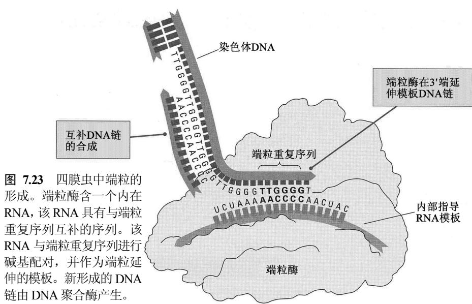

5'-AACCCCAAC-3'。指导 RNA 与端粒重复序列进行碱基配对，并作为模板，以便端粒通过添加更多的重复单位而延伸（图 7.23）。端粒的互补 DNA 链就像一般 DNA 复制中的后随链那样合成(第 6 章)。在大多数真核生物染色体的端粒区，紧接在末端重复序列之前，还有

较长的中度重复 DNA 序列。在不同生物中，甚至在同种生物的不同染色体中，这些序列均有差异。端粒区还结合有抑制基因在该区表达的蛋白质，这称为端粒沉默(telomeric silencing)。

是什么限定端粒的长度？在酵母中，当端粒序列被延伸时，一种称为 Rap1 的蛋白质分子结合到端粒序列上，直到 Rap1 分子逐渐增加到大约 17 个。此时，端粒延长终止，这可能是因为 Rap1 本身抑制了端粒酶的活性，然后其他蛋白质(包括一些与 DNA 修复有关的蛋白质)加入该复合体并与端粒的最末端结合。因为每个 Rap1 分子与大约 18 个端粒碱基对结合，估计酵母端粒的长度为 $17 \times 18 = 306$ 个碱基对，这与观测到的值非常接近。Rap1 起作用的其他证据来自 Rap1 基因的突变，这些突变基因产生的 Rap1 蛋白质不能与端粒序列结合，在突变株中，可观察到大规模的端粒延伸。

在一些生物中发现的端粒序列见表7.2。在表7.2中，每个端粒序列被延伸的3'端都写在最右边。例如，四膜虫的式子写成 $C_{4}A_{2}/T_{2}G_{4}$ ，是指端粒序列为：

$$
\begin{array}{l}3 ^ {\prime} \text {-AACCCC-5^ {\prime}}\\5 ^ {\prime} \text {-TTGGGG-3^ {\prime}} \rightarrow\end{array}
$$

其中，箭头表示被端粒酶延伸(与图 7.23 对照)。同样，脊椎动物端粒的式子为 $C_{3}TA_{2}/T_{2}AG_{3}$ ，是指端粒序列为：

$$
\begin{array}{l}3 ^ {\prime} \text {-AATCCC-5^ {\prime}}\\5 ^ {\prime} \text {-TTAGGG-3^ {\prime}} \rightarrow\end{array}
$$

在许多生物中，端粒重复序列的长度会有变化。例如， $C_{1-8}$ 的意思是，从一个重复拷贝到另一个重复拷贝，变化范围可以从少至 1 个 C 到多至 8 个 C。在特定位置上的核苷酸也偶尔存在变化，这种情况用上下叠放的小字母表示。

## ■ 端粒长度限制细胞倍增次数

约 50 年前，伦纳德·海弗利克 (Leonard Hayflick) 及其同事发现，培养的正常人类细胞只经过有限次数的分裂之后就会停止分裂。这些细胞仍然活着，代谢活跃，但它们被阻止进入 DNA 复制的 S 期，从而不能进入接下来的有丝分裂。

表 7.2 端粒 DNA 序列

<table><tr><td>生物</td><td>序列</td></tr><tr><td>原生动物</td><td></td></tr><tr><td>四膜虫</td><td> $C_{4}A_{2}/T_{2}G_{4}$ </td></tr><tr><td>草履虫</td><td> $C_{3}C_{A}A_{2}/T_{2}G_{T}G_{3}$ </td></tr><tr><td>疟原虫</td><td> $C_{3}T_{G}^{A}A_{2}/T_{2}^{T}_{C}AG_{3}$ </td></tr><tr><td>锥虫</td><td> $C_{3}TA_{2}/T_{2}AG_{3}$ </td></tr><tr><td>鞭毛虫</td><td> $C_{3}TA/TAG_{3}$ </td></tr><tr><td>黏菌</td><td></td></tr><tr><td>绒泡菌</td><td> $C_{3}TA_{2}/T_{2}AG_{3}$ </td></tr><tr><td>网柄菌</td><td> $C_{1-8}T/AG_{1-8}$ </td></tr><tr><td>真菌</td><td></td></tr><tr><td>酵母</td><td> $C_{2-3}ACA_{1-6}/T_{1-6}GTG_{2-3}$ </td></tr><tr><td>念珠菌</td><td> $ACAC_{2}A_{2}GA_{2}GT_{2}AGACATC_{2}GT/ACG_{2}ATGTCTA_{2}CT_{2}CT_{2}G_{2}TGT$ </td></tr><tr><td>裂殖酵母</td><td> $C_{1-6}G_{0-1}T_{0-1}GTA_{1-2}/T_{1-2}ACA_{0-1}C_{0-1}G_{1-6}$ </td></tr><tr><td>链孢霉</td><td> $C_{3}TA_{2}/T_{2}AG_{3}$ </td></tr><tr><td>无脊椎动物</td><td></td></tr><tr><td>隐杆线虫</td><td> $GC_{2}TA_{2}/T_{2}AG_{2}C$ </td></tr><tr><td>家蚕,一些其他昆虫</td><td> $C_{2}TA_{2}/T_{2}AG_{2}$ </td></tr><tr><td>脊椎动物</td><td> $C_{3}TA_{2}/T_{2}AG_{3}$ </td></tr><tr><td>植物</td><td></td></tr><tr><td>衣藻</td><td> $C_{3}TA_{4}/T_{4}AG_{3}$ </td></tr><tr><td>拟南芥</td><td> $C_{3}TA_{3}/T_{3}AG_{3}$ </td></tr><tr><td>番茄</td><td> $C_{3}A_{A}^{T}T_{2}/A_{2}A_{1}T_{1}G_{3}$ </td></tr></table>

来源: 转载自 V. A. Zakian, Science 270 (1995): 1601-1607。经 AAAS 许可转载。

该发现受到强烈的质疑，因为当时的生物学家们认为，正常细胞可无限制地分裂。

现在将正常细胞倍增的有限次数称为海弗利克极限(Hayflick limit)。培养的人类细胞，在与体内相当的氧含量下，在停止分裂之前可进行大约70次分裂。它们停止分裂的原因，部分是因为端粒的长度。正常细胞拥有众多能够探测细胞周期中发生的事故的蛋白质，它们可触发数个细胞周期检查点(checkpoint)中的一个，使细胞周期停止，直到功能障碍被校正，或细胞的自我毁灭被启动。DNA的双链断裂为被探查的损伤种类之一。在正常细胞中，探查双链断裂的蛋白质与端粒相关，但只要每次细胞分裂端粒能恢复到原来的长度，这些蛋白质就不会被激活。但是，体内大多数细胞中的端粒酶数量是有限的，所以，每次分裂，端粒都会变短一点点。当端粒长度缩短到大约5kb时(意味着大约800个拷贝的端粒重复序列5'-TTAGGG-3')，识别双链断裂的蛋白质被激活，随后的检查点使细胞周期停止。端粒缩短的信号被识别为双链断裂，似乎是在端粒相关核小体的组蛋白H4第20位的赖氨酸残基上加上两个甲基(形成名为H4K20me2的组蛋白)的结果。

在成年人中，大多数细胞的端粒长度仅允许细胞分裂少数几次，就会被 DNA 双链断裂检查点阻滞。少数细胞——称为祖细胞(progenitor cell)——在被阻滞之前可进行大约 70 次分裂(海弗利克极限)。在 70 次分裂中丢失 5kb 端粒 DNA，相当于每个细胞周期丢失大约 70bp。在体内分裂的祖细胞，在每个细胞周期中也要丢失端粒 DNA。在细胞培养中，来自小孩的祖细胞分裂的次数比来自中年人的多，来自中年人的分裂次数比来自老年人的多。这种分裂能力的逐步丧失，可部分解释老年人的愈合过程需要更长的时间。

有两种不受海弗利克极限限制的细胞。一种是胚胎干细胞(embryonic stem cell)，这种细胞存在于早期胚胎中，具有较高的端粒酶活性。这些细胞可进行许多轮的细胞分裂，并能分化成许多不同种类的特化细胞。这些特性解释了为什么人们一直对研究胚胎干细胞有着极大的兴趣，尽管胚胎干细胞研究已在一些地区引起了道德上的担忧。另一种克服了海弗利克极限的细胞是癌细胞。癌细胞能够无限分裂的机制，是由于它们具有某些重新激活端粒酶基因的突变，以及其他取消对细胞分裂的正常控制(如DNA双链断裂检查点)的突变。癌症发生和发展的分子机制很重要，不仅是其本身就很重要，还因为对突变体的分析使得我们能深刻洞察细胞周期中的正常过程。将在第15章中详细考察这些过程。

## 本章概要

\- 大多数生物具有由一个或多个双链 DNA 分子构成的基因组。在真核生物中，核 DNA 分子通常是线状的。但在原核生物中，有些 DNA 分子是环状的，其他是线状的。线粒体 DNA 和叶绿体 DNA 也为环状。环状 DNA 分子总是超螺旋分子。

\- 在不同生物之间，有时甚至在亲缘关系很近的生物之间，基因组大小变化极大。在后生动物中，生物的基因组大小与其进化或代谢复杂性之间不存在相关性，这称为 C 值悖理。

\- DNA 很少以完全伸展的状态存在，而是以复杂的方式折叠，以减少其有效容积。在细菌中，环状染色体 DNA 与某些蛋白质结合，并折叠成一个超螺旋域各自独立的多重袢环结构，称为拟核。

\- 每条真核生物染色体通常包含极长的单个 DNA 分子，该分子与蛋白质结合形成染色质。染色质的基本单位是核小体核心颗粒——一个缠绕着一段双链 DNA 的组蛋白八聚体。

\- 大多数真核生物基因组，除包含绝大部分基因的“单一”DNA序列之外，还含有高度重复和中度重复的DNA序列。

\- 着丝粒是一种特化的 DNA 结构，其作用是作为染色体的中心。

\- 端粒是另一种特化的 DNA 结构，起到稳定染色体末端的作用，使染色体末端免于因 DNA 的逐渐丧失而缩短。

## 基础回顾

\- 什么是“C值悖理”？为什么会认为它是悖理？

\- 某个环状双链 DNA 分子是负超螺旋分子，是什么意思？

\- 原核生物和真核生物在遗传物质组织上的主要差异是什么？

\- 组蛋白是带正电荷的(碱性)分子，可与带负电荷的(酸性)分子相互作用，与组蛋白相互作用的酸的主要类型是什么？

\- 核小体是真核生物细胞染色质的基本单位，在描述核小体时，有时说它包含“组蛋白八聚体”。“八聚体”一词是否名副其实？说出理由。

\- 什么是高度重复 DNA？在 DNA 复性时，高度重复 DNA 退火非常迅速，说明原因。

\- 指出常染色质和异染色质的差异。说异染色质不含功能基因，正确吗？解释答案。

\- 对遗传学研究而言，双翅目昆虫幼虫唾液腺中的多线染色体有何特别之处？

\- 什么是端粒？在每个细胞周期中，端粒是如何延伸的？编码端粒的核苷酸序列的是什么？

## 解题指南

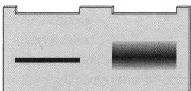  
内部序列  
亚端粒序列

## 答案

习题 1 以正常组织样品制备基因组 DNA，并用一种限制酶切割，该酶在某一特定染色体亚端粒 DNA 的一个单拷贝序列中有一个切割位点。用该单拷贝亚端粒序列探针进行 Southern 印迹。作为对照，切割后的 DNA 样品也和另一个探针杂交，已知该探针与同一条染色体内部的序列同源。结果如所附凝胶图所示。解释为什么内部序列探针产生的条带清晰且界限分明，而亚端粒序列探针产生的条带模糊且覆盖一定的大小范围。

内部序列产生清晰的条带，是因为含该序列的所有片段，都是在每侧最近的限制位点切割每个染色体 DNA 分子而产生的，因而，所有这些片段的大小都相同。亚端粒序列产生弥散的条带，是因为对所有的片段而言，只有唯一的一个限制位点是共同的，另一端以端粒序列结束，而从一个细胞到另一个细胞，端粒序列的长度会有差异。

习题 2 G-C 碱基对给 DNA 双链增加的稳定性比 A-T 碱基对多，不仅是因为它们有一个额外的氢键，还因为它们的碱基堆积作用较强。因为存在碱基堆积作用，所以变性所需的温度不仅会随 G-C 含量的增加而升高，

而且会随分子中连续 G-C 片段的长度增加而升高。

(a)图示的两个DNA分子(1和2)，哪一个的链分离温度较低？为什么？

(b) 变性或复性，哪一种过程依赖于 DNA 浓度？解释答案。

## 答案

(a) 此处，G-C 片段的长度很重要。分子 2 有一个长的 G-C 片段，这会是最后分离的区域。因此，分子 1 的链分离温度较低。

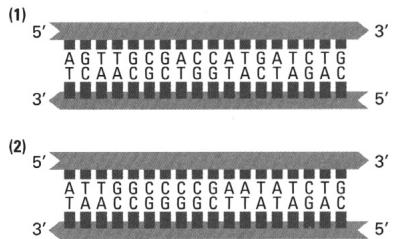

(b) 复性是浓度依赖性过程。解释是，在复性过程中，在形成碱基对之前，需要互补分子的随机碰撞。

习题 3 思考此处所示的基因组 DNA $C_{0}t$ 示意曲线。它说明这种生物的基因组包含两类 DNA 序列——重

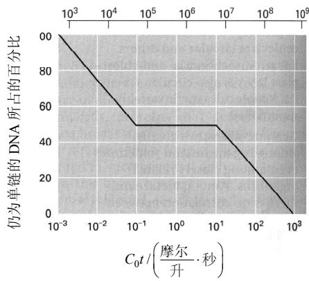

(a)重复序列所包含的 DNA 占多大比例?

(b) 单一序列所包含的 DNA 占多大比例?

(c) 如果在每个单倍基因组中单一序列只有一个拷贝，每个单倍基因组中重复序列有多少个拷贝？

(d) 假设每类序列的平均序列长度由下式给出： $n=(5\times10^{5})C_{0}t_{1/2}$ ，每类序列的平均序列长度是多少？

(a) 从 y 轴读出百分数，用 DNA 重复组分复性之前的 DNA 百分数，减去该组分复性后余下的单链 DNA 的百分数。 $C_{0}t_{1/2}$ 值从 x 轴上对应于各组分复性曲线的中点处读出。因此，100–50=50% 由重复 DNA 构成，其 $C_{0}t_{1/2}$ 为 $1\times10^{-2}$ 。

(b) 由于 $C_0 t$ 曲线说明只有两种类型的序列, 而 $50\%$ 为重复序列, 所以余下的 $50\%$ 属于单一序列, 其 $C_0 t_{1/2}$ 为 $1 \times 10^2$ 。

(c) 各类序列的相对丰度与它们的 $C_{0}t_{1/2}$ 呈反比，在此例中，重复序列 DNA 和单一序列 DNA 的相对丰度为 $1/(1\times10^{-2})=100$ 和 $1/(1\times10^{2})=0.01$ 。如果每个单倍基因组中单一序列只有一个拷贝，那么，每个单倍基因组中重复序列和单一序列的相对丰度为 10 000:1。

(d) 重复序列的平均序列长度为 $n = (5 \times 10^{5})(1 \times 10^{-2}) = 5 \times 10^{3}$ 碱基对，而单一序列的平均序列长度为 $n = (5 \times 10^{5})(1 \times 10^{2}) = 5 \times 10^{7}$ 碱基对，这些数量也可以根据顶上的标尺进行估计。

## 分析与应用

7.1 为什么端粒 DNA 不能被正常的 DNA 复制机制复制？

7.2 如果你从来没有在显微镜下见过染色体，但是见过细胞核，DNA 结构的什么特性会告诉你，在细胞内 DNA 一定是以高度盘绕的状态存在？

7.3 指出核小体和核小体核心颗粒的差异，它们各含什么蛋白质分子？各自的 DNA 长度是多少？

7.4 试想一段包装成核小体的双链 DNA，核小体之间的接头 DNA 为 55bp。在 1kb 区段中，预计会有多少个核小体？在 50kb 区段中呢？

7.5 如果端粒酶有缺陷，预计经过连续的有丝分裂，细胞的端粒会出现什么情况？

7.6 在大肠杆菌染色体中有端粒的类似物吗？

7.7 回忆一下，DNA 中的毗邻是指 5'-NN-3' 形式的双核苷酸，其中 NN 是紧邻的核苷酸。人类端粒 DNA 由重复序列 5'-TTAGGG-3' 的长双链片段构成，以 5'-TTAGGG-3' 重复序列构成的 3' 突出端结束。假设人类端粒被分离，并以某种 3'→5' 外切核酸酶消化，这种酶降解单链突出端。在剩下的双链端粒 DNA 中，毗邻有哪些类型？相对频率是多少？

7.8 如果 Rap1 蛋白质缺陷，不能与端粒结合，预计细胞的染色体会出现什么情况？

7.9 是什么导致了多线染色体中的条带？多线染色体会进行分裂吗？

7.10 果蝇多线染色体的条带区域是由常染色质还是异染色质构成？解释答案。

```txt
(b) 5'-GTCACGGCTAGC-3'
```

7.11 黑腹果蝇的多线染色体包括约 5000 个条带。常染色体基因组的大小为 $120 \times 10^{6}$ 碱基对，约有 15000 个基因。假设条带之间的 DNA 量可以忽略不计。

(a)每条带的平均 DNA 量是多少?

(b)每条带的平均基因数量是多少?

7.12 此处所示的 DNA 分子中，哪一个分子需要较高的复性温度？

```txt
(a) 5'-ACTGTCATAGAT-3'
```

```txt
3'-TGACAGTATCTA-5'
```

```html
3'-CAGTGCCGATCG-5'
```

7.13 解释为什么含 ATATAT 重复序列的 DNA 片段，比相同长度的含 A、T 随机序列的 DNA 片段，复性要快得多。

7.14 假设将双链 DNA 的尺寸均匀放大 50 万倍。那么，它的直径会变成 1mm，即大致为意大利细面的直径。如果将一个 DNA 分子放大 50 万倍后，它伸长到波士顿马拉松比赛线路的长度(约 42km)，那么，该 DNA 分子的实际长度是多少？

7.15 许多转座因子在两端含有一对反向重复序列。这些反向重复序列对此类分子在溶液中的快速复性有什么作用？

7.16 果蝇 X 染色体的端部被 X 线在靠近白眼基因的野生型等位基因基因座处打断。带端粒的片段丢失，但该基因的野生型等位基因 $w^{+}$ 仍保留。尽管缺少一个端粒（果蝇的端粒比较独特，它由几种特化的转座因子组成，而不是由简单重复序列组成），该染色体仍足够稳定，能在连续的世代中传递。不过，出现许多白眼雄性，这些白眼雄性是 $w^{+}$ 自发高频率突变为 w 的结果。解释为什么该结果应在意料之中，并指出 w 突变的本质。

7.17 端粒酶延伸双链 DNA 的 3' 端，在每端产生一个 3' 突出端。在脊椎动物中，3' 突出端由序列 5'-TTAGGG-3' 的许多重复拷贝组成。在脊椎动物的一条染色体中，两端的 3' 突出端是否可以并存——意思是通过碱基配对形成双链分子？

## 7.18 在高等灵长类中，端粒重复序列如下所示：

## 5'-TTAGGGTTAGGGTTAGGG-3'

3'-AATCCCAATCCC-5'

在人类谱系中，2号染色体是两条不同染色体的端粒通过末端融合而形成的。这种融合保留了两个端粒完整的6核苷酸重复序列，所以核苷酸既没有重复也没有缺失。写出人类2号染色体端粒重复单位融合处的序列，且显示接头两边各一个拷贝的端粒重复序列。

7.19 内切核酸酶 S1 可以切断单链 DNA，但不能切断双链线状 DNA。不过，S1 可以切割超螺旋 DNA，通常产生一个单链切口。为什么会出现这种情况？

7.20 试想一个长的线状 DNA 分子，其中一端相对于另一端在解旋的方向上旋转 4 圈。

(a) 如果将两端连接起来，以保持该分子的盘旋不足状态，有多少个碱基对会被打破？

(b) 如果让该盘旋不足的分子形成超螺旋，要扭转多少圈？

7.21 以 $^{14}\mathrm{N}$ 标记物种A的DNA，并使其随机断裂成片段；以 $^{15}\mathrm{N}$ 标记物种B的DNA，也使其随机断裂成片段。两种DNA以相同浓度混合并复性，然后在CsCl中离心到平衡状态。复性DNA总量的 $5\%$ 为混合密度。这两个物种都有的碱基序列占多少比例？

7.22 双链 DNA 样品一半的碱基对变性时的温度称为解链温度 (melting temperature)，记为 $T_{m}$ 。在很宽的碱基组成范围内， $T_{m}$ 与 G+C 碱基对的百分比 (用符号 g 表示) 大致呈线性关系。已知 $g=22\%$ G+C 的 DNA， $T_{m}=78^{\circ}C$ ； $g=73\%$ G+C 的 DNA， $T_{m}=98.9^{\circ}C$ 。推导 $T_{m}$ 和 g 之间的近似关系。

7.23 用 7.22 题中的关系求下列细菌基因组大致的解链温度:

(a) 富含 A+T (70% A-T)。

(b)由相同比例的 A+T 和 G+C 碱基对组成。

(c) 富含 G+C (70% G-C)。

7.24 用 7.22 题中的关系求 G+C 含量:

(a) 人类基因组， $T_{m}=84.7^{\circ}C$ 。

(b) 水稻基因组， $T_{m}=87.0^{\circ}C$ 。

7.25 在标准的复性条件下，某类序列的平均序列长度 $n = (5 \times 10^{5}) C_{0} t_{1/2}$ ，其中， $n$ 可以被看作序列复杂度的一个测度。在标准条件下，预计对应于下列动物病毒基因组的 $C_{0} t_{1/2}$ 是多少？可以假设这些病毒都不包含重复序列。

(a) 多瘤病毒，基因组大小为 5kb。

(b)腺病毒，基因组大小为 35kb。

(c)疱疹病毒，基因组大小为 230kb。

7.26 假设进行一个标准条件下的 $\lambda$ 噬菌体DNA复性实验，观察到 $C_0t_{1/2} = 10^{-1}$ ，相当于50kb的序列复杂度。然后做同样的实验，但DNA浓度加倍。新的 $C_0t_{1/2}$ 值是多少？该值说明该DNA的序列复杂度是多少？这两个序列复杂度的值有冲突吗？解释。

7.27 附图示两种可出现于转座因子两端的重复序列，(A)部分示正向重复序列，(B)部分示反向重复序列。假设这些重复序列可进行配对和重组。以下情况的遗传后果是什么：

(a)序列为正向重复序列。

(b) 序列为反向重复序列。

绘示意图来证明你的答案。

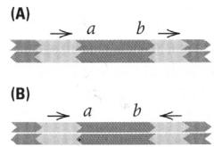

7.28 一个松弛的共价闭合环状 DNA 分子，所有的碱基都是配对的。一个蛋白质分子结合于该环，产生一个切口，将带切口的一条链围着无切口的链以顺时针方向完整地绕一圈，封闭切口，然后与该环脱离。

(a)该螺旋为盘旋不足还是盘旋过度？

(b)该分子会进行超螺旋化以释放应力吗？

(c) 超螺旋为正还是为负？

7.29 一个没有超螺旋的共价闭合环状 DNA 分子具有 10 对被破坏的碱基。如果让它能够形成超螺旋，恢复所有的碱基配对需要多少圈超螺旋？

7.30 已知某种基因组 DNA 的组成为：30% 的重复 DNA， $C_{0}t_{1/2}$ 为 $10^{-2}$ ；30% 的重复 DNA， $C_{0}t_{1/2}$ 为 $10^{-1}$ ；40% 的非重复 DNA， $C_{0}t_{1/2}$ 为 $10^{2}$ 。绘制解题指南习题 3 中所示的那种 $C_{0}t$ 曲线示意图。

## 挑战题

挑战题 1 某一样品由相同的 DNA 分子组成，每个分子约包含 3000 个碱基对。在可形成染色质的条件下，将该样品与组蛋白八聚体混合。然后，用核酸酶处理重建后的染色质，使酶消化得以发生。去除组蛋白，对片段测序，以鉴定 DNA 中切点的位置。发现切点的位置是随机的，并且，正如预料的一样，切点之间的间隔大约为 200 个碱基对。然后，重复该实验，只变化一处：在加入组蛋白八聚体之前，在 DNA 样品中加入一种已知可与 DNA 结合的蛋白质。同样，形成重建的染色质，并以核酸酶消化。在此实验中，发现切点仍是间隔大约 200 个碱基，但切点位于碱基序列的若干特定位置。在每个位置上，切割位点仅有 2～3 个碱基的变化。然而，检查切点出现之处的碱基序列，未表明切割出现在特定序列中，换句话说，对于发生切割的 2～3 个碱基的区域，每个区域都有不同的序列。解释这两个实验之间差异。

挑战题 2 从果蝇中分离并纯化到某种中度重复序列。以该序列为模板，与 DNA 聚合酶和放射性底物一起进行聚合反应，制得高放射性探针 DNA。然后，在原位杂交实验中，用此 DNA 探针与从同种的 10 只果蝇获得的含多线染色体的细胞杂交。放射自显影显示，放射性物质分布于基因组中大约 20 个位点，但在每只果蝇中处于不同的位点。关于所研究的中度重复 DNA 序列，这一观察结果说明了什么？

挑战题 3 思考图中所示的 Cot 曲线。

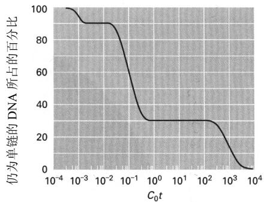

(a) 单一序列组分所含的 DNA 占多少比例？重复序列组分所含的 DNA 各占多少比例？

(b) 如果在每个单倍基因组中单一序列只有一个拷贝，另外两类序列在每个单倍基因组中有多少拷贝？

## 网上遗传学

“网上遗传学”(GeNETics)会为你介绍在互联网上寻找遗传学信息的某些最重要的站点。要浏览这些站点，请访问为《遗传学：基因和基因组分析》(第八版)配备的 Jones and Bartlett 公司配套站点http://biology.jbpub.com/book/genetics/8e/。

在该站点中，你会找到一个按章开列的重点关键词列表。选择某个关键词后，可链接到某个网站，其中包含与此关键词相关的信息。
