# 第8章 人类核型和染色体行为

一位艺术家表现的单倍人类基因组。所示的每条常染色体具有两条染色单体，好像出现在有丝分裂中期的一样；但在6点钟附近，X染色体和Y染色体都只显示了两条染色单体中的一条。[©Mark M. Miller/Photo Researchers, Inc.]

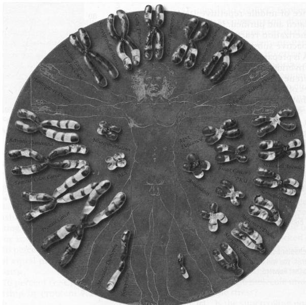

## 本章提纲

8.1 人类核型

8.2 人类妊娠中的染色体异常

8.3 染色体的缺失和重复

8.4 染色体倒位的遗传学

8.5 染色体易位

8.6 基因组中基因表达的位置效应

8.7 植物进化中的多倍性

8.8 禾本科的基因组进化

联系：X染色体的莱昂化

玛丽·莱昂，1961

小鼠 (Mus musculus L.) X 染色体中的基因的作用

联系：第一种被鉴定的人类染色体病

杰尔姆·勒琼、玛尔特·戈蒂埃和雷蒙德·特平，1959

9个唐氏综合征孩子的体细胞染色体研究(原文为法文)

## 学习目标与科学能力

在本章中，将学习人类核型及染色体行为，包括染色体增减的后果，以及缺失、重复、倒位和易位的遗传意义。理解这些原理，将能够理解既能保持物种内染色体组的相对稳定，又能让物种之间的差异得以演化的一些机制。还将获得以下科学能力。

\- 描述正常人类染色体组，描述包括性染色体在内的染色体增加(如唐氏综合征)或减少的意义。

\- 给剂量补偿和单条活性X染色体原理下定义，举一个可在表型水平观察到的典型的剂量补偿的例子，解释该过程如何在一定程度上缓解X染色体增多的症状。

\- 图示重复序列之间的不等交换并推测遗传后果。

■ 预测在臂内倒位或臂间倒位的倒位环内发生交换的结果。

\- 已知相互易位所涉染色体的结构，图示杂合个体通过减数分裂可能会产生什么类型的配子。

在大多数物种中，多一条染色体或少一条染色体的个体往往会有发育上的或其他类型的异常。这些异常是那条染色体中的基因拷贝数(剂量)增加或减少的结果。在有些生物中，可看见染色体结构的变异，但这通常很罕见。异常染色体的某个特定片段可能缺失、重复、方向颠倒，或与一条不同的染色体连接。这些结构异常各有不同的遗传意义。在本章中，考察人类染色体组，以及在人类群体中遇到的主要染色体异常。也考察其他生物的染色体异常。总的来说，动物比植物更不耐受染色体的改变。如同即将看到的，尤其是在植物中，获得额外的一整套染色体不一定有害。在有些植物谱系的基因组进化和物种起源中，整个染色体组的加倍一直是一个主要步骤。

## 8.1 人类核型

图 8.1 示一个人类男性有丝分裂中期细胞的正常染色体组，这些染色体经过一种称为染色体涂染(chromosome painting)的技术进行标记，其中，通过与标记了不同荧光染料的 DNA 链杂交，将不同的颜色“涂”到每条染色体上。首先分离出单条的染色体(这样的技术形形色色，如显微解剖之后以 PCR 进行 DNA 扩增)；然后，用荧光物质标记染色体特异的 DNA 样品。混合所有染色体的标记链，与压在玻璃载玻片上的中期染色体杂交，让荧光链与染色体中的互补链杂交。洗掉载玻片上未杂交的 DNA，通过共聚焦显微镜检查标本，读取荧光信号，转换成可见的颜色(共聚焦显微镜能够排除散射光和外部光线，因而可在单个聚焦平面产生单一区域的图像)。

图 8.1 人类染色体涂染，其中，各对染色体通过与不同的荧光探针杂交而被标记。(A)中期分裂相，示压片时染色体的随机排列。(B)核型，已将染色体配对分组，并按惯用顺序排列。1～20号染色体按从大到小的顺序排列，但因为历史原因，21号染色体排在22号染色体之前，虽然21号染色体比22号染色体小。[承德国慕尼黑大学约翰尼斯·威恩伯格(Johannes Wienberg)及美国国立卫生研究院托马斯·里德(Thomas Ried)惠赠。]

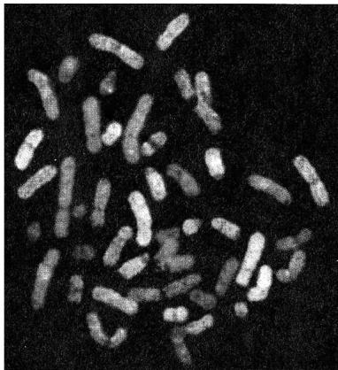  
(A)

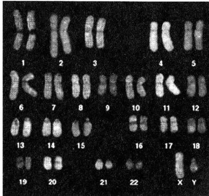  
(B)

## - 标准核型

染色体涂染能够变戏法似的识别出成对的同源染色体。图 8.1A 所示图像是一个中期分裂相 (metaphase spread)，其中，染色体的排列与细胞学标本中的排列一样。一种更为常见的表现形式——称作核型 (karyotype)，如图 8.1B 所示。在核型中，中期分裂相中的常染色体被重新排列，按次序从最长的一对排到最短的一对，并从 1(最长的)到 22 进行编号。在此例中，性染色体被放在右下角。很明显，X 染色体和 Y 染色体都只有一条。正常人类女性核型，除 22 对常染色体之外，还有一对 X 染色体，而不是一条 X 和一条 Y。染色体涂染在人类细胞遗传学中相当有用，因为即使是复杂的染色体重排也能便捷地检测到。

图 8.2 示另一种没有丰富色彩的中期分裂相及核型。在此情况下，染色体经一种称为吉姆萨(Giemsa)的染色试剂处理，吉姆萨使染色体显出横带(G 带，G-band)，每对同源染色体的横带都是特异的。这些带使每条染色体臂上较小的片段能够被识别。G 带在 S 期的中到晚期复制，基因相对贫乏，而间带(称为 R 带)在 S 期早期复制，基因相对丰富。

这些染色体被分成 7 组，以字母 A～G 表示 (X 染色体包含在 C 组中，Y 染色体在 G 组中)。

这些惯用的分组方法始于 G 带和染色体涂染之前，那时候只能按照大小和着丝粒位置对染色体进行分类。

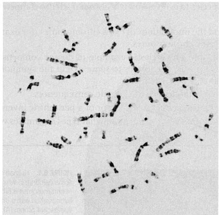  
(A) 中期染色体照片

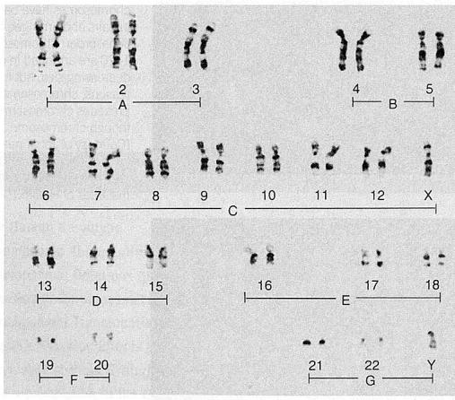  
(B) 核型  
图8.2 正常人类男性核型。停在中期的血细胞被吉姆萨染色，用显微镜照相。(A)镜检所见的一个细胞的染色体。(B)染色体已从照片中剪出来，并与同源染色体配对。[承索尔兹伯里地区医院韦塞克斯地区遗传学实验室帕特里夏·雅各布斯(Patricia A. Jacobs)惠赠。]

图 8.3 示人类染色体带型的命名法，其中，每条染色体之下的红色字母示其所属的组。对于每条染色体，以字母 p 表示短臂，p 代表“小(petite)”; 以字母 q 表示长臂，q 代表“不是 p”。在每条臂中，对区进行编号。第一位数字为大区，从着丝粒开始向端粒连续编号，在每个区中，第二位数字表示下一级较小的区域，仍然从着丝粒开始向外编号。例如，1p34 表示 1 号染色体、短臂、34区。有些小区可根据它们里面的带和间带进一步细分，带和间带连续编号，将一位数字放在主区域后的一个小数点之后来表示，例如，1p36.2表示1p36中的第二条带。在人类基因组中，一些常见的遗传标志有：Rh(Rhesus，恒河猴)血型基因座，为1p34和1p36.2之间的区域；ABO血型基因座，位于9q34；红绿色盲基因，位于Xq28；Y染色体上的男性决定基因，称为SRY(性别决定区，Y)，位于Yp11.3。

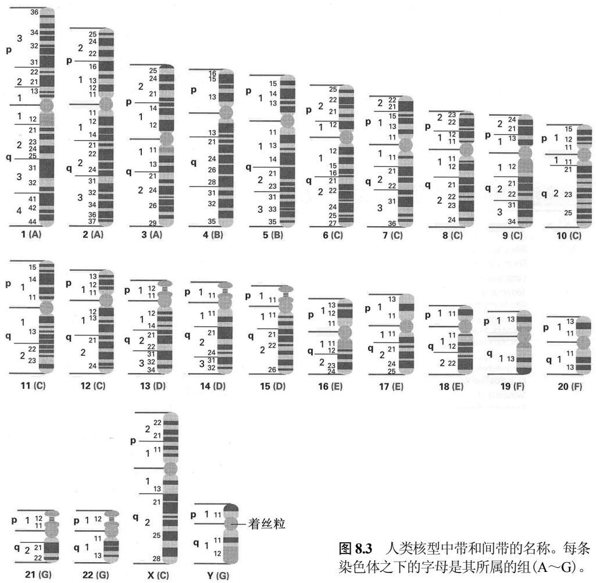

图 8.4 示有丝分裂中期的人类染色体组的染色体涂染。显示了每对同源常染色体中的一条，以及 X 染色体和 Y 染色体。每条染色体下面为该染色体中的 DNA 数量 (Mb)、基因的估计数量 (根据基因组序列估计) 及近似的基因密度。基因密度与染色体大小没有高度的相关性，不同染色体可有很大的变化。两条最小的染色体 (19 号和 22 号) 基因密度最高 (分别是每 Mb 27 个和 23 个基因)；两条最大的染色体 (4 号和 5 号)，基因密度在最小之列 (分别是每 Mb 8 个和 9 个基因)。

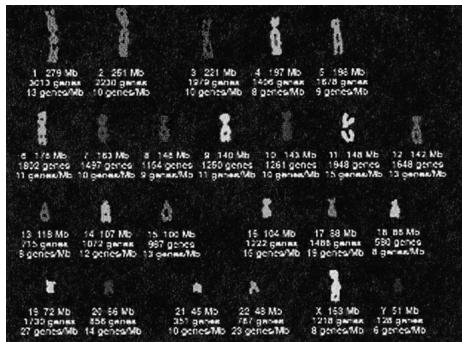  
图 8.4 有丝分裂中期的人类染色体，示每条染色体中的 DNA 数量、基因的估计数目及大致的基因密度。对于常染色体，仅显示每对同源染色体中的一条。[序列数据来自 International Human Genome Sequencing Consortium, Nature 409(2001): 860-921, 及 J. C. Venter, et al., Science 291(2001): 1304-1351. 染色体图片承格拉茨医科大学人类遗传学研究所迈克尔·斯派克 (Michael R. Speicher) 惠赠。]

为便于参考，我们将描述人类染色体及人类染色体异常的一些主要的习惯用法列于表8.1中。后缀ter用来表示“末端”，因而pter和qter分别指短臂和长臂的末端部分。+号和-号指的是额外的或缺失的染色体物质。置于染色体符号之前时，它们表示整条染色体受累；跟在染色体符号之后时，它们只指染色体的一部分。例如，+21表示存在21号染色体的一个额外拷贝(唐氏综合征的特征)，而21q22ter+表示存在从q22带一直延伸到端粒的这部分21号染色体的额外拷贝。mos表示嵌合体

(mosaic)——由两种或多种遗传上不同的细胞构成的个体。表 8.1 中的其他术语不言自明；在本章中，稍后将详细讨论这些染色体异常。

表 8.1 人类遗传学常用核型符号  
```txt
A～G 染色体分组
1～22 常染色体名称
X、Y 性染色体名称
p 染色体短臂
q 染色体长臂
ter 末端部分：pter 指短臂的末端部分；qter 指长臂的末端部分
+ 置于染色体名称前，表示该染色体(或臂)是多出来的；跟在名称之后，表示该染色体(或臂)比正常的大
- 置于染色体名称前，表示该染色体(或臂)缺失；跟在名称之后，表示该染色体(或臂)比正常的小
mos 嵌合体
/ 分隔嵌合体中不同克隆的核型，例如，47, XXX/45, X
dup 重复
dir dup 同向重复
inv dup 倒位重复
del 缺失
inv 倒位
t 易位
rcp 相互易位
rob 罗伯逊易位
r 环状染色体
i 等臂染色体(两条相同的臂连接于单个着丝粒，类似果蝇的并连 X 染色体)
```

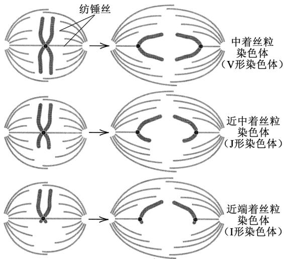  
图 8.5 由着丝粒(深蓝色所示)位置决定的后期单着丝粒染色体的 3 种可能的形态。

## - 着丝粒与染色体稳定性

正如几乎所有的真核生物一样, 每条人类染色体均为线状染色体, 均只有单个着丝粒(偶尔可见环状染色体, 系线状染色体端粒的断裂和重接所致)。在后期中, 当子代染色体彼此分离时, 着丝粒的相对位置决定了染色体的外观(图 8.5), 因而人们常常按着丝粒的相对位置来对线状单着丝粒染色体进行分类。着丝粒大约在正中间的染色体为中着丝粒染色体(metacentric chromosome), 两臂的长度大致相等, 在后期时每个子代染色体呈“V”形; 当着丝粒稍微偏离中央时, 该染色体为近中着丝粒染色体(submetacentric chromosome), 在后期时每个子代染色体呈“J”形; 着丝粒非常靠近一端的染色体, 在后期时呈“I”形, 因为两臂的

## 长度严重不等，这样的染色体为近端着丝粒染色体(acrocentric chromosome)。

能够可靠地从亲代细胞传递给子代细胞或从亲本生物传递给后代的染色体通常只有单着丝粒染色体。细胞分裂时，纺锤丝连接于每条染色体的着丝粒，并向两极牵引姐妹染色单体。缺少着丝粒的染色体为无着丝粒染色体(acentric chromosome)。在遗传上，无着丝粒染色体是不稳定的，因为在细胞分裂过程中它们无法正常移动，继而丢失。偶尔会出现具有两个着丝粒的染色体，称为双着丝粒染色体(dicentric chromosome)。在遗传上，双着丝粒染色体也是不稳定的，因其以不可预测的方式传递。在细胞分裂过程中，当两个着丝粒分别向两极移动时，双着丝粒染色体经常会从细胞中丢失，在此情况下，染色体被拉直，在两个子细胞之间形成桥。这个桥有可能不被任何一个子细胞包含，或者断裂，结果是每个子细胞核各得一条断裂的染色体。我们讨论倒位的时候，将会讨论形成双着丝粒染色体和无着丝粒染色体的一种机制。

虽然大多数双着丝粒染色体在遗传上是不稳定的，但如果两个着丝粒靠得足够近，它们经常会表现得如同单个单位，从而可被正常传递。在人类2号染色体的进化中，该原理非常重要。在高等灵长类中，黑猩猩和人类都有在形态和G带带型上类似的23对染色体，但黑猩猩没有人类2号染色体(巨大的中着丝粒染色体)的明显的同源染色体。不过，黑猩猩有两条未见于人类基因组中的中等大小的近端着丝粒染色体，这种情况的原因如图8.6所示。G带带型表明，

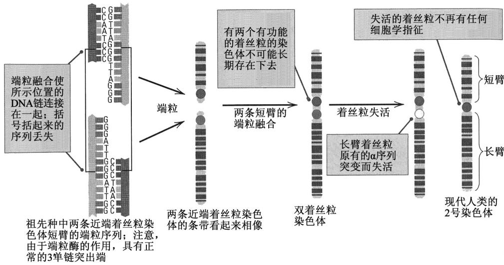

图 8.6 人类祖先具有 24 对染色体，而不是 23 对。在人类基因组的进化过程中，两条近端着丝粒染色体融合，产生人类 2 号染色体。

人类2号染色体是两条近端着丝粒染色体短臂之间的端粒融合形成的，在黑猩猩中，这两条染色体仍保持为近端着丝粒染色体。该融合产生一条两个着丝粒并拢在一起的双着丝粒染色体，这条新的染色体必定具有足够的稳定性，才能继续留在人类谱系中。今天人类的2号染色体仅有单个有功能的着丝粒，该染色体融合将人类谱系的染色体数目从48——这是大型猿类(黑猩猩、大猩猩和猩猩)的特征——减少到46。

## - X 连锁基因的剂量补偿

对具有 XX-XY 性别决定的所有生物而言，存在一个 X 染色体基因剂量的问题，因为雌性具有该染色体的两个拷贝，而雄性只有一个拷贝(对 Y 连锁基因来说问题不大，因为 Y 染色体主要是异染色质，携带的基因相当少)。在大多数生物中，已进化出一种剂量补偿(dosage compensation)机制，其中，在两性中不等的剂量，或者通过增加雄性 X 染色体基因的活性，或者通过减少雌性 X 染色体基因的活性，得以校正。黑腹果蝇和秀丽隐杆线虫说明了剂量补偿的两个极端：

\- 在雄性黑腹果蝇中,有一种复合体(它至少包含一种雄性特异蛋白)被募集到X染色体上,这种复合体可改变X染色体的染色质结构,极有可能是通过对组蛋白H4中某个特定赖氨酸的乙酰化而达成。这导致雄性中单条X染色体的转录活性水平增加到雌性中两条X染色体转录活性的总体水平。

\- 在雌性秀丽隐杆线虫中，一种蛋白质复合体被募集到X染色体上，使每条X染色体的转录水平各降低一半。这导致雌性中每条X染色体转录水平的降低，以致两条X染色体总的转录活性，与雄性单条染色体的转录活性一样。

哺乳类中剂量补偿的机制似乎比较简单。在胚胎早期卵裂中，在 64～128 个细胞的阶段，每个细胞中随机选择的一条且仅有一条 X 染色体在遗传上保持活性，而该细胞中可能存在的所有其他 X 染色体都要经历 X 失活 (X inactivation) 过程。在某一特定体细胞中失活的任何 X 染色体，在该细胞的所有后代中均保持失活 (图 8.7)，因此，X 染色体的失活状态可从亲代细胞遗传给子细胞。

X 失活过程发生在具有两条或多条 X 染色体的所有胚胎中，包括正常的 XX 雌性。失活过程为一种染色体凝缩过程，起始于一个称为 XIC(表示 “X 失活中心”，X-inactivation center) 的位点，该位点在长臂上靠近着丝粒的 Xq11.2 和 Xq21.1 之间。在细胞学上，该位点造成有丝分裂中期 X 染色体上一个特征性的 “弯曲”，该弯曲被认为是 X 失活的一个可见的表现形

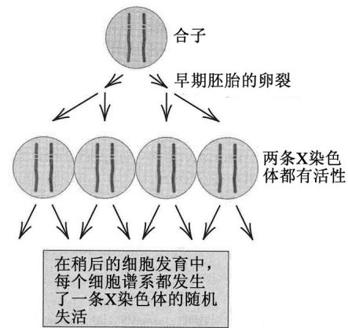

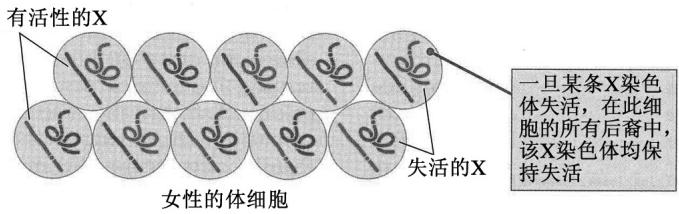  
图 8.7 正常女性体细胞示意图, 示女性对 X 连锁基因而言为嵌合体。两条 X 染色体以红色和蓝色显示。有活性的 X 绘成直的染色体, 无活性的 X 绘成缠结的染色体。每个细胞仅有一条有活性的 X, 但保持活性的 X 具体是哪条, 是随机的。在人类中, 失活作用涵盖短臂末端几个基因之外的所有基因。

式。Xq11.2-Xq21.1 区域存在于所有结构异常的 X 染色体中，这一发现被视为该区域在 X 失活中发挥基本功能的一条证据，因为缺少该区域的结构异常 X 染色体不会失活，从而引起死亡，因而观察不到。另一条证据是，XIC 包含一个名为 Xist(表示 “X 失活特异转录物”，

X-inactivation-specific transcript)的被转录区域。Xist的转录是在X失活中观察到的最早的事件，并且Xist是已知唯一一个从失活X染色体转录的基因。值得注意的是，剪接后的Xist转录物不含编码蛋白质的阅读框。它似乎是发挥结构RNA的功能，并且，随着Xist转录的不断进行，剪接后的转录物从XIC向外扩散，逐步覆盖失活的X染色体。其后，其他的分子变化沿失活的X染色体进行，这些分子变化通常与基因沉默(gene silencing)有关，包括在5'调控区的重度胞嘧啶甲基化、组蛋白的脱乙酰化和甲基化，以及异染色质特异的DNA结合蛋白的聚集。在Xist类似物被破坏的小鼠胚胎中，不发生X失活，这说明Xist对于失活是必不可少的。

X 染色体失活有两个结果。首先，它导致剂量补偿，使雌性和雄性中 X 连锁基因的有活性的拷贝数相等。虽然雌性有两条 X 染色体而雄性只有一条，但因为雌性每个体细胞中一条 X 染色体的失活，两种性别都具有相同的有活性的 X 染色体数目。依靠 X 失活的剂量补偿机制，最初是玛丽·莱昂 (Mary Lyon) 提出来的，现在称为单条活性 X 染色体原理 (single-active-X principle)。

X 染色体失活的第二个结果是，正常女性是 X 连锁基因的一种嵌合体。也就是说，每个体细胞只表达一条 X 染色体中的基因，但从一个细胞到另一个细胞，在遗传上有活性的 X 染色体不同。这种嵌合现象可在对于决定某种酶的不同形式 (A 型和 B 型) 的 X 连锁等位基因为杂合的女性中直接观察到：在实验室中对来自杂合女性的细胞一个个单独培养时，可见一半的克隆只产生该酶的 A 型，而另一半只产生 B 型。在对于导致缺乏汗腺的 X 连锁隐性突变为杂合的女性中，也可直接观察到嵌合现象：这些妇女表现出大块有汗腺的皮肤 (这些皮肤块来源于正常 X 染色体保持活性而突变 X 失活的胚胎细胞) 和大块缺乏汗腺的皮肤 (这些皮肤块来源于正常 X 染色体失活而突变 X 染色体保持活性的胚胎细胞)。

虽然所有雌性哺乳类都利用 X 染色体失活来进行剂量补偿，但选择哪一条染色体失活不总是随机的。在有袋类哺乳动物(包括袋鼠、树袋熊和袋熊)中，失活的 X 染色体总是父亲贡献的那条。结果，雌性有袋类不是父源和母源 X 连锁基因的遗传嵌合体，雌性有袋类表达它从母亲遗传得来的 X 连锁基因。

联系：X染色体的莱昂化

玛丽·莱昂，1961

医学研究理事会，哈威尔，英国

小鼠(Mus musculus L.)X染色体中基因的作用

雌性有两条 X 染色体而雄性只有一条，生物是怎样解决这个问题的？除非存在某种形式的校正(称为剂量补偿)，这种数量上的不等可能意味着，对 X 染色体上的所有基因来说，雌性细胞中的基因产物可能会是雄性细胞的两倍。应对这么多基因在剂量上如此巨大的差异，对于发育中的生物来说，可能非常困难。不同的生物以不同的方式解决了剂量补偿问题。本论文中提出的假说是，在小鼠中(根据推理，也在其他哺乳动物中)，机制非常简单：在发育早期，每个细胞谱系中随机选择的一条 X 染色体失活，并在该谱系的所有后代细胞中保持失活。在某些细胞中，在间期可看到失活的 X 染色体是一个深染的“性染色质小体”。现在我们知道，在 X 染色体短臂上有为数不多的基因不失活。X 染色体的其余部分从“X 失活中心”开始逐渐失活，也有很好的证据。我们还知道，在有袋类哺乳动物中(如袋鼠)，失活的总是父源 X 染色体。

有人认为，所谓的性染色质小体是由异固缩的(即在间期中深染的)X染色体组成。……本通讯认为，小鼠的遗传学证据说明：①在同一只小鼠的不同细胞中，异固缩X染色体的起源可以是父源或母源；②异固缩X染色体在遗传上是失活的。证据主要有两部分，首先，在小鼠中XO雌性表型正常，证明正常发育——包括性发育——仅需一条X染色体。第二个证据与某些性连锁(X连锁)突变为杂合的雌性的嵌合表型有关。迄今已知影响毛色的所有性连锁突变都会引起具有正常毛色和突变毛色斑块的“斑点状”或“斑纹状”表型。……我们认为，这种嵌合表型是由于胚胎发育早期这一条或另一条X染色体失活。如果这成立，那么，携带突变基因的染色体被失活的细胞，起源于它的色素细胞将产生正常色斑，而那些携带正常基因的染色体被失活的色素细胞将产生突变型色斑。……因而，该假说预测，对于小鼠的所有性连锁基因而言，如果表型是局部的基因作用所导致的，杂合子将会具有嵌合外观。……遗传证据未显示在早期发育的哪一个阶段发生这一条X染色体的失活。……在大鼠和负鼠中，性染色质小体被认为是由一条 X 染色体构成。如果能够证实在所有哺乳动物中都是这种情况，那么，对性连锁突变基因杂合的所有雌性哺乳动物，预计会表现出像小鼠中那些同样的现象。玳瑁猫的皮毛为两种纯合基因型的黑色和黄色的嵌合，完全符合这一预期。

## ■ 三花猫

在非有袋类哺乳动物中，雌性中随机 X 失活的结果有时可在外部表型中观察到。一个例子是在雌猫中皮毛着色的 “三花” 图案。在猫中，在 X 染色体上存在两个影响毛色的等位基因：一个

等位基因导致橙色毛色(有时说成黄色)；另一个等位基因导致黑色毛色。因为雄性只有一条X染色体，所以正常雄性或具有橙色等位基因，或具有黑色等位基因。雌性可为橙色和黑色的杂合，如果这样的话，毛色即为“三花”——橙色和黑色色块的嵌合体。橙色和黑色色块是X染色体失活的结果。在携带橙色等位基因的X染色体失活的细胞谱系中，携带黑色等位基因的X染色体具有活性，因而毛皮为黑色。在携带黑色等位基因的X染色体失活的细胞谱系中，在有活性的X染色体中的橙色等位基因产生橙色皮毛(图8.8)。

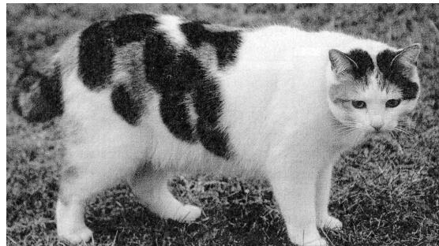  
图 8.8 这只猫的名字叫金杰(Ginger)。它是一只雌猫，对橙色和黑色毛色等位基因为杂合，显示出具有橙色和黑色皮毛色块的典型“三花”图案。

白色斑块具有完全不同的解释。白色斑块是因为控制白斑形成的一个常染色体基因 S，该基因在其表达的细胞谱系中阻止色素形成。还不知道为什么 S 基因在有些细胞谱系中表达，而不在其他细胞谱系中表达。纯合的 SS 猫比杂合的 Ss 猫有更多的白色。图 8.8 中金杰这只雌猫为纯合的 SS。

## - 假常染色体遗传

随着 X 和 Y 染色体不断与它们的祖先染色体趋异，以及 Y 染色体开始丧失其大部分基因的功能，在无活性 X 染色体中，基因的沉默逐渐进化。因而，在无活性 X 染色体中的基因失活可对单个的基因或成片的基因发生作用，从而在无活性 X 中的有些基因不被沉默。一些逃脱 X 失活的基因在 Y 染色体上存在有功能的同源基因，而其他的基因没有。

在 X 染色体长臂和短臂末端发现两个逃脱 X 失活的连续区域，这两个区域就是在 Y 染色体中仍然具有功能性同源基因的区域。这些同源区域使 X 染色体和 Y 染色体在精子发生过程中能够联会，并发生一次交换，将这两条染色体连在一起，以确保它们在后期 I 期间能正常分离。具有 X-Y 同源性的区域称为假常染色体区 (pseudoautosomal region, PAR): PARp 是在短臂末端的一个 2.7Mb 的区域，PARq 是在长臂末端的一个 0.3Mb 的区域。因为起码在 PARp 中一定要发生交换，所以在 PARp 中每核苷酸对的重组率至少要比常染色体高 20 倍。

假常染色体区基因在系谱中的遗传方式，与常染色体特有的遗传方式是无法区分的。原因是，在假常染色体区内的突变等位基因既不是完全 X 连锁的，也不是完全 Y 连锁的，而是假常染色体区内的重组，可在 X 染色体和 Y 染色体之间来回移动。表现出常染色体样的遗传方式，但分子研究表明存在于假常染色体区内的基因，就说是表现为假常染色体遗传 (pseudoautosomal inheritance)。

## - 在“失活”X染色体上的活性基因

在 “失活” X 染色体中，除假常染色体区 PARp 和 PARq 的基因之外，尚有其他一些基因表现出转录活性。具体而言，一项对人类 X 染色体上 624 个基因的转录水平的研究表明，约 15%的 X 连锁基因在某种程度上逃脱了失活。因此，“失活的 X”并不完全沉默。图 8.9 示 X 染色体上具有部分活性的基因的位置。被转录的基因往往出现在位于两臂(尤其是短臂)远端部分的大的区块中，这一模式提示，逃脱 X 失活可能与到 Xist 的距离相关。

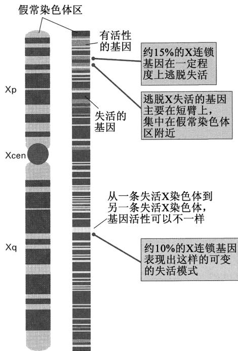  
图 8.9 在失活的 X 染色体中逃脱完全转录沉默的约 15% 的基因在人类 X 染色体上的分布。[数据来自 L. Carrel and H. F. Willard, Nature 434 (2005): 400-404.]

大多数逃脱失活的基因，其转录水平是在有活性的X染色体中观察到的同源基因的转录水平的15%～50%，因此，这种活性水平是很强的。逃脱完全X失活的基因数目，以及它们的转录水平，也许可以轻而易举地解释以下现象：男性和女性之间在性状表达上的某些差异；在血友病A之类的X连锁突变的杂合女性中的表型变异；在X染色体数目异常的个体之间的表型变异。

## - Y 染色体的基因含量与进化

比较细胞遗传学(comparative cytogenetic)和分子研究提示，在现代哺乳类和鸟类的共同祖先中，X染色体和Y染色体开始是以一对普通常染色体的形式存在的。它们在300～350百万年(MY)前，大约在哺乳类的进化谱系与鸟类的进化谱系趋异的同时，开始发生DNA序列和基因含量上的趋异。我们必然要假设，在此之前，原X(proto-X)染色体和原Y(proto-Y)染色

体从头到尾的重组都是以正常水平发生的，并且它们的基因含量是相同的。

在现存人类基因组中，Y染色体包含大约26个编码不同蛋白质的基因，其中许多基因对于男性的生育力很重要。Y染色体也充满很多重复序列，有的非常长，这些重复序列可进行基因转换，起到同源重组位点的作用。Y染色体上的一个关键基因是在Yp11.3位置上的主要性别决定基因SRY。SRY基因编码一种转录因子蛋白——睾丸决定因子(testis-determining factor, TDF)，它通过诱导未分化的胚胎生殖嵴(性腺的前体)发育为睾丸，指导胚胎向男性发育。转录因子是刺激其靶基因转录的蛋白质。

当 SRY 进化为性别决定机制之后，Y 染色体就开始在 DNA 序列上与 X 染色体趋异，并且，可发生 X-Y 重组的区域逐渐变成局限于端粒区域。在没有 X-Y 重组的区域中，Y 染色体上的基因受到持续的选择压力 (selection pressure)，迫使这些基因经过突变退化成无功能状态。这是 Y 染色体强制杂合化的结果，这使得 Y 染色体随着时间的推移积累起众多的有害突变，因为没有通过重组来重新形成无有害突变的 Y 染色体的机会。因此，任何 Y 连锁基因，如果其功能是非必需的，将会因为突变的积累而倾向于逐渐退化，同时，对于 X 染色体上的同源基因的剂量补偿存在选择压力。最终，只有剂量补偿的 X 连锁基因会保持有功能。

显然，基因区块曾以大块的方式从 X-Y 重组区中去除过。该结论的分子证据概括于图 8.10 中。左边所示的为现代 X 染色体短臂中从 Xp11 区到端粒的一些蛋白质编码序列的位置。所有这些基因在现代 Y 染色体中都有同源序列，如右侧所示。X 和 Y 同源染色体之间的序列趋异数量表现出一个值得注意的模式：GYG2-AMELX 基因在密码子的同义位置 (synonymous positions) 上的序列趋异为 0.07～0.11（同义位置是可发生核苷酸置换而不改变所编码的氨基酸的位置，同义位置的序列趋异大体上可以 X 和 Y 同源染色体之间有差异的同义位点的比例来衡量）；TB4X-UTX 为 0.23～0.36；SMCX 为 0.52；而所示区域之外的其他基因大于 0.94。因为在哺乳类基因的同义位点上，核苷酸置换的进化速率是已知的，所以可以判断，与这些趋异水平对应的

图 8.10 根据 DNA 序列数据推断，由于 Y 染色体中的倒位，哺乳类的 X-Y 假常染色体区随着时间推移而逐渐缩短。箭头示每次打断假常染色体区的倒位的远端(最靠近端粒的)断裂点。
[数据来自 B. T. Lahn and D. C. Page, Science 286 (1999): 964-967.]

趋异时间为：GYG2-AMELX，30～50 百万年 (MY)；TB4X-UTX，80～130MY；SMCX，130～170MY；所示区域之外的其他基因，300～350MY。最简单的解释是，这些趋异时间是基因区块通过染色体重排从 X-Y 重组区中去除时的时间。这里的染色体重排即倒位，在 Y 染色体内部某处的一个区域，变成相反的方向。通过在 Y 染色体中不同位置上以相反方向存在的两个重复 DNA 序列之间的同源重组，可发生这样的倒位，这种机制将在 8.4 节中详细讨论。这些倒位是通过同源重组产生的，还是通过某些其他的断裂和重接过程产生的，尚未知晓。不过，这些倒位确实发生过，图 8.10 所示的进化重建表明，130～170MY 的倒位断裂点靠近 UTY，80～130MY 的倒位断裂点靠近 AMELY，而 30～50MY 的倒位断裂点靠近今天在短臂上的假常染色体区。当这些倒位在进化的 Y 染色体中固定时，它就从 X-Y 重组区中去除相应的基因区块，所以在 X 和 Y 同源染色体之间的序列趋异速率加快。从这些数据中无法追踪的 Y 染色体的其他重排，导致了 Y 染色体上基因顺序的其他的一些混乱。

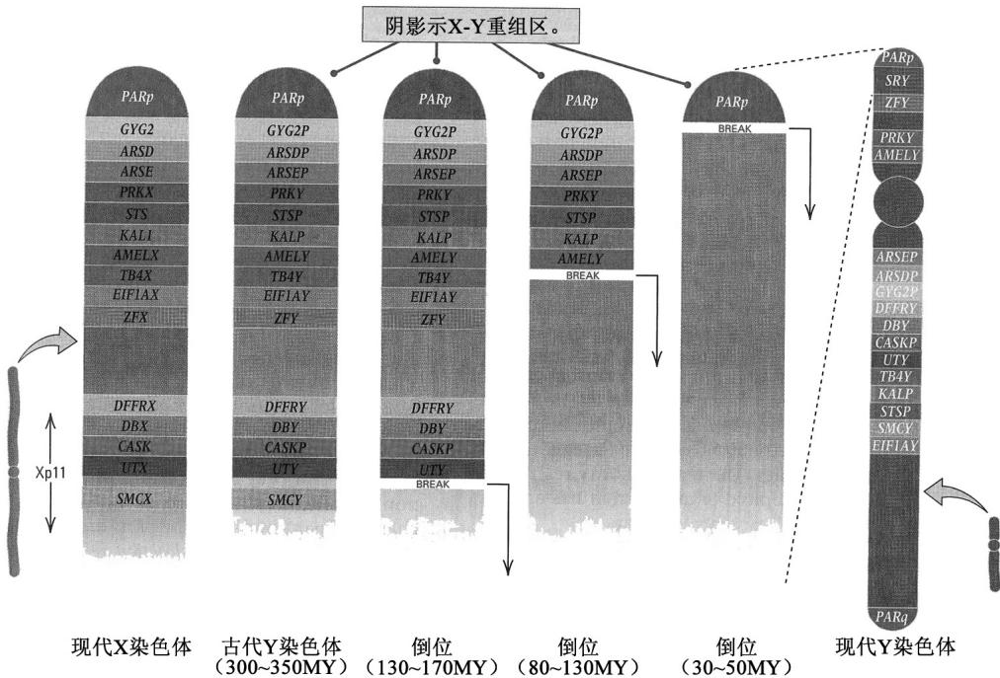

## 8.2 人类妊娠中的染色体异常

人类全部可识别妊娠(recognized pregnancy)的约 $15\%$ 以自发流产终止，而在全部自发流产的大约一半中，胎儿具有严重的染色体异常。表8.2概括了在几个研究中发现的每十万次可识别妊娠中染色体异常的平均比例。三体(trisomy)这个术语是指在二倍体基础上具有单条染色体的一个额外拷贝的生物。大多数自发流产的胎儿为某一条常染色体的三体。具有3套染色体(总数为69条)的三倍体和具有4套染色体(总数为92条)的四倍体，也常见于自发流产中。三倍体和四倍体是整倍体(euploid)状况的例子，因为他们的相对基因剂量与二倍体中所见的相同。相比之下，在三体中相对基因剂量被打乱，因为位于三体染色体上的基因有3个拷贝，而其他染色体上的基因有两个拷贝。此类不平衡的染色体组称为非整倍体(aneuploid)。虽然在表8.2中的数据不明显，但在大多数生物中，整倍体异常的表型效应一般没有非整倍体异常严重。表8.2中的术语“平衡易位”是指一种整倍体状况，非同源染色体部分互换，但所有的部分都还在；术语“非平衡易位”是指一种非整倍体状况，基因组的某个部分缺失。平衡易位的生存机会较大，说明整倍体染色体异常一般比非整倍体染色体异常的危害要小。

表 8.2 人类每十万例可识别妊娠的染色体异常

<table><tr><td colspan="2"></td><td>15 000例自发流产</td><td>85 000例活产</td></tr><tr><td colspan="4">三体</td></tr><tr><td rowspan="3">A:</td><td>1</td><td>0</td><td>0</td></tr><tr><td>2</td><td>159</td><td>0</td></tr><tr><td>3</td><td>53</td><td>0</td></tr><tr><td rowspan="2">B:</td><td>4</td><td>95</td><td>0</td></tr><tr><td>5</td><td>0</td><td>0</td></tr><tr><td>C:</td><td>6-12</td><td>561</td><td>0</td></tr><tr><td rowspan="3">D:</td><td>13</td><td>128</td><td>17</td></tr><tr><td>14</td><td>275</td><td>0</td></tr><tr><td>15</td><td>318</td><td>0</td></tr><tr><td rowspan="3">E:</td><td>16</td><td>1229</td><td>0</td></tr><tr><td>17</td><td>10</td><td>0</td></tr><tr><td>18</td><td>223</td><td>13</td></tr><tr><td>F:</td><td>19-20</td><td>52</td><td>0</td></tr><tr><td rowspan="2">G:</td><td>21</td><td>350</td><td>113</td></tr><tr><td>22</td><td>424</td><td>0</td></tr><tr><td colspan="4">性染色体</td></tr><tr><td colspan="2">XYY</td><td>4</td><td>46</td></tr><tr><td colspan="2">XXY</td><td>4</td><td>44</td></tr><tr><td colspan="2">XO</td><td>1350</td><td>8</td></tr><tr><td colspan="2">XXX</td><td>21</td><td>44</td></tr><tr><td colspan="4">易位</td></tr><tr><td colspan="2">平衡的</td><td>14</td><td>164</td></tr><tr><td colspan="2">不平衡的</td><td>225</td><td>52</td></tr><tr><td colspan="4">多倍体</td></tr><tr><td colspan="2">三倍体</td><td>1275</td><td>0</td></tr><tr><td colspan="2">四倍体</td><td>450</td><td>0</td></tr><tr><td colspan="2">其他(嵌合体,等)</td><td>280</td><td>49</td></tr><tr><td colspan="2">总计</td><td>7500</td><td>550</td></tr></table>

当某个生物在二倍体基础上缺失单条染色体的一个拷贝时，这种状况称为单体(monosomy)。在大多数生物中，染色体丢失(导致单体)比染色体获得(导致三体)更加频繁。然而，在表8.2的自发流产数据中，单体明显缺乏。它们的缺乏无疑是因为单体的另一个特点：

一条染色体缺失一个拷贝(单体)产生的效应往往比相同染色体增加一个拷贝(三体)更加有害。

在人类受精时，很可能产生的单体合子数目比三体合子更多，但因为在发育过程中流产发生得太早，以致母亲意识不到妊娠，所以在表8.2的流产胎儿中见不到单体。极早期流产相关的数据来自尝试怀孕妇女的医学记录，她们在尝试怀孕期间每天进行孕激素检测。所化验的激素是人类绒毛膜促性腺激素，这是在受孕后不久，大约于胚胎在子宫壁上着床的时候，由胚胎最先产生的一种糖蛋白。结果是，这些妇女多数每个月都会受孕，但在50%～60%的情况下，着床没有发生，或着床很短时间后胚胎遭到自发流产。鉴于在表8.2晚期自发流产中染色体异常的极高水平，很可能这些早期自发流产中的大部分也具有染色体异常，主要是单体。这些数据说明存在极大的胎儿损耗，但这发挥了重要的生物学功能，清除许多因为严重的染色体异常，可能会在身体和行为的发育上存在严重异常的胎儿。

## 联系：第一种被鉴定的人类染色体病

杰尔姆·勒琼、玛尔特·戈蒂埃和雷蒙德·特平，1959法国巴黎，国家科学研究中心

9个唐氏综合征孩子的体细胞染色体研究(原文为法文)

唐氏综合征曾是人类遗传学中最为费解的现象之一。该综合征是智力障碍中最常见的类型之一，不遵循任何孟德尔遗传方式。然而，有些家庭却生育两个或多个患唐氏综合征的孩子(现在已知，这些病例许多是由于涉及21号染色体的易位所致)。该论文是人类遗传学的一个转折点，它证明唐氏综合征实际上是存在一条额外染色体的结果。唐氏综合征是第一种得到鉴定的染色体病。本节选使用“端着丝粒染色体”这个术语，是指其着丝粒非常靠近一端的染色体。在人类基因组中，最小的染色体是3条非常小的端着丝粒染色体。这些染色体是21号、22号和Y染色体。正常男性有5条小的端着丝粒染色体(21、21、22、22、Y)；正常女性有4条(21、21、22、22)(X染色体是中等大小的染色体，其着丝粒略偏离中心)。在下面的表格中，留意在“可疑”细胞中染色体计数的变化。在当时，计数染色体的方法非常困难，会出很多错误，要么把两条邻近的染色体数成一条，要么在一个细胞核的染色体总数中把实际上属于邻近细胞核的一条染色体包括进来。勒琼及其合作者明智地选择忽略这些可疑的计数，仅把结论建立在“完美”细胞之上。有时候，好的科学在于懂得什么数据应该忽略。

在每个病例中，计数的细胞数目看起来比较少。这是因为，在该表中仅保留了一目了然的(分散的染色体)照片。在“可疑”细胞中，有染色体数目上的似是而非的差异——也就是说，在这些细胞中，每条染色体不能确凿无疑地逐条进行记录——已有几位作者指出过。在我们看来，这种现象似乎不代表细胞学上的实际情况，而仅仅是反映了精细操作上的困难。因此，我们认为少量的绝对肯定的计数(表中的“完美”细胞)比大量可疑的观察结果更好，似乎是符合逻辑的，因为可疑观察结果在统计上的差异，纯粹是缺乏精确观察的结果。对“完美”细胞染色体组的分析显示，在唐氏综合征男孩中存在6条小的端着丝粒染色体(而不是正常男性中的5条)，在唐氏综合征女孩中存在5条小的端着丝粒染色体(而不是正常女性中的4条)。……因而，似乎有理由得出这样的结论：在唐氏综合征孩子中存在一条额外的小的端着丝粒染色体，这是47这个异常数字的原因。为了解释这些观察结果，可考虑在减数分裂时一对小的端着丝粒染色体不分离的假说。……然而，认为这条超数的小端着丝粒染色体就真的是一条正常染色体，是不可能的，并且目前有种可能性不能放弃——这条染色体可能是另一种畸形所产生的片段。

<table><tr><td colspan="8">染色体数目</td></tr><tr><td></td><td></td><td colspan="3">“可疑”细胞</td><td colspan="3">“完美”细胞</td></tr><tr><td></td><td></td><td>46</td><td>47</td><td>48</td><td>46</td><td>47</td><td>48</td></tr><tr><td rowspan="5">男孩</td><td>1</td><td>6</td><td>10</td><td>2</td><td>—</td><td>11</td><td>—</td></tr><tr><td>2</td><td>—</td><td>2</td><td>1</td><td>—</td><td>9</td><td>—</td></tr><tr><td>3</td><td>—</td><td>1</td><td>1</td><td>—</td><td>7</td><td>—</td></tr><tr><td>4</td><td>—</td><td>3</td><td>—</td><td>—</td><td>1</td><td>—</td></tr><tr><td>5</td><td>—</td><td>—</td><td>—</td><td>—</td><td>8</td><td>—</td></tr><tr><td rowspan="4">女孩</td><td>1</td><td>1</td><td>6</td><td>1</td><td>—</td><td>5</td><td>—</td></tr><tr><td>2</td><td>1</td><td>2</td><td>—</td><td>—</td><td>8</td><td>—</td></tr><tr><td>3</td><td>1</td><td>2</td><td>1</td><td>—</td><td>4</td><td>—</td></tr><tr><td>4</td><td>1</td><td>1</td><td>2</td><td>—</td><td>4</td><td>—</td></tr></table>

来源：J. Lejeune, M. Cautier, and R. Trupin, Comptes Rendus Hebd. Seances Acad. Sci. 248(1959): 1721-1722.

## ■ 唐氏综合征和其他可存活的三体

表 8.2 表明，多数人类常染色体的单体或三体不能存活。但有 3 个例外：13 三体、18 三体和 21 三体。前两个是伴有严重发育异常的罕见疾病，患儿只能存活数天或数星期。

21 三体即唐氏综合征 (Down syndrome 或 Down's syndrome)，发生率约为 1/750 活产婴儿。其主要症状是智力障碍，但也可有多种身体异常，如心脏病。患儿因骨骼系统延迟成熟而身材矮小；肌张力低下，造成特征性的面部容貌；寿命缩短，通常不到 50 岁。不过，对于一种严重的染色体异常而言，这些症状还算温和，并且多数唐氏综合征患儿能够很好地与他人相处。

唐氏综合征患儿通常很喜欢他们周围的事物——他们的家庭、玩具和玩伴。快乐来得很容易，并且整个一生他们往往都保持着孩子似的好脾气。随着青春期和成年期的来临，大多数人会有的成年的烦恼，他们没有。生活简单，一点也不复杂。其他人觉得强烈的情感，对他们来说似乎不怎么激烈。如同其他每个人一样，有时候他们会悲伤、高兴、愤怒或暴躁，但他们的情绪一般不太深刻，能更迅速地平复。...唐氏综合征患儿虽然迟钝，但对他们的环境、对他们周围的人、对他们从其他人那里得到的爱和鼓励，仍然非常敏感。[引自 D. W. Smith

## and A. A. Wilson. The Child with Down's Syndrome. (Philadelphia: Saunders, 1973.)

大多数唐氏综合征病例是不分离导致的，不分离的意思是，在减数分裂中同源染色体没有分开，如第4章所解释的那样。21号染色体不分离的结果是，一个配子含有21号染色体的两个拷贝，而另一个配子一个拷贝也不含。如果具有两个拷贝的这个配子参与受精，则产生具有21三体的合子。一个拷贝也没有的那个配子也可参与受精，但21单体的合子甚至活不过妊娠期最初的数天或数星期。约3/4的21三体胎儿也会遭到自发流产(表8.2)。如果不是这种情况，所有的21三体胎儿都活到出生，则唐氏综合征的发病率会升高到1/250，约为实际观察到的发病率的3倍。

21 号染色体是一条小染色体，因而比起更大的染色体来，有点不太可能发生减数分裂交换。非交换的二价体有时难以排列到赤道板上，因为它们缺少将它们结合在一起的交叉，所以不分离的风险增加。在导致唐氏综合征的不分离事件中，约40%来源于这样的非交换二价体。

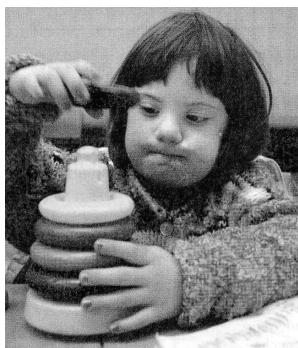  
唐氏综合征患者能完美地堆积木 [©PhotoCreate/ ShutterStock, Inc.]

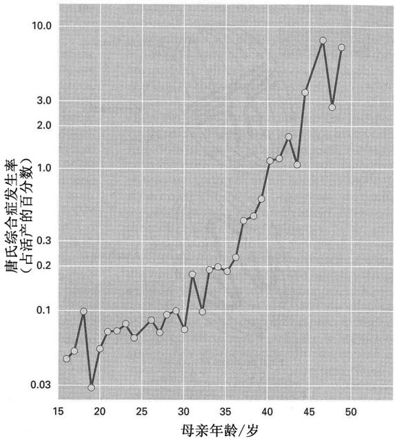  
图 8.11 唐氏综合征的发生率(每 100 次活产中的例数)与母亲年龄相关。该图基于 1968～1970 期间瑞典的 438 个唐氏综合征新生儿(在总计 330,859 个新生儿中)。[数据来自 E. B. Hook and A. Lindsjö, Am. J. Hum. Genet. 30 (1978): 19-27.]

由于未知的原因，在卵子发生中比在精子发生中更有可能出现21号染色体的不分离，因此，唐氏综合征中的异常配子通常为卵细胞。而且，随着母亲年龄的增加，21号染色体不分离的风险急剧增大，导致在45岁及以上的母亲所孕育的胎儿中唐氏综合征的发病风险达6%(图8.11)。有鉴于此，许多医生建议高龄孕妇对胎儿细胞进行检测，以便在产前发现唐氏综合征。这可在受精后15～16周，用羊膜穿刺术(amniocentesis)做到，在此手术中，将一根细针刺穿子宫壁，进入容纳胎儿的羊膜囊(amnion)内，取得发育中的胎儿细胞。或者在受精后10～11周，用一种称为绒毛膜绒毛取样(chorionic villus sampling, CVS)的手术也可做到，在此手术中所用的细胞，来自与胎盘相连的受精卵源性胚胎膜(绒毛膜)。尽早诊断是不错，但CVS引起流产

的风险大约为羊膜穿刺术的 3 倍。

在所有唐氏综合征病例中，约有 3% 不是因为简单的不分离，而是因为染色体结构上的异

常。在这些病例中，在随后出生的孩子中，该综合征再次发生的风险非常高——多达新生儿的20%。这种高风险为双亲之一的染色体易位所致，在此易位中，21号染色体断裂，并与另一条染色体连接。这种情况在8.5节中讨论。

## ■ 三体的分离

在三体生物中，减数分裂中的染色体分离被打乱，因为三体的染色体有两个配对对象，而不是一个。减数分裂中染色体的行为取决于同源染色体臂配对的方式，以及同源染色体臂之间形成的交叉。在某些细胞中，这3条染色体形成一个三价体(trivalent)，在三价体中，一条染色体的不同部分，分别与另外两条染色体的同源部分配对(图8.12，A部分)。在中期，这种三价体的定向，通常是两个着丝粒指向一极，另一个着丝粒指向另一极。结果是，在减数分裂结束

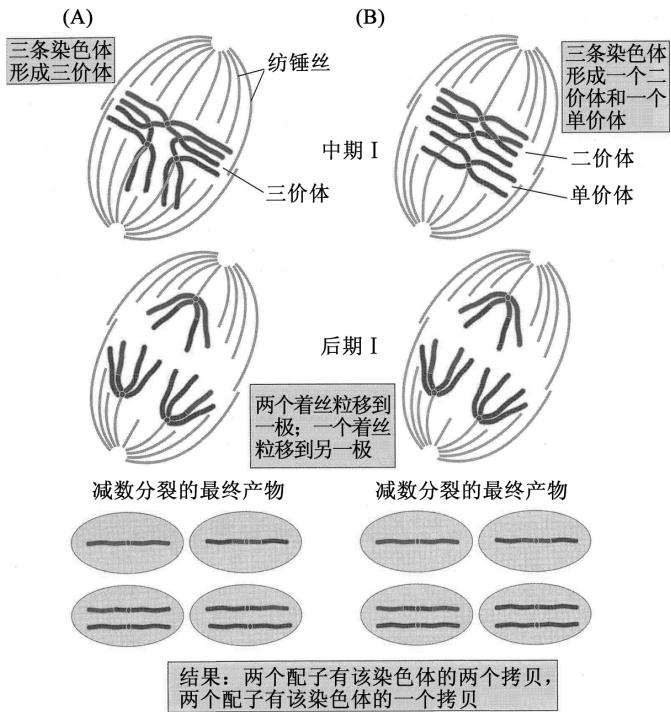  
图 8.12 三体细胞中的减数分裂配对。(A) 形成一个三价体。(B) 形成一个单价体和一个二价体。两种配对都导致一对配子含三体染色体的两个拷贝，另一对配子含三体染色体的一个拷贝。

时，一对配子含三体染色体的两个拷贝，另一对配子只含单个拷贝。或者，该三体染色体形成一个正常的二价体和一个单价体(univalent)，如图8.12B所示。在后期I，二价体正常分离，而单价体通常随机地移到一极或另一极。最终结果仍是形成两个含三体染色体两拷贝的减数分裂产物，和两个含三体染色体单拷贝的减数分裂产物。换种方式来说这个问题：具有某条染色体3个拷贝(如CCC)的三体生物所产生的配子中，一半将含有两个拷贝(C C)，一半将含有一个拷贝(C)。因此，如果与一个染色体正常的个体交配，预计三体个体会以 $1:1$ 的比例产生三体后代和正常后代。这一理论预期在实验生物及人类中得到了证实，在实验生物中，通过三体个体的交配得以证实；在人类，发现唐氏综合征患者生育的为数不多的后代中唐氏综合征的发生率约为 $50\%$ 。

## - 性染色体异常

在新生儿中，性染色体三体总体比 21 三体更多(表 8.2)。为什么与常染色体三体相比，性染色体增多的表型效应相对缓和，原因有二：首先，单条活性 X 染色体原理导致每个体细胞除一条 X 染色体外所有 X 染色体上大多数的 X 连锁基因沉默；其次，Y 染色体包含的功能基因相当少。

四种最常见的性染色体异常如下所述。核型以传统方式表示，即首先列出染色体总数，继之以存在的性染色体。例如，在 47, XXX 这个名称中，数字 47 是指染色体总数，而 XXX 表示此人有 3 条 X 染色体。

\- 47,XXX 该病通常简称 X 三体 (trisomy-X)。具有 47,XXX 核型的人为女性，这样的女性多数智力及表型正常，不表现额外 X 染色体的任何体征或行为指征。轻度智力障碍可比在 46,XX 女性中的稍多。

\- 47,XYY 该病常称为双 Y(double-Y) 核型。这些人为男性，身高往往超过平均水平，除此之外，表型正常。人们一度认为 47,XYY 男性具有严重人格障碍和暴力犯罪的高风险，这种看法基于在暴力犯罪者中发现 47,XYY。进一步的研究表明，在一般人群中 47,XYY 的发生率远高于之前的预测。部分 47,XYY 男性具有轻微智力障碍。虽然他们的犯罪率高于正常男性，但主要是小偷小摸之类的非暴力犯罪。大部分 47,XYY 男性在表型上和精神上正常，智力在正常范围内，无刑事记录。

\- 47,XXY 该病称为克氏综合征 (Klinefelter syndrome)。患者男性，他们往往较高，不发生正常的性成熟，有时乳房增大。常见轻度智力障碍。

\- 45,X 女性中的 X 染色体单体，称特纳综合征 (Turner syndrome)。患者女性表型，但身材矮小，没有性成熟。智力一般在正常范围内。注意在表 8.2 中 99% 以上的 45,X 胎儿遭自发流产。这表明这种病在发育上通常具有严重的有害效应。表 8.2 也表明，X 染色体的单体比三体更多，对于常染色体来说几乎也是如此，尽管在可识别妊娠中缺乏单体。

## ■ 环境对不分离的影响

因为大部分非整倍体合子或导致流产，或导致具有先天缺陷(或智力障碍)的活产，所以，鉴定可能增加减数分裂错误发生率的环境危害极为重要。现已指出的环境危险因子包括辐射、吸烟、饮酒、口服避孕药、生育药物、环境污染物、农药等。当发现明显效应时，规模通常很小，且不一定会再出现，部分是由于与其他因素(如母龄)的效应混淆。考虑到存在母龄效应，女性的性激素(estrogen，雌激素)及类似雌激素的分子一直受到怀疑。鉴于这一背景，当知道浓度不大的双酚A[一种常见的雌激素类似物，专业术语为2,2-(4,4-二羟基联苯酚)丙烷]会在小鼠中使非整倍体的发生率增高大约8倍时，就不会太让人吃惊了。

双酚 A 是在饮食工业中广泛用作容器衬里的聚碳酸酯塑料制品的基本亚单位。聚合状态的双酚 A 可完全无害，但单体可从受损的塑料制品中渗出来。双酚 A 的效应是在小鼠的非整倍体研究中偶然发现的。在显微研究的过程中，研究者注意到，一条或多条染色体不能正常排列到中期Ⅱ赤道板上的减数分裂细胞的发生率突然增加。与此同时，非整倍体卵母细胞的发生率从1.4%增加到11.6%。

研究人员们成功地追查到，原因是无意中用了一种强烈的碱性洗涤剂来洗涤聚碳酸酯鼠笼和水瓶。他们怀疑洗涤剂导致双酚A单体从这些塑料制品中渗出，于是以双酚A单体进行后续实验，证明了双酚A对非整倍体的直接作用。虽然这些研究是在雌性小鼠中进行的，但其与人类女性的减数分裂过程是相似的，这值得关注。更笼统一点来看，该研究对那些有可能增加非整倍体发生率，特别是具有雌激素样活性的环境因子提出了警告。

## 8.3 染色体的缺失和重复

现在我们开始讨论染色体结构畸变的遗传意义。在遗传学历史上，染色体异常最初是通过它们的遗传效应而被发现的，虽然起初使人困惑，但最终被理解，随后通过显微观察得以直接证实。结构畸变的几种主要类型——缺失、重复、倒位和易位——各有其特有的遗传效应。

## ■缺失

失去某一片段的染色体，称其有一个缺失(deletion 或 deficiency)。缺失通常对生物有害，一般规律是，缺失越大，损害越大。非常大的缺失往往是致死的，即使是有一条正常染色体的杂合子。小的缺失，当它们与结构上正常的同源染色体呈杂合时，通常是可存活的，因为正常的同源染色体提供了生存必需的基因产物。然而，即便是小的缺失也常常是纯合致死的(就是说，当一对同源染色体的两个成员都携带该缺失时)。

形成缺失的方式主要有两种。一种是通过染色体断裂和重接。染色体断裂是 DNA 双链的主链断裂的结果。染色体断裂自发出现的频率很低，但可通过能导致 DNA 双链断裂的 X 线和某些化学物质诱导产生。如果一条染色体臂在两处断裂，带着丝粒和带有端粒的两个断端融合，而漏掉的那部分成为无着丝粒片段而丢失，就会产生一个缺失。另一种是通过存在于 DNA 上不同位点的重复 DNA 序列之间的同源重组产生，该过程称为异位重组 (ectopic recombination)。图 8.13 的 A 部分为一例。在此例中，以渐变色表示重复 DNA 序列的每个拷贝。注意，在两个拷贝中，渐变都是从左到右逐渐变淡，这表示两个重复 DNA 序列拷贝在 DNA 上的方向相同，这种构型称为同向重复序列 (direct repeat)。如果同向重复序列发生配对和同源重组，结果是同向重复序列之间的 DNA 缺失，因为含这段 DNA 的环状无着丝粒小片段会丢失。

(A) 异位重组  
(B) 人类Y染色体的 $AZF_{c}$ 区  
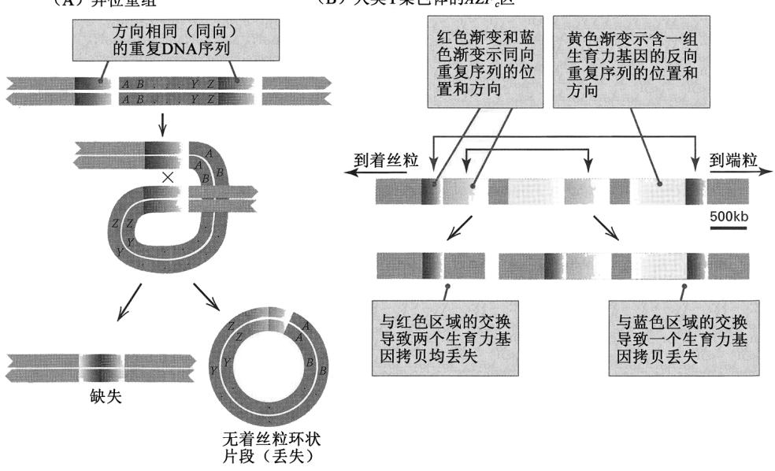  
图8.13 同

图 8.13 同一 DNA 分子中同向重复序列之间的异位重组导致重复序列之间的 DNA 缺失。(A) 在 DNA 分子水平发生的过程。(B) 示人类 Y 染色体异位重组结果的例子。

图 8.13B 示人类 Y 染色体中异位重组导致缺失的例子。该图所绘的 Y 染色体区域包含几段大的重复序列，此处以渐变显示。红色和蓝色渐变表示同向重复序列，而黄色渐变表示反向重复序列 (inverted repeat) ——重复序列的方向相反。黄色反向重复序列包含对男性生育能力很重要的基因。让我们对大小有个概念，红色重复序列的长度均为 229kb，这两个重复序列之间的区域为 3.5Mb。如图所示，红色重复序列中的同源重组导致两套男性生育力基因拷贝全部丢失。约 1/4000 的男性具有这种缺失，这导致完全不育。蓝色重复序列内重组所致的缺失，只产生一组生育力基因的缺失，效应较温和。虽然丢失这些基因不会导致完全不育，但会使精子发生减弱。不过，约 1% 的男性具有带这种缺失的 Y 染色体。

带缺失的染色体不再携带所缺失基因的野生型等位基因，利用这一事实，可在实验生物中进行缺失的遗传检测。例如，在果蝇中，有一个叫做 Notch 的基因，它的许多缺失会导致缺刻翅缘，这些缺失大到足以去除附近的白眼基因的野生型等位基因。当这些缺失型染色体与携带

隐性等位基因 w 的结构正常的染色体呈杂合时，因为野生型 $w^{+}$ 等位基因不再存在于缺失型 Notch 染色体上，果蝇具有白眼。该隐性等位基因的这种显露 (uncovering) 表明，白眼基因相应的野生型等位基因也已经缺失。一旦鉴定了一个缺失，其大小就可以通过检测该区域内哪些隐性突变

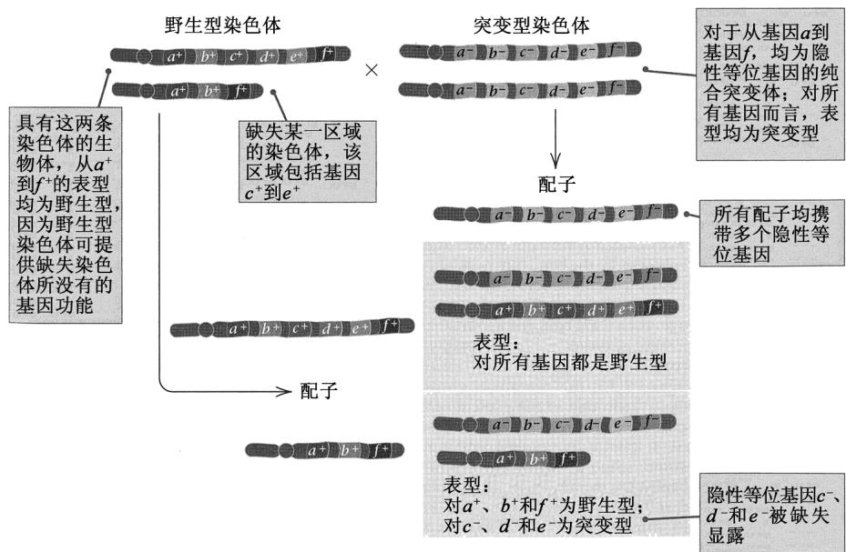  
图 8.14 通过测交对缺失进行作图。带缺失的 $F_{1}$ 代杂合子表现出所有缺失基因的隐性表型。被表现的隐性等位基因称其被该缺失显露。  
被该缺失显露，在遗传上进行估算，这一方法如图 8.14 所示。

## - 缺失作图

利用果蝇唾液腺中的显带多线染色体，可对缺失及其他染色体畸变进行实体研究。例如，所有的 Notch 缺失都会导致唾腺染色体的特定条带丢失。除了通过遗传学研究了解单个基因以外，对缺失进行物理作图，可将基因定位到唾腺染色体的特定条带或区域。

图 8.15 示在果蝇的部分 X 染色体中对基因进行物理作图。顶部示显带染色体，以及用来指定特定条带的编号系统。每条染色体被分成带编号的区(X 染色体包含 1～20 区)，各区被分成亚区，以 A～F 命名。在每一个标字母的亚区中，按顺序对条带编号，因此，如 3A6，就是 3 区 A 亚区的第 6 条带(图 8.15)。平均而言，每一条带大约含 20kb DNA，但不同条带之间在 DNA 含量上有相当大的差异。

在图 8.15 中，标 I～VI 的突变型 X 染色体具有缺失。每条染色体缺失的部分以红色表示。这些缺失界定了染色体上的一些区域，其中一些对应于特定的条带。例如，在所有其他染色体中都存在，而在染色体 I 和染色体 II 中都缺失的那个缺失区域，包含 3A3 带。在杂合个体中，只有缺失 I 和缺失 II 使 $zeste(z)$ 突变显露，所以，如图顶部所示，z 基因必定在 3A3 带内。同样，

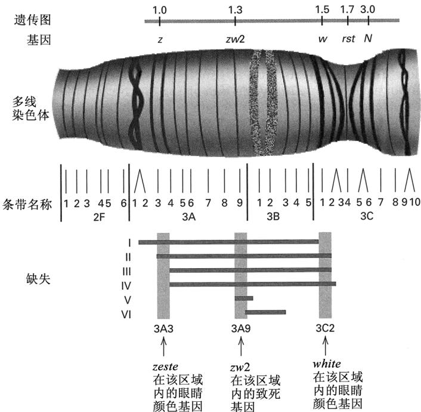  
图 8.15 黑腹果蝇多线唾腺细胞核中的部分 X 染色体，及在一组染色体中 6 个缺失 (I \~ VI) 的范围。被某个缺失显露的任何一个隐性等位基因，一定位于该缺失覆盖的范围之内。该原理可用来将基因定位于染色体中特定的条带。

隐性致死突变 zw2 被VI之外的所有缺失所显露，因此，zw2 基因一定在 3A9 带内。最后一例，w 突变仅被缺失II、III和IV显露，因此 w 基因必定在 3C2 带内。rst(眼睛质地粗糙)和 N(缺刻翅缘)基因未被任何缺失显露，这两个基因被类似的重叠缺失分析定位于 3C5～3C10 区域。

## ■ 重复

有些异常染色体的某一区域出现两次，这是重复(duplication)。某些重复具有它们自己的表型效应，例如，果蝇中的Bar重复，这是在X染色体中包含16A1～16A7带、约1Mb的一个串联重复。串联重复(tandem duplication)是重复片段以相同方向紧接在染色体中正常区域之后的一种重复。就Bar而言，该串联重复产生棒状眼的显性表型。

通过一个称作不等交换(unequal crossing over)的过程，串联重复能够产生更多的重复区域拷贝，不等交换实际上是一种异位重组。图8.16A示某种生物的减数分裂中的染色体，该生物对某一串联重复(棕色区域)为纯合，如图8.16B所示，当这两条染色体进行联会时，它们可相互错配。从而，在重复序列的错配部分中的交换(图8.16C)，会产生一条携带3个重复单位的染色单体，以及一个丢失重复序列的相互产物(reciprocal product)(在8.16D中标“单拷贝”的染色单体)。对Bar区域而言，三重重复使眼睛缩小的程度比双重重复更大，因而得以识别。

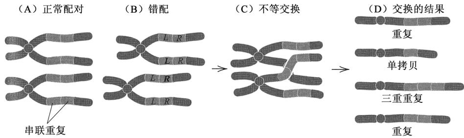  
图 8.16 串联重复(棕色)的不等交换导致一个染色体片段的拷贝数目增加。(A)具有一个串联重复的染色体正常联会。(B)错配。下面那条染色体右边的重复单位与上面那条染色体左边的重复单位配对。(C)在错配的重复单位中进行交换，称为不等交换。(D)不等交换的结果。一条染色体含重复区域的单一拷贝，另一条染色体含三个重复单位，没有参与交换的两条染色体保持两个拷贝。

重复最常见的效应是使存活概率减少(生存力减弱)。一般说来，存活率随重复片段的增大而下降。不过，类似大小的缺失往往比重复更有害。

## - 人类红绿色盲中的不等交换

人类的彩色视觉由视网膜视锥细胞中的 3 种光敏色素蛋白介导。这些色素每种都与视紫红质(rhodopsin)相关，视紫红质见于视杆细胞中，它介导弱光下的视觉。视锥色素对蓝、红和绿光敏感。这3种颜色是我们的视觉色素可感知的纯色。我们感觉到的所有其他颜色都是蓝、红、绿的混合色。编码蓝色敏感色素的基因位于7q22-qter(意思是从7q22到末端)中的某处；而编码红色和绿色色素的基因在X染色体上的Xq28处，两个基因相距不到5cM(约5Mb DNA)。因为红色和绿色色素基因是由于单一祖先色素基因的重复而产生的，所以它们在氨基酸序列上仍有 $96\%$ 相同，这两个基因相似到足以配对并进行不等交换。这个不等交换的过程就是红绿色盲的遗传基础。

几乎人人都熟悉红绿色盲(red-green color blindness)，它是人类最常见的遗传病之一。约5%的男性患某种形式的红绿色盲。男性患者多，提示红绿色盲为X连锁遗传，这已被系谱研究证实(4.4节)。男性患者所生的儿子正常，女儿为携带者；携带者女儿所生的儿子50%罹患、女儿50%为携带者。

实际上，有几种不同的红绿色盲变异。红色视觉上的缺陷，包括红色盲(protanopia)——不能感知红色，和红色弱(protanomaly)——感知红色的能力受损。在感知绿色上的类似缺陷，分

别称为绿色盲(deuteranopia)和绿色弱(deuteranomaly)。对红色色素基因和绿色色素基因的分离，以及对它们在正常彩色视觉和缺陷彩色视觉人群中的组织结构的研究，已非常清楚地指出“色盲”和“色弱”有何差别，也阐明了为什么色盲的发生率相对而言要高得多。

图 8.17A 示具有正常视觉的男性中红色色素基因和绿色色素基因的组织结构。出乎意料的是，相当一部分的正常 X 染色体含两个或三个绿色色素基因。图 8.18B 示它们是怎样通过不等交换产生的，红色色素基因和绿色色素基因配对，然后在这两个基因之间的同源区域发生一次交换。结果是，一条染色体上的绿色色素基因的重复和另一条染色体上绿色色素基因的缺失。

彩色视觉缺陷的重组起源如图 8.18 所示。在图 8.18A 中，上面的那条染色体是之前在图 8.17B 中所示的绿色色素基因缺失的结果，具有这样一条 X 染色体的男性患绿色盲，当交换发生在错配的红色色素基因和绿色色素基因之内时，产生其他类型的异常色素。这两个基因之间的交换产生嵌合基因(chimeric gene)，这是一个混合基因：一个基因的一部分与另一个基因的一部分连接。图 8.18A 中的

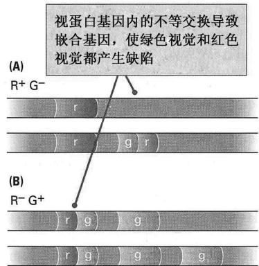  
图 8.18 红绿彩色视觉缺失或受损的遗传基础。(A)绿色视觉缺陷。(B)红色视觉缺陷。

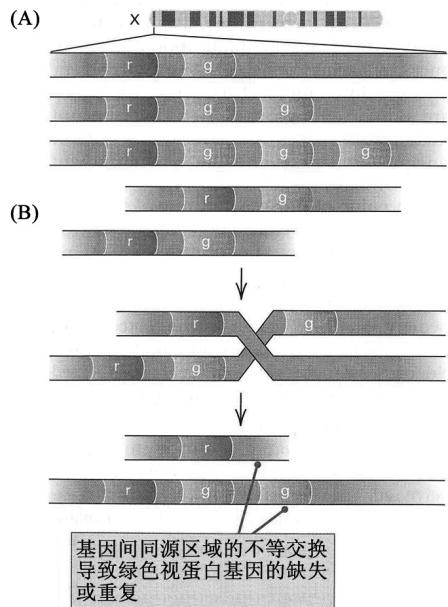  
图 8.17 (A)三条野生型 X 染色体中的红色色素基因和绿色色素基因的组织方式。  
(B)通过不等交换产生多个绿色色素基因。

嵌合基因将绿色色素基因的 5' 端和红色色素基因的 3' 端连接在一起。如果交换点比较靠近 5' 端(图中向左的一边)，则产生的嵌合基因在序列上大部分是“红”的，那么该染色体导致绿色盲。但是，如果交换点比较靠近 3' 端(图中向右的一边)，则绿色色素基因的大部分保持完整，该染色体导致绿色弱。

与红色视觉缺陷相关的染色体如图 8.18B 所示。这两个嵌合基因是不等交换的相互产物，产生红色视觉缺陷。在此情况下，嵌合基因由 5' 端的红色色素基因和 3' 端的绿色色素基因组成。如果交换点比较接近 5' 端，则大部分红色色素基因被绿色色素基因取代，结果是红色盲。图 8.18B 中所示的另一条染色体也是这样。但是，如果交换点比较靠近 3' 端，则大部分红色色素基因保持完整，结果是红色弱。

## - 具有自闭症和精神分裂症相互风险的 CNV

人类基因组在成千上万个不同位点上含有重复 DNA 序列，这些序列非常相似，在减数分裂中发生配对时能够进行重组。幸好减数分裂中染色体配对通常非常精确，可将错配控制在极低水平。但有时还是会发生错配，而当错配的重复序列发生异位重组时，染色体异常就产生了。

图 8.19 示这样一种情况，在染色体上某一单一序列区含基因 X、Y 和 Z，该区两侧有两个重复序列。通常这些重复序列会正确配对，但偶尔会如 B 部分所示的那样配对，这样就会发生不等交换（为简单起见，仅显示参与交换的染色单体）。结果得到一个携带 X、Y 和 Z 的重复的配子，以及一个这些基因缺失的配子（图 8.19C）。当这些配子与携带正常同源染色体的配子受精时，一类合

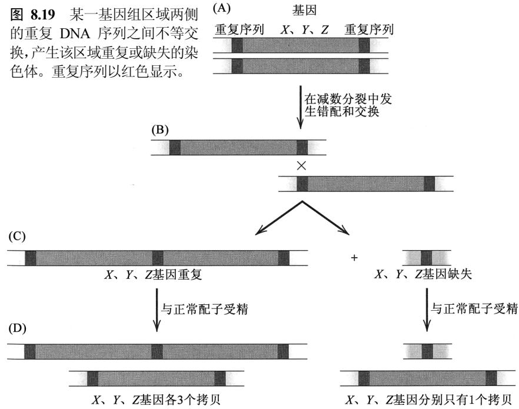

子有 3 个拷贝的 X、Y 和 Z 基因，而另一类合子只有 1 个拷贝的 X、Y 和 Z 基因(图 8.19D)。这种不等交换是产生基因拷贝数变异(CNV)的一种机制。正如在第 2 章中所讨论的，在人类基因组中，大多数 CNV 都比较罕见，但它们的种类很多。平均每个基因组含大约 5 个 CNV。

许多 CNV 没有表型上的表现，但有一些有。有一类 CNV 特别有趣，它们与两种看似不同的表型关联，一种表型与 CNV 重复相关，另一种表型与 CNV 缺失相关。与自闭症谱系障碍 (autism spectrum disorder, ASD) 和精神分裂症相关的 CNV 就属于此列。

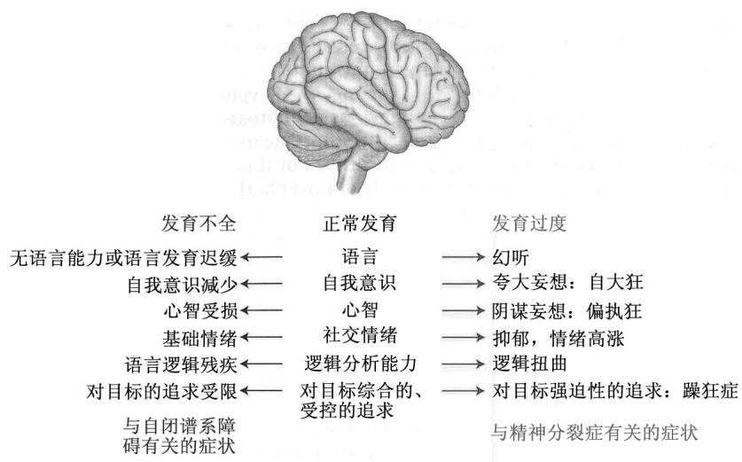  
图 8.20 自闭症谱系障碍和精神分裂症主要症状的比较，突出那些截然相反的症状。(根据伯纳德·克雷斯皮(Bernard Crespi)提供的材料)

“Autism”一词来自希腊语的“self”，而自闭症患儿确实很内向。确诊该病的平均年龄为3～4岁，1/250～1/100的孩子罹患(这要看对该病定义的严格程度)。自闭症常用术语“自闭症谱系障碍”来表示，是因为症状的范围广，且严重程度不一。自闭症是一种脑功能及发育失调，主要影响沟通能力、社交能力，重复行为和害怕改变(图8.20)。患儿不能说话或说话较晚，

他们往往会避免眼神接触，自我意识减少，并可能会用第三人称称呼自己。他们难以理解他人表达的想法和意图并作出反应，有时候会在不恰当的时间大笑或傻笑。他们的原始情绪是害怕和愤怒这样的简单情绪。他们难以应付逻辑联系，但有些拥有出色的数学、音乐才华或其他的高级专业技能。很多患者难以为自己制定目标，因而就会一直坚持自己的嗜好。要牢记的是，这些症状的有无和严重程度都是变化极大的，并且会随年龄增大而改变。自闭症谱系障碍是一种复杂疾病，其表现方式多种多样。

精神分裂症也是一种在症状和严重程度上表现出广泛变异的复杂疾病。该病通常在15～30岁确诊，发病率约为1/250。精神分裂症的许多症状与自闭症谱系障碍形成鲜明的对比(图8.20)。患者可能会出现幻听，自我意识升高(表现为权力或影响力的感觉夸大)，想象别人对他们有阴谋，作出奇怪的、缺乏逻辑的联系或言语凌乱，强迫性地追求某些目标。如同自闭症一样，个体之间在这些症状的有无和严重程度上也有很大的变化。

若没有表 8.3 中那样的观察结果，图 8.20 中的对比会被斥为纯粹的文字游戏。该表列了 4 个基因组区域，这些区域的两侧是图 8.19 中那样的重复序列，因而可反复出现 CNV。每个区域均以相互方式 (reciprocal fashion，粗体数字) 与自闭症谱系障碍或精神分裂症相关：如果缺失与自闭症谱系相关，则重复与精神分裂症相关，或者反过来。最后一栏中的 P 值是随机观察到一样强或更强的关联的概率，因而在每种情况下，所示结果都极不可能是随机造成的。

表 8.3 表现出自闭症谱系障碍和精神分裂症相互风险的拷贝数变异 (CNV)

<table><tr><td rowspan="2">CNV 区域</td><td colspan="2">自闭症谱系</td><td colspan="2">精神分裂症</td><td rowspan="2">P值</td></tr><tr><td>缺失</td><td>重复</td><td>缺失</td><td>重复</td></tr><tr><td>1q21.1</td><td>2*</td><td>10</td><td>15</td><td>4</td><td>0.001</td></tr><tr><td>16p11.2</td><td>14</td><td>5</td><td>5</td><td>24</td><td>0.000 1</td></tr><tr><td>22q11.21</td><td>1</td><td>8</td><td>16</td><td>1</td><td>0.000 05</td></tr><tr><td>22q13.3</td><td>5</td><td>0</td><td>0</td><td>4</td><td>0.008</td></tr></table>

\*各项为每个 CNV 每个类别中的个体数。  
数据来自：B. Crerspi, P. Stead and M. Elliot. 2010. Proc. Natl. Acad. Sci. USA 107: 1736.

这种相互关联(reciprocal association)说明了什么？这说明，在这些疾病的发病过程中，存在某一阶段或某些阶段，相同基因的产物在其中具有相反的效应。因而，在重复中的表达增强导致一种病，在缺失中的表达减弱导致另一种病。在许多与这些疾病有关的单个基因中，发现了与CNV类似的相互关联。重要的是，并不是与自闭症谱系障碍相关的所有CNV或基因，都表现出与精神分裂症相互关联，甚至大多数CNV或基因都不表现出这种关联。不过，发现有的CNV和基因确实表现出这样的相反效应，表明在这些疾病的发病过程中，存在一些共同的因果关系。

表 8.3 中的结果并不意味着自闭症谱系障碍或精神分裂症在遗传上仅由少数几个基因决定。这两种病都极其复杂，两种病都很可能存在不同的类型，但因为具有相同的症状而被掩盖了。环境影响也很重要，这包括发病早期的应激原、饮食和营养不足、激素和化学物质失衡，甚至包括病毒感染。

## 8.4 染色体倒位的遗传学

另一种重要的染色体畸变是倒位(inversion)——染色体中一群基因的线性顺序与正常顺序相反。倒位可由一条染色体中的一个双重断裂事件形成，其中，在断裂被修复之前，中间片段的方向颠倒。倒位也可以通过异位重组产生，如图8.21中的DNA双链体所示。在该图中，不同颜色的渐变代表反向重复序列，而字母表示在重复序列之间区域中基因的顺序。这两个重复序列之间的异位重组，产生一条在重复序列之间的基因顺序上具有倒位的染色体。

在对于某个倒位为杂合的生物中，一条染色体的结构正常(野生型)，另一条染色体携带一个倒位。这两条染色体通过有丝分裂进行传递没有困难，因为每条染色体复制后，两条染色单体分离到两个子细胞中，与另一条染色体没有关系。

杂合倒位虽然在有丝分裂中不会出问题，但在减数分裂中会有问题，这些问题由倒位区中的同源重组引起。在减数分裂前期Ⅰ中，两条同源染色体在联会过程中是以基因对基因的方式相吸引。对杂合倒位而言，同源染色体的配对如图8.22所示，在图中，渐变代表同源染色体上DNA序列的方向，蓝色区域在一条同源染色体中颠倒，但在另一条同源染色体中没有颠倒，所以倒位是杂合的。在倒位杂合子中，为了在染色体全长上处处都能进行基因对基因的配对，在基因

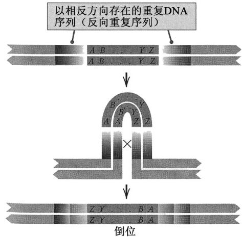  
图 8.21 反向重复序列之间的异位重组产生倒位。

顺序颠倒的区域中，一条或另一条染色体必须扭曲成一个环。在图 8.22 中，成环的是结构正常的那条染色体，但在其他细胞中，成环的可能是倒位染色体。无论是哪种情况，该环都称为倒位环 (inversion loop)。

## ■ 臂内倒位(不包含着丝粒)

倒位环本身不造成问题。发生环化显然没有困难，也能够通过显微镜观察到环化。如图8.23所示，只要在倒位环内不存在交换，在后期I中同源染色体就能够正常分离。但是，当倒位环内存在交换时，参与交换的两条染色单体在物理上连接在一起，结果是形成含有大量重复和缺失的染色体。沿着染色体追踪，可从图8.24A中推断出交换的产物。外围的两条染色单体没有

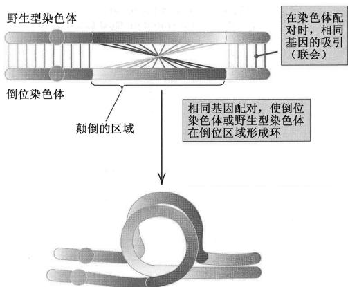  
图 8.22 携带一条结构正常的染色体与一条带有倒位的同源染色体的某一生物中，在联会过程中染色体之间基因对基因的吸引导致其中一条染色体在基因顺序颠倒的区域中形成一个环。在此例中，结构正常的染色体形成环。仅显示了四条染色单体中的两条。

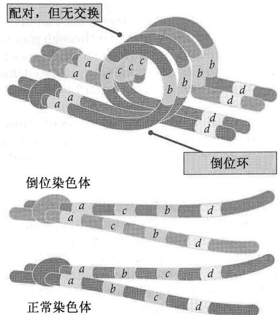  
图 8.23 在一个倒位杂合子中，如果在倒位环内不存在交换，同源染色体的分离没问题。所产生的配子，两个携带倒位染色体，两个携带结构正常的染色体。

参与交换。如图 8.24B 所示，其中一条染色单体含倒位序列，而另一条含正常序列，因为交换，内部两条参与交换的染色单体连在了一起。

图 8.24 所示的倒位，着丝粒不包含在倒位区域中，这种倒位称为臂内倒位 (paracentric inversion)，意思是着丝粒 “旁边的 (para-)” 倒位。如图所示，交换产物包括一条双着丝粒染色体和一条无着丝粒染色体。双着丝粒染色体当着丝粒未包含在倒位区域中时，其中一个交换产物是双着丝粒染色体，其相互产物是无着丝粒染色体。在未参与交换的两条染色单体中，一条携带倒位，另一条具有正常的基因序列

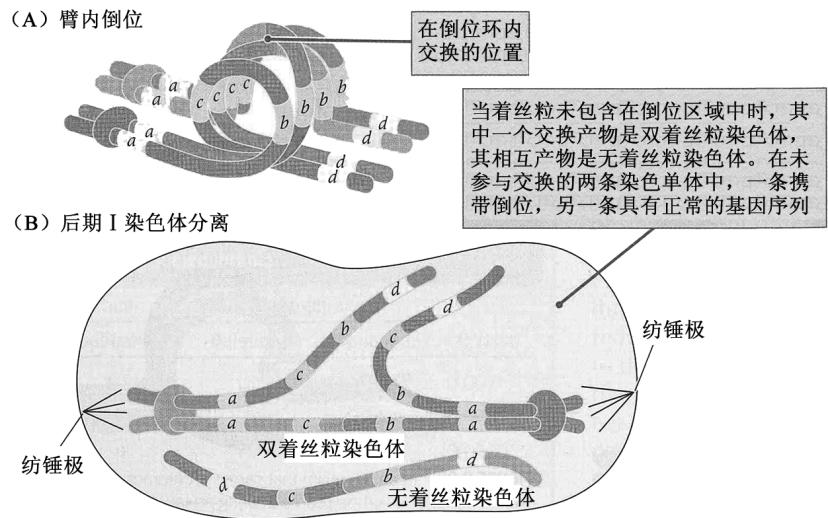

图 8.24 (A) 同源染色体之间的联会，其中一条染色体含一个倒位。在倒位环内存在一个交换。(B) 交换导致的后期 I 构型。

和无着丝粒染色体都不能被包含在正常配子中，这条无着丝粒染色体通常会丢失，因其缺少着丝粒，并且，无论如何，都具有 a 区域的缺失和 d 区域的重复。这条双着丝粒染色体通常也会丢失，因为它被着丝粒之间的染色单体桥固定在减数分裂纺锤体上，无论如何，该染色体都对于 d 区域缺失，对于 a 区域重复。因此，当倒位环内存在交换时，在配子中可以找到的染色单体只有未参与交换的两条染色单体，其中一条携带倒位，而另一条没有。正是由于这个原因，在配子中找不到交换产物。在遗传学研究的早期，在发现它们是倒位之前，带有倒位的染色体曾被称作“交换抑制因子”。

## ■ 臂间倒位(包含着丝粒)

当倒位包含着丝粒在内时，称为臂间倒位(pericentric inversion)，意思是在着丝粒“四周(peri-）”。具有重复和缺失的染色单体也会由臂间倒位的倒位环内的交换产生，但在此情况下，交换产物具有单着丝粒。这种情况如图8.25A所示，除着丝粒的位置之外，该示意图与图8.23相同，同样，可通过追踪染色单体推断出交换产物。在此情况下，两个交换产物都是单着丝粒的，但一条染色单体携带 $a$ 的重复和 $d$ 的缺失，另一条染色单体携带 $d$ 的重复和 $a$ 的缺失(图8.25B)。尽管这两条染色单体的任何一条都可包含于配子中，但是重复和缺失往往导致配子不能生存。因此，与臂内倒位一样，也找不到重组产物，但原因不同。在图8.25A没有参与交换的两条染色单体中，一条携带臂间倒位，另一条具有正常序列。

图 8.25 (A) 同源染色体之间的联会, 其中一条染色体携带一个臂间倒位。示倒位环内的交换。(B) 交换产生的后期 I 构型。

当着丝粒包含在倒位区域中时，其中一个交换产物为a的重复和d的缺失；其相互产物为d的重复和a的缺失。在未参与交换的两条染色单体中，一条携带倒位，另一条具有正常的基因序列

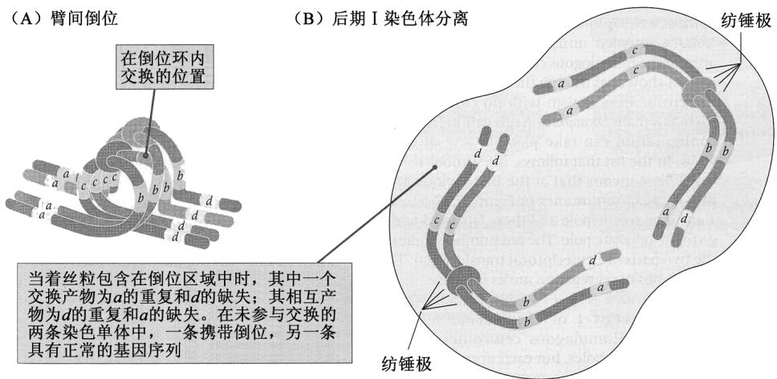

## 8.5 染色体易位

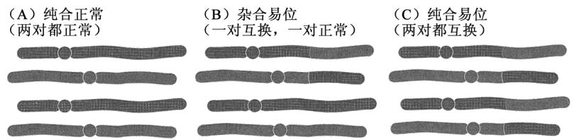  
图 8.26 (A) 某二倍体生物中的两对非同源染色体。(B) 杂合的相互易位，其中，两条非同源染色体(上面的两条)具有互换的末端片段。(C) 纯合的相互易位。

导致非同源染色体之间部分互换的染色体畸形称为易位(translocation)。易位可由两条断裂的染色体之间的部分互换产生，或两条非同源染色体上的重复DNA序列拷贝之间的异位重组产生。在图8.26中，

A 生物对于两对结构正常的染色体为纯合。B 生物含有一对结构正常的染色体和一对经过末端部分互换的染色体，该生物称为对该易位是杂合的。

## ■ 相互易位

图 8.26 中的易位称作相互易位 (reciprocal translocation) 比较恰当, 因为它由两个相互交换的部分组成。如图 8.26C 所示, 如果两对同源染色体都发生了部分交换, 一个生物对于易位也可为纯合的。

对于相互易位为杂合的生物，产生的后代往往最多只有一半左右是正常的——这种情况称为半不育性(semisterility)，半不育性的原因是在减数分裂中不平衡配子的产生。在易位杂合子中发生减数分裂时，正常染色体和易位染色体必须进行联会，如图8.27所示。在一般情况下，同源染色体臂中的非姐妹染色单体之间也会有交叉，但它们没被显示，犹如易位存在于没有交换的生物(如雄性果蝇)中一样。该构型的分离可以3种方式中的任1种发生。在下面的清单中，符号 $1+2\leftrightarrow3+4$ 表示在第一次减数分裂后期，在图8.27中标1和2的染色体移到一极，标3和4的染色体移到相反的一极。粗体数字表示相互易位的两个部分。3种分离如下：

\- $1 + 2 \leftrightarrow 3 + 4$ 这种方式称为相邻 1 分离 (adjacent-1 segregation) 或不分离型分离 (nondisjunctional segregation)。同源着丝粒移到两极，但每条正常染色体伴随着相互易位的一部分。相邻 1 分离形成的所有配子对易位染色体的远端部分而言都有一个大的重复和缺失。(一条染色体的“远端”部分是离着丝粒最远的部分。)源自 $1 + 2$ 这一极的一对配子，对于蓝色染色体的远端部分为重复，对于红色染色体的远端部分为缺失；源自 $3 + 4$ 这一极的一对配子，具有相互的缺失和重复。

\- $1 + 3 \leftrightarrow 2 + 4$ 这种方式称为相邻2分离(adjacent-2 segregation)或分离型分离(disjunctional segregation)，其中，在后期I同源着丝粒移到同一极。在此情况下，所有的配子都有易位染色体近端部分的大的重复和缺失(一条染色体的“近端”部分是离着丝粒最近的部分)。源自 $1 + 3$ 这一极的一对配子，具有红色染色体近端部分的重复和蓝色染色体近端部分的缺失；源自 $2 + 4$ 这一极的一对配子，具有相互的缺失和重复。

\- $1 + 4 \leftrightarrow 2 + 3$ 在这种称为相间分离(alternate segregation)的分离中，配子都是平衡的(整倍体)，意思是任何配子都没有重复或缺失。源自 $1 + 4$ 这一极的配子，相互易位的两个部分都有；源自 $2 + 3$ 这一极的配子，两条染色体都是正常的。

相互易位杂合基因型的半不育性，是由于相邻1分离和相邻2分离产生的重复和缺失配子的致死性所导致的。虽然相邻1分离：相邻2分离：相间分离的期望频率为 $1/4:1/4:1/2$ ，但实际上这些分离类型发生的频率受易位断裂点的位置、着丝粒和断裂点之间的区域中交叉的数目及分布，以及在赤道板上四价体是否倾向于张开成环状结构的强烈影响。

(B) 相邻2分离

(A) 相邻1分离

(C) 相间分离

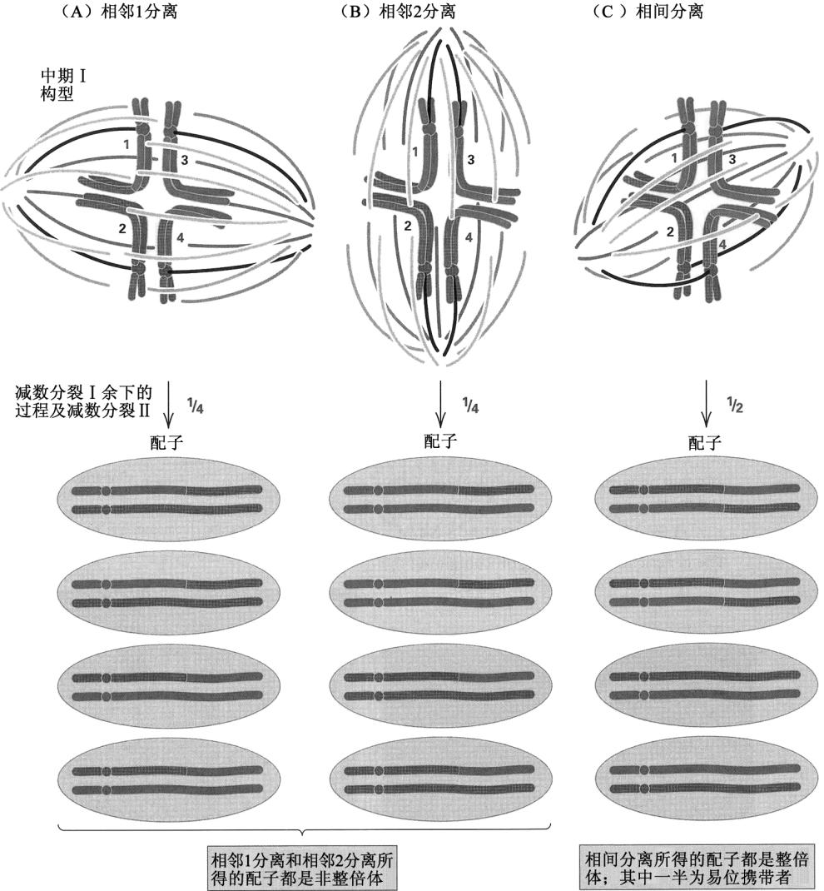

图 8.27 在杂合相互易位的联会中形成的四价体及其期望频率。易位染色体以红色数字编号，它们正常的同源染色体以黑色数字编号。未显示交叉。(A)相邻1分离：同源着丝粒于后期Ⅰ分离；产生的所有配子都有一个末端片段的重复和另一个末端片段的缺失。(B)相邻2分离：后期Ⅰ同源着丝粒一起移动；产生的所有配子都有一个近端片段的重复和另一个近端片段的缺失。(C)相间分离：一半配子得到相互易位的两个部分，另一半配子得到两条正常染色体。

在动植物中，易位半不育性表现于生活周期的不同阶段。植物的生活周期有一个复杂的配子体阶段，这是一个需要复杂的代谢和发育过程的单倍体阶段。在植物的配子体阶段，大的重复和缺失往往是致死的。因为配子体产生配子，所以在高等植物中半不育性表现为花粉或种子的致死性。与此相比，在动物配子中，仅需极少的基因活性，尽管有非常大的重复和缺失，配子仍能起作用。因此，在动物中，半不育性通常表型为合子的致死性。

## - 易位断裂点的遗传作图

在易位杂合子表现出半不育性的物种中，半不育性可用作表型来对易位断裂点作图，就好像它是一个正常基因一样，可用一个例子来阐明这种作图方法。易位 TB-10L1 是在玉米 10 号染色体长臂上具有一个断裂点的易位，杂合时导致半不育性。一个易位杂合子与一个对于 zn1（斑纹坏死 1，zebra necrotic 1）和 tp2（类蜀黍荚 2，teopod 2）均为纯合的基因型进行杂交，然后，半不育后代与 zn1 tp2 纯合子测交（zn1 和 tp2 的表型如图 5.8 所示）。因此，亲本基因型是 Zn1 Tp2 TB-10L1/ zn1 tp2 +，此处 “+” 表示在同源染色体中易位断裂点的位置。后代表型如下：

<table><tr><td>非斑纹</td><td>非类蜀黍荚</td><td>半不育</td><td>392</td><td>斑纹</td><td>非类蜀黍荚</td><td>半不育</td><td>83</td></tr><tr><td>非斑纹</td><td>非类蜀黍荚</td><td>可育</td><td>3</td><td>斑纹</td><td>非类蜀黍荚</td><td>可育</td><td>34</td></tr><tr><td>非斑纹</td><td>类蜀黍荚</td><td>半不育</td><td>42</td><td>斑纹</td><td>类蜀黍荚</td><td>半不育</td><td>1</td></tr><tr><td>非斑纹</td><td>类蜀黍荚</td><td>可育</td><td>73</td><td>斑纹</td><td>类蜀黍荚</td><td>可育</td><td>372</td></tr></table>

就像 5.3 节中三点杂交那样对这些数据进行分析。双重重组体出现在最稀少的后代类型中，并且，与亲本基因型的差别是，三个基因的中间那个基因互换。双重重组体为 Zn1 Tp2 + 和 zn1 tp2 TB-10L1，这意味着易位断裂点位于 zn1 和 tp2 之间。因此，zn1 和断裂点之间的图距为

$$
(3 + 7 3 + 8 3 + 1) / 1 0 0 0 = 1 6 \mathrm{cM}
$$

而易位断裂点和 tp2 之间的图距为

$$
(3 + 4 2 + 3 4 + 1) / 1 0 0 0 = 8 \mathrm{cM}
$$

包含 TB-10L1 易位断裂点的这一区域的遗传图为

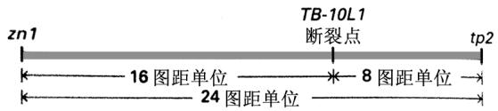

## ■ 罗伯逊易位

一种特殊的非相互易位是罗伯逊易位(Robertsonian translocation)，其中，两条非同源的近端着丝粒染色体的短臂发生融合，产生一条具有单个有功能着丝粒的染色体(图8.28)。在人类遗传学中罗伯逊易位很重要，最重要的是，在唐氏综合征中它是必须考虑的一个风险因子。在罗伯逊易位中，当其中一条近端着丝粒染色体是21号染色体时，这种染色体重排会导致一种家族型唐氏综合征，其再发风险非常高。在大约 $3\%$ 的唐氏综合征儿童中，父母之一具有一个这样的易位。

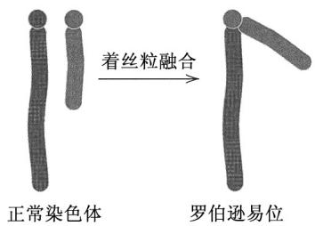  
图 8.28 两条近端着丝粒染色体通过在着丝粒区融合形成罗伯逊易位。

## - 易位与21三体

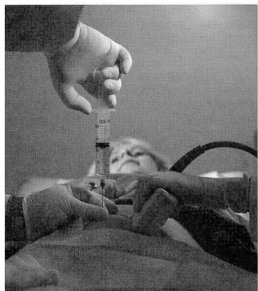

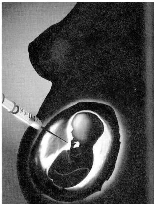  
在妊娠 15～18 周时，通过羊膜穿刺术进行染色体畸变和某些其他遗传缺陷的产前诊断。在超声图像的引导下，将一根针刺穿包围胎儿的各层膜，取出含胎儿细胞的少量液体样品。
[左：©Yoav Levy/Phototake/Alamy Images。右：©VEM/Photo
Pesearchers, Inc.。]

罗伯逊易位的杂合携带者表型正常，但因在减数分裂中存在异常分离，导致后代患唐氏综合征的风险较高。可能的分离方式如图 8.29 所示。罗伯逊易位可将 21 号染色体与其他任何一条近端着丝粒染色体连接，但为了具体起见，我们以 14 号染色体为例。rob 这个符号是指罗伯逊易位，染色体编号之前的+号和-号表示整个染色体增加或丢失一个拷贝。

在几种可能出现的配子中，有一种含有一条正常的21号染色体及一条14;21罗伯逊易位染色体(图8.29A)。如果该异常配子被用于受精，那么胎儿将含有两拷贝的正常21号染色体，加上14;21易位染色体。实际上，该胎儿含有21号染色

体的3个拷贝，因此患唐氏综合征。相邻1分离或相邻2分离产生的其他异常配子，或缺少21号染色体或14号染色体，或实际上含有14号染色体的两个拷贝(图8.29A和B)。如果这些配子参与受精，结果分别是21单体、14单体或14三体。单体胚胎很早就会自发流产；14三体胚胎在妊娠晚期遭自发流产。因此，易位型唐氏综合征风险高的家庭，由于其他的染色体异常，自发流产的风险也高。罗伯逊易位的相间分离产生携带易位染色体或两条正常染色体的配子(图8.29C)。因为这些配子源自减数分裂的相互产物，所以，未患病孩子携带易位染色体的风险为 $50\%$ 。

(B) 相邻2分离(C) 相间分离图 8.29 14 号和 21 号染色体之间的罗伯逊易位的分离及期望频率。(A) 相邻 1 分离: 左边的一极所形成的配子, 实际上具有 21 号染色体的一个额外拷贝。(B) 相邻 2 分离: 配子要么为 14 号染色体的重复, 要么缺失 14 号染色体。(C) 相间分离: 一半的配子产生表现正常的孩子, 但这些孩子为罗伯逊易位携带者。

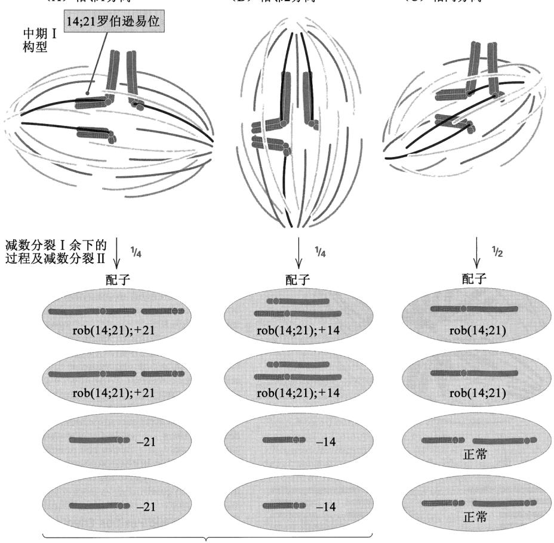  
相邻分离所得的配子都是非整倍体；rob(14;21);+21配子可产生21三体合子  
相间分离所得的配子都是整倍体；其中一半携带rob(14;21)

## ■ 月见草的易位复合体

某些植物类群的自然群体中存在相互易位，但没有通常预期的半不育性。月见草属(Oenothera)的夜来香就属于这种情况，月见草属原产于北美，约有100个野生种，还有许多栽培品种。月见草得以避免易位半不育性，是因为总是以相间分离方式分离。在月见草属的某些物种中，整套染色体都以图8.30A所示的那种方式，通过一系列的相互易位互相联系在一起。左上角的染色体都是正常的；右上角的那些染色体都是易位染色体，其易位方式是，每条染色体依次与下一条染色体互换一条臂。在这个复杂的易位杂合子中，当染色体进行联会时，结果是一圈染色体(图8.30B)。在这类月见草杂合子中，减数分裂的惊人特点是，分离全部都是相间类型，所以，所形成的配子或只含有整套正常染色体，或只含有整套易位染色体。在月见草中，一种配子在花粉中不能存活，而另一种配子在胚珠(ovule)中不能存活，所以，经过受精，又重新恢复复杂易位杂合子核型。

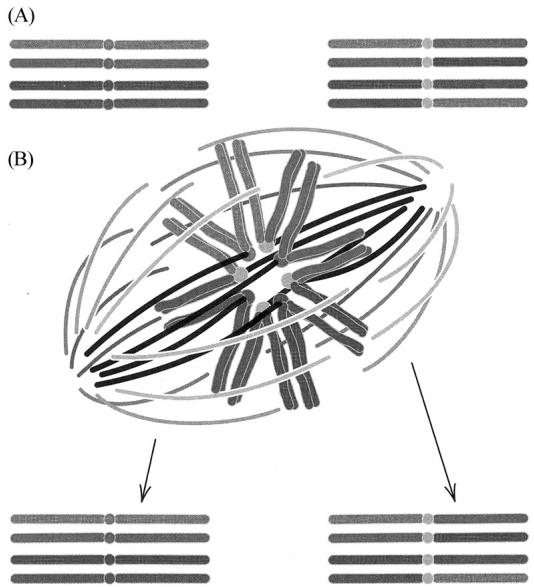  
8.6 基因组中基因表达的位置效应

图 8.30 (A) 在月见草属的某些种中发现的复杂易位杂合子。左上角的染色体未重排。右上角的染色体由一系列易位联系在一起，每条染色体依次与下一条染色体互换了一条臂。(B) 在减数分裂中期 I，易位杂合子的配对构型是一圈染色体，其中，每条臂与其恰当的对象配对；注意，每条染色体由两条染色单体构成。第二次减数分裂之后，中期染色体圈的相间分离产生两种配子：含全部正常染色体的配子和含全部易位染色体的配子。

靠近染色体重排断裂点的基因，其在基因组中的位置被改变，其两侧存在新的相邻基因。在许多情况下，基因的重新定位会影响其表达水平，或在某些情况下，影响其发挥作用的能力，这就叫位置效应（position effect）。在果蝇及酵母中，此类效应已经得到广泛的研究。在果蝇中，最常见的一种位置效应可导致斑点(嵌合)表型，表现为野生型细胞(其中野生型基因表达)和突

变型细胞(其中野生型基因失活)的嵌合斑点。这种表型说成是表现出花斑(variegation)，而该现象称为位置效应花斑（position-effect variegation，PEV）。在以前的文献中，PEV通常称作花斑型位置效应或V型位置效应(V-type position effect)。

PEV 通常是染色体畸变的结果，畸变将野生型基因从常染色质中的某处移到异染色质中或异染色质附近的一个新位置（常染色质和异染色质在第 7 章中讨论）。图 8.31 示在雄性果蝇中观察到的野生型（红色）和突变型（白色）小眼面的一些图案，这些果蝇携带一条重排的 X 染色体，其中，一个倒位将野生型 $w^{+}$ 等位基因重新定位到异染色质中。相同类型的图案也见于该重排 X 染色体和携带 w 等位基因

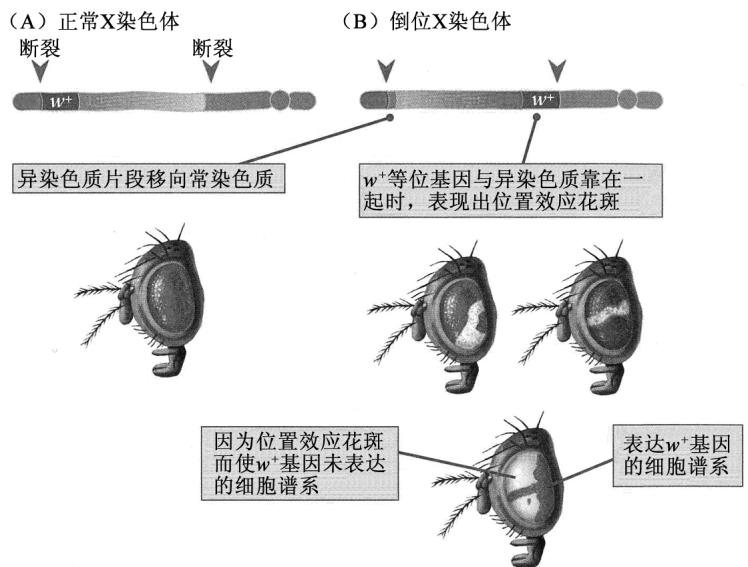  
图 8.31 基因表达有时取决于基因在异染色质中的位置或是否靠近异染色质。(A)野生型白眼基因的正常位置靠近X染色体端部。基因在此位置上时，所有细胞均表达野生型等位基因，从而眼睛为正常的红色。(B)一个倒位将野生型白眼基因重新定位到新位置，该位置在异染色质中，或靠近异染色质。基因在此位置上时，有的细胞谱系表达该基因，而有的细胞谱系不表达。结果，眼睛颜色为嵌合型，称为位置效应花斑(PEV)，从一个个体到另一个个体，眼睛色素的图案不一样。

的染色体杂合的雌果蝇中。 $w^{+}$ 的表达模式与眼睛中的克隆谱系一致，也就是说，某个特定斑块中所有的细胞，均来自胚胎中 $w^{+}$ 等位基因为活化状态的单个祖细胞。与图8.31所示的模式不同，其他具有PEV的染色体重排产生椒盐模式(salt-pepper pattern)的嵌合体，由众多极小的野生型组织斑块构成；还有其他的染色体重排产生许多小斑块和少数大斑块的组合。这些模式说明，在发育过程中，基因活化可以很晚，也可以很早。

虽然还不理解 PEV 的详细机制，但认为 PEV 是异染色质独特的染色质结构干扰基因活化的结果。决定基因表达或不表达，被认为是发生在压缩的异染色质和常染色质之间的界限建立的时候。在异染色质与常染色质毗邻之处，异染色质特有的染色质压缩可能会扩散到相邻的常染色质中，使该细胞及其所有后代中的常染色质基因失活。在雌性哺乳类细胞中，当常染色质基因易位到异染色质化而失活的 X 染色体上时，会出现类似的失活现象。在果蝇多线染色体中，

失活的常染色质区的长度为 1～50 条带，取决于具体的染色体异常。在分子水平，该范围为 20～1000kb。“扩散”这个词，具有“平滑连续”的含义，但不应该从字面上来理解，因为已知在果蝇和哺乳类中，受 PEV 影响的染色体区域，都夹杂着有活性基因和无活性基因。有可能异染色质区参与形成细胞核内相当紧密的“区室”，在常染色质基因附近的异染色质，可能只不过是将基因吸进异染色质区室中，从而使基因沉默。

## 8.7 植物进化中的多倍性

多倍性 (polyploidy) ——一个物种具有由完整的多个染色体组构成的基因组——是常见于高等植物中的一个重要现象，菊属 (Chrysanthemum) 便是一例。某个菊属物种为二倍体，具有18条染色体，一个亲缘关系很近的种，有36条染色体。不过，染色体形态比较显示，有36条染色体的种拥有在18条染色体的种中的两套完整染色体(图8.32)。在该类群中，基本的染色体组——所有其他的基因组由它形成——称为一倍 (monoploid) 染色体组。在菊属中，一倍染色体数目为9。二倍体物种有一倍染色体组的两个完整的拷贝，即一共18条染色体。36条染色体的物种有一倍染色体组的4个拷贝 $(4\times9=36)$ ，其为四倍体(tetraploid)。菊属的其他种具有54条染色体 $(6\times9$ ，构成六倍体)、72条染色体 $[8\times9$ ，构成八倍体(octoploid)]和90条染色体 $[10\times9$ ，构成十倍体(decaploid)]。

在减数分裂中，所有菊属物种的染色体正常地成对联会，形成二价体(4.3节)。18条染色体的种形成9个二价体，36条染色体的种形成18个二价体，54条染色体的种形成27个二价体等。配子得到来自每个二价体的一条染色体，所以任何一个种的配子中的染色体数目，正好是其体细胞中染色体数目的一半。一个物种的配子中存在的染色体为单倍(haploid)染色体组。例如，在具有90条染色体的菊属物种中，单倍染色体数目为45，在减数分裂中，形成45个二价体，所以每个配子含45条染色体。在受精时，这样的两个配子碰到一起，就恢复到该物种中完整的一套 90 条染色体。因此，多倍体生物的配子不像二倍体生物那样总是一倍体，例如，四倍体生物具有二倍体配子。

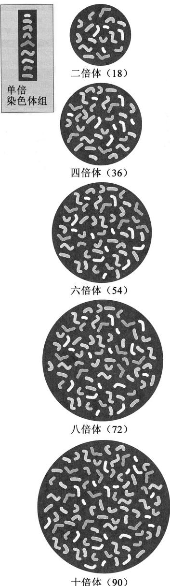  
图 8.32 菊属二倍体种和多倍体种的染色体数目。每组同源染色体以不同颜色绘制。

一倍和单倍这两个术语之间的区别微妙：

\- 一倍染色体组是在多倍体系列的物种(如菊属)中成倍增加的基本染色体组。

\- 单倍染色体组是存在于配子中的染色体集合，不管该物种的染色体数目是多少。

因为在二倍体生物中，一倍染色体组和单倍染色体组是一样的，所以可能出现混淆。想一想四倍体，有助于弄清这一区别：四倍体含四个一倍染色体组，因而单倍体配子是二倍体。

多倍性广泛存在于某些植物类群中。在被子植物(开花植物)中，现存物种的 $30\% \sim 80\%$ 被认为起源于某种形式的多倍体。在某些类群中，频率甚至更高，例如，在蕨类植物(一个包括蕨、木贼和石松的类群)中，多倍体物种的比例高达 $95\%$ 。蕨类瓶尔小草(Ophioglossum pycnostichum)是一个染色体数为1260的84倍体，这在植物中是最高纪录。

在重要的农作物中，属于多倍体的包括小麦、玉米、棉花、土豆、香蕉、咖啡、甘蔗、花生和苹果。多倍性通常会使单个细胞的大小增加，并且多倍体植物通常比它们的二倍体祖先更大、更健壮；不过，对于这些概括有许多例外。在脊椎动物中多倍性很罕见，但在几个无脊椎动物类群中可以见到。在动物中多倍性罕见的一个原因是，性染色体难以正常分离。例如，具有XXXX雌性和XXYY雄性的四倍体生物，如果产生XX卵子和XY精子(如果所有的染色体都配对形成二价体)，那么后代会全部是XXXXY，因此与双亲的任何一个都不同。

在自然界中发现的多倍体植物几乎总是具有偶数的染色体组，因为具有奇数染色体组的生物生育力低。具有3个一倍染色体组的生物称为三倍体生物(triploids)。就生长而言，三倍体完全正常，因为三倍体状态不影响有丝分裂，在三倍体生物(或任何其他的多倍体类型)的有丝分裂中，每条染色体就像二倍体一样复制和分离。然而，因为每条染色体具有一个以上的配对对象，在减

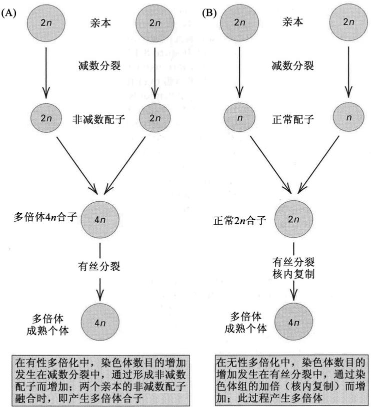  
图 8.33 通过(A)有性多倍化和(B)无性多倍化形成四倍体生物。符号 n 表示一倍染色体数。

数分裂中染色体分离被严重打乱，大部分配子会有缺陷(图8.13)。除非这种生物能够以无性繁殖来使自己存在下去，否则它终将灭绝。三倍体生物的不育性有时具有商业价值。例如，“无籽”西瓜的种子小而可食，因其为三倍体，大部分种子不能发育到通常大小。在佛罗里达及其他一些州，水道的杂草控制是借助于释放以草为食的鱼(草鱼)，它们不会繁殖过度，因为释放的鱼是不育的三倍体。

## - 有性多倍化与无性多倍化

产生多倍体生物的途径主要有两种，在图 8.33 中以四倍性为例来解释这两种途径。在称作有性多倍化（sexual polyploidization）的机制中，染色体数目的增加是在减数分裂中，通过形成具有加倍的正常

染色体组的非减数配子(unreduced gamete)而发生。在许多物种中，非减数配子以 $1\% \sim 40\%$ 的频率形成，并且该频率可由遗传控制。例如，在土豆中，一个在花粉形成过程中发挥作用的隐性突变，可导致第一次减数分裂和第二次减数分裂的纺锤体以相同方向定向(而不是像非突变型细胞中那样呈直角)，其结果是，围绕每两组毗邻的末期II染色体形成一个花粉细胞核，产生非减数配子。还是在土豆中，另一个隐性突变，其作用是在雌配子形成过程中不让第二次减数分裂发生，同样导致非减数配子。图8.33A示两个非减数的 $2n$ 配子产生一个 $4n$ 四倍体，但还有很多可能性。例如，一个非减数的 $2n$ 配子与一个正常的 $n$ 配子产生一个 $3n$ 三倍体。

多倍体形成的另一个主要机制是无性多倍化(asexual polyploidization)(图8.33B)，在该机制中，染色体数目的加倍发生在有丝分裂中，染色体通过中断有丝分裂而加倍，称为核内复制(endoreduplication)。在可进行自体受精(self-fertilization)的植物物种中，核内复制可产生遗传稳定的新种，因为，如果该四倍体的染色体在减数分裂中可两两配对，它们就能正常分离，产生具有完整染色体组的配子。这样的四倍体，自体受精可重新恢复染色体数目，所以这种四倍体状态可一直持续下去。

四倍体物种及其他多倍体物种的遗传学，比二倍体物种的遗传学复杂得多，因为每个个体携带任一基因的两个以上的等位基因。在二倍体中，因为只有两个等位基因，只会有3种可能的基因型：AA、Aa和aa。相比之下，在四倍体中有5种可能的基因型：AAAA、AAAa、AAaa、Aaaa和aaaa。在这些基因型中，中间3种为不同的四倍体杂合子类型。

八倍体(8个染色体组)可由四倍体的有性多倍化或无性多倍化产生。同样，如果在减数分裂中只形成二价体，那么八倍体生物可通过自体受精或与其他八倍体生物杂交，以有性生殖的方式一直延续下去。而且，八倍体和四倍体之间的异体受精产生六倍体(6个染色体组)。多倍化和异体受精的反复发生，最终会产生染色体数目不同但亲缘关系紧密的整级数多倍体生物，如所举的菊属例子一样。

## - 同源多倍体生物与异源多倍体生物

菊属代表了多倍性的一种类型，称为同源多倍性(autopolyploidy)，这种多倍体物种的染色体全部来自单一的二倍体祖先种。在很多情况下，多倍体物种具有来自两个或多个不同祖先种的完整染色体组，此类多倍体生物称为异源多倍体生物(allopolyloid)。它们来自不同二倍体物种之间的偶然杂交：一个物种的花粉在另一个物种的柱头上萌发，使胚珠受精。花粉可被风、昆虫或其他传粉媒介带到错误的花上。图8.34

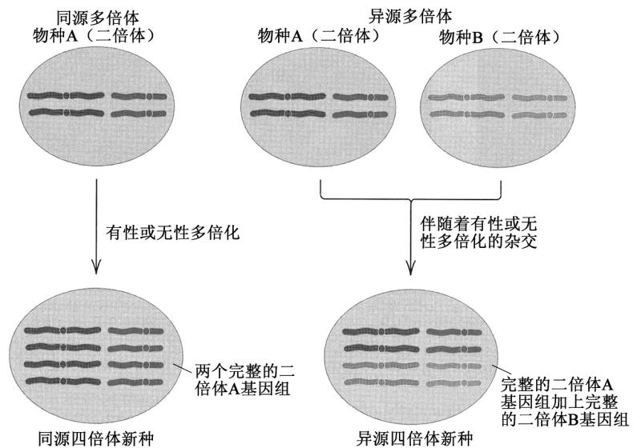  
图 8.34 同源多倍体具有来自单个物种的染色体组；异源多倍体具有来自不同物种的染色体组。

示物种 A 和物种 B 之间的杂交，其中，多倍化导致一个异源多倍体的形成[在此例中，是一个异源四倍体 (allotetraploid)]，该异源多倍体携带它的两个祖先种的全部二倍体基因组。在植物进化和植物育种中，通过杂交形成异源多倍体生物是一个极其重要的过程。自然发生的多倍体生物，至少有一半是异源多倍体生物。小麦是异源多倍化的一个很好的例子，栽培面包小麦为六倍体，有42条染色体，由来自3个祖先种各14条染色体的完整二倍体基因组构成。这种42条染色体的异源多倍体被认为起源于图8.35所概括的系列杂交。

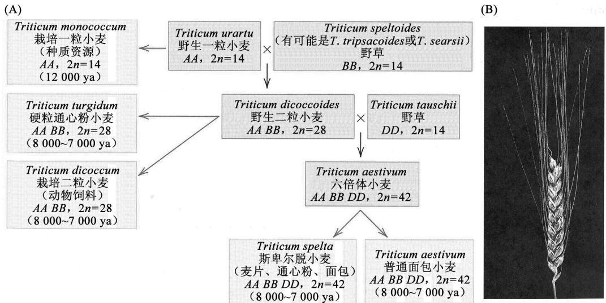

图 8.35 小麦起源中的反复杂交和多倍化。(A) A、B 和 D 基因组各有 7 条染色体，2n 是每个物种的染色体总数。野生种在绿框中，驯化种及驯化的大致时间 (ya=years ago，年以前) 在黄框中。(B) 最早的栽培小麦之一圆锥小麦 (Triticum turgidum) 的穗。[照片承密苏里大学农学系戈登·金伯 (Gordon Kimber) 惠赠。]  
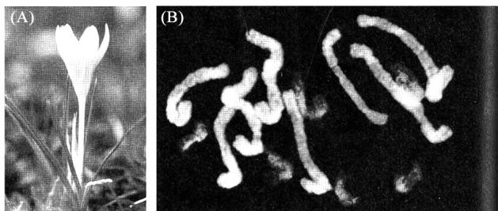  
图 8.36 番红花变种 “金黄” 的花，及揭示该变种的异源多倍体起源的染色体涂染。右侧显示该变种的 7 对染色体。绿色的染色体与具有 3 对染色体的窄叶番红花的 DNA 杂交，黄色的染色体与具有 4 对染色体的黄番红花的 DNA 杂交。[A 部分，©Elena Elisseeva/Shutterstock Inc.; B 部分转载自 M. Orgaard, N. Jacobsen, and J. S. Heslop-Harrison, “The hybrid origin of two cultivars of crocus…,” Ann. Bot. 76 (1995):253-262，经牛津大学出版社许可。]

用染色体涂染可揭示异源多倍体中染色体组的祖先起源，图8.36中显示一个例子。花来自一个称为“金黄”(Golden Yellow)的番红花变种。其基因组合7对染色体，它们被涂染显示成黄色和绿色。金黄被认为是两个亲缘关系紧密的物种杂交，继而杂种中染色体的核内复制而形成的一种异源多倍体。推测其祖先种是具有4对染色体的黄番红花(Crocus flavus)和具有3对染色体的窄叶番红花(Crocus angustifolius)。为了对金黄的染色体进行涂染，分离黄番红花的DNA，并用一种黄色荧光染料标

记，分离窄叶番红花的 DNA 并用一种绿色荧光染料标记。染色体涂染的结果非常清楚：3 对染色体与来自窄叶番红花的绿色标记 DNA 杂交，而 4 对染色体与来自黄番红花的黄色标记 DNA 杂交。

最近形成的多倍体生物——如小麦和番红花——比较容易检测，因为在小麦中，每个基因组中染色体的大小和形态一直保持不变，而在番红花中，DNA序列与它们的祖先序列保留了足够的相似性，在染色体涂染中可进行基因组特异的DNA杂交。古老的多倍体生物检测起来比较困难，但全基因组测序可提供有用的信息，因为在DNA序列已经变得非常不同，以致不能再发生DNA杂交很久之后，它们仍可被识别出具有共同祖先。基因组测序已经揭示了一些令人吃惊的古老多倍性的例子，包括出芽酵母(Saccharomyces cerevisiae)、开花植物拟南芥(Arabidopsis thaliana)和水稻(Oryza sativa)。在每一个例子中，古老的多倍化都产生一个四倍体，而这一事件在很久以前发生，以致许多加倍后的基因已因缺失而丢失，并且许多其他的基因已发生很大的趋异，以致它们多倍化的共同起源模糊不清，除非进行详细的序列和功能比较。在遗传上和功能上，这些古老的多倍体生物表现得就像是普通的二倍体生物，每个基因犹如单拷贝基因。

## ■ 一倍体生物

如果某一生物从具有单个染色体组的细胞发育而来，那么它是一倍体。在一倍体的生殖细胞中，每条染色体都缺少配对对象，因而减数分裂不能正常进行，因此，一倍体生物通常是不育的。一倍体生物非常罕见，但它们自然发生在某些昆虫种类(蚂蚁、蜜蜂)中，在这些昆虫种类中，雄性来自未受精的卵。这些一倍体雄性不育，因为其配子是通过一种修改过的减数分裂产生，在这种减数分裂中，在减数分裂I中染色体不分离。

对某些二倍体植物来说，一倍体生物可来自花药(产生花粉的结构)中的细胞。使花药极度降温会引起一些本来要成为花粉粒的单倍体细胞开始分裂。这些细胞既是一倍体也是单倍体。如果把这些冷休克的细胞置于含有适当营养成分和某些植物激素的琼脂表面上，就会形成一小个分裂的细胞团，称为胚状体(embryoid)。之后，改变生长培养基中的植物激素，会导致胚状体形成具有根和叶的小植株，能够种在土壤中，并能正常生长。因为一倍体细胞只有单个染色体组，因此，不用考虑单个等位基因的显性或隐性，就能鉴定它们的基因型。于是，植物育种者就能够选择具有期望性状的一倍体植株。在某些情况下，期望的基因就存在于原来的二倍体植株中，只要在一倍体植株中挑选即可。在其他情况下，会用诱变剂处理花药，希望能够产生想要的性状。

从一倍体中分离到期望的突变之后，需要将一倍体转变成纯合二倍体，因为一倍体植株不育，

不产生种子。用秋水仙碱 (colchicine) 处理分生组织 (茎或枝的生长点) 就有可能将一倍体转变成二倍体。秋水仙碱这种化学物质是有丝分裂纺锤体形成的一种抑制剂。当分生组织中处理过的细胞开始有丝分裂时，染色体正常复制，可是，秋水仙碱使中期和后期阻断，所以结果是核内复制 (在一个给定细胞中，每条染色体加倍)。大多数细胞会被秋水仙碱杀死，幸运的话，会有为数不多的一倍体细胞被转变成二倍体状态 (图 8.37)。去除秋水仙碱，让细胞能够继续增殖，大多数新晋二倍体细胞可增殖成一小片可用显微镜识别的组织。如果将该组织置于营养琼脂表面，它将发育成完整的植株。这样的植株——完全是纯合的——可育，并能产生正常的种子。

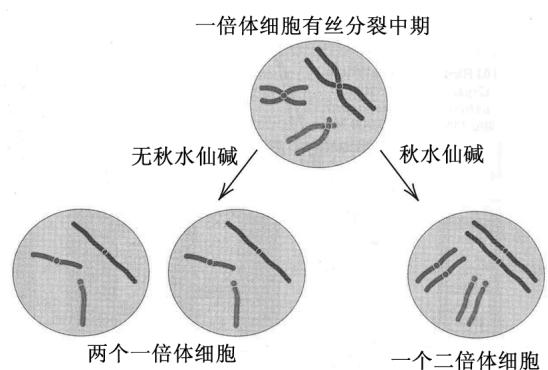  
图 8.37 用秋水仙碱处理，从一倍体产生二倍体。秋水仙碱扰乱纺锤体，从而阻止着丝粒(圆圈)分裂后的染色单体分离。

## 8.8 禾本科的基因组进化

谷类是我们最重要的作物，包括水稻、小麦、玉米、小米、甘蔗、高粱及其他谷类。禾本科(Gramineae)物种的基因组大小变化极大。400Mb为最小，见于水稻；最大达16 000Mb，见于小麦。虽然基因组大小上的差异部分是由于小麦是异源六倍体，但更为重要的因素是，从一个物种到另一个物种，重复DNA序列的种类和数量存在巨大的变异。小麦每条染色体所含的DNA，大约是水稻每条染色体所含DNA的25倍。玉米具有2500Mb大小的基因组，在禾本科中属中等大小，却和人类基因组差不多一样大。

在禾本科中，尽管染色体数目和基因组大小变异巨大，但是在单拷贝基因之间存在许多的遗传和物理连锁，这些单拷贝基因处在进化极其迅速的重复 DNA 序列背景之中，但非常保守。

具体来说，经鉴定在所有禾本科中都存在的每个保守区，都可在水稻基因组中找到相似的区域。这一情况如图 8.38 所示。水稻的染色体对编号为 R1～R12，每条染色体中的保守区以小写字母表示，如 R1a 和 R1b。在其他每个物种中，按照水稻基因组保守区的名称图示每对染色体，水稻基因组保守区所含的单拷贝 DNA 序列，与所讨论的物种的染色体的相应区域的单拷贝 DNA 序列同源。例如，小麦一倍染色体组以 W1～W7 表示。W1 的一个区域所含的单拷贝序列与水稻 R5a 片段中的单拷贝序列同源，另一区域所含的单拷贝序列与水稻 R10 片段中的单拷贝序列同源，还有一个区域所含的单拷贝序列与水稻 R5b 片段中的单拷贝序列同源。如图所示，其他禾本科物种的保守区都可与水稻的保守区一一对应。此类保守的遗传和物理连锁，每一个都称为一个同线群 (synteny group)。

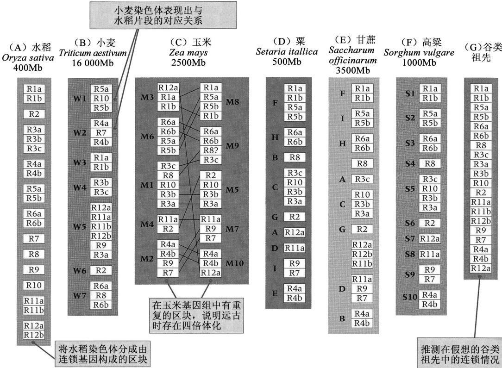  
图 8.38 水稻基因组与其他禾本科物种之间的保守连锁(同线群): (A)水稻; (B)小麦; (C)玉米; (D)小米; (E)甘蔗; (F)高粱。基因组大小的单位为百万碱基对(Mb)。(G)示推测在假想的祖先谷类基因组中的片段顺序。[数据来自 G. Moore, Curr. Opin. Genet. Dev. 5 (1995):717-724.]

在比对其他物种时，也发现存在同线群。例如，人类基因组和小鼠基因组共享大约180个同线群，这是由于这两个物种拥有最后一个共同祖先之后的大约八千万年中，发生了差不多等量的染色体重排。在小鼠中鉴定人类基因的同源基因时，这些同线群往往很有用。

## 本章概要

\- 标准人类核型包括 22 对常染色体和一对性染色体。

\- 染色体异常是人类自发流产的主要因素和遗传病(如21三体，又称唐氏综合征)的重要原因。

\- 哺乳类中的剂量补偿是在胚胎发育早期X染色体遗传失活(沉默)的结果，在每个细胞谱系中只有一条随机选择的X染色体保持活性(单条活性X染色体原理)。在“失活”的X染色体中，有些基因未被沉默。

\- 增加或减少一条染色体的遗传不平衡的(非整倍体的)染色体组，对表型的影响往往比增加一整套遗传平衡的(整倍体的)染色体更严重。

\- 通过错配和不等交换过程，在染色体上串联重复的基因可产生具有更多基因拷贝的染色体。

\- 野生型染色体和含有基因片段倒位的染色体之间的基因对基因的配对结果是，在其中一条染色体中形成一个环，在“倒位环”内的交换导致染色体异常。

\- 相互易位因扰乱分离而导致异常配子。

\- 在某个物种中，或在物种之间的杂种中，出现整个染色体组的重复，是高等植物进化的一个主要过程。

## 基础回顾

\- 为什么无着丝粒染色体不能排列到赤道板上，从而在后期不能移到一极？哪种异常染色体会在两个后期子细胞之间形成染色体“桥”？

\- 谈到X连锁基因时，剂量补偿一词是什么意思？在哺乳动物中，剂量补偿的机制是什么？

\- 假常染色体遗传一词的意思是什么？表现出假常染色体遗传方式的基因位于基因组中的什么地方？

\- 在人类生殖过程中，大多数常染色体单体或三体合子的命运是什么？

\- 什么是唐氏综合征？该病的发病率与母亲年龄有什么关系？

\- 解释红、绿视蛋白基因中的不等交换如何与红绿色盲相关。

\- 说某个缺失“显露”某个隐性突变的意思是什么？

\- 为什么大多数染色体重排可以通过有丝分裂进行传递而不扰乱有丝分裂过程？

\- 指出臂内倒位和臂间倒位的差别，减数分裂中哪些染色体异常分别与这两种倒位相关？这些异常与交换有什么关系？

\- 哪些种类的染色体异常配子与杂合相互易位相关？

\- 指出同源多倍性与异源多倍性的差别，哪种多倍性可能较有利于减数分裂中二价体的形成？

\- 为什么大多数自然发生的多倍体物种具有偶数倍的一倍染色体组？

\- 为什么性染色体的存在对于进化出具有不同多倍性水平的一系列近缘种是一种障碍？

\- 指出有性多倍化和无性多倍化的差别，在哪一种多倍化中，染色体数目在减数分裂中加倍？在有丝分裂中加倍的呢？

## 解题指南

习题 1 附图示果蝇某一唾腺染色体中的 6 条带，以及 5 个缺失(Del1～Del5)的范围。

已知隐性等位基因 a、b、c、d、e 和 f 在此区域中，但它们的顺序未知。当这些缺失对每个等位基因为杂合时，得到如下结果：

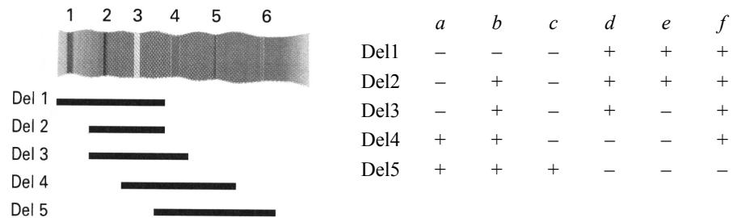

在该表中，“-”表示该缺失缺少相应的野生型等位基因(该缺失显露该隐性基因)，而“+”表示相应的野生型等位基因仍然存在。用这些数据推导每个基因相对于唾腺染色体条带的位置。

## 答案

基因 b、a、c、e、d 和 f 分别位于条带 1、2、3、4、5 和 6。推理如下，因为 Del1 显露条带 1 中的任何基因，而其他缺失不显露，所以，针对基因 b 观察到的 - + + + + 模式，将 b 放到条带 1 中。Del1～Del3 显露条带 2，而 Del4～Del5 不显露，所以针对基因 a 观察到的 - - - + + 模式，将基因 a 定位到条带 2 中。条带 3 中的基因可被 Del1～Del4 显露，但不被 Del5 显露，所以 - - - - + 模式说明基因 c 在条带 3 中。条带 4 被 Del3～Del5 显露，但不被 Del1～Del2 显露，这意味着具有 + + - - - 模式的基因 e 在条带 4 中。条带 5 中的基因被 Del4～Del5 显露，但不被 Del1～Del3 显露，所以针对基因 d 观察到的 + + + - - 模式，将基因 d 置于条带 5 中。条带 6 中的基因被 Del5 显露，但不被 Del1～Del4 显露，所以 + + + + - 模式将基因 f 置于条带 6 中。

习题 2 附图是一条具有倒位的染色体与其正常同源染色体之间配对的一个简化版本，当所讨论的问题涉及倒位环内交换的结果时，这种图非常有用。在该简化版本中，仅显示了倒位区域的配对，正常区域未配对。图中的倒位为臂内倒位，这意味着着丝粒在两侧(当然，在真正的细胞中，倒位区域会形成一个环)。在该示意

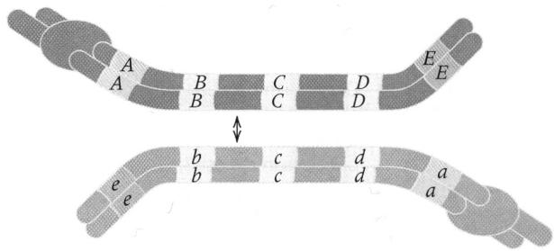

图中，容易看出在箭头处的交换会产生一条双着丝粒染色体和一个无着丝粒片段(除没有参与交换的一条正常染色体和一条倒位染色体以外)。当第一个交换发生在所示之处，而第二个交换发生在基因C和D之间时，推导该二线双交换的结果。

## 答案

结果是一条正常染色体和一条倒位染色体(这两条染色体来自没有参与任何一次交换的染色单

体)，以及一条携带等位基因 $ABcDE$ 的正常染色体和一条携带等位基因 $a b C d e$ 的倒位染色体。注意，该二线双交换已转换了正常染色体和倒位染色体之间的一个等位基因。

习题 3 指出下列生物会出现的配子类型及其比例:

(a) 单一染色体的三体。

(b) 单一染色体的单体。

## 答案

(a) 在三体生物中，任意两条染色体将形成一对，而另一条染色体保持非配对，或三条染色体都结合在一起，每条染色体以部分长度与其他两条配对。这两种情况如图所示，后期 I 分离决定包含在配子中的染色体。在这两种配对类型中，两个配子获得该染色体的两个拷贝，而两个配子只获得一个拷贝。因此，三体分离导致二体配子或单体配子，其期望比值为 1:1。

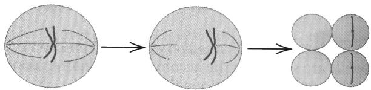  
期望比值是 1:1。

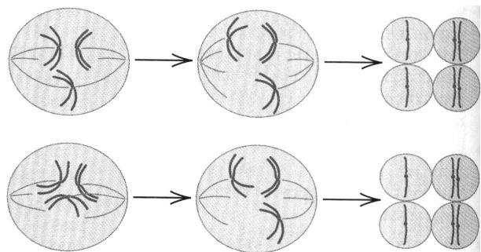  
(b) 在单体生物中，单体染色体一定是保持非配对的。在后期 I，这条染色体移到一极或另一极，最终结果是两个配子未含该染色体的任何拷贝，两个配子获得一个拷贝。因此，单体分离导致缺体 (nullisomic，没有这条染色体的) 配子和单体配子，其

## 分析与应用

8.1 在减数分裂中,在 X 染色体和 Y 染色体的假常染色体区之间发生的强制性交换的生物学功能是什么?

8.2 在减数分裂中，在 X 染色体和 Y 染色体的假常染色体区之间发生的强制性交换的遗传后果是什么？

8.3 在某些类型的白细胞中，在女性中失活的 X 染色体可用显微镜观察到，为间期细胞核中一个浓染的异染色质小体，该浓染小体称为巴氏小体(Barr body)。在具有一条以上失活 X 染色体的细胞中，巴氏小体的数量等于失活的 X 染色体的数量。一个核型为 49, XXXYY 的人，其白细胞中存在多少个巴氏小体？

8.4 在下列人类疾病中，各有多少个巴氏小体？

(a) 克氏综合征

(b)特纳综合征

(c) 唐氏综合征

(d) 47, XYY

(e) 47, XXX

8.5 为什么把正常人类女性中形成巴氏小体的 X 染色体称作 “失活” 不完全正确？

8.6 发现一个自发流产的人类胎儿有 45 条染色体，最可能的核型是什么？假如这个胎儿活下来了，他得的可能是什么遗传病？

8.7 发现一个自发流产的人类胎儿核型为 92,XXYY, 如果该合子是由正常的带 X 和带 Y 的配子融合产生，在该合子中的染色体可能发生了什么才导致这种核型？

8.8 人类色盲是一种 X 连锁性状。一位色盲男性生了一个 45,X(特纳综合征)并且也是色盲的女儿。导致 45,X 的不分离是发生在母亲中还是父亲中？解释支持你的答案的证据。

8.9 正常人类 Y 染色体长臂包含一个大的重复区域，在一些突变型 Y 染色体中，重复之间的区域缺失，并且只有一个重复拷贝，如何解释这一观察结果？该观察结果可以提示所有重复在染色体上是如何定向的吗？

8.10 一条染色体的基因顺序为 $A B C D E F G$ 。从 $C$ 到 $E$ 倒位后，顺序是什么？从 $C$ 到 $E$ 缺失以后呢？具有 $A B C D E F G$ 和 $M N O P Q R S T U V$ 顺序的两条染色体，在 $E F$ 和 $S T$ 中间断裂之后发生相互易位，可能的产物是什么？哪些产物在遗传上是稳定的？

8.11 人类基因组中的一个隐性突变导致一种称为无汗性外胚层发育不良的疾病，该病与缺乏汗腺有关。该病可通过检查皮肤的电导率进行检测，因为没有汗腺的皮肤比正常皮肤电导率低(电阻较高)。在该隐性等位基因正在分离的亲属中，发现男性患者表现出各处皮肤表面一致低电导，女性患者也是一样。但是，杂合女性表现出一种镶嵌模式——某些皮肤块电导正常、其他皮肤块低电导。所检查的每个嵌合女性，其缺少汗腺的组织的分布方式不同。这种基因表达方式如何解释？

8.12 一位表型正常的女性生了一个患唐氏综合征的孩子，发现该女性有45条染色体，哪一种染色体异常能够解释这些观察结果？该患儿有多少条染色体？这与常见唐氏综合征患儿的染色体数目和核型有何不同？

8.13 无论是 47,XXX 女性还是 47,XYY 男性，绝大多数后代在核型上都是正常的 46,XX 或 46,XY，这一发现是否在预料之中？

8.14 在某条染色体上，基因 a、b、c、d、e 和 f 紧密连锁，但它们的顺序未知。发现在该区域的 3 个缺失显露这些基因的隐性等位基因的情况如下：缺失 1 显露 a、b 和 d；缺失 2 显露 a、d、c 和 e：缺失 3 显露 e 和 f。这些基因的顺序是什么？在此题中，你会发现所给信息只能对大部分——但不是全部——基因进行排序。指出你可以进行什么实验来完成排序。

8.15 隐性基因 $a$ 、 $b$ 、 $c$ 、 $d$ 、 $e$ 和 $f$ 在某条染色体上紧密连锁，但它们的顺序未知。检查在该区域内的 4 个缺失：一个缺失显露 $a$ 、 $c$ 和 $f$ ；另一个显露 $b$ 和 $c$ ；第三个显露 $d$ 和 $f$ ；第四个显露 $d$ 、 $e$ 和 $f$ 。这些基因的顺序是什么？

8.16 隐性基因 $a$ 、 $b$ 、 $c$ 、 $d$ 、 $e$ 和 $f$ 在某条染色体上紧密连锁，但它们的顺序未知。检查在该区域内的 3 个缺失：一个缺失显露 $a$ 、 $d$ 和 $e$ ；另一个显露 $c$ 、 $d$ 和 $f$ ；第三个显露 $b$ 和 $c$ 。这些基因的顺序是什么？

8.17 从 4 个不同的产地分离到 4 个黑腹果蝇品系。2 号唾腺染色体某个区域的带型具有如下构型(每个字母表示一条带)。

(a) a b f e d c g h i j (c) a b f e h g i d c j

(b) a b c d e f g h i j (d) a b f e h g c d i j

假设(c)代表祖先序列，推断其他染色体的进化谱系。

8.18 两种澳大利亚蝗虫一起生活于同一地方。在减数分裂中，每种蝗虫有5对染色体，当这两个种杂交时，在杂种中这些染色体形成3对染色体，以及4条染色体构成的一组，染色体结构的什么变化可解释这些结果？

8.19 为什么易位杂合子是半不育的？为什么易位纯合子完全不育？如果一个易位纯合子与一个具有正常染色体的个体杂交，预计 $F_{1}$ 代为半不育的比例是多少？

8.20 亚洲野生棉(Gossypium arboreum)有13对染色体，一个美洲野生种(G. thurberi)也有13对染色体。这两个种之间的种间杂交是不育的，因为在减数分裂中染色体配对极其紊乱。美洲栽培棉(G. hirsutum)有26对染色体，是完全可育的。G. arboreum与G. hirsutum之间的杂交和G. thurberi与G. hirsutum之间的杂交产生的植株，在减数分裂中出现13对染色体(二价体)和13条没有配对对象的染色体。关于今天的美洲栽培棉的遗传起源，这些细胞学数据告诉了我们什么？

8.21 具有 $AA$ 、 $BB$ 和 $CC$ 基因组的二倍体物种，通过杂交和核内复制产生具有 $AABBCC$ 基因组的异源六倍体，有多少种可能的途径？ $A$ 、 $B$ 和 $C$ 各代表一个一倍染色体组[这样的一个途径，例如， $(AA \times BB) \times CC$ ，意思是 $AA$ 和 $BB$ 进行杂交和多倍化，产生异源四倍体 $AABB$ ，它再与 $CC$ 杂交并多倍化，产生异源六倍体 $AABBCC$ 。

8.22 在二倍体祖先的基因组构成分别为 $AA$ 、 $BB$ 和 $CC$ 的情况下，哪种类型的杂交和核内复制可解释基因组构成为 $AABBBBCC$ 的多倍体物种？(这种类型的多倍性称为节段异源多倍性)

8.23 一个与菊属类似的同源多倍体系列包括 5 个种，在该类群中，基本的一倍染色体数为 7，在这些种中，预计会有哪些染色体数目？

8.24 黄色身体 $(y)$ 是靠近果蝇X染色体端部的一个隐性突变。用X射线照射一个野生型雄性，然后与yy雌性杂交，观察到一个 $y^{+}$ 雄性后代，该雄性与yy雌性交配，后代为：

黄色雌性 242

黄色雄性 0

野生型雌性 0

野生型雄性 260

发现黄色雌性的染色体正常， $y^{+}$ 雄性与它们的雄性亲本以相同方式繁殖，哪一种染色体异常类型可解释这些结果？

8.25 翘翅(Cy)是果蝇2号染色体中的一个显性突变。用X线照射一只Cy/+雌果蝇，然后与正常雄性杂交，Cy/+雄性后代再一只一只地与正常雌性交配。来自一次杂交的后代为：

翘翅雄性 0

翘翅雌性 157

野生型雄性 142

野生型雌性 0

哪种染色体结构异常是这些结果最可能的解释？（记住，在雄性果蝇中不发生交换）

8.26 对 1 号染色体和 2 号染色体之间的一个相互易位为杂合的半不育性玉米植株，与染色体正常、对 2 号染色体上一个隐性等位基因为纯合(导致淡绿色叶片)的玉米植株杂交。当半不育性 $F_{1}$ 代植株进行测交时，获得如下数据：

半不育、淡绿色 36

可育、淡绿色 240

半不育、非淡绿色 282

可育、非淡绿色 42

(a) 控制淡绿色叶片的基因与 2 号染色体中易位断裂点之间的重组频率是多少?

(b) 如果控制淡绿色叶片的基因不在易位所涉及的染色体中，预计测交后代中的表型比值是多少？

<table><tr><td></td><td>半不育</td><td>可育</td></tr><tr><td>野生型</td><td>434</td><td>4</td></tr><tr><td>短茎</td><td>30</td><td>20</td></tr><tr><td>细条斑</td><td>17</td><td>35</td></tr><tr><td>短茎、细条斑</td><td>6</td><td>454</td></tr></table>

8.27 对 1 号和 2 号染色体之间的一个相互易位杂合的一个半不育玉米品系，与对 1 号染色体上的隐性突变 brachytic(短茎)和 fine-stripe(细条斑)纯合的、染色体正常的玉米杂交。当半不育的 $F_{1}$ 代植株与 brachytic、fine-stripe 亲本品系测交时，在总计 1000 株 $F_{2}$ 代中发现以下表型：

brachytic 与易位断裂点之间和 fine-stripe 与易位断裂点之间的重组频率是多少？

8.28 在果蝇中，红宝石眼睛颜色(rb)由X染色体中的一个隐性等位基因引起，而粗短翅(dp)由2号染色体中的一个隐性等位基因引起。在经X线照射的果蝇后代中，获得一只表现正常，但携带X染色体和2号染色体之间的平衡易位的一只雄果蝇。该雄性的遗传和染色体构成如图所示。该雄性与具有红宝石眼和粗短翅

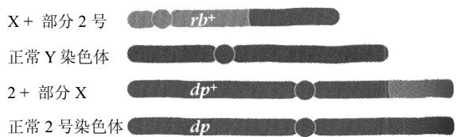

的雌性杂交，预测后代中的表型及其相对频率。(记住，在雄性果蝇中不发生交换)

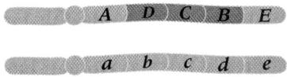

8.29 在此处所示的同源染色体中，深色区域表示染色体的一个倒位片段。这种基因型的一个个体与 abcde 纯合子杂交，大多数后代要么是 ABCDE，要么是 abcde，但获得几个罕见的后代，为 ABCDE。在倒位杂合子中发生的什么事件能解释这些罕见后代？在罕见后代中，基因序

列是正常的还是倒位的？

8.30 一株独特的酵母与携带 his7 突变的正常单倍体菌株杂交。his7 突变位于 2 号染色体，是组氨酸合成时通常需要的一个基因的等位基因。分析来自该杂交的 9 个四分体，观察到如下分离类型：

4 野生型：0 his74个四分体

2 野生型：2 his71个四分体

3 野生型：1 his74个四分体

但是，当这个独特的菌株与其他染色体上具有隐性标记的单倍体菌株杂交

时，四分体中的分离总是 2:2。野生型菌株中什么类型的染色体异常可解释该菌株与 his7 菌株杂交时出乎意料的分离？

## 挑战题

挑战题 1 使用 “解题指南” 习题 2 中所给的 “技巧”，绘制一条带有倒位的染色体与其同源染色体之间的配对构型，来推导以下双交换类型的结果，其中，第一次交换在 “解题指南” 习题 2 插图所示的位置，第二次交换在基因 C 和 D 之间。

(a) 二线双交换。

(b)三线双交换(一条正常的同源染色体未参与)。

(c)三线双交换(一条倒位的同源染色体未参与)。

(d) 四线双交换。

挑战题 2 对 8.28 题中的相互易位为杂合、携带一条含 rb 的正常 X 染色体和一条含 dp 的正常 2 号染色体的雌性，与红宝石眼、粗短翅的雄性杂交。如果在 rb 和易位断裂点之间的重组频率为 10%，在 dp 和易位断裂点之间的重组频率为 30%，预测在 1000 个后代中的基因型和表型。假设没有染色体干涉。

挑战题 3 一个酵母菌株除了某条染色体为三体外，其他方面正常。该菌株的一个三体染色体拷贝携带隐性等位基因 a，另外两个拷贝各携带显性等位基因 A，得基因型 AAa。该菌株生成孢子后，针对 A 和 a 对四分体进行分类，发现 3 种类型的四分体：①4 A:0 a，②2 A:2 a，③3 A:1 a。设三体染色体随机形成一个二价体和一个单价体。证明：(a) 如果 A 和 a 与着丝粒完全连锁，那么 4:0、2:2 和 3:1 四分体的期望比值为 1:2:0。(b) 如果 A 和 a 与着丝粒不连锁 (r=0.5)，那么 4:0、2:2 和 3:1 四分体的期望比值为 4:1:4。

## 网上遗传学

“网上遗传学”(GeNETics)会为你介绍在互联网上寻找遗传学信息的某些最重要的站点。要浏览这些站点，请访问为《遗传学：基因和基因组分析》(第八版)配备的 Jones and Bartlett 公司配套站点http://biology.jbpub.com/book/genetics/8e/。

在该站点中，你会找到一个按章开列的重点关键词列表。选择某个关键词后，可链接到某个网站，其中包含与此关键词相关的信息。
