# 第 10 章 基因表达的分子生物学

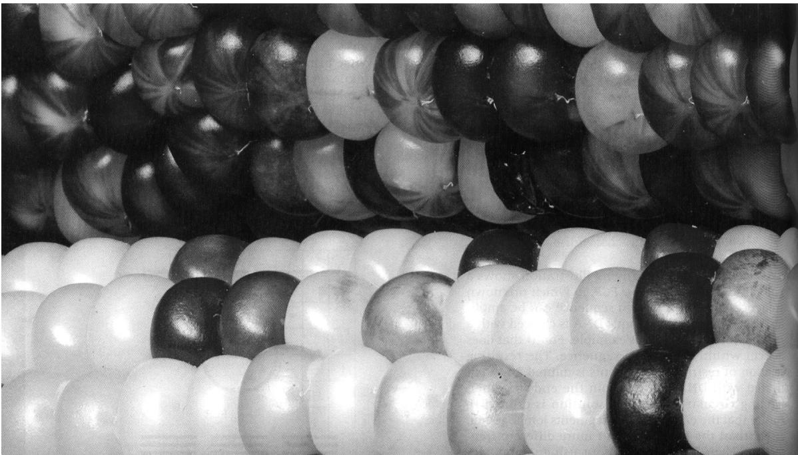  
五彩玉米。黄色玉米粒上的红色扇形区是某个基因表达所致，在白色扇形区中该基因未表达。[©Bob Ross/Shutterstock, Inc.]

## 本章提纲

10.1 氨基酸、多肽和蛋白质

10.2 编码序列和多肽之间的共线性

10.3 转录

10.4 信使RNA

10.5 真核生物的 RNA 加工

10.6 翻译

10.7 复合翻译单位

10.8 标准遗传密码

联系：Messenger “light”

悉尼·布伦纳、弗朗索瓦·雅各布和马修·梅塞尔森，1961

一种将信息从基因携带到核糖体以合成蛋白质的不稳定的中间体

联系：Poly-U

马歇尔·尼伦伯格和海因里希·马特哈伊，1961

大肠杆菌无细胞蛋白质合成对天然存在的或人工合成的多聚核糖核苷酸的依赖

## 学习目标与科学能力

基因表达的分子生物学包括转录、RNA加工和翻译等关键过程。对这些过程的理解，会使你具备如下科学能力。

■ 能在由 3 个氨基酸组成的多肽示意图中，指出各个氨基酸，并标出肽键。

■ 能图示转录过程，并能描述细胞怎样决定在何处起始和终止转录。

\- 能画出假想的真核生物初级 RNA 转录物及其加工过的形式的结构，标出帽子结构、内含子和 poly-A 尾巴。

\- 能指出真核生物和原核生物在起始翻译上的不同之处。能解释原核生物的翻译起始方式是如何使多顺反子信使RNA能够进行翻译的。

\- 已知编码氨基酸的 DNA 序列及转录方向，能推导出 RNA 转录物序列及多肽链中相应的氨基酸序列。

\- 能够解释蛋白质的氨基酸序列如何决定其折叠成三维结构，即便有些蛋白质在折叠时需要辅助。

\- 能够描述遗传密码的一般结构，特别是关于密码子第三位核苷酸是嘌呤或嘧啶时的情况。能够解释遗传密码怎样不仅与信使RNA中的密码子相对应，而且与转移RNA中的反密码子相对应，并能解释氨酰tRNA合成酶的特异性。

基因表达(gene expression)一词是指包含在基因中的信息被转变成能够决定细胞和生物体的代谢和发育的多肽链的分子过程。如同在第1章中所见，信息从DNA转移到蛋白质，是通过基因表达的“中心法则”达到的：

$$
\mathrm{DNA} \rightarrow \mathrm{RNA} \rightarrow \mathrm{蛋白质}
$$

稍微详细一点，可将基因表达的主要步骤概括如下。

1. RNA 分子被 RNA 聚合酶酶促合成: RNA 聚合酶以一段 DNA 单链的核苷酸序列为模板，以循序渐进的方式产生一条互补的 RNA 链。选择与某个特定基因相应的片段，然后合成一个 RNA 分子的全过程，就是转录。

2. 在真核生物中，RNA 通常要在细胞核中经过化学修饰，这称为 RNA 加工。

3. 在翻译过程中，以加工过的 RNA 分子(信使 RNA)的核苷酸序列，来指导氨基酸按特定顺序连续结合，产生多肽链。因此，多肽链中的氨基酸序列是由基因中的编码序列编码的。

## 10.1 氨基酸、多肽和蛋白质

蛋白质负责催化细胞内大多数的化学反应(酶蛋白)、调节基因表达(调节蛋白)，以及决定细胞、组织和生物体的许多结构特征(结构蛋白)。蛋白质由一条或多条多肽链(polypeptide chain)组成，每条多肽链是一串共价结合的氨基酸。在多肽中常见氨基酸有20种，它们可以任

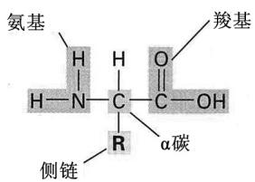  
图 10.1 氨基酸的通用结构。

意顺序、任意数量(一般 100～1000 个)结合在一起。

每个氨基酸含有一个结合了羧基(—COOH)的碳原子( $\alpha$ 碳)、一个氨基(—NH $_{2}$ )和一个通常称为 R 基(R group)的侧链(side chain)(图 10.1)。R 基一般为携带各种不同原子的碳原子链或碳原子环。最简单的 R 基是甘氨酸(—H)和丙氨酸(—CH $_{3}$ )的 R 基。全部 20 种氨基酸的化学结构如图 10.2 所示，以备参考。金色方框表示每个氨基酸的 R 基。

多肽链的每一环都是由一个氨基酸的羧基与接下来的一个氨基酸的氨基连接而形成的，所生成的化学键是一个称为肽键(peptide bond)的共价键(图10.3，A部分)。因此，多肽链的主链由 $\alpha$ 碳原子和肽键相间排列构成，侧链自主链伸出，形成有序的排列(图10.3B)。

多肽链分子的两端不一样，一端具游离的氨基(—NH₂)，从而称为氨基端(amino terminus)；另一端具游离的羧基(—COOH)，从而称为羧基端(carboxyl terminus)。多肽链是通过在生长链的羧基端连续添加氨基酸而合成的。按照惯例，多肽链的氨基酸从氨基端开始编号。

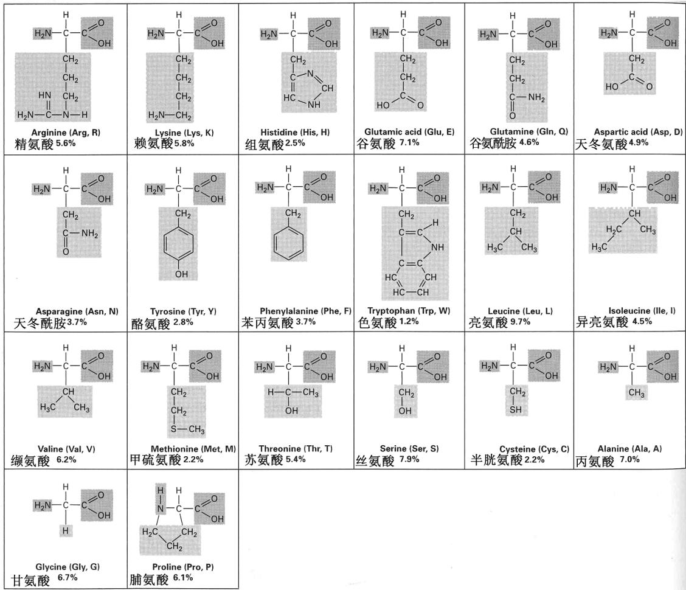

图10.2 遗传密码编码的氨基酸的化学结构，及其常用的三字母和单字母缩写。注意，脯氨酸不像其他氨基酸那样具有相同的通用结构，因为它没有游离的氨基，脯氨酸是一种亚氨基酸。百分数为每种氨基酸的相对丰度，系平均人类基因组编码的所有蛋白质而得。

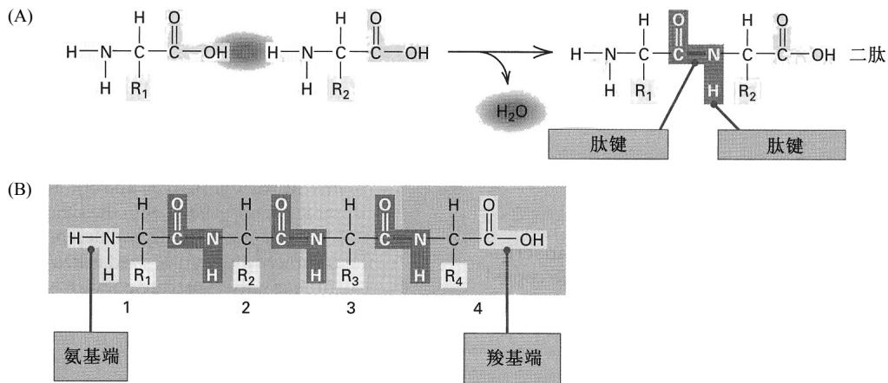  
图10.3 多肽链的特征。(A)一个氨基酸(左边)的羧基与第二个氨基酸(右边)的氨基的反应，形成肽键。除去一分子的水(HOH)，以形成肽键(红线)。(B)四肽，示 $\alpha$ 碳原子(黑色)和肽键(蓝色)的交替排列。四个氨基酸的编号在下方。

大多数多肽链是高度折叠的，已经发现多种多样的立体形状。折叠方式主要由氨基酸序列——尤其是侧链之间的非共价相互作用——决定，因此，每种多肽链往往会折叠成独特的立体形状。70%～75%的多肽链非常小，因而它们从核糖体上释放之后，在数毫秒内就可正确折叠。比较大的、折叠慢的或折叠途径非常复杂的多肽链，需要专门的蛋白质来辅助折叠过程。在10.6节中会进一步讨论折叠。

许多蛋白质分子由不止一条多肽链组成。属于这种情况的蛋白质，称其含蛋白质亚基(protein subunit)，这些亚基可以相同或不同。例如，血红蛋白——血液中氧气的携带者——由4个亚基组成：两拷贝称为 $\alpha$ 链的多肽和两拷贝称为 $\beta$ 链的多肽， $\alpha$ 多肽和 $\beta$ 多肽不同。

## 10.2 编码序列和多肽之间的共线性

在 20 世纪 50 年代早期，人们发现镰形细胞贫血病的等位基因由于 $\beta$ 珠蛋白链第 6 位残基从带负电荷的谷氨酸被置换为不带电荷的缬氨酸，引起血红蛋白分子所带电荷的改变。这一发现首次证明了基因编码多肽中的氨基酸序列。

大多数基因只包含合成一条多肽链的信息，而且，基因中核苷酸的线性顺序决定多肽链中氨基酸的线性顺序。这一观点首次被大肠杆菌色氨酸合成酶基因 trpA 的研究证明，此前已获得该基因的许多突变，并已测定了这些突变的精确位置。直接对野生型和突变型酶的氨基酸序列进行分析，探明了该酶氨基酸序列上众多突变的效应。研究发现，每种突变均会造成该酶的单个野生型氨基酸被置换，更重要的是，这些突变在遗传图中的顺序，与突变氨基酸在多肽链中的顺序相同（图 10.4）。基因和多肽的这种相关性，称为共线性（colinearity），意思是，DNA 的碱基对序列以共线性的（即点对点的）方式，决定多肽的氨基酸序列。共线性见于几乎所有的真核生物中。不过，后面我们将会看到，在真核生物的大多数基因中，非编码序列打断了编码序列；在这些基因中，是基因上的突变顺序（而不是突变之间的空间距离）与各自的氨基酸置换相关联。

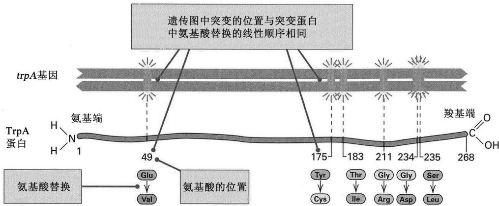  
图 10.4 大肠杆菌 trpA 基因中 DNA 和蛋白质的共线性。

## 10.3 转录

基因表达的第一步是转录(transcription)——从构成基因的 DNA 片段拷贝 RNA 分子的合成过程。本节叙述 RNA 产生过程的基本特征。

## ■RNA合成概述

RNA 酶促合成的基本化学特性，与第 6 章中讨论过的 DNA 合成的化学特性类似。

1. 合成 RNA 的前体为 4 种 5'-核糖核苷三磷酸：腺苷三磷酸(ATP)、鸟苷三磷酸(GTP)、胞苷三磷酸(CTP)和尿苷三磷酸(UTP)。它们与 DNA 前体的差异仅在于糖是核糖而不是脱氧核糖，以及尿嘧啶(U)碱基代替了胸腺嘧啶(T)(图 10.5)。

2. 转录所用的酶是 RNA 聚合酶(RNA polymerase)，而不是 DNA 聚合酶。RNA 聚合酶与一段长 20～200 个核苷酸、称为启动子(promoter)的 DNA 序列结合，继而在启动子中一个称为转录起点的核苷酸处开始转录。

3. 在 RNA 合成时，糖-磷酸键形成于一个核苷酸的 3'-羟基和紧接着的下一个核苷酸的 5'-三磷酸之间(图 10.6, A 和 B 部分)。这与 DNA 合成时形成的化学键一样，但酶不一样，并且所合成的多聚体是 RNA。

4. RNA 分子中的线性核苷酸顺序由 DNA 模板中的线性核苷酸顺序决定。每一个添加到 RNA 链生长端的核苷酸，都因其能与 DNA 模板链进行碱基配对而被选中的。因此，DNA 模板链中的碱基 C、T、G 和 A 分别导致 G、A、C 和 U 被添加到 RNA 分子的生长端。

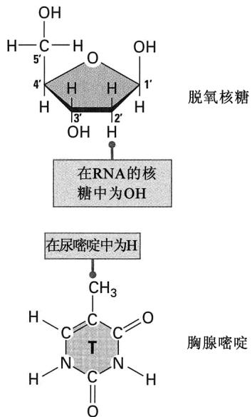

5. 核苷酸只能被添加到生长链的 3'-OH 末端，结果是，正在生长的 RNA 分子的 5' 末端带有一个三磷酸基团。注意，RNA 链延伸的方向是从 5' 到 3'，与 DNA 合成相同。

图 10.5 核糖和脱氧核糖之间以及尿嘧啶和胸腺嘧啶之间的结构差异。

DNA 聚合酶和 RNA 聚合酶的一个显著差异是，RNA 聚合酶能在没有引物的情况下开始链的延伸。而且：

转录产生的每个 RNA 分子都源自单一的 DNA 链，因为在 DNA 的任何特定区域中，作为 RNA 合成模板的都只有一条链。

这一说法的含义如图 10.6C 所示。

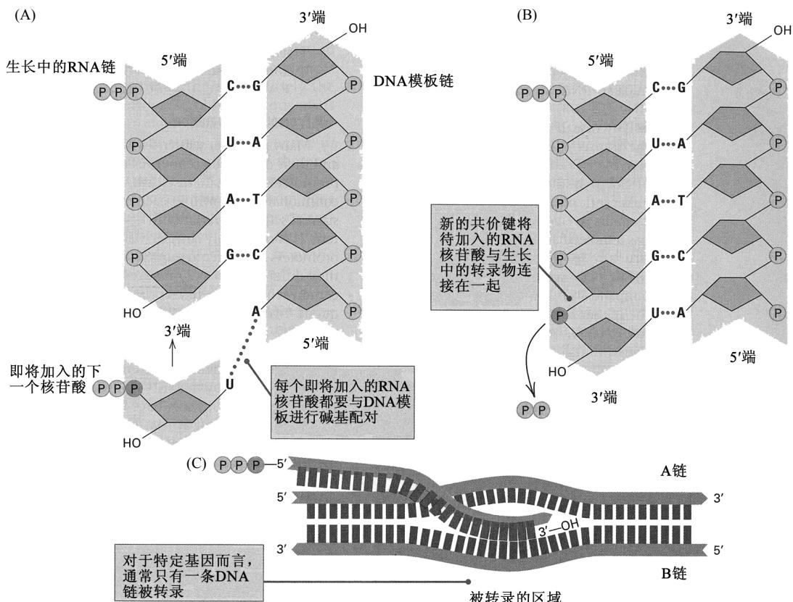  
图 10.6 RNA 的合成。(A)与模板链的碱基配对。(B)聚合步骤。(C)RNA 合成的几何学。RNA 仅从一段 DNA 分子的一条链——在此例中为 B 链——拷贝而来，不需要引物。

## - RNA 聚合酶的种类

RNA 聚合酶是巨大的多亚基复合体，其活性形式称为 RNA 聚合酶全酶(RNA polymerase holoenzyme)。细菌细胞仅有一种 RNA 聚合酶，其全酶包括 6 个多肽亚基。该全酶的分子质量约为 400 千道尔顿(kDa)，其最宽处的大小为 150Å(图 10.7)。相比之下，血红蛋白四聚体(tetramer)的分子质量约为 60kDa，其最宽处的大小约为 60Å。细菌 RNA 全酶的纵轴与双链 DNA 中 45 个核苷酸长的片段约等长。但事实上，在转录起始时，该全酶与启动子区中的 70～90bp 产生接触，这意味着 DNA 一定是环绕在全酶上。一旦转录开始，接触区域即减少到 35 个核苷酸左右，其中心处是正在被添加的那个核苷酸。RNA 聚合酶的持续合成能力（processivity，不与模板脱离而能转录的核苷酸数目）惊人：在原核生物中超过 $10^{4}$ 个核苷酸，在真核生物中超过 $10^{6}$ 个核苷酸。持续合成能力非常重要，因为一旦 RNA 聚合酶与模板分开，它就不能再继续合成。转录的速度同样惊人——在原核生物中每秒约 70 个核苷酸，在真核生物中约 40 个核苷酸。

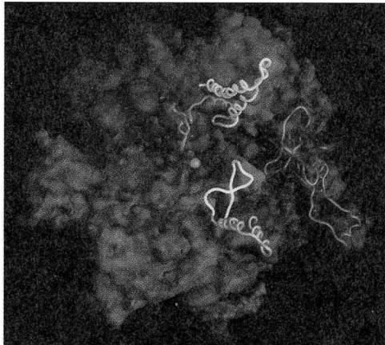  
图 10.7 栖热水生菌(Thermus aquaticus)RNA聚合酶的亚基结构。有一个 U 形通道贯穿该复合体。被转录的 DNA 穿过该通道，启动子区出现在右下部，并沿右上部弯折。彩色线团强调了该复合体的一些结构特征；中央的粉红色球为活性位点中的一个 $Mg^{2+}$ 。[转载自 R. A. Mooney and R. Landic, “RNA polymerase unveiled,” Cell 98(1999): 687-690, ©1999，经 Elsevier 允许。]

真核生物的 RNA 聚合酶比原核生物的更大，并且在其全酶中包含更多的亚基。真核生物的 RNA 聚合酶有几种不同类型。

1. RNA 聚合酶 I (RNA polymerase I)，专用于生产会被加工成核糖体 RNA 的转录物。启动子区内含转录起点。

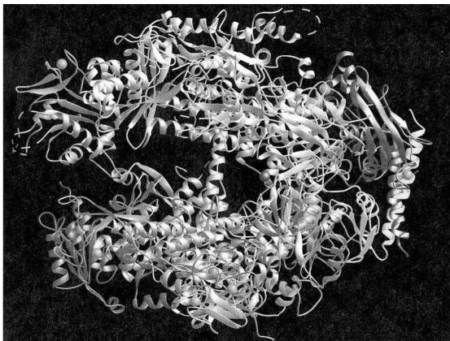  
图 10.8 PolⅡ全酶的结构，示穿过顶部的沟。该沟止于活性位点，此处含有一个镁离子(粉红色球)。全酶中不同的多肽组分以不同颜色显示。[承斯坦福大学医学院戴维·布什内尔(David A. Bushnell)及罗杰·科恩伯格(Roger Kornberg)惠赠。]

2. RNA 聚合酶 II (RNA polymerase II)，是真核生物聚合酶的主力，负责转录所有蛋白质编码基因，以及许多在 RNA 加工中所用的核内小 RNA (U1、U2、U3…等)。RNA 聚合酶 II 的启动子位于转录起点附近，但在转录起点的上游 (在 5' 侧)。在真核生物聚合酶中，对 Pol II 的作用机制了解得最透彻。其全酶包含 12 个多肽亚基，分子量约为 500kDa。其结构特征是，沿其顶部有一条沟 (图 10.8)，这条沟有助于将 DNA 模板引导至活性位点 (粉红色的镁离子所示之处)。

3. RNA 聚合酶III(RNA polymerase III)，用于转录所有的转移 RNA 基因，以及核糖体 RNA 的 5S 组分。RNA 聚合酶III的转录启动子位于转录起点附近，但在转录起点下游（在 3' 侧）。

## ■ 启动子识别

迄今已分离到许多启动子序列，并已测定了它们的核苷酸序列。聚合酶Ⅰ、Ⅱ和Ⅲ的启动子没有表现出什么共性，并且每类启动子都存在大量的序列变异。在细菌中，情况就相当简单了。虽然细菌的启动子也存在序列上的差异——这是它们与聚合酶结合的亲和力存在差异的部分原因——但常常见到一定的序列模式，或称模体(motif)。在大肠杆菌启动子区常见的两种此类序列模式如图10.9所示。每种模式都是根据核苷酸共有序列(consensus sequence)来定义的，共有序列是按多数原则(majority rule)，根据实际序列确定的。多数原则是共有序列中的每个核苷酸，是在实际序列相应位置上最常见的核苷酸。任一特定序列有可能与共有序列非常相似，也有可能非常不相似。

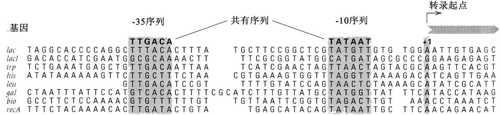  
图 10.9 大肠杆菌几个基因的启动子区的核苷酸序列。示位于转录起点(+1)上游 10 个和 35 个核苷酸的共有序列。启动子在启动转录的能力上差异巨大。启动子强度的差异，大部分是启动子元件与 -10 和 -35 处的共有序列的差异所致。

在图 10.9 所示的共有序列中，将转录起点编为 +1 号。有一种共有模体是 TTGACA，它被称为 -35 模体，因为它通常位于转录起点上游约 35 个碱基对之处。另一种共有模体为 TATAAT，它通常位于 -10 位置附近，这个 -10 序列称为 TATA 框 (TATA box)。启动子序列的位置决定 RNA 聚合酶从哪里开始合成。

RNA 聚合酶与不同启动子的结合强度变化巨大，这导致从一个基因到另一个基因在表达程度上的差异。启动子强度的差异，大部分由 -35 和 -10 启动子元件的差异，以及这两个启动子元件之间的间距的变化引起。在大肠杆菌基因中，启动子强度的差异可达 $10^{4}$ 倍，且这种差异多可归因于启动子序列自身的差异。一般而言，启动子元件与共有序列越相似，启动子就越强。使启动子的核苷酸序列发生改变的突变，可改变启动子的强度。使启动子与共有序列的相似性下降的改变，使启动子的强度降低，而使启动子与共有序列相似性增大的改变，使启动子强度增加。另外，有些启动子的 -35 区与共有序列的差异极大。

所有启动子一般都需要辅助蛋白来激活 RNA 聚合酶的转录。 $\sigma$ 因子是细菌最重要的转录辅助蛋白之一。 $\sigma$ 因子 (sigma factor) 是一种使 RNA 聚合酶能够与启动子区正确结合的蛋白质。所有的细菌都要产生 $\sigma$ 因子，以使其正常生长和代谢所需的基因得以转录。也存在某些条件下才会产生的专门的 $\sigma$ 因子，以使平常不转录的基因能够转录。各种各样的压力——包括热休克和饥饿——会诱导此类专门的 $\sigma$ 因子的产生。

真核生物的启动子序列通常比原核生物的更长、更复杂。Pol II识别的许多启动子包含一个含TATA框模体的核心区，该模体与原核生物中的TATA框类似，但与转录起点的相对距离不同(图10.10)。Pol II要与启动子正确结合，还需要一套通用转录因子(general transcription factor)，共26种，但即使有这些蛋白质也还不够，还需要其他蛋白质将它们募集到启动子，这些蛋白质与另外的序列模体结合，这些模体通常位于包含TATA框的核心区的上游远处，有时甚至在核心区的下游。这些序列模体——有的起增强子的作用，有的起沉默子的作用——与和转录装置相互作用的蛋白质结合，调节转录水平。这一水平的基因调节将在第11章讨论。

## ■ 转录的机制

从发生启动子识别 (promoter recognition) 之时起，可从三个不同阶段来描述转录的机制。我们将就真核生物 Pol II 的作用机制来对这些阶段进行考察。罗杰·科恩伯格 (Roger D. Kornberg) 因对该机制的研究被授予 2006 年度诺贝尔化学奖。

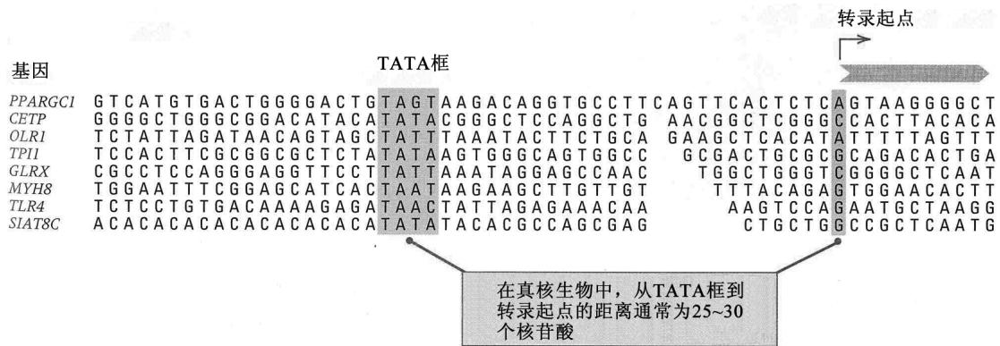  
图 10.10 人类的一些 TATA 框基因，示转录起点附近的核心启动子区序列。

Pol II 复合体并非单独起作用，而是与 5 种通用转录因子(TF II B、TF II E、TF II D、TF II F 和 TF II H)结合起作用。这些组分虽然可正确地转录裸 DNA，但是不能转录组织成核小体的天然染色质(第 7 章)。在细胞中，在染色质重塑复合体(chromatin remodeling complex)的作用下，

通过核小体的瞬时移位，才能接近裸露的启动子DNA(第11章)。转录只在启动子附近正确的起始位点开始，这种专一性是由通用转录因子与PolⅡ一起导致的，通用转录因子和PolⅡ各自发挥着不可或缺的作用。

1. 链起始 (chain initiation) 转录的第一步，是 TATA 框结合蛋白 (TATA-box binding protein, TBP) 与启动子 DNA 结合，使其产生差不多 90° 角的弯曲 (图 10.11)。在物理上，TATA 框结合蛋白与聚合酶紧密结合，从而该弯曲使启动子 DNA 得以与聚合酶的 TF II B 组分接触。然后，启动子 DNA 直直地穿过聚合酶顶部，直至距 TATA 框 25～30bp 之处的转录起点被带到靠近聚合酶活性位点的位置。此时，TF II E 加入复合体，并募集 TF II H。TF II H 的解旋酶活性使 DNA 双链不稳定，这使得启动子双链易于发生热力学解旋，产生

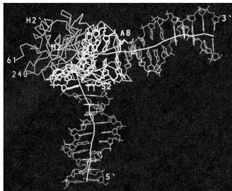  
图 10.11 示意 TATA 框结合蛋白如何使启动子 DNA 发生直角弯曲的模型，直角弯曲使启动子 DNA 翻越 Pol II 聚合酶顶部。[承斯蒂芬·伯利 (Stephen Burley) 惠赠。]

瞬时的非螺旋化区(又称泡)。该非螺旋化区因TFIIF与非模板链的结合而稳定，与此同时，未与TFIIF结合的模板链进一步沉入活性位点所在的聚合酶的沟中。在某个位点，三个核苷酸深深沉入沟中，模板链发生剧烈弯曲，将第一个被转录的碱基翻转进活性位点(图10.12)。同时，聚合

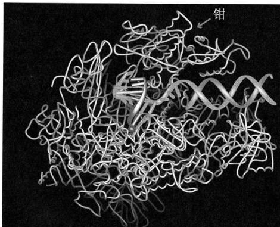

图 10.12 正在发挥作用的 PolⅡ。蓝色示模板链，红色示 RNA 转录物。活性中心内的镁离子以粉红色球形表示。与模板链配对的部分非模板链以绿色表示。转录泡由 PolⅡ的一个活动的结构域(钳，橙色)固定在适当位置，PolⅡ最大的两个亚基由它们之间的螺旋桥(绿色螺旋)结合在一起。PolⅡ中的其他多肽链以白色表示。[承斯坦福大学医学院戴维·布什内尔和罗杰·科恩伯格惠赠。]

酶的一个大的结构域翻转到启动子 DNA 之上的位置，形成一个钳，将转录泡固定好。

现在，转录的起始开始了，这是一个由 TF

ⅡB 稳定的过程。在 RNA 转录物的第一个核苷三磷酸就位后，以 $5'\rightarrow3'$ 方向往下进行合成。转录完大约 6 个核苷酸后，TFⅡB 被挪走，转录继续进行。

2. 链延伸(chain elongation)随着 RNA 聚合酶不断遇到模板 DNA 链上的新核苷酸，RNA 核苷酸被一个一个地不断添加到生长中的转录物上。被转录的仅有一条 DNA 链——模板链(template strand)。在稳定状态下，转录泡由 DNA 双链体解旋来的 15 个核苷酸构成，其中有 8、9 个与 RNA 转录物的 3' 端配对(图 10.6C)。每个新加入的核苷酸都被添加到转录物的 3' 端，此处与 DNA 模板链从非模板 DNA 上解旋下来之处相距 3 个核苷酸。

互补核苷酸之间形成氢键所释放的能量很微弱，不足以解释转录时碱基配对的专一性。这种专一性实际上是在 Pol II 活性位点周围发生的结构改变所致。关键在于活性位点附近一个称为触发环 (trigger loop) 的结构域的活动，仅当正确的碱基配对发生时，触发环才移动到位。触发环位置的改变，致使一个关键的组氨酸残基发挥作用，促进电子的流动，激发聚合反应。以此方式，正确的碱基配对得以与 RNA 生长链中磷酸二酯键的形成在物理上耦合。

每在转录物中形成一个新键之时，与单链模板接触的一个PolⅡ的螺旋状片段都要歪斜3Å左右，这将下一个模板核苷酸带进活性位点。在活性位点后8、9个核苷酸处，PolⅡ的两个片段攻击RNA-DNA杂合链，打断氢键，从而使得在该位点更后面数个核苷酸处，DNA模板链和非模板链得以重新结合(图10.6C)。

3. 链终止 (chain termination) RNA 聚合酶到达链终止序列，新合成的 RNA 分子和聚合酶都

被释放。现已对细菌转录终止的必要条件有了清楚的了解，已知细菌有两类终止事件。在内在终止 (intrinsic termination) 中——这是细菌中最常见的情况，转录终止的信号仅依赖于 DNA 模板中的核苷酸序列。当聚合酶遇到被转录的 DNA 链中的某种特殊的核苷酸序列时，转录即停止。该序列能够自身折叠，形成发夹环。图 10.13 显示了在大肠杆菌中发现的这样一种终止子。单单发夹环还不足以终止转录，在发夹末端的那一串 U 也是必需的。发夹环通过侵入 RNA 聚合酶复合体活性位点附近的主通道来终止转录，发夹环的侵入打断了 RNA/DNA 杂合链，从而阻止 RNA 链的进一步延伸。

第二种终止类型称为 $\rho$ 依赖终止 (rho-dependent termination)，因为这种终止需要存在

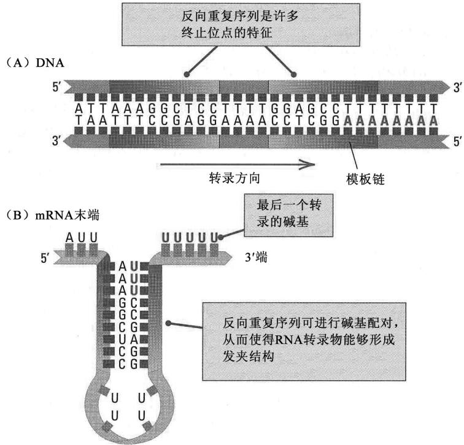  
图 10.13 (A) 大肠杆菌色氨酸合成基因转录终止区的核苷酸序列。(B) RNA 转录物的 3' 末端，折叠形成茎环结构。Us 序列以红色显示，该序列见于大肠杆菌及许多其他原核生物基因的转录物末端。当在转录物中形成这种环状结构时，RNA 聚合酶(此处未显示)终止转录。

一种与聚合酶复合体相关的终止蛋白。在大肠杆菌中，主要的终止蛋白称作 $\rho$ 。 $\rho$ 蛋白识别的终止子序列看似比较长而复杂，但其终止机制与内在终止相似。特别是，当碰到终止信号时， $\rho$ 蛋白会形成一个多肽环，插入聚合酶的主通道，将 RNA/DNA 杂合链分开，从而终止延伸。

第二轮转录的起始不需要等第一轮转录完成，因为，一旦 RNA 聚合酶聚合了 50～60 个核

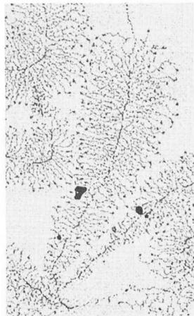  
图 10.14 蝶螈 Triturus viridescens 部分 DNA 的电子显微照片，这部分 DNA 含有会被转录成核糖体 RNA 的基因的串联重复序列。形成羽毛样排列的细链为 RNA 分子。在每个 rRNA 基因上，都可见到细链在长度上的渐变。在 DNA 上细链之间的区域为间隔 DNA 序列，这些序列不被转录。[承奥斯卡·米勒 (Oscar Miller) 惠赠。]

苷酸，启动子就又可以使用了。对于快速转录的基因而言，这样的重新起始反复发生，从而一个基因可被众多完成程度不一的 RNA 分子遮盖。图 10.14 中的显微照片显示了北螈属 (Triturus) 蝶螈的一段 DNA，该段 DNA 包含某一核糖体 RNA 基因的串联重复序列。每条重复序列都与一些正在延伸的转录物相连。最短的转录物在重复序列的启动子端，最长的转录物靠近末端。

联系：Messenger “light”\*

悉尼·布伦纳 $^{1}$ 、弗朗索瓦·雅各布 $^{2}$ 和马修·梅塞尔森 $^{3}$ ，1961

$^{1}$ 卡文迪什实验室，剑桥，英国

$^{2}$ 巴斯德研究所，巴黎，法国

$^{3}$ 加州理工学院，帕萨迪纳市，加州

一种将信息从基因携带到核糖体以合成蛋白质的不稳定的中间体

1961 年的时候，布伦纳和雅各布是加州理工学院的客座研究人员。在那时，人们对基因编码蛋白质的机制极其感兴趣。在当时看来很有道理的一种可能性是，每个基因产生一种不同的核糖体——其 RNA 不同——进而产生一种不同的蛋白质。在此前不久，弗朗索瓦·雅各布和雅克·莫诺提出另一种机制，认为带信息的 RNA（“信使 RNA”）实际上是一种会迅速降解的不稳定分子。在该模型中，核糖体是非特异性的蛋白质合成中心，它们通过信使 RNA 从基因接收特异性指令，按指令合成不同的蛋白质。实验的关键是密度梯度离心，该技术能将分别含 ${}^{15}$ N 或 ${}^{14}$ N 而变得“重”或“轻”的大分子分开（该技术在第 5 章叙述过）。该实验是一个对遗传学绝对至关重要的问题——基因通过生存期相对较短的信使 RNA 中介来编码蛋白质——的纯生化证明。

大量证据表明，蛋白质结构的遗传信息是在脱氧核糖核酸(DNA)中编码的，而实际上氨基酸组装成蛋白质是发生在细胞质中称为核糖体的核糖核蛋白颗粒上。蛋白质不在基因上直接合成，这就要求存在某种中间信息携带者。……雅各布和莫诺曾提出这样的假说：核糖体是非特异性的结构，它们从基因接收以某种不稳定的中间体——即“信使”——形式存在的遗传信息。我们在此展示噬菌体感染细菌的实验结果，对该假说予以直接支持。……用T2噬菌体感染培养的细菌时，DNA的合成会马上停止，7min之后才重新开始，而在此期间蛋白质的合成却以恒定的速率持续进行；感染噬菌体后合成的蛋白质很有可能是由噬菌体遗传决定的。……因此，噬菌体感染细菌，造成这样一种情形：蛋白质的合成由细菌控制突然切换为由噬菌体控制。……有可能可以通过如下方式实验检测(是否产生了不稳定的信使RNA)：在重同位素中培养细菌，以使所有细胞组分均匀地标记为“重”。用噬菌体感染这些细胞，并立即转移到含轻同位素的培养基中，以使感染后合成的所有组分为“轻”。然后，对纯化的核糖体进行密度梯度离心，观察标记了放射性同位素的新的RNA和新的蛋白质的分布情况。……我们的发现可概括如下：①感染噬菌体之后，未发现新的核糖体。②感染噬菌体之后，有一种更新较快的新的RNA被合成。这种RNA附于原来就有的核糖体之上，通过降低镁离子浓度，可在氯化铯梯度中将其与核糖体分离。这种RNA具有与噬菌体DNA相应的碱基组成。③在被感染的细胞中，大部分——如果不是全部的话——的蛋白质合成发生在原有核糖体中。……这些结果也表明，信使RNA也许大到足以编码长的多肽链。……根据信使RNA假说预测，信使RNA应该是基因的不折不扣的拷贝，因而其核苷酸组成应当与DNA的核苷酸组成一致。在噬菌体感染的细胞中，看来正是这种情况。……如果能证明这是普遍正确的，将得出有关编码机制的一些有趣的推论。

来源：S. Brenner, F. Jacob, and M. Meselson, Nature 190 (1961): 576-581.

\* 译者注：未找到恰当的方式来翻译此处的双关语。Messenger “light” 表达的两层意思是：①信使之光。证实信使 RNA 是 DNA 编码蛋白质的中间体，解决了遗传学上至关重要的一个问题，给遗传学带来光明。②轻的是信使。在证实信使 RNA 是 DNA 编码蛋白质的中间体的实验中，新合成的 RNA(噬菌体的信使 RNA)带“轻”的同位素 $^{14}\mathrm{N}$ 。这两层意思已经原作者哈特尔确认。

## - 启动子和终止子的遗传学证据

启动子的存在，最先在大肠杆菌的遗传实验中得到证明：分离到一类独特的乳糖利用突变，仅当突变相对于 lacZ 结构基因 (structural gene) 为顺式构型 (在同一个 DNA 分子中) 时，表型才是 Lac⁻，这些突变称为 p⁻ 突变。与顺式构型的相关性可通过考察具有两个 lacZ 基因拷贝的细胞看到，例如，含 F' lacZ 质粒的细胞，这种细胞除在细菌染色体中含 lacZ 之外，在 F' 质粒中也

表 10.1 启动子突变对 lacZ 基因转录的影响

<table><tr><td>基因型</td><td>lacZ+基因转录</td></tr><tr><td>1.  $p^{+}$  lacZ+</td><td>是</td></tr><tr><td>2.  $p^{-}$  lacZ+</td><td>否</td></tr><tr><td>3.  $p^{+}$  lacZ+/  $p^{+}$  lacZ-</td><td>是</td></tr><tr><td>4.  $p^{-}$  lacZ+/  $p^{+}$  lacZ-</td><td>否</td></tr><tr><td>5.  $p^{+}$  lacZ+/  $p^{-}$  lacZ-</td><td>是</td></tr></table>

含 lacZ。lacZ 基因的转录，使得细胞能够合成 β-半乳糖苷酶。表 10.1 显示，当野生型 lacZ 基因 (lacZ $^{+}$ ) 和 p $^{-}$ 突变在同一个 DNA 分子中时 (无论是在染色体中还是在 F' 质粒中)，野生型基因是没有活性的，比较第 4 项和第 5 项可见这一点。RNA 分析显示，在基因型为 p $^{-}$ lacZ $^{+}$ 的细胞中，lacZ $^{+}$ 基因不被转录，而在基因型为 p $^{+}$ lacZ $^{-}$ 的细胞中，产生突变型 RNA。p $^{-}$ 突变曾称作启动子突变 (promoter mutations)。

注： $lacZ^{+}$ 为野生型基因； $lacZ^{-}$ 为产生无功能酶的突变体。

大肠杆菌的突变也一直是界定转录终止区的手段。现已分离到一些突变，它们在正常终止序列的上游产生新的终止序列。存在此类突变时，产生比野生型 RNA 短的 RNA 分子。另有一些突变消除了终止子，结果产生超长的转录物。

## 10.4 信使 RNA

从 DNA 模板产生的 RNA 分子为初级转录物 (primary transcript)。每个基因只有一条 DNA 链作为模板链，但究竟哪一条链是模板链，在一个 DNA 分子上，也会因基因而异。因而，在 DNA 大片段中，可见到初级转录物在两个方向上都可生长 (图 10.15)，其方向取决于在特定基因中哪一条 DNA 链起模板作用。在原核生物中，初级转录物直接作为多肽链合成所用的信使 RNA (messenger RNA, mRNA)。在真核生物中，初级转录物在成为 mRNA 之前通常要经过加工。

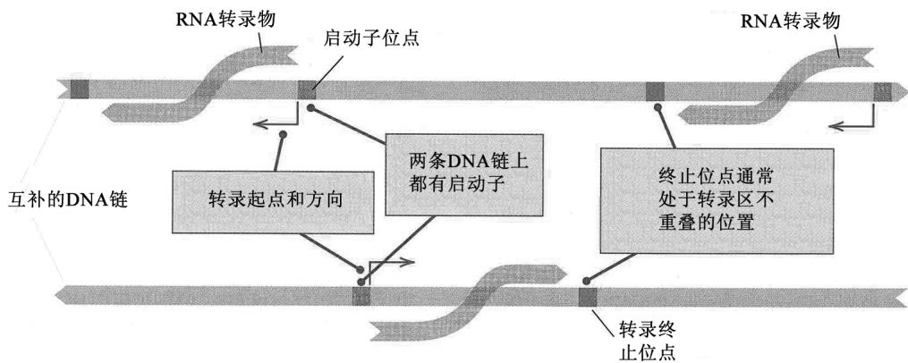

mRNA 分子的翻译从来不会恰好从 5' 端开始，也从来不会一直持续到另一末端。多肽链合成的起始，通常开始于 mRNA 5' 末端下游若干核苷酸处。5' 非翻译区之后是编码序列 (coding sequence)，也称为可读框 (open reading frame, ORF)，它编码氨基酸在多肽链中出现的顺序。在 mRNA 分子中，典型的编码序列长 500～3000 个核苷酸，该序列被以非重叠的、三个核苷酸一组 (密码子) 的方式翻译。在 mRNA 中，编码区以远——接于终止密码子之后——为 3' 非翻译区。

在原核生物中，大多数 mRNA 分子于合成之后数分钟内降解。在真核生物中，典型的生存期是数小时，不过，有些仅持续数分钟，而另一些持续数天。在这两类生物中，mRNA 的降解都使细胞得以清除不再需要的分子。原核 mRNA 较短的生存期是调节基因活性的一个重要因素(第 11 章)。

## 10.5 真核生物的 RNA 加工

在原核生物和真核生物中，转录的过程非常相似，但在用于多肽链合成的转录物和 mRNA 之间的关系上，存在重大差异。在原核生物中，初级转录物就是 mRNA。与此相比，真核生物中的初级转录物必须转变成 mRNA。这种转变称为 RNA 加工 (RNA processing)，通常包括 3 类事件：5' 端的修饰、3' 端的延伸和嵌于编码序列中的非翻译序列的切除。这些事件图解于图 10.16 中。

## (A) 转录起始与延伸

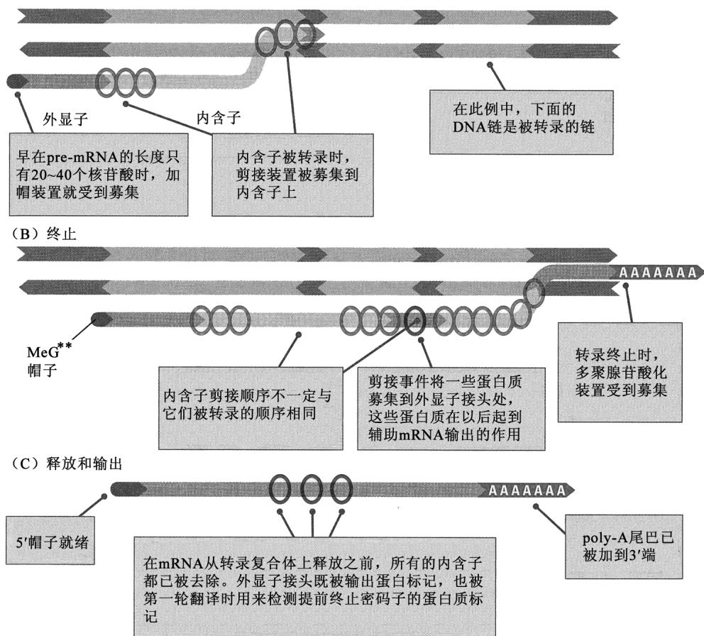  
图 10.16 在真核生物中，转录和 RNA 加工是偶联的。每个步骤依次触发下一步骤。MeG 表示 7-甲基鸟嘌呤核苷(鸟嘌呤核苷的一种修饰形式)，两个星号表示两个核糖被甲基化的核苷酸。

## ■ 5'加帽和3'多聚腺苷酸化

真核生物转录物的每一端都要被加工(图 10.16)。5' 端的改变是以罕见的 5'-5'（而不是 3'-5'）连接方式加上一个修饰过的鸟嘌呤核苷(7-甲基鸟嘌呤核苷)，这一末端基团称为帽子(cap)。5' 帽子是 mRNA 与核糖体结合以开始蛋白质合成所必需的。真核生物 mRNA 分子的 3' 端通常被往回“修剪”(外切核酸酶消化)成较短的序列，作为添加多聚腺苷酸序列(poly-A 尾巴，poly-A tail)的底物，poly-A 可达 200 个核苷酸。poly-A 尾巴有助于确立 mRNA 的稳定性。

## - 间插序列的剪接

真核生物初级转录物剪接的重要特征也如图 10.16 所示。从初级转录物中切除的片段称为内含子 (intron) 或间插序列 (intervening sequence)。伴随着内含子的切除，剩下的片段——称为外显子 (exon) ——重新连接，形成 mRNA 分子。内含子的切除和外显子的连接即 RNA 剪接 (RNA splicing)。

## - 人类转录物的特征

表 10.2 概括了典型人类基因的特征。表中同时给出了均值和中位数两个值，因为在这些大小分布中，有许多分布有非常长的右尾，使得均值有可能产生误导。例如，尽管外显子的平均数目是 8.8，但该平均值过于受一些外显子数目巨大的基因影响，如肌巨蛋白(titin)基因，包含 178 个外显子(所有人类基因中数目最大的)。同样，内含子大小的分布也是极为偏态的。最常见的内含子长度是 87 个核苷酸，但该分布的右尾拉得很长，以致均值为 3365 个核苷酸。中位数是处于分布正中的值，它将分布分成两半，一半的值大于中位数，一半的值小于中位数。

表 10.2 人类转录物的特征

<table><tr><td>基因特征</td><td>中位数</td><td>均值</td></tr><tr><td>内部外显子大小</td><td>122bp</td><td>145bp</td></tr><tr><td>外显子数目</td><td>7</td><td>8.8</td></tr><tr><td>内含子大小</td><td>1023bp</td><td>3356bp</td></tr><tr><td>5&#x27;非翻译区</td><td>240bp</td><td>300bp</td></tr><tr><td>3&#x27;非翻译区</td><td>400bp</td><td>770bp</td></tr><tr><td>编码序列长度</td><td>1101bp</td><td>1341bp</td></tr><tr><td>氨基酸数目</td><td>367</td><td>447</td></tr><tr><td>占基因组的量</td><td>14kb</td><td>27kb</td></tr></table>

来源：数据来自 International Human Genome Sequencing Consortium, Nature 409 (2001): 860-921.

表 10.2 中一个值得注意的特点是, 人类基因

往往比线虫或果蝇的基因大。大多数人类基因由很大的内含子分隔开的很小的外显子构成，许多基因的长度超过 100kb。最大的人类基因是编码肌营养不良蛋白(distrophin)的基因，该基因长 2.4Mb，该基因的突变与 X 连锁的迪谢内肌营养不良(Duchenne muscular dystrophy)有关。平均每个人类基因占 27kb 基因组 DNA，但仅有 1.3kb(约 5%)用来编码氨基酸。这一情形与中位数差不太远，基因长度的中位数是 14kb，其中仅 1.1kb(约 8%)用来编码氨基酸。人类基因的长度大部分取决于长的内含子，有些内含子大于 300kb，需要 2.8h 以上才能转录。

## - 转录和 RNA 加工的偶联

转录和 RNA 加工是偶联过程 (coupled process)，意思是，它们由物理的或功能的相互作用相关联，从而一个过程的出现可起始或调节下一个过程。图 10.16 显示了转录和 RNA 加工的其中一些相互联系。进行偶联的主角是 RNA 聚合酶 II 大亚基的羧基末端的结构域，该结构域由一种 7 个氨基酸的模体重复若干次构成，在酵母蛋白中重复 27 次，在人类蛋白中重复 52 次。该模体含打开或关闭偶联功能的磷酸化位点和去磷酸化位点。例如，在转录起始过程中，重复模体中的丝氨酸-5 被磷酸化，可导致起始因子的释放，以及转录物 5' 端加帽装置的募集，保护 5' 端免于降解。随后，丝氨酸-5 去磷酸化，引起加帽装置的释放。此刻，丝氨酸-2 磷酸化，促进剪接及 RNA 加工后续步骤所需装置的募集。在转录已结束但转录物尚未释放之前，同样是这个重复模体参与多聚腺苷酸化装置的募集。

偶联的作用——在一系列连续的步骤中，每一步骤募集下一步需要的因子——可极大地增加 RNA 加工的速度和专一性。如果没有偶联，RNA 加工可能会依赖于扩散，这可能会造成很多错误，尤其是在剪接巨大的内含子时(通常由巨大的内含子将相对较小的外显子分开)。在转录发生的同时募集剪接装置，极其有利于正确剪接。这并不是说内含子的剪接是完全按照它们被转录的顺序，剪接进行的顺序取决于内含子大小及其核苷酸组成，还有转录的总体速度。

将不同的转录步骤与不同的 RNA 加工步骤偶联起来的环节众多。例如，与 RNA 聚合酶结合以促进延伸的蛋白质，也有助于剪接装置的募集，而剪接装置又反过来刺激延伸，以便含内含子的基因能被更高效地转录。剪接装置还有助于多聚腺苷酸化装置的募集。RNA 加工的主要步骤均完成于 mRNA 从转录复合体(transcription complex)释放之前。内含子被剪接之时，会有蛋白质结合于外显子之间的接头上(图 10.16 B 和 C)。在这些蛋白质中，有一些起的作用是，在 mRNA 释放后，有利于将 mRNA 从细胞核输出到细胞质。另一些起的作用是，在第一轮翻译中标识有缺陷的 mRNA 分子，随后这些 mRNA 分子会被破坏掉。

## ■ RNA 剪接的机制

RNA 剪接的机制如图 10.17 所示。A 部分示在大多数内含子 5' (供体) 端和 3' (受体) 端所见的共有序列。图中的符号为：N，任意核苷酸；R，任意嘌呤 (A 或 G)；Y，任意嘧啶 (C 或 U)；S，G 或 C。剪接的第一步是分支点 (branch site) 之处的腺苷酸 (A) 的 2'-OH 攻击供体剪接位点接头处的磷酸二酯键。分支点位于受体位点附近的一串嘧啶 (Y) 的上游不远处。攻击的结果是供体剪接位点断裂，形成一个带分支的分子 (图 10.17B)，该分子称为套索 (lariat)，因其有环有尾。在套索 “打结” 之处的 A-G 连接方式比较罕见，是 2'-5' 连接 (而不是 3'-5')。剪接的最后一步是供体外显子的鸟苷酸的 3'-OH 攻击受体剪接位点处的磷酸二酯键，释放内含子套索，并将供体和受体外显子连接在一起。内含子套索会被核酸酶迅速降解成单核苷酸。

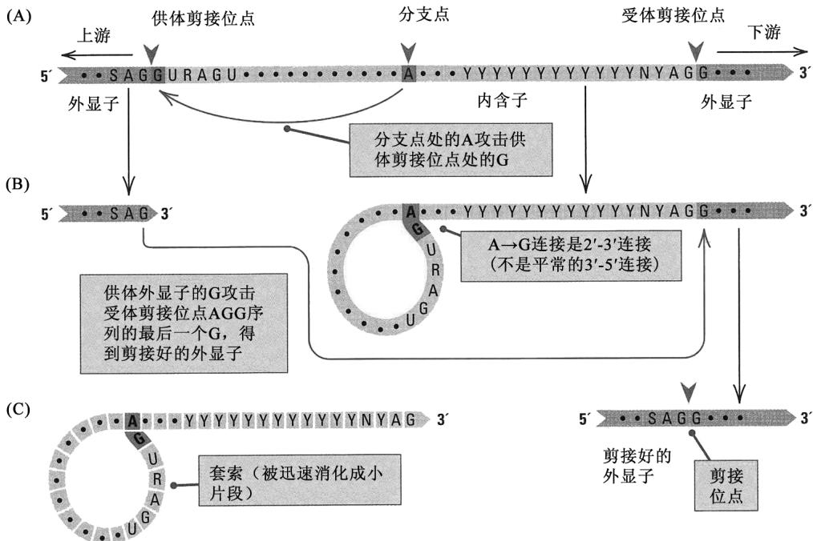  
图 10.17 从初级转录物中去除内含子的示意图。(A)分支点之处的核苷酸 A 攻击 5' 外显子末端，切开外显子-内含子接头，连回分支点，形成环。(B)之后，5' 外显子被引至 3' 外显子的切割位点，产生第二次切割，两个外显子的末端连接并封闭。(C)环以套索状结构释放并被降解。因该环包括大部分内含子，所以套索的环通常远比尾部长。

RNA 剪接发生在称作剪接体 (spliceosome) 的细胞核颗粒中。这些颗粒众多，由蛋白质和几种专门的小 RNA 分子组成，在细胞中以核小核糖核蛋白颗粒 (small nuclear ribonucleoprotein particle，根据下划线字母得到其缩写——snRNP，发 snerp 的音) 形式存在。剪接的专一性源于 snRNP 中存在的 5 种短 RNA 分子 (U1、U2、U4、U5 和 U6)。这些 RNA 含有与剪接接头和内含子的分支点区域互补的序列，并可含有彼此互补的序列(图 10.18)，剪接可能还需要多达 100 种剪接体蛋白质。内含子的两端由 U1 RNA 带到一起，该 RNA 与内含子 5' 端和 3' 端的核苷酸均形成碱基对，U2 与分支点区域结合。如图 10.18C 所示，剪接体中的碱基配对包括 U2 和 U6，这两者通常通过自身回折配对(对 U2 而言，B 部分)或与 U4 配对(对 U6 而言，A 部分)而得以稳定。这些相互作用将分支点区带到供体剪接位点附近，从而使得分支点中的 A 能够攻击供体剪接位点的 G，释放上游外显子，形成套索中间体(图 10.17)。U5 RNA 辅助两个外显子排齐，在某种程度上促进了剪接的最后一步，导致内含子从下游的外显子上切断，以及上下游外显子的连接。

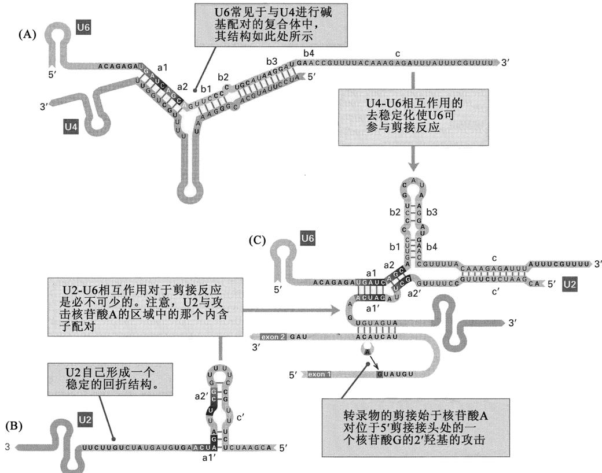  
图 10.18 snRNP 中参与剪接的一些核小 RNA 之间的动态相互作用。(A) 常见 U6 snRNA 与 U4 snRNA 复合。(B) U2 snRNA 自身形成稳定的回折结构。(C) U4-U6 结构的去稳定化和 U2-U6 结构的形成对于剪接反应是必需的，在 U2-U6 结构中，U2 与部分内含子发生碱基配对。在配对区中的一个 A 攻击 5' 剪接接头处的 G，启动剪接反应。以粗体表示的核苷酸对于这些结构是至关重要的，这是根据它们在极其多样的物种中都是保守的而作出的判断。注意，G-U 碱基对在双链 RNA 中是容许的。[改编自 H. D. Madhani and C. Guthrie, Annu. Rev. Genet. 1 (1994): 1-26.]

在细胞器(如线粒体)的一些基因中，也存在内含子，但它们的切除机制与细胞核基因中内含子的切除机制不同，因为细胞器不含剪接体。有一类细胞器内含子含有编码某种蛋白质的序列，该蛋白质参与去除编码它的内含子。四膜虫属(Tetrahymena)纤毛虫的一种核糖体RNA前体的剪接，情况更为奇妙。在这种纤毛虫中，剪接反应是RNA前体的折叠方式所固有的，就是说，该RNA前体是自剪接的(self-splicing)，因为折叠后的前体RNA可产生其自身的RNA剪接活性。发现RNA分子可起到催化化学反应的酶的作用，自剪接的四膜虫RNA是第一例，此类具有酶功能的RNA分子称为核酶(ribozyme)。

将被转录的 DNA 与加工成熟的 mRNA 分子进行复性，可轻易地证明某个特定的初级转录物中是否存在内含子及内含子位置。复性之后，可用电镜技术来检查 DNA-RNA 杂交体。图 10.19 所示的例子，是腺病毒 mRNA (加工成熟的) 及其相应的 DNA。在杂交分子中，内含子的 DNA 拷贝呈单链环，因为不存在可与其杂交的相应 RNA 序列。

内含子2 内含子3  
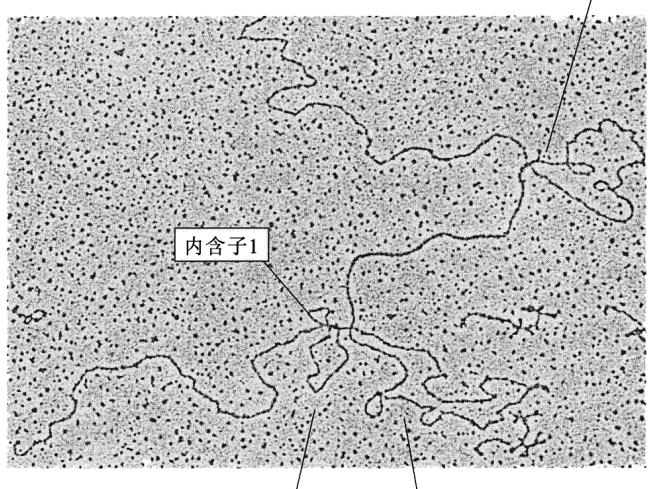

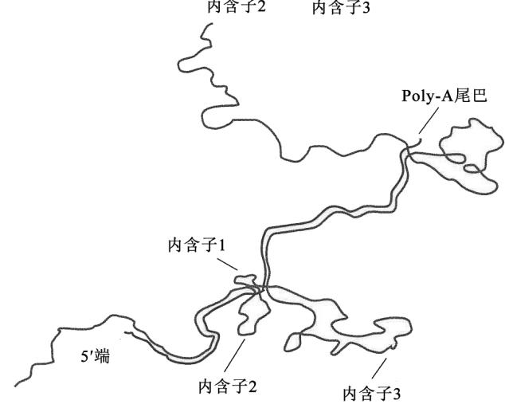  
图 10.19 (A) 腺病毒 DNA 的一个单链片段与它的一个 mRNA 分子退火所得的 DNA-RNA 杂交体的电子显微照片。环为单链 DNA。(B) 解说图。四个区域未退火，产生对应于三个内含子及 mRNA 分子的 poly-A 尾巴的单链 DNA 片段。[A 部分承阿拉巴马大学伯明翰分校托马斯·布罗克 (Thomas R. Broker) 和周芷 (Louise T. Chow) 惠赠。最初的研究于 1977 年在纽约冷泉港实验室完成。]

## - 内含子突变的效应

有两项观察指出，对内含子的长度或核苷酸序列鲜有限制。第一，内含子的许多突变不对基因功能产生可见效应，这些突变包括小的缺失、插入及核苷酸置换。第二，在进化过程中，内含子的核苷酸序列经历着非常快的改变。话又说回来，内含子中有些序列是必不可少的，这包括靠近两端的序列，这些序列为正确的剪接所必需(图 10.17)，影响这些序列的任何突变都会有严重后果，因为它们妨碍剪接反应。

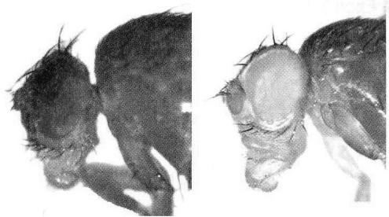  
在果蝇的 white 基因中，已知许多突变属于阻止正常剪接的突变。[承洛佐夫斯基(E. R. Lozovsky)惠赠。]

图 10.20 示剪接位点突变可能导致的两种结果。在 A 部分中，剪接位点发生突变，内含子不能被去除，留在加工后的 mRNA 中。结果是产生突变型蛋白质，该蛋白质直到剪接位点的氨基酸序列都是正常的，但此后的氨基酸序列异常。大多数内含子都很长，足以在其中随机出现可终止蛋白质合成的终止序列，而一旦遇到终止序列，蛋白质就不再延伸。第二种结果如图 10.20B 所示，在此情况下，确实发生了剪接，但不是在原来的剪接位点剪接(例子中显示，异常剪接位点在突变点下游，但也可在上游)。异常剪接位点称为隐蔽剪接位点(cryptic splice site)，因其通常不被使用。隐蔽剪接位点一般是与共有序列相似性较差的序列，在正常剪接位点可用时，它会被忽略。使用异常剪接位点进行剪接，结果仍是产生加工不正确的 mRNA 和突变型蛋白质。在一些剪接位点突变中，两种结果都可出现，有的转录物不剪接内含子，而有的转录物在隐蔽剪接位点剪接。

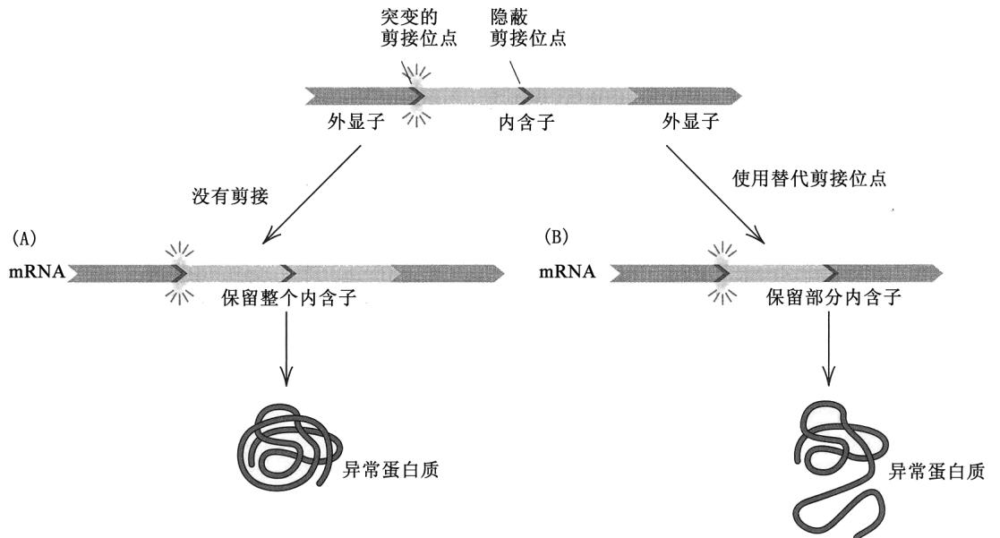  
图10.20 内含子供体剪接位点突变可能产生的后果。(A)无剪接发生，在加工后的转录物中保留整个内含子。(B)在下游的隐蔽剪接位点发生剪接，在加工后的转录物中仅保留原内含子的上游部分。这两种结果都不能产生正常的蛋白质产物。

## - 新基因起源中的外显子洗牌

内含子可在基因进化中发挥作用，因为内含子的存在可能有利于外显子进行新的组合，从而产生新基因。证据是，在某些情况下，一个基因的不同外显子编码完整蛋白质的不同片段，各个片段在折叠特征上相对独立。例如，β珠蛋白基因中间的那个外显子编码围绕含铁血红素分子折叠的蛋白质片段。在蛋白质中，相对自主折叠的单元称为折叠结构域(folding domain)，在有些基因中所见的外显子和结构域之间的相关性提示，这些基因最初是从较小的片段组装而来。在有些情况下，可追踪外显子的祖先。例如，参与人类胆固醇调节的低密度脂蛋白受体基因，与某些凝血因子及表皮生长因子具有相同的外显子。蛋白质通过组合不同的外显子而进化的模型称为外显子洗牌模型(exon-shuffle model)，组合来自不同基因的外显子的机制未知。尽管有些基因支持该模型，但在其他基因中，折叠结构域的界线与外显子并不一致。

## 10.6 翻译

在细胞中，每个蛋白质分子的合成都是由最初从 DNA 拷贝来的 mRNA 指导的。多肽合成包括两种过程：①RNA 核苷酸序列决定氨基酸序列的信息转移过程；②氨基酸被连接在一起的化学过程。这一系列完整的事件就是翻译 (translation)。

## 翻译装置的主要组分如下:

\- 信使 RNA(messenger RNA, mRNA) 信使 RNA 对集合核糖体亚基(后面叙述)和提供核苷酸编码序列以决定所产生的多肽链中的氨基酸序列，是必需的。

\- 核糖体(ribosome) 这些组分为颗粒，蛋白质合成发生于其上。它们沿 mRNA 分子移动，并将一个又一个的转移 RNA 分子对齐；氨基酸一个又一个地通过肽键连接到肽链上。核糖体由两个亚基颗粒组成。在大肠杆菌中，两个亚基的大小是 30S(小亚基)和 50S(大亚基)。在真核生物中，相应的亚基为 40S 和 60S[S 表示沉降系数单位(Svedberg unit)，它度量颗粒在离心机中的沉降速度，因而是大小的指标]。大小颗粒合起来构成有功能的核糖体。

\- 转移 RNA (transfer RNA, tRNA) 多肽中的氨基酸序列是 mRNA 中的核苷酸序列通过一套衔接分子 (adaptor molecule) —— tRNA 分子——来决定的，每个 tRNA 与一个特定的氨基酸连接。在 mRNA 中，每 3 个毗邻的核苷酸成一组，构成一个密码子 (codon)，密码子与 tRNA 中特定的一组 3 个毗邻的核苷酸 (反密码子，anticodon) 结合，将与 tRNA 结合的氨基酸带到合适的位置，以便将氨基酸添加到肽链上。

\- 氨酰 tRNA 合成酶(aminoacyl tRNA synthetase) 这套酶催化每种氨基酸与其相应的 tRNA 分子连接。连接了氨基酸的 tRNA 称为负载 tRNA(charged tRNA)，或氨酰 tRNA（aminoacylated tRNA）。

\- 起始、延伸和释放因子 (initiation, elongation, and release factor) 多肽合成可分成三个阶段：①起始，②延伸，③释放。每个阶段都需要专门的蛋白质，下面会考察。

在原核生物中，细胞中到处都有翻译所需要的所有组分；在真核生物中，翻译所需的组分位于细胞质中，还有线粒体和叶绿体中。

概而言之，翻译过程从 mRNA 分子与核糖体结合开始。氨酰 tRNA 被一个一个地、连续不断地带到核糖体。肽键在依次对齐的氨基酸之间形成，每次都是将新加入的氨基酸的氨基与生长端氨基酸的羧基连接。最终，最后一个 tRNA 与其所连的氨基酸之间的化学键断裂，完成的多肽被移开。

## ■ 无义介导衰变

在真核生物中，mRNA的第一轮翻译比较特殊，因为，在最初的转录物中曾经存在内含子的每个位点，都有蛋白质与mRNA结合(图10.16C)。这些结合蛋白起质量控制标记的作用，以确保内含子已被去除。大多数未能从mRNA中去除的内含子都很长，因而它们可能含有至少一个终止密码子，而终止密码子终止翻译并引起多肽链释(放随机RNA序列平均21个核苷酸左右会有一个链终止密码子)。在第一轮翻译中，当跨越每个外显子-外显子接头的密码子被翻译时，标记接头的蛋白质被去除。如果所有的内含子都已从mRNA中剪除，则当翻译到编码序列末端正确的链终止密码子之时，所有这些蛋白质标记都会被去除。从而该mRNA摆脱了所有的蛋白质标记，可为随后各轮翻译所用。

但是，如果在 mRNA 中留有含链终止密码子的内含子，则在标记外显子-外显子接头的所有蛋白质被除去之前，会碰到该终止密码子。当出现这种情况时，核酸酶受到募集，有缺陷的 mRNA 被销毁。这种质量控制过程称为无义介导衰变 (nonsense-mediated decay)（“无义”一词源于最初把链终止密码子称作无义密码子）。无义介导衰变不仅导致含有未剪接内含子的 mRNA 分子的销毁，而且导致因 DNA 中的核苷酸置换而产生提前终止密码子的突变型 mRNA 分子的销毁。

## - 通过 mRNA 扫描起始

接下来，讨论发生在真核生物中的翻译的细节，指出其与原核生物翻译机制的显著差异。在真核生物主要的翻译起始(initiation)方式中，mRNA的5'帽子起重要作用(图10.21)。首先，延伸因子eIF4F与帽子结合，继而募集eIF4A和eIF4B(图10.21A)。这产生了供起始复合体的其他组分结合的位点，这些组分包括一个与延伸因子eIF2结合的负载 $tRNA^{Met}$ (作为起始tRNA)，以及和延伸因子eIF3和eIF5在一起的40S核糖体小亚基。这些组分全部在5'帽子处集合，形成48S起始复合体(图10.21B)。

一旦起始复合体形成，它就沿 mRNA 向 3' 方向移动，扫描第一个出现的 AUG 核苷酸序列，这是多肽链开始合成的信号。当遇见这一模体时，AUG 被识别为起始甲硫氨酸密码子，于是多肽链合成开始了。此时，eIF5 导致所有起始因子的释放和 60S 核糖体大亚基的募集(图 10.21C)。该亚基包括 3 个 tRNA 分子结合位点，这 3 个位点称为 E 位 (exit site, 出口位)、P 位 (peptidyl site, 肽酰位) 和 A 位 (aminoacyl site, 氨酰位)。注意，在多肽合成开始之时，起始甲硫氨酸 tRNA 位于 P 位，A 位是下一个会被占据的位点。tRNA 的结合是通过 mRNA 中 AUG 密码子的碱基与 tRNA 中反密码子的 3 个碱基之间的氢键结合而达成。

原核生物的 mRNA 分子没有帽子，也不存在定位第一个 AUG 的扫描机制。在大肠杆菌的翻译起始过程中，两个起始因子 (IF-1(A) 建立结合位点

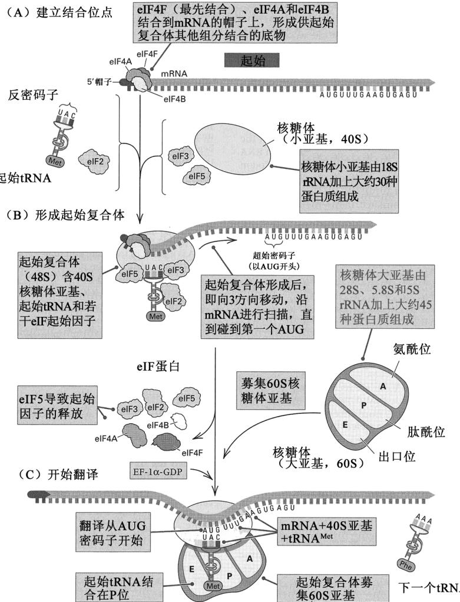  
图 10.21 蛋白质合成的起始。(A)起始复合体在 mRNA 的 5' 端形成。(B)该复合体包括一个 40S 核糖体亚基、起始 tRNA $^{Met}$ 及诸 elF 起始因子。(C)起始复合体募集一个 60S 核糖体亚基，其中，tRNA $^{Met}$ 占据核糖体的 P(肽酰)位点。该复合体沿着 mRNA 移动，直至遇到第一个 AUG，在此处开始翻译。

和 IF-3) 与 30S 亚基相互作用，与此同时，另一个起始因子 (IF-2) 与一个负载着甲酰甲硫氨酸的特殊起始 tRNA (以 tRNA $^{fMet}$ 表示) 结合。这些组分集合到一起，并与 mRNA 结合，但不在末端。这种结合是通过 30S 亚基中 16S RNA 的 3' 端与 mRNA 中的一个特殊序列之间形成氢键而发生。mRNA 中的特殊序列是核糖体结合位点 (ribosome-binding site)，也称作夏因-达尔加诺序列 (Shine-Dalgarno sequence)。结合到一起之后，30S+tRNA $^{fMet}$ +mRNA 复合体募集一个 50S 亚基，其中，tRNA $^{fMet}$ 位于 P 位，且与 AUG 起始密码子对齐，正如图 10.21C 所示。在装配成完整的核糖体后，起始因子从复合体上脱离。

真核生物和原核生物的翻译起始在功能上的一个主要差异是，在真核生物中，因为起始使用的是扫描机制，单条 mRNA 通常只能编码一条多肽链。与此相比，在原核生物的 mRNA 中，核糖体结合位点可出现在 AUG 附近的任何位置，所以，只要在任何一个 AUG 之前紧挨着核糖体结合位点，多肽合成即可在此处起始。后面将会看到，原核生物很好地利用了这个特点，它们的许多 mRNA 都含有不止一个核糖体结合位点和起始密码子，因而可编码不止一个多肽，因为翻译可在这些位点的任何一个起始。

## ■ 延伸

延伸因子 EF-1α-GTP 被募集进起始复合体，开始了多肽合成的延伸 (elongation) 阶段 (图 10.21C)。延伸由 3 个反复执行的过程构成。

1. 将新的氨酰 tRNA 带到合适的位置。

2. 形成新的肽键以延伸肽链。

3. 将核糖体移到 mRNA 的下一个密码子上。

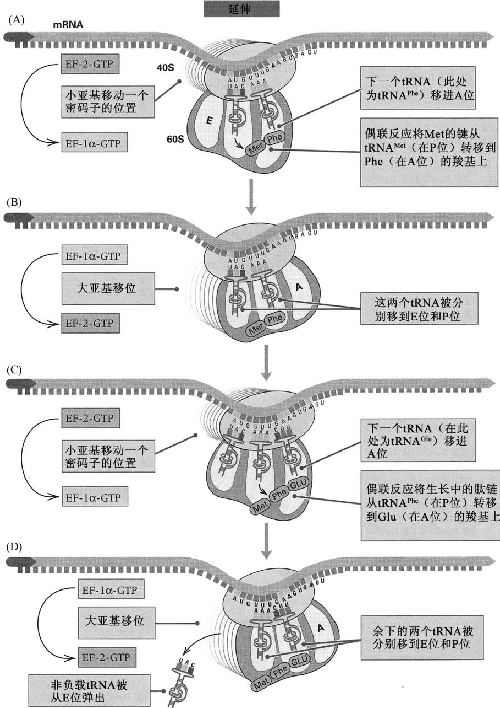  
图 10.22 蛋白质合成的延伸循环。

延伸过程如图 10.22 所示。为翻译提供能量的主角是延伸因子 EF-2 和 EF-1α，两者交替占据核糖体上的同一个结合位点。在它们的活性形式 (EF-2-GTP 和 EF-1α-GTP) 中，这些分子与鸟苷三磷酸 (GTP) 结合。GTP 水解成 GDP，释放的能量使核糖体亚基沿信使 RNA 移动，也使生长肽链所需的反应得以执行。这两种延伸因子从 GTP 结合形式转变成 GDP 结合形式，都使其与核糖体的亲和力降低，因而 GDP 结合形式会扩散开，由另一种延伸因子的 GTP 结合形式取代。

在延伸的第一步中，40S核糖体亚基沿信使RNA移动一个密码子远，然后，与新的密码子对应

的负载 tRNA(此例中为 $tRNA^{Phe}$ ) 被引入 60S 亚基的 A 位(图 10.22A)。负载 tRNA 以含 EF-1α-GTP 的复合体形式来到核糖体，如密码子-反密码子的相互作用正确，则 EF-1α-GTP 迅速水解为 EF-1α-GDP。EF-1α-GDP 与负载 tRNA 的亲和力减小，造成构象改变，使负载 tRNA 能够被紧密容纳于 60S 亚单位的活性位点之中。一旦该 tRNA 在 60S 亚单位的活性位点之中安置停当，肽键即在肽基转移酶(peptidyl transferase)活性的作用下形成。肽键的形成是一个偶联反应，如图 10.22A 中的例子所示，在肽键形成过程中，将甲硫氨酸与 tRNA $^{Met}$ 连接起来的键的断裂，与将甲硫氨酸和苯丙氨酸连接起来的肽键的形成，是偶联的。肽基转移酶活性不是单个分子的结果，须 60S 亚基的多个组分的共同作用，包括 60S 亚基中的几种蛋白质和 28S 核糖体 RNA。有证据显示，真正的催化作用是由 28S RNA 执行的，这提示也许可将 28S 作为核酶起作用的一个实例。

在链延伸的下一步中(B部分)，60S亚基向前摆动，以追上40S亚基，而与此同时，在大亚基P位和A位上的tRNAs分别被移到E位和P位。

现在，一个延伸循环完成了，对于下一个密码子，整个过程又被重复一次(C部分)。40S亚基向右移动一个密码子，下一个氨酰tRNA(在此例中为 $\mathrm{tRNA}^{\mathrm{Glu}}$ )被引入A位，经动力学校对后，在Phe的羧基和Glu的氨基之间形成一个新的肽键。如D部分所示，大亚基向前摆动，与此同时，P位和A位上的tRNA被移到E位和P位。此时，之前占据E位的tRNA被挤出核糖体。

多肽的延伸由反复进行的 $C \rightarrow D \rightarrow C \rightarrow D$ 步骤组成，直至遇到终止密码子。延伸循环进行得相当迅速，在最佳条件下，真核生物以大约每秒 15 个氨基酸的速度合成肽链，在原核生物中的延伸要稍快些(约每秒 40 个氨基酸)，但基本过程极其相似。

## ■ 释放

与起始和延伸相比，多肽合成的终止——释放 (release) 阶段——比较简单 (图 10.23)。遇到终止密码子时，固定多肽的 tRNA 仍在 P 位，并有一个释放因子 (release factor, RF) 与核糖体结合。GTP 水解提供能量，将多肽从其结合的 tRNA 上切开，也将释放因子推出，并使 80S 核糖体与 mRNA 分离。此时，40S 和 60S 亚基被回收利用，去翻译别的 mRNA。真核生物只有一种释放因子，可识别所有 3 种终止密码子：UAA、UAG 和 UGA。原核生物的情况不一样，在大肠杆菌中，释放因子 RF-1 识别终止密码子 UAA 和 UAG，而释放因子 RF-2 识别 UAA 和 UGA。在下一节将会看到，第三种释放因子——RF-3——在终止被错误翻译的多肽上作用突出。

## ■ 翻译校对和提前终止

翻译的错误率(error rate)约为每2000个残基掺入1个错误氨基酸。若核糖体负责确保两个截然不同的质量控制机制都正常，这一比率会高出至少10倍。第一个机制是阻止掺入错误的机制，

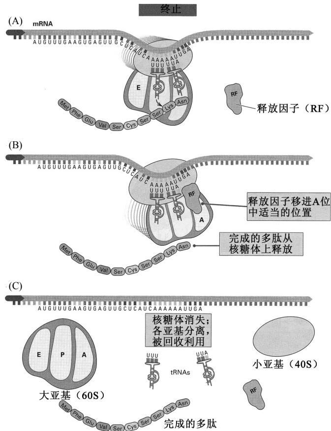  
图 10.23 蛋白质合成的终止到达终止密码子时(A)，无 tRNA 可结合于该位点(B)，这导致新合成的多肽以及剩下的那个结合 tRNA 的释放(C)。

倍。第一个机制是阻止掺入错误的机制，而当掺入错误发生时，由第二个机制终止多肽合成。参考图 10.24 中的大肠杆菌核糖体，可理解这两个机制。在细菌中，核糖体亚基的大小是 30S（小亚基）和 50S（大亚基），完整的核糖体是 70S。图中显示了根据 X 射线衍射研究重建的核糖体大亚基，描绘了 tRNA 分子在其结合腔 (binding pocket) 内的位置：E 位的 tRNA 以金色表示，P 位的以蓝色表示，A 位的以绿色表示。tRNA 顶上是翻译进行时 mRNA 穿过的通道。小亚基盖在大亚基顶上，留有足够 tRNA 分子结合的空间。

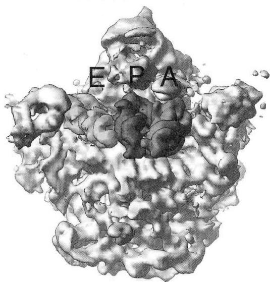  
图 10.24 细菌核糖体剖面图，示 tRNA 结合于其内的沟，以及 E(出口)位(以金色表示)、P(肽酰)位(以蓝色表示)和 A(氨酰)位(以绿色表示)tRNA 的位置。[引自 J. H. Cate, et al., Science 285 (1999): 2095-2104。经 AAAS 许可转载。]

翻译质量控制的一种机制是发生在 A 位的一种校对。在延伸过程中，每个来到 A 位的负载 tRNA 都结合着一个 EF-1α-GTP 分子。当负载 tRNA 的反密码子与密码子正确配对时，从 GTP 到 GDP 的水解非常迅速，这使负载 tRNA 得以被紧密容纳于活性位点之中，以促使肽键形成。但是，当密码子与反密码子不匹配时，GTP 水解速度会下降到原来速度的 5 万分之一，这使得错误的负载 tRNA 有足够的时间扩散开，换成正确的负载 tRNA。在 A 位处的这种校对通常称为动力

## 学校对 (kinetic proofreading)。

第二种质量控制机制发生在 P 位。回忆一下，在延伸过程中，每个肽键形成之后，带着新生肽链的那个 tRNA 都要被转移到 P 位。此时会再有一次检查，以检测该 tRNA 的反密码子是否与 mRNA 中的密码子正确配对。如果配对正确，延伸就正常进行下去。但是，如果存在错配，就意味着最后掺入多肽链的那个氨基酸不正确。当 P 位存在错配时，核糖体在构象上的轻微变化会干扰 A 位 tRNA 选择的忠实度。这种干扰的一个可能后果是，即便不存在终止密码子，释放因子-2(RF-2)也可进入 A 位，导致提前终止。这种因错误掺入而致的翻译终止，在释放因子-3(RF-3)存在的情况下大大增强。另一个可能的结果是翻译继续进行，但当出现这种情况时，受到干扰的 A 位使掺入错误更有可能再次发生。当存在两个毗邻的掺入错误时，令释放因子更加容易进入核糖体，在此情况下，链终止的可能性高达 50%。

## ■ 蛋白质折叠和分子伴侣

每条多肽链往往都要折叠成独特的三维形状，该形状主要由多肽链自身的氨基酸序列决定。一般而言，多肽分子通过折叠，往往会使具有带电荷亲水侧链的氨基酸处于蛋白质表面(与水接触)，使具有不带电荷疏水侧链的氨基酸处于内部(避开水)。特定的折叠构象也是肽基之间氢键结合的结果。多肽的两种基本结构是 $\alpha$ 螺旋(α helix)和β片层(β sheet)(图10.25)。 $\alpha$ 螺旋是多肽主链中紧靠在一起的肽基之间通过氢键结合而形成的。在 $\alpha$ 螺旋(通常以螺旋状条带表示)中，主链通过扭曲使每个肽基中的N—H能与位于螺旋上4个氨基酸之外的肽基中的C=O以氢键结合。螺旋的扭转可以是右旋或左旋，但右旋 $\alpha$ 螺旋更常见。图10.25中的两个 $\alpha$ 螺旋都是右旋的。

与此相比， $\beta$ 片层是在一条多肽链中相距较远的不同部分之间，甚至是在不同多肽链之间的肽基通过氢键结合而形成的。在 $\beta$ 片层(通常以平行的“扁平”条带表示)中，相互作用的多肽链的主链相互保持水平并且比较有刚性(形成一个“片层”)，因为，一条主链中隔一个基团出现一次的N—H基团，与毗邻多肽链主链中隔一个基团出现一次的C=O基团以氢键连接。每条多肽链中交替排列的C=O和N—H基团，都可不受限制地与对侧不同链中的对应基团形成氢键，所以， $\beta$ 片层可由相同或不同多肽中多个排列对齐的片段组成。在 $\beta$ 片层中，主链的方向可以是反向平行的(相邻两条主链相对于氨基端和羧基端的方向相反)或平行的，但反向平行的更常见。在图10.25中，两个 $\beta$ 片层都是反向平行的。

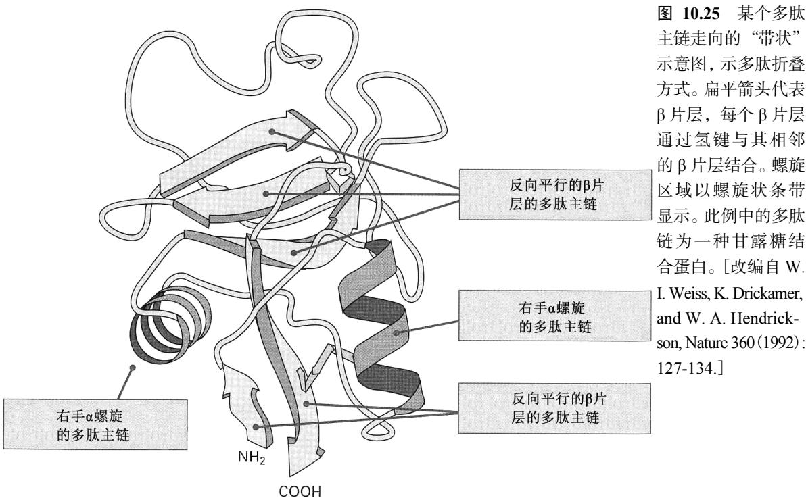  
在蛋白质折叠中，其他类型的相互作用也很重要。例如，在多肽不同部分的成对半胱氨酸

的硫原子之间，可形成共价键。不过，折叠的规则太复杂，以致除了一些极简单的蛋白质以外，仅仅根据氨基酸序列往往不能预测蛋白质的最终形状。

尽管多肽链的折叠由其氨基酸序列决定，但有些多肽链需要帮助才能正确折叠。多肽从核糖体上释放之时，已正确折叠的有 70%～75% (图 10.26, A 部分)。这些往往是相当小或折叠结构域相当少的蛋白质。它们的折叠可能由与核糖体结合的蛋白质辅助：在原核生物中称为 TF(trigger factor，触发因子)；在真核生物中称为 NAC(nascent chain-associated complex，新生肽链相关复合体)。但是，由众多折叠

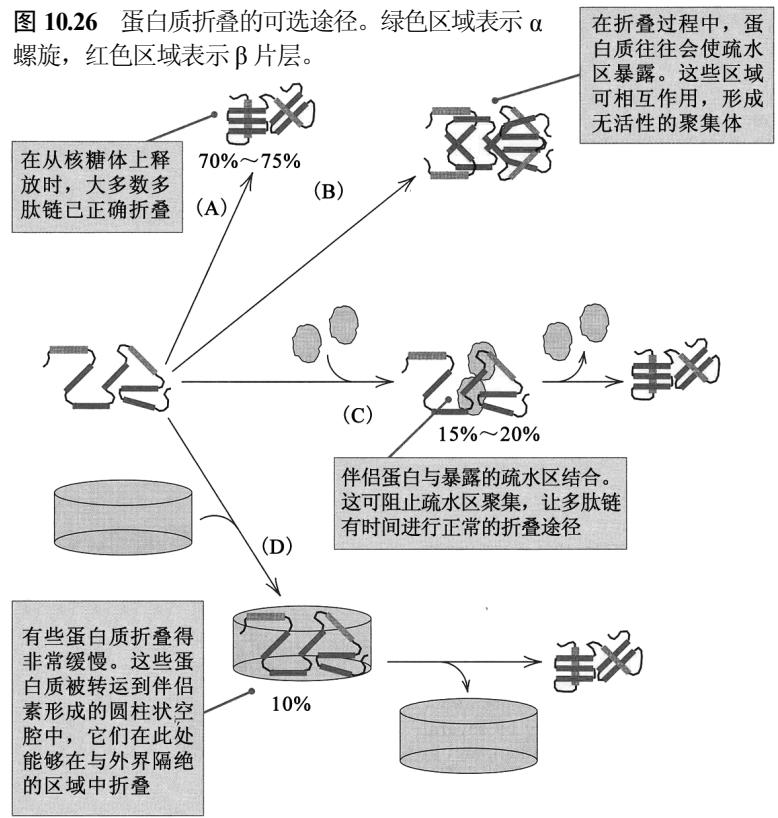

结构域组成的较大的蛋白质，折叠比较缓慢，在折叠过程中，疏水残基暴露在细胞质的高浓度大分子中(在大肠杆菌中，蛋白质和其他大分子的浓度是 300～400g/L)。在如此拥挤的情况下，暴露的疏水基团往往会相互吸引并结合在一起，形成没有活性的蛋白质凝聚体(图 10.26B)。

更复杂的多肽的正确折叠，要在称为分子伴侣(chaperone)的蛋白质的帮助下进行(图10.26C)。这些蛋白质与疏水基团和非定形区域结合，保护它们免于凝聚，并通过反复的结合和释放循环，给多肽链找到正确的折叠途径提供时间。在细菌中，主要的分子伴侣蛋白为DnaJ和DnaK，而在真核生物中，包括Hsp40、Hsp70和Hsp90。Hsp这个符号代表热休克蛋白(heat-shock protein)，反映了这些蛋白质在高温下表达更高的这一发现。它们表达量增加的原因是，高温引起许多蛋白质开始去折叠(变性)，而分子伴侣的存在使这种部分去折叠状态得以稳定，以使正确的重新折叠成为可能。

折叠途径非常慢且效率低下的最复杂的蛋白质，被一类称作伴侣蛋白(chaperonin)的特殊蛋白质与外界隔离。这些蛋白质形成巨大的中空圆柱状结构，将不稳定的中间体套在其中，让它们能够在受保护的环境中折叠(图10.26D)。在细菌中，主要的伴侣蛋白是GroEL和GroES蛋白，而在真核生物中，是TRiC蛋白。在真核生物中，含量最丰富的两种多肽——肌动蛋白(actin)和微管蛋白(tubulin)这两种细胞骨架蛋白——就是利用伴侣蛋白圆柱体来折叠的。

联系：Poly-U

马歇尔·尼伦伯格和海因里希·马特哈伊，1961

国立卫生研究院，贝塞斯达，马里兰州

大肠杆菌无细胞蛋白质合成对天然存在的或人工合成的多聚核糖核苷酸的依赖

沃森和克里克于1953年发现DNA结构，在其后的数年中，该发现的生物学意义在很大程度上被忽视。一个主要的原因是，多数生化学家仍顽固地深信DNA与蛋白质合成无关。当时的普遍看法是，蛋白质是酶将事先存在的小肽按特定顺序一步步连接在一起而得到的。曾有人提出，蛋白质可能是依据RNA模板按顺序排列而成，但该假说也基本上被忽视。直到1961年这篇重要的论文出现，才证明蛋白质是按模板RNA分子编码的顺序通过逐步连接单个氨基酸而形成。关键的发现是，在能够支持蛋白质合成的无细胞混合物中，人工多聚核苷酸poly-U(多聚尿苷酸)导致仅由苯丙氨酸组成的蛋白质的合成。蛋白质合成的必要条件，还包括核糖体(翻译所必需)和小的RNA分子(包括负载tRNA)。本论文出现之后，开始了破译遗传密码的竞赛，遗传密码是RNA用来编码蛋白质中的氨基酸的密码。

我们从大肠杆菌中获得了一种可将(放射性)缬氨酸快速掺入蛋白质的稳定的无细胞系统。……本通讯所述的是，即使存在可溶性(小)RNA分子和核糖体，掺入氨基酸还需要有模板RNA。添加模板RNA而激发的氨基酸掺入事件，其具有的许多特性，估计蛋白质合成过程也会有。天然存在的RNA和人工合成的多聚核苷酸一样，都能起作用。这种人工合成的多聚核苷酸似乎含有合成只含一种氨基酸的“蛋白质”的密码。……(具体来说)添加多聚尿苷酸后猛然引发(放射性)苯丙氨酸的掺入。苯丙氨酸的掺入几乎完全依赖于多聚尿苷酸的加入，且掺入以线速度持续大约30min。……反应产物的表观溶解度与真实的多聚苯丙氨酸相同……(含)苯丙氨酸而不含其他氨基酸。……这些结果表明，多聚尿苷酸含有合成具多聚苯丙氨酸特征的蛋白质的信息。……因此，看来编码苯丙氨酸的密码是一个或多个尿苷酸残基。还不确定该密码的类型到底是单体、三联体，还是其他。多聚尿苷酸似乎起合成模板或信使RNA的作用，而这一稳定的无细胞系统很可能可按照加入系统中的RNA所包含的有意义的信息来合成任何蛋白质。

来源：M. W. Nirenberg and J. H. Matthaei, Proc. Natl. Acad. Sci. USA 47(1961): 1588-1602.

## 10.7 复合翻译单位

翻译的单位很少是横扫单个 mRNA 分子的单个核糖体。单一 mRNA 可被以串联方式沿其移动的数个核糖体同时翻译，而且，原核生物的单个 mRNA 可编码多条多肽链。在接下来的章节中考察这些情况。

## ■ 多核糖体

在多肽链中连接完大约 25 个氨基酸之后，AUG 起始密码子就会完全处在核糖体之外，从而可形成第二个起始复合体。总体格局是，两个核糖体以相同的速度沿 mRNA 移动。当第二个核糖体往前移了大约 25 个氨基酸的距离时，第三个核糖体又可结合到起始位点。这种移动与再起始的过程不断进行，直到 mRNA 被核糖体以大约每个核糖体 80 个核苷酸的密度覆盖(图 10.27)。这种巨大的翻译单位称为多核糖体 (polysome)，这是翻译单位的一般形式。

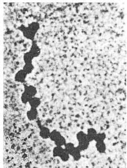

在真核生物中，转录和 RNA 加工发生在细胞核中，而翻译发生在细胞质中。核内和核外的过程在空间上和时间上都是非耦合的。在原核生物中，因为没有核膜将核糖体与 DNA 分开，翻译起始复合体甚至可在 mRNA 从 DNA 上释放之前形成，这使得转录和翻译能够同时发生。图 10.28 示结合有许多 mRNA 分子的一个 DNA 分子的电子显微照片，每个 mRNA 分子都有多个核糖体结合。显微照片左上部，DNA 的转录才刚开始。离转录起点的距离越远，多核糖体的长度就越

图 10.27 大肠杆菌多核糖体电子显微照片[承加州大学欧文分校芭芭拉·哈姆卡罗(Barbara A. Hamkalo)惠赠。]

长；mRNA 离转录起点越远，转录过程进行的时间就越长，因而 mRNA 就越长。

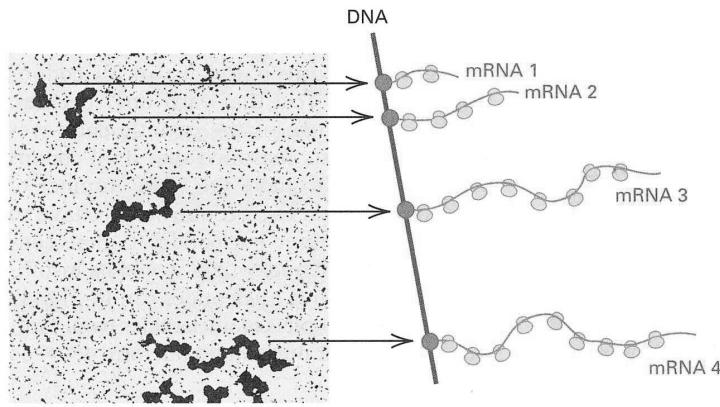

图 10.28 转录和翻译的可视化。该电子显微照片显示大肠杆菌一段 DNA 的转录和新生 mRNA 的翻译。黑点为核糖体，它们覆盖着 mRNA。右边为电子显微照片的解说图。每条 mRNA 全长都有核糖体结合。大红点为 RNA 聚合酶分子；它们太小，在电子显微照片上看不见。每条 mRNA 的长度等于每个 RNA 聚合酶从转录起点开始已行进的距离。[转载自 O. L. Miller, Jr., B. A. Hamkalo, and C. A. Thomas, Jr., Science 169(1970):392-395。经 AAAS 许可转载。]

## - 多顺反子 mRNA

正如我们已经注意到的，真核生物通过扫描过程来挑选起始密码子，这意味着一条 mRNA 可编码且只能编码一条多肽链。如图 10.29 所示，在原核生物中，mRNA 分子通常包含数个不同多肽链的编码序列，这样的分子称为多顺反子 mRNA (polycistronic mRNA) [“顺反子(cistron)”这个词的意思是，编码单条多

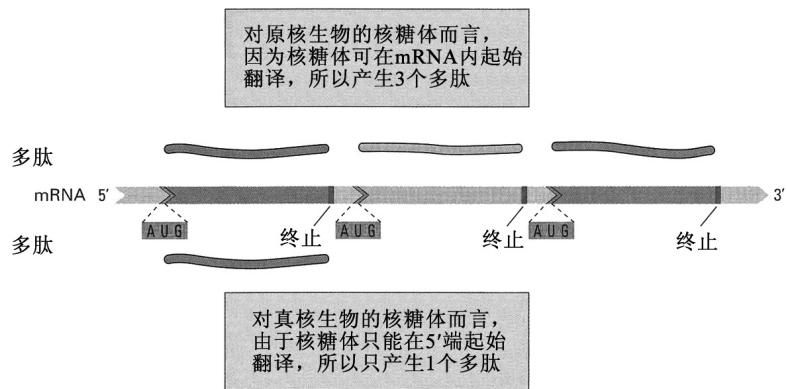  
图 10.29 用原核生物核糖体和真核生物核糖体翻译一个三顺反子 mRNA，得到不同的产物。原核生物核糖体翻译所有的可读框，但真核生物核糖体只翻译最靠近 mRNA 5' 端的可读框。被翻译的序列以紫色、黄色和橙色显示；终止密码子以红色显示；核糖体结合位点以绿色显示；间插序列以淡绿色显示。

肽链的核苷酸序列]。真核生物的 mRNA 总是单顺反子 mRNA（monocistronic mRNA）。在多顺反子 mRNA 中，每个多肽编码区之前是各自的核糖体结合位点和 AUG 起始密码子。一个多肽的合成结束之后，接下来的第二个多肽被翻译。同一个多顺反子 mRNA 包含的编码序列，常常编码同一代谢途径的不同蛋白质。例如，在大肠杆菌中，由一个多顺反子 mRNA 分子，编码合成组氨酸所需的 10 种酶。采用多顺反子 mRNA，是细胞以协同方式调节相关蛋白质合成的一

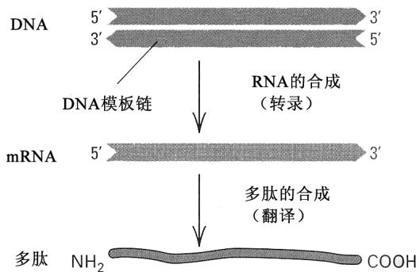  
图 10.30 RNA 相对于 DNA 编码链的合成方向，以及蛋白质相对于 mRNA 的合成方向。

种经济的方式。

翻译的决定性的特征是，它按特定方向沿mRNA和多肽进行：

mRNA 的翻译是按 $5'$ 到 $3'$ 方向，从起始密码子翻译到终止密码子。多肽是通过在羧基端不断添加氨基酸，从氨基端合成到羧基端。

这些合成的方向如图 10.30 所示。书写核苷酸序列的惯例是将 5' 端放在左边，而书写氨基酸序列的惯例是将氨基端放在左边。这意味着 RNA 序列是从左写到右，与其转录顺序相同；而氨基酸序列的书写顺序，与其翻译顺序相同。

## 10.8 标准遗传密码

遗传密码(genetic code)是全部密码子及每个密码子编码的氨基酸的清单。在遗传密码的本质被揭晓之前，科学家曾经推断，如果假设所有的密码子都具有相同的核苷酸数目，则每个密码子必须包含至少3个核苷酸。由成对核苷酸组成的密码子可能不够，因为4种核苷酸只能组成 $4^{2}=16$ 种对子，核苷酸三联体可能就够了，因为4种核苷酸可组成 $4^{3}=64$ 种三联体。事实上，遗传密码就是三联体密码(triplet code)，且所有64种可能的密码子都携带某种信息。因为要编码的氨基酸只有20种，所以大多数氨基酸被不止一种密码子编码。还有，在mRNA分子的翻译中，密码子不重叠，但被连续使用。

## ■ 三联体密码的遗传学证据

虽然通过理论思考提出了每个密码子一定要包含至少3个核苷酸，但不排除有更长的密码子的可能性。第一个得到广泛认可的三联体密码的证据，来自用T4噬菌体的 $rII$ 突变体做的实验，这些突变体是在存在原黄素(proflavin)这种化学物质的情况下进行复制，从而诱导所得。这些实验由弗朗西斯·克里克及其合作者在1961年完成。原黄素诱导所致突变一般会导致功能完全丧失。研究人员怀疑这些突变是单个核苷酸的插入或缺失。对这些突变的性质的分析，直接得出这样的推论：遗传密码是从一个确立mRNA阅读框(reading frame)的固定点开始，以不重叠的、三个核苷酸一组的方式读取。缺失或增加一个核苷酸对的突变，会使阅读框移位，因而称其为移码突变(frameshift mutation)。图10.31示移码突变对突变型mRNA生成的多肽的氨基酸序列的巨大影响。

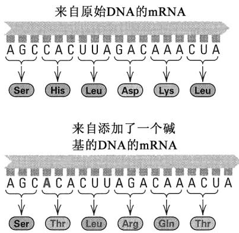  
图10.31 增加一个额外碱基所致的蛋白质的氨基酸序列的改变，这个额外的碱基使阅读框移位。缺失一个碱基也会使阅读框移位。

对遗传密码结构的遗传分析，从一个叫做FC0的 $rII$ (rapid lysis，快速裂解)突变开始。当初FC0被随意叫做 $(+)$ ，就好像它有一个核苷酸对的插入一样[也可以将它叫做 $(-)$ ，就好像它有一个核苷酸对的缺失一样，不过，称其为 $(+)$ 碰巧猜对了，因为对FC0测序，证明它确实有一个单碱基的插入]。如果FC0有一个 $(+)$ 插入，那么，附近的一个核苷酸的缺失，应该有可能将FC0等位基因回复为“野生型”。对 $r^+$ 回复突变体的筛选，是通过分离在对 $\lambda$ 噬菌体为溶源性的大肠杆菌K12株的菌苔上形成的噬菌斑进行的。这样筛选的根据是， $rII$ 突变体不能在K12 $(\lambda)$ 中增殖。分析显示，每个回复突变体除了仍然携带原来的FC0突变之外，还有另一个逆转了FC0突变效应的(基因内抑制)突变。将每个回复突变体与野生型杂交，这些抑制基因突变可因重组而与原来的突变分开，这样就证明了每个抑制基因突变本身也是 $rII$ 突变，都可导致快速裂解表型。如果FC0有一个核苷酸的插入，那么，抑制基因突变应该全部都是缺失一个核苷酸对的结果，因此，可推断FC0的每个抑制基因突变都具有单个核苷酸缺失 $(-)$ 。图10.32示3个这样的回复突变，以及它们对翻译阅读框造成的后果，为简单起见，图中使用常见的三字母单词来说明。将3种 $(-)$ 突变命名为 $(-)_1$ 、 $(-)_2$ 和 $(-)_3$ ，以正确阅读框翻译的mRNA部分以绿色显示。

<table><tr><td>噬菌体类型</td><td>插入/缺失</td><td>mRNA的翻译阅读框</td></tr><tr><td>野生型序列</td><td></td><td>THE BIG BOY SAW THE NEW CAT EAT THE HOT DOG...</td></tr><tr><td>+1插入</td><td>(+)</td><td>THE BIG BOY SAW TTH ENE WCA TEA TTH EHO TDO G</td></tr><tr><td>回复突变体1</td><td>(-)1 (+)</td><td>THE BIG OYS AWT THE NEW CAT EAT THE HOT DOG...</td></tr><tr><td>回复突变体2</td><td>(+) (-)2</td><td>THE BIG BOY SAW TTH ENE WCA TEA THE HOT DOG...</td></tr><tr><td>回复突变体3</td><td>(+) (-)3</td><td>THE BIG BOY SAW TTH ENE WAT EAT THE HOT DOG...</td></tr><tr><td>1号(-)缺失</td><td>(-)1</td><td>THE BIG OYS AWT HEN EWC ATE ATT HEH OTD OG...</td></tr><tr><td>2号(-)缺失</td><td>(-)2</td><td>THE BIG BOY SAW THE NEW CAT EAT HEH OTD OG...</td></tr><tr><td>3号(-)缺失</td><td>(-)3</td><td>THE BIG BOY SAW THE NEW ATE ATT HEH OTD OG...</td></tr><tr><td>双重(-)突变体</td><td>(-)1 (-)2</td><td>THE BIG OYS AWT HEN EWC ATE ATH EHO TDO G...</td></tr><tr><td>三重(-)突变体</td><td>(-)1 (-)2 (-)3</td><td>THE BIG OYS AWT HEN EWA TEA THE HOT DOG...</td></tr></table>

图 10.32 rII 移码突变的解释, 示在适当位置的单碱基插入 (+) 和单碱基缺失 (−) 的组合可恢复正确的阅读框 (绿色)。关键发现是, 3 个单碱基缺失的组合 (最底下一行所示) 也能恢复正确的阅读框 (绿色)。两个单碱基缺失不能恢复阅读框。这些经典的实验给遗传密码是三联体密码提供了强有力的遗传证据。

反过来，可用每一个 $(-)$ 抑制基因突变来筛选其他的“野生型”回复突变体，希望这些回复突变体会携带属于 $(+)$ 变种的新的抑制基因突变，因为 $(-)$ $(+)$ 组合应该会产生能够在K12 $(\lambda)$ 上形成噬菌斑的噬菌体。

分离到一大组 $(+)$ 和 $(-)$ 突变后，可通过噬菌体重组将两种突变集中，得到不同的双重突变型组合。任意 $(+)$ $(-)$ 组合和 $(-)$ $(+)$ 组合通常都会产生野生表型，而 $(+)$ $(+)$ 组合和 $(-)$ $(-)$ 组合总是产生突变表型。关键结果来自三重突变体 $(+)$ $(+)$ $(+)$ 和 $(-)$ $(-)$ $(-)$ ，它们往往具有野生表型。

如图 10.32 所示，不同的 (+) 和 (−) 组合的表型，可用阅读框的偏移来解释。最初的 FC0 突变使阅读框从 +1 插入点开始向前移位，产生错误的氨基酸序列，从而导致无功能的蛋白质。附近一个核苷酸对的缺失会恢复阅读框，尽管两个突变之间编码的氨基酸序列会不一样。在 (+) (+) 或 (−) (−) 双重突变中，阅读框移位两个核苷酸，因而所得蛋白质仍是无功能的。然而，在 (+) (+) (+) 和 (−) (−) (−) 三重突变中，阅读框得以恢复，尽管外围两个突变之间编码的所有氨基酸都是错误的。(+) (+) (+) 所产生的蛋白质多出一个氨基酸, 而 (-) (-) (-) 所产生的蛋白质少了一个氨基酸(图 10.32)。

对插入和缺失突变的遗传分析，强烈支持如下结论：

\- mRNA 从一个固定位点开始翻译。

\- 在整个翻译过程中，存在一直不变的单一阅读框。

\- 每个密码子由3个毗邻的核苷酸组成。

克里克及其同事从这些实验中也得出其他一些结论。第一，在遗传密码中，大多数密码子必定起编码氨基酸的作用。第二，大多数氨基酸必定被不止一个密码子编码。他们论证道，如果每个氨基酸只有一个密码子，那么，在64个可能的密码子中，只有20个可用来编码氨基酸。如果是这样，则大多数移码突变应该会影响阅读框中剩下的44个“非编码”密码子中的某个密码子，因此，附近的极性相反的移码突变就应该不能阻抑原来的突变。所以，他们推断遗传密码包含同义密码子[最初称这一特性为简并(degeneracy)]。

## - 遗传密码是怎样被破解的

在破开大肠杆菌细胞而得到的细胞抽提物中，可进行多肽合成。如果分离细胞抽提物中的不同组分，然后将核糖体、tRNA 分子、mRNA 分子和翻译所需的各种蛋白因子混合，可重建

(A)  
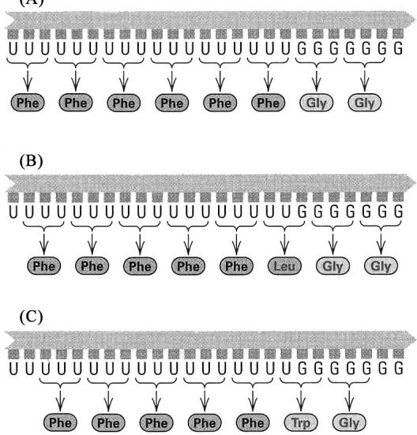  
图 10.33 用 5'-polyU-polyG-3' 作为 mRNA，以 3 个不同的阅读框合成多肽，示掺入甘氨酸、亮氨酸和色氨酸的原因。

出能够正常运作的蛋白质合成系统。如果在抽提物中添加放射性标记的氨基酸，会生成带放射性的多肽。这样的合成只能持续数分钟，因为mRNA会被混合物中的核酸酶迅速降解。在实验上来阐释遗传密码，正是从此时开始：待天然mRNA被完全降解后，在混合物中加入人工合成的多聚尿苷酸(poly-U)作为mRNA分子，观察到合成了一种仅由苯丙氨酸组成的多肽(Phe-Phe-Phe...)。根据这个简单的结果，加上已知遗传密码为三联体密码，必然得出这样的结论：UUU必定是苯丙氨酸这个氨基酸的密码子。在这一实验的基础上做一些变动，使其他密码子也得到了鉴定。例如，在poly-U的末端增加一长串鸟嘌呤时，多聚苯丙氨酸结束于一串甘氨酸，说明GGG是甘氨酸的密码子(图10.33)。在以甘氨酸结束的多聚苯丙氨酸中，也存在痕量的亮氨酸或色氨酸，这些氨基酸的掺入，是由U、

G 交接点处的 UUG 和 UGG 密码子所指导的。在 poly-U 末尾增加单个鸟嘌呤时，多聚苯丙氨酸以亮氨酸结尾，因此，UUG 是亮氨酸的密码子，而 UGG 是色氨酸的密码子。用 poly-A 进行同样的实验，产生多聚赖氨酸，用 poly-C，产生多聚脯氨酸。

加上其他实验，终致遗传密码得以完全阐明。发现这3个密码子：

## UAA UAG UGA

是翻译的终止信号，并且证明编码甲硫氨酸的密码子 AUG 是起始密码子。AUG 也编码内部的甲硫氨酸。

## - 标准密码的特点

体外(in vitro)翻译实验最初是用从大肠杆菌分离的组分做的，现已用来自细菌、酵母、植物和动物等许多物种的组分进行了重复。从这些实验推导来的标准遗传密码，被认为几乎是通用的，因为在迄今考察过的几乎所有生物中，核基因的密码子配置都是相同的。不过，在某些原生动物中，以及在细胞器的遗传密码中，发现在密码子配置上有细微的差异。

标准遗传密码如表 10.3 所示，编码氨基酸的密码子一共有 61 个。在许多情况下，几个密码子编码同一个氨基酸。这一特点证实了根据 rII 移码突变得到的推论——遗传密码包含同义密码子。除了色氨酸和甲硫氨酸以外，所有的氨基酸都由不止一个密码子编码。这种同义方式不是随机的，比如，除丝氨酸、亮氨酸和精氨酸之外，与同一氨基酸对应的所有密码子都在表 10.3 的同一格中。这意味着，同义密码子通常只是第 3 位核苷酸不同；例如，GGU、GGC、GGA 和 GGG 全部都编码甘氨酸。而且，在所有两个密码子编码同一氨基酸的情况下，第三位核苷酸要么是 A 或 G（两者都是嘌呤），要么是 T 或 C（两者都是嘧啶）。

表 10.3 标准遗传密码

<table><tr><td>第1位(5&#x27;端)</td><td colspan="4">第2位</td><td>第3位(3&#x27;端)</td></tr><tr><td></td><td>U</td><td>C</td><td>A</td><td>G</td><td></td></tr><tr><td rowspan="4">U</td><td>UUU Phe $\left. \begin{array}{c} \\ \text{F} \end{array}\right\}$ </td><td rowspan="2">UCU Ser $\left. \begin{array}{c} \\ \text{UCC Ser} \end{array}\right\}$ S</td><td>UAU Tyr $\left. \begin{array}{c} \\ \text{Y} \end{array}\right\}$ </td><td rowspan="2">UGU Gys $\left. \begin{array}{c} \\ \text{C} \end{array}\right\}$ </td><td>U</td></tr><tr><td>UUC Phe</td><td>UAC Tyr</td><td>C</td></tr><tr><td>UUA Leu $\left. \begin{array}{c} \\ \text{L} \end{array}\right\}$ </td><td rowspan="2">UCA Ser $\left. \begin{array}{c} \\ \text{UCG Ser} \end{array}\right\}$ </td><td>UAA Stop</td><td>UGA Stop</td><td>A</td></tr><tr><td>UUG Leu</td><td>UAG Stop</td><td>UGG Typ W</td><td>G</td></tr><tr><td rowspan="4">C</td><td>CUU Leu $\left. \begin{array}{c} \\ \text{L} \end{array}\right\}$ </td><td rowspan="4">CCU Pro $\left. \begin{array}{c} \\ \text{CCC Pro} \end{array}\right\}$ P</td><td>CAU His $\left. \begin{array}{c} \\ \text{H} \end{array}\right\}$ </td><td rowspan="4">CGU Arg $\left. \begin{array}{c} \\ \text{R} \end{array}\right\}$ </td><td>U</td></tr><tr><td>CUC Leu</td><td>CAC His</td><td>C</td></tr><tr><td>CUA Leu</td><td>CAA Gln</td><td>A</td></tr><tr><td>CUG Leu</td><td>CAG Gln</td><td>G</td></tr><tr><td rowspan="4">A</td><td>AUU Ile $\left. \begin{array}{c} \\ \text{I} \end{array}\right\}$ </td><td rowspan="4">ACU Thr $\left. \begin{array}{c} \\ \text{ACC Thr} \end{array}\right\}$ F</td><td>AAU Asn $\left. \begin{array}{c} \\ \text{N} \end{array}\right\}$ </td><td rowspan="2">AGU Ser $\left. \begin{array}{c} \\ \text{S} \end{array}\right\}$ </td><td>U</td></tr><tr><td>AUC Ile</td><td>AAC Asn</td><td>C</td></tr><tr><td>AUA Ile</td><td>AAA Lys $\left. \begin{array}{c} \\ \text{K} \end{array}\right\}$ </td><td rowspan="2">AGA Arg $\left. \begin{array}{c} \\ \text{R} \end{array}\right\}$ </td><td>A</td></tr><tr><td>AUG Met M</td><td>AAG Lys</td><td>G</td></tr><tr><td rowspan="4">G</td><td>GUU Val $\left. \begin{array}{c} \\ \text{V} \end{array}\right\}$ </td><td rowspan="4">GCU Ala $\left. \begin{array}{c} \\ \text{GCC Ala} \end{array}\right\}$ A</td><td>GAU Asp $\left. \begin{array}{c} \\ \text{D} \end{array}\right\}$ </td><td rowspan="4">GGU Gly $\left. \begin{array}{c} \\ \text{G} \end{array}\right\}$ G</td><td>U</td></tr><tr><td>GUC Val</td><td>GAC Asp</td><td>C</td></tr><tr><td>GUA Val</td><td>GAA Glu</td><td>A</td></tr><tr><td>GUG Val</td><td>GAG Glu</td><td>G</td></tr></table>

注：每个氨基酸均给出其惯用的单字母和三字母格式的缩写。编码甲硫氨酸的密码子 AUG，通常也被用作起始密码子。按贯例，密码子的 5' 碱基写在左边，3' 碱基写在右边。

## - 转移RNA与氨酰tRNA合成酶

mRNA 分子中的核苷酸序列被翻译成蛋白质的氨基酸序列，这种解码操作是通过氨酰化的(即负载的)tRNA 分子来完成的。氨酰 tRNA 合成酶(aminoacyl-tRNA synthetase)负责将每个tRNA 分子与正确的氨基酸连接起来。

tRNA 分子是小的单链核酸，大小在 70～90 个核苷酸。它们与所有的 RNA 分子一样，都有一个 3'-OH 末端，但另一端是以 5'一磷酸结尾，而不是 5'三磷酸，因为 tRNA 分子是从较大的初级转录物切割而来的。tRNA 内部具有互补的碱基序列，形成短的双链区域，使 tRNA 分子折叠成由双链的茎将开环彼此连接起来的结构(图 10.34，A 部分)。在二维上，通常将 tRNA 分子画得像平展的苜蓿叶(三叶草)。如图 10.34B 所示，其三维结构比较复杂，注意，TψC 环和 DHU 环靠得极近。

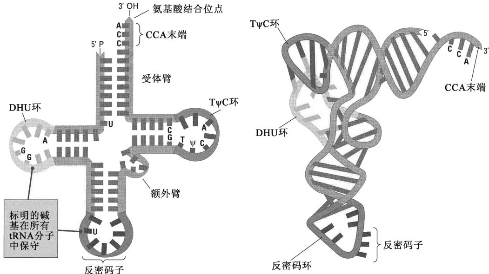  
图 10.34 （A）“三叶草”形的 tRNA。深黑色字母表示在所有 tRNA 分子序列中保守的几个碱基。标出的几个环见于所有 tRNA 分子中。DHU 指二氢尿嘧啶，是在一个环中发现的一种碱基；希腊字母 $\psi$ 是表示罕见碱基假尿嘧啶核苷的符号。(B) 酵母 $tRNA^{Phe}$ 三维结构示意图。[B 部分承加州大学伯克利分校金圣浩 (Sung-Hou Kim) 惠赠。]

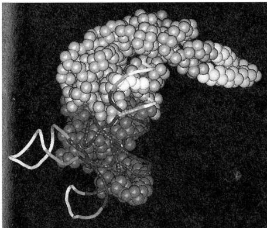  
图 10.35 与其 tRNA 复合的丝氨酰 tRNA 合成酶(实心球)的三维结构。注意，在酶和 tRNA 之间有许多接触位点。这两个分子来自嗜热菌 Thermus thermophilus。[转载自 V. Biou, et al., Science 263 (1994):1404-1410。经 AAAS 许可转载。]

在解码操作中，要用到 tRNA 分子的一些特定区域。一个区域是反密码子序列，它由 3 个核苷酸组成，可与 mRNA 中的密码子序列形成碱基对。没有哪个正常的 tRNA 分子具有与任一终止密码子 (UAG、UAA 和 UGA) 互补的反密码子，这就是为什么这些密码子是终止信号的原因。第二个关键位点在 tRNA 分子的 3' 端，氨基酸结合于此。特异的氨酰 tRNA 合成酶将正确的氨基酸连接到每个 tRNA 上，对于每种氨基酸而言，至少存在一种，并且通常仅有一种氨酰合成酶。要使得连接正确，合成酶必须能够区分一种 tRNA 与另一种 tRNA，这种必要的区分能力，是由包括 tRNA 分子的许多部分在内的识别区域提供的。

图 10.35 示与其 tRNA 复合的丝氨酰 tRNA 合成酶的三维结构。与 tRNA 结合时，该蛋白质的一部分与 tRNA TψC 环的可变部分接触，引导接纳茎 (acceptor stem) 进入酶的活性腔。这些相互作用主要取决于通过与

主链接触而对 tRNA $^{Ser}$ 形状进行识别，与反密码子之间特异的相互作用还在其次。

## - 冗余与摆动

遗传密码的几个特点提示，正常的沃森-克里克碱基配对不是密码子-反密码子结合的全貌。第一，遗传密码是高度冗余的。第二，对密码子第3位核苷酸的识别往往是不重要的。对某些氨基酸——例如，脯氨酸(Pro)、苏氨酸(Thr)和甘氨酸(Gly)——而言，第3位上任何核苷酸都行；而对其他氨基酸——如组氨酸(His)、谷氨酰胺(Gln)和酪氨酸(Tyr)——而言，第3位上为嘌呤之一(A或G)或嘧啶之一(U或C)就行。第三，从单一生物中分离到的不同tRNA分子的

数目，比密码子的数目少，因为所有的密码子都在用，所以，有些 tRNA 分子的反密码子一定能与不止一种密码子配对。以几种纯化的 tRNA 分子进行实验，证明了这一事实。

为了解释这些观察结果，弗朗西斯·克里克于1966年提出了摆动(wobble)概念。他提出，密码子的前两个核苷酸按通常规则形成碱基对(A-U和G-C)，但反密码子5'端的碱基受到的空间限制不如前两个碱基大，可与密码子3'端不止一种碱基形

表 10.4 大肠杆菌和酿酒酵母 tRNAs 的摆动规则

<table><tr><td rowspan="2">反密码子第一位碱基(5&#x27;位)</td><td colspan="2">密码子第三位允许的碱基(3&#x27;位)</td></tr><tr><td>大肠杆菌</td><td>酿酒酵母</td></tr><tr><td>A</td><td>U</td><td>—</td></tr><tr><td>C</td><td>G</td><td>G</td></tr><tr><td>U</td><td>A或G</td><td>A</td></tr><tr><td>G</td><td>C或U</td><td>C或U</td></tr><tr><td>I</td><td>A、C或U</td><td>C或U</td></tr></table>

注：在酿酒酵母中，反密码子5'位的A总是被修饰为I，I表示次黄嘌呤核苷，除了- $NH_{2}$ 被-OH替代以外，次黄嘌呤核苷在结构上与腺嘌呤核苷相似。同样，在此生物中，反密码子第一位的U往往被修饰。

成氢键。他的提法基本正确，只不过不同生物所允许的碱基配对略有不同(表 10.4)。

## ■ 无义抑制

产生终止密码子的核苷酸置换，在翻译过程中导致链终止提前，这样的突变称为无义突变(nonsense mutation)。由于历史原因，有时把终止密码子称为琥珀密码子(UAG)、赭石密码子(UAA)和棕土密码子(UGA)。曾有一项引人注目的观察：有些在编码主要头蛋白的基因中具有无义突变的T4噬菌体突变体，能在一些细菌菌株中增殖，但不能在其他菌株中增殖。为什么会这样呢？进一步的分析证明，可供噬菌体无义突变体生长的菌株，携带抑制基因突变，这些突变通过改变mRNA被阅读的方式发挥作用，而不是通过改变噬菌体基因的核苷酸序列发挥作用。这些抑制基因突变被证明是突变型tRNA基因。这些抑制型tRNA(suppressor tRNA)通过将终止密码子读成是编码某个特定氨基酸的信号而发挥作用，该氨基酸被插在那个位置，从而翻译可继续进行。只要这个插入的氨基酸与该蛋白质的功能相容，原来突变的效应就被阻抑，从而可产生噬菌斑。

我们将通过考察一个由酪氨酸密码子 UAC 突变成终止密码子 UAG(图 10.36，比较 A、B 部分)而形成的链终止密码子，来说明无义抑制。C 部分显示该突变如何能被一个突变型亮氨酸 tRNA 分子阻抑。在大肠杆菌中， $\text{tRNA}^{\text{Leu}}$ 具有反密码子 3'-AAC-5'，该反密码子与密码子 5'-UUG-3'配对。 $\text{tRNA}^{\text{Leu}}$ 基因中的一个抑制基因突变产生具有反密码子 AUC 的变异 tRNA，该 tRNA 分子仍然负载亮氨酸，但与终止密码子 UAG 相对应，而不是与正常的亮氨酸密码子 UUG 相对应。因此，在含有该抑制型 tRNA 的细胞中，突变型蛋白质被完整合成，如果所产生的蛋白质能够耐受酪氨酸由亮氨酸替代，它将是有功能的。已观察到许多这种类型的抑制型 tRNA 分子，每种阻抑子(suppressor)只对一些无义突变有效，因为所导致的氨基酸置换有可能不产生有功能的蛋白质。

在大肠杆菌中，有 3 类 tRNA 阻抑子：只阻抑 UAG 的阻抑子(琥珀阻抑子)；UAA 和 UAG 两者都阻抑的阻抑子(赭石阻抑子)；和只阻抑 UGA 的阻抑子。它们具有下列共同性质。

1. 原来的突变基因仍然含有突变核苷酸序列(图 10.36 中的 UAG)。

2. 抑制型 tRNA 阻抑具有相同终止密码子的所有链终止突变，条件是插入的氨基酸是该位点可接受的氨基酸。

3. 仅当细胞含有同一 tRNA 基因的两个或多个拷贝时，该细胞才能在存在 tRNA 阻抑子的情况下存活。以图 10.36 中的例子为例，如果在基因组中只有一个 tRNA $^{Leu}$ 基因，且它发生突变，则正常的亮氨酸密码子 UUG 将不再被读成有义密码子，从而在 UUG 密码子出现的任何地方，所有的多肽链都会终止。不过，大多数 tRNA 基因都存在多个拷贝，所以，如果一个拷贝突变产生抑制型 tRNA，几乎总会留下正常的拷贝。

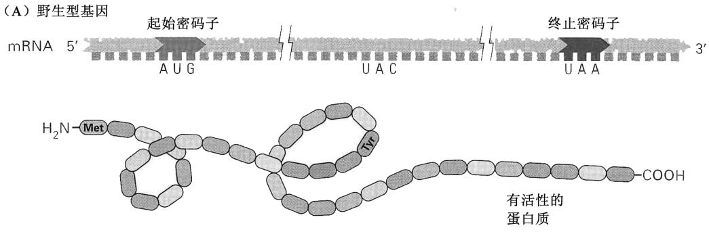

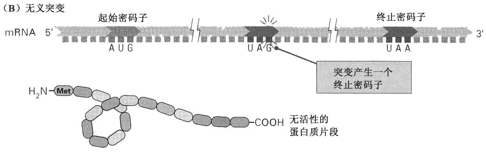

(C) 无义抑制（tRNA抑制）  
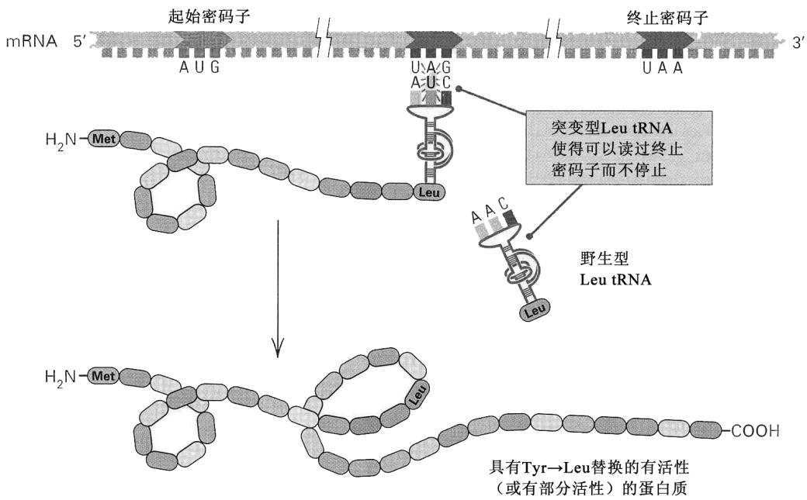  
图 10.36 无义抑制型 tRNA 分子的阻抑机制。(A)野生型基因。(B)UAC→UAG 链终止（“无义”）突变导致无活性的、提前终止的蛋白质。(C)tRNA $^{Leu}$ 突变产生变异的 tRNA 分子，其具有与 UAG 终止密码子互补的反密码子，但仍能负载亮氨酸。该 tRNA 分子使蛋白质能被完整合成，但在原来的酪氨酸位点上的是亮氨酸。如果该置换可恢复该蛋白质的活性，阻抑就达成了。

4. 任何一个链终止密码子都会被识别该密码子的抑制型 tRNA 突变翻译。例如，通过插入一个氨基酸使 UAG 被翻译，会阻止所有以 UAG 结束的野生型 mRNA 阅读框的终止。不过，抑制型 tRNA 的反密码子与终止密码子的结合通常非常弱，所以，无论如何终止密码子往往都会导致终止。

在遗传分析中，抑制型 tRNA 突变非常有用，因为它们使无义突变能被阻抑，从而鉴定出无义突变。这非常重要，因为无义等位基因通常导致截短的完全无活性的蛋白质，因此被认为是真正的丢失功能型等位基因。抑制型 tRNA 突变已被广泛用于原核生物和酵母的遗传分析，因为这些生物能够容忍其导致的有害效应。在大多数后生动物中，抑制型 tRNA 具有严重的有害效应，以致用处不大。

## 本章概要

\- 在基因表达过程中，DNA 的核苷酸序列中的信息借助 RNA 中介来决定多肽中氨基酸的线性顺序。

\- 基因表达的第一步是从一条 DNA 链转录一条 RNA。

\- 在真核生物中，RNA转录物要经过修饰，并可能要经过剪接，才能成为信使RNA(mRNA)。

\- 信使RNA在核糖体上以3个核苷酸一组(密码子)的方式翻译，每个密码子通过与tRNA分子的碱基配对来编码一个氨基酸，每个tRNA“负载”(共价结合)一个氨基酸。

\- 核糖体是由 rRNA 和众多蛋白质结合成的大、小核糖体亚基组成的颗粒。大、小亚基与其他因子一起，起始多肽的合成，使核糖体沿 mRNA 逐步移动，并在碰到终止密码子时使合成完的多肽释放。

\- 几乎所有的生物都使用标准遗传密码，标准遗传密码含编码20种氨基酸的61个密码子和3个终止密码子，但在某些原生动物，以及在线粒体和其他细胞器DNA的遗传密码中，可见例外。

## 基础回顾

\- “基因表达”这个术语是什么意思？你能区分基因表达和基因调节吗？为什么能或为什么不能？

\- 能把原始文本和它翻译成另一种语言的译本视为“共线性的”吗？解释答案。

\- 假设一个双链 DNA 分子在紧靠某基因启动子的两侧分别发生双链断裂，并且在酶修复这两个断裂之前将该启动子区颠倒。估计这个倒位启动子能够募集转录复合体吗？该基因的转录物会有什么错误，如果有的话？

\- 当作 RNA 聚合酶模板的 DNA 链被转录的方向是 $5' \rightarrow 3'$ 还是 $3' \rightarrow 5'$ ? mRNA 分子的哪一端先翻译？mRNA 编码的多肽，哪一端先合成？

\- 在真核生物细胞中，用于基因表达的 RNA 分子有 4 大类，这些 RNA 类型叫做什么？哪一类不参与原核生物细胞的基因表达？为什么不参与？

\- 什么是初级转录物？真核生物与原核生物的初级转录物有什么区别？

\- 在选择作为多肽合成起点的 AUG 密码子的机制上，真核生物与原核生物有何区别？

\- 释放因子在翻译中起什么作用？

\- 标准遗传密码是冗余的，这样说的意思是什么？哪些(如果有的话)氨基酸由 1 个密码子编码？由 2 个呢？由 3 个呢？由 4 个呢？由 5 个呢？由 6 个呢？

\- 举一个不使用标准遗传密码的遗传系统的例子。

\- 什么是移码突变？解释如何用包含多个单核苷酸移码突变的 $rII$ 重组体，来证明信使RNA是被以连续的、3个核苷酸一组(密码子)的方式翻译的。

## 解题指南

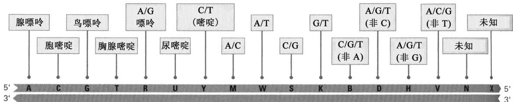

习题 1 国际生物化学与分子生物学联合会(IUBMB)指定了缩写核苷酸碱基的单字母代码，其中包括对核苷酸碱基的模糊命名。该代码如上图所示，DNA 和 RNA 都用这一套代码，对于模糊核苷酸，T 和 U 被视为等同。假设上图中不带标签的链与含模糊碱基的链按照标准的沃森-克里克配对规则配对，用标准模糊代码中的适当符号，填写不带标签的链的序列。

## 答案

该模糊代码不仅在标示 DNA 序列中不确定的核苷酸方面非常有用，在概括遗传密码的冗余方面也很有用。对于 A、T、G、C 和 U，配对关系直截了当，但是，对于模糊核苷酸，必须将所有的可能性列出，再来选择表达模糊性的符号。有个奇怪的特点是，有些符号与自己配对，例如，一条链上有 W(A 或 T)，另一条链上也必然有 W(T 或 A)，这是按照规则来的：配对的核苷酸——即使是模糊的——也必须遵守沃森-克里克配对规则。所有的配对方式都可按此办法得出，结果如下图所示，有两个符号——即 N 和 X——都是用来表示“任意核苷酸”的，所以它们可以随意配对。

<table><tr><td>5&#x27;</td><td>A</td><td>C</td><td>G</td><td>T</td><td>R</td><td>U</td><td>Y</td><td>M</td><td>W</td><td>S</td><td>K</td><td>B</td><td>D</td><td>H</td><td>V</td><td>N</td><td>X</td><td>5&#x27;</td></tr><tr><td>3&#x27;</td><td>T</td><td>G</td><td>C</td><td>A</td><td>Y</td><td>A</td><td>R</td><td>K</td><td>W</td><td>S</td><td>M</td><td>V</td><td>H</td><td>D</td><td>B</td><td>N/X</td><td>X/N</td><td>3&#x27;</td></tr></table>

习题 2 尽量使用国际生物化学与分子生物学联合会(IUBMB)制定的模糊碱基单字母代码(如习题 1 所示)，改写遗传密码表。

## 答案

此题要求考察标准遗传密码并选择正确的符号来表示模糊的核苷酸。所得的改写版遗传密码如此处所示，该版本的项数比标准格式少得多，一眼就能看出遗传密码的总体结构。

密码子第二位核苷酸

<table><tr><td colspan="2"></td><td>T</td><td>C</td><td>A</td><td>G</td></tr><tr><td rowspan="4">密码子第一位核苷酸</td><td>T</td><td>T T Y Phe FT T R Leu L</td><td>T C N Ser S</td><td>T A Y Tyr YT A R Stop</td><td>T G Y Cys CT G A StopT G G Trp W</td></tr><tr><td>C</td><td>C T N Leu L</td><td>C C N Pro P</td><td>C A Y His HC A R Gln Q</td><td>C G N Arg R</td></tr><tr><td>A</td><td>A T H Ile IA T G Met M</td><td>A C N Thr T</td><td>A A Y Asn NA A R Lys K</td><td>A G Y Ser SA G R Arg R</td></tr><tr><td>G</td><td>G T N Val V</td><td>G C N Ala A</td><td>G A Y Asp DG A R Glu E</td><td>G G N Gly G</td></tr></table>

习题 3 某编码区开始之处的非转录链为:  
5'-ATGCATCCGGGCTCATTAGTCT...-3'

研究两种突变：突变 X 是在紧接于粗体的 G 后面插入另一个 G，而突变 Y 是缺失粗体的 A。下列每种多肽的氨基酸序列是什么？

(a)野生型多肽。

(b) X 突变型多肽。

(c) Y 突变型多肽。

(d)包含两个突变的重组型多肽。

## 答案

(a) 非转录链的序列是已知的，所以 mRNA 的野生型阅读框为 AUG CAU CCG GGC UCA UUA GUC U..., 它编码 Met-His-Pro-Gly-Ser-Leu-Val-...。

(b) X 突变型 mRNA 的阅读框为 AUG GCA UCC GGG CUC AUU AGU CU..., 它编码 Met-Ala-Ser-Gly-Leu-Ile-Ser-Leu-...。

(c) Y 突变体型 mRNA 的阅读框为 AUG CAU CCG GGC UCU UAG UCU..., 它编码 Met-His-Pro-Gly-Ser (UAG 为终止密码子)。

(d) 双重突变型 mRNA 的阅读框为 AUG GCA UCC GGG CUC UUA GUC U...，它编码 Met-Ala-Ser-Gly-Leu-Leu-Val-...。注意，双重突变体与野生型的区别只在插入突变和缺失突变之间的区域，在该区域中阅读框移位。

## 分析与应用

10.1 在由 4 种核糖核苷酸构成的随机序列中，任意 3 个毗邻核苷酸为起始密码子的概率是多少？为终止密码子呢？在由随机序列构成的 mRNA 分子中，终止密码子之间的平均距离是多少？

## 10.2 由下列碱基组成的密码子可编码多少种氨基酸？

(a) 全部由嘧啶组成？

(b) 全部由嘌呤组成？

10.3 编码氨基酸的 61 种密码子，在密码子第三位上各有 3 种可能的核苷酸置换，计有 $61 \times 3 = 183$ 种可能的第三位突变，这些突变中有多少种同义突变？同义突变是指突变密码子与原来的密码子编码相同的氨基酸，在第三位突变中同义突变所占的比例是多少？

10.4 某双链 DNA 分子中的某个密码子发生倒位。

(a) 如果在 mRNA 中原来的密码子是 5'-AUG-3'，在倒位转录物中该密码子是什么？

(b)有没有什么密码子的倒位可保持其编码的氨基酸不变?

(c)什么密码子倒位后产生链终止密码子？

(d) 各个链终止密码子的倒位密码子编码什么氨基酸？

10.5 Poly-A 编码多聚赖氨酸。假如在该分子的 $5'$ 端加上一个 C，在多聚赖氨酸的氨基端会有一个不同的氨基酸，而在 $3'$ 端加上一个 C，在羧基端会有一个不同的氨基酸。这两个氨基酸是什么氨基酸？

10.6 在不需要专门的起始密码子的体外蛋白质合成系统中，以人工合成的多聚体 poly-U 作为 mRNA 分子，合成得到多肽多聚苯丙氨酸，在 poly-U 的某一端加上一个胞嘧啶核苷酸，产生的多聚苯丙氨酸在氨基端有一个缬氨酸，C 是加在 poly-U 的 3' 端还是 5' 端？

10.7 发现某种新的动物病毒具有罕见的特性，其所有 G-C 碱基对的 C 都位于被转录的 DNA 链上。

(a) 这对该病毒 DNA 中的密码子来说意味着什么？

(b)这对病毒蛋白质中的氨基酸来说意味着什么？

10.8 在无需起始密码子的体外蛋白质合成系统中，使用交变多聚体 AAGAAGAAG...生成的多肽产物是什么？

10.9 在无需起始密码子的体外蛋白质合成系统中, 使用交变多聚体 CACGCACGCACG...产生的多肽产物是什么?

10.10 在无需起始密码子的体外蛋白质合成系统中，使用交变多聚体 AUAUAU...生成的多肽产物是什么？

10.11 在无细胞系统中，用由 1/3 的 U 和 2/3 的 A 构成的随机多聚体来指导蛋白质合成，产生的多肽非常短，你能提出一个解释吗？

10.12 遗传密码中的一些密码子是通过随机多聚体的翻译实验而确定的。如果合成一个含 1/4 G 和 3/4 U 的顺序随机的核糖核苷酸多聚体，产生的多肽链会含哪些氨基酸？各种氨基酸出现的频率是多少？

10.13 可编码多肽 Trp-Tyr-Val 的 9 核糖核苷酸有多少种不同的序列？编码 Pro-Arg-Lys 的呢？写出这些序列。用符号 Y 表示任意嘧啶，R 表示任意嘌呤，N 表示任意核苷酸。

10.14 在证明信使 RNA 是以连续的、不重叠的、三个核苷酸一组(密码子)的方式翻译之前，曾经考虑过重叠密码的可能性。之所以不可能采用这样的重叠密码，是因为它们强行限制了可在蛋白质中见到那些两两相连的氨基酸。要理解这是为什么，可假设标准的三联体密码子以重叠两个核苷酸的方式来翻译(换句话说，任一密码子的后两个核苷酸，也是下一密码子的前两个核苷酸)。下列各个氨基酸之后可能跟着哪些氨基酸？

(a) Cys

(b) Phe

(c) Trp

(d) Met

10.15 如果标准遗传密码以重叠两个核苷酸的方式来翻译(即任一密码子的后两个核苷酸也是下一密码子的前两个核苷酸)，在多肽链羧基端可能有哪些氨基酸？

10.16 如果标准遗传密码以密码子重叠的方式来翻译，在下列情况下，多肽链氨基端的 Met 之后可能会有哪些氨基酸？

(a)如果重叠两个核苷酸?

(b)如果重叠一个核苷酸?

10.17 可能与反密码子 5'-ICA-3' 配对的密码子有哪些 (I 表示次黄嘌呤核苷，它能与 A、U 或 C 配对)? 哪个氨基酸会被掺入?

10.18 可与密码子 UGG 配对的有两种可能的反密码子，指出这两种可能的反密码子，并解释为什么它们之中有一个不被使用。

10.19 下面是一条 DNA 链的核苷酸序列:

TACGTCTCCAGCGGAGATCTTTTCCGGTCGCAACTGAGGTTGATC

该链被从左向右转录，编码一个小肽。

(a)哪一端是 $3^{\prime}$ 端？哪一端是 $5^{\prime}$ 端？

(b)互补DNA链的序列是什么？

(c)转录物的序列是什么？

(d) 多肽的氨基酸序列是什么？

(e) 翻译是沿着转录物的哪个方向发生？

(f)哪一端是多肽的氨基 $(-NH_{2})$ 端？哪一端是羧基 $(-COOH)$ 端？

10.20 蛋白质合成的保真度相当高。在原核生物中，错误氨基酸的插入率约为 $5 \times 10^{-4}$ （就是说，每翻译 2000 个氨基酸有一个错误的氨基酸）。一个 300 个氨基酸的多肽精确具有 mRNA 编码的氨基酸序列的概率是多少？

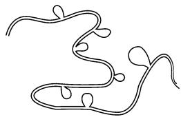

10.21 从某种真核生物分离得到含某一基因的 DNA 片段，把该 DNA 片段与从该生物分离得到的相应 mRNA 混合、变性、复性，然后用电子显微镜观察，观察到附图所示的这种异源双链，该基因包含多少个内含子？

10.22 如果下面显示的 DNA 分子被从左到右转录，mRNA 序列和氨基酸序列是什么？如果粗体所示片段发生倒位，mRNA 序列和氨基酸序列是什么？

$$
\begin{array}{l} 5 ^ {\prime} \text {-AGACTTAGCGCTAAACGTGGT-3^ {\prime}} \\ 3 ^ {\prime} \text {-TCTGAATCGCGATTTGCACCA-5^ {\prime}} \end{array}
$$

10.23 根据作图实验得知，大肠杆菌的 A 和 B 两个基因彼此非常靠近。分离到一个缺失突变，它可去除 A 和 B 两者的活性。在突变体中，既找不到 A 蛋白，也找不到 B 蛋白质，但分离到一种新的蛋白质，其氨基端的 30 个氨基酸与 B 基因产物的氨基端一样，羧基端的 30 个氨基酸与 A 基因产物的羧基端一样。

(a) 如果非转录 DNA 链的方向为 $5' \rightarrow 3'$ ，这两个基因的顺序是 AB 还是 BA？

(b)你能对编码区缺失的碱基数目作出什么推论吗？

10.24 有些 RNA 分子含有彼此互补的序列，可自身折叠，形成双链 RNA 区域，在这些区域中互补碱基配对，这些 “茎-环” 或 “发夹” 二级结构十分稳定。如果此处所示的 RNA 分子形成一个茎-环结构，“环” 由紧靠虚线之前的 5 个碱基构成，在 3' 端需要什么核苷酸来形成茎？

$$
5 ^ {\prime} \text {-UACGGCUUCGAUGACAUGCG\_ -3^ {\prime}}
$$

10.25 研究人员偶然发现一个基因，其编码序列与其蛋白质产物不匹配。在某些情况下，可追查到原因是RNA编辑——转录之后，RNA的某些碱基被化学修饰。这种修饰是由酶进行的。胞嘧啶脱氨酶是这些编辑酶中的一种，它将RNA中的C转变为U。这种编辑发生在植物线粒体、叶绿体及哺乳类载脂蛋白B的RNA转录物中的一些C残基上。考虑此处所示的mRNA序列，它在从左边第一个密码子开始的阅读框中翻译。

$$
5 ^ {\prime} - \text { GUACCACGCUCGUCUCAG-3' }
$$

在此序列中，以粗体显示可被胞嘧啶脱氨酶识别的胞嘧啶。

(a)如果可被识别的胞嘧啶一个也没被修饰，氨基酸序列是什么？

(b)如果可被识别的胞嘧啶全部被修饰，氨基酸序列是什么？

(c) 假设在任一特定 mRNA 分子中, 有 $0 \sim 4$ 个可被识别的胞嘧啶被修饰, 这一部分基因可编码多少种多肽序列?

10.26 另一种 RNA 编辑是由一种腺苷脱氨酶催化，将 A 转变为次黄嘌呤核苷(I)，I 被核糖体当作 G 来翻译。这种 A 到 I 的编辑见于丁型肝炎病毒、哺乳类谷氨酸受体转录物和其他几种系统中。考虑习题 10.25 中的 mRNA，如果该转录物中所有的 A 都发生 A 到 I 的编辑，多肽序列会怎样改变？

10.27 一位分子生物学家发现某一基因似乎有一个 5' 和 3' 剪接位点异常的内含子。相关区域的 DNA 序列如此处所示，其中，点表示已推测出来的部分内含子，内含子的剪接位点未知。

$$
5 ^ {\prime} \text {-CTATACAGCGG...CATTCTGTGGGT-3^ {\prime}}
$$

$$
3 ^ {\prime} \text {-GATATGTCGCC...GTAAGACACCCA-5^ {\prime}}
$$

该 DNA 区域编码氨基酸序列 Ser-Tyr-Met-Trp-Val，不过不知道阅读框。剪接位点可能是什么？

10.28 从某种生物获得的一段 DNA 序列被认为是一个可读框的一部分。既不知道哪条链被转录，也不知道正确的阅读框。能否从该 DNA 序列推断出哪一条链被转录？能否推断出正确的阅读框？

$$
5 ^ {\prime} - C T A G G T G A C C T A G C T T A A - 3 ^ {\prime}
$$

# 3'-GATCCACTGGATCGAATT-5'

10.29 如果在 10.28 题中左边的 C-G 碱基对是 A-T 碱基对，答案会有何改变？

10.30 在某种生物中发现，模板链中的启动子序列为 3'-TTTTT-5'，转录开始于启动子序列后的第一个核苷酸，恰好终止于模板链中的 3'-GGGGGG-5' 序列之前。初级转录物被戴帽，然后直接用作 mRNA，从 5' 端开始扫描而起始翻译。

(a)从下面的 DNA 序列可转录得什么 mRNA 序列?

(b)会产生什么多肽链?

3'-TTTTTATGGTACAGTTTGTCGCATACCATCGTCACGGGGGG-5'

## 挑战题

挑战题 1 在某一基因第二个密码子中有两种不同的移码突变，突变型蛋白质的氨基端序列分别为：

突变体 1: Met-Lys-UAG

突变体 2: Met-Ile-UAA

突变体 1 增加单个核苷酸，突变体 2 缺失单个核苷酸。且已知野生型蛋白质前 5 个氨基酸为 Met-(Asn, Val, Ser, Lys)，括号表示氨基酸顺序未知。用这两个移码突变提供的信息，确定野生型基因的前 5 个密码子，以及每个移码突变的性质。

挑战题 2 发现某种生物的 RNA 聚合酶 II 具有如下特性。

1. 以模板链中的 DNA 序列 3'-TATAATA-5' 作为启动子。

2. 从紧接于启动子后的那个核苷酸开始转录。

3. 转录持续至转录物中出现序列 5'-GGGGG-3'，聚合酶于此处切换到另一条 DNA 链，并继续转录（仍然只在生长链的 3' 端添加核苷酸）。

4. 从模板链转录完 5'-TATATA-3' 后，转录立即终止。

假如该初级转录物被立即戴帽，用作 mRNA，并从 5' 端扫描以起始翻译。

(a) 从此处所示的 DNA 序列会产生什么 mRNA?

(b)得到的多肽链是什么？

5'-CCGTATATATTATGATCAATATGCATGCTCTCGGGGGTCACACT-3'

3'-GGCATATATAATACTAGTTATACGTACGAGAGCCCCCAGTGTGA-5'

挑战题 3 发现某种原核生物具有罕见特性，它的一些 mRNA 分子是环状的，但仍按标准遗传密码来翻译，可用任意 5'-AUG-3' 来起始翻译，对此处所示的环状 mRNA 作如下推断。

(a)野生型多肽链的氨基酸序列。

(b) 红色的 G 被 U 置换后，突变体的氨基酸序列。

(c)在箭头所示位置插入一个 C 后，突变体的氨基酸序列。

(d) 解释为什么 (b) 中的多肽比 (c) 中的长。

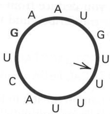

(e) 双重突变体的氨基酸序列。

## 网上遗传学

“网上遗传学”(GeNETics)会为你介绍在互联网上寻找遗传学信息的某些最重要的站点。要浏览这些站点，请访问为《遗传学：基因和基因组分析》(第八版)配备的 Jones and Bartlett 公司配套站点http://biology.jbpub.com/book/genetics/8e/。

在该站点中，你会找到一个按章开列的重点关键词列表。选择某个关键词后，可链接到某个网站，其中包含与此关键词相关的信息。
