# 第11章 基因调节的分子机制

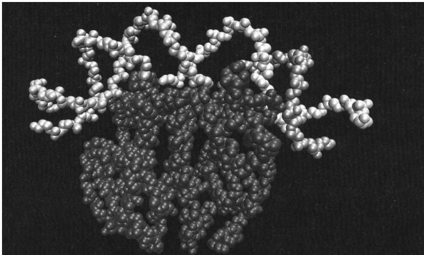

许多启动子必须与基因活化蛋白结合才能被转录。在这个例子中，蛋白质亚基以红色和紫色显示。该蛋白质是一种分解代谢活化蛋白。[©Dr. Tim Evans/Photo Researchers, Inc.]

## 本章提纲

11.1 原核生物的转录调节  
11.2 基因调节的操纵子系统  
11.3 通过转录终止来调节  
11.4 $\lambda$ 噬菌体中的调节  
11.5 真核生物的转录调节  
11.6 转录调节的表观遗传机制  
11.7 通过RNA加工和降解进行调节  
11.8 RNA干扰  
11.9 翻译控制  
11.10 程序性DNA重排  
联系：操纵基因？操作员？

弗朗索瓦·雅各布、戴维·佩林、卡门·桑切斯和雅克·莫诺，1960

操纵子: 由一个操纵基因协同表达的一组基因(原文为法文)

## 联系：祸不单行

安德鲁·法尔、徐思群、玛丽·蒙哥马利、史蒂文·科斯塔斯、塞缪尔·德赖弗和克雷格·梅洛，1998

秀丽隐杆线虫中双链 RNA 强大而特异的遗传干扰

## 学习目标与科学能力

理解本章所讨论的基因调节的分子机制，将具备如下科学能力。

■ 能指出负转录调节机制和正转录调节机制的差异。

\- 能叙述乳糖操纵子的负调节机制和正调节机制，并能推断阻遏蛋白、操纵基因、启动子和结构基因等不同类型突变体的表型。

■ 能陈述 RNA 二级结构在弱化子或核糖开关终止转录中的作用。

\- 能解释 GAL4、GAL80 和 GAL3 在酵母乳糖基因转录调节中的作用，并能推断不同类型突变体的调节表型。

\- 能描述 siRNA 和 microRNA 分子在基因表达调节上的作用。

\- 能给转录调节的“表观遗传”下定义，并指出与表观遗传改变相关的 DNA 和染色质修饰的主要类型。

人类及其他脊椎动物包含约 220 种功能特化的细胞类型。它们的差异与基因表达模式相关，因为大部分基因的表达水平，因细胞类型或细胞周期而异。基因的活性也是细胞功能的关键，例如，血红蛋白基因仅在红细胞前体中高水平表达。对特定基因产物的合成的控制称为基因调节 (gene regulation)。

在许多情况下，基因活性是在转录水平上进行调节，或通过细胞自身内部产生的信号进行调节，或通过应答外部环境而产生的信号进行调节。例如，许多基因产物只是偶尔需要，则其转录可通过开-关方式调节，使得此类产物能够在外部环境需要时才出现。遗传信息的流动也可通过其他方式调节。基因表达的控制点包括以下几个方面。

1. 转录调节(transcriptional regulation)：通过控制起始或终止，对 RNA 转录物的合成进行转录调节。

2. RNA 加工 (RNA processing): 通过 RNA 剪接或可变剪接方式进行调节。

3. 翻译调节(translational control): 多肽合成的翻译调节。

4. mRNA 稳定性 (stability of mRNA): mRNA 的稳定性可起调节作用，是因为持续存在于细胞中的 mRNA，比那些快速降解的 mRNA 具有更持久的效应。

5. 翻译后控制(posttranslational control): 影响酶活性、活化和稳定性等, 包括大量的机制。

6. DNA 重排 (DNA rearrangement): 基因表达随 DNA 序列在基因组中的位置而改变。

原核生物和真核生物的调节系统在许多细节上具有差异。原核生物一般是自由生活的单细胞生物，只要环境条件适合、营养供给充足，它们就能够生长和无限地分裂。它们的调节系统往往是为在特定环境中能够达到最大生长速度而打造的。与此相比，在多细胞生物的发育过程中，当细胞遭遇剧烈的、必须相互协调的形态和代谢分化时，细胞会调整它们的生长速度。在成年动物中，大部分类型的细胞已停止生长和分裂，每种细胞都要一直维持各自的身份。

## 11.1 原核生物的转录调节

在细菌和噬菌体中，开-关型基因活性常常是由转录控制的。在需要某种基因产物的条件下，该基因的转录“打开”；在其他条件下，转录“关闭”。“关”这个字眼不能从字面意思来理解，在细菌中，很少有系统被完全关闭的例子。当转录在“关”的状态时，基因表达几乎总会保持一个基础水平，往往平均每代细胞有一次或少数几次转录事件，因此，“关”的真正意思是，存在基因产物的非常少的合成。极低水平的表达也见于真核生物的某些基因类型中，包括许多参与胚胎发育的基因。在原核生物和真核生物中，都已知存在开-关型之外的调节机制，在这些机制中，可以根据细胞内的情况，将基因表达水平调整到从高到低的各个层次上。

在细菌的系统中，当单个代谢途径中几个酶依次发挥作用时，这些酶通常要么全部产生，要么一个也不产生。这种协同调节 (coordinate regulation) 是对编码所有在同一代谢途径中起作用的基因产物的一个或多个多顺反子 mRNA 的合成进行控制所导致的。在真核生物中没有发现这种调节方式，因为，正如在第 10 章中所见，真核生物 mRNA 是单顺反子。

## - 负调节的诱导系统和阻遏系统

通常将调节的分子机制分成两大类：负调节和正调节。受负调节(negative regulation)支配的系统(图 11.1A)，缺省状态为“开”，转录一直进行，直到与转录起点上游结合的阻遏蛋白(repressor protein)将其“关闭”为止。负调节系统可以是诱导型的(图 11.1B)或阻遏型的(图 11.1C)，取决于如何形成有活性的阻遏蛋白。

在诱导型转录(inducible transcription)中，阻遏 DNA 结合蛋白通常将转录保持在 “关” 的状态。在存在一种称为诱导物(inducer)的小分子的情况下，阻遏蛋白优先与诱导物结合，从而

## (A) 转录的负调节

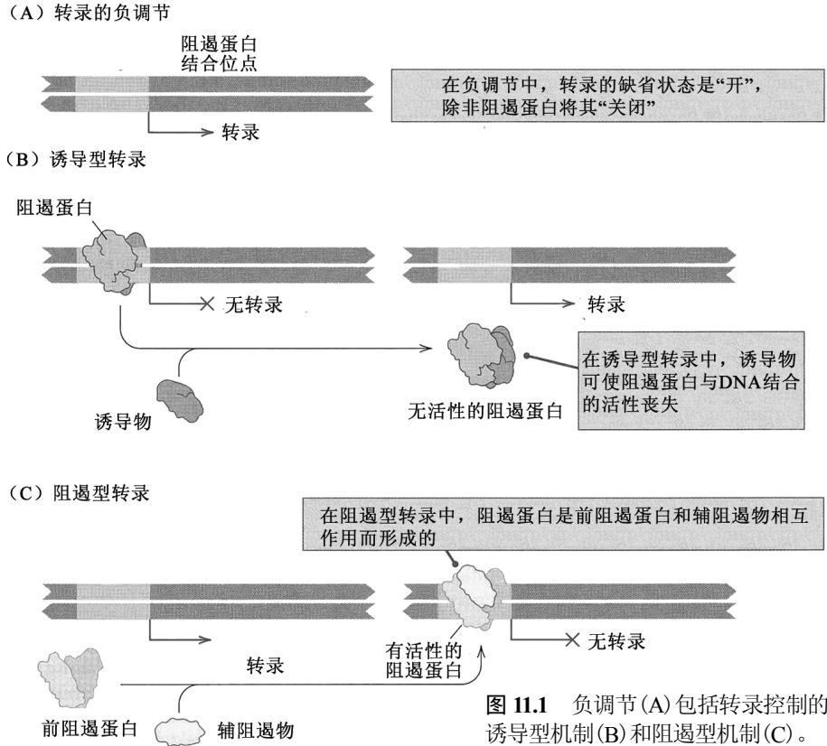

失去其 DNA 结合能力，使转录得以发生。许多降解(异化)途径是诱导型的，以降解途径的初始底物为诱导物。以这种方式，除非在细胞中存在底物，否则降解所用的酶不被合成。

在阻遏型转录（repressible transcription）中（图11.1C），缺省状态为“开”，直到有活性的阻遏蛋白形成，将其“关闭”。在此情况下，调节蛋白称为前阻遏蛋白(aporepressor)，

它本身并没有 DNA 结合活性。能与 DNA 结合的有活性的阻遏蛋白，是前阻遏蛋白与一种称为辅阻遏物 (corepressor) 的小分子结合而形成的，因而，辅阻遏物的存在导致转录停止。阻遏型调节多见于参与生物合成 (同化) 途径的酶的合成的控制，在这些情况下，途径的终产物常常是辅阻遏物。以此方式，直到终产物的浓度变得低到不能引起抑制时，生物合成途径的酶才被合成。

## ■ 正调节

请注意，在负调节中(图 11.1A)，转录的缺省状态是“开”，因而需要阻遏蛋白来使其“关闭”。将其与正调节系统相比较(图 11.2)，在正调节系统中，缺省状态是“关”，因而需要与调节蛋白结合以使其“打开”，此类调节蛋白称为转录激活蛋白(transcriptional activator protein)。负调节和正调节并不相互排斥，有些系统利用两种调节物来对细胞中的不同情况进行应答，即是正调节的又是负调节的。在原核生物中，负调节比较常见；在真核生物中，正调节比较常见。

有些基因表现为自调节 (autoregulation)，意思是，基因的蛋白质产物调节其自身的转录。在

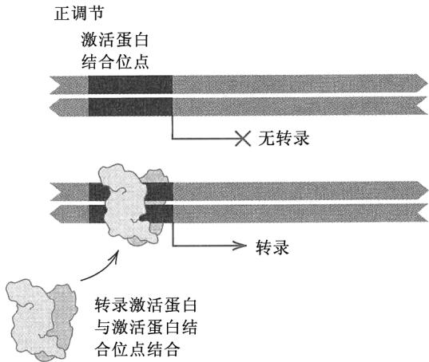  
图 11.2 在正调节中，转录的缺省状态为 “关”。转录因转录激活蛋白的结合而激发。

负向自调节中，蛋白质抑制转录，蛋白质的高浓度导致 mRNA 转录减少，该机制自动调整细胞中蛋白质的稳态水平。在正向自调节中，蛋白质刺激转录，当产生的蛋白质较多时，转录增加到最大速度。正向自调节是放大微弱诱导作用的一种常用方法，只需要微弱的信号来启动蛋白质的产生，随后即由正向调节接管，刺激进一步的蛋白质生产，以达到最大水平。

接下来考察在大肠杆菌中发现的两个经典的调节系统。在图 11.1 和 11.2 中，它们被当作两个一般概念的具体例子予以介绍。我们会看到，在真实世界中，大部分基因具有正调节和负调节因素都包括的交错控制机制。

## - 基因表达的随机噪声

大多数基因调节机制都具有多个层次，一个层次的控制与另一个层次重叠。但是，完全可靠的控制是难以实现的，主要原因是分子过程内在的不可预见性(即噪声)，特别是当分子数目很少的时候(调节分子正是分子数目少的典型情况)。每个基因都容易时而出现 RNA 转录物的突然增多，接着就是 mRNA 被翻译而使蛋白质突然增多，这种基因表达的随机爆发称为随机噪声(stochastic noise)，在原核生物细胞和真核生物细胞的所有发育阶段都会出现。

一定水平的随机噪声是不可避免的。理论模型显示，随机噪声水平降至原来的 1/x，调节分子的数目需增加 $x^{4}$ 倍。换句话说，噪声减少 1/2，需增加 16 倍的调节分子，噪声减至原来的 1/4，需增加 256 倍的调节分子。

在大肠杆菌及出芽酵母细胞中，已对随机噪声进行了广泛的研究。在这些研究所使用的细胞株中，将单个蛋白质与荧光多肽融合，使极低水平的随机噪声也能被发现。在大肠杆菌的所有蛋白质中，约有一半是以每个细胞10～1000个分子的水平产生的，并且从一个细胞到另一个细胞，这些蛋白质的变化大约为30%。随机噪声对于低水平表达的蛋白质的影响更为显著。对于以平均每个细胞1～0.01个分子产生的蛋白质，基因表达的变化平均为1～10倍。

细胞可能会依赖随机噪声来探查不同的生理状态，或协调成群基因的表达，尽管这看起来可能有点奇怪，但这样的机制确实进化出来了。在下一节中，会看到大肠杆菌细胞如何利用随机噪声来应答在其环境中出现的营养物质的例子。

## 11.2 基因调节的操纵子系统

基因调节首先在大肠杆菌负责乳糖降解的系统中得到详细研究，基因调节的一些主要特点最初就是在该系统中发现的，该系统是负调节的经典例子，其中，转录是诱导型的(图 11.1B)。

最近，基因组测序揭示了大肠杆菌中利用乳糖的基因实际上是在 DNA 的一个基因组岛(大小约 5kb)中，这是在 9.1 节讨论过的类型。现在已经了解这些乳糖基因的 DNA 序列，并知道在亲缘关系很近的细菌种类中，缺乏这些基因。根据这些，我们知道这些基因是在至少 5 千万年前，从一个未知来源转移到大肠杆菌基因组中的。从大约 1 亿年前，大肠杆菌与其最近的细菌近亲趋异以来，已有至少 234 个此类基因组岛插入大肠杆菌基因组中，乳糖基因组岛只是其中之一。

首次对调节机制的洞察，来自对影响乳糖代谢的突变的遗传分析。下节将叙述这些突变的性质，以及对它们进行分析后形成的解释。根据这些突变体推论得出的调节机制，已被直接的分子生物学研究充分证实。

## - Lac $^{-}$ 突变体

在大肠杆菌中，乳糖的代谢需要两种蛋白质，它们是 $\beta$ -半乳糖苷酶( $\beta$ -galactosidase)——将乳糖(一种 $\beta$ -半乳糖苷)分解成半乳糖和葡萄糖的酶，和乳糖通透酶(lactose permease)——乳糖进入细胞所需的转运分子。在乳糖利用系统中存在两种不同的蛋白质，最初是结合遗传实验和生化分析来证明的。

首先，分离到数以百计的不能将乳糖作为碳源的突变体(称为 $Lac^{-}$ )。这些突变，有些在大肠杆菌染色体上，另外的在 $F^{\prime}lac$ 质粒上， $F^{\prime}lac$ 是携带乳糖利用基因的一种质粒。研究人员通过 $F^{\prime}\times F^{-}$ 杂交，构建出基因型为 $F^{\prime}lac^{-}/lac^{+}$ 和 $F^{\prime}lac^{+}/lac^{-}$ 的部分二倍体(质粒的基因型在斜杠的左边，染色体的基因型在右边)。观察发现，所有这些二倍体总是具有 $\mathrm{Lac}^{+}$ 表型(就是说，它们生产 $\beta$ -半乳糖苷酶和通透酶)，因此，这些菌株都没有产生阻止 lac 基因发挥功能的抑制因子。于是，又构建了 F'lac 质粒和染色体两者都携带 lac-等位基因的部分二倍体。检测这些菌株的 $\mathrm{Lac}^{+}$ 表型，结果发现，最初分离得到的所有突变体可分成两个互补群——lacZ 和 lacY，该结果表明 lac 系统至少包括两个基因。具体而言，部分二倍体

# F'lacZ lacY $^{+}$ /lacZ $^{+}$ lacY $^{-}$ 和 F'lacZ $^{+}$ lacY $^{-}$ /lacZ $^{-}$ lacY $^{+}$

具有 $Lac^{+}$ 表型(互补)，β-半乳糖苷酶和通透酶都产生。而基因型

$$
\mathrm{F} ^ {\prime} \text {lacZ} \text {lacY} ^ {+} / \text {lacZ} \text {lacY} ^ {+} \text {和} \mathrm{F} ^ {\prime} \text {lacZ} ^ {+} \text {lacY} ^ {-} / \text {lacZ} ^ {+} \text {lacY} ^ {-}
$$

具 Lac $^{-}$ 表型(不互补)。F'lacZ $^{-}$ lacY $^{+}$ /lacZ $^{-}$ lacY $^{+}$ 细胞不能合成 β-半乳糖苷酶，因此，lacZ 基因编码 β-半乳糖苷酶；而 F'lacZ $^{+}$ lacY $^{-}$ /lacZ $^{+}$ lacY $^{-}$ 细胞不能合成通透酶，因而 lacY 编码通透酶(后来发现还有第三个基因，编码 β-半乳糖苷转乙酰基酶。在早期的突变体中不包括该基因，因为它对于在乳糖上生长不是必需的)。最后一个重要结果——lacZ 和 lacY 基因毗邻——是根据遗传作图实验中观察到的高频率的共转导而推断的。

## - 诱导型和组成型的合成和阻遏

乳糖利用系统的开-关的本质被如下观察结果证明。

1. 如果在不含乳糖或其他任何 $\beta$ -半乳糖苷的培养基中培养 $Lac^{+}$ 大肠杆菌， $\beta$ -半乳糖苷酶和通透酶的胞内浓度极低，每个细菌细胞 1～2 个分子。但是，如果在培养基中存在乳糖，这两种酶分子的数目要高出大约 1000 倍。

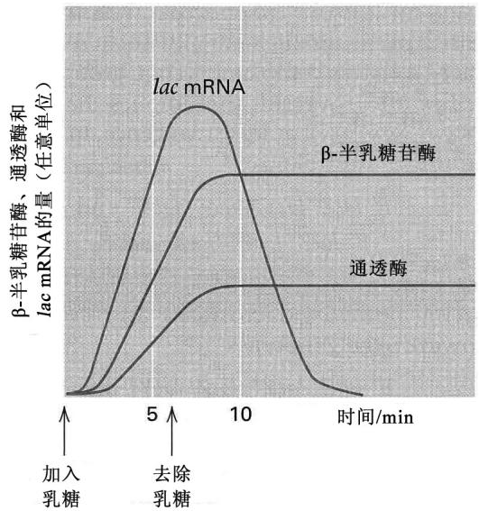  
图 11.3 lac 系统 “开-关” 的本质。乳糖或其他诱导物加入后，很快出现 lac mRNA； $\beta$ -半乳糖苷酶和通透酶几乎同时出现，但比 mRNA 的合成要晚，因为翻译需要时间。去除乳糖时，不再产生 lac mRNA，因为已经存在的 mRNA 的降解，lac mRNA 的数量下降。 $\beta$ -半乳糖苷酶和通透酶两者都是稳定的蛋白质。甚至在合成停止时，它们的量仍维持不变。不过，由于反复的细胞分裂，它们在每个细胞中的浓度逐渐下降。

2. 在缺乏乳糖的培养基(也缺乏葡萄糖，很快会讨论这点)中培养的 $Lac^{+}$ 培养物，如果添加乳糖，则 $\beta$ -半乳糖苷酶和通透酶两者几乎同时合成，如图11.3所示。对加入乳糖之前和之后细胞中的总mRNA进行分析，证明在加入乳糖之前几乎不存在lac mRNA(编码 $\beta$ -半乳糖苷酶和通透酶的多顺反子mRNA)，而乳糖的加入激发了lac mRNA的合成。

从这两个观察结果得出结论: 乳糖基因的转录是诱导型的, 且乳糖(或乳糖的某种衍生物)是诱导物。乳糖的一些类似物也是诱导物, 如 IPTG(异丙基硫代半乳糖苷, 一种含硫的乳糖类似物), IPTG 这种人工合成的诱导物用于实验很方便, 因为它可诱导 β-半乳糖苷酶, 却不被 β-半乳糖苷酶分解, 所以, 无论存不存在 β-半乳糖苷酶, IPTG 在细胞中的水平是稳定的。

理解诱导的关键，来自具有调节缺陷的突变体。在一类调节型突变体中，甚至在缺乏诱导物的情况下，lac mRNA 也会合成。因为这些突变体稳定地合成 lac mRNA，它们被称为组成型 (constitutive) 突变体。组成型突变体分成两类：lacΓ 和 lacO $^{C}$ 。还获得了即使存在诱导物也不能产生 lac mRNA 的突变体，这些不可诱导的突变体也分成两类： $lacI^{S}$ 和 $lacP^{-}$ 。上述突变体的特点见表 11.1，在后面几节中会对它们进行讨论。

## ■ 阻遏蛋白、操纵基因和启动子

在表 11.1 中，基因型 3 和 4 表明 lacI 突变是隐性的。在缺乏诱导物的情况下，lacI $^{+}$ 细胞不合成 lac mRNA，而在 lacI 突变体中，mRNA 合成。这些结果表明：

lacI 基因是一个调节基因，其产物是使系统保持关闭的阻遏蛋白。因关闭 mRNA 的合成需要该阻遏蛋白，所以该阻遏蛋白的调节是负调节。

lacI 阻遏蛋白如何与 DNA 结合并阻止 lac mRNA 的合成？lacI 突变体缺少阻遏蛋白，因而转录是组成型的，在 $lacI^{+}/lacI^{-}$ 部分二倍体中存在阻遏蛋白基因的野生型拷贝，所以转录

表 11.1 含 lacI、lacO 和 lacP 等位基因几种组合的部分二倍体的特点

<table><tr><td>基因型</td><td> $LacZ^{+}$ mRNA 的合成</td><td>Lac 表型</td></tr><tr><td> $1.F' lacO^{C} lacZ^{+}/lacO^{+} lacZ^{+}$ </td><td>组成型</td><td>+</td></tr><tr><td> $2.F' lacO^{+} lacZ^{+}/lacO^{C} lacZ^{+}$ </td><td>组成型</td><td>+</td></tr><tr><td> $3.F' lacI^{-} lacZ^{+}/lacI^{+} lacZ^{+}$ </td><td>诱导型</td><td>+</td></tr><tr><td> $4.F' lacI^{+} lacZ^{+}/lacI^{-} lacZ^{+}$ </td><td>诱导型</td><td>+</td></tr><tr><td> $5.F' lacO^{C} lacZ^{-}/lacO^{+} lacZ^{+}$ </td><td>诱导型</td><td>+</td></tr><tr><td> $6.F' lacO^{C} lacZ^{+}/lacO^{+} lacZ^{-}$ </td><td>组成型</td><td>+</td></tr><tr><td> $7.F' lacI^{S} lacZ^{+}/lacI^{+} lacZ^{+}$ </td><td>不可诱导型</td><td>-</td></tr><tr><td> $8.F' lacI^{+} lacZ^{+}/lacI^{S} lacZ^{+}$ </td><td>不可诱导型</td><td>-</td></tr><tr><td> $9.F' lacP^{-} lacZ^{+}/lacP^{+} lacZ^{+}$ </td><td>诱导型</td><td>+</td></tr><tr><td> $10.F' lacP^{+} lacZ^{+}/lacP^{-} lacZ^{+}$ </td><td>诱导型</td><td>+</td></tr><tr><td> $11.F' lacP^{+} lacZ^{-}/lacP^{-} lacZ^{+}$ </td><td>不可诱导型</td><td>-</td></tr><tr><td> $12.F' lacP^{+} lacZ^{+}/lacP^{-} lacZ^{-}$ </td><td>诱导型</td><td>+</td></tr></table>

被抑制。关键是要注意到单个 lacI $^{+}$ 基因对 F'质粒和染色体两者的 lac mRNA 合成均阻止。因而，阻遏蛋白在细胞内一定是可以扩散的，因为它能够使存在于部分二倍体中两个 DNA 分子上的 mRNA 合成都关闭。遗传作图实验将 lacI 基因定位到与 lacZ 基因非常靠近的位置，证实基因顺序为 lacI lacZ lacY。

再查看一下表 11.1，基因型 7 和 8 表明 $lacI^{S}$ 突变为显性，无论是否存在诱导物都起关闭 F' 质粒和染色体的 mRNA 合成的作用 [在 $lacI^{S}$ 中，上标表示超阻遏 (super-repressor)]。 $lacI^{S}$ 突变导致阻遏蛋白分子不能识别和结合诱导物，因而，即使在存在诱导物的情况下，也可抑制 lac mRNA 合成。

表 11.1 中的第 1、2 项表明 $lacO^{C}$ 突变体是显性的。不过，这种显性只在 lac 突变的某些组合中明显，考察第 5、6 项所示的部分二倍体，就可见到这种情况，这两个组合都是 $Lac^{+}$ ，因为存在一个有功能的 lacZ 基因。但是，在第 5 项所示的组合中，即使存在 $lacO^{C}$ 突变，β-半乳糖苷酶的合成也是诱导型的。不同之处在于，在第 5 项中， $lacO^{C}$ 突变与 $lacZ^{-}$ 突变在同一个 DNA 分子上，而在第 6 项中， $lacO^{C}$ 突变与 $lacZ^{+}$ 包含于同一个 DNA 分子上。这些结果的主要特点是：

仅当 $lacO^{C}$ 与 $lacZ^{+}$ 在同一个 DNA 分子上时， $lacO^{C}$ 突变才引起 $\beta$ -半乳糖苷酶的组成型合成。

$lacO^{C}$ 突变被说成是顺式显性(cis-dominant)突变，因为只有顺式构型(在含突变的同一个DNA分子中)的基因才以显性方式表达。对该结论的证实来自一个重要的生化观察结果：来自lacZ序列的突变型的酶，在 $lacO^{C}$ lacZ/lacO $^{+}$ lacZ $^{+}$ 部分二倍体(第5项)中被组成型合成，而野生型的酶(由 $lacZ^{+}$ 序列编码)只有加入诱导物才合成。所有的 $lacO^{C}$ 突变都位于lacI和lacZ基因之间，因而，lac系统的4个遗传元件的基因顺序为

$$
l a c I l a c O l a c Z l a c Y
$$

$lacO^{C}$ 突变的一个重要特点是，它们不能被互补(所有顺式显性突变的一个特点)，就是说， $lacO^{+}$ 等位基因不能改变 $lacO^{C}$ 突变的组成型活性。这一观察结果表明，lacO区不编码扩散性产物，它必定是DNA上的一个位点，它决定毗邻的lacZ基因的产物的合成是诱导型还是组成型。该lacO区称为操纵基因(operator)。在下一节会看到，操纵基因实际上是阻遏蛋白在DNA上的结合位点。

表 11.1 中的第 11、12 项说明，lacP $^{-}$ 突变像 lacO $^{C}$ 突变一样是顺式显性。这种顺式显性可

(A)  
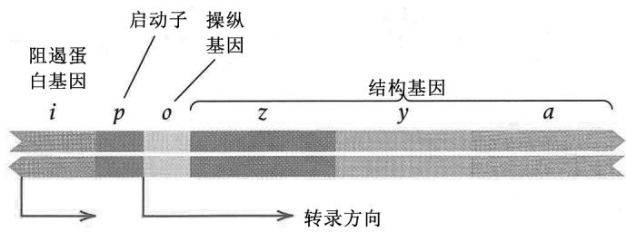

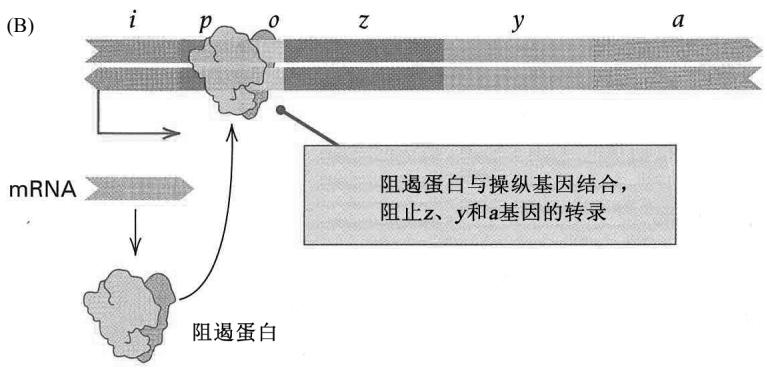

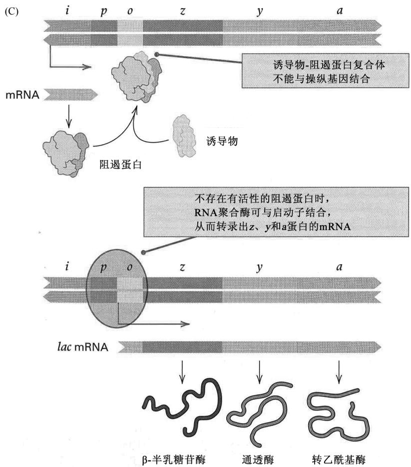  
图 11.4 (A) 乳糖操纵子图谱，未按比例绘制。p 位点和 o 位点实际上比其他区小得多，两者加起来只有 83bp。(B) 阻遏状态下的乳糖操纵子。(C) 诱导状态下的乳糖操纵子。诱导物改变阻遏蛋白的形状，使阻遏蛋白不再与操纵基因结合。用 i、p、o、z、y 和 a 等常用缩写来代替 lacI、lacO 等。对乳糖利用而言，lacA 基因并不是必需的。

从第 12 项的部分二倍体中看出。第 11 项的基因型是不可诱导型，与此相比，第 12 项的部分二倍体是诱导型。这两种基因型之间的差异是，在第 11 项中，lacP $^{-}$ 突变与 lacZ $^{+}$ 在同一个 DNA 分子中，而在第 12 项中，lacP $^{-}$ 突变与 lacZ $^{-}$ 突变组合。这一观察结果意味着，lacP $^{-}$ 突变的存在使毗邻的基因变成不可诱导型。lacP $^{-}$ 突变阻止顺式位置的野生型 lacZ $^{+}$ 基因被转录。lacP $^{-}$ 突变的位置在 lacI 和 lacO 之间，因而 lac 系统的 5 个遗传元件的顺序为

## lacI lacP lacO lacZ lacY

正如所料，因为 lacP $^{-}$ 突变的顺式显性，它们不能被互补，就是说，在另一个DNA分子上的 lacP $^{+}$ 等位基因，不能弥补这一个携带 lacP $^{-}$ 突变的 DNA 分子所缺失的功能。因此，就像 lacO 一样，lacP 一定是一个决定 lac mRNA 的合成是否进行的位点，该 lacP 区称为启动子 (promoter)。实际上，它就是 DNA 中 RNA 聚合酶结合以起始转录的位点。

## - 转录调节的操纵子系统

弗朗索瓦·雅各布和雅克·莫诺的操纵子模型最先阐明了 lac 系统的遗传调节机制，之前讨论过这两个人进行的开拓性研究。操纵子模型 (operon model) 如图 11.4 所示 (该

图用缩写 i、o、p、z、y 和 a 来表示 lacI、lacO、lacP、lacZ、lacY 和 lacA)。操纵子模型具有如下特点。

1. 乳糖利用系统由两类成分构成：结构基因(lacZ 和 lacY)——编码乳糖分解和转运所需的蛋白质，和调节元件(阻遏蛋白基因 lacI、启动子 lacP 和操纵基因 lacO)。

2. lacZ 和 lacY 基因的产物由单个多顺反子 mRNA 分子编码(由 lacA 编码的第三个蛋白质也是该 mRNA 翻译的，该蛋白质为转乙酰基酶，它用于乳糖之外的某些 $\beta$ -半乳糖苷代谢中，此处不再关注)。这两个连锁的结构基因，与 lacP 和 lacO 一起，构成乳糖操纵子(lac operon)。

3. 启动子突变 $(lacP^{-})$ 使 lac mRNA 不能合成。

4. lacI 基因的产物是阻遏蛋白, 阻遏蛋白与 DNA 中构成阻遏蛋白结合位点的核苷酸序列结合, 阻遏蛋白结合位点称为操纵基因。

5. 当阻遏蛋白与操纵基因结合时，由 RNA 聚合酶进行的 lac mRNA 转录的起始被阻止。

6. 诱导物通过与阻遏蛋白结合并使其失活，激发 mRNA 合成。在诱导物存在的情况下，操纵基因不被阻遏蛋白结合，因而启动子可被用来起始 mRNA 合成。

注意，操纵子的调节要求 lacO 操纵基因与结构基因的启动子要么重叠，要么毗邻，以便操纵基因与阻遏蛋白的结合能够阻止转录。lacI 和 lacO 的邻近并非完全必要，因为 lacI 阻遏蛋白是可溶性蛋白质，可在整个细胞中扩散。诱导物的存在对阻遏蛋白的 DNA 结合特性有巨大影响，诱导物-阻遏蛋白复合体对操纵基因的亲和力为阻遏蛋白单独对操纵基因的亲和力的 $1/10^{3}$ 。

当操纵子被诱导时， $\beta$ -半乳糖苷酶、通透酶和转乙酰基酶的拷贝数比例是 $1.0:0.5:0.2$ 。这些比例上的差异，部分是由于在 mRNA 中基因的顺序：当上游的顺反子翻译完成后，存在不能重新起始的问题，使下游顺反子被翻译的可能性变小。

## ■ 乳糖表达的随机噪声

关于乳糖操纵子，学生常常会问的一个问题是，在乳糖操纵子被阻遏的细胞中，乳糖是如何进入细胞的，因为乳糖的转运需要乳糖通透酶。答案是：大肠杆菌靠基因表达的随机噪声，让一些细胞能够随时利用培养基中的乳糖。对乳糖操纵子而言，细胞每5～10代发生一次mRNA和蛋白质表达的随机爆发，平均每次爆发产生大约40个乳糖通透酶分子，通过细胞分裂，这些分子在子细胞中被逐次稀释成平均20个、10个、5个……。在稳定状态下，在完全阻遏条件下，由于随机噪声，大约35%的细胞具有1个或多个乳糖通透酶分子，这些细胞可将乳糖转运进细胞中，通过正反馈诱导操纵子，立即对环境中乳糖的增加作出应答，因此，这种细胞应答是“全或无”式的应答。缺乏通透酶的细胞在开始乳糖利用之前，必须发生表达的随机爆发。

## ■ 乳糖操纵子的正调节

基因调节的机制往往是多层次的，乳糖操纵子的调节也不例外。乳糖操纵子除了被乳糖负调节外，还受到葡萄糖的正调节。葡萄糖是大肠杆菌的碳和能量的首选来源，在培养基中葡萄糖和乳糖都存在时，即使是在lacI突变体中，也要等培养基中所有的葡萄糖几乎都已经耗尽时，乳糖操纵子的转录才会发生。这一观察结果揭示了第二种水平的乳糖操纵子调节——对葡萄糖的浓度作出应答。

葡萄糖对乳糖操纵子的抑制作用是间接的，要以小分子环腺苷一磷酸(cAMP)为中介(图 11.5)。cAMP 由腺苷酸环化酶

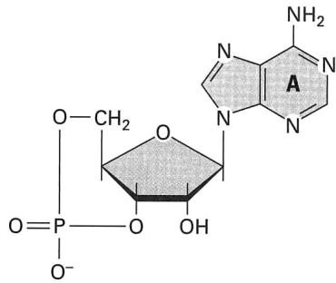  
图 11.5 cAMP 的结构。

(adenylate cyclase)合成，cAMP的浓度受葡萄糖代谢间接调节。当细菌在含葡萄糖的培养基上生长时，细胞中的cAMP浓度相当低。在含甘油(或任何其他不以糖酵解途径进行代谢的碳源)

表 11.2 细胞中的 cAMP 浓度, 细胞培养于含所示碳源的培养基中

<table><tr><td>碳源</td><td>cAMP 浓度</td></tr><tr><td>葡萄糖</td><td>低</td></tr><tr><td>甘油</td><td>高</td></tr><tr><td>乳糖</td><td>高</td></tr><tr><td>乳糖+葡萄糖</td><td>低</td></tr><tr><td>乳糖+甘油</td><td>高</td></tr></table>

行正常水平的转录，该复合体必须与 lac 启动子区的 DNA 结合（图 11.6）。对 cAMP-CRP 的需要，不受 lacI 阻遏系统支配，因为即使在 lacI 或 lacO $^{C}$ 突变体中，crp $^{-}$ 突变体和腺苷酸环化酶突变体都不能产生正常数量的 lac mRNA。与负向调节乳糖操纵子的阻遏蛋白不同，cAMP-CRP 复合体正向调节该操纵子。

用纯化的 lac DNA、lac 阻遏蛋白、cAMP-CRP 和 RNA 聚合酶进行体外实验，进一步证实以下两点。

1. 在缺乏 cAMP-CRP 复合体的情况下, RNA 聚合酶只与启动子微弱地结合, 但当 cAMP-CRP 也与该 DNA 结合时, 会促进 RNA 聚合酶的结合。RNA的培养基中，或在细菌急需能量来源时，cAMP 的浓度较高(表11.2)。葡萄糖水平促进细胞中 cAMP 浓度的调节，而 cAMP 调节乳糖操纵子以及其他几种控制降解代谢途径的操纵子的活性。

大肠杆菌和许多其他的细菌种类含有一种蛋白质——由crp基因编码的cAMP受体蛋白(cyclic AMP receptor protein, CRP)。在crp基因或腺苷酸环化酶基因中的突变会使lac mRNA的合成急剧减少，这说明CRP蛋白和cAMP两者都是lac mRNA合成必需的。CRP和cAMP相互结合形成复合体（以cAMP-CRP表示)，该复合体起转录激活因子的作用，为了进

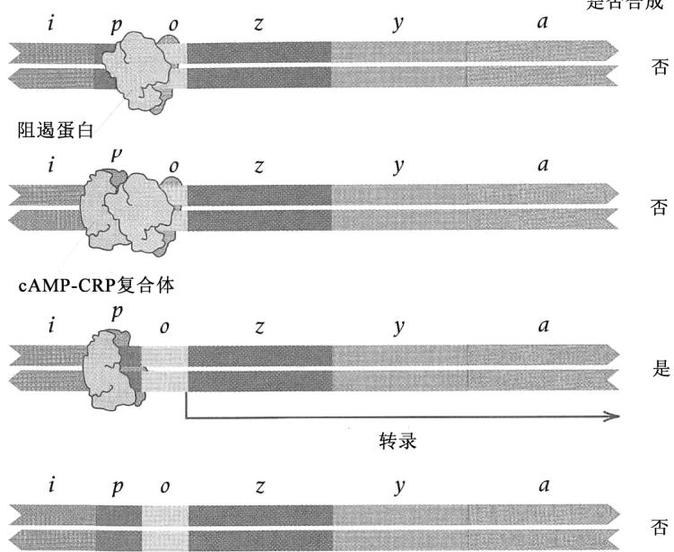  
图 11.6 乳糖操纵子的 4 个调节状态。只有存在 cAMP-CRP 且不存在阻遏蛋白时，lac mRNA 才合成。

聚合酶只与启动子微弱结合时，几乎不会引起转录起始，因为在 RNA 聚合酶和启动子之间没有出现正确的相互作用。

2. 如果阻遏蛋白与操纵基因结合，则 RNA 聚合酶不能稳定地与启动子结合。

这些结果解释了乳糖和葡萄糖如何一起发挥调节乳糖操纵子转录的作用。这些元件的相互关系，以及它们与转录起始及与该区域中碱基序列的关系，如图 11.7 所示。

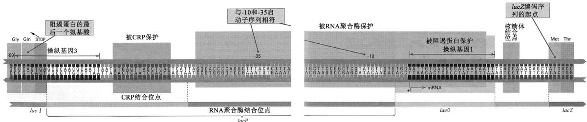  
图11.7 乳糖操纵子调节区的核苷酸序列，示与不同蛋白质结合而不被DNase消化的区域。lacI基因的末端显示于最左边；核糖体结合位点是核糖体与lac mRNA结合的位点。CRP结合位点和RNA聚合酶结合位点沿底部显示。以不同颜色标示代表碱基的标签，以使其与图11.8一致。

关于乳糖操纵子调节状态的三维结构，已了解不少。图 11.8 示阻遏蛋白(紫色)如何与两个操纵基因区结合，以形成将 CRP 蛋白(深蓝色)结合位点包含在内的环。图 11.8 所示的 DNA 区域，相当于图 11.7 中从操纵基因 3 开始延伸到操纵基因 1 的区域。在图 11.7 中用来代表碱基的标签，以不同颜色表示，以便和图 11.8 中的颜色相一致。图 11.8 中红色的 DNA 区域，右边相当于操纵基因 1，左边相当于操纵基因 3。lac 阻遏蛋白四聚体(紫色)与这两个位点结合。DNA 环由阻遏蛋白的两个结合位点之间的区域形成，其中包括 CRP 蛋白(深蓝色)结合的 CRP 结合位点(中蓝色)。绿色的两个 DNA 区域是 lacP 启动子中的-10 位点和-35 位点。在图 11.8 的构型中，乳糖操纵子不被转录。阻遏蛋白的去除可使环打开，从而使转录得以发生。

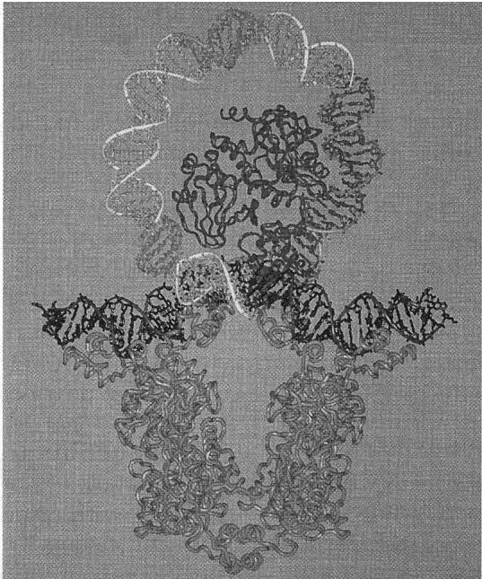

乳糖操纵子的 DNA 序列显示, 存在 3 段操纵基因序列。操纵基因序列 1 和 3 如图 11.7 所示, 而操纵基因 2 位于深入 lacZ 编码区内 400 个核苷酸处。这 3 个操纵基因具有非常不同的阻遏蛋白结合效率: 操纵基因 1 和操纵基因 2 (在 lacZ 基因内部的那个) 与阻遏蛋白结合的亲和力高, 而操纵基因 3 结合的亲和力只有其他两个的大约一半。因而, 该操纵子最常见的阻遏状态, 是操纵基因 1 和 2 以与图 11.8 中类似的结构与阻遏蛋白结合,图 11.8 乳糖操纵子阻遏环的结构。以紫色显示的 lac 阻遏蛋白，与两个 DNA 区域(红色)结合，这两个区包括图 11.7 中所示的对称的操纵基因区，和紧靠 CRP 结合位点上游的第二个区。环内为 CRP 结合位点(中蓝色)，示其与 CRP 蛋白(深蓝色)结合。-10 和 -35 启动子区以绿色表示。[转载自 M. Lewis, et al., Science 271(1996):1247-1254. 经 AAAS 许可转载。]

但上面的环要长得多的一种状态。转录的完全阻遏需要所有3个操纵基因。雅各布和莫诺的经典遗传实验只鉴定出操纵基因1，事实上它只占全部阻遏的大约 $3\%$ 。尽管如此，这 $3\%$ 已经足够他们进行开拓性的遗传分析，最终使他们在1965年获得诺贝尔生理学或医学奖。

联系：操纵基因？操作员？

弗朗索瓦·雅各布、戴维·佩林、卡门·桑切斯和雅克·莫诺，1960

巴斯德研究所，巴黎，法国

操纵子：由一个操纵基因协同表达的一组基因(原文为法文)

基因表达是被如何控制的？在雅各布和莫诺及其合作者设法用实验来解决这个问题之前，完全是凭猜测。在这篇报道之前，研究人员们事先已经发现了控制乳糖利用所需基因——β-半乳糖苷酶(z)和通透酶(y)基因——表达的 $i(lacI)$ 基因。他们也已经有充分的理由相信，lacI产生一种调节蛋白。这种调节蛋白是如何发挥作用的？在这里，他们提供的证据表明，该调节蛋白通过直接与毗邻它所调节的基因的一个DNA“操纵基因”结合而发挥作用。而且，z基因和y基因毗邻，被z上游的同一个“操纵基因”协同控制。该发现立即被认为是重大发现。雅各布和莫诺，与安德烈·利沃夫一道，被授予1965年的诺贝尔奖。现在我们知道，通过操纵子进行协同调节，仅限于细菌。不过，其基本原理——调节基因往往通过与DNA直接结合来控制它们的靶基因——对所有生物都是有效的。

对不同细菌系统的分析得出这样的结论：在某些蛋白质的合成过程中，存在双重遗传决定，涉及功能截然不同的两种基因，一种基因(结构基因)负责蛋白质分子的结构，而另一种基因(调节基因)通过阻遏蛋白的中介作用，控制结构基因的表达。迄今已鉴定的调节基因，显示出具有运用协同效应的引人注目的性质：每个调节基因控制数个结构基因的表达，这些结构基因紧密连锁在一起，对应于属于同一生化途径的酶蛋白。为了说明该效应，似乎有必要使用一种新的遗传实体，称为“操纵基因”，操纵基因：(a)可能与一组结构基因毗邻并控制它们的活性；(b)可能对某个特定调节基因产生的阻遏蛋白敏感。在阻遏蛋白存在的情况下，这组基因的表达会通过该阻遏蛋白的介导而被抑制。这一假说得出关于可能会影响操纵基因结构的突变的一些独特预测。①影响某个操纵基因的某些突变，可能会表现为，不能合成由该操纵基因“协同的”这组连锁基因所决定的蛋白质。……②其他突变，例如，使操纵基因对相应阻遏蛋白的敏感性丧失的突变，可能会表现为由这些协同基因决定的蛋白质的组成型合成。……我们研究了一些影响大肠杆菌乳糖代谢的突变，这些突变同时对β-半乳糖苷酶(z基因的产物)和半乳糖苷通透酶(y基因的产物)的合成起作用。……i基因为调节基因，合成该系统特有的一种阻遏蛋白。基因i、z和y紧密连锁。……目前已分离到组成型突变 $(O^{C})$ 。(在部分二倍体基因型中)只有相对于 $O^{C}$ 为顺式的z或y等位基因，才被组成型表达。……分离到通透酶和β-半乳糖苷酶两者的合成能力都失去的其他突变体。……这些突变是隐性的。……遗传分析表明，这些突变 $(O^{O})$ 与 $O^{C}$ 突变极度紧密连锁，并且lac区的顺序为i-o-z-y。……按照结构基因(z和y)的“经典”概念， $O^{O}$ 和 $O^{C}$ 突变的引人注目的性质是无法解释的，也将这些突变与影响调节基因i的突变区别开来。但是，这些突变与根据操纵基因假说得出的预测相一致。

来源：F. Jacob, et al., Comptes Rendus Hebd. Seances Acad. Sci. 250(1960): 1727-1729. Translated in E. A. Adelberg, Papers in Bacterial Genetics. Little, Brown and Company, Boston, MA (1966).

## ■ 色氨酸操纵子的调节

大肠杆菌的色氨酸(trp)操纵子是转录为阻遏型的负调节的例子(图 11.1C)。色氨酸操纵子含合成色氨酸的酶的结构基因。当培养基中存在足够的色氨酸时，该操纵子的转录被阻遏，而当色氨酸的供给不足时，转录发生。

色氨酸通过 5 个步骤合成，每步需要一种特定的酶，编码这些酶的基因毗邻，并且，这些基因在大肠杆菌染色体中的线性顺序，与在生物合成途径中酶发挥功能的顺序相同。这些基因称为 trpE、trpD、trpC、trpB 和 trpA，这些酶从单条多顺反子 mRNA 翻译而来。trpE 编码区是最先被翻译的，trpE 的上游(在 5' 一侧)为启动子、操纵基因，以及称为前导序列(leader)和弱化子(attenuator)的两个区域，这两个区域分别被命名为 trpL 和 trp a (不是 trpA) (图 11.9)。阻遏蛋白基因 trpR 离操纵子相当远。

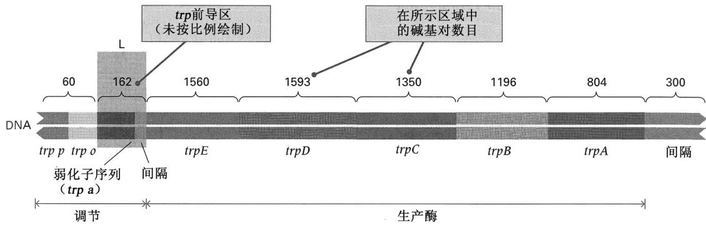  
图 11.9 大肠杆菌色氨酸操纵子。为清楚起见，相对于编码区而言，调节区被放大。这些区域的实际大小如碱基对的数目所示。L 区为前导序列。

trpR 基因的产物是一种前阻遏蛋白，需要一个辅阻遏物来使其活化。在 trpR 或操纵基因中的突变，都会导致组成型的 trp mRNA 转录的起始。色氨酸起辅阻遏物的作用，它与 trp 前阻遏蛋白结合，形成有活性的阻遏蛋白，阻遏蛋白与 trp 操纵基因的结合使色氨酸合成关闭。图 11.10 概括了基本的开-关调节机制，当没有足够的色氨酸时，前阻遏蛋白采用一种不能与 trp 操纵基因结合的三维构象，操纵子被转录(图 11.10A)。但是，当色氨酸以足够高的浓度存在时，一些色氨酸分子与前阻遏蛋白结合，使前阻遏蛋白改变构象，变成有活性的阻遏蛋白，有活性的阻遏蛋白与色氨酸操纵基因结合，阻止转录(图 11.10B)。因此，仅当色氨酸存在的数量不足时，有活性的阻遏蛋白分子才形成。

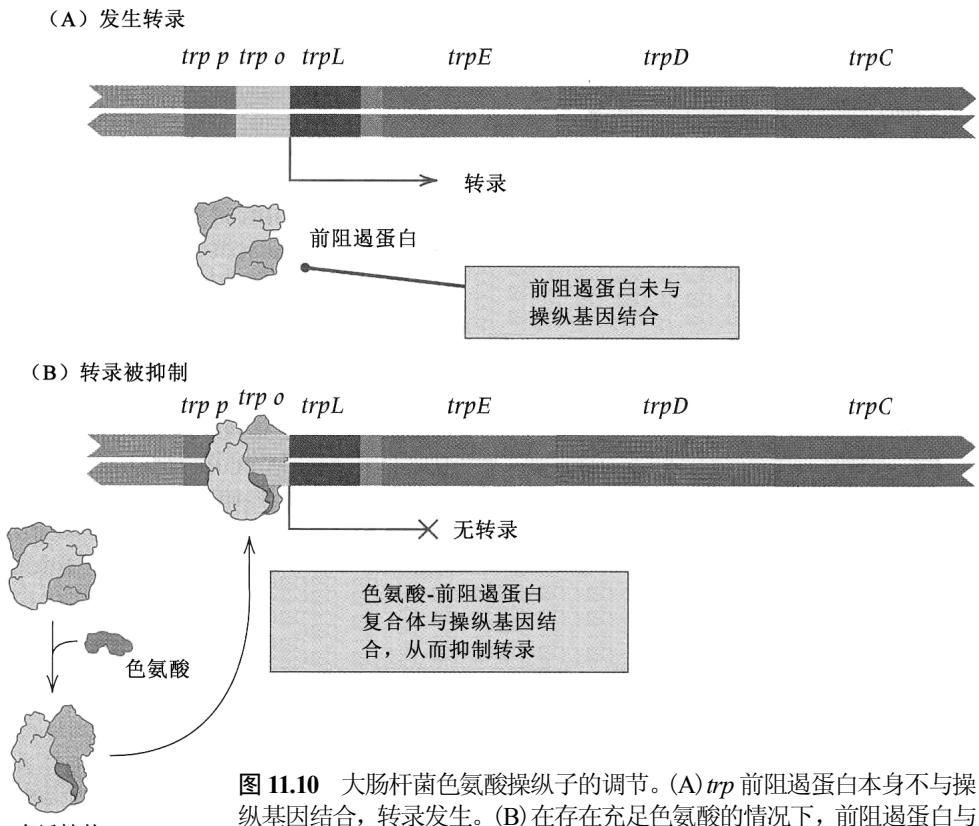  
图 11.10 大肠杆菌色氨酸操纵子的调节。(A) trp 前阻遏蛋白本身不与操纵基因结合，转录发生。(B) 在存在充足色氨酸的情况下，前阻遏蛋白与色氨酸结合形成有活性的阻遏蛋白，与操纵基因结合，转录被阻遏。

## 11.3 通过转录终止来调节

图 11.10 中的阻遏型转录机制，为色氨酸操纵子提供了一种粗放水平的调节——转录要么为“关”，要么为“开”。还有另一个调节水平，可提供精细的调节，在培养基上有一定色氨酸，但又不足以维持最佳生长状态时采用。在这种状态下，细胞以比最大可能速度小的速度合成色氨酸，比较有利。色氨酸操纵子对这种情况的应答，利用这样一种调节机制：在阻遏状态下，转录量由细胞中色氨酸的浓度定量控制。这种调节机制称为弱化作用(attenuation)，见于负责氨基酸生物合成的许多操纵子中。

## ■ 弱化作用

一旦转录开始之后，弱化(attenuation)机制控制转录是继续沿着操纵子往下进行，还是提前终止。在野生型细胞中，色氨酸操纵子的转录常常会被起始，但是，即使在存在少量色氨酸的情况下，大部分mRNA分子也会在前导序列内一个特定的28碱基区域终止(图11.9)。终止的结果是，RNA分子仅含140个核苷酸，在未及trp酶编码基因处停止。终止于其内发生的这个28碱基区域，称为弱化子(attenuator)。弱化子区的核苷酸序列具有终止位点的通常特点，在mRNA中包括一个潜在的茎环构型，其后紧跟一串8个尿苷酸(图11.11)。

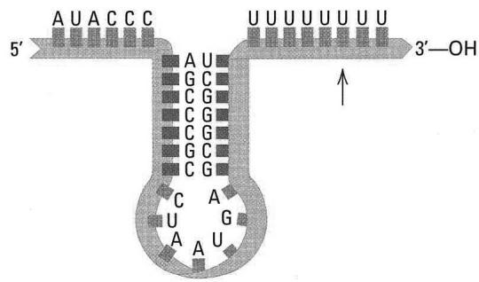  
图 11.11 trp 弱化子序列的终止区。箭头示弱化 RNA 的最后一个尿苷酸。非弱化 RNA 越过该点继续向前。在 RNA 内部，红色字母所示的核苷酸通过碱基配对形成茎。

在大肠杆菌中，转录的终止是由前导序列中编码的一种小肽能否被翻译所决定的。如图11.12所示，该编码序列编码14个氨基酸长的前导多肽(leader polypeptide)，在第10和第11位包括两个毗邻的色氨酸密码子。当有足够的负载色氨酸tRNA能让这些密码子翻译时，新生转录物采取一种弱化子被暴露的构型，从而转录被终止。但是，当没有足够的负载色氨酸tRNA能让前导多肽翻译时，核糖体就抛锚在两个色氨酸密码子处，这产生一种弱化子被隐藏的状况，从而转录可进行下去，贯穿整个操纵子。

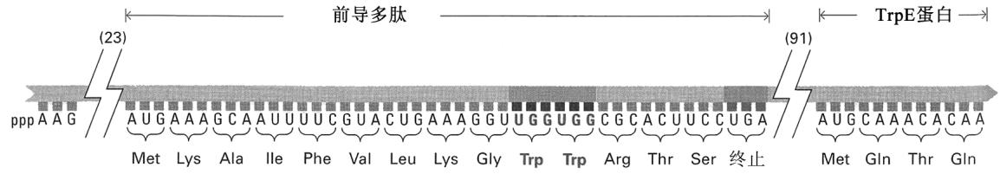  
图11.12 trp前导mRNA中的核苷酸序列，示前导多肽、两个色氨酸密码子(红色)和TrpE蛋白的起始端。为了清楚起见，有的序列没有显示，23和91这两个数字是未显示的核苷酸数目。

弱化的机制如图 11.13 所示，A 部分示前导 RNA 分子，该分子含前导多肽中的两个色氨酸密码子。2 区有一段核苷酸序列，能与 1 区或 3 区配对。在纯化的 RNA 中，1 区与 2 区配对，3 区与 4 区配对。B 部分示细胞中有足够 $tRNA^{Trp}$ 能让前导多肽翻译时的构型。核糖体越过两个 Trp 密码子向前移动，将 2 区挡住，所以，形成的配对是在 3 区和 4 区之间，这样，就产生了转录终止子，在紧接于 4 区后的一串连续的尿苷酸处出现终止。C 部分显示因为 $tRNA^{Trp}$ 不足，核糖体抛锚在 Trp 密码子处时，会出现什么情况。在此情况下，2 区优先与 3 区配对，这使终止子的构象瓦解，使转录能够继续沿余下部分的操纵子进行。这一系统的精细调节，在色氨酸为中等浓度时进行，此时新生转录物所占的比例完全取决于翻译抛锚的频率，而这反过来又取决于细胞内负载色氨酸 tRNA 的浓度。

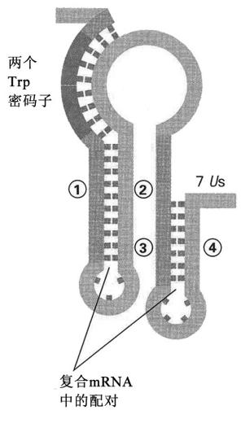  
（A）游离mRNA。在1和2之间及3和4之间进行碱基配对。

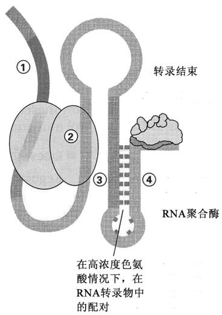  
（B）色氨酸浓度高。核糖体到达2区，3\~4配对，导致转录终止。

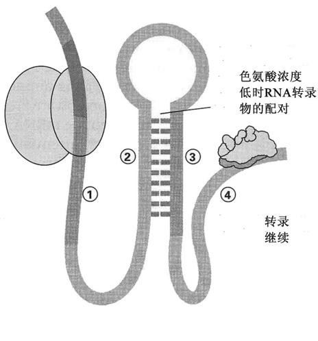  
（C）色氨酸浓度低。核糖体停在1区的Trp密码子处，使2\~3配对得以发生，从而不会终止转录。  
图 11.13 对大肠杆菌色氨酸操纵子中弱化作用的解释。色氨酸密码子以红色突出显示。

有些细菌进化出一种色氨酸操纵子的调节机制，其以一种不依赖翻译的方式，侦测细胞内色氨酸的浓度。在枯草芽胞杆菌(Bacillus subtilis)中发现一个特别简洁的例子，在这种生物中，色氨酸操纵子不是阻遏型的，既不存在前阻遏蛋白，也不存在前导区中编码的短肽。转录调节纯粹是通过弱化作用来控制，是通过一种称为TRAP(trp RNA结合弱化蛋白，trp RNA-binding

attenuation protein)的蛋白质为中介，每个TRAP蛋白单体与一分子的色氨酸结合，如此一来，该单体发生构象变化，使其能与其他单体结合。有活性的TRAP形式是一种辐射对称的11聚体，它与新生mRNA中两个区域(相当于图11.13B中的1区和2区)的核苷酸序列特异性结合。所产生的结构如图11.14所示，1区和2区沿TRAP11聚体的外周盘绕。当1区和2区被以这种方式限制住时，3区与4区配对，与图11.13B所示的大致一样，形成转录终止子。在缺乏TRAP多聚体的情况下，不形成终止子，因而转录可继续进行。该系统对细胞内的色氨酸浓度敏感；如果色氨酸浓度水平高到足以让TRAP多聚体形成，转录就被终止，但如果水平太低，不能形成TRAP多聚体，全部的色氨酸操纵子就都被转录。

在大肠杆菌中，许多负责氨基酸生物合成的操纵子(如亮氨酸、异亮氨酸、苯丙氨酸和组氨酸操纵子)，通过在转录物中形成可变配对区域而发挥功能的弱化子来调节。

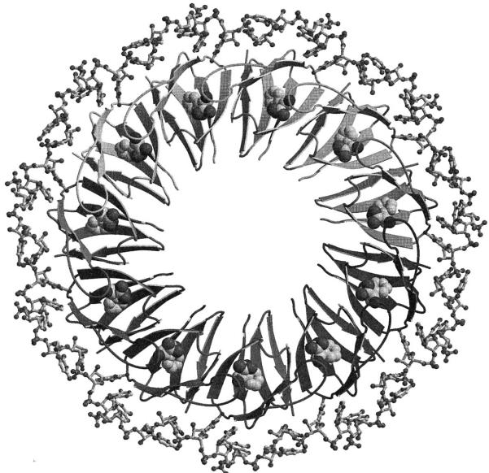  
图 11.14 结合了 trp RNA 的 TRAP 蛋白(枯草芽胞杆菌的色氨酸 RNA 结合弱化蛋白)的结构。以条带显示该蛋白 11 聚体，以不同颜色表示各亚基，以球棍模型显示 RNA。TRAP 亚基内部的实心球相当于色氨酸分子的原子。[承美国纽约州立大学布法罗分校保罗·格尔尼克(Paul Gollnick)及英国约克大学艾尔弗雷德·安特森(Alfred Antson)惠赠。]

在组氨酸操纵子中，前导多肽编码区含7个毗邻的组氨酸密码子(图11.15A)。在苯丙氨酸操纵子中，前导多肽编码区含分成3组的7个苯丙氨酸密码子(图11.15B)。由操纵子编码的酶产生的氨基酸，其密码子在前导肽mRNA中以高密度存在，这种模式是弱化与翻译偶联的操纵子的特征。通过这些密码子，对于作为每种氨基酸生物合成途径终产物的氨基酸，细胞可监控负载了该氨基酸的氨酰tRNA水平。

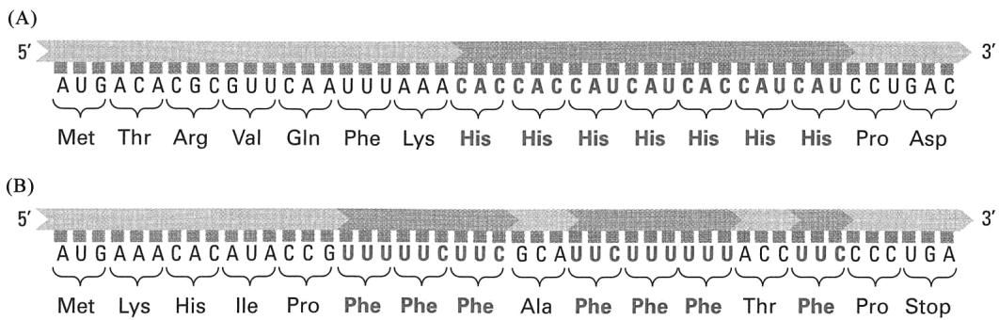  
图 11.15 组氨酸操纵子(A)和苯丙氨酸操纵子(B)的前导多肽氨基酸序列及相应 mRNA 片段的核苷酸序列。氨基酸的重复以红色强调。

乳糖操纵子和色氨酸操纵子的调节，是原核生物中控制基因转录的一些重要机制的典型。在下一节，会看到转录物中的前导序列如何控制转录终止。

## ■ 核糖开关

利用转录终止来调节，是真核生物中相当常见的一种控制基因表达的机制。通过小分子与5'非翻译前导mRNA直接结合，引发转录终止——我们已知道若干此类例子。依其是否与小分子结合，5'前导序列可采取两种构象中的一种。在抗终止子构象中，基因的转录通过前导序列继续往下进行，贯穿基因的剩下部分。在通过与小分子结合而引起的终止子构象中，转录被终止。能够在抗终止子构象和终止子构象之间转换的RNA前导序列，称为核糖开关(riboswitch)。

图 11.16A 示 yitJ 基因的前导 mRNA，该基因参与枯草芽胞杆菌中甲硫氨酸的生物合成。以红色和蓝色显示的核苷酸可有两种配对结构：其一，它们形成一个抗-抗终止子 (AAT) 和一个终止子 (T) 的茎环结构，后者之后紧跟一串尿苷酸残基，在此构象中，RNA 前导序列终止转录；

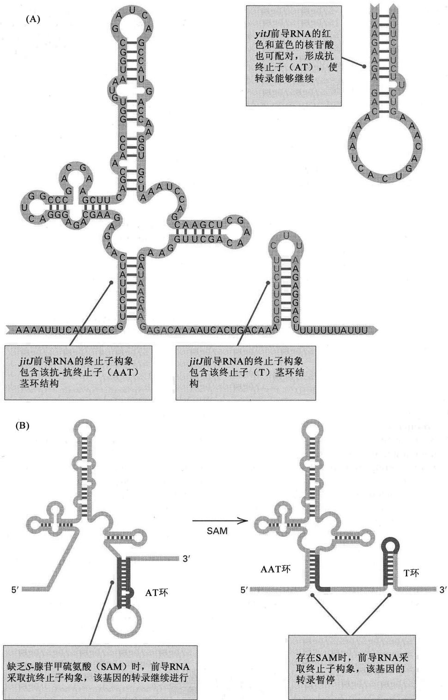  
图 11.16 枯草芽胞杆菌中通过 yitJ 前导 RNA 进行的转录终止的核糖开关调节。
(A) 绘制成终止子 (T) 构象的 yitJ 基因的非翻译前导 RNA 的结构模型，其中包括一个抗-抗终止子 (AAT) 茎环结构。AAT 和 T 的茎中的红色和蓝色的核苷酸也可配对形成抗终止子 (AT)。
(B) S-腺苷甲硫氨酸 (SAM) 的存在，引起从通读形式 (AT) 向终止形式 (AAT+T) 的转变。[引自 B.A.M.McDaniel et al, 2003. Proc. Natl. Sci. USA 100:3083.]

其二，红色和蓝色的核苷酸也可相互配对，形成右上角所示的一个抗终止子(AT)，在此构象中，转录通过 yitJ 基因继续往下进行。S-腺苷甲硫氨酸(SAM，甲硫氨酸的一种修饰形式)的存在，导致前导 RNA 从通读形式(AT 环)向终止形式(AAT 和 T 环)的转变(图 11.16B)。与 SAM 结合的 5' 前导 RNA，称为 S 盒 RNA(S box RNA)。在枯草芽胞杆菌中编码 26 种硫代谢蛋白质的 11 个转录单位的上游，发现有 S 盒 RNA 结构。

也发现一些核糖开关的前导 RNA 结合黄素单核苷酸、硫胺素焦磷酸、维生素 $B_{12}$ 、鸟嘌呤、腺嘌呤、非负载 tRNA (uncharged tRNA) 、S-腺苷甲硫氨酸或赖氨酸，以调节相应代谢产物的合成或运输。DNA 序列分析表明，在所有三大界——古细菌、真细菌和真核生物——中，都存在核糖开关。

## 11.4 λ噬菌体中的调节

当雅各布和莫诺首次提出操纵子模型的特征是通过阻遏蛋白进行负调节时，他们认为该模型不仅能够解释代谢酶的诱导型和阻遏型调节，而且能够解释温和噬菌体的溶源周期。他们认为，在溶源性细菌中，阻遏蛋白使 $\lambda$ 噬菌体保持静止，阻止其复制。最终证明这种解释是正确的，虽然达到阻遏的、溶源状态的生化机制，比他们想象的更为复杂。

当 $\lambda$ 噬菌体感染大肠杆菌时，每个被感染的细胞可出现以下两种结果之一。

1. 裂解性感染，造成裂解，产生噬菌体颗粒。

2. 溶源性感染，造成 $\lambda$ 整合进大肠杆菌染色体，形成溶源性细菌。

因为这种二选一的特点， $\lambda$ 通常在大肠杆菌菌苔上产生浑浊的(不完全清晰的)噬菌斑。最初的感染和裂解在细菌菌苔上产生清亮区，但有一些溶源性细菌在清亮区内生长，使清亮区被部分填充，从而产生浑浊的噬菌斑。

表 11.3 λvir、c /⁻、c //⁻ 和 c //⁻ 突变体

在得到清晰噬菌斑而不是浑浊噬菌斑的噬菌体突变体中，首次鉴定到 $\lambda$ 调节基因的突变。这些突变体被证明可分成4类： $\lambda vir$ 、 $cI^{-}$ 、 $cII^{-}$ 和 $cIII^{-}$ 。这些突变体的特点见表11.3。 $cI$ 、 $cII$ 和 $cIII$ 的遗传位置如图11.17中 $\lambda$ 噬菌体的简化遗传图所示，图谱中的基因按功能类别分组。回忆一下第9章，在 $\lambda$ 感染时， $\lambda DNA$ 分子环化，使 $R$ 基因和 $A$ 基因相互毗邻。

组合的混合感染的特点

<table><tr><td>感染噬菌体</td><td>清晰或浑浊噬菌斑</td></tr><tr><td> $1. \lambda vir + \lambda^{+}$ </td><td>清晰</td></tr><tr><td> $2. c I^{-} + c I^{+}$ </td><td>浑浊</td></tr><tr><td> $3. c II^{-} + c II^{+}$ </td><td>浑浊</td></tr><tr><td> $4. c III^{-} + c III^{+}$ </td><td>浑浊</td></tr></table>

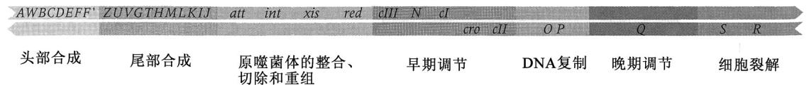  
图 11.17 λ 噬菌体的遗传图。该图谱的绘制强调了噬菌体基因组内基因的功能组织，以引起对调节特点的关注。

在表 11.3 的突变体中，产生“清晰”噬菌斑的两种突变体被证明与大肠杆菌中的 lacI 和 lacO 突变体类似。如表 11.3 中的 1 号噬菌体组合所示，在混合感染中， $\lambda vir$ 突变体对野生型 $\lambda^{+}$ 为显性，这种噬菌体组合进行生产性感染，阻止野生型 $\lambda^{+}$ 的溶源化。不过， $\lambda vir$ 被证明是双重突变体，如图 11.18 所示，它携带 $O_{L}$ 和 $O_{R}$ 两个不同操纵基因中的突变。在表 11.3 的第 2 项可见，c I⁻突变是隐性的。这些 c I⁻突变与 lacI 突变类似，其类似之处在于，c I⁺基因编码 $\lambda$ 阻遏蛋白，该阻遏蛋白是扩散性的。c II⁺和 c III⁺基因不编码阻遏蛋白，而是编码产生溶源性所需的蛋白质。在混合感染中（表 11.3 中的第 3、第 4 项），c II⁻和 c III⁻突变也是隐性的。

在溶源周期和裂解周期之间进行抉择的分子基础，参考图 11.8 可得到解释。 $\lambda$ 一旦感染大肠杆菌， $\lambda$ 分子就环化，然后 RNA 聚合酶在 $P_{L}$ 和 $P_{R}$ 处结合，起始 N 和 cro 基因的转录。N 蛋白的作用是阻止从 $P_{L}$ 和 $P_{R}$ 开始的转录物的终止，因而可让 cⅡ蛋白产生，cⅡ蛋白激活 $P_{E}$ 和 $P_{I}$ 处的转录，从而使 c I 和 int(整合, integration)蛋白的产生成为可能。c I 蛋白关闭从 $P_{L}$ 和 $P_{R}$ 开始的转录，并激发 $P_{M}$ 处的转录，以正向自调节回路方式增加自身的合成。如果 c I 蛋白的浓度达到足够高的水平，可阻止从 $P_{L}$ 和 $P_{R}$ 开始的转录，从而使 int 蛋白能够催化环状 $\lambda$ 分子和大肠杆菌染色体之间，在它们各自的结合 (att) 位点之处发生位点专一重组，达成溶源化，结果是溶源性细菌的形成。

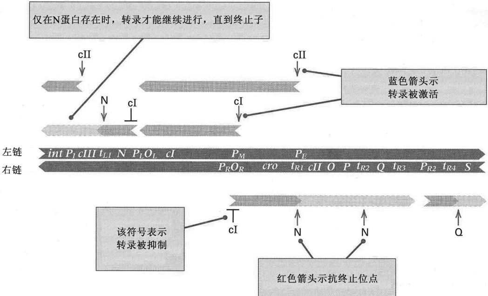  
图 11.18 在溶源性感染早期表达的 $\lambda$ 噬菌体控制区的遗传图和转录图。绿色箭头示转录的起点、方向和范围。淡绿色箭头示转录物的某些部分，它们因 N 蛋白和 Q 蛋白的抗终止活性而合成。以指向转录物内的红色箭头表示抗终止活性位点。指向转录物起点的蓝色箭头，表示 C I 和 C II 蛋白引起的转录活化，C I 蛋白引起转录阻遏的位点也进行了标示。

另外一条途径是发展为裂解，这在cro蛋白占支配地位时发生。cro蛋白也可与 $O_{R}$ 结合，如此一来，阻断了从 $P_{M}$ 开始的转录。如果这一情况发生，则阻遏蛋白的浓度不能上升到足以阻断从 $P_{L}$ 和 $P_{R}$ 开始的转录的水平。转录从 $P_{R}$ 和 $P_{R2}$ 开始继续往下进行，N和Q蛋白阻止转录物右侧(也是左侧)的终止。因为 $\lambda$ DNA分子是以环状结构存在，向右的转录通过 $S$ 基因和 $R$ 基因，然后从那里通过头部基因和尾部基因(图11.17中的 $A$ 到 $J$ )。接下来是细胞裂解和噬菌体颗粒形成所需蛋白质的产生，继之以噬菌体组装和细胞裂解以释放噬菌体。

实际上， $\lambda$ 中溶源性的调节，涉及产生cro蛋白和产生cI蛋白之间的一种“竞争”：“胜者”是浓度首先达到足以主导感染结果的那种蛋白质。这背后的分子机制是，cro和cI蛋白为了与 $O_{L}$ 和 $O_{R}$ (每一操纵基因各有3个参与竞争的蛋白质结合位点)结合而竞争。如果cro赢得这场竞赛，则在该细胞中发生裂解周期；如果cI赢了，就形成一个溶源性细菌。因此，

c I 和 cro 蛋白质起到遗传开关的作用：c I 开启溶源周期，而 cro 开启裂解周期。

决定 c I 或 cro 是否控制特定感染的结果的另一个因素，是被感染细胞的营养状况，这又反过来影响调节蛋白的稳定性和水平。因此， $\lambda$ 的调节，表面上是一个 “简单” 的系统，实际上相当复杂。

## 11.5 真核生物的转录调节

许多真核生物基因是管家基因(housekeeping gene)，管家基因编码必要的代谢酶或细胞组分，以相当低的水平在所有细胞中组成性地表达。其他依细胞类型或细胞周期的时期不同而在表达上有差异的基因，往往受到转录水平上的调节。一般而言，在非诱导水平和诱导水平之间，真核生物基因的表达水平可相差2～10倍，与此相比，在原核生物中所见的差异更为显著，其非诱导水平和诱导水平之间的比例可以高达1000。

## - 酵母的半乳糖代谢

通过考察酵母的半乳糖代谢的控制，并将其与大肠杆菌的乳糖操纵子进行比较，来介绍真核生物的转录调节。半乳糖降解的生化途径的最初几步，如图11.19A所示。基因GAL1、GAL7和GAL10编码的3种酶，为半乳糖转变为葡萄糖-1-磷酸所必需，如图11.19B所示，这3个基因紧密连锁，尽管这3个基因紧密连锁，但它们不属于同一个操纵子，这些基因的mRNA都是单顺反子。GAL1和GAL10的mRNA从位于两个基因之间的方向相反的两个启动子开始合成，而GAL7mRNA从它自己的启动子开始合成。仅当半乳糖作为诱导物存在时，这些mRNA才被合成，因此，这些基因是诱导型的。

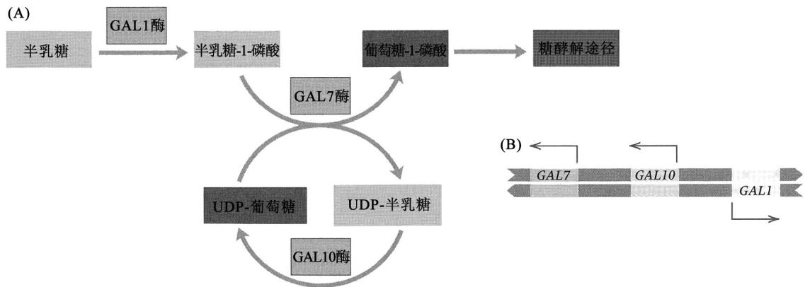  
图 11.19 (A) 在酿酒酵母中半乳糖被转变为葡萄糖-1-磷酸的代谢途径。(B) GAL 基因在Ⅱ号染色体上的位置。箭头示转录方向。GAL1 和 GAL10 的转录物来自不同的启动子。GAL7 有自己的启动子。对应于 GAL1、GAL7 和 GAL10 蛋白质的酶分别是半乳糖激酶、半乳糖-1-磷酸尿苷转移酶和 UDP-葡萄糖-4-表异构酶。

已观察到组成型和不可诱导型突变体。在 gal80 和 GAL81 $^{C}$ 这两种突变体中，突变体组成性地合成 GAL1、GAL7 和 GAL10 的 mRNA。另一种突变体 gal4 是不可诱导型的，无论半乳糖存在与否，它都不合成 mRNA。这些突变体的特点见表 11.4。“顺式”和“反式”这样的术语无助于解释这些结果，因为调节基因与它们调节的基因不连

表 11.4 gal80、gal4 和 GAL81 $^{C}$ 突变不同组合的二倍体的特点

<table><tr><td>基因型</td><td>GAL1、GAL7和 GAL10 mRNA的合成</td><td>Gal基因型</td></tr><tr><td>1.gal80 GAL1/GAL80 GAL1</td><td>诱导型</td><td>+</td></tr><tr><td>2.gal4 GAL1/GAL4 GAL1</td><td>诱导型</td><td>+</td></tr><tr><td>3.GAL81 $^C$  GAL1/GAL81 GAL1</td><td>组成型</td><td>+</td></tr></table>

锁——GAL1、GAL7 和 GAL10 在 II 号染色体上，GAL80 在 X III 号染色体上，而 GAL4 和 GAL81 在 XVI 号染色体上。

gal80 突变为隐性(表 11.4 第 1 项)，因此，从表面上看，它表现得像 lacΓ 突变一样。野生型 GAL80 等位基因并没有真的编码负调节转录的蛋白质，因此，尽管 GAL80 蛋白称为 “阻遏蛋白”，它并不是通过与操纵基因结合起作用，而是通过与转录激活蛋白结合并使其处于失活状态。GAL80 结合的激活因子是 GAL4 基因的产物，以 GAL4 表示。

所有 3 个 GAL 基因的转录都需要 GAL4 蛋白。gal4 突变是隐性的，在纯合突变体中 GAL 基因全部是不可诱导型的。GAL4 蛋白是一种正调节蛋白，它分别激活 3 个 GAL 基因，从每个基因上游的不同位点开始转录。图 11.20 示 GAL4 蛋白与其在 DNA 中的靶位点结合，图中 GAL4 蛋白(二聚体)以蓝色显示，DNA 分子以红色显示，黄色小球表示锌离子，是 DNA 结合的必需成分。

(A)  
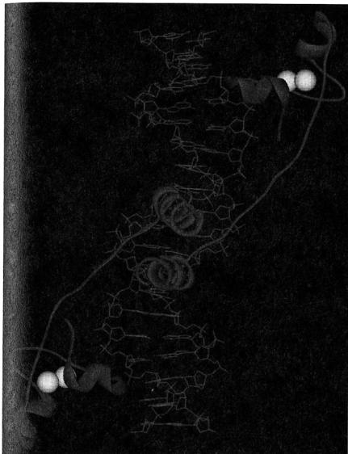

(B)  
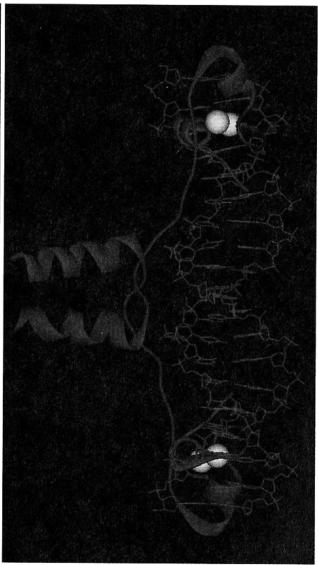

(C)  
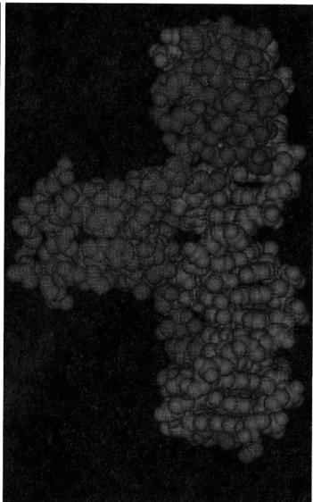  
图 11.20 与 DNA(红色)结合的 GAL4 蛋白(蓝色)的三维结构。该蛋白质由两个多肽亚基组成，两个亚基由中央的螺旋区域结合到一起。DNA 结合结构域在最两端，每个结构域与 DNA 大沟中的 3 个碱基对进行物理接触。以黄色显示 DNA 结合结构域中的锌离子。(A) 和 (B) 的视角互为直角；(C) 为空间填充模型。[Protein Data Bank 1D66. R. Marmorstein, et al., Nature 356 (1992):408-414.]

CAL 调节的机制概括于图 11.21 中，图中的符号与酵母遗传学中的惯例相等，以基因名称加上后缀 “p” 来表示基因的产物，如基因 GAL3 的产物为 GAL3p(注意，基因符号 GAL3 以斜体印刷，因为它表示一个基因，而基因产物的符号 GAL3p 不是斜体)。

在 GAL 基因调节中，关键的参与者是基因 GAL3、GAL80 和 GAL4 的产物。虽然 GAL80p 表面上类似于阻遏蛋白，因为 gal80/gal80 纯合突变体组成型产生 GAL 酶，但 GAL80p 蛋白不与 DNA 结合。相反，它有两个结合位点，一个结合 GAL4p(转录激活因子)，一个结合 GAL3p。

在存在半乳糖的情况下(图 11.21A)，GAL3p 与半乳糖和 ATP 结合，在此状态下的 GAL3p 可与 GAL80p 结合，从而将其保留在细胞质中。在细胞核内，GAL4p 蛋白通过它的一个结合位点，与靠近每个 GAL 基因的上游激活因子序列(upstream activator sequence, UAS)结合。GAL4p 上的另一个结合位点募集转录机器，从而 GAL 基因被转录。

缺乏半乳糖的情况下(B部分)，GAL3p蛋白不能与GAL80p结合，因而GAL80p蛋白游离，可进入细胞核。在细胞核内，GAL80p与GAL4p中的转录激活因子位点结合，从而阻止转录复合体的募集。因而，在半乳糖缺乏的情况下，GAL基因不被转录。

表 11.4 中令人费解的组成型突变 $GAL8I^{C}$ 是显性的，引起 GAL 基因的组成型合成。根据该突变体的表现，有可能以为它是操纵基因突变，但与 $lacO^{C}$ 没有可比性，因为它的位置不靠近 GAL1、GAL7 或 GAL10。这个令人费解的等位基因得以解释，有赖于发现了 “ $GAL8I^{C}$ ” 实际上是 GAL4 基因中的一个突变，该突变使 GAL4p 不能与 GAL80p 结合，但仍能募集转录复合体。因而，突变型 GAL4p 蛋白不能与 GAL80p 结合，即使在缺乏半乳糖的情况下，也能自由地激活转录。同样，无论是否存在野生型的 GAL4p 蛋白，都会发生转录激活，这也解释了为什么 “ $GAL8I^{C}$ ” 是显性的。

酵母中的 GAL 调节也给调节系统如何进化提供了一个例子。在另一种酵母——乳酸克鲁维酵母 (Kluyveromyces lactis) 中，由单个基因编码的一种双功能蛋白同时具有 GAL3p(调节)和

GAL1p(半乳糖激酶)活性。在该物种中，当 GAL 基因被诱导时，诱导作用适中，在 3～5 倍范围内。由于在大约 1 亿年前发生的一次全基因组重复，酿酒酵母(Saccharomyces cerevisiae)基因组获得将这两种功能(调节和半乳糖激酶)分开的机会。虽然许多重复后的基因已通过缺失而丢失，但基因组测序清楚地显示，酿酒酵母是一种古老的四倍体。

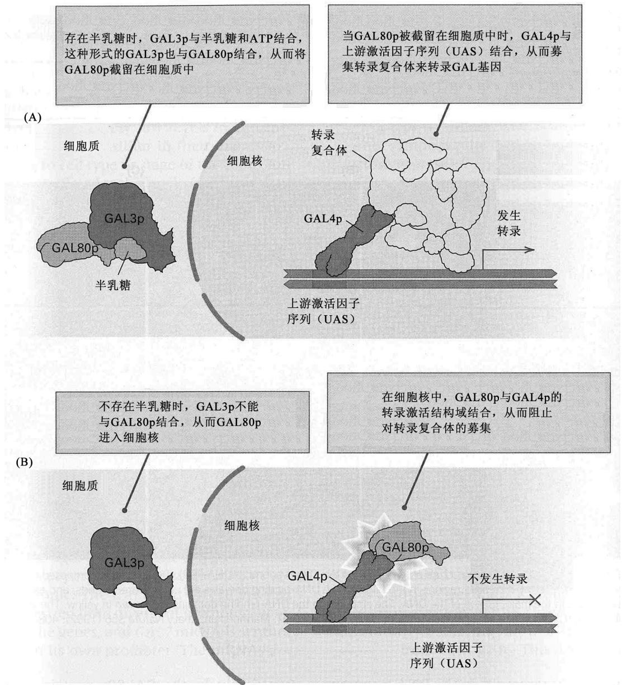  
图 11.21 通过 GAL3(GAL3p)、GAL80(GAL80p) 和 GAL4(GAL4p) 编码的蛋白质调节 GAL 基因的转录。

在酿酒酵母没有丢失的四倍体基因中，有对应于乳酸克鲁维酵母双功能基因的基因。在古老的酿酒酵母中，一个基因拷贝仅保留了 GAL3p 功能，而另一个基因拷贝仅保留了 GAL1p 功能。这种专门化使得 GAL 基因的转录应答水平可以高得多，在酿酒酵母中，当 GAL1 被诱导时，它的转录水平比基础转录水平高大约 1000 倍。这种通过重复而使基因专门化的过程称为亚功能化 (subfunctionalization)，该过程会在第 17 章中详加讨论。

上述比较的要点是，在大肠杆菌乳糖操纵子和酵母 GAL 基因中，组成型和不可诱导型突变之间在表面上的相似性，并不表示具有类似的分子调节机制。在原核生物和真核生物中，一些生理上的相似性都只能说明，某一特定代谢(或发育)途径的基因，表现为以协同方式应答信号。作用原理是，类似的目的往往会由不同的分子机制来达到。

## ■ 转录激活蛋白

GAL4 蛋白是转录激活蛋白(transcriptional activator protein)的一个例子，基因要准备转录时，转录激活蛋白必须与上游 DNA 序列结合。有些转录激活蛋白直接与转录复合体的一个或多个组分相互作用，以此方式将转录复合体募集至待激活基因的启动子。其他的转录激活蛋白可用已经组装好的转录复合体来起始转录。在这两种情况下，激活蛋白对正调节基因的转录都是必需的。

许多转录激活蛋白可根据它们氨基酸序列的共同特点进行分类。例如，一种类型具有螺旋-转角-螺旋(helix-turn-helix)模体，构成这种模体的氨基酸序列，形成一对 $\alpha$ 螺旋，其间由一个弯曲隔开，这两个螺旋所处的位置使它们能够恰好放入双链DNA分子的沟中。螺旋-转角-螺旋模体是转录激活蛋白能与DNA结合的基础，虽然这种结合的序列特异性是蛋白质的其他部分的结果。

第二大类转录激活蛋白含有一种称为锌指(zinc finger)的 DNA 结合模体，之所以称为锌指，是因为该折叠结构包含一个锌离子。一个已为人熟知的例子是酵母中的 GAL4 转录激活蛋白，该蛋白

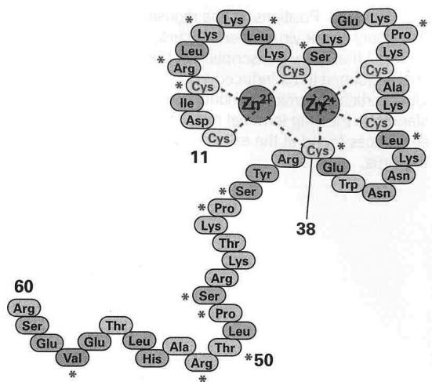  
图 11.22 酵母 GAL4 转录激活蛋白的 DNA 结合结构域。四个半胱氨酸残基结合一个锌离子，形成一个肽环，称为锌指。锌指是 DNA 结合蛋白中常见的一种模体。已通过突变鉴定，在标星号的氨基酸位点，氨基酸的置换会使该蛋白质的 DNA 结合活性消失。结果是靶基因不能被激活。

以二聚体形式发挥作用，该二聚体由两个完全一样的 GAL4 多肽组成，两个锌结合结构域在最两端(图 11.20 以黄色显示锌离子)。该蛋白质所识别的 DNA 序列是对称序列，长 17bp，每端各含一个可与含锌的结构域直接接触的 CCG 三联体。

更详细的 GAL4 蛋白 DNA 结合结构域的图解如图 11.22 所示。两个锌离子 $\left(\mathrm{Zn}^{2+}\right)$ 各通过配位键与 4 个半胱氨酸残基螯合，这些半胱氨酸在一个环的基部的特定位置上，除所示氨基酸以外，该环还要另外延长 841 个氨基酸。有些氨基酸标有红色星号，在这些位点的突变会导致突变型蛋白质不能激活转录。在 15 位 (Arg→Gln)、26 位 (Pro→Ser) 和 57 位 (Val→Met) 氨基酸的置换特别有趣，因为它们给锌指为 DNA 结合所必需提供了遗传证据。具体而言，这些突变的表型可被培养基中额外的锌挽救，因为分子缺陷降低了该分子的锌指部分螯合锌的能力。培养基中额外的锌可克服该缺陷，并恢复突变型激活蛋白与其在 DNA 中的特定结合位点结合的能力。

## - 转录增强子和转录沉默子

有些转录激活蛋白与称为增强子 (enhancer) 的特定 DNA 序列结合。增强子序列一般相当短 (通常少于 20 个碱基对)，见于它们调节的基因周围，位置多种多样。大多数增强子在转录起点上游 (有时距离好几千个碱基)，其他的在编码区内的内含子中，少数甚至位于基因的 3' 端。研究得最为彻底的一个增强子在小鼠乳腺肿瘤病毒中，它通过糖皮质类固醇激素来决定转录的激活，该增强子的共有序列为 AGAQCAGQ，其中，Q 代表 A 或 T。该病毒含该增强子的 5 个拷贝，位置遍及整个基因组 (图 11.23)，为激活转录的激素受体复合体提供 5 个结合位点。

增强子是真核生物基因组织中的必要组分，因为它们能够让基因只在有适当的转录激活因子时，才被转录。有些增强子对来自细胞外的分子进行应答，如形成受体-激素复合体的类固醇激素。其他增强子对细胞内产生的分子(如在发育过程中)进行应答，从而能够让基因在它们的控制下参与细胞分化或以组织特异的方式表达。许多基因受数个不同增强子的控制，所以它们可对多种不同的分子信号——外部的和内部的——进行应答。

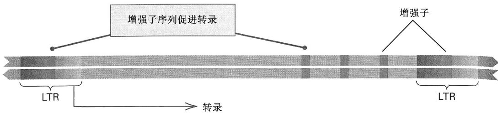  
图 11.23 在小鼠乳腺肿瘤病毒中，使病毒序列的转录能被糖皮质类固醇激素诱导的增强子(橙色)的位置。LTR 表示在病毒最两端发现的长末端重复序列。

有些基因也受到转录沉默子(silencer)的调节，沉默子为短的核苷酸序列，其为 DNA 结合蛋白的靶序列，该蛋白一旦被募集到沉默子位点，即促进一种巨大蛋白复合体的组装，阻止被沉默基因转录。这种沉默复合体的例子有：果蝇的 PcG(Polycomb group，多梳组)蛋白，它在发育过程中沉默某些基因；在酵母中包含 RAP1、SIR、ORC 和组蛋白 4 等蛋白质的复合体，它参与非表达交配型盒的沉默(在 11.10 节中叙述)。

## - 缺失扫描

鉴定产生增强子或沉默子活性的核苷酸序列，通常很困难，并且是种劳动密集型的工作，因为这些调节序列一般是较短的重复序列，且常常为简并序列(即它们从一个拷贝到另一个拷贝在核苷酸序列上略有差异)，它们的功能不受方向约束(颠倒其方向，增强子或沉默子所起作用不变)，且它们与其所控制基因的距离可变。与蛋白质编码区不同，它们没有像密码子的三核苷酸周相那样的有规律的重复模式，因而遗传密码不能给它们的鉴定提供任何指导。通过报道基因构建体(report-gene construct)的使用，使增强子和沉默子的研究变得简单得多。例如，用大肠杆菌的lacZ基因(编码β-半乳糖苷酶)替换所研究的基因，将其放在要分析的调节序列的下游。在调节序列上制造核苷酸置换或缺失突变，然后考察其对β-半乳糖苷酶表达活性的影响，可对该调节序列进行仔细的遗传分析。以此方式，lacZ基因的表达可“报告”上游调节元件的功能状态。同样，可将上游序列的小片段或候选调节模体放在lacZ上游，然后检测它们对lacZ进行调节的能力，在这种情况下，β-半乳糖苷酶的表达将会表现出期望的诱导或阻遏，或在某些情况下表现出正常的时空调节。

以 lacZ 为报道基因，有几个优点： $\beta$ -半乳糖苷酶非常稳定，可在非常宽的酶活性范围内进行分析，且其底物为可溶性底物，但既可产生可溶性产物，也可产生不溶性产物。可溶性产物使精确的定量成为可能，而不溶性产物使得在菌落中直接观察结果成为可能(图 11.24)。

图 11.24A 示一个使用定量方法的例子。在这些实验中，lacZ 与包含 520bp 上游调节序列的酵母 GAL1 基因融合。构造该上游区域的一系列缺失，导入酵母细胞，然后分析。野生型基因被半乳糖诱导，表达水平增加数千倍，但它被葡萄糖阻遏。这种表现被顶行所示的从碱基对 301 开始的构建体重演。当 301～343 区域缺失时，可见到表达的显著下降，而 301～406 区域的缺失基本上终止了表达。而且，390～465 区域的缺失也使表达终止。

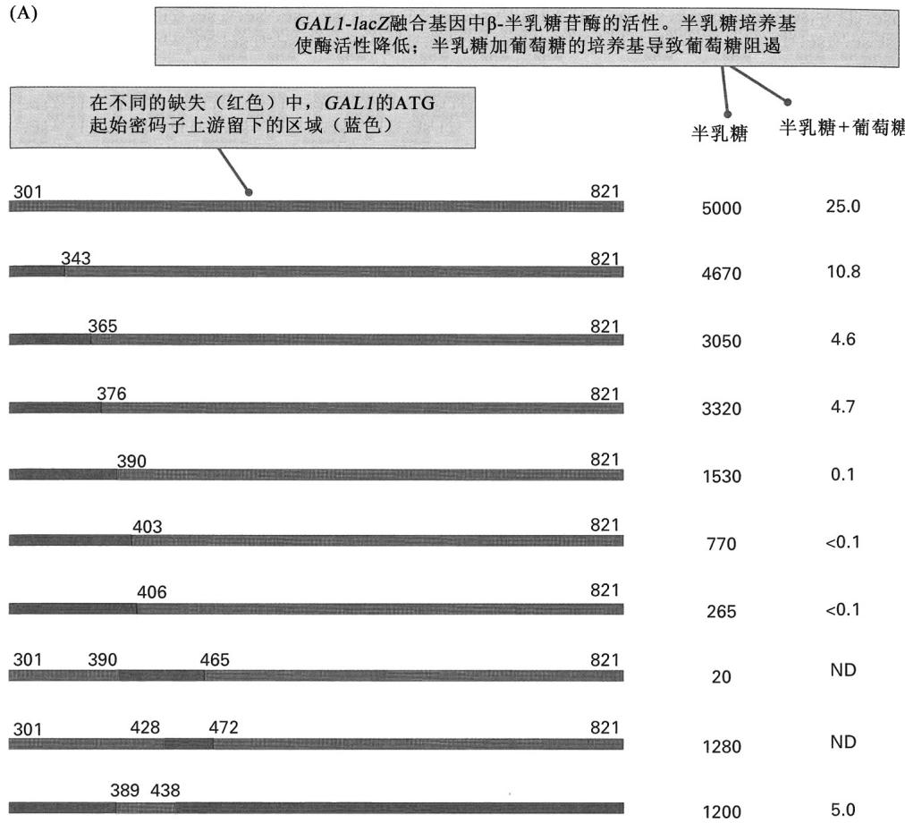

(B)  
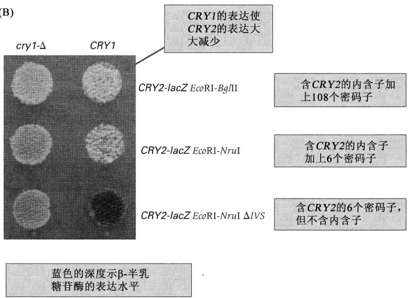  
图 11.24 用报道基因构建体对遗传调节进行分析。(A)上游调节序列及酵母 GAL1 基因约 30 个密码子与 lacZ 基因融合，造成缺失突变，并转化进酵母中。给出了在诱导(半乳糖)或阻遏(半乳糖加葡萄糖)条件下的 β-半乳糖苷酶水平。(B) CRY1 核糖体蛋白基因的表达使其 CRY2 重复拷贝的表达大大减少。这些缺失鉴定出 CRY2 的内含子含有负责下调表达的顺式作用元件。[A 部分改编自 R. W. West, Jr., R. R. Yocum, and M. Ptashne, Mol. Cell Biol. 4 (1984):2467-2478；B 部分承卡耐基梅隆大学小约翰·伍尔福德(John L. Woolford, Jr)和李珍(Z. Li)惠赠。]  
关键的结果如这一系列缺失的最下面一个所示。这是一个碱基对 389～438 片段被插入 lacZ

上游的构建体，在该构建体中，lacZ 变成可被半乳糖诱导和被葡萄糖阻遏，重演野生型的调节方式(虽然不是在数量上的重演，之所以这样，是因为上游区域中的其他区对 GAL1 的调节也有贡献)。在 389～438 区域中有什么？进一步的分析表明，376～451 区域包含两个 17bp 的重复序列，每个重复序列又各自含有两个拷贝的保守序列 5'-GGARGRC-3' (R 表示任一嘌呤，A 或 G)。该 17bp 序列能够引起真正的控制，因为事实上该序列是 GAL4 二聚体的结合位点，GAL4 是图 11.20 所示的转录激活蛋白。包含两个 17bp 重复序列的 376～451 区域称为 GAL1 的上游激活序列 (Upstream Activating Sequence, UAS)。

以 lacZ 作为报道基因，利用 β-半乳糖苷酶活性产生不溶性产物，其功用如图 11.24B 所示。一种称为 X-Gal(5-溴-4-氯-3-吲哚-β-D-吡喃半乳糖苷)的底物，在裂解后产生一种不溶性的蓝色染料。根据蓝色的强度可对 β-半乳糖苷酶活性进行定性估计。CRY1 和 CRY2 基因是编码一种核糖体蛋白的重复基因。CRY1 的表达使 CRY2 的表达大大减少，比较最上面一对菌落的缺失(左边)与野生型(右边)即可证明。这一系列缺失表明，通过 CRY1 基因产物导致重复基因 CRY2 阻遏的序列，位于 CRY2 的内含子中。该关键结果如最下面的一对菌落所示，其中，X-Gal 裂解所产生的蓝色显示，CRY2 内含子的缺失使正常情况下会被 CRY1 的表达引起的阻遏消除。

现在可用计算机和基因组方法来鉴定调节序列。举个有趣的例子，比较酵母菌属(Saccharomyces)6个近缘种的全基因组序列，在这6个种中，许多基因发挥相同的功能，并以类似的方式调节。它们的基因间序列(intergenic sequence)与酿酒酵母相应序列有大约 $60\%$ 相同。假设在不同种之间都保留的序列具有调节功能，而那些趋异的序列不具有调节功能，据此鉴定

出酵母的数十种新的调节模体。由于这些生物的基因不到6000个，所以，这些新的模体，与之前鉴定的模体一起，很可能涵盖了这些物种的大部分调节序列。其他几组证据表明，这种比较研究非常有效：之前已知的调节序列被重新发现；往往在具有相关的功能或细胞过程（如减数分裂、细胞周期或DNA损伤和修复)的基因上游，发现新的调节序列；在位于可被转录激活因子抗体沉淀的染色质中的短DNA序列中，发现新的调节模体。表11.5示这些新模体的其中几种。人们正在用报道基因构建体(如那些使用lacZ的构建体)来检测这些序列的真实性。

表 11.5 在出芽酵母中, 在表达方式类似的基因上游发现的新的调节序列模体

<table><tr><td>调节模体</td><td>所控制的过程</td></tr><tr><td>AATGTA</td><td>DNA损伤</td></tr><tr><td>ACATAC</td><td>DNA损伤,应激</td></tr><tr><td>TTTTCAT</td><td>应激</td></tr><tr><td>TAGAAA</td><td>细胞周期</td></tr><tr><td>TTCTTTC</td><td>细胞周期</td></tr><tr><td>ACAAAA</td><td>减数分裂</td></tr><tr><td>CCCTTTT</td><td>减数分裂</td></tr></table>

## ■ 真核生物的转录复合体

许多增强子通过 DNA 成环 (DNA looping) 来激活转录，DNA 成环是指在 DNA 上相对较远的区域之间的物理相互作用，其机制如图 11.25 所示。在转录必需的因子中，包括一个转录激活蛋白，它与转录复合体的至少一个蛋白亚基相互作用，将转录复合体募集到基因上。

基础转录因子(basal transcription factor)是转录复合体中的一些蛋白质，被广泛用于许多不同基因的转录中，真核生物的基础转录因子在进化上一直是高度保守的。体外精确转录所需的转录因子的最小集合，包括TFIIB、TFIID、TFIIE、TFIIF、TFIIH、Pol II和TFIIA(TFIIA不太重要)(在这些名称中，TF代表转录因子)。在体外，这些组分可逐步组装到启动子上。第一步是TFIID的募集，TFIID本身是一种蛋白复合体，含有TATA框结合蛋白(TATA-box-binding protein, TBP)和其他约10种称为TBP相关因子(TBP-associated factor, TAF)的蛋白质，TBP与TATA框区域中的启动子结合，TAF是特异性应答激活因子蛋白的组分。TBP在小沟中与DNA结合，从而使DNA弯曲约 $80^{\circ}$ 。Pol II RNA聚合酶包含12个蛋白质亚基，其被发现存在于一种称为Pol II全酶(Pol II holoenzyme)的复合体中，该复合体也包含一些基础转录因子(TFIIB、

TFIIF 和 TFIIH)及其他蛋白质。

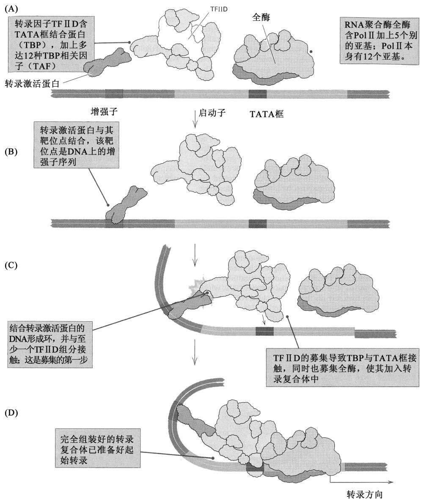  
图 11.25 通过募集使转录激活。(A)增强子和启动子和与它们结合的蛋白因子之间的关系。(B)转录激活蛋白与增强子的结合。(C)结合后的转录激活蛋白与 TFIID 复合体中的一个亚基发生物理接触，TFIID 复合体含有 TATA 框结合蛋白，将复合体吸引（“募集”）到启动子区。(D)PolⅡ全酶和任何余下的通用转录因子被 TFIID 募集，从而转录复合体完全组装好，准备转录。在细胞中，并不是所有的 PolⅡ都见于全酶中，并不是所有的 TBP 都见于 TFIID 中。在该示意图中，除了与 TFIID 和全酶相关的转录因子外，其他的转录因子未显示。

还不清楚转录复合体是像体外研究表明的那样，被募集到启动子并逐步组装，还是以一个或多个大的预组装复合体的形式被募集(PolⅡ全酶的构造提示是这种情况)。为清楚起见，图11.25显示了含有TFIID的一种预组装复合体的募集，该复合体继而募集预组装的PolⅡ全酶。为了激活转录(图11.25B)，转录激活蛋白与DNA中的一个增强子和TFIID复合体的一个TAF亚基结合。这种相互作用将TFIID复合体招引（“募集”）到启动子区域(图11.25C)。TFIID被吸引到启动子，也使PolⅡ全酶(图11.25D)及余下的所有通用转录因子受到募集，一旦汇集完成后，转录复合体就准备好转录了。

如图 11.25 所提示, 在真核生物中, 完全组装的转录复合体是一个非常巨大的结构。图 11.26示果蝇早期发育中的一个真实例子。在此例中，位于被激活基因上游相当远的两个增强子，被转录激活蛋白 BCD 和 HB 结合，这两种蛋白分别是 bicoid(bcd) 基因和 hunchback(hb，驼背) 基因的产物，这些转录激活因子在确立胚胎前后轴中发挥作用(果蝇的早期发育在第 13 章讨论)。请注意该基因启动子中 TATA 框的位置，与 TATA 框结合是 TBP 的功能。转录复合体中其他许多组分的功能也已得到鉴定。例如，TFIIH 含有熔解 DNA 的解旋酶活性和使 RNA 聚合酶 II 磷酸化的激酶活性。

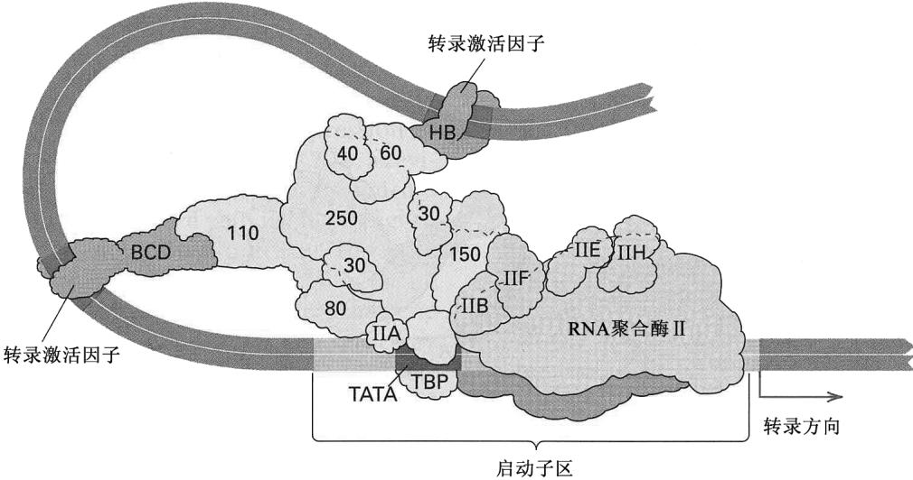  
图 11.26 果蝇发育过程转录激活的例子。此例中的转录激活因子为 Bicoid 蛋白 (BCD) 和驼背蛋白 (HB)。以数字编号的亚基为 TAF (TBP 相关因子)，这些亚基与 TBP (TATA 框结合蛋白) 一起，相当于 TFIID。BCD 通过一个 110kDa 的 TAF 起作用，HB 通过一个 60kDa 的 TAF 起作用。转录激活因子通过增强子发挥引起转录装置募集的作用。完全组装的转录复合体包含 TBP 和 TAF、RNA 聚合酶Ⅱ，以及通用转录因子 TFIIA、TFIIB、TFIIE、TFIIF 和 TFIIH。

磷酸化使聚合酶能够离开启动子，从而延伸 mRNA。由转录激活因子引起的 DNA 成环，是该激活过程的基本特征。真核生物的转录激活是一个复杂的过程，尤其是与原核生物 RNA 聚合酶相比较时，原核生物 RNA 聚合酶仅由 6 条多肽链组成。

## ■ 染色质重塑复合体

真核生物 DNA 通常以包装成核小体的染色质形式存在(第 7 章)。转录激活蛋白和转录复合体需要特殊的机制(包括在第 7 章中讨论过的组蛋白尾的化学修饰)才能得以接近 DNA，提示存在此类机制是基于这样的观察结果：能够在体外转录纯化的 DNA 的转录组分，不能够起始纯化的染色质的转录。一般情况下，染色质中的核小体必然会阻止转录复合体与 DNA 结合，或阻止转录复合体以 DNA 为模板。

现已鉴定了能重构染色质从而使染色质能被转录的几种不同的多蛋白复合体，这些复合体被称作染色质重塑复合体(chromatin-remodeling complexe, CRC)，包括酵母的SWI-SNF和RSC复合体，以及果蝇的NURF、CHRAC和ACF复合体(ACF complex)。SWI-SNF是以swi和snf突变来命名的，这两种突变使得SWI-SNF被发现，其他的缩写代表重塑染色质结构(remodels the structure of chromatin, RSC)、核小体重塑因子(nucleosome remodeling factor, NURF)、染色质可接近性复合体(chromatin accessibility complex, CHRAC)和ATP依赖的染色质组装和重塑因子(ATP-dependent chromatin assembly and remodeling factor, ACF)。所有的这些复合体使用来自ATP的能量来重构染色质，虽然不知道染色质重塑的详细机制，但这些复合体在活性上确有差异。例如，对 SWI-SNF 而言，抑制 swi 和 snf 的第二次突变定位在组蛋白基因上，SWI-SNF 复合体的存在致使单核小体中的 DNA 容易被 DNase 裂解，且纯化的 SWI-SNF 可体外重构染色质，RSC 具有类似但不完全一样的性质。而且，发现 SWI-SNF 是 Pol II 全酶的一个不可分割的组分，它使得全酶能够瓦解核小体。相比之下，NURF 促进转录因子与染色质结合；CHRAC 对核小体间隔起作用，增加染色质中的 DNA 对内切核酸酶活性的敏感性；而 ACF 辅助组装间距正常的核小体队列，并促进转录激活蛋白的结合。在高等真核生物中，已鉴定了类似种类的一些染色质重塑复合体，它们很有可能存在于所有的真核生物中。

染色质重塑的分子机制未知，而因为存在截然不同的几种CRC，可能存在几种机制。在染色质重塑模型中，有一类模型认为CRC可在不移动核小体位置的情况下瓦解核小体结构，使得DNA能够与转录激活蛋白、TATA框结合蛋白和其他转录复合体的组分接近。另一类模型认为，CRC改变了核小体在DNA上的位置，使关键的DNA结合位点得以接近。图11.27显示了一个例子，A部分显示无转录活性的染色质构象，转录激活蛋白(TAP)和TATA框结合蛋白(TBP)的DNA结合位点隐藏在核小体中，不能利用。CRC被募集到该位点，导致核小体的移位(B部分)，这使得结合位点可以被接近(C部分)。在这种染色体构型中，TAP和TBP可与DNA结合，从而募集转录复合体的其余部分。

## (A) 无活性的构象

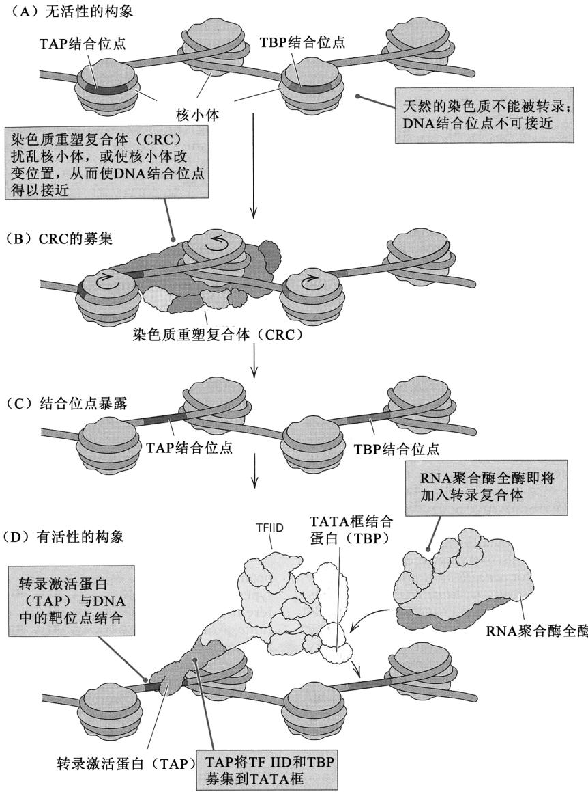  
图 11.27 染色质重塑复合体的功能。(A)天然的染色质可能会掩盖住关键的 DNA 结合位点。(B)染色质重塑复合体要么改变核小体在 DNA 上的位置,要么化学修饰组蛋白。(C)DNA 结合位点变得可以接近。(D)转录复合体被募集到该位点。

## ■ 可变启动子

有些真核生物基因在不同类型的细胞中有两个或多个有活性的启动子，不同的启动子产生含有相同蛋白编码区的不同初级转录物。图 11.28 示来自果蝇的一个例子，A 部分示编码乙醇脱氢酶的基因及其在基因组中的组织结构，包括被两个内含子打断的 3 个蛋白编码区。在幼虫中的转录(图 11.28B)与在成虫中转录(图 11.28C)使用不同的启动子。成虫的转录物具有较长的 5' 前导序列，但在 RNA 剪接中，大部分前导序列被去除。可变启动子(alternative promoter)使得在幼虫和成虫中进行独立的转录调节成为可能。

## (A) 基因结构

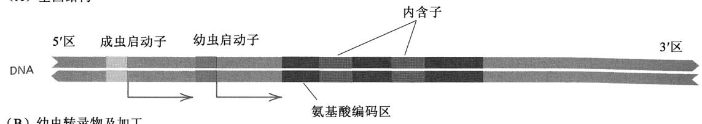  
(B) 幼虫转录物及加工

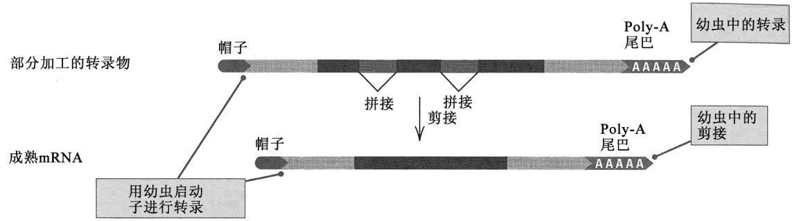

(C) 成虫转录物及加工  
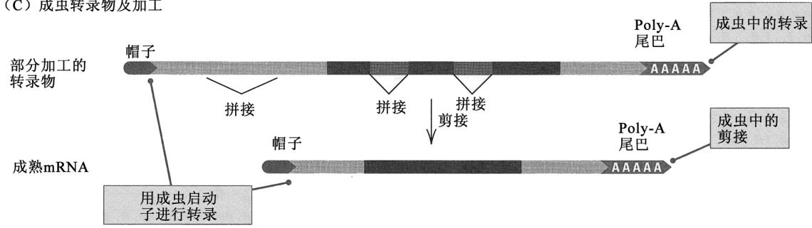  
图 11.28 果蝇乙醇脱氢酶基因使用可变启动子。(A)该基因的整体组织结构，在氨基酸编码区中包含两个内含子。(B)在幼虫中的转录，使用最靠近编码区 5' 端的启动子。(C)在成虫中的转录，使用更上游的一个启动子，大部分成虫的前导序列通过剪接而去除。

有些增强子的多功能性，是它们能够以竞争性方式与不同的启动子相互作用的结果，也就是说，在任一时刻，该增强子可激发一个启动子或另一个启动子，但不能两个启动子都激发。图11.29示这种机制的一个例子，其中，P1和P2为可变启动子，它们竞争位于它们之间的一个增强子。当该增强子与对启动子P1特异的一种转录激活蛋白复合时，转录复合体被启动子P1募集，转录发生(图11.29A)。当该增强子与对启动子P2特异的另一个转录激活因子复合时，转录复合体被启动子P2募集(图11.29B)。以此方式，对增强子的竞争起到P1或P2启动子表达的开关机制的作用。该调节机制存在于鸡中，导致在发育过程中，从胚胎β珠蛋白的产生到成年β珠蛋白的产生的变化。在此情况下，胚胎珠蛋白基因和成年珠蛋白基因竞争单个增强子，在发育过程中，该增强子的优先结合对象从胚胎启动子变为成年启动子。在人类中，增强子竞

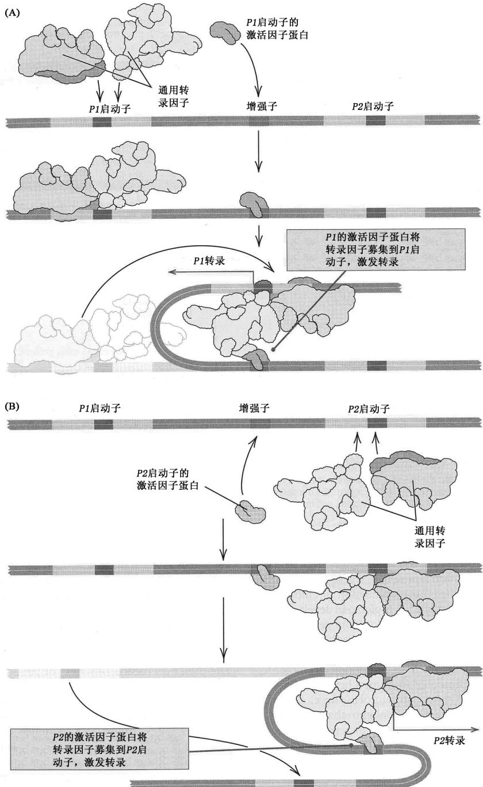  
图 11.29 通过对一个增强子的竞争进行调节的遗传开关过程。启动子 P1 和 P2 竞争位于两者之间的单个增强子。当与适当的转录激活蛋白复合时，该增强子优先与启动子 P1(A) 或启动子 P2(B) 结合。与启动子的结合募集转录复合体。如果任一个启动子发生变异或缺失，增强子就与另一个启动子结合。增强子相对于启动子的位置不太重要。

争似乎控制着从胎儿γ珠蛋白到成年β珠蛋白多肽链的发育开关。在β珠蛋白启动子缺失，或序列变异而不能与增强子结合的人中，不存在对增强子分子的竞争，从而在成年时γ珠蛋白基因继续被表达，而正常情况下γ珠蛋白基因不会被转录。具有这类突变的成人，具有胎儿型血红蛋白，而不是成年型血红蛋白，这种疾病称为高F病(high-F disease)，因为持续存在婴儿型血红蛋白，但临床表现非常温和。

## 11.6 转录调节的

## 表观遗传机制

“epi”这个前缀是“之外”、“此外”的意思，因而，表观遗传(epigenetic)是指由DNA序列之外的某种改变引起的，而不是由DNA序列自身的改变引起的基因表达的遗传改变。这些DNA序列之外的改变通常是碱基的化学修饰，或与DNA结合的蛋白因子的化学修饰。在本节中，讨论一些表观遗传调节的例子。我们会看到，关于表观遗传修饰建立和维持的分子机制，还有大量的东西有待了解。

## 胞嘧啶甲基化

在大多数高等真核生物中，部分胞嘧啶碱基通过在 5 号碳原子上加上一个甲基 $\left(\mathrm{CH}_{3}\right)$ 而被修饰(图 11.30)。这些胞嘧啶是在 DNA 复制过程中以正常的、未修饰的形式被掺入的，然后被一种称为 DNA 甲基化酶 (DNA methylase) 的酶加上甲基。在哺乳类中，5'-CG-3'二核苷酸中的胞嘧啶优先被修饰，许多哺乳类基因在编码区上游有富含 CG 的区域，给甲基化提供了众多的位点，这些富含 CG 的区域称为 CpG 岛 (CpG island)，其中，“p”表示多核苷酸主链中的磷酸基团。

当两条链都被甲基化的 CG 二核苷酸进行 DNA 复制时，所得子代分子，每个分子含一条具有甲基化 CG 的亲链，和一条具有未甲基化 CG 的

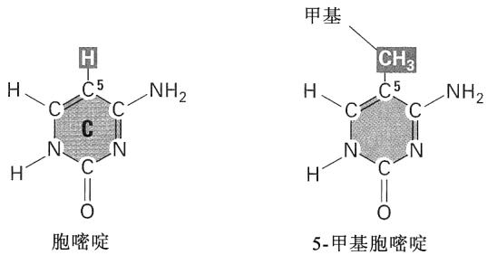  
图 11.30 胞嘧啶和 5-甲基胞嘧啶的结构。

新合成的链。DNA 甲基化酶识别这些分子中的半甲基化状态，然后将新合成的链中的胞嘧啶甲基化。在序列 CCGG 中的 CG 二核苷酸的甲基化，可用限制酶 Msp I 和 Hpa II 来检测，这两种酶

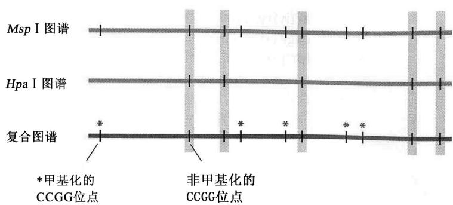  
图11.31 使用限制酶检测CCGG序列中的甲基化胞嘧啶。MspI切割所有的CCGG位点，无论是否甲基化，而HpaII只切割非甲基化位点。通过比较限制性图谱，可判断甲基化位点的位置。

都切割序列 CCGG。但是，Msp I 不论内部的 C 是否甲基化都切割，而 Hpa II 只切割未甲基化的 DNA。因此，不被 Hpa II 切割的 Msp I 限制性位点，是内部的 C 被甲基化的位点(图 11.31)。

## ■ 甲基化和转录失活

许多观察结果提示，重度甲基化与转录速率低的基因相关。一个例子是哺乳类细胞中的失活X染色体，其被大量甲基化。事

实上，在成年哺乳类的体细胞中，在所有染色体中，60%～70%的 CpG 二核苷酸都是甲基化的，非甲基化的 CpG 通常与活跃的管家基因的启动子有关。在成年体细胞中非活化基因的广泛甲基化，被认为是为了使它们偶然的、低水平的转录减到最低限度。

在高等植物的基因组中，甲基化也普遍存在，也与转录沉默相关。一个例子见于玉米 Ac 转座因子中，某些 Ac 因子在 DNA 序列没有任何改变的情况下，失去转座酶基因活性，这些因子被证明在一个 CG 二核苷酸特别丰富的区域具有严重的甲基化。甲基化的 Ac 因子恢复到正常活性，与通过细胞核内的去甲基化酶作用使甲基化丢失相一致。

甲基化也与真菌的转录沉默相关。例如，在链孢霉的 RIP(重复序列诱导的点突变，repeat-induced point mutation) 现象中(在第 14 章中会进一步讨论)，重复序列遭受超突变(hypermutation)，重复序列中许多带 C 的核苷酸变成甲基化的。在真菌巨大粪盘菌(Ascobolus immersus) 和灰盖鬼伞(Coprinus cinereus) 的性周期中，存在一个作用于重复序列的相关过程，该过程称为减数分裂前诱导的甲基化(methylation induced premeiotically, MIP)，它造成重复序列中胞嘧啶的重度甲基化，导致转录沉默。在所有的这些例子中，甲基化可被一直维持，贯穿整个细胞分裂过程，不过，这种维持的机制还不是很清楚。

虽然在重度甲基化和转录沉默之间存在强烈的相关性，但重度甲基化有可能是更早的表观遗传信号的结果，该信号标记要沉默的基因，从而募集甲基化酶。如果存在这样的更早的信号，那么这就意味着甲基化既是基因失活的结果，也是基因失活的机制。不管怎样，用胞嘧啶类似物氮胞苷(azacytidine)处理细胞，可逆转甲基化，从而可恢复转录活性。例如，在细胞培养中，大鼠脑垂体瘤细胞的一些谱系表达催乳素基因，而其他近缘谱系不表达。在不产生催乳素的细胞中，该基因被甲基化，但在产生催乳素的细胞中，该基因不被甲基化，用氮胞苷逆转不产生催乳素的细胞中的甲基化，可导致催乳素的表达。

## - 雌雄种系中的基因组印记

一种称为基因组印记(genomic imprinting)的罕见的表观遗传沉默，是哺乳类的一个特征，该过程具有以下特点：

\- 印记发生在种系中。

\- 印记影响的基因最多不过数百个(在这些基因中，许多基因成簇存在)。

\- 印记伴随着重度甲基化(虽然不知道印记的最初信号)。

\- 在雌性和雄性种系中，被印记的基因被甲基化的程度有差异。

\- 一旦被印记和甲基化后，被沉默的基因在胚胎发生过程中一直保持转录失活。

\- 在种系发育早期，印记被抹去，之后，按性别特异的方式重建。

虽然哺乳类配子被广泛甲基化，但在胚胎着床前的发育过程中，除印记基因继续保持其性别特异的甲基化模式外，大部分 DNA 都被去甲基化。在胚胎着床后，开始胚胎 DNA 的再次甲基化，逐渐达到在成年体细胞中所见的重度甲基化水平。在种系中，在 DNA 被全面去甲基化的时候，原来的印记被抹去，之后，在种系发育过程中发生重新甲基化。除少数具有性别特异印记模式和差异性甲基化的基因外，在两性的种系中，所有重新甲基化的基因获得相同的甲基化模式。在雌性中，印记基因在排卵之前的卵母细胞生长过程中发生甲基化；而在雄性中，很可能是在出生前后发生甲基化。因为与印记相关的甲基化，在整个胚胎发育过程中一直保持，所以，在雌性或雄性种系中被印记的任何基因，在胚胎中实际上只有一个有活性的拷贝。

在一对以神经肌肉缺陷、智力障碍和其他异常为特点的综合征中，与印记相关的表观遗传的、性别特异的基因沉默非常明显，这两种综合征是普拉德-威利综合征(Prader-Willi syndrome)

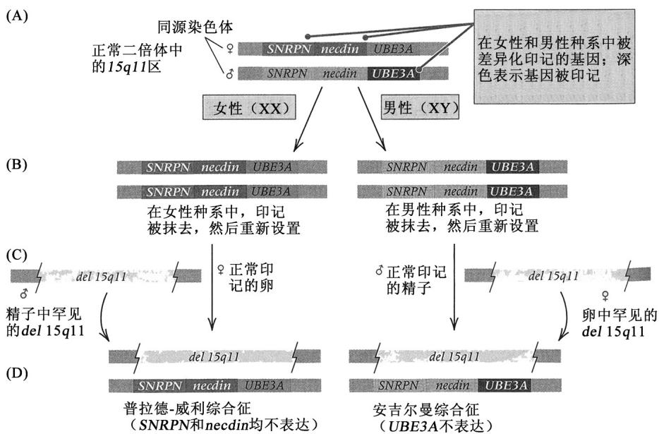  
图 11.32 在染色体区 15q11 中的基因的印记导致不同的神经肌肉综合征，取决于哪一个亲本贡献 15q11 缺失，以及哪一个亲本贡献印记染色体。(A) 正常二倍体中印记的方式。母源染色体在上面，父源染色体在下面。被印记而转录失活的基因如图所示。(B) 在种系中，印记被抹去，然后按女性特异模式或男性特异模式之一重新设置。(C) 遗传了一条母源的印记染色体以及一个 15q11 缺失的个体，患普拉德-威利综合征，而遗传了一条父源的印记染色体和一个 15q11 缺失的个体，患安吉尔曼综合征。该区域中的其他基因(未显示)，也有可能被印记。

和安吉尔曼综合征(Angelman syndrome)。这两种病都具有包含染色体区15q11的罕见的自发缺失。如果该缺失发生在父亲中，结果是普拉德-威利综合征，而如果该缺失发生在母亲中，结果是安吉尔曼综合征。其原因是，15q11至少包含3个在配子中被印记和差异性甲基化的基因（SNRPN、necdin和UBE3A）。图11.32A示在正常胚胎中这3个基因的印记方式，在卵细胞中，

SNRPN 和 necdin 被印记；在精子中，UBE3A 被印记。因而，在胚胎中，母源染色体中的 UBE3A 具有转录活性。如图 11.32B 所示，在女性和男性胚胎的种系中，印记被抹去，然后按性别重新设置；在女性中，两条同源染色体的 SNRPN 和 necdin 都被印记，而在男性中，两条同源染色体的 UBE3A 都被印记。如果一个正常的印记雌配子被一个具有 15q11 缺失的精子受精，那么，胚胎不存在具有转录活性的 SNRPN 和 necdin 拷贝，从而患普拉德-威利综合征。另外，如果一个正常的印记雄配子给一个具有 15q11 缺失的卵子受精，那么，胚胎不存在具有转录活性的 UBE3A 拷贝，从而患安吉尔曼综合征。这两种综合征，不仅证明了通过印记对基因表达的表观遗传控制，而且证明了不同性别中的差异性印记，以及在基因组中印记基因的成簇存在。

为什么会存在印记？一种假说是，印记是在具有一雌多雄制(每个雌性与多个雄性交配)的早期哺乳类中进化来的。在这样的情况下，雄性让那些以牺牲胎儿利益为代价来保存母本资源的基因沉默，对雄性有利，因为该策略使父本能够马上生殖的可能性最大。但是，雌性让那些以牺牲母本利益为代价而将资源分配给胎儿的基因沉默，对雌性有利，因为该策略使母本的长期生殖增大到最大限度。该假说得到这一事实的支持：一些印记基因确实以可预测的方式影响母本和胎儿之间的资源分配。不过，许多被印记的基因与母本-胎儿的冲突没有明显的联系。

## 11.7 通过 RNA 加工和降解进行调节

虽然基因表达的转录控制至关重要，但转录决不是基因活性可被调节的唯一水平。在本节中，我们来考虑在初级转录物的剪接水平上或在 mRNA 稳定性水平上起作用的一些机制。

## ■ 可变剪接

即使用同一个启动子来转录基因，因为在加工过程中产生的 mRNA 有差异，不同类型的细胞仍可产生不同数量的蛋白质(甚至是不同的蛋白质)。其原因是，从一种细胞到另一种细胞，相同转录物的剪接可有差异。不同的剪接方式可以包含一模一样的编码蛋白质的外显子，在此情况下蛋白质是一样的，但因为 mRNA 分子不以相同的效率翻译，合成速率会有差别。在其他情况下，在每种细胞中，转录物中编码蛋白质的部分具有不同的剪接方式，即使它们的某些外显子是相同的，但所产生的 mRNA 分子也会编码不一样的蛋白质。

人类及其他哺乳动物中的胰岛素受体基因，提供了一个可变剪接的例子，其可变剪接导致在 mRNA 中包含或排除外显子 11。所产生的两种形式的多肽链，在长度上有 12 个氨基酸的差异，其初级转录物的相关部分如图 11.33 所示。在肝脏中，在编码长型受体蛋白的 mRNA 中，可见所有 20 个外显子(图 11.33A)；而在骨骼肌中，外显子 11 与两侧的内含子被一道去除，从而被排除在编码短型受体蛋白的 mRNA 之外(图 11.33B)。长型受体表现出对胰岛素较低的亲和力，在像肝脏这样的可接触较高浓度胰岛素的组织中表达。短型受体蛋白对胰岛素的亲和力较高，在像骨骼肌这样的通常接触较低胰岛素水平的组织中优先表达。因而，可变剪接给从相同基因产生具有不同性质的蛋白质提供了可能性。虽然估计人类基因组包含不到 3 万个基因，但因为可变剪接，所产生的不同蛋白质的数目，可比基因数目多数倍乃至更多。

## ■ 信使 RNA 的稳定性

寿命短的 mRNA 比寿命长的 mRNA 产生的蛋白质分子少, 所以, 影响 mRNA 稳定性的特征, 会影响基因表达的水平。一种降解途径是依赖脱腺苷酸途径 (deadenylation-dependent pathway), 该途径从酶缩短 mRNA 上的 poly-A 尾巴的长度开始。当 poly-A 尾巴被缩短到 25～60 个核苷酸的长度时, mRNA 变得对脱帽酶 (decapping enzyme) 敏感, 脱帽酶去除 5' 帽子, 使 mRNA 分子不能起始翻译, 从出现这一状态时起, mRNA 就被外切核酸酶迅速降解。另一种途径是不依赖脱腺

<!-- END OFFICIAL API PART part_004 -->


<!-- BEGIN OFFICIAL API PART part_005 -->

苷酸途径(deadenylation-independent pathway)，这种途径从脱帽或内切核酸酶切割 mRNA 开始，之后，由于外切核酸酶活性，得以完全消化。不依赖脱腺苷酸途径对含有提前的链终止密码子或未剪接内含子的 mRNA 尤为有效，它可阻止截短多肽(truncated polypeptide)在细胞中的累积。

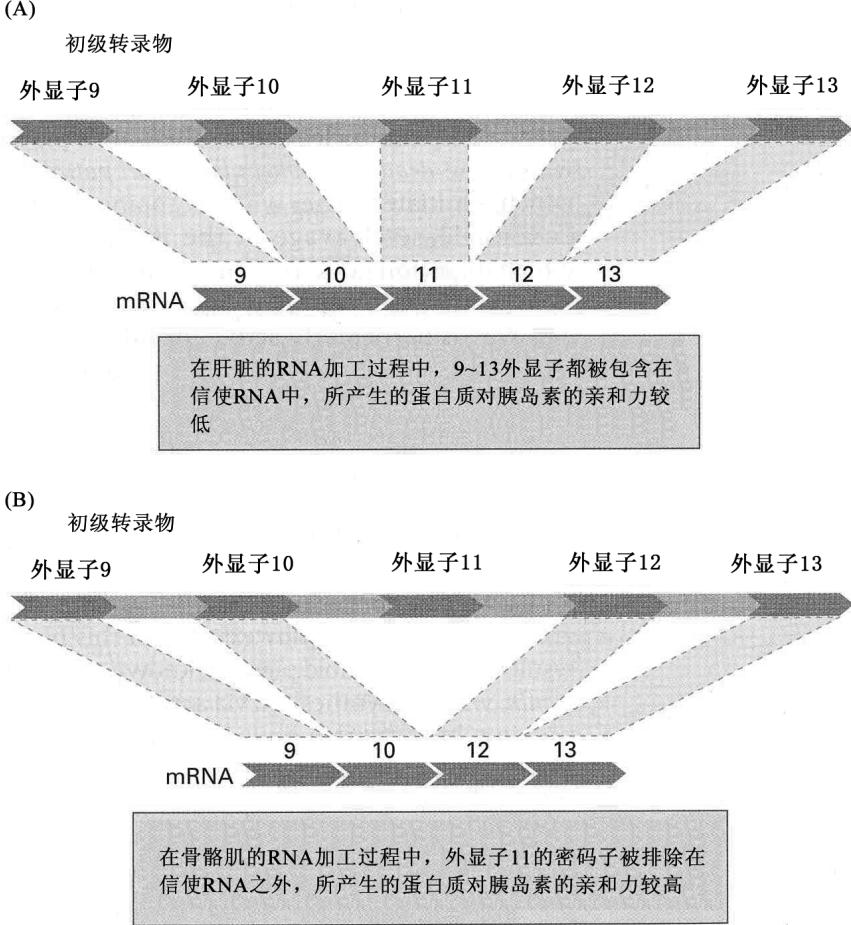  
图 11.33 在人类和其他哺乳类中编码胰岛素受体 $\alpha$ 链的基因的初级转录物的可变剪接。
(A)在肝脏中的剪接产生低亲和力的长型。
(B)在骨骼肌中的剪接产生高亲和力的短型。

  
图 11.34 一花坛牵牛花，有开野生型花的植株和开白花的植株。白花开在具有编码花青素合成基因的额外拷贝的植株上，曾预计这种植株会使花的颜色更深。未曾料到的是，该额外的基因拷贝使色素完全消除。[©Ivaschenko Roman/Shutterstock, Inc.]

## 11.8 RNA 干扰

1990 年，一些植物遗传学家报道了他们对编码牵牛花(Petunia hybrida，矮牵牛)花色的基因进行遗传操作的实验。在这种植物中，正常的红色或紫色花色，是由一种称为花青素(anthocyanin)的类黄酮色素产生的，花青素通过一个代谢途径合成，在该途径中，限速步骤由查耳酮合成酶(chalcone synthase)催化。研究人员推测，该基因增加额外的一个拷贝，可能会增加酶的水平，因此会增加色素的数量，产生更深的花色。在实际的实验中(图 11.34)，基因工程植株的花竟是白色的，在工程植株中，查耳酮合成酶 mRNA 的总水平为对照植

株的约 1/50，并且，在杂交中，这种色素形成减少的性状与额外的那个基因拷贝一道分离。不仅额外的那个基因拷贝自身是沉默的，而且它的存在引起同一植株中该基因的两个野生型拷贝沉默。这种出乎意料的基因沉默的机制一直是个谜，直到1998年，安德鲁·法尔(Andrew Fire)和克雷格·梅洛(Craig C. Mello)领导的研究人员才发现，双链RNA(dsRNA)的存在在秀丽隐杆线虫(Caenorhabditis elegans)中产生此类沉默，他们因这一发现被授予2006年的诺贝尔生理学或医学奖。

dsRNA 导致基因沉默是 RNA 干扰 (RNA interference, RNAi) 的一个例子。在真核生物中普遍具有 RNAi 应答的能力，并且很可能存在于共同祖先中，尽管在某些谱系中，包括在真菌和寄生性原虫中这种能力丢失了。很可能 RNAi 的分子机器最初是进化来防御病毒和转座因子的，这些病毒和转座因子要经过一个遗传信息以 dsRNA 形式存在的阶段。沉默效应是高度特异性的，并且非常强有力，每个细胞只需几个 dsRNA 分子就可生效。

RNAi 应答是在真核生物的进化多样化出现之前进化出来的，正如据此可以料到的一样，已详尽阐述的 RNAi 应答机制有数种，各以略为不同的途径起作用，并且生物已以多种方式利用这些途径的组分。关于 RNAi 应答，尚有许多未被发现和未能理解之处，但一些主要轮廓是

清晰的。介导RNAi应答的其中两种主要途径如图11.35所示，A部分示dsRNA的两个主要来源，左边的dsRNA，从同一个双链DNA分子的两条链转录而来，如果每条链各有一个上游启动子时，即可发生这种情况。这是RNA病毒或某些转座因子可产生的dsRNA类型，也是图11.34中被导入的查耳酮合成酶基因所产生的dsRNA类型，图 11.35 通过 siRNA 和 miRNA 途径进行基因沉默的机制。

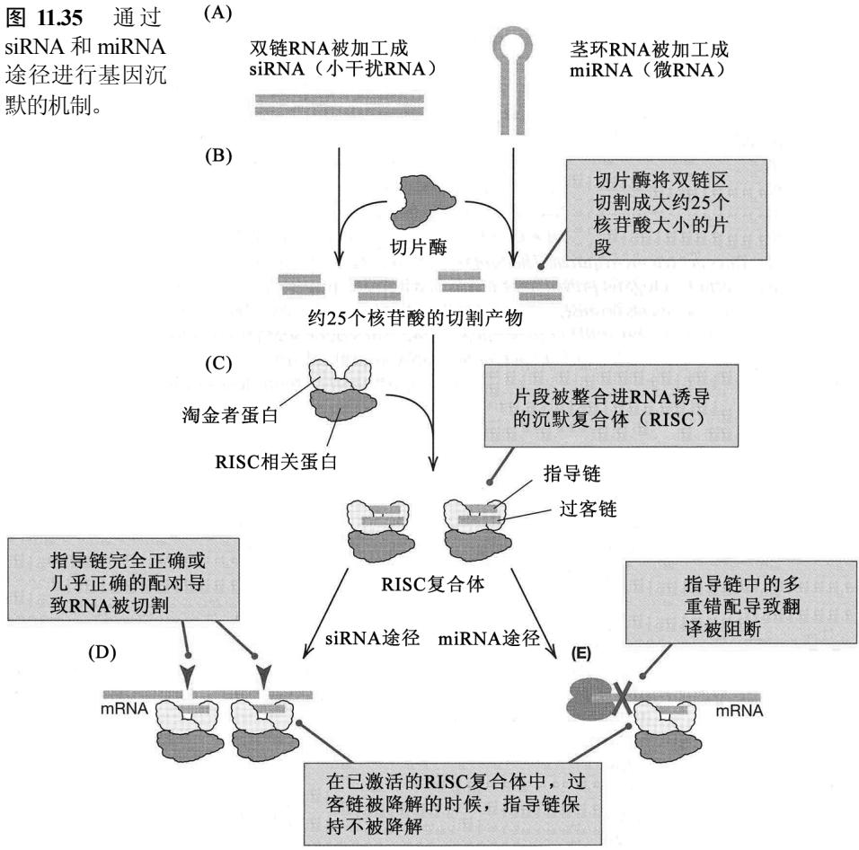

查耳酮合成酶基因被插到一个产生反义转录物(antisense transcript)的启动子附近，反义转录物是来自通常不被转录的DNA链的转录物。当反义转录物与有义转录物形成RNA双链时，所产生的dsRNA引起牵牛花的RNAi应答。在这类dsRNA中，两条链完全(或几乎完全)配对，并且dsRNA是小干扰RNA(small interfering RNA, siRNA)的来源。

图 11.35A 的右边是另一种 dsRNA 的来源，在此情况下，一个 DNA 双链体含有方向相反的重复序列，在其转录物中形成一个茎环二级结构，其中，茎为 dsRNA 的来源(此类反向重复序列将在第 14 章中详加讨论)。图中所示的这种结构，通常是细胞核中专门的酶从长的转录物产生的。配对的茎通常含有一个或多个错配碱基对，这些是在基因组进化时在反向重复序列中累积的。这些错配是由微RNA(microRNA，miRNA)介导的另一种RNAi途径的特点。

siRNA 和 miRNA 都是在细胞质中产生的，并且它们的途径都使用类似的细胞组分。在这些组分中，一种是称为切片酶(dicer)的酶(图 11.35B)，其功能正如其名：它将 dsRNA 切割成长度约为 25 个碱基对的双链小碎片，小碎片的每端各有一个短的单链突出。虽然该图只显示了单种切片酶，但是，在许多生物中，siRNA 途径和 miRNA 途径各自使用在不同基因中编码的自己的切片酶版本。

此后，切片酶产生的 dsRNA 短碎片合并入 RISC 复合体中(图 11.35C)，RISC 表示 RNA 诱导的沉默复合体(RNA-induced silencing complex)。两条链都被合并，但只有一条链会作为指导 RNA(guide RNA)，通过互补碱基配对识别靶 RNA；另一条链是过客链(passenger strand)，它在活化的 RISC 中被降解。正如切片酶一样，在许多生物中，RISC 复合体的组分——尤其是一个被称作淘金者蛋白(argonaute)的关键组分——在 siRNA 途径和 miRNA 途径之间有差异。

RISC 复合体形成之后，siRNA 途径和 miRNA 途径发挥作用的方式相当不同。在 siRNA 途径中，指导 RNA 与靶 RNA 链完全或几乎完全地配对，因为指导 RNA 和靶 RNA 是从相同双链 DNA 的两条相反链转录来的。在此情况下，RISC 复合体凭借其淘金者蛋白版本的作用切割靶 RNA（图 11.35D）。正是指导 RNA 完全或近乎完全的配对，使 siRNA 途径具有高度专一性。一般情况下，只有一种靶 RNA 被摧毁。

在 miRNA 途径中(图 11.35E)，指导 RNA 和靶 RNA 一般会包含几个错配，因为指导 RNA 和靶 RNA 是从基因组中不同的区域转录来的。在此情况下，活化的 RISC 复合体结合到靶 RNA，凭借其自身的淘金者蛋白版本的作用，阻断翻译过程。因为允许存在一些错配，一种 miRNA 通常以多种转录物为目标，每种转录物来自不同的基因，以此方式，单种 miRNA 可调节整个基因网络的表达。在人类中，已发现 miRNA 途径涉及细胞周期和肿瘤形成中的调节异常。

RNAi 应答不仅在调节通过 dsRNA 识别的靶中发挥作用，而且应答的组分也涉及基因组的结构和组织。例如，在裂殖酵母中，异染色质的诱导和扩散需要淘金者蛋白，并且切片酶和 siRNA 途径的其他组分，被用于维持异染色质中基因的转录沉默状态。

因 RNAi 在理论研究及实际应用上的潜力，RNAi 的发现在遗传学上产生了巨大的轰动。导入 dsRNA 能够降低具有同源转录物的基因的表达水平，是基因活性的遗传敲低 (genetic knockdown) 的基础 [它们被称为敲低 (knockdown) 而不是敲除 (knockout)，是因为这种沉默通常是不完全的]。实际上，RNAi 应答提供了一种产生突变等价物的方法：在不具备发达的诱变和遗传操作系统的生物中，它可使基因表达大幅下降。

RNAi 在生物技术和医学上也有重要应用。例如，在植物生物技术中，RNAi 被用来减少毒素的产生，如同在牵牛花中查耳酮合成酶的 RNAi 减少花青素的数量一样(图 11.34)。在医学上，其应用包括控制 HIV、肝炎、流感、麻疹和其他病毒的新疗法，以及治疗癌症和神经退行性疾病的新方法。

## - 长非编码 RNA (lncRNA)

长非编码 RNA (lncRNA) 一词用来指不被翻译成蛋白质的长度超过 200 个核苷酸的 RNA 转录物。人类基因组包含的 lncRNA 转录物数量不比编码蛋白质的转录物少。虽然有些 lncRNA 转录物来自基因间间隔区，但大多数 lncRNA 转录物来自蛋白编码基因的内部或附近，并且可以包括 5' 非编码区、内含子、外显子或 3' 非编码区在内的其中一条或两条 DNA 链为模板，产生多个往往相互重叠的转录物。总体而言，长非编码 RNA 数量巨大，但具体到单个的 lncRNA，它们被转录的频率比蛋白编码基因通常小得多。许多 lncRNA 转录物可能是在各个开放染色质区中发生的转录的随机噪声的结果。回忆一下，在最理想的反馈控制条件下，转录噪声下降的水平也仅为调节分子数量增加幅度的 1/4 次方；因此，偶然产生的随机转录，其有害效应可能非常小，不值得为了抑制它而付出额外的代价。

但是，已有很多证据充分的例子表明，lncRNA 可在基因调节中起作用。例如，有的 lncRNA 含自我互补区，这些区域可被加工成 microRNA。因为大多数 lncRNA 是从蛋白编码基因内部或附近转录来的，所以它们可形成 RNA/DNA 杂合体，从而影响基因表达。有的例子表明，RNA/DNA 杂合体可阻止转录复合体的组装，从而使蛋白编码基因沉默。而别的例子表明，RNA/DNA 杂合体可募集转录复合体，从而激活蛋白编码基因的转录。有些从蛋白编码基因的互补链转录来的 lncRNA，可与 mRNA 中的序列进行碱基配对，从而影响翻译。

有些 lncRNA 具有一种独特的调节功能，它们通过影响 DNA 甲基化、组蛋白修饰、染色质重塑和异染色质的形成，来对基因表达进行表观遗传修饰。在哺乳动物中，有一种称为 Xist 的含量丰富的 lncRNA，它是从最终失活的那条 X 染色体上的一个位点转录而来的。Xist 转录物要经过剪接和多聚腺苷酸化，但不被翻译，而是将失活 X 染色体从头到尾覆盖起来，募集 DNA 甲基化、组蛋白修饰及其他引起染色质改变的蛋白质，从而导致转录沉默。有一种称为 HOTAIR 的 lncRNA 与 Xist 很相似，它与靶区域结合，作为染色质修饰及其他蛋白质组装的支架，从而使基因沉默。

联系：祸不单行

安德鲁·法尔 $^{1}$ 、徐思群 $^{1}$ 、玛丽·蒙哥马利 $^{1}$ 、史蒂文·科斯塔斯 $^{1}$ 、塞缪尔·德赖弗 $^{2}$ 和克雷格·梅洛 $^{2}$ ，1998

1. 华盛顿卡内基研究所，巴尔的摩市，马里兰州

2. 马萨诸塞大学医学院，伍斯特市，马萨诸塞州

秀丽隐杆线虫中双链 RNA 强大而特异的遗传干扰

工程 RNA 分子导入生物一经成为可能，便开始有些奇怪且出乎意料的结果被报道。在极端的情况下，工程 RNA 阻止具有序列同源性的内源性宿主基因的表达。人们第一次发现，工程 RNA 似乎能够起到反义抑制物的作用——导入的 RNA 与内源性转录物进行碱基配对并干扰它们的功能。如果这是真的，那么，导入的 RNA 的这种抑制效应应该具有强烈的浓度依赖性。在这篇开创性的论文中，作者们证明，导入的双链 RNA (dsRNA) 介导这种抑制效应，并且证明，每个细胞只需要几个分子。秀丽隐杆线虫被证明适合用来做这些实验，因为与其他一些生物不同，秀丽隐杆线虫的 dsRNA 可被从细胞转运到细胞，从亲代传给子代。

在实验中将 RNA 导入细胞，可用来干扰某些生物系统中某个内源性基因的功能。……此处，我们研究对干扰 RNA 在结构和导入方式上的要求。让我们惊奇的是，发现双链 RNA 基本上比任何一条单独的链能更有效地产生干扰。……双链 RNA 引起强大而特异的干扰。注射进去的双链 RNA，每个细胞只需几个分子就可起作用，……表明在干扰过程中可能存在一个催化或放大的部分。……选择 unc-22 (uncoordinated-22) 基因来进行活性的初步比较。unc-22 编码一种含量丰富但非必需的肌丝蛋白。在每个横纹肌细胞中，存在数千拷贝的 unc-22 mRNA。……unc-22 的活性降低，会产生严重的抽搐表型。……覆盖一段 unc-22 (742 个核苷酸) 的纯化反义 RNA 或有义 RNA，只有微不足道的干扰活性，注射的 RNA 需要极高的剂量才能产生一些可观察到的效应。相比之下，有义-反义混合物对内源性基因活性产生极其有效的干扰。该混合物的有效性比任一种单独的链高出至少两个数量级。……有义-反义混合物强大的干扰活性，可能反映了双链 RNA (dsRNA) 的形成，或者，可以想象得到的，反映了这些链之间的一些其他的协同作用。电泳分析表明，注射物主要是双链的。……用 unc-22 dsRNA 干扰造成的表型是非常特异的。注射的线虫，其后代表现出的行为，与 unc-22 的功能丢失性突变极其类似。……可以想象得到，在其他线虫、其他无脊椎动物，以及在脊椎动物中，双链 RNA 介导干扰的情况可能更为普遍。RNA 干扰也可能在植物中起作用。……dsRNA 的遗传干扰可能被生物用于生理性的基因沉默。

来源：A. Fire, et al., Nature 391 (1998): 806-810.

## 11.9 翻译控制

在真核生物中，因为转录和翻译是非偶联的，所以基因表达可在与转录分开的翻译水平被调节。翻译控制的主要类型有：

\- 除在一定条件下之外，使某个 mRNA 分子不能被翻译。

\- 蛋白质合成的总速率的调节。

\- 由于在 mRNA 的上游存在一个小的可读框而终止主要可读框的翻译。

\- 通过与 mRNA 进行碱基配对的 microRNA，抑制翻译(图 11.35E)。

翻译调节的一个重要例子，是激活先前未翻译的细胞质 mRNA。该机制在早期发育中很重要：刚受精的卵以很快的速率合成许多新的蛋白质，所有这些蛋白质几乎都是来自事先存在于细胞质中的 mRNA。已知 mRNA 激活的分子机制的例子为数不多。例如，果蝇中 bicoid、Toll 和 torso 基因的 mRNA，因为它们的 poly-A 尾巴在细胞质中被延长，而被激活。

一个非同寻常的翻译控制的例子，是家蚕丝心蛋白(fibroin)mRNA的生存期的延长。在茧形成的过程中，丝腺以压倒性的优势大量合成单一种类的蛋白质——丝心蛋白。丝心蛋白的数量通过3种不同的机制增加。第一，丝腺细胞变成高度的多倍体，每条染色体累积了数千个拷贝。第二，丝心蛋白基因的转录起始于一个强启动子处，导致在数天内每拷贝基因产生约 $10^{4}$ 个丝心蛋白mRNA分子。第三，丝心蛋白mRNA分子具有非常长的生存期。典型真核生物mRNA分子的生存期约为3h，与此相比，丝心蛋白mRNA可生存数天，在此期间，每个mRNA分子被反复翻译，产生 $10^{5}$ 个丝心蛋白分子。因此，在茧形成的数天时间中，每个丝心蛋白基因可产生大约 $10^{9}$ 个蛋白质分子。

## ■ 小的调节 RNA 控制翻译

控制翻译的小的调节 RNA，在真核生物和原核生物中都已有描述，而基因组序列分析提示，还会有更多的例子。尽管已经详细研究过的例子只有少数几个，但大多数的例子似乎都与序列互补有关：调节 RNA 的序列与 mRNA 的一部分互补，控制 mRNA 的翻译。我们已经见过一个通过 microRNA 进行翻译抑制的例子(图 11.35E)。

与 mRNA 的一部分互补的 RNA 序列，称为反义 RNA (antisense RNA)。反义调节 RNA 通过与 mRNA 配对，起到抑制或激活翻译的作用 (图 11.36)。虽然控制质粒功能 (如拷贝数) 的调节 RNA 都是以单一 RNA 为目标，但接下来要讨论的细菌 RNA 往往控制几种 mRNA 的翻译，从而起到细胞过程的全局调节因子的作用。

图 11.36A 示大肠杆菌的一种小的调节 RNA 缓解氧化应激的例子。在过氧化氢存在的情况下，其中一个去阻遏的基因是 oxyS，该基因编码一个称为 OxyS 的调节 RNA，该 RNA 可与几种 mRNA 结合。对于任何一个给定的相互作用，OxyS 都只有很短的片段与靶 RNA 互补，并能与之退火。例如，OxyS 的两个独立区域与 flhA 基因的 mRNA 结合，flhA 基因编码一种转录激活蛋白（图 11.36A）。互补区域非常短，在此例中仅为 7 个核苷酸，其中一个互补区靠近 AUG 翻译起点，而另一个互补区在下游 40 个核苷酸之外。OxyS 和 flhA mRNA 之间的碱基配对掩盖了核糖体结合位点，从而阻止了翻译。这样一种由一条小的调节 RNA 和一条 mRNA 组成的两分复合体，称为接吻复合体 (kissing complex)。

小的调节 RNA 也可激活翻译。一个例子是图 11.36B 所示的来自大肠杆菌的 DsrA 调节 RNA。在此例中，rpoS 基因的 mRNA 的翻译受到控制，该基因编码 RNA 聚合酶的一个 $\sigma$ 因子，在细胞培养物中，该因子使得在静止期能够从一组特殊的启动子开始转录一组新的 RNA，静止期是细胞密度较高，细胞开始减缓生长和分裂的时期。rpoS mRNA 的 5' 端是自我互补的，因而可形成一个发夹结构，使核糖体结合位点和翻译起点被隐藏。DsrA 的两个几乎连续的区域可与 rpoS mRNA 结合，当结合发生时，核糖体结合位点被释放，从而翻译得以发生。

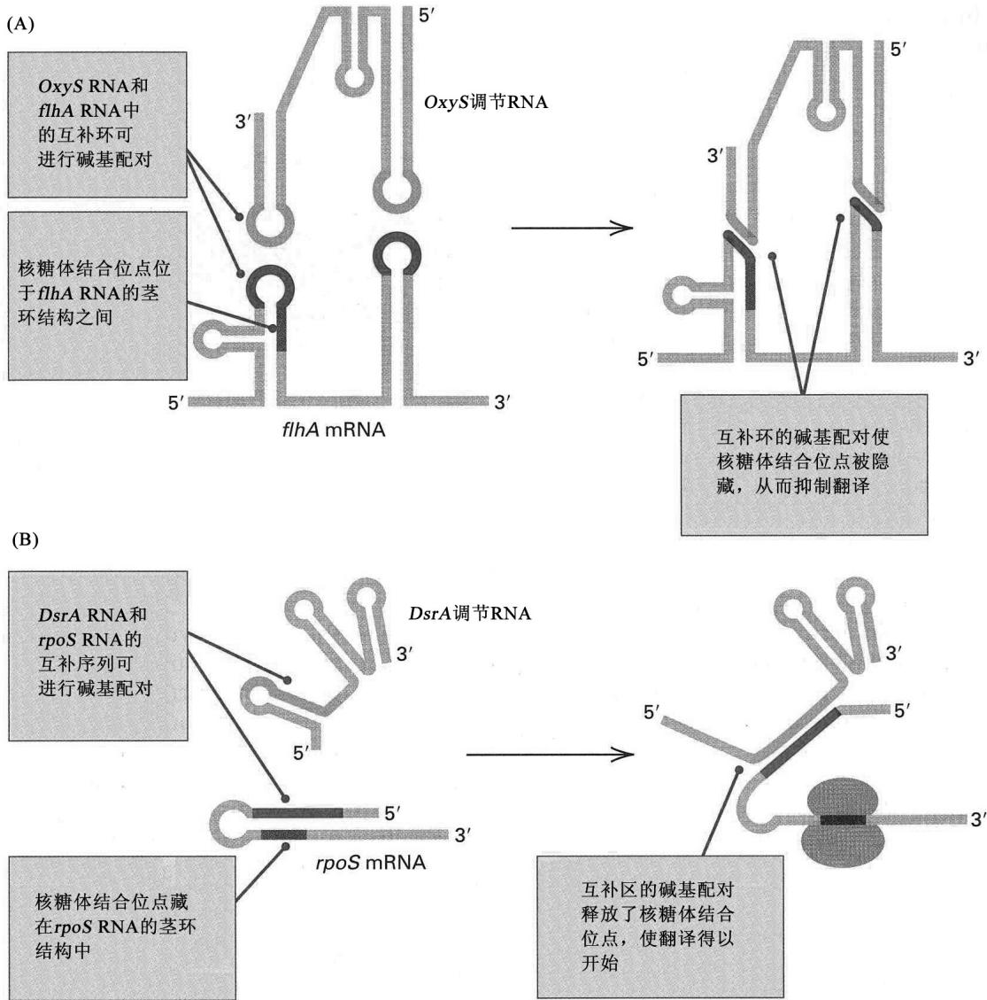  
图 11.36 通过(A)OxyS 和(B)DsrA 调节 RNA 调节靶 mRNA 的翻译。[引自 S. Altuvia and E. G. H. Wagner. 2000. Proc. Natl. Acad. Sci. USA 97:9824.]

## 11.10 程序性 DNA 重排

在 DNA 序列中引入改变，是一种不常见的基因调节机制，但也有一些重要的例子。在有些情况下，改变是可逆的，但在其他情况下，改变是永久的。DNA 序列的永久改变，意味着在发生改变的细胞谱系中，基因型被永久地改变。此类不可逆的改变仅在体细胞中发生，不发生于种系中，所以在遗传上它们不被传递。

## ■ 基因扩增

在有些情况下，基因拷贝数会通过一个称为基因扩增(gene amplification)的过程暂时增加。

在非洲爪蟾(Xenopus laevis)卵母细胞的发育过程中，可见一例。从卵母细胞前体形成卵是一个复杂的过程，需要高速的蛋白质合成，因而需要大量的核糖体(约 $10^{12}$ 个)。虽然rRNA基因已经串联重复达600个拷贝左右，但它们的数量还是不足以产生那么多的核糖体。在卵母细胞发育过程中，rRNA基因拷贝数增加到大约240万个(扩增了4000倍)。这种扩增是在卵母细胞发育的3个星期内发生的，是通过形成大量染色体外的、复制出来的rRNA基因的滚环而达成的。还不知道将这些环从染色体中割裂出来并形成滚环的分子机制。当卵母细胞成熟时，不再需要合成rRNA，于是，这些染色体外的rRNA基因拷贝停止复制，开始被降解。在许多生物的卵子发生过程中都会出现rRNA基因的扩增，包括昆虫、两栖类和鱼类。

## - 抗体和 T 细胞受体的可变性

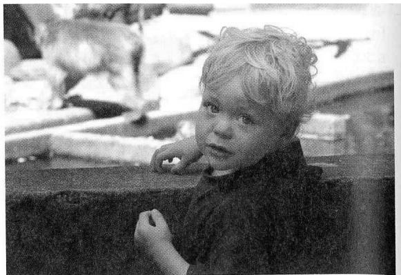  
T 细胞发挥正常功能需要存在腺苷脱氨酶 (adenosine deaminase, ADA)。这位三岁大的男孩因具有突变型的 ADA 而罹患严重联合免疫缺陷病 (severe combined immunodeficiency disease, SCID)。为了防止致命的感染，他生命中的第一个月是在一个塑料袋里面渡过的。他是受益于 SCID 基因治疗的首批患者之一。经过治疗，他现在能够像别的孩子一样整天在动物园玩耍。[©Peter Dejong/AP Photos.]

也许最令人印象深刻的程序性 DNA 重排的例子, 发生在骨髓源性(B)细胞和胸腺源性(T)细胞中, 这两种细胞在脊椎动物的免疫系统中发挥关键作用。B 细胞产生并分泌循环抗体, 循环抗体与外来抗原结合, 将外来抗原标记为需要摧毁; 而 T 细胞具有特异性受体, 可识别细胞膜上的外来抗原。从一个 B 细胞或 T 细胞到另一个 B 细胞或 T 细胞, 抗体和 T 细胞受体两者都具有高度可变的氨基酸序列, 并且, 这种可变性大部分是通过 DNA 重排产生的, DNA 重排将相对较少数量的编码序列组装成数量巨大的可能组合, 每个 B 细胞或 T 细胞中有一种组合。我们将考察这种产生抗体多样性的 DNA 剪接的过程, 导致 T 细胞受体可变性的也是一种类似的过程。

一个正常的哺乳动物能够产生超过 $10^{8}$ 种不同的抗体，但在任何时候只有其中的一

小部分被产生。每个 B 细胞可产生单一种类的抗体，但要到该细胞被适当的抗原刺激时，这种抗体才分泌。一旦受到刺激后，该 B 细胞进行连续的有丝分裂，最终产生一个在遗传上完全相同的、分泌这种抗体的细胞谱系。即使抗原不再存在，抗体分泌也可继续进行。

抗体有 5 个不同的类别，称为 IgG、IgM、IgA、IgD 和 IgE[Ig 代表免疫球蛋白 (immunoglobulin)]。这 5 类抗体在免疫应答 (immune response) 中执行专门的功能，并表现出一定的结构差异。但是，每类抗体都包含两种大小相异的多肽链：一种称为重链 (H 链，heavy chain) 的大亚基，和一种称为轻链 (L 链，light chain) 的小亚基。免疫球蛋白 G(IgG) 是含量最丰富的一类抗体，且其分子结构最简单 (图 11.37)。一个 IgG 分子包括由二硫键 (disulfide bond，两个共价结合的硫原子) 结合在一起的两条重链和两条轻链，整体形状呈 “Y” 字形。与抗原结合的抗体特异性位点位于 Y 分叉之上的两臂的上半部。每个具有不同特异性的 IgG 分子，在这一部分的轻链和重链中都具有不同的氨基酸序列，这些特异性区域称为重链和轻链的可变抗体区 (variable antibody region)。余下的多肽区域为恒定抗体区 (constant antibody region)，这些区域被称为 “恒定”，是因为在所有的 IgG 分子中，它们具有几乎一样的氨基酸序列。

  
图 11.37 免疫球蛋白 G(IgG) 分子的结构，示轻链 (L，蓝色阴影) 和重链 (H，黄色阴影)。可变区和恒定区如图所示。

对造成抗体多肽链氨基酸序列可变性的遗传机制，最初的认识来自对编码 IgG 轻链的一个基因的克隆。通过将该基因在胚胎细胞中和在成熟的、产生抗体的 B 细胞中的核苷酸序列进行比较，得到关键的观察结果。在活跃地产生抗体的 B 细胞的基因组中，发现分别与轻链恒定区 (constant region) 和可变区 (variable region) 对应的 DNA 片段非常靠近。但是，在胚胎细胞中，同样的这些 DNA 序列相距很远。对于重链的可变区和恒定区，也得到类似结果。在 B 细胞中，编码这些区域的片段靠近，但在胚胎细胞中远远地分开。

对编码抗体蛋白的基因组区域进行完整的 DNA 测序，不仅揭示了在 B 细胞和胚胎细胞中基因位置不同的原因，而且揭示了抗体可变性起源的机制。种系中的细胞含有与轻链恒定区对应的少数几个基因，这些基因在 DNA 上紧靠在一起，与这些基因分开，但在同一条染色体上，有数量大得多的另外一簇基因，这些基因与轻链可变区对应。在 B 细胞的分化过程中，编码恒定区的一个基因与编码可变区的一个基因被剪接(切断然后连接)到一起，产生一个完整的轻链抗体基因。类似的剪接机制产生重链的恒定区和可变区。

一个完整的抗体基因的形成过程比这一概述说明的还要复杂一些，因为轻链基因由3个部分组成，重链基因由4个部分组成。轻链起源过程中的DNA剪接如图11.38所示。对于可变区两个部分中的每一部分，种系含有多个编码序列，称为可变抗体区[variable(V) antibody region]和连接抗体区[joining(J) antibody region]。在B细胞分化过程中，一个缺失使其中一个V区与其中一个J区的连接成为可能，这种DNA连接过程称为V-J连接(V-J joining)，它可产生V区和J区的许多组合。由于转录增强子位于最右边的J区和C区之间的区域，重排后的基因总是会含有转录增强子。这也保证了只有重排过的基因才会被转录。转录时，连接在一起的V-J序列形成轻链 RNA 转录物的 5' 端。转录继续进行，通过编码基因的恒定抗体区 [constant(C) antibody region] 的 DNA 区，后续的 RNA 剪接将 V-J 区与 C 区连接，产生轻链 mRNA。在编码抗体重链的基因中也发生组合式的连接，只不过在此情况下 DNA 剪接是将重链相应的 V 和 J 与第三组序列之一连接在一起，第三组序列称为 D(表示多样性，diversity)，位于 V 簇和 J 簇之间。


通过组合式连接产生的抗体可变性水平，可以计算出来。在小鼠中，轻链是从大约250个V区和4个J区的组合形成的，产生 $250\times4=1000$ 种可能的链。对重链而言，有大约250个V区、10个D区和4个J区，产生 $250\times10\times4=10000$ 种可能的组合。因为任意轻链可与任意重链组合，所以至少有 $1000\times10\,000=10^{7}$ 种可能的抗体。用于产生抗体的DNA序列数目相当少(约500种)，但可能的抗体数目巨大。

$10^{7}$ 种不同抗体的这个数值是一种低估，因为还存在两种抗体可变性的来源。

1. 在轻链中，V-J 接头可在特定 V-J 组合的不同核苷酸之间剪接；在重链中，V-D-J 接头可在特定的 V-D 组合或 D-J 组合的不同核苷酸之间剪接，这些不同的剪接接头可在剪接基因中产生不同的密码子。例如，V 序列和 J 序列的某一特定的组合可以 5 种方式剪接。在剪接接头处，V 序列含核苷酸 CATTTC，而 J 序列含 CTGGGTG。剪接事件决定在完整的抗体轻链中编码第

<table><tr><td>剪接后的序列</td><td>97</td><td>98</td><td>99</td></tr><tr><td>CACTGGGTG</td><td>His</td><td>Trp</td><td>Val</td></tr><tr><td>CATTGGGTG</td><td>His</td><td>Trp</td><td>Val</td></tr><tr><td>CATTGGGTG</td><td>His</td><td>Trp</td><td>Val</td></tr><tr><td>CATTTGGTG</td><td>His</td><td>Leu</td><td>Val</td></tr><tr><td>CATTTCGTG</td><td>His</td><td>Phe</td><td>Val</td></tr></table>

97、98 和 99 位氨基酸的密码子，因而剪接事件可以下述任一种方式发生，最后两种方式造成氨基酸序列改变。

以此方式，V-J 连接的接头中的可变性可造成在氨基酸序列上有差异的多肽。

mutation)，这种突变发生在 B 细胞发育过程中。这些突变使不同的 B 细胞克隆能够产生不同的

多肽序列，即便它们经历的 V-J 连接完全一样。这种超突变的机制还不清楚。

## - 交配型互换

DNA 序列的重排是酵母中交配型互换(mating-type interconversion)现象的原因。正如曾在第5章中看到的那样，酿酒酵母有两种交配型，以 a 和 $\alpha$ 表示。单倍体 a 细胞和单倍体 $\alpha$ 细胞接合，产生 $\alpha\alpha$ 二倍体，该二倍体可进行减数分裂，产生 4 孢子囊，其中所含单倍体 a 和 $\alpha$ 孢子的比例是 2:2。如果 a 或 $\alpha$ 基因型的单个酵母孢子在与其他孢子隔离的情况下培养，则在后代细胞之间不会接合，因为所有后代细胞会具有相同的交配型。但是，酿酒酵母有一个称为同宗配合(homothallism)的交配系统，有的细胞转变为相反的交配型，使本是纯培养的细胞之间能够接合。

交配型互换的概要如图 11.39 所示，最初的一个单倍体孢子(在此例中为 $\alpha$ ) 通过发芽产生两个子细胞。正如根据正常的有丝分裂预期的那样，母细胞(原来的亲本)和子细胞两者都具有 $\alpha$ 交配型。但是，在下一次细胞分裂中，在母细胞及其新的子细胞中，都发生了交配型的转换(互变)，原来的 $\alpha$ 交配型被 a 交配型取代。在这第二次的细胞分裂完成后， $\alpha$ 细胞和 a 细胞能进行接合，因为现在它们为相反的交配型。细胞核融合产生 $\alpha a$ 二倍体，该二倍体进行减数分裂，其后的孢子形成过程又产生 a 和 $\alpha$ 单倍体孢子。

交配型互换的遗传基础是DNA重排，如图11.40所概括的那样。控制交配型的基因是III号染色体中的MAT基因，该基因可具有a或α两种等位基因形式。如果在单倍体细胞中的等位基因是MATa，那么该细胞具有交配型a；

  
图 11.39 酿酒酵母中交配型的转换。一个孢子(在此例中，为 $\alpha$ 交配型)发芽产生一个母细胞和一个芽，芽长成一个子细胞。在下一次分裂中，该母细胞和它的新的子细胞转换为相反的交配型(在此例中，为 a)。结果存在两个 $\alpha$ 细胞和两个 a 细胞。交配型相反的细胞可融合，产生 $a\alpha$ 二倍体合子。以类似方式，一个 a 孢子发芽，会造成向 $\alpha$ 交配型的转换。

如果该等位基因是 $MAT\alpha$ ，则该细胞具有交配型 $\alpha$ 。但是，在正常情况下，这两种基因型都含有在同一条染色体中、以非表达的基因盒 (cassette) 形式存在的 a 和 $\alpha$ 的遗传信息。 $HML\alpha$ 盒，离 $MAT$ 基因约 200kb 远，含有 $\alpha$ DNA 序列； $HMRa$ 盒，在 $MAT$ 的另一侧，离 $MAT$ 大约 150kb 远，含有 a DNA 序列。在交配型互换发生时，产生了一种特异性的内切核酸酶（由基因组中其他地方的 $HO$ 基因编码），切割 $MAT$ 区 DNA 的两条链。这种双链缺口启动一个过程，使含相反交配型的非表达基因盒中的遗传信息被插入 $MAT$ 。在该过程中，供体基因盒中的 DNA 序列被复制，所以交配型得以转换，但相同的遗传信息仍保留在基因盒的非表达形式中。 $HML$ 、 $MAT$ 和 $HMR$ 两端的序列完全一样（在图 11.40 中以浅蓝色和深蓝色显示），这些区域在其相互配对和互换中极其重要。 $\alpha$ 区的独特部分，长度为 747 个碱基对；a 区的独特部分长 642 个碱基对。转换过程的分子细节与第 6 章中讨论过的重组的双链缺口机制类似。

  
图11.40 交配型互换的遗传基础。交配型由MAT基因座上的DNA序列决定。HML和HMR基因座是含有非表达交配型基因(为 $\alpha$ 或a之一)的基因盒。在从 $\alpha$ 到a的转换过程中，MAT中的 $\alpha$ 遗传信息被来自HMRa的a遗传信息替换。在从a到 $\alpha$ 的转换过程中，MAT中的a遗传信息被来自HMLα的 $\alpha$ 遗传信息替换。

图 11.40 示连续两次交配型互换，第一次， $\alpha$ 细胞(含 MAT $\alpha$ 等位基因)利用 HMRa 盒中所含的 DNA 序列进行转换，变成 a。转换后的细胞具有 MATa 基因型，在其后的世代中，利用 HML $\alpha$ 中所含的非表达 DNA 序列，后代 a 细胞也可被转换成 $\alpha$ 交配型，该细胞具有 MAT $\alpha$ 基因型。在任何特定细胞的谱系中，交配型转换都可反复发生。

## - 交配型的转录控制

虽然交配型互换是由 DNA 重排控制的，但交配型本身是在转录水平上被控制的。MATa(交配型 a) 和 MATα(交配型 α) 各表达一组单倍体特异的基因。它们的差异在于，MATa 表达一组 a 特异的基因，而 MATα 表达一组 α 特异的基因。两种交配型细胞都表达的单倍体特异基因，包括 HO(编码在交配型互换中所用的 HO 内切核酸酶) 和 RME1(编码减数分裂特异基因的一种阻遏蛋白)。两种交配型各自特异表达的基因，其功能包括：①一种接合肽的分泌，这种接合肽在 DNA 合成之前吸引相反交配型的细胞，为进行融合做准备；②一种受体的产生，该受体为相反交配型所分泌的接合肽的受体。因此，当 a 细胞和 α 细胞接近时，它们已相互做好接合的准备，可以进行融合。

在转录水平上的交配型调节，按图 11.41 所示的调节相互作用进行。这些调节相互作用最初是根据不同类型突变的表型提出来的，大部分细节已被直接的分子研究证实。符号 asg、asg 和 hsg 分别代表 a 特异基因、α 特异基因和单倍体特异基因，每组基因用单个片段来表示，没有“阳光四射”表示没有发生转录。在 a 交配型细胞中(图 11.41A)，MATa 区被转录，从而产生一种称为 a1 的多肽。单独存在的 a1 没有调节活性，在缺乏任何调节信号时，asg 和 hsg 被转录，但 asg 不被转录。在 α 交配型细胞中(图 11.41B)，MATα 区被转录，产生两种调节蛋白，记为 α1 和 α2，α1 是 α 特异基因的正调节因子，而 α2 是 a 特异基因的负调节因子。结果是，asg 和 hsg 被转录，但 asg 的转录被关闭。α1 和 α2 两者都与它们控制的基因的上游特定 DNA 序列

结合。

在二倍体中(图 11.41C)，MATa 和 MATα 都被转录，但产生的多肽只有 a1 和 α2。其原因是，a1 多肽和 α2 多肽结合，形成一种负调节蛋白，抑制 MATα 中的 α1 基因和单倍体特异基因的转录。单独起作用时，α2 多肽是关闭 asg 的负调节蛋白，因为 α1 不产生时，αsg 的转录不打开。总的结果是，因为没有 α1，αsg 不打开，而 hsg 被 a1/α2 复合体打开，这保证可发生减数分裂(因为 RME1 的表达是关闭的)，并保证交配型转换停止(因为缺乏 HO 内切核酸酶)。因此，同宗配合的 aα 二倍体是稳定的，并可进行减数分裂。结果是，aα 二倍体无论是交配型特异的基因还是单倍体特异的基因都不转录。


图 11.41 酵母中交配型的转录调节。符号 asg、αsg 和 hsg 分别表示各组 a 特异基因、α 特异基因和单倍体特异基因。以 “阳光四射” 表示的各组基因为 “开”，而没有 “阳光四射” 的各组基因为 “关”。(A) 在 a 细胞中，a1 肽是无活性的，各组基因表现为它们的缺省的活性状态 (asg 和 hsg 开，αsg 关)，所以该细胞是 a 单倍体。(B) 在 α 细胞中，α2 肽关闭 asg，α1 肽打开 αsg，所以该细胞是 α 单倍体。(C) 在 a/α 二倍体中，α2 肽和 a1 肽形成复合体，该复合体关闭 α1 和 hsg，α2 肽关闭 asg，αsg 表现为关的缺省活性，所以在生理上该细胞为非 a、非 α、非单倍体 (也就是说，它是正常的二倍体)。

由 a1/α2 蛋白介导的单倍体特异基因转录的阻遏，是在大肠杆菌的 lac 系统和 trp 系统中已经熟悉的那种负调节的例子。在酵母的例子中，有趣的变化是 α2 蛋白在 a 特异基因的转录阻遏中具有它自己的调节作用，为什么 α2 蛋白不自己也抑制单倍体特异基因？答案就在于其 DNA 结合的特异性，单独存在时，α2 蛋白与单倍体特异基因中的靶序列的亲和力较低。但是，异二聚体 a1/α2 与单倍体特异基因中的靶 DNA 序列不仅具有高亲和力，而且具有高度特异性。

## 本章概要

\- 转录控制是基因调节的一个重要水平，不同机制的调节范围可从完全的负调节（“除非关闭，否则一直打开”）到完全的正调节（“除非打开，否则一直关闭”）。

\- 大多数基因受多种重叠的调节机制的调节。

\- 在原核生物基因组中，编码一个代谢途径的不同酶的基因往往成簇存在，并且由与该基因簇 $5^{\prime}$ 端的一个操纵基因区结合的一种调节蛋白协同控制，这种基因组织结构称为操纵子。

\- 在真核生物中，大多数基因不组织成操纵子。分散存在于基因组中的基因，由位于每个基因附近、与转录激活蛋白相互作用的一个或多个增强子DNA序列协同控制。

\- 真核生物的转录复合体由被募集到基因启动子的众多蛋白组分构成，此时启动子的染色质已经过适当的重构。

\- 转录控制的表观遗传机制是通过 DNA 碱基的修饰(通常是胞嘧啶甲基化)，或与调节蛋白结合而达成的基因表达上的遗传改变。

\- 基因表达也可在 RNA 加工水平上通过可变的剪接方式、转录物或 mRNA 的稳定性进行调节。

\- 双链 RNA 分子可被切割成短片段，用来确定被切割或翻译被阻断的同源 RNA 转录物。

\- 程序性 DNA 重排是某些遗传过程——如产生抗体可变性——的原因。

<table><tr><td></td><td>基因型</td><td>诱导物(+)</td><td>诱导物(-)</td><td>习题1 附表示一些lac操纵子的基因型,z</td></tr><tr><td>a.</td><td> $i^{+} O^{C} zgfp$ </td><td></td><td></td><td>基因是被基因工程改造过的。符号zgfp代表编码</td></tr><tr><td>b.</td><td> $i^{-} O^{+} zgfp$ </td><td></td><td></td><td>绿色荧光蛋白的工程基因,生产该蛋白质的细胞,</td></tr><tr><td>c.</td><td> $i^{S} O^{+} zgfp$ </td><td></td><td></td><td>发绿色荧光。符号zrfp代表编码红色荧光蛋白的工</td></tr><tr><td>d.</td><td> $F^{\prime}i^{+} O^{C} zrfp/i^{+} O^{+} zgfp$ </td><td></td><td></td><td>程基因,生产该蛋白质的细胞,发红色荧光。两种</td></tr><tr><td>e.</td><td> $F^{\prime}i^{+} O^{+} zrfp/i^{+} O^{C} zgfp$ </td><td></td><td></td><td>蛋白质都不生产的细胞,不发荧光;两种蛋白质都</td></tr><tr><td>f.</td><td> $F^{\prime}i^{-} O^{C} zrfp/i^{+} O^{+} zgfp$ </td><td></td><td></td><td>生产的细胞,发黄色荧光(绿色和红色混合所致)。</td></tr><tr><td>g.</td><td> $F^{\prime}i^{-} O^{+} zrfp/i^{+} O^{C} zgfp$ </td><td></td><td></td><td>根据在诱导物缺乏(-)或存在(+)的情况下培养的</td></tr><tr><td>h.</td><td> $F^{\prime}i^{S} O^{C} zrfp/i^{+} O^{+} zgfp$ </td><td></td><td></td><td>各种基因型的细胞的荧光颜色,填入“红色”、“绿</td></tr><tr><td>i.</td><td> $F^{\prime}i^{S} O^{+} zrfp/i^{+} O^{C} zgfp$ </td><td></td><td></td><td>色”、“黄色”或“无”,以完成该表格。</td></tr><tr><td></td><td></td><td></td><td></td><td>答案</td></tr></table>

## 基础回顾

\- 什么是转录的正调节？什么是转录的负调节？在这两种情况下，阻遏蛋白的作用各是什么？每种调节各举一例。

\- 什么是自调节？正向自调节和负向自调节有何区别？哪种调节方式可用来放大微弱的诱导信号？哪种调节方式可用来抑制产物的过度生产？

\- 哪些 lac 突变体类型证明了，要乳糖利用基因表达，在培养基中不必存在乳糖？

\- 操纵子怎样使其包含的基因实现协同控制？在真核生物中通常会发现操纵子吗？

\- 弱化在什么意义上给控制氨基酸生物合成的操纵子提供了一种“微调”机制？

\- 一个含编码某种氨基酸合成代谢途径中各种酶基因的操纵子，在前导序列中包含一个短的可读框，这一短的可读框包含该途径所合成的氨基酸的多个密码子。这些观察结果对该操纵子的调节有什么启示？

\- 什么是转录激活蛋白？什么是转录增强子？什么是染色质重塑复合体？在真核生物的基因调节中，这些因子起什么作用？

\- 可变剪接的可能性对于“一个基因编码一条多肽链”这种说法的普遍性有什么影响？

\- 表观遗传调节(epigenetic regulation)这个术语是什么意思？解释表观遗传调节何以能够通过胞嘧啶甲基化介导。

\- 什么是 RNA 干扰(RNAi)现象？在遗传分析中如何应用 RNAi?

\- 你认为在抗体形成中观察到的那种 DNA 剪接是可逆过程还是不可逆过程？为什么？

## 解题指南

答案

可根据以下原理推断表型：①野生型阻遏蛋白可扩散；②野生型阻遏蛋白能与 $O^{+}$ 结合，但不能与 $O^{C}$ 结合；③野生型阻遏蛋白可与诱导物结合；④ $i^{-}$ 突变型阻遏蛋白与 $O^{+}$ 或 $O^{C}$ 两者都不结合；⑤ $i^{S}$ 突变型阻遏蛋白能与 $O^{+}$ 结合，但不能与 $O^{C}$ 结合；⑥ $i^{S}$ 突变型阻遏蛋白不与诱导物结合。在诱导物缺乏的情况下，荧光表型为(a)绿色；(b)绿色；(c)无；(d)红色；(e)绿色；(f)红色；(g)绿色；(h)红色；(i)绿色。在诱导物存在的情况下，荧光表型为(a)绿色；(b)绿色；(c)无；(d)黄色；(e)黄色；(f)黄色；(g)黄色；(h)红色；(i)绿色。

```txt
习题2 试想一些经过基因工程改造的酵母菌株，其中，红色荧光蛋白(rfp)或绿色荧光蛋白(gfp)与GAL80p或GAL4p融合，但不改变GAL80p或GAL4p与GAL基因调节相关的任何结合特性。红色荧光蛋白聚集的任何细胞区室

基因型
a. GAL3 GAL80-rfp GAL4-gfp
b. GAL3 GAL80-gfp GAL4-rfp
c. gal3 [ko] GAL80-gfp GAL4-rfp
d. GAL3 GAL80-rfp gal4 [nls]-rfp
e. gal3 [ko] GAL80-gfp gal4 [nls]-rfp

半乳糖(-) 半乳糖(+)
细胞质 细胞核 细胞质 细胞核
```

(cellular compartment)，发红色荧光；绿色荧光蛋白聚集的任何细胞区室，发绿色荧光。如果两种荧光蛋白都在同一个区室中，由于红色和绿色混合，该区室发黄色荧光。根据在缺乏(-)或存在(+)半乳糖时培养的每种基因型的细胞质和细胞核的荧光，填入“红色”、“绿色”、“黄色”或“无”，以完成附表。对于运输进细胞核的蛋白质，可以忽略它们在细胞质中翻译时所产生的少量的荧光信号。gal3[ko]等位基因是去除了GAL3p的敲除突变，gal4[nls]等位基因是一种突变型的GAL4，其核定位信号缺失，导致该蛋白质逗留在细胞质中。

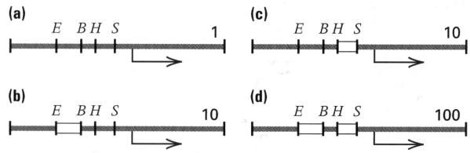

## 答案

可根据以下原理推断基因型：①在半乳糖存在的情况下，GAL3p 结合 GAL80p，使 GAL80p 留在细胞质中；②在半乳糖缺乏的情况下，GAL3p 不结合 GAL80p，GAL80p 被运进细胞核中；③GAL4p 具有核定位信号，导致它被运进细胞核中。在半乳糖缺乏的情况下，细胞质的荧光表型为(a)无、(b)无、(c)无、(d)绿色、(e)红色；细胞核的荧光表型为(a)黄色、(b)黄色、(c)黄色、(d)红色、(e)绿色。在半乳糖存在的情况下，细胞质的荧光表型为(a)红色、(b)绿色、(c)无、(d)黄色、(e)红色；细胞核的荧光表型为(a)绿色、(b)红色、(c)黄色、(d)无、(e)绿色。

## 分析与应用

11.1 编码细菌操纵子阻遏蛋白的基因一定要靠近结构基因吗？为什么？对大肠杆菌近缘种基因组的比较证明，lac 操纵子存在于大约 5 千万年前从另一菌种传入的一个基因组岛中。在这个具体例子中，lacI 基因与其他 lac 基因的紧密连锁对这样一种基因组岛的维持起到怎样的作用？

11.2 负责葡萄糖降解的糖酵解代谢途径是活细胞中基本的能量生产系统之一。该途径中的酶会被调节吗？为什么？

11.3 在哺乳动物中，骨髓中的网织红细胞在分化成红细胞的过程中失去细胞核，但是，网织红细胞和红细胞继续合成血红蛋白。提出一个在缺乏血红蛋白基因的情况下血红蛋白合成可持续很长一段时间的机制。

11.4 已知在几种真核生物中某种单一的效应分子可调节不同 mRNA 分子编码的两种蛋白质的合成，为了具体起见，可将这两种蛋白质称为 X 和 Y。在下列各种情况下，调节在基因表达过程的什么水平上发生？

(a) 编码 X 或 Y 的细胞核 RNA 和细胞质 RNA 均未发现。

(b) 可见编码 X 和 Y 的细胞核 RNA，但未见编码 X 和 Y 的细胞质 RNA。

(c) 可见编码 X 和 Y 的细胞核 RNA 和细胞质 RNA，但没有一种 RNA 与多核糖体结合。

11.5 试想一种与某个增强子序列结合并启动转录的转录激活蛋白。在存在几个拷贝而不是只有一个拷贝的增强子的重复中，调节会发生什么改变？

11.6 在对大肠杆菌某种诱导型操纵子操纵基因区的研究中，考察了此处所示的4个构建体的体外转录水平。与每个构建体相连的数字，是在存在阻遏蛋白的情况下观察到的相对转录水平。符号 $E$ 、 $B$ 、 $H$ 和 $S$ 代表EcoRI、BamHI、HindIII和SacI的限制性位点。构建体(a)为野生型操纵基因区，在 $(\mathrm{b}\sim \mathrm{d})$ 部分中，空

框表示缺失的限制性片段，什么样的阻遏蛋白-操纵基因相互作用的假说能够解释这些结果？怎样检验该假说？

11.7 下面是关于大肠杆菌乳糖操纵子的问题。

(a)哪些蛋白质受阻遏蛋白调节?

(b) lac 阻遏蛋白与 lac 操纵基因的结合如何阻止转录?

(c) lac 阻遏蛋白的产生是组成型的还是诱导型的？

11.8 一个基因的调节会受其启动子序列的倒位影响吗？会受增强子序列的倒位影响吗？对答案进行解释。

11.9 诱导物如何让处在负转录控制下的细菌操纵子能够发生转录？

11.10 大肠杆菌的通透酶转运一种 $\alpha$ -半乳糖苷(称为蜜二糖)，也可转运乳糖，但该蜜二糖通透酶对温度敏感：在 $30^{\circ}C$ 时，乳糖可被蜜二糖通透酶转运进细胞中，但在 $37^{\circ}C$ 时不行。在一个以组成型方式产生蜜二糖通透酶的菌株中，lacZ 和 lacY 突变体在 $30^{\circ}C$ 和 $37^{\circ}C$ 下的表型是什么？

11.11 操纵子使得基因活性的协同调节成为可能，可从单一的多顺反子 mRNA 合成一组功能相关的酶。这是否意味着在该多顺反子 mRNA 中的所有蛋白质都以相同的数量产生？请解释。

11.12 当大肠杆菌细胞中存在葡萄糖时，cAMP 的浓度是高还是低？具有无活性的腺苷酸环化酶基因，或具有无活性的 crp 基因的突变体，能否合成 $\beta$ -半乳糖苷酶？cAMP-CRP 与 DNA 的结合是否影响阻遏蛋白的结合？

  
B 造成的后果是什么？

11.13 基因 A 和 B 以附图所示的方式部分重叠， $P_{A}$ 和 $P_{B}$ 为启动子，箭头示转录的起点、方向和范围。重叠部分包含一个编码蛋白质的外显子。对于发生在重叠区内编码蛋白质的外显子中的突变而言，给阅读框 A 造成以下后果的突变，给阅读框

(a)一个错义突变?

(b)一个缺失?

(c)一个移码突变?

11.14 阻遏蛋白和前阻遏蛋白都能与操纵子基因编码的代谢途径的底物或产物分子结合。一般而言，哪一种与代谢途径的底物结合？哪一种与产物结合？

11.15 在一种大肠杆菌的近缘细菌中，一个含脯氨酸合成基因的生物合成操纵子表现出以下特点。发现该操纵子具有完全类似于大肠杆菌色氨酸操纵子的调节系统，具有一种与脯氨酸结合的前阻遏蛋白，以及包含一串5个连续的脯氨酸密码子的前导序列。

(a)在什么条件下，该脯氨酸操纵子的转录会被起始？

(b)在什么条件下，会发生弱化，从而使转录停止？

(c)在什么条件下，转录会持续进行到该操纵子的终点？

11.16 弱化子是像操纵基因一样与某种蛋白质结合的一个 DNA 区域吗？在任何时候，RNA 合成都是起始于弱化子之处吗？

11.17 分离到一种具有缺陷型核糖体蛋白的大肠杆菌突变体，该核糖体蛋白具有这样一种特性：每次碰到一个色氨酸密码子时，翻译都会暂时停顿一下，不论色氨酸负载 tRNA 是什么水平。预计这种突变会怎样影响色氨酸操纵子的弱化？

11.18 为了研究组氨酸操纵子中的弱化作用，用定向诱变将 his 前导 mRNA 中的 7 个组氨酸密码子 CAY 转变成编码色氨酸的密码子 UGG。

(a)在什么条件下该组氨酸操纵子会起始转录?

(b)在什么条件下会发生弱化，从而使转录停止？

(c)在什么条件下转录会持续进行到该操纵子的终点?

<table><tr><td>0</td><td>1</td><td>2</td><td>3</td><td>4</td><td>5</td><td>6</td><td>7</td><td>8kb</td></tr></table>

11.19 利用只切割非甲基化 5'-CCGG-3'位点的甲基化敏感型限制酶 Hpa II，来研究 3 种哺乳动物中某个基因某一区域中的甲基化，该区域具有示意图中所示的限制性图谱，其中对 Hpa II (H) 位点编了号。

从每个物种的卵和精子中提取 DNA，用 BamH I 和 Hpa II 消化，然后用可与整个感兴趣的区域杂交的探针，通过 Southern 印迹进行分析，结果如凝胶示意图所示。

(a) 在每个物种的每种配子中，哪种配子的 Hpa II 位点是甲基化的？

(b)哪些物种在两性中显示出差异性甲基化?


(c) 在哪些物种中雄配子显示出比雌配子更强的甲基化？

11.20 在具有弱化作用的氨基酸生物合成操纵子中，有些前导 mRNA 包含所合成的氨基酸的密码子非常少(如在色氨酸操纵子中)，而其他的前导 mRNA 包含的氨基酸密码子比较多(如在苯丙氨酸操纵子中)。请解释为什么这是预料之中的事。

11.21 在一个基因型为 $MAT\alpha / MAT\alpha$ 的二倍体细胞中， $MAT\alpha$ 中具有一个突变， $\alpha 2$ 基因产物关闭 a 特异基因的功能正常，但不能与 a1 产物结合。预计该细胞会是什么样的交配型表型？

11.22 预计一个基因型为 $MATa'$ 的单倍体细胞(撇号表示一种使 a1 蛋白变为无活性的突变)会是什么样的交配型表型？预计 $MATa'/MAT\alpha$ 二倍体会是什么交配型？

11.23 发现大肠杆菌的一个突变型菌株， $\beta$ -半乳糖苷酶和通透酶的产生都是组成型的(即无论乳糖存在与否都产生)。

(a)该突变体的两种可能的基因型是什么？

(b) 分离到另一种突变体，任何时候都不产生有活性的 $\beta$ -半乳糖苷酶，但如果在培养基中存在乳糖时，产生通透酶。该突变体的基因型是什么？

(c) 用 (a) 和 (b) 部分中的突变体构建一个部分二倍体：当乳糖缺失时，两种酶都不产生；而当乳糖存在时，两种酶都产生。(a) 中的突变体的基因型是什么？

11.24 如果把野生型大肠杆菌菌株培养在没有乳糖和葡萄糖的培养基中,有多少种蛋白质与乳糖操纵子结

合？如果把这些细胞培养在有葡萄糖的培养基中，有多少种蛋白质与乳糖操纵子结合？

11.25 在被抑制型 tRNA 抑制的 UGA 密码子位点，可以插入什么氨基酸？

11.26 一个 $lacI^{+}lacO^{+}lacZ^{+}lacY^{+}Hfr$ 菌株与一个 $F^{-}lacI^{-}lacO^{+}lacZ^{-}lacY^{-}$ 菌株接合。在培养基中缺乏任何诱导物的情况下，在 lac 区已经转移之后，在短期内有 $\beta$ -半乳糖苷酶产生。请解释为什么它会产生，为什么只在短期内产生？

11.27 分离到一种同时不能以许多种糖为碳源的大肠杆菌突变体。但是，遗传分析显示，负责每种糖的代谢的操纵子都没有突变。该突变体可能是什么基因型？

11.28 在 Northern 印迹技术中，在电泳凝胶上分离 mRNA 分子，转移到滤膜上，然后与标记放射性或光敏感性成分的 DNA 杂交。含有探针同源序列的 RNA 分子，成为可见的分离的条带。用来自大肠杆菌的 mRNA 进行一个 Northern 印迹实验，使用与 lacA 基因相应的 DNA 探针，lacA 基因与 lacY 毗邻。野生型 lac mRNA 长约 5kb。研究 lacZ 和 lacY 的两种突变，lacZ 和 lacY 突变是简单的核苷酸置换突变，编码无活性的蛋白质，lacZ 和 lacY\*突变为缺失，lacZ\*缺失丢掉了 2kb 的 lacZ 编码序列，lacY\*缺失丢掉了 0.5kb 的 lacY 编码序列，且这两种等位基因都不产生多肽产物。在诱导物存在 (+) 或缺失 (-) 的情况下进行培养，然后用 Northern 印迹分析下述 6 种基因型的 mRNA。在一定条件下分离 RNA 分子，得到所附凝胶示意图中虚线所示的大小。在凝胶示意图中标出每种基因型在诱导 (+) 和非诱导 (-) 两种条件下预计会出现 mRNA 条带之处。

(a) $lacI^{+} O^{+} Z^{+} Y^{+}$ (b) $lacI^{-} O^{+} Z^{-} Y^{-}$ (c) $lacI^{-} O^{+} Z^{*} Y^{*}$ (d) $lacI^{+} O^{C} Z^{-} Y^{*}$ (e) $F^{\prime}lacI^{+} O^{C} Z^{*} Y^{-}/lacI^{+} O^{+} Z^{-} Y^{*}$ (f) $F^{\prime}lacI^{+} O^{+} Z^{*} Y^{+}/lacI^{+} O^{C} Z^{-} Y^{*}$

11.29 在 Western 印迹中，在电泳凝胶上分离蛋白

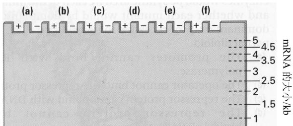


质，转移到滤膜上，然后与标记抗体混合，标记抗体可与其中一种感兴趣的蛋白质结合。用 Western 印迹来分析上一题中的 6 个大肠杆菌菌株，用于印迹的是两种抗体的混合物，一种是 β-半乳糖苷酶的抗体，另一种是通透酶的抗体。所附凝胶示意图显

示这些蛋白质(如果存在的话)会迁移到的位置。在凝胶示意图中标出在诱导 $(+)$ 和非诱导 $(-)$ 条件下培养的这6个菌株中各自可见的条带(如果有的话)。

11.30 LacY 通透酶既能转运乳糖酸，又能转运乳糖，但 LacZ 裂解乳糖酸的效率极低。某些 LacZ 的突变型具有变异的底物特异性，使突变型酶能够裂解乳糖酸。这些突变体能在含有乳糖酸，以乳糖酸为唯一碳源和能量来源的培养基上生长。但是，当操纵基因为野生型时，除非这些突变体同时具有 $lacO^{C}$ 突变，或者在培养基中存在 IPTG（异丙基硫代半乳糖），否则它们不能生长。怎样解释这些结果？

## 挑战题

挑战题 1 在一种新发现的生物中，组氨酸操纵子是负向调节的。它包含合成组氨酸所需酶的结构基因，并且阻遏蛋白也在操纵子内编码，也就是说，在编码其他蛋白质的多顺反子 mRNA 分子中。该 mRNA 的合成由调节单一启动子活性的单一操纵基因控制。该操纵子的辅阻遏物是 tRNA $^{His}$ ，组氨酸与之结合，该 tRNA 不是由该操纵子自己编码的。分离到具有下述缺陷的一批突变体，判断这些组氨酸的酶是否会被每种突变体合成，以及在部分二倍体 (partial diploid) 中每种突变型对其野生型等位基因是显性，仅仅是顺式显性，或者是隐性。

(a) 启动子不能与 RNA 聚合酶结合。

(b) 操纵基因不能与阻遏蛋白结合。

(c) 阻遏蛋白不能与 DNA 结合。

(d) 阻遏蛋白不能与组氨酰-tRNA $^{His}$ 结合。

(e)非负载 tRNA $^{His}$ (即没有结合组氨酸)可与阻遏蛋白结合。

挑战题 2 组氨酸操纵子的弱化子包含 7 个连续的组氨酸。该弱化子编码序列的相关部分为 5'-AAACACCACCATCATCACCATCATCCTGAT-3'

发生一个突变——一个额外的 A 核苷酸被插入到紧接在红色的 A 后面。野生型和突变型弱化子编码的氨基酸顺序是什么？预计该突变体是什么表型？

挑战题 3 在一种昆虫中，基因 cyclops 和 janus 具有不同的组织特异性表达方式：cyclops 仅在眼睛的感光细胞中表达，而 janus 只在精巢中表达。靠近 cyclops 的 5' 端含有一个内含子，在示意图中以影线表示，在该内含子中有两个 EcoR I 的限制性位点。该 EcoR I 片段被移出，然后插入刚好在 janus 启动子上游的一个 EcoR I

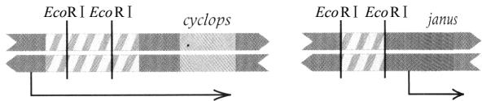

位点，此时，janus 既在感光细胞中转录，也在精巢中转录。不论该 EcoR I 片段被插入的方向如何，都产生相同的结果。什么假设能解释这一结果？如何检验该假设？

## 网上遗传学

“网上遗传学”(GeNETics)会为你介绍在互联网上寻找遗传学信息的某些最重要的站点。要浏览这些站点，请访问为《遗传学：基因和基因组分析》(第八版)配备的 Jones and Bartlett 公司配套站点http://biology.jbpub.com/book/genetics/8e/。

在该站点中，你会找到一个按章开列的重点关键词列表。选择某个关键词后，可链接到某个网站，其中包含与此关键词相关的信息。
