# 第 12 章 基因组学、蛋白质组学和转基因技术

在遗传工程中用作载体的那种环状DNA小分子的艺术再现。[©Laguna Design/Photo Researchers, Inc.]

## 本章提纲

12.1 位点特异的 DNA 切割和克隆载体  
12.2 克隆策略  
12.3 重组分子的检测  
12.4 基因组学和蛋白质组学  
12.5 转基因生物  
12.6 遗传工程的一些应用  
联系：多莉，你好！  
伊恩·威尔穆特、安杰利卡·施尼亚克、吉姆·麦克沃尔、亚历克斯·金德和基思·坎佩尔，1997  
源自哺乳类胎儿细胞和成体细胞的可存活后代  
联系：东拼西凑  
奥利弗·史密斯，2005  
许多小东西：一个遗传学家对复杂疾病的看法

## 学习目标与科学能力

本章所讨论的基因组学、蛋白质组学和转基因技术的原理和方法，为下列科学能力提供必要的背景。

\- 能指出特定 DNA 片段的限制性位点及载体的克隆位点，以便让该片段可以指定方向插入该载体。

\- 能陈述编码蛋白质的基因组区域中的进化签名——近缘物种在 DNA 序列上的特征性差异。

\- 能理解 DNA 微阵列上斑点状荧光颜色的意义，指出所比较的两个样品哪一个的转录水平较高。

\- 能解释 ChIP-chip 和 ChIP-seq 如何揭示与特定蛋白质结合的基因或 DNA 序列。

\- 能给双杂交分析下定义，并解释该方法如何帮助鉴定发生物理接触的蛋白质。

\- 能指出在转基因生物中靶向基因中断和靶向基因置换的区别。

人、黑猩猩、猴子、狐猴、小鼠、狗、猫、蝙蝠、松鼠、兔子、豚鼠、犰狳、刺猬、鼩鼱、负鼠、马、大象、穿山甲、树懒、美洲驼、海豚——这些是已经测定基因组序列的其中一些哺乳动物。在这个名单上加上果蝇、蠕虫和真菌等许多物种，与数以百计的细菌、线粒体和叶绿体，还有数以千计的病毒一道，你会初步领会到能够用来分析和比较的序列数据数量之巨大。除了基因组序列之外，还有办法鉴定出在特定组织类型中、在特定的发育时期中或在细胞周期的不同时期，基因组中的哪些基因被转录。这些就是基因组学的原始数据，基因组学(genomics)研究基因组的DNA序列、组织结构、功能和进化。在蛋白质水平上与其对应的是蛋白质组学(proteomics)，蛋白质组学旨在鉴定细胞或生物体的所有蛋白质(包括任何翻译后修饰的形式)，以及它们的细胞定位、功能和相互作用。蛋白质组学使用本章后面要讨论的方法，鉴定细胞中的哪些蛋白质发生物理接触，从而揭示相互作用的蛋白质的关系网络(network)。

基因组学得以成为可能，是因为一些技术的发明，这些技术最初是为了进行基因操作从而创造具有新基因型和表型的遗传工程生物而设计的，我们把这类方法称为重组 DNA (recombinant DNA)，也称为基因克隆(gene cloning)或遗传工程(genetic engineering)。基本技术非常简单，分离 DNA，用一种或多种限制酶将其切成片段；以新的组合方式将片段连接在一起，然后导回细胞或生物中，以定向的、预定的方式改变细胞或生物的基因型。这种经遗传工程改造过的生物，称为转基因生物(transgenic organism)。转基因生物一般是为了实验研究而制备的，但一个重要的实际应用是开发家畜和农作物良种，在此情况下，转基因生物常被称作遗传修饰生物(genetically modified organism, GMO)。在本章后面会讨论遗传修饰生物的一些具体例子。

## 12.1 位点特异的 DNA 切割和克隆载体

重组 DNA 技术严重依赖于限制酶，我们在 2.3 节介绍过限制酶，说到它们在产生具有明确

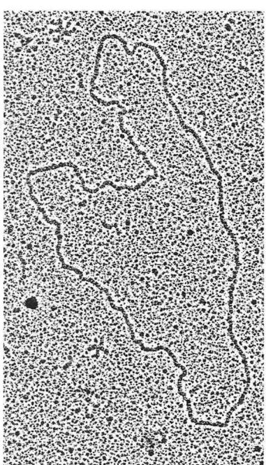  
图 12.1 在大肠杆菌中用作克隆载体的环状质粒的电子显微照片。

末端的 DNA 片段的过程中，存在位点特异的 DNA 切割。在重组 DNA 中，DNA 被限制酶切割后，限制性片段与载体 (vector) 分子连接，载体是可在其中导入 DNA 片段并可在适当的宿主生物中复制的 DNA 分子（一般为环状）（图 12.1）。大肠杆菌 (Escherichia coli) 和出芽酵母酿酒酵母 (Saccharomyces cerevisiae) 是用于重组 DNA 的典型宿主生物。在本节中，我们更加仔细地来看看让限制酶在 DNA 克隆中如此有用的一些特性。我们也会考察在重组 DNA 中最常用的一些载体类型。

## ■ 产生末端明确的 DNA 片段

限制酶是一种核酸酶，无论何处只要含有与限制酶的限制性位点一致的特定核苷酸短序列，限制酶即在此处切割双链 DNA(2.3 节)。每条链的主链都会被切断，产生一个游离的 3'羟基(3'-OH)和一个游离的 5'磷酸基(5'-P)。大多数限制性位点由 4 个或 6 个核苷酸组成。现已从微生物中分离到限制性位点不同的大约 1000 种限制酶。大部分限制性位点是对称的，即在 DNA 双链体的两条链上，识别序列都是一样的。例如，从大肠杆菌中分离到的限制酶 EcoR I，其限制性位点为 5'-GAATTC-3'，另一条链的序列是 3'-CTTAAG-5'，其实是一样的，只不过是将 3' 端写在左边。这种对称的 DNA 短序列称为回文序列 (palindrome)。在双链 DNA 中，EcoR I 在 G 和 A 之间切割回文序列的每条链。

在限制酶被发现之后不久，用电子显微镜进行的观察表明，许多限制酶产生的片段可自发形成环。经过加热，这些环可重新变成线状，但是，如果在形成环之后，用 DNA 连接酶 (DNA ligase，连接 3'-OH 和 5'-P 基团) 处理，末端会变成共价连接。这一观察结果是限制酶的以下 3 个重要特性的第一个证据。

1. 限制酶在对称序列(回文序列)中产生缺口。

2. 两条 DNA 链中的缺口不一定是正对着的。

3. 非对称性地切割 DNA 链的酶，产生具有单链末端的 DNA 片段，单链末端的碱基序列互补，这些特性如图 12.2 中的 EcoR I 所示。

大多数限制酶都像 EcoR I 一样，两条 DNA 链上的切割点是错开的，所产生的单链末端称为黏端(sticky end)，它们能相互黏附，因为它们具有互补的核苷酸序列。有些限制酶(包括 EcoR I)在 5' 端留下单链突出(图 12.3A)，其他限制酶留下 3' 端突出。许多限制酶在对称中心切割两条 DNA 链，形成平端(blunt end)。图 12.3B 示限制酶 Bal I 产生的平端，两个平端也可通过一种来自 T4 噬菌体的连接酶(T4 连接酶)连接，T4 连接酶与大多数其他的连接酶不同，它既可连接平端，又可连接双链 DNA 主链中的单链切口。不过，与黏端的连接总会重新出现原来的限制性位点不同，任何一个平端与其他任何一个平端连接，不一定会产生限制性位点。

大多数限制酶对限制性序列的识别，与 DNA 的来源无关：

如果 DNA 片段是由相同的限制酶产生的，则从一种生物获得的片段与从另一种生物获得的片段会有相同的黏端。

该原理是重组 DNA 技术的基本原理之一。

因为限制酶只在其限制性位点处切割，所以，在某种生物的 DNA 中，特定限制酶产生的切点数目是有限的。例如，一个大肠杆菌 DNA 分子含 $4.6 \times 10^{6}$ 个碱基对，因而，任意一种切割 6 个碱基的限制性位点的酶，会将该分子切成大约 1000 个片段，原因是，如果 4 种核苷酸的频率相等且随机出现，则平均每 $4^{6} = 4096$ 个碱基对会出现一个六碱基的限制性位点。基因组大小为 $3 \times 10^{9}$ 碱基对的人类 DNA，可被切成大约一百万个片段。这些数目虽然大，但与 DNA 随机剪切可能产生的片段数目比起来，还是比较小。令人特别感兴趣的是一些小 DNA 分子的切割产物，这些小 DNA 分子对任何特定的酶可仅有几个切割位点（或者一个也没有），如病毒或质粒的 DNA。质粒 (plasmid) 是存在于细胞（通常是细菌细胞）中的一种 DNA 分子，能独立于细菌染色体进行复制。不同质粒的大小为 1～10 kb。正如马上就要看到的，含有某种特定限制酶的单一切割位点的小的环状质粒，为在 DNA 克隆中作为载体很有价值。

  
图 12.3 限制酶产生的两种切口。红色箭头示切割位点。(A)在离限制性位点对称中心相等距离之处，在每条链中产生的非对称切口。(B)在限制性位点对称中心处，在每条链中产生的对称切口。

## - 重组 DNA 分子

在重组 DNA 中, 将特定的目的 DNA 片段与载体 DNA 分子连接。利用转化 (transformation) 方法, 将该重组分子导入细胞中, 该转化方法与埃弗里、麦克劳德和麦卡蒂用来证明 DNA 是遗传物质的方法非常相似 (第 1 章)。转化之后, 随着细胞 DNA 的复制, 重组 DNA 也会复制 (图 12.4)。当分离到稳定的转化体时, 就说与载体连接的 DNA 序列已被克隆 (cloned)。在下一节, 我们会描述几种载体。

## ■ 质粒、 $\lambda$ 和黏粒载体

最普遍有用的载体有 3 个特点:

1. 载体 DNA 比较容易导入宿主细胞。

2. 载体及其包含的任何 DNA 都可在宿主细胞内复制。

3. 可用简单的方法鉴定含载体的细胞，最方便的是通过载体中存在的 DNA 序列赋予宿主的新表型(如抗生素抗性)来鉴定。

最常用的载体是大肠杆菌质粒及大肠杆菌 $\lambda$ 和M13噬菌体的衍生物。现已开发了克隆入动物、植物和细菌细胞的其他质粒和病毒。质粒和噬菌体DNA可通过转化导入细胞，在转化过程中，细胞因接触氯化钙溶液而能够吸收游离DNA，也可用电穿孔(electroporation)方法，通过电脉冲处理，将重组DNA导入细胞。DNA被导入之后，可利用细菌生长过程中表现出来的载体编码的功能，检测含重组DNA的细胞。例如，某种载体编码某种抗生素(如四环素)抗性，成功转化了该载体的大肠杆菌细胞，会在含四环素的培养基上生长，而未被转化的细胞不会生长。使用适当的载体，这种方法的一些变化形式被用来转化动物或植物细胞(12.5节)，但其技术细节差异很大。

  
图 12.4 克隆的一个例子。来自任意生物的一个DNA片段与一个切割过的质粒连接。然后，用重组质粒转化细菌细胞，重组质粒在细胞中复制，并传递给细菌后代。细菌的宿主染色体未按比例绘制。细菌染色体一般比质粒大1000倍左右。

图 12.5 示克隆进大肠杆菌的 3 种常用载体。克隆相对较小的 DNA 片段 (5～10kb) 时，质粒 (图 12.5A) 最方便，稍大一些的片段，可用 $\lambda$ 噬菌体 (图 12.5B) 来克隆。正常的 $\lambda$ 噬菌体基因组长约 50kb，但因为该基因组的中央部分对感染和噬菌体增殖不是必需的，这部分可被去除，替换成供体 DNA。供体 DNA 连接到适当位置后，在体外 (in vitro) 将重组 DNA 包装进成熟的噬菌体，然后用该重组噬菌体来感染细菌细胞。不过，要包装进噬菌体的头部，重组 DNA 一定不能太大或太小，即供体 DNA 与被去除的那部分 $\lambda$ 基因组应该差不多同样大小。大部分 $\lambda$ 克隆载体可接受大小为 12～20kb 的插入片段。更大的 DNA 片段可插入黏粒 (cosmid) 载体 (图 12.5C)。这些载体可以质粒形式存在，但它们也含有称作黏端 (cohesive end) 的 12bp 噬菌体单链黏端 (9.7 节)。黏粒克隆可借助黏端被包装进成熟的噬菌体颗粒中，黏端要经过切割，黏粒 DNA 才能被包装进噬菌体头部。黏粒插入片段的大小的极限一般为 40～45kb。

有些载体可接受 100～200kb 的巨大 DNA 片段，这些载体称为人工染色体 (artificial chromosome)。应用最广的人工染色体是细菌人工染色体 (bacterial artificial chromosome, BAC)。图 12.5D 所示的 BAC 载体，是在大肠杆菌的 F 因子基础上构建的 (在第 9 章讨论 F 因子在接合中的作用时讨论过 F 因子)。在这个 6.8kb 的载体中，基本的功能包括复制 (repE 和 oriS)、调节拷贝数 (parA 和 parB) 和氯霉素抗性基因。应用物理方法，用切割位点稀有的限制酶 (如 Not I 和 Sfi I 这样的酶) 处理，或在只有部分限制性位点被切割 (部分消化) 的条件下用普通的限制酶处理，可将大分子断裂成所需大小的片段，产生适合克隆进 BAC 载体的 DNA 片段。

  
图 12.5 常用于大肠杆菌的克隆载体，未按比例绘制。(A)克隆相对较小的 DNA 片段，质粒载体比较理想。(B) $\lambda$ 噬菌体载体含有适当的限制性位点，可除去噬菌体的中间部分，代之以感兴趣的 DNA。(C)对于克隆多达 40kb 左右的 DNA 片段，黏粒载体很有用；它们可以像质粒那样复制，但因为含有 $\lambda$ 噬菌体的黏端，所以可被包装进噬菌体颗粒中。(D)BAC 载体很有用，因为它们可以携带比较巨大的 DNA 片段。

## 12.2 克隆策略

在遗传工程中, 实验的直接目的一般是将一个特定的染色体 DNA 片段插入质粒或病毒 DNA 分子中。达到这一目的的任何策略都必定包含如下几个步骤。

1. 供体 DNA 和载体 DNA 的纯化。

2. 用一种或多种限制酶来切割。

3. 供体DNA与载体DNA的连接。

4. 所需重组克隆的鉴定和分离。
步骤 1 和 2 已在 12.1 节中考察过，现在考察步骤 3 和 4。

## - 连接 DNA 片段

在 12.1 节中曾叙述过带有互补碱基的单链“黏性”末端的限制性片段的环化。如图 12.6 所示，因为无论 DNA 的来源如何，特定的限制酶都会产生黏端一模一样的片段，所以，从两种不同生物分离而来的 DNA 分子片段，可被连接起来。在该例中，限制酶 EcoR I 被用来消化来自任何感兴趣的生物的 DNA，同时用来切割只含一个 EcoR I 限制性位点的细菌质粒。供体 DNA 被切割成许多片段（显示了其中一个片段），而质粒被切割成单个线性片段。当供体片段与线性化的质粒混合时，可

通过互补单链末端之间的碱基配对形成重组分子。这时候，用 DNA 连接酶处理该 DNA，使接头封闭，从而使供体片段得以和载体共价连接。将感兴趣的供体 DNA 片段与载体连接的能力，是重组 DNA 技术的基础。

因为任一黏端都可与任何其他的互补黏端发生碱基配对，所以限制性片段的随机连接会产生多种多样的产物，包括许多无用的产物。例如，一个线性 DNA 分子，它被切割成 4 个片段——A、B、C 和 D，这 4 个片段在原来的分子中以 ABCD 的顺序存在(图 12.7)。将这些片段重新连接在一起，偶尔会产生原来的分子，但若 B 和 C 具有相同的成对黏端，也会形成片段的排列方式不一样的分子，包括有一个或多个限制性片段的方向颠倒的排列方式(在图 12.7 中以反向的字母表示)。平端限制性片段的连接，会产生更多的组合，因为任一平端可与任何其他平端连接。

如果来自载体的限制性片段有一个或多个，也会以错误的顺序连接在一起，但这一隐患可通过使用对某个特定的限制酶只有一个切割位点的载体而排除。如图 12.6 所示，当一个环状分子对某种限制酶只有一个切割位点时，切割只在这一个位置发生，任何其他感兴趣的 DNA 片段，如果有互补末端的话，就可插入该缺口。现在已有许多具有单一切割位点的质粒可供利用(大多是通过重组 DNA 技术制备的)。许多载体含有数种不同限制酶的单一位点，但通常每次只用一两种酶。

## - 将特定 DNA 分子插入载体

在迄今所描述的重组 DNA 方法中，用限制酶消化得到的大量片段，可与切割过的载体分子连接，产生含有不同供体 DNA 片段的大量重组分子。如果想要得到某个特定的 DNA 克隆片段，必须从其他重组分子组成的往往是巨大的本底中，分离出含有该特定片段的重组分子。最简单的办法是根据该片段产生的表型属性，对所需克隆进行直接选择。

我们举一个直接选择出含特定基因的重组分子的例子，假设想克隆大肠杆菌用来进行亮氨酸生物合成的一个基因。可以利用在这个感兴趣的基因中具有某种突变的 $leu^{-}$ 突变型菌株，来进行直接选择。这种 $leu^{-}$ 细胞不能在固体培养基上形成菌落，除非培养基中含有亮氨酸。为了从没有亮氨酸也能生长的野生型菌株中克隆 $leu^{+}$ 基因，要从 $leu^{+}$ 菌株中分离 DNA，用某种限制酶切割，产生的片段连接进质粒载体，然后以其转化基因型为 $leu^{-}$ 的突变型细胞。将转化后的细胞涂布到缺乏亮氨酸的固体培养基上，任何未转化的细胞，或转化了不含 $leu^{+}$ 基因的 DNA 的细胞，将不能生长，从而不能形成菌落。该培养基可选择出 $leu^{+}$ 转化体，因为含有插入载体的 $leu^{+}$ 基因的细胞，会形成菌落。如果该 $leu^{+}$ 基因含有所用限制酶的限制性位点，则实验不会成功，因为在该基因内的切割会摧毁其功能。因此，这种克隆实验通常是在部分消化 (partial digestion) 的条件下进行，部分消化的意思是，当只有一小部分限制性位点被切割时，裂解反应

  
图 12.7 一种限制酶产生的片段可以任意方式重新连接，因为切割位点的末端都是互补的。在此例中，一个 DNA 分子被一种限制酶切成 4 个不同的片段 (A、B、C 和 D)。显示了这些片段可被如何重新连接的几个例子。反向的字母表示该片段被以和野生型颠倒的方向连接。即便在两端是 A 和 D、中间有两个片段的重新连接的分子中，也有许多分子，一个片段出现两次，而根本没有另一个片段，或具有一个以相反方向存在的片段。仅在偶然情况下，重新连接才会再现原来的 A-B-C-D 顺序。

就被终止。以此方式，即便该 $leu^{+}$ 基因可能含有所用限制酶的一个或多个限制性位点，在部分消化之后，一些 $leu^{+}$ 基因仍有可能碰巧保持完整。

通常不可能像 $leu^{+}$ 例子中那样直接选择重组克隆。如果感兴趣的克隆既不是很罕见，也不是很难检测，则在与载体连接之前，先纯化包含感兴趣的基因的 DNA 片段，往往更好。常用来分离片段的方法有两种。

1. 用聚合酶链反应(polymerase chain reaction, PCR)扩增，这在2.4节中讨论过，在PCR中，与待分离片段的两端同源的寡核苷酸引物，被用来复制感兴趣的片段。经过足够数量的复制循环后，所得溶液主要含有的是被扩增的DNA片段的副本。

2. 对已知含有感兴趣基因的限制性片段进行纯化。例如，如果已知某个特定的限制性片段中含有某个基因，可在电泳(2.3节)后，从凝胶上纯化相应的DNA条带，使该片段得以分离，然后与适当的载体连接。

高等真核生物中的一些基因，包括许多人类基因，都非常长，它们长达数百 kb。含有完整基因的任何 DNA 片段都太长，以致不能用 PCR 扩增，并且对任何限制酶而言，都很可能含有多个切割位点。不过，此类巨大的基因通常产生大小适中

的 mRNA 分子，一般不超过 3kb。如果克隆的目的是生产该基因的蛋白质产物，那么所需的所有信息都包含在 mRNA 中。接下来叙述怎样克隆序列与特定 mRNA 对应的 DNA 分子。

## ■ 反转录酶的使用：cDNA 和 RT-PCR

有些特化的动物细胞含有高丰度的某种特定类型的 mRNA。例如，鸡的输卵管细胞含的卵清蛋白(一种蛋清蛋白)mRNA 非常多，以致从输卵管中提取的 mRNA 主要是卵清蛋白 mRNA。这种纯化的 mRNA 可作为分离含卵清蛋白编码序列的重组克隆的起点。

大多数 mRNA 分子不像卵清蛋白 mRNA 那样丰富。尽管如此，mRNA 仍常被用于克隆，尤其是在基因被许多长的内含子所打断的生物中(就像人类基因那样)，因为 mRNA 包含了内含子已经被去除的蛋白质编码序列。

在典型的真核生物细胞中，mRNA 的丰度水平可被非常粗略地分成 3 种类型。

1. 约 $1\%$ 的表达基因具有高丰度 mRNA (abundant mRNA)，每个细胞数百至数千个拷贝。

2. 约 10% 的表达基因具有中等丰度 mRNA (moderately abundant mRNA), 每个细胞 10～100 个拷贝。

3. 余下的差不多 90% 的表达基因具有稀有 mRNA (rare mRNA)，每个细胞 1～10 个拷贝。

从 mRNA 分子开始的克隆，要利用一种独特的聚合酶——反转录酶(reverse transcriptase)，该酶能与单链 RNA 分子结合，并以其为模板合成互补的 DNA 链。反转录酶最初发现于 RNA 肿瘤病毒中，在这种病毒中，单链 RNA 是遗传物质，反转录酶的功能是生成与病毒 RNA 互补的双链 DNA，该双链 DNA 可被整合进宿主细胞 DNA 中，反转录酶将病毒的遗传信息转换成 DNA，以便宿主细胞分裂时，病毒的遗传信息可复制并传给子细胞。如同其他的 DNA 聚合酶一样，反转录酶也需要引物。在遗传工程中使用此酶时，以通常见于真核生物 mRNA 3'端的 poly-A 尾巴作为引发位点(priming site)比较方便，因为可以 poly-T 组成的寡核苷酸为引物(图 12.8)。像任何其他的单链 DNA 分子一样，从 RNA 模板产生的 DNA 单链可在 3'最末端折叠回自身，形成一个“发夹”结构，该结构含由几个碱基对构成的短的双链区。发夹的 3'端作为第二条 DNA 链合成的引物，产生双链 DNA 分子，第二条链可用 DNA 聚合酶或反转录酶来合成。在编码反转录酶的 RNA 病毒(如人类免疫缺陷病毒，HIV)中，反转录酶自己合成第二条链。转换成常规的双链 DNA 分子，是通过一种核酸酶对发夹进行切割而成。与 RNA 分子互补的 DNA 称为互补 DNA(complementary DNA, cDNA)。

  
图 12.8 反转录酶产生一条在序列上与模板 RNA 互补的单链 DNA。在本例中，一个细胞质 mRNA 被拷贝。如此处所示，大多数真核生物 mRNA 分子在 3' 端有一段连续的 A 核苷酸，这作为引发位点比较方便。单链 DNA 生成之后，3' 端的反向折叠形成发夹，作为第二条链合成的引物。发夹被切开后，所得的双链 DNA 可马上或 PCR 扩增后，连接到适当的载体中。

在 mRNA 分子的反转录过程中, 产生的全长 cDNA 包含感兴趣的多肽的不间断的编码序列。因为许多真核生物基因包含存在于初级转录物中, 但在成熟 mRNA 产物中被去除的内含子, 所以 cDNA 序列与基因组 DNA 不完全相同。不过, 如果制备重组 DNA 分子的目的是鉴定编码序列, 或在遗传工程生物中合成该基因的产物, 则加工过的 mRNA 产生的 cDNA, 是首选材料。将 cDNA 与载体连接, 可用连接平端分子的现成方法来完成(图 12.8)。

从稀有 RNA 产生的 cDNA 分子也会比较稀有，不过，在连接进载体之前，可用 PCR 扩增来显著提高克隆稀有 cDNA 分子的效率。该方法的唯一限制是，要求已知 cDNA 两端足够多的

DNA 序列，以便能够设计合适的寡核苷酸引物。用反转录酶产生的 cDNA 进行 PCR 扩增称为反转录酶 PCR (reverse transcriptase PCR, RT-PCR)，所产生的扩增分子含有感兴趣基因的编码序列，而污染 DNA 非常少。

## 12.3 重组分子的检测

将某种限制酶产生的基因组的限制性片段与用同一种酶切割的载体混合后，会产生多种类型的重组分子，例如，没有获得任何片段的自我连接的环状载体；含有一个或多个片段的载体；只由许多相连的片段组成的分子。为了利于分离含特定 DNA 片段的载体，需要一些方法来确保：①载体确实具有一个插入 DNA 片段；②该片段确实是感兴趣的 DNA 片段。本节叙述检测重组 DNA 分子是否具有所需特征的几种实用方法。

## - 载体分子中的基因失活

当使用转化将重组质粒导入细菌细胞时，第一个目标是从所得的不含质粒的细胞和含质粒的细胞的混合物中，分离出含质粒的细菌。一种常用的方法是使用含抗生素抗性标记的质粒，从而可在含抗生素的培养基上筛选转化细菌，只有具有质粒的细胞能形成菌落。例如，一种广泛使用的克隆载体为图 12.9A 所示的 pBluescript 质粒，完整的 pBluescript 质粒为 2961bp，其不同区域各自发挥作用，使其成为一个克隆载体：

\- 该质粒的复制起点(DNA 开始复制的位置)来自大肠杆菌质粒 ColE1。ColE1 是一种高拷贝质粒，其复制起点使 pBluescript 及其重组衍生物在每个细胞中能够存在约 300 个拷贝。

\- 青霉素抗性基因使得在含青霉素的培养基中筛选转化细胞成为可能。

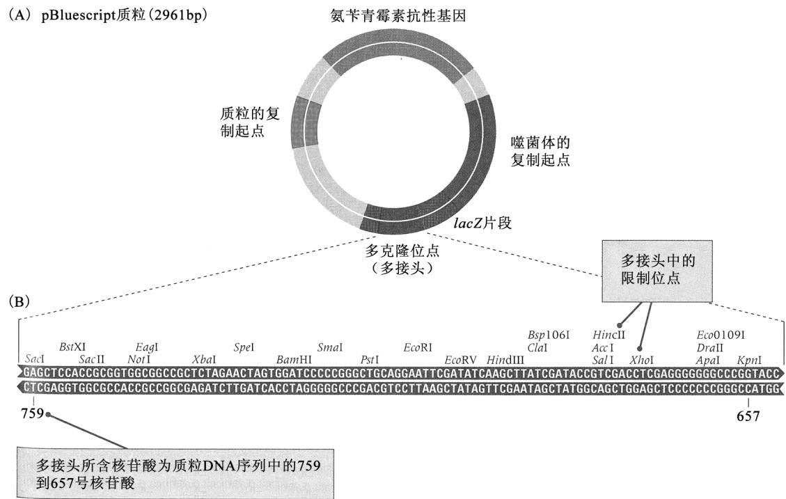

图 12.9 (A) 克隆载体 pBluescript II 示意图。该载体含一个质粒复制起点、一个青霉素抗性基因、一个位于大肠杆菌 lacZ 基因片段中间的多克隆位点(多接头)和一个噬菌体复制起点。(B) 多克隆位点的序列，示不同的单一限制性位点，载体可在这些位点处被打开，以便插入 DNA 片段。657 和 759 这两个数字是指在完整的 pBluescript 序列中碱基对的位置。[承安捷伦科技公司属下 Stratagene 公司惠赠。]

\- 克隆位点，称为多克隆位点(multiple cloning site，MCS)或多接头(polylinker)，含多种不同限制酶的单一切割位点，它可供多种类型的限制性片段插入。在pBluescript中，MCS是一段108bp的序列，含23种不同限制酶的克隆位点(图12.9B)。

\- 重组质粒的检测是通过一个含大肠杆菌 lacZ(β-半乳糖苷酶)基因的区域实现的，在图12.9A中以蓝色显示该区域。图12.10示筛选的根据，当lacZ区被插入MCS中的DNA片段打断后，重组质粒不能让细胞产生β-半乳糖苷酶，在MCS中没有DNA片段插入的非重组质粒可让细胞产生β-半乳糖苷酶。当培养基中含有一种称为X-gal(X-gal裂解后释放出一种深蓝色的染料)的β-半乳糖苷化合物时，可根据颜色区分这两种细胞。如图12.10C所示，在含X-gal的培养基上，细胞中含非重组质粒的菌落产生β-半乳糖苷酶，因而变成深蓝色，而细胞中含重组质粒的菌落不产生β-半乳糖苷酶，从而保持正常的白色不变。

\- 噬菌体复制起点来自单链 DNA 噬菌体 f1。当用 f1 辅助噬菌体 (helper phage) 感染含重组质粒的细胞时，该 f1 起点使得插入片段的一条单链从 lacZ 开始能够被包装进子代噬菌体中。这一特性非常实用，因为它产生的单链 DNA 适于作 DNA 测序的模板 (6.7 节)。图 12.9A 中所示的质粒为 SK(+) 型，也存在 SK(-) 型的质粒，其 f1 起点在对面方向，从而可包装互补 DNA 链。

(B)  
(A)  
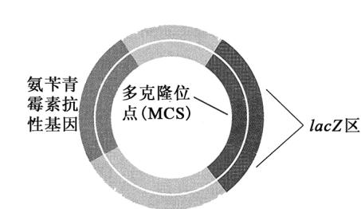

  
图 12.10 通过大肠杆菌 lacZ 基因片段的插入失活检测重组质粒。(A)含不间断 lacZ 区的非重组质粒。该区内的多克隆位点 (MCS) 足够小，以致质粒仍然能产生 β-半乳糖苷酶活性。(B)带有插入多克隆位点的供体 DNA 的重组质粒。该质粒可产生青霉素抗性，但不能产生 β-半乳糖苷酶活性，因为打断 lacZ 区的供体 DNA 大到足以使该区变得没有功能。(C)转化细菌的菌落。白色菌落中的细胞所含的质粒带有打断 lacZ 区的插入片段；蓝色菌落中的细胞所含的质粒不带有插入片段。[承艾琳娜·洛佐夫斯基 (Elena R. Lozovsky) 惠赠。]

所有符合标准的克隆质粒都有一个高效的复制起点、供 DNA 片段插入的至少一个单一克隆位点，以及一个被插入 DNA 打断后可产生具有指示重组质粒存在表型的基因。

## - 特定重组体的筛选

一旦在某种特定的载体中得到一个文库(library)——即一组大规模的克隆，下一个问题就是怎样鉴定含有感兴趣的基因的特定重组克隆。如果有含与该基因互补的序列的DNA或RNA分子，可用荧光标记物或放射性物质来标记，作为杂交实验的探针，来鉴定含有该基因的克隆，这种杂交方法称为菌落杂交(colony hybridization)，其概要如图12.11所示。将一张硝酸纤维素滤膜或尼龙膜轻轻地按压在固体培养基表面，待检测的菌落会被转移(拔)到滤膜上。每个菌落都会有一部分留在琼脂培养基上，作为参考平板。用氢氧化钠(NaOH)处理滤膜，使细胞破裂并使DNA变性。然后用含探针的溶液浸泡滤膜(探针由标记DNA或RNA构成，与要寻找的基

  
图 12.11 菌落杂交。

因互补)，并令细胞 DNA 复性。洗涤去除未结合的探针后，根据探针结合的位置鉴定出所需菌落，例如，如果使用放射性标记的探针，可用放射性自显影法定位所需菌落。对于用噬菌体载体感染的细菌细胞，也可用类似方法处理。

如果转化细胞可合成某个克隆基因或cDNA的蛋白质产物，那么，免疫学技术可使产生蛋白质的菌落得以鉴定。其中一种方法是，像菌落杂交那样转移菌落，然后让转移后的复本与特定蛋白质的标记抗体接触，被抗体黏附的菌落，就是含感兴趣的基因的菌落。

## 12.4 基因组学和蛋白质组学

1985 年，认为知道人类基因组中所有 30 亿个核苷酸的全部序列可能会有用的想法浮出水面。在那时，这看起来是个古怪的想法，因为那时 DNA 测序的费用是一个碱基对 1 美元。但这个想法的倡导者认为，启动这样一个计划会刺激技术开发，测序费用就会下降。人类基因组计划 (Human Genome Project) 正式于 1990 年开始，到 2003 年人类序列完成的时候，测序费用确实已经降了下来——降到 1 个碱基对 1 美分。

人类基因组计划的目标不仅包括测人类基因组的序列，而且包括测在遗传学研究中使用的某些主要模式生物的基因组序列，因为已经证明这些模式生物在发现基因功能方面的实用性。人类基因组计划会产生海量的数据，必须存储和访问这些数据，并且必须开发分析此类数据的新方法，所得信息必然会用于药物开发和其他目的，因而必须应对个人遗传信息的隐私权这样的伦理问题。

人类基因组计划取得了极大的成功，但要详细了解基因组的功能和调节，还需要许多年，也许是数十年。了解人类基因组的工具，包括内容注释、比较基因组学和转录谱等方法，以

及研究蛋白质表达、功能和相互作用的方法。这些是基因组学和蛋白质组学的一些关键方法，将在以下章节讨论。

## - 基因组测序

第一批被测序的基因组是病毒和细菌的基因组，因为这些基因组相当小，并且它们在调节序列和蛋白编码序列的布局上相对简单，小的、紧凑的基因组通常比复杂的基因组较容易解读。生殖道支原体(Mycoplasma genitalium)这种细菌的基因组是首先被测序的基因组之一。在所有已知的自由生活的生物中，它具有最小的基因组——仅包含471个基因、长度为580kb的环状DNA分子，这种生物是与灵长类——包括人类——生殖道和呼吸道纤毛上皮细胞相关的一种寄生虫。它属于一个大的细菌类群(支原体)，该类群的细菌缺乏细胞壁，广泛寄生于动植物宿主。

对生殖道支原体基因组进行分析，使我们能够指出，自由生活的细胞所需基因的最小集合可能是什么。图12.12概括了这种生物的基因产物所参与的生物过程，相当大的一部分基因组是用于DNA、RNA和蛋白质这样的大分子的合成，相当大的另一部分维持细胞过程和能量代谢，用于小分子生物合成的基因非常少。不过，编码补救和/或运输小分子的蛋白质的基因，占了全部基因中的相当一部分，这突出了这种生物属于寄生类的事实，余下的基因主要是用于形成细胞膜和帮助该生物逃避宿主的免疫系统。

  
图 12.12 按功能分类的生殖道支原体基因组中的基因[数据来自 C. M. Fraser, et al., Science 270(1995):397-404.]。

请注意，在图 12.12 中，1/3 的

基因还没有确定功能，这种结果是基因组序列的特点。在许多基因组序列，包括人类基因组中，未确定功能的基因的比例超过50%。因此，即使一个基因组中的基因能被正确识别出来，还会存在许多其他问题。因而，基因组测序应被看作仅仅是在更高、更综合的水平上来理解生物的组织结构和功能的探寻道路上的初级阶段。

## ■ 基因组注释

基因组序列并非不言自明的，它就像一本用只有4个字母的字母表印出来的书，没有空格也没有标点符号，并且也没有索引。要想有用，任何基因组序列必须带基因组注释(genome annotation)，基因组注释是指序列所带的说明性注解。基因组注释详细说明功能元件，即编码区中或编码区附近的一些值得注意的序列(这些序列勾画出编码蛋白的外显子和内含子的轮廓)，以及上、下游结合模体(这些是增强子或沉默子元件的靶标)。注释也包括编码tRNA、参与剪接的核内小RNA和microRNA等功能性RNA的序列，注释还包括转座因子的相应序列等。

大而复杂的基因组，大部分 DNA 不编码蛋白质，大多数编码蛋白质的外显子相对较小且是被巨大的内含子打断的。对于这样的基因组，要解析出基因组序列中编码蛋白质的外显子，鉴别哪些编码蛋白质的外显子属于同一个基因，识别控制基因表达的上下游调控区，尤其是一个令人望而生畏的挑战。在这一水平上的基因组序列的注释属于计算基因组学(computational genomics)的一个方面，在广义上，计算基因组学可定义为计算机在生物学数据的诠释和管理上的应用。

更有甚者，尤其是在多细胞真核生物中，即使对那些功能可以确定的基因，往往不知道每个基因在生活周期的什么时候表达、在哪些组织中表达，也不知道是否存在可变剪接、可变剪接的方式和组织特异性。基因和基因产物的相互作用一般也是不知道的。最大的挑战是了解基因组中的基因怎样发挥功能，才能协调控制发育、代谢、繁殖、行为和对环境的应答。

在基因组注释中，信息量最大的一个信息来源是被转录并加工成 mRNA 的单拷贝序列，这些单拷贝序列可通过对 cDNA 拷贝测序来研究(如 12.2 节所述的那样获得 cDNA)。从这种 cDNA 识别出来的序列称为表达序列标签(expressed sequence tag, EST)。迄今最为雄心勃勃的

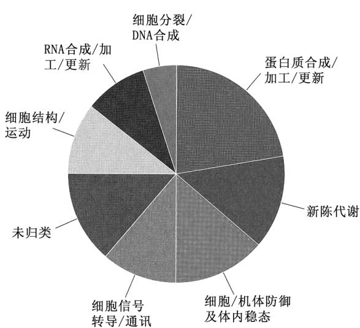  
图 12.13 按功能对 cDNA 序列进行分类。该饼图根据 13 000 多条不同的、随机选择的人类 cDNA 序列建立。[承克雷格·文特尔 (Craig Venter) 及基因组研究所惠赠数据。]

EST 计划之一，包括测定约 30 万条部分 cDNA 序列，其中的 cDNA 从 37 种不同的人类器官和组织制备的 cDNA 文库获得，获得的全部 DNA 序列为 0.83 亿碱基对。虽然估计人类基因组包含 20 000～25 000 个基因，但这些 EST 提示，可能有 10 万种左右的可变剪接转录物。

对这些 EST 进行计算机比对，显示存在 87 983 种不同的序列，根据这些序列与人类或其他生物的已知基因的相似性，可推定许多序列的功能。图 12.13 示按功能对这些 EST 所作的分类，在人类基因中，约 40% 与基本能量代谢、细胞结构、内环境稳定和细胞分裂有关；另有 22% 与 RNA 和蛋白质的合成和加工有关；12% 与细胞间的信号转导和通讯有关。图 12.14 概括了对组织特异性 cDNA 文库进行研究的结果，对于每种器官或组织类型，第一个数字是被测序的 cDNA 克隆总数，括号中的数字是在这种器官或组织的全部 cDNA 序列中

发现的不同的 cDNA 序列数。

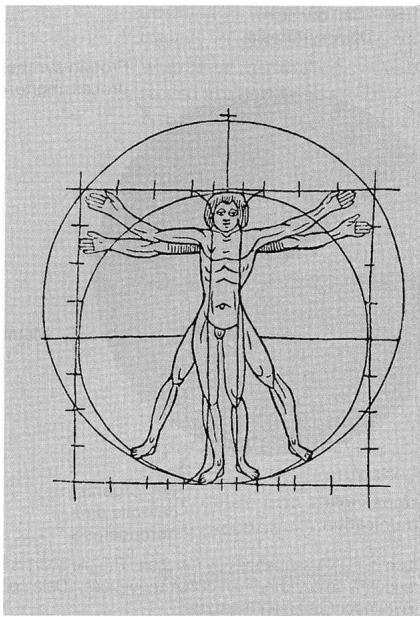

<table><tr><td>cDNA来源</td><td>序列</td><td>cDNA来源</td><td>序列</td></tr><tr><td>皮肤</td><td>3 043 (629)</td><td>脑</td><td>67 679 (3 195)</td></tr><tr><td>血细胞</td><td>23 505 (2 194)</td><td>眼</td><td>1 932 (574)</td></tr><tr><td>骨</td><td>5 736 (904)</td><td>唾液腺</td><td>186 (17)</td></tr><tr><td>甲状腺</td><td>2 381 (584)</td><td>食道</td><td>194 (76)</td></tr><tr><td>甲状旁腺</td><td>197 (46)</td><td>脂肪组织</td><td>2 412 (581)</td></tr><tr><td>内皮细胞</td><td>5 736 (1 031)</td><td>心脏</td><td>9 400 (1 195)</td></tr><tr><td>肝</td><td>37 807 (2 091)</td><td>腹膜</td><td>884 (163)</td></tr><tr><td>胆囊</td><td>3 754 (768)</td><td>脾</td><td>7 924 (924)</td></tr><tr><td>结肠</td><td>4 832 (879)</td><td>肾上腺</td><td>3 427 (658)</td></tr><tr><td>平滑肌</td><td>297 (127)</td><td>胰腺</td><td>5 534 (1 094)</td></tr><tr><td>小肠</td><td>1 009 (297)</td><td>肾脏</td><td>3 213 (712)</td></tr><tr><td>前列腺</td><td>7 971 (1 203)</td><td>附睾</td><td>1 716 (370)</td></tr><tr><td>睾丸</td><td>7 117 (1 232)</td><td>骨骼肌</td><td>4 693 (735)</td></tr><tr><td>卵巢</td><td>3 848 (504)</td><td>关节滑膜</td><td>3 889 (813)</td></tr><tr><td>子宫</td><td>6 392 (1 059)</td><td>胚胎</td><td>19 291 (1 989)</td></tr><tr><td>胎盘</td><td>12 148 (1 290)</td><td>胸腺</td><td>2 412 (261)</td></tr></table>

图 12.14 按器官或组织类型对 cDNA 序列所作的分类。在每一类别中，开头的数字是所研究的 cDNA 克隆总数。括号中的数字是在每种器官或组织中发现的不同序列的数目。[数据来自 M. D. Adams, et al., Nature (6547 Suppl.) 377(1995): 3-174.]

## - 比较基因组学

在很多情况下，根据与其他生物的相似序列来识别基因，可获得有用的信息，但如果这些生物从共同祖先趋异的时间太久，就存在一个问题，要分辨序列之间相似到什么程度才可认为它们具有相同的功能。解决这个问题的一个办法是，比较具有一系列分级趋异时间的近缘类群的基因组序列。这种方法称为比较基因组学(comparative genomics)，它已经成为鉴定人类基因组和模式生物基因组的遗传元件的最强有力的策略之一。

以图 12.15 中 12 种果蝇的基因组序列为例，来说明来自比较基因组学的发现。这个树形图概括了这些生物之间的进化关系，以及每

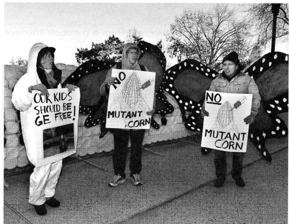  
当得知遗传工程玉米似乎会杀死帝王蝶时，人们曾组织起来抗议遗传工程玉米。[©Scott Applewhite/AP Photos.]

对物种从共同祖先分开的大致时间。这些物种在地理来源、全球分布、形态、行为、食性及其他表型上都非常不同，然而它们都具有相似的细胞生理、发育程序和生活周期。它们的基因组在序列上表现出相当大的差异(在图12.15的比例尺中，5百万年相当于每10个核苷酸位点中约有1个核苷酸的差异)，并且这些基因组还经历过多次基因重排(主要由倒位所致)。对这12个基因组的比较揭示，尽管在基因组结构和序列上存在广泛的改变，基因功能却仍很保守。

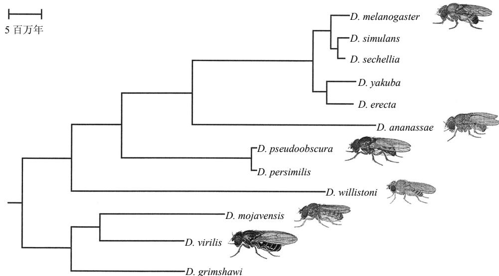  
图 12.15 12 种果蝇的进化关系，这些果蝇的基因组被测序，以进行比较基因组学研究。按大致的趋异时间比例绘制。[转载自 J. T. Patterson, Studies in the Genetics of Drosophila, Part III and Part IV. University of Texas Publications (1943 and 1944)。经得克萨斯大学奥斯汀分校生物科学学院许可使用。]

比较基因组学的威力来自不同类型的功能元件所表现出来的独特的进化模式，称为进化签名 (evolutionary signature)。图 12.16 示上述 12 种果蝇中的一些例子。A 部分示不编码蛋白质的 DNA 序列特有的进化签名。在整个序列中，物种之间的核苷酸差异几乎是随机出现的 (红褐色)，相当于链终止 (无义) 密码子的改变来来去去 (黄色)，小的插入或缺失 (灰色) 可包含任意数目的核苷酸。

## (A)非编码区

  
图 12.16 在 12 个果蝇基因组的不同区域观察到的进化签名，这些区域分别编码：(A) 非编码 RNA；(B) 蛋白质；(C) 转录因子结合位点；(D) RNA 的茎环二级结构；和 (E) microRNA。[改编自 A. Stark, et al., Nature 450 (2007):219-232.]

对比非编码区的核苷酸差异与图 12.16B 中蛋白编码区的核苷酸差异。在编码序列中，特有的进化签名表现为明显的三联体周期性，不会被终止密码子打断。不同种之间的许多核苷酸差异在密码子的第三位上，并且变异密码子往往编码相同的氨基酸。发生缺失时，去除的核苷酸数目为三的倍数(绿色)，这使正常的阅读框得以保存。

比较基因组学也有助于识别作为增强子和沉默子靶标的调节模体。这些模体往往难以识别，因为它们相对较短，在两条 DNA 链上都可存在，且在基因启动子内的位置可变。图 12.16C 中的例子示 Mef-2 蛋白的结合位点。该保守结合位点的序列为 YTAWWWWTAR，其中，Y 表示任意嘧啶，R 表示任意嘌呤，而 W 的意思是要么是 A 要么是 T。这 12 个种的比较显示，在 Mef-2 的其中一个靶基因中，Mef-2 结合位点的序列和位置不同。有些种的结合位点靠近所示区域的 5 端，其他种的靠近 3 端，而有几个种在这两个位置都有 Mef-2 结合位点。

形成折叠的二级结构的 RNA 转录物，如 tRNA、rRNA 和一些 snRNA，有它们自己独特的进化签名。例如，在图 12.16D 中，成对的括号显示在配对的茎结构中保守的碱基对，但不同物种的配对碱基往往有差异(配对核苷酸以颜色编码)。以 29 位和 38 位的核苷酸为例，在黑腹果蝇中这两个位置构成 C-G 对，但在 D. yakuba 中构成 U-G 对(在双链 RNA 中，U 不但与 G 配对，也与 A 配对)。

用共聚焦显微镜进行荧光扫描

在 RNAi 途径中具有重要调节功能的 microRNA，又表现出另一种进化签名(图 12.16E 部分)。在此情况下，在茎区中的变异不大被容许，即使这些变异是互补的，但可见到在环区和其他非配对区内的差异。这 12 个基因组的比较在正确注释黑腹果蝇序列中数以百计的蛋白编码基因、预测许多可能参与基因调节的非编码 RNA 的二级结构、证明有些 microRNA 基因具有多功能产物(增大了它们的调节范围)，以及揭示存在一个转录前和转录后 miRNA 调节目标的网络等方面，起到了重要的作用。鉴别进化签名的最佳趋异时间取决于功能元件的长度，这一观察结果也使系列分级趋异时间的效用得到了验证。较长的功能元件在亲缘关系很近的物种中最容易识别，而较短的功能元件在亲缘关系比较远的物种中可得到最有效的识别。

## ■ 用微阵列或 RNA-seq 获得转录谱

有一种遗传学的新方法称为功能基因组学(functional genomics)，它主要研究基因表达的全基因组模式和基因协同表达的机制。随着细胞环境的改变——例如，由于外部条件、发育或衰老的变化——基因表达的模式也会改变。但基因通常是被成群而不是个别调动的。当一组协同

基因的表达水平降低时，另一组协同基因的表达水平可能会升高。怎样才能同时研究数以万计的所有基因呢？

随着 DNA 微阵列（DNA microarray），或称 DNA 芯片（DNA chip）的发展，研究基因表达的全基因组模式已成为可能。DNA 微阵列是一个邮票大小的平面，上面有 10 000～100 000 个不同的斑点，每个斑点中固定了一种不同的 DNA 序列，这些 DNA 序列可与从不同来源的细胞中分离的 DNA 或 RNA 杂交，诸如在不同条件下培养的细胞、与药物或有

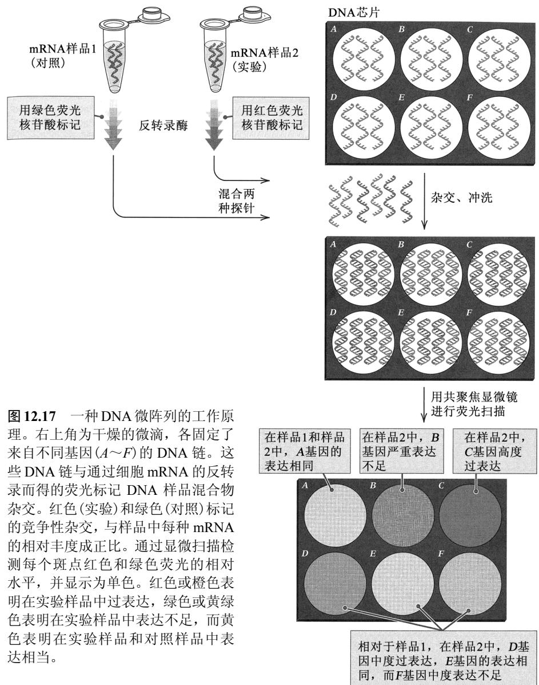  
相对于样品1，在样品2中， $D$ 基因中度过表达， $E$ 基因的表达相同，而 $F$ 基因中度表达不足

毒化学物质接触或未接触的细胞、不同发育阶段的细胞，以及某种疾病(如癌症)的不同类型或时期的细胞。目前使用的 DNA 芯片有两种。

1. 排列得有寡核苷酸的芯片，这些寡核苷酸是用自动化方法直接在芯片上一个核苷酸一个核苷酸地合成的；这些芯片通常每个阵列有数十万个斑点。

2. 排列有 500～5000bp 变性双链 DNA 的芯片，芯片中的斑点是通过一种微型钢笔样装置的毛细管作用点在芯片上的，每个斑点的点样体积大约为一个液滴的百万分之一，钢笔样装置安装在平台式机器人工作站的活动头上；这些芯片通常每个阵列有数万个斑点。

图 12.17 显示用 DNA 芯片来检测实验样品相对于对照样品的基因表达的全局水平的一种方法。右上角示微阵列中相邻的 6 个斑点，每个斑点含一种 DNA 序列，作为不同基因 $(A \sim F)$ 的探针。左侧示实验方案。首先从实验样品和对照样品中提取 mRNA。然后，如 12.2 节所述，mRNA 经过一轮或数轮反转录。在实验材料 (样品 2) 中，反转录引物包含红色荧光标记；而在对照材料 (样品 1) 中，引物包含绿色荧光标记。当标记 DNA 链增加到足够数量之后，将荧光样品混合，并与 DNA 芯片杂交。

杂交结果如图 12.17 中间部分所示。因为样品是混合样品，所以杂交是竞争性的，因而，与 DNA 芯片结合的红色或绿色链的密度，与混合物中红色或绿色分子的浓度成正比。相对于样品 1，在样品 2 中过表达的基因，会有更多的红色链与斑点杂交，而在样品 2 中表达不足的那些基因，会有更多的绿色链与斑点杂交。

  
图 12.18 一个酵母 DNA 芯片的一小部分，显示 1764 个斑点，每个斑点是一种不同的 mRNA 序列的杂交结果。每个斑点的颜色表示实验样品和对照样品中基因表达的相对水平。酵母所有可读框的完整芯片包括 6200 多个斑点。[承耶鲁大学杰弗里·汤森 (Jeffrey P. Townsend) 和杜乔·卡瓦列里 (Duccio Cavalieri) 惠赠。]

杂交之后，将 DNA 芯片置于共聚焦荧光扫描仪中，首先扫描每个像素（可视图像中最小的不连续的单元），记录一种荧光标记的强度，然后又一次扫描，记录另一种荧光标记的强度。合成这些信号，得到微阵列中每个斑点的信号值。如图 12.18 所示，这些信号以颜色的形式显示了基因表达的相对水平。红色或橙色的斑点表示在实验样品中该基因高度或中度过表达，绿色或黄绿色的斑点表示在实验样品中该基因高度或中度表达不足，而完全黄色的斑点表示实验样品和对照样品的基因表达水平相同。以这种方式，DNA 芯片可检测任何 mRNA 种类的相对水平，只要其在样品中的丰度大于每 $10^{5}$ 个分子一个分子，并可检测在表达上小至大约两倍的差异。

基因表达阵列已被用来鉴定在发育中协同调节的基因群。图 12.19 中的例子示秀丽隐杆线虫 (Caenorhabditis elegans) 发育早期 20 组基因的表达谱 (expression profile)。在这些实验中，发

育时间是以相对于四细胞期的分钟数来衡量的。基因表达的相对水平绘制于对数坐标上，因此，转录物相对丰度的变化往往是两到三个数量级。在所考察的这个时间段内，胚胎经历了从对照经过卵细胞中的母源转录物到胚胎自己的转录物的过渡，且涵盖大部分的主要细胞命运被确定的时间段。

在这些实验中所用的微阵列可检测差不多9000个可读框的转录物，所得图谱包括大约2500个基因的变化曲线，其中大约80%的基因在所示时间段内表现出转录物丰度的显著改变。

直到四细胞发育阶段，转录的模式都比较稳定，之后开始迅速变化。最早阶

  
图 12.19 在秀丽隐杆线虫发育的前 2.75h 过程中约 2500 个基因的转录调节模式。全部发育过程约需 12h。[转载自 L. R. Baugh, et al., Development 130(2003): 889-900。经 The Company of Biologists 许可转载。]

段的发育主要由母源转录物维持。这些转录物中，许多转录物随着发育的进行而被快速清除，例如，在右下角的3个图中的转录物，这些图是根据3簇分别含141、244和568个基因的转录物绘制的。胚胎细胞的转录物显然是诱导产生的，图中右上角含431和153个基因的基因簇的模式即为证明。显示母源转录物消失和胚胎转录物出现的曲线，大约在原肠胚形成时相交，表明发育从母体控制转换为胚胎控制发生在稍早的时期(囊胚中期)。许多基因的转录模式非常复杂，它们有一个短暂的表达峰，表明在发育中仅有一个短暂的时期需要该转录物(虽然不一定是蛋白质产物)，图12.19左边的5个小图显示了这种模式。

虽然图 12.19 中的转录分析相当粗放，但是，鸟瞰在发育过程中发生了什么，鉴定成群的协同表达基因，本身就具有极大的价值，因为它表明这些基因可能具有共同的或重叠的顺式作用调节序列，这些序列受共同的或重叠的成套转录激活蛋白的控制。

除了微阵列，获得转录谱的另一个选择是利用 6.7 节中所讨论的大规模并行测序技术。这种方法称为 RNA-seq (转录组测序)，以 mRNA 的 poly-A 尾巴为 poly-T 寡核苷酸引物的目标，用反转录酶来生成与每个 mRNA 分子互补的单链 DNA。然后复制这些 DNA 链，得到双链 DNA，这些双链 DNA 与在提取 mRNA 的时候存在于细胞中的 mRNA 分子群体相对应。用大规模并行测序分析这些 cDNA 的集合，然后将每种 cDNA 序列与该物种的参考基因组相比，鉴定出与转录物相应的基因。

与微阵列相比，RNA-seq 有许多优点。例如，转录物之间的杂交效率的差异会影响微阵列的结果，但对 RNA-seq 的结果没有影响，因为在 RNA-seq 中，每个转录物都是根据序列来鉴定的。RNA-seq 的另一个优点是，在杂合基因型中，不同等位基因的转录物水平可被检测。等位基因表达的不平衡可因等位基因启动子序列的差异和使转录得以发生的染色质重塑的差异，以及其他因素而造成。如果杂合基因型中的两个等位基因，在所得每条序列的全长上平均有一个核苷酸位点的差异，则在 RNA-seq 读取的所有序列中，约 2/3 的序列会在一个或一个以上的位点有差异，从而使得原来的等位基因可被鉴定。不过，RNA-seq 也有局限性。主要的局限在于，它难以检测到或精确估计在每个细胞中只有几个分子的稀有转录物的丰度。因此，加上其他的原因，应将 DNA 微阵列和 RNA-seq 视为获得转录谱的互为补充的方法。

## ■ 染色质免疫沉淀

不仅衡量基因在转录水平上的差异的程度重要，理解它们为什么会有差异也很重要。转录水平的变化大部分是 DNA 和蛋白质(如转录因子和染色质蛋白)相互作用的结果。一种研究此类相互作用的方法是利用与特定类型的 DNA 结合蛋白结合的抗体。这种抗体与结合在 DNA 结合位点上的蛋白质形成复合体，将抗体-蛋白质-DNA 复合体沉淀下来，即可分离其组分，开展进一步的研究。

分离蛋白质-DNA 复合体的技术称为染色质免疫沉淀(chromatin immunoprecipitation, ChIP)，概括于图 12.20 中。A 部分示一段带有核小体的染色质，其中包含一个与转录因子(红色)结合的 DNA 区域，以及一个组蛋白的一个氨基酸被化学修饰(如甲基化或乙酰化)的核小体(绿色)。在 ChIP 的第一步中，用甲醛之类的化学物质处理，使蛋白质和 DNA 化学交联。然后用酶将染色质消化(或剪切)成含交联的蛋白质和 DNA 的片段(图 12.20B)。然后将样品分成两份，分别加入可与转录因子或修饰组蛋白特异性结合的抗体。在本例中，转录因子的抗体以红色显示，修饰组蛋白的抗体以绿色显示。沉淀并纯化所形成的抗体、蛋白质和 DNA 复合体(图 12.20C)。在这个时候，逆转化学交联，使结合的 DNA 游离出来，以便进一步分析，鉴别与转录因子或修饰组蛋白结合的特定基因或 DNA(图 12.20D)。

  
图 12.20 染色质免疫沉淀(ChIP)。通过化学方法将染色质中的蛋白质和 DNA 交联起来(A)，然后将染色质剪切成片段(B)。加入特异抗体，与转录因子(红色)或修饰的组蛋白(绿色)结合，然后让抗体-蛋白质-DNA 复合体沉淀(C)。逆转交联过程，使得可对复合体中的 DNA 进一步分析(D)。

通常会用两种方法来分析用 ChIP 分离得的 DNA 片段。一种方法称为染色质免疫沉淀芯片 (ChIP-chip)，在这种方法中，将所得 DNA 用荧光标记，用来与微阵列芯片杂交。另一种方法称为染色质免疫沉淀测序 (ChIP-seq)，在这种方法中，用大规模并行测序技术来分析所得 DNA。这两种方法都可揭示与抗体的靶蛋白结合的序列，因而可显示哪些与特定 DNA 序列结合的蛋白质会增强或阻遏附近基因的转录。

## ■ 蛋白质-蛋白质相互作用的双杂交分析

蛋白质-蛋白质相互作用对于理解生物过程也很重要，因为参与相关细胞过程的蛋白质往往会有物理接触。因此，知道哪些蛋白质相互接触，可为未知蛋白质可能存在的功能提供线索。

鉴定蛋白质-蛋白质相互作用的一个方法，是利用 11.5 节所讨论的出芽酵母的 GAL4 转录激活蛋白。GAL4 蛋白含两个独立的结构域，这两个结构域都是转录激活所必需的。一个结构域是锌指 DNA 结合结构域，与被激活的 GAL 基因的启动子中的靶位点结合。另一个结构域是转录激活结构域，与转录复合体接触并真正地激发转录。在野生型 GAL4 蛋白中，这两个结构域是拴在一起的，因为它们是同一条多肽链的两个部分。

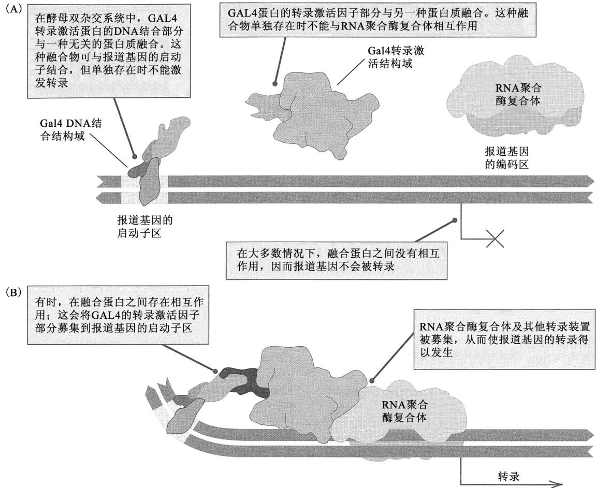  
图 12.21 使用 GAL4 蛋白进行双杂交分析。(A) 当与两个 GAL4 结构域融合的两种蛋白质不发生相互作用时，不发生报道基因的转录。(B) 当这两种蛋白质确实相互作用时，报道基因被转录。

利用 GAL4 来鉴定蛋白质-蛋白质相互作用的关键是，这两个独立结构域的编码区可被拆开，各与不同蛋白质的编码区融合。该策略如图 12.21A 所示，其中，在 GAL 启动子旁边，GAL4 的 DNA 结合结构域和转录激活结构域被绘制成分开的实体，分别与不同的多肽链融合。该启动子与一个报道基因 (reporter gene) 结合，报道基因的转录可被检测，例如，借助菌落中颜色的改变、荧光蛋白的产生或在存在某种抗生素的情况下细胞能够生长等手段。融合的 DNA 结合结构域和融合的转录激活结构域都是杂交蛋白，因此这种检测系统被称作双杂交分析 (two-hybrid analysis)。在 A 部分，与两个 GAL4 结构域融合的两种蛋白质，在细胞核内不发生相互作用。因此，DNA 结合结构域与转录激活结构域保持分离，从而不会发生报道基因的转录。

图 12.21B 示与 GAL4 结构域融合的两种蛋白质发生相互作用的情况。在此情况下，DNA 结合结构域和转录激活结构域相接触，从而发生报道基因的转录。以此方式，在双杂交分析中报道基因的转录表明与 GAL4 结构域融合的蛋白质发生了将两个杂交蛋白结合到一起的物理上的相互作用。

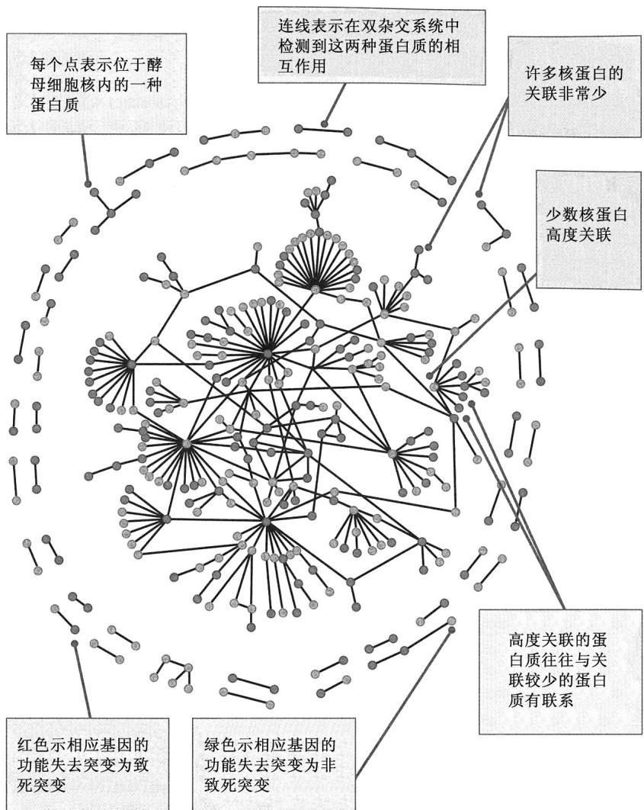  
图 12.22 酵母核蛋白之间的物理相互作用。未显示未表现出相互作用的核蛋白。[转载自 S. Maslov and K. Sneppen, Science 296(2002): 910-913。经 AAAS 许可转载。图解承布鲁克海文国家实验室谢尔盖·马斯洛夫(Sergei Maslov)惠赠。]

图 12.22 示双杂交分析的一个例子，该图绘制了酵母的 329 种核蛋白中 318 种蛋白质-蛋白质相互作用的网络。这一分析的目的，是将所观察到的相互作用网络，与包含相同数目的相互作用但随机选择相互作用对象的随机网络，进行比较。图 12.22 中的这个网络的一个有趣的特点是，在已经高度关联的蛋白质之间，存在比预计要少的相互作用，这也是其他蛋白质网络的特点。换句话说，通过许多相互作用与其他蛋白质高度关联的蛋白质，往往与其他高度关联的蛋白质不关联，但与具有较少关联的蛋白质关联。在高度关联的蛋白质之间的这种系统性的关联抑制具有这样的作用：它可减小网络中某个部分的随机环境或遗传扰动波及网络其他部分的程度。

双杂交分析给探索

蛋白质-蛋白质相互作用提供了一个强大的方法，因其可大规模地开展、不需要纯化蛋白质、可检测活细胞中发生的相互作用，并且不需要待检测蛋白质的功能方面的信息。但是，该方法也有一些局限。例如，双杂交分析是定性而不是定量的，因而不大容易将弱相互作用与强相互作用区分开。为了增强双杂交分析的可靠性，一般要让杂交蛋白高度表达，所以，在正常浓度下可能不会发生相互作用。双杂交分析还要求蛋白质相互作用发生在细胞核中，但有些蛋白质可能只在细胞质环境中发生相互作用。最后，杂交蛋白可能与天然的蛋白质折叠得不一样，因而，错误折叠的蛋白质可能不能相互作用，但天然构象可以，或错误折叠的蛋白质可以相互作用，但天然的构象不行。结论是，从双杂交分析得来的结果必须小心解读，而另一方面，该方法已经产生了大量有价值的信息。

## 12.5 转基因生物

遗传工程的一个重要的应用是利用取自一个生物物种的基因来改变一个不同生物物种的基因型。这种遗传工程改造所得的生物称为转基因生物(transgenic organism)。来看一个实例，苏云金杆菌(Bacillus thuringiensis)这种细菌生产多种称为δ-内毒素(delta-endotoxin)的杀虫蛋白，这些蛋白质可在细菌孢子中形成结晶。这些蛋白质对鳞翅目(蛾和蝶)、双翅目(具有单对翅的昆虫)和鞘翅目(甲虫)昆虫具有毒性。这些细菌孢子被昆虫摄食后，结晶溶解，并被肠道中的蛋白酶活化，它们与肠上皮上的特异性受体结合，从而产生“管道泄漏”(leakage channel)，最终杀死昆虫。目前，已生产出经过遗传工程改造过的玉米、棉花和其他农作物，在它们的基因组中含有由来源于正常植物基因的序列调节的δ-内毒素编码区。因此，这些工程植物可在组织中产生δ-内毒素，使得摄食它们的昆虫(如欧洲玉米螟)死亡。欧洲玉米螟是在20世纪初期入侵美国的一种鳞翅目害虫，现在每年导致饲料玉米、爆花玉米、留种玉米和甜玉米的作物损失超过10亿美元。

在本节中，将考察生产转基因生物的一些遗传方法。我们已经见过怎样利用转化将重组

DNA 导入细菌细胞中。类似的方法对酵母和许多其他的单细胞微生物也起作用。在后生动物中，包括在家养动植物中，转化需要不同的技术。

## ■ 动物的种系转化

在秀丽隐杆线虫中，转化方法基于这样的事实：直接注射进生殖器官的 DNA，有时会被自发整合进种系细胞的基因组中。因此，如果用包含感兴趣的任何序列及某个遗

  
图 12.23 在果蝇中由转座因子 P 介导的转化。(A)完整的 P 因子包含两端的反向重复序列和内部的转座酶编码区。(B)双组分转化系统。载体组分包含感兴趣的 DNA 及其两侧的转座所需的识别序列。截翼组分是修饰过的 P 因子，它可编码转座酶，但不能转座其自身，因为缺失关键的识别序列。

传标记的重组 DNA 注射线虫，则在被注射线虫的后代中存在该标记的表型，即表明发生了转化。

在果蝇的种系转化中使用一种稍微精细一点的方法。通常的方法是利用一种称为 P 因子 (P element) 的转座因子，P 因子是一段长为 2.9kb 的 DNA 序列，中央区域编码转座酶，其两端各有一段反向重复的 31bp 序列 (图 12.23A)。两端的反向重复序列是转座酶识别必不可少的，转座酶通过切除和插入使 P 因子转座(剪-贴型转座的细节将在 14.3 节中考察)。用于种系转化的载体是一种含 P 因子的质粒，其中，转座酶编码区被感兴趣的 DNA 序列替换，与其在一起的还有一个合适的遗传标记(通常是影响眼睛颜色的遗传标记)。这种 P 因子单独不能转座，因为它不编码转座酶，但因其仍然具有反向重复序列，能被来自别的渠道的转座酶转移。这个转座酶的来源通常是遗传工程改造过的 P 因子的衍生物，称为截翼(wings clipped)因子，它编码有功能的转座酶，但自己不能转座，因为两端的反向重复序列缺失(图 12.23B)。

联系：多莉，你好！

伊恩·威尔穆特、安杰利卡·施尼亚克、吉姆·麦克沃尔、亚历克斯·金德和基思·坎佩尔，1997

罗斯林研究所，罗斯林，中洛锡安，苏格兰

源自哺乳类胎儿细胞和成体细胞的可存活后代

苏格兰的那只被称为“多莉”(Dolly)的芬兰多赛特(Finn Dorset)母羊，是从取自成年哺乳动物细胞的细胞核克隆而来的第一个哺乳动物。该实验曾引发一场媒体轰动。当时的美国总统说，他要反对克隆人类。一位公共卫生教授说：“我认为明智、理性的人不会想克隆他们自己，除了一个古怪的百万富翁可能会想把他的钱留给一个克隆之外。没有什么办法能阻止超级富豪们去海外克隆他们自己。”有些人为动物忧心。善待动物协会(PETA)的一位发言人说：“该是社会学会尊重我们的同伴的时候了，不要用它们来干任何蠢事。”(请注意，在后面的节选中，实验是经过相应的动物福利委员会事先批准的。)克隆动物引起了许多重大争议。其中之一是，克隆出来的动物在遗传上是否确实正常。例如，多莉在2002年被诊断出患关节炎，一年以后又被诊断出患进行性肺病。它在2003年2月14日被执行安乐死。

将处于某一特定发育阶段的单个细胞核，转移到一个去除细胞核的未受精的卵中，给研究到那一发育阶段

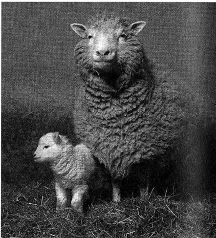  
"I LOVE EWE, MOM!" Dolly and her natural-born lamb, whose fleece was white as snow. [Courtesy of the Roslin Institute, University of Edinburgh.]

“我爱你，妈妈！”多莉和她亲生的小羊，小羊的毛像雪一样白。[承爱丁堡大学罗斯林研究所惠赠。]

的细胞分化是否涉及不可逆的遗传修饰，提供了一个机会。第一个从已分化的细胞发育而来的后代，是从已经被诱导成静止状态的胚胎源性细胞转移来一个细胞核而得到的。现在我们报道，使用相同方法从成体乳腺细胞、胎儿细胞和胚胎细胞诞生了活羊。可从一个成体细胞得到一只羊的事实证明，成体细胞的分化不涉及所谓的发育所需的遗传物质的不可逆修饰。……只有通过去除中期Ⅱ卵母细胞的细胞核来制备受体细胞质，才能在转移二倍体细胞核时避免染色体损伤及维持正常的倍性。我们对培养细胞的研究表明，如果细胞是静止状态的，有一个优点。……总的来说，我们的研究结果表明，来自广泛细胞类型的细胞核，在使用不同细胞周期阶段的适当组合来增加重新编程的机会之后，应该说是全能性的。有鉴于此，在精选畜群中获得的遗传改良，其种质的传播，可通过源自成年动物细胞的细胞核移植，对具有业已验证性能的动物进行有限的复制，而得到加强。……据我们所知，从乳腺细胞进行细胞核移植后诞生的这只羊，是从源自成体组织的细胞发育而来的第一个哺乳动物。……这与普遍接受的观点是一致的，即，哺乳动物分化的实现，几乎全部是由于细胞核与不断变化的细胞质环境之间的相互作用所致的基因表达上的系统而连续的改变。……这些实验是在动物(科学方法)法1986〔英国〕的指导下进行的，并经过罗斯林研究所动物福利与实验委员会批准。

来源：I. Wilmut, et al., Nature 385 (1997): 810-813.

在果蝇的转化中，感兴趣的任何 DNA 序列都可置于缺失型的 P 因子两端之间。所得载体与另一种含截翼因子的质粒一道，被注射到早期胚胎中含有生殖细胞的区域。DNA 被生殖细胞吸收，截翼因子使细胞能够产生有功能的转座酶(图 12.23B)。这使得工程 P 载体转移，结果是转座到基因组中，位置基本上是随机的。在注射过的果蝇的后代中，因为眼睛的颜色或其他在

P 载体中包含的遗传标记，得以将转化体检测出来。P 载体整合进种系的效率通常很高(10%～20%经过注射而能存活且能生育的胚胎，可产生一个或多个转化后代)。不过，效率随着 P 因子中 DNA 片段的增大而下降，有效的上限约为 20kb。

在哺乳类中，种系的转化可以几种方式进行。最直接的方式是将载体 DNA 注射进受精卵的细胞核，然后将受精卵转移到代孕母亲的子宫中发育。载体通常是修饰过的 RNA 病毒，RNA 病毒利用反转录酶将 RNA 基因组转变成双链 DNA，双链 DNA 得以插入被感染细胞的基因组中。遗传工程改造过的含 RNA 插入片段的病毒，可进行同样的整合过程。

转化哺乳类的另一个方法是利用从受精后数天的胚胎中获得的胚胎干细胞(embryonic stem cell)(图12.24)。虽然胚胎干细胞的适应能力不是太强，但可将它们分离、培养生长，然后用重组DNA载体转化。遗传修饰过的干细胞被转移到正在发育的胚胎中，将胚胎移植到代孕母亲的子宫中(图12.24A)，干细胞得以整合进胚胎的不同组织中，并且常常会参与种系的形成。如果胚胎干细胞携带某种遗传标记，如一个控制黑色毛色的基因，则嵌合体小鼠可因它们的斑点毛皮而得到鉴定(B)。在这些小鼠中，有的小鼠交配后生出黑色后代(C)，这表明胚胎干细胞已经被整合到种系中。通过这种方式，胚胎干细胞在培养状态下被导入的遗传改变，可被整合进活的动物的种系中。图12.24中所示的方法已被用来产生在某些基因——诸如与囊性纤维化这样的人类遗传病相关的基因——中带有突变的小鼠品系。这些品系可作为研究该病及测试新药和新疗法的小鼠模型。

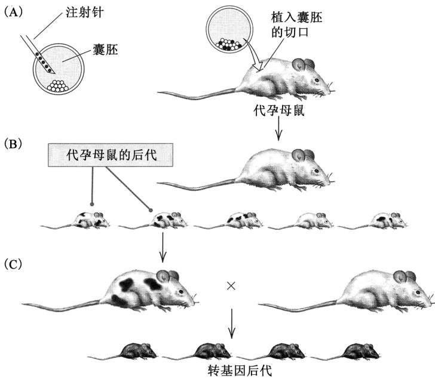  
图 12.24 在小鼠中通过胚胎干细胞进行种系的转化。(A)从黑色品系的胚胎中分离到干细胞,在培养物中经过遗传操作后,注射进白色品系的胚胎中,然后将胚胎导入代孕母鼠的子宫。(B)产生的后代通常是嵌合体,含有来自黑色品系和白色品系的细胞。(C)如果来自黑色品系的细胞在量上主导了种系,则嵌合体小鼠的后代将会是黑色的。[改编自 M. R. Capecchi, Trends. Genet. 5(1989):70-76.]

将变异导入特定基因的方法称为基因打靶(gene targeting)，马里奥·卡佩奇、马丁·埃文斯和奥利弗·史密斯因为在发明该技术上的开创性发现，被授予2007年的诺贝尔生理学或医学奖。基因打靶的特异性来自被导入的重组DNA和染色体中本来存在的正常序列之间的DNA序列的同源性。当这两种DNA序列足够相似时，它们可进行配对，通过断裂和重接过程交换互补链。图12.25示两个例子，其中，基因打靶载体中的DNA序列以环状构型显示，在重组之前，环状构型与染色体中的同源区域配对。靶基因以粉红色显示。在图12.25A中，载体含有被一个新DNA序列的插入打断的靶基因，同源重组导致这段新序列被插入到染色体上的靶基因中。在图12.25B中，载体只含有侧翼序列，本身不含靶基因，所以同源重组导致靶基因被一段无关的DNA序列替换。在这两种情况下，具有靶基因突变的细胞，都可通过在同源重组整合进基因组的序列中包含抗生素抗性基因或其他可选择的遗传标记来进行选择。同源重组的分子机制在 6.8 节中讨论过。

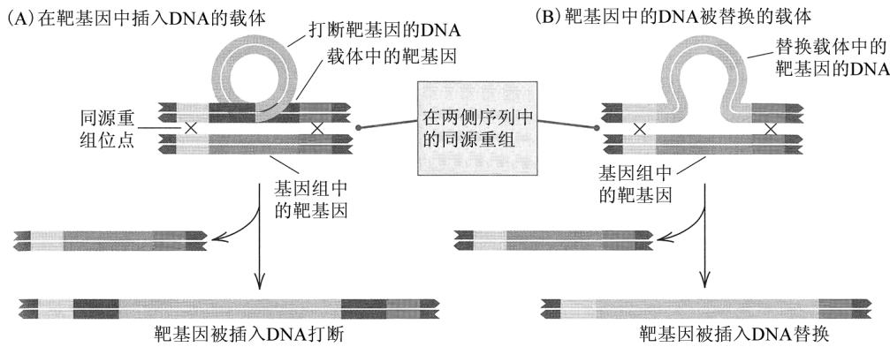  
图 12.25 胚胎干细胞中的基因打靶。(A)载体(顶部)含有被一个插入片段打断的靶序列(砖红色)。同源重组将该插入片段导入基因组。(B)在此情况下，载体含有位于靶基因两侧的 DNA 序列。同源重组导致靶基因被一段无关的 DNA 序列替换。[改编自 M. R. Capecchi, Trends. Genet. 5 (1989):70-76.]

## - 植物遗传工程

转化植物细胞的一种方法是使用在土壤细菌根癌农杆菌(Agrobacterium tumefaciens)及其近缘种中发现的一种质粒。易感植物可被这种细菌感染，在细菌侵入点(一般是伤口)引起一种称为冠瘿瘤(crown gall tumor)的肿瘤生长。易感植物包括双子叶植物纲(Dicotyledoneae)中的约16 000种开花植物，其中包括绝大多数常见的开花植物。

农杆菌含有一种称为 Ti 质粒 (Ti plasmid) 的 200kb 左右的巨大质粒，该质粒包含一个称为 T DNA (T DNA) 的较小 (约 25kb) 区域，其最两端为 25bp 长的同向重复序列 (以相同方向重复的序列) (图 12.26A)。农杆菌感染会使受感染细胞的代谢发生根本的改变，因为 T DNA 编码刺激细胞分裂的蛋白质而引起肿瘤，并编码将精氨酸转变成农杆菌生长所需的某种罕见衍生物 (通常是胭脂碱或章鱼碱，取决于具体的 Ti 质粒类型) 的酶。

  
图 12.26 使用来自 Ti 质粒的 T DNA 进行植物基因组的转化。(A) 在 T DNA 的 5 端形成一个切口。(B) 滚环复制延伸 3 端同时取代 5 端，5 端由单链结合蛋白 (SSBP) 稳定。第二个切口终止复制。(C) 结合 SSBP 的 T DNA 被转移到植物细胞中，并插入基因组中。

植物细胞代谢的改变是 T DNA 被物理转移并整合进植物基因组中所引起的，图 12.26 概括了其机制。转移过程由 6 个基因的产物介导，这些基因在 Ti 质粒称为致毒 (virulence, vir) 区的一个 40kb 区域中。T DNA 的转移从一个单链切口的形成开始(图 12.26A)，T DNA 5 端从该切口处被剥离质粒；产生的豁口被新复制的 DNA 封上，新复制的 DNA 是用无切口的环为模板链，添加到切口的 3 端(图 12.26B)。质粒被转移的区域，由位于 T DNA 另一端的第二个切口界定，但该切口的位置可有少许可变化性。产生的单链 T DNA 与一种单链结合蛋白(SSBP)结合，然后被转移到植物细胞中，并被吸收进细胞核中。在细胞核中，T DNA 被整合进染色体 DNA 中，其机制尚不清楚(图 12.26C)。虽然 SSBP 的氨基酸序列与大肠杆菌的 recA 蛋白(其在同源重组中起关键作用)有一定的相似性，但是 T DNA 的整合不需要序列同源性。

将 T DNA 用在植物转化中，因利用工程质粒而成为可能，在工程质粒中，在正常情况下存在于 T DNA 中的序列被去除，代之以带有可选择标记的待整合进植物基因组的 DNA 序列。另一种含有 vir 基因的质粒使工程 T DNA 可以移动。在被感染组织中，vir 的功能使 T DNA 移动，以便转移进宿主细胞，并整合进染色体。在植物细胞培养中，利用可选择标记选择转化细胞，然后培养成成熟植株。

## ■ 转化补救

种系转化的一个重要应用是在实验上确定任何特定基因在 DNA 上的界线。每个基因既包括编码序列，也包括其正确表达所需的上、下游序列。如同在第 11 章中所见的，这些调节序列控制着转录在发育中发生的时间、在哪些细胞类型中发生，以及在什么水平上进行。在确定某个基因的上、下游界线时，即使知道编码区及侧翼 DNA 的全部核苷酸序列，也可能不够。主要原因是缺乏识别调节序列的通用方法。调节序列往往是一些看似无特征的短序列的组合，事实上，这些看似无特征的序列是控制转录的调节蛋白的关键结合位点。

种系转化如何被用来确定功能基因的界线？参考果蝇白眼基因(white)的例子，该基因发生突变后，导致具有白眼而不是红眼的果蝇。白眼基因的遗传结构如图12.27所示。初级RNA转

录物(B)长 6kb 多一点，含 5 个内含子，这些内含子在 RNA 加工过程中被切除并降解。产生的 mRNA(C) 被翻译成具有 720 个氨基酸的蛋白质(D)，该蛋白质是一个称为 ABC 转运蛋白 (ABC transporter) 的 ATP 依赖的跨膜蛋白大家族的一员，ABC 转运蛋白调节其靶分子或离子穿过细胞膜的运输。白眼转运蛋白位于眼睛的色素生成细胞中，其靶分子是眼睛色素的关键前体之一，因而，具有突变型白眼转运蛋白的果蝇，长白眼。

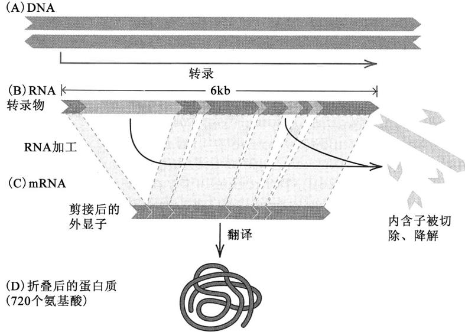  
图 12.27 果蝇白眼基因的遗传结构。

用种系转化来解决的问题

是：果蝇需要白眼基因上、下游多少 DNA，才能在色素细胞中产生野生型转运蛋白？实验方法是，先克隆一个包含野生型白眼蛋白编码序列的 DNA 大片段，然后利用种系转化，将该片段导入含有白眼基因突变的果蝇基因组中。如果导入的 DNA 包含正确的基因表达所需的全部 5' 和 3' 调节序列，那么，所得果蝇的表型会是野生型的，因为野生型基因对白眼基因突变为显性。导入的 DNA 片段可修正突变型生物的遗传缺陷的能力，称为转化补救 (transformation rescue) (图 12.28)，这意味着该片段包含所有必需的调节序列。该片段也可能含有一些非必需序列，所以，要找出最小的 5' 和 3' 侧翼区，还需要分析原始片段更小的部分的转化补救。就白眼基因而言，最小的 DNA 片段长约 8.5kb，始于转录起点上游约 2kb 处。

  
图 12.28 黑腹果蝇的突变型白眼雄性和野生型红眼雄性。[承 E. R. Lozovsky 惠赠。]

## - 位点专一诱变和敲除突变

一旦基因被克隆和测序, 就可在该基因中导入特定的突变, 并转化进种系中, 以分析产生的表型, 从

而使得弄清该基因的功能成为可能。有时将这种方法称作反求遗传学(reverse genetics)，因其颠倒了传统的遗传分析流程。反求遗传学从某个已知基因开始查明不同突变如何影响表型，而不是从某个突变表型开始试图鉴定突变基因。

现有数种方法可用来在克隆 DNA 的特定位点上产生明确的突变。一种基于聚合酶链反应 (PCR) 的位点专一诱变 (site-directed mutagenesis) 方法，概括于图 12.29 中。该法从一个分离自克隆的野生型基因的单一限制性片段开始，在此例中，假设该片段是一个 EcoR I - BamH I 片段。

进行两个不同的PCR反应。一个PCR使用称作1和2的一对引物，其中，引物1超出EcoRI位点的范围，并与EcoRI位点重叠，以使扩增之后该位点能够重建。而引物2是一个含单碱基错配（在此例中是一个G-A错配）的诱变引物（mutagenic primer）。另一个PCR使用引物对3和4，其中，引物3的5端与引物2的5端毗邻，而引物4超出BamHI的范围并与其重叠，以使扩增后该位点能够重建。扩增产物如C部分所示。当这两种扩增产物被连接，然后用EcoRI和BamHI消化后，原来的EcoRI-BamHI片段被重建，只是新片段在所示位点具有一个特定的A-T→G-C碱基对的置换。当这个

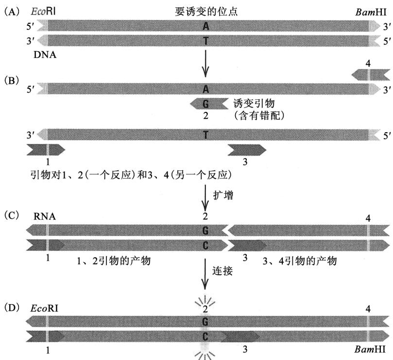  
图 12.29 利用 PCR 进行位点专一诱变。(A)一个 A-T 核苷酸对将被 G-C 核苷酸对取代。(B)用一条含 G 而不是 A 的引物(2 号引物)，分两部分扩增原始片段。(C)左边的扩增产物在靶位点含 G-C 核苷酸对。(D)连接扩增片段，重新构成含定点突变的 DNA 双链体。

EcoR I - BamH I 片段被替换回原来的野生型基因中后，重建的基因具有一个 A-T→G-C 碱基对突变，该基因可通过种系转化被导入生物中。

类似方法可用来产生缺失突变(deletion mutation，基因的一部分丢失)，或基因的一部分被一段完全无关的序列取代的突变。在基因打靶实验中，使用这样的构建体，通过同源重组来替换基因组中的野生型基因时，得到的突变是敲除突变(knockout mutation)，在敲除突变中，野生型基因已变得完全没有功能（“敲除”）。基因敲除的两种重要应用值得强调一下。第一种是敲除了人类疾病基因的同源基因的小鼠品系的繁育，敲除这些基因是为了当作人类疾病模型。例如，治疗不同遗传原因的高血压的药物有效性，可在已知其产物在调节血压中比较重要的基因被敲除(或具有额外拷贝)的小鼠品系中进行考察。在本章的“联系：东拼西凑”中强调了这一应用。敲除诱变的第二种重要应用是在基因功能鉴定上的应用。例如，在从出芽酵母(酿酒酵母)基因组的全基因组测序中鉴定出的大约6000个基因中，只有约 $25\%$ 与先前通过突变体的分离鉴定的基因相关。另外大约 $35\%$ 的功能是根据它们与其他生物中已经鉴定的基因的同源性推断出来的。但剩下的大约 $40\%$ 的功能，完全未知。在这些神秘的基因中，许多基因的功能可通过考察在各种生长条件下与敲除突变相关的表型而被揭示。

## 12.6 遗传工程的一些应用

重组 DNA 技术引起现代生物学的彻底变革，不仅是因为它开辟了基础研究的新途径，而且是因为它使得创造在工农业上具有实用新表型的生物成为可能。在本节中，我们考察重组 DNA 众多实际应用中的几个。

## - 具有工程生长激素的巨型鲑鱼

在许多动物中，生长速度受生长激素的生成量所控制。具有在高效启动子控制下进行转录的生长激素基因的转基因动物，往往比相应的正常动物长得更大。高效启动子的一个例子见于金属硫蛋白(metallothionein)基因中。金属硫蛋白是结合重金属的蛋白质。它们普遍存在于真核生物中，由

近缘基因构成的一个基因家族的成员编码。例如，人类基因组含有十多个金属硫蛋白基因，可按照它们的序列分成两大类。金属硫蛋白基因的启动子区可驱动任何与它相连的基因进行转录，以对重金属或类固醇激素进行应答。例如，当由金属硫蛋白启动子控制下的大鼠生长激素基因构成的 DNA 构建体被用来产生转基因小鼠时，所产生的小鼠可长到正常小鼠的两倍大。

另一个生长激素构建体的效果如图12.30所示。这些鱼是14个月大的银鲑鱼。左边的那些是普通的银鲑鱼，而右边的那些是转基因鲑鱼，它们含有一个由金属硫蛋白调控区驱动的鲑鱼生长激素基因。该生长激素基因和金属硫蛋白基因都是从红鲑鱼中克隆来的。右边最大的转基因鲑鱼长约 $42\mathrm{cm}$ 。平均而言，转基因鲑鱼比相应的普通鲑鱼重11倍，最大的转基因鲑鱼的体重是非转基因鲑鱼平均体重的37倍。转基因鲑鱼不仅比普通鲑鱼长得快而且变得更大，它们成熟得也快。

  
图 12.30 普通银鲑鱼(左边)和遗传工程银鲑鱼(右边)，后者含红鲑鱼生长激素基因，该基因由金属硫蛋白基因的调控区驱动。转基因鲑鱼的体重平均是非转基因鲑鱼的 11 倍。左边最小的鱼长约 10cm，而右边最大的鱼约为 42cm。

[经 Macmillan Publisher Ltd 许可重印：R. H. Devlin, et al., Nature 371 (1994): 209-210.]

## 联系：东拼西凑

奥利弗·史密斯，2005

北卡罗来纳大学，查珀尔希尔市(教堂山市)，北卡罗来纳州

许多小东西：一个遗传学家对复杂疾病的看法

此文撰于奥利弗·史密斯首次将外源DNA导入哺乳动物基因组中的选定位点的实验成功25周年之际。该方法最初的应用是对单基因起主要效应的表型进行遗传分析。在这里，奥利弗·史密斯讲述他是怎么意识到该方法也可以用来研究复杂疾病。复杂疾病受许多基因影响，每个基因的效应都相当小。他的想法是构建既不缺一个基因，也没有任何基因的额外拷贝的小鼠染色体。通过杂交来组合这些染色体，他可以构建0(倘若小鼠能存活)、1、2、3、4个基因拷贝的小鼠。然后，他可考察这些小鼠，发现表型上的相关变化。他最初将这一方法应用到血压调节的研究上。史密斯对这种性状特别感兴趣，因为他父亲死于高血压并发症，也因为他自己要靠药物来控制血压。史密斯的洞察力和方法取得了巨大的成功，确实值得分享2007年的诺贝尔生理学或医学奖。

常见的多因子病，如动脉粥样硬化、高血压和糖尿病，是众多遗传和环境因素之间的复杂相互作用所导致的。……因其复杂性，多因子病是富有挑战性的研究目标。它们之所以有吸引力，是因为对它们的本质更好地了解，可能会影响许多人的生活，因为生活在富裕社会的人，半数以上可能会患上具有多基因原因的衰弱性疾病。……就像从两个拷贝变成一个拷贝会使基因产物的水平下降一样，从两个拷贝变成三个拷贝似乎可能会使产物的水平升高。……我意识到，对基因表达定量变化效应的检测，应用到有可能改变血压的所有基因上，可能会很有用。……我的思维模式已经开始从少数主要差异可能决定该复杂表型的看法，变为该复杂表型更有可能是“许多小东西”的结果的想法。……我决定……(建立)该系统的计算机模拟。……作为一个非电脑爱好者，我度过了相当不愉快的六个月，断断续续地进行模拟的工作。但结果非常有启发性，因而从那以后，我怀着与日俱增的乐趣，将一些比较简单的计算机模拟用在我大部分的工作中。……我发现，这些模拟的最大的价值是……它逼着你辨认关键因素，逼着你清楚地定义假设，以便将它们整合成一个逻辑整体。就我们的高血压研究而言，模拟证明 AGT(血管紧张素原)基因拷贝数的增加应该会导致……血压上升。……在走进多因子疾病领域的过程中，我的经历使我要强调，在寻找决定常见病个体风险的遗传因素时，寻找数量变异的重要性和质量变异一样。在人类进化过程中，已经积累了许多数量变异——有些是容易看到的在我们身体比例上的外在差异，有些是隐蔽的在基因表达上的内在差异——它们的效应还没有大到足以固定下来或被选择淘汰掉。这些“许多小东西”是我们的个性的一个令人高兴的来源。但它们也很可能是尚缺乏深刻了解的(复杂疾病的)个体易感性变异的一个来源。

来源：O. Smithies, Nat. Rev. Genet. 6 (2005): 419-425.

## ■ 营养工程水稻

虽然迄今为止我们一直关注的是通过操作单基因来进行遗传工程，但也有可能创造引入全新代谢途径的转基因生物。一个引人注目的例子是一种遗传工程水稻的创造，这种水稻含有一个导入的合成β胡萝卜素的生化途径。β胡萝卜素是维生素A的一种前体，主要见于黄色和绿色蔬菜中(全世界约有4亿人患维生素A缺乏症，这些人易患皮肤病和夜盲症)。β胡萝卜素途径包括4种酶，在工程稻中这些酶由来自不同生物的基因编码(图12.31)。其中两个基因来自常见的黄水仙(喇叭水仙，Narcissus pseudonarcissus)，而另外两个基因来自细菌噬夏孢欧文氏菌(Erwinia uredovora)。每对基因都被克隆进T DNA，并通过图12.26中概括的机制，用根癌农杆菌转化进水稻中。然后，让转基因植株杂交，产生含全部4种酶的后代。这种工程稻米含有足够的β胡萝卜素，300g米饭即可提供每日所需的维生素A；它们甚至还带点黄色(图12.31B)。

以大米为主食的人容易缺铁，因为大米中含有一种称为植酸盐(phytate，肌醇六磷酸)的储磷分子，它与铁结合，从而妨碍肠道对铁的吸收。为使这一问题的危害降到最小， $\beta$ 胡萝卜素转基因水稻也进行了相应的遗传工程改造：导入来自无花果曲霉(Aspergillus ficuum)中能分解植酸盐的真菌酶，加上一个来自菜豆(Phaseolus vulgaris)的编码铁储存蛋白的基因，还加上另一个来自巴斯马蒂香米的基因，该基因编码一种促进人类肠道吸收铁的类金属硫蛋白。因此，这种富含β胡萝卜素和可吸收铁的转基因水稻品系，一共含有取自4种没有亲缘关系的生物的6个新基因，加上一个取自完全不同的水稻品系的基因。

  
图 12.31 含 β 胡萝卜素生物合成途径的遗传工程水稻。(A)该途径中的酶来自两个不同物种的基因。(B)该途径的两个部分都具有的水稻植株，产生淡黄色米粒(上)，这是由于它们含 β 胡萝卜素，与此相比，普通植株产生纯白色的米粒(下)。[B 部分承瑞士苏黎世联邦理工学院植物科学研究所英戈·帕特里库斯(Ingo Potrykus)惠赠。]

## ■ 生产有用的蛋白质

遗传工程最重要的应用之一，是大量生产用其他方法难以获得的特殊蛋白质（例如，在每个细胞中仅有几个分子的蛋白质，或仅在少数细胞中或仅在人类细胞中产生的蛋白质）。这种方法在理论上比较简单。编码所需蛋白质的 DNA 序列被克隆进载体中，与适当的调节序列毗邻。该步骤通常用 cDNA 来完成，因为 cDNA 具有以正确的顺序剪接到一起的所有的编码序列。使用高拷贝数的载体，以确保在每个细菌细胞中都存在编码序列的很多个拷贝，这可使得所合成的基因产物占细胞总蛋白质含量的 1%～5%。实际上，在细菌细胞中大量生产某种蛋白质是比较简单的，但往往存在一些必须克服的问题，因为细菌细胞是原核细胞，在细菌细胞中，真核生物蛋白质或许不稳定，或许不能正

  
图 12.32 在给人类基因的遗传工程产物颁发的专利中，给不同临床应用所颁发的专利的相对数目。[数据来自 S. M. Thomas, et al., Nature 380(1996): 387-388.]

常折叠，又或许不能进行必要的化学修饰。目前已在细菌细胞中生产许多重要的蛋白质，包括人类生长激素、凝血因子和胰岛素。欧美专利局已经给遗传工程改造过的人类基因的产物在临床上的应用颁发了数以万计的专利。图 12.32 示已颁发的与临床应用相关的专利的明细。

## ■ 用动物病毒开展遗传工程

动物细胞的遗传工程常常利用称为反转录病毒(retrovirus)的RNA病毒，反转录病毒用反转录酶来制造它们RNA基因组的一个双链DNA拷贝。然后这个DNA拷贝被插入细胞的染色体。从DNA到RNA的正常转录只发生在DNA拷贝插入之后。被感染的宿主细胞在感染后仍能存活，在其基因组中一直保存着该反转录病毒RNA的DNA拷贝。反转录病毒的这些特点，使得它们成为动物细胞——包括鸟类、啮齿类、猴子和人类细胞——遗传工程的方便载体。

用反转录病毒进行遗传工程，使得改变动物细胞的基因型成为可能。因为已经知道多种多样的反转录病毒，包括许多感染人类细胞的病毒，未来也许可用这些方法来校正遗传缺陷。利用反转录病毒的重组 DNA 方法包括：用反转录酶从病毒 RNA 体外合成双链 DNA；然后，用限制酶切割该 DNA，再用已经描述过的技术，插入任何感兴趣的 DNA 片段；转化得到重组反转录病毒 DNA 永久插入基因组的细胞。不过，许多反转录病毒含有引起被感染细胞增殖失控的基因，从而会导致肿瘤。当反转录病毒载体被用于遗传工程时，首先要删除致癌基因。这种删除也给所需 DNA 片段的并入提供了必需的空间。

目前正在努力评估是否可能将反转录载体用在基因治疗(gene therapy)上，基因治疗即通过遗传工程校正体细胞的遗传缺陷。用来测试的样本可能会包括对各种遗传病患者的免疫缺陷的校正。但是，还有一些重大问题妨碍基因治疗的广泛应用。现在还没有完全可靠的方法来确保某个基因只插入适当的靶细胞或靶器官。例如，在最早的一个临床试验中，人们用反转录病毒载体来治疗一组4位重症联合免疫缺陷病患者，反转录病毒载体插入其中一位患者的某个位点，引起LMO-2基因的异常表达，导致急性淋巴细胞性白血病。

用重组 DNA 研发人工合成疫苗的生产，可能会在疾病预防上取得重大突破。天然疫苗的生产往往令人难以接受，因为要与大量的活性病毒[例如，导致获得性免疫缺陷综合征(AIDS)的人类免疫缺陷病毒(HIV-1)]打交道，极其危险。在非致病性生物中克隆和生产病毒抗原，可把这种危险降到最低限度。牛痘病毒(在天花免疫接种中所用的病原体)作为这种应用的候选生物，备受关注。病毒抗原往往在病毒颗粒的表面，可通过遗传工程方法将其中一些抗原导入牛痘病毒的衣壳中。例如，带有乙肝病毒、流感病毒和疱疹性口炎病毒(这种病毒可杀死牛、马和猪)的某些表面抗原的工程牛痘病毒，在动物实验中已被证明有效。疟疾是个巨大的挑战，在非洲、亚洲和拉丁美洲有大约3亿人感染疟疾，每年导致100万～150万人死亡。由于抗性突变的扩散，日益危及该病的药物控制，但最近开发的一种疫苗在临床试验中显示出大约50%的有效性。

## 本章概要

\- 在重组 DNA(基因克隆)中，DNA 片段被分离、插入适当的载体分子中，然后导入细菌或酵母细胞中，并在其中复制。

\- 用专门操作和克隆 DNA 大片段的方法，已得到若干复杂基因组的 DNA 的完整物理图和遗传图。

\- 利用高通量自动化 DNA 测序已获得许多细菌、古细菌和真核生物物种的基因组全序列，包括人类基因组全序列。

\- 比较近缘物种的基因组，有助于发现编码序列和其他功能性遗传元件。

\- 功能基因组学利用 DNA 微阵列使基因表达的全局模式和协同调节的研究成为可能。如双杂交分析之类的蛋白质组学方法使蛋白质-蛋白质相互作用的检测成为可能。

\- 转基因生物携带由种系转化或其他方法导入的 DNA 序列。

\- 重组 DNA 被广泛用于科学研究、医学诊断及药物和其他商品的生产。

## 基础回顾

\- “重组 DNA”这个术语是什么意思？举出重组 DNA 的几个实际用途。

\- 为什么在绝大多数类型的重组 DNA 研究中限制性内切酶都是必不可少的？

\- 在细菌克隆载体中哪些特性是必不可少的？一个载体如何才能具有不止一个克隆位点？多克隆位点(多接头)是什么？

\- 反转录酶催化的是什么反应？在重组 DNA 技术中如何使用这种酶？

\- 指出物理图和遗传图的区别。如果在整个基因组中重组发生的频率都是一样的，遗传图和物理图相比较会是什么情况？

\- 解释“功能基因组学”这一术语。DNA微阵列是什么？在功能基因组学中如何使用微阵列？对课文里描述的那种杂交实验，怎样解读DNA微阵列上的红色或橙色斑点？黄色呢？绿色或黄绿色呢？

\- 叙述使用酵母GAL4蛋白的双杂交系统，并解释双杂交系统如何检测蛋白质之间的相互作用。

\- 什么是转基因生物？转基因生物有哪些实际应用？

\- 解释在胚胎干细胞的基因打靶中重组的作用。如何用基因打靶来产生“敲除”突变？

\- T DNA 是从哪里来的？如何用它来产生转基因植物？

## 解题指南

习题 1 限制酶 Apa I 在 GGGCC|C 位点切割，其中，序列的 5'端按惯例写在左边，3'端写在右边。切割发生在双链 DNA 中竖线所示的位置，因而在另一条链中有一个非对称的切割。使用同样的惯例，限制酶 Bsp120 I 的限制性位点是 G|GGCC。

(a) 每个 Apa I 限制性片段两端是什么 DNA 结构?

(b) 每个 Bsp120 I 限制性片段两端是什么 DNA 结构?

(c) Apa I 限制性片段的末端与 Bsp120 I 限制性片段的末端互补(单链突出端可进行碱基配对的意思)吗?

## 答案

(a) 在回答这样的问题时，最好把限制性位点写成双链分子，用箭头显示切割位点。在此情况下，这两个切割位点是：

$$
\begin{array}{c c c} A p a \text {I} & \downarrow & \downarrow B s p 1 2 0 \text {I} \\ 5 ^ {\prime} \text {- - GGGCCC-3 ^ {\prime}} & & 5 ^ {\prime} \text {- - GGGCCC-3 ^ {\prime}} \\ 3 ^ {\prime} \text {- - CCCGGG-5 ^ {\prime}} & & 3 ^ {\prime} \text {- - CCCGGG-5 ^ {\prime}} \\ \uparrow & & \uparrow \end{array}
$$

因而，典型的 Apa I 限制性片段会有下面所示的结构，其中，N 表示任意核苷酸，点表示数目不详的核苷酸：

$$
\begin{array}{c} A p a \text {I} \quad \begin{array}{c} 5 ^ {\prime} \text {-CNN...NNGGGCC-3} ^ {\prime} \\ 3 ^ {\prime} \text {-CCGGGNN...NNC-5} ^ {\prime} \end{array} \end{array}
$$

(b) 典型的 Bsp120 I 限制性片段会有下面的结构:

$$
\begin{array}{c} B p a 1 2 0 \text {I} \quad \begin{array}{c} 5 ^ {\prime} \text {-GGCCCNN...NNG-3^ {\prime}} \\ 3 ^ {\prime} \text {-GNN...NNCCCGG-5^ {\prime}} \end{array} \end{array}
$$

(c) Apa I 和 Bsp120 I 限制性片段不互补。前者具有 3'突出端，后者具有 5'突出端，它们不能发生碱基配对。

习题 2 在此处所示的示意图中，粗线段代表基因组 DNA 中要克隆的一个基因 (yourgene) 和质粒中的两个抗生素抗性基因 (氨苄青霉素抗性 amp-r 和四环素抗性 tet-r)。同时显示了限制酶 EcoR I 和 BamH I 的限制性位点的位置。仅显示了 yourgene 附近的位点和质粒中的位点。

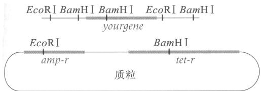

(a) 准备克隆 yourgene 时，用 EcoR I 还是 BamH I 还是两者一起来消化基因组 DNA?

(b) 准备克隆 yourgene 时，用 EcoR I 还是 BamH I 还是两者一起来消化质粒 DNA?

(c) 消化、混合 DNA、连接及转化之后，用哪种抗生素来选择含质粒的细菌？

(d) 在含质粒的细菌中，怎样用含某种抗生素的培养基来鉴定质粒中可能已插入了 yourgene 的那些转化细胞？

## 答案

(a) 必定不会用 BamH I，因为该酶在 yourgene 内部切割，很可能会破坏它的功能。会用的酶是 EcoR I，因为 yourgene 包含在一个单一的 EcoR I 片段中。

(b) 应该也会用 EcoR I 来消化质粒，因为想要 yourgene 两侧的 EcoR I 位点与切割后质粒的两端互补。

(c)应该在四环素上选择转化体。只有含质粒的那些细胞能生长。

(d) 在具有四环素抗性的细胞中，在 amp-r 基因中可能已经插入 yourgene 的那些细胞应该对氨苄青霉素敏感，因为插入片段打断了 amp-r 基因，破坏了它的功能。

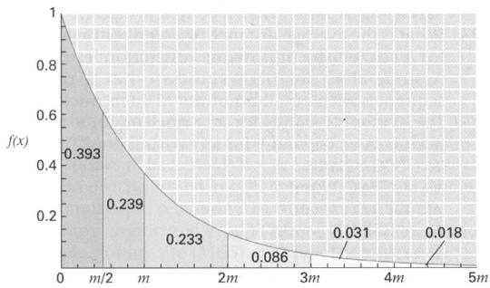  
片段大小 $(m$ 代表均数）

习题 3 附图示用某种限制酶消化时片段大小的理论预期分布。该曲线即所谓的指数分布 (exponential distribution)，此处用符号 $f(x)$ 来表示，该分布的均数以 m 表示。请注意，该曲线向左偏斜，所以短片段比长片段多得多。该分布被一些竖线分成表示小于均数的一半 $(m/2)$ 、大小从均数的一半到均数 $(m/2 \text{ 到 } m)$ 、从均数到均数的两倍 $(m \text{ 到 } 2m)$ 等的区域。每个区标以其范围内预期大小的片段所占的比例。

(a) 预计比均数小的限制性片段所占的比例是多少？小于均数两倍的片段呢？小于均数三倍的片段呢？小于

均数四倍的片段呢？

(b) 对限制性位点由 4 个核苷酸组成的限制酶而言，平均片段大小是多少？对这样的一种酶而言，预计小于 128bp 的限制性片段的比例是多少？

(c) 对限制性位点由 6 个核苷酸组成的限制酶而言，平均片段大小是多少？对这样的一种酶而言，预计大于 16384bp 的限制性片段的比例是多少？

## 答案

(a) 小于均数的期望比例是 $0.393 + 0.239 = 0.632$ ，小于两倍均数的期望比例是 $0.393 + 0.239 + 0.233 = 0.865$ ，小于三倍均数的期望比例是 $0.393 + 0.239 + 0.233 + 0.086 = 0.951$ ，而小于四倍均数的期望比例是 $0.393 + 0.239 + 0.233 + 0.086 + 0.031 = 0.982$ 。

(b)某个特定的四核苷酸序列的概率是 $1 / 4\times 1 / 4\times 1 / 4\times 1 / 4 = 1 / 256$ ，而均数为其倒数，即256bp。长128bp的片段为均数的一半，所以预计有 $39.3\%$ 的片段在此范围内。

(c)某个特定的六核苷酸序列的概率是 $(1 / 4)^{6} = 1 / 4096$ ，而均数为其倒数，即 $4096\mathrm{bp}$ 。长16384bp的片段为均数的四倍，因而预计仅有1-0.982即 $1.8\%$ 的片段在此范围内。分析与应用

12.1 限制酶在其切割的 DNA 分子上产生的末端有 3 种可能。是哪 3 种可能？

12.2 在进行重组 DNA 时，研究人员一般喜欢连接具有黏端(单链突出端)的限制性片段，而不是平端片段。你能提出一个理由吗？

12.3 在克隆序列未知的某个基因时，一位研究人员决定用某种限制酶来进行部分消化 (partial digestion)，在只有一小部分限制性位点被切割时就终止反应。使用部分消化而不是完全酶切可能会有什么好处？

12.4 下列各种限制酶的限制性位点之间的平均距离是多少？假设 DNA 底物为具有等量的各种核苷酸的随机序列。符号 N 代表任意核苷酸，R 代表任意嘌呤(A 或 G)，Y 代表任意嘧啶(T 或 C)。

(a) TCGA Taq I

(b) GGTACC Kpn I

(c) GTNAC MaeIII

(d) GGNNCC NlaIV

(e) GRCGYC Acy I

12.5 限制酶 Sep I 和 Ppu10 I 具有限制性位点:

ATGCA|T(Sep I)

A|TGCAT(Ppu10 I)

其中，5'端写在左边，在竖线的位置切割。这两种酶产生的黏端互补吗？请解释。

12.6 限制酶 Aas I 具有限制性位点 5'-GACNNNN|NNGTC-3'，其中，N 表示任意核苷酸（与另一条链中的一个互补核苷酸配对），在竖线的位置切割。两个随机的 Aas I 位点具有互补黏端的概率是多少？

12.7 一个特定的限制酶产生的不同的限制性片段，其末端总是具有相同的序列吗？每个限制性片段的两端一定相同吗？请解释答案。

12.8 在双链 DNA 分子中，序列 5'-GGCC-3' 和 3'-GGCC-5' 会被相同的限制酶切割吗？

12.9 限制酶 Hae I 和 Aat I 具有限制性位点:

WGGCCW(Hae I)

AGGCT(Aat I)

其中，5'端写在左边，W代表要么为A(与另一条链中的T配对)要么为T(与另一条链中的A配对)。假设有一条随机核苷酸序列，一个Hae I位点为Aat I位点的概率是多少？一个Aat I位点为Hae I位点的概率是多少？

12.10 限制酶 Fae I 具有限制性位点 CATG|，其中，5 端写在左边，切割位点如竖线所示。如果某条 mRNA 具有序列 CAUG，其中 AUG 是翻译起始密码子，欲在紧接于起始密码子之后切割 DNA，用 Fae I 这种酶行不行？请解释答案。

12.11 限制酶 Aoc II 具有限制性位点 GDGCH|C，其中，D 表示 A 或 G 或 C (在另一条链上有互补碱基)，H 表示 A 或 C 或 T (在另一条链上有互补碱基)。可能会有多少种 Aoc II 位点？在这些位点中，哪些是回文序列？

12.12 限制酶 Aoc II 具有限制性位点 GDGCH|C，其中，D 表示 A 或 G 或 C（在另一条链上有互补碱基），H 表示 A 或 C 或 T（在另一条链上有互补碱基）。如果两个随机的 Aoc II 位点被切割，它们的黏端互补的概率是多少？

12.13 限制酶 Acc I 具有限制性位点 GT|MKAC，其中，M 表示 A 或 C（在另一条链上有互补碱基），K 表示 G 或 T（在另一条链上有互补碱基）。如果两个随机的 Acc II 位点被切割，它们的黏端互补的概率是多少？

12.14 限制酶 Hpy8 I 具有限制性位点 GCNNAC，其中，N 表示任意核苷酸，限制酶 Acc I 具有限制性位点 GTMKAC，其中，M 表示 A 或 C（在另一条链上有互补碱基），K 表示 G 或 T（在另一条链上有互补碱基）。两个随机的 Hpy8 I 位点相同的概率是多少？一个随机的 Hpy8 I 位点也是 Acc I 位点的概率是多少？

12.15 某环状质粒上有两个 BglⅡ的限制性位点，该酶切割位点 A|GATCT。消化后将片段连接在一起，分离得含每个片段一个拷贝的某种环状产物。这是否意味着该连接质粒与原来的质粒是一样的？请解释。

12.16 此处所示的 8kb 质粒上有 Pst I、Xba I 和 BamH I 的限制性位点。以各种酶单独消化、以两种酶的各种组合消化、以 3 种酶一起消化，会产生哪些大小的片段？

12.17 将 DNA 片段克隆进细菌的质粒载体时，为什么将待克隆的 DNA 片段插入某个抗生素抗性基因内部的限制性位点非常有用？为什么对第二种抗生素具有抗性的另一个基因也很有用？

12.18 限制酶 Taq I (限制性位点为 TCGA) 和 MaeIII (限制性位点为 GTNAC, 其中 N 为任意核苷酸) 切割含下列随机序列的双链 DNA 分子的频率是多少?

(a) 20%的 A-T 碱基对和 80%的 G-C 碱基对

(b) 50%的 A-T 碱基对和 50%的 G-C 碱基对

(c) 80%的 A-T 碱基对和 20%的 G-C 碱基对

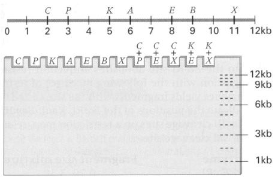

12.19 要将某个人类基因导入某种细菌载体的某个启动子下游，希望能够生产大量的这种人类蛋白质。用基因组 DNA 还是 cDNA？解释理由。

12.20 此处所示的是从伯氏疏螺旋体(Borrelia burgdorferi)细胞中分离的一种12kb线状质粒的限制性图谱。伯氏疏螺旋体是通过硬蜱叮咬传播的一种螺旋菌，可引起莱姆病。符号C、P、K、A、E、B和X分别代表限制酶Cla I、Pst I、Kpn I、Ava I、EcoR I、Bal I和Xba I的切割位点。在所附凝胶示意图中，标出以所示的一种或多种限制酶消化该质粒后，会见到条带的位置。

12.21 以 Ava I (A)、Bgl II (B) 和 Mbo I (M) 三种限制酶单独或组合起来消化某种环状质粒，得到所示带

型。绘制该质粒的限制性图谱。(提示：有些条带可能会隐藏着多个片段，因为在凝胶的所有泳道上，产生的所有片段的总的大小都一定是相同的)

12.22 按课文所述将一个 DNA 微阵列与来自女性和男性的人类基因组 DNA 进行竞争性杂交。用一种发红色荧光的基团标记女性的 DNA，用发绿色荧光的基团标记男性的 DNA。如果某个斑点属于下列情况，估计该斑点会发出什么颜色的荧光？

(a)对应于一个常染色体基因。

(b)对应于一个X连锁基因。

(c) 对应于一个 Y 连锁基因。

12.23 用 DNA 微阵列进行一个功能基因组学的实验，以检测某种细菌的基因表达水平。与培养在完全培养基上的细胞相比，估计什么基因会在培养于基本培养基上的细胞中过度表达？

12.24 许多工程载体具有供 DNA 插入的多接头(即多克隆位点，MCS)，而不是单个限制性位点。多接头是含多个不同的限制性位点的一段 DNA 短序列，对载体来说，每个限制性位点都是唯一的，这些限制性位点的任何一种组合都可用两种适当的限制酶来切割，产生在两端具有明确的限制性位点的线状载体分子。附图示某个载体多接头中的 5 个限制性位点；与多接头相邻的载体序列以 X 和 Y 表示。附图还显示了一段基因组靶序列的限制性图谱，该序列的两端以 A 和 B 表示。限制酶 Sal I、Kpn I、Pst I 和 Xma I 都产生黏端；Hpa I 产生平端。

(a) 如果该载体和靶序列都用 Hpa I 来消化，产生的片段以这样的方式连接：每个载体分子与且只与一个靶片段连接，A 片段会以什么方向连接到多接头中？

  
载体

  
靶序列

12.25 以 Sal I (S)、EcoR I (E) 和 Cla I (C) 三种限制酶单独或组合起来消化某种环状质粒，得所示带型。绘制该质粒的限制性图谱。(提示：有些条带可能会隐藏着多个片段，因为在凝胶的所有泳道上，产生的所有片段的总的大小都一定相同)

12.26 此处示一个基因及其转录起点和方向，还显示了某种质粒载体的多克隆位点(MCS)。符号 A、B、C、D、E、F、G 和 H 分别代表限制酶 Aat I、Bcl I、Cla I、Dra I、EcoR I、Fsi I、Gdi I 和 HindIII 的切割位点，每种酶均非对称性地切割 DNA 并产生互补的黏端。

(b) 用哪种 (或哪些) 限制酶来消化载体和靶序列, 以使消化片段被混合并连接后, 克隆 DNA 会具有 X B A Y 的顺序?

(c) 用哪种(或哪些)限制酶来消化载体和靶序列,以使消化片段被混合并连接后,克隆 DNA 会具有 X A B Y 的顺序?

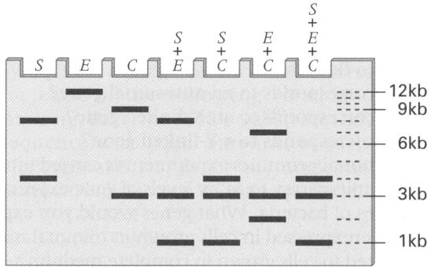  
这一发现对解释上题中的意外结果有帮助吗？

一个研究小组想将该基因的编码序列置于一个启动子的控制之下，该启动子位于 MCS 的左侧。为了达到这一目的，他们分离了含编码序列的 Aat I 片段，将该片段加到含有已被 Aat I 切割的质粒溶液中，将黏端连接在一起，然后转化细菌细胞。他们筛选得一个转化体，该转化体含质粒，Aat I 片段已插入质粒中的正确位置，可是，令他们失望的是，他们发现这个基因不转录。请提出一个解释。

12.27 在上一题所述的没有功能的重组 DNA 克隆中，经分析推断出 MCS 附近的限制性图谱。结果如附图所示。

12.28 对来自 12.26 题中的其他克隆进行分析，发现就

MCS 附近的限制性图谱而言，克隆分成两种。一种的限制性图谱如上一题所示。另一种是什么样子？估计这种克隆会转录目的基因吗？为什么？

12.29 另一位遗传学家研究了 12.26 题中的限制性图谱并指出，定向克隆(directional cloning)可能是确保编码序列能在重组质粒中转录的更有成效的方法。在这种方法中，用相同的两种限制酶来切割目的基因和质粒，所选的两种酶要使它们的黏端能够确保目的片段以正确的方向插入质粒。要进行 12.26 题中片段的定向克隆，应该用哪两种限制酶？在所得质粒中，MCS 附近的限制性图谱是什么？

12.30 一位遗传学家正在研究一种4kb的双链环状质粒。该质粒携带一些基因，其蛋白质产物赋予宿主细菌四环素抗性(tet-r)和氨苄青霉素抗性(amp-r)。质粒DNA各有下列限制酶的单一位点：Sst I、Kpn I、BamH I、EcoR I和HindIII。将DNA克隆进Sst I位点不会影响任何一种抗性。将DNA克隆进Kpn I、BamH I和HindIII位点会消除四环素抗性。将DNA克隆进EcoR I位点会消除氨苄青霉素抗性。以下列限制酶的混合物进行消化，产生下列大小的片段。在限制性图谱中标出EcoR I、Kpn I、BamH I和HindIII的切割位点相对于Sst I切割位点的位置。

<table><tr><td>酶</td><td>片段大小(kb)</td></tr><tr><td>Sst I EcoR I</td><td>0.70, 3.30</td></tr><tr><td>Sst I Kpn I</td><td>0.30, 3.70</td></tr><tr><td>Sst I BamH I</td><td>0.08, 3.92</td></tr><tr><td>Sst I Hind III</td><td>0.85, 3.15</td></tr><tr><td>Sst I Kpn I EcoR I</td><td>0.30, 0.70, 3.00</td></tr></table>

## 挑战题

挑战题 1：一位遗传学家决定用酵母 DNA 微阵列来研究酵母接合型基因座 MAT 中的缺失突变的效应。为了做这些实验，他从待比较的两个酵母菌株中提取 RNA，在存在绿色 (Cy3) 或红色 (Cy5) 荧光标记的情况下，通过反转录制备每个菌株的标记 cDNA 探针。混合分别标记的 cDNA 溶液，应用于微阵列杂交，微阵列上的斑点为附表所示的每种基因的 DNA 序列。MATα1、MATα2 和 MATα1 为 MAT 基因座上可能存在的编码序列的 DNA，αsg 和 asg 斑点分别含在 α 细胞和 a 细胞中特异性表达的基因的 DNA，而 hsg 斑点含在单倍体细胞中特异性表达的基因的 DNA。对于附表中的每个杂交，标出该杂交的期望颜色 (红色、绿色、黄色或无)。黄色表示等量的 Cy3 和 Cy5，“无”表示在两个菌株中均无表达。符号△表示缺失突变。(在解这个题之前，可能要回顾一下 11.10 节中关于酵母接合型的遗传控制)

<table><tr><td>红色(Cy5)</td><td>野生型 $\alpha$ 细胞</td><td>野生型 $\alpha$ 细胞</td><td>野生型 $\boldsymbol{a}$ 细胞</td><td> $\triangle MAT\alpha 1$ 细胞</td><td> $\triangle MAT\alpha 1$ 细胞</td><td> $\triangle MAT(\alpha 2\alpha 1)/\triangle MAT\alpha 1$ </td></tr><tr><td>绿色(Cy3)</td><td>野生型 $\boldsymbol{a}$ 细胞</td><td>野生型 $\boldsymbol{a}/\alpha$ 细胞</td><td>野生型 $\boldsymbol{a}/\alpha$ 细胞</td><td>野生型 $\boldsymbol{a}$ 细胞</td><td>野生型 $\alpha$ 细胞</td><td>野生型 $\boldsymbol{a}$ 细胞</td></tr><tr><td> $MAT\alpha 1$ </td><td></td><td></td><td></td><td></td><td></td><td></td></tr><tr><td> $MAT\alpha 2$ </td><td></td><td></td><td></td><td></td><td></td><td></td></tr><tr><td> $MAT\alpha 1$ </td><td></td><td></td><td></td><td></td><td></td><td></td></tr><tr><td> $asg$ </td><td></td><td></td><td></td><td></td><td></td><td></td></tr><tr><td> $asg$ </td><td></td><td></td><td></td><td></td><td></td><td></td></tr><tr><td> $hsg$ </td><td></td><td></td><td></td><td></td><td></td><td></td></tr></table>

挑战题 2：附图示某个基因及其转录起点和方向，以及两个质粒载体(A 和 B)的多克隆位点(MCS)，两个载体的差异在于与 MCS 毗邻的启动子位置不同。符号 A、D、E、H、P、S 和 X 分别代表限制酶 Alu I、Dde

I、EcoR I、HindIII、Pst I、Sac I 和 Xho II 的切割位点。在定向克隆中，用相同的两种限制酶来切割感兴趣的基因和质粒，所选的两种酶要使它们的黏端能够确保感兴趣的片段以正确的方向插入质粒。一位遗传学家打算使用定向克隆将该基因的编码区分别置于这两种质粒中启动子的控制之下。

(a) 在质粒 A 中进行定向克隆，应该用哪两种酶？

(b) 在质粒 B 中进行定向克隆，应该用哪两种酶？

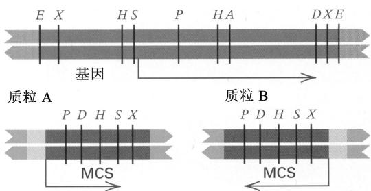

(c) 绘制所得质粒 MCS 附近的限制性图谱。

挑战题 3：上题所述的两种情况都成功地进行了定向克隆，但遗憾的是，试管上的标签被弄脏而无法辨认。要区分开这些质粒，是否必须对所有的质粒进行完全的限制性作图，还是只进行简单的指示性的消化就可判断？

## 网上遗传学

“网上遗传学”(GeNETics)会为你介绍在互联网上寻找遗传学信息的某些最重要的站点。要浏览这些站点，请访问为《遗传学：基因和基因组分析》(第八版)配备的 Jones and Bartlett 公司配套站点http://biology.jbpub.com/book/genetics/8e/。

在该站点中，你会找到一个按章列出的重点关键词列表。选择某个关键词后，可链接到某个网站，其中包含与此关键词相关的信息。
