# 第 13 章 发育的遗传控制

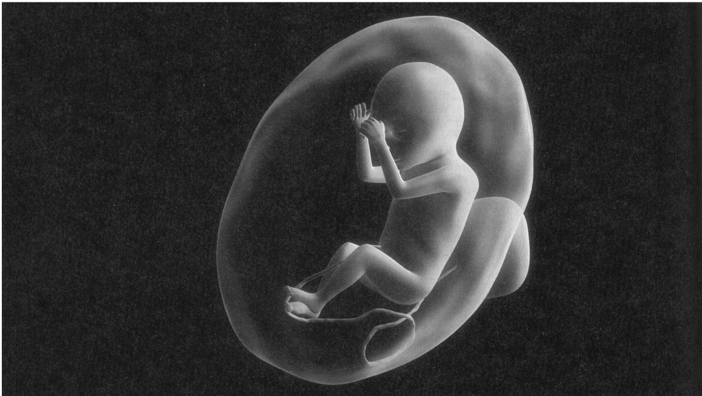

在子宫内发育至第 7 个月左右的人类胎儿。( $^{©}$ Sebastian Kaulitzki/Shutterstock, Inc.)

## 本章提纲

13.1 发育的遗传决定因素

13.2 动物早期胚胎发育

13.3 线虫发育的遗传分析

13.4 果蝇发育的遗传控制

13.5 高等植物发育的遗传控制

联系：著名的谱系(高贵的血统)

约翰·萨尔斯顿、希伦伯格、怀特和汤姆森，1983
秀丽隐杆线虫的胚胎细胞谱系
联系：胚胎创世纪
克里斯蒂安·纽斯林-沃尔哈德和埃里

克·威绍斯，1980
影响果蝇体节数目和极性的突变

## 学习目标与科学能力

学习发育的遗传控制的基本原理，会使你能够运用下列科学能力。

■ 能区分配体和受体，并能解释它们各自在发育过程中的作用。

■ 能运用上位性原理来推断基因产物在线性开关型调节途径中发挥作用的时间顺序。

\- 能叙述在果蝇发育中坐标基因、裂缺基因、成对规则基因、体节极性基因和同源异形框基因的作用，能叙述每种基因的突变体所具有的特征表型。

■ 能设计实验来判断在新动物物种中 Pax 基因是否参与眼睛的发育。

\- 能叙述拟南芥花发育的 ABC 模型，并能解释在某些花器的发育中转录因子如何以组合方式起作用。

基因调节在人从受精卵发育至胚胎的过程中起核心作用。在发育过程中，基因按预定程序表达，以确保受精卵反复分裂，并确保产生的细胞被有条不紊地特化，以产生完全分化的机体。基因型不仅决定在发育中发生的事件，而且决定这些事件展现的时间顺序。

研究发育的遗传学方法往往会利用使发育方式发生改变的突变。这些突变打断发育过程，使人们有可能鉴定控制发育的因子，并研究这些因子之间的相互作用。本章展示如何将遗传学方法应用于发育研究。例如，秀丽隐杆线虫(Caenorhabditis elegans)、黑腹果蝇(Drosophila melanogaster)和开花植物拟南芥(Arabidopsis thaliana)，因为这些生物已进行过深入的发育遗传学研究。发育的核心过程是模式形成(pattern formation)，即通过受精卵的细胞分裂和分化，出现构成胚胎的在空间上有组织的、特化的细胞。

## 13.1 发育的遗传决定因素

从概念上来说，基因型和发育之间的关系不复杂：

基因型包含发育程序，发育程序逐渐展开，导致在不同类型的细胞中表达不同的成套基因。

换句话说，一些基因在一种细胞中特异性地表达，但在另一种细胞中不表达，发育就是由导致这些结果的一个程序构成。随着发育的逐渐展开，逐渐出现各种类型的细胞，这些细胞所表达的基因具有质的差异。某个特定基因是否表达，可能取决于某个特定转录因子的存在与否、染色质结构的改变，或某个特定受体分子的合成。这些及其他的分子机制，决定一个基因赖以控制另一个基因的相互作用模式。这些调节性的相互作用最终决定细胞的命运。此外，许多在发育中很重要的相互作用使用较为普遍的调节因子。胎儿乙醇综合征堪为一例，在该病中，一种环境因素——慢性乙醇中毒——侵袭胎儿生长和神经发育诸方面。

胚胎的形成亦受其发育环境的影响。基因型决定生物发育的潜能。基因决定发育中的胚胎是发育成线虫、果蝇、鸡，还是小鼠。但是，在遗传上已经决定了的发育潜能，其表达也受环境的影响，而且在有的情况下，其影响还非常巨大。例如，胎儿乙醇综合征，在该病中，慢性乙醇中毒会侵袭胎儿生长和神经发育等方面。

在发育中，有许多这样的例子：调节蛋白应答环境信号，继而作用于基因，使基因选择性地打开或关闭。在发育遗传学中，鉴定在发育中发挥作用的遗传调节性相互作用，是一个重要的主题。实施不同的调节相互作用，意味着在遗传上相同的细胞，表达的基因可具有质的差异。

研究最为深入的是在发育早期、在组织分化之前发生作用的发育基因，因为这些基因确立了总体的发育模式。

## 13.2 动物早期胚胎发育

动物胚胎的早期发育为整个机体奠定基本的发育蓝图。受精启动一系列有丝分裂性质的卵裂(cleavage division)，使胚胎变成多细胞。与卵相比，在总体大小上既不减少也不增加，因为卵裂时几乎没有生长；卵裂只不过是把受精卵分割成越来越小的细胞。卵裂形成囊胚(blastula)，它基本上是含有一个空腔的一团细胞(约 $10^{4}$ 个)(图13.1)。卵裂完成后，通过部分囊胚壁的向内折叠和广泛的细胞迁移，形成原肠胚(gastrula)。在原肠胚细胞的重新组织过程中，细胞被排列成不同的几层。这些细胞层奠定动物基本的形体模式(body plan)。依据后文所述，高等植物的发育过程与动物非常不同。

动物受精卵具有完全的发育潜能, 因其含有产生完整机体所需的遗传程序(在细胞核中)和大分子(在卵母细胞的细胞质中)。早期卵裂产生的细胞一直保持着完全的发育潜能。但是, 在早期胚胎

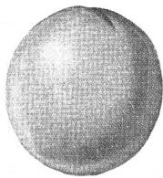

图 13.1 动物胚胎的早期发育。受精卵卵裂，首先形成一团细胞，然后形成一个空心的细胞团(囊胚)。大量细胞的迁移形成原肠胚，建立胚胎基本的形体模式。

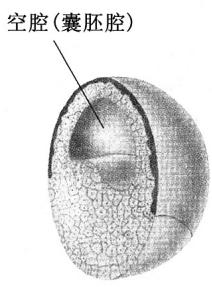

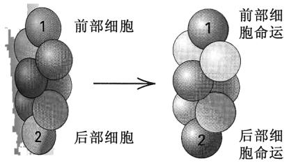

发育过程中，发育潜能逐渐分流到不同方向而受到限制。囊胚内的细胞通常被赋予特定的发育结局，即细胞命运(cell fate)，这限定了后代细胞可能的分化状态。

## - 自主发育和细胞间信号传递

在细胞谱系中，逐渐限制细胞发育潜能的两个主要机制如下。

(1) 自主发育: 发育限制可以是自主的 (autonomous), 即由细胞自身遗传上的程序性变化所决定。

(2) 对位置信息的应答：细胞可以对位置信息 (positional information) 进行应答，即发育限制由细胞在胚胎内的位置所产生。位置信息可由邻近细胞之间信号的相互作用介导，或由形态发生素的浓度梯度介导。形态发生素 (morphogen) 是在发育过程中直接参与生长和体形控制的一种分子。

研究发育命运的限制，通常是将胚胎细胞移植到新的位置，以检测它们是否能够代替其替换掉的细胞。图13.2所示的实验，显示自主发育和对位置信息应答的差别。在正常胚胎中(图13.2A)，细胞1和细胞2的命运不同，要么是因为自主的发育程序，要么是因为它们对前后端附近的位置信息进行应答。当这两个细胞被移植后(图13.2B)，细胞1和细胞2尽管在新位置上，但发育命运仍然不变，则说明是自主发育；在此情况下，胚胎前后颠倒。当发育取决于位置信息时，移植细胞对它们的新位置进行应答，因而胚胎正常。

图 13.2 自主决定和位置信息的区别。(A)如图所示，细胞 1 和细胞 2 正常分化。(B)移植这两个细胞，使它们互换位置。如果移植细胞自主分化，那么它们会像在正常胚胎中一样分化。如果它们通过应答位置信息而分化(信号来自邻近细胞)，那么它们的命运由新位置决定。

在有些真核生物中，例如，在土壤线虫秀丽隐杆线虫中，许多细胞谱系按照胚胎发育极早期由邻近细胞的相互作用所诱导的遗传程序自主发育。随后的细胞相互作用也很重要，并且每个发育阶段都要由前一个阶段的完成来启动。图 13.3 显示秀丽隐杆线虫发育过程中最初的 3 次细胞分裂，产生 8 个在遗传活性和发育命运上不同的胚胎细胞。在这几次早期的细胞分裂中，细胞命运部分是自主性的，部分是细胞间相互作用的结果。图 13.3B 显示了这些细胞之间的谱系关系。一种被称为极粒 (polar granule) 的细胞质颗粒从细胞 P0 传递到 P1，再从 P1 传递到 P2，从 P2 传递到 P3，显示存在细胞的自

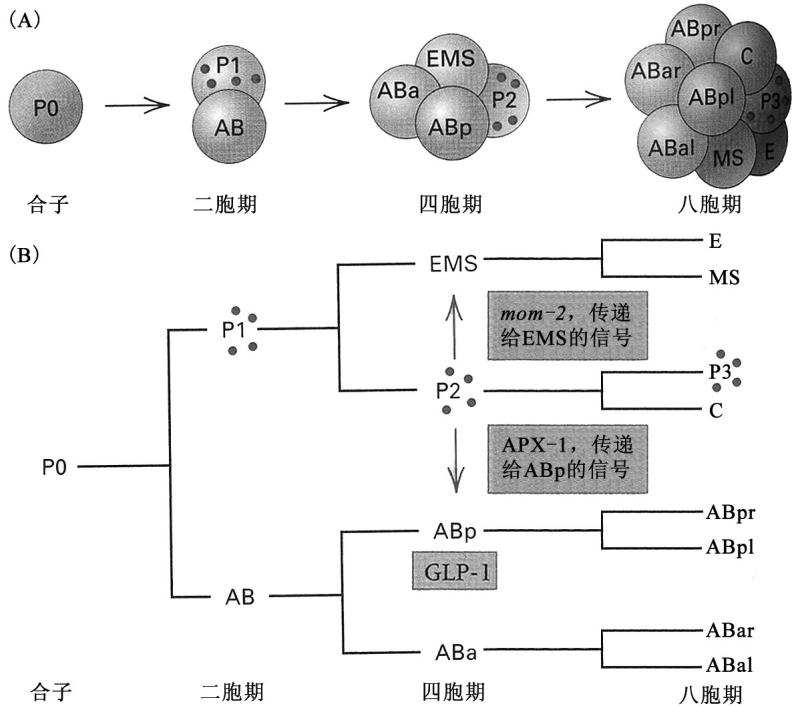  
图 13.3 秀丽隐杆线虫发育中的早期细胞分裂。(A)细胞的空间组织。(B)细胞的谱系关系。极粒的传递显示细胞自主发育的存在。箭头示决定发育命运的细胞间信号传递机制。[改编自 W. Roush, Science 272(1996): 1871.]

主性机制。极粒的正常分离是细胞骨架中微丝的一项功能。P2 作用于 EMS 和 ABp，表明细胞信号传递机制的存在。EMS 的命运由 P2 中 mom-2 基因的活性决定。P2 细胞还产生信号分子 APX-1，该分子通过细胞表面受体 GLP-1 决定 ABp 的命运。在秀丽隐杆线虫中，许多发育决定是细胞自主性的；在果蝇 (Drosophila) 和小鼠 (Mus) 中，一般是通过细胞间信号传递来调节发育的。利用细胞间信号传递来调节发育，可以提供一种保障措施，帮助克服在发育过程中偶尔可能会发生的个别细胞的死亡。

细胞间信号传递的一个特例是胚胎诱导(embryonic induction)，即胚胎主要结构的发育由邻近细胞输送来的信号决定。例如，在紫球海胆(Strongylocentrotus purpuratus)发育早期，其第4次卵裂之后，在胚胎的腹极产生称作小裂球(micromere)的特化细胞(图13.4A和图13.4B)。在细胞再次进行增殖之后，紧接于小裂球上方的胚胎区向内折叠，形成一个管腔——原肠(archenteron)，原肠最终发育成胃、肠及相关结构。如果从一个16细胞期胚胎上取下小裂球细胞，移植到另一个处于8细胞期的胚胎的背部区域(图13.4C)，则下一次卵裂会产生具有两组小裂球的胚胎(图13.4D)。随着发育的进行，在这些胚胎中，在正常位置会形成原肠，原肠来源于位于腹部小裂球上方的细胞。但在移植的小裂球下方也会形成另一个原肠(图13.4E)，这说明移植的小裂球能够诱导毗邻细胞发育为原肠。

## - 卵母细胞的成分和组织

在卵子发生的大部分过程中，卵母细胞都是二倍体细胞。卵母细胞的细胞质高度有组织且具有区域差异性(图 13.5)。这种空间上的差异最终决定囊胚细胞不同的发育命运。动物卵细胞的细胞质具有两个基本功能。

1. 存储支持卵裂及胚胎发生早期快速合成 RNA 和蛋白质所需的分子。

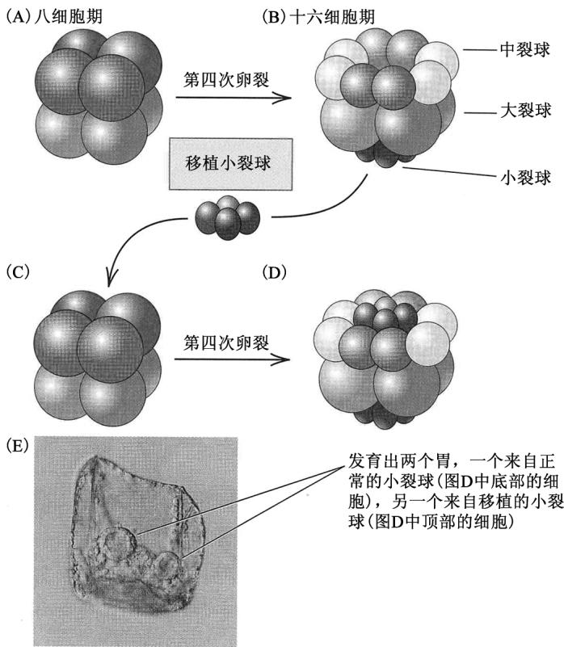  
发育出两个胃，一个来自正常的小裂球(图D中底部的细胞)，另一个来自移植的小裂球(图D中顶部的细胞)

  
图 13.4 海胆小裂球细胞所致的原肠的胚胎诱导。(A)处于8细胞期的正常胚胎。(B)处于16细胞期的正常胚胎，示腹面的小裂球。(C)从另一个胚胎将小裂球移植到8细胞胚胎的背端。(D)第4次卵裂后具有两组小裂球的移植胚胎。(E)移植的结果是一个胚胎具有两个原肠。该胚胎中的环状物是正在发育的胃。[E部分转载自A. Ransick and E. H. Davidson, Science 259(1993):1134-1138。经AAAS许可转载。]  
图 13.5 动物卵母细胞是高度有组织的，这是由爪蟾(Xenopus)卵背部和腹部的可见差异揭示的。卵母细胞的区域化组织结构决定早期发育中的许多关键事件。[承科罗拉多大学博尔德分校分子、细胞与发育生物学系(MCDB)迈克尔·克林姆可夫斯基(Michael Klymkowsky)惠赠。]

## 2. 组织细胞质中的分子，提供导致早期胚胎细胞之间差异的位置信息。

要建立卵母细胞正确的成分和组织，需要卵母细胞本身的许多基因和邻近不同类型的辅助细胞提供的基因产物的参与(图 13.6)。在卵母细胞发育过程中，有众多的母源基因被转录，因而成熟的卵母细胞一般会含有编码早期胚胎所需蛋白质的大量转录物。有些母源 mRNA 转录物被掩藏在特殊的核糖核蛋白颗粒中，不能被翻译；这些 mRNA 释放后能被翻译，但直到受精后才会发生。

卵母细胞中的发育指令，一部分由细胞内不同位置存在的不同类型的分子决定，一部分由从一个位置到另一位置具有浓度差异的形态发生素梯度决定。虽然卵母细胞含有许多基因的产物，但在卵母细胞形成过程中专性表达的基因只是少数。在卵母细胞形成过程中表达的大多数基因，在其他组织的发育中或在稍后的发育中也很重要。因而赋予卵母细胞独特发育潜能的，不仅仅是基因产物，还有它们在细胞内的空间组织。

## - 早期发育与合子基因组的激活

去除细胞核的青蛙受精卵仍能进行卵裂，并形成基本的囊胚。同样，当海胆或两栖类合子中的基因转录被阻断时，对卵裂或囊胚形成没有影响，但不会发生原肠胚形成过程。这些观察结果表明，经由囊胚形成而进行的早期发育，不依赖于合子细胞核中的遗传信息。所有必需的大分子都在卵母细胞的细胞质中。

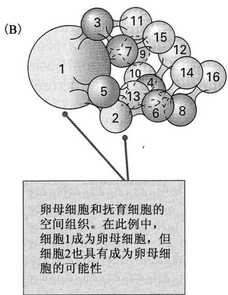  
图 13.6 (A) 果蝇卵母细胞发育过程中细胞分裂的模式。(B) 细胞群的几何组织。[数据来自 F. M. Butterworth and R. C. King, Genetics 52(1965): 1153-1174.]

继这个不需要合子基因的早期阶段之后，胚胎转而依赖其自身基因的活性。哺乳动物需要合子基因的时间比低等脊椎动物早得多。在任何时间使用阻止小鼠胚胎发育的转录抑制剂，都会影响第一次卵裂。这一结果说明，从母源基因组控制转变为由合子基因组控制，始于两细胞期。这也是合子细胞核编码的蛋白质开始被检出的时期。但是，即使在哺乳动物中，最早的发育阶段仍受卵母细胞细胞质的强烈影响，这种影响决定初次卵裂的分裂面及其他最终影响细胞命运的事件。

哺乳动物合子细胞核的早期激活可能是必需的，因为在配子形成时，有些基因经过称为印记(imprinting)的表观遗传失活过程(参见第11章)。被印记的基因不多，其中包括胰岛素样生长因子基因(Igf2)，该基因是在卵子发生过程中被印记的，以及Igf2跨膜受体基因(Igf2-r)，该基因是在精子发生过程中被印记的。因此，胚胎中Igf2和Igf2-r的表达都需要精细胞核对Igf2的激活和卵细胞核对Igf2-r的激活。印记也影响人类基因组中的基因，现已知印记与脆性X综合征(第14章)、普拉德-威利综合征(Prader-Willi syndrome)和安吉尔曼综合征(Angelman syndrome)等疾病有关(第11章)。

## 13.3 线虫发育的遗传分析

在遗传学研究中，土壤线虫秀丽隐杆线虫(图 13.7)很受欢迎，因为它个头小、容易培养，并且世代时间短而后代数量众多。将其培养于培养皿中的琼脂表面上，饲以大肠杆菌等细菌。因为它们极其微小，在单个培养皿中可容纳多达 $10^{5}$ 个个体。性成熟的秀丽隐杆线虫成虫能在数日之内产卵 300 个以上。在 $20^{\circ}$ C 条件下，卵孵化、历经 4 次幼虫蜕皮，变成性成熟的成虫，约需 60h。

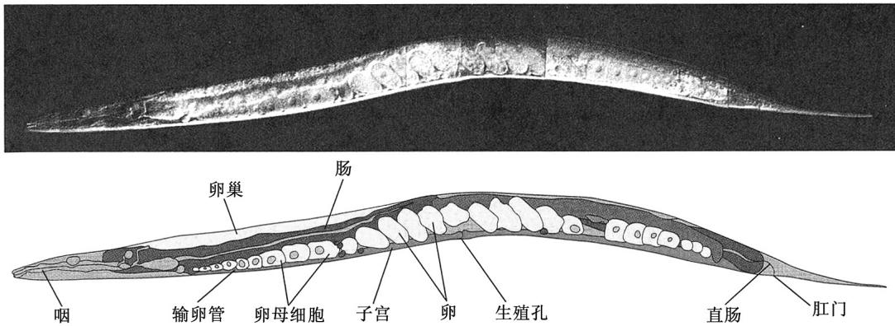  
图 13.7 土壤线虫秀丽隐杆线虫。[照片承华盛顿大学医学院蒂姆·谢德尔(Tim Schedl)惠赠。]

线虫是具有两种性别的二倍体生物。在秀丽隐杆线虫中，两种性别是雌雄同体和雄性。雌雄同体含两条X染色体(XX)，有功能的卵和有功能的精子两者都产生，因而可进行自体受精。雄性只产生精子，可使雌雄同体受精。雄性秀丽隐杆线虫的性染色体组成由单条X染色体构成，不存在Y染色体，因此雄性核型是XO。

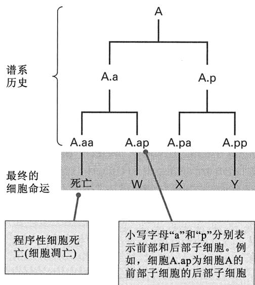  
图 13.8 粗略的细胞谱系图。不同的终末分化细胞命运记为 W、X 和 Y。细胞谱系中有一个细胞 (A.aa) 发生程序性细胞死亡。

## ■ 细胞谱系分析

秀丽隐杆线虫体壁透明，使人们得以研究其在发育过程中出现的细胞分裂、迁移、分化或死亡。线虫的发育非常独特——细胞分裂和分化的模式极为固定，不同个体之间几乎没有差异。雌雄同体含有精确的959个体细胞，雄性含有精确的1031个体细胞。现已知每个体细胞在细胞和超微结构水平上完整的发育史。一群细胞之间的系谱关系称为细胞谱系(lineage)。细胞谱系可用谱系图(lineage diagram)来说明，谱系图显示祖先—后裔关系和每个细胞的终末分化状态。图13.8显示了细胞A的粗略的谱系图，细胞A的后代要么发生程序性细胞死亡，要么最终分化为W、X或Y型细胞。字母符号是常用来表示线虫细胞的符号类型，每个名称按照祖先及其在胚胎中的位置来表示细胞谱系。例如，细胞A.a和A.p分别是细胞A的前部子细胞和后部子细胞；而A.aa和A.ap是细胞A.a的前部和后部子细胞。

## 联系：著名的谱系(高贵的血统)

约翰·萨尔斯顿 $^{1}$ 、希伦伯格 $^{2}$ 、怀特 $^{1}$ 和汤姆森 $^{1}$ ，1983

$^{1}$ 医学研究理事会分子生物学实验室，剑桥，英格兰，英国

$^{2}$ 马克斯普朗克实验医学研究所，哥廷根市，德国

秀丽隐杆线虫的胚胎细胞谱系

在这项里程碑式的研究中产生的数据，构成了诠释线虫发育突变体的基础。这篇长文提供了浩繁的数据，现在可以通过互联网得到。在胚胎发生过程中，产生了1030个细胞；其中131个(13%)发生程序性细胞死亡。如此高比例的细胞程序性死亡，原因是什么？胚胎的细胞谱系是高度恒定的，即从一个个体到另一个个体都是一样的。它为什么不像在大多数其他生物中发现的那样，具有更大的发育可塑性？本节选试图解决这些问题，重点是该项研究的历史背景和动机、发育的概貌及从线虫进化的角度来诠释细胞谱系。诺马斯基显微镜技术是一项现代发明，也称为微分干涉相差显微镜。当光穿过活物质时，它根据物质的折射率改变相位。在折射率上有差异的细胞和生物体的毗邻部分，引起相位上的不同改变。当两列波穿过某个物体后复合时，相位差产生干涉图形，得到该物体的图像。诺马斯基显微镜的主要优点是，它可用来观察活组织。

这篇报道标志着一个100多年以前开始的计划的完成，即查明线虫完整的细胞谱系。线虫胚胎因其简单和在发育上的重复性，对19世纪的生物学家很有吸引力，因而利用固定标本在确定它们的细胞谱系方面取得了相当大的进展。诺马斯显微镜技术为非破坏性的，而且可产生高分辨率，现在利用此技术已经可以在活的幼虫中跟踪细胞。活体材料的使用，使观察结果获得了以前无法企及的连续性和确定性，从而使得一种线虫(秀丽隐杆线虫)的每个细胞的起源和命运都能够得以确定。因此，现在不仅明确地了解了组织之间的一般关系，而且清楚地揭示了细胞命运的详细模式。……谱系的重要性不仅在于它能立即揭示细胞之间的关系，而且可作为将来的观察结果进行整合的框架。胚胎的细胞谱系基本上是恒定的。从一个个体到另一个个体，细胞分裂、程序性细胞死亡和终末分化的模式是不变的，并且在时序上也看不到大的差异。……将“亚系”（“sublineage”）作为更具描述性但比较冗长的词组“在本质上已决定的亚系”的简称，“在本质上已决定的亚系”被认为是其前体细胞内部的程序产生的一段谱系。……假定存在亚系的两个现成的标准：①从一系列起源和位置不同的前体细胞产生相同的谱系，导致同一套细胞命运；②从激光烧蚀实验或突变体研究中得到该谱系内存在细胞自主性的证据。……从该谱系可明显看出程序性细胞死亡的巨大数目及其重复性。它们中的大多数之所以出现，最有可能的原因是，非必需的细胞常常与必需细胞一道产生。……也许最惊人的发现首先是这些谱系的复杂性，其次是谱系的细胞自主性。……事后来看，我们能够对这种复杂性和这种严格性作出合理的解释。线虫属于一个古老的门，它的细胞谱系是一块冻结的进化之冰。随着时间的推移，新的细胞类型可从这样的前体细胞产生：它们在固有属性上受到选择的程度，不像处在胚胎中意外的位置时受到的选择那样强烈。……最初发育决定所需的细胞与细胞的相互作用，可能已被更快、更经济、更可靠的自主性程序慢慢取代，灵活性的丧失被效率的获得抵消。基于这种观点，反常的分配、细胞死亡及远程迁移——这些看似在一个更加高效的设计中可以去除的特性——全都是发育化石。这里正是寻找进化过程线索，以及当今谱系控制机制线索的地方。

来源：J. E. Sulston, et al., Dev. Biol. 100 (1983): 64-119.

## ■ 影响细胞谱系的突变

现已经研究过线虫中影响细胞谱系的许多突变。它们揭示了基因控制发育的几个一般特征。

\- 细胞的分裂方式和命运通常受不止一个基因的影响，并且可被其中任何一个基因的突变扰乱。

\- 影响发育的大多数基因在不止一种细胞中起作用。

\- 复杂的细胞谱系通常包含比较简单的、由遗传决定的谱系；这些组成部分称为亚系(sublineage)，因为它们表现出完整的细胞分裂和终末分化模式。

\- 一个细胞的谱系可被该细胞自身自主触发，或被与其他细胞的信号相互作用触发。

\- 发育的调节由决定细胞可出现的不同亚系及每个亚系中各个步骤的基因所控制。

突变影响细胞谱系的方式主要有两种。一种是通过非特异性代谢阻断(例如，在 DNA 复制中)，阻止细胞进行分裂或分化。另一种是通过特异性分子缺陷，导致正常情况下见于胚胎中别的地方或发育中不同时间的分裂或分化方式。从发育遗传分析上来看，后一种突变类型更能提供有用的信息，因为这些突变基因参与的不是在所有细胞中都有的“管家”功能，而是必定参与了发育过程。

## ■ 程序性细胞死亡

程序性细胞死亡(programmed cell death)过程又称为细胞凋亡(apoptosis)，是许多生物正常发育过程中的一个重要特征。细胞凋亡是在发育的适当时间细胞自杀的过程。在很多个案中，已经鉴定出决定这种命运的信号分子(已知一些是转录因子)。程序性细胞死亡障碍通常会导致特殊的发育异常。细胞凋亡失败、存活细胞分化成可识别的细胞类型时，结果是那种类型的细胞冗余。例如，在秀丽隐杆线虫中，具有ced-3基因(ced=cell death abnormal，细胞死亡异常)

突变时，正常情况下会发生程序性细胞死亡的某个细胞活了下来，并常常会分化成一个多余的神经细胞。在秀丽隐杆线虫雌雄同体的发育过程中，有精确的131次程序性细胞死亡。在这些死亡中，没有哪一次死亡是性命攸关的。不能进行程序性细胞死亡的突变体可存活、能生育，但发育及感觉能力受到轻微损伤。另外，在果蝇中不能进行细胞凋亡的突变体是致死的，在哺乳动物包括人类中，程序性细胞死亡障碍会导致严重的发育异常，在有些情况下，甚至会导致白血病或其他类型的癌症(参见第15章)。

## ■ 功能失去和功能获得等位基因

导致细胞在发育命运上有差异的基因有时候不容易识别。例如，根据某个突变，可能会将某个基因鉴定成表达某一特定发育命运的必要基因，但在表达该基因的细胞中，该基因可能不是决定细胞发育命运的充分条件。这种可能性使寻找控制主要发育决定的基因的工作变得复杂。

有些基因的突变具有罕见的特点——显性突变和隐性突变具有相反的效应，有时可用这种特点来鉴定控制细胞命运决定的基因。如果同一基因中不同的突变可向相反的方向改变细胞命

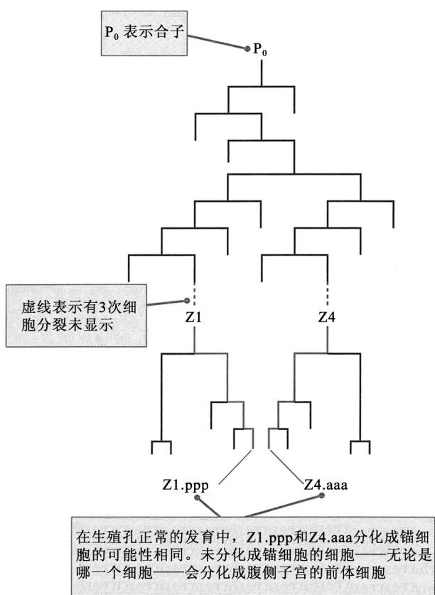  
图 13.9 在秀丽隐杆线虫中 Z1.ppp 和 Z4.aaa 的完整谱系。

运，那么该基因的产物对细胞命运的表达一定是既必要又充分的。在控制发育的基因中，隐性等位基因通常是功能失去突变(loss-of-function mutation)，如缺失、无义突变或失活性的氨基酸置换。发育控制基因的显性等位基因通常是功能获得突变(gain-of-functions mutation)，即基因过度表达，或在错误的细胞中或错误的时间里异位表达。

在秀丽隐杆线虫中，只有少量基因具有以相反方式影响细胞命运的显性和隐性等位基因。lin-12 基因为其中之一，该基因在许多细胞中控制发育决定。例如，图 13.9 示以 Z1.ppp 和 Z4.aaa 表示的两个细胞。在胚胎中，这两个细胞并排着，但它们是从细胞 $P_{0}$ (合子) 经过完全不一样的谱系而来。如图 13.10A 所示，在正常情况下，其中一个细胞分化成锚细胞 (anchor cell, AC)，该细胞参与生殖孔的发育，而另一个细胞分化成腹侧子宫前体细胞 (ventral uterine precursor cell, VU)。Z1.ppp 和 Z4.aaa 成为锚细胞的可能性相同。

Z1.ppp 和 Z4.aaa 直接的细胞间相互作用控制 AC-VU 的发育决定。如果用激光微束烧掉其中一个细胞，则剩下的细胞分化成锚细胞(图 13.10B)。这一结果说明，Z1.ppp 和 Z4.aaa 两者的预编程命运都是锚细胞。在正常情况下，Z1.ppp 或 Z4.aaa 任一个细胞被决定为锚细胞的命运，也就决定了另一个细胞为腹侧子宫前体细胞的命运。如前所述，lin-12 的隐性突变和显性突变具有相反的效应。lin-12 活性缺乏或大大减少的隐性突变以 lin-12 (0) 表示，在突变体中，Z1.ppp 和 Z4.aaa 两者都变成锚细胞(图 13.10C)。相反，lin-12 活性过度表达的显性突变以 lin-12(d) 表示，在突变体中，Z1.ppp 和 Z4.aaa 两者都变成腹侧子宫前体细胞(图 13.10D)。

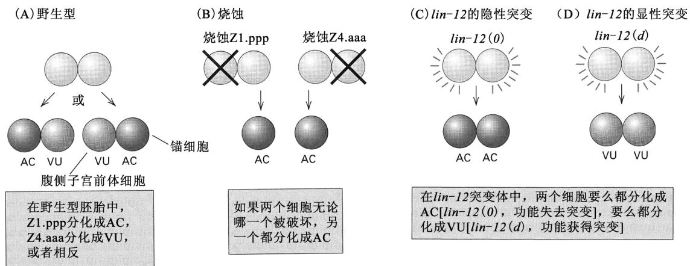  
图13.10 在生殖孔发育中Z1.ppp和Z4.aaa命运的控制和lin-12基因对细胞命运的遗传控制。如果带有隐性的功能失去突变 $[lin - 12(0)]$ ，两个细胞都会变成锚细胞；如果带有显性的功能获得突变 $[lin - 12(d)]$ ，两个细胞都会变成腹侧子宫前体细胞。

对 lin-12 的分子分析揭示，该基因编码一种典型的跨膜受体蛋白，其功能与 lin-12 突变的相反的效应一致。受体太少使细胞对信号不敏感；受体太多使它们特别敏感。LIN-12 蛋白(图

## 13.11)的跨膜区将该分子

分成胞外部分(氨基端)和胞内部分(羧基端)。胞外部分含有一种结构域的13次重复，这种结构域见于一种哺乳类的多肽激素——表皮生长因子(epidermal growth factor, EGF)——及果蝇 notch 基因的产物中，notch 基因的产物控制表皮和神经细胞命运的发育决定。氨基端离跨膜区不远处，含有一种富含半胱氨酸的结构域的3次重复，这种结构域也见于 notch 蛋白中。在细胞内，LIN-12蛋白的羧基端含有一种结构域的6次重复，这种结构域也见于 SWI6 和 cdc10 基因中，

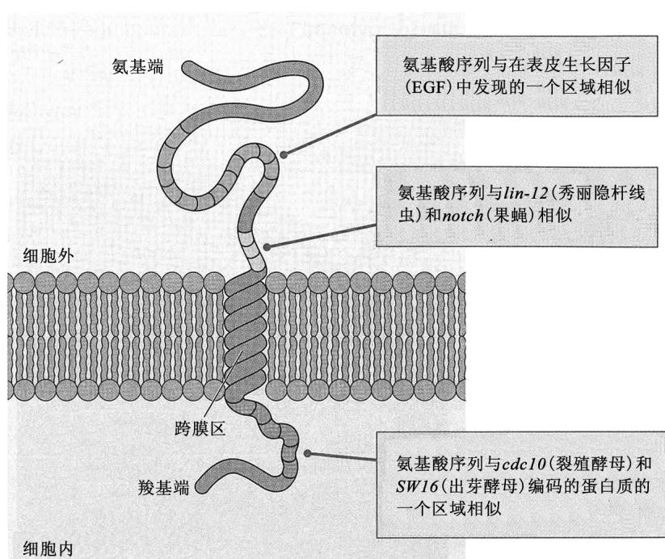  
图 13.11 LIN-12 蛋白的结构，这是一种受体蛋白的结构，含一个跨膜区和不同类型的重复单元，重复单元与表皮生长因子和其他发育控制基因中的重复单元类似。

这两个基因控制出芽酵母和裂殖酵母中的细胞分裂。

图 13.12 示功能失去和功能获得等位基因对表型具有相反效应的另一个例子。锚细胞表达一种称为 lin-3 的信号基因，其产物控制生殖孔发育中靶细胞的命运。图 13.12 显示了 5 个前体细胞——P4.p～P8.p，这些细胞参与生殖孔的发育。每个前体细胞都具有分化成 3 种命运 ( $1^{\circ}$ 、 $2^{\circ}$ 和 $3^{\circ}$ 谱系)之一的能力，这些谱系的差别在于后代细胞是保持合胞体 (S) 状态、纵向分裂 (L)、横向分裂 (T) 还是根本不分裂 (N)。在正常情况下，这些前体细胞如图 13.12 所示进行分化，产生 5 个谱系，顺序是 $3^{\circ} \rightarrow 2^{\circ} \rightarrow 1^{\circ} \rightarrow 2^{\circ} \rightarrow 3^{\circ}$ 。生殖孔本身是由 $1^{\circ}$ 和 $2^{\circ}$ 细胞谱系形成的。一些关键细胞的空间排列如图 13.13 所示。黑色箭头示锚细胞，白色线条示 12 个细胞的系谱。中间的 4 个细胞来自 P6.p，每边的 4 个细胞来自 P5.p 和 P7.p。

图 13.12 利用胞内信号转导决定生殖孔分化。在雌雄同体中，细胞 P4.p～P8.p 在生殖孔的发育中产生细胞谱系。3 种类型的谱系称为 1°、2° 和 3°。1°谱系是锚细胞 (AC) 产生的 LIN-3 配体在 P6.p 中诱导而来，LIN-3 配体使 P6.p 中的 LET-23 受体酪氨酸激酶兴奋。继而，P6.p 细胞产生一种配体，使 P5.p 和 P7.p 中的受体兴奋，诱导 2°谱系。3°谱系为缺省状态，正常情况下 P4.p 和 P8.p 采取缺省状态，在 AC 缺乏时所有细胞都采取缺省状态。  
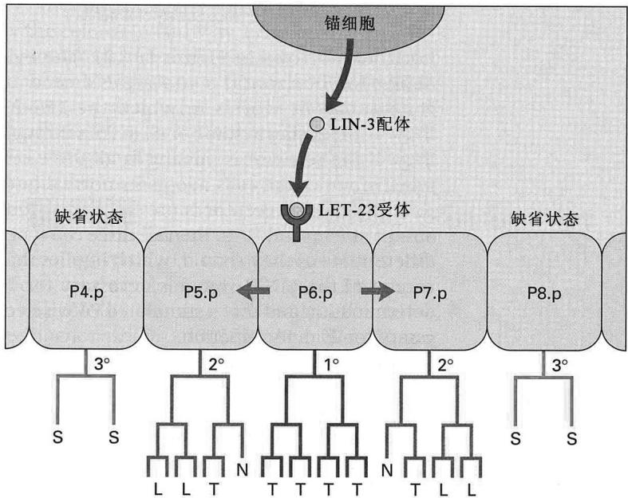

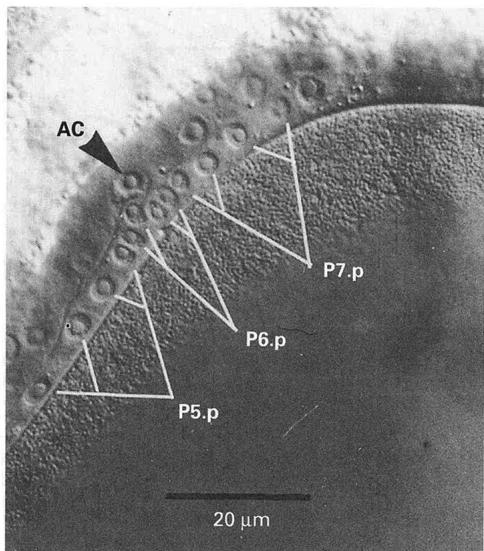

lin-3 基因产物 (LIN-3) 的重要作用是功能失去和功能获得等位基因相反的表型所提示的。LIN-3 的缺失导致完全不出现生殖孔发育。相反，LIN-3 的过度表达引起过度的生殖孔诱导。LIN-3 是相互作用分子——配体 (ligand) ——的典型例子，LIN-3 与 EGF 样跨膜受体相互作用。此处的受体在 P6.p 细胞中，是 let-23 基因的产物。LET-23 蛋白是一种酪氨酸激酶受体，当它被 LIN-3 配体兴奋时，刺激一系列的胞内信号转导，最终导致决定 1°谱系的转录因子的合成。被诱导的基因之一编码另一个配体，该配体兴奋 P5.p 和 P7.p 细胞上的受体，导致这两种细胞采取 2°谱系 (图 13.12 中的蓝色箭头所示)。水平信号转导的证据是在遗传嵌合型线虫中发现的，在这类线虫中，P5.p～P7.p 的部分或全部细胞缺失 LET-23 受体。如果该受体在所有 3 种类型的细胞中均缺失，则没有一种细胞会采取其正常的命运。但是，如果该受体在 P6.p 中存在而在 P5.p 和 P7.p 中缺失，则所有 3 种细胞类型都会正常分化，这表明接受 LIN-3 信号对 1°谱系的决定是必要的，兴奋的 P6.p 对 2°谱系的决定是必要的。

图 13.13 生殖孔中细胞的空间组织，包括锚细胞(黑色箭头所示)和P5.p～P7.p前两次分裂产生的子细胞(白色树状图所示)。比例尺的长度等于20μm。[转载自G.D.Jongeward,T.R.Clandirin and P.W.Sternberg, Genetics 139 (1995):1553-1566.]

在生殖孔的发育中，P4.p 和 P8.p 细胞采取 $3^{\circ}$ 谱系不是由正信号决定的，而是由信号的缺乏所决定的，因为在锚细胞缺失时，P4.p～P8.p 细胞都表现为 $3^{\circ}$ 谱系。因此， $3^{\circ}$ 谱系的发育是缺省或非诱导状态，即 $3^{\circ}$ 谱系是预编程进细胞中的，如果要改变细胞的命运，必须用另外的信号来覆盖。

## ■ 发育开关分析中的上位性

比德尔和塔特姆最先证明，可用突变来发现合成生长必需的小分子的生化途径中的酶学步骤(第1章)。类似方法可用于发育途径的遗传分析，但逻辑稍有不同。生化途径是底物依赖型途径(substrate-dependent pathway)，其中，每一步骤必须顺利完成，才能进行下一步骤。发育途径是开关调节型途径(switch-regulation pathway)，其中，途径中的每一组分要么抑制、要么激活下一个组分的活性。抑制途径的组分为负调节物(negative regulator)，而激活途径的组分为正调节物(positive regulator)。

秀丽隐杆线虫中生殖孔发育的控制说明了开关调节型途径的遗传分析背后的逻辑，在进行遗传分析之前，要注意以下几点。

\- 用于分析的隐性突变型等位基因必须是完全的功能失去等位基因，因为在有些情况下，即使很残留的活性也会得出误导的结果。

\- 每个突变基因在途径中必须具有唯一的、非冗余的功能。因基因重复或基因功能重叠而产生遗传冗余的途径，不适合进行这种分析。

\- 不同的突变型等位基因应该对同一发育途径起作用。

\- 调节途径应该是线性的，每个组分只与其最邻近的组分相互作用，没有分支途径 (branched pathway) 或平行途径。

尽管存在这些限制，仍有许多开关调节型途径适于进行遗传分析。第一步是分离编码途径组分的大量隐性功能丢失型等位基因，然后按第1章和第3章中所述将这些等位基因分成互补群(基因)。在开关调节型途径中，通常会观察到两类基因，其中，功能失去等位基因产生相反的表型。对秀丽隐杆线虫生殖孔的发育决定而言，一类基因的突变型等位基因导致无生殖孔(ulvaless，无生殖孔)，而另一类基因的突变型等位基因导致多个生殖孔的发育(multivulva，多生殖孔)。

将具有相反表型的突变基因两两组合成双重突变体，根据这些所有可能组合的表型进行开关调节型途径的遗传分析。例如，分析生殖孔发育时，可对所有可能的无生殖孔-多生殖孔双重突变体进行配对。开关调节型途径中各组分的顺序，是通过在双重突变体中观察到的上位性类型来确定的。在第3章中，将上位性(epistasis)定义为任何改变两个基因自由组合的期望比值(9:3:3:1)的两个突变型等位基因之间的相互作用。在开关调节型途径的分析中，该术语的含义略有不同。对于两个基因的等位基因具有相反表型的双重突变体，如果某个基因的突变表型掩藏了另一个基因的突变表型，则该基因称为上位基因(epistatic gene)。例如，如果aa bb的表型与 $aa b^{+}b^{+}$ 的表型一样，那么就说基因a对基因b为上位性的。突变表型被掩藏的基因称为下位基因(hypostatic gene)，在前面的例子中，b基因对a基因即为下位性的。例如，在无生殖孔-多生殖孔双重突变体中，如果该双重突变体是无生殖孔的，那么无生殖孔基因对多生殖孔基因是上位性的，多生殖孔基因对无生殖孔基因是下位性的。上位性可帮助确定发育途径中的组分顺序，理由如下：

上位性原理(principle of epistasis)——在线性的开关调节型途径中，上位基因的产物在途径中相对于下位基因产物的下游起作用；换言之，下位基因的产物在相对于上位基因产物的上游起作用。

图 13.14 示这一原理背后的逻辑。如图所示，有两个开关调节型途径，其中的突变体产生相反的表型：无生殖孔、多生殖孔。在两个途径中，A 和 B 都分别表示基因 a 和 b 的野生型基因产物。箭头表示正调节(兴奋)，而 T 形条表示负调节(抑制)。基因产物 A 和 B 无需直接相互作用。如果有居间组分，则箭头或 T 形条表示所有中间步骤的净效应。

图 13.14 中箭头和 T 形条的选择会使得 $a^{-}a^{-}b^{+}b^{+}$ 和 $a^{+}a^{+}b^{-}b^{-}$ 突变体具有不同的表型。在途径 1 中，A 抑制 B，B 激发生殖孔发育 (V)。因而 $a^{-}a^{-}b^{+}b^{+}$ 基因型对 B 的抑制较小，即 B 的活

  
图 13.14 上位性原理背后的逻辑：上位基因的基因产物在下位基因产物的下游起作用。

性较高，产生多生殖孔表型。与此相反， $a^{+}a^{+}b^{-}b^{-}$ 基因型缺乏B，因而不出现生殖孔发育，产生无生殖孔表型。途径2中A和B的顺序互换，在此情况下， $a^{-}a^{-}b^{+}b^{+}$ 的表型为无生殖孔，而 $a^{+}a^{+}b^{-}b^{-}$ 的表型为多生殖孔。

a 和 b 的上位性相互作用如图中的冒号所示。在途径 1 中， $a^{-}a^{-}b^{-}b^{-}$ 双重突变体为无生殖孔，因为该线虫缺乏 B；而在途径 2 中， $a^{-}a^{-}b^{-}b^{-}$ 双重突变体为无生殖孔，因为该线虫缺乏 A。在这两种情况下，与上位性原理一致，途径中处于下游的基因，对途径中处于上游的基因，都是上位性的。

将上位性原理应用于影响秀丽隐

杆线虫生殖孔发育的一些突变体。4个不同基因中任一基因的突变会导致无生殖孔表型(lin-3、let-23、lin-45和let-60)，而两个不同基因中的任一基因的突变会导致多生殖孔表型(lin-1和lin-15)。所有这些突变都是功能失去突变，纯合突变体的表型在图13.15A中以颜色编码显示，粉红色表示无生殖孔，绿色表示多生殖孔。所有无生殖孔-多生殖孔组合中的上位关系也以相同

颜色编码显示。lin-1 对所有无生殖孔突变都是上位性的，这说明 lin-1 的产物在这些无生殖孔基因产物的下游起作用。同样，lin-15 对 let-23、lin-45 和 let-60 为下位性的，说明 lin-15 的产物在这 3 个基因产物的上游起作用。最后，lin-15 对 lin-3 为上位性的，说明 lin-15 的产物在 lin-3 产物的下游起作用。将这些推论全部合并于 B 部分的途径中。推断出这些相互作用是 T 形条而不是箭头，根据是这些表型的性质。例如，因为 lin-1 突变体的表型是多生殖孔，所以野生型的 lin-1 产物必定抑制生殖孔的形成。倒退一步，

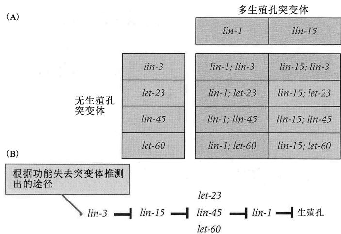  
图 13.15 上位性原理在生殖孔决定上的应用。(A)实验结果。(B)推导出来的开关调节型途径。

let-23(lin-45 和 let-60 也一样)的表型是无生殖孔，这些基因的产物一定对 lin-1 负调节，因为在不能下调 lin-1 的突变体中，会导致 lin-1 抑制子的过度产生，从而抑制生殖孔形成。

从图 13.15B 明显可见, 对 A 部分中的功能失去突变的分析, 不能揭示 let-23、lin-45 和 let-60 的产物在该途径中发挥功能的顺序, 因为这些突变体都产生无生殖孔表型。在这样一种情况下, 可用功能获得突变来解析途径。有一个这样的突变是 let-60 的一个功能获得突变, 以符号 let-60(gf) 表示, 它导致多生殖孔表型 (与 let-60 的功能失去突变相反)。图 13.16A 显示了 let-60(gf) 与 let-23 或 lin-45 组合的表型, 以颜色编码表示。此时, 上位性原理仍然有效。使用该原理, let-60(gf) 对 let-23 为上位性, 说明 let-60 在 let-23 下游起作用, 而 let-60(gf) 对 lin-45 为下位性, 说明 let-60 在 let-45 上游起作用。

  
图 13.16 上位性原理也可用于功能获得(gf)突变体。在此例中，对let-60(gf)的分析使let-23、let-60和lin-45的野生型产物的作用顺序得以确定。

所有这些上位性相互作用所蕴含的生殖孔决定的完整途径如图 13.16B 所示。在仅以遗传分析为基础的情况下，这样的途径应被视为初步假说，其预测必须经过分子生物学和细胞生物学的证实。在生殖孔发育的这一个案中，该途径的基因产物的顺序已被证实，这些基因产物已得到鉴定(C 部分)。这些基因产物如下。

\- 野生型 lin-3 基因编码与脊椎动物表皮生长因子类似的配体，其在生殖孔发育中的作用如图 13.12 所示。

\- 野生型 lin-15 基因控制两种独特而新颖的遗传活性，其在该途径中的功能仍不清楚。

\- 野生型 let-23 基因编码一种与脊椎动物表皮生长因子受体类似的受体(图 13.11)，该受体与 lin-3 配体结合(图 13.12)。

\- 野生型 let-60 基因编码一种与脊椎动物生长因子 Ras 类似的细胞生长因子。

\- 野生型 lin-45 基因编码一种与脊椎动物 Ras 酪氨酸激酶类似的酪氨酸激酶。

\- 野生型 lin-1 基因编码一种转录因子，该因子含有一个称为 ETS 的结构域，该结构域富含带正电荷的芳香族氨基酸残基。

你可能会问，为什么对线虫的生殖孔发育如此重视？一个原因是，生殖孔发育可说明怎样将上位性用于开关调节型途径的分析。另一个原因是，已表明激活Ras及下游酪氨酸激酶的表皮生长因子受体的配体与许多人类癌症有关。在第15章中会更加详细地讨论Ras蛋白在癌症中的作用，但在这里应该强调，许多人类癌症具有的突变，类似于let-60(gf)中的功能获得突变。

## 13.4 果蝇发育的遗传控制

对发育过程的诸多重要的见解来自黑腹果蝇的遗传分析。图 13.17 概括了果蝇的发育周期，从卵、幼虫和蛹到成虫阶段。早期发育包括形成原肠胚的一系列细胞分裂、迁移和内陷。受精后约 24h，由大约 $10^{4}$ 个细胞构成的一龄幼虫从卵中孵化出来。每一幼虫阶段称为一个龄期 (instar)。幼虫连续蜕皮两次，产生二龄和三龄幼虫，继之以化蛹和一个复杂的变态过程，产生由超过 $10^{6}$ 个细胞组成的果蝇成虫。在 $25^{\circ}$ C 条件下饲养的野生型品系中，发育需要 10～12 天。

图 13.18 示果蝇胚胎发育早期不同阶段的侧面观，系通过扫描电子显微镜来观察，以突出表面的细节。每个胚胎被排列成前端在左、腹侧向下。阶段 1～12 按时间顺序排列。阶段 1～5

代表早期卵裂，始于新产的受精卵(阶段1)，止于其后约3.25h的细胞胚盘(阶段5)。原肠胚形成(阶段6\~8)之后，直到受精后约9h的阶段12，一个独特的体节模式在躯体上形成。果蝇的早期发育发生于卵壳之内，但照片中卵壳已被去除。

图 13.17 黑腹果蝇的发育程序。各阶段的持续时间都是在 $25^{\circ}$ C 条件下的时间。  
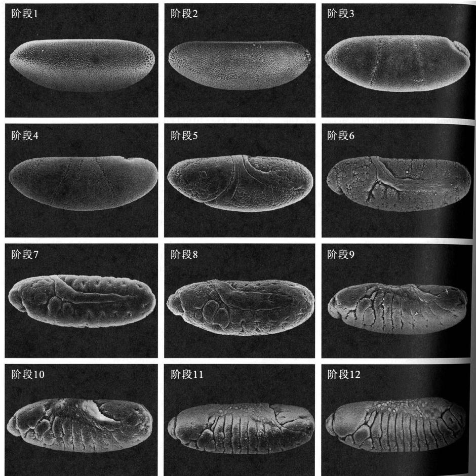  
图 13.18 黑腹果蝇的早期发育，从紧接于受精后的阶段 1 到受精后约 9h 的阶段 12。[承印第安纳大学布卢明顿分校托马斯·考夫曼(Thomas Kaufman)和鲁道夫·特纳(F. Rudolf Turner)惠赠。]

发育遗传学的一个关键问题是鉴定推动图 13.18 中这种分化模式的基因及基因间的相互作用。这是通过对在发育中表现出异常的突变体进行研究而做到的。为了讨论这些突变体，先要考察一下在细胞胚盘形成过程中发生的细胞事件，然后说明显示细胞胚盘的几何结构是如何与成体果蝇的形态相关的。

图 13.18 中阶段 1～5 的细胞事件如图 13.19 所示，图中显示了卵壳。A 部分对应于新产的受精卵，其中，雄性和雌性的细胞核已经融合(黑点)。前 9 次有丝分裂连续快速发生，没有胞质分裂，在卵内产生一群细胞核(阶段 2)。这些细胞核迁移到边缘，种系由分离到后端的约 10 个极细胞(pole cell)形成；极细胞另外进行两次分裂，然后通过内陷与胚胎再次合并。胚胎内的细胞核再经过 4 次没有胞质分裂的有丝分裂，形成合胞体胚盘(syncytial blastoderm)，它含有大约 6000 个细胞核(阶段 4)。受精 150～195min 后，通过细胞膜的合成，将细胞核于分开，发生胚盘的细胞化。通过细胞化形成的胚盘(blastoderm)是一个扁平的空心细胞球(阶段 5)，相当于高等动物中的囊胚。

烧蚀掉果蝇胚盘内成片的细胞，会导致幼虫和成虫的局部缺陷。根据被破坏的细胞的位置和缺陷类型之间的空

  
图 13.19 果蝇的早期发育。(A)受精卵中的细胞核。(B)在合胞体内同时发生有丝分裂。(C)一些细胞核迁移到胚胎边缘，在后端，极细胞(它们形成种系)细胞化。(D)在合胞体胚盘内发生另外的有丝分裂。(E)在细胞核周围形成细胞膜，产生细胞胚盘。

间相关性，可得到胚盘的命运图(fate map)，它详细说明了产生幼虫和成虫不同结构的胚盘细胞。将遗传标记应用于胚盘使命运图更为精细(图13.20)。通过诱导有丝分裂中同源染色体之间的重组，细胞谱系可在发育过程中被遗传标记，产生在遗传上有差异的子细胞(第5章)。与秀丽隐杆线虫早期囊胚中的细胞非常相像，果蝇胚盘中的细胞具有预定的发育命运，在发育中几乎没有替代其他——有时甚至是毗邻——细胞的能力。这一结论的证据来自一些实验，其中，从遗传标记胚盘而来的细胞被移植到宿主胚盘中。移植到对应区域的胚盘细胞变成正常成虫结构的一部分。但是，移植到不同区域的胚盘细胞自主发育，不被整合进宿主结构中。

因为在胚盘中已具有相对较高的决定程度，果蝇发育的遗传分析往往集中在发育的早期阶段，此时，胚胎基本的形体模式已确立，关键的调节过程开始被激活。以下各节概述这些早期事件的遗传控制。

  
图 13.20 果蝇胚盘的命运图，示起源于胚盘各部分的成虫结构。该图是综合分析遗传嵌合体中不同成虫结构的遗传标记的表达情况而建立的。缩写代表成虫身体的不同部分。例如，ov 和 oc 为头部结构；w 为翅；Ⅰ、Ⅱ和Ⅲ为第一、第二和第三对足；而 gs 和 gt 为生殖器结构。[改编自 J. C. Hall, W. M. Gelbart, and D. R. Kankel. (M. Ashburner and E. Novitski, eds.). The Genetics and Biology of Drosophila, vol. 1a. Academic Press (1976):265-314.]

## - 母体效应基因和合子基因

果蝇的早期发育需要卵母细胞中存在的母源 mRNA 的翻译。在此期间，蛋白质合成的阻断会使早期卵裂阻滞。合子基因组的表达也是必需的，但时间不一样。在第 9 次卵裂后的任何时间阻断合子基因组的转录，都可阻止胚盘的形成。

因为果蝇发育的最早阶段是编程于卵母细胞中的，所以影响卵母细胞组成或结构的突变会扰乱胚胎的发育。在母体中发挥功能并且为胚胎发育所需的基因称为母体效应基因(maternal-effect gene)，而在胚胎中发挥功能的发育基因称为合子基因(zygotic gene)。这两类基因的相互作用如下：

合子基因对母体效应基因安排在卵细胞中的位置信息进行诠释和应答。

母体效应基因的突变会产生这样一种表型：纯合雌性产生的卵不能支持正常的胚胎发育，但纯合雄性产生的精子正常。因此，正反交会得出迥异的结果。例如，一个隐性母体效应基因突变 m，在正反交中会产生下列结果：

$$
\begin{array}{l}m / m \text { ♀ } \times + / + \text { ♂ } \rightarrow + / m \text { 后代(发育异常) }\\+ / + \text { ♀ } \times m / m \text { ♂ } \rightarrow + / m \text { 后代(发育正常) }\end{array}
$$

杂交的 $+ / \mathrm{m}$ 后代在遗传上是一样的，但当雌性亲本是纯合的 $m / m$ 时，发育异常。

在雌性亲本中需要母体效应基因的原因是，在受精发生之前，母体效应基因就要建立果蝇卵母细胞的极性。它们在胚胎发育的最早阶段活跃，决定胚胎基本的形体模式。母体效应基因突变给研究模式形成的遗传控制，以及鉴定形态发生中重要的分子，提供了一个有价值的工具。

## - 早期发育中模式形成的遗传基础

果蝇幼虫的一个显著特征是，在主躯干上有14个在表面上看起来类似的呈窄条形的重复单元(图13.21)。根据幼虫体表深色的微小齿样突起构成的条带，可从外表上辨认出这些窄条。胚胎中的这14个窄条，对应于胚胎形成的幼虫体节。在形态上，每个体节(segment)由幼虫表皮中肌肉附着点形成的连续凹陷之间的区域界定。这些体节的名称如图13.21所示。有3个头节(C1～C3)、3个胸节(T1～T3)和8个腹节(A1～A8)。除了体节之外，在发育中另一种类型的重复单元也很重要，这些重复单元称为副体节(parasegment)，每个副体节由一个体节的后部和毗邻体节的前部组成。副体节在胚胎发育过程中短暂地存在。虽然它们在形态上不可见，但它们在基因表达上很重要，因为许多基因的表达模式与副体节的边界一致，而不是与体节的边界一致。

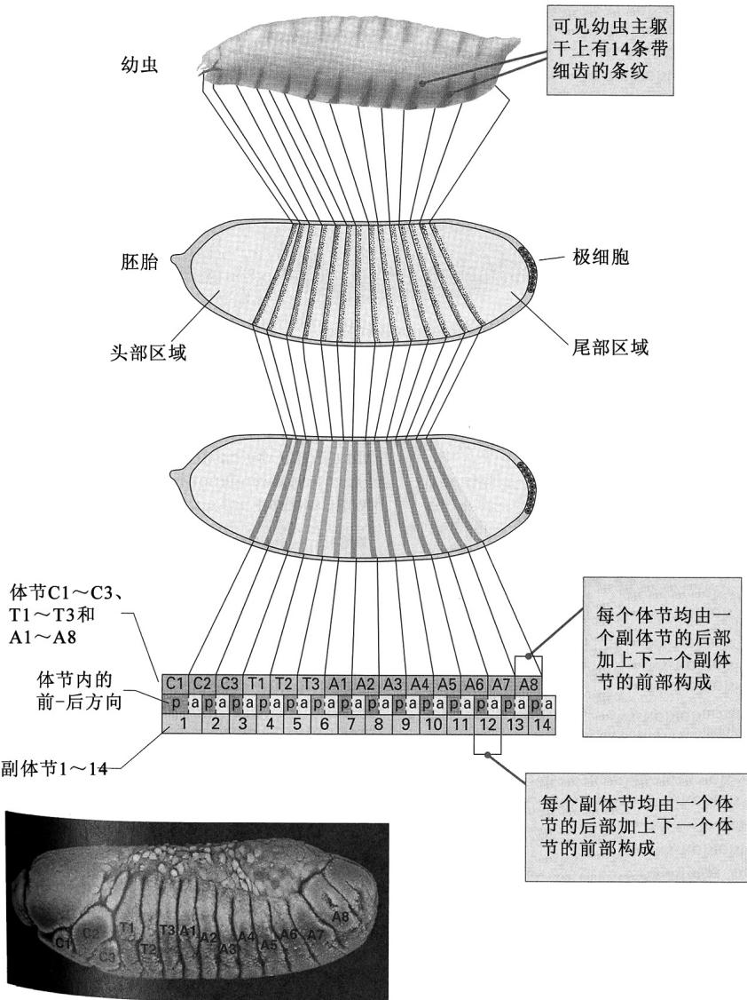  
图 13.21 果蝇胚胎和幼虫的分节体制。体节以连续的凹陷为界，这些凹陷由肌肉在幼虫表皮上的附着点形成。副体节在形态上不明显，但包括毗邻体节的前、后区域。照片显示受精约9h后处在阶段12的体节C1～C3、T1～T3和A1～A8。[照片承印第安纳大学布卢明顿分校托马斯·考夫曼(Thomas Kaufman)和鲁道夫·特纳(F. Rudolf Turner)惠赠。]

模式形成的早期阶段是由通常称为分节基因(segmentation gene)的基因决定的，称为分节基因，是因为这些基因决定体节和副体节的发生和命运。分节基因有4类，它们在胚胎中表达的时间和方式不同。

(1) 坐标基因 (coordinate gene) 决定胚胎主要的坐标轴: 界定前部和后部的前后轴, 界定上、下的背腹轴。

(2) 裂缺基因 (gap gene) 在沿胚胎上连续的成群体节中表达 (图 13.22A)，它们建立下一级的空间组织。裂缺基因的突变导致连续的体节缺失，因此在胚胎正常的结构模式中出现裂缺。

(3) 成对规则基因 (pair-rule gene) 决定胚胎分割成不同的体节 (图 13.22B)。成对规则基因的突变导致在相间的体节中模式因子缺失。成对规则基因具有两体节周期性的原因是，这些基因沿胚胎以斑马条纹的方式表达。

(4) 体节极性基因 (segment-polarity gene) 决定胚胎每个体节中前-后发育的方式 (图 13.22C)。体节极性基因的突变影响所有体节或副体节。许多体节极性基因突变具有正常数目的体节，但每个体节缺失一部分，而其余部分以镜像对称的方式重复。

这 4 类分节基因存在的证据在下面的章节展示。

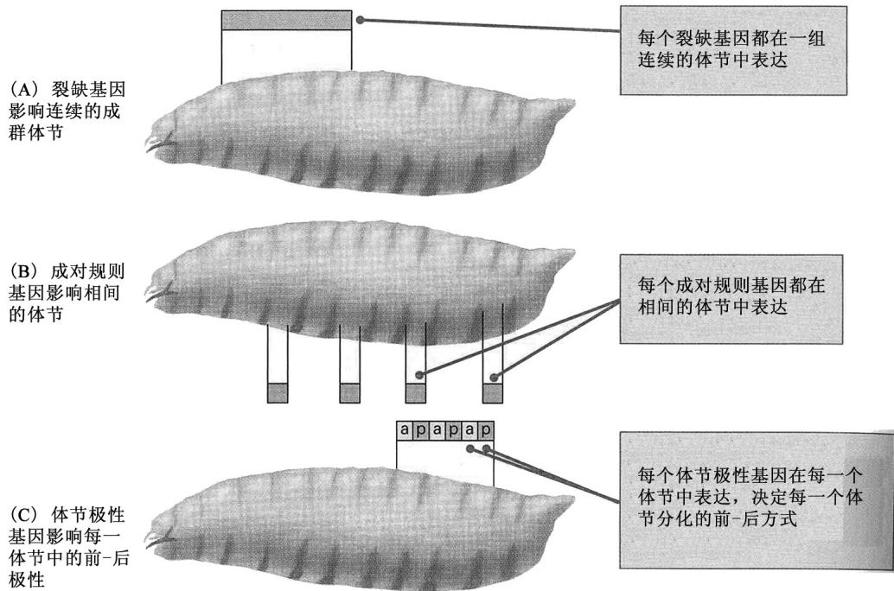  
图 13.22 不同类型分节基因的表达方式。

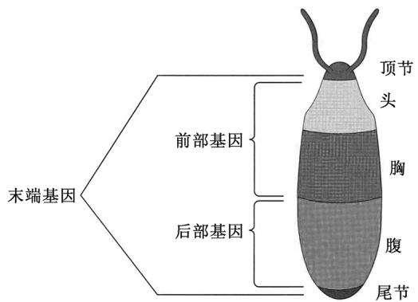  
图 13.23 果蝇早期胚胎在前后轴上的区域分化。在所示基因类型中，任一类型的突变均导致胚胎中相应区域的消除。

## ■ 坐标基因

坐标基因 (coordinate gene) 为母体效应基因，通过使它们的产物出现在卵母细胞内确定的位置，或通过产物的浓度梯度，确立早期极性。如图 13.23 所示，根据突变表型的形态，可将决定前后轴的基因分成 3 组：前部基因、后部基因和末端基因。

前部基因(anterior gene)作用于头和胸。在这类基因中，关键基因是bicoid。bicoid的突变导致无头、无胸的胚胎，在前端偶有极性相反的腹节重复。bicoid的表型与某些外科手术造成的表型类似。例如，当刺破果蝇卵，让少量细胞质漏掉时，前端细胞质的丢失会导致胚胎头部被一些后面的

结构的发育所代替。同样，通过注射把前部的细胞质替换成后部的细胞质，会产生具有两个镜像对称的腹部而无头的胚胎。

bicoid 基因的产物是决定前部结构的一些基因的一种转录因子。因为 bicoid mRNA 位于早期卵裂胚胎的前部，所以这些基因主要在前部区域被激活。bicoid mRNA 产生于抚育细胞中(图 13.7 中卵母细胞周围的那些细胞)，被输出到卵母细胞前极的局部区域。蛋白质产物分布的范围不再受限，在合胞体卵裂期间形成一个前—后浓度梯度，浓度最大处在胚胎前部顶端(图 13.24)。bicoid 蛋白是决定胚盘命运图的一种主要的形态发生素。该蛋白质是一种转录激活因子，含一个用于结合 DNA 的螺旋-转角-螺旋模体(参见第 11 章)。bicoid 蛋白作用的基因含有多种上游结合结构域，这些结构域由与保守序列 5'-TCTAATCCC-3' 相似的 9 个核苷酸构成。与保守序列相差最多两个碱基对的结合位点可与 bicoid 蛋白进行高亲和力的结合，含 4 个错配的位点可进

行低亲和力的结合。高、低亲和力结合位点的组合，决定基因活化所需的 bicoid 蛋白的浓度：具有较多高亲和力结合位点的基因，在低浓度下可被激活；而具有较多低亲和力结合位点的基因，需要较高的浓度。这种在结合亲和力上的差异说明，沿 bicoid 蛋白的浓度梯度，从一个调节基因到另一个调节基因，基因表达的水平可以不同。在 bicoid 激活的基因中，一个重要基因是裂缺基因 hunchback。前部基因中的其他基因编码 bicoid 局部化所需的细胞组分。

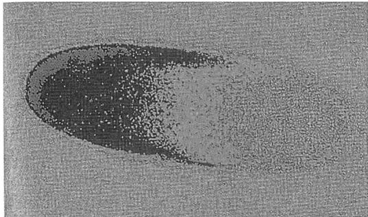  
图 13.24 在果蝇早期胚胎中与 bicoid 类似的一个基因表达梯度。在照片中，荧光信号强度用伪彩色表示，浓度最高的区域为粉红色，浓度最低的区域为绿色。

[承威斯康星大学麦迪逊分校詹姆斯·朗格兰 (James Langeland)、肖恩·卡罗尔 (Sean Carroll) 和斯蒂芬·帕多克 (Stephen Paddock) 惠赠。]

后部基因 (posterior gene) 作用于腹节 (图 13.23)。一些后部基因的突变体也缺乏极细胞。其中一个后部基因突变 nanos 产生腹分节有缺

陷但极细胞正常的胚胎，这类似于通过外科手术去除后部细胞质产生的异常。这种表型不单单是后端一般性的发育紊乱所致，因为在 nanos 胚胎或经外科手术的胚胎这两种情况下，极细胞(后部还有一个称为尾节的结构，正常情况下，尾节长在极细胞和腹部之间)都不受影响。nanos mRNA 的分布紧靠卵母细胞后极，其基因产物是一种翻译阻遏蛋白。hunchback mRNA 是一种在 nanos 蛋白存在的情况下不翻译的 mRNA。因此，hunchback 的表达被 bicoid 蛋白和 nanos 蛋白联合控制；bicoid 蛋白在前后梯度中激活其转录，而 nanos 蛋白阻遏其在后部区域中的翻译。

末端基因(terminal gene)作用于最前部结构(原头区)和最后部结构(尾节)(图 13.23)。这一类基因中的关键基因是 torso，它编码一种跨膜受体，在早期发育阶段均匀分布在整个胚胎中。torso 受体被一种仅在卵细胞两极释放的信号激活，这种信号由卵细胞两极的抚育细胞释放。torso 受体是一种酪氨酸激酶，它通过对一种或多种靶蛋白中特定的酪氨酸残基进行磷酸化而起始细胞分化。

除这3组决定胚胎前后轴的基因外，第4组基因决定背-腹轴。背-腹决定的形态发生素是dorsal基因的产物，它存在于晚期合胞体胚盘一个明显的从腹部到背部的梯度中。dorsal蛋白是一种转录因子。已知影响背-腹决定的还有其他十几个基因。这些基因的突变会去除腹部和侧面的模式元件。在许多情况下，通过注射野生型细胞质可挽救突变胚胎，无论这些野生型细胞质是从哪里取出的，也无论将其注射到哪里。例如，snake、gastrulation-defective和easter基因，所有这3个基因都编码丝氨酸蛋白酶(serine protease)。丝氨酸蛋白酶合成时是无活性的前体，需要特异性裂解才能活化。它们通常按时间顺序起作用，即在途径中一种酶的活化对下一种酶的活化是必要的。这种酶的连续活化导致级联效应(cascade effect)，极大地放大了初始信号。级联中的每一步，使上一步中产生的信号迅速放大，就像核链式反应一样——每个事件都引发下一瞬间多个新事件的发生。

联系：胚胎创世纪

克里斯蒂安·纽斯林-沃尔哈德和埃里克·威绍斯，1980

欧洲分子生物学实验室，海德堡，德国

影响果蝇体节数目和极性的突变

纽斯林-沃尔哈德和威绍斯假设，通过对突变进行遗传和分子分析，可理解控制像早期胚胎发育那样复杂的过程的分子机制。这一假设格外大胆。表面上，此类突变的表型完全一样，都表现为胚胎死亡。在果蝇遗传图上，已经布满了“隐性致死”的突变。一般认为这些突变不适合进一步分析，因为在任何特定情况下，寻找特定的缺陷就如同大海捞针。纽斯林-沃尔哈德和威绍斯未采用绝大多数已有的突变。他们从系统地获得一套新的隐性致死突变开始，每个突变都表现为早期胚胎中组织模式形成上的一种特殊的、特征性的缺陷。本论文报道他们最初的成就，他们得到许多突变，每种突变都可归属到与发育有关的三大类基因之一。本论文激发了人们对果蝇发育遗传学的极大兴趣。今天，在果蝇研究年会(Annual Drosophila Research Conference)上通常会有大约500个讨论果蝇发育的报告(主要是海报)。1995年，纽斯林-沃尔哈德和威绍斯被授予诺贝尔奖。爱德华·刘易斯因在同源异形框基因上的开创性遗传研究，与他们分享该奖项。

在所有高等动物中，从相似的重复单元构建复杂形式是空间组织的一个基本特点。对任何生物而言，对于基因如何参与这种过程，均知之甚少。在果蝇中，模式的分节(重复)性在幼虫表皮的胸节和腹节最为明显，因而，我们试图鉴定建立这种模式所需的所有基因座。……我们对影响分节模式的突变进行了系统的搜索。我们在这里记述15个基因座上的突变，每个突变表现出来的模式改变，为下述3种新类型之一：模式重复(体节极性突变；6个基因座)、相间体节的模式缺失(配对规则突变；6个基因座)和成组相邻体节的缺失(裂缺突变；3个基因座)。……体节极性突变体具有正常数目的体节。但是，在每个体节中，正常模式的界线明确的一部分缺失，剩下的部分呈镜像重复。重复的部分在“正常”部分的后面，且具有相反的极性。……在配对规则突变体中，每隔一个体节缺失模式的同源部分。6个基因座的缺失方式各具特点。……(体节极性和配对规则)这两类的一个显著特点是，模式的改变在胚胎的前后轴上以特有的间隔重复出现。在裂缺类突变体中未发现此类重复模式，而是一组多达8个相邻体节的缺失。……缺乏重复模式，说明在这些基因座所参与的过程中，胚胎前后轴上的位置由唯一的值规定。……这些实验仍不完整。……在果蝇中，鉴定参与胚胎模式形成这个复杂过程的所有遗传成分似乎是可行的。

来源：C. Nüsslein-Volhard and E. Wieschaus, Nature 287 (1980): 795-801.

## ■ 裂缺基因

坐标基因的主要作用是调节一小组约 6 个裂缺基因沿前-后轴的表达。这些基因之所以称为裂缺基因 (gap gene)，是因为它们的突变会引起来源于一群连续体节的模式元件的缺乏 (图

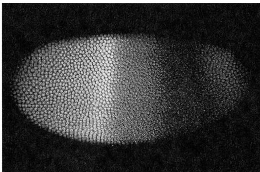  
图 13.25 受精后约 2.5h 的果蝇胚胎, 示 hunchback 基因产物 (绿色)、Krüppel 基因产物 (红色) 和它们的叠加 (黄色) 的区域定位。[承威斯康星大学麦迪逊分校詹姆斯·朗格兰 (James Langeland)、肖恩·卡罗尔 (Sean Carroll) 和斯蒂芬·帕多克 (Stephen Paddock) 惠赠。]

形成层级中的下一组基因——成对规则基因。

13.22A)。裂缺基因都是合子基因。例如，hunchback 基因，因为 hunchback 的表达是由 bicoid 和 nanos 的抵消效应 (offsetting effect) 控制。hunchback 的转录在从前至后的梯度中被 bicoid 转录因子激发，但后部的 hunchback 表达因翻译被阻遏而被阻止，因为 nanos 蛋白局限于后部。在图 13.25 的果蝇早期胚胎中，hunchback 表达的梯度以一种 hunchback 基因产物特异抗体的绿色荧光表示。叠加上去的红色荧光由另一个裂缺基因 Krüppel 产物的特异抗体产生。重叠区域的基因表达呈现黄色。hunchback 和 Krüppel 的产物都是锌指类转录因子 (参见第 11 章)。其他的裂缺基因也都编码转录因子。总之，裂缺基因具有区域特异性模式和部分重叠表达的区域，这使得它们能够以组合方式起作用，以控制体节

## - 成对规则基因

坐标基因和裂缺基因决定胚胎的极性，并建立一些大区，随后的发育在大区内发生。随着发育的推进，胚胎越发精致的组织结构与分节基因的表达模式互相紧密关联。这些基因包括成对规则基因(pair-rule gene)，这些基因的突变表型具有交替的体节缺失或畸形(图13.22B)。现已鉴定了大约8个成对规则基因。例如，成对规则基因 even-skipped 的突变影响偶数体节，而另一个成对规则基因 odd-skipped 影响奇数体节。成对规则基因的功能是提供早期幼虫一个分节的形体模式，包括体节的重复性和个性。例如，有 8 个重复的腹节，它们的间距相等，且有数个共同特征，但它们分化的细节不同。

hairy 是最早表达的成对规则基因之一，它的表达模式受 hunchback、Krüppel 和其他裂缺基因的产物调节，正调节和负调节都有。hairy 的表达产生 7 个条纹(图 13.26)。这种条纹图案是成对规则基因表达所特有的，但一个基因表达的条纹与另一个基因表达的条纹通常会有一点点错位。加上裂缺基因的连续的区域性表达，胚胎中基因表达的组合模式已经比较复杂，并且已经线性分化了。图 13.27 显示对 3 个基因的产物染色的胚胎：hairy(绿色)、hunchback(红色)和 Krüppel(蓝色)。表达重叠的区域显示为混合色——橙色、黄色、浅绿色或浅蓝色。即使是在图 13.27 的较早阶段，在每个体节和副体节中的基因表达仍存在独特的组合模式。这种组合控制 (combinatorial control) 具有很高的复杂性，例如，hairy 基因在第 7 个条纹中的表达由一个启动子元件决定，该元件不到 1.5kb，却包含 caudal、hunchback、knirps、Krüppel、tailless、huckebein 和 biocoid 等基因的蛋白质产物(并可能还有其他尚未鉴定的蛋白质)的一系列结合位点。成对规则基因在基因表达上的组合模式界定了体节极性基因表达的边界，体节极性基因在下一个层次上发挥作用。

  
图 13.26 受精后约 3h 的果蝇胚胎中 hairy 基因表达的 7 个特征性条纹。[承威斯康星大学麦迪逊分校詹姆斯·朗格兰(James Langeland)、肖恩·卡罗尔(Sean Carroll)和斯蒂芬·帕多克(Stephen Paddock)惠赠。]

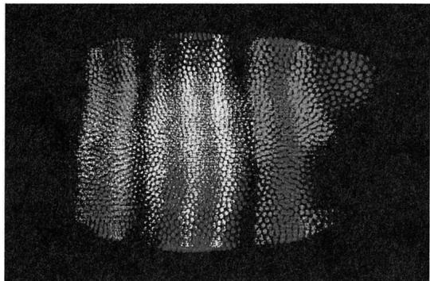  
图 13.27 受精后约 3h 的果蝇胚胎中 hairy、hunchback 和 Krüppel 的联合表达模式。在基因表达模式上相当程度的线性分化已经很明显。[承威斯康星大学麦迪逊分校詹姆斯·朗格兰(James Langeland)、肖恩·卡罗尔(Sean Carroll)和斯蒂芬·帕多克(Stephen Paddock)惠赠。]

## ■ 体节极性基因

成对规则基因决定体节和副体节水平上的形体模式，而体节极性基因(segment-polarity gene)引起每一体节的空间分化。现已鉴定了大约14个体节极性基因。突变表型沿着胚胎具有重复的模式缺失（图13.22C），而保留的部分常常有镜像重复。engrailed为最早表达的体节极性基因之一，其表达条纹与副体节的边界大体一致，从而将每个体节分成前区和后区(图13.28)。

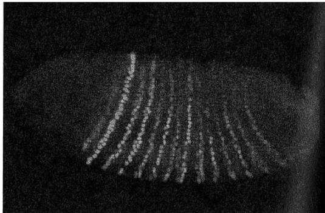  
图 13.28 体节极性基因 engrailed 的表达将果蝇早期胚胎分成 14 个区。这些区最终分化为 3 个头节、3 个胸节和 8 个腹节。[承威斯康星大学麦迪逊分校詹姆斯·朗格兰(James Langeland)、肖恩·卡罗尔(Sean Carroll)和斯蒂芬·帕多克(Stephen Paddock)惠赠。]

体节极性基因的表达终于将早期的极性和线性分化确定为体节和副体节。

## ■ 调节层级的相互作用

调节层级(regulatory hierarchy)中的基因由一套复杂的相互作用所控制，以确保循序渐进地进行发育的分子事件。一些坐标基因、裂缺基因、成对规则基因和体节极性基因之间的相互作用如图13.29所示。绿色连线示兴奋效应，红色连线示抑制效应。这些相互作用，许多是在最初用 13.3 节所讨论的上位性原理进行的遗传分析中发现的。这些基因大多数是由一套复杂的兴奋效应和抑制效应的共同作用而控制的。坐标基因首先起作用，确定胚胎极性；然后，裂缺基因分化出大区；其后，成对规则基因建立由斑马条纹所示的胚胎的周期性；最后，体节极性基因在每个体节的发育身份和命运的特化上起作用。在调节层级的每一水平上，基因起到调节在同一水平表达的其他基因的作用，也起到调节在下游一级水平上表达的基因活性的作用。

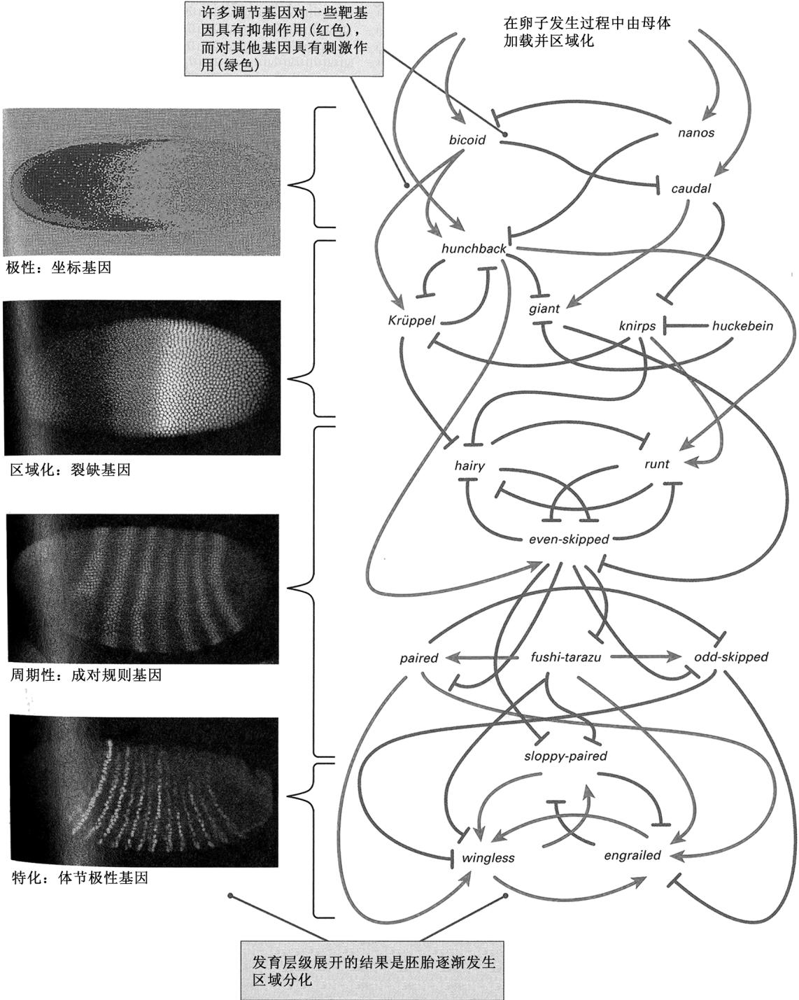  
图 13.29 控制果蝇早期发育的基因之间的调节相互作用层级。[照片承威斯康星大学麦迪逊分校詹姆斯·朗格兰(James Langeland)、肖恩·卡罗尔(Sean Carroll)和斯蒂芬·帕多克(Stephen Paddock)惠赠；示意图承华盛顿大学细胞动力学研究中心乔治·冯·达索夫(George von Dassow)惠赠。]

体节极性基因也对每个体节或副体节中控制分化途径的下游发育基因起调节作用，最终产生成虫形态。接下来讨论成虫的变态及其是如何出现的。

## - 成虫的变态

与其他许多昆虫一样，果蝇幼虫和成虫具分节的形体模式，包括由体节 C1～C3 构成的头部、由体节 T1～T3 构成的胸部和由体节 A1～A8 构成的腹部(图 13.30)。变态(metamorphosis)利用了幼虫内存在的大约 20 个称为成虫盘(imaginal disk)的结构(图 13.31)。成虫盘形成于发育早期，最终形成成虫机体内的主要结构和组织。例如，翅盘(身体每边一个)，产生翅及相关结构；眼-触角盘，产生眼、触角和相关结构；生殖器盘，产生生殖器官。在蛹期，当许多幼虫组织和器官分解时，成虫盘逐步展开，分化为成虫结构。在蛹中发生的形态发生事件，是由幼虫脑部分泌的蜕皮激素(ecdysone)启动的。

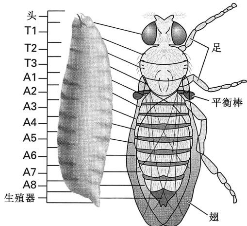  
图 13.30 果蝇幼虫分节和成虫分节之间的关系。成虫的 3 个胸节各具一对足。翅长在第二胸节 (T2) 上，平衡棒 (飞行平衡器) 长在第三胸节 (T3) 上。

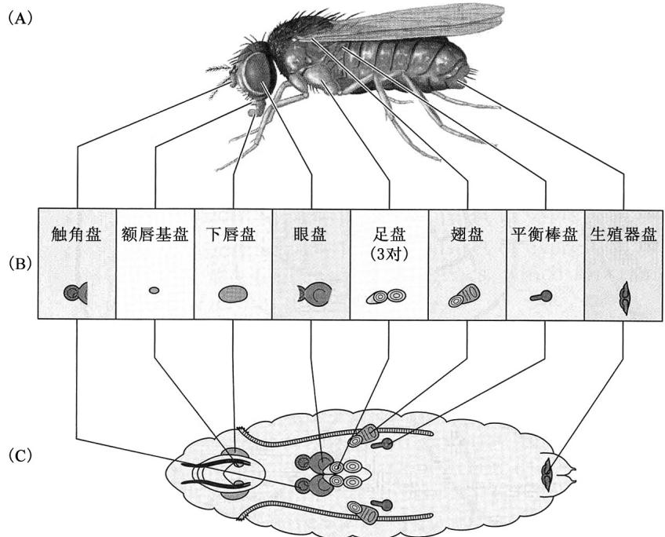  
图 13.31 果蝇成虫结构(A)及衍生为这些结构的成虫盘(B)。(C)三龄幼虫晚期成虫盘的一般形态和位置。

果蝇的细胞决定 (cell determination) 也在称为区室 (compartment) 的有界单元内发生。体节和成虫盘中的细胞不会跨越区室之间的边界而迁移。例如，果蝇的翅盘包含 5 个区室边界，而大部分体节只包含 1 个边界，将体节分成前半和后半。区室存在的证据来自利用有丝分裂重组对单个细胞进行遗传标记，然后观察它们后代的位置。在每个区室内，相邻的细胞群不一定与共同经历发育决定的系谱相关。

如同在早期胚胎中一样，基因表达的重叠模

式与组合控制指导随后的果蝇发育。图 13.32A 显示翅盘中翅发育的一个关键基因 vestigial 的表达模式。这一表达模式表面上均一且略呈圆形，实际上是 vestigial 应答图 13.33 所示的两个不同的信号通路的总和，两个信号通路分别导致底部所示的十字形和四分形的表达模式。图 13.32B 分别显示翅盘中的这两种模式。图 13.33 中的信号通路 A 包括 Apterous、fringe 和 Serrate 等基因的产物；而通路 B 包括 engrailed 和 hedgehog 等基因的产物。Hairy 阻遏蛋白与 vestigial 基因中的一个边界增强子 (boundary enhancer) 结合，诱导基因以十字模式表达。Mad 蛋白与另一个四分增强子 (quadrant enhancer) 结合，诱导基因以四分模式表达。在翅的发育中，vestigial 及其他基因这样重叠的基因表达模式，最终产生在成虫中观察到的精细水平的细胞和形态分化。

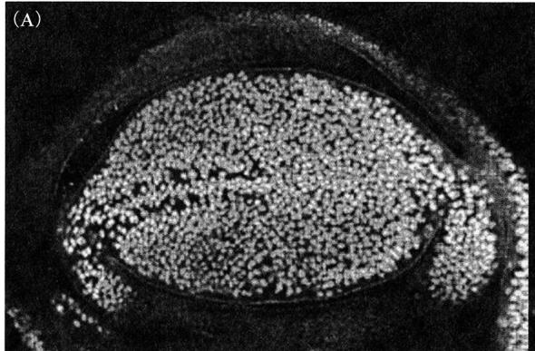

  
图 13.32 (A) 在发育中的翅盘中 vestigial 基因(绿色)的表达。略呈圆形的表达区生成翅。(B) 示同一成虫盘中 vestigial 表达的潜在边界和四分模式。[承华盛顿大学细胞动力学研究中心乔治·冯·达索夫(George von Dassow)惠赠。]

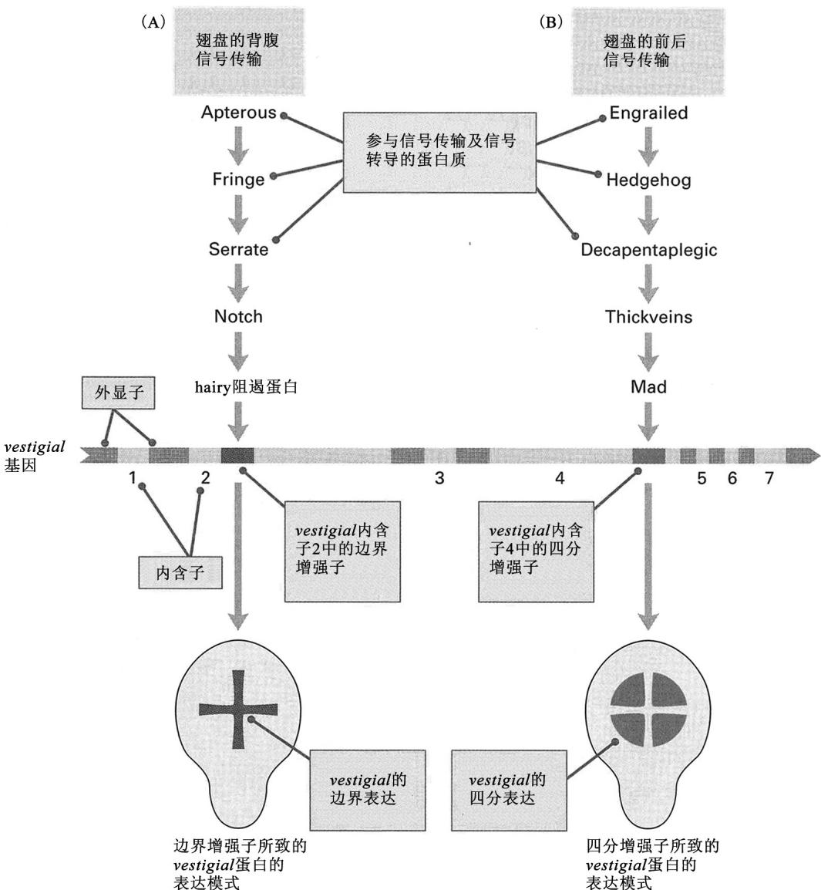  
图 13.33 在翅盘中 vestigial 表达的均一模式是两个不同模式叠加的结果。(A) 边界表达模式由背腹信号通路决定。(B) 四分表达模式由前后信号通路决定。

## - 同源异形框基因

在将果蝇胚胎的周期性转变成线性分化的形体模式的基因中，有两小套同源异形框基因(homeotic gene, HOX gene)。同源异形框基因是根据可导致一个体节转变为另一体节的突变而定义的；该表型是，受影响的体节分化成正常情况下存在于机体别处的结构。同源异形框基

因的正常功能是调节与如下特征相关的靶基因：细胞分裂速度、有丝分裂纺锤体的定向，以及分化出刚毛、足和其他部件的能力。同源异形框基因在将成群的结构基因的活性限制在一定的空间格局内也很重要。其中一类同源异形框基因突变可以 bithorax 为例来说明，该突变导致第三胸节前部转变为第二胸节前部，结果是，除了在正常情况下出现在体节 T2 的那对翅之外，本来出现在体节 T3 的平衡棒也转变为一对翅(图 13.34)。

(A)  
(B)  

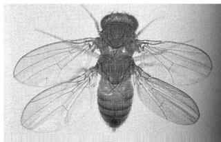  
图 13.34 (A) 野生型果蝇, 示翅和平衡棒(突出于双翅之后的那对瘤突状结构)。(B) 双胸复合群(bithorax complex)突变产生的具四翅的果蝇。这些突变将第三胸节转变成第二胸节, 从而使正常情况下出现在第三胸节上的平衡棒被转变成后面那对翅。[承爱德华·刘易斯(Edward B. Lewis)惠赠。经帕梅拉·刘易斯(Pamela Lewis)许可使用。]

另一类同源异形框基因突变可以 Antennapedia 为例来说明，该突变导致触角变成足。以 bithorax 和 Antennapedia 为代表的 HOX 基因事实上是基因簇。含 bithorax 的基因簇称为 BX-C(bithorax complex，双胸复合群)，而含 Antennapedia 的基因簇称为 ANT-C(Antennapedia complex，触角-头复合群)。这两个基因簇最初都是由于它们的同源异形效应而被发现的，其后证明它们对幼虫体节的身份确认发挥作用。BX-C 主要与幼虫体节 T3～A8 的发育有关(图 13.30)，最主要是对 T3 和 A1 起作用。BX-C 区占据约 300kb DNA，但只包含 3 个基本的编码区。该区域的其他部分是由一系列复杂的增强子和其他转录因子组成，它们的功能是在特定的副体节中将不同的编码区活化到不同的程度，从而确定体节的身份。ANT-C 主要与头节(H)及胸节 T1 和 T2 的发育有关。

同源异形框基因编码转录激活蛋白。大部分 HOX 基因含有一个或多个同源异形框 (homeobox)，同源异形框是一段约 180 个核苷酸的独特序列，分节蠕虫、青蛙、鸡、小鼠和人等生物之间差异极大，但在这些生物与胚胎分节发育有关的关键基因中，也可见到同源异形框。同源异形框序列存在于外显子中，编码一个包含螺旋-转角-螺旋 DNA 结合模体的蛋白质折叠结构域(参见第 11 章)。

## - 进化中的主控基因

Hox 基因之所以重要，部分原因是它们在确定动物前后轴的形体模式上所起的主控基因 (master control gene) 作用一直是高度保守的。从隐杆线虫这样的具有固定细胞谱系的生物，到果蝇之类的具有界线明确的体节的生物，再到包括人和其他哺乳在内的具有可变细胞谱系的生物，Hox基因都控制着神经系统、肌肉系统、骨骼系统等的前后方向的分化。Hox基因在染色体上的方向也是高度保守的。控制前部结构的Hox基因位于每个Hox基因簇的3'端，而控制后部结构的位于5'端。这种方向与发育过程中这些基因表达的时间顺序一致。这种基因顺序的保守性，部分是因为控制基因表达的关键调节元件位于每个Hox基因簇的两侧区域。

一类称为 Pax 的同源异形框基因很好地说明了发育主控基因在进化上的保守性。Pax 基因编码的 PAX 蛋白含一个同源异形框和另一个 DNA 结合结构域——配对框 (paired box)。在这些基因中，最有名的是 Pax6，它最初是在突变小鼠中作为一种小眼表型的基因而被发现的，后来证明在称为无虹膜症 (aniridia) (虹膜缺失) 的一种遗传型人类视力障碍或失明中该基因发生突变。在这两种情况下，受累个体都是杂合的，因为纯合突变基因型由于头部和大脑的严重发育异常而不能存活。

人类和小鼠的 PAX6 蛋白具有相同的氨基酸序列，这种极端的序列保守性刺激人们到其他生

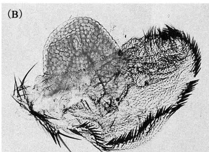

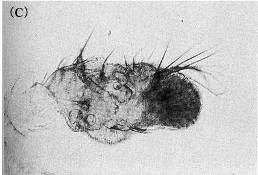

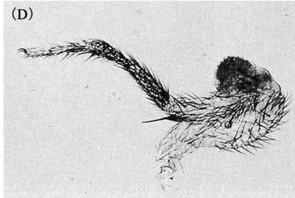  
图 13.35 果蝇 eyeless 基因的野生型等位基因的表达导致眼睛组织被放错地方。(A) 成虫头部，两条触角都形成眼睛结构。(B) 长眼睛组织的翅。(C) 单条触角，第三节的大部分由眼睛组织构成。(D) 胫节基部长出眼睛的中足。[转载自 G. Halder, P. Callaerts, and W. J. Gehring, Science 267 (1995): 1788-1792. 经 AAAS 许可重印。]

物中去寻找类似的基因。很快在果蝇中发现了一个 Pax 相关基因，并证实它是约一个世纪以前就已经发现的 eyeless(无眼)基因。顾名思义，eyeless 突变体的眼睛大大缩小或没有眼睛。在假设 eyeless 基因可能是果蝇眼睛发育的一个主控基因的基础上，研究人员制造了一些在触角、翅或足等组织中表达野生型 eyeless 基因的突变型果蝇。在每种情况下，该基因表达的结果都是在受累组织中形成复眼(图 13.35)。

Pax 基因如何决定

眼睛的发育正在变得越来越清晰。在果蝇中，眼睛的发育以层级方式发生，在早期的时候有少量基因在靠近顶部起作用。最早起作用的基因是通过反馈相互调节的转录因子，因而它们中的任何一个的表达都会打开其余的基因。因此，这些基因中的任何一个基因的突变都会导致无眼表型，而任何一个基因的错误表达都会在错误的组织中产生眼睛。在幼虫中，当这些早期作用基因被表达时，它们打开了主要在转录调节、细胞增殖、细胞分化和细胞定型等方面发挥作用的大约100个基因的表达。这些基因依次激活其他基因，到蛹期时，大约又有400个与眼睛发育相关的基因被激活，这些基因主要编码结构分子。到成虫期时，另有500个基因被激活，这些基因在细胞内和细胞间信号转导、神经冲动传递及其他与视觉相关的关键过程中发挥作用。

一个关键的实验观察结果是，来自小鼠的 Pax6 基因能够诱导果蝇的眼睛发育。但是，所得的眼睛不是小鼠的眼睛，而是正常的果蝇复眼。因此，Pax6 只不过是开启了复眼正常发育所需的基因层级。

在进化过程中，Pax基因在眼睛发育中起主控基因的作用可以追溯到多远？在迄今详细研究过的所有案例中，这些基因都与眼睛的发育有牵连。例如，涡虫简单的眼点(图 13.36A)，每个眼点仅由面向一个杯状色素细胞的一个细长的光敏神经细胞构成。水母、章鱼和脊椎动物中发现的相机式眼睛(图 13.36B～图 13.36D)，这些眼睛每只都由单一的晶状体将光线投射到一个光敏感的视网膜上。正如我们已知的那样，Pax 基因也控制昆虫复眼的发育(图 13.36E)，昆虫的复眼由数以百计的圆柱体构成，每个圆柱体含一套感光细胞和一个晶状体。扇贝的镜面式眼睛的发育也由同一个基因家族编码(图 13.36F)，在这种眼睛中，光线不仅被投射到视网膜上，而且要经过反射以使敏感性增加。在这些形形色色的眼睛发育中，起关键作用的都是 Pax 及相关基因，这说明在历经数亿年的进化历史中，眼睛只在进化过程的极早期进化出来一次，因此，从那个共同祖先进化而来的，在化石和现生生物中发现的不同类型的眼睛，才会反反复复使用相同的主控基因。

  
(A)

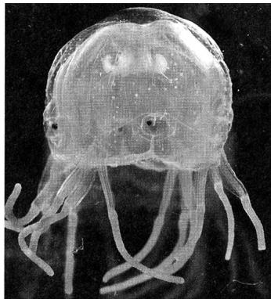  
(B)

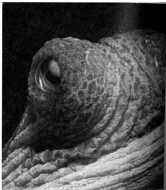  
(C)

  
(D)

  
(E)

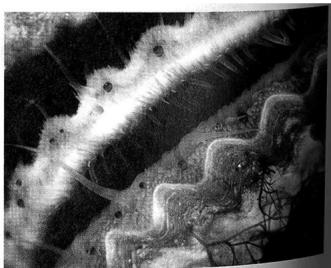  
(F)  
图 13.36 在动物中发现的主要眼睛类型。(A) 涡虫，(B) 水母，(C) 章鱼，(D) 脊椎动物，(E) 蜻蜓和 (F) 扇贝。[A，承哈珀学院兰迪·希泽尔特(Randy Schietzelt)惠赠；B，承哥本哈根大学安德斯·加姆(Anders Garm)惠赠；C，©Jose Hernaiz/fotolia.com；D，©Ivanova Inga/ShutterStock, Inc.; E，©Armin Rose/Dreamstime.com；F，©Ken Read/Science Photo Library。]

## 13.5 高等植物发育的遗传控制

植物的生殖和发育过程异于动物。例如，植物存在二倍孢子体和单倍配子体之间的世代交替；植物的种系不是在胚胎发生过程中在单个场所建立的，而是在成熟机体中的多个场所建立的。例如，在玉米植株中，每个穗都含有可经过减数分裂形成花粉和胚珠的体细胞。

在动物中，大多数主要的发育决定都是在生命早期——在胚胎发生过程中——做出的。在高等植物中，分化的发生几乎持续一生，分化发生在营养器官(根、茎和叶)和花器(萼片、花瓣、雌蕊和雄蕊)中活跃地进行着细胞分裂的区域，这些区域称为分生组织(meristem)。芽和根的分生组织形成于胚胎发生期间，组成分生组织的细胞在独特的几何平面上以不同的速率分裂，形成每个器官系统基本的形态格局。花的分生组织是在胚胎发生之后通过芽的分生组织的重组而建立的，最终分化成每个特定物种特有的花器结构。动物和植物发育的一个重要差异是：

在高等植物中，当细胞群离开分生组织的增殖区，并进一步分化为营养组织或花器组织时，它们的发育命运几乎完全由它们相对于邻近细胞的位置决定。

与位置信息在高等植物发育中的关键作用相比，在动物发育中，细胞谱系在决定细胞命运时往往起关键作用。

高等植物可塑的或 “不决定的” 生长模式是持续产生营养和花器系统的结果。这些模式受昼长及日照质量和强度的影响。植物发育的可塑性使得植物具有适应环境侵害的非凡能力。图 13.37 显示，随着时间的推移，一棵树通过将它边上的栅栏吞进树干中来适应栅栏的存在。

  
图13.37 这棵树说明了植物通过发育适应干扰的能力。这棵树与一道栅栏不期而遇，最终将栅栏包进树干中。[承普渡大学罗伯特·普鲁伊特(Robert E. Pruitt)惠赠。]

## ■ 拟南芥的花的发育

拟南芥(十字花科的一个种)的遗传分析揭示了花器结构遗传决定的一些重要原理。拟南芥是典型的开花植物，它的花由排列成同心环状(轮状)的4种器官组成。图13.38示花分生组织俯视图。从外到里，将这些轮称为轮1、轮2、轮3和轮4(A部分)。在花的发育过程中，每个轮产生一种不同的花器(B部分)。轮1产生萼片(最外面的绿色花叶)，轮2产生花瓣(白色的花内叶)，轮3产生雄蕊(雄性器官，产生花粉)，轮4产生心皮(它们融合成子房)。

  
(A)

  
(B)  
图 13.38 不同的花器结构起源于花分生组织中的同心轮。

影响花发育的突变分成3个主要类型，每一个类型具独特的表型(图13.39)。与野生型的花(A)相比，一种类型缺失萼片和花瓣(B)，另一种类型缺失花瓣和雄蕊(C)，而第三种类型缺失雄蕊和心皮(D)。根据纯合突变植株之间杂交的结果，可将这些不同类型的突变体分成不同的互补群，每个互补群界定一个不同的基因。表13.1示每个基因及该基因的隐性突变纯合植株的表型。缺失萼片和花瓣的表型是由ap1(apetala-1，无花瓣-1)基因的突变导致的。缺失雄蕊和花瓣的表型由ap3(apetala-3，无花瓣-3)或pi(pistillata，宽雌蕊)基因的突变导致。缺失雄蕊和心皮的表型由ag(agamous，隐花)基因的突变导致。这些基因各编码一种转录因子。由ap3、pi和ag编码的转录因子是MADS框(MADS box)转录因子家族的成员，该基因家族的每个成员含一个58个氨基酸的序列模体。MADS框转录因子在植物中非常常见，也见于在动物中，但不常见。

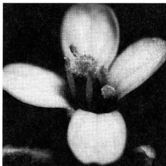  
(A) 野生型

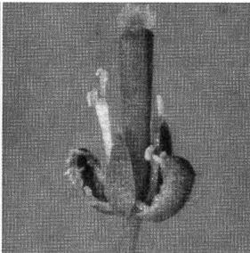  
(B) Apetala-1(ap1)

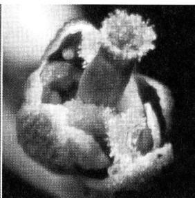  
(C) Pistillata(pi)

  
(D) Agamous (ag)  
图 13.39 在拟南芥中花突变表型的主要类型。(A)野生型花型由萼片、花瓣、雄蕊和心皮的同心轮构成。(B)纯合 ap1(apetala-1) 突变导致花缺失萼片和花瓣。(C)ap3(apetala-3) 或 pi(pistillata) 纯合基因型产生有萼片和心皮但缺失花瓣和雄蕊的花。(D)纯合 ag(agamous) 突变产生有萼片和花瓣但缺失雄蕊和心皮的花。[A、C 和 D 部分承加州理工学院埃利奥特·迈耶罗维茨 (Elliot M. Meyerowitz) 惠赠; B 部分转载自 E. M. Meyerowitz and J. L. Bowman, Sci. Am. 271 (1994):56-65。经加州理工学院埃利奥特·迈耶罗维茨许可使用。]

表 13.1 拟南芥突变体中花的发育

<table><tr><td rowspan="2">基因型</td><td colspan="4">轮</td></tr><tr><td>1</td><td>2</td><td>3</td><td>4</td></tr><tr><td>野生型</td><td>萼片</td><td>花瓣</td><td>雄蕊</td><td>心皮</td></tr><tr><td>ap1/ap1</td><td>心皮</td><td>雄蕊</td><td>雄蕊</td><td>心皮</td></tr><tr><td>ap3/ap3</td><td>萼片</td><td>萼片</td><td>心皮</td><td>心皮</td></tr><tr><td>pi /pi</td><td>萼片</td><td>萼片</td><td>心皮</td><td>心皮</td></tr><tr><td>ag /ag</td><td>萼片</td><td>花瓣</td><td>花瓣</td><td>萼片</td></tr></table>

## - 花器的组合决定

可从突变表型推断 ap1、ap3、pi 和 ag 转录因子在花器决定中的作用。推理的逻辑是基于这样的观察(表 13.1)：任何一个基因的突变消除由毗邻的轮产生的两种花器。这种模式表明，

ap1 为萼片和花瓣所必需，ap3 和 pi 两者都为花瓣和雄蕊所必需，ag 为雄蕊和心皮所必需。因为这些突变表型是由这些基因的功能失去等位基因引起的，所以可以推断，ap1 在轮 1 和轮 2 中表达，ap3 和 pi 在轮 2 和轮 3 中表达，ag 在轮 3 和轮 4 中表达。表 13.2 示这种重叠的表达模式。

表 13.2 中的基因表达模型表明，花的发育是由 4个基因以组合方式控制的。萼片由仅 ap1 有活性的组织发育而成；花瓣由 ap1、ap3 和 pi 的组合激发；雄蕊由 ap3、pi 和 ag 的组合决定；而心皮来自只有 ag 表达的组织。该模型图解于图 13.40 中。

表 13.2 决定花发育的基因的表达域

<table><tr><td>轮</td><td>表达的基因</td><td>决定</td></tr><tr><td>1</td><td>ap1</td><td>萼片</td></tr><tr><td>2</td><td>ap1+ap3 和 pi</td><td>花瓣</td></tr><tr><td>3</td><td>ap3 和 pi+ag</td><td>雄蕊</td></tr><tr><td>4</td><td>ag</td><td>心皮</td></tr></table>

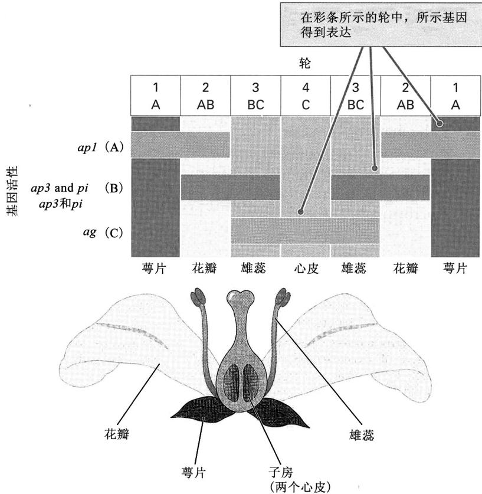  
图 13.40 拟南芥花的发育由 4 个基因的重叠表达控制。萼片、花瓣、雄蕊和心皮是在同心环(轮)中形成的花器系统。每个同心环的发育身份确认由 ap1、ap3、pi 和 ag 决定，每个基因在两个毗邻的轮中表达。因此，每个轮具有一种唯一的活性基因组合，以 A、B 和 C 的组合表示。

这种花发育的模型通常称为花 ABC 模型 (flower ABC model)，因为最初将 ap1 的野生型活性称为 A，将 ap3 和 pi 共同发挥作用的野生型活性称为 B，而将 ag 的野生型活性称为 C。因此在每个轮中存在的活性的组合，在轮 1 中表示成 A，在轮 2 中表示成 AB，在轮 3 中表示成 BC，而在轮 4 中表示成 C (图 13.40)。

表 13.2 中的模型并不能解释表 13.1 中 ap1 和 ag 突变的所有表型特征。具体说来，按照表 13.2 中的组合模型，在纯合 ap1 植

株中，从轮 1 和轮 2 发育成心皮和雄蕊，应该需要 ag 在轮 1 和轮 2 中表达。同样，在纯合 ag 植株中，从轮 3 和轮 4 发育成花瓣和萼片，应该需要 ap1 在轮 3 和轮 4 中表达。如果假设 ap1 的表达和 ag 的表达是互斥的，这个矛盾就可以解释。在存在 AP1 转录因子的情况下，ag 被阻遏；在存在 AG 转录因子的情况下，ap1 被阻遏。如果是这种情况，那么在 ap1 突变体中，ag 的表达可能会扩散进轮 1 和轮 2；在 ag 突变体中，ap1 的表达可能会扩散进轮 3 和轮 4 中。这一额外的假设能够解释单一突变体甚至双重突变体的表型。

有了关于 ap1 和 ag 相互作用的额外假设，表 13.2 中的模型就与数据吻合，但这个模型正确吗？用针对每个基因的标记探针，通过在花的细胞中进行 RNA 原位杂交，来分析这些基因，所得基因表达模式与表 13.2 中的模式吻合。具体说来，ap1 在轮 1 和轮 2 中表达，ap3 和 pi 在轮 2 和轮 3 中表达，ag 在轮 3 和轮 4 中表达，而且 ap1 和 ag 的表达互斥。结果证明这一假设是正确的。在 ap1 突变体中，ag 在轮 1 和轮 2 中表达；相反，在 ag 突变体中，ap1 在轮 3 和轮 4 中表达。现在也已经知道 ap3 和 pi 是怎样合作的。对应于这两个基因的活性转录因子是一种二聚体蛋白，由 Ap3 和 Pi 多肽组成。在缺乏一种多肽组分的情况下，另一多肽组分在细胞质中为无活性状态。二者共同存在时，形成有活性的二聚体转录因子，并迁移到细胞核中。

鉴于 Ap1、Ap3/Pi 和 Ag 转录因子在花器决定中的关键作用，可以推测，缺失所有 3 种转录因子的三重突变体，可能会发育成非常奇怪的花。apl pi ag 三重突变体的表型如图 13.41 所示。这些花没有任何一样正常的花器。它们仅仅是由排成同心轮的叶片组成。

## 本章概要

\- 在动物细胞中，卵母细胞中的母源基因产物控制最早期的发育，包括确立主要的体轴。

\- 发育基因通常由基因产物的梯度控制，梯度存在于细胞中或跨越部分胚胎。

\- 发育基因的调节是分层的，即在发育早期表达的基因调节后来表达的基因的活性。

\- 上位性原理有助于确定在线性开关调节发育途径中起作用的基因的顺序。该原理认为，上位基因在下位基因下游起作用。

\- 发育基因的调节是组合式的，即每个基因被其他基因的组合所控制。

\- 在动物和植物中，模式形成的许多基本过程看起来是类似的。

  
图 13.41 ap1 pi ag 纯合三重突变体缺少花器发育所需的所有转录因子。因此，这些花缺乏所有的野生型花器结构。它们没有萼片、花瓣、雄蕊和心皮。没有花的遗传决定因子，这些花整个由排列成同心轮的叶片组成。（承加州理工学院埃利奥特·迈耶罗维茨惠赠。）

## 基础回顾

\- 在发育过程中，什么是“位置信息”？位置信息怎样对细胞命运起作用？

\- 线虫发育的完整细胞谱系知识如何证明在发育中程序性细胞死亡(细胞凋亡)的重要性？

\- 如果某个基因对决定某个发育途径不仅必要而且充分，请解释为什么预计功能失去突变体与功能获得突变体的表型不同？

\- 什么是受体？什么是配体？这些分子在细胞间信号转导中发挥什么作用？

\- 什么是成熟卵母细胞的“极性”？

\- 母体效应致死基因怎样成为破解果蝇早期胚胎发生的遗传控制的关键？

\- 在控制果蝇胚胎发育的基因中，指出坐标基因、裂缺基因、成对规则基因和分节极性基因的差异。一般来说，这几类基因表达的时间顺序是什么？

\- 什么是同源异形突变？举一个果蝇的例子。同源异形突变发生在除果蝇之外的其他生物中吗？

\- 植物具有与动物相同意义的种系吗？在这两类生物的进化过程中，这种种系起源上的差异对于“体细胞”突变的潜在作用有何意义？

\- 拟南芥花器发育中萼片、花瓣、雄蕊和心皮发育决定的遗传基础是什么？

## 解题指南

习题 1 在示意图中，B 物质抑制某种花中红色色素的发育。这种花的野生型颜色为粉红色，但已知突变体为白色或红色。假设 B 物质是 B 基因的产物，B 基因的功能失去突变，会有什么样的花的颜色表型？B 基因的功能获得突变会有什么样的花的颜色表型？这种情况是哪一个发育遗传学原理的典型情况？

## 答案

因为 B 抑制花的颜色，且野生型表型为粉红色，所以 B 基因的功能失去突变会去除 B，从而减少抑制效果，因此预期表型会是红色。同样，B 基因的功能获得突变会增加 B 的量，从而增强抑制，因此预期花色表型会是白色。这种情况是如下原理的典型情况：发育控制基因的功能失去突变通常具有与功能获得突变相反的表型效应。

习题2 下图示控制花的色素形成的线性开关调节型途径。A物质是B的强化因子。如果A是 $A$ 基因的产物， $A$ 基因的功能失去突变会产生什么样的花色表型？ $A$ 基因的功能获得突变会产生什么样的花色表型？

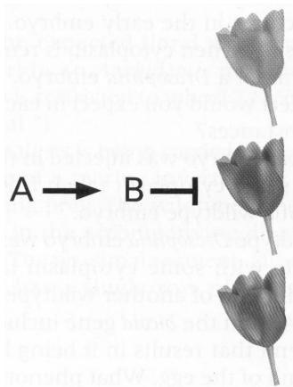

## 答案

因为 A 强化 B，A 基因的功能失去突变会去除 A，从而减少 B 所导致的抑制的水平；因而，估计花的表型会是红色。相反，A 基因的功能获得突变会增加 B 的效应，从而增加 B 所导致的花的颜色的抑制，因而预计花的颜色的表型会是白色。

习题 3 下图所示的是在某种昆虫末端附肢上观察到的 3 种可能的表型。野生型表型具单列刚毛。有些突

变体产生无刚毛表型，而其他突变体产生附肢具两列刚毛的表型。已知这些刚毛的发育是某一线性开关调节型途径的结果，该途径涉及分别在 A、B、C 和 D 基因中编码的物质 A、B、C 和 D。A、B、C 和 D 作用的顺序未知。突变型等位基因 a 和 b 导致缺失刚毛(M)，而突变型等位基因 c 和 d 导致多一列刚毛(E)。所附矩阵示在所有可能的双重突变体中观察到的表型。这说明 A、B、C 和 D 物质作用的基因顺序是什么？

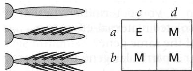

## 答案

根据上位性原理，在双重突变组合中，上位基因的产物在下位基因产物的下游起作用。因此，矩阵第一行说明了 A C 和 D A 的顺序，而第二行说明了 C B 和 D B 的顺序。将这些信息合起来，这些物质作用的顺序一定是 D-A-C-B。

## 分析与应用

13.1 异时性突变(heterochronic mutation)是一种改变发育事件彼此的相对时间顺序的突变。在一个正常但较慢的发育模式中发现一个突变。该突变称得上是异时性突变吗？请予以解释。

13.2 指出功能失去突变和功能获得突变的差异。同一个基因，两种类型的突变都可发生吗？同一个等位基因，两种类型的效应都可以具有吗？

13.3 上位性原理是什么？怎样将它用于发育中线性开关调节型途径的遗传分析？

13.4 构建了果蝇的一种双重突变体。对单重突变体而言，一种突变体导致眼睛增大，另一种突变体导致小眼。该双重突变体具有小眼。这两个基因中哪一个是上位基因？哪一个是下位基因？假设控制眼睛大小的为线性开关调节型途径，这些结果说明在该发育途径中基因产物作用的顺序是什么？

13.5 在果蝇中，母体效应致死等位基因的结果是什么？如果某个等位基因是母体效应致死的，果蝇怎么能够对它是纯合的？

13.6 怎样判断两个独立分离到的母体效应致死突变是否是同一基因的等位基因？

13.7 试想某个特定基因对于某个形态特征的发育是必要的，但不是充分的。该基因的功能失去突变的预期表型是什么？预计该等位基因是显性的还是隐性的？

13.8 试想某个特定基因对于某个形态特征的发育是充分的。该基因的功能获得突变的预期表型是什么？预计该等位基因是显性的还是隐性的？

13.9 此处所示的线性开关调节型途径控制某个物种的花的颜色。野生型颜色为紫蓝色，而突变体为白色或紫色。在该途径中，基因产物 A 和 B 在所示位置按所示方式起作用 (A 为抑制性的，B 为增强性的)。A 和 B 分别是基因 A 和 B 的产物。下列突变的预期表型是什么？

A → B → 白色
紫蓝色
紫色

(a) A 的功能失去突变
(b) A 的功能获得突变
(c) B 的功能失去突变
(d) B 的功能获得突变

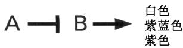

13.10 在一个与 13.9 题中的物种具有亲缘关系的物种中，控制花的颜色的线性开关调节型途径如图所示。野生型颜色仍是紫蓝色，突变体可为白色或紫色。在该物种中，A 和 B 两者都是抑制性的。下列突变的预期表型是什么？

(a) A 的功能失去突变

(b) A 的功能获得突变

(c) B 的功能失去突变

(d) B 的功能获得突变

13.11 果蝇小盾片上通常有 4 根刚毛, 小盾片为胸部基部表皮的小三角区。有些突变体在小盾片上无刚毛,

而有些突变体具有额外的刚毛。假设一个线性开关调节型途径涉及分别在 U、V、W、X、Y 和 Z 基因中编码的基因产物 U、V、W、X、Y 和 Z。突变型等位基因 u、v 和 w 导致额外的刚毛(E)，而突变型等位基因 x、y 和 z 导致刚毛缺失(M)。根据此处所示的双重突变体数据，推导出在刚毛数目途径中 U、V、W、X、Y 和 Z 作用的顺序？

<table><tr><td></td><td>x</td><td>y</td><td>z</td></tr><tr><td>u</td><td>E</td><td>M</td><td>E</td></tr><tr><td>v</td><td>M</td><td>M</td><td>E</td></tr><tr><td>w</td><td>E</td><td>E</td><td>E</td></tr></table>

<table><tr><td></td><td>d</td><td>e</td><td>f</td></tr><tr><td>a</td><td>O</td><td>O</td><td>O</td></tr><tr><td>b</td><td>O</td><td>O</td><td>W</td></tr><tr><td>c</td><td>W</td><td>O</td><td>W</td></tr></table>

13.12 一种开花植物开黄色(野生型)、白色或橙色的花。色素的浓度由一个线性开关调节型途径决定，该途径具有分别由 A、B、C、D、E 和 F 基因编码的组分 A、B、C、D、E 和 F。突变型等位基因 a、b 和 c 导致橙色花(O)，而突变型等位基因 d、e 和 f 导致白花(W)。此处所示的矩阵概括了在双重突变体中观察到的表型。这些数据说明，在该途径中这些组分作用的顺序是什么？

13.13 果蝇的 bicoid 突变导致早期胚胎中头部结构的缺失。当从果蝇胚胎

的前端去除细胞质时，得到类似表型。下列每种情况下会有什么样的发育效应？

(a)用取自野生型胚胎前端的细胞质，注射到bicoid胚胎的前端。

(b)用取自另一个野生型胚胎前端的细胞质，注射到野生型果蝇胚胎的中部。

13.14 来自 bicoid 基因的 mRNA 在 3' 端包含一段序列，使其被定位于卵细胞的前端。在对这一定位所需基因的突变体筛查中，应该寻找什么表型？

13.15 某种甲壳类动物可有中等大小的螯(野生型)、增大的螯或减小的螯。螯的大小由一个线性开关调节型途径决定，该途径具有在基因 $A \sim G$ 中编码的组分 $\mathrm{A} \sim \mathrm{G}$ 。这些组分以E-C-G-A-D-B-F的顺序起作用。突变型等位基因 $a$ 、 $b$ 和 $c$ 导致增大的螯(E)，而突变型等位基因 $d$ 、 $e$ 、 $f$ 和 $g$ 导致减小的螯(R)。在每个单元格中填写双重突变体的预期表型(E或R)，以完成该矩阵。

<table><tr><td></td><td>d</td><td>e</td><td>f</td><td>g</td></tr><tr><td>a</td><td></td><td></td><td></td><td></td></tr><tr><td>b</td><td></td><td></td><td></td><td></td></tr><tr><td>c</td><td></td><td></td><td></td><td></td></tr></table>

13.16 成年青蛙脑细胞的细胞核通常不合成 DNA 或进行有丝分裂。但是，当脑细胞核移植进正在发育的卵母细胞后，出现如下表现：(a) 在快速生长的前减数分裂卵母细胞中，它们合成 RNA；(b) 在比较成熟的卵母细胞中，它们不合成 DNA 或 RNA，但它们的染色体凝缩，从而开始减数分裂。怎样解释这些结果？

13.17 试想一种假想突变的作用于拟南芥花发育的突变型蛋白酶。该蛋白酶具有变异的底物特异性，使它能够消化蛋白质 Ap1 和 Ag(分别为 ap1 和 ag 的产物)并使这两种蛋白质都失活。含 Ap3/Pi 二聚体蛋白，但既不单独含 Ap1，也不单独含 Ag 的组织，发育成介于花瓣和雄蕊之间的花器中间体，鉴于这一事实，在该蛋白酶突变体中，预计花器表型是什么？(提示：缺省状态是“叶”。)

13.18 在拟南芥中，导致 ap3 和 pi 在轮 1 中表达的功能获得突变会有什么表型？

13.19 在 ag(agamous) 的表达局限于轮 3 的拟南芥突变体中，预计由每个轮产生的花器结构是什么？(提示：缺省状态是 “叶”。)

13.20 在 ap1(apetala-1) 的表达局限于轮 2 的拟南芥突变体中, 预计由每个轮产生的花器结构是什么? (提示: 缺省状态是 “叶”。)

13.21 对某种海洋无脊椎动物用来固定猎物的一种特化的附肢进行遗传分析。野生型附肢(附图顶部所示)有3个分节。直接连接于身体的近侧分节具单列稀疏刚毛；中分节具单列密生刚毛；端分节具两列对称的密生刚毛。分离到影响该附肢的3种突变；它们导致图中所示的表型。一个缺乏刚毛的分节的存在，可被视为该附肢发育的缺省状态。提出一个假说来解释基因a、b和c是如何参与该附肢的发育决定的。

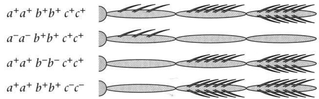

13.22 为了对前一习题中所讨论的附肢发育的遗传控制有更加深入的认识，构建了所有可能的双重突变体。它们具有如图所示的表型。

(a)这些表型与从单一突变体中得出的推论一致吗?

(b)这些双重突变提供了什么额外信息？

(c) 提出一个详细的模型，说明哪些基因产物对于每个分节的发育是必需的。

13.23 根据前面两个习题中的数据形成的附肢发育的遗传控制模型，简述与下列每种类型的突变相关的表型。

(a) $c^{+}$ 表达的范围扩大到端分节中的突变。

(b) $a^{+}$ 表达的范围扩大到近侧分节中的 $b^{-}$ 突变。

(c) $b^{+}$ 表达的范围扩大到中分节中的 $a^{-}$ 突变。

13.24 药物放线菌素 D 阻止 RNA 的转录，但几乎不直接作用于蛋白质合成。当受精的海胆卵被浸泡在这种药物的溶液中时，发育进行到囊胚阶段，但不发生原肠胚形成。怎样解释这一发现？

13.25 在拟南芥中，某个基因的功能对于 Ap3/Pi 和 Ag 对发育发挥作用是必要的，预计其功能失去突变会出现什么花器表型？

13.26 美西螈中称为 o 的一种突变是母体效应致死突变，因为无论胚胎自身的基因型是什么，来自 oo 雌性的胚胎在原肠发生阶段都要死亡。但是，用来自 $o^{+}/o^{+}$ 或 $o^{+}/o$ 卵细胞的细胞核提取物注射来自 oo 雌性的卵母细胞，可挽救这些胚胎。注射细胞质无效。对这些结果做出解释。

13.27 预计导致 $ap3$ 和 $pi$ 丢失功能的突变会有什么样的花器表型？在轮 1 和轮 2 及轮 2 和轮 3 中 $ap3$ 和 $pi$ 都被表达的功能获得突变又会有什么样的花器表型？关于 $Ap3 / Pi$ 对 4 个轮的发育命运是必要的还是充分的，这些结果说明了什么？

13.28 请解释，在解释拟南芥花器突变体的表型时，为什么需要假设：

(a) 在 agamous 突变体中，apetala-1 的表达范围扩大到轮 3 和轮 4。

(b) 在 apetala-1 突变体中，agamous 的表达范围扩大到轮 1 和轮 2。

13.29 如果在 apetala-1 突变体中，agamous 的表达范围没有扩大到轮 1 和轮 2，轮 1 和轮 2 的表型能够预测吗？为什么能或为什么不能？

13.30 在某种沙鼠中，影响某个线性开关调节型途径的突变，导致耳朵扩大或减小。该途径涉及在基因 $A \sim D$ 中编码的组分 $\mathrm{A} \sim \mathrm{D}$ 。突变型等位基因 $a$ 和 $b$ 导致耳朵扩大(E)，而突变型等位基因 $c$ 和 $d$ 导致耳朵减小(R)。双重突变体具有所附矩阵所示的表型。根据这些数据，推断在该途径中A、B、C和D作用的顺序是什么？

<table><tr><td></td><td>c</td><td>d</td></tr><tr><td>a</td><td>R</td><td>E</td></tr><tr><td>b</td><td>R</td><td>E</td></tr></table>

## 挑战题

挑战题 1 若要证明，在果蝇胚胎体节形成过程中，表达正常的配对规则模式需要裂缺基因的正常表达，但裂缺基因的表达不需要成对规则基因的表达。有下面 4 种突变可用：

(a) 合子效应裂缺基因 knirps (kni) 的突变。

(b) 合子效应成对规则基因 fushi tarazu (ftz) 的突变。

(c) 由报道基因(lacZ)与 kni 的增强子元件融合构成的转基因。

(d) 由报道基因(lacZ)与ftz的增强子元件融合构成的转基因。

描述需要的品系，以及怎样用它们来证明野生型的 kni 表达对 ftz 的正常表达是必需的，但野生型的 ftz 表达对 kni 的正常表达不是必需的。不用给出杂交的细节。

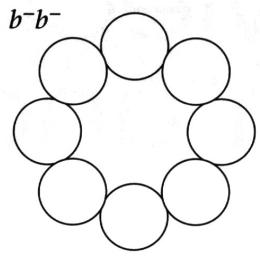

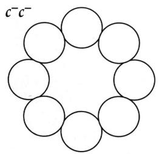

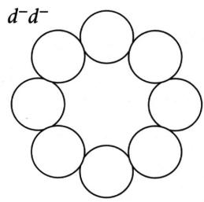

挑战题 2 一种水母有一个由 8 个环状排列的细胞组成的结构，在这些细胞上出现一些突起物，形成有点像毛孔的结构。如附图所示，有些细胞有一模一样的突起物，而其他细胞的突起物完全不同。字母 a～d 表示 4 个发育控制基因 a～d 的产物，这些产物见于这一圈细胞的每个细胞中。

假设在这些基因产物任何一个都不存在时，细胞的缺省状态是缺乏突起物，在下面的示意图中，画出 $a \sim d$ 每种单一突变体的预期表型。

挑战题 3 对于前一题中描述的发育控制系统，画出 6 种可能的双重突变类型每一种的预期表型。

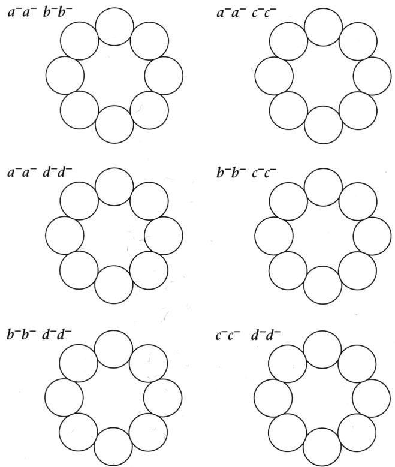

## 网上遗传学

“网上遗传学”(GeNETics)会为你介绍在互联网上寻找遗传学信息的某些最重要的站点。要浏览这些站点，请访问为《遗传学：基因和基因组分析》(第八版)配备的 Jones and Bartlett 公司配套站点http://biology.jbpub.com/book/genetics/8e/。

在该站点中，你会找到一个按章列出的重点关键词列表。选择某个关键词后，可链接到某个网站，其中包含与此关键词相关的信息。
