# 第 14 章 突变和 DNA 修复的分子机制

由于单个显性突变的作用，曼克斯猫天生没有尾巴。( $^{©}$ Cheryl Kunde/Shutterstock, Inc.)

本章提纲

14.1 突变的类型

14.2 突变的分子基础

14.3 转座因子

14.4 自发突变

14.5 诱变因素

14.6 DNA 修复的机制

14.7 回复突变和抑制基因突变

联系：情有独钟

芭芭拉·麦克林托克，1950玉米中可变基因座的起源和行为
联系：X 射线之惑
赫尔曼·马勒，1927
基因的人工诱变

联系：在不稳定重复序列中的复制滑移米什莱恩·斯特兰德、托马斯·普罗拉、迈克尔·利斯凯和托马斯·皮特斯，1993影响DNA错配修复的突变使酵母的简单重复序列片段不稳定

## 学习目标与科学能力

理解突变和 DNA 修复的分子机制，便可具备下面的科学能力。

\- 能指出自发突变和诱发突变、种系突变和体细胞突变、条件突变和无条件突变、功能失去突变和功能获得突变的差别。

\- 能解释为什么在密码子第一或第二位的核苷酸置换更有可能导致的是非同义突变而不是同义突变，为什么在第三位的转换突变比颠换突变更有可能导致同义突变。

■ 能叙述影印培养实验，该实验证明抗体抗性突变可在缺乏抗体的情况下出现，因而突

变的发生与它们对机体是否有利没有关系。

\- 能预测以碱基类似物、X射线或紫外线处理细胞时，可能出现的突变类型。

\- 能指出错配修复和核苷酸切除修复的差别，并能解释为什么错配修复对于 DNA 复制的准确性更加重要。

\- 能叙述修复从胞嘧啶产生尿嘧啶的脱氨作用和从5-甲基胞嘧啶产生胸腺嘧啶的脱氨作用的主要机制，并能解释为什么这些机制不一样。

突变 (mutation) 是基因中任何可遗传的改变。本章在分子水平上考察突变的本质。考察突变怎样发生，以及它们对基因和基因表达有什么作用。尽管突变可自发产生，但也可用损伤核苷酸或在多核苷酸链中产生断裂的辐射和各种各样的化学试剂来诱导。大多数类型的 DNA 损伤发生之后紧接着就会被特殊的修复酶校正。因而，在任何世代中传递的新突变，都是少数逃脱修复的 DNA 损伤。

## 14.1 突变的类型

突变可在任何时候、任何细胞中发生。其表型效应的变化范围，从仅能用分子方法检测到的微小改变(例如，DNA多态性)，到导致细胞或生物体死亡的基本生物过程中的巨大变化。

## ■ 种系突变和体细胞突变

可用多种方式对突变进行分类(表 14.1)。大多数突变是自发的，即它们在没有任何已知原因的情况下出现。突变也可通过化学试剂或辐射导致的 DNA 损伤而引起。在多细胞生物中，一种重要的区分依据是突变最早出现的细胞类型。在最终形成配子的细胞中出现的突变，为种系突变(germ-line mutation)，其他所有的突变为体细胞突变(somatic mutation)。体细胞突变产生在基因型上由正常组织和突变型组织混合形成的(嵌合的，mosaic)生物体，对于许多显性突变，在表型上也是嵌合体。因为种系没有受到影响，所以体细胞突变不能传递给后代，因而可能不适于进行遗传分析。但是，在高等植物中，体细胞突变常常能够用营养繁殖的方法进行繁殖，而不用经过种子繁殖阶段，这些方法包括嫁接和扦插。许多具有重要商业价值的水果是典型的营养繁殖，如蛇果和佛罗里达脐橙。

表 14.1 突变的主要类型及其特征

<table><tr><td>分类依据</td><td>突变的主要类型</td><td>主要特征</td></tr><tr><td rowspan="2">来源</td><td>自发突变</td><td>在缺乏已知诱变因素的情况下发生</td></tr><tr><td>诱发突变</td><td>在存在已知诱变因素的情况下发生</td></tr><tr><td rowspan="2">细胞类型</td><td>体细胞突变</td><td>发生在非种系中</td></tr><tr><td>种系突变</td><td>发生在种系中</td></tr><tr><td rowspan="2">表达</td><td>条件突变</td><td>只在限制性条件下表达(例如,高温)</td></tr><tr><td>无条件突变</td><td>在允许条件及限制性条件下都表达</td></tr><tr><td rowspan="4">对功能的作用</td><td>功能失去突变(敲除突变、无效突变)</td><td>消除正常功能</td></tr><tr><td>亚效基因突变(渗漏突变)</td><td>减少正常功能</td></tr><tr><td>超效基因突变</td><td>增加正常功能</td></tr><tr><td>功能获得突变(异位表达)</td><td>在不正确的时间或在不恰当的细胞类型中表达</td></tr><tr><td>分子变化</td><td>核苷酸置换</td><td>双链DNA中的一个碱基对被一个不同的碱基对置换</td></tr><tr><td rowspan="8">对翻译的作用</td><td>转换</td><td>嘧啶(T或C)置换为嘧啶,或嘌呤(A或G)置换为嘌呤</td></tr><tr><td>颠换</td><td>嘧啶(T或C)置换为嘌呤,或嘌呤(A或G)置换为嘧啶</td></tr><tr><td>插入</td><td>存在一个或多个额外的核苷酸</td></tr><tr><td>缺失</td><td>缺失一个或多个核苷酸</td></tr><tr><td>同义突变(沉默突变)</td><td>编码的氨基酸不改变</td></tr><tr><td>错义突变(非同义突变)</td><td>编码的氨基酸改变</td></tr><tr><td>无义突变(终止突变)</td><td>产生翻译终止密码子(UAA、UAG或UGA)</td></tr><tr><td>移码突变</td><td>将密码子的三联体阅读从正常的相位移开</td></tr></table>

## ■ 条件突变

其效应可任由实验者打开或关闭的突变，属于对遗传分析最有用的突变，这些突变称为条件突变(conditional mutation)，因为它们在一组环境条件(称为限制性条件，restrictive condition)下产生表型的改变，但在另一组环境条件(称为允许条件，permissive condition)下不产生表型的改变。例如，温度敏感突变(temperature-sensitive mutation)是一种条件突变，其表达取决于温度。通常，限制性温度较高(在果蝇中是29℃)，在温度高于此临界温度时，生物体表现出突变表型；允许温度较低(在果蝇中是18℃)，在允许条件下，表型为野生型或近乎野生型。含氨基酸置换的蛋白质往往是温度敏感的。在允许条件下，蛋白质正常折叠，几乎正常地发挥功能，但在限制性条件下，蛋白质不稳定，易变性。温度敏感的氨基酸置换常被用来在限制性条件下阻断特定的生化途径，以检测在不同的细胞过程(如DNA复制)中该途径的重要性。

温度敏感性的一个例子见于暹罗猫中，这种猫具端部黑色的爪子、耳朵和尾巴(图 14.1)。在这一品种中，在黑色素沉积途径中，有一种酶是温度敏感的。该途径在正常体温下被阻断，身体的大部分温度较高，因而覆盖这些部分的毛缺乏黑色素。腿、耳朵、口鼻部和尾巴的端部比身体的其余部分冷，因此色素沉积在这些区域。

## ■ 按功能分类

也可按突变影响基因表达的方式对其进行分类。主要类别如下所述。这些类别的经典术语由赫尔曼·马勒于1931年提出，但它们中的大多数已被现代的对应词取代。本书将使用现代术语。

\- 功能失去突变 (loss-of-function mutation) 是导致基因完全失活或完全无功能的基因产物的突变。例如，基因的全部或部分缺失，以及使蛋白质失活的氨基酸置换。功能失去突变也称为无效突变 (null mutation) 或敲除突变 (knockout mutation)。在马勒所用的术语中，也称作无效基因突变 (amorphic mutation)。

  
图 14.1 邧罗猫, 示色素沉积的独特模式。(©Oleg V. Ivanov/Shutterstock, Inc.)

\- 减少但未消除基因表达水平或基因产物活性的突变称为亚

效基因突变(hypomorphic mutation)。亚效基因突变通常由阻止蛋白质在正常水平上产生的核苷酸置换，或损害蛋白质功能的氨基酸置换所致。这类突变有时被称作渗漏(leaky)突变。该术语的根据是，因为表达水平或活性随机地因个体而异，所以少数个体有足够的酶活性“渗漏”出来，产生拟正常表型(quasi-normal phenotype)。与亚效基因突变相反的是超效基因突变(hypermorphic mutation)。正如前缀“hyper”（“超过”、“过度”）的意思，超效基因突变体产生高于正常的基因表达水平，通常是因为突变改变了基因的调节，以致基因产物过度生产。氨基酸置换也可增加酶或其他蛋白质的活性，但这很少见。

\- 功能获得突变(gain-of-function mutation)是一种在性质上改变基因作用的突变。例如，功能获得突变可使某个在正常情况下在某种细胞或组织中没有活性的基因，变得有活性。也可造成某个在正常情况下在发育的某段时间内野生型基因不表达的基因，进行表达。大多数功能失去突变和亚效基因突变是隐性的，但许多功能获得突变是显性的。马勒给功能获得突变的术语是新效基因突变(neomorphic mutation)。

野生型基因在异常位置的表达称为异位表达(ectopic expression)。图 13.35 中有一个例子，果蝇 eyeless 基因的野生型基因产物，于正常情况下不形成眼睛的组织中表达，造成在异常位置发育出含眼色素的部分复眼。

## 14.2 突变的分子基础

所有突变都是 DNA 的核苷酸顺序改变或基因组中 DNA 序列的缺失、插入或重排的结果。染色体重排的主要类型在第 8 章中已讨论。此处在分子水平上考察突变。

## ■ 核苷酸置换

在分子水平上，最简单的突变类型是核苷酸置换(nucleotide substitution)，即 DNA 双链体中的一对核苷酸被置换成一对不同的核苷酸。例如，在一个 A→G 置换中，一条 DNA 链上的一个 A 被置换成 G。该置换暂时形成一个错配的 G-T 碱基对；在下一次复制时该错配分解，在一个子代分子中为正常的 G-C 碱基对，在另一个子代分子中为正常的 A-T 碱基对。在此情况下，G-C 碱基对是突变碱基对，而 A-T 碱基对是非突变碱基对。同样，在一个 A→T 置换中，一条链中的一个 A 被 T 置换，产生暂时的 T-T 错配，该错配通过复制而分解，在一个子代分子中成为 T-A，在另一个子代分子中成为 A-T。在此情况下，T-A 碱基对是突变碱基对，而 A-T 碱基对是非突变碱基对。这里的 T-A 和 A-T 是不相同的，从两条链的核苷酸极性可以看出，5'-T-3'/3'-A-5' 是一种碱基配对，5'-A-3'/3'-T-5' 是另一种碱基配对。

有些核苷酸置换是一个嘧啶碱基被另一个嘧啶碱基置换，或一个嘌呤碱基被另一个嘌呤碱基置换，这些置换称为转换突变 (transition mutation)。可能的转换突变有

$$
\begin{array}{r l}&{\mathrm{T} \rightarrow \mathrm{C} \text {或} \mathrm{C} \rightarrow \mathrm{T}}\\&{(\text {嘧啶} \rightarrow \text {嘧啶})}\\&{\mathrm{A} \rightarrow \mathrm{G} \text {或} \mathrm{G} \rightarrow \mathrm{A}}\\&{(\text {嘌呤} \rightarrow \text {嘌呤})}\end{array}
$$

其他的核苷酸置换是嘌呤置换嘧啶，或相反，这些置换称为颠换突变(transversion mutation)。
可能的颠换突变有

$$
\begin{array}{r l}&{\mathrm{T} \rightarrow \mathrm{A}, \mathrm{T} \rightarrow \mathrm{G}, \mathrm{C} \rightarrow \mathrm{A} \text {或} \mathrm{C} \rightarrow \mathrm{G}}\\&{\quad (\text {嘧啶} \rightarrow \text {嘌呤})}\\&{\mathrm{A} \rightarrow \mathrm{T}, \mathrm{A} \rightarrow \mathrm{C}, \mathrm{G} \rightarrow \mathrm{T} \text {或} \mathrm{G} \rightarrow \mathrm{C}}\\&{\quad (\text {嘌呤} \rightarrow \text {嘧啶})}\end{array}
$$

总共有 4 种可能的转换和 8 种可能的颠换。因此，如果核苷酸置换是严格随机的，那么，可以预计转换与颠换的比例为 1:2。但是，

自发的核苷酸置换往往比转换偏多。在人类基因组的自发核苷酸置换中，转换与颠换的比例约为2∶1。考察遗传密码表(表1.1)可见，转换偏多对于密码子第三位的核苷酸置换有重要意义。在第三位为嘧啶的所有密码子中，处在第三位的是哪一个嘧啶都没有关系；同样，在以嘌呤结束的大多数密码子中，以两种嘌呤中任何一种结束都行。这意味着在密码子第三位的大多数转换突变不改变所编码蛋白质中的氨基酸。改变核苷酸序列但不改变氨基酸序列的突变称为同义突变(synonymous mutation)或沉默突变(silent mutation)，因其将一个密码子变成相同氨基酸的“同义”密码子。

在编码区之外的核苷酸中的突变性变化也可是沉默突变。大多数 DNA 多态性属于此类。在非编码区包括调节区和基因之间的 DNA 中，精确的核苷酸序列往往并不是关键。这些序列可发生碱基置换、小的缺失或添加、转座因子的插入及其他重排，然而这些突变可没有可检测的表型效应。但是，有些非编码序列确实具有极其重要的功能，因而在这些序列中的突变常具有表型效应。

## - 错义突变：以镰形细胞贫血为例

在编码区内的大多数核苷酸置换会导致氨基酸改变，这些突变称为错义突变(missense mutation)或非同义突变(nonsynonymous mutation)。蛋白质氨基酸序列的改变可能会改变蛋白质的生物学性质。单个氨基酸改变的表型效应的经典例子，是造成人类遗传病镰形细胞贫血(sickle-cell anemia)的改变。镰形细胞突变的分子基础如图14.2所示。

这只猫为鸳鸯眼(眼睛颜色的嵌合体)。这种嵌合现象通常是在产生虹膜色素层的细胞谱系中，影响眼睛颜色的某个基因发生体细胞突变的结果。

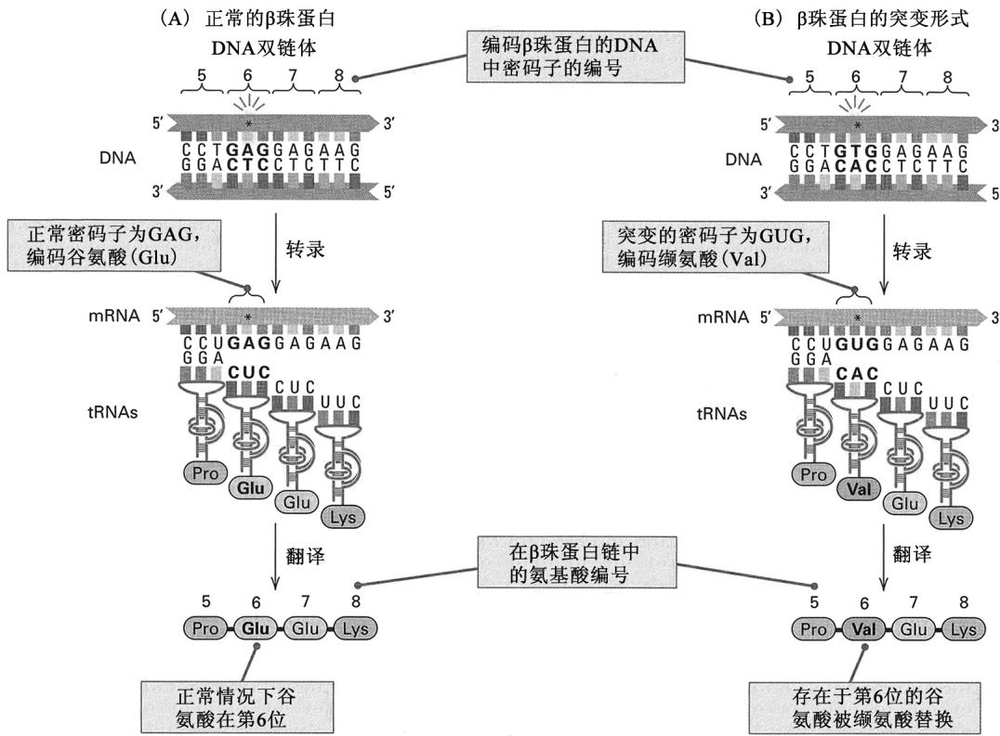  
图 14.2 镰形细胞贫血的分子基础。(A) 正常 β 珠蛋白基因的部分 DNA 被转录成编码氨基酸序列 Pro-Glu-Glu-Lys 的 mRNA。在有记号的 A-T 碱基对中，T 被转录为 Glu(谷氨酸) 密码子 GAG 中的 A。(B) 正常的 A-T 碱基对突变为 T-A 碱基对，导致 GAG 被 GUG 替代。密码子 GUG 编码 Val(缬氨酸)，因此，β 珠蛋白分子这一部分的多肽序列为 Pro-Val-Glu-Lys。所产生的血红蛋白有缺陷，在低氧浓度下往往会聚合。

该突变是编码血红蛋白 $\beta$ 珠蛋白链第 6 个氨基酸的密码子的第二位的 A-T→T-A 的颠换，导致正常的谷氨酸 (Glu 或 E) 被缬氨酸 (Val 或 V) 置换。因而该氨基酸置换以 Glu6Val 或 E6V 表示。当镰形细胞等位基因纯合时，有缺陷的 $\beta$ 多肽链使血红蛋白具有形成长的针状聚合物的倾向。发生聚合的红细胞变形为新月形、镰刀形。有些变形的红细胞立即遭到破坏 (降低血液的携氧能力，从而导致贫血)，而其他的被困在毛细血管中，引起毛细血管循环的部分或全部阻断。

Glu6Val 置换的后果是一系列复杂的多效性效应。所有这些效应都与红细胞的瓦解、血液携氧能力的下降，或身体试图弥补该病而进行的生理调节(如脾大)有关。镰形细胞贫血患者会受阵阵剧痛的折磨。贫血导致生长障碍、虚弱和黄疸。患者普遍因虚弱而容易受细菌感染，这是该病患儿最常见的死因。

虽然镰形细胞贫血是一种严重的遗传病，常常导致夭亡，但是，在非洲和中东一些由原生动物寄生虫恶性疟原虫(Plasmodium falciparum)引起的一种疟疾广泛流行的地区，该病比较常见。镰形细胞贫血和疟疾之间的这种关联不是巧合。这种关联缘于突变型β血红蛋白能在一定程度上抵御疟疾感染。在恶性疟原虫的生活周期中，它通过蚊子的叮咬从蚊传给人。感染初期发生在肝细胞中，产生能感染红细胞并在其中增殖的特化形式。红细胞被广泛感染，损害血液携氧的能力，引起虚弱、贫血和疟疾特有的黄疸。但是，在镰形细胞等位基因杂合的人中，感染疟疾的可能性较低，即使感染疟疾也不太严重。杂合镰形细胞基因型的这种部分抗性，在镰形细胞贫血这种遗传病的患病率和疟疾这种寄生虫病的患病率之间产生一种遗传平衡。如果突变型镰形细胞血红蛋白变得过于频繁，则因镰形细胞贫血丧生的人，比因抵御疟疾而免于丧生的人多；另外，如果突变型镰形细胞血红蛋白变得过于罕见，则因镰形细胞贫血丧生的人较少，但免于死亡的人数，因疟疾造成更多的死亡而抵消。这种遗传平衡行为的最终结果，将在第17章中从数量方面来讨论。

与 Glu6Val 置换相比，在血红蛋白中的一些氨基酸置换对表型的影响是微小的。其他蛋白质对氨基酸置换往往也是耐受的。特定的氨基酸置换是否影响蛋白质的折叠、功能或稳定性，因蛋白质和氨基酸而异，其影响取决于该氨基酸在蛋白质结构和功能上的具体作用，以及氨基酸置换的性质。例如，一个亲水性氨基酸被另一个亲水性氨基酸置换，比一个亲水氨基酸被一

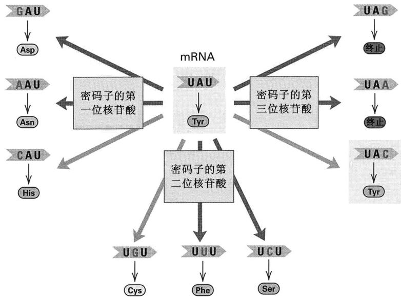  
图 14.3 酪氨酸密码子 UAU 中单个碱基改变可产生的 9 种密码子。蓝色箭头示颠换，灰色箭头示转换。酪氨酸密码子在方框中。2 个可能的终止 (无义) 密码子以红色显示。UAU 密码子总共有 6 种可能的错义突变、2 种可能的无义突变和 1 种沉默突变。

个疏水氨基酸置换的影响要小。在酶活性位点上的任何改变通常都会使酶活性降低。

图 14.3 示酪氨酸密码子 UAU 中单个核苷酸置换可产生的 9 种可能的密码子，按密码子中第一、第二或第三个核苷酸是否突变的顺序排列。1 个突变是沉默突变(方框)，6 个是改变了插入多肽链的氨基酸的错义突变，另外 2 个突变产生终止密码子，导致翻译提前终止，从而产生截短多肽。产生新的终止密码子的核苷酸置换称为无义突变(nonsense mutation)。因为无义突变引起链终止提前，残存的多肽片段几乎总是无功能的。

## - 插入、缺失和移码突变

在 DNA 中也可发生核苷酸的插入或缺失，但以远低于核苷酸置换的频率发生。在哺乳动物基因组中，大多数插入和缺失都很小(通常 1～6 个碱基对)，但有些大到足以除去整个基因或部分染色体(参见第 8 章)。如果它们发生在编码区之外，小的插入或缺失对表型的作用可能微乎其微，除非它们影响邻近基因的表达。

在编码区内，若刚好插入或缺失3个核苷酸，则在所编码的多肽链中增加1个氨基酸，或从多肽链中消除1个氨基酸，因为3个核苷酸是一个密码子的长度。6个核苷酸的插入或缺失增加或消除2个氨基酸，9个核苷酸的插入或缺失增加或消除3个氨基酸。一般而言，倘若插入或缺失的核苷酸数目是3的整数倍，则在多肽链中增加或消除一定数量的氨基酸。

如果插入或缺失的长度不是 3 个核苷酸的整数倍，则突变会使核糖体阅读三联体密码子的相位移位，从而改变从突变位点起下游的所有氨基酸，这样的突变称为移码突变 (frameshift

## mutation)，因为它们“移动”

了 mRNA 中密码子的阅读框。一种常见的移码突变是单核苷酸的插入或缺失。图 14.4 示人类 β 珠蛋白基因中单核苷酸插入的一个例子，其中，(A) 为野生型序列，而 (B) 是突变型序列，在辉光的位置有一个 C-G 核苷酸对的插入。该插入的结果是，从发生插入的这个密码子开始，多肽的全部氨基酸序列都被改变，因为阅读框被移位，在此例中，位移量为 +1。在移位的阅读框中，翻译继续进行，直到碰上一个终止密码子。(完全随机的核苷酸序列，预计在遇到终止密码子之前，翻译只能持续大约 20 个氨基酸。) 任何不是 3 的整数倍个核苷酸的插入或缺失，都会造成移位的阅读框，从而使插入或缺失下游的所有氨基酸与原

  
图 14.4 (A) 人类 β 珠蛋白基因的一小部分, 编码多肽链 5 \~ 8 位氨基酸。(B) 移码突变的结果(在此例中, 移码突变是在 “辉光” 所示的位置插入一个 C-G 核苷酸对)。因为阅读框的移位, 从突变位点开始, 下游所有的密码子都被改变, 所以从这一位点开始, 所有的氨基酸序列都不同。

来的不同。除非移码突变非常靠近蛋白质的羧基端，否则它几乎总是导致无功能蛋白质的合成。

## ■ 三核苷酸重复序列的动态突变

对某种 X 连锁型智力障碍的遗传学研究，揭示出一类出乎意料的突变，因为这类突变所涉及 DNA 区域在遗传上异常不稳定性，所以将其称为动态突变 (dynamic mutation)。这种 X 连锁疾病是与动态突变相关的至少 12 种遗传病中的一种，它与一种 X 染色体相关，这种 X 染色体在缺乏 DNA 前体 (如核苷酸) 的培养细胞中有断裂的倾向。断裂位点在 Xq27.3 区域，靠近长臂末端。含该位点的 X 染色体称为脆性 X (fragile-X) 染色体，相关的智力障碍类型称为脆性 X综合征(fragile-X syndrome)。约 1/2500 的男性和 1/5000 的女性罹患脆性 X 综合征。脆性 X 综合征占所有 X 连锁智力障碍病例的一半左右，并且是仅次于唐氏综合征(参见第 8 章)的遗传性智力障碍的原因。

脆性 X 综合征在严重程度上高度可变。男性患病时，情况通常比女性严重。常见语言及沟通能力上的发育迟滞，以及诸如坐起来和学走路之类的大运动技能的发育迟滞。体征可包括具有招风耳的长脸、结缔组织疲软导致的肌张力低下和关节过度灵活，以及在男性青春期后期异常的大睾丸。智力障碍在男性中通常为中度，在女性中为轻度。在行为上的影响包括焦虑、集中注意力困难、应对感觉刺激困难、逃避目光接触、易怒或情绪失控。这些症状是非特异性的，与自闭症和注意力缺陷多动症等疾病部分重叠。

  
图 14.5 示脆性 X 综合征传递的系谱。男性 I-2 未患病，但他的两个女儿 (II-2 和 II-5) 生育患病的子女和孙子女。[改编自 C. D. Laird, Genetics 117 (1987): 587-599.]

脆性 X 综合征反常的遗传方式提示其有不同寻常之处，这种遗传方式的主要特点如图 14.5 所示。携带脆性 X 染色体的男性，5 个中约有 1 个其本身表型正常，并且也生育表型

正常的子女。但这种 “男性传递者” (transmitting male) 的杂合的女儿，生育的患儿中常常两种性别都有。在图 14.5 中，以 I -2 表示的男性传递者无病，但他传给他的两个女儿 (II -2 和 II -5) 的 X 染色体，在这两位女性中以某种方式发生改变，以致下一代 (III) 的儿子和女儿患病。该男性传递者的患病或正常孙子女，都有可能生育患病后代 (IV代)。

现已找到脆性 X 综合征的分子基础是 DNA 中存在于断裂发生位点的一个 CGG 型(或者另一条链上的 CCG，这是等价的)三核苷酸重复序列(trinucleotide repeat)(图 14.6)。正常的 X 染色体有 6～54 个重复单位的拷贝，平均约 30 个，而患者有 230～2300 甚至更多的重复拷贝。男性传递者 X 染色体中的三核苷酸重复序列称为前突变(premutation)，具有中等拷贝数，为 52～230。约 1/250 的女性和 1/800 的男性携带一条具有前突变的 X 染色体。三核苷酸前突变的特点是，当(且仅当)被女性传递时，它的拷贝数常常会增加(称为三核苷酸扩展，trinucleotide expansion)到 230 或更多个拷贝的水平，在此状态下的染色体引起脆性 X 综合征。通过男性传递时，不发生扩展。

该病的功能基础是，过多的 CGG 重复拷贝数使 FMR1 (fragile-site mental retardation-1，脆性位点智力障碍-1) 基因失去功能，CGG 重复序列就在 FMR1 中。大多数脆性 X 综合征患者没有 FMR1 mRNA，而正常人和携带者却有该基因的表达。FMR1 基因主要在脑和睾丸中表达，这就解释了男性患者中在智力异常和睾丸异常之间奇怪的联系。

女性传递的前突变发生扩展的概率约为 $80\%$ 。令人惊讶的是，扩展不是发生在母亲的种系中，而是发生在早期胚胎的体细胞中。在不同的体细胞中，扩展在不同的程度上发生，因而患有脆性X综合征的个体是体细胞嵌合体，具有在X染色体中的CGG重复序列拷贝数不同的细胞。这解释了为什么不同患者，脆性X综合征在严重性上的变异极大。

  
图 14.6 存在于与脆性 X 综合征有关的 FMR1 基因中的 CGG 重复序列的动态突变。(A)野生型等位基因通常有 30 个重复拷贝。(B)前突变有 60～200 个拷贝，通过女性传递时，前突变容易进一步扩展。(C)全突变，含 >230 个拷贝。在全突变中，该基因转录的缺乏与该区域中某些 CG 二核苷酸的甲基化相关。

其他与动态突变相关的遗传病，包括神经系统疾病强直性肌营养不良(19号染色体，具有不稳定的CTG重复序列)、肯尼迪病(X染色体，AGC重复序列)、弗里德赖希共济失调(9号染色体，AAG)、I型脊髓小脑性共济失调(6号染色体，AGC)和亨廷顿病(4号染色体，AGC)。对脆性X综合征和强直性肌营养不良而言，三核苷酸扩展主要或完全发生于女性传递时，但对于I型脊髓小脑性共济失调和亨廷顿病，它们主要或完全发生于男性传递时。有些三核苷酸重复序列在两种性别传递时都可发生扩展。

有些动态突变还表现出一种称为遗传早现(anticipation)的现象，其中，随着三核苷酸重复序列经过数代的传递，核苷酸重复的数目逐渐增加。其结果是发病年龄随着时间增加而逐渐提前，病情加剧。

三核苷酸扩展的分子机制如图 14.7 所示，该过程称为复制滑移(replication slippage)(也称为滑链错配，slipped-strand mispairing)。当复制沿着含有重复序列的模板链进行时(图 14.7A)，复制复合体会暂时与模板链分离。在与模板重新结合时，新链的 3'端沿模板折返，与上游的一组重复序列配对(图 14.7B)。复制从这点开始继续往下进行(图 14.7C)，从而有些重复序列会被复制两次(被扩展)，被扩展的程度取决于复制复合体在重新结合时折返了多远。模板链和子链不能正常配对，因为它们有不同的重复拷贝数，但这种状况可被核苷酸切除修复系统校正(14.6节)，修复的一个结果是，扩展的区域被导入模板链中(图 14.7D)。虽然现在已知动态突变的机制，但还不知道为什么基因组中的一些三核苷酸重复在遗传上不稳定，而其他的三核苷酸重复是稳定的，也不知道为什么三核苷酸前突变状态是唯一容易发生扩展的，而拷贝数仅仅略少一点的染色体在遗传上却是稳定的。

<!-- END OFFICIAL API PART part_005 -->

<!-- BEGIN OFFICIAL API PART part_006 -->

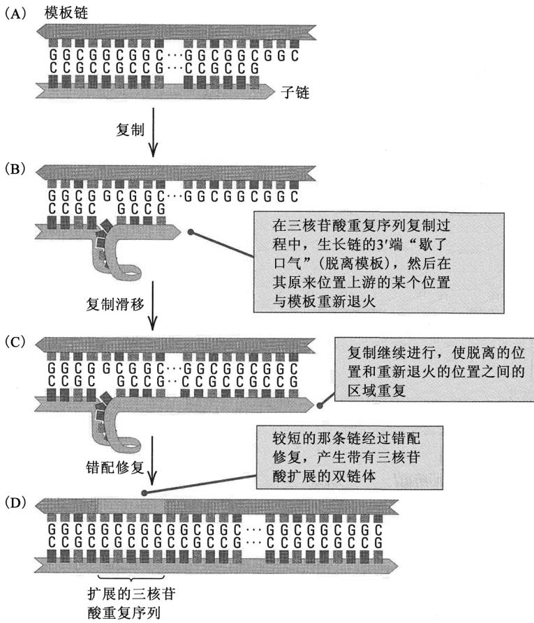  
图 14.7 复制滑移模型。

## 胞嘧啶甲基化与基因失活

FMR1 失活的分子机制与 FMR1 5' 区域中某些胞嘧啶核苷酸各被酶促添加一个甲基 ( $—CH_{3}$ ) 有关(图 14.6)。在第 11 章讨论基因调节时已知，胞嘧啶甲基化发生在许多高等真核生物的一小部分胞嘧啶核苷酸中。在哺乳动物中，胞嘧啶甲基化偏好发生在 CG 二核苷酸处，因而，在 FMR1 扩展区域中，每个 CGG 重复含有一个潜在的甲基化位点。高密度甲基化的 CG 二核苷酸，通常与受累基因的转录阻遏有关。就 FMR1 而言，在患病个体内该基因的转录缺乏，与扩展的 CGG 重复序列的甲基化，以及附近的其他 CG 二核苷酸甲基化的增加有关。

FMR1 蛋白质有什么作用？这种蛋白质被称作 FMRP(脆性 X 智力障碍蛋白，fragile-X mental retardation protein)，是一种与 mRNA 结合的 RNA 结合蛋白，调节 mRNA 翻译为蛋白质的过程，或调节 mRNA 在细胞质中的定位，或两者皆调节。FMRP 并非与所有的 mRNA 分子都结合，而仅仅与一小群特殊的 mRNA 结合，这些 mRNA 含精巧布置的鸟嘌呤核苷酸，以使 RNA 分子形成环而折叠回自身时，这些鸟嘌呤能够以 4 个一组的方式进行碱基配对(图 14.8)。以这种方式通过 4 个鸟嘌呤核苷酸配对形成的构型称为鸟嘌呤四联体(G quartet)，或称 Hoogsteen 碱基配对(Hoogsteen base pairing)，但后面这种说法不太常见。图 14.8B 示从顶部观察鸟嘌呤四联体的一个简化形式，这些鸟嘌呤之间氢键结合的细节如 C 部分所示。

在脑部，含鸟嘌呤四联体的 mRNA 分子通常编码在面部骨骼和神经系统发育中起作用的蛋白质，或编码在学习和记忆中起作用的蛋白质。这些蛋白质多为突触蛋白，在一个神经元的轴突(输出信号)和相邻神经元的树突(输入信号)之间的接触点起作用。脆性 X 综合征的症状与这些功能一致，并且已经证明含鸟嘌呤四联体的 mRNA 在脆性 X 综合征患者中调节异常。

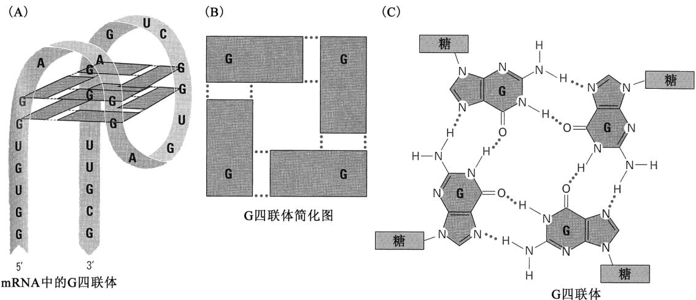  
图 14.8 含一个鸟嘌呤四联体的某种 mRNA 的一部分，该四联体作为 RMRP 结合和调节的靶点。(A) mRNA 折叠回自身时形成鸟嘌呤四联体。(B) 鸟嘌呤四联体顶面观。(C) 一个鸟嘌呤四联体中的氢键结合。

联系：情有独钟

芭芭拉·麦克林托克，1950

冷泉港实验室，冷泉港，纽约

玉米中可变基因座的起源和行为

许多遗传学家认为麦克林托克的转座因子论文很费解。她首次发现，基因可在基因组中从一处移到另一处。她没有现成的术语来讨论这样的事情，因此她不得不改变传统术语的用法，来描述独特的情况。我们现在称为“转座因子”，并认为广泛存在于生物中的，麦克林托克称为“染色质因子”。麦克林托克是一流的遗传学家和细胞遗传学家，也许是她那一代中最好的。在用遗传学手段追踪转座因子的过程中，麦克林托克独具匠心地设计了一些杂交，这些杂交有时相当复杂。她的写作风格也是独特的麦克林托克式的。下面的节选就是一个很好的例子。这是丝丝入扣的观察与假设、实验与结果、诠释与演绎。麦克林托克于1983被授予诺贝尔奖。下面的节选涉及Ds(解离因子)和Ac(激活因子)的发现。在现代术语中，我们将Ac称为自主转座因子(autonomous transposable element)，因其编码其自身转座所需的所有蛋白质；Ds是非自主转座因子(nonautonomous transposable element)，因为它需要Ac为它提供转座所需的蛋白质。

在旨在揭示9号染色体短臂基因组成的一项实验过程中，在玉米中极少出现(或认出)的一种现象，在培养物中开始以非常高的频率出现。已有可变基因、不稳定基因、花斑现象、镶嵌现象和可变基因座等术语被用到该现象上。现已认识到这种现象可发生在多种多样的生物中。……在可变基因座的早期研究中，得到一项幸运的发现，它在显示与可变基因座的起源和行为相关的各种事件上，被证明具有独特的重要性。在9号染色体短臂上发现一个基因座，在体细胞中，在该基因座处可出现断裂。在该Ds(Dissociation，解离因子)基因座出现断裂事件的时间和频率，似乎与某些可变基因座出现诱变事件的时间和频率一样。对Ds基因座的大量研究已证明这种关系的原因，并得到了解释发生在可变基因座的这些事件的必要资料。结论是：此类基因座在表型表达上的改变与一个染色质因子的改变有关，而与该基因自身组成上的改变无关；当此类染色质在毗邻受影响基因之处插入时，就会产生可变基因座。……Ds基因座即由此类物质组成。已观察到在Ds基因座处发生的事件所致的不同类型的变异。……它们涉及染色体的断裂和融合。但是，这些断裂与发生在染色体中这一特定基因座——Ds基因座——的事件有关。……(在已知事件中，)在染色体组中，Ds活性从一个位置转座到另一个位置，可与显著的染色体重排相关，也可以不相关。……在Ds的转座事件中，可出现一些新的可变基因座。……有一次，转座的Ds基因座出现在一株玉米的单个配子中，该植株的9号染色体上有一个显性等位基因C(彩色糊粉层)。……Ds的新位置与C的已知位置一致。……很明显，Ds活性在这个新位置的出现与C基因座正常作用的消失有关。所产生的表型与已知隐性等位基因c所产生的表型相同。……在此情况下，这种c表型与Ds在C基因座的出现相关，就变得显而易见了，因为当发生从c表型到C表型的突变的同时，Ds的作用也消失了。……对c基因座的这种突变的起源和行为，解释如下：由Ds组成的染色质在毗邻C基因座之处的插入，是C的作用被完全抑制的原因。可出现该外源染色质被去除的情况。在许多情况下，与这种去除相关的机制使以前的基因组织和作用恢复。……这种突变产生机制只与 Ds 有关。在 C 基因座未发生基因突变；其作用的恢复是由于抑制性的 Ds 染色质的去除。……Ds(的移动)需要一个激活因子。该激活因子已被命名为 Ac。……Ac 表现出在一般遗传因子的研究中从未表现出的一个非常重要的特点。该特点与 Ds 所表现出来的特点相同。在染色体组中，发生 Ac 从一个位置到另一个位置的转座，很多时候是从一条染色体到另一条染色体。……同样，如同 Ds 的情况一样，在 Ac 基因座处也可出现状态上的改变。……应该强调的是，当细胞核中不存在 Ac 时，在 Ds 处不会出现诱变事件。

来源：B. McClintock, Proc. Natl. Acad. Sci. USA 36 (1950): 344-355.

## 14.3 转座因子

20 世纪 40 年代，在一项玉米籽粒色斑的遗传学研究中(图 14.9)，芭芭拉·麦克林托克发现一种不仅调节色斑，而且引起染色体断裂的遗传因子，她把这种因子称作解离因子

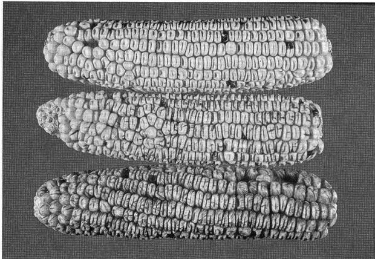  
图 14.9 转座因子 Ds 和 Ac 的存在, 导致玉米籽粒胚乳中紫色和黄色组织的扇区。在有些穗中不同的扇区大小是 Ac 剂量效应的结果。[承威斯康星大学麦迪逊分校荣誉教授杰里·克米克 (Jerry L. Kermicle) 惠赠。]

(Dissociation, $Ds$ )。遗传作图表明，染色体断裂总是发生在 $Ds$ 处，或非常靠近 $Ds$ 。麦克林托克关键的观察结果是， $Ds$ 没有固定的位置，有时候会移到新的位置(转座，transposition)，引起染色体在该新位点断裂。而且， $Ds$ 只在另一个被称为激活因子 (Activator, $Ac$ ) 的因子也存在于同一基因组中时才转移。此外， $Ac$ 自身也可在基因组内移动，并且也可导致其插入位点处或插入位点附近的基因在表达上的改变。自从麦克林托克率先发现转座因子以来，已发现了许多其他的转座因子(transposable element)。根据 DNA 序列的相似性，可将它们分成“家族”。大多数生物的基因组合数个不同的转座因子家族，每个家族有多个拷贝。一旦固定在基因组中，转座因子

就可长期持续存在，并发生众多突变。人类基因组约 $50\%$ 由转座因子构成，后面我们看到，这些转座因子大多是不再能转座的进化遗迹。

## - 转座的分子机制

Ds 转座的分子机制如图 14.10 所示。在此例中，插入片段进入玉米 9 号染色体的野生型 shrunken 基因中，引起敲除突变。该过程一开始，供插入的位点被切割，具交错切口，在每端造成一个 8 个核苷酸的 3'单链突出端(图 14.10A 部分)。突出的 3'端与待插入的 Ds 因子的 5'端连接，在每条链上造成一个 8 个核苷酸的缺口(图 14.10B)。缺口被修复酶填上后，得到一个新的 Ds 插入序列，其两侧被靶序列的 8 碱基对重复包围(图 14.10C)。Ds 因子可以两种方向的任一种方向插入。

存在靶位点重复序列是大多数转座因子插入序列的特征, 它是靶序列被非对称切割的结果。对 $Ds$ 这样的因子而言, 切割靶位点是催化转座的转座酶蛋白的一项功能。每个转座因子家族都有各自的转座酶(transposase), 转座酶决定在靶 DNA 链中产生的两个切口之间的距离。该距离可为 1\~12 个碱基对, 视具体的转座酶而异, 并且该距离决定靶位点重复序列的长度。大多数转座因子具有许多可能的靶位点, 这些靶位点分散在整个基因组中, 并且不同的位点通常

很少或没有序列相似性。

Ds 因子是剪切-粘贴因子 (cut-and-paste element) 这一大类转座因子中的一员，这类因子通过图 14.10 中那样的机制插入。这些因子的特征是存在末端反向重复序列 (terminal inverted repeat)，即在因子两端以相反方向重复的序列。就 Ds 而言，末端反向重复序列长 11bp (图 14.10)，但在其他转座因子家族中，长度可达几百个碱基对。末端反向重复序列通常是有效转座必不可少的，因为它们含有转座酶的结合位点，这些结合位点使转座因子能够被识别和连接进切割后的靶位点。许多转座因子在位于末端重复序列之间的中部区域的序列中编码它们自己的转座酶，因此这些因子能够促使自己转座。转座酶基因已缺失或因突变而失活的因子，只有该家族的另一个编码有功能的转座酶的成员存在于基因组中，为其提供转座酶活性时，该因子才可转座。Ds 因子在没有 Ac 时不能转座，就是在 Ds 中缺乏有功能的转座酶基因的结果。Ac 因子的存在，提供了使得 Ds 因子能进行转座的反式激活作用 (trans-activation)。

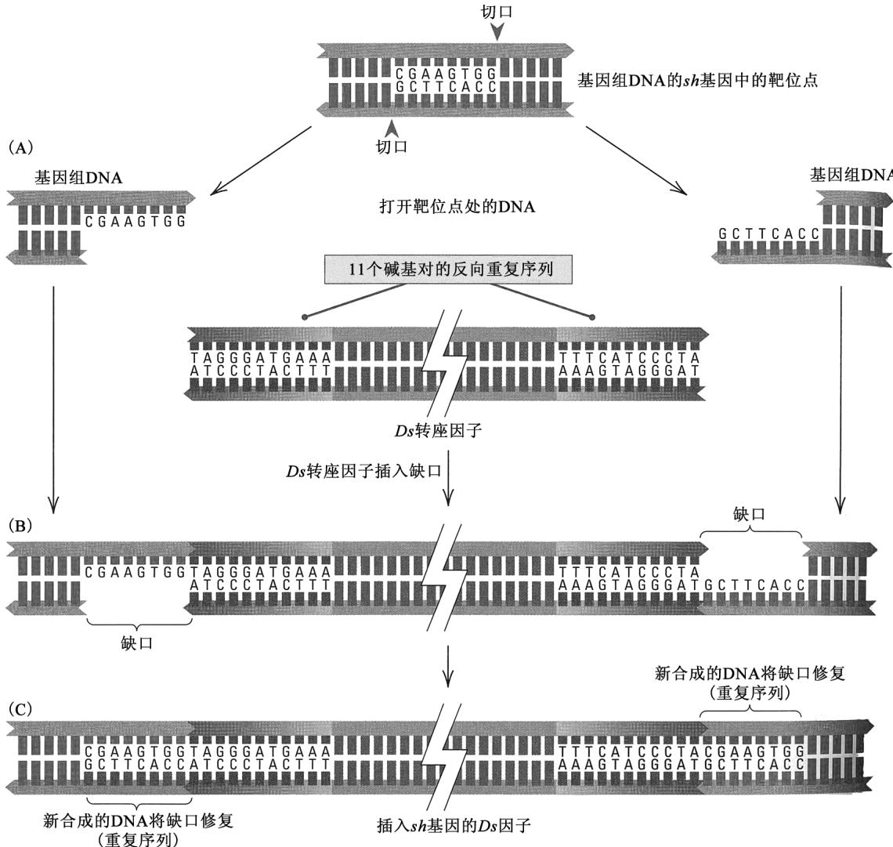  
图 14.10 剪切-粘贴型转座因子(此例中为玉米的 Ds)的序列布局及其插入基因组时发生的改变。Ds 在所示位置被插入玉米的 sh 基因。在插入过程中，紧邻插入位点的一段 8 个碱基对的序列被重复，位于 Ds 因子两侧。

另一大类转座因子具有末端正向重复序列，长度通常为 200～500bp，称为长末端重复序列 (long terminal repeat)，即 LTR。顾名思义，末端正向重复序列是以相同方向存在于因子两端(图 14.11A)，而末端反向重复序列是以相反方向存在于因子两端(图 14.11B)，这些因子称为 LTR反转录转座子(LTR retrotransposon)，因为它们使用RNA转录物作为中间体进行转座。一个典型的LTR反转录转座子是来自果蝇的copia因子，如图14.12所示，在此例中，每个LTR自身都由短的末端反向重复序列包围在两侧。反转录转座子的转座从该因子转录为RNA拷贝开始。在基因编码的蛋白质中，有一种称为反转录酶(reverse transcriptase)的酶，它可用RNA转录物作为模板进行“逆向转录”，产生互补的DNA子链。反转录需要引物。对反转录转座子而言，引物通常是细胞的一种tRNA分子，其3'端与LTR的一部分互补。反转录酶以最初的RNA转录物为模板，在tRNA的3'端连续添加脱氧核糖核苷酸。RNA模板被因子编码的RNase进行单链切割，为第二条DNA链的合成提供引物；第二条DNA链以第一条DNA链为模板合成。以此方式，双链DNA拷贝由RNA转录物产生，然后插入靶位点，插入方式类似于图14.10中所示的机制，不过还要使用因子编码的另一种蛋白质。(我们略掉了许多细节，如引物如何被去除和被DNA替换。)

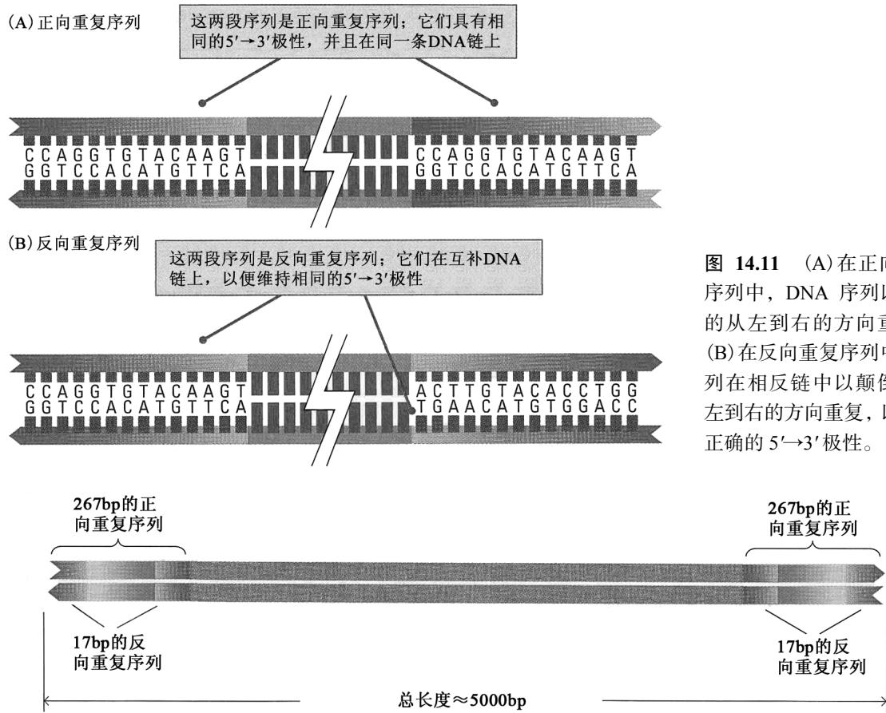  
图 14.11 (A) 在正向重复序列中，DNA 序列以相同的从左到右的方向重复。(B) 在反向重复序列中，序列在相反链中以颠倒的从左到右的方向重复，以维持正确的 $5'\rightarrow3'$ 极性。  
图 14.12 黑腹果蝇 copia 反转录转座子的序列构成。

有些反转录转座子没有末端重复序列，因而称为非 LTR 反转录转座子 (non-LTR retrotransposon)。这一类包括用 LINE (long interspersed element, 长散在元件) 和 SINE (short interspersed element, 短散在元件) 表示的因子。LINE 和 SINE 是哺乳动物基因组中含量最丰富的转座因子类型，虽然也有剪切-粘贴型转座因子和 LTR 反转录转座子。在人类基因组中 SINE 的一个例子是称为 Alu 家族的一组相关序列，称其为 Alu 家族是因其成员含有一个特征性的限制性内切核酸酶 Alu I 的限制性位点。Alu 序列长约 300bp，在人类基因组中有大约 50 万个拷贝。仅 Alu 家族就占人类 DNA 的大约 11%。在许多生物中，不同家族的转座因子构成总基因组中相当大的一部分。

## - 转座因子可为突变的原因

转座因子可引起突变。例如，在果蝇的某些基因中，在具有可见表型效应的所有自发突变中，约有一半是转座因子插入的结果(图 14.13)。孟德尔的豌豆中的皱缩种子突变是转座因子引起突变的另一个好例子。在这个例子中，转座因子是与玉米的 Ac 因子相关的一个剪切-粘贴因子，该因子也产生一个 8bp 的靶位点重复序列。插入位点在分支酶 I (SBE I) 基因中，插入序列产生功能

失去等位基因。大多数转座因子处于基因组的非必需区域中，通常不会引起可检测的表型变异。但当一个因子转座时，它可插入必需区域，扰乱该区域的功能。如果转座作用使一个因子插入DNA的一个编码区，那么插入的因子会打断该编码区。因为大多数转座因子含有自己的编码区，所以要么转座因子的转录妨碍其插入的基因的转录，要么该基因的转录终止于转座因子内。因而插入引起敲除突变。即使转录穿过因子继续进行，表型也会是突变型的，因为这样一来编码区会含有不正确的序列。

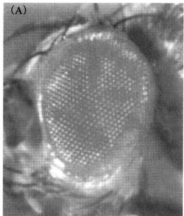

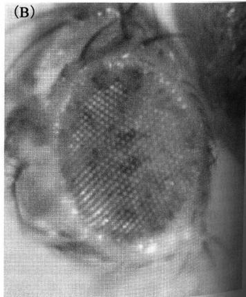  
图 14.13 (A) 在果蝇突变体中的桃红色眼睛是由转座因子 mariner 插入 white 基因的上游调节区引起的，该插入改变了该基因的表达水平。(B) 嵌合型眼睛颜色。红色色斑是由该转座因子的切除引起的，在发生切除的细胞中，转座因子的切除恢复了正常的 white 基因表达。

通过存在于基因组中不同位置的拷贝之间的同源重组，转座因子也可间接导致染色体重排，这种过程称为异位重组(ectopic recombination)，其后果已在第8章中考察过。在同一条染色体中，以相同方向存在的两个拷贝之间的异位重组，导致这两个拷贝之间的物质缺失(图8.13)；而在同一条染色体中，以相反方向存在的两个拷贝之间的异位重组，导致两个拷贝之间的物质倒位(图8.21)。同样，存在于不同染色体中的两个拷贝之间的异位重组，会导致相互易位。

表 14.2 人类基因组中的转座因子

<table><tr><td>类型</td><td>拷贝数</td><td>占全基因组的比例/%</td></tr><tr><td>SINE</td><td>1 558 000</td><td>13.1</td></tr><tr><td>Alu I</td><td>1 090 000</td><td>10.6</td></tr><tr><td>LINE</td><td>868 000</td><td>20.4</td></tr><tr><td>LINE1</td><td>516 000</td><td>16.9</td></tr><tr><td>LTR因子</td><td>443 000</td><td>8.3</td></tr><tr><td>DNA因子</td><td>294 000</td><td>2.8</td></tr><tr><td>mariner</td><td>14 000</td><td>0.1</td></tr><tr><td>未分类</td><td>3 000</td><td>0.1</td></tr><tr><td>总计</td><td></td><td>44.7</td></tr></table>

来源：数据来自 International Human Genome Sequencing Consortium, Nature 409 (2001): 860-921.

## - 人类基因组中的转座因子

为什么人类基因组这样巨大，然而含的基因却不到3万个，部分原因是转座因子所占比例非常高。人类转座因子的主要类别及其丰度如表14.2所示。表中除了显示一般类别之外，也显示了一些具体例子。人类基因组约 $50\%$ 是转座因子。最大的一类由SINE因子构成，在这类因子中含量最丰富的是Alu I家族。虽然转座因子曾长期被认为是“自私DNA”(selfish DNA)，有点像基因组的寄生虫，但已开始有证据显示，至少Alu I家族对人类基因组可能是有用的。首先，在基因组中 $\mathrm{G + C}$ 含量高的基因富集区，Alu I因子过多，这说明它们可

发挥某些功能上的作用。其次，如同在其他一些生物中一样，在人类中，当机体在应激状态下时，SINE 因子被转录。所产生的转录物可与某种蛋白激酶结合，在应激状态下，这种蛋白激酶通常会使翻译阻断。以这种方式，SINE 因子可能能够促进在机体应激状态下的翻译。

人类转座因子的第二大类由 LINE 因子构成, 其中含量最丰富的是 LINE1。名列第三的是 LTR 反转录转座因子。第四类是 DNA 因子 (DNA element), mariner 转座子是 DNA 因子的一个例子。人们对 mariner 转座子有几分兴趣, 因其广泛分布于真核基因组中。例如, 在所有昆虫种类中, 约 14% 携带 mariner。其广泛分布的一个原因是, 它能被相当高效地从一个物种转移到另一个物种, 但这种水平传递 (horizontal transmission) 赖以进行的机制在很大程度上仍纯属猜测。

人类基因组 DNA 序列表明，基因组中的大多数转座子不再能够进行转座。一类证据来自对整个基因组中同一种因子的不同拷贝的序列进行比较。因为具有转座活性的因子会产生在序列上彼此相同或几乎相同的新拷贝，所以拷贝之间在序列上极为相似，说明有活跃的转座。相反，随着突变接连不断地发生并被纳入群体中，不再移动的转座子拷贝在序列上可以自由改变，所以拷贝之间巨大的序列差异表明转座的频率低。因为在一定时间内，人类基因组中每个碱基对发生核苷酸置换的平均速率大致恒定，所以拷贝之间序列趋异的数量可用来估计转座以来经历的时间。

对人类转座因子之间序列差异的分析表明，人类基因组中转座因子的总体活性已大幅减少，并且，在过去的3500万～5000万年，相当稳定。这么古老的时间，意味着转座活动的减少发生在远早于人类作为一个物种存在之前的原始人类谱系中。现已研究过的其他哺乳动物表现出更高、更典型的转座速率。例如，与人类相比，小鼠SINE和LINE的转座速率已从过去1亿年中的高出1.7倍，增加到过去2500万年中的高出2.6倍。这一比较结果与如下发现是一致的：小鼠中约1/10的新突变由转座引起，而在人类基因组中，仅有约1/600的新突变由转座引起。在人类基因组中，LTR反转录转座子没有表现出仍在进行转座的令人信服的证据，而DNA转座子似乎在大约5000万年前就已经丧失了转座能力。因此，人类与许多其他生物包括其他哺乳动物不同，在这些动物中，转座既是突变的主要来源，又是进化革新的主要来源。

## 14.4 自发突变

突变是统计意义上的随机事件。无法预测一个突变什么时候、在什么细胞中发生。但是每个基因都会以一个特有的速率自发突变，因此给特定的突变事件分配概率是可能的。DNA 中不同种类的突变在复杂性上差异极大，因此它们实现的概率相当不同。一个关于突变的基本原理是：

突变过程是随机的，其内涵是，某一特定突变发生与否，与它可能会赋予生物在其所处环境下的任何适应优势无关。潜在的有利突变不会因生物需要而发生。

这一结论的实验依据下节呈上。

## - 突变的非适应性本质

突变是与适应无关的、自发的、统计上随机的事件，这一概念直到20世纪40年代晚期才被人们广泛接受。以前，人们认为，突变在细菌群体中出现，是对特定选择条件的响应。这种看法的依据是这样的观察结果：当抗生素敏感细菌被涂布在含抗生素的固体培养基上时，出现了对该抗生素具遗传性抗性的细胞组成的一些菌落。最初对这一观察结果(及类似结果)的解释是，这些适应性变异是被选择试剂自身诱导出来的。

丝绒板

几类实验证明，适应性突变是自发产生的，因此甚至在细菌接触抗生素之前，在细菌群体中就已经有低频率的突变存在。其中一个实验利用了乔舒亚·莱德伯格和埃丝特·莱德伯格(Esther Lederberg)开发的一项称为影印培养法(replica plating)的技术(图14.14)。在此方法中，首先将细菌细胞悬浮液涂布在固体培养基上。菌落形成后，将固定在一个实心支持物上的一片无菌丝绒按压在平皿表面上。如图14.14A所示，每个菌落有一些细菌粘到纤维上。然后，将该丝绒按压到新鲜培养基的表面上，转移来自每个菌落的一些细胞，这些细胞产生新菌落，这些新菌落的位置与第一个平皿上的那些菌落的位置完全一样。图14.14B示如何用该方法来证明耐受T1噬菌体的突变型大肠杆菌(T1-r突变体)的自发起源。含有生长在非选择性培养基(无T1噬菌体)上的大约 $10^{7}$ 个细胞的母平板，被影印到一系列涂有约 $10^{9}$ 个T1噬菌体的平皿上。培养足够的时间，待菌落形成后，在每个选择性影印平皿的相同位置上，出现一些抗噬菌体的细菌菌落。这意味着，形成这些菌落的T1-r细胞一定是从母平板的相应位置转移来的。因为母平板上的菌落从未接触过噬菌体，所以这些抗性突变一定已经——偶然地——存在于原来没有接触过噬菌体的一些细胞中。

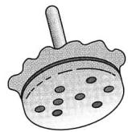

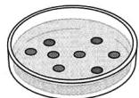  
平板副本(非选择性培养基)

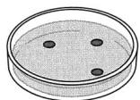  
平板副本
(选择性培养基)

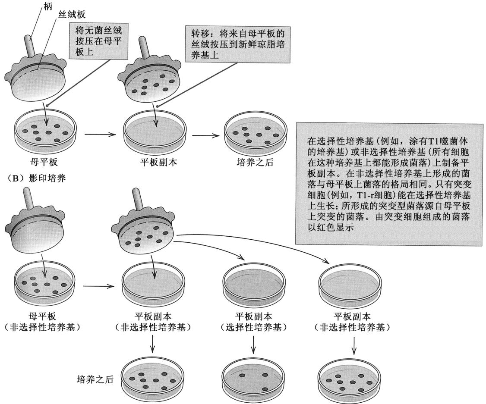  
图 14.14 影印培养法。(A)在转移过程中，一个覆盖有丝绒的圆盘被按压到母平板的表面上，以便将来自母平板上的菌落中的细胞转移到第二个培养基上。(B)为了检测突变体，细胞被转移到系列平皿上。

该影印培养实验说明：

选择性方法只不过是选择在群体中事先存在的突变体。

该原理是理解啮齿类、昆虫和致病细菌如何变得对用来控制它们的化学物质具有抗性的基础。例如，目前在许多昆虫种群中存在对杀虫剂(如DDT)的高水平的抗性。这种抗性缘于对作用于昆虫的行为、结构和酶学性状，使昆虫变得能够耐受杀虫剂的自发突变的选择。在植物病原体的控制中，也碰到类似问题。例如，引进一个抗某型致病真菌的农作物新品种，只能产生对该病的暂时抵抗。这种抗性的丧失是不可避免的，因为在真菌中会出现自发突变，使其能够攻击该新品种的基因型。这样的突变具有明显的选择优势，从而使突变型等位基因得以在真菌群体中蔓延。

## - 突变率估计

自发突变往往是罕见的(除了像动态突变这样独特的现象)，因而用来估计突变产生的频率的方法，要求大群体和(通常)特殊技术。突变率(mutation rate)是在单一世代中或形成一个配子时某个基因发生突变的概率。突变率的检测在群体遗传学、进化研究和环境诱变剂效应的分析中非常重要。

最早开发来检测突变率的其中一项技术是 ClB 技术 (ClB method)。ClB 是指黑腹果蝇的一种特殊的 X 染色体。这种 X 染色体有一个大的倒位 (C)、一个隐性致死基因 (l) 和显性棒眼标记基因 (B)，B 使正常的圆眼缩小成棒状眼。该倒位 (因第 8 章中所述的原因) 阻止从该染色体杂合的雌性果蝇的后代中获得重组型染色体。在 X 染色体中存在隐性致死基因，意味着具有这条染色体的雄性和纯合雌性不能存活。该技术旨在检测正常 X 染色体中发生的突变。

在 ClB 技术中，令 ClB 染色体杂合雌性与携带正常 X 染色体的雄性交配(图 14.15)。从后代中选出具棒状眼表型的雌性，分别与正常雄性交配。(棒状眼表型的存在，表明这些雌性为 ClB 染色体和来自雄性亲本的正常 X 染色体的杂合体。)如图 14.15 下部所示，在来自这样一个杂交的后代中，预计雌性和雄性的比例是 2:1。关于突变率的检测，关键的观察结果在于第二次杂交所产生的那一小部分雄性。因为 ClB 雄性死亡，所以这一代的所有雄性所含的 X 染色体，必定来自最初的正常雄性(图 14.15 中最顶上一排)，而且该染色体必定是非重组的 X 染色体，因为 ClB 染色体中存在倒位(C)。在这些后代中偶尔没有雄性，这意味着存在于原来精子中的 X 染色体上的某个地方发生了突变，产生了新的隐性致死基因。该方法给 X 染色体上的大量基因中任何一个基因出现隐性致死等位基因的频率提供了一种定量估计。在精子发生过程中，约 0.15% 的 X 染色体获得新的隐性致死基因；这意味着突变率是 $1.5 \times 10^{-3}$ 个隐性致死基因/(X 染色体·代)。请注意，ClB 技术没有指出某个特定基因的突变率是多少，因为该方法没有揭示 X 染色体上有多少基因发生突变的时候会致死。自从 ClB 技术被发明以来，人们又开发了多种用于检测果蝇及其他生物的突变率的方法。具有重要意义的是，不同基因之间突变率差异极大。例如，在果蝇中，黄色身体突变以 $10^{-4}/(\text{配子} \cdot \text{代})$ 的频率出现，而在大肠杆菌中，链霉素抗性突变以 $10^{-9}/(\text{细胞} \cdot \text{代})$ 的频率出现。更有甚者，在单一物种中，突变频率也可有巨大差异，例如，在大肠杆菌中，突变频率为 $10^{-9} \sim 10^{-5}$ 。

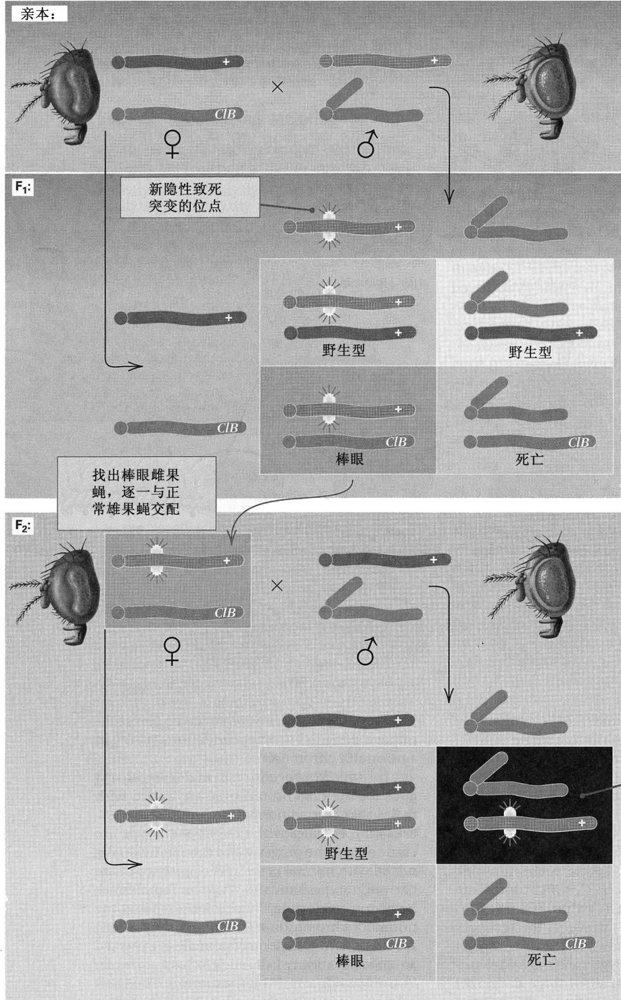  
图 14.15 ClB 技术,用来估计在果蝇 X 染色体上出现自发隐性致死突变的频率。

## - 突变热点

某些 DNA 序列被称作突变热点 (hotspot)，因为它们比其他序列更有可能发生突变。突变热点可包括成串的单一核苷酸，或短序列的串联重复序列(如不稳定的三核苷酸重复序列)，这些序列可通过复制滑移或其他机制扩展或收缩。在遍布基因组的许多位点和基因内均发现了突变热点。对于突变的遗传学研究而言，热点的存在，意味着数量相对较少的位点占了全部突变的较大部分。例如，在 T4 噬菌体的 rII 基因分析中(参见第 9 章)，一个极端的热点占了所得全

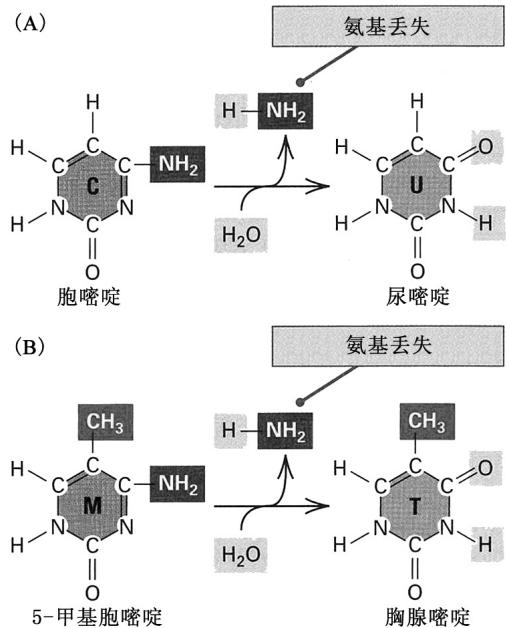

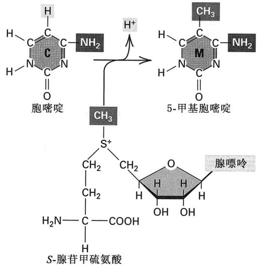  
图 14.16 胞嘧啶在第 5 位甲基化。甲基供体是 S-腺苷甲硫氨酸。

部突变的 20% 左右。

在许多生物，包括细菌、玉米和哺乳动物中(但不包括酵母、果蝇或线虫)，至少有1%的胞嘧啶碱基在碳-5位被甲基化，产生5-甲基胞嘧啶，代替普通的胞嘧啶(图14.16)。这种甲基化发生在双链DNA中，由胞嘧啶甲基化酶(cytosine methylase)催化，以S-腺苷甲硫氨酸为甲基(—CH₃)供体。这种甲基化不是随机的，而是优先在某些含胞嘧啶的靶序列中发生，在哺乳动物中，优先在CG二核苷酸的胞嘧啶上发生。在DNA复制时，5-甲基胞嘧啶与鸟嘌呤配对，因而可以正常复制。

正如在讨论脆性 X 综合征时看到的那样，某些基因内或基因周围的高水平的甲基化，与转录水平的显著减少有关(图 14.6)。除了有阻遏基因转录的作用外，胞嘧啶甲基化是突变热点的一个重要来

源，因为甲基化的胞嘧啶通常是高度可变的。突变通常是 G-C 到 A-T 的转换，其原因如图 14.17 所示。胞嘧啶和 5-甲基胞嘧啶都会偶尔丢掉一个氨基，这个过程称为脱氨作用 (deamination)。对胞嘧啶而言，氨基丢失产生尿嘧啶。因为尿嘧啶与胸腺嘧啶配对，而不是与鸟嘌呤配对，所以含 G-U 碱基对的分子复制，最终会使原来的 G-C 对被 A-T 对置换，因为在相继的几轮复制中，受累碱基对的变化是 G-U→A-U→A-T。

幸运的是——如同将在 14.6 节中看到的那样——尿嘧啶是被一个称为碱基切除修复 (base-excision repair) 的 DNA 修复系统识别的其中一种碱基。在此修复过程中，尿嘧啶被去除，换成正常的胞嘧啶。因此，正常胞嘧啶脱氨基产生的尿嘧啶很容易被发现并修复。

但是对 5-甲基胞嘧啶而言就不是这样了。与正常的胞嘧啶不同，5-甲基胞嘧啶经脱氨作用产生胸腺嘧啶(图 14.17B)，这是正常的 DNA 碱基，因而不会被 DNA 尿嘧啶糖基化酶 (DNA uracil glycosylase) 去除。在此情况下，脱氨作用将原来的 G-C 对改变为 G-T 对，在下一轮复制中产生 G-C(野生型)和 A-T(突变型)子代分子。

## 14.5 诱变因素

诱变因素 (mutagen) 是在自发突变背景上导致突变率增加的任何因素。外部因素可增加突变率的第一个证据是 1927 年赫尔曼·马勒提供的，他证明 X 射线对果蝇有诱变作用。从那时起，已证明大量的物理因素和化学物质可增加突变率。表 14.3 列举了损伤 DNA 的一些主要因素，以及它们导致的损伤的主要类型。因为一些环境污染物有诱变作用，如在烟草制品中发现的无数化学物质，所以诱变剂在公共卫生上非常重要。

图 14.17 (A) 胞嘧啶的氨基自发丢失, 产生尿嘧啶。(B) 5-甲基胞嘧啶的氨基自发丢失, 产生胸腺嘧啶。

表 14.3 主要突变因素及其作用机制

<table><tr><td>突变因素</td><td>举例</td><td>主要诱变机制</td></tr><tr><td>水</td><td>水解作用</td><td>脱嘌呤作用(A或G与其脱氧核糖解离)</td></tr><tr><td>氧化剂</td><td>亚硝酸</td><td>脱氨作用(—NH2→=O):C→U,5-MeC→T,A→次黄嘌呤</td></tr><tr><td>碱基类似物</td><td>5-溴脱氧尿苷</td><td>碱基错配频率增加</td></tr><tr><td>烷化剂</td><td>乙基磺酸甲酯、氮芥</td><td>与碱基上的侧基进行占位性结合</td></tr><tr><td>嵌入剂</td><td>原黄素</td><td>引起拓扑异构酶II在DNA链上产生一个缺口;错误修复导致一个或几个核苷酸的插入或缺失</td></tr><tr><td>紫外线</td><td>自然阳光、紫外灯</td><td>在同一条DNA链中形成嘧啶二聚体(在毗邻嘧啶之间通过共价键连接,主要是在T之间)</td></tr><tr><td>电离辐射</td><td>X射线、氡气、放射性物质</td><td>DNA单链和双链断裂;核苷酸损伤</td></tr></table>

## ■ 脱嘌呤作用

在表 14.3 中列在头一项的是水。在嘌呤核苷酸中，糖-嘌呤键相对比较不稳定，容易被水解。嘌呤碱基的丢失称为脱嘌呤作用 (depurination)，如图 14.18 所示。通过水解，也可发生嘧啶的丢失 (脱嘧啶作用，depyrimidination)，但比脱嘌呤作用少见。从某个脱氧核糖上丢失其碱基，并不总是会导致突变，因为该位点缺失的碱基可被 AP 修复系统修正 (参见 14.6 节)。但是，如果复制叉在修复发生之前到达该无嘌呤位点，则复制过程几乎总是会在子链上与无嘌呤位点相对之处插入一个腺嘌呤。又经过一轮复制后，原来的 G-C 对变成 T-A 对，这是典型的颠换突变。

在空气中，自发脱嘌呤的速率约为 $3 \times 10^{-9}$ 次脱嘌呤/(嘌呤·min)。该频率比其他任何一种原因的 DNA 自发降解要高至少 10 倍。以此速率，暴露在空气中的一个嘌呤核苷酸的半衰期约为 300 年。这给 DNA 在丢失其生物活性之前，可在环境中持续存在多久，设置了一个实际极限。

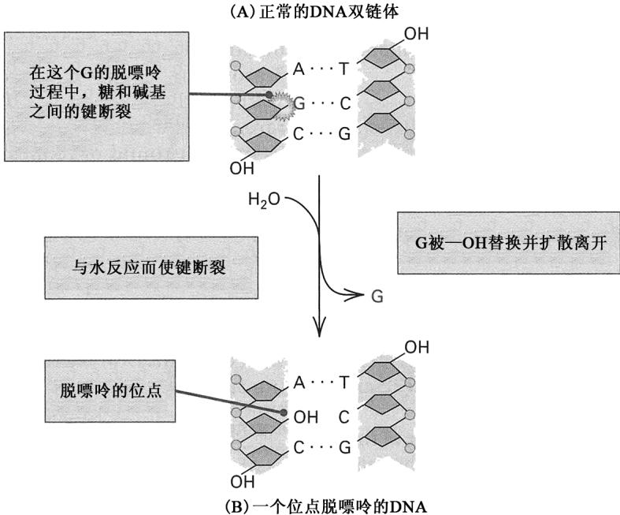  
图 14.18 脱嘌呤作用。(A)脱嘌呤之前的部分 DNA 分子。有标记的 G 和它连接的脱氧核糖之间的键即将被水解。(B)该键的水解释放嘌呤 G，G 扩散离开分子，在其位置上留下一个羟基(—OH)。

## ■ 氧化作用

在损伤 DNA 的能力上，氧化剂也很突出。氧化剂(oxidizing agent)是可轻易转移氧原子的任何一种化学试剂。常见的氧化剂包括漂白剂(NaOCl)、过氧化氢 $\left(\mathrm{H}_{2}\mathrm{O}_{2}\right)$ 和亚硝酸 $\left(\mathrm{HNO}_{2}\right)$ 。碱基的氧化改变了它们的氢键结合性质，造成错误的核苷酸掺入双链 DNA。图 14.19 中的例子显示了对 DNA 造成氧化损伤的一种最常见的类型，即鸟嘌呤的氧化产生 8-氧鸟嘌呤。鸟嘌呤与胞嘧啶配对，8-氧鸟嘌呤却与腺嘌呤配对。因此，8-氧鸟嘌呤导致 C 到 A 的颠换。8-氧鸟嘌呤是可被碱基切除修复系统识别并修复的修饰碱基之一。

亚硝酸通过对腺嘌呤、胞嘧啶和鸟嘌呤的脱氨作用而起到诱变剂的作用。脱氨作用改变碱基各自的氢键结合专一性。如图 14.17 所示，5-甲基胞嘧啶脱氨产生胸腺嘧啶，而胞嘧啶脱氨产生尿嘧啶。腺嘌呤脱氨的结果如图 14.20 所示。该产物是一种称作次黄嘌呤 (hypoxaznthine) 的碱基，它与胞嘧啶而不是与胸腺嘧啶配对，因此 A 脱氨的结果是 A-T 到 G-C 的转换。

胸腺嘧啶  
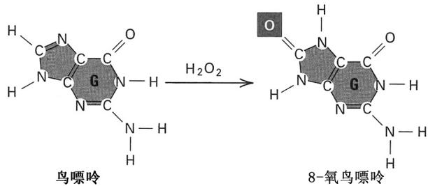  
图 14.19 鸟嘌呤氧化产生 8-氧鸟嘌呤。

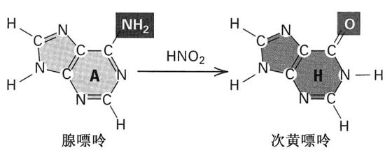  
图 14.20 腺嘌呤脱氨基产生次黄嘌呤。

## - 碱基类似物诱变剂

碱基类似物 (base analog) 是与 4 种 DNA 碱基之一足够相似的分子，它可在正常的复制过程中掺入 DNA 双链体。这样一种物质必定能与模板链中正常的碱基配对。有些碱基类似物有诱变作用，因为它们比正常碱基更容易产生错配。这种诱变机制可以 5-溴尿嘧啶 (Bu) 为例来加

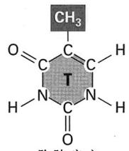

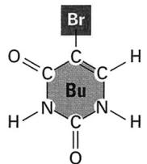  
5-溴尿嘧啶(酮式)  
图 14.21 胸腺嘧啶和 5-溴尿嘧啶的结构。

以说明，这是一种常用的碱基类似物，它可高效地掺入细菌和病毒的 DNA。

5-溴尿嘧啶这种碱基是胸腺嘧啶的类似物，溴原子的大小差不多与胸腺嘧啶的甲基相同(图 14.21)。5-溴尿嘧啶通常为酮式(keto form)，与腺嘌呤配对(图 14.22A)。但它偶尔会变换为烯醇式(enol form)构型，与鸟嘌呤配对(图 14.22B)。该变换是受溴原子的影响，因而在5-溴尿嘧啶中比在胸腺嘧啶中发生得更频繁。

(A)腺嘌呤与5-溴尿嘧啶配对  
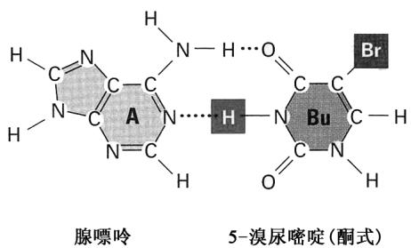

(B) 鸟嘌呤与5-溴尿嘧啶配对  
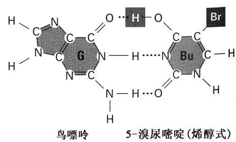  
图 14.22 5-溴尿嘧啶的错配诱变。(A)腺嘌呤和 5-溴尿嘧啶酮式之间的碱基对。(B)鸟嘌呤和罕见的 5-溴尿嘧啶烯醇式之间的碱基对。5-溴尿嘧啶的一个氢原子改变位置，形成烯醇式。

5-溴尿嘧啶可导致突变的途径有两个，如图 14.23 所示。在途径 A 中，5-溴尿嘧啶以烯醇式掺入，与 G 配对。这种掺入方式很罕见，但诱变碱基对产生于第一轮复制中。在下一轮复制中，Bu 通常会与 A 配对，导致 G-C 到 A-T 的转换。在途径 B 中，5-溴尿嘧啶以酮式掺入，与 A 配对。这是常见的掺入方式，但要到以后某轮复制，Bu 与 G 配对时，诱变碱基对才得以出现。在此情况下，结果是 A-T 到 G-C 的转换。

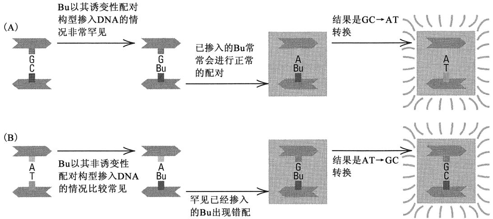  
图14.23 5-溴尿嘧啶(Bu)诱变的两种途径。箭头的位置示在下一轮复制中跟踪的是每个DNA双链中的哪一条链。(A)与G配对的掺入罕见。在此情况下，诱变碱基对出现于第一轮复制中。(B)与A配对的掺入常见。在此情况下，诱变碱基对出现于第一轮复制之后。

## - 修饰 DNA 的化学试剂

有些诱变剂与 DNA 以多种不同的方式发生反应，产生广泛的效应。其中包括烷化剂 (alkylating agent)，这是一类具高度活性的化学物质，在原核生物和真核生物中

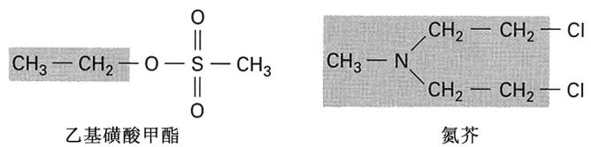  
图 14.24 两种高度诱变性烷化剂的化学结构；烷基以红色显示。

均可起到强诱变剂的作用。例如，乙基磺酸甲酯(EMS)和氮芥是烷化剂，其结构如图 14.24 所示。氮芥是一种气体，吸入后可致剧痛和广泛的肺部损伤，因而在第一次世界大战(1914～1918年)中在欧洲被用于化学战。乙基磺酸甲酯是一种可溶固体，在遗传学研究中一直被广泛用来诱

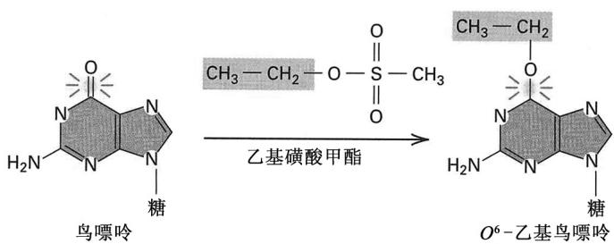  
图 14.25 乙基磺酸甲酯(EMS)对鸟嘌呤的诱变作用。

导突变。烷化剂将巨大的侧链基团连接到 DNA 碱基上，可改变 DNA 碱基配对的性质或造成 DNA 分子的结构扭曲。例如，EMS 与鸟嘌呤反应，产生 $O^{6}$ -乙基鸟嘌呤(图 14.25)。鸟嘌呤或胸腺嘧啶的烷化均引起错配，导致 A-T 到 G-C 或 G-C 到 A-T 的转换。EMS 不易与腺嘌呤和胞嘧啶发生化学反应。

## ■ 嵌入剂

吖啶(acridine)分子为具3个环的扁平分子,其大小与一对嘌呤-嘧啶略同。以吖啶橙为例,其结构如右图所示。

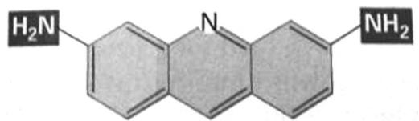

吖啶在 DNA 分子中引起短的插入或缺失，主要是单核苷酸的插入或缺失。因其结构之故，人们一度认为吖啶起作用的方式是通过将其自身插入 DNA 的碱基对之间 [一种称为嵌入 (intercalation) 的过程]，引起扭曲，导致小的插入或缺失。但是，目前的数据表明，吖啶实际上

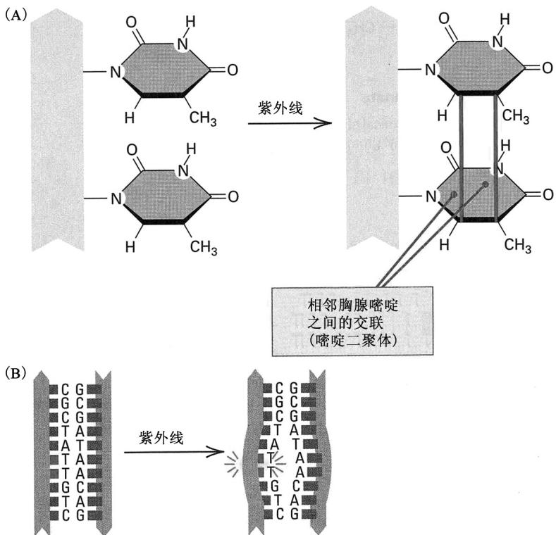  
图 14.26 (A) 胸腺嘧啶二聚体形成的结构视图。在 DNA 链中受紫外线 (UV) 照射的两个相邻的胸腺嘧啶，通过形成红色所示的键而连接起来。两个胸腺嘧啶环之间其他类型的键也有可能。尽管没有按比例绘制，但是，这些键比相邻胸腺嘧啶平面之间的间距短很多，因此双链结构变得扭曲。每个胸腺嘧啶环的形状也发生改变。(B) 形成二聚体时，两个胸腺嘧啶更加靠拢，引起 DNA 螺旋的扭曲。

是通过干扰拓扑异构酶Ⅱ而起损害作用。该酶通过制造一个双链断裂缺口、旋转两个游离端，然后封闭该缺口，来释放DNA中的扭转应力。存在吖啶时，该酶置DNA缺口于不顾，及时修复失灵，导致在该位点增加或缺失一个(偶尔几个)碱基对。在编码区中增加或缺失单个碱基，其结果是移码突变(图14.4)。

## - 紫外线照射

紫外线(UV)是所有病毒和细胞的诱变剂。其诱变效应是碱基吸收紫外线的能量，导致碱基的化学性质改变而造成的。UV照射后，在DNA中形成的主要产物是共价连接的嘧啶二聚体(pyrimidine dimer)，主要是胸腺嘧啶二聚体，这些嘧啶是同一条多核苷酸链中相邻的嘧啶(图14.26A)。这种化学连接使两个碱基更加靠

拢，引起螺旋的扭曲(图 14.26B)，这种扭曲会阻断转录，并可暂时阻断 DNA 的复制。嘧啶二聚体可以本章后面所讨论的方式修复。虽然如此，皮肤过度暴露于阳光的紫外线中，会增加患皮肤癌的风险。

## ■ 电离辐射

电离辐射(ionizing radiation)包括 X 射线和放射性元素释放的粒子和射线( $\alpha$ 粒子、 $\beta$ 粒子和 $\gamma$ 射线)。在 19 世纪晚期首次发现 X 射线的时候，它们穿透固体物质的能力被认为是无害的娱乐，从而成为大型娱乐活动的由头。

到 1898 年，私家 X 射线已成为风靡纽约的社会地位的象征。纽约时报曾报道说，“如同外观的差异一样，洗衣妇的手和贵妇的手在 X 射线照片下的样子颇为不同。”展览会上最时髦的是莫顿医生的 “X 射线夫人” ——一位 “显然具有科学欲望，想看自己骨骼的时尚女性” ——的全身像。这幅肖像据说 “迷人而风骚”，这位女性同意不穿胸衣拍照，这样能更好地满足 “想要一幅显影充分的肋骨照片” 的愿望。莫顿医生说，女人不怕 X 射线：“得到没有危险的保证后，她们毫不畏惧地接受 X 射线。”

用 X 射线来看透衣服或窥视密室里的隐私，这种令人浮想联翩的可能性曾是茶余饭后、漫画和笑话中的常见话题。针对那些寻求保护，以免被 X 射线透视的人，报纸上曾刊登 “防 X 射线内衣” 的广告。

镭的发光性能很快造成一股十足的镭热。一位著名的女舞蹈家用在含镭荧光盐中浸泡过的面纱表演镭舞。纽约的赌场风行镭轮盘赌，其特色是“用镭溶液洗过的轮盘，在黑暗中闪闪发光；一只看不见的手将球掷到转轮上，当球从一个球穴跳跃着到闪着微光的下一个球穴时，火花显示着其轨迹。”一项专利曾颁发给用镭来使女式礼服发出夜光的工艺，随后，百老汇的制片人弗洛伦兹·齐格飞为了他的舞台滑稽剧而抢购了专利权。

即使在 X 射线和镭的毫无节制地使用正在愈演愈烈之际，越来越多的证据表明，这些新生事物可能根本没有那样好。在被誉为抗癌工具的同时，它们也可能致癌。使用 X 射线的医生首先尝到了苦果。[引自 S. Hilgartner, R. C. Bell, and R. O'Connor, Nukespeak (San Francisco: Sierra Club Books, 1982).]

医生确实是首先得到教训的人。许多医生被严重的 X 射线灼伤，甚至要对过度暴露的手或臂进行截肢。许多其他的医生死于辐射中毒或辐射诱发的癌症。到 20 世纪 30 年代中期，X 射线致死的人数已经增加到如此之巨，以致在德国一家医院的院子里立了一个“X 射线殉难者”的纪念碑。然而，暴露在 X 射线中的全部危害，直到 20 世纪 50 年代才被人们广泛认识到。

当电离辐射与水或活组织相互作用时，产生高度活性的粒子，称为自由基(free radical)。自由基与其他分子包括DNA反应，产生致癌和诱变效应。一束电离辐射的强度可以几种方式来定量描述。事实上，常用的单位有很多种，令人眼花缭乱(表14.4)。有些单位(贝克勒尔、居里)涉及物质发生衰变的次数，有些(伦琴)涉及辐射在空气中产生电离的次数，还有一些(格雷、拉德)涉及传递给暴露在辐射中的物质的能量大小，而有些(雷姆、西弗)涉及辐射对活组织的效应。多年以来，为了试图将不同的辐射类型，包括非电离辐射，囊括在一个共同的参照系中，辐射单位的类型一直在激增。表14.4中列出了在辐射遗传学文献中见到的众多单位。这些单位不用记。

表 14.4 辐射的单位

<table><tr><td>单位(缩写)</td><td>大小</td></tr><tr><td>贝克勒尔(Bq)*</td><td>1次衰变/秒= $2.7 \times 10^{-11}$ Ci</td></tr><tr><td>居里(Ci)</td><td> $3.7 \times 10^{10}$ 次衰变/秒= $3.7 \times 10^{10}$ Bq</td></tr><tr><td>格雷(Gy)*</td><td>1焦耳/千克=100rad</td></tr><tr><td>拉德(rad)</td><td>100尔格/克=0.01Gy</td></tr><tr><td>雷姆(rem)</td><td>1拉德对活组织造成的损伤=0.01Sv</td></tr><tr><td>伦琴(R)</td><td>在标准的压强和温度条件下,在每立方厘米的干燥空气中产生1静电单位的电荷。(静电单位的定义为,1静电单位在1cm的距离上排斥1达因的力。)</td></tr><tr><td>西弗(Sv)</td><td>100rem</td></tr></table>

\*由国际度量衡大会定义的国际单位制正式承认的单位。1达因 $= 10^{-5}$ 牛顿。

电离辐射的遗传学研究支持以下一般原理：

在很宽的 X 射线剂量范围内，X 射线诱发的突变频率与辐射剂量成正比。

支持该原理的一类证据，是在果蝇中诱导的 X 染色体隐性致死基因的频率(图 14.27)。突变率随 X 射线剂量的增加而呈线性增加。例如，10Sv 的照射，可将突变率从自发突变率的 0.15% 增加到大约 3%。在低度至中度剂量下，电离辐射的诱变和致死效应主要是对 DNA 的损伤所致。电离辐射可产生 3 种类型的 DNA 损伤：单链断裂(在糖—磷酸主链中)、双链断裂和核苷酸碱基的改变。单链断裂通常可被有效修复，但其他损伤造成突变或致死。在真核生物中，电离辐射还导致染色体断裂。虽然存在修复这些断裂的机制，但是修复往往会导致易位这样的染色体重排(参

剂量/Sv

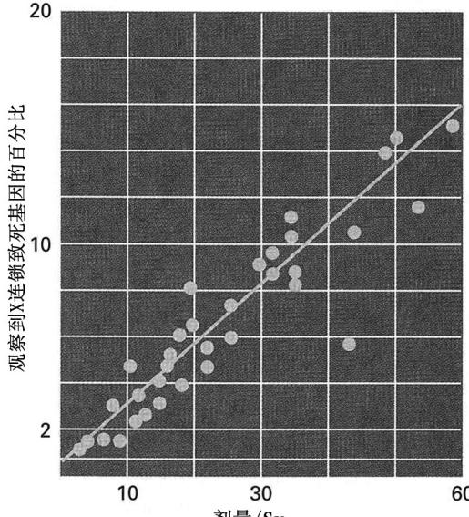  
图 14.27 黑腹果蝇中 X 连锁隐性致死基因的百分比和 X 射线剂量之间的关系，得自数个实验。X 连锁致死突变的自发突变率为 0.15%/(X 染色体·代)。

见第 8 章)。在培养的人类细胞中，0.2Sv 的剂量可导致平均每个细胞一次可见的染色体断裂。

电离辐射被广泛用于肿瘤治疗。这种疗法的依据是，与间期细胞相比，在进行有丝分裂的细胞中，染色体断裂的频率增加(其结果是致死率增加)。肿瘤通常比大多数正常组织含有更多的有丝分裂细胞，因而肿瘤细胞比正常细胞被破坏得要多。因为并不是所有的肿瘤细胞都同时处于有丝分裂状态，所以辐射是每隔几天进行一次，以便间期肿瘤细胞进入有丝分裂期。经过一段时间，大多数的肿瘤细胞会被消灭。

联系：X射线之惑

赫尔曼·马勒，1927

得克萨斯大学，奥斯汀，得克萨斯

基因的人工诱变

诱变, 即故意诱发突变, 在遗传学中起着重要的作用, 因为它使控制生物学过程(如发育和行为)的基因的鉴定成为可能。马勒因为证明了 X 射线可用来诱发新突变, 于

1946 年被授予诺贝尔奖。由于在自然环境中存在 X 射线(及其他的诱变因素)，他的发现也具有重要的实际意义。在第二次世界大战以广岛和长崎的核轰炸告终之后，马勒成为反对地上核弹试验的领头人之一，因为这些试验会将辐射释放到大气中。他也谴责随便使用 X 射线，如用来给孩子试鞋，因而他参加了设计制造更安全的医用 X 射线机的运动。马勒的文章有时可能晦涩难懂，幸亏他还用了从句。本节选抓住了这一文风。

大多数现代遗传学家会同意，基因突变构成生物进化的主要基础，进而构成生物大部分复杂性的主要基础。但是对遗传学家而言，不幸的是，对这些突变的研究，以及通过它们对基因本身的研究，迄今一直因为它们在通常条件下极低的发生频率，以及因为尝试以明确的、可检测的方法来明显改变这个缓慢的“自然”突变率总是不成功，而受到非常严重的阻碍。……本文作者认为，从理论上来说，用短波长的辐射来产生突变应该特别有前途，因此在过去的一年中已在黑腹果蝇中进行了关于这一问题的一系列实验。……已经相当确凿地发现，以相对较大剂量的X射线处理精子，可在高比例的被处理的精细胞中诱导出真正的“基因突变”。已在短时间内以这种方式获得了数百个突变体，并且多达一百个以上的突变体已被追踪了三代、四代或更多代。它们(几乎全部)在遗传上是稳定的。……就所产生的突变类型而言，发现隐性致死突变的数量比产生可见形态异常的非致死突变多得多。……除基因突变外，发现X射线处理也引起高比例的基因线性顺序的重排。……X射线对基因的诱变作用不限于精细胞，因为对未受精雌果蝇的处理差不多也像处理雄果蝇那样可容易地引起突变。……总之，那些在经典遗传学道路上工作的人，他们的注意力可能会被这种能给予他们利用X射线来在他们选择的生物中创造一系列用于遗传学研究的人造物种的机会所吸引。如果这种作用对大多数生物是共同的——因为从遗传学的角度考虑很有可能，应该有可能产生——“定制”——足够多的突变以供构建良好的遗传图。

来源：H. J. Muller, Science 66(1927): 84-87.

图 14.28 示美国人在一年期间接受电离辐射的典型剂量值。计量单位为毫西弗(millisievert)，1mSv=0.1rem。图 14.28 中的辐照(exposure)是一年的辐照，因此一代的总辐照约为 100mSv。注意，除诊断所用的 X 射线外，总辐照的大部分均为自然来源，尤其是氡气。不足 20% 的平均辐照为人造来源。尽管如此，暴露于任何电离辐射中都存在固有的危险，尤其是在暴露者中白血病和某些其他癌症的风险增加。至于后代中遗传病的增加，少量额外辐射带来的诱变效应的风险非常小，因而目前大多数遗传学家更加关注的是从多种来源进入环境的许多化学诱变剂(及致癌物质)的效应。

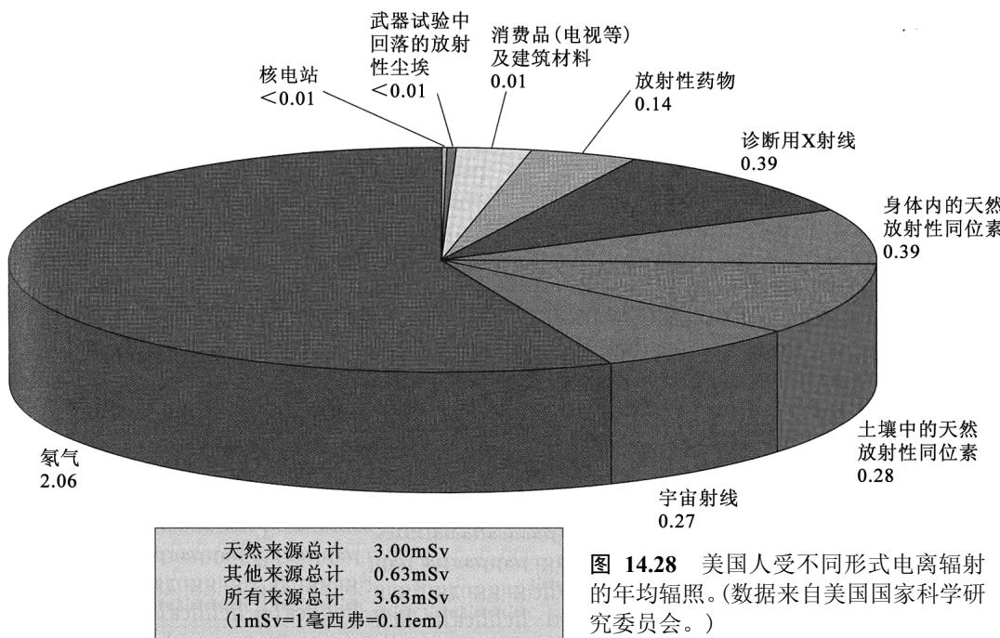

美国国家科学院国家科学研究委员会定期更新辐射暴露的风险评估。最新估计概括于表14.5中。从表中可见，每代增加 $10\mathrm{mSv}$ 的辐射(约为年平均辐照增加 $10\%$ )，预计引起全部或部分因遗传因素所致疾病的增加相对较低。表中最常见的疾病是心脏病和癌症。对这两种疾病，都未给出辐射诱导增加的估计，因为遗传对疾病的贡献仍不十分清楚。

表 14.5 每代增加 ${10}\mathrm{{mSv}}$ 的遗传效应估计

<table><tr><td rowspan="2">疾病类型</td><td rowspan="2">目前的发病率/百万活产</td><td colspan="2">增加的病例/[百万活产/(10mSv·代)]</td></tr><tr><td>第一代</td><td>平衡时</td></tr><tr><td>常染色体显性遗传病</td><td></td><td></td><td></td></tr><tr><td>病情严重</td><td>2500</td><td>5~20</td><td>25</td></tr><tr><td>病情温和</td><td>7500</td><td>1~15</td><td>75</td></tr><tr><td>X连锁遗传病</td><td>400</td><td>&lt;1</td><td>&lt;5</td></tr><tr><td>常染色体隐性遗传病</td><td>2500</td><td>&lt;1</td><td>增加非常缓慢</td></tr><tr><td>染色体病</td><td></td><td></td><td></td></tr><tr><td>不平衡易位</td><td>600</td><td>&lt;5</td><td>增加非常少</td></tr><tr><td>三体</td><td>3800</td><td>&lt;1</td><td>&lt;1</td></tr><tr><td>先天畸形(多因子病)</td><td>20000~30000</td><td>10</td><td>10~100</td></tr><tr><td>其他多因子病</td><td></td><td></td><td></td></tr><tr><td>心脏病</td><td>600000</td><td>未知</td><td>未知</td></tr><tr><td>癌症</td><td>300000</td><td>未知</td><td>未知</td></tr><tr><td>其他</td><td>300000</td><td>未知</td><td>未知</td></tr></table>

来源：转载自 The Committee on Biological Effects of Ionizing Radiations. Health Effects of Exposure to Low Levels of Ionizing Radiation. National Academies Press, Washington, D. C. (1990). 经 National Academies Press, Copyright 1990, National Academy of Science 许可转载。

## - 切尔诺贝利核事故的遗传效应

1986年4月26日，乌克兰切尔诺贝利城附近的一个核电站发生爆炸。苏联总统米哈伊尔·戈尔巴乔夫(Mikhail Gorbachev)在电视上对全国讲话：

同志们，晚上好！在座的人都知道，发生了令人难以置信的不幸。……我们第一次面临失控核能的真正威力。附近地区被严重污染，而放射性碎片云散布到很远的地方。这是史上公开承认的最大核事故。估计释放了5000万～20000万居里的辐射，10倍于1945年在广岛爆炸的原子弹释放的辐射。碘-131和铯-137是主要的放射性污染物。居住在该地区的20多万人几乎马上被疏散，但许多人受到严重的辐射照射。有些儿童吸收的辐射量相当于一千次胸部X射线检查的辐射量。在很短的时间内，在儿童中出现甲状腺癌发病率的显著增加，并且也检测到辐射暴露对健康的其他影响。

一开始，几乎没人对切尔诺贝利灾难可能产生的遗传效应予以关注，因为急性暴露的人相当少，并且认为在事发地外围的人受到的辐射剂量很小，不用担心。在切尔诺贝利以北约200km的白俄罗斯地区，估计每人受碘-131的平均照射约为0.185Sv，这是一个相当高的剂量，但这种照射是短时间的，因为碘-131的半衰期仅为8天。估计来自寿命长得多的铯-137(半衰期为30天)的照射少于5mSv/年。根据来自实验动物和对广岛和长崎原子弹幸存者研究的数据，估计这些照射不会产生可检测的遗传损伤。

然而，在核反应堆熔毁10年之后，对住在白俄罗斯的人进行研究，却发现突变率显著增加。观察的重点是简单序列重复(SSR)多态性，因其具有内在的高突变率(由复制滑移和其他因素所致)。考察父母及其子女的SSR，每种SSR都是通过检测DNA片段大小的增加或减少，来表示DNA片段中所含重复单位数的增加或减少。研究了5种SSR多态性，其结果如图14.29所示。其中两个基因座(蓝点)没有出现突变率增加的迹象，这是预期结果。出乎意料的发现是，其中3个基因座(红点)竟显示出突变率的显著增加，并且突变率一致地增加了大约两倍。尚不知道，检测到的这种突变率的增加，是因为复制滑移比其他类型的突变对辐射更敏感，还是因为白俄罗斯人群受到的有效辐射剂量比原来认为的高得多。

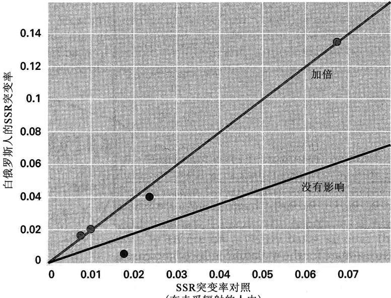  
(在未受辐射的人中)  
图 14.29 在暴露于切尔诺贝利辐射中的白俄罗斯人中及未暴露的英国人中，5 种 SSR 多态性的突变率。其中 3 个基因座(红点)出现突变率增加约两倍的迹象。[数据来自 Y. E. Dubrova, et al., Nature 380 (1996):683-686.]

## 14.6 DNA 修复的机制

在人类细胞中，DNA自发损伤以1个事件/(10亿核苷酸对·min)的速度(或每个核苷酸对，以 $1\times10^{-9}/min$ 的速度)发生。可能这看起来是个相当低的速度，但这说明，在每个人类细胞中，在每24h中，DNA会在大约1万个不同位点上受到损伤。幸运的是，在一般情况下，细胞核内自发的化学反应对DNA造成的损伤，以及由化学诱变剂和辐射引起的损伤，大部分可被修复。

表 14.6 概括了最重要的一些 DNA 修复机制。名列第一的非常简单。DNA 链上的一个切口

(nick) 是主链上的一个磷酸二酯键断裂之处，切口被 DNA 连接酶修复，该酶恢复断裂的共价键。在以下章节中，考察修复异常或受损 DNA 的其他主要分子机制。

表 14.6 DNA 损伤类型及修复机制

<table><tr><td>损伤类型</td><td>主要修复机制</td></tr><tr><td>DNA链上的切口</td><td>由DNA连接酶修复</td></tr><tr><td>化学修饰的碱基</td><td>碱基切除(被碱基特异的DNA糖苷酶去除)</td></tr><tr><td>错配碱基</td><td>通过错配修复校正(切除然后重新合成)</td></tr><tr><td>脱嘌呤或脱嘧啶位点</td><td>由AP内切核酸酶修复系统修复</td></tr><tr><td>DNA损伤区</td><td>核苷酸切除修复(切除然后在配对链对面重新合成)</td></tr><tr><td>嘧啶二聚体(紫外线所致)</td><td>酶促逆转</td></tr><tr><td>DNA损伤区</td><td>DNA损伤旁路(损伤区中的序列通过重组恢复)</td></tr></table>

## ■ 错配修复

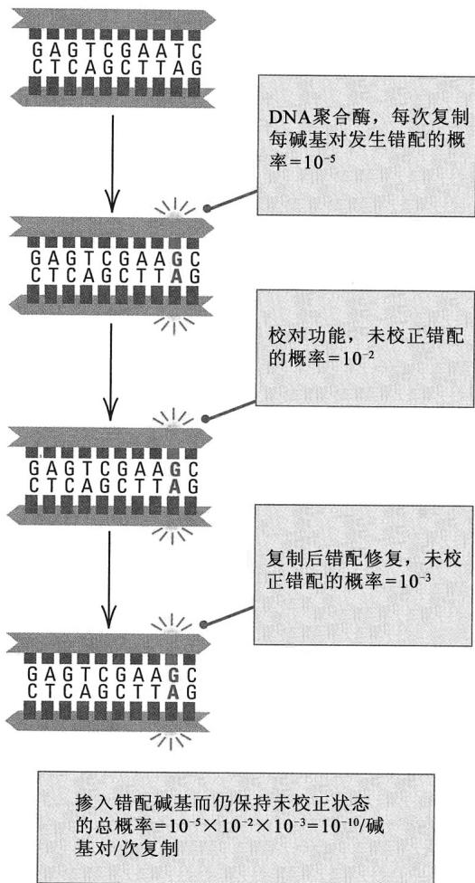

在介绍基因转换和遗传重组时，已经了解过错配修复系统(参见6.8节)。但是错配修复最重要的作用是作为复制中纠错机制的“最后一次机会”。在DNA复制过程中，错配核苷酸以大约 $10^{-5}$ /(模板核苷酸·轮复制)的速率掺入。如图14.30所示，在这些错配核苷酸中，约 $99\%$ 立即被大复制聚合酶的校对功能(3'到5'的外切核酸酶活性)校正。这样就剩下 $10^{-7}$ /(模板核苷酸·轮复制)的错配率；这些剩下的错配， $99.9\%$ 被错配修复系统校正，使总的错配率变为

$$
1 0 ^ {- 5} \times 1 0 ^ {- 2} \times 1 0 ^ {- 3} = 1 0 ^ {- 1 0}
$$

图 14.30 在 DNA 聚合、校对和复制后错配修复阶段的错误率小结。最初的核苷酸错误掺入率是 $10^{-5}/(\text{碱基对} \cdot \text{次复制})$ 。DNA 聚合酶的校对功能校正这些错误的 99%，在余下的错误中，复制后错配修复校正 99.9%。未修复的错误掺入核苷酸的总比例为 $10^{-10}/(\text{碱基对} \cdot \text{次复制})$ 。

错配修复(mismatch repair)的过程如图14.31所示。当检测到一个错配碱基时，其中一条链在两处遭到切割，错配碱基周围的一个区域被去除。被切除的区域大小可变。在大肠杆菌中，首先，一种酶在最近的GATC序列处非甲基化的(新合成的)链上切断DNA，若该位点在错配碱基的1kb之内的话。然后，一种外切核酸酶将切开的DNA链降解到错配碱基另一边的某个位置(切除步骤)，产生一个单链缺口。切除之后，DNA 聚合酶以未被切割的链为模板，填补缺口，从而消除错配。错配修复系统也可校正大多数的小插入或缺失。

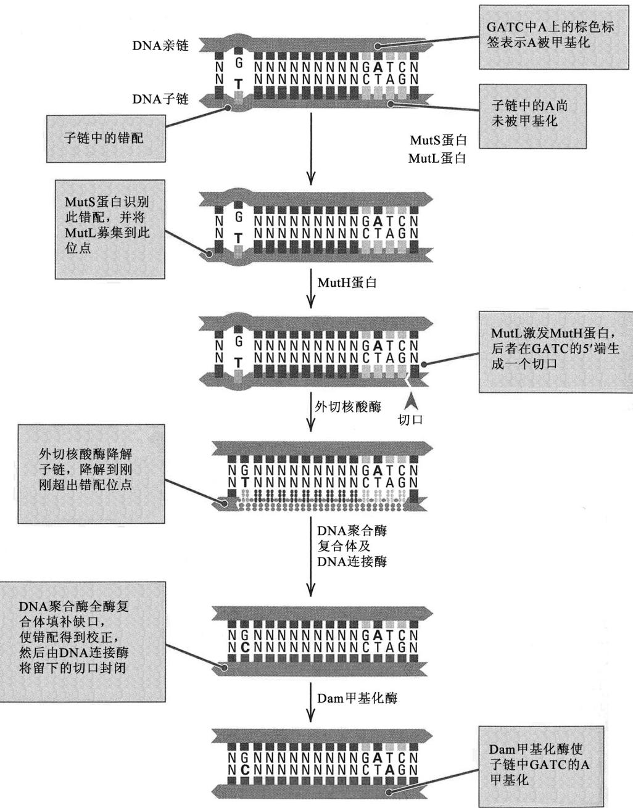  
图 14.31 错配修复包括切除一段含错配碱基的 DNA 链，继之以修复合成。在大肠杆菌中，切割发生在最近的甲基化 GATC 序列处的非甲基化链中。一种外切核酸酶连续去除核苷酸，直到刚好越过错配碱基，之后，产生的缺口被修复。两条链的任何一条都可被切除和校正，但在新合成的 DNA 中，模板链中的甲基化碱基常常会指导切割机制去针对含有错误核苷酸的新合成的链。

如果在错配修复中被去除的 DNA 链是随机选择的，那么修复过程有时会因切掉含正确碱基的链、以突变链为模板，产生突变型分子。但在新合成的 DNA 中可防止这种情况发生，因为子链甲基化的程度比亲链低。错配修复系统识别链的甲基化程度，优先从甲基化不足的链中切除核苷酸。这有助于确保在复制中掺入子链的错误核苷酸被去除和修复。子链总是甲基化不足的链，其甲基化稍稍滞后于移动的复制叉，而亲链在上一轮复制中已被充分甲基化。

错配修复机制已在细菌中得到广泛研究。错配修复机制有缺陷的突变体因具有高自发突变率而得以鉴定。MutL 和 mutS 两个基因的产物识别错配碱基对并与之结合，引发从新合成的链上切除一段核苷酸。在酵母中进行的实验揭示，短核苷酸序列的串联重复在缺乏错配修复的突变体中比在野生型酵母中要不稳定 1000 倍。那时已知有些类型的人类遗传性结直肠癌是由简单重复序列的稳定性降低引起的，而酵母研究人员提出，这些高风险家族可能对某个引起错配修复缺乏的等位基因是分离的。不到两年，几个实验室的科学家鉴定出与 mutL 和 mutS 同源的 4 个人类基因，其中任何一个基因突变时，都会导致遗传性非息肉性结直肠癌(HNPCC)，这种癌症的大多数病例可能就是这 4 个错配修复基因之一的突变引起的。

# 联系：在不稳定重复序列中的复制滑移

米什莱恩·斯特兰德 $^{1}$ 、托马斯·普罗拉 $^{2}$ 、迈克尔·利斯凯 $^{2}$ 和托马斯·皮特斯 $^{1}$ ，1993

$^{1}$ 北卡罗来纳大学，教堂山，北卡罗来纳

$^{2}$ 耶鲁大学，纽黑文，康涅狄格

影响 DNA 错配修复的突变使酵母的简单重复序列片段不稳定

最重要的一个遗传学原理是，在许多不同的生物中，许多基本过程以大致相同的方式进行。在真核生物细胞中，基本的细胞过程是类似的，而在真核生物和原核生物中，DNA复制和修复的基本机制基本上相同。在生物中错配修复的相似性是本文的动机。作者报道，错配修复缺陷的酵母细胞在准确复制短的重复序列的能力上有很大缺陷。因为这种类型的不稳定性也是某种人类遗传性结肠癌的特点，作者准确地预测了导致这种结肠癌的突变基因是参与错配修复的基因。

所有真核生物的基因组中都含有单个或少数几个碱基重复的 DNA 片段。已知这种片段的扩展与包括脆性 X 综合征在内的几种人类疾病相关。此外，在某些类型的结直肠癌中，简单重复序列不稳定，提示在 DNA 复制或修复方面有缺陷。……(重复数目变化的)一种机制是 DNA 聚合酶滑移：在复制该片段的过程中，引物与模板链暂时解离，然后以错位的构型重新结合。如果非配对碱基在引物链中，继续合成会导致该片段变长，而如果非配对碱基在模板链中，会导致缺失。……在大多数基因组中，最常见的简单重复序列是 poly(GT) $_{10\sim30}$ 。考察了 poly(GT) 片段稳定性的遗传控制。……考察了酵母中影响错配修复的 3 种突变：pms1、mlh1(MutL 的同源基因)和 msh2(MutS 的同源基因)。……在两个不同的遗传背景上，使用两种不同的不稳定性检测系统，所有 3 种突变均导致片段不稳定性提高 100～700 倍。……酵母含两种具有 3'→5'外切核酸酶（“校对”）活性的 DNA 聚合酶。在这些基因的核酸酶部分具有突变的菌株中，没有一种突变影响片段的不稳定性有减少错配修复的突变那样剧烈。……这些结果证明，酵母 poly(GT) 的不稳定性是因错配修复基因的突变而增加的，而相对不受影响 DNA 聚合酶校对功能的突变影响。这些结果说明，活体内的 DNA 聚合酶在含简单重复序列的模板上具有非常高频率的滑移，但这些错误的大多数会被细胞内的错配修复系统校正。因此在一些人类疾病中观察到的简单重复序列的不稳定性，可能是 DNA 聚合酶滑移的频率增加，或错配修复的效率减少的结果。

来源：M. Strand, et al., Nature 365 (1993): 274-276.

## ■ 碱基切除修复

前述 DNA 双链体往往会含有胞嘧啶脱氨而产生的尿嘧啶和鸟嘌呤氧化而产生的 8-氧鸟嘌呤。在 DNA 中，这两种碱基及其他错误的碱基也常常以每天每个细胞成千上万次的频率出现。它们中的绝大多数几乎立即被碱基切除修复过程利用特异性识别错误碱基的大约 8 种酶去除。例如，DNA 尿嘧啶糖苷酶识别双链 DNA 中错误的 G-U 碱基对，而 DNA 8-氧鸟嘌呤糖苷酶识别错误的 8-oxoG-C 碱基对。

该修复过程的碱基切除部分如图 14.32 所示。图 14.32A 示胞嘧啶脱氨作用，该作用导致含尿嘧啶的核苷酸。错误的 G-U 碱基对被特异性的糖苷酶识别，该酶将这个错误的尿嘧啶从其连接的脱氧核糖上切断。该酶作用的方式是，沿着双链 DNA 扫描，直到碰到一个尿嘧啶核苷酸，在此位点，酶中一个特异的精氨酸残基从小沟侵入 DNA。这种侵入挤压尿嘧啶两侧的 DNA 主链，造成尿嘧啶外翻，以便其能被尿嘧啶糖苷酶切割。尿嘧啶被切割后，在双链 DNA 上留下一个不带嘧啶碱基的脱氧核糖，称为无嘧啶位点 (apyrimidinic site)。图 14.32B 显示 8-氧鸟嘌呤如何被特异性糖苷酶去除，造成无嘌呤位点 (apurinic site)。无嘧啶位点和无嘌呤位点都被下文要讨论的机制修复。

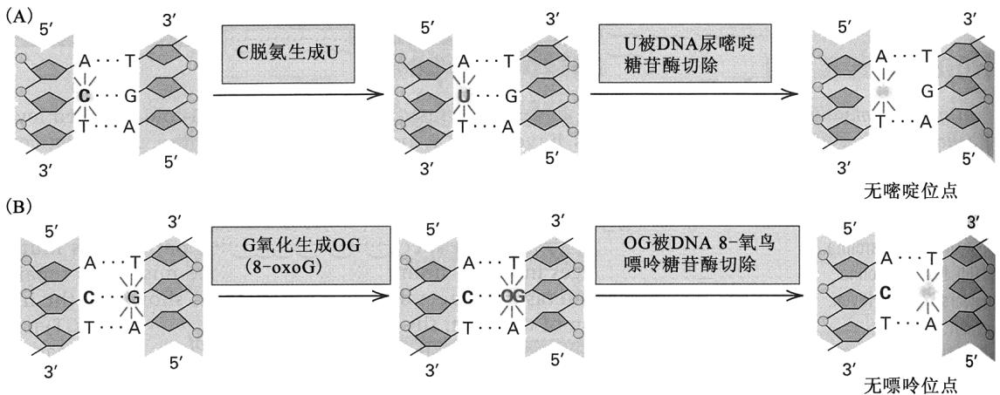  
图 14.32 碱基切除。(A) 尿嘧啶的切除造成无嘧啶位点。(B) 8-氧鸟嘌呤的切除造成无嘌呤位点。

## ■ AP 修复

无嘧啶位点和无嘌呤位点的修复都是通过 AP 修复(AP repair)进行的。图 14.33 以无嘌呤位点为例说明该过程。关键酶是 AP 内切核酸酶(AP endonuclease)，该酶将无碱基核糖从 DNA 上切除，留下一个单链缺口，该缺口被一种专门的 DNA 聚合酶(聚合酶 $\beta$ )修复。缺口补上后，在修复链上留下一个切口，该切口被 DNA 连接酶封闭，完成修复。

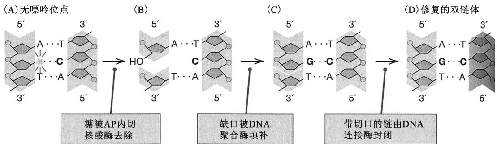  
图 14.33 AP 内切核酸酶的作用。(A) DNA 双链体中的一个无嘌呤位点。(B) AP 内切核酸酶将空的脱氧核糖从 DNA 链上切除。(C) 一种专门的 DNA 聚合酶以连续链为模板填补缺口。(D) 留下的切口被 DNA 连接酶封闭，恢复原来的序列。AP 内切核酸酶以类似方式修复无嘧啶位点。

## ■ 核苷酸切除修复

核苷酸切除修复(nucleotide excision repair)是一个普遍存在的多步骤酶促过程，在该过程中，一段受伤的 DNA 链从双链分子中被去除，并代之以一段新链，这段新链以未受损伤的链为模板，通过再合成而得(图 14.34)。修复过程的底物可为双链分子中的任何扭曲。扭曲将修复蛋白募集到扭曲位点，于是 DNA 双链解旋。有趣的是，在真核生物中，负责解旋的酶系是正常的转录因子之一(TFIIH)。解旋之后，修复内切核酸酶在糖—磷酸主链上进行两次切割。被

切除的区域通常相当精确。在原核生物中，切割位点距离损伤的5'端8个核苷酸和3'端5个核苷酸；而在真核生物中，切割位点距离损伤的5'端24个核苷酸和3'端5个核苷酸。专门的DNA聚合酶(聚合酶δ、聚含酶ε)以缺口一端的3'游离羟基作为引物，合成新链。修复过程的最后一步，是以DNA连接酶将新合成的片段连接成连续的链。

有几种综合征与切除修复缺陷有关，包括着色性干皮病(xeroderma pigmentosum)、科克因综合征(Cockayne's syndrome)和毛发硫营养不良(trichothiodystrophy)。虽然这几种综合征都有皮肤异常和神经缺陷之类的症状，但它们在其他方面差异显著。例如，着色性干皮病患者具有严重的光过敏性和早发性皮肤癌的高发病率；科克因综合征患者具有明显的侏儒症；而毛发硫营养不良患者硫缺乏、脆发并常有独特的面部畸形。

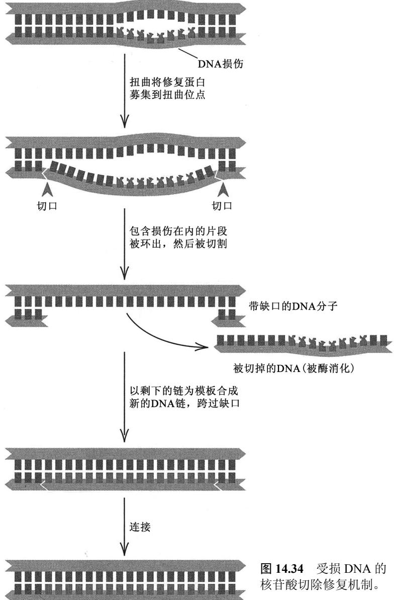

## - 光复活

有许多酶可特异性识别 DNA 损伤，并催化其直接逆转。通过光复活 (photoreactivation) 逆转紫外线诱导的嘧啶二聚体，是在一些生物中发现的一个经典例子。在光复活中，一种酶断开二聚体中连接嘧啶的键，从而恢复原来的碱基 (图 14.26)。该酶在黑暗中与二聚体结合，但随后利用蓝光的能量来切割连接嘧啶的键。DNA 损伤的酶促逆转的另一个重要例子，是一种从 $O^6$ -乙基鸟嘌呤上去除乙基，恢复原来的鸟嘌呤碱基的酶 (图 14.25)。如果未经酶促修复， $O^6$ -乙基鸟嘌呤会与胸腺嘧啶配对，而不是与胞嘧啶配对。

## - DNA 损伤旁路

有时 DNA 损伤一直存在，而不被逆转或去除，但其危害效应可被降到最低限度。这往往要求在复制过程中要跳过受损区域，因此这种过程称为 DNA 损伤旁路 (DNA damage bypass)。

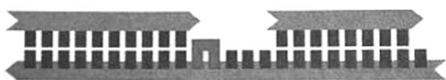

例如，当 DNA 聚合酶抵达受损位点(如嘧啶二聚体)时，它停止该链的合成。但是，一段短暂的时间之后，合成在损伤的另一边重新起始，链继续增长，产生一条带缺口的链，受损位点在缺口中间。

该缺口可通过与具有相同极性的亲链进行链的互换而被补上，而在那条链中产生的次生缺口可由修复合成(repair synthesis)过程填补(图 14.35)。这种互换和再合成的产物是两条完整的单链，从而在下一轮复制中，这两条链的每一条都可作为模板，以合成完好的 DNA 分子。

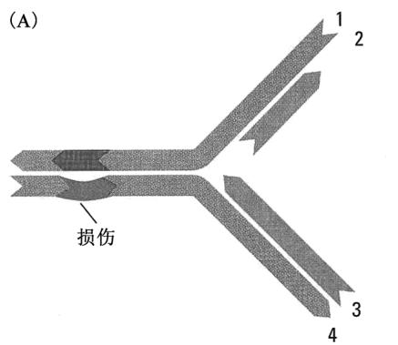

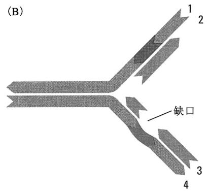

图 14.35 DNA 损伤旁路。(A) 在链 4 中具有 DNA 损伤的一个分子正在被复制。(B) 通过在损伤的另一边重新起始合成，在链 3 中产生一个缺口。(C) 亲链 1 的一个片段被切下，然后插入链 3 中。(D) 随后，链 1 中的缺口由修复合成过程填补。  
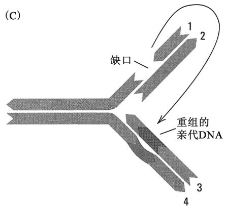

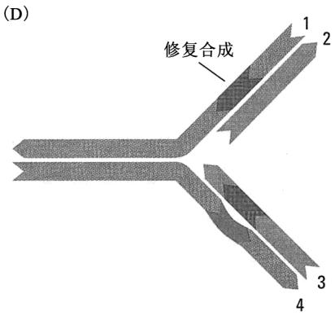

## - 双链缺口修复

在 DNA 中双链缺口很常见(图 14.36A)。其产生的原因包括：跨越一条模板链中的未修复切口复制；跨越严重损伤或交联的两条模板链复制；酶切割；转座因子切除；拓扑异构酶抑制；电离辐射处理；以及其他许多因素。

在一个称为非同源末端连接 (nonhomologous end joining) 的酶促过程中，缺口两侧的 DNA 链的两个末端被简单地重新连接起来，这种解决办法导致原来存在于缺口中的 DNA 序列缺失。另外，当细胞中存在同源 DNA 分子时，该分子可被当作 DNA 合成的模板，修复从缺口中失去的核苷酸序列。这种修复模板可以是同源染色体中的分子，也可以是姐妹染色单体中的分子。

这种模板指导的缺口修复(template-directed gap repair)过程如图14.36所示。在双链缺口中，缺口两侧的末端通常会有3'单链突出端，因为5'端会被细胞中存在的特殊的核酸酶修剪(图14.36A)。3'单链突出端被一些单链结合蛋白结合而稳定；但是，一种称为RAD51的特殊蛋白质会与3'单链突出端结合，形成一种细丝，这种细丝可找到模板分子中的同源序列，并取而代之(B部分)。这种链的侵入使断裂的3'端得以沿模板通过新合成而延伸(C)。在第2章所讨论的人类乳腺癌基因BRCA1和BRCA2的产物可参与双链缺口修复，这两种产物涉及的正是这种修复过程的链侵入期。

当断裂的双链其中一条链的 3' 端被延伸到足够长时，它会回到它原来的配对链上（图 14.36D），生成在每条链上有一个单链缺口的分子。但是，每个单链缺口都有一个游离的 3' 端，可被延伸跨过缺口，因此最终结果是得到一个完全修复的分子(图 14.36E)。在第 6 章已经讲过，在减数分裂过程中，DNA 的双链断裂是起始同源重组的常规底物。事实上，图 14.36 中的修复过程与图 6.30 所示的同源重组的非交互途径是一样的。该修复过程使用的蛋白质与同源重组所用的那些蛋白质相同(细菌的 RecA 是真核生物的 RAD51 的对应物)，但同源重组还可以另一种方式进行，这种方式与图 14.36 所示的修复方式不同，缺口分子和模板分子会发生重组。交换途径的细节如图 6.30C 所示。

## - SOS 修复系统

在大肠杆菌及其近缘种中发现的 SOS 修复 (SOS repair) 是一系列复杂的过程，它包含另一种旁路系统，该系统允许 DNA 复制跨越嘧啶二聚体或其他 DNA 扭曲而进行，但以复制的忠实性为代价。即使形成完整的 DNA 链，这些链也往往是有缺陷的。SOS 修复又称为易错修复 (error-prone repair)。SOS 修复系统的一个显著特征是，只有被 DNA 损伤诱导时它才具有活性。一旦激活之后，SOS 系统使复制又能够跨过受损区域而向前推进，但所添加的核苷酸往往不正确，因为受损的模板链不能被正确复制。DNA 聚合酶的校对系统被放宽，以使聚合能够不管螺旋的扭曲，跨过损伤继续进行。

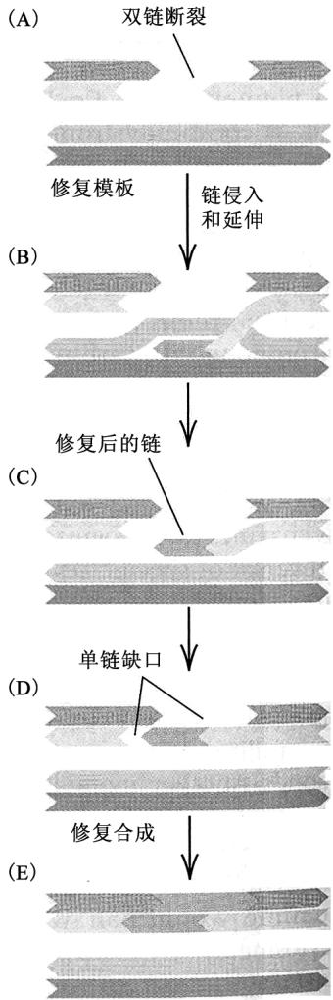

## 14.7 回复突变和抑制基因突变

在迄今已经考察过的大多数突变中，都是野生型(正常)基因被改变成引起突变表型的形式，这样的事件称为正向突变(forward mutation)。突变常常是可逆的，恢复野生型表型的事件称为回复(reversion)。回复可由回复突变(reverse mutation)引起，回复突变是在原来的正向突变中发生的碱基序列改变的精确逆转，即恢复野生型DNA序列。回复也可由基因组中其他位点发生的第二个突变引起，该突变弥补了原图 14.36 模板指导的缺口修复。(A) 具有 3' 单链突出端的缺口 DNA 分子。(B) 模板侵入及 3' 端的延伸。(C) 已延伸的 3' 端释放。(D) 3' 端与其原来的配对链结合。(E) 新合成跨越单链缺口，得到完全修复的分子。

来突变的效应。这种第二位点机制更为常见，这种类型的突变称为抑制基因突变(suppressor mutation)。抑制基因突变可发生在其抑制的突变所在基因的不同位点(基因内抑制)，或在不同的基因中(基因间抑制)。大多数抑制基因突变不会完全恢复野生型表型，其原因在以下对两类抑制的讨论中自会明白。

## ■ 基因内抑制

移码突变的回复通常是基因内抑制(intragenic suppression)引起的；改变mRNA阅读框的一个核苷酸对的增加(或缺失)，其突变效应可被基因中邻近位点另一核苷酸对的补偿性缺失(或增加)所矫正。在第10章讨论过的一个巧妙实验中，基因内移码阻抑被用来证明遗传密码是三联体密码。

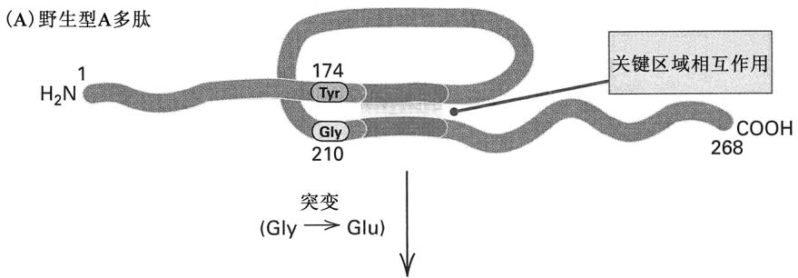

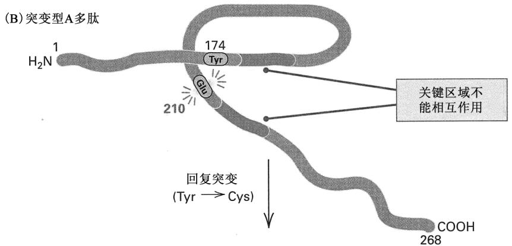

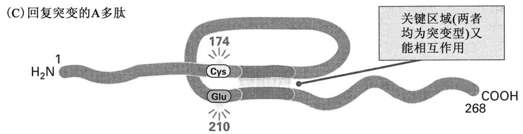  
图 14.37 大肠杆菌中突变及基因内抑制对色氨酸合成酶 A 蛋白的折叠和活性的作用模型。(A)野生型蛋白，其中，多肽链的两个关键区域(橙色片段)相互作用。(B)210 位氨基酸的置换阻止关键区域相互作用，使多肽链正确的折叠被破坏。(C)174 位氨基酸的改变抑制原来的正向突变的效应。含该氨基酸的区域的结构被改变，使关键区域又能结合到一起。

在以下现象中观察到另一种类型的基因内抑制：某个氨基酸改变所导致的蛋白质活性的丧失，至少部分被同一蛋白质中另一个氨基酸的改变恢复。图 14.37 示大肠杆菌 trpA 基因的蛋白质产物中这种抑制的一个例子。由 268 个氨基酸组成的 TrpA 多肽，是构成大肠杆菌色氨酸合成酶的两种多肽之一。许多突变可使该酶失活，图中所示突变为其中之一，该突变导致野生型蛋白质中第 210 位的氨基酸从甘氨酸变为谷氨酸。该甘氨酸不在活性位点中；确切地说，失活是该蛋白质在折叠上的改变所致，这种改变间接影响活性位点。该突变型蛋白质的活性被第二个突变部分恢复，该突变导

致第 174 位氨基酸从酪氨酸变成半胱氨酸。只是酪氨酸被半胱氨酸替代的蛋白质是无活性的，同样是因为蛋白质形状改变。第二个位点的这种改变之所以能恢复活性，是因为含 174 位和 210 位氨基酸的两个区域相互作用，碰巧产生具有正确折叠形式的蛋白质。这种类型的回复通常都可被视为蛋白质的两个区域相互作用，因而，研究突变体和回复突变体的氨基酸序列，往往能为阐明蛋白质的结构提供有用信息。

## ■ 基因间抑制

基因间抑制 (intergenic suppression) 是指在不同基因中的突变可消除或抑制突变表型。许多基因间抑制基因非常特异，只能抑制一个或几个其他基因的突变效应。例如，由于某个代谢途径中某一步骤突变失活，使该代谢途径的中间产物堆积而引起的表型，有时可被途径中起作用更早的其他基因的突变抑制，这些基因减少了中间产物的浓度。这些抑制基因仅对影响沿途径往下步骤的突变起作用，并且它们抑制这些基因的所有等位基因。

在原核生物中，了解得最深的基因间抑制类型见于一些 tRNA 基因中，这些基因的突变型可抑制许多其他基因特定的突变等位基因的效应。这些抑制基因突变改变 tRNA 中的反密码子序列，从而改变 mRNA 密码子被 tRNA 分子识别的特异性。这一类型的突变最初在大肠杆菌的某些菌株中检测到，这些突变能够抑制不能在标准菌株上形成噬菌斑的特定 T4 噬菌体突变体。这些菌株能抑制细菌基因组中众多其他基因的特定等位基因。在每种情况下，被抑制的突变都是无义突变，即那些在基因编码序列中产生终止密码子 (UAA、UAG 或 UGA)，结果多肽合成提前终止，从而仅合成多肽氨基端片段的突变，因此这些抑制因子称为无义抑制因子 (nonsense suppressor)。抑制的机制已在第 10 章中详细讨论过，其概况是：抑制基因突变发生在若干正常 tRNA 分子之一的反密码子中，使其能够与无义密码子配对并插入氨基酸，以便翻译能够继续进行。这样的突变不会致死，因为大多数 tRNA 基因存在数个拷贝，所以仍存在非突变的 tRNA 拷贝，使密码子的正确翻译得以进行。

## ■ 用于诱变剂/致癌剂检测的埃姆斯试验

鉴于作为环境污染物而存在的化学物质的数量增加，检测这些物质的诱变性已变得非常重要。并且大多数致癌剂(carcinogen)也是诱变剂，因而诱变性给潜在的危险物质提供了初步筛选的方法。筛选大量物质的诱变性的一种简单方法，是利用细菌营养型突变体的回复试验。在最简单的一种回复试验中，可能是诱变剂的某种化合物被加到固体培养基中，用已知数目的突变型细菌倒平板，然后对回复突变型菌落进行计数。如果回复突变率显著大于缺乏受试化合物时得到的回复突变率，则证明该物质为诱变剂。但是，这种简单试验不能证明大量潜在致癌剂的诱变性。因为许多物质不是直接诱变的(或致癌的)；确切地说，它们要通过酶促反应才能转变成诱变剂，这些酶促反应发生在动物肝脏中，在细菌中没有对应的酶促反应。这些酶的正常功能是将自然存在的各种有害物质转变为可在尿中清除的水溶性无毒物质，从而保护机体免受有害物质的危害。但是当这些酶碰到某些人造的或自然的化合物时，它们将这些可能本身无害的物质转变成诱变剂或致癌剂。将肝细胞酶加到细菌培养基中后，这些酶可激活这些化合物，使它们的诱变性得以识别。添加肝脏提取物，是检测致癌剂和诱变剂的埃姆斯试验的一个步骤。

在埃姆斯试验(Ames test)中，含碱基置换或移码突变的鼠伤寒沙门菌(Salmonella typhimurium)组氨酸需求型 $(\mathrm{His}^{-})$ 突变体，被测试向 $\mathrm{His}^{+}$ 回复的情况。另外，在这些菌株中掺入几种突变型等位基因，使切除修复系统失活，并使细胞对外源分子具有更好的通透性，从而使这些菌株对于诱变更加敏感。因为有些诱变剂仅作用于复制中的DNA，所以所用的固体培养基含有足够支持数轮复制，但不足以形成可见菌落的组氨酸。培养基中还含有待检测的潜在诱变剂和小鼠肝脏提取物。如果受试物质是诱变剂，或其被转变为诱变剂，就会形成一些菌落。也可通过在培养基中掺入不同量的潜在诱变剂，进行回复突变率的定量分析。回复突变率一般取决于待测物质的浓度，并且对已知致癌剂或诱变剂而言，回复突变率大致与其在动物中的致癌能力呈正相关。埃姆斯试验简单、快速、廉价且极其灵敏。有些化学物质在量小到 $10^{-9}\mathrm{g}$ 的情况下就可被检测出具有诱变性，一根香烟少至1/100的浓缩物就可被证明具有诱变性。该试验也是高度定量的(图14.38)。不必将化学物质过分简单地划分成“诱变的”或“非诱变的”。可以按照它们诱变的效力来分类，因为可以检测到的效力变化范围超过百万倍。

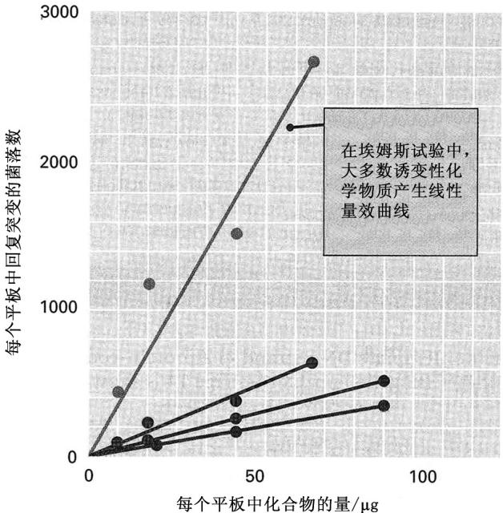  
图 14.38 在埃姆斯试验中用不同化学诱变剂获得的线性量效关系。[数据来自 B. N. Ames, Science 204(1979):587-593.]

## 本章概要

\- 可根据在分子水平上改变的类型、表达条件、对基因功能的影响及其他方式对突变进行分类。

\- 许多突变发生在非编码 DNA 序列中。发生在编码序列中的突变中，错义(非同义)突变是导致氨基酸置换的核苷酸置换，同义(沉默)置换将密码子变成同义密码子，而无义突变产生翻译终止密码子。单碱基插入或缺失引起移码突变，翻译阅读框偏移。

\- 三核苷酸重复序列的扩展(拷贝数增多)是一种重要的突变机制，与几种人类遗传病包括脆性X综合征和亨廷顿病相关。

\- 转座因子是能在染色体内改变位置或在染色体之间移动的 DNA 序列。转座因子的插入是自发突变的一种重要机制。

\- 突变可被不同的因素诱导，包括碱基类似物、嵌入剂、高活性化学物质和 X 射线；大多数诱变剂也是致癌剂。

\- 细胞含有修复不同类型 DNA 损伤的酶促途径。最重要的修复机制有错配核苷酸的错配修复、无嘌呤或无嘧啶位点的 AP 修复、核苷酸切除修复及绕开严重 DNA 损伤的复制后修复。

\- 抑制基因突变减小或消除已知突变的表型效应。

## 基础回顾

\- 什么是自发突变？什么是诱发突变？什么是条件突变？

\- 给以下各种类型的核苷酸置换下定义，并各举一个假想的例子：转换、颠换、错义(非同义)置换、同义(沉默)置换、无义置换。

\- 对条件突变而言，是什么决定突变表型是否会被表达？

\- 为什么一个生物个体有可能对于某个温度敏感型致死基因是纯合的？

\- 什么是三核苷酸扩展病？这种“扩展”与复制滑移是如何联系在一起的？举出一种与三核苷酸扩展相关的人类疾病的名称。

\- 什么是“突变率”？在实践中，说某个等位基因具有 $10^{-6}$ /(基因·代)的突变率，是什么意思？

\- 转座因子是什么？解释转座因子如何引起新突变。

\- 影印培养技术怎样证明，即使在没有抗生素的情况下，抗生素抗性突变仍以低频率存在于细菌群体中？

\- 什么是突变热点？为什么突变热点有可能与 DNA 中的甲基化胞嘧啶位点一致？

\- 什么是错配修复？它是如何发生的？举出一种与缺陷型错配修复系统相关的人类疾病的名称。

\- 自发脱嘌呤是最常见的损伤 DNA 的原因，但绝大多数的这种损伤都被修复。这种修复是如何进行的？

## 解题指南

习题 1 T4 噬菌体 rIIB 基因的蛋白编码区中的非模板 DNA 链如下所示:

$$
5 ^ {\prime} - \dots \text { AGACTAGACAAA } \dots - 3 ^ {\prime}
$$

这一特殊的多肽区颇能耐受氨基酸的置换，因此在该区域中的许多错义突变不会破坏功能。分离到两个移码突变：-C 为粗体的 C 缺失，而 +T 为粗体的 A 和粗体的 G 之间有一个 T 的插入。利用重组将这两个突变组合到单个基因中。

(a) 假设野生型阅读框在 mRNA 中包含 AGA 密码子，这一区域的野生型氨基酸序列是什么？

(b)一C突变的结果是什么？

(c)+T 突变的结果是什么？

(d)在双重突变中会出现什么结果?

## 答案

(a) 因为所示序列为非模板 DNA 链的序列，所以相反链为被转录的链。转录以从左向右的方向进行(因为 RNA 转录物是通过在 3' 端添加核苷酸而被延伸的)，因而该区域的 mRNA 具有与非模板链一样的碱基序列 (mRNA 中的 U 替代了 DNA 中的 T)。因此该区域的氨基酸序列是 Arg-Leu-Asp-Lys。

(b) 在一C突变体中，该区域的mRNA序列是5'-AGAUAGACAAA-3'，该序列被翻译成Arg-End，其中，End表示UAG终止密码子。

(c) 在 +T 突变体中，该区域的 mRNA 序列是 5'-AGACUAUGACAAA-3'，它被翻译成 Arg-Leu-End，其中，End 表示 UGA 终止密码子。

(d) 在双重突变体中，mRNA 的序列为 5'-AGAUAUGACAAA -3'，它被翻译成 Arg-Tyr-Asp-Lys。两个移码突变相互弥补，野生型阅读框被恢复。在蛋白质中唯一的差别是，在野生型中第 2 位的 Leu，被双重突变体中的 Tyr 置换。

习题 2 次黄嘌呤碱基(H)是鸟嘌呤的类似物，它与胞嘧啶配对，但偶尔与胸腺嘧啶配对。次黄嘌呤诱变的两种主要机制是什么？它造成什么类型的突变？

## 答案

在此类习题中，首先留意被置换的碱基，然后推测在随后几轮 DNA 复制中会出现什么情况。在比较常见的诱变机制中，H 以与 C 配对的形式进入 DNA 链，在随后的几轮复制中，偶尔与 T 配对。结果将是 G-C 到 A-T 的转换突变。在较不常见的诱变机制中，H 以与 T 配对的形式进入 DNA 链。在随后的几轮 DNA 复制中，H 通常会与 C 配对。在该机制中，结果是 A-T 到 G-C 的转换突变。

习题 3 DNA 的自发脱嘌呤以大约 $3 \times 10^{-9}$ 次脱嘌呤/(嘌呤核苷酸·min) 的频率发生。一个二倍体人类细胞具有约 $6 \times 10^{9}$ bp 的基因组。在每个细胞中，每天必须修复大约多少次自发脱嘌呤？

## 答案

因为每个碱基对都包含一个嘌呤，所以每个二倍体细胞每分钟发生的自发脱嘌呤数目为 $(3\times10^{-9})$ $(6\times10^{9})=18$ 次脱嘌呤/(细胞·min)，或 $18\times60\times24=25\ 920$ 次脱嘌呤/(细胞·天)。

## 分析与应用

14.1 一个核苷酸对置换成另一个核苷酸对有 12 种可能 (例如，A-T→G-C)。

(a)哪些改变是转换？哪些改变是颠换？

(b) 若核苷酸置换是随机的，转换：颠换的期望比值是多少？

14.2 在下列各种氨基酸置换中，需要最少多少个单核苷酸置换？

(a) Trp→Lys

(b) Met→His

(c) Tyr→Gly

(d) Ala→Asp

14.3 抗除草剂阿特拉津 (atrazine) 的杂草在 psbA 基因中有一个单核苷酸置换，该置换导致多肽中的一个丝氨酸被丙氨酸替代。在 psbA 基因中导致该氨基酸置换的碱基改变是转换还是颠换？

14.4 除草剂草甘膦(glyphosate)通过抑制5-烯醇丙酮酰莽草酸-3-磷酸合成酶(EPSPS)起作用。已有几种植物进化出对该除草剂的抗性。在某些情况下，改变在于EPSPS本身，并已找到原因是T102I和P106S这两个氨基酸置换的联合效应。(在这种符号系统中，数字是蛋白质中氨基酸残基的编号，野生型氨基酸写在数字左边，突变型氨基酸写在数字右边。)

(a)什么核苷酸置换可导致T102I?

(b)什么核苷酸置换可导致P106S?

(c) 对为什么自然发生的草甘膦突变体如此罕见提出一个解释。

14.5 分离到一个不能被诱导回复的突变。什么类型的分子改变可能导致这样的结果？

14.6 偶尔会发现，有人长一只蓝眼睛和一只棕色眼睛，有人的一只眼睛有一部分与其余部分的颜色不一样。这些表型可用新突变来解释吗？如果能，这些突变发生在什么类型的细胞中？

14.7 在深海火山口发现一种生物，除了它的 DNA 含 3 种而不是 2 种碱基对以外，其遗传机制与其他生物很像。这 3 种碱基对是 G 与 C 配对、A 与 T 配对，以及 M 与 N 配对。M 碱基是嘌呤，N 是嘧啶。

(a)在这种生物中，可出现哪些类型的核苷酸置换？

(b)在所有可能的核苷酸置换中，转换：颠换的比例是多少？

(c)该转换：颠换的比例与正常 DNA 中转换：颠换的期望比例相比，有何差别？

14.8 在 14.7 题描述的火山口生物中，翻译将 M 等同于 G 对待，将 N 等同于 C 对待。

(a) 翻译起始密码子是什么？

(b)终止密码子是什么？

14.9 在具有随机核苷酸序列的 mRNA 中，终止密码子之间的平均距离是多少？

14.10 在由相同比例的 A、U、G 和 C 构成的编码序列中，随机核苷酸置换会产生链终止密码子的概率是多少？

14.11 一个突变的核苷酸序列能否显示该突变是显性的还是隐性的？

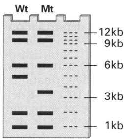

14.12 正在研究某种由双链 DNA 构成基因组的噬菌体时，发现一个产生特大噬菌斑的突变体。凝胶示意图示用限制酶 Sal I 来消化野生型 (Wt) 和突变型 (Mt) 噬菌体 DNA 所得的条带。给这个特大噬菌体突变提出一个分子水平的解释。

14.13 某个小质粒包含一个基因，其非模板链包含如下的蛋白编码序列：

$$
5 ^ {\prime} - \text {   ATGCATCCCCCCCCCATGCAT   } - 3 ^ {\prime}
$$

翻译阅读框为 ATG-CAT-CCC-...，依次类推。该质粒只含有 2 个 ATGCAT 限制性位点，酶 Ppu10 I 在每条链中竖线的位置切割该位点：A|TGCAT。用 Ppu10 I 消化该质粒，然后将片段再连接到一起。分离含有一个且只含有一个拷贝的上述序列，

且其位置正确的质粒。一半的质粒产生氨基酸序列 Met-His-Pro-Pro-Pro-Met-His。另一半质粒编码的氨基酸序列是什么？它们是怎么来的？

14.14 附图示两个双链 DNA 分子，各含两个正向 (a) 或反向 (b) 的转座因子 (阴影部分) 拷贝。绘制每种情况下转座因子间同源重组的结果。

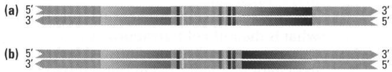

14.15 一个 $lac^{+}$ tet-r 质粒被某种限制酶在 $lac^{+}$ 基因中切割。该酶具有 4 个碱基的限制性位点，产生具有两个碱基的单链突出端的片段。lac 基因中的切割点在编码多肽链第二位氨基酸的密码子中，该位点可为任何氨基酸，而不丧失功能。切割之后，用 DNA 聚合酶 I 将单链末端转变成平端，然后通过平端连接将末端连接起来，重新形成环。用该 DNA 转化一个 $lac^{-}$ tet-s 细菌菌株，筛选出四环素抗性细菌。这些抗性菌落的 Lac 表型是什么？请解释。

14.16 人类血红蛋白 C 是一种变异，其中， $\beta$ 血红蛋白链中的一个赖氨酸被谷氨酸置换。什么单碱基置换可解释该血红蛋白 C 突变？

14.17 通过单碱基置换，有多少种氨基酸可置换酪氨酸？（假设不知道所用的酪氨酸密码子是哪一个。）

14.18 常常在固体培养基中掺入染料，来检测细菌细胞是否能够利用某种特定的糖作为碳源。例如，在含乳糖的伊红亚甲蓝(EMB)培养基上，Lac $^{+}$ 细胞产生紫色菌落，而Lac $^{-}$ 细胞产生粉红色菌落。如果用某种诱变剂处理一个 $Lac^{+}$ 细胞群体，让该群体培养数代之后，再将其置于 EMB 乳糖培养基上，在大量的紫色菌落中，发现几个粉红色菌落。但是如果在细胞与诱变剂接触之后，立即将诱变细胞置于 EMB 乳糖培养基上，有些菌落表现为扇状菌落（一半紫色、一半粉红色）。请解释扇状菌落是怎样出现的。

14.19 在用 5-溴尿嘧啶诱导的突变中，估计下列氨基酸置换哪一种的频率最高？(1) Met→Leu，(2) Met→Lys，(3) Leu→Pro，(4) Pro→Thr，(5) Thr→Arg。

14.20 在大肠杆菌色氨酸合成酶 A 蛋白基因的数百个错义突变中，在 268 个氨基酸位置中受到一个或多个突变影响的位置不足 30 个。请解释，为什么受氨基酸置换影响的位置数目这样小。

14.21 2-氨基嘌呤(Ap)分子是腺嘌呤的一种类似物，与胸腺嘧啶配对。它也偶尔与胞嘧啶配对。2-氨基嘌呤可诱导什么类型的突变？

14.22 对自发错义置换所致的突变而言, 正向突变(从野生型等位基因到突变型等位基因)的频率总是比回复突变(从突变型等位基因回到野生型等位基因)的频率高得多。解释这是为什么。

14.23 果蝇的 X 染色体包含约 2700 个基因。在每一代中，所有 X 染色体中大约 1% 经自发突变形成新的隐性致死基因。如果自发突变率是 $10^{-5}/(\text{基因} \cdot \text{代})$ ，所有 X 连锁基因可突变为致死基因的比例是多少？

14.24 一种雄性果蝇携带某种X连锁的温度敏感型隐性致死基因，在 $18^{\circ}\mathrm{C}$ 条件下可存活，但在 $29^{\circ}\mathrm{C}$ 条件下致死。如果这种雄果蝇与下列雌果蝇交配，并在 $29^{\circ}\mathrm{C}$ 条件下培养后代，预计后代中的性比是多少？

(a) 正常 XX 雌果蝇

(b) 并联 X 雌果蝇

14.25 在像 $\lambda$ 噬菌体和 T4 噬菌体、大肠杆菌、粗糙链孢霉和酿酒酵母这样一些差异巨大的基因组中，自发突变率都约为 0.003 次突变/(基因组·轮 DNA 复制)。 $\lambda$ 噬菌体、大肠杆菌和粗糙链孢霉的基因组大小约分别为 5 万、460 万和 1350 万个碱基对。

(a)在每轮复制中，未遭到自发突变的基因组的比例是多少？

(b) 在这些基因组中，每个基因组每次 DNA 复制每个碱基对的突变率是多少？

(c) 每个碱基对的突变率的这种差异，在突变率的进化方面说明了什么？

14.26 如果某条染色体中的某个基因突变的概率为 $5 \times 10^{-5}/$ 代，并且假设可在连续世代中跟踪某条特定染色体中的等位基因。

(a)在连续1万代中，该等位基因不发生突变的概率是多少？

(b)该等位基因发生一次突变的平均代数是多少?

14.27 在小鼠中，平均约 1Gy 的 X 射线剂量产生与自发突变率相等的诱发突变率。

(a) 将自发突变率考虑在内，1Gy 时的总突变率是多少？

(b)预计多少X射线剂量可将此突变率增加 $50\%$ ?

(c)预计多少X射线剂量可将此突变率增加 $10\%$ ？

14.28 附图示两条非同源染色体,每条染色体含一个拷贝的转座因子(灰色),相对于着丝粒而言,其方向可为同向(a)或反向(b)。为清楚起见,相对于染色体的长度,转座因子的长度被大大夸大了。(实际上,果蝇中转座因子的平均长度约为染色体长度的0.01%。)绘图说明转座因子之间异位重组的结果。

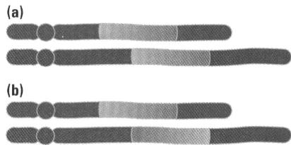

14.29 本题说明怎样用条件突变来确定发育途径中的遗传控制步骤。某个器官以 $\mathrm{A} \rightarrow \mathrm{B} \rightarrow \mathrm{C}$ 的系列步骤进行发育，且 $X$ 和 $Y$ 两个基因都是该系列进行所必需的。条件突变 $X[hs]$ 对热敏感(基因产物在高温下失活)，而条件突变 $Y[cs]$ 对冷敏感(基因产物在低温下失活)。构建双重突变体 $X[hs] / X[hs]$ 、 $Y[cs] / Y[cs]$ ，并在高温或低温下饲养。在下列各种情况下，在高温和低温下发育会进行到什么程度？

(a) X 和 Y 的功能对 A→B 步骤都是必要的。

(b) X 和 Y 的功能对 B→C 步骤都是必要的。

(c) X 的功能对 A→B 步骤必要，而 Y 的功能对 B→C 步骤必要。

(d) Y 的功能对 A→B 步骤必要，而 X 的功能对 B→C 步骤必要。

14.30 此处所示的为某个基因蛋白编码区中的非模板 DNA 链:

$$
5 ^ {\prime} - \dots \text { AGAGTAACGCTCAGA } \dots - 3 ^ {\prime}
$$

跨越该区的翻译阅读框为 Arg-Val-Thr-Leu-Arg 等。多肽的这一特定区域对氨基酸置换相当耐受，因而该区域中的许多错义突变不会破坏功能。分离到 4 种移码突变：-G 为粗体的 G 缺失，+G 为粗体的 G 重复，-C为粗体的 C 缺失，而+C 为粗体的 C 重复。所有这 4 种突变都导致无功能蛋白质。利用重组来组合这些突变，希望一个核苷酸的缺失(或重复)会被离得不远的重复(或缺失)弥补，因为第二个突变会将阅读框移回正常位置，而两个突变之间氨基酸的改变应该不会破坏功能。尽管+G 与 -C 的组合确实恢复了蛋白质的功能，但是 -G 与 +C 的组合仍是突变体。怎样解释这一结果？

14.31 一株不能合成精氨酸(因而需要在培养基中添加这种氨基酸)的链孢霉，产生一个在缺乏精氨酸的情况下能够生长的回复突变型菌落。在该回复突变型菌落与野生型菌落之间进行杂交。如果回复突变是以下列机制发生的，在杂交后代中，不依赖于精氨酸的后代的比例是多少？

(a)产生原来的 arg 突变等位基因的核苷酸改变的精确逆转。

(b)位于不同染色体上的另一个基因中发生的 arg 等位基因的抑制基因突变。

(c)发生在同一条染色体中离 arg 等位基因 10 图距单位远的另一个基因中的抑制基因突变。

## 挑战题

挑战题1 下列8孢子囊中哪些子囊可能是 $m$ 基因座的基因转换所产生的？试述这些子囊是如何产生的。

<table><tr><td>子囊类型</td><td>A</td><td>B</td><td>C</td><td>D</td><td>E</td><td>F</td></tr><tr><td>孢子1</td><td>+</td><td>+</td><td>+</td><td>+</td><td>+</td><td>+</td></tr><tr><td>孢子2</td><td>+</td><td>+</td><td>+</td><td>+</td><td>+</td><td>+</td></tr><tr><td>孢子3</td><td>+</td><td>m</td><td>+</td><td>+</td><td>m</td><td>m</td></tr><tr><td>孢子4</td><td>+</td><td>m</td><td>m</td><td>m</td><td>m</td><td>m</td></tr><tr><td>孢子5</td><td>m</td><td>m</td><td>m</td><td>+</td><td>+</td><td>m</td></tr><tr><td>孢子6</td><td>m</td><td>m</td><td>m</td><td>m</td><td>+</td><td>m</td></tr><tr><td>孢子7</td><td>m</td><td>+</td><td>m</td><td>m</td><td>m</td><td>m</td></tr><tr><td>孢子8</td><td>m</td><td>+</td><td>m</td><td>m</td><td>m</td><td>m</td></tr></table>

挑战题 2 一个大肠杆菌菌株含有一个突变型的 tRNA $^{Leu}$ 。该突变型 tRNA 不像在非突变型细胞中那样识别密码子 5'-CUG-3'，而是识别密码子 5'-GUG-3'。另一个基因中的一个错义突变(影响链上第 28 位的氨基酸)，在具有该突变型 tRNA $^{Leu}$ 的细胞中被抑制。

(a) 假设进行正常的沃森-克里克碱基配对，确定野生型和突变型 tRNA $^{Leu}$ 的反密码子。

(b) 突变型 tRNA $^{Leu}$ 基因中存在的是哪种类型的突变？

(c) 如果错配突变未被抑制，在突变型多肽链的第 28 位插入的将是什么氨基酸？

(d) 当该错配突变被抑制时，在第 28 位插入的是什么氨基酸？

## 网上遗传学

“网上遗传学”(GeNETics)会为你介绍在互联网上寻找遗传学信息的某些最重要的站点。要浏览这些站点，请访问为《遗传学：基因和基因组分析》(第八版)配备的 Jones and Bartlett 公司配套站点http://biology.jbpub.com/book/genetics/8e/。

在该站点中，你会找到一个按章列出的重点关键词列表。选择某个关键词后，可链接到某个网站，其中包含与此关键词相关的信息。
