# 第 15 章 细胞周期和癌的分子遗传学

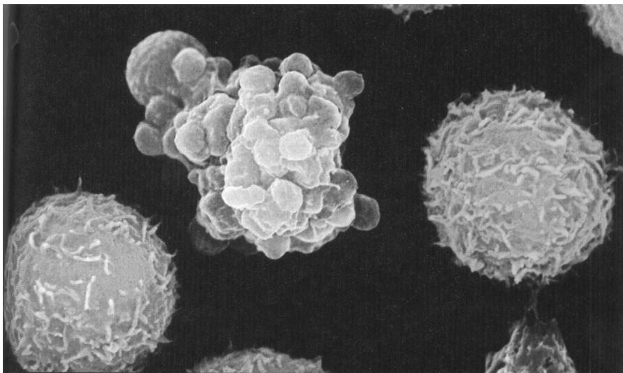

中央的细胞正在经历凋亡(即程序性细胞死亡)过程，凋亡常常伴有此类特征性膜泡的形成。程序性细胞死亡有助于维持基因组从上一代到下一代的完整性。癌细胞之所以具有癌的性质，部分原因是它们发生了可以规避程序性细胞死亡的突变。(©Phototake, Inc./Alamy Images.)

## 本章提纲

15.1 细胞周期

15.2 细胞周期的遗传分析

15.3 细胞周期的进程

15.4 细胞周期中的检查点

15.5 癌细胞

15.6 遗传性癌综合征

15.7 急性白血病的遗传学

联系：循环作业

利兰·哈特韦尔、约瑟夫·卡洛蒂、约

翰·普林格尔和布雷恩·里德，1974

酵母细胞分裂周期的遗传控制

联系：端粒之恙

威廉·哈恩、克里斯托弗·康特、安替·伦德伯格、罗德里克·贝杰斯伯根、玛丽·布鲁克斯和罗伯特·温伯格，1999

用明确的遗传因子产生人类肿瘤细胞

联系：命中两次、错误两次

艾尔弗雷德·克努森，1971

突变与癌症：视网膜母细胞瘤的统计学研究

## 学习目标与科学能力

理解细胞周期和癌的分子遗传学，会让你对看似平凡的有丝分裂过程，特别是对进化出来控制该过程和避免错误的精巧机制有新的看法。你也会看到，颠覆这些机制的体细胞(有时是种系)突变，会导致生长失控的癌细胞。这些新见识会让你具备多种科学能力。

\- 能叙述推动细胞进行生长、DNA合成、中心体定位、纺锤体形成及细胞周期其他方面的周期蛋白、周期蛋白依赖性激酶及蛋白质降解的作用。

\- 能指出细胞周期的主要检查点，并能解释检查点障碍怎么会导致突变，染色体异常、不分离及多倍性。

\- 能解释 p53 蛋白在细胞周期阻滞时让 DNA 损伤得以修复或促进凋亡的核心作用。

■ 能给肿瘤抑制基因和癌基因下定义，并能分别叙述这两种基因的突变如何能够导致癌症。

■ 能指出白血病发生中启动子融合和基因融合的差异。

癌症是以细胞增殖失控为特征的疾病。调节细胞生长和分裂的正常机制崩溃。癌症是一种遗传病。它由突变引起，这些突变克服了细胞在死亡前能够进行的细胞分裂次数的正常极限。这些突变通常发生在体细胞中，并且完全成熟的恶性肿瘤通常需要一定数量的连续突变才能开始。但偶尔会通过种系遗传某个影响细胞周期调节的突变，从而使遗传该突变的人患恶性肿瘤的风险大大增加(有时可达 $100\%$ )。因此要了解癌症，必须了解支配细胞增殖的正常机制。本章就从此处开始。

## 15.1 细胞周期

有丝分裂细胞周期的基本功能是:

(1) 确保每个细胞周期每个染色体 DNA 分子被复制一次，且仅被复制一次。

(2) 确保每条染色体的两个相同的复本 (两条姐妹染色单体) 被平均分配到两个子细胞中。

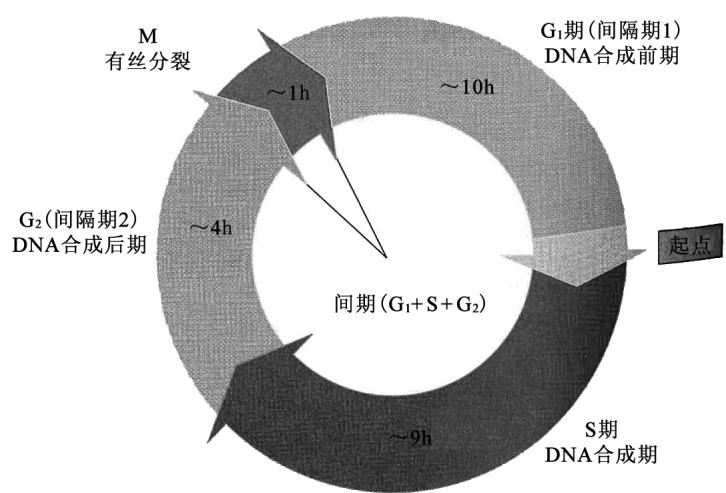  
图 15.1 组织培养中的典型哺乳类细胞的细胞周期，一代的时间为 24h。

从第 4 章可知，细胞周期被分成 4 个时期：M (mitosis, 有丝分裂) 期，其中，姐妹染色单体被物理地分离到两个子细胞核中；由顺序发生的 G₁ (gap 1, 间隔期 1)、S (DNA synthesis, DNA 合成期) 和 G₂ (gap 2, 间隔期 2) 三部分组成的间期 (interphase)。以图 15.1 所示的哺乳类细胞为例来说明细胞周期。在该图中，胞质分裂 (cytokinesis，细胞质分裂成包含子细胞核的大致相等的两部分) 包含在 M 期中。

## ■ 细胞周期中的关键事件

图 15.2 示为确保染色体的正确复制和分配而必须发生的一些关键事件。在间期细胞核附近称为中心体 (centrosome) 的一小个透明细胞质区域的周围，纺锤极 (spindle pole) 被组织起来；在许多生物中，这种组织作用由一对中心粒 (centriole) 来担当，中心粒外观更像颗粒。中心体和中心粒都是微管组织中心，都要复制并定位到合适位置。复制通常始于 $G_{1}$ 晚期，在 S 期中完成 (在有些细胞中，复制可出现得稍微晚一些。) 此后，复制好的两个纺锤极开始慢慢地迁移到细胞核两边相对的位置。与此同时，在细胞核内，在 S 期中，进行 DNA 复制。DNA 复制的完成，标志着 $G_{2}$ 期的开始。在 M 期开始后不久，中心体抵达它们最终的目的地，并且染色体开始凝缩。每个中心体作为纺锤体微管和星体微管形成的核心，各组织双极纺锤体的一极；当核膜瓦解时，凝缩染色体的着丝粒两侧 (动粒) 都会与纺锤体微管连接。因此，每条染色体被物理地与两个纺锤极连接，并被巧妙地移到两个纺锤极之间约正中的位置。后期开始时，纺锤体伸长，着丝粒分裂，姐妹染色单体向两极迁移。一旦子代染色体到达两极，纺锤体就解体，染色体去凝缩，核膜重建。这些事件使细胞回到 $G_{1}$ 期。

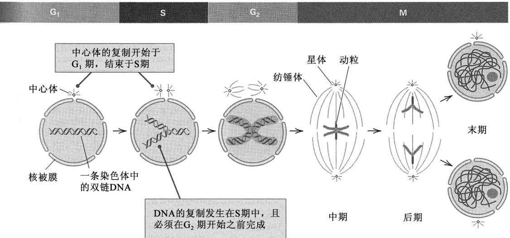  
图 15.2 细胞周期的主要事件。在酵母中，纺锤极体起到与其他许多生物中的中心体相同的功能；两个纺锤极体都是微管组织中心，纺锤体从此处开始出现。在大多数其他生物中，核分裂之后接着是细胞被分成两半(胞质分裂)。在酵母中，在发生核分裂之前，子细胞的“壳”已形成并不断扩大。细胞核(它的膜从未瓦解)移到母细胞和子细胞之间的桥上，并在那里发生核分裂。子细胞核移到两个子细胞胞体后，在两个细胞之间形成一层隔膜。[改编自 L. H. Hartwell and M. B. Kastan, Science 266(1994): 1821-1828.]

通过生物化学、细胞生物学和遗传学方法，现已开始触及调节细胞生长和控制细胞周期的机制问题。最广泛的遗传学研究一直集中在出芽酵母(Saccharomyces cerevisiae，酿酒酵母)和裂殖酵母(Schizosaccharomyces pombe，粟酒裂殖酵母)这两种酵母上。顾名思义，酿酒酵母通过

出芽而增殖。细胞在细胞周期中所处的位置，可通过芽的大小目测监控。该细胞周期的这种实用的特点，见图15.3。芽最初出现在进入S期之后不久，并存在于整个细胞周期。有丝分裂在核膜未瓦解的细胞核中进行。在此情况下，纺锤极，也称纺锤极体(spindle pole body)，被嵌入核膜中。为了定位纺锤体，一个纺锤极体在核膜中移动，移到与对面的第二个纺锤极体刚好相对的位置。此时，细胞核已经含有复制好的染色体。芽的端部捕捉胞质微管的端部，使一个纺锤极体与芽的皮层连接，这导致 $\mathrm{G}_2$ 期时细胞核

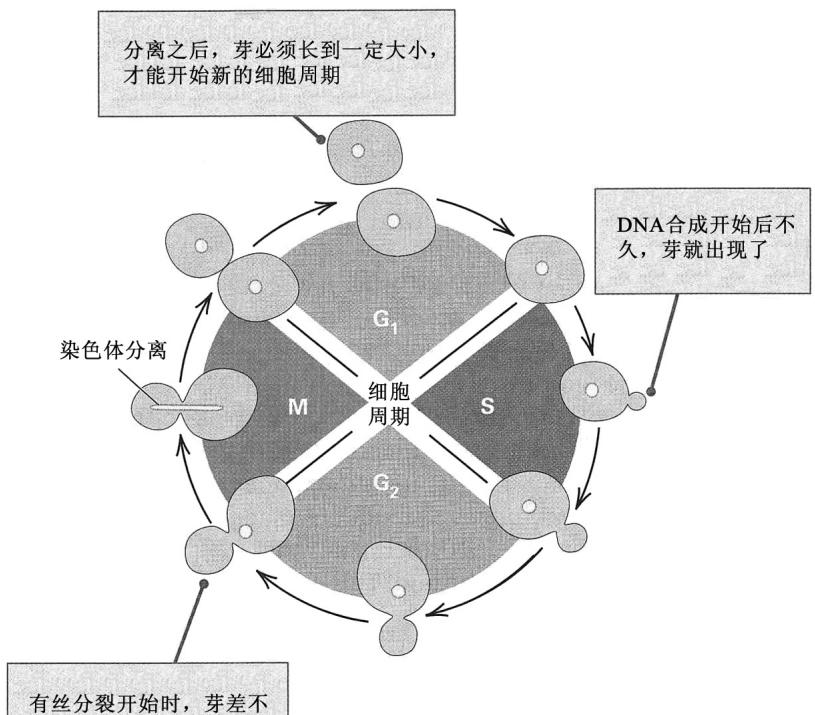  
图 15.3 出芽酵母(酿酒酵母)的细胞周期。

向连接母细胞和子细胞的细胞质颈部移动。当芽长到与母细胞几乎一样大小时，发生有丝分裂。在染色体分离后不久，一个屏障，或称为隔膜(septum)，横亘在母细胞和子细胞之间。在细胞分离之时，子细胞仅比母细胞略小，但它通常一定会长大这额外的一点点，以便在开始它自己

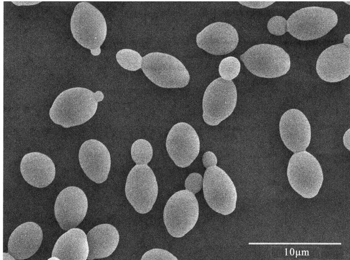  
图 15.4 处于细胞周期不同阶段的出芽酵母二倍体细胞的扫描电子显微照片。芽的大小与细胞在细胞周期中的位置相关。在此处，芽的大小范围从相当小到与母细胞几乎一样大。(©Bipphoto/Photo Researches, Inc.)

cell)中单个基因在两个或多个细胞周期中的表达模式。(在“同步化细胞”培养物中，所有细胞处于细胞周期的相同阶段。)横过顶部的彩色条带表示细胞周期的阶段(使用的颜色与右边标记阶段的颜色相同)。对每个基因而言，红色表示相对于非分裂细胞中同一基因的表达水平为超表达(overexpression)，而绿色表示表达不足(underexpression)。这些基因已根据它们在细胞周期中转录模式上的相似性进行分组。在每个细胞周期中，这800个基因的转录各被起始一次，该事件由条带的红色部分所示。有些基因在 $\mathrm{G}_{1}$ 期转录，有些在 $\mathrm{G}_{2}$ 期转录，少数在S期转录，而有些在M期转录。按基因被转录的顺序排列，它们表达的主要阶段如最右侧所示。一般而言，编码细胞周期的某一时段所需蛋白质的基因，会在紧挨着的前一时段转录。例如，合成DNA的核苷三磷酸前体和DNA复制所需的酶，在紧挨着要用它们的S期之前的 $\mathrm{G}_{1}$ 期中产生。同样，组蛋白在S期内合成，紧挨在它们掺入染色质并用于染色体凝缩之前。

的细胞周期之前，达到理想的大小。芽的不同生长阶段见图 15.4 的电子显微照片。

## ■ 细胞周期的转录程序

在出芽酵母中，因为全基因组的 DNA 序列是已知的，所以有可能使用 12.4 节中讨论过，并在图 12.18 中解释过的那种高密度基因阵列 (DNA 芯片)，在单次实验中分析细胞中全部约 6000 个基因的转录模式。此类实验已证明，在细胞周期全过程中，约 800 个基因的转录水平以周期性或循环性的模式变化。该结果如图 15.5 所示。每个水平条纹代表在同步化细胞 (synchronized

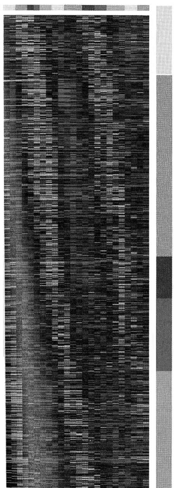

G1 图 15.5 约 800 个酵母基因的表达模式，在细胞周期全过程中，这些基因的转录水平系统地变化。每个水平条纹表示一个不同的基因在细胞周期全程的转录模式。
S 绿色表示相对于非分裂细胞表达不足，红色表示超表达。右侧的彩条表示每个基因被最大表达的时期：M/G₁过渡期、G₁、S、G₂或M期。沿顶部同样用这些颜色表示细胞周期的时期。[转载自P.T.Spellman, et al., Mol. Biol. Cell 9(1998):3273-3297.]

## 15.2 细胞周期的遗传分析

根据母细胞和芽的相对大小，可马上指出酵母细胞在细胞周期中的位置，这使得通过对温度敏感型突变体的分离和研究，来对细胞周期进行广泛的遗传分析成为可能。温度敏感型细胞分裂周期突变体［cell division cycle (cdc) mutant］在 23℃（允许温度，permissive temperature）时通常为野生型，但在 36℃（限制性温度，restrictive temperature）时不能完成细胞周期。在高温下，突变型细胞在细胞周期的某个特征性阶段积聚。该阶段就是它们在细胞周期中的进程被阻断的阶段。在影响细胞功能的突变中，这种阶段特异性的阻断非常特别。例如，当温度升高时，在蛋白质合成上有缺陷的温度敏感型突变体不会突然停止生长。每个细胞都会继续生长，直到耗尽有功能的蛋白质；要继续细胞周期进程，需要合成新的蛋白质。这种阻断点因细胞而异，因而这些突变型细胞在细胞周期的不同阶段停止生长。在显微镜下可见到无芽的细胞、带小芽的细胞和带大芽的细胞，其分布基本上就与非同步化的细胞群体一样。但对每种 cdc 突变体而言，都停在某个特异的阶段，一种突变体与另一种突变体所停止的阶段不同，与突变型基因产物的功能相关。一旦确定某个 cdc 突变体在细胞周期中的什么地方被阻断，就可用进一步的分析来确定，在突变体中 DNA 合成、纺锤体形成或分裂隔膜形成之类的特定过程是否能够发生。在下一节中，将考察对停在，或者说阻滞 (arrest) 在 G₂/M 交界处的两个 cdc 突变体的分析。

## ■ 影响细胞周期进程的突变

在图 15.6 的显微照片中, 图 15.6A 示在 $23^{\circ}$ C 的允许温度下培养于非同步化培养物中的一种名为 cdc13 的突变体细胞。其形态及大小上的变化正常; 存在一些无芽细胞, 还有带芽的正在分裂的细胞, 大小从很小到与母细胞几乎一样大。将该培养物置于 $36^{\circ}$ C 的限制性温度下培养 6h

15.6B 所示的外观。可见两种构型。一种构型由一对大的细胞构成。这些是在23℃时还没分裂或具小芽的细胞；在温度变动之后，它们继续进行细胞周期，直到被阻滞在大芽的阶段。另一种构型由4个大的细胞(quartet,四分细胞)构成。这些细胞来自在温度变动之前接近分裂结束、有大芽的细胞；在温度变动之后，它们完成当次细胞周期，然后，两个子细胞仍然并排在

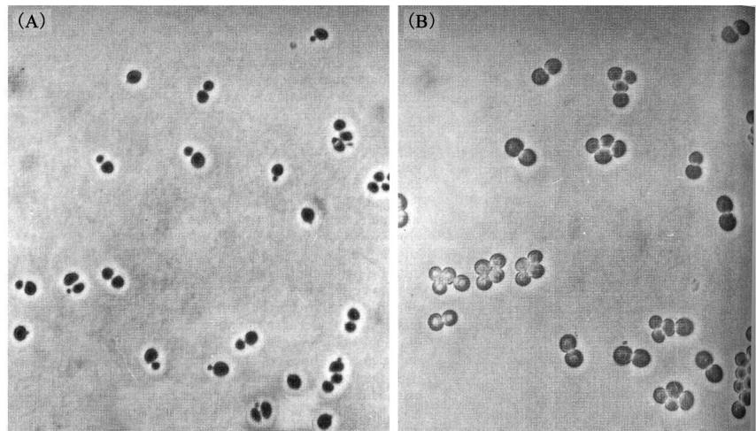  
图 15.6 温度敏感型 cdc13 突变体的细胞周期阻滞。(A) 培养于 23℃ (允许温度) 下的 cdc13 突变体非同步化培养物。细胞无芽，或具有从很小到与母细胞几乎一样大小的芽。(B) 在 36℃ (限制性温度) 下保温培养 6h 之后的同一群细胞。有些细胞被阻滞，具有非常大的芽。其他细胞已完成当次分裂，并开始再次分裂。这些细胞就是以四分细胞形式被阻滞的细胞。[引自 Exp. Cell Res., vol. 67, J. Culotti and L. H. Hartwell, “Genetic control of the cell division cycle in yeast...,” pp. 389-401, copyright (1971)，经 Elsevier 许可重印。(http://www.sciencedirect.com/science/journal/00144827)]

一起，都开始又一轮细胞周期，并阻滞于大芽阶段，产生四分细胞。

图 15.7 示如何解读这些结果。在需要受影响的蛋白质的时间之前转移到 $36^{\circ}$ C 的单个突变型细胞，细胞周期被阻滞，成为大芽细胞，因为在缺乏有功能蛋白质的情况下，这些细胞不能超越这一节点继续进行细胞周期。转移到 $36^{\circ}$ C 条件下的细胞，如果处于当次周期中不再需要该蛋白质的时间（在本例中，在 S 期晚期的某个时间），则将完成当次周期，并开始新的细胞周期，新的周期终止于两个子细胞（带有大芽）被阻滞之时，因为此时无法得到所需蛋白质。图 15.6 所示的 cdc13 突变体具有端粒加工缺陷，端粒加工发生在 S 期晚期；在限制性温度下培养 cdc13 细胞时，在端粒处发现异常延长的单链 DNA。

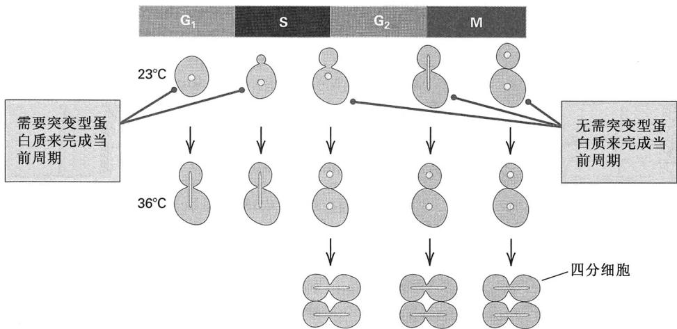  
图 15.7 通过将温度敏感型突变体转移到限制性温度下，判断某种细胞周期蛋白发挥功能的时间。处于需要该蛋白质之前阶段的细胞，被阻滞于当次分裂周期中需要该蛋白质的阶段。这些细胞产生二分细胞构型。已经过当次分裂周期中需要该蛋白质的时间的细胞，完成当次周期，开始又一轮周期，并阻滞于该周期中需要该蛋白质的阶段。这些细胞产生四分细胞构型。[改编自 L. E. Hartwell (J. G. Fortner and J. E. Rhodes, eds.). Accomplishments in Cancer Research. J. B. Lippincott Company, Philadelphia (1992).]

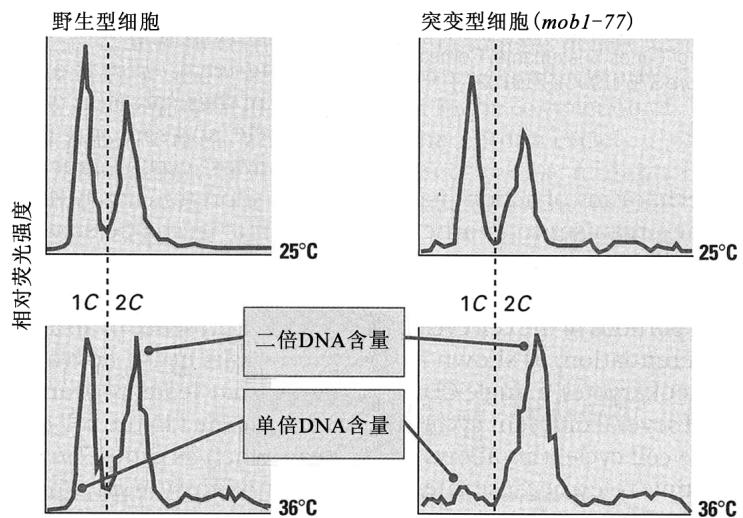  
图 15.8 cdc 突变型细胞的 DNA 复制，始于单倍 (1C) 细胞群体。在允许温度下（上两图），突变型和野生型细胞都有 67% 的细胞具有单倍 DNA 含量，33% 的细胞具有二倍 DNA 含量；后者已完成 S 期，但尚未完成 M 期。在限制性温度下（下两图），具有二倍 DNA 含量 (2C) 的突变型细胞（右）积聚，表明它们不能完成细胞周期。[改编自 F. C. Luca and M. Winey, Mol. Biol. Cell 9 (1998):29-46.]

图 15.8 示用另一种细胞分裂周期突变体进行实验的结果，这种突变体以 mob1-77 表示，它也像图 15.6B 中的细胞一样，阻滞于大芽阶段。这些数据表明，尽管 mob1-77 细胞不能完成分裂过程，但能在限制性温度下复制它们的 DNA。在允许温度下（图 15.8 中的上两图），野生型和突变型细胞的非同步化培养物都包含一些具有 1C（单倍）DNA 含量的细胞和一些具有 2C（二倍）DNA 含量的细胞，取决于它们是否已经完成 DNA 复制。在 36℃ 条件下，mob1-77 突变型细胞全部被阻滞于具有 2C DNA 含量的大芽阶段，2C DNA 含量是处于 G₂/M 交界的细胞特征。这些及其他的实验，

使细胞周期中突变引起阻断的机制得以越来越具体。最后，受影响的蛋白质和突变的本质可通过突变型等位基因的克隆和测序得以鉴定。以这些信息为基础，可设计进一步的实验，将全部注意力集中到该蛋白质的确切功能上。

## 15.3 细胞周期的进程

在进化过程中，调节细胞周期的分子机器大部分都是保守的。因此，目前对细胞周期运作方式的理解，包含了对酵母、青蛙和人类这样差异显著的生物细胞进行研究所得出的推论。

## ■ 周期蛋白和周期蛋白依赖性蛋白激酶

在细胞周期的早期阶段，从一个阶段到下一个阶段的进程都是由独特的蛋白质复合体控制的，这些复合体称为周期蛋白-CDK复合体(cyclin-CDK complex)，由周期蛋白(cyclin)亚基与周期蛋白依赖性蛋白激酶(cyclin-dependent protein kinase, CDK)亚基结合构成(图15.9)。所有真核生物细胞都利用周期蛋白-CDK复合体来调节细胞周期的进程，虽然它们的结构和作用机制的细节可能会因生物不同而有细微的差异。真核生物细胞通常具有一个小的基因家族，其成员编码在细胞周期特定部分或分化子程序中起作用的周期蛋白，如表15.1所示。在单细胞真核生物的细胞周期中，单一CDK可在不同时间与几种不同的周期蛋白的任何一种相互作用，这使单一CDK能够发挥多种功能，因为与周期蛋白的相互作用决定CDK的底物特异性。此类多重功能，在出芽酵母中由Cdc28起作用，在裂殖酵母中由Cdc2担当。另外，针对细胞周期的某个特定阶段，单细胞真核生物可具有不止一种周期蛋白，例如，在出芽酵母中，周期蛋白

Cln1、Cln2、Cln3 全都在 $G_{1}$ 期起作用。在整个细胞周期中，哺乳动物细胞表达不同的 CDK，有些 CDK 在不同阶段与不同的周期蛋白相互作用，例如，Cdk2 在 $G_{1}$ 期与周期蛋白 E 相互作用，但在 S 期与周期蛋白 A 相互作用。尽管存在这些差异，但有些 CDK 的功能在进化中一直非常保守。该原理的一个引人注目的例子，是发现人类 Cdk2 和 Cdc2 蛋白的编码序列能够替代出芽酵母中的 CDC28 基因，人类的蛋白质使酵母细胞能够基本正常地生长和接合。在所列的所有酶复合体中，在 $G_{2}/M$ 期形成的哺乳类周期蛋白 B-Cdc2 复合体尤为值得关注，因其控制从 $G_{2}$ 到 M 的通路。虽然周期蛋白 B-Cdc2 复合体在有丝分裂之前已被组装好，但其催化活性局限于有丝分裂期，因为直到有丝分裂之前，它都被磷酸化作用所抑制。

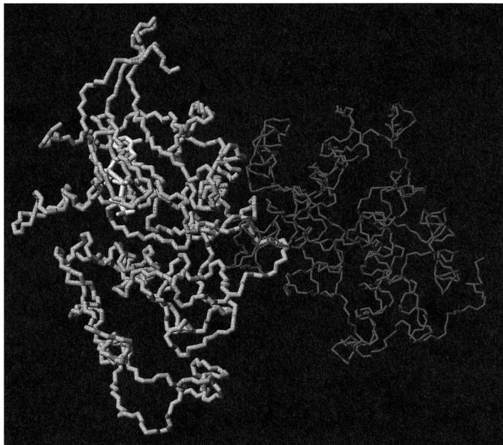  
图 15.9 周期蛋白 A(右)与 Cdk2(左)复合的结构。周期蛋白 A 结合于 Cdk2 中催化裂的一侧，引起巨大的构象转变，使活性位点开放，并激活激酶结构域。结合于 Cdk2 的 ATP(白色)是激酶反应的磷酸根供体。[承康奈尔大学卡洛斯·巴斯塔曼特 (Carlos Bustamante) 惠赠。坐标数据来自 P. D. Jeffrey, et al., Nature 376 (1995):313-321.]

表 15.1 真核生物细胞中的周期蛋白-CDK 相互作用

<table><tr><td rowspan="3">生物</td><td colspan="6">细胞周期的阶段</td></tr><tr><td colspan="2"> $G_1$ 期</td><td colspan="2">S期</td><td colspan="2"> $G_2/M$ 期</td></tr><tr><td>周期蛋白</td><td>CDK</td><td>周期蛋白</td><td>CDK</td><td>周期蛋白</td><td>CDK</td></tr><tr><td>出芽酵母</td><td>Cln1、Cln2、Cln3</td><td>Cdc28</td><td>Clb5、Clb6</td><td>Cdc28</td><td>Clb2</td><td>Cdc28</td></tr><tr><td>裂殖酵母</td><td>Cig1</td><td>Cdc2</td><td>Cig2</td><td>Cdc2</td><td>Cdc13</td><td>Cdc2</td></tr><tr><td rowspan="2">高等真核生物</td><td>Cyclin D1、D2、D3</td><td>Cdk4、Cdk6</td><td>Cyclin A</td><td>Cdk2</td><td>Cyclin B</td><td>Cdc2(Cdk1)</td></tr><tr><td>Cyclin E</td><td>Cdk2</td><td></td><td></td><td>Cyclin B3</td><td></td></tr><tr><td></td><td colspan="2">调节生长和形态发生</td><td colspan="2">调节DNA复制</td><td colspan="2">调节有丝分裂</td></tr></table>

“周期蛋白”这个词很贴切，因为在细胞周期中这些蛋白质的丰度周期性地变化，并且有些仅在特定的时间存在。大多数周期蛋白都是突然出现，并在一段短暂的时间后消失(图15.10)。在细胞周期中，每种周期蛋白都在其特征性的时间出现，因其转录是通过先前表达的某种周期蛋白与细胞周期联系在一起的。通常某种有活性的周期蛋白-CDK复合体的存在，导致一种转录因子的活化，引起细胞周期所需的下一种周期蛋白的转录。当该基因不再被转录时，以前产生的mRNA和蛋白质被降解，该周期蛋白消失。有活性的周期蛋白-CDK复合体也会引起周期蛋白之外的基因转录活化。

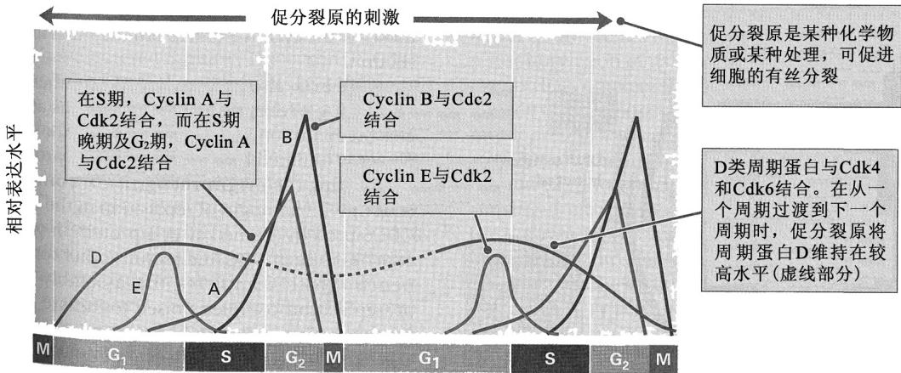  
细胞周期的分期

图 15.10 在细胞周期中周期蛋白水平的波动。周期蛋白 E、A 和 B(有丝分裂周期蛋白)的表达是周期性的，而周期蛋白 D 贯穿整个细胞周期都表达，以应答刺激有丝分裂的药物(促分裂原)。[改编自 C. J. Sherr, Science 274(1996): 1672-1677.]

## 联系：循环作业

利兰·哈特韦尔、约瑟夫·卡洛蒂、约翰·普林格尔和布雷恩·里德，1974

华盛顿大学，西雅图，华盛顿州

酵母细胞分裂周期的遗传控制

这篇经典论文是遗传分析的顶点之一。它展示了突变体的表型如何可以用来剖析复杂的时间过程，在此处是细胞周期。结果证明，酵母的细胞周期包含从一个起点出发的两条同时发生的途径；起点的定义是，细胞开始不可逆地进行有丝分裂，而不进行接合的时刻。

酿酒酵母(Saccharomyces cerevisiae)的细胞周期有不同于其他大多数真核生物的两个特点，对于分析控制细胞分裂周期的基因功能非常有用。首先，单倍体和二倍体细胞都可进行有丝分裂，这一事实使得可以在单倍体中分离隐性突变，然后在二倍体中通过互补作用分析它们。其次，在细胞周期的早期，子细胞是母细胞表面的芽，使子细胞易于识别。由于芽的大小与母细胞大小的比值在细胞周期过程中逐渐增大，该比值为细胞周期的状态提供了一个可视标记。利用这两个特点分离了150个温度敏感型的细胞分裂周期突变体(cdc突变体)，并对其特征进行了描述。说这些突变体是温度敏感型的，意思是它们在 $36^{\circ}$ C（限制性温度）条件下不能繁殖，但在 $23^{\circ}$ C（允许温度）条件下能正常生长。……这些突变界定了 32 个基因，其产物各在有丝分裂周期一个事件的完成中起必不可少的作用。……Cdc 突变体的表型表明，在单一的依赖性途径中，下列事件是顺序发生的：“起点”、DNA 合成的起始、DNA 合成、核分裂中期、核分裂晚期、胞质分裂和细胞分离。因此，这些事件的时间序列很容易用这样的事实来解释：在此途径中的任何一个事件，不会出现在前面的所有事件均已发生之前。第二个依赖性途径包括的事件为：“起点”、芽的出现、细胞核迁移、胞质分裂和细胞分离。因而，这 5 个事件的时间序列也是必然的。而且，这两个途径的整合是通过这样的事实达成的：两个途径都从一个共同的事件——“起点”分开，并会合于一个共同的事件——胞质分裂。

来源：L. H. Hartwell, et al., Science 183 (1974): 46-51.

## - 周期蛋白-CDK复合体的靶

周期蛋白-CDK复合体如何控制细胞周期的进程？它们利用蛋白激酶活性，将磷酸基加到在蛋白质中发现的存在于丝氨酸、苏氨酸和酪氨酸中的羟基上。复合体中的周期蛋白组分与蛋白质底物结合，拴住蛋白质底物，使CDK组分能够对被拴住的底物进行磷酸化。一旦靶蛋白被磷酸化，它就与周期蛋白-CDK复合体分离。蛋白质磷酸化形式的活性往往与非磷酸化形式的活性差异显著。磷酸化作用可活化一种酶，但使另一种酶失活。甚至在单个酶分子中，不同位点的磷酸化可具有相反的结果。细胞周期调节的另一途径是通过磷酸酶(phosphatase)达成，磷酸酶使周期蛋白依赖性激酶磷酸化过的蛋白质去磷酸化。通过逆转CDK的效应，磷酸酶将无活性的酶激活，或使有活性的酶失活。

如图 15.11 所示，在哺乳动物细胞中，在细胞周期的不同时间都可检测到周期蛋白-CDK 复合体。周期蛋白 D-Cdk4 和周期蛋白 D-Cdk6 复合体出现在 $G_{1}$ 早期或中期，而周期蛋白 E-Cdk2

和周期蛋白 A-Cdk2 复合体出现在 $G_{1}$ 晚期。周期蛋白 A-Cdk2 复合体在整个 S 期都存在，并延续到 M（有丝分裂）期，而周期蛋白 B-Cdk2 复合体一直伴随细胞通过 $G_{2}/M$ 过渡期。周期蛋白-CDK 复合体的功能活性部分受其磷酸化状态控制，但周期蛋白 D-Cdk4 和周期蛋白 D-Cdk6 也受一种称为 p16 抑制剂的蛋白质控制。

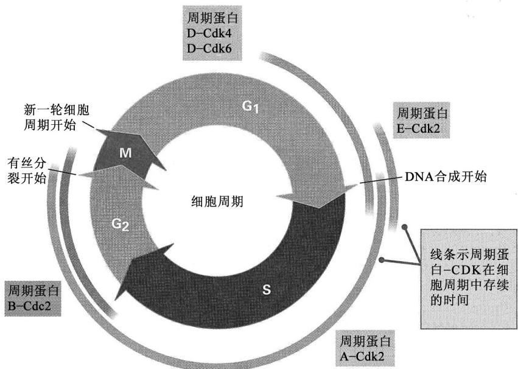  
图 15.11 哺乳动物细胞中周期蛋白-CDK 活性的时序表达模式。

## - $\mathbf{G}_1 / \mathbf{S}$ 和 $\mathbf{G}_2 / \mathbf{M}$ 过渡的触发因素

在细胞周期中，细胞监测着其内部和外部环境。到环境适合开始分裂周期时，处于 $G_{1}$ 期的 $G_{1}$ 限制点 ( $G_{1}$ restriction point) 或起点 (start) 阶段的细胞数量逐渐增多。在动物细胞中，视网膜母细胞瘤蛋白 [retinoblastoma(RB) protein] 通过结合并掩蔽进一步的进程所需的转录因子 E2F，使细胞保持在限制点 (图 15.12，A 部分)。RB 蛋白因其突变形式与视网膜中恶性肿瘤 (需要手术切除眼睛) 的形成相关，首先在人类系谱中得以鉴定。

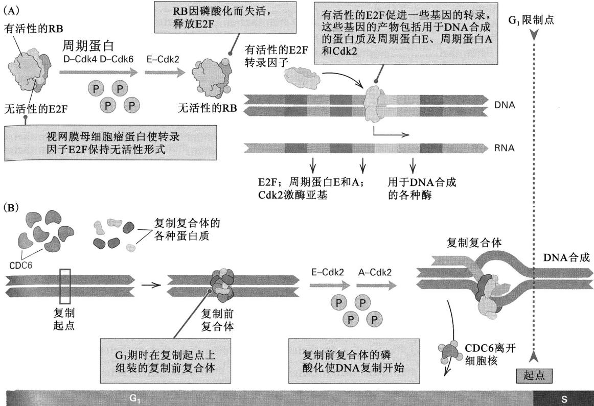  
图 15.12 (A) 控制 G $_{1}$ 期向 S 期过渡的视网膜母细胞瘤蛋白 RB 的功能。在 G $_{1}$ 期中期，周期蛋白 D 依赖性激酶 Cdk4 和 Cdk6 开始 RB 的磷酸化，该过程由周期蛋白 E-Cdk2 完成；这使得转录因子 E2F 游离出来，激活用于 DNA 合成的酶的转录。(B) 游离的 E2F 也激活编码周期蛋白 A、周期蛋白 E 和 Cdc2 的基因的转录，这帮助复制前复合体转变为复制复合体，以便过渡到 S 期。

细胞生长由一种生长因子与其受体的结合而引发。该事件激活一个以产生周期蛋白D而告终的信号转导(signal transduction)途径。在 $\mathrm{G}_{1}$ 期中期，RB蛋白开始同时被周期蛋白D-Cdk4激酶和周期蛋白D-Cdk6激酶磷酸化；在 $\mathrm{G}_{1}$ 期晚期，当细胞接近 $\mathbf{G}_1 / \mathbf{S}$ 过渡期 $(\mathbf{G}_1 / \mathbf{S}$ transition)，即将开始投入DNA复制时，RB的磷酸化由周期蛋白E-Cdk2激酶完成。RB的磷酸化使其失活，释放结合的E2F转录因子(图15.12A)。E2F的释放导致负责DNA复制的基因转录和蛋白质翻译，其中包括DNA聚合酶，因而细胞开始积聚DNA合成所需的前体和酶。E2F也激活编码E2F自身的基因转录(正向自调节的一个例子)，还激活周期蛋白E和A及Cdk2激酶亚单位基因的转录。

$\mathrm{G}_{1}$ 期的细胞也通过在复制起点处组装复制前复合体 (prereplication complex) 来为 DNA 合成做准备。每个复制前复合体的组装，是通过将 6 种蛋白质组成的起点识别复合体 [origin recognition complex (ORC)] 与复制起点连在一起而开始。CDC6 蛋白 (根据酵母的一种蛋白质命名) 连接于每个 ORC，并募集其他组分，完成复制前复合体的组装，形成随时可准备起始 DNA 合成的复制前复合体。周期蛋白 E-Cdk2 激酶和周期蛋白 A-Cdk2 激酶 (图 15.12B) 磷酸化该复合体的组分，包括 CDC6 蛋白，进而引发 DNA 合成的起始，从而引发 $\mathrm{G}_{1} / \mathrm{S}$ 的过渡。CDC6 一旦被磷酸化后，即离开起始复合体 (该过程与 DNA 合成的真正起始相关)，并从细胞核转移到细胞质。CDC6 的离去是确保 DNA 合成不会在相同的复制起点再次起始。一旦细胞进入 S 期，周期蛋白 A-Cdk2 就磷酸化 E2F，从而抑制它与 DNA 结合，因而使其作为转录因子的功能失活。整个 S 期均需要周期蛋白 A-Cdk2 的活性，显然是为了维持 RB 蛋白的高度磷酸化。

从 $G_{2}$ 到 M 的进程 ( $G_{2}/M$ 过渡期) 由周期蛋白 B-Cdc2 复合体控制，该复合体亦称为促成熟因子 (maturation-promoting factor)。在细胞质中合成和组装之后，周期蛋白 B-Cdc2 复合体因输入细胞核的速度比输出细胞核的速度小，所以以无活性形式留在细胞质中。就在 $G_{2}/M$ 过渡期之前、周期蛋白 B 被磷酸化之时，该平衡向有利于输入的方向倾斜，这掩盖了细胞核的输出信号。细胞核输出的减少确保周期蛋白 B-Cdc2 复合体在细胞核中累积。通过在不同位点的去磷酸化，周期蛋白 B-Cdc2 复合体被活化，从而对其底物进行磷酸化，引起完成 $G_{2}/M$ 过渡的事件。这些事件包括：①与纺锤极的复制和双极纺锤体的形成相关的驱动蛋白相关动力蛋白 (kinesin-related motor protein) 的磷酸化；②核纤层蛋白的磷酸化，导致核纤层蛋白解体，并最终导致核膜瓦解。此时，染色体凝缩，并装配到纺锤体上，接着染色体分离机器开始变得活跃。

## ■ 蛋白质降解辅助调节细胞周期

细胞周期的一个基本特点是，它是真周期(true cycle)，是不可逆的。细胞周期由与细胞周期蛋白-CDK复合体的周期性活化相补充的蛋白质降解过程向前推进。蛋白质降解(proteolysis)不但清除在前面时期中所用的蛋白质，而且会清除抑制进入下一时期进程的蛋白质。在细胞周期的早期各阶段中，从一个阶段到另一阶段的进程需要周期蛋白-CDK的连续活化。进入每个新的时期也要求破坏前面时期中所用的周期蛋白。在细胞周期的晚期各阶段，从一个阶段到另一阶段的进程由蛋白降解作用单独驱动。该过程在酵母中已得到很好的了解，因而此处以酵母的术语来叙述它。

在完成有丝分裂，返回 $G_{1}$ 期的过程中，一定会发生两个关键的调节事件。

(1)姐妹染色单体必须分离(标志着后期开始)。

(2) 细胞必须从有丝分裂中退出来，这需要染色体去凝集、纺锤体解体、染色体分离机器失活及胞质分裂。

这两个关键事件都是由蛋白质降解引发的，如图 15.13 所示，该图示酵母的有关内容。退出有丝分裂需要破坏周期蛋白 B(在酵母中为 Clb)。细胞进入有丝分裂时，周期蛋白 B 最丰富，但在从中期到后期的过渡期中，在出现染色体分离之后，周期蛋白 B 消失。周期蛋白 B 被后期促进复合体 [anaphase-promoting complex(APC/C)] 打上“销毁”的标记，该复合体是一种泛素蛋白连接酶，负责泛素化靶蛋白。泛素(ubiquitin)是一种 76 个残基的蛋白质，它被转移到某些异常蛋白质上，将这些蛋白质标记为需要通过在蛋白酶体(proteasome)中消化来降解成氨基酸。蛋白酶体是一种巨大的、多功能、多亚基复合体，除了在溶酶体中进行的蛋白质降解之外，蛋白酶体负责细胞质内大部分的蛋白质降解。当不再需要某些蛋白质的功能时，也用同样的过程来将这些蛋白质标记为“销毁”。周期蛋白 B 是后期促进复合体的底物之一，周期蛋白 B 被泛素化，就被打上了需通过蛋白酶体来降解的标记。

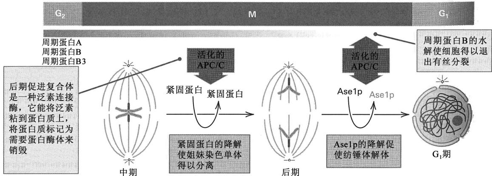  
图 15.13 活化的后期促进复合体(APC/C)在控制向后期过渡及退出有丝分裂必需的蛋白降解上的作用。APC/C 是一种泛素连接酶，它将蛋白质标记为需蛋白酶体销毁。其底物包括紧固蛋白(securin)和 Aselp。紧固蛋白抑制将姐妹染色单体连接在一起的蛋白质“胶”(Scc1p)的分解。Aselp 是一种微管相关蛋白，它与纺锤体中央区中来自纺锤极体的反向平行微管结合。稍后的周期蛋白 B 的破坏，让细胞退出有丝分裂。

APC/C 的其他底物为紧固蛋白和 Aselp。紧固蛋白抑制一种被称为分离酶(separase)的蛋白酶。Aselp 是一种微管相关蛋白，它与纺锤体中央区中来自纺锤极体的反向平行微管结合。随着紧固蛋白被降解，分离酶的抑制解除，得以降解 Scc1p；Scc1p 是黏结蛋白复合体的一种组分，该复合体使染色体凝缩，并且将姐妹染色单体连接在一起。Scc1p 的裂解使其与染色质分离，这使得姐妹染色单体分离，并被拉向纺锤体的两极。Aselp 的降解被认为是释放了微管末端，从而使纺锤体的解体成为可能。因此中期/后期和有丝分裂/G₁ 的过渡不需要周期蛋白依赖性蛋白激酶，而是需要后期促进复合体的活性来使特定的蛋白质成为降解的目标。

## 15.4 细胞周期中的检查点

细胞不仅监测着它们的内部生理状态和功能，而且监测着它们的外部环境。在缺乏所需营养物质或生长因子的情况下，动物细胞可退出细胞周期，变成一种称为 $G_{0}$ 的静止状态。一经受到生长刺激，它们会通过一个需要周期蛋白 D-CDK 活性的过程，重新进入细胞周期。细胞也具有应答刺激的机制，这些刺激包括 DNA 损伤、缺氧、备用核苷三磷酸不足和（对动物细胞而言）胞间粘连丢失。在细胞内部，细胞周期中的几个关键事件受到监测。当识别到缺陷时，细胞周期的进程暂停在某个检查点 (checkpoint)。在细胞周期中，检查点让细胞有校正和修复的时间，有助于维持各步骤相互之间的正常次序。3 个主要检查点如下。

(1) DNA 损伤检查点。

(2) 中心体复制检查点。

(3)纺锤体组装及定位检查点。

这些检查点概括于图 15.14 中。所有这 3 种类型的检查点在维持染色体组的稳定性上都很重要。在这些检查点监测的 3 个过程之中，当任何一个过程存在错误时，如果不能在该检查点停止，就会导致非整倍性、多倍性或突变率增加。在以下章节，将考察其中一些检查点是如何起作用的。

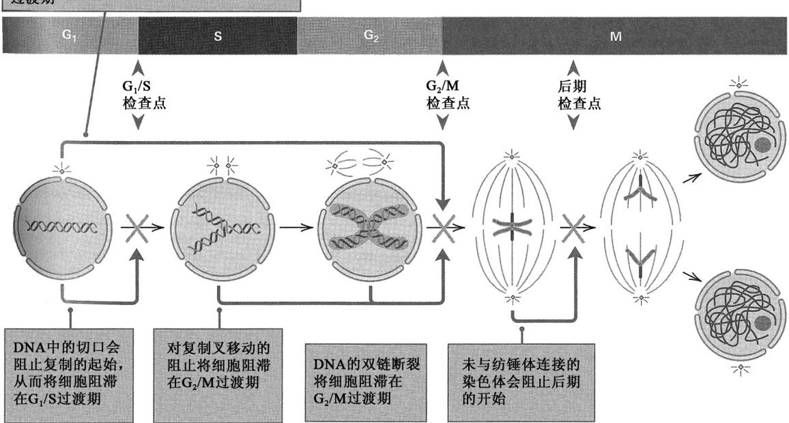  
图 15.14 细胞周期检查点。方框中的文字说明受监测的事件及受影响的步骤。[改编自 L. H. Hartwell and M. B. Kastan, Science 266(1994):1821-1828.]

## - DNA 损伤检查点

当 DNA 受到损伤或复制尚未完成时，DNA 损伤检查点 (DNA damage checkpoint) 阻滞细胞周期。DNA 损伤包括含氮碱基的修饰和磷酸二酯键主链的断裂。通过切除修复途径 (参见第 14 章) 修复被修饰的核苷酸时，需去除受影响的核苷酸，接着用修复聚合酶重新合成一个核苷酸，最后连接起来。主链断裂的 DNA 分子，是通过以同源性为基础的重组、非同源的末端连接或添加新的端粒来修复的。在动物细胞中，DNA 损伤检查点在细胞周期的 3 个阶段起作用： $G_{1}/S$ 过渡期、S 期和 $G_{2}/M$ 交界。S 期检查点持续监测整个 S 期的 DNA 合成进程。虽然存在 3 个 DNA 损伤检查点，但 3 个点各自监测 DNA 损伤或复制的不完整情况。如果检测到这两种问题的任何一种，DNA 损伤检查点就发挥作用，在多个点上阻断细胞周期。

哺乳动物细胞通常应答应激的，特别是应答 DNA 损伤的关键蛋白，是一种称为 p53 转录因子 (p53 transcription factor) 的蛋白质的几种略有差别的形式。在正常细胞中，活化的 p53 蛋白水平极低，即使存在大量的 p53 mRNA 和蛋白质也是如此。p53 的活性被另一种称为 Mdm2 的蛋白质保持在低水平。要发挥转录因子的功能，p53 必须先磷酸化再乙酰化才能被活化。Mdm2 结合于 p53，阻止将 p53 活化为转录因子的磷酸化及后续步骤。此外，Mdm2 不停地在细胞核和细胞质之间穿梭，在此过程中，它从细胞核中不断地输出 p53，令 p53 被细胞质中的蛋白酶体降解。p53-Mdm2 输出循环如图 15.15 所示。

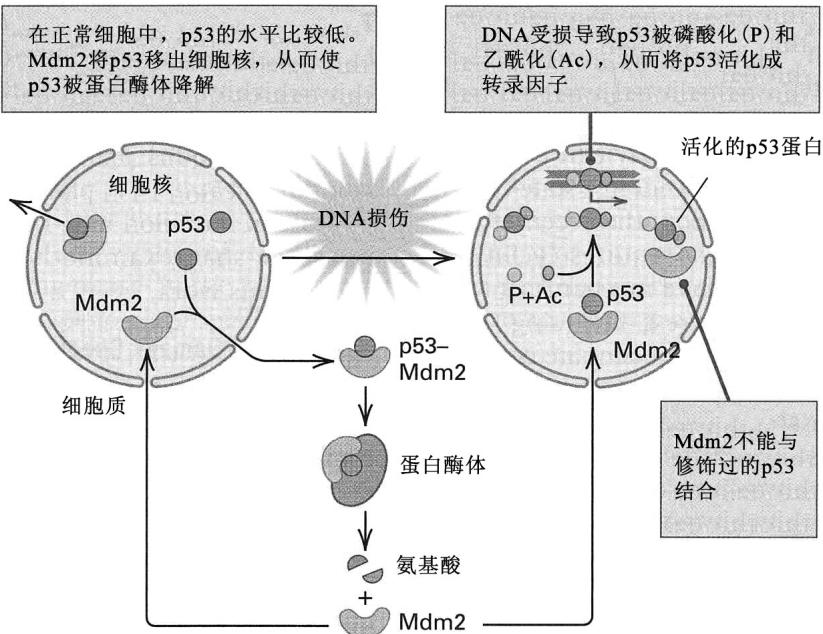  
图15.15 DNA损伤对转录因子p53的作用。在正常细胞中，p53的水平很低，部分原因是Mdm2将其运送到细胞质中，在此被蛋白酶体破坏。DNA损伤引起p53的磷酸化和乙酰化，使其不能结合Mdm2。由此，p53水平升高。

用可损伤 DNA 的试剂处理细胞时，有些细胞阻滞在 $G_{1}$ 期，另外的细胞阻滞在 $G_{2}$ 期。DNA 损伤信号被检测和传输，从而导致 p53 被蛋白激酶和乙酰化酶活化，压倒 Mdm2 的抑制效应。p53 的活化使其从 Mdm2 释放，这稳定了有活性的 p53 转录因子，从而引起 p53 蛋白水平的升高。活化的 p53 接着引发若干基因的转录和另一些基因的阻遏。一些被 p53 激活其基因转录的关键蛋白，见表 15.2，这些蛋白质如何影响细胞周期中的过程和其他细胞特性的流程图，如图 15.16 所示。

表 15.2 被 p53 激活其转录的基因的产物

<table><tr><td>基因产物</td><td>功能</td></tr><tr><td>p21</td><td>抑制数种依赖周期蛋白的激酶;阻滞细胞于 $G_1/S$ 交界</td></tr><tr><td>14-3-3 σ</td><td>预计结合并掩蔽细胞质中磷酸化的Cdc25C磷酸酶,这阻止Cdc25C活化周期蛋白B-Cdc2激酶;阻滞细胞于 $G_2/M$ 交界</td></tr><tr><td>GADD45</td><td>结合增殖细胞核抗原(PCNA),阻断其作为DNA聚合酶持续合成因子的作用,从而阻断DNA复制;在DNA修复中直接发挥作用</td></tr><tr><td>Bax</td><td>起细胞凋亡(程序性细胞死亡)正调节因子的作用</td></tr><tr><td>Apaf1</td><td>支架蛋白,被细胞色素c激活时,将胱天蛋白酶寡聚成可促进细胞凋亡的复合体</td></tr><tr><td>Maspin</td><td>起丝氨酸蛋白酶抑制剂的作用,且是血管发生(血管的形成)和转移的抑制剂</td></tr><tr><td>miRNA 34a、miRNA b/c</td><td>引起衰老和细胞凋亡的microRNA</td></tr></table>

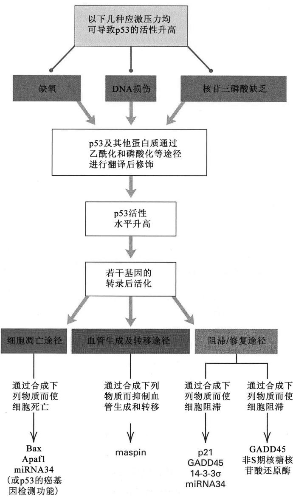  
图 15.16 p53 引发的下游事件包括 p21、GADD45、14-3-3 σ、Bax、maspin、Apafl、miRNA 34a 和 miRNA b/c 基因的转录激活。凋亡途径被 p53 激活，在 Bax 的转录激活之后发生，并有可能直接感受到细胞或病毒起源的活化的癌基因信号。

如图 15.17 所示, p21、GADD45、14-3-3 σ 和 miRNA 34a 基因的转录增加, 以及周期蛋白 B 基因的转录减少, 全部起到将细胞周期阻断在特定时间的作用。 $G_{1}/S$ 过渡期的检查点由 p21 水平的增加介导, p21 水平增加导致 $G_{1}$ 周期蛋白-CDK 的抑制, 以此来阻断 $G_{1}/S$ 的过渡。因此, 如果在 $G_{1}$ 期检测到 DNA 损伤, 细胞就被阻断在 $G_{1}/S$ 过渡期。miRNA 34a 和 miRNA b/c 通过与切片酶 (Dicer) 蛋白的相互作用, 抑制 Cdk416 mRNA 的翻译。S 期对 DNA 损伤的应答由 p21 蛋白和 GADD45 介导, 这两种蛋白质与增殖细胞核抗原 (PCNA) 形成复合体, 从而降低 DNA 聚合酶的持续合成能力。[DNA 聚合酶的持续合成能力 (processivity), 是在聚合酶从模板分离之前, 模板链中被连续复制的核苷酸数目。] 因而, DNA 聚合酶持续合成能力的下降使 DNA 合成减慢, 实际上为细胞赢得修复 DNA 损伤的时间。 $G_{2}/M$ 检查点由 14-3-3 σ 蛋白介导, 该蛋白质通过阻止 Cdc2 被 Cdc25C 磷酸酶的去磷酸化, 阻碍周期蛋白 B-Cdc2 的活化, 从而阻断 $G_{2}/M$ 的过渡。与此同时, 周期蛋白 B 水平的下降, 降低有活性的周期蛋白 B-Cdc2 复合体的水平, 这也可确保细胞维持在 $G_{2}$ 期。因此, 如果在 S 期或 $G_{2}$ 期检测到 DNA 损伤, 细胞周期就阻滞于 $G_{2}/M$ 过渡期。

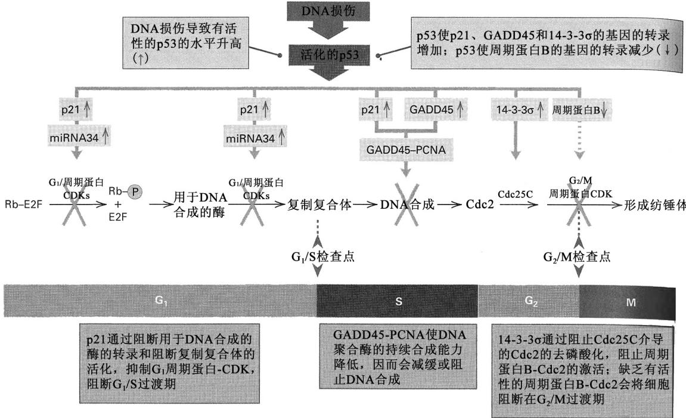  
图15.17 p53在DNA损伤检查点的作用。DNA损伤导致有活性的p53水平增加，这使p21、GADD45和14-3-3 $\sigma$ 基因的转录增加，使周期蛋白B基因的转录减少。

DNA 损伤也引发另一个途径即细胞凋亡 (apoptosis) 或称程序性细胞死亡 (programmed cell death) 的激活。当细胞凋亡途径被激活时，开始了一个以细胞自杀而告终的级联式的蛋白质降解过程。有关蛋白酶称为胱天蛋白酶 (caspase)。它们的活化最终导致细胞 DNA、内部细胞器和肌动蛋白细胞骨架的破坏，伴随着细胞核的浓缩，以及通常跟随其后的吞噬细胞对细胞残骸的吞噬。也有证据表明，p53 直接起到增加线粒体通透性的作用，导致细胞色素 c 释放，引发细胞凋亡。P53 转录因子也通过激活 Bax 和 Apaf1 的转录和抑制 Bcl2 的合成，激活细胞凋亡途径。如图 15.18 所示，Bax 通常与一种称为 Bcl2 的凋亡抑制剂一起，以异二聚体形式存在。当 p53 激活 Bax 的转录并减少 Bcl2 的表达时，这种平衡向有利于 Bax 同二聚体而不利于 Bcl2异二聚体的方向倾斜, 这促进细胞凋亡和自我毁灭的发生。另外, 与癌症相关的癌基因 (oncogene) 的基因的激活可增加活化 (磷酸化) Bcl2 的水平, 阻止细胞凋亡, 并使受影响的细胞能够无限地生长和分裂。癌基因激活后并不总是发生细胞永生, 因为在有些情况下, 它可能会通过图 15.16 所示的一种 p53 的癌基因探测功能, 激活细胞凋亡途径。p53 的功能全部加在一起, 就是起到保护基因组在核苷酸序列、DNA 链及整倍性方面的完整性作用。基因组的不稳定性、不平衡的基因组及受损伤的 DNA, 对机体构成危害。细胞凋亡是消灭此类受损的——因而有危险的——细胞的一种机制。

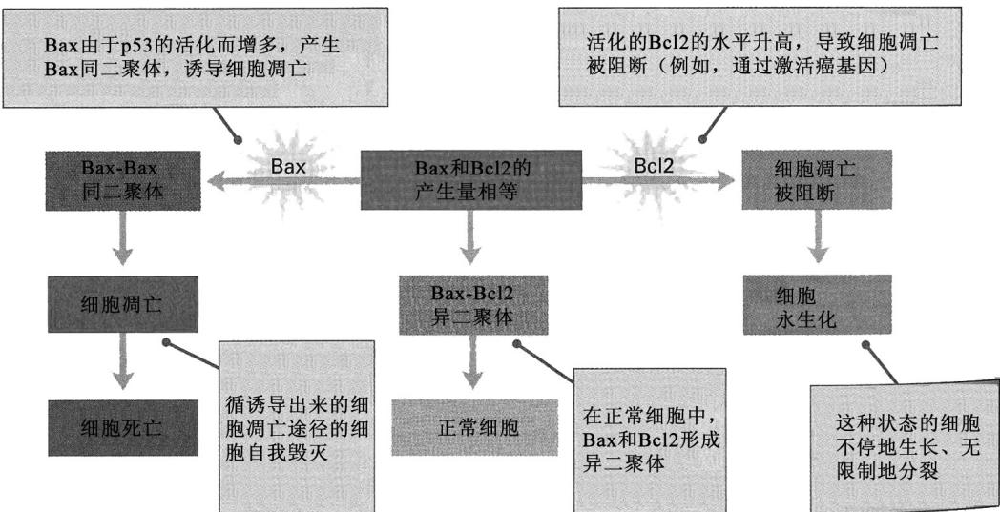  
图 15.18 Bax 和 Bcl2 如何相互作用以调节细胞凋亡。

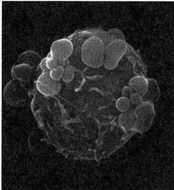  
从细胞膜形成大膜泡是细胞凋亡的一个特征。(©Dr. Andrejs Liepins/Photo Researchers, Inc.)

要想欣赏一下 DNA 损伤检查点的重要性，再察看一下图 15.17，细想一下如果这种安全保障机制部分或全部失灵，会发生什么情况。例如，假设细胞缺少 p21 蛋白，而余下的机制都在。如果能够正常地检测出 DNA 损伤，且 p53 照常升高 14-3-3 σ 和 GADD45 的水平，则 $G_{2}$ 期细胞会逐渐增多，且不能进行有丝分裂。但是 DNA 会继续被合成。此外，因为缺少 p21 蛋白，细胞会具有 $G_{1}/S$ 检查点缺陷，所以可开始额外轮次的 DNA 合成。因此 p21 失灵的预期结果会是多倍体细胞，而这也正是观察到的结果。

另举一例，试想 p53 功能丧失的后果。即使检测得到 DNA 损伤，细胞也不能组织开展应答，它不能争取到修复 DNA 损伤的时间。细胞会带着受损的染色体开始新轮次的合成。这样的合成不仅会导致突变频率增加，而且有基因扩增的可能。编码

周期蛋白 D 或 Cdk4 的基因扩增，使细胞能够逃避 DNA 合成和增殖的正常控制。已经处在 S 期或 G₂ 期的细胞，因为没有足够的时间来修复损伤，所以细胞会带着受损的染色体进入有丝分裂。此外，机体可能已经丧失了抵御此类受伤细胞的最后防线即细胞凋亡。缺乏 p53 意味着 Bax 和 Apaf1 的转录不会增加，因而凋亡途径不会开启；Bax 和 Bcl2 之间正常的平衡会被维持，确保这些受伤细胞的生存，从而使机体陷入危险之中。如果对这些失控细胞的描述能让你想到癌细胞的无限增殖，就是因为癌细胞正是通过颠覆这些检查点机制而变为癌细胞的。

联系：端粒之恙

$^{1}$ 麻省理工学院，剑桥，马萨诸塞州

$^{2}$ 哈佛医学院，波士顿，马萨诸塞州

$^{3}$ 杜克大学医学中心，达勒姆，北卡罗来纳州

用明确的遗传因子产生人类肿瘤细胞

前衰老人类原代细胞能够无限增殖。……为了确定 hTERT 人类细胞能否致瘤，……还导入了大 T 抗原(该抗原对视网膜母细胞瘤和 p53 肿瘤抑制蛋白都抑制)和一个致癌的 ras(信号转导)突变。……在软琼脂上(一种检测致瘤状态的方法)，观察到只有表达大 T、ras 和 hTERT 组合的细胞才能有效地形成细胞群落。当这些细胞被导入(免疫缺陷)小鼠后，反复观察到快速生长的肿瘤，产生肿瘤的效率很高。……结论是，一组有限的基因的异位表达…足以将正常的人类细胞转变为致瘤细胞。……现在几乎可以肯定，端粒的维持，通过使前癌细胞能够以超出它们正常的前体细胞分配得的复制倍增次数进行增殖，成为肿瘤发生的直接原因之一。

来源：W. C. Hahn, et al., Nature 400 (1999): 464-468.

## ■ 中心体复制检查点

中心体复制检查点(centrosome duplication checkpoint)监测双极纺锤体的形成。它似乎与进入有丝分裂是协同的，因为周期蛋白 B-Cdc2 激酶的活化与中心体的复制和纺锤体的形成相互关联。在有些生物中，该复制检查点也可能与纺锤体检查点和退出有丝分裂协同。

## ■ 纺锤体组装检查点

纺锤体组装检查点(spindle assembly checkpoint)监测纺锤体的组装和动粒与纺锤体的连接。[动粒(kinetochore)是染色体上的纺锤丝附着位点。]不当或不完整的组装，通过阻止后期促进复合体(图15.13)的活化，而阻止姐妹染色单体的分离，引发后期阻断。

细胞可检测到单个游离的或错误连接的染色体，从而使后期延迟。对昆虫和哺乳动物染色体的研究表明，动粒缺乏张力是细胞周期阻滞的起始信号。动粒上的张力与动粒的磷酸化水平有关，游离的动粒比连接的动粒在整体上磷酸化的程度相对较高。如果所有的染色体都在其动粒处与纺锤体微管形成稳定的、两极的连接，Cdc20蛋白(最初在酵母中鉴定并命名)就能活化后

期促进复合体(图 15.13)。后期促进复合体不仅降解周期蛋白 B，使细胞能够退出有丝分裂，而且降解抑制姐妹染色单体分离和纺锤体解体的蛋白质。因此后期促进复合体通过使染色体能够分离而促进后期发生。如图 15.19 所示，当检测到游离的动粒时，Bub、Mad 和 Mps1 蛋白通过抑制 Cdc20 蛋白，起到阻断后期发生的作用。Cdc20 不被激活，后期促进复合体就不被激活，从而使细胞停留在中期，直到所有的染色体与纺锤体微管形成稳定的、双极的连接。

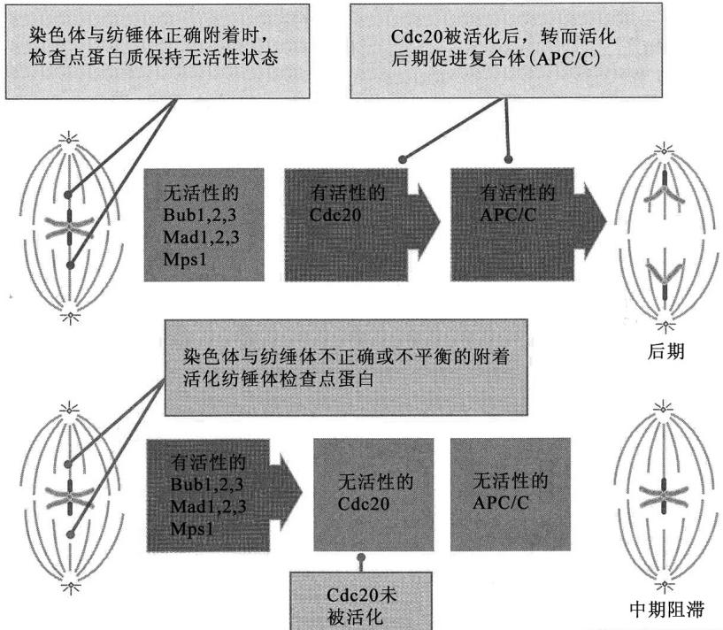  
图 15.19 纺锤体检查点。所有染色体必须与纺锤体微管形成稳定的、双极的连接，才能激活后期促进复合体，该复合体促进后期的发生和姐妹染色单体的分离。

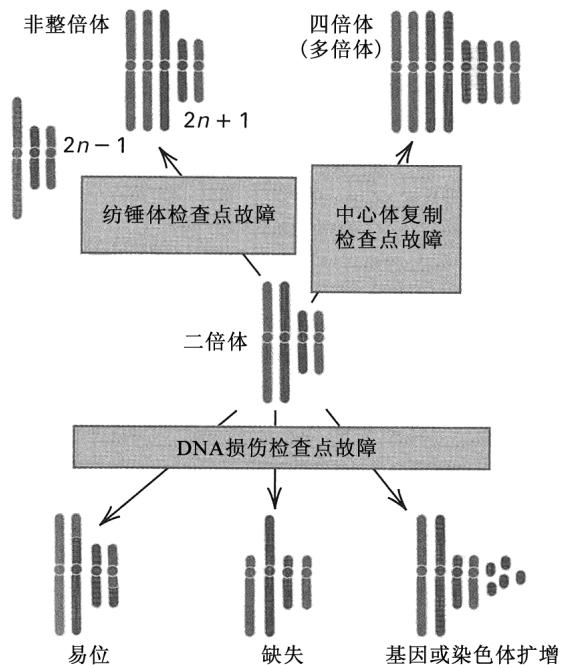  
图 15.20 检查点故障对遗传不稳定性的作用。[改编自 L. H. Hartwell and M. B. Kastan, Science(1994): 1821-1828.]

## - 检查点失灵的后果

任何一个检查点的失灵，都会导致遗传不稳定。与讨论过的3个检查点的缺陷相关的基因组不稳定性的具体种类，概括于图15.20中。纺锤体本身出故障会导致非整倍性，而未能复制纺锤极会导致多倍性(参见第8章)。DNA损伤检查点的缺陷会引起不同种类的染色体畸变，包括易位、缺失及基因或染色体亚区的扩增。现已发现扩增的基因为染色体中的串联重复，或是无着丝粒、无端粒的染色体外的环。

## 15.5 癌 细胞

癌症(cancer)不是一种疾病，而是有着类似属性的许多疾病。癌细胞因突变而表现出生长失控，但这些突变影响的基因数目不多。癌症属体细胞病。大约1%的癌症是家族性(familial)癌，家族性即在患病个体的细胞易

于向癌变状态发展的家系中，有某个基因分离的明确证据。其他 99% 的病例称为散发 (sporadic) 癌，“散发”在这里的意思是“非家族性的”，这类癌症仅仅是体细胞中遗传变化的结果。癌细胞都有几个不同于正常细胞的属性。其中一个与细胞间接触的效应有关。在正常细胞中，细胞

与细胞的接触会抑制细胞进一步的生长和分裂，这个过程称为接触抑制(contact inhibition)。

图 15.21 强调了癌细胞不同于正常细胞的其他 6 个属性。

(1)丢失生长因子依赖性。

(2)对抗生长信号不敏感。

(3)逃避细胞凋亡。

(4) 永生性 (细胞不衰老)。

(5)能转移和浸润其他组织。

(6)持续的血管生成(形成血管)。

在机体内，肿瘤细胞是克隆细胞。它们是单个癌变细胞的后裔。该结论部分基于这样的观察结果：女性中的肿瘤细胞只表达其中一条X染色体上的基因，这是另一条X染色体正常失活的结果(参见第8章)。如果肿瘤细胞不是克隆细胞，两条X染色体理应都出现基因表达，在每个细胞系中表现出一条X染色体的随机失活。因此，发现仅有一条X染色体的表达，必定反映了克隆性。

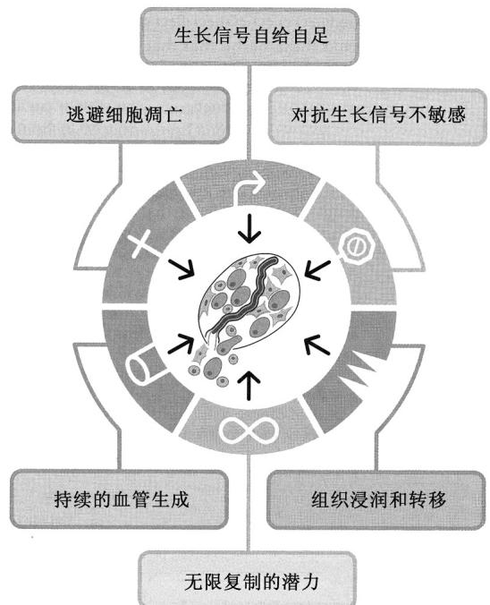  
图 15.21 癌细胞获得的能力。[转载自 Cell, vol. 100, D. hanahan and R. A. Weinberg, “The hallmarks of cancer,” pp. 57-70, copyright(2000), 经 Elsevier 许可, http://www.sciencedirect.com/science/journal/oo928674。]

正常体细胞转化为癌细胞的过程，需要多个步骤。癌症转化的一个重要原因是前体细胞群体的遗传不稳定性。遗传不稳定性可在 DNA 的核苷酸序列水平上或在染色体结构或数目水平上发生。遗传不稳定性表现为突变、基因扩增、染色体重排或非整倍性。突变造成具有遗传异质性的细胞群体。在这样一种混合群体中，任何一个具有增殖优势的细胞，将比它附近的细胞对未来的细胞群体贡献更多的后代。并且正因为这种优势，其克隆的扩张是以损害其他细胞为代价的。随后在该细胞的后代中发生的突变，以及在衍生细胞中进一步的克隆扩张，可产生具有典型癌细胞增殖能力的一个细胞克隆。

许多癌症是细胞周期控制变异的结果，尤其是在 $\mathrm{G}_1$ 期到S期的过渡期中，以及与该过渡期相关的 $\mathrm{G}_1 / \mathrm{S}$ 检查点的变异。这些变异也通过它们与p53的相互作用影响细胞凋亡。图15.22概括了支配 $\mathrm{G}_1 / \mathrm{S}$ 过渡的调节回路的要素，包括促进细胞周期进程、激活检查点和控制细胞凋亡途径的蛋白质。肿瘤细胞通常表现出一个或多个这些基因的表达改变或功能失活。现已在癌细胞中检测到变异的一些基因，列于表15.3中。多步骤癌变进程的主要突变对象有两类：原癌基因和肿瘤抑制基因。在以下章节中将讨论这两类基因。

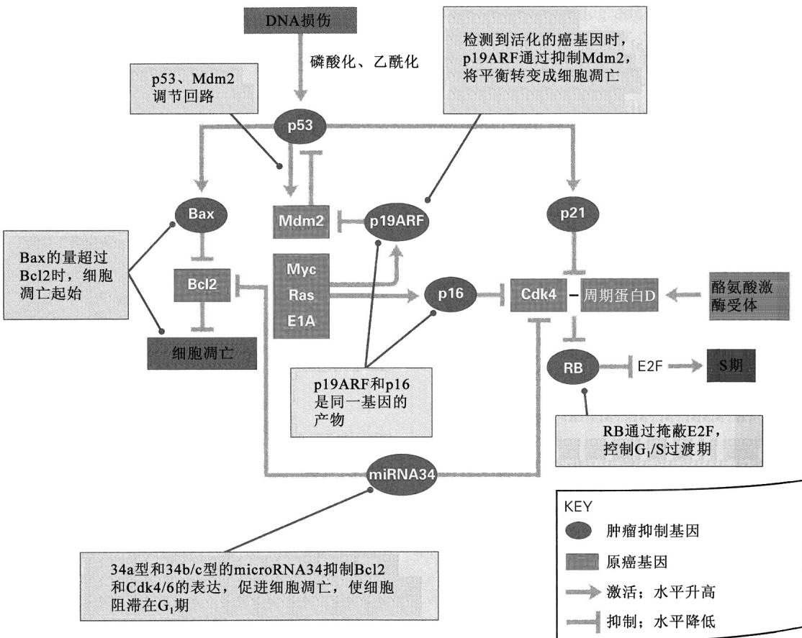  
图 15.22 在控制细胞凋亡或 DNA 合成中，p53 途径和 RB(视网膜母细胞瘤蛋白)途径之间的相互作用。

表 15.3 在肿瘤中受影响的细胞周期调节基因

<table><tr><td>原癌基因</td><td>变异</td><td>后果</td></tr><tr><td>Cyclin D</td><td>扩增或超表达</td><td>促进细胞进入 S 期</td></tr><tr><td>Cdk4</td><td>扩增</td><td>促进细胞进入 S 期</td></tr><tr><td>Cdk4</td><td>突变</td><td>Cdk4 抗 p16 抑制;促使细胞进入 S 期</td></tr><tr><td>EGFR(表皮生长因子受体,一种酪氨酸激酶受体)</td><td>扩增</td><td>通过对生长因子受体途径的组成型活化,促进细胞增殖</td></tr><tr><td>FGFR(成纤维细胞生长因子受体)</td><td>扩增</td><td>通过对生长因子受体途径的组成型活化,促进细胞增殖</td></tr><tr><td>Ras</td><td>扩增</td><td>通过组成型传递生长信号,促进细胞增殖</td></tr><tr><td>Ras</td><td>突变</td><td>使GTPase失活;组成型的活化生长因子受体途径</td></tr><tr><td>Bcl2</td><td>易位到强增强子旁边而超表达</td><td>阻断细胞凋亡</td></tr><tr><td>Mdm2</td><td>扩增</td><td>以 $G_1/S$ 、S和 $G_2/M$ 检查点功能的丢失,模仿p53的丢失</td></tr><tr><td>端粒酶</td><td>超表达</td><td>细胞不再衰老</td></tr><tr><td>P53</td><td>突变</td><td> $G_1/S$ 、S和 $G_2/M$ 检查点功能丢失</td></tr><tr><td>P21</td><td>突变</td><td> $G_1/S$ 和S检查点功能丢失</td></tr><tr><td>RB</td><td>突变</td><td>促进细胞增殖;E2F不受抑制</td></tr><tr><td>Bax</td><td>突变</td><td>不能促进受损细胞进行凋亡</td></tr><tr><td>Bub1p</td><td>突变</td><td>纺锤体组装检查点的功能丢失</td></tr><tr><td>E-cadherin</td><td>突变</td><td>接触抑制丧失;组织浸润和转移</td></tr></table>

## - 癌基因和原癌基因

癌基因(oncogene)是与癌症发展相关的功能获得突变。它们源于称作原癌基因(proto-oncogene)的正常细胞基因。癌基因错误地使促进细胞增殖的基因表达增强，或错误地抑制细胞凋亡，因而它们是功能获得突变。在图15.22中，用方框圈起来的蛋白质是原癌基因的产物，它们突变后会成为癌基因。在本节中，将比较详细地讨论图15.22和表15.3中一些已鉴定的癌基因，包括周期蛋白和CDK、生长因子受体、Ras及Mdm2。

周期蛋白 D 和 Cdk4 周期蛋白 D 的超表达促使不该进入 S 期的细胞进入 S 期。超表达通常是基因扩增的结果。在有些肿瘤中，与周期蛋白 D 表达增加同时发生的是周期蛋白 D 的 CDK 搭档 Cdk4 被扩增。

生长因子受体和 Ras 生长因子通过与细胞膜上的生长因子受体结合而刺激生长。这种结合激活一个信号转导途径，该途径通过 Ras(图 15.23)、周期蛋白 D 及其搭档 CDK 起作用。在许多肿瘤中，编码表皮生长因子受体(EGFR)或成纤维细胞生长因子受体(FGFR)的基因被扩增。

活化的酪氨酸激酶受体(如 EGFR 和 FGFR)激活一个信号转导途径，该途径活化一种称为 G 蛋白(G protein)的小的信号蛋白，如图 15.23 所示的 G 蛋白 Ras。Ras 通常与 GDP 结合，在此状态下它是无活性的。受体活化导致一种蛋白质的活化，该蛋白质促使 Ras 蛋白中的 GDP 被 GTP 替换。Ras 蛋白与 GTP 结合时，具有活性。Ras-GTP 继而激活下游的一种蛋白质，传播生长信号。Ras 活化为 Ras-GTP 是暂时的；还有另一种蛋白质(GAP)激活 Ras 内在的 GTPase 活性，于是，Ras 水解 GTP，使其自身恢复为无活性的 Ras-GDP 状态。如果在 RAS 基因中发生使其 GTPase 功能失活的突变，则其 GTPase 活性不能被 GAP 激活，从而，无论细胞是否从生长因子受体接收到信号，Ras 都保持其 Ras-GTP 的活性形式。因此，生长信号被组成型地转导，发生无限制的生长和分裂。这种生长因子依赖性的丧失，是癌细胞的特点之一。

EGFR 和 FGFR EGFR 或 FGFR 的扩增或超表达引起相应受体的自我活化 (autoactivation)，并传递通过 Ras 途径起作用的组成型生长信号。Ras 的超表达也会导致信号转导增强和增殖周期反复出现。

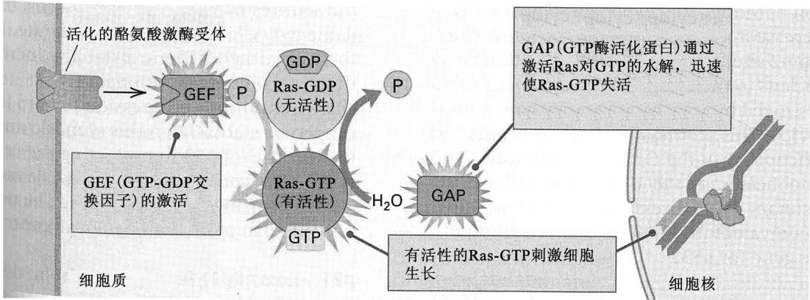  
图 15.23 Ras 蛋白的功能，在存在生长因子的情况下，Ras 在刺激细胞生长上起到开关作用。Ras 是一种原癌基因的产物。某些突变型的 Ras 蛋白，如 G19V(19 位的甘氨酸被缬氨酸替代)，缺乏 GTPase 活性，保持 Ras-GTP 形式；因而，即使缺乏生长因子，仍然存在促进生长的信号。

Mdm2 编码 Mdm2 的基因扩增，起到促进细胞增殖的作用，但这种作用比较间接。Mdm2 的超表达有效地掩盖了 p53 在产量上的任何增加，因为 Mdm2 将多出来的 p53 从细胞核转运到细胞质，在细胞质中 p53 被蛋白酶体破坏(图 15.15)。该过程有效地阻止了 G₁/S 检查点发挥功能。因此，Mdm2 基因的扩增及由此产生的 Mdm2 蛋白的超表达，其结果相当于使 p53 基因失活。

端粒酶 正常的培养细胞在 50～70 次倍增之后会停止分裂，该过程称为衰老 (senescence)。而培养的癌细胞会无限期地分裂，即它们是永生的。正常细胞的衰老行为与端粒酶活性的丧失相关。端粒不再延长，是开始衰老和细胞死亡的原因之一。癌细胞具有较高的端粒酶水平，这有助于它们防止衰老，使它们永生。

## ■ 肿瘤抑制基因

肿瘤抑制基因(tumor-suppressor gene)是在正常情况下负调节细胞增殖或激活细胞凋亡途径的基因，这些基因的功能失去突变是癌变的原因之一。肿瘤抑制基因的一些关键功能如图15.22及表15.3所示。在本节中将较为详细地考察这些基因。

p53 p53 的功能失去导致癌细胞获得两个特性: 对抗生长信号不敏感及逃避细胞凋亡。P53 的功能失去消除在 $G_{1}$ 期和 S 期中监测 DNA 损伤的 DNA 损伤检查点。在缺乏有功能的 p53 时，细胞不会应答 DNA 损伤而合成负责将细胞阻滞于 $G_{1}$ 或 $G_{2}$ 期的蛋白质 (p21、GADD45、14-3-3σ) 和 microRNA (miRNA 34a 和 miRNA 34b/c)。因而，即使有染色体受损、倍性改变或基因扩增，细胞继续进入 S 期或 M 期也没有阻碍。此外，p53 功能的失去使机体丧失了抵御畸变细胞的最后防线，因为 DNA 损伤不再能引发 Bax 和 Apaf1 的表达增加及 Bcl2 的表达减少，并以此达到畸变细胞的自我毁灭；受损伤的细胞将存活下来，并进行增殖。而且，它们的遗传不稳定性增加了出现其他遗传变异的可能性，从而向着癌变状态发展。有鉴于此，以及已知 p53 在保护细胞免于 DNA 损伤的后果上的核心作用，p53 被证明在所有癌症的一半以上中没有功能，就一点也不奇怪了。

p21 p21 功能的失去导致反复多个轮次的 DNA 合成，但未伴随着有丝分裂，从而使细胞的倍性水平增加。

p16/p19ARF p16 和 p19ARF 蛋白是同一基因的产物；它们来自不同启动子的两种不同的转录物，各有一个 5' 的外显子不同。p16 产物可抑制周期蛋白 D-Cdk4 复合体，从而辅助进入 S 期的控制；在肿瘤恶化过程中，编码 p16 的基因是非常常见的失活目标之一。图 15.22 显示了 p19ARF 作为肿瘤抑制蛋白的功能性相互作用。如果细胞癌基因 (cellular oncogene) 或病毒癌基因(viral oncogene)正在超表达，p19ARF 的合成会增加，而在此高浓度下，p19ARF 与 Mdm2 结合，阻止 Mdm2 与 p53 结合，从而阻止 Mdm2 从细胞核中转运 p53。

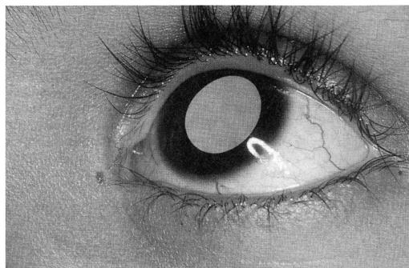  
开始的时候, 视网膜母细胞瘤表现为视网膜内的白色团块, 但有可能长满整个眼球, 使瞳孔呈白色或黄色, 正如本例一样。(©Custom Medical Stock Photo.)

RB 如图 15.12 所示，视网膜母细胞瘤蛋白通过控制转录因子 E2F 的活性，控制细胞从 $G_{1}$ 期到 S 期的过渡。RB 功能的失去使 E2F 不受控制，在细胞周期的任何时间都可起始 DNA 合成所需酶类的转录；因而过多轮次的 DNA 合成被连续不断地起始。肿瘤细胞几乎总是有 RB、p16、周期蛋白 D 或 Cdk4 的改变，但很少有一个以上的改变。这一发现说明，p16 或 RB 任何一个的功能失去，与周期蛋白 D 或 Cdk4 任何一个的超表达是等价的。这些缺陷的任何一个都可导致相同的结果：细胞的 $G_{1}/S$ 过渡失控，从而开始进行计划外的 DNA 合成轮次；对抗生长信号不敏感。

Bax Bax 肿瘤抑制蛋白促进细胞凋亡(图

15.18)。Bax 功能的失去尤其多见于胃腺癌和大肠癌中，特别是那些与错配修复缺陷所致的微卫星不稳定相关的病例中。其中一种容易发生复制滑移的序列是 Bax 基因中一串 8 个连续的鸟嘌呤核苷酸，该序列使得该基因特别容易因该区域中一个碱基对的增加或缺失而产生移码突变。

Bub1 Bub1 是一种主要参与纺锤体检查点的蛋白质(图 15.19)。结肠癌的一个亚类表现出染色体不稳定性；它们不会保持恒定的核型，而是非整倍体。

E-钙黏着蛋白 在正常细胞中，细胞与细胞接触使细胞进一步的生长和分裂抑制，该过程称为接触抑制。癌细胞已经丧失接触抑制。它们持续地生长和分裂，甚至彼此堆积在一起。在上皮细胞中，E-钙黏着蛋白(E-cadherin)无处不在。毗邻细胞的分子间相互作用，使得抗生长因子和其他信号能够通过细胞质的接触而传递。上皮细胞利用E-钙黏着蛋白来抑制浸润和转移，其失活[通过该基因本身的突变，或其相互作用的对象 $\beta$ -连环蛋白(β-catenin)的基因突变]是获得转移能力的一个关键步骤。

## 15.6 遗传性癌综合征

前面述及约 99% 的癌症是散发的；所有的遗传改变都发生在体细胞中。并且，从正常细胞变成肿瘤细胞是进行性的。在此过程中，每个新的体细胞突变使一种不同的细胞周期控制机制妥协，因而该过程是循序渐进的。

## ■ 细胞周期调节和检查点缺陷

约 $1\%$ 的癌症是家族性的。在这些癌症中，其中一个癌症发展突变 (cancer-progression mutation) 是通过种系遗传来的。存在该突变的个体易患癌症，因为它使前癌细胞发展为恶性所需的体细胞突变少。图 15.24 示在一种称为腺瘤性息肉病的家族性结肠癌的发展过程中，发生的一些遗传突变和细胞形态的改变。在此例中，遗传来的突变在 5 号染色体的 APC 基因中，APC 是一个肿瘤抑制基因，它的正常功能是将接触抑制信号转导进细胞，以抑制细胞进一步的生长和分裂。在发展为恶性肿瘤的过程中，后续的突变包括 Ras 基因中的一个癌基因突变，以及编码 p53 的基因丢失或突变，这只是一种可能的发展途径。不同的肿瘤可通过不同的途径发展，取决于发生什么突变，以及突变顺序是什么。

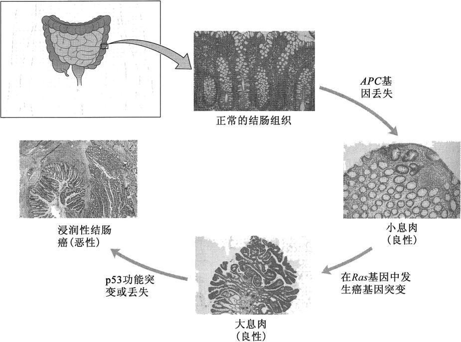  
图15.24 浸润性结肠癌发展过程中的体细胞突变和细胞形态变化。[照片承密歇根大学医学院凯瑟琳·周(Kathleen R. Cho)惠赠。]

结肠的家族性腺瘤性息肉病和其他一些重要的家族性癌综合征如表 15.4 所示。里-费综合征(Li-Fraumeni syndrome)、家族性视网膜母细胞瘤和家族性黑色素瘤都与种系的基因突变相关，在散发性肿瘤中也常见这些基因的突变。在这些综合征中，受影响的基因分别是 p53 基因、RB1 基因和 p16 基因。图 15.25 示一个癌多发家族(里-费综合征)的系谱，可见 p53 基因的一个突变的分离。该综合征表现为明显的常染色体显性遗传。但是，不同患者表现出一系列不同的肿瘤，且同一患者常常患不止一种肿瘤，这些肿瘤包括骨肉瘤、白血病、乳腺癌、肺癌、软组织肉瘤和脑瘤。大部分里-费综合征家系都会出现 p53 基因突变的分离，患者杂合。

表 15.4 遗传性癌综合征

<table><tr><td>综合征</td><td>原发肿瘤</td><td>相关肿瘤</td><td>染色体</td><td>基因</td><td>建议功能</td></tr><tr><td>里-费综合征</td><td>肉瘤、乳腺癌</td><td>脑瘤、白血病</td><td>17p13</td><td>P53</td><td>转录因子</td></tr><tr><td>家族性视网膜母细胞瘤</td><td>视网膜母细胞瘤</td><td>骨肉瘤</td><td>13q14</td><td>RB1</td><td>细胞周期调节因子</td></tr><tr><td>家族性黑色素瘤</td><td>黑色素瘤</td><td>胰腺癌</td><td>9p21</td><td>P16</td><td>Cdk4和Cdk6的抑制因子</td></tr><tr><td rowspan="4">遗传性非息肉性结直肠癌(HNPCC)</td><td rowspan="4">结直肠癌</td><td rowspan="4">卵巢癌、胶质母细胞瘤</td><td>2p22</td><td>MSH2</td><td rowspan="4">DNA错配修复</td></tr><tr><td>3p21</td><td>MLH1</td></tr><tr><td>2q32</td><td>PMS1</td></tr><tr><td>7p22</td><td>PMS2</td></tr><tr><td>家族性乳腺癌</td><td>乳腺癌</td><td>卵巢癌</td><td>17q21</td><td>BRCA1</td><td>DNA双链断裂的修复</td></tr><tr><td>结肠的家族性腺瘤性息肉病</td><td>结直肠癌</td><td>其他胃肠道肿瘤</td><td>5q21</td><td>APC</td><td>β连环蛋白的调节</td></tr><tr><td rowspan="3">着色性干皮病</td><td rowspan="3">皮肤癌</td><td rowspan="3"></td><td rowspan="3">几个互补群</td><td>XPB</td><td rowspan="3">DNA修复解旋酶,核苷酸切除修复</td></tr><tr><td>XPD</td></tr><tr><td>XPA</td></tr></table>

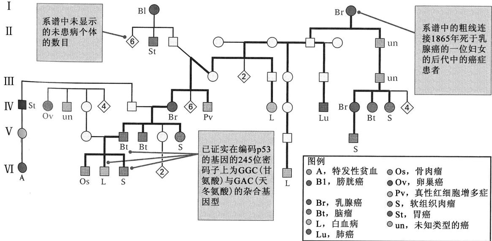  
图 15.25 与 p53 基因突变相关的里-费综合征的系谱。个体易患多种癌症的任何一种。[数据来自 W. A. Blattner, et al., J. Am. Med. Assoc. 241 (1979):259:261.]

通过在第 12 章中讨论过的转化方法，实验敲除 p53 基因(功能丢失)，已在小鼠中建立了与人类里-费综合征类似的疾病。将对 p53 敲除杂合或纯合的小鼠与野生型小鼠进行比较。正常小鼠未患肿瘤，其中 50% 活到 120 周龄，5% 左右至少活到 160 周。与此相比，半数的杂合 p53 敲除小鼠在 55 周之前死亡，几乎没有一个活到 120 周这么长的。而且，这些小鼠中的 50% 在 18 月龄之前罹患肿瘤(主要是骨肉瘤)。纯合敲除小鼠更糟糕，50% 死于 20 周之前，40 周之前全部死亡；在纯合小鼠中，75% 在 6 月龄之前出现肿瘤，在 10 月龄之前全部出现肿瘤或死亡。在纯合基因型中，肿瘤是淋巴瘤，而不是骨肉瘤，可能是因为免疫系统的正常发育需要在胸腺中发生大规模的细胞凋亡，而在 p53 纯合敲除中，因为 Bax 不像在正常小鼠和 p53 敲除杂合小鼠中那样上调，所以细胞凋亡被废止。

对 p53 敲除杂合的小鼠在寿命和肿瘤发生率上均受到严重影响,该事实并不一定意味着 p53 突变在单个细胞水平上是显性的。在 p53 敲除突变的情况下,仅在变成对敲除纯合的体细胞中,或在同源染色体中的野生型等位基因已经丢失(或发生体细胞突变)的体细胞中,突变效应才得以显现。在杂合小鼠中,只要存在一个拷贝的野生型 p53 基因,就能保护细胞,这唯一的一个野生型等位基因的失活,使依赖于 p53 蛋白的检查点失效。因为可发生这样一种稀有畸变的体细胞是如此之多,所以,几乎可以肯定,在杂合机体的某个地方会发生 p53 的失活或丢失,从而启动导致癌症的系列突变。

另外，在 p53 基因中观察到的大部分突变是显性负效突变(dominant-negative mutation)。它们在机体水平和细胞水平都是显性的。p53 蛋白以四聚体的形式发挥作用。在杂合基因型中，在 16 种可能的四聚体类型中，有 15 种含有至少一个突变型亚基。如果突变型亚基破坏四聚体的活性，则剩下的 1/16 的正常活性不足以维持正常功能，从而突变会是显性的(图 15.26)。

肿瘤抑制基因的野生型等位基因的丢失可能是肿瘤在细胞水平的触发事件，远在 RB 基因的功能被鉴定之前，这一概念就在 1971 年由艾尔弗雷德·克努森根据对视网膜母细胞瘤的研究首先提出来。正如在本章的“联系”中标题为“命中两次、错误两次”的节选所指出的那样，克努森注意到散发的视网膜母细胞瘤病例通常只有单个肿瘤，而家族性视网膜母细胞瘤病例通常两侧都有肿瘤。根据对诊断出肿瘤的时间的统计分析，他提出，在家族性病例中，肿瘤的发生需要在体细胞中发生单次打击 (hit)，而在散发病例中，肿瘤的发生需要两次打击，这就很罕见了。这种两次打击模型也可解释为什么散发病例很少有第二个肿瘤，因为每次打击都是稀有事件。

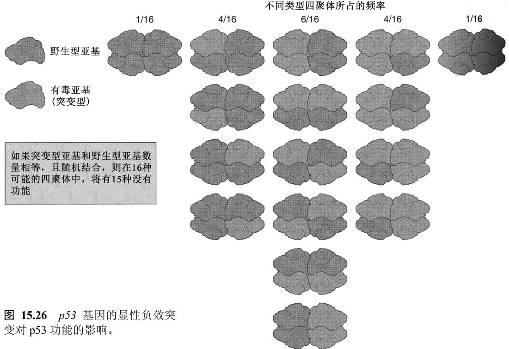

如同 p53 缺陷一样，视网膜母细胞瘤在系谱中的遗传也是简单的孟德尔显性。但克努森的假说表明，即使是在家族性病例中，也必定会存在另一个引发肿瘤发生的突变事件。该基因本身(称为 RB1)一被定位，就通过对肿瘤细胞中该基因周围遗传标记的分析，发现引发事件是野生型 RB1 等位基因的丢失。染色体丢失、有丝分裂重组、缺失和失活性的核苷酸置换，这几种机制中的任何一种都可让突变型等位基因显露出来。根据肿瘤细胞中丢失或保留的遗传标记，可区分这些机制，已知存在的几种机制如图 15.27 所示。在机体水平，突变基因的表达是显性的。但是，在细胞水平，突变基因的表达是隐性的。通过不同的机制使隐性等位基因显露，称为杂合性丢失 (loss of heterozygosity)。

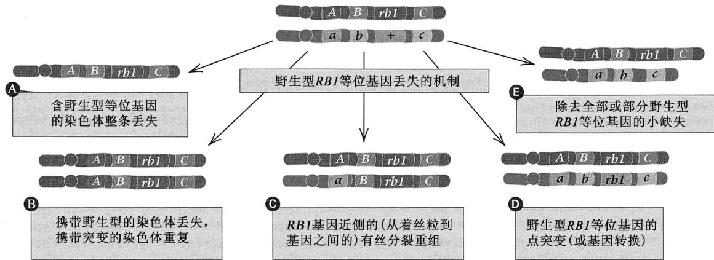  
图 15.27 视网膜母细胞瘤患者的野生型 RB1 等位基因发生杂合性丢失的遗传机制。

表 15.4 中所列的遗传性癌综合征是肿瘤抑制基因突变的结果。除了着色性干皮病是以隐性方式遗传的以外，这些综合征均表现为常染色体显性遗传。在所有表现出显性遗传的癌综合征中，杂合性丢失对肿瘤表型的显露都是必要的。突变型等位基因的表达，使细胞易于癌变，但其本身对癌细胞的产生是不充分的，除了前面讨论过的 p53 的有害亚基这个著名的例子之外。肿瘤的发展仍然只有在发生额外的体细胞突变和克隆扩张时，才会出现。种系突变本身并不致癌，它们只不过使癌症的发展更有可能发生，实际上，就是先行一步。

## - DNA 修复中的缺陷

显然，遗传不稳定性是肿瘤细胞发生的原因之一。根据对酵母和细菌的研究，已经知道细胞有修复 DNA 损伤的大量机制(参见第 14 章)。这些过程中的缺陷会导致突变率和遗传不稳定性大幅上升。因此，当发现 DNA 修复的遗传缺陷所致的遗传性癌综合征时，就不觉得奇怪了。

在表 15.4 中，有几种遗传性癌综合征是 DNA 修复缺陷的结果。在编码参与 DNA 错配修复的蛋白质的 4 个基因中，任何一个基因的缺陷都会导致遗传性非息肉性结直肠癌，这种癌症表现出常染色体显性遗传方式。突变型细胞具有较高的突变率，这促进了向癌变状态的发展。遗传性乳腺癌综合征被证明与两个基因 BRCA1 或 BRCA2 之一相关，这两个基因参与双链断裂的修复。遗传性皮肤癌综合征称为着色性干皮病。着色性干皮病的细胞在核苷酸切除修复上有缺陷，它们不能修复诸如由紫外线引起的胸腺嘧啶二聚体之类的缺陷。患此综合征的个体，对阳光中存在的和日光灯发出的紫外线非常敏感。

## 15.7 急性白血病的遗传学

人类急性白血病产生于白细胞的祖细胞(progenitor)中。引起急性白血病的初始遗传事件，与之前考察的癌症中所指出的那些事件截然不同。它们的发生，既不是细胞周期调节变异的结果，也不是因为它们是家族性的。

多达 65%的急性白血病的发生是染色体易位的结果，这些易位涉及编码在血细胞发育(hematopoiesis, 造血作用)中发挥作用的转录因子的基因。这些易位主要有两种类型，如图 15.28 所示。在启动子融合(promoter fusion)中(图 15.28A)，编码一种转录因子的基因的编码区，被易位到一个免疫球蛋白重链基因或一个 T 细胞受体基因的增强子附近。结果是转录因子超表达、正常造血作用被扰乱和淋巴细胞生产过剩。正常造血作用的一个重要方面是，通过细胞凋亡摧毁未能有效重排抗原—受体基因的祖细胞(参见第 11 章)。据估计，在正常发育过程中，75%的 B 细胞前体和 95%的 T 细胞前体发生自我摧毁。Bcl2(Bcl 表示“B-cell lymphoma”，B 细胞淋巴瘤)是表 15.4 中一个癌基因的例子，该基因最初发现于一个将 Bcl2 置于一个免疫球蛋白重链基因增强子近旁的启动子融合中。Bcl2 的超表达通过阻止 Bax 同二聚体的形成，阻断细胞凋亡(图 15.18)。这些本不应该存活的淋巴细胞发生增殖，并主宰白细胞群体，但它们在抗感染上是没用的，因为它们的免疫球蛋白基因没有经过正常的重排。在这样的情况下，骨髓变得几乎全部被癌变白细胞所占据，引起严重的贫血和出血。有时倘若畸变的白细胞仍携带有编码 p53 的野生型等位基因的话，通过化疗激活 p53 基因，可非常有效地治疗幼儿的急性白血病。

第二种类型的易位是基因融合(gene fusion)(图 15.28B)，比启动子融合更常见。最常见的情况是，在不同染色体上两个不同的转录因子编码基因的内含子中出现断裂点。其结果是一个融合基因，该基因编码一个功能发生改变的嵌合转录因子，它可能有能力干扰造血作用。这些嵌合蛋白的独特性，以及它们仅存在于癌细胞而不存在于正常细胞中的事实，使得它们成为化疗的诱人目标。如果某种药物能成功地攻击表达嵌合蛋白的细胞，这种药物就能选择性地杀死癌细胞。

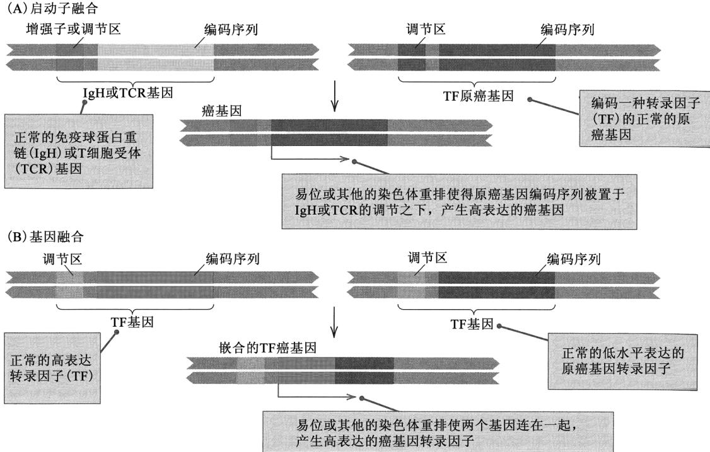  
图 15.28 在急性白血病中，使转录因子异常激活的易位。(A)启动子融合。(B)基因融合。

慢性髓样白血病(chronic myeloid leukemia, CML)占所有白血病病例的 $15\% \sim 20\%$ 。CML的特征是存在费城染色体(Philadelphia chromosome)，这是骨髓造血干细胞中9号和22号染色体之间相互易位产生的。造血干细胞分化成不同类型的特化细胞，成为血液和免疫系统的一部分。在分子水平上， $t(9,22)$ 易位的结果是 $c-abl$ 的第一外显子被来自 $bcr$ 基因的序列取代，产生Bcr-Abl融合蛋白。在正常情况下，Abl的N端区抑制催化结构域的功能，融合蛋白因为丢失了抑制性的结构域，属于具有组成型活性的蛋白激酶。

酪氨酸激酶抑制剂 STI571 (imatinib mesylate, 伊马替尼甲磺酸盐) 是一种专门针对 Bcr-Abl 酪氨酸激酶的药物。通过抑制 Bcr-Abl 激酶，该药物不仅能抑制该激酶的活性，而且能抑制表达该激酶的细胞在体内和体外的增殖。持续接触该药物可消灭大部分的癌细胞。之所以认为这种药物非常有效，是因为 Bcr-Abl 可能是慢性髓样白血病早期唯一的分子异常。STI571 也可抑制 Kit 酪氨酸激酶，并已证明可有效地抗胃肠道间质瘤，这种肿瘤涉及组成型激活编码 Kit 的 c-kit 基因的突变。

在一项结直肠癌的研究中, 检测了 182 个癌症病例的 138 个蛋白激酶编码基因的突变(在人类基因组中已知共有 518 个蛋白激酶基因)。约 30% 的结直肠癌被证实有一个编码蛋白激酶的基因突变。这些结果, 加之像 STI571 一样的药物的阳性治疗结果, 已使人们日益重视将蛋白激酶作为治疗的可能靶标。

## 联系：命中两次、错误两次

艾尔弗雷德·克努森，1971

得克萨斯大学 M. D. 安德森医院，休斯敦，得克萨斯州

突变与癌症：视网膜母细胞瘤的统计学研究

这篇里程碑式的论文，是人们思考遗传学与癌症的一个转折点。系谱研究已经表明，某些癌症如视网膜母细胞瘤存在遗传倾向。但也会出现散发病例，在这些病例中，家系中只有一个成员罹患。这两种形式之间的关系是什么？克努森通过一个精巧的统计分析，证明散发病例表现出作为年龄的函数的二次打击动力学，说明涉及同一个视网膜细胞中的两次独立的突变，而家族性病例表现出一次打击动力学。最简单的解释是，在散发病例中，第一次突变敲除一个关键基因，第二次突变敲除其等位基因；在家族性病例中，第一个突变型等位基因是遗传来的，因而引起该病只需一次突变(在剩下的有功能的等位基因中)。因而，在单个细胞的水平，视网膜母细胞瘤基因(RBI)中的突变是隐性的，而在家族水平，该病是以显性方式遗传的，因为几乎每个遗传了一个突变型等位基因的人，都至少会在一个视网膜细胞中发生第二次突变。

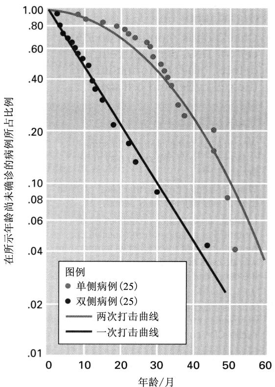

所提出的假说是：视网膜母细胞瘤是一种由两个突变事件引起的癌症。在显性遗传型中，一个突变经由生殖细胞遗传而来，第二个突变发生在体细胞中。在非遗转型中，两个突变都发生在体细胞中。……若干作者已经推断出，视网膜母细胞瘤可由种系突变或体细胞突变引起。……应将所有双侧肿瘤病例(25%～30%)视为遗传性的，因为患病子女的比例近似显性遗传的50%期望比例。……如果(在遗传性病例中)涉及第二个单一事件，双侧病例对时间的分布应该是指数函数，也就是，发病的总例数所占的比例应该是常数，如关系式 $dS/dt = -kS$ 和 $\ln(S) = -kt$ 所表达的那样，其中，S是在时间t时尚未确诊的幸存者所占的比例，而dS是在时间间隔dt中该比例的变化。如图所示，确实是这样的情况。相比之下，在单侧病例中，单位时间下降的比例未出现这种关系。……新发遗传病例随时间的指数递减，反映了第二个事件以每年 $2 \times 10^{-7}$ 数量级的恒定速率发生。……二次突变假说与当前的看法一致……常见的癌症是由3～7次突变产生的。有趣的是，脑瘤是估计突变次数最低的癌症之一，像视网膜母细胞瘤一样，脑瘤也是源自神经因子。

来源：A. G. Knudson, Proc. Natl. Acad. Sci. USA 68(1971): 820-823.

## 本章概要

\- 在酵母细胞中， $10\% \sim 15\%$ 的基因在细胞分裂和细胞周期从一个时期向下一个时期的过渡中起作用；这些基因的转录每个细胞只起始一次。

\- 细胞周期的进程由周期蛋白依赖性激酶和蛋白质降解控制。

\- 检查点监测正在分裂的细胞的细胞周期中的 DNA 损伤、细胞缺陷和其他异常，以及细胞大小。发现异常会引起应答，阻滞细胞周期，使细胞获得修复缺陷(或细胞死亡、细胞凋亡)的时间，从而确保各个时期保持正确的次序。

\- 癌细胞表现出无限制的生长和增殖，以及丧失接触抑制。

\- 从正常状态发展到癌变状态需要数个遗传改变。大多数癌症是散发的(非遗传的)。

\- 一小部分癌症与从种系遗传来的突变有关，这些突变使携带它们的人的体细胞容易癌变。

\- 在癌症发展中发生的遗传改变往往涉及在细胞周期调节或检查点控制中起作用的基因的缺陷或超表达。

## 基础回顾

\- 中心粒(在有些生物中为中心体)在细胞分裂中起什么作用?

\- 在细胞核中发生的哪种分子过程是 S 期的特点？

\- 在酵母中，是根据什么表型对 $cdc$ 突变体进行定义的？对培养于限制性温度下的温度敏感型 $cdc$ 突变体而言，为什么细胞会阻滞于细胞周期的某个特定阶段？

\- CDK 这个缩写表示什么？周期蛋白-CDK 复合体是什么？周期蛋白-CDK 复合体的底物特异性由什么决定？

\- 在细胞分裂周期的调节中，蛋白质降解的作用是什么？

\- 细胞周期检查点是什么？在本章中强调了哪些检查点？每个检查点各检查什么？

\- 细胞凋亡是什么？它在保护多细胞生物基因组的完整性上起什么作用？

\- 在产物参与 DNA 修复的基因中的突变，往往与癌症的风险升高有关。这一观察结果表明，在癌症的发生中自发突变有什么作用？

\- 解释一下为什么下列两种说法不矛盾：“癌症是遗传病”和“大多数癌症是散发的(非家族性的)。”

\- 指出原癌基因和肿瘤抑制基因的差异，并各举一例。哪一类基因的功能失去突变易引起癌症？哪一类基因的功能获得突变易引起癌症？请解释。

\- 什么是杂合性丢失？该现象与某些类型的癌症的发展有什么关系？

## 解题指南

习题 1 指出癌基因和肿瘤抑制基因的差异。为什么癌基因突变与癌的功能获得突变相关，而肿瘤抑制基因突变与癌的功能失去突变相关？

## 答案

癌基因是其相应的正常基因原癌基因的突变基因，编码促进细胞增殖或抑制细胞凋亡的产物。肿瘤抑制基因的产物抑制细胞增殖或激活细胞凋亡途径。癌基因是功能获得突变，因为它们表达的增强使无限制的细胞分裂成为可能，或阻止细胞凋亡途径。与癌相关的肿瘤抑制基因突变为功能失去突变，因为功能性基因产物的缺乏使细胞不能抑制细胞分裂或不能激活细胞凋亡途径。

习题 2 使用 RB1 基因中某个限制性片段的探针，用 Southern 印迹来分析来自某位视网膜母细胞瘤患者的细胞的 DNA。来自非肿瘤细胞的结果，以及来自每只眼睛的肿瘤细胞的结果，如附图所示。

(a)哪条带与突变型等位基因相关？哪条带与非突变型等位基因相关？

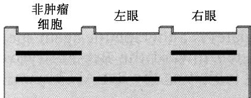

(b)来自左眼肿瘤的条带与来自右眼肿瘤的条带怎么可能有差异?

(c) 如何解释右眼肿瘤中的细胞可具有 “杂合性丢失”，尽管这些条带与在非肿瘤细胞中观察到的条带无法区分。

## 答案

(a) 因为两个肿瘤都含小条带 (靠近凝胶底部的那条带)，该条带很可能是与突变型 RB1 等位基因相关的带；大的条带与非突变型等位基因相关。

(b) 在不同的肿瘤中杂合性丢失是独立的；因此在两只眼睛中其机制不一定相同。

(c)该结果可这样解释：野生型等位基因发生了一个新突变(或者是小的缺失或插入)，该突变使基因失活，但它产生的条带大小的改变无法检出。

习题 3 在慢性骨髓性白血病中，白细胞无休止地增殖。在受累白细胞中，BCR-ABL 癌基因——基因融合的结果——传递组成型的生长信号。该病的严重程度与携带 BCR-ABL 癌基因的白细胞的比例相关。该病的一种治疗方法，是使用一种抑制 BCR-ABL 蛋白并阻止其传递生长信号的药物。这可阻止癌细胞增殖，使病情缓

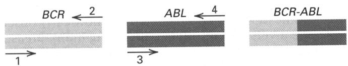

解。在治疗期间，通过评估在固定数量白细胞中存在的 BCR-ABL 癌基因的水平，来监测治疗的有效性。假设非突变型 BCR 和 ABL 基因的 DNA 结构如此处所示，而 BCR-ABL 癌基因的 DNA 结构如图所示。

短的寡核苷酸标为 1、2、3 和 4，其极性如图所示(3 端在箭头端部)。

(a) 如何检测 BCR-ABL 癌基因是否存在？

(b) 如何监测携带 BCR-ABL 癌基因的癌细胞相对于携带 BCR 和 ABL 原癌基因的正常细胞的水平?

## 答案

(a) 是否存在癌基因可用引物 1 和引物 4 通过聚合酶链反应来检测。

(b)癌细胞的相对水平可用引物 $1 + 2$ 、 $3 + 4$ 和 $1 + 4$ 进行3次PCR反应来监测。如果周密地进行实验，在PCR反应中，可使产物量与原始反应混合物中模板的量成正比。引物 $1 + 2$ 和 $3 + 4$ 分别检测白细胞中BCR和ABL的拷贝数，而引物 $1 + 4$ 检测BCR-ABL癌基因的拷贝数。BCR-ABL相对于BCR和ABL的拷贝数，给携带癌基因的白细胞的相对丰度提供了一个估计。

分析与应用

15.1 某个蛋白编码基因的一个突变型等位基因编码一个 “有害亚基”，这样说的意思是什么？在对这样一种突变为杂合的基因型中，如果在细胞中蛋白质的亚基等量合成并随机结合，如果该蛋白质的有功能形式是二聚体，预计有活性的蛋白质分子的比例是多少？三聚体呢？四聚体呢？

15.2 携带在母细胞和子细胞之间形成隔膜所需的某个基因的温度敏感型突变的酵母菌株，预计在下列温度下会是什么表型。

(a) 允许温度。

(b) 限制性温度。

15.3 某种酵母细胞携带修复 DNA 双链断裂所需的某个基因的温度敏感型突变。如在限制性温度下用放射线照射细胞，估计突变型细胞会在细胞分裂周期的什么阶段积聚？

15.4 周期蛋白-CDK 复合体是如何对细胞发挥作用的？可逆转周期蛋白-CDK 复合体作用的相应酶类是什么？

15.5 正常的视网膜母细胞瘤蛋白如何起到将哺乳类细胞保持在 $G_{1}$ 限制点（“起点”）的作用？

15.6 举出后期促进复合体(APC/C)作用对象的两种蛋白质，并解释该复合体如何作用于这些蛋白质。

15.7 在本章中强调了哪些细胞周期检查点？导致各检查点被激活从而使细胞分裂周期停止的是哪个或哪些事件？

15.8 哪一种蛋白质是激活 DNA 损伤检查点的主力？在正常情况下是如何避免该蛋白质引发该检查点的？存在 DNA 损伤时，在该蛋白质上发生了什么？

15.9 GADD45 蛋白降低 DNA 聚合酶的持续合成能力, p53 为其转录因子。“持续合成能力”是什么意思? 持续合成能力的降低在受损 DNA 的修复中是如何起到帮助作用的?

15.10 在程序性细胞死亡中，Bax 和 Bcl2 蛋白的作用是什么？这两种蛋白质在量上的平衡是如何受活化的 p53 影响的？是如何受某些细胞癌基因影响的？

15.11 如果癌症是 “遗传病”，“大多数病例是散发的(即非家族性的)” 这种说法怎么能是正确的？

15.12 里-费综合征是一种家族性癌综合征，其中，受累亲属表现出一组差异极大的肿瘤的早发现象，这些肿瘤包括脑癌、乳腺癌、肺癌和肉瘤。在多种多样的里-费综合征家系中，已发现 p53 基因的无义突变、错义突变和改变供体剪接位点的突变分离。在表现出该综合征的约一半家系中，未在 p53 的编码区或供体、受体剪接位点中检测到突变。问题是，在这些家系中，该综合征是由 p53 的改变导致的，还是由其他一些原因导致的。

(a) 如何判断此类家系中的突变是否真的以某种方式与 $p53$ 基因相关？

(b) 如果致病基因与 p53 相关，会找到什么类型的改变？

(c) 假设证据表明分离的突变与 $p53$ 基因不相关。你认为该综合征会有其他什么可能的原因？(该综合征的遗传方式是显性的。)

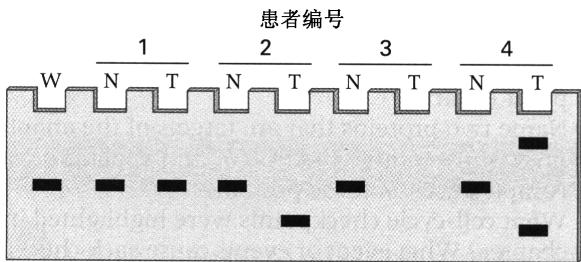

15.13 用编码 p53 的克隆 DNA 进行 Southern 印迹分析，试图判断几个癌症患者的 p53 突变类型。这些患者无一具有患癌症的亲属，因而这些肿瘤属于散发肿瘤。从 4 位患者的正常细胞和肿瘤细胞中分离 DNA，以 Not I（一种 8 碱基内切酶）切割，经琼脂糖凝胶电泳，转移到硝酸纤维素滤膜，然后以放射性 p53 cDNA 进行探针杂交。结果如图所示。

标 W 的泳道是从野生型 p53 基因得到的带型; 其

他泳道包含从 4 位患者的非肿瘤(N)和肿瘤(T)组织获得的 DNA。假设所有 4 位患者在他们的肿瘤细胞中都携带 p53 突变，在这些患者的 p53 基因中发生了什么类型的突变？

15.14 许多种类的癌症具有 $G_{1}/S$ 检查点缺陷。这些癌症也往往具有染色体数目或结构畸变。为什么在这些癌症中具有染色体畸变是意料之中的？

15.15 在所有癌症中，超过半数的癌症有 p53 蛋白缺陷。为什么这是意料之中的？

15.16 Ras-GTP 在细胞内信号转导中的什么作用使其成为原癌基因？

15.17 图示有丝分裂过程中同源染色体之间的重组如何导致具有 p53 突变杂合性丢失的细胞谱系。在此过程中，其他基因也会丢失杂合性吗？

15.18 视网膜母细胞瘤基因 RB1 的突变“在机体水平是显性，但在细胞水平是隐性”，这样说的意思是什么？

15.19 在家族性视网膜母细胞瘤中，每个杂合的突变携带者平均有3个视网膜肿瘤。假设在每只眼睛中有风险的视网膜细胞数为 $2\times10^{6}$ 个，并且每个肿瘤都是一次独立的杂合性丢失的结果，估计每个细胞发生杂合性丢失的频率是多少？这个频率可视为“突变率”吗？为什么可以或为什么不可以？

15.20 考虑上题中关于家族性视网膜母细胞瘤的数据，一个遗传了一个 RB1 突变的个体不出现任何视网膜母细胞瘤的概率是多少？家族性视网膜母细胞瘤的“外显率”是多少？

15.21 在具有双侧视网膜母细胞瘤的患者中，预计在不同眼睛的肿瘤中，杂合性丢失的机制会相同还是不同？为什么？

15.22 p53 蛋白亚基含一个四聚化结构域和一个 DNA 结合结构域。要起到有功能的转录因子的作用，在四聚体中的所有 4 个亚基都必须能与 DNA 中的靶位点结合。

(a)在机体水平，使四聚化结构域失活的突变是显性的还是隐性的？在细胞水平呢？为什么？

(b)在机体水平，使 DNA 结合结构域失活的突变是显性的还是隐性的？在细胞水平呢？为什么？

15.23 此处的凝胶示意图显示在一次 Southern 印迹中观察到的带型，包括一个来自非突变型 $RB1^{+}$ 等位基因的 12kb EcoR I 限制性片段，以及一个突变型等位基因 $RB1^{-}$ 的 EcoR I 限制性片段，但在该 EcoR I 片段中存在 10kb 的内部缺失。右侧的标尺示不同大小 DNA 片段的电泳迁移率。在下列情况下，估计会出现什么带型？

(a) 来自 $RBI^{+}/RBI^{-}$ 杂合个体的正常视网膜细胞。

(b) 携带野生型 $RB1^{+}$ 的染色体的丢失所致的视网膜母细胞瘤的肿瘤细胞。

(c)有丝分裂重组所致的视网膜母细胞瘤的肿瘤细胞。

(d) $RB1^{+}$ 中的新的错义置换所致的视网膜母细胞瘤的肿瘤细胞。

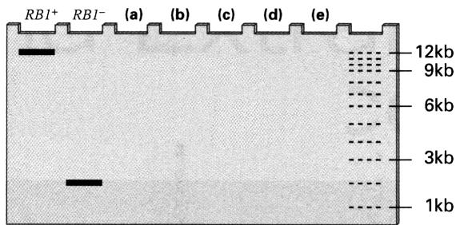

(e) EcoR I 片段中一个 6kb 缺失 (不含与探针杂交的区域) 所致的视网膜母细胞瘤的肿瘤细胞。

15.24 下面所示的系谱包含罹患腺瘤性息肉病的个体，而凝胶示意图示来自一些 APC 等位基因的限制性片段，APC 的突变形式与这种癌症相关。观察到 4 种大小的限制性片段 (a～d)。第 I、II 代的个体年纪已较大，如果他们携带有突变型 APC 等位基因，他们应该已经出现该癌症了；但第 III 代的个体还太年轻，不会出现该病。指出第 III 代中高风险及无风险的个体。(注意，突变型等位基因和非突变型等位基因可产生相同大小的限制性片段。)

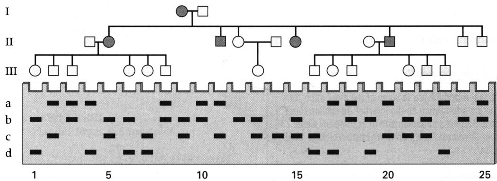

15.25 对出芽酵母的 RAS 基因进行诱变，产生一个温度敏感型条件突变。

(a)某个细胞携带的突变,在 $36^{\circ}$ C 条件下阻止 Ras 用 GTP 来交换 GDP,在限制性温度下该细胞仍能分裂吗?

(b)该突变会是显性的还是隐性的？

(c)某个细胞携带的突变，在 $36^{\circ} \mathrm{C}$ 条件下使Ras的GTP酶活性失活，在限制性温度下该细胞仍能分裂吗？

(d)该突变会是显性的还是隐性的？

15.26 正在研究一种特殊的人类白血病，该病与8号和14号染色体之间的一个易位相关。怎样通过实验来判断，该易位的类型可能属于启动子融合还是基因融合？

15.27 人乳头瘤病毒(HPV)存在于90%以上的宫颈癌中。HPV编码两种蛋白质：E6和E7，这两种蛋白质是该病毒能够引起肿瘤的有力的原因。已知 E7 可使 RB 失效；E6 与 p53 结合，使其成为降解的目标。试述这些活性如何促成感染细胞中癌变状态的发展。

15.28 一个包含 24 位血亲的家系，其系谱如下所示，该家系具有一种在年轻患者中表现出肉瘤、乳腺癌

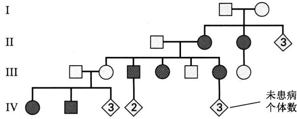

和其他癌症的综合征，该综合征呈常染色体显性遗传方式。如果这种遗传方式是一个常染色体显性基因所致，哪些个体对致病等位基因一定是杂合的但却不会患癌症？

15.29 出芽酵母的突变型 cdc9 等位基因在 $36^{\circ}$ C 条件下 DNA 连接酶活性有缺陷，但在 $23^{\circ}$ C 条件下具有正常活性。如果将培养于

23℃条件下的 cdc9 细胞转移到 36℃，细胞阻滞于 G₂/M 交界。一旦恢复到 23℃，经过一段时间的延迟，细胞将新合成的 DNA 中的所有切口连接之后，重新开始细胞周期。这些细胞能够成活。突变型 rad9 等位基因在 G₂/M DNA 检查点中有缺陷。在 23℃条件下，rad9 cdc9 双重突变体可正常生长。如果转移到 36℃，这些细胞继续有丝分裂。但是，一旦接种到 23℃，这些细胞中大多数被证明不能存活。如果在转移到 36℃并在 36℃保温之前，用苯并咪唑——一种与秋水仙碱类似的微管毒剂——孵育双重突变体，并在一旦恢复到 23℃的同时洗去苯并咪唑，这些细胞表现的像 cdc9 突变型细胞。对这些观察结果提出一个解释。

15.30 rad9 cdc9 双重突变体的特性吸引韦纳特和哈特韦尔去研究其他的 cdc rad9 双重突变体在转移到 $36^{\circ}$ C 时是否会继续进行细胞周期并失去生存能力，以检测 RAD9 检查点的特异性。这些分析的结果总结于下表中。

<table><tr><td>双重突变体</td><td>CDC基因的功能</td><td>在36°C条件下是否迅速死亡</td></tr><tr><td>Cdc28 rad9</td><td>依赖周期蛋白的激酶</td><td>否</td></tr><tr><td>Cdc7 rad9</td><td>复制纺锤极体(中心体)</td><td>否</td></tr><tr><td>Cdc8 rad9</td><td>胸苷激酶(TTP合成)</td><td>否</td></tr><tr><td>Cdc6 rad9</td><td>ORC组分</td><td>否</td></tr><tr><td>Cdc2 rad9</td><td>DNA聚合酶亚基</td><td>是</td></tr><tr><td>Cdc13 rad9</td><td>端粒结合蛋白</td><td>是</td></tr><tr><td>Cdc17 rad9</td><td>DNA聚合酶亚基</td><td>是</td></tr><tr><td>Cdc16 rad9</td><td>后期促进复合体(APC/C)组分</td><td>否</td></tr><tr><td>Cdc20 rad9</td><td>退出有丝分裂必需</td><td>否</td></tr><tr><td>Cdc23 rad9</td><td>APC/C组分</td><td>否</td></tr><tr><td>Cdc15 rad9</td><td>B类周期蛋白降解必需</td><td>否</td></tr></table>

能推断出 RAD9 在酵母细胞周期的几个检查点中有什么作用吗？

## 挑战题

挑战题 1 在 8 号染色体中(靠近 8q24)的人类癌基因 MYC 最初发现于与伯基特淋巴瘤(Burkitt lymphoma)的联系中。此处的示意图示一次 Southern 印迹的结果，比较了来自非癌细胞的 DNA(对照)，与从同一位患者

同等数量的癌细胞分离的 DNA 的不同稀释度(最高达 1000 倍稀释)。该印迹与针对 MYC 的标记探针杂交。各稀释度的杂交信号强度(黑度)明显不同。提出一个假说，来解释这些结果。

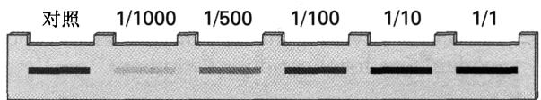

挑战题 2 哺乳动物的 Cdk2 和 Cdc2 的 cDNA 可替代出芽酵母的 CDC28 基因。设计一个实验，来检验人类周期蛋白 B 和周期蛋白 D 是否能够替代出芽酵母的 Clb2。

挑战题 3 给你一个出芽酵母的二倍体菌株，并已知该菌株对使某一检查点失活的某一突变为纯合。该菌株染色体 V 的基因型如下。

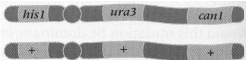

can1 引起对刀豆氨酸的隐性抗性, ura3 引起对尿嘧啶的隐性需求和对 5-氟-乳清酸的隐性抗性, 而 his1 的结果是对组氨酸的隐性需求。

(a) 如果该菌株对使纺锤体检查点失活的某一突变为纯合，该菌株会表现出什么特性(对这些遗传标记而言)?

(b) 如果该菌株对使 DNA 损伤检查点失活的某一突变为纯合，该菌株会表现出什么特性？

## 网上遗传学

“网上遗传学”(GeNETics)会为你介绍在互联网上寻找遗传学信息的某些最重要的站点。要浏览这些站点，请访问为《遗传学：基因和基因组分析》(第八版)配备的 Jones and Bartlett 公司配套站点http://biology.jbpub.com/book/genetics/8e/。

在该站点中，你会找到一个按章列出的重点关键词列表。选择某个关键词后，可链接到某个网站，其中包含与此关键词相关的信息。
