# 第 16 章 线粒体 DNA 和核外遗传

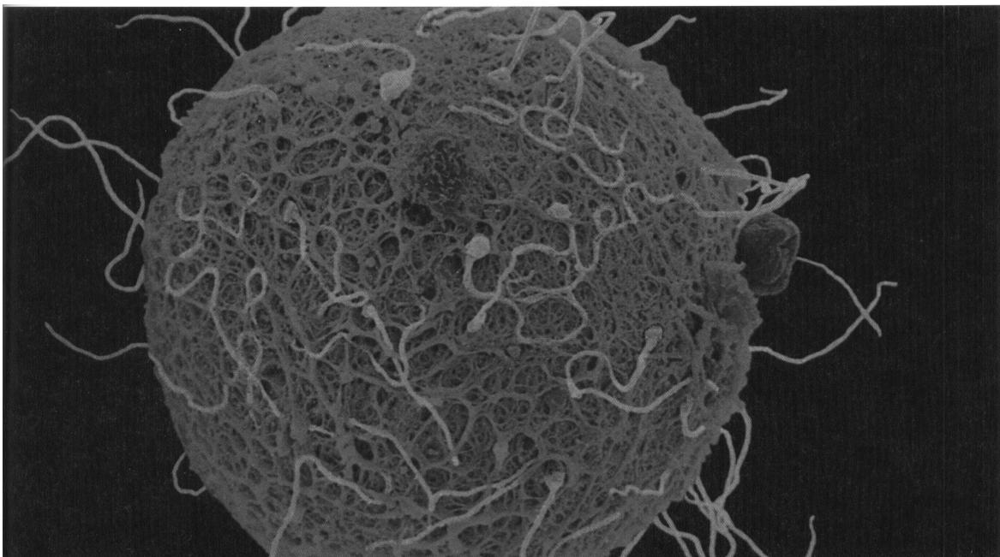

一个人类卵细胞(红色)及众多竞相给它受精的精子(绿色)。紫色球体为极体。卵细胞相比精子，有太多的细胞质，因而线粒体DNA的遗传完全是通过母亲，一点也不奇怪。(©Dr. Y. Nikas/Phototake, Inc./Alamy Images.)

## 本章提纲

16.1 细胞器的起源及其分子遗传学

16.2 核外遗传的方式

16.3 无性分离

16.4 共生生物的细胞质传递

16.5 蜗牛壳盘绕的母体效应

联系：走到一起来

琳恩·马古利斯(曾用名琳恩·萨根)，

1967

真核生物细胞的起源

联系：蚜虫怎样得到 PVT TIM HALL
南希·摩根、戈登·普雷格、乔纳斯·桑斯特罗姆和珍妮弗·威尔科克斯，2003从基因组角度看昆虫共生菌的营养供给

## 学习目标与科学能力

通过学习线粒体 DNA 和核外遗传建立起来的科学能力，能让你有效应对下列挑战。

\- 陈述线粒体和叶绿体的内共生理论，指出可以说明这两种细胞器的原核生物起源的两个特点。

■ 辨别人类系谱中可以说明某个性状为母体遗传的特点。

\- 指出母体遗传和母体效应的差异。

\- 给植物的细胞质雄性不育和能育性恢复基因下定义，并绘图显示如何将它们用于杂交种子的生产中。

\- 解释异质性机体中的无性分离现象，并举例说明无性分离如何决定机体表型。

虽然在真核生物中几乎所有的遗传性状都是由细胞核中的基因决定的，但有些性状不是。这些例外包括由细胞质中可自我复制的细胞器(organelle)(如专门进行呼吸的线粒体或专门进行光合作用的叶绿体)中的DNA决定的性状。在这些细胞器中，每个细胞器都含有自己的DNA，可编码许多蛋白质和RNA分子。这种DNA在细胞器内复制，在子代细胞器以类似于二分裂的过程形成时，传递给子代细胞器。细胞器的遗传系统与细胞核的遗传系统是分开的，由细胞器基因决定的性状，表现出与核基因决定的性状截然不同的遗传方式。许多生物还含有细胞内寄生物，即共生生物(symbiont)，包括细胞质内的细菌、病毒及其他因子。在有些情况下，这种细胞质内的实体会给受感染细胞或机体赋予可遗传的表型性状。本章介绍细胞器遗传及构成多种核外遗传(extranuclear inheritance，也称细胞质遗传，cytoplasmic inheritance)现象的其他实例。

## 16.1 细胞器的起源及其分子遗传学

一个被广泛接受的学说认为，真核生物细胞器是从共生(symbiosis，一种互利的相互作用)在原始细胞内的原核细胞进化来的，这就是内共生学说(endosymbiont theory)(图 16.1)。线粒

体被认为起源于需氧细菌，估计发生在18亿年前。根据对rRNA序列的比较来判断，可将线粒体的祖先类分为 $\alpha$ 变形细菌(proteobacteria)，这是一个今天包括大肠杆菌(Escherichia coli)在内的类群。细菌共生生物为呼吸提供分子机器，在呼吸中，碳水化合物在消耗氧气的情况下被逐步分解，产生ATP形式的能量，以及二氧化碳和水形式的废物。

随着进化时间的推移，原来在内共生体的DNA中的许多编码蛋白质的基因被转移到细胞核中。在细胞核中，与这

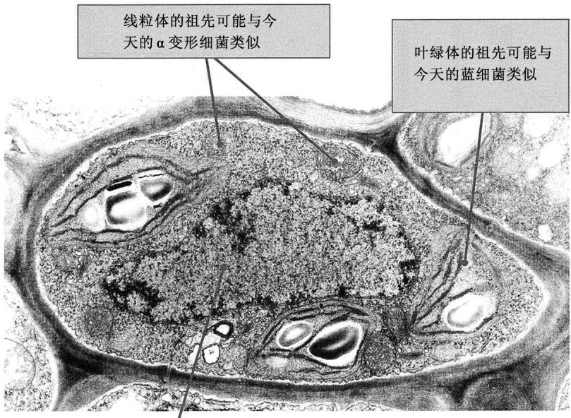  
在进化过程中，原来在叶绿体和线粒体中的大部分基因被合并到细胞核中。核基因编码的许多蛋白质含某些序列，使得这些蛋白质能被转运到线粒体或叶绿体中  
图 16.1 灰菜(Chenopodium album, 白藜)叶细胞内的线粒体(红色)和叶绿体(深绿色)。细胞核为橙色。(©Martha J. powell/Visuals Unlimited.)

些基因相应的基因含有可引导蛋白质进入线粒体的氨基酸信号序列。线粒体通常含有细胞核基因编码的500～1000种蛋白质。所有真核生物的共同祖先都已经具有线粒体。尽管有几个单细胞真核生物谱系缺乏线粒体，但在它们的细胞核基因组中存在源自线粒体的基因，显然说明它们的祖先曾经含有线粒体，但后来丢失了。

叶绿体被认为起源于蓝细菌，它们与今天存在的蓝细菌很像。蓝细菌共生体为光合作用提供分子机器，在光合作用中，利用叶绿素从阳光中吸收能量，把二氧化碳和水合成碳水化合物。线粒体来自最古老的内共生体，因而这些细胞器从它们的细菌祖先进化来的时间最遥远。叶绿体来自比较晚近的内共生体，因而它们与蓝细菌祖先的进化趋异要少得多，即使它们的宿主的

核基因组已有巨大的趋异。

如果宿主细胞既有来自需氧细菌的线粒体又有来自蓝细菌的叶绿体，宿主细胞会有什么特点呢？许多生物学家怀疑，宿主细胞会与现在的古细菌类似。古细菌有一些与真细菌共同的特点，包括它们的原核细胞组织结构，但它们的大分子合成机制——复制、转录和翻译——与真核生物类似。不管怎样，按照内共生学说，细胞的互利关系最终进化成了构成现代真核生物的生物多样性。

内共生学说的一个证据是，真核生物的线粒体和叶绿体与原核生物有众多的共同特点，这些特点使得原核生物有别于真核细胞。这些共同特点如下。

\- 基因组由未与组蛋白样蛋白质广泛复合的环状 DNA 构成。

\- 基因组的组织方式，是以功能相关的基因聚集在一起，且往往作为单一单位表达。

\- 在细胞器中进行蛋白质合成的核糖体颗粒的大亚基，大小与原核生物的类似，但与真核细胞中细胞质核糖体的大亚基不同。

\- 在叶绿体、蓝细菌(如巢组囊藻 Anacystis nidulans)乃至细菌(如大肠杆菌)中，核糖体主要 RNA 组分的核苷酸序列类似。

与细菌和蓝细菌的基因组相比，今天的细胞器基因组很小。叶绿体基因组仅为蓝细菌基因组的 $3\% \sim 5\%$ 。细胞器的进化很可能伴随着较大的基因组重排，有些基因被转移到宿主的核基因组中，而有些基因被去除。细胞器基因向细胞核的转移，因谱系而异。例如，线粒体ATP合成酶的一个亚基的基因，在酵母中位于线粒体基因组中，但在链孢霉中却位于核基因组中。

## ■ 细胞器基因组

线粒体是呼吸细胞器，叶绿体是光合细胞器。这两种细胞器的 DNA 通常为超螺旋环状双链分子形式(图 16.2)。大多数植物的叶绿体 DNA，大小为 120～160kb。线粒体基因组通常较

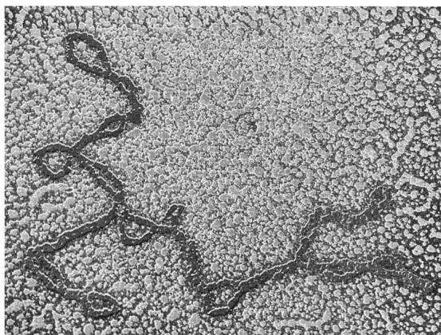  
图 16.2 人类线粒体 DNA (mtDNA) 的天然超螺旋构型。该分子大小为 16569 个核苷酸对。每个线粒体含 3～6 个 mtDNA 分子。(©CNR/Photo Researchers, Inc.)

小，而大小变化的范围较大。例如，哺乳类线粒体基因组约为 16.5kb，黑腹果蝇线粒体基因组约为 18.5kb，而有些高等植物的线粒体基因组超过 100kb。高等植物的线粒体基因组比较特别，由两种或多种不同大小的环状 DNA 分子组成。在每个细胞器中存在数个细胞器基因组拷贝。在线粒体中一般有 2～10 个拷贝，在叶绿体中有 20～100 个拷贝。此外，大多数细胞含有每种细胞器的多个拷贝。

细胞器基因编码核糖体 RNA 和 tRNA，但许多细胞器组分是由核基因决定的。这些组分在细胞质中合成，然后被输入细胞器中。在动物和真菌中，线粒体 DNA（通常缩写为 mtDNA）所含的基因数量相对较少。例如，人和酵母的

线粒体基因组都只含大约 40 个基因。叶绿体基因组一般比线粒体基因组大，含 100 多个基因，包括核糖体 RNA、转移 RNA、核糖体蛋白和 RNA 聚合酶亚基的基因。图 16.3 示地钱 Marchantia polymorpha 120kb 叶绿体基因组中基因的遗传功能。

许多植物和真菌线粒体 DNA 中的基因含内含子。这些内含子是自剪接 (self-splicing) 内含子。当这些内含子的 RNA 转录物折叠成三维结构时，RNA 转录物的催化活性将内含子切除。自剪接内含子的发现，首次证明 RNA 分子可在代谢反应中发挥催化作用 (ribozyme，核酶)。这些内含子的存在也说明，内含子起源于原核生物，因而内含子非常古老。核基因所用的内含

子切除的剪接体机制，是之后才进化出来的。

## - RNA 编辑

在植物中，线粒体和叶绿体的mRNA在转录后往往要在RNA编辑(RNA editing)的过程中经过修饰，在此过程中，RNA上的特定胞嘧啶碱基被转变为尿嘧啶。在拟南芥中，线粒体中的441个位点和叶绿体中的28个位点被编辑。C到U的转变可产生翻译起始密码子，产生或消除翻译终止密码子，或将编码一种氨基酸的密码子变成编码另一种氨基酸的密码子(例如，从编码精氨酸的CGG变为编码色氨酸的UGG)。在下面所示的例子中，在拟南芥叶绿体蛋白质编码基因中的一个编辑事件，通过将ACG中的C(加粗)转变成AUG中的U(加粗)，产生一个翻译起始密码子。

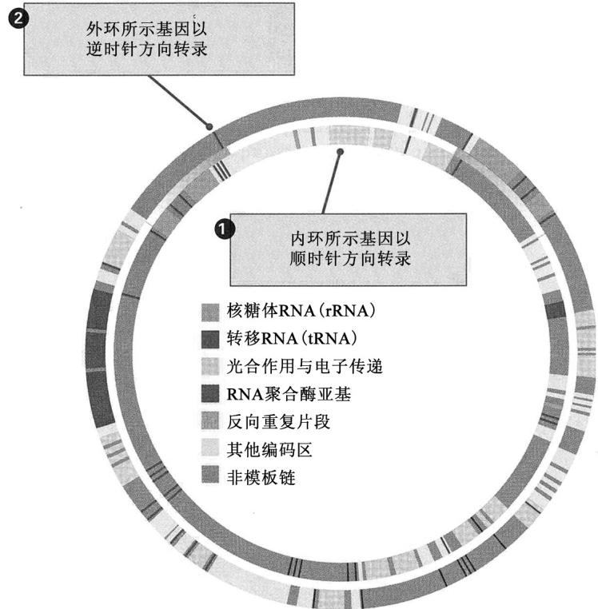  
图 16.3 地钱 Marchantia polymorpha 叶绿体基因组的基因组织。包含 rRNA 编码基因(浅棕色)的两个大的反向重复片段(绿色)，是其他许多叶绿体基因组的一个特征。该分子全长 121 024 个核苷酸对。[数据来自 K. Ohyama, et al., Nature 322(1986):572-574.]

## …UUUACUACGAAUUUAU… ↓ …UUUACUAUGAAUUUAU…

如果没有这个编辑事件，这个蛋白质可能不会被翻译。同样是这个 RNA 转录物，在 4 个其他位点也被编辑。编辑只作用于一小部分胞嘧啶核苷酸，这些胞嘧啶两侧显然是起信号作用的核苷酸序列，这些核苷酸序列将编辑酶募集到正确的位点。

编辑过程由三角状五肽重复(pentatricopeptide repeat, PPR)蛋白介导。“三角状五肽”一词是指PPR蛋白中串联重复的一种特征性的35个氨基酸的模体。在高等植物中，这些蛋白质是由核基因组编码的相关蛋白质构成的一个巨大的多基因家族。不同的PPR蛋白被定位到细胞器中，在RNA成熟过程中发挥关键作用，包括RNA编辑、切割、剪接、稳定和翻译等功能。像拟南芥和水稻这样的高等植物，大约含450种不同PPR蛋白的基因，其中有些基因在染色体上成簇存在。在许多其他生物中，PPR蛋白的多样化程度远不及此。酵母只有5种PPR蛋白，而人类只有6种。

## 联系：走到一起来

琳恩·马古利斯(曾用名琳恩·萨根)，1967

波士顿大学，波士顿，马萨诸塞州

真核生物细胞的起源

到20世纪60年代时，人们已经知道细胞器遗传装置的某些特点与原核细胞相似。一些科学家提出，这种相似性可能反映了一种古老的祖先关系。琳恩·马古利斯使这些想法更进了一大步，她提出一个综合性的假说，认为真核生物细胞的起源是一系列进化出来的共生关系。主要角色是线粒体、鞭毛和纤毛的动体(基体)，以及光合作用质体。所有这些都被假设起源于原核共生生物。当这篇论文被送去发表时，匿名评阅人给出的负面意见如此强烈，以致论文差点被拒。经过这么多年，该假说的一些具体的预测已被实验证实。该假说也需要作少数修改，例如，现在的证据表明，最早的共生生物携带的是动体，而不是原线粒体。不过，尚未发现重大的矛盾之处。今天，系列内共生学说得到广泛承认。

本文提出真核和原核细胞之间的不连续性起源的一个理论。具体来说，可认为线粒体、鞭毛的基体(动体)和光合作用质体源自自由生活的细胞，因而真核生物细胞是古老的共生关系进化的结果。虽然这些不是什么新想法，但在本文中，这些想法被综合起来，以使其与近来在亚细胞细胞器的生物化学和细胞学方面的证据一致。……该理论的诸多方面可用现代分子生物学技术进行验证。……含有DNA、在核糖体上合成蛋白质，以及以mRNA为DNA和蛋白质之间的中介的原核细胞，是所有现存细胞生物的祖先。此类细胞出现于原始地球大气的还原状态之下。……最后，出现一群细胞，以光形成的ATP和作为氢原子来源的水，在 $CO_{2}$ 的还原过程中，产生细胞物质。这导致气态氧——作为光合作用的副产品——的形成。……游离氧的持续产生，导致某种危机。……有人认为，真核细胞从原核细胞起源的第一步，与要在新的含氧大气中的生存有关：一种需氧原核微生物(原线粒体)被异养性厌氧生物摄入。这种共生关系变成专性的，从而产生第一个需氧型变形虫样细胞(在此阶段尚无有丝分裂)。……有些变形虫样细胞摄入某些可以运动的原核细胞。这种寄生物的基因编码其特征性的形态，即在横截面上呈(9+2)的纤丝。这种寄生物也变成共生，形成可以主动觅食的原始变形虫样鞭毛虫。……这些内共生生物基因(决定其特征性的9+2微管排列结构)复制的核酸最终被用来形成染色体的着丝粒和真核细胞有丝分裂的中心粒，从而将新合成的宿主细胞核染色质分配给宿主子细胞。……真核植物细胞通过与光合作用原核细胞(原质体)的共生而获得光合作用能力，原质体自身是从与蓝细菌有亲缘关系的生物进化而来。……要想证明该理论，最少需要满足以下几点：①该理论必须与地质记录和化石记录一致。②三种共生细胞器[线粒体、(9+2)同源体和质体]的每一种，必须表现出以共生生物形式起源于宿主中的细胞所特有的一般特征。任何一个都不该具有与这种起源相抵触的特征。③基于对真核细胞起源的这种解释而作出的预测，必须是可证实的。本文的其余部分(有24页)在根据分子生物学可以作出的、与进化机制有关的假设方面，讨论这一理论的证据。

来源：L. Sagan, J. Theor. Biol., 14(1967): 225-274.

## - 细胞器的遗传密码

细胞器中的翻译按照标准的解码流程进行，即细胞器 tRNA 分子沿着 mRNA 一个密码子一

表 16.1 线粒体中不一致的遗传密码

<table><tr><td rowspan="2"></td><td colspan="5">密码子*</td></tr><tr><td>UGA</td><td>AGR</td><td>AUA</td><td>AUU</td><td>CUN</td></tr><tr><td>标准密码</td><td>终止密码</td><td>Arg</td><td>Ile</td><td>Ile</td><td>Leu</td></tr><tr><td>植物线粒体</td><td>终止密码</td><td>Arg</td><td>Ile</td><td>Ile</td><td>Leu</td></tr><tr><td>链孢霉线粒体</td><td>Trp</td><td>Arg</td><td>Ile</td><td>Met</td><td>Leu</td></tr><tr><td>酵母线粒体</td><td>Trp</td><td>Arg</td><td>Met</td><td>Met</td><td>Thr</td></tr><tr><td>果蝇线粒体</td><td>Trp</td><td>Ser</td><td>Met</td><td>Met</td><td>Leu</td></tr><tr><td>哺乳动物线粒体</td><td>Trp</td><td>终止密码</td><td>Met</td><td>Met</td><td>Leu</td></tr></table>

\*R=A 或 G; N=U、C、A 或 G 之一。

个密码子地进行翻译。但是，有些生物的线粒体遗传密码与核基因的遗传密码略有不同。表 16.1 示几个例子，其中，密码子使用上的差异以加粗突出。植物的线粒体遗传密码与标准的核遗传密码完全一样，但在动物和真菌的线粒体中可见到差异。例如，链孢霉线粒体的遗传密码除了 UGA 编码色氨酸和 AUU 编码甲硫氨酸以外，其他的与标准密码相同。

人类线粒体遗传密码是哺乳动物的典型代表，它与标准遗传密码有几点不同。

(1) UGA 密码子不是终止密码子，而是编码色氨酸的密码子。

(2) AGA 和 AGG 密码子是终止密码子，而不是编码精氨酸的密码子。

(3) AUA 和 AUU 编码的是甲硫氨酸而不是异亮氨酸。

从表 16.1 明显可见，真菌和动物的线粒体遗传密码稍有差异。

(B)

## 16.2 核外遗传的方式

细胞器基因决定的性状，表现出与核基因决定的简单孟德尔性状非常不同的遗传方式。除了说成“非孟德尔式遗传方式”外，没有什么通用标准能把核外遗传和细胞核遗传区别开来。在高等生物中，核外遗传通常用单亲遗传(uniparental inheritance)来表示，即只通过一个亲本传递。像线粒体或叶绿体这样的细胞质因子的遗传传递，是由受精时母本和父本的贡献、细胞质因子从合子中消除的机制，以及细胞分裂过程中细胞质因子的不规则分拣决定的。通过母本进行的单亲遗传是母体遗传(maternal inheritance)；通过父本进行的单亲遗传是父体遗传(paternal inheritance)。

在高等植物中，细胞器遗传通常是单亲遗传，但具体的单亲遗传类型取决于细胞器及生物。例如，在被子植物中，线粒体一般表现为母体遗传，但叶绿体可以从母本(主要方式)、父本或双亲遗传，视物种而定。在针叶树中，叶绿体DNA通常以父系方式遗传，但有一些后代由母体遗传产生。北美红杉(Sequoia sempervirens)的线粒体和叶绿体DNA都表现出父体遗传。无论细胞质遗传的方式是什么，大多数物种都会有一些例外的后代，这说明占主导地位的遗传方式不是绝对的。

## ■ 动物线粒体的母体遗传

在高等动物中，线粒体通常是通过母体遗传，因为卵是合子细胞质的主要提供者。因此，线粒体一般表现为母体遗传；突变型母体和正常父体的后代为突变体，而正常母体和突变型父体的后代正常。

线粒体 DNA (mtDNA) 的遗传方式，可用图 16.4 所示的那种 DNA 多态性进行跟踪。A 部分示人类 mtDNA 上某种限制酶的切割位置，在此例中，限制酶为 Hae II。用该限制酶切割来自不同个体的 mtDNA 时，切割产物包含一种 8.6kb 的片段，或包含 4.5kb 和 4.1kb 的两种小片段。具有两种小片段的带型比具有一种大片段带型更常见。也观察到一些其他的 Hae II 片段 (B 部分)，但在

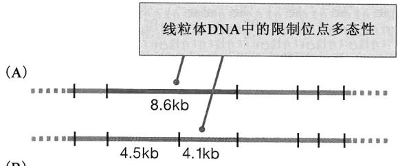

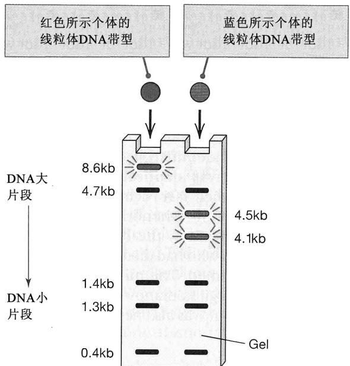  
图 16.4 在人类线粒体 DNA 中存在或不存在 HaeⅡ限制位点时所产生的凝胶带型。(A) mtDNA 示意图，示 HaeⅡ位点的位置。mtDNA 以线性片段图表示，但两端的点表示该分子实际上是环状的。在一种 mtDNA 分子中，一个特定的 HaeⅡ位点缺失，因而以 HaeⅡ切割产生一个 8.6kb DNA 片段(红色)。在另一种 mtDNA 中，存在该位点，因而切割产生一个 4.5kb 片段和一个 4.1kb 片段(蓝色)。(B) 在凝胶上分离 mtDNA 的 HaeⅡ片段，以强光效果突出显示 8.6kb 条带(红色)与 4.5kb 和 4.1kb 条带(蓝色)的多态性的对比。在其他 HaeⅡ位点切割所产生的条带，以黑色显示。

来自不同个体的 mtDNA 中，这些片段的大小相同。

mtDNA 的母体遗传如图 16.5 所示。在 A 部分的凝胶示意图中，示意了一个大的 Hae II 片段(红色)与两个小的HaeⅡ片段(蓝色)之间的多态性，未显示个体之间在大小上无差别的其他条带。在B部分中显示的系谱，依该多态性HaeⅡ位点的缺失或存在，分别用红色或蓝色给系谱符号进行标记。mtDNA类型的母体遗传是显而易见的。其特点是，女性(I-3、I-5和II-8)将其mtDNA遗传给她们所有的后代，而男性(I-2、II-7和II-10)不将其mtDNA遗传给他们的任何一个后代。

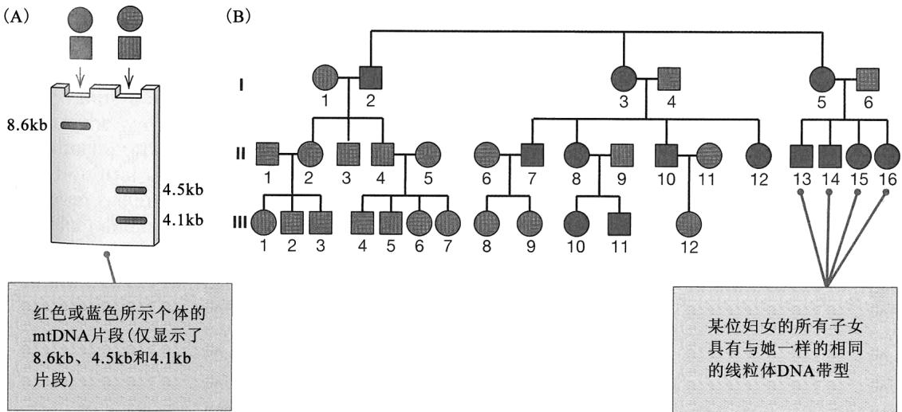  
图 16.5 人类线粒体 DNA 的母体遗传。(A)凝胶中的条带，突出显示图 16.4 所示的 HaeⅡ限制位点多态性。该 HaeⅡ位点的缺乏导致 8.6kb 的单一条带，而该位点的存在导致 4.5kb 和 4.1kb 两条带。未显示 HaeⅡ消化产生的其他条带。(B)系谱，显示具有 8.6kb 片段的 DNA 带型(红色系谱符号)与具有 4.5kb 加 4.1kb 片段的 DNA 带型(蓝色系谱符号)的母体遗传。线粒体 DNA 类型仅通过母体遗传。[改编自 D. C. Wallace. Trends Genet. 5(1989): 9-13.]

## - 母体遗传和母体效应

母体遗传方式通常表明存在核外遗传，但也并不总是这样。困难之处在于把母体遗传和母体效应区别开。母体效应(maternal effect)是母体的细胞核基因型对后代表型的影响。此类效应通过卵中存在的可影响早期发育的物质介导，或通过养育介导。雌性哺乳动物的子宫内环境和它们产奶的能力，分别是在发育上和养育上影响的例子。母体遗传和母体效应的差别如下。

(1) 在母体遗传中，性状的遗传决定因素在核外，仅通过母体的细胞质进行遗传传递；观察不到孟德尔分离。

(2)在母体效应中，母体的细胞核基因型决定后代的表型。遗传决定因素是两性均可传递的核基因，在适当的杂交中，可发生孟德尔分离。

有时很难区分母体遗传和母体效应。在 16.5 节会考察一个蜗牛壳盘绕的例子，蜗牛壳的盘绕表面上很像母体遗传，但实际原因是母体效应。

## - 异质性

因为在任何一个细胞中通常都会存在多个拷贝的细胞器，当一个突变出现时，它只会影响发生突变的那个细胞器。细胞器进行复制和分裂，并且当细胞进行胞质分裂时，细胞器被随机分配到两个子细胞中。因此，可出现这样的情况，细胞既含突变细胞器，也含非突变细胞器。在同一个细胞中存在两种或两种以上在遗传上不同的线粒体(或其他细胞器)的情况称为异质性(heteroplasmy)。在动物中，线粒体的异质性是罕见的。例如，在含数百到数千个线粒体的一个典型人类细胞中，通常只有一种mtDNA序列。

人类异质性的罕见，使得对末代俄国沙皇尼古拉二世遗骸的鉴定成为可能。1918年7月16日深夜，尼古拉二世和他的家人及仆人一起，被布尔什维克行刑队秘密处决。他们的尸体被掩埋在一个不深的墓穴中。1992年发掘出一些骨骼样品，被认为是来自尼古拉二世家族的成员。对这些骨骼样品进行DNA分析，鉴定出9具尸体，其中5具尸体具有血缘关系。母亲亚历山德拉皇后和她的3个女儿得到鉴定，因为她们的线粒体DNA与在世亲戚的线粒体DNA完全相同。父亲尼古拉沙皇的线粒体DNA被证明是异质性的。为了证实这一鉴定结论，沙皇的弟弟耶奥伊的尸体被发掘出来，耶奥伊1899年死于肺结核。耶奥伊的线粒体DNA不仅与沙皇的相同，而且在相同的碱基对上也是异质性的。这两兄弟在两种线粒体的比例上有差异：耶奥伊·罗曼诺夫在异质性碱基对上有大约 $62\%$ 的T和 $38\%$ 的C，而尼古拉有 $28\%$ 的T和 $72\%$ 的C。

## ■ 线粒体遗传病

在人类中，已知线粒体 DNA 的许多突变会导致疾病。线粒体的突变可通过它们特征性的母体遗传方式而被发现，并且现已根据线粒体 DNA 中具体的核苷酸改变，鉴定了许多线粒体突变。

大多数与疾病相关的线粒体突变会削减线粒体的 ATP 生成量，从而影响肌肉和神经细胞的功能，尤其是影响中枢神经系统神经细胞的功能，导致失明、耳聋或中风。表 16.2 列举了一些由线粒体突变引起的人类疾病。在这些疾病中，许多是致死的，除非有些线粒体是正常的，因此，所有的患者都是异质性的。这些疾病还表现出不同的表现度 (expressivity)，因为在不同患者，以及同一个体不同类型的组织中，正常线粒体和突变型线粒体的比例不同。

表 16.2 与某些线粒体突变相关的表型

<table><tr><td>改变的核苷酸</td><td>受影响的线粒体组分</td><td>表型a</td></tr><tr><td>3460</td><td>复合体 $I^b$ 的ND1</td><td>LHON</td></tr><tr><td>11 778</td><td>复合体I的ND4</td><td>LHON</td></tr><tr><td>14 484</td><td>复合体I的ND6</td><td>LHON</td></tr><tr><td>8993</td><td>复合体 $V^b$ 的ATP6</td><td>NARP</td></tr><tr><td>3243</td><td> $tRNA^{Leu(UUR)^c}$ </td><td>MELAS,PEO</td></tr><tr><td>3271</td><td> $tRNA^{Leu(UUR)}$ </td><td>MELAS</td></tr><tr><td>3291</td><td> $tRNA^{Leu(UUR)}$ </td><td>MELAS</td></tr><tr><td>3251</td><td> $tRNA^{Leu(UUR)}$ </td><td>PEO</td></tr><tr><td>3256</td><td> $tRNA^{Leu(UUR)}$ </td><td>PEO</td></tr><tr><td>5692</td><td> $tRNA^{Asn}$ </td><td>PEO</td></tr><tr><td>5703</td><td> $tRNA^{Asn}$ </td><td>PEO、肌病</td></tr><tr><td>5814</td><td> $tRNA^{Cys}$ </td><td>脑病</td></tr><tr><td>8344</td><td> $tRNA^{Lys}$ </td><td>MERRF</td></tr><tr><td>8356</td><td> $tRNA^{Lys}$ </td><td>MERRF</td></tr><tr><td>9997</td><td> $tRNA^{Gly}$ </td><td>心肌病</td></tr><tr><td>10 006</td><td> $tRNA^{Gly}$ </td><td>PEO</td></tr><tr><td>12 246</td><td> $tRNA^{Ser(AGY)^c}$ </td><td>PEO</td></tr><tr><td>14 709</td><td> $tRNA^{Glu}$ </td><td>肌病</td></tr><tr><td>15 923</td><td> $tRNA^{Thr}$ </td><td>致死性婴儿型多系统疾病</td></tr><tr><td>15 990</td><td> $tRNA^{Pro}$ </td><td>肌病</td></tr></table>

注：a LHON，莱伯遗传性视神经病变(Leber's hereditary optic neuropathy)；NARP，神经性肌肉无力-共济失调-色素性视网膜炎(neurogenic muscle weakness, ataxia, retinitis pigmentosa)；MERRF，肌阵挛性癫痫合并破碎红纤维综合征(myoclonic epilepsy and ragged-red fiber syndrome)；MELAS，线粒体肌病-脑病-乳酸性酸中毒-中风样发作(mitochondrial myopathy, encephalopathy, lactic acidosis, stroke-like episodes)；PEO，进行性眼外肌麻痹(progressive external ophthalmoplegia)。  
b 复合体 I 为 NADH 脱氢酶。复合体 V 为 ATP 合成酶。  
c 在 tRNA $^{Leu(UUR)}$ 中，R 表示 A 或 G；在 tRNA $^{Ser(AGY)}$ 中，Y 表示 T 或 C。

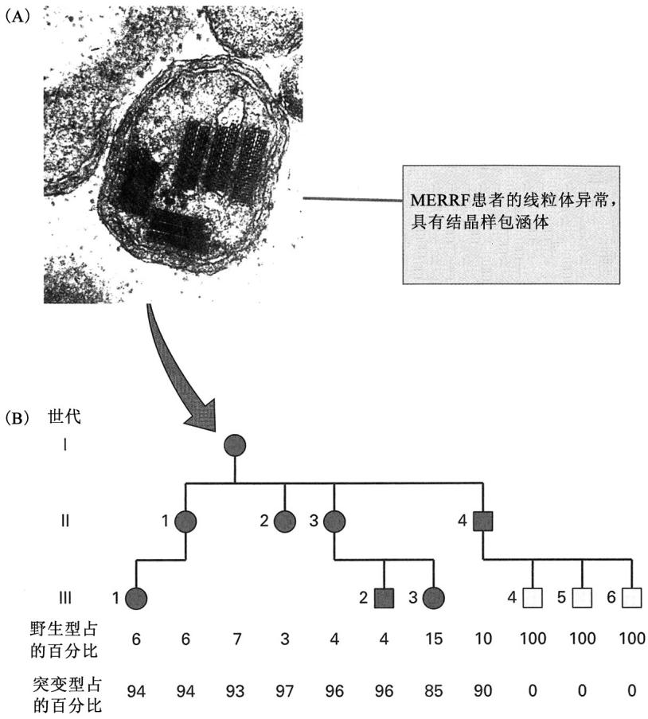  
图 16.6 人类肌阵挛性癫痫合并破碎肌红纤维病(MERRF)的遗传。(A)含类结晶样包涵体的异常 MERRF 线粒体的电子显微照片。(B)该系谱示某家系 MERRF 的遗传，以及在每个人中所发现的野生型或突变型线粒体的比例。[转载自 J. M. Shoffner, et al., “Myoclonic epilepsy and ragged-red fiber disease...,” Cell 61 (1990): 931-937, ©1990，经 Elsevier 许可，http://www.sciencedirect.com/science/journal/00928674]

图 16.6 示一种人类线粒体遗传病的遗传系谱例子。该病称为 MERRF (myoclonic epilepsy with ragged-red fibers, 肌阵挛性癫痫合并破碎红纤维)，侵袭中枢神经系统和骨骼肌。原因是 mtDNA 编码的 tRNA $^{Lys}$ 基因发生突变。图 16.7 示人类 mtDNA 中基因的组织方式。tRNA $^{Lys}$ 突变是高度多效性的，因其影响所有细胞中线粒体 DNA 编码的所有蛋白质的合成。如同许多线粒体突变一样，在缺乏正常线粒体时，MERRF 是致死的。在图 16.6B 的系谱中用红色符号表示的所有个体，表现出该病的某些症状，包括听力丧失、癫痫、疲劳、痴呆、震颤和抽筋。系谱中受累的个体在他们表现的症状上有相当大的差异。这种可变的表现度是以下几种过程的反映。

(1) 不同受累者的神经系统和骨骼肌中正常线

粒体和突变型线粒体的比例存在差异。

(2)阈值效应, 突变型线粒体的比例足够小的个体表现出来的疾病症状很少, 或不表现出疾病症状。

(3)随着年龄的增加，突变型线粒体有变得越来越普遍的倾向。

在图 16.6B 中，不同个体患病的严重程度与突变型线粒体所占比例之间的相关性并不是绝对的。例如，个体 II-1 和 II-3 分别只有 6% 和 4% 的野生型线粒体，但是她们能够生育。产生这种明显矛盾的原因是，身体不同组织的突变型和野生型线粒体比例可有显著差异。并且可用来分析这些比例的组织，通常不是对疾病的严重程度最有影响的组织。例如，MERRF 的严重程度主要取决于神经系统和骨骼肌中突变型线粒体所占的比例，然而在系谱中所示的突变型线粒体的比例是根据白细胞估计的。

图16.6A示一位MERRF患者的异常线粒体的电子显微照片。该线粒体含有由异常蛋白质聚集形成的许多类结晶样包涵体。

考察表 16.2 所列突变所导致的表型，以及在线粒体病的系谱中所见的可变表现度，说明不同线粒体基因的突变可导致类似的表型，而相同的线粒体基因突变可导致不同的表型。

## ■ 用线粒体 DNA 追踪种群历史

线粒体 DNA 具有许多特点，这使其在研究生物之间的遗传关系上很有用。mtDNA 的一个重要特点是，在包括人类在内的许多生物中，该分子不发生遗传重组。缺乏重组，意味着任何线粒体中的 DNA 分子都源自存在于某个祖先中的单个 mtDNA。在人类及其他具有母体遗传方式的生物中，该祖先必然是雌性。缺乏重组，也意味着 mtDNA 含有大量关于祖先的遗传信息，因为在一个 mtDNA 谱系中发生的任何突变都会被一起遗传。

在第 19 章中会介绍，人类 mtDNA 核苷酸序列中的变异，怎样揭示现代人类各种群

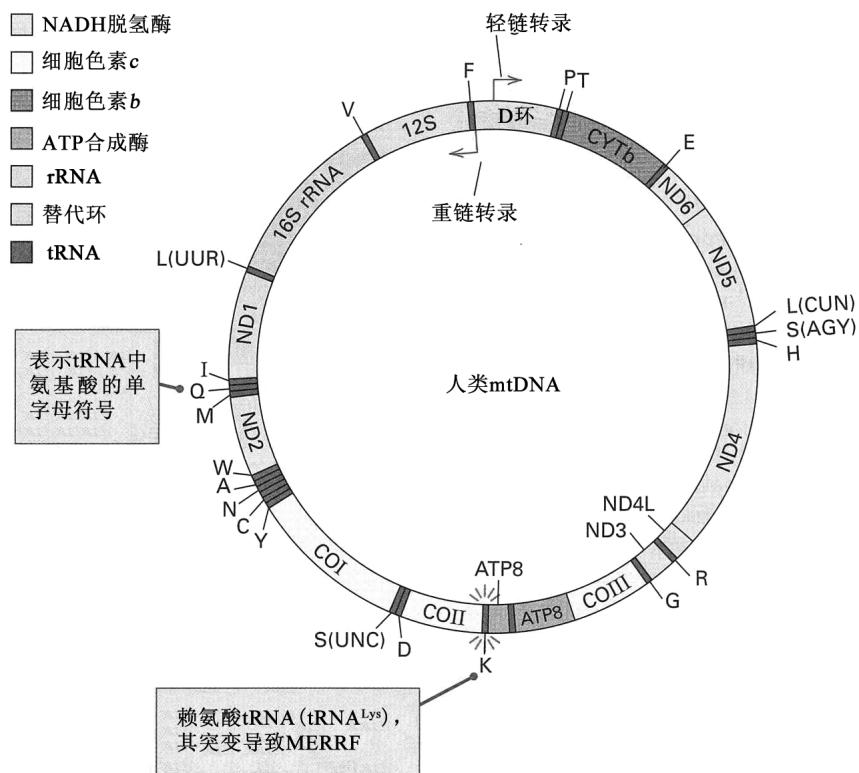  
图 16.7 人类线粒体 DNA 中的基因。以单字母氨基酸符号表示 tRNA 基因；因此 tRNA $^{Lys}$ 表示为 K。线粒体 DNA 中基因的位置，按左上角的图例用颜色进行标注。箭头示转录重链和轻链的启动子。[转载自 Annual Review of Genetics, Volum 29, ©1995，经 Annual Reviews 许可，www.AnnualReviews.org 。图片承霍华德休斯医学研究所戴维·克莱顿(David A. Clayton)惠赠。]

的祖先历史和迁移模式。这种方法对追踪许多其他生物，包括人类最好的朋友狗的祖先，也非常有用(图 16.8)。在约 1/3 美国家庭中，每家至少有一条狗，总共有五千多万条狗。这些狗约一半是杂交品种，其余的为美国养狗俱乐部(American Kennel Club)目前认可的约 150 个纯种中

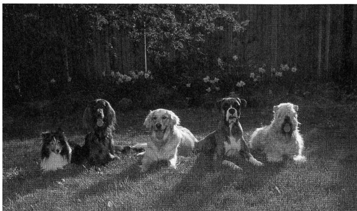  
图 16.8 狗的注册品种约 150 个，此为其中几种。(©Carolyn A. McKeone/Photo Researchers, Inc.)

的一种。每个品种都有各自的一套身体和性格特征。一直最受青睐的是拉布拉多猎犬、黄毛猎犬、德国牧羊犬、比格尔犬、腊肠狗、约克夏犬、拳师犬、贵妇犬、吉娃娃犬和西施犬。对来自67个品种的狗和162匹野狼的线粒体DNA序列的研究，证明狗和狼有非常近的遗传关系。结果显示，对狗的驯养至少在10万年前就开始了。这些数据表明，在驯养进行过程中，至少有两个独立的驯养事件，以及狗和狼交配所致的多次遗传混合事件。

## - 植物的细胞质雄性不育

在农业上有重要意义的一个核外遗传的例子是细胞质雄性不育(cytoplasmic male sterility, CMS)，这是植株不产生有功能的花粉，但雌性生殖器官和能育性正常的状态。这种不育性被广泛用来在本来可进行自花受精的物种中生产杂交种，现已被广泛用来改良玉米、水稻、棉花、油菜和各种蔬菜作物。杂交种在各种生长特性上通常会优于它们的亲本系，而利用 CMS 可有助于高效地生产杂交种子。

在分子水平上，CMS通常是由线粒体DNA的重排导致的，这种重排产生的基因融合在花粉生成组织中的表达是有毒的。虽然融合蛋白会在所有细胞中表达，但突变型植株除了雄性不育外，其他都是正常的。现在仍未充分理解这种作用专门针对花粉产生的原因，但这些发现说明，除了单纯产生ATP之外，线粒体在花粉产生中发挥着某种关键作用。

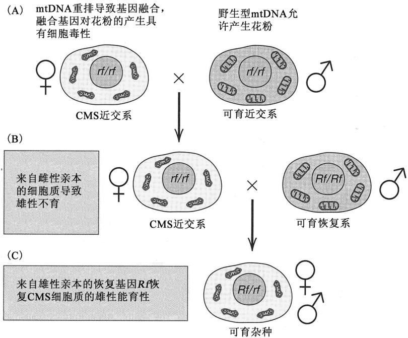  
图 16.9 细胞质雄性不育(CMS)在欧洲油菜(Brassica napus)的杂交种子生产中的应用，欧洲油菜为菜油的来源。(A)以来自雄性可育系的花粉让雌性CMS植株受精，以延续CMS。(B)在生产杂交种子时，以含显性能育性恢复基因(Rf)的品系的花粉让雌性CMS植株受精。(C)所产生的Rf/rf基因型恢复了CMS品系的能育性，可进行自花授粉以产生杂交种子。

因为 CMS 植株是雄性不育的，所以它们只有与雄性可育系杂交才能维持可育性状(图 16.9A)。所产生的后代从雌性亲本遗传了 CMS 性状，因而同样是雄性不育的(图 16.9B)。在许多情况下，CMS 可因细胞核 DNA 中一个显性 Rf 基因 (restorer of fertility, 能育性恢复基因)的存在而被逆转。因此，当 CMS 系的雌性与基因型为 Rf/Rf 的雄性能育性恢复系杂交时，所产生的后代具有 Rf/rf 的核基因型，从而使细胞质雄性不育被抑制(图 16.9C)。能育性恢复品系的自花授粉产生商用杂交种子。

能育性恢复基因是什么？惊人的是，它们是编码三角状五肽重复(PPR)蛋白

的基因大家族的成员，此前在讨论 RNA 编辑时提到过这类蛋白质。这些蛋白质在线粒体 RNA 转录物的成熟过程中起关键作用，包括编辑、切割、剪接和稳定。有些 Rf 基因座含数个 PPR 蛋白拷贝，表明 CMS 表达的抑制是通过这些蛋白质对 RNA 转录物的作用。迄今至少在一个个案中证明，这种抑制机制是对异常 CMS 融合基因转录物的切割和降解。

在 CMS 被广泛用来提高许多农作物产量的同时，也存在被滥用的危险。一个典型的例子是在 1950～1970 年被广泛用来生产玉米杂交种子的 T (表示 Texas，得克萨斯州) 型 CMS。截至 1970 年，美国已用源自 T 细胞质的种子种植了 4600 万英亩 $^{①}$ 玉米。不幸的是，T 细胞质的线粒体 DNA 还含有一个基因，该基因使玉米特别容易受到真菌玉米小斑病菌 [Bipolaris maydis，当时称为玉蜀黍长蠕孢(Helminthosporium maydis)]的一种突变体的感染，引起一种称为南方玉米叶枯病(southern corn leaf blight)的植物病。1970年的夏天温暖而潮湿，给这种突变型致病菌提供了在T细胞质植株中蔓延的理想条件，孢子很快就扩散到上中西部的“玉米带”。这种真菌席卷一块又一块玉米田，通常在少至10天的时间中，导致玉米穗腐烂、植株倒伏。到结束的时候，当年收成的 $15\%$ 被毁，相当于690万英亩，按现在的价格计算，经济损失相当于55亿美元。

## 16.3 无性分离

“无性的”一词是指与植株的生长相关，无性分离(vegetative segregation)是指异质性细胞器随着细胞分裂和生长而增殖，并在胞质分裂时被大致随机地分配到两个子细胞的分拣过程。在本节中将考察无性分离在表型变异中发挥关键作用的两个经典例子。

## - 紫茉莉的叶片花斑

人们在紫茉莉 (Mirabilis jalapa) 的一个品系中观察到叶片花斑现象，叶绿体的传递是这种罕见遗传方式的原因。花斑 (variegation) 是指因绿色叶绿素缺乏而在叶和茎上出现白色区域的现象 (图 16.10)。在花斑植株上，有些枝条全部是绿色的，有些全部是白色的，但其他的为花斑枝条。所有 3 种类型的枝条都会长出花朵，这些花可用来进行 9 种可能的杂交 (表 16.3)。收集每种杂交的种子并播种，然后考察

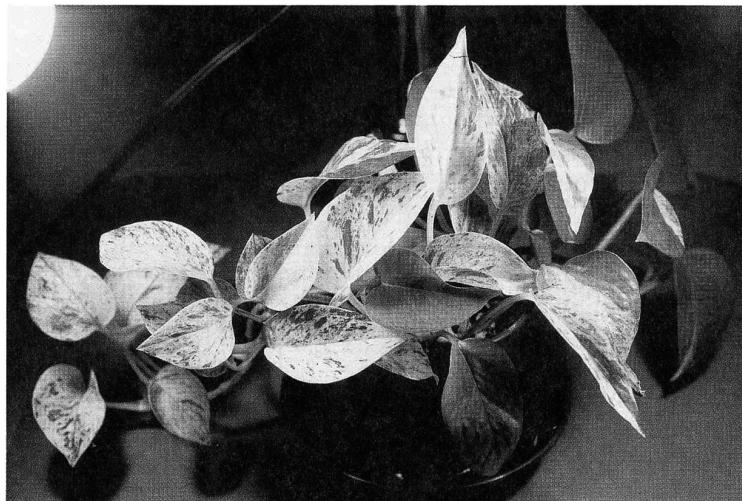  
图 16.10 紫茉莉的叶片花斑现象。花斑区域是正常(绿色)和缺陷(白色)叶绿体的细胞质分离所致。

子代的表型。杂交结果概括于表 16.3 中。两个重要的观察结果如下。

(1) 正反交产生不同的结果。例如，杂交绿色♀×白色♂产生绿色植株，而杂交白色♀×绿色♂

表 16.3 花斑紫茉莉的杂交及后代表型

<table><tr><td>枝条表型(产卵细胞的亲本)</td><td>枝条表型(产花粉的亲本)</td><td>子代表型</td></tr><tr><td>白色</td><td>白色</td><td>白色</td></tr><tr><td>白色</td><td>绿色</td><td>白色</td></tr><tr><td>白色</td><td>花斑</td><td>白色</td></tr><tr><td>绿色</td><td>白色</td><td>绿色</td></tr><tr><td>绿色</td><td>绿色</td><td>绿色</td></tr><tr><td>绿色</td><td>花斑</td><td>绿色</td></tr><tr><td>花斑</td><td>白色</td><td>花斑、绿色或白色</td></tr><tr><td>花斑</td><td>绿色</td><td>花斑、绿色或白色</td></tr><tr><td>花斑</td><td>花斑</td><td>花斑、绿色或白色</td></tr></table>

色♂产生绿色植株，而杂交白色♀×绿色♂产生白色植株。（这些白色植株通常在萌芽后不久就死去，因为它们缺乏叶绿素，从而没有光合作用活性。）

(2) 在每种杂交中，生长雌性亲本枝条的表型决定子代的表型（比较表 16.3 第 1 栏和第 3 栏）。雄性亲本对子代表型没有贡献。

而且，当用绿色或花斑的子代植株上的花进行后续的杂交时，传递方式都与最初杂交的传递方式完全相同。这些观察结果显示，该性状是直接通过母本传递的，即母体遗传。

花斑现象的遗传学解释如下。

\- 绿颜色取决于叶绿体的存在，而花粉不含叶绿体。

\- 叶绿体无性分离到子细胞中有点不均等，服从机会变异(chance variation)。

\- 白色组织的细胞含有缺乏叶绿素的突变型叶绿体。

这几点如图 16.11 中的模型所示。花斑植株从对绿色和白色(突变型)叶绿体为异质性的胚胎萌芽而来。细胞分裂时叶绿体随机分离，结果是，有的枝条来自只含绿色叶绿体的细胞，有的枝条来自只含突变型叶绿体的细胞。绿色枝条上的花产生具有正常叶绿体的胚珠，因此所有子代都是绿色的。白色枝条上的花产生只具有突变型叶绿体的胚珠，因此只产生白色子代。花斑枝条上的花形成的胚珠有 3 种类型：只有含叶绿素的叶绿体的胚珠、只有突变型叶绿体的胚珠和异质性胚珠。异质性类型仍然产生花斑植株。

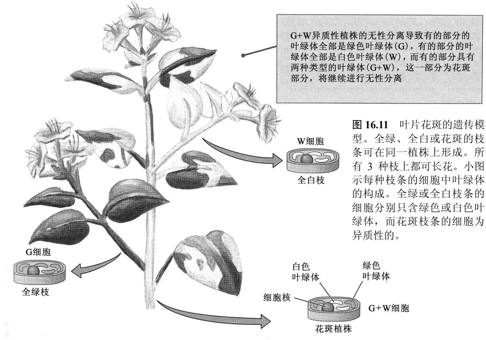

## - 酵母的呼吸缺陷型线粒体突变体

在含葡萄糖的固体培养基上培养出芽酵母(酿酒酵母)时，偶尔会观察到极小的菌落。这些菌落称为小菌落突变体(petite mutant)。显微镜检查显示，虽然这些菌落很小，但细胞大小是正常的。生理学研究证明，在酵解葡萄糖、生成乙醇的早期阶段，这些菌落正常生长，但因为在乙醇进一步代谢所需的需氧呼吸中的一个缺陷，这些菌落很快便停止生长。这些菌落之所以小，是因为细胞只能通过发酵获得ATP，不能通过氧化磷酸化获得大得多的ATP产率。

小菌落突变体分为两大类。胞质小菌落(cytoplasmic petite)为线粒体DNA中大的缺失所致，而分离型小菌落(segregational petite)为核基因突变所致。图16.12示两种胞质小菌落，根据它们与具有正常线粒体的野生型菌株杂交的结果，可将这两种小菌落区分开来。符号PET表示野生型单倍细胞核基因组，PET/PET表示野生型二倍细胞核基因组。就胞质小菌落而言，小菌落性状完全是线粒体突变和无性分离所导致的。

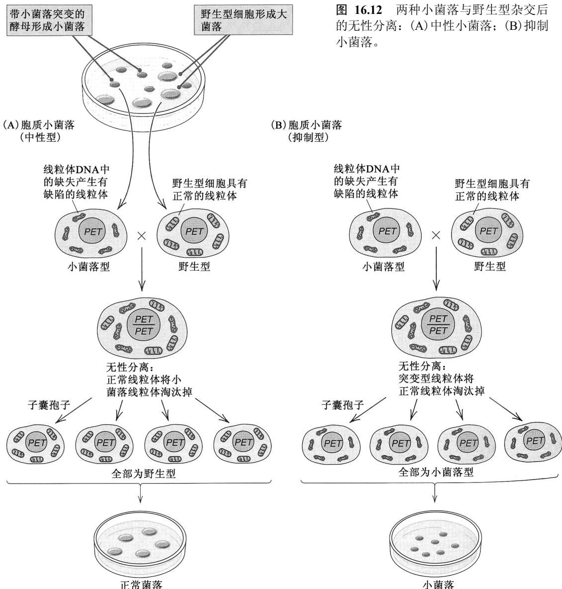

图 16.12A 示最常见的一种胞质小菌落，称为中性小菌落 (neutral petite)。当中性小菌落与野生型杂交时，子代细胞同时具有突变型和正常的线粒体。当这些细胞通过有丝分裂增殖时，会出现无性分离。对中性小菌落而言，正常线粒体增殖的效率比突变型线粒体高，因此最终突变型线粒体会被清除。当二倍体细胞形成孢子时，所有的子囊孢子都会萌芽，并且所有的子囊孢子都是野生型。

图 16.12B 示较不常见的一种小菌落的相应实验，这种小菌落称为抑制小菌落 (suppressive petite)。在此情况下，突变型线粒体具有缺失，使它们比非突变型线粒体的增殖速度更快。因此，在抑制小菌落中的无性分离的结果是，突变型线粒体逐渐取代野生型。当二倍体细胞形成孢子时，所有的子囊孢子都会萌芽为小菌落。

酵母基因组包含 200 多个对维持正常的线粒体必不可少的基因。这些基因的野生型等位基因称为 PET1、PET2、PET3 等，而突变型等位基因以 pet1、pet2、pet3……来表示。具有任何一个 pet 突变的细胞，都不能支持线粒体的正常复制和维持，因此线粒体就会变成缺陷型的或丢失掉，细胞即成为小菌落，此类突变体称为分离型小菌落。这个名称有可能会产生误导，因为在此情况下的“分离”(segregation)不是指无性分离，而是指孟德尔分离。换句话说，分离

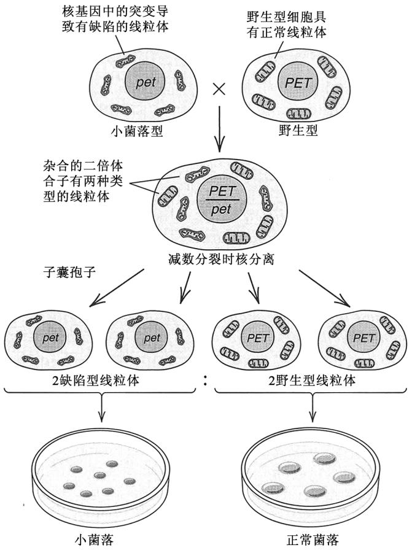  
图 16.13 pet 突变的孟德尔分离，示杂合基因型形成的子囊孢子中，2 突变型：2 野生型的特征性孟德尔模式。

型小菌落是核基因突变的结果。

分离型小菌落的遗传方式如图16.13所示。顶部为一个具有小菌落表型的pet突变体与一个携带野生型PET等位基因、具有非小菌落表型的菌株接合。所产生的合子为杂合的PET/pet，它可使线粒体保持正常，因为pet突变是隐性的。但是，当这些杂合细胞形成孢子时，子囊孢子发生孟德尔分离，形成2 pet：2 PET的比值。突变型子囊孢子不能维持正常的线粒体，因而会形成小菌落，而野生型子囊孢子会形成正常菌落。因此，分离型小菌落的表型比值为2小菌落：2正常。

## 16.4 共生生物的细胞质传递

生物物种之间的共生关系很常见。“共生”(symbiosis)一词的意思是“一起生活”，它涵盖的合作关系范围广泛。一个极端是，两个物种的关系如此紧密，以致缺了一个另一个就活不了。动

物的线粒体就是从这样一种关系进化来的。另一个极端是松散的利益合作关系，例如，在大鱼身上吃寄生虫的清洁鱼，或在犀牛皮肤上吃虱子和昆虫的啄牛鸟。有些生物学家认为“共生”仅仅指紧密的相互依赖类型。在本章中，考察两个内共生(endosymbiosis)的例子，在内共生关系中，其中一种共生生物生活在另一种的细胞或组织中。

联系：蚜虫怎样得到PVT TIM HALL

南希·摩根 $^{+}$ 、戈登·普雷格 $^{+}$ 、乔纳斯·桑斯特罗姆 $^{+}$ 和珍妮弗·威尔科克斯 $^{+}$ ，2003

$^{+}$ 亚利桑那大学，图森，亚利桑那州

$^{\dagger}$ 瑞典农业大学，乌普萨拉，瑞典

从基因组角度看昆虫共生菌的营养供给

巴克纳氏属细菌与不同蚜虫物种之间的关系，是了解得最为透彻的共生现象之一。这种共生可追溯到1.5亿～2.5亿年前，这种共生关系既伴随着宿主中特化的脂肪细胞的进化(这些脂肪细胞可保证共生菌通过母体传递给后代)，又伴随着许多共生菌基因的丢失(阻止共生菌在宿主体外存活)。基因组序列既给共生菌基因组减小的幅度有多剧烈首次提供了实在依据，也给共生菌在为蚜虫供给必需氨基酸(那些在饮食中必须存在的氨基酸)上的重要性提供了令人信服的证据。本节选特别提到，动物(包括人在内)通常需要10种必需氨基酸。它们的首字母缩写为PVT TIM HALL(PVT是private的军用缩写)，这可以帮助我们记住必需氨基酸是Phenylalanine(苯丙氨酸)、Valine(缬氨酸)、Tryptophan(色氨酸)、Threonine(苏氨酸)、Isoleucine(异亮氨酸)、Methionine(甲硫氨酸)、Histidine(组氨酸)、Arginine(精氨酸)、Lysine(赖氨酸)和Leucine(亮氨酸)。

我们研究的问题是，在共生这样新的需求背景下，尤其是在为宿主组织供应营养的背景下，细菌基因组发生了什么改变。我们的重点是研究得最为透彻的昆虫共生生物——Buchnera aphidicola，这种细菌已与其蚜虫宿主协同进化了1亿年以上。……动物通常会缺少一些生成氨基酸的途径，在饮食中往往需要10种必需氨基酸。……对韧皮部汁液成分的研究表明，氮几乎完全是以氨基酸的形成存在的，并且这些氨基酸主要是非必需氨基酸。……现已得到巴克纳氏属3个远缘蚜虫物种的全基因组序列。……这些基因组的基因已减少到只有它们的祖先及现代近亲的20%左右，并且每种基因组都有独特的基因排列方式。……在这些昆虫的共生关系中，共生产生贡献的基础在于，在共生开始之后为了给宿主提供营养物质而被选取的、在自由生活的近亲中存在的祖先基因和途径。用于营养物质生物合成的祖先基因的保持，给它们与宿主的互利共生关系提供了一个清晰的指标。……巴克纳氏菌保留了几乎所有制造必需氨基酸的基因，但只保留了合成两种非必需氨基酸的基因，由这一观察结果可明显看出制造必需氨基酸的重要性。……蚜虫不存在对必需氨基酸的营养需求，反映了这些必需氨基酸可由巴克纳氏菌供给。……这些昆虫专性共生生物的基因组，提供了这样一幅清晰的画面：祖先基因组为了发挥与宿主交换营养物质的特定功能而进行修改。……昆虫的这种母体遗传的、专性的关系是通过祖先基因组的削减和轻微修改而来的，而不是通过获得或创造新的“共生”基因而来。

来源：Proceedings of the National Academy of Sciences USA 100 Suppl 2: 14543-14548.

## - 蚜虫的共生菌

蚜虫(图 16.14)是吸食植物汁液的昆虫，可对小麦、大豆、苜蓿、豌豆、莴苣、甜菜和山核桃等农作物造成重大损害。它们的口器像注射器一样，可刺穿植物，然后把汁液吸出来。植物汁液富含糖类时，氨基酸就缺乏。就像许多其他动物一样，蚜虫不能合成10种氨基酸。大多数蚜虫从1.5亿～2.5亿年前与巴克纳氏属(Buchnera)细菌建立的古老内共生关系中获得这些必需氨基酸。巴克纳氏菌的祖先曾是自由生活的细菌，但现在已经失去了大部分基因组，在蚜

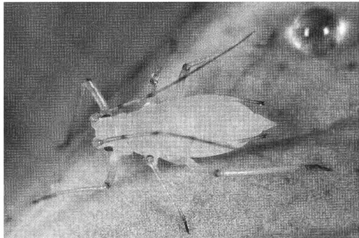  
图 16.14 豌豆蚜 (Acyrthosiphon pisum)。(©Nigel Cattlin/Photo Researchers, Inc.)

虫宿主体外再也不能存活。同样，根除了巴克纳氏菌的蚜虫，生长不良，繁殖能力受损。

蚜虫进化出一种特化的细胞，内有由质膜形成的众多小囊，巴克纳氏菌就在这些小囊中。这些内共生体通过卵由母蚜虫传给后代，虽然蚜虫成虫可含500万个甚至更多的巴克纳氏菌细胞，但在代与代之间传递的只是一小部分。

巴克纳氏菌是从一个与大肠杆菌有亲缘关系的类群进化来的，但当这种内共生体的基因组序列被测定后，证明它已丢失了大约 $80\%$ 的基因。这些丢失的基因的功能包括厌氧呼吸和合成氨基糖、脂肪酸、磷脂和复合糖。尤其有启发性的是没有丢失的基因。尽管合成非必需氨基酸的大多数基因已从基因组中丢失，但那些合成必需氨基酸(为蚜虫宿主所用)所需的基因得到保留。

## ■ 草履虫的杀伤株

细菌细胞质传递的一个典型例子，是在双小核草履虫(Paramecium aurelia)这种原生动物的某些虫株中发现的杀伤现象。草履虫的杀伤株向周围介质中释放一种物质，该物质对许多其他的草履虫菌株是致命的。这种杀伤表型需要存在称为卡巴粒(kappa particle)的细胞质细菌，这种颗粒的维持依赖于一个显性的核基因 $K$ 。卡巴粒是产生杀伤物质的杀伤杆菌(Caedibacter taeniospiralis)细胞。杀伤株自身为什么不受这种物质的影响，尚未查明。

草履虫是一种二倍体原生动物，可通过一种称为接合(conjugation)的交配过程进行有性交换(图16.15A)。一开始，每个细胞有两个二倍体小核(micronucleus)。许多原生动物包含若干小核和一个大核(macronucleus，具有特化功能的大的细胞核)，但只有小核与此处所述的遗传过程有关。当两个细胞为了接合而接触时，每个细胞中的两个小核进行减数分裂，在每个细胞中形成8个小核。其中7个小核和大核解体，每个细胞剩下1个小核，然后该小核进行一次有丝分裂。两个细胞之间的细胞膜略微分解，然后两个细胞互换1个小核；此后，每个细胞中的两个小核融合成一个二倍体核。在核互换之后，两个新细胞(接合后体，exconjugant)在遗传上完全相同。在这一系列事件中，只有小核被互换，没有任何细胞质的混合。

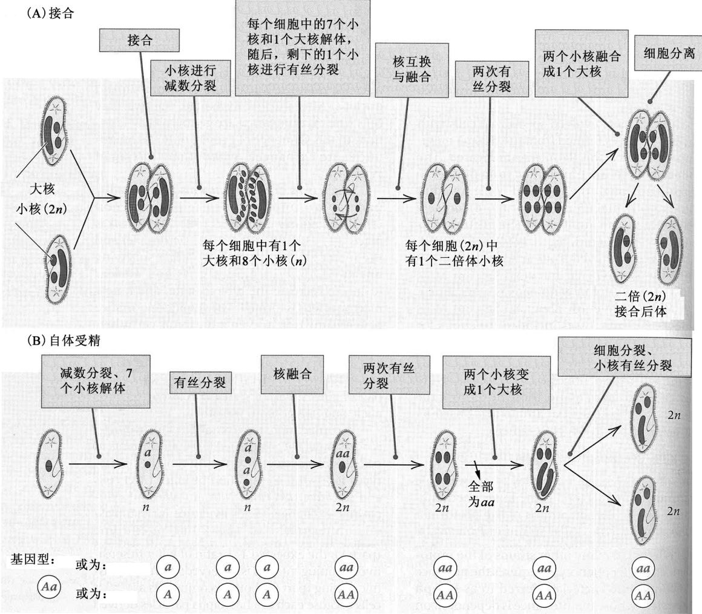  
图 16.15 (A) 草履虫的接合导致相互受精，形成两个在遗传上相同的接合后体细胞。(B) 草履虫的自体受精。杂合 Aa 细胞的两个等位基因在减数分裂中分离，结果子细胞变成对 A 或对 a 纯合。产生 aa 子细胞的过程如图所示。最初的几个步骤与 A 部分中接合的步骤类似。小核进行减数分裂，其后，其中的 7 个产物及大核解体。

单个草履虫细胞偶尔也会出现自体受精(autogamy)这一独特的细胞核现象(图16.15B)。减数分裂之后仍然是其中7个小核和大核的解体。然后，残存的细胞核经过有丝分裂和核融合，重建二倍体状态，并形成一个新的大核。自体受精的遗传重要性在于，即使最初的细胞是杂合的，新形成的二倍体细胞核也会变成纯合，因其源于单一单倍的减数分裂产物。在一个进行自体受精的细胞群体中，残存的小核是随机选择的，因此，对任何一对等位基因而言，一半的新细胞含一个等位基因，一半含另一个等位基因。

在接合过程中，小核的互换偶尔会伴随着少量的细胞质混合。在杀伤(KK)细胞和敏感(kk)细胞接合之后，比较有或没有细胞质交换情况下的表型，为杀伤表型的细胞质遗传提供了证据(图16.16)。在没有细胞质混合时(图16.16A)，可观察到杀伤细胞与敏感细胞接合后体细胞的1∶1期望比例；细胞质混合时(图16.16B)，两个接合后体均为杀伤细胞，因为每个细胞都具有来

自杀伤亲本细胞质的卡巴粒。接合之后，每个接合后体进行自体受精(图 16.16)。Kk 杀伤细胞的自体受精，产生相等数量的 KK 和 kk 细胞，但 kk 细胞不能维持卡巴粒，从而变为敏感型。

## 16.5 蜗牛壳盘绕的母体效应

母体传递并不总是由细胞质内的细胞器或共生生物介导，在某些情况下，它可通过核基因产物的细胞质传递介导。一个例子是在蜗牛 Limnaea peregra(椎实螺)中外壳盘绕方向的决定。如果从外壳开口往里看，盘绕方向为向右(dextral coiling，右旋)或向左(sinistral coiling，左旋)。纯合品系之间的正反交，得到以下结果：

右旋♀×左旋♂→F $_{1}$ 全部右旋左旋♀×右旋♂→F $_{1}$ 全部左旋在这两种杂交中，F $_{1}$ 蜗牛具有相同的基因型，但正反交得出不同的结果。子代盘绕方向与雌性亲本的盘绕方向相同，该结果是典型的母体遗传性状。但是，在这一个案中，两种杂交的F $_{2}$ 后代都表现为右旋，该结果与细胞质遗传不符。F $_{3}$ 代给出了答案。

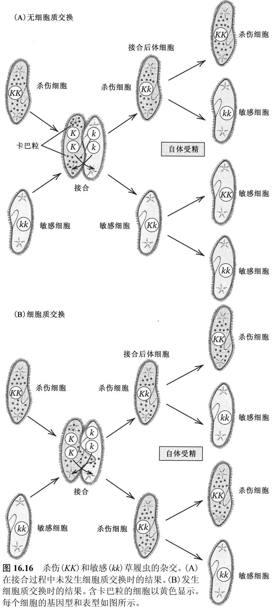

$F_{2}$ 蜗牛自体受精得 $F_{3}$ 代 (蜗牛为雌雄同体)， $F_{3}$ 代表明，盘绕方向的遗传取决于核基因，而不是核外因子。 $F_{3}$ 代中，3/4 具右旋外壳，1/4 具左旋外壳 (图 16.17)。这是右旋 ( $D/D$ 和 $D/d$ ) 对左旋 ( $d/d$ ) 为显性的情况下典型的 3:1 比值。该比值表明存在孟德尔分离，但这是

在 $\mathrm{F}_3$ 代中观察到的，而未在 $\mathrm{F}_2$ 代中观察到。该孟德尔比值推迟了一代，原因是

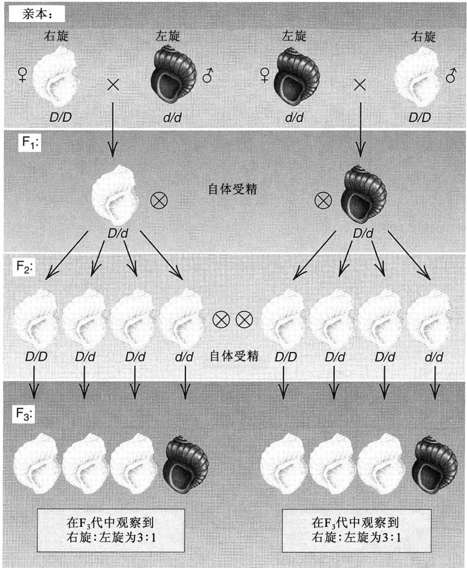  
图 16.17 椎实螺(Limnaea)外壳盘绕方向的遗传。左旋由隐性等位基因 d 决定，右旋由野生型等位基因 D 决定。但是，盘绕方向是由雌性亲本的核基因型决定，而不是由蜗牛自身的基因型或核外遗传决定。 $F_{2}$ 和 $F_{3}$ 代可通过自体受精得到，因为蜗牛为雌雄同体，既可进行自体受精，又可进行异体受精。

蜗牛个体的盘绕表型由其雌性亲本的基因型决定。

这意味着外壳盘绕的方向不是母体遗传的问题，而是母体效应的问题（参见 16.1 节）。对发育中的卵进行细胞学分析，结果显示，雌性亲本的基因型决定受精后最初的有丝分裂中纺锤体的定向，继而控制蜗牛幼体外壳盘绕的方向(图 16.18)。这个经典的母体效应的例子说明，要为某个性状的核外遗传方式提供确凿的证据，需要进行不只一代的杂交。

外壳盘绕的方向可能不只是一个罕见而有趣的生物学现象。它影响到两只蜗牛怎样才可容易地进行交配。在有些蜗牛种中，配偶双方面对面地进行交配（图16.19）。生殖器以这样的方式定位：如果配偶双方的外壳以相同方向盘绕，则一个配偶的生殖器最容易与另一个配偶的匹配。（在图16.19中，配偶双方都是右旋的。）

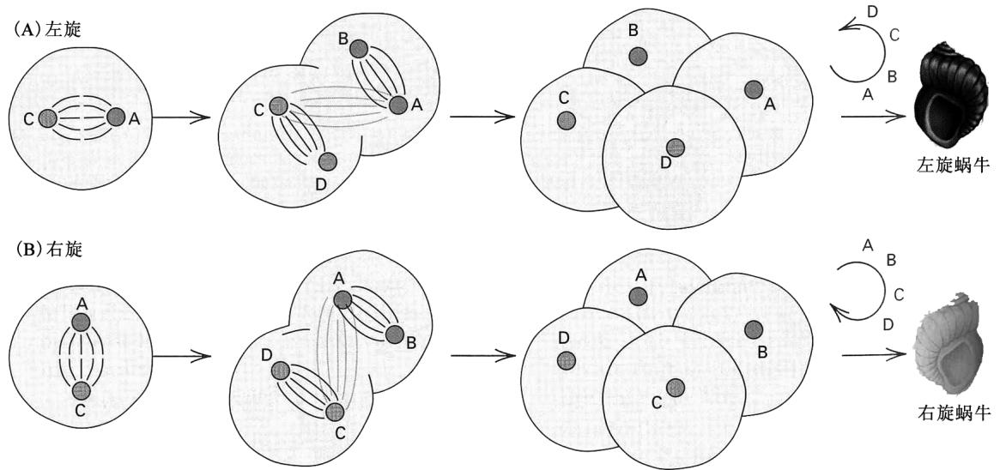  
图 16.18 椎实螺(Limnaea)外壳盘绕的方向由合子第二次卵裂期间有丝分裂纺锤体的定向决定，这是在卵细胞质中由雌性亲本的基因型预先决定的。由卵裂建立的螺旋模式导致(A)左旋或(B)右旋。

因此，右旋蜗牛最容易与右旋蜗牛交配。同样，左旋蜗牛最容易与左旋蜗牛交配。右旋蜗牛与左旋蜗牛也有可能面对面地交配，但在此情况下，一方必须扭曲生殖器来与其配偶相配。因而，在一个主要是右旋的蜗牛种中，稀有的左旋蜗牛也许非常孤独，在主要为左旋的蜗牛种中，稀有的右旋蜗牛亦然。

## 本章概要

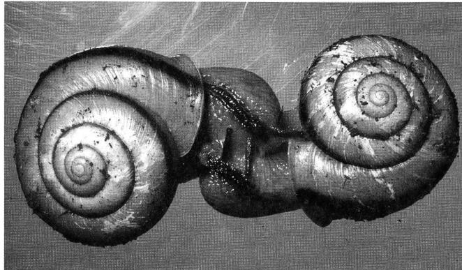  
图 16.19 Euhadra congenital 种的两只蜗牛之间的交配。在此例中，两个配偶均具有右旋的外壳。每只蜗牛宽约 30mm。[承日本信州大学浅见崇比吕 (Takahiro Asami) 惠赠。]

\- 线粒体、光合作用质体和某些其他的细胞器，被广泛认为起源于独立的共生事件，在此过程中，原核细胞(现在细胞器的祖先)变成原始真核生物细胞的胞内共生生物。

\- 有些遗传性状由存在于细胞器(主要是线粒体和叶绿体)中的 DNA 分子决定。此类性状的特征是单亲遗传，为母体遗传或父体遗传。

\- 子代与雌性亲本类似是母体遗传和母体效应都有的特点。母体遗传是非核遗传因子传递的结果，但母体效应是在母体中表达的核基因决定子代表型的结果。

## 基础回顾

\- 线粒体和叶绿体的正常功能是什么？

\- 没有线粒体，真核生物细胞能生存吗？没有叶绿体，植物细胞能生存吗？

\- 举一个线粒体 DNA 突变引起人类疾病的例子。

\- 指出母体遗传和母体效应的差别。

\- 某些细胞器起源的内共生学说是什么？

\- 什么是花斑现象？

\- 紫茉莉的叶片花斑现象如何证明某些细胞谱系叶绿体的异质性和其他细胞谱系叶绿体的纯质性？

\- 在玉米育种中细胞质雄性不育的实际用途是什么？

\- 在酵母中出现分离型小菌落对细胞核和线粒体之间的关系有何提示？

## 解题指南

习题 1 下面的 mRNA 为分离自人类细胞的部分编码序列。它可能是来自核基因还是线粒体基因？请解释。

$$
5 ^ {\prime} \text {-AUGAGACAUAAUGAUAGAGGGAGGCCCAAUCGC-3}
$$

## 答案

最有可能是核基因；相应的氨基酸序列为 Met-Arg-His-Asn-Asp-Arg-Gly-Arg-Pro-Asn-Arg。在线粒体中，会翻译成 Met-stop-His-Asn-Asp-stop-Gly-stop-Pro-Asn-Arg。在前 11 个密码子中有 3 个终止密码子，与其作为可读框不相符。

习题 2 两个玉米品系表现出雄性不育性。其一为细胞质遗传的；另一个是孟德尔式遗传的。要鉴定出哪个是哪个，要做什么样的杂交实验？

## 答案

细胞质雄性不育通过雌性传递，因此，以细胞质雄性不育品系作为雌性亲本进行异型杂交(与没有亲缘关系的品系杂交)，会产生雄性不育子代。用该品系反复与孟德尔式雄性不育品系异型杂交，结果为没有雄性不育(如果不育性基因为隐性)，或50%雄性不育(如果不育性基因为显性)。

习题 3 对一种海产蜗牛的线粒体 DNA 进行分析，在单只蜗牛的 mtDNA 中，始终得到两种不同的限制图。这两个图谱如附图所示。给这两个限制图的差异提出一个假说，并解释为什么在同一个体中会同时发现两种类型的 mtDNA。

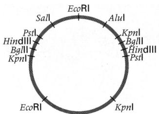

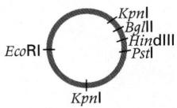

## 答案

包含 4 个限制位点的那簇限制位点提示存在重复序列。两个同向重复序列之间的重组，会使它们之间的片段缺失。因而，非重组型 mtDNA 和重组型 mtDNA 会产生两种不同的限制图。它们两个都存在于单一个体中，原因是具有缺失的 mtDNA 是另一种 mtDNA 通过重组而来的。这种重组事件必定以足够高的频率发

生，以致每个个体都同时有两种 mtDNA。由于缺失是不可逆的，未能发现任何只有缺失型 mtDNA 的个体，说明这种情况是致死的。

## 分析与应用

16.1 为什么那么多的遗传性线粒体病具有肌肉功能不全或无力的特点？

16.2 为什么线粒体突变所致的疾病在严重程度的变化上高度因人而异？

16.3 在进化过程中，许多最初存在于线粒体 DNA 中的基因已被转移到细胞核中。如果今天的人类线粒体编码序列可被转移到细胞核中，且能成功翻译，可能需要对密码子的使用做出什么限制？

16.4 在人类线粒体 DNA 所用的遗传密码中，在任何密码子的第三位，任一嘌呤或任一嘧啶都是等价的，从这个意义上来说，这种遗传密码是否完全是冗余的？这种情况与标准遗传密码有什么差异？

16.5 所附系谱和凝胶示意图示某种细胞器基因组的遗传方式，该细胞器存在于与疟原虫有亲缘关系的一种寄生性微生物中。这些数据说明，遗传传递方式是什么？

16.6 发现某种突变型植株具有黄色的叶子，而不是绿色的叶子。显微镜观察和生化分析表明，细胞含的叶绿体很少，该植株设法利用其他色素来生长。这种植株长得不是太好，但它是纯种。通过以下杂交来研究黄色的遗传方式：

绿色 ♂ × 黄色 ♀，产生的子代全为黄色

黄色♂×绿色♀，产生的子代全为绿色

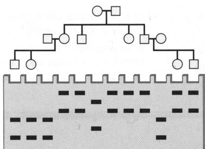

这些结果对遗传方式给出什么提示？

16.7 对上题中的表型而言，假设在杂交后代中以约 1/1000 的频率发现花斑型后代。这如何解释？

16.8 在人类线粒体遗传密码中，在密码子第三位的同义突变中，转换突变所占的比例是多少？在密码子第三位的同义突变中，颠换突变所占的比例是多少？

16.9 有些植物物种具有由类似于动物的 XX-XY 染色体系统的一种机制决定的不同的性别。在这些物种中，怎样区分 Y 染色体的父系传递与细胞器的父系传递？

16.10 在紫茉莉的母体遗传的叶片花斑现象中，绿色雌性 $\times$ 白色雄性杂交的 $\mathrm{F}_2$ 代，与假设白色叶片系由动物中常见的X连锁隐性基因所致可能得到的 $\mathrm{F}_2$ 代，有什么差异？

16.11 下列用紫茉莉进行的杂交，预计会得到什么类型的子代？

(a) 绿色♀×白色♂

(b) 白色♀×绿色♂

(c) 花斑♀×绿色♂

(d) 绿色♀×花斑♂

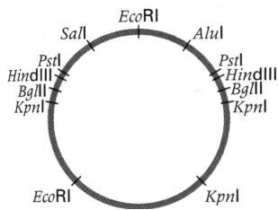

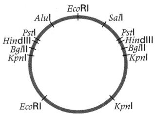

16.12 对一种海产蜗牛的线粒体 DNA 进行分析，在单只蜗牛的 mtDNA 中，始终得到两种不同的限制图。这两个图谱如附图所示。给这两个限制图的差异提出一个假说，并解释为什么在同一个体中会同时发现两种类型的 mtDNA。

16.13 假设在细胞分裂中叶绿体复制并随机分离，在有丝分裂过程中，单个突变型叶绿体

的两个复本都分离到同一子细胞中的概率是多少？两次细胞分裂后，至少有一个子细胞缺乏该突变型叶绿体的概率是多少？

16.14 如果 a 和 b 是衣藻(Chlamydomonas)叶绿体的标记，预计杂交 $a^{+}b^{-}mt^{+}\times a^{-}b^{+}mt^{-}$ 的子代基因型是什么？

16.15 此处所示的系谱示某种植物数代杂交的情况及观察到的带型。这些带型与孟德尔式遗传一致吗？解释为什么一致或为什么不一致。如果不一致，给这些带型提出一个解释。

16.16 试想在衣藻中的 3 种抗生素抗性(r)与敏感性(s):

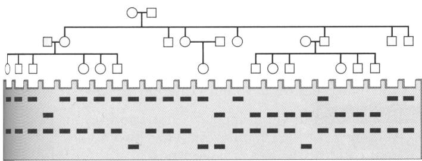

(a) cpl-r 由叶绿体 DNA 的一个突变产生

(b) mit-r 由线粒体 DNA 的一个突变产生

(c) nuc-r 由细胞核染色体 DNA 的一个突变产生

如分别对这 3 种抗性进行抗性 $mt^{+} \times$ 敏感 $mt^{-}$ 的杂交，预计各自会有什么类型的后代？各种类型的比例是多少？请解释。

16.17 对前一题中所述的抗生素抗性标记，在下列杂交中，预计子代的表型有哪些？各种表型的比例是什么？
(a) cpl-r mit-s nuc-r $mt^{+} \times cpl$ -s mit-r nuc-s $mt^{-}$ (b) cpl-s mit-r nuc-s $mt^{+} \times cpl$ -r mit-s nuc-r $mt^{-}$

16.18 为什么酵母的分离型小菌落被称为“分离型”？

16.19 在衣藻中发现一种新的抗生素抗性 $klv - r$ 。从 $klv - rmt^{+} \times klv - smt^{-}$ 杂交后代中随机选择孢子，得 $92klv - rmt^{+}$ $88klv - smt^{-}$ $11klv - rmt^{-}$ $9klv - smt^{+}$

这种抗生素抗性表现出什么类型的遗传方式？如何解释这种与交配类型之间的关联？

16.20 分离得一个具抗生素抗性的酵母单倍体菌株。与野生型(抗生素敏感)菌株接合，产生二倍体，该二倍体培养若干代后，诱导其进行产孢过程，产生含4个抗生素抗性孢子，或含4个抗生素敏感孢子的四分体。关于这种抗生素抗性的遗传方式，可得出什么结论？

16.21 分离型小菌落与中性小菌落杂交产生的二倍体酵母的表型是什么？

16.22 相同数量的 AA 和 aa 草履虫随机配对接合。预计有哪些接合方式？接合的双方分离后，预计有什么样的基因型和频率？这些细胞进行自体受精后，预计有什么样的基因型和频率？

16.23 进行自体受精的 $Aa$ 草履虫，其子代有哪些可能的基因型？

16.24 在玉米中进行一项杂交，用来自细胞质遗传的雄性不育品种的雌性亲本，与来自对显性等位基因 $Rsf$ 纯合的雄性亲本杂交， $Rsf$ 可凌驾于细胞质不育性之上，从而恢复可育性。雌性亲本的基因型为 $rsf$ 纯合。令从该杂交得的 $\mathrm{F}_1$ 植株生长并自体受精。在下一代中，预计雌性和雄性玉米的基因型及能育性的情况如何？

16.25 在草履虫的 KK 杀伤株与 kk 非杀伤株之间的接合中，为什么在前结合体已经发生自体受精后，要得到杀伤株：非杀伤株的 1:1 比值，需要进行细胞质交换？在缺乏细胞质交换的情况下，杀伤株：非杀伤株的比值是多少？

16.26 从自然中找到的某个果蝇品系具有下列特性。在每一代中，约有 90% 的后代为雌性。这种雌性连续数代与来自正常品系的雄性杂交，在每一代中都产生大约 90% 的雌性后代。来自最初品系中的雄性，以及数代回交得到的雄性，如与正常雌性杂交，产生正常的性比。给这些结果提出一个解释。

16.27 细胞质雄性不育、基因型为 AA bb 的玉米植株，与正常的 aa BB 植株，成行相间种植，使授粉能够

随机发生。预计这两种植株会产生什么后代基因型？

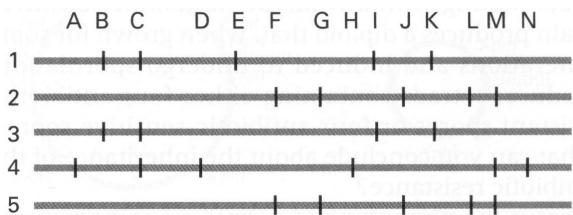

16.28 附图示5种螃蟹的线粒体DNA分子中从A到N限制位点的位置。某个限制位点的存在是以一条短竖线表示。假设在两个分子之间具有共同的限制位点的比例是它们在亲缘关系上接近程度的一个指征，推断这5个种的亲缘关系，以图表示。

16.29 一只外壳向左盘绕的椎实螺进行自体受精，

所有的后代都向右盘绕。该亲本的基因型是什么？如果令这些后代逐个自体受精，预计会出现什么盘绕表型？

16.30 某一品系的雌果蝇与野生型雄性交配。所有后代均为雌性。有3种可能的解释：①这些雌果蝇对某一常染色体隐性等位基因为纯合，产生致死性雄性胚胎(即母体效应)。②这些雌果蝇对某个在雄性中致死的X连锁等位基因为纯合。③这些雌果蝇在细胞质中携带某种能杀死雄性胚胎的遗传因子。在 $F_{1}$ 雌性和野生型雄性之间进行杂交，只产生雌性后代。这一结果对在这些假说中作出判断有没有帮助？

## 挑战题

挑战题 1 无义(链终止)突变的遗传阻抑通常是由于存在突变型 tRNA 分子，其反密码子与链终止密码结合，使一小部分 mRNA 分子能够翻译通过该终止密码子，从而继续进行多肽链的合成。在人类线粒体基因中有可能通过 tRNA 突变而实现无义抑制吗？请解释。

挑战题 2 在许多生物谱系中，线粒体 DNA 的核苷酸序列随进化时间的推移以相对恒定的速率发生改变。在包括狗、狼、狐狸、草原狼和豺在内的犬科动物中，该速率约为每百万年 2.86%。该估计是基于对狼和草原狼 mtDNA 的比较。它们的 mtDNA 在 5.72% 的核苷酸位点有差异，而化石证据表明，这两个种约一百万年前从一个共同的祖先趋异而来。因为存在这个共同祖先，所以总的进化时间为二百万年（从共同祖先到今天的狼的一百万年，加上从共同祖先到今天的草原狼的一百万年）。因而，估计 mtDNA 进化的速率为 $5.72/(2 \times 10^{6}) = 2.86 \times 10^{-6}\%$ /年，或 2.86%/百万年。另外，家犬和狼的 mtDNA 相差大约 1%。这一发现说明狗和狼最近的共同祖先生活在什么年代？这一估计与最早的家犬遗骸可追溯至 1 万～1.5 万年前的考古证据一致吗？

挑战题 3 在酵母中，ade6 $^{-}$ 突变导致对腺嘌呤的需要。具有正常菌落大小的 ade6 $^{-}$ 菌株与 3 个 ade6 $^{+}$ 小菌落菌株分别杂交。检查每种杂交由随机的孢子产生的 100 个菌落，其营养需求状态和大小如下。

(a) 26 Ade $^{-}$ 小菌落：23 Ade $^{-}$ 正常：24 Ade $^{+}$ 小菌落：27 Ade $^{+}$ 正常

(b) 46 Ade $^{-}$ 正常：54 Ade $^{+}$ 正常

(c) 7 Ade $^{-}$ 小菌落：45 Ade $^{-}$ 正常：40 Ade $^{+}$ 小菌落：8 Ade $^{+}$ 正常

指出每种杂交中所涉及的是什么类型的小菌落，并指出，关于小菌落表型的遗传基础，是否能作进一步的说明。

## 网上遗传学

“网上遗传学”(GeNETics)会为你介绍在互联网上寻找遗传学信息的某些最重要的站点。要浏览这些站点，请访问为《遗传学：基因和基因组分析》(第八版)配备的 Jones and Bartlett 公司配套站点http://biology.jbpub.com/book/genetics/8e/。

在该站点中，你会找到一个按章列出的重点关键词列表。选择某个关键词后，可链接到某个网站，其中包含与此关键词相关的信息。
