# 第 17 章 分子进化和群体遗传学

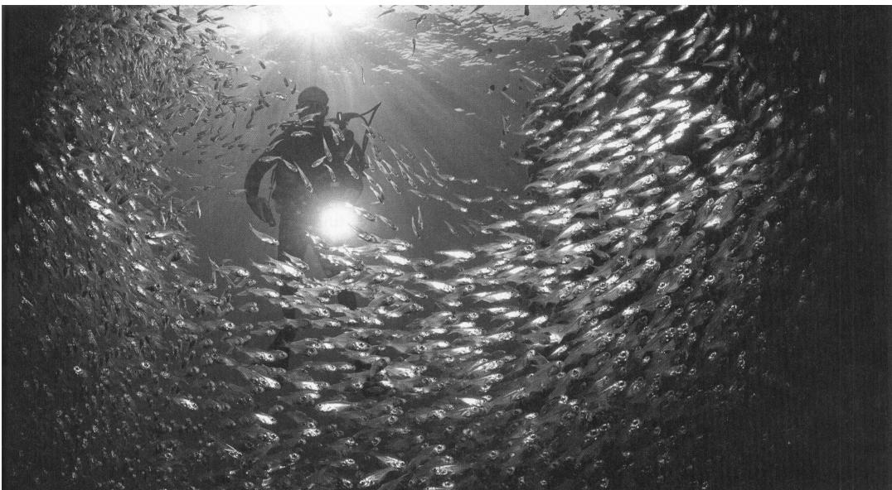

在红海的一个洞穴入口处游动的一群玻璃清道夫(Parapriacanthus guentheri)。(©Jeff Rotman/Photo Researchers, Inc.)

## 本章提纲

17.1 分子进化  
17.2 群体遗传学  
17.3 近交  
17.4 遗传学与进化  
17.5 突变与迁移  
17.6 自然选择  
17.7 随机遗传漂变联系：哈代博士的圣诞贺词

戈弗雷·哈代，1908

混合群体的孟德尔比例

联系：血液中的抗性

安东尼·艾利森，1954

镰形细胞性状产生的抗恶性疟疾感染作用

## 学习目标与科学能力

当你学习了分子进化和群体遗传学的原理后，你将能够通过解决以下问题来展示你的科学能力。

\- 指出基因树和物种树的差异，并说出它们不一样的原因。

\- 解释为什么在进化过程中基因组中的有些核苷酸位点比其他位点的变化快得多。

\- 已知一组基因型频率，计算等位基因频率；给定任何特定的等位基因频率，推导随机交配下的期望基因型频率。

■ 叙述近交对稀有隐性等位基因的主要影响，并计算简单系谱中个体的近交系数。

\- 用日常用语来解释“突变-选择平衡”，并解释为什么这种平衡取决于有害等位基因的杂合效应。

\- 给“随机遗传漂变”（也称为“随机繁殖失败”）下定义，并解释为什么它对等位基因频率的影响取决于群体中参与繁殖的个体数目。

## 17.1 分子进化

诸如 DNA、RNA 和蛋白质这样的大分子，是众多亚基的线性多聚体。每个分子上亚基的特定顺序决定其信息内容或功能。随着从大规模基因组测序而来的大量数据的涌现，人们对比较不同物种中相关分子的序列产生了极大的兴趣，部分是抱着希望把序列上的差异与功能上、尤其是与蛋白质功能上的差异联系起来的目的。

大分子的序列不仅包含功能方面的信息，也包含进化历史方面的信息。即使在功能保持稳定的大分子中，其序列也要随着时间的推移而改变。事实上，往往难以区分物种之间的哪些序列差异对分子的功能重要，哪些差异对功能的影响很小，仅仅反映了序列随进化时间的推移而随机发生的变化。

对大分子的序列如何(及为什么)随着时间推移而变化的研究，即分子进化学(molecular evolution)。在本节中，考察分子进化的若干方面，从重建一组序列的进化史开始，到新基因的起源结束。

## ■ 基因树

因为序列随着时间的推移而改变，所以序列差异必然随着时间的推移而累积。这种差异的累积是分子系统发生学(molecular phylogenetics)的基础，分子系统发生学对分子序列进行分析，以推断它们的进化关系。

根据分子序列重建进化史的若干原理，最好是举例说明。依据图 17.1 A 部分中的数据，该图示 7 种生物各自的成体血红蛋白 β 珠蛋白链前 50 个氨基酸的序列。每条序列的来源，用专业术语表示为分类单元 (taxon，复数为 taxa)，在本例中，分类单元为脊椎动物的物种。在进化研究中，要比较的序列通常长得多，并且会有更多的物种，但这个小的数据集有助于说明相关方法。每个间隔号（•）表示在该位点上的氨基酸与排列于顶部的分子 (在此例中，为人类分子) 中的氨基酸相同。牛和羊的序列，只有在 2、3 位引入空位，才能与其他序列对齐。这两个空位用破折号(——)表示，相当于牛和羊的基因与其他分类单元的基因相比有 6bp 的缺失。(也可以是在其他各条序列中有一个 6bp 的插入，但这种可能性较小。)

(B)  
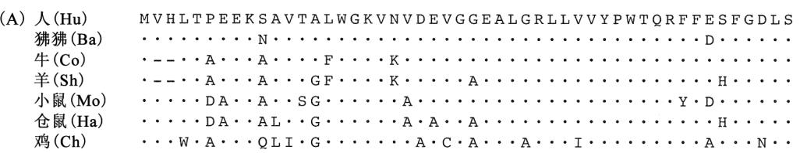

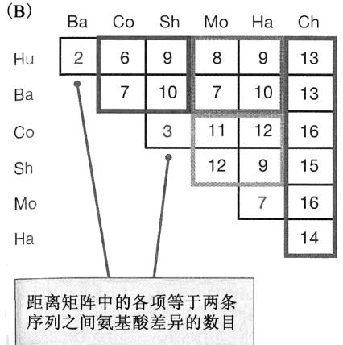

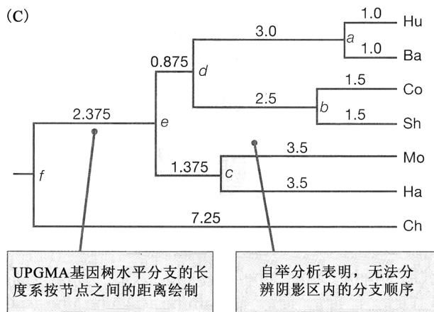  
图 17.1 β 珠蛋白序列分析。(A)7 个分类单元前 50 个氨基酸残基的序列。(B)显示每对序列之间差异数目的距离矩阵。(C)使用 UPGMA 法，根据距离矩阵推导来的基因树。

因为生物大分子的序列随着时间推移而改变，所以任意两条序列之间差异的数量，可被视为它们沿不同的进化路径进化了多长的一个量度。在假设这样一种对等关系时，存在两个问题。第一个问题是，序列的改变存在偶然性，取决于发生了哪些突变，以及这些突变在群体中被固定下来的可能性。[如果某个突变型等位基因取代了群体中其他所有的等位基因，就认为该突变型等位基因被固定(fixed)。]由于新突变发生的时间是随机的，任意两个分开相同时间长度的分子，其具有差异的位点多一点还是少一点，完全是随机的。在实践中，回避亲缘关系很近(序列差异的期望数目与随机变异为同一数量级)的序列，可使这一问题减到最小。第二个问题是，有些突变可能会增加生物生存和繁殖的能力，从而在群体中被固定下来的机会增大。因而，通过研究DNA、RNA或蛋白质中不大可能包含有利突变的区域，可使这类问题减到最小，但要知道这些区域在什么地方，往往很困难。

分子进化研究的一个常见目的是估计一组序列的进化关系模式，这种模式称为基因树(gene tree)。之所以称为基因树，是因为它是基于单个基因(或一个基因的一部分，如本例中一样)。下面马上会讲到，基因树中序列之间的进化关系模式，不一定与分类单元之间的进化关系模式一样。可用来估计基因树的方法有多种，并且有若干标准的软件包可用来进行计算。每种方法各有其优势和局限性，因而许多进化生物学家用多种方法来分析数据，希望得到的树只在无足轻重的细节上有差异。最常用的方法有4大类。

(1) 距离法 (distance method)，该法基于每对序列之间差异的数目。

(2) 简约法 (parsimony method)，该法系统地在所有可能的基因树中搜索，以发现那些可用最少的固定突变数目来解释数据的基因树。

(3) 最大似然法 (maximum likelihood method)，该法应用一个关于核苷酸或氨基酸置换如何发生的理论模型，继而找到根据该模型可使实际数据被观察到的概率最大的基因树。

(4) 贝叶斯法 (Bayesian method)，该法是贝叶斯定理的一个推广，根据事先关于基因树可能的分布所作的假设(例如，最简单的一种情况是，所有可能的基因树都有相同的可能性)，来推断任一基因树的相对概率。

距离法是实行起来最简单的一类方法，以图 17.1A 中的数据为例来说明其中一种距离法。首先，对所有序列进行两两比较。根据序列差异的数目，估计每对序列的距离 (distance)。在序列差异足够大，在进化过程中可能会在任意给定位点发生多次改变的情况下，需要对这样的多重突变 (multiple hit) 进行校正。在图 17.1A 中，序列的相似性较高，无需进行多重突变的校正，因而，可以把每对序列之间氨基酸位点差异的数目作为序列之间的距离。(在该例中，为了方便，也会把任何缺失的氨基酸作为差异来计算。) 然后，将这些两两比较的差异列在距离矩阵 (distance matrix) 中 (图 17.1B)，作为进一步分析的数据。

根据距离矩阵来估计基因树的一种方法称为邻接法 (neighbor joining)。每一步，均以分支 (branch) 连接距离最近的序列 (neighbor，邻近序列)，基因树中的全部分枝最终通往所有序列的假想的共同祖先。邻接法在概念上比较简单，且往往可以得到与其他方法产生的最佳树完全一样或非常相似的树。根据序列两两之间的距离的非加权算术平均数，来定义两组序列之间的距离，这种邻接法称为 UPGMA (算术平均数非加权配对法，“unweighted pair group method with arithmetic mean” 的首字母缩写)。该法假设在不同的分支中进化速率大致恒定，因而该法对背离此假设的情况非常敏感。但是，该法比较简单，用来举例比较有利。

图 17.1C 中的基因树是根据 B 部分的距离矩阵而得。最右边的各个端点是来自现存分类单元 (Hu、Ba、Co……) 的序列，而树中的每个节点代表存在于某个推断的共同祖先 (a、b、c……)

中的序列。要了解这棵树是如何得到的，首先要注意到，距离最近的成对序列，是那些在距离矩阵中距离以红色表示的成对序列。因而，第一步，将这些邻近序列组合起来，即人与狒狒组合(Hu/Ba)、牛与羊组合(Co/Sh)、小鼠与仓鼠组合(Mo/Ha)。通往 $a$ 的两个分支示Hu与Ba的连接，通往 $b$ 的两个分支示Co与Sh的连接，而通往 $c$ 的两个分支示Mo与Ha的连接。Hu/Ba、Co/Sh和Mo/Ha之间的差异分别为2、3和7(距离矩阵中的红色数字)，可见各个分支的长度是按相应距离一半的比例绘制的。其原因是，与每个节点连接的两个分支之和，应与总的距离相等，例如， $c$ 节点连接Mo/Ha的这种情况，要满足 $3.5 + 3.5 = 7$ 。

估计基因树的下一步，是判断将 $a(\mathrm{Hu} / \mathrm{Ba}$ 的共同祖先)与 $b(\mathrm{Co} / \mathrm{Sh}$ 的共同祖先)连接，还是将 $a$ 与 $c(\mathrm{Mo} / \mathrm{Ha}$ 的共同祖先)连接。在距离矩阵中， $\mathrm{Hu} / \mathrm{Ba}$ 类群和 $\mathrm{Co} / \mathrm{Sh}$ 类群之间的距离是红色方框中各个数字的平均值，即 $(6 + 9 + 7 + 10) / 4 = 8$ ； $\mathrm{Hu} / \mathrm{Ba}$ 类群和 $\mathrm{Mo} / \mathrm{Ha}$ 类群之间的距离是蓝色方框中各个数字的平均值，即 $(8 + 9 + 7 + 10) / 4 = 8.5$ 。这两个值很接近，但规则是组合具有最短距离的类群，因此将 $\mathrm{Hu} / \mathrm{Ba}$ 与 $\mathrm{Co} / \mathrm{Sh}$ 放到一起，与它们的共同祖先 $d$ 连接。同样，距离要对半分，因而在基因树中的分支长度要按比例绘制，以使来自现存分类单元的每条序列返回该共同祖先 $(d)$ 的距离相同。因此，令 $a - d$ 的距离等于3.0，令 $b - d$ 的距离等于2.5，以使 $\mathrm{Hu}$ 、 $\mathrm{Ba}$ 、 $\mathrm{Co}$ 和 $\mathrm{Sh}$ 与 $d$ 的距离相等。

现在将 c 和 d 连接。其原因是，Mo/Ha 类群和 Hu/Ba/Co/Sh 类群之间的距离，由蓝色和绿色框中各个数字的平均值给出，即 $(8+9+7+10+11+12+12+9)/8=9.75$ ，而 Mo/Ha 类群和 Ch 之间的距离为 $(16+14)/2=15$ (16 和 14 是在距离矩阵中右下方的两项)。分支 d-e 的长度设为 0.875，而分支 c-e 的长度设为 1.375，以使从 e 到任一现存分类单元的总分支长度等于 $9.75/2=4.875$ 。

最后，将 e 与 Ch 连接。Ch 与其他所有分类单元之间的总距离，由紫色长方形中各个数字的平均值给出，即 $(13+13+16+15+16+14)/6=14.5$ 。该距离被分成两部分，分配 7.15 的分支长度给 f-Ch 谱系，分配 2.375 的分支长度给分支 f-e。以此方式，f 与任一现存分类单元之间总的分支长度都是 7.25。

在估计基因树时，计算工作通常不是像在这里我们为了举例的需要而做的那样用手工进行的。即使是一小组序列，计算工作也已很繁重。没有高速计算机，许多方法都不可能实现，并且，有些方法即使对最快的计算机来说也是具有挑战性的。用诸如“molecular phylogenetics software”(分子系统发生学软件)之类的关键词在互联网上搜索，在可找到的资源中，实现上述任何一种基因树方法的软件一应俱全。

## ■ 自举检验

基因树是对一组序列进化关系真实模式的一个估计。说基因树是一种估计，是因为在置换数目上存在随机变异，因而真实的基因树是未知的。可以料到，在基因树中，短的分支比长的分支不可靠。那么可用什么标准来评价某一特定分支顺序的可靠性呢？例如，在图 17.1C 中，那些数据是否真的可以将 Mo/Ha 谱系与 Hu/Ba/Co/Sh 谱系之前的共同祖先分割开呢？

评价基因树中某个节点的可靠性的一种常用方法，称为自举法(bootstrapping)。在该法中，通过随机选择位点，从实际数据中构造出1000个或更多个不同的数据集。自举抽样是以放回抽样的方式进行的，这意味着同一个位点可偶然被选中两次或多次。因而，来自图17.1A中的序列的一个自举样本，是一个以放回抽样方式随机选择的50个位点的样本。在一个特定的容量为50的自举样本中，预计18个位点会出现1次，9个位点会出现2次，5个位点会出现3次或3次以上，而有18个位点根本不会出现。因此，如果基因树中的某种分支方式被序列中大多数的位点支持，则从大多数自举样本得来的基因树会包含同样的分支方式，但如果支持某种分支方式的位点数相对较少，则来自许多自举样本的基因树将不包括这种分支方式。在图17.1C的基因树中，在1000个自举样本中，支持阴影区中所包括的分支顺序的样本不足 $50\%$ 。从实践上来说，此结果表明，就该蛋白质的这一小段而言，Hu/Ba、Co/Sh 和 Mo/Ha 类群分开的时间非常接近，尚不能解决哪一个分类单元首先分开的问题。

## ■ 基因树和物种树

认为来自不同物种的一组基因的进化关系(基因树，gene tree)与这些物种本身的进化关系(物种树，species tree)一定相同，似乎是合理的，因为这些基因存在于这些物种的基因组中。但情况并非如此。基因树不一定与物种树相同。

基因树可以和物种树不同，一种情况如图 17.2 所示。祖先种群最初固定了 $A_{1}$ 等位基因(顶部)，但随后发生 $A_{2}$ 突变，使该群体变成多态性群体。这种多态性甚至在物种 1 分出来，以及物种 2 和 3 分开时仍然存在。但是，最终发生了一个等位基因的丢失(和另一个等位基因的固定)，在此例中，物种 1 和 2 固定等位基因 $A_{2}$ ，而物种 3 固定等位基因 $A_{1}$ 。这意味着，基因树会将来自物种 1 和 2 的等位基因作为亲缘关系最近的一组，而物种树表明，实际上物种 2 和 3 才是亲缘关系最近的。

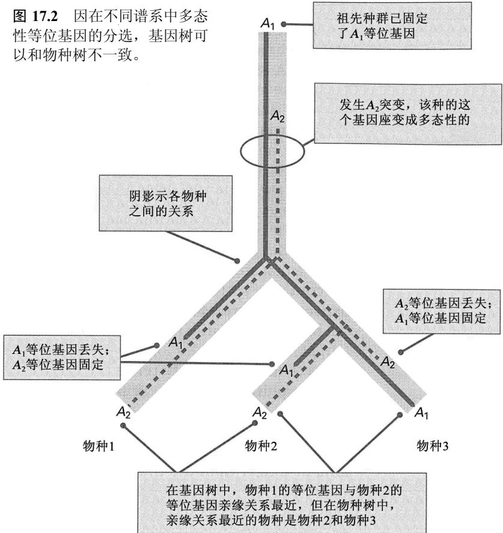

由于重组的存在，这种情况会变得更加复杂。

既然基因能够进行重组，就意味着不同的基因可具有不同的进化史。因为在基因内部可发生重组，所以相同基因的不同部分甚至可能具有不同的进化史。这就是为什么 Y 染色体(参见第 8 章)的非重组部分和线粒体 DNA(参见 17.8 节)在追踪人类群体的近期历史上如此有用的原因之一。但是，这些研究得到的是 Y 染色体树或线粒体 DNA 树的估计，因此，不同核基因的基因树不一定一样，而且一个核基因与紧邻的另一个基因的基因树也可能不一样。

另外，对多态性持续的时间相对较短的基因，或者对相当古老的分类单元而言，基因树确实通常与物种树一致。基因树和物种树之间的不一致，主要对于长期维持多态性的基因，或亲缘关系很近的分类单元，是一个隐患。古老多态性的问题，在免疫系统中起作用的基因中不乏例子，这些基因具有高度的多态性，并且，它们能够维持这些多态性的时间，与新种形成所需的时间一样或更长。在此类情况下，在图17.2中的等位基因分选过程中，会导致基因树和物种树之间的不一致。年轻分类单元的问题，人、黑猩猩和大猩猩之间的分支顺序可为一例。这3个物种都仍然相当年轻，以致有些基因支持某种分支顺序，而另一些基因支持另一种分支顺序。（不过，随着数据的逐渐增多，多数基因树支持大猩猩首先分开的分支顺序。）

## - 进化改变的分子钟

分子的序列进化速率是指在某一指定的时间间隔中，发生改变的位点所占的比例。例如，对小鼠和人之间的整个β珠蛋白而言，序列进化的速率是1.23次氨基酸置换/(氨基酸位点·10亿年)，或 $1.23\times10^{-9}$ 次氨基酸置换/(氨基酸位点·年)。

不同蛋白质(有时为蛋白质的不同部分)以非常不同的速率进化。诸如组蛋白H3和H4这样的分子，进化非常缓慢。例如，在组蛋白H3的103个氨基酸中，在水稻和人的分子中仅有两个位点有差异。其他分子进化得相对较快。例如，在小鼠和人之间，抗病毒蛋白γ干扰素以大约 $5\times10^{-9}$ 次氨基酸置换/(氨基酸位点·年)的速率进化，该速率比β珠蛋白快大约4倍，比组蛋白H4快得非常多(小鼠和人之间在组蛋白H4上不存在差异)。

虽然不同的蛋白质序列以非常不同的速率进化，但有些分类单元中的一些蛋白质，在较长的进化时间中，在氨基酸置换速率上表现出大致的恒定性。这种看似恒定的序列变化速率称为分子钟(molecular clock)，它为在基因树上加上时间标度提供了依据，从而为不依赖化石记录而能确定物种的分支提供了时间标度。有一个简洁的理论依据可以解释为什么(至少在最简单的情况下)序列进化的恒定速率是可以预料的。试想在包含 $N$ 个二倍体个体的一个群体中的某个基因，则在整个群体中有该基因的 $2N$ 个拷贝。假设某些新突变为选择中性的(selectively neutral)突变，即它们对生物的生存和繁殖能力没有影响，并假设选择中性的等位基因的突变率为 $\mu /(\text{基因} \cdot \text{代})$ 。则在任一代中，新的选择中性的等位基因的期望数为 $2N\mu$ 。随着时间的推移，由于该群体是无穷大的，这些基因的某些谱系将会随机灭绝，并被其他的基因谱系替代。最后总有除了一个基因谱系以外，其他所有的基因谱系都灭绝的时候。任一特定基因谱系取代所有其他谱系的概率是 $1 / (2N)$ ，且因为存在 $2N\mu$ 个新突变，所以在每一代中被固定的新突变(序列改变)的期望数目为

$$
\mathrm{中性进化的速度} = \frac {2 N \mu}{2 N} = \mu
$$

因而，中性进化的期望速率等于中性突变的速率，这就构成一种分子钟，分子钟的滴答声就是被固定的突变。

在应用这一模型时，有一些重要的注意事项。第一，中性突变率可因基因而异，取决于中性或接近中性的新突变占多大比例。对像组蛋白 H4 这样进化极慢的基因而言，大部分的氨基酸置换都很可能是非常有害的，因此中性突变率会非常低。另外，对诸如 $\gamma$ 干扰素这样进化极快的基因而言，大部分被固定的氨基酸置换可能是有利突变，这违背了中性的假设。第二，分子钟不像钟表一样按可重复的时间间隔走动。分子钟是一种随机时钟，只能预测走动之间的平均时间间隔。这可用放射性衰变来类比，放射性衰变是一个随机但如时钟一样有规律的过程，但即使是这个类比也有缺点——相对于平均数而言，分子钟的随机变异比原子钟的随机变异大得多。第三，在许多情况下，因为沿着基因树的不同分支具有不同的序列进化速率，所以观察不到分子钟样行为。例如，在智人和小鼠谱系中，沿通往小鼠的分支的序列进化速率，比沿通往人类分支的序列进化速率快大约两倍，这被认为是由于在小鼠谱系中的生物世代时间较短，导致沿该谱系有更多的世代。用于重建基因树的方法需要将这一变异来源考虑进去，前面讨论过的 UPGMA 法未顾及于此。

## - DNA 进化的速率

蛋白质序列分子进化的一般原理也可应用于 DNA 序列，但存在一些重要的差异。蛋白质由 20 种氨基酸构成，而 DNA 仅由 4 种核苷酸构成。较少的亚基种类，意味着在核苷酸位点上比在氨基酸位点上更有可能出现独立但完全一样的改变，也意味着一个 DNA 位点比氨基酸位点更有可能通过两次连续突变回复成原来的状态。在分析 DNA 序列时，这些类型的事件往往要求对距离矩阵做多重突变校正。

还有取决于基因组中的位置和功能的不同种类的核苷酸位点，这些位点以不同的速率进化(图 17.3)。图 17.3 中垂直比例尺为对数比例尺，覆盖 3 个数量级，因此差异非常大。在右边显示了 43 个基因各自的同义置换（红色）和非同义置换（蓝色）的速率。在编码序列中的同义置换 (synonymous substitution) 不引起氨基酸置换。

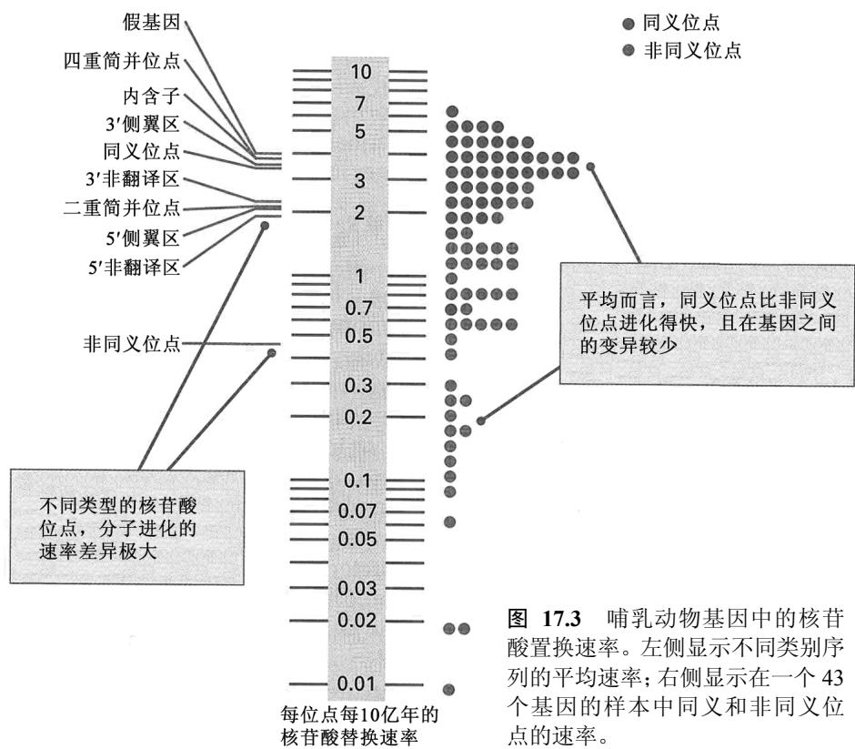

同义位点是可发生同义置换的位点，主要在密码子的第三位。非同义置换(nonsynonymous substitution)引起氨基酸置换。非同义核苷酸位点主要出现在密码子的第一和第二位。图 17.3 中基因之间非同义置换速率的变化很大，表明不同蛋白质的氨基酸置换速率存在巨大变化。在这同一批基因中，同义置换速率的变化小得多，并且也快得多。

绘制于图 17.3 左边的，是不同种类的 DNA 序列核苷酸置换的平均速率。进化最快的 DNA 序列是假基因 (pseudogene)，假基因是因突变而已经丧失功能的重复基因。内含子位点和四重简并位点进化得也非常迅速。[四重简并位点 (fourfold degenerate site) 是一种同义核苷酸位点，在此位点上无论是什么核苷酸，都编码相同的氨基酸；二重简并位点 (twofold degenerate site) 也是一种同义核苷酸位点，在此位点编码的氨基酸，只取决于在该位点上的核苷酸是嘧啶还是嘌呤。] 在不同种类的 DNA 序列之间核苷酸置换的平均速率的差异，被认为反映了存在对核苷酸置换的不同耐受性。其中大多数核苷酸置换有害的 DNA 序列，对核苷酸置换相对不耐受，因而核苷酸置换速率相对较低。相反，在核苷酸置换对生存和繁殖的影响相同或几乎相同的许多序列中，核苷酸置换的速率相对较高。有鉴于此，假基因中核苷酸置换的高速率就可以理解了，在四重简并位点和内含子中的高速率亦然。

## - 蛋白编码区中的进化速率

在蛋白编码区中，比较非同义和同义核苷酸置换随着进化时间的推移而累积的相对速率，可发现蛋白质的进化是否受到选择的驱动。密码子中的非同义核苷酸置换是那些改变氨基酸的置换，而同义核苷酸置换不改变氨基酸。大多数同义核苷酸置换发生在密码子的第三位核苷酸上，对有些氨基酸而言，第三位核苷酸为任意核苷酸(N)都编码相同的氨基酸；对其他一些氨基酸而言，第三位核苷酸为任意嘧啶(Y=U或C)都编码相同的氨基酸；还有一些氨基酸，第三位核苷酸为任意嘌呤(R=A或G)是等价的。在同义密码子中，具有N的位置称为四重简并位点(fourfold degenerate site)，而那些具有Y或R的位置称为二重简并位点(twofold degenerate site)。对亮氨酸密码子UUR和CUR而言，密码子第一位也是二重简并的，对精氨酸密码子CGR和AGR而言，也是如此。异亮氨酸密码子的第三位通常被认为是二重简并。

因为大多数密码子的第一、二位都是非简并的，而许多密码子的第三位是二重或四重简并的，所以比较蛋白编码区的核苷酸置换率，必须以每个位置为基础。图 17.4 示两个此类比较的

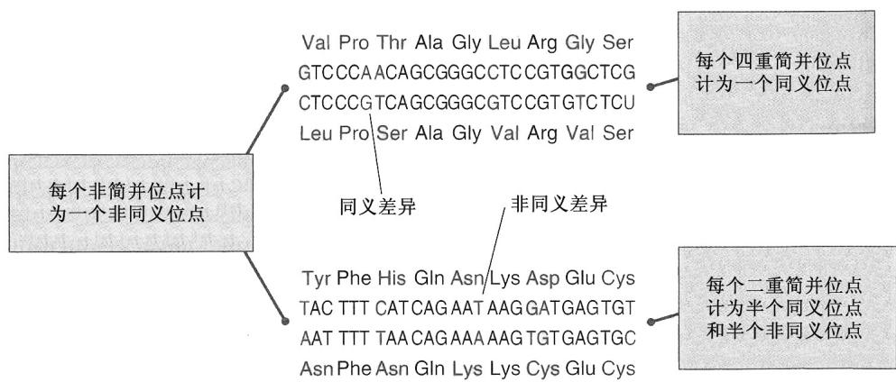  
图 17.4 编码区的同义和非同义核苷酸位点的比较。(A) 所有密码子的第三位均为四重简并。(B) 所有密码子的第三位均为二重简并。非同义改变以红色显示，同义改变以蓝色显示。

例子，成对序列之间的同义差异以蓝色显示，非同义差异以红色显示。对图17.4A中的密码子而言，每个密码子的第一、二位都是非简并

的，而第三位都是四重简并的。每个非简并位点计为一个非同义位点，而每个四重简并位点算成一个同义位点。因此，在整个序列中，有18个非同义位点(9个氨基酸，每个两个位点)和9个同义位点(每个氨基酸1个位点)。非同义置换与4个红色的核苷酸对应，同义置换与2个蓝色的核苷酸对应。因此，每非同义位点的非同义差异数(以 $K_{a}$ 表示，指氨基酸的差异)为 $K_{a}=4/18=0.222$ ；而每同义核苷酸位点的同义差异数(以 $K_{s}$ 表示)为 $K_{s}=2/9=0.222$ 。

现在来考察图 17.4B。在此情况下，每个密码子的前两位都是非简并的，而第三位都是二重简并。每个二重简并算成半个非同义位点和半个同义位点。因此，非同义位点数目为 $18+9/2=22.5$ 个，同义位点数目为 9/2=4.5 个。在此情况下，有 5 个非同义差异（有两个在单个密码子中）和 1 个同义改变。因此

$$
\begin{array}{r l} & K _ {a} = 5 / 2 2. 5 = 0. 2 2 2 \\ & K _ {s} = 1 / 4. 5 = 0. 2 2 2 \end{array}
$$

怎样解读这些数值？关键是对 $K_{a}/K_{s}$ 比值进行比较。如果蛋白编码基因正在中性进化，这意味着它像假基因一样随机改变，与核苷酸序列或氨基酸序列无关，则 $K_{a}/K_{s}$ 的期望值就像图 17.4 中的两个例子一样，为 1.0。如果 $K_{a}/K_{s}<1.0$ ，则非同义置换比中性情况下发生的频率低，这是这种情况下的期望模式：蛋白质的序列受到选择限制，以致许多理论上可能的氨基酸置换都是有害的，从而被选择所消除。大多数蛋白编码基因的 $K_{a}/K_{s}$ 小于 1.0。

但是，偶尔会有蛋白质表现出 $K_{a}/K_{s}>1.0$ ，这意味着氨基酸改变的发生比中性情况下快，这是氨基酸改变有利的期望结果。 $K_{a}/K_{s}>1.0$ 的例子包括性别决定基因 Sry(参见第 8 章)、一些同源异形域蛋白(参见第 13 章)、脊椎动物的生长激素、某些果蝇的嗅觉和味觉受体及精子发生专性组蛋白。其他例子将在第 19 章中学习人类进化时讨论。

但是， $K_{a}/K_{s}$ 比值的估计和解读并不像乍看之下那样简单。其中的一些复杂之处如下。

\- 在编码序列中，大多数密码子的第一位是由非简并位点和二重简并位点的组合构成，而大多数密码子的第三位是由非简并、二重简并和四重简并位点的组合构成。因而，要正确地枚举每个非同义位点和同义位点，有个步骤是需要计算平均值。在实践中，这种枚举通常是用计算机程序来进行的。

\- 突变的过程可能会存在偏倚。例如，大多数生物表现出转换多于颠换的突变偏倚。任何一个这样的偏倚都会改变 $K_{a} / K_{s}$ 的中性期望值。

\- 经过足够长的进化时间，在同一位点可发生多次突变：一个核苷酸变成另一个，之后又变成另一个，或变回原来的核苷酸。要正确估计 $K_{a}/K_{s}$ ，要对此类“多重突变”进行校正。

\- 远大于 1.0 的 $K_{a} / K_{s}$ 值要统计显著的话，要求遍布分子的许多氨基酸都受到强烈选择。因而，氨基酸改变有可能受选择的驱动，但不能产生显著大于 1.0 的 $K_{a} / K_{s}$ 。

\- $K_{a} / K_{s}$ 只提供在氨基酸水平上是否存在选择的信息。它对基因表达水平的改变完全不敏感。因此，某个基因的调节改变可能受到强烈的正选择，但不表现出 $K_{a} / K_{s}$ 值的升高。

## ■ 新基因的起源：直系同源基因和旁系同源基因

在进化过程中，新基因通常来自事先存在的基因，新基因的功能从先前基因的功能进化而来。新基因的原材料来自基因组区域的重复，这种重复可包括一个或多个基因。重复发生得相当频繁。对多种真核生物基因组序列的分析表明，包含3万个基因的真核基因组，预计每百万年可发生60～600次重复。

从进化的角度来看，需要区分两种类型的重复。第一种类型以图 17.1 的基因树中的 β 珠蛋白为代表。每次发生物种形成事件时(以基因树的一次分支的形成来表示)，β 珠蛋白基因在这样的意义上被重复：每个派生物种具有存在于亲本种中的 β 珠蛋白基因的一个拷贝。作为物种形成的伴随事件而被重复，并继续保持相同功能的基因，称为直系同源基因(orthologous gene)。

新的基因功能可由在单个物种的基因组中发生的重复引起的。在一个基因组内部的重复导致旁系同源基因(paralogous gene)。旁系同源基因的一个例子是 $\beta$ 珠蛋白基因和 $\alpha$ 珠蛋白基因。虽然现在这两种基因差别明显，但它们在序列上的相似性足以清晰地表明，它们起源于一个遥远的共同祖先中的单个基因。因此， $\beta$ 珠蛋白基因和 $\alpha$ 珠蛋白基因是旁系同源基因。（让这一讨论更进一步：在任意两个哺乳类物种中， $\beta$ 珠蛋白基因是直系同源基因， $\alpha$ 珠蛋白基因也一样。但是，一个物种中的 $\beta$ 珠蛋白基因和另一个物种中的 $\alpha$ 珠蛋白基因是旁系同源基因。）

当发生基因重复时，旁系同源基因是冗余基因，因而其中一个基因可不受限制地沿任意路径进化。大概最常见的事件是，其中一个旁系同源基因发生一个破坏其功能的突变，或发生一个使其被去除的缺失。但偶尔会发生导致两个旁系同源基因的功能出现分歧的突变。例如，它们可能会进化出不同的最适 pH，以致其中一个基因的产物在一些相对碱性的细胞区室中性能最佳，而另一个基因的产物在相对酸性的细胞区室中性能最佳。或者遗传重排可将两个无关的基因融合，产生新的活性。在第 15 章中已知，易位如何能够将一个转录因子与一个癌基因融合，从而导致急性白血病。这些特殊的重排极其有害，但嵌合基因的产生为如何能够获得新功能提供了一个例子。

基因重复也使旁系同源基因拷贝能够进化出更为特化的功能。图 17.5 示一例。在顶部的是一个多细胞真核生物的基因，该基因具有使其在 1 型组织(黄色)和 2 型组织(绿色)中表达的增强子。其他图版显示一次基因重复后接着相继发生的若干突变，这些突变敲除 2 型增强子元件(左边)，或敲除 1 型增强子元件(右边)。其结果是，左边的旁系同源基因只在 1 型组织中表达，右边的旁系同源基因只在 2 型组织中表达。伴随着功能丢失的旁系同源基因的特化，称为亚功能化(subfunctionalization)。它一般是有优势的，因为每个特化的基因可不受限制地向其表达范围内的最佳功能进化。

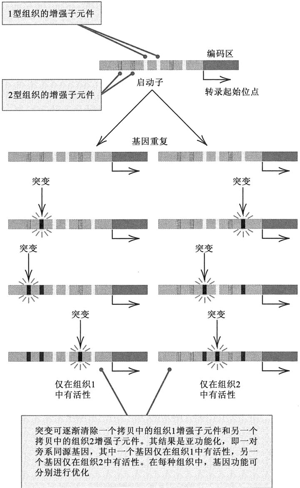  
图 17.5 旁系同源基因通过亚功能化发生特化。在此例中，旁系同源基因被特化为组织特异性表达。

## 17.2 群体遗传学

对分子进化的讨论集中于谱系中被固定的新突变，因为序列进化的速率取决于此类固定作用进行得有多快。一个新突变从出现到最终被固定或丢失，在此过程中，该突变要经历若干重要的过程，这些过程决定该突变的最终命运是什么、这种命运成为现实有多快。对决定群体中等位基因命运的过程的研究就是群体遗传学(population genetics)。

## ■ 等位基因频率和表型频率

群体(population)是指一群生活在规定地理范围内的同一物种的个体。许多在地理上广泛分布的物种，可被细分成或多或少有些差别的若干繁殖种群(breeding population)，这些繁殖种群称为亚群(subpopulation)，它们生活在有限的地理范围之内。每个亚群都是一个地方种群(local population)。虽然交配主要发生在各亚群之内，但由于亚群之间偶尔发生迁移，各亚群都共享一套遗传信息资源，这套资源称为基因库(gene pool)。

下面以一个比较常见的突变

型等位基因决定的 AIDS 抗性表型为例，来解释群体遗传学的若干基本概念。所讨论的基因是在人类群体中发现的一个趋化因子受体基因 CCR5。(趋化因子是免疫系统的白细胞用来相互吸引的分子。) CCR5 受体使 HIV 病毒能够与细胞膜结合，从而感染免疫系统的 CD4(+) 型 T 细胞，这是 HIV 进行感染所必需的。大部分人类亚群含有一种称为 $\Delta 32$ 的 CCR5 等位基因，称其为 $\Delta 32$ 是因为它在编码区有一个 32bp 的缺失。该缺失的分子后果如图 17.6 所示。该图以分成密码子的形式显示了正常 CCR5 DNA 序列的相关部分，此外还以单字母缩写方式给出多肽的氨基酸序列。在 $\Delta 32$ 缺失中缺少的核苷酸，以彩色突出。DNA 序列之上的是正常的 CCR5 多肽，之下的是 $\Delta 32$ 突变型多肽。该缺失在 184 位密码子之后产生移码突变，导致 31 个错误氨基酸的插入，直到在 215 位氨基酸之后碰到一个终止密码子。这种截短蛋白没有功能，不能帮助 HIV 进入 CD4(+) 细胞。 $\Delta 32$ 突变最初发现于具有 HIV-1 感染高风险，但已保持至少 10 年无 AIDS 的人中。正常的杂合基因型的频率约为 20%，但在非进展者 (nonprogressor) 中，该频率约为 40%。纯合 $\Delta 32$ 基因型——这种基因型要少得多——似乎具有更大的保护作用。

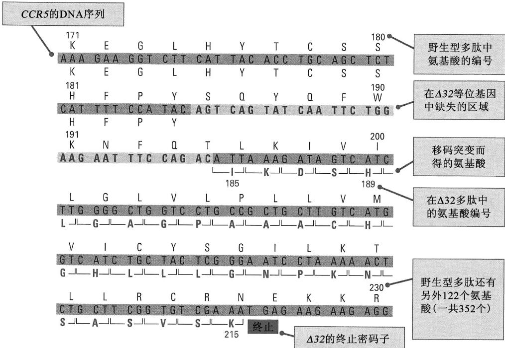  
图 17.6 正常 CCR5 趋化因子受体基因及 $\Delta 32$ 缺失型等位基因的部分 DNA 序列及其翻译产物。

为什么 $\Delta32$ 纯合基因型要比 $\Delta32$ 杂合基因型少得多？纯合基因型频率与杂合基因型频率之间的关系又是什么？在开始回答这两个问题之前，应该先看一些数据。为方便起见，将正常的 CCR5 等位基因用符号 A 表示，将 $\Delta32$ 缺失型等位基因用符号 a 表示。在一项研究中，对 1000 个法国人的 DNA 进行了 CCR5 基因分型，纯合正常个体 (AA)、 $\Delta32$ 杂合个体 (Aa) 和 $\Delta32$ 纯合个体 (aa) 的人数如下：

$$
\begin{array}{l l l} 7 9 5 A A & 1 9 0 A a & 1 5 a a \end{array}
$$

这些数字包含了关于该群体的大量信息，例如，这是单一的均一群体还是由遗传上略有不同的亚群构成的混合群体。为了解释这一信息，首先注意该样本包含两类数据：①3种基因型各自的数量；②CCR5正常等位基因(A)和 $\Delta$ 32等位基因(a)各自的数量。此外，1000个基因型相当于CCR5基因的2000个等位基因，因为每个人的基因组为二倍体。对这些等位基因的分解如图

17.7 所示。每个纯合 AA 基因型相当于两个 A 等位基因，每个纯合 aa 基因型相当于两个 a 等位基因，而每个杂合 Aa 基因型相当于每种类型的等位基因各一个。因此，根据图 17.6 中对等位基因的计数，这个 1000 人的样本相当于 1780 个 CCR5 正常 (A) 等位基因和 220 个 $\Delta 32(a)$ 等位基因。

通常，用相对频率来

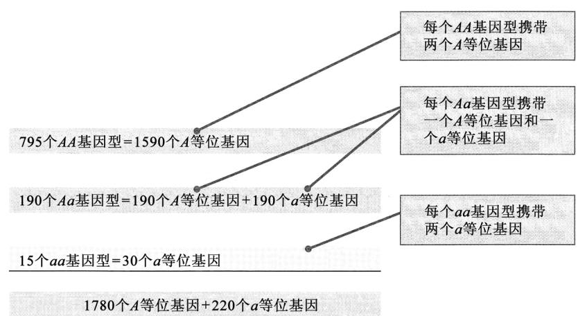  
图 17.7 在对 CCR5 受体基因进行了基因分型的 1000 人的样本中，对其中存在的等位基因进行分析。符号 a 指的是 $\Delta32$ 等位基因。

<!-- END OFFICIAL API PART part_006 -->

<!-- BEGIN OFFICIAL API PART part_007 -->

分析这种数据，比用观察值来分析更方便。对基因型而言，在群体中某一特定基因型的基因型频率(genotype frequency)是具有该基因型的个体所占的比例。对每种等位基因而言，等位基因频率(allele frequency)是指定类型的等位基因在所有等位基因中所占的比例。在这个CCR5的例子中，用观察值除以总的样本大小(在此情况下为1000)得到基因型频率。因此，基因型频率为

$$
\begin{array}{c c c} 0. 7 9 5 A A & 0. 1 9 0 A a & 0. 0 1 5 a a \end{array}
$$

同样，用每个等位基因的观察值除以等位基因总数(在此情况下为2000)，得到等位基因频率：

$$
A \text {   的等位基因频率   } = \frac {1 7 8 0}{2 0 0 0} = 0. 8 9
$$

$$
\alpha \text {   的等位基因频率   } = \frac {2 2 0}{2 0 0 0} = 0. 1 1
$$

注意，各基因型频率总计为 1.0，各等位基因频率也是如此。这是用比例对它们进行定义的结果；当所有的可能性都考虑进去时，它们必定总计为 1.0。频率为 1.0 的等位基因是被固定的等位基因，而频率已到 0 的等位基因是丢失的等位基因。

有一点也值得注意的是，在成年人中的等位基因频率(如同在图17.7中计算的)，与在这些成年人产生的配子中的基因频率，是一样的。这是因为孟德尔分离确保每个杂合基因型会产生相同数量的每种配子(图17.8)。因此，当计算配子的频率时，杂合基因型对两种类型配子的贡献相同，而纯合 $AA$ 和纯合 $aa$ 基因型分别对只含 $A$ 或只含 $a$ 的配子有贡献。结果是，当既将亲代中的基因型频率，又将杂合 $Aa$ 基因型的孟德尔分离考虑进去时，在群体中产生的配子具有图17.8中推导出来的组成。只要每个成人产生同样数量的功能性配子，成人中的等位基因频率与这些成人产生的配子中的等位基因频率相等，都为 $0.89A$ 和 $0.11a$ 。成人基因型中明显的等位基因的随机配对也很重要，因为这是关于在受精时配子如何结合的线索。这一问题在下一节考察。

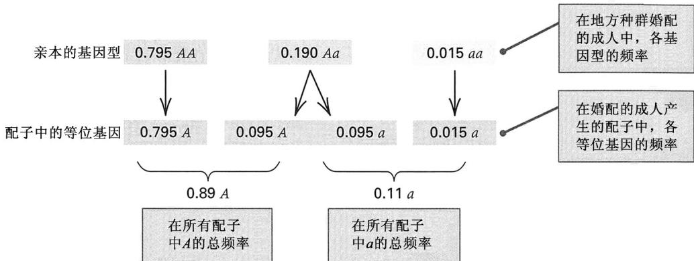  
图 17.8 配子中等位基因频率的计算。在任一代中，含任一特定等位基因的配子的频率，等于对该等位基因为纯合的基因型的频率，加上对该等位基因为杂合的基因型的频率的一半。

## ■ 随机交配和哈代-温伯格定律

遗传物质从上一代到下一代的传递必须从等位基因方面而不是从基因型方面来分析，因为在每一代中，基因型都要被分离和重组的过程瓦解。当配子在受精中结合时，下一代的基因型才形成。在子代合子中的基因型频率由亲代配子结合的频率决定，而亲代配子结合的频率又由亲代基因型配对成为配偶的方式决定。在随机交配(random mating)中，交配对(mating pair)的形成与基因型无关。除经常通过自体受精进行繁殖的植物以外，随机交配是迄今大多数动植物物种最普遍的交配系统。当交配为随机时，每种类型的交配对往往如预期的那样，通过基因型

之间的随机相遇而形成。

随机交配意味着在上一代中的等位基因频率与下一代中的基因型频率之间存在一种简单关系，因为个体的随机交配就等于配子的随机结合。从概念上来说，可以把一个群体的所有配子想象成在一个大容器中。形成合子基因型，就是从这个容器中随机地取出成对的配子。具体来说，试想两个等位基因 A 和 a，等位基因频率分别为 p 和 q， $p+q=1$ 。在之前考察过的 CCR5 受体基因型的样本中，计算得

$$
\begin{array}{l} {p = 0. 8 9 \text {为} A \text {等位基因的频率}} \\ {q = 0. 1 1 \text {为} a \text {等位基因的频率}} \end{array}
$$

随机交配时各基因型的期望频率可通过图 17.9 中的树状图来推导。左边的配子代表卵细胞，中间的配子代表精子。两种等位基因可形成的基因型显示于右侧，在随机交配的情况下，通过将相应配子的等位基因频率相乘，来计算每种基因型的频率。但是，基因型 Aa 可以下列两种方式形成：等位基因 A 可来自母亲(示意图上部)或父亲(示意图下部)。在每种情况下，Aa 基因型的频率均为 pq；同时考虑这两种可能性，得出 Aa 的频率为 $pq + pq = 2pq$ 。因而，随机交配情况下总的期望基因频率为

$$
A A: p ^ {2} \quad A a: 2 p q \quad a a: q ^ {2}\tag{1}
$$

$p^{2}$ 、2pq 和 $q^{2}$ 的频率是具有两种等位基因的一个基因随机交配的结果，这就是哈代-温伯格定律 (Hardy-Weinberg principle)。该定律以戈弗雷·哈代 (Godfrey Hardy) 和威廉·温伯格 (Wilhelm Weinberg) 的名字命名，这两人在 1908 年独立推导出该定律。有时用图 17.10 中所示的那种庞尼特方来证明哈代-温伯格定律。这种庞尼特方完全等价于图 17.9 中的树状图。虽然哈代-温伯格定律极其简单，但它具有若干不易理解的推论。这些推论将在以下数节叙述。

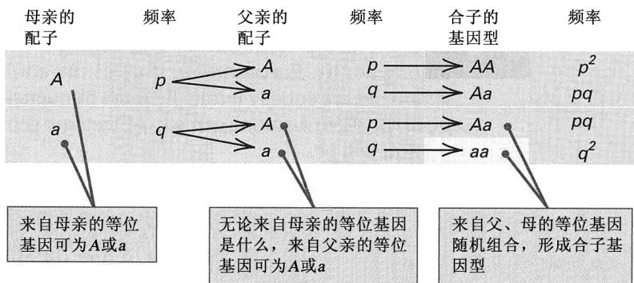  
图 17.9 当含两种等位基因中任何一种的配子随机结合形成下一代时，合子中的基因型频率由比值 $p^{2}:2pq:q^{2}$ 给出。这就是哈代-温伯格定律。

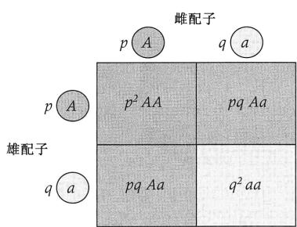  
图 17.10 庞尼特方，以交叉相乘格式显示随机交配的特征性比值 $p^{2}:2pq:q^{2}$ 。

## - 哈代-温伯格定律的推论

哈代-温伯格定律的其中一个重要推论是：等位基因频率一代代保持不变。在随机交配且配子频率为 $p$ 和 $q$ 的情况下，基因型为 $AA$ 、 $Aa$ 和 $aa$ 的合子的频率分别是 $p^2$ 、 $2pq$ 和 $q^2$ 。假设各种合子的生存力(viability)相等，这3个频率会与成体中的频率相等。并且，如果所有的成体基因型具有相同的生育能力，则下一代的配子中等位基因 $A$ 的频率 $p'$ 将为

$$
p ^ {\prime} = p ^ {2} + 2 p q / 2 = p (p + q) = p
$$

因为 $p + q = 1$ 。这一证据证明，经过完整的一代(或任意代)的时间，等位基因 $A$ 的频率保持为 $p$ 值不变。该原理依赖于某些假设，其中最重要的几个假设如下。

\- 交配是随机的；不存在等位基因频率不同的亚群。

\- 雄性和雌性中的等位基因频率相同。

\- 所有基因型具有相同的生存力和生育能力(选择不起作用)。

\- 不发生突变。

\- 不存在向群体内的迁移。

\- 群体足够大，以致等位基因频率纯粹因为随机性而一代代不变。

## ■ 随机交配检验

作为哈代-温伯格定律的一个实际应用，再考察一下 CCR5 受体。在 1000 个成年人中，CCR5 的正常等位基因 (A) 和 $\Delta32$ 等位基因 (a) 的频率分别为 0.89 和 0.11；假设随机婚配，可根据式 (1) 计算期望基因型频率为

$$
\begin{array}{r l} A A: (0. 8 9) ^ {2} & = 0. 7 9 2 1 \\ A a: 2 (0. 8 9) (0. 1 1) & = 0. 1 9 5 8 \\ a a: (0. 1 1) ^ {2} & = 0. 0 1 2 1 \end{array}
$$

注意，这些频率与之前在假设等位基因随机配对结合的基础上计算所得频率相同。现在我们知道这是什么意思了。它的意思是，基因型频率符合哈代-温伯格定律。因为样本中总人数为1000，所以，基因型的期望值为792.1 AA、195.8 Aa和12.1 aa。观察值为795 AA、190 Aa和15 aa。观察值和期望值之间的拟合优度，可用第4章中所述的卡方检验来计算。在本例中

$$
\chi^ {2} \frac {(7 9 5 - 7 9 2 . 1) ^ {2}}{7 9 2 . 1} + \frac {(1 9 0 - 1 9 5 . 8) ^ {2}}{1 9 5 . 8} + \frac {(1 5 - 1 2) ^ {2}}{1 2 . 1} = 0. 8 7 7
$$

该拟合显然是令人满意的，但要对其进行定量评估，需要使用图4.22，还需要对自由度进行校正。通常，在有3类数据的情况下，会有2个自由度。但是，当根据观察数据估计了任何量如等位基因频率时，每估计一个量，要扣除1个自由度。在本例中，估计了基因频率 $p$ （自然得出 $q = 1 - p$ ），因此丢掉了本来有的2个自由度中的1个，从而对该检验而言，自由度的恰当数值为1。据此，得到 $P$ 值为0.35，该值说明随机婚配的假设可解释观察数据。另外，卡方检验仅能检测相当大的偏离，因此，不应该过度解读对哈代-温伯格定律好的拟合，因为，

哈代-温伯格定律的一个或多个假设(包括随机交配的假设)被违反，而仍未产生大到足以被卡方检验检测出来的对期望基因型频率的偏离，是完全有可能的。

用卡方检验来判断是否偏离随机婚配，看起来有点像循环论证，因为观察数据本身被用来计算期望基因频率，但每从观察数据估计一个量，就扣除1个自由度，使对观察数据的使用得到精确的补偿。

## ■ 杂合基因型频率

哈代-温伯格定律的另一个重要推论是：对稀有等位基因而言，杂合子频率远远超过稀有纯合子的频率。例如，当稀有等位基因的频率 q=0.1 时，杂合基因型与纯合基因型的比值为

$$
2 p q / q ^ {2} = 2 p / q = 2 (0. 9) / 0. 1
$$

即约为 20；当 q=0.01 时，该比值约为 200；而当 q=0.001 时，该比值约为 2000。换言之。

当某个等位基因稀有时，杂合子比该稀有等位基因的纯合子多得多。

这一也许是出乎意料的关系，其原因如图 17.11 所示，该图绘制随机交配情况下纯合和杂合基因型的频率。等位基因频率接近 0 或 1 时，杂合基因型的频率以线性函数方式趋向于 0，而稀

有等位基因的纯合基因型比较迅速地趋向于0。

该原理的一个实用的推论可见于囊性纤维变性的例子中，该病是一种遗传性的胰腺和肺的分泌紊乱。囊性纤维变性是白种人中最常见的一种严重的隐性遗传病，新生儿发病率约为1/1700。这是纯合隐性个体的频率，那么等位基因的频率是多少呢？计算过程相当简单，因为在随机婚配情况下，纯合隐性个体的频率必定等于 $q^{2}$ 。在这个囊性纤维变性的例子中，

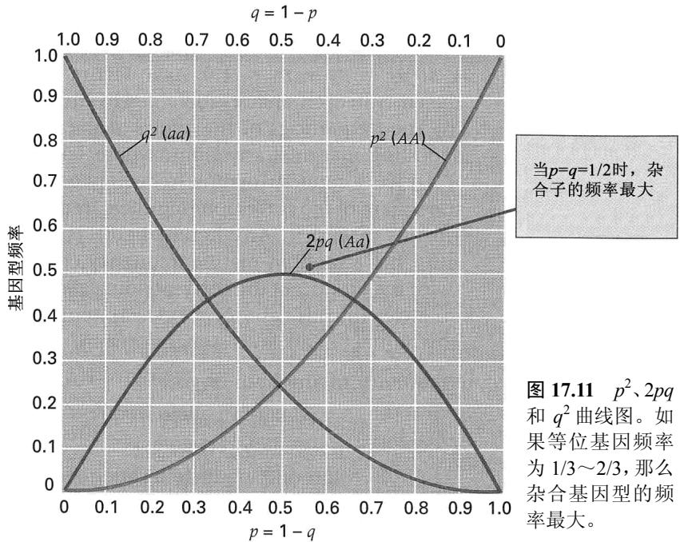

$$
\begin{array}{r l} & {q ^ {2} = 1 / 1 7 0 0 = 0. 0 0 0   5 9 \text {或}} \\ & {q = (0. 0 0 0   5 9) ^ {1 / 2} = 0. 0 2 4} \end{array}
$$

因此，

$$
p = 1 - q = 1 - 0. 0 2 4 = 0. 9 7 6
$$

因而，囊性纤维变性等位基因杂合携带者的频率为

$$
2 p q = 2 (0. 9 7 6) (0. 0 2 4) = 0. 0 4 7 = 1 / 2 1
$$

该计算结果说明，对囊性纤维变性而言，虽然仅 1/1700 的人患病(纯合)，但约 1/21 的人为携带

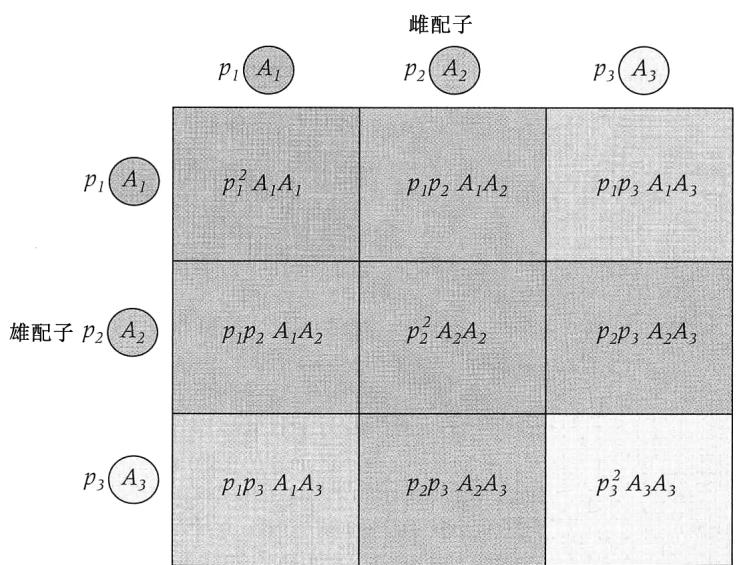  
图 17.12 庞尼特方，示 3 个等位基因情况下随机交配的结果。

患病(纯合)，但约1/21的人为携带者(杂合)。这种计算应被视为近似计算，因为这是基于哈代-温伯格基因频率的假设。虽然如此，在预测检测有害隐性等位基因携带者的群体筛查的结果时，这样的考量很重要，这对于评估此类筛查计划的潜在效益是必不可少的。

## ■ 复等位基因

将哈代-温伯格定律推广到单个常染色体基因的复等位基因，可用一个含3个等位基因的例子来解释。图17.12示具有3个等位基因的情况，3个等位基因记为 $A_{1}$ 、 $A_{2}$ 和 $A_{3}$ ，等位基因频率为 $p_{1}$ 、

$p_{2}$ 和 $p_{3}$ 。各等位基因频率总和必为 1，因此， $p_{1}+p_{2}+p_{3}=1.0$ 。如图 17.10 所示，每个方格中的项由相应边缘的等位基因频率相乘而得；任何一种纯合子(如 $A_{1}A_{1}$ ) 具有的随机交配频率等于相应等位基因频率的平方(此例中为 $p_{1}^{2}$ )。任何一种杂合子(如 $A_{1}A_{2}$ ) 具有的随机交配频率等于相应两种等位基因频率之积的两倍(此例中为 $2p_{1}p_{2}$ )。扩展到任意数目的等位基因是比较简单的：

$$
\mathrm{任何一种纯合子的频率} = \mathrm{等位基因频率的平方}
$$

$$
\text { 任何一种杂合子的频率 } = 2 \times \text { 两种等位基因频率之积 }\tag{2}
$$

复等位基因决定人类 ABO 血型(参见第 3 章)，存在 3 种主要的等位基因，命名为 $I^{A}$ 、 $I^{B}$ 和 $I^{O}$ 。在一项对 3977 个瑞士人的研究中，发现等位基因频率为 0.27 $I^{A}$ 、0.06 $I^{B}$ 和 0.67 $I^{O}$ 。应用复等位基因的规则，可预计随机婚配所致的基因型频率如图 17.13 所示。因为 $I^{A}$ 和 $I^{B}$ 两者对 $I^{O}$ 均为显性，所以血型表型的期望频率为图解中右边的频率。注意，A 和 B 表型中的大部分对 $I^{O}$ 等位基因为杂合，这是因为 $I^{O}$ 等位基因在该群体中的频率非常高。

<table><tr><td>基因型</td><td>随机婚配时的期望频率</td><td>血型表型</td><td>频率</td></tr><tr><td> $I^{A}I^{A}$ </td><td>(0.27) $^{2}$  = 0.0729</td><td></td><td></td></tr><tr><td> $I^{A}I^{O}$ </td><td>2(0.27)(0.67) = 0.3618</td><td></td><td>0.4347</td></tr><tr><td> $I^{B}I^{B}$ </td><td>(0.06) $^{2}$  = 0.0036</td><td></td><td></td></tr><tr><td> $I^{B}I^{O}$ </td><td>2(0.06)(0.67) = 0.0804</td><td></td><td>0.0840</td></tr><tr><td> $I^{O}I^{O}$ </td><td>(0.67) $^{2}$  = 0.4489</td><td>O</td><td>0.4489</td></tr><tr><td> $I^{A}I^{B}$ </td><td>2(0.27)(0.06) = 0.0324</td><td>AB</td><td>0.0324</td></tr></table>

## 联系：哈代博士的圣诞贺词

戈弗雷·哈代，1908

三一学院，剑桥，英国

混合群体的孟德尔比例

反对孟德尔遗传的一个早期论据是，在任何群体中，显性性状甚至是有害的显性性状最终应该达到 3:1 的比值。显然并非如此。在人类中，许多显性性状现在很罕见，并且从来就罕见，如短指，这是本文研究的具体对象。哈代是一位数学家，他认为，在随机交配情况下，如果显性基因型和隐性基因型在生存和繁殖上没有差异，则显性基因型和隐性基因型的频率没有自动改变的内在倾向。哈代表达该定律的书面形式是：如果在任一世代中 $AA$ 、 $Aa$ 和 $aa$ 的基因型频率为 $P$ 、 $2Q$ 和 $R$ ，则在随机交配情况下，在下一代及其后世代中，各频率将为 $(P+Q)^{2}:2(P+Q)(Q+R):(Q+R)^{2}$ 。 $A$ 和 $a$ 的等位基因频率 $p$ 和 $q$ 未被明确指出，因而，今天表述该定律时所用的为人熟知的形式 $p^{2}:2pq:q^{2}$ 与哈代论文中的并不一样。但这不存在任何疑问，因为 $p=P+Q, q=Q+R$ 。

我本不愿介入一场我不具备所涉问题的专业知识的讨论，而且，我想表达的非常粗浅的观点，想必生物学家早已熟知。但是，尤德尼·尤尔先生的一些看法，使我认为我的观点可能还是值得表达的。……据报道，尤尔先生批评孟德尔的观点时认为，“如果短指症是显性的，可以想象，在没有反作用力的情况下，随着时间的推移，会达到3个短指患者对一个正常人的状态。”……但是，不难证明，这样的估计可能是毫无根据的。假设A和a为一对孟德尔性状，A为显性，并设在任一指定世代中，显性纯合子(AA)、杂合子(Aa)和隐性纯合子(aa)的数量记为 $P:2Q:R$ 。最后，假设这些数量相当大，因此可将交配视为随机的，在3个变种中两种性别平均分布，且3个变种具有相等的生育力。应用乘法表一类的一小点数学知识足以证明，在下一代中各个变种的数量为 $(P+Q)^{2}:2(P+Q)(Q+R):(Q+R)^{2}$ 或表示为 $P_{1}:2Q_{1}:R_{1}$ 。我们感兴趣的问题是：在什么条件下，该分布会与前一代的分布相同？很容易发现，该条件是 $Q^{2}=PR$ 。并且从 $Q_{1}^{2}=P_{1}R_{1}$ 之后，无论P、Q和R的值是多少，在第二代之后，在任何情况下，该分布将保持不变。……总之，说显性性状会表现出扩散趋势，或隐性性状会趋于消亡，这种观点没有丝毫根据。……当然，我只考虑了非常简单的理论上的可能性。纯粹随机交配之外的理论假设会得到不同的结果，并且，正如有时会出现的情况，如果性状并非与性别无关，或性状对生育力有影响，则整个问题当然会极其复杂。但此类复杂情况似与尤尔先生的看法引起的简单问题无关。

来源：G. H. Hardy, Science 28(1908): 49-50。

(译者注：标题中使用了双关语 Yule，既表示尤尔先生，又表示圣诞节。)

## - DNA 分型

DNA 多态性形式的遗传变异不但在人类基因组中很普遍，在其他许多生物的基因组中也很普遍。从在第 2 章中考察过的可检测 DNA 多态性的多种实验方法的应用情况来看，这一点是很显然的。除同卵双生和由单个合子产生的多胞胎以外，在人类基因组中存在如此之多的遗传变异，以致没有两个人在遗传上是完全一样的。每个人的基因型都是独一无二的。这种遗传独特性原理在 DNA 分型上成功地得到实际应用，DNA 分型 (DNA typing) 是通过利用多态性 DNA 标记，将未知来源的人类样品与它们的各种来源进行匹配的一种方法。即使很少的人类物质样品通常也含有足够的 DNA，足以进行许多标记的检测，并与一群嫌疑人中存在的标记进行匹配。典型的犯罪现场证据包括血液、精液、发根和皮肤细胞。即使少量的细胞也足够了，因为可用聚合酶链反应(参见第 2 章)来扩增 DNA 的预定区域。

如果嫌疑人的 DNA 所含序列，明显不在犯罪现场收集的样品中，则该样品一定来自另一个人。另外，如果某个嫌疑人的 DNA 确实与来自犯罪现场的样品匹配，则该嫌疑人可能是样品来源。DNA 证据的强度取决于所检测的多态性位点数目和群体中存在的等位基因数目。多态性位点数目越多(尤其是当它们具有高度多态性时)，多态性证据将嫌疑人与来自犯罪现场的样

品联系起来的作用越强。在相配的 DNA 标记数量足够多、质量足够好的情况下，DNA 分型可像指纹一样作为一种可靠的个人识别方法。

图 17.14 示用于 DNA 分型的一种多态性。与每种等位基因对应的限制性片段长度不同，因为它们含有不同数目的串联重复单位；这种多态性称为可变数目串联重复(VNTR)多态性(参见图2.25中的示例)。此类标记在 DNA 分型中很有用，因为重复单位的数目可变，可能存在许多等位基因。在图 17.14 中，凝胶上标 M 的泳道含有许多已知大小的 DNA 片段，作为分子质量标记。泳道 1～9 各含来自单个人的 DNA。要注意 VNTR 的两个典型特征。

(1) 大部分人对产生不同大小限制性片段的 VNTR 等位基因为杂合。杂合性由存在两条不同的条带所显示。在图 17.3 中，仅有编号为 1 的人似乎对某一特定等位基因为纯合。

(2) 来自不同人的限制性片段覆盖的范围很广。这种范围上的可变性说明

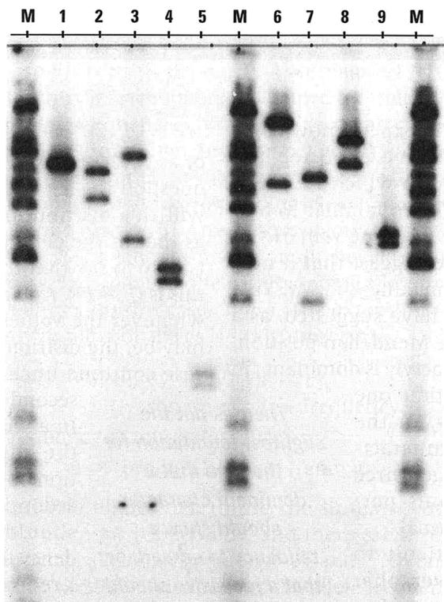  
图 17.14 用于 DNA 分型的一个 VNTR 的遗传变异。每个用数字编号的泳道含有来自单个人的 DNA；DNA 已用某种限制酶消化、电泳分离，并用放射性探针 DNA 杂交。标 M 的泳道含分子质量标记。[承俄克拉荷马州立大学人类身份识别检测实验室罗伯特·艾伦(Robert W. Allen)惠赠。]

群体在总体上含有许多 VNTR 等位基因。尽管群体整体上可存在许多等位基因，但每个人只能具有不超过两种等位基因。

在 DNA 分型中为什么 VNTR 那么有用，其原因在图 17.14 中也是很明显的；被检测的 9 个人，各具不同的带型，因而用这一个 VNTR 就可达到唯一识别。另外，图 17.14 中每个人的唯一性，部分是因为该 VNTR 的高度多态性，部分是因为样本较小。如果检测更多的人，肯定会发现在 VNTR 型上偶尔相同的成对个体。这就是为什么可靠的 DNA 分型需要在多个独立位点上进行匹配的原因。位点数目越多，DNA 型偶然匹配上的可能性越小。如果两个 DNA 样品相匹配的标记足够多，就几乎可以肯定它们来自同一个人。

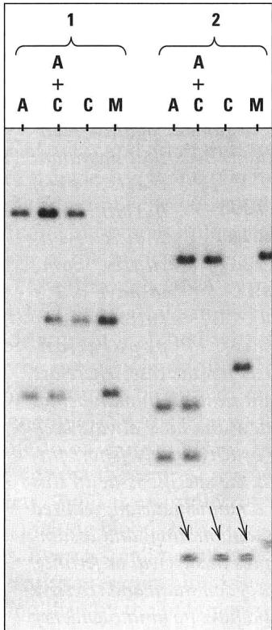

图 17.15 DNA 分型在亲子鉴定中的应用。编号为 1 和 2 的两组泳道含有来自两个亲子鉴定案件的 DNA 样品。在每个案件中，各泳道含有来自下列来源的 DNA 片段：M，母亲；C，孩子；A，被控告的父亲。标 A+C 的泳道含有被控告的父亲和孩子的 DNA 片段的混合物。案件 2 中的箭头指向出现在泳道 M、C 和 A+C 中相同大小的条带。注意，在案件 2 中被控告的男性不可能是孩子的父亲，因为他的条带没有一条是孩子也同时具有的。(承俄克拉荷马州立大学人类身份识别检测实验室罗伯特·艾伦惠赠。)

DNA 分型不仅能够证明犯罪，而且能够证明 DNA 型与证据不匹配的无辜者无罪。一个解释将 DNA 分型用于亲子鉴定的例子如图 17.15 所示。数字 1 和 2 指不同的案件，在每个案件中，一位男性被控是孩子的父亲。在每个案件中，从母亲 (M)、孩子 (C) 和被控告的男人 (A) 获得 DNA。所得某种 VNTR 的带型如图所示。标 A+C 的泳道含有来自被控男子和孩子的 DNA 混合物。在案件 1 中，在孩子中下面的那条带是从母亲遗传而来，上面那条带来自父亲；因为上面那条带与被告的其中一条带大小相同，该被控告的男性可能将该等位基因提供给了这个孩子。这一发现不能证明被控告男性是孩子的父亲，它只是说明，根据这一特定基因，不能排除他是孩子的父亲。(另外，如果调查的基因数目足够多，而该男子不能被这些基因的任何一个排除，那么就说明他真的很有可能是孩子的父亲。) 图 17.15 中的案件 2 属于排除的情况。箭头指示的条带是孩子从母亲遗传得的。因

为孩子中的另一条带与被告中两个条带的任何一个都不匹配，所以该被控告的男性不可能是孩子的生物学父亲。(在理论上，可用突变来解释该结果，但这种可能性极小。)

## - X 连锁基因

如果具有等位基因 $A$ 和 $a$ 的某个基因是X连锁的，随机交配的结果如图17.16所示。原理与之前考察过的相同，但必须对携带X染色体(A)的雄配子和携带Y染色体(B)的雄配子加以区别。当雄配子携带X染色体时，庞尼特方与图17.10中两个等位基因的常染色体基因的庞尼特方完全相同，但所有的子代都是雌性。结果是，在雌性子代中，基因型频率为

$$
A A: P ^ {2} \quad A a: 2 p q \quad a a: q ^ {2}
$$

当雄配子携带 Y 染色体时，结果相当不同(图 17.16B)。所有的子代都是雄性，并且每个子代仅有一条 X 染色体，这条 X 染色体是从雌性亲本遗传来的。因此，每个雄性后代只得到一个拷贝的 X 连锁基因，从而在雄性中基因型频率与等位基因频率相同：A 雄性的频率为 p，而 a 雄性的频率为 q。

图 17.16 的一个重要推论是，如果 a 是稀有隐性等位基因，则表现出该性状的雄性比雌性要多得多，因为罹患雌性的频率 $(q^{2})$ 会比罹患雄性的频率 $(q)$ 小得多。当隐性等位基因频率向着 0 减小时，罹患雄性和罹患雌性的频率都减小，但罹患雌性的频率减小得较快。结果是，罹患雄性与罹患雌性的比值增加。例如，当某个等位基因频率 q=0.3 时，罹患雄性与罹患雌性的比值为 3.3；当某个等位基因频率 q=0.1 时，罹患雄性与罹患雌性的比值为 10.0。一般而言，罹患雄性与罹患雌性的比值为 $q/q^{2}$ ，即 1/q。

对 X 连锁隐性性状而言，罹患雄性的频率给隐性等位基因的频率提供了一个估计。在人类 X 连锁色盲的常见类型中可见一个具体的例子。在白种人男性中，约有 1/20 的人罹患该性状，所以 q=1/20=0.05 。因此，色盲女性的期望频率估计为 $q^{2}=(0.05)^{2}=0.0025$ ，即大约 1/400 。

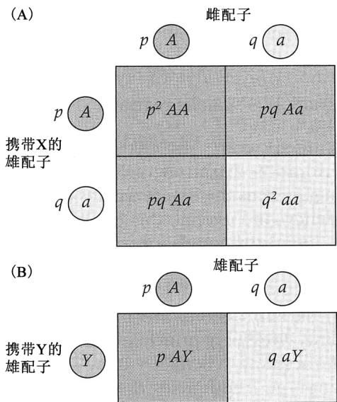  
图 17.16 X 连锁基因随机交配的结果。(A)雌性中的基因型频率。(B)雄性中的基因型频率。

## 17.3 近 交

近交 (inbreeding) 是指亲属 (如一级堂表亲) 之间的交配。在人类系谱中，亲属之间的婚配通常称为近亲婚配 (consanguineous mating)。近交的主要后果是，杂合后代的频率比随机交配情况下小。这种后果在反复自体受精情况下最为显著，这种情况自然发生于某些植物中。试想一个完全由 $Aa$ 杂合子组成的假想群体。在自体受精情况下，每个植株会以 $1/4 AA$ 、 $1/2 Aa$ 和 $1/4 aa$ 的比例产生后代，这意味着第一代的自体受精使杂合子的比例从 1 降低到 $1/2$ 。在第二代中，仅有杂合植株才能再产生杂合后代，它们的后代中又只有一半是杂合的。因而，杂合性减少到原来的 $1/4$ 。第三代自体受精使杂合性减少到 $1/4 \times 1/2 = 1/8$ ，以此类推。本节余下的部分将展示如何定量地表述近交所致的杂合性的减少。

## - 近交系数

反复自体受精是近交的一种特别极端的形式，但近交的不极端的形式在性质上类似，即它们也会导致杂合性的减少。近交后果的一个方便的测度是根据杂合性减少的程度。为了将其以符号形式表示出来，设 $H_{1}$ 为近交个体组成的群体中杂合基因型的频率。使用最广泛的近交的测度称为近交系数 (inbreeding coefficient)，以符号 F 表示，其定义是：与随机交配情况下预期的 2pq 值相比， $H_{1}$ 减少的比例。以公式表示，该定义的意思是

$$
F = (2 p q - H _ {1}) / 2 p q\tag{3}
$$

式(3)可整理为

$$
H _ {1} = 2 p q (1 - F)
$$

纯合基因型频率随杂合子频率的降低而增高，一般地，近交群体中的基因型频率由下列式子给出：

$$
\begin{array}{c} A A \colon p ^ {2} (1 - F) + p F \\ A a \colon 2 p q (1 - F) \end{array}
$$

$$
a a: q ^ {2} (1 - F) + q F\tag{4}
$$

这些表达式是将近交考虑进去时哈代-温伯格定律的修正。当 $F = 0$ (无近亲婚配)时，各基因型频率与哈代-温伯格定律所给的频率相同： $p^2$ 、 $2pq$ 、 $q^2$ 。当 $F = 1$ (完全近交)时，该近交群体完全由

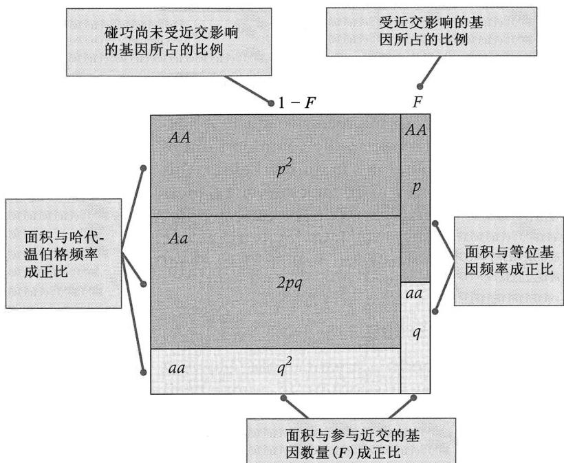  
图 17.17 近交对基因型频率的影响。与左边三个大的长方形相关的等位基因，其祖先碰巧未受近交的影响，因而，对它们而言，基因型频率保持哈代温伯格比例。与右边两个窄的长方形相关的等位基因，其祖先受到近交影响；在此例中，AA 和 aa 的基因型频率具有 p:q 的关系。（注意，在后一种情况中，没有杂合基因型。）

用图来表示式(4)中的各基因型频率，如图17.17所示。对于某个生物群体中的任何基因而言，可将该群体的一部分(占 $1 - F$ )看作碰巧未受近交的影响，这意味着各基因型频率为随机交配情况下的期望基因型频率： $p^2$ 、 $2pq$ 和 $q^{2}$ 。在另一部分(占 $F$ )中，可将各等位基因看作纯粹因为近交而已经成为纯合状态，具有分别等于 $p$ 和 $q$ 的 $AA$ 和aa基因型频率。

图 17.18 生动地显示了因近交所致的杂合性的减少。每条曲线均由 $H_{1} = 2pq(1 - F)$ 形式的公式给出，其中，F = 0 的情况相当于随机交配。这些曲线显示，随着近交系数的增加，杂合基因型频率比例减小，直到 F = 1、在近交群体中不剩杂合子为止。换言之，在 F = 1 的高度近交群体中，基因型由 AA 和 aa 两者组成，两者的相对比例分别为 p 和 q。

AA 和 aa 基因型组成，频率分别为 p 和 q。仅存在近交不会改变群体中的等位基因频率。可以通过计算自己来验证：对近交系数 F 的任意值，A 和 a 的等位基因频率分别保持为 p 和 q 不变。

一种在自然情况下进行自体受精的植物尖天蓝绣球(Phlox cuspidata)给近交的效应提供了一个具体的例子。在这一物种中，约78%的植株进行自体受精，可以证明，相当于这一自体受精水平的近交系数为F=0.64。在一个包含3种基因型的样本中，观测数目为 $15\ Pgm^{a}$ $Pgm^{a}$ 、 $6\ Pgm^{a}\ Pgm^{b}$ 和 $14\ Pgm^{b}\ Pgm^{b}$ 。这

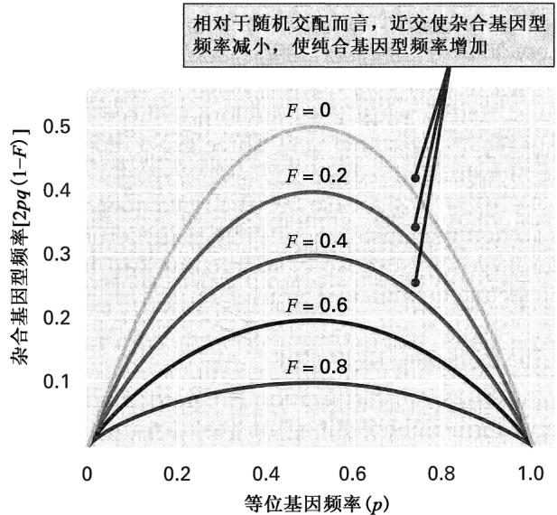  
图 17.18 某个近交群体中杂合基因型频率(y轴)对等位基因频率(x轴)作图。随着近交变得越来越强烈(近交系数 F 越来越大)，杂合基因型的比例越来越小。

些观测数目与根据 $Pgm^{a}(p=0.51)$ 和 $Pgm^{b}(q=0.49)$ 等位基因频率而得的哈代-温伯格期望数目完全不同，因为在随机交配情况下，期望数目为 9.1、17.5 和 8.4。注意，最大的不同之处在于，观测到的杂合基因型太少。

根据式(4)可知如何调整期望数目，以便将近交考虑在内。在等位基因频率为0.51和0.49，且近交系数 $F = 0.64$ 的情况下，期望基因型频率为

$$
\begin{array}{c} P g m ^ {a} P g m ^ {a}: (0. 5 1) ^ {2} (1 - 0. 6 4) + (0. 5 1) (0. 6 4) = 0. 4 2 0 \\ P g m ^ {a} P g m ^ {b}: 2 (0. 5 1) (0. 4 9) \times (1 - 0. 6 4) = 0. 1 8 0 \\ P g m ^ {b} P g m ^ {b}: (0. 4 9) ^ {2} (1 - 0. 6 4) + (0. 4 9) (0. 6 4) = 0. 4 0 0 \end{array}
$$

因而，在大小为 35 的样本中，3 种基因型的期望数目为 $0.420 \times 35 = 14.7$ 、 $0.180 \times 35 = 6.3$ 和 $0.400 \times 35 = 14$ ，与 15、6 和 14 的观测数目相当。在此例中，数据与近交模型的吻合非常好。

## ■ 等位基因的血统同一

除了在动植物繁育中，在人类遗传学中，遗传学家也可能想计算已知系谱中某个特定个体的近交系数，以便确定该个体每种可能基因型的概率。本节介绍一个特别适于系谱计算的概念。

近亲婚配的判断标准是在系谱中存在封闭的环。这样的一个封闭环通常称为路径(path)。图17.19A是一个近亲婚配系谱，其中，个体I是半同胞之间婚配的结果，从I到共同祖先A的路径(封闭环)显而易见。该系谱的一个简化版本如图17.19B所示，这种形式对于近亲婚配计算非常有用；两种性别的个体均以圆圈显示，斜线示等位基因从父母传递给子女，对I的近亲婚配无贡献的祖先(祖先B和C)都被省略。圆圈内对比鲜明的圆点代表相应个体中存在的特定等位基因，这种等位基因遗传的绘制方式体现了近亲婚配的主要后果，并且说明了为什么封闭环

## (A)近亲婚配系谱

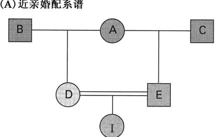

(B) A中系谱的简化表示  
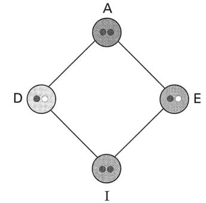  
图 17.19 (A) 一个近亲婚配系谱，其中，个体 I 是半同胞之间婚配的结果。(B) 重新绘制的同一个系谱，示封闭环中产生个体 I 的配子。彩色圆点代表某一特定基因的等位基因。

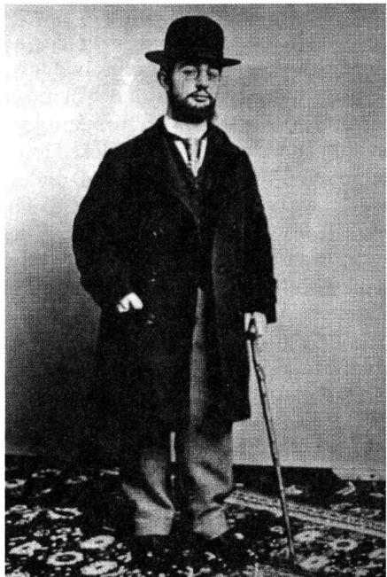  
19世纪法国著名的艺术家图卢兹-劳特雷克很可能患有致密性骨发育异常(pycnodysostosis)。这是一种罕见的骨病，由1号染色体上的一个隐性突变所致，而他的父母是一级堂表亲。该病的主要症状有身材矮小(图卢兹-劳特雷克成年后的身高为 $1.5\mathrm{m}$ )、面部特征不成比例及容易骨折(他遭受过两次股骨骨折)。(©Pictorial Press Ltd/Alamy Images.)

很重要。具体来说，个体 D 和 E 两者都分别得到来自 A 的一个蓝色等位基因及来自 B 和 C 的一个白色等位基因。D 和 E 中的蓝色等位基因有一种非常特殊的关系，两者都由 A 中那个蓝色等位基因复制而来，因而被称为具有血统同一 (identity by descent) 的关系。大多数系谱包含的世代相对较少，在此时间间隔内，可假定血统同一的等位基因在核苷酸序列上完全相同，因为在如此有限的世代内，通常可以忽略突变。个体 I 被表示成得到了来自 D 和 E 两者的蓝色等位基因，因为所讨论的等位基因是血统同一的，所以对从共同祖先遗传来的这个等位基因而言，该个体必定是纯合的。如果在该系谱中没有封闭环，I 中这两个等位基因的血统同一就不大可能出现。血统同一的概念给近交系数提供了另一个定义，可证明该定义与之前从杂合性角度给出的定义完全等价。具体来说：

某一个体的近交系数是该个体携带血统同一等位基因的概率。

## - 家系中近交系数的计算

图 17.20 示在系谱中如何计算血统同一的概率，等位基因被画成斜线上的圆点，以强调它们的传递方式。双头箭头示血统同一的成对等位基因，以便 I 具有血统同一的等位基因。1/2 的值表示二倍基因型传递遗传自某一亲本的等位基因的概率；根据孟德尔分离律，该值必定为 1/2。图 17.21 可解释 $(1/2)(1+F_{\mathrm{A}})$ 项的来源。图 17.21 示(图 17.19 中的个体) A 可传递的 4 种可能的

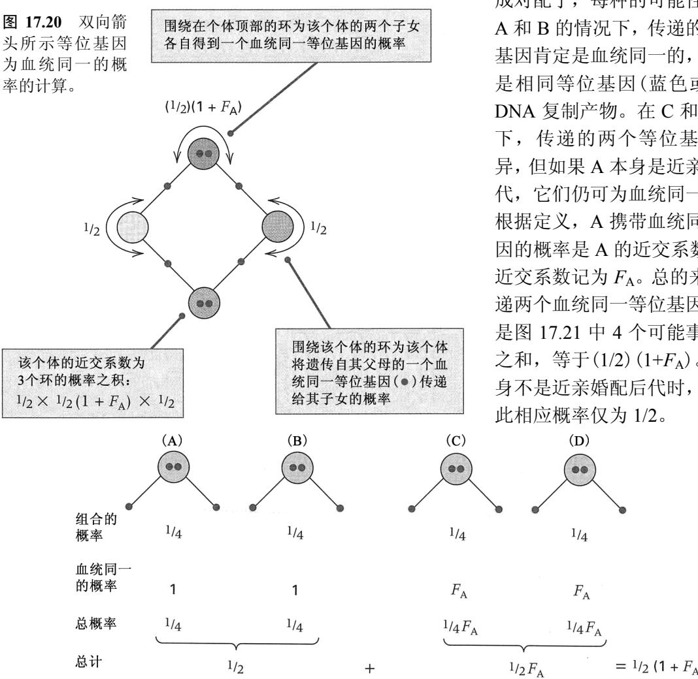

成对配子，每种的可能性相同。在A和B的情况下，传递的两个等位基因肯定是血统同一的，因为它们是相同等位基因(蓝色或红色)的DNA复制产物。在C和D的情况下，传递的两个等位基因颜色相异，但如果A本身是近亲婚配的后代，它们仍可为血统同一。但是，根据定义，A携带血统同一等位基因的概率是A的近交系数，因而该近交系数记为 $F_{A}$ 。总的来说，A传递两个血统同一等位基因的概率，是图17.21中4个可能事件的概率之和，等于 $(1/2)(1+F_{A})$ 。当A本身不是近亲婚配后代时， $F_{A}=0$ ，因此相应概率仅为1/2。

图 17.21 图示为什么 $(1/2)(1+F_{\mathrm{A}})$ 是来自同一个体 (A) 的两个不同配子携带血统同一等位基因的概率的原因。

现在回到图 17.20，仅当 3 个双向箭头所示的同一性都成立时，I 中的两个等位基因才为血统同一，因而该概率是所示 3 个数的积。也就是说，I 的近交系数(以符号 $F_{I}$ 表示)为

$$
F _ {\mathrm{I}} = (1 / 2) \times (1 / 2) (1 + F _ {\mathrm{A}}) \times (1 / 2) = (1 / 2) ^ {3} (1 + F _ {\mathrm{A}})
$$

对更远的祖先而言，该公式变为

$$
F _ {\mathrm{I}} = (1 / 2) ^ {n} (1 + F _ {\mathrm{A}})\tag{5}
$$

其中，n 是从 I 的双亲之一回溯到该共同祖先，再前行至 I 的另一亲本的路径中的个体数。

大多数感兴趣的系谱比图17.20中的系谱复杂,但仍可用式(5)来计算任一个体的近交系数。将式(5)应用于复杂系谱，需要增加几条规则。

(1) 如果追溯到一个共同祖先存在几条不同的路径，则每条路径都对近交系数做出贡献，贡献大小按式(5)计算。

(2) 如果存在数个共同祖先, 则依次考察每位祖先, 以便计算每位祖先对近亲婚配的独立贡献。

(3)总的近交系数计算为共同祖先所有独立贡献之和。

将式(5)推广至复杂系谱，可以写成：

$$
F _ {\mathrm{I}} = \sum (1 / 2) ^ {n} (1 + F _ {\mathrm{A}})\tag{6}
$$

其中， $\Sigma$ 表示经过所有共同祖先的所有路径的总和。

式(6)的应用可以图 17.22 中的系谱为例。每条路径及其对近交系数的贡献如下所示(红色字母表示共同祖先)。

$$
\begin{array}{l l} \text { EBD } & (1 / 2) ^ {3} (1 + F _ {\mathrm{B}}) \\ \text { ECD } & (1 / 2) ^ {3} (1 + F _ {\mathrm{C}}) \\ \text { ECABD } & (1 / 2) ^ {5} (1 + F _ {\mathrm{A}}) \\ \text { EBACD } & (1 / 2) ^ {5} (1 + F _ {\mathrm{A}}) \end{array}
$$

I 的近交系数为这些贡献之和。如果这些共同祖先没有一个是近交的(也就是说，如果 $F_{A}=F_{B}=F_{C}=0$ )，则

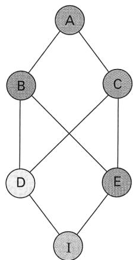

$$
F _ {\mathrm{I}} = (1 / 2) ^ {3} + (1 / 2) ^ {3} + (1 / 2) ^ {5} + (1 / 2) ^ {5} = 5 / 1 6
$$

该值(5/16)可被解释为:个体I在任一特定基因座成为杂合的概率，比非近婚个体在同一基因座成为杂合的概率少5/16。同样，5/16也可被解释为：在个体I的整个基因组中，成为杂合的基因座比非近婚个体少5/16。

图 17.22 一个复杂系谱，其中，个体 I 的近亲婚配是通过 3 个不同的共同祖先的数个独立路径的结果。

## ■ 近交的效应

近交的效应因具体生物的常规的交配系统而异。一个极端是，在经常进行自体受精的植物中，近交程度已非常高，生物个体已高度纯合，额外的近交几乎没有作用。但是：

在大多数物种中，近交是有害的，而大部分的有害效应是由于纯合才会有害的稀有隐性等位基因造成的。

在人类中，由于社会习俗和法律，近亲婚配一般不常见，尽管在小的隔离人群(与世隔绝的村庄、宗教团体、土著人族群)中确实存在，但主要是比二级堂表亲更远的亲戚(远亲)之间的婚配。最常见的近亲婚配类型是一级堂表亲之间的婚配。这种婚配的效应总是稀有的、通常是有害的隐性等位基因为纯合的基因型频率的增加。例如，在美国白人中，在无亲缘关系的人婚生子女中，白化病的频率约为1/20 000；在一级堂表亲婚配的子女中，该频率约为1/2000。通过比较用于近亲婚配的式(4)和用于随机婚配的式(1)中纯合隐性等位基因的基因型频率，可理解发病风险高出10倍的原因。在一级堂表亲婚配所生子女中，F=1/16，即0.062。因而一级堂表

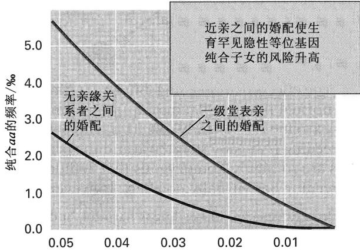  
等位基因 $a$ 的频率 $(q)$  
图 17.23 一级堂表亲婚配对子女稀有常染色体隐性等位基因纯合基因型频率的影响。虽然随着等位基因变得越来越稀有，两条曲线都逐渐下降，但无亲缘关系者之间婚配的曲线下降得更快。结果是，隐性等位基因越稀有，在所有隐性纯合个体中，由一级堂表亲婚配所致的部分占的比例越大。

亲婚配所生纯合隐性频率为

$$
q ^ {2} (1 - 0. 0 6 2) + q (0. 0 6 2)
$$

而在无亲缘关系者的子女中，纯合隐性等位基因频率为 $q^{2}$ 。对白化病而言，q=0.007（大致），计算得一级堂表亲子女的频率为 $5\times10^{-4}$ ，无亲缘关系者的子女的频率为 $5\times10^{-5}$ 。稀有隐性等位基因纯合基因型频率的增加，是一级堂表亲婚配（或任意程度的近亲婚配）的主要后果。一级堂表亲婚配的效应如图 17.23 所示，该图示近亲婚配对稀有等位基因的影响更大。例如，当等位基因频率 q=0.05 时，纯合子女的相对风险为 0.005 469/0.0025=2.2；当等位基因频率 q=0.01 时，纯合子女的相对风险为 0.000 719/0.0001=7.2。

## 17.4 遗传学与进化

进化 (evolution) 由基因库中逐渐发生的改变构成。有些作者提出更加严格的要求，认为构成进化的改变必须与群体对其环境的逐渐适应有关系。无论采用哪个定义，进化都是因为群体中存在遗传变异，同时，存在有利于最适应环境的生物个体的某种自然选择。遗传变异和自然选择是群体现象，因此习惯上从等位基因频率的角度来讨论它们。

在群体中，有 4 种过程是大多数等位基因频率改变的原因。它们构成群体的遗传特性逐渐改变的基础、导致——进化过程以其为特征的——渐变的传承。这些过程如下。

(1) 突变 (mutation)——通过基因中自发的、可遗传的改变，在群体中产生新的遗传功能的原因。

(2) 迁移 (migration)——在大群体内部的亚群之间的个体的迁移。

(3) 自然选择 (natural selection)——导致个体在其环境中不同的生存和繁殖能力。

(4) 随机遗传漂变 (random genetic drift)——等位基因频率随机的、不定向的改变，这在所有群体中均会偶然发生，但在小群体中较容易发生。

在下面的章节中，将从群体遗传学的角度考察这些过程的一些意义。

## 17.5 突变与迁移

在进化中，突变是一个不可或缺的过程，因为它是遗传变异的根源。但对改变等位基因频率而言，它是一种相对弱小的动力，主要是因为突变率通常非常低。而且，大多数新出现的突变对生物有害，从而在数代内从群体中被淘汰掉。

迁移可在地方种群中引入新等位基因，这点与突变类似，尽管这些新等位基因是来自其他亚群，而不是来自新突变。在没有迁移的情况下，每个地方种群的等位基因频率可独立改变，以致不同的地方种群可出现相当大的遗传分化(genetic differentiation)。亚群之间的遗传分化，意味着在地方种群之间常见等位基因存在不同的频率，或一些地方种群具有未见于其他地方种群的某些稀有等位基因。如果亚群之间交换个体(发生迁移)，可使亚群之间遗传差异的累积减到最小。事实上，亚群之间只要有相当少量的迁移(每代每一地方种群只需数个个体的迁移)，通常就足以阻止遗传分化累积到高水平。另外，如果其他的进化动力(如适应局部环境的自然选择)足够强大，尽管存在迁移，也可发生遗传分化。

## ■ 不可逆突变

为了认识突变作为一种进化动力的重要性，试想某等位基因 A，以及选择中性的突变型等位基因 a。（例如，在 a 中的突变可为某个内含子中某一无关紧要位点处的一个核苷酸置换，或从一个密码子到另一个同义密码子的改变。）假设等位基因 A 以 $\mu/(\text{等位基因} \cdot \text{代})$ 的速率突变成 a。该速率表示，在任一世代中，一个特定的 A 等位基因突变为 a 的概率为 $\mu$ 。同样也可以说成，在任一世代中，A 等位基因未突变为 a 的比例等于 $1 - \mu$ 。如果令 p 和 q 分别代表 A 和 a 的等位基因频率，则 A 的等位基因频率按以下规则变化：在任一世代中，A 的等位基因频率等于前一代中 A 的等位基因频率乘以该代中未发生突变的 A 等位基因的比例。（此处假设 a 到 A 的回复突变可忽略不计。）该规则可用符号表示为

$$
P _ {n} = P _ {n - 1} (1 - \mu)
$$

其中，下标 n 表示任一世代，而 n-1 表示前一代。因此，在 0、1、2、3 等世代中，A 的等位基因频率按下列式子改变：

$$
\begin{array}{l} P _ {1} = P _ {0} (1 - \mu) \\ P _ {2} = P _ {1} (1 - \mu) \\ P _ {3} = P _ {2} (1 - \mu) \end{array}
$$

将第一个方程式中的 $P_{1}$ 代入第二个方程式，得

$$
P _ {2} = P _ {1} (1 - \mu) = P _ {0} (1 - \mu) ^ {2}
$$

将此式代入计算 $P_{3}$ 的方程式中，得

$$
P _ {3} = P _ {2} (1 - \mu) = P _ {0} (1 - \mu) ^ {3}
$$

通过连续代入，得通式如下：

$$
P _ {n} = P _ {0} (1 - \mu) ^ {n}\tag{7}
$$

其中， $P_{n}$ 表示在第 n 代中 A 的等位基因频率。

如果假设等位基因 A 在 n=0 时在群体中被固定，则 $P_{0}=1$ ，因此式(7)变为

$$
P _ {n} = (1 - \mu) ^ {n}\tag{8}
$$

从突变率在实际的影响程度方面来说，式(8)说明等位基因频率以非常缓慢的速度变化。这种变化方式如图17.24中下面的那条曲线所示，该曲线假设突变率 $\mu = 1\times 10^{-5}$ /代。在此 $\mu$ 值下， $A$ 的等位基因频率每69314代减半。从人类的角度来考虑该速度，假设每代20年，要让 $A$ 的等位基因频率减半，需要 $69314\times 20 = 1386280$ 年，约等于140万年。例如，如果人类的某个等位基因 $A$ 固定于140万年前直立人(Homo erectus)的时候，且以 $1\times 10^{-5}$ /代的速度发生 $A$ 到 $a$ 的突变，那么在现代人类种群中存在的 $50\%$ 的等位基因仍然为 $A$ 型。

## ■ 可逆突变

当对回复突变的概率予以考虑时，A 到 a 的正向突变 (forward mutation) 被 a 到 A 的回复突变 (reverse mutation) 抵消。最终达到等位基因频率的平衡 (equilibrium)，此刻尽管突变仍在继续，但等位基因频率变得稳定而不再变化。平衡的原因是，此时，每因正向突变而丢失一个

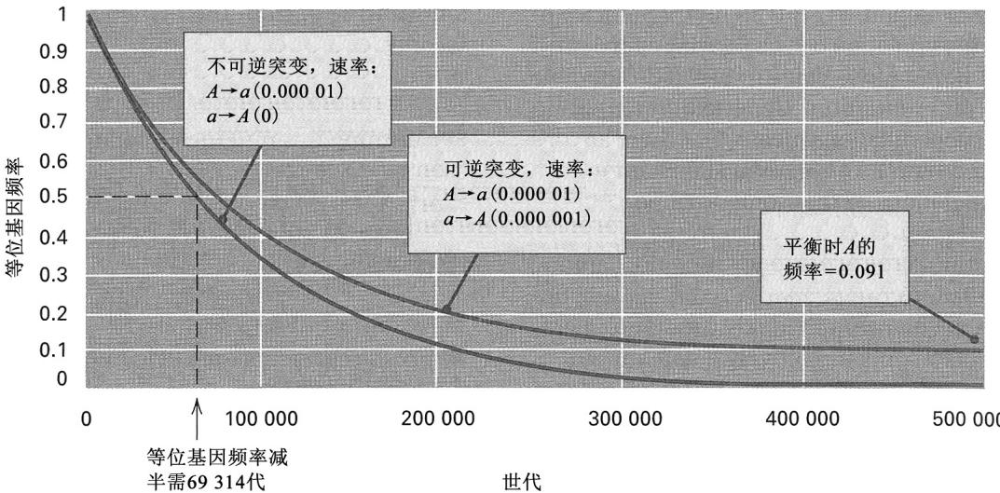  
图17.24 不可逆突变(下面的曲线)和可逆突变(上面的曲线)对等位基因频率的影响。在此例中，正向突变率为 $\mu = 1\times 10^{-5}$ ，回复突变率为 $v = 1\times 10^{-6}$ 。

A 等位基因，都代之以回复突变产生的一个新的 A 等位基因。

突变可逆时的平衡频率，推导起来很简单。令 A 和 a 的等位基因频率分别为 p 和 q。设正向突变速率为 $\mu$ ，设回复突变速率为 v。在任一世代中，因正向突变而丢失的 A 等位基因的数目与 $p \mu$ 成正比，而因回复突变产生的新的 A 等位基因的数目与 qv 成正比。在平衡时，A 的丢失必定等于 A 的获得；因而 $p \mu = qv$ 。将 q = 1 - p 代入，得

$$
p \mu = q v = (1 - p) v = v - p v
$$

因而，在平衡时，

$$
\hat {p} = \frac {\nu}{\mu + \nu}\tag{9}
$$

其中，按惯例使用符号 $\hat{p}$ 来表示 p 的平衡值。作为对式(9)的正确性的检验，可见 $\hat{q} = \mu / (\mu + v)$ ，因此 $\hat{p}\mu = \hat{q}\nu$ ，这与要求的一致。

在图17.24中，上面一条曲线示在 $\mu = 1\times 10^{-5}$ 且 $v = 1\times 10^{-6}$ 时，对可逆突变而言，等位基因频率的变化。在此例中，平衡状态为

$$
\hat {p} = \frac {1 \times 1 0 ^ {- 6}}{1 \times 1 0 ^ {- 5} + 1 \times 1 0 ^ {- 6}} = \frac {1}{1 1}
$$

同样，达到平衡所需的时间很长。当 $\mu=1\times10^{-5}$ 且 $v=1\times10^{-6}$ 时，对任意给定的 p 和 q 值，要 63 013 代才能变成它们的平衡值的一半。（由于回复突变的影响，这与之前推导的 69 314 代的减半时间不同。）

## 17.6 自然选择

适应性进化的驱动力是自然选择，这是在当时环境条件下生物个体之间在生存和繁殖能力上存在遗传差异的结果。这是1859年达尔文首次提出的，之后自然选择的概念一直经历着修订和扩展，最值得注意的是遗传学概念的纳入。在其现代表述中，自然选择的发生依赖于两个前提(这两个前提都被公认是成立的)及一个推论。

前提 1：在所有生物中，产生的后代比能够生存和繁殖的后代多。(达尔文从托马斯·马尔

萨斯处借用了这部分理论。)

前提 2：生物个体在生存和繁殖能力上存在差异，其中有些差异是基因型所致。

推论：在每个世代中，促进在当时环境中生存的基因型(有利基因型)，在处于繁殖年龄的个体中必定过剩，因此，有利基因型对后代的贡献不成比例。

通过这一过程，促进生存和繁殖的等位基因的频率一代代增加，从而群体逐渐变得能够在当时环境中更好地生存和繁殖。群体中这种渐进性的遗传改良就是进化适应(adaptation)过程。

## ■ 室内实验中的选择

在细菌种群中，容易进行选择的实验研究，因为细菌的世代时间较短(约30min)。图17.25显示，在 $A$ 为优势竞争者的条件下，两种细菌基因型(A和B)之间竞争的结果。在该实验中，让竞争持续了120代，在此时间内， $A$ 基因型的比例 $(p)$ 从0.60升高到0.995， $B$ 基因型的比例从0.40下降到0.05。这些数据点与下面的方程式非常吻合：

$$
\frac {p _ {n}}{q _ {n}} = \left(\frac {p _ {0}}{q _ {0}}\right) \left(\frac {1}{w}\right) ^ {n}\tag{10}
$$

其中， $p_{0}$ 和 $q_{0}$ 是 A 和 B 的起始频率(在此例中，分别为 0.6 和 0.4)， $p_{n}$ 和 $q_{n}$ 为竞争 n 代之后的频率(此处，n=120， $p_{n}=0.995,\quad q_{n}=0.005$ )，而 w 为在该实验条件下 B 与 A 竞争时 B 的竞争能力的一个测度。式(10)可按如下理论逐步推导：因为 A 菌株和 B 菌株生存和繁殖的相对速度为 1:w，所以在任一世代中的频率比 $(p_{n}/q_{n})$ 必定等于前一代中的频率比 $(p_{n-1}/q_{n-1})$ 乘以 1/w。因此，

$$
\begin{array}{l} (p _ {1} / q _ {1}) = (p _ {0} / q _ {0}) \times (1 / w) \\ (p _ {2} / q _ {2}) = (p _ {1} / q _ {1}) \times (1 / w) \\ (p _ {3} / q _ {3}) = (p _ {2} / q _ {2}) \times (1 / w) \end{array}
$$

依次将第一个方程式代入第二个、第二个代入第三个、……，可看出最终是如何得到式(10)的。

w 值是在这些特定条件下 B 基因型相对于 A 基因型的相对适合度 (relative fitness)。在 w 值为 0.96 时，图 17.25 中的数据与式(10)拟合，得到图中的平滑曲线。相对适合度是衡量每种亲本基因型对每代产生的子代基因型总体的相对贡献的测度。在此例中，一个 A 基因型每产生一个子代细菌，一个 B 基因型平均产生 0.96 个子代细菌。

在群体遗传学中, 一般以最有利的基因型(在此例中为 A)为标准(适合度为 1.0)来计算相对适合度。但是, 某个基因型的选择劣势往往比其相

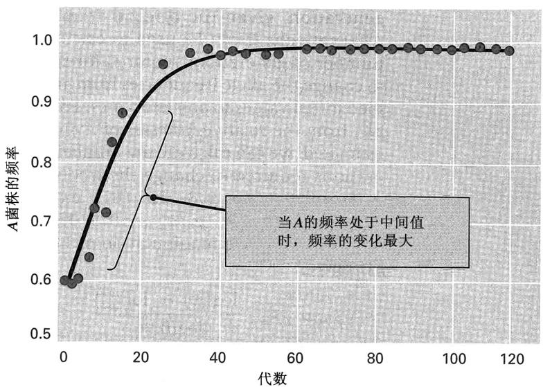  
图 17.25 在一个持续培养的大肠杆菌群体中，因选择而导致一个有利菌株的频率增加。y 轴为任意时间 A 细胞数除以细胞总数 $(A+B)$ 。注意，当有利菌株 $(A)$ 的频率处于中间值时，频率的变化最大。

对适合度更令人感兴趣，因为有些方程式是简化了的。不利基因型的选择劣势称为对该基因型的选择系数(selection coefficient)，其计算为：标准基因型的适合度(设为1.0)与所讨论的基因型的相对适合度之间的差值。在眼前这个例子中，B 的选择系数(记为 s)为

$$
s = 1. 0 0 0 - 0. 9 6 = 0. 0 4\tag{11}
$$

在口头上，说成菌株 B 的选择劣势为每代 4%。适合度已知时，假如起始频率已知，根据式(10)能够预测未来任一世代的等位基因频率。另外，式(10)可以用来计算选择将等位基因频率从任意指定的起始值变成任意后来值所需的世代数。例如，根据刚才估算过的 A 和 B 的相对适合度，可以计算将 A 的基因频率从 0.1 变成 0.8 所需的代数。在此例中， $p_{0}/q_{0}=0.1/0.9,\quad p_{n}/q_{n}=0.8/0.2$ ，且 w=0.96。对式(10)稍作变换，得

$$
\begin{array}{r l} & n = \frac {\log \left(\frac {0 . 1}{0 . 9}\right) - \log \left(\frac {0 . 8}{0 . 2}\right)}{\log (0 . 9 6)} \\ & = 8 7. 8 (\text {代}) \end{array}
$$

抗生素的普遍使用导致了抗生素抗性的自然选择。图中两个培养皿示金黄色葡萄球菌(Staphylococcus aureus)的培养情况。在白色圆片中含有青霉素溶液，青霉素可从圆片中扩散出来，进入培养基中，在圆片周围形成晕圈。左边的菌株是敏感株。右边的菌株有一个青霉素酶蛋白基因，除了最靠近圆片的最高剂量外，该菌株对青霉素具有抗性。(John Durham/Photo Researchers, Inc.)

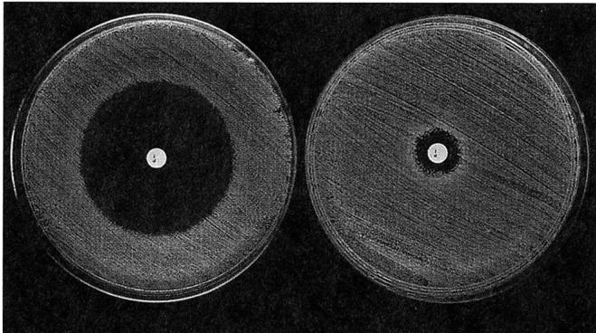

## ■ 二倍体生物中的选择

二倍体生物中的选择与单倍体生物类似，但显性和隐性引起额外的复杂性。图 17.26 示在一个随机交配的二倍体生物群体中，一个有利显性等位基因和一个有利隐性等位基因在等位基

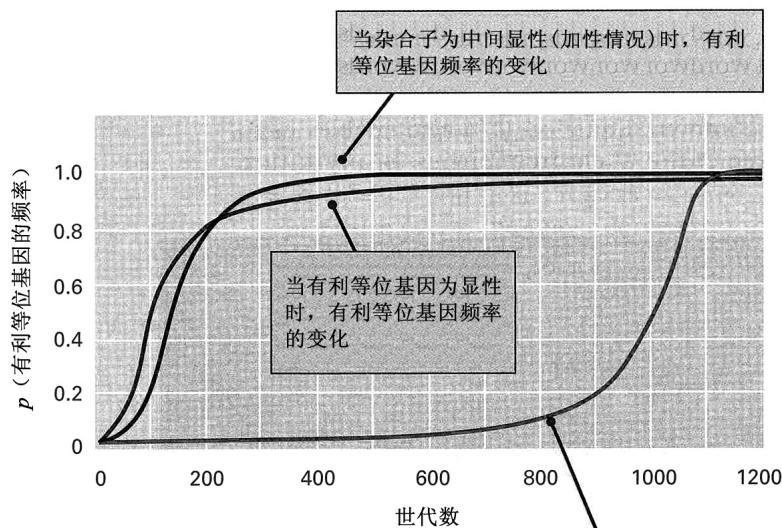  
图 17.26 在进行随机交配的某种二倍体生物中，当有利等位基因为显性、当有利等位基因为隐性，以及当杂合子的适合度刚好在中间(加性)时，某个选择有利的等位基因在频率上的理论预期变化。在每种情况下，最不适合的纯合基因型的选择系数均为 5%。

因频率上的变化。该图的一个显著特点是，当有利显性等位基因常见时，其频率的变化非常慢；而当有利隐性等位基因罕见时，其频率变化非常慢。原因是，在随机交配情况下，罕见等位基因在杂合子中远比在纯合子中常见。有利显性等位基因的频率高时，大部分隐性等位基因存在于杂合子中，而杂合子并未受到选择，从而不会对等位基因频率的改变起作用。反过来，有利隐性等位基因频率低时，大部分有利等位基因在杂合子中，杂合子同样不受选择，因而不对等位基因频率的改变起作用。这些内容可高度概括成下述原理：

当隐性等位基因罕见时，对其有利或不利的选择，效率都很低。

选择对罕见隐性等位基因的低效率有一个重要的实际意义。有一种广泛持有的看法认为，医治患有罕见隐性疾病的人以拯救他们的生命，会因为携带有害基因的人的生殖，引起人类基因库的退化。这种看法没有事实依据。因为是罕见等位基因，所以纯合基因型所占的比例很小，纯合基因型的生殖对等位基因频率的改变所起作用的份额可忽略不计。鉴于纯合基因型的频率非常低，他们生育与否无足轻重。类似的逻辑也适用于这一优生提议：通过阻止患者生育，来清除人类基因库中的有害隐性基因。不要说患有严重遗传病的人很少生育，即便他们生育，也对等位基因频率基本上没有影响。基本原理是：

在人类群体中，有害隐性等位基因的主要贮藏之所，在表型正常的杂合携带者的基因组中。

## ■ 适合度的成分

图 17.25 中那样的数据，在高等生物中基本上无法得到，因为高等生物的世代时间很长。持续 120 代的观测，对果蝇而言要花 10 年，对人而言要花 2400 年。那么怎样来估计适合度呢？一般做法是将适合度分割成各个组成部分，然后对这些成分分别进行估计。一般认为，基因型适合度为以下两个主要成分。

\- 生存力(viability)，指新形成的、指定基因型的合子活到生殖年龄的概率。

\- 生殖力(fertility)，指在繁殖期内，指定基因型的个体产生后代的平均数目。合起来，生存力和生殖力可衡量每种基因型对下一代的贡献。

表 17.1 是通过实验来估计生存力的一个例子，该实验对果蝇中编码乙醇脱氢酶不同电泳型的两种基因型的生存力进行估计。对于 F 或 S 等位基因，基因型均为纯合。表中所列数值是 7 个独立实验所得的平均值，在这些实验中，将幼虫一起放入培养瓶中，让它们竞争。活下来的幼虫与最初放入的幼虫的比值为每种基因型的存活概率。正如表的底部所示，这些数字可以两种方式，即以 SS 或 FF 为基准转换成相对生存力。一

表 17.1 果蝇中乙醇脱氢酶基因型的相对生存力

<table><tr><td rowspan="2">实验数据及相对生存力</td><td colspan="2">基因型</td></tr><tr><td>FF</td><td>SS</td></tr><tr><td>实验数据</td><td></td><td></td></tr><tr><td>每瓶装入的幼虫数</td><td>200</td><td>100</td></tr><tr><td>每瓶存活幼虫的平均数</td><td>132.72</td><td>70.43</td></tr><tr><td>存活概率</td><td>0.6636</td><td>0.7043</td></tr><tr><td>相对生存力</td><td></td><td></td></tr><tr><td>以 SS 为基准</td><td> $0.6636/0.7043 = 0.94$ </td><td> $0.7043/0.7043 = 1.0$ </td></tr><tr><td>以 FF 为基准</td><td> $0.6636/0.6636 = 1.0$ </td><td> $0.7043/0.6636 = 1.06$ </td></tr></table>

般认为两个相对值中较大的一个应为 1.0，因此对整个实验的概括可说成 “FF 相对于 SS 的生存力为 0.94”，或说成 “在生存力上，FF 相对于 SS 的选择劣势为 0.06”。

根据生存力和生殖力组分对总适合度所做的估计，可用来预测实验种群或自然种群中希望知道的等位基因频率的变化。但是，某个基因型的适合度可能取决于环境，也可能取决于其他因素，例如，种群密度和其他基因型的频率。因此，在某个特定实验室环境下估计的适合度，可能与预测自然种群中等位基因频率的改变扯不上关系，除非其他影响因素差不多。

## - 选择-突变平衡

自然选择通常起到将群体中有害等位基因的频率减到最小的作用。但是，这些有害等位基因绝不可能被全部淘汰，因为野生型等位基因会不断产生新的有害突变。在选择和突变这两种向着相反方向起作用的力作用之下，群体最终会达到一种平衡状态，称为选择-突变平衡(selection-mutation balance)，在此状态下，新突变正好弥补了选择性淘汰。在确定平衡时等位基因的频率时,有害等位基因是完全隐性,还是对杂合携带者的适合度有微小的作用(部分显性, partial dominance),会产生巨大的差异。为了推导平衡频率,将野生型等位基因表示为 A,有害等位基因表示为 a,用 p 和 q 分别表示两者的等位基因频率。

在完全隐性等位基因情况下，AA、Aa 和 aa 基因型的适合度可记为 1:1:1-s，其中，s 代表 aa 纯合子的选择系数，为 aa 基因型个体未能存活或生殖的比例。例如，对隐性致死等位基因而言，s=1。当 q 非常小（如接近平衡时的大小）时，被选择淘汰的 a 等位基因数目与 $q^{2}s$ 成正比（假定存在哈代-温伯格比例）。与此同时，通过突变引入的新的 a 等位基因的数目，与 $\mu$ 成正比。在平衡时，选择性淘汰的等位基因必定与新突变产生的等位基因相互抵消，因此 $q^{2}s=\mu$ ，即

$$
\hat {q} = \sqrt {\frac {\mu}{s}}\tag{12}
$$

如前所述， $\hat{q}$ 是平衡值的意思。将式(12)用于一个具体的例子：试想导致Tay-Sachs病的隐性等位基因，在大多数非犹太人群体中，该等位基因的频率为 $q = 0.001$ 。因该病致死，所以 $s = 1$ 。假设 $q = 0.001$ 代表平衡频率，并假设该等位基因对杂合携带者的适合度没有影响，则导致该观测频率的突变率为

$$
\mu = q ^ {2} s = (0. 0 0 1) ^ {2} \times 1. 0 = 1 \times 1 0 ^ {- 6}
$$

该例展示了怎样把影响选择-突变平衡的因子用在人类突变率的估计中。

如果某个有害等位基因表现出部分显性，即对杂合携带者的适合度有影响，则 AA、Aa 和 aa 基因型的适合度可记为 $1:1-hs:1-s$ ，其中，hs 是杂合携带者的选择系数。参数 h 称为显性度 (degree of dominance)。当 h=1 时，有害等位基因为完全显性；当 h=0 时，有害等位基因为完全隐性；而当 h=1/2 时，杂合基因型的适合度正好是两种纯合基因型适合度的平均值。对大多数表现出部分显性的有害等位基因而言，h 值比 1/2 小得多。

在随机交配情况下，当某个等位基因罕见时(像处于平衡状态的有害等位基因那样)，杂合基因型的频率大大超过那些对于有害隐性等位基因为纯合的基因型的频率。这意味着，被选择淘汰掉的大部分有害等位基因，是因为针对杂合基因型个体的选择而被淘汰掉的，因为杂合基因型的个体非常多。对每个不能存活或生殖的 $Aa$ 基因型个体，丢失的等位基因一半为 $a$ ，因此在任一代中，因选择而丢失的等位基因数目与下式成正比：

$$
2 p q \times h s \times 1 / 2
$$

另外，通过 $A \rightarrow a$ 突变产生的新的 a 等位基因的数目等于 $\mu$ 。在平衡时，选择所致的丢失必定与突变而来的获得相抵，因此，

$$
2 p q \times h s \times 1 / 2 = \mu
$$

即

$$
\hat {p} \hat {q} h s = \mu
$$

因为在平衡时有害等位基因会比较罕见，尤其是该等位基因表现出部分显性时，所以 $\hat{p}$ 非常接近于 1，在上式中可用 1 来替代。因此，部分显性的有害等位基因的频率，其平衡值为

$$
\hat {q} = \frac {\mu}{h s}\tag{13}
$$

注意，在式(13)中没有平方根，有无平方根差异巨大。比较图 17.27 中各条曲线，可见到有无平方根的影响；图 17.27 中是一个纯合致死的有害等位基因 $(s = 1)$ 的曲线。顶上的曲线是完全隐性等位基因 $(h = 0)$ 的曲线，其他曲线涉及不同的部分显性程度；例如，h = 1/2，表示杂合

基因型的适合度正好为两种纯合基因型之间的中值。即使少量的部分显性，也会对平衡等位基因频率的减小造成重大影响。

## ■ 杂合子优势

到目前为止，一直在考察杂合子的适合度处于两种纯合子适合度之间的选择的例子。在这些例子中，与最适纯合子相关的等位基因，最终会被固定，除非选择受到突变的抵制。在本节中，考察杂合子的适合度比两种纯合子的适合度都

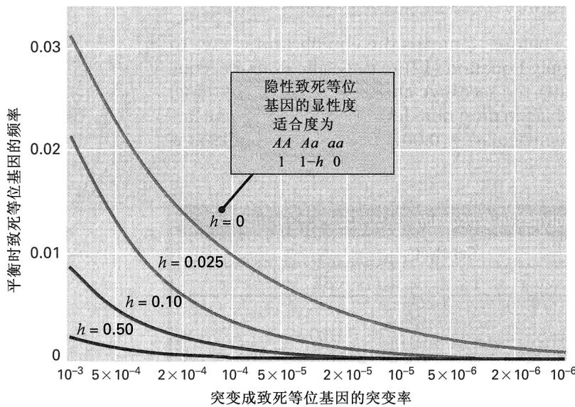  
图 17.27 部分显性对某个纯合致死隐性等位基因的影响。显性度以 h 来衡量。例如，h = 0.025，表示 AA 和 Aa 的相对适合度为 1 : 0.975。

大的可能性，这种情况称为超显性(overdominance)或杂合子优势(heterozygote superiority)。

存在超显性时，两种等位基因都不会被选择淘汰，因为在每一代中，杂合子产生的后代比纯合子多，有利于杂合基因型的选择，使两种等位基因在群体中都得以保持，最终会达到一种平衡，此时等位基因频率不再改变。在超显性情况下，AA、Aa 和 aa 的适合度可记为 $1-s:1:1-t$ ，其中，s 和 t 分别是 AA 和 aa 相对于 Aa 的选择系数。假设进行随机交配，在任一代中，被选择淘汰掉的 A 等位基因的比例为 $p^{2}s/p = ps$ ，而被选择淘汰掉的 a 等位基因的比例为 $q^{2}t/q = qt$ 。在平衡状态下，A 的选择性淘汰必与 a 的选择性淘汰相抵，因而 $\hat{p}s = \hat{q}t$ ，即

$$
\hat {p} = \frac {t}{s + t}\tag{14}
$$

在超显性情况下，等位基因的频率总会趋于平衡，但达到平衡的速度取决于 s 和 t 的大小。当对纯合子存在强烈选择时，平衡达到得最快。

在自然群体中，超显性似乎并不是一种特别常见的选择形式。但是，有几个成熟的例子，其中最有名的一个涉及镰形细胞血红蛋白突变。最初提示镰形细胞贫血病和由恶性疟原虫(Plasmodium falciparum)这种原生动物导致的疟疾之间存在联系的，是镰形细胞贫血病和疟疾的地理分布存在大量重叠(图17.28)。

(A)  
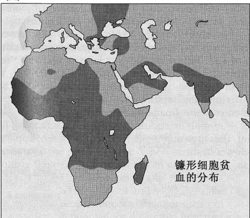

(B)  
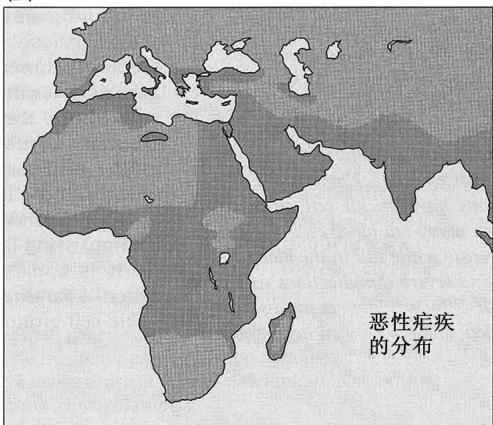  
图 17.28 20 世纪 20 年代，在开展广泛的疟疾控制计划之前，(A)镰形细胞贫血病和(B)恶性疟疾的地理分布。棕色阴影部分示所讨论的区域。

根据不同基因型的人被疟疾感染的比例，以及被感染者的死亡率，估计出基因型 AA、AS 和 SS 的相对适合度为 0.85:1:0。(S 表示镰形细胞突变。) 如果未经彻底治疗，纯合 SS 基因型个体会由于严重贫血而死亡。另外，因为 AS 杂合子比两种纯合基因型都更能抵抗疟疾感染，存在超显性。

根据上述适合度，得 s=0.15 和 t=1 ，因此根据式(14)得 A 的预期平衡频率等于 $1/(0.15+1)=0.87$ 。因而 S 的预期平衡频率为 1-0.87=0.13 ，该值与在西非的许多地方观察的频率相当接近。

## 联系：血液中的抗性

安东尼·艾利森，1954

拉德克利夫医院，牛津，英国

镰形细胞性状产生的抗恶性疟疾感染作用

疟疾是世界上热带和亚热带地区最流行的传染病，每年感染多达2.5亿人，导致多达两百万人死亡。该病的特点是伴有交替发抖和出汗的周期性发作的发烧。患者由于红细胞的破坏而患贫血，以及脾大、消化系统炎症、支气管炎和许多其他并发症。由恶性疟原虫(Plasmodium falciparum)引起的疟疾类型称为“亚三日”疟(恶性疟)，因为在两次发烧之间的间隔不足3天。这种寄生虫通过冈比亚按蚊(Anopheles gambiae)的叮咬而传播。传播之后，这种寄生虫在肝脏中增殖约一周，然后开始感染红细胞并在红细胞中增殖(寄生虫血症)，数日后，红细胞被摧毁。在非洲、中东、地中海地区和印度等恶性疟流行的地区，也存在较高的镰形细胞突变频率，该突变影响血红蛋白β链的氨基酸序列。杂合携带者没严重的临床症状，但他们具有所谓的“镰形细胞性状”，将这种红细胞置于载玻片上并以盖玻片封固，1\~3天后红细胞萎缩成半月形或镰形。纯合患者患“镰形细胞贫血”，许多红细胞还在血流中的时候就自发镰变，引起严重的并发症，并常常死亡。为什么一种纯合时可有效致死的遗传病，可在群体中维持10%或更高的发病率？艾利森注意到镰形细胞突变和疟疾之间的相关性，并推测镰形细胞性状使得杂合携带者可在一定程度上抵御疟疾。此处展示的是支持这一假说的关键证据。后来的工作证明，杂合携带者因其疟疾抗性，具有大约15%的选择优势。

有种看法认为，从自然选择的观点来看，镰形贫血性状是中性的。1949年，我在非洲实地考察的过程中，对此看法产生了疑问，令我重新思考镰形贫血性状与某种选择优势相关的可能性。我注意到，在疟疾流行区，镰形贫血性状的发生率比其他地方高。……那么，当务之急是，探明镰形细胞是否能在抵御疟疾感染上起到一定程度的作用。……选择儿童而不是成年人作为观察对象，这样可以尽量减小疟疾获得性免疫的影响。文献记载的一组290位(生活在乌干达坎帕拉附近的)干达儿童的寄生虫血症发病率载于附表中。……

<table><tr><td></td><td>患寄生虫血症</td><td>未患寄生虫血症</td><td>总计</td></tr><tr><td>镰形细胞性状者</td><td>12 (27.9%)</td><td>31 (72.1%)</td><td>43</td></tr><tr><td>非镰形细胞性状者</td><td>113 (45.7%)</td><td>134 (54.3%)</td><td>247</td></tr></table>

很明显，镰形细胞组的寄生虫血症发病率低于非镰形细胞组。该差异在统计学上显著(自由度为1时， $x^{2}=4.8$ )。……这两组的寄生虫密度也不相同：在12位患疟疾的镰形细胞性状者中，66.7%仅患轻度寄生虫血症，33.7%患中度寄生虫血症。在113位患疟疾的非镰形细胞性状者中，34%患轻度寄生虫血症，其余人的寄生虫密度为中度或重度。……(在一组自愿让受到严重感染的冈比亚按蚊叮咬的成年男性中，)证实在15位没有镰形细胞性状的男性中，有14位感染恶性疟原虫，而在由15位具有该性状的男性组成的对照组中，仅有2位出现疟原虫。结论是，与正常红细胞相比，具镰形细胞性状者的异常红细胞较不容易被恶性疟原虫寄生。因此，在疟疾高发区，镰形细胞基因为杂合的人具有选择优势。这一事实也许可以解释为什么尽管镰形细胞基因因镰形细胞贫血患者的死亡而淘汰，但镰形细胞基因仍然常见。

来源：A. C. Allison, Br. Med. J. 1 (1954): 290-294。

## 17.7 随机遗传漂变

随机遗传漂变(random genetic drift)过程的发生, 是因为群体的大小不是无限大(正如我们一直以来假设的那样), 而是有限的。任何一个世代中进行繁殖的个体, 有可能产生非常巨大的配子库。

在无生殖力差异的情况下，配子中的等位基因频率将与成体中的等位基因频率相等。但是，因为种群的大小有限，这些配子中仅有一小部分会参与受精，并出现在下一代的合子中。换言之，在从上一代到下一代时，会发生随机抽样(random sampling)的过程。由于偶然性，在样本之间存在变异，因而配子中的等位基因频率和合子中的等位基因频率可能会由于偶然性的原因而不同。在有限群体中，等位基因频率因为一代代的抽样过程而发生的变化，是随机遗传漂变的原因。

为了更一般地审视该过程，试想一个每一代恰好由 $N$ 个二倍体个体构成的群体。在每个常染色体基因座，会正好有 $2N$ 个等位基因。假设其中的 $i$ 个为 $A$ 型，其余的 $2N - i$ 个为 $a$ 型，则 $A$ 的等位基因频率(记为 $p$ ) 等于 $i / 2N$ 。下一代中 $A$ 等位基因的数目不能明确地予以确定，因其受随机遗传漂变的随机抽样过程支配。但是，给下一代中每种可能的 $A$ 等位基因的数目指定一个概率，是可能的。该概率由二项式分布的项给出(参见第4章)。具体来说，已知在亲本中正好有 $i$ 拷贝个 $A$ 时，在下一代中正好有 $k$ 拷贝个 $A$ 的概率 $P(k|i)$ ，由下式给出：

$$
P (k \mid i) = \frac {2 N !}{k ! (2 N - k) !} p ^ {k} q ^ {2 N - k}\tag{15}
$$

在式(15)中， $p = i / 2N$ ； $q = 1 - p$ ； $k$ 可为 0、1、2、……，直到并包含 $2N$ 。方程式中带有阶乘的部分，是 $k$ 拷贝个 $A$ 可被抽样的可能顺序的数目。(这些 $A$ 等位基因可以是前 $k$ 次抽样、后 $k$

次抽样、穿插着 a 的抽样等。) p 和 q 的幂表示任一指定顺序发生的概率。对于任意指定的 N 和 i 值，可利用式(15)，加上一个随机数表(或者用个人电脑更好)，来计算指定 k 时的实际值。

来考察一个具体例子，以说明随机遗传漂变的基本特征。图17.29A示12个亚群中随机遗传漂变的结果，每个亚群均由8个二倍体个体组成，且开始时包含相同数目的 $A$ 和 $a$ 等位基因。在每个亚群中，交配是随机的。计算机程序用式(15)生成 $k$ 值，用来逐一计算在每个世代中每个亚群的 $A$ 等位基因数目。这些数目显示于 $y$ 轴上，随机遗传漂变导致的等位基因频率的离散是很明显的。此处所举例子中的群体非常小，在比这大的群体中，等位基因频率的变化不会这样显著，可能需要更多的世代，

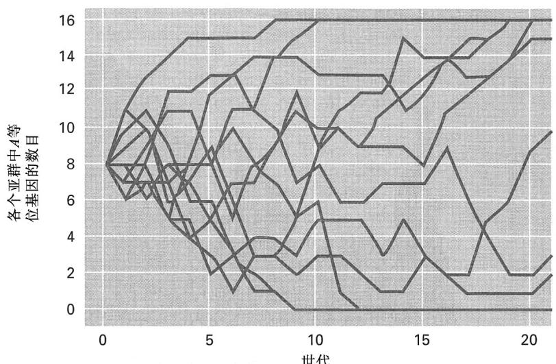

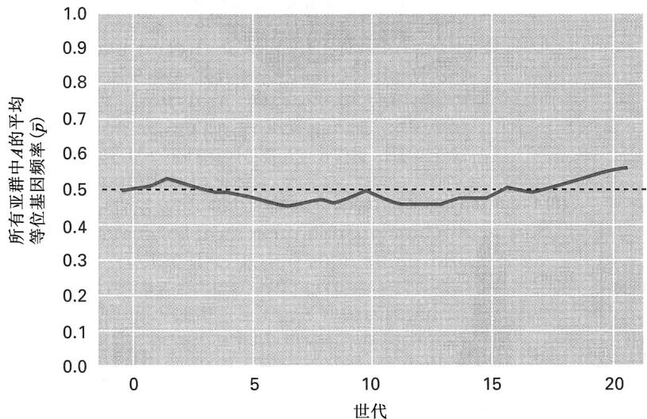  
图 17.29 (A) 各含 8 个二倍体生物的 12 个假想亚群中的随机遗传漂变。(B) A 部分中各亚群的平均等位基因频率。

但总的效应会是一样的。因 2N 在式(15)中起的作用突出，随机遗传漂变所致的等位基因频率的离散程度依赖于种群大小，种群越小，离散程度越大，离散发生得越迅速。

在图 17.29A 中，即使在前几代中，随机遗传漂变的主要作用也已经很明显。各个等位基因频率开始在较宽的范围内分散开。到第 7 代，分散最剧，A 等位基因数目为 1～15。这种分散意味着各亚群中的等位基因频率变得越来越不同。概括来说，

随机遗传漂变引起亚群间等位基因频率的差异；它可以是亚群间遗传分化的一个主要原因。

虽然亚群间的等位基因频率因随机遗传漂变而分散在较宽的范围内，各亚群的平均等位基因频率却基本保持不变。这一点如图 17.29B 所示。平均等位基因频率维持在其初始值 0.5 附近。如果设想亚群数目无限多，而不是只有 12 个，则在每一代中，平均等位基因频率会正好是 0.5。该原理说明，尽管亚群各自存在等位基因频率的随机漂变，大量亚群的平均等位基因频率保持不变，且等于最初各亚群的平均等位基因频率。

经过足够多代的随机遗传漂变之后，一些亚群将 A 固定，其他亚群将 a 固定。因为将突变的发生排除在外，所以固定了某个等位基因的群体，以后就保持固定。在图 17.29A 中，在 21 代之后，只有其中 4 个群体仍在分离，但这些群体最终也会固定。因为 A 的平均等位基因频率保持不变，所以最终比例为 $p_{0}$ 的群体固定 A，最终比例为 $1 - p_{0}$ 的群体固定 a。（符号 $p_{0}$ 表示第一代中 A 的等位基因频率。）因此，

在随机遗传漂变作用下,选择中性的等位基因最终固定的概率,等于该等位基因在最初群体中的频率。

在图 17.29 中，在已固定的群体中，其中 5 个群体固定了 A，3 个群体固定了 a，这与假定亚群数目无限多的情况下，在理论上预期两者(固定 A 的群体和固定 a 的群体)具有相等数量，差别不是太大。

图 17.30A 示在果蝇小实验种群中随机遗传漂变的一个实例。该图基于 107 个亚群，每个亚群以 8 只 $bw^{75}/bw$ 雌性 (bw=棕色眼) 和 8 只 $bw^{75}/bw$ 雄性开始，通过在每代的后代中随机选择 8 只雄性和 8 只雌性，以维持种群大小为 16 不变。注意各亚群的等位基因频率怎样因随机遗传漂变而分散，以及亚群如何很快开始固定 $bw^{75}$ 或 bw。尽管这些数据有点粗放 (因为只有 107 个亚群)，但遗传分化的总体格局与根据二项分布为基础的理论预测的总体格局 (图 17.30B 所示) 具有合理的相似性。

若随机遗传漂变是起作用的唯一动力，则所有等位基因最终固定或丢失，从而不存在多态性。但是，有许多因素可起到减缓或阻止随机遗传漂变效应的作用，其中最重要的因素如下：①群体很大；②突变和迁移，这两种过程均可重新引入因随机遗传漂变而丢失的等位基因，从而阻止固定；③自然选择，尤其是那些倾向于维持遗传多样性的选择模式，如杂合子优势。

## - 在濒危物种中遗传变异的丢失

有限的群体大小对个体的活力和群体的进化潜力产生负面影响的原因有两个。首先，需要由近亲或远亲之间的近交来维持群体，这样会由于近交衰退(inbreeding depression)而导致繁殖适合度丢失。其次，与第一个原因相关，随机遗传漂变可对等位基因频率产生重大影响，从而对等位基因的随机固定或丢失产生重大影响。这两个过程既在农业上最重要的动植物中发生，也在稀有或濒危物种的自然群体或圈养群体中发生。濒危物种是保护遗传学(conservation genetics)的一个重点，保护遗传学旨在通过减少近交和随机遗传漂变导致的遗传变异的丢失，来保护和恢复生物多样性。

群体中基因的遗传多样性通常是根据杂合基因型所占的比例来衡量的。按上一小节所讨论的随机遗传漂变理论，杂合基因型的比例每一代会减少 $1 / (2N)$ 倍，其中， $N$ 是群体中近交个体

的数目(在专业上称为有效群体大小)。该理论适用于理想群体，在理想群体中，等位基因是选择中性的，且基因不连锁。

但是，在现实世界中，实验研究显示，保持在圈养群体中的遗传多样性水平的丢失，往往比根据中性理论预计的要快，并且有时候快得相当多。在真实群体中，新突变不一定是选择中性的。许多新突变是有害的，从而随着它们被选择而被清除，染色体上连锁基因的等位基因也会被清除。对这样的染色体区域而言，有效群体大小减小，并且重组的水平越有限，影响的范围就越大。同样，偶尔会出现有利的新突变(特别是在圈养群体中，它们的环境与自然环境非常不同)，当选择驱使有利等位基因进行固定时，染色体上连锁基因的等位基因也有可能被固定。因此，有利突变也使基因组中它们所在区域的有效群体大小减小，同样，重组率越低，影响的范围就越广。因此，因为选择作用于连锁基因的效应，基因组的不同区域会有不同的有效群体大小。

与根据中性理论预测的遗传多样性丢失相比，真实群体遗传多样性的丢

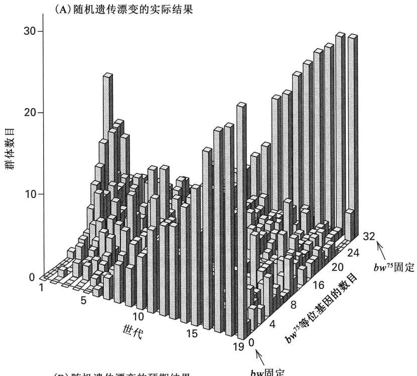

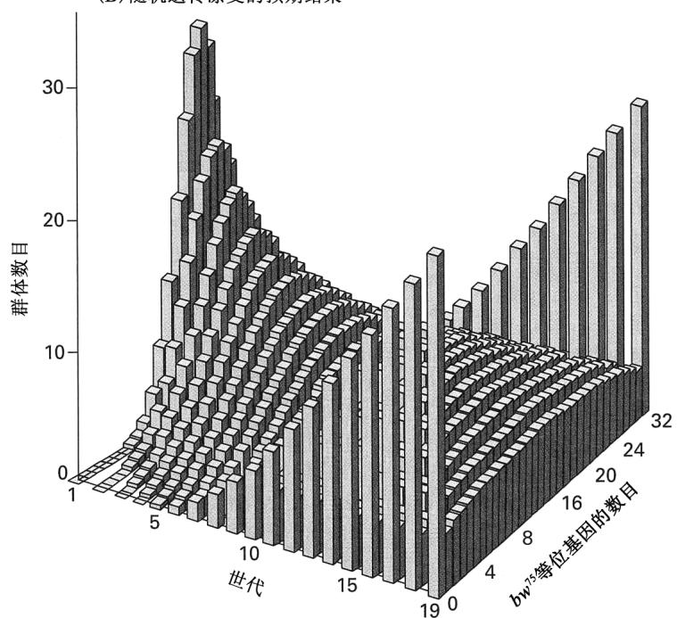  
图 17.30 (A) 在 107 个黑腹果蝇实验种群中的随机遗传漂变，每个种群各由 8 只雌性和 8 只雄性组成。(B) 对同样情况的理论预期，根据二项分布计算而得。[A 部分的数据来自 P. Buri, Evolution 10(1956): 367-402。图引自 D. L. Hartl and A. G. Clark, Principles of Population Genetics, Third edition. Sinauer Associates(1997)。]

失要快 10%～30%。在重组有限的基因组区域，包括 Y 染色体及线粒体和叶绿体 DNA，这种多样性的丢失甚至会更快。有少数基因表现出相反的效应，它们的遗传多样性保持的时间比根据中性理论预计的要长。有证据显示，这些基因通常存在杂合子优势或选择对稀有等位基因有利。因此，在预测有限大小的群体中遗传多样性的丢失时，随机遗传漂变的中性理论通常很有用，但它预测的往往是最好的情况，因为真实的丢失速度可比预测的大。

## 本章概要

\- 随着进化时间的推移，蛋白质和核酸分子序列的变化逐渐累积，据此可推断蛋白质和核酸分子的谱系历史。

\- 自然群体中的许多基因是多态性的，即它们具有两个或两个以上的等位基因。遗传多态性在系谱研究中可用作遗传标记，可用于个体识别(DNA 分型)。

\- 哈代-温伯格定律认为，在随机交配情况下，群体中基因型 $AA$ 、 $Aa$ 和 $aa$ 的频率预计分别为 $p^2$ 、 $2pq$ 和 $q^2$ ，其中， $p$ 和 $q$ 是 $A$ 和 $a$ 的等位基因频率。该定律的一个推论是，大部分罕见有害隐性等位基因在杂合携带者中。

\- 近交是指有亲缘关系的个体之间交配。通过近交，存在于一个共同祖先中的某个等位基因的两个拷贝，可能会沿系谱的两支同时向下传递，从而在近交后代个体中会合。这样的两个等位基因被称为具有血统同一的性质。因为近交可产生血统同一的等位基因，所以近交可产生过多的纯合基因型个体(相对于随机交配情况下的期望基因型频率)。

\- 突变和迁移都可在群体中引入新的等位基因。突变率一般较小，因而对于改变等位基因频率而言，突变是一种较弱的动力。

\- 由于某些基因型在繁殖上较为成功，自然选择可使等位基因频率向着一定方向改变。如果杂合基因型的适合度最高，则选择可导致稳定的遗传多态性。针对反复发生的有害突变的选择，可导致选择-突变平衡，在此状态下，有害隐性等位基因的等位基因频率一代复一代地维持不变。

\- 随机遗传漂变是指有限群体中发生的等位基因频率的随机变化，这种变化是某些基因型中随机的生殖过剩(或生殖不足)的结果，因为进行生殖的成体不可能个个对下一代产生相同的贡献。

## 基础回顾

\- 什么是基因树？什么是物种树？它们一定始终一致吗？解释为什么一致或不一致。

\- 指出直系同源基因和旁系同源基因的差别。哪种类型的重复给新基因功能的进化提供了原材料？

\- 关于罕见有害隐性等位基因的杂合携带者和纯合患者的相对频率，哈代-温伯格定律可作何推论？

\- X染色体上的隐性等位基因所致的性状，一般在男性中比在女性中常见得多。解释为什么在随机交配情况下这种差异是必然的。

\- 为什么借助罕见隐性等位基因比借助罕见显性等位基因，更容易观察到近交效应？

\- 举出4种可改变自然群体中等位基因频率的进化过程。在没有这些过程的情况下，等位基因频率如何改变？

\- 在进化过程中突变的作用是什么？为什么对改变等位基因频率而言突变是一种弱小的动力？

\- 群体遗传学家说的“适合度”是什么意思？某个生物个体在生育年龄之前死亡，其适合度是多少？某个不育的生物个体，其适合度是多少？

\- 在随机交配群体中，为什么罕见隐性等位基因受到选择时其等位基因频率改变得很慢？

\- 许多隐性等位基因纯合时极其有害，所以在每一代中都存在选择，这种选择倾向于使该等位基因频率降低。然而，对于几乎每个基因而言，有害隐性等位基因都被维持在一个较低的频率上。什么过程阻止了有害隐性等位基因被完全淘汰？

\- 在镰形细胞贫血中观察到的杂合子优势类型有时称作平衡选择(balancing selection)。这个术语恰当吗？解释为什么恰当或不恰当。

\- 什么是随机遗传漂变？为什么会发生随机遗传漂变？解释为什么该过程表明，在没有其他动力的情况下，存在于群体中某个基因座上的所有等位基因的祖先，最终可回溯到存在于某一祖先群体中的单个等位基因。

## 解题指南

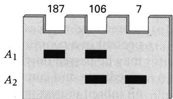

习题 1 此处所示的凝胶示意图，总结了来自一个琴叶拟南芥(Arabidopsis lyrata)自然群体的300棵植株样本中一项RFLP基因型研究的结果。RFLP等位基因记为 $A_{1}$ 和 $A_{2}$ ，各泳道上方为观察到其基因组DNA产生该种带型的植株数。 $A_{1}$ 和 $A_{2}$ 的等位基因频率是多少？假设进行随机交配，这3种基因型的植株的期望数目是多少？

## 答案

通过对等位基因进行计数来确定等位基因频率。187 棵 $A_{1}A_{1}$ 植株代表 374 个 $A_{1}$ 等位基因，106 棵 $A_{1}A_{2}$ 植株代表 106 个 $A_{2}$ 和 106 个 $A_{1}$ 等位基因，而 7 棵 $A_{2}A_{2}$ 植株代表 14 个 $A_{2}$ 等位基因，总计 $300 \times 2 = 600$ 个等位基因。 $A_{1}$ 的等位基因频率 p 为 $(374 + 106)/600 = 0.8$ ，而 $A_{2}$ 的等位基因频率 q 为 $(106 + 14)/600 = 0.2$ 。对上述计算结果进行验算：可见两个等位基因频率之和为 1，正如期望的一样。对于第二问，随机交配情况下的期望基因型频率为 $p^{2}A_{1}A_{1}$ 、 $2pqA_{1}A_{2}$ 和 $q^{2}A_{2}A_{2}$ ，因此期望数目： $A_{1}A_{1}$ 为 $(0.8)^{2} \times 300 = 192$ ， $A_{1}A_{2}$ 为 $2 \times (0.8)(0.2) \times 300 = 96$ 和 $A_{2}A_{2}$ 为 $(0.2)^{2} \times 300 = 12$ 。对这些计算结果进行验算，可见 $192 + 96 + 12 = 300$ 。

习题 2 此处所示的凝胶图对应于 4 对父母 (1～8) 和 4 个孩子 (A～D) 基因组 DNA 中的一个 VNTR (可变数目串联重复序列) 多态性。每个孩子分别为其中一对父母所生。

1 2 3 4 5 6 7 8 A B C D

(a)为什么每个人的 DNA 都显示两条带?

(b)一个人的 DNA 有没有可能只显示出一条带？如何才能？

(c) 这些 VNTR 等位基因说明了一种什么类型的显性？

(d) 具有泳道 1\~8 中的 DNA 的人，分别是哪个孩子的父母？

## 答案

(a) 来自每一个体的基因组 DNA 中的两条带, 说明两个不同 VNTR 等位基因的杂合性。

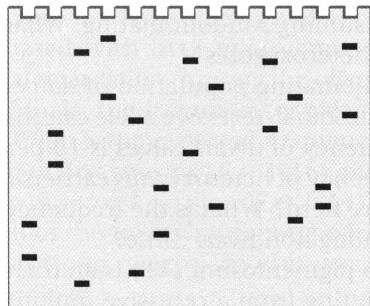

(b) 对某个 VNTR 等位基因为纯合的人，其基因组 DNA 会显示出单条 VNTR 条带。

(c) VNTR 等位基因为共显性，因为在杂合基因型中，来自两个等位基因的条带都可被检出。

(d) 因为 4 对父母的条带各具有不同的电泳迁移率，所以与某个孩子共有单个 VNTR 条带的人，即可认定为该孩子的父母。孩子 A 的父母为 7 和 2；孩子 B 的父母为 4 和 1；孩子 C 的父母为 6 和 8；孩子 D 的父母为 3 和 5。

习题 3 常染色体隐性多囊肾病(AR-PKD)是一种以在肾脏中生长大量囊肿为特征的严重遗传病。AR-PKD 患儿受高血压、尿道感染和尿频的折磨。他们常常发生肾衰竭，因而在成年之前需要透析。儿童患病率约为 1/10 000。

(a) 假使按照哈代-温伯格比例，AR-PKD 杂合携带者的频率是多少？

(b)一级堂表亲婚配，所生孩子中 AR-PKD 的期望频率是多少？

(c)一级堂表亲婚配所生子女中的 AR-PKD 患者，与无亲缘关系者婚配所生子女中的 AR-PKD 患者，两者的比例是多少？

## 答案

首先，利用纯合隐性个体的频率为 1/10 000 的信息，来计算隐性等位基因 q 的频率。假定随机婚配频率成立，则 $q = \sqrt{(1/10\ 000)} = 0.01$ 。

(a) 假定哈代-温伯格比例成立，则杂合基因型频率为 $2(0.01)(0.99)=0.0198$ ，即约为 1/50。

(b)在一级堂表亲婚生子女中，AR-PKD的期望频率为 $q^{2}(1 - F) + qF$ ，其中， $F$ 为近交系数，对于一级堂表亲婚生子女， $F$ 等于1/16。如此，根据公式得 $(0.01)^{2}(15 / 16) + (0.01)(1 / 16) = 0.000718$ ，即约1/1400。

(c)所求比例由下式给出，其中，q=0.01，F=1/16，

$$
\text {比例} = \frac {q ^ {2} (1 - F) + q F}{q ^ {2}} = (1 - F) + F / q
$$

在此情况下，所求比例为 $(15/16)+(1/16)\times(1/0.01)=7.19$ 。换句话说，一级堂表亲婚生子女对 AR-PKD 的隐性突变等位基因纯合的风险，为非近亲婚配的 7 倍以上。

## 分析与应用

17.1 如果基因型 $AA$ 为胚胎致死的，基因型 $aa$ 可完全存活但不育，则在含 $A$ 和 $a$ 等位基因的平衡群体中，在成体中各基因型频率为多少？需要假设进行随机交配吗？

17.2 在开花植物小天蓝绣球(Phlox drummondii)中，某单基因的3个等位基因决定乙醇脱氢酶不同的型。在一个35棵植株的样本中，得到以下数据：

$$
\begin{array}{c c c c c c c} \text {基因型} & A _ {1} A _ {1} & A _ {1} A _ {2} & A _ {2} A _ {2} & A _ {2} A _ {3} & A _ {3} A _ {3} & A _ {1} A _ {3} \\ \text {数量} & 2 & 5 & 1 2 & 1 0 & 5 & 1 \end{array}
$$

在该样本中，等位基因 $A_{1}$ 、 $A_{2}$ 和 $A_{3}$ 的频率是多少？

17.3 附图示一人类系谱，以及用一个标记探针与来自每一个体的 DNA 样品杂交时观察到的限制性片段图。考察该系谱及各带型，提出一种遗传方式。哈代-温伯格定律与此相关吗？解释为何相关或不相关。

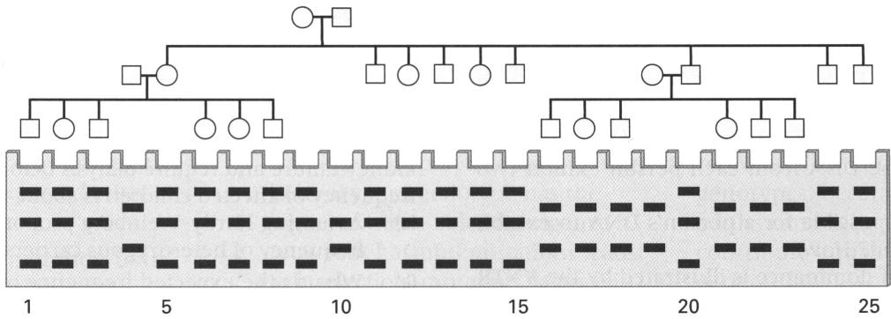

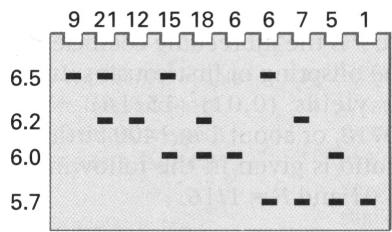

17.4 以限制酶 HindIII 消化来自 100 个无亲缘关系的人的 DNA，分离所得片段，然后以针对某特定基因的一段序列的探针进行杂交。观察到与探针杂交的片段长度有 4 种，即 5.7kb、6.0kb、6.2kb 和 6.5kb，其中，每条片段为一个不同的限制性片段等位基因。附图示观察到的凝胶图像，各带型所属个体的编号示于顶部。估计这 4 个限制性片段等位基因的频率。

17.5 如果基因型 AA、Aa 和 aa 的频率分别记为 P、Q 和 R，证明由哈代-温伯格定律可推知 $Q^{2}/4 = PR$ 。

17.6 下列哪些基因型频率(分别为 AA、Aa 和 aa)满足哈代-温伯格定律?
(a) 0.25、0.50、0.25
(b) 0.36、0.55、0.09
(c) 0.49、0.42、0.09
(d) 0.64、0.27、0.09
(e) 0.29、0.42、0.29

17.7 某群体遗传学家观察到所附凝胶示意图所示的 RFLP 表型，其中，每个加样孔上方的数字是显示出相应表型的个体的数量。用卡方法检验观察到的表型频率是否与随机交配群体中具有 3 个等位基因的单基因座的期望表型频率吻合。在该检验中，恰当的自由度数目为 3，解释为什么。

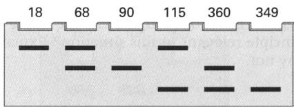

17.8 哈特纳普病 (Hartnup disease) 是一种常染色体隐性疾病，具有肠、肾氨基酸转运障碍。新生儿发病率约为 1/14 000。假设进行随机婚配，杂合子频率是多少？

17.9 在一个随机交配的奶牛群体中有一个导致侏儒症的常染色体隐性等位基因。如果侏儒小牛的频率为 $10\%$ ，在整个牛群中该等位基因的杂合携带者的频率是多少？在非侏儒牛中杂合子的频率是多少？

17.10 着色性干皮病(XP)常常是一种致死的皮肤癌，由一个影响DNA修复的隐性突变型等位基因引起。在美国，纯合隐性患者的频率约为1/250 000。(突变型等位基因可为8个左右不同基因中的任一个，但对此题的目的而言，没有什么差别。)

(a) 在一级堂表亲婚生子女中，XP 的期望频率是多少？

(b)一级堂表亲婚生子女与无亲缘关系者婚生子女中 XP 的比值是多少?

17.11 在中非的一个俾格米人群中，估计决定 ABO 血型的等位基因的频率， $I^{O}$ 为 0.74， $I^{A}$ 为 0.16， $I^{B}$ 为 0.10。假设进行随机婚配，ABO 基因型和表型的期望频率是多少？

17.12 在某种禾本科植物中，在污染了有毒金属镍的土壤中生长的能力，由一个显性等位基因决定。

(a)在某个随机交配群体中，如果 $60\%$ 的种子能在被污染土壤中发芽，抗性等位基因的频率是多少？

(b)在发芽的植株中，为纯合的比例是多少？

17.13 在一个进行随机交配的群体中，如果某个 X 连锁隐性性状在 2% 的男性中存在，在女性中该性状的频率是多少？女性携带者的频率是多少？

17.14 在开花植物小天蓝绣球的 35 棵植株中，对于某个决定磷酸葡糖异构酶不同型的基因的等位基因，观察到以下基因型： $2A_{1}A_{1}$ 、 $13A_{1}A_{2}$ 和 $20A_{2}A_{2}$ 。

(a)等位基因 $A_{1}$ 和 $A_{2}$ 的频率是多少？

(b) 假设进行随机交配，各基因型的期望数目是多少？

17.15 在等位基因频率相同的情况下,近交群体的杂合子频率与随机交配群体的杂合子频率相比,有何不同?

17.16 在某一果蝇群体中，一个导致黄色体色的 X 连锁隐性等位基因，以随机交配特有的频率存在于基因型中，该隐性等位基因的频率为 0.20。在 1000 只雌性和 1000 只雄性中，黄色和野生型表型的期望数目各是多少？

17.17 半乳糖血症是一种伴随着肝大、白内障和智力低下的常染色体隐性疾病。在无亲缘关系者婚生子女中，半乳糖血症的发病率为 $8.5 \times 10^{-6}$ 。在一级堂表亲 (F = 1/16) 婚生子女中，以及在二级堂表亲 (F = 1/64) 婚生子女中，期望发病率是多少？

17.18 下列哪些基因型频率(分别为 AA、Aa 和 aa)提示存在近交?

(a) 0.25、0.50、0.25

(b) 0.36、0.55、0.09

(c) 0.49、0.42、0.09

(d) 0.64、0.27、0.09

(e) 0.29、0.42、0.29

17.19 考察所附系谱。

(a)指出所有的共同祖先。

(b)指出经过各共同祖先的所有路径，在各路径的共同祖先下划线。

(c) 设 $F_{B}$ 未知，计算个体 L 的近交系数。

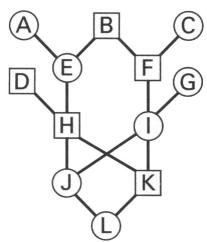

(d) 设 $F_{\mathrm{B}} = 0$ ，计算个体L的近交系数。

17.20 假设在某群体中，在无亲缘关系者婚生孩子中，某种隐性遗传病的发病率为 1/2 600 000。

(a)估计该有害隐性等位基因的频率是多少?

(b)在一级堂表亲婚生子女中，纯合隐性基因型的期望频率是多少？

(c) 如果一级堂表亲婚配在该群体的所有婚配中占 1%，且所有其他的婚配都是随机的，纯合隐性基因型的总频率是多少？

(d) 在所有纯合隐性基因型中，来自一级堂表亲婚配的比例是多少？

17.21 在一年生植物尖天蓝绣球(Phlox cuspidata)中的自体受精，导致平均近交系数 F = 0.66。

(a)在某个群体中，磷酸葡糖异构酶的等位基因 $A_{1}$ 和 $A_{2}$ 的频率分别为0.43和0.57，预计各基因型的频率为多少？

(b) 如果进行随机交配，预计各基因型的频率为多少？

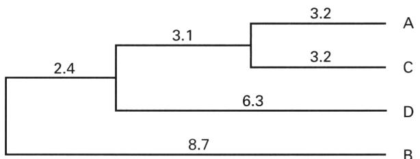

17.22 对于此处所示的基因树，UPGMA 距离矩阵是怎样的？

17.23 一个果蝇品系在 X 染色体上 white 基因的野生型等位基因 $w^{+}$ 中有一个转座因子 mariner 的插入。该插入突变导致桃色眼而不是白眼。假设该转座因子以每代 5% 的频率从其插入位点自发切除。

(a) 1 代之后，在 X 染色体中该突变型等位基因的频率是多少？

(b) 10 代之后呢？

(c)20代之后呢？

(d)多少代之后，突变型X染色体的频率会低于0.01?

17.24 A 和 B 两株大肠杆菌以等比例接种于恒化器中，并发生竞争。40 代之后，B 株所占比例为 35%。在该特定的实验条件下，相对于 A 株，B 株的适合度是多少？B 株的选择系数是多少？

17.25 某等位基因 $A$ 以 $10^{-6}$ /代的速度突变为非功能性等位基因 $a$ 。从 $a$ 到 $A$ 的回复突变可忽略不计。在下列情况下，判定等位基因 $a$ 的期望平衡频率。

(a) 等位基因 a 为隐性致死基因，但在杂合基因型中不起作用。

(b)等位基因 a 为 “隐性” 致死基因，但在杂合基因型中导致 1% 的选择劣势。

(c)这一少量的显性使 $a$ 的平衡频率减少了多少比例？

17.26 某等位基因 A 为突变热点，以 $10^{-4}$ /代的频率突变为 a。如果从 a 到 A 的回复突变的频率为 $10^{-7}$ /代，a 等位基因的期望平衡频率是多少？

17.27 在此处所示的距离矩阵中，首先应该连接哪一对类群？所得 UPGMA 距离矩阵是怎样的？

<table><tr><td></td><td>B</td><td>C</td><td>D</td></tr><tr><td>A</td><td>8</td><td>15</td><td>19</td></tr><tr><td>B</td><td></td><td>18</td><td>16</td></tr><tr><td>C</td><td></td><td></td><td>5</td></tr></table>

17.28 亨廷顿病是一种神经肌肉退化病，通常中年起病，由编码一种蛋白质(称为亨廷顿蛋白)的基因的一个显性突变引起。早发型使患者的生殖适合度减少大约 $20\%$ 。密歇根的一项大型研究估计，该显性等位基因的频率约为0.00005。假设该群体进行随机婚配，且处于平衡状态。

(a)携带该显性等位基因的个体的期望频率是多少?

(b) 估计突变为该显性有害等位基因的突变率是多少?

17.29 一个超显性基因座，已知 AA、Aa 和 aa 的相对适合度为 0.90：1.00：0.50。

(a) $a$ 等位基因的期望平衡频率是多少？

(b)在平衡时，杂合基因型的期望频率是多少？

(c) 如果纯合 $aa$ 致死，这会怎样改变 $a$ 的平衡等位基因频率？

(d)在新的平衡状态下，杂合基因型的期望频率是多少？

17.30 在下列情况下，哪个等位基因的频率变化较快？解释为什么。

(a)一个稀有有利显性等位基因和一个稀有有利隐性等位基因。

(b)一个常见有害显性等位基因和一个常见有害隐性等位基因。

## 挑战题

挑战题 1 在人类遗传多态性中，可变数目串联重复序列(VNTR)常用于 DNA 分型。下表显示 4 个 VNTR 基因座的各等位基因，及其在遗传异质性的白人群体中的平均频率估计值。(HUMTHO1 基因座的等位基因 9.3 具有某种串联重复序列拷贝的一部分。)假设进行随机婚配。

(a) 估计某一个体的基因型，对 HUMTHO1 为 (6, 9.3)，对 HUMFES 为 (10, 11)，对 D12S67 为 (6, 6)，对 DIS80 为 (18, 24) 的概率。

(b) 估计某一个体的基因型，对 HUMTHO1 为 (8, 10)，对 HUMFES 为 (8, 13)，对 D12S67 为 (1, 2)，对 DIS80 为 (19, 19) 的概率。

<table><tr><td colspan="2">HUMTHO1</td><td colspan="2">HUMFES</td><td colspan="2">D12S67</td><td colspan="2">D1S80</td></tr><tr><td>重复序列</td><td>频率</td><td>重复序列</td><td>频率</td><td>重复序列</td><td>频率</td><td>重复序列</td><td>频率</td></tr><tr><td>6</td><td>0.230</td><td>8</td><td>0.007</td><td>1</td><td>0.015</td><td>18</td><td>0.293</td></tr><tr><td>7</td><td>0.160</td><td>10</td><td>0.321</td><td>2</td><td>0.005</td><td>19</td><td>0.011</td></tr><tr><td>8</td><td>0.105</td><td>11</td><td>0.373</td><td>3</td><td>0.058</td><td>20</td><td>0.021</td></tr><tr><td>9</td><td>0.193</td><td>12</td><td>0.233</td><td>4</td><td>0.078</td><td>21</td><td>0.032</td></tr><tr><td>9.3</td><td>0.310</td><td>13</td><td>0.066</td><td>5</td><td>0.118</td><td>22</td><td>0.043</td></tr><tr><td>10</td><td>0.002</td><td></td><td></td><td>6</td><td>0.324</td><td>23</td><td>0.016</td></tr><tr><td></td><td></td><td></td><td></td><td>7</td><td>0.196</td><td>24</td><td>0.335</td></tr><tr><td></td><td></td><td></td><td></td><td>8</td><td>0.127</td><td>25</td><td>0.037</td></tr><tr><td></td><td></td><td></td><td></td><td>9</td><td>0.059</td><td>26</td><td>0.016</td></tr><tr><td></td><td></td><td></td><td></td><td>10</td><td>0.020</td><td>28</td><td>0.078</td></tr><tr><td></td><td></td><td></td><td></td><td></td><td></td><td>29</td><td>0.059</td></tr><tr><td></td><td></td><td></td><td></td><td></td><td></td><td>30</td><td>0.016</td></tr><tr><td></td><td></td><td></td><td></td><td></td><td></td><td>31</td><td>0.043</td></tr></table>

挑战题 2 在此处所示的系谱中，个体 I 为连续两代兄妹婚配的结果。设 $F_{A}=F_{B}=0$ 。

(a) 计算个体 E 和 F 的近交系数 (E 和 F 是一代兄妹婚配的结果)。

(b) 计算 I 的近交系数。

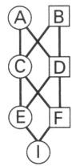

挑战题 3 两个非洲人之间在线粒体 DNA 中平均有 78 个核苷酸的差异，两个亚洲人之间平均有 58 个差异，而两个白人之间平均有 40 个差异。假设线粒体 DNA 的进化速率为每 1500～3000 年 1 个核苷酸差异，估计非洲人线粒体 DNA 的共同祖先的平均年龄是多少？亚洲人呢？白人呢？

## 网上遗传学

“网上遗传学”(GeNETics)会为你介绍在互联网上寻找遗传学信息的某些最重要的站点。要浏览这些站点，请访问为《遗传学：基因和基因组分析》(第八版)配备的 Jones and Bartlett 公司配套站点http://biology.jbpub.com/book/genetics/8e/。

在该站点中，你会找到一个按章列出的重点关键词列表。选择某个关键词后，可链接到某个网站，其中包含与此关键词相关的信息。
