# 第18章 复杂性状的遗传基础

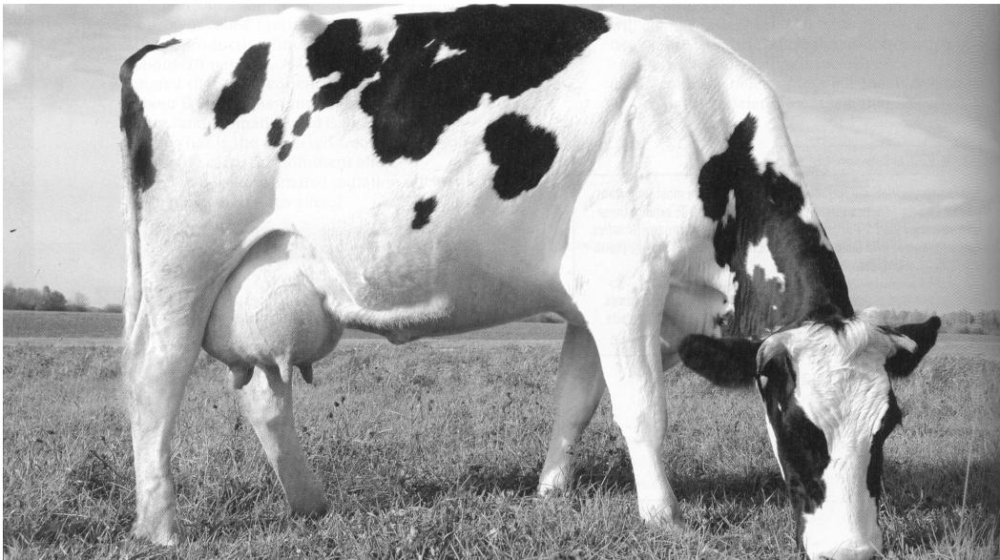

一头正在吃草的荷斯坦奶牛，这个品种的牛被用来选择高的产奶量已有约2000年。（©Dmitry Kalinovsky/Shutterstock, Inc.)

## 本章提纲

18.1 复杂性状  
18.2 变异的因素  
18.3 复杂性状的遗传分析  
18.4 人工选择  
18.5 亲属之间的相关性  
18.6 阈值性状的遗传率  
18.7 鉴定影响复杂性状的基因

联系：异草

乔治·比德尔，1972

玉米之谜

联系：冠军、亚军还是季军？

休·蒙哥马利及其他18位研究人员，1998人类体能基因

## 学习目标与科学能力

理解复杂性状的遗传基础，会为你具有解决如下问题的新科学能力奠定基础。

\- 给复杂性状下定义，并区分连续(数量)性状、二分性状和阈值性状。

\- 在复杂性状表型变异的来源中，区分由基因型、环境、基因型与环境互作、基因型与环境关联所导致的变异。

\- 对于在群体中表型呈正态分布、均数和方差已知的性状，计算预计包含群体的 $95\%$ 或 $99\%$ 的表型范围。

\- 对于数量性状的人工选择，已知随机交配群体的平均表型、选出的亲本要满足的表型阈值及性状的狭义遗传率，计算下一代后代的均数期望值。

\- 在鉴定影响复杂性状的基因的研究中，指出数量性状基因座(QTL)和候选基因的差异，并解释全基因组关联研究如何用于QTL的检测。

前面各章一直在强调的性状，其表型上的差异是由单一基因的不同基因型所致。这些性状特别适合通过系谱研究来进行遗传分析，这不仅是因为基因型和表型的数量较小，而且是因为基因型和表型之间的对应关系简单。但是，许多在医学遗传学和动植物育种上很重要的性状，除了受多个基因影响外，还受环境的影响。这些性状的成因涉及多个遗传和环境因子，因而称为复杂性状 (complex trait) 或多因子性状 (multifactorial trait)，并称其表现出复杂遗传 (complex inheritance) 方式。这种遗传方式之所以复杂，是因为单一基因型可能会有许多表型 (取决于环境)，而单一表型可能会包含许多基因型。复杂遗传方式的遗传分析，需要特殊的概念和方法，这就是本章将要介绍的。

## 18.1 复杂性状

复杂性状通常不仅受两个或两个以上等位基因影响，而且受环境的影响。因此个体的表型可能会受到以下因素的影响。

\- 遗传因素(genetic factor)，以两个或多个基因的不同基因型的形式存在。

\- 环境因素(environmental factor)，以对性状的发生有利或不利的条件的形式存在。

兹举几个环境因素的例子，如营养物质对动物生长速度的作用，以及肥料、降雨量和种植密度等对农作物产量的作用。

对于有些复杂性状，表型上的差异主要是基因型差异的结果，环境起次要作用。对于另一些复杂性状，表型的差异主要是环境影响的结果，遗传因素起次要作用。但是，大多数复杂性状介于这两个极端之间，在对它们进行分析时，基因型和环境两者都必须予以考虑。

在一个遗传异质性的群体中，通过分离和重组的过程形成很多基因型。通过研究近交系(大多数基因是纯合的)，或两个近交系杂交来的 $F_{1}$ 后代(对于在两个亲本中不一样的所有等位基因，在 $F_{1}$ 中都是杂合的)，可排除基因型的变异。相反，无论实验者怎样设法使一个群体的所有成员的环境相同，也不可能完全排除环境的变异。例如，对于植物而言，土质或日照量的变异，可产生轻微不同的环境，有时甚至毗邻的植株环境也会不同。同样，高度近交的果蝇，在同一培养瓶中仍然会出现由个体间环境的差异导致的表型上的变异(如身体大小的变异)。因而，即使在近交系中，对小环境作用敏感的性状也绝不会均一。

在动植物育种中，大多数重要性状是复杂性状。在农业生产上，一个在经济上重要的复杂性状是产量，例如，单位面积收获玉米、土豆、大豆或葡萄的多少。在家畜中，重要的复杂性状包括肉质、奶牛产奶量、母鸡产蛋量、绵羊羊毛质量和母猪产仔数等。在人类遗传学中，重要的复杂性状包括婴儿生长速度、成人体重、血压、血清胆固醇含量和寿命等。在进化研究中，适合度显然是复杂性状。

大多数复杂性状不能用通常的系谱方法来研究, 因为一个基因的若干等位基因的分离效应, 可能会掩盖其他基因的效应, 并且环境效应可能会使一样的基因型具有不一样的表型。因此, 单个的系谱不符合任何简单的显性、隐性或 X 连锁遗传方式。但是, 可通过比较有亲缘关系的个体的表型, 估计遗传因素对性状的作用, 因为有血缘关系, 有亲缘关系的个体必定有一定比例的基因是相同的。此类研究要利用在第 17 章中讨论过的许多群体遗传学概念。

3 类性状常被发现具有复杂遗传方式，在下节予以叙述。

## ■ 连续性状、类别性状和阈值性状

群体中大多数的表型变异不会表现为少数几种易于区别的类别，而是性状连续地从一种极端表型变化到另一种极端表型，中间没有清晰的间断。身高和体重是绝佳的例子。其他例子包括家畜产奶量、家禽生长速度、玉米产量和人的血压等，这样的性状称为连续性状(continuous trait)或数量性状(quantitative trait)，因为存在从一种表型到另一种表型的连续的或量上的渐变。

另外两种复杂性状是不连续的。

类别性状(categorical trait)是表型对应于若干离散类别之一的性状。这种表型通常对应于一个计数，例如，构成指纹的皮嵴数、玉米穗上的籽粒数、母鸡产蛋数、果蝇腹部的刚毛数和一窝狗仔的数目等。

阈值性状(threshold trait)只有两种或少数几种表型类别，但它们的遗传是由多个基因的效应与环境共同作用而决定的。牛产双胎和火鸡的孤雌生殖(未受精卵发育)是阈值性状的例子。在阈值性状中，每个生物体都具有表达性状的潜在风险或称易感性(liability)。尽管这种潜在的易感性无法直接观测，但如果它足够高(超过阈值)，性状就会被表达(如妊娠双胞胎)；否则，性状不被表达(妊娠单胎)。在许多阈值性状疾病中，表型的种类是患病或不患病。人类阈值性状疾病的例子，包括成年型糖尿病、精神分裂症和脊柱裂之类的许多先天畸形。如果将潜在的易感性想象为连续变量，阈值性状可被解释为连续性状。

## ■ 正态分布

一个群体中某个性状的分布(distribution)，是从具有每种可能表型的个体所占比例的角度，对该群体的一种描述。要建立对连续性状的这样一种描述，从将相似的表型分组归置入各类别开始，通常比较方便。表18.1和图18.1示一例关于4995位英国女性身高分布的数据。图18.1中每一条形的构建，可以想象为，每测得一位女性的身高时，就将一个小矩形置于 $x$ 轴上与该女性的身高相应处，逐一进行。随着采样的进行，这些矩形开始在某些地方丛集，最终得到所示的直方图。

表 18.1 英国女性身高分布

<table><tr><td>区间编号(i)</td><td>身高区间(英寸)</td><td>中值(xi)</td><td>女性数量(fi)</td></tr><tr><td>1</td><td>53~55</td><td>54</td><td>5</td></tr><tr><td>2</td><td>55~57</td><td>56</td><td>33</td></tr><tr><td>3</td><td>57~59</td><td>58</td><td>254</td></tr><tr><td>4</td><td>59~61</td><td>60</td><td>813</td></tr><tr><td>5</td><td>61~63</td><td>62</td><td>1340</td></tr><tr><td>6</td><td>63~65</td><td>64</td><td>1454</td></tr><tr><td>7</td><td>65~67</td><td>66</td><td>750</td></tr><tr><td>8</td><td>67~69</td><td>68</td><td>275</td></tr><tr><td>9</td><td>69~71</td><td>70</td><td>56</td></tr><tr><td>10</td><td>71~73</td><td>72</td><td>11</td></tr><tr><td>11</td><td>73~75</td><td>74</td><td>4</td></tr><tr><td colspan="3"></td><td>总计N=4995</td></tr></table>

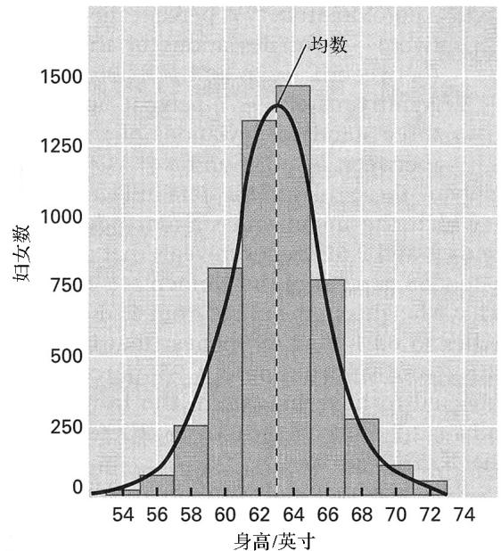  
图 18.1 4995 位英国女性的身高分布及逼近该数据的平滑正态分布。

以表格形式(表 18.1)或图形形式(图 18.1)完整地表现分布，总是有用的，但往往没有必要，用均数(mean)和方差(variance)这两个主要指标来描述分布就足够了。要在数量上来讨论均数和方差，还需要一些符号。在表 18.1 中，身高区间从编号 1(53～55 英寸)至 11(73～75 英寸)。

符号 $x_{i}$ 表示编号为 $i$ 的身高区间的中值，例如， $x_{1} = 54$ 英寸， $x_{2} = 56$ 英寸等。在身高区间 $i$ 中的女性数量记为 $f_{i}$ ，例如， $f_{1} = 5$ 位女性， $f_{2} = 33$ 位女性等。样本的总体大小记为 $N$ ，在此例中为4995。如同许多其他数量性状分布一样，此处的均数和方差起到描述这些女性的身高分布特征的作用。

均数(mean)，又称平均数，在此例中为分布的峰值。一个群体的均数，是根据来自该群体的若干个体组成的样本，以下式估计：

$$
\overline {{x}} = \frac {\Sigma f _ {i} x _ {i}}{N}\tag{1}
$$

其中， $\bar{x}$ 是均数的估计值，符号 $\Sigma$ 是表示所有类别的数据的总和 (在此例中，为所有 11 个身高区间数据的总和)。在表 18.1 中，该女性样本的平均身高为 63.1 英寸。

方差(variance)是分布幅度的一个测度，根据每一观测值与均数的离差(差值)的平方来估计。方差是根据若干个体组成的样本，以下式估计：

$$
s ^ {2} = \frac {\Sigma f _ {i} (x _ {i} - \overline {{x}}) ^ {2}}{N - 1}\tag{2}
$$

其中， $s^{2}$ 为估计的方差， $x_{i}$ 、 $f_{i}$ 和 N 与表 18.1 中相同。差值 $(x_{i}-\bar{x})$ 为每个身高类别与整个样本的平均身高的离差。方差描述了各表型在均数周围聚集的程度，如图 18.2 所示。方差值大，说明分布分散；方差值小，说明分布靠近均数聚集。根据表 18.1 中的数据，英国女性群体的方差估计为 $s^{2}=7.24$ 平方英寸。（注意，方差的单位带有平方。）

与方差密切相关的分布的标准差(standard deviation)被定义为方差的平方根。对于图 18.1 中的数据，根据式(2)得到估计的标准差，如下：

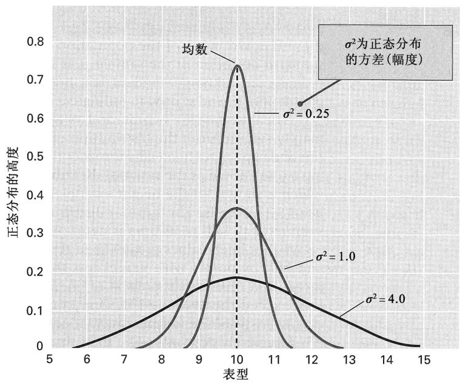  
图 18.2 图示分布的方差可衡量均数周围的分布幅度。每条曲线之下覆盖任意表型范围的面积，等于具有该范围内的表型的个体所占的比例。

$$
s = \sqrt {s ^ {2}} = \sqrt {7 . 2 4 \mathrm{平方英寸}} = 2. 6 9 \mathrm{英寸}
$$

标准差具有与均数相同的量纲单位(在此例中为英寸)。正如样本均数 $(\bar{x})$ 被用来估计群体的未知均数 $(\mu)$ 一样，样本的标准差(s)被用来估计群体的未知标准差 $(\sigma)$ ， $s^{2}$ 被用来估计 $\sigma^{2}$ 。

当数据对称或基本对称时，性状的分布常常可被称作正态分布（normal distribution）的光滑拱形曲线逼近，该曲线在图 18.1 的身高例子中已出现过。因为正态分布是对称的，所以其面积的一半由值大于均数的点决定，一半由值小于均数的点决定，因此，超过均数的表型所占的比例为 1/2。正态分布的一个重要特点是，它完全由均数值和方差决定。

如图18.3所示，正态分布的均数和标准差(方差的平方根)提供了群体中表型分布的大量信息。具体来说，对于正态分布有以下几点。

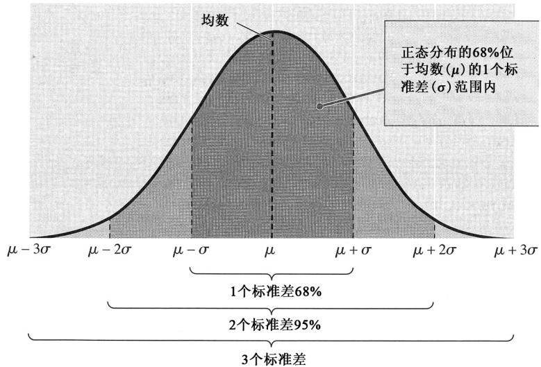  
图 18.3 正态分布的特性。处于均数 1、2 和 3 个标准差范围内的个体所占的比例，大约分别是 68%、95% 和 99.7%。在此正态分布中， $\mu$ 代表均数， $\sigma$ 代表标准差。

(1)群体内约68%具有均数1个标准差范围内的表型[以图18.3的符号表示， $(\mu-\sigma)\sim(\mu+\sigma)$ ]。

(2)约 95% 处于均数的 2 个标准差范围内 $\left[(\mu-2\sigma)\sim(\mu+2\sigma)\right]$ 。

(3) 约 99.7% 处于均数的 3 个标准差范围内 $\left[(\mu-3\sigma)\sim(\mu+3\sigma)\right]$ 。

将这几条规律应用于图18.1中的数据(其中，均数和标准差为63.1和2.69英寸)，可知约 $68\%$ 的女性身高为(63.1-2.69)～(63.1+2.69)英寸(即 $60.4\sim 65.8$ 英寸)，约 $95\%$ 身高为[63.1-2(2.69)]～

[63.1+2(2.69)] 英寸(即 57.7\~68.5 英寸)。

实际数据往往与正态分布相符。当表型由许多小的独立因素的累积效应决定时，正态分布通常是规律。许多多因子性状正是这种情况。

联系：异草

乔治·比德尔，1972

芝加哥大学

玉米之谜

栽培玉米(Zea mays)是一种奇妙的作物。它可煮、可烤、可爆、可剁；它可磨面、可发酵、可油炸、可晾干。它是牲口饲料和工业原料。在5000～10000年前由墨西哥城西南约100英里的巴尔萨斯河流域的美洲土著印第安人驯化后，玉米成为中美洲许多人的主食。美洲印第安人开发了200～300个品种，其实就是今天我们拥有的所有品种。在没有遗传学知识的情况下完成这些，他们在植物育种上的成就被称为人类有史以来最非凡的成就。但玉米来源于什么祖先，曾长期未得到很好的了解。一些早期遗传学家认为，玉米的祖先可能是大刍草，因为他们设想，影响生长和发育的少量基因差异，就有可能将大刍草转变成类似玉米一样的东西。乔治·比德尔在这篇文章中，提出了这一假说的遗传学证据。比德尔最著名的是在链孢霉方面的工作及“一个基因一个酶”的概念(见第11章的“联系：操纵基因？操作员？”)，但他的事业始于玉米研究，并且当他1968年从芝加哥大学校长任上退休之后，他马上在校园外城中间的第55街附近一块半英亩的土地上重操他的玉米实验，开展40年之前他在康奈尔大学当研究生时首次构想的杂交实验。果然，玉米和大刍草之间的主要差异可以用为数不多的关键基因的突变来解释。迄今，这些基因中的一些已被克隆和测序，并且功能得到鉴定。其中一个玉米基因称为大刍草分支基因，其突变表型是一种在生长习性上与大刍草类似的高度分支植物。

现在已经知道大多数栽培植物的野生近亲，可以合理地推测这些栽培植物起源于这些野生近亲。……对玉米而言，早期研究植物的人想寻找玉米的祖先，但难以找到令人信服的野生近亲。……最后，他们发现了一种看起来有可能是近亲的植物。这是一种原产于墨西哥部分地区，称作大刍草(teocentli)的植物，teocentli来自阿兹特克语，是“众神的援助”的意思。该词现在已英语化为“teosinte。”……我还记得(大约1930年在康奈尔大学)与罗林斯·埃默森(Rollins A. Emerson)的讨论，他指出，只要两个突变就可把大刍草变成易于食用的植物：一个突变让它变成不落粒的穗轴(穗的细长中轴)，这样果实就不会散落，可作为食物；另一个突变让它的果皮变软，这样籽粒就能与其脱粒。……转眼至今已40年了，……我决定(从芝加哥大学校长位上)一退休就重新回到大刍草和玉米关系的研究上。……孟德尔定律认为，如果起始亲本相互之间只有一个基因的差异，则在(杂交)后代的第二代中，每个起始亲本型会以1/4的统计频率出现。如果有两个基因不同，每种亲本型将以1/16的频率产生；更多的基因，依此类推。……我曾决心，如果有必要，就栽种多至5万株的第二代植株。……连同今年种植的在内，我估计我们会栽种并考察刚好差不多5万株。……结果是什么呢？在Chapalote玉米与Chalco大刍草杂交的第二代中，我们发现完全的亲本玉米类型和完全的亲本大刍草类型各具大约1/500的频率。这些频率介于具有4个和5个基因差异的期望频率之间。当然，遗传上的复杂性比这种算术上的复杂性要大，但在这里我不打算解释。……看来很清楚，玉米和大刍草之间的遗传差异不会大到能够(排除)大刍草是玉米的祖先这种关系。因而，假设(美洲土著印第安人)可能选择并保留了从大刍草——早期的玉米——产生有用植物所需的相当少的突变，似乎是合理的。

来源：G. W. Beadle, Field Museum Natural History Bulletin 43 (1972): 2-11。

## 18.2 变异的因素

研究复杂性状的遗传学，一个重要目的是评估基因型和环境的相对重要性。在有些情况下，在实验动物中，有可能将基因型和环境各自对平均表型的作用分开。例如，植物育种者可以研究在一组种植密度或施肥量各异的环境中生长的一系列近交系的产量。这样就有可能：

\- 比较在不同环境中生长的相同基因型的产量，从而评定这些环境与它们对产量的作用的关系。

\- 比较在相同环境中生长的不同基因型的产量，从而评定这些基因型与它们对产量的作用的关系。

遗传作用和环境作用之间的精细区分通常不可能，尤其是在人类遗传学中。例如，就图 18.1 中女性的身高而言，只有与成长于不同环境中、在遗传上相同的群体的平均身高进行比较，才有可能研判环境对高大身材是有利还是不利。这种参考群体不存在。同样，只有与成长于相同环境中、在遗传上与之不同的群体的均数比较，才有可能判断该群体的遗传组成对高大身材是有利还是不利。这种参考群体也不存在。

没有这样的比较标准，不可能将遗传和环境对平均表型的作用区分开。但是，仍有可能评估在表型方差中遗传与环境的相对贡献，因为除了比较两个或多个群体的均数以外，还可以比较同一群体内不同个体的表型。表型上的差异，部分是基因型差异的结果，其余是环境差异的结果，而要分清两者的作用，往往不可能。

在任一表型的分布中，如图 18.1 中的分布，对表型变异有贡献的有 4 个来源。

(1)基因型变异。

(2)环境变异。

(3)因基因型与环境互作所致的变异。

(4) 因基因型与环境关联所致的变异。

这些变异的来源在以下小节讨论。

## - 基因型变异

个体间基因型的差异导致的表型变异称为基因型方差(genotypic variance)。图18.4示两个近交系杂交的 $F_{2}$ 代中的预期基因型变异，这两个近交系在基因型上有3个非连锁基因不同。这3个基因的等位基因表示为Aa、Bb和Cc，由分离和重组所致的 $F_{2}$ 代中的遗传变异以颜色差异显示，一目了然。如果假设每个大写字母等位基因对表达该性状有利，给基因型增加一个单位，而每个小写字母基因均不起作用，则aa bb cc基因型具有0的表型，AA BB CC基因型具有6的表型，这涉及类别性状(通过计数确定基因型的性状，如每株玉米的穗数)。在 $F_{2}$ 代中存在7种可能的表型(0～6)。 $F_{2}$ 代中的表型分布在图18.5中以彩色条形图显示。逼近该数据的正态分布，均数为 3，方差为 1.5。在此例中，假设群体中基因型的全部变异为个体间基因型的差异所致。

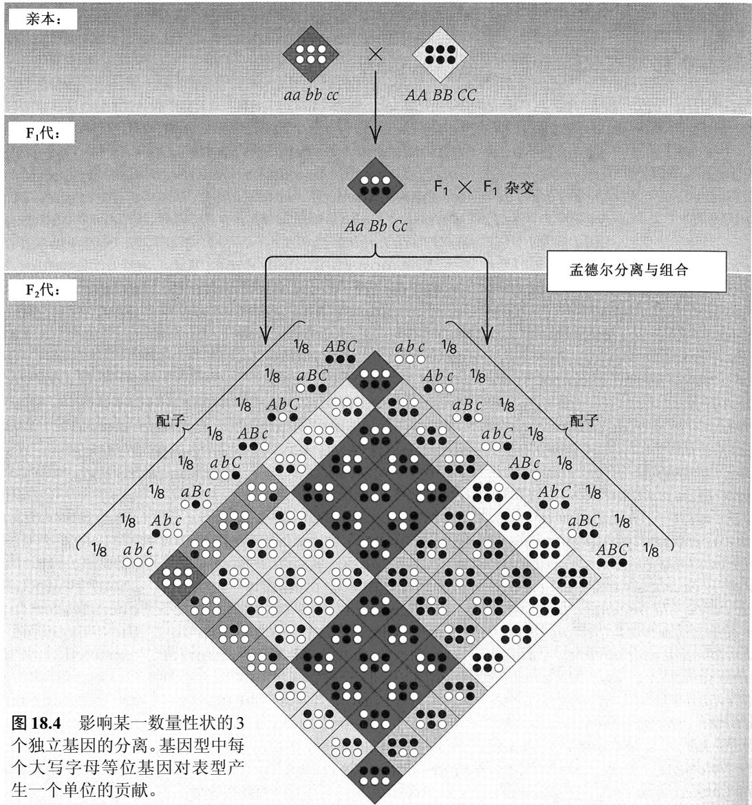

图 18.5 还包含一个带斜线的条形图，表示某一随机交配群体中某个性状的理论分布，该性状由 30 个非连锁基因的分离决定，性状的表型类别数，与 3 个基因的表型类别数相同。假设这些基因中 15 个基因几乎被固定为有利等位基因，15 个基因被固定为不利等位基因。设定每个有利等位基因对表型的贡献，以使该分布的均数等于 3、方差等于 1.5。注意，30 个基因的分布实际上与 3 个基因的分布相同，且两者都被相同的正态分布逼近。如果在实际研究中碰到这样的分布，研究人员不可能区分它们。关键在于：

即使在没有环境变异的情况下，表型分布自身不能提供在影响性状的基因数目方面的信息，也不能提供在等位基因的显隐性关系方面的信息。

但是，影响复杂性状的基因数目，在通过人工选择对群体进行长期的遗传改良时，对于判断群体的潜力非常重要。例如，在图 18.5 中 3 个基因的情况下，最佳的可能基因型应具有 6 的表型，但在 30 个基因的情况下，最佳的可能基因型(所有 30 个基因的有利等位基因均为纯合)应具有 60 的表型。

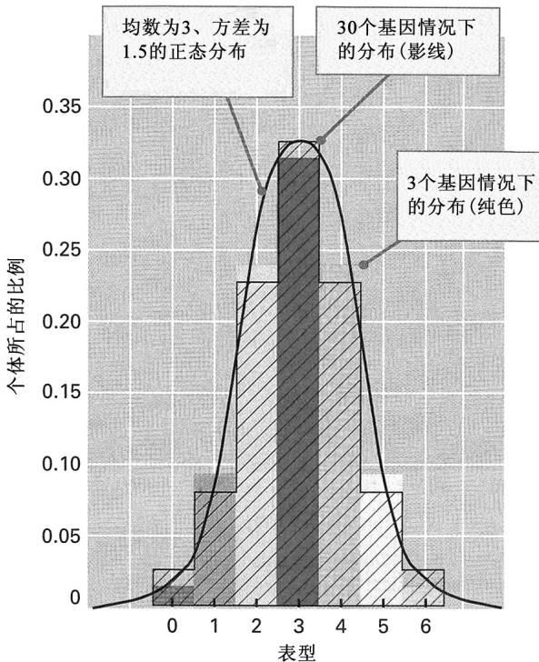  
图 18.5 由 3 个基因的分离和 30 个独立基因的分离决定的表型的分布。两个分布均为同一个正态分布(黑色曲线)所逼近。

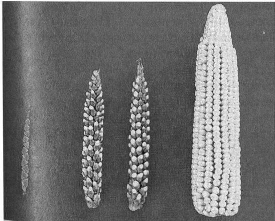  
大刍草的果穗(左)与现代栽培玉米的果穗(右)截然不同，但这两种生物的亲缘关系非常近，正反交均可产生可育的杂种(中)。早期的美洲土著第一个驯化了大刍草，经过许多世代的选择，得到最有利于栽培的突变表型，最终得到现代的玉米。[承威斯康星大学麦迪逊分校约翰·德布勒(John Doebley)惠赠。]

本章后面会展示一些方法，用来估计影响数量性状的基因有多少。所有这些方法，都依赖于比较几乎或完全纯合的品系之间杂交的 $\mathrm{F}_1$ 和 $\mathrm{F}_2$ 代中的表型分布。

## ■ 环境变异

个体间环境的差异引起的表型变异，称为环境方差(environmental variance)。图18.6为一例，示菜豆种子质量的分布。该分布的均数为500mg，标准差为95mg。在该群体中，因为所有菜豆高度近交，所以其遗传上都相同，且都是纯合的。因此，在该群体中，种子质量的全部表型变异均由环境方差所致。比较图18.5和图18.6，说明如下原理成立：

群体中性状的分布不能为基因型和环境的相对重要性提供信息。性状的变异可

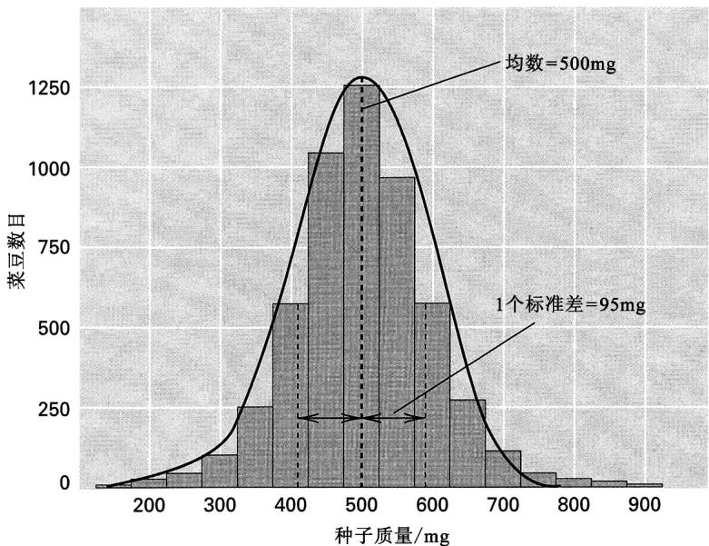  
图18.6 一个菜豆纯合品系中种子质量的分布。个体间表型的所有变异均为环境差异的结果。  
完全是遗传影响的结果、环境影响的结果或是两种影响的联合反映。

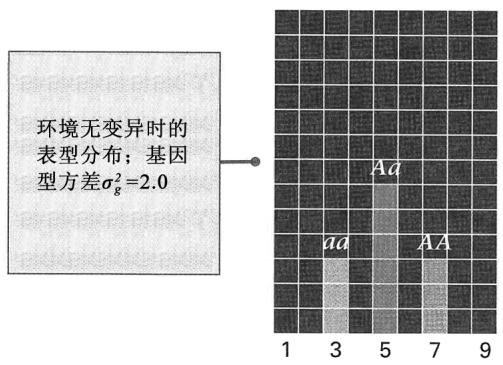  
基因型无变异时的表型分布；环境方差 $\sigma_{e}^{2} = 1.0$

## ■ 遗传和环境的联合

像图 18.5 和图 18.6 中基因型方差和环境方差分得这样清的情况，非常少见，因为它们通常一起发挥作用。它们的联合作用以图 18.7 中一个简单的假想例子予以说明。图 18.7A 是(暂时)忽略环境作用情况下，3 种基因型的表型分布。如图所示，该性状可具有 3 种不同的、不重叠的表型之一，这些表型由两个加性等位基因决定。各基因型具等位基因频率各为 1/2 时的随机交配比例，且表型分布的均数为 5，方差为 2。因其只是基因型差异的结果，所以该方差为基因型方差，以 $\sigma_{g}^{2}$ 表示。图 18.7B 为存在环境变异情况下的表型分布，每种基因型分开显示。每个环境作用的分布，均数为 0，方差为 1。因这种方差只是环境差异的结果，所以它是环境方差，以 $\sigma_{e}^{2}$ 表示。当基因型和环境的作用在同一群体中联合时，每种基因型都受环境变异的影响，因而得到图 18.7C 中所示的分布。该分布的方差为表型方差 (phenotypic variance)，以 $\sigma_{p}^{2}$ 表示。因为假定基因型和环境对表型具有相互独立的作用，所以预计 $\sigma_{p}^{2}$ 要比单独的 $\sigma_{g}^{2}$ 或单独的 $\sigma_{e}^{2}$ 大。事实上，

(A)基因型方差 $\sigma_g^2 = 2.0$  
(B) 环境方差 $\sigma_{e}^{2} = 1.0$  
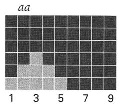

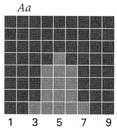

图 18.7 基因型方差和环境方差的联合作用。(A)仅受基因型方差( $\sigma_{g}^{2}$ )影响的群体。(B)每种基因型仅受环境方差( $\sigma_{e}^{2}$ )影响的群体。(C)受基因型方差和环境方差两者影响的群体，其中，表型方差( $\sigma_{p}^{2}$ )等于 $\sigma_{g}^{2}$ 和 $\sigma_{e}^{2}$ 之和。  
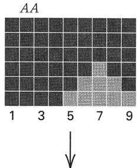

基因型和环境均有变异时的表型分布；表型方差 $\sigma_p^2 = 3.0$

(C) 表型方差 $\sigma_{p}^{2} = \sigma_{g}^{2} + \sigma_{e}^{2} = 3.0$  
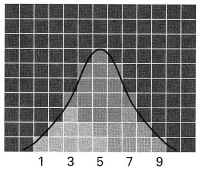

$$
\sigma_ {p} ^ {2} = \sigma_ {g} ^ {2} + \sigma_ {e} ^ {2}\tag{3}
$$

## 式(3)可以文字表述为

当遗传和环境的作用独立地对表型做出贡献时，总方差等于基因型方差和环境方差之和。

式(3)是在复杂性状分析中最重要的关系之一。怎样将其用来分析数据，将会作一简介。虽然在非常多的情况下，该公式可作为极佳的逼近，但从精确意义上来说，仅当基因型和环境对表型的作用是独立的时候，它才有效。两种最重要的对独立性的背离，在下一节讨论。

## - 基因型与环境的互作和关联

在最简单的情况下，环境对表型的作用是加性的，每种环境独立于基因型在表型上增加(或减少)相同的量。当这种情况不成立，环境对表型的作用因基因型而异时，就认为存在基因型与环境互作(genotype-by-environment interaction；G-E interaction，G-E 互作)。在有些情况下，G-E 互作甚至可改变基因型的相对等级，以致在一种环境中较优的基因型，在另一种环境中可变成较劣的。

图 18.8 示玉米中基因型与环境互作的一个例子。这两个玉米品系是通过杂交两对不同的近交系而得的杂交种，它们的总均数即囊括所有环境计算的平均数几乎一样。但是，在困难(负)环境中，记为 A 的品系明显优于 B，而当环境质量高时，表现相反。(环境质量以土壤肥力、湿度及其他因素为基础判断。)由于 G-E 互作，没有一种植物品种会在所有类型的土壤和气候条件下优于其他所有的品种，因而植物育种者必须开发适于每种种植区的特殊品种。

在有些生物特别是植物中，可进行像图18.8中所示的实验，来估计G-E互作对表型中总的观测变异的相对贡献。在其他生物尤其是人类中，G-E互作的作用往往不能单独评估。在动物中，文献记载特别完善的一种G-E互作形式是基因型与性别互作(genotype-by-sex interaction)，其中，相同基因在雌性和雄性中具有不同的表型效应。(把性别视为环境，可能看起来有点奇怪，但为了说明基因型与性别互作，这是一个便捷的思考方式。)在人类中一个为人熟知的基因型与性别互作的例子是成人身高。虽然在女性和男性中成人身材的分布有强烈重叠，但女性平均比男性矮。虽然在两性之间，影

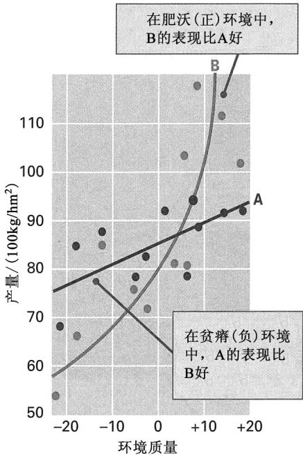  
图 18.8 玉米中的基因型与环境互作。当环境质量低(负数)时，品系 A 较优，而当环境质量高时，品系 B 较优。[数据来自 W. A. Russell, Annual Corn & Sorghum Research Conference 29(1974): p. 81。]

响成人身材的基因是一样的，但是这些基因的表型效应因激素环境而异。

当不同基因型在所有可能环境中不呈随机分布时，存在基因型与环境关联(genotype-by-environment association；G-E association，G-E关联)。在此情况下，某些基因型优先与某些环境关联，与无G-E关联时会产生的表型相比，G-E关联使这些基因型的表型增加或减少。例如，在乳牛业中，有些奶农按每头奶牛的产奶量水平喂予成比例的食物量。因此具有优秀基因型(对产奶量而言)的奶牛也具有优秀的环境(得到更多食物)。在植物育种中，通过在实验田中对各基因型进行适当的随机化，常常可以消除或尽量减小基因型与环境关联。在其他情况下如人类遗传学中，G-E关联的可能性通常无法控制。

## 18.3 复杂性状的遗传分析

可用式(3)将基因型和环境对总表型方差的作用分开。需要两类数据。

(1)遗传异质性群体的表型方差，作为 $\sigma_p^2 = \sigma_g^2 +\sigma_e^2$ 的估计。

(2)遗传均一性群体的表型方差，作为 $\sigma_{e}^{2}$ 的估计，因为遗传均一性群体 $\sigma_{g}^{2}$ 值为 0。

两个高度纯合品系(如近交系)之间杂交而得的 $\mathrm{F}_1$ 代，是遗传均一性群体的一个例子。同样的杂交所得的 $\mathrm{F}_2$ 代，是遗传异质性群体的一个例子。如果这两个群体的环境都相同，且不存在G-E互作，则可结合上述两个估计推算出 $\sigma_g^2$ 的值。

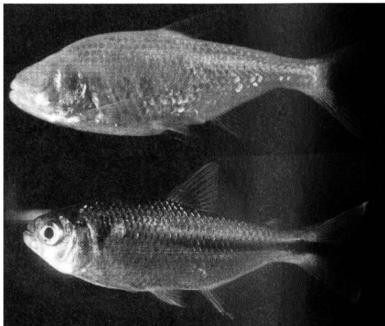  
图 18.9 一条穴居脂鲤(Astyanax) (上面) 和一条水面居住型的近亲(下面)，脂鲤的眼睛大小和色素沉着减少。[承纽约大学理查德·博罗夫斯基(Richard L. Borowsky) 和霍斯特·威尔金斯(Horst Wilkens) 惠赠。]

为了说明这种方法,对墨西哥穴居鱼斑条丽脂鲤(Astyanax fasciatus)进行研究,这是全世界已知的大约80种穴居鱼之一。这些穴居鱼在终年黑暗中进化,伴随着若干遗传变化,例如,它们都演化出较小的眼睛和较少的身体色素(图18.9)。为了估计对减小眼睛大小起作用的基因的数目,将来自一个穴居群体的近交系与来自一个水面居住型群体的近交系交配,并将交配后代养殖于相同环境中。在 $F_{1}$ 和 $F_{2}$ 代中,眼睛直径的方差分别估计为0.057和0.563。以方差组分的形式,记为

$$
\mathrm{F} _ {2} \text {方差} \sigma_ {p} ^ {2} = \sigma_ {g} ^ {2} + \sigma_ {e} ^ {2} = 0. 5 6 3
$$

$$
\mathrm{F} _ {1} \text {方差} \sigma_ {e} ^ {2} = 0. 0 5 7
$$

从第一个等式中减去第二个等式，得基因型方差的估计 $\left(\sigma_{g}^{2}\right)$ ，即

$$
(\sigma_ {g} ^ {2} + \sigma_ {e} ^ {2}) - \sigma_ {e} ^ {2} = \sigma_ {g} ^ {2}
$$

故

$$
0. 5 6 3 - 0. 0 5 7 = 0. 5 0 6 = \sigma_ {g} ^ {2}
$$

因此， $\sigma_{g}^{2}$ 的估计值为 0.506，而 $\sigma_{e}^{2}$ 的估计值为 0.057。在此例中，基因型方差比环境方差大得多，但并非总是如此。

下一节展示从基因型方差的估计中可获得的其他信息。

## ■ 影响复杂性状的基因数目

当影响某个复杂性状的基因数目不太大时，对基因型方差的了解可用来估计这些基因的数目。所需信息包括两个基因型不同的品系的均数和方差，以及 $\mathrm{F}_1$ 代、 $\mathrm{F}_2$ 代和回交世代的方差。在理想情况下，数据就像图18.10中那样，在该图中， $\mathrm{P}_1$ 和 $\mathrm{P}_2$ 代表不同的亲本品系(如近交系)。位于三角形上的点，其方差随遗传异质性(基因型方差)的增加而增加。如图18.10所示，如果 $\mathrm{F}_1$ 代和回交世代的均数正好处于它们亲本的均数之间，则这些均数会位于三角形各边的中点上。这一发现说明，影响该性状的等位基因是加性的；即对于每个基因，杂合子的表型为相应两种纯合子表型的平均。可以证明，在这样一种简单的情况下，对性状起作用的基因的数目(n)为

$$
n = \frac {D ^ {2}}{8 \sigma_ {g} ^ {2}}\tag{4}
$$

其中，D 代表最初两个亲本品系 $\left(\mathrm{P}_{1}\right.$ 和 $\left.\mathrm{P}_{2}\right)$ 的均数之差。将此方程式应用于图 18.4 中 3 个基因的理想状态，可对其予以验证。亲本品系是平均表型为 0 和 6 的纯合基因型。因此，D=6-0=6。图 18.5 中给出基因型方差 $\sigma_{g}^{2}=1.5$ 。将 D 和 $\sigma_{g}^{2}$ 代入式 (4)，得 $n=(6)^{2}/(8\times1.5)=3$ ，此值正确，因为正是存在 3 个独立且等价的影响该性状的基因。

要将式(4)应用于实际数据，需要几个不一定会成立的假设。除了要假设所有世代都培育于相同环境中以外，理论上还需做如下遗传假设：①每个基因的等位基因都是加性的；②各基因对性状的贡献相等；③各基因都是非连锁的；④对于每个基因的两个等位基因，起始亲本品系对其中之一为纯合。当这些假设不成立时，计算所得 n 值会比影响性状的实际基因数目小，并且往往小得多。估计所得

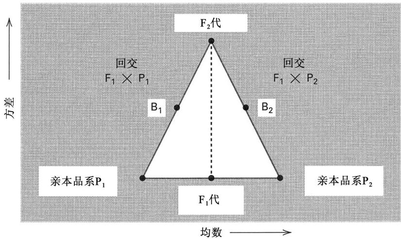  
图 18.10 对于某个受非连锁、完全加性基因影响的理想数量性状，亲本(P)及回交 $(\mathrm{B}_{1} \text{ 和 } \mathrm{B}_{2})$ 和杂交 $(\mathrm{F}_{1} \text{ 和 } \mathrm{F}_{2})$ 后代的均数和标准差。[改编自 R. Lande, Genetics 99(1981): 541-553。]

数目是最小值，因为几乎对上述遗传假设的任何偏离，都会使 $F_{2}$ 代中的基因型方差变小，从而，对于相同的 D 值，在式(4)中会得到较大的 n 值。这就是为什么估计所得 n 值是导致真实基因数目的最小值。

对上一节中讨论过的穴居鱼脂鲤而言，亲本品系具有7.05和2.10的平均表型，得 $D = 4.95$ 。 $\sigma_g^2$ 的估计值为0.506，因此，影响眼睛直径的基因的最小数目是 $n = (4.95)^2 / (8 \times 0.506) = 6.0$ ，即至少有6个不同的基因影响这种鱼的眼睛直径。使用在18.7节中讨论的遗传作图方法，已经鉴定了其中3个基因。

影响数量性状的基因数目非常重要，通过选择育种对群体进行遗传改良时，基因数目影响改良的期望程度。对于由数目较少的基因决定的性状，性状改变的潜力相对较小，因而，由最佳可能基因型组成的群体，其所具有的均数，可能只比起始群体的均数高出两三个标准差。但是，由数目较大的基因决定的性状，具有较大的改良潜力。例如，对面粉甲虫拟谷盗(Tribolium)进行选择，以使其蛹重增加，许多世代后，发现蛹重的均数高于起始群体均数17个标准差。性状由大量基因决定，意味着：

选择育种能够产生这样的改良种群，其每一个体的价值远远超过原来种群中存在的最好个体的价值。

乍一看，该原理似乎有悖常理，因为在足够大的群体中，每一种可能的基因型都应该(至少是低频率地)出现。对这一悖论的解释是，用来进行选择育种的真实群体，一般(最多)由数百个个体组成，因而，在现实中，许多在理论上可能的基因型，因为它们的期望频率太低而从不产生。但是，随着选择的进行，以及等位基因频率的改变，这些基因型变得越来越常见，从而在

以后的世代中，能够选择出优秀的个体。

## ■ 广义遗传率

对决定数量性状的基因数目往往无法估计，因为所需的实验不能实现或没有进行过。数量性状的另一属性，评估起来需要的数据较少，它利用基因型方差与总体表型方差的比值。 $\sigma_{g}^{2}$ 和 $\sigma_{p}^{2}$ 的这种比值称为广义遗传率(broad-sense heritability)，记为 $H^{2}$ ，它衡量在导致感兴趣性状的表型变异中，遗传变异相对于环境变异的重要性。广义遗传率是两个方差的比值，具体为

$$
H ^ {2} = \frac {\sigma_ {g} ^ {2}}{\sigma_ {p} ^ {2}} = \frac {\sigma_ {g} ^ {2}}{(\sigma_ {g} ^ {2} + \sigma_ {e} ^ {2})}\tag{5}
$$

将脂鲤眼睛直径的数据(其中， $\sigma_{g}^{2}=0.506,\quad\sigma_{g}^{2}+\sigma_{e}^{2}=0.563$ )代入式(5)，得广义遗传率的估算值为 $H^{2}=0.506/0.563=0.90$ 。该值表明，在该群体中，眼睛直径变异的90%，由鱼之间的基因型差异所致。

在动植物育种中，了解遗传率很有用，因为遗传率可用来预测在群体中进行改良的幅度和速度。式(5)所定义的广义遗传率，用于预测在纯系、近交系或品种中进行选择的结果。对随机繁殖群体的类似预测，使用与 $H^{2}$ 不同的另一种类型的遗传率，马上会讨论到。广义遗传率衡量在表型中的总方差有多少是基因型差异的结果。因此，在研究人类数量性状方面， $H^{2}$ 常常受到关注。

## ■ 双生子研究

在人类中，双生子似乎是将遗传和环境方差分开的理想研究对象，因为同卵双生(identical twin，由单个受精卵分裂形成)在遗传上相同，并且在诸如面部特征和体型等性状上也惊人地相似。异卵双生(fraternal twin，来自两个受精卵)具有与普通同胞一样的遗传关系，因而，其中

表 18.2 根据双生子研究得到的广义遗传率

<table><tr><td>性状</td><td>遗传率( $H^{2}$ )</td></tr><tr><td>寿命</td><td>29</td></tr><tr><td>身高</td><td>85</td></tr><tr><td>体重</td><td>63</td></tr><tr><td>氨基酸排泄量</td><td>72</td></tr><tr><td>血脂水平</td><td>44</td></tr><tr><td>最大血乳酸值</td><td>34</td></tr><tr><td>最大心率</td><td>84</td></tr><tr><td>言语能力</td><td>63</td></tr><tr><td>数字能力</td><td>76</td></tr><tr><td>记忆力</td><td>47</td></tr><tr><td>社交能力指数</td><td>66</td></tr><tr><td>男性化指数</td><td>12</td></tr><tr><td>性格指数</td><td>58</td></tr></table>

一个双生子, 只有一半的基因与另一个双生子的基因相同。理论上, 一对同卵双生子之间的方差等于 $\sigma_{e}^{2}$ , 因为两个双生子在遗传上相同, 而一对异卵双生子之间的方差不仅包含 $\sigma_{e}^{2}$ , 而且包含部分基因型方差(约为 $\sigma_{g}^{2}/2$ , 因为异卵双生子一半的基因相同)。因此, $\sigma_{e}^{2}$ 和 $\sigma_{g}^{2}$ 两者都可根据双生子数据得到估计, 然后如式(5)中那样结合起来, 以估计 $H^{2}$ 。表18.2概括了根据双生子几种性状的研究对 $H^{2}$ 所作的估计。

增加，但不使同卵双生子的方差增加。

可惜的是, 双生子研究很容易受到几种重要的误差来源的影响, 其中, 大多数误差会增加同卵双生子的相似度, 因此, 表 18.2 中的数值应该说是非常粗略的, 很可能是大大偏高的估计。其中 4 种潜在的误差来源为以下几方面。

(1)基因型与环境互作，它使异卵双生子的方差

(2) 同卵双生子之间常常共享胚膜，导致子宫内环境比异卵双生子的更相似。

(3) 父母、老师和同事在对待同卵双生子上具有更大的相似性，导致同卵双生子中的环境方差减小。

(4) 在异卵双生子中，两个双生子性别不同的占一半，与此相比，两个同卵双生子具有相同

的性别。

存在这样或那样的一些陷阱，提示对来自人类双生子研究的数据进行解读，应该谨慎而有所保留。

## 18.4 人工选择

人工选择 (artificial selection) 是育种者从一个群体中精选出一组个体作为下一代亲本的做法。无论是通过挑选一个无性繁殖物种中的最佳个体来进行人工选择，还是通过在一系列近交亚群中挑选最佳亚群来进行人工选择，广义遗传率都可用来预测取得进展有多快。在这种情况下，广义遗传率非常重要，因为对于无性系或近交系而言，优秀基因型可永远延续下去，不会因为分离和重组而打乱有利的基因组合。例如，通过扦插或嫁接对无性繁殖的植物良种进行选择。因为不存在有性生殖，所以每棵植株与其亲本具有完全相同的基因型。

在遗传异质性的有性生殖群体中，广义遗传率不宜用于预测人工选择产生的进展，因为优秀基因型必然会被分离和重组过程拆散。例如，如果最佳基因型对两个非连锁基因座各为杂合 $(Aa\ Bb)$ ，那么，因为分离和自由组合，在具有最佳基因型的两个亲本之间杂交 $(Aa\ Bb\times Aa\ Bb)$ 的后代中，仅有1/4具有与亲本一样的有利基因型 $(Aa\ Bb)$ 。其余的后代在遗传性状上比亲本差。为此，视遗传价值高低依赖于特定的等位基因组合的程度，每一人工选择的世代都会导致轻微的倒退(优良亲本的子代一般没有亲本自身那样好)。选择之下的进展仍可以预测，但必须使用另一种类型的遗传率即狭义遗传率来预测，这种遗传率在下一节讨论。

## 个体选择

图 18.11 示一种典型的人工选择形式及其结果。所示生物为长花烟草 (Nicotiana longiflora)，所示性状为(花)冠筒长度(花冠是一朵花中所有花瓣的统称)。图 18.11A 示亲代中表型的分布，而图 18.11B 示子代中表型的分布。亲代是从中挑选用于繁殖的亲本的群体。这种类型的选择称为个体选择(individual selection)，因为群体中被选中的每个个体，都是依其各自的表型予以评估。选择的进行是根据某种随意的表型水平即截断点(truncation point)而决定留下哪些个体来繁殖。具有阈值以上表型的所有个体，令其相互进行随机交配，以产生下一代。

## - 个体选择情况下的表型变化：预测公式

在个体选择的评估中，有3个表型均数很重要。在图18.11中这些均数记为 $M$ 、 $M^{*}$ 和 $M^{\prime}$ 它们的定义如下。

(1) M 是亲代整个群体 (包括被选择的和未被选择的个体) 的平均表型。

(2) $M^{*}$ 是被选为亲本的个体(具有截断点以上表型的个体)的平均表型。

(3) $M'$ 是选出来的亲本的子代的平均表型。

这 3 个均数之间的关系由下式给出:

$$
M ^ {\prime} = M + h ^ {2} (M ^ {*} - M)\tag{6}
$$

其中， $h^{2}$ 为所讨论性状的狭义遗传率(narrow-sense heritability)。

稍后在本章中会说明一种根据亲属在表型上的相似性来估计狭义遗传率的方法。在图18.11中， $h^{2}$ 是唯一的未知量，因此，只需根据这些数据即可对其进行估计。整理式(6)，并将来自图18.11的各均数值代入，求得

$$
h ^ {2} = \frac {M ^ {\prime} - M}{M ^ {*} - M} = \frac {7 7 - 7 0}{8 1 - 7 0} = 0. 6 3 6
$$

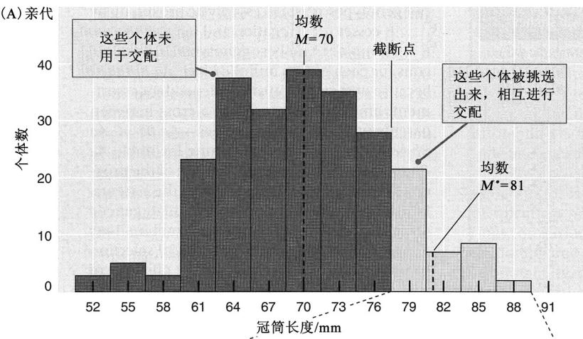  
图 18.11 在烟草中选择，以增加冠筒长度。(A)亲代表型分布。符号 M 表示整个群体的平均表型， $M^{*}$ 表示选出来繁殖的植株(具有大于截断点表型的植株)的平均表型。(B)从选择的亲本繁殖而来的子代中的表型分布。符号 $M'$ 表示均数。

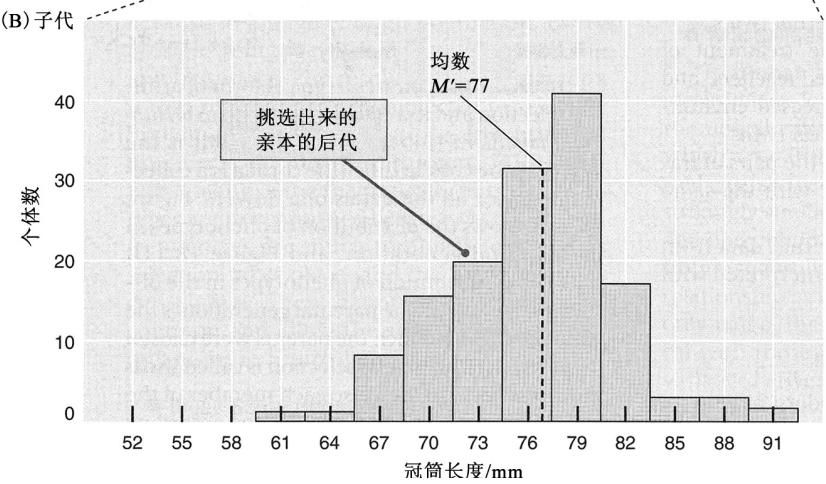

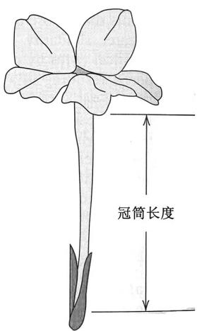  
总体表型方差可分割为基因型方差和环境方差(式3)，以与此类似的方式，可将基因型方差分割成导致等位基因的加性效应、显性效应和不同基因的等位基因之间的互作效应等部分。广义遗传率 $(H^{2})$ 和狭义遗传率 $(h^{2})$ 之间的差别在于， $H^{2}$ 包括遗传对变异的所有贡献，而 $h^{2}$ 只包括等位基因的加性效应。从动植物改良的立场上来看， $h^{2}$ 才是令人感兴趣的遗传率，因为，  
根据式(6)，在进行个体选择的群体中，狭义遗传率 $(h^{2})$ 是表型方差中可用来预测均数变化的部分。

考察存在稀有隐性等位基因的群体，可直观地认识到广义遗传率和狭义遗传率之间的区别。在这种情况下，大多数纯合隐性基因型来自杂合携带者之间的交配。有些交配产生不止一个受累后代。从而，受累同胞相互之间比他们与亲本之间更加相像。例如，假设 $a$ 是一个隐性等位基因， $Aa \times Aa$ 交配(两个亲本均表现显性表型)有可能产生两个为 $aa$ 的后代，这两个后代均表现隐性表型，在此情况下，后代相互之间比后代与任一亲本之间更相似。正是野生型等位基因的显性导致了这种看似矛盾实则存在的情况，即其对性状的广义遗传率有贡献，但对狭义遗传率无贡献。狭义遗传率只包括那些对亲本与其子代之间的相似性起作用的遗传效应，因为狭义遗传率衡量子代与其亲本有多相似。

一般来说，性状的狭义遗传率比广义遗传率小。例如，在图 18.11 的亲代中，冠筒长度的广义遗传率为 $H^{2}=0.82$ 。仅当影响性状的等位基因在效应上为加性时，这两种遗传率才相等，在加性效应情况下，每个杂合基因型表现出的表型，介于相应两种纯合基因型的表型的正中间。

式(6)因其预测价值而在数量遗传学上具有不可或缺的重要性，这可从下面的例子中看出。图18.11中的选择进行了数代。在两代之后，群体的均数为83，然后挑选出均数为90的亲本。

利用 $h^{2}=0.636$ 的估计，可预测下一代的均数。已知信息为 M=83 及 $M^{*}=90$ 。因而，式(6)表明，预期均数为

$$
M ^ {\prime} = 8 3 + (0. 6 3 6) (9 0 - 8 3) = 8 7. 4
$$

该值与 87.9 的观测值吻合得很好。

## - 长期人工选择

人工选择与自然选择的相似之处在于,对于使一个或多个受选择性状发生改良的等位基因,两种类型的选择都会使其频率增加。在第17章中讨论过的自然选择的诸原理,也适用于人工选择。例如,人工选择对于改变处于中间频率范围(0.2<p<0.8)的等位基因的频率最有效。对于频率在此范围之外的等位基因,选择的效果较差,而对于稀有隐性等位基因,效果最差。对复杂性状(包括适合度)而言,总体选择由影响性状的所有基因共享,因而作用于每个等位基因的选择系数由以下因素决定:①等位基因作用的大小;②等位基因的频率;③作用于性状的基因总数;④性状的狭义遗传率;⑤挑选出来繁殖的个体占群体的比例。

遗传率的大小由等位基因作用的大小和等位基因频率两者决定。如果所有的有利等位基因被固定 $(p=1)$ 或丢失 $(p=0)$ ，则性状的遗传率为0。因而，在许多代的人工选择过程中，由于有利等位基因差不多变得固定，数量性状的遗传率应该会降低。例如，在一个杜洛克猪的群体中，对肥肉少的猪进行10代选择，因为选择而致的等位基因频率的改变，使肥度的遗传率从73%降到30%。

利用人工选择来进行群体改良，不能无限地持续下去。一个群体可能会对选择做出反应，直到其均数与起始群体的均数相差许多个标准差，但最终该群体会达到选择极限(selection limit)，在选择极限状态下，后续世代不会出现进一步的改良。因为影响相应性状的所有等位基因会固定或丢失，所以进展可能会停止，从而使该性状的狭义遗传率变成0。但是，更常见的是，由于自然选择抑制人工选择，从而达到选择极限。对受选择的某一性状有有利效应，从而对人工选择有反应的许多基因，也会对适合度具有间接的有害效应。例如，在家禽中进行使蛋的大小增加的选择，会导致产蛋数量减少；在大多数动物中进行极端体型大小(大或小)的选择，会导致生育力下降。如果某一性状(如产蛋数量)在一个不同性状(如蛋的大小)的选择过程中发

生变化，则称未选择性状对选择性状产生了相关反应(correlated response)。在长期人工选择中，适合度的相关反应非常典型。受选择性状每进步一点，就会因适合度减少所致的相关反应而被抵消一部分；最后，对感兴趣性状的人工选择，会刚好被对该性状的自然选择相抵。因此，达到选择极限时，如果选择策略不变，就不可能有进一步的进展。 $^{①}$

## ■ 近交衰退和杂种优势

近交可对重要经济性状(如粮食产量和禽蛋产量)产生有害效应, 这种品质上的下降称为近交衰退(inbreeding depression), 它主要是罕见有害隐性等位基因因近交而变成纯合的结果。近交的程度用第17章中讨论过的近交系数(F)来衡量。图 18.12 是一个玉米产量近交衰退的例子，其中，产量随着近交系数的增加而线性下降。

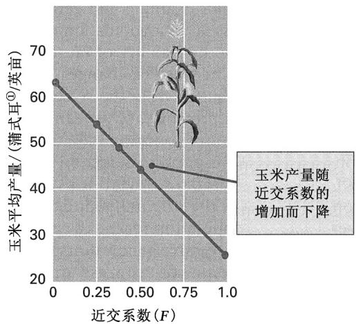  
图 18.12 玉米产量的近交衰退。[数据来自 N. P. Neal, Agron. J. 27(1935): 666-670.]

大多数高度近交系受累于许多遗传缺陷，如可以预计的有害隐性等位基因的显露。还可预计，如果两个不同的近交系杂交，则 $F_{1}$ 可能会表现出改良特性，因为从一个亲本遗传来的一个有害隐性等位基因，很有可能会被来自另一个亲本的一个正常的显性等位基因掩盖。在许多生物中，两个近交系杂交的 $F_{1}$ 代优于亲本品系，这种现象称为杂种优势(hybrid vigor或heterosis)。该现象被广泛用于玉米和其他农产品的生产中。这种现象产生遗传上相同的杂种植株，其性状有时比派生出近交系的祖先植株的性状更有利。杂种植株区别于其近交亲本的最常见的特性，包括生长速度快、体型大及产量多等。此外， $F_{1}$ 植株具有相当一致的表型(因为 $\sigma_{g}^{2}=0$ )。也可通过传统的植物育种计划产生具有高产量或某些其他诱人特性的遗传异质性作物，但杂种植物因其均一性而常常更受种植者青睐。例如，一致的高度和成熟时间，便于机器收割；植株都在同一时段结果，利于协调采摘和运输计划。

在美国，作为经济作物的玉米几乎全部使用玉米杂交品种。农民不能用自己收获的种子来播种，因为 $F_{2}$ 代由各种基因型组成，其中大部分不会出现杂种优势。在美国的玉米种植区，杂交种子的生产是一个重要产业。

## 18.5 亲属之间的相关性

对复杂遗传方式的研究，极大程度地依靠亲属之间的相似性来估计遗传因素的重要性。尤其是在人类复杂行为性状的研究中，对家族性相似性(familial resemblance)的遗传解读并不总是直截了当的，虽然是家族性的，但也可能存在非遗传的相似性来源。但是，在动植物育种中，情况通常没有这么复杂，因为基因型和环境都处于实验控制之中。

## ■ 协方差与相关性

与家系有关的遗传数据往往是成对的值：成对的双亲、成对的双生子或单个亲本和单个子女组成的成对个体。数量遗传学的一个重要议题是，在每一对数据中，两个数据关联的程度。衡量这种关联性的通常做法，是计算每对数据中两个数据之间相关系数的统计量。

亲属之间的相关系数，是基于他们之间的表型协方差。就像方差描述一组测量值变化的趋势一样(式2)，协方差描述成对的数值一起变化(共同变化)的趋势。协方差的计算类似于式(2)中方差的计算，除了离差平方项 $(x_{i}-\bar{x})^{2}$ 用成对测量值与各自均数的离差之积 $(x_{i}-\bar{x})(y_{i}-\bar{y})$ 取代以外。

例如， $(x_{i}-\bar{x})$ 可以是某位特定父亲的身高与全体父亲身高均数的离差，而 $(y_{i}-\bar{y})$ 可以是其儿子的身高与全体儿子身高均数的离差。以符号表示，令 $f_{i}$ 为具有表型测量值 $x_{i}$ 和 $y_{i}$ 的成对亲属的编号。则亲属之间性状的协方差 (covariance) 估计为

$$
C o v (x, y) = \frac {\sum f _ {i} (x _ {i} - \overline {{{{x}}}}) (y _ {i} - \overline {{{{y}}}})}{N - 1}\tag{7}
$$

其中，N 为所研究的成对亲属的总对数。

亲属之间性状的相关系数(correlation coefficient, r)根据协方差计算如下:

$$
r = \frac {C o v (x , y)}{s _ {x} s _ {y}}\tag{8}
$$

其中， $s_x$ 和 $s_y$ 为各测量值的标准差，根据式(2)估计得。相关系数为 $-1.0 \sim +1.0$ 。+1.0 的值表示完全相关的意思。当 $r = 0$ 时， $x$ 和 $y$ 无关联。

## - 相关性的几何意义

图 18.13 示相关系数的一种几何解释。正如单变量的分布可通过一步步将相当于每一个体的小矩形沿 x 轴放置而构建出来一样，也可以通过逐步将小立方体置于 x-y 平面上由每对测量值决定的位置，来构建两个变量（如父亲身高和儿子身高）的联合分布。随着这些小立方体的堆积，联合分布呈现出一个倒扣着的碗的形状，其剖面本身为正态分布。当变量之间无相关时，联合分布的表面完全对称（图 18.13A），这说明 y 的分布完全独立于 x 的分布。但是，当两个分布相关时，y 的分布随特定的 x 值而变化，从而联合分布变成不对

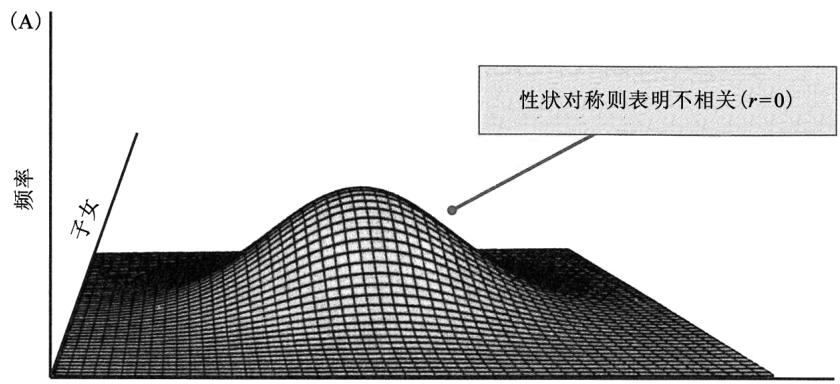

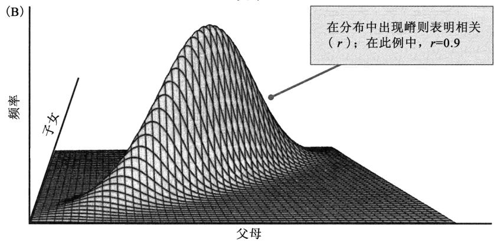  
图 18.13 某个数量性状在父母和子女之间不相关(A)或高度相关(B)时，该性状的分布。(引自 BIOMETRY by Robert R. Sokal and F. James Rohlf. ©1969, 1981, 1995 by W. H. Freeman and Company。经许可使用。)

称的分布，在 x-y 平面上堆积出一个细长的隆起(嵴)(图 18.13B)。

通常没有足够的数据来建立图 18.13 中所绘的完整的 x 和 y 的三维联合分布。实际情况是，数据以若干相互分开的点的形式存在，其稀疏程度足以绘制像图 18.14 中的那种散点图。在这些图中，在每条直线周围的成簇的点，相当于图 18.13 中由这些点组成的嵴。嵴越高，在直线周围聚集的点越多。

## - 狭义遗传率的估计

在数量遗传学中, 协方差和相关性非常重要, 因为, 如表 18.3 所示, 在具有不同遗传关系级别的个体之间, 性状的相关系数与狭义遗传率或广义遗传率之间具有相当简单的关系。表 18.3 中给出了不同的成对亲属的相关系数的理论值; $h^{2}$ 表示狭义遗传率, $H^{2}$ 表示广义遗传率。对于父母—子女、半同胞或一级堂表亲等成对亲属, 可用乘法直接对狭义遗传率进行估计。具体来说, 可将 $h^{2}$ 估计为父母—子女相关性的 2 倍、半同胞相关性的 4 倍或一级堂表亲相关性的 8

表 18.3 亲属之间理论上的表型相关系数

<table><tr><td>亲缘级别</td><td>相关系数*</td></tr><tr><td>子女与父母之一</td><td> $h^{2}/2$ </td></tr><tr><td>子女与父母平均</td><td> $h^{2}/2$ </td></tr><tr><td>半同胞</td><td> $h^{2}/4$ </td></tr><tr><td>一级堂表亲</td><td> $h^{2}/8$ </td></tr><tr><td>同卵双生子</td><td> $H^{2}$ </td></tr><tr><td>全同胞</td><td> $\sim H^{2}/2$ </td></tr></table>

\*忽略了不同基因的等位基因之间互作所做的贡献，以及其他原因，因此， $H^2$ 的相关性是近似值。

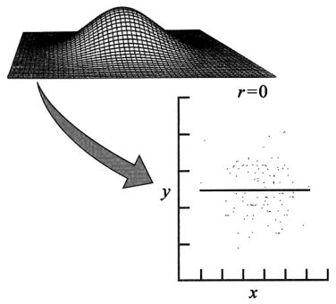

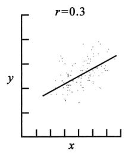

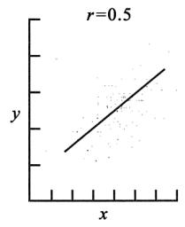

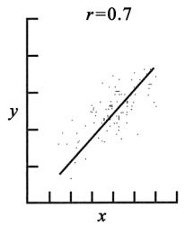

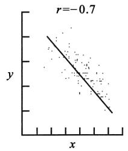

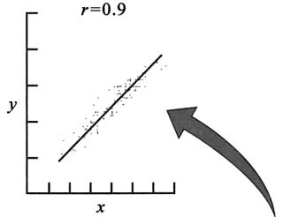  
图 18.14 具有不同相关系数(r)的变量 x 和 y 的散点图。(引自 BIOMETRY by Robert R. Sokal and F. James Rohlf. ©1969, 1981, 1995 by W. H. Freeman and Company。经许可使用。)

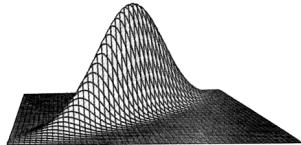

对于全同胞和同卵双生子，相关系数与广义遗传率 $(H^{2})$ 相关，因为表型相似性不仅依赖于加性效应，而且依赖于显性效应。在这些亲属中，他们有共同祖先，可共有两个等位基因，因而显性对相似性有贡献。而父母和子女、半同胞和一级堂表亲，最多可因共同祖先而共有任一基因的单个等位基因。因此，由于表型在一定程度上依赖于显性效应，全同胞相互之间可比他们与他们的父母之间更相似。

同胞之间比父母和子女之间潜藏着更大的相似性，可再次通过考察罕见隐性等位基因所致的常染色体隐性遗传病来理解。在一个随机婚配的群体中，如果母亲患病，则某个子女患病的概率是 $q$ (隐性等位基因频率)，这相当于精子导致该子女携带该隐性等位基因的随机婚配概率。与此相比，两个同胞，如果其中一位患病，则两位均患病的概率是1/4，因为，生育患病个体的婚配，大多数是杂合双亲之间的婚配。当该病很罕见时，父母-子女的相似性会非常小(因为 $q$ 接近于0)，而同胞-同胞的相似性仍会很大。这种差异完全是显性的结果，它的发生仅仅是因为，在任一指定基因座，全同胞可具有相同的基因型。

## 18.6 阈值性状的遗传率

个体选择的概念也可用来理解阈值性状背景下遗传率的含义。以图 18.15 所示的为例来说明这种类比。阈值性状取决于一种称为易患性(liability)的潜在的数量性状，易患性是指出现阈值性状的遗传风险或倾向性的大小。只有那些易患性大于一定阈值的个体才会出现相应性状。图 18.15A 显示了某一群体的易患性分布，其中，易患性以任意比例尺度量，以使平均易患性(M)等于0，且易患性方差等于1。患者在该分布的右手边的区域。利用正态分布的多种特点，可用观测到的患者所占的比例，来计算阈值的位置和 $M^{*}$ 值，在此情况下， $M^{*}$ 为患者的平均易患性。

患者子女的易患性分布如图 18.15B 所示。它被略微向右移动，其意义是，相对于该群体整体，具有患病双亲的个体，具有超过阈值的易患性的比例更大，并因此患病。在子代中观测到的患者所占的比例，可用来计算 $M'$ 。重点在于， $M^{*}$ 和 $M'$ 可根据观测比例得到，观测比例相当于图 18.15 中的红色阴影区。M=0 时，式(6)可用来计算所讨论性状的易患性的狭义遗传率。

表 18.4 列举了重要先天畸形的易患性的狭义遗传率的若干例子。这些遗传率如何变成风险，如图 18.16 所示，图中同时还有白人中最常见先天畸形的观测数据。各条理论曲线对应于一般群体中性状的发生率、遗传方式及患者一级亲属中的风险三者之间的关系。(患者的一级亲属包括其父母、子女和同胞。)简单孟德尔遗传方式产生最高的风险，但这些性状往往很罕见。最常见的性状是阈值性状，除了少数例外，它们往往为中度或低风险，对应于所示遗传率的高低。

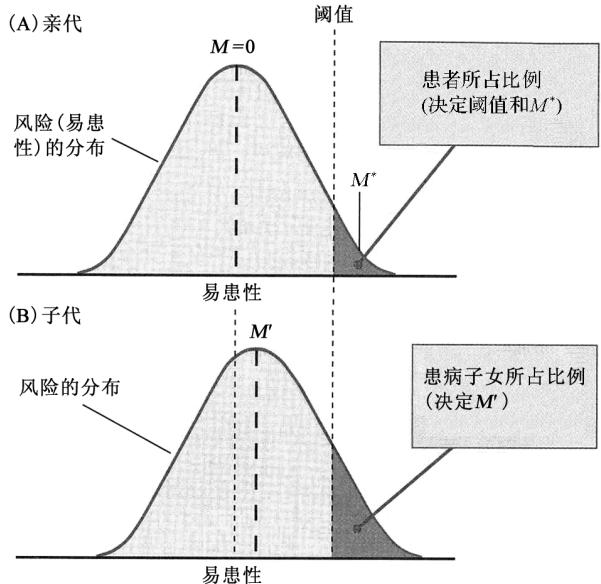

表 18.4 先天畸形易患性的狭义遗传率

<table><tr><td>性状</td><td>说明</td><td>群体发生率/%</td><td>狭义遗传率/%</td></tr><tr><td>唇裂</td><td>上唇未完全形成</td><td>0.08</td><td>65</td></tr><tr><td>脊柱裂</td><td>脊髓暴露</td><td>0.11</td><td>65</td></tr><tr><td>足内翻</td><td>足形成异常</td><td>0.08</td><td>80</td></tr><tr><td>幽门狭窄</td><td>胃阻塞</td><td>0.40</td><td>85</td></tr><tr><td>髋关节脱位</td><td>髋关节错位</td><td>0.06</td><td>95</td></tr><tr><td>脑积水</td><td>大脑周围积水</td><td>0.12</td><td>40</td></tr><tr><td>房间隔缺损</td><td>心脏两个上腔之间穿孔</td><td>0.07</td><td>70</td></tr><tr><td>动脉导管未闭</td><td>主动脉和肺动脉之间穿孔;血液分流到肺部</td><td>0.08</td><td>75</td></tr></table>

图 18.15 从易患性是一种潜在的连续分布的角度来理解阈值性状。易患性高于阈值的个体患病。M(任意设成等于0)、 $M^{*}$ 和M分别为亲代、患者和患者子女的平均易患性。  
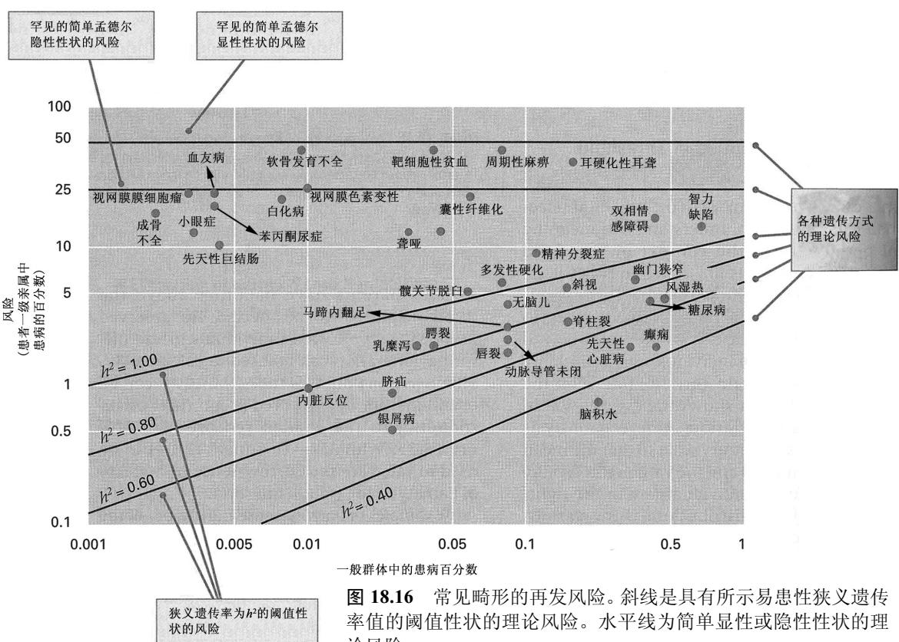  
图 18.16 常见畸形的再发风险。斜线是具有所示易患性狭义遗传率值的阈值性状的理论风险。水平线为简单显性或隐性性状的理论风险。

## 18.7 鉴定影响复杂性状的基因

影响复杂性状的基因是数量性状基因座(quantitative-trait locus，QTL)。该术语源于这样的事实：许多具有医学或商业重要性的复杂性状是数量性状。QTL通常不能从系谱中得到鉴定，因为单个基因的效应由于其他基因的分离和环境变异而难以辨别。即便如此，影响这些性状的基因如果与多态性DNA标记(如在第2章中讨论过的那些遗传标记)遗传连锁，那么它们还是能够被定位，因为影响复杂性状的基因型的效应会与某个连锁的遗传标记的基因型相关。在基因组中定位QTL，对于在育种计划中操纵基因，以及以鉴定基因功能为目的的基因的识别和研究，都很重要。另一种鉴定影响复杂性状的基因的方法，是对候选基因进行研究，候选基因是已知参与影响性状的生理或发育过程的基因。这些研究复杂遗传的方法互为补充，接下来对这些方法进行考察。

## ■ 数量性状基因座遗传作图中的连锁分析

多态性 DNA 标记非常丰富，遍布整个基因组，并常常具有多个共显性等位基因，因此，它们非常适合于数量性状的连锁研究。在 QTL 研究中，在遗传异质性群体的连续世代中，监测尽可能多的广泛分布的标记，以及复杂性状。然后进行统计研究，鉴定哪些 DNA 标记与复杂性状关联，关联是指 DNA 标记的某种基因型始终伴随着感兴趣的表型。这些 DNA 标记可确定基因组中包含一个或多个对性状有重要影响的 QTL 的区域，从而能够在育种计划中利用 DNA 标记来追踪这些重要区域的分离，甚至可以作为鉴定具有特大效应的基因的起始点。

图 18.17 示在番茄中对几个数量性状进行遗传作图的例子。在番茄基因组中，已定位了 300 多个高度多态性的遗传标记，标记之间的平均间隔为 5 图距单位。图 18.17 中的染色体图显示了一个 67 个标记的子集，这些标记在家番茄和野生南美近亲番茄之间的杂交中分离。这些标记之间的平均间隔是 20 图距单位。用 $F_{1}$ 与家番茄杂交所得回交后代来检测遗传标记，并分析回交后代果实的 3 个数量性状：果实重量、可溶性固形物含量和酸度。对数据进行统计分析，以检测与上述任一性状的表型差异关联的标记的等位基因，显著关联说明标记基因和一个或多个影响性状的 QTL 之间遗传连锁。检测到 6 个影响果实重量的 QTL（绿条）、4 个影响可溶性固形物的 QTL（蓝条）和 5 个影响酸度的 QTL（暗红条）。虽然在这些类型的实验中，确实还有其他具有较小效应的 QTL 未被发现，但已在图谱中定位的 QTL，其效应是可观的。已定位的 QTL 导致果实重量总表型方差的 58%、可溶性固形物表型方差的 44% 和酸度表型方差的 48%。遗传标记与具有显著效应的 QTL 连锁，使得可能在系谱中追踪 QTL 的传递，以及在育种计划中通过跟踪连锁的标记基因的传递来操纵 QTL。图 18.17 也标出了一些包含两个或多个性状的 QTL 的染色体区，例如，在 6、7 号染色体上的 QTL 区，它们影响所有 3 个性状。

## - QTL 的数量和性质

精细尺度的 QTL 定位和鉴定仅仅是近来才成为可能的，这是目前遗传研究上一个非常活跃的领域。人类群体的大多数研究是依据全基因组关联 (whole-genome association, WGA) 研究的，典型的 WGA 研究包括一定数量的某种疾病的患者，以及相当数量的没有这种疾病的对照者，对照者与患者在年龄、性别、种族和居住地等方面匹配。样本量要比较大，患病组和对照组都至少要数千例，常常是数万例。每位患者和对照者都要进行基因分型，通常是使用第 2 章中描述过的单核苷酸多态性 (SNP) 芯片，同时检测遍及整个基因组的 50 万或更多个 SNP 位点的基因型。然后进行统计分析，查明 SNP 中哪些与该病关联、哪些多态性核苷酸使该病的风险增加、哪些起保护作用。SNP 本身极不可能与疾病之间存在因果关系，但它们的关联表明，存在具有因果关系的遗传连锁的 QTL。虽然有待从 WGA 研究中学习更多的东西，但已经完成的 WGA 研究，足以对 QTL 的本质和数量及其效应的大小，做出一些谨慎的概括。

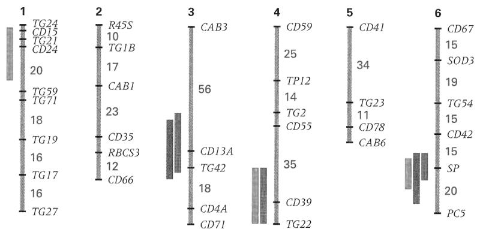

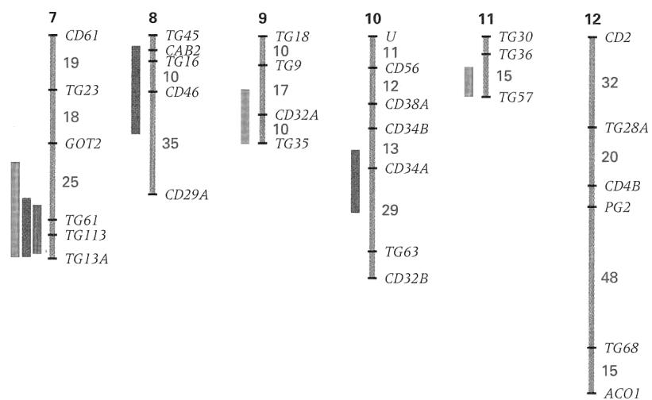

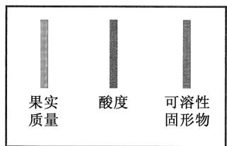

图 18.17 在番茄基因组中几个数量性状的 QTL 的位置。分别显示了 12 条染色体上的遗传标记。红色数字是相邻标记之间以图距单位表示的距离，但只标了 10 或 10 以上的图距。QTL 所在的区域以条形表示：绿条示果实重量的 QTL 区；蓝条示可溶性固形物含量的 QTL 区；暗红条示酸度 (pH) 的 QTL 区。数据来自家番茄 (Solanum lycopersicon) 和一种长小果实的南美野生近亲番茄 (Solanum chmielewskii) 之间的杂交。照片是野番茄果实的照片。将 F₁ 代与家番茄回交，从后代中得到的果实用于遗传标记和每种数量性状的分析。[数据来自 A. H. Paterson et al., Nature 335(1988): 721-725。Photo ©Photos.com.]  
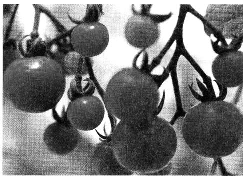

\- 几乎所有的复杂性状都受许多QTL的影响。例如，至少有35个QTL影响血清胆固醇水平。

\- 许多影响复杂性状的 QTL 表现出多效性，它们同时影响数个复杂性状。

\- 在影响复杂性状的 QTL 中，上位性(基因互作)很常见。由于上位性，不一定能够根据对基因个别效应的认识，而对任一 QTL 组合的效应做出预测。在有些情况下，某个 QTL 的全部效应源自它与基因组中别处的另一个 QTL 的互作。

\- QTL 的效应往往高度依赖环境。基因型与性别互作尤为重要，某个 QTL 的效应可在女性和男性之间有显著差异。有些 QTL 具有群体特异性效应。例如，在人 9 号染色体上的一个 QTL 导致冠状动脉病的风险增加 $30\% \sim 40\%$ ，但风险增加只发生在白人中，在非洲裔美国人中不发生。

\- QTL 效应的分布是指数分布，即大多数 QTL 具有非常小的效应，少数具有中等效应，极少数具有大的效应。具体来说，人类复杂疾病的大多数 QTL 使风险增加 $10\% \sim 30\%$ ，有些 QTL的效应在 30%～50% 内。具有更大效应的 QTL 很罕见。

\- 许多 QTL 的效应不是因为单个基因，而是因为数个紧密连锁基因的联合效应。这一发现反映了功能相关基因赖以进化的重复和分歧过程(参见第 17 章)，并有助于理解功能相关基因为什么可能会影响相同的复杂性状。

\- 尽管根据性状的生物学，以及基因组序列中已注释过的基因的推断功能，可能已预测出一些影响复杂性状的基因，但更多的基因尚未被预测。那些功能已知的基因与性状没有明显的联系，还有许多基因的功能未知。

\- 影响复杂性状的基因突变可在蛋白编码区中或在影响基因调节的区域中。

\- 影响复杂性状的突变型等位基因可常见(等位基因频率大于 0.05)或罕见(等位基因频率小于 0.05)。

\- 影响复杂性状的大部分常见等位基因，只能解释性状总表型方差中相当小的比例。人的身高是一个极端的例子：在一项对约20万个个体的研究中，鉴定出180个影响成人身高的基因，这些基因总共只能解释表型变异的 $10\%$ 和遗传变异的 $12.5\%$ 。影响最大的50个基因只能解释表型变异的 $5\%$ 和遗传变异的 $6.25\%$ 。幸运的是，看起来影响大多数疾病的遗传风险因子的数目比影响身高的少，但是，就像基因对身高的影响一样，现已鉴定的大多数风险因子基因只能解释表型方差中相当小的一部分。

## 联系：冠军、亚军还是季军？

休·蒙哥马利及其他18位研究人员，1998

伦敦大学学院及其他6个研究机构

人类体能基因

一位职业篮球经理谈到超级明星迈克尔·乔丹时说：“基因比基因，DNA 比 DNA，没有人能取代他。”这暗示乔丹的巨大成功，不单是由于他的职业道德、训练、责任感和坚持，其天赋也值得关注。所有人都认为乔丹在篮球上的成就与他的高大身材有关。而身高是一个部分由遗传控制的多因子性状。人与人之间在身高上的变异，大约 50% 由遗传差异所致。但代谢差异也可能在无形中影响体能吗？有些人觉得这种可能性令人惴惴不安，因为这可能会引起有关努力训练的价值、比赛的公平性、进入种子选手体能训练项目的遗传检测等形形色色的问题。还不知道基因型在什么程度上影响体能，但有些遗传差异可能比较重要。本文报道，血管紧张素转化酶(ACE)多态性对身体耐力有重大影响。不难看出 ACE 是如何发挥作用的。该酶使一类血管舒张蛋白降解，也将血管紧张素 I 转化成一种血管收缩蛋白。但是，要注意的是，作者在做结论时很谨慎，小心翼翼地避开对 ACE 基因是影响体能的一个 QTL (数量性状基因座) 的推测。做出确切的结论，为时尚早。

迄今未报道过强烈影响人类体能的具体遗传因素，但在这里我们证明，编码血管紧张素转化酶的基因的多态性，正是可以强烈影响人类体能的遗传因素。该基因的一个“插入型”等位基因与高海拔登山运动员优异的耐力有关。同时，在体能训练之后，“插入型”等位基因纯合者的重复举重能力，比“缺失型”等位基因纯合

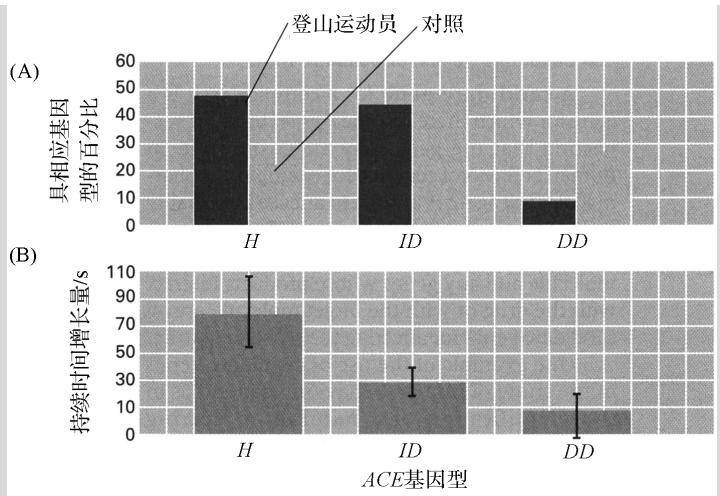

者要高出 11 倍。肾素-血管紧张素内分泌系统在控制循环系统上非常重要。……有人描述过人类血管紧张素转化酶 ACE 基因的多态性，其中，缺失型 (D) 等位基因而不是插入型 (I) 等位基因与组织 ACE 较高的活性有关。……最初的研究表明，I 等位基因与提高耐力有关。……高海拔登山运动员从事极限耐力运动。(25 位) 优秀的无亲缘关系的男性英国登山运动员 (的 ACE 基因型) ……与 1906 位英国男性的基因型相比较。……在登山者和对照之间，基因型分布和等位基因频率均有显著差异 (见图)。

在第二项研究中，检测了连续招募到英国军队的 123 位白人男性的 ACE 基因型。……在为期 10 周的体能训练之前和之后，测评握住一个 15kg 的杠铃做重复屈肘的最大持续时间(秒)。……II 和 ID 基因型的人，运动持续时间显著提高，但 DD 基因型的人不显著(图 B)。……表现的改善很可能是由于受试肌肉的耐力特性的提高。……需要进一步的工作，来确定在此处研究的有限样品组之外，这种关系是否仍然成立。

来源：H. E. Montgomery, et al., Nature 393 (1988): 221-222。

## ■ 复杂性状的候选基因

复杂性状的候选基因 (candidate gene)，是存在某种先验 (a priori) 依据，怀疑其可能影响复杂性状的基因。例如，在人类行为遗传学中，如果已知某种药物可影响某种人格特质，并已知该药物的分子靶标，则编码该分子靶标的基因，以及产物与该药物或该靶分子相互作用的任何基因，全部都是影响这种人格特质的候选基因。

在人类行为遗传学研究中利用候选基因的一个例子，是对一个自然发生的遗传多态性与生活压力所致的严重抑郁症关联的鉴定。已知神经递质物质血清素(5-羟色胺)影响多种精神疾病，如焦虑和抑郁症。血清素作用中重要的组分之一是血清素转运蛋白 SLC6A4(SLC 代表 solute carrier，溶质转运蛋白)它由染色体区 17q11.1-q12 中的一个基因编码。释放血清素以兴奋其他神经元，也通过 SLC6A4 转运蛋白重新摄取血清素。这种摄取使兴奋作用终止，也使血清素回收，留待以后使用。

当发现血清素转运蛋白是一类称为选择性血清素再摄取抑制剂的抗抑郁药的靶标之后，该转运蛋白成为研究抑郁症强有力的候选基因。广泛使用的抗抑郁药普罗扎克(盐酸氟西汀)是此类药物的一个例子。

受血清素转运蛋白可能与抑郁症有关这个强烈想法的驱使，研究者在人类群体中寻找影响SLC6A4转运蛋白基因的遗传多态性的证据。在该转运蛋白的启动子区发现了这样一个多态性。在转录起始点上游约1kb处，是一段串联重复序列，含16个DNA序列几乎一样的约15bp长的重复拷贝。这就是 $L$ (长)等位基因，在白人中的等位基因频率为 $57\%$ 。还存在一种 $S$ (短)等位基因，有3个重复序列拷贝缺失。 $S$ 等位基因频率为 $43\%$ 。发现基因型 $LL$ 、 $LS$ 和 $LL$ 呈 $32\%$ 、 $49\%$ 和 $19\%$ 的哈代-温伯格比例。进一步的研究揭示，这种多态性没有生理效应。在培养细胞中， $LL$ 细胞的转运蛋白mRNA比 $LS$ 或 $SS$ 细胞多 $50\%$ 左右， $LL$ 细胞的膜结合转运蛋白比 $LS$ 或 $SS$ 细胞多 $35\%$ 左右。

鉴于这些差异，SS 或 SL 基因型个体患严重抑郁症的风险比 LL 基因型个体高得多，也许就不奇怪了。有趣的是，这种较高的风险呈现出基因型与环境互作现象，这种互作只发生在过去 5 年中经历过 3 次或 3 次以上应激性生活事件(受恐吓、失败、受屈辱或心爱的人死亡)的人中。

S 和 L 型的血清素转运蛋白也影响药物反应。俱乐部毒品 MDMA(3, 4-亚甲基二氧甲基麻黄碱)，也称作摇头丸 (ecstasy)，是广泛使用的违禁药物之一，它结合于血清素转运蛋白，从而抑制血清素的再摄取。习惯性使用摇头丸伴随着血清素释放和再摄取的长期改变。这会产生潜在的问题，仅 2006 年有近 1230 万 12 岁或 12 岁以上的美国人至少尝试过该药物一次，这约占该年龄段美国人口的 5%。

在习惯性摇头丸使用者中，SLC6A4多态性的效应如图18.18所示。在该研究中，按SLC6A4基因型(LL、SL或SS)对男性摇头丸使用者进行分类，然后与男性非使用者进行贝克抑郁量表(Beck Depression Inventory)得分的比较。贝克抑郁量表是抑郁症的一种标准化评定量表，它以一个覆盖抑郁症各种不同症状的调查问卷为基础。得分大于9则被视为表现出抑郁症的症状。

虽然要求摇头丸使用者在受试之前至少戒毒3周，然而，在图18.18中，使用的长期效应是很明显的。虽然在 $LL$ 基因型中，抑郁得分的差异在统计上不显著 $(P = 0.32)$ ，但在 $SL$ 和 $SS$ 基因型中，摇头丸使用者的抑郁得分都显著大于非使用者 $(P = 0.02)$ 。大体上，在 $SL$ 基因型中，抑郁症风

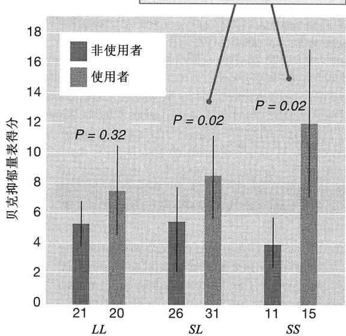  
各种SLC6A4基因型的男性的数量  
图 18.18 违禁药物摇头丸男性使用者的抑郁得分，是血清素摄取转运蛋白 SLC6A4 基因型的函数。与男性非使用者比较，每种基因型的 P 值均为显著性水平。[数据来自 J. P. Roiser, et al., Am. J. Psychiatry 162 (2005): 609-612。]

险大了 2 倍，在 SS 基因型中，抑郁症风险大了 10 倍。这种类型的基因型与环境互作是一种基因型特异的药物反应，是药物基因组学 (pharmacogenomics) 的一个例子。

## 本章概要

\- 复杂性状由多种遗传和环境因素共同作用决定。

\- 基因型和环境对性状的相对贡献，是通过基因型所致的方差(基因型方差)和环境所致的方差(环境方差)来度量的。

\- 亲属间的相关性被用来估计变异的不同组分，如基因型方差、加性方差和显性方差。

\- 加性方差导致父母-子女相关性；显性方差导致同胞-同胞相关性中超出预计来自加性方差之上的部分。

\- 狭义遗传率是加性(可传递)方差与总表型方差的比值；在动植物育种中，它被广泛用来预测对人工选择的反应。

\- 可用多态性 DNA 标记进行遗传作图，或在认识性状的生理和发育的基础上确定候选基因，来鉴定影响数量性状的基因。

## 基础回顾

\- 举一个既受环境因素又受遗传因素影响的人类性状的例子。指出影响该性状的一些环境因素。

\- 群体中性状的表型分布对基因和环境在导致个体之间表型的差异上的相对重要性有何提示？对可能影响该性状的基因数目有何提示？请解释。

\- 什么是数量性状的基因型方差？什么是环境方差？

\- 指出基因型与环境互作所致的方差和基因型与环境关联所致的方差的区别。哪种方差更容易受实验者控制？

\- 关于基因型方差，两个近交系之间杂交的 $\mathrm{F}_1$ 代有何特别之处？

\- 指出广义遗传率和狭义遗传率的差异。哪一种遗传率与个体截断选择有关？

\- 在某一果蝇群体中，在其中一个腹节上的刚毛数目为 $12 \sim 26$ 。该性状的狭义遗传率约为 $50\%$ 。经过若干世代的人工选择，得到一个平均刚毛数目大于 26 的群体，你认为这可能吗？能否得到一个最少刚毛数目大于 26 的群体呢？解释为什么能或不能。

\- 为什么数量遗传学家对亲属之间的相关性感兴趣？

\- 讨论多因子遗传时，什么是QTL？QTL与任何其他类型的基因有区别吗？怎样检测QTL？

\- 讨论多因子遗传时，什么是候选基因？编码苯丙氨酸羟化酶的 $PAH$ 基因是智力障碍的一个天然的候选基因吗？为什么是或不是？

## 解题指南

习题1 两个果蝇近交系杂交， $\mathrm{F}_{1}$ 代腹部刚毛的均数为20，标准差为2。 $\mathrm{F}_{2}$ 代的均数为20，标准差为3。在该群体中，刚毛数目的环境方差、基因型方差和广义遗传率是多少？

## 答案

$F_{1}$ 代的表型方差等于 $2^{2}=4$ ， $F_{2}$ 代的表型方差等于 $3^{2}=9$ 。因为 $F_{1}$ 代是两个近交系杂交的结果，在遗传上均一，因而表型方差等于环境方差 $\sigma_{e}^{2}$ （由于在遗传上均一的群体中，基因型方差 $\sigma_{g}^{2}$ 等于0）。因此， $\sigma_{e}^{2}=4$ 。在遗传异质性的 $F_{2}$ 代中，表型方差为 $\sigma_{g}^{2}+\sigma_{e}^{2}=9$ 。因而，在 $F_{2}$ 代中， $\sigma_{g}^{2}$ 等于9-4=5。广义遗传率 $H^{2}$ 等于 $\sigma_{g}^{2}/(\sigma_{g}^{2}+\sigma_{e}^{2})=5/9=55.6\%$ 。

习题 2 一群肉鸡在 5～9 周大的平均增重为 700g，在这群鸡中，增重的狭义遗传率为 0.80。进行连续 5 代选择，以提高增重，在每一代中，选为下一代亲本的平均值比上一代的平均值高 50g。假设该性状的遗传率保持为 80% 不变。

(a) 经过 1 代选择之后，肉鸡的期望平均增重是多少？

(b) 经过 5 代选择之后，肉鸡的期望平均增重是多少？

## 答案

(a) 在第一代的选择中，群体均数 $M = 700\mathrm{g}$ ，选作亲本的肉鸡的均数 $M^{*} = 750\mathrm{g}$ ，狭义遗传率已知为0.80。下式为此情况下的预测公式，可得期望平均增重为 $740\mathrm{g}/$ 只。

$$
\begin{array}{r l} M & = M + h ^ {2} (M ^ {*} - M) \\ & = 7 0 0 + (0. 8 0) (7 5 0 - 7 0 0) \\ & = 7 4 0 \mathrm{g} \end{array}
$$

(b)根据上面的公式，显然，如果在每一代中都有 $M^{*} - M = 50$ ，而 $h^2$ 保持为0.80不变，则每代的增重预计提高 $40\mathrm{g}$ 。5代之后，期望增重提高 $200\mathrm{g}$ ，得5代之后的期望平均增重为 $900\mathrm{g}$ /只。

习题3 果蝇中的某一限制性片段长度多态性(RFLP)与某一影响腹部刚毛数目的QTL(数量性状基因座)连锁。该RFLP的一个探针与一个 $6.5\mathrm{kb}$ 限制性片段、一个 $4.0\mathrm{kb}$ 限制性片段或与两者(在杂合子中)杂交。这些QTL基因型可记为 $QQ$ 、 $Qq$ 和 $qq$ 。在这些基因型中，平均腹部刚毛数分别为20、18和16。刚毛数目的典型标准差约为2，因此，有利等位基因的效应相当于1个表型标准差。这通常视为相当大的效应。按如下所示进行交配，检查每一后代的刚毛数，然后进行电泳和DNA杂交，以对RFLP基因型进行分类。

$$
\frac {6 . 5 Q}{4 . 0 q} ♀ ♀ \times \frac {4 . 0 q}{4 . 0 q} ♂ ♂
$$

正如所料, 后代的 RFLP 表型分为两类: 两条带都有的表型 (4.0/6.5 杂合子) 和只有 4.0 带的表型 (4.0/4.0 纯合子)。设 RFLP 基因座与 QTL 之间重组的频率 (r) 分别如下, 在所示凝胶的泳道下方的方框中, 填写这两种 RFLP 表型的平均刚毛数。

在后代中观察到的表型 6.5 4.0

(b) $r = 10\%$

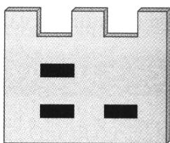

## 答案

平均刚毛数 $(r = 0)$

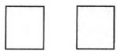

雌配子有 4 种：6.5Q [频率为 $(1-r)/2$ ]、6.5q [频率为 r/2]、4.0Q [频率为 r/2] 和 4.0q [频率为 $(1-r)/2$ ]。雄配子只有 4.0q。因而，4 种雌配子产生的后代的基因型为（按如上顺序排列）：6.5Q/4.0q（平均刚毛数 18）、6.5q/4.0q（平均刚毛数 16）、4.0Q/4.0q（平均刚毛数 18）和 4.0q/4.0q（平均刚毛数 16）。只考虑 6.5/4.0 RFLP 的

平均刚毛数 $(r = 0.1)$

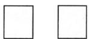

平均刚毛数 $(r = 0.5)$

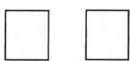

基因型，平均刚毛数为 $(1 - r)(18) = 18 - 2r$ ；只考虑 $4.0 / 4.0$ RFLP 的基因型，平均刚毛数为 $(r)(18) + (1 - r)(16) = 16 + 2r$ 。因此，答案为：(a) $r = 0$ 时， $6.5 / 4.0$ 型 RFLP 平均 18 根刚毛， $4.0 / 4.0$ 型平均 16 根刚毛；(b) $r = 0.10$ 时， $6.5 / 4.0$ 型 RFLP 平均 17.8 根刚毛， $4.0 / 4.0$ 型平均 16.2 根刚毛；(c) $r = 0.50$ 时， $6.5 / 4.0$ 型 RFLP 平均 17.0 根刚毛， $4.0 / 4.0$ 型平均 17.0 根刚毛。关键之处在于，用连锁遗传标记来检测 QTL，对于连锁的紧密程度非常敏感。对于非常紧密的连锁，其检测 QTL 的能力最强，但检测 QTL 的能力随着重组频率的增加而直线下降，直至 $r = 50\%$ 时，没有检测 QTL 的能力。

## 分析与应用

18.1 在印第安纳和北卡罗来纳对 A、B 两个玉米品种进行田间试验。A 品种在印第安纳产量较高，而 B 品种在北卡罗来纳产量较高。该例说明了数量遗传学中的什么现象？

18.2 某一分布具有标准差等于方差的特点。该方差可能的值是多少？

18.3 下列问题与正态分布有关。

(a)用于 $x$ 轴上相当于分布峰值的值的术语是什么？

(b) 如果两个正态分布具有相同的均数但具有不同的方差，哪一个的幅度较大？

(c)预计群体的多少比例在均数的一个标准差之内？在两个标准差之内呢？

18.4 指出数量性状的广义遗传率和狭义遗传率的差异。如果某一群体中影响某一特定数量性状的所有基因均被固定，广义遗传率和狭义遗传率的值是多少？

18.5 当比较两个高度近交品系杂交所得的 $F_{1}$ 和 $F_{2}$ 代中的某一数量性状时，哪一组后代提供了环境方差的估计？另一组后代的方差由什么决定？

18.6 对家番茄(Solanum lycopersicon)和南美野生近亲番茄(Solanum chmielewskii)之间的差异而言，环境方差 $\sigma_{e}^{2}$ 占果实重量的总表型方差 $\sigma_{p}^{2}$ 的 13%，占可溶性固形物含量 $\sigma_{p}^{2}$ 的 9%，占酸度 $\sigma_{p}^{2}$ 的 11%。这些性状的广义遗传率是多少？

18.7 10 只母鼠在第一窝崽中的活产后代数目如下：11、9、13、10、9、8、10、11、10、13。将这些母鼠视为它们所来自的总群体的代表，估计在整个群体中第一窝崽的均数、方差和标准差。

18.8 假设在某个随机交配群体中，某一数量性状由3个独立分离的基因决定。等位基因 $A$ 、 $B$ 和 $C$ 对相应的隐性等位基因 $a$ 、 $b$ 和 $c$ 为显性。基因型aa bb cc的表型为0，对于杂合或有利等位基因纯合的每个基因座，表型增加两个单位。

(a)在一个每种有利等位基因频率为 $1 / 2$ 的群体中，预计表型是什么分布？

(b) 计算该群体中表型的均数、方差和标准差。注意，在此类习题中，以表型值平方的均数减去平均表型值的平方的方式来计算方差，最为容易：以符号表示为 $s^{2}=\text{Mean}(x^{2})-\left[\text{Mean}(x)\right]^{2}$ 。

(c) 对于受加性等位基因影响的性状 (在基因型中每存在一个有利等位基因, 表型增加一个单位), (a) 和 (b) 部分的答案有何变化?

18.9 IQ 得分值的分布大致与均数为 100、标准差为 15 的正态分布相符。群体中有多少比例的人 IQ 得分值超过 130？低于 85 呢？高于 85 呢？

18.10 下表中的数据是 300 头两岁大的娟珊牛在 8 个月哺乳期中的产奶量。

数据已按区间分组，但为了计算，可将每头牛的产奶量看作所在区间的中值(例如，2750作为2500～3000区间的牛的产奶量)。

(a)估计牛奶产量的均数、方差和标准差。

<table><tr><td>产奶量/磅 $^{\text{1}}$ </td><td>牛的数目</td></tr><tr><td>2500~3000</td><td>23</td></tr><tr><td>3000~3500</td><td>60</td></tr><tr><td>3500~4000</td><td>58</td></tr><tr><td>4000~4500</td><td>67</td></tr><tr><td>4500~5000</td><td>54</td></tr><tr><td>5000~5500</td><td>23</td></tr><tr><td>5500~6000</td><td>15</td></tr></table>

(b)要涵盖 $68\%$ 的奶牛，预计牛奶产量会在什么范围？

(c)要涵盖 $95\%$ 的奶牛，预计牛奶产量会在什么范围？

18.11 在两个烟草栽培品种杂交的 $F_{2}$ 代中，每株烟叶数按均数为 18、标准差为 3 的正态分布分布。估计群体中有多少比例具有如下表型？

(a)烟叶数为 $15\sim 21$

(b)烟叶数为 $12\sim 24$

(c)烟叶数少于15

(d)烟叶数大于24

(e)烟叶数为 $21\sim 24$

18.12 两个高度纯合的小鼠近交系杂交，并测定 $F_{1}$ 后代的 6 周龄体重。

(a) 在 $\mathrm{F}_{1}$ 代中，基因型方差的大小是多少？

(b) 如果影响 6 周龄体重的所有等位基因都是加性的，与起始近交系的平均 6 周龄体重相比， $F_{1}$ 代的期望平均表型会是多少？

18.13 在两个烟草栽培近交品种之间的杂交中，在 $F_{1}$ 代中每株烟叶数目的方差是 1.46，在 $F_{2}$ 代中是 5.97。基因型方差和环境方差是多少？烟叶数目的广义遗传率是多少？

18.14 一个遗传异质性小麦群体成熟天数的方差为 40，而来自于该群体的两个近交群体，成熟天数的方差为 10。

(a)在该群体中，成熟天数的基因型方差 $(\sigma_g^2)$ 、环境方差 $(\sigma_e^2)$ 和广义遗传率 $(H^{2})$ 是多少？

(b) 如果这两个近交系杂交，在 $\mathrm{F}_{1}$ 代中成熟天数的期望方差是多少？

18.15 母体效应是母亲表型对子女表型的非遗传影响。例如，在许多哺乳动物中，体型较大的母亲生体型较大的子女，部分就是因为在出生体重上的母体效应。与父亲和他们的子女之间在出生体重上的相关性相比，母体效应对母亲和她们的子女之间在出生体重上的相关性的效果是什么？这样的母体效应会如何影响对狭义

遗传率的估计？

18.16 从狭义遗传率方面来考虑，身为同卵双生子子女的一级堂表亲之间在表型上的理论相关系数是多少？

18.17 如果某一性状在一级堂表亲之间的相关系数为 0.09，估计该性状的狭义遗传率是多少？

18.18 无性生殖的单细胞原虫沙壳虫(Difflugia)有若干形状整齐、易于计数的牙，环绕着起到口的作用的细胞区域。这些细胞还具有数目不等的若干刺突。在一个遗传异质性的群体中，亲本与其后代之间牙的数量和最长刺的长度的相关系数分别为0.956和0.287。

(a)估计这两个性状的广义遗传率。

(b)在无性生殖生物中亲本和后代的关系如同有性生殖生物中的同卵双生子，鉴于这一事实，怎样解释在广义遗传率上的巨大差异？

18.19 在一个关注小鼠 3～6 周龄之间体重增加的实验中，两个品系之间在平均表型上相差 17.6g，估计得基因型方差为 0.88。估计影响该性状的最小基因数目。

18.20 在两个近交品系杂交产生的家番茄群体中，估计影响果实重量的最小基因数目。当平均果实重量表示成果实重量(g)的对数时，这两个近交系的平均果实重量为-0.137和1.689。 $F_{1}$ 代的方差为0.0144， $F_{2}$ 代的方差为0.0570。

18.21 在一个番茄群体中进行果实重量的人工选择。对来自每一植株的所有果实称重，然后将平均重量/番茄视为该植株的表型。在群体整体中，平均果实重量/植株为 75g。选择果实重量平均为 100g/番茄的植株，随机杂交以产生下一代。在此代中，平均果实重量的狭义遗传率估计为 20%。

(a) 经过一代选择后，番茄中的期望平均果实重量是多少？

(b) 若每一代中，选出的亲本的平均果实重量比该代中群体的均数高 25g，那么经过连续 5 代选择后，番茄中的期望平均果实重量是多少？假设在此期间狭义遗传率保持不变。

18.22 在一个增加小鼠血浆胆固醇水平的选择实验中，从一个均数为 2.26 单位的群体中，选出均数为 2.37 的亲本，这些选出来的亲本的后代具有 2.33 单位的平均水平。根据这些数据，估计该性状的狭义遗传率。

18.23 一个小鼠群体在 3～6 周龄之间具有 12g 的平均体重增加，且 3～6 周龄之间体重增加的狭义遗传率为 20%。

(a) 平均体重增加为 $16 \mathrm{~g}$ 的亲本, 预计其子代中的平均体重增加是多少?

(b) 平均体重增加为 $8 \, g$ 的亲本，预计其子代中的平均体重增加是多少？

18.24 为了估计大鼠迷宫记忆能力的遗传率，做过一个选择实验。从一个记住迷宫需要尝试的平均次数为10.8次，方差为4.0的群体中，选出能够在平均5.8次尝试中记住迷宫的大鼠。它们的子代记住迷宫需要平均8.8次尝试。在该群体中，估计迷宫记忆能力的狭义遗传率是多少？

18.25 将上题中一样的群体饲养于另一实验室，施予相当不同的处理条件和别的刺激方式。记住迷宫所需的平均次数仍然是 10.8 次，但方差升高到 9.0。再次选出平均记忆次数为 5.8 次的大鼠，其子代的平均记忆次数为 9.9 次。

(a)在这些条件下，该性状的遗传率为多少？

(b) 结果与习题 18.24 一致吗？怎样解释这种差异？

18.26 在一个大羊群中，断奶时羊羔体重(磅)的一个代表样本如右所示。如果断奶重的狭义遗传率为 20%，且羊群中最重的一半羊羔留来繁殖下一代，下一代的平均断奶重的最佳估计值是多少？(注：如果某个正态分布均数为 $\mu$ 且标准差为 $\sigma$ ，则该分布上面一半的均数由 $\mu+0.8\sigma$ 给出。)

18.27 某数量性状受 20 个遗传上非连锁的加性基因座影响，对每一基因座而言，存在 1 个或 2 个有利等位基因，分别使表型增加 1 个或 2 个单位。某个群体对所有 20 个基因座均分离，在每个基因座上，有利和不利等位基因两者的频率均等于 1/2。

(a)该群体的平均表型是多少?

(b) 如果进行人工选择，直到每个基因座上的有利等位基因均被固定，选择后群体的表型会是多少？

(c)在起始群体中，在每个基因座上有利等位基因均为纯合的基因型，其期望频率是多少？

(d) 在起始群体中，要有多少个个体，才可有一个个体对所有有利等位基因均为纯合？（这一计算说明为什么人工选择可得到这样的选择群体，其平均表型值远远高于起始群体中可见的任何基因型的平均表型值。）

18.28 在某一随机交配群体中，对于一个由单个完全外显隐性等位基因(频率为 q)决定的表型，可以证明

狭义遗传率等于 $2q/(1+q)$ 。

(a) 计算 q=1.0、0.5、0.1、0.05、0.01、0.005 和 0.001 时的狭义遗传率。

(b) 注意，当 $q$ 趋向于 0 时，狭义遗传率趋向于 0，而该表型仍完全由遗传决定。这如何解释？

18.29 在人工选择中，选择出来的亲本的均数与群体均数的离差 $(M^{*} - M)$ 常常称为选择差 (selection differential)，记为 $S$ 。如果以每代不变的选择差 $(S)$ 进行人工选择，且 $h^2$ 保持不变，证明，经过 $t$ 代选择后，选择群体的均数由 $M_{t} - M_{0} = th^{2}S$ 给出，其中， $M_0$ 为起始群体的均数。

18.30 关于上题中定义的选择差 S，如果选择差可变，在第 i 代中记为 Si，则 $M_{i}$ 相应的公式是什么？

## 挑战题

挑战题 1 在一个随机交配群体中，某数量性状由 3 个独立分离、完全加性的基因决定。等位基因 A、B 和 C 对该性状有利。基因型 aa bb cc 的表型为 0，在其他所有基因型中，每存在一个有利等位基因，表型就增加一个单位。所考察的群体，在各基因座上，有利等位基因和不利等位基因的等位基因频率均为 0.5。

(a)该群体的平均表型是多少?

(b) 如果这样进行人工选择，选出的亲代个体具有 5 或 6 的表型，则在选出的亲代中，平均表型是多少？

(c)选出的亲代中，各等位基因频率是多少？

(d) 如果选出的亲代进行随机交配，那么在其子代中期望平均表型是多少？

(e) 这些结果与公式 $M=M+h^{2}(M^{*}-M)$ 相符吗？

(f) $h^{2}$ 值是多少？该值出乎意料吗？

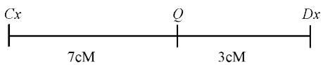

挑战题 2 两种鸡的品种在平均产卵数/(只·年)上不同。一个品种每年平均产300枚卵，另一个品种平均每年产270枚卵。这种差异是位于两个限制性片段长度多态性之间的单个数量性状基因座(QTL)所致。遗传图如此处所示。

在该图中，Cx 和 Dx 为限制性片段长度多态性的位置，Q 是影响产卵量的 QTL 的位置。以厘摩(cM)形式给出图距。根据某一特定限制酶消化产生的限制性片段大小，将 Cx 的等位基因记为 Cx4.3 和 Cx2.1，将 Dx 的等位基因记为 Dx3.2 和 Dx1.1。等位基因 Q 与高产卵量相关，q 与低产卵量相关，Qq 基因型的年产卵量等于基因型 QQ(300 枚卵)和 qq(270 枚卵)的平均值。进行如下类型的杂交。

雌性后代分成如下 4 种类型。

(a) $Cx4.3 Dx1.1 / Cx2.1 Dx3.2$

(b) Cx4.3 Dx3.2 / Cx2.1 Dx3.2

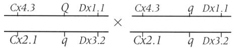

(c) Cx2.1 Dx1.1 / Cx2.1 Dx3.2

(d) Cx2.1 Dx3.2 / Cx2.1 Dx3.2

这些基因型的期望平均产卵量各为多少？可假设整个区域具有完全的染色体干涉。

挑战题 3 所附系谱包含关于 3 个正在分离的基因的信息。

\- 基因1有4个等位基因，记为 $A$ 、 $B$ 、 $C$ 和 $D$ 。根据与基因1的探针杂交的DNA限制性片段的电泳迁移率识别出每个等位基因。观察到的系谱中每一个体的带型，如系谱下方的凝胶示意图所示。当某一等位基因为纯合时，其条带为其他条带的两倍粗，因为对该等位基因而言，纯合基因型产生的限制性片段是杂合子的两倍。系谱右上角的小表格列举了该群体总体基因1各等位基因的频率。

\- 基因2有4个等位基因，记为 $E$ 、 $F$ 、 $G$ 和 $H$ 。这些等位基因亦根据限制性片段的电泳迁移率得以识别。对于系谱中的每个人，基因2的基因型如图所示。基因2各等位基因的群体频率亦在右上角的表中给出。

\- 基因3与某种罕见遗传病有关。在系谱中以红色符号表示患者。与此病有关的基因型具有完全外显率。基因3有两个等位基因，记为 $Q$ 和 $q$ 。

(a)什么遗传假设可解释系谱中患者和非患者的遗传方式?

(b)如果男性IV-2生一个女儿，该女儿患病的概率是多少？

(c) 假设进行随机婚配，如果男性IV-2生一个女儿，该女儿对于基因2的基因型为 $HF$ 的概率是多少？

(d) 指出系谱中每个人关于基因 1、2 和 3 的基因型。尽可能指出每个个体中存在的各等位基因的连锁相(相偶或相斥)。

(e)考察数据中连锁的证据。有成对的基因连锁吗？根据此系谱，估计基因1和基因2之间的重组率为多少？基因2和基因3之间呢？

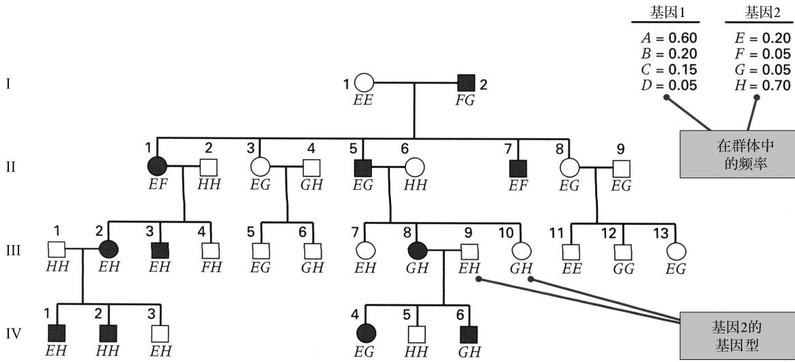

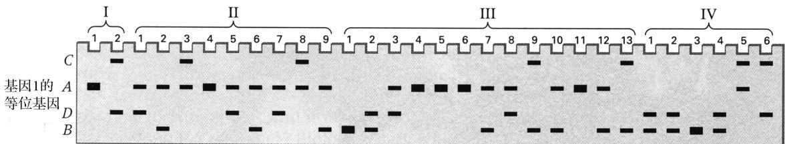  
用基因1的探针与每一个体的DNA进行杂交得到的电泳图

## 网上遗传学

“网上遗传学”(GeNETics)会为你介绍在互联网上寻找遗传学信息的某些最重要的站点。要浏览这些站点，请访问为《遗传学：基因和基因组分析》(第八版)配备的 Jones and Bartlett 公司配套站点http://biology.jbpub.com/book/genetics/8e/。

在该站点中，你会找到一个按章列出的重点关键词列表。选择某个关键词后，可链接到某个网站，其中包含与此关键词相关的信息。
