<!-- BEGIN OFFICIAL API PART part_001 -->

生命科学名著

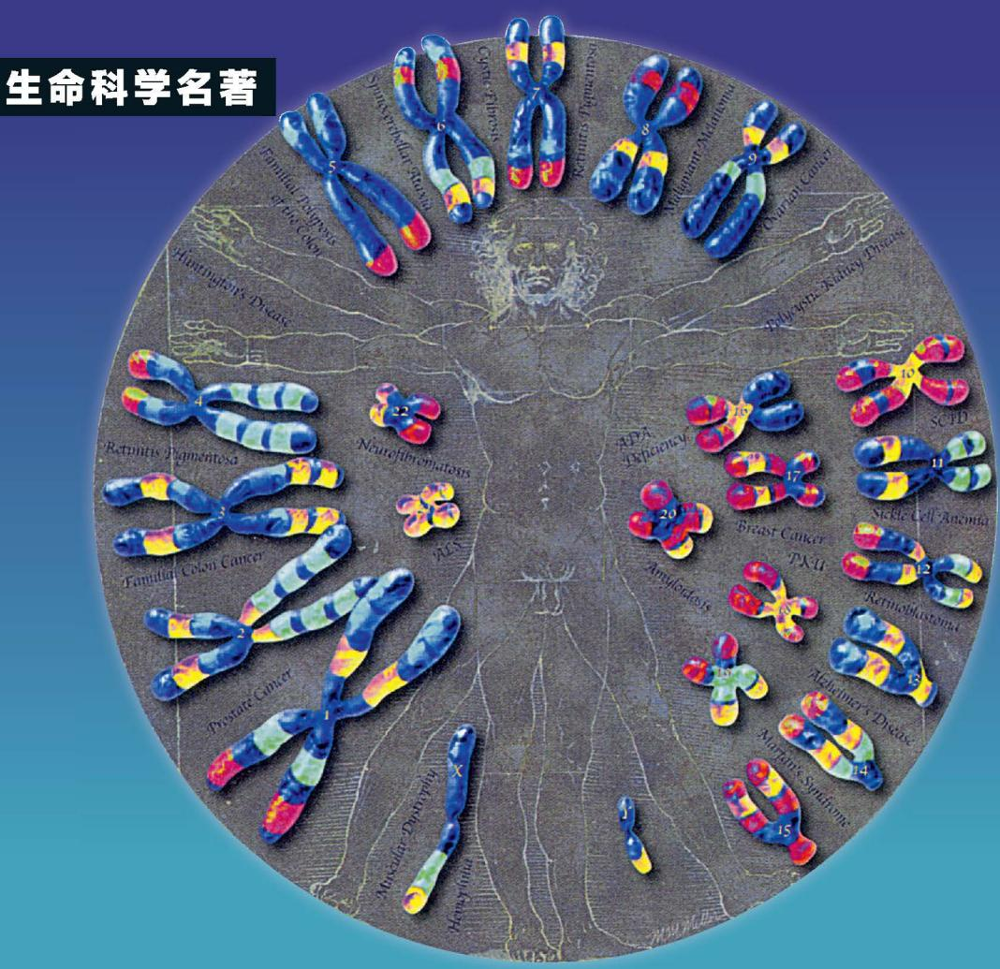

遗传学 基因和基因组分析 （第八版）

Genetics Analysis of Genes and Genomes (Eighth Edition)

〔美〕D.L. 哈特尔 M. 鲁沃洛 著

杨明译

遗传学

基因和基因组分析
(第八版)

# Analysis of Genes and Genomes (Eighth Edition)

〔美〕D.L. 哈特尔 M. 鲁沃洛 著
杨 明 译

科学出版社

北京

## 内容简介

本书为哈佛大学生命科学类本科生必修课程“生命科学综合介绍：遗传学、基因组学与进化”的教材，全面介绍了遗传学和基因组学的基本原理和实验方法，内容包括基因传递、突变、表达和调控的基本过程，遗传学和分子生物学研究的主要实验方法，以及遗传学和基因组学的一些社会历史背景。全书文字简明生动，每章都配有精炼的总结、回顾及大量习题。书中不仅包括大量人类遗传学实例，也包括遗传学在主要模式生物中的大量实际应用。

本书可作为生命科学专业本科生和研究生的教材，通过对本书的系统学习，学生可对遗传学有比较全面的把握，并具备入门级遗传学工作者的思考水平。

ORIGINAL ENGLISH LANGUAGE EDITION PUBLISHED BY

Jones & Bartlett Learning, LLC

5 Wall Street

Burlington, MA 01803

Genetics: Analysis of Genes and Genomes, Daniel L. Hartl, Maryellen Ruvolo, © copyright 2012 JONES & BARTLETT LEARNING, LLC. ALL RIGHTS RESERVED

## 图书在版编目(CIP)数据

遗传学: 基因和基因组分析: 第 8 版 / (美) 哈特尔 (Hartl, D. L.), (美) 鲁沃洛 (Ruvolo, M.) 著; 杨明译. — 北京: 科学出版社, 2015. 1

(生命科学名著)

书名原文：Genetics: analysis of genes and genomes, eighth edition

ISBN 978-7-03-042821-9

I. ①遗… II. ①哈… ②鲁… ③杨… III. ①基因-研究 IV. ①Q343.1

中国版本图书馆 CIP 数据核字(2014)第 301342 号

责任编辑：夏 梁 罗 静 文 茜 / 责任校对：张凤琴 郑金红

责任印制：赵德静 / 封面设计：美光制版

科学出版社出版

北京东黄城根北街16号

邮政编码：100717

http://www.sciencep.com

骏志印刷厂 印刷

科学出版社发行 各地新华书店经销

2015年1月第一版 开本：787×1092 1/16

2015年1月第一次印刷 印张：49

字数：1101000

定价：198.00 元(含光盘)

(如有印装质量问题，我社负责调换)

## 译者序

遗传学和基因组学发展迅速，内容驳杂。在向特定对象（如本科生）全面介绍这两门学科时，如何把握内容的深度和广度，是一件非常考验相关教材作者的事情。但《遗传学：基因和基因组分析》在这方面做得十分出色，使其非常适合用于“大学水平的遗传学和基因组学”的教学。这是我在翻译过程中的一点体会。至于该书的其他特点，在前言中有全面的描述，毋庸赘言。

我曾在本书作者 D. L. 哈特尔教授的实验室做过一年的访问学者，其间蒙哈特尔教授许可，开始了该书第七版的翻译工作。在基本翻译完成时，该书第八版出版，于是又在第七版译稿的基础上翻译第八版。在我翻译该书期间，哈特尔教授给予我随时讨论翻译问题的便利，又在 2012 年于苏州参加会议期间，特别抽出一个下午的时间与我商讨翻译问题。非常感谢哈特尔教授对本书翻译工作的大力支持和帮助。

在本书刚刚开始翻译时，即蒙科学出版社应允予以出版。在翻译、出版过程中，先后接触的几位科学出版社编辑罗静、王静和夏梁均严谨、敬业、专业，给我留下了非常深刻的印象，在此对他们表示由衷的感谢。

特别感谢贵阳医学院教务处对本书翻译工作的支持。

本书由我独立翻译完成，大部分工作在业余时间进行，有赖于妻子李丽红女士的全力支持，在此表示衷心感谢！

由于我的水平和精力所限，出现错误在所难免，敬希原宥、指正。

杨明

2014年12月2日

## 前言

现代科学教学的最佳做法是借助明确的学习目标与科学能力，尽可能清楚地列出学生应该了解什么、理解什么、能够做什么。“学习目标与科学能力”有助于引导学生明确主要概念，并在理解、应用、分析和综合等各种学习层次上应用它们。《遗传学：基因和基因组分析》（第八版）的每一章，都从“学习目标与科学能力”清单开始。在初次学习每一章时，这些清单让学生一开始就能把握方向，而在后面温习的时候，可作为指南。

遗传学和基因组学是使用这种方法的理想学科，因为许多学生已对这两个学科有了兴趣并被其吸引。媒体上几乎天天都在报道药物反应的遗传差异、疾病的遗传风险因素、人类起源及人类历史的遗传学证据，这些新发现不断刷新学生的好奇心。还有伦理上的争议：该不该用遗传工程来为患者治病？该不该将胚胎用于研究？该不该克隆人？以及社会争议：应不应该有管理遗传隐私的法律？谁有资格及出于什么目的可以获取遗传检查记录？

对遗传学教师而言，要面临的挑战有：

\- 维持学生的求知欲。

\- 激发学生以全面而严谨的方式来理解遗传学原理的欲望。

\- 引导学生，使其认识到遗传学不只是一套原理，还是解决广泛生物学问题的一类实验方法。

\- 帮助学生学会思考遗传学问题，以及由遗传学和基因组学引起的更广泛的社会伦理问题。

《遗传学：基因和基因组分析》(第八版)在应对这些挑战的同时，也展示了这一学科的美、逻辑明晰和自洽。我们的教学方法，是将传递遗传学(transmission genetics)、分子遗传学(molecular genetics)和进化遗传学(evolutionary genetics)看作全面有机统一的学科。这切合大多数现代遗传学家的诉求，他们认为这些分支学科的区分是人为的。本书的章节编排，适于包括我们自己在内的绝大多数大学遗传学课程的组织。

我们旨在为大学水平的遗传学和基因组学提供一个清楚、全面、严谨和平衡的介绍。我们相信，一门好的遗传学课程要在两个重要的方面维持恰当的平衡。第一个方面，遗传学是关于遗传传递、功能和突变的知识体系；第二个方面，遗传学是研究诸如发育或行为之类的生物学过程的一类实验方法，或者说是一个“工具包”。本书的基本原则是，声称具有遗传学知识的学生，必须：

\- 理解基因传递、突变、表达和调控的基本过程。

\- 熟悉遗传学家和分子生物学家在研究中使用的主要实验方法，认识这些方法的优点和局限。

\- 能像初级遗传学家那样思考——能够提出遗传学假设、推出结果、将结果与观测数据进行对比检验。

\- 能够用自己的话陈述遗传学原理，能够联系上下文理解遗传学关键术语。

\- 能够解答几类习题，包括：要求运用遗传学定义或基本原理的单概念练习题，要求按逻辑顺序运用若干概念的遗传分析题，和需要进行一定数学计算的定量分析题。

\- 对遗传学和基因组学生发于其中并仍在其中继续发展的社会历史背景有一定的认识。

\- 基本熟悉可通过互联网获取的遗传学资源和信息。

## 特色

我们赋予本书若干特色，以利于学生达到上述学习目标。本书文字简明扼要，以几分轻松但又不过于随便的散文风格写就。每章从明确陈述学生应该达到的学习目标与科学能力开始。每章还包括两三个“联系”，把课文内容与经典论文的节选联系在一起，这些论文或记述遗传学的关键实验，或提出遗传学上重大的社会、伦理或法律问题。每个“联系”自带简介，以解释实验的重要性及开展该实验的历史背景。每章后面有一个以项目符号清单形式罗列的“本章概要”，一个以讨论题形式回顾主要概念的“基础回顾”，一个完整解答原理运用型典型习题的“解题指南”，大量待解答的“分析与应用”题(书后有偶数题的答案)，以及为意欲一展身手的学生准备的一套特殊的挑战题。每章后面还包括一个叫做“网上遗传学”的部分，这是访问本书网站的说明材料，在该网站上有完整的章节概述、关键术语、更多的各种类型的习题和练习，该网站还可使学生了解含有遗传学和基因组学资源的主要互联站点。在本书的后面，有偶数题答案——对每个答案的逻辑进行完整解释，有帮助学生掌握遗传学和基因组学基本术语的词根汇编，以及简明遗传学和基因组学词典。

## 第八版新在什么地方？

这一版本进行了彻底的修订和更新。每一章都经过彻底的重新加工，第16章全部重新组织和改写，第19章完全是新增的一章。删除了可有可无的或过时的材料，增加了新方法和结果；有几章进行了重新组织，以使新材料能够完美整合。增加了几个新的“联系”，新增或更新了50多个图表。增加了经过课堂检验的新习题，扩充了“解题指南”。

## ■ 章节组织

为了帮助学生专注于主要问题，避免被细节分散注意力，每章首先是一个“提纲”，预先指出这一章的路线图。提纲之后是一个“学习目标与科学能力”清单，以明确最重要的概念和原理。正文第一段是该章的概述，以一些实例来说明这一章的主题，并说明这一章的内容如何与遗传学连成一个整体。课文中大量使用带编号的清单和项目符号清单，以利于学生组织学习。为了强调重要的原理，还以特殊字体来突出概括性的陈述。每章后面有“本章概要”、叫做“基础回顾”的讨论题、“解题指南”、“分析与应用”部分中待解的习题，以及“挑战题”。

## - 内容与组织

本书的章节编排是大多数遗传学教师喜欢的方式。一个重要的特点是有两章导论，对 DNA、基因和基因组作全面概述——它们是什么、它们怎样发挥功能、突变如何改变它们及它们怎样随时间而进化。今天，多数学生在小学或中学时就已经了解 DNA，这两章导论起到让学生把即将学习的更深层次的概念与他们已经知道的内容联系起来的作用。这两章也能为每位学生提供一个坚实的框架，以整合后面的学习内容。

每一章都贯穿着观测结果与理论之间、原理与实例之间、挑战与动机之间的平衡。在课文中，分子遗传学、经典遗传学和进化遗传学融为一体，贯穿全书，经常提到人类遗传学。本书也充满遗传学在其他动植物(包括在遗传学和基因组学中使用的主要模式生物)上的大量实际应用。

以下是关于组织方式、覆盖范围和更新之处的一些要点：

\- 第1章为遗传学概述，旨在使背景迥异的学生达到同等的认识水平。这一章使分子遗传学、经典遗传学和进化遗传学在本书的其余部分得以整合。第1章内容为分子遗传学的基本概念——DNA结构、复制、表达和突变。新内容为论述生命起源的一节，该节特别强调生命源自大洋深处洋中嵴附近的碱性热液喷口的可能性。

\- 第2章强调现代遗传学的主要工具是实验操作DNA的方法。本章更加详细地考察DNA的结构，介绍限制性酶切、电泳、DNA杂交、Southern印迹和聚合酶链反应等主要的DNA操作方法。还介绍了单核苷酸多态性(SNP)和拷贝数多态性(CNP)，讨论在基因组尺度上怎样使用寡核苷酸微阵列(DNA芯片)来检测这些类型的遗传标记。讨论限制性作图的一节进行了修订，该节说明，从单一限制酶的消化图，或联合使用多种限制酶的消化图，如何推导 DNA 分子的限制图。

\- 第3～5章是孟德尔遗传学的核心，含分离和自由组合、遗传的染色体理论、有丝分裂和减数分裂、连锁和染色体作图，以及真菌的四分体分析。还包括孟德尔遗传学的基本概率框架及利用卡方检验遗传模型。第3章的独特之处，在于分子遗传学与孟德尔实验的整合。叙述皱缩突变的分子基础，并说明现代遗传学家会怎样开展孟德尔的研究：一方面考察分子表型，另一方面考察形态表型。这种教学方法，不仅能为像孟德尔实际操作和解读的那样去理解他的实验，而且能为理解现代分子方法如何用于遗传分析，提供坚实的基础。分子标记也被整合进人类遗传分析中。第八版对条件概率的考察进行了全面修订，重点探讨学生乐见的固有频率(natural frequency)方法，并说明这种简单直观又吸引人的方法与更为正式的使用贝叶斯定理的方法的关系。第4章对果蝇性别决定的讨论进行了修订，纳入性别由X染色体数目决定这一最新发现。这很有必要，因为从20世纪20年代起，人们就一直认为果蝇的性别是由X染色体与常染色体的比例决定，现在证明这个传统观点是错的：常染色体的作用是决定在胚胎发育过程中性别分化发生之前细胞发生分裂的准确次数。在第5章中关于检测人类谱系中的连锁的那一节，作了修改和简化。

\- 第6、7章讨论DNA的分子结构和复制，以及染色体的分子组织。第6章还讨论重组的分子机制及DNA测序(包括最新的大规模并行测序技术，该技术可在数小时内产生10亿碱基对DNA序列)。第7章含对真核生物基因组中重复DNA序列的讨论，以及着丝粒和端粒的分子结构。第6章新的地方是对重组热点及其在人类基因组中定位的讨论，以及关于染色质折叠的新资料：中期染色质折叠成染色体域时要经过不规则小球形式，不规则小球中的区域容易打开，因为其中的染色质丝从不打结。第7章包括新的一节，该节讨论祖细胞(成体干细胞)：由于端粒会逐渐缩短，最终导致细胞周期阻滞，祖细胞只能分裂有限的次数。第7章也解释了为什么胚胎干细胞分裂的次数可比其他类型的细胞更多。

\- 第8章讨论染色体的力学原理，并特别提及人类染色体的数目和结构，以及在人类染色体中发现的畸变类型。本章还讨论重复、缺失、倒位和易位等染色体异常的遗传学意义。本章含全新的一节，关于精神分裂症和自闭症谱系障碍，并讨论将这两种看似南辕北辙的疾病联系起来的遗传异常。

\- 第9章讨论细菌的遗传学原理，从可移动DNA、质粒和整合子的遗传学及其关系，到多重抗生素抗性的进化。本章考察微生物的遗传重组机制，包括转化、接合、转导，以及温和噬菌体和烈性噬菌体。这一版本包括对细菌染色体镶嵌结构的讨论，该结构为通过水平转移引进的基因组岛和致病岛DNA所证实；还包括对噬菌体中重组的讨论，但有缩减。

\- 第10、11章讨论严格意义上的分子遗传学。这两章含基因表达和基因调控的经典原理。包括基因调控的主要方面：染色质重塑复合体、基因表达印迹及其他表观遗传修饰、核糖开关，以及通过siRNA和microRNA进行基因调控的机制。这些方面也是目前许多研究的主题。第10章新的地方在于对内源性转录终止及依赖 $\rho$ 因子的终止机制的讨论，以及对翻译校对和提前终止的讨论——这一节是全新的。第11章含新的一节，讨论基因表达的随机效应，并对乳糖操纵子的讨论予以扩展，纳入随机效应在这个经典例子中发挥的重要作用。第11章还有一节是新的，讨论长非编码RNA及其在基因调控上的诸多功能。

\- 第12章关注重组DNA和基因组，内容包括：限制酶和载体在重组DNA中的运用、克隆策略、定点诱变、遗传背景明确的转基因动植物的生产，以及遗传工程应用实例。着重指出已测序的基因组的数量和多样性，对已知原理进行概括，同时也认识到可能还需要数十年才能完全理解这些基因组序列的全部涵义。这一版新增若干节，论及转录谱分析中的高通量cDNA测序(RNA-seq)，以及用ChIP-chip或ChIP-seq来鉴定与DNA结合的特异蛋白的染色质免疫沉淀(ChIP)。

\- 第13章讨论发育的遗传控制，重点是线虫(秀丽隐杆线虫)和果蝇发育的遗传分析，并含对拟南芥花器发育的遗传基础的全面考察。第一次对发育中的主控基因进行考察，并强调 Hox 基因在决定前后轴发育和 Pax 基因在眼睛发育上的作用。

\- 第14章讨论突变的分子基础。本章全面讨论不同的突变类型，也包括在遗传上不稳定的序列，如三核苷酸重复序列，其扩增导致智力低下的脆性X综合征。本章考察不同类型诱变剂的分子作用，以及切尔诺贝利核事故的遗传学效应。第14章还以新的一节来讨论DNA修复这一重要领域，论述非同源末端连接或模板指导的缺口修复对DNA双链断裂的修复，讨论乳腺癌基因BRCA1和BRCA2如何参与后一过程。

\- 第15章从细胞分裂的遗传控制的角度来强调癌症，重点是检查点：正常细胞的检查点要么抑制细胞分裂，要么导致细胞程序性死亡(凋亡)。癌症通常是体细胞中一系列连续的突变所致，这些突变突破了控制细胞增殖的正常检查点。经过修订，本章去掉了一些不必要的细节。

\- 第16章讨论细胞器遗传学，含人类线粒体DNA的遗传缺陷。本章经过全面的重新组织和广泛的改写，新的侧重点是细胞器的起源及分子遗传学(非常感谢密歇根州立大学的芭芭拉·西尔斯，她为完善本章提了很多有益的建议)。

\- 第17、18章讨论群体遗传学及进化遗传学，含分子进化原理概述。本章还含群体遗传学、刑事侦查和亲子鉴定中的DNA分型、近亲婚配的效应，以及驱动等位基因频率改变的进化机制。在数量遗传学方面，讨论如何用连锁分析来对影响数量性状的特定基因(QTL，数量性状位点)进行鉴定和作图。这一版本新添加的内容是讨论影响人类性状的QTL研究中的新兴原理。还有一节新的内容是论述人类行为的遗传决定因子，重点是人类血清素转运蛋白基因中与抑郁症相关的多态性。第17章含新的一节，讨论通过比较非同义和同义核苷酸替换率 $(K_{a} / K_{s})$ 来检测自然选择。还有新的一节是关于保护遗传学，重点是与濒危物种的健康和进化潜力减小相关的遗传变异的丧失。第18章新的地方是一些新证据，表明在有些复杂性状中，有大量的基因对遗传变异有贡献：以人类身高为例，在对近20万人的研究中，鉴定出180个影响成人身高的基因。

\- 第19章是全新的一章，讨论人类进化遗传学，含讨论黑猩猩是与人类最近的现生近亲的章节。本章含人族进化梗概、对现代人类起源(包括尼安德特人基因组)的讨论，以及现代人与尼安德特人及丹尼索瓦人之间杂交的证据。第19章还叙述线粒体DNA和Y染色体在追踪晚近人类祖先上的作用，讨论几例人类特异的遗传适应，包括对饮食习惯改变、疾病和其他因素的适应(非常感谢哈佛大学的David Pilbeam，他对本章提出许多发人深省的建议和意见)。

## ■ 联系

本书一个独特的组件是称为“联系”的框。每章有两三个这种框。这是把遗传学和课堂外面的世界联系起来的方式。所有的“联系”都包含来自原始遗传学文献(通常是论文)的简短节选，每篇文献都配一段解释性的简介。许多“联系”是经典论文的节选，如孟德尔的论文，但绝不是所有的“经典”论文都是古老的论文，很多都是最近的论文。

这些论文之所以叫做 “联系”，是因为它们与书本上的内容联系在一起，使书本内容的含义得到扩展或丰富。有些 “联系” 提出在应用遗传学知识的过程中需要解决的伦理问题或社会问题。有些论文原来是用法文发表的，另有一些是以德文发表的。这些论文都被翻译成了英文。在使用过时或偏僻术语的论文中，或在使用老的基因符号的论文中，我们代之以现代术语或符号，因为在课文和 “联系” 中使用一致的术语，可使学生更容易理解内容。

## ■ 网上遗传学

一个基于网络的组件——网上遗传学(GeNETics on the Web)——向学生介绍可在互联网上获取的遗传学和基因组学方面的庞大的信息库。遗传学是一个活跃的学科，通过这个地方，可在最新的发现一出现时就予以介绍，以保持教科书最新。相关互联网网站可通过本书网站中突出显示的关键词来访问。本书网址在出版商的网站上是作为热点链接来维护的(http://biology.jbpub.com/book/genetics/8e)，并保持持续更新，跟踪每个网站的地址，以防有变。

## ■ 习题

每章提供 50 道左右按难度分级的习题，供学生测试理解程度。习题有几种不同的类型。

\- 基础回顾 这类习题要求学生用自己的话重新叙述遗传学原理；有些是定义题或要求应用基本原理的题。

\- 解题指南 “解题指南” 示范完整解答的习题，详细说明解题所需的概念及答案背后的推理过程。这部分可当作对解题中所用的重要概念的复习。这部分也会强调初学者易犯的一些错误，并指点学生如何才能避免陷入这些概念陷阱当中。

\- 分析与应用 这部分习题属于比较传统的遗传学习题类型，在这类习题中，必须按逻辑顺序应用若干概念，并常常需要作一些数值计算。所需的数学知识为四则运算和与遗传学有关的初等概率。没有一个题会用到初等代数以外的数学。

\- 挑战题 “挑战题”与“分析与应用”中的习题类似，但它们更有挑战性，这往往是因为在作答之前需要对数据进行更加广泛的分析。

## ■ 答案

偶数编号的 “分析与应用题” 的答案在书后面的答案部分。这些答案是完整的，它们解释解题的逻辑基础，并列出解题方法。分析与应用部分其余的题和挑战题的答案在《遗传学：基因和基因组分析(第八版)配套学生答案手册及补充题》中。

我们发现，很多学生在尝试解题之前常常会偷看一下答案。这可真遗憾！从答案倒推回来，应该是最后一招。这是因为，习题是学习的宝贵机会。学生不会解答的题比会解答的题更为重要，因为难题通常等于薄弱环节、容易混淆的地方或理解上的空白。因此，我们强烈要求学生在看答案之前要试着回答每个问题。

## ■ 词根和简明词典

本书后面有一个简短的词根清单，这些词根常用于许多遗传学术语中。这些词根对于帮助学生理解和记忆关键术语的意思非常有用。还有一个“遗传学及基因组学简明词典”，供学生查校他们对关键词的理解，或查找他们可能忘记的任何专业术语。该词典不仅包括关键词，而且包括在浏览互联网或在深入阅读时可能会碰到的遗传学术语。

## ■插图

插图引人注目，并且它本身就是一个学习的助手。每一章都有丰富而漂亮的插图，在插图中颜色也发挥功能，利用颜色来增加每幅插图作为学习助手的价值。我们用大量解释框注释插图，一步一步地解释在插图的每个层次上所发生的事情。这些标签使插图诱人而信息丰富，也令插图能相对独立于课文之外，让学生不用重读整个章节而能复习内容。使用插图，不仅是因为它的视觉魅力，还因为它能增加本书的教学价值。

\- 全书使用统一的特征性颜色和形状来表示不同类型的分子——DNA、RNA、tRNA等。例如，在插图中，DNA可以多种方式绘制，以哪一种方式绘制取决于插图所需的分辨率水平，每次在一个特定的分辨率水平上绘制时，都会以相同的方式来表现DNA。在每一章中以相同的方式来表现DNA、RNA和蛋白质，可避免可能出现的混乱。

\- 书中有大量三维分子模型的全彩照片；这些照片产生强烈的视觉效果，强化了这一概念：

大分子是具有明确三维形状和电荷分布的物理实体，其三维形状和电荷分布是与其他大分子相互作用的基础。

\- 本书页面设计干净、清爽、简洁，看着愉快，易于阅读。

## - 灵活性

用本书来授课时，没有必要从头开始一直上到结束。每一章都是一个独立、自洽的单元。这一特点使本书具有灵活性，可用于不同形式的课程。将分子原理与经典原理融合在一起，贯穿全书，因此，几乎可以从任何一章开始一门课程。大多数老师会喜欢从第1章的概述开始，因为它能使每一位学生在认识上都达到相同的基础水平。第2章介绍现代遗传学中使用的基本实验操作，这在第3章讨论孟德尔时起到整合分子遗传学和经典遗传学的作用。喜欢“先孟德尔方式”的老师会从第1章开始，接下来第3章，然后返回第2章。有的老师偏爱“先染色体方式”，建议按第1、4、2、3、5章的顺序。一种新的方式是“先基因组方式”，可以从第1、2和12章开始实行。本书的写作和插图是为了适应各种教学方式而设计的，鼓励教师利用这种灵活性，以便满足他们自己的特殊需求。

## 附录

Jones & Bartlett Learning 公司提供了一套传统附录及交互式多媒体附录，以辅助教师教学，及帮助学生掌握遗传学知识。下列各项的补充信息及书评副本可通过 Jones & Bartlett Learning 公司的销售代表获取。

## - 教师 CD-ROM 含:

\- PowerPoint 图片库 PowerPoint 图片库是一个易于使用的多媒体工具, 提供课文中所有的插图和照片 (Jones & Bartlett Learning 公司拥有以电子方式复制的权利), 供授课用。可选取所需要的图片, 或轻易地生成幻灯片, 或将文件打印成投影胶片。为了方便使用, 已将很多图片插入授课大纲 PowerPoint 演示文稿中。

\- PowerPoint 演示文稿 PowerPoint 演示文稿含《遗传学：基因和基因组分析(第八版)》每一章的详细大纲。演示文稿设计与课文相对应，结构灵活，以满足组织课堂教学的需要。大纲是开放式的，允许个人补充认为必要的元素，无论是新文本还是来自图片库的更多的图片。

## - 教师可下载的资源包括：

\- 题库 题库包含一千多道题及完整的答案。这些习题由哈佛大学的艾琳娜·洛佐夫斯基(Elena Lozovsky)撰写，包括事实、描述和定量等类型。每一章通常会包括多选题、填空题和简答题。题库以富文本格式(RTF)文件提供。

\- 学生答案手册及补充题 《学生答案手册及补充题》为 Microsoft Word 文件格式。学生也可得到这本手册，可以是印刷的辅助教材或电子资源。该手册提供每章后面所有习题的详细答案。该手册还含有一些带注释的补充题，帮助学生进一步练习较难理解的遗传学概念。

## ■ 网上遗传学

网上遗传学学生网站(http://biology.jbpub.com/book/genetics/8e)针对本版本进行了更新和扩充，该网站为学生深入探索教学内容和遗传学领域提供支持。学生会发现互动式抽认卡(Interactive Flashcards)和填字游戏(Crossword Puzzles)，互动式抽认卡可巩固重要术语，填字游戏为复习教学内容提供了一种令人兴奋的方式。研究与参考链接(Research and Reference links)为学生指示遗传学相关的组织机构和新闻媒体方面的重要信息。为了方便学生，有一个交互式词汇表(Interactive Glossary)可供快速检索。

## ■ 学生答案手册及补充题

这本经过彻底修订的辅助教材包括两部分。第一部分包含课本中每章后面所有习题的一套完整答案。第二部分包含数百个带答案的补充题，以及课本中每一章的小结和关键术语清单。这些习题为哈佛大学艾琳娜·洛佐夫斯基所撰，对于想要对理解程度进行额外自我评估的学生，这是一个巨大的资源。这些习题的设计，不仅是为了测试学生对每章内容的理解，更是为了让学生对遗传学中一些较难理解的概念进行批判性思考并克服它们。

## 致谢

我们要感谢许多同行，他们的建议、意见和睿智的评论对本版及以前各版本的筹备大有裨益。他们在本书的内容、组织及表达上都提出了宝贵的建议。

Laura Adamkewicz，乔治梅森大学，费尔法克斯，弗吉尼亚州

Jeremy C. Ahouse, 布兰迪斯大学, 沃尔瑟姆, 马萨诸塞州

Mary Alleman，杜肯大学，匹兹堡，宾夕法尼亚州

John C. Bauer, Stratagene 公司，拉霍亚，加利福尼亚州

Anna W. Berkovitz，普渡大学，西拉法叶，印第安纳州

Mary K. B. Berlyn，耶鲁大学，纽黑文，康涅狄格州

Thomas A. Bobik，佛罗里达大学，盖恩斯维尔，佛罗里达州

David Botstein，普林斯顿大学，普林斯顿，新泽西州

Colin G. Brooks, 纽卡斯尔大学医学院, 纽卡斯尔, 英国

Pierre Carol，约瑟夫傅立叶大学，格勒诺布尔，法国

Domenico Carputo，那不勒斯大学，那不勒斯，意大利

Sean Carroll，威斯康星大学，麦迪逊，威斯康星州

Chris Caton，伯明翰大学，伯明翰，阿拉巴马州

John Celenza，波士顿大学，波士顿，马萨诸塞州

Alan C. Christensen, 内布拉斯加-林肯大学, 林肯, 内布拉斯加州

Christoph Cremer，慕尼黑大学，慕尼黑，德国

Thomas Cremer，慕尼黑大学，慕尼黑，德国

Leslie Dendy，新墨西哥大学，洛斯阿拉莫斯，新墨西哥州

Stephen J. DiSurney，密西西比大学，牛津，密西西比州

John W. Drake，国家环境卫生科学研究所，三角研究园，北卡罗来纳州

Kathleen Dunn，波士顿学院，波士顿，马萨诸塞州

Chris Easton，纽约州立大学，宾汉姆顿，纽约州

Wolfgang Epstein，芝加哥大学，芝加哥，伊利诺伊州

Brain E. Fee, 曼哈顿大学, 里弗代尔, 纽约州

Gyula Ficsor，西密歇根大学，卡拉马祖，密歇根州

Robert G. Fowler，圣荷西州立大学，圣荷西，加利福尼亚州

James Fuller，北卡罗来纳大学，教堂山，北卡罗来纳州

David W. Francis，特拉华大学，纽瓦克，特拉华州

Gail Gasparich，陶森大学，陶森，马里兰州

Elliott S. Goldstein，亚利桑那州立大学，坦佩，亚利桑那州

Kent G. Golic，犹他大学，盐湖城，犹他州

Patrick Guilfoile，伯米吉州立大学，伯米吉，明尼苏达州

Jeffrey C. Hall, 布兰戴斯大学, 沃尔瑟姆, 马萨诸塞州

Mark L. Hammond，坎贝尔大学，布伊斯溪，北卡罗来纳州

Steven Henikoff，弗雷德哈钦森癌症研究中心，西雅图，华盛顿州

Charles Hoffman，波士顿学院，波士顿，马萨诸塞州
Ivan Huber，费尔里狄金生大学，麦迪逊，新泽西州
Kerry Hull，主教大学，魁北克，加拿大
Lynn A. Hunter，匹兹堡大学，匹兹堡，宾夕法尼亚州
Richard Imberski，马里兰大学，大学公园，马里兰州
Joyce katich，孟山都公司，圣路易斯，密苏里州
Jeane M. Kennedy，孟山都公司，圣路易斯，密苏里州
Jeffrey King，伯尔尼大学，伯尔尼，瑞士
Anita Klein，新罕布什尔大学，达勒姆，新罕布什尔州
Tobias A. Knoch，德国癌症研究中心，海德堡，德国
Yan B. Linhart，科罗拉多大学，博尔德，科罗拉多州
K. Brooks Low，耶鲁大学，纽黑文，康涅狄格州
Lauren McIntyre，佛罗里达大学，盖恩斯维尔，佛罗里达州
Sally A. MacKenzie，普渡大学，西拉法叶，印第安纳州
Gustavo Maroni，北卡罗来纳大学，教堂山，北卡罗来纳州
Jeffrey Mitton，科罗拉多大学，博尔德，科罗拉多州
Robert K. Mortimer，加州大学，伯克利，加利福尼亚州
Gisela Mosig，范德堡大学，纳什维尔，田纳西州
Steve O'Brien，国家癌症研究中心，弗雷德里克，马里兰州
Kevin O'Hare，帝国大学，伦敦，英国
Ronald L. Philips，明尼苏达大学，圣保罗，明尼苏达州
David Pilbeam，哈佛大学，剑桥，马萨诸塞州
Robert Pruitt，普渡大学，西拉法叶，印第安纳州
Pamela Reinagel，加州理工学院，帕萨蒂纳，加利福尼亚州
Susanne Renner，密苏里大学，圣路易斯，密苏里州
Andrew J. Roger，戴尔豪斯大学，哈利法克斯，新斯科舍省，加拿大
Kenneth E. Rudd，国家医学图书馆，贝赛斯达，马里兰州
Thomas F. Savage，俄勒冈州立大学，科瓦利斯，俄勒冈州
Joseph Schlammandinger，德布勒森大学，匈牙利
Barbara B. Sears，密歇根州立大学，东兰辛，密歇根州
David Shepard，特拉华大学，纽瓦克，特拉华州
Alastair G. B. Simpson，戴尔豪斯大学，哈利法克斯，新斯科舍省，加拿大
Navin K. Sinha，罗格斯大学，皮斯卡特维，新泽西州
Leslie Smith，国家环境卫生科学研究所，三角研究园，北卡罗来纳州
Charles Staben，肯塔基大学，莱克星顿，肯塔基州
Johan H. Stuy，佛罗里达州立大学，塔拉哈西，佛罗里达州
David T. Sullivan，雪城大学，雪城，纽约州
Jeanne Sullivan，西弗吉尼亚卫斯理大学，巴克汉诺，西弗吉尼亚州
Millard Susman，威斯康星大学，麦迪逊，威斯康星州
Barbara Taylor，俄勒冈州立大学，科瓦利斯，俄勒冈州
Irwin Tessman，普渡大学，西拉法叶，印第安纳州
Asli Tolun，海峡大学，伊斯坦布尔，土耳其
Maria Tsompana，北卡罗来纳大学，教堂山，北卡罗来纳州

Micheal Tully，巴斯大学，巴斯，英国

David Ussey，丹麦技术大学，灵比，丹麦

George von Dassow，星期五港实验室，星期五港，华盛顿州

Denise Wallack，穆伦堡学院，艾伦敦，宾夕法尼亚州

Kenneth E. Weber，南缅因大学，戈勒姆，缅因州

Tamara Western，奥卡纳干大学学院，基洛纳，不列颠哥伦比亚省，加拿大

我们要特别感谢哈佛大学艾琳娜·洛佐夫斯基为《学生答案手册和补充题》所做的工作。

我们还要感谢 Jone & Bartlett Learning 公司高超的编辑和制作人员，在他们的帮助下，这本书才得以面世：Cathleen Sether、Megan Turner、Molly Steinbach、Rachel Isaacs、Anne Spencer、Louis Bruno 和 Lauren Miller。这本书在吸引力和可读性上取得的成绩，大部分的功劳应归于他们。还要感谢 Jone & Bartlett Learning 公司在图书制作工作上高质量的一贯承诺。也要感谢在图表的说明中已经感谢过的很多人，他们贡献出自己科研中和发表的文章中的照片、图画和显微照片。

## 关于作者

D. L. 哈特尔(Daniel L. Hartl)为哈佛大学希金斯生物学教授，美国国家科学院和美国人文与科学院院士。他从威斯康星大学获得理学学士和博士学位，在加州大学伯克利分校完成博士后研究。他的研究方向包括分子遗传学、基因组学、分子进化及群体遗传学。

M. 鲁沃洛(Maryellen Ruvolo)为哈佛大学人类进化生物学教授。她从哈佛大学获得数学学士学位和生物人类学博士学位，在哈佛大学医学院生物化学方向及哈佛大学有机体与进化生物学系群体遗传学方向完成博士后研究。她的研究方向包括分子进化、群体遗传学，以及人类和其他灵长类的分子适应。

## 简目

关于作者
第1章 基因、基因组和遗传分析 …… 1
第2章 DNA 结构与遗传变异 …… 34
第3章 传递遗传学：分离的原理 …… 70
第4章 染色体和性染色体遗传 …… 101
第5章 遗传连锁和染色体作图 …… 132
第6章 DNA 复制和重组的分子生物学 …… 166
第7章 染色体的分子组织 …… 192
第8章 人类核型和染色体行为 …… 218
第9章 细菌及其病毒的遗传学 …… 256
第10章 基因表达的分子生物学 …… 293
第11章 基因调节的分子机制 …… 330
第12章 基因组学、蛋白质组学和转基因技术 …… 379
第13章 发育的遗传控制 …… 416
第14章 突变和 DNA 修复的分子机制 …… 453
第15章 细胞周期和癌的分子遗传学 …… 495
第16章 线粒体 DNA 和核外遗传 …… 528
第17章 分子进化和群体遗传学 …… 551
第18章 复杂性状的遗传基础 …… 592
第19章 人类进化遗传学 …… 622
偶数习题答案 …… 652
词根：前缀、后缀和构词成分 …… 669
遗传学及基因组学简明词典 …… 673
索引 …… 702

## 目录

致谢

关于作者

简目

第1章 基因、基因组和遗传分析 …… 1
1.1 DNA：遗传物质 …… 2
■ DNA 遗传功能的实验证据 …… 3
■ 噬菌体 DNA 的遗传作用 …… 4
1.2 DNA 的结构与复制 …… 5
■ DNA 复制概述 …… 7
1.3 基因和蛋白质 …… 8
■ 先天性代谢缺陷是遗传病的一个原因 …… 9
联系：黑尿病 …… 10
联系：一个基因，一个酶 …… 12
1.4 遗传分析 …… 12
■ 突变基因与缺陷蛋白 …… 13
■ 同一基因内突变的互补测验 …… 15
■ 互补数据分析 …… 17
■ 遗传分析的其他应用 …… 18
1.5 基因表达：中心法则 …… 18
■ 转录 …… 20
■ 翻译 …… 21
■ 遗传密码 …… 21
1.6 突变 …… 23
1.7 基因和环境 …… 25
1.8 分子水平的生命统一性 …… 26
■ 原核生物和真核生物 …… 26
■ 地球上生命的起源 …… 27
■ 基因组和蛋白质组 …… 28
本章概要 …… 30
基础回顾 …… 30
解题指南 …… 30
分析与应用 …… 31
挑战题 …… 33

网上遗传学……33
第2章 DNA结构与遗传变异……34
2.1 个体之间的遗传差异……35
■ DNA标记作为染色体上的地标……35
2.2 DNA的分子结构……36
■ 多核苷酸链……36
■ 碱基配对和碱基堆积……39
■ 反向平行双链……41
联系：双螺旋……41
■ DNA的结构与功能相关……42
2.3 基因组DNA片段的分离和鉴定……42
■ 限制酶与位点特异的DNA切割……43
■ 凝胶电泳……44
■ 核酸杂交……46
■ Southern印迹……49
2.4 基因组DNA片段的选择性复制……49
■ DNA复制的约束因素：引物和5'→3'链延伸……50
■ 聚合酶链式反应……51
2.5 遗传分析术语……54
2.6 基因组DNA中的DNA标记类型……55
■ 单核苷酸多态性(SNP)……55
联系：人类遗传连锁图的由来……56
■ 限制性片段长度多态性(RFLP)……58
■ 串联重复序列多态性……58
■ 拷贝数变异(CNV)……61
2.7 DNA标记的应用……61
■ 遗传标记、遗传作图与“疾病基因”……61
■ DNA标记的其他用途……62
本章概要……63
基础回顾……63
解题指南……63
分析与应用……64
挑战题……68
网上遗传学……69
第3章 传递遗传学：分离的原理……70
3.1 形态表型和分子表型……71
3.2 单个基因的分离……73
■ F₂代的表型比值……74
■ 分离律……74
联系：孟德尔认为他发现了什么？……76

\- 分离的验证 …… 77
- 测交和回交 …… 77

3.3 两个或两个以上基因的分离 …… 78
- 自由组合律 …… 79
- 非连锁基因的测交 …… 80
- 三个或三个以上的基因 …… 80

3.4 遗传分析中的概率 …… 81
- 基本结果与事件 …… 82
- 事件并集的概率 …… 83
- 事件交集的概率 …… 83

3.5 人类系谱分析 …… 84
- 显性遗传和隐性遗传的特点 …… 84
- 大多数人类遗传变异并不“坏” …… 86
- 人类系谱中的分子标记 …… 87
联系：这片土地是你的国 …… 87
- 条件概率 …… 88
- 贝叶斯定理 …… 89

3.6 不完全显性和上位性 …… 90
- 复等位基因 …… 91
- 人类 ABO 血型 …… 92
- 上位性 …… 93

本章概要 …… 95
基础回顾 …… 95
解题指南 …… 96
分析与应用 …… 97
挑战题 …… 99

网上遗传学 …… 100

第4章 染色体和性染色体遗传 …… 101

4.1 染色体组的稳定性 …… 102
4.2 有丝分裂 …… 103
4.3 减数分裂 …… 106
- 第一次减数分裂：减数 …… 109
联系：蝗虫、蝗虫 …… 111
- 第二次减数分裂：等数 …… 112

4.4 性染色体遗传 …… 112
- 性别的染色体决定 …… 113
- X 连锁遗传 …… 114
联系：白眼雄性 …… 116
- 人类 X 连锁遗传的系谱特点 …… 116
- 异配雌性 …… 117

\- 不分离是染色体遗传学说的证据 …… 118
- 果蝇的性别决定 …… 118

4.5 后代分布预测中的概率 …… 119
- 在遗传学中应用二项分布 …… 120
- 二项式系数的意义 …… 121

4.6 遗传假设的拟合优度检验 …… 122
- 卡方法 …… 122
联系：可疑的种子 …… 124
- 孟德尔的数据好得难以置信吗？ …… 125

本章概要 …… 126
基础回顾 …… 126
解题指南 …… 126
分析与应用 …… 128
挑战题 …… 131
网上遗传学 …… 131

第5章 遗传连锁和染色体作图 …… 132

5.1 一条染色体上基因的连锁与重组 …… 133
- 同线等位基因的相引与相斥 …… 134
- 连锁的卡方检验 …… 135
- 每对连锁基因都具有特有的重组频率 …… 136
- 雌性的重组与雄性的重组 …… 137

5.2 遗传作图 …… 137
- 图距和重组频率 …… 137
- 交换 …… 140
- 基因重组是染色体间物理互换的结果 …… 140
- 交换发生在减数分裂的四线期 …… 142
联系：基因都是成串的 …… 143
- 多重交换 …… 144

5.3 三点测交中的遗传作图 …… 145
- 双交换中的染色体干涉 …… 147
- 遗传作图函数 …… 147
- 遗传图距与物理距离 …… 148
- 人类系谱中的遗传作图 …… 149
联系：人类基因图 …… 150

5.4 通过四分体分析作图 …… 151
- 非顺序四分体的分析 …… 152
- 非顺序四分体的遗传作图 …… 153
- 顺序四分体分析 …… 154

5.5 特殊的重组 …… 157
- 基因内重组 …… 157

\- 有丝分裂重组 …… 157
本章概要 …… 158
基础回顾 …… 158
解题指南 …… 159
分析与应用 …… 160
挑战题 …… 164
网上遗传学 …… 165

第6章 DNA复制和重组的分子生物学 …… 166
6.1 起始、延伸和掺入错误问题 …… 167
6.2 双链DNA的半保留复制 …… 168
- 梅塞尔森-斯塔尔实验 …… 168
联系：分两半复制 …… 169
- 染色体DNA的半保留复制 …… 170
- 环状DNA分子的θ复制 …… 171
- 滚环复制 …… 172
- 真核生物的多起点及双向复制 …… 173
6.3 解链、稳定和应力释放 …… 174
6.4 通过引发体复合体起始 …… 175
6.5 链的延伸和校对 …… 176
6.6 后随链的不连续复制 …… 178
- 复制叉中的片段 …… 178
- 前体片段的连接 …… 178
6.7 DNA的终止子测序 …… 180
- 桑格测序法 …… 180
- 大规模并行测序 …… 182
6.8 重组的分子机制 …… 183
- 基因转换和错配修复 …… 183
联系：霍利迪快乐(Happy Holliday) …… 184
- 双链断裂与修复模型 …… 185
- 重组热点 …… 187
本章概要 …… 187
基础回顾 …… 188
解题指南 …… 188
分析与应用 …… 188
挑战题 …… 191
网上遗传学 …… 191

第7章 染色体的分子组织 …… 192
7.1 基因组大小和进化复杂度：C值悖理 …… 193
7.2 DNA的超螺旋化 …… 194

\- 拓扑异构酶 …… 195
7.3 细菌染色体结构 …… 196
7.4 真核生物染色体结构 …… 197
- 核小体：染色质的结构单位 …… 198
- 核小体核心颗粒 …… 198
- 细胞核中的染色体域 …… 200
- 染色体压缩 …… 201
7.5 多线染色体 …… 202
7.6 真核生物基因组的重复核苷酸序列 …… 203
- DNA 复性动力学 …… 203
- 用复性动力学进行基因组大小和重复序列分析 …… 206
7.7 真核生物基因组的单一序列和重复序列 …… 206
联系：后基因组遗传学 …… 207
- 单一序列 …… 207
- 高度重复序列 …… 207
- 中度重复序列 …… 208
7.8 着丝粒的分子结构 …… 208
7.9 端粒的分子结构 …… 210
联系：端粒——结束的开始 …… 211
- 端粒长度限制细胞倍增次数 …… 213
本章概要 …… 214
基础回顾 …… 214
解题指南 …… 214
分析与应用 …… 215
挑战题 …… 217
网上遗传学 …… 217
第8章 人类核型和染色体行为 …… 218
8.1 人类核型 …… 219
- 标准核型 …… 219
- 着丝粒与染色体稳定性 …… 222
- X 连锁基因的剂量补偿 …… 223
联系：X 染色体的莱昂化 …… 224
- 三花猫 …… 225
- 假常染色体遗传 …… 225
- 在“失活”X 染色体上的活性基因 …… 225
- Y 染色体的基因含量与进化 …… 226
8.2 人类妊娠中的染色体异常 …… 227
联系：第一种被鉴定的人类染色体病 …… 228
- 唐氏综合征和其他可存活的三体 …… 229
- 三体的分离 …… 230

\- 性染色体异常 …… 231
- 环境对不分离的影响 …… 231

8.3 染色体的缺失和重复 …… 232
- 缺失 …… 232
- 缺失作图 …… 233
- 重复 …… 234
- 人类红绿色盲中的不等交换 …… 234
- 具有自闭症和精神分裂症相互风险的 CNV …… 236

8.4 染色体倒位的遗传学 …… 237
- 臂内倒位 (不包含着丝粒) …… 238
- 臂间倒位 (包含着丝粒) …… 239

8.5 染色体易位 …… 240
- 相互易位 …… 240
- 易位断裂点的遗传作图 …… 241
- 罗伯逊易位 …… 242
- 易位与 21 三体 …… 242
- 月见草的易位复合体 …… 243

8.6 基因组中基因表达的位置效应 …… 244

8.7 植物进化中的多倍性 …… 245
- 有性多倍化与无性多倍化 …… 246
- 同源多倍体生物与异源多倍体生物 …… 247
- 一倍体生物 …… 249

8.8 禾本科的基因组进化 …… 249

本章概要 …… 250

基础回顾 …… 251

解题指南 …… 251

分析与应用 …… 252

挑战题 …… 254

网上遗传学 …… 255

第9章 细菌及其病毒的遗传学 …… 256

9.1 可移动 DNA …… 257
- 质粒 …… 257
- F 质粒：接合质粒 …… 258
- 插入序列和转座子 …… 258
- 非接合质粒的转移 …… 260
- 整合子和抗生素抗性盒 …… 261
- 致病岛 …… 262
- 多重抗生素抗性细菌 …… 263

9.2 细菌遗传学 …… 263
- 突变表型 …… 263

\- 遗传交换的机制 …… 264
9.3 DNA 介导的转化 …… 264
9.4 接合 …… 266
- 共合体形成和 Hfr 细胞 …… 266
- 进入时间作图 …… 268
- F' 质粒 …… 271
9.5 转导 …… 271
- 噬菌体裂解周期 …… 271
- 普遍性转导 …… 271
联系：细菌的性生活 …… 272
9.6 噬菌体遗传学 …… 275
- 噬菌斑形成和噬菌体突变体 …… 275
联系：噬菌体遗传学的起源 …… 275
- 裂解周期中的遗传重组 …… 276
- T4 噬菌体 rII 基因的精细结构 …… 277
9.7 溶源性和局限性转导 …… 280
- 位点专一重组和溶源性 …… 281
联系：奥图 …… 285
- 局限性转导 …… 286
本章概要 …… 287
基础回顾 …… 287
解题指南 …… 287
分析与应用 …… 288
挑战题 …… 292
网上遗传学 …… 292
第10章 基因表达的分子生物学 …… 293
10.1 氨基酸、多肽和蛋白质 …… 294
10.2 编码序列和多肽之间的共线性 …… 296
10.3 转录 …… 296
- RNA 合成概述 …… 296
- RNA 聚合酶的种类 …… 298
- 启动子识别 …… 298
- 转录的机制 …… 299
联系：Messenger “light” …… 302
- 启动子和终止子的遗传学证据 …… 303
10.4 信使 RNA …… 303
10.5 真核生物的 RNA 加工 …… 304
- 5' 加帽和 3' 多聚腺苷酸化 …… 304
- 间插序列的剪接 …… 305
- 人类转录物的特征 …… 305
- 转录和 RNA 加工的偶联 …… 305

\- RNA剪接的机制……306
- 内含子突变的效应……308
- 新基因起源中的外显子洗牌……309

10.6 翻译……309
- 无义介导衰变……310
- 通过mRNA扫描起始……310
- 延伸……312
- 释放……313
- 翻译校对和提前终止……313
- 蛋白质折叠和分子伴侣……314
联系：Poly-U……316

10.7 复合翻译单位……316
- 多核糖体……317
- 多顺反子mRNA……317

10.8 标准遗传密码……318
- 三联体密码的遗传学证据……318
- 遗传密码是怎样被破解的……320
- 标准密码的特点……321
- 转移RNA与氨酰tRNA合成酶……321
- 冗余与摆动……322
- 无义抑制……323

本章概要……325

基础回顾……325

解题指南……325

分析与应用……326

挑战题……329

网上遗传学……329

第11章 基因调节的分子机制……330

11.1 原核生物的转录调节……331
- 负调节的诱导系统和阻遏系统……331
- 正调节……332
- 基因表达的随机噪声……333

11.2 基因调节的操纵子系统……333
- Lac突变体……333
- 诱导型和组成型的合成和阻遏……334
- 阻遏蛋白、操纵基因和启动子……335
- 转录调节的操纵子系统……336
- 乳糖表达的随机噪声……337
- 乳糖操纵子的正调节……337

联系：操纵基因？操作员？……339

\- 色氨酸操纵子的调节 …… 340
11.3 通过转录终止来调节 …… 341
- 弱化作用 …… 341
- 核糖开关 …… 343
11.4 λ噬菌体中的调节 …… 345
11.5 真核生物的转录调节 …… 346
- 酵母的半乳糖代谢 …… 347
- 转录激活蛋白 …… 350
- 转录增强子和转录沉默子 …… 350
- 缺失扫描 …… 351
- 真核生物的转录复合体 …… 353
- 染色质重塑复合体 …… 355
- 可变启动子 …… 357
11.6 转录调节的表观遗传机制 …… 358
- 胞嘧啶甲基化 …… 358
- 甲基化和转录失活 …… 359
- 雌雄种系中的基因组印记 …… 360
11.7 通过 RNA 加工和降解进行调节 …… 361
- 可变剪接 …… 361
- 信使 RNA 的稳定性 …… 361
11.8 RNA 干扰 …… 362
- 长非编码 RNA (lncRNA) …… 364
联系：祸不单行 …… 365
11.9 翻译控制 …… 366
- 小的调节 RNA 控制翻译 …… 366
11.10 程序性 DNA 重排 …… 367
- 基因扩增 …… 367
- 抗体和 T 细胞受体的可变性 …… 368
- 交配型互换 …… 371
- 交配型的转录控制 …… 372
本章概要 …… 373
基础回顾 …… 374
解题指南 …… 374
分析与应用 …… 375
挑战题 …… 377
网上遗传学 …… 378
第12章 基因组学、蛋白质组学和转基因技术 …… 379
12.1 位点特异的 DNA 切割和克隆载体 …… 380
- 产生末端明确的 DNA 片段 …… 380
- 重组 DNA 分子 …… 382

\- 质粒、 $\lambda$ 和黏粒载体 …… 382
12.2 克隆策略 …… 384
- 连接 DNA 片段 …… 384
- 将特定 DNA 分子插入载体 …… 385
- 反转录酶的使用：cDNA 和 RT-PCR …… 386
12.3 重组分子的检测 …… 388
- 载体分子中的基因失活 …… 388
- 特定重组体的筛选 …… 389
12.4 基因组学和蛋白质组学 …… 390
- 基因组测序 …… 390
- 基因组注释 …… 391
- 比较基因组学 …… 393
- 用微阵列或 RNA-seq 获得转录谱 …… 395
- 染色质免疫沉淀 …… 398
- 蛋白质-蛋白质相互作用的双杂交分析 …… 399
12.5 转基因生物 …… 401
- 动物的种系转化 …… 401
联系：多莉，你好！ …… 402
- 植物遗传工程 …… 404
- 转化补救 …… 405
- 位点专一诱变和敲除突变 …… 406
12.6 遗传工程的一些应用 …… 407
- 具有工程生长激素的巨型鲑鱼 …… 407
联系：东拼西凑 …… 408
- 营养工程水稻 …… 408
- 生产有用的蛋白质 …… 409
- 用动物病毒开展遗传工程 …… 410
本章概要 …… 410
基础回顾 …… 410
解题指南 …… 411
分析与应用 …… 412
挑战题 …… 415
网上遗传学 …… 415
第 13 章 发育的遗传控制 …… 416
13.1 发育的遗传决定因素 …… 417
13.2 动物早期胚胎发育 …… 417
- 自主发育和细胞间信号传递 …… 418
- 卵母细胞的成分和组织 …… 419
- 早期发育与合子基因组的激活 …… 420
13.3 线虫发育的遗传分析 …… 421

\- 细胞谱系分析 …… 422
联系：著名的谱系(高贵的血统) …… 422
- 影响细胞谱系的突变 …… 423
- 程序性细胞死亡 …… 423
- 功能失去和功能获得等位基因 …… 424
- 发育开关分析中的上位性 …… 427

13.4 果蝇发育的遗传控制 …… 429
- 母体效应基因和合子基因 …… 432
- 早期发育中模式形成的遗传基础 …… 432
- 坐标基因 …… 434
联系：胚胎创世纪 …… 435
- 裂缺基因 …… 436
- 成对规则基因 …… 436
- 体节极性基因 …… 437
- 调节层级的相互作用 …… 438
- 成虫的变态 …… 439
- 同源异形框基因 …… 441
- 进化中的主控基因 …… 441

13.5 高等植物发育的遗传控制 …… 443
- 拟南芥的花的发育 …… 444
- 花器的组合决定 …… 445

本章概要 …… 447
基础回顾 …… 447
解题指南 …… 447
分析与应用 …… 448
挑战题 …… 451
网上遗传学 …… 452

第14章 突变和 DNA 修复的分子机制 …… 453

14.1 突变的类型 …… 454
- 种系突变和体细胞突变 …… 454
- 条件突变 …… 455
- 按功能分类 …… 455

14.2 突变的分子基础 …… 456
- 核苷酸置换 …… 456
- 错义突变：以镰形细胞贫血为例 …… 457
- 插入、缺失和移码突变 …… 459
- 三核苷酸重复序列的动态突变 …… 459
- 胞嘧啶甲基化与基因失活 …… 462
联系：情有独钟 …… 463

14.3 转座因子 …… 464

\- 转座的分子机制 …… 464
- 转座因子可为突变的原因 …… 467
- 人类基因组中的转座因子 …… 467

14.4 自发突变 …… 468
- 突变的非适应性本质 …… 468
- 突变率估计 …… 470
- 突变热点 …… 471

14.5 诱变因素 …… 472
- 脱嘌呤作用 …… 473
- 氧化作用 …… 473
- 碱基类似物诱变剂 …… 474
- 修饰 DNA 的化学试剂 …… 475
- 嵌入剂 …… 475
- 紫外线照射 …… 476
- 电离辐射 …… 476
联系：X 射线之惑 …… 478
- 切尔诺贝利核事故的遗传效应 …… 480

14.6 DNA 修复的机制 …… 481
- 错配修复 …… 481
联系：在不稳定重复序列中的复制滑移 …… 483
- 碱基切除修复 …… 483
- AP 修复 …… 484
- 核苷酸切除修复 …… 484
- 光复活 …… 485
- DNA 损伤旁路 …… 485
- 双链缺口修复 …… 486
- SOS 修复系统 …… 487

14.7 回复突变和抑制基因突变 …… 487
- 基因内抑制 …… 487
- 基因间抑制 …… 488
- 用于诱变剂/致癌剂检测的埃姆斯试验 …… 489

本章概要 …… 490
基础回顾 …… 490
解题指南 …… 491
分析与应用 …… 491
挑战题 …… 494
网上遗传学 …… 494

第15章 细胞周期和癌的分子遗传学 …… 495

15.1 细胞周期 …… 496
- 细胞周期中的关键事件 …… 496

\- 细胞周期的转录程序 …… 498
15.2 细胞周期的遗传分析 …… 499
- 影响细胞周期进程的突变 …… 499
15.3 细胞周期的进程 …… 501
- 周期蛋白和周期蛋白依赖性蛋白激酶 …… 501
联系：循环作业 …… 502
- 周期蛋白-CDK复合体的靶 …… 503
- G₁/S和G₂/M过渡的触发因素 …… 503
- 蛋白质降解辅助调节细胞周期 …… 505
15.4 细胞周期中的检查点 …… 506
- DNA损伤检查点 …… 507
联系：端粒之恙 …… 510
- 中心体复制检查点 …… 511
- 纺锤体组装检查点 …… 511
- 检查点失灵的后果 …… 512
15.5 癌细胞 …… 512
- 癌基因和原癌基因 …… 514
- 肿瘤抑制基因 …… 515
15.6 遗传性癌综合征 …… 516
- 细胞周期调节和检查点缺陷 …… 516
- DNA修复中的缺陷 …… 520
15.7 急性白血病的遗传学 …… 520
联系：命中两次、错误两次 …… 521
本章概要 …… 522
基础回顾 …… 522
解题指南 …… 523
分析与应用 …… 524
挑战题 …… 526
网上遗传学 …… 527
第16章 线粒体DNA和核外遗传 …… 528
16.1 细胞器的起源及其分子遗传学 …… 529
- 细胞器基因组 …… 530
- RNA编辑 …… 531
联系：走到一起来 …… 531
- 细胞器的遗传密码 …… 532
16.2 核外遗传的方式 …… 533
- 动物线粒体的母体遗传 …… 533
- 母体遗传和母体效应 …… 534
- 异质性 …… 534
- 线粒体遗传病 …… 535

\- 用线粒体 DNA 追踪种群历史 …… 537
- 植物的细胞质雄性不育 …… 538

16.3 无性分离 …… 539
- 紫茉莉的叶片花斑 …… 539
- 酵母的呼吸缺陷型线粒体突变体 …… 540

16.4 共生生物的细胞质传递 …… 542
联系：蚜虫怎样得到 PVT TIM HALL …… 542
- 蚜虫的共生菌 …… 543
- 草履虫的杀伤株 …… 543

16.5 蜗牛壳盘绕的母体效应 …… 545
本章概要 …… 547
基础回顾 …… 547
解题指南 …… 547
分析与应用 …… 548
挑战题 …… 550
网上遗传学 …… 550

第 17 章 分子进化和群体遗传学 …… 551

17.1 分子进化 …… 552
- 基因树 …… 552
- 自举检验 …… 554
- 基因树和物种树 …… 555
- 进化改变的分子钟 …… 556
- DNA 进化的速率 …… 556
- 蛋白编码区中的进化速率 …… 557
- 新基因的起源：直系同源基因和旁系同源基因 …… 559

17.2 群体遗传学 …… 560
- 等位基因频率和表型频率 …… 560
- 随机交配和哈代-温伯格定律 …… 562
- 哈代-温伯格定律的推论 …… 563
- 随机交配检验 …… 564
- 杂合基因型频率 …… 564
- 复等位基因 …… 565
联系：哈代博士的圣诞贺词 …… 566
- DNA 分型 …… 567
- X 连锁基因 …… 568

17.3 近交 …… 569
- 近交系数 …… 569
- 等位基因的血统同一 …… 571
- 家系中近交系数的计算 …… 572
- 近交的效应 …… 573

17.4 遗传学与进化 …… 574
17.5 突变与迁移 …… 574
■ 不可逆突变 …… 575
■ 可逆突变 …… 575
17.6 自然选择 …… 576
■ 室内实验中的选择 …… 577
■ 二倍体生物中的选择 …… 578
■ 适合度的成分 …… 579
■ 选择-突变平衡 …… 579
■ 杂合子优势 …… 581
联系：血液中的抗性 …… 582
17.7 随机遗传漂变 …… 582
■ 在濒危物种中遗传变异的丢失 …… 584
本章概要 …… 586
基础回顾 …… 586
解题指南 …… 586
分析与应用 …… 587
挑战题 …… 590
网上遗传学 …… 591
第18章 复杂性状的遗传基础 …… 592
18.1 复杂性状 …… 593
■ 连续性状、类别性状和阈值性状 …… 593
■ 正态分布 …… 594
联系：异草 …… 596
18.2 变异的因素 …… 597
■ 基因型变异 …… 597
■ 环境变异 …… 599
■ 遗传和环境的联合 …… 600
■ 基因型与环境的互作和关联 …… 601
18.3 复杂性状的遗传分析 …… 602
■ 影响复杂性状的基因数目 …… 602
■ 广义遗传率 …… 604
■ 双生子研究 …… 604
18.4 人工选择 …… 605
■ 个体选择 …… 605
■ 个体选择情况下的表型变化：预测公式 …… 605
■ 长期人工选择 …… 607
■ 近交衰退和杂种优势 …… 607
18.5 亲属之间的相关性 …… 608
■ 协方差与相关性 …… 608

\- 相关性的几何意义 …… 609
- 狭义遗传率的估计 …… 609

18.6 阈值性状的遗传率 …… 610

18.7 鉴定影响复杂性状的基因 …… 612
- 数量性状基因座遗传作图中的连锁分析 …… 612
- QTL 的数量和性质 …… 612
联系：冠军、亚军还是季军？ …… 614
- 复杂性状的候选基因 …… 615

本章概要 …… 616

基础回顾 …… 616

解题指南 …… 616

分析与应用 …… 617

挑战题 …… 620

网上遗传学 …… 621

第19章 人类进化遗传学 …… 622

19.1 人在生命树上的位置 …… 623
- 人类与黑猩猩亲缘关系最近的证据 …… 623
- 基因组 DNA 的相似性 …… 624
- 多个基因区的 DNA 序列比对 …… 624
- 人与黑猩猩基因组的差异 …… 625

19.2 人与黑猩猩之间的遗传差异说明什么问题？ …… 627
- 人类独特的分子适应 …… 627
- FOXP2：与语言有关的基因 …… 628
- 人和黑猩猩的基因表达差异 …… 629

19.3 人类进化梗概 …… 630
- 人类进化演员表 …… 630
- 现代人类起源模型 …… 633
联系：衣橱中的骷髅 …… 634

19.4 现代人类起源的遗传学证据 …… 635
- 通过线粒体 DNA 来追踪人类历史 …… 635
- 尼安德特人的基因组 …… 637
- 另一种古人的基因组 …… 638

19.5 衡量人类多样性 …… 639
- 用遗传标记来追踪人类历史 …… 639
- 群内变异和群间变异的分配 …… 640
- 通过 Y 染色体来追踪人类历史 …… 641

19.6 人类独特的遗传适应 …… 643
- 乳糖酶持续与放牧文明 …… 643
- 淀粉酶与膳食淀粉 …… 644
联系：淀粉对比 …… 645

\- 对寄生虫和疾病的适应 …… 646
- 影响人类肤色的进化适应 …… 647
本章概要 …… 648
基础回顾 …… 648
解题指南 …… 648
分析与应用 …… 649
挑战题 …… 651
网上遗传学 …… 651
偶数习题答案 …… 652
词根：前缀、后缀和构词成分 …… 669
遗传学及基因组学简明词典 …… 673
索引 …… 702

# 第1章 基因、基因组和遗传分析

  
精巧的双链 DNA 图。[©Billy Lobo Shutterstock, Inc.]

## 本章提纲

1.1 DNA：遗传物质  
1.2 DNA的结构与复制  
1.3 基因和蛋白质  
1.4 遗传分析  
1.5 基因表达：中心法则  
1.6 突变  
1.7 基因和环境

1.8 分子水平的生命统一性  
联系：黑尿病  
阿奇博尔德·加罗德，1908  
先天性代谢缺陷  
联系：一个基因，一个酶  
乔治·比德尔和爱德华·塔特姆，1941  
链孢霉生化反应的遗传控制

## 学习目标与科学能力

一旦理解并能运用本章所述的基因、基因组和遗传分析的原理，就会具备以下科学能力。

\- 已知编码蛋白质的 DNA 被转录链的碱基序列，能指出信使 RNA 中相应区域的碱基序列，以及蛋白质中相应的氨基酸序列。对于 DNA 中一个碱基被另一个碱基置换的突变，能推断出 mRNA 和蛋白质会如何改变。

\- 已知某一必需营养物的线性代谢途径，对于该途径中任何一种酶有缺陷的突变型菌株，能推断出哪些中间产物可使该缺陷型菌株恢复生长能力。反过来，已知某一线性代谢途径中哪些中间产物可使突变体恢复生长能力的数据，能够推断出在该途径中出现的各种酶和中间产物的顺序。

\- 对于影响某一生物过程的一组突变，已知其所有配对组合是互补还是不互补的数据，能够把这些突变分组，使每一个组与一个不同的基因对应。

现生生物的每一个物种都具有一套独特的遗传特征，这套特征使这一物种能与所有其他物种相区别。每个物种都有自己的发育规划——常常说成是构建这种生物的一套“蓝图”——它由自身细胞中的 DNA 分子编码。该发育规划决定遗传的特征。同一物种的生物个体具有相同的发育规划，因此，同一物种的个体通常彼此相像，如要把人类和黑猩猩或大猩猩区分开是很容易的。人惯于直立，长长的腿，体毛相对较少，大脑袋，扁脸，脸上有个突出的鼻子、凸出的下巴、棱角分明的嘴唇和细小的牙齿。所有这些性状——这是人类发育规划的一部分——都是遗传来的，这些性状使智人(Homo sapiens)显得与众不同。

但人类绝不是一模一样的。许多性状——即可见的特征——在人与人之间是不同的。除了男女之间的显著差别以外，在头发颜色、眼睛颜色、肤色、身高、体重、性格特点和其他特征上，都存在大量的差异。有些人类性状(如性别)是生物性传递的，有些性状是文化性传递的。眼睛的颜色是生物遗传的结果，但在孩提时学到的母语是文化传承的结果。许多性状受到生物遗传和环境因素的共同影响。如体重，部分由遗传决定，但也部分取决于环境：吃多少东西、吃的东西营养成分怎样、锻炼身体是否规律等。

遗传学(genetics)是研究生物遗传性状，包括在一定程度上由环境影响的性状的学科。基因组学(genomics)是研究一个生物体内所有基因的学科，目的是理解这些基因的分子组织、功能、相互作用和进化历史。遗传学和基因组学的根本概念是：

遗传性状由在生殖过程中从亲代传到子代的遗传因子所决定，这些遗传因子称为基因(gene)。

格雷戈尔·孟德尔(Gregor Mendel)在1866年首次阐述基因的存在及控制基因传代的规则(第3章)。孟德尔是从抽象规则的角度对遗传方式进行阐述，遗传因子(他称为“因子”)按这些规则从亲代传递到子代。他研究的对象是豌豆，豌豆有一些像豆子颜色和植株高度这样的可变性状。遗传学一度仅能靠交配产生的后代来研究，这就不可能阐明不同物种之间的遗传差异，因为不同物种的生物通常不交配，即使交配，产生的杂交后代要么死亡要么不育。通过分析交配后代来研究遗传学的方法常被说成是经典遗传学、机体遗传学或形态遗传学。有了分子遗传学或称现代遗传学的发展，才可能通过比较和分析DNA自身来研究物种之间的差异。经典遗传学和分子遗传学之间没有根本的差异。它们是不同但互补的两种方法，研究的是同一对象——遗传物质的功能。在本书中囊括了众多的例子，说明分子遗传学和经典遗传学的结合应用，如何使得遗传分析的威力大增。

遗传学之为分子科学，其奠基可追溯到1869年——就在孟德尔报道他的实验3年之后，弗里德里希·米歇尔(Friedrich Miescher)发现白细胞核内含量丰富的一种新型弱酸。米歇尔发现的弱酸其实就是现在叫做DNA(deoxyribonucleic acid，脱氧核糖核酸)的化学物质。DNA的生物学功能多年不为人知，没有人认为它在遗传中有作用。本章第一节告诉我们，DNA最终如何被分离出来，并被证明是构成基因的物质。

## 1.1 DNA: 遗传物质

19 世纪 70 年代，人们观察到受精过程中雄性和雌性生殖细胞的细胞核进行融合，据此认识到细胞核在遗传中发挥关键作用。此后不久，人们第一次在细胞核内观察到染色体 (chromosome)——细胞被某些染料染色后，在光学显微镜下变得可见的线状物。人们发现，在细胞分裂过程中，染色体表现出特有的“分裂”行为，每个子细胞藉此得到完全相同的一套染色体(第 4 章)。观察发现，尽管不同生物物种的细胞中染色体数目可以不同，但是在任一特定物种的细胞中，染色体数目几乎是恒定的，这为染色体的重要性提供了进一步的证据。1900 年左右，染色体的这些特点得到了充分理解，这些特点表明，染色体似乎是基因的载体。

20 世纪 20 年代，几条间接的证据链开始表明染色体和 DNA 之间有紧密联系。用特殊染料开展的显微研究证明：DNA 在染色体中。染色体也含有不同种类的蛋白质，但一个细胞类型与另一个细胞类型的染色体蛋白质数量和种类相差悬殊，而每个细胞所含的 DNA 总量是恒定的。还有，高等生物细胞的 DNA 几乎全部在染色体中。然而，这些证据没能让人信服 DNA 是遗传物质，原因是，粗糙的化学分析(最终证明是错误的)指出，DNA缺少遗传物质必备的化学多样性。人们看好的遗传物质的候选者是蛋白质，因为蛋白质是尽人皆知具有极度多样性的一类分子。于是，蛋白质被广泛承认是遗传物质，而认为DNA的功能仅仅是作为染色体的结构骨架。下述实验最终证实，DNA才是遗传物质。

## - DNA 遗传功能的实验证据

1928 年，弗雷德里克·格里菲斯 (Frederick Griffith) 跨出了重要的第一步，他证明遗传物质可以从一个细菌细胞转移到另一个细菌细胞。他用肺炎链球菌 (Streptococcus pneumoniae) 的两种菌株 (S 型和 R 型) 进行研究。在固体培养基上培养时，一个细菌细胞经过反复的细胞分裂，形成肉眼可见的一团细胞，这些细胞称为一个菌落 (colony)。S 型肺炎链球菌可合成由复合碳水化合物 (多糖) 构成的胶状荚膜。这种外被的荚膜使得每个菌落较大，外观油亮、光滑 (smooth, S) (图 1.1)。这种荚膜使细菌免遭被其感染的动物的防御机制的攻击，从而能够引起肺炎。R 型肺炎链球菌不能合成荚膜多糖；它们形成较小的菌落，菌落表面粗糙 (rough, R) (图 1.1)。由于没有荚膜，R 型菌株会被宿主的免疫系统灭活，因此不会引起肺炎。无论是 S 型还是 R 型，它们通过细胞分裂产生的后代都具有亲代的荚膜类型，从这点上来说，两种细菌都是 “纯种”。


图 1.1 肺炎链球菌粗糙型(R 型，小菌落)和光滑型(S 型，大菌落)菌株的菌落。S 型菌落因为 S 型细胞外被胶状荚膜而较大[照片引自 O. T. Avery 等著的 Journal of Experimental Medicine。洛克菲勒大学出版社版权所有(1994)。通过版权决算中心，经洛克菲勒大学出版社许可，以教科书形式转载]。

注射了活 S 型细菌的小鼠会得肺炎。注射活 R 型细菌或热灭活 S 型细菌的小鼠保持健康。格里菲斯的关键发现是: 注射活 R 型细菌和热灭活 S 型细菌混合物的小鼠会得肺炎, 并往往死于肺炎(图 1.2)。虽然所注射的 S 型细菌是经加热灭活了的, 但从这些死鼠的血样中分离的细菌, 会产生 S 型培养物, 这些培养物具有所注射的 S 型细菌的典型荚膜。显然, 死 S 型细菌的注射物中含有某种物质, 能够转移给活 R 型细菌，使它们能够合成 S 型荚膜。换言之，R 型细菌能被改变——即经过转化 (transformation)——成 S 型细菌。而且，转化了的细菌，其后代可遗传这种合成荚膜的能力。

  
图 1.2 证实细菌转化的格里菲斯实验。注射肺炎链球菌非致病性 R 型菌株或致病性 S 型菌株的热灭活细胞碎片，小鼠均保持健康。存在热灭活 S 型细胞时，R 型细胞被转化成致病性的 S 型菌株，导致小鼠患肺炎。

链球菌的转化现象最初发现于 1928 年，但直到 1944 年，导致 R 型细菌转变为 S 型细菌的化学物质才得以鉴定。奥斯瓦尔德·埃弗里 (Oswald Avery)、科林·麦克劳德 (Colin MacLeod) 和麦克林恩·麦卡蒂 (Maclyn McCarty) 在一个里程碑式的实验中证明，导致 R 型细菌转化为 S 型细菌的物质是 DNA。为了做这些实验，他们先要找到从细胞中分离到近乎纯净的 DNA 的化学方法，这在之前从未有人成功过。他们将从 S 型细菌中分离到的 DNA 加到正在培养的 R 型细菌中时，观察到了转化现象，也就是说，产生了一些 S 型细菌。尽管制备的 DNA 中含有痕量的蛋白质和 RNA (核糖核酸，一种在化学上与 DNA 密切相关的大分子，在细胞内含量丰富)，但通过处理破坏掉蛋白质或 RNA，不会改变转化活性。但是，破坏 DNA 的处理会使转化活性消失 (图 1.3)。这些实验说明，导致遗传转化的物质是细胞的 DNA，所以，DNA 是遗传物质。

  
图 1.3 埃弗里-麦克劳德-麦卡蒂实验图解，该实验证明 DNA 是细菌转化中的活性物质。(A)从热灭活 S 型细胞中提取的纯化 DNA 可将一些活 R 型细胞转变成 S 型细胞，但纯化的 DNA 中可能还含有检测不到的痕量蛋白质和 (或)RNA。(B)转化活力未被蛋白酶或 RNA 酶破坏。(C)转化活力被 DNA 酶破坏，因此，转化活力很可能来自 DNA。

## - 噬菌体 DNA 的遗传作用

1952 年，艾尔弗雷德·赫尔希 (Alfred Hershey) 和玛莎·蔡斯 (Martha Chase) 报道了另一个关键发现。他们研究被 T2 病毒感染后的肠道细菌大肠杆菌 (Escherichia coli)。侵染细菌细胞的

病毒称为细菌噬菌体(bacteriophage)，该词常常缩写成噬菌体(phage)。细菌噬菌体是“细菌-啮噬者(bacteria-eater)”的意思。T2噬菌体颗粒的结构如图1.4所示。T2极小，却有复杂的结构，由头(内含噬菌体DNA)、领、尾和尾丝组成(人类精子头部的长和宽均比T2头部大30～50倍)。赫尔希和蔡斯已注意到，T2的感染始于噬菌体尾的端部附着在细菌细胞壁上，随后有噬菌体物质进入细胞，继而这种物质大量增加，形成上百个子代噬菌体，然后使细菌宿主细胞破裂(溶菌)，释放出子代噬菌体。他们也知道，T2颗粒由含量大致相等的DNA和蛋白质组成。

  
图 1.4 (A) E. coli T2 噬菌体示意图，示各组成部分。DNA 仅存在于头内。(B) T4 噬菌体电镜照片，该噬菌体与 T2 噬菌体的亲缘关系很近[电镜照片蒙匹兹堡大学罗伯特·杜达(Robert Duda)馈赠]。

因为 DNA 含磷但不含硫，而大多数蛋白

质含硫而不含磷，所以，有可能可以用这两种元素的放射性同位素(isotope)分别标记 DNA 和蛋白质。赫尔希和蔡斯用 T2 感染在含 ${}^{32}$ P(磷的一种放射性同位素)的培养基中培养了数代的 E. coli，然后收集噬菌体后代，得到含有放射性 DNA 的噬菌体颗粒。以同样的方法，用含 ${}^{35}$ S(硫的一种放射性同位素)的培养基，获得含有放射性标记蛋白质的噬菌体颗粒。

在图 1.5 概括的实验中，为了分别追踪 DNA 和蛋白质，非放射性 E. coli 细胞或被 ${}^{32}$ P 标记的噬菌体感染(图 1.5A)，或被 ${}^{35}$ S 标记的噬菌体感染(图 1.5B)。通过离心，让被噬菌体感染的细胞和未附着细胞的噬菌体颗粒分离，将被感染细胞重新悬浮在新鲜培养基中，然后在家用厨房搅拌器中剧烈搅拌，把附着的噬菌体从细胞表面剥离下来。他们发现，这样的处理不会对感染的后续过程造成任何影响，这说明在噬菌体附着细胞后，噬菌体的遗传物质肯定在非常短的时间内就进入了被感染细胞。家用搅拌器是整个实验的关键。他们试过将噬菌体头部从细菌细胞表面扯下来的其他办法，但无一奏效。后来赫尔希曾解释道：“我们试过种种掰扯术，结果都不太理想。当玛格丽特·麦克唐纳(Margaret McDonald)把她的家用搅拌器借给我们时，实验马上就成了。”

通过搅拌器处理去掉噬菌体头部后，检测被感染的细菌。发现来自 ${}^{32}$ P 标记噬菌体的大部分放射活性在被感染的细菌中，而只有一小部分 ${}^{35}$ S 放射活性在被感染的细菌中。大部分标记 DNA 的保留，与大部分标记蛋白质的丢失，形成鲜明对比，说明 T2 噬菌体将其大部分 DNA 转移给它所感染的细胞，而转移的蛋白质极少。关键的发现(图 1.5)是，子代噬菌体颗粒继承了转移进细菌的 ${}^{32}$ P 标记 DNA 的大约 50%，而继承转移进去的 ${}^{35}$ S 标记蛋白质不到 1%。赫尔希和蔡斯认为，这个结果说明 T2 噬菌体中的遗传物质是 DNA。

证明基因由 DNA 构成，埃弗里、麦克劳德和麦卡蒂，以及赫尔希和蔡斯的实验堪称经典。现在，在遍布世界的许多实验室中，每天都在进行着和转化实验差不多的实验，这些实验通常使用在培养基中生长的细菌、酵母或动植物细胞。这些实验表明，如同在 T2 噬菌体中一样，DNA 是这些生物的遗传物质。DNA 是所有细胞生物和许多病毒的遗传物质，虽然这一概括尚无已知的例外，但已知有数类病毒的遗传物质由 RNA 构成。导致 AIDS(获得性免疫缺陷综合征)的人类免疫缺陷病毒 HIV-1，就是这些含 RNA 病毒的一种。

## 1.2 DNA 的结构与复制

DNA 是遗传物质，这一推论尚留下许多悬而未决的问题。细胞分裂时，基因中的 DNA 是如何复制的？基因中的 DNA 如何控制遗传性状？基因发生突变(DNA 中的改变)时，DNA 的变化到底是什么？20 世纪 50 年代早期，很多研究人员开始尝试理解 DNA 的精细分子结构，希望这个结构本身能对上述问题的回答有所启发。1953年，剑桥大学的詹姆斯·沃森(James Watson)和弗朗西斯·克里克(Francis Crick)提出第一个基本正确的DNA分子三维结构。这一结构指出DNA如何自我复制、控制遗传性状和发生突变，其睿智、简洁和天翻地覆的创新性，让人叹为观止。以致在他们还没有用铁皮和铁丝做完DNA分子模型的时候，克里克都想去他最喜欢的酒吧中嚷嚷：“我们发现了生命的秘密。”

图 1.5 赫尔希-蔡斯（“搅拌”）实验证明，在被感染的 E. coli 细胞中，负责指导 T2 噬菌体增殖的是 DNA 而不是蛋白质。(A) 放射性标记 DNA 大量转移到噬菌体后代中。(B) 放射性标记蛋白质转移到噬菌体后代中的量可忽略不计。  


在沃森-克里克结构中，DNA由两条长链构成，链由亚基构成，每条链围着另一条链盘绕，形成一个双链的螺旋。这个双螺旋是向右旋转的，意思是，就像沿着枪管往前看一样，每条链都是沿着顺时针方向向前延伸。如图1.6A所示，如果想象从底部仰望结构的内部，就能看到向右的盘旋。图中的黑球勾勒出每条链的“骨架(主链)”，它们以顺时针方向盘旋。每条链的亚基是核苷酸(nucleotide)，每个核苷酸含有4种称为碱基(base)的化学成分中的一种，碱基与一个磷酸化的五碳糖(脱氧核糖，deoxyribose)分子连接。DNA中的4种碱基是：

$$
\bullet \text {   腺嘌呤(adenine,   A)   } \bullet \text {   鸟嘌呤(guanine,   G)   }
$$

$$
\bullet \text {   胸腺嘧啶   (thymine,   T)   } \bullet \text {   胞嘧啶   (cytosine,   C)   }
$$

此刻不必关心核苷酸和碱基的化学结构，将在第2章阐述。现在关注的要点是，双螺旋中的碱基是配对的，如图1.6B所示。即：

在 DNA 分子两条配对链上的任何位置，如果一条链上有一个 A，则配对链上就有一个 T；如果一条链上有一个 G，则配对链上就有一个 C。

A 和 T 之间及 G 和 C 之间的配对，称为互补(complementary); A 的互补物是 T, G 的互补物是 C。互补配对就是 DNA 的一条链上的每个碱基与另一条链上相对位置的碱基配对。并且：

单链中的碱基顺序不受任何限制，因此，在一条链上可以存在任何顺序。

这一原理解释了为什么 DNA 中仅有 4 种碱基，却能编码构造生物所需的海量信息。编码遗传信息的，是 DNA 上的碱基顺序，而碱基顺序完全不受限制。

互补配对也称为沃森-克里克配对(Watson-Crick pairing)。在图 1.6A 的三维结构中, 填充于双螺旋内部的浅色球表示碱

  
图 1.6 标准 “B 型” DNA 双螺旋的分子结构。(A) 空间填充模型，其中每个原子绘成一个球。(B) 突出显示分子外部的两条螺旋形链和内部的 A-T、G-C 碱基对的示意图。

基对。碱基对几乎是平摊着的，与双螺旋长轴的方向垂直，像一叠硬币一样，一个摞一个地堆叠起来。谈到 DNA 分子时，生物学家时常把单条链称为单链 DNA(single-stranded DNA, ssDNA)，把双螺旋称为双链 DNA(double-stranded DNA, dsDNA)。

每条 DNA 链都具有极性(polarity)，或称方向性，就像马戏团里首尾相接(鼻子连到尾巴)的一串大象。在这个比方里，每头大象相当于 DNA 链上的一个核苷酸。极性取决于核苷酸所指的方向。链的“鼻子”一端称为该链的 3' 端，“尾巴”一端称为 5' 端。在双链 DNA 中，两条配对链的方向是相反的，一条链的 5' 端与另一条链的 3' 端对齐。极性的分子基础，以及 DNA 双链中两条链方向相反的原因，将在第 2 章阐述。本书中，在图示 DNA 分子时，用箭头样的丝带表示主链，用从丝带伸出的签条表示核苷酸。DNA 链的极性由箭头样丝带的方向来表示。箭头尾部表示 DNA 链的 5' 端，头部表示 3' 端。

对 DNA 结构的认识为了解其功能提供了线索:

1. DNA 中的碱基顺序可以这样拷贝：以每条分离的 “配对” 链作模板，产生一条具有互补碱基顺序的新的配对链。

2. DNA 可以以碱基顺序为编码形式蕴含遗传信息，类似于在纸条上写字。

3. 遗传信息的改变(突变)可以因拷贝过程中的错误(DNA 碱基顺序发生改变)而导致。

接下来将讨论这些线索的一些含义。

## - DNA 复制概述

沃森和克里克注意到，DNA 结构本身提示了它复制的机制。“这没逃过我们的眼睛，”他们写道，“我们假设的特异性碱基配对方式马上提示了一种拷贝机制。”一个 DNA 分子产生两个相同 DNA 分子的拷贝过程称为复制 (replication)。沃森和克里克心目中的复制机制如图 1.7 所示。

子代DNA分子  


如图 1.7A 所示，原始(亲代)双链的两条链分离，每条链各自作为合成新链(副本链)的模板(template)。副本链是通过逐一连续地添加核苷酸而合成的，其方式是，副本中的每个碱基与对面模板链中的碱基互补(沃森-克里克配对的意思)(图 1.7B)。虽然图 1.7 所示的机制在理论上很简单，但它是一个复杂的过程，充满几何问题，需要多种多样的酶和其他蛋白质。这些细节将在第 6 章阐述。复制的最终结果是，单个双链分子被复制成具有相同序列的两个拷贝：

5'-ACGCTTGC-3'
3'-TGCGAACG-5'
5'-ACGCTTGC-3' 5'-ACGCTTGC-3'
3'-TGCGAACG-5' 3'-TGCGAACG-5'

在此处，新合成的链中的碱基用粗体表示。在左边的双链中，上面的链是来自亲代分子的模板，而下面的链是新合成的；在右边的双链中，下面的链是来自亲代分子的模板，上面的链是新合成的。注意，在图 1.7B 中，每条新链合成时，新的核苷酸只添加到生长链的 3' 端：

DNA 链仅在 3' 端延伸，这是 DNA 复制的基本特点。

图1.7 DNA的复制。(A)沃森和克里克最初设想的DNA双链的复制。两条亲链分离后，每条亲链作为模板，通过A-T、G-C碱基配对各自形成子链。(B)详解每条亲链怎样被当作模板来生成互补的子链，通过在3'端逐一连续地添加单核苷酸而使子链的长度增加的。

## 1.3 基因和蛋白质

既然已对遗传物质的结构组成有了一些基本认识，我们要问 DNA 中的核苷酸顺序怎样决定细胞和生物体的生化特性。如果把 DNA 上的核苷酸序列想象成一张纸上的一串字母，那么，基因就是由不同单词组成的，单词形成句子和段落，给字母的组合赋予意义。复杂多样的 DNA 密码产生的是蛋白质，它们是一类大分子，负责执行细胞中大多数的生化活动。细胞主要由蛋白质组成。蛋白质包括：赋予细胞刚性和运动能力的结构蛋白，在细胞膜上形成孔道以控制小分子进出细胞的蛋白质，以及对来自生长环境或其他细胞的分子信号作出反应以调控细胞活动的受体蛋白。蛋白质也负责细胞大多数的代谢活动。对于有机分子的合成和分解，以及产生细胞活动所需的化学能，蛋白质是必需的。1878年，人们首次采用酶(enzyme)一词来表示在细胞中加速生化反应的生物催化剂。1900年，酶被证明是蛋白质，这主要得益于德国生化学家埃米尔·费希尔(Emil Fischer)的工作。如同科学上常见的那样，自然的“错误”常常能为了解事物如何运作提供线索。在建立基因和疾病之间的联系上，正是这样的情况：因为基因中的一个“错误”(突变)，可以导致相应蛋白质中的一个“错误”(功能缺失)。这为遗传学研究开辟了一条硕果累累的探索之路。

## - 先天性代谢缺陷是遗传病的一个原因

约一个世纪之前，英国医生阿奇博尔德·加罗德(Archibald Garrod)认识到，某些遗传性疾病遵循孟德尔描述过的豌豆的传递规律。1908年，加罗德作了一系列的报道，提出一个关于遗传、酶和疾病之间关系的基本假设：

任何一种细胞代谢存在异常的遗传性疾病，都是某种酶的某个遗传缺陷导致的。

这类疾病被称为先天性代谢缺陷(inborn error of metabolism)，该词沿用至今。

加罗德研究了多种先天性代谢缺陷，这些疾病的患者在尿液中排泄异常物质。其中一种先天性代谢缺陷为尿黑酸尿症(alkaptonuria)，患者排泄的异常物质是高龙胆酸(homogentisic acid)。

早先高龙胆酸的一个名称是尿黑酸(alkapton)，因而该病得名尿黑酸尿症(alkaptonuria)。虽然尿黑酸尿症很罕见，发病率约为1/200 000，但它在加罗德研究之前就已广为人知了。该病本身相当轻微，但有个引人注目的症状：患者的尿液会变黑，这是高龙胆酸被氧化的缘故(图1.8)。这就是为什么尿黑酸尿症又被称为黑尿病(black urine disease)。

  
高龙胆酸


早在 1649 年，就有人这样描述过一个病例：

患者男性，排黑尿，14岁接受了一个疗程的激烈治疗，目的是去除他脏腑中的炽火——人们认为是这炽火把胆汁烧焦变黑，从而导致该病。医生开列的治疗方法有放血、通便、沐浴、冷稀饮食，以及大把的药物。这些方法没有一样有任何明显的效果，最后患者厌倦了这种毫无意义的治疗，决心顺其自然。之后也没有发生什么更加糟糕的事。患者结了婚，膝下子嗣颇多，过了长寿而健康的一生，就是总排像墨水一般的黑尿(加罗德讲述，1908年)。

图 1.8 尿黑酸尿症患者的尿液因为所含的高龙胆酸被氧化而变黑[丹尼尔·德阿吉亚尔 (Daniel de Aguiar) 馈赠]。

加罗德主要关注的是尿黑酸尿症的生物化学，但他注意到，家系研究显示该病是遗传的，起因似乎是单一基因的某种缺陷。在生化方面，他推断尿黑酸尿症的问题是，患者不能分解高龙胆

酸中的六碳苯环。这个环是从哪里来的呢？多数动物从食物中获得这个环。加罗德认为，高龙胆酸是苯丙氨酸和酪氨酸的分解产物，这两种氨基酸也含有苯环。氨基酸(amino acid)是构成蛋白质的“砖”。苯丙氨酸和酪氨酸都是正常蛋白质的组分。图1.9是解释这些分子之间关系的示意图。任何一个这样系列的生化反应称为生化途径(biochemical pathway)或代谢途径(metabolic pathway)。途径中的每个箭头代表一个单独的步骤，表示从箭头头部之处所示的“输入”或底物分子(substrate molecule)，转变成箭头尾部之处所示的“输出”或产物分子(product molecule)。生化途径通常如图1.9那样取垂直方向，用指向下的箭头，或取水平方向，用从左指向右的箭头。加罗德不知道图1.9所示途径的所有细节，但他已了解高龙胆酸分解的关键步骤是苯环断开，也了解高龙胆酸中的苯环来自饮食中的苯丙氨酸和酪氨酸。

是什么使生化途径中的每个步骤得以发生呢？加罗德正确地猜测出，每步需要一种特定的酶来催化化学转化反应。患先天代谢缺陷(如尿黑酸尿症)的人，其某个代谢途径的单一步骤有缺陷，因为他们缺少在那一步起作用的酶。当途径中某种酶有缺陷时，就说该途径在那个步骤有一个阻断(block)。途径被阻断后，一个常见的结果是缺陷酶的底物堆积。加罗德观察到尿黑酸尿症患者中高龙胆酸的堆积，据此认为，一定有一种酶，其功能是打开高龙胆酸的苯环，而这些患者没有这种酶。直到加罗德作了这些报告50年后，分离打开高龙胆酸苯环的酶才真正成功。在正常人中，

  
图 1.9 分解苯丙氨酸和酪氨酸的代谢途径。途径中的每个步骤以箭头表示，每步需要一种特定的酶来催化反应。高龙胆酸分解的关键步骤是苯环断开。

这种酶见于肝细胞中，且正如加罗德预料的一样，尿黑酸尿症患者的这种酶有缺陷。

## 联系：黑尿病

阿奇博尔德·加罗德，1908

St. Bartholomew 医院

伦敦，英国

先天性代谢缺陷

尽管加罗德是一个杰出的医生，但他对遗传与先天性代谢缺陷关系的演讲，在发表之时未对人们产生什么大影响。一个基因对应一个酶（“一个基因一个酶”的假说）的重要概念是20世纪40年代乔治·比德尔和爱德华·塔特姆独立发展起来的，他们用面包霉——粗糙链孢霉Neurospora crassa——作为实验生物。当比德尔最终知道了《先天性代谢缺陷》一书后，他大加赞扬。加罗德在对尿黑酸尿症的阐述中，交织着历史、临床医学、遗传学和生物化学，本节选展现了他的这一最出色之处。本节选也说明了，人们对一种遗传病的严重程度的认识如何，视其社会背景而定。加罗德把尿黑酸尿症写得好像是一件无害的稀罕事，当人的平均寿命较短的时候，这确实大体正确。但在今天人的寿命比较长的情况下，尿黑酸尿症患者会在软骨和关节处逐渐堆积黑色素，最终导致患上关节炎。

先天性代谢缺陷给学遗传学的学生提供了一个充满希望的研究领域。……(其他人)指出，如果把尿黑酸尿症视为孟德尔意义上的稀有隐性性状，就找到了对这种疾病发生模式的现成解释……在尿黑酸尿症病例中，一级表亲婚配生的孩子所占的比例非常大。……同样值得注意的是，如果统计有5个或5个以上孩子的家庭(双亲正常，至少有一个孩子患尿黑酸尿症)，得到的总数完全符合孟德尔定律，即57(正常孩子):19(患儿)，比例是3:1。……在先天性代谢缺陷中，尿黑酸尿症是我们了解得最多的。它本身只不过是一件小事，不便，但无害。……在早期的医学著作中，可发现对这种异常体征的描述，例如，1584年对一个男学生体征的描述，该学生虽然身体健康，但一直排泄黑尿；又例如，1609年对一名僧侣的体征的描述，该僧侣出现同样的异象，并且他自述一生都是这样。……有充足的理由确定在尿中最初称为尿黑素的黑化物质是高龙胆酸，高龙胆酸的排泄是尿黑酸尿症的基本特征。……高龙胆酸是正常代谢的产物。……高龙胆酸中的苯环最有可能的来源是苯丙氨酸和酪氨酸，因为当给尿黑酸尿症患者服用这些氨基

酸时，可非常明显地导致高龙胆酸的排泄量升高。……尿黑酸尿症患者与正常个体的不同之处在于，生成高龙胆酸之后没有能力破坏它——换句话说就是，不能把这种化合物的苯环打断。……更进一步，我们设想在正常代谢中可能是某种特殊的酶起到使苯环断裂的作用，而在先天性尿黑酸尿症患者体内没有这种酶。

来源: H. Harris. Garrod's Inborn Errors of Metabolism, Second edition. Oxford University Press (1963). 最初由牛津大学出版社在英国伦敦出版。

今天所认识到的苯丙氨酸和酪氨酸的分解途径如图 1.10 所示。此图的重点在酶而不在代谢物 (metabolite，酶作用的小分子) 的结构，途径中的每个步骤需要有催化该步的专门的酶。虽然加罗德只知道尿黑酸尿症——这种病有缺陷的酶是高龙胆酸 1，2-双加氧酶——现在还知道其他酶缺陷的临床后果。与尿黑酸尿症这种相当温和的遗传病不同，其他的疾病很严重。有种病称为苯丙酮尿症 (phenylketonuria，PKU)，是因苯丙氨酸羟化酶 (phenylalanine hydroxylase，PAH) 缺失 (或缺陷) 而导致。当途径中的这一步骤被阻断时，苯丙氨酸堆积。过量的苯丙氨酸分解生成有害的代谢物，引起髓鞘生成缺陷，损害儿童发育中的神经系统，从而导致严重的智力低下。

不过，如果在儿童出生后尽早诊断出 PKU，可予以特别配制的低苯丙氨酸饮食，让患儿获得的苯丙氨酸量刚够用于蛋白质合成，这样就不会堆积过量的苯丙氨酸。这种特殊饮食要求非常严格，不能吃肉、家禽、鱼、蛋、牛奶及其制品、豆类、坚果，以及普通面粉做的烘焙食品。这些食物由一种昂贵的人工合成品代替。然而，通过特殊食疗，能够基本上避免过量苯丙氨酸给神经发育造成的伤害，不过，对于患 PKU 的成年妊娠妇女，胎儿会有危险。在包括美国在内的很多国家，所有新生儿都要化验血液中 PKU 的化学指标。PKU 相对比较常见，因而常规筛查比较划算。在美国白人新生儿中，PKU 的发病率是 1/8000。该病在其他族裔中不太常见。


图 1.10 的代谢途径中，酪氨酸或 4-羟基苯丙酮酸的分解缺陷可导致多种酪氨酸血症。这些疾病也很严重。Ⅱ型酪氨酸血症伴随皮肤损伤和智力低下，Ⅲ型酪氨酸血症具有严重的肝功能障碍。

图 1.10 生化途径中所有酶的基因均已鉴定，其 DNA 的核苷酸序列均已测定。在下面的清单及全书中，沿用标准的印刷惯例，基因写成斜体，而基因的产物不以斜体书写。这种书写习惯比较方便，因为这意味着可以用和表示基因本身一样的符号来表示基因的蛋白质产物，只不过基因的符号是斜体形式，而蛋白质的符号不是斜体。图 1.10 中的数字对应于下列基因和酶。

1. 12 号染色体长臂上的基因 PAH，编码苯丙氨酸羟化酶 (PAH)。

2.16 号染色体长臂上的基因 TAT，编码酪氨酸氨基转移酶(TAT)。

3.12 号染色体长臂上的基因 HPD，编码 4-羟基苯丙酮酸双加氧酶(HPD)。

4.3 号染色体长臂上的基因 HGD，编码高龙胆酸 1，2-双加氧酶 (HGD)。

联系：一个基因，一个酶

乔治·比德尔和爱德华·塔特姆，1941

斯坦福大学

斯坦福，加利福尼亚

链孢霉生化反应的遗传控制

基因怎样控制代谢过程？在遗传学历史上，很早就有了基因控制酶的提法，最著名的要数英国医生阿奇博尔德·加罗德，1908年，他在《先天性代谢缺陷》一书中提出。但那时还不能肯定基因和酶之间的确切关系。有可能一个酶可由不止一个基因控制，也有可能一个基因可参与几个酶的控制。比德尔和塔特姆所做的经典实验证明，这种关系通常十分简单：一个基因编码一个酶。这一开拓性的实验整合了遗传学和生物化学，并且，因为“一个基因，一个酶”的概念，比德尔和塔特姆被授予1958年的诺贝尔奖(乔舒亚·莱德伯格因在微生物遗传学上的贡献，分享这一奖项)。现在我们知道有些酶包含两个(偶尔更多)不同基因编码的多肽链，因此，对该原理更为准确的表述是“一个基因，一个多肽”。比德尔和塔特姆的实验也证明了正确选择实验生物的重要性。采用链孢霉作为遗传实验生物不过数年，比德尔和塔特姆就认识到，这种生物可在由已知物质组成的简单培养基上生长的能力，可加以利用。

从生理遗传学的观点来看，机体的发育和运作实质上是基因以一定方式控制的化学反应所构成的有机整体。……在研究基因的作用时，生理遗传学家常常想弄清已知遗传性状的生理和生化基础。……然而，这种方法存在一些固有的局限。其中，最严重的局限也许是研究人员一般只能研究非致死的遗传性状，这样的性状很可能只涉及差不多是可有可无的所谓“终末”反应。……第二个困境是，用这种标准方法来解决问题，就意味着所用的性状要有肉眼可见的表现形式，此类性状多与形态变异有关，它们很可能是多个生化反应系统作用的结果，而这些系统非常复杂，分析起来极其困难。……考虑到刚才概括的那些，令我们颠倒通常的研究步骤，先研究发育和代谢反应的遗传控制的一般性问题，一开始就来探究基因能否控制及如何控制已知的生化反应，而不是试图解析已知遗传性状的化学基础。对这样的方法，子囊菌类的链孢霉具有许多优势，特别适合于遗传学研究。因此，我们围绕这种生物来开展研究。我们的实验方法基于这样的假设：X线处理会使控制已知特定化学反应的有关基因产生突变。如果链孢霉必须进行某种化学反应才能在给定的培养基上存活，则不能进行这种生化反应的突变体，在这种培养基上显然就是致死的。然而，如果在添加了因遗传上生化反应的阻断而缺少的必需物质的培养基上，突变体能够生长，则这样的突变体就能够得以保持和进行研究。……在X射线处理后从单细胞衍生而来的约2000个突变株中，发现有3个突变株在完全培养基上的生长基本正常，而几乎根本不能在基本培养基上生长。在这3个突变株中，第一个突变株被证实不能合成维生素 $B_{6}$ (吡哆醇)；第二个突变株被证明不能合成维生素 $B_{1}$ (硫胺素)；第三个突变株被证明不能合成对氨基苯甲酸。……在我们看来，这些初步的结果表明，该方法非常有望成为深入了解基因如何调控发育和功能的工具。例如，对某一给定合成代谢过程，如果能够找到一些不能进行某一特定步骤的突变体，应该能够判断在通常情况下是否仅有一个基因与某个特定化学反应的直接调控有关。

来源：G. W. Beadle and E. L. Tatum, Proc. Natl. Acad. Sci. USA 27 (1941): 499-506.

## 1.4 遗传分析

加罗德的先天性代谢缺陷研究对遗传学的意义曾未得到广泛的认可，很有可能是因为他的著作主要是关注生化途径，而不是遗传。基因和酶之间存在确凿的联系，是乔治·比德尔(George W. Beadle)和爱德华·塔特姆(Edward L. Tatum)在20世纪40年代开展的研究中总结出来的。他们使用一种丝状真菌——粗糙链孢霉(Neurospora crassa)，俗称红色面包霉——之所以选它，是因为用它能轻易地进行遗传和生化分析。在实验中，他们发现了一些新突变，每种突变可导致某些必需营养素合成代谢途径的一个阻断。他们证明，每一个阻断与某种有缺陷的酶相对应，该酶为代谢途径中某一步骤所必需。这项研究非常重要，不但因为它使遗传学和生物化学之间的联系更加牢固，而且因为他们的实验方法——现在称为遗传分析(genetic analysis)——一直在认识生物过程中得到成功运用，这包括从细胞周期和癌症的遗传控制，到发育和行为的遗传控制等广泛的生物学过程。因而，要比较详细地考察一下比德尔-塔特姆实验。

## - 突变基因与缺陷蛋白

粗糙链孢霉呈细丝状，可在各种基质上生长，包括在只含有数种无机盐、一种糖和维生素H(生物素)的实验培养基上。这种培养基称为基本培养基(minimal medium)，因为它只含有维持粗糙链孢霉生长必要的营养素。粗糙链孢霉由大量分支的细丝组成，细丝分隔成相互连接的多核的小室，小室间的细胞核和细胞质可以自由交换。每个细胞核含一套染色体(7条)。比德尔和塔特姆认识到，链孢霉能在基本培养基上生长，说明它一定能合成除生物素以外的所有代谢成分。如果生长必需的生物合成途径是由基因控制的，那么，负责合成某种必需营养素的基因发生突变，估计将使菌株不能生长，除非给菌株提供这种营养素。

这些想法通过以下方法进行了检验。用 X 线或紫外线照射非突变型链孢霉的孢子，产生具有各种不同营养需求的突变型菌株(为什么这些处理会导致突变，将在第 14 章讨论)。对影响任何一个生物学过程(此处是代谢)的一组突变体进行分离，称为突变筛查(mutant screen)。鉴定突变体的第一步，是用照射过的孢子(紫色)和未经处理的菌株(绿色)杂交，该过程概括于图 1.11 中。子实体通过有性生殖周期产生子囊孢子。让子囊孢子单个地在完全培养基(complete medium)上萌芽。完全培养基是富含各种氨基酸、维生素和其他物质(预计其合成可能会被突变所阻断的必需代谢物)的复合培养基。即使子囊孢子含有影响某种必需营养素合成的新突变，预计也能在完全培养基上萌芽生长。


图 1.11 比德尔和塔特姆将丝状真菌粗糙链孢霉的无性孢子暴露于 X 线或紫外线中，获得突变体。经过处理的孢子在子实体中开始有性生殖周期。任意两个细胞及其细胞核融合后，几乎马上发生减数分裂，在单个子囊中形成 8 个有性孢子(子囊孢子)。逐一取出子囊孢子，培养于完全培养基中。随后根据携带新的营养型突变的子囊孢子不能在基本培养基上生长的特点，对其进行鉴定。

将每个培养物中的分生孢子转移到基本培养基上(图 1.12A)，以鉴定哪一个照射过的子囊孢子含有影响某种必需营养素合成的新突变。绝大多数的培养物能在基本培养基上生长，因为它们没有任何想要的新突变，予以丢弃。留下的是少数不能在基本培养基上生长的培养物，它们因为含有阻断某种必需营养素合成的新突变而不能在基本培养基上生长。

(A) 营养突变体的检测


(B) 所需营养物的检测

  
(C) 特定氨基酸的检测  
(D) 精氨酸前体的检测

图 1.12 (A) 突变型孢子能在完全培养基上生长，但不能在基本培养基上生长。(B) 在添加不同营养素组合的基本培养基上检测每个新突变体能否生长。(C) 能在添加氨基酸的基本培养基上生长的突变体，用每种氨基酸逐一进行检测。(D) 缺乏精氨酸时不能生长的突变体，用可能是精氨酸前体的物质进行检测。


接下来，从每个突变培养物取一部分，分别转移到一系列培养基上，以检测该突变导致的是对维生素、氨基酸，还是对其他物质的需求(图 1.12B)。在图示的例子中，因为在基本培养基中加入所有氨基酸的混合物后，能够让菌株生长，所以突变型菌株需要的是一种(也有可能不止一种)氨基酸。因为在经过照射的培养物中具有新突变者所占的比例非常小，所以，含有两个或两个以上同时发生的新突变的培养物，其数量可忽略不计。

进一步对需要氨基酸的营养型突变体进行实验，逐个检测每种氨基酸，通常会发现只需要在基本培养基上添加某一种氨基酸就可以维持其生长。如图 1.12C 所示，突变型菌株需要精氨酸。即使在 20 世纪 40 年代，氨基酸生物合成中某些可能的中间产物就已被鉴定。它们因为与氨基酸的化学相似性及在生物细胞中以低浓度存在而得以识别。对精氨酸来说，两个候选的中间产物是鸟氨酸和瓜氨酸。因此，用单独添加鸟氨酸或瓜氨酸的培养基来对所有需要精氨酸的突变体进行检测(图 1.12D)。有一类精氨酸需求型突变体——命名为Ⅰ型——能够在添加鸟氨酸、瓜氨酸或精氨酸其中一种的基本培养基上生长。另一类突变体——命名为Ⅱ型——能在添加瓜氨酸或精氨酸的基本培养基上生长。第三种类型——Ⅲ型——只能在添加精氨酸的基本培养基上生长。

可以精氨酸需求型突变体的类型为例, 来说明遗传分析应用于代谢途径的逻辑。如图 1.13 所示, 这种逻辑很容易从代谢途径的上下联系中看到: 精氨酸是线性代谢途径的终产物, 该途径起始于某种前体代谢物, 而鸟氨酸和瓜氨酸是该途径的中间产物。这些突变体支持该途径的这种结构, 因为:

\- 能在存在鸟氨酸、瓜氨酸或精氨酸其中之一时生长的突变体，在前体代谢物和两个中间产物之间一定有一个代谢阻断。

\- 仅能在存在精氨酸时生长的突变体，在精氨酸和最“下游”的中间产物之间一定有一个代谢阻断。

\- 能在存在瓜氨酸或精氨酸时生长、但不能在存在鸟氨酸时生长的突变体，说明在代谢途径中鸟氨酸是瓜氨酸的“上游”。

观察发现，Ⅲ型突变体瓜氨酸累积，Ⅱ型突变体鸟氨酸累积，进一步证实了该途径的结构。最后，通过直接的生化实验证明，在非突变型菌株中确实存在推测出来的这些酶，而在突变型菌株中这些酶有缺陷。

## - 同一基因内突变的互补测验

比德尔和塔特姆很幸运,他们研究的是一种比较简单的生物的代谢途径,在这种生物中,一个基因对应一种酶。这种情况下,突变体的遗传分析可揭示关于代谢途径的大量内容,而不只是中间产物的先后顺序。按照突变所在的特定基因对每个突变进行划分,将每一个基因中的突变汇集到一起,这样,每组突变、同时也就是每个单独的基因可与生化途径中的某个酶学步骤相对应。例如,在图 1.13 中,每个 I 型突变体各与 3 个基因中的一个对应,说明在途径中前体和鸟氨酸之间有 3 个步骤。同样,


每个Ⅲ型突变体各与2个基因中的一个对应，说明在途径中瓜氨酸和精氨酸之间的步骤是2步。而所有Ⅱ型突变体都在同一个基因中发生突变，说明在途径中鸟氨酸和瓜氨酸之间只有1个步骤。

两个突变是否导致同一个基因的缺陷，是用互补测验(complementation test)进行鉴定的。在该实验中，两个突变被集中到相同细胞中。在多数多细胞生物甚至在一些有性生殖的单细胞生物中，做到这点的常用方法是进行杂交。两个亲本各自携带两种突变中的一种，当它们杂交时，受精产生同时含有这两种突变的生殖细胞，然后进行一般的细胞分裂，产生的后代每个细胞携带每个突变基因的一个拷贝。在链孢霉中，这种方法行不通，因为在细胞核融合之后紧接着几乎马上就是子囊孢子的形成，而每个子囊孢子仅有一套染色体。

不过，由于丝状体的多核特性，进行链孢霉的互补测验还是可能的。某些菌株，包括比德尔和塔特姆研究过的那些菌株，具有这样的性质：当两个突变型(或非突变型)菌株的丝状体产生物理接触时，丝状体会发生融合，新的丝状体包含来自参与融合的双方的多个细胞核。这种杂种丝状体称为异核体(heterokaryon)，它含有两种基因的突变型。Heterokaryon一词的词根是“不同细胞核”的意思(在本书后面可见一个遗传学中最常用词的词根表)。

将两个营养型突变体形成的异核体接种于基本培养基上，它有可能生长，也有可能不生长。如果它能在基本培养基上生长，就说两个突变型基因发生了互补（complementation），这一结果说明两个突变在不同的基因中。相反，如果异核体不能在基本培养基上生长，结果表明不互补（noncomplementation），可推断两个突变都在同一基因中。

根据互补或不互补得出的结论，出自图 1.14 所示的逻辑。此图示多核丝状体，其中，依据两个不同的基因(红色或紫色)哪一个发生突变，以颜色来标示突变型细胞核。红色和紫色的曲线表示突变型细胞核编码的蛋白质，“爆炸”符号表示蛋白质在此位置发生缺陷，这是由相应基因中的一个突变所致。

(A) 异核体的形成

突变体1

(B) 异核体的形成

突变体2

突变体3

图 1.14 互补测验的分子解释，互补测验用异核体来检测两个突变型菌株的突变是在不同基因中(A)还是在同一基因中(B)。(A)中，每一种细胞核为细胞提供了一种或另一种非突变型的多肽链，因此异核体能够在基本培养基上生长。(B)中，两种细胞核为细胞提供的都是同种多肽链的突变型，因此，不能合成该多肽链的非突变型，异核体不能在基本培养基上生长。


图 1.14A 描绘了两个突变型菌株的突变发生在不同基因中的情形。在异核体中，红色细胞核产生红色蛋白质的突变型和紫色蛋白质的正常型，而紫色细胞核产生紫色蛋白质的突变型和红色蛋白质的正常型。结果是，红色/紫色异核体正常型的红色蛋白质和紫色蛋白质两者都有。两种蛋白质的突变型也都有，但这并不重要。真正重要的是，两者正常型的存在，使异核体能够在基本培养基上生长，因为所有必需的营养素都能够合成。换句话说，红色细胞核中正常的紫色基因弥补了紫色细胞核中有缺陷的紫色基因，反之亦然。有首古老的童谣深得互补逻辑的精髓，“杰克·斯布拉特不吃肥/他的老婆不吃瘦/摆在中间的大盘子/他们总能舔光光”，因为夫妻俩互相弥补了对方的缺陷。

图 1.14B 显示在同一个基因中有缺陷的两个突变体之间形成的异核体，此处有缺陷的基因为紫色。两种紫色细胞核都编码正常型红色蛋白质，但每种紫色细胞核各编码一种有缺陷的紫色蛋白质。当两种细胞核在一起时，产生两种不同的突变型紫色蛋白质，因而，需要紫色蛋白质的生物合成途径仍然被阻断，从而异核体不能在基本培养基上生长。换句话说，图 1.14 中的突变体 2 和突变体 3 不能互补，所以，判定它们的突变在同一个基因中。

下面的原理是互补测验的基础。

互补原理：

互补测验将两个突变型基因集中到同一细胞或同一生物个体中。如果该细胞或个体为非突变体，就说这两个突变彼此互补，从而意味着两个亲本的突变在不同基因中。如果该细胞或个体是突变体，则两个突变不能彼此互补，从而意味着两个亲本的突变在同一基因中。

## ■ 互补数据分析

在链孢霉精氨酸需求型突变体的突变筛查中，比德尔和塔特姆发现不同类型(图 1.13 中的 I 型、II 型和III型)的突变体总能彼此互补。这一结果很容易理解，因为每一类型的基因各自编码在已知中间产物之间的不同阶段发挥作用的酶。而有些 I 型突变体不能与其他 I 型突变体互补，有些III型突变体不能与其他III型突变体互补。这些结果使每个类型中的基因数量得以鉴定。

为了说明这方面的遗传分析，来考察一下III型中的6个突变型菌株。将这些菌株两两配对以形成异核体，然后分析它们在基本培养基上的生长情况。所得数据如图1.15A所示。6个菌株中的突变型基因记为 $x1$ 、 $x2$ 等，以矩阵的形式显示数据，其中“+”表示可在基本培养基上生长(互补)，“-”表示在基本培养基上不生长(不互补)。对角线上的项都是“-”，反映了相同突变不能互补这一事实。矩阵中的+、-图案表明，突变 $x1$ 和突变 $x5$ 不能彼此互补；因此， $x1$ 和 $x5$ 是同一个基因内的突变。同样，突变 $x2$ 、突变 $x3$ 、突变 $x4$ 和突变 $x6$ 的所有配对组合也不能彼此互补；因此， $x2$ 、 $x3$ 、 $x4$ 和 $x6$ 都是同一个基因内的突变，但与 $x1$ 和 $x5$ 所代表的是不同的基因。


图 1.15 解读互补测验结果的一种方法。(A)互补测验结果。(B)为诠释该结果，将突变排成一圈。用直线连接不能互补（即产生突变型多核体）的任何一对突变。任何一对用直线连接起来的突变为同一基因中的突变，并且极有可能是在基因中不同核苷酸位点上的突变。此例显示了两个互补群，每个互补群代表精氨酸生物合成所需的一个基因。

如图 1.15B 所示，先将突变型基因排成圈状，可以方便地对互补矩阵中的数据进行分析。对每对可能配对的突变，如果两个突变不能互补(图 1.15A 中标 “-” 的)，就用直线将这对突变连起来。按照互补原理，这些直线连接了同一基因内的突变。不能彼此互补的一组突变称为互补群(complementation group)。正如我们所见，每个互补群界定一个基因，因此，互补测验事实上给基因提供了一个遗传学家式的操作性定义：

在实验上，基因可定义为构成单一互补群的一组突变。互补群内的任意一对突变不能彼此互补。

因此，图 1.15 的突变代表两个基因，它们中的任何一个发生突变，结果都是菌株不能将瓜氨酸转变为精氨酸。如果假设一个基因编码一种酶——这对于链孢霉的代谢酶是大体正确的——则图 1.13 中从瓜氨酸到精氨酸的途径必定含两个步骤，其间有一个未知的中间产物。后来发现这个中间产物是精氨琥珀酸。同样，Ⅰ型突变体界定了 3 个互补群，因而从前体到鸟氨酸存在 3 个酶学步骤。这些中间产物也很快得到了鉴定。最后，所有的Ⅱ型突变体彼此间都不能互补，仅有一个互补群，这一发现意味着把鸟氨酸转变成瓜氨酸的酶学步骤仅有 1 个。

## - 遗传分析的其他应用

由比德尔和塔特姆开创的这种遗传分析方法，对于认知复杂生物学过程的遗传控制非常有用。他们的方法开辟了一条探索基因的系统性路径——如果你愿意就可以按图索骥。首先，确定要研究什么过程。其次，搞清该过程中断的突变型生物会表现出什么特征。再次，进行突变筛查，找出表现这些特征的突变体。进行互补测验，以识别出有多少个不同的基因。最后，弄清这些基因的产物是什么、是干什么的、是怎样相互作用的，以及它们发挥功能的次序。

比德尔和塔特姆分析了各式各样基本营养素的许多代谢途径，他们的实验在破解氨基酸生物合成途径方面尤为重要。他们的发现在仅隔数年之后就被认为是“在氨基酸生物合成途径知识上的贡献，比数十年传统研究所积累的还要多。”他们因为这些研究，被授予1958年的诺贝尔生理学或医学奖。并且，迄今至少还有5项诺贝尔生理学或医学奖是由于遗传分析在其中发挥了重大作用，而这些遗传分析都是循着比德尔和塔特姆的道路开展的。下面是这些奖项的一个清单，引述的是诺贝尔基金会的颁奖词：

\- 1958 年: 比德尔和塔特姆“因为发现基因通过调控特定化学过程来行使功能”, 与乔舒亚·莱德伯格 (Joshua Lederberg) “因为遗传重组和细菌遗传物质构成的有关发现” 分享 (第 9 章)。

\- 1965 年：弗朗索瓦·雅各布 (François Jacob)、安德列·利沃夫 (André Lwoff) 和雅克·莫诺 (Jacques Monod) “因为酶和病毒合成遗传控制方面的发现” (第 11 章)。

\- 1995 年：爱德华·路易斯(Edward B. Lewis)、克里斯汀·纽斯林-沃尔哈德(Christiane Nüsslein-Volhard)和埃里克·威绍斯(Eric F. Wieschaus)“因为胚胎早期发育遗传控制方面的发现”（第 13 章）。

\- 2001 年：利兰·哈特韦尔 (Leland H. Hartwell)、蒂姆·亨特 (Tim Hunt) 和保罗·纳斯 (Paul Nurse) 爵士 “因为发现细胞周期的关键调节因子” (第 15 章)。

\- 2002 年：悉尼·布伦纳(Sydney Brenner)、罗伯特·霍维茨(H. Robert Horvitz)和约翰·萨尔斯顿(John E. Sulston)“因为器官发育和细胞程序性死亡的遗传调控方面的发现”（第 13 章）。

\- 2007 年：马里奥·卡佩奇 (Mario R. Capecchi)、马丁·埃文斯 (Martin J. Evans) 和奥利弗·史密斯 (Oliver Smithies) “因发现利用胚胎干细胞在小鼠中引入特定基因修饰的原理”（第 12 章）。

比德尔和塔特姆的实验证明有缺陷的酶是突变基因导致的，但是，是如何导致的呢？当时他们认为，基因就是酶。在那时，这是一个符合逻辑的假设。现在知道，基因和酶之间的关系不那么直接。除了少数例外，每种酶都是由一段 DNA 中特定的核苷酸序列编码的。编码酶的 DNA 区段，以及调控该酶何时产生、在什么细胞中产生的邻近区段，构成编码这种酶的“基因”。接下来，切入这个问题：基因怎样编码酶和其他蛋白质。

## 1.5 基因表达：中心法则

沃森和克里克提出，DNA中的遗传信息包含在碱基顺序中，其方式类似于写在纸条上的字母，这是正确的。在指导某种蛋白质合成的一段DNA中，蛋白质的遗传密码仅包含在一条链中，并且是以线性顺序解码的。典型的蛋白质由一条或多条多肽链组成；每条多肽链（polypeptide chain)由首尾相连的氨基酸线性序列组成。例如，PAH这种酶包含4条相同的多肽链，每条多肽链的长度是452个氨基酸。在DNA解码过程中，DNA中一个个连续的“码字”指定了在制造多肽链时下一个被添加到多肽链上的氨基酸。因此，编码PAH多肽链所需的DNA量是 $452 \times 3 = 1356$ 个核苷酸对。完整的PAH基因要长得多——约9万个核苷酸对。该基因仅有 $1.5\%$ 用来编码氨基酸。非编码部分包括一些控制基因活性的序列，但还不知道该基因有多少序列参与调控。

蛋白质中有 20 种不同的氨基酸。这 20 种氨基酸仅由 4 种碱基编码，遗传密码中的每个 “字” 由

3 个相邻的碱基组成。例如，碱基序列 ATG 编码甲硫氨酸(Met)，TCC 编码丝氨酸(Ser)，ACT 编码苏氨酸(Thr)，GCG 编码丙氨酸(Ala)。可能的三碱基组合有 64 种，但氨基酸仅有 20 种，因为有些组合编码相同的氨基酸。例如，TCT、TCC、TCA、TCG、AGT 和 AGC 都编码丝氨酸(Ser)，CTT、CTC、CTA、CTG、TTA 和 TTG 都编码亮氨酸(Leu)。图 1.16 中的例子显示了 DNA 双链中的核苷酸顺序与相应蛋白质中的氨基酸顺序之间的关系。这段 DNA 双链是编码人类 PAH 多肽链前 7 个氨基酸的序列。

图 1.16 所概括的示意图表明，DNA 不直接编码蛋白质，而是通过转录和翻译过程间接编码蛋白质。“DNA→RNA→蛋白质”这个信息传递的间接过程，称为分子遗传学的中心法则（central dogma）。“法则”这个词的意思是“成套的信条”，它始于中心法则这个概念首次作为一种理论提出。其后，该“法则”已为实验证实，但这个词延续了下来。中心法则如图 1.17 所示。中心法则的主要概念是，DNA 不直接编码蛋白质，而是通过中间分子核糖核酸（ribonucleic acid, RNA）起作用。RNA 的结构与 DNA 相似，但不完全相同。两者所含的糖存在差异 [RNA 含核糖 (ribose) 而不是脱氧核糖]；RNA 通常是单链 (而不是双链)；RNA 含尿嘧啶 (uracil, U) 碱基，而不是存在于 DNA 中的胸腺嘧啶 (T)。参与蛋白质合成的 RNA 有 3 类：

\- 信使 RNA(messenger RNA, mRNA)分子，携带来自 DNA 的遗传信息，作为多肽链合成的模板。在大多数

  
图 1.17 分子遗传学的 “中心法则”：DNA 编码 RNA，RNA 编码蛋白质。DNA→RNA 这一步是转录，RNA→蛋白质这一步是翻译。

  
图 1.16 编码某种多肽链前 7 个氨基酸的 DNA 序列。DNA 序列通过作为中间 “信使” 的 RNA 分子来编码氨基酸序列。虽然解码的过程不是直接的，但最终结果是，多肽链中的每个氨基酸由 DNA 中一组三个相邻的碱基来编码。本例中的多肽链是苯丙氨酸羟化酶(PAH)的多肽链。

mRNA 分子中，实际编码氨基酸的核苷酸所占的比例较高。例如，PAH 的 mRNA 长为 2400 个核苷酸，编码一条 452 个氨基酸的多肽；mRNA 全长的 50% 以上参与编码氨基酸。

\- 4种核糖体RNA(ribosomal RNA, rRNA), 是称为核糖体(ribosome)的这种细胞内颗粒的主要成分, 多肽的合成发生在核糖体上。

\- 一套约45种转移RNA (transfer RNA, tRNA)分子，每个tRNA携带一个特定的氨基酸，同时具有一个三碱基的识别区域，该区域与mRNA中一组三个相邻的碱基进行碱基配对。在参与翻译时，每个tRNA的氨基酸成为加在生长中的多肽链的末端亚单位。携带甲硫氨酸的tRNA记为 $\mathrm{tRNA}^{\mathrm{Met}}$ ，携带丝氨酸的记为 $\mathrm{tRNA}^{\mathrm{Ser}}$ ，以此类推(因为有不止20种不同的tRNA，但只有20种氨基酸，因此有些氨基酸对应的tRNA不止1种)。

中心法则是分子遗传学的基本原理，因为它概括了 DNA 中的遗传信息如何被表达成多肽链中的氨基酸顺序：

基因中的核苷酸顺序决定信使 RNA 分子中的核苷酸顺序；信使 RNA 中的核苷酸顺序再决定多肽链中的氨基酸顺序。

想一想，像 “DNA 编码蛋白质” 这样一个在概念上如此简单的过程，却因 RNA 中介的存在而产生额外的复杂性，这是什么原因？一个原因可能是存在 RNA 中介可多一级控制水平，如可通过

  
图 1.18 转录是产生碱基序列与 DNA 链互补的 RNA 链的过程。在此例中，左边的 DNA 链正在被转录成 RNA 链。请注意，在 RNA 分子中，碱基 U(尿嘧啶) 起到 T(胸腺嘧啶) 的作用，与 A(腺嘌呤) 配对。每个 A-U 对均作了标记。

DNA 模板中的碱基序列互补(沃森-克里克配对的意思)，除了 U(与 A 配对)取代了 T 以外。DNA 和 RNA 之间碱基配对的规则总结于图 1.19 中。每条 RNA 链都具有极性——具有 5' 端和 3' 端，并且，与 DNA 合成一样，核苷酸只能加在生长中的 RNA 链的 3' 端。因此，RNA 转录物的 5' 端先合成，然后转录沿着 3'→5' 方向的模板 DNA 链继续进行。每个基因都含有起始和终止转录的核苷酸序列。从任何基因产生的 RNA 转录物都开始于模板链上的起始位点(位于氨基酸编码区的“上降解 mRNA 来控制不再需要的蛋白质。另一个可能是进化历史上的原因。RNA 结构独特，在其碱基顺序中，以及在使得有些 RNA 分子具有催化活性的复杂的三维折叠结构中，都存在信息内容。许多科学家认为，在最早的生命形式中，RNA 起到遗传信息和催化的双重作用。随着进化的推进，信息作用转移给 DNA，而催化作用转移给蛋白质。但是，RNA 逐渐锁定了它的中心地位，作为信息传递和蛋白质合成过程的中介。这一假说的意思是，RNA 参与蛋白质合成是进化最早阶段的一个遗迹——一块“分子化石”。该假说得到种种观察结果的支持。例如，① DNA 复制需要 RNA 分子才能启动(第 6 章)；② 在染色体端部的合成中，RNA 分子必不可少(第 7 章)；③ 有些 RNA 分子在蛋白质合成中发挥催化关键反应的作用(第 10 章)。

## 转录

遗传信息从 DNA 传输到 RNA 的方式如图 1.18 所示。DNA 打开，以其中一条链为模板，合成互补的 RNA 链(模板链是怎样选择的将在第 10 章讨论)。从 DNA 模板产生 RNA 链的过程就是转录(transcription)，产生的 RNA 链就是转录物(transcript)。RNA 中的碱基序列与

  
图 1.19 DNA 中的碱基与 RNA 中的碱基之间的配对。DNA 碱基 A、T、G 和 C 分别与 RNA 碱基 U、A、C 和 G 配对。

游”），结束于终止位点(位于氨基酸编码区的“下游”)。对于任何基因，RNA转录物的长度都远远小于染色体中DNA的长度。例如，编码苯丙氨酸羟化酶的PAH基因的转录物长约9万个核苷酸，但12号染色体中的DNA大约有1.3亿个核苷酸对。在这个例子中，PAH转录物的长度不到染色体中DNA长度的 $0.1\%$ 。12号染色体上的其他基因会从12号染色体DNA分子的另一区域转录，并且可能是从另一条链转录，但是，被转录的区域与染色体DNA的全长相比，一样会很小。

## ■ 翻译

在 mRNA 指导下合成多肽链的过程称为翻译 (translation)。尽管编码多肽中氨基酸顺序的是 mRNA 中的碱基顺序，但真正做 “翻译” 工作的分子却是 tRNA 分子。mRNA 分子是以不相互重叠的三个碱基一组 (即密码子，codon) 的方式被翻译的。对于 mRNA 中编码氨基酸的每个密码子，有一个 tRNA 分子与之对应，该 tRNA 分子含有能与密码子互补配对的一组三个相邻的碱基。正确的氨基酸连接到 tRNA 的一端后，当 tRNA 就位时，与 tRNA 相连的氨基酸成为多肽链生长端最新增加的氨基酸。

图 1.20 示翻译中 tRNA 的作用，也可描述如下：

mRNA 被一个密码子一个密码子地读取。编码氨基酸的每个密码子与一个 tRNA 分子中一组三个相邻的互补碱基配对。该 tRNA 的一端与正确的氨基酸相连，所以正确的氨基酸就被带到正确的位置。


图 1.20 在翻译中，信使 RNA 的作用是将 DNA 碱基顺序中包含的信息携带到核糖体，该信息在核糖体处被翻译成多肽链。翻译由转移 RNA (tRNA) 介导，每个 tRNA 可与 mRNA 中一组三个相邻的碱基发生碱基配对。每个 tRNA 还携带着一个氨基酸。tRNA 依次来到核糖体，随着每个 tRNA 的到来，多肽链得以延伸。

在翻译中使用的 tRNA 分子不会像图 1.20 所示的那样沿着 mRNA 同时排成一条直线。翻译的过程发生在核糖体上，核糖体与单条 mRNA 结合，并沿着 mRNA 从一端一步一步地移动到另一端，每次移动 3 个核苷酸（一个密码子一个密码子地移动）。每次新的密码子到位后，下一个 tRNA 与核糖体结合。然后，多肽链的生长端得以与 tRNA 上的氨基酸连接。在多肽链合成时，每个 tRNA 都是以这种方式，依次起到暂时与多肽链结合的作用。每次多肽链从一个 tRNA 转移到下一个 tRNA 时，先前结合多肽链的 tRNA 从核糖体上释放。多肽链每步延伸一个氨基酸，直至碰到 3 个编码“终止”的特殊密码子中的一个为止。这时候，氨基酸链的合成结束，多肽链从核糖体上释放（这段对翻译的简单说明略去了许多细节，详见第 10 章）。

## ■ 遗传密码

如图 1.20 所示, mRNA 密码子 AUG 编码多肽链中的甲硫氨酸(Met), UCC 编码 Ser(丝氨酸), ACU 编码 Thr(苏氨酸)等。完整的译码表称为遗传密码(genetic code), 见表 1.1。对于任意密码子, 左边的列相当于密码子的第一个核苷酸(从 5' 端读起), 横跨顶部的行相当于第二个核苷酸, 右边的列相当于第三个核苷酸。表中给出了完整的密码子, 以及密码子编码的氨基酸(或翻译“终止”)。每个氨基酸均标明了全名及其三字母缩写和单字母缩写。在分子遗传学中, 这两种缩写类型都在使用。表 1.1 中的密码是 “标准” 遗传密码，几乎所有生物的细胞进行翻译时都使用该密码。在第 10 章中，会考察标准遗传密码的一般特征，以及在某些生物和细胞器的遗传密码中发现的细微差异。在这里，主要关注的是理解怎样用遗传密码来把 mRNA 中的密码子翻译成多肽链中的氨基酸。

表 1.1 标准遗传密码

<table><tr><td colspan="17">密码子第二个核苷酸</td></tr><tr><td></td><td></td><td colspan="3">U</td><td colspan="3">C</td><td colspan="3">A</td><td colspan="6">G</td></tr><tr><td rowspan="16">密码子第一个核苷酸</td><td rowspan="4">U</td><td>UUU</td><td>Phe</td><td>F 苯丙氨酸</td><td>UCU</td><td>Ser</td><td>S 丝氨酸</td><td>UAU</td><td>Tyr</td><td>Y 酪氨酸</td><td>UGU</td><td>Cys</td><td>C</td><td>半胱氨酸</td><td>U</td><td></td></tr><tr><td>UUC</td><td>Phe</td><td>F 苯丙氨酸</td><td>UCC</td><td>Ser</td><td>S 丝氨酸</td><td>UAC</td><td>Tyr</td><td>Y 酪氨酸</td><td>UGC</td><td>Cys</td><td>C</td><td>半胱氨酸</td><td>C</td><td></td></tr><tr><td>UUA</td><td>Leu</td><td>L 亮氨酸</td><td>UCA</td><td>Ser</td><td>S 丝氨酸</td><td>UAA</td><td>终止</td><td></td><td>UGA</td><td>终止</td><td></td><td></td><td>A</td><td></td></tr><tr><td>UUG</td><td>Leu</td><td>L 亮氨酸</td><td>UCG</td><td>Ser</td><td>S 丝氨酸</td><td>UAG</td><td>终止</td><td></td><td>UGG</td><td>Trp</td><td>W</td><td>色氨酸</td><td>G</td><td></td></tr><tr><td rowspan="4">C</td><td>CUU</td><td>Leu</td><td>L 亮氨酸</td><td>CCU</td><td>Pro</td><td>P 脯氨酸</td><td>CAU</td><td>His</td><td>H 组氨酸</td><td>CGU</td><td>Arg</td><td>R</td><td>精氨酸</td><td>U</td><td></td></tr><tr><td>CUC</td><td>Leu</td><td>L 亮氨酸</td><td>CCC</td><td>Pro</td><td>P 脯氨酸</td><td>CAC</td><td>His</td><td>H 组氨酸</td><td>CGC</td><td>Arg</td><td>R</td><td>精氨酸</td><td>C</td><td></td></tr><tr><td>CUA</td><td>Leu</td><td>L 亮氨酸</td><td>CCA</td><td>Pro</td><td>P 脯氨酸</td><td>CAA</td><td>Gln</td><td>Q 谷氨酰胺</td><td>CGA</td><td>Arg</td><td>R</td><td>精氨酸</td><td>A</td><td></td></tr><tr><td>CUG</td><td>Leu</td><td>L 亮氨酸</td><td>CCG</td><td>Pro</td><td>P 脯氨酸</td><td>CAG</td><td>Gln</td><td>Q 谷氨酰胺</td><td>CGG</td><td>Arg</td><td>R</td><td>精氨酸</td><td>G</td><td></td></tr><tr><td rowspan="4">A</td><td>AUU</td><td>Ile</td><td>I 异亮氨酸</td><td>ACU</td><td>Thr</td><td>T 苏氨酸</td><td>AAU</td><td>Asn</td><td>N 天冬酰胺</td><td>AGU</td><td>Ser</td><td>S</td><td>丝氨酸</td><td>U</td><td></td></tr><tr><td>AUC</td><td>Ile</td><td>I 异亮氨酸</td><td>ACC</td><td>Thr</td><td>T 苏氨酸</td><td>AAC</td><td>Asn</td><td>N 天冬酰胺</td><td>AGC</td><td>Ser</td><td>S</td><td>丝氨酸</td><td>C</td><td></td></tr><tr><td>AUA</td><td>Ile</td><td>I 异亮氨酸</td><td>ACA</td><td>Thr</td><td>T 苏氨酸</td><td>AAA</td><td>Lys</td><td>K 赖氨酸</td><td>AGA</td><td>Arg</td><td>R</td><td>精氨酸</td><td>A</td><td></td></tr><tr><td>AUG</td><td>Met</td><td>M 甲硫氨酸</td><td>ACG</td><td>Thr</td><td>T 苏氨酸</td><td>AAG</td><td>Lys</td><td>K 赖氨酸</td><td>AGG</td><td>Arg</td><td>R</td><td>精氨酸</td><td>G</td><td></td></tr><tr><td rowspan="4">G</td><td>GUU</td><td>Val</td><td>V 缬氨酸</td><td>GCU</td><td>Ala</td><td>A 丙氨酸</td><td>GAU</td><td>Asp</td><td>D 天冬氨酸</td><td>GGU</td><td>Gly</td><td>G</td><td>甘氨酸</td><td>U</td><td></td></tr><tr><td>GUC</td><td>Val</td><td>V 缬氨酸</td><td>GCC</td><td>Ala</td><td>A 丙氨酸</td><td>GAC</td><td>Asp</td><td>D 天冬氨酸</td><td>GGC</td><td>Gly</td><td>G</td><td>甘氨酸</td><td>C</td><td></td></tr><tr><td>GUA</td><td>Val</td><td>V 缬氨酸</td><td>GCA</td><td>Ala</td><td>A 丙氨酸</td><td>GAA</td><td>Glu</td><td>E 谷氨酸</td><td>GGA</td><td>Gly</td><td>G</td><td>甘氨酸</td><td>A</td><td></td></tr><tr><td>GUG</td><td>Val</td><td>V 缬氨酸</td><td>GCG</td><td>Ala</td><td>A 丙氨酸</td><td>GAG</td><td>Glu</td><td>E 谷氨酸</td><td>GGG</td><td>Gly</td><td>G</td><td>甘氨酸</td><td>G</td><td></td></tr></table>

除了 61 个只编码氨基酸的密码子外，有 4 个密码子具有专门的功能：

\- 密码子 AUG，编码 Met(甲硫氨酸)，也是多肽链合成的“起始”密码子。tRNA $^{Met}$ 结合于 AUG，起定位作用，这是多肽链合成起始的前几步之一，因而所有的多肽链都从 Met 开始（许多多肽的第一个 Met 在翻译完成之后被切除）。在多数生物中，用于翻译起始的 tRNA $^{Met}$ 与用于转运多肽链内部甲硫氨酸的 tRNA $^{Met}$ 是相同的。

\- 密码子 UAA、UAG 和 UGA，每个都是“终止”密码子，编码翻译终止，导致合成完的多肽链从核糖体上释放。这些密码子没有 tRNA 分子来识别它们，而是被终止翻译的蛋白质因子识别。

怎样将遗传密码表用于多肽链中氨基酸顺序的推导，可再用 PAH(具体而言是其编码第 1～7 个氨基酸的 DNA 序列)予以说明。该段 DNA 序列是：

## 5'-ATGTCCACTGCGGTCCTGGAA-3'

## 3'-TACAGGTGACGCCAGGACCTT-5'

这一区段按从左到右的方向转录成 RNA，并且因为 RNA 是在 3' 端连续添加核苷酸而被延伸(图 1.18)，所以被转录的是下面那条链。RNA 的核苷酸顺序是上面那条 DNA 链的顺序，只不过要将 U 换成 T，所以编码第 1～7 个氨基酸的 mRNA 是：

## 5'-AUGUCCACUGCGGUCCUGGAA-3'

密码子是按表 1.1 所示的遗传密码从左读到右。密码子 AUG 编码 Met(甲硫氨酸)，UCC 编码丝氨酸(Ser)等。总之，这一段多肽链的氨基酸序列是：

$$
\begin{array}{c} 5 ^ {\prime} \text {-AUG} \mid \mathrm{UCC} \mid \mathrm{ACU} \mid \mathrm{GCG} \mid \mathrm{GUC} \mid \mathrm{CUG} \mid \mathrm{GAA-3} ^ {\prime} \\ \text {Met} \mid \text {Ser} \mid \text {Thr} \mid \text {Ala} \mid \text {Val} \mid \text {Leu} \mid \text {Glu} \end{array}
$$

或用单字母缩写表示成:

$$
\begin{array}{c c c c c c c} 5 ^ {\prime} \text {-AUG} & \text {UCC} & \text {ACU} & \text {GCG} & \text {GUC} & \text {CUG} & \text {GAA - 3^ {\prime}} \\ \text {M} & \text {S} & \text {T} & \text {A} & \text {V} & \text {L} & \text {E} \end{array}
$$

这一段 PAH 基因完整的解码操作如图 1.21 所示。在该图中，突出显示了起始密码子 (start codon) AUG，因为有些 PKU 患者就在这个密码子有突变。AUG 是多肽链合成的起始密码子，从这一事实应该可以料到，在具有这种突变的患者的细胞中，一点 PAH 多肽也不会产生。接下来将考察突变及其后果。

图 1.21 中心法则在行动。编码 PAH 的 DNA 作为产生 mRNA 的模板，而 mRNA 通过与核糖体和 tRNA 分子的相互作用，起编码 PAH 多肽链中氨基酸序列的作用。PAH 多肽链中的氨基酸总数为 452 个，此处只显示了前 7 个。


婚礼照片中的女人为两姐妹。两姐妹都有两个拷贝的突变型 $PAH$ 基因。新娘是妹妹，在出生3天后就得到确诊，很快就开始PKU饮食。伴娘是她的姐姐，被确诊的时间太晚，因而开始PKU饮食的时间太晚，导致智力障碍。右边照片中两岁大的女孩是这对夫妇的女儿。在怀这个女儿时，他们作了这样的计划：从怀孕到分娩，进行严格的饮食控制，以避免过量的苯丙氨酸对胎儿造成危害。他们的女儿顺利地通过了所有的发育里程碑[承麦吉尔大学蒙特利尔儿童医院研究所查尔斯·斯克里弗(Charles R. Scriver)惠赠]。

## 1.6 突变

突变 (mutation) 一词是指基因中 (或者更笼统一点，遗传物质中) 任何可遗传的改变，或者指这种改变发生的过程。有一种突变是导致 DNA 中碱基序列的改变。这种改变可以是比较简单的，如双链分子中的一个碱基对被置换为另一个碱基对。例如，双链分子中的一个 C-G 对可以突变成 T-A、A-T 或 G-C。核苷酸序列的改变也可能比较复杂，如碱基对的缺失或增加。这些及其他的突变类型将在第 7 章中讨论。遗传学家也用突变型 (mutant) 这个词，这是指突变的结果。突变造成突变型基因，突变型基因依次产生突变型 mRNA、突变型蛋白质，最后得到突变型生物，表现出突变的效果，例如，先天性代谢缺陷。

  
图 1.22 PAH 基因中的 M1V 突变。翻译起始所需的甲硫氨酸密码子突变成缬氨酸密码子，翻译不能起始，因而没有 PAH 多肽生成。

人们研究世界各地苯丙酮尿症患者的 DNA，以探明什么类型的突变是导致这种先天缺陷的原因，结果发现突变类型种类繁多。在编码 PAH 的基因中，迄今已记载 400 余种不同的突变。在某些病例中，基因部分缺失，因此缺少生成完整 PAH 酶的遗传信息。在另一些病例中，遗传缺陷比较细微，但结果仍是不能产生 PAH 蛋白或产生的 PAH 蛋白没有活性。图 1.22 所示的突变中，编码序列起始处的一个正常的 A-T 碱基对被 G-C 碱基对取代，将用于翻译起始的正常密码子 AUG(Met) 改变为密码子 GUG，GUG 编码缬氨酸(Val)，不能当“起始”密码子用。结果

是，不可能发生 PAH mRNA 的翻译，因此不能产生 PAH 多肽。该突变被命名为 M1V，因为在 PAH 多肽中第 1 位氨基酸处编码 M(甲硫氨酸)的密码子，变成编码 V(缬氨酸)的密码子。尽管在世界范围内 M1V 突变十分少见，但在有些地方——如在加拿大的魁北克省——则比较常见。

有一种十分常见的 PAH 突变叫做 R408W, 它是 PAH 多肽链 408 位的密码子从编码精氨酸(R)

的密码子变为编码色氨酸(W)的密码子。这种突变是欧洲白人 PKU 患者中 4 种最常见的突变之一。该突变的分子基础如图 1.23 所示。在此例中，密码子 408 的第一个碱基对从 C-G 碱基对变为 T-A 碱基对。结果是，PAH mRNA 在 408 位是一个突变密码子；具体而言，是 UGG 置换了 CGG。在这种突变体中，翻译仍会发生，因为 mRNA 一切都是正常的，只不过结果是突变型 PAH 在多肽链 408 位携带的是色氨酸(Trp)，而不是精氨酸(Arg)。这种看似微小的一个氨基酸的改变，后果却非常严重。尽管 R408W 多肽是完整的，但其酶活性却不及正常酶活性的 3%。

  
图 1.23 PAH 基因中的 R408W 突变。编码精氨酸(R)的密码子 408 突变成编码色氨酸(W)的密码子。结果是，占据突变型 PAH 多肽 408 位的是色氨酸，而不是精氨酸。该突变型蛋白质只有很低的 PAH 酶活性水平。

## 1.7 基因和环境

先天性代谢缺陷说明了基因编码蛋白质、突变基因编码突变蛋白质的一般原理。在像 PKU 之类的例子中，突变蛋白质导致代谢发生如此剧烈的改变，以致产生严重的遗传缺陷。但是，仅凭生物定律不一定能决定一个人最终的命运，生物还要受到环境的影响。PKU 可以作为这一原理的例子，因为，坚持吃限制苯丙氨酸含量的饮食，PKU 患者的智力可发育到正常范围内。在此例中成立的，推而广之亦然，即多数性状是由基因和环境相互作用决定的。

大多数性状受多个基因的影响，这也是事实。没有人知道有多少基因参与大脑和神经系统的发育与成熟，只知道参与的基因数量一定是数以千计。这一数量还不包括所有细胞进行新陈代谢和实现其他基本生命功能所需要的基因。在 PKU 中，单个突变会给智力发育造成那么重大的影响，在考察这种极端例子的时候，容易忽视基因的多样性。这种情况与考察任何复杂机器时的情况类同。如果成千上万的部件协调工作时，一架飞机能够正常运行，但是，只要一个部件有缺陷，且这个部件影响到某个重要系统，就会让飞机掉下来。同样，每一个性状的发育及其功能的发挥，都需要大量基因的协调工作，但有时单个突变基因就会带来灾难性的后果。

换句话说，基因和性状之间的关系不一定简单。生物的生化活动是一个复杂的分支网络，不同的酶可能具有相同的底物，产生相同的产物，或应答相同的调节因子。结果是，多数可见的生

物性状是许多基因共同作用，并与环境因素联合作用的最终结果。PKU 为支配这些相互作用的 3 个原理提供了范例。

1. 一个基因可以影响不止一个性状。极端类型的 PKU 患儿的头发往往是金黄色，并且身体的色素减少。这是因为 PAH 缺乏是一种代谢阻断，阻止了苯丙氨酸转变为酪氨酸，而酪氨酸是黑色素的前体。在 PKU 中，严重智力低下与色素形成减少之间的关系，只有在知道苯丙氨酸、酪氨酸和黑色素之间的代谢联系后才容易理解。如果不知道这些代谢联系，这些性状看起来似乎毫不相干。在这方面，PKU 不算特别。有许多突变基因通过它们的继发效应或称间接效应来影响多个性状。一个突变基因所具有的各种不同的，有时看似互不相关的效应，称为多效性效应(pleiotropic effect)，而这种现象称为多效性(pleiotropy)。图 1.24 显示了一只蓝眼睛白猫，这种色素沉着方式往往伴有耳聋(出生时约 40%)。因此可将耳聋视为白色皮毛和蓝色眼睛的多效性效应。

  
图 1.24 在蓝眼睛白猫中，约有 40% 天生耳聋。原因是，起源于神经嵴的色素细胞会迁移到毛囊、眼睛和中耳等不同组织中，它们在中耳中的功能对于听力是必不可少的。因而，导致白毛和蓝眼的有缺陷的色素细胞，可引起耳聋，可将耳聋视为白毛和蓝眼的多效性效应 [© Ronen/ ShutterStock, Inc.]。

2. 任何一个性状可受不止一个基因影响。在先前讨论

关于大脑和神经系统的正常发育和行使功能需要大量基因时，讨论过这一原理。在这些基因中，包括影响血脑屏障功能的基因，血脑屏障由紧密包绕着脑内毛细血管壁的特化的神经胶质细胞构成，它对多数水溶性分子从血液到大脑的运输构成阻碍。因而，血脑屏障可影响血液中过量的游离苯丙氨酸进入大脑自身的程度。因为不同个体血脑屏障的效率有差异，所以血苯丙氨酸水平相似的 PKU 患者，在认知发育水平上会有巨大的差异。这也部分解释了为什么坚持吃限制苯丙氨酸的饮食对儿童极其重要，而对成年人就不太重要；儿童的血脑屏障发育得不够完善，因而在阻挡过量的苯丙氨酸上不太有效。

多个基因甚至会影响一些较为简单的代谢性状。用苯丙氨酸的分解和排泄作为例子非常合适。该代谢途径如图 1.10 所示。图中显示了该代谢途径中的 4 种酶，但在标有 “进一步分解” 的那个阶段还有更多的酶参与。因为这些酶中任何一种酶的活性的差异都可以影响到苯丙氨酸以何种速度被分解和排泄，所以该代谢途径中所有的酶对于决定 PKU 患者血液中苯丙氨酸过量的程度都很重要。

3. 大多数性状既受环境因素影响又受基因影响。在这里，回到低苯丙氨酸饮食。PKU 患儿不是注定要有严重的智力缺陷的。可以通过饮食疗法使他们的智力达到正常范围。PKU 可以作为一个例子，说明是什么驱使遗传学家们设法去探索遗传病的分子基础。遗传学家们希望的是，知道了该病的代谢基础，最终就有可能开发出临床干预的办法，通过饮食、药物或其他疗法，使该病的严重程度得到缓解。

## 1.8 分子水平的生命统一性

苯丙氨酸的分解和排泄途径绝不是人类独有的。来自分子遗传学的一个著名的概括是：差异非常明显的生物——如植物和动物——具有许多共同的遗传和生物化学特性。这些相似性说明存在一种根本的“生命统一性”：

地球上的所有生物在遗传装置上有许多共同特性，包括遗传信息编码于 DNA 碱基顺序中、转录到 RNA 中及在核糖体上利用转移 RNA 翻译到蛋白质中。所有生物也都具有某些共同的生物化学特性，包括许多酶和其他蛋白质在氨基酸顺序、三维结构和功能上的相似。

在植物(左)和动物(右)中都存在膜包围着的线粒体，其形态和功能相近。虽然这两个细胞来自差异极大的生物，但它们的相似性说明了根本上的生命统一性。细胞核占据每个细胞的大部分，其中存在遗传物质[左，Dr. Jeremy Burgess/Science Photo Library/ Photo Researchers, Inc. 右 ,Dr. Gopal/ Science Photo Library/Photo Researchers, Inc.]。


## ■ 原核生物和真核生物

不同的生物具有同一套相似的基因和蛋白质，是因为它们是从一个共同的祖先进化来的。进化 (evolution) 的过程，就是生物群体随着时间的推移在遗传组成上发生改变的过程。基因和蛋白质的进化性改变，会使不同生物个体在代谢、发育和行为上产生差异，这使它们能够逐渐更好地适应环境。从进化的观点来看，在现生生物中存在的基本分子过程的统一性，反映了这些过程是从一个遥远的共同祖先遗传而来的，在该祖先中，这些分子机制就已经存在了。

站在进化的立场上，不仅使生命的统一性能够被理解，而且使现生生物的许多其他特点也能够被理解。例如，如果最早的生命形式将 RNA 既用作遗传信息又用作催化酶，就容易理解 RNA 中介在遗传信息从 DNA 到 RNA 再到蛋白质的基本流程里的中间地位。在理解看似盲目或毫无必要的复杂的生物学的方方面面时，进化视角的重要性可概括成进化生物学家狄奥多西·杜布赞斯基 Theodosius Dobzhansky 的一句著名格言：“在生物学中没有什么是容易理解的，除非用进化来思考。”

生物学家将生物分成三大界。

1. 细菌界 (bacteria)。该类群包括大部分细菌和蓝藻(以前称为蓝绿藻)。这些生物的细胞没有以膜为界的细胞核和线粒体，细胞由细胞壁包绕，以二分裂方式增殖。

2. 古细菌界 (archaea)。该类群最初发现于产生甲烷气体或生活在极端环境(如温泉或高盐浓度)的微生物之中。它们也广泛分布于比较正常的环境中。表面上看起来古细菌与细菌相似，但古细菌细胞膜脂的化学连接方式与细菌有重大差异。古细菌 DNA 复制和转录的装置与真核生物类似，而它们的代谢方式与细菌非常相似。DNA 序列分析表明，在古细菌界中发现的基因，约有一半是该类群所独有的。

3. 真核生物界 (eukarya)。这一类群包括细胞具有复杂的内膜网络、以膜为界的细胞核和线粒体的所有生物。它们的 DNA 以组装成典型染色体的线性分子形式存在，细胞通过有丝分裂进行分裂 (在第 4 章讨论)。真核生物包括动植物和真菌，以及许多单细胞生物，如变形虫和纤毛原虫。

通常将细菌界和古细菌界这两个类群的成员合成一大类，称为原核生物(prokaryote)，其字面意思是“在细胞核(进化出来)之前”。这个术语将原核生物作为一个类群来称呼，利于显示出与真核生物(eukaryote)的区别，“真核生物”的字面意思是“完善的(组织良好的)细胞核”。

## - 地球上生命的起源

细菌和古细菌核心的细胞过程是十分相似的。两者都以双链 DNA 为遗传物质，都将 DNA 转录成信使 RNA，都凭借相同的遗传密码用信使 RNA 来编码蛋白质中的氨基酸序列。还有，它们合成或分解小分子的大多数代谢途径都是类似的。细菌和古细菌的相似性表明，它们极有可能具有同一个祖先。因为这两个类群之间的一个关键区别是膜脂上的化学差异，所以，细菌和古细菌所具有的共同祖先，似乎可能在生命能够合成出周围的膜而变得细胞化之前。

细菌和古细菌(及真核生物)的共同祖先还有个名字, 它被称为 LUCA, 代表“last universal common ancestor”(所有生命的最后一个共同祖先)。LUCA 从何而来呢? 有些科学家猜测它可能来自其他行星, 以小行星这样受污染的宇宙碎片的方式来到地球。但是, 假如 LUCA 没有细胞膜, 则它必定是一种脆弱的生物, 因而它似乎更有可能是在地球上自然的化学和物理过程中土生土长出来的。

在宇宙诞生约90亿年后，小颗粒的冰和尘埃开始聚集成团，并且随着它变得越来越大，而能够通过万有引力吸引较大的物体，这样逐渐形成地球这颗行星，这是在大约45亿年前。图1.25所示的24小时时钟，结束于现在，而将地球开始的时间显示为0点。在这个虚拟时钟中，每1秒相当于实际时间约5万年。据推测，新生的地球很快变冷，并获得从火山中逸出的氢气、甲烷、二氧化碳、氨气和氮气等气体构成的大气，加上与冰构成的小行星碰撞而得的液态水。在早期大气的成分中，没有游离氧，游离氧是很久以后随着光合作用的进化才出现的。没有

  
图 1.25 生命历史主要事件的时间顺序, 按 24 小时时钟划分生命历史, 始于 45 亿年前地球形成之时。

游离氧，意味着大气是还原性的，因而存在现成的电子，有利于化学键的形成。20 世纪 50 年代早期，米勒(Stanley Miller)和尤里(Harold Urey)造了一套模拟闪电(电火花)的设备，在存在液态水的情况下，让电火花作用于氢气、甲烷和氨气的混合气体。他们证明这样可以产生许多有机分子，包括丙氨酸、甘氨酸、缬氨酸、丝氨酸、苯丙氨酸、天冬氨酸和谷氨酸等氨基酸。这些实验结果支持早期的猜测：生命最初产生于自发合成、逐渐累积的某种有机小分子浓汤中。RNA在现生生物中的核心地位，导致这一观点的产生：最早的生命形式既要依赖RNA来存储信息，又要依赖RNA作为酶来发挥催化作用；在后来的进化过程中，随着LUCA的逐渐诞生，RNA的信息作用被DNA接管，而其大部分的催化作用被蛋白质接管。

  
图 1.26 生命的核心化学过程可能起源于此处所示的这种巨大碳酸盐尖塔内的微室中，这些碳酸盐尖塔由大洋中洋嵴附近的热液喷口形成。

目前流行的一个假说认为，地球上的生命可能起源于巨大碳酸盐尖塔内极小的多孔小室中。这些碳酸盐尖塔有10层楼高，在大洋中洋嵴附近的碱性热液喷口处形成。这里的海底平展，海水从洋嵴上飞泻下来，在被加热并再次升起之前，可富集矿物质(图1.26)。这些碳酸盐微室四面是一层薄薄的金属硫化物，在还原性环境中，金属硫化物可作为催化剂，促使流过微室的水中所含的化学物质进行化学反应。微室起到浓缩反应产物的作用，也使微室之间产生一定程度的分隔。在基本的细胞过程全部进化出来之后，才需要用膜来作为分隔。不过，膜的进化使得最早的细胞能够自由生活。

姑且不论生命是如何起源的、起源于何处，生物学家对其年谱确已有所了解。最早的原核生物的证据是已变成化石的生物膜，距今有38亿年。在图1.25的虚拟时钟中，时间大约在3:45AM。最早的光合作用细菌(蓝藻)化石的年代约在30亿年前，这在我们的时钟中是8:00AM。在此前后，因为光合作用生物吸收二氧化碳和水，释放游离

氧，大气开始发生改变。在化石记录中，直到大约20亿年前才出现真核生物，在我们的时钟中是1：20 PM左右。真核生物似乎源于古细菌细胞和细菌细胞之间的融合。最终，古细菌的基因组进化成细胞核，而细菌基因组进化成线粒体，但大多数细菌基因最终被转移到细胞核中(第16章中会有更多关于细胞器的内容)。多细胞生物的证据距今10亿年(在我们的时钟中为6:40 PM)，并最终通过与蓝藻(变成叶绿体)的融合而产生光合作用植物。从此，生命便生生不息了。在虚拟时钟中，午夜之前的一个小时包括鸟类的出现(来自恐龙祖先)、开花植物繁盛、恐龙灭绝，约250万年前(在时钟上午夜之前的48s)包含人类这个物种在内的人属(Homo)的初次登台，以及与人类亲缘关系最近的尼安德特人的灭绝(午夜之前0.5s)(在第19章将会看到，尼安德特人并未彻底灭绝，因为在今天现生人类的基因组中还有他们的一些基因)。在有记录的大约5000年人类历史中，又发生了些什么呢？在我们的时钟里，这不过是弹指之间——1/10s。

## - 基因组和蛋白质组

一个细胞、细胞核或细胞器中 DNA 的总和，称为该细胞、细胞核或细胞器的基因组 (genome)。在将 “基因组” 一词用于与某个生物物种相关的场合时——例如，在 “人类基因组” 这样的表述中——该词的定义是存在于一个正常生殖细胞中的 DNA。

由于现在 DNA 测序的方法(在第 6 章中讨论)极其快速而高效，人们已经知道了成百上千个生物物种的完整 DNA 序列。包括图 1.25 中提到的众多代表性物种的基因组，甚至包括尼安德特人的基因组(从骨化石中提取 DNA 来测序)。表 1.2 示几种已经测序的基因组。基因组大小以百万碱基对 (megabase, Mb) 为单位。流感嗜血杆菌 (Haemophilus influenzae) 基因组与大多数细菌的基因组一样，非常紧凑——大部分基因组都编码蛋白质。在出芽酵母、线虫、果蝇和小型开花植物拟南芥(Arabidopsis thaliana) 中，发现基因密度(相对于 DNA 总量而言)也较高。相比之下，人类基因组含有大量非编码 DNA。与线虫作一比较，就一目了然了。尽管人类基因组比线虫基因组大 30 倍左右，但人类基因的数量却不到线虫的 2 倍。这一矛盾反映了一个事实：人类基因组序列仅有约 1.5% 编码蛋白质(约 27% 的人类基因组序列组成基因，但基因中的大部分 DNA 序列是不编码蛋白质的)。

表 1.2 基因和蛋白质的比较

<table><tr><td>生物</td><td>基因组大小 $(Mb^a, \text{近似值})$ </td><td>基因数目(近似值)</td><td>蛋白质组中不同蛋白质的数目 $^b$ (近似值)</td><td>共同具有的蛋白质家族</td></tr><tr><td>Hemophilus influenzae(导致细菌性脑膜炎)</td><td>1.9</td><td>1 700</td><td>1 400</td><td></td></tr><tr><td>Saccharomyces cerevisiae(出芽酵母)</td><td>13</td><td>6 000</td><td>4 400</td><td></td></tr><tr><td>Caenorhabditis elegans(土壤线虫)</td><td>100</td><td>20 000</td><td>9 500</td><td>3 000</td></tr><tr><td>Drosophila melanogaster(果蝇)</td><td> $120^c$ </td><td>16 000</td><td>8 000</td><td>5 000</td></tr><tr><td>Mus musculus(实验小鼠)</td><td>2 500</td><td>25 000</td><td>10 000</td><td> $7\ 000^d$ </td></tr><tr><td>Homo sapiens(人类)</td><td> $2\ 900^e$ </td><td>25 000</td><td>10 000</td><td> $9\ 900^f$ </td></tr></table>

a 百万碱基对。b 不含序列相似(从而功能相关)的蛋白质 “家族”。c 不包括基因含量极低的 60Mb 特化(异染色质)DNA。d 基于信使 RNA (mRNA) 的序列相似性。e 为方便起见，在本书的其他地方将该近似值四舍五入至 3000Mb。f 基于这样的观察结果：仅有约 1% 的小鼠基因在人类基因组中没有相似的基因，反之亦然。

基因组编码的一整套蛋白质称为蛋白质组(proteome)。在像酵母、蠕虫和果蝇这样不太复杂的基因组中，一种生物的蛋白质组中蛋白质的数量与基因数量大致相同。然而，正如将在第11章看到的那样，有些基因可通过一种叫做选择性剪接(alternative splicing)的过程编码两种或多种蛋白质，在此过程中，初始RNA转录物片段可以多种排列组合方式连接在一起，产生不同的mRNA。在人类基因组中，选择性剪接尤为普遍。至少有1/3甚至多达2/3的基因进行选择性剪接，并且，在进行选择性剪接的基因中，平均每个基因可产生2～7种不同的mRNA。因此，人类基因组以看似有限的25 000个基因总数，却能产生60 000～90 000种不同的mRNA。普遍使用选择性剪接而使基因的编码能力大大增加，是人类遗传复杂性的根源之一。

根据氨基酸序列的相似性，可对蛋白质进行分类，构成蛋白质家族(families)。大多数真核生物都含有这种由相关蛋白质构成的家族。之所以存在这些家族，是因为进化出某种新的基因功能，通常始于一个现有基因的复制，继之以其中一个拷贝的核苷酸序列的改变，从而具有新功能。新功能通常与先前的功能相似(例如，某种转运蛋白只是改变了它的底物特异性)，因而新的蛋白质与原来的蛋白质在氨基酸序列上保持了足够的相似性，从而可以识别出它们的共同祖先。

在各种不同类型生物的蛋白质组中，从其在蛋白质上的相似性可以看出在分子水平上的生命统一性。表 1.2 右边一栏中显示了这样的比较。在该表中，为了估计蛋白质组中 “不同” 蛋白质(意指它们的序列不相似)的数量，每个由相关蛋白质组成的家族只统计一次。酵母、蠕虫和果蝇不同蛋白质的数量分别约为 4400、9500 和 8000。表 1.2 中的大括号表示不同物种之间共同拥有的具有序列相似性的蛋白质的数量。从这些比较可以看出，多数多细胞动物之间共同拥有 5000～10 000 个序列和功能相似的蛋白质。其中，与亲缘关系远至酵母的真核生物共有的约3000个，与亲缘关系远至细菌的原核生物共有的约1000个。在蛋白质组之间所做的这些比较表明，生物系统是建立在数以千计的蛋白质组分基础上的。要认识这一层次的复杂性，是富有挑战性的，但与早些时候曾经认为人类细胞能产生多达100万种不同蛋白质的那种挑战性比起来，这种挑战就不那么令人生畏了。

## 本章概要

\- 遗传性状受基因影响。

\- 基因由脱氧核糖核酸(DNA)这种化学物质组成。

\- DNA 通过复制形成自身的拷贝，这些拷贝都一模一样(除极少的突变外)。

\- DNA 含有遗传密码，遗传密码决定在细胞中产生什么样的酶和其他蛋白质。

\- DNA 偶尔会突变，突变型 DNA 编码变异的蛋白质，其活性和稳定性降低。

\- 突变酶是“先天性代谢缺陷”，它阻断小分子代谢生化途径中的一个步骤。

\- 性状不但受基因影响，也受环境影响。

\- 由于所有现生生物都来自共同的祖先，所以它们都具有某些共同的细胞生理和代谢特性。

\- 通过比较基因组和蛋白质组，可看出分子水平上的生命统一性。

## 基础回顾

\- 证明 DNA 是遗传物质的关键实验有哪些？

\- 对 DNA 分子结构的认识是如何为 DNA 能够复制、编码蛋白质和发生突变提供线索的？

\- 为什么说互补碱基的配对是 DNA 复制的主要特征？

\- 转录的过程是什么？它在哪些方面与 DNA 复制不同？

\- 参与蛋白质合成的 RNA 是哪三种？每一种的作用是什么？

\- 什么是“遗传密码”？它与从 mRNA 分子到多肽链的翻译过程是怎样联系起来的？

\- 什么是先天性代谢缺陷？这一概念是怎样成为遗传学和生物化学之间的桥梁的？

\- 加罗德发现，无功能的酶由突变基因导致。怎样用“中心法则”来解释这一发现？

\- 解释为什么许多突变型苯丙氨酸羟化酶仅有一个简单的氨基酸置换，却使得突变多肽链缺失或数量极少。

\- 什么是基因突变的多效性效应？举例说明。

\- 细菌、古细菌和真核生物在细胞结构上有何主要差异？

## 解题指南

习题 1 在人类亨廷顿蛋白(huntingtin，与 Huntington 病相关，故此得名)基因中，氨基酸编码区前 21 个核苷酸是：

## 3'-TACCCACCGTTATAAGAGAGT-5'

其配对链的序列是什么？

答案 DNA 双链中两条链之间的碱基配对是 A 与 T 配、C 与 G 配，而同样重要的是，两条链具有相反的极性。因此，要将互补链的 5' 端放在左边。配对链的碱基序列是：

$$
5 ^ {\prime} \text {-ATGGGTGGCAATATTCTCTCA-3^ {\prime}}
$$

习题 2 假如问题 1 中编码亨廷顿蛋白的 DNA 双链被从左到右转录, 推导在该编码区中 RNA 的碱基序列。

答案 推导该 RNA 序列，需要应用 3 个概念。第一，碱基配对的结果是 DNA 模板链中的 A、T、C、G 分别转录成 RNA 链中的 U、A、G、C。第二，DNA 模板链和 RNA 转录物具有相反的极性。第三(也是解答此题最关键的一点)，RNA 链总是按 5' 到 3' 的方向转录。因为已知是从左到右进行转录，所以可推断被转录的链就是问题 1 中所给的链。因此，RNA 转录物的碱基序列是：

## 5'-AUGGGUGGCAAUAUUCUCUCA-3'

习题3 已知问题2中推导的编码人亨廷顿蛋白的部分RNA序列,这一部分亨廷顿蛋白的氨基酸序列是什么?

答案 多肽链的翻译起始于编码序列的 5' 端，沿 $5'\rightarrow3'$ 的方向移动，以连续的 3 个碱基(密码子)一组的方式进行。在遗传密码表中，可查到与每个密码子对应的氨基酸。该多肽链前 7 个氨基酸是：

$$
5 ^ {\prime} \text {-AUG GGU GGC AAU AUU CUC UCA-3^ {\prime}}
$$

$$
\begin{array}{c c c c c c} \text {Met} & \text {Gly} & \text {Gly} & \text {Asn} & \text {Ile} & \text {Leu} & \text {Ser} \end{array}
$$

习题 4 假设问题 1 所示的 DNA 序列中发生了一个人亨廷顿基因的突变。在该突变中，粗体的 G 被 T 置换。该区域的 DNA 双链(两条链)和信使 RNA 的核苷酸序列是什么？突变型亨廷顿蛋白的氨基酸序列又是什么？

答案 DNA、RNA 和多肽链的序列如下，其中，与非突变基因不同之处为粗体。该突变造成终止密码子，从而亨廷顿蛋白的合成被提前终止。

DNA(转录链)

$$
3 ^ {\prime} \text {-TAC CCA CCG TTA TAA GAG ATT-5 ^ {\prime}}
$$

DNA(非转录链)

$$
5 ^ {\prime} \text {-ATG GGT GGC AAT ATT CTC TAA-3}
$$

RNA 编码区

$$
5 ^ {\prime} \text {-AUG GGU GGC AAU AUU CUC UAA-3^ {\prime}}
$$

多肽链

$$
\begin{array}{c c c c c} \text {Met} & \text {Gly} & \text {Gly} & \text {Asn} & \text {Ile} \\ \hline \end{array} \text {Leu STOP}
$$

分析与应用

1.1 区分下列说法的对错。

(a) 每一个基因只决定一个可见性状。

(b) 每个性状都有可能被多个基因影响。

(c)基因中的核苷酸顺序决定由该基因编码的蛋白质的氨基酸顺序。

(d) 遗传密码中的成套密码子与其编码的成套氨基酸之间是一一对应的关系。

1.2 沃森和克里克从他们对 DNA 结构的考察中推断出 DNA 复制、编码和突变可能机制是什么？

1.3 双链 DNA 分子的每条链都具有极性，这样说的意思是什么？双链 DNA 分子中的两条配对链具有相反的极性，这样说的意思又是什么？

1.4 对肺炎链球菌 S 菌株和 R 菌株的什么重要观察结果促使埃弗里、麦克劳德和麦卡蒂去研究这种生物？

1.5 在埃弗里、麦克劳德和麦卡蒂的转化实验中，说明导致转化的物质是 DNA 而不是蛋白质的最强有力的证据是什么？

1.6 有种叫做苯酚(石炭酸)的化学物质，可破坏蛋白质，但不能破坏核酸。而氢氧化钠之类的强碱，蛋白质和核酸都能破坏。在用肺炎链球菌进行的转化实验中，如果用苯酚处理 S 菌株的提取物，估计会得到什么结果？如果用强碱处理呢？

1.7 T2噬菌体在物理构造上的什么特性使得它适合用来做赫尔希-蔡斯实验？

1.8 RNA 分子像 DNA 一样含有大量的磷。赫尔希和蔡斯在存在放射性磷的情况下在细菌细胞中培养 T2 噬菌体，RNA 也应该吸收了带有放射性标记的磷，然而实验结果却并非如此。这是为什么？

1.9 从某种噬菌体中提取的 DNA 含 16% 的 A、16% 的 T、34% 的 G 和 34% 的 C，关于该 DNA 分子的结构，你能作出什么推论？

1.10 从某种噬菌体中提取的 DNA 含 20% 的 A、34% 的 T、35% 的 G 和 11% 的 C，该 DNA 有什么不寻常之处？关于其结构，你能得出什么推论？

1.11 一段被转录的 DNA 链不含 A，相应的 RNA 区段会缺少什么碱基？

1.12 如果一个 DNA 双链的一条链上有 5'-ATCAG-3' 的序列，其互补链的序列是什么？(在答案中将 5' 端写在左边)

1.13 假如把组成某个双链 DNA 分子的两条链分开，然后用高速离心来纯化这两条链。其中一条链的碱基组成是 25% 的 A、18% 的 T、20% 的 G 和 37% 的 C，另一条链的碱基组成是什么？

1.14 试想某一双链 DNA 分子某条链上的一段是由三核苷酸 5'-GTA-3' 的串联重复序列组成，因而该链中的序列是 5'-GTAGTAGTAGT...-3'，另一条链中的序列是什么？(在答案中将 5' 端写在左边)

1.15 如果某一 DNA 双链的模板链具有 5'-TCAG-3' 的序列，相应 RNA 转录物的序列是什么？(在答案中将 5' 端写在左边)

1.16 如果某一 DNA 双链的非模板链具有 5'-ATCAG-3' 的序列，在该区域的 RNA 转录物的序列是什么？

(在答案中将 5'端写在左边)

1.17 某一双链 DNA 分子包含一段随机序列，4 种核苷酸所占比例相同，出现 5'-ATGC-3' 序列的平均间隔是多少？出现 5'-TACGGC-3' 序列的平均间隔呢？

1.18 某一 RNA 分子自我折叠，通过局部的碱基配对连接在一起，形成一个 “发夹” 结构。在配对区域，该 RNA 分子的一段碱基序列是 5'-UAUCGUAU-3'，与该片段配对的碱基序列是什么？

1.19 某一人工合成的 mRNA 分子由重复碱基序列 5'-AAAAAAAAA...-3' 构成。用来自 E. coli 的核糖体、转移 RNA 和其他必需成分，对该 mRNA 分子进行体外翻译，结果得到由重复氨基酸 Lys-Lys-Lys-... 组成的多肽链。假设遗传密码是三联体密码，该结果说明赖氨酸 (Lys) 的密码子是什么？

1.20 某一人工合成的 mRNA 分子由重复碱基序列 5'-UUUUUUUUUU...-3' 组成，在右端加上一个带 A 的单核苷酸而结束。体外翻译时，产生的多肽由苯丙氨酸重复序列组成，末尾是单个亮氨酸。该结果说明亮氨酸的密码子是什么？

1.21 将 RNA 体外翻译成多肽时，可在 RNA 上的任何位置开始翻译。某一人工合成的 RNA 分子序列为 5'-CGCUUACCACAUGUCGCGAAC-3'，如果体外翻译该分子，可能会有多少种阅读框？如果体内翻译(翻译从 AUG 密码子开始)该分子，可能会有多少个阅读框？

1.22 假设你已对某一双链 DNA 分子的两条链都进行了测序，为了估计该分子编码氨基酸的可能性，你假想把它转录成 RNA，然后将 RNA 翻译成多肽链，你需要检验多少个阅读框？

1.23 某一人工合成的 mRNA 分子由重复碱基序列 5'-ACACACACACACAC...-3' 构成，体外翻译此分子，结果得到一种由交替排列的氨基酸 Thr-His-Thr-His-Thr-His... 组成的多肽链，为什么会出现交替排列的氨基酸？该结果说明编码苏氨酸(Thr)和组氨酸(His)的密码子是什么？

1.24 某一人工合成的 mRNA 分子由重复碱基序列 5'-AUCAUCAUCAUCAUC...-3' 组成，体外翻译此分子，结果得 3 种不同多肽链的混合物，一种由重复的异亮氨酸组成 (Ile-Ile-Ile-Ile...)，另一种由重复的丝氨酸组成 (Ser-Ser-Ser-Ser...)，第三种由重复的组氨酸组成 (His-His-His-His...)，该结果说明 mRNA 是以什么方式翻译的？

1.25 怎样才可能使得一个在编码区带有某个突变的基因，其编码的多肽与非突变基因的氨基酸序列一样？

1.26 合成一个随机序列多聚体，由 $75\%$ 的G和 $25\%$ 的U组成。预计在体外翻译所得多肽链的氨基酸中，Trp出现的频率是多少？Val呢？Phe呢？

1.27 所附矩阵示 6 个独立的隐性突变 $(a \sim f)$ 的互补测验结果，其中，“+”表示互补，“-”表示不互补。

<table><tr><td></td><td>b</td><td>c</td><td>d</td><td>e</td><td>f</td></tr><tr><td>a</td><td>+</td><td>+</td><td>-</td><td>-</td><td>+</td></tr><tr><td>b</td><td></td><td>+</td><td>+</td><td>+</td><td>+</td></tr><tr><td>c</td><td></td><td></td><td>+</td><td>+</td><td>+</td></tr><tr><td>d</td><td></td><td></td><td></td><td>-</td><td>+</td></tr><tr><td>e</td><td></td><td></td><td></td><td></td><td>+</td></tr></table>

请将突变分成互补群，在下列空格中填写每个互补群中突变的名称(有些空格可以空着)。

在互补群 1 中的突变: \_\_\_\_ \_\_\_\_ \_\_\_\_ \_\_\_\_ \_\_\_\_

在互补群 2 中的突变: \_\_\_\_ \_\_\_\_ \_\_\_\_ \_\_\_\_ \_\_\_\_

在互补群 3 中的突变: \_\_\_\_ \_\_\_\_ \_\_\_\_ \_\_\_\_

在互补群 4 中的突变: \_\_\_\_ \_\_\_\_ \_\_\_\_ \_\_\_\_ \_\_\_\_

1.28 在粗糙链孢霉中对不能合成某种氨基酸(用 G 来表示)的突变体进行突变筛查，分离到许多突变体，并且根据它们在分别添加可能的前体 D、E 或 F 的基本培养基上生长(+)或不生长(-)的能力，分成 4 类，数据如附表所示。

完成下面所示的示意图，每个箭头表示一个或多个生化反应，在每个圆圈中填写突变体的类型(1～4)，所填突变体的产物对箭头所示的反应起作用，在方框中填写该途径在此处的氨基酸或前体名称(D～G)。

<table><tr><td></td><td>D</td><td>E</td><td>F</td><td>G</td></tr><tr><td>第1类</td><td>+</td><td>+</td><td>+</td><td>+</td></tr><tr><td>第2类</td><td>-</td><td>-</td><td>-</td><td>+</td></tr><tr><td>第3类</td><td>-</td><td>-</td><td>+</td><td>+</td></tr><tr><td>第4类</td><td>+</td><td>-</td><td>+</td><td>+</td></tr></table>


1.29 在人类苯丙氨酸羟化酶的信使 RNA 中，第 1\~10 位氨基酸的编码序列是：

(a)前10个氨基酸是什么？

(b) 如果粗体的 A 变为 G，突变 RNA 会得到什么氨基酸序列？

(c) 如果粗体的 C 变为 G，突变 RNA 会得到什么氨基酸序列？

(d) 如果粗体的 U 变为 C，突变 RNA 会得到什么氨基酸序列？

(e) 如果粗体的 G 变为 U，突变 RNA 会得到什么氨基酸序列？

1.30 “移码”突变是这样一种突变：在 DNA 编码区中，插入或缺失一定数量(但不是 3 的倍数)的碱基对。结果是，与非突变基因相比，翻译蛋白质的阅读框在移码突变位点处发生了位移。要想了解移码突变的后果，可参考人类 β 血红蛋白(血液中携带氧气的蛋白质的一部分)，编码其前 10 个氨基酸的信使 RNA 序列是

$$
5 ^ {\prime} \text {-AUG GUG CAC CUG ACU CCU GAG GAG AAG UCU... - 3 ^ {\prime}}
$$

(a)这一部分多肽链的氨基酸序列是什么？

(b) 在 RNA 中缺失粗体的 U 而导致的移码突变会带来什么后果?

(c) 在 RNA 中粗体的 U 之前插入一个 G 而导致的移码突变会带来什么后果?

## 挑战题

挑战题 1 就 1.30 题中所述的野生型和突变型 RNA 分子，推导出以下相应双链 DNA 两条链的碱基序列：

(a)野生型序列

(b) 单个碱基缺失

(c) 单个碱基插入

挑战题2 你打算用比德尔-塔特姆型实验来分析链孢霉中的某一代谢途径。已知该途径的前体是一个以P表示的分子，产物是以Z表示的某种维生素。从P到Z的途径肯定是线性的，且W、X和Y分子是中间产物。不过，还有可能存在其他未知的中间产物。你得到10个独立的突变，它们不能在添加P的基本培养基上生长，但能在添加Z的基本培养基上生长。根据在添加营养素W、X或Y的基本培养基上能生长 $(+)$ 或不能生长 $(-)$ ，可将这10种突变体分为4类。数据如附表所示：

<table><tr><td></td><td>P</td><td>W</td><td>X</td><td>Y</td><td>Z</td></tr><tr><td>第I类(突变形5)</td><td>-</td><td>-</td><td>-</td><td>-</td><td>+</td></tr><tr><td>第II类(突变形1、3、4、6、7)</td><td>-</td><td>+</td><td>+</td><td>+</td><td>+</td></tr><tr><td>第III类(突变形2)</td><td>-</td><td>+</td><td>-</td><td>+</td><td>+</td></tr><tr><td>第IV类(突变形8、9、10)</td><td>-</td><td>-</td><td>-</td><td>+</td><td>+</td></tr></table>

绘制线性代谢途径，将 P 放在左边、Z 放在右边，按其在代谢途径中出现的次序排列中间产物 W、X 和 Y。


挑战题 3 用异核体检测挑战题 2 中 10 种突变体所有成对组合的互补情况。结果如矩阵所示，其中，“+”

假设每个互补群界定一个不同的基因，并假设每个基因编码一个酶，该酶在生化途径中催化单一步骤，将某种底物分子转化为某种产物分子。

(a) 重绘挑战题 2 中所推导的代谢途径。用右箭头显示该途径的每个酶学步骤，在每个箭头上标记阻断该酶学步骤的突变体编号 (1～10)。在某些情况下可能确定不了途径中酶出现的次序，此时随你以什么次序书写。

(b) 在根据数据推导出来的上述代谢途径中, 前体 P 和维生素 Z 之间有几种未知的前体?

<table><tr><td></td><td>2</td><td>3</td><td>4</td><td>5</td><td>6</td><td>7</td><td>8</td><td>9</td><td>10</td></tr><tr><td>突变体 1</td><td>+</td><td>+</td><td>-</td><td>+</td><td>+</td><td>+</td><td>+</td><td>+</td><td>+</td></tr><tr><td>2</td><td></td><td>+</td><td>+</td><td>+</td><td>+</td><td>+</td><td>+</td><td>+</td><td>+</td></tr><tr><td>3</td><td></td><td></td><td>+</td><td>+</td><td>+</td><td>-</td><td>+</td><td>+</td><td>+</td></tr><tr><td>4</td><td></td><td></td><td></td><td>+</td><td>+</td><td>+</td><td>+</td><td>+</td><td>+</td></tr><tr><td>5</td><td></td><td></td><td></td><td></td><td>+</td><td>+</td><td>+</td><td>+</td><td>+</td></tr><tr><td>6</td><td></td><td></td><td></td><td></td><td></td><td>+</td><td>+</td><td>+</td><td>+</td></tr><tr><td>7</td><td></td><td></td><td></td><td></td><td></td><td></td><td>+</td><td>+</td><td>+</td></tr><tr><td>8</td><td></td><td></td><td></td><td></td><td></td><td></td><td></td><td>+</td><td>+</td></tr><tr><td>9</td><td></td><td></td><td></td><td></td><td></td><td></td><td></td><td></td><td>-</td></tr></table>

## 网上遗传学

“网上遗传学”(GeNETics)会为你介绍在互联网上寻找遗传学信息的某些最重要的站点。要浏览这些站点，请访问为《遗传学：基因和基因组分析》(第八版)配备的 Jones and Bartlett 公司配套站点http://biology.jbpub.com/book/genetics/8e/。

在该站点中，你会找到一个按章列出的重点关键词列表。选择某个关键词后，可链接到某个网站，其中包含与此关键词相关的信息。

# 第 2 章 DNA 结构与遗传变异

  
用于按大小分离 DNA 片段的电泳凝胶。[承 James Gathany/CDC 馈赠。]

## 本章提纲

2.1 个体之间的遗传差异

2.2 DNA 的分子结构

2.3 基因组 DNA 片段的分离和鉴定

2.4 基因组 DNA 片段的选择性复制

2.5 遗传分析术语

2.6 基因组 DNA 中的 DNA 标记类型

2.7 DNA 标记的应用

联系：双螺旋

詹姆斯·沃森和弗朗西斯·克里克，1953

脱氧核糖核酸的一种结构

联系：人类遗传连锁图的由来

戴维·博特斯坦、雷蒙德·怀特、马克·斯科尔尼克和罗纳德·戴维斯，1980

用限制性片段长度多态性构建人类遗传连锁图

## 学习目标与科学能力

应用本章所阐述的 DNA 结构和遗传变异的原理，可让你具备解决以下问题的科学能力。

\- 给定双链 DNA 分子上一种或多种限制酶切割位点的位置，能推导出该 DNA 产生的片段数目和长度，并能绘图示意电泳后这些片段在凝胶上出现的位置。

\- 已知用数种限制酶分别和以不同组合切割某双链 DNA 分子所得 DNA 片段的凝胶图，能推断出显示整个 DNA 分子的酶切位点位置的限制图。

\- 根据 DNA 分型所用电泳凝胶上的 DNA 带型，能在一组个体中识别出哪一位——如果有的话——可能是 DNA 的来源。

\- 已知某双链 DNA 分子的限制图及被某个 DNA 或 RNA 探针覆盖的区域，能指出在用任何一种或多种限制酶进行的 Southern 印迹中，哪个或哪些 DNA 片段会被标记。

\- 对于已知的 DNA 序列，能选择可在聚合酶链式反应中扩增该分子的特定片段的引物寡核苷酸序列。

20 世纪 70 年代中期以来，遗传学研究一直在经历着一场以使用日趋复杂的方法为基础，来分离和鉴定特定 DNA 片段的革命。这些技术的极致是大规模基因组测序——能正确测定整个基因组中构成 DNA 的碱基对序列，并能识别出与基因有关的序列。由于在遗传学实验中使用的许多实验动物基因组比较小，这些基因组序列首先得以完成测序。而后，用于测定这些较简单基因组序列的技术，被放大规模来测定大得多的基因组，包括人类基因组的序列。

## 2.1 个体之间的遗传差异

人类一个生殖细胞中的基因组由大约30亿个碱基对组成，这些碱基组成23条不同的染色体(每条染色体含单个双链DNA分子)。一条典型的染色体可包含数百至数千个基因，它们按线性顺序排列在染色体中的DNA分子上。在这些基因中，编码蛋白质的序列实际上只占整个基因组的 $1.3\%$ 左右，其他 $98.7\%$ 的序列不编码蛋白质。一些非编码序列是遗传“糠壳”，在基因被转录、RNA转录物被加工成mRNA的时候，这些“糠壳”与编码蛋白质的“小麦”分离。另一些非编码序列是一些相当短的序列，多达数十万个拷贝，分散在整个基因组中。还有一些非编码序列是基因残骸，称为假基因。可以想象，在人类基因组这样庞大的非编码DNA背景中，要识别出编码蛋白质的基因，本身就是个挑战。

谈到人类基因组的核苷酸序列时，遗传学家常常泛指“人类的”基因组，这是因为来自任意两个人的相应DNA序列，在大约 $99.9\%$ 的核苷酸位点上是相同的。这些每个人都有的序列是我们的进化遗产；它们包含的遗传信息使我们得以成为人类。然而，实际上存在许多不同的人类基因组。遗传学家对人类基因组之间不同的这 $0.1\%$ 的DNA序列——300万个碱基对——极其感兴趣，因为在这些差异中既包含导致遗传病(如苯丙酮尿症和别的先天代谢缺陷)的突变，又包含使更为复杂的疾病(如心脏病、乳腺癌和糖尿病)的发病风险增加的突变。

所幸在 DNA 序列的全部差异中，仅有一小部分与疾病有关。另一些差异与身高、体重、头发颜色、眼睛颜色、面部特征及其他性状的遗传差异有关。人与人之间多数的遗传差异是完全无害的。许多遗传差异不对外表或健康造成可察觉的影响，这样的差异只能通过直接考察 DNA 本身来研究。然而，这些无害的差异十分重要，因为它们能够作为遗传标记。

## - DNA 标记作为染色体上的地标

在遗传学中，遗传标记(genetic marker)是指 DNA 中的任何差异——无论是怎样检测到的——它们一代代传递的方式是可被追踪的。携带某一标记的个体，也携带了该标记左右两端各一段染色体，因此，该标记标记了基因组的一个特定区域。两个个体在 DNA 序列上的任何差异都可以作为遗传标记。遗传标记本身往往是无害的，且它们使确定疾病基因在染色体上的位置成为可能，从而使疾病基因 DNA 得以被分离、鉴定和研究。

通过直接分析 DNA 而检测到的遗传标记，通常称为 DNA 标记 (DNA marker)。在遗传学中，DNA 标记很重要，因为它们可作为长 DNA 分子——如染色体中的 DNA 分子——上的地标使个体之间的遗传差异得以被追踪。它们就像公路上的路标一样。用 DNA 标记当地标，遗传学家得以定位正常基因、突变基因、染色体断点及遗传分析中的其他重要特征 (图 2.1)。

检测 DNA 标记，通常要求将基因组 DNA (genomic DNA，从生物细胞中提取的总 DNA) 打碎成片段，使其大小在实验可操作的范围内 (通常是几千个核苷酸对)。在以下几节中，将描述运用 DNA 来揭示个体间遗传差异 (无论这些差异是否具有外在表现) 的一些主要方法。这些方法的使用拓宽了遗传学的范围，使得对任何生物进行遗传分析成为可能。这意味着精细的遗传分析不再局限于人、家畜、栽培植物和适于进行遗传学研究的相对少数的模式生物。直接的 DNA 研究不再需要首先鉴定个体间的遗传差异，甚至不再需要人工杂交。本章讨论的分子分析方法完全改变了遗传学的风貌：

DNA 操作是现代遗传学的基本实验操作。

本章描述的方法，几乎是每个现代遗传学实验室都要使用的主要技术。

  
图 2.1 DNA 标记可作为在 DNA 分子(如染色体 DNA)上标识物理位置的地标。如上所示，DNA 标记也可以用来鉴定导入了特定 DNA 片段的细菌细胞。DNA 克隆的程序远不像此处所示的那样简单；这将在第 12 章进一步讨论。

## 2.2 DNA 的分子结构

操作和分析 DNA 的现代实验方法，源自对 DNA 分子结构和复制的详细认识。因此，要理解这些方法，需要了解 DNA 的分子结构。在第 1 章中我们看到，DNA 是由两条配对互补链构成的双螺旋，每条链由一串有序的核苷酸组成，每个核苷酸上带有碱基 A(腺嘌呤)、T(胸腺嘧啶)、G(鸟嘌呤)或 C(胞嘧啶)之一。两条互补链的 A 和 T、G 和 C 之间的沃森-克里克碱基配对，使两条链结合在一起。互补链也正是复制的关键，因为每条链都可作为合成新的互补链的模板。现在来仔细看看 DNA 的结构及 DNA 复制的主要特征。

## ■ 多核苷酸链

用生物化学的措辞来说，DNA 链是多聚体——由重复单位构成的大分子。DNA 中的单位由 2'-脱氧核糖(一种五碳糖)、磷酸和 4 种含氮碱基(以 A、T、G、C 表示)组成。碱基的化学结构如图 2.2 所示。注意，其中两种碱基具双环结构，这两种碱基叫嘌呤(purines)；另外两种碱基具单环结构，这两种碱基叫嘧啶(pyrimidines)。

\- 嘌呤碱基是腺嘌呤(A)和鸟嘌呤(G)。

\- 嘧啶碱基是胸腺嘧啶(T)和胞嘧啶(C)。

在 DNA 中，每个碱基与一个脱氧核糖分子化学连接，形成叫做核苷(nucleoside)的化合物。当一个磷酸基再连接到糖分子上时，核苷就成为核苷酸(nucleotide)(图 2.3)。因此，核苷酸是核苷

加上磷酸。在图 2.3 中，按照糖中碳原子的惯用编号规则，碱基结合的碳原子是 1' 碳[糖中的原子以带撇号（') 的数字编号，以区别于碱基中的原子]。DNA 碱基的核苷及核苷酸衍生物的命名概括于表 2.1 中。在本书中，这些词汇多数不需要，之所以收入它们，是因为在深入阅读时很可能碰到。

在核酸(如 DNA 和 RNA)中，核苷酸被连接起来，形成多核苷酸链 (polynucleotide chain)；核苷酸的连接，是和糖分子 5' 碳相连的磷酸，与和生长链 3' 碳相连的羟基连接(图 2.4)。通过磷酸基将相邻核苷酸的糖组分连接起来的化学键称为磷酸二酯键 (phosphodiester bond)。这些键的 3'-5'-3'-5' 取向持续贯穿整条链，而链一般由数以百万的核苷酸构成。注

表 2.1 DNA 的命名

<table><tr><td>碱基</td><td>核苷</td><td>核苷酸</td></tr><tr><td rowspan="4">腺嘌呤(A)</td><td rowspan="4">脱氧腺苷</td><td>5&#x27;-脱氧腺苷</td></tr><tr><td>一磷酸(dAMP)</td></tr><tr><td>二磷酸(dADP)</td></tr><tr><td>三磷酸(dATP)</td></tr><tr><td rowspan="4">鸟嘌呤(G)</td><td rowspan="4">脱氧鸟苷</td><td>5&#x27;-脱氧鸟苷</td></tr><tr><td>一磷酸(dGMP)</td></tr><tr><td>二磷酸(dGDP)</td></tr><tr><td>三磷酸(dGTP)</td></tr><tr><td rowspan="4">胸腺嘧啶(T)</td><td rowspan="4">脱氧胸苷</td><td>5&#x27;-脱氧胸苷</td></tr><tr><td>一磷酸(dTMP)</td></tr><tr><td>二磷酸(dTDP)</td></tr><tr><td>三磷酸(dTTP)</td></tr><tr><td rowspan="4">胞嘧啶(C)</td><td rowspan="4">脱氧胞苷</td><td>5&#x27;-脱氧胞苷</td></tr><tr><td>一磷酸(dCMP)</td></tr><tr><td>二磷酸(dCDP)</td></tr><tr><td>三磷酸(dCTP)</td></tr></table>

意，每条多核苷酸链的末端基团，一端都是 5'-磷酸基(5'-P)，另一端都是 3'-羟基(3'-OH)。DNA 链两端不对称，意味着每条链都具有极性(polarity)，即由哪一端带 5'-磷酸、哪一端带 3'-羟基所决定的极性。

  
图 2.2 DNA 中 4 种含氮碱基的化学结构：腺嘌呤、胸腺嘧啶、鸟嘌呤和胞嘧啶。与脱氧核糖连接的氮原子如图所示。参与形成 DNA 碱基对之间的氢键的原子，以红色显示。

  
图 2.3 典型的核苷酸，示 3 个主要成分(磷酸、糖和碱基)，DNA 和 RNA 之间的差异，以及核苷(没有磷酸基)和核苷酸(有磷酸)的区别。核苷酸是单磷酸盐(具有一个磷酸基)，核苷二磷酸含两个磷酸基，核苷三磷酸含三个磷酸基。

在沃森和克里克提出 DNA 的三维结构是双螺旋之前的数年，查加夫 (Erwin Chargaff) 研制了一种化学方法，用来测定 DNA 中每种碱基的数量。我们在叙述这一方法时，将碱基符号置于方括号中，表示碱基的摩尔浓度，例如，[A] 代表腺嘌呤的摩尔浓度。查加夫用该方法测量


图 2.4 一条多核苷酸单链 5' 端的三个核苷酸。(A) 糖-磷酸键的化学结构，示链的 5'→3' 取向 (红色数字是碳原子的编号)。(B) 多核苷酸链的一种常用图示法。

了大量不同来源 DNA 的 [A]、[T]、[G] 和 [C]。他发现，DNA 的碱基组成 (base composition)——定义为 G+C 所占的百分比——在不同物种之间有差异，但在同一个个体的所有细胞及同一物种中是不变的。表 2.2 示来自许多不同生物的 DNA 碱基组成。

查加夫还观察到不同碱基的摩尔浓度之间存在某些有规律的关系。现在称这些关系为查加夫法则(Chargaff's rule):

\- 腺嘌呤的数量与胸腺嘧啶的数量相等: $[\mathrm{A}] = [\mathrm{T}]$ 。

表 2.2 不同生物的 DNA 碱基组成

<table><tr><td rowspan="2" colspan="2">生物</td><td colspan="4">碱基(占全部碱基的百分比)</td><td rowspan="2">碱基组成[(G+C)%]</td></tr><tr><td>腺嘌呤(A)</td><td>胸腺嘧啶(T)</td><td>鸟嘌呤(G)</td><td>胞嘧啶(C)</td></tr><tr><td rowspan="5">T7噬菌体细菌</td><td></td><td>26.0</td><td>26.0</td><td>24.0</td><td>24.0</td><td>48.0</td></tr><tr><td>产气荚膜梭状芽胞杆菌</td><td>36.9</td><td>36.3</td><td>14.0</td><td>12.8</td><td>26.8</td></tr><tr><td>肺炎链球菌</td><td>30.2</td><td>29.5</td><td>21.6</td><td>18.7</td><td>40.3</td></tr><tr><td>大肠杆菌</td><td>24.7</td><td>23.6</td><td>26.0</td><td>25.7</td><td>51.7</td></tr><tr><td>藤黄八叠菌</td><td>13.4</td><td>12.4</td><td>37.1</td><td>37.1</td><td>74.2</td></tr><tr><td rowspan="3">真菌</td><td></td><td></td><td></td><td></td><td></td><td></td></tr><tr><td>酿酒酵母</td><td>31.7</td><td>32.6</td><td>18.3</td><td>17.4</td><td>35.7</td></tr><tr><td>粗糙链孢霉</td><td>23.0</td><td>22.3</td><td>27.1</td><td>27.6</td><td>54.7</td></tr><tr><td rowspan="3">高等植物</td><td></td><td></td><td></td><td></td><td></td><td></td></tr><tr><td>小麦</td><td>27.3</td><td>27.2</td><td>22.7</td><td>22.8*</td><td>45.5</td></tr><tr><td>玉米</td><td>26.8</td><td>27.2</td><td>22.8</td><td>23.2*</td><td>46.0</td></tr><tr><td rowspan="5">动物</td><td></td><td></td><td></td><td></td><td></td><td></td></tr><tr><td>黑腹果蝇</td><td>30.8</td><td>29.4</td><td>19.6</td><td>20.2</td><td>39.8</td></tr><tr><td>猪</td><td>29.4</td><td>29.6</td><td>20.5</td><td>20.5</td><td>41.0</td></tr><tr><td>鲑鱼</td><td>29.7</td><td>29.1</td><td>20.8</td><td>20.4</td><td>41.2</td></tr><tr><td>人</td><td>29.8</td><td>31.8</td><td>20.2</td><td>18.2</td><td>38.4</td></tr></table>

\*包括1/4的5-甲基胞嘧啶，这是胞嘧啶的一种修饰形式，见于比藻类复杂的多数植物及许多动物中。  
- 鸟嘌呤的数量与胞嘧啶的数量相等: $[\mathbf{G}] = [\mathbf{C}]$ 。  
- 嘌呤碱基的数量与嘧啶碱基的数量相等： $[A] + [G] = [T] + [C]$ 。

尽管在提出沃森-克里克配对互补链结构之时，还不了解查加夫的这些观察结果的化学基础，但沃森-克里克结构的其中一个诱人特点是，它能解释查加夫法则。因为在双链DNA中，A总是与T配对，所以必然得出 $[\mathrm{A}] = [\mathrm{T}]$ 。同样，因为G与C配对，可知 $[\mathrm{G}] = [\mathrm{C}]$ 。两者相加必然得出第三条法则： $[\mathrm{A}] + [\mathrm{G}] = [\mathrm{T}] + [\mathrm{C}]$ 。在下一节中，将更详细地介绍碱基配对的分子基础。

## - 碱基配对和碱基堆积

在 1953 年沃森和克里克提出的 DNA 分子三维结构中，DNA 分子由两条多核苷酸链组成，两条链相互盘绕形成双螺旋，在双螺旋中，两条相对的链之间的腺嘌呤和胸腺嘧啶、鸟嘌呤和胞嘧啶配对(图 2.5)。在标准结构(称为 B 型 DNA，B form of DNA)中，每条链每 34 Å 旋转完整的一圈。双螺旋是右手螺旋，右手螺旋的意思是，从顶部俯视时，每条链都以顺时针方向向下延伸。碱基之间的间隔是 3.4 Å，因此在每条链中每圈螺旋为 10 个碱基，每圈双螺旋为 10 个碱基对。


碱基配对是 DNA 双链的特征，每个碱基都要通过氢键与另一条链中的一个互补碱基配对[氢键(hydrogen bond)是一种弱键，参与形成氢键的两个原子共用它们之间的一个氢原子]。氢键提供将两条链结合在一起的一种力。在沃森-克里克碱基配对中，腺嘌呤(A)与胸腺嘧啶(T)配对，鸟嘌呤(G)与胞嘧啶(C)配对。在腺嘌呤-胸腺嘧啶碱基对和鸟嘌呤-胞嘧啶碱基对中形成的氢键如图2.6所示。注意，A-T对(图2.6A和B)有两个氢键，G-C对(图2.6C和D)有三个氢键。这意味着G和C之间的氢键连接比较强，这是从使其断裂需要更多能量的角度来讲的，例如，分离DNA双链中两条配对链所需的热量，随着 $\mathrm{G + C}$ 百分比的增加而增加。因为单链上的碱基顺序没有任何限制，所以一条链上可存在任何顺序。这就解释了查加夫的观察结果：不同生物的DNA，碱基组成可以不同。然而，因为双链DNA的两条链是互补的，所以，无论碱基组成如何，查加夫法则的[A]=[T]和[G]=[C]都是成立的。

图2.6 DNA中(A)

正常的碱基对。左侧，氢键（虚线）及其结合的原子以红色表示。(A和B)A-T碱基配对。(C和D)G-C碱基配对。在空间填充模型(B和D)中，颜色按照：C，灰色；N，蓝色；O，红色；H(仅显示碱基中的)，白色。每个氢键都绘成夹在共用氢的两个原子之间的白色圆盘。外围的条形表示沿堆积碱基对盘绕的主链。[空间填充模型蒙明尼苏达大学安东尼·迪安馈赠。]

(C)  


(B)  


(D)  


在 B 型 DNA 中，配对碱基一个摞一个地堆叠，就像一摞硬币。每个含氮碱基的上下两个面都较为平坦，且没有极性(不带电荷)。这些表面称为疏水表面，因为它们难以与具有强极性的水分子结合(水分子的极性是指电荷在其纵向上的分布不对称，水分子呈 V 形，处于 V 底部的氧往往带有较多负电荷，而顶部的两个氢则带有较多正电荷)。由于配对的含氮碱基排斥水分子，它们往往通过一个摞一个的堆叠方式，从双螺旋内部排除最大数量的水。双链 DNA 的这一特点即所谓的碱基堆积(base stacking)。因而，双链 DNA 有一个由堆积碱基形成的疏水核心，正是这种碱基堆积的能量，为双链 DNA 提供了大部分的化学稳定性。

分子生物学家在讨论 DNA 分子时，常常将单独的一条链称为单链(single strand)或单链 DNA(single-stranded DNA)；将双螺旋(double helix)称为双链 DNA(double-stranded DNA)或双螺旋分子(duplex molecule)。沿双螺旋外表面盘旋的两条沟是不对称的，较大的一条称为大沟(major groove)，另一条称为小沟(minor groove)。与双链 DNA 相互作用的蛋白质，往往具有一些刚好能够放入大沟、小沟或两条沟的区域，藉此与碱基对相接触(图 2.5B)。

## - 反向平行双链

双螺旋中的每条主链都是由脱氧核糖和磷酸基相间排列构成的，磷酸基连接一个糖的 3' 碳和下一个糖的 5' 碳(图 2.4)。双螺旋的两条多核苷酸链具有相反的极性，意思是一条链的 5' 端与另一条链的 3' 端配对。这样排列的两条链称为反向平行(antiparallel)链。双链 DNA 具有两条反向平行链，一层含义是：在每对碱基中，一个碱基与位于配对平面上方的糖连接，另一个碱基与位于配对平面下方的糖连接；另一层含义是：双螺旋的每个末端具有一个 5'-P 基团(在一条链上)和一个 3'-OH 基团(在另一条链上)，如图 2.7 所示。

图 2.5 中的 DNA 双链体 (DNA duplex) 示意图是静态的，因而会有几分误导。DNA 是动态分子，在不停地运动。两条链会在某些区域暂时分开，然后以相同或不同的构象再次结合到一起。图 2.5 中的右手双螺旋是标准的 B 型，但在不同条件下，DNA 实际上可形成 20 多种稍有不同的右手螺旋变体，有的区域甚至可形成双链向左盘旋的螺旋（称为 Z 型 DNA）。如果在同一条链上有互补的核苷酸区段，则该链与其配对链分离后，可自我折叠，像发夹一样。在一些包含适当碱基序列的 DNA 区域，甚至可以形成由三条链构成的三股螺旋。

## 联系：双螺旋

詹姆斯·沃森和弗朗西斯·克里克，1953

卡文迪许实验室，剑桥，英国

脱氧核糖核酸的一种结构

这是20世纪生物学上具有分水岭意义的论文之一。说

(以3'羟

  
图 2.7 一段 DNA 分子, 示两条互补链的反向平行方向。蓝色阴影箭头表示每条链的 $5'\rightarrow3'$ 方向。磷酸(P)连接一个脱氧核糖的 $3'$ 碳原子与相邻脱氧核糖的 $5'$ 碳原子。

来也怪，当初大家对这篇论文的反应不冷不热。当时研究 DNA 的生化学家主要只是对 DNA 的物理性质而不是对其结构感兴趣，而遗传学家正忙于了解 X 射线之类的诱变剂的作用。人们对于探求蛋白质的合成机制非常感兴趣，但还不清楚 DNA 如何(甚或是否)参与蛋白质合成的过程。只是到了 1960 年左右，当 RNA 在蛋白质合成中的关键作用已然明朗化之后，人们才开始意识到沃森-克里克结构的重要性。沃森和克里克事先知道他们的结构与莫里斯·威尔金斯(Maurice Wilkins)和罗莎琳德·富兰克林(Rosalind Franklin)未发表的结构方面的研究结果一致，从中获益良多。刊载沃森和克里克论文的同一期 Nature，也背靠背地刊载了一篇威尔金斯研究组的论文和一篇富兰克林研究组的论文，详述他们的数据，以及他们的数据与沃森和克里克所提出的结构之间的一致性。人们一直认为，富兰克林已经万事俱备，离单独发现 DNA 结构仅一步之遥。无论如何，沃森和克里克以及威尔金斯因为他们在 DNA 结构上的发现，被授予 1962 年的诺贝尔奖。令人悲哀的是，1958 年，富兰克林死于癌症，年仅 28 岁。

我们想提出脱氧核糖核酸盐(DNA)的一种结构。……该结构有两条螺旋链，每条链都围绕共同的轴盘绕。……两条链均属右手螺旋，但两条链的走向相反。……碱基在螺旋内部，磷酸在外侧。……每条链上每3.4Å有一个残基，该结构10个残基后重复出现。……该结构的新特征是两条链结合的方式——两条链通过嘌呤和嘧啶碱基结合到一起。碱基平面与纤丝的轴垂直。碱基成对结合在一起，一条链上的单个碱基通过氢键与另一条链上的单个碱基结合，所以这两个碱基并排平放在一起。这两个碱基之一必是嘌呤，另一个必是嘧啶，这样才能结合。……只有特定的成对碱基才能结合在一起。这些成对碱基是腺嘌呤(嘌呤)与胸腺嘧啶(嘧啶)、鸟嘌呤(嘌呤)与胞嘧啶(嘧啶)。换句话说，如果构成某个碱基对的其中一个碱基是腺嘌呤，那么根据假设，另一个碱基一定是胸腺嘧啶，无论该腺嘌呤在哪一条链上；对鸟嘌呤和胞嘧啶也一样。单链上的碱基顺序似乎不受任何形式的限制。然而，如果只能形成特定的成对碱基，则当一条链上的碱基顺序既定时，另一条链上的顺序就自然而然地确定了。……我们假设的特异性配对方式，马上让人想到一种可行的遗传物质拷贝机制——这没有逃过我们的眼睛。……我们非常感谢多诺霍(Jerry Donohue)博士不断的建议和批评，尤其是在原子距离方面。我们也得到伦敦国王学院威尔金斯博士、富兰克林博士及其同事在其未发表的实验结果及观点中所包含的有关DNA一般性质的知识的启发。

来源：J.D. Watson and F.H.C. Crick, Nature 171(1953):737-738.

## - DNA 的结构与功能相关

可从 DNA 分子的结构上来理解 DNA 是怎样满足作为遗传物质的 3 个基本要求的。

1. 任何遗传物质都必须能被准确复制，以使其携带的信息能被精确复制并遗传给子细胞。DNA 分子精确复制的基础，是两条多核苷酸链中 A 和 T、G 和 C 的配对。两条链解旋、分离，每条游离链被拷贝，结果形成两个一样的双螺旋(图 1.7)。

2. 遗传物质还必须能够携带指导细胞构建和代谢活动所需的所有信息。正如在第 1 章中所说，大多数基因的产物是蛋白质分子——一种由重复的氨基酸单位组成的多聚体。蛋白质的氨基酸顺序决定其化学和物理特性。基因的蛋白质产物被合成的过程，也就是基因表达的过程，因此，作为遗传物质，一个必要条件是：它要能够指导氨基酸单位添加到正在合成的蛋白质分子末端的顺序。在 DNA 中，这是通过遗传密码来实现的——以 3 个碱基为一组来编码氨基酸。因为 DNA 分子中的 4 种碱基可以按任意顺序排列，又因为 DNA 分子的不同部分、不同生物的 DNA，顺序可以不同，所以，DNA 可包含许许多多的独特区域，每个区域都可以是一个独特的基因。

3. 遗传物质还要能够发生偶尔的突变，在突变中遗传物质携带的信息发生改变。而且，为使突变能够遗传，突变型分子应像亲代分子那样能够被忠实地复制。要解释形形色色的生物是通过有利突变的缓慢积累而进化来的，这一特性是必需的。沃森和克里克提出，因为罕见的碱基错配，致使错误的核苷酸得以进入复制中的 DNA 链，就有可能在 DNA 中出现可遗传的突变。

## 2.3 基因组 DNA 片段的分离和鉴定

以下几节，讨论对 DNA 结构和复制的理解，是怎样在开发分离和鉴定特定 DNA 片段的方法上得到实际应用的。这些方法主要用来鉴定 DNA 标记，或分离遗传上感兴趣的特定 DNA 片段。例如，一个家族性乳腺癌家系，其中，某一特定的 DNA 片段是某个染色体区段的标记，该染色体区段也包含使发病风险增加的突变型基因。在此情况下，为了预测家系中每位女性患乳腺癌的风险，至关重要的是能够鉴定每位女性是否存在该标记。另举一例，假如有人想检验这样的假设：导致某种遗传病的某个突变在某特定 DNA 片段中。在此情况下，重要的是能够利用遗传标记对该片段进行精确定位，以便能从患者中分离到该片段、验证假设是否成立，并鉴定突变的性质。

分离和鉴定 DNA 片段的多数方法，可分成两大类。

1. 鉴定基因组 DNA 中特定 DNA 片段的方法。这类方法利用这一事实：在适当条件下，互补的单链 DNA 序列可形成双链分子。这些方法依赖于核酸杂交。

2. 特异性复制基因组 DNA 片段的方法。利用对某个 DNA 片段两端序列的了解，特异地、反复地从基因组 DNA 中复制该片段。这些方法依赖于使用聚合酶链式反应进行选择性 DNA 复制(扩增)。

这两类方法的主要差别是：第一类方法(依赖核酸杂交)是鉴定本身存在于基因组 DNA 中的片段；而第二类方法(依赖 DNA 扩增)是鉴定实验操作获得的片段副本，其原始模板(但不是副本)存在于基因组 DNA 中。这一差别的实践意义是：

\- 杂交方法的实验操作，要求的基因组 DNA 量较大，但可鉴定较大的片段，并且不需要

事先了解 DNA 序列。

\- 扩增方法的实验操作，要求的基因组 DNA 量极少，但扩增通常限于较小的片段，并且需要先对 DNA 序列有一定的了解。

以下几节对这两类方法都要讨论，并给出怎样使用它们的例子。在用核酸杂交来鉴定基因组特定片段的方法中，第一步通常是将基因组 DNA 切割成大小适于实验操作的片段，接下来讨论这一步骤。

## ■ 限制酶与位点特异的 DNA 切割

用化学方法分离 DNA，通常会使双链分子随机断裂成平均约 50 000 个碱基对的长度。该长度记为 50kb，其中，kb 代表千碱基对 (kilobase, 1kb=1000 碱基对)。50kb 接近于感染 E. coli 的 $\lambda$ 噬菌体的双链 DNA 长度。可以用剧烈的剪切力，使这些 50kb 大小的片段变得更短，但通过随机剪切将 DNA 大分子打断成小片段的一个问题是，包含某个特定基因或部分基因的片段将会大小各异。换句话说，用随机剪切方法，不可能按片段大小和序列内容，来分离和鉴定特定的 DNA 片段，因为所需序列在随机剪切分子中的位置不确定，且每个包含所需序列的随机剪切分子与包含该序列的其他所有分子在大小上不一样。在本节中，描述一种可用来在特异性位点切割 DNA 分子的重要酶学方法。该方法可确保包含特定序列的所有 DNA 片段具有相同的大小；而且，包含所需序列的每个片段，所需序列在片段中所处的位置完全一样。

这种切割方法使用一类重要的 DNA 切割酶，这些酶主要是从细菌中分离所得。这些酶称为限制性内切核酸酶 (restriction endonuclease) 或限制酶 (restriction enzyme)，它们能够于短的特定碱基序列所在之处切割 DNA。这些酶是细菌细胞本来就有的，可使攻击细菌的噬菌体的 DNA 失活，从

而保护细菌。1978 年，瑞士人沃纳·阿伯 (Werner Arber) 因发现限制酶而获得诺贝尔奖。这些酶在专业上称为 II 型限制性内切核酸酶 (type II restriction endonuclease)。以限制酶 BamH I 为例；它识别双链序列

$$
\begin{array}{c} 5 ^ {\prime} \text {-GGATCC-3^ {\prime}} \\ 3 ^ {\prime} \text {-CCTAGG-5^ {\prime}} \end{array}
$$

并在每条链上带 G 的两个核苷酸(粗体所示)之间切割。图 2.8 显示，在切割之前，构成 BamH I 活性位点的区域如何与识别位点(蓝色)接触；切割反应如图 2.9 所示。

  
图 2.8 与 DNA(蓝色)上的识别位点接触的那部分 BamHI 限制酶的结构。粉红和绿色柱状体代表酶的一些区域，其中的氨基酸链以右手螺旋方式扭曲。[引自 T. Newman, et al., Science 269(1995):656-663。经 AAAS 许可重印。]

迄今已知的限制酶有数百种，表 2.3 列出了其中的 9 种。大多数限制酶是根据发现它们所在的物种来命名。例如，BamH I 是从解淀粉芽胞杆菌 (Bacillus amyloliquefaciens) 的 H 菌株中分离到的，并且它是从这种生物中分离到的第一种 (I) 限制酶。因为限制酶名称中的前 3 个字母代表来源菌种名，所以这些字母写成斜体；名称中的其余符号写成正体。大多数限制酶仅能识别短的碱基序列，通常是 4 个或 6 个核苷酸对。酶在这些位点与 DNA 结合，并在 DNA 分子的每条链上形成一个断裂，在每个断裂处都要产生游离的 3'-OH 和 5'-P 基团。限制酶识别并切割的核苷酸序列称为该酶的限制位点 (restriction site)。表 2.3 中的例子显示，有些限制酶非对称地 (在两条 DNA 链中的不同位点) 切割限制位点，而其他限制酶对称地 (在两条链中的同一位点) 切割。前者产生黏端 (sticky end)，因为切割位点的两端各有一小的单链突出，这两个单链突出的碱基顺序相互补 (图 2.9)。相反，具有对称切割位点的酶，产生平端 (blunt end) DNA 片段。如果考虑到两条链的极性相反，则限制酶的限制位点在两条链上都是一样的，几乎无一例外；例如，在 BamH I 限制位点上，每条链都是 5'-GGATCC-3'。这种对称的 DNA 序列称为回文序列 (palindrome) (在日常英语中，回文是正读反读都一样的词或词组，如 “madam”)。

图 2.9 限制酶 BamHI 切割 DNA 的机制。在双螺旋上只要有 BamHI 限制位点，BamHI 就在该处每条 DNA 链的主链上造成一个切口。每次切割都会产生一个新的 3' 端和一个新的 5' 端，将双螺旋分成两个片段。对 BamHI 而言，切割方式为交错切割，所以产生的末端以单链区域结束，每个单链区

的长度都是4个核苷酸。


表 2.3 若干限制性内切核酸酶及其来源和切割位点  
  
限制酶具有以下重要特点:  
- 大多数限制酶都只识别单一限制位点。

\- 限制酶对限制位点的识别与 DNA 的来源无关。

\- 因为大多数限制酶只识别唯一一种限制位点序列，所以，特定生物 DNA 中的切点数目，取决于存在的限制位点数目。

在 DNA 分子中，由一对相邻切点产生的 DNA 片段称为限制性片段 (restriction fragment)。大的 DNA 分子一般会被切割成许多大小各异的限制性片段。例如，E. coli 的 DNA 分子含有 $4.6 \times 10^{6}$ 个碱基对，可被切割成数百至数千个片段，而哺乳动物基因组 DNA 可被切割成 100 万个以上的片段。

## ■ 凝胶电泳

DNA 带负电荷，可在电场作用下移动，据此，可以按照大小来分离限制酶产生的 DNA 片段。如果将电源两极与装有 DNA 溶液、水平放置的试管的两端连接，DNA 分子将向试管的正极一端移动，其移动速度取决于电场强度以及分子的形状和大小。带电分子在电场中的运动称为电泳(electrophoresis)。

在遗传学中，最常用的电泳是凝胶电泳(gel electrophoresis)。图2.10示一种DNA凝胶电泳的实验装置。制备带若干小槽(称为孔)的薄胶板(通常是用琼脂糖或丙烯酰胺制备)，样品置于孔中。加上电场后，带负电的DNA分子进入凝胶，在凝胶中向阳极(带正电的电极)移动。凝胶是复杂的分子网络，具有狭窄而曲折的通道，较小的DNA分子比较容易通过，因而，DNA片段的移动速率随DNA片段大小的减小而增加。图2.11示一组双链DNA分子在琼脂糖凝胶中电泳的结果。每一个含DNA的独立区域称为一个条带(band)。这些条带可在紫外光下看到，这需要事先将凝胶放在溴乙锭染料中浸泡，溴乙锭分子可插入双链DNA，使其能发荧光。在图2.11中，凝胶中的每个条带，是特定大小的所有DNA片段都迁移到凝胶中相同位置的结果。要产生肉眼可见的条带，至少需要约 $5 \times 10^{-9} \mathrm{~g}$ DNA，这对于大小为3kb的片段而言，相当于大约 $10^{9}$ 个分子。所以，任何特定的DNA片段要在电泳凝胶上产生肉眼可见的条带，必须要有数目众多的拷贝。


线性双链 DNA 片段的电泳迁移率与其长度(以碱基对为单位)的对数成反比——片段越长，迁移得越慢——但比例常数取决于琼脂糖浓度、缓冲液成分及电泳条件。这意味着，不同浓度的琼脂糖，可有效分离 DNA 片段的大小范围不同(图 2.12)。浓度较小的凝胶，如 0.6% 的琼脂糖凝胶，用来分离较大的片段；浓度较大的凝胶，如 2% 的琼脂糖凝胶，用来分离较小的片段。图 2.12 中的小图显示了电泳迁移率受片段大小的对数的影响。该图也表明，在一组给定的条件下，对于可分辨的最大片段，其电泳迁移率与片段大小的对数之间不存在线性关系。

由于限制酶切割的序列特异性，对于特定的 DNA 分子，特定的限制酶会产生一套独特的片段。另一种酶对同样的 DNA 分子会产生一套不同的片段。在图 2.13 中，以一个图 2.10 凝胶电泳装置。在液态凝胶凝固的同时，以适当形状的模具放置于适当位置，以形成样品槽。电泳之后，将凝胶浸泡于某种溶液中，该溶液含有能与 DNA 结合或反应的试剂，使位于凝胶不同位置上的 DNA 片段得以显示。样品中分离开的片段以条带的形式呈现，条带是肉眼可见的染色带或荧光带，这取决于具体用什么试剂。一个样品的片段在凝胶中泳动的区域，称为一个泳道。

图 2.11 DNA 凝胶电泳。将不同大小的片段混合后，加入加样孔中。电泳的方向向下。加入可与 DNA 结合的染料(溴乙锭)，当用短波紫外光照射凝胶时，染料发出荧光，从而使 DNA 得以可见。


10kb 长的环状双链 DNA 分子的消化结果对该原理进行了解释。用限制酶 EcoR I 进行消化时(图 2.13A)，该环状分子产生 4kb 和 6kb 的两条带。要是两个 EcoR I 限制位点在环中的相对位置如凝胶正下方所示，则可产生这种带型。环的位置是任意指定的，只不过是将其中一个 EcoR I (E) 位点放在顶部。同样，用限制酶 BamH I 消化该环状分子(图 2.13B)，得到 3kb 和 7kb 的两条带，这说明环中有两个 BamH I 位点，其位置如凝胶正下方的示意图所示。该环的位置也是任意指定的，只不过这次是把其中一个 BamH I (B) 位点放在顶部。显示一种或多种限制酶在 DNA 分子上的切割位点的示意图称为限制图 (restriction map)。

  
图 2.12 在琼脂糖凝胶中，琼脂糖浓度是决定分离 DNA 片段的大小范围的一个重要因素。

  
图 2.13 凝胶示意图, 示用限制酶消化一个 10kb 的环状双链 DNA 分子所产生的限制性片段的大小。(A) 用 EcoR I 消化。(B) 用 BamH I 消化。(C) 两种酶一起消化。在每个示意图正下方各有一个限制图, 示限制位点的位置。(C) 中的限制图既考虑了 (A) 和 (B) 中的限制图, 又考虑了用两种酶一起消化所产生的片段大小。

当 EcoR I 和 BamH I 一起使用时，产生的 DNA 片段揭示了 EcoR I 位点和 BamH I 位点彼此之间的相对位置。在同时用两种酶来消化的情况下，产生 1kb、2kb、3kb 和 4kb 的条带（图 2.13C）。凝胶正下方所示的限制图标示了产生这些条带的两种限制位点的位置。将 B 部分的限制图叠加到 A 部分的限制图上，并将其旋转到使相邻的各对限制位点的距离等于 1kb、2kb、3kb 和 4kb 的位置（不一定按这个顺序），可得到该限制图。在此例中，只需要将 B 部分中的限制图向右旋转 2kb 的距离。注意，在图 2.13C 的限制酶消化产物中，这里的 4-kb 片段与在 A 部分中观察到的 4-kb 片段不是同一片段，这里的 3-kb 片段与在 B 部分中观察到的 3-kb 片段也不是同一片段。这种不一致是因为每种限制酶都会切割其他限制酶产生的片段而引起的。图 2.13C 中限制图的方位是任意指定的。将它翻个转，或者以任意方向旋转任意角度，它仍然是同一个限制图。

一旦明确了 DNA 分子的限制图，就可以将包含特定 DNA 片段的那一小部分凝胶切出来，然后从中分离出 DNA，从而得到特定的 DNA 片段。分离出来的限制性片段的一个重要用途是，利用 DNA 连接酶将其插入噬菌体、质粒乃至小的人工染色体之类的可自我复制的分子中(图 2.1)。这些方法是其中一类遗传工程的基础，属于 DNA 克隆(DNA cloning)的范畴，这些将在第 12 章中深入讨论。

## ■ 核酸杂交

大多数基因组大而复杂，以致仅用一种限制酶来消化，便能产生众多大小相同或相近的片段。在一个由众多大小相近的片段构成的背景中，要鉴定一个特定的 DNA 片段，这就提出了一个大海捞针般的问题(译者注：“大海捞针”是意译，直译是“在干草堆里找针”。下一段的叙述与此有关)。例如，我们对来自人类基因组的某个 3.0kb 的 BamH I 片段感兴趣，该片段是一个标记，说明某一特定家系中的妇女存在与乳腺癌有关的某种遗传风险因素。如果只根据片段大小，无法将这个 3.0kb 的片段与大小在 2.9～3.1kb 的片段区分开来。在这个大小范围内，估计有多少片段呢？用 BamH I 切割人类基因组 DNA 时，限制性片段的平均长度是 $4^{6}=4096$ 碱基对，预计 BamH I 片段的总数约为 730 000 个；在 2.9～3.1kb 的大小范围内，片段总数约为 17 000 个。这就意味着，即使知道目的片段的长度是 3kb，那也只是这 17 000 个片段中的一个，这些片段的大小非常接近，不能仅凭长度就把这个片段与其他片段区分开。

事实上，这种鉴定工作比在干草堆里找针还要困难，因为干草堆起码是干的。也许更准确的比喻是，将干草堆投入装满水的游泳池中，然后再在里面找针。这个比方的更为贴切之处在于，尽管凝胶因含支撑基质而变成半固体，但仍主要由水构成，因而凝胶中的每个 DNA 分子都完全在水的包围之中。很显然，我们需要某种方法来使凝胶中的分子固定，才能使特异片段得到鉴定。

固定凝胶中的 DNA 片段，通常是将 DNA 片段转移到一张由硝酸纤维组成的特殊滤纸上，DNA 可永久地与硝酸纤维(共价)结合。具体如何操作，会在下一节中描述。在本节中，我们来考察如何才能将双螺旋中的两条链分开成单链，以及在适当条件下，序列上互补或差不多互补的两条单链，如何才能回到一起，重新形成双螺旋。DNA 两条链的分离称为变性(denaturation)，而两条互补链的结合称为核酸杂交(nucleic acid hybridization)或复性(renaturation)(“杂交”这个词比较恰当，因为退火形成 DNA 双螺旋的两条链，可能不会刚好是变性之前配对的那两条链)。核酸杂交的实际应用很多：

\- DNA 片段的一小部分可与比其大得多的 DNA 片段杂交。这一原理用于在复杂混合物中鉴定特异的 DNA 片段，例如，鉴定我们一直在考虑的乳腺癌的 3kb BamH I 标记。这种应用包括追踪家系中的遗传标记及分离含特定突变基因的片段。

\- 来自一个基因的 DNA 片段，可与同一基因组中其他基因的相似片段杂交，这一原理用于鉴定基因家族的不同成员(基因家族的成员功能相关、序列相似但不相同)。

\- 来自一个物种的 DNA 片段可与其他物种的相似序列杂交。这使在多个物种中分离具有相同或相关功能的基因成为可能。这一原理用于分子进化若干方面的研究，例如，序列差异如何与功能差异相关、基因进化过程中序列变化的模式和速度等。

正如在 2.2 节中所见, DNA 的双链螺旋结构是由碱基堆积和互补碱基对之间的氢键维持的。

含 DNA 片段的溶液，当温度上升至 85～100℃，或 pH 升高到强碱性溶液的程度时，配对的两条链就开始分离。螺旋的解旋在不到几分钟内就可发生（时间取决于分子长度）。检测变性的一种常用方法是测量溶液中的 DNA 吸收 260 nm 波长紫外光的能力，因为单链分子溶液在 260 nm 处的吸收值 ( $A_{260}$ ) 比相同浓度的双链分子高 37%。如图 2.14 所示，通过对双链 DNA 溶液缓慢加热，并记录不同温度下的 $A_{260}$ 值，可跟踪变性的过程。变性所需的温度随 G+C 含量的增加而增加，这不仅是因为 G-C 碱基对有三个氢键、A-T 碱基对有两个氢键，而且是因为连续的 G-C 碱基对具有更强的碱基堆积。

  
图 2.14 DNA 热变性的机制。50%的碱基对变性时的温度为熔解温度，以符号 $T_{m}$ 表示。

为了使变性 DNA 链能够复性，必须满足两个要求。

1. 盐浓度必须较高(>0.25mol/L)以中和磷酸基的负电荷，否则会导致互补链互相排斥。

2. 温度必须高到能够瓦解同一条链内短的碱基序列之间随机形成的氢键，但又不至于高到能够瓦解互补链之间稳定的碱基对。

复性的起始阶段是个缓慢的过程，因复性起始的速度受制于两条互补链的相应区域可随机碰到一起，且能形成正确配对的短序列的可能性。该起始配对步骤继之以余下互补碱基的快速配对，以及螺旋的重新盘绕。螺旋的重新盘绕几秒钟就能完成，其速度与 DNA 浓度无关，因为互补链已经互相找到对方了。

图 2.15 中的例子让我们能够理解核酸杂交的一些分子细节，也让我们能够了解到怎样用杂交来“标记”和鉴定特定的 DNA 片段。(A)部分所示的是变性 DNA 溶液，该 DNA 称为探针 (probe)，每个探针分子都已被放射性原子或发光分子标记。探针 DNA 一般从克隆获得，标记的探针通常包括原来双链分子中两条链的变性形式[这引起了用词上的某些混乱。遗传学家说，探针 DNA 与含有相似(而不是互补)序列的 DNA 片段杂交。实际发生的是，探针的一条链与 DNA 片段中的互补序列进行杂交。但是，因为探针通常包含两条链，所以，存在包含相似序列的任何 DNA 片段时，杂交就会发生，探针的每条链都会与该片段中的互补序列进行杂交]。

  
图 2.15 核酸杂交。(A)令双链 DNA 探针分子(从克隆获得)变性。(B)令变性的探针 DNA 与结合有基因组 DNA 变性链的滤膜接触。(C)在合适的盐浓度和温度条件下，短的互补片段通过随机碰撞而结合。(D)如果配对区两侧的序列不互补，则配对不稳定，两条链再次分开。(E)如果配对区两侧的序列互补，则进一步的碱基配对使复性双链稳定下来。

图 2.15(B) 是已固定在硝酸纤维滤膜上的基因组 DNA 片段的示意图。当探针与基因组片段混合时(C)，随机碰撞使短的互补片段结合。如果互补序列区较短(D)，则随机碰撞不能启动复性，因为侧翼序列不能配对，在此情况下，探针几乎马上就掉下来。然而，如果碰撞使两个正好适合的短序列结合(E)，则会启动复性，因为配对会从最初接触之处开始呈拉链样进行下去。要点是，两个 DNA 片段只要可配对区域的长度足够, 就能够杂交。在配对区中存在一些错配是可以容忍的, 容许多少错配取决于实验条件。杂交的温度越低、盐浓度越高, 可容忍的错配比例就越高。

## - Southern 印迹

DNA 能以图 2.15 所概括的方式复性，意味着可用标记过的变性 DNA 小片段来 “标记” 复杂混合物中的分子：用适当方法标记小片段 DNA(例如，用放射性 ${}^{32}P$ )，将含变性小片段 DNA 的溶液与变性 DNA 片段的复杂混合物混合，在复性过程中，小片段将给混合物中能与其杂交的任何分子 “标记” 上放射性。这种放射性标记使这些分子得以被鉴定。

DNA 被切割、电泳、转移到硝酸纤维滤膜，然后与探针杂交，所有这些方法结合而成 Southern 印迹 (Southern blot)。Southern 印迹是以其发明者萨瑟恩 (Edwin Southern) 的名字来命名的。在此流程中，要先用电泳方法使 DNA 分子在凝胶上分离，然后用碱处理凝胶，使 DNA 变性成单链 (图 2.16)。然后，以保持 DNA 片段的相对位置不改变的方式，将 DNA 转移到硝酸纤维滤膜上。转移是这样实现的：将硝酸纤维滤膜覆盖在凝胶上，在顶上摞上多层吸水纸；吸水纸透过硝酸纤维滤膜从凝胶吸收水分子，DNA 片段就黏附到硝酸纤维滤膜上 (这一步就是 Southern 印迹的 “印迹” 部分，A 和 B)。然后，滤膜经处理使单链 DNA 成为永久结合。在允许互补链杂交形成双链分子的条件下，将处理过的滤膜与含变性探针 (DNA 或 RNA) 的溶液混合 (C)。在滤膜上，只有在已存在与探针互补的碱基序列，从而探针可形成双链分子之处，探针上的放射性标记或别的标记才能与滤膜牢固结合，在洗脱过程中才不会被洗掉。标记的位置是通过滤膜与 X 线片的接触来确定的，X 线片显影后，变黑区域指示含放射性标记或发光标记的条带所在位置 (D)。

  
图 2.16 Southern 印迹：鉴定凝胶中特定 DNA 片段的位置的实验流程。

图 2.16 中的流程通过将基因组 DNA 片段转移和固定到滤膜上，然后用杂交方法来鉴定目的片段，解决了湿草堆问题。在实际应用中，Southern 印迹以鉴定含与探针 DNA 或 RNA 相似的序列的 DNA 片段为核心，在此处，容许的错配核苷酸比例取决于杂交条件。Southern 印迹的优点是方便、灵敏。这种灵敏性是用标记探针进行杂交和用摄影胶片放大信号的共同结果。在一般情况下，只要 $5 \times 10^{-12}$ g DNA 就可在胶片上观察到条带——是在凝胶上产生可见条带所需 DNA 量的 1/1000。

## 2.4 基因组 DNA 片段的选择性复制

核酸杂交虽然能鉴定复杂片段混合物中的某个特定 DNA 片段，但不能将该片段与其他片段分开，不能纯化该片段。获得纯化形式的片段需要进行克隆，克隆不复杂但很费时间(克隆方法将在第 12 章中讨论)。然而，如果目的片段不太长，并且其两端的核苷酸序列已知的话，就有可能仅仅通过选择性复制而获得大量的片段。该过程称为扩增 (amplification)。怎样才能知道两端的序列呢？让我们回到 3.0-kb BamH I 片段的例子，该片段被用来标记某些家系中乳腺癌的一个风险因子。假设从某位患者基因组克隆这一片段并测序，发现相对于正常基因组序列的这一区域，该 BamH I 片段缺失了一段 500bp 的序列。现在片段两端的序列就知道了，并且我们还可以做出这样的推论：扩增该风险因子携带者的基因组 DNA，会产生一个 3.0kb 的片段，而扩增非携带者的基因组 DNA，会产生一个 3.5kb 的片段。这种差异使我们仅用 DNA 扩增的方法，就可以判断家系中的每个人是携带者还是非携带者。为了理解扩增是如何起作用的，首先要了解一下 DNA 复制的几个主要特点。

## - DNA 复制的约束因素：引物和 $5' \rightarrow 3'$ 链延伸

正如活细胞中大多数的代谢反应一样，核酸是在酶控制的化学反应中合成的。在 DNA 链中相邻脱氧核苷酸之间形成糖-磷酸键(磷酸二酯键)的酶称为 DNA 聚合酶(DNA polymerase)。现已纯化了多种 DNA 聚合酶，因而对于 DNA 片段的扩增而言，DNA 的合成就是在精确限定的条件下，在混合有若干纯化的细胞组分的试管中体外(in vitro)进行的(in vitro)的字面意思是“在玻璃杯内”，意指不存在活细胞)。

  
图2.17 在DNA合成中使用的两种脱氧核苷三磷酸盐。外侧的两个磷酸基在合成过程中被去除。

为了让 DNA 聚合酶能够催化合成新的 DNA 链，必须事先存在单链 DNA。反应混合物中的每个单链 DNA 分子都可以作为模板，DNA 聚合酶在每个模板上生成一条新的配对链。要进行 DNA 复制，还必须存在 4 种脱氧核糖核苷的 5'-三磷酸盐。这一要求是不言而喻的，因为脱氧核苷磷酸盐是生成新 DNA 链的前体。所需的这些磷酸盐是表 2.1 中以 dATP、dGTP、dTTP 和 dCTP 表示的化合物，它们分别含腺嘌呤、鸟嘌呤、胸腺嘧啶和胞嘧啶碱基。dCTP 和 dGTP 的详细结构如图 2.17 所示，图中显示了在 DNA 合成过程中被切除的磷酸基。DNA 合成需要所有 4 种核苷 5'-三磷酸盐，漏掉任何一种都不能进行。

所有 DNA 聚合酶都有一个特点:

DNA 聚合酶只能延伸 DNA 链。即使存在模板分子，DNA 聚合酶也不可能起始新链的合成。

这一原理的一层重要含义是，DNA 合成需要事先存在与模板链以氢键结合的核酸片段，这种片段称为引物 (primer)。因为引物分子可以非常短，所以它是寡核苷酸 (oligonucleotide)，寡核苷酸的字面意思是“几个核苷酸”。正如将在第 6 章中看到的那样，在活细胞中，引物是短的 RNA 片段，而在体外扩增 DNA 时，使用的引物通常是 DNA 片段。

引物的 3' 端是关键，因为，正如在第 1 章中强调的：

DNA 合成就是在生长链的 3' 端不断添加核苷酸。换句话说，链的延伸总是以 $5'\rightarrow3'$ 的方向进行。

链延伸的方向是 $5'\rightarrow3'$ ，原因如图 2.18 所示。这是如下事实的结果：DNA 聚合酶所催化的反应，是在延伸链的游离 3'-OH 和要加入 3' 端的核苷三磷酸最里边的磷原子之间，形成磷酸二酯键。在复制中，对正确的、行将加入的核苷三磷酸的识别，取决于其与模板链上相对应的核苷酸是否能进行碱基配对。仅当碱基配对正确时，DNA 聚合酶才会催化聚合反应，将这个新的核苷酸加到引物末端。将 4 种脱氧核苷三磷酸添加到生长链 3'-OH 端，使用的都是同一种 DNA 聚合酶。


## ■ 聚合酶链式反应

对寡核苷酸引物的要求，以及对链延伸必须总是以 $5'\rightarrow3'$ 方向进行的约束，使得通过选择性体外扩增获得大量特定 DNA 序列成为可能。这种选择性扩增的方法称为聚合酶链反应 (polymerase chain reaction, PCR)。加州人穆利斯 (Kary B. Mullis) 因发明此方法而在 1993 年被授予诺贝尔奖。PCR 扩增使用 DNA 聚合酶和一对短的人工合成的寡核苷酸引物，引物长度通常为 18～22 个核苷酸，与被扩增 DNA 序列的两端互补。图 2.19 给出一例，其中的引物寡核苷酸 (绿色) 为 9 聚体。对大多数实际的应用来说，这些引物太短，但它们可用来解释原理。原始双链分子 (A) 以蓝色显示。该双链与大大过剩的引物分子、DNA 聚合酶和 4 种核苷三磷酸混合。当温度升高时，双链的两条链变性、分离。当温度再次降低以便复性时，引物——由于它们极度过剩——与分离的模板链 (B) 杂交 (即退火)。注意，两种引物的序列彼此不同，分别与原始 DNA 双链中两条链的序列互补，位于被扩增区域的左右两边。因为 DNA 链都只能在 $3'$ 端延伸，所以两条引物的 $3'$ 端都指向被扩增区域。引物退火后，DNA 聚合酶以原始链为模板延伸引物；合成进行的时候 (C)，两种引物新合成的 DNA 链 (红色) 延伸的方向相反。注意：

在原始反应混合物中的双链 DNA 的某一区域，仅当其两侧有引物寡核苷酸时才能被 PCR 扩增。

要开始第二轮 PCR 扩增，需再次升高温度，以使双链 DNA 变性。降低温度时，原始亲代链与引物退火，如图 2.19 B 和 C 所示的那样进行复制。在第一轮扩增中产生的子代链也与引物退火并被复制，如 D 部分所示。在此情况下，虽然子代双链分子与原始亲代分子的序列相同，但它们完全由引物寡核苷酸和在第一或第二轮 PCR 中合成的非亲代 DNA 组成。随着变性、引物退火和延伸循环的连续进行，原始亲代链被激增的新子代链迅速稀释，最后，在 PCR 中产生的分子几乎每个都是图 2.19 E 所示的结构。

PCR 扩增的威力在于，模板链的副本的数量是按 1、2、4、8、16、32、64、128、256、512、1024……指数级数增加，每复制一轮就翻倍。反复多轮的 DNA 复制可从含有少至一分子目的片段的混合物开始，使被扩增分子的数目指数性增加。例如，从单个分子开始，25 轮 DNA 复制会产生 $2^{25}=3.4\times10^{7}$ 个分子。被扩增片段的分子数目远远大于原始混合物中其他未被扩增的分子数目，以至于扩增的 DNA 常常无需进一步纯化就可以使用。例如，在 E. coli 中的单个 3kb 片段仅占该生物 DNA 的 0.06%。然而，如果该片段被复制 25 轮，则所得混合物的 99.995% 会由扩增序列组成。3kb 的 DNA 片段仅占人类总基因组大小的 0.0001%，将一个 3kb 的人类 DNA 片段扩增到纯度为 99.995%，只需大约 34 个 PCR 循环。

  
图 2.19 PCR 扩增中引物序列的作用。(A)靶 DNA 双链(蓝色)，示位于待扩增区域两侧、选为引物结合位点的序列。(B)与靶 DNA 变性链结合的引物(绿色)。(C)第一轮扩增。新合成的 DNA 以粉红色显示。注意，每条引物被延伸至超出另一引物位点之外。(D)第二轮扩增(仅显示一条链)；在本轮扩增中，新合成的链终止于另一侧的引物位点。(E)第三轮扩增(仅显示一条链)；在本轮扩增中，两条链都缩短至引物位点。引物序列通常至少是此处所示的两倍长。

聚合酶链式反应的概况如图 2.20 所示。被扩增的 DNA 序列仍以蓝色显示，寡核苷酸引物以绿色显示。寡核苷酸与被扩增序列的两端退火，成为 DNA 聚合酶进行链式延伸的底物。在第一轮 PCR 扩增中，DNA 变性，使两条链分开，变性温度为 $95^{\circ}$ C 左右。然后，在极度过剩的引物寡核苷酸存在的情况下，降低温度以使退火发生。退火温度一般在 $50 \sim 60^{\circ}$ C，这主要取决于寡核苷酸引物的 G+C 含量。稍微升高温度至 $70^{\circ}$ C 左右，以使每条引物延伸，完成本轮循环。变性、复性和复制步骤被重复 20～30 次，在每个循环中被扩增序列的分子数目加倍。

  
图 2.20 扩增特定 DNA 序列的聚合酶链反应 (PCR)。仅显示被扩增的区域。在反复多轮的变性、退火和 DNA 复制中，使用与靶序列 (蓝色) 互补的寡核苷酸引物 (绿色)。新复制得的 DNA 以粉红色显示。在每一轮复制中，靶序列的副本的数目均加倍，最终远远超过任何其他可能存在的序列。

用常规的 DNA 聚合酶进行 PCR 是不实际的，因为在变性必需的高温下，这种聚合酶本身会不可逆地去折叠化，从而失去活性。然而，从某些生物分离到的 DNA 聚合酶是热稳定的，因为这些生物通常生活在温度为 $90^{\circ}$ C 以上的温泉中，如在黄石国家公园发现的温泉。这类生物称为嗜热生物(thermophiles)。使用最广泛的热稳定 DNA 聚合酶称为 Taq 聚合酶，因其最初是从嗜热细菌水生栖热菌(Thermus aquaticus)中分离到的。

PCR 扩增对于产生大量的特定 DNA 序列非常有用。但该技术的局限性主要表现在：待扩增区域两端的 DNA 序列必须已知才能人工合成引物寡核苷酸；长于 5000bp 左右的序列不能用常规的 PCR 方法进行有效的复制，但一些改进型的 PCR 能够扩增较长的片段。不过，许多应用只需要扩增相对较小的片段。PCR 扩增的主要优点是，它只需要痕量的模板 DNA。理论上只需要 1 个模板分子，但在实际操作中，用单个分子来扩增，可能会因为该分子的偶然断裂或损伤而失败。但在模板分子少至 10～100 个时，扩增通常仍是可靠的，这意味着 PCR 扩增比核酸杂交检测要灵敏 1 万～10 万倍。

PCR 扩增超凡的灵敏度，使其得以应用于犯罪案件的 DNA 分型。在犯罪案件中，作案者遗留的生物物质极其微量(烟蒂上的皮肤细胞或单根毛发上的发根细胞)，可以产生足够的模板 DNA 以供扩增。在科学研究上，PCR 被广泛用来研究序列已知的基因中的独立突变，目的是鉴定每个突变的分子基础，或研究自然群体中同一基因不同形式之间的 DNA 序列变异，或考察不同物种中功能相同的基因之间的差异。PCR 方法也已经开始广泛用于临床实验室的诊断中，仅举一个非常重要的例子，用与导致获得性免疫缺陷综合征(AIDS)的人类免疫缺陷病毒(HIV)的遗传物质序列互补的引物，可通过 PCR 检出血库中以痕量水平存在的 HIV。PCR 方法适合用自动机械来加样和运行反应，从而得以自动化，这使得 PCR 的应用变得更为容易。

## 2.5 遗传分析术语

  
图 2.21 现代遗传学中使用的关键概念和术语。注意，在整个群体中，一个基因可以有任意数量的等位基因，但在任何一个个体中不可能存在两个以上的等位基因。

为了讨论现代遗传学家在遗传分析中普遍使用的 DNA 标记类型，我们必须首先介绍一些关键术语，这些术语是遗传学的必备词汇。参考图 2.21 可以理解这些术语。在第 1 章中，我们将基因定义为在生殖过程中从亲代传递给子代，影响一个或多个遗传性状的遗传因子。从化学上讲，基因是 DNA 分子上的核苷酸序列。在生物群体中，一个基因的所有拷贝不一定都具有完全一样的核苷酸序列。如某个基因，其中一种形式的某个位点上的密码子可能是 GCA，而另一形式在相同位点上的密码子也许是 GCG，这两种密码子都编码丙氨酸。因此，该基因的这两

种形式都编码相同的氨基酸序列，但在 DNA 序列上有差异。一个基因的不同形式称为该基因的等位基因(alleles)。不同的等位基因也有可能编码不同的氨基酸序列，有时这种差异会产生严重后果。回忆一下第 1 章中编码苯丙氨酸羟化酶的 PAH 基因的例子，PAH 基因 408 位的密码子从 CGG(精氨酸)变成 TGG(色氨酸)，导致无活性的酶，表现为苯丙酮尿症这种先天性代谢缺陷。

在细胞内，基因以线性顺序排列于称为染色体(chromosome)的微小丝状体上，将在第4章和第7章详细介绍染色体。每个人类生殖细胞都包含完整的一套23条染色体，其中包含 $3\times10^{9}$ 个碱基对的DNA。一条典型的染色体包含几百到几千个基因。人类染色体平均每条有大约1000个基因。每条染色体都包含沿其纵向的单个双链 DNA 分子，DNA 与若干蛋白质结合，盘绕得十分紧密。完全伸展的时候，平均一条人类染色体中的 DNA，其相对尺寸相当于一根 25 英里 $^{①}$ 长的湿面条；当 DNA 盘绕成染色体形式时，其物理密实度相当于把同一根面条盘绕、塞进一条 18 英尺 $^{②}$ 长的独木舟。

一个基因在染色体上的物理位置称为该基因的基因座(locus)。在包括人类在内的大多数高等生物中，除精子或卵以外，每个细胞都含有每种染色体的两个拷贝——一个拷贝遗传自母亲、一个遗传自父亲。这样一对染色体中的每一成员被称为与另一成员是同源的(homologous)(决定性别的染色体是个重要的例外，将在第4章讨论)。因此，每一个体在任意基因座上携带两个等位基因，在每条同源母源染色体和同源父源染色体的相应位置上都存在一个等位基因(图2.21)。

一个个体的基因组成称为该个体的基因型(genotype)。对某个特定的基因而言，如果某个个体在该基因的基因座上的两个等位基因彼此无法区分，那么，就该基因来说，该个体的基因型被说成对此等位基因是纯合的(homozygous)。如果该基因座上的两个等位基因不同，那么，就该基因来说，该个体的基因型被说成对这两个等位基因是杂合的(heterozygous)。在印刷上，基因以斜体表示，不同的等位基因通常以大小写字母(A对a)、下标( $A_{1}$ 对 $A_{2}$ )、上标( $a^{+}$ 对 $a^{-}$ )来区分，有时仅用“+”、“-”来区分。用这些符号可能会将纯合基因写成下列形式中的任何一种：AA、aa、 $A_{1}A_{1}$ 、 $A_{2}A_{2}$ 、 $a^{+}a^{+}$ 、 $a^{-}a^{-}$ 、+/+或-/-。如同最后两例一样，有时会用斜杠来分隔同源染色体上的等位基因，以避免歧义。杂合基因可能会被写成下列形式中的任何一种：Aa、 $A_{1}A_{2}$ 、 $a^{+}a^{-}$ 或+/-。在图2.21中，Bb是杂合基因型，因为等位基因B和b是可以区别的(这就是为什么用不同的符号来表示它们)，而CC是纯合基因型。这两种基因型也可分别写成B/b或C/C。

鉴于一个个体中存在的两个等位基因构成其基因型，该基因型的形态或生化表现就称为表型 (phenotype)。说得尽可能简单一些，基因型和表型的区别在于，个体的基因型是内在的 (DNA 中的等位基因)，而表型是外在的 (可观察的性状，包括生化性状、行为性状等)。区别基因型和表型是极其重要的，因为在基因和性状之间通常不存在一一对应的关系。大多数复杂性状，诸如头发颜色、肤色、身高、体重、行为、寿命，以及对疾病的易感性等，受多个基因的影响。大多数性状也受环境或强或弱的影响。这意味着相同的基因型可以产生不同的表型，这取决于环境。例如，比较两个具有相同肺癌遗传风险的人，如果一个吸烟，而另一个不吸，则吸烟者更有可能患肺癌。环境影响的存在也意味着相同的表型可由不止一种基因型产生，这也可以吸烟为例，因为大多数没有遗传风险的吸烟者也可患肺癌。

## 2.6 基因组 DNA 中的 DNA 标记类型

在大多数自然生物群体中，许多基因存在以复等位基因形式表现的遗传差异。我们把个体之间的这种遗传差异称为 DNA 标记；它们也被称为 DNA 多态性 (DNA polymorphism)（多态性这个词的字面意思是“多型”）。在 2.3 和 2.4 节中介绍过的 DNA 操作方法，可以以种种方式组合，用来检测个体间的差异。任何一个阅读现代遗传学文献的人，总会碰到种种让人迷惑的关于检测遗传多态性的不同方法的首字母缩略词。之所以使用不同的方法，是因为没有适于所有应用的单一方法，每种方法各有其优势和局限，因而新方法层出不穷。在本节中，我们讨论检测个体间 DNA 多态性的一些主要方法。

## ■ 单核苷酸多态性(SNP)

在群体中的 DNA 分子的某个特定核苷酸位点上，若占据该位点的核苷酸对常常有差异，则该位点存在单核苷酸多态性(single-nucleotide polymorphism，SNP，读“snip”的音)。例如，在某个特定的核苷酸位点，群体中的有些DNA分子可能具有T-A碱基对，而同一群体的其他DNA分子在同一位点可能是C-G碱基对。这一差异就构成一个SNP。该SNP定义了两个“等位基因”，对这两个等位基因而言，在该群体的个体中可能会有3种基因型：在两条同源染色体的相应位点都具有T-A的纯合基因型；在两条同源染色体的相应位点都具有C-G的纯合基因型；在一条染色体上具有T-A，而同源染色体上具有C-G的杂合基因型。上面把等位基因这个词用引号括起来，是因为SNP不一定在编码序列内，甚至不一定在基因内。在人类群体中，任意两个人相应的DNA分子，大约每1000bp的非编码DNA中可能在1个SNP位点上有差异，大约每3000bp的蛋白编码DNA中可能在1个SNP位点上有差异。注意，在SNP的定义中，限定条件是DNA分子在核苷酸位点上必须“常常”有差异。这条规定排除了稀有的遗传变异，即在群体 $1\%$ 以下的DNA分子中发现的那些遗传变异。排除稀有遗传变异的原因是，在遗传分析中，过于稀有的遗传变异一般没有比较常见的变异有用。SNP是人与人之间遗传差异的最常见的形式。在人类群体中，已鉴定了大约1千万个比较常见的SNP，其中30万～60万个常用于可能与糖尿病或高血压之类的复杂疾病相关的SNP搜索。

使用 DNA 微阵列 (DNA microarray)，能够鉴定 100 万个 SNP 每个位点上具体的核苷酸。DNA 微阵列由在邮票大小的玻片上的数百万个极其微小的点组成，每个微点含某一独特 DNA 寡核苷酸序列的数百万个拷贝，这些拷贝是在制造微阵列时用微量化学 (microchemistry) 方法合成的。经过设计，每种寡核苷酸序列可特异地与包含 SNP 中的任意一种核苷酸对的基因组 DNA 小片段杂交。在微阵列中还含有每种杂交的大量对照。这些对照由含有故意错配的寡核苷酸组成，意在防止某些特殊核苷酸序列的误导，这些序列或特别“黏”、特别容易与基因组片段杂交，或可形成难以杂交或根本不能杂交的结构。这样的微阵列——有时称为 SNP 芯片 (SNP chip)——能以几乎 100% 的准确性确定个体的 SNP 基因型。

图 2.22 解释了寡核苷酸杂交的若干原理。此处，每条寡核苷酸的长度都是 7 个核苷酸，而在实际应用中，这个长度太短，典型的 SNP 芯片由长度至少 25 个核苷酸的寡核苷酸组成。A 部分显示可构成一个 SNP 的两种 DNA 双链。在这个例子中，有些染色体携带具有 T-A 碱基对(在红色所示位置)的 DNA 分子，而其他染色体中的 DNA 分子在相应位置具有 C-G 碱基对。以荧光标签标记基因组 DNA 的短片段，然后将其单链与含互补寡核苷酸及大量对照的 SNP 芯片杂交。含 T-A 的双链只会与左边的两种寡聚核苷酸杂交，而含 C-G 的双链只会与右边的两种寡聚核苷酸杂交。

杂交之后，用荧光显微镜检查 SNP 芯片，检测因为基因组 DNA 上的标签而发荧光的斑点，可能会出现的图案如 B 部分所示。染色体包含两拷贝 T-A 型双链的个体(纯合的 T-A/T-A)，其基因组 DNA 将使最左边的两个点发荧光，而最右边的两个点保持不被标记。同样，来自纯合 C-G/C-G 个体的基因组 DNA 将使最右边的两个点发荧光，而最左边的两个点不发荧光。最后，来自杂合 T-A/C-G 个体的基因组 DNA 会使所有四个点都发荧光，因为 T-A 双链标记最左边的两个点，而 C-G 双链标记最右边的两个点。

SNP 芯片及其他现有技术在高通量基因型分型上的应用，可对数以千计个体的数百万个 SNP 进行基因型分型，使疾病遗传风险因子的鉴定成为可能。典型的研究方法是比较特定疾病患者与健康人群的基因型，健康人群在性别、年龄和民族等因素上与患者匹配，比较这两种人群之间的 SNP 基因型，通常可揭示基因组中哪些 SNP 标记了遗传风险因子的位置，这将在 2.7 节中作更加详细的解释。

联系：人类遗传连锁图的由来

戴维·博特斯坦 $^{1}$ 、雷蒙德·怀特 $^{2}$ 、马克·斯科尔尼克 $^{3}$ 和罗纳德·戴维斯 $^{4}$ ，1980

$^{1}$ 麻省理工学院，剑桥，马萨诸塞州

  
图 2.22 (A) 在 SNP 芯片上，结合在玻片上的寡核苷酸可用来鉴定双链 DNA 分子包含的碱基对是 SNP 两种碱基对中的哪一种，本例中 SNP 的两种碱基对是 T-A 碱基对与 C-G 碱基对。(B) 因为来自纯合 T-A/T-A、纯合 C-G/C-G 或杂合 T-A/C-G 基因型的 DNA，杂交后得到各不相同的荧光图案，所以通过杂交能够确定个体的 SNP 基因型。

$^{2}$ 马萨诸塞大学医学中心，伍斯特，马萨诸塞州

$^{3}$ 犹他大学，盐湖城，犹他州

$^{4}$ 斯坦福大学，斯坦福，加利福尼亚州

用限制性片段长度多态性构建人类遗传连锁图

的基因型，从而能更加精确地评价次要基因之类的修饰因子、表型表达的可能性及环境的贡献。来源：D. Botstein, et al., Am. J. Hum. Genet. 32 (1980): 314-331。

## ■ 限制性片段长度多态性(RFLP)

尽管大多数 SNP 需要进行 DNA 测序才能研究，但那些碰巧位于限制位点内的 SNP，可以用别的方法来分析。图 2.23 显示这种情况的一个例子，此处的 SNP 由一些分子上的 T-A 核苷酸对和其他分子上的 C-G 对构成。在该例中，多态性核苷酸位点包含在限制酶 EcoR I 的切割位点 (5'-GAATTC-3') 中。图中也显示了 SNP 两侧最近的两个 EcoR I 位点。在这种情况下，在 SNP 位点具有 T-A 的 DNA 分子，既在两侧的位点被切割，也在中间的位点被切割，产生两个 EcoR I 限制性片段。而在 SNP 位点具有 C-G 的 DNA 分子，只有两侧的位点被切割，中间的位点不被切割（因为 C-G 的存在破坏了 EcoR I 限制位点），因此只产生一条大的限制性片段。使限制位点消除的 SNP 称为限制性片段长度多态性 (restriction fragment length polymorphism, RFLP, 读 “riflip” 的音，或直接拼出字母)。


  
图 2.23 如果两个 DNA 分子在序列上的某一差异可使一个限制位点消除，则可对该差异进行检测。(A)该分子含 3 个 EcoR I 限制位点，两个末端各有一个。该分子被 EcoR I 切成两个片段。(B)该分子中间的那个 EcoR I 位点变异，5'-GAATTC-3' 变成了 5'-GAACTC-3'。该变异位点不能被 EcoR I 切割，所以，用 EcoR I 处理该分子，产生一个大片段。

因为 RFLP 改变了限制酶消化产生的 DNA 片段的数目和大小，所以可以用 2.3 节讨论过的 Southern 印迹方法来检测。图 2.24 中可见一例，在此例中，标记探针 DNA 在最左边限制位点附近杂交，标识该限制性片段在电泳凝胶上的位置。标为 “等位基因 A” 的双链分子，在中间有一个限制位点，因此当酶切并电泳后，产生一个包含探针 DNA 同源序列的小条带。标为 “等位基因 a” 的双链分子缺少中间的限制位点，因而产生一个大的条带。在这种情况下，可有 3 种基因型——AA、Aa 或 aa，取决于在同源染色体上的是什么等位基因——并且 3 种基因型都可以如图 2.24 所示的那样得以区分。纯合的 AA 只产生一个小片段，纯合的 aa 只产生一个大片段，而杂合的 Aa 小片段和大片段都产生。因为杂合 Aa 基因型中 A 和 a 两种等位基因的存在都可以被检出，因而称 A 和 a 是共显性的 (codominant)。如图 2.24 所示，来自 AA 和 aa 的条带显得比来自 Aa 的条带要略粗一点，因为，在杂合基因型 Aa 中，每个等位基因只有一个拷贝，而与此相比，每个 AA 基因型有两个拷贝的 A 等位基因，每个 aa 基因型有两个拷贝的 a 等位基因。

## - 串联重复序列多态性

有一种重要的 DNA 多态性类型, 是由在染色体特定位点上可以串联方式多次重复的 DNA 序列的拷贝数差异所致。任何一条染色体上都可能有任意拷贝数的串联重复序列, 一般是十个到几百个拷贝。图 2.25 示串联重复序列数目不同的若干 DNA 分子。此处的重复序列数目从 1 到 10 不等。用

可在串联重复序列两侧的位点进行切割的限制酶，来切割任何一个 DNA 分子，所得限制性片段的大小由其包含的重复序列数目决定。含重复序列的双链 DNA 分子，也可用串联重复序列两侧的引物，通过聚合酶链反应 (PCR) 来扩增。无论是通过限制酶消化还是 PCR，所得 DNA 片段的大小都随其包含的重复序列数目的增加而增大。因此，如图 2.25 右侧所示，串联重复序列拷贝数不同的两个 DNA 分子能够被区分开来，因为两个分子产生的 DNA 片段大小不同，可用电泳方法分离。


SSR 这个首字母缩写代表简单序列重复(simple sequence repeat)，SSR 的一个例子是重复序列 5' -...ACACACAC...-3'。SSR 在人类遗传分析中很重要，原因有二。

1. 人类基因组中 SSR 丰富。

图 2.24 在限制性片段长度多态性(RFLP)中，不同等位基因的差别在于在DNA中有无切割位点。在本例中，a等位基因缺乏一个在A等位基因的DNA中存在的限制位点。片段长度的差异可用Southern印迹来检测。RFLP等位基因是共显性的，这意味着来自杂合Aa基因型的DNA，会产生在纯合AA和aa基因型的DNA中观察到的每个单一条带。  
表 2.4 人类基因组中的一些简单重复序列

<table><tr><td>SSR 重复序列单位</td><td>在人类基因组中的 SSR 数目</td></tr><tr><td>5&#x27;-AC-3&#x27;</td><td>80 330</td></tr><tr><td>5&#x27;-AT-3&#x27;</td><td>56 260</td></tr><tr><td>5&#x27;-AG-3&#x27;</td><td>23 780</td></tr><tr><td>5&#x27;-GC-3&#x27;</td><td>290</td></tr><tr><td>5&#x27;-AAT-3&#x27;</td><td>11 890</td></tr><tr><td>5&#x27;-AAC-3&#x27;</td><td>7 540</td></tr><tr><td>5&#x27;-AGG-3&#x27;</td><td>4 350</td></tr><tr><td>5&#x27;-AAG-3&#x27;</td><td>4 060</td></tr><tr><td>5&#x27;-ATG-3&#x27;</td><td>2 030</td></tr><tr><td>5&#x27;-CGG-3&#x27;</td><td>1 740</td></tr><tr><td>5&#x27;-ACC-3&#x27;</td><td>1 160</td></tr><tr><td>5&#x27;-AGC-3&#x27;</td><td>870</td></tr><tr><td>5&#x27;-ACT-3&#x27;</td><td>580</td></tr></table>

来源：数据来自 International Human Genome Sequencing Consortium, Nature 409 (2001): 860-921。

## 2. 人类群体中 SSR 通常是高度多态性的。

关于人类基因组中 SSR 的丰度，可见表 2.4 所列举的最常见的 SSR。两核苷酸重复序列比三核苷酸重复序列要多，但在每一类中丰度的差异都极大。最常见的两核苷酸重复序列是 5' -...ACACACAC...-3'，它遍布人类基因组，存在于 80 000 多个地方。人类基因组平均每 2kb 的 DNA 有一个 SSR，也就是说共有大约 150 万个 SSR。

SSR 在拷贝数上的多态性倾向, 使其作为遗传标记非常有用。典型 SSR 重复单位的长度为 2～9 个核苷酸。当重复单位更长时 (10～60 个核苷酸), 重复数目的多态性称为可变数目串联重复 (variable number of tandem repeat, VNTR)。因为 VNTR 中的重复单位较长, 在电泳凝胶上

拷贝数不同的 DNA 片段比 SSR 的限制性片段(图 2.25)更容易区分。为此，在个人识别和个体间遗传相关度评估的 DNA 分型(DNA typing，有时称为 DNA 指纹分析，DNA fingerprinting)

中，VNTR 一直非常有用。

  
某一DNA序列的串联重复  
图 2.25 一种遗传多态性，其中，群体中的等位基因在某种 DNA 序列(一般 2～60bp)的拷贝数上有差异，这种 DNA 序列在染色体上以串联排列方式重复。该例显示重复序列数目从 1 到 10 不等的等位基因。在重复序列两侧的限制位点切割，每个等位基因产生独特的片段大小。也可以用重复序列两侧的引物进行 PCR，根据扩增片段的大小来区分这些等位基因。

DNA 序列的串联重复序列不仅往往具有多态性，而且大多数的多态性往往具有大量的等位基因。每个 “等位基因” 相当于一个具有不同重复单位拷贝数的 DNA 分子，如图 2.25 所示的那样。换句话说，在群体中串联重复序列在数目上的多态性通常具有复等位基因 (multiple alleles)。然而，即便是复等位基因，对于以串联重复序列的数目来定义的等位基因，任何一条特定的染色体一定只能携带其中一个等位基因，任何个体的基因型最多可携带两个不同的等位基因。不过，等位基因的数量巨大意味着基因型的数量更加巨大。例如，在一个群体中，即使只有 10 种等位基因，也可能会有 10 种不同的纯合基因型和 45 种不同的杂合基因型。

一般地，对于 n 种等位基因，总共存在 $n(n+1)/2$ 种可能的基因型，其中 n 种是纯合的， $n(n-1)/2$ 种是杂合的。因此，如果某一群体中某种 SSR 或 VNTR 的等位基因比较多，但没有一个等位基因特别常见，那么在该群体中这许多的基因型每一个的频率都会相当低。如果同时考虑 6～8 个高度多态性基因座的基因型，则每种可能的多基因座基因型就会极其罕见。任意多基因座基因型的频率极低，就是串联重复序列多态性得以在 DNA 分型中发挥作用的原因。DNA 分型在刑事侦查中的应用，在本章后面的习题 2.29 和挑战题 2 中会有举例，并在第 17 章中进一步讨论。

## - 拷贝数变异(CNV)

拷贝数的小规模变异，以较短序列的串联重复(SSR 和 VNTR)这样的基因组部件(genomic feature)为代表，除此之外，人类基因组很大的一部分可发生更大规模但仍属亚显微尺度的重复或缺失，重复或缺失片段的大小在1kb至1Mb之间(Mb代表megabase pairs，即100万个碱基对)。这种变异称为拷贝数变异(copy-number variation，CNV)。在CNV中，基因组额外增加或缺失的拷贝，可在DNA微阵列中用寡核苷酸进行杂交而检出。因为微阵列上的每个点都是由一个特定寡核苷酸序列的数以百万计的相同拷贝组成，这些拷贝参与杂交的数量取决于基因组DNA中存在多少互补序列的拷贝。典型的区域有两个拷贝(一个遗传自母亲，另一个遗传自父亲)。如果某一个体具有该区域的一个额外拷贝，则杂交比会是3∶2，从而荧光强度比是3∶2。如果某一个体缺失一个拷贝，则杂交比和荧光强度比都会是1∶2，用DNA微阵列很容易检测到这些差异。而且，因为CNV比较大，所以在微阵列中通常会有许多不同的寡核苷酸可与CNV不同区段的序列互补，因此，CNV会导致其涵盖的所有寡核苷酸的信号强度全部升高或降低。现在的SNP芯片也包含了以检测已知CNV为目的的大约100万个寡核苷酸探针。

根据定义，CNV 的大小超过 1kb，但很多 CNV 要大得多。在一项约 300 人的研究中，通过微阵列杂交发现了大约 1500 个 CNV，这些人的祖先生活在非洲、欧洲或亚洲。这些 CNV 的平均长度为 200～300kb，总计 300～450Mb，占整个基因组核苷酸的 10%～15%。这些 CNV 中有许多位于与遗传病相关的已知突变基因附近的区域。已知 $\alpha$ 和 $\beta$ 血红蛋白基因中的 CNV 与对疟疾的抵抗力有关，而 HIV-1 受体基因 CCL3 中的 CNV 与对 AIDS 的抵抗力有关。CNV 的普遍存在业已促使 CNV 寡核苷酸成为 DNA 微阵列的一部分，以便能够评估 CNV 对糖尿病和阿尔茨海默病之类的复杂疾病的发病风险的可能影响。

## 2.7 DNA 标记的应用

为什么遗传学家会对 DNA 标记和 DNA 多态性感兴趣？有大量的理由可以对此进行说明。在本节中，我们来考察最常提及的若干理由。

## ■ 遗传标记、遗传作图与“疾病基因”

在人类遗传学中，研究 DNA 多态性的主要目的是鉴定与遗传病有关的突变基因在染色体上的位置。对于多种因遗传和环境因素的相互作用而引起的疾病，如心脏病、癌症、糖尿病和抑郁症等，重要的是将有害的等位基因视为疾病的风险因子(risk factor)而不是致病因子(causative agent)，风险因子只是增加疾病发生的可能性。这是必须强调的，特别是因为遗传风险因子常被称作疾病基因(disease gene)。例如，女性乳腺癌的主要“疾病基因”是 BRCA1 基因。对携带突变型 BRCA1 等位基因的女性而言，一生中患乳腺癌的风险约为 36%，因此，具有该遗传风险因子的大多数女性不会患乳腺癌。另一方面，在未携带该等位基因的女性中，一生中患乳腺癌的风险约为 12%，因此，许多没有该遗传风险因子的女性也会患乳腺癌。确实，在有乳腺癌家族史的女性患者中，仅 16% 发现有 BRCA1 突变。遗传风险因子的重要程度，可以定量地表示为相对风险(relative risk)，相对风险等于风险因子携带者中患者与非患者的比，除以非携带者中患者与非患者的比。因此，在 BRCA1 的例子中，相对风险为 0.36/0.64=0.562 除以 0.12/0.88=0.136，等于 4.1。

DNA 多态性能够在疾病基因的定位和鉴定中发挥作用，是存在遗传连锁 (genetic linkage) 的结果，遗传连锁是指在染色体中相互靠得很近的基因具有一起遗传下去的倾向。我们将在第 5 章中详细讨论遗传连锁，但在图 2.26 中总结了遗传连锁的若干关键概念，图中显示了某条染色体上的许多 DNA 多态性的位置，该染色体还携带一个遗传风险因子，以 D 表示 (表示 disease gene)。

<!-- END OFFICIAL API PART part_001 -->


<!-- BEGIN OFFICIAL API PART part_002 -->

每个 DNA 多态性都可作为其自身在染色体上的位置的遗传标记。遗传连锁的重要性在于，与疾病基因靠得很近的 DNA 标记，在家系中倾向于与疾病基因一起遗传下去——并且，标记越近，这种倾向性就越强。因此，疾病基因鉴定的头一道手续就是寻找与疾病基因遗传连锁的 DNA 标记，以确定疾病基因在染色体上的位置，该过程称为遗传作图 (genetic mapping)。一旦确定疾病基因在染色体上的位置，就可用其他方法来对疾病基因本身进行精确定位，并研究其功能。

  
图 2.26 疾病遗传风险因子基因定位相关概念。染色体中与遗传风险因子(D)靠近的多态性 DNA 标记(竖线所示)往往与该因子一起遗传。通过考察与风险因子连锁的已知 DNA 多态性在基因座中的位置，可确定风险因子在基因组中的位置。

如果说用遗传连锁来鉴定疾病基因似乎不是一种直截了当的方法，我们来看看别的思路。人类基因组包含大约 30 000 个基因。如果不存在遗传连锁，那么，为了找到一个疾病基因，我们可能不得不考察 30 000 种 DNA 多态性，每个基因一种。但人类基因组仅有 23 对染色体，并且由于遗传连锁的存在及遗传作图的威力，确定遗传风险因子所在的染色体及其大致位置，实际上只需要几百种 DNA 多态性。

## - DNA 标记的其他用途

DNA 多态性被广泛用于现代遗传学的各个方面, 因为它们为遗传作图及其他目的提供了大量唾手可得的遗传标记。以下是 DNA 多态性的一些其他用途。

个体识别。我们已经提到过，DNA 多态性可用作 DNA 分型 (DNA 指纹分析) 的一种手段，以识别特定人群中的不同个体。在其他生物中，DNA 分型用于确定濒危物种中的个体，以及鉴定群居动物中个体之间的遗传相关程度。例如，在野马中，由一匹公马掌管一群母马，但 DNA 分型显示，竟然只有不到 1/3 的幼驹是公马亲生的。

流行病学和食品安全科学。DNA 分型在追踪病毒性或细菌性流行病的传播，以及在鉴定被污染食物的污染源上，也有重要的应用。

人类种群历史。在人类学上，DNA 多态性可为重建人类种群的进化起源、全球扩张和多元化提供重要信息。

家养动植物的改良。动植物育种人员已经着手在谱系研究中将 DNA 多态性作为遗传标记，通过遗传作图，鉴定与有利性状相关的基因，以便将这些基因整合进目前使用的动植物品种中。

驯化史。动植物育种人员也通过研究遗传多样性来鉴定栽培作物和家畜的野生祖先，以及推测在驯化过程中令这些物种发生遗传改变的人工选择的具体办法。

DNA 多态性作为生态指针。DNA 多态性正在被研究是否能够作为遗传多样性的生物学指针，应用在处于化学、生物或物理压力之下的生物群落中的关键指标物种上。它们也被用来监测濒危及圈养物种的遗传多样性。

进化遗传学。在力图描述出现在全基因组范围内不同类型的遗传变异模式，推测维持遗传变异的进化机制，阐明种内遗传多样性转变成种间差异的过程等方面，都要对 DNA 多态性进行研究。

种群研究。种群生态学家利用 DNA 多态性来评估，在遗传构成、种群大小、繁育结构或生活史特点上不同的多种生物种群(原核生物、真核生物、细胞器)的遗传变异水平，他们还用物种亚群内的遗传多态性作为种群历史、迁移模式等的指针。

物种间的进化关系。物种间 DNA 序列的差异是分子系统发生学的基础，分子系统发生学通过分析序列来确定物种祖先的历史(系统发生)，追踪进化过程中形态的、行为的及其他类型适应的起源。

## 本章概要

\- DNA链是以磷酸二酯键连接起来的A、T、G、C脱氧核糖核苷酸的多聚物。

\- DNA 双链的两条链通过 A-T 和 G-C 碱基对之间的氢键，以及碱基对的碱基堆积结合在一起。

\- 每种限制性内切核酸酶都在特定碱基序列处切割双链 DNA，该序列的长度通常为 4 个或 6 个核苷酸。

\- 限制酶产生的 DNA 片段可被电泳分开，可分离、测序或以其他方式操作。

\- 核苷酸序列互补的、分离的 DNA 或 RNA 链，可自发结合到一起(杂交)，形成双链。

\- 只有通过向 $3'$ 端不断添加核苷酸，使生长链以 $5' \rightarrow 3'$ 方向延伸，DNA才能发生复制。

\- 聚合酶链式反应在连续的 DNA 复制循环中，利用短的寡聚核苷酸引物来选择性扩增 DNA 双链的特定区域。

\- DNA 中的遗传标记给基因组提供了大量易于获得的标记位点，可用来确定疾病基因在染色体上的位置，用于个人识别中的 DNA 分型、栽培作物和家畜的遗传改良，还有其他多种应用。

## 基础回顾

\- 在 DNA 的核苷酸中常见的是哪 4 种碱基？哪些碱基形成碱基对？

\- 在多聚核苷酸单链 $3^{\prime}$ 和 $5^{\prime}$ 最末端的化学基团是什么？

\- DNA 单链有极性是什么意思？双链分子中两条 DNA 链反向平行是什么意思？

\- 什么是限制酶？为什么它们在特定 DNA 片段的研究中很重要？大多数限制位点是回文序列，这样说是什么意思？

\- 描述如何进行 Southern 印迹，解释它是用来干什么的，探针的作用是什么？

\- 聚合酶链式反应是如何运作的？它是用来干什么的？事先必须了解靶序列的什么信息？寡核苷酸引物的作用是什么？

\- 什么是 DNA 标记？解释一下，在通过遗传作图鉴定疾病基因时，无害的 DNA 标记起什么辅助作用。

\- 给下列主要遗传学术语下定义，并各举一例：基因座、等位基因、基因型、杂合、纯合、表型。

## 解题指南

习题 1 从某种噬菌体分离得到一个线性双链 DNA，其两个 5' 端都用 ${}^{32}$ P 标记，然后用限制酶消化。用 Mlu I 产生 5kb、7kb 和 13kb 片段。该消化产物的 Southern 印迹显示，放射性标记在 5kb 和 7kb 条带上。Hind III 将相同分子切割成 3kb、7kb 和 15kb 片段，在此情况下 3kb 和 7kb 条带含 ${}^{32}$ P。同时以两种酶消化，产生 2kb、3kb、4kb、5kb 和 11kb 的片段。

(a) 画出该线性 DNA 的示意图，显示 Mlu I 和 Hind III 位点的相对位置，并以 kb 为单位表示位点之间的距离。

(b)用该噬菌体的其中一个基因制备一个 $^{32}$ P标记的探针，该探针可与Mlu I消化产物的5kb和13kb片段、Hind III消化产物的7kb和15kb片段杂交。指出该基因在限制图上的大致位置。

答案:

(a) 入手此题的最佳方法是单独建立 Mlu I 和 Hind III 位点的图谱。Mlu I 消化产物中的 13kb 片段未被标记，说明该片段在 DNA 分子中间。

因而，Mlu I 消化产物的限制图是：

## I

$$
\begin{array}{c c c c c} 5 & M & 1 3 & M & 7 \\ \hline \end{array}
$$

在 Hind III 消化产物中，15kb 片段未被标记，因此，该片段在中间。相对于 Mlu I 图谱，Hind III 消化产物的限制图有两种定向方式。

这是一种方式：

## II


这是另一种方式:

## III


当我们将图谱Ⅰ和Ⅱ合并成图谱Ⅳ时，预测双重消化的片段为2kb、3kb、7kb和13kb，这一预测与观察结果不符。所以，图谱Ⅳ是错误的，故图谱Ⅱ是错误的。

IV


另一方面，合并图谱 I 和 III 所得结果如图谱 V 所示，该图谱可解释实验观察结果。

V


(b) 来自噬菌体基因的标记探针与 Mlu I 消化产物的 5kb 和 13kb 片段、Hind III 消化产物的 7kb 和 15kb 片段杂交。这些观察结果让我们得出这样的结论：在正确的限制图 V 中的 2kb 片段包含该基因的相应序列，且该基因的 5' 和 3' 端与 5kb 和 11kb 片段重叠。该基因在限制图中的大致位置如附图中的横条所示。


习题 2 某遗传学家拟用聚合酶链反应(PCR)扩增下面所示 DNA 序列的一部分, 所用寡核苷酸引物与标成粗体的区域杂交(这两个引物只是用作说明, 在实际应用中它们太短而不能使用)。指出应该使用的引物序列(包括极性), 并推导扩增出的 DNA 片段序列。

$$
\begin{array}{l} 5 ^ {\prime} \text {-GCGAAACGATCCTCATCCTGTCTCTTGATCAGAGCTTGATCCCCTG-3 ^ {\prime}} \\ 3 ^ {\prime} \text {-CGCTTTGCTAGGAGTAGGACAGAGAACTAGTCTCGAACTAGGGGAC-5 ^ {\prime}} \end{array}
$$

答案 引物应能与所选引物位点配对，且两条引物 3' 端的方向必须相对。因此，“正向”引物(以从左向右的方向延伸的引物)序列应为 5'-ACGAT-3'，而“反向”引物(以从右向左的方向延伸的引物)序列应为 3'-ACTAG-5'。因为书写核酸序列的习惯是将 5' 端放在左边，所以反向引物是 5'-GATCA-3'。

习题 3 M13 噬菌体的遗传物质是一条 6407 个核苷酸的单链 DNA 分子, 其完整序列可在 GenBank 之类可公开访问的数据库中查到。将 M13 DNA 导入细菌细胞后, 由细菌的酶合成一条互补 DNA, 产生噬菌体基因组的双链复制型。怎样才能确定, 在被感染细胞中复制型的两条链是否都被转录?

答案 为了确定是否两条 DNA 链都是合成 RNA 的模板，可以分离噬菌体 DNA 的复制型，将两条链分开，分别检测每条链能否与在 M13 感染的细胞中发现的 mRNA 杂交。另外(但确定性较差)，可以考察 GenBank 中 M13 的基因组序列，在两条 DNA 链上搜索可能编码蛋白质的阅读框。恰好只有一条 M13 链包含此类阅读框，因此，很可能只有一条 DNA 链被转录。

习题 4 一个 6200bp 的质粒包含某个病毒基因至少 3 个完整的拷贝，病毒基因以串联形式排列。用限制酶 Hind III 切割该质粒，产生 900bp、1300bp 和 4000bp 的片段。该基因的串联拷贝仅包含于其中一个 Hind III 片段中，该基因编码一种 405 个氨基酸的蛋白质，哪一个 Hind III 片段有可能包含该基因的这些拷贝？

答案 编码 405 个氨基酸的蛋白质至少需要 1215bp。因此，该基因的 3 个串联拷贝要 3645bp，4 个拷贝要 4860bp。最小的 Hind III 片段不够长，甚至还包含不了一个基因拷贝；1300bp 的片段能够包含一个拷贝，但不能


包含两个或两个以上的拷贝；只有最大的片段可能包含该基因的 3 个拷贝，但它也不可能包含 3 个以上的拷贝。

## 分析与应用

3'羟基?

2.1 单个多聚核苷酸分子的 3' 和 5' 端是什么化学基团？

2.2 在左侧所示的脱氧核苷中，哪一个碳原子携带磷酸基？哪一个碳原子携带


2.3 许多限制酶产生具有“黏端”的限制性片段。这是什么意思？

2.4 下面的序列哪些是回文序列，哪些不是？解释你的答案。

(a) $5'$ -CCGG- $3'$

(b) $5'$ -TTTT- $3'$

(c) 5'-GCTAGC-3'

(d) 5'-CCGCTC-3'

(e) 5'-AAGGTT-3'

2.5 下列为一组回文限制位点，但每个只给出了一半序列，将 N 置换掉，以完成每个限制位点的序列。

(a) 5' -AGNN-3'

(b) 5'-ATGNNN-3'

(c) 5' -ATTNNN-3'

(d) 5'-NNNAGC-3'

2.6 撇开核苷酸序列之间的差异来说，下列限制酶产生的限制性片段的末端有何差异？（向下的箭头代表每条链上的切割位点）

(a) Sca I (5'-AGT ↓ ACT-3')

(b) Nhe I (5'-G ↓ CTAG-3')


(c) Cfo I (5' -GCG ↓ C-3')

2.7 某溶液含大小为 4kb、8kb、10kb 和 13kb 的双链 DNA 片段，在电泳凝胶上进行分离。在所附凝胶示意图中，将片段大小与正确的条带搭配。


2.8 此处所示的线性 DNA 片段上有 Aat II (A) 和 Xho I (X) 的切割位点。在所附电泳凝胶示意图中，标出用以下方式消化后可找到条带的位置：

(a) 只用 Aat II 消化


(b) 只用 Xho I 消化

(c) Aat II 和 Xho I 一起消化

右边的虚线指示 1～12kb 的条带会迁移到的位置。

2.9 此处所示的环状 DNA 分子有 Aat II 和 Xho I 的切割位点。在所附电泳凝胶示意图中，标出用以下方式消化后可找到条带的位置：

(a) 只用 Aat II 消化

(b) 只用 Xho I 消化

虚线指示 1～12kb 的条带会迁移到的位置。

(c) Aat II 和 Xho I 一起消化

2.10 考察所附一段双链 DNA 的示意图，其中， $B_{s}$ 代表沃森-克里克对中的碱基。尽可能准确地指出下列符号代表什么碱基：

(a) $B_{5}$ ，假定 $B_{1}=A$ 。

(b) $B_{6}$ ，假定 $B_{2}=C$ 。

  
(b) 具有 6 碱基切割位点的限制酶

(c) $B_{7}$ ，假定 $B_{3}=$ 任意嘌呤。

(d) $B_{8}$ ，假定 $B_{4}=A$ 或T。

2.11 在 2.10 题所示的 DNA 双链中，在核苷酸前体结合进多聚核苷酸链之前，磷酸基 1～4 分别与哪一个碱基相连？

2.12 在 4 种核苷酸等比例构成的随机序列中，某一特定的核苷酸短序列与下列限制酶的限制位点相同的概率是多少？

(a) 具有 4 碱基切割位点的限制酶

(b) 具有 6 碱基切割位点的限制酶

(c) 具有 8 碱基切割位点的限制酶

2.13 在 4 种核苷酸等比例构成的随机序列中，下列限制酶的限制位点之间的平均距离是多少？

(a) 具有 4 碱基切割位点的限制酶

(c) 具有 8 碱基切割位点的限制酶

2.14 假设大肠杆菌 DNA 是由 4 种核苷酸等比例构成的 $4.6 \times 10^{6} bp$ 的随机序列(这是一种超级简化)，以下列限制酶来切割，预计会产生多少个限制性片段？

(a) “4-切割” 限制酶

(b) “6-切割” 限制酶

(c) “8-切割” 限制酶

2.15 考察限制酶 AsiS I（切割位点为 5'-GCGAT↓CGC-3'）和限制酶 BsiE I（切割位点为 5'-CGAT↓CG-3'），向下的箭头表示每条链中的切割点。每个 AsiS I 位点都是 BsiE I 位点吗？每个 BsiE I 位点都是 AsiS I 位点吗？对你的答案进行解释。

2.16 以 Kas I (切割位点为 $5^{\prime}-G \downarrow GCGCC-3^{\prime}$ ) 切割具有如下所示序列的 DNA 双链，向下的箭头表示每条链中的切割点。如果把所得片段按原来双链中相同的顺序放在一起，并封闭主链上的缺口，预计会得到什么样的 DNA 双链？

$$
5 ^ {\prime} \text {-CTGGGGCGCCCTCGTCAGCGAGGGGGCGCCGAT-3^ {\prime}}
$$

$$
3 ^ {\prime} - \text { G   A   C   C   C   C   G   C   G   G   G   A   G   C   A   G   T   C   G   C   T   C   C   C   C   G   C   G   G   G   C   T   A } - 5 ^ {\prime}
$$

2.17 限制酶 Pst I、Pvu II 和 Mlu I 具有如下限制位点，箭头表示每条链中的切割点：

$$
P s t \mathrm{I} 5 ^ {\prime} \text {-CTGCA} \downarrow \mathrm{G-3} ^ {\prime}
$$

$$
P v u \text {   II   } 5 ^ {\prime} \text {-CAG } \downarrow \text {   CTG-3'   }
$$

$$
M l u \mathrm{I} 5 ^ {\prime} - \mathrm{A} \downarrow \text { CGCGT-3 } ^ {\prime}
$$

具有如下序列的 DNA 双链被消化

$$
5 ^ {\prime} \text {-ATGCCCTGCAGTACCATGACGCGTTACGCAGCTGATCGAAACGCGTATATATGCC-3^ {\prime}}
$$

$$
5 ^ {\prime} - \text { T   A   C   G   G   G   A   C   G   T   C   A   T   G   G   T   A   C   T   G   C   G   C   A   A   T   G   C   G   T   C   G   A   C   T   A   G   C   T   T   T   G   C   G   C   A   T   A   T   A   T   A   C   G   G } - 3 ^ {\prime}
$$

以下列酶切割会得到什么片段？

(a) Pst I

(b) Pvu II

(c) Mlu I

2.18 考察这一序列

$$
5 ^ {\prime} - \text { C   T   G   C   A   G   G   T   G } - 3 ^ {\prime}
$$

$$
5 ^ {\prime} \text {-GACGTCCAC-3^ {\prime}}
$$

如果该序列被 Pst I (5'-CTGCAG-3') 切割后，它还能被 Pvu II (5'-CAGCTG-3') 切割吗？如果该序列被 Pvu II 切割后，它还能被 Pst I 切割吗？对你的答案进行解释。

2.19 用 Afe I、Nhe I 或两种限制酶一起切割某一个环状 DNA 分子。附图示所得电泳凝胶，条带的大小已标出。绘制该环状 DNA 的示意图，显示 Afe I 和 Nhe I 位点的相对位置。


2.20 在此处所示的 DNA 片段示意图中，刻度线示某种限制酶的限制位点的位置。两种分子的混合物被消化后，用探针 A 或探针 B 进行 Southern 印迹分析，探针与方框所示之处的片段杂交。在所附凝胶示意图中，标出这种探针各自可能产生的条带(右侧的标尺示 1～12kb 片段的预期位置)。


2.21 在所附示意图中，刻度线示两个片段中限制位点的位置，这是在某条人类染色体的某个基因座上可出现的两种不同的DNA片段。用与方框所示之处的片段杂交的探针DNA进行RFLP分析。就该RFLP而言，可能有多少种基因型(用符号 $A_{1}$ 代表产生上面那个DNA片段的等位基因，用 $A_{2}$ 代表产生下面那个DNA片段的等位基因)?在所附凝胶示意图中，


在顶上标出基因型，并标出每种基因型的预期表型(条带位置)。(右侧标尺示1～12kb片段的预期位置)

2.22 附图示人类基因组中与某一 RFLP 相关的两个 DNA 片段，该 RFLP 是用与方框所示位置杂交的一个探针揭示的。刻度线是在 RFLP 分析中所用限制酶的切割位点。该限制酶和该探针能够检测到多少个等位基因？可能有多少种基因型？在所附凝胶示意图中，标出每种基因型的期望表型(以条带方式)。(右侧标尺示 1～12kb 片段的预期位置)


2.23 此处所示的水平粗线代表某条人类染色体中某个特定基因座上可能出现的不同 DNA 分子。刻度线标示某种限制酶的限制位点的位置。一组人类样本的基因组 DNA 被消化，并以 Southern 印迹分析，所用 DNA 探针与方框所示位置杂交。在该样本中可观察到多少种可能的 RFLP 等位基因？有多少种基因型？

2.24 用相同的限制酶、不同的探针分析 2.23 题中描述的 RFLP，探针与此处用方框显示的位点杂交。在此情况下，能发现多少种 RFLP 等位基因？有多少种基因型(用 $A_{1}$ 、 $A_{2}$ 等符号表示等位基因)？在所附凝胶示意图中，在顶上标出基因型，并标出每种基因型的预期表型(条带位置)。(右侧标尺示 1～12kb 片段的预期位置)


2.25 如果五聚体长到足够作为 PCR 的特异性寡核苷酸引物(实际上它们太短)，使用 “正向” 引物 5'-AATGC-3' 和 “反向” 引物 3'-GCATG-5' 作用于此处所示的双链 DNA 分子，可扩增出什么 DNA 片段？

# 5'-GATTACCGGTAAATGCCGGATTAACCCGGGTTATCAGGCCACGTACAACTGGAGTCC-3' 3'-CTAATGGCCATTTACGGCCTAATTGGGCCCAATAGTCCGGTGCATGTTGACCTCAGG-5'

2.26 引物对 3'-AATGC-5' 和 5'-GCATG-3' 能够扩增 2.25 题中描述的相同片段吗？解释你的答案。

2.27 假设用 PCR 扩增一个长 3kb 的人类 DNA 片段，总的基因组大小是 $3 \times 10^{6}$ kb，这等于 $3 \times 10^{9}$ 个碱基对。

(a)在扩增之前，靶序列在总DNA中所占的比例是多少？

(b) 在 10 个 PCR 循环之后，靶序列所占的比例是多少？

(c) 20 个 PCR 循环之后呢?


2.29 在某个抢劫案现场找到一个烟蒂，发现在烟纸上粘有足够数量的上皮细胞，可以提取 DNA，并用 DNA 分型进行分析。此处显示用 3 个探针 (基因座 1～基因座 3) 对上述物证及 7 位犯罪嫌疑人的细胞 (A～G) 进行分型的结果。哪些犯罪嫌疑人可以被排除？哪些不能被排除？能确认作案者吗？解释推理过程。

2.30 一位妇女不能确定两个男人哪一个是她孩子的生父。用两条不同染色体上的两个高度多态性 DNA 标记（“基因座 1”和“基因座 2”）的探针，对孩子(C)、母亲(M)和两个男人(A 和 B)的血液进行 DNA 分型，结果如附图所示。单独某个基因座或两个基因座一起可排除某个男人是孩子生父的可能性吗？解释推理过程。

## (d) 30 个 PCR 循环之后呢?

2.28 用随机选择序列的寡核苷酸作引物，可鉴定出某些多态性，这些多态性称为 RAPD 多态性，RAPD 是随机扩增多态 DNA (randomly amplified polymorphic DNA) 之意。引物寡核苷酸通常很短，会与基因组中的多个位点杂交，因此能够扩增出多个片段。如果在一些个体中可扩增出某一扩增片段，但在其他个体中不能扩增，就认为该片段是多态性片段。所附凝胶示意图示在 4 个个体的随机扩增 DNA 中观察到的典型带型。在此例中，哪些条带属于 RAPD 多态性？


  
基因座1

基因座2  


2.31 蛇毒二酯酶切割附图中以粗线显示的化学键，产生 $3'$ 位磷酸化的单核苷酸。如果 2、4 号磷酸具有放射活性，在用蛇毒二酯酶切割之后，哪些单核苷酸会具有放射活性？

## 挑战题

挑战题1 黑腹果蝇(Drosophila melanogaster)的基因组为 $180 \times 10^{6} \mathrm{bp}$ ，其中一个 $1.8 \mathrm{kb}$ 的片段被PCR扩增。要让扩增出的靶序列至少占总DNA的 $99\%$ ，需要多少个PCR循环？

挑战题 2 发现一位被谋杀的年轻受害人，已高度腐烂，不能够辨别身份。警方怀疑受害人是父母报失踪的 5 个人中的一个。用两条不同染色体上的两个高度多态性 DNA 标记（“基因座 1”和“基因座 2”）的探针，对受害人(X)和5对父母(A-E)的组织进行DNA分型，结果如附图所示。如何解释每个人的基因组DNA都产生两个条带？能够识别出受害人的父母吗？解释推理过程。


  
基因座1

  
基因座2

挑战题3 在2.31题中描述的蛇毒二酯酶，最初曾用在一种称为“最近邻”分析的方法中。在该方法中，在存在所有4种核苷三磷酸的情况下合成一条DNA链，其中一种核苷酸在最里边的位置上为放射性磷酸。然后，用蛇毒二酯酶对DNA进行完全消化，分离所得单核苷酸并测定放射性。考察2.31题中的示意图并解释：

(a)该方法如何揭示放射性标记核苷酸的“最近邻”核苷酸是什么？

(b) “最近邻”核苷酸是在放射性标记核苷酸的 $5'$ 一侧还是 $3'$ 一侧？

## 网上遗传学

“网上遗传学”(GeNETics)会为你介绍在互联网上寻找遗传学信息的某些最重要的站点。要浏览这些站点，请访问为《遗传学：基因和基因组分析》(第八版)配备的 Jones and Bartlett 公司配套站点http://biology.jbpub.com/book/genetics/8e/。

在该站点中，你会找到一个按章开列的重点关键词列表。选择某个关键词后，可链接到某个网站，其中包含与此关键词相关的信息。

# 第3章 传递遗传学：分离的原理


可爱的小猫，毛色呈3：1的比例。[Iv Mirin/Shutterstock, Inc.]

## 本章提纲

3.1 形态表型和分子表型

3.2 单个基因的分离

3.3 两个或两个以上基因的分离

3.4 遗传分析中的概率

3.5 人类系谱分析

3.6 不完全显性和上位性

联系：孟德尔认为他发现了什么？

格雷戈尔·孟德尔，1866

植物杂交实验

联系：这片土地是你的国

亨廷顿病合作研究组，1993

在亨廷顿病染色体上的一个含有扩增且不稳定的三核苷酸重复序列的新奇基因

## 学习目标与科学能力

当你学会分离和自由组合等传递遗传学的基础知识,并能将其与基本的概率原理结合时,你会具有若干重要的科学能力,让你能够解答如下问题。

\- 对于一个基因，已知双亲的基因型或表型，运用分离律来预测后代可能出现的类型及其期望比例。

\- 对于两个或两个以上的基因，已知双亲的基因型或表型，运用自由组合律来预测后代可能出现的类型及其期望比例。

\- 任意指定与显性或上位性有关的、与孟德尔假设不符的偏离，预测在任何特定杂交中后代类型的期望比例会如何改变。

■ 识别人类系谱中简单孟德尔显性或隐性性状的遗传方式。

\- 根据系谱中个体及其近亲的表型，推导个体的基因型。

单因子杂种杂交后代的表型

亲本品系1：显性

在本章中，我们考察基因怎样从亲代传递到子代，及其如何决定基因型和表型在有亲缘关系的个体中的分布。研究性状遗传方式的学科称为传递遗传学(transmission genetics)。这一学科也被称为孟德尔遗传学(Mendelian genetics)，因其基本原理是孟德尔在1856～1863年开展的豌豆(Pisum sativum)实验中首先推导来的。孟德尔是捷克共和国布尔诺(时为布隆)圣托马斯修道院的僧侣。1866年，他在当地的自然史学会报告了他的实验，在该学会的科学杂志上发表了实验结果和他的诠释，并开始与当时最重要的一位植物学家书信往来。他的实验周密、记录特别精确，他的论文首次清晰地阐述了控制基因一代代传递的统计学规律。尽管如此，在被忽略34年后，人们才最终认识到孟德尔论文的重要性。

## 3.1 形态表型和分子表型

在分子遗传学出现之前，遗传学家主要和形态性状打交道。生物体之间在形态性状上的差异，可用颜色、形状或大小来表示。孟德尔研究了在种子形状、种子颜色、花的颜色和豆荚形状等方面差异明显的7个形态性状(图3.1)。最广为人知的孟德尔相对性状的例子，也许是圆滑对皱缩。

亲本品系2：隐性

  
图 3.1 孟德尔研究的 7 种不同的豌豆性状。最右边所示的表型为显性性状，出现在杂交产生的杂种中。


在与圣托马斯修道院相邻的这块小园子里，格雷戈尔·孟德尔在8年间种了33 500多株豌豆，其中有一年就种了6400多株。两名与他同一修道院的僧侣帮他做过一些实验。

豌豆种子变干时，会丢失水分并收缩，圆滑种子之所以圆滑，是因为它们均匀地收缩；皱缩种子之所以皱缩，是因为它们不规则地收缩。皱缩表型是因为缺乏一种称作amylopectin(支链淀粉)的分支链状型淀粉。在皱缩种子中，因为淀粉分支酶I(SBE I)的缺陷，没有支链淀粉合成。

用 W 表示 SBE I 基因的非突变型即野生型 (wildtype) 等位基因，用 w 表示突变型等位基因。杂合 Ww 种子只有野生型纯合 WW 种子一半的 SBE I，但这正常数量一半的酶，就可产生足够的支链淀粉，以使杂合 Ww 种子能够均匀收缩，从而使表型保持圆滑。因此，就种子形态而言，WW 和 Ww 具有相同的表型 (圆滑)。等位基因 W 称为显性等位基因 (dominant allele)，w 称为隐性等位基因 (recessive allele)。

皱缩突变的分子基础是，SBE I 基因因为插入一段称为转座因子(transposable element)的 DNA 序列而被打断。这类 DNA 序列能够在染色体内或染色体之间从一处移动(转座)到另一处。转座的分子机制将在第 14 章讨论，现在只要知道转座因子存在于大多数基因组中，尤其是真核生物巨大的基因组中，且许多自发突变(spontaneous mutation)是转座因子插入基因中所致。

图3.2包括野生型 $W$ 和突变型 $w$ 等位基因的DNA结构示意图，并示打断 $w$ 等位基因的DNA插入。高亮显示的部分是两个等位基因中都有的两个限制位点，位于插入位点两侧。C部分的示意图示Southern印迹(2.3节)的带型：如果做一个Southern印迹实验，用EcoRI完全消化基因组DNA，然后电泳分离所得片段，并与标记探针杂交——探针与 $W$ 和 $w$ 等位基因都有的一个区域互补，预计会产生这样的带型。因为在 $w$ 等位基因中存在插入的DNA， $W$ 等位基因的EcoRI片段会比 $w$ 等位基因的小，因此会比 $w$ 等位基因的相应片段迁移得快，从而泳动到更接近凝胶底部的位置。来自纯合WW的基图 3.2 (A) W(圆滑)为编码淀粉分支酶(SBE I)氨基酸序列的基因的一个等位基因。(B) w(皱缩)是编码该酶的无活性形式的等位基因，因其 DNA 序列被一个转座因子插入而打断。(C)在形态表型水平，W 对 w 为显性：基因型 WW 和 Ww 具有圆滑种子；而基因型 ww 具有皱缩种子。用 EcoR I 及与所示位点杂交的探针，可以限制性片段长度多态性(RFLP)形式检测这两个等位基因之间的分子差异。在分子水平上，这两个等位基因是共显性的：每种基因型的 DNA 产生不同的分子表型——纯合的 WW 和 ww 产生大小不同的单一条带，杂合的 Ww 两条带都有。


因组 DNA，会产生迁移较快的单个条带；来自纯合 ww 的基因组 DNA，产生迁移较慢的单个条带；而来自杂合 Ww 的基因组 DNA 会产生两个条带，其电泳迁移率分别与两种纯合基因型中观察到的条带相同。在图 3.2C 中，纯合基因型的条带，比杂合基因型的条带显得略粗。因为每种纯合基因型的单个条带，都是来自两个拷贝的纯合——无论是哪种纯合——等位基因，因此它含的 DNA 比杂合基因型相应的 DNA 要多，在杂合基因型中，每个等位基因只有一个拷贝。

因此，如图 3.2C 所示，RFLP 分析可清楚地区分 WW、Ww 和 ww，因为杂合 Ww 基因型显示出在两种纯合基因型中观察到的条带。这种情况被说成：就分子表型而言，W 和 w 等位基因是共显性的 (codominant)。然而，如图 3.2C 中种子形态所示的那样，就形态表型而言，W 对 w 是显性。在下面的讨论中，用 W 和 w 等位基因的 RFLP 分析来强调分子表型在现代遗传学中的重要性，并以实验证明遗传传递的原理。

## 3.2 单个基因的分离

孟德尔选择豌豆来做实验的原因主要有两个：第一，他有条件获得具有不同相对性状的变种，如圆滑种子对皱缩种子、黄色种子对绿色种子；第二，他早期的研究表明，豌豆一般通过自花授粉来繁殖，在自花授粉中，一朵花产生的花粉，给同一朵花中的卵受精。通过异花授粉(异型杂交，outcrossing)产生杂种，要在未成熟的花上极其细心地进行手术，露出可受精的雌性结构，切除尚未发育成熟的雄性花粉生产结构，然后让雌性结构与来自另一植株的成熟花粉接触。异花授粉后，每朵切开的花都要用细网眼袋包住，以防飘来的花粉与雌性结构接触。就如同他在论文中说的那样，每棵植株所需的生长空间较小，而可以获得的后代数量相当大，这给了他“查明杂种后代表现出来的不同类型的数量”及“弄清它们在数量上的相互关系”的机会。

豌豆通常为自花授粉，这意味着，如果不有意地进行异花授粉，具有相对性状的植株，对于作用于该性状的基因的不同的等位基因一般是纯合的。例如，种子圆滑的植株具有 $WW$ 的基因型，而种子皱缩的植株具有 $ww$ 的基因型。纯合基因型是通过实验指出的——通过观察发现，每个变种的遗传性状都是纯种 (true-breeding)。纯种的意思是，如果让植株正常自花授粉，它们只产生和它们一样的后代。在一个或多个性状有差异的植株之间进行异花授粉，产生杂种 (hybrid)。如果亲本在一个、两个或三个性状上有差异，杂种就是单杂种 (monohybrid)、双因子杂种 (dihybrid) 或三因子杂种 (trihybrid)。为了跟踪亲本及其杂种后代，将亲本称为 $\mathbf{P}_1$ 代 ( $\mathbf{P}_1$ generation)，而将它们的杂种后代称为 $\mathbf{F}_1$ 代 ( $\mathbf{F}_1$ generation)。

因为豌豆是有性生物，所以每种杂交都可以两种方式进行，取决于雌性亲本中存在的是哪种表型、雄性亲本中存在的是哪种表型。以圆滑对皱缩为例，可以是雌性亲本圆滑而雄性亲本皱缩，或者相反。这两种杂交方式统称正反交(reciprocal crosses)。孟德尔是证明下述重要原理的第一人：

遗传杂交的结果，不依赖于在雄性中是哪种性状、在雌性中是哪种性状，正反交产生相同的结果。

在图 3.3 中，以圆滑和皱缩种子为例对该原理加以说明。凝胶图显示，在这些杂交中，每种种子的基因组 DNA 会产生的 RFLP 条带。杂交双方及其后代的基因型如下。

杂交A:

$WW♀ \times ww♂ \rightarrow Ww$

杂交 B:

$$
w w \text { ♀ } \times W W _ {\bigcirc} ^ {\nearrow} \rightarrow W w
$$

在正反交中，后代都具有圆滑种子的形态表型。但如右边的 RFLP 示意图所示，实际上所有后代的基因型都是杂合的 $Ww$ ，因而与每个亲本都不同。图 3.3 中说明的正反交的遗传等效

  
图 3.3 形态表型和分子表型显示正反交的等效性。在此例中，无论杂交方向如何，杂种种子都为圆滑种子且都产生具有两个条带的 RFLP 图。

性，是一个适用性相当广泛的原理，但有一个非常重要的例外——在涉及性染色体的时候——这将在第4章中讨论。

下一节以 RFLP 分析为背景，来介绍当初孟德尔的几个实验，以便将形态表型及其比值，与预期的分子表型联系起来。

## - $\mathbf{F}_2$ 代的表型比值

在图 3.3 中，尽管杂交后代具有圆滑种子的显性表型，但 RFLP 分析显示，它们实际上是杂合的。就形态表型而言，w 等位基因被隐藏，因为 w 对 W 是隐性的。不过，如果让杂种后代进行自花授粉，在下一代中就会重新出现皱缩表型。例如，图 3.3 中杂交 A 圆滑的 $F_{1}$ 代种子，如果让其长成性成熟的植株并自花授粉，所得种子中，一些会是圆滑的，而余下的为皱缩的。 $F_{1}$ 代自花授粉产生的后代种


构成 $\mathbf{F}_2$ 代 $(\mathbf{F}_2$ generation)。孟德尔做这个实验的时候，在 $\mathrm{F}_2$ 代中观察到的结果如右图所示。注意，5474：1850的比值约为3：1。

在 $F_{2}$ 代中，显性：隐性类型的 3:1 比值，是简单孟德尔遗传的特征。表 3.1 为证明这一点的孟德尔的数据。注意，表中的头两个性状（圆滑种子对皱缩种子，黄色种子对绿色种子），观察结果比其他的性状多得多。原因是，这两个性状可直接在种子中进行区分，而其他的性状只能在成熟植株中进行区分，因而孟德尔分析的种子比成熟植株更多。从表 3.1 的数据中得到的主要观察结果是：

\- $\mathrm{F}_{1}$ 代杂种仅表现显性性状(因为 $\mathrm{F}_{1}$ 代是杂合的——如 $Ww$ )

\- 在 $\mathrm{F}_2$ 代中, 具有显性性状或隐性性状的植株都存在 (这意味着有些 $\mathrm{F}_2$ 代是纯合的——如 $ww$ )

\- 在 $\mathrm{F}_2$ 代中，具有显性性状的植株大约是具有隐性性状植株的3倍。

在 $F_{2}$ 代中观察到的 3:1 比值，是理解遗传传递机制的关键。下一节用 W 和 w 等位基因的 RFLP 分析，来解释为什么会产生这一比值。

表 3.1 孟德尔单杂种实验结果

<table><tr><td>亲本性状</td><td> $F_1$ 代性状</td><td> $F_2$ 代的数目</td><td> $F_2$ 代的比值</td></tr><tr><td>圆滑×皱缩(种子)</td><td>圆滑</td><td>5474 圆滑,1850 皱缩</td><td>2.96:1</td></tr><tr><td>黄色×绿色(种子)</td><td>黄色</td><td>6022 黄色,2001 绿色</td><td>3.01:1</td></tr><tr><td>紫色×白色(花)</td><td>紫色</td><td>705 紫色,224 白色</td><td>3.15:1</td></tr><tr><td>饱×瘪(豆荚)</td><td>饱</td><td>882 饱,299 瘦</td><td>2.95:1</td></tr><tr><td>绿色×黄色(未成熟豆荚)</td><td>绿色</td><td>428 绿色,152 黄色</td><td>2.82:1</td></tr><tr><td>轴生×顶生(花的位置)</td><td>轴生</td><td>651 轴生,207 顶生</td><td>3.14:1</td></tr><tr><td>长×短(茎)</td><td>长</td><td>787 长,277 短</td><td>2.84:1</td></tr></table>

## - 分离律

参考图 3.4 能够解释 3:1 的比值，这是孟德尔遗传学的核心，需要掌握，并能用它推导杂交产生的后代类型。该图说明了单基因遗传的以下主要特点。

1. 基因成对出现，意思是一个细胞或个体，每个基因有两个拷贝(等位基因)。

2. 对于每个基因，两个等位基因可以相同(纯合 WW 或纯合 ww)或不同(杂合 Ww)。

3. 个体产生的每个生殖细胞(配子，gamete)，只含有每个基因的一个等位基因(要么是 W，要么是 w)。

4. 在配子形成过程中，任何一个特定的配子包含两个等位基因中任一个的可能性相同(因此，杂合 $Ww$ 基因型的配子，一半含 $W$ ，另一半含 $w$ )。

5. 雌、雄生殖细胞的结合是个随机过程，在此过程中，等位基因重新结合成对。

传递遗传学的本质特点是，个体在形成生殖细胞的过程中，两个等位基因要分开，用术语称为分离(segregation)。分离与上面所列的第3和第4点对应。分离律有时称为孟德尔第一定律(Mendel's first law)。亲本：

分离律 (The Principle of Segregation): 在配子形成过程中，成对的遗传决定因子分开(分离)，其方式是，每个配子包含两个决定因子中任一个的可能性相同。

传递遗传学的另一个主要特点是，亲本及子代个体的遗传决定因子都是成对存在的，但在生殖细胞中为单拷贝。这一特点对应于上面所列的第1和第5点。

图 3.4 阐明了 $F_{2}$ 代中表型 3:1 和基因型 1:2:1 这些重要的孟德尔比值产生的生物学机制。要理解这些比例，先要想到亲代中原来的杂交是 $WW \times ww$ 。因为正反交产生一样的结果，所以没说亲本的性别(不过，在遗传学中，除非另有特别说明，惯例

  
图 3.4 图解单杂种杂交 $F_{2}$ 代中观察到的显性：隐性形态表型的 3:1 比值。由于存在显性而观察到 3:1 的比值。注意， $F_{2}$ 代中基因型 WW:Ww:ww 的比值是 1:2:1，这与从限制性片段表型中看到的一样。

是将雌性亲本列在杂交双方的第一位)。在原来的杂交中， $WW$ 亲本只产生含 $W$ 的配子，而 $ww$ 亲本只产生含 $w$ 的配子。在纯合基因型中，尽管所有的配子都携带同一种等位基因(来自纯合 $WW$ 的 $W$ 和来自纯合 $ww$ 的 $w$ )，分离仍然像在杂合基因型中一样进行。当带 $W$ 的配子和带 $w$ 的配子在授粉中相遇时，杂种基因型是杂合的 $Ww$ ，如紧挨着 $\mathrm{F}_1$ 代的凝胶图条带所示。就种子的形状而言，杂种 $Ww$ 种子是圆滑的，因为 $W$ 对 $w$ 是显性的。

当杂合的 $F_{1}$ 代形成配子时，分离意味着一半的配子将含有 W 等位基因，而另外一半的配子将含有 w 等位基因。当 $F_{1}$ 代个体自花授粉，或两个 $F_{1}$ 代个体杂交时，这些配子随机地结合到一起。随机受精的结果，可以从图 3.4 底部所示的那种杂交乘方 (cross-multiplication square) 推导而得，在杂交乘方中，雌配子及其频率排列于顶边，雄配子及其频率排列于左手边。这种计算方法广泛应用于遗传学中，以其发明者雷金纳德·庞尼特 (Reginald C. Punnett, 1875～1967) 的名字命名，称为庞尼特方 (Punnett square)。图 3.4 中的庞尼特方显示， $F_{1}$ 代配子随机组合的结果是， $F_{2}$ 代的基因型构成为：1/4WW、1/2Ww 和 1/4ww。这可通过凝胶图中的 RFLP 带型予以确认，因为就分子表型而言，W 和 w 是共显性。但就形态表型而言，W 对 w 是显性，所以 WW 和 Ww 基因型具有圆滑种子，而 ww 基因型具有皱缩种子，从而产生种子圆滑：皱缩的 3:1 表型比值。所以，分离、配子的随机结合及显性，联合导致了 3:1 的比值。

$F_{2}$ 代基因型比值与 $F_{2}$ 代表型比值一样重要。图 3.4 中的庞尼特方也显示了 WW:Ww:ww


基因型比值是 1:2:1，这可以用 RFLP 分析直接证实。

联系：孟德尔认为他发现了什么？

格雷戈尔·孟德尔，1866

圣托马斯修道院，布尔诺（时为布隆），捷克共和国

植物杂交实验（原文为德文）

孟德尔的论文以准确和清晰而著称。仅出于这个原因，就值得阅读全文。尽管归功于孟德尔的最重要的发现是分离，但他从未用过这个词。在节选第一段中斜体的部分，可见他对分离的描述（所有的斜体部分都是从原文拷贝而来）。在对这一过程的叙述中，他细细地让我们了解配子中 $A$ 和 $a$ 的分离，以及在受精过程中它们以随机方式重新聚到一起。该描述的一个瑕疵是：孟德尔偶尔混淆了基因型和表型。说明这点的是：在这一段落快要结束时的式子中，他写的是 $A$ 而不是 $AA$ 、写的是 $a$ 而不是 $aa$ 。在1909年基因型和表型这两个词被造出来之前，大多数早期的遗传学家有时还不能区分基因型和表型。

此处报道的实验，发端于为了获得花朵颜色的新变种而对观赏植物进行的人工授粉。不管什么时候在相同物种之间授粉，都会再现相同的杂种类型，这种异乎寻常的规律性提示我们进行更深入的实验，其任务是探究它们的杂交后代中杂种的发展状况。……本文讨论的正是这样一个详细的实验。……安排和实施各个实验的方案，对于完成既定任务是否得当，应该由读者来做仁慈的判断……（此处详细描述实验结果）。因此，实验研究也证实了这一假设：豌豆杂种形成卵细胞和花粉细胞，这些细胞在构成上与经由受精结成的性状组合所产生的所有恒定类型，以同等数目相对应。在杂种的后代中观察到的各种类型之间的差异及其比例，从刚才推导的（分离）原理中，找到了恰当的解释。最简单的情况为一对分化性状的系列（杂种的后代）。可用表达式将该系列表示为： $A+2Aa+a$ ，其中，A 和 a 表示具有恒定分化性状的类型，而 Aa 为两者的杂种类型。该系列含 3 种类型的 4 个个体。在产生这些个体的过程中，A 类型和 a 类型的花粉细胞和卵细胞平等地参与受精，因为产生了 4 个个体，所以每种类型出现两次。所以，参与受精的是：

花粉细胞 $A + A + a + a$

卵细胞 $A + A + a + a$

两种花粉哪一种与单个的卵细胞组合，完全是随机的。然而，按照概率定律，在平均大量事件时，总是会出现这种情况：每个 A 类型和 a 类型的花粉，会以相同的可能性与每个 A 类型和 a 类型的卵细胞结合。因此，在受精时，两个 A 花粉细胞，一个会碰到 A 卵细胞，另一个会碰到 a 卵细胞，同样的，一个 a 花粉细胞会与一个 A 卵细胞结合，另一个 a 花粉细胞会与一个 a 卵细胞结合。

花粉细胞

卵细胞

为了使受精的结果形象化，可将结合的卵细胞和花粉细胞的名称写成分数的形式——花粉细胞在分数线上、卵细胞在下。对于我们正在讨论的情况，可得

$$
{\frac {A}{A}} + {\frac {A}{a}} + {\frac {a}{A}} + {\frac {a}{a}}
$$

在第一和第四项中，胚细胞和花粉细胞一样；因而，它们结合的产物必定是恒定的，即 A 和 a。然而，在第二项和第三项中，再次发生两个分化的亲本性状的结合，因而，这种受精所产生的类型，与产生它们的杂种，绝对一致。因此，再次发生了杂交。杂种除了能够产生两种亲本类型之外，还能产生与它们自己相像的后代，这一异乎寻常的现象就得到了解释：Aa 和 aA 都有相同的结合关系——Aa，因而，如前所述，两个分化性状，无论哪个属于花粉细胞、哪个属于卵细胞，对受精的结果没有区别。因此

$$
\frac {A}{A} + \frac {A}{a} + \frac {a}{A} + \frac {a}{a} = A + 2 A a + a
$$

这表示，当两种分化性状结合于杂种中时，杂种自花授粉的平均结果。然而，在个别的花或个别植株中，所形成的杂种后代的比值，可能会发生并非不显著的偏离。……因此，实验证实，在豌豆(Pisum)中，杂种会形成不同种类的卵细胞和花粉细胞，并且这是它们的后代存在变异的原因。

来源：G. Mendel, Verhandlungen des naturforschenden den Vereines in Brünn 4(1866): 3-47.

## - 分离的验证

图 3.4 中的圆滑种子隐藏着 1WW:2Ww 的基因型比值。换言之，在圆滑的 $F_{2}$ 代种子中（或更笼统些，在表现显性形态表型的个体中），1/3 是纯合的（此例中为 WW），2/3 为杂合的（此例中为 Ww）。从图 3.4 中的 RFLP 带型来看，这个结论是显而易见的，但从形态表型上，根本看不出来。除非已对遗传学略有所知，否则这是个非常大胆的假设，因为它意味着，尽管两个个体具有相同的形态性状（此处为圆滑种子），仍然可能会在分子表型和基因型上不同。

然而，这正是孟德尔提出来的。但是，怎样才能以实验来检验这一假设呢？他意识到可以通过


一假设呢？他意识到可以通过 $\mathrm{F}_{2}$ 代植株的自花授粉进行检验。通过自花授粉，纯合 $WW$ 基因型长成的植株，对圆滑种子来说应是纯种，而那些从杂合 $Ww$ 基因型长成的植株，会以3:1的比例产生圆滑和皱缩种子。另外，从皱缩种子长成的植株，对于皱缩来说应为纯种，因为这些植株是纯合的 $ww$ 。孟德尔获得的结果概括于图3.5中。如同该遗传假设图 3.5 概括 $F_{2}$ 代表型及通过自花授粉产生的后代。

预计的那样，从 $F_{2}$ 代皱缩种子长成的植株，是皱缩种子的纯种，在 $F_{3}$ 代中只产生皱缩种子。但证据显示，有些从圆滑种子长成的植株，出现分离，在从圆滑 $F_{2}$ 代种子长成的 565 棵植株中，有 372 棵植株产生圆滑和皱缩两种种子，其比例非常接近 3:1；而余下的 193 棵植株，在 $F_{3}$ 代中只产生圆滑种子。193:372 的比值等于 1:1.93，这与遗传假设预测的 WW:Ww 基因型比值 1:2 非常接近。

对于在 $F_{2}$ 代和 $F_{3}$ 代中产生的纯合圆滑和纯合皱缩的种子，一个重要的特点是，这些表型与在原先 $P_{1}$ 代亲本中观察到的一模一样。这从 DNA 方面就容易理解了，因为，除非碰巧发生新突变，否则每个等位基因的 DNA 维持不变。孟德尔曾在一封信中描述这一结果，说在杂交的后代中，“看来，两个亲本性状分开但未改变，且没有任何迹象表明，它们之一从另一个继承或接收了任何东西。”从这一发现中，他总结道：亲本性状的遗传决定因子作为两个不同的因子被传递，在杂种中保持其纯洁性。换句话说，遗传决定因子彼此不“混合”或“污染”。以现代术语来说就是，除了一些罕见但重要的例外，基因在一代代的传递中保持不变。

## ■ 测交和回交

检验图 3.4 中假设的另一个简单方法是通过测交 (testcross)，即一个或多个基因杂合的个体 (如 $Ww$ )，与隐性等位基因纯合的个体 (如 $ww$ ) 杂交。图 3.6 示这样一种测交的结果。因为预计杂合亲本产生相同数量的 $W$ 和 $w$ 配子，而纯合隐性亲本只产生 $w$ 配子，预计后代有 1/2 具有 $Ww$ 基因型，1/2 具有 $ww$ 基因型。前者具有显性表型，因为 $W$ 对 $w$ 是显性，而后者具有隐性表型。在遗传分析中，测交往往极为有用：

在测交中，后代的表型揭示了杂合亲本产生的不同

  
图 3.6 Ww 杂合亲本与 ww 纯合隐性的测交，后代为 Ww 和 ww，比例是 1:1。测交显示分离的结果。

配子的相对频率，因为隐性亲本只贡献隐性等位基因。

表 3.2 孟德尔的测交结果

<table><tr><td>测交( $F_1$ 代杂合子×纯合隐性)</td><td>测交后代</td><td>比值</td></tr><tr><td>圆滑×皱缩种子</td><td>193 圆滑,192 皱缩</td><td>1.01:1</td></tr><tr><td>黄色×绿色种子</td><td>196 黄色,189 绿色</td><td>1.04:1</td></tr><tr><td>紫色×白色花</td><td>85 紫色,81 白色</td><td>1.05:1</td></tr><tr><td>高×矮茎</td><td>87 高,79 矮</td><td>1.10:1</td></tr></table>

孟德尔用不同的性状进行了一系列的测交。结果见表 3.2。在所有情况下，在测交后代中的表型比值都非常接近 1:1，这是杂合亲本中等位基因分离的期望比值。

另一种很重要的杂交是回交(back-cross)——杂种个体与亲本基因型之一杂交。回交常为遗传学家和动植物育种者所用，这

在后面的章节中会讨论。注意，表3.2中的测交也是回交，因为在每种情况下， $\mathrm{F}_1$ 代杂合亲本都是来自纯合显性和纯合隐性之间的杂交。

## 3.3 两个或两个以上基因的分离

许多遗传杂交的结果，由两个或两个以上基因的等位基因的分离决定。这些基因可能在不同的染色体上，也可能在同一条染色体上。虽然在本节中考察的是基因在两条不同染色体上的情况，但在同一条染色体上却彼此距离遥远而能独立分离的基因，也适用同样的原理。在同一条染色体上基因连锁的情况，将在第5章中学习。

为了解释该原理，我们再来考虑纯合基因型之间的杂交，只不过此处是两个基因的等位基因纯合。具体的例子是，具皱缩、绿色种子的豌豆纯系变种(基因型为 $ww\ gg$ )，对具圆滑、黄色种子的变种(基因型 $WW\ GG$ )。按照用大小写符号来表示等位基因的方法，显性等位基因是 $W$ 和 $G$ ，隐性等位基因是 $w$ 和 $g$ 。导致孟德尔的绿色种子的突变基因，已得到鉴定，它是一个先天性代谢缺陷，阻断了降解叶绿素这种绿色色素的代谢途径。纯合突变型种子不能降解叶绿素，因而继续保持绿色，而野生型种子能够降解叶绿素，于是像秋天的某些树叶一样，变成黄色。该基因的正式名字叫staygreen(常绿基因)。

WW GG 植株与 ww gg 植株杂交，产生基因型为 Ww Gg 的 $F_{1}$ 代种子，因为显性的关系，其表型为黄色圆滑。当 $F_{1}$ 代种子长成成熟植株且自花授粉时， $F_{2}$ 代表现出 W、w 等位基因对和 G、g 等位基因对同时分离的结果。孟德尔完成这个杂交后，得到以下数量的 $F_{2}$ 代种子：

```txt
圆滑、黄色 315
圆滑、绿色 108
皱缩、黄色 101
皱缩、绿色 32
总计 556
```

在这些数据中，首先要注意的是，分别考察每个性状的 3:1 期望比值。圆滑：皱缩的比值是：

$$
(3 1 5 + 1 0 8): (1 0 1 + 3 2) = 4 2 3: 1 3 3 = 3. 1 8: 1
$$

而黄色: 绿色的比值是

$$
(3 1 5 + 1 0 1): (1 0 8 + 3 2) = 4 1 6: 1 4 0 = 2. 9 7: 1
$$

这两个比值都与3:1吻合(期望比值的吻合度检验在第4章中叙述)。而且，在双因子杂种

  
图 3.7 圆滑：皱缩的 3:1 比值，与黄色：绿色的 3:1 比值随机组合后，产生在双因子杂种杂交 $F_{2}$ 代中观察到的 9:3:3:1 比值。

杂交的 $F_{2}$ 代中，这两个性状独立的 3:1 比值，以随机方式组合。如图 3.7 所示，通过随机组合，

<table><tr><td> $F_{2}$ 代</td><td>基因型</td><td>表型</td></tr><tr><td rowspan="4"></td><td> $1/16 WW GG + 2/16 WW Gg + 2/16 Ww GG + 4/16 Ww Gg$ </td><td>=  $9/16$  圆滑,黄色</td></tr><tr><td> $1/16 ww GG + 2/16 ww Gg$ </td><td>=  $3/16$  皱缩,黄色</td></tr><tr><td> $1/16 WW gg + 2/16 Ww gg$ </td><td>=  $3/16$  圆滑,绿色</td></tr><tr><td> $1/16 ww gg$ </td><td>=  $1/16$  皱缩,绿色</td></tr></table>

  
图 3.8 W、w 和 G、g 等位基因对的独立分离，意思是，在 W 类或 w 类配子中，G:g 的比值都是 1:1。同样，在 G 类或 g 类配子中，W:w 的比值都为 1:1。

性相同；如果一个配子含有 w，它含有 G 或 g 的可能性相同。结论是，以相同的频率形成 4 种配子：

$$
\begin{array}{l l l l} 1 / 4 W G & 1 / 4 W g & 1 / 4 w G & 1 / 4 w g \end{array}
$$

4 种配子随机结合, 形成下一代的合子, 这一自由组合的结果如图 3.9 所示。注意在 $F_{2}$ 代中期望表型比值为

$$
9: 3: 3: 1
$$

然而，也正如庞尼特方显示的那样， $F_{2}$ 代中的基因型比值比较复杂，是

$$
1: 2: 1: 2: 4: 2: 1: 2: 1
$$

导致这一比值的原因如图 3.10 所示。在具有 WW 基因型的种子中，GG:Gg:gg 的比值等于

$$
1: 2: 1
$$

在具有 $Ww$ 基因型的种子中， $GG:Gg:gg$ 的比值等于

$$
2: 4: 2
$$

(即 1:2:1 的比值乘以 2，因为 Ww 基因型是 WW 或 ww 的两倍)。而在具有 ww 基因型的种子中，GG:Gg:gg 的比例等于

$$
1: 2: 1
$$

种子的表型显示在基因型下方, 联合的基因型比值是

$$
9: 3: 3: 1
$$

在 3/4 圆滑后代中，3/4 将是黄色，1/4 是绿色；同样，在 1/4 的皱缩后代中，3/4 是黄色，1/4 是绿色。因而，圆滑黄色、圆滑绿色、皱缩黄色和皱缩绿色的总体比例预计为

$$
\begin{array}{c} 3 / 4 \times 3 / 4: 3 / 4 \times 1 / 4: 1 / 4 \times 3 / 4: 1 / 4 \times 1 / 4 = 9 / 1 6: 3 / 1 6: 3 / 1 \\ 6: 1 / 1 6 \end{array}
$$

观察比值315:108:101:32等于9.84:3.38:3.16:1，这与图3.7中庞尼特方9:3:3:1的预期比值吻合。

## - 自由组合律

图 3.8 说明 W、w 和 G、g 等位基因对的独立分离。独立的意思是，如果一个配子含有 W，它含有 G 或 g 的可能

  
图 3.9 自由组合是双因子杂交产生的 $F_{2}$ 代表型 9:3:3:1 比值的生物学基础。

  
图 3.10 种子形状和颜色的双因子杂交 $F_{2}$ 代的基因型和表型。

在不同染色体上(或位于同一条染色体上距离足够远的)两对等位基因的独立分离原理, 一直以来被称为自由组合律(the principle of independent assortment)。有时也称其为孟德尔第二定律(Mendel's second law)。

自由组合律：在生殖细胞形成过程中，任何一对等位基因的

分离，与其他等位基因对的分离无关。

虽然在孟德尔遗传学中自由组合律是一条基本定律，但由于同一染色体上基因的邻近而导致的连锁现象，是一个重要的例外。

## ■ 非连锁基因的测交

表现出自由组合的基因被说成是非连锁的(unlinked)。自由组合的假设可以用纯合双隐性

的测交直接进行检验:

$$
W w G g \times w w g g
$$

测交结果如图 3.11 所示。因为具有双重杂合基因型的植株产生 4 种频率相同的配子——W G、W g、w G 和 w g，而具有 ww gg 基因型的植株只产生 w g 配子，所以后代可能的基因型为 Ww Gg、Ww gg、ww Gg 和 ww gg，且预期这些基因型的频率相同。因为显性的关系——W 对 w 和 G 对 g 为显性——预期圆滑黄色、圆滑绿色、皱缩黄色和皱缩绿色后代的表型比值为

$$
1: 1: 1: 1
$$

与单基因的测交一样，在两基因测交中，后代的表型比值直接证实了双重杂合亲本所产生配子的比例。在实际的杂交中，孟德尔获得55株圆滑黄色、51株圆滑绿色、

  
图 3.11 Ww Gg 双重杂合子测交所得的基因型和表型。

49 株皱缩黄色和 53 株皱缩绿色，这与预期的 1:1:1:1 比值很好地吻合。

## - 三个或三个以上的基因

对于进行自由组合的两个基因，显示其基因型频率和表型频率背后的逻辑，图 3.9 中的这种庞尼特方是个好办法。然而，作为解答习题的方法，庞尼特方的效率不太高。在解答习题时，尤其是像在考试的时候，时间有限，要填画整个庞尼特方，花费的时间太长。另有一种方法，不太直观，但要快一些。例如，对于两个进行自由组合的基因，任何一种基因型的期望频率，可以通过选择下面表达式中相应的项而获得

$$
(1 / 4 W W + 1 / 2 W w + 1 / 4 w w) \times (1 / 4 G G + 1 / 2 G g + 1 / 4 g g)
$$

同样，任何一种表型的期望频率，由下面表达式中相应的项给出

$$
(3 / 4 \text {圆滑} + 1 / 4 \text {皱缩}) \times (3 / 4 \text {黄色} + 1 / 4 \text {绿色})
$$

例如，在 $F_{2}$ 代中，Wwgg 基因型的期望频率由 $1/2 \times 1/4 = 1/8$ 得到，而圆滑绿色表型的期望频率由 $3/4 \times 1/4 = 3/16$ 得到。

杂交只涉及两个基因时, 使用代数表达式节省的时间较少, 但对于表现出自由组合的 3 个基因, 节省的时间就相当多了。考察一个 3 对等位基因 $(W, w)$ 、 $(G, g)$ 和 $(P, p)$ 三因子杂交的例子, 其中, P 是控制紫色花的显性等位基因, p 是控制白色花的隐性突变。在此情况下, 庞尼特方是包含 64 个小格的立方体, 画起来难、填起来乏味。不过, 基因型频率对应于下面表达式中的项

$$
(1 / 4 W W + 1 / 2 W w + 1 / 4 w w) \times (1 / 4 G G + 1 / 2 G g + 1 / 4 g g) \times (1 / 4 P P + 1 / 2 P p + 1 / 4 p p)
$$

表型频率对应于下面表达式中的项

$$
(3 / 4 \text {圆滑} + 1 / 4 \text {皱缩}) \times (3 / 4 \text {黄色} + 1 / 4 \text {绿色}) \times (3 / 4 \text {紫色} + 1 / 4 \text {白色})
$$

例如，想知道某一后代基因型为 $Ww \ Gg \ Pp$ 的概率，可以把这些频率相乘得到： $1/2 \times 1/2 \times 1/2 = 1/8$ 。同样，如果想知道后代表型为圆滑、黄色、紫色的概率，可以这样计算：

$$
3 / 4 \times 3 / 4 \times 3 / 4 = 2 7 / 6 4 。
$$

孟德尔真的做了这个三基因杂交，表型的结果如图 3.12 所示，这些结果很好地吻合于根据自由组合预测的 27:9:9:9:3:3:3:1 比值。这些不同类型的后代有 $3^{3}=27$ 种不同的基因型。孟德尔对每个具有一个或更多显性性状的后代均做了测交，以确定对于每个基因，其基因型是纯合的还是杂合的。仅这项工作，就需要 632 次测交。难怪他抱怨道：“在所有的实验中，(这一项)耗费了大部分的时间和精力。”

<table><tr><td colspan="5"> $(3/4W + 1/4WW) \times (3/4G - + 1/4gg) \times (3/4P - + 1/4pp)$ </td></tr><tr><td></td><td></td><td></td><td>观测数</td><td>期望数</td></tr><tr><td>27/64</td><td> $W - G - P -$ </td><td>圆滑,黄色,紫色</td><td>269</td><td>270</td></tr><tr><td>9/64</td><td> $W - G - pp$ </td><td>圆滑,黄色,白色</td><td>98</td><td>90</td></tr><tr><td>9/64</td><td> $W - gg P -$ </td><td>圆滑,绿色,紫色</td><td>86</td><td>90</td></tr><tr><td>9/64</td><td> $wwG - P -$ </td><td>皱缩,黄色,紫色</td><td>88</td><td>90</td></tr><tr><td>3/64</td><td> $W - gg pp$ </td><td>圆滑,绿色,白色</td><td>27</td><td>30</td></tr><tr><td>3/64</td><td> $wwG - pp$ </td><td>皱缩,黄色,白色</td><td>34</td><td>30</td></tr><tr><td>3/64</td><td> $ww gg P -$ </td><td>皱缩,绿色,紫色</td><td>30</td><td>30</td></tr><tr><td>1/64</td><td> $ww gg pp$ </td><td>皱缩,绿色,白色</td><td>7</td><td>10</td></tr><tr><td colspan="2">对任何一个基因而言,表型比值都是48:16=3:1</td><td colspan="3">对任何一对基因而言,表型比值都是36:12:12:4=9:3:3:1</td></tr></table>

图 3.12 在自由组合的情况下，三因子杂交表型的期望比值可通过 3 个独立的显性和隐性表型的 3:1 比值相乘而得。在基因型符号中所用的破折号，表示存在的不是显性等位基因就是隐性等位基因，例如，W-总的指基因型 WW 和 Ww（因为舍入误差，期望值总计为 640，而不是 639）。

既然刚刚强调过，用较为抽象的方法来进行遗传计算，比庞尼特方高效和实用，此时正益对与孟德尔遗传学相关的概率基础，作稍微正式一点

的解释，并将这种理性思考向前推进重要的一步。

## 3.4 遗传分析中的概率

孟德尔的遗传传递定律从根本上说是随机(概率)定律。孟德尔的遗传原理，解释了他观察到的后代的不同类型，以及在这些后代中所见的比例。他在这方面的理解，超越了与他同时代的任何人。孟德尔是第一个认识到随机性在遗传中的根本作用的人，自孟德尔时代起，在遗传学中还没有什么发现动摇过它。

因此，想要充分理解孟德尔遗传学，就要理解基本的概率定律。每个概率问题都从一个实验开始，可以是真实的或想象的实验，在遗传学中，实验一般是杂交，与实验相关联的，是一组可能的实验结果。在遗传学中，这些可能的结果一般是基因型或表型，这些可能的结果称为基本结果(elementary outcome)。它们是基本结果，是从这个意义上来说的：它们中没有一个能被还原为其他结果的组合。在应用概率的时候，基本结果的数目通常相当小。概率定律也能用来处理概念性的实验，其中有无限数量的基本结果，但这需要的一些技术性细节超出了本书的范围。

每个基本结果分配到一个与其发生的可能性成正比的概率。理论上，概率可被任意分配，只有两条规则：第一，每个基本结果的概率一定是0和1之间的非负值，且实际上可为0或1，概率为0的基本结果，不可能发生，而概率为1的基本结果一定会发生；第二，所有基本结果的总概率等于1。这条规则确保总有某个基本结果一定会发生。这两条规则也可用来对付关于掷硬币的一个恼人的问题：如果硬币以边缘着地会怎么样？答案是：这一基本结果分配到的概率为0，所以不必理会它。

(A)  


(B)  


(C)  


(D)  
  
图 3.13 (A) 控制种子圆滑对皱缩的 W、w 与控制种子黄色对绿色的 G、g 这两对等位基因的杂交，其可能后代的样本空间。(B) 事件 A 包括所有表型为皱缩的基因型。(C) 事件 B 包括所有表型为黄色的基因型。(D) A 和 B 的并集和交集(黄色)。可以产生后代基因型 Ww Gg(图 3.9)。

现在，来考察一个具体的例子，试想这个概念性的实验：圆滑 W 和黄色 G 等位基因纯合的植株，与 w 和 g 纯合的植株杂交，所得 $F_{1}$ 代自花授粉。W、w 和 G、g 两对等位基因进行自由组合，因此有 16 种基本结果，如图 3.13A 所示，每种基本结果具有相同的可能性，所以每种基本结果分配到的概率为 1/16。注意，后代基因型 WwGg 被列出 4 次。这是因为有 4 种可能的亲本配子组合

一般将基本结果及其概率构成的枚举，称为概率问题的样本空间(sample space)。 $Ww \ Gg$ 自花授粉后代的样本空间如图 3.13A 所示。这是与该概念性实验有关的所有概率都予以考虑的样本空间。

## ■ 基本结果与事件

在样本空间中，基本结果的任一组合构成一个事件(event)。在图3.13B中，标 $A$ 的圆圈含4个基本结果，将事件 $A$ 定义为“后代基因型为ww”。事件 $A$ 可等价地定义为“后代表型为皱缩”。在文字上定义 $A$ 的不同方法，显示基本结果的子集怎样把基因型和表型联系起来。每个事件存在一个与其对应的概率，此处以 $\operatorname{Pr}\{A\}$ 表示。概率的一个基本原理是：

任一事件的概率，等于该事件包含的所有基本结果的概率之和。

因此，在图 3.13B 的例子中， $\Pr\{A\}=4/16$ ，因为事件 A 包含 4 个基本结果（可能的后代基因型），每个基本结果的概率是 1/16。一个事件可以不含任何基本结果，在这种情况下，其概率为 0；或其可包含所有的基本结果，在这种情况下，其概率为 1。

在图 3.13B 中，定义事件 A 的圆圈之外的基本结果定义了另一个事件，已记为 $A'$ 。该事件包含不在 A 中的所有基本结果，所以，换言之，它包含所有基因型不是 ww 的后代，或等价于它包含表型为圆滑的所有后代。事件 $A'$ 称为 $A$ 的补，它也可以用 $A^C$ 、 $\bar{A}$ 或非 $A$ 等不同的方式来表示。同样， $A'$ 的概率等于构成 $A'$ 的基本结果的总概率，所以，在此情况下， $\Pr \{A'\} = 12 / 16$ 。

事件也可由其他事件组成。考察图 3.13C 中标 B 的事件。事件 B 定义为基因型为 gg 的所有杂交后代，也可以定义成种子为绿色的所有后代。因为 B 包括 4 个基本结果，所以其概率 $\Pr\{B\}=4/16$ 。同样，有一个补事件 $B'$ ，定义为不包含在 B 中的所有基本结果，或以另一种方式来定义 $B'$ ，即基因型为 GG 或 Gg 的所有后代。在 $B'$ 中有 12 个基本结果，所以 $\Pr\{B'\}=12/16$ 。

再来看图 3.13B 和图 3.13C，考察或包含于 A 中，或包含于 B 中，或两者均包含的基本结果组成的事件。该事件称为 A 和 B 的并集 (union)。我们将把 A 和 B 的并集表示为 $A+B$ ，但在许多概率教科书中，可能会发现它是用 $A \cup B$ 的符号来表示的，此处符号 $\cup$ 读 “cup” 音。事件 $A+B$ 包含 7 个基本结果，基因型为 ww 或 gg 之一，或两者兼有，所以 $\Pr\{A+B\}=7/16$ 。

事件 A 和 B 可以组合的另一个重要方式称为 A 和 B 的交集 (intersection)，它由 A 和 B 都包含的基本结果组成。图 3.13D 所示即为一例，此处 A 和 B 的交集着黄色阴影。我们将把 A 和 B 的交集表示为 AB，但在概率教科书中，交集一般表示成 $A \cap B$ ，此处符号 $\cap$ 读 “cap” 音。

## ■ 事件并集的概率

正如所有的事件一样,事件并集 $A+B$ 的概率等于包含于 A 或 B 或两者之中的所有基本结果的概率之和。同样,事件交集 AB 的概率等于既包含于 A 中又包含于 B 中的基本结果的概率之和。一般地,A 和 B 的并集的概率公式为

$$
\operatorname * {P r} \{A + B \} = \operatorname * {P r} \{A \} + \operatorname * {P r} \{B \} - \operatorname * {P r} \{A B \}\tag{1}
$$

减去 $\Pr\{AB\}$ 的原因，看图3.13D就清楚了。因为后代基因型 $ww gg$ 既包含于 $A$ 中又包含于 $B$ 中，当 $A$ 的基本结果的概率加上 $B$ 的基本结果的概率时，基因型 $ww gg$ 被两次计入，为了校正多算的部分，必须从总值中减去该基本结果的概率。因为被计算了两次的基本结果正好就是 $A$ 和 $B$ 中都存在的基本结果，所以它们构成 $A$ 和 $B$ 的交集。因此， $\Pr\{AB\}$ 为式(1)中被减去的数量。

在式(1)中，一个重要的特例是 A 和 B 不重叠的时候，即它们没有共同的基本结果的时候。在此情况下，A 和 B 称为互斥 (mutually exclusive) (或不相交的) 事件，所以 $\Pr\{AB\}=0$ 。因而，当 A 和 B 互斥时，式(1)变为

$$
\operatorname * {P r} \{A + B \} = \operatorname * {P r} \{A \} + \operatorname * {P r} \{B \}\tag{2}
$$

有时称该式为互斥事件的加法定律(addition rule)。当一个事件发生时，排除了另一事件的发生，这样的两个事件为互斥事件。换句话说，互斥事件是互不相容的，即没有基本结果能够同时存在于这两个事件中。图3.14所示的例子仍取材于 $Ww$ $Gg \times Ww$ $Gg$ 杂交实验，此处我们这样来定义事件 $A^{*}$ 和事件 $B^{*}$ ，它们是 $A$ 和 $B$ 的修改版，互不重叠。事件 $A^{*}$ 可用文字定义成“后代表型皱缩但非绿色”，而事件 $B^{*}$ 可以定义成“后代表型绿色但不皱缩”。如此定义之后， $A^{*}$ 和 $B^{*}$ 互斥，因而用式(2)可推导出 $\Pr\{A^{*} + B^{*}\} = \Pr\{A^{*}\} + \Pr\{B^{*}\} = 6/16$ 。

  
图 3.14 事件 $A^{*}$ 和 $B^{*}$ 被这样定义：它们都排除了表型为皱缩且绿色的基因型。 $A^{*}$ 和 $B^{*}$ 不重叠，因此它们是互斥的。

## ■ 事件交集的概率

又回到图 3.13D 中的事件 A 和 B，考察交集 AB 的概率。该事件包含既在 A 中又在 B 中的所有基本结果，在该例仅包含一种基因型，即 wwgg。因此，AB 的概率 $\Pr\{AB\}=1/16$ 。这是事件为独立(independent)事件的特殊情况，“独立”的意思是，已知事件 A 是否发生，与事件 B 是否会发生完全无关。独立事件共同发生的概率的特性是：它与个别事件的概率的积成正比。在图 3.13D 的例子中，已经看到 $\Pr\{A\}=4/16$ 且 $\Pr\{B\}=4/16$ ，所以，在此情况下， $\Pr\{AB\}=4/16\times4/16=16/256=1/16$ 。在该例中，事件 A 和 B 说明了一个重要的一般原理：当事件 A 和 B 为独立事件时，它们的交集的概率由下式给出

$$
\operatorname * {P r} \{A B \} = \operatorname * {P r} \{A \} \operatorname * {P r} \{B \}\tag{3}
$$

(A)  
  
图 3.15 在遗传学中，独立性的两种重要类型是(A)表现为自由组合的等位基因的独立分离，以及(B)产生连续后代的独立受精。

有时称该式为独立事件的乘法定律(multiplication rule)。“独立事件”和“独立分配”这两个术语的选择不是巧合，因为，独立分配的意思是，已知某个后代 $(W, w)$ 等位基因对的基因型，与 $(G, g)$ 等位基因对的基因型是什么完全无关。[译者注：“独立分配”约定俗成的译法是“自由组合”。在英文中，“独立事件(independent events)”和“独立分配(independent assortment)”都有“independent”一词，因此原书对这一共同点的内在联系进行解释]。该原理如图3.15A所示，B部分示遗传学中遵循独立性原则的另一种情况，用来处理一次杂交产生的连续后代。连续的后代是独立的，因为，前面的后代的基因型对后面的后代的基因型的概率没有影响。连续后代的独立性，与这种普遍看法矛盾：在每个人类家庭中，女孩与男孩一定是以大约 $1:1$ 的比例“平摊”。按照这种讲法，有4个女孩的家庭，下一次更有可能生男孩。但这种看法既不被理论支持，也不被实际数据支持。数据表

明，人类家庭每次生育时，生女孩或生男孩的可能性相同，不受之前生育的性别分布影响。尽管统计学保证，在平均大量情况之后，性别比例将会持平，但这并不意味着在任何个别的情况中都会平均。具体来说，在有5个孩子的家庭中，那些有5个男孩的家庭平衡了那些有5个女孩的家庭，产生1∶1的总的性别比例，不过，这两种性别比例都不常见。

## 3.5 人类系谱分析

在单个人类家庭和家养大牲畜中，因为后代数目相对较小，往往会见到与期望遗传学比值的巨大偏离。尽管如此，考察数代有亲缘关系的个体的表型，分离的效应仍是显而易见的。显示一群亲属中每个个体的表型的家谱示意图，称为系谱(pedigree)。本节介绍系谱分析的基本概念。

## ■ 显性遗传和隐性遗传的特点

图 3.16 说明用于绘制人类系谱的标准符号的含义。圆圈代表女性，方框代表男性(如果性别未知——如流产——用菱形)。对具有所关注表型的人，用彩色或阴影符号表示。对于隐性等位基因，有时用半填充符号表示杂合携带者。女性和男性之间的婚配，用一条水平线连接两人的符号来表示，该水平线下垂直连接第二条水平线，第二条水平线连接他们的后代的符号。同父同母的子女(同胞群，sibship)，称为同胞(sibling 或 sib)，按照他们的出生次序从左到右表示。

图 3.17 显示一个亨廷顿病 (Huntington disease) 的系谱, 该病由一个显性突变导致。系谱中的数字是为了提到具体的人时方便。用罗马数字表示连续的世代, 在任一世代中, 所有人被从左到右连续编号。该系谱从女人 I-1 和男人 I-2 开始。该男人患亨廷顿病, 这是一种进行性神经变性, 通常中年起病, 导致严重的身体和精神残疾, 然后死亡。引起亨廷顿病的显性等位基因 HD 很罕见。系谱中所有患者均为杂合基因型 HD hd, 而非患者为纯合的正常基因型 hd hd。在很多家系中, 该病具完全外显率。遗传病的外显率 (penetrance) 是指在具有危险基因型的人中, 表现出性状的个体所占


图 3.16 用于人类系谱绘制的常用符号。  
  
图 3.17 一个人类家系的系谱，示导致亨廷顿病的显性基因的遗传方式。分别以圆圈和方框表示女性和男性，红色符号示该病患者。

的比例，完全外显率意味着具有危险基因型的人，100%表现性状。该系谱说明具完全外显率的稀有显性等位基因所致的遗传病有以下遗传特点。

1. 男女患病的可能性相同。

2. 患病后代的双亲之一是患者(除罕见的新突变之外)，且双亲中母亲或父亲是患者的可能

  
图 3.18 白化病系谱。隐性遗传患者(全填充符号)通常具有未罹患的双亲。双横线表示血亲(此处为一级堂表亲)之间的婚配。

3. 平均而言，双亲之一患病时，同胞中一半的个体患病。

图 3.18 示一个纯合隐性等位基因所致性状的系谱。该性状为白化病(albinism)，患者皮肤、毛发和眼睛虹膜中色素缺乏。该系谱说明具完全外显率的稀有隐性等位基因所致的遗传病有以下遗传特点。

1. 男女患病的可能性相同。

2. 患者如生育，后代一般不患病。

3. 多数患者的双亲不患病。

4. 患者的双亲往往是亲戚。

5. 在患者同胞中，患病的比例约为 25%。

对于稀有隐性遗传，纯合患者的配偶对正常等位基因通常是纯合的，因此所有的子女都是杂合的，不会患病。突变型等位基因的杂合携带者(carrier)比纯合患者要常见得多，因为一个人只得到一个稀有突变型等位基因拷贝的可能性，比得到两个拷贝要大。因而，多数纯合隐性基因型来自携带者之间的婚配(杂合子×杂合子)，这样，每个子女有1/4的机会患病。稀有隐性遗传的另一个重要特点是，患者的双亲往往是有亲缘关系的(血亲，consanguineous)。血亲之间的婚配，用双线连接双方来表示，如图3.18中的一级堂表亲婚配那样。血亲之间的婚配对于隐性等位基因纯合化很重要，因为当一个隐性等位基因稀有时，通过一个共同祖先的遗传而变成纯合，比从完全无亲缘关系的双亲遗传而成为纯合，更有可能。其原因是，稀有等位基因的携带者，可能会有许多也为携带者的后代。如果这样的两个携带者要相互婚配(例如，一级堂表亲婚配)，则这个隐藏的等位基因有1/4的概率变成纯合。血亲之间的婚配即近亲婚配(inbreeding)，其后果将在第17章中深入讨论。因为患者的存在说明其双亲是杂合携带者，所以在同胞中患病个体的期望比例约为 $25\%$ ，但确切的值取决于如何对患病个体进行鉴定、如何归纳数据等细节。

## - 大多数人类遗传变异并不“坏”

在分子方法出现之前，人类遗传学研究存在许多实际障碍。除了诸如 ABO 及其他血型之类的性状以外，已知表现出简单孟德尔遗传的性状很少。但它们中的大多数与遗传病有关，这就引起了一些特殊的挑战：

\- 大多数导致简单孟德尔式遗传病的基因很罕见，所以只能在少量家系中观察到这些基因。

\- 许多导致孟德尔式疾病的基因为隐性，所以在杂合基因型中察觉不到这些基因的存在。

\- 每个人类家庭的后代数量都比较少，所以在单个同胞群中一般见不到分离。

\- 人类遗传学家不可能开展测交、回交或其他的实验性婚配。

本书含众多例子，说明分子遗传学怎样彻底地改变了人类遗传学的研究。例如，在第2章中，讨论过在人类基因组中广泛存在的单核苷酸多态性(SNP)和拷贝数变异(CNV)。在这些常见的多态性中，仅极少量与疾病有关，并且，即使是那些作为遗传风险因子的多态性，它们也与其他风险因子——包括其他基因及环境——相互作用。尽管大多数SNP和CNV并没有不利效应，但这两种类型的变异都表现为简单的孟德尔遗传，这就是为什么人类遗传学家日渐依赖


它们来进行家系和群体研究的原因。

但在前分子时代，就已经发现了一些看似无害的简单孟德尔性状。最有名的一个与称为苯硫脲(phenylthiocarbamide, PTC)的一种化学物质的尝味能力有关。PTC 的分子结构如左侧所示。

PTC 是 20 世纪 30 年代早期一位工业化学家创造的一种人工化学品。有一天，当他粗心地将许多粉状 PTC 喷到空气中时，发现了尝味多态性。PTC 粉末对这位化学家毫无影响，但他实验室的一位同事大声抱怨，说它在嘴里面很苦。出于好奇，这位化学家开始测试亲朋好友尝 PTC 的能力，并招来一位遗传学家，开始研究这种情况。不久，家系研究表明，PTC 尝味能力是一种以简单孟德尔显性方式遗传的性状。在欧洲人群中，约 70% 的人是尝味者 (taster)，30% 的人是味盲 (nontaster)，但这些比例在其他族群中差别很大。在非洲裔或亚裔人中，尝味者的频率约为 90%，而在澳洲土著中，该频率只有大约 50%。

然而，PTC 尝味能力是可定量的。最敏感的尝味者能够尝出的浓度低至 0.001mmol/L，而最不敏感的味盲，浓度高到 10mmol/L 也尝不出来。将个人分成 “尝味者” 或 “味盲”，使用了一个武断的界限值，通常是在 0.2mmol/L PTC 的浓度。尝味者和味盲之间在尝味能力上的大多数变异，是由于主要尝味者多态性 (major taster polymorphism) 所致，但也有一些差异是由其他基因、性别及可能的环境因素所致。其他可变因素的结果是，约 5% 的杂合尝味者被划分成 “味盲”，而至少 5% 的纯合味盲被划分成 “尝味者”。

现在已知，尝味者多态性的分子基础，是由一个称为 hTAS2R38 的味觉受体蛋白造成的。其基因有几个等位基因，最常见的两种称为 PAV 和 AVI，它们编码的蛋白质相差 3 个氨基酸（在 3 个分散的位置上）。在 PAV 蛋白中，这 3 个关键的氨基酸是脯氨酸(P)、丙氨酸(A)和缬氨酸(V)，而在 AVI 蛋白中，这 3 个位置上是丙氨酸(A)、缬氨酸(V)和异亮氨酸(I)。PAV 是赋予

PTC 尝味能力的类型。

想一想，你会觉得 PTC 尝味能力多态性的存在没有什么意义。PTC 全然是一种在实验室中合成的人工化学品，为什么会存在其尝味能力的多态性呢？通过观察，有了一条线索：PTC 的化学结构与硫代葡萄糖苷相似。硫代葡萄糖苷是一大类具有异质性的分子，是一些植物(包括一些人类的食用植物)合成的化合物，它们的合成很可能是作为对付植食性昆虫的化学防御手段而进化出来的。在产生硫代葡萄糖苷的植物中，有一种被美国前总统乔治·布什(George H. W. Bush)挑了出来。1989 年布什从白宫的菜谱中去除了西兰花，他声明：“我不喜欢西兰花。还有，我还是小孩的时候，我妈非得让我吃，打那时起我就一直不喜欢它。还有，现在我是美国总统，我不会再吃西兰花！”全美西兰花种植者进行了幽默的抗议，送给他数以吨计的西兰花。好笑的是，老布什的西兰花抵制运动之后 17 年，新的研究证明，比起编码 AVI 型的等位基因为纯合的人，携带 hTAS2R38 味觉受体 PAV 型的人，确实会觉得西兰花尝起来明显苦得多。尝味者还反映，感觉羽衣甘蓝、白萝卜、大头菜和辣根更苦。

## - 人类系谱中的分子标记

由于操作 DNA 的技术使人们能够直接研究 DNA，人类系谱的现代遗传学研究，主要是利用 DNA 自身的遗传标记，而不是通过突变基因产生的表型来开展。我们在第 2 章中讨论过多种 DNA 多态性，以及检测和研究它们的方法。图 3.19 示某种

  
图 3.19 人类系谱，示 SSRP 等位基因的分离。在系谱中有 6 种等位基因 $(A_{1} \sim A_{6})$ ，但任何一个人只能有一种（如果纯合）或两种（如果杂合）等位基因。

DNA 多态性在一个三代人的系谱中分离的例子。这种多态性是简单重复序列多态性 (simple sequence repeat polymorphism, SSRP)，其中，每个等位基因大小不同，取决于其所含的短串联重复 DNA 序列的拷贝数。大小的差异是用 PCR 扩增该区段之后，通过电泳检测到的。SSRP 通常有许多共显性的等位基因，并且大部分人是杂合的，有两个不同的等位基因。在图 3.19 的例子中，每一对父母都是杂合的，所有的孩子也都是杂合的。

图 3.19 中有 6 种等位基因，以 $A_{1} \sim A_{6}$ 表示。在凝胶上，条带的编号与等位基因的下标相对应。第 II 代是两个杂合基因型之间的婚配： $A_{4}A_{6} \times A_{1}A_{3}$ 。因为在每位父母中的分离，在子代中有 4 种可能的基因型 $(A_{4}A_{1}, A_{4}A_{3}, A_{6}A_{1} \text{ 和 } A_{6}A_{3})$ ；在这些基因型中，一般会把下标小的放前面，写成 $A_{1}A_{4}, A_{3}A_{4}, A_{1}A_{6}$ 和 $A_{3}A_{6}$ 。因为随机受精，这些子代基因型具有相同的可能性，这可以用该婚配的庞尼特方来证明。图 3.19 说明了共显性的复等位基因用于人类系谱分析的一些主要优点。

1. 杂合基因型可以与纯合基因型区分开。

2. 群体中许多人是杂合的，所以，许多婚配可提供关于分离的有用信息。

3. 每个分离的遗传标记产生多达 4 种不同的子代基因型。

联系：这片土地是你的国

亨廷顿病合作研究组，1993

包括来自 9 个研究机构的 58 位作者

## 在亨廷顿病染色体上的一个含有扩增且不稳定的三核苷酸重复序列的新奇基因

现代遗传学研究有时是由大的协作组完成的，这些协作组分散在数个国家的许多研究机构中。寻找导致亨廷顿病的基因，是此类协作方式的一个典范。因亨廷顿病的严重性、发病年龄晚和显性遗传方式，这项寻找工作被广为宣传。创作“这片土地是你的国”(This Land Is Your Land)和其他著名乐曲的知名民歌手伍迪·格思里(Woody Guthrie)，1967年死于该病。鉴定亨廷顿病基因后发现,它原来是编码一个功能未知的蛋白质(现在称为亨廷顿蛋白，huntintin)的基因，该基因在全身的许多种细胞中表达，而不像预计的那样只在神经组织中表达。在该基因的编码序列中，有一个三核苷酸重复序列(5'-CAG-3')，其按通式(5'-CAG-3') $_{n}$ 以串联方式重复若干次。在正常等位基因中，重复序列的数目n为11\~34，平均为18；在突变型等位基因中，重复序列的数目从40到86。该串联重复序列在遗传上不稳定，它能以某些未知的机制使拷贝数增加（“扩增”）。文章分析了两个家系的新的突变型等位基因，一个家系的重复序列拷贝数从36增加到44，另一个家系从33增加到49。在某些人类遗传病中，这是一种相当常见的突变机制。该节选举了几个其他的例子。作者们同时强调，他们的发现会引起一些重大的伦理争议，包括遗传检验、保密和知情同意等。

亨廷顿病 (Huntington disease, HD) 是以运动障碍、认知功能丧失和精神症状为特征的进行性神经退化性疾病。它以常染色体显性方式遗传，在大多数欧洲血统的人群中，发病率约为 1/10 000。HD 的特征性标志是特殊的舞蹈样运动(抽搐)疾患，通常在 40～50 岁以不易察觉的潜在方式发病，在 10～20 年的过程中逐渐恶化，直至死亡。……在人类中应用 DNA 标记来进行连锁分析，最早的成功案例之一，是将导致 HD 的遗传缺陷定位在 4 号染色体上。从那时起，我们就一直在逐步使其定位更加精确的基础上，寻找分离和鉴定 HD 基因的方法。……(我们发现一个)500-kb 片段是该遗传缺陷最有可能的位点(缩写 kb 代表千碱基对；1kb 等于 1000 个碱基对)。在该区域中，我们鉴定出一个全长约为 210 kb 的大基因，其编码一个之前没有描述过的蛋白质。其阅读框含有一个多态性的 (CAG) $_{n}$ 三核苷酸重复序列，在正常人群中至少有 17 个等位基因，CAG 拷贝数从 11 到 34 不等。在 HD 染色体上，三核苷酸重复序列的长度显著增加。……之前，已表明三核苷酸重复序列的延长与脆性 X 综合征、强直性肌营养不良和脊延髓肌萎缩等三种完全不同的人类疾病有关。……可以预计，在有 HD “风险” 的个体中直接检查该三核苷酸重复序列大小的能力，将彻底改变对该病的检测。……我们认识到，继续奉行检测有风险者的现行国际公认准则和咨询方法，以及不得随意或未经完全同意而检测未患病亲属的样品，是极其重要的。……既然 HD 遗传基础的奥秘显然已被破解，接下来的挑战就是力求理解和治疗这种毁灭性的疾病。

来源：The Huntington's Disease Collaborative Research Group, Cell 72 (1993): 971-983.

## ■ 条件概率

在人类系谱分析中，常常会出现许多这样的情况：已知某人的信息，会影响对此人具有某一特定基因型或表型的可能性的估计，这里有一个典型的例子。

  
图 3.20 在该系谱中，稀有的 M 等位基因与靠近凝胶顶部的 DNA 条带相关。M 等位基因使某种疾病的发病风险从纯合 mm 基因型中的 5%，升高到杂合 Mm 基因型中的 50%。一个典型的条件概率问题是：已知女儿 II-1 患病，计算她具有 Mm 基因型的概率。

问题 1 在图 3.20 的系谱中, 女人 I-1 对突变基因 M 杂合。M 使某种疾病的发病风险从 mm 基因型中观察到的 5% 升高到 Mm 中的 50%。M 等位基因与凝胶中较大的 DNA 条带 (靠近顶部的条带) 相关。男人 I-2 为对该基因的非突变型纯合的 mm, m 等位基因与较小的 DNA 条带 (靠近底部的条带) 相关。他们的女儿 II-1 患病。II-1 具有 Mm 基因型的概率是多少?

解这类题，乍看不容易，其实不难。诀窍是从自然频率 (natural frequency) 上来思考，自然频率的意思是预计在不同类别中的个体的实际数目，而不是概率、比例或百分比。在这个例子中，想象有 200 个图 3.20 中那样的系谱，女人 I -1 具有 $Mm$ 基因型，男人 I -2 具有 $mm$ 基因型。因为在 I -1 中

存在孟德尔分离，预计在100个系谱中女儿II-1会具有 $Mm$ 基因型，其中50个 $(50\%)$ 系谱的女儿会患病；在另外100个系谱中，预计女儿具有 $mm$ 基因型，其中有5个 $(5\%)$ 系谱的女儿会患病。已知女儿II-1现已患病的信息，则她具有 $Mm$ 基因型的概率是 $50 / (50 + 5) = 10 / 11 = 0.91$ 。这一概率远大于根据孟德尔分离预计的 $1 / 2 = 0.50$ ，这一差异说明，事先已知女儿患病，对于估计她具有 $Mm$ 基因型的可能性的大小有重大影响。

这类问题使用一种称为条件概率 (conditional probability) 的推理，须考虑已知存在的条件。下面这个问题也要使用条件概率，但方法稍有不同。

问题 2 再来考察图 3.20 中的 M 突变。设想一个人类群体，基因型 Mm 的人占 1% 的比例，纯合 MM 个体非常稀少，以致可以忽略不计。已知该群体中某一人患病，该患者具有 Mm 基因型的概率是多少？对于所述的这个人，病情是已知存在的，在已知这一条件的情况下，要推导该患者的基因型是 Mm 的概率。同样，可用自然频率来寻找答案，要做到这一点，先设想该群体有 2000 人。在这些人中，20 人(即 1%) 具有 Mm 基因型，他们中 10 人(即 50%) 会患病，余下的 1980 人具有 mm 基因型，其中 99 人(即 5%) 会患病。在患病的人中，基因型为 Mm 的概率是 $10/(10+99)=10/109=0.092$ 。注意，尽管 Mm 基因型使患该病的可能性大大增加，但绝大多数患者仍然为 mm 基因型。

在问题 1 中，患者具有 Mm 基因型的概率是 0.91，而问题 2 中为 0.092，有大约 10 倍的差异。这种差异从何而来？这是因为已知道的先验信息 (prior information) 极为不同。在问题 1 中，已知道母亲的基因型为 Mm，因此，事先知道子女具有 Mm 基因型的概率为 0.5（这称为先验概率）。在问题 2 中，将群体作为一个整体进行考虑，在此情况下，Mm 的先验概率被认为是 0.01(1%)。不过，不管这两个先验概率是多么的不同，都能够用自然概率来寻找出路，并得到正确的答案。下一节将用更正式的术语来讨论基于条件概率的推理。

## - 贝叶斯定理

对条件概率的精妙见解，归功于英格兰坦布里奇韦尔斯镇长老会牧师托马斯·贝叶斯(Thomas Bayes，1702～1761)。他的思想总结于《关于可能性理论中一个问题的求解》(Essay Towards Solving a Problem in the Doctrine of Chances)一文中，该文发表于1763年，在他死后两年。用现代概率符号来表达，已知事件 $B$ 已经发生时，事件 $A$ 发生的条件概率(conditional probability)可定义为： $A$ 和 $B$ 同时发生的概率(用 $\Pr\{AB\}$ 表示)，除以事件 $B$ 的概率(用 $\Pr\{B\}$ 表示)，前提是 $\Pr\{B\}$ 不等于0。

$$
\operatorname * {P r} \{A \mid B \} = \frac {\operatorname* {P r} \{A B \}}{\operatorname* {P r} \{B \}}\tag{4}
$$

式中， $\Pr \{A|B\}$ 可用文字表达为“已知 $B$ 时 $A$ 的概率”。例如，在问题1中，假设令 $A$ 为事件“图3.20中II-1患病”，令 $B$ 为事件“II-1的基因型为 $Mm$ ”。已知II-1的基因型为 $Mm$ 时，得出先验信息：她患病的概率等于0.50，因此， $\Pr \{A|B\} = 0.50$ 。但是，问题要求计算的是，已知II-1患病时，她的基因型为 $Mm$ 的概率，该概率表示为 $\Pr \{B|A\}$ ，与 $\Pr \{A|B\}$ 不一样。

但是，当已知 $\Pr\{A|B\}$ 时(与其他某些信息一起)，可以用称为贝叶斯定理(Bayes theorem)的公式来计算 $\Pr\{B|A\}$ :

$$
\operatorname * {P r} \{B \mid A \} = \frac {\operatorname* {P r} \{A \mid B \} \operatorname* {P r} \{B \}}{\operatorname* {P r} \{A \mid B \} \operatorname* {P r} \{B \} + \operatorname* {P r} \{A \mid B ^ {\prime} \} \operatorname* {P r} \{B ^ {\prime} \}}\tag{5}
$$

其中， $B'$ 为非 $B$ ，也称为 $B$ 的补。式(5)可通过以下论证从式(4)推出。式(5)中的分子是已知 $B$ 发生时 $A$ 发生的概率，乘以 $B$ 最初发生的概率，该乘积必定等于 $A$ 和 $B$ 同时发生的概率。同样，式(5)的分母为 $A$ 和 $B$ 同时发生，或 $A$ 和 $B'$ 同时发生的概率，其和必定等于 $A$ 发生的概率，因为，假如 $A$ 发生，它必定是要么与 $B$ 一起要么与 $B'$ 一起发生。将这些等价的表达式代入式(5)的分子和分母，得：

$$
\operatorname * {P r} \{B \mid A \} = \frac {\operatorname* {P r} \{B A \}}{\operatorname* {P r} \{A \}}\tag{6}
$$

注意，除了 A 和 B 的角色互换之外，式(6)与式(4)的形式完全一样。因此，虽然贝叶斯定理(式5)看起来非常复杂，但几乎可以直接从条件概率的定义推导出来。

对很多学生而言，主要困难是贝叶斯定理看起来太吓人，他们经常会问“我怎么知道选什么为事件 A、选什么为事件 B？”用自然频率来解条件概率题(尽管用贝叶斯定理要快一点)，可轻易地克服这个令人生畏的因素。而对于 A 和 B 的选择，取决于选择之后，使 $\Pr\{A|B\}$ 为先验信息、 $\Pr\{B|A\}$ 为想知道的概率。如何将贝叶斯定理应用到已用自然概率回答了的问题，先考察：

问题 1 已知 Pr{II-1 患病|II-1 为 Mm}=0.50，Pr{II-1 患病|II-1 为 mm}=0.50，且个体 I-1 为杂合的 Mm。因而，选 A=“个体 II-1 患病”，B=“个体 II-1 具 Mm 基因型”。因为已知道 I-1 为杂合的 Mm，则由于孟德尔分离，II-1 具 Mm 基因型的先验概率 Pr{B}=1/2，II-1 具 mm 基因型的先验概率 Pr{B'}=1/2。现在，就能够应用贝叶斯定理了，将已知的这些概率代入右侧，得：

$$
\operatorname * {P r} \{B \mid A \} = \frac {(0 . 5 0) (1 / 2)}{(0 . 5 0) (1 / 2) + (0 . 0 5) (1 / 2)} = \frac {5 0}{5 5} = 0. 9 1
$$

该结果正是之前对问题 1 用自然频率获得的结果。

问题 2 也可直接应用贝叶斯定理来解此题。在此题中，利用 Pr{某位个体患病|某位个体的基因型为 $Mm$ =0.50 和 Pr{某位个体患病|某位个体的基因型为 $mm$ =0.05 的先验信息，选 $A=$ “某位个体患病”和 $B=$ “该个体具有基因型 $Mm$ ”。在此题中，已知的不是父母的基因型，而是 $Mm$ 的群体频率 $\Pr\{B\}=0.01$ 和 $mm$ 的群体频率 $\Pr\{B'\}=0.99$ 。这些考量提供了贝叶斯定理右侧所需的各个因子，因此

$$
\operatorname * {P r} \{B \mid A \} = \frac {(0 . 5 0) (0 . 0 1)}{(0 . 5 0) (0 . 0 1) + (0 . 0 5) (0 . 9 0)} = \frac {1 0}{1 0 9} = 0. 0 9 2
$$

同样，这就是之前用自然频率计算出来的答案，不过，使用自然频率要更直观一些。

考察 1 道应用式(5)中的分母的题，作为在遗传学计算中使用条件概率的又一个例子。如同前面一样，会先用自然频率来解题，然后展示如何应用式(5)。

问题 3 考察问题 2 中由 1% 的 Mm 基因型个体和 99% 的 mm 基因型个体构成的人类群体。如果从该群体中随机挑出一个人，这个人是患者的概率是多少？从自然频率的角度来看，已经计算出，在该群体的 2000 人中，10 个基因型为 Mm 的人会患病，99 个基因型为 mm 的人会患病。因此，患者的总概率为 109/2000=0.0545。或者用式(5)的分母，设 A=“某个个体为患者”，B=“该个体具有基因型 Mm”，则 Pr{A|B}=0.50，Pr{A|B'}=0.05，Pr{B}=0.01，Pr{B'}=0.99。所以：

$$
\operatorname * {P r} \{A \} = \operatorname * {P r} \{A | B \} \operatorname * {P r} \{B \} + \operatorname * {P r} \{A | B ^ {\prime} \} \operatorname * {P r} \{B ^ {\prime} \} = (0. 5 0) (0. 0 1) + (0. 0 5) (0. 9 9) = 0. 0 5 4 5
$$

注意，0.0545 并不比 0.05 大多少，0.05 是已知某个个体的基因型为 mm 时该个体患病的概率，这一患病的总体风险与 0.05 如此接近，原因是在整个群体中 Mm 基因型所占的比例很小。

在求解条件概率题时，该用哪种方法，自然频率还是贝叶斯定理？无论哪种方法都行。有的学生喜欢不正式的自然频率方法，而有的学生喜欢比较正式的贝叶斯方法，无论喜欢哪一种方法，两种方法都应该尽量理解。

## 3.6 不完全显性和上位性

对于成对的等位基因，不是只有显性和共显性两种可能性，还有一种不完全显性(incomplete dominance)的情况——杂合基因型的表型介于两种纯合基因型的表型之间。不完全显性的一个典型例子是关于金鱼草(Antirrhinum majus)花的颜色(图3.21)。在野生型花中，通过一系列的酶学反应，形成一种红色的花青素。由等位基因 $I$ 编码的野生型的酶，控制总的反应速率，所以，红色色素的量由等位基因 $I$ 产生的酶的量决定。另一种等位基因 $i$ 编码无活性的酶，因而ii的花为乳白色。在 $Ii$ 杂合子中，因为关键酶的量减少，花中红色色素的量也减少，因而稀释的结果使得花呈粉红色。所以，花色不同的植株杂交，给分离提供了直接的表型上的证据(图3.21)。II(红色)×ii(乳白

色)杂交，产生基因型为 $Ii$ 且开粉红色花的 $\mathrm{F}_1$ 代植株。在一次实验中， $\mathbf{F}_1$ 代杂种自花授粉得 $\mathbf{F}_2$ 代，其中，得到22株红花、52株粉红色花和23株乳白色花的植株，这与 $1:2:1$ 的期望比值吻合。

## ■ 复等位基因

在图 3.19 的人类系谱中，SSRP 标记的等位基因 $A_{1} \sim A_{6}$ ，是复等位基因 (multiple allele) 存在的典型例子。在自然群体中，复等位基因相当常见，并且，如同该例一样，复等位基因最容易用分子方法来检测。在基因的 DNA 中，每个核苷酸可以是 A、T、G 或 C，具有 n 个核苷酸的基因，理论上可在任一位点上突变成其他 3 个核苷酸中的任一个。因此，长度为 n 的基因，具有单核苷酸差异的可能数目为 $3 \times n$ 。例如，设 n = 5000，则有 15000 个潜在的等位基因（不计一个以上核苷酸置换的任何可能性）。在任何时候，大部分潜在等位基因都不会真的存在。有些等位基因不存在，是因为它们不曾出现过；其他的等位基因曾经出现过，但或偶然或因有害而被淘汰掉了；还有的等位基因确实存在，但其频率很低，还没被发现。尽管如此，在 DNA 序列水平，大部分自然群体中的大部分基因都具有复等位基因，所有这些复等位基因都可以认为是“野生型”。野生型复等位基因在 DNA 分型之类的应用中非常有

  
图 3.21 金鱼草花色的红色对白色，示不完全显性。

用，因为，两个无亲缘关系的人不大可能具有相同的基因型，尤其是考察几个不同的基因座，而每个基因座都具有复等位基因时。许多有害突变也以复等位形式存在，回忆第1章讲过的，在苯丙酮尿症患者中已经鉴定出400多种突变型的苯丙氨酸羟化酶基因。图3.19中的等位基因 $A_{1}\sim A_{6}$ 也说明，尽管一个生物群体可以包含任意数量的等位基因，但任一特定的个体或细胞可能携带的等位基因不会超过两种，且任一配子携带的等位基因不超过一种。

在某些情况下，某个基因的复等位基因的存在纯属偶然，它们只不过反映了种群中曾经发生过突变，以及这些突变在种群各亚群间通过迁移和杂交而散播的历史。在其他情况下，存在利于维持大量等位基因的生物学机制。例如，某些开花植物中控制自花不育的基因可以具有大量的等位型。在许多牧场中野生的红三叶草中可见这种自花不育。自花不育基因之所以能阻止自花授粉，是因为只有花粉粒所含的自花不育基因与它着落的花中存在的两个等位基因都不相同时，它才能长出花粉管，然后才能授粉。换言之，含有花中已经存在的一个等位基因的花粉粒，在那朵花上将不起作用。因为某棵植株产生的花粉粒，必定含有植株中存在的一个自花不育等位基因，不能在产生它的同一植株上起作用，因而就不能进行自花授粉。因此，任何具有新等位基因的植株都会具有选择优势，因为包含新等位基因的花粉，能给同一植株之外的所有花授粉。通过进化，红三叶草种群积累了自花不育基因数以百计的等位基因，其中已有很多被分离且测定了DNA序列。

这些等位基因，很多在多个核苷酸位点上有差异，这说明在群体中这些等位基因非常古老。

## - 人类 ABO 血型

在一个复等位基因系列中，不同的等位基因对之间可能会有不同的显性关系。由3个等位基因

  
图 3.22 人类红细胞表面上的 ABO 抗原为糖类。

(以 $I^{A}$ 、 $I^{B}$ 和 $I^{O}$ 表示) 决定的人类 ABO 血型可为一例(事实上，等位基因 $I^{A}$ 有两种稍有差别的变异体)。任何一个人的血型可为 A、B、AB 或 O，取决于红细胞表面存在的多糖(糖的多聚物)类型。A 和 B 是两种不同的多糖，都来自同样的前体分子，被等位基因 $I^{A}$ 和 $I^{B}$ 的酶产物分别修饰成 A 和 B。该基因产物为糖基转移酶，它将一个糖单位连接到前体上(图 3.22)。 $I^{A}$ 和 $I^{B}$ 编码该酶的不同形式，它们在 4 个氨基酸位点上有置换，这改变

了底物特异性，使得每种酶连接不同的糖。 $I^{A}I^{A}$ 基因型的人，产生的红细胞只有 A 多糖，说成是 A 型血，那些 $I^{B}I^{B}$ 基因型的人，红细胞只带 B 多糖，因而是 B 型血； $I^{A}I^{B}$ 杂合的人，具有 A 和 B 两种多糖都带的红细胞，为 AB 型血，第三种等位基因 $I^{O}$ 编码一种没有酶活性的蛋白质，不会改变前体，A 型或 B 型多糖都不产生，因此， $I^{O}I^{O}$ 纯合者，A 多糖和 B 多糖都没有，说成是 O 型血。

在此复等位基因系列中，等位基因 $I^{A}$ 和 $I^{B}$ 为共显性：杂合基因型具有两种纯合基因型的特征(在红细胞上 A 和 B 两种多糖都存在)。另一方面，等位基因 $I^{O}$ 对 $I^{A}$ 和 $I^{B}$ 两者都是隐性。因此，杂合的 $I^{A}I^{O}$ 基因型产生 A 多糖，为 A 型血；杂合的 $I^{B}I^{O}$ 基因型产生 B 多糖，为 B 型血。ABO 血型系统的基因型和表型概括于表 3.3 的前三栏中。

表 3.3 人类 ABO 血型的遗传控制

<table><tr><td>基因型</td><td>红细胞上存在的抗原</td><td>ABO血型(表型)</td><td>血液中存在的抗体</td><td>在输血中,能够接受的提供方血型</td><td>输血给别人,相容的接受方血型</td></tr><tr><td> $I^A I^A$ </td><td>A</td><td>A型</td><td>抗B</td><td>A和O</td><td>A和AB</td></tr><tr><td> $I^A I^O$ </td><td>A</td><td>A型</td><td>抗B</td><td>A和O</td><td>A和AB</td></tr><tr><td> $I^B I^B$ </td><td>B</td><td>B型</td><td>抗A</td><td>B和O</td><td>B和AB</td></tr><tr><td> $I^B I^O$ </td><td>B</td><td>B型</td><td>抗A</td><td>B和O</td><td>B和AB</td></tr><tr><td> $I^A I^B$ </td><td>A和B</td><td>AB型</td><td>抗A、抗B都无</td><td>A、B、AB和O</td><td>AB</td></tr><tr><td> $I^O I^O$ </td><td>A、B都无</td><td>O型</td><td>抗A和抗B</td><td>O</td><td>A、B、AB和O</td></tr></table>

因为要输血，所以 ABO 血型在医学上很重要。ABO 血型系统的关键特点是，大多数人类血液要么含 A 多糖的抗体，要么含 B 多糖的抗体。抗体 (antibody) 是由免疫系统制造、对称为抗原 (antigen) 的刺激分子作出反应的蛋白质，能与抗原结合。抗体一般是特异性的，一种抗体只能识别一种抗原。有的抗体与抗原结合，形成会沉淀的巨大分子聚集体。

抗体的作用是抵御入侵的病毒和细菌。未经抗原刺激，抗体一般不会形成，但有能力产生抗 A 和抗 B 抗体的人，总会产生它们。这些抗体的产生，可能是受到许多常见细菌表面存在的与 A 多糖和 B 多糖相似的抗原刺激。但是，一种称为耐受性 (tolerance) 的机制阻止个体产生抗其自身抗原的抗体。该机制确保仅在红细胞中分别不含 A 多糖或 B 多糖的人中，A 抗原或 B 抗原才诱导抗体物质产生。最终结果是：

O 血型的人，制造抗 A 和抗 B 两种抗体；A 血型的人，制造抗 B 抗体；B 血型的人，制造抗 A 抗体；AB 血型的人两种抗体都不制造。

在每种 ABO 血型的人血液中发现的抗体, 如表 3.3 中第 4 栏所示。ABO 血型 (ABO blood group) 的临床重要性在于, 含有红细胞抗原 A 或 B 的血液, 输给能够产生相应抗体的人, 会导致凝集反应, 使来自供血者的红细胞聚集成团块。在凝集反应中, 抗 A 抗体对 A 血型或 AB 血型的两种红细胞都凝集, 因为两者都含 A 抗原。同样的, 抗 B 抗体对 B 血型或 AB 血型的两种红细胞都凝集。红细胞凝集时, 许多血管被堵塞, 接着受血者进入休克状态, 并可能死亡。另一方面的不相容性, 即供血者血液含有抗受血者红细胞的抗体, 一般是可以接受的, 因为供血者的抗体被迅速稀释, 避免了凝集的发生。相容的输血类型如表 3.3 最后两栏所示, 注意, AB 血型的人, 可以接受任何其他 ABO 血型人的血液, AB 血型的人称为万能受血者 (universal recipient)。反过来, O 血型的人, 可以给任何 ABO 血型的人献血, O 血型的人称为万能输血者 (universal donor)。

## ■ 上位性

在第1章中提到，为完成一个生化途径的所有步骤，往往会需要几个基因的产物。在遗传杂交中，影响单一途径不同步骤的两个突变都要分别分离，但观察不到典型的9:3:3:1的 $F_{2}$ 比值。扰乱正常孟德尔比值的基因相互作用，称为上位性(epistasis)。其中一种上位性，可以豌豆中影响花着色的 $(C, c)$ 和 $(P, p)$ 等位基因对的相互作用为例。这些基因编码花青素生化合成途径中的酶，生产花青素需要存在每种基因至少一个野生型的显性等位基因。在遗传学上，表示这种情况的正确方法是把所需的基因型写成：

$$
C - P -
$$

其中，每个破折号是一个“空”，可用该基因两个等位基因中的任一个来填充。因此，C—包括基因型 CC 和 Cc，同样，P—包括基因型 PP 和 Pp。C—P—包含的所有 4 种基因型——并且只有这些基因型——具有紫色花。

图 3.23 示纯合隐性基因型 CC pp 和 cc PP 之间的杂交。 $F_{1}$ 代花的表型为野生型紫色，因为等位基因 C 对 c 为显性，P 对 p 为显性， $F_{1}$ 代植株是基因型为 Cc Pp 的双重杂合子，所以其具有紫色花。然而，该结果还是奇怪，因为，最初的杂交包含两个纯合隐性的突变体，每个突变体都具有白色的花。得知突变型 c 和突变型 p 这两个等位基因存在于不同基因中之后，在 $F_{1}$ 代中见到野生型花就合理了。但若不知道突变型等位基因是否在不同基因中，又该如何呢？如果两个突变体都是在一次突变筛选中挑出来的，或者是不同的实验室发现的，并且不知道等位基因 c 和等位基因 p 是同一基因的等位基因还是不同基因的等位基因，又该如何？答案是：如果 $F_{1}$ 代的表型如图 3.23 那样是野生型，c 和 p 是不同基因的等位基因；如果 $F_{1}$ 代的表型是突变型（此例中为开白花的植株），c 和 p 是同一个基因的等位基因。在后一种情况下，最好改变它们的名称以表明它们的等位性，如 $c=c_{1}$ 、 $p=c_{2}$ ，这样一来 $F_{1}$ 代植株可以写成 $c_{1}/c_{2}$ ，并且从基因型符号就可以明显看出该表型为突变型，因为该基因的每个等位基因都是突变型。

  
图 3.23 豌豆花色决定中的上位性。紫色色素的形成需要基因 C 和 P 两者的显性等位基因。这种上位性使双因子杂种 $F_{2}$ 代的比值变为 9 紫色：7 白色。

因子杂种的 9:3:3:1 比值可以改变的方式仅有有限的几种。这些可能的方式如图 3.24 所示，不存在上位性时， $F_{2}$ 的表型比值为 9:3:3:1。在每一行中，不同的颜色表示不同的表型。例如，在最下面的修饰比值 (modified ratio) 中，“3:3:1” 的这几类表型是区分不开的，导致 9:7 的比值。这是在图 3.23 中观察到的 $(C, c)$ 和 $(P, p)$ 分离的比值，紫花与白花的比值为 9:7。把图 3.24 中所有可能的修饰比值放到一起，当两个基因都表现为完全显性时，有 9 种可能的双因

将这一讨论与第 1 章中的比德尔-塔特姆实验(1.4 节)联系起来，该实验使用互补试验来检测链孢霉中两个营养型突变体是否为同一基因的突变体，与图 3.23 中的原理是完全一样的。不同之处在于：比德尔和塔特姆用的是链孢霉异核体，突变型等位基因是通过两种单倍突变型细胞核形成杂种丝状体而集中到一起，而在像图 3.23 豌豆这样的二倍体生物中，杂种细胞核是通过两种纯合隐性突变体的杂交而生成的。要点是，互补试验也被用于有性生殖的二倍体生物中，用来鉴定隐性突变是否是等位基因，图 3.23 中 F $_{1}$ 代的表型说明了该原理。

在图 3.23 中， $F_{1}$ 代说明存在互补， $F_{2}$ 代说明存在一种上位性。假设 $F_{1}$ 代植株自花授粉（用圆圈包围的叉号表示），并假设 $(C, c)$ 和 $(P, p)$ 等位基因对进行自由组合。图 3.23 中的庞尼特方给出了 $F_{2}$ 代的基因型和表型。因为仅有 C—P—后代具有紫花，所以在 $F_{2}$ 代中紫花和白花的比例是 9:7。上位性没有改变独立分离的结果，只是隐藏了这一事实：基因型 C—P—：C—pp:ccP—:ccpp 的潜在比例为 9:3:3:1。

由两个基因的相互作用决定的性状，每个基因有一个显性等位基因，双

  
图3.24 $\mathrm{F}_2$ 代双因子杂种的修饰比值。在每一行中，不同颜色表示不同表型。

子杂种比值。这些修饰比值，每一种均有已知的实例。导致这些修饰比值的上位性的类型，如下面的例子所示，这些例子采自多种生物。在本章后面的习题中，可见到其他例子。

9:7 两个不同的基因，一方或双方的纯合隐性突变导致相同的突变型表型时，可见该比值，如图 3.23 所示。

12:3:1 在某个基因座上存在一个显性等位基因，会掩盖另一基因座的表型时，导致该比值。例如，基因型 A—使得基因型 B—和 bb 没有区别。例如，在燕麦种子外壳的遗传学研究中，一个白壳变种与一个黑壳变种杂交， $F_{1}$ 代杂种种子具黑壳，在 $F_{2}$ 代的 560 个后代中，观察到的外壳表型是 418 黑、106 灰和 36 白，表现比值是 11.6:3.9:1，非常接近 12:3:1。解释这些结果的一个遗传学假设是：黑壳表型是因为存在显性等位基因 A，而灰壳表型是由于存在另一个显性等位基因 B，B 的效应仅在 aa 基因型中显现。根据这一假设，原来的变种基因型为 aa bb（白）和 AA BB（黑）， $F_{1}$ 代基因型为 Aa Bb（黑），如果 (A, a) 等位基因对和 (B, b) 等位基因对进行自由组合，那么预计 $F_{2}$ 代的基因型和表型组成为 9/16 A—B—（黑壳）、3/16 A—bb（黑壳）、3/16 aa B—（灰壳）、1/16 aa bb（白壳），也就是 12:3:1。

13:3 以白来航鸡(基因型 CC II)和白温多特鸡(基因型 cc ii)之间的差异为例。两个品种都有白色羽毛，因为，等位基因 C 是彩色羽毛必需的，但在白来航鸡中，等位基因 I 是羽毛着色的一个显性抑制子。这两个品种的双因子杂种杂交， $F_{1}$ 代具有 Cc Ii 基因型，因为等位基因 I 的抑制作用，表现为白色羽毛。在 $F_{2}$ 代中，仅 C—ii 基因型具有彩色羽毛，所以有白色：彩色的 13:3 比值。

9:4:3 某个基因的隐性等位基因的纯合，掩盖了另一基因表型的表达时，可见该比值。例如，无论基因型是 B—还是 bb, aa 基因型都具有相同的表型，就会导致 9:4:3 的比值。如在小鼠中，“鼠灰色(agouti)”的毛色，是刚好在每根毛的端部下方有一条黄色色素横带的结果。鼠灰色图案由一个显性等位基因 A 造成，在 aa 小鼠中，毛色为黑色。第二个显性基因 C，是任何类型的毛发色素形成都必需的，因而 cc 小鼠为白变种(白色)。在 AA CC(鼠灰色)×aa cc(白化)的杂交中， $F_{1}$ 代为 Aa Cc，鼠灰色表型。 $F_{1}$ 代雄性和雌性交配，产生 $F_{2}$ 代，比例为 9/16 A—C—(鼠灰色)、3/16 A—cc(白化)、3/16 aa C—(黑色)、1/16 aa cc(白化)，即 9 鼠灰色：4 白化：3 黑色。

9:6:1 意味着两种隐性等位基因中任一种的纯合都产生相同的表型，但双重纯合子的表型不同。在杜洛克-泽西猪中，红色的皮毛需要存在 R 和 S 两个显性等位基因。基因型为 R—ss 和 rr S—的猪具浅棕色皮毛，rr ss 的猪为白色。因而， $F_{2}$ 代的比值是 9/16 R—S—(红色)、3/16 R—ss(浅棕色)、3/16 rr S—(浅棕色)、1/16 rr ss(白色)，即 9 红色：6 浅棕色：1 白色。

## 本章概要

\- 遗传性状由存在于生殖细胞中、在受精中合并的基因决定。

\- 基因一般成对遗传：一个来自母方，一个来自父方。

\- 成对基因的 DNA 序列可能不同，从而对某个特定遗传性状的表达起不同的作用。

\- 同一个体中的母源和父源遗传基因不会因为在一起而被改变。

\- 在生殖细胞形成过程中，成对的基因再次分离到不同细胞中。

\- 含不同基因的生殖细胞随机组合，产生在后代中表现出来的性状的孟德尔比值。

\- 对于任何性状，实际观察到的比值，由显性的类型及基因相互作用的类型决定。

## 基础回顾

\- 什么是分离律？在单基因(单杂种)杂交的结果中，该定律是如何表现的？

\- 什么是自由组合律？在两基因(双因子杂种)杂交的结果中，该定律是如何表现的？

\- 解释为什么雄性和雌性配子的随机结合，对于在杂交后代中观察到孟德尔分离和自由组合是必要的。

\- 互斥事件和独立事件的差别是什么？这两种事件的概率如何组合？举两个互斥的遗传事件的例子及两个独立的遗传事件的例子。

\- 两对等位基因表现为自由组合时，在什么情况下，在 $\mathrm{F}_2$ 代中观察不到 $9:3:3:1$ 的表型比值？

\- 解释这句话：“在单杂种杂交的 $\mathrm{F}_2$ 代中，基因型比值是 $1:2:1$ ，但在表现为显性表型的后代中，基因型比值为 $1:2$ 。”

\- 有一个稀有的显性等位基因分离的人类系谱的主要特点是什么？有一个稀有的隐性等位基因分离的人类系谱呢？

\- 什么是突变筛选？在遗传分析中如何应用它？

\- 解释这句话：“在遗传学中，基因是在实验上由一组不能互补的突变型等位基因界定的。”什么是互补试验？互补试验如何让遗传学家确定两个不同的突变是否是同一基因内的突变？

\- 说上位性导致“双因子杂种 $\mathrm{F}_2$ 代的修饰比值”的意思是什么？举出两个双因子杂种 $\mathrm{F}_2$ 代的修饰比值的例子，并解释导致修饰比值的基因的相互作用。

## 解题指南

<table><tr><td rowspan="2">交配</td><td colspan="3">后代基因型</td></tr><tr><td>AA</td><td>Aa</td><td>aa</td></tr><tr><td> $AA \times AA$ </td><td></td><td></td><td></td></tr><tr><td> $AA \times Aa$ </td><td></td><td></td><td></td></tr><tr><td> $AA \times aa$ </td><td></td><td></td><td></td></tr><tr><td> $Aa \times Aa$ </td><td></td><td></td><td></td></tr><tr><td> $Aa \times aa$ </td><td></td><td></td><td></td></tr><tr><td> $aa \times aa$ </td><td></td><td></td><td></td></tr></table>

习题 1 用 0、1/4、1/2 或 1 填写表格，完成每种交配类型的每个后代的基因型的概率。有哪些交配双亲基因型相同，但后代基因型的变化达到单个基因座所能变化的极致？有哪些交配，双亲的不同达到单个基因座所能达到的极致，但后代彼此相同却与双亲皆不同？

答案 这种表格基本上能够用来解传递遗传学中几乎任何类型的定量题。

双亲的基因型相同，但后代基因型的变化达到单个基因座所能达到的变化极限，这种交配是 $Aa \times Aa$ 。双亲的不同达到单个基因座所能达到的极致，但后

代彼此相同且与双亲都不同，这种交配是 $AA \times aa$ 。

<table><tr><td rowspan="2">交配</td><td colspan="3">后代基因型</td></tr><tr><td>AA</td><td>Aa</td><td>aa</td></tr><tr><td> $AA \times AA$ </td><td>1</td><td>0</td><td>0</td></tr><tr><td> $AA \times Aa$ </td><td>1/2</td><td>1/2</td><td>0</td></tr><tr><td> $AA \times aa$ </td><td>0</td><td>1</td><td>0</td></tr><tr><td> $Aa \times Aa$ </td><td>1/4</td><td>1/2</td><td>1/4</td></tr><tr><td> $Aa \times aa$ </td><td>0</td><td>1/2</td><td>1/2</td></tr><tr><td> $aa \times aa$ </td><td>0</td><td>0</td><td>1</td></tr></table>

习题 2 下面的系谱示一种稀有的简单孟德尔显性突变的遗传方式，其外显率等于 1/3 (1/3 的外显率，意思是具有该突变基因型的个体，实际上有


1/3 表现出突变表型)。I -1 这位女性必定具有基因型 $Mm$ ，其中， $M$ 为突变型等位基因。因为该突变型等位基因很罕见，你可以假设 I -2 这位男性具有基因型 $mm$ ，II -1 这个人未患病，II -1 具有 $Mm$ 基因型的概率是多少？

答案 这是利用贝叶斯定理的一个典型习题。令 A 为事件：Ⅱ-1 具有 Mm 基因型，令 B

为事件：II-1不患病。则事件 $A^{\prime}$ 为：II-1这个人具有mm基因型。因I-1具有基因型 $Mm$ ，所以 $\operatorname{Pr}\{A\} = 1 / 2$ 且 $\operatorname{Pr}\{\mathrm{A}'\} = 1 / 2$ 。现在可以应用贝叶斯定理：

$$
\operatorname * {P r} \left\{A \mid B \right\} = \frac {\operatorname* {P r} \left\{B \mid A \right\} \operatorname* {P r} \left\{A \right\}}{\operatorname* {P r} \left\{B \mid A \right\} \operatorname* {P r} \left\{A \right\} + \operatorname* {P r} \left\{B \mid A ^ {\prime} \right\} \operatorname* {P r} \left\{A ^ {\prime} \right\}}
$$

其中， $\Pr \{B|A\}$ 是个体具有 $Mm$ 基因型但不患病的概率， $\Pr \{B|A'\}$ 是个体具有 $mm$ 基因型但不患病的概率。因为外显率为 $1/3$ ，所以 $\Pr \{B|A\} = 2/3$ ；因为 $mm$ 基因型根本不会患病，得 $\Pr \{B|A'\} = 1$ 。把所有这些放到一起，得到所求的答案：

$$
\operatorname * {P r} \left\{A \mid B \right\} = \frac {(2 / 3) (1 / 2)}{(2 / 3) (1 / 2) + (1) (1 / 2)} = 2 / 5
$$

另一种方法可绕开贝叶斯定理。因为个体 I -1 具有基因型 $Mm$ ，I -1 的子女有 3 种可能：(1) $Mm$ 且患病，概率为 $1/2 \times 1/3 = 1/6$ ；(2) $Mm$ 且不患病，概率为 $1/2 \times 2/3 = 1/3$ ；(3) $mm$ 且不患病，概率为 $1/2$ 。因为已知 II -1 未患病，可排除第 (1) 种可能，所以，已知 II -1 未患病的情况下，她具有 $Mm$ 基因型的概率为 $(1/3)/(1/3 + 1/2) = 2/5$ ，这与上面的答案一致。

习题3 在家鸡中，显性等位基因 $C$ 为彩色羽毛必需，但一个非连锁基因的显性等位基因 $I$ 是颜色的抑制子，可掩盖 $C$ 的作用。白来航鸡具有 $CCII$ 基因型，而白温多特鸡具有 $ccii$ 基因型。两个品种都是白色，但原因不同。在白来航鸡和白温多特鸡杂交产生的 $\mathrm{F}_2$ 代中：

(a) 白色：彩色的表型比值是多少？

(b)在 $F_{2}$ 代的白鸡中，Cc Ii 的比例是多少？

## 答案

(a)一开始的 $CC II \times cc ii$ 杂交会产生基因型为 Cc Ii 的 $F_{1}$ 代鸡。因为这两个基因不连锁， $F_{2}$ 代将会有的基因型比值为 9 C—I—:3 C—ii:3 cc I—:1 cc ii。只有基因型为 C—ii 的鸡为彩色，因为 C 为彩色羽毛所必需，而 I 抑制 C 的作用。这种基因的相互作用，即上位性，将导致 13 白色：3 彩色的表型比值。

(b)在非连锁基因的双因子杂种杂交中， $\mathrm{F}_2$ 代两个基因均为杂合的概率等于 $(1/2) \times (1/2) = 1/4$ 。因为此例中只有 $13/16$ 的鸡为白色，在白鸡中 $Cc$ $Ii$ 的比例为 $(1/4)/(13/16) = 4/13$ 。也可以通过数格子，在双因子杂种杂交的庞尼特方中得到这一结果：总共有 13 种基因型产生白鸡，其中有 4 个对于两个基因均为杂合。

习题 4 在杜洛克-泽西猪中，R—S—基因型的猪为红色，R—ss 或 rr S—基因型的猪是浅棕色，而 rr ss 基因型的猪为白色，这两个基因表现为自由组合，RR ss 和 rr SS 基因型之间杂交，在 F₂ 代中：

(a) 红色：非红色的表型比值是多少？

(b)红色的 $\mathrm{F}_2$ 猪中， $RrSs$ 占的比例是多少？

## 答案

(a)一开始的杂交 $RR ss \times rr SS$ 会产生基因型为 $Rr Ss$ 的 $\mathrm{F}_1$ 代猪。 $\mathrm{F}_2$ 代会有的基因型比值为 $9 R - S - :3$ $R - ss:3 rr S -:1 rr ss$ . 只有基因型为 $R - S$ —的猪为红色，而所有其他的为非红色(有些浅棕色，有些白色，比值是 $6:1)$ 。两个基因的这种相互作用(上位性)，导致9红色：7非红色的表型比值。

(b) 4/9。基因型为 $Rr$ Ss 猪的比例，即那些对于两个基因都是杂合的猪所占的比例，等于 $1/2 \times 1/2 = 1/4$ 。因为只有 9/16 的猪是红色的，所以在其中 $Rr$ Ss 的比例是 $(1/2 \times 1/2)/(9/16) = 4/9$ 。也可以通过数格子，在双因子杂种杂交的庞尼特方中得到这个答案：总共有 9 种产生红色猪的基因型，其中有 4 种对于两个基因均为杂合。

## 分析与应用

3.1 在 Aa Bb Cc Dd×Aa Bb Cc Dd 的杂交中，所有的基因进行自由组合，预计所有 4 个基因均为杂合的后代的比例是多少？

3.2 试想某基因有 $A_{1}$ 、 $A_{2}$ 、 $A_{3}$ 和 $A_{4}$ 四个等位基因。在 $A_{1}A_{2}$ 和 $A_{3}A_{4}$ 的杂交中，某个后代单独得到 $A_{1}$ 、单独得到 $A_{3}$ 或两者均得到的概率各是多少？

3.3 假设男孩和女孩的数目相同，如果某对夫妻已经生育一个女孩，下一个孩子是男孩的概率是多少？如果某对夫妻已生育两个女孩，下一个孩子是男孩的概率是多少？答案是根据哪种概率论据？

3.4 Aa BB Cc dd Ee 和 Aa Bb cc DD Ee 基因型之间进行杂交，后代基因型可能有多少种？

3.5 基因型为 $AA Bb Cc DD Ee$ 的个体进行测交。假设这些基因座进行自由组合，预计有多少比例的后代具有 $Aa Bb Cc Dd Ee$ 基因型？

3.6 具有圆滑种子的纯合豌豆植株，与具有皱缩种子的纯合豌豆植株杂交。从 $F_{2}$ 代中随机选择一粒圆滑种子，如课文中所述，用电泳检测其 DNA，观察到的凝胶图为 B 的概率是多少？

3.7 假设在某种植物中进行 MM SS $tt \times mm ss TT$ 的三因子杂种杂交，其中，M 和 S 为显性，但在 T 和 t 之间没有显性，考察该杂交的 $F_{2}$ 代，并设基因间为自由组合。


(a)预计有多少种基因型?

(b)基因型 MM SS tt 的概率是多少?

(c)预计所有基因均为纯合的比例是多少?

3.8 此处所示的是一个系谱和一个凝胶示意图，其中标出了临床表型(对苯丙酮尿症而言)和分子表型(对一个RFLP而言，其与苯丙氨酸羟化酶的PAH基因部分重叠)。个体II-1患病。

(a)标出II-1的预期分子表型。

(b)标出 II-2 可能的分子表型。

3.9 下面的系谱提示该系谱是什么遗传方式？在此假设的基础上，假定该性状罕见且具有完全外显率，该系谱中所有个体可能的基因型是什么？


3.10 亨廷顿病是人类一种罕见的神经退行性疾病，由显性等位基因 HD 决定，该病一般在 45 岁后出现，一青年男子得知其父已发病。

(a)今后该青年男子发病的概率是多少?

(b)该青年男子的孩子携带 HD 等位基因的概率是多少?

3.11 下面的凝胶示意图显示，两个双重杂合基因型(左边所示的 P1 和 P2)之间杂交，在后代中观察到的带型(右边示在后代中观察到的带型)。这些条带编号为 1～4。

(a)指出哪两对编号的条带对应于两对分离的等位基因。


(b) 假设这两对等位基因进行自由组合, 表现出泳道 D 的带型的杂交后代的概率是多少?

3.12 假设所附系谱中的性状是由简单孟德尔遗传所致。


(a)该性状是由显性等位基因还是隐性等位基因导致？解释。

(b) 把III-1 和III-2 连起来的双横线是什么意思？

(c)在生物学上III-1和III-2之间是什么亲缘关系?

(d) 如果造成该病的等位基因是罕见的，系谱中 I、II 和 III 代所有人最可能的基因型是什么？(用 A 和 a 分别表示显性和隐性等位基因)

3.13 在果蝇中，导致棕色眼睛(正常眼睛为红色)的突变型等位基因 $bw^{dts}$ 为温度敏感型。在 $29^{\circ}C$ 培养的果蝇中，该突变型等位基因为显性，但在 $22^{\circ}C$ 培养的果蝇中，该突变型等位基因为隐性。 $bw^{dts}/+\times bw^{dts}/+$ 杂交，其中，+号表示 $bw^{dts}$ 的野生型等位基因，如果在

29℃培养杂交后代，棕眼果蝇与红眼果蝇的期望比值是多少？在 22℃培养呢？

3.14 系谱分析表明，某一亲本可能具有 $AA\ BB$ 或 $AA\ Bb$ 基因型，两种基因型的概率相同。假定为自由组合，该亲本产生 $Ab$ 配子的概率是多少？该亲本产生 $AB$ 配子的概率是多少？

3.15 此处所示为一罕见常染色体隐性性状的系谱，该性状具完全外显率，可以假设，该系谱中所有人都只能从 I-1 或 II-4（或同时从两者）获得隐性等位基因。

(a) 在不考虑第IV代同胞群的情况下，一级堂表亲婚配的两位亲本均为杂合的概率是多少？

(b) 把第IV代的同胞群考虑在内，一级堂表亲婚配的两位亲本均为杂合的概率是多少？


3.16 某种疾病的临床检验，对于患病个体 100% 准确，但对健康个体也会产生 0.2% 的假阳性结果。如果在某个群体中，患者所占的比例为 0.002，随机选择的个体产生阳性检验结果的总概率是多少？


3.17 所附系谱及凝胶示意图示双亲的表型(对于某个具有复等位基因的 RFLP)，后代可能的表型是什么？预计这些表型所占的比例是多少？

3.18 一个具有圆滑种子的豌豆纯育品系，与一个具有皱缩种子的纯育品系杂交，从其 $F_{2}$ 代得到圆滑种子，收集其花粉，混在一起，用于给纯育皱缩品系的植株授粉。预计后代中皱缩种子的比例是多少？（假设所有的基因型生育力相同）

3.19 杂合的 Cp cp 鸡表现出一种称为匍匐鸡(creeper)的疾病，其腿骨和翅骨比正常鸡(cp cp)短。显性 Cp 等位基因纯合致死。

一个独立分离的基因的两个等位基因，决定皮肤颜色的白 $(W$ ——)与黄 $(ww)$ 。两个基因均为杂合的两只鸡交配，在存活的后代中，会出现什么基因型种类？这些基因型的期望相对频率是多少？

3.20 某个杂交的 $F_{2}$ 代表现出双因子杂种杂交修饰比值为 9:7 (而不是 9:3:3:1)，预计 $F_{1}$ 代测交会得到什么表型比值？

3.21 在交配 $Aa \times Aa$ 中，要使至少有一个 aa 后代的概率超过 95%，后代的最小数目 (n) 是多少？

3.22 一位妇女患一种由显性突变型等位基因导致，且外显率为 50% 的病。如果她生一个孩子，该孩子患病的概率是多少？

3.23 狗的皮毛着色方式由单一基因的等位基因决定，S(纯色)对 s(斑点)为显性。黑色的毛色由第二个基因的显性等位基因 A 决定，纯合隐性 aa 的狗为棕黄色。一只纯棕黄色毛的雌狗，与一只纯黑毛的雄狗交配，产下一窝 6 只小狗，小狗的表型为 2 只纯棕黄色、2 只纯黑色、1 只斑点棕黄色、1 只斑点黑色。两个亲本的基因型是什么？

3.24 考察一种表型，等位基因 N 对等位基因 n 为显性。进行 $Nn \times Nn$ 交配，然后随机选择一个具有显性表型的个体，该个体进行测交，产生 4 个后代，每个均为显性表型。具有显性表型的这个亲本具有 Nn 基因型的概率是多少？

3.25 有些多态性可用随机选取序列的寡核苷酸为引物来鉴定。这些多态性被称为 RAPD 多态性，RAPD 表示随机扩增多态 DNA (randomly amplified polymorphic DNA)。一个 RAPD 多态性通常由一个位点所导致，在该位点，群体中只有一些染色体能与引物结合，从而产生一个条带，而其他染色体不与引物结合，所以不产生条带。该位点为杂合的个体，其 DNA 会产生一个条带。此处所示的凝胶示意图含两个亲本 (X 和 Y) 的表型 (就两个 RAPD


多态性而言，这些多态性与基因组中不同的位点对应)。每个亲本都是纯合的(对与其 DNA 显示出的 RAPD 条带相关的位点而言)。这两个 RAPD 多态性由基因组中不同位点的扩增所致，两个位点之间自由组合。在凝胶示意图中标出 $F_{1}$ 代的期望表型，以及 $F_{2}$ 代所有可能的表型及其期望比例。


型组合，会产生与已知项相吻合的数据，根据需要，在每个圆圈中填+或-，完成该表。

3.26 所附凝胶示意图示两个亲本(X 和 Y)的表型，每个亲本对于两个自由组合的 RFLP 均为纯合。亲本 X 具有基因型 $A_{1}A_{1}$ $B_{1}B_{1}$ ，等位基因 $A_{1}$ 产生一个 4kb 条带，等位基因 $B_{1}$ 产生一个 6kb 条带。亲本 Y 具有基因型 $A_{2}A_{2}$ $B_{2}B_{2}$ ，等位基因 $A_{2}$ 产生一个 8kb 条带，等位基因 $B_{2}$ 产生一个 2kb 条带。指出 $F_{1}$ 代的期望表型，以及 $F_{2}$ 代所有可能的表型及其预期比例。

3.28 已知植物的某些突变基因影响配子参与受精的能力。假设等位基因 A 就是这样的一个突变，且带等位基因 A 的花粉细胞能够存活并参与受精的可能性，只有带等位基因 a 的花粉细胞的一半。完成单杂种杂交 $F_{2}$ 代的庞尼特方。在 $F_{2}$ 代中，AA:Aa:aa 植株的期望比值是多少？

3.27 进行隐性突变基因 $a \sim f$ 的互补试验，得到附表中的数据。圆圈表示数据缺失。假设所有这些缺失的突变

<table><tr><td></td><td>a</td><td>b</td><td>c</td><td>d</td><td>e</td><td>f</td></tr><tr><td>a</td><td> $\bigcirc$ </td><td>+</td><td>-</td><td> $\bigcirc$ </td><td>+</td><td> $\bigcirc$ </td></tr><tr><td>b</td><td></td><td> $\bigcirc$ </td><td> $\bigcirc$ </td><td> $\bigcirc$ </td><td> $\bigcirc$ </td><td>-</td></tr><tr><td>c</td><td></td><td></td><td> $\bigcirc$ </td><td>-</td><td> $\bigcirc$ </td><td> $\bigcirc$ </td></tr><tr><td>d</td><td></td><td></td><td></td><td> $\bigcirc$ </td><td> $\bigcirc$ </td><td> $\bigcirc$ </td></tr><tr><td>e</td><td></td><td></td><td></td><td></td><td> $\bigcirc$ </td><td>+</td></tr><tr><td>f</td><td></td><td></td><td></td><td></td><td></td><td> $\bigcirc$ </td></tr></table>

## 挑战题

挑战题 1 此处图示的 DNA 来自一个野生型等位基因(上)，及一个突变型等位基因(下)，后者因一个转座因


子的插入而失活。这种转座因子存在许多拷贝，散在于整个基因组中。符号 B 和 E 分别代表 BamH I 和 EcoR I 的限制位点，方框表示可用的 3 种探针 (A、B 和 C) 的杂交位点。左侧的点表示最近的 BamH I 或 EcoR I 切割位点离所示区域的左侧很远。用 RFLP 分析来鉴定这两个等位基因，你会用哪个探针和哪一种限制酶，请解释。还有，解释为什么另外的选择可能不合适。

挑战题 2 减数分裂驱动 (meiotic drive) 是杂合基因型中的两个等位基因不表现出孟德尔分离的异常现象。已经知晓来自哺乳动物、昆虫、真菌和其他生物的实例。其机制通常是这样：两种类型的配子都会形成，但其中一种不能正常发挥功能。驱动等位基因 (driving allele) 比另一个等位基因多出的量，其范围可从很小到近乎 100%。假设 D 是一个对其等位基因 d 表现出减数分裂驱动的等位基因，并假设 Dd 杂合子产生有功能的带 D

和带 d 配子的比例是 3/4:1/4。在 $Dd \times Dd$ 交配中：

(a) $DD$ 、 $Dd$ 和 $dd$ 基因型的期望比例是多少？

(b) 如果 $D$ 是显性的, $D$ —和 $dd$ 表型的期望比例是多少?

(c) 在 $D$ 一表型中， $DD: Dd$ 的比例是多少？

(d) 假设减数分裂驱动仅在一种性别中发生，回答 (a)～(c)。

挑战题 3 附表概括了在哺乳动物中遗传性组织抗原对移植组织(如皮肤移植物)的接受或排斥的作用。组

<table><tr><td rowspan="2">受者</td><td colspan="3">供者</td></tr><tr><td>AA</td><td>Aa</td><td>aa</td></tr><tr><td>AA</td><td>+</td><td>-</td><td>-</td></tr><tr><td>Aa</td><td>+</td><td>+</td><td>+</td></tr><tr><td>aa</td><td>-</td><td>-</td><td>+</td></tr></table>

织抗原受共显性方式决定，所以，从基因型为 $Aa$ 的供者得来的组织， $A$ 和 $a$ 两种抗原都携带。在表中，+号表示供者的移植组织被受者接受，-号表示供者的移植组织被受者排斥。原则是：凡供体组织含有受者中不存在的抗原时，移植物将会被排斥。换言之，当且仅当供体组织不含与受者已有的所有抗原不同的抗原时，移植物才会被接受。

此处的示意图示小鼠近交(纯合)系 $\left(\mathrm{P}_{1}\text{和}\mathrm{P}_{2}\right)$ 及其 $F_{1}$ 和 $F_{2}$ 代之间所有可能的皮肤移植方式。假设近交系 $P_{1}$ 和 $P_{2}$ 仅有一个组织相容性(histocompatibility)

基因不同。供体是从箭头基部所示的群体中随机选择的一只小鼠，受体是从箭头头部所示的群体中随机选择的一只小鼠，对于每个箭头，接受移植物的概率是多少？


## 网上遗传学

“网上遗传学”(GeNETics)会为你介绍在互联网上寻找遗传学信息的某些最重要的站点。要浏览这些站点，请访问为《遗传学：基因和基因组分析》(第八版)配备的 Jones and Bartlett 公司配套站点http://biology.jbpub.com/book/genetics/8e/。

在该站点中，你会找到一个按章开列的重点关键词列表。选择某个关键词后，可链接到某个网站，其中包含与此关键词相关的信息。

## 第4章 染色体和性染色体遗传


染色体成对出现，一条来自母亲，另一条来自父亲。人类细胞有23对——共46条——染色体。[©Hybrid Medical/Photo Researchers, Inc.]

## 本章提纲

4.1 染色体组的稳定性

4.2 有丝分裂

4.3 减数分裂

4.4 性染色体遗传

4.5 后代分布预测中的概率

4.6 遗传假设的拟合优度检验

联系：蝗虫、蝗虫

埃莉诺·卡罗瑟斯，1913

与某些直翅目昆虫染色体有关的孟德尔比值

联系：白眼雄性

托马斯·亨特·摩尔根，1910

果蝇的限性遗传

联系：可疑的种子

罗纳德·艾尔默·费希尔，1936

孟德尔的工作已经被重新发现了吗？

## 学习目标与科学能力

理解染色体和性染色体如何遗传，以及本章所述的概率的基本原理和假设的统计检验，会使你具备如下科学能力。

\- 能预测正常或异常的染色体行为会产生什么样的有丝分裂或减数分裂产物。

\- 能辨识 X 连锁遗传的特有方式，并能在 X 染色体在两性间一代代传递的过程中，追寻它们的踪迹。

\- 已知某一遗传杂交，能利用二项分布来计算后代中基因型或表型的任意特定组合的概率。

\- 能提出遗传假设，用它来预测杂交的期望结果，并通过拟合优度的卡方检验，来比较期望结果和观测结果。能根据是否应该拒绝假设来解释检验结果。

基因在染色体上，这不是什么重大发现。基因和染色体之间存在一些共性，使得这一点相当明显。

1. 基因成对出现；染色体成对出现。

2. 一个基因的两个等位基因会分离；同源染色体会分离。

3. 非连锁基因会进行自由组合；非同源染色体会进行自由组合。

这些共同点于 1903 年首次被指出，从那时起，对于染色体是细胞的基因载体，鲜有疑问。但是，共同点不算科学证据，也不是科学家的普遍共识。在本章中，将考察一些当时被认为是——且现在仍被认为是——足以证明遗传的染色体学说(chromosome theory of heredity)的实验证据。

## 4.1 染色体组的稳定性

1831 年首次发现细胞核，但直到 19 世纪 60 年代后期，才知道细胞分裂几乎总是伴随着细胞核分裂。差不多同时，发现在受精过程中两个配子的细胞核会融合，这使细胞核在遗传中的重要性得到加强。接下来的重大进展——染色体 (chromosome) 的发现——出现在 19 世纪 80

表 4.1 某些动植物物种的体细胞(二倍体)染色体数目

<table><tr><td>生物</td><td>染色体数目</td><td>生物</td><td>染色体数目</td></tr><tr><td>问荆</td><td>216</td><td>酿酒酵母</td><td>32</td></tr><tr><td>欧洲蕨</td><td>116</td><td>黑腹果蝇</td><td>8</td></tr><tr><td>巨杉</td><td>22</td><td>秀丽隐杆线虫</td><td>11♂,12♀</td></tr><tr><td>硬粒小麦</td><td>28</td><td>家蝇</td><td>12</td></tr><tr><td>普通小麦</td><td>42</td><td>蝎子</td><td>4</td></tr><tr><td>蚕豆</td><td>12</td><td>尺蠖蛾</td><td>224</td></tr><tr><td>豌豆</td><td>14</td><td>蟾蜍</td><td>22</td></tr><tr><td>拟南芥</td><td>10</td><td>鸡</td><td>78</td></tr><tr><td>玉米</td><td>20</td><td>小鼠</td><td>40</td></tr><tr><td>百合</td><td>24</td><td>长臂猿</td><td>44</td></tr><tr><td>金鱼草</td><td>16</td><td>人</td><td>46</td></tr></table>

年代。使用某些染料，可以在光学显微镜下轻易地用肉眼观察到染色体。数年之后，发现染色体通过一个有序的过程分开，进入由细胞分裂形成的子细胞，或由生殖细胞分裂形成的配子中。人们观察到动植物染色体组(chromosome complement, 完整的一套染色体)的3条重要规律。

1. 每个体细胞[somatic cell, 身体的细胞, 与种质细胞(germ cell)或配子不同]的细胞核中, 含有该物种特有的、固定数目的染色体。不同物种的染色体数目变化极大, 但染色体数目与生物的复杂程度关系不大(表4.1)。

4.1)。细胞核包含两套相似染色体的细胞，称为二倍体(diploid)。二倍体个体每对染色体上的每个基因具有两个等位拷贝。染色体成对出现，每对染色体中的一条来自雌性亲本，另一条来自雄性亲本。

2. 在体细胞核中，染色体一般成对存在。例如，人类的 46 条染色体由 23 对组成(图

图 4.1 人类男性的染色体组。有 46 条染色体，呈 23 对。在观察这些染色体时分裂周期所处的这一阶段，每条染色体由相同的两半组成，两半纵向并排。除了一对染色体(决定性别的那对)的成员以外，所有染色体对的成员颜色相同，因为它们含的 DNA 分子被相同的荧光染料混合物标记。一对染色体与另一对染色体的颜色不同，是因为染料混合物的颜色不同。在某些情况下，长臂和短臂标记了不同的颜色。[格拉茨医科大学基因组遗传学研究所迈克尔·斯派克 (Michael R. Speicher) 惠赠。]


3. 在受精过

程中结合而产生二倍体体细胞的配子，其细胞核仅含有由每对染色体的一条组成的一套染色体。配子细胞核为单倍体(haploid)。

在从单个细胞发育而来的多细胞生物中，体细胞中存在二倍染色体数目，生殖细胞中存在单倍染色体数目，说明存在两种结果不同的细胞核分裂过程。其中一种(有丝分裂)保持染色体数目不变；另一种(减数分裂)使染色体数目减半。以下各节将讨论这两种过程。

## 4.2 有丝分裂

  
风信子(右, Hyacinthoides)细胞的间期细胞核(左)。[左: ©Pr. G. Gimenez-Martin/Photo Researchers, Inc.; 右: ©Selectphoto/Dreamstime.com。]

有丝分裂 (mitosis) 是细胞核分裂的一种过程, 它确保两个子细胞都得到与母细胞二倍染色体组相同的一个二倍染色体组。有丝分裂通常伴随着胞质分裂 (cytokinesis), 在此过程中, 细胞自身分裂成两个子细胞。在所有生物中, 有丝分裂的基本过程非常一致。

1. 在细胞核分裂开始的时候，每条染色体就已经以复制后的结构存在。(每条染色体的复制与其包含的 DNA 的复制同时发生)。

2. 每条染色体纵向分开成相互分离的相同的两半。

  
图 4.2 在组织培养中生长的典型哺乳类细胞的细胞周期，一代的时间为 24h。

3. 分离后的两半染色体向相反的方向移动, 最终分别被包含在形成的两个子细胞核中。

在未进行有丝分裂的细胞中，在光学显微镜下看不到染色体，此时每条染色体由细到看不见的细长纤丝组成，细胞周期的这一阶段，称为间期(interphase)。准备有丝分裂时，染色体中的DNA在间期中称为S期的时期被复制(图4.2)，S表示DNA的合成(synthesis)。DNA复制伴随着染色体的复制。S期之前和之后的时期，分别称为 $\mathbf{G}_1$ 期和 $\mathbf{G}_2$ 期，其间不发生DNA的复制。常用来描述细胞周期(cell cycle，细胞的生命周期)的术语，包括间期的这3个时期，以及随后的有丝分裂——M期。因而，

这些事件的顺序为 $G_{1} \rightarrow S \rightarrow G_{2} \rightarrow M$ ，如图 4.2 所示。在该图中，M 期也包括了细胞质的分裂（胞质分裂，cytokinesis），形成大致相等的两个部分，各含一个子细胞核。一个完整的细胞周期所需的时间长短，因细胞类型而异，大多数高等真核生物细胞为 18～24h。细胞周期中不同时期的相对持续时间，也因细胞类型不同而有显著差异。有丝分裂通常是最短的时期，需 0.5～2h。

细胞周期是一个活跃但受调控的过程，其控制机制在所有真核生物中基本相同。这些机制将在第 15 章中详细讨论。从 $G_{1}$ 期进入 S 期和从 $G_{2}$ 期进入 M 期的过渡期，称为检查点 (checkpoint)，因为除非关键过程已经完成，否则过渡期会被延迟(图 4.2)。例如，在 $G_{1}/S$ 检查点处，要开始 DNA 的复制，要么自前一次有丝分裂以后必须经过足够的时间(在一些类型的细胞中)，要么细胞必须达到足够的大小(在其他类型的细胞中)。同样，要让 M 期开始， $G_{2}/M$ 检查点要求完成 DNA 复制和所有 DNA 损伤的修复。

图 4.3 所示为有丝分裂中染色体行为的基本特点。有丝分裂通常分成 4 个时期：前期 (prophase)、中期 (metaphase)、后期 (anaphase) 和末期 (telophase)。这些时期具有如下特征。

1. 前期 在间期中，染色体为伸展的细丝状，用光学显微镜看不到独立的实体。细胞核除了存在一个或几个明显的深色小体(核仁，nucleoli)外，外观呈弥散颗粒状。前期的开始，以染色体凝缩，形成在细胞核中清晰可见的纤丝为标志。染色质凝缩由称为凝缩蛋白(condensin)的巨大蛋白复合物引起。在这一时期，每条染色体在纵向上已经加倍，由两个紧密结合在一起的称为染色单体(chromatid)的亚基组成。每条染色体在纵向上由两部分构成，该性质在晚前期很容易看到。每对染色单体是在间期的S期中一条染色体的复制产物。成对的染色单体在染色体上称为着丝粒(centromere)的一个特殊区域结合在一起。随着前期的进行，染色体由于复杂的盘绕而变短变粗(第7章)。前期结束时，核仁消失，核被膜(包围细胞核的膜)突然裂解。

  
风信子的前期[©Pr. G. Gimenez-Martin/Photo Researchers, Inc.]

2. 中期 在中期开始时，有丝分裂纺锤体 (mitotic spindle) 形成。纺锤体是排列成细长橄榄球状的大量纺锤丝，纺锤丝主要由微管蛋白聚合成的微管组装成。有许多其他的蛋白质和至少 1 种 RNA 蛋白复合物调控微管蛋白的聚合和微管的组装。纺锤体的两端，或

称为极(pole)，为微管会合之处，标示了中心体(centrosome)的位置。中心体是微管的组装中心，微管蛋白在此处开始聚合。每对中心体由单个中心体复制而来，该过程发生于间期中，继之以两个子代中心体迁移到核被膜的两侧(在第15章中，将更详细地讨论这些过程)。

纺锤体主要由3种微管组成：①将中心体锚定到细胞膜上的微管；②拱状跨接于两个中心体之间的微管；③与染色体连接的微管。这些微管的构建方式，是一种可以称之为试探与稳定(exploration and stabilization)的重要的生物学组织原理的范例。在微管形成时，新的微管蛋白亚单位加入多聚物的生长端，但该生长端也可以变得不稳定，从而开始去多聚化的过程，使微管缩短。有数种蛋白质辅助调节多聚化和

  
风信子的中期[©Pr. G. Gimenez-Martin/Photo Researchers, Inc.]

去多聚化之间的平衡。在纺锤体形成过程中，微管基本上以随机的方向从纺锤极生长出来(这是该过程的试探部分)，除非恰好有什么稳定了生长端，每个多聚物将最终进行去多聚化并消失。对于得以与染色体连接的微管，稳定生长端的事件，是与一个专业上称为动粒(kinetochore)的结构接触，动粒与着丝粒在相同位置。因此，该随机试探与稳定的过程导致这样的情况：只有那些与动粒接触上的染色体微管得以稳定，其他的微管则解聚。类似的稳定化类型也很可能可以用来解释与细胞膜连接的微管和拱状跨接于中心体之间的微管。

纺锤丝附着到染色体之后，每条染色体被移到靠近细胞中央的位置，染色体的动粒位于离两个纺锤极的距离大致相等的一个假想的平面上。这个假想的平面称为赤道板 (metaphase plate)。排列在赤道板上之后，染色体达到其最大压缩状态，此时最易于计数和检查其在形状和外观上的差异。

在有丝分裂和减数分裂中，正确的染色体排列都是中期一个重要的细胞周期控制检查点。

  
风信子的后期[©Pr. G. Gimenez-Martin/Photo Researchers, Inc.]

在一个细胞中，如果某条染色体只与纺锤体的一极连接，中期的完成会被推迟。染色体排列正确的信号来自动粒，该信号的化学本质似乎是某些动粒相关蛋白的去磷酸化。通过该信号机制，当所有动粒在纺锤丝牵引下排列到赤道板上时，中期检查点开通，细胞继续分裂的过程。

3. 后期 在后期中，将染色单体结合到一起的蛋白质消失。着丝粒分裂，每条染色体的两条姐妹染色单体(sister chromatid)分别移向纺锤体的两极。一旦着丝粒分裂，每条姐妹染色单体就被视为独立的染色体。染色体的运动，部分是由于附着于着丝粒的纺锤丝逐渐缩短，向着两极相反的方向牵引染色体，部分通常也是正在分裂的细胞在与纺锤体平行的方向上暂时伸长所致。后期结束时，两组染色体分别位于纺锤体的两极附近。每组含有和起初间期细胞核中存在的相同的染色体数目。

4. 末期 在末期中，核被膜形成于每组凝缩的染色体周围，核仁形成，纺锤体消失。染色体经过凝缩的逆过程，直至不再看到独立的实体。随着细胞质通过围绕外缘的一条逐渐加深的沟一分为二，两个子细胞核慢慢呈现出典型的间期外观。

风信子的末期[©Pr. G. Gimenez-Martin/Photo Researchers, Inc.]


  
图 4.3 具有两对染色体(红色/玫瑰红与绿色/蓝色)的某种生物，在有丝分裂过程中的染色体行为。每一时期，中间的小图代表完整的细胞，大图为分解图，示该时期的染色体。

  
图 4.4 减数分裂中单对同源染色体的行为概览。与有丝分裂的主要差别是，同源染色体配对(A)和使染色体数目减半的两次连续的核分裂(B 和 D)。为清楚起见，该示意图未将交换包括于内。交换是染色体片段的互换，发生于 A 部分所示的时期。

## 4.3 减数分裂

减数分裂 (meiosis) 是一种产生只含有每对染色体中一条染色体的单倍体子细胞的细胞分裂方式。该过程产生遗传多样性，因为每个子细胞各含一套不同的等位基因。减数分裂包括两次连续的细胞核分裂。其染色体行为概括于图 4.4 中。

1. 在第一次细胞核分裂之前，每对同源染色体的两个成员沿其纵向紧密结合(图 4.4)。每对染色体的每一成员均已复制，由在着丝粒处连接的两条姐妹染色单体组成。因而，同源染色体配对产生一个具有四条链的结构。

2. 在第一次细胞核分裂过程中，同源染色体相互分离，每对同源染色体的两个成员分别移向纺锤体的两极(图 4.4B)。每条子代染色体由两条结合于同一着丝粒的染色单体组成(图 4.4C)，所以，形成的两个细胞核都含有单倍染色体组(染色体是通过计算着丝粒数目来计数，而不是按染色单体数目来计数)。

3. 第二次细胞核分裂略似有丝分裂，但不存在 DNA 的复制。中期，

染色体排列到赤道板上；后期，每条染色体的两条染色单体分离，进入两个子细胞核中（图4.4D）。在减数分裂中，两次分裂的净效应是生成4个单倍子细胞核，每个细胞核含有来自每对同源染


色体的单条姐妹染色单体(图 4.4E)。

图 4.4 没有显示配对的同源染色体能够交换基因。交换的结果是，形成由

来自一条同源染色体的片段与来自另一条同源染色体的片段混合组成的染色体。在图4.4中，交换过的染色体可以绘制成颜色相间的片段。交换过程是减数分裂的关键特征之一，将在下一节讨论。

在动物中，减数分裂发生在称为性母细胞 (meiocyte) 的特化细胞中，性母细胞是配子生成组织中初级卵母细胞和初级精母细胞的统称 (图 4.5)。卵母细胞形成卵细胞，而精母细胞形成精细胞。虽然在所有有性生殖的生物中，减数分裂的过程都类似，但在雌性动物

  
图 4.5 典型动物的生活史。n 是单倍染色体组中染色体的数目。在雄性中，减数分裂的 4 个产物都发育成有功能的精子；在雌性中，4 个产物里仅有 1 个发育成卵。

和植物中，减数分裂产生的 4 个细胞中都只有一个发育为有功能的细胞，其他 3 个解体。在动物中，减数分裂的产物为精子或卵，在植物中，情况稍微复杂一些。

  
图 4.6 玉米(Zea mays)的生活史。正如在高等植物中典型的那样，二倍体孢子生成(孢子体)世代是肉眼可见的，而配子生成(配子体)世代只能用显微镜观察。卵源孢子为大孢子，精源孢子为小孢子。分别以黄色和绿色示参与减数分裂的和参与受精的细胞核。

1. 减数分裂的产物一般为孢子(spore)，孢子经过一次或数次有丝分裂，生成单倍的配子体结构。配子体(gametophyte)通过单倍核的有丝分裂产生配子(图4.6)。

2. 单倍体配子融合产生二倍体合子，然后发育成孢子体 (sporophyte) 植株，孢子体植株经过减数分裂产生孢子，于是重新开始生殖周期。

减数分裂是一个比有丝分裂复杂而且长得多的过程，通常需要数天甚至数星期。图 4.7 联系细胞解释了减数分裂

的完整过程。其要旨是——减数分裂包括两次细胞核分裂，但染色体仅复制一次。两次细胞核分裂——称为第一次减数分裂和第二次减数分裂——可被分成一系列的时期，与用来描述有丝分裂的那些时期类似。这一重要过程中的独特事件，发生在细胞核的第一次分裂过程中。这些事件将在下节叙述。

  
图4.7 具有两对同源染色体(红色/粉红色和绿色/蓝色)的某种生物中，减数分裂期间的染色体行为。在每个时期中，小示意图代表整个细胞，大示意图是该时期染色体的展开图。

## ■ 第一次减数分裂：减数

有时称第一次减数分裂(减数分裂 I)为减数分裂(reductional division)，因其将染色体数目分为两半。仿照有丝分裂，可把第一次减数分裂分成4个时期，称为前期I（prophase I）、中期I（metaphase I）、后期I（anaphase I）和末期I（telophase I）。这些时期一般比有丝分裂的相应时期复杂，参考图4.7和图4.8，可获得对这些时期及亚期的形象化认识。

  
(A) 细线期

  
(B) 偶线期

  
(C) 早粗线期

  
(D) 晚粗线期

  
(E) 双线期

  
(F) 联会的细节

图 4.8 麝香百合(Lilium longiflorum)小孢子母细胞前期Ⅰ各亚期。(A)细线期：染色体开始凝缩，染色体纵向上可见串珠样染色粒。(B)偶线期：出现同源染色体的配对(联会)(该照片左下部可见已配对和未配对区域)。(C)早粗线期：联会完成，出现同源染色体之间的交换。(D)晚粗线期：染色体继续变短变粗。(E)双线期：配对同源染色体相互排斥，沿其纵向以一个或多个交叉点(交叉，chiasmata)保持结合在一起。随后为终变期(未显示)：染色体达到最大压缩状态。(F)双线期(另一细胞，放大倍数更高)，示配对的同源染色体及联会过程中染色粒的配对。[A、B、C、E 和 F 部分承加州圣塔芭芭拉市玛尔塔·瓦尔特斯及圣塔芭芭拉植物园惠赠。D 部分承赫伯特·斯特恩(Herbert Stern)惠赠。经露丝·斯特恩(Ruth Stern)许可使用。]

1. 前期Ⅰ 这一时期较长，在大多数高等生物中，持续数天。通常将其分成5个亚期：细线期、偶线期、粗线期、双线期和终变期。这些词描述了每个亚期染色体的外观。

在细线期(leptotene，字面意思是“细的线”)中，染色体首次变得可见，为长的丝线样结构。用电子显微镜可以看到成对的姐妹染色单体。这是染色体开始凝缩的时期，在这一时期，染色体上出现许多致密颗粒，间距不等。这些局部的凝缩，称为染色粒(chromomere)，其在特定染色体上具有特有的数目、大小和位置(图4.8A)。

  
细线期

偶线期(zygotene)以同源染色体的侧向配对——即联会(synapsis)——为标志，联会开始于染色体端部(zygotene一词的意思是“配成对的线”)。随着配对沿着染色体纵向以拉链样的方式不断推进，导致染色粒逐一精确结合(图4.8B和F)。联会由联会复合体(synaptonemal

  
偶线期

complex) 促成，联会复合体是一种蛋白质结构，它帮助对齐的染色体结合到一起，每对已联会的同源染色体称为一个二价体 (bivalent)。

粗线期(pachytene)的字面意思为“粗的线”。贯穿整个粗线期(图4.8C和D)，染色体持续变短、变粗(图4.7)。到晚粗线期，有时可见每个二价体(即每组配对的染色体)实际上是具有4条染色单体的四分体(tetrad)，但每条染色体的两条姐妹染色单体一般非常紧密地并排着。在粗线期中，通过交换(crossing over)发生了遗传交换。在图 4.7 中，交换的位点如不同颜色的染色单体相互交叉之处的点所示。


双线期(diplotene)一开始，联会复合体就解体，联会的染色

体开始分离。Diplotene 的意思是 “成双的线”，而此时的双线期染色体显然是成双的(图 4.8E)。成对的同源染色体通过交换所致的交叉连接(cross-connection)，维持着断断续续的结合。每个交叉连接称为一个交叉(chiasma，复数为 chiasmata)，由非姐妹染色单体之间的断裂和重接形成。如图 4.9 中的染色体及示意图所示，交叉是由同源染色体中染色单体之间的物理交换所致。在正常的减数分裂中，每个二价体通常具有至少一个交叉，长染色体的二价体常常具有 3 个或更多的交

  
双线期

(A)  


  
图 4.9 由一对同源染色体形成的二价体的光学显微镜照片(A)及解说图(B)。该二价体拍摄于蝾螈(Oedipina poelzi)精母细胞晚双线期。可见两个交叉，交叉处同源染色体的染色单体看来交换了配对对象。[转引自富兰克林·斯塔尔(Franklin W. Stahl)著 The Mechanics of Inheritance, Prentice-Hall Inc.版权所有(1964)。经 Pearson Education Inc.允许转载。]

前期 I 的最后一个时期是终变期 (diakinesis)，在该期中，同源染色体似乎互相排斥，没有被交叉连接的片段相互分离。(Diakinesis 的意思是“移开”。)正是在前期 I 的这一亚期中，染色体达到最大的凝缩状态。每个二价体中的同源染色体通过至少一

个交叉来保持连接，这一直持续到第一次减数分裂后期。终变期快结束时，纺锤体开始形成，核被膜瓦解。

2. 中期Ⅰ 每个二价体被巧妙地移到一个位置，使其横跨赤道板，而同源染色体的着丝粒指向纺锤体的两极(图 4.10A)。着丝粒的定向决定了每个二价体中哪条染色体随后会移向哪一极，而母源或父源着丝粒具体指向哪一极，完全

  
终变期

是随机的。如图 4.11 所示，两个二价体在赤道板上可以有两种定向方式。假设每对染色体上的一对等位基因都是杂合的，则一种排列方式产生 A B 和 a b 配子，而另一种排列方式产生 A b 和 a B

  
中期I

配子(图 4.11)。因为这种中期排列是随机发生的，所以这两种排列方式——进而这 4 种配子——具有相同的频率。这 4 种配子的比例为 1:1:1:1，这意味着 $(A, a)$ 和 $(B, b)$ 这两对等位基因进行自由组合。就是说，

因为在减数分裂 I 中，非同源染色体在赤道板上随机排列，所以，在不同染色体上的基因进行自由组合。

3. 后期 I 在这一时期，同源染色体(每条由尚未分裂的着丝粒连接起来的两条染色单体组成)相互分离，并向纺锤体的两极移动(图 4.10B)。后期染色体的分离是等位基因分离的细胞基础：

在后期中，同源染色体在物理上的分离，是孟德尔分离律的物质基础。

然而，要注意的是，两条姐妹染色单体的着丝粒紧密地黏附在一起，表现得像单一单位似的。有种特殊的蛋白质像胶水一样把两个姐妹着丝粒结合到一起。该蛋白质在 S 期中出现于着丝粒及紧邻的染色体臂中，并持续存在于整

  
后期I

个减数分裂Ⅰ中。在后期Ⅱ中，仅当姐妹着丝粒不再结合、两个姐妹着丝粒分开时，它才消失。

  
(A) 中期 I

  
(B) 后期 I

  
（C）中期Ⅱ（未显示末期Ⅰ和前期Ⅱ）

图 4.10 麝香百合(Lilium longiflorum)小孢子母细胞减数分裂靠后的时期。(A)中期Ⅰ；(B)后期Ⅰ；(C)中期Ⅱ；(D)后期Ⅱ；(E)末期Ⅱ。在末期Ⅱ中已开始形成细胞壁，这将导致4个花粉粒的形成。[承赫伯特·斯特恩惠赠。经露丝·斯特恩许可使用。]  
  
(D) 后期Ⅱ

  
(E) 末期Ⅱ


  
这种排列方式所产生的配子为 $AB:AB:ab:ab$

  
这种排列方式所产生的配子为 $Ab:Ab:aB:aB$  
因为这两种排列方式具有相同的可能性，所以，配子的总比值为 $AB:Ab:aB:ab = 1:1:1:1$ 这个比值是自由组合的特征性比值

图 4.11 在中期 I 中非同源染色体的随机排列导致非同源染色体上基因的自由组合(A 或 B)。

4. 末期Ⅰ 后期Ⅰ结束时，由每个二价体中的一条同源染色体组成的单倍染色体组位于纺锤极附近(图4.6)。在末期Ⅰ中，纺锤体瓦解，并且，暂时在每组染色体周围形成核被膜，或仅在有限解旋之后，染色体即进入第二次减数分裂——这取

决于物种。

## 联系：蝗虫、蝗虫

埃莉诺·卡罗瑟斯，1913

堪萨斯大学，劳伦斯，堪萨斯州

与某些直翅目昆虫染色体有关的孟德尔比值

卡罗瑟斯在本科生阶段进行研究时证明，在减数分裂中非同源染色体进行自由组合。为此她研究了一种蝗虫，这种蝗虫有一对同源染色体的两条染色体长度不相等。在雄性减数分裂的第一个后期中，她可以通过观察确定与X染色体在相同方向上移动的是长染色体还是短染色体。正如该文详述的，她发现前者有154例，后者有146例，该结果与根据自由组合预计的 $1:1$ 比值非常吻合。她没有提到Y染色体，因为在她研究的蝗虫中，雌性的性染色体组成为XX，而雄性的性染色体组成为X。因而，在她考察的雄性中，X染色体没有配对伙伴。她提到的仪器是投影描绘器(camera lucida)，这在当时被广泛用于染色体及其他微观物质的研究。投影描绘器是一种光学仪器，含一个三棱镜或一列镜子，安装到显微镜上之后，可将微观物体的影像反射到一张纸上，在纸上可对微观物体进行描摹。

本文的目的是记述某些蝗虫的初级精母细胞中一个不等二价体的行为。该二价体的染色体分配遵循随机定律，且与X染色体有关，从而为孟德尔定律提供了直接的细胞学证据。由于这对同源染色体在大小上存在非常明显的差异，据此很容易追踪染色体的分配。已经有长长的证据链证明，染色体是代代延续的独特的有形个体，并因此是遗传特质的载体。本文在这个证据长链上又增加了一环。……这项工作主要基于大笨蝗Brachystola magna(一种短角蝗虫)。……整个染色体组可以分成两群，一群含6条小的染色体，另一群含17条较大的染色体(X染色体为较大的染色体之一)。检查发现，6条小染色体的这一群由5条略等大的染色体和1条明显较大的染色体组成(5条小染色体的其中一条为明显较大的那条染色体的同源染色体，使得这对同源染色体在大小上不同)。……在早中期，染色体呈12个独立的个体(二价体)。侧面观发现，X染色体处在靠近一极的特征性位置上。……在投影描绘器下绘制了300个细胞，以确定与X染色体相关的非对称二价体中染色体的分配。……在所绘的300个细胞中，较小的染色体与X染色体进入同一细胞核的有146次，即占总数的 $48.7\%$ ；较大的染色体有154次，即占总数的 $51.3\%$ 。……考虑到在任何动植物中，染色体数目有限，而性状数目巨大，显然每条染色体必定控制许多不同的性状。……自孟德尔定律被重新发现以来，所增加的知识一直不断地将起初似乎与之完全不相符的事实统一起来。对于任何其他的遗传方式，尚无细胞学解释。……在我看来，很可能所有的遗传方式实际上都是孟德尔遗传。

来源：E. E. Carothers, J. Morphol. 24(1913): 487-511.

## ■ 第二次减数分裂：等数


第二次减数分裂(减数分裂Ⅱ)有时被称为等数分裂(equational division)，因为在第二次分裂之前和之后，每个细胞中的染色体数目保持不变。在一些物种中，染色体未经去凝集而直接从末期Ⅰ进入前期Ⅱ(prophaseⅡ)；在其他物种中，在这两个减数分裂时期之间有个短暂的停顿，染色体可稍稍去凝集(解旋)。两次分裂之间从不发生染色体的复制；第二次分裂开始时存在的染色体，与第一次分裂结束时存在的染色体相同。

经过短暂的前期(前期Ⅱ)之后，第二次分裂的纺锤体形成，每个细胞核中的染色体着丝粒开始排列到中期Ⅱ (metaphase Ⅱ) 纺锤体的中央平面上(图 4.10C)。在后期Ⅱ (anaphase Ⅱ) 中，将姐妹着丝粒结合在一起的蛋白质解体。结果是，姐妹染色单体表现为纵向分裂，然后每条染色体的两条染色单体向纺锤体的两极移动(图 4.10D)。在后期Ⅱ中，一旦着丝粒分裂，每条染色单体即被看作单独的染色体。

末期 II (telophase II) (图 4.10E) 的特点是, 4 个单倍体细胞核中的染色体向间期状态的转变, 并伴随着细胞质的分裂。因此, 从表面上看, 第二次减数分裂与有丝分裂类似。但是, 存在一个重大差异:

由于在第一次分裂的前期中与交叉点形成相关的交换，在遗传上，一条染色体的两条染色单体在其全长上通常不同。

## 4.4 性染色体遗传

证明基因是染色体的组成部分，第一个严格的实验证据是在性染色体(sex chromosome)传递方式的实验中获得的。在一些植物和几乎所有动物中，性染色体是决定性别的原因。本节我们来考察这些实验结果。

## ■ 性别的染色体决定

二倍体生物的所有染色体，均以成对的、在形态上相似的同源染色体形式存在，对于这一规律，性染色体是个例外。早在1891年，显微镜分析就已证明，在某些种类的雄性昆虫中，有一条染色体没有同源染色体。这条未配对的染色体被称作X染色体(X chromosome)，它存在于雄性的所有体细胞中，但只有一半的精细胞中有。当发现同一物种的雌性具有两条X染色体之后，这些观察结果的生物学重要性就变得明朗了。

在雌性有两条X染色体的其他物种中，雄性除了有一条X染色体外，还有一条在形态上不匹配的染色体。这条不匹配的染色体被称为Y染色体（Ychromosome），在雄性减数分裂过程中，它与X染色体配对，但因为同源区域有限，通常仅在部分长度上配对。雄性和雌性在染色体组成上的差异，是在受精之时决定性别的一种染色体机制。每个卵细胞都含一条X染色体，而一半的精细胞含一条X染色体，其余的含一条Y染

  
图 4.12 在哺乳类、许多昆虫和其他动物中性别决定的染色体基础。

色体。带 X 的卵被带 X 的精子受精，产生 XX 合子，其通常发育成雌性；而被带 Y 的精子受精，得到 XY 合子，其一般发育成雄性(图 4.12)。结果是 X 染色体的交叉遗传方式：雄性从其母得到 X 染色体，而其 X 染色体只传给其女。

XX-XY 型的染色体性别决定见于哺乳动物(包括人类)、许多昆虫和其他动物，以及一些开花植物中。这种类型的雌性称为同配性别(homogametic sex)，因为只产生一种类型的配子(带 X 的)；而雄性称为异配性别(heterogametic sex)，因为产生两种不同类型的配子(带 X 的和带 Y 的)。当受精过程中配子的结合为随机时，预计受精时的性比为 1:1，因为雄性产生等量带 X 和带 Y 的精子。

X 染色体和 Y 染色体统称性染色体，该词把它们与其他的称为常染色体 (autosome) 的染色体对区别开来。虽然性染色体控制着决定雌性或雄性发育最初阶段的发育开关，发育过程本身还需要许多分散在整个基因组中的基因，包括常染色体上的基因。正如在下节即将看到的那样，X 染色体也含有许多功能与性别分化无关的基因。在大多数生物中，包括人类，除了与雄性决定相关的基因，Y 染色体携带的基因很少。

## - X 连锁遗传

(B)  
  
1919年摩尔根的团队在哥伦比亚大学的蝇室聚会，庆祝斯特蒂文特(A. H. Sturtevant)从第一次世界大战中服兵役回来。摩尔根在后排最右边，他的边上是马勒(H. J. Muller)。斯特蒂文特在前排中间，斜靠在椅子上。布里奇斯(C. B. Bridges)穿了件衬衫，坐在一个像猿一样的东西旁边，这是专为这次聚会做的一个假人，被戏称为“猿人”。

$F_{1}$ 代雄性和雌性交配得到的 $F_{2}$ 代中，摩尔根观察到 2459 只红眼雌性、1011 只红眼雄性和 782 只白眼雄性。显然，白眼表型与性别有某种联系，因为所有的白眼果蝇都是雄性。

  
雄（♂）

另外，白眼并不局限于雄性。例如，当来自野生型♀×白眼♂杂交的红眼 $F_{1}$ 代雌性，与她们的白眼父亲们进行回交时，  


图 4.14 黑腹果蝇雄性和雌性的二倍染色体组。X 染色体的着丝粒靠近末端，而 Y 染色体的着丝粒将染色体分成不等的两条臂。在这些类型的细胞中，大的常染色体（2 号和 3 号染色体，蓝色和绿色所示）不易区分。小的常染色体（4 号染色体，黄色所示）看似一个点。

基因位于染色体上的令人信服的证据, 来自果蝇白眼基因的研究, 该基因被证明在 X 染色体上。第 3 章曾提到过, 在孟德尔杂交中, 哪个性状在雄性亲本中、哪个性状在雌性亲本中, 无关紧要——正反交得到相同的结果。1910 年, 摩尔根 (Thomas Hunt Morgan) 在白眼突变型果蝇的一项早期研究中, 最早发现这一规律的一个例外。野生型的眼睛颜色是混合红色色素和棕色色素而成的一种砖红色(图 4.13)。尽管白眼可由分别消除掉两种色素的某些常染色体基因的组合所导致, 但摩尔根研究的白眼突变却是同时敲除两种色素的一个代谢阻断所引起(该基因编码一种跨膜蛋白, 为将眼睛色素前体运输到色素细胞中所必需)。

摩尔根的研究从一只白眼雄果蝇开始，它出现于已经维持了许多代的一个野生型实验种群中。这只雄果蝇与野生型雌果蝇交配，两种性别的所有 $F_{1}$ 代都为红眼，这表明白眼等位基因为隐性。在

  
雌（♀）


  
红眼  
白眼  
图 4.13 图(A)为一只雄性和一只雌性的黑腹果蝇(Drosophila melanogaster)。照片(B)示野生型红眼雄性和突变型白眼雄性的眼睛。[示意图版权归 Carolina Biological Supply Company，经许可使用。照片承洛佐夫斯基惠赠。]

后代包括红眼和白眼雌性及红眼和白眼雄性，数量大致相等。

关键的观察结果，来自白眼雌性和野生型雄性的交配。所有的雌性后代都具有野生型眼睛，但所有的雄性后代均为白眼。这与最初的野生型♀×白眼♂杂交互为正反交，那种杂交只得到野生型雌性和野生型雄性，所以，正反交得出了不同的结果。

摩尔根意识到，如果白眼等位基因在 X 染色体上，正反交就会产生不同的结果。X 染色体上的基因，称为 X 连锁 (X-linked) 基因。正常的黑腹果蝇 (Drosophila melanogaster) 染色体组如图 4.14 所示：雌性为 XX 染色体组，而雄性为 XY。

摩尔根的假设是：X染色体含有野生型 $w^{+}$ 等位基因或突变型w等位基因之一，Y染色体不含对应的白眼基因(white)。用X染色体上的白眼等位基因来代表整个X染色体，可以把白眼雄性的基因型写成wY，把野生型雄性的基因型写成 $w^{+}Y$ 。因w等位基因为隐性，白眼雌性为ww基因型，而野生型雌性为杂合的 $w^{+}w$ 或纯合的 $w^{+}w^{+}$ 。该模型对于正反交的含义如图4.15所示，野生型♀×白眼♂的交配为杂交A，白眼♀×野生型♂的交配为杂交B。

  
图 4.15 果蝇杂交 $F_{1}$ 和 $F_{2}$ 代结果的染色体解释。杂交 A 是野生型(红眼)雌性与白眼雄性的交配。杂交 B 是白眼雌性与红眼雄性的交配。在 X 染色体上，野生型 $w^{+}$ 等位基因以红色显示，突变型 w 等位基因以白色显示。Y 染色体未携带 w 基因的等位基因。

X 连锁的遗传方式，确实能够解释在这些杂交所得的 $F_{1}$ 和 $F_{2}$ 代中观察到的不同的表型比值。X 连锁遗传的特点可总结如下。

1. 在两性中产生不同表型比值的正反交，往往表明是 X 连锁遗传。就果蝇的白眼来说，红眼雌性和白眼雄性杂交，得到的所有后代为红眼(图 4.15，杂交 A)，而白眼雌性和红眼雄性杂交，产生红眼雌性后代和白眼雄性后代(图 4.15，杂交 B)。

2. 杂合雌性将每个 X 连锁的等位基因传给约一半的雌性子代和一半的雄性子代。图 4.15 中杂交 B 的 $F_{2}$ 代说明了这一点。

3. 遗传了一个 X 连锁隐性等位基因的雄性，表现出隐性性状，因为 Y 染色体不含该基因的野生型等位基因。具有隐性性状的雄性，将隐性等位基因传给所有的雌性子代，但不传给任何一个雄性子代。图 4.15 中杂交 A 的 $F_{1}$ 代说明了这一原理。任何不具有隐性性状的雄性，其 X 染色体携带的一定是野生型等位基因。

图 4.16 中的庞尼特方准确地抓住了 X 连锁遗传的本质：雄性只将其 X 染色体传给雌性子代，而雌性传给两种性别的子代各一条 X 染色体。

  
图 4.16 在染色体的性别决定中, 每个雄性子代从其母得到 X 染色体, 从其父得到 Y 染色体。

## 联系：白眼雄性

托马斯·亨特·摩尔根，1910

哥伦比亚大学，纽约，纽约州

果蝇的限性遗传

摩尔根对白眼突变的遗传分析标志着果蝇遗传学的发端。随着知识的增加，用来描述事物的词汇也在改变，这是科学本质的应有之义。这篇论文可为一例，因为今天使用的限性遗传这一术语，其所指与摩尔根的用法完全不同。摩尔根所指的，现在称为 X 连锁遗传或性连锁遗传。为了避免混淆，我们冒昧地在适当之处用现代的相应词汇进行了替换。摩尔根也没有觉察到雄性果蝇有一条 Y 染色体。他认为像蝗虫那样，雌性为 XX、雄性为 X（见卡罗瑟斯的论文）。我们也已补上了这条缺少的 Y 染色体。另一方面，摩尔根

的基因符号仍照原样保留。他用 R 表示控制红眼的野生型等位基因，用 W 表示控制白眼的隐性等位基因。很奇怪，这背离了已由孟德尔开创的惯例——显性和隐性等位基因应该用相同的符号来表示。今天我们用 w 来表示隐性等位基因，用 $w^{+}$ 来表示显性等位基因。

在一个持续将近一年、历经很多代的果蝇谱系培养中，出现了一只白眼雄性。正常果蝇的眼睛为亮红色。这只白眼雄性与其红眼雌性同胞杂交，产生1237只红眼后代 $\left(\mathrm{F}_{1}\right)$ 。…… $F_{1}$ 杂种近交，得

2459 只红眼雌性

1011 只红眼雄性

782 只白眼雄性

没有出现白眼雌性。这一新性状表明它自己是性连锁性状，意思是它仅传给孙子。但是，下面的实验证明，该性状不是不能与雌性相容。随后，这只白眼雄性(突变体)与它的一些雌性后代 $(\mathrm{F}_1)$ 杂交，得

129 只红眼雌性

132 只红眼雄性

88 只白眼雌性

86 只白眼雄性

这些结果表明，这一新性状——白眼——能够通过适当的杂交传递给雌性，因此在此意义上它不限于一种性别。要注意的是，4类个体以大致相等的数目(25%)出现。……刚才所述结果，可用如下假设来解释。假设所有白眼雄性的精子都携带控制白眼的“因子”“W”，一半精子携带一个性别因子“X”，(且)另一半精子缺少该因子，亦即，对性别而言，雄性是杂合的。(雄性实际上是XY)。因此，表示雄性的符号为“WXY”，表示它的两种精子的符号为WX-Y。假设红眼雌性的所有的卵携带红眼“因子”R，且所有的卵(减数分裂之后)各携带一个X。因而，表示红眼雌性的符号将是RRXX，表示其卵的符号将是RX。……刚才用来解释这些首次获得的结果的假设，可以用几种方式进行检验(接着描述了4种类型的杂交，每种都产生了期望的结果)。……为了获得这些结果，有必要假设，RXY雄性在形成两种精子时，R和X总是在一起。……事实是，这个R和X是结合在一起的，因而从不分开存在。

来源：T. H. Morgan, Science 32 (1910): 120-122.

## - 人类 X 连锁遗传的系谱特点

具有 X 连锁遗传方式的人类性状的一个例子是血友病 A (hemophilia A)，这是由一个隐性等位基因决定的一种严重的凝血疾病。患者缺乏正常凝血所需的一种称为第Ⅷ因子的凝血蛋白，因此在受伤后会过度的、常常是致命的失血。一个著名的血友病家系，始于英国的维多利亚女王 (Queen Victoria of England) (图 4.17)。她的一个儿子利奥波德 (Leopold) 患血友病，她的两个女儿为该基因的杂合携带者。维多利亚的一个外孙女也是携带者，通过婚姻，她将这个基因传入俄罗斯和西班牙皇室。罗曼诺夫家族的俄罗斯王位继承人亚历克西斯皇储 (Tsarevich Alexis) 患该病。他从他的母亲亚历山德拉皇后 (Tsarina Alexandra) —— 维多利亚的孙女之一 —— 遗传得到该基因。在十月革命中，沙皇、皇后、亚历克西斯和他的4个姐姐被俄国布尔什维克于1918年处死。想不到的是，现在的英国皇室是维多利亚一个正常儿子的后代，没有这种疾病。

  
女性携带者 男性血友病患者◇出生时死亡，性别未记录

  
图 4.17 英国维多利亚女王  
的子孙中血友病 A 的遗传传递，包括女王的外孙女——俄罗斯的亚历山德拉皇后，及亚历山德拉的 5 个孩子。照片为沙皇尼古拉斯二世、亚历山德拉皇后和他们的子女。皇储亚历克西斯患血友病。[来源：Culver Pictures Inc.]

在人类系谱中，X 连锁遗传表现出几个特点，使其有别于其他的遗传传递方式。

1. 对于任何由 X 连锁隐性等位基因引起的稀有性状，罹患个体全部或几乎全部是男性。男性多，是因为携带 X 连锁隐性等位基因的女性几乎全为杂合，所以不表现出突变表型。

2. 男性患者生育的话，儿子正常，这是男性只将他的 X 染色体传给女儿的必然结果。

3. 父亲为患者的女性，以 1:1 的比例生育正常儿子和患病儿子。因为，男患者的任一女儿，对于该隐性等位基因一定是杂合的。

## - 异配雌性

在有些生物中，同配和异配性别是反过来的，也就是说，雄性为 XX，雌性为 XY。这种性别决定见于鸟类、某些爬行类和鱼类，以及蛾类和蝴蝶。在性别中 XX 和 XY 的这种反转，导

致相反的 X 连锁基因的非互易遗传方式 (pattern of nonreciprocal inheritance)。为了把这些生物的性别决定与通常的 XX-XY 机制区别开来，将同配性别中的性染色体组成表示为 ZZ，异配性别表示为 WZ。因此，在异配雌性的生物中，雌性的性染色体组成表示为 WZ，而雄性的为 ZZ。

图 4.18 显示鸡中 Z 连锁遗传的一个具体例子。有几个鸡的品种具有由亮色和暗色横带间杂的羽毛，产生一种称为芦花纹 (barred) 的表型。其他品种的羽毛着色均匀，为非芦花纹。纯种芦花纹和纯种非芦花纹之间的正反交得到所示的结果，表明决定条纹形成的基因一定为显性，且一定位于 Z 染色体上。

  
图 4.18 显示鸟类染色体性别决定与哺乳类性别决定相反的典型例子——鸡的芦花羽毛。在鸟类中，雌性是异配性别。携带显性芦花突变的 Z 染色体以红色表示。

## - 不分离是染色体遗传学说的证据

果蝇白眼突变的遗传和 X 染色体的遗传传递之间的相似性，支持染色体遗传学说——基因为染色体的一部分。用果蝇做的其他实验提供了确凿证据。

摩尔根的一位学生卡尔文·布里奇斯(Calvin Bridges)在用几个X连锁基因进行的杂交中，发现了预期遗传方式的罕有的例外。例如，当白眼雌果蝇与红眼雄性交配时，大多数后代为预期的红眼雌性和白眼雄性。但是，约1/2000的 $\mathrm{F}_1$ 代果蝇是例外，或为白眼雌性，或为红眼雄性。布里


奇斯证明，这些稀有的例外子代，是母本的两条 X 染色体在减数分裂中相互分离的偶然失败——一种称为不分离（non-disjunction）的现象所致。X 染色体不分离，结果是形成的一些卵具有两条 X 染色体，而其他卵没有 X 染色体。这些异常的卵受精，预计可产生 4 种类型的合子（图 4.19）。未发现没有 X 染色体的果蝇，因为缺少 X 的胚胎不能存活，同样，具有 3 条 X 染色体的大多数后代，在发育早期就会死亡。白眼♀

×野生型♂杂交例外后代染色体的显微镜检查表明，例外的白眼雌性有两条X染色体和一条Y染色体，例外的红眼雄性有单条X染色体，但缺少Y染色体。后者为不育的雄性，用XO来表示其性染色体组成。

这些实验，以及一些相关的实验，无可置疑地证明了染色体遗传学说的正确性。

染色体遗传学说：基因的物理位置在染色体中。

布里奇斯证明染色体学说的证据是，染色体的异常行为与染色体上基因的异常遗传方式精确对应。对染色体学说的这一证明，跻身遗传学中最为重要、最为简洁的实验之列。

## ■ 果蝇的性别决定

在性别决定的 XX-XY 机制中，Y 染色体与雄性关联。在某些生物，包括人类中，这种关联的发生，是因为 Y 染色体的存在触发了胚胎发育中产生雄性性征的事件(第 8 章)。在具有 XX-XY

型性别决定的生物中，果蝇比较特别，虽然Y染色体与雄性关联，但却不决定雄性。图4.20所示的发现证明了这点：在果蝇中，XXY胚胎发育成形态正常的可育雌

  
图 4.20 在果蝇中，通过伴性致死基因 Sxl 的活性进行性别决定遗传控制的早期步骤。

性，而 XO 胚胎发育成形态正常但不育的雄性(在式 XO 中写 “O” 是强调少了一条性染色体)。XO 雄性的不育性说明，虽然雄性发育不需要 Y 染色体，但 Y 染色体对于雄性的生殖能力是必不可少的。事实上，果蝇的 Y 染色体含有形成正常精子所需的 6 个基因。

果蝇性别的遗传决定取决于一个 X 连锁基因，该基因称为伴性致死 (Sex-lethal, Sxl) 基因，因为它的有些突变型等位基因在雄性中是致死的。Sxl 基因在正常雌性中有活性，在正常雄性中失活。Sxl 基因的产物为伴性致死蛋白 SXL，这是一种 RNA 结合蛋白，可与几个基因的 RNA 转录物结合，从而引起雌性特异的 RNA 加工。在 SXL 缺乏时，这些转录物进行雄性特异的加工。因此，SXL 的靶标基因，通常只在雌性中生产蛋白质产物。SXL 的一个靶标就是它自己，因此，在雌性发育早期 SXL 活性的少量激增，会因加工出更多的 Sxl 转录物，形成反馈，导致 SXL 的自我维持式的生产。

决定 SXL 早期激增的是几个 X 连锁基因的产物量, 这些基因称为 X 连锁信号元件 (X-linked signal element, XSE)。如果 XSE 的量高, 则出现早期激增, 机体变成雌性; 而如果 XSE 的量低, 则不出现早期激增, 机体变成雄性 (图 4.20)。差不多 100 年来, 遗传学家认为果蝇性别是由 X 染色体的数目 (X) 相对于常染色体的套数 (A) 的比值决定的, 这种相关性是完美的。在正常雌性 (XXAA) 中, 该比值等于 1; 在正常雄性 (XAA) 中比值等于 1/2; 而在组成为 XXAAA 的稀有个体中, 比值为 2/3, 机体发育为间性。而且, 稀有的 XA 单倍体虽然最终死亡, 但它们最开始发育为雌性, 这再一次支持了这一观点: X:A 比值为 1/2 的胚胎发育为雄性, X:A 比值为 1 的胚胎发育为雌性, X:A 比值介于 1/2 和 1 之间的胚胎发育为间性。

然而，不管与 X:A 的相关性有多完美，近来的材料表明，该假说是错误的。果蝇的性别是基于 Sxl 对 XSE 量的反应，在正常果蝇中 XSE 的量由 X 染色体的数目决定，常染色体确实发挥了作用，但并未起到性别决定的作用，它们的作用是决定在早期发育中性别分化的定型 (commitment) 何时发生。在具有两套常染色体的正常 XXAA 或 XAA 胚胎中，定型发生在 XSE 的量足够诱导 Sxl 之后的一个细胞周期。在 XXAAA 胚胎中，有的细胞在第 13 个细胞周期定型，因而 XSE 的量太少，不能诱导 Sxl；而其他细胞在第 14 个细胞周期定型，有足够的 XSE 来诱导 Sxl。结果，胚胎是雌雄细胞的嵌合体，表型结果为间性。

果蝇的性别决定，为相关性不一定意味着因果关系的一个很好例子，也是如下原理的一个绝佳例子：科学观点——即便是那些根深蒂固的、公认的观点——有时也会被证明是错误的。

## 4.5 后代分布预测中的概率

遗传传递大体上是个可能性的问题。Aa 生物的某一特定配子，含或不含 A 等位基因，纯属偶然。Aa Bb 生物的某一特定配子，是否 A 和 B 两个等位基因都有，取决于染色体在中期 I 赤道板上的随机定位。遗传比值不仅是基因随机组合进入配子的结果，而且是配子随机组合进入合子的结果。如在第3章中讲到的那样，虽然不可能准确预测会发生的具体是什么事件，但是可以准确算出某一特定事件会发生的概率。在这一节，介绍诠释遗传学数据时使用的另外一些概率方法。

<table><tr><td rowspan="3">GGG</td><td rowspan="3"></td><td>GGB</td><td></td><td>GBB</td><td></td><td rowspan="3">BBB</td><td rowspan="3"></td><td rowspan="5">2个男孩1个女孩的概率也是3/8。因此,在3个孩子的家庭中,性比的概率分布为该式中性比的信息可通过展开二项式 $(p+q)^n$ 更直接地获得,其中,p为生女孩的概率(1/2),q为生男孩的概率(1/2),n为孩子数目。在目前的例子中,</td></tr><tr><td>GBG</td><td></td><td>BGB</td><td></td></tr><tr><td>BGG</td><td></td><td>BBG</td><td></td></tr><tr><td> $(1/2)^3$ </td><td>+</td><td> $3(1/2)^2(1/2)$ </td><td>+</td><td> $3(1/2)(1/2)^2$ </td><td>+</td><td> $(1/2)^3$ </td><td>=</td></tr><tr><td>1/8</td><td>+</td><td>3/8</td><td>+</td><td>3/8</td><td>+</td><td>1/8</td><td>=1</td></tr></table>

## - 在遗传学中应用二项分布

概率的加法定律处理遗传杂交中互斥的结果。如果两个结果不能同时发生，在此意义上不相容的两个结果，称为“互斥”的结果。例如，在3个孩子中，可能的性别分布由4个互斥结果构成：0个、1个、2个或3个女孩，这些结果分别具有1/8、3/8、3/8和1/8的概率。加法定律指出，互斥事件任意组合的总概率，等于事件各自所占概率之和。例如，大小为3的同胞群包含至少一个女孩的概率，包括了有1个、2个和3个女孩的结果，所以，至少有一位女孩的总概率等于 $3/8+3/8+1/8=7/8$ 。

概率的乘法定律处理遗传杂交中独立的结果。任何两个可能的结果，如果已知一个结果实际上已经发生，对另一个结果是否也已经发生，不能提供任何信息，则这两个结果为独立的。例如，在一个出生序列(sequence of births)中，任何一个孩子的性别，不受任何之前出生的同胞的性别影响，也不对任何之后出生的同胞的性别分布产生丝毫影响。每次出生都独立于其他所有的出生。乘法定律指出，当可能的结果为独立时，出现结果的任一组合的概率，等于结果各自所占概率之积。例如，3个孩子的同胞群由3个女孩组成的概率等于 $1/2 \times 1/2 \times 1/2$ ，因为，每次出生得到女孩的概率为 $1/2$ ，且每次出生都是独立的。

在遗传学的概率计算中，经常同时使用加法定律和乘法定律。例如，计算一个家庭中3个孩子全为同一性别的概率，加法定律和乘法定律都要使用。三个孩子全为女孩的概率为 $(1/2)(1/2)(1/2)=1/8$ ，三个孩子全为男孩的概率也是1/8。因为这两个结果是互斥的(大小为3的一个同胞群，不能既有3个男孩同时又有3个女孩)，要么有3个女孩、要么有3个男孩的概率为这两个概率之和，即 $1/8+1/8=1/4$ 。对于大小为3的同胞群，其他可能的结果有：两个孩子是女孩、另一个孩子是男孩；两个是男孩，另一个是女孩。对这两种结果的每一种，可能有3种不同的出生顺序——如GGB、GBG和BGG——每一种具有 $1/2\times1/2\times1/2=1/8$ 的概率。具有2个女孩1个男孩的概率，不考虑出生顺序，为这3种可能顺序的概率之和，即3/8。同样，有

$$
(p + q) ^ {3} = \mathbf {1} p ^ {3} + \mathbf {3} p ^ {2} q + \mathbf {3} p q ^ {2} + \mathbf {1} q ^ {3}
$$

其中，粗体数字是对于每种性别分布，出生顺序的可能数目。同样，在 5 个孩子的家庭中，性比概率的二项分布为

$$
(p + q) ^ {5} = \mathbf {1} p ^ {5} + \mathbf {5} p ^ {4} q + \mathbf {1 0} p ^ {3} q ^ {2} + \mathbf {1 0} p ^ {2} q ^ {3} + \mathbf {5} p q ^ {4} + \mathbf {1} q ^ {5}
$$

每一项给出一种特定组合的概率。例如，第三项为 5 个孩子的家庭中有 3 个女孩 $(p^{3})$ 和 2 个男孩 $(q^{2})$ 的概率：

$$
\mathbf {1 0} (1 / 2) ^ {3} (1 / 2) ^ {2} = 1 0 / 3 2 = 5 / 1 6
$$

n 次二项展开式有 $n+1$ 项。p 的指数，从第一项中的 n，逐项减一，到最后一项中的 0。q 的指数，从第一项中的 0，逐项加一，到最后一项中的 n。对 n 连续取值，所生成的系数可排列成一个等边三角形，称作帕斯卡三角 (Pascal's triangle)，图 4.21 显示了 n 为 0～10 的情况。该三角的横行是对称的，每行起止都是 1，且每一项是上一行中该项两边的两个数之和。

稍微推广一下，如果事件 A 的概率为 p，事件 B 的概率为 q，且这两个事件是独立的，则，根据乘法定律，A 发生 4 次且 B 发生 2 次（以指定顺序）的概率为 $p^{4}q^{2}$ 。通常我们感兴趣的是不管事件顺序的组合，如 “4 次 A 且 2 次 B”。此时，我们把组合 4A:2B 以任一指定顺序发生的概率，乘以可能的顺序数目。6 个事件——A 类 4 个、B 类 2 个——不同组合的数目，由 $(p+q)^{6}$ 展开式中 $p^{4}q^{2}$ 的系数给出。该系数可在帕斯卡三角中 n=6 的那一行找到，为左起第 3 项（其为第 3 项，是因为各项

  
图 4.21 帕斯卡三角。第 n 行中的数字为二项式 $(p+q)^{n}$ 展开式的系数。

依次为 $p^{6}q^{0}$ 、 $p^{5}q^{1}$ 、 $p^{4}q^{2}$ 、 $p^{3}q^{3}$ 、 $p^{2}q^{4}$ 、 $p^{1}q^{5}$ 、 $p^{0}q^{6}$ 的系数）。因此，在 6 次试验中 A 出现 4 次且 B 出现 2 次的总概率由 $15p^{4}q^{2}$ 给出。

具有恒定概率的事件，其重复试验的一般规则如下：

如果事件 A 的概率为 p，对立事件 B 的概率为 q，则，在 n 次试验中，事件 A 发生 s 次且事件 B 发生 t 次的概率为

$$
\frac {n !}{s ! t !} p ^ {s} q ^ {t}\tag{1}
$$

表 4.2 阶乘

<table><tr><td>n</td><td>n!</td><td>n</td><td>n!</td></tr><tr><td>0</td><td>1</td><td>8</td><td>40 320</td></tr><tr><td>1</td><td>1</td><td>9</td><td>362 880</td></tr><tr><td>2</td><td>2</td><td>10</td><td>3 628 800</td></tr><tr><td>3</td><td>6</td><td>11</td><td>39 916 800</td></tr><tr><td>4</td><td>24</td><td>12</td><td>479 001 600</td></tr><tr><td>5</td><td>120</td><td>13</td><td>6 227 020 800</td></tr><tr><td>6</td><td>720</td><td>14</td><td>87 178 291 200</td></tr><tr><td>7</td><td>5 040</td><td>15</td><td>1 307 674 368 000</td></tr></table>

其中， $s+t=n$ 且 $p+q=1$ 。符号 $n!$ 读作“ $n$ 的阶乘”，它代表从 1 到 $n$ 的所有正整数的积（就是说， $n!=1\times2\times3\times\cdots\times n$ ）。表 4.2 给出了从 $n=0$ 到 $n=15$ 的 $n$ 的阶乘的值。 $0!=1$ 是人为定义的，以推广其在数学公式中的应用。 $n!$ 的大小增加非常快，15! 已超过一万亿。

即便 s 或 t 等于 0，式(1)也适用，因为 $0!=1$ （要记住，任意数的零次幂也等于 1）。二项式 $(p+q)^{n}$ 的展开式中的任一项，由式(1)代入适当的 s 和 t 值得到。在帕斯卡三角中，第 n 行中的逐项，为 $t=0, 1, 2, \cdots, n$ 时， $n!/(s!t!)$ 的值。

让我们来考察式(1)的一个具体应用：计算两个杂合的双亲婚配，在给定大小的同胞群中，刚好产生显性性状和隐

性性状 3:1 期望比值的概率。某个孩子表现显性性状的概率 p 是 3/4，表现隐性性状的概率 q 是 1/4。欲知在有 8 个孩子的家庭中，有多少家庭具有 6 个显性性状的孩子和 2 个隐性性状的孩子，这就是“期望”孟德尔比值，此处，n=8, s=6, t=2，该事件组合的概率是

$$
\frac {8 !}{6 ! \times 2 !} p ^ {6} q ^ {2} = \frac {8 !}{6 ! \times 2 !} \left(\frac {3}{4}\right) ^ {6} \left(\frac {1}{4}\right) ^ {2} = 0. 3 1
$$

就是说，只在 31%有 8 个孩子的家庭中，子女会显示出期望的 3:1 表型比值，其他同胞群因偶然误差会向这边或那边偏离。该例的重要性在于证明：虽然 3:1 比值是 “期望” 结果(并且也是唯一最可能的结果)，但大部分家庭(69%)实际上具有与 3:1 不同的子女分布。

## ■ 二项式系数的意义

在式(1)中二项展开式的阶乘部分——等于 $n!/(s!t!)$ ——称为二项式系数。正如我们已经注意到的，该比值枚举了一个类别的s个元素和另一类别的t个元素按顺序排列的所有可能的方式，条件是 s 个元素之间不能相互区分、t 个元素之间不能相互区分。以包含 s 粒黄色豌豆和 t 粒绿色豌豆的具体例子来说。虽然黄色豌豆和绿色豌豆相互之间可以区分，因为它们有不同的颜色，但是，黄色豌豆彼此不能区分(因为它们都是黄色的)，绿色豌豆彼此也不能区分(因为它们都是绿色的)。

阶乘公式背后的道理，首先是要看到元素的总数 $s + t = n$ 。已知 $n$ 个元素，每个元素都与下一个不同，它们可以排列的不同方式的数目是：

$$
n \times (n - 1) \times (n - 2) \times \dots \times 3 \times 2 \times 1
$$

因为，第一个元素可有 n 种选择，并且一旦它选定之后，下一个元素有 n-1 种选择(因为只剩下 n-1 个以供选择)，一旦前两个选定之后，第三个可有 n-2 种选择，依次类推。最后，一旦已选定 n-1 个元素，选择最后一个元素就只有一种方式。 $s+t$ 个元素可以 n! 种方式排列，条件是这些元素全部相互可区分。然而，n! 种特定的排列中，每一种一定含有 s 个元素的 s! 种不同的排列和 t 个元素的 t! 种不同的排列，总共有 $s!\times t!$ 种排列。因而，当每种类别的元素相互不能区分时，n! 除以 $s!\times t!$ 得到 s 个元素和 t 个元素可排列方式的数目，即二项式系数。

## 4.6 遗传假设的拟合优度检验

遗传学家常常需要判断观测比值是否与理论预测值相吻合。只有数据是不能令人信服的，因为不同的研究人员可能会有分歧。例如，假设把开紫花的一棵植株和开白花的一棵植株杂交，在后代中，观察到14株具有紫花、6株具有白花。这一结果是否足以认为是 $1:1$ 的比值？如果观察到15株紫花植株和5株白花植株，又会怎样呢？这一结果是否与 $1:1$ 的比值相符？从一个实验到另一个的实验，在观测结果上必定会有统计变异。谁能断言什么结果才是与某个遗传假设相符的呢？在这一节中，描述一种判断观测结果是否太过偏离理论期望的检验。该检验称为拟合优度(goodness of fit)检验，其中，拟合(fit)一词的意思是观测结果与期望结果之间在多大程度上“拟合”或者说“一致”。

## ■ 卡方法

拟合优度的常用测度是一个称为卡方(chi-square，符号为 $\chi^2$ )的值，这是将每个不同类别中观察到的后代数量，与根据某种遗传假设预测的每个类别的数量进行比较，计算而得。例如，在紫花植株和白花植株的杂交中，我们可能会对检验这样一个假设感兴趣：对于决定花色的一对等位基因，紫花亲本为杂合，且白花亲本为纯合隐性。再假设检查了交配所得的20株后代，发现14株为紫色，6株为白色。用卡方法检验该遗传假设(或任意其他遗传假设)的步骤如下。

1. 详细陈述遗传假设，具体说明亲本及可能后代的基因型和表型。在用花色举的例子中，遗传假设的意思是，可把紫色×白色杂交的基因型用符号表示成 $Pp \times pp$ ，可能的后代基因型为 $Pp$ 和 $pp$ 。

2. 使用概率定律对遗传假设成立时应该观测到的后代类型和比例进行明确预测。将比例转换成后代数量(在 $\chi^{2}$ 检验中，百分比是不允许的)。如果关于花色杂交的假设成立，那么，应该期望后代基因型 Pp 和 pp 以 1:1 的比值出现。因为假设 Pp 花为紫色，pp 花为白色，期望后代表型为紫色或白色的比例是 1:1。在 20 株后代中，期望数为 10 株紫色、10 株白色。

3. 对每个类别的后代，用观测数减去期望数。将差平方，然后除以期望数。在这个例子中，紫色后代的计算结果为 $(14-10)^{2}/10=1.6$ ，白色后代的计算结果为 $(6-10)^{2}/10=1.6$ 。

4. 对所有后代类别，求第3步中计算结果之和。该总和即为这些数据的 $\chi^2$ 值。后代紫色类别和白色类别的和为 $1.6 + 1.6 = 3.2$ ，这就是该实验的 $\chi^2$ 值，这是在假定我们的遗传假设正确的情况下计算得的。

以符号方式， $\chi^{2}$ 的计算可用下式表示

$$
\chi^ {2} = \sum \frac {(\text {观测值} - \text {期望值}) ^ {2}}{\text {期望值}}
$$

式中， $\Sigma$ 表示所有后代类别的总和。注意 $\chi^2$ 是用观测值和期望值来计算，而非比例、比值或百分比。不用实际数目是初学者在应用 $\chi^2$ 法时最常见的错误。用 $\chi^2$ 值作为拟合优度的一个测度是合理的，因为观测值与期望值越接近， $\chi^2$ 值就越小， $\chi^2$ 值为0，说明观测值与期望值完美吻合。

再来看一个 $\chi^2$ 计算的例子，假设 $\mathrm{F}_1\times \mathrm{F}_1$ 杂交后代中包括两种相对表型，观察到的数目为99和45。在此例中，遗传假设可能是：该性状由单个基因的一对等位基因决定，在 $\mathrm{F}_2$ 代

中显性表型：隐性表型的期望比值为 3:1。思考一下这些数据，问题是：99:45 的观测值是否与期望的 3:1 吻合。 $\chi^{2}$ 值的计算见表 4.3：后代总数为 99+45=144。根据遗传假设，两种类别真正的比值为 3:1，两种类别的期望数计算为 $(3/4)\times144=108$ 和 $(1/4)\times144=36$ 。因为有两种数据类别，所以在 $\chi^{2}$ 计算中有两项

表 4.3 计算单杂种比值的 ${\chi }^{2}$

<table><tr><td>表型(类别)</td><td>观测数</td><td>期望数</td><td>与期望数的偏差</td><td> $\frac{(\text{偏差})^2}{\text{期望数}}$ </td></tr><tr><td>野生型</td><td>99</td><td>108</td><td>-9</td><td>0.75</td></tr><tr><td>突变型</td><td>45</td><td>36</td><td>19</td><td>2.25</td></tr><tr><td>总计</td><td>144</td><td>144</td><td></td><td> $\chi^2=3.00$ </td></tr></table>

$$
\chi^ {2} = \frac {(9 9 - 1 0 8) ^ {2}}{1 0 8} + \frac {(4 5 - 3 6) ^ {2}}{3 6} = 0. 7 5 + 2. 2 5 = 3. 0 0
$$

一旦计算出 $\chi^2$ 值，下一步就是诠释该值代表了与期望数的好的拟合还是差的拟合。这种评估在图4.22所示曲线图的帮助下达成。 $x$ 轴给出体现拟合优度的 $\chi^2$ 值， $y$ 轴给出概率 $P$ ， $P$ 是假定遗传假设为真时，偶然得到更差(或一样差)的拟合的概率。如果遗传假设为真，则观测数理应接近期望数。假如观测到的 $\chi^2$ 值太大，拟合差或更差的概率就会非常小，则观测结果与理论期望不相符。这就意味着，必须拒绝计算后代期望数的遗传假设，因为后代的观测数偏离期望数太多。


图 4.22 用卡方检验来解读遗传假设的拟合优度的曲线。x 轴上为计算得的 $\chi^{2}$ 值，对任何一个 $\chi^{2}$ 值，y 轴给出遗传假设正确时，仅因为偶然可得到与实际观测一样差或更差的拟合的概率 P。P 处于粉红色区域（小于 5%）或绿色区域（小于 1%）的检验，视为统计上显著，因而通常要拒绝用来进行预测的遗传假设。

在实践中，通常选 0.05(5%水平)和 0.01(1%水平)为 P 的临界值。对于从 0.01 到 0.05 范围的 P 值，仅因为偶然可导致差或更差拟合的概率分别是 20 次实验中 1 次和 100 次实验中 1 次。这是图 4.22 中的中间区域，如果 P 值落在该范围，遗传假设的正确性被认为非常可疑。该结果称为在 5%水平上是统计上显著的 (statistically significant)。对于小于 0.01 的 P 值，仅因为偶然可导致差或更差拟合的概率是 100 次实验中少于 1 次。这是图 4.22 中下面的区域，在此情况下，该结果称为在 1%水平上是高度显著的 (highly significant)，遗传假设被彻底拒绝。

要用图 4.22 来确定与计算得的 $\chi^{2}$ 对应的 P 值，需要特定 $\chi^{2}$ 检验的自由度 (degrees of freedom) 值。对于表 4.3 所示的这种 $\chi^{2}$ 检验，自由度值等于数据的类别数减 1。表 4.3 包括两种数据类别 (野生型和突变型)，所以自由度值为 2-1=1。减 1 的原因是，在计算后代的期望数时，要确保后代总数与实际观测的总数相同。为此，其中的一个数据类别不是真正 “自由地” 包含可能指定的任意数目。因为某个类别的期望数必须进行调整，以便得到正确的总数，所以就丧失了一个 “自由度”。以此类推，3 个数据类别的 $\chi^{2}$ 检验，自由度为 2，而 4 个数据类别的 $\chi^{2}$ 检验，自由度为 3。

一旦我们确定了适当的自由度值，就可以解释表4.3中的 $\chi^2$ 值了。查看图4.22，可见每条曲线都标注了自由度。为了给表4.3中的数据(其中 $\chi^2$ 值为3.00)确定 $P$ 值，首先在图4.22中的 $x$ 轴上找到 $\chi^2 = 3.00$ 之处，循着这条线垂直向上，直到与自由度为1的曲线相交。然后沿水平方向向左，直到与 $y$ 轴相交，读得 $P$ 值，在此情况下， $P = 0.08$ 。这意味着，在表4.3这种类型的实验中，约 $8\%$ 的实验会仅仅因为偶然而产生等于或大于3.00的 $\chi^2$ 值，并且，因为 $P$ 值在上面的区域内，所以野生型：突变型的 $3:1$ 比值假设的拟合优度被判定为吻合。

计算孟德尔的圆滑-皱缩数据与 3:1 期望比值的拟合优度，作为 $\chi^{2}$ 检验的第二个示例。在他观测的 7324 粒种子中，5474 粒为圆滑种子、1850 粒为皱缩种子。期望数为 $(3/4)\times7324=5493$ 粒圆滑种子和 $(1/4)\times7324=1831$ 粒皱缩种子。 $\chi^{2}$ 值计算为

$$
\chi^ {2} = \frac {(5 4 7 4 - 5 4 9 3) ^ {2}}{5 4 9 3} + \frac {(1 8 5 0 - 1 8 3 1) ^ {2}}{1 8 3 1} = 0. 2 6
$$

$\chi^2$ 小于1的事实已经说明该拟合很好。注意自由度的值等于 $2 - 1 = 1$ ，因为有两个数据类别(圆滑和皱缩)。从图4.22得，自由度为1时， $\chi^2 = 0.26$ 的 $P$ 值约为0.65。这表明，在这种类型的所有实验中，约 $65\%$ 的实验，仅因为偶然会得到差或更差的拟合。在所有实验中仅有约 $35\%$ 可能产生更好的拟合。

联系：可疑的种子

罗纳德·艾尔默·费希尔，1936

大学学院，伦敦，英国

孟德尔的工作已经被重新发现了吗？

现代统计学的奠基人之一费希尔也对遗传学感兴趣。他对孟德尔的数据进行了彻底的梳理，并得到一个“可恶的发现”。费希尔的令人不快的发现是，孟德尔的一些实验对错误期望值的拟合，比对正确期望值的拟合更佳。有争议的两组实验，都涉及对后代的检验：具有显性表型的 $F_{2}$ 植株自花授粉，然后检查它们的后代的分离情况，以确定每个亲本是杂合的还是纯合的。在第一组实验中，孟德尔清楚地陈述道，他种了从每棵植株而来的10粒种子。显然，孟德尔没有意识到的是，根据10个后代的表型来推断亲本的基因型，会导致轻微的误差。其原因如附图所示，因为，纯粹由于随机的原因，一个杂合亲本的10个后代会有 $(3/4)^{10}$ 的可能性不表现出分离，这样的Aa亲本被错误地归类为AA。“表观”AA植株的期望比例是 $(1/3)+(2/3)(3/4)^{10}$ ，而Aa植株的期望比例是 $(2/3)[1-(3/4)^{10}]$ ，比值为0.37:0.63。第一组实验，在所检验的600株植株中，孟德尔报告的比值为0.335:0.665，与之更加吻合的是不正确的期望比例0.33:0.67，而不是0.37:0.63。第二组实验，在473株后代中，孟德尔报告的比值为0.32:0.68，与之吻合得更好的同样是0.33:0.67，而不是0.37:0.63。现代学者得出的结论是，费希尔很可能误解了孟德尔对第二组实验的描述，而孟德尔第一组实验的结果事实上与费希尔的期望比例吻合得很好。通过检查自花授粉形成的10个后代来检验纯合性，被错误归类的植株所占的比例并非微不足道——这一发。现令人不安5%到6%的杂合植株会被归类为纯合植株。……在孟德尔检测的600株植株中，有201株被归为纯合植株。


这样幸运的误差，预计在29次试验中可能会发生1次。……(在第二组实验中)在所观察的这一量级，且在正确方向上的总的误差，预计在444次试验中仅可能发生1次，因而，这里存在严重的误差。……如果我们假设这一次种了数量更多的后代——如50株，就可排除大部分误差。……可是，这样的说法不能解释在第一组实验中观察到的误差，第一组实验详述了实验步骤，没有发生明显不可能的巧合。……这一(对孟德尔实验的)重建毫不怀疑他的报告完全忠实可信，也不怀疑他的实验是以其被叙述的方式和大致一样的顺序进行。在这一假设的基础上对他的实验方案的细致重建，没有产生丝毫误差。然而，在两组结果中出现了一种严重的、几乎是令人费解的误差，在这两组结果中，所观测到的数目与孟德尔自己期望的2∶1比值极好地吻合，但是，却与在考虑到他的测试后代的小规模、他的理论在被校正之后应该期望的比值，差异显著。……虽然不指望有什么解

释能够令人满意，但不失为其中一种可能性的是，孟德尔受到了某个助手的蒙蔽，这个助手深知孟德尔想要什么结果。来源：R. A. Fisher, Ann. Sci. 1 (1936): 115-137.

## ■ 孟德尔的数据好得难以置信吗？

孟德尔的很多实验结果与期望值非常接近。对于第3章表3.1中所列的比值， $\chi^2$ 值为0.26（圆

滑种子对皱缩种子）、0.01（黄色种子对绿色种子）、0.39（紫花对白花）、0.06（饱豆荚对瘪豆荚）、0.45（绿色豆荚对黄色豆荚）、0.35（轴生花对顶生花）和0.61（长茎对短茎）。（你应该自己来确认这些计算结果，以练习 $\chi^2$ ）所有的这些 $\chi^2$ 检验， $P$ 值为0.45或更大，说明他发表的结果与理论期望值之间极其吻合。

1936 年, 统计学家罗纳德·费希尔 (Ronald Fisher) 指出, 孟德尔的结果与理论期望太过接近, 让人生疑。可以预计, 在大量的实验中, 有些实验会产生看似可疑的拟合, 这完全是因为从一个实验到另一个实验存在随机变化。在孟德尔的数据中, 预计应会存在的可疑值, 似乎不见了。图 4.23 示孟德尔实验中观测到的偏差与

  
图 4.23 孟德尔的 69 个实验(黄色条)与期望值(橙色条)比较, 观察到的偏差的分布。没有迹象表明中部的数据经过调整, 以使拟合更好, 但有几个实验的偏离比期望的要大。有几个偏离较大的实验可能被抛弃, 或重做了实验。

期望随机偏差之间的比较(偏差的测度是 $\chi^{2}$ 值的平方根，根据大于期望数的是显性表现类别还是隐性表型类别，指定加号或减号)。对于每一量级的偏差，右边条形的高度表示孟德尔观测到的具有这一量级偏差的实验的次数，左边条形的高度示预计仅因为随机而偏离到这个量级的实验的次数。显然，偏差小于-1或大于+1的实验非常少。如果孟德尔抛弃或重做了一些偏差较大、让他怀疑结果不可信的实验，也许可以解释这种类型的误差。

孟德尔骗人？他为了让数据看起来更好而故意伪造数据？孟德尔的论文记述了一些单棵植株的极端偏离的比值，以及第一批结果可疑时重做的实验。仅需很小的系统误差，就可解释图4.23中过度的拟合优度。在种子或植株个体的计数中，只要约2/1000的表型被分到错误的类别中，就能解释检验单杂种比值时产生的数据中 $91\%$ 的系统误差。如果由于花粉污染或其他意外导致异常结果，从而抛弃或重做了三四个完整的实验，也能解释这种过度的拟合。1966年，进化遗传学家休厄尔·赖特(Sewall Wright)再次仔细检查孟德尔的数据之后，总结道：

孟德尔本是第一个对分离子进行计数的人。猜测他会意识到现在才知道的、保证数据完全客观的措施，这想得就太多了。……有意去掉自己不喜欢的计数结果，保留其他计数结果，会导致拟合上的系统误差。我怀疑，即便是当今的遗传学家，数据经得起完全满意的 $\chi^{2}$ 检验的也不多——只要他们的数据量大。……纵观一切，我确信，不存在刻意的伪造。

在遗传学中，孟德尔的数据是迄今发表过的最庞大、最完整的“原始数据”之一。随着新的统计方法被开发出来，这些数据肯定还会被检查。不过，要强调的是，时至今日，还没有哪位有声望的统计学家断言：孟德尔蓄意调整了支持理论期望的数据。

## 本章概要

\- 真核细胞中的染色体通常成对存在。

\- 在减数分裂中，每对染色体分离，分别进入不同配子中。

\- 在减数分裂中，因为非同源染色体独立移动，不同对的染色体进行自由组合。

\- 在许多动物中，性别由一对特殊的染色体——X 和 Y ——决定。

\- X连锁基因的“交叉”遗传方式，由这一事实决定：男性仅从其母获得X染色体，并只将X染色体传给其女。

\- 果蝇的一个X连锁基因在遗传上的异常，为染色体遗传学说提供了实验证据。

\- 遗传杂交后代遵循二项式概率公式。

\- 卡方统计检验被用来检测遗传学观测数据与根据假设得到的期望值之间吻合的程度。

## 基础回顾

\- 配子包含一半体细胞染色体组，这一事实的遗传重要性是什么？

\- mitosis 这个词来自希腊语 mitos，意思是“丝线”。meiosis 这个词来自希腊语 meioun，意思是“变小”。这两种类型的细胞核分裂的哪个或哪些特点可能导致选择这两个词？

\- 解释减数分裂(reductional division)和等数分裂(equational division)这两个词的意思。是什么被减少？是什么保持相等？这两个词指的是哪种细胞核分裂？

\- 解释这句话：“在减数分裂中期 I，非同源染色体的独立排列，是不同染色体中基因自由组合的物理基础。”

\- 第一次减数分裂和第二次减数分裂的重要差异有哪些？

\- 绘二价体示意图，并标出如下部分：着丝粒、姐妹染色单体、非姐妹染色单体、同源染色体、交叉。

\- 稀有X连锁隐性等位基因分离的人类系谱，其主要特点是什么？

\- Y连锁基因遗传和X连锁基因遗传在哪些方面有差异？

\- 不分离是如何“证明”染色体遗传学说的？

\- 判断一组观测数据与根据特定遗传假设预期的结果的吻合程度是否可以接受，为什么需要进行统计检验？

\- 常用于这一目的的统计检验是什么？

\- 对于显著和高度显著，常用 $P$ 值是多少？这些数值的含义是什么？

## 解题指南

习题 1 一个 X 连锁基因的隐性突变导致血友病，其特点是凝血所需的时间显著增加。假设一对表型正常

的父母生下 3 个正常女儿和 1 个罹患血友病的儿子。

(a)所有女儿均为杂合携带者的概率是多少?

(b) 如果其中一个女儿与一正常男性婚配并生育一个儿子，该儿子患病的概率是多少？

## 答案

(a)表型正常的双亲有一个患病的儿子，儿子唯一的一条X染色体来自其母，所以，其母必是突变携带者。因而，任一女儿为携带者的概率为 $1 / 2$ 。三个女儿均为携带者的概率为 $(1 / 2)^{3}$ ，因为她们的出生是独立事件。

(b)如该女儿不是携带者，她的儿子患病的概率为0；如果该女儿是携带者，她的儿子患病的概率为1/2。因为该女儿为携带者的概率是 $1 / 2(\mathrm{a}$ 部分)，所以儿子罹患的总概率是 $(1 / 2)\times 0 + (1 / 2)\times (1 / 2) = 1 / 4$

习题 2 在有 7 个孩子的一个同胞群中，包含 4 个男孩和 3 个女孩或 3 个男孩和 4 个女孩的概率是多少？设每个孩子为男孩或女孩的可能性相同。

## 答案

该同胞群包含 4 个男孩和 3 个女孩(以任意出生顺序)的概率等于 $[7!/(4!3!)] (1/2)^{4}(1/2)^{3}$ ，方括号中的因子为 4 个男孩和 3 个女孩可能的出生顺序的数目。这一概率算得 35/128。同样，该同胞群包括 3 个男孩和 4 个女孩的概率为 $[7!/(3!4!)] (1/2)^{3}(1/2)^{4}$ ，也等于 35/128。问题所求的是或 4 男 3 女、或 3 男 4 女的概率，这两个事件为互斥事件，因此，总概率为 $35/128 + 35/128 = 35/64$ ，即大约 $55\%$ 。

习题 3 某位遗传学家进行两个果蝇品系之间的杂交，这两个品系对于作用于眼睛颜色的两个基因的隐性等位基因 st(scarlet，鲜红色)和 bw(brown，棕色)均为杂合。st 纯合的果蝇具有鲜红色眼睛，而 $st^{+}/st^{+}$ 和 $st^{+}/st$ 基因型具有野生型砖红色眼睛。bw 纯合的果蝇具有棕色眼睛，而 $bw^{+}/bw^{+}$ 和 $bw^{+}/bw$ 基因型具有野生型砖红色眼睛。双重纯合基因型 st/st；bw/bw 导致白色眼睛。在这两个基因的一次自由组合实验中，该遗传学家把 $st^{+}/st$ ； $bw^{+}/bw$ 雌性与 $st^{+}/st$ ； $bw^{+}/bw$ 雄性杂交，在 240 只后代中，具有野生型眼睛的有 150 只、鲜红色眼睛的 36 只、棕色眼睛的 46 只、白色眼睛的 8 只。

(a)根据零假设“这两个基因进行自由组合”，各类表型的期望数是多少？

(b)根据自由组合的零假设，在观测值和期望值之间的拟合优度检验中，卡方值是多少？

(c)该卡方值具有的自由度是多少?

(d)在该拟合优度检验中，卡方值的 $P$ 值是多少？该 $P$ 值支持自由组合的零假设还是应该拒绝该假设？

(e) 更大的卡方值是增加还是降低 P 值?

## 答案

(a) 因为这是一个双因子杂种杂交 $st^{+}/st$ ; $bw^{+}/bw \times st^{+}/st$ ; $bw^{+}/bw$ ，如果两个基因自由组合，预计子代表型的比值应为 9:3:3:1。可以计算出在后代的每一类别中果蝇的期望数：

(b) 卡方计算为

$$
\chi^ {2} = \sum \frac {(\text {观测值} - \text {期望值}) ^ {2}}{\text {期望值}}
$$

<table><tr><td>表型</td><td>基因型</td><td>期望数</td></tr><tr><td>野生型</td><td> $st^{+}/-$ ;  $bw^{+}/-$ </td><td>(9/16)×240=135</td></tr><tr><td>鲜红色</td><td>st/st;  $bw^{+}/-$ </td><td>(3/16)×240=45</td></tr><tr><td>棕色</td><td> $st^{+}/-$ ; bw/bw</td><td>(3/16)×240=45</td></tr><tr><td>白色</td><td>st/st; bw/bw</td><td>(1/16)×240=15</td></tr></table>

其中，总和包括后代的所有类别，在本例中，

$$
\chi^ {2} = \frac {(1 5 0 - 1 3 5) ^ {2}}{1 3 5} + \frac {(3 6 - 4 5) ^ {2}}{4 5} + \frac {(4 6 - 4 5) ^ {2}}{4 5} + \frac {(8 - 1 5) ^ {2}}{1 5} = 6. 7 6
$$

(c) 自由度值等于数据的类别数减 1。在此例中有 4 个数据类别，因此有 3 个自由度。

(d) 自由度为 3 时，卡方值为 6.76 的 P 值等于 0.08，该 P 值大于 0.05。因此，我们不应该拒绝自由组合的零假设。

(e) 卡方值增大会使 P 值减小。

习题 4 在黑腹果蝇中，棒状眼突变显示如下遗传传递特点：

(a)棒状眼雄性与野生型雌性交配，产生野生型雄性子代和棒状眼雌性子代。

(b) a 部分交配所得的棒状眼雌性，与野生型雄性交配时，产生棒状眼：野生型比值为 1:1 的雄性后代和棒状眼：野生型比值为 1:1 的雌性后代。

这些特点提示了什么遗传方式？

## 答案

因为在 a 的交配后代中，两性具有棒状眼的比例不同，提示与性染色体有某种联系。来自交配 a 的后代提供了重

要线索。因为雄性从其雌性亲本获得 X 染色体，而观察到所有雄性均为野生型，提示棒状眼的基因在 X 染色体上。

假如 bar 突变为显性，所有雌性子代均为棒状眼的事实也就与 X 连锁一致。交配 b 证实了显性 X 连锁基因的假设，因为从交配 a 来的雌性会有基因型 bar/+，于是会产生观察到的后代。因而，数据与 bar 突变为 X 连锁显性一致。


## 分析与应用

4.1 下列各图示减数分裂前期Ⅰ中的一对同源染色体。分别与细线期、偶线期、粗线期、双线期和终变期对应的是哪个图？


4.2 下列各图示某种具有两对同源染色体的生物的后期，指出各图是有丝分裂、减数分裂Ⅰ还是减数分裂Ⅱ的后期。

aa 组成的概率是多少?

4.3 交配 $Aa \times Aa$ 的 4 个后代刚好由 3 个 $A-$ 和 1 个

4.4 对于一个苯丙酮尿症突变和一个 X 连锁的血友病突变都为杂合的一位女性，与一表型正常、苯丙酮尿症

突变也为杂合的男人，生下一个孩子。该孩子两种病都罹患的概率是多少？（假设生男孩和生女孩的可能性相同）

4.5 在所附系谱中，紫色符号表示患 X 连锁迪谢内肌营养不良的个体。III-3 这个女人为杂合携带者的概率是多少？

4.6 一位染色体正常的妇女和一位染色体正常的男人生下性染色体组成为 XYY 的一个儿子。不分离发生于双亲中的哪一位？发生于哪一次减数分裂？


4.7 果蝇(Drosophila virilis)为具有6对染色体(一共12条)的二倍体生物。在下列细胞分裂时期中，存在多少条染色单体和染色体？

(a)有丝分裂中期?

(b) 减数分裂中期 I?

(c) 减数分裂中期 II?

4.8 在基因进行自由组合的一个三因子杂种杂交中:

(a) 在 $F_{2}$ 代中，三重杂合后代的期望比例是多少？

(b) 在 $\mathrm{F}_{2}$ 代中, 三重纯合后代的期望比例是多少?

4.9 委内瑞拉的二倍体壁虎(Gonatodes taniae)体细胞染色体数为16。如果8对同源染色体的着丝粒以Aa、Bb、Cc、Dd、Ee、Ff、Gg和Hh表示：

(a)在减数分裂过程中，可能产生多少种不同的着丝粒组合？

(b)一个配子只含大写字母表示的着丝粒的概率是多少?

4.10 在由 6 个孩子构成的同胞群中，假定性比为 1:1:

(a)没有女孩的比例是多少?

(b)刚好有1个女孩的比例是多少?

(c)刚好有2个女孩的比例是多少?

(d)刚好有3个女孩的比例是多少?

(e)有3个或3个以上男孩的比例是多少?

4.11 一窝猫有 8 只小猫。这窝猫里雌性和雄性为偶数的概率是多少？假设具有雌雄小猫的可能性相同，且在本题中把 0 视为偶数。答案让你感到吃惊吗？为什么？

4.12 一位园艺学家将一株红色鳞茎的纯种洋葱与一株白色鳞茎的纯种洋葱杂交，所有 $\mathrm{F}_{1}$ 代植株都具有白色鳞茎。当 $\mathrm{F}_{1}$ 代植株自花授粉所得种子被种下后，得到的洋葱鳞茎比值为12白鳞茎：3红鳞茎：1黄鳞茎。提出一个假设来解释这些观察结果。

4.13 一位遗传学家在一个双因子杂种杂交 $\mathrm{F}_2$ 代的160个后代中，观察到4种不同的表型，比值为 $91:21:37:11$ 。她认为这一结果可能与 $9:3:3:1$ 的比值吻合。为了检验该假设，她要计算卡方值。该检验支持她的假设，还是她应该拒绝该假设？

4.14 观测数 40:60 和期望数 50:50 比较，其拟合优度检验的卡方值是多少？

4.15 7个孩子的同胞群包含至少一个男孩和至少一个女孩的概率是多少？设性比为1:1。

4.16 对于具有 6 个等位基因的一个常染色体基因，可能会有多少种基因型？对于具有 6 个等位基因的一个 X 连锁基因，可能会有多少种基因型？

4.17 弗吉尼亚花生(Arachis hypogaea)的生长习性可以是“匍匐型”(伸展的)或“丛生型”(紧实的)。两个具有丛生型生长习性的花生纯种品系杂交， $F_{1}$ 代植株具有匍匐型生长习性。如果让这些植株自花授粉， $F_{2}$ 代的比值是9匍匐：7丛生。什么遗传假设能解释这些观察结果？

4.18 在一些人类系谱中，蓝色/棕色眼睛颜色变异如同单基因差异一样分离，棕色等位基因对蓝色等位基因为显性。两个棕色眼睛的人婚配，他们各有一位蓝眼睛的父母。设在此系谱中该性状像单基因差异一样分离：

(a)第一个孩子具有棕色眼睛的概率是多少?

(b) 如果生出一个棕色眼睛的孩子，其为杂合的概率是多少？

(c)这对夫妻生3个孩子均长蓝眼睛的概率是多少？这3个孩子一个也不长蓝眼睛的概率是多少？

4.19 在下面的系谱中，I-2 这位男性罹患某一 X 连锁突变所致的红绿色盲。男子 IV-1 为色盲的概率是多少？（设在该系谱中色盲突变唯一可能的来源是来自男子 I-2 的突变）

4.20 在此处所示的系谱中，男子 II-1 具有一个稀有 X 连锁隐性等位基因所致性状。用条件概率原理计算女性 III-1 为杂合携带者的概率。


4.21 下面所示的系谱与 4.20 题中的相同，但增加了分子分析所得信息。同样，男子 II-1 具有一个稀有 X 连锁隐性等位基因所致性状。凝胶上的条带为鉴定野生型等位基因(短片段 S，对应于靠近凝胶底部的带)或突变型等位基因(长片段 L，对应于靠近凝胶顶部的带)的限制片段。根据系谱和凝胶中的已知信息，计算III-1 为杂合携带者的概率。

4.22 在此处所示的系谱中，男子 I-2 和 III-2 具有一个常见 X 连锁隐性等位基因所致的性状，个体 III-1 为杂合的概率是多少？


4.23 果蝇的黄色体色由一个 X 连锁基因的隐性等位基因 y 决定，而野生型的灰色体色由 $y^{+}$ 等位基因决定。在下列杂交中，预计基因型比值和表型比值是什么？

(a) 黄色雄性×野生型雌性；

(b)黄色雌性×野生型雄性；

(c) 来自 a 中交配的雌性子代×野生型雄性；

(d) 来自 a 中交配的雌性子代×黄色雄性。

4.24 所附系谱及凝胶图显示两个等位基因RFLP的分子表型，该系谱提示是什么遗传方式？根据这一假设，并用 $A_{1}$ 代表与3-kb条带相关的RFLP等位基因，用 $A_{2}$ 代表与8-kb条带相关的RFLP等位基因，推导系谱中每个人的基因型。

4.25 高秆黄花番红花与矮秆白花番红花交配。两个变种均为纯种，所有 $F_{1}$ 代植株均与矮秆白花变种回交，回交得 800 株后代，比例为 234 高秆黄花、203 高秆白花，175 矮秆黄花和 188 矮秆白花。以 $\chi^{2}$ 检验来评估，观测结果与 1:1:1:1 分离的遗传假设是否吻合？

4.26 果蝇的并联 X 染色体 (attached X chromosome) 由两条 X 染色体连接到同一个着丝粒而形成。基因型为 C(1)RM/Y 的雌性


[C(1)RM 表示并联 X 染色体]产生相等比例的带 C(1)RM 和带 Y 的配子。携带决定黄色身体的 X 连锁基因 (y) 的雄性，与具有野生型身体的并联 X 染色体雌性之间的交配，预计会产生什么后代？这一结果与典型的 X 连锁遗传方式有何不同？(注：含 3 条 X 染色体或没有 X 染色体的果蝇合子不能存活)

4.27 在一些欧洲人系谱中，有一个稀有的显性常染色体突变 W 导致毛茸茸的卷发。一位长茸发的 O 型血女人，与一位直发 (ww) AB 型血男子结婚。这两个基因在不同的染色体上。

(a)该婚配产生茸发B型血孩子的可能性是多少?

(b)该婚配产生直发B型血孩子的可能性是多少?

(c)假如该双亲已生育3个直发A型血的孩子，生下一个孩子为茸发B型血的可能性是多少？

4.28 家养绿头鸭(Anas platyrhynchos)的小鸭可表现出称为麻鸭型(mallard)的暗棕色背部羽毛、称为黑鸭型(dusky)的几乎全黑的背部羽毛，或一种称为限制型(restricted)、黑色仅限于头部和尾部斑点的样式。这些表型是单个常染色体基因的3个等位基因作用的结果。进行了3种类型的杂交，结果如下。

1. 限制型×麻鸭型： $F_{1}$ 代均为限制型； $F_{1} \times F_{1}$ 杂交产生 3 限制型：1 麻鸭型比值的 $F_{2}$ 代。

2. 麻鸭型×黑鸭型： $F_{1}$ 代均为麻鸭型； $F_{1} \times F_{1}$ 杂交产生 3 麻鸭型：1 黑鸭型比值的 $F_{2}$ 代。

3. 限制型×黑鸭型： $F_{1}$ 代均为限制型； $F_{1} \times F_{1}$ 杂交产生 3 限制型：1 黑鸭型比值的 $F_{2}$ 代。

(a) 假设来自杂交 1 的一只 $F_{1}$ 代雄性与来自杂交 2 的一只 $F_{1}$ 代雌性交配。列出这一杂交的后代中的表型及其期望频率。

(b) 假设来自杂交 3 的一只 $F_{1}$ 代雄性与来自杂交 2 的一只 $F_{1}$ 代雌性交配。列出这一杂交的后代中的表型及其期望频率。

4.29 在牛中，一个导致牛角缺失的等位基因表现为完全显性：HH 和 Hh 无角，而 hh 有角。此外，产生红色皮毛的等位基因(R)的作用表现为不完全显性，等位基因 r 产生白色皮毛。杂合基因型 Rr 为杂色毛，这是一种白毛和红毛相互混杂的中间色。H 和 R 进行自由组合。

(a) $RR\ HH \times rr\ hh$ 交配的 $F_{1}$ 代会有什么表型?

(b) a 中 $F_{1} \times F_{1}$ 杂交的 $F_{2}$ 代中，表型及其期望比例是什么？

(c) a 中 $F_{1}$ 代个体与有角的白牛杂交，所得后代的表型及其期望比例是什么？

4.30 家族性地中海热(FMF)是一种遗传性炎症性疾患，侵袭源自地中海周围的患者群体，尤其是亚美尼亚和非德系犹太人群、安纳托利亚土耳其人和地中海东部阿拉伯人。FMF以常染色体隐性方式遗传。在这些群体中，导致该病的基因是否相同，还不知道。为了研究这种可能性，检测了该等位基因与一系列VNTR(可变数目串联重复)多态性的连锁情况。16号染色体上的一个VNTR提供了特别有用的信息。对于该VNTR，来自同一地区的两个大家庭得到所附系谱和凝胶图中所示的结果。凝胶间的数字对应于VNTR等位基因。

(a) 存在 FMF 等位基因与任何 VNTR 等位基因连锁的证据吗？

(b) 是否有什么数据与你的解释矛盾？如果有，你怎样解释？


## 挑战题

挑战题 1 所附系谱及凝胶图是关于一种形态表型(系谱中绿色符号显示)和一种分子表型(一个二等位基因的 RFLP)。这些数据提示，每种性状是什么遗传方式？

挑战题 2 在小鼠中，显性的 T 等位基因导致短尾，但纯合的 T/T 基因型是致死的。两只短尾小鼠杂交，产生一窝 5 只幼鼠。从无尾到有尾的期望分布是什么？为什么可能性最大的两个结果会具有相同的可能性？

挑战题 3 在此处所示的系谱中，以红色符号表示 X 连锁的血友病。女人III-5 已经生了两个正常儿子，将这一信息考虑在内，III-5 为携带者的概率是多少？她的下一个儿子会患病的概率是多少？


## 网上遗传学

“网上遗传学”(GeNETics)会为你介绍在互联网上寻找遗传学信息的某些最重要的站点。要浏览这些站点，请访问为《遗传学：基因和基因组分析》(第八版)配备的 Jones and Bartlett 公司配套站点http://biology.jbpub.com/book/genetics/8e/。

在该站点中，你会找到一个按章开列的重点关键词列表。选择某个关键词后，可链接到某个网站，其中包含与此关键词相关的信息。

# 第5章 遗传连锁和染色体作图


普通果蝇(Drosophila melanogaster)作为遗传学研究的模型已逾百年。这是一只突变型白眼雄果蝇的样子，它最终导致染色体遗传学说的诞生，该学说断言基因以线性顺序存在于染色体上。[©Studiotouch/Shutterstock, Inc.]

## 本章提纲

5.1 一条染色体上基因的连锁与重组

5.2 遗传作图

5.3 三点测交中的遗传作图

5.4 通过四分体分析作图

5.5 特殊的重组

联系：基因都是成串的

艾尔弗雷德·斯特蒂文特，1913

果蝇中六个性连锁因子的线性排列, 如它们的关联模式所示

联系：人类基因图

杰弗里·默里及其他26位研究人员，1994厘摩密度级的综合性人类连锁图

## 学习目标与科学能力

遗传连锁和染色体作图原理对于发现疾病基因和疾病的遗传风险因子是必不可少的。理解这些原理之后，你将具备如下科学能力。

\- 已知遗传图，能预测特定基因型的个体会产生的配子种类及相对频率。

\- 能分析 3 个连锁基因的遗传杂交结果，推导出双亲基因型、基因在染色体上的顺序、基因之间的遗传距离及交换之间的干涉程度。

\- 能发现非顺序四分体生物中两个基因之间的连锁，并能估计这两个基因在遗传图上的距离。

\- 能发现顺序四分体生物中基因与其着丝粒之间的连锁，并能估计该基因与其着丝粒之间的图距。

因为同源染色体在进行减数分裂时表现得像独立的单位，人们大概会认为，位于同一染色体上的基因，不会进行在非同源染色体中观察到的同样方式的自由组合。总是一起传递的基因称为表现出完全连锁(linkage)。摩尔根(Thomas Hunt Morgan)对这一问题进行了开拓性研究，他研究的是位于果蝇X染色体上的突变。他确实观察到了连锁，但他观察到的是一种不完全的连锁类型，证明这一点的是，后代表现出亲本没有的性状组合。

基因之间的连锁通常是不完全的，因为同源染色体在配对时，会进行片段交换。所以，在遗传中，每条染色体上的等位基因确实倾向于保持在一起，但同时可以传递一些具有新的等位基因组合的染色体。同源染色体之间的交换事件(交换，crossing over)导致基因重组(recombination)，产生携带亲代染色体中不存在的等位基因组合的子代染色体。在本章中我们了解到，任何两个基因之间交换的概率，可以作为这两个基因之间遗传距离的一个测度。这使得构建遗传图(genetic map)——显示基因相对位置的染色体示意图——成为可能。在遗传学中，连锁基因的遗传作图是一个重要的研究工具，因为它能将新基因定到某一染色体上，甚至能确定其相对于同一染色体上其他基因的准确位置。遗传作图常常是鉴定和分离新基因的第一步。在人类遗传学中，遗传作图对于鉴定遗传疾病相关基因(例如，使女性携带者易患乳腺癌的基因)是必不可少的。

## 5.1 一条染色体上基因的连锁与重组

正如在第 4 章中所见，对自由组合的直接验证，要进行 $F_{1}$ 代双重杂合子 (Aa Bb) 和双重隐性纯合子 (aa bb) 之间的测交。图 5.1 示基因在不同染色体上时，预计 Aa Bb 亲本会产生的配子。因为同源染色体两种可能的中期 I 排列具有相同的可能性，该双重杂合子以相同的比例产生所有

  
图 5.1 不同染色体上基因自由组合的物质基础, 是在减数分裂中期 I 时, 非同源染色体的独立定向。在此例中, 左侧的定向产生 A B 和 a b 配子, 而右侧的定向产生 A b 和 a B 配子。

4 种可能的配子。通常将一个配子中的等位基因写成一串，各个基因之间空一格。在本例中，4 种具有相同可能性的配子为 $A B$ 、 $A b$ 、 $a B$ 和 $a b$ 。

在早期的果蝇实验中，摩尔根考察了 X 连锁的等位基因 w 对 $w^{+}$ (决定白眼对正常红眼) 和等位基因 m 对 $m^{+}$ (决定小翅对正常大小的翅) 的分离。当基因连锁时，记录哪些基因共同存在于同一条染色体上，非常重要。通常做法是，用斜线来分隔存在于同源染色体上的等位基因。摩尔根最初是在白眼、正常翅膀的雌性和红眼、小翅膀的雄性之间进行杂交。可用斜线把该杂交写成：

$$
w m ^ {+} / w m ^ {+} \text { ♀♀ } \times w ^ {+} m / Y \text { ♂♂ }
$$

所得 $F_{1}$ 代由野生型雌性 (基因型 $w m^{+}/w^{+}m$ ) 和白眼、非小翅的雄性 (基因型 $w m^{+}/Y$ ) 组成。然后， $F_{1}$ 代杂交：

$$
w m ^ {+} / w ^ {+} m \text {♀♀} \times w m ^ {+} / Y \text {♂♂}
$$

在该杂交中，携带等位基因组合 $w m^{+}$ 或等位基因组合 $w^{+} m$ 的 X 染色体称为亲本型 (parental types) 染色体。该术语反映了参与杂交的亲本携带了这些构型的等位基因的事实。如果 w 和 m 基因完全连锁，那么，所有的子代会获得一种或另一种亲本型染色体。另一方面，如果发生 w 和 m 基因之间的重组，那么，有些后代将获得具有 $w^{+} m^{+}$ 等位基因组合或 w m 等位基因组合的 X 染色体。这些称为重组型 (recombinant types) 染色体，因为它们包含的等位基因组合与亲本染色体中的不同。


完成上面所示的杂交之后，雌性后代均为非小翅的，红眼：白眼的比值为1:1(如果理解起来有难度，可利用庞尼特方)，而雄性后代如下：因为每个雄性的X染色体都得自其母，所以，雄性的表型体现了它所得X染色体的基因型。如果自由组合，预计4种雄性表型的比值为 $1:1:1:1$ ，实验结果显著偏离这一期望比值，可是 $w:w^{+}$ 和 $m:m^{+}$ 的比值都接近 $1:1$ 。这种与自由组合的偏离，表明 $w$ 和 $m$ 基因的这些等位基因的亲本组合(parental combination)，在遗传中倾向于保

持在一起，但它们不是完全连锁的。在该实验中，亲本染色体中的等位基因组合，存在于 $428 / 644 = 66.5\%$ 的 $\mathrm{F}_2$ 代雄性中，而重组(非亲本)染色体存在于 $216 / 644 = 33.5\%$ 的 $\mathrm{F}_2$ 代雄性中。重组染色体的这个 $33.5\%$ 的值，称为重组频率(frequency of recombination)，也可写成0.335。该重组频率与自由组合时期望的 $50\%$ 重组，以及完全连锁时期望的 $0\%$ 重组，应该都是有差别的。

重组 X 染色体 $w^{+}m^{+}$ 和 wm 是 $F_{1}$ 代雌性减数分裂中交换的结果。在该例中，连锁基因 w 和 m 之间的重组频率为 33.5%，而对于其他成对的连锁基因，重组频率的范围从接近 0 到 50%。如果两个基因离得足够远，即便它们在同一条染色体，也能进行自由组合，这意味着它们的重组频率等于 50%。这说明了如下原理：

重组频率小于 50% 的基因，存在于同一染色体上(连锁)。由重组频率等于 50% 而表明进行自由组合的两个基因，要么在非同源染色体上，要么在单条染色体上，但相距甚远。

同一染色体上的两个基因可以不连锁，这种可能性引起了专业术语上的一个问题。不能说同一染色体上的所有基因都是“连锁的”，因为连锁的意思是重组频率小于50%，因而相距足够远的基因事实上是不连锁的。改用同线性(synten)一词：如果两个基因在同一条染色体上，称之为同线(syntenic)基因，无论它们表现出自由组合还是连锁。

## - 同线等位基因的相引与相斥

遗传学家用斜线表示法来表示连锁的基因，其一般形式如 $w^{+}m/w m^{+}$ 。 $\frac{w^{+}}{w}$ $\frac{m}{m^{+}}$ 这种表示法是右边这种更生动但非常麻烦的形式的一种简化：

  
图 5.2 在两个突变均为杂合的基因型中,突变等位基因的可能构型。(A)反式(或,相斥)构型,两个突变等位基因在不同染色体上。(B)顺式(或,相引)构型,两个突变等位基因在同一条染色体上。

在这种形式的表示法中，水平线替代了分隔两条同源染色体的斜线。为了一致，总是以相同的线性顺序书写连锁基因。这一惯例使得在适当位置用加号来表示野生型等位基因成为可能。例如，基因型 $w m^{+}/w^{+} m$ 也可写成 $w +/+ m$ 而没有歧义。这种基因表示方法被用于果蝇及许多其他生物上。

对于两个连锁基因均为杂合的基因型，其等位基因可为两种可能构型中的任一种，如图 5.2

中所示的 w 和 m 基因那样。在称为反式(trans)或相斥(repulsion)的构型中，突变等位基因在不同染色体上，基因型可写成 $w \pm / + m$ (图 5.2A)。在另一种称为顺式(cis)或相引(coupling)的构型中，突变等位基因在同一条染色体上，基因型写成 $w \pm / +$ 。

摩尔根对白眼和小翅等位基因的连锁研究始于反式构型。他也研究了从 w 和 m 等位基因的顺式构型而来的后代，这些后代是白眼、小翅雌性和红眼、非小翅雄性杂交所得。该杂交以 “+” 表示法表示为：

$$
\frac {w m}{w m} ♀ ♀ \times \frac {+ +}{\mathbf {Y}} ♂ ♂
$$

在此情况下， $F_{1}$ 代雌性在表型上为野生型双重杂合子，而雄性具有白眼和小翅。仍用 “+” 表示法，将 $F_{1}$ 代的杂交写成：

$$
\frac {w m}{+ +} ♀ ♀ \times \frac {w m}{Y} ♂ ♂
$$

该杂交产生如下后代:


结果表明，在顺式(即相引)构型中 w 和 m 的重组频率，与在反式(即相斥)构型中观察到的 w 和 m 的重组频率，是一样的：37.7% 对 33.5%。其差异在实验抽样变异的期望范围之内。不过，在此例中，构成子代亲本型和重组型的染色体是相反的。它们之所以相反，是因为 $F_{1}$ 代雌性最初的亲本不同：一个是相斥的 $(w +/+m)$ ，另一个相引的 $(w m/++)$ 。在这类实验中反复发现相同的重组频率，得出如下结论：

无论连锁基因的等位基因是反式(相斥)构型还是顺式(相引)构型，连锁基因之间的重组都以相同频率发生，无论等位基因如何排列，结果都一样。

## ■ 连锁的卡方检验

任何一个重组频率 $(r)$ 的估计值都会受到从一个实验到另一个实验的抽样变异的影响。对于一个r<1/2的观测值，如何检验其对备择假设r=0.5的统计显著性？来看一个具体的例子：在上述w m相引构型的实验中，观察到r值为0.377，怎样才能确定这个值不是一个统计上的偶然事件？也许真实的r值是0.5，这两个基因虽然同线，但不连锁。连锁的统计显著性，可根据观测数，用第4章中讨论过的卡方法来检验。以得到估计值r=0.377的w m实验为例。测交数据的总卡方值在表5.1的顶行给出。由于有4种后代类别，所以自由度为4-1=3。但其中只有一个自由度与连锁的假设有关，其他的与w对 $w^{+}$ 、m对 $m^{+}$ 的分离有关，这一点如表的底下几行的卡方值所示。对w对 $w^{+}$ 的1:1分离进行检验，需将m和 $m^{+}$ 的数据合在一起，以获得观测比值：

$$
w: w ^ {+} = (3 8 2 + 2 2 3): (3 9 5 + 2 4 7) = 6 0 5: 6 4 2
$$

为了检验 m 对 $m^{+}$ 分离的 1:1，将 w 和 $w^{+}$ 的数据合并：

$$
m: m ^ {+} = (3 8 2 + 2 4 7): (3 9 5 + 2 2 3) = 6 2 9: 6 1 8
$$

根据不连锁 $(r=1/2)$ 的假设，预测重组后代：非重组后代的比值为1:1，所以，在此情况下我们这样合并数据：

$$
\text { 重组 }: \text { 非重组 } = (2 2 3 + 2 4 7): (3 9 5 + 3 8 2) = 4 7 0: 7 7 7
$$

表 5.1 用卡方检验连锁

<table><tr><td>卡方检验</td><td>计算过程</td><td>自由度</td><td>P值</td></tr><tr><td>总卡方</td><td> $(395-311.75)^{2}/311.75 + (382-311.75)^{2}/311.75 + (223-311.75)^{2}/311.75 + (247-311.75)^{2}/311.75 = 76.775$ </td><td>3</td><td> $1.5 \times 10^{-16}$ </td></tr><tr><td>w与w+的分离</td><td> $(605-623.5)^{2}/623.5 + (642-623.5)^{2}/623.5 = 1.098$ </td><td>1</td><td>0.295</td></tr><tr><td>m与m+的分离</td><td> $(629-623.5)^{2}/623.5 + (618-623.5)^{2}/623.5 = 0.097$ </td><td>1</td><td>0.755</td></tr><tr><td>连锁(重组与非重组)</td><td> $(470-623.5)^{2}/623.5 + (777-623.5)^{2}/623.5 = 75.580$ </td><td>1</td><td> $3.5 \times 10^{-18}$ </td></tr><tr><td>1 d.f.卡方值的和</td><td>76.775</td><td>3</td><td></td></tr></table>

这三个单独的卡方值，每个的自由度(d.f.)均为1，见表5.1。这个具有3 d.f.的总卡方值，其P值可用数值解法计算得 $1.5\times10^{-16}$ ；毫无疑问，这四种后代类别潜在的比值与1:1:1:1不同。为了解这一矛盾的根源，我们来检查具有1 d.f.的单个卡方值。w对 $w^{+}$ 的分离和m对 $m^{+}$ 的分离，均未给偏离1:1提供任何证据，P值分别为0.295和0.755。然而，重组对非重组的卡方值为高度显著的，其P值可计算得 $3.5\times10^{-18}$ 。根据这一检验，有把握得出结论——矛盾的原因是连锁，并

且，已经估计出重组频率 r=470/1247=0.377。

还要注意，在表 5.1 中，三个 1 d.f. 卡方值总和得 76.775 的总卡方值。这种可加性意味着被检验的三个假设是独立的，这是指，它们中任何一个的真或假，与其他假设的真实性无关。在实践中，人们常常不会对表 5.1 中概括的那种详细的分离分析感兴趣。通常只想检验连锁，而这种检验是基于重组体 (recombinant) 对非重组体 (nonrecombinant) 的卡方值。

连锁的卡方检验是检验重组后代与非重组后代的数目是否相等(1:1比值)的检验，其具有1个自由度。

一般不必检验个别的 1:1 分离。

## - 每对连锁基因都具有特有的重组频率

在果蝇中，另一个 X 连锁基因的隐性等位基因 y 导致黄色体色，而不是常见的由等位基因 $y^{+}$ 决定的灰色体色。在一次实验中，让白眼雌性与具有黄色身体的雄性交配，然后用身体黄色的白眼雄性对野生型 $F_{1}$ 代雌性进行测交：

$$
\begin{array}{c} + w / + w \text {♀♀} \times y + / \mathbf {Y} \text {♂♂} \\ \downarrow \\ + w / y + \text {♀♀} \times y w / \mathbf {Y} \text {♂♂} \end{array}
$$

后代为

在第二个实验中, 让黄色身体的白眼雌性与野生型雄性杂交, 然后让 $F_{1}$ 代野生型雌性与 $F_{1}$ 代黄色身体的白眼雄性杂交:

$$
\begin{array}{c} y   w /   y   w   \text { ♀♀ } \times +   + / \mathbf {Y}   \hat {\mathcal {O}} \hat {\mathcal {O}} \\ \downarrow \\ +   + /   y   w   \text { ♀♀ } \times y   w / \mathbf {Y}   \hat {\mathcal {O}} \hat {\mathcal {O}} \end{array}
$$

在此情况下，98.7%的 $F_{2}$ 代具有亲本染色体，1.3%具有重组染色体。亲本型和重组型与

互交中的相反，但重组频率几乎一样。具有反式基因型 $y + / + w$ 的雌性产生约 $1.4\%$ 的重组后代，后代携带重组染色体 $yw$ 或 $++$ ；具有顺式基因型 $yw / + +$ 的雌性产生约 $1.3\%$ 的重组后代，后代携带重组染色体 $y +$ 或 $+w$ 。不过，控制黄色体色和白眼的这两个基因之间的重组频率，大大低于控制白眼和小翅的两个基因之间的重组频率（ $1.4\%$ 与大约 $35\%$ ）。这些实验，以及其他实验，

使下列结论得以加强:

\- 重组频率是特定基因对的特征。

\- 在顺式(相引)和反式(相斥)杂合子中，重组频率相同。

## - 雌性的重组与雄性的重组

果蝇比较独特，其雄性不发生重组。尽管还不知道在雄性中交换怎样(或为什么)被阻止，雄性果蝇没有重组的结果是：雄性的所有同线基因(那些在同一条染色体上的基因)表现为完全连锁。例如，cn(朱砂眼)基因和bw(棕眼)基因都在2号染色体上，但相距甚远，在雌性中重组频率为50%。因此，这样的杂交

$$
\frac {c n b w}{+ +} ♀ ♀ \times \frac {c n b w}{c n b w} ♂ ♂
$$

产生基因型为 $+ + / cn \ bw$ 和 $cn \ bw / cn \ bw$ (非重组型)，以及 $cn + / cn \ bw$ 和 $+bw / cn \ bw$ (重组型)的后代，比例为 $1:1:1:1$ 。然而，因为在雄性中没有交换，反交

$$
\frac {c n b w}{c n b w} ♀ ♀ \times \frac {c n b w}{+ +} ♂ ♂
$$

只产生基因型为+ +/cn bw 和 cn bw/cn bw 的后代，比例相同。雄性果蝇中没有重组，是实验设计中常常加以利用的一种便利。如 cn 和 bw 的例子中所示，雄性任何一条染色体上的所有基因，一定会作为一个整体传递，不与同源染色体上的等位基因重组。

雄性果蝇完全没有交换是非典型的，但两性的重组频率有差异，并不罕见。例如，人类基因组也表现出女性的重组多于男性，但差别绝不像果蝇那样极端。平均而言，在整个人类基因组中，男性遗传标记之间的重组频率，约为女性相同遗传标记之间观测值的60%。

## 5.2 遗传作图

基因在染色体上的连锁情况可以用遗传图(genetic map)的形式来表示，遗传图显示基因在染色体上的线性顺序及相邻基因之间的距离，相邻基因之间的距离与它们之间的重组频率成正比。遗传图也称为连锁图(linkage map)或染色体图(chromosome map)。1913年，摩尔根的学生艾尔弗雷德·斯特蒂文特(Alfred H. Sturtevant)首次阐述遗传作图的概念。早期的遗传学家已经知道，基因间的重组是在今天称为交换的过程中，通过同源染色体之间片段的交换而进行。每次交换物理上表现为同源染色体之间的一个交叉(chiasma，即十字构型)，交叉见于减数分裂的前期I中(第4章)。每个交叉缘于非姐妹染色单体的断裂和重接，结果是非姐妹染色单体之间相应片段的互换。交换的原理是，每个交叉导致遗传标记的一个新关系。该过程如图5.3所示。当不交换时(图5.3A)，每条同源染色体中的等位基因以相同的组合保持不变。当交换确实发生时(图5.3B)，在两条染色单体远侧的等位基因互换(重组)。

## ■ 图距和重组频率

在遗传图中，距离的单位称为图距单位(map unit)。在短距离内，1个图距单位相当于 $1\%$ 的重组。例如，两个以 $3.5\%$ 的频率重组的基因，说成是位置有3.5图距单位远。为了纪念摩尔根，1个图距单位也称为1个厘摩(centimorgan，缩写为cM)。因而，3.5图距单位等于 $3.5\mathrm{cM}$ ，表示基因之间 $3.5\%$ 的重组。为了便于参考，列出可以表示两个基因之间遗传距离的4种完全等价的方式：

\- 重组频率(在上述例子中为 0.035)

\- 重组百分数(此处为 $3.5\%$ )

\- 以图距单位表示的图距(此处为3.5图距单位)

\- 以厘摩表示的图距(此处为3.5厘摩，缩写为 $3.5\mathrm{cM}$ )

在物理上，1个图距单位可被定义为一定的染色体长度，在该长度上，平均每50个进行减数分裂的细胞形成1次交换。该原理如图5.4所示，如果50个减数分裂细胞中有1个细胞具有1次交换，则交换频率等于1/50，或2%，但是，基因之间的重组频率是1%。1%的重组与2%的交换相当，是有点难以理解，除非领会到每次交换产生2条重组染色单体和2条非重组染色单体（图5.4）。1%的重组频率的意思是，在由50个细胞减数分裂产生的200条染色体中，恰好有2条染色体(参与交换的那两条)对于交

(A) 没有交换

  
图 5.3 (A) 同源染色体间不发生交换时，在同一条染色体上的等位基因保持在一起。(B) 存在交换时，产生两个重组产物和两个非重组产物，因为互换仅发生于 4 条姐妹染色单体中的两条间。

换点两侧的遗传标记而言为重组的。换个方式来表达，2%的交换相当于1%的重组，是因为在发生了一次互换的每个细胞中，实际上仅有一半的染色单体为重组的。


在染色体上存在遗传标记——如图 5.4 中的 $(A, a)$ 和 $(B, b)$ 这两对等位基因——的情况下，仅当交换发生在标记基因之间时，标记基因才会发生重组。在图 5.5 所示的例子中，交换发生在基因 A 和着丝粒之间，而不是在基因 A 和 B 之间。该交换确实导致了最里边两条染图 5.4 50 个减数分裂细胞的染色体构型，其中一个细胞在两个基因之间有一次交换。(A)49 个没有交换的细胞产生 98 条 A B 染色体和 98 条 a b 染色体，这些都是非重组体。(B)有交换的细胞产生的染色体为 A B、A b、a B 和 a b，其中，中间的两种为重组染色体。(C)重组频率等于 2/200，即 1%(也称为 1 图距单位或 1cM)。因此，1% 重组的意思是，在这两个基因之间的区域，在 50 个减数分裂的细胞中，有 1 个细胞具有 1 次交换。

  
图 5.5 通过重组不能发现两个基因间区域之外的交换。尽管染色体的一个片段发生了互换，但遗传标记保持非重组构型，此处为 A B 和 a b。

色单体之间片段的物理互换。但因为该互换位于 A 和 B 间的区域之外，所以产生的所有配子必定携带 A B 或 a b 等位基因组合，这些是非重组染色体，察觉不到该交换的存在，因为该交换不在遗传标记之间的区域内。

在有的情况下，遗传标记之间的区域大到足以在单个减数分裂细胞中形成两次(或更多次)交换。两次交换的一种可能的构型，如图5.6所示。在此例中，两次交换都在同一对染色单体之间。结果

  
图 5.6 如果在标记基因之间发生了两次交换，且两次交换都涉及同一对染色单体，则两次交换都检测不到，因为产生的所有染色体都为非重组的 A B 或 a b。

是，在标记基因之间存在片段的物理互换，但仍检测不到该双重交换，因为这些标记本身没被重组。没有重组，缘于这样的事实：仅就 A 和 B 之间的重组而论，第二次交换逆转了第一次交换的效应，所产生的染色体为 AB 或 ab，两者都是非重组的。

鉴于在两个基因间区域的双重交换因为不产生重组染色体而检测不到，以重组频率来量度两个基因间的距离，与以图距单位来量度两个基因间的距离，两者之间存在重要的区别。图距单位量度基因间发生了多少次交换。对于任意两个基因，它们之间的图距(map distance)定义如下：

$$
\mathrm{图距} (\mathbf {c M}) = (1 / 2) \times \mathrm{每个减数分裂细胞在该区域中交换的平均次数} \times 1 0 0\tag{1}
$$

而重组频率反映了在某个实验中实际观察到多少重组。未产生重组配子的双重交换——如图5.6中的那个——确实对图距有贡献，但对重组频率没有贡献。仅当所讨论的区域大到足以发生双重交换时，该区别才重要。如果基因间的区域很小，在任何一次减数分裂中，在该区域中能形成的交换不超过一次，那么，图距单位和重组频率是一样的(因为不存在能够互相抵消的多重交换)，这就是说“在短距离内，1个图距单位相当于 $1\%$ 的重组”的根据。在一个短至只产生 $1\%$ 重组的区间内，多重交换通常是不可能的，所以在此情况下图距等于重组频率。

  
图 5.7 在果蝇中，基因 y(黄色体色)和 rb(红宝石眼)具有 7.5% 的重组频率，rb 和 cv(变短的翅横脉)具有 6.2% 的重组频率。有三种可能的遗传图，取决于 y 在中间(A)、cv 在中间(B)还是 rb 在中间(C)。图谱 A 可排除，因为它表明 rb 和 y 比 rb 和 cv 更靠近，而观测到的 rb 和 y 之间的重组频率比 rb 和 cv 之间的大。图谱 B 和 C 都与已知数据一致。

对于一连串的连锁基因，如果在每一对相邻基因之间的染色体区域足够小、在该区域中不产生多重交换，那么，基因间的重组频率是可以累加的（从而，图距也是可以累加的）。图5.7示重组的这一重要特点，这也是遗传作图所用的逻辑。这些基因都在果蝇的X染色体上：y(黄色体

色)、rb(红宝石眼睛颜色)、cv(变短的翅横脉)。基因 y 和 rb 之间的重组频率是 7.5%，而基因 rb 和 cv 之间的重组频率是 6.2%。遗传图可以是三种可能性中的任何一种，取决于 y、cv 或 rb 哪一个在中间。图谱 A——y 在中间——可以排除，因为该图谱表明，rb 和 cv 之间的重组频率应该比 rb 和 y 之间的重组频率大，这与观测数据矛盾。

图谱 B 和 C 都与重组频率一致。它们对 y 和 cv 之间重组频率的预测不同。在图谱 B 中，预测距离为 1.3 图距单位，而在图谱 C 中，预测距离为 13.3 图距单位。实际上，在 y 和 cv 之间观测到的重组频率是 13.3%。因此，图谱 C 是正确的。

其实，与图谱 C 对应的遗传图有两种，它们的不同仅仅在于 y 放在左边还是右边，一个图谱是：


另一个图谱是:


  
[承密苏里大学农业、食品及自然资源学院诺伊弗(M. G. Neuffer)惠赠。]

  
[承密苏里大学农业、食品及自然资源学院诺伊弗惠赠。]

这两种绘制遗传图的方式是完全等价的。

用这种推理逐一考察由三个标记组成的子集，可在染色体遗传图中对染色体上所有已知的基因进行定位。每组同线基因构成一个连锁群(linkage group)。连锁群的数目与该物种单倍染色体的数目相同。例如，栽培玉米(Zea mays)有10对染色体，因而有10个连锁群。其10号染色体的部分遗传图如图5.8所示，图中也包括一些突变体的表型。图5.8C和5.8F中的玉米穗说明了孟德尔分离的结果。图5.8C显示，在两个杂合基因型之间的杂交中，由隐性等位基因棕色果皮-2(orp-2)产生的黄色籽粒：棕色籽粒的3∶1分离。图5.8F显

示，在一个杂合基因型和一个隐性正常玉米的杂交中，由显性等位基因 R1-mb 产生的大理石色籽粒：白色籽粒的 1:1 分离。

## ■ 交换

遗传图所表现出来的基因的有序排列，与每个基因在染色体上都要占据一个界限明确的位点(基因座，locus)的结论是一致的。在杂合子中，两个等位基因分别占据同源染色体的对应位置。交换是使同一条染色体上的基因产生新联系的片段的物理互换造成的，该过程具有如下特点。

1. 两条亲本染色单体间的片段互换发生于第一次减数分裂的前期，在染色体已经复制之后。在此时期，一对同源染色体的四条染色单体(链)紧密联会。交换是一对同源染色体中两条染色单体间的物理互换。

2. 互换过程包括两条染色单体的断裂和重接，导致两条染色单体间等长的对应片段的相互交换(图 5.3)。

3. 在一对染色体的全长上，交换的位点差不多是随机的。因此，两个基因之间交换的概率，随着染色体上基因间物理距离的变大而增加，该原理是遗传作图的依据。

## - 基因重组是染色体间物理互换的结果

重组与同源染色体之间片段的物理互换相关，对此的经典证明利用了两种结构变异的果蝇

X 染色体，它们使得在显微镜下识别亲本染色体和重组染色体成为可能。该实验由柯特·斯特恩(Curt Stern)于 1936 年进行，概括于图 5.9 中。其中一条异常的 X 染色体缺失一个片段，该片段与 4 号染色体连接；这条 X 染色体可通过其末端片段的缺失加以识别。第二条异常的 X 染色体，因其具有由一段 Y 染色体构成的小的附加臂而得以识别。突变等位基因 car(隐性等位基因，导致淡红色眼睛，而不是野生型的红色眼睛)和 B(显性等位基因，导致棒状眼，而不是圆眼)在第一种异常 X 染色体上，这两个基因的野生型等位基因在第二种异常 X 染色体上。具有这两种在结构上和遗传上都标记了的 X 染色体的雌性，与具有正常 X(携带这两个基因的隐性等位基因)的雄性交配(图 5.9)。在来自该交配的后代中，具有亲本染色体或重组染色体的果蝇，可根据它们眼睛的颜色和形状予以识别。在来自该交配的遗传重组后代中，如果基因的重组伴随着使染色体标记产生重新组合的互换，则 X 染色体会具有意料之中的外观。具体而言，表现为野生型或棒状眼的后代，带有一条缺失末端片段且具有附加 Y 臂的 X 染色体；表现为淡红眼或圆眼的后代，具有结构正常的 X 染色体，不缺失末端，也没有 Y 臂。正如预料的那样，发现非重组后代所具有的一条 X 染色体，在结构上与其母本的一条 X 染色体相同。

图5.8 玉米10号染色体的遗传图。每个基因到位置0(短臂端粒，左下)的图距以标准图距单位(厘摩)表示。(A)油黄-1(oy-1)基因中的突变产生黄绿色植株。前景中的植株对于该显性等位基因为杂合；背后为正常植株。(B)枯斑-16(les16)基因中的突变在叶片和叶鞘上产生许多小型到中型、不规则间隔的褪色斑点。照片显示显性基因Les16杂合子的表型。(C)等位基因orp2为隐性，表达为棕色果皮(包绕籽粒的组织)。该玉米穗显示在两个杂合基因型之间的一个杂交中orp2的分离，产生黄色籽粒：棕色籽粒的3∶1比值。(D)zn1基因为斑纹坏死-1，坏死组织出现在叶片的纵向条


带中。左边的叶子是纯合的 zn1，右边的是野生型。(E)类蜀黍荚-2(tp2)基因中的突变产生许多小的、部分有荚的玉米穗和一个简单的雄穗。所示为来自显性等位基因 Tp2 杂合植株的一个穗。(F)突变 R1-mb 为 r1 基因的一个等位基因，在种子的糊粉层产生红色或紫色的颜色。注意，在玉米穗的籽粒中大理石色对于 R1-mb 是分离的。[改编自 E. H. Coe 的插图。照片承密苏里大学农业、食品及自然资源学院诺伊弗惠赠。]

图 5.9 (A) 杂交示意图，其中，雌果蝇中的两条 X 染色体，在形态上可相互区别，并可与正常 X 染色体区别。一条 X 染色体缺失一个末端片段，另一条具有由一个 Y 染色体片段构成的附加臂。(B) 杂交结果。淡红但非棒状的后代(单星号)含一条结构正常的 X 染色体，棒状但非淡红的后代(双星号)含一条两种形态标记都有的 X 染色体。该结果证明，标记基因间的遗传重组，与同源染色体间的物理互换相关联。X 染色体缺失的末端片段(与 4 号染色体连接)的分离未显示。


## - 交换发生在减数分裂的四线期

  
图 5.10 果蝇的并联 X(复合 X)染色体。(A)雌性中结构正常的 X 染色体。(B)并联 X 染色体，两条正常 X 染色体的长臂连接到同一个着丝粒上。(C)典型的并联 X 雌性也含一条 Y 染色体。(D)并联 X 染色体雌性与正常雄性杂交的结果。具有 3 条 X 染色体或没有 X 染色体的基因型是致死的。注意，在此情况下，雄性果蝇从其父得到 X 染色体，从其母得到 Y 染色体——与果蝇的通常情况相反。

迄今为止，在没有引用实验证据的情况下，我们一直宣称交换发生在减数分裂中，在染色体复制之后，在每个二价体具有四条染色单体链的时期。交换发生于染色体复制之后的一个实验证明，来自一项黑腹果蝇实验室品系的研究，该品系雌性的两条X染色体连接于一个共同的着丝粒上，形成称为并联X染色体(attached-X chromosome)或复合X染色体(compound-X chromosome)的异常染色体。果蝇正常X染色体具有一个在染色体末端的着丝粒。两条这样的染色体与单个着丝粒连接，产生一条具有两个大小相同的臂的染色体，每条臂包含一条几乎完整的X。具有复合X染色体的雌性，通常也含有一条Y染色体，它们产生两种类别的可存活子代：具有母源复合X染色体和父源Y染色体的雌性，以及具有母源Y染色体和父源X染色体的雄性(图5.10)。并联X染色体常被用来研究果蝇的X连锁基因，因

为并联 X 雌性与携带任何 X 连锁突变的雄性交配时，雄性后代都得到突变的 X 染色体，而雌性后代得到并联 X 染色体。因而，在与并联 X 雌性的交配中，雄性中 X 连锁基因的遗传是从父传子、从子传孙……，这与通常的 X 连锁遗传相反。

在一条 X 臂携带一个隐性等位基因、另一条 X 臂携带其野生型非突变等位基因的并联 X 染色体中，在两条 X 染色体臂之间交换而产生的并联 X 产物，可以是两条臂上都存在隐性等位基因的并联 X 染色体(图 5.11)。因此，杂合的并联 X 雌性，可产生一些对于该隐性等位基因为纯合的雌性后代。观察到的纯合

  
图 5.11 交换必定发生在减数分裂的四线期中。对某个等位基因杂合的并联 X 染色体，通过交换产生纯合的并联 X 染色体。要纯合化，交换必定发生在着丝粒和基因之间。

化频率，随基因离着丝粒的图距的增加而增加。从图5.11中明显可见，基因和着丝粒之间的交换只有发生在染色体复制之后，才会造成纯合化。因而，发现纯合并联X雌性，说明交换发生在减数分裂的四线期。如果是在染色体复制之前(在二线期)发生交换，只会造成染色体两臂之间的等位基因的互换，决不会得到实际观察到的纯合产物。

联系：基因都是成串的

艾尔弗雷德·斯特蒂文特，1913

哥伦比亚大学，纽约，纽约州

果蝇六个性连锁因子的线性排列，如它们的关联模式所示

遗传作图现在仍是遗传分析的基石。在现代人类遗传学中，它是用于遗传病相关突变基因染色体定位的主要技术。目前在人类遗传学中使用的遗传标记通常是因人而异的单核苷酸多态性(SNP)，但遗传作图的基本原理与最初斯特蒂文特所阐述的一样。在本节选中，我们已将符号替换为目前用来表示基因的符号：y(黄色身体)、w(白眼)、v(朱砂眼)、m(小翅)和r(原始翅)(第六个被提及的基因是白眼基因的突变型等位基因，现在称为白-曙红)。在本论文中，斯特蒂文特用crossing over(交换)这个词，而不是recombination(重组)；用crossovers(交换体)，而不是recombinant chromosomes(重组染色体)。我们保留了他原来的这些词，但在少数情况下，将现代的对应词放在了括号中。

摩尔根通过把白眼、长翅果蝇与红眼、原始翅(新的性连锁性状)果蝇杂交，在 $F_{2}$ 代中得到白眼、原始翅果蝇。这只有在“交换”(重组)时，才可能发生，这意味着，在假设这两个因子都在X染色体上的情况下，发生了同源染色体之间的物质互换(仅在雌性中，因为雄性只有一条X染色体)。此时不曾注意到的一个关键之处，后来在联系到果蝇的其他性连锁因子时，显露了出来。显而易见，有些性连锁因子是相关联的，亦即，这些因子之间的交换不是自由发生的，正如这样的事实所示：在 $F_{2}$ 代中， $F_{1}$ 代果蝇中存在的组合比相同性状的新组合要多得多。从染色体来看，这意味着在减数分裂中，染色体或至少是染色体的某些片段，保持完整的可能性比互换物质的可能性大。……如果该假设正确，“交换体”(重组染色体)的比例也许可以用作任意两个因子之间距离的一个指标。那么，通过确定A和B之间及B和C之间的距离(在上述的意义上来说)，应能预测AC的距离。……下面的数据展示了我们的理论究竟经得起多大程度的检验，数据中给出了交换体(重组染色体)的观测百分数以及(根据短区间的总和)计算得的距离。

<table><tr><td>因子</td><td>计算出的距离</td><td>交换体的观测百分比</td></tr><tr><td>y-v</td><td>30.7</td><td>32.2</td></tr><tr><td>y-m</td><td>33.7</td><td>35.5</td></tr><tr><td>y-r</td><td>57.6</td><td>37.6</td></tr><tr><td>w-m</td><td>32.7</td><td>33.7</td></tr><tr><td>w-r</td><td>56.6</td><td>45.2</td></tr></table>

立刻会注意到，对于两个长的距离——y-r 和 w-r，交换体的百分数比计算出来的要小。这一点是事先就该料到的，这很可能由于在同一条染色体上发生两次断裂——“双交换”——而致。但在距离较短的情况下，交换体百分数可能与预期的非常接近。……我们发现，用每百例中交换体的数目(重组频率)作为任意两个因子间距离的指标，可以将果蝇的六个性连锁因子排列成一个线性系列。在预测未经检验的因子之间的关联强度时，误差的来源见于双交换中。这一现象的发生得到了证明。……这些结果是支持染色体遗传观点的一个新论据，因为它们强烈表明所研究的因子排列成一个线性系列。

来源：A. H. Sturtevant, J. Exp. Zool. 14(1913): 43-59.

## ■ 多重交换

当两个基因在染色体上的位置离得很远时，在单次减数分裂中在它们之间可发生不止一次交换，且多重交换的概率随着基因间距离的增大而增大。多重交换使得对重组数据的诠释变得复杂。问题在于，基因间的有些多重交换不产生重组，从而检测不到。正如我们在图5.6中看到的，一次交换的效应可以被另一次交换抵消。如果相同的两条染色单体间的两次互换都发生在基因 $A$ 和 $B$ 之间，那么它们的净效应将是所有的染色体均为非重组体，要么是 $AB$ ，要么是 $ab$ 。这次减数分裂的两个产物有中间片段的互换，但对于遗传标记而言，染色体不是重组体，所以它们在遗传上不能与非交换染色体相区别。存在这种抵消的可能性，意味着式(1)定义的真实的图距，如设其等于重组的观测频率，会被低估。

在高等生物中，在足够短的染色体片段中，双重交换实际上是不可能的。因而，使用紧密连锁标记的重组数据来构建遗传连锁图，可以避免相互抵消作用的多重交换。对于染色体上相距很远的基因，真实图距是通过累加较短的子区间(在子区间内不发生多重交换)的重组频率来估计的。

两个基因间最小的重组频率是 0，重组频率也有一个最大值：

无论两个基因相距多远，任意两个基因间的最大重组频率为 50%。

如果两个基因在非同源染色体上且自由组合，将会观测到相同的 $50\%$ 重组值。当两个基因在染色体上相距得非常远，以致在它们之间几乎总是会发生至少一次交换时，将观察到最大重组频率。图5.3B显示，在每次减数分裂中，单次互换的结果是，一半的产物具有亲本的基因组合，另一半具有重组组合。如图5.12所示，两个基因之间的两次互换具有相同的效应。图5.12A示二线双交换(two-strand double crossover)，其中，两条相同的染色单体两次都参与互换；检测不到标记基因间的重组。当两次互换有一条共同的染色单体时(three-strand double crossover，三线双交换，图5.12B和C)，其结果与单次交换的结果无法区分：产生两个具有亲本组合的产物和两个具有重组组合的产物。注意，三线双交换有两种类型，这取决于参与交换的是哪三条染色单体。最后还有一种可能，参与第二次互换的染色单体，未参与第一次互换(four-strand double crossover，四线双交换，图5.12D)，在此情况下，所有四个产物都是重组体。

在大多数生物中，在发生双重交换时，参与两次互换事件的染色单体是随机选择的。在此情况下，三种类型的双重交换的期望比例为 1/4 二线双交换、1/2 三线双交换和 1/4 四线双交换。这意味着，在一对基因之间发生两次互换的减数分裂，在它产生的 4 条染色单体中，平均而言，将发现 2 条重组染色单体。

$$
(1 / 4) (0) + (1 / 2) (2) + (1 / 4) (4) = 2
$$

这与基因之间单次互换所得的比例相同。不仅如此，任意多重的互换，最大重组频率都是 50%。

在对图 5.12 的讨论中，我们曾强调，在大多数生物中，参与双重互换事件的染色单体是随机选择的。如此，则最大重组频率是 50%。在连续的交换中，当存在染色单体的非随机选择时，这种现象称为染色单体干涉 (chromatid interference)。在图 5.12 中可见，相对于染色单体的随机选择，四线双交换过度（正染色单体干涉，positive chromatid interference）使最大重组频率大于 50%；而二线双交换过度（负染色单体干涉，negative chromatid interference）使最大重组频率小于 50%。因此，发现在同

(A) 二线双交换

  
图 5.12 若染色单体随机参与互换，则在两个基因之间的区域发生两次交换，其结果与这两个基因的自由组合难以区分。(A)二线双交换。(B, C)三线双交换的两种类型。(D)四线双交换。

一条染色体上的两个基因之间的最大重组频率不是 50%，可视为染色单体干涉的证据。迄今尚未在任何生物中观察到正染色单体干涉，已报道在某些真菌中存在负染色单体干涉。

  
图 5.13 在一个三重杂合子中，二线双交换横跨中间那对等位基因，导致参与二线双交换的两条染色单体的中间那对等位基因相互交换。

在采用三点杂交(three-point crosses)的重组实验中，可检测到双重交换。三点杂交包含三对等位基因。如果第三对等位基因 $(c^{+}$ 和 $c)$ 位于我们关注的两个基因(最外边的两个遗传标记)之间，那么，当两次交换分别在 $c$ 基因两侧时，可检测到该区域的双重互换(图5.13)。该例中的两次交换，发生在同一对染色单体之间，会导致这两条染色单体之间 $c^{+}$ 和 $c$ 等位基因的相互交换。三点杂交是获取重组数据的一种高效的方法，如同在下一节中即将看到的那样，它也是确定三个基因顺序的一种简单方法。

## 5.3 三点测交中的遗传作图

表 5.2 中的数据来自玉米三个连锁基因的一次测交，我们将用这些数据来解释对三点杂交的分析。隐性等位基因为 $lz$ (lazy，匍匐生长习性)、 $gl$ (glossy leaf, 有光泽的叶子) 和 $su$ (sugary endosperm, 甜胚乳)，杂交中多重杂合亲本的基因型为

$$
\frac {L z G l S u}{l z g l s u}
$$

因而，获得非交换型(亲本型)配子的两类后代是正常植株和具有匍匐-光泽-甜表型的植株。这两类的数量远远多于任何其他交换类别。如果事先不知道杂合亲本染色体上显性和隐性等位基因的组合情况，可以从后代的相对频率推断出非交换配子为 $Lz Gl Su$ 和 $lz gl su$ 。这一点相当重要，足以表述成一个普遍原则：

在涉及连锁基因的任何遗传杂交中，无论有多复杂，最常见的两种配子类型对任何一对基因而言均为非重组体；这两种类型规定了多重杂合亲本中各基因的等位基因连锁相(顺式与反式)。

表 5.2 玉米中一次三点测交所得的后代

<table><tr><td>测交后代的基因型</td><td>来自杂种亲本的配子的基因型</td><td>数目</td></tr><tr><td>正常(野生型)</td><td>Lz Gl Su</td><td>286</td></tr><tr><td>匍匐</td><td>lz Gl Su</td><td>33</td></tr><tr><td>光泽</td><td>Lz gl Su</td><td>59</td></tr><tr><td>甜</td><td>Lz Gl su</td><td>4</td></tr><tr><td>匍匐、光泽</td><td>lz gl Su</td><td>2</td></tr><tr><td>匍匐、甜</td><td>lz Gl su</td><td>44</td></tr><tr><td>光泽、甜</td><td>Lz gl su</td><td>40</td></tr><tr><td>匍匐、光泽、甜</td><td>lz gl su</td><td>272</td></tr></table>

这意味着，如果亲本染色体是

在作图实验中，事先往往不知道染色体上基因的顺序。在表 5.2 中，所示的三个基因的顺序完全是随意的。不过，有一种根据三点杂交数据确定正确顺序的简单方法，仅需找出杂合亲本产生的双重交换配子的基因型，然后与非重组配子进行比较。因为同时发生两次互换的概率会显著小于任何单次互换的概率，所以双重交换的配子会是最少的类型。表 5.2 显示，具有甜表型的 4 棵植株和具有匍匐-光泽表型的 2 棵植株属最少的两种类型，因而是双重交换后代。

如图 5.13 所示，双重交换的效应是，染色体之间中间那对等位基因互换。

而双重交换染色体是

$$
\begin{array}{r l} & {L z G l S u \text {和} l z g l s u} \\ & {L z G l s u \text {和} l z g l S u} \end{array}
$$

则，Su 和 su 被双重交换互换，因而必定是中间那对等位基因。因此，在此杂交中杂合亲本的基因型应写成

$$
\begin{array}{c c c} L z & S u & G l \\ \hline l z & s u & g l \end{array}
$$

现在，杂合亲本的基因型在同源染色体上的基因顺序和等位基因构型两方面都得到了正确的图示。这两种亲本型的染色单体间的二线双交换图示如下，可见其产物相当于在双重交换数据中确认的两种配子。

$$
\begin{array}{c}\underline {{L z}} \quad \underline {{S u}} \quad \underline {{G l}}\\\underline {{l z}} \quad \underline {{s u}} \quad \underline {{g l}}\end{array}\rightarrow\begin{array}{c}\underline {{L z}} \quad \underline {{s u}} \quad \underline {{G l}}\\\underline {{l z}} \quad \underline {{S u}} \quad \underline {{g l}}\end{array}
$$

从该示意图也可见，lz 和 su 之间单次交换的交互产物是 Lz su gl    Lz    Su    Gl    286
和 lz Su Gl ; su 和 gl 之间单次交换的产物是 Lz Su gl 和 lz su Gl。    lz    su    gl    272

现在，可以以一种更能提供信息的方式来总结这些数据——以正确的顺序书写基因，并明确后代中由杂合亲本产生的不同染色体类型的数目。

注意，每类单一重组体包括两种交互产物(reciprocal product)，并且它们的频率大致相等(40对33，及59对44)。这一观察结果说明了一个重要的原理：

任一交换(或交换的任意组合)产生的两种交互产物，在后代中应以大致相等的频率出现。

$$
\left. \begin{array}{c c c c} L z & S u & G l & 2 8 6 \\ l z & s u & g l & 2 7 2 \\ L z & s u & g l & 4 0 \\ l z & S u & G l & 3 3 \\ L z & S u & g l & 5 9 \\ l z & s u & G l & 4 4 \\ L z & s u & G l & 4 \\ l z & S u & g l & 2 \\ \hline \end{array} \right\}
$$

亲本型
lz 和 su 之间的单次交换
su 和 gl 之间的单次交换
双重交换
类型

<table><tr><td>Lz</td><td>Su</td><td>gl</td><td>59</td><td>在su和gl之间重组的染色体表现为:</td></tr><tr><td>lz</td><td>su</td><td>Gl</td><td>44</td><td rowspan="4">su和gl基因之间的重组频率为109/740(14.7%),所以,这两个基因之间的图距估计为14.7图距单位,即14.7cM。因此,这三个基因所在的染色体片段的遗传图为:在分析三点杂交时,许多学生会犯的一个错误是:</td></tr><tr><td>Lz</td><td>su</td><td>Gl</td><td>4</td></tr><tr><td>lz</td><td>Su</td><td>gl</td><td>2</td></tr><tr><td></td><td></td><td></td><td>109</td></tr></table>

根据这些数据计算重组频率时要记住，两次互换产生的双重重组染色体，每次互换分别发生在由三个基因所界定的两个染色体区域中。因此，在 $lz$ 和 $su$ 之间重组的染色体，表现为以下染色体类型：因为在后代中获得的79/740(10.7%)的染色体是 $lz$ 和 $su$ 基因之间的重组体，所以这两个基因间的图距估计为10.7图距单位，即10.7cM。同样，

在计算相邻基因之间的重组频率时，忘记计入双重重组体。记住双重重组染色体在两个区域均有单次重组，可避免这一错误。

## - 双交换中的染色体干涉

能够检测到双交换，使判断在两个不同区域中的互换是否独立发生成为可能。用上述玉米例子中的信息：根据重组频率可知，lz 和 su 之间重组的概率是 0.107，而 su 和 gl 之间为 0.147。如果这两个区域中的交换是独立的(意思是，一次互换的形成不改变第二次互换的概率)，那么，在两个区域中都发生一次互换的概率，为各自概率的乘积，即 $0.107 \times 0.147 = 0.0157$ 。这意味着在一个 740 个配子的样本中，双交换的期望数应该是 $740 \times 0.0157 = 11.6$ ，然而，实际观测数仅为 6。双交换观测数的这种短缺是常见的，它指出了一种称为染色体干涉(chromosome interference)的现象——染色体某一区域中的交换，减小相邻区域中第二次交换的概率。由于染色体干涉几乎是无处不在的，而染色单体干涉实际上是未知的，因此，当不加任何限定条件使用时，干涉一词几乎总是指染色体干涉。

并发系数(coefficient of coincidence)是双重重组染色体的观测数除以期望数。其值给干涉程度提供了一个定量测度，干涉程度定义为：

$$
i = \mathrm{干涉} = 1 - \mathrm{并发系数}
$$

根据例子中的数据，并发系数为 6/11.6=0.51，意思是，双交换的观测数仅为期望数(如果这两个区域中的交换为独立时，预计可观测到的数目)的 51%。干涉值取决于遗传标记之间的距离，也与物种有关。在某些物种中，干涉随着外侧两个标记之间的距离变小而增加，直至某一程度，双交换消失，就

是说，不再发现双交换，并发系数等于0(换言之，干涉等于1)。在果蝇中，该距离约为10图距单位。在大多数生物中，当遗传标记之间的总距离超过约30图距单位时，干涉基本消失，并发系数趋于1。

## - 遗传作图函数

干涉对遗传图距和重组频率之间关系的影响如图 5.14 所示。每条曲线都

  
图 5.14 作图函数是某一区间内的遗传图距与该区间内的观测重组频率之间的关系。图距的定义是平均交换次数的一半(转换为百分数)。三个作图函数对应于不同的干涉(i)假设。第一条曲线中，i=1(完全干涉)；在此情况下，曲线会突然终止，因为每条染色体最多只能发生一次交换。第三条曲线中，i=0(无干涉)。中间的作图函数基于此假设：i为距离的线性函数，随距离增大而减小。

是一个作图函数(mapping function)的例子，作图函数是某一区间内的遗传距离(以图距单位厘摩表示)与该区间内的观测重组频率之间的数学关系。换言之，作图函数将遗传标记之间的图距转换成标记之间的重组频率。正如前面所说，当标记之间的图距较小时，重组频率等于图距。在图5.14的各条曲线中，图距小于约15cM的区域反映了该原理。小于该距离时，所有的曲线差不多都是直线，这意味着图距和重组频率相等：1图距单位等于1%重组、10图距单位等于10%重组。

对大于 15 图距单位的距离，不同的曲线不一样。上面那条曲线是基于完全干涉的假设，所以 i=1 。对于该作图函数，线性关系一直保持到 50 cM 的图距。然后，曲线在 50 图距单位处突然中止，它之所以终止，是因为完全干涉意味着染色体在其全长上不能有超过一次的交换，因为一次交换相当于 50 图距单位，这就是该染色体的最大长度。

图 5.14 中的另外两条曲线针对染色体上不同的干涉模式。底下那条曲线一般以其提出者的名字命名为霍尔丹作图函数 (Haldane's mapping function)。该函数假设没有干涉 $(i=0)$ ，其数学形式为 $r=(1/2)(1-e^{-d/50})$ ，其中，d 是以厘摩表示的图距。i 为 0 和 1 之间的任何作图函数，必定落在上下两条曲线之间的区域。所示的具体例子为高善必作图函数 (Kosambi's mapping function)，其中，假设干涉为距离的线性函数，按 i=1-2r 递减。虽然其基本假设很简单，但高善必函数的公式却不简单。

大多数作图函数在靠近原点处几乎都是直线，就如同图 5.14 中的那些一样。这种与直线的近似表明，对于小于约 15cM 的图距，无论染色体干涉的模式是什么，因为双重重组体极少，所以重组频率(以百分数表示)基本上等于图距。因此，我们有信心认为，两个相距很远的遗传标记之间的图距，可通过累加这两个标记之间从头到尾的小片段的图距来估计，只要每个小片段的长度小于 15 图距单位。

## - 遗传图距与物理距离

一般而言，染色体上基因间的物理距离越大，其间的图距就越大。因为遗传标记之间的距离越大，发生交换的机会就越多，所以，物理距离与遗传图距往往是相关的。

但是，物理距离和遗传图距之间的一般相关性不是绝对的。我们已经注意到，在男性和女性中，基因间的重组频率可能会有差异。重组频率不相等，意味着两性的遗传图会存在不同的图距，尽管两性的染色体在物理上相同且基因必定有相同的线性顺序。雄果蝇就是一个极端的例子，在雄果蝇中没有交换发生。在雄果蝇中，在相同染色体上的任何一对基因之间的图距都是0，不过，不同染色体上的基因仍进行自由组合。

甚至在单一染色体中，物理距离和遗传图距之间的一般相关性也会被打破。例如，在染色体的某些区域，交换比其他区域少得多。异染色质(heterochromatin)一词是指在间期具有致密、压缩结构的某些染色体区域，这些区域大量吸收用来显示染色体的标准染料。其余的染色质称为常染色质(euchromatin)，仅在有丝分裂或减数分裂中染色体凝缩之后才变得可见。在大部分生物中，较大的异染色质区域在着丝粒附近；较小的区块在染色体臂的两端(端粒)或穿插在常染色质中。一般而言，在异染色质区的交换比常染色质区少得多。

因为在异染色质区的交换较少，所以，在遗传图中，给定长度的异染色质比相同长度的常染色质看起来会短得多。因此，在异染色质区，遗传图会使物理图(physical map)失真。图5.15示此类失真的一个例子，该图对果蝇2号染色体的物理图和遗传图进行了比较。物理图所绘的是有丝分裂中期出现的染色体。遗传图示靠近两端的两个基因和常染色质-异染色质交接处附近的两个基因。整个常染色质臂的图距分别是54.5和49.5图距单位，常染色质的总图距为104.0图距单位。然而，占整个染色体约 $25\%$ 的异染色质，仅具有3.0图距单位的遗传长度。遗传图中异染色质在长度上的失真，是异染色质中交换频率减少的结果。尽管遗传图在异染色质区存在失真，但在常染色质区，基因间的物理距离与遗传图中以图距单位表示的距离之间，还是存在很好的相关性。

## ■ 人类系谱中的遗传作图

在第 2 章中曾经强调，以 DNA 多态性作为人类基因组的遗传标记来对遗传风险因子（“疾病基因”）作图非常有用。精细的遗传作图通常是克隆遗传风险因子的第一步。目前的人类遗传图是在研究标准大家系集的基础上建立的，这个标准大家系集由巴黎人类多态性研究中心(Centre d'Etude du Polymorphisme Humain, CEPH)创立。在人类遗传图中，每个遗传标记所在的位置，其图谱位置(厘摩)和物理位置(在 DNA 序列上的位置)都是已知的。因为女性中的重组

  
图 5.15 有丝分裂中期出现的果蝇 2 号染色体(物理图，上面)及其遗传图(下面)。异染色质和常染色质以对比色表示。基因为 net(网状翅脉)、pr(紫眼色)、cn(朱砂眼色)和 sp(翅色素斑)。图谱总长为 $54.5+49.5+3.0=107.0$ 图距单位。异染色质占图谱总长的 3.0/107.0=2.8%，但却占中期染色体物理长度的 25% 左右。

比男性的多大约 60%，所以女性和男性的遗传图长度不同：女性图谱约 4400cM；男性图谱约 2700cM。男女平均后，人类所有 23 对染色体的遗传图长度约为 3500cM。因为每个单倍染色体组的总 DNA 含量是 29 亿碱基对，所以，非常粗略地估计，人类基因组每百万碱基对的图距为 1.2cM。

人类遗传学所用的作图方法与用于实验动物的那些方法稍有不同，因为

\- 不能为了实验的方便而安排配偶。

\- 通常不能区分双重杂合基因型的相引 $(A B / a b)$ 构型与相斥 $(A b / a B)$ 构型。

\- 后代数量少。

在本节中，我们介绍在人类遗传学中进行连锁分析的一种常用方法，该方法允许合并来自多个家系的数据。

  
□未知  
图 5.16 人类系谱，25 个个体可归类为携带重组染色体(红色)或非重组染色体(蓝色)的两类。检测人类的连锁通常需要结合许多不同家系的系谱进行分析。

图 5.16 示一个系谱, 系谱中有 25 个个体可归类为两个基因的重组体(红色)或非重组体(蓝色)。为简单起见, 没有标出基因型。在分析中, 将观察结果作为条件概率的结果(3.5 节)。重组型个体的观测比例为 r=5/25=0.20, 该值即任意个体为重组型的概率。已知 r=0.20 时, 观测到该结果的概率, 可根据 4.5 节中讨论的二项分布得到, 即

$$
\operatorname * {P r} \left\{\text {系谱} \mid r = 0. 2 0 \right\} = \frac {2 5 !}{5 ! \times 2 0 !} (0. 2 0) ^ {5} (0. 8 0) ^ {2 0} = 0. 1 9 6 0
$$

这一概率比较高，但与不存在连锁时 $(r = 0.50)$ 相应的值相比，多高才最合适呢？在本例中，

$$
\operatorname * {P r} \left\{\text {系谱} \left| r = 0. 5 0 \right\rbrace = \frac {2 5 !}{5 ! \times 2 0 !} (0. 5 0) ^ {5} (0. 5 0) ^ {2 0} = 0. 0 0 1 6 \right.
$$

$\Pr \{\text{系谱} | r = 0.20\}$ 与 $\Pr \{\text{系谱} | r = 0.50\}$ 的比值为

$$
\frac {\operatorname* {P r} \left\{\text {系谱} \mid r = 0 . 2 0 \right\}}{\operatorname* {P r} \left\{\text {系谱} \mid r = 0 . 5 0 \right\}} = \frac {0 . 1 9 6 0}{0 . 0 0 1 6} = 1 2 3. 8
$$

在人类遗传学中，该比值称为似然比 (likelihood ratio)，在该例中，它的意思是，所观察到的系谱在 r=0.20 的连锁模型下的可能性，比在非连锁模型 (r=0.50) 下高差不多 125 倍。似然比使已知系谱数据时，能够对连锁相对于非连锁的似然性作定量表述。

人类系谱包含的个体通常很少，以致不能明确断定是否存在连锁，但可以把涉及同一对基因的不同系谱集中起来，以增加个体的总数。如果这些系谱是独立的，则对于任意的 $r$ 值，可将概率乘起来，然后按上述方法计算所有系谱合起来的似然比。不过，报道的数据通常为似然比的对数值，该值称为这组系谱的对数优势比(Lod 记分，lod score)[lod 一词代表“log-odds(对数优势比)”，因为有时将似然比称为“odds(优势比)”]。分析一组系谱的连锁情况时，通常将3.0或3.0以上的Lod记分视为存在连锁的统计显著证据。3.0的Lod记分相当于1000的似然比。

用 Lod 记分来分析人类系谱，说明了人类系谱连锁分析的基本原理。实际上，疾病基因的遗传作图存在此处尚未涉及的许多复杂情况。例如，如果连锁相未知，会在假设相引和相斥的可能性相同的情况下，将每个系谱的概率计算为加权平均值。在不完全外显的情况下，也存在问题。例如，人类乳腺癌的主要遗传风险因子 BRCA1，40 岁之前外显率为 37%，55 岁之前为 66%，80 岁之前为 85%，所以，必须把乳腺癌家系中女性的年龄考虑进去。还存在导致乳腺癌的各种遗传的及环境的原因，使未携带 BRCA1 的妇女产生风险——40 岁之前为 0.4%，55 岁之前为 3%，80 岁之前为 8%。要理清诸如此类的复杂情况，需要的数据比简单孟德尔遗传需要的数据多得多。例如，对于一个使某种复杂疾病的风险加倍的基因，要通过比较成对患病同胞的标记基因型，将基因定位到 $1\mathrm{cM}(\approx10^{6}\mathrm{bp})$ 之内，需要同胞对的中值为 700。

联系：人类基因图

杰弗里·默里及其他26位研究人员，1994

艾奥瓦大学及其他9个研究机构

厘摩密度级的综合性人类连锁图

以遗传标记之间的距离来衡量，人类遗传图是任何生物中最密集的遗传图之一。目前，人类图谱含5000多个遗传标记。人类遗传图的组装是国际科学界的一项重大成就。它由在全世界许多国家工作的数百研究人员整合。这篇论文是一个进展报告，它阐述了人类遗传图的几个重要特点。首先，人类遗传图成为可能，是因为研究人员研究的是由CEPH(Centre d'Etude du Polymorphisme Humain, Paris，巴黎人类多态性研究中心)收集的同一套大规模的家系，因此他们的数据可以相互对照。第二，人类图谱中，极大比例的标记是用聚合酶链反应(PCR)扩增人类基因组中丰富且高度多态性的短串联重复序列(STR)而检测出来的。第三，这些数据的规模是如此之大，以致它们不会出现在论文本身之中，而是在大型挂图和互联网站(这样更为方便)中呈现。第四，作者们指出，用本章所述的方法，用遗传图来确定致病突变的染色体位置，是鉴定基因自身的首要步骤。最后，从该节选的最后几段可以清楚地看出，作者们已充分意识到现代人类遗传学对伦理、法律和社会政策的影响。

人类首次具备了理解自身遗传构成及其如何促成人类个体和全体病患的能力。迅速的科学进步已使其成为可能，并且，在分子生物学、遗传学和计算机技术上的发展，加之相互合作、相互促进的生物医学共同体，加快了研究人类遗传疾病的进程。推动这些进步的主要动力是人类遗传图的开发和应用，这让人们能够快速定位遗传疾病基因——这是识别和鉴定基因的起点。……这些遗传图是基于从 CEPH 参考系谱集获得的 DNA 样本产生的基因型。由于该材料是公开的，今后个别的研究组可将他们自己的遗传标记加进去。……虽然在图谱中仅包含对 CEPH 参考家系进行过基因分型的标记，但在册的标记是非常多的。CEPH 数据库包括血型标记和蛋白质多态性，也包括各种各样的基于 DNA 的标记，包括 RFLP 和短串联重复序列多态性 (STRP)。人们已经开始重视基于 PCR 的标记。……仅这 3617 个 STRP 标记，就为整个基因组每 $1 \times 10^{6}$ 碱基对 (bp) 提供了大约 1 个标记。一旦用一套全基因组遗传图初步鉴定 (一个新基因的) 位置，即可着手后续步骤，逐渐缩小搜索范围，最终挑选出一个特定区段，可在其中进行物理试剂 (如克隆的 DNA 片段) 的研究。……一旦物理试剂在手，就有可能用若干策略来搜索基因和突变，……但仍有相当多的问题和困难。……数据库对公众开放是人类基因组计划的一个特别重要的特点。这些数据库使用方便，利于迅速沟通新发现，能够高效地更新。……最后，应予以强调的是，这些标记密集型图谱在给生物医学研究带来新机遇和新挑战的同时，也造成了紧迫局面，要面对伦理、法律和社会政策等方面的挑战。我们能够进行刑事上的个人识别，鉴定稀有和常见遗传疾病的遗传因素，以及鉴定身高、智力、性倾向和人格类型等正常性状的变化的遗传组分的本质——如果存在的话，这些能力从未像现在这样强大。尽管在技术上可行，但这些图谱是否该用于这些目的，应公开对话，审视那些可能的影响，并制定政策以应对迄今尚无法预知的结果，之后才能得以解决。

来源：J. C. Murray, et al., Science 265 (1994): 2049-2054.

## 5.4 通过四分体分析作图

有些真菌种类特别适合用于遗传分析。它们是单倍体，因而隐性突变得以表达，并且它们产生的后代数量非常巨大。最重要的是，每次减数分裂的四分体包含于一个称为子囊(ascus)的囊状结构中，可作为一个整体回收。减数分裂的每个产物包含在一个称为子囊孢子(ascospore)的单独的生殖细胞中，而一个减数分裂细胞形成的所有子囊孢子都在子囊中(图5.17)。使用这些生物来研究重组的优点是，有可能分析每次减数分裂所得的所有产物。某些显示非1:1分离比的异常子囊，为重组的分子机制提供了重要信息，这将在第6章中讨论。在本节中，将说明对子囊中减数分裂产物的分析(四分体分析，tetrad analysis)，是如何被用来研究遗传连锁的。

这些生物的生活周期相当短。在出芽酵母中，在营养成分缺乏的培养基中培养，可诱导二倍体进行减数分裂。所得的单倍减数分裂产物(形成子囊孢子)发芽，产生该生物的营养期(图5.18)。在有的物种中，减数分裂的四个产物接着进行一次有丝分裂，其结果是四分体的每个成员产生一对在遗传上相同的子囊孢子。在大多数这类生物中，减数分裂的产物(或它们的衍生物)

  
图 5.17 一个子囊的形成，其中含有单一减数分裂的所有四个产物。减数分裂的每个产物形成一个称为子囊孢子的生殖细胞，这些细胞在子囊中聚在一起，显示了一对染色体的分离。

  
图 5.18 出芽酵母酿酒酵母 (Saccharomyces cerevisiae) 的生活周期。交配型由等位基因 a 和 $\alpha$ 决定。单倍体和二倍体细胞通常都通过有丝分裂增殖 (出芽)。培养基中的营养枯竭会诱发减数分裂和二倍体状态的孢子细胞形成。二倍体核为橙色；单倍体核为黄色。

等位基因的孟德尔分离发生在每一次减数分裂中，精确地产生携带一个等位基因的两个子细胞和携带另一个等位基因的两个子细胞。

第二个原理与交换有关，观察发现，四型四分体由等位基因构型 A B、A b、a B 和 a b 组成。换言之，两个产物为亲本型，两个为重组型。亲本型和重组型的相等，表明：

A B A B a b a b在子囊中不按任何特定顺序排列。但是，链孢霉属(Neurospora)的面包霉及其近缘种具有一个很有用的特点——减数分裂产物按一定顺序排列，其顺序与减数分裂的中期平面直接相关。首先讨论非顺序四分体，之后再考察这种有序系统。

## 非顺序四分体的分析

在四分体中，当两对等位基因分离时，有三种可能的分离方式。例如，在杂交 $A B \times a b$ 中，三种四分体类型为
每个四分体含有单一减数分裂的所有四个产物，四分体的这种构造为传递遗传学的两个基本原理提供了实验证据。第一个原理是孟德尔分离律，观察发现，每种四分体都具有2A:2a和2B:2b的比值，这些比值表明，孟德尔分离不纯粹是大量减数分裂比值的统计平均。而是：

称为亲代双型(parental ditype, PD)四分体。仅出现两种基因型，等位基因组合与亲本相同。
称为非亲双型(nonparental ditype, NPD)四分体。仅出现两种基因型，但等位基因具有非亲本型组合。
称为四型(tetratype, TT)四分体。出现所有四种可能的基因型。

交换发生在减数分裂的四线期，产生两条重组的染色体和两条非重组的染色体。

四分体在真菌遗传学中一直发挥着重要作用，因为基因之间的连锁易于通过四分体分析得到识别。连锁的检测是根据亲代双型(PD)和非亲双型(NPD)四分体的相对数目：

当基因不连锁时，预计亲代双型四分体和非亲双型四分体具有相同频率(PD=NPD)。当非亲双型四分体以比亲代双型四分体低得多的频率出现时(NPD<<PD)，表明有连锁。

非连锁基因等式 PD=NPD 的原因如图 5.19(A) 所示，图中显示了位于不同染色体上的两对等位基因。在每个基因与其着丝粒之间都没有交换的情况下，在中期 I 两种染色体构型具有相同的可能性，所以 PD=NPD。当其中一个基因与其着丝粒之间存在一次交换时(图 5.19B)，一个四型四分体随之产生，但这不改变 PD=NPD 的事实。

相比之下，当基因连锁时，亲代双型远远比非亲双型多。假设两个基因连锁，并思考一下产生三种四分体类型所需的事件。图 5.20 显示，当两个基因之间没有交换发生时，产生 PD 四分体；基因之间的单次交换产生 TT 四分体；二线、三线或四线双交换的形成，分别产生 PD、TT 或 NPD 四分体。对于连锁基因，无交换的减数分裂细胞在数量上总是会比四线双交换的细胞多。这导致作为连锁特征的不等式 NPD<<PD。


## (A) 没有交换


  
亲代双型四分体


图 5.19 两个基因在不同染色体上时，所产生的非顺序四分体的类型。(A) 在没有交换时，在中期 I 染色体对的随机排列导致两种不同的染色单体组合，一种产生 PD 四分体，另一种产生 NPD 四分体。(B) 当一个基因与其着丝粒之间发生交换时，两种染色体的排列都产生 TT 四分体。如果两个基因都与它们的着丝粒紧密连锁（以致每个基因与其着丝粒之间的交换都非常少），产生的 TT 四分体会很少。

（B）在基因与其着丝粒之间交换  


  
非亲双型四分体


  
四型四分体  
四型四分体

锁基因所产生的四分体类型。在没有交换时(A)，产生PD四分体。在基因间有单次交换时有单次交换时（B）单交换

图 5.20 两个连（A）没有交换  
  
(D) 三线双交换


  
亲代双型（PD）


  
四型（TT）

(B)，产生 TT 四分体。在两个基因之间四种可能的双交换类型中


(E) 三线双交换  


(C、D、E 和 F)，(C) 二线双交换

四型（TT）  


  
四型（TT）

(F) 四线双交换

仅有 F 部分中的四线双交换产生 NPD 四分体。


  
亲代双型（PD）


  
非亲双型（NPD）

## ■ 非顺序四分体的遗传作图

假如两个连锁基因足够接近，以致可以忽略三交换及更高级别的交换，则可用不同类型四分体的相对频率来确定这两个基因之间的图距。要确定图距，首先要用NPD四分体的数目来估计双交换的频率。预计图5.20中四种双交换的频率相同，因而，双交换(图5.20的C、D、E和F部分)产生的四分体数目，应该为NPD四分体(F部分)数目的四倍，即 $4\times$ [NPD]，其中，方括号表示

NPD四分体的观测数。同时，三线双交换(D和E部分)产生TT四分体的数目，应该等于NPD四分体(F部分)数目的两倍，即 $2\times [\mathrm{NPD}]$ 。从四型四分体总数中减去 $2\times [\mathrm{NPD}]$ ，得到来源于单次交换的四型四分体的数目，即 $[\mathrm{TT}] - 2\times [\mathrm{NPD}]$ 。根据定义[式(1)]，两个基因之间的图距等于单交换四分体 $([\mathrm{TT}] - 2\times [\mathrm{NPD}])$ 频率的一半，加上双交换四分体 $(4\times [\mathrm{NPD}])$ 频率，乘以100。因此，

$$
\text {图距} = \frac {(1 / 2) ([ \mathrm{TT} ] - 2 [ \mathrm{NPD} ]) + 4 [ \mathrm{NPD} ]}{\text {四分体总数}} \times 1 0 0 = \frac {(1 / 2) [ \mathrm{TT} ] + 3 [ \mathrm{NPD} ]}{\text {四分体总数}} \times 1 0 0\tag{2}
$$

在这些表达式中所作的 1/2 的修正，是因为这样的事实：在由单次交换产生的 TT 四分体中，只有一半的减数分裂产物为重组体。在连锁基因足够靠近、[NPD]=0（没有双交换）的特殊情况下，图距等于 TT 四分体的百分比除以 2。

举一个连锁基因计算的例子：一个两因子杂交，产生112个PD、4个NPD和24个TT四分体。NPD<<PD(即，4<<112)的事实表明，这两个基因连锁。将3类四分体的数目代入式(2)，得：

$$
\text { 图距 } = \frac {[ (1 / 2) \times 2 4 ] + (3 \times 4)}{1 1 2 + 4 + 2 4} \times 1 0 0 = 1 7. 1 \mathrm{cM}
$$

注意，这种作图方法不同于本章早先出现过的作图方法，在那种方法中，不是直接从重组和非重组染色单体的数目来计算重组频率，而是从推导出的交换类型来计算。

四分体分析可得到大量信息，包括遗传标记之间的连锁关系，以及非连锁标记到它们各自的着丝粒的距离。如果只是评估是否连锁，就不需要进行完全的四分体分析，而是待四分体破裂散播出孢子之后，随机选择孢子来检查。就这种方法称为随机孢子分析（random-spore analysis），连锁关系完全按以前所述的对果蝇和玉米的方法来确定。特别要注意的是，对遗传标记而言重组频率等于重组的孢子的数目除以孢子总数。

## ■ 顺序四分体分析

比德尔和塔特姆在粗糙链孢霉(Neurospora crassa)中进行基因和酶之间关系的“诺贝尔奖”实验，粗糙链孢霉因此而闻名于世(第1章)。现在，我们来考察一下这种生物固有的一些特殊的遗传特性。在链孢霉中，减数分裂的产物包含在一串有序的子囊孢子中(图5.21)。合子细胞核包含在一个囊状子囊中，在其形成之后，几乎马上就进行减数分裂。减数分裂产生的4个细胞核在子囊中呈有序的线性顺序，然后每个细胞核经过一次有丝分裂，各形成两个在遗传上相同的、相邻的子囊孢子。每个成熟子囊包含8个子囊孢子，排成4对，每对来自一个减数分裂产物。可从子囊中逐一取出子囊孢子，让每个子囊孢子在一个培养管中发芽，以确定其基因型。

就两对等位基因而言，有序子囊也可以分成 PD、NPD 和 TT 三类。此外，减数分裂产物的有序排列，使得确定任一特定基因与其着丝粒之间的重组频率成为可能。这种作图方法的逻辑基础是图 5.22 所示的减数分裂的特性：

亲本染色体的同源着丝粒在第一次减数分裂时分离；姐妹染色单体的着丝粒在第二次减数分裂时分离。

因此，在某个基因与其着丝粒之间没有交换的情况下，该基因的等位基因(如 A 和 a)必定在第一次减数分裂时分离，这种分离称为第一次分裂分离(first-division segregation)。而如果在基因与其着丝粒之间发生交换，等位基因 A 和 a 到第二次减数分裂时才会分离，这种分离称为第二次分裂分离(second-division segregation)。第一次和第二次分裂分离的差别如图 5.22 所示，如 A 部分所示，存在 A A a a 或 a a A A 的孢子排列方式，表明存在第一次分裂分离；而如 B 部分所示，存在 A a A a、a A a A、A a a A 和 a A A a 四种方式中的任何一种，都表明存在第二次分裂分离。

第二次分裂分离的子囊所占的百分比，可用来确定基因相对于着丝粒的位置。例如，来自某次杂交的子囊样本中，30%表现为等位基因 A 和 a 的第二次分裂分离。这意味着在进行减数分裂的细胞中，30%的细胞在 A 基因与其着丝粒之间有一次交换。此外，在发生交换的每个细胞中，两条染色单体为重组体，两条染色单体为非重组体。换言之，30%的交换频率相当于 15% 的重组频率。照例，图距指的是减数分裂产物的重组频率，而不是有交换的细胞的频率。因而，基因与其着丝粒之间的图距由下式给出：

  
图 5.21 粗糙链孢霉的生活周期。营养体由局部分节的纤丝(称为菌丝)构成。分生孢子为无性孢子，在相反交配型粗糙链孢霉的受精中发挥作用。原子囊壳发育成某种结构，其中有大量细胞进行减数分裂。

$$
\frac {(1 / 2) (\text {具有第二次分裂分离格局的子囊数})}{\text {子囊总数}} \times 1 0 0\tag{3}
$$

只要基因足够接近着丝粒，以致多重交换可以忽略，该式就是有效的。着丝粒附近的基因，最利于确定可靠的连锁值。较远基因的定位，是通过测定它们相对于其他离着丝粒较近的基因的距离而达成。

如果某个基因远离其着丝粒，该基因与其着丝粒间的交换非常频繁，就会造成四条染色单体随机携带等位基因 $A$ 或 $a$ 。其结果是，图5.22所示的六种孢子排列格局都有相同的可能性。如图5.23中的分支图所示，这种相同的可能性所表现出来的格局，可在子囊的 $2A$ 和 $2a$ 孢子对中随机抽样而得到。因此，在没有染色单体干涉的情况下，

第二次分裂分离子囊的最大频率是 2/3。

图 5.22 链孢霉的第一、第二次分裂分离。(A) 当基因和着丝粒之间不发生交换时，在子囊中见到第一次分裂分离格局。等位基因在减数分裂 I 时分离。有两种可能的孢子格局，取决于这对染色体在第一次分裂纺锤体上的定向。(B) 当基因与着丝粒之间的交换将 A 与 a 的分离推迟到减数分裂 II 时，在子囊中见到第二次分裂分离格局。有四种可能的孢子格局，取决于这对染色体在第一次分裂纺锤体上的定向，以及每条染色体的染色单体在第二次分裂纺锤体上的定向。


  
图 5.23 一对等位基因 (A 和 a) 与着丝粒之间自由重组的结果。第二次分裂分离的频率等于 2/3。如果不存在染色单体干涉，这就是第二次分裂分离的最大频率。

## 5.5 特殊的重组

本节我们考察两个经典的实验，这两个实验表明：

1. 重组可发生在单个基因内的核苷酸之间。

2. 基因之间的重组可在有丝分裂过程中发生。

## ■ 基因内重组

基因内重组最初的证据来自对黑腹果蝇 X 染色体上一个称为菱形 (lozenge, $lz$ ) 的基因的研究。菱形基因的突变型等位基因均为隐性，其表型效应包括扰乱复眼小眼面的排列方式和使眼睛色素减少。现已知具有可辨别表型的众多 $lz$ 等位基因。

两个不同的 $lz$ 突变型等位基因分别在两条 X 染色体上时，杂合的雌性长菱形眼。这样的雌性与在 X 染色体上具有两个 $lz$ 突变型等位基因之一的雄性杂交，并检查大量后代，偶尔会发现长正常眼睛的果蝇。例如，曾进行的一次杂交为

$$
\begin{array}{c} \mathsf {X} \frac {+ \qquad l z ^ {B S} + \qquad +}{c t \qquad + l z ^ {g} \qquad v} \times \frac {+ \qquad + l z ^ {g} \qquad v}{\longrightarrow} \mathsf {Y} \\ \hline \end{array}
$$

其中， $lz^{BS}$ 和 $lz^{g}$ 为菱形基因的突变型等位基因，而 ct(截翅) 和 v(朱砂眼色) 为遗传标记，分别在菱形基因座左侧 7.7 图距单位和右侧 5.3 单位。在 16 000 多个杂交后代中，发现长野生型眼睛的雌雄果蝇 134 只，频率为 $8 \times 10^{-3}$ 。这些特殊的后代有可能是两个突变型菱形等位基因中的一个回复突变为 $lz^{+}$ 而导致的，但是，所观测到的频率——虽然很小——远大于已知的回复突变频率。在眼睛正常的后代中，母源 X 染色体的遗传构型也与这样的解释不符。雄性后代具有截翅，雌性为 $ct/+$ 杂合子。就是说，所有特殊的非菱形后代具有如下构型的 X 染色体

$$
\begin{array}{c c c} c t & + + & + \\ \hline \end{array}
$$

这可用两个菱形等位基因之间的重组来解释。该结论的证据是，在5个具有菱形表型的雄性后代中检测到相互重组染色体

$$
+ \quad l z ^ {B S} l z ^ {g} \quad +
$$

这5只果蝇具有的菱形表型，与 $lz^{BS}$ 或 $lz^g$ 等位基因单独存在时所产生的表型截然不同。例外的雄性也具有朱红色眼睛，正如根据相互重组预期的那样。对基因内重组的观察结果表明，基因具有亚单位结构——现在已知是核苷酸序列，并且，等位基因形式的多样性，可能是基因在不同位点(核苷酸)上发生突变的结果。

## ■ 有丝分裂重组

在有丝分裂中也可发生遗传互换，虽然其频率是在减数分裂中的1/1000，并且其机制与减数分裂重组可能稍有不同。有丝分裂重组的最初证据来自果蝇实验，但在酵母和曲霉(Aspergillus)等真菌中，该现象一直研究得最为仔细，真菌中的重组频率比大多数其他的生物高。可根据有丝分裂重组频率来构建遗传图。在有性周期未知的一些生物中，有丝分裂重组是获得连锁数据的唯一方法。在减数分裂重组和有丝分裂重组都有的生物中，有丝分裂重组的频率总是低得多。在有丝分裂重组中，特定基因之间的相应图距有时会与根据减数分裂重组频率所得的图距相符，但由于尚未知晓的原因，这两种图距往往显著不同。这些矛盾可能反映了不同的交换机制，也可能反映了潜在互换位点的分布是非随机的。

有丝分裂重组的遗传意义如图 5.24 所示。每条同源染色体在断裂/重接位点远侧，都有两个图 5.24 有丝分裂重组。有丝分裂前期的同源染色体以蓝色和绿色显示。在后期，每个着丝粒分裂，每个子细胞得到每种颜色的一个着丝粒及其附着的染色单体。当同源染色体的非姐妹染色单体之间发生罕见的相互交换时，子细胞可为两种类型之一。如果非交换的两条染色单体在一起、交换过的两条染色单体在一起（右上），则两个细胞在遗传上都与亲本一样——在此例中，为 A b/a B。如果一条非交换染色单体和一条交换过的染色单体一起进入每个细胞（右下），结果是交换点远侧的等位基因变成纯合。在此例中，一个子细胞为 a B/a B，另一个为 A b/A b。毗邻的细胞谱系要么为 aa 纯合，要么为 bb 纯合，在表型上为 aa 体细胞组织与 bb 体细胞组织毗邻的“孪生斑”，从而得以检测。


遗传标记，在随后的后期中，每个着丝粒分裂，每个子细胞得到不同颜色的两个着丝粒及其附着的染色单体。如右侧所示，分离可以两种方式发生。如果两条非交换染色单体在一起、交换过的两条染色单体在一起(右上)，交换的结果在遗传上不可检测。但是，如果每条非交换的染色单体与其中一条交换过的染色单体在一起，则结果是交换位点远侧的染色体区域变成纯合。在有适当遗传标记构型的情况下，这种交换就可以作为孪生斑

(twin spot) 而得以检测，在孪生斑中，一种纯合基因型的细胞群(此例中为 a B/a B 斑)与另一种纯合基因型的细胞群(此例中，为 A b/A b 斑)毗连。最初的实验是利用 X 连锁标记 $A=y^{+}$ 和 $a=y(y$ 为黄色体色)及 $B=sn^{+}$ 和 $b=sn(sn$ 是焦刚毛)。在雌性中，有丝分裂重组的结果是观察到孪生斑——具有黄色和正常刚毛的一小片表皮与具有正常颜色和焦刚毛的一小片表皮毗连。

通过 X 射线处理，可大幅度提高有丝分裂重组的频率。在遗传学中，有丝分裂重组是一个非常有用的工具，因为它导致体细胞嵌合体 (somatic mosaics) 的产生，体细胞嵌合体是包含两种或两种以上不同遗传类型的组织的生物体。例如，在上一段中讨论的雌性嵌合果蝇，由占绝对优势的野生型组织构成，但也包含一些 $y^{+}sn/y^{+}sn$ 斑块和一些 $y sn^{+}/y sn^{+}$ 斑块。突变型组织的每个孪生斑，都是由有丝分裂交换变成纯合的单个细胞反复分裂而来。在现代发育遗传学中，追踪特定细胞谱系迁移和分化，是通过研究有丝分裂重组导致的、在遗传上被标记的组织斑块而进行的。

## 本章概要

\- 在染色体上足够靠近的基因不进行自由组合，它们被称为连锁基因。

\- 连锁基因的等位基因往往作为一个整体遗传。

\- 同源染色体之间的交换导致重组，重组打破连锁等位基因的组合。

\- 遗传图是染色体上基因的相对位置的图示。

\- 在遗传图上，基因间的图距与基因间的重组频率相关。

\- 染色体上的物理距离通常(但不总是)与图距相关。

\- 四分体是连锁的灵敏指征，因为每个四分体包含单一减数分裂的所有产物。

\- 重组可发生在单个基因内的核苷酸之间。

## 基础回顾

\- 在遗传分析中，了解染色体上基因的图谱位置为什么重要？

\- 怎样估计重组频率？说两个基因具有 $10\%$ 的重组频率是什么意思？两个基因之间的最大重组频率是多少？两个基因之间存在最大图距吗？

\- 为什么染色体上较长区间的重组频率总是小于相同区间的图距？

\- 对于两个基因之间的区域，每个进行减数分裂的细胞在该区域中发生的交换不超过一次，则重组频率等于在该区域中出现交叉的减数分裂细胞的频率的一半。解释当把重组频率与交叉频率比较时，为什么会出现“一半”这个因子？

\- 什么是双交换？可能有多少种不同的双交换类型？图示二价体中两个杂合基因之间双交换的每种类型以及所产生的染色单体。

\- 什么是干涉？在一个高度干涉的区域，会观察到比预期多还是少的双交换？解释。

\- 与非并联X染色体的遗传方式相比，并联X染色体的遗传方式有何特别之处？

\- 解释在真菌中两个连锁基因的四型四分体的出现如何表明交换必定发生在减数分裂的四线期。

\- 解释两个连锁基因的真菌四分体分析如何使得在两点杂交(仅有两个基因分离的杂交)中双交换得以被检测。

\- 顺序四分体的回收让我们能够确定任一基因相对于该基因所在染色体的着丝粒的位置，解释这是如何实现的。

## 解题指南

习题 1 玉米 7 号染色体上的两个基因，隐性等位基因分别为 gl(glossy，光泽，决定有光泽的叶片)和 ra(ramosa，分支，决定穗分支)。当一株这两对等位基因均为杂合的植株与一株纯合隐性植株杂交，后代由如由所示各基因型及数目组成：

双重杂合亲本的基因型是什么？估计这两个基因之间的重组频率。

## 答案

来自双重杂合亲本的频率最高的配子为非重组配子，在此例中为 Gl ra 和 gl Ra。因而，该亲本的基因型是 Gl ra/gl Ra。重组配子为 gl ra 和 Gl Ra，所以重组频率估计为 $(6+4)/(93+105+6+4)=4.8\%$ .

习题 2 进行一次玉米杂交，亲本之一为三个连锁基因的三重杂合基因型。三对等位基因为 $(A, a)$ 、 $(D, d)$ 和 $(R, r)$ 。显性等位基因 A 导致红色叶子；aa 植株具有绿色叶子。显性等位基因 D 导致高秆植株；dd 植株

<table><tr><td>红色、高秆、参差</td><td>265</td><td rowspan="4">为矮秆。显性等位基因R导致参差型叶缘;rr植株具有平滑叶缘。该三重杂合子与三个等位基因纯合隐性的植株杂交,观察到以下表型的后代。假设在每个区间的干涉是完全的,所以,以厘摩(cM)为单位的图距与重组百分数相符。</td></tr><tr><td>红色、高秆、平滑</td><td>24</td></tr><tr><td>红色、矮秆、参差</td><td>120</td></tr><tr><td>红色、矮秆、平滑</td><td>90</td></tr><tr><td>绿色、高秆、参差</td><td>70</td><td>(a)这些基因的顺序是什么?</td></tr><tr><td>绿色、高秆、平滑</td><td>140</td><td>(b)以正确的顺序书写基因,三重杂合亲本的基因型是什么?</td></tr><tr><td>绿色、矮秆、参差</td><td>16</td><td>(c)相邻基因之间最短的图距是多少?</td></tr><tr><td>绿色、矮秆、平滑</td><td>275</td><td>(d)相邻基因之间最长的图距是多少?</td></tr><tr><td>总计</td><td>1000</td><td>(e)对于整个区间,干涉值是多少?</td></tr></table>

## 答案

(a)解这种类型的题，首先要推导出三重杂合亲本贡献给每种后代类型的配子的基因型。在该例中，配子类型从上到下为 $ADR$ 、 $ADR$ 、 $ADR$ 、 $ADR$ 、 $aDR$ 、 $aDR$ 、 $aDR$ 和 $adr$ 。要确定这些基因的顺序，必须识别出哪个基因在中间。可以通过比较亲本型配子与双交换配子做到这点。两个亲本型是 $ADR$ 和 $adr$ ，而双交换类型是 $ADR$ 和 $aDR$ （由于它们是频度最少的）。亲本型与双交换类型的比较揭示， $R$ 和 $r$ 相对于其他两个基因的等位基因互换了位置。因此，基因顺序是 $ARD$ ，或等价的 $DRA$ 。明确起见，我们用 $ARD$ 的顺序。

(b) 因而，三重杂合亲本具有基因型 A R D / a r d。

(c) 基因 R 和 D 之间的距离等于该区域中单交换后代数量加上双交换后代的数量，除以后代总数，即 $(90+70+24+16)/1000=20\mathrm{cM}$ （必须计入双交换后代，因为它们包含了 R-D 区间中的一次交换）。

(d) 基因 A 和 R 之间的距离等于该区域中单交换后代数量加上双交换后代的数量，除以后代总数，即 $(120+140+24+16)/1000=30\mathrm{cM}$ 。

(e) 双交换后代的期望数等于 $0.2 \times 0.3 \times 1000 = 60$ ，而双交换后代的观测数为 $24 + 16 = 40$ 。因此，干涉 i 等于 $1 - (40/60) = 1/3$ 。

习题 3 在所附人类系谱中，双亲 I-1 和 I-2 对囊性纤维变性隐性等位基因 (cf) 均为杂合，同时对一个限制性片段长度多态性 (RFLP) 也均为杂合，RFLP 的基因型如电泳凝胶示意图所示。DNA 片段 A 和 a 是等位基


因 A 和 a 在限制性酶切位点上具有差异的结果。该 RFLP 与 CF 基因连锁。I -1 和 I -2 为一级堂表亲，对他们的父母和同胞的分子分析表明，I -1 和 I -2 都具有基因型 CF A/cfa。两个基因之间的重组频率为 12%。孩子 II -1 到 II -5 都没有罹患囊性纤维变性。

(a)孩子Ⅱ-6患病的概率是多少？

(b) 孩子 II-1 为携带者的概率是多少?

## 答案

(a) 要 II-6 患病，他的基因型就必须是 cf a / cf a，

所以两条染色体都必须是非重组的 cf a。来自其母的非重组 cfa 染色体的概率是 $(1-0.12)/2=0.44$ ，来自其父的也是 $(1-0.12)/2=0.44$ 。因此，II-6 患病的概率是 $0.44\times0.44=0.194$ 。

(b)要Ⅱ-1为携带者，她的基因型就必须是 $CF\ A / cf\ a$ 或 $CF\ a / cf\ A$ 。 $CF\ A / cf\ a$ 基因型要么具有来自其母的 $CF\ A$ 非重组染色体和来自其父的 $cf\ a$ 非重组染色体，要么具有来自其母的 $cf\ a$ 非重组染色体和来自其父的 $CF\ A$ 非重组染色体，因此， $CF\ A / cf\ a$ 的总概率是 $[(1 - 0.12) / 2]\times [(1 - 0.12) / 2] + [(1 - 0.12) / 2]\times [(1 - 0.12) / 2] = 0.3872$ 。 $CF\ a / cf\ A$ 基因型要么具有来自其母的重组染色体 $CF\ a$ 和来自其父的 $cf\ A$ 重组染色体，要么具有来自其母的 $cf\ A$ 重组染色体和来自其父的 $CF\ a$ 重组染色体，因此 $CF\ a / cfA$ 的总概率是 $0.12 / 2\times 0.12 / 2 + 0.12 / 2\times 0.12 / 2 = 0.0072$ 。因而，Ⅱ-1为携带者的总概率等于 $0.3872 + 0.0072 = 0.3944$ (注意，两种重组染色体的概率远远小

习题 4 隐性突变 b(黑色体色)、st(鲜红色眼色) 和 hk(钩状刚毛) 为黑腹果蝇三个常染色体基因的等位基因。下列后代来自三个基因均为杂合的雌性的一次测交。在每种后代类别中，仅标明了突变表型。

关于这三个基因的连锁关系，可以得出什么结论？计算出任何适当的图距。

## 答案

<table><tr><td>黑色、鲜红</td><td>243</td></tr><tr><td>黑色</td><td>241</td></tr><tr><td>黑色、钩状</td><td>15</td></tr><tr><td>黑色、钩状、鲜红</td><td>10</td></tr><tr><td>钩状</td><td>235</td></tr><tr><td>钩状、鲜红</td><td>226</td></tr><tr><td>鲜红</td><td>12</td></tr><tr><td>野生型</td><td>18</td></tr></table>

对于此类习题，最好的策略是先考虑成对的基因，不管第三个基因。对于 b 和 st 这对基因，相关的比较项为黑色、鲜红 $(243+10)$ ，黑色 $(241+15)$ ，鲜红 $(226+12)$

和非黑色、非鲜红(235+18)。总数分别为253、256、238和253，大致相等，表明b和st是非连锁的。同样，对于hk和st这对基因，相关的比较项为钩状、鲜红(10+226)，钩状(15+235)，鲜红(243+12)和非钩状、非鲜红(241+18)。在此情况下，具有大致相同的总数，分别是236、250、255和259，表明hk和st自由组合。对于剩下的一对基因b和hk，相关的比较项为黑色、钩状(15+10)，黑色(243+241)，钩状(235+226)和非黑色、非钩状(12+18)。总数分别为25、484、461和30，得到(25+30)/(25+484+461+30)=0.055的估计重组频率。

## 分析与应用

5.1 基因型为 $A b / a B$ 的雌雄果蝇交配，当两个基因在相同染色体上且它们之间的重组频率为 $3\%$ 时，产生的配子是什么？比值为多少？（注意：雌、雄的答案不同）

5.2 对于两个表现出 50% 最大重组频率的基因，下列哪些陈述是正确的？

(a) 这两个基因可能在不同染色体上。

(b) 这两个基因可能在同一条染色体上，但相距甚远。

(c) 这两个基因进行自由组合。

(d) 如果这两个基因是同线的，则在几乎每次减数分裂中在基因之间都发生了一次以上的交换。

(e)这两个基因总是进行第一次分裂分离。

(f)这两个基因位于异染色质中。

(g) 并发系数等于 0。

5.3 两个连锁基因相隔一定距离，使得进行减数分裂的细胞刚好有 4% 在基因之间具有一次交换 (交叉)、96% 没有交换。这两个基因之间的重组百分数是多少？

5.4 一个双重杂合子具有两个基因的相引构型 $AB / ab$ ，这两个基因具有0.05的重组频率。如果随机选择一个配子，其为非重组配子的概率是多少？

5.5 在具有顺序四分体的真菌链孢霉中，一个基因位于距着丝粒8图距单位之处。该基因第二次分裂分离的期望频率是多少？

5.6 如果参与两次交换的染色单体，每次都是独立的，二线：三线：四线双交换的期望比值是多少？

5.7 对于具有非顺序四分体的某种生物(如出芽酵母)中的两个连锁基因, 四线双交换产生什么类型的四分体?

5.8 试想在一种假想的生物中，所有的双交换都是四线双交换。两个基因相隔某一物理距离，使得每个减数分裂细胞在这两个基因间的区域内具有一次双交换。这两个基因之间的重组频率会是多少？这与在真实生物中的情况有什么差异？

5.9 如果在两个基因间的区域中 90% 的减数分裂细胞没有交换，6% 有一次交换，3% 有两次交换，1% 有三次交换，这两个基因间的图距是多少？

5.10 在像出芽酵母那样产生非顺序四分体的某种生物中，如果有两对等位基因分离，可能会有多少种不同的四分体类型？

5.11 试想对位于同一染色体上的两个基因均为杂合的某种生物，两个基因为相引构型 A B/a b。在进行减数分裂的每个细胞中，在这两个基因之间发生单次交换，但不发生多重交换，这两个基因之间的重组频率是多少？多重交换对重组频率会产生什么影响？


0.40 的并发系数。在 $ABC / abc$ 基因型个体的 1000 个配子中，每种可能的等位基因组合的期望数是多少？

5.13 亨廷顿病的显性基因在所附系谱中分离，以绿色表示患者，同时显示观察到的一个限制性片段长度多态性(RFLP)的DNA带型。将两条条带称为1和2。用HD和hd表示突变型和非突变型亨廷顿等位基因，分别以 $A_{1}$ 和 $A_{2}$ 表示产生RFLP条带1和2的等位基因。

(a) 推导系谱中每个人的亨廷顿等位基因和 RFLP 等位基因的基因型。

(b) 解释为什么没有只有小 DNA 片段(片段 2，下面的条带)的人。

(c)指出是否发现亨廷顿基因和该RFLP之间连锁的任何证据。

(d) 如果你确实看到了连锁的证据，按凝胶底下的编号列出每个携带重组染色体的人。

(e) 估计亨廷顿基因和该 RFLP 之间的重组频率。


$\mathrm{F}_2$ 代表型

<table><tr><td></td><td>RT</td><td>Rt</td><td>rT</td><td>rt</td></tr><tr><td>(a)</td><td>106</td><td>34</td><td>0</td><td>0</td></tr><tr><td>(b)</td><td>0</td><td>0</td><td>104</td><td>36</td></tr><tr><td>(c)</td><td>99</td><td>0</td><td>31</td><td>0</td></tr><tr><td>(d)</td><td>64</td><td>10</td><td>8</td><td>18</td></tr></table>

5.14 对于连锁基因 R 和 T 的不同组合为纯合的植株(亦即，RR TT、RR tt、rr TT 或 rr tt)，配对杂交产生 $F_{1}$ 代植株，然后令 $F_{1}$ 代植株自花授粉产生 $F_{2}$ 代。R 对 r 为显性，T 对 t 为显性。对于左侧 $F_{2}$ 代表型分布，每个 $F_{1}$ 代亲本的染色体构型(如 RT/rt)是什么？

5.15 朱砂眼 $(v)$ 、黑色体色 $(s)$ 和分叉刚毛 $(f)$ 基因在黑腹果蝇的X染色体上。它们在图谱上的顺序为 $v s f$ ， $v$ 和 $s$ 之间为10图距单位， $s$ 和 $f$ 之间为14图距单位。假设将一只野生型雄性与一只 $v s f$ 雌性杂交，然后对 $\mathrm{F}_1$

代雌性进行测交。

(a) 设干涉为 i=1，指出后代类别及在总计 2000 只后代中各类别的期望数。

(b)设干涉值为 i=0.5，做同样的计算。

(c)再次设 $i = 1$ ，并假设一只纯合野生型雌性与一只vsf雄性杂交，然后让后代相互交配。可能的后代类别是什么？在2000只后代中各类别的期望数是多少？

5.16 试想在产生非顺序四分体的出芽酵母酿酒酵母中的下列杂交:

$$
l e u 2 t r p 1 + \times + + m e t 1 4
$$

产生的二倍体被诱导进行减数分裂，然后解剖子囊，对每个孢子进行遗传分析，发现如下四分体类型，纵列为每个

<!-- END OFFICIAL API PART part_002 -->


<!-- BEGIN OFFICIAL API PART part_003 -->

l tm    l t +    + t +    + t m    + t m    + t +    四分体中孢子的基因型，底部为每种类型四分体的观测数，为方便
l tm    l t +    + t +    + t m    l t m    l t +    起见，leu2、trp1 和 met14 分别缩写成 l、t 和 m。

尽可能充分地分析这些数据，分析每一个基因与其他每个基因的连锁关系，以及每一个基因与其着丝粒的连锁关系。如有遗传连锁，计算出图距。

5.17 右图示两个基因的限制性片段长度多态性的相应条带，一个基因具有称为 A 和 a 的等位基因，另一个基因具有称为 B 和 b 的等位基因。双亲 $P_{1}$ 和 $P_{2}$ 的带型示于左侧，在 200 个子代中观察到的具有每种可能带型的子代数目示于右侧。

(a)亲本 $\mathrm{P}_1$ 的基因型是什么？

(b) $A$ 和 $B$ 之间的重组频率是多少？


## 5.18 为了确定三个连锁基因的遗传图，在一次三点测交

实验中，观测一个三重杂合亲本的 1000 个配子，数据如附表所示。既不知道该杂合亲本的基因型，也不知道这些基因的顺序。

5.19 下图示三个常染色体连锁基因中的共显性分子标记的相应条带，这三个基因座的等位基因记为 $(A, a)$ 、 $(E, e)$ 和 $(H, h)$ 。亲本 $P_{1}$ 和 $P_{2}$ 的带型示于配子数目左侧，在1000个子代中具有每种可能带型的子代数目示于右侧。AEH

(a) 在每个空中填上该配子类型的观测数。

(b)这三个基因哪一个在中间？

(c)亲本 $\mathbf{P}_1$ 的基因型是什么？

(d) 以图距单位表示，中间的基因与最靠近它的基因之间的距离是多少？

(e) 以图距单位表示，中间的基因与离它最远的基因之间的距离是多少？

(f) 双交换后代的期望数是多少？

(g)根据这些数据计算并发系数(c)和干涉(i)。


5.20 在秀丽隐杆线虫(Caenorhabditis elegans)中，突变 $dpy-21$ (短胖)和 $unc-34$ (不协调)为影响体型和运动协调性的两个连锁基因。这两个基因之间的重组频率是 $24\%$ 。如果杂合子 $dpy-21++unc-34$ 进行自体受精(该种生物正常的繁殖方式)，预计既为短胖又为不协调的后代的比例是多少？

5.21 一个小鼠品系对五个基因的某些等位基因为纯合: AA bb cc DD ee。第二个品系具有基因型 aa BB CC dd EE。基因 D 和 E 相互连锁，相距 20 cM。其他所有基因自由组合。这两个品系杂交产生 $F_{1}$ 代个体，然后对 $F_{1}$ 代雌性测交。

(a) 只考虑基因 $A 、 B$ 和 $C$ , 一个测交后代与 $\mathrm{F}_{1}$ 代雌性亲本表型相同的概率是多少?

(b) 考虑所有基因，一个测交后代与 $F_{1}$ 代雌性亲本表型相同的概率是多少？

5.22 一位果蝇遗传学家用某种化学诱变剂处理果蝇，得到 X 染色体上的 9 个突变，这些突变纯合致死。在互补试验中对这些突变进行成对测试，结果如附表所示。“+”表示互补(即同时携带这两种突变的果蝇能够得到下列数目的各种四分体类型。为方便起见，分别用 c、v 和 a 表示 cys3、vps8 和 ade1。尽管酵母四分体是非顺序四分体，但可以通过引入一个与着丝粒紧密连锁的杂合标记，对四分体进行排序。假设在该杂交中引入了这样的一个标记，从而使四分体基因型以顺序四分体的形式呈现。

<table><tr><td rowspan="2" colspan="3">存活),“-”表示不互补(同时携带两个突变的果蝇死亡)。这些突变代表了多少个基因(互补群)?每个互补群中的突变有哪些?</td><td>1</td><td>2</td><td>3</td><td>4</td><td>5</td><td>6</td><td>7</td><td>8</td><td>9</td><td></td></tr><tr><td>1</td><td>-</td><td>+</td><td>-</td><td>+</td><td>+</td><td>+</td><td>-</td><td>+</td><td>+</td></tr><tr><td> $ABC/abc$ </td><td>177</td><td>5.23 在纯合基因型  $ABC$  和  $abc$ </td><td>2</td><td></td><td>-</td><td>+</td><td>+</td><td>+</td><td>+</td><td>+</td><td>+</td><td>+</td></tr><tr><td> $ABC/abc$ </td><td>89</td><td>之间进行一次杂交,然后将三重杂合  $F_1$ </td><td>3</td><td></td><td></td><td>-</td><td>+</td><td>+</td><td>+</td><td>-</td><td>+</td><td>+</td></tr><tr><td> $abc/abc$ </td><td>81</td><td>代与纯合  $abc$  杂交,所得后代及数目为</td><td>4</td><td></td><td></td><td></td><td>-</td><td>+</td><td>-</td><td>+</td><td>+</td><td>+</td></tr><tr><td> $abc/abc$ </td><td>180</td><td>(a)对  $A$  和  $B$  基因之间的连锁进行卡</td><td>5</td><td></td><td></td><td></td><td></td><td>-</td><td>+</td><td>+</td><td>+</td><td>-</td></tr><tr><td> $aBC/abc$ </td><td>173</td><td>方检验,卡方值是多少?</td><td>6</td><td></td><td></td><td></td><td></td><td></td><td>-</td><td>+</td><td>+</td><td>+</td></tr><tr><td> $aBC/abc$ </td><td>71</td><td>(b)观测结果与这两个基因非连锁</td><td>7</td><td></td><td></td><td></td><td></td><td></td><td></td><td>-</td><td>+</td><td>+</td></tr><tr><td> $aBC/abc$ </td><td>68</td><td>的遗传假设吻合吗?</td><td>8</td><td></td><td></td><td></td><td></td><td></td><td></td><td></td><td>-</td><td>+</td></tr><tr><td> $abc/abc$ </td><td>161</td><td>5.24 假设进行具有如下基因型的</td><td>9</td><td></td><td></td><td></td><td></td><td></td><td></td><td></td><td></td><td>-</td></tr><tr><td>总计</td><td>1000</td><td colspan="11">两个出芽酵母品系的一次杂交:cys3 vps8 ade1×+++。二倍体进行减数分裂,形成子囊。</td></tr></table>

<table><tr><td>c va</td><td>c va</td><td>c va</td><td>c va</td><td>+va</td></tr><tr><td>c va</td><td>+va</td><td>++a</td><td>cv+</td><td>cv+</td></tr><tr><td>+++</td><td>c++</td><td>cv+</td><td>++a</td><td>++a</td></tr><tr><td>+++</td><td>+++</td><td>+++</td><td>+++</td><td>c++</td></tr><tr><td>159</td><td>83</td><td>41</td><td>116</td><td>1</td></tr></table>

(a) 使用这些数据评估每个基因与其着丝粒之间的连锁关系。

(b) 对任一与其着丝粒连锁的基因，根据所给数据计算其图距。

<table><tr><td></td><td colspan="3">孢子对</td><td>子囊数目</td></tr><tr><td>1-2</td><td>3-4</td><td>5-6</td><td>7-8</td><td></td></tr><tr><td> $a^{+}b^{+}$ </td><td> $a^{+}b^{+}$ </td><td> $ab$ </td><td> $ab$ </td><td>1766</td></tr><tr><td> $a^{+}b^{+}$ </td><td> $ab$ </td><td> $a^{+}b^{+}$ </td><td> $ab$ </td><td>220</td></tr><tr><td> $a^{+}b^{+}$ </td><td> $ab^{+}$ </td><td> $a^{+}b$ </td><td> $ab$ </td><td>14</td></tr></table>

5.25 左侧顺序四分体的类型和频率得自粗糙链孢霉的杂交 $a^{+}b^{+}\times a b$ (每对孢子只显示了一个)。

5.26 在家猫中，控制黄色毛色(实际上是一种橙色)和控制黑色毛色的基因是一个 X 连锁基因的两个等位基因。杂合雌性表现出黄斑和黑斑皮毛——一种称为“花斑”的图案。此处的系

谱图显示若干窝猫的毛色分布，同时还显示了对于两个限制性片段多态性所观察到的 DNA 带型。条带 1 和 2 由等位基因 $A_{1}$ 和 $A_{2}$ 产生的 DNA 片段产生，条带 3 和 4 由另一个基因的等位基因 $B_{3}$ 和 $B_{4}$ 产生的 DNA 片段产生。考察系谱，给尽可能多的猫指定完整基因型。

(a) 是否存在毛色基因与 $A_{1}$ 、 $A_{2}$ 等位基因对连锁的证据？

(b) 是否存在毛色基因与 $B_{3} 、 B_{4}$ 等位基因对连锁的证据？

(c) 如果存在连锁的证据，找出哪些猫携带有重组染色体。

(d) 估计连锁基因之间的重组频率。(提示：在第一代和第二代中所有的双重杂合雌性具有相同的等位基因顺反构型)


5.27 具有 A、B 和 R 三个连锁基因的某一区域的遗传图如右图所示。

假设将一个纯种的 A R B 品系与一个纯种的 a r b 品系杂交，然后对 $F_{1}$ 代进行测交。

(a)估计表型为 $Ar$ 的测交后代的百分比是多少？

(b) 估计表型为 $AB$ 的测交后代的百分比是多少？假设在整个区域内干涉 $i = 0$ 。

5.28 下面系谱中的实心符号表示一个常染色体隐性等位基因(以 a 表示)纯合子所致的性状。同时也显示


总体上它们的概率相同。

了具有等位基因 $M_{1}$ 和 $M_{2}$ 的一个连锁的限制性片段长度多态性的凝胶图。个体 I-1 和 II-2 未患病，但 I-2 和 II-1 患病。已对 II-3 进行了羊膜穿刺，如凝胶图所示；但 II-3 的表型未知（用问号表示）。该限制性片段长度多态性与该常染色体隐性基因之间的重组频率是 25%。不知道个体 I-1 的基因型是 $M_{1}A/M_{2}a$ （可称其为相引构型）还是 $M_{1}a/M_{2}A$ （相斥构型），但可以假设在群体中

(a)令 $X$ 代表II-1罹患且II-2不罹患这一事件。已知 $X$ 时，个体I-1具有相引构型 $(C)$ 的概率是多少？

(b) 已知 $X$ 时，个体 I-1 具有相斥构型 $(R)$ 的概率是多少？

(c) 对系谱中所示凝胶图予以考虑时，事件 Y ——个体 II-3 具有基因型 aa ——的概率是多少？

5.29 在此处所示系谱中，男性 I-2 罹患隐性 X 连锁血友病 A。凝胶图显示一个 DNA 片段的限制性片段

长度多态性(RFLP)，该 RFLP 也为 X 连锁，且位于与血友病基因座表现出 30% 重组的距离。RFLP 等位基因命名为：s，产生靠近凝胶顶部的移动慢的条带；f，产生靠近凝胶底部的移动快的条带。令 A 和 a 分别代表血友病基因的非突变型和突变型，并假设 I-2 是该系谱中血友病突变唯一可能的来源。

(a) 女性 II-3 对血友病突变为杂合的概率是多少?

(b) 女性III-2 对血友病突变为杂合的概率是多少?

(c) IV-1 罹患血友病的概率是多少?


## 挑战题

挑战题 1 分析 5.24 题中的数据，确定每对基因之间的

连锁关系。对任一对连锁基因，计算其图距。

挑战题 2 研究开花植物拟南芥(Arabidopsis thaliana)中四个基因的连锁关系。隐性等位基因 cnx 提供氯酸盐抗性，ga3 引起赤霉素敏感矮小症，sex1 导致淀粉生产过剩，th2 产生对硫胺素的需求。令四个遗传标记均为纯合的一棵植株与野生型杂交，然后对 F₁ 代进行测交。发现来自杂合亲本的配子为：

<table><tr><td>cnx</td><td>ga3</td><td>sex1</td><td>th2</td><td>185</td><td>cnx</td><td>ga3</td><td>sex1</td><td>+</td><td>29</td></tr><tr><td>cnx</td><td>ga3</td><td>+</td><td>th2</td><td>205</td><td>cnx</td><td>ga3</td><td>+</td><td>+</td><td>28</td></tr><tr><td>cnx</td><td>+</td><td>sex1</td><td>th2</td><td>2</td><td>cnx</td><td>+</td><td>sex1</td><td>+</td><td>26</td></tr><tr><td>cnx</td><td>+</td><td>+</td><td>th2</td><td>3</td><td>cnx</td><td>+</td><td>+</td><td>+</td><td>19</td></tr><tr><td>+</td><td>ga3</td><td>sex1</td><td>th2</td><td>24</td><td>+</td><td>ga3</td><td>sex1</td><td>+</td><td>1</td></tr><tr><td>+</td><td>ga3</td><td>+</td><td>th2</td><td>21</td><td>+</td><td>ga3</td><td>+</td><td>+</td><td>4</td></tr><tr><td>+</td><td>+</td><td>sex1</td><td>th2</td><td>26</td><td>+</td><td>+</td><td>sex1</td><td>+</td><td>198</td></tr><tr><td>+</td><td>+</td><td>+</td><td>th2</td><td>31</td><td>+</td><td>+</td><td>+</td><td>+</td><td>19</td></tr></table>

(a)哪些基因——如果有的话——是连锁的？

(b)构建连锁基因的遗传图。

(c)在连锁基因区中，染色体干涉值是多少？

挑战题 3 组织抗原——例如那些决定皮肤移植成功或失败的抗原——是以共显性方式决定的。当且仅当


供体组织含有受体中不存在的抗原时，移植物才会被排斥。此处所示的示意图显示了小鼠的两个品系及其后代之间所有可能的皮肤移植。等位基因对 $(A, a)$ 和 $(B, b)$ 各自决定一种不同的组织抗原，并且这两个基因是连锁的，具有20%的重组频率。对于每一个箭头，供体是从箭头基部所示的群体中随机选择的一只小鼠，受体是从箭头头部所

示的群体中随机选择的一只小鼠。对于每个箭头，接受移植物的概率是多少？

挑战题 4 圣诞怪杰格林奇(Christmas Grinch)有一个遗传作图函数，由下列公式给出

$$
r = 5 0 [ 1 - (0. 2) ^ {d / 1 0 0} ]
$$

其中，r 为重组频率(百分数)，d 为图距(厘摩)。

(a) 多少重组频率相当于 10 图距单位？相当于 20 图距单位呢？相当于 50 图距单位呢？相当于 100 图距单位呢？

(b) 多少图距相当于 $1\%$ 重组？相当于 $5\%$ 重组呢？相当于 $25\%$ 重组呢？相当于 $40\%$ 重组呢？

(c)用该作图函数画出重组频率对图距的曲线图。

## 网上遗传学

“网上遗传学”(GeNETics)会为你介绍在互联网上寻找遗传学信息的某些最重要的站点。要浏览这些站点，请访问为《遗传学：基因和基因组分析》(第八版)配备的 Jones and Bartlett 公司配套站点http://biology.jbpub.com/book/genetics/8e/。

在该站点中，你会找到一个按章开列的重点关键词列表。选择某个关键词后，可链接到某个网站，其中包含与此关键词相关的信息。

# 第 6 章 DNA 复制和重组的分子生物学

  
电脑绘图，示 DNA 双链体的亲链及 DNA 复制产生的子链。[©Alfred Pasieka/Photo Researchers, Inc.]

## 本章提纲

6.1 起始、延伸和掺入错误问题  
6.2 双链DNA的半保留复制  
6.3 解链、稳定和应力释放  
6.4 通过引发体复合体起始  
6.5 链的延伸和校对  
6.6 后随链的不连续复制  
6.7 DNA的终止子测序

6.8 重组的分子机制

联系：分两半复制

马修·梅塞尔森和富兰克林·斯塔尔，1958

大肠杆菌 DNA 的复制

联系：霍利迪快乐(Happy Holliday)

罗宾·霍利迪，1964

真菌中基因转换的一种机制

## 学习目标与科学能力

学习并理解 DNA 复制和重组的分子生物学，将具有解决以下问题的科学能力。

\- 图示复制泡，示复制叉中的前导 DNA 链和后随 DNA 链，指出引发体、DNA 聚合酶 Pol III 和 Pol I 、解旋酶、单链 DNA 结合蛋白和拓扑异构酶 II (旋转酶) 的功能及作用位点。

\- 给PolIII的校对功能下定义，预测导致校对功能丧失的PolIII基因突变如何影响DNA复制的准确性。

\- 已知双脱氧 DNA 测序凝胶上条带的位置及荧光颜色，推断模板 DNA 的序列，并指出 5' 端和 3' 端。

\- 在重组的双链断裂与修复模型中产生的双霍利迪结构示意图中，指出产生交换产物还是非交换产物，霍利迪结构中哪些链需要断裂和重接。解释基因转换，绘图说明基因转换可能发生在什么地方。

DNA 的结构一被发现，就让人想到 DNA 会如何复制。沃森和克里克认为，配对的两条链可以分离，然后以每条分开的链作为模板，各合成一条核苷酸序列互补的新的伙伴链。该过程会产生两个子代双链体，两个双链体的核苷酸序列均与原来的双链体相同。尽管已证明该假说存在许多细节上的错误，但其基本概念是准确的：

\- 在 DNA 复制过程中，每条亲链都保持完整，是一个不间断的单位。

\- 每条亲链都作为合成互补链的模板。

\- DNA复制的最终结果是形成两个子代双链体，每个子代双链体与亲代双链体的核苷酸序列相同。

沃森-克里克模型的主要问题是，新链不能被起始，只能被延伸，并且，DNA 链的延伸只能发生在一个方向上。在应对这些及其他分子约束的过程中，细胞已进化出一套进行 DNA 复制的相当复杂的装置，它包含许多“分子机器”，本章将讨论这些分子机器的结构和功能。DNA 的合成也是遗传重组的一个重要组成部分，我们也会考察其分子模型。

## 6.1 起始、延伸和掺入错误问题

作为独立单位复制的一个 DNA 分子或一段 DNA 称为复制子(replicon)。大肠杆菌(Escherichia coli) K12 株的环状 DNA 分子是单一复制子，长 4.6Mb，其中，复制起始于一个 245bp 的特定区域，该区域称为复制起点(origin of replication)。大多数其他细菌的染色体也是单一复制子，质粒(plasmid)亦然，质粒常见于细菌和一些真核细胞中，是一些小的、通常为环状的分子。几乎所有的真核生物染色体都包含许多复制起点，因其所含 DNA 分子的长度非常长。有的人类染色体包含数千个复制起点。在出芽酵母中，DNA 复制起始之处的序列称为自主复制序列(autonomously

replicating sequence, ARS)。在 DNA 复制之前，细胞核中的特殊蛋白质识别复制起点特定的 DNA 序列并与之结合，这些区域就是 DNA 复制的起始点，它们的数目和活性协调一致，使得在每个细胞周期的 S 期每个染色体区域被复制一次，且只被复制一次。

DNA 复制的主要功能是复制亲代分子的核苷酸序列。碱基配对的特异性(腺嘌呤与胸腺嘧啶配对、鸟嘌呤与胞嘧啶配对)是所有遗传复制系统所采用的机制。每条亲链保持为一个完整的分子，并作为合成新的复制链——即核苷酸序列互补的子链(daughter strand)——的模板。例如，在亲链中无论何处有一个腺嘌呤核苷酸，一个胸腺嘧啶核苷酸就会被加到子链的生长端。对此过程的分子约束主要有三个。

\- 起始(initiation) 新 DNA 链赖以起始的机制未知。现在只知道 DNA 的合成是从一个称为引物 (primer) 的短的 RNA 分子开始，通过在 3' 端连续添加脱氧核糖核苷酸，使引物延伸。在链合成的后面阶段，引物 RNA 被去除，替换成一段等长的 DNA。

\- 延伸(elongation) 核苷酸单体只能添加到生长中的子链的 $3^{\prime}$ 端。这马上就引起一个问题，在图6.1中这点很明显。因为在双链DNA中，两条链是反向平行的(一条链是 $5^{\prime} \rightarrow 3^{\prime}$ 方向，另一条链是 $3^{\prime} \rightarrow$

  
图 6.1 沃森和克里克最初设想的 DNA 复制。

5'方向)，链的延伸只有在 DNA 双链体正在解旋的方向上才能连续进行。当螺旋打开时，3'端指向解旋方向(图 6.1 中向上的方向)的延伸链可被延伸。这条连续复制的链称为前导链(leading strand)。另一条链——称为后随链(lagging strand)，其 5'端指向解旋方向，而 5'端不可能延伸。后随链一定是以其他某种方式合成的。

\- 掺入错误(incorporation error) 碱基配对的分子特异性是不完美的。平均而言，错误(错配)核苷酸的掺入率约为 $10^{-5}$ 个/模板核苷酸/轮复制。在人类 DNA 中，这会在每个细胞周期中造成 6 万个新的碱基置换突变，这有可能会造成无法承受的遗传疾患负担。正如将要看到的那样，绝大多数掺入错误在出现之后马上就被一种称为校对(proofreading)的酶学功能所修正。

## 6.2 双链 DNA 的半保留复制

每条亲代 DNA 链保持完整并各自作为子链模板的机制称为半保留复制(semiconservative replication)。下面来考察半保留复制的实验证据。

## ■ 梅塞尔森-斯塔尔实验

从理论上说，除了半保留方式，DNA 有可能以许多机制复制，但 1958 年马修·梅塞尔森 (Matthew Meselson) 和富兰克林·斯塔尔 (Franklin Stahl) 通过实验证明了真实存在的是半保留复制。该实验利用了一种新开发的高速度离心机 (超速离心机)，它以非常快的速度旋转溶液，能使密度仅有细微差别的分子分开。在实验中，他们用氮的重同位素 $^{15}\mathrm{N}$ 来改变 DNA 的密度，使亲代和子代 DNA 分子得以分开。从生长在以 $^{15}\mathrm{N}$ 为唯一可用氮源的培养基中的大肠杆菌分离的 DNA，比从生长在具有普通 $^{14}\mathrm{N}$ 同位素的培养基中的细菌分离的 DNA，密度要大。这两种 DNA 可在超速离心机中分开，因为在浓度极高的氯化铯 (CsCl) 溶液中，两者的密度稍有差别。

高速离心含 DNA 的 CsCl 溶液时， $Cs^{+}$ 离子逐渐向离心管底部沉淀。这种运动受到扩散作用(分子的随机运动)的抵抗，阻止 $Cs^{+}$ 完全沉淀。达到平衡时，出现一个 CsCl 的线性浓度梯度(因而也是密度梯度)，从离心管顶部到底部，铯的浓度及密度逐渐增加。离心管中的 DNA 会向上或向下移动到梯度中的某个位置，在此处，溶液的局部密度等于 DNA 自身的密度。在达到平衡时，含 ${}^{14}N$ （“轻”）和含 ${}^{15}N$ （“重”）的大肠杆菌 DNA 混合物将分开到密度梯度中两个不同的区域，即使它们的密度只有细微的差别：在嘌呤环和嘧啶环中含 ${}^{14}N$ 的大肠杆菌 DNA，密度为 $1.708g/cm^{3}$ ；而在嘌呤环和嘧啶环中含 ${}^{15}N$ 的 DNA，密度为 $1.722g/cm^{3}$ 。这两种分子能够被分开，是因为 6.6mol/L 的 CsCl 溶液的密度为 $1.700g/cm^{3}$ 。在离心机中旋转时，CsCl 溶液会形成包含轻、重 DNA 分子密度在内的密度梯度。正是由于这一原因，这种分离技术被称为平衡密度梯度离心(equilibrium density-gradient centrifugation)。

想象一个实验，使用在含 ${}^{15}N$ 的培养基中生长了许多代的细菌，这样，所有的亲代 DNA 链都是“重”链。在实验开始的时候，将这些细胞转移到含 ${}^{14}N$ 的培养基中，以使新合成的 DNA 链为“轻”链。每隔一定时间，从培养物中取细胞样品，分离出双链 DNA，进行平衡密度梯度离心以检测双链 DNA 分子的密度。对于半保留复制来说，预期实验结果如图 6.2 所示。在一轮复制之后，每个双链体由一条重链和一条轻链组成，所以，所有的子链都为中间密度。两轮复制之后，含一条原始亲链的双链体，同样是中间密度，但现在有相同数目的由两条轻链组成的双链体，所以，离心产生两个密度有别的条带。第三轮复制之后，预计会再次出现轻密度和中间密度的 DNA 双链体，但在这一代中，两者的预期丰度比为 3:1，如带状图所示。

梅塞尔森-斯塔尔实验(Meselson-Stahl experiment)的实际结果如图6.3A部分所示。每张照片或每条吸收扫描曲线，都是像图6.2中那样的离心管中的CsCl溶液的照片或吸收扫描曲线，离心管呈水平方向放置，底部(高密度)在右边，顶部(低密度)在左边。图6.3A中的每张照片都

是在 260nm 波长的紫外光下拍摄的，该波长的紫外光被 DNA 吸收。因而，在密度梯度中，DNA 分子的位置由吸收紫外光的暗条带指示。扫描曲线显示紫外光沿离心管纵向的吸收情况，波峰相当于照片中条带的位置，因而峰的高度和宽度可对每条带中的 DNA 进行定量。


实验开始时
(第 0 代)，所有

图 6.2 梅塞尔森-斯塔尔实验中半保留复制的预期结果。

的 DNA 都是重

的 $(^{15}\mathrm{N})$ 。转移到 $^{14}\mathrm{N}$ 后，开始出现一条密度轻的条带，并随着细胞复制 DNA 和分裂，逐渐显著(图 6.3A)。生长 1.0 代(DNA 复制一轮，细胞数目加倍)之后，所有 DNA 为“混合”密度，密度刚好在 $^{15}\mathrm{N}$ -DNA 密度和 $^{14}\mathrm{N}$ -DNA 密度两者的中间。发现混合密度的分子，说明复制后的分子含有等量的两种氮同位素。在 $^{14}\mathrm{N}$ 培养基中复制 1.9 代之后，约一半的 DNA 具有两条链都带 $^{14}\mathrm{N}$ 的 DNA（“轻” DNA）的密度，而另一半具有混合密度。3.0 代后，轻 DNA 与混合 DNA 的比例约为 3:1，而 4.1 代后，该比例约为 7:1。 $^{15}\mathrm{N}$ 原子的这种分布，正是图 6.2 所示的根据半保留复制预测的结果。其后，在众多病毒和细菌中进行了类似的复制 DNA 实验，证实在这些类群中复制为半保留方式。

联系：分两半复制

马修·梅塞尔森和富兰克林·斯塔尔，1958

加州理工学院，帕萨迪纳，加利福尼亚州

大肠杆菌 DNA 的复制

DNA 的复制，是通过两条链分离，继而给每条分离的亲链合成一条新的配对链。这是一个非常基本的生物学机制，基本到让人容易忽略，它必须要经过实验证明。证明半保留复制的梅塞尔森-斯塔尔实验利用了一种新技术——密度梯度离心，这是两位作者为了分离在密度上略有差异的 DNA 分子而发明的。氯化铯的使用是必需的，因其浓溶液的密度与 DNA 的密度差不多。在现代分子生物学中，氯化铯密度离心方法仍很重要，它被用于 DNA 分子的分离。

对细菌转化和噬菌体感染的研究强烈提示，脱氧核糖核酸(DNA)可携带和传递遗传信息，并能指导其自我复制。DNA复制机制的不同假说的差异在于，它们对来自亲代分子的原子在子代分子中的分布所作的预测不同。……我们预计，使DNA分子密度增大的某种标记，使得有可能通过沉降技术对这种分布进行分析。为此，我们开发了一种用来检测大分子之间的微小密度差异的方法。……在氯化铯浓溶液中的小量DNA被离心，直到非常接近于平衡状态。此时，沉降和扩散相互对抗的过程形成了一个稳定的氯化铯浓度梯度，沿离心力方向密度不断增加。处于该密度梯度中的DNA大分子受离心力场的驱使，到达溶液密度与其浮力密度相等的区域。……均匀标记有 $\mathbf{N}^{15}$ 的细菌突然换到 $\mathbf{N}^{14}$ 培养基中。……立即从培养物中取样，之后每隔一段时间取样一次，持续数代。……随着时间流逝，直至到达一代的时间，在此历程中半标记分子逐渐累积。在转换到 $N^{14}$ 中一代之后，只观察到这些半标记或“混合”分子。其后，只能看到半标记 DNA 和完全无标记的 DNA。经过两代的时间后，半标记 DNA 和无标记 DNA 以相同数量存在。根据这些结果得出如下结论：1. 一个 DNA 分子的氮元素在两个亚单位之间是平均分配的，两个亚单位经历许多代都保持完整。……2. 在复制之后，每个子代分子获得一个亲代亚单位。……3. 复制活动的结果是分子加倍。……沃森和克里克提出一种 DNA 分子的结构……启发他们提出一个明确的、在结构上可信的 DNA 分子复制假说。……本实验的结果与沃森-克里克 DNA 复制模型的预测精确地一致。……此处所述结果使我们的注意力集中到(其他重要的问题上)。……完整传递给子代分子的 DNA 亚单位的分子结构是什么？在 DNA 分子中，这些亚单位相互之间的关系是什么？在生物活体内，这些亚单位合成与分离的机制是什么？

  
图 6.3 梅塞尔森-斯塔尔实验结果与图 6.2 中的预测相符。(A)左侧示以紫外光拍摄的离心管照片。如 B 部分所示，离心管顶部在左边，底部在右边。在 A 部分中的平滑曲线定量显示整个离心管的紫外吸收量。[转引自 M. Meselson and F. W. Stahl, Proc. Natl. Acad. Sci. USA 44(1958): 671-682. 照片承哈佛大学分子与细胞生物学系马修·梅塞尔森(Matthew Meselson)惠赠。]

来源：M. Meselson and F. W. Stahl, Proc. Natl. Acad. Sci. USA 44(1958): 671-688.

## - 染色体 DNA 的半保留复制

真核细胞染色体中 DNA 的复制也是半保留式的。直接证据来自标记研究，这些研究本质上与梅塞尔森和斯塔尔的实验相同，但使用的是在光学显微镜下可在染色体中进行检测的标记。图 6.4 示一个使用人类染色体的例子。在该例中，标记物为溴脱氧尿苷 (bromodeoxyuridine, BUdR)，这是一种含 5-溴尿嘧啶碱基的胸苷的核苷类似物，其 5-溴尿嘧啶可与腺嘌呤进行碱基配对。在存在 BUdR 的情况下进行 DNA 复制时，BUdR 取代胸苷，高效地掺入新合成的链中。

图 6.4 BUdR 标记的人类染色体。[经得克萨斯大学休斯顿健康科学中心许可使用。]  


对图 6.4 中染色体的解释，概括于图 6.5 中。A 部分示存在 BUdR 的情况下经过一轮复制的一条染色体，每个 DNA 分子为半标记的。B 部分示第二轮 BUdR 复制后的一条染色体，在此情况下，一条染色单体中的 DNA 双链体是全标记

的，而另一条染色单体中的 DNA 双链体是半标记的。当用一种荧光染料对这些染色体进行染色后，含半标记双链体的染色单体发出非常明亮的荧光(图 6.4 中的浅灰色)，而含全标记 DNA 的染色单体，荧光被“猝灭”(抑制)(图 6.4 中的深灰色)。注意，图 6.4 中的大多数染色体与图 6.5C 中的染色体类似。这一观察结果证明，人类染色体中 DNA 的复制是半保留式的，因为半标记 DNA 相当于梅塞尔森-斯塔尔实验中经一轮复制之后的 DNA(图 6.2)。

图 6.4 也包括一些标记方式像图 6.5D 中那样的染色体。这些是半保留复制后，继之以姐妹染色单体交换(sister-chromatid exchange)的结果。在此过程中，两条姐妹染色单体发生断裂和重接，在 DNA 水平上相当于在两条染色单体中具有相同极性的两条链的断裂和重接。因为姐妹染色单体的 DNA 序列相同，所以姐妹染色单体交换通常没有遗传后果。图 6.4 和 6.5D 显示了姐妹染色单体交换的分子和细胞学证据。至于图 6.4 中的人类细胞，该培养物曾暴露于 X 射线下，X 射线使染色单体断裂。因此，该细胞显示出更多的姐妹染色单体交换。


图 6.5 (A) 在存在 BUdR 的情况下，一轮染色体复制产生半标记 DNA 双链体。(B) 两轮复制产生一个全标记双链体和一个半标记双链体。(C) 全标记使荧光猝灭（不发光），因此，半标记染色单体有荧光，而全标记染色单体没有荧光。该发现证实染色体 DNA 的半保留复制。(D) 姐妹染色单体交换导致荧光从一条染色单体突然跳换到其伙伴单体上。

## - 环状DNA分子的 $\theta$ 复制

在梅塞尔森-斯塔尔实验中，大肠杆菌DNA在分离过程中大多已剪切断裂成片段，所以未知其原来的形态。遗传作图实验曾经提示细菌染色体为环状(第9章)，但直到后来通过未断裂分子的分离和对其进行电子显微镜检查，才直接证实了这一点。

大肠杆菌 DNA 以环状进行复制的第一个物证来自放射自显影实验。细胞被培养于含放射性胸腺嘧啶( $^{3}$ H-胸腺嘧啶)的培养基中，以使合成的所有 DNA 具有放射性。以避免断裂的方式分离 DNA，并将其置于摄影胶片上。每次放射性衰变都会使胶片上出现一个微小的黑点，数月之后，可得到足够的点，从而可用显微镜看见 DNA；胶片上黑点的图案勾画出 DNA 分子的轮廓。图 6.6 示这种实验的一张著名的放射自显影照片。大肠杆菌染色体的实际长度为 1.6mm(460 万碱基对)。图 6.7 示正在复制的质粒环状分子，该分子比大肠杆菌染色

  
图 6.6 一个大肠杆菌细胞正在复制的完整染色体的放射自显影照片，该细胞已在含 ${}^{3}$ H-胸腺嘧啶的培养基中培养了略少于两代。黑色颗粒构成的连续线条由 DNA 分子中 ${}^{3}$ H 原子衰变发射出的电子产生。这是在光学显微镜下观察到的图像。[引自 J. Cairns, Cold Spring Harb. Symp. Quant. Biol. 28 (1963): 43-46. 冷泉港实验室出版社版权所有。]

体小，全长仅 0.01mm(3000 碱基对)。这种正在复制的环略似希腊字母 $\theta$ ，所以通常称这种复制方式为 $\theta$ 复制( $\theta$ replication)。

(A)  


  
图 6.7 以 $\theta$ 方式复制的一个小的环状 DNA 分子的电镜照片。亲代和子代片段如手绘图所示。[A 部分，承加州大学圣地亚哥分校生物科学部唐纳德·赫林斯基 (Donald R. Helinski) 惠赠。]  
在一个正在复制的 DNA 分子中，亲链正在分离、新链正在合成的区域称为复制叉 (replication fork)。如图 6.8 所示，以 $\theta$ 方式复制的环状 DNA 分子，可有一个或两个复制叉。只有一个复制叉时，复制叉从复制起点开始，朝一个方向绕环移动，然后又回到起点。有两个复制叉时，它们从起点开始向相反的方向移动，在环的另一边一个称为复制终点 (terminus of replication) 的区域会合。在环状和线状分子中，当复制在复制起点处起始时，都要从起点向两边移动以形成两个复制叉，仅有为数不多的例外。换言之，DNA 几乎总是进行双向复制 (bidirectional replication)。

  
图6.8 单向和双向DNA复制之间的差异。在单向复制中，仅有一个复制叉；双向复制需要两个复制叉。弧形箭头表示复制叉运动的方向。大多数DNA都是双向复制。

## - 滚环复制

有些环状 DNA 分子，包括许多细菌病毒和真核生物病毒的 DNA 分子，以不含 $\theta$ 形中间体的一种过程进行复制。这种复制方式称为滚环复制 (rolling-circle replication)。在该过程中，复

制始于双链环上一个特定糖-磷酸键处的单链切割(图6.9)。这一切割产生两个在化学上不同的末端:一个3'端(此处的核苷酸具有一个游离的3'-OH)和一个5'端(此处的核

  
图 6.9 滚环复制。新合成的链以红色显示。被替代的链以短片段方式复制。  
苷酸具有一个游离的 $5^{\prime}-P$ 。通过将脱氧核糖核苷酸连续添加到 $3^{\prime}$ 端，同时将 $5^{\prime}$ 端从环上替代掉，

DNA 得到复制。随着复制绕着环推进，5'端像一条会长长的尾巴一样“滚出来”。

在大多数情况下，随着单链尾巴的伸展，以该单链为模板合成了互补链，这就产生了双链DNA尾巴。因为被替代的链共价连接于环中新合成的DNA，所以，复制不终止，尾巴就不停息地伸展，可以形成比环的周长长许多倍的尾巴。因而，这条长尾巴由环中DNA序列的串联线性重复序列构成，每绕环完整复制一次，就给尾巴加上又一个串联重复序列(图6.10)。滚环复制是具有环状中间体的噬菌体在复制晚期的共同特点。在第9章中，在描述大肠杆菌供体细胞和受体细胞接合时，也会看到一个滚环复制的重要例子。

  
图 6.10 持续的滚环复制产生线性延伸物, 其中含亲代环状分子中所见序列的串联重复。

## ■ 真核生物的多起点及双向复制

真核生物染色体中的 DNA 双链体是线性的，其复制为双向复制。复制起始于 DNA 中的许多位点。众多复制起点产生的结构，在电镜照片中看起来是沿着 DNA 分子的多个环(图 6.11)。这些环称为复制泡(replication bubble)。每个复制泡都产生于复制起点之处，在此处发生双向复制，随着两个复制叉从起点开始不断向两边移动，复制泡不断增大(图 6.12)。相邻复制泡的复制叉在相遇处融合。


多重起始是缩短大分子总复制时间的一种方式。在真核细胞中，每个复制叉的移动以每秒 10～100 个核苷酸对的速度推进。例如，在黑腹果蝇中，在 25℃时，复制速度约为每秒 50 个核苷酸对。因为在果蝇中最长染色体中的 DNA 分子包含约 $7 \times 10^{7}$ 核苷酸对，如果从单个双向复制起点开始，复制过程要花大约 8 天时间。实际上，发育中的果蝇胚胎，每条染色体上使用约 8500 个复制起点，这使复制时间减少到几分钟。在典型的真核细

图 6.11 正在复制的黑腹果蝇 DNA。电子显微照片显示含 5 个复制泡的 30kb 区域。[显微照片承斯坦福大学医学院生物化学系戴维·霍格内斯 (David S. Hogness) 惠赠。]  
图 6.12 在双向复制中复制泡如何增大和融合。小箭头示复制叉运动的方向。  


胞中，起点之间的间隔约为 40 000 核苷酸对，这使得每条染色体可以在 15～30min 内得到复制。因为染色体不都是同时复制，所以在真核生物中所有染色体全部复制往往要花 5～10h。

原核生物中的 DNA 复制要比真核生物中快得多。例如，在大肠杆菌中，DNA 分子的复制以大约每秒 1500 个核苷酸对的速度进行，相仿的速度也见于迄今研究过的所有噬菌体 DNA 的复制中。从大肠杆菌的单个双向复制起点开始，其 DNA 分子的完整复制需要大约 30min，因该分子包含约 $4.6 \times 10^{6}$ 核苷酸对。然而，在最理想的培养条件下，大肠杆菌细胞可以每 20min 分裂一次。这之所以可能，是因为每隔 20min 就在起点处开始新一轮的复制，即便前一轮的复制尚未完成。在大肠杆菌细胞的快速分裂培养物中，在细胞分裂中传给每个子细胞的 DNA 分子，已经处在为下一次分裂作准备的复制过程中。

## 6.3 解链、稳定和应力释放

图 6.13 示参与 DNA 复制过程的一些主要分子。使双螺旋解旋以将两条亲链分开，需要解旋酶(helicase)，它是一种水解 ATP 来驱动解旋反应的蛋白质。多数细胞具有数种专门针对不同任务(例如，复制、重组或修复)的解旋酶。在大肠杆菌中，在复制叉处发挥作用的主要解旋酶是 dnaB 基因的产物，该酶名为 DnaB 解旋酶。双螺旋解旋后的两条链有自发复性的倾向，因此，为了起到 DNA 合成模板的作用，它们一定要被稳定为单链。这种稳定作用是单链 DNA 结合蛋白(single-stranded DNA-binding protein, SSB)所具有的功能。SSB 能紧密地与单链 DNA 结合，它对单链 DNA 的亲和力比对双链 DNA 的亲和力强千倍以上。正是 SSB 与单链结合的这种强烈趋势，使复制模板得到稳定。在大肠杆菌中，DNA 复制、重组和修复中使用的看来是相同的 SSB。

图6.13 在  


复制中双螺旋的两条链要解开每一匝螺旋，必须完整地旋转一周，因而，一定存在某种旋转机制，以避免在双螺旋上逐渐积累的应力过多而导致链分离的停止。例如，在大肠杆菌中，在解旋导致扭转应力变得过大而不能继续复制之前，仅有约 $10\%$ 的基因组能够复制。释放这种应力的酶称为旋转酶(gyrase)，它切割DNA双链体的两条链，旋转断链的末端以释放扭转应力，然后将链重新连接（图6.14）。能够催化DNA链断裂和重接的酶称为拓扑异构酶(topoisomerase)。因为旋转酶产生双链缺口，所以被称为拓扑异构酶II。

  
图 6.14 DNA 旋转酶在复制叉之前产生一个双链缺口，然后绕中轴旋转断端，以释放双螺旋解旋的应力。

在双螺旋由解旋酶解旋、模板链被 SSBP 稳定、扭转应力被旋转酶释放的同时，为了准备延伸新的子链，引物寡核苷酸也合成了。接下来考察引物合成。

## 6.4 通过引发体复合体起始

主要 DNA 聚合酶(major DNA polymerase)不能起始新的多聚核苷酸链，所以，存在一条具有游离 3'羟基的引物链是复制起始绝对必需的。在活细胞中，引物是一个短 RNA 片段；在体外(in vitro)无细胞复制中，引物可以是 RNA 或 DNA。引物 RNA 是由 3',5'-磷酸二酯键连接的四种核糖核苷酸

组成的单链核酸。将 RNA 与 DNA 区别开来的化学差异如图 6.15 所示。第一个差别在糖的成分上，RNA 含核糖(ribose)，核糖在 2' 碳原子上存在一个-OH 基，除此之外与 DNA 的脱氧核糖相同。第二，在四种碱基中有一种有差别，在 DNA 中所见的胸腺嘧啶，在 RNA 中被非常相近的尿嘧啶(uracil, U)取代。在合成 RNA 时，以一条 DNA

  
图 6.15 DNA 与 RNA 的差异。突出显示的化学基团是区别脱氧核糖和核糖及胸腺嘧啶和尿嘧啶的特征。

链为模板形成一条互补链，其中，DNA 中的碱基与 RNA 中的碱基配对。

在细菌中, RNA 引物由一种称为引发酶 (primase) 的特殊 RNA 聚合酶产生。在大肠杆菌中,引发酶为 DnaG —— dnaG 基因的产物。细菌 RNA 引物通常很短, 由 2\~5 个核苷酸构成。

在真核生物中，引物为一个 RNA 短片段接着一个 DNA 短片段。该引物由一种称为 $\alpha$ 聚合酶 (polymerase $\alpha$ ) 的特殊 DNA 聚合酶产生。该酶分两个阶段发挥作用。它首先合成长约 12 个核苷酸的 RNA 短片段，然后转换为添加 DNA 核苷酸，直到 RNA-DNA 引物的总长度达 35 个核苷酸左右。 $\alpha$ 聚合酶常见于一种由 15～20 条多肽链构成的多酶复合体中，这种多酶复合体称为引发体 (primosome)。

一旦引物合成之后，在真核生物和原核生物中都由主要 DNA 聚合酶来接手。主要 DNA 聚合酶负责大部分的 DNA 合成，因为在复制过程中产生的每条 DNA 子链的大多数核苷酸都是由该酶聚合的。该酶通过将脱氧核糖核苷酸连续添加到引物序列的 3' 端而发挥作用 (图 6.16)。因为 DNA 合成的起始需要 RNA 引物, 所以每条子链在合成时具有图 6.17 所示的分子结构——在 5' 端有一个 RNA 短片段, 而延伸在 3' 端进行。

图 6.16 RNA 片段引发 DNA 合成。DNA 模板以蓝色显示，新合成的 DNA 以米黄色显示。RNA 片段以绿色显示。DNA 聚合酶可将一个脱氧核糖核苷酸加到引物 3' 端。脱氧核糖核苷酸连续添加到生长链的 3' 端。


  
图 6.17 在前体片段被连接起来之前，在后随链中的每个前体片段都具有此处所示的结构。RNA 短片段以绿色显示。  
6.5 链的延伸和校对

在一个称为 DNA 聚合酶复合体 (DNA polymerase complex) 的复合体中，主要 DNA 聚合酶与其他蛋白质结合，共同发挥功能。在真核生物和原核生物中，DNA 聚合酶复合体的组分不同。在真核生物中，主要 DNA 聚合酶为聚合酶 $\delta(\text{delta})$ ，它是被 DNA 聚合酶复合体中的其他蛋白质募集到 DNA 链的生长点的。聚合酶 $\delta$ 负责延伸引发体产生的 RNA-DNA 引物。

在大肠杆菌之类的细菌中，DNA 聚合酶复合体的分子质量约为 $1 \times 10^{6}$ Da。它被称为 Pol III 全酶 (Pol III holoenzyme)，因为它含有称为 DNA 聚合酶 III (Pol III) 的主要 DNA 聚合酶。细菌 DNA 聚合酶复合体含两个 Pol III 蛋白质 (各由 3 条不同的多肽链组成)，加上至少 7 个别的多肽，这些多

肽的功能包括聚合酶复合体的组装，以及形成抓握和移动模板链的分子钳(molecular clamp)。尽管每个细菌细胞仅有 10～20 个拷贝的含 Pol III 的聚合酶复合体，但它们既要负责引物的第一个脱氧核糖核苷酸的添加，又要负责随后子链的延伸。

由 DNA 聚合酶催化的延伸反应，是在延伸链的游离 3'-OH 和掺入 3' 端的核苷三磷酸最里边的磷原子之间，形成一个磷酸二酯键(图 6.18)。结果如下：

DNA 合成是通过引物链的延伸而进行的，合成方向总是从 5' 到 3'。


在复制中，识别即将加入的核苷三磷酸是否合适，取决于其与模板链中相对的

核苷酸的碱基配对情况。仅当存在正确的碱基对时，DNA 聚合酶才会催化聚合反应，将新的核苷酸加到引物末端，但是，仍会发生掺入错误。

除了能够聚合核苷酸外，主要 DNA 聚合酶也具有外切核酸酶(exonuclease)活性——在核酸链的糖-磷酸主链上使一个磷酸二酯键断裂，从而去除 3' 端的末端核苷酸。这种外切核酸酶称为 $3'\rightarrow5'$ 外切核酸酶。这种外切核酸酶活性在遗传上极其重要，因为它为校正聚合过程中发生的掺入错误提供了一种内置机制。聚合酶在正在生长的子链末端掺入错误核苷酸的速度，约为每复制 $10^{5}$ 个核苷酸掺入一个错误核苷酸。此处所说的“错误”核苷酸，是指不能与模板链中的碱基形成正确沃森-克里克碱基对的核苷酸。不配对碱基的存在可激活 $3'\rightarrow5'$ 外切核酸酶活性，将不配对的核苷酸从生长链的 3'-OH 端切掉(图 6.19)。因为 $3'\rightarrow5'$ 外切核酸酶活性将错误的核苷酸切除，使聚合酶得到改正这个核苷酸的机会，所以 DNA 聚合酶的这种活性称为校对(proofreading)。这种校对功能只能“回顾”一个碱基(最后添加的那个碱基)。不过，

图 6.19 校对功能的 $3'\rightarrow5'$ 外切核酸酶活性。生长链被切割，以释放一个不配对的核苷酸，在此例中为含 G 碱基的核苷酸，该碱基与模板链上的碱基 A 不配对。  


是以其发现者之名命名的。前体片段的大小，在原核细胞中为1000～2000碱基对，在真核细胞中为100～200碱基对。后随链的合成每隔一段时间启动一次，因而，在复制叉的一侧，至少总是会有一个亲代双链体的单链区(图6.20)。在复制中的DNA分子的高分辨电子显微图中可见到这种单链区，如图6.21A中箭头所示。在图6.20中，也可明显看出一条链不连续复制的另

校对的遗传重要性在于，它是一种纠错机制，用来减少 DNA 复制中掺入错误核苷酸所致的突变的频率。

因为 DNA 聚合酶只能在 3' 端延伸新合成的 DNA 链，所以，其中一条子链是以短片段形式生成，之后这些短片段才被连接在一起。下面介绍该机制的原因，以及这些片段的特性。

## 6.6 后随链的不连续复制

因为 DNA 链只能在 3' 端延伸，所以，5' 端紧靠复制叉的子链，不能在复制叉移动的相同方向上延伸。此链即后随链 (lagging strand)。如图 6.13 所示，后随链以短片段方式复制，之后才被连接到一起，成为连续的子链。

## - 复制叉中的片段

图 6.20 示 DNA 复制过程中的复制叉、前导链和后随链。在后随链合成中的短片段称为前体片段 (precursor fragment) 或冈崎片段 (Okazaki fragment)，冈崎片段

  
图 6.20 复制叉中的短片段。就每一段碱基对而言，后随链总比前导链晚合成。

一层含义, 即连续复制链的 3' 端必定总是在不连续复制链的 5' 端的前面(更靠近复制叉)。这种差异, 就是用来区分两条复制链的术语——前导链和后随链——的物质基础。

## - 前体片段的连接

前体片段最终要被连接成一条连续的 DNA 链。这条链不含 RNA 序列，可见，最终将后随链拼接在一起，要求：

\- 去除 RNA 引物

\- 用 DNA 序列来替换引物

\- 连接相邻 DNA 片段相互接触之处

在大肠杆菌中，引物去除和替换开始于主要聚合酶复合体遇到上一个前体片段的 RNA 引物之时。此时，生长链的 3' 端指向 RNA 引物的 5' 端。但是，DNA 连接酶不能连接这两个核苷

酸，因为引物 5' 端带有一个三磷酸，而连接酶只能连接 3'-OH 和 5' 单磷酸。要连接前体片段，要募集一种称为 Pol I 的特殊的 DNA 聚合酶。该酶具有外切核酸酶活性，能从多核苷酸链的 5' 端连续去除核苷酸。这种活性为 5'→3' 外切核酸酶活性。Pol I 接手生长链的延伸工作，当它向前移动时，每次去除引物的一个核糖核苷酸，并以一个脱氧核糖核苷酸替换。当所有 RNA 核苷酸都被去除后，DNA 连接酶共价连接 3'-OH 和下一个 DNA 核苷酸末端的 5'-P。通过这一系列事件，

  
图 6.21 正在复制的 $\lambda$ 噬菌体 DNA 的 $\theta$ 分子的电子显微照片 (A) 和解说图 (B)。在电子显微照片中，每个箭头都指向一个靠近复制叉的未复制的 DNA 短单链区。这些单链区有点不容易看清，但仔细看还是很明显的。[承梅哈里医学院癌症生物学系曼纽尔·瓦伦瑞拉 (Manuel Valenzuela) 惠赠。]

端的 5'-P。通过这一系列事件，RNA 引物被除去，前体片段得以连接。Pol I 是必不可少的，

  
图 6.22 真核生物中连接相邻前体片段的事件序列。

因为在 Pol III 中不存在去除 RNA 引物所需的 $5'\rightarrow3'$ 外切核酸酶活性。

在真核生物中，RNA 是作为一个完整单位去除的（图 6.22）。聚合酶 δ 复合体与上一个前体片段的 RNA 相遇，蛋白质 RPA（复制蛋白 A）在此处加入到复合体中。RPA 是一种单链 DNA 结合蛋白，它使双螺旋中的 RNA 和一小段 DNA 解旋，并与解旋的单链结合以使其稳定（图 6.22B）。RPA 还募集内切核酸酶，从双螺旋上切下解旋的单链，也切割在切除片段中连接 RNA 和 DNA 片段的磷酸二酯键。聚合酶 δ 复合体以 DNA 核苷酸替换切除片段，然后 DNA 连接酶催化最终连接两个前体片段的键形成（C 部分）。与此同时，切除片段的 RNA 和 DNA 组分被酶降解，核苷酸被回收利用。

## 6.7 DNA 的终止子测序

  
图 6.23 正常脱氧核糖和 DNA 测序所用的双脱氧核糖的结构。在双脱氧核糖中，与 3' 碳连接的是一个氢原子(红色)，与之相比，在脱氧核糖中该位置为羟基。因为 3' 羟基为 DNA 生长链连接下一个核苷酸所必需，所以双脱氧核糖核苷酸的掺入使合成过程立即终止。

DNA 聚合酶通过一个化学反应延伸多核苷酸链，在该反应中，生长链的脱氧核糖上的 3'羟基，攻击待加入的核苷酸的 5'磷酸，形成一个新的磷酸二酯键，从而把一个新的核苷酸加到链上。如果待加入的核苷酸缺少 3'羟基，会出现什么情况呢？这个核苷酸还是会通过它的 5'磷酸连接到生长链上，可是，由于没有 3'羟基，进一步的延伸将会戛然而止。缺少 3'-OH 的核苷酸能够终止链的延伸，是 DNA 中的核苷酸序列能够得到测定的原理。

双脱氧测序法(dideoxy sequencing method)是在存在少量含双脱氧核糖(dideoxyribose)的核苷酸的情况下，利用 DNA 合成进行测序(图 6.23)。双脱氧核糖缺少 3'-OH，而 3'-OH 是在生长链上添加下一个核苷酸必需的，所以，掺入双脱氧核糖核苷酸而不是脱氧核糖核苷酸，会立即终止 DNA 链的进一步延伸。

要测 DNA 链的序列, 要用所有四种脱氧核苷

三磷酸前体来进行 DNA 合成反应。反应混合物中还含四种双脱氧核苷三磷酸各少量，各以发不同波长荧光的化学基团标记。将正常核苷酸和双脱氧核苷酸的浓度调整到一定比例，使得在每个合成步骤中，子链中掺入正常核苷酸的可能性远大于掺入双脱氧核苷酸的可能性。但是，在每个延伸步骤中，仍会有一小部分子链分子中掺入双脱氧核苷酸，阻止合成的继续进行。结果，得到一套长度各异的 DNA 片段，每个片段都终止于 3' 端一个荧光标记的双脱氧核苷酸。每个片段的长度由子链中掺入双脱氧核苷酸的位置所决定。通过凝胶电泳测定链终止产生的片段大小，然后按下述规则确定碱基序列：

如果在含某种双脱氧核苷酸的反应中产生含 n 个核苷酸的片段, 那么在子链的第 n 位的碱基为该双脱氧核苷酸中存在的那种碱基。从引物的 $5'$ 核苷酸开始计数。

不管引物是什么，如果在含双脱氧形式的 dATP 的反应中，存在一个 93 个碱基长的片段，那么，在通过 DNA 合成而得的子链中，第 93 个碱基必定为腺嘌呤(A)。因为大多数天然的双链 DNA 分子都是由互补链构成的，所以，测定的是模板链序列还是子链序列都无关紧要。模板链序列可以从子链序列推导而得，因为它们的核苷酸序列是互补的。不过，在实践中，DNA 分子的两条链往往都要独立测序，并相互比较，以排除可能因误读凝胶而产生的大多数错误。

在内径约 0.2mm(0.008 英寸 $^{①}$ ) 的毛细管中进行电泳，可以分离在大小上相差单个碱基的单链短片段。例如，如果某反应混合物中含有由 20、21、22……100 个核苷酸构成的一套 DNA 片段，那么，电泳会得到这些各自独立的条带——一个条带含大小为 20 个核苷酸的片段，下一个条带含大小为 21 个核苷酸的片段……这种对片段大小的非凡的敏感性，是 DNA 测序方法的基础。

## ■ 桑格测序法

桑格测序法(Sanger sequencing)是指用双脱氧终止子来进行 DNA 测序。它以弗雷德里克·桑格(Frederick Sanger)的名字来命名，桑格因该发明获得1980年的诺贝尔化学奖(此前桑格因发明测定多肽链氨基酸序列的方法而被授予1958年的诺贝尔化学奖)。桑格测序法的步骤如图6.24所示。在该例中，引物长度为20个核苷酸。在G处终止，产生21、24、27和29个核苷酸大小的片段；在A处终止，产生22和30个核苷酸大小的片段；在T处终止，产生26个核苷酸大小的片段；在C处终止，产生23、25和28个核苷酸大小的片段。通常，终止合成的双脱氧核苷酸各以不同的荧光染料进行标记。在图6.24中，双脱氧核苷酸的颜色编码为黑色(G)、绿色(A)、红色(T)和紫色(C)。通过电泳把DNA片段按大小分开后，即可直接读取子链中的核苷酸，得到如图6.24底部所示的那样的核苷酸序列。在该例中，可根据凝胶中条带的位置和颜色，从第21位开始，直接读取子链中各个位置上的核苷酸，得 $5^{\prime}$ -GACGCTGCGA- $3^{\prime}$ 。这相当于模板链中的序列 $3^{\prime}$ -CTGCGACGCT- $5^{\prime}$ 。

在实践中，桑格测序是用机器进行的，机器自动进行电泳和序列读取。自动测序仪持续电泳，直至每个条带依次离开毛细管底部。在每个条带离开毛细管底部时，条带中所含的荧光染料被激光激发，荧光的颜色被一个感光器自动读取，并被计算机记录。图 6.25 是一个荧光扫描图，扫描的是连续电泳之后出现在毛细管底部的荧光图像。核苷酸序列直接根据扫描图上逐个峰的颜色读取。在基因组测序计划中，双链 DNA 的每个长的区域需测序 10 次左右，这是为了将数据组装成一个连续整体，并使测序错误减到最低限度。在 DNA 测序中之所以需要高度的重复，是因为所得靶分子的序列是单链

  
图 6.24 双脱氧 DNA 测序法。通过毛细管电泳将终止的 DNA 片段按大小分开。根据每个条带的颜色，可从底部到顶部人工读出子链序列为 5'-GACGCTGCGA-3'。

小片段形式，这些片段是从随机位置克隆的，这些序列必须组装成完成序列 (finished sequence)。这种测序策略称为鸟枪测序法 (shotgun sequencing)。

  
图 6.25 从 DNA 测序凝胶获得的荧光扫描图。在连续电泳过程中，当每个条带离开毛细管底部时，自动检测每个条带的荧光，获得扫描图。

## - 大规模并行测序

大规模并行测序(massively parallel sequencing)是指用可对数百万个模板同时测序的机器来测序。在这些机器中，有些机器一轮测序可产生10亿碱基对的序列。使用大规模并行测序有得也有失，传统的桑格测序可产生长度达1000碱基对的序列，而目前大规模并行测序仪能读取的碱基对长度只有几百个，甚至更短。在许多情况下，这种折中是值得的，原因是，首先，可直接从基因组DNA获得模板DNA，然后用聚合酶链反应(PCR；在第2章中讨论过)扩增；其次，在很多情况下，数千万个短的序列读长(read)与数十万个长的读长能够提供同样有用的信息。

  
图 6.26 大规模并行 DNA 测序的一种方法，在玻片上捕捉和扩增 DNA 模板链，然后用可逆终止子来测序。

图 6.26 概括了一种利用终止子的大规模并行方法。第一步是将基因组 DNA 剪切成小片段，并用酶在 3' 端和 5' 端连上 PCR 接头。PCR 接头 (adaptor) 是能与互补的 PCR 引物退火，从而令扩增得以发生的短序列。然后，将模板 DNA 链分开成单链，共价结合于一个平面的随机位置上 (A 部分)，该平面上密被结合好的引物，如同草地上竖起的草叶。一旦

模板链结合，即开始 PCR 阶段(B)。在每个循环中，模板链上游离的接头端与相邻的固定在平面上的互补引物杂交。固定引物的延伸产生一条子链，它的一端为拴系在原始模板附近的固定端，另一端为游离端，游离端作为下一轮 DNA 合成的起始位点。多轮 PCR 得到一簇围绕最初模板所在位置的 DNA 链(图 6.26B)。现在这些 DNA 链可作为终止子测序的测序模板，这种终止子测序巧妙利用了可逆终止子(reversible terminator)的化学性质：反应混合物中每种核苷三磷酸的 3' 端被一个荧光发射体封闭，四种核苷酸的荧光发射体的波长各不相同。在每个测序循环中，模板暴露于所有四种标记核苷酸中，每条子链掺入在当前位置与模板配对的核苷酸。由于子链的 3' 端是封闭的，所以不可能有进一步的延伸。此时进行荧光扫描，每簇模板链发出信号，其波长指示在该步中哪种核苷酸被掺入。例如，在图 6.26C 中，一个模板掺入的核苷酸是 C，另一个是 T，第三个是 A。然后，用化学方法除去荧光发射体，替换成 3'-OH，这使子链可在下一个测序步骤中被延伸。图 6.26 中的这种大规模并行方法，可同时进行 2500 万个测序反应，一轮测序一般可产生多达 10 亿个碱基对，但每个模板的读长通常为 100 个碱基对或更少。

图 6.27 示另一种大规模并行测序法，这种方法处理的模板较少，但产生的读长较长。在这种方法中，连接了 PCR 接头的模板链被微珠捕捉，微珠直径约 $30 \mu m$ (0.001 英寸)，使用稀释剂以使每个微珠最多得到一条模板。然后用微珠在含 PCR 所需的所有试剂(包括引物)的水溶性混合物中制备油滴乳浊液，每个油滴具有一个微珠(A 部分)。这些油滴经过多个 PCR 循环，直到每个微珠携有原始模板链的约 $10^{7}$ 个拷贝。然后，用去垢剂溶解乳浊液，并将微珠转移到一个蜂巢般的微室阵列上，每个微室恰好够容纳单个微珠及其连接的模板。反应试剂从微室顶上流过，而发出的测序信号从底部穿出。

图 6.27 中的测序方法不用终止子，而是利用偶联化学反应发出光信号，这种光信号是每个新的核苷酸加到生长链时释放的焦磷酸(共价结合的两个磷酸基团)所激发的(图 6.18)。因为无论哪种核苷酸被加到生长链上，信号都是一样的，所以，四种核苷酸必定是每次加一种到测序反应中，然后记录每个微室是否发出光信号。具有一连串相同碱基的模板，会发出一连串互补核苷酸的光信号，由于这种单核苷酸串的存在，检测器有时会数错发光的次数。不过，这种方法对大多数类型的序列是相当准确的，这种方法可同时进行50万个测序反应，一轮测序一般可产生1亿个碱基对，平均读长约为200个碱基对。


## 6.8 重组的分子机制

在第 5 章中讨论的遗传连锁作图的分子基础，是两个不同 DNA 分子之间的重组——这是一个断裂和重接的过程。在真核生物中，该过程发生在每个 DNA 分子都已复制之后的减数分裂早期。进行重组的遗传学研究，酵母或链孢霉等真菌的四分体分析特别有用，因为任何一次减数分裂的所有四个产物（“四分体”）都可以四孢子子囊(出芽酵母)或八孢子子囊(链孢霉)的形式得到回收(5.4 节)。进行正常的孟德尔分离时，来自杂合 Aa 二倍体的大多数子囊，比值为 2A:2a(四孢子子囊中)或 4A:4a(八孢子子囊)。但偶尔也会见到异常的比值，如四孢子子囊中的 3A:1a 或 1A:3a，以及八孢子子囊中的 6A:2a 或 2A:6a，还可能会出现另一些类型的异常比值。这些异常子囊被说成是基因转换(gene conversion)的结果，因为这看起来好像是一个等位基因把另一个等位基因“转换”成和它自身一样的形式。基因转换往往伴随着转换事件两侧遗传标记之间的重组，即使在两侧的标记紧密连锁的时候，这表明基因转换可能是重组过程的结果。

## - 基因转换和错配修复

基因转换是细胞中一种正常的 DNA 修复过程的结果，该过程称为错配修复 (mismatch repair)。在该过程中，一种酶可识别 DNA 双链体中错配的配对碱基，例如，G 与 T 配对，或 A 与 C 配对。当在双链 DNA 分子上发现这样一个错配时，一条链上的一个小片段被切除，并以剩下的链为模板合成一个新片段进行替换。以这种方式，错配碱基对被替换。图 6.28 中的例子示一个错配的 G-T 碱基对被修复。被切除的链可能是含 T 的链或含 G 的链，新合成的 (修复

  
图 6.28 错配修复，包括一条 DNA 链上含有错配碱基的片段的切除，以及随后的修复合成。两条链中任一条都可被切除和校正。在此例中，G-T 错配被校正为 G-C(左)或 A-T(右)之一。

的)片段分别含 C 或含 A(红色所示)。这两种可能的修复产物在 DNA 序列上不同。

图 6.29 示错配修复在基因转换中的作用。顶部的一对 DNA 双链体代表一个进行减数分裂的细胞的两个等位基因。一个双链体含有以颜色突出显示的一个 G-C 碱基对，这相当于等位基因 A。另一个双链体在相同位置含一个 A-T 碱基对，这相当于等位基因 a。在重组过程中，参与重组的两个 DNA 双链体可互换配对伙伴链，结果如第二行所示。配对伙伴链的互换产生一个异源双链 (heteroduplex) 区，在该区中，两个亲代双链体中不相同的任何碱基都变成错配碱基。在该例中，一个异源双链体含有一个 G-T 碱基对，另一个异源双链体含一个 A-C 碱基对。这时候，错配修复系统开始起作用，修复这些错配。每个错配都可以两种方式之一修复，所以，这些错配修复的可能方式有四种。一种修复导致从 a 到 A 的基因转换，

另一种导致从 $A$ 到 $a$ 的基因转换，余下的两种，恢复最初的双链体的序列，所以不导致基因转换。

## 联系：霍利迪快乐(Happy Holliday)

罗宾·霍利迪，1964

约翰英纳斯研究所，贝福特伯瑞，赫特福德郡，英国

真菌中基因转换的一种机制

霍利迪写这篇论文的时候，基因转换现象已为人熟知，但仍颇为费解。当时最受人青睐的解释是“拷贝选择”模型（“copy-choice” model），该模型认为，在 DNA 复制过程中，子链生长点的模板可在两个亲代 DNA 双螺旋中极性相同的 DNA 链之间切换。因而，假设在转换区域中有一次模板的切换，3:1 的转换比值就可以得到解释。拷贝选择模型预测 DNA 以全保留而不是半保留方式复制——染色体配对必须发生于 DNA 复制之前，且多重交换始终只会涉及同一对染色单体。这些预测没有一个得到实验证据的支持，但当时没有可供选择的让人满意的假说。尽管今天知道霍利迪假说太过简单化，但它提出的基因转换机制——DNA 链的交叉配对（而不是模板切换）产生异源双链区，在该区中的任何错配碱基可被酶学修复，解开了基因转换之谜。

(在许多真菌中)四分体分析已经证明任何杂合基因座通常都得到期望的2∶2孟德尔比值；但也显示偶尔会出现异常的四分体：一个等位基因出现三次，而另一个等位基因出现一次。……虽然拷贝选择模型存在这些困境，它仍受到许多作者的青睐。之所以如此，是因为它认为如果没有某种遗传复制，基因转换是不可能的。……在本文中，将讨论一种不涉及遗传复制的转换事件的起源。……该模型用DNA两条链的互补性来解释分子水平上特异染色单体的配对。在遗传复制及一般的遗传配对之后，来自相对的同源染色单体的DNA分子，在某些位点上解旋形成单链，然后这些单链与来自另一条染色单体的互补链退火或螺旋化。因而，可在短区域内出现特异的或有效的配对。至于DNA如何能够形成这种构型，有复杂程度不同的许多可能性。……如果退火区域跨越某个杂合位点(突变位点)会出现碱基的错配。……修复机制可能会运转，这些修复机制通过校正碱基序

列以恢复正常的碱基配对，可能会导致在没有任何遗传复制情况下的基因转换。该模型表明，在转换的邻近区域如何发生一种染色单体精确的断裂和重接，以致转换常常会伴随着外围标记的重组。

来源: R. Holliday, Genet. Res. 5 (1964): 282-304.

## - 双链断裂与修复模型

如同第 4 章中强调的那样, 交叉是 DNA 分子之间交换的物质表现。交叉结构在二价体中起到连接成对姐妹染色单体的作用, 二价体排列在赤道板上为后期 I 作准备时, 交叉对于二价体的正常排列非常重要。二价体如果缺少交叉来帮助它们结合在一起, 很容易发生不分离。

目前最常用的同源重组模型是图 6.30 所概括的双链断裂与修复模型 (double-strand break and repair model)。在该模型中，DNA 链之间的重组，由 DNA 双链体中的双链断裂启动 (图 6.30A)。双链断裂后，通常会通过核酸酶对断端的消化而使缺口增大，5' 端的降解较多，造成如图所示突出的 3' 端。细胞会以未断裂的同源 DNA 分子为模板，对这些缺口进行修复，但是，在减数分裂中，这种修复过程会造成交换，在非姐妹染色单体之间产生交叉，这些交换也是它们在遗传上重组的物质基础。在包括人类和其他哺乳类在内的一些生物中，基因组中的某些位置比其他

  
图 6.29 错配修复导致基因转换。仅显示一小部分异源双链区。

位置更有可能发生 DNA 断裂。在这些位置，更有可能发生交换所致的重组，因此，这些位置被称为重组热点 (hot spot)。

然而，双链断裂不一定会导致交换。通过非交换途径进行的双链断裂修复如图 6.30B 所示。修复的第一步是一个 3' 断端侵入未断裂的同源 DNA 双链体，与一条链形成一个短的异源双链区，并在另一条链产生一个称为 D 环 (D loop) 的环状突出区（需要特定蛋白质介导链入侵；在大肠杆菌中，链入侵蛋白称为 RecA）。在该图中，异源双链区是浅蓝色链与红色链配对的区域。因其为异源双链体，在该区中的任何碱基对错配，都有可能通过导致基因转换的错配修复方式得到校正。此类异源双链区的长度通常只有几百个碱基。它们比基因短得多，更是大大短于染色体，所以，在这些非常靠近双链断裂位点的短区域之外，基因转换很少发生。

在异源双链体的一端，游离的 3' 端被延伸 (棕色)，但过一段时间后，它从模板上弹开，未断裂的双链体的两条链又能够结合在一起。这时候，3' 端的延伸使其长度达到足以和断裂双链

  
图 6.30 (A)一个双链 DNA 分子中的双链断裂，具有指向缺口的 3' 突出端。断裂的修复利用了未断裂的同源双链体。(B)不造成交换的修复途径，尽管异源双链区仍产生基因转换。(C)造成交换的修复途径，在异源双链区也可能有基因转换。[改编自 D. K. Bishop and D. Zickler, Cell 117(2004):9-15.]

体中的互补链发生配对。同时，这种配对给另一条断裂链的 3' 端提供了模板，该 3' 端不断延伸，跨越正在修复的缺口，完成双链断裂的修复。注意，虽然在非交换途径中可发生基因转换，但产生的双链 DNA 分子是非重组的。

修复双链断裂的交换途径如图 6.30C 所示。同样，对未断裂双链体的入侵形成 D 环和短的异源双链区，在异源双链区中可发生基因转换。如同在非交换途径中一样，断裂 DNA 链的游离 3' 端被延伸(棕色)，但在这种途径中，延伸一直持续到置换模板链(红色)的配对链(粉红色)。然后，被置换的链可作为另一条断裂链 3' 端延伸的模板。最后，两条断裂链的延伸部分都变得足够长，能够与 5' 断端连接。这就完成了双链断裂的修复，但要注意的是，所产生的结构有两处的链互换了配对伙伴链。每个改变配对伙伴链之处的结构称为霍利迪连接体 (Holliday junction)，这是以罗宾·霍利迪(Robin Holliday)的名字来命名的，此人第一

个预测此类结构可能涉及重组。

霍利迪连接体带来的问题是，它们所在之处，不同双链分子的 DNA 链相互连接。图 6.31 的 A 部分示 DNA 双螺旋中这些链是如何相互连接的。这两个 DNA 分子要彼此分离，必须解开霍利迪连接体。这需要在每个霍利迪连接体处一对 DNA 链的断裂和重接。这种断裂和重接是一种酶学作用，由称为霍利迪连接体解离酶 (Holliday junction-resolving enzyme) 的一种酶来执行。

图 6.31 的 B、C 部分示霍利迪连接体的两种解离方式。红色箭头所示的链的断裂和重接，在左边霍利迪连接体所在位点产生一个交换；而蓝色箭头所示的链的断裂和重接，在右边霍利迪连接体所在位点产生一个交换。在两种情况下，所得 DNA 分子都有一个交换，产生相互重组的 A b 和 a B 产物(理论上，也可在一个霍利迪连接体中的红色箭头和另一个霍利迪连接体中的蓝色箭头之处进行解离，但结果是非交换产物，还不清楚这些非交换类型的解离的发生频度如何)。

  
图 6.31 (A) 在一对进行重组的 DNA 分子中的两个霍利迪连接体；(B 和 C) 两种解离方式，取决于哪些链断裂和重接。D 部分为电子显微照片，示一对 DNA 分子之间的单个霍利迪连接体。

## ■ 重组热点

在许多生物中，启动减数分裂重组的 DNA 双链断裂不是随机发生的，而是集中在某些称为重组热点 (hot spot) 的位点。人类基因组含大约 3 万个重组热点，平均距离为 100kb。这些重组热点通常位于基因间隔区，它们在双链断裂的可能性上差异很大。有一种特殊的蛋白质与整个人类基因组约 40% 的热点有关，这种蛋白质是 PRDM9，已知其在某些位点与双链 DNA 结合，这些位点具有几乎一致的 13 个核苷酸 (13-mer) 组成序列：5'-CCGCCGTMWCCWC-3' (M 指 A 或 C, W 指 T 或 A)。PRDM9 不直接引起双链断裂，它实际上是一种甲基转移酶，它将甲基 (—CH₃) 连接到组蛋白 H3 的赖氨酸上。H3 是一种含量丰富的蛋白质，它与其他组蛋白一起与 DNA 结合，形成一连串的 DNA-蛋白质小珠。这些小珠称为核小体 (nucleosome)，会在第 7 章讨论。现在要了解的重点是，DNA 通常包装在含组蛋白 H3 的核小体中，因此，存在 PRDM9 的 13-mer 靶序列的地方，就存在含组蛋白 H3 的核小体。有证据表明，PRDM9 使组蛋白 H3 甲基化，是造成 DNA 产生双链断裂的原因，但还不知道断裂形成的细节。现已鉴定出编码 PRDM9 基因的 30 多个等位基因，这些等位基因在识别 13-mer 靶序列和使组蛋白 H3 甲基化的倾向性上有差异。编码 PRDM9 的等位基因的差别是 PRDM9 相关热点具有不同效率的原因。

尽管重组往往是通过重组热点处的双链断裂启动的，但应该强调的是，相对于交换事件的数目而言，热点的数目太多，以至于在任一特定的减数分裂细胞中，重组位点都表现出很大的随机性。例如，在人类基因组中有大约3万个重组热点，每次减数分裂有大约60个交换事件。大致说来，每次交换可发生在附近约500个热点中的任何一个。每次减数分裂，交换的数目相对较少，说明交换基本是在存在于整个基因组中数目巨大的热点中随机选择的位点上发生的。

## 本章概要

这些片段的延伸被缺失 $3^{\prime}-OH$ 的双脱氧核糖核苷酸的掺入终止。

\- 在 DNA 水平上，重组由 DNA 分子中的双链断裂启动。使用同源 DNA 分子作为修复模板可导致交换，参与交换的 DNA 分子的两条链都要断裂和重接。

## 基础回顾

\- 在 DNA 链的合成过程中, DNA 链 3' 端的什么化学特征对于延伸是必需的? DNA 链也可在 5' 端延伸吗?

\- 在 DNA 复制过程中，哪些特征可将前导链和后随链区分开来？

\- 如果双链 DNA 中的两条配对链是平行而不是反向平行的，复制还会涉及前导链和后随链的问题吗？解释。

\- 在滚环复制中，新合成的链相当于普通复制的前导链还是后随链？解释答案。

\- 解释 DNA 聚合酶III (Pol III) 及相应的真核生物聚合酶的 “校对” 功能。

\- DNA复制的什么特征确保掺入双脱氧核苷酸会使链延伸终止？

\- 什么是“鸟枪测序法”？为什么这种方法要求大多数区域要在不同的独立克隆中测序多次？

\- 什么类型的异常四分体提供的证据表明，在重组过程中产生了异源双链DNA区？

\- 为什么霍利迪连接体的解离一半的时候产生外围标记重组的分子，一半的时候产生外围标记非重组的分子？

\- 为什么在重组的双链断裂与修复模型中存在两个霍利迪连接体？

## 解题指南

习题 1 鸡(Gallus gallus)的 1 号染色体含 $2 \times 10^{8}$ 个碱基对，如果从其一端开始复制，持续进行到另一端，复制该分子要花多长时间？设真核生物 DNA 合成的典型速率为每秒 50 个核苷酸。

## 答案

复制要花 $(2\times10^{8}/50)=4\times10^{6}$ s，或46.3天。该答案说明，真核生物中的DNA分子为什么一定要具有很多复制起点。

习题 2 凝胶中所示的 DNA 序列是通过双脱氧测序法获得的。颜色代码为黑色 (G)、绿色 (A)、红色 (T) 和紫色 (C)。在 A 部分的测序反应中，合成的子链的核苷酸序列是什么？在 B 部分呢？在每种情况下，互补模板链的核苷酸序列是什么？以 5' 和 3' 标出每个末端。能看出 A 和 B 中的序列之间有什么特殊关系吗？

## 答案

凝胶中的条带由未合成完全的链所产生，这些链的合成因双脱氧核苷酸的掺入而终止。这些片段按大小排列，最小的片段在凝胶底部。因为 DNA 链通过在 3' 端添加新的核苷酸而延伸，所以，在测序反应 A 中合成的链，其序列从底部到顶部为 5'-ACTAGAGACCATGATCCTGTGATGAATAGC-3'。模板链为互补且反向平行的链，所以其序列为 3'-TGATCTCTGGTACTAGGACACTACTTATCG-5'。同样，在 B 部分，在测序反应中合成的子链为 5'-GCTATTCATCACAGGATCATGGTCTCTAGT-3'，其模板链为 3'-CGATAAGTAGTGTCCTAGTACCAGAGA TCA-5'。如果把 B 中的模板链写成 5' 端在左边，将看到它与 A 中的模板链互补。也就是说，同一 DNA 区域的两条链均被测序。

习题 3 在出芽酵母酿酒酵母(Saccharomyces cerevisiae)中，野生型基因 ADE-2 及其突变型等位基因之一 ade-2 在 DNA 上相差单个碱基对：在野生型等位基因具有一个 A-T 碱基对之处，突变型等位基因具有一个 G-C 碱基对。如果在一个异源双链体中包含两个等位基因有差异的这一区域，且两个错配都被修复，如何解释含如下孢子的子囊：

(a) 孢子为 3 ADE-2:1 ade-2

(b) 孢子为 1 ADE-2:3 ade-2

(c) 孢子为 2 ADE-2:2 ade-2

## 答案

(a)一个异源双链体中的错配修复为 $C \rightarrow T$ ，另一个为 $G \rightarrow A$ 。(b)一个异源双链体中的错配修复为 $T \rightarrow C$ ，另一个为 $A \rightarrow G$ 。(c)可为两种情况之一：一个异源双链体中的错配修复为 $T \rightarrow C$ ，另一个为 $G \rightarrow A$ ；一个异源双链中的错配修复为 $C \rightarrow T$ ，另一个为 $A \rightarrow G$ 。

## 分析与应用

6.1 在原核生物和真核生物中，由主要 DNA 聚合酶起始 DNA 复制都需要引物。原核生物和真核生物的引物有什么差异？

6.2 DNA 聚合酶带有的 $3'\rightarrow5'$ 外切核酸酶活性的功能是什么？如果该功能因突变而失活，对于细胞来说，后果是什么？

6.3 DNA 连接酶连接的化学基团是什么？DNA 聚合酶连接的化学基团呢？

6.4 什么蛋白质负责通过分离亲代 DNA 链而起始双链 DNA 的解旋？

6.5 消除双链 DNA 解旋产生的扭转应力的蛋白质是什么？


6.6 在所附滚环复制示意图中，指出子链所示末端的化学基团。


6.7 就此处所示的复制泡，指出每个复制叉中的前导链和后随链，并标出 $3'$ 和 $5'$ 端。

6.8 梅塞尔森和斯塔尔在他们的 DNA 复制实验中用来分离亲代和子代 DNA 分子的是:

(a) 放射自显影技术  
(b) 淀粉凝胶电泳  
(c) 密度梯度离心  
(d) 结晶学方法

6.9 在梅塞尔森-斯塔尔的 DNA 复制实验中，在含 ${}^{14}$ N 的培养基中生长一代之后，由一条轻链和一条重链

（“混合”）组成的 DNA 的比例是多少？在含 ${}^{14}N$ 的培养基中生长两代之后呢？在含 ${}^{14}N$ 的培养基中生长 n 代之后，预计混合 DNA 的比例是多少？

6.10 在此处所示的脱氧核糖示意图中,标出与糖的每个碳原子连接的原子或化学基团 $(a-d)$ 。


6.11 判断下面的结构是核苷还是核苷酸，指出其组分：哪一部分是糖？哪一部分是


碱基？有磷酸吗？此处所示的碱基是嘌呤还是嘧啶？

6.12 此处所示的是每一端均为单链的两个双链 DNA 分子(这些单链末端称为“突出”端)。假设将这两种分子与 DNA 复制所需的所有组分一起放进一个试管中，并将该混合物置于一定温度下培养。会有聚合反应吗？如果有，指出所得产物。如果没有反应发生，解释原因。

5'-ATGGATCCTTATAAC -3' 5'-CTAGTACTGGTGC -3'
3'-CCTAGGAATATTGAT-5' 3'-GAAGATCATGACCA -5'

6.13 下面是一种脱氧核苷酸衍生物的结构。

(a) 是什么使得它与正常的脱氧核苷酸不同？

(b) 该核苷酸是嘌呤还是嘧啶？指出是什么碱基。

(c) 假设进行正确的碱基配对，在 DNA 复制过程中，DNA 聚合酶能够将该核苷酸加到 DNA 链上吗？解释。


(d) 如果 DNA 聚合酶将该核

苷酸加到一条新 DNA 链上，这对 DNA 合成来说意味着什么？解释。

6.14 在梅塞尔森-斯塔尔实验中， $^{15}$ N 标记的细胞被转移到 ${}^{14}$ N 培养基中。对于半保留和保留复制模式，预计复制 1、2 和 3 轮之后 ${}^{15}$ N- ${}^{15}$ N、 ${}^{15}$ N- ${}^{14}$ N 和 ${}^{14}$ N- ${}^{14}$ N DNA 的比例是多少？

6.15 假设一个小行星探测器带回一种以 DNA 为遗传物质的病毒。梅塞尔森-斯塔尔实验显示，在 ${}^{14}N$ 培养基中复制一轮之后，一半的子代 DNA 双链体在两条链上都有 ${}^{15}N$ ，而另一半的子代 DNA 双链体在两条链上都有 ${}^{14}N$ ，解释这些数据的意义。

6.16 大肠杆菌的一个参考菌株具有一个包含 $4.3 \times 10^{6}$ 个碱基对的 DNA 环状基因组，复制开始于基因组中的某个位置，在两个方向上同时推进。在某一特定的生长条件下，每个复制叉每秒形成 800 个 DNA 碱基对。

(a)每个复制叉每分钟旋转的转数 $(\mathrm{r} / \mathrm{min})$ 是多少？

(b)在该条件下，复制全部大肠杆菌基因组要花多长时间？

6.17 将下列的酶(1\~5)与其功能(a\~e)配对:

1. DNA 连接酶 (a) 在复制过程中解旋DNA双螺旋  
2. DNA 聚合酶 (b) 在特异短序列处切割双链DNA  
3. DNA 解旋酶 (c) 将模板DNA拷贝成RNA  
4. RNA 聚合酶 (d) 复制DNA  
5. 限制酶 (e) 连接断裂的DNA链

6.18 在进化过程中，如果某种生物的双链 DNA 中鸟嘌呤所占的百分比下降了 5%，估计这对该 DNA 中腺嘌呤所占的比例会有什么影响？

6.19 一位生化学家分离并纯化了她认为是 DNA 复制所需的所有细胞组分。但当她加入模板 DNA 后，尽管发生了复制，但每个子代 DNA 分子都是由一条正常的链与无数个几百个核苷酸长的 DNA 片段配对组成。她可能在混合物中漏掉了什么？

6.20 某大肠杆菌突变株的 DNA 连接酶基因有一个突变，使得该酶在 $37^{\circ}$ C 有功能而在 $42^{\circ}$ C 无功能，这对 DNA 复制有什么影响？

6.21 在 DNA 研究的早期，有一种结合了化学和酶学的简洁而睿智的技术，使得科学家能够鉴定“毗邻”核苷酸(DNA 链中相邻的核苷酸)。例如，如果以这种方法处理单链四核苷酸 5'-AGTC-3'，毗邻会是 AG、GT 和 TC(除非另有说明，总是将核苷酸序列的 5'端写在左边)。在有 DNA 测序技术之前，毗邻分析被用来测定序列关系。毗邻分析表明，互补的 DNA 链是反向平行的，在本题中，要求通过预测一些毗邻的频率，来考察这一现象。假设已经测得如下毗邻的频率：AG，0.15；GT，0.03；GA，0.08；TT，0.10。

(a)毗邻CT、AC、TC和AA的频率是多少？

(b) 如果 DNA 具有平行 (而不是反向平行) 结构, 根据观测值会推断出怎样的毗邻频率?

6.22 从两个不同物种分离到的 DNA 具有相同的碱基比值 (A+T/G+C)。这是否意味着它们具有相同的毗邻频率？(如果对毗邻不熟悉，参考第 21 题)

6.23 与第 22 题相反，具有相同毗邻频率的生物，会具有相同的碱基比值 (A+T/G+C) 吗？

6.24 在滚环复制过程中，在最初的单链缺口产生之后，环状 DNA 的哪一条链成为前导链、哪一条链成为后随链？

6.25 在滚环复制过程中，两条亲代 DNA 链是同时复制还是其中一条链先复制？

6.26 假设一个 “轻的” ( $^{14}$ N 标记的) DNA 双链体与一个 “重的” ( $^{15}$ N 标记的) DNA 双链体形成一个霍利迪结构，霍利迪连接体刚好在链的正中间。将该霍利迪连接体解离，然后在 CsCl 梯度中离心，所得分子的密度会是怎样的？

6.27 下列核苷酸序列存在于一个复制叉处的 DNA 双链体的一条链上。从粗体所示碱基开始拷贝，在该模板上合成一条 RNA 引物。

$$
3 ^ {\prime} - \dots \text { AGTAGATACGTCCAG } \dots - 5 ^ {\prime}
$$

(a) 如果该 RNA 引物由 8 个核苷酸组成，它的碱基序列是什么？

(b) 在完整的 RNA 引物中，哪一个核苷酸具有一个游离的羟基(—OH)末端？

(c)与引物 $5'$ 端连接的化学基团是什么？

(d) 如果该亲代 DNA 链的反向链被作为前导链进行复制，复制叉是从左向右移动还是从右向左移动？


代表嘧啶(C 或 T)。

6.28 左图示存在 BUdR 的情况下，分别经过一轮和两轮 DNA 复制之后，有丝分裂中期染色体的荧光图。虚线代表每条染色单体中的 DNA 双螺旋的 DNA 链。图示每条染色单体的 BUdR 标记情况，方法是：(1) 如果链被 BUdR 标记，将虚线变为实线；(2) 如果链未被 BUdR 标记，保持虚线状态。

6.29 下列关于双链 DNA 的说法哪些是正确的？解释理由。符号 R 代表嘌呤(A 或 G)，Y

(a) $\mathrm{A + C = G + T}$

(b) $\mathrm{A + G = T + C}$

(c) R=Y

(A) (B)

6.30 所附凝胶图中所示的两段 DNA 序列有什么差别？颜色代码为黑色(G)、绿色(A)、红色(T)和紫色(C)。

## 挑战题

挑战题 1 此处所示的有丝分裂期染色体是在存在 BUdR 的情况下经过两轮 DNA 复制后观


察到的。虚线代表每条染色单体中 DNA 双螺旋的 DNA 链。解释这样一种荧光图可能是什么过程导致的。图示每条染色单体的 BUdR 标记情况，方法是：(1) 如果链被 BUdR 标记，将虚线变为实线；(2) 如果链未被 BUdR 标记，保持虚线状态。

挑战题2 在出芽酵母酿酒酵母中进行一次涉及4个连锁基因的杂交 $(A B C D \times a b c d)$ 。在DNA上基因 $B$ 和 $C$ 极其靠近。在200个子囊中，发现一个子囊所含孢子为 $A b c d$ 、 $a b c D$ 、 $A B C D$ 和 $a b c D$ 。

(a)该子囊有什么不同寻常之处?

(b)能否用单一事件对其进行解释？

(c) 对 $(A, a)$ 和 $(D, d)$ 这两对等位基因而言，该四分体的类型对该事件意味着什么？

(d)一个含 $A b c D$ 、 $a b c d$ 、 $A B C D$ 和 $a b c d$ 的子囊可以有相同的解释吗？

挑战题3 分析来自粗糙链孢霉中一次涉及三个连锁基因杂交 $(\mathrm{his}^{+}\mathrm{co}^{+}\mathrm{leu}^{+}\times \mathrm{his}$ co leu)的四分体。有一小部分子囊表现出每种标记的 $3:1$ 分离，解释如下结果。

(a) 在具有 his 的 3:1 分离的子囊中，co-leu 对表现为 PD>>NPD (连锁)。

(b) 在具有 $co$ 的 3:1 分离的子囊中, his-leu 对表现为 PD=NPD (不连锁)。

(c) 在具有 leu 的 3:1 分离的子囊中，his-co 对表现为 PD>>NPD (连锁)。

## 网上遗传学

“网上遗传学”(GeNETics)会为你介绍在互联网上寻找遗传学信息的某些最重要的站点。要浏览这些站点，请访问为《遗传学：基因和基因组分析》(第八版)配备的 Jones and Bartlett 公司配套站点http://biology.jbpub.com/book/genetics/8e/。

在该站点中，你会找到一个按章开列的重点关键词列表。选择某个关键词后，可链接到某个网站，其中包含与此关键词相关的信息。

# 第7章 染色体的分子组织

  
盘绕的核小体纤维的数字化模型。[ $^{©}$ Kenneth Edward/Photo Researchers, Inc.]

## 本章提纲

7.1 基因组大小和进化复杂度：C 值悖理

7.2 DNA 的超螺旋化

7.3 细菌染色体结构

7.4 真核生物染色体结构

7.5 多线染色体

7.6 真核生物基因组的重复核苷酸序列

7.7 真核生物基因组的单一序列和重复序列

7.8 着丝粒的分子结构

## 7.9 端粒的分子结构

联系：后基因组遗传学

肖恩·艾哈迈德和乔纳森·霍奇金，2000秀丽隐杆线虫的种系永生和端粒复制需

要 MRT-2 检查点蛋白

联系：端粒——结束的开始

卡萝尔·格雷德和伊丽莎白·布莱克本，1987

四膜虫的端粒末端转移酶是具有两种引物专一性的核糖核蛋白酶

## 学习目标与科学能力

染色体的分子组织的知识有助于掌握以下科学能力。

\- 能比较细菌细胞和真核生物细胞在基因组 DNA 的分子组织上的异同。

■ 能叙述核小体的结构，并能解释为什么组蛋白尾的可访问性对于化学修饰很重要。

\- 能区分 DNA 中的高度重复序列、中度重复序列和单一序列，并能解释怎样用 DNA 复性来估计这几类序列的相对比例。

\- 能准确描述着丝粒的功能，并能陈述预测无着丝粒(或有两个着丝粒)的异常染色体在有丝分裂和减数分裂中的行为的假说。

\- 能图示正在进行 DNA 复制的双链 DNA 分子的一端。能解释为什么两条链都不能一直复制到末端及端粒如何恢复缺少的部分。能预测端粒酶中导致指导 RNA 单碱基改变的突变的后果。

在本章中，考察原核生物基因组和真核生物染色体的分子结构。原核生物和真核生物的基因组大小和组织方式差异巨大。原核生物为单细胞生物，基因组相对较小，由包含必要的遗传信息的一个或多个DNA分子组成。原核生物基因组通常仅由一个DNA分子组成，但在有些原核生物中，必要的基因被分成两个或多个分子。原核生物细胞也可含一个或多个拷贝的附属DNA分子(质粒)，它们包含非必需的信息。原核生物基因组及质粒往往为环状DNA分子，但有些原核生物基因组和质粒为线状。真核生物细胞通常具有较大的基因组，为线性DNA分子形式，与特征性的蛋白质(组蛋白)一道包装成染色体，聚集在核膜包绕的细胞核中(偶见环状染色体，但它们是畸变染色体)。线粒体和叶绿体中的DNA分子也为环状，这些细胞器的遗传学是第16章的主题。

## 7.1 基因组大小和进化复杂度：C 值悖理

表 7.1 概括了基因组大小的一个小样本。噬菌体 MS2 是最小的病毒之一，它只有 4 个基因，在一条含 3569 个核苷酸的单链 RNA 分子中。感染猴子和人类细胞的 SV40 病毒具有 5 个基因的基因组，在一个约 5kb (5000 个核苷酸对) 的环状双链 DNA 分子中。更复杂的噬菌体和动物病毒有多达 250 个基因，DNA 分子大小 50～300kb。原核生物基因组的大小大幅增加，古细菌基因组 [例如，詹氏甲烷球菌 (Methanococcus jannaschii)] 的大小一般与细菌基因组相似。有些原核生物基因组由线状 DNA 组成，其他的由环状 DNA 组成。例如，莱姆病的病原体伯氏疏螺旋体 (Borrelia burgdorferi) 的染色体为一个大约 910kb 的线状 DNA 分子，而大肠杆菌 (Escherichia coli) K12 株的染色体为一个 4600kb 的环状 DNA 分子。单细胞真核生物的基因组更大，出芽酵母酿酒酵母 (Saccharomyces cerevisiae) 的基因组大小为 13000kb。表示基因组大小的核苷酸长度单位通常如下。

1. 千碱基(kilobase, kb) $10^{3}$ 个核苷酸亚单位

2. 百万碱基(megabase, Mb) $10^{6}$ 个核苷酸亚单位

## 3. 十亿碱基(gigabase, Gb) $10^{9}$ 个核苷酸亚单位

以这些术语来表示，病毒基因组通常在 100～1000kb，细菌基因组通常在 1～10Mb，而真核生物基因组通常在 100～1000Mb（最小的真核生物基因组约为 10Mb）。

表 7.1 一些典型病毒、细菌和真核生物的基因组大小

<table><tr><td>基因组</td><td colspan="2">近似的基因组大小(千核苷酸)</td><td>形式</td></tr><tr><td>病毒</td><td></td><td></td><td></td></tr><tr><td>MS2</td><td>4</td><td rowspan="5">}</td><td rowspan="2">单链 RNA</td></tr><tr><td>人类免疫缺陷病毒(HIV)</td><td>9</td></tr><tr><td>科罗拉多蜱热病毒</td><td>29</td><td>环状双链 RNA</td></tr><tr><td>SV40</td><td>5</td><td rowspan="2">环状单链 DNA;双链复制型</td></tr><tr><td> $\Phi X174$ </td><td>5</td></tr><tr><td>λ</td><td>50</td><td rowspan="4">}</td><td rowspan="4">线状双链 DNA</td></tr><tr><td>单纯疱疹病毒</td><td>152</td></tr><tr><td>T2、T4、T6</td><td>165</td></tr><tr><td>天花病毒</td><td>267</td></tr><tr><td>原核生物</td><td></td><td></td><td></td></tr><tr><td>Methanococcus jannaschii(詹氏甲烷球菌)</td><td>1600</td><td rowspan="3">}</td><td rowspan="2">环状双链 DNA</td></tr><tr><td>Escherichia coli K12(大肠杆菌 K12 株)</td><td>4600</td></tr><tr><td>Borrelia burgdorferi(伯氏疏螺旋体)</td><td>910</td><td>线状双链 DNA</td></tr><tr><td>真核生物</td><td></td><td>单倍染色体数目</td></tr><tr><td>Saccharomyces cerevisiae(酿酒酵母,酵母)</td><td>1.3万</td><td>16</td></tr><tr><td>Caenorhabditis elegans(秀丽隐杆线虫,线虫)</td><td>9.7万</td><td>6</td></tr><tr><td>Arabidopsis thaliana(拟南芥,墙头芥)</td><td>10万</td><td>5</td></tr><tr><td>Drosophila melanogaster(黑腹果蝇,果蝇)</td><td>18万</td><td>4</td></tr><tr><td>Takifugu rubripes(红鳍东方鲀,鱼)</td><td>40万</td><td>22</td></tr><tr><td>Homo sapiens(人)</td><td>300万</td><td>23</td></tr><tr><td>Zea mays(玉米)</td><td>450万</td><td>10</td></tr><tr><td>Amphiuma means(二趾两栖鲵,蝾螈)</td><td>9000万</td><td>14</td></tr></table>

  
图 7.1 在某些生物类群中，基因组大小的变化可达几个数量级，且基因组大小与发育、代谢或行为的复杂程度没有相关性。

然而，在多细胞真核生物中，具有相同的代谢、发育和行为复杂水平的物种之间，基因组大小常常差异巨大，这种相关性的缺乏称为 C 值悖理 (C-value paradox)。这种差异往往很大。原生动物之间在基因组大小上的差异为 5800 倍，节肢动物之间为 250 倍，鱼类 350 倍，藻类 5000 倍，而被子植物为 1000 倍(图 7.1)。注意到两栖鲵的基因组比人类基因组大 30 倍，用 “悖理” 这个词真是再贴切不过了。

C 值悖理不是因为基因数量有差异。例如，水稻和玉米的基因(转录物和蛋白质)数量大致相同，但玉米基因组为 2.5Gb，约为水稻基因组(0.4Gb)的 6 倍。在几乎所有的高等动植物中，实际的基因数量比理论上的最大值要少得多。这一矛盾的原因是，在高等生物中，大量 DNA 具有编码蛋白质氨基

酸序列之外的功能(如将在第 10 章中看到的那样)，且其余的大部分由转座因子和 7.6 节中讨论的其他类型的重复序列构成。

C 值悖理一例。日本河豚(红鳍东方鲀, Takifugu rubripes)的基因组大小为 400Mb；二趾两栖鲵(Amphiuma means)的基因组为 90 000Mb。后者并不比前者复杂。[左边照片：©Ken Lucas/Visuals Unlimited；右边照片：©Phil Dotson/Photo Research。]

  
7.2 DNA 的超螺旋化

大肠杆菌基因组是一个长约 $1500 \mu m$ 的环状 DNA 分子, 压缩在一个长仅约 $2 \mu m$ 、直径约 $1 \mu m$ 的细胞内。该 DNA 分子必须压缩，否则细胞内会放不下。同时，当需要基因表达时，这些基因要能够转录。该环状染色体的压缩，部分是由于它是超螺旋的 (supercoiled)，意思是双链 DNA 片段相互盘绕，有点像电话线自身相互缠绕的方式。超螺旋化的几何形状可用一个简单的例子来解释 (图 7.2)。首先想象一个线状双链 DNA 分子，连接其两端，使每条链成为一个连续的环。如果除了螺旋扭转之外，没有其他扭转 (图 7.2A)，这种共价闭合环状的 DNA 分子被称为松弛 (relaxed) 分子。松弛环的单条多核苷酸链形成通常的右手 (正) 螺旋结构，每圈螺旋有 10 对核苷酸。假设切断松弛环中的一条链，让它绕另一条链解开，旋转完整的一圈 (360°)，以使双螺旋解开完整的一转。当断开的两端重新连接后，会得到一个“盘绕不足”的环状螺旋。因为 DNA 分子具有维持其每圈 10 对核苷酸的标准螺旋形式的强烈倾向，该环状分子会对盘绕不足作出以下两种方式之一的反应：(1) 形成具有“泡”的区域，在泡中的碱基不配对 (图 7.2B)；(2) 向盘绕不足的方向的反方向扭转该环状分子。这种扭转就是超螺旋化，而具有向右扭转的分子为负超螺旋 (negatively supercoiled) 分子 (图 7.2C)。超螺旋分子的例子如图 7.2C 和图 7.2D 所示。这两种对螺旋不足的反应不是独立的，螺旋不足往往由这两种过程联合应对：一个螺旋不足的分子，含有一些未配对碱基的泡和某种程度的超螺旋，尽管超螺旋占主导地位。

  
图 7.2 共价环的不同状态。(A)具有 36 圈螺旋的非超螺旋(松弛)共价环。(B)只有 32 圈螺旋的螺旋不足的共价环。(C)B 部分中的分子，但具有 4 次扭转，以消除螺旋不足。(D)电子显微照片，示 PM2 噬菌体带缺口的环和超螺旋 DNA。注意在 C 部分中没有非配对碱基。在溶液中，B 部分和 C 部分会处于平衡状态。[D 部分承田纳西州孟菲斯市圣犹大儿童研究医院戈帕尔·默蒂(K. Gopal Murti)馈赠。]

大肠杆菌和大多数其他细菌具有负超螺旋 DNA，而大多数嗜热菌和其他古细菌界的成员具有正超螺旋 DNA，在正超螺旋 DNA 中，双螺旋相对地螺旋过度，在超螺旋 DNA 中的扭曲是向左的。真核生物中的超螺旋化是怎样的呢？真核生物染色体中的 DNA 通常只有为数不多的超螺旋区域，并且这些区域通常靠近正被活跃转录的基因。

## - 拓扑异构酶

天然 DNA 分子的超螺旋化是 DNA 拓扑异构酶 (topoisomerase) 的产物。其中，有一类酶称为拓扑异构酶 I，其作用方式是环绕 DNA 双链体将 DNA 完全包裹起来，使一条 DNA 链主链上的一个磷酸二酯键断裂，产生一个单链切口。两个切口端围绕完整的链旋转，改变螺旋扭曲状态 (螺旋圈数)。然后，切口重新封闭，双链从酶上释放。拓扑异构酶 I 可增减超螺旋的量，视具体情况而定。

第二类拓扑异构酶称为拓扑异构酶Ⅱ。这些酶工作的方式是，在一个分子中，在有另一个分子穿越之处，生成一个双链缺口。以这种方式，拓扑异构酶Ⅱ可让一个DNA双链体整个穿越另一个双链体，或使扣在一起的两个环状DNA分子分开。出芽酵母酿酒酵母的拓扑异构酶Ⅱ的作用机制如图7.3所示。该酶的分子结构包括两套“钳夹”，两者的位置略呈直角(图7.3A)。

  
利马(Lima)等提出的双链DNA与拓扑异构酶I结合的结构，DNA从酶形成的一个孔中穿过。两图的视角相互垂直。该酶的结构中含一对可以开合的钳状突起。此处所示的中间体是酶的两个钳子将一个DNA分子完全围住而成。接下来，一条DNA链被切断、旋转并重新连接，然后两个钳子打开，释放DNA分子。[经Macmillan Publishers Ltd许可重印：C.D.Lima,J.C.Wang,and A.Mondragon, Nature 367 (1994):138-146, http://www.nature.com/nature。]

里面的那对钳夹夹住一个双链体，外面的那对夹住另一个双链体(图7.3B和C)。为使外面的DNA分子能够完整地穿过里面的那条DNA分子，里面的双链体先被断开，然后外面的双链体穿过缺口(图7.3D和E)。穿过之后，缺口被修复，两个分子被释放(图7.3E)。

在没有维持超螺旋的蛋白质时，超螺旋 DNA 分子中的任一切口都会使所有的超螺旋消除，因为应力会因为完整的链绕着与切口相对的糖-磷酸键的自由旋转而释放。因此，任何使 DNA 产生切口的处理，都会使超螺旋松弛。单链切口可由多种酶产生，如切割糖-磷酸键的脱氧核糖核酸酶(deoxyribonuclease, DNase)。


  
图 7.3 拓扑异构酶Ⅱ通过切断一条 DNA 双链并让另一条双链穿过缺口，解开一对 DNA 分子之间的结。[改编自 J. M. Berer, et al., Nature 379 (1996):225-232.]

## 7.3 细菌染色体结构

在细菌细胞中，DNA 的压缩一部分是因为超螺旋化，另一部分是因为与 DNA 结合的蛋白质，使 DNA 分子缠绕、弯曲或压缩。在这一包装水平有 4 种蛋白质(HU 负责缠绕，FIS 和 IHF 负责弯曲，HNS 负责压缩)起主要作用，它们共占细胞总蛋白质的 10% 左右。最终结果是，大肠杆菌的染色体变成一个压缩体，称为折叠染色体或拟核(nucleoid)。对于该结构而言，染色体这个词严格说来是用词不当，因为从真核生物染色体的意义上来说，它不是真正的染色体。不过，该词已经被广泛应用。细菌拟核最显著的特点是，DNA 被组织成一系列环状域(loopeddomain) (图 7.4)。从细菌细胞中分离出来时，拟核含少量的数种蛋白质，这些蛋白质被认为是造成多重环状结构的原因。拟核的压缩程度(即其物理尺寸)受许多因素的影响，因而，关于细胞内拟核的状态，还存在一些争议。

图 7.4 也显示了大肠杆菌染色体中超螺旋的 DNA 袢环。那些没有超螺旋的袢环，是在分离过程中 DNase 作用的结果。同时存在超螺旋袢环和松弛袢环，说明这些袢环在某种程度上是相互独立的。在上一节中曾提到，在一个 DNA 分子中的超螺旋化一般会因一次单链断裂而被消除。可是，在大肠杆菌染色体中那样的一次断裂，不能消除所有的超螺旋。如果用 DNase 来处理所有袢环都超螺旋化的拟核，并在处理后的不同时间进行检查，可观察到超螺旋的消除是每次消除一个袢环的超螺旋，而不是所有袢环中的超螺旋同时消除(图 7.5)。这些袢环必定以某种方式彼此隔离，以致在一个袢环中的旋转不会传递给其他袢环。这种独立性可能是结合于 DNA 的蛋白质在某种程度上阻止了螺旋旋转的结果。

  
图 7.4 大肠杆菌染色体的电子显微照片,示从中心区域发出的多重袢环。[承布鲁诺·齐姆(Bruno Zimm)和露丝·卡维诺夫(Ruth Kavenoff)惠赠。经加州大学圣地亚哥分校乔治亚娜·齐姆(Georgianna Zimm)许可使用。]

  
图 7.5 大肠杆菌折叠超螺旋染色体示意图，示结合于蛋白质核心(橙色)的 DNA 袢环(蓝色)和切口所致的袢环的打开。[改编自 N. J. Trun and J. F. Marko, ASM News 64(1998):276-283.]

## 7.4 真核生物染色体结构

真核生物遗传装置的一个显著特征是染色体包装的壮举：遗传物质的巨大长度被压缩进很少的小染色体中。在23条人类染色体中，最大的染色体所含的DNA分子长度为 $82\mathrm{mm}$ $(8.2\times 10^{4}\mu \mathrm{m})$ 。然而，在有丝分裂中期，该DNA分子被压缩成一个大约 $10\mu \mathrm{m}$ 长、直径不到 $1\mu \mathrm{m}$ 的致密结构。为了更容易理解这样的染色体压缩究竟意味着怎样的包装上的惊人壮举，可以打个比方。假如人类1号染色体(最大的染色体)中的DNA分子是一根直径为 $1\mathrm{mm}$ 的煮熟的意大利面条，它拉直了会有25英里长。在染色体压缩过程中，这根面条被收拢来，卷了又卷，直到中期时，它变成一个16英尺长、2英尺宽的独木舟大小的面团，细胞分裂后，这根面条再次展开。

## ■ 核小体：染色质的结构单位

所有真核生物染色体的 DNA 都与众多的蛋白质分子一起存在于一个称为染色质 (chromatin) 的稳定、有序的聚集体中。染色质中的一些蛋白质决定染色体结构及在细胞分裂周期中出现的结构上的改变。其他染色质蛋白似乎在调节染色体功能上发挥重要作用。

## ■ 核小体核心颗粒

最简单的染色质形式存在于非分裂的真核生物细胞中，此时染色体尚未充分压缩，在光学显微镜下看不到。从这类细胞中分离到的染色质是一种复杂的 DNA 和蛋白质的聚集体。主要的一类蛋白质是组蛋白(histone)，组蛋白主要负责染色质的结构。在几乎所有真核生物的染色质中都存在 5 种主要的组蛋白——H1、H2A、H2B、H3 和 H4，其总重量与 DNA 大致相等。组蛋白是比较小的蛋白质(100～200 个氨基酸)，组蛋白与其他大多数蛋白质的差异在于，它有 20%～30% 的氨基酸是赖氨酸和精氨酸，这两种氨基酸都带正电荷(典型蛋白质的氨基酸仅有几个百分点是赖氨酸和精氨酸)。这些正电荷使组蛋白分子能够与 DNA 结合，主要是通过静电吸引力与 DNA 糖-磷酸主链中带负电荷的磷酸基结合。将染色质置于高盐浓度的溶液(如 2mol/L 的 NaCl) 中以消除静电吸引力，会导致组蛋白从 DNA 上解离。组蛋白也紧密地相互结合，DNA-组蛋白结合和组蛋白-组蛋白结合对染色质结构都非常重要。

不同生物的组蛋白分子极其相似，但 H1 例外。事实上，来自差异极大的物种的 H3 分子的氨基酸序列，几乎一模一样。例如，牛染色质和豌豆染色质的 H3 序列，在 135 个氨基酸中只有 4 个有差别。所有生物的 H4 蛋白质也非常相似：牛和豌豆的 H4，在 102 个氨基酸中仅 2 个有差别。从一个物种到另一个物种，氨基酸序列变异如此小的其他蛋白质是很少的。当生物之间的这种变异非常小时，称这种序列为高度保守 (conserved) 序列。虽历经数亿年的进化趋异，

  
图 7.6 染色质暗视野电子显微照片，示低盐浓度下的串珠状结构。这些珠子的直径约为 100Å。[承鲍登大学埃达·奥林斯(Ada L. Olins)和唐纳德·奥林斯(Donald E. Olins)惠赠]。

在组蛋白成分中仍具有这种非凡的保守性，与这些蛋白质在真核生物染色体的结构组织中的重要作用是一致的。

在电子显微镜下，染色质看起来像一根均匀地串着珠子的线(图 7.6)。染色质中的珠状单位称为核小体(nucleosome)。染色质中核小体的组织方式如图 7.7A 所示。每个核小体单位具有明确的组分，包含 H2A、H2B、H3 和 H4 各两个分子，一段约 200 对核苷酸的 DNA，以及一个组蛋白 H1 分子。H2A、H2B、H3 和 H4 各两个亚单位的复合体，加上部分 DNA，形成每个“珠子”，余下的 DNA 和组蛋白 H1 连接在珠子之间。

以某种 DNase(例如，来自金黄色葡萄球菌的微球菌核酸酶)短时处理染色质，会产生许多仅由组蛋白和 DNA 组成的大小一致的小颗粒。这些颗粒中的 DNA 片段的长度约为 200 个核苷酸对，或者为该单位的几倍(确切大小随物种和组织而变化)。这些颗粒是珠子之间的接头 DNA(linker DNA)片段断裂的结果(图 7.7B)。更深程度的 DNase 处理会导致 H1 组蛋白的丢失，以及除在珠子中受组蛋白保护的 DNA 之外的所有 DNA 的消化。这样得到的结构称为核心颗粒(core particle)，其精细结构如图 7.8 所示，核心颗粒包括 H2A(黄色)、H2B(红色)、H3(蓝色)和 H4(绿色)各两分子，围绕着它有一段大约 145 个核苷酸对的 DNA。每个核小体由一个核心颗粒、相邻核心颗粒之间的接头 DNA(可被核酸酶深度消化去除)和一个 H1 分子组成，H1 与组蛋白八聚体及接头 DNA 结合，导致从核心颗粒向两侧延伸的接头交叉并更靠近八聚体，尽管部分接头 DNA 不会接触任何组蛋白。不同物种的接头大小为 20～100 个核苷酸对，甚至在同种生物的不同细胞类型中也有变化(通常认为平均大小为 55 个核苷酸对)。关于接头 DNA 的结构及其是否具有特殊的遗传功能，知之甚少，其长度变异的原因也未知晓。

(A)  


图 7.7 (A) 核小体的组织方式。DNA 分子围绕组蛋白八聚体(称为核心颗粒)缠绕 13/4 圈。如果存在 H1，它会与八聚体的表面及接头结合，导致接头相交。(B)以微球菌核酸酶处理的效果。短时处理会切断核小体之间的 DNA，产生与组蛋白 H1 及约 200bp DNA 连接在一起的核心颗粒。更深程度的处理会导致 H1 丢失，并且，除了与核心颗粒紧密结合的 145bp DNA 之外，所有 DNA 都会被消化掉。

占组蛋白全长约 25% 的氨基端称为组蛋白尾 (histone tail)，它们可允许某些酶造访，这些酶对特定的氨基酸残基进行修饰，如将一个或多个乙酰基 ( $—COCH_{3}$ )、甲基 ( $—CH_{3}$ ) 或磷酸基 [ $—OP(=O)(OH)_{2}$ ] 加到氨基酸上。这些组蛋白乙酰化酶、甲基化酶或磷酸化酶导致的修饰，可被相应的组蛋白去乙酰化酶、去甲基化酶或去磷酸化酶逆转。

组蛋白的修饰，尤其是组蛋白 H3 和 H4 的修饰，具有很重要的生物学功能。例如，人类基因组中约 40% 的重组热点具有组蛋白甲基转移酶 PRDM9 的 DNA 结合位点，PRDM9 将 3 个甲基 $(-CH_{3})$ 转移到 H3 组蛋白尾的第 4 位氨基酸（赖氨酸）上，产生的修饰组蛋白以 H3K4me3 表

  
图 7.8 核小体核心颗粒的亚单位结构，DNA 双链体围绕其缠绕。组蛋白单体的颜色编码为：H2A，黄色；H2B，红色；H3，蓝色；H4，绿色。[Protein Data Bank 1AOI, K. Luger, et al., Nature 389 (1997): 251-260.]

示(K 是表示赖氨酸的符号)。H3K4me3 的存在使该区域的 DNA 容易发生双链断裂，这会启动重组相关的双链断裂修复过程(第 6 章)。

组蛋白尾的修饰对于基因活性也很重要。乙酰化的组蛋白往往与 DNA 结合得较为松散，通常会使得染色质更方便转录；而甲基化的组蛋白促进或阻碍转录，取决于被修饰的具体的组蛋白残基。组蛋白修饰被认为是染色质重塑(chromatin remodeling)的重要特征，染色质重塑发生在基因活性的调节过程中，这将在第 11 章详细讨论。

■ 细胞核中的染色体域

  
图 7.9 (A) 小鼠染色体 30 纳米染色质丝的电子显微照片。(B 和 C) 染色质丝的模型，其中，DNA(蓝灰色)围绕每个核小体盘绕。[A 部分，承加州大学欧文分校芭芭拉·哈姆卡罗 (Barbara A. Hamkalo) 惠赠。B 部分，改编自 J. T. Finch and A. Klug, Proc. Natl. Acad. Sci. USA 73 (1976): 1897-1901.]。

纳米染色质丝被组织成可用现代光学切片和图像重建方法观察到的高级结构。图 7.10 示非分裂细胞核内 30 纳米染色质丝的计算机成像图。这些染色质丝被折叠成染色质环 (chromatin loop)，每个染色质环的 DNA 含量约为 100kb，染色质环被进一步组织成染色质域 (chromatin domain)，每个染色质域的 DNA 含量约为 1Mb。每条染色体臂占据一个独立的染色体域 (chromosome territory)，以不同的颜色表示。在进行有丝分裂的细胞中，当染色体压缩和细胞分裂时，染色体域瓦解，但在下一个间期它们再次重建。不过，在不同类型的细胞中，以及在同类细胞的不同发育时期，染色体域的位置可能不同。

乍看之下，图 7.10 中的染色质折叠方式如一团乱麻，但实际上染色质是以避免缠结的方式精心折叠的。该图像的证据来自这样的实验：用化学方法使相互靠近的 DNA 片段交联，然后分离、测序，以判断哪些染色体紧靠在一起。结果表明，间期染色质是以所谓的分形小球 (fractal

在活细胞中存在的盐浓度下，核小体纤维被压缩成平均直径为300～350Å的较短、较粗的纤维，这种纤维称为30纳米染色质丝(30-nm chromatin fiber)(图7.9，A部分)。在形成30纳米染色质丝的过程中，核小体纤维形成一连串堆叠起来的向右转的线圈(B部分)，其中，每个核小体都通过几乎是笔直地伸展、横穿到线圈对面的接头DNA，与其相邻的核小体连接。从30纳米纤维的顶部往下看(C部分)，可跟踪接头DNA沿着纤维纵向向下行进的路径。在围绕纤维轴的每次旋转中，接头DNA的路径非常接近于七角星的形状。

在非分裂细胞的细胞核中，30

  
图 7.10 在一个非分裂细胞的细胞核内,由 30 纳米染色质丝形成的染色体域的计算机成像图。[承荷兰鹿特丹伊拉斯谟医学中心及德国海德堡大学基尔霍夫物理研究所托拜厄斯·诺奇(Tobias A. Knoch)惠赠：TA.Knoch@taknoch.org。]

globule)的形式折叠起来的，在分形小球中，染色质丝采取的走向既允许紧密堆积又没有缠结。水手懂得精心地盘绳子，让绳子既能快速放松，又不形成缠结，与此相仿，间期染色质线圈既容易访问又容易解旋。分形小球型的折叠使染色质区域或单个基因能够在对附近区域或基因干扰最小的情况下去折叠或重新组织。

染色体域与基因密度相关。含基因相对较少的染色体域，往往位于细胞核边缘或靠近核仁，而基因相对丰富的染色体域往往靠近细胞核的中心区域。例如，人类18号染色体(大小为85Mb)基因相对贫乏，而19号染色体(大小为67Mb)基因相对丰富，在细胞核中，18号染色体域往往位于细胞核外缘，而19号染色体域往往位于中心区域。

染色质域之间的空间形成一个通道网络，如同遍布海绵的孔眼。这些通道大到足以让复制、转录和 RNA 加工的分子机器通行。有证据表明，这些分子通过被动扩散得以接触到染色质。复制、转录和 RNA 加工都是有序的过程，DNA 复制发生在小的不连续区域中，这些区域表现出可重复出现的时空模式，而转录在数百个不连续的位置进行。不过，关于细胞核中染色质的组织方式，以及染色质域在协调复制、转录和 RNA 加工的核心分子过程中如何发挥功能，有许多重要的细节仍未知晓。

## ■ 染色体压缩

染色体结构的层级性如图 7.11 所示。DNA 和组蛋白的组装是第一级，导致 DNA 长度减小为原来的 1/7，形成宽 110Å(11nm) 的串珠状柔韧纤维（图 7.11B），宽度大约为游离 DNA 的 5 倍（图 7.11A）。染色质的结构随盐浓度而变化，该 110Å 纤维仅当盐浓度很低时才存在。在活细胞中，110Å 纤维通常被压缩成 30 纳米染色质丝（图 7.11C），其在间期细胞核中被折叠成 100kb 的染色质环，染色质环被组织成 1Mb 的染色质域，染色质域形成染色体域。

在进行有丝分裂的细胞中，间期染色质的组织方式被一种更紧凑的组织方式代替，其中，30 纳米染色质丝压缩成中期染色体的

  
图 7.11 在形成中期染色体(F)的过程中，DNA(A)和染色质(B到E)压缩的不同阶段。大小以已知的中间大小表示；在D\~F中的结构细节是假设的。

染色单体(图 7.11D)。染色体压缩是一个有序的耗能过程，由称为凝聚蛋白(condensin)的蛋白复合体主导，凝聚蛋白与拓扑异构酶II一起发挥作用，活跃地盘绕染色质。凝聚蛋白复合体至少由5种蛋白质组成，包括两类SMC蛋白(SMC表示染色体结构维持，structural maintenance of chromosome)，确切地说，是SMC2和SMC4。组蛋白H3的磷酸化也在染色质压缩中发挥作用。哺乳动物至少有两种凝聚蛋白，其中之一为靠近动粒的区域所特有。尽管已知凝聚蛋白复合体中有些蛋白质的结构，但染色质压缩的细节在很大程度上仍属未知，并且，尚无有力的证据来支持比图7.11中所绘的30纳米染色质丝更高级的任何一种盘绕结构。

  
图 7.12 马利筋的害虫脊胸长蝽 (Oncopeltus fasciatus) 的一条部分瓦解的后期染色体的电子显微照片, 示处于外围的众多 30 纳米染色质袢环。[转引自 Insect Ultrastructure, vol. 1, 1982, p. 222, “Morphological Analysis of Transcription in Insect Embryo.” V. Voe, et al., ©Plenum Publications Corporation, 经 Springer Science and Business Media 许可。照片承华盛顿大学维多利亚·福 (Victoria Foe) 和查尔斯·莱尔德 (Charles Laird), 及德州大学休·福里斯特 (Hugh Forrest) 惠赠。]

在去除组蛋白的中期染色体的电子显微照片中，部分展开的 DNA 是一种具有无数袢环的形式，这些袢环似乎是从一个核心或支架伸出（图 7.12）。这种染色体支架 (scaffold) 由许多非组蛋白染色体蛋白 (nonhistone chromosomal protein) 组成，包括 SMC2 家族的一个成员，但与在凝聚蛋白中所发现的不同。对有丝分裂和减数分裂中染色体压缩的电子显微镜研究表明，支架沿着染色单体延伸，30 纳米纤维被排列成一串串的袢环，从支架上散发出来。为了产生充分凝缩的中期染色体，每个袢环中的纤维还需要额外的折叠，关于这点的细节还不清楚。

将 DNA 和蛋白质压缩成染色质及最终压缩成染色体，其遗传重要性在于有利于细胞核分裂过程中遗传物质的运动。相对于完全伸展的 DNA 分子，中期染色体的长度减小为原来的 $1/10^{4}$ 。如果染色体没有压缩，染色体将变得盘根错节，以致在遗传物质分配到子细胞的过程中会有许多异常。

## 7.5 多线染色体

称为多线染色体(polytene chromosome)的巨型染色体，见于果蝇幼虫和其他双翅(双翅目)昆虫的唾液腺和某些其他组织的细胞核中。这些染色体包含约1000个横向排列的完全相同的DNA分子。每条多线染色体除了长度和横截面直径比普通体细胞有丝分裂中期的相应染色体大许多倍以外，还具有恒定而独特的横带(图7.13)。这种多线结构是一对紧密联会的同源染色体中的DNA反复复制，而复制后的染色质链未分离所形成的。多线染色体是非典型染色体，在幼虫的“终末”组织中形成，这些组织在蛹的形成过程中被清除。虽然幼虫的这些多线组织对成虫没有

  
图 7.13 黑腹果蝇 4 号多线染色体。右上方示有丝分裂前期出现的果蝇体细胞染色体，按照相对于 4 号多线染色体的比例绘制。[经牛津大学出版社许可，转引自 C. Bridges, “Salivary chromosome maps...”, J. Hered. 26(1935): 60-64.]

什么贡献，但它们在果蝇遗传学中特别有用，将在第8章中详述。

在黑腹果蝇及其他双翅目物种的多线细胞核中，毗邻着丝粒的大块异染色质聚集成单个致密团块，称为染色中心(chromocenter)。因为果蝇两条最大的染色体(2、3号染色体)具有位于中央的着丝粒，这些染色体表现出图7.14所示的布局。从染色中心伸出配对的X染色体(在雌性中)、2号和3号染色体的左臂和右臂，以及一条短的染色体(4号染色体)。在雄性中，几乎全由异染色质组成的Y染色体被合并入染色中心。

在多线染色体中，深染横带的宽度变化范围约有10倍。这些带是染色质链紧密折叠的区域并排的结果，在有丝分裂和减数分裂的前期染色体中，可见这些紧密折叠的区域常常是染色粒。带中的DNA量要比间带(浅染的)区域中的多。从黑腹果蝇的多线染色体中已鉴定了大约5000条带。这种带的线性排列——其带型对于每个物种稳定

  
图 7.14 黑腹果蝇幼虫唾腺细胞的多线染色体。染色中心在中央区域，所有染色体的着丝粒区汇集于此。[©Andrew Syred/Photo Researcher, Inc.]

而独特——为我们提供了这些染色体极为精细的细胞学图(cytological map)。经过充分培训、具有足够经验的观察者，能够根据这种带型鉴定任一染色体中很短的区域(图7.14)。

## 7.6 真核生物基因组的重复核苷酸序列

在细菌基因组中，在不同区域，平均碱基组成的变化通常相当小。相比之下，在真核生物基因组中，某些部分的碱基组成与平均值相差较多。例如，螃蟹 DNA 的某一部分仅有 3% 的 G+C，与此相较，余下的基因组的 G+C 平均值约为 50%。G+C 含量极低或极高的部分，通常由相当短的序列串联重复构成，在单倍基因组中可重复多达百万次，此类重复序列称为卫星 DNA (satellite DNA)。在小鼠中，卫星 DNA 约占基因组的 10%。在真核生物基因组中还存在其他重复序列 (repetitive sequence)。因为重复 DNA 由许多高度相似或一模一样的序列组成，重复 DNA 片段比非重复 DNA 片段更容易复性。通过对复性速率的研究，可获得有关重复序列大小及某个特定序列拷贝数的信息。下面考察 DNA 复性的定量分析。

## ■ DNA 复性动力学

在第 2 章中曾强调，因加热而变性的互补 DNA 单链，在较低温度下可进行复性，在溶液中形成双链分子。第一步是短的互补序列的随机碰撞。如果侧翼序列不互补，那么即使在较低的温度下，热运动也会使这种偶然的配对瓦解，两条链会再次“分道扬镳”。但是，如果侧翼序列互补，通过两侧更多的碱基配对，起始的短双链区将会非常迅速地增长，最终可形成一个长的双链分子。碱基配对不一定要完全正确，但错配碱基要少到使双链分子足以抵抗热变性。成对互补单链之间最初的碰撞是复性过程的限速步骤。因为初始碰撞的机会具有浓度依赖性，所以复性速率随 DNA 浓度增加而增加(图 7.15，A 部分)。对于给定的一条链，DNA 浓度的任何增加，会相应地导致潜在配对对象数目的增加。

DNA 总浓度只是影响复性速率的一个因素，序列的总体复杂度也很重要。某一 DNA 序列的复杂度，是指在给定量的 DNA 中，可能与该 DNA 序列任何一条链配对的对象数目。例如，考虑一个人工合成的 10kb DNA 双链体，由一条多聚 dA 链与一条多聚 dU 链配对组成，将其与一条包含随机核苷酸序列的 10kb 双链体比较。对于给定的浓度，来自 dA·dU 双链体的单链会比随机序列复性要快得多。原因是，对变性的 dA·dU 双链体而言，dA 的任何区域与 dU 的任何区域接触，都能够配对，侧翼序列也都是互补的，所以都会形成双链体。然而，对 10kb 的随机序列而言，在溶液中，只有一条链偶然与它准确互补的部分发生碰撞时，才能形成双链体。因为 dA·dU 双链体复性较快，所以它不如随机序列复杂。


  
图 7.15 (A) T7 噬菌体 DNA 的复性时间对浓度的依赖性。在 $90^{\circ}$ C 一段时间以使链分离之后，DNA 被冷却到 $60^{\circ}$ C。相对吸收值达到 1 时，复性完成。(B) T4 和 T7 DNA 混合物的复性，温度设置相同。外推(黑色虚线)得 T4 曲线的早期部分；x 点和 y 点处吸收值的比值，得总 DNA 中 T4 DNA 所占的比例。画一条红色水平线，使其在垂直方向上平分曲线，然后将红色垂线延伸到时间坐标轴，得到复性完成一半所需的时间 $(t_{1/2})$ 。

序列复杂度也依赖于长度。例如，比较 10kb 随机序列与 1000kb 的随机序列。10kb 序列会复性得比较快，因为对于给定的 DNA 核苷酸浓度，10kb 序列的拷贝数会比 1000kb 序列的拷贝数多，因而，10kb 序列的链更有可能与互补对象碰撞。所以，认为 10kb 随机序列不如 1000kb 随机序列复杂。如同在实际的实验中通常做的那样，即使将这两种双链分子断裂成同样大小的组分，仍能见到复性速率上的差异。分子是否断裂并不重要，因为分子断裂或不断裂，核苷酸的摩尔浓度是一样的。

图 7.15B 以一个真实的例子来显示序列复杂度的含义。该实验显示 T7 和 T4 噬菌体 DNA 分子混合物的复性过程，这两种分子没有共同的核苷酸序列，分子质量也不一样，T7 基因组的大小约为 T4 基因组的 1/4(T7 为 39.9kb，T4 为 168.9kb)。因而，如果每种噬菌体基因组在每毫升溶液中的 DNA 克数相同——像本实验中一样，则 T7 的摩尔浓度大约为 T4 的 4 倍。因为这两种噬菌体基因组不互补，来自 T7 的链只能与来自 T7 的其他链配对，来自 T4 的链也是如此。但是，因为 T7 的摩尔浓度较大，所以 T7 链会先开始复性，该混合物的复性曲线如图 7.15B 所示。在此例中，复性曲线由两个阶段组成：复性较快的 T7 分子为一个阶段，复性较慢的 T4 分子为另一个阶段。曲线中的每个阶段占溶液在 260nm 处吸收值 ( $A_{260}$ ) 变化的一半，因为两种分子的起始浓度（以 $\mu g$ DNA/ml 表示，与 $A_{260}$ 成正比）是相同的。

在图 7.15 中可明显看出，不含重复碱基序列的分子，其复性曲线仅由单个阶段组成，且复性速率是分子大小的函数。在复性曲线中存在多个阶段，不是将分子断裂为小片段就会产生的。既含单一组分又含不同重复序列的众多拷贝的序列混合物(或基因组)，其复性会产生多个阶段，因为含重复序列越多的片段，比含部分单一序列的片段复性越快。例如，考虑一个包含 50 000 个碱基对的分子，由一种 500 个碱基对的重复序列的 100 个串联拷贝组成，如果这些分子被断裂成大小差不多的 100 个片段，每个片段大约 500 个碱基对，尽管这些片段的复性曲线会只有一个阶段，但复性速率将是这种 500 个核苷酸长的分子所特有的。如果某个基因组包含多个丰度不同的重复序列家族，复性曲线会有多个阶段——每种重复序列一个阶段，该原理是复性动力学分析的基础。

复性动力学可以用一种简单的数学形式来描述，因为该反应是这样一种反应，其限速步骤是两个分子的初始碰撞。在此情况下，在复性开始之后的某一时刻 $(t)$ ，保持变性状态的单链的比例由下式给出：

$$
\frac {C}{C _ {0}} = \frac {1}{[ 1 + k C _ {0} t ]}\tag{1}
$$

其中，C 为单链 DNA 浓度，单位为核苷酸摩尔数/升； $C_{0}$ 为起始浓度；k 是一个常数。表达式 $C_{0}t$ 通常称为 Cot，而 $C/C_{0}$ 对 $C_{0}t$ 所作的图称为 Cot 曲线 (Cot curve)。 $C_{0}t$ 的单位是 DNA 浓度 (摩尔/升，mol/L) 与时间 (秒，s) 的积，写成 $\frac{摩尔}{升} \cdot 秒 (\frac{mol}{L} \cdot s)$ 。

当复性完成一半时 $(t=t_{1/2})$ ， $C/C_{0}=1/2$ ，将这些值代入式(1)，化简后得

$$
C _ {0} t _ {1 / 2} = 1 / k\tag{2}
$$

1/k 的值取决于实验条件，但在一组特定条件下，该值与复性序列中的核苷酸数成正比。对于特定的起始浓度，序列越长，达到完成一半复性的时间越多(因为分子数越少)。如果一个分子由几种子序列(subsequence)组成，那么，知道每种子序列的 $C_{0}$ ，可得到一组 1/k 值(在复性曲线中每个阶段一个)，每个值由子序列的长度决定。举例来对“长度”进行说明：在一条链中只含腺嘌呤的 DNA 分子，重复长度(repeating length)为 1；重复四核苷酸…GACTGACT…，重复长度为 4；含 n 个核苷酸对的非重复 DNA 分子，单一长度(unique length)为 n。

在实验中,每个重复单位的核苷酸数目不是直接测定的,通常要以一系列已知分子质量、在序列中无重复元件(从而会得到单阶段复性曲线)的分子的复性曲线作为标准。偶尔也会用短重复序列组成的分子。图 7.16 示这样的一组曲线。在这些简单的曲线中,有两条曲线代表大肠杆菌和

  
图 7.16 不同 DNA 样品的一组 Cot 曲线。向上指向红色标尺的黑色箭头示每个样品的核苷酸对数目；它们与每条曲线与水平红线的交叉点对齐(半复性点，即 $C_{0}t_{1/2}$ )。如果留意到最大吸收值表示全部是单链 DNA，最小吸收值表示全部是双链 DNA，可将此图中的 y 轴与图 7.15 中的 y 轴联系起来。

T4 噬菌体的完整基因组。在用于获得这组曲线的 Cot 分析的标准条件下，产生特定 $C_{0}t_{1/2}$ 值的序列长度 n (单位为碱基对) 为

$$
n = (5 \times 1 0 ^ {5}) C _ {0} t _ {1 / 2}
$$

其中，t 的单位是秒， $C_{0}$ 的单位是核苷酸数/升， $5\times10^{5}$ 是由标准复性条件决定的一个常数。通过这个公式，可由实验测定的 Cot 值 $(C_{0}t_{1/2})$ 得出重复序列的重复长度的估计值 n。注意 $C_{0}$ 不是 DNA 总浓度，而是产生曲线的某一特定阶段的单种序列的浓度。如何得到所需的 $C_{0}$ 值，需要对 Cot 曲线进行分析。从关注曲线中阶段的数目（曲线的每个阶段代表某一特定长度的一条或一类序列）及每个阶段所代表的物质所占的比例开始，首先要推断出每类序列的 $C_{0}$ 值，对每个阶段的 $C_{0}t_{1/2}$ 观测值进行校正。然后拿校正值与标准值比较，确定序列的长度。最后，比较这些序列长度和序列丰度，得到每种序列的拷贝数。这种分析最好通过看一个例子来理解。

## ■ 用复性动力学进行基因组大小和重复序列分析

  
图 7.17 课文中分析的 Cot 曲线。顶部的标尺与图 7.16 中的相同。黑色虚线标示每种分子在总 DNA 中所占的比例。

图 7.17 示真核生物基因组复性动力学分析中得到的一条典型的 Cot 曲线。显而易见有 3 个不同的阶段: 50% 的 DNA 的 $C_{0}t_{1/2}=10^{3}$ (蓝色); 30% 的 $C_{0}t_{1/2}=10^{0}=1$ (米色); 20% 的 $C_{0}t_{1/2}=10^{-2}$ (绿色)。图顶部的标尺系根据已知长度的单一序列分子的 Cot 分析而得, 与图 7.16 中的一样。序列大小不能根据 $C_{0}t_{1/2}$ 观测值直接确定, 因为在该图主体部分中, 用于绘制横坐标的每个 $C_{0}$ 值都是复性混合物中的 DNA 总浓度。每个 $C_{0}t_{1/2}$ 值乘以其占总 DNA 的比例, 得到所需的 $C_{0}t_{1/2}$ 校正值 (即 $0.50\times10^{3}$ 、 $0.30\times1$ 和 $0.20\times10^{-2}$ )。根据图 7.17 顶部的大小标尺, 相应的序列大小 (重复长度) 分别为 $3.0\times10^{8}$ 、 $2.2\times10^{5}$

和 $1 \times 10^{3}$ 个核苷酸对。

为了确定每种序列大致的拷贝数，我们利用这样的事实：具有特定复性速率的序列，其拷贝数与 $t_{1/2}$ 成反比，从而也与 $C_0t_{1/2}$ 观测值(未校正值)成反比。因此，如果该单倍基因组仅含有最长序列 $(3.0\times 10^{8}$ 个碱基对)的一个拷贝，那么，它含有长度为 $2.2\times 10^{5}$ 个碱基对的序列的 $10^{3}$ 个拷贝；含有长度为 $1\times 10^{3}$ 个碱基对的序列的 $10^{5}$ 个拷贝。在此情况下，每个基因组中碱基对总数的估计值是：

$$
3. 0 \times 1 0 ^ {8} + (1 0 ^ {3} \times 2. 2 \times 1 0 ^ {5}) + (1 0 ^ {5} \times 1 \times 1 0 ^ {3}) = 6. 2 \times 1 0 ^ {8} \text {个核苷酸对}
$$

真核生物 DNA 分子中的不同序列组分，可以通过回收在复性反应过程中在不同时间形成的双链 DNA 进行分离。所用的方法是，只让复性进行到某一特定的 $C_{0}t_{1/2}$ 值，然后，将在那一时刻存在的已复性的分子与其余的单链分子分开，通常使溶液通过一种填充有磷酸钙结晶(羟基磷灰石)的试管，该结晶可选择性结合双链 DNA。

## 7.7 真核生物基因组的单一序列和重复序列

许多真核生物基因组的核苷酸序列组成已通过 DNA 复性动力学分析进行了考察。主要的发现是，真核生物的重复 DNA 在基因组中所占的比例上，以及在重复序列的种类上，均存在巨大差异。在大多数真核生物基因组中，DNA 由 3 种主要组分构成。

1. 单一序列(unique sequence)或单拷贝序列(single-copy sequence)这类序列通常是主要组分，在大多数生物中，通常占染色体DNA的 $30\% \sim 75\%$ 。

2. 高度重复序列(highly repetitive sequence)这类组分通常占基因组的 $5\% \sim 45\%$ ，视物种而定。这些序列中有些是之前提过的卫星DNA。此类序列通常每个重复单位有 $5\sim 300$ 个核苷酸对，每个基因组中存在多达 $10^{5}$ 个拷贝。

3. 中度重复序列 (middle-repetitive sequence) 此类组分通常占真核生物基因组的 1%～30%，它包括在每个基因组中通常是以 10～1000 个拷贝存在的序列。

这些不同的组分不仅可以通过 DNA 复性动力学来鉴定，而且也可以用适当的探针，通过在 Southern 印迹中显示出来的条带数目来进行鉴定，还可以用其他方法来鉴定。通过前面对 DNA 复性的讨论应该很清楚，许多中度重复序列和高度重复序列之间的界限是主观的。

## 联系：后基因组遗传学

肖恩·艾哈迈德和乔纳森·霍奇金，2000

医学研究委员会分子生物学实验室，剑桥，英国

秀丽隐杆线虫的种系永生和端粒复制需要 MRT-2 检查点蛋白

这篇论文证明，即使在已知某种生物的基因组的全部 DNA 序列——正如本例一样——的情况下，中规中矩的遗传分析——突变分析和作图——仍能成为理解这种生物的生物学机制的一种独特而强大的方法。原因是，第一，序列并不总能揭示功能；第二，许多基因具有两种或多种功能，但(通过序列分析)只能认识到其中一种。在此例中，对一个具有使胚系逐渐消亡的潜在表型的突变的分析，出乎意料地揭示了一个具有端粒复制和 DNA 损伤应答双重功能的基因。那基因组序列有什么用呢？一旦在遗传上测定了新突变所在的区域，通过检查该区域中所有的编码序列，可马上找出可能的候选基因。然后，通过对突变体中的候选基因进行测序，就有可能迅速证明嫌犯就是真凶。

在大多数高等生物中，种系是物种得以延续的原因……因而可视为永生细胞系。……为了研究种系如何得以永生，我们对具有不能永生的种系的秀丽隐杆线虫突变体进行了筛查。……(在400个诱变品系中)鉴定得16个独立的非永生种系突变体，它们在 $F_{4}$ 到 $F_{16}$ 代之间变得不育。……在我们的小规模试验性筛查中，鉴定出mrt突变体的这一出乎意料的巨大数目，提示秀丽隐杆线虫种系永生特别需要的基因保守估计有50个。……在这些突变体中，一个突变体——mrt-2——不育的世代变化较大，从 $F_{10}$ 到 $F_{28}$ 代。……这些结果提示，mrt-2逐渐累积了某种可遗传的损伤。……mrt-2种系对X线高度敏感，X线可诱导双链切口而损伤DNA。……为了深入了解这种基因组的稳定性缺陷，对染色体进行了检查。较早世代的mrt-2线虫包含野生型线虫会有的6对染色体，而较晚世代的mrt-2线虫只有3、4或5对染色体，提示发生了染色体融合。……所检查的所有染色体融合都是纯合可存活的，表明它们没有缺失任何必需基因，因而很可能是末端融合。……迟发型染色体末端融合表型提示，在端粒复制过程中有一个缺陷。……(分子研究证明)mrt-2线虫的端粒以每次细胞分裂约12个碱基对的速率缩短(每代约125个碱基对)。……mrt-2基因是粟酒裂殖酵母(Schizosaccharomyces pombe)rad1 $^{+}$ 和酿酒酵母(Saccharomyces cerevisiae)RAD17检查点基因的同源基因，从酵母到哺乳类，rad1 $^{+}$ 和RAD17都是保守的。在酵母中，为了延迟细胞周期进程，以应答DNA损伤或DNA复制中的阻断，需要这些基因。……此处所述的检查点蛋白MRT-2，对于端粒复制和应答DNA损伤都是必需的。

来源：S. Ahmed and J. Hodgkin, Nature 403 (2000): 159-164.

## - 单一序列

大多数基因序列及其表达所需的邻近的核苷酸序列，包含在单一序列组分中。除了少数例外(例如，一个或几个基因的重复)，病毒和原核生物基因组全部由单拷贝序列组成。相比之下，这类序列只占某些海胆种类全基因组的40%左右，占人类基因组的50%多一点，约占黑腹果蝇基因组的70%。

## - 高度重复序列

许多高度重复序列局限于串联重复序列区段中，而其他高度重复序列分散在整个基因组中。散在的高度重复序列包括某些 SINE 和 LINE 反转录转座元件，这些反转录转座元件在某些基因组(包括人类基因组)中可见到高拷贝数(第 14 章)。在局部化的高度重复序列中，大多数序列相当短。在丰度上，它们从一个基因组到另一个基因组可有很大差异：在人类基因组中占 6%，在黑腹果蝇基因组中占 18%，而在 D. virilis 果蝇基因组中占 45%。一种最简单的重复序列占某种陆蟹基因组的 25%，它由一个间杂着约 3% 的 G+C 的 AT 交替序列(...ATATATAT...)构成。在 D. virilis 基因组中，局部化高度重复类别的主要组分是 3 种不同但相关的富含 A+T 的 7 碱基对序列：

## 5'-ATAAAACT-3'

## 5'-ACAAATT-3'

几种生物基因组中的卫星(高度重复)序列的区段，已通过中期染色体的原位杂交(in situ hybridization)得到定位。发现以此方法定位的卫星序列位于称为异染色质(heterochromatin)的染色体区域中。在前期中，这些区域先于染色体的其余部分凝缩，它们可被用来显示染色体的许多标准染料深染(图7.18)，有时，异染色质在整个细胞周期中一直保持高度凝缩。构成大部分基因组的常染色质(euchromatin)，仅在有丝分裂周期中可见。大的异染色质区毗邻着丝粒；较小的区段存在于染色体臂的末端(端粒)和散布在常染色质中。在许多物种中，某些染色体——如黑腹果蝇和哺乳类的Y染色体——整条染色体几乎全部都是异染色质。已从黑腹果蝇中纯化了不同的高度重复序列，原位杂交显示，每种序列在染色体上具有其各自独特的分布。

异染色质的基因含量概括如下:

相对于常染色质，位于异染色质中的基因数量较少。

基因数量相对较少，意味着许多大段的异染色质在遗传上几乎是没有活性的，即缺乏功能的。事实上，在基因组中，异染色质区段往往可以被重排、重复，甚至缺失，而不会有大的表型效果。

mophilus harrisii)的中期染色体，染色显示大多数染色体的着丝粒附近的异染色质区(红色箭头)及某些染色体端粒附近的异染色质区(黑色箭头)。(B)解说图。[承徐道觉(T. C. Hsu)博士惠赠，经得州大学安德森癌症中心森·帕沙克(Sen Pathak)博士许可使用。]

图 7.18 (A) 哈氏羚松鼠 (Ammosper- (A))  


(B)  


## ■ 中度重复序列

中度重复序列约占黑腹果蝇基因组的 12%，占人类及其他真核生物基因组的 40% 或更多。这些序列在拷贝数和在基因组中的位置上差异巨大。它们包含许多序列相关的家族，包括几种基因类群。例如，在大多数真核生物基因组中，主要的两种 rRNA 是从重复数百次的一对串联基因转录而来的。在所有真核生物的基因组中，编码 tRNA 分子的基因及那些编码组蛋白的基因都是重复的。tRNA 基因的拷贝是散在的，而组蛋白基因通常以串联重复形式成簇存在。每个组蛋白基因在鸡的每个基因组中重复约 10 次，在哺乳类中约 20 次，在果蝇中约 100 次，而在某些海胆种类中多达 600 次。

黑腹果蝇基因组中的大多数散在中度重复序列由转座因子组成(第 14 章)。此类因子约有 50 个不同的家族——其名称如 P、hobo、copia、jockey、Helena、roo、412、297 和 mdg 等——每个家族有 10～50 个拷贝，在整个基因组中的位置极为分散。

## 7.8 着丝粒的分子结构

着丝粒是真核生物染色体的一个特殊区域，其在凝缩的染色体上表现为一个狭窄的缢痕。它是动粒(kinetochore)的核心成分，动粒是DNA和蛋白质的复合体，纺锤丝与之连接，以便在有丝分裂和减数分裂中移动染色体。动粒也是纺锤丝缩短之处(从而导致染色体向两极移动)。

电子显微镜分析显示，在某些生物——如酿酒酵母——中，与着丝粒染色质连接的是单条纺锤蛋白丝。大多数其他生物有多条纺锤丝与着丝粒区连接。

在不同物种中，着丝粒表现出显著的结构变化。一个极端是全着丝粒染色体(holocentric chromosome)，遍布其全长都有着丝粒序列[形成所谓的弥散着丝粒(diffuse centromere)]。秀丽隐杆线虫(Caenorhabditis elegans)具有全着丝粒染色体。在全着丝粒染色体中，微管沿每条染色单体的全长与其连接。如果用X射线把全着丝粒染色体打断成片段，每个片段表现得像一个独立的小全着丝粒染色体，在细胞分裂中可以正常移动。因对弥散着丝粒的了解非常有限，不再进一步讨论。

常见的着丝粒类型是局部着丝粒 (localized centromere)，其中，微管与染色体的单一区域（动粒）连接。局部着丝粒分为两类：点着丝粒 (point centromere) 和区域着丝粒 (regional centromere)。点着丝粒见于许多不同的酵母 (包括酿酒酵母) 中，就 DNA 含量而言，它们相对较小。其他真核生物，包括高等真核生物，具有可含数百 kb DNA 的区域着丝粒，这些着丝粒区含重复 DNA 序列，这些 DNA 包装成核小体，以含着丝粒特异型的 H3 组蛋白为特征。

酿酒酵母着丝粒的染色质片段具有一种独特的结构，极其耐受不同DNase的作用，已被分离鉴定，它是一种含220～250个核苷酸对的蛋白质-DNA复合体。已经知道所有的酵母着丝粒的核小体构造和DNA序列。这些序列的几个共同特点如图7.19所示。所有的酵母着丝粒都具有与所示的CDE1、CDE2和CDE3区高度相似的序列，但CDE4区的序列在不同着丝粒之间有差异。值得注意的是，2区约有90%的碱基对是A-T对。着丝粒DNA包含于一个被命名为着丝粒核心颗粒（centromeric core particle)的结构中，该结构比典型的酵母核小体核心颗粒大，且所含DNA比典型核小体核心颗粒中的160对核苷酸多。该结构是着丝粒DNA耐受DNase的原因。纺锤丝被认为直接与此颗粒连接(图7.19)。

出芽酵母的着丝粒特别小而简单。在高等生物中，每个着丝粒区包含一百万个碱基对或更多，众多纺锤丝得以与之连接。图 7.20 示人类 2 号染色体短臂着丝粒区中 DNA 序列的组织方式，这一组织方式的独特之处在于，它是一个 DNA 序列的拼缀结构，由来自不同染色体的常染色质的重复区域构成。还不清楚这些小片

  
图 7.19 酿酒酵母的一个着丝粒。(A) 着丝粒 DNA 示意图，示所有酵母着丝粒共有的主要区域 (CDE1 \~ CDE4)。字母 R 代表任意嘌呤 (A 或 G)，字母 N 表示任意核苷酸。在 3 区中的反向重复片段以箭头表示。在不同着丝粒中，CDE4 区的序列有变化。(B) 在 DNA 上着丝粒核心及核小体的位置。DNA 沿核小体中的组蛋白盘绕，但着丝粒核心的详细组织和成分未知。[改编自 K. S. Bloom, M. Fitzgerald-Hayes, and J. Carbon, Cold Spring Harb. Symp. Quant. Biol. 47 (1982): 1175.]

段是怎样拼合在一起的，但这种重复的发生率估计每百万年6～7次。2号染色体的独特之处还在于，它的重复DNA序列比例很大。左边的区域(最靠近着丝粒处)由一个DNA序列家族的串

联重复构成，该家族由与称为 $\alpha$ DNA(alphoid DNA) 的相关的 170bp DNA 构成。大多数人类染色体包含 100～1000 个拷贝的 $\alpha$ DNA(图 7.21)。纺锤丝连接所需的 DNA 序列散布在 $\alpha$ 重复序列之中，并且 $\alpha$ 重复序列本身似乎也有助于保持着丝粒的活性。

  
图 7.20 2 号染色体短臂着丝粒区中拼合的重复序列的源流。所示区域总长约 750kb。[改编自 X. She, et al., Nature 430 (2004): 857-864.]

  
图 7.21 人类中期染色体(红色)与 $\alpha$ 卫星 DNA 杂交。黄色区域是与标记 DNA 杂交的结果。 $\alpha$ 卫星的杂交位点与所有 46 条染色体的着丝粒区一致。[承葡萄牙分子与细胞生物学研究所葆拉·科埃略(Paula Coelho)和克劳迪奥·森克尔·卡莉奥拉(Claudio E. Sunkel Cariola)惠赠。]

## 7.9 端粒的分子结构

线状染色体的每一端由一个称为端粒(telomere)的特殊的DNA-蛋白质结构构成。遗传学及显微观察最先指出，端粒对于染色体的稳定性是必不可少的。赫尔曼·马勒(Hermann J. Muller)发现，在果蝇中，通过X射线处理使染色体断裂之后，没有末端的染色体不能重新获得末端。芭芭拉·麦克林托克(Barbara McClintock)观察到，在玉米中，断裂的染色体时常彼此融合，形成具有异常结构——常常具有两个着丝粒——的新的染色体。正如在第6章中曾提到的，DNA聚合酶自己不能起始DNA的合成，而是需要一个RNA引物。在染色体末端，一条DNA链的5'端以引物结束，当这条引物被去除后，在互补链的3'端有一段短的(8～12个核苷酸)单链突出端，该单链突出端容易被外切核酸酶降解。如果没有某种机制来恢复被降解的末端，每次复制会使染色体中的DNA分子稍稍变短一点。确实存在一种末端恢复的机制，在这种机制缺陷的突变细胞中，在每次复制中每个染色体末端确实会变短，直到最后，降解得太多，以至细胞死亡。

恢复染色体中 DNA 分子末端的机制依赖于一种酶，称为端粒酶(telomerase)。该酶的作用是把一个简单序列的串联重复序列加到 DNA 链的 3' 端。这种酶最先是在纤毛原生动物四膜虫(Tetrahymena)中发现的。在四膜虫中，简单重复序列为 5'-TTGGGG-3'；在人类和其他脊椎动物中，该序列为 5'-TTAGGG-3'（即使在昆虫中，果蝇也是与众不同的，其在染色体端部具有特化的非 LTR 反转录转座元件，而不是简单重复序列）。简单序列的串联重复序列，与相关蛋白质一起，构成端粒。当重复的端粒序列被延伸的时候，DNA 复制最终会出现只能合成一条配对链的时候，因而，以四膜虫为例，任何一条四膜虫染色体右端的端粒序列会成为如下形式的 DNA 双链体：

## 5'...TTGGGGTTGGGGTTGGGGTTGGGGTTGGGGTTGGGG-3'

## 3'...AACCCCAACCCCAACCCC-5'

这个 DNA 双链体在 3' 端有一个单链突出端，该突出端可被端粒酶进一步延伸。端粒酶在染色体 DNA 复制中的作用如图 7.22 所示。A 部分示一条染色体中的双链 DNA，端粒序列以红色显示。因为 DNA 复制不能精确地从 3' 端开始，所以在 B 部分中，每条子链的 5' 端比复制它的模板链要稍短一些。端粒序列未被复制的部分容易被核酸酶降解。每条子链的 3' 端也具有一个缩短了的端粒，因为这一端是从亲链端粒内缩的 5' 端复制来的。留在每个 3' 端的缩短的端粒是端粒酶的底物，端粒酶通过再添加重复的端粒单位——对四膜虫而言，是 5'-TTTGGGG-3'——延伸每个 3' 端。端粒的延伸恢复了原始亲代染色体的结构——在染色体的每一端，在 3' 端具有数量较多的端粒重复单位，在 5' 端具有较少的重复单位。

  
图 7.22 端粒酶的功能。(A)染色体 DNA 为双链。每条链的每一端以一组端粒重复序列结束，但由于前次复制后端粒酶作用的结果，每条链的 3' 端较长。(B)在每条亲代 DNA 链的复制过程中，新的子代 DNA 链起始于 3' 端的端粒重复序列中；在新链中，5' 端的端粒比亲链中的端粒短。亲链未被复制的 3' 端易被核酸酶消化。(C)在复制形成的子代 DNA 双链体中，每端的 3' 链被端粒酶添加端粒重复序列而延伸。端粒的长度和 3' 突出端恢复到原始亲代分子中存在的状态。

## 联系：端粒——结束的开始

卡萝尔·格雷德和伊丽莎白·布莱克本，1987

加州大学，伯克利，加利福尼亚

四膜虫的端粒末端转移酶是具有两种引物专一性的核糖核蛋白酶

在端粒形成过程中，RNA 是关键组分之一——真是既奇妙又出人意料！DNA 聚合酶有两点局限：需要引物寡核苷酸和只能在 3' 端延伸 DNA 链。这些局限性意味着，随着每轮复制的进行，DNA 链的 3' 端会逐渐变短，因其最末端需要引物（事实上，缺乏正常端粒的染色体确实会逐渐变短）。在本研究中使用的生物——四膜虫——是一种纤毛原虫。每个四膜虫细胞有一个特化的细胞核，称为大核，其中含好几百条小染色体。端粒酶的活性水平比较高，因为这些微小染色体每一条都需要一对端粒。四膜虫适于端粒功能的研究，说明了贯穿遗传学历史的一个原理: 突破往往源于选择正好合适的生物来研究。本文作者推测在端粒中可能存在“指导”RNA。他们完全正确。

对核酸的精确识别往往是由 RNA 和蛋白质两种组分都含的酶进行。对这些核糖核蛋白(RNP)的其中一些来说，RNA 组分通过与底物的碱基配对而使反应具有专一性。对 RNA 能够发挥催化作用的认识，已使 RNP 催化反应的已知数目逐渐增多。我们在此报道一种 RNP，它参与四膜虫大核染色体两端的端粒序列的合成。……以前我们报道过，在四膜虫细胞提取物中鉴定出的一种活性，可以非模板方式将端粒重复序列加到适当的端粒序列引物上。……四膜虫端粒序列 TTGGGG 的拷贝，以每次一个核苷酸的方式，被加到输入引物的 3' 端。……为了研究端粒酶控制反应专一性的机制，我们已经开始对其进行鉴定和纯化。……我们认为，端粒酶的 RNA 组分或在编码所添加的端粒 TTGGGG 重复单位的序列上发挥作用，或在识别富含 G 的端粒序列引物的结构上发挥作用，或两者兼有。……在从粗提物中纯化端粒酶的过程中，我们注意到端粒酶对盐浓度非常敏感，高盐浓度可使端粒的延伸活性丧失。端粒酶的盐敏感性及较大的尺寸，提示它可能是一种含核酸成分的复合体。为了检测端粒酶是否含有必不可少的核酸，我们以微球菌核酸酶或 RNase A 处理活性部分。这两种酶的核酸酶活性都可终止端粒的延伸活性。……这些实验表明，端粒酶包含一种必不可少的 RNA 组分。……端粒酶的 RNA 可能只是为有活性的酶复合体的蛋白质组装提供一个支架；不过，……猜测端粒酶的 RNA 组分可能参与所合成的端粒重复单位的序列的决定和/或特异引物的识别，是非常诱人的。如果端粒酶的 RNA 含有 CCCCAA 序列，则该序列可作为内在指导序列。

来源：C. W. Greider and E. H. Blackburn, Cell 51 (1987): 887-898.

相对较少的端粒重复单位拷贝数，是端粒酶准备添加更多拷贝及形成端粒必不可少的。异乎寻常的是，端粒酶内含一种必不可少的 RNA 分子，称为指导 RNA (guide RNA)，它含有与端粒重复序列互补的序列，作为端粒合成和延伸的模板。例如，四膜虫的指导 RNA 含序列


5'-AACCCCAAC-3'。指导 RNA 与端粒重复序列进行碱基配对，并作为模板，以便端粒通过添加更多的重复单位而延伸（图 7.23）。端粒的互补 DNA 链就像一般 DNA 复制中的后随链那样合成(第 6 章)。在大多数真核生物染色体的端粒区，紧接在末端重复序列之前，还有

较长的中度重复 DNA 序列。在不同生物中，甚至在同种生物的不同染色体中，这些序列均有差异。端粒区还结合有抑制基因在该区表达的蛋白质，这称为端粒沉默(telomeric silencing)。

是什么限定端粒的长度？在酵母中，当端粒序列被延伸时，一种称为 Rap1 的蛋白质分子结合到端粒序列上，直到 Rap1 分子逐渐增加到大约 17 个。此时，端粒延长终止，这可能是因为 Rap1 本身抑制了端粒酶的活性，然后其他蛋白质(包括一些与 DNA 修复有关的蛋白质)加入该复合体并与端粒的最末端结合。因为每个 Rap1 分子与大约 18 个端粒碱基对结合，估计酵母端粒的长度为 $17 \times 18 = 306$ 个碱基对，这与观测到的值非常接近。Rap1 起作用的其他证据来自 Rap1 基因的突变，这些突变基因产生的 Rap1 蛋白质不能与端粒序列结合，在突变株中，可观察到大规模的端粒延伸。

在一些生物中发现的端粒序列见表7.2。在表7.2中，每个端粒序列被延伸的3'端都写在最右边。例如，四膜虫的式子写成 $C_{4}A_{2}/T_{2}G_{4}$ ，是指端粒序列为：

$$
\begin{array}{l}3 ^ {\prime} \text {-AACCCC-5^ {\prime}}\\5 ^ {\prime} \text {-TTGGGG-3^ {\prime}} \rightarrow\end{array}
$$

其中，箭头表示被端粒酶延伸(与图 7.23 对照)。同样，脊椎动物端粒的式子为 $C_{3}TA_{2}/T_{2}AG_{3}$ ，是指端粒序列为：

$$
\begin{array}{l}3 ^ {\prime} \text {-AATCCC-5^ {\prime}}\\5 ^ {\prime} \text {-TTAGGG-3^ {\prime}} \rightarrow\end{array}
$$

在许多生物中，端粒重复序列的长度会有变化。例如， $C_{1-8}$ 的意思是，从一个重复拷贝到另一个重复拷贝，变化范围可以从少至 1 个 C 到多至 8 个 C。在特定位置上的核苷酸也偶尔存在变化，这种情况用上下叠放的小字母表示。

## ■ 端粒长度限制细胞倍增次数

约 50 年前，伦纳德·海弗利克 (Leonard Hayflick) 及其同事发现，培养的正常人类细胞只经过有限次数的分裂之后就会停止分裂。这些细胞仍然活着，代谢活跃，但它们被阻止进入 DNA 复制的 S 期，从而不能进入接下来的有丝分裂。

表 7.2 端粒 DNA 序列

<table><tr><td>生物</td><td>序列</td></tr><tr><td>原生动物</td><td></td></tr><tr><td>四膜虫</td><td> $C_{4}A_{2}/T_{2}G_{4}$ </td></tr><tr><td>草履虫</td><td> $C_{3}C_{A}A_{2}/T_{2}G_{T}G_{3}$ </td></tr><tr><td>疟原虫</td><td> $C_{3}T_{G}^{A}A_{2}/T_{2}^{T}_{C}AG_{3}$ </td></tr><tr><td>锥虫</td><td> $C_{3}TA_{2}/T_{2}AG_{3}$ </td></tr><tr><td>鞭毛虫</td><td> $C_{3}TA/TAG_{3}$ </td></tr><tr><td>黏菌</td><td></td></tr><tr><td>绒泡菌</td><td> $C_{3}TA_{2}/T_{2}AG_{3}$ </td></tr><tr><td>网柄菌</td><td> $C_{1-8}T/AG_{1-8}$ </td></tr><tr><td>真菌</td><td></td></tr><tr><td>酵母</td><td> $C_{2-3}ACA_{1-6}/T_{1-6}GTG_{2-3}$ </td></tr><tr><td>念珠菌</td><td> $ACAC_{2}A_{2}GA_{2}GT_{2}AGACATC_{2}GT/ACG_{2}ATGTCTA_{2}CT_{2}CT_{2}G_{2}TGT$ </td></tr><tr><td>裂殖酵母</td><td> $C_{1-6}G_{0-1}T_{0-1}GTA_{1-2}/T_{1-2}ACA_{0-1}C_{0-1}G_{1-6}$ </td></tr><tr><td>链孢霉</td><td> $C_{3}TA_{2}/T_{2}AG_{3}$ </td></tr><tr><td>无脊椎动物</td><td></td></tr><tr><td>隐杆线虫</td><td> $GC_{2}TA_{2}/T_{2}AG_{2}C$ </td></tr><tr><td>家蚕,一些其他昆虫</td><td> $C_{2}TA_{2}/T_{2}AG_{2}$ </td></tr><tr><td>脊椎动物</td><td> $C_{3}TA_{2}/T_{2}AG_{3}$ </td></tr><tr><td>植物</td><td></td></tr><tr><td>衣藻</td><td> $C_{3}TA_{4}/T_{4}AG_{3}$ </td></tr><tr><td>拟南芥</td><td> $C_{3}TA_{3}/T_{3}AG_{3}$ </td></tr><tr><td>番茄</td><td> $C_{3}A_{A}^{T}T_{2}/A_{2}A_{1}T_{1}G_{3}$ </td></tr></table>

来源: 转载自 V. A. Zakian, Science 270 (1995): 1601-1607。经 AAAS 许可转载。

该发现受到强烈的质疑，因为当时的生物学家们认为，正常细胞可无限制地分裂。

现在将正常细胞倍增的有限次数称为海弗利克极限(Hayflick limit)。培养的人类细胞，在与体内相当的氧含量下，在停止分裂之前可进行大约70次分裂。它们停止分裂的原因，部分是因为端粒的长度。正常细胞拥有众多能够探测细胞周期中发生的事故的蛋白质，它们可触发数个细胞周期检查点(checkpoint)中的一个，使细胞周期停止，直到功能障碍被校正，或细胞的自我毁灭被启动。DNA的双链断裂为被探查的损伤种类之一。在正常细胞中，探查双链断裂的蛋白质与端粒相关，但只要每次细胞分裂端粒能恢复到原来的长度，这些蛋白质就不会被激活。但是，体内大多数细胞中的端粒酶数量是有限的，所以，每次分裂，端粒都会变短一点点。当端粒长度缩短到大约5kb时(意味着大约800个拷贝的端粒重复序列5'-TTAGGG-3')，识别双链断裂的蛋白质被激活，随后的检查点使细胞周期停止。端粒缩短的信号被识别为双链断裂，似乎是在端粒相关核小体的组蛋白H4第20位的赖氨酸残基上加上两个甲基(形成名为H4K20me2的组蛋白)的结果。

在成年人中，大多数细胞的端粒长度仅允许细胞分裂少数几次，就会被 DNA 双链断裂检查点阻滞。少数细胞——称为祖细胞(progenitor cell)——在被阻滞之前可进行大约 70 次分裂(海弗利克极限)。在 70 次分裂中丢失 5kb 端粒 DNA，相当于每个细胞周期丢失大约 70bp。在体内分裂的祖细胞，在每个细胞周期中也要丢失端粒 DNA。在细胞培养中，来自小孩的祖细胞分裂的次数比来自中年人的多，来自中年人的分裂次数比来自老年人的多。这种分裂能力的逐步丧失，可部分解释老年人的愈合过程需要更长的时间。

有两种不受海弗利克极限限制的细胞。一种是胚胎干细胞(embryonic stem cell)，这种细胞存在于早期胚胎中，具有较高的端粒酶活性。这些细胞可进行许多轮的细胞分裂，并能分化成许多不同种类的特化细胞。这些特性解释了为什么人们一直对研究胚胎干细胞有着极大的兴趣，尽管胚胎干细胞研究已在一些地区引起了道德上的担忧。另一种克服了海弗利克极限的细胞是癌细胞。癌细胞能够无限分裂的机制，是由于它们具有某些重新激活端粒酶基因的突变，以及其他取消对细胞分裂的正常控制(如DNA双链断裂检查点)的突变。癌症发生和发展的分子机制很重要，不仅是其本身就很重要，还因为对突变体的分析使得我们能深刻洞察细胞周期中的正常过程。将在第15章中详细考察这些过程。

## 本章概要

\- 大多数生物具有由一个或多个双链 DNA 分子构成的基因组。在真核生物中，核 DNA 分子通常是线状的。但在原核生物中，有些 DNA 分子是环状的，其他是线状的。线粒体 DNA 和叶绿体 DNA 也为环状。环状 DNA 分子总是超螺旋分子。

\- 在不同生物之间，有时甚至在亲缘关系很近的生物之间，基因组大小变化极大。在后生动物中，生物的基因组大小与其进化或代谢复杂性之间不存在相关性，这称为 C 值悖理。

\- DNA 很少以完全伸展的状态存在，而是以复杂的方式折叠，以减少其有效容积。在细菌中，环状染色体 DNA 与某些蛋白质结合，并折叠成一个超螺旋域各自独立的多重袢环结构，称为拟核。

\- 每条真核生物染色体通常包含极长的单个 DNA 分子，该分子与蛋白质结合形成染色质。染色质的基本单位是核小体核心颗粒——一个缠绕着一段双链 DNA 的组蛋白八聚体。

\- 大多数真核生物基因组，除包含绝大部分基因的“单一”DNA序列之外，还含有高度重复和中度重复的DNA序列。

\- 着丝粒是一种特化的 DNA 结构，其作用是作为染色体的中心。

\- 端粒是另一种特化的 DNA 结构，起到稳定染色体末端的作用，使染色体末端免于因 DNA 的逐渐丧失而缩短。

## 基础回顾

\- 什么是“C值悖理”？为什么会认为它是悖理？

\- 某个环状双链 DNA 分子是负超螺旋分子，是什么意思？

\- 原核生物和真核生物在遗传物质组织上的主要差异是什么？

\- 组蛋白是带正电荷的(碱性)分子，可与带负电荷的(酸性)分子相互作用，与组蛋白相互作用的酸的主要类型是什么？

\- 核小体是真核生物细胞染色质的基本单位，在描述核小体时，有时说它包含“组蛋白八聚体”。“八聚体”一词是否名副其实？说出理由。

\- 什么是高度重复 DNA？在 DNA 复性时，高度重复 DNA 退火非常迅速，说明原因。

\- 指出常染色质和异染色质的差异。说异染色质不含功能基因，正确吗？解释答案。

\- 对遗传学研究而言，双翅目昆虫幼虫唾液腺中的多线染色体有何特别之处？

\- 什么是端粒？在每个细胞周期中，端粒是如何延伸的？编码端粒的核苷酸序列的是什么？

## 解题指南

  
内部序列  
亚端粒序列

## 答案

习题 1 以正常组织样品制备基因组 DNA，并用一种限制酶切割，该酶在某一特定染色体亚端粒 DNA 的一个单拷贝序列中有一个切割位点。用该单拷贝亚端粒序列探针进行 Southern 印迹。作为对照，切割后的 DNA 样品也和另一个探针杂交，已知该探针与同一条染色体内部的序列同源。结果如所附凝胶图所示。解释为什么内部序列探针产生的条带清晰且界限分明，而亚端粒序列探针产生的条带模糊且覆盖一定的大小范围。

内部序列产生清晰的条带，是因为含该序列的所有片段，都是在每侧最近的限制位点切割每个染色体 DNA 分子而产生的，因而，所有这些片段的大小都相同。亚端粒序列产生弥散的条带，是因为对所有的片段而言，只有唯一的一个限制位点是共同的，另一端以端粒序列结束，而从一个细胞到另一个细胞，端粒序列的长度会有差异。

习题 2 G-C 碱基对给 DNA 双链增加的稳定性比 A-T 碱基对多，不仅是因为它们有一个额外的氢键，还因为它们的碱基堆积作用较强。因为存在碱基堆积作用，所以变性所需的温度不仅会随 G-C 含量的增加而升高，

而且会随分子中连续 G-C 片段的长度增加而升高。

(a)图示的两个DNA分子(1和2)，哪一个的链分离温度较低？为什么？

(b) 变性或复性，哪一种过程依赖于 DNA 浓度？解释答案。

## 答案

(a) 此处，G-C 片段的长度很重要。分子 2 有一个长的 G-C 片段，这会是最后分离的区域。因此，分子 1 的链分离温度较低。


(b) 复性是浓度依赖性过程。解释是，在复性过程中，在形成碱基对之前，需要互补分子的随机碰撞。

习题 3 思考此处所示的基因组 DNA $C_{0}t$ 示意曲线。它说明这种生物的基因组包含两类 DNA 序列——重


(a)重复序列所包含的 DNA 占多大比例?

(b) 单一序列所包含的 DNA 占多大比例?

(c) 如果在每个单倍基因组中单一序列只有一个拷贝，每个单倍基因组中重复序列有多少个拷贝？

(d) 假设每类序列的平均序列长度由下式给出： $n=(5\times10^{5})C_{0}t_{1/2}$ ，每类序列的平均序列长度是多少？

(a) 从 y 轴读出百分数，用 DNA 重复组分复性之前的 DNA 百分数，减去该组分复性后余下的单链 DNA 的百分数。 $C_{0}t_{1/2}$ 值从 x 轴上对应于各组分复性曲线的中点处读出。因此，100–50=50% 由重复 DNA 构成，其 $C_{0}t_{1/2}$ 为 $1\times10^{-2}$ 。

(b) 由于 $C_0 t$ 曲线说明只有两种类型的序列, 而 $50\%$ 为重复序列, 所以余下的 $50\%$ 属于单一序列, 其 $C_0 t_{1/2}$ 为 $1 \times 10^2$ 。

(c) 各类序列的相对丰度与它们的 $C_{0}t_{1/2}$ 呈反比，在此例中，重复序列 DNA 和单一序列 DNA 的相对丰度为 $1/(1\times10^{-2})=100$ 和 $1/(1\times10^{2})=0.01$ 。如果每个单倍基因组中单一序列只有一个拷贝，那么，每个单倍基因组中重复序列和单一序列的相对丰度为 10 000:1。

(d) 重复序列的平均序列长度为 $n = (5 \times 10^{5})(1 \times 10^{-2}) = 5 \times 10^{3}$ 碱基对，而单一序列的平均序列长度为 $n = (5 \times 10^{5})(1 \times 10^{2}) = 5 \times 10^{7}$ 碱基对，这些数量也可以根据顶上的标尺进行估计。

## 分析与应用

7.1 为什么端粒 DNA 不能被正常的 DNA 复制机制复制？

7.2 如果你从来没有在显微镜下见过染色体，但是见过细胞核，DNA 结构的什么特性会告诉你，在细胞内 DNA 一定是以高度盘绕的状态存在？

7.3 指出核小体和核小体核心颗粒的差异，它们各含什么蛋白质分子？各自的 DNA 长度是多少？

7.4 试想一段包装成核小体的双链 DNA，核小体之间的接头 DNA 为 55bp。在 1kb 区段中，预计会有多少个核小体？在 50kb 区段中呢？

7.5 如果端粒酶有缺陷，预计经过连续的有丝分裂，细胞的端粒会出现什么情况？

7.6 在大肠杆菌染色体中有端粒的类似物吗？

7.7 回忆一下，DNA 中的毗邻是指 5'-NN-3' 形式的双核苷酸，其中 NN 是紧邻的核苷酸。人类端粒 DNA 由重复序列 5'-TTAGGG-3' 的长双链片段构成，以 5'-TTAGGG-3' 重复序列构成的 3' 突出端结束。假设人类端粒被分离，并以某种 3'→5' 外切核酸酶消化，这种酶降解单链突出端。在剩下的双链端粒 DNA 中，毗邻有哪些类型？相对频率是多少？

7.8 如果 Rap1 蛋白质缺陷，不能与端粒结合，预计细胞的染色体会出现什么情况？

7.9 是什么导致了多线染色体中的条带？多线染色体会进行分裂吗？

7.10 果蝇多线染色体的条带区域是由常染色质还是异染色质构成？解释答案。

```txt
(b) 5'-GTCACGGCTAGC-3'
```

7.11 黑腹果蝇的多线染色体包括约 5000 个条带。常染色体基因组的大小为 $120 \times 10^{6}$ 碱基对，约有 15000 个基因。假设条带之间的 DNA 量可以忽略不计。

(a)每条带的平均 DNA 量是多少?

(b)每条带的平均基因数量是多少?

7.12 此处所示的 DNA 分子中，哪一个分子需要较高的复性温度？

```txt
(a) 5'-ACTGTCATAGAT-3'
```

```txt
3'-TGACAGTATCTA-5'
```

```html
3'-CAGTGCCGATCG-5'
```

7.13 解释为什么含 ATATAT 重复序列的 DNA 片段，比相同长度的含 A、T 随机序列的 DNA 片段，复性要快得多。

7.14 假设将双链 DNA 的尺寸均匀放大 50 万倍。那么，它的直径会变成 1mm，即大致为意大利细面的直径。如果将一个 DNA 分子放大 50 万倍后，它伸长到波士顿马拉松比赛线路的长度(约 42km)，那么，该 DNA 分子的实际长度是多少？

7.15 许多转座因子在两端含有一对反向重复序列。这些反向重复序列对此类分子在溶液中的快速复性有什么作用？

7.16 果蝇 X 染色体的端部被 X 线在靠近白眼基因的野生型等位基因基因座处打断。带端粒的片段丢失，但该基因的野生型等位基因 $w^{+}$ 仍保留。尽管缺少一个端粒（果蝇的端粒比较独特，它由几种特化的转座因子组成，而不是由简单重复序列组成），该染色体仍足够稳定，能在连续的世代中传递。不过，出现许多白眼雄性，这些白眼雄性是 $w^{+}$ 自发高频率突变为 w 的结果。解释为什么该结果应在意料之中，并指出 w 突变的本质。

7.17 端粒酶延伸双链 DNA 的 3' 端，在每端产生一个 3' 突出端。在脊椎动物中，3' 突出端由序列 5'-TTAGGG-3' 的许多重复拷贝组成。在脊椎动物的一条染色体中，两端的 3' 突出端是否可以并存——意思是通过碱基配对形成双链分子？

## 7.18 在高等灵长类中，端粒重复序列如下所示：

## 5'-TTAGGGTTAGGGTTAGGG-3'

3'-AATCCCAATCCC-5'

在人类谱系中，2号染色体是两条不同染色体的端粒通过末端融合而形成的。这种融合保留了两个端粒完整的6核苷酸重复序列，所以核苷酸既没有重复也没有缺失。写出人类2号染色体端粒重复单位融合处的序列，且显示接头两边各一个拷贝的端粒重复序列。

7.19 内切核酸酶 S1 可以切断单链 DNA，但不能切断双链线状 DNA。不过，S1 可以切割超螺旋 DNA，通常产生一个单链切口。为什么会出现这种情况？

7.20 试想一个长的线状 DNA 分子，其中一端相对于另一端在解旋的方向上旋转 4 圈。

(a) 如果将两端连接起来，以保持该分子的盘旋不足状态，有多少个碱基对会被打破？

(b) 如果让该盘旋不足的分子形成超螺旋，要扭转多少圈？

7.21 以 $^{14}\mathrm{N}$ 标记物种A的DNA，并使其随机断裂成片段；以 $^{15}\mathrm{N}$ 标记物种B的DNA，也使其随机断裂成片段。两种DNA以相同浓度混合并复性，然后在CsCl中离心到平衡状态。复性DNA总量的 $5\%$ 为混合密度。这两个物种都有的碱基序列占多少比例？

7.22 双链 DNA 样品一半的碱基对变性时的温度称为解链温度 (melting temperature)，记为 $T_{m}$ 。在很宽的碱基组成范围内， $T_{m}$ 与 G+C 碱基对的百分比 (用符号 g 表示) 大致呈线性关系。已知 $g=22\%$ G+C 的 DNA， $T_{m}=78^{\circ}C$ ； $g=73\%$ G+C 的 DNA， $T_{m}=98.9^{\circ}C$ 。推导 $T_{m}$ 和 g 之间的近似关系。

7.23 用 7.22 题中的关系求下列细菌基因组大致的解链温度:

(a) 富含 A+T (70% A-T)。

(b)由相同比例的 A+T 和 G+C 碱基对组成。

(c) 富含 G+C (70% G-C)。

7.24 用 7.22 题中的关系求 G+C 含量:

(a) 人类基因组， $T_{m}=84.7^{\circ}C$ 。

(b) 水稻基因组， $T_{m}=87.0^{\circ}C$ 。

7.25 在标准的复性条件下，某类序列的平均序列长度 $n = (5 \times 10^{5}) C_{0} t_{1/2}$ ，其中， $n$ 可以被看作序列复杂度的一个测度。在标准条件下，预计对应于下列动物病毒基因组的 $C_{0} t_{1/2}$ 是多少？可以假设这些病毒都不包含重复序列。

(a) 多瘤病毒，基因组大小为 5kb。

(b)腺病毒，基因组大小为 35kb。

(c)疱疹病毒，基因组大小为 230kb。

7.26 假设进行一个标准条件下的 $\lambda$ 噬菌体DNA复性实验，观察到 $C_0t_{1/2} = 10^{-1}$ ，相当于50kb的序列复杂度。然后做同样的实验，但DNA浓度加倍。新的 $C_0t_{1/2}$ 值是多少？该值说明该DNA的序列复杂度是多少？这两个序列复杂度的值有冲突吗？解释。

7.27 附图示两种可出现于转座因子两端的重复序列，(A)部分示正向重复序列，(B)部分示反向重复序列。假设这些重复序列可进行配对和重组。以下情况的遗传后果是什么：

(a)序列为正向重复序列。

(b) 序列为反向重复序列。

绘示意图来证明你的答案。


7.28 一个松弛的共价闭合环状 DNA 分子，所有的碱基都是配对的。一个蛋白质分子结合于该环，产生一个切口，将带切口的一条链围着无切口的链以顺时针方向完整地绕一圈，封闭切口，然后与该环脱离。

(a)该螺旋为盘旋不足还是盘旋过度？

(b)该分子会进行超螺旋化以释放应力吗？

(c) 超螺旋为正还是为负？

7.29 一个没有超螺旋的共价闭合环状 DNA 分子具有 10 对被破坏的碱基。如果让它能够形成超螺旋，恢复所有的碱基配对需要多少圈超螺旋？

7.30 已知某种基因组 DNA 的组成为：30% 的重复 DNA， $C_{0}t_{1/2}$ 为 $10^{-2}$ ；30% 的重复 DNA， $C_{0}t_{1/2}$ 为 $10^{-1}$ ；40% 的非重复 DNA， $C_{0}t_{1/2}$ 为 $10^{2}$ 。绘制解题指南习题 3 中所示的那种 $C_{0}t$ 曲线示意图。

## 挑战题

挑战题 1 某一样品由相同的 DNA 分子组成，每个分子约包含 3000 个碱基对。在可形成染色质的条件下，将该样品与组蛋白八聚体混合。然后，用核酸酶处理重建后的染色质，使酶消化得以发生。去除组蛋白，对片段测序，以鉴定 DNA 中切点的位置。发现切点的位置是随机的，并且，正如预料的一样，切点之间的间隔大约为 200 个碱基对。然后，重复该实验，只变化一处：在加入组蛋白八聚体之前，在 DNA 样品中加入一种已知可与 DNA 结合的蛋白质。同样，形成重建的染色质，并以核酸酶消化。在此实验中，发现切点仍是间隔大约 200 个碱基，但切点位于碱基序列的若干特定位置。在每个位置上，切割位点仅有 2～3 个碱基的变化。然而，检查切点出现之处的碱基序列，未表明切割出现在特定序列中，换句话说，对于发生切割的 2～3 个碱基的区域，每个区域都有不同的序列。解释这两个实验之间差异。

挑战题 2 从果蝇中分离并纯化到某种中度重复序列。以该序列为模板，与 DNA 聚合酶和放射性底物一起进行聚合反应，制得高放射性探针 DNA。然后，在原位杂交实验中，用此 DNA 探针与从同种的 10 只果蝇获得的含多线染色体的细胞杂交。放射自显影显示，放射性物质分布于基因组中大约 20 个位点，但在每只果蝇中处于不同的位点。关于所研究的中度重复 DNA 序列，这一观察结果说明了什么？

挑战题 3 思考图中所示的 Cot 曲线。


(a) 单一序列组分所含的 DNA 占多少比例？重复序列组分所含的 DNA 各占多少比例？

(b) 如果在每个单倍基因组中单一序列只有一个拷贝，另外两类序列在每个单倍基因组中有多少拷贝？

## 网上遗传学

“网上遗传学”(GeNETics)会为你介绍在互联网上寻找遗传学信息的某些最重要的站点。要浏览这些站点，请访问为《遗传学：基因和基因组分析》(第八版)配备的 Jones and Bartlett 公司配套站点http://biology.jbpub.com/book/genetics/8e/。

在该站点中，你会找到一个按章开列的重点关键词列表。选择某个关键词后，可链接到某个网站，其中包含与此关键词相关的信息。

# 第8章 人类核型和染色体行为

一位艺术家表现的单倍人类基因组。所示的每条常染色体具有两条染色单体，好像出现在有丝分裂中期的一样；但在6点钟附近，X染色体和Y染色体都只显示了两条染色单体中的一条。[©Mark M. Miller/Photo Researchers, Inc.]


## 本章提纲

8.1 人类核型

8.2 人类妊娠中的染色体异常

8.3 染色体的缺失和重复

8.4 染色体倒位的遗传学

8.5 染色体易位

8.6 基因组中基因表达的位置效应

8.7 植物进化中的多倍性

8.8 禾本科的基因组进化

联系：X染色体的莱昂化

玛丽·莱昂，1961

小鼠 (Mus musculus L.) X 染色体中的基因的作用

联系：第一种被鉴定的人类染色体病

杰尔姆·勒琼、玛尔特·戈蒂埃和雷蒙德·特平，1959

9个唐氏综合征孩子的体细胞染色体研究(原文为法文)

## 学习目标与科学能力

在本章中，将学习人类核型及染色体行为，包括染色体增减的后果，以及缺失、重复、倒位和易位的遗传意义。理解这些原理，将能够理解既能保持物种内染色体组的相对稳定，又能让物种之间的差异得以演化的一些机制。还将获得以下科学能力。

\- 描述正常人类染色体组，描述包括性染色体在内的染色体增加(如唐氏综合征)或减少的意义。

\- 给剂量补偿和单条活性X染色体原理下定义，举一个可在表型水平观察到的典型的剂量补偿的例子，解释该过程如何在一定程度上缓解X染色体增多的症状。

\- 图示重复序列之间的不等交换并推测遗传后果。

■ 预测在臂内倒位或臂间倒位的倒位环内发生交换的结果。

\- 已知相互易位所涉染色体的结构，图示杂合个体通过减数分裂可能会产生什么类型的配子。

在大多数物种中，多一条染色体或少一条染色体的个体往往会有发育上的或其他类型的异常。这些异常是那条染色体中的基因拷贝数(剂量)增加或减少的结果。在有些生物中，可看见染色体结构的变异，但这通常很罕见。异常染色体的某个特定片段可能缺失、重复、方向颠倒，或与一条不同的染色体连接。这些结构异常各有不同的遗传意义。在本章中，考察人类染色体组，以及在人类群体中遇到的主要染色体异常。也考察其他生物的染色体异常。总的来说，动物比植物更不耐受染色体的改变。如同即将看到的，尤其是在植物中，获得额外的一整套染色体不一定有害。在有些植物谱系的基因组进化和物种起源中，整个染色体组的加倍一直是一个主要步骤。

## 8.1 人类核型

图 8.1 示一个人类男性有丝分裂中期细胞的正常染色体组，这些染色体经过一种称为染色体涂染(chromosome painting)的技术进行标记，其中，通过与标记了不同荧光染料的 DNA 链杂交，将不同的颜色“涂”到每条染色体上。首先分离出单条的染色体(这样的技术形形色色，如显微解剖之后以 PCR 进行 DNA 扩增)；然后，用荧光物质标记染色体特异的 DNA 样品。混合所有染色体的标记链，与压在玻璃载玻片上的中期染色体杂交，让荧光链与染色体中的互补链杂交。洗掉载玻片上未杂交的 DNA，通过共聚焦显微镜检查标本，读取荧光信号，转换成可见的颜色(共聚焦显微镜能够排除散射光和外部光线，因而可在单个聚焦平面产生单一区域的图像)。

图 8.1 人类染色体涂染，其中，各对染色体通过与不同的荧光探针杂交而被标记。(A)中期分裂相，示压片时染色体的随机排列。(B)核型，已将染色体配对分组，并按惯用顺序排列。1～20号染色体按从大到小的顺序排列，但因为历史原因，21号染色体排在22号染色体之前，虽然21号染色体比22号染色体小。[承德国慕尼黑大学约翰尼斯·威恩伯格(Johannes Wienberg)及美国国立卫生研究院托马斯·里德(Thomas Ried)惠赠。]

  
(A)

  
(B)

## - 标准核型

染色体涂染能够变戏法似的识别出成对的同源染色体。图 8.1A 所示图像是一个中期分裂相 (metaphase spread)，其中，染色体的排列与细胞学标本中的排列一样。一种更为常见的表现形式——称作核型 (karyotype)，如图 8.1B 所示。在核型中，中期分裂相中的常染色体被重新排列，按次序从最长的一对排到最短的一对，并从 1(最长的)到 22 进行编号。在此例中，性染色体被放在右下角。很明显，X 染色体和 Y 染色体都只有一条。正常人类女性核型，除 22 对常染色体之外，还有一对 X 染色体，而不是一条 X 和一条 Y。染色体涂染在人类细胞遗传学中相当有用，因为即使是复杂的染色体重排也能便捷地检测到。

图 8.2 示另一种没有丰富色彩的中期分裂相及核型。在此情况下，染色体经一种称为吉姆萨(Giemsa)的染色试剂处理，吉姆萨使染色体显出横带(G 带，G-band)，每对同源染色体的横带都是特异的。这些带使每条染色体臂上较小的片段能够被识别。G 带在 S 期的中到晚期复制，基因相对贫乏，而间带(称为 R 带)在 S 期早期复制，基因相对丰富。

这些染色体被分成 7 组，以字母 A～G 表示 (X 染色体包含在 C 组中，Y 染色体在 G 组中)。

这些惯用的分组方法始于 G 带和染色体涂染之前，那时候只能按照大小和着丝粒位置对染色体进行分类。

  
(A) 中期染色体照片

  
(B) 核型  
图8.2 正常人类男性核型。停在中期的血细胞被吉姆萨染色，用显微镜照相。(A)镜检所见的一个细胞的染色体。(B)染色体已从照片中剪出来，并与同源染色体配对。[承索尔兹伯里地区医院韦塞克斯地区遗传学实验室帕特里夏·雅各布斯(Patricia A. Jacobs)惠赠。]

图 8.3 示人类染色体带型的命名法，其中，每条染色体之下的红色字母示其所属的组。对于每条染色体，以字母 p 表示短臂，p 代表“小(petite)”; 以字母 q 表示长臂，q 代表“不是 p”。在每条臂中，对区进行编号。第一位数字为大区，从着丝粒开始向端粒连续编号，在每个区中，第二位数字表示下一级较小的区域，仍然从着丝粒开始向外编号。例如，1p34 表示 1 号染色体、短臂、34区。有些小区可根据它们里面的带和间带进一步细分，带和间带连续编号，将一位数字放在主区域后的一个小数点之后来表示，例如，1p36.2表示1p36中的第二条带。在人类基因组中，一些常见的遗传标志有：Rh(Rhesus，恒河猴)血型基因座，为1p34和1p36.2之间的区域；ABO血型基因座，位于9q34；红绿色盲基因，位于Xq28；Y染色体上的男性决定基因，称为SRY(性别决定区，Y)，位于Yp11.3。


图 8.4 示有丝分裂中期的人类染色体组的染色体涂染。显示了每对同源常染色体中的一条，以及 X 染色体和 Y 染色体。每条染色体下面为该染色体中的 DNA 数量 (Mb)、基因的估计数量 (根据基因组序列估计) 及近似的基因密度。基因密度与染色体大小没有高度的相关性，不同染色体可有很大的变化。两条最小的染色体 (19 号和 22 号) 基因密度最高 (分别是每 Mb 27 个和 23 个基因)；两条最大的染色体 (4 号和 5 号)，基因密度在最小之列 (分别是每 Mb 8 个和 9 个基因)。

  
图 8.4 有丝分裂中期的人类染色体，示每条染色体中的 DNA 数量、基因的估计数目及大致的基因密度。对于常染色体，仅显示每对同源染色体中的一条。[序列数据来自 International Human Genome Sequencing Consortium, Nature 409(2001): 860-921, 及 J. C. Venter, et al., Science 291(2001): 1304-1351. 染色体图片承格拉茨医科大学人类遗传学研究所迈克尔·斯派克 (Michael R. Speicher) 惠赠。]

为便于参考，我们将描述人类染色体及人类染色体异常的一些主要的习惯用法列于表8.1中。后缀ter用来表示“末端”，因而pter和qter分别指短臂和长臂的末端部分。+号和-号指的是额外的或缺失的染色体物质。置于染色体符号之前时，它们表示整条染色体受累；跟在染色体符号之后时，它们只指染色体的一部分。例如，+21表示存在21号染色体的一个额外拷贝(唐氏综合征的特征)，而21q22ter+表示存在从q22带一直延伸到端粒的这部分21号染色体的额外拷贝。mos表示嵌合体

(mosaic)——由两种或多种遗传上不同的细胞构成的个体。表 8.1 中的其他术语不言自明；在本章中，稍后将详细讨论这些染色体异常。

表 8.1 人类遗传学常用核型符号  
```txt
A～G 染色体分组
1～22 常染色体名称
X、Y 性染色体名称
p 染色体短臂
q 染色体长臂
ter 末端部分：pter 指短臂的末端部分；qter 指长臂的末端部分
+ 置于染色体名称前，表示该染色体(或臂)是多出来的；跟在名称之后，表示该染色体(或臂)比正常的大
- 置于染色体名称前，表示该染色体(或臂)缺失；跟在名称之后，表示该染色体(或臂)比正常的小
mos 嵌合体
/ 分隔嵌合体中不同克隆的核型，例如，47, XXX/45, X
dup 重复
dir dup 同向重复
inv dup 倒位重复
del 缺失
inv 倒位
t 易位
rcp 相互易位
rob 罗伯逊易位
r 环状染色体
i 等臂染色体(两条相同的臂连接于单个着丝粒，类似果蝇的并连 X 染色体)
```

  
图 8.5 由着丝粒(深蓝色所示)位置决定的后期单着丝粒染色体的 3 种可能的形态。

## - 着丝粒与染色体稳定性

正如几乎所有的真核生物一样, 每条人类染色体均为线状染色体, 均只有单个着丝粒(偶尔可见环状染色体, 系线状染色体端粒的断裂和重接所致)。在后期中, 当子代染色体彼此分离时, 着丝粒的相对位置决定了染色体的外观(图 8.5), 因而人们常常按着丝粒的相对位置来对线状单着丝粒染色体进行分类。着丝粒大约在正中间的染色体为中着丝粒染色体(metacentric chromosome), 两臂的长度大致相等, 在后期时每个子代染色体呈“V”形; 当着丝粒稍微偏离中央时, 该染色体为近中着丝粒染色体(submetacentric chromosome), 在后期时每个子代染色体呈“J”形; 着丝粒非常靠近一端的染色体, 在后期时呈“I”形, 因为两臂的

## 长度严重不等，这样的染色体为近端着丝粒染色体(acrocentric chromosome)。

能够可靠地从亲代细胞传递给子代细胞或从亲本生物传递给后代的染色体通常只有单着丝粒染色体。细胞分裂时，纺锤丝连接于每条染色体的着丝粒，并向两极牵引姐妹染色单体。缺少着丝粒的染色体为无着丝粒染色体(acentric chromosome)。在遗传上，无着丝粒染色体是不稳定的，因为在细胞分裂过程中它们无法正常移动，继而丢失。偶尔会出现具有两个着丝粒的染色体，称为双着丝粒染色体(dicentric chromosome)。在遗传上，双着丝粒染色体也是不稳定的，因其以不可预测的方式传递。在细胞分裂过程中，当两个着丝粒分别向两极移动时，双着丝粒染色体经常会从细胞中丢失，在此情况下，染色体被拉直，在两个子细胞之间形成桥。这个桥有可能不被任何一个子细胞包含，或者断裂，结果是每个子细胞核各得一条断裂的染色体。我们讨论倒位的时候，将会讨论形成双着丝粒染色体和无着丝粒染色体的一种机制。

虽然大多数双着丝粒染色体在遗传上是不稳定的，但如果两个着丝粒靠得足够近，它们经常会表现得如同单个单位，从而可被正常传递。在人类2号染色体的进化中，该原理非常重要。在高等灵长类中，黑猩猩和人类都有在形态和G带带型上类似的23对染色体，但黑猩猩没有人类2号染色体(巨大的中着丝粒染色体)的明显的同源染色体。不过，黑猩猩有两条未见于人类基因组中的中等大小的近端着丝粒染色体，这种情况的原因如图8.6所示。G带带型表明，


图 8.6 人类祖先具有 24 对染色体，而不是 23 对。在人类基因组的进化过程中，两条近端着丝粒染色体融合，产生人类 2 号染色体。

人类2号染色体是两条近端着丝粒染色体短臂之间的端粒融合形成的，在黑猩猩中，这两条染色体仍保持为近端着丝粒染色体。该融合产生一条两个着丝粒并拢在一起的双着丝粒染色体，这条新的染色体必定具有足够的稳定性，才能继续留在人类谱系中。今天人类的2号染色体仅有单个有功能的着丝粒，该染色体融合将人类谱系的染色体数目从48——这是大型猿类(黑猩猩、大猩猩和猩猩)的特征——减少到46。

## - X 连锁基因的剂量补偿

对具有 XX-XY 性别决定的所有生物而言，存在一个 X 染色体基因剂量的问题，因为雌性具有该染色体的两个拷贝，而雄性只有一个拷贝(对 Y 连锁基因来说问题不大，因为 Y 染色体主要是异染色质，携带的基因相当少)。在大多数生物中，已进化出一种剂量补偿(dosage compensation)机制，其中，在两性中不等的剂量，或者通过增加雄性 X 染色体基因的活性，或者通过减少雌性 X 染色体基因的活性，得以校正。黑腹果蝇和秀丽隐杆线虫说明了剂量补偿的两个极端：

\- 在雄性黑腹果蝇中,有一种复合体(它至少包含一种雄性特异蛋白)被募集到X染色体上,这种复合体可改变X染色体的染色质结构,极有可能是通过对组蛋白H4中某个特定赖氨酸的乙酰化而达成。这导致雄性中单条X染色体的转录活性水平增加到雌性中两条X染色体转录活性的总体水平。

\- 在雌性秀丽隐杆线虫中，一种蛋白质复合体被募集到X染色体上，使每条X染色体的转录水平各降低一半。这导致雌性中每条X染色体转录水平的降低，以致两条X染色体总的转录活性，与雄性单条染色体的转录活性一样。

哺乳类中剂量补偿的机制似乎比较简单。在胚胎早期卵裂中，在 64～128 个细胞的阶段，每个细胞中随机选择的一条且仅有一条 X 染色体在遗传上保持活性，而该细胞中可能存在的所有其他 X 染色体都要经历 X 失活 (X inactivation) 过程。在某一特定体细胞中失活的任何 X 染色体，在该细胞的所有后代中均保持失活 (图 8.7)，因此，X 染色体的失活状态可从亲代细胞遗传给子细胞。

X 失活过程发生在具有两条或多条 X 染色体的所有胚胎中，包括正常的 XX 雌性。失活过程为一种染色体凝缩过程，起始于一个称为 XIC(表示 “X 失活中心”，X-inactivation center) 的位点，该位点在长臂上靠近着丝粒的 Xq11.2 和 Xq21.1 之间。在细胞学上，该位点造成有丝分裂中期 X 染色体上一个特征性的 “弯曲”，该弯曲被认为是 X 失活的一个可见的表现形


  
图 8.7 正常女性体细胞示意图, 示女性对 X 连锁基因而言为嵌合体。两条 X 染色体以红色和蓝色显示。有活性的 X 绘成直的染色体, 无活性的 X 绘成缠结的染色体。每个细胞仅有一条有活性的 X, 但保持活性的 X 具体是哪条, 是随机的。在人类中, 失活作用涵盖短臂末端几个基因之外的所有基因。

式。Xq11.2-Xq21.1 区域存在于所有结构异常的 X 染色体中，这一发现被视为该区域在 X 失活中发挥基本功能的一条证据，因为缺少该区域的结构异常 X 染色体不会失活，从而引起死亡，因而观察不到。另一条证据是，XIC 包含一个名为 Xist(表示 “X 失活特异转录物”，

X-inactivation-specific transcript)的被转录区域。Xist的转录是在X失活中观察到的最早的事件，并且Xist是已知唯一一个从失活X染色体转录的基因。值得注意的是，剪接后的Xist转录物不含编码蛋白质的阅读框。它似乎是发挥结构RNA的功能，并且，随着Xist转录的不断进行，剪接后的转录物从XIC向外扩散，逐步覆盖失活的X染色体。其后，其他的分子变化沿失活的X染色体进行，这些分子变化通常与基因沉默(gene silencing)有关，包括在5'调控区的重度胞嘧啶甲基化、组蛋白的脱乙酰化和甲基化，以及异染色质特异的DNA结合蛋白的聚集。在Xist类似物被破坏的小鼠胚胎中，不发生X失活，这说明Xist对于失活是必不可少的。

X 染色体失活有两个结果。首先，它导致剂量补偿，使雌性和雄性中 X 连锁基因的有活性的拷贝数相等。虽然雌性有两条 X 染色体而雄性只有一条，但因为雌性每个体细胞中一条 X 染色体的失活，两种性别都具有相同的有活性的 X 染色体数目。依靠 X 失活的剂量补偿机制，最初是玛丽·莱昂 (Mary Lyon) 提出来的，现在称为单条活性 X 染色体原理 (single-active-X principle)。

X 染色体失活的第二个结果是，正常女性是 X 连锁基因的一种嵌合体。也就是说，每个体细胞只表达一条 X 染色体中的基因，但从一个细胞到另一个细胞，在遗传上有活性的 X 染色体不同。这种嵌合现象可在对于决定某种酶的不同形式 (A 型和 B 型) 的 X 连锁等位基因为杂合的女性中直接观察到：在实验室中对来自杂合女性的细胞一个个单独培养时，可见一半的克隆只产生该酶的 A 型，而另一半只产生 B 型。在对于导致缺乏汗腺的 X 连锁隐性突变为杂合的女性中，也可直接观察到嵌合现象：这些妇女表现出大块有汗腺的皮肤 (这些皮肤块来源于正常 X 染色体保持活性而突变 X 失活的胚胎细胞) 和大块缺乏汗腺的皮肤 (这些皮肤块来源于正常 X 染色体失活而突变 X 染色体保持活性的胚胎细胞)。

虽然所有雌性哺乳类都利用 X 染色体失活来进行剂量补偿，但选择哪一条染色体失活不总是随机的。在有袋类哺乳动物(包括袋鼠、树袋熊和袋熊)中，失活的 X 染色体总是父亲贡献的那条。结果，雌性有袋类不是父源和母源 X 连锁基因的遗传嵌合体，雌性有袋类表达它从母亲遗传得来的 X 连锁基因。

联系：X染色体的莱昂化

玛丽·莱昂，1961

医学研究理事会，哈威尔，英国

小鼠(Mus musculus L.)X染色体中基因的作用

雌性有两条 X 染色体而雄性只有一条，生物是怎样解决这个问题的？除非存在某种形式的校正(称为剂量补偿)，这种数量上的不等可能意味着，对 X 染色体上的所有基因来说，雌性细胞中的基因产物可能会是雄性细胞的两倍。应对这么多基因在剂量上如此巨大的差异，对于发育中的生物来说，可能非常困难。不同的生物以不同的方式解决了剂量补偿问题。本论文中提出的假说是，在小鼠中(根据推理，也在其他哺乳动物中)，机制非常简单：在发育早期，每个细胞谱系中随机选择的一条 X 染色体失活，并在该谱系的所有后代细胞中保持失活。在某些细胞中，在间期可看到失活的 X 染色体是一个深染的“性染色质小体”。现在我们知道，在 X 染色体短臂上有为数不多的基因不失活。X 染色体的其余部分从“X 失活中心”开始逐渐失活，也有很好的证据。我们还知道，在有袋类哺乳动物中(如袋鼠)，失活的总是父源 X 染色体。

有人认为，所谓的性染色质小体是由异固缩的(即在间期中深染的)X染色体组成。……本通讯认为，小鼠的遗传学证据说明：①在同一只小鼠的不同细胞中，异固缩X染色体的起源可以是父源或母源；②异固缩X染色体在遗传上是失活的。证据主要有两部分，首先，在小鼠中XO雌性表型正常，证明正常发育——包括性发育——仅需一条X染色体。第二个证据与某些性连锁(X连锁)突变为杂合的雌性的嵌合表型有关。迄今已知影响毛色的所有性连锁突变都会引起具有正常毛色和突变毛色斑块的“斑点状”或“斑纹状”表型。……我们认为，这种嵌合表型是由于胚胎发育早期这一条或另一条X染色体失活。如果这成立，那么，携带突变基因的染色体被失活的细胞，起源于它的色素细胞将产生正常色斑，而那些携带正常基因的染色体被失活的色素细胞将产生突变型色斑。……因而，该假说预测，对于小鼠的所有性连锁基因而言，如果表型是局部的基因作用所导致的，杂合子将会具有嵌合外观。……遗传证据未显示在早期发育的哪一个阶段发生这一条X染色体的失活。……在大鼠和负鼠中，性染色质小体被认为是由一条 X 染色体构成。如果能够证实在所有哺乳动物中都是这种情况，那么，对性连锁突变基因杂合的所有雌性哺乳动物，预计会表现出像小鼠中那些同样的现象。玳瑁猫的皮毛为两种纯合基因型的黑色和黄色的嵌合，完全符合这一预期。

## ■ 三花猫

在非有袋类哺乳动物中，雌性中随机 X 失活的结果有时可在外部表型中观察到。一个例子是在雌猫中皮毛着色的 “三花” 图案。在猫中，在 X 染色体上存在两个影响毛色的等位基因：一个

等位基因导致橙色毛色(有时说成黄色)；另一个等位基因导致黑色毛色。因为雄性只有一条X染色体，所以正常雄性或具有橙色等位基因，或具有黑色等位基因。雌性可为橙色和黑色的杂合，如果这样的话，毛色即为“三花”——橙色和黑色色块的嵌合体。橙色和黑色色块是X染色体失活的结果。在携带橙色等位基因的X染色体失活的细胞谱系中，携带黑色等位基因的X染色体具有活性，因而毛皮为黑色。在携带黑色等位基因的X染色体失活的细胞谱系中，在有活性的X染色体中的橙色等位基因产生橙色皮毛(图8.8)。

  
图 8.8 这只猫的名字叫金杰(Ginger)。它是一只雌猫，对橙色和黑色毛色等位基因为杂合，显示出具有橙色和黑色皮毛色块的典型“三花”图案。

白色斑块具有完全不同的解释。白色斑块是因为控制白斑形成的一个常染色体基因 S，该基因在其表达的细胞谱系中阻止色素形成。还不知道为什么 S 基因在有些细胞谱系中表达，而不在其他细胞谱系中表达。纯合的 SS 猫比杂合的 Ss 猫有更多的白色。图 8.8 中金杰这只雌猫为纯合的 SS。

## - 假常染色体遗传

随着 X 和 Y 染色体不断与它们的祖先染色体趋异，以及 Y 染色体开始丧失其大部分基因的功能，在无活性 X 染色体中，基因的沉默逐渐进化。因而，在无活性 X 染色体中的基因失活可对单个的基因或成片的基因发生作用，从而在无活性 X 中的有些基因不被沉默。一些逃脱 X 失活的基因在 Y 染色体上存在有功能的同源基因，而其他的基因没有。

在 X 染色体长臂和短臂末端发现两个逃脱 X 失活的连续区域，这两个区域就是在 Y 染色体中仍然具有功能性同源基因的区域。这些同源区域使 X 染色体和 Y 染色体在精子发生过程中能够联会，并发生一次交换，将这两条染色体连在一起，以确保它们在后期 I 期间能正常分离。具有 X-Y 同源性的区域称为假常染色体区 (pseudoautosomal region, PAR): PARp 是在短臂末端的一个 2.7Mb 的区域，PARq 是在长臂末端的一个 0.3Mb 的区域。因为起码在 PARp 中一定要发生交换，所以在 PARp 中每核苷酸对的重组率至少要比常染色体高 20 倍。

假常染色体区基因在系谱中的遗传方式，与常染色体特有的遗传方式是无法区分的。原因是，在假常染色体区内的突变等位基因既不是完全 X 连锁的，也不是完全 Y 连锁的，而是假常染色体区内的重组，可在 X 染色体和 Y 染色体之间来回移动。表现出常染色体样的遗传方式，但分子研究表明存在于假常染色体区内的基因，就说是表现为假常染色体遗传 (pseudoautosomal inheritance)。

## - 在“失活”X染色体上的活性基因

在 “失活” X 染色体中，除假常染色体区 PARp 和 PARq 的基因之外，尚有其他一些基因表现出转录活性。具体而言，一项对人类 X 染色体上 624 个基因的转录水平的研究表明，约 15%的 X 连锁基因在某种程度上逃脱了失活。因此，“失活的 X”并不完全沉默。图 8.9 示 X 染色体上具有部分活性的基因的位置。被转录的基因往往出现在位于两臂(尤其是短臂)远端部分的大的区块中，这一模式提示，逃脱 X 失活可能与到 Xist 的距离相关。

  
图 8.9 在失活的 X 染色体中逃脱完全转录沉默的约 15% 的基因在人类 X 染色体上的分布。[数据来自 L. Carrel and H. F. Willard, Nature 434 (2005): 400-404.]

大多数逃脱失活的基因，其转录水平是在有活性的X染色体中观察到的同源基因的转录水平的15%～50%，因此，这种活性水平是很强的。逃脱完全X失活的基因数目，以及它们的转录水平，也许可以轻而易举地解释以下现象：男性和女性之间在性状表达上的某些差异；在血友病A之类的X连锁突变的杂合女性中的表型变异；在X染色体数目异常的个体之间的表型变异。

## - Y 染色体的基因含量与进化

比较细胞遗传学(comparative cytogenetic)和分子研究提示，在现代哺乳类和鸟类的共同祖先中，X染色体和Y染色体开始是以一对普通常染色体的形式存在的。它们在300～350百万年(MY)前，大约在哺乳类的进化谱系与鸟类的进化谱系趋异的同时，开始发生DNA序列和基因含量上的趋异。我们必然要假设，在此之前，原X(proto-X)染色体和原Y(proto-Y)染色

体从头到尾的重组都是以正常水平发生的，并且它们的基因含量是相同的。

在现存人类基因组中，Y染色体包含大约26个编码不同蛋白质的基因，其中许多基因对于男性的生育力很重要。Y染色体也充满很多重复序列，有的非常长，这些重复序列可进行基因转换，起到同源重组位点的作用。Y染色体上的一个关键基因是在Yp11.3位置上的主要性别决定基因SRY。SRY基因编码一种转录因子蛋白——睾丸决定因子(testis-determining factor, TDF)，它通过诱导未分化的胚胎生殖嵴(性腺的前体)发育为睾丸，指导胚胎向男性发育。转录因子是刺激其靶基因转录的蛋白质。

当 SRY 进化为性别决定机制之后，Y 染色体就开始在 DNA 序列上与 X 染色体趋异，并且，可发生 X-Y 重组的区域逐渐变成局限于端粒区域。在没有 X-Y 重组的区域中，Y 染色体上的基因受到持续的选择压力 (selection pressure)，迫使这些基因经过突变退化成无功能状态。这是 Y 染色体强制杂合化的结果，这使得 Y 染色体随着时间的推移积累起众多的有害突变，因为没有通过重组来重新形成无有害突变的 Y 染色体的机会。因此，任何 Y 连锁基因，如果其功能是非必需的，将会因为突变的积累而倾向于逐渐退化，同时，对于 X 染色体上的同源基因的剂量补偿存在选择压力。最终，只有剂量补偿的 X 连锁基因会保持有功能。

显然，基因区块曾以大块的方式从 X-Y 重组区中去除过。该结论的分子证据概括于图 8.10 中。左边所示的为现代 X 染色体短臂中从 Xp11 区到端粒的一些蛋白质编码序列的位置。所有这些基因在现代 Y 染色体中都有同源序列，如右侧所示。X 和 Y 同源染色体之间的序列趋异数量表现出一个值得注意的模式：GYG2-AMELX 基因在密码子的同义位置 (synonymous positions) 上的序列趋异为 0.07～0.11（同义位置是可发生核苷酸置换而不改变所编码的氨基酸的位置，同义位置的序列趋异大体上可以 X 和 Y 同源染色体之间有差异的同义位点的比例来衡量）；TB4X-UTX 为 0.23～0.36；SMCX 为 0.52；而所示区域之外的其他基因大于 0.94。因为在哺乳类基因的同义位点上，核苷酸置换的进化速率是已知的，所以可以判断，与这些趋异水平对应的

图 8.10 根据 DNA 序列数据推断，由于 Y 染色体中的倒位，哺乳类的 X-Y 假常染色体区随着时间推移而逐渐缩短。箭头示每次打断假常染色体区的倒位的远端(最靠近端粒的)断裂点。
[数据来自 B. T. Lahn and D. C. Page, Science 286 (1999): 964-967.]

趋异时间为：GYG2-AMELX，30～50 百万年 (MY)；TB4X-UTX，80～130MY；SMCX，130～170MY；所示区域之外的其他基因，300～350MY。最简单的解释是，这些趋异时间是基因区块通过染色体重排从 X-Y 重组区中去除时的时间。这里的染色体重排即倒位，在 Y 染色体内部某处的一个区域，变成相反的方向。通过在 Y 染色体中不同位置上以相反方向存在的两个重复 DNA 序列之间的同源重组，可发生这样的倒位，这种机制将在 8.4 节中详细讨论。这些倒位是通过同源重组产生的，还是通过某些其他的断裂和重接过程产生的，尚未知晓。不过，这些倒位确实发生过，图 8.10 所示的进化重建表明，130～170MY 的倒位断裂点靠近 UTY，80～130MY 的倒位断裂点靠近 AMELY，而 30～50MY 的倒位断裂点靠近今天在短臂上的假常染色体区。当这些倒位在进化的 Y 染色体中固定时，它就从 X-Y 重组区中去除相应的基因区块，所以在 X 和 Y 同源染色体之间的序列趋异速率加快。从这些数据中无法追踪的 Y 染色体的其他重排，导致了 Y 染色体上基因顺序的其他的一些混乱。


## 8.2 人类妊娠中的染色体异常

人类全部可识别妊娠(recognized pregnancy)的约 $15\%$ 以自发流产终止，而在全部自发流产的大约一半中，胎儿具有严重的染色体异常。表8.2概括了在几个研究中发现的每十万次可识别妊娠中染色体异常的平均比例。三体(trisomy)这个术语是指在二倍体基础上具有单条染色体的一个额外拷贝的生物。大多数自发流产的胎儿为某一条常染色体的三体。具有3套染色体(总数为69条)的三倍体和具有4套染色体(总数为92条)的四倍体，也常见于自发流产中。三倍体和四倍体是整倍体(euploid)状况的例子，因为他们的相对基因剂量与二倍体中所见的相同。相比之下，在三体中相对基因剂量被打乱，因为位于三体染色体上的基因有3个拷贝，而其他染色体上的基因有两个拷贝。此类不平衡的染色体组称为非整倍体(aneuploid)。虽然在表8.2中的数据不明显，但在大多数生物中，整倍体异常的表型效应一般没有非整倍体异常严重。表8.2中的术语“平衡易位”是指一种整倍体状况，非同源染色体部分互换，但所有的部分都还在；术语“非平衡易位”是指一种非整倍体状况，基因组的某个部分缺失。平衡易位的生存机会较大，说明整倍体染色体异常一般比非整倍体染色体异常的危害要小。

表 8.2 人类每十万例可识别妊娠的染色体异常

<table><tr><td colspan="2"></td><td>15 000例自发流产</td><td>85 000例活产</td></tr><tr><td colspan="4">三体</td></tr><tr><td rowspan="3">A:</td><td>1</td><td>0</td><td>0</td></tr><tr><td>2</td><td>159</td><td>0</td></tr><tr><td>3</td><td>53</td><td>0</td></tr><tr><td rowspan="2">B:</td><td>4</td><td>95</td><td>0</td></tr><tr><td>5</td><td>0</td><td>0</td></tr><tr><td>C:</td><td>6-12</td><td>561</td><td>0</td></tr><tr><td rowspan="3">D:</td><td>13</td><td>128</td><td>17</td></tr><tr><td>14</td><td>275</td><td>0</td></tr><tr><td>15</td><td>318</td><td>0</td></tr><tr><td rowspan="3">E:</td><td>16</td><td>1229</td><td>0</td></tr><tr><td>17</td><td>10</td><td>0</td></tr><tr><td>18</td><td>223</td><td>13</td></tr><tr><td>F:</td><td>19-20</td><td>52</td><td>0</td></tr><tr><td rowspan="2">G:</td><td>21</td><td>350</td><td>113</td></tr><tr><td>22</td><td>424</td><td>0</td></tr><tr><td colspan="4">性染色体</td></tr><tr><td colspan="2">XYY</td><td>4</td><td>46</td></tr><tr><td colspan="2">XXY</td><td>4</td><td>44</td></tr><tr><td colspan="2">XO</td><td>1350</td><td>8</td></tr><tr><td colspan="2">XXX</td><td>21</td><td>44</td></tr><tr><td colspan="4">易位</td></tr><tr><td colspan="2">平衡的</td><td>14</td><td>164</td></tr><tr><td colspan="2">不平衡的</td><td>225</td><td>52</td></tr><tr><td colspan="4">多倍体</td></tr><tr><td colspan="2">三倍体</td><td>1275</td><td>0</td></tr><tr><td colspan="2">四倍体</td><td>450</td><td>0</td></tr><tr><td colspan="2">其他(嵌合体,等)</td><td>280</td><td>49</td></tr><tr><td colspan="2">总计</td><td>7500</td><td>550</td></tr></table>

当某个生物在二倍体基础上缺失单条染色体的一个拷贝时，这种状况称为单体(monosomy)。在大多数生物中，染色体丢失(导致单体)比染色体获得(导致三体)更加频繁。然而，在表8.2的自发流产数据中，单体明显缺乏。它们的缺乏无疑是因为单体的另一个特点：

一条染色体缺失一个拷贝(单体)产生的效应往往比相同染色体增加一个拷贝(三体)更加有害。

在人类受精时，很可能产生的单体合子数目比三体合子更多，但因为在发育过程中流产发生得太早，以致母亲意识不到妊娠，所以在表8.2的流产胎儿中见不到单体。极早期流产相关的数据来自尝试怀孕妇女的医学记录，她们在尝试怀孕期间每天进行孕激素检测。所化验的激素是人类绒毛膜促性腺激素，这是在受孕后不久，大约于胚胎在子宫壁上着床的时候，由胚胎最先产生的一种糖蛋白。结果是，这些妇女多数每个月都会受孕，但在50%～60%的情况下，着床没有发生，或着床很短时间后胚胎遭到自发流产。鉴于在表8.2晚期自发流产中染色体异常的极高水平，很可能这些早期自发流产中的大部分也具有染色体异常，主要是单体。这些数据说明存在极大的胎儿损耗，但这发挥了重要的生物学功能，清除许多因为严重的染色体异常，可能会在身体和行为的发育上存在严重异常的胎儿。

## 联系：第一种被鉴定的人类染色体病

杰尔姆·勒琼、玛尔特·戈蒂埃和雷蒙德·特平，1959法国巴黎，国家科学研究中心

9个唐氏综合征孩子的体细胞染色体研究(原文为法文)

唐氏综合征曾是人类遗传学中最为费解的现象之一。该综合征是智力障碍中最常见的类型之一，不遵循任何孟德尔遗传方式。然而，有些家庭却生育两个或多个患唐氏综合征的孩子(现在已知，这些病例许多是由于涉及21号染色体的易位所致)。该论文是人类遗传学的一个转折点，它证明唐氏综合征实际上是存在一条额外染色体的结果。唐氏综合征是第一种得到鉴定的染色体病。本节选使用“端着丝粒染色体”这个术语，是指其着丝粒非常靠近一端的染色体。在人类基因组中，最小的染色体是3条非常小的端着丝粒染色体。这些染色体是21号、22号和Y染色体。正常男性有5条小的端着丝粒染色体(21、21、22、22、Y)；正常女性有4条(21、21、22、22)(X染色体是中等大小的染色体，其着丝粒略偏离中心)。在下面的表格中，留意在“可疑”细胞中染色体计数的变化。在当时，计数染色体的方法非常困难，会出很多错误，要么把两条邻近的染色体数成一条，要么在一个细胞核的染色体总数中把实际上属于邻近细胞核的一条染色体包括进来。勒琼及其合作者明智地选择忽略这些可疑的计数，仅把结论建立在“完美”细胞之上。有时候，好的科学在于懂得什么数据应该忽略。

在每个病例中，计数的细胞数目看起来比较少。这是因为，在该表中仅保留了一目了然的(分散的染色体)照片。在“可疑”细胞中，有染色体数目上的似是而非的差异——也就是说，在这些细胞中，每条染色体不能确凿无疑地逐条进行记录——已有几位作者指出过。在我们看来，这种现象似乎不代表细胞学上的实际情况，而仅仅是反映了精细操作上的困难。因此，我们认为少量的绝对肯定的计数(表中的“完美”细胞)比大量可疑的观察结果更好，似乎是符合逻辑的，因为可疑观察结果在统计上的差异，纯粹是缺乏精确观察的结果。对“完美”细胞染色体组的分析显示，在唐氏综合征男孩中存在6条小的端着丝粒染色体(而不是正常男性中的5条)，在唐氏综合征女孩中存在5条小的端着丝粒染色体(而不是正常女性中的4条)。……因而，似乎有理由得出这样的结论：在唐氏综合征孩子中存在一条额外的小的端着丝粒染色体，这是47这个异常数字的原因。为了解释这些观察结果，可考虑在减数分裂时一对小的端着丝粒染色体不分离的假说。……然而，认为这条超数的小端着丝粒染色体就真的是一条正常染色体，是不可能的，并且目前有种可能性不能放弃——这条染色体可能是另一种畸形所产生的片段。

<table><tr><td colspan="8">染色体数目</td></tr><tr><td></td><td></td><td colspan="3">“可疑”细胞</td><td colspan="3">“完美”细胞</td></tr><tr><td></td><td></td><td>46</td><td>47</td><td>48</td><td>46</td><td>47</td><td>48</td></tr><tr><td rowspan="5">男孩</td><td>1</td><td>6</td><td>10</td><td>2</td><td>—</td><td>11</td><td>—</td></tr><tr><td>2</td><td>—</td><td>2</td><td>1</td><td>—</td><td>9</td><td>—</td></tr><tr><td>3</td><td>—</td><td>1</td><td>1</td><td>—</td><td>7</td><td>—</td></tr><tr><td>4</td><td>—</td><td>3</td><td>—</td><td>—</td><td>1</td><td>—</td></tr><tr><td>5</td><td>—</td><td>—</td><td>—</td><td>—</td><td>8</td><td>—</td></tr><tr><td rowspan="4">女孩</td><td>1</td><td>1</td><td>6</td><td>1</td><td>—</td><td>5</td><td>—</td></tr><tr><td>2</td><td>1</td><td>2</td><td>—</td><td>—</td><td>8</td><td>—</td></tr><tr><td>3</td><td>1</td><td>2</td><td>1</td><td>—</td><td>4</td><td>—</td></tr><tr><td>4</td><td>1</td><td>1</td><td>2</td><td>—</td><td>4</td><td>—</td></tr></table>

来源：J. Lejeune, M. Cautier, and R. Trupin, Comptes Rendus Hebd. Seances Acad. Sci. 248(1959): 1721-1722.

## ■ 唐氏综合征和其他可存活的三体

表 8.2 表明，多数人类常染色体的单体或三体不能存活。但有 3 个例外：13 三体、18 三体和 21 三体。前两个是伴有严重发育异常的罕见疾病，患儿只能存活数天或数星期。

21 三体即唐氏综合征 (Down syndrome 或 Down's syndrome)，发生率约为 1/750 活产婴儿。其主要症状是智力障碍，但也可有多种身体异常，如心脏病。患儿因骨骼系统延迟成熟而身材矮小；肌张力低下，造成特征性的面部容貌；寿命缩短，通常不到 50 岁。不过，对于一种严重的染色体异常而言，这些症状还算温和，并且多数唐氏综合征患儿能够很好地与他人相处。

唐氏综合征患儿通常很喜欢他们周围的事物——他们的家庭、玩具和玩伴。快乐来得很容易，并且整个一生他们往往都保持着孩子似的好脾气。随着青春期和成年期的来临，大多数人会有的成年的烦恼，他们没有。生活简单，一点也不复杂。其他人觉得强烈的情感，对他们来说似乎不怎么激烈。如同其他每个人一样，有时候他们会悲伤、高兴、愤怒或暴躁，但他们的情绪一般不太深刻，能更迅速地平复。...唐氏综合征患儿虽然迟钝，但对他们的环境、对他们周围的人、对他们从其他人那里得到的爱和鼓励，仍然非常敏感。[引自 D. W. Smith

## and A. A. Wilson. The Child with Down's Syndrome. (Philadelphia: Saunders, 1973.)

大多数唐氏综合征病例是不分离导致的，不分离的意思是，在减数分裂中同源染色体没有分开，如第4章所解释的那样。21号染色体不分离的结果是，一个配子含有21号染色体的两个拷贝，而另一个配子一个拷贝也不含。如果具有两个拷贝的这个配子参与受精，则产生具有21三体的合子。一个拷贝也没有的那个配子也可参与受精，但21单体的合子甚至活不过妊娠期最初的数天或数星期。约3/4的21三体胎儿也会遭到自发流产(表8.2)。如果不是这种情况，所有的21三体胎儿都活到出生，则唐氏综合征的发病率会升高到1/250，约为实际观察到的发病率的3倍。

21 号染色体是一条小染色体，因而比起更大的染色体来，有点不太可能发生减数分裂交换。非交换的二价体有时难以排列到赤道板上，因为它们缺少将它们结合在一起的交叉，所以不分离的风险增加。在导致唐氏综合征的不分离事件中，约40%来源于这样的非交换二价体。

  
唐氏综合征患者能完美地堆积木 [©PhotoCreate/ ShutterStock, Inc.]

  
图 8.11 唐氏综合征的发生率(每 100 次活产中的例数)与母亲年龄相关。该图基于 1968～1970 期间瑞典的 438 个唐氏综合征新生儿(在总计 330,859 个新生儿中)。[数据来自 E. B. Hook and A. Lindsjö, Am. J. Hum. Genet. 30 (1978): 19-27.]

由于未知的原因，在卵子发生中比在精子发生中更有可能出现21号染色体的不分离，因此，唐氏综合征中的异常配子通常为卵细胞。而且，随着母亲年龄的增加，21号染色体不分离的风险急剧增大，导致在45岁及以上的母亲所孕育的胎儿中唐氏综合征的发病风险达6%(图8.11)。有鉴于此，许多医生建议高龄孕妇对胎儿细胞进行检测，以便在产前发现唐氏综合征。这可在受精后15～16周，用羊膜穿刺术(amniocentesis)做到，在此手术中，将一根细针刺穿子宫壁，进入容纳胎儿的羊膜囊(amnion)内，取得发育中的胎儿细胞。或者在受精后10～11周，用一种称为绒毛膜绒毛取样(chorionic villus sampling, CVS)的手术也可做到，在此手术中所用的细胞，来自与胎盘相连的受精卵源性胚胎膜(绒毛膜)。尽早诊断是不错，但CVS引起流产

的风险大约为羊膜穿刺术的 3 倍。

在所有唐氏综合征病例中，约有 3% 不是因为简单的不分离，而是因为染色体结构上的异

常。在这些病例中，在随后出生的孩子中，该综合征再次发生的风险非常高——多达新生儿的20%。这种高风险为双亲之一的染色体易位所致，在此易位中，21号染色体断裂，并与另一条染色体连接。这种情况在8.5节中讨论。

## ■ 三体的分离

在三体生物中，减数分裂中的染色体分离被打乱，因为三体的染色体有两个配对对象，而不是一个。减数分裂中染色体的行为取决于同源染色体臂配对的方式，以及同源染色体臂之间形成的交叉。在某些细胞中，这3条染色体形成一个三价体(trivalent)，在三价体中，一条染色体的不同部分，分别与另外两条染色体的同源部分配对(图8.12，A部分)。在中期，这种三价体的定向，通常是两个着丝粒指向一极，另一个着丝粒指向另一极。结果是，在减数分裂结束

  
图 8.12 三体细胞中的减数分裂配对。(A) 形成一个三价体。(B) 形成一个单价体和一个二价体。两种配对都导致一对配子含三体染色体的两个拷贝，另一对配子含三体染色体的一个拷贝。

时，一对配子含三体染色体的两个拷贝，另一对配子只含单个拷贝。或者，该三体染色体形成一个正常的二价体和一个单价体(univalent)，如图8.12B所示。在后期I，二价体正常分离，而单价体通常随机地移到一极或另一极。最终结果仍是形成两个含三体染色体两拷贝的减数分裂产物，和两个含三体染色体单拷贝的减数分裂产物。换种方式来说这个问题：具有某条染色体3个拷贝(如CCC)的三体生物所产生的配子中，一半将含有两个拷贝(C C)，一半将含有一个拷贝(C)。因此，如果与一个染色体正常的个体交配，预计三体个体会以 $1:1$ 的比例产生三体后代和正常后代。这一理论预期在实验生物及人类中得到了证实，在实验生物中，通过三体个体的交配得以证实；在人类，发现唐氏综合征患者生育的为数不多的后代中唐氏综合征的发生率约为 $50\%$ 。

## - 性染色体异常

在新生儿中，性染色体三体总体比 21 三体更多(表 8.2)。为什么与常染色体三体相比，性染色体增多的表型效应相对缓和，原因有二：首先，单条活性 X 染色体原理导致每个体细胞除一条 X 染色体外所有 X 染色体上大多数的 X 连锁基因沉默；其次，Y 染色体包含的功能基因相当少。

四种最常见的性染色体异常如下所述。核型以传统方式表示，即首先列出染色体总数，继之以存在的性染色体。例如，在 47, XXX 这个名称中，数字 47 是指染色体总数，而 XXX 表示此人有 3 条 X 染色体。

\- 47,XXX 该病通常简称 X 三体 (trisomy-X)。具有 47,XXX 核型的人为女性，这样的女性多数智力及表型正常，不表现额外 X 染色体的任何体征或行为指征。轻度智力障碍可比在 46,XX 女性中的稍多。

\- 47,XYY 该病常称为双 Y(double-Y) 核型。这些人为男性，身高往往超过平均水平，除此之外，表型正常。人们一度认为 47,XYY 男性具有严重人格障碍和暴力犯罪的高风险，这种看法基于在暴力犯罪者中发现 47,XYY。进一步的研究表明，在一般人群中 47,XYY 的发生率远高于之前的预测。部分 47,XYY 男性具有轻微智力障碍。虽然他们的犯罪率高于正常男性，但主要是小偷小摸之类的非暴力犯罪。大部分 47,XYY 男性在表型上和精神上正常，智力在正常范围内，无刑事记录。

\- 47,XXY 该病称为克氏综合征 (Klinefelter syndrome)。患者男性，他们往往较高，不发生正常的性成熟，有时乳房增大。常见轻度智力障碍。

\- 45,X 女性中的 X 染色体单体，称特纳综合征 (Turner syndrome)。患者女性表型，但身材矮小，没有性成熟。智力一般在正常范围内。注意在表 8.2 中 99% 以上的 45,X 胎儿遭自发流产。这表明这种病在发育上通常具有严重的有害效应。表 8.2 也表明，X 染色体的单体比三体更多，对于常染色体来说几乎也是如此，尽管在可识别妊娠中缺乏单体。

## ■ 环境对不分离的影响

因为大部分非整倍体合子或导致流产，或导致具有先天缺陷(或智力障碍)的活产，所以，鉴定可能增加减数分裂错误发生率的环境危害极为重要。现已指出的环境危险因子包括辐射、吸烟、饮酒、口服避孕药、生育药物、环境污染物、农药等。当发现明显效应时，规模通常很小，且不一定会再出现，部分是由于与其他因素(如母龄)的效应混淆。考虑到存在母龄效应，女性的性激素(estrogen，雌激素)及类似雌激素的分子一直受到怀疑。鉴于这一背景，当知道浓度不大的双酚A[一种常见的雌激素类似物，专业术语为2,2-(4,4-二羟基联苯酚)丙烷]会在小鼠中使非整倍体的发生率增高大约8倍时，就不会太让人吃惊了。

双酚 A 是在饮食工业中广泛用作容器衬里的聚碳酸酯塑料制品的基本亚单位。聚合状态的双酚 A 可完全无害，但单体可从受损的塑料制品中渗出来。双酚 A 的效应是在小鼠的非整倍体研究中偶然发现的。在显微研究的过程中，研究者注意到，一条或多条染色体不能正常排列到中期Ⅱ赤道板上的减数分裂细胞的发生率突然增加。与此同时，非整倍体卵母细胞的发生率从1.4%增加到11.6%。

研究人员们成功地追查到，原因是无意中用了一种强烈的碱性洗涤剂来洗涤聚碳酸酯鼠笼和水瓶。他们怀疑洗涤剂导致双酚A单体从这些塑料制品中渗出，于是以双酚A单体进行后续实验，证明了双酚A对非整倍体的直接作用。虽然这些研究是在雌性小鼠中进行的，但其与人类女性的减数分裂过程是相似的，这值得关注。更笼统一点来看，该研究对那些有可能增加非整倍体发生率，特别是具有雌激素样活性的环境因子提出了警告。

## 8.3 染色体的缺失和重复

现在我们开始讨论染色体结构畸变的遗传意义。在遗传学历史上，染色体异常最初是通过它们的遗传效应而被发现的，虽然起初使人困惑，但最终被理解，随后通过显微观察得以直接证实。结构畸变的几种主要类型——缺失、重复、倒位和易位——各有其特有的遗传效应。

## ■缺失

失去某一片段的染色体，称其有一个缺失(deletion 或 deficiency)。缺失通常对生物有害，一般规律是，缺失越大，损害越大。非常大的缺失往往是致死的，即使是有一条正常染色体的杂合子。小的缺失，当它们与结构上正常的同源染色体呈杂合时，通常是可存活的，因为正常的同源染色体提供了生存必需的基因产物。然而，即便是小的缺失也常常是纯合致死的(就是说，当一对同源染色体的两个成员都携带该缺失时)。

形成缺失的方式主要有两种。一种是通过染色体断裂和重接。染色体断裂是 DNA 双链的主链断裂的结果。染色体断裂自发出现的频率很低，但可通过能导致 DNA 双链断裂的 X 线和某些化学物质诱导产生。如果一条染色体臂在两处断裂，带着丝粒和带有端粒的两个断端融合，而漏掉的那部分成为无着丝粒片段而丢失，就会产生一个缺失。另一种是通过存在于 DNA 上不同位点的重复 DNA 序列之间的同源重组产生，该过程称为异位重组 (ectopic recombination)。图 8.13 的 A 部分为一例。在此例中，以渐变色表示重复 DNA 序列的每个拷贝。注意，在两个拷贝中，渐变都是从左到右逐渐变淡，这表示两个重复 DNA 序列拷贝在 DNA 上的方向相同，这种构型称为同向重复序列 (direct repeat)。如果同向重复序列发生配对和同源重组，结果是同向重复序列之间的 DNA 缺失，因为含这段 DNA 的环状无着丝粒小片段会丢失。

(A) 异位重组  
(B) 人类Y染色体的 $AZF_{c}$ 区  
  
图8.13 同

图 8.13 同一 DNA 分子中同向重复序列之间的异位重组导致重复序列之间的 DNA 缺失。(A) 在 DNA 分子水平发生的过程。(B) 示人类 Y 染色体异位重组结果的例子。

图 8.13B 示人类 Y 染色体中异位重组导致缺失的例子。该图所绘的 Y 染色体区域包含几段大的重复序列，此处以渐变显示。红色和蓝色渐变表示同向重复序列，而黄色渐变表示反向重复序列 (inverted repeat) ——重复序列的方向相反。黄色反向重复序列包含对男性生育能力很重要的基因。让我们对大小有个概念，红色重复序列的长度均为 229kb，这两个重复序列之间的区域为 3.5Mb。如图所示，红色重复序列中的同源重组导致两套男性生育力基因拷贝全部丢失。约 1/4000 的男性具有这种缺失，这导致完全不育。蓝色重复序列内重组所致的缺失，只产生一组生育力基因的缺失，效应较温和。虽然丢失这些基因不会导致完全不育，但会使精子发生减弱。不过，约 1% 的男性具有带这种缺失的 Y 染色体。

带缺失的染色体不再携带所缺失基因的野生型等位基因，利用这一事实，可在实验生物中进行缺失的遗传检测。例如，在果蝇中，有一个叫做 Notch 的基因，它的许多缺失会导致缺刻翅缘，这些缺失大到足以去除附近的白眼基因的野生型等位基因。当这些缺失型染色体与携带

隐性等位基因 w 的结构正常的染色体呈杂合时，因为野生型 $w^{+}$ 等位基因不再存在于缺失型 Notch 染色体上，果蝇具有白眼。该隐性等位基因的这种显露 (uncovering) 表明，白眼基因相应的野生型等位基因也已经缺失。一旦鉴定了一个缺失，其大小就可以通过检测该区域内哪些隐性突变

  
图 8.14 通过测交对缺失进行作图。带缺失的 $F_{1}$ 代杂合子表现出所有缺失基因的隐性表型。被表现的隐性等位基因称其被该缺失显露。  
被该缺失显露，在遗传上进行估算，这一方法如图 8.14 所示。

## - 缺失作图

利用果蝇唾液腺中的显带多线染色体，可对缺失及其他染色体畸变进行实体研究。例如，所有的 Notch 缺失都会导致唾腺染色体的特定条带丢失。除了通过遗传学研究了解单个基因以外，对缺失进行物理作图，可将基因定位到唾腺染色体的特定条带或区域。

图 8.15 示在果蝇的部分 X 染色体中对基因进行物理作图。顶部示显带染色体，以及用来指定特定条带的编号系统。每条染色体被分成带编号的区(X 染色体包含 1～20 区)，各区被分成亚区，以 A～F 命名。在每一个标字母的亚区中，按顺序对条带编号，因此，如 3A6，就是 3 区 A 亚区的第 6 条带(图 8.15)。平均而言，每一条带大约含 20kb DNA，但不同条带之间在 DNA 含量上有相当大的差异。

在图 8.15 中，标 I～VI 的突变型 X 染色体具有缺失。每条染色体缺失的部分以红色表示。这些缺失界定了染色体上的一些区域，其中一些对应于特定的条带。例如，在所有其他染色体中都存在，而在染色体 I 和染色体 II 中都缺失的那个缺失区域，包含 3A3 带。在杂合个体中，只有缺失 I 和缺失 II 使 $zeste(z)$ 突变显露，所以，如图顶部所示，z 基因必定在 3A3 带内。同样，

  
图 8.15 黑腹果蝇多线唾腺细胞核中的部分 X 染色体，及在一组染色体中 6 个缺失 (I \~ VI) 的范围。被某个缺失显露的任何一个隐性等位基因，一定位于该缺失覆盖的范围之内。该原理可用来将基因定位于染色体中特定的条带。

隐性致死突变 zw2 被VI之外的所有缺失所显露，因此，zw2 基因一定在 3A9 带内。最后一例，w 突变仅被缺失II、III和IV显露，因此 w 基因必定在 3C2 带内。rst(眼睛质地粗糙)和 N(缺刻翅缘)基因未被任何缺失显露，这两个基因被类似的重叠缺失分析定位于 3C5～3C10 区域。

## ■ 重复

有些异常染色体的某一区域出现两次，这是重复(duplication)。某些重复具有它们自己的表型效应，例如，果蝇中的Bar重复，这是在X染色体中包含16A1～16A7带、约1Mb的一个串联重复。串联重复(tandem duplication)是重复片段以相同方向紧接在染色体中正常区域之后的一种重复。就Bar而言，该串联重复产生棒状眼的显性表型。

通过一个称作不等交换(unequal crossing over)的过程，串联重复能够产生更多的重复区域拷贝，不等交换实际上是一种异位重组。图8.16A示某种生物的减数分裂中的染色体，该生物对某一串联重复(棕色区域)为纯合，如图8.16B所示，当这两条染色体进行联会时，它们可相互错配。从而，在重复序列的错配部分中的交换(图8.16C)，会产生一条携带3个重复单位的染色单体，以及一个丢失重复序列的相互产物(reciprocal product)(在8.16D中标“单拷贝”的染色单体)。对Bar区域而言，三重重复使眼睛缩小的程度比双重重复更大，因而得以识别。

  
图 8.16 串联重复(棕色)的不等交换导致一个染色体片段的拷贝数目增加。(A)具有一个串联重复的染色体正常联会。(B)错配。下面那条染色体右边的重复单位与上面那条染色体左边的重复单位配对。(C)在错配的重复单位中进行交换，称为不等交换。(D)不等交换的结果。一条染色体含重复区域的单一拷贝，另一条染色体含三个重复单位，没有参与交换的两条染色体保持两个拷贝。

重复最常见的效应是使存活概率减少(生存力减弱)。一般说来，存活率随重复片段的增大而下降。不过，类似大小的缺失往往比重复更有害。

## - 人类红绿色盲中的不等交换

人类的彩色视觉由视网膜视锥细胞中的 3 种光敏色素蛋白介导。这些色素每种都与视紫红质(rhodopsin)相关，视紫红质见于视杆细胞中，它介导弱光下的视觉。视锥色素对蓝、红和绿光敏感。这3种颜色是我们的视觉色素可感知的纯色。我们感觉到的所有其他颜色都是蓝、红、绿的混合色。编码蓝色敏感色素的基因位于7q22-qter(意思是从7q22到末端)中的某处；而编码红色和绿色色素的基因在X染色体上的Xq28处，两个基因相距不到5cM(约5Mb DNA)。因为红色和绿色色素基因是由于单一祖先色素基因的重复而产生的，所以它们在氨基酸序列上仍有 $96\%$ 相同，这两个基因相似到足以配对并进行不等交换。这个不等交换的过程就是红绿色盲的遗传基础。

几乎人人都熟悉红绿色盲(red-green color blindness)，它是人类最常见的遗传病之一。约5%的男性患某种形式的红绿色盲。男性患者多，提示红绿色盲为X连锁遗传，这已被系谱研究证实(4.4节)。男性患者所生的儿子正常，女儿为携带者；携带者女儿所生的儿子50%罹患、女儿50%为携带者。

实际上，有几种不同的红绿色盲变异。红色视觉上的缺陷，包括红色盲(protanopia)——不能感知红色，和红色弱(protanomaly)——感知红色的能力受损。在感知绿色上的类似缺陷，分

别称为绿色盲(deuteranopia)和绿色弱(deuteranomaly)。对红色色素基因和绿色色素基因的分离，以及对它们在正常彩色视觉和缺陷彩色视觉人群中的组织结构的研究，已非常清楚地指出“色盲”和“色弱”有何差别，也阐明了为什么色盲的发生率相对而言要高得多。

图 8.17A 示具有正常视觉的男性中红色色素基因和绿色色素基因的组织结构。出乎意料的是，相当一部分的正常 X 染色体含两个或三个绿色色素基因。图 8.18B 示它们是怎样通过不等交换产生的，红色色素基因和绿色色素基因配对，然后在这两个基因之间的同源区域发生一次交换。结果是，一条染色体上的绿色色素基因的重复和另一条染色体上绿色色素基因的缺失。

彩色视觉缺陷的重组起源如图 8.18 所示。在图 8.18A 中，上面的那条染色体是之前在图 8.17B 中所示的绿色色素基因缺失的结果，具有这样一条 X 染色体的男性患绿色盲，当交换发生在错配的红色色素基因和绿色色素基因之内时，产生其他类型的异常色素。这两个基因之间的交换产生嵌合基因(chimeric gene)，这是一个混合基因：一个基因的一部分与另一个基因的一部分连接。图 8.18A 中的

  
图 8.18 红绿彩色视觉缺失或受损的遗传基础。(A)绿色视觉缺陷。(B)红色视觉缺陷。

  
图 8.17 (A)三条野生型 X 染色体中的红色色素基因和绿色色素基因的组织方式。  
(B)通过不等交换产生多个绿色色素基因。

嵌合基因将绿色色素基因的 5' 端和红色色素基因的 3' 端连接在一起。如果交换点比较靠近 5' 端(图中向左的一边)，则产生的嵌合基因在序列上大部分是“红”的，那么该染色体导致绿色盲。但是，如果交换点比较靠近 3' 端(图中向右的一边)，则绿色色素基因的大部分保持完整，该染色体导致绿色弱。

与红色视觉缺陷相关的染色体如图 8.18B 所示。这两个嵌合基因是不等交换的相互产物，产生红色视觉缺陷。在此情况下，嵌合基因由 5' 端的红色色素基因和 3' 端的绿色色素基因组成。如果交换点比较接近 5' 端，则大部分红色色素基因被绿色色素基因取代，结果是红色盲。图 8.18B 中所示的另一条染色体也是这样。但是，如果交换点比较靠近 3' 端，则大部分红色色素基因保持完整，结果是红色弱。

## - 具有自闭症和精神分裂症相互风险的 CNV

人类基因组在成千上万个不同位点上含有重复 DNA 序列，这些序列非常相似，在减数分裂中发生配对时能够进行重组。幸好减数分裂中染色体配对通常非常精确，可将错配控制在极低水平。但有时还是会发生错配，而当错配的重复序列发生异位重组时，染色体异常就产生了。

图 8.19 示这样一种情况，在染色体上某一单一序列区含基因 X、Y 和 Z，该区两侧有两个重复序列。通常这些重复序列会正确配对，但偶尔会如 B 部分所示的那样配对，这样就会发生不等交换（为简单起见，仅显示参与交换的染色单体）。结果得到一个携带 X、Y 和 Z 的重复的配子，以及一个这些基因缺失的配子（图 8.19C）。当这些配子与携带正常同源染色体的配子受精时，一类合


子有 3 个拷贝的 X、Y 和 Z 基因，而另一类合子只有 1 个拷贝的 X、Y 和 Z 基因(图 8.19D)。这种不等交换是产生基因拷贝数变异(CNV)的一种机制。正如在第 2 章中所讨论的，在人类基因组中，大多数 CNV 都比较罕见，但它们的种类很多。平均每个基因组含大约 5 个 CNV。

许多 CNV 没有表型上的表现，但有一些有。有一类 CNV 特别有趣，它们与两种看似不同的表型关联，一种表型与 CNV 重复相关，另一种表型与 CNV 缺失相关。与自闭症谱系障碍 (autism spectrum disorder, ASD) 和精神分裂症相关的 CNV 就属于此列。

  
图 8.20 自闭症谱系障碍和精神分裂症主要症状的比较，突出那些截然相反的症状。(根据伯纳德·克雷斯皮(Bernard Crespi)提供的材料)

“Autism”一词来自希腊语的“self”，而自闭症患儿确实很内向。确诊该病的平均年龄为3～4岁，1/250～1/100的孩子罹患(这要看对该病定义的严格程度)。自闭症常用术语“自闭症谱系障碍”来表示，是因为症状的范围广，且严重程度不一。自闭症是一种脑功能及发育失调，主要影响沟通能力、社交能力，重复行为和害怕改变(图8.20)。患儿不能说话或说话较晚，

他们往往会避免眼神接触，自我意识减少，并可能会用第三人称称呼自己。他们难以理解他人表达的想法和意图并作出反应，有时候会在不恰当的时间大笑或傻笑。他们的原始情绪是害怕和愤怒这样的简单情绪。他们难以应付逻辑联系，但有些拥有出色的数学、音乐才华或其他的高级专业技能。很多患者难以为自己制定目标，因而就会一直坚持自己的嗜好。要牢记的是，这些症状的有无和严重程度都是变化极大的，并且会随年龄增大而改变。自闭症谱系障碍是一种复杂疾病，其表现方式多种多样。

精神分裂症也是一种在症状和严重程度上表现出广泛变异的复杂疾病。该病通常在15～30岁确诊，发病率约为1/250。精神分裂症的许多症状与自闭症谱系障碍形成鲜明的对比(图8.20)。患者可能会出现幻听，自我意识升高(表现为权力或影响力的感觉夸大)，想象别人对他们有阴谋，作出奇怪的、缺乏逻辑的联系或言语凌乱，强迫性地追求某些目标。如同自闭症一样，个体之间在这些症状的有无和严重程度上也有很大的变化。

若没有表 8.3 中那样的观察结果，图 8.20 中的对比会被斥为纯粹的文字游戏。该表列了 4 个基因组区域，这些区域的两侧是图 8.19 中那样的重复序列，因而可反复出现 CNV。每个区域均以相互方式 (reciprocal fashion，粗体数字) 与自闭症谱系障碍或精神分裂症相关：如果缺失与自闭症谱系相关，则重复与精神分裂症相关，或者反过来。最后一栏中的 P 值是随机观察到一样强或更强的关联的概率，因而在每种情况下，所示结果都极不可能是随机造成的。

表 8.3 表现出自闭症谱系障碍和精神分裂症相互风险的拷贝数变异 (CNV)

<table><tr><td rowspan="2">CNV 区域</td><td colspan="2">自闭症谱系</td><td colspan="2">精神分裂症</td><td rowspan="2">P值</td></tr><tr><td>缺失</td><td>重复</td><td>缺失</td><td>重复</td></tr><tr><td>1q21.1</td><td>2*</td><td>10</td><td>15</td><td>4</td><td>0.001</td></tr><tr><td>16p11.2</td><td>14</td><td>5</td><td>5</td><td>24</td><td>0.000 1</td></tr><tr><td>22q11.21</td><td>1</td><td>8</td><td>16</td><td>1</td><td>0.000 05</td></tr><tr><td>22q13.3</td><td>5</td><td>0</td><td>0</td><td>4</td><td>0.008</td></tr></table>

\*各项为每个 CNV 每个类别中的个体数。  
数据来自：B. Crerspi, P. Stead and M. Elliot. 2010. Proc. Natl. Acad. Sci. USA 107: 1736.

这种相互关联(reciprocal association)说明了什么？这说明，在这些疾病的发病过程中，存在某一阶段或某些阶段，相同基因的产物在其中具有相反的效应。因而，在重复中的表达增强导致一种病，在缺失中的表达减弱导致另一种病。在许多与这些疾病有关的单个基因中，发现了与CNV类似的相互关联。重要的是，并不是与自闭症谱系障碍相关的所有CNV或基因，都表现出与精神分裂症相互关联，甚至大多数CNV或基因都不表现出这种关联。不过，发现有的CNV和基因确实表现出这样的相反效应，表明在这些疾病的发病过程中，存在一些共同的因果关系。

表 8.3 中的结果并不意味着自闭症谱系障碍或精神分裂症在遗传上仅由少数几个基因决定。这两种病都极其复杂，两种病都很可能存在不同的类型，但因为具有相同的症状而被掩盖了。环境影响也很重要，这包括发病早期的应激原、饮食和营养不足、激素和化学物质失衡，甚至包括病毒感染。

## 8.4 染色体倒位的遗传学

另一种重要的染色体畸变是倒位(inversion)——染色体中一群基因的线性顺序与正常顺序相反。倒位可由一条染色体中的一个双重断裂事件形成，其中，在断裂被修复之前，中间片段的方向颠倒。倒位也可以通过异位重组产生，如图8.21中的DNA双链体所示。在该图中，不同颜色的渐变代表反向重复序列，而字母表示在重复序列之间区域中基因的顺序。这两个重复序列之间的异位重组，产生一条在重复序列之间的基因顺序上具有倒位的染色体。

在对于某个倒位为杂合的生物中，一条染色体的结构正常(野生型)，另一条染色体携带一个倒位。这两条染色体通过有丝分裂进行传递没有困难，因为每条染色体复制后，两条染色单体分离到两个子细胞中，与另一条染色体没有关系。

杂合倒位虽然在有丝分裂中不会出问题，但在减数分裂中会有问题，这些问题由倒位区中的同源重组引起。在减数分裂前期Ⅰ中，两条同源染色体在联会过程中是以基因对基因的方式相吸引。对杂合倒位而言，同源染色体的配对如图8.22所示，在图中，渐变代表同源染色体上DNA序列的方向，蓝色区域在一条同源染色体中颠倒，但在另一条同源染色体中没有颠倒，所以倒位是杂合的。在倒位杂合子中，为了在染色体全长上处处都能进行基因对基因的配对，在基因

  
图 8.21 反向重复序列之间的异位重组产生倒位。

顺序颠倒的区域中，一条或另一条染色体必须扭曲成一个环。在图 8.22 中，成环的是结构正常的那条染色体，但在其他细胞中，成环的可能是倒位染色体。无论是哪种情况，该环都称为倒位环 (inversion loop)。

## ■ 臂内倒位(不包含着丝粒)

倒位环本身不造成问题。发生环化显然没有困难，也能够通过显微镜观察到环化。如图8.23所示，只要在倒位环内不存在交换，在后期I中同源染色体就能够正常分离。但是，当倒位环内存在交换时，参与交换的两条染色单体在物理上连接在一起，结果是形成含有大量重复和缺失的染色体。沿着染色体追踪，可从图8.24A中推断出交换的产物。外围的两条染色单体没有

  
图 8.22 携带一条结构正常的染色体与一条带有倒位的同源染色体的某一生物中，在联会过程中染色体之间基因对基因的吸引导致其中一条染色体在基因顺序颠倒的区域中形成一个环。在此例中，结构正常的染色体形成环。仅显示了四条染色单体中的两条。

  
图 8.23 在一个倒位杂合子中，如果在倒位环内不存在交换，同源染色体的分离没问题。所产生的配子，两个携带倒位染色体，两个携带结构正常的染色体。

参与交换。如图 8.24B 所示，其中一条染色单体含倒位序列，而另一条含正常序列，因为交换，内部两条参与交换的染色单体连在了一起。

图 8.24 所示的倒位，着丝粒不包含在倒位区域中，这种倒位称为臂内倒位 (paracentric inversion)，意思是着丝粒 “旁边的 (para-)” 倒位。如图所示，交换产物包括一条双着丝粒染色体和一条无着丝粒染色体。双着丝粒染色体当着丝粒未包含在倒位区域中时，其中一个交换产物是双着丝粒染色体，其相互产物是无着丝粒染色体。在未参与交换的两条染色单体中，一条携带倒位，另一条具有正常的基因序列


图 8.24 (A) 同源染色体之间的联会，其中一条染色体含一个倒位。在倒位环内存在一个交换。(B) 交换导致的后期 I 构型。

和无着丝粒染色体都不能被包含在正常配子中，这条无着丝粒染色体通常会丢失，因其缺少着丝粒，并且，无论如何，都具有 a 区域的缺失和 d 区域的重复。这条双着丝粒染色体通常也会丢失，因为它被着丝粒之间的染色单体桥固定在减数分裂纺锤体上，无论如何，该染色体都对于 d 区域缺失，对于 a 区域重复。因此，当倒位环内存在交换时，在配子中可以找到的染色单体只有未参与交换的两条染色单体，其中一条携带倒位，而另一条没有。正是由于这个原因，在配子中找不到交换产物。在遗传学研究的早期，在发现它们是倒位之前，带有倒位的染色体曾被称作“交换抑制因子”。

## ■ 臂间倒位(包含着丝粒)

当倒位包含着丝粒在内时，称为臂间倒位(pericentric inversion)，意思是在着丝粒“四周(peri-）”。具有重复和缺失的染色单体也会由臂间倒位的倒位环内的交换产生，但在此情况下，交换产物具有单着丝粒。这种情况如图8.25A所示，除着丝粒的位置之外，该示意图与图8.23相同，同样，可通过追踪染色单体推断出交换产物。在此情况下，两个交换产物都是单着丝粒的，但一条染色单体携带 $a$ 的重复和 $d$ 的缺失，另一条染色单体携带 $d$ 的重复和 $a$ 的缺失(图8.25B)。尽管这两条染色单体的任何一条都可包含于配子中，但是重复和缺失往往导致配子不能生存。因此，与臂内倒位一样，也找不到重组产物，但原因不同。在图8.25A没有参与交换的两条染色单体中，一条携带臂间倒位，另一条具有正常序列。

图 8.25 (A) 同源染色体之间的联会, 其中一条染色体携带一个臂间倒位。示倒位环内的交换。(B) 交换产生的后期 I 构型。

当着丝粒包含在倒位区域中时，其中一个交换产物为a的重复和d的缺失；其相互产物为d的重复和a的缺失。在未参与交换的两条染色单体中，一条携带倒位，另一条具有正常的基因序列


## 8.5 染色体易位

  
图 8.26 (A) 某二倍体生物中的两对非同源染色体。(B) 杂合的相互易位，其中，两条非同源染色体(上面的两条)具有互换的末端片段。(C) 纯合的相互易位。

导致非同源染色体之间部分互换的染色体畸形称为易位(translocation)。易位可由两条断裂的染色体之间的部分互换产生，或两条非同源染色体上的重复DNA序列拷贝之间的异位重组产生。在图8.26中，

A 生物对于两对结构正常的染色体为纯合。B 生物含有一对结构正常的染色体和一对经过末端部分互换的染色体，该生物称为对该易位是杂合的。

## ■ 相互易位

图 8.26 中的易位称作相互易位 (reciprocal translocation) 比较恰当, 因为它由两个相互交换的部分组成。如图 8.26C 所示, 如果两对同源染色体都发生了部分交换, 一个生物对于易位也可为纯合的。

对于相互易位为杂合的生物，产生的后代往往最多只有一半左右是正常的——这种情况称为半不育性(semisterility)，半不育性的原因是在减数分裂中不平衡配子的产生。在易位杂合子中发生减数分裂时，正常染色体和易位染色体必须进行联会，如图8.27所示。在一般情况下，同源染色体臂中的非姐妹染色单体之间也会有交叉，但它们没被显示，犹如易位存在于没有交换的生物(如雄性果蝇)中一样。该构型的分离可以3种方式中的任1种发生。在下面的清单中，符号 $1+2\leftrightarrow3+4$ 表示在第一次减数分裂后期，在图8.27中标1和2的染色体移到一极，标3和4的染色体移到相反的一极。粗体数字表示相互易位的两个部分。3种分离如下：

\- $1 + 2 \leftrightarrow 3 + 4$ 这种方式称为相邻 1 分离 (adjacent-1 segregation) 或不分离型分离 (nondisjunctional segregation)。同源着丝粒移到两极，但每条正常染色体伴随着相互易位的一部分。相邻 1 分离形成的所有配子对易位染色体的远端部分而言都有一个大的重复和缺失。(一条染色体的“远端”部分是离着丝粒最远的部分。)源自 $1 + 2$ 这一极的一对配子，对于蓝色染色体的远端部分为重复，对于红色染色体的远端部分为缺失；源自 $3 + 4$ 这一极的一对配子，具有相互的缺失和重复。

\- $1 + 3 \leftrightarrow 2 + 4$ 这种方式称为相邻2分离(adjacent-2 segregation)或分离型分离(disjunctional segregation)，其中，在后期I同源着丝粒移到同一极。在此情况下，所有的配子都有易位染色体近端部分的大的重复和缺失(一条染色体的“近端”部分是离着丝粒最近的部分)。源自 $1 + 3$ 这一极的一对配子，具有红色染色体近端部分的重复和蓝色染色体近端部分的缺失；源自 $2 + 4$ 这一极的一对配子，具有相互的缺失和重复。

\- $1 + 4 \leftrightarrow 2 + 3$ 在这种称为相间分离(alternate segregation)的分离中，配子都是平衡的(整倍体)，意思是任何配子都没有重复或缺失。源自 $1 + 4$ 这一极的配子，相互易位的两个部分都有；源自 $2 + 3$ 这一极的配子，两条染色体都是正常的。

相互易位杂合基因型的半不育性，是由于相邻1分离和相邻2分离产生的重复和缺失配子的致死性所导致的。虽然相邻1分离：相邻2分离：相间分离的期望频率为 $1/4:1/4:1/2$ ，但实际上这些分离类型发生的频率受易位断裂点的位置、着丝粒和断裂点之间的区域中交叉的数目及分布，以及在赤道板上四价体是否倾向于张开成环状结构的强烈影响。

(B) 相邻2分离

(A) 相邻1分离

(C) 相间分离


图 8.27 在杂合相互易位的联会中形成的四价体及其期望频率。易位染色体以红色数字编号，它们正常的同源染色体以黑色数字编号。未显示交叉。(A)相邻1分离：同源着丝粒于后期Ⅰ分离；产生的所有配子都有一个末端片段的重复和另一个末端片段的缺失。(B)相邻2分离：后期Ⅰ同源着丝粒一起移动；产生的所有配子都有一个近端片段的重复和另一个近端片段的缺失。(C)相间分离：一半配子得到相互易位的两个部分，另一半配子得到两条正常染色体。

在动植物中，易位半不育性表现于生活周期的不同阶段。植物的生活周期有一个复杂的配子体阶段，这是一个需要复杂的代谢和发育过程的单倍体阶段。在植物的配子体阶段，大的重复和缺失往往是致死的。因为配子体产生配子，所以在高等植物中半不育性表现为花粉或种子的致死性。与此相比，在动物配子中，仅需极少的基因活性，尽管有非常大的重复和缺失，配子仍能起作用。因此，在动物中，半不育性通常表型为合子的致死性。

## - 易位断裂点的遗传作图

在易位杂合子表现出半不育性的物种中，半不育性可用作表型来对易位断裂点作图，就好像它是一个正常基因一样，可用一个例子来阐明这种作图方法。易位 TB-10L1 是在玉米 10 号染色体长臂上具有一个断裂点的易位，杂合时导致半不育性。一个易位杂合子与一个对于 zn1（斑纹坏死 1，zebra necrotic 1）和 tp2（类蜀黍荚 2，teopod 2）均为纯合的基因型进行杂交，然后，半不育后代与 zn1 tp2 纯合子测交（zn1 和 tp2 的表型如图 5.8 所示）。因此，亲本基因型是 Zn1 Tp2 TB-10L1/ zn1 tp2 +，此处 “+” 表示在同源染色体中易位断裂点的位置。后代表型如下：

<table><tr><td>非斑纹</td><td>非类蜀黍荚</td><td>半不育</td><td>392</td><td>斑纹</td><td>非类蜀黍荚</td><td>半不育</td><td>83</td></tr><tr><td>非斑纹</td><td>非类蜀黍荚</td><td>可育</td><td>3</td><td>斑纹</td><td>非类蜀黍荚</td><td>可育</td><td>34</td></tr><tr><td>非斑纹</td><td>类蜀黍荚</td><td>半不育</td><td>42</td><td>斑纹</td><td>类蜀黍荚</td><td>半不育</td><td>1</td></tr><tr><td>非斑纹</td><td>类蜀黍荚</td><td>可育</td><td>73</td><td>斑纹</td><td>类蜀黍荚</td><td>可育</td><td>372</td></tr></table>

就像 5.3 节中三点杂交那样对这些数据进行分析。双重重组体出现在最稀少的后代类型中，并且，与亲本基因型的差别是，三个基因的中间那个基因互换。双重重组体为 Zn1 Tp2 + 和 zn1 tp2 TB-10L1，这意味着易位断裂点位于 zn1 和 tp2 之间。因此，zn1 和断裂点之间的图距为

$$
(3 + 7 3 + 8 3 + 1) / 1 0 0 0 = 1 6 \mathrm{cM}
$$

而易位断裂点和 tp2 之间的图距为

$$
(3 + 4 2 + 3 4 + 1) / 1 0 0 0 = 8 \mathrm{cM}
$$

包含 TB-10L1 易位断裂点的这一区域的遗传图为


## ■ 罗伯逊易位

一种特殊的非相互易位是罗伯逊易位(Robertsonian translocation)，其中，两条非同源的近端着丝粒染色体的短臂发生融合，产生一条具有单个有功能着丝粒的染色体(图8.28)。在人类遗传学中罗伯逊易位很重要，最重要的是，在唐氏综合征中它是必须考虑的一个风险因子。在罗伯逊易位中，当其中一条近端着丝粒染色体是21号染色体时，这种染色体重排会导致一种家族型唐氏综合征，其再发风险非常高。在大约 $3\%$ 的唐氏综合征儿童中，父母之一具有一个这样的易位。

  
图 8.28 两条近端着丝粒染色体通过在着丝粒区融合形成罗伯逊易位。

## - 易位与21三体


  
在妊娠 15～18 周时，通过羊膜穿刺术进行染色体畸变和某些其他遗传缺陷的产前诊断。在超声图像的引导下，将一根针刺穿包围胎儿的各层膜，取出含胎儿细胞的少量液体样品。
[左：©Yoav Levy/Phototake/Alamy Images。右：©VEM/Photo
Pesearchers, Inc.。]

罗伯逊易位的杂合携带者表型正常，但因在减数分裂中存在异常分离，导致后代患唐氏综合征的风险较高。可能的分离方式如图 8.29 所示。罗伯逊易位可将 21 号染色体与其他任何一条近端着丝粒染色体连接，但为了具体起见，我们以 14 号染色体为例。rob 这个符号是指罗伯逊易位，染色体编号之前的+号和-号表示整个染色体增加或丢失一个拷贝。

在几种可能出现的配子中，有一种含有一条正常的21号染色体及一条14;21罗伯逊易位染色体(图8.29A)。如果该异常配子被用于受精，那么胎儿将含有两拷贝的正常21号染色体，加上14;21易位染色体。实际上，该胎儿含有21号染色

体的3个拷贝，因此患唐氏综合征。相邻1分离或相邻2分离产生的其他异常配子，或缺少21号染色体或14号染色体，或实际上含有14号染色体的两个拷贝(图8.29A和B)。如果这些配子参与受精，结果分别是21单体、14单体或14三体。单体胚胎很早就会自发流产；14三体胚胎在妊娠晚期遭自发流产。因此，易位型唐氏综合征风险高的家庭，由于其他的染色体异常，自发流产的风险也高。罗伯逊易位的相间分离产生携带易位染色体或两条正常染色体的配子(图8.29C)。因为这些配子源自减数分裂的相互产物，所以，未患病孩子携带易位染色体的风险为 $50\%$ 。

(B) 相邻2分离(C) 相间分离图 8.29 14 号和 21 号染色体之间的罗伯逊易位的分离及期望频率。(A) 相邻 1 分离: 左边的一极所形成的配子, 实际上具有 21 号染色体的一个额外拷贝。(B) 相邻 2 分离: 配子要么为 14 号染色体的重复, 要么缺失 14 号染色体。(C) 相间分离: 一半的配子产生表现正常的孩子, 但这些孩子为罗伯逊易位携带者。

  
相邻分离所得的配子都是非整倍体；rob(14;21);+21配子可产生21三体合子  
相间分离所得的配子都是整倍体；其中一半携带rob(14;21)

## ■ 月见草的易位复合体

某些植物类群的自然群体中存在相互易位，但没有通常预期的半不育性。月见草属(Oenothera)的夜来香就属于这种情况，月见草属原产于北美，约有100个野生种，还有许多栽培品种。月见草得以避免易位半不育性，是因为总是以相间分离方式分离。在月见草属的某些物种中，整套染色体都以图8.30A所示的那种方式，通过一系列的相互易位互相联系在一起。左上角的染色体都是正常的；右上角的那些染色体都是易位染色体，其易位方式是，每条染色体依次与下一条染色体互换一条臂。在这个复杂的易位杂合子中，当染色体进行联会时，结果是一圈染色体(图8.30B)。在这类月见草杂合子中，减数分裂的惊人特点是，分离全部都是相间类型，所以，所形成的配子或只含有整套正常染色体，或只含有整套易位染色体。在月见草中，一种配子在花粉中不能存活，而另一种配子在胚珠(ovule)中不能存活，所以，经过受精，又重新恢复复杂易位杂合子核型。

  
8.6 基因组中基因表达的位置效应

图 8.30 (A) 在月见草属的某些种中发现的复杂易位杂合子。左上角的染色体未重排。右上角的染色体由一系列易位联系在一起，每条染色体依次与下一条染色体互换了一条臂。(B) 在减数分裂中期 I，易位杂合子的配对构型是一圈染色体，其中，每条臂与其恰当的对象配对；注意，每条染色体由两条染色单体构成。第二次减数分裂之后，中期染色体圈的相间分离产生两种配子：含全部正常染色体的配子和含全部易位染色体的配子。

靠近染色体重排断裂点的基因，其在基因组中的位置被改变，其两侧存在新的相邻基因。在许多情况下，基因的重新定位会影响其表达水平，或在某些情况下，影响其发挥作用的能力，这就叫位置效应（position effect）。在果蝇及酵母中，此类效应已经得到广泛的研究。在果蝇中，最常见的一种位置效应可导致斑点(嵌合)表型，表现为野生型细胞(其中野生型基因表达)和突

变型细胞(其中野生型基因失活)的嵌合斑点。这种表型说成是表现出花斑(variegation)，而该现象称为位置效应花斑（position-effect variegation，PEV）。在以前的文献中，PEV通常称作花斑型位置效应或V型位置效应(V-type position effect)。

PEV 通常是染色体畸变的结果，畸变将野生型基因从常染色质中的某处移到异染色质中或异染色质附近的一个新位置（常染色质和异染色质在第 7 章中讨论）。图 8.31 示在雄性果蝇中观察到的野生型（红色）和突变型（白色）小眼面的一些图案，这些果蝇携带一条重排的 X 染色体，其中，一个倒位将野生型 $w^{+}$ 等位基因重新定位到异染色质中。相同类型的图案也见于该重排 X 染色体和携带 w 等位基因

  
图 8.31 基因表达有时取决于基因在异染色质中的位置或是否靠近异染色质。(A)野生型白眼基因的正常位置靠近X染色体端部。基因在此位置上时，所有细胞均表达野生型等位基因，从而眼睛为正常的红色。(B)一个倒位将野生型白眼基因重新定位到新位置，该位置在异染色质中，或靠近异染色质。基因在此位置上时，有的细胞谱系表达该基因，而有的细胞谱系不表达。结果，眼睛颜色为嵌合型，称为位置效应花斑(PEV)，从一个个体到另一个个体，眼睛色素的图案不一样。

的染色体杂合的雌果蝇中。 $w^{+}$ 的表达模式与眼睛中的克隆谱系一致，也就是说，某个特定斑块中所有的细胞，均来自胚胎中 $w^{+}$ 等位基因为活化状态的单个祖细胞。与图8.31所示的模式不同，其他具有PEV的染色体重排产生椒盐模式(salt-pepper pattern)的嵌合体，由众多极小的野生型组织斑块构成；还有其他的染色体重排产生许多小斑块和少数大斑块的组合。这些模式说明，在发育过程中，基因活化可以很晚，也可以很早。

虽然还不理解 PEV 的详细机制，但认为 PEV 是异染色质独特的染色质结构干扰基因活化的结果。决定基因表达或不表达，被认为是发生在压缩的异染色质和常染色质之间的界限建立的时候。在异染色质与常染色质毗邻之处，异染色质特有的染色质压缩可能会扩散到相邻的常染色质中，使该细胞及其所有后代中的常染色质基因失活。在雌性哺乳类细胞中，当常染色质基因易位到异染色质化而失活的 X 染色体上时，会出现类似的失活现象。在果蝇多线染色体中，

失活的常染色质区的长度为 1～50 条带，取决于具体的染色体异常。在分子水平，该范围为 20～1000kb。“扩散”这个词，具有“平滑连续”的含义，但不应该从字面上来理解，因为已知在果蝇和哺乳类中，受 PEV 影响的染色体区域，都夹杂着有活性基因和无活性基因。有可能异染色质区参与形成细胞核内相当紧密的“区室”，在常染色质基因附近的异染色质，可能只不过是将基因吸进异染色质区室中，从而使基因沉默。

## 8.7 植物进化中的多倍性

多倍性 (polyploidy) ——一个物种具有由完整的多个染色体组构成的基因组——是常见于高等植物中的一个重要现象，菊属 (Chrysanthemum) 便是一例。某个菊属物种为二倍体，具有18条染色体，一个亲缘关系很近的种，有36条染色体。不过，染色体形态比较显示，有36条染色体的种拥有在18条染色体的种中的两套完整染色体(图8.32)。在该类群中，基本的染色体组——所有其他的基因组由它形成——称为一倍 (monoploid) 染色体组。在菊属中，一倍染色体数目为9。二倍体物种有一倍染色体组的两个完整的拷贝，即一共18条染色体。36条染色体的物种有一倍染色体组的4个拷贝 $(4\times9=36)$ ，其为四倍体(tetraploid)。菊属的其他种具有54条染色体 $(6\times9$ ，构成六倍体)、72条染色体 $[8\times9$ ，构成八倍体(octoploid)]和90条染色体 $[10\times9$ ，构成十倍体(decaploid)]。

在减数分裂中，所有菊属物种的染色体正常地成对联会，形成二价体(4.3节)。18条染色体的种形成9个二价体，36条染色体的种形成18个二价体，54条染色体的种形成27个二价体等。配子得到来自每个二价体的一条染色体，所以任何一个种的配子中的染色体数目，正好是其体细胞中染色体数目的一半。一个物种的配子中存在的染色体为单倍(haploid)染色体组。例如，在具有90条染色体的菊属物种中，单倍染色体数目为45，在减数分裂中，形成45个二价体，所以每个配子含45条染色体。在受精时，这样的两个配子碰到一起，就恢复到该物种中完整的一套 90 条染色体。因此，多倍体生物的配子不像二倍体生物那样总是一倍体，例如，四倍体生物具有二倍体配子。

  
图 8.32 菊属二倍体种和多倍体种的染色体数目。每组同源染色体以不同颜色绘制。

一倍和单倍这两个术语之间的区别微妙：

\- 一倍染色体组是在多倍体系列的物种(如菊属)中成倍增加的基本染色体组。

\- 单倍染色体组是存在于配子中的染色体集合，不管该物种的染色体数目是多少。

因为在二倍体生物中，一倍染色体组和单倍染色体组是一样的，所以可能出现混淆。想一想四倍体，有助于弄清这一区别：四倍体含四个一倍染色体组，因而单倍体配子是二倍体。

多倍性广泛存在于某些植物类群中。在被子植物(开花植物)中，现存物种的 $30\% \sim 80\%$ 被认为起源于某种形式的多倍体。在某些类群中，频率甚至更高，例如，在蕨类植物(一个包括蕨、木贼和石松的类群)中，多倍体物种的比例高达 $95\%$ 。蕨类瓶尔小草(Ophioglossum pycnostichum)是一个染色体数为1260的84倍体，这在植物中是最高纪录。

在重要的农作物中，属于多倍体的包括小麦、玉米、棉花、土豆、香蕉、咖啡、甘蔗、花生和苹果。多倍性通常会使单个细胞的大小增加，并且多倍体植物通常比它们的二倍体祖先更大、更健壮；不过，对于这些概括有许多例外。在脊椎动物中多倍性很罕见，但在几个无脊椎动物类群中可以见到。在动物中多倍性罕见的一个原因是，性染色体难以正常分离。例如，具有XXXX雌性和XXYY雄性的四倍体生物，如果产生XX卵子和XY精子(如果所有的染色体都配对形成二价体)，那么后代会全部是XXXXY，因此与双亲的任何一个都不同。

在自然界中发现的多倍体植物几乎总是具有偶数的染色体组，因为具有奇数染色体组的生物生育力低。具有3个一倍染色体组的生物称为三倍体生物(triploids)。就生长而言，三倍体完全正常，因为三倍体状态不影响有丝分裂，在三倍体生物(或任何其他的多倍体类型)的有丝分裂中，每条染色体就像二倍体一样复制和分离。然而，因为每条染色体具有一个以上的配对对象，在减

  
图 8.33 通过(A)有性多倍化和(B)无性多倍化形成四倍体生物。符号 n 表示一倍染色体数。

数分裂中染色体分离被严重打乱，大部分配子会有缺陷(图8.13)。除非这种生物能够以无性繁殖来使自己存在下去，否则它终将灭绝。三倍体生物的不育性有时具有商业价值。例如，“无籽”西瓜的种子小而可食，因其为三倍体，大部分种子不能发育到通常大小。在佛罗里达及其他一些州，水道的杂草控制是借助于释放以草为食的鱼(草鱼)，它们不会繁殖过度，因为释放的鱼是不育的三倍体。

## - 有性多倍化与无性多倍化

产生多倍体生物的途径主要有两种，在图 8.33 中以四倍性为例来解释这两种途径。在称作有性多倍化（sexual polyploidization）的机制中，染色体数目的增加是在减数分裂中，通过形成具有加倍的正常

染色体组的非减数配子(unreduced gamete)而发生。在许多物种中，非减数配子以 $1\% \sim 40\%$ 的频率形成，并且该频率可由遗传控制。例如，在土豆中，一个在花粉形成过程中发挥作用的隐性突变，可导致第一次减数分裂和第二次减数分裂的纺锤体以相同方向定向(而不是像非突变型细胞中那样呈直角)，其结果是，围绕每两组毗邻的末期II染色体形成一个花粉细胞核，产生非减数配子。还是在土豆中，另一个隐性突变，其作用是在雌配子形成过程中不让第二次减数分裂发生，同样导致非减数配子。图8.33A示两个非减数的 $2n$ 配子产生一个 $4n$ 四倍体，但还有很多可能性。例如，一个非减数的 $2n$ 配子与一个正常的 $n$ 配子产生一个 $3n$ 三倍体。

多倍体形成的另一个主要机制是无性多倍化(asexual polyploidization)(图8.33B)，在该机制中，染色体数目的加倍发生在有丝分裂中，染色体通过中断有丝分裂而加倍，称为核内复制(endoreduplication)。在可进行自体受精(self-fertilization)的植物物种中，核内复制可产生遗传稳定的新种，因为，如果该四倍体的染色体在减数分裂中可两两配对，它们就能正常分离，产生具有完整染色体组的配子。这样的四倍体，自体受精可重新恢复染色体数目，所以这种四倍体状态可一直持续下去。

四倍体物种及其他多倍体物种的遗传学，比二倍体物种的遗传学复杂得多，因为每个个体携带任一基因的两个以上的等位基因。在二倍体中，因为只有两个等位基因，只会有3种可能的基因型：AA、Aa和aa。相比之下，在四倍体中有5种可能的基因型：AAAA、AAAa、AAaa、Aaaa和aaaa。在这些基因型中，中间3种为不同的四倍体杂合子类型。

八倍体(8个染色体组)可由四倍体的有性多倍化或无性多倍化产生。同样，如果在减数分裂中只形成二价体，那么八倍体生物可通过自体受精或与其他八倍体生物杂交，以有性生殖的方式一直延续下去。而且，八倍体和四倍体之间的异体受精产生六倍体(6个染色体组)。多倍化和异体受精的反复发生，最终会产生染色体数目不同但亲缘关系紧密的整级数多倍体生物，如所举的菊属例子一样。

## - 同源多倍体生物与异源多倍体生物

菊属代表了多倍性的一种类型，称为同源多倍性(autopolyploidy)，这种多倍体物种的染色体全部来自单一的二倍体祖先种。在很多情况下，多倍体物种具有来自两个或多个不同祖先种的完整染色体组，此类多倍体生物称为异源多倍体生物(allopolyloid)。它们来自不同二倍体物种之间的偶然杂交：一个物种的花粉在另一个物种的柱头上萌发，使胚珠受精。花粉可被风、昆虫或其他传粉媒介带到错误的花上。图8.34

  
图 8.34 同源多倍体具有来自单个物种的染色体组；异源多倍体具有来自不同物种的染色体组。

示物种 A 和物种 B 之间的杂交，其中，多倍化导致一个异源多倍体的形成[在此例中，是一个异源四倍体 (allotetraploid)]，该异源多倍体携带它的两个祖先种的全部二倍体基因组。在植物进化和植物育种中，通过杂交形成异源多倍体生物是一个极其重要的过程。自然发生的多倍体生物，至少有一半是异源多倍体生物。小麦是异源多倍化的一个很好的例子，栽培面包小麦为六倍体，有42条染色体，由来自3个祖先种各14条染色体的完整二倍体基因组构成。这种42条染色体的异源多倍体被认为起源于图8.35所概括的系列杂交。


图 8.35 小麦起源中的反复杂交和多倍化。(A) A、B 和 D 基因组各有 7 条染色体，2n 是每个物种的染色体总数。野生种在绿框中，驯化种及驯化的大致时间 (ya=years ago，年以前) 在黄框中。(B) 最早的栽培小麦之一圆锥小麦 (Triticum turgidum) 的穗。[照片承密苏里大学农学系戈登·金伯 (Gordon Kimber) 惠赠。]  
  
图 8.36 番红花变种 “金黄” 的花，及揭示该变种的异源多倍体起源的染色体涂染。右侧显示该变种的 7 对染色体。绿色的染色体与具有 3 对染色体的窄叶番红花的 DNA 杂交，黄色的染色体与具有 4 对染色体的黄番红花的 DNA 杂交。[A 部分，©Elena Elisseeva/Shutterstock Inc.; B 部分转载自 M. Orgaard, N. Jacobsen, and J. S. Heslop-Harrison, “The hybrid origin of two cultivars of crocus…,” Ann. Bot. 76 (1995):253-262，经牛津大学出版社许可。]

用染色体涂染可揭示异源多倍体中染色体组的祖先起源，图8.36中显示一个例子。花来自一个称为“金黄”(Golden Yellow)的番红花变种。其基因组合7对染色体，它们被涂染显示成黄色和绿色。金黄被认为是两个亲缘关系紧密的物种杂交，继而杂种中染色体的核内复制而形成的一种异源多倍体。推测其祖先种是具有4对染色体的黄番红花(Crocus flavus)和具有3对染色体的窄叶番红花(Crocus angustifolius)。为了对金黄的染色体进行涂染，分离黄番红花的DNA，并用一种黄色荧光染料标

记，分离窄叶番红花的 DNA 并用一种绿色荧光染料标记。染色体涂染的结果非常清楚：3 对染色体与来自窄叶番红花的绿色标记 DNA 杂交，而 4 对染色体与来自黄番红花的黄色标记 DNA 杂交。

最近形成的多倍体生物——如小麦和番红花——比较容易检测，因为在小麦中，每个基因组中染色体的大小和形态一直保持不变，而在番红花中，DNA序列与它们的祖先序列保留了足够的相似性，在染色体涂染中可进行基因组特异的DNA杂交。古老的多倍体生物检测起来比较困难，但全基因组测序可提供有用的信息，因为在DNA序列已经变得非常不同，以致不能再发生DNA杂交很久之后，它们仍可被识别出具有共同祖先。基因组测序已经揭示了一些令人吃惊的古老多倍性的例子，包括出芽酵母(Saccharomyces cerevisiae)、开花植物拟南芥(Arabidopsis thaliana)和水稻(Oryza sativa)。在每一个例子中，古老的多倍化都产生一个四倍体，而这一事件在很久以前发生，以致许多加倍后的基因已因缺失而丢失，并且许多其他的基因已发生很大的趋异，以致它们多倍化的共同起源模糊不清，除非进行详细的序列和功能比较。在遗传上和功能上，这些古老的多倍体生物表现得就像是普通的二倍体生物，每个基因犹如单拷贝基因。

## ■ 一倍体生物

如果某一生物从具有单个染色体组的细胞发育而来，那么它是一倍体。在一倍体的生殖细胞中，每条染色体都缺少配对对象，因而减数分裂不能正常进行，因此，一倍体生物通常是不育的。一倍体生物非常罕见，但它们自然发生在某些昆虫种类(蚂蚁、蜜蜂)中，在这些昆虫种类中，雄性来自未受精的卵。这些一倍体雄性不育，因为其配子是通过一种修改过的减数分裂产生，在这种减数分裂中，在减数分裂I中染色体不分离。

对某些二倍体植物来说，一倍体生物可来自花药(产生花粉的结构)中的细胞。使花药极度降温会引起一些本来要成为花粉粒的单倍体细胞开始分裂。这些细胞既是一倍体也是单倍体。如果把这些冷休克的细胞置于含有适当营养成分和某些植物激素的琼脂表面上，就会形成一小个分裂的细胞团，称为胚状体(embryoid)。之后，改变生长培养基中的植物激素，会导致胚状体形成具有根和叶的小植株，能够种在土壤中，并能正常生长。因为一倍体细胞只有单个染色体组，因此，不用考虑单个等位基因的显性或隐性，就能鉴定它们的基因型。于是，植物育种者就能够选择具有期望性状的一倍体植株。在某些情况下，期望的基因就存在于原来的二倍体植株中，只要在一倍体植株中挑选即可。在其他情况下，会用诱变剂处理花药，希望能够产生想要的性状。

从一倍体中分离到期望的突变之后，需要将一倍体转变成纯合二倍体，因为一倍体植株不育，

不产生种子。用秋水仙碱 (colchicine) 处理分生组织 (茎或枝的生长点) 就有可能将一倍体转变成二倍体。秋水仙碱这种化学物质是有丝分裂纺锤体形成的一种抑制剂。当分生组织中处理过的细胞开始有丝分裂时，染色体正常复制，可是，秋水仙碱使中期和后期阻断，所以结果是核内复制 (在一个给定细胞中，每条染色体加倍)。大多数细胞会被秋水仙碱杀死，幸运的话，会有为数不多的一倍体细胞被转变成二倍体状态 (图 8.37)。去除秋水仙碱，让细胞能够继续增殖，大多数新晋二倍体细胞可增殖成一小片可用显微镜识别的组织。如果将该组织置于营养琼脂表面，它将发育成完整的植株。这样的植株——完全是纯合的——可育，并能产生正常的种子。

  
图 8.37 用秋水仙碱处理，从一倍体产生二倍体。秋水仙碱扰乱纺锤体，从而阻止着丝粒(圆圈)分裂后的染色单体分离。

## 8.8 禾本科的基因组进化

谷类是我们最重要的作物，包括水稻、小麦、玉米、小米、甘蔗、高粱及其他谷类。禾本科(Gramineae)物种的基因组大小变化极大。400Mb为最小，见于水稻；最大达16 000Mb，见于小麦。虽然基因组大小上的差异部分是由于小麦是异源六倍体，但更为重要的因素是，从一个物种到另一个物种，重复DNA序列的种类和数量存在巨大的变异。小麦每条染色体所含的DNA，大约是水稻每条染色体所含DNA的25倍。玉米具有2500Mb大小的基因组，在禾本科中属中等大小，却和人类基因组差不多一样大。

在禾本科中，尽管染色体数目和基因组大小变异巨大，但是在单拷贝基因之间存在许多的遗传和物理连锁，这些单拷贝基因处在进化极其迅速的重复 DNA 序列背景之中，但非常保守。

具体来说，经鉴定在所有禾本科中都存在的每个保守区，都可在水稻基因组中找到相似的区域。这一情况如图 8.38 所示。水稻的染色体对编号为 R1～R12，每条染色体中的保守区以小写字母表示，如 R1a 和 R1b。在其他每个物种中，按照水稻基因组保守区的名称图示每对染色体，水稻基因组保守区所含的单拷贝 DNA 序列，与所讨论的物种的染色体的相应区域的单拷贝 DNA 序列同源。例如，小麦一倍染色体组以 W1～W7 表示。W1 的一个区域所含的单拷贝序列与水稻 R5a 片段中的单拷贝序列同源，另一区域所含的单拷贝序列与水稻 R10 片段中的单拷贝序列同源，还有一个区域所含的单拷贝序列与水稻 R5b 片段中的单拷贝序列同源。如图所示，其他禾本科物种的保守区都可与水稻的保守区一一对应。此类保守的遗传和物理连锁，每一个都称为一个同线群 (synteny group)。

  
图 8.38 水稻基因组与其他禾本科物种之间的保守连锁(同线群): (A)水稻; (B)小麦; (C)玉米; (D)小米; (E)甘蔗; (F)高粱。基因组大小的单位为百万碱基对(Mb)。(G)示推测在假想的祖先谷类基因组中的片段顺序。[数据来自 G. Moore, Curr. Opin. Genet. Dev. 5 (1995):717-724.]

在比对其他物种时，也发现存在同线群。例如，人类基因组和小鼠基因组共享大约180个同线群，这是由于这两个物种拥有最后一个共同祖先之后的大约八千万年中，发生了差不多等量的染色体重排。在小鼠中鉴定人类基因的同源基因时，这些同线群往往很有用。

## 本章概要

\- 标准人类核型包括 22 对常染色体和一对性染色体。

\- 染色体异常是人类自发流产的主要因素和遗传病(如21三体，又称唐氏综合征)的重要原因。

\- 哺乳类中的剂量补偿是在胚胎发育早期X染色体遗传失活(沉默)的结果，在每个细胞谱系中只有一条随机选择的X染色体保持活性(单条活性X染色体原理)。在“失活”的X染色体中，有些基因未被沉默。

\- 增加或减少一条染色体的遗传不平衡的(非整倍体的)染色体组，对表型的影响往往比增加一整套遗传平衡的(整倍体的)染色体更严重。

\- 通过错配和不等交换过程，在染色体上串联重复的基因可产生具有更多基因拷贝的染色体。

\- 野生型染色体和含有基因片段倒位的染色体之间的基因对基因的配对结果是，在其中一条染色体中形成一个环，在“倒位环”内的交换导致染色体异常。

\- 相互易位因扰乱分离而导致异常配子。

\- 在某个物种中，或在物种之间的杂种中，出现整个染色体组的重复，是高等植物进化的一个主要过程。

## 基础回顾

\- 为什么无着丝粒染色体不能排列到赤道板上，从而在后期不能移到一极？哪种异常染色体会在两个后期子细胞之间形成染色体“桥”？

\- 谈到X连锁基因时，剂量补偿一词是什么意思？在哺乳动物中，剂量补偿的机制是什么？

\- 假常染色体遗传一词的意思是什么？表现出假常染色体遗传方式的基因位于基因组中的什么地方？

\- 在人类生殖过程中，大多数常染色体单体或三体合子的命运是什么？

\- 什么是唐氏综合征？该病的发病率与母亲年龄有什么关系？

\- 解释红、绿视蛋白基因中的不等交换如何与红绿色盲相关。

\- 说某个缺失“显露”某个隐性突变的意思是什么？

\- 为什么大多数染色体重排可以通过有丝分裂进行传递而不扰乱有丝分裂过程？

\- 指出臂内倒位和臂间倒位的差别，减数分裂中哪些染色体异常分别与这两种倒位相关？这些异常与交换有什么关系？

\- 哪些种类的染色体异常配子与杂合相互易位相关？

\- 指出同源多倍性与异源多倍性的差别，哪种多倍性可能较有利于减数分裂中二价体的形成？

\- 为什么大多数自然发生的多倍体物种具有偶数倍的一倍染色体组？

\- 为什么性染色体的存在对于进化出具有不同多倍性水平的一系列近缘种是一种障碍？

\- 指出有性多倍化和无性多倍化的差别，在哪一种多倍化中，染色体数目在减数分裂中加倍？在有丝分裂中加倍的呢？

## 解题指南

习题 1 附图示果蝇某一唾腺染色体中的 6 条带，以及 5 个缺失(Del1～Del5)的范围。

已知隐性等位基因 a、b、c、d、e 和 f 在此区域中，但它们的顺序未知。当这些缺失对每个等位基因为杂合时，得到如下结果：


在该表中，“-”表示该缺失缺少相应的野生型等位基因(该缺失显露该隐性基因)，而“+”表示相应的野生型等位基因仍然存在。用这些数据推导每个基因相对于唾腺染色体条带的位置。

## 答案

基因 b、a、c、e、d 和 f 分别位于条带 1、2、3、4、5 和 6。推理如下，因为 Del1 显露条带 1 中的任何基因，而其他缺失不显露，所以，针对基因 b 观察到的 - + + + + 模式，将 b 放到条带 1 中。Del1～Del3 显露条带 2，而 Del4～Del5 不显露，所以针对基因 a 观察到的 - - - + + 模式，将基因 a 定位到条带 2 中。条带 3 中的基因可被 Del1～Del4 显露，但不被 Del5 显露，所以 - - - - + 模式说明基因 c 在条带 3 中。条带 4 被 Del3～Del5 显露，但不被 Del1～Del2 显露，这意味着具有 + + - - - 模式的基因 e 在条带 4 中。条带 5 中的基因被 Del4～Del5 显露，但不被 Del1～Del3 显露，所以针对基因 d 观察到的 + + + - - 模式，将基因 d 置于条带 5 中。条带 6 中的基因被 Del5 显露，但不被 Del1～Del4 显露，所以 + + + + - 模式将基因 f 置于条带 6 中。

习题 2 附图是一条具有倒位的染色体与其正常同源染色体之间配对的一个简化版本，当所讨论的问题涉及倒位环内交换的结果时，这种图非常有用。在该简化版本中，仅显示了倒位区域的配对，正常区域未配对。图中的倒位为臂内倒位，这意味着着丝粒在两侧(当然，在真正的细胞中，倒位区域会形成一个环)。在该示意


图中，容易看出在箭头处的交换会产生一条双着丝粒染色体和一个无着丝粒片段(除没有参与交换的一条正常染色体和一条倒位染色体以外)。当第一个交换发生在所示之处，而第二个交换发生在基因C和D之间时，推导该二线双交换的结果。

## 答案

结果是一条正常染色体和一条倒位染色体(这两条染色体来自没有参与任何一次交换的染色单

体)，以及一条携带等位基因 $ABcDE$ 的正常染色体和一条携带等位基因 $a b C d e$ 的倒位染色体。注意，该二线双交换已转换了正常染色体和倒位染色体之间的一个等位基因。

习题 3 指出下列生物会出现的配子类型及其比例:

(a) 单一染色体的三体。

(b) 单一染色体的单体。

## 答案

(a) 在三体生物中，任意两条染色体将形成一对，而另一条染色体保持非配对，或三条染色体都结合在一起，每条染色体以部分长度与其他两条配对。这两种情况如图所示，后期 I 分离决定包含在配子中的染色体。在这两种配对类型中，两个配子获得该染色体的两个拷贝，而两个配子只获得一个拷贝。因此，三体分离导致二体配子或单体配子，其期望比值为 1:1。

  
期望比值是 1:1。

  
(b) 在单体生物中，单体染色体一定是保持非配对的。在后期 I，这条染色体移到一极或另一极，最终结果是两个配子未含该染色体的任何拷贝，两个配子获得一个拷贝。因此，单体分离导致缺体 (nullisomic，没有这条染色体的) 配子和单体配子，其

## 分析与应用

8.1 在减数分裂中,在 X 染色体和 Y 染色体的假常染色体区之间发生的强制性交换的生物学功能是什么?

8.2 在减数分裂中，在 X 染色体和 Y 染色体的假常染色体区之间发生的强制性交换的遗传后果是什么？

8.3 在某些类型的白细胞中，在女性中失活的 X 染色体可用显微镜观察到，为间期细胞核中一个浓染的异染色质小体，该浓染小体称为巴氏小体(Barr body)。在具有一条以上失活 X 染色体的细胞中，巴氏小体的数量等于失活的 X 染色体的数量。一个核型为 49, XXXYY 的人，其白细胞中存在多少个巴氏小体？

8.4 在下列人类疾病中，各有多少个巴氏小体？

(a) 克氏综合征

(b)特纳综合征

(c) 唐氏综合征

(d) 47, XYY

(e) 47, XXX

8.5 为什么把正常人类女性中形成巴氏小体的 X 染色体称作 “失活” 不完全正确？

8.6 发现一个自发流产的人类胎儿有 45 条染色体，最可能的核型是什么？假如这个胎儿活下来了，他得的可能是什么遗传病？

8.7 发现一个自发流产的人类胎儿核型为 92,XXYY, 如果该合子是由正常的带 X 和带 Y 的配子融合产生，在该合子中的染色体可能发生了什么才导致这种核型？

8.8 人类色盲是一种 X 连锁性状。一位色盲男性生了一个 45,X(特纳综合征)并且也是色盲的女儿。导致 45,X 的不分离是发生在母亲中还是父亲中？解释支持你的答案的证据。

8.9 正常人类 Y 染色体长臂包含一个大的重复区域，在一些突变型 Y 染色体中，重复之间的区域缺失，并且只有一个重复拷贝，如何解释这一观察结果？该观察结果可以提示所有重复在染色体上是如何定向的吗？

8.10 一条染色体的基因顺序为 $A B C D E F G$ 。从 $C$ 到 $E$ 倒位后，顺序是什么？从 $C$ 到 $E$ 缺失以后呢？具有 $A B C D E F G$ 和 $M N O P Q R S T U V$ 顺序的两条染色体，在 $E F$ 和 $S T$ 中间断裂之后发生相互易位，可能的产物是什么？哪些产物在遗传上是稳定的？

8.11 人类基因组中的一个隐性突变导致一种称为无汗性外胚层发育不良的疾病，该病与缺乏汗腺有关。该病可通过检查皮肤的电导率进行检测，因为没有汗腺的皮肤比正常皮肤电导率低(电阻较高)。在该隐性等位基因正在分离的亲属中，发现男性患者表现出各处皮肤表面一致低电导，女性患者也是一样。但是，杂合女性表现出一种镶嵌模式——某些皮肤块电导正常、其他皮肤块低电导。所检查的每个嵌合女性，其缺少汗腺的组织的分布方式不同。这种基因表达方式如何解释？

8.12 一位表型正常的女性生了一个患唐氏综合征的孩子，发现该女性有45条染色体，哪一种染色体异常能够解释这些观察结果？该患儿有多少条染色体？这与常见唐氏综合征患儿的染色体数目和核型有何不同？

8.13 无论是 47,XXX 女性还是 47,XYY 男性，绝大多数后代在核型上都是正常的 46,XX 或 46,XY，这一发现是否在预料之中？

8.14 在某条染色体上，基因 a、b、c、d、e 和 f 紧密连锁，但它们的顺序未知。发现在该区域的 3 个缺失显露这些基因的隐性等位基因的情况如下：缺失 1 显露 a、b 和 d；缺失 2 显露 a、d、c 和 e：缺失 3 显露 e 和 f。这些基因的顺序是什么？在此题中，你会发现所给信息只能对大部分——但不是全部——基因进行排序。指出你可以进行什么实验来完成排序。

8.15 隐性基因 $a$ 、 $b$ 、 $c$ 、 $d$ 、 $e$ 和 $f$ 在某条染色体上紧密连锁，但它们的顺序未知。检查在该区域内的 4 个缺失：一个缺失显露 $a$ 、 $c$ 和 $f$ ；另一个显露 $b$ 和 $c$ ；第三个显露 $d$ 和 $f$ ；第四个显露 $d$ 、 $e$ 和 $f$ 。这些基因的顺序是什么？

8.16 隐性基因 $a$ 、 $b$ 、 $c$ 、 $d$ 、 $e$ 和 $f$ 在某条染色体上紧密连锁，但它们的顺序未知。检查在该区域内的 3 个缺失：一个缺失显露 $a$ 、 $d$ 和 $e$ ；另一个显露 $c$ 、 $d$ 和 $f$ ；第三个显露 $b$ 和 $c$ 。这些基因的顺序是什么？

8.17 从 4 个不同的产地分离到 4 个黑腹果蝇品系。2 号唾腺染色体某个区域的带型具有如下构型(每个字母表示一条带)。

(a) a b f e d c g h i j (c) a b f e h g i d c j

(b) a b c d e f g h i j (d) a b f e h g c d i j

假设(c)代表祖先序列，推断其他染色体的进化谱系。

8.18 两种澳大利亚蝗虫一起生活于同一地方。在减数分裂中，每种蝗虫有5对染色体，当这两个种杂交时，在杂种中这些染色体形成3对染色体，以及4条染色体构成的一组，染色体结构的什么变化可解释这些结果？

8.19 为什么易位杂合子是半不育的？为什么易位纯合子完全不育？如果一个易位纯合子与一个具有正常染色体的个体杂交，预计 $F_{1}$ 代为半不育的比例是多少？

8.20 亚洲野生棉(Gossypium arboreum)有13对染色体，一个美洲野生种(G. thurberi)也有13对染色体。这两个种之间的种间杂交是不育的，因为在减数分裂中染色体配对极其紊乱。美洲栽培棉(G. hirsutum)有26对染色体，是完全可育的。G. arboreum与G. hirsutum之间的杂交和G. thurberi与G. hirsutum之间的杂交产生的植株，在减数分裂中出现13对染色体(二价体)和13条没有配对对象的染色体。关于今天的美洲栽培棉的遗传起源，这些细胞学数据告诉了我们什么？

8.21 具有 $AA$ 、 $BB$ 和 $CC$ 基因组的二倍体物种，通过杂交和核内复制产生具有 $AABBCC$ 基因组的异源六倍体，有多少种可能的途径？ $A$ 、 $B$ 和 $C$ 各代表一个一倍染色体组[这样的一个途径，例如， $(AA \times BB) \times CC$ ，意思是 $AA$ 和 $BB$ 进行杂交和多倍化，产生异源四倍体 $AABB$ ，它再与 $CC$ 杂交并多倍化，产生异源六倍体 $AABBCC$ 。

8.22 在二倍体祖先的基因组构成分别为 $AA$ 、 $BB$ 和 $CC$ 的情况下，哪种类型的杂交和核内复制可解释基因组构成为 $AABBBBCC$ 的多倍体物种？(这种类型的多倍性称为节段异源多倍性)

8.23 一个与菊属类似的同源多倍体系列包括 5 个种，在该类群中，基本的一倍染色体数为 7，在这些种中，预计会有哪些染色体数目？

8.24 黄色身体 $(y)$ 是靠近果蝇X染色体端部的一个隐性突变。用X射线照射一个野生型雄性，然后与yy雌性杂交，观察到一个 $y^{+}$ 雄性后代，该雄性与yy雌性交配，后代为：

黄色雌性 242

黄色雄性 0

野生型雌性 0

野生型雄性 260

发现黄色雌性的染色体正常， $y^{+}$ 雄性与它们的雄性亲本以相同方式繁殖，哪一种染色体异常类型可解释这些结果？

8.25 翘翅(Cy)是果蝇2号染色体中的一个显性突变。用X线照射一只Cy/+雌果蝇，然后与正常雄性杂交，Cy/+雄性后代再一只一只地与正常雌性交配。来自一次杂交的后代为：

翘翅雄性 0

翘翅雌性 157

野生型雄性 142

野生型雌性 0

哪种染色体结构异常是这些结果最可能的解释？（记住，在雄性果蝇中不发生交换）

8.26 对 1 号染色体和 2 号染色体之间的一个相互易位为杂合的半不育性玉米植株，与染色体正常、对 2 号染色体上一个隐性等位基因为纯合(导致淡绿色叶片)的玉米植株杂交。当半不育性 $F_{1}$ 代植株进行测交时，获得如下数据：

半不育、淡绿色 36

可育、淡绿色 240

半不育、非淡绿色 282

可育、非淡绿色 42

(a) 控制淡绿色叶片的基因与 2 号染色体中易位断裂点之间的重组频率是多少?

(b) 如果控制淡绿色叶片的基因不在易位所涉及的染色体中，预计测交后代中的表型比值是多少？

<table><tr><td></td><td>半不育</td><td>可育</td></tr><tr><td>野生型</td><td>434</td><td>4</td></tr><tr><td>短茎</td><td>30</td><td>20</td></tr><tr><td>细条斑</td><td>17</td><td>35</td></tr><tr><td>短茎、细条斑</td><td>6</td><td>454</td></tr></table>

8.27 对 1 号和 2 号染色体之间的一个相互易位杂合的一个半不育玉米品系，与对 1 号染色体上的隐性突变 brachytic(短茎)和 fine-stripe(细条斑)纯合的、染色体正常的玉米杂交。当半不育的 $F_{1}$ 代植株与 brachytic、fine-stripe 亲本品系测交时，在总计 1000 株 $F_{2}$ 代中发现以下表型：

brachytic 与易位断裂点之间和 fine-stripe 与易位断裂点之间的重组频率是多少？

8.28 在果蝇中，红宝石眼睛颜色(rb)由X染色体中的一个隐性等位基因引起，而粗短翅(dp)由2号染色体中的一个隐性等位基因引起。在经X线照射的果蝇后代中，获得一只表现正常，但携带X染色体和2号染色体之间的平衡易位的一只雄果蝇。该雄性的遗传和染色体构成如图所示。该雄性与具有红宝石眼和粗短翅


的雌性杂交，预测后代中的表型及其相对频率。(记住，在雄性果蝇中不发生交换)


8.29 在此处所示的同源染色体中，深色区域表示染色体的一个倒位片段。这种基因型的一个个体与 abcde 纯合子杂交，大多数后代要么是 ABCDE，要么是 abcde，但获得几个罕见的后代，为 ABCDE。在倒位杂合子中发生的什么事件能解释这些罕见后代？在罕见后代中，基因序

列是正常的还是倒位的？

8.30 一株独特的酵母与携带 his7 突变的正常单倍体菌株杂交。his7 突变位于 2 号染色体，是组氨酸合成时通常需要的一个基因的等位基因。分析来自该杂交的 9 个四分体，观察到如下分离类型：

4 野生型：0 his74个四分体

2 野生型：2 his71个四分体

3 野生型：1 his74个四分体

但是，当这个独特的菌株与其他染色体上具有隐性标记的单倍体菌株杂交

时，四分体中的分离总是 2:2。野生型菌株中什么类型的染色体异常可解释该菌株与 his7 菌株杂交时出乎意料的分离？

## 挑战题

挑战题 1 使用 “解题指南” 习题 2 中所给的 “技巧”，绘制一条带有倒位的染色体与其同源染色体之间的配对构型，来推导以下双交换类型的结果，其中，第一次交换在 “解题指南” 习题 2 插图所示的位置，第二次交换在基因 C 和 D 之间。

(a) 二线双交换。

(b)三线双交换(一条正常的同源染色体未参与)。

(c)三线双交换(一条倒位的同源染色体未参与)。

(d) 四线双交换。

挑战题 2 对 8.28 题中的相互易位为杂合、携带一条含 rb 的正常 X 染色体和一条含 dp 的正常 2 号染色体的雌性，与红宝石眼、粗短翅的雄性杂交。如果在 rb 和易位断裂点之间的重组频率为 10%，在 dp 和易位断裂点之间的重组频率为 30%，预测在 1000 个后代中的基因型和表型。假设没有染色体干涉。

挑战题 3 一个酵母菌株除了某条染色体为三体外，其他方面正常。该菌株的一个三体染色体拷贝携带隐性等位基因 a，另外两个拷贝各携带显性等位基因 A，得基因型 AAa。该菌株生成孢子后，针对 A 和 a 对四分体进行分类，发现 3 种类型的四分体：①4 A:0 a，②2 A:2 a，③3 A:1 a。设三体染色体随机形成一个二价体和一个单价体。证明：(a) 如果 A 和 a 与着丝粒完全连锁，那么 4:0、2:2 和 3:1 四分体的期望比值为 1:2:0。(b) 如果 A 和 a 与着丝粒不连锁 (r=0.5)，那么 4:0、2:2 和 3:1 四分体的期望比值为 4:1:4。

## 网上遗传学

“网上遗传学”(GeNETics)会为你介绍在互联网上寻找遗传学信息的某些最重要的站点。要浏览这些站点，请访问为《遗传学：基因和基因组分析》(第八版)配备的 Jones and Bartlett 公司配套站点http://biology.jbpub.com/book/genetics/8e/。

在该站点中，你会找到一个按章开列的重点关键词列表。选择某个关键词后，可链接到某个网站，其中包含与此关键词相关的信息。

# 第9章 细菌及其病毒的遗传学

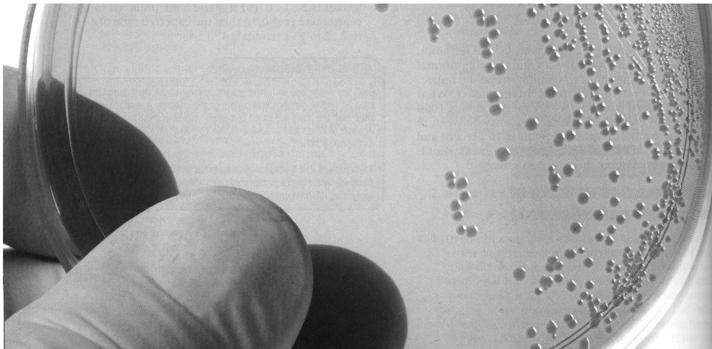  
生长在用琼脂固化的营养培养基上的细菌菌落(球状小点)。每个菌落都是单个亲本细胞增殖的结果。[©Julián Rovagnati/Shutterstock, Inc.]

<table><tr><td colspan="3">本章提纲</td></tr><tr><td>9.1</td><td>可移动 DNA</td><td>大肠杆菌中的基因重组</td></tr><tr><td>9.2</td><td>细菌遗传学</td><td>联系:噬菌体遗传学的起源</td></tr><tr><td>9.3</td><td>DNA 介导的转化</td><td>艾尔弗雷德·赫尔希和拉克尔·罗特曼,</td></tr><tr><td>9.4</td><td>接合</td><td>1948</td></tr><tr><td>9.5</td><td>转导</td><td>在单个细菌细胞中噬菌体的宿主范围突</td></tr><tr><td>9.6</td><td>噬菌体遗传学</td><td>变体和噬菌斑突变体之间的遗传重组</td></tr><tr><td>9.7</td><td>溶源性和局限性转导</td><td>联系:奥图</td></tr><tr><td colspan="2">联系:细菌的性生活</td><td>西摩·本泽,1955</td></tr><tr><td colspan="2">乔舒亚·莱德伯格和爱德华·塔特姆,1946</td><td>噬菌体中一个遗传区域的精细结构</td></tr></table>

学习目标与科学能力

<table><tr><td>学习细菌及其病毒及质粒和可移动 DNA 的遗传学,将会获得解答下列各种问题的科学能力。▪ 讨论质粒、转座因子和可移动 DNA 在致病细菌进化中的作用。致病菌通过进化而可以抵抗多种不相关的抗生素,使得对感染的治疗极其困难。▪ 叙述在细菌和噬菌体遗传学研究中常用的方法及主要的突变体种类。▪ 根据野生型等位基因被转导噬菌体共转导的频率,构建细菌突变型等位基因的遗传图。▪ 在 Hfr×F−细菌细胞的中断交配中,已知遗传标记的进入时间,推导每个 Hfr 株的基因的遗传图及转移的起点和方向。▪ 已知一组 Hfr 株每一株的遗传图及转移的起点和方向,预测每个遗传标记的进入时间。▪ 图示溶源性噬菌体(如 λ 噬菌体)进行位点特异整合和切除的过程。</td></tr></table>

细菌及其病毒(噬菌体)具有独特的繁殖方法，这些方法具有多种新奇的遗传交换机制。有些细菌 DNA 序列能以种种机制变得可以移动。这一特性使得它们能在细菌种群中广泛传播，甚至在不同的物种之间传播。在本章中，讨论细菌和噬菌体的遗传系统。从考察可移动 DNA (mobile DNA)——可在 DNA 分子之间及从一个细胞到另一个细胞转移的序列——开始。以这种方式共享基因，甚至在不同菌种中共享基因的能力，是细菌遗传系统的独特之处。

## 9.1 可移动 DNA

从临床感染中分离到的细菌，大部分对一种或多种抗生素具有抗性，有些对常规使用的所有抗生素都有抗性。这个问题已经变得如此严重，以致许多一度非常有效并且副作用极小的抗生素现在几乎毫无用处。这些广泛传播的抗生素抗性基因，几乎都不是来自细菌基因组中的新突变，它们是以种种可移动 DNA 形式获得的，往往一次得到几个。

## ■ 质粒

质粒(plasmid)是存在于细菌细胞内的非必需DNA分子。它们独立于细菌基因组进行复制，当细菌细胞分裂时分到子细胞中，所以它们能够在细菌谱系中无限期地保持下去。许多质粒是环状DNA分子，但其他的为线状分子。特定质粒在细胞中的拷贝数，从一个细胞到另一个细胞有变化，取决于调控复制的机制。在每个宿主细胞中，高拷贝数质粒(high-copy-number plasmid)可多达50个拷贝，而低拷贝数质粒仅有 $1\sim 2$ 个拷贝。质粒的大小可从数千碱基对到数十万碱基对(图9.1)。在研究过的大部分细菌种类中，都发现有质粒。在大肠杆菌中，大多数质粒或很小(最多约 $10\mathrm{kb}$ )，或很大(超过 $40\mathrm{kb}$ )。典型的大肠杆菌分离株含3种不同的小质粒，在每个细胞中各有多个拷贝，还有一种大质粒，在每个细胞中存在单个拷贝。如图9.1所示，用电子显微镜可在物理上发现质粒的存在，或通过DNA样品的凝胶电泳而发现。有些质粒可因其赋予宿主细胞的表型特征而被发现，研究得最普遍的表型是抗生素抗性。例如，含四环素抗性基因 $(tet - r)$ 的质粒，可使宿主细菌细胞能够在含四环素的培养基上形成菌落。

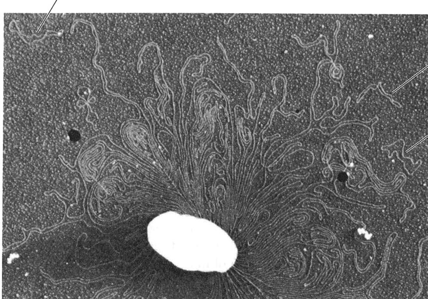  
图 9.1 一个破裂的大肠杆菌细胞的电镜照片，示释放出的染色体 DNA 和几个质粒分子。[承戴维·德雷斯尔 (David Dressler) 和亨廷顿·波特 (Huntington Potter) 惠赠。经 Johnnie B. Byrd Alzheimer's Center & Researching Institute, Huntington Potter 许可使用。]  
质粒依赖宿主细胞的 DNA 复制酶来增殖，但复制的起始由质粒基因控制。在高拷贝数质粒中，在宿主基因组复制期间，质粒的复制多次起始，但在低拷贝数质粒中，在宿主基因组的

每轮复制中，质粒的复制只起始一次。所有类型的质粒都含有促使它们分开到宿主细胞分裂产生的两个子细胞中的序列，所以，质粒的自发丢失是不常见的。

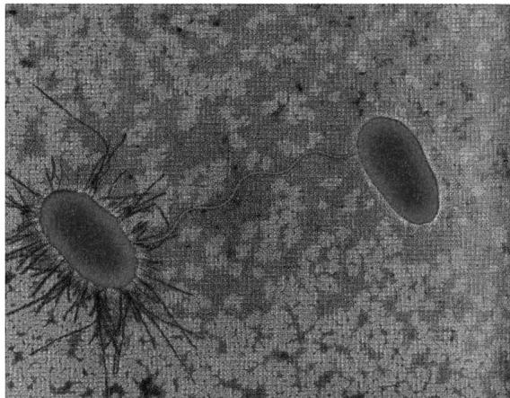  
图 9.2 连接两个大肠杆菌细胞的菌毛。具有众多附器（用于在肠道中建立菌落）的细胞含编码产生菌毛所需蛋白质的 F 质粒。在质粒 DNA 转移之前，菌毛会缩短，将两个细胞拉近到一起。为便于观察，该菌毛以一种噬菌体覆盖，这种噬菌体以 F 菌毛为攻击目标。[©Dennis Kunkel/Phototake, Inc./Alarmy Images.]

## - F 质粒：接合质粒

许多大质粒含有使质粒能在细胞之间转移的基因。在大肠杆菌中发现的一个例子，是一种称为 F 因子(F factor)的大质粒(F 表示能育性 fertility)。含 F 因子的细胞称为 $F^{+}$ (“F 正”); 缺少 F 因子的细胞称为 $F^{-}$ (“F 负”)。细胞间 F 质粒的转移由一种称为菌毛(pilus, 复数 pili)的管状结构介导，菌毛使 $F^{+}$ 和 $F^{-}$ 细胞之间得以接触(图 9.2)。在转移过程中两个细菌细胞的结合称为接合(conjugation)，而可以这种方式转移的质粒称为接合质粒(conjugative plasmid)。不是所有的质粒都是接合质粒，大多数小质粒是非接合型的，在细胞分裂时，它们可在细菌谱系中保持，但它们不含菌毛组装或 DNA 转移必需的大约 20 个基因，因此，靠它们自己不能转移。不过，正如后面即将看到的，为了与接合

质粒紧跟在一起，它们能够利用重组的遗传“伎俩”，进行细胞与细胞之间的转移。

F 质粒是低拷贝数质粒，每个细胞中存在一两个拷贝。它每个细胞周期复制一次，在细胞分裂时分开到两个子细胞中。F 因子的长度大约为 100kb，含有控制其在细胞中的维持和在细胞间转移的许多基因。

如图 9.2 所示，接合始于供体细胞和受体细胞之间的物理接触。接合由一个在 $F^{+}$ 细菌细胞质内和内膜上组装的多亚基蛋白复合体介导，这一大分子结构穿透外膜并分泌 F 菌毛。菌毛主要的蛋白质(称为菌毛蛋白)，以及该分泌装置的蛋白组分，都是在 F 因子中编码的。一旦菌毛接触到 $F^{-}$ 细胞，菌毛就会回缩，将供体和受体的细胞膜拉到非常近。该分泌装置形成一个带孔的接合连接(conjugation junction)，DNA 穿过孔从 $F^{+}$ 细胞传到 $F^{-}$ 细胞。在 DNA 转移之前，一个称为松弛小体(relaxosome)的蛋白质复合体结合到 F 因子的转移起点(oriT)上。F 因子 TraI 基因编码的一种称为松弛酶(relaxase)的酶，在 F 因子 DNA 上一个称为 nic 的独特位点处形成一个单链切口，并与带切口的链的 5' 端共价结合，使 DNA 解旋约 200 个碱基对。正是这条带着蛋白质帽子的 DNA 单链穿过接合连接孔被转移到 $F^{-}$ 细胞中。

DNA 转移总是伴随着质粒的复制。(在 6.2 节中解释过的) 滚环复制起始于带切口链的 3' 端，并取代被转移的单链。在受体菌中后随链的 DNA 合成将转移来的单链转变为双链 DNA(图 9.3)。转移完成后，线性的 F 链在受体细胞中又变成环状。注意，因为一个复本留在供体细胞中，而另一个复本被转移到受体细胞中，因而，在转移之后，两个细胞都含 F，都可以起到供体的作用。至此，F⁻ 细胞已经被转化为 F⁺ 细胞。

F 质粒的转移只需几分钟。在实验培养物中，如果将少量供体细胞与过量的受体细胞混合，F 会在数小时内传遍整个种群，结果是所有细胞最终都会变成 $F^{+}$ 。在自然条件下，转移没有这样有效，只有大约 10% 的天然大肠杆菌含 F 因子。

## - 插入序列和转座子

转座因子是基因迁移的主要介质。在第 14 章中，将就这些 DNA 序列的转座分子机制和它我们作为诱变剂的作用等方面进行讨论。这里集中讨论它们在细菌遗传学中的作用，特别是它们作为抗生素抗性基因迁移的介质作用。

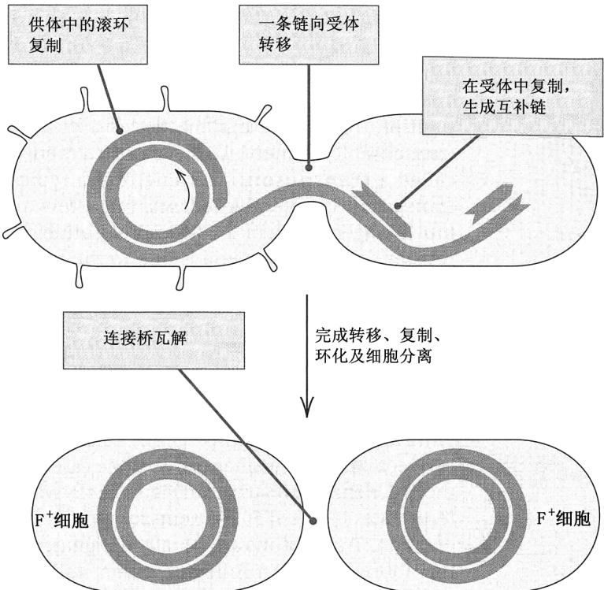  
图9.3 F从 $F^{+}$ 细胞向 $F^{-}$ 细胞转移。细胞的配对引发滚环复制。玫瑰色表示配对期间合成的DNA。为清晰起见，未显示细菌染色体，并且质粒画得很大；实际上，质粒比细菌染色体小得多。

细菌包含多种多样的转座因子，其中最小、最简单的是插入序列(insertion sequence)，即IS因子(IS element)，它们一般长1～3kb，通常只编码转座必需的转座酶蛋白和另外一种或几种调节转座速率的蛋白质。如同真核生物中的许多转座因子一样，它们在两端具有反向重复序列，供转座酶识别和移动IS因子。在插入的时候，它们在插入因子的每一端各产生靶序列的一个短的同向重复。插入序列IS50的DNA组织方式如图9.4A所示。

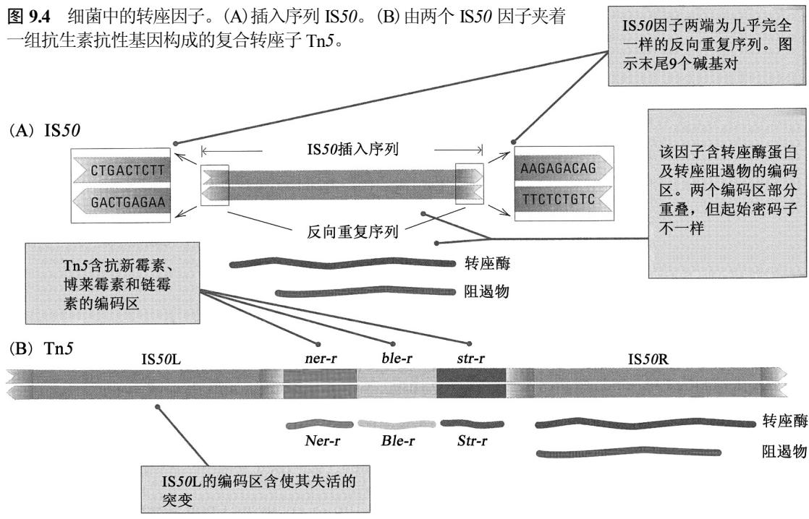

细菌中其他的转座因子包含一个或多个与转座无关的基因，这些基因可随转座因子一起移动，这种因子称为转座子(transposon)。典型转座子的长度为几千个碱基对，但少数转座子要长得多。在细菌中广泛的抗生素抗性，多由包含一个或多个(通常为多个)抗生素抗性基因的转座子的散布所致。当转座子移动并插入接合质粒时，它可以接合方式在不同细菌宿主中广泛传播。

有些转座子具有带抗生素抗性基因的复合结构，抗生素抗性基因夹在两个插入序列中间，如图9.4B中所示Tn5因子的情况一样，两端为方向相反的IS50因子。通常以缩写Tn跟着一个斜体数字(如Tn5)来命名转座子。当需要指出这样一个因子中携带的基因时，就使用这些基因平常的名称。例如，Tn5(neo-r ble-r str-r)含3种不同抗生素(新霉素、博莱霉素和链霉素)的抗性基因。

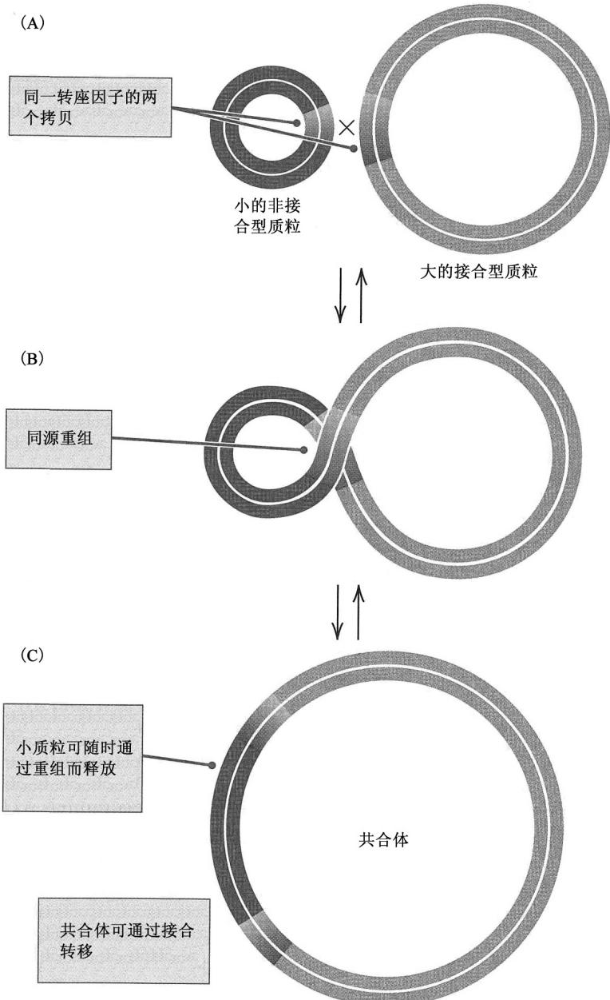  
图 9.5 在两个质粒之间形成的共合体，通过在两个质粒中都存在的同源序列(如转座因子拷贝)之间的重组形成。

## - 非接合质粒的转移

非接合质粒和接合质粒通常与宿主基因组 DNA 一起同时存在于同一个细胞中，当转座因子移动时，所有在场的 DNA 分子都是插入的潜在目标。经过一段时间，细菌谱系中的许多质粒可获得宿主 DNA 中的转座因子拷贝，而宿主 DNA 可获得质粒中的转座因子的拷贝。以此方式，转座因子得以在独立复制的 DNA 分子间传播。结果是，大部分细菌都含有不同类型转座因子的多个拷贝，有些在宿主基因组中，有些在质粒中，有些在两者中都有。例如，在大肠杆菌中，自然分离株的基因组中含 6 种自然产生的 IS 因子，平均各 1～6 个拷贝；而在含某种 IS 因子的细胞中，在 20%～60% 的细胞的一个或多个质粒中，也含一个或多个拷贝的 IS 因子。

结果是，一个细菌细胞中的许多非结合质粒和结合质粒，最终会携带相同转座因子的一个或多个拷贝。因为这些拷贝为同源 DNA 序列，所以它们可作为底物，通过 6.8 节中所讨论的那种

过程进行重组。当两个质粒在同源区域进行重组时，会发生什么呢？结果如图 9.5 所示。这种重组形成复合质粒，称为共合体 (cointegrate)。如果参与重组的一个质粒为非接合型，而另一个为接合型，则共合体也是接合质粒，能够在接合中转移。在接合之后，非接合质粒可通过重组从共合体中游离出来，重组发生在生成共合体的相同序列之间。因而，通过共合体形成的机制，非接合质粒可临时搭乘接合质粒而在细胞间转移。

## ■ 整合子和抗生素抗性盒

在多重抗生素抗性的进化中，细菌也充分利用了一系列称为位点专一重组酶的酶，远在抗生素时代之前，这些酶就存在于细菌种群中，在其他性状的进化中发挥作用。每种位点专一重组酶(site-specific recombinase)都能与双链DNA中特异的核苷酸序列结合。当两个双链DNA分子中都存在该位点时，重组酶将两个位点集合到一起，催化两条双链之间的相互交换。在图9.6所示例子中，位点专一重组酶使一个环状DNA分子与一个线状DNA分子连接在一起。注意，该反应也可以相反方向进行，从而从共合体中释放该环。

位点专一重组酶的一个例子是一种称为 Cre 重组酶的酶，它由大肠杆菌噬菌体 P1 的一个基因编码。Cre 的识别序列称为 loxP；它是图 9.6 所示的 34bp 序列。虽然 loxP 序列每端的 13bp 末端序列可形成完美的反向重

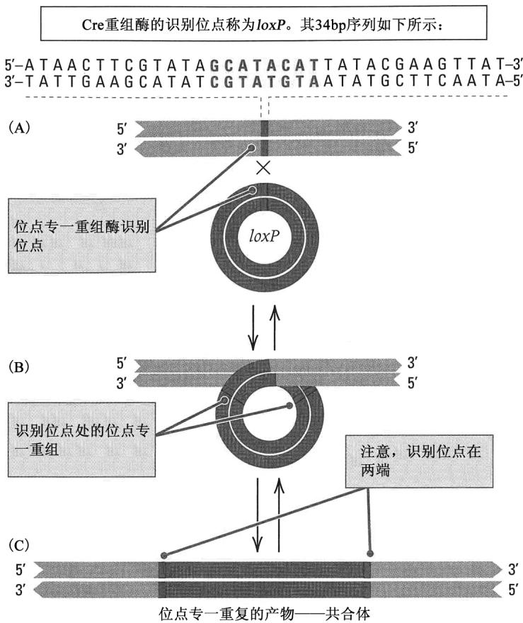  
图 9.6 位点专一重组酶催化两条特异序列之间的相互交换。别的序列不能作为底物。Cre 重组酶的识别位点 (loxP) 如顶部所示。

复序列，但是 loxP 序列具有方向性，因为中央区域是非对称的。这种部分对称是位点专一重组酶的特点。两个 loxP 位点之间的重组维持了 loxP 序列的原状，因为参与的位点是相同的，因此，重组反应是可逆的。有些位点专一重组酶偏向于将两个分子集合成一个共合体的反应。其他的位点专一重组酶(包括 Cre)偏向于将共合体分成两个分子的反应。有些位点专一重组酶可集合并重组相似但不相同的位点，在此情况下，重组不维持识别位点的原状，因而反应不一定可逆。

位点专一重组酶用于多重抗生素抗性单位(称为整合子)的组装。整合子(integron)是既编码位点专一重组酶又编码识别区域的DNA元件，识别区域使得其他具有相似识别区域的序列能通过重组并入整合子中。整合子获得的元件称为盒，在谈到整合子时，盒(cassette)是指环状的抗生素抗性编码区，编码区两侧有整合子识别区域。因为位点专一重组酶整合盒，所以整合子的重组酶往往称为整合酶(integrase)。

现已鉴定了几种不同的整合子。最有名的一个是1类整合子，它包含一个位点专一重组酶(以Int1表示)，并总是含一个磺胺抗生素抗性编码区(sul1)。1类整合子的分子结构如图9.7A所示，该图还显示了抗生素抗性盒被连续捕捉的机制。Int1整合酶催化整合子中以attI表示的序列和盒中以attC表示的相似序列(也称为59碱基元件)之间的位点专一重组。所有的attC区

<!-- END OFFICIAL API PART part_003 -->


<!-- BEGIN OFFICIAL API PART part_004 -->

域都是相似的，但没有两个是完全相同的。

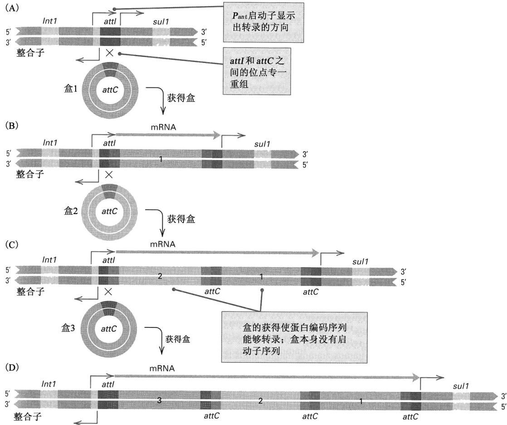  
图 9.7 通过整合子中的 attI 位点和盒中的 attC 位点之间的位点专一重组，整合子连续捕捉盒的机制。

图 9.7A 示一个盒如何被 attI 和 attC 之间的位点重组捕捉。一般而言，抗生素抗性盒含有蛋白编码区，但自身缺少启动子序列。它们只有在毗邻的启动子存在通读转录 (read-through transcription) 的情况下才能被转录。整合子提供了所需的启动子，称作 $P_{ant}$ ，在 attI 位点上游的某个位置，所以当盒被捕捉后，编码序列可被表达。现已鉴定了 40 多个编码抗生素 (包括 $\beta$ 内酰胺类、氨基糖苷类、甲氧苄氨嘧啶和链丝菌素) 抗性蛋白的无启动子盒。

如图 9.7B 所示，一旦一个盒就位后，用相同的 attI 位点和存在于新盒中的 attC 位点可捕捉第二个盒。注意，新盒紧邻 attI 位点整合，并且，从 $P_{ant}$ 启动子产生的 mRNA，两个盒的编码序列都包括。在图 9.7C 中，第三个盒被加到整合子上，于是从 $P_{ant}$ 而来的 mRNA 变得更长。当存在多个盒时——如此处所示——所有的盒都从 $P_{ant}$ 共转录，但下游编码序列被转录得较少，因为在到达它们之前，转录终止的可能性很大。这一约束实际上给能够有效转录的盒的数量设置了一个界限，但已经发现具有多达 10 个抗生素抗性盒的整合子。

## ■ 致病岛

因为转座子和整合子，质粒来来往往、基因跳来跳去，所有这些都表明，细菌基因组是一种拼凑之物，由不同来源的片段插入一组核心基因形成。拼凑模型首先得到大肠杆菌几个独立分离株基因组测序的强烈支持。这些菌株的基因组大小变化范围超过 $10\%$ ——MG1655株中的4.63Mb对CF073株中的5.23Mb——相当于1000多个基因。测序的所有菌株共有的基因约有

3800 个，这很可能代表了从大肠杆菌始祖所继承的一套核心基因。

在一些菌株中存在，但在其他菌株中不存在的散在的基因组区域，是基因组岛(genomic island)引起的，基因组岛DNA含有从其他细菌获得的多个基因。当这些基因组岛含有致病基因时，被称作致病岛(pathogenicity island)。致病岛的例子可见于大肠杆菌O157:H7株中。这是一个致病菌株，一般通过污染的食物和水传播，导致出血性腹泻，有时导致肾衰竭。仅在美国，该菌株每年就导致约10万人患病，其中约100人死亡。O157:H7株含实验室菌株大肠杆菌K12株中不存在的大约1400个基因。这些基因包括一个致病岛，它编码的因子使细菌能够黏附在肠壁上，并将特殊的蛋白质分泌进宿主细胞中。肾衰竭由一个整合型噬菌体编码的毒素促成，该毒素抑制蛋白质合成，导致血管损伤。出血性腹泻由一个质粒中的基因促成，这些基因的产物损害凝血因子，并导致红细胞损坏。

## - 多重抗生素抗性细菌

在自然界中，经过一定时间，接合质粒可累积含多个独立抗生素抗性基因的不同转座子，或含已经获得多个抗生素抗性盒的整合子的转座子，其结果是，该质粒可使细菌具有对大量完全无关的抗生素的抗性。这种多重抗性质粒称为 R 质粒 (R plasmid)。有些 R 质粒与 F 质粒的亲缘关系很近，显然是从 F 因子进化来的。抗生素的使用 (或滥用) 促进了 R 质粒的进化，抗生素可选择出抗性细胞，因为在存在抗生素时，抗性细胞比敏感细胞更有生长优势。在环境中多种抗生素的存在，选择出多重耐药性。当对多种药物耐受的质粒转移到细菌病原体中时，会导致严重的临床并发症。一些含 R 因子的病原体的感染，治疗起来极其困难，因其可耐受目前使用的大多数或全部抗生素。

## 9.2 细菌遗传学

与传统的多细胞动植物的遗传分析相比，细菌和噬菌体具有4个重要的优势。第一，它们是单倍体，所以在鉴定基因型时，不存在等位基因是显性还是隐性的问题。第二，它们在数分钟而不是数周或数月内，就能产生新的一代，这极大地加快了累积遗传数据的速度。第三，它们容易在实验室条件下生长到巨大的数量，这有助于分子研究和罕见遗传事件的分析。第四，这些大种群的单个成员在遗传上是相同的，也就是说，每个实验室种群是一个遗传上相同的细胞的克隆。

## ■ 突变表型

许多种细菌可在液体培养基中培养，或在用琼脂变成凝胶的半固体培养基表面培养。在遗传分析中所用的细菌通常培养在琼脂上。置于琼脂培养基上的单个细菌细胞会生长、分裂许多次，形成肉眼可见的一簇细胞，称为一个菌落(colony)(图9.8)。在液体培养物中的细菌细胞的数量，可将已知体积的培养物涂布在固体培养基上，然后计数形成的菌落数量，从而得到测定。典型的大肠杆菌培养物可含多达 $10^{9}$ 个细胞/ml。在有些情况下，菌落在特定培养基上的外观，或能否形成菌落，可用来推测细菌细胞的基因型。

如已经在之前的章节中所见，遗传分析需

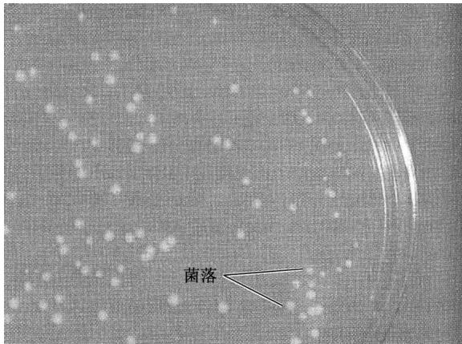  
图 9.8 长有细菌菌落的培养皿,细菌菌落在固体培养基上形成。较粗的生长划线是菌落挤得过密、相互之间没有间隔的结果。[承 Dr. Jim Feeley/CDC 惠赠。]

要突变体。对细菌而言，有 3 种类型的突变体特别有用。

1. 抗生素抗性突变体 这些突变体能够在某种抗生素——如链霉素(Str)或四环素(Tet)——存在的情况下生长。例如，链霉素敏感(Str-s)细胞为野生型，在含链霉素的培养基上不能形成菌落，而链霉素抗性(Str-r)突变体可在这样的培养基上形成菌落。

2. 营养型突变体 野生型细菌能够用培养基中存在的简单分子来合成它们需要的大多数复杂的营养成分，这种野生型细胞称为原养型(prototroph)。在简单培养基上生长的能力可因突变而丧失，这些突变使合成复杂营养成分所用的酶丧失功能。突变型细胞不能合成某种必需营养物，从而不能生长，除非在培养基中补充所需营养物，这样的突变型细菌称为特定营养物的营养缺陷型(auxotroph)，例如，甲硫氨酸营养缺陷型不能在基本培养基(minimal medium)上生长，基本培养基只含无机盐和一种能量及碳原子来源(如葡萄糖)，但如果在基本培养基中补充甲硫氨酸，甲硫氨酸营养缺陷型就能够生长。

3. 碳源突变体 (carbon-source mutant) 此类突变型细胞不能利用特定的物质作为碳源或能量源。例如，Lac $^{-}$ 突变体不能利用乳糖来生长，不能在只含乳糖为碳源的基本培养基上形成菌落。

所有细胞都能在上面形成菌落的培养基称为非选择性培养基 (nonselective medium)。通常不能根据在非选择培养基上的生长情况，来区分突变体和野生型细胞。如果培养基只能让一种细胞 (野生型或突变型) 生长，那么就说它是选择性的 (selective)。例如，含链霉素的培养基可选择出 Str-r 表型，而选择掉 Str-s 表型；同样，含乳糖为唯一碳源的基本培养基，可选择出 $Lac^{+}$ 细胞，而选择掉 $Lac^{-}$ 细胞。

在细菌遗传学中，表型和基因型以如下方式命名。表型用3个字母来命名，第一个字母大写，以上标“+”或“-”来表示存在或不存在所命名的表型，以“s”或“r”来表示敏感性或抗性。基因型用小写斜体字母表示。因此，在没有添加亮氨酸时不能生长的细胞，具有Leu $^{-}$ 表型，这通常会是leu $^{-}$ 突变的结果。通常会省略“-”上标，但使用它可避免歧义。

## ■ 遗传交换的机制

一个细菌的染色体 DNA 分子，几乎从来不会遇到来自不同细菌细胞的另一个完整的 DNA 分子。实际情况是，遗传交换通常发生在一个细胞的一个染色体片段与另一个细胞的完整染色体 DNA 之间。而且，存在明确的供体-受体关系：供体细胞是 DNA 片段的来源，它以几种机制中的一种转移到受体细胞中；在受体中，通过同源 DNA 序列之间的相互重组，进行遗传物质的交换。当供体 DNA 是线性分子时，供体 DNA 并入受体染色体至少需要两次交换事件，每端一次。因为供体分子仅含完整基因组的一小部分，只有偶数次的交换才能产生可以存活的产物。这些事件的一般结果是，只能找到其中一种交换产物。不过，在某些情况下，被转移的 DNA 是环状的，单次交换就可使环状供体 DNA 整个并入受体染色体中。

在细菌中发现的遗传转移有 3 种主要类型：转化(transformation)——从外部环境中吸收一个 DNA 分子，并合并到基因组中；接合(conjugation)——通过直接接触，将供体 DNA 从一个细菌细胞转移另一个细胞；转导(transduction)——通过细菌病毒将 DNA 从一个细菌细胞转移到另一个细胞。这些过程产生的重组频率，被用来绘制细菌的遗传图。虽然这些图谱极其有用，但是，它们与真核生物中通过杂交获得的图谱类型，在一些主要方面具有差异，因为真核生物的遗传图是基于减数分裂中染色单体之间交换事件的频率。

## 9.3 DNA 介导的转化

转化 (transformation) 是受体细胞从周围环境中的游离 DNA 分子获得基因的过程。用纯化的 DNA 进行转化，是证明 DNA 为遗传物质的第一个实验证据 (第 1 章)。在这些实验中，一种粗糙菌落表型的肺炎链球菌，通过与来自光滑菌落菌株的 DNA 接触，改变成光滑菌落表型。在实验室中，一般从供体细胞分离供体 DNA，然后加到受体细胞的悬浮液中。在自然环境中(如土壤中)，游离 DNA 可通过供体细胞的自然破裂(溶菌作用)而得到。

转化开始于受体细胞从周围环境中吸收一个 DNA 片段，结束于供体 DNA 的一条链替换掉受体 DNA 中的同源片段。大多数细菌种类也许都能够进行重组步骤，但许多种类有效吸收游离 DNA 的能力非常有限。即便是在一个能够进行转化的种类中，DNA 也只能进入培养种群的某些细胞中。不过，如果用适当的化学试剂处理细胞(如用 $CaCl_{2}$ 处理)，许多细菌种类可具有吸收 DNA 的能力。

在有些物种中，用转化来进行基因作图非常方便。当从供体菌分离 DNA 时(图 9.9)，DNA 总是断裂成小片段。在大多数物种中，存在适当的受体细胞和过量的外源 DNA 时，转化以大约每 $10^{3}$ 个细胞 1 个转化细胞的频率进行。如果用作遗传标记的 a 和 b 两个基因在供体染色体上离得很远，它们总是包含在两个不同的 DNA 片段中，那么， $a^{-}b^{-}$ 受体同时转化(共转化，cotransformation)为野生型的概率是各遗传标记转化概率的乘积，即大致为 $10^{-3} \times 10^{-3}$ ，这等于每 $10^{6}$ 个受体细胞有 1 个 $a^{+}b^{+}$ 转化体。不过，如果这两个基因彼此非常靠近，以致它们常常存在于单个供体片段中，那么，共转化频率几乎与单个基因转化的频率一样，即每 $10^{3}$ 个受体有 1 个野生型转化体。一般原理如下：

图 9.9 连锁标记的共转化。标记 a 和 b 相互靠得很近，它们往往存在于相同的供体片段上，标记 b 和 c 也是如此。标记 a 和 c 没有靠近到足以进行共转化。因此，基因顺序一定是 abc。为清楚起见，相对于细菌染色体的大小，转化 DNA 的大小夸大了很多。

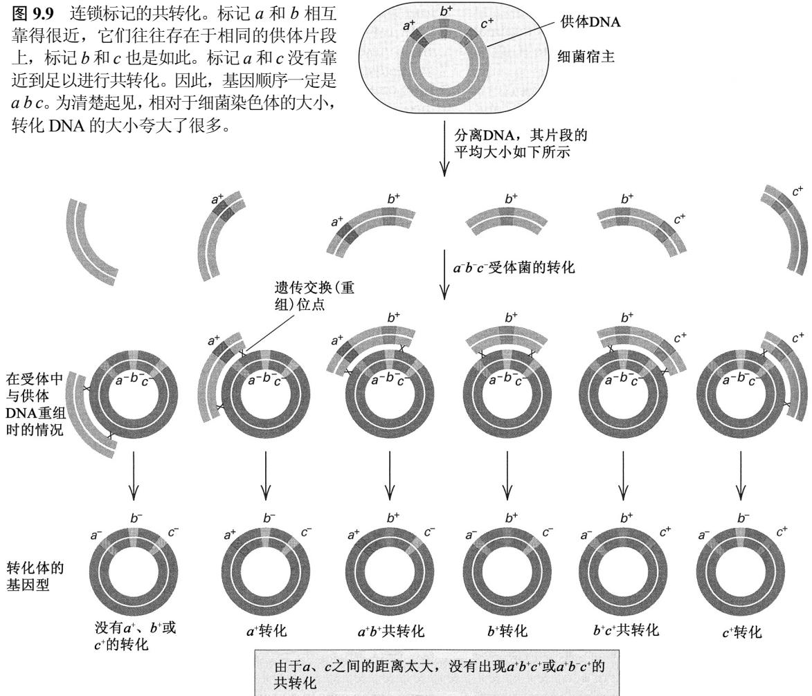  
两个基因以远大于单个基因转化频率之积的频率共转化，说明在细菌染色体上这两个基因靠近。

研究不同的成对基因共转化的能力，也能得出基因顺序。例如，如果基因 a 和 b 可被共转化，且基因 b 和 c 可被共转化，但基因 a 和 c 不能共转化，则基因顺序一定是 a b c (图 9.9)。注意，共转化频率不等于真核生物作图中所用的重组频率，因为它们由供体片段的大小分布及细菌 DNA 分子之间重组的可能性决定，而不是由联会的同源染色体中交叉的发生率决定 (第 5 章)。

## 9.4 接合

接合是 DNA 通过细胞与细胞的接触从细菌供体细胞转移到受体细胞的过程。我们已在接合质粒背景下考察过该过程，在本节中，将看到同样的过程怎样转移存在于细菌染色体中的基因。

## - 共合体形成和 Hfr 细胞

图 9.10 F（蓝色环）的整合，通过 F 中的核苷酸序列和细菌染色体中的同源序列（通常是插入序列）之间的重组。相对于细菌染色体的大小，F 质粒 DNA 以大大扩大的尺度显示。

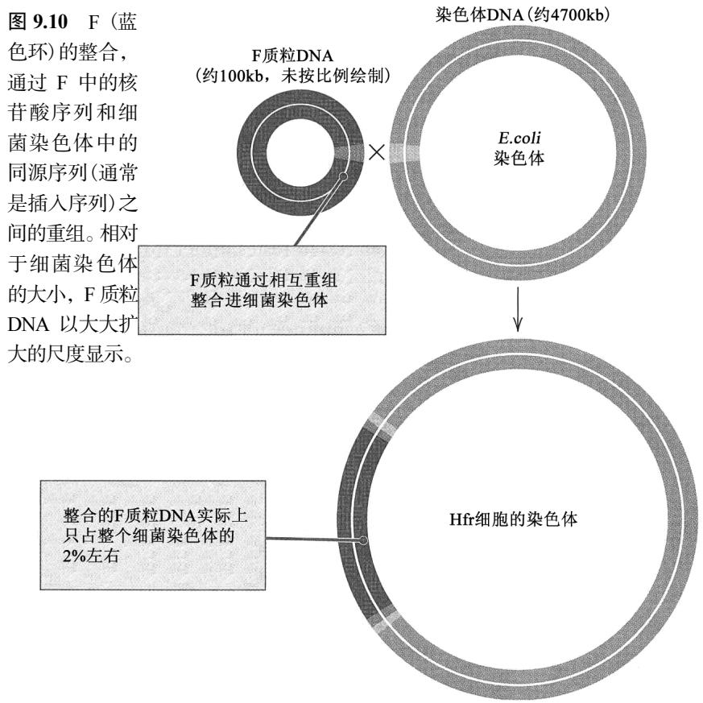

1951 年，乔舒亚·莱德伯格首先观察到大肠杆菌之间存在染色体基因的转移。虽然那时候不知道交换的发生是因为供体细胞是 $F^{+}$ ，并且在一些细胞中 F 因子已经被整合进细菌染色体中(图 9.10)。这些细胞称为 Hfr 细胞(Hfr cell)。Hfr 代表高频重组(high frequency of recombination)，这是指供体基因被以相当高的频率转移到受体中，该整合过程本质上与图 9.5 所示两个质粒之间共合体的形成是一样的。在 $F^{+}$ 细胞开始变成 Hfr 细菌时，插入序列(9.1 节)起重要作用，因为 F 质

粒一般是通过 F 中的一个 IS 因子和细菌染色体上的一个同源拷贝之间的遗传交换进行整合，该同源拷贝之前已经转座到细菌染色体中一个基本上随机的位点上。因为 F 因子既可与染色体分开存在，又可整合进染色体中，它堪称附加体 (episome)——一种可在细胞中游离存在，或作为整合进染色体的 DNA 片段而存在的遗传因子。

在 Hfr 细胞中(图 9.10)，细菌染色体仍为环状，尽管被所整合的 F 因子 DNA 扩大了约 2%。F 的整合是稀有事件，但含有整合型 F 的单个细胞可被分离和培养。当一个 Hfr 细胞发生接合时，F 因子转移的过程以在 $F^{+}$ 细胞中同样的方式开始。但是，因为 F 因子是细菌染色体的一部分，F 因子从 Hfr 细胞转移出来时也包含细菌染色体的 DNA。

Hfr×F $^{-}$ 接合过程如图 9.11 所示。转移的各个阶段很像 F 转移到 F $^{-}$ 细胞的各阶段：供体细胞

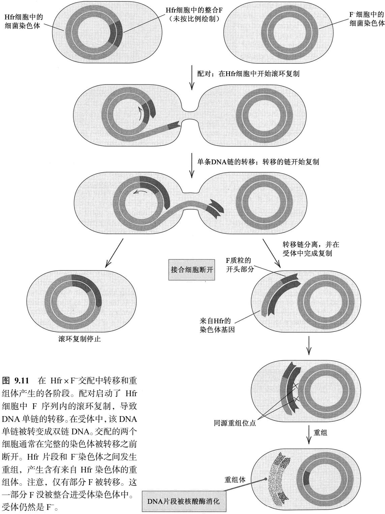

图 9.11 在 Hfr × F $^{-}$ 交配中转移和重组体产生的各阶段。配对启动了 Hfr 细胞中 F 序列内的滚环复制，导致 DNA 单链的转移。在受体中，该 DNA 单链被转变成双链 DNA。交配的两个细胞通常在完整的染色体被转移之前断开。Hfr 片段和 F 染色体之间发生重组，产生含有来自 Hfr 染色体的重组体。注意，仅有部分 F 被转移。这一部分 F 没被整合进受体染色体中。受体仍然是 F $^{-}$ 。

和受体细胞聚到一起、供体细胞中的滚环复制，以及在受体中通过后随链的合成将转移后的单链 DNA 转变成双链 DNA。不过，在 Hfr 交配的情况下，转移之后的 DNA 不变成环状，在受体中不能进一步复制，因为被转移的 F 因子是不完整的。染色体 DNA 的复制及相关的转移都由 F 因子控制的，起始于 Hfr 染色体中的转移起点——一个在 F 中用 oriT 表示的位点，在游离 F 质粒中，复制和转移也在相同的位置开始。首先被转移的 DNA 是一部分 F，然后染色体基因被转移，最后进入受体的 DNA 是余下的部分 F。因为两个接合细胞往往早在整个细菌染色体被转移之前就断开了，所以 F 的最后一部分几乎从不转移进受体中。供体 DNA 整合进受体染色体需要受体中的同源重组，两个重组事件导致一个受体 DNA 片段被供体 DNA 的一个同源片段替换，然后，被替换掉的受体 DNA 片段被降解(图 9.11)。

F 转移和 Hfr 转移之间有几点显著差异:

\- 在通常情况下，整条细菌染色体的转移要花 $100\mathrm{min}$ ，与此相比，F 的转移只要大约 $2\mathrm{min}$ 。在时间上的差异，是 F 和染色体的相对大小所致(F 的 100kb 对大肠杆菌 K12 的 4600kb)。

\- 在Hfr DNA转移到受体细胞的过程中，两个交配细胞往往在整条染色体转移之前就断开。在通常情况下，在两个细胞分开之前，转移的基因有数百个。

\- 在 Hfr 和 F⁻细胞的交配中，F⁻受体仍然是 F⁻，因为细胞的分开往往发生在最后的 F 片段被转移之前。

\- 在 Hfr 转移中，转移的 DNA 片段的一些区域被整合进受体染色体中。整合区域替换了受体染色体中的同源区域。结果是，有些 F⁻细胞变成重组体，含来自 Hfr 供体细胞的一个或多个基因。例如，在 Hfr leu⁺与 F⁻leu⁻的交配中，出现一些 F⁻leu⁺细胞。不过，供体 Hfr 细胞的基因型保持不变。

遗传分析要求对重组型受体进行鉴定。因为重组体源自受体细胞，所以，需要某种方法来去除供体细胞。一般方法是利用含有可供选择的某种等位基因的 $\mathrm{F}^{-}$ 受体。为此目的，赋予抗生素抗性的基因尤为有用。例如，在 $Hfr\ leu^{+}str - s$ 细胞与 $\mathrm{F}^{-}\ leu^{-}str - r$ 细胞交配后，将交配混合物接种于含链霉素的培养基上，Hfr Str-s 细胞可被选择性地杀死。然后，可用一种缺乏亮氨酸的选择培养基来区分非重组受体和重组受体。 $\mathrm{F}^{-}\ leu^{-}$ 亲本不能在缺亮氨酸的培养基中生长，但重组型 $\mathrm{F}^{-}\ leu^{+}$ 细胞因为有 $leu^{+}$ 基因，能够生长。只有重组型受体——也就是说，具有 $leu^{+}str - s$ 基因型的细胞——在含链霉素且缺亮氨酸的选择培养基上形成菌落。

当交配以此方式完成时，通过生长条件选择出来的转移标记(在此情况下为 $leu^{+}$ )称为选择标记(selected marker)，而用来阻止供体生长的标记(在此情况下为 str-s)称为反向选择标记(counterselected marker)。反向选择标记在染色体中应位于这样的位置——大多数交配细胞在其被转移之前已经断开；而选择标记必须存在于 F⁻细胞中。这样，就可用这些选择性试剂来选择到重组型 F⁻细胞和去除 Hfr 供体。在细菌交配中，选择和反向选择是必需的，因为重组体只占整个细胞种群的一小部分(尽管名为“高重组频率”)。

## - 进入时间作图

基因可通过 Hfr×F 交配作图，不过，这样的遗传图与我们迄今见过的所有图谱都很不相同，因其不是连锁图，而是转移顺序图。它是通过故意中断交配过程中的 DNA 转移——例如，通过在厨房搅拌器中剧烈搅动交配细胞的悬浮液——而得。某个特定基因被转移的时间，可通过在不同时间断开交配细胞，然后记录断裂事件不再阻止重组体出现的最早时间，从而得到确定，该方法称为中断交配技术 (interrupted-mating technique)。当用此方法来处理 Hfr×F 交配时，任意特定等位基因的重

表 9.1 在 Hfr leu $^{+}$ 和 F $^{-}$ leu $^{-}$ str-r 之间的杂交中，在不同时间中断交配时，Leu $^{+}$ Str-r 重组体的产量

<table><tr><td>交配后的分钟数</td><td>每100个Hfr细胞对应的Leu+ Str-r 重组体的数量</td></tr><tr><td>0</td><td>0</td></tr><tr><td>3</td><td>0</td></tr><tr><td>6</td><td>6</td></tr><tr><td>9</td><td>15</td></tr><tr><td>12</td><td>24</td></tr><tr><td>15</td><td>33</td></tr><tr><td>18</td><td>42</td></tr><tr><td>21</td><td>43</td></tr><tr><td>24</td><td>43</td></tr><tr><td>27</td><td>43</td></tr></table>

组体数目，随着细胞持续接触的时间增加而增加。该现象见表 9.1，增加的原因是，不同的成对 Hfr×F⁻ 开始接合和染色体转移的时间稍有不同。

注意：交配后的分钟数意思是 Hfr 和 F⁻细胞悬浮液混合之后的分钟数。将重组数据外推到

零个重组体的值，表明 $leu^{+}$ 标记的最早进入时间是 4min。

观察具有几个遗传标记的交配结果，可得到对转移过程的更多理解。例如，这样的交配：

$$
\mathrm{Hfr} a ^ {+} b ^ {+} c ^ {+} d ^ {+} e ^ {+} s t r - s \times \mathrm{F} ^ {-} a ^ {-} b ^ {-} c ^ {-} d ^ {-} e ^ {-} s t r - r
$$

其中， $a^{-}$ 细胞需要营养成分 A， $b^{-}$ 细胞需要营养成分 B 等等。混合这两种细胞后，于不同时间剧烈搅动样品，然后接种于含链霉素与 A 到 E 五种物质不同组合的一系列培养基中（在每种培养基中，5 种物质里缺其中一种）。在缺 A 的培养基上形成的菌落为 $a^{+}$ str-r，在缺 B 的培养基上生长的菌落是 $b^{+}$ str-r 等。所有的这些数据可绘于单张图上，得到一组曲线，如图 9.12B 所示。这组曲线有 4 个特点值得注意。

(A)  
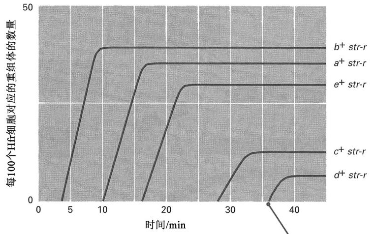  
图 9.12 进入时间作图。(A)一个 Hfr 菌株的进入时间曲线。(B)从 A 部分中的数据推导得的线性图谱。(C)用相同的 Hfr，以及含有等位基因 $b^{-}e^{-}f$ $g^{-}h^{-}$ 的不同 F⁻菌株得到的线性图谱。(D)根据 B 和 C 部分中的图谱构建的复合图谱。(E)来自另一个 Hfr 菌株的线性图谱。(F)合并 D 和 E 部分的两个图谱（绿色和蓝色）得到的环状图谱（金色）。

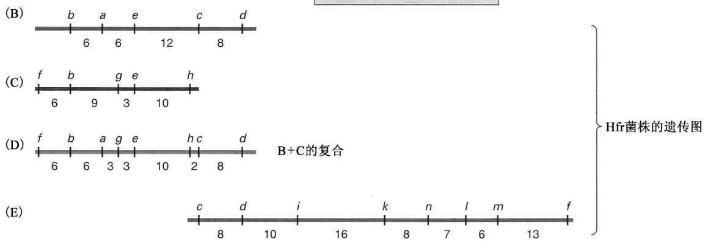

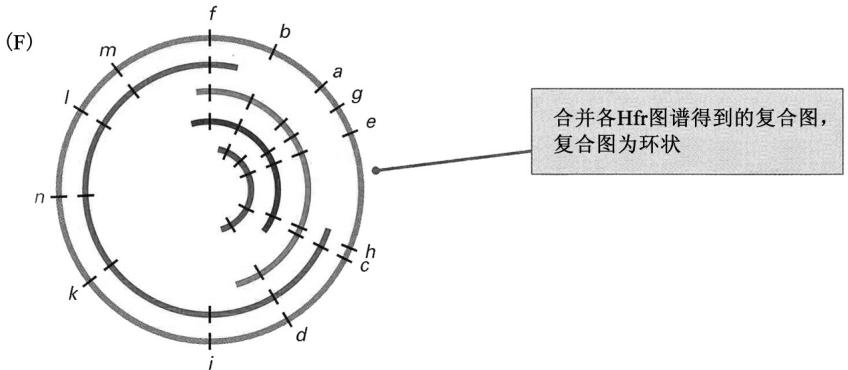  
1. 在每条曲线中，重组体的数目随交配时间长度的增加而增加。  
2. 对每个标记而言，存在一个进入时间(time of entry)，在此时间之前，检测不到重组体。

3. 每条曲线有一个可被外推回时间坐标的线性区域，该区域界定了每个基因 $(a^{+}, b^{+}, c^{+}, d^{+}, e^{+})$ 的进入时间。

4. 各种重组体的数目会达到最大值，该值随着进入时间的不断增加而减少。

对进入时间现象的解释如下：不是所有的供体细胞都在相同的时间开始转移 DNA，所以重组体数目随时间增加而增加。转移始于 Hfr 染色体中 F 的复制起点。基因以线性顺序转移到受体中，而某个基因的进入时间是该基因首次进入种群中某个受体的时间。配对交配细胞的分离阻止了进一步的转移，限制了在某一特定时间重组体的数目。

刚才描述的基因进入所用的时间，可放在图谱上，如图9.12所示。这张图谱及其他图谱上的数字是标记之间的遗传距离。在此情况下，“遗传距离”以进入时间之间的分钟数来衡量。与另一种具有基因型 $b^{-}e^{-}f^{-}g^{-}h^{-}str-r$ 的F的交配，可用来定位f、g和h这3个基因。第二种受体的数据可得到图9.12C所示的图谱，因为基因b和e在两个图谱中都有，这两个图谱可合并成一个更完整的图谱，如图9.12D所示。

以不同 Hfr 菌株(图 9.12E)进行研究，也能提供有用的信息。往往发现，不同的 Hfr 菌株在

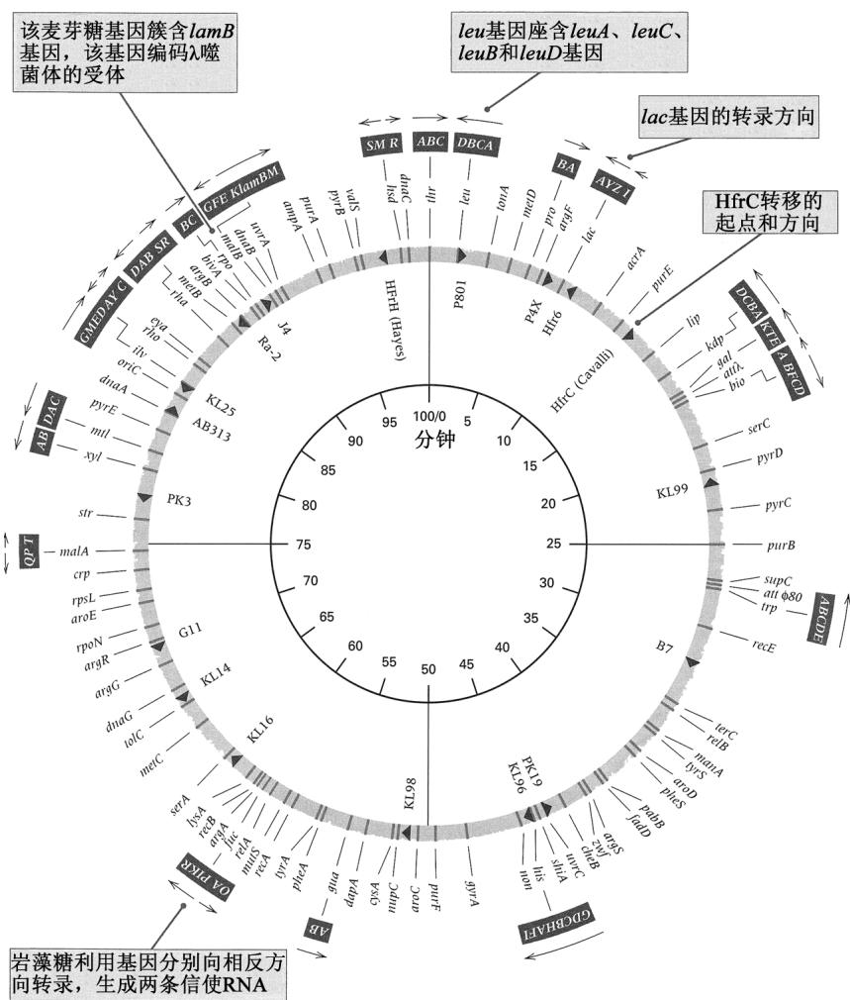  
图 9.13 大肠杆菌的环状遗传图。图距以分钟为单位；图谱总长 100min。对于一些编码功能上相关的基因产物的基因座，显示了成簇基因的图谱顺序，以及转录方向和转录物长度(黑色箭头)。紫色箭头示一些 Hfr 菌株的转移起点和方向。例如，HfrH 转移 thr 非常早，接着是 leu 及其他顺时针方向的基因。

转移起点和方向上有差别，这说明 F 可整合于染色体的许多位点上，并且可以两种可能的方向整合。合并得自不同 Hfr 菌株的图谱，可得到环状的复合图谱，如图 9.12F 所示。该图谱为环状，是在 F 细胞中大肠杆菌染色体为环状，以及 F 质粒在多个位点整合的结果，如果 F 只在一个位点、只以一个方向整合，该图谱将是线状的。

已进行了大量的此类作图实验，并已将所得数据合并，得到完整的大肠杆菌染色体的精确遗传图（图9.13）。DNA 分子和遗传图两者都是环状的，整条染色体的转移需要 100min，所以，图谱总长为 100min。在图9.13 中，外圈的箭头表示转录方向，及每个转录物所含的编码区域。紫色箭头示一些 Hfr 菌

株的转移起点和方向。例如，来自 HfrC 的转移，从 purE acrA lac 开始，以逆时针方向进行。

## - F'质粒

在偶然情况下，F 可被整合事件中所用的相同序列之间的交换从 Hfr DNA 中切除。不过，在有些情况下，切除过程并不刚好是整合的逆过程，断裂和重接反而是发生在 F 和相邻染色体 DNA 分界处的非同源序列之间(图 9.14)。异常切除产生含染色体 DNA 片段的质粒，该质粒称为 F' 质粒(F' plasmid)。利用具有不同转移起点的 Hfr 菌株，已分离到许多带有染色体片段的 F' 质粒，这些染色体片段来自不同的染色体区域。这些质粒极为有用，因为对于质粒所携带的染色体区域而言，它们使受体细胞成为二倍体。这些二倍体区域使显性检测和基因剂量检测(某个基因的拷贝数增加对基因表达的影响的研究)成为可能。因为仅有部分基因组是二倍的，含 F' 质粒的细胞是部分二倍体 (partial diploid)，也称为局部二倍

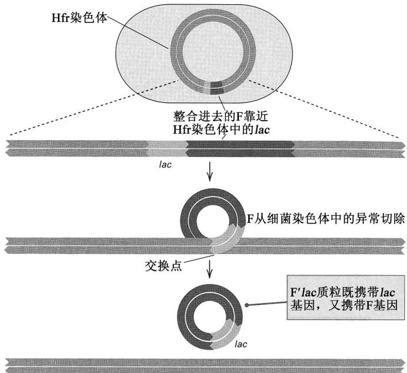

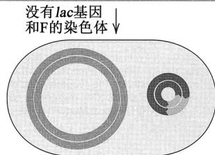  
图 9.14 从 Hfr 染色体通过异常切除形成 F' lac 质粒的过程。断裂和重接在非同源区域之间发生。

体 (merodiploid)。在第 11 章中讨论大肠杆菌 lac 基因时，将考察应用 F' 质粒的遗传分析。

## 9.5 转导

在转导(transduction)过程中，含细菌 DNA 的噬菌体颗粒把细菌 DNA 片段从一个细菌细胞转移到另一个细菌细胞中，这样的噬菌体颗粒称为转导噬菌体(transducing phage)。

## ■ 噬菌体裂解周期

在噬菌体的裂解周期(lytic cycle)中，噬菌体颗粒附着于宿主细菌，并将其核酸注射进细胞。噬菌体核酸转录和翻译成噬菌体蛋白质，同时噬菌体核酸要复制多次。最后，新合成的核酸分子被包装进蛋白质外壳(形成子代噬菌体)，然后这些噬菌体颗粒从细胞中释放出来。我们已经考察过T2噬菌体的裂解周期(图1.5)，所有类型的噬菌体都可进行裂解周期，只能裂解性生长的噬菌体称为烈性噬菌体(virulent phage)，T2就是烈性噬菌体。

## ■ 普遍性转导

普遍性转导(generalized transduction)是噬菌体颗粒可携带任意一小部分宿主细菌基因组的一个过程。能进行该过程的噬菌体类型称为普遍性转导噬菌体。在其裂解周期中，会产生一些颗粒，只含有从宿主细菌获得的 DNA，而不含噬菌体 DNA。使用 “普遍” 这个词，是为了强调细菌 DNA 片段可来自细菌染色体的任何部分。

大肠杆菌噬菌体 P1 是普遍性转导的一个例子。如图 9.15 所示，在噬菌体 P1 的裂解周期中，绝大多数后代颗粒只含噬菌体 DNA。不过，作为感染的一部分，噬菌体会生产一种将细菌 DNA 裂解成片段的核酸酶。与 P1 DNA 大小相当的单个细菌 DNA 片段偶尔会替代 P1 DNA 被包装进噬菌体颗粒 (图 9.15)。该核酸酶在宿主染色体中的切割位置是随机的，所以转导颗粒可含来自宿主 DNA 任何部分的片段。P1 噬菌体的巨大种群中会包含少量携带任意细菌基因的颗粒，平均而言，大约每 $10^{6}$ 个子代噬菌体中存在一个含任一特定基因的转导颗粒。当转导颗粒吸附于细菌时，在噬菌体头部所含的细菌 DNA 被注入细胞，可以和宿主染色体的同源区域重组。典型的 P1 转导颗粒含 100～115kb 细菌 DNA。

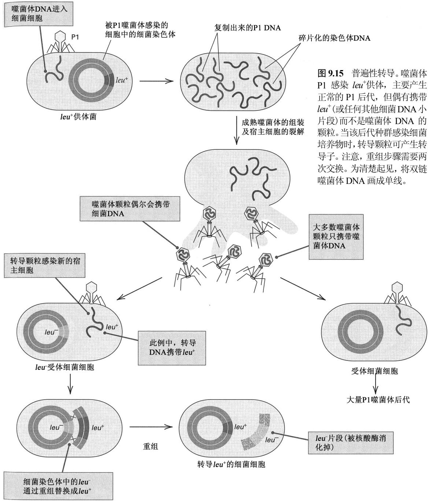  
联系：细菌的性生活

乔舒亚·莱德伯格和爱德华·塔特姆，1946

耶鲁大学，纽黑文市，康涅狄格州

大肠杆菌中的基因重组

在 19 世纪发现细菌之后，它们被认为是“另类”——与其他生物有本质的不同。莱德伯格和塔特姆的发现——最开始看来是传统的性周期——引起了轰动，完全出乎人们的意料。这意味着，细菌可以与酵母、链孢霉、果蝇和其他的遗传学宠儿一道，被看作“遗传生物”。为此，加上相关的发现，莱德伯格和塔特姆与乔治·比德尔一道，被授予 1958 年的诺贝尔奖。在本节选中，你会注意到，作者们论述细菌的重组需要细胞融合才能将亲本基因组集中在一起。这说明，有可能得到完全正确的观察结果，并认识到它的重要性，但不太理解真正发生的是什么。细菌重组涉及单向转移，这一结论是很久以后才得到的——在发现 Hfr 菌株和开发出中断杂交技术之后。

对营养型突变体的混合培养物进行分析，发现存在新类型，这强烈提示在大肠杆菌中发生了有性过程。这些突变体菌株与它们的野生型亲本菌株 K-12 的区别，在于缺乏合成生长因子的能力。由于这些缺陷，它们只能在添加特定营养必需品的培养基上生长。在这些突变体中，单种营养需求是在 X 射线或紫外光作用下，通过单个突变步骤建立的。通过连续处理，得到了具有数种需求的菌株。在此报告的重组研究中，用到两种三重突变体，一种需要苏氨酸、亮氨酸和硫胺素，另一种需要生物素、苯丙氨酸和胱氨酸。这两种菌株在完全培养基中混合培养。以无菌水洗涤细胞，然后浓密接种于人工琼脂培养基中，在培养基中加有不同的添加物，以使不同营养型的菌落能够生长。这种方法能轻易地发现与亲本型不同的极小数量的细胞类型。在单种突变体的“纯”培养物中发现的唯一的新类型，是单个因子发生回复的类型，得到的菌株只需要原来三种物质中的两种。但是，在混合培养物中，发现各种各样的类型。它们包括没有生长因子缺陷的野生型菌株，和仅仅需要硫胺素或苯丙氨酸的单突变类型。……对这些类型的最合理的解释是，存在基因的重新组合。为使不同的基因可有重组的机会，可能需要细胞融合。……这种融合很可能只是偶有发生，因为在所研究的培养物中，一百万个细胞中仅有一个细胞属于重组类型。……这些实验说明，在大肠杆菌中存在有性过程。

来源：J. Lederberg and E. L. Tatum. Nature 158(1964): 558.

在含 $leu^{+}$ 基因的野生型大肠杆菌上培养 P1，得普遍性转导颗粒，用其感染细菌，如图 9.15 下部所示，当这样的颗粒吸附于基因型为 $leu^{-}$ 的细菌细胞，并将其所含 DNA 注入细胞时，该细胞能够存活，因为该噬菌体头部只含细菌基因，不含噬菌体基因。一个重组事件，以噬菌体携带的 $leu^{+}$ 等位基因交换宿主携带的 $leu^{-}$ 等位基因，将宿主细胞的基因型从 $leu^{-}$ 转变成 $leu^{+}$ 。在此类实验中，通常在 $10^{6}$ 个细胞中约有 1 个 $leu^{-}$ 细胞变成 $leu^{+}$ 。这样的发生率可在选择性培养基 (selective medium) 上轻易检测到。例如，如果将被感染细胞置于缺乏亮氨酸的固体培养基上， $leu^{+}$ 细胞就能增殖，形成 $leu^{+}$ 菌落。除非重组使得 $leu^{+}$ 等位基因插入，否则不会形成菌落。

转导质粒所含的细菌 DNA 片段大到足以包含约 50 个基因，因此，转导给细菌基因组较短区域的遗传连锁研究提供了一个很有价值的工具。试想从 $leu^{+}gal^{+}bio^{+}$ 细菌制备的 P1 种群，该样品含有能够将这些等位基因中的任一个转移给另一个细胞的颗粒，也就是说， $leu^{+}$ 颗粒能够将 $leu^{-}$ 细胞转导成 $leu^{+}$ ，或 $gal^{+}$ 颗粒能够将 $gal^{-}$ 细胞转导成 $gal^{+}$ 。而且，假如以噬菌体感染 $leu^{-}gal^{-}$ 培养物，则 $leu^{+}gal^{-}$ 和 $leu^{-}gal^{+}$ 两种细菌都会产生。不过，不会出现 $leu^{+}gal^{+}$ 菌落，因为 leu 和 gal 基因离得太远，不能包含在同一个 DNA 片段中(图 9.16A)。

具有 $gal^{-}$ $bio^{-}$ 基因型的受体细胞，情况大为不同，因为 gal 和 bio 基因连锁得如此紧密，以致有时在转导颗粒携带的单个 DNA 片段中两个基因都存在——也就是，会有 $gal^{+}-bio^{+}$ 颗粒（图 9.16B）。不过，既不是所有的 $gal^{+}$ 转导颗粒同时也包含 $bio^{+}$ ，也不是所有的 $bio^{+}$ 转导颗粒同时也包含 $gal^{+}$ 。两个标记都在单个颗粒中的概率——因而也是两个标记同时转导（共转导，cotransduction）的概率——取决于这两个基因有多近，它们越近，共转导的频率就越大。

$gal^{+}-bio^{+}$ 对的共转导，可通过将受感染的细胞接种在适当的培养基上而发现。将受感染细胞涂布在缺乏生物素、含葡萄糖的培养基上，如果 $bio^{+}$ 转导子能被选择出来，那么 $gal^{+}$ $bio^{+}$ 和 $gal^{-}$ $bio^{+}$ 两种菌落都能生长。如果检测这些菌落的gal标记，会发现42%为 $gal^{+}$ $bio^{+}$ ，其余的为 $gal^{-}$ $bio^{+}$ ；同样，如果选择出 $gal^{+}$ 转导子，会发现约42%为 $gal^{+}$ $bio^{+}$ 。换句话说，gal和bio的共转导频率是42%，意思就是，含一个基因的所有转导颗粒中，42%也含另一基因。

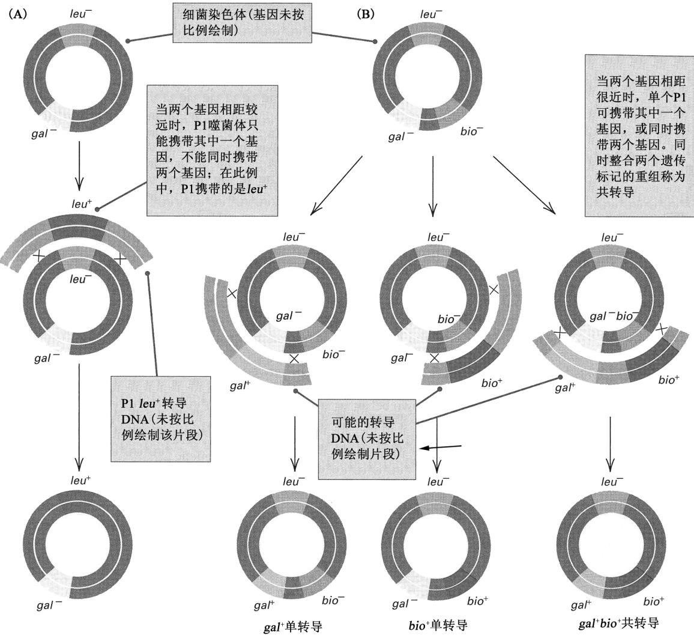  
图 9.16 用共转导证明 gal 和 bio 基因的连锁关系。(A) 携带 $leu^{+}$ 等位基因的 P1 转导颗粒，可将 $leu^{-}gal^{-}$ 细胞转导成 $leu^{+}gal^{-}$ 基因型(但不会产生 $leu^{+}gal^{+}$ 基因型)。(B) 转导子可由 3 种转导颗粒产生：携带 $gal^{+}$ 的颗粒、携带 $bio^{+}$ 的颗粒，或携带连锁等位基因 $gal^{+}bio^{+}$ 的颗粒。第三种导致共转导。为清楚起见，相对于细菌染色体的大小，转导颗粒中 DNA 片段的大小未按比例绘制。

利用与第 5 章中类似的三因子杂交，可用共转导研究来对紧密连锁的遗传标记作图。也就是说，在野生型大肠杆菌上培养 P1，用来转导携带 3 个紧密连锁基因均为突变的细胞。考察含不同的成对野生型等位基因的共转导，可鉴定位于中间的基因，因为其野生型等位基因几乎总是与其两侧的基因一起转导。例如，在图 9.16B 中，位于 $gal^{+}$ 和 $bio^{+}$ 之间的遗传标记几乎总是存在于 $gal^{+}$ $bio^{+}$ 转导子中。

在标准的大肠杆菌图谱中，基因之间的共转导频率与它们用分钟表示的图距是什么关系？理论上，该关系取决于转导噬菌体中分子的大小与整条染色体大小的比。对 P1 噬菌体而言，在接合图谱上标记之间以分钟表示的距离与共转导频率的关系大致如下：

$$
\mathrm{图距} (\min) = 2 - 2 \times (\mathrm{共转导频率}) ^ {1 / 3}\tag{1}
$$

该式表明，共转导频率随标记之间距离的增加而非常迅速地下降。式中，共转导频率等于0时，距离最短，为2min，因而，任何间隔超过2min的基因都不会被P1噬菌体共转导。对gal和bio而言，它们具有约为 $42\%$ 的共转导频率，距离等于0.5min(在图9.13的遗传图中，gal和bio基因分别位于17.0min和17.5min处)。

## 9.6 噬菌体遗传学

除新出现的突变体之外，来自被单个噬菌体感染的细菌的噬菌体后代，具有与亲代噬菌体相同的基因型。不过，如果两个具有不同基因型的噬菌体颗粒感染单个细菌细胞，可通过遗传重组产生新的基因型。该过程与真核生物中的遗传重组在两方面有显著差异。

1. 从一个细胞到另一个细胞，参与的 DNA 分子数不同。

2. 从单个被感染细胞中，未必能找到相同频率的相互重组体。

数个噬菌体颗粒可感染单个细菌，而每个颗粒的 DNA 都可复制。在正在进行裂解周期的多重感染细胞中，噬菌体 DNA 分子之间存在遗传交换。如这些感染颗粒携带可作为遗传标记的不同突变，就可得到重组噬菌体，重组发生于两个同源 DNA 分子上的任意位置。

## - 噬菌斑形成和噬菌体突变体

噬菌体很容易发现，因为在裂解周期中，受感染的细胞会破裂[一个称为裂解作用(lysis)的过程]，并释放噬菌体颗粒到培养基中。噬菌斑的形成过程可见图9.17中的概括。将大量细菌(约 $10^{8}$ 个)置于固体培养基上，经过一段时间培养后，得到一层细菌，布满培养皿且呈混浊

## 联系：噬菌体遗传学的起源

艾尔弗雷德·赫尔希和拉克尔·罗特曼，1948

华盛顿大学，圣路易斯市，密苏里州

在单个细菌细胞中噬菌体的宿主范围突变体和噬菌斑突变体之间的遗传重组

虽然噬菌体需要细菌宿主才能生存和繁殖，但它们的繁殖周期与细胞生物在各方面都一致，包括以 DNA 为遗传物质、DNA 的半保留复制、遗传变异，以及在本报告中所首次展示的重组过程。噬菌体重组是否是 DNA 分子的物理交换所致，以及两个分子重组时，是否两种相互交换产物都产生，赫尔希和罗特曼不是很肯定。后来的研究表明，这些交换是相互的，并且它们是物理交换。

我们之前已经证明，细菌病毒 T2 的几种突变体中的任意两种，在两种都感染的细菌细胞中，两种突变体相互作用，产生野生型和双重突变型遗传重组体。……我们要叙述的实验技术在原理上与遗传杂交非常相似。每次实验从一对突变体开始，每个突变体相当于一个突变型单倍体生殖细胞，与野生型的不同是存在一个不同的单位改变。以这一对突变体的两个成员一起感染细菌细胞，在病毒生长的过程中，这对突变体相互作用，产生相当于新一代生殖细胞的病毒后代，但现在包括两个单位改变与野生型都不同的一些病毒，以及其他与野生型根本没有差别的病毒。这与其他遗传重组的相似之处是明显的，很自然，要寻找一个共同的机制。……h 和 r 突变体之间的杂交产生的连锁体系如下所示。

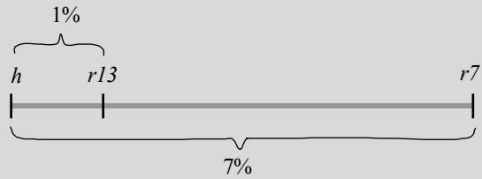

在该示意图中，h 指细菌宿主范围，r13 和 r7 指两种不同的快速裂解突变体。这些数据说明，h 基因座与 r13 紧密连锁(小于野生型的 1%)，而 r13 和 r7 之间的连锁关系为 6%。……这些结果进一步说明，在任何一次杂交中，两种重组体(野生型和双重突变型)以相同数目出现，且成对的反交也产生相同数量的重组体。正是这些关系增加了与简单的孟德尔分离类型的相似性。……我们提出一个假说，按此假说，我们设想遗传相互作用不是在两个病毒颗粒之间，而是在两套独立增殖的染色体样结构之间。遗传交换要么通过这些结构的重新组合产生，要么有点像通过同源结构配对之间的交换产生，这取决于有关遗传因子之间的结构关系。所作的解释使连锁关系与对线性结构的要求略为一致，但鲜有证据表明遗传交换是相互的，从而也鲜有证据表明它们是物质上的交换。

来源：A. D. Hershey and Rotman. Genetics 34(1949): 44-71.

状。如果将细菌置于培养基上时存在一个噬菌体，它会吸附于一个细胞上，不久之后，受感染的细胞会裂解并释放出许多噬菌体。这些后代噬菌体各自吸附到邻近的细菌上，在又一个裂解周期后，这些细菌又释放噬菌体，又能感染附近的其他细菌(后代噬菌体保留在它们产生的位置附近，因为它们的大小阻止它们在琼脂培养基中扩散)。这些感染循环不断进行，数小时之后，噬菌体摧毁了这一局部的所有细菌，在铺满培养的浑浊细菌层中产生一个清晰透明的区域——一个噬菌斑(plaque)。噬菌体只能在生长中的细菌中增殖，所以，培养基中营养物质的枯竭会限制噬菌体的增殖，从而限制噬菌斑的大小。一个噬菌斑是由最开始的一个噬菌体颗粒感染的结果，所以可以对一开始存在于培养基上的噬菌体的数量进行计数。

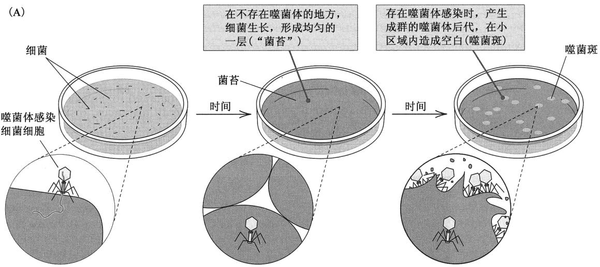

图 9.17 噬菌斑的形成。(A)不存在噬菌体时，细菌细胞长成半透明菌苔。处于噬菌体附近的细菌细胞被感染并裂解。后代噬菌体从原始位点向外扩散，感染其它细胞并导致它们裂解，所以，一开始存在于培养基上的每个噬菌体位点四周的一个小区域(透明的噬菌斑)，没有细菌能够生长。(B)以 $\lambda$ 噬菌体的突变体感染，在大肠杆菌菌苔中形成的大噬菌斑。
[B部分承 Giles Scientific Inc., www.biomic.com 惠赠。]  
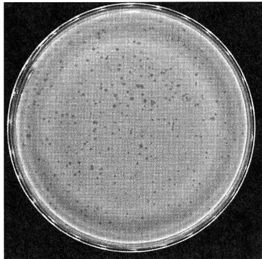  
(B)

研究这些噬菌斑，可检测噬菌体突变体的基因型。在有的情况下，看噬菌斑的外观就能够说明问题了。例如，使受感染细胞产生的噬菌体后代数目减少的噬菌体突变，往往产生较小的噬菌斑。导致受感染细胞提前裂解的突变体，每轮感染进行得比较快，可产生较大的噬菌斑(图9.17B)。

## - 裂解周期中的遗传重组

如果两个具有不同基因型的噬菌体颗粒感染单个细菌，有些噬菌体后代会是遗传重组体。图9.18示大肠杆菌T4噬菌体的突变体混合感染所得后代的噬菌斑。 $r^{-}$ (rapid lysis，快速裂解)等位基因导致大噬菌斑，而 $h^{-}$ (host range，宿主范围)等位基因导致清晰的噬菌斑。该杂交可写成：

$$
r ^ {-} h ^ {+} (\text {大的浑浊噬菌斑}) \times r ^ {+} h ^ {-} (\text {小的清晰噬菌斑})
$$

在图 9.18 中可见 4 种噬菌斑类型。两种——大的浑浊噬菌斑和小的清晰噬菌斑——对应于亲本噬菌体的表型，另外两种表型——大的清晰噬菌斑和小的浑浊噬菌斑——为重组体，分别与基因型 $r^{-}h^{-}$ 和 $r^{+}h^{+}$ 对应。当许多细菌被感染时，在后代噬菌体中通常会见到数量大致相等的相互重组体类型。在如同图 9.18 所示的这样一个实验中，4 种基因型各产生不同的噬菌斑形态表型，可通过考察形成的各种噬菌斑，对各种基因型的数目进行计数。重组率(以百分数表示)定义为

$$
\mathrm{重组率} = \frac {\mathrm{重组噬菌体数}}{\mathrm{噬菌体总数}} \times 1 0 0
$$

图9.18 用两种噬菌体亲本型同时感染宿主细胞，进行噬菌体杂交。该例示基因型为 $r^{-}h^{+}$ 和 $r^{+}h^{-}$ 的两种亲本型T4噬菌体都感染大肠杆菌细胞时，两种噬菌体杂交的后代。 $r^{+}h^{+}$ 和 $r^{-}h^{-}$ 基因型为重组体。[承国立卫生研究院莱斯利·史密斯(Leslie Smith)和约翰·德雷克(John W. Drake)惠赠。]

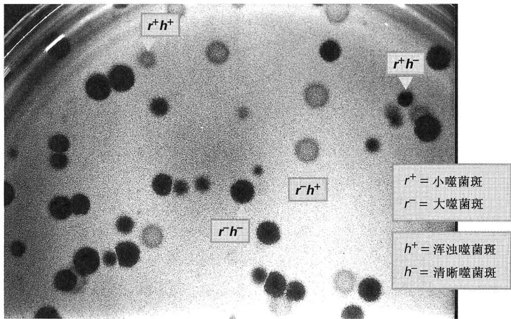

正如在真核生物中一样，重组率可用来估计图距。例如，在 $r^{-}h^{+}\times r^{+}h^{-}$ 杂交中，各类噬菌斑的观测数为

$$
r ^ {-} h ^ {+} \quad 5 1 3 \quad r ^ {+} h ^ {-} \quad 5 7 7 \quad r ^ {-} h ^ {-} \quad 9 6 \quad r ^ {+} h ^ {+} \quad 9 9
$$

顶上一行的噬菌斑为非重组体，底下一行的噬菌斑为重组体。在此情况下，r 和 h 之间的重组率(以百分数表示)为

$$
\text{重组率} = \frac {9 6 + 9 9}{5 1 3 + 5 7 7 + 9 6 + 9 9} \times 1 0 0 = 1 5.2 \%
$$

## - T4噬菌体 $rII$ 基因的精细结构

在 5.6 节中，叙述过证明在基因内部可发生重组的果蝇实验。对同一基因的两个不同突变型等位基因为杂合的基因型，可以低频率产生两个突变都携带或都不携带的重组型染色体。这些实验首次提供了基因内重组及基因具有精细的亚单位结构的证据。在该实验后接下来的数年中，进行了其他的基因研究，但无人能与西摩·本泽(Seymour Benzer)完成的 T4 噬菌体 rII 基因的精细结构作图相匹敌。本泽使用与众不同的遗传作图技术，将所需的杂交数量从 50 多万减少到数千，成功地对 T4 噬菌体 rII 基因座中 2400 个独立的突变进行了作图。

野生型 T4 噬菌体能在大肠杆菌 B 株和 K12( $\lambda$ ) 株中增殖，并产生小的不规则噬菌斑。K12( $\lambda$ ) 这个名称表示对 $\lambda$ 噬菌体为溶源性的 K12 菌株(在 9.7 节中叙述过)。T4 rII 基因中的突变在 B 菌株上产生大而圆的噬菌斑，但完全阻止 T4 在 K12( $\lambda$ ) 菌株上增殖。如果大肠杆菌 B 株细胞全部被两种不同的 rII 突变体感染，则可发现两种突变之间的重组，虽然重组频率非常低，但利用 rII 突变体不能在 K12( $\lambda$ ) 上生长，可发现重组体。将后代噬菌体涂布在 K12( $\lambda$ ) 上，可选择出 rII $^{+}$ 重组型后代，因为只有这些重组体能够生长。而且，因为可以检测众多的后代噬菌体(高达 $10^{10}$ 个噬菌体/ml)，即使非常低的重组频率也能发现。三个不同 rII 突变的典型结果可得到下面这样的图谱：

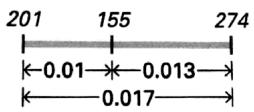

其中，线条上面的数字表示 $rII$ 等位基因，线条下面的数字为图距，图距为 $rII^{+}$ 百分比的两倍，即

$$
\text {图距} = \frac {2 \times \text {在K12} (\lambda) \text {株上每种噬菌体的噬菌斑数}}{\text {在B株上每种噬菌体的噬菌斑数}} \times 1 0 0
$$

(在此情况下，比值乘以 2 是因为发现的只是 $rII^{+}$ 重组体，而不是两种相互重组产物)。

有些突变不能与几种突变(这几种突变能相互重组)重组。这些突变被看作缺失突变，因为它们不能与两个或多个“点”突变重组(已知这些“点”突变在基因中不同的位点上)。每种缺失去除了一部分噬菌体基因组，包括一段 $rII$ 基因。缺失的使用极大地简化了数以千计的突变的排序和作图工作。

图 9.19 示用来作图的一系列缺失突变。缺失作图是基于重组体的存在或不存在；每次杂交得到一个是与否的答案，所以避免了基于重组频率的遗传图的许多模糊性。在任何一次杂交中，一个未知的“点”突变(如单纯的核苷酸置换)与一种缺失杂交，如果存在野生型后代，意味着该点突变(point mutation)在该缺失所缺少的区域之外(在这些实验中，没有发现同时携带该缺失和该点突变的这种相互重组产物)。另外，如果该点突变在该缺失所缺少的区域中，则不能产生野生型重组后代。因为每次杂交清楚地揭示了某个特定突变是否在缺失所缺少的区域内，所以缺失作图大大减少了对大量突变进行作图所需的工作量。

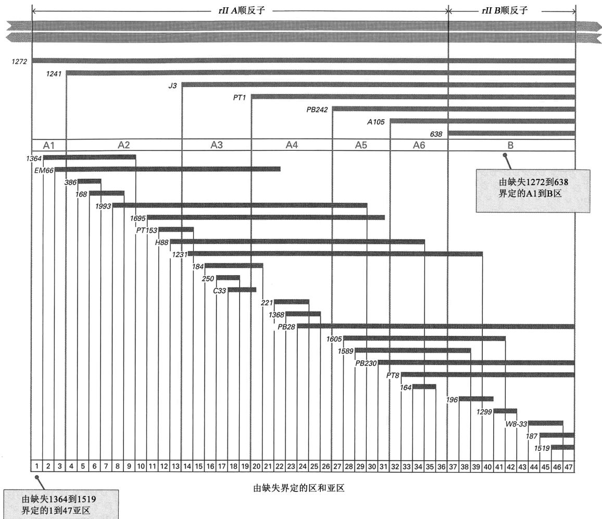  
图 9.19 用来将 T4 噬菌体 rII 基因座分成 7 个区和 47 个更小的亚区的一系列缺失突变。每个缺失的范围以棕色或深蓝色横条表示。用来为区或亚区定界的任何一个缺失的端点，以竖线表示。[改编自 S. Benzer, Proc. Natl. Acad. Sci. USA 47(1961): 403-426.]

为了对某个特定的 $rII$ 突变作图，可进行如图9.20所示的系列杂交，其中，各个大区(从A1到A6加上B)与图9.19中的相同。为了解释该方法，假设所考察的某一特定突变位于A4区中。该突变与大的缺失 $r1272, r1241, rJ3$ 和 $rPT1$ 杂交，不会产生野生型重组体，但与大的缺失 $rPB242, rA105$ 和 $r638$ 杂交，会产生野生型重组后代。反过来，任何突变如果与这些大的缺失杂交，得到相同模式的结果，就可定在A4区。通过图9.20底部所示的一组缺失，可使A4区内的遗传图的分辨率更高。这组缺失的端点界定了A4之内的7个亚区 $(a\sim g)$ 。例如，A4区内的某个突变，与缺失 $r1368$ 产生野生型重组体，但与 $r221$ 不产生，则该突变将被定到 $c$ 亚区。在最高分辨率水平，某个亚区内的突变的排序，是通过这些突变的相互杂交来进行的。在T4噬菌体中，非常靠近的突变位点也可通过重组而分开，因为 $1\%$ 的重组相当于平均约100碱基对的距离。因此，任何两个不能重组的突变可定位在该基因内的同一位点上。图9.21示根据大量独立的 $rII$ 突变生成的遗传图。

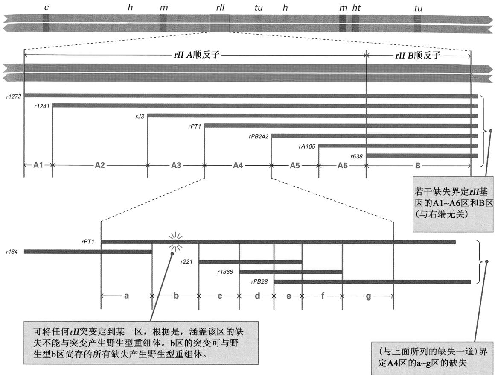  
图 9.20 rII 基因座(绿色)相对于其他遗传标记的位置。rII 区的各大亚区由 7 个缺失突变的左端界定(所缺失的 DNA 以橙色表示)。所有 7 个缺失都延伸到 rII 区的右端。A4 区的进一步划分因该图底部所示的其他缺失而成为可能(所缺失的 DNA 以深蓝色表示)。为简明起见，仅显示了缺失区域。

rII 突变和作图研究的重要性在于，它们对以下结论提供实验支持：

\- 遗传交换可发生在一个基因之内，并可能发生在任意两个毗邻的碱基对之间。

\- 在一个基因内的所有位点，产生突变的频率不同。例如，2400个 $rII$ 突变位于仅仅304个位点上。其中一个位点占474个突变(图9.21)，表现出如此高突变率的位点，称为突变热点(hotspot)。除了突变热点的位点，只找到一个或少数几个突变。

rII 分析的重要性还在于，它从实验的角度帮助我们分清了“基因”这个词的 3 层不同的含义。“基因”这个词，最常见的含义是指一个功能单位，从物质的角度来说，这相当于一个编码蛋白质的 DNA 片段。本泽用顺反子(cistron)这个术语来指代这种功能单位，该术语现在仍偶尔使用。这种功能单位一般是通过互补试验在实验上进行界定(3.7节)，而事实上，rIIA顺反子和rIIB顺反子就是通过互补来界定的。rIIA和rIIB的界线如图9.19和9.21所示。rIIA和rIIB之间是否互补，可这样来观察：两种T4噬菌体，一种在rIIA中有一个突变，另一种在rIIB中有一个突变，当用这两种噬菌体同时感染大肠杆菌K12(λ)株时，可见到是否互补。这两种突变可以互补，因为受感染细胞增殖，产生正常数量的噬菌体后代。相反，K12(λ)同时被两种具有不同rIIA突变的噬菌体，或具有两种不同rIIB突变的噬菌体感染时，没有后代噬菌体产生。

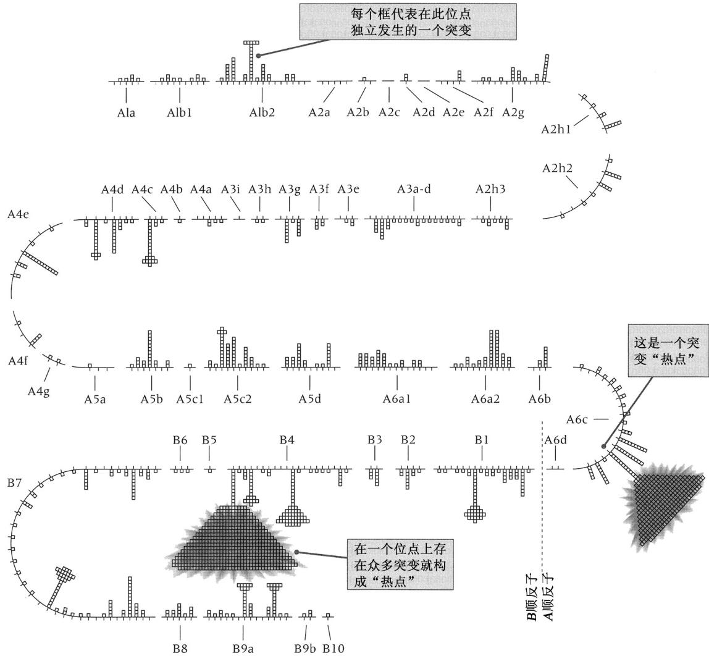  
图 9.21 T4 噬菌体 rII 基因座的遗传图。每个小方框表示在所示位点有一个不同的、独立的突变。在 A 片段或 B 片段内，位点的排列是任意的。[改编自 S. Benzer, Proc. Natl. Acad. Sci. USA 47(1961): 403-426.]

除了用顺反子这个术语理清的功能上的含义之外,基因这个术语还有另外两层不同的含义:①参与重组的遗传传递单位;②遗传改变或突变的单位。在物理上,重组单位和突变单位都相当于基因中的单个碱基对。尽管有可能存在歧义,但基因这个术语仍是遗传学中最重要的词,并且,在大多数情况下,根据上下文,意欲表达的细微差别是明了的。

## 9.7 溶源性和局限性转导

图 9.22 示大肠杆菌 $\lambda$ 噬菌体的遗传图，该图基于裂解周期中的重组。该图谱是线性的，因

而 $\lambda$ 噬菌体颗粒中的 DNA 分子也是线性的。

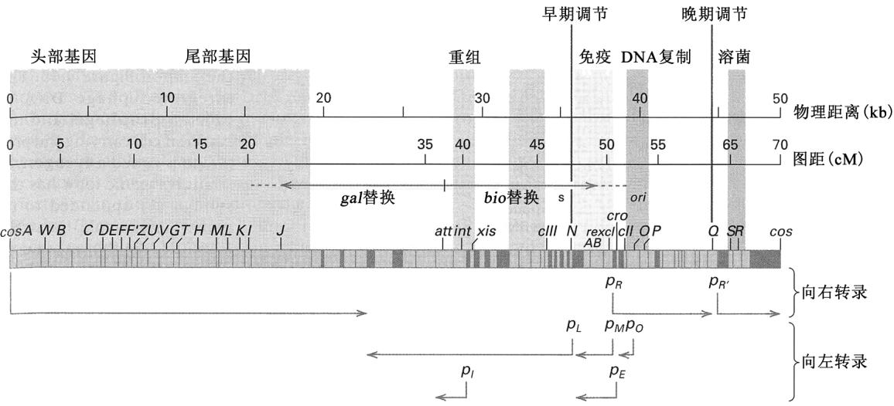  
图 9.22 λ 噬菌体的分子图谱及裂解周期遗传图。分子图谱以千碱基对 (kb) 为比例尺单位；遗传图以厘摩 (cM) 为单位 (在此情况下，厘摩与重组百分数相等)。具有相关功能的基因簇，以柔和彩色框表示。调节基因 N 和 Q 分别在约 35kb 和 45kb 处，以竖线表示。启动子以字母 p 表示。转录方向和转录物大小以箭头表示。浅棕色区域为编码序列；深棕色区域不太可能编码蛋白质。att (attachment site，附着位点) 是 λ 噬菌体进行整合的重组位点。复制起点 (ori) 是标 O 的区域。在局限性转导噬菌体 λdgal 和 λdbio 中可被大肠杆菌 DNA 替换的 λDNA 的范围，以紧靠基因图谱上方的箭头表示；此类转导噬菌体在关于局限性转导的一节讨论。

现在已知 $\lambda$ 噬菌体基因组的全部DNA序列，许多基因及基因产物及它们的功能已得到鉴定。图9.22中的基因图谱示每个基因在DNA分子上的位置，基因是按千碱基对(kb)的比例绘制的，而不是按其在遗传图上的位置绘制。不过，以厘摩(cM)或重组百分比为距离单位的遗传图已放在分子标尺之下。比较这两个标尺会发现，在DNA分子上重组频率是不均匀的。例如，基因 $H$ 和 $I$ 之间的5个图距单位跨越大约3.1kb，然而基因int和cIII之间的5个图距单位却跨越大约4.8kb。

$\lambda$ 图谱的有趣之处还在于它在噬菌体基因组进化方面的含义。 $\lambda$ 中的基因表现出广泛地按功能成簇。图谱左边一半全部由这样的基因组成：它们的产物都是噬菌体结构组装所需的蛋白质(头部和尾部的蛋白质)，并且，在该区域内，头部基因和尾部基因各自形成亚簇。 $\lambda$ 基因组的右边一半也显示出几个基因簇，这些基因簇包括DNA复制、重组及裂解的基因。这些基因不仅按功能聚集，而且按它们的产物被合成的时间聚集。例如， $N$ 基因起作用较早；基因 $O$ 和 $P$ 较晚活化；而基因 $Q$ 、 $S$ 和 $R$ ，以及头-尾簇最后表达。因此，这种mRNA合成的转录模式非常简单而高效，仅有两个向右的转录物，并且，除 $Q$ 以外，所有的晚期基因都转录到同一个mRNA中。

## - 位点专一重组和溶源性

不过，感染 $\lambda$ 噬菌体可有不同于裂解周期的结果。 $\lambda$ 噬菌体是一种温和噬菌体 (temperate phage)，温和噬菌体的意思是，它能经历一个称作溶源性的过程。在溶源性感染中，噬菌体不增殖，细菌细胞不裂解，因而没有后代噬菌体产生。细菌细胞看似没被感染，貌似没有噬菌体在其内。事实上，在溶源性 (lysogeny) 中，真正发生的是，噬菌体 DNA 变成整合进细菌染色体中，并随细菌染色体一起被动地被复制。结果是，噬菌体 DNA 分子被传递到每个细菌子细胞中。

噬菌体 DNA 整合进细菌染色体，是噬菌体编码的一种位点专一重组酶(整合酶)的一项功能。每种温和噬菌体在细菌染色体上各有其自己的整合位点。对 $\lambda$ 噬菌体而言，整合位点(称 att $\lambda$ ) 在遗传图 17.3min 之处，在 gal 和 bio 之间；而对噬菌体 $\Phi80(\text{phi } 80)$ 而言，整合位点 (att

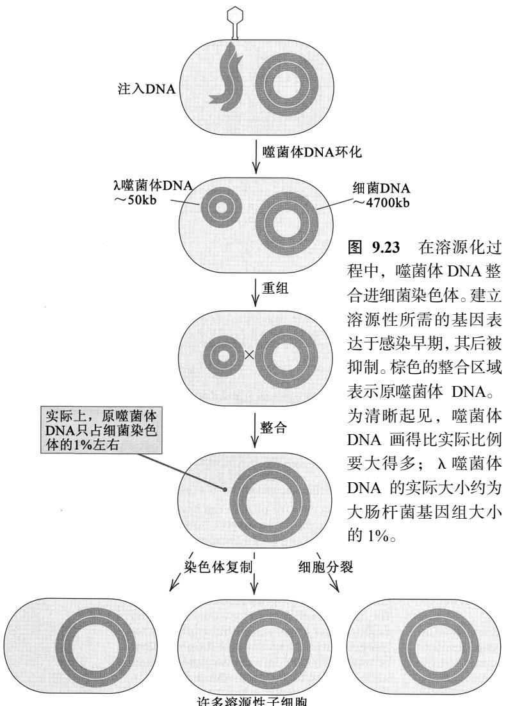

图 9.23 在溶源化过程中，噬菌体 DNA 整合进细菌染色体。建立溶源性所需的基因表达于感染早期，其后被抑制。棕色的整合区域表示原噬菌体 DNA。为清晰起见，噬菌体 DNA 画得比实际比例要大得多； $\lambda$ 噬菌体 DNA 的实际大小约为大肠杆菌基因组大小的 1%。

基配对，形成环状分子。这些单链末端称为黏性末端(cohesive end)，以表明它们进行碱基配对的能力。在 $\lambda$ 噬菌体中，DNA的包装不遵循T4那样的以装满头部为准的机制(headful mechanism)。 $\lambda$ 包装的过程要识别可切割产生黏性末端的特异序列。 $\lambda$ 刚一进入细胞，互补的末端就退火形成带切口的环(nicked circle)，然后连接封闭切口(图9.24)。在裂解周期和溶源周期(lysogenic cycle)的早期都要发生的环化，是两种周期都必需的事件——在裂解模式中是为了进行DNA复制，在溶源性中是为了进行原噬菌体整合。约在 $75\%$ 的被感染细胞中，环状分子进行复制，结果是进入裂解周期。然而，约在 $25\%$ 的被感染细胞中，环状 $\lambda$ 分子和环状$\Phi80)$ 在 28.2min 处，这两个位点如图 9.13 中的图谱所示。整合的噬菌体 DNA 称为原噬菌体 (prophage)，携带原噬菌体的细菌细胞称为溶源菌 (lysogen)。对 $\lambda$ 为溶源性的菌株，将符号 “( $\lambda$ )” 附加到它的名称上。例如，曾使 T4 噬菌体 rII 区的精细结构分析成为可能的大肠杆菌 K12( $\lambda$ ) 株，就是已被 $\lambda$ 变成溶源化的 K12 菌株。

当 $\lambda$ 整合酶催化细菌染色体中的 $att\lambda$ 和在裂解噬菌体图谱中间称为 att 的位点(图 9.22)之间的位点专一重组时，溶源性就发生了。为了让这一机制得以实现，噬菌体 DNA 必须是环状形式，但在成熟噬菌体中，DNA 是线性分子，那么，环状分子是如何形成的呢？如图 9.23 所示，环状分子形成于细菌细胞内，就在感染之后。 $\lambda$ 噬菌体 DNA 的最末端是单链的，各有 12 个未配对碱基，这些碱基在序列上是互补的，因而它们可相互进行碱大肠杆菌 DNA 分子在 $\lambda$ 整合酶催化下进行位点专一的重组，从而噬菌体 DNA 被整合进细菌染色体。因为 $\lambda$ 既可作为独立的遗传因子存在（在裂解周期中），又可作为染色体中的整合因子存在（在溶源性中），所以，就像 F 因子一样， $\lambda$ 被分类为附加体。

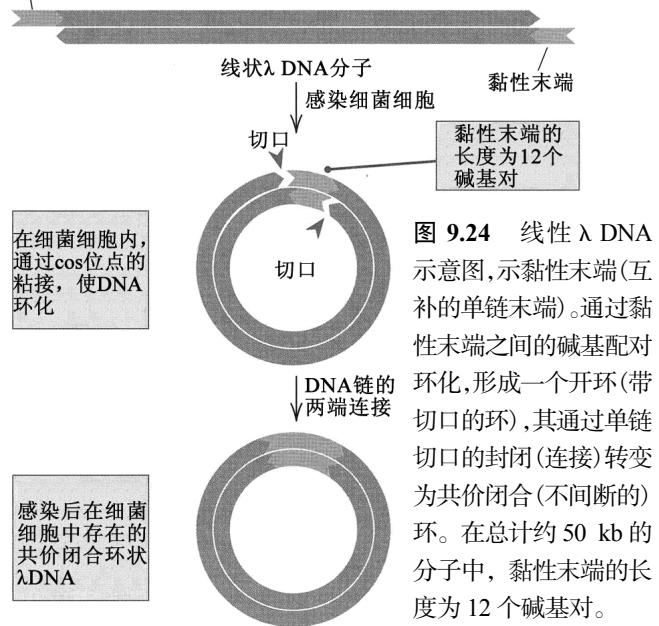

细菌和噬菌体的附着位点各由 3 个片段组成。在这两种附着位点中，中央的 15bp 片段具有相同的核苷酸序列，而这正是重组事件发生的区域。噬菌体的附着位点以 $POP'$ 表示 (P 表

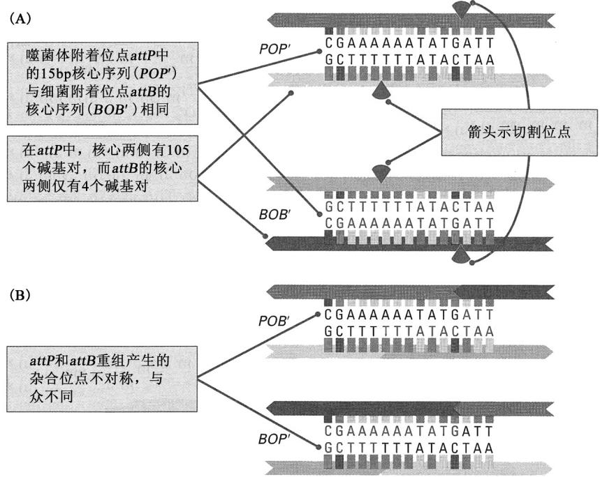  
图 9.25 (A) 在噬菌体附着位点 $POP'$ 和细菌附着位点 $BOB'$ 的核心区中，由 $\lambda$ 整合酶产生的切割位点。(B) 相互重组的结果是杂合附着位点 $POB'$ 和 $BOP'$ 。

示 phage)，细菌的附着位点以 BOB' 表示 (B 表示 bacteria)。在这两种 att 位点中，POP' 较大，因为 P 和 P' 伸出 15bp 核心区 (O) 外 105 个核苷酸，而 B 和 B' 仅伸出核心区外 4 个核苷酸 (图 9.25)。在每个 att 位点中，富含 T 的链被整合酶切开一个切口，带切口的两条链被分别从 attP 转到 attB、从 attB 转到 attP，继而切口被封闭，形成霍利迪连接体 (6.8 节)。出现向右的分支迁移 (branch migration)，

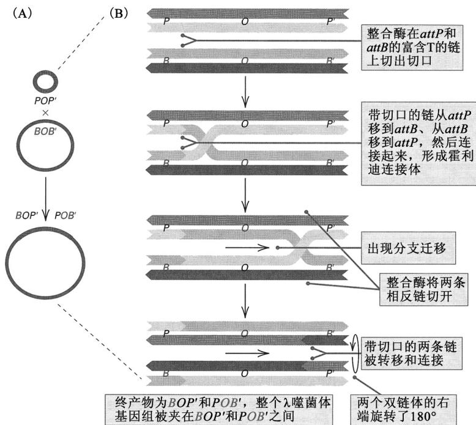  
图 9.26 （A） $\lambda$ 整合进细菌染色体概览。(B) 噬菌体附着位点 $POP'$ 和细菌附着位点 $BOB'$ 之间重组的机制。注意，相互重组的结果是整个 $\lambda$ 噬菌体基因组在杂合位点 $BOP'$ 和 $POB'$ 之间插入细菌基因组。

穿过核心区，在 attP 和 attB 中两条相反链被切出切口，带切口的两条链互换，然后切口被重新封闭(图 9.26)。产物为 $POB'$ 和 $BOP'$ ，整个 $\lambda$ 基因组被包含在这两个杂合 att 位点之间。

噬菌体整合的几何学如图 9.27 所示。虽然都是重组事件的结果，但原噬菌体的遗传图与噬菌体的不一样，原噬菌体遗传图是噬菌体遗传图的环形排列 (circular permutation)——从噬菌体裂解图谱 att(POP'位点) 的中心位置起，环绕噬菌体 DNA 一周而得。

正确的原噬菌体整合模型是艾伦·坎贝尔(Allan Campbell)于 1962 年首先提

出的。该模型通过溶源菌与非溶源菌的杂交，以及 P1 噬菌体的转导，得以证实。坎贝尔发现，在整合的原噬菌体中，基因的顺序是：

图 9.27 λ 噬菌体整合和切除的几何学。噬菌体附着位点为 POP'。细菌附着位点为 BOB'。原噬菌体两侧是两个杂合附着位点，以 BOP' 和 POB' 表示。

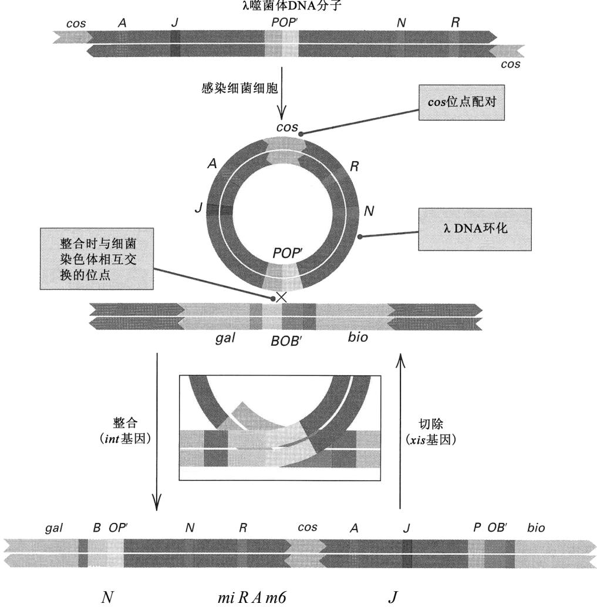

其中，m6 是影响头部形成的一个突变，mi 是影响裂解的突变。相比之下，以一般重组测定的游离噬菌体中的基因顺序是：

因而，原噬菌体的图谱是裂解噬菌体图谱的环形排列。该原噬菌体被插入到大肠杆菌基因组 gal 和 bio 基因之间，如图 9.28 所示。证实 $\lambda$ 的物理插入的另一个发现是，整合的原噬菌体增加了 gal 和 bio 之间的距离。在非溶源菌中，gal 和 bio 之间的共转导频率约为 42%，根据式(1)，这相当于 0.5min 的图距。在溶源菌中，gal-bio 共转导频率为 1.6%，相当于 1.5min 的图距。这 1min 的图距差异相当于 46kb，因为全部的 4600kb 染色体在 100min 内转移，该值就是实验误差范围内 $\lambda$ 的物理大小 (50kb)。

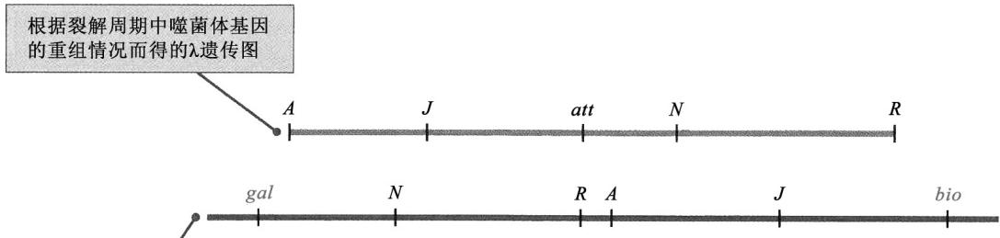  
图 9.28 通过裂解周期中的重组所确定的 $\lambda$ 噬菌体裂解遗传图(金色)与原噬菌体遗传图的比较。仅显示少数基因作为参考标记。gal 和 bio 基因(红色)是在大肠杆菌染色体中位于 $att\lambda$ 两侧的细菌基因。

当温和噬菌体变为溶源性时，噬菌体基因变成细菌染色体的一部分，所以，可以预计细菌的表型可能会改变。但在原噬菌体中，大多数噬菌体基因被噬菌体的一个基因编码的噬菌体阻遏物(phage repressor)保持在无活性状态。该阻遏蛋白起初由感染噬菌体合成，继而由原噬菌体不断合成。编码该阻遏物的基因经常是在溶源菌中被表达的唯一原噬菌体基因。如果溶源菌被原噬菌体的同类噬菌体感染——例如， $\lambda$ 感染 $\lambda$ 溶源菌——则来自原噬菌体、存在于细胞内的阻遏物会阻止感染噬菌体的基因表达。这种对感染与原噬菌体相同的噬菌体的抵抗——称为免疫(immunity)——是判断细菌细胞是否含特定原噬菌体的一般标准。例如， $\lambda$ 不会在含 $\lambda$ 原噬菌体的细菌上形成噬菌斑。

溶源化细胞几乎能够无限地复制下去而不释放噬菌体后代。不过，有时原噬菌体会被激活，进入裂解周期，产生正常数量的噬菌体后代，该现象称为原噬菌体诱导(prophage induction)，它由细菌DNA的损伤启动。这种损伤有时是自发产生的，但更多的时候是由某些环境因素——如化学物质或辐射——引起的。能够被诱导对噬菌体是有利的，因为噬菌体可逃离受损伤的细胞。诱导的生化机制比较复杂，不予讨论。

切除是逆转整合过程的另一次位点专一重组。切除需要噬菌体整合酶加上另一种称为切除酶(excisionase)的噬菌体蛋白质。遗传证据及对纯化的切除酶、整合酶和 $\lambda$ DNA 的物理结合的研究表明，切除酶结合于整合酶，从而使整合酶能够识别原噬菌体的附着位点 $BOP'$ 和 $POB'$ ，整合酶一旦结合到这些位点上，就会在 $O$ 序列中造成切口，使 $BOB'$ 和 $POP'$ 位点再现。这逆转了整合反应，导致原噬菌体的切除(图9.27)。

联系：奥图

西摩·本泽，1955

普渡大学，西拉斐特市，印第安纳州

噬菌体中一个遗传区域的精细结构

就像每个“星球大战”迷都能够认出可爱的机器人奥图·迪图(Artoo-Detoo，又称R2-D2)一样，每个遗传学家也都能够认出基因 $rII$ 。T4噬菌体中的 $rII$ 基因是遗传精细结构的第一个实验例子。本泽利用 $rII$ 突变体不能在大肠杆菌K株上生长但能在B株上生长的特性，来研究 $rII$ 基因内部不同核苷酸之间的重组。他证明了 $rII$ 基因是能够被重组作用分割的(现在知道，在理论上，重组可发生在任意相邻的核苷酸之间)。但是，如果基因能够被重组作用分割，那么，什么才是一个基因呢？如果两个不同的突变无论在不在同一基因中都可进行重组，那么，怎样通过实验判断两个不同的突变是不是等位基因？本泽认识到，在给等位性下定义的过程中，关键的实验操作不是重组，而是互补试验。这是一篇罕见的含有两个伟大观点的论文：基因内部的重组，以及使用互补试验来在实验上判断两个不同的突变是否为同一基因的等位基因。

遗传重组现象给分离突变及识别它们在染色体上的位置提供了一个强大的工具。当涉及非常接近的相邻突变时，困难出现了，因为两个突变的位置离得越近，它们之间发生重组的概率越小。因此，观察不到重组类型一般不能证明这两个突变不能分离的结论是正确的。……要是有一种可以发现很小比例的重组体的选择性特征，就可以实现高度的分辨率。本文所描述的 T4 噬菌体的 rII 突变体，就属于能提供此类特征的情况。该噬菌体的野生型在大肠杆菌 B 株和 K 株这两种细菌宿主上都可产生噬菌斑，但 rII 类突变体只能在 B 株上产生噬菌斑。因此，如果在两个不同的 rII 突变体之间进行杂交，产生的任何野生型重组体，即使比例低至 $10^{-8}$ ，只要涂布在 K 株上就能发现。……以这种方法，对 8 种 T4 的 rII 突变体进行了相互杂交。杂交结果如附图所示。

不同的距离只有大体上的累加性；长的距离往往比组成它的各个短的距离的总和要小，在此意义上来说，存在一些系统偏差，（这可以用多重重组事件来解释）。……因此，当该组中所有的 rII 突变体落在噬菌体连锁图的一小部分中时，就有可能对它们进行明确的排序，并且它们在该区域内的位置是相当分散的。……等位性的检测。

<table><tr><td>r47</td><td>r104</td><td>r101</td><td>r103</td><td>r105</td><td>r106</td><td>r51</td><td>r102</td></tr><tr><td>1.3</td><td></td><td>0.6</td><td>0.5</td><td>1.4</td><td></td><td>1.6</td><td></td></tr><tr><td></td><td>1.0</td><td></td><td>1.0</td><td></td><td>1.9</td><td></td><td></td></tr><tr><td>2.2</td><td></td><td>1.1</td><td></td><td>1.5</td><td></td><td>2.8</td><td></td></tr><tr><td></td><td>1.1</td><td></td><td>1.4</td><td></td><td></td><td></td><td></td></tr><tr><td></td><td>2.0</td><td></td><td></td><td>1.8</td><td></td><td></td><td></td></tr><tr><td></td><td></td><td></td><td>2.2</td><td></td><td>5.0</td><td></td><td></td></tr><tr><td></td><td>2.7</td><td></td><td></td><td></td><td>3.9</td><td></td><td></td></tr><tr><td></td><td></td><td>2.9</td><td></td><td>6.9</td><td></td><td></td><td></td></tr><tr><td></td><td></td><td></td><td></td><td></td><td>5.8</td><td></td><td></td></tr><tr><td></td><td></td><td></td><td></td><td>5.2</td><td></td><td></td><td></td></tr></table>

导致相似缺陷的两个紧密连锁的突变在功能上的相互关系，可通过构建包含这两个突变的二倍体杂合子来检测。……反式构型——在每条染色体上含其中一个突变——可能会或可能不会产生野生表型。如果产生野生表型(互补)，结论是，正在讨论的这两个突变位于不同的功能单位中。(它们是不同基因的等位基因)。……要想鉴定遗传“功能”单位，有必要定义功能是指什么。……根据对反式构型杂合子的表型检测(互补试验)，rII区可被分成在功能上可分的两段。每一段的“功能”可能是编码一条多肽链的氨基酸序列。

来源：S. Benzer, Proc. Natl. Acad. Sci. USA 41(1955): 344-354.

## - 局限性转导

当对 $\lambda$ 噬菌体溶源化的细菌的 DNA 受损而引起诱导时，原噬菌体通常会被精确地从染色体上切除。但是，在每 $10^{6} \sim 10^{7}$ 个细胞中，约有 1 个细胞的切除会发生错误(图 9.29)，在两段非同源序列中发生偶然断裂——一个断点在原噬菌体内部，另一个断点在细菌 DNA 内。然后，切下来的 DNA 的两个游离端连接，产生一个能够复制的 DNA 环。这两个断裂位点未必能够处在合适的位置，使所产生的 DNA 的长度适合装入 $\lambda$ 噬菌体的头部，DNA 可能太大

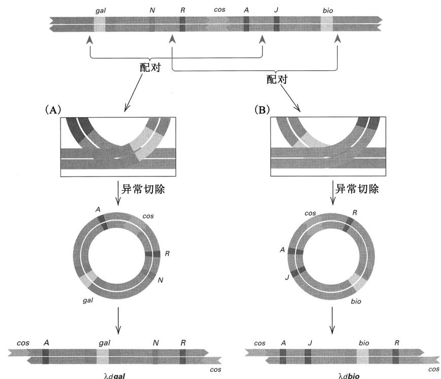  
图 9.29 异常切除导致局限性 $\lambda$ 转导噬菌体的产生。(A) gal 转导噬菌体 ( $\lambda$ dgal) 的形成。(B) bio 转导噬菌体 ( $\lambda$ dbio) 的形成。

或太小。不过，有时会形成能复制且能被包装的分子。在 $\lambda$ 溶源菌中，原噬菌体位于 gal 和 bio 基因之间，因为在宿主 DNA 中的异常切割在原噬菌体的左边或右边，所以，可产生或携带 bio 基因(在右边切割)或携带 gal 基因(在左边切割)的颗粒，所得噬菌体称为 $\lambda$ gal 和 $\lambda$ bio 转导颗粒。与可转导任意基因的普遍性转导噬菌体 P1 相比，这些噬菌体是局限性转导噬菌体，因为它们只能转导某些细菌基因(gal 和 bio)。因此，局限性转导(specialized transduction)是这样的一种过程，在转导过程中，被切除的原噬菌体 DNA 可携带一小段毗邻噬菌体附着位点(phage attachment site)的宿主细菌基因组。

局限性转导噬菌体通常是有缺陷的，因为在带 $gal^{+}$ 或带 $bio^{+}$ 的 $\lambda$ 分子的形成过程中，必需的 $\lambda$ 基因被细菌基因取代。因此，这些噬菌体分别称为 $\lambda dgal(d$ 为 defective，缺陷型) 和 $\lambda dbio$ 。它们自己不能有效感染大肠杆菌，添加一种野生型的辅助噬菌体，不仅能够产生富含 $\lambda dgal$ 和 $\lambda dbio$ 转导噬菌体的裂解物，而且能够形成双重溶源菌。可能野生型 $\lambda$ 的整合提供了杂合附着位点 $POB'$ 和 $BOP'$ ，使 $\lambda dgal$ 和 $\lambda dbio$ 通过相同的杂合附着位点之间的同源重组进行整合成为可能。

## 本章概要

\- 细菌可利用数种机制，将 DNA 序列从一个 DNA 分子转移到另一个 DNA 分子，从一个细胞转移到另一个细胞，甚至从一种细菌转移到另一种细菌。

\- 这些遗传交换的机制可造成嵌合的基因组组织结构，如在大肠杆菌中所见的那样。大肠杆菌的每个菌株与其他所有菌株有一套共同的核心基因，但每个菌株也含有众多的基因组岛，这些基因组岛将该菌株与其他菌株区别开来。在这些岛中，有些含有可导致疾病的基因。

\- 在转化中，细菌细胞从周围环境中吸收 DNA，并通过同源重组将 DNA 整合进基因组中，在此过程中取代一些宿主基因。

\- 在大肠杆菌中，在接合过程中，F(fertility，生育力)质粒可动员染色体向另一个细胞转移。

\- 在转导过程中，有些类型的噬菌体可整合细菌基因并将它们转移到新的宿主细胞中。

\- 存在于同一个宿主细胞中的近缘噬菌体的 DNA 分子可进行遗传重组。

\- 有些病毒能将它们的 DNA 整合进宿主细胞的 DNA，随宿主 DNA 一起复制，并被传递到后代细胞中。

## 基础回顾

\- 什么是质粒？什么是接合质粒？什么是非接合质粒？什么是共合体？

\- 什么是整合子？在整合子中，什么是盒？什么是整合酶？

\- 指出在细菌的遗传分析中特别有用的3种突变表型。

\- 指出选择性培养基和非选择性培养基的差异，并各举一例。

\- 要区分 $\mathrm{Lac}^{+}$ Amp-r菌株与 $\mathrm{Lac}^{-}$ Amp-s菌株，用什么培养基？(Amp-r和Amp-s表示对抗生素氨苄青霉素的抗性或敏感)。

\- 共转化的物理基础是什么？如果观察到两个基因可被共转化，是否意味着每个基因都能与位于它们之间的一个遗传标记一起被共转化？

\- 在 $\mathrm{F}^{+}$ 细菌细胞和 Hfr 细菌细胞中，F 因子的物理状态有何不同？

\- 在 Hfr 和 F $^{-}$ 杂交时，为什么受体细胞通常保持为 F $^{-}$ ?

\- 在接合过程中，DNA 的转移总是伴随着 DNA 复制。前导链的合成发生在哪一个亲本细胞中？后随链的合成发生在哪一个亲本细胞中？

\- 选择标记和反向选择标记有什么差异？在分析 $\mathrm{Hfr} \times \mathrm{F}^{-}$ 杂交的后代时，为什么这两种标记都需要？

\- 当 Hfr 细菌细胞将其染色体 DNA 转移进 F 受体细胞时，转移过程从染色体的什么地方开始？转移整条染色体要花多长时间？为什么完整的染色体转移极少出现？

\- 转导过程与转化过程有何区别？

\- 指出普遍性转导和局限性转导的差异。

\- 对某种温和噬菌体为溶源性的细菌细胞，是什么阻止该细胞被同类噬菌体再次感染？

## 解题指南

习题 1 三种 F 因子分别整合进某大肠杆菌近缘菌种的染色体，产生 3 种 Hfr 衍生物 (HfrX、HfrY 和 HfrZ)，每种衍生物具有不同的起点，并且标记的转移方向也可能不同。在中断交配实验中进行研究，发现这些衍生物在附表所示的时间转移染色体基因。

(a) 画出每种 Hfr 的转移起点和方向的示意图，指出染色体标记的相对位置及它们之间以分钟表示的距离。

<table><tr><td rowspan="2">Hfr</td><td colspan="6">遗传标记</td></tr><tr><td>ala</td><td>arg</td><td>his</td><td>ser</td><td>thr</td><td>met</td></tr><tr><td>X</td><td>—</td><td>24</td><td>12</td><td>—</td><td>—</td><td>4</td></tr><tr><td>Y</td><td>9</td><td>25</td><td>—</td><td>—</td><td>3</td><td>—</td></tr><tr><td>Z</td><td>—</td><td>—</td><td>—</td><td>—</td><td>11</td><td>29</td></tr></table>

(b) 用所有这三个 Hfr 菌株的数据绘制复合遗传图。

遗传标记

## 答案

(a) 依次考虑每个 Hfr: 从最早进入的基因开始, 有基因进入则记下其名称。相邻基因之间进入时间的差就

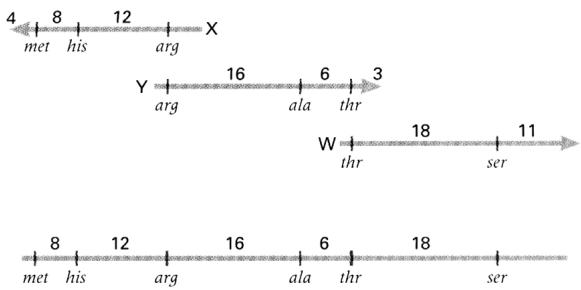  
uxa $^{-}$ 的受体菌株。主要观察结果是。

是这两个基因之间的距离(单位为分钟)。

(b) 整理这些 Hfr 菌株的图谱，使两个或多个 Hfr 菌株之间任何共同的基因在位置上重叠。然后根据各个 Hfr 菌株之间的重叠情况绘制复合图谱，单个 Hfr 图谱及复合图谱如左所示，与这些图谱呈镜像的图谱也是正确的。

习题 2 进行共转导实验，以测定大肠杆菌中 3 个紧密连锁基因的顺序。在基因型为 $prp^{+} dad^{+} uxa^{+}$ 的菌株上培养 P1 噬菌体，用它来转导基因型为 $prp^{-} dad^{-}$

①当 $prp^{+}$ 转导子被选择出来时，其中多数为 $uxa^{+}$ ，而极少数为 $dad^{+}$ 。

②当 $uxa^{+}$ 转导子被选择出来时，其中多数为 $prp^{+}$ 或 $dad^{+}$ ，但通常不会两者兼有。

哪一个基因在中间？

## 答案

此处示 3 种可能的遗传图。如果 dad 离 prp 比 uxa 离 prp 远，则图谱(a)与观察结果①吻合。但是，图谱(a)与观察结果②不吻合，因为该图谱表明 uxa-dad 共转导应该比 uxa-prp 共转导更稀有。图谱(b)可不予考虑，因为它预测 prp-uxa 共转导应该比 prp-dad 共转导少，这与观察结果①不吻合。图谱(c)是唯一与观察结果①和观察结果②都吻合的图谱。

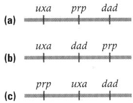

习题 3 在悬浮液中噬菌体或细菌的数量通常都很大, 以致不适当稀释就不可

能观察到单个的菌落或噬菌斑。通常的稀释度为 100 倍——0.1ml 的悬浮液与 9.9ml 的稀释缓冲液混合，或 10 倍——1ml 的悬浮液与 9ml 的稀释缓冲液混合。通常需要连续稀释，其中，第一次将悬浮液稀释到稀释缓冲液中，所得悬浮液充分混合，然后稀释第二次，所得悬浮液充分混合，然后稀释第三次等。连续稀释的倍数是相乘关系，所以，如两次 100 倍和两次 10 倍稀释，得总稀释倍数为 $100 \times 100 \times 10 \times 10 = 10^{6}$ 。举一个连续稀释的例子，设某一噬菌体悬浮液经过 4 次各为 100 倍和一次 10 倍的连续稀释。从最终的稀释液中取 0.1ml 与极度过量的培养细菌混合，然后涂布在培养皿中的营养琼脂上，培养过夜，第二天，见到 35 个噬菌斑。估算在最初未稀释的悬浮液中，每毫升中活噬菌体的数量（噬菌体的滴度）。

## 答案

有两种估算原始滴度的简单方法。第一种是从观察到的噬菌斑数目(在此例中为35)开始，倒推稀释度。则原始滴度一定是 $35\times10$ （对仅涂布0.1ml最终稀释液的校正） $\times10$ （对10倍稀释的校正） $\times100\times100\times100\times100$ （对四次100倍稀释的校正），这等于在最初溶液中 $35\times10^{10}$ 个噬菌体/ml。或令t为噬菌体的原始滴度，它因连续稀释减小到 $t\times10^{-9}$ ，然后再乘以 $10^{-1}$ （只涂布0.1ml的最终稀释液），得到噬菌斑的期望数为 $t\times10^{-10}$ 。设 $t\times10^{-10}=35$ ，求t，得 $t=35\times10^{10}$ 。

## 分析与应用

9.1 某一大肠杆菌的悬浮液经过两次各为 100 倍和两次各为 10 倍的连续稀释。从最终稀释液中取 0.1ml 体积涂布在培养皿中的营养琼脂上，培养过夜，第二天，可见 42 个菌落。估算在最初未稀释悬浮液中每毫升的活细菌数量。

9.2 一份细菌悬浮液含 $7 \times 10^{8}$ 个活菌/ml。为使 0.1ml 的最终稀释液含大约 70 个活菌，要进行怎样的 100 倍和 10 倍的连续稀释组合？

9.3 进入时间实验表明，卡那霉素抗性基因 kan-r 与 T5 噬菌体抗性基因 T5-r 紧密连锁。一位遗传学家有两种基因型的菌株可用——kan-r T5-s(抗卡那霉素，对 T5 噬菌体敏感)和 kan-s T5-r(对卡那霉素敏感，抗 T5 噬菌体)。在一个用 P1 噬菌体来了解这两个基因是否近到足以共转导的实验中：

(a)用P1来感染哪一个菌株以获得转导噬菌体？

(b)用转导噬菌体来感染哪一个菌株？

(c)选哪一个标记来获得转导子?

(d) 怎样判断这两个基因是否被共转导？

9.4 T2噬菌体(与T4噬菌体近缘)通常在大肠杆菌B株的菌苔上形成小而清晰的噬菌斑。称为B/2的一种B株突变体不能吸附T2噬菌体颗粒，所以没有噬菌斑形成。T2h是一种具有宿主范围突变的噬菌体，能附着到 B 株和 B/2 株，从而形成外观正常的噬菌斑。如果混合相同比例的大肠杆菌 B 株和 B/2 株，并用来产生菌苔，T2 和 T2h 产生的噬菌斑外观将是什么样子？

9.5 大肠杆菌标准实验株具有约 5Mb(百万碱基对)大小的基因组，含大约 3500 个基因。局限性转导噬菌体 P1 可转移大约 100kb 的 DNA 片段。平均而言，在这样大小的片段中有多少个基因？

9.6 已知 $\lambda$ 噬菌体的基因组大小为 50kb，当插入基因组大小为 5Mb 的大肠杆菌时，原噬菌体的遗传长度（以分钟为单位）大约是多少？(提示：整个大肠杆菌的遗传图长度为 100min)。

9.7 用来自 $gal^{+}$ $bio^{+}$ 溶源菌的 $\lambda$ 噬菌体进行大肠杆菌 $gal^{-}$ $bio^{-}$ 菌株的局限性转导，什么培养基可选择出 $gal^{+}$ 转导子而不选择 $bio^{+}$ ?

9.8 如欲从 Hfr leu $^{+}$ str-s×F $^{-}$ leu $^{-}$ str-r 的杂交中得到 leu $^{+}$ str-r 重组体，交配对应该涂布在什么样的培养基上？哪些标记是选择标记？哪些标记是反向选择标记？

9.9 天然的大肠杆菌菌株，基因组大小为 4.5～5.5Mb，这是因为有些谱系中存在基因组岛，而另一些谱系没有。如果一个基因组 5 Mb 大的菌株具有长度为 100min 的遗传图，一个基因组 4.5Mb 大的菌株，其遗传图长度是多少？一个基因组 5.5Mb 大的菌株呢？

9.10 用噬菌体 P1 进行的局限性转导，图距(以分钟为单位)和共转导频率之间的理论关系是：图距=2-2×共转导频率 $^{1/3}$

(a) 相当于 75% 共转导的图距 (以分钟为单位) 是多少？相当于 50% 的呢？相当于 25% 的呢？

(b)两个相隔 $0.5 \mathrm{~min}$ 的遗传标记之间的共转导频率是多少？ $1 \mathrm{~min}$ 的呢？ $2 \mathrm{~min}$ 的呢？超过 $2 \mathrm{~min}$ 的呢？

(c) 如果基因 a、b 和 c 的顺序就是字母顺序，且 ab 的共转导频率为 30%，bc 的为 10%，预计 a 和 c 之间的共转导频率是多少？

9.11 培养在基因型为 $pur^{+} pro^{-} his^{-}$ 的细菌上的 P1 噬菌体，转导基因型为 $pur^{-} pro^{+} his^{+}$ 的细菌细胞，选择含 $pur^{+}$ 的转导子，然后对未选择的标记 pro 和 his 进行检测。pur 菌落有 4 种基因型，各基因型的数目如下：

$$
p r o ^ {+} h i s ^ {+}
$$

$$
p r o ^ {-} h i s ^ {+}
$$

这些基因是什么顺序？

9.12 研究某个细菌菌株的 5 个基因。基因 tau-r 赋予噬菌体 tau 抗性，基因 top-r 赋予抗生素金霉素抗性，基因 $arg^{+}$ 为精氨酸合成所必需，基因 $suc^{+}$ 为在蔗糖上生长所必需，而基因 $mot^{+}$ 为细胞运动所必需。附表示共转导实验结果。“+”表示两个基因可被共转导，“-”表示不能共转导，而“NT”表示未检测。这些基因的顺序是什么？

<table><tr><td></td><td>top</td><td>arg</td><td>suc</td><td>mot</td></tr><tr><td>tau</td><td>-</td><td>+</td><td>+</td><td>-</td></tr><tr><td>top</td><td></td><td>NT</td><td>+</td><td>+</td></tr><tr><td>arg</td><td></td><td></td><td>-</td><td>NT</td></tr><tr><td>suc</td><td></td><td></td><td></td><td>NT</td></tr></table>

9.13 最初从单个菌落中分离到一个大肠杆菌菌株，并在密封玻璃瓶中

的琼脂中存放了 50 年。从琼脂中取出大肠杆菌，并在营养琼脂上划线培养，以纯化单菌落。每个菌落代表来

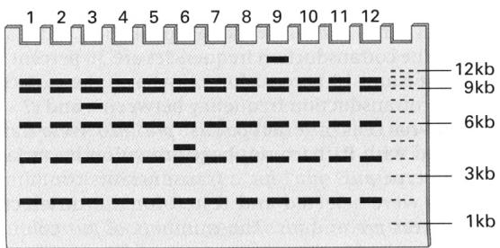

源于原始菌株的一个单独的谱系。提取 12 个菌落的基因组 DNA，并以 EcoR I 裂解，电泳分离片段并转移到滤膜上，用已知为 IS5 插入序列的转座因子的探针与滤膜杂交（在 IS5 序列中没有 EcoR I 的切割位点）。结果如附图所示。

(a)解释为什么在所有菌株中有些条带是一样的。

(b)解释为什么有些条带不一样。

(c) 估计每年每个谱系 IS5 转座的速率。

(d) 估计每年每个谱系每一因子 IS5 转座的速率。

9.14 在大肠杆菌中，基因 $lac^{+}$ 、 $gal^{+}$ 、 $trp^{+}$ 和 $his^{+}$ 分别是利用乳糖、利用半乳糖、合成色氨酸和合成组氨酸所必需的，而 str-r 和 str-s 分别是链霉素抗性和敏感性等位基因。要进行杂交 Hfr $lac^{+}gal^{+}trp^{+}his^{+}str-s\times Hfr lac^{-}gal^{-}trp^{-}his^{-}str-r$ ，依次以每个标记为选择标记，以链霉素抗性为反向选择标记。对于下列目的，应该各用什么培养基？

(a)选择 $lac^{+}$ 并反向选择 str-r。

(b)选择 $gal^{+}$ 并反向选择 str-r。

(c) 选择 $trp^{+}$ 并反向选择 str-r。

(d) 选择 $his^{+}$ 并反向选择 str-r。

9.15 在上一题中，要判断下列各种情况，应该用什么培养基：

(a)哪些 $lac^{+}$ str-r 菌落为 $gal^{+}$ ?

(b)哪些 $lac^{+}$ str-r 菌落为 $trp^{+}$ ?

(c)哪些 $lac^{+}$ str-r 菌落为 $his^{+}$ ?

(d)哪些 $lac^{+}$ str-r 菌落为 $trp^{+}$ 且 $his^{+}$ ?

9.16 一个基因型为 $a^+ b^+ c^+ str - s$ 的 Hfr 供体与基因型为 $a^- b^- c^- str - r$ 的 F 受体交配；转移顺序为 $a b c$ 。这些基因没有一个是早期转移的， $a$ 和 $b$ 之间的距离与 $b$ 和 $c$ 之间的距离相同，且这些标记没有一个靠近 str。照例在缺乏某种营养物质但含有链霉素的培养基上涂布，选择重组体。下列陈述哪些是正确的？解释（正确的不止一个）。

(a) $a^{+}$ str-r 菌落的数量会比 $c^{+}$ str-r 菌落的数量多。

(b) $b^{+}$ str-r 菌落的数量会比 $c^{+}$ str-r 菌落的数量少。

(c) $a^{+}b^{+}str-r$ 菌落的数量会比 $b^{+}str-r$ 菌落的数量少。

(d) $a^{+}b^{+}str-r$ 菌落的数量与 $b^{+}str-r$ 菌落的数量大致相等。

(e) 大部分 $a^{+}c^{+}str-r$ 菌落也会是 $b^{+}$ 。

(f) 大部分 $b^{-}c^{+}str-r$ 菌落也会是 $a^{-}$ 。

(g) $a^{+}b^{+}c^{-}str-r$ 菌落的数量会比 $a^{+}b^{-}c^{+}str-r$ 菌落的数量少。

9.17 肠道沙门氏菌(Salmonella enterica) 与大肠杆菌有很近的亲缘关系。它能被F质粒感染，F质粒可整合进染色体，产生Hfr菌株。可将这些Hfr菌株与F-大肠杆菌交配，以研究遗传标记的顺序和进入时间。此处所示的数据

是大肠杆菌 Hfr×大肠杆菌 F⁻和肠道沙门氏菌 Hfr×大肠杆菌 F⁻杂交中 4 个遗传标记的进入时间。

(a) 就这些基因而言，大肠杆菌和肠道沙门氏菌的遗传图相比有何异同？

(b) 在每种 Hfr 中，转移起点和方向是什么？

9.18 一个 Hfr 菌株按字母顺序转移基因。当使用四环素敏感性来进行反向选择时， $h^{+}$ tet-r 菌落的数量为用链霉素敏感性进行反向选择时 $h^{+}$ str-r 菌落的数量的 1/1000，对此差异提出解释。

9.19 一个 Hfr 菌株按 a b c 的顺序转移基因。在 Hfr $a^{+}b^{+}c^{+}str-s\times F^{-}a^{-}b^{-}c^{-}str-r$ 的交配中，是否所有的 $b^{+}str-r$ 重组体都得到 $a^{+}$ 等位基因？是否所有的 $b^{+}str-r$ 重组体都是 $c^{+}$ ？解释答案。

9.20 如果一条细菌染色体中的基因按字母顺序排列，且一个 Hfr 细胞按 g h I...d e f 的顺序转移基因，从该 Hfr 可得到什么类型的 F' 质粒？

9.21 在一个 Hfr $lac^{+} met^{+} str-s \times F^{-} lac^{-} met^{-} str-r$ 的交配中， $met^{+}$ 的转移比 $lac^{+}$ 晚得多。如果细胞被涂布在含葡萄糖和链霉素的基本培养基上，预计细胞中有多大比例为 $lac^{+}$ ？如果细胞被涂布在含乳糖、甲硫氨酸和链霉素的基本培养基上，预计细胞中有多大比例为 $met^{+}$ ？

9.22 在杂交 Hfr met $^{-}$ his $^{+}$ leu $^{+}$ trp $^{+}$ $\times$ F $^{-}$ met $^{+}$ his $^{-}$ leu $^{-}$ trp $^{-}$ 中，已知 met $^{-}$ 标记转移得很晚。在 Hfr 和 F $^{-}$ 细胞混合后不久，中断交配细胞，将细胞悬液涂布在 4 种不同的培养基上。培养基中的氨基酸和在每种培养基上观察到的菌落数量如下：

组氨酸+色氨酸 250 个菌落 组氨酸+亮氨酸 50 个菌落 亮氨酸+色氨酸 500 个菌落 组氨酸 10 个菌落

在该实验中，使用 Hfr 菌株中的 met 是为了什么？这些基因转移的顺序是什么？为什么只含组氨酸的培养基菌落数量这样少？

9.23 某种噬菌体的基因组由一个小的双链 DNA 线性分子构成，在一个噬菌体成熟和裂解必需的基因中，含某种限制酶的单一(每个基因组一个)切割位点。在宿主细菌的大多数菌株(A 型)中，该噬菌体以几乎 100% 的效率形成噬菌斑(每个感染噬菌体形成一个噬菌斑)。但是，在少数菌株(B 型)中，感染几乎不产生噬菌斑。当从 B 型上很少的噬菌斑中分离出噬菌体后，它们随后在 B 型上以近乎 100% 的效率形成噬菌斑。分析这些形成噬菌斑的噬菌体 DNA，发现上述单一限制位点中有一个胞嘧啶被甲基化。这些噬菌体在 A 型上也可形成噬菌斑，但此后，后代噬菌体在 B 型上形成噬菌斑的能力还是很低，解释这些结果。

9.24 某种 Hfr 菌株按字母顺序 $a^{+}b^{+}c^{+}\ldots x^{+}y^{+}z^{+}$ 转移基因， $a^{+}$ 最早转移， $z^{+}$ 为末端的标记。该 Hfr 菌株与 $F^{-}z^{-}str-r$ 细胞交配。混合 15min 后剧烈搅拌交配混合物，以打散接合细胞，然后涂布在缺乏营养物质 Z 但含链霉素的培养基上。 $z^{+}$ 基因离 str-r 基因很远， $z^{+}str-r$ 菌落的产率约为每 $10^{7}$ 个 Hfr 细胞一个。产生 $z^{+}str-r$ 菌落的两种可能模式及相应菌落的基因型是什么？怎样区分这两种可能性？

9.25 在交配 Hfr $a^{+}b^{+}c^{+}d^{+}str-s\times F^{-}a^{-}b^{-}c^{-}d^{-}str-r$ 中进行进入时间实验，其中，各基因之间的距离是相同

每 200 个 Hfr 细胞中

<table><tr><td rowspan="2">交配时间 /min</td><td colspan="4">每200个1H细胞中所示基因型的重组体的数量</td></tr><tr><td> $a^{+}$  str-r</td><td> $b^{+}$  str-r</td><td> $c^{+}$  str-r</td><td> $d^{+}$  str-r</td></tr><tr><td>0</td><td>0.01</td><td>0.006</td><td>0.008</td><td>0.0001</td></tr><tr><td>10</td><td>5</td><td>0.1</td><td>0.01</td><td>0.0004</td></tr><tr><td>15</td><td>50</td><td>3</td><td>0.1</td><td>0.001</td></tr><tr><td>20</td><td>100</td><td>35</td><td>2</td><td>0.001</td></tr><tr><td>25</td><td>105</td><td>80</td><td>20</td><td>0.1</td></tr><tr><td>30</td><td>110</td><td>82</td><td>43</td><td>0.2</td></tr><tr><td>40</td><td>105</td><td>80</td><td>40</td><td>0.3</td></tr><tr><td>50</td><td>105</td><td>80</td><td>40</td><td>0.4</td></tr><tr><td>60</td><td>105</td><td>81</td><td>42</td><td>0.4</td></tr><tr><td>70</td><td>103</td><td>80</td><td>41</td><td>0.4</td></tr></table>

点到第一个被转移标记的距离(以分钟为单位)。

(b)该特定菌株的遗传图与图 9.13 中大肠杆菌标准株的遗传图相比，有何异同？对这两个遗传图之间的任何不一致之处提出解释。

的，得到附表中的数据。

每个基因的进入时间是多少？给 $d^{+}$ str-r 重组体的低频率提出一个可能的原因。

9.26 4个F因子分别与一个罕见的大肠杆菌菌株整合，产生该菌株4种不同的Hfr衍生物(HfrW、HfrX、HfrY和HfrZ)，每种衍生物具有不同的起点，并且标记的转移方向可能不同。在中断交配实验中研究这些衍生物，发现在附表所示的时间转移染色体基因。

9.27 T4 噬菌体的许多 rII 突变体为

(a) 画出环状遗传图，将 0min (也是 100min) 的位置放在顶部，指出染色体基因的顺序及相邻基因之间的距离 (以分钟为单位) (在标准图谱上 leu 标记靠近 2min)。以箭头注释该遗传图，标示每个 Hfr 的转移起点和方向及从转移起

遗传标记

<table><tr><td rowspan="2">Hfr</td><td colspan="10">遗传标记</td></tr><tr><td>his</td><td>lac</td><td>leu</td><td>lip</td><td>pheS</td><td>pro</td><td>pyrD</td><td>terC</td><td>tonA</td><td>trp</td></tr><tr><td>W</td><td>—</td><td>20</td><td>—</td><td>11</td><td>—</td><td>—</td><td>3</td><td>—</td><td>—</td><td>—</td></tr><tr><td>X</td><td>—</td><td>—</td><td>18</td><td>—</td><td>—</td><td>—</td><td>31</td><td>—</td><td>20</td><td>25</td></tr><tr><td>Y</td><td>—</td><td>13</td><td>—</td><td>22</td><td>—</td><td>6</td><td>—</td><td>2</td><td>—</td><td>—</td></tr><tr><td>Z</td><td>19</td><td>—</td><td>—</td><td>—</td><td>12</td><td>4</td><td>—</td><td>8</td><td>—</td><td>—</td></tr></table>

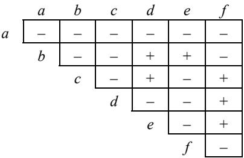  
缺失突变。在大肠杆菌 B 株中对它们所有可能的组合进行杂交，并将其涂布在大肠杆菌 K12(λ) 株上，以判断是否形成 $r^{+}$ 重组体。 $r^{+}$ 重组体的形成表明两个突变可重组，因而，如果它们是缺失，它们一定是不重叠的。结果见附表，其中，a 到 f 表示 rII 突变，“+”表示在杂交中形成 $r^{+}$ 重组后代。构建这些突变的缺失图谱，用线段表示每个突变

9.28 7个携带点突变的突变体(t 到 z)与 9.27 题中的

6 个缺失突变体杂交，记录产生 $r^{+}$ 重组体的能力，结果见附表。

用缺失的端点界定 rII 基因上的遗传区间, 将每个点突变放在某个区间内。根据数据, 改动缺失端点以使其更精确。

<table><tr><td></td><td>a</td><td>b</td><td>c</td><td>d</td><td>e</td><td>f</td></tr><tr><td>t</td><td>-</td><td>-</td><td>-</td><td>+</td><td>+</td><td>+</td></tr><tr><td>u</td><td>-</td><td>+</td><td>-</td><td>+</td><td>+</td><td>+</td></tr><tr><td>v</td><td>+</td><td>+</td><td>+</td><td>-</td><td>+</td><td>+</td></tr><tr><td>w</td><td>+</td><td>+</td><td>+</td><td>+</td><td>+</td><td>-</td></tr><tr><td>x</td><td>-</td><td>+</td><td>+</td><td>+</td><td>+</td><td>-</td></tr><tr><td>y</td><td>-</td><td>-</td><td>+</td><td>+</td><td>+</td><td>-</td></tr><tr><td>z</td><td>-</td><td>+</td><td>+</td><td>-</td><td>-</td><td>+</td></tr></table>

9.29 在 K12( $\lambda$ ) 中对 9.28 题中 rII 的点突变 t 到 z 的所有可能的组合进行杂交，以判断互补情况，结果如所附互补矩阵所示。

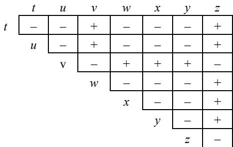

突变 v 和 z 与缺失 c 互补，但与缺失 e 不互补。突变 v 和 z 也不与某种已知造成 rIIB 功能缺陷但不造成 rIIA 功能缺陷的突变互补。哪些突变在 rIIA 顺反子中，哪些突变在 rIIB 顺反子中？这两个基因之间的界线在什么地方？给这些缺失突变编制互补矩阵，尽量填满所有的空格。

9.30 P2 和 P4 是大肠杆菌的噬菌体。它们具有如下特点：①当 P2 噬菌体感染一个细菌时，最终该细菌破裂，产生大约 100 个 P2 噬菌体；②当 P4 感染一个细菌时，该细菌得以存活，因为 P4 是缺陷噬菌体；③当 P2 噬菌体和 P4 噬菌体联合感染一个细

菌时，该细菌裂解，产生100个P4后代，但没有P2后代，因为P4的存在抑制P2的生长。假设 $3 \times 10^{8}$ 个P2和 $2 \times 10^{8}$ 个P4被加到 $10^{8}$ 个细菌细胞上。

(a)会有多少细菌不被任何一种噬菌体感染？

(b)会有多少细菌得以存活？

(c)会有多少细菌产生 P2 代?

(d)会有多少细菌产生P4代?

(提示: 在混合悬浮液中, 如果每个细胞占的噬菌体平均数目为 $x$ , 则某个细胞保持不被感染的概率为 $e^{-x}$ 。)

## 挑战题

挑战题 1 噬菌体 363 可用于大肠杆菌遗传标记的普遍性转导。弗朗索瓦·雅各布利用噬菌体 363 证明，只要在 20℃ 下进行实验(在此温度下，噬菌体不增殖)，噬菌体的溶源状态就可从一个菌株遗传地转移到另一个菌株。雅各布研究了 4 个细菌菌株。

A: $thr^{-}lac^{-}gal^{-}$ B: $thr^{-}lac^{-}gal^{-}(\lambda)$ C: $thr^{+}lac^{+}gal^{+}$ D: $thr^{+}lac^{+}gal^{+}(\lambda)$

<table><tr><td rowspan="2">供体菌株</td><td rowspan="2">受体菌株</td><td colspan="2">Thr+</td><td colspan="2">Lac+</td><td colspan="2">Gal+</td></tr><tr><td>检测的菌落</td><td>溶源性菌落</td><td>检测的菌落</td><td>溶源性菌落</td><td>检测的菌落</td><td>溶源性菌落</td></tr><tr><td>D</td><td>A</td><td>400</td><td>0</td><td>400</td><td>0</td><td>400</td><td>24</td></tr><tr><td>C</td><td>B</td><td>400</td><td>400</td><td>400</td><td>400</td><td>400</td><td>368</td></tr></table>

在这些名称中，符号( $\lambda$ )的意思是该菌株对 $\lambda$ 噬菌体为溶源性的。雅各布做了两种杂交，用在菌株D上培养的噬菌体来转导菌株A，以及用在菌株C上培养的噬菌体来转导菌株B，结果见附表。给出这些结果的

遗传学解释，要产生或去除溶源性，被转导的遗传因子是什么？

挑战题 2 在研究一种新型的抗生素抗性时，一位遗传学家做了一些杂交：一个大肠杆菌自然分离株的 3 个 Hfr 衍生菌株，分别与一个携带插图中所示的突变等位基因的 F 实验菌株杂交。自然分离株携带基因 C 的野生型等位基因的一个重复，两个重复拷贝在染色体的对面。在 3 个 Hfr 杂交中，转移的起点、范围和方向以箭头表示。如果该遗传学家假设，在 Hfr 菌株中每种野生型基因仅有一个拷贝，绘出会得到的遗传图。

挑战题 3 附图示一种称为反向 PCR 的方法，其中，已知序列两侧的未知序列可被扩增。首先，用一种不在已

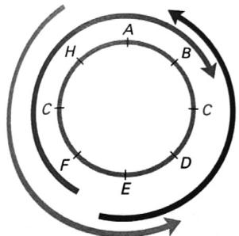

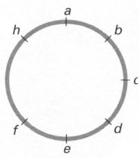  
自然分离株  
实验菌株

知序列内部切割的限制酶(在此例中为 EcoR I)切割基因组 DNA。稀释所得的含限制性片段的溶液，然后用 DNA 连接酶处理，将末端连接在一起，形成环状 DNA(稀释溶液是为了确保单个片段的两个末端连接在一起，而不是两个或多个不同片段的末端连接。)然后，用 3' 端朝外——指向未知序列(而不是像在通常的 PCR 方法中那样朝内)——的寡核苷酸引物进行 PCR，结果是未知片段的扩增。假设长度为 6 的寡核苷酸引物适合 PCR(实

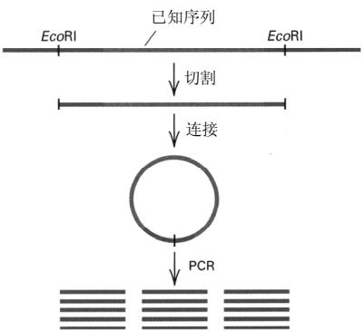

际上，这些引物在大多数情况下太短)，并假设已知序列是转座因子，其末端的反向重复序列为：

$$
5 ^ {\prime} \text {-GGTAAA...TTTACC-3^ {\prime}}
$$

3'-CCATTT...AAATGG-5'

(a) 正常情况下会用什么引物来扩增该已知序列？

(b)需要两种不同的引物吗？为什么需要或为什么不需要？

(c)用反向PCR扩增该未知序列，需要什么引物？

(d) 该 PCR 产物可被 EcoR I 裂解吗？如果能裂解，裂解成什么片段？

(e) 如果该 PCR 产物被测序, 怎样判断最初位于已知序列左边的是哪一部分, 最初位于已知序列右边的是哪一部分?

## 网上遗传学

“网上遗传学”(GeNETics)会为你介绍在互联网上寻找遗传学信息的某些最重要的站点。要浏览这些站点，请访问为《遗传学：基因和基因组分析》(第八版)配备的 Jones and Bartlett 公司配套站点http://biology.jbpub.com/book/genetics/8e/。

在该站点中，你会找到一个按章开列的重点关键词列表。选择某个关键词后，可链接到某个网站，其中包含与此关键词相关的信息。

# 第 10 章 基因表达的分子生物学

  
五彩玉米。黄色玉米粒上的红色扇形区是某个基因表达所致，在白色扇形区中该基因未表达。[©Bob Ross/Shutterstock, Inc.]

## 本章提纲

10.1 氨基酸、多肽和蛋白质

10.2 编码序列和多肽之间的共线性

10.3 转录

10.4 信使RNA

10.5 真核生物的 RNA 加工

10.6 翻译

10.7 复合翻译单位

10.8 标准遗传密码

联系：Messenger “light”

悉尼·布伦纳、弗朗索瓦·雅各布和马修·梅塞尔森，1961

一种将信息从基因携带到核糖体以合成蛋白质的不稳定的中间体

联系：Poly-U

马歇尔·尼伦伯格和海因里希·马特哈伊，1961

大肠杆菌无细胞蛋白质合成对天然存在的或人工合成的多聚核糖核苷酸的依赖

## 学习目标与科学能力

基因表达的分子生物学包括转录、RNA加工和翻译等关键过程。对这些过程的理解，会使你具备如下科学能力。

■ 能在由 3 个氨基酸组成的多肽示意图中，指出各个氨基酸，并标出肽键。

■ 能图示转录过程，并能描述细胞怎样决定在何处起始和终止转录。

\- 能画出假想的真核生物初级 RNA 转录物及其加工过的形式的结构，标出帽子结构、内含子和 poly-A 尾巴。

\- 能指出真核生物和原核生物在起始翻译上的不同之处。能解释原核生物的翻译起始方式是如何使多顺反子信使RNA能够进行翻译的。

\- 已知编码氨基酸的 DNA 序列及转录方向，能推导出 RNA 转录物序列及多肽链中相应的氨基酸序列。

\- 能够解释蛋白质的氨基酸序列如何决定其折叠成三维结构，即便有些蛋白质在折叠时需要辅助。

\- 能够描述遗传密码的一般结构，特别是关于密码子第三位核苷酸是嘌呤或嘧啶时的情况。能够解释遗传密码怎样不仅与信使RNA中的密码子相对应，而且与转移RNA中的反密码子相对应，并能解释氨酰tRNA合成酶的特异性。

基因表达(gene expression)一词是指包含在基因中的信息被转变成能够决定细胞和生物体的代谢和发育的多肽链的分子过程。如同在第1章中所见，信息从DNA转移到蛋白质，是通过基因表达的“中心法则”达到的：

$$
\mathrm{DNA} \rightarrow \mathrm{RNA} \rightarrow \mathrm{蛋白质}
$$

稍微详细一点，可将基因表达的主要步骤概括如下。

1. RNA 分子被 RNA 聚合酶酶促合成: RNA 聚合酶以一段 DNA 单链的核苷酸序列为模板，以循序渐进的方式产生一条互补的 RNA 链。选择与某个特定基因相应的片段，然后合成一个 RNA 分子的全过程，就是转录。

2. 在真核生物中，RNA 通常要在细胞核中经过化学修饰，这称为 RNA 加工。

3. 在翻译过程中，以加工过的 RNA 分子(信使 RNA)的核苷酸序列，来指导氨基酸按特定顺序连续结合，产生多肽链。因此，多肽链中的氨基酸序列是由基因中的编码序列编码的。

## 10.1 氨基酸、多肽和蛋白质

蛋白质负责催化细胞内大多数的化学反应(酶蛋白)、调节基因表达(调节蛋白)，以及决定细胞、组织和生物体的许多结构特征(结构蛋白)。蛋白质由一条或多条多肽链(polypeptide chain)组成，每条多肽链是一串共价结合的氨基酸。在多肽中常见氨基酸有20种，它们可以任

  
图 10.1 氨基酸的通用结构。

意顺序、任意数量(一般 100～1000 个)结合在一起。

每个氨基酸含有一个结合了羧基(—COOH)的碳原子( $\alpha$ 碳)、一个氨基(—NH $_{2}$ )和一个通常称为 R 基(R group)的侧链(side chain)(图 10.1)。R 基一般为携带各种不同原子的碳原子链或碳原子环。最简单的 R 基是甘氨酸(—H)和丙氨酸(—CH $_{3}$ )的 R 基。全部 20 种氨基酸的化学结构如图 10.2 所示，以备参考。金色方框表示每个氨基酸的 R 基。

多肽链的每一环都是由一个氨基酸的羧基与接下来的一个氨基酸的氨基连接而形成的，所生成的化学键是一个称为肽键(peptide bond)的共价键(图10.3，A部分)。因此，多肽链的主链由 $\alpha$ 碳原子和肽键相间排列构成，侧链自主链伸出，形成有序的排列(图10.3B)。

多肽链分子的两端不一样，一端具游离的氨基(—NH₂)，从而称为氨基端(amino terminus)；另一端具游离的羧基(—COOH)，从而称为羧基端(carboxyl terminus)。多肽链是通过在生长链的羧基端连续添加氨基酸而合成的。按照惯例，多肽链的氨基酸从氨基端开始编号。


图10.2 遗传密码编码的氨基酸的化学结构，及其常用的三字母和单字母缩写。注意，脯氨酸不像其他氨基酸那样具有相同的通用结构，因为它没有游离的氨基，脯氨酸是一种亚氨基酸。百分数为每种氨基酸的相对丰度，系平均人类基因组编码的所有蛋白质而得。

  
图10.3 多肽链的特征。(A)一个氨基酸(左边)的羧基与第二个氨基酸(右边)的氨基的反应，形成肽键。除去一分子的水(HOH)，以形成肽键(红线)。(B)四肽，示 $\alpha$ 碳原子(黑色)和肽键(蓝色)的交替排列。四个氨基酸的编号在下方。

大多数多肽链是高度折叠的，已经发现多种多样的立体形状。折叠方式主要由氨基酸序列——尤其是侧链之间的非共价相互作用——决定，因此，每种多肽链往往会折叠成独特的立体形状。70%～75%的多肽链非常小，因而它们从核糖体上释放之后，在数毫秒内就可正确折叠。比较大的、折叠慢的或折叠途径非常复杂的多肽链，需要专门的蛋白质来辅助折叠过程。在10.6节中会进一步讨论折叠。

许多蛋白质分子由不止一条多肽链组成。属于这种情况的蛋白质，称其含蛋白质亚基(protein subunit)，这些亚基可以相同或不同。例如，血红蛋白——血液中氧气的携带者——由4个亚基组成：两拷贝称为 $\alpha$ 链的多肽和两拷贝称为 $\beta$ 链的多肽， $\alpha$ 多肽和 $\beta$ 多肽不同。

## 10.2 编码序列和多肽之间的共线性

在 20 世纪 50 年代早期，人们发现镰形细胞贫血病的等位基因由于 $\beta$ 珠蛋白链第 6 位残基从带负电荷的谷氨酸被置换为不带电荷的缬氨酸，引起血红蛋白分子所带电荷的改变。这一发现首次证明了基因编码多肽中的氨基酸序列。

大多数基因只包含合成一条多肽链的信息，而且，基因中核苷酸的线性顺序决定多肽链中氨基酸的线性顺序。这一观点首次被大肠杆菌色氨酸合成酶基因 trpA 的研究证明，此前已获得该基因的许多突变，并已测定了这些突变的精确位置。直接对野生型和突变型酶的氨基酸序列进行分析，探明了该酶氨基酸序列上众多突变的效应。研究发现，每种突变均会造成该酶的单个野生型氨基酸被置换，更重要的是，这些突变在遗传图中的顺序，与突变氨基酸在多肽链中的顺序相同（图 10.4）。基因和多肽的这种相关性，称为共线性（colinearity），意思是，DNA 的碱基对序列以共线性的（即点对点的）方式，决定多肽的氨基酸序列。共线性见于几乎所有的真核生物中。不过，后面我们将会看到，在真核生物的大多数基因中，非编码序列打断了编码序列；在这些基因中，是基因上的突变顺序（而不是突变之间的空间距离）与各自的氨基酸置换相关联。

  
图 10.4 大肠杆菌 trpA 基因中 DNA 和蛋白质的共线性。

## 10.3 转录

基因表达的第一步是转录(transcription)——从构成基因的 DNA 片段拷贝 RNA 分子的合成过程。本节叙述 RNA 产生过程的基本特征。

## ■RNA合成概述

RNA 酶促合成的基本化学特性，与第 6 章中讨论过的 DNA 合成的化学特性类似。

1. 合成 RNA 的前体为 4 种 5'-核糖核苷三磷酸：腺苷三磷酸(ATP)、鸟苷三磷酸(GTP)、胞苷三磷酸(CTP)和尿苷三磷酸(UTP)。它们与 DNA 前体的差异仅在于糖是核糖而不是脱氧核糖，以及尿嘧啶(U)碱基代替了胸腺嘧啶(T)(图 10.5)。

2. 转录所用的酶是 RNA 聚合酶(RNA polymerase)，而不是 DNA 聚合酶。RNA 聚合酶与一段长 20～200 个核苷酸、称为启动子(promoter)的 DNA 序列结合，继而在启动子中一个称为转录起点的核苷酸处开始转录。

3. 在 RNA 合成时，糖-磷酸键形成于一个核苷酸的 3'-羟基和紧接着的下一个核苷酸的 5'-三磷酸之间(图 10.6, A 和 B 部分)。这与 DNA 合成时形成的化学键一样，但酶不一样，并且所合成的多聚体是 RNA。

4. RNA 分子中的线性核苷酸顺序由 DNA 模板中的线性核苷酸顺序决定。每一个添加到 RNA 链生长端的核苷酸，都因其能与 DNA 模板链进行碱基配对而被选中的。因此，DNA 模板链中的碱基 C、T、G 和 A 分别导致 G、A、C 和 U 被添加到 RNA 分子的生长端。


5. 核苷酸只能被添加到生长链的 3'-OH 末端，结果是，正在生长的 RNA 分子的 5' 末端带有一个三磷酸基团。注意，RNA 链延伸的方向是从 5' 到 3'，与 DNA 合成相同。

图 10.5 核糖和脱氧核糖之间以及尿嘧啶和胸腺嘧啶之间的结构差异。

DNA 聚合酶和 RNA 聚合酶的一个显著差异是，RNA 聚合酶能在没有引物的情况下开始链的延伸。而且：

转录产生的每个 RNA 分子都源自单一的 DNA 链，因为在 DNA 的任何特定区域中，作为 RNA 合成模板的都只有一条链。

这一说法的含义如图 10.6C 所示。

  
图 10.6 RNA 的合成。(A)与模板链的碱基配对。(B)聚合步骤。(C)RNA 合成的几何学。RNA 仅从一段 DNA 分子的一条链——在此例中为 B 链——拷贝而来，不需要引物。

## - RNA 聚合酶的种类

RNA 聚合酶是巨大的多亚基复合体，其活性形式称为 RNA 聚合酶全酶(RNA polymerase holoenzyme)。细菌细胞仅有一种 RNA 聚合酶，其全酶包括 6 个多肽亚基。该全酶的分子质量约为 400 千道尔顿(kDa)，其最宽处的大小为 150Å(图 10.7)。相比之下，血红蛋白四聚体(tetramer)的分子质量约为 60kDa，其最宽处的大小约为 60Å。细菌 RNA 全酶的纵轴与双链 DNA 中 45 个核苷酸长的片段约等长。但事实上，在转录起始时，该全酶与启动子区中的 70～90bp 产生接触，这意味着 DNA 一定是环绕在全酶上。一旦转录开始，接触区域即减少到 35 个核苷酸左右，其中心处是正在被添加的那个核苷酸。RNA 聚合酶的持续合成能力（processivity，不与模板脱离而能转录的核苷酸数目）惊人：在原核生物中超过 $10^{4}$ 个核苷酸，在真核生物中超过 $10^{6}$ 个核苷酸。持续合成能力非常重要，因为一旦 RNA 聚合酶与模板分开，它就不能再继续合成。转录的速度同样惊人——在原核生物中每秒约 70 个核苷酸，在真核生物中约 40 个核苷酸。

  
图 10.7 栖热水生菌(Thermus aquaticus)RNA聚合酶的亚基结构。有一个 U 形通道贯穿该复合体。被转录的 DNA 穿过该通道，启动子区出现在右下部，并沿右上部弯折。彩色线团强调了该复合体的一些结构特征；中央的粉红色球为活性位点中的一个 $Mg^{2+}$ 。[转载自 R. A. Mooney and R. Landic, “RNA polymerase unveiled,” Cell 98(1999): 687-690, ©1999，经 Elsevier 允许。]

真核生物的 RNA 聚合酶比原核生物的更大，并且在其全酶中包含更多的亚基。真核生物的 RNA 聚合酶有几种不同类型。

1. RNA 聚合酶 I (RNA polymerase I)，专用于生产会被加工成核糖体 RNA 的转录物。启动子区内含转录起点。

  
图 10.8 PolⅡ全酶的结构，示穿过顶部的沟。该沟止于活性位点，此处含有一个镁离子(粉红色球)。全酶中不同的多肽组分以不同颜色显示。[承斯坦福大学医学院戴维·布什内尔(David A. Bushnell)及罗杰·科恩伯格(Roger Kornberg)惠赠。]

2. RNA 聚合酶 II (RNA polymerase II)，是真核生物聚合酶的主力，负责转录所有蛋白质编码基因，以及许多在 RNA 加工中所用的核内小 RNA (U1、U2、U3…等)。RNA 聚合酶 II 的启动子位于转录起点附近，但在转录起点的上游 (在 5' 侧)。在真核生物聚合酶中，对 Pol II 的作用机制了解得最透彻。其全酶包含 12 个多肽亚基，分子量约为 500kDa。其结构特征是，沿其顶部有一条沟 (图 10.8)，这条沟有助于将 DNA 模板引导至活性位点 (粉红色的镁离子所示之处)。

3. RNA 聚合酶III(RNA polymerase III)，用于转录所有的转移 RNA 基因，以及核糖体 RNA 的 5S 组分。RNA 聚合酶III的转录启动子位于转录起点附近，但在转录起点下游（在 3' 侧）。

## ■ 启动子识别

迄今已分离到许多启动子序列，并已测定了它们的核苷酸序列。聚合酶Ⅰ、Ⅱ和Ⅲ的启动子没有表现出什么共性，并且每类启动子都存在大量的序列变异。在细菌中，情况就相当简单了。虽然细菌的启动子也存在序列上的差异——这是它们与聚合酶结合的亲和力存在差异的部分原因——但常常见到一定的序列模式，或称模体(motif)。在大肠杆菌启动子区常见的两种此类序列模式如图10.9所示。每种模式都是根据核苷酸共有序列(consensus sequence)来定义的，共有序列是按多数原则(majority rule)，根据实际序列确定的。多数原则是共有序列中的每个核苷酸，是在实际序列相应位置上最常见的核苷酸。任一特定序列有可能与共有序列非常相似，也有可能非常不相似。

  
图 10.9 大肠杆菌几个基因的启动子区的核苷酸序列。示位于转录起点(+1)上游 10 个和 35 个核苷酸的共有序列。启动子在启动转录的能力上差异巨大。启动子强度的差异，大部分是启动子元件与 -10 和 -35 处的共有序列的差异所致。

在图 10.9 所示的共有序列中，将转录起点编为 +1 号。有一种共有模体是 TTGACA，它被称为 -35 模体，因为它通常位于转录起点上游约 35 个碱基对之处。另一种共有模体为 TATAAT，它通常位于 -10 位置附近，这个 -10 序列称为 TATA 框 (TATA box)。启动子序列的位置决定 RNA 聚合酶从哪里开始合成。

RNA 聚合酶与不同启动子的结合强度变化巨大，这导致从一个基因到另一个基因在表达程度上的差异。启动子强度的差异，大部分由 -35 和 -10 启动子元件的差异，以及这两个启动子元件之间的间距的变化引起。在大肠杆菌基因中，启动子强度的差异可达 $10^{4}$ 倍，且这种差异多可归因于启动子序列自身的差异。一般而言，启动子元件与共有序列越相似，启动子就越强。使启动子的核苷酸序列发生改变的突变，可改变启动子的强度。使启动子与共有序列的相似性下降的改变，使启动子的强度降低，而使启动子与共有序列相似性增大的改变，使启动子强度增加。另外，有些启动子的 -35 区与共有序列的差异极大。

所有启动子一般都需要辅助蛋白来激活 RNA 聚合酶的转录。 $\sigma$ 因子是细菌最重要的转录辅助蛋白之一。 $\sigma$ 因子 (sigma factor) 是一种使 RNA 聚合酶能够与启动子区正确结合的蛋白质。所有的细菌都要产生 $\sigma$ 因子，以使其正常生长和代谢所需的基因得以转录。也存在某些条件下才会产生的专门的 $\sigma$ 因子，以使平常不转录的基因能够转录。各种各样的压力——包括热休克和饥饿——会诱导此类专门的 $\sigma$ 因子的产生。

真核生物的启动子序列通常比原核生物的更长、更复杂。Pol II识别的许多启动子包含一个含TATA框模体的核心区，该模体与原核生物中的TATA框类似，但与转录起点的相对距离不同(图10.10)。Pol II要与启动子正确结合，还需要一套通用转录因子(general transcription factor)，共26种，但即使有这些蛋白质也还不够，还需要其他蛋白质将它们募集到启动子，这些蛋白质与另外的序列模体结合，这些模体通常位于包含TATA框的核心区的上游远处，有时甚至在核心区的下游。这些序列模体——有的起增强子的作用，有的起沉默子的作用——与和转录装置相互作用的蛋白质结合，调节转录水平。这一水平的基因调节将在第11章讨论。

## ■ 转录的机制

从发生启动子识别 (promoter recognition) 之时起，可从三个不同阶段来描述转录的机制。我们将就真核生物 Pol II 的作用机制来对这些阶段进行考察。罗杰·科恩伯格 (Roger D. Kornberg) 因对该机制的研究被授予 2006 年度诺贝尔化学奖。

  
图 10.10 人类的一些 TATA 框基因，示转录起点附近的核心启动子区序列。

Pol II 复合体并非单独起作用，而是与 5 种通用转录因子(TF II B、TF II E、TF II D、TF II F 和 TF II H)结合起作用。这些组分虽然可正确地转录裸 DNA，但是不能转录组织成核小体的天然染色质(第 7 章)。在细胞中，在染色质重塑复合体(chromatin remodeling complex)的作用下，

通过核小体的瞬时移位，才能接近裸露的启动子DNA(第11章)。转录只在启动子附近正确的起始位点开始，这种专一性是由通用转录因子与PolⅡ一起导致的，通用转录因子和PolⅡ各自发挥着不可或缺的作用。

1. 链起始 (chain initiation) 转录的第一步，是 TATA 框结合蛋白 (TATA-box binding protein, TBP) 与启动子 DNA 结合，使其产生差不多 90° 角的弯曲 (图 10.11)。在物理上，TATA 框结合蛋白与聚合酶紧密结合，从而该弯曲使启动子 DNA 得以与聚合酶的 TF II B 组分接触。然后，启动子 DNA 直直地穿过聚合酶顶部，直至距 TATA 框 25～30bp 之处的转录起点被带到靠近聚合酶活性位点的位置。此时，TF II E 加入复合体，并募集 TF II H。TF II H 的解旋酶活性使 DNA 双链不稳定，这使得启动子双链易于发生热力学解旋，产生

  
图 10.11 示意 TATA 框结合蛋白如何使启动子 DNA 发生直角弯曲的模型，直角弯曲使启动子 DNA 翻越 Pol II 聚合酶顶部。[承斯蒂芬·伯利 (Stephen Burley) 惠赠。]

瞬时的非螺旋化区(又称泡)。该非螺旋化区因TFIIF与非模板链的结合而稳定，与此同时，未与TFIIF结合的模板链进一步沉入活性位点所在的聚合酶的沟中。在某个位点，三个核苷酸深深沉入沟中，模板链发生剧烈弯曲，将第一个被转录的碱基翻转进活性位点(图10.12)。同时，聚合


图 10.12 正在发挥作用的 PolⅡ。蓝色示模板链，红色示 RNA 转录物。活性中心内的镁离子以粉红色球形表示。与模板链配对的部分非模板链以绿色表示。转录泡由 PolⅡ的一个活动的结构域(钳，橙色)固定在适当位置，PolⅡ最大的两个亚基由它们之间的螺旋桥(绿色螺旋)结合在一起。PolⅡ中的其他多肽链以白色表示。[承斯坦福大学医学院戴维·布什内尔和罗杰·科恩伯格惠赠。]

酶的一个大的结构域翻转到启动子 DNA 之上的位置，形成一个钳，将转录泡固定好。

现在，转录的起始开始了，这是一个由 TF

ⅡB 稳定的过程。在 RNA 转录物的第一个核苷三磷酸就位后，以 $5'\rightarrow3'$ 方向往下进行合成。转录完大约 6 个核苷酸后，TFⅡB 被挪走，转录继续进行。

2. 链延伸(chain elongation)随着 RNA 聚合酶不断遇到模板 DNA 链上的新核苷酸，RNA 核苷酸被一个一个地不断添加到生长中的转录物上。被转录的仅有一条 DNA 链——模板链(template strand)。在稳定状态下，转录泡由 DNA 双链体解旋来的 15 个核苷酸构成，其中有 8、9 个与 RNA 转录物的 3' 端配对(图 10.6C)。每个新加入的核苷酸都被添加到转录物的 3' 端，此处与 DNA 模板链从非模板 DNA 上解旋下来之处相距 3 个核苷酸。

互补核苷酸之间形成氢键所释放的能量很微弱，不足以解释转录时碱基配对的专一性。这种专一性实际上是在 Pol II 活性位点周围发生的结构改变所致。关键在于活性位点附近一个称为触发环 (trigger loop) 的结构域的活动，仅当正确的碱基配对发生时，触发环才移动到位。触发环位置的改变，致使一个关键的组氨酸残基发挥作用，促进电子的流动，激发聚合反应。以此方式，正确的碱基配对得以与 RNA 生长链中磷酸二酯键的形成在物理上耦合。

每在转录物中形成一个新键之时，与单链模板接触的一个PolⅡ的螺旋状片段都要歪斜3Å左右，这将下一个模板核苷酸带进活性位点。在活性位点后8、9个核苷酸处，PolⅡ的两个片段攻击RNA-DNA杂合链，打断氢键，从而使得在该位点更后面数个核苷酸处，DNA模板链和非模板链得以重新结合(图10.6C)。

3. 链终止 (chain termination) RNA 聚合酶到达链终止序列，新合成的 RNA 分子和聚合酶都

被释放。现已对细菌转录终止的必要条件有了清楚的了解，已知细菌有两类终止事件。在内在终止 (intrinsic termination) 中——这是细菌中最常见的情况，转录终止的信号仅依赖于 DNA 模板中的核苷酸序列。当聚合酶遇到被转录的 DNA 链中的某种特殊的核苷酸序列时，转录即停止。该序列能够自身折叠，形成发夹环。图 10.13 显示了在大肠杆菌中发现的这样一种终止子。单单发夹环还不足以终止转录，在发夹末端的那一串 U 也是必需的。发夹环通过侵入 RNA 聚合酶复合体活性位点附近的主通道来终止转录，发夹环的侵入打断了 RNA/DNA 杂合链，从而阻止 RNA 链的进一步延伸。

第二种终止类型称为 $\rho$ 依赖终止 (rho-dependent termination)，因为这种终止需要存在

  
图 10.13 (A) 大肠杆菌色氨酸合成基因转录终止区的核苷酸序列。(B) RNA 转录物的 3' 末端，折叠形成茎环结构。Us 序列以红色显示，该序列见于大肠杆菌及许多其他原核生物基因的转录物末端。当在转录物中形成这种环状结构时，RNA 聚合酶(此处未显示)终止转录。

一种与聚合酶复合体相关的终止蛋白。在大肠杆菌中，主要的终止蛋白称作 $\rho$ 。 $\rho$ 蛋白识别的终止子序列看似比较长而复杂，但其终止机制与内在终止相似。特别是，当碰到终止信号时， $\rho$ 蛋白会形成一个多肽环，插入聚合酶的主通道，将 RNA/DNA 杂合链分开，从而终止延伸。

第二轮转录的起始不需要等第一轮转录完成，因为，一旦 RNA 聚合酶聚合了 50～60 个核

  
图 10.14 蝶螈 Triturus viridescens 部分 DNA 的电子显微照片，这部分 DNA 含有会被转录成核糖体 RNA 的基因的串联重复序列。形成羽毛样排列的细链为 RNA 分子。在每个 rRNA 基因上，都可见到细链在长度上的渐变。在 DNA 上细链之间的区域为间隔 DNA 序列，这些序列不被转录。[承奥斯卡·米勒 (Oscar Miller) 惠赠。]

苷酸，启动子就又可以使用了。对于快速转录的基因而言，这样的重新起始反复发生，从而一个基因可被众多完成程度不一的 RNA 分子遮盖。图 10.14 中的显微照片显示了北螈属 (Triturus) 蝶螈的一段 DNA，该段 DNA 包含某一核糖体 RNA 基因的串联重复序列。每条重复序列都与一些正在延伸的转录物相连。最短的转录物在重复序列的启动子端，最长的转录物靠近末端。

联系：Messenger “light”\*

悉尼·布伦纳 $^{1}$ 、弗朗索瓦·雅各布 $^{2}$ 和马修·梅塞尔森 $^{3}$ ，1961

$^{1}$ 卡文迪什实验室，剑桥，英国

$^{2}$ 巴斯德研究所，巴黎，法国

$^{3}$ 加州理工学院，帕萨迪纳市，加州

一种将信息从基因携带到核糖体以合成蛋白质的不稳定的中间体

1961 年的时候，布伦纳和雅各布是加州理工学院的客座研究人员。在那时，人们对基因编码蛋白质的机制极其感兴趣。在当时看来很有道理的一种可能性是，每个基因产生一种不同的核糖体——其 RNA 不同——进而产生一种不同的蛋白质。在此前不久，弗朗索瓦·雅各布和雅克·莫诺提出另一种机制，认为带信息的 RNA（“信使 RNA”）实际上是一种会迅速降解的不稳定分子。在该模型中，核糖体是非特异性的蛋白质合成中心，它们通过信使 RNA 从基因接收特异性指令，按指令合成不同的蛋白质。实验的关键是密度梯度离心，该技术能将分别含 ${}^{15}$ N 或 ${}^{14}$ N 而变得“重”或“轻”的大分子分开（该技术在第 5 章叙述过）。该实验是一个对遗传学绝对至关重要的问题——基因通过生存期相对较短的信使 RNA 中介来编码蛋白质——的纯生化证明。

大量证据表明，蛋白质结构的遗传信息是在脱氧核糖核酸(DNA)中编码的，而实际上氨基酸组装成蛋白质是发生在细胞质中称为核糖体的核糖核蛋白颗粒上。蛋白质不在基因上直接合成，这就要求存在某种中间信息携带者。……雅各布和莫诺曾提出这样的假说：核糖体是非特异性的结构，它们从基因接收以某种不稳定的中间体——即“信使”——形式存在的遗传信息。我们在此展示噬菌体感染细菌的实验结果，对该假说予以直接支持。……用T2噬菌体感染培养的细菌时，DNA的合成会马上停止，7min之后才重新开始，而在此期间蛋白质的合成却以恒定的速率持续进行；感染噬菌体后合成的蛋白质很有可能是由噬菌体遗传决定的。……因此，噬菌体感染细菌，造成这样一种情形：蛋白质的合成由细菌控制突然切换为由噬菌体控制。……有可能可以通过如下方式实验检测(是否产生了不稳定的信使RNA)：在重同位素中培养细菌，以使所有细胞组分均匀地标记为“重”。用噬菌体感染这些细胞，并立即转移到含轻同位素的培养基中，以使感染后合成的所有组分为“轻”。然后，对纯化的核糖体进行密度梯度离心，观察标记了放射性同位素的新的RNA和新的蛋白质的分布情况。……我们的发现可概括如下：①感染噬菌体之后，未发现新的核糖体。②感染噬菌体之后，有一种更新较快的新的RNA被合成。这种RNA附于原来就有的核糖体之上，通过降低镁离子浓度，可在氯化铯梯度中将其与核糖体分离。这种RNA具有与噬菌体DNA相应的碱基组成。③在被感染的细胞中，大部分——如果不是全部的话——的蛋白质合成发生在原有核糖体中。……这些结果也表明，信使RNA也许大到足以编码长的多肽链。……根据信使RNA假说预测，信使RNA应该是基因的不折不扣的拷贝，因而其核苷酸组成应当与DNA的核苷酸组成一致。在噬菌体感染的细胞中，看来正是这种情况。……如果能证明这是普遍正确的，将得出有关编码机制的一些有趣的推论。

来源：S. Brenner, F. Jacob, and M. Meselson, Nature 190 (1961): 576-581.

\* 译者注：未找到恰当的方式来翻译此处的双关语。Messenger “light” 表达的两层意思是：①信使之光。证实信使 RNA 是 DNA 编码蛋白质的中间体，解决了遗传学上至关重要的一个问题，给遗传学带来光明。②轻的是信使。在证实信使 RNA 是 DNA 编码蛋白质的中间体的实验中，新合成的 RNA(噬菌体的信使 RNA)带“轻”的同位素 $^{14}\mathrm{N}$ 。这两层意思已经原作者哈特尔确认。

## - 启动子和终止子的遗传学证据

启动子的存在，最先在大肠杆菌的遗传实验中得到证明：分离到一类独特的乳糖利用突变，仅当突变相对于 lacZ 结构基因 (structural gene) 为顺式构型 (在同一个 DNA 分子中) 时，表型才是 Lac⁻，这些突变称为 p⁻ 突变。与顺式构型的相关性可通过考察具有两个 lacZ 基因拷贝的细胞看到，例如，含 F' lacZ 质粒的细胞，这种细胞除在细菌染色体中含 lacZ 之外，在 F' 质粒中也

表 10.1 启动子突变对 lacZ 基因转录的影响

<table><tr><td>基因型</td><td>lacZ+基因转录</td></tr><tr><td>1.  $p^{+}$  lacZ+</td><td>是</td></tr><tr><td>2.  $p^{-}$  lacZ+</td><td>否</td></tr><tr><td>3.  $p^{+}$  lacZ+/  $p^{+}$  lacZ-</td><td>是</td></tr><tr><td>4.  $p^{-}$  lacZ+/  $p^{+}$  lacZ-</td><td>否</td></tr><tr><td>5.  $p^{+}$  lacZ+/  $p^{-}$  lacZ-</td><td>是</td></tr></table>

含 lacZ。lacZ 基因的转录，使得细胞能够合成 β-半乳糖苷酶。表 10.1 显示，当野生型 lacZ 基因 (lacZ $^{+}$ ) 和 p $^{-}$ 突变在同一个 DNA 分子中时 (无论是在染色体中还是在 F' 质粒中)，野生型基因是没有活性的，比较第 4 项和第 5 项可见这一点。RNA 分析显示，在基因型为 p $^{-}$ lacZ $^{+}$ 的细胞中，lacZ $^{+}$ 基因不被转录，而在基因型为 p $^{+}$ lacZ $^{-}$ 的细胞中，产生突变型 RNA。p $^{-}$ 突变曾称作启动子突变 (promoter mutations)。

注： $lacZ^{+}$ 为野生型基因； $lacZ^{-}$ 为产生无功能酶的突变体。

大肠杆菌的突变也一直是界定转录终止区的手段。现已分离到一些突变，它们在正常终止序列的上游产生新的终止序列。存在此类突变时，产生比野生型 RNA 短的 RNA 分子。另有一些突变消除了终止子，结果产生超长的转录物。

## 10.4 信使 RNA

从 DNA 模板产生的 RNA 分子为初级转录物 (primary transcript)。每个基因只有一条 DNA 链作为模板链，但究竟哪一条链是模板链，在一个 DNA 分子上，也会因基因而异。因而，在 DNA 大片段中，可见到初级转录物在两个方向上都可生长 (图 10.15)，其方向取决于在特定基因中哪一条 DNA 链起模板作用。在原核生物中，初级转录物直接作为多肽链合成所用的信使 RNA (messenger RNA, mRNA)。在真核生物中，初级转录物在成为 mRNA 之前通常要经过加工。


mRNA 分子的翻译从来不会恰好从 5' 端开始，也从来不会一直持续到另一末端。多肽链合成的起始，通常开始于 mRNA 5' 末端下游若干核苷酸处。5' 非翻译区之后是编码序列 (coding sequence)，也称为可读框 (open reading frame, ORF)，它编码氨基酸在多肽链中出现的顺序。在 mRNA 分子中，典型的编码序列长 500～3000 个核苷酸，该序列被以非重叠的、三个核苷酸一组 (密码子) 的方式翻译。在 mRNA 中，编码区以远——接于终止密码子之后——为 3' 非翻译区。

在原核生物中，大多数 mRNA 分子于合成之后数分钟内降解。在真核生物中，典型的生存期是数小时，不过，有些仅持续数分钟，而另一些持续数天。在这两类生物中，mRNA 的降解都使细胞得以清除不再需要的分子。原核 mRNA 较短的生存期是调节基因活性的一个重要因素(第 11 章)。

## 10.5 真核生物的 RNA 加工

在原核生物和真核生物中，转录的过程非常相似，但在用于多肽链合成的转录物和 mRNA 之间的关系上，存在重大差异。在原核生物中，初级转录物就是 mRNA。与此相比，真核生物中的初级转录物必须转变成 mRNA。这种转变称为 RNA 加工 (RNA processing)，通常包括 3 类事件：5' 端的修饰、3' 端的延伸和嵌于编码序列中的非翻译序列的切除。这些事件图解于图 10.16 中。

## (A) 转录起始与延伸

  
图 10.16 在真核生物中，转录和 RNA 加工是偶联的。每个步骤依次触发下一步骤。MeG 表示 7-甲基鸟嘌呤核苷(鸟嘌呤核苷的一种修饰形式)，两个星号表示两个核糖被甲基化的核苷酸。

## ■ 5'加帽和3'多聚腺苷酸化

真核生物转录物的每一端都要被加工(图 10.16)。5' 端的改变是以罕见的 5'-5'（而不是 3'-5'）连接方式加上一个修饰过的鸟嘌呤核苷(7-甲基鸟嘌呤核苷)，这一末端基团称为帽子(cap)。5' 帽子是 mRNA 与核糖体结合以开始蛋白质合成所必需的。真核生物 mRNA 分子的 3' 端通常被往回“修剪”(外切核酸酶消化)成较短的序列，作为添加多聚腺苷酸序列(poly-A 尾巴，poly-A tail)的底物，poly-A 可达 200 个核苷酸。poly-A 尾巴有助于确立 mRNA 的稳定性。

## - 间插序列的剪接

真核生物初级转录物剪接的重要特征也如图 10.16 所示。从初级转录物中切除的片段称为内含子 (intron) 或间插序列 (intervening sequence)。伴随着内含子的切除，剩下的片段——称为外显子 (exon) ——重新连接，形成 mRNA 分子。内含子的切除和外显子的连接即 RNA 剪接 (RNA splicing)。

## - 人类转录物的特征

表 10.2 概括了典型人类基因的特征。表中同时给出了均值和中位数两个值，因为在这些大小分布中，有许多分布有非常长的右尾，使得均值有可能产生误导。例如，尽管外显子的平均数目是 8.8，但该平均值过于受一些外显子数目巨大的基因影响，如肌巨蛋白(titin)基因，包含 178 个外显子(所有人类基因中数目最大的)。同样，内含子大小的分布也是极为偏态的。最常见的内含子长度是 87 个核苷酸，但该分布的右尾拉得很长，以致均值为 3365 个核苷酸。中位数是处于分布正中的值，它将分布分成两半，一半的值大于中位数，一半的值小于中位数。

表 10.2 人类转录物的特征

<table><tr><td>基因特征</td><td>中位数</td><td>均值</td></tr><tr><td>内部外显子大小</td><td>122bp</td><td>145bp</td></tr><tr><td>外显子数目</td><td>7</td><td>8.8</td></tr><tr><td>内含子大小</td><td>1023bp</td><td>3356bp</td></tr><tr><td>5&#x27;非翻译区</td><td>240bp</td><td>300bp</td></tr><tr><td>3&#x27;非翻译区</td><td>400bp</td><td>770bp</td></tr><tr><td>编码序列长度</td><td>1101bp</td><td>1341bp</td></tr><tr><td>氨基酸数目</td><td>367</td><td>447</td></tr><tr><td>占基因组的量</td><td>14kb</td><td>27kb</td></tr></table>

来源：数据来自 International Human Genome Sequencing Consortium, Nature 409 (2001): 860-921.

表 10.2 中一个值得注意的特点是, 人类基因

往往比线虫或果蝇的基因大。大多数人类基因由很大的内含子分隔开的很小的外显子构成，许多基因的长度超过 100kb。最大的人类基因是编码肌营养不良蛋白(distrophin)的基因，该基因长 2.4Mb，该基因的突变与 X 连锁的迪谢内肌营养不良(Duchenne muscular dystrophy)有关。平均每个人类基因占 27kb 基因组 DNA，但仅有 1.3kb(约 5%)用来编码氨基酸。这一情形与中位数差不太远，基因长度的中位数是 14kb，其中仅 1.1kb(约 8%)用来编码氨基酸。人类基因的长度大部分取决于长的内含子，有些内含子大于 300kb，需要 2.8h 以上才能转录。

## - 转录和 RNA 加工的偶联

转录和 RNA 加工是偶联过程 (coupled process)，意思是，它们由物理的或功能的相互作用相关联，从而一个过程的出现可起始或调节下一个过程。图 10.16 显示了转录和 RNA 加工的其中一些相互联系。进行偶联的主角是 RNA 聚合酶 II 大亚基的羧基末端的结构域，该结构域由一种 7 个氨基酸的模体重复若干次构成，在酵母蛋白中重复 27 次，在人类蛋白中重复 52 次。该模体含打开或关闭偶联功能的磷酸化位点和去磷酸化位点。例如，在转录起始过程中，重复模体中的丝氨酸-5 被磷酸化，可导致起始因子的释放，以及转录物 5' 端加帽装置的募集，保护 5' 端免于降解。随后，丝氨酸-5 去磷酸化，引起加帽装置的释放。此刻，丝氨酸-2 磷酸化，促进剪接及 RNA 加工后续步骤所需装置的募集。在转录已结束但转录物尚未释放之前，同样是这个重复模体参与多聚腺苷酸化装置的募集。

偶联的作用——在一系列连续的步骤中，每一步骤募集下一步需要的因子——可极大地增加 RNA 加工的速度和专一性。如果没有偶联，RNA 加工可能会依赖于扩散，这可能会造成很多错误，尤其是在剪接巨大的内含子时(通常由巨大的内含子将相对较小的外显子分开)。在转录发生的同时募集剪接装置，极其有利于正确剪接。这并不是说内含子的剪接是完全按照它们被转录的顺序，剪接进行的顺序取决于内含子大小及其核苷酸组成，还有转录的总体速度。

将不同的转录步骤与不同的 RNA 加工步骤偶联起来的环节众多。例如，与 RNA 聚合酶结合以促进延伸的蛋白质，也有助于剪接装置的募集，而剪接装置又反过来刺激延伸，以便含内含子的基因能被更高效地转录。剪接装置还有助于多聚腺苷酸化装置的募集。RNA 加工的主要步骤均完成于 mRNA 从转录复合体(transcription complex)释放之前。内含子被剪接之时，会有蛋白质结合于外显子之间的接头上(图 10.16 B 和 C)。在这些蛋白质中，有一些起的作用是，在 mRNA 释放后，有利于将 mRNA 从细胞核输出到细胞质。另一些起的作用是，在第一轮翻译中标识有缺陷的 mRNA 分子，随后这些 mRNA 分子会被破坏掉。

## ■ RNA 剪接的机制

RNA 剪接的机制如图 10.17 所示。A 部分示在大多数内含子 5' (供体) 端和 3' (受体) 端所见的共有序列。图中的符号为：N，任意核苷酸；R，任意嘌呤 (A 或 G)；Y，任意嘧啶 (C 或 U)；S，G 或 C。剪接的第一步是分支点 (branch site) 之处的腺苷酸 (A) 的 2'-OH 攻击供体剪接位点接头处的磷酸二酯键。分支点位于受体位点附近的一串嘧啶 (Y) 的上游不远处。攻击的结果是供体剪接位点断裂，形成一个带分支的分子 (图 10.17B)，该分子称为套索 (lariat)，因其有环有尾。在套索 “打结” 之处的 A-G 连接方式比较罕见，是 2'-5' 连接 (而不是 3'-5')。剪接的最后一步是供体外显子的鸟苷酸的 3'-OH 攻击受体剪接位点处的磷酸二酯键，释放内含子套索，并将供体和受体外显子连接在一起。内含子套索会被核酸酶迅速降解成单核苷酸。

  
图 10.17 从初级转录物中去除内含子的示意图。(A)分支点之处的核苷酸 A 攻击 5' 外显子末端，切开外显子-内含子接头，连回分支点，形成环。(B)之后，5' 外显子被引至 3' 外显子的切割位点，产生第二次切割，两个外显子的末端连接并封闭。(C)环以套索状结构释放并被降解。因该环包括大部分内含子，所以套索的环通常远比尾部长。

RNA 剪接发生在称作剪接体 (spliceosome) 的细胞核颗粒中。这些颗粒众多，由蛋白质和几种专门的小 RNA 分子组成，在细胞中以核小核糖核蛋白颗粒 (small nuclear ribonucleoprotein particle，根据下划线字母得到其缩写——snRNP，发 snerp 的音) 形式存在。剪接的专一性源于 snRNP 中存在的 5 种短 RNA 分子 (U1、U2、U4、U5 和 U6)。这些 RNA 含有与剪接接头和内含子的分支点区域互补的序列，并可含有彼此互补的序列(图 10.18)，剪接可能还需要多达 100 种剪接体蛋白质。内含子的两端由 U1 RNA 带到一起，该 RNA 与内含子 5' 端和 3' 端的核苷酸均形成碱基对，U2 与分支点区域结合。如图 10.18C 所示，剪接体中的碱基配对包括 U2 和 U6，这两者通常通过自身回折配对(对 U2 而言，B 部分)或与 U4 配对(对 U6 而言，A 部分)而得以稳定。这些相互作用将分支点区带到供体剪接位点附近，从而使得分支点中的 A 能够攻击供体剪接位点的 G，释放上游外显子，形成套索中间体(图 10.17)。U5 RNA 辅助两个外显子排齐，在某种程度上促进了剪接的最后一步，导致内含子从下游的外显子上切断，以及上下游外显子的连接。

  
图 10.18 snRNP 中参与剪接的一些核小 RNA 之间的动态相互作用。(A) 常见 U6 snRNA 与 U4 snRNA 复合。(B) U2 snRNA 自身形成稳定的回折结构。(C) U4-U6 结构的去稳定化和 U2-U6 结构的形成对于剪接反应是必需的，在 U2-U6 结构中，U2 与部分内含子发生碱基配对。在配对区中的一个 A 攻击 5' 剪接接头处的 G，启动剪接反应。以粗体表示的核苷酸对于这些结构是至关重要的，这是根据它们在极其多样的物种中都是保守的而作出的判断。注意，G-U 碱基对在双链 RNA 中是容许的。[改编自 H. D. Madhani and C. Guthrie, Annu. Rev. Genet. 1 (1994): 1-26.]

在细胞器(如线粒体)的一些基因中，也存在内含子，但它们的切除机制与细胞核基因中内含子的切除机制不同，因为细胞器不含剪接体。有一类细胞器内含子含有编码某种蛋白质的序列，该蛋白质参与去除编码它的内含子。四膜虫属(Tetrahymena)纤毛虫的一种核糖体RNA前体的剪接，情况更为奇妙。在这种纤毛虫中，剪接反应是RNA前体的折叠方式所固有的，就是说，该RNA前体是自剪接的(self-splicing)，因为折叠后的前体RNA可产生其自身的RNA剪接活性。发现RNA分子可起到催化化学反应的酶的作用，自剪接的四膜虫RNA是第一例，此类具有酶功能的RNA分子称为核酶(ribozyme)。

将被转录的 DNA 与加工成熟的 mRNA 分子进行复性，可轻易地证明某个特定的初级转录物中是否存在内含子及内含子位置。复性之后，可用电镜技术来检查 DNA-RNA 杂交体。图 10.19 所示的例子，是腺病毒 mRNA (加工成熟的) 及其相应的 DNA。在杂交分子中，内含子的 DNA 拷贝呈单链环，因为不存在可与其杂交的相应 RNA 序列。

内含子2 内含子3  


  
图 10.19 (A) 腺病毒 DNA 的一个单链片段与它的一个 mRNA 分子退火所得的 DNA-RNA 杂交体的电子显微照片。环为单链 DNA。(B) 解说图。四个区域未退火，产生对应于三个内含子及 mRNA 分子的 poly-A 尾巴的单链 DNA 片段。[A 部分承阿拉巴马大学伯明翰分校托马斯·布罗克 (Thomas R. Broker) 和周芷 (Louise T. Chow) 惠赠。最初的研究于 1977 年在纽约冷泉港实验室完成。]

## - 内含子突变的效应

有两项观察指出，对内含子的长度或核苷酸序列鲜有限制。第一，内含子的许多突变不对基因功能产生可见效应，这些突变包括小的缺失、插入及核苷酸置换。第二，在进化过程中，内含子的核苷酸序列经历着非常快的改变。话又说回来，内含子中有些序列是必不可少的，这包括靠近两端的序列，这些序列为正确的剪接所必需(图 10.17)，影响这些序列的任何突变都会有严重后果，因为它们妨碍剪接反应。

  
在果蝇的 white 基因中，已知许多突变属于阻止正常剪接的突变。[承洛佐夫斯基(E. R. Lozovsky)惠赠。]

图 10.20 示剪接位点突变可能导致的两种结果。在 A 部分中，剪接位点发生突变，内含子不能被去除，留在加工后的 mRNA 中。结果是产生突变型蛋白质，该蛋白质直到剪接位点的氨基酸序列都是正常的，但此后的氨基酸序列异常。大多数内含子都很长，足以在其中随机出现可终止蛋白质合成的终止序列，而一旦遇到终止序列，蛋白质就不再延伸。第二种结果如图 10.20B 所示，在此情况下，确实发生了剪接，但不是在原来的剪接位点剪接(例子中显示，异常剪接位点在突变点下游，但也可在上游)。异常剪接位点称为隐蔽剪接位点(cryptic splice site)，因其通常不被使用。隐蔽剪接位点一般是与共有序列相似性较差的序列，在正常剪接位点可用时，它会被忽略。使用异常剪接位点进行剪接，结果仍是产生加工不正确的 mRNA 和突变型蛋白质。在一些剪接位点突变中，两种结果都可出现，有的转录物不剪接内含子，而有的转录物在隐蔽剪接位点剪接。

  
图10.20 内含子供体剪接位点突变可能产生的后果。(A)无剪接发生，在加工后的转录物中保留整个内含子。(B)在下游的隐蔽剪接位点发生剪接，在加工后的转录物中仅保留原内含子的上游部分。这两种结果都不能产生正常的蛋白质产物。

## - 新基因起源中的外显子洗牌

内含子可在基因进化中发挥作用，因为内含子的存在可能有利于外显子进行新的组合，从而产生新基因。证据是，在某些情况下，一个基因的不同外显子编码完整蛋白质的不同片段，各个片段在折叠特征上相对独立。例如，β珠蛋白基因中间的那个外显子编码围绕含铁血红素分子折叠的蛋白质片段。在蛋白质中，相对自主折叠的单元称为折叠结构域(folding domain)，在有些基因中所见的外显子和结构域之间的相关性提示，这些基因最初是从较小的片段组装而来。在有些情况下，可追踪外显子的祖先。例如，参与人类胆固醇调节的低密度脂蛋白受体基因，与某些凝血因子及表皮生长因子具有相同的外显子。蛋白质通过组合不同的外显子而进化的模型称为外显子洗牌模型(exon-shuffle model)，组合来自不同基因的外显子的机制未知。尽管有些基因支持该模型，但在其他基因中，折叠结构域的界线与外显子并不一致。

## 10.6 翻译

在细胞中，每个蛋白质分子的合成都是由最初从 DNA 拷贝来的 mRNA 指导的。多肽合成包括两种过程：①RNA 核苷酸序列决定氨基酸序列的信息转移过程；②氨基酸被连接在一起的化学过程。这一系列完整的事件就是翻译 (translation)。

## 翻译装置的主要组分如下:

\- 信使 RNA(messenger RNA, mRNA) 信使 RNA 对集合核糖体亚基(后面叙述)和提供核苷酸编码序列以决定所产生的多肽链中的氨基酸序列，是必需的。

\- 核糖体(ribosome) 这些组分为颗粒，蛋白质合成发生于其上。它们沿 mRNA 分子移动，并将一个又一个的转移 RNA 分子对齐；氨基酸一个又一个地通过肽键连接到肽链上。核糖体由两个亚基颗粒组成。在大肠杆菌中，两个亚基的大小是 30S(小亚基)和 50S(大亚基)。在真核生物中，相应的亚基为 40S 和 60S[S 表示沉降系数单位(Svedberg unit)，它度量颗粒在离心机中的沉降速度，因而是大小的指标]。大小颗粒合起来构成有功能的核糖体。

\- 转移 RNA (transfer RNA, tRNA) 多肽中的氨基酸序列是 mRNA 中的核苷酸序列通过一套衔接分子 (adaptor molecule) —— tRNA 分子——来决定的，每个 tRNA 与一个特定的氨基酸连接。在 mRNA 中，每 3 个毗邻的核苷酸成一组，构成一个密码子 (codon)，密码子与 tRNA 中特定的一组 3 个毗邻的核苷酸 (反密码子，anticodon) 结合，将与 tRNA 结合的氨基酸带到合适的位置，以便将氨基酸添加到肽链上。

\- 氨酰 tRNA 合成酶(aminoacyl tRNA synthetase) 这套酶催化每种氨基酸与其相应的 tRNA 分子连接。连接了氨基酸的 tRNA 称为负载 tRNA(charged tRNA)，或氨酰 tRNA（aminoacylated tRNA）。

\- 起始、延伸和释放因子 (initiation, elongation, and release factor) 多肽合成可分成三个阶段：①起始，②延伸，③释放。每个阶段都需要专门的蛋白质，下面会考察。

在原核生物中，细胞中到处都有翻译所需要的所有组分；在真核生物中，翻译所需的组分位于细胞质中，还有线粒体和叶绿体中。

概而言之，翻译过程从 mRNA 分子与核糖体结合开始。氨酰 tRNA 被一个一个地、连续不断地带到核糖体。肽键在依次对齐的氨基酸之间形成，每次都是将新加入的氨基酸的氨基与生长端氨基酸的羧基连接。最终，最后一个 tRNA 与其所连的氨基酸之间的化学键断裂，完成的多肽被移开。

## ■ 无义介导衰变

在真核生物中，mRNA的第一轮翻译比较特殊，因为，在最初的转录物中曾经存在内含子的每个位点，都有蛋白质与mRNA结合(图10.16C)。这些结合蛋白起质量控制标记的作用，以确保内含子已被去除。大多数未能从mRNA中去除的内含子都很长，因而它们可能含有至少一个终止密码子，而终止密码子终止翻译并引起多肽链释(放随机RNA序列平均21个核苷酸左右会有一个链终止密码子)。在第一轮翻译中，当跨越每个外显子-外显子接头的密码子被翻译时，标记接头的蛋白质被去除。如果所有的内含子都已从mRNA中剪除，则当翻译到编码序列末端正确的链终止密码子之时，所有这些蛋白质标记都会被去除。从而该mRNA摆脱了所有的蛋白质标记，可为随后各轮翻译所用。

但是，如果在 mRNA 中留有含链终止密码子的内含子，则在标记外显子-外显子接头的所有蛋白质被除去之前，会碰到该终止密码子。当出现这种情况时，核酸酶受到募集，有缺陷的 mRNA 被销毁。这种质量控制过程称为无义介导衰变 (nonsense-mediated decay)（“无义”一词源于最初把链终止密码子称作无义密码子）。无义介导衰变不仅导致含有未剪接内含子的 mRNA 分子的销毁，而且导致因 DNA 中的核苷酸置换而产生提前终止密码子的突变型 mRNA 分子的销毁。

## - 通过 mRNA 扫描起始

接下来，讨论发生在真核生物中的翻译的细节，指出其与原核生物翻译机制的显著差异。在真核生物主要的翻译起始(initiation)方式中，mRNA的5'帽子起重要作用(图10.21)。首先，延伸因子eIF4F与帽子结合，继而募集eIF4A和eIF4B(图10.21A)。这产生了供起始复合体的其他组分结合的位点，这些组分包括一个与延伸因子eIF2结合的负载 $tRNA^{Met}$ (作为起始tRNA)，以及和延伸因子eIF3和eIF5在一起的40S核糖体小亚基。这些组分全部在5'帽子处集合，形成48S起始复合体(图10.21B)。

一旦起始复合体形成，它就沿 mRNA 向 3' 方向移动，扫描第一个出现的 AUG 核苷酸序列，这是多肽链开始合成的信号。当遇见这一模体时，AUG 被识别为起始甲硫氨酸密码子，于是多肽链合成开始了。此时，eIF5 导致所有起始因子的释放和 60S 核糖体大亚基的募集(图 10.21C)。该亚基包括 3 个 tRNA 分子结合位点，这 3 个位点称为 E 位 (exit site, 出口位)、P 位 (peptidyl site, 肽酰位) 和 A 位 (aminoacyl site, 氨酰位)。注意，在多肽合成开始之时，起始甲硫氨酸 tRNA 位于 P 位，A 位是下一个会被占据的位点。tRNA 的结合是通过 mRNA 中 AUG 密码子的碱基与 tRNA 中反密码子的 3 个碱基之间的氢键结合而达成。

原核生物的 mRNA 分子没有帽子，也不存在定位第一个 AUG 的扫描机制。在大肠杆菌的翻译起始过程中，两个起始因子 (IF-1(A) 建立结合位点

  
图 10.21 蛋白质合成的起始。(A)起始复合体在 mRNA 的 5' 端形成。(B)该复合体包括一个 40S 核糖体亚基、起始 tRNA $^{Met}$ 及诸 elF 起始因子。(C)起始复合体募集一个 60S 核糖体亚基，其中，tRNA $^{Met}$ 占据核糖体的 P(肽酰)位点。该复合体沿着 mRNA 移动，直至遇到第一个 AUG，在此处开始翻译。

和 IF-3) 与 30S 亚基相互作用，与此同时，另一个起始因子 (IF-2) 与一个负载着甲酰甲硫氨酸的特殊起始 tRNA (以 tRNA $^{fMet}$ 表示) 结合。这些组分集合到一起，并与 mRNA 结合，但不在末端。这种结合是通过 30S 亚基中 16S RNA 的 3' 端与 mRNA 中的一个特殊序列之间形成氢键而发生。mRNA 中的特殊序列是核糖体结合位点 (ribosome-binding site)，也称作夏因-达尔加诺序列 (Shine-Dalgarno sequence)。结合到一起之后，30S+tRNA $^{fMet}$ +mRNA 复合体募集一个 50S 亚基，其中，tRNA $^{fMet}$ 位于 P 位，且与 AUG 起始密码子对齐，正如图 10.21C 所示。在装配成完整的核糖体后，起始因子从复合体上脱离。

真核生物和原核生物的翻译起始在功能上的一个主要差异是，在真核生物中，因为起始使用的是扫描机制，单条 mRNA 通常只能编码一条多肽链。与此相比，在原核生物的 mRNA 中，核糖体结合位点可出现在 AUG 附近的任何位置，所以，只要在任何一个 AUG 之前紧挨着核糖体结合位点，多肽合成即可在此处起始。后面将会看到，原核生物很好地利用了这个特点，它们的许多 mRNA 都含有不止一个核糖体结合位点和起始密码子，因而可编码不止一个多肽，因为翻译可在这些位点的任何一个起始。

## ■ 延伸

延伸因子 EF-1α-GTP 被募集进起始复合体，开始了多肽合成的延伸 (elongation) 阶段 (图 10.21C)。延伸由 3 个反复执行的过程构成。

1. 将新的氨酰 tRNA 带到合适的位置。

2. 形成新的肽键以延伸肽链。

3. 将核糖体移到 mRNA 的下一个密码子上。

  
图 10.22 蛋白质合成的延伸循环。

延伸过程如图 10.22 所示。为翻译提供能量的主角是延伸因子 EF-2 和 EF-1α，两者交替占据核糖体上的同一个结合位点。在它们的活性形式 (EF-2-GTP 和 EF-1α-GTP) 中，这些分子与鸟苷三磷酸 (GTP) 结合。GTP 水解成 GDP，释放的能量使核糖体亚基沿信使 RNA 移动，也使生长肽链所需的反应得以执行。这两种延伸因子从 GTP 结合形式转变成 GDP 结合形式，都使其与核糖体的亲和力降低，因而 GDP 结合形式会扩散开，由另一种延伸因子的 GTP 结合形式取代。

在延伸的第一步中，40S核糖体亚基沿信使RNA移动一个密码子远，然后，与新的密码子对应

的负载 tRNA(此例中为 $tRNA^{Phe}$ ) 被引入 60S 亚基的 A 位(图 10.22A)。负载 tRNA 以含 EF-1α-GTP 的复合体形式来到核糖体，如密码子-反密码子的相互作用正确，则 EF-1α-GTP 迅速水解为 EF-1α-GDP。EF-1α-GDP 与负载 tRNA 的亲和力减小，造成构象改变，使负载 tRNA 能够被紧密容纳于 60S 亚单位的活性位点之中。一旦该 tRNA 在 60S 亚单位的活性位点之中安置停当，肽键即在肽基转移酶(peptidyl transferase)活性的作用下形成。肽键的形成是一个偶联反应，如图 10.22A 中的例子所示，在肽键形成过程中，将甲硫氨酸与 tRNA $^{Met}$ 连接起来的键的断裂，与将甲硫氨酸和苯丙氨酸连接起来的肽键的形成，是偶联的。肽基转移酶活性不是单个分子的结果，须 60S 亚基的多个组分的共同作用，包括 60S 亚基中的几种蛋白质和 28S 核糖体 RNA。有证据显示，真正的催化作用是由 28S RNA 执行的，这提示也许可将 28S 作为核酶起作用的一个实例。

在链延伸的下一步中(B部分)，60S亚基向前摆动，以追上40S亚基，而与此同时，在大亚基P位和A位上的tRNAs分别被移到E位和P位。

现在，一个延伸循环完成了，对于下一个密码子，整个过程又被重复一次(C部分)。40S亚基向右移动一个密码子，下一个氨酰tRNA(在此例中为 $\mathrm{tRNA}^{\mathrm{Glu}}$ )被引入A位，经动力学校对后，在Phe的羧基和Glu的氨基之间形成一个新的肽键。如D部分所示，大亚基向前摆动，与此同时，P位和A位上的tRNA被移到E位和P位。此时，之前占据E位的tRNA被挤出核糖体。

多肽的延伸由反复进行的 $C \rightarrow D \rightarrow C \rightarrow D$ 步骤组成，直至遇到终止密码子。延伸循环进行得相当迅速，在最佳条件下，真核生物以大约每秒 15 个氨基酸的速度合成肽链，在原核生物中的延伸要稍快些(约每秒 40 个氨基酸)，但基本过程极其相似。

## ■ 释放

与起始和延伸相比，多肽合成的终止——释放 (release) 阶段——比较简单 (图 10.23)。遇到终止密码子时，固定多肽的 tRNA 仍在 P 位，并有一个释放因子 (release factor, RF) 与核糖体结合。GTP 水解提供能量，将多肽从其结合的 tRNA 上切开，也将释放因子推出，并使 80S 核糖体与 mRNA 分离。此时，40S 和 60S 亚基被回收利用，去翻译别的 mRNA。真核生物只有一种释放因子，可识别所有 3 种终止密码子：UAA、UAG 和 UGA。原核生物的情况不一样，在大肠杆菌中，释放因子 RF-1 识别终止密码子 UAA 和 UAG，而释放因子 RF-2 识别 UAA 和 UGA。在下一节将会看到，第三种释放因子——RF-3——在终止被错误翻译的多肽上作用突出。

## ■ 翻译校对和提前终止

翻译的错误率(error rate)约为每2000个残基掺入1个错误氨基酸。若核糖体负责确保两个截然不同的质量控制机制都正常，这一比率会高出至少10倍。第一个机制是阻止掺入错误的机制，

  
图 10.23 蛋白质合成的终止到达终止密码子时(A)，无 tRNA 可结合于该位点(B)，这导致新合成的多肽以及剩下的那个结合 tRNA 的释放(C)。

倍。第一个机制是阻止掺入错误的机制，而当掺入错误发生时，由第二个机制终止多肽合成。参考图 10.24 中的大肠杆菌核糖体，可理解这两个机制。在细菌中，核糖体亚基的大小是 30S（小亚基）和 50S（大亚基），完整的核糖体是 70S。图中显示了根据 X 射线衍射研究重建的核糖体大亚基，描绘了 tRNA 分子在其结合腔 (binding pocket) 内的位置：E 位的 tRNA 以金色表示，P 位的以蓝色表示，A 位的以绿色表示。tRNA 顶上是翻译进行时 mRNA 穿过的通道。小亚基盖在大亚基顶上，留有足够 tRNA 分子结合的空间。

  
图 10.24 细菌核糖体剖面图，示 tRNA 结合于其内的沟，以及 E(出口)位(以金色表示)、P(肽酰)位(以蓝色表示)和 A(氨酰)位(以绿色表示)tRNA 的位置。[引自 J. H. Cate, et al., Science 285 (1999): 2095-2104。经 AAAS 许可转载。]

翻译质量控制的一种机制是发生在 A 位的一种校对。在延伸过程中，每个来到 A 位的负载 tRNA 都结合着一个 EF-1α-GTP 分子。当负载 tRNA 的反密码子与密码子正确配对时，从 GTP 到 GDP 的水解非常迅速，这使负载 tRNA 得以被紧密容纳于活性位点之中，以促使肽键形成。但是，当密码子与反密码子不匹配时，GTP 水解速度会下降到原来速度的 5 万分之一，这使得错误的负载 tRNA 有足够的时间扩散开，换成正确的负载 tRNA。在 A 位处的这种校对通常称为动力

## 学校对 (kinetic proofreading)。

第二种质量控制机制发生在 P 位。回忆一下，在延伸过程中，每个肽键形成之后，带着新生肽链的那个 tRNA 都要被转移到 P 位。此时会再有一次检查，以检测该 tRNA 的反密码子是否与 mRNA 中的密码子正确配对。如果配对正确，延伸就正常进行下去。但是，如果存在错配，就意味着最后掺入多肽链的那个氨基酸不正确。当 P 位存在错配时，核糖体在构象上的轻微变化会干扰 A 位 tRNA 选择的忠实度。这种干扰的一个可能后果是，即便不存在终止密码子，释放因子-2(RF-2)也可进入 A 位，导致提前终止。这种因错误掺入而致的翻译终止，在释放因子-3(RF-3)存在的情况下大大增强。另一个可能的结果是翻译继续进行，但当出现这种情况时，受到干扰的 A 位使掺入错误更有可能再次发生。当存在两个毗邻的掺入错误时，令释放因子更加容易进入核糖体，在此情况下，链终止的可能性高达 50%。

## ■ 蛋白质折叠和分子伴侣

每条多肽链往往都要折叠成独特的三维形状，该形状主要由多肽链自身的氨基酸序列决定。一般而言，多肽分子通过折叠，往往会使具有带电荷亲水侧链的氨基酸处于蛋白质表面(与水接触)，使具有不带电荷疏水侧链的氨基酸处于内部(避开水)。特定的折叠构象也是肽基之间氢键结合的结果。多肽的两种基本结构是 $\alpha$ 螺旋(α helix)和β片层(β sheet)(图10.25)。 $\alpha$ 螺旋是多肽主链中紧靠在一起的肽基之间通过氢键结合而形成的。在 $\alpha$ 螺旋(通常以螺旋状条带表示)中，主链通过扭曲使每个肽基中的N—H能与位于螺旋上4个氨基酸之外的肽基中的C=O以氢键结合。螺旋的扭转可以是右旋或左旋，但右旋 $\alpha$ 螺旋更常见。图10.25中的两个 $\alpha$ 螺旋都是右旋的。

与此相比， $\beta$ 片层是在一条多肽链中相距较远的不同部分之间，甚至是在不同多肽链之间的肽基通过氢键结合而形成的。在 $\beta$ 片层(通常以平行的“扁平”条带表示)中，相互作用的多肽链的主链相互保持水平并且比较有刚性(形成一个“片层”)，因为，一条主链中隔一个基团出现一次的N—H基团，与毗邻多肽链主链中隔一个基团出现一次的C=O基团以氢键连接。每条多肽链中交替排列的C=O和N—H基团，都可不受限制地与对侧不同链中的对应基团形成氢键，所以， $\beta$ 片层可由相同或不同多肽中多个排列对齐的片段组成。在 $\beta$ 片层中，主链的方向可以是反向平行的(相邻两条主链相对于氨基端和羧基端的方向相反)或平行的，但反向平行的更常见。在图10.25中，两个 $\beta$ 片层都是反向平行的。

  
在蛋白质折叠中，其他类型的相互作用也很重要。例如，在多肽不同部分的成对半胱氨酸

的硫原子之间，可形成共价键。不过，折叠的规则太复杂，以致除了一些极简单的蛋白质以外，仅仅根据氨基酸序列往往不能预测蛋白质的最终形状。

尽管多肽链的折叠由其氨基酸序列决定，但有些多肽链需要帮助才能正确折叠。多肽从核糖体上释放之时，已正确折叠的有 70%～75% (图 10.26, A 部分)。这些往往是相当小或折叠结构域相当少的蛋白质。它们的折叠可能由与核糖体结合的蛋白质辅助：在原核生物中称为 TF(trigger factor，触发因子)；在真核生物中称为 NAC(nascent chain-associated complex，新生肽链相关复合体)。但是，由众多折叠


结构域组成的较大的蛋白质，折叠比较缓慢，在折叠过程中，疏水残基暴露在细胞质的高浓度大分子中(在大肠杆菌中，蛋白质和其他大分子的浓度是 300～400g/L)。在如此拥挤的情况下，暴露的疏水基团往往会相互吸引并结合在一起，形成没有活性的蛋白质凝聚体(图 10.26B)。

更复杂的多肽的正确折叠，要在称为分子伴侣(chaperone)的蛋白质的帮助下进行(图10.26C)。这些蛋白质与疏水基团和非定形区域结合，保护它们免于凝聚，并通过反复的结合和释放循环，给多肽链找到正确的折叠途径提供时间。在细菌中，主要的分子伴侣蛋白为DnaJ和DnaK，而在真核生物中，包括Hsp40、Hsp70和Hsp90。Hsp这个符号代表热休克蛋白(heat-shock protein)，反映了这些蛋白质在高温下表达更高的这一发现。它们表达量增加的原因是，高温引起许多蛋白质开始去折叠(变性)，而分子伴侣的存在使这种部分去折叠状态得以稳定，以使正确的重新折叠成为可能。

折叠途径非常慢且效率低下的最复杂的蛋白质，被一类称作伴侣蛋白(chaperonin)的特殊蛋白质与外界隔离。这些蛋白质形成巨大的中空圆柱状结构，将不稳定的中间体套在其中，让它们能够在受保护的环境中折叠(图10.26D)。在细菌中，主要的伴侣蛋白是GroEL和GroES蛋白，而在真核生物中，是TRiC蛋白。在真核生物中，含量最丰富的两种多肽——肌动蛋白(actin)和微管蛋白(tubulin)这两种细胞骨架蛋白——就是利用伴侣蛋白圆柱体来折叠的。

联系：Poly-U

马歇尔·尼伦伯格和海因里希·马特哈伊，1961

国立卫生研究院，贝塞斯达，马里兰州

大肠杆菌无细胞蛋白质合成对天然存在的或人工合成的多聚核糖核苷酸的依赖

沃森和克里克于1953年发现DNA结构，在其后的数年中，该发现的生物学意义在很大程度上被忽视。一个主要的原因是，多数生化学家仍顽固地深信DNA与蛋白质合成无关。当时的普遍看法是，蛋白质是酶将事先存在的小肽按特定顺序一步步连接在一起而得到的。曾有人提出，蛋白质可能是依据RNA模板按顺序排列而成，但该假说也基本上被忽视。直到1961年这篇重要的论文出现，才证明蛋白质是按模板RNA分子编码的顺序通过逐步连接单个氨基酸而形成。关键的发现是，在能够支持蛋白质合成的无细胞混合物中，人工多聚核苷酸poly-U(多聚尿苷酸)导致仅由苯丙氨酸组成的蛋白质的合成。蛋白质合成的必要条件，还包括核糖体(翻译所必需)和小的RNA分子(包括负载tRNA)。本论文出现之后，开始了破译遗传密码的竞赛，遗传密码是RNA用来编码蛋白质中的氨基酸的密码。

我们从大肠杆菌中获得了一种可将(放射性)缬氨酸快速掺入蛋白质的稳定的无细胞系统。……本通讯所述的是，即使存在可溶性(小)RNA分子和核糖体，掺入氨基酸还需要有模板RNA。添加模板RNA而激发的氨基酸掺入事件，其具有的许多特性，估计蛋白质合成过程也会有。天然存在的RNA和人工合成的多聚核苷酸一样，都能起作用。这种人工合成的多聚核苷酸似乎含有合成只含一种氨基酸的“蛋白质”的密码。……(具体来说)添加多聚尿苷酸后猛然引发(放射性)苯丙氨酸的掺入。苯丙氨酸的掺入几乎完全依赖于多聚尿苷酸的加入，且掺入以线速度持续大约30min。……反应产物的表观溶解度与真实的多聚苯丙氨酸相同……(含)苯丙氨酸而不含其他氨基酸。……这些结果表明，多聚尿苷酸含有合成具多聚苯丙氨酸特征的蛋白质的信息。……因此，看来编码苯丙氨酸的密码是一个或多个尿苷酸残基。还不确定该密码的类型到底是单体、三联体，还是其他。多聚尿苷酸似乎起合成模板或信使RNA的作用，而这一稳定的无细胞系统很可能可按照加入系统中的RNA所包含的有意义的信息来合成任何蛋白质。

来源：M. W. Nirenberg and J. H. Matthaei, Proc. Natl. Acad. Sci. USA 47(1961): 1588-1602.

## 10.7 复合翻译单位

翻译的单位很少是横扫单个 mRNA 分子的单个核糖体。单一 mRNA 可被以串联方式沿其移动的数个核糖体同时翻译，而且，原核生物的单个 mRNA 可编码多条多肽链。在接下来的章节中考察这些情况。

## ■ 多核糖体

在多肽链中连接完大约 25 个氨基酸之后，AUG 起始密码子就会完全处在核糖体之外，从而可形成第二个起始复合体。总体格局是，两个核糖体以相同的速度沿 mRNA 移动。当第二个核糖体往前移了大约 25 个氨基酸的距离时，第三个核糖体又可结合到起始位点。这种移动与再起始的过程不断进行，直到 mRNA 被核糖体以大约每个核糖体 80 个核苷酸的密度覆盖(图 10.27)。这种巨大的翻译单位称为多核糖体 (polysome)，这是翻译单位的一般形式。


在真核生物中，转录和 RNA 加工发生在细胞核中，而翻译发生在细胞质中。核内和核外的过程在空间上和时间上都是非耦合的。在原核生物中，因为没有核膜将核糖体与 DNA 分开，翻译起始复合体甚至可在 mRNA 从 DNA 上释放之前形成，这使得转录和翻译能够同时发生。图 10.28 示结合有许多 mRNA 分子的一个 DNA 分子的电子显微照片，每个 mRNA 分子都有多个核糖体结合。显微照片左上部，DNA 的转录才刚开始。离转录起点的距离越远，多核糖体的长度就越

图 10.27 大肠杆菌多核糖体电子显微照片[承加州大学欧文分校芭芭拉·哈姆卡罗(Barbara A. Hamkalo)惠赠。]

长；mRNA 离转录起点越远，转录过程进行的时间就越长，因而 mRNA 就越长。


图 10.28 转录和翻译的可视化。该电子显微照片显示大肠杆菌一段 DNA 的转录和新生 mRNA 的翻译。黑点为核糖体，它们覆盖着 mRNA。右边为电子显微照片的解说图。每条 mRNA 全长都有核糖体结合。大红点为 RNA 聚合酶分子；它们太小，在电子显微照片上看不见。每条 mRNA 的长度等于每个 RNA 聚合酶从转录起点开始已行进的距离。[转载自 O. L. Miller, Jr., B. A. Hamkalo, and C. A. Thomas, Jr., Science 169(1970):392-395。经 AAAS 许可转载。]

## - 多顺反子 mRNA

正如我们已经注意到的，真核生物通过扫描过程来挑选起始密码子，这意味着一条 mRNA 可编码且只能编码一条多肽链。如图 10.29 所示，在原核生物中，mRNA 分子通常包含数个不同多肽链的编码序列，这样的分子称为多顺反子 mRNA (polycistronic mRNA) [“顺反子(cistron)”这个词的意思是，编码单条多

  
图 10.29 用原核生物核糖体和真核生物核糖体翻译一个三顺反子 mRNA，得到不同的产物。原核生物核糖体翻译所有的可读框，但真核生物核糖体只翻译最靠近 mRNA 5' 端的可读框。被翻译的序列以紫色、黄色和橙色显示；终止密码子以红色显示；核糖体结合位点以绿色显示；间插序列以淡绿色显示。

肽链的核苷酸序列]。真核生物的 mRNA 总是单顺反子 mRNA（monocistronic mRNA）。在多顺反子 mRNA 中，每个多肽编码区之前是各自的核糖体结合位点和 AUG 起始密码子。一个多肽的合成结束之后，接下来的第二个多肽被翻译。同一个多顺反子 mRNA 包含的编码序列，常常编码同一代谢途径的不同蛋白质。例如，在大肠杆菌中，由一个多顺反子 mRNA 分子，编码合成组氨酸所需的 10 种酶。采用多顺反子 mRNA，是细胞以协同方式调节相关蛋白质合成的一

  
图 10.30 RNA 相对于 DNA 编码链的合成方向，以及蛋白质相对于 mRNA 的合成方向。

种经济的方式。

翻译的决定性的特征是，它按特定方向沿mRNA和多肽进行：

mRNA 的翻译是按 $5'$ 到 $3'$ 方向，从起始密码子翻译到终止密码子。多肽是通过在羧基端不断添加氨基酸，从氨基端合成到羧基端。

这些合成的方向如图 10.30 所示。书写核苷酸序列的惯例是将 5' 端放在左边，而书写氨基酸序列的惯例是将氨基端放在左边。这意味着 RNA 序列是从左写到右，与其转录顺序相同；而氨基酸序列的书写顺序，与其翻译顺序相同。

## 10.8 标准遗传密码

遗传密码(genetic code)是全部密码子及每个密码子编码的氨基酸的清单。在遗传密码的本质被揭晓之前，科学家曾经推断，如果假设所有的密码子都具有相同的核苷酸数目，则每个密码子必须包含至少3个核苷酸。由成对核苷酸组成的密码子可能不够，因为4种核苷酸只能组成 $4^{2}=16$ 种对子，核苷酸三联体可能就够了，因为4种核苷酸可组成 $4^{3}=64$ 种三联体。事实上，遗传密码就是三联体密码(triplet code)，且所有64种可能的密码子都携带某种信息。因为要编码的氨基酸只有20种，所以大多数氨基酸被不止一种密码子编码。还有，在mRNA分子的翻译中，密码子不重叠，但被连续使用。

## ■ 三联体密码的遗传学证据

虽然通过理论思考提出了每个密码子一定要包含至少3个核苷酸，但不排除有更长的密码子的可能性。第一个得到广泛认可的三联体密码的证据，来自用T4噬菌体的 $rII$ 突变体做的实验，这些突变体是在存在原黄素(proflavin)这种化学物质的情况下进行复制，从而诱导所得。这些实验由弗朗西斯·克里克及其合作者在1961年完成。原黄素诱导所致突变一般会导致功能完全丧失。研究人员怀疑这些突变是单个核苷酸的插入或缺失。对这些突变的性质的分析，直接得出这样的推论：遗传密码是从一个确立mRNA阅读框(reading frame)的固定点开始，以不重叠的、三个核苷酸一组的方式读取。缺失或增加一个核苷酸对的突变，会使阅读框移位，因而称其为移码突变(frameshift mutation)。图10.31示移码突变对突变型mRNA生成的多肽的氨基酸序列的巨大影响。

  
图10.31 增加一个额外碱基所致的蛋白质的氨基酸序列的改变，这个额外的碱基使阅读框移位。缺失一个碱基也会使阅读框移位。

对遗传密码结构的遗传分析，从一个叫做FC0的 $rII$ (rapid lysis，快速裂解)突变开始。当初FC0被随意叫做 $(+)$ ，就好像它有一个核苷酸对的插入一样[也可以将它叫做 $(-)$ ，就好像它有一个核苷酸对的缺失一样，不过，称其为 $(+)$ 碰巧猜对了，因为对FC0测序，证明它确实有一个单碱基的插入]。如果FC0有一个 $(+)$ 插入，那么，附近的一个核苷酸的缺失，应该有可能将FC0等位基因回复为“野生型”。对 $r^+$ 回复突变体的筛选，是通过分离在对 $\lambda$ 噬菌体为溶源性的大肠杆菌K12株的菌苔上形成的噬菌斑进行的。这样筛选的根据是， $rII$ 突变体不能在K12 $(\lambda)$ 中增殖。分析显示，每个回复突变体除了仍然携带原来的FC0突变之外，还有另一个逆转了FC0突变效应的(基因内抑制)突变。将每个回复突变体与野生型杂交，这些抑制基因突变可因重组而与原来的突变分开，这样就证明了每个抑制基因突变本身也是 $rII$ 突变，都可导致快速裂解表型。如果FC0有一个核苷酸的插入，那么，抑制基因突变应该全部都是缺失一个核苷酸对的结果，因此，可推断FC0的每个抑制基因突变都具有单个核苷酸缺失 $(-)$ 。图10.32示3个这样的回复突变，以及它们对翻译阅读框造成的后果，为简单起见，图中使用常见的三字母单词来说明。将3种 $(-)$ 突变命名为 $(-)_1$ 、 $(-)_2$ 和 $(-)_3$ ，以正确阅读框翻译的mRNA部分以绿色显示。

<table><tr><td>噬菌体类型</td><td>插入/缺失</td><td>mRNA的翻译阅读框</td></tr><tr><td>野生型序列</td><td></td><td>THE BIG BOY SAW THE NEW CAT EAT THE HOT DOG...</td></tr><tr><td>+1插入</td><td>(+)</td><td>THE BIG BOY SAW TTH ENE WCA TEA TTH EHO TDO G</td></tr><tr><td>回复突变体1</td><td>(-)1 (+)</td><td>THE BIG OYS AWT THE NEW CAT EAT THE HOT DOG...</td></tr><tr><td>回复突变体2</td><td>(+) (-)2</td><td>THE BIG BOY SAW TTH ENE WCA TEA THE HOT DOG...</td></tr><tr><td>回复突变体3</td><td>(+) (-)3</td><td>THE BIG BOY SAW TTH ENE WAT EAT THE HOT DOG...</td></tr><tr><td>1号(-)缺失</td><td>(-)1</td><td>THE BIG OYS AWT HEN EWC ATE ATT HEH OTD OG...</td></tr><tr><td>2号(-)缺失</td><td>(-)2</td><td>THE BIG BOY SAW THE NEW CAT EAT HEH OTD OG...</td></tr><tr><td>3号(-)缺失</td><td>(-)3</td><td>THE BIG BOY SAW THE NEW ATE ATT HEH OTD OG...</td></tr><tr><td>双重(-)突变体</td><td>(-)1 (-)2</td><td>THE BIG OYS AWT HEN EWC ATE ATH EHO TDO G...</td></tr><tr><td>三重(-)突变体</td><td>(-)1 (-)2 (-)3</td><td>THE BIG OYS AWT HEN EWA TEA THE HOT DOG...</td></tr></table>

图 10.32 rII 移码突变的解释, 示在适当位置的单碱基插入 (+) 和单碱基缺失 (−) 的组合可恢复正确的阅读框 (绿色)。关键发现是, 3 个单碱基缺失的组合 (最底下一行所示) 也能恢复正确的阅读框 (绿色)。两个单碱基缺失不能恢复阅读框。这些经典的实验给遗传密码是三联体密码提供了强有力的遗传证据。

反过来，可用每一个 $(-)$ 抑制基因突变来筛选其他的“野生型”回复突变体，希望这些回复突变体会携带属于 $(+)$ 变种的新的抑制基因突变，因为 $(-)$ $(+)$ 组合应该会产生能够在K12 $(\lambda)$ 上形成噬菌斑的噬菌体。

分离到一大组 $(+)$ 和 $(-)$ 突变后，可通过噬菌体重组将两种突变集中，得到不同的双重突变型组合。任意 $(+)$ $(-)$ 组合和 $(-)$ $(+)$ 组合通常都会产生野生表型，而 $(+)$ $(+)$ 组合和 $(-)$ $(-)$ 组合总是产生突变表型。关键结果来自三重突变体 $(+)$ $(+)$ $(+)$ 和 $(-)$ $(-)$ $(-)$ ，它们往往具有野生表型。

如图 10.32 所示，不同的 (+) 和 (−) 组合的表型，可用阅读框的偏移来解释。最初的 FC0 突变使阅读框从 +1 插入点开始向前移位，产生错误的氨基酸序列，从而导致无功能的蛋白质。附近一个核苷酸对的缺失会恢复阅读框，尽管两个突变之间编码的氨基酸序列会不一样。在 (+) (+) 或 (−) (−) 双重突变中，阅读框移位两个核苷酸，因而所得蛋白质仍是无功能的。然而，在 (+) (+) (+) 和 (−) (−) (−) 三重突变中，阅读框得以恢复，尽管外围两个突变之间编码的所有氨基酸都是错误的。(+) (+) (+) 所产生的蛋白质多出一个氨基酸, 而 (-) (-) (-) 所产生的蛋白质少了一个氨基酸(图 10.32)。

对插入和缺失突变的遗传分析，强烈支持如下结论：

\- mRNA 从一个固定位点开始翻译。

\- 在整个翻译过程中，存在一直不变的单一阅读框。

\- 每个密码子由3个毗邻的核苷酸组成。

克里克及其同事从这些实验中也得出其他一些结论。第一，在遗传密码中，大多数密码子必定起编码氨基酸的作用。第二，大多数氨基酸必定被不止一个密码子编码。他们论证道，如果每个氨基酸只有一个密码子，那么，在64个可能的密码子中，只有20个可用来编码氨基酸。如果是这样，则大多数移码突变应该会影响阅读框中剩下的44个“非编码”密码子中的某个密码子，因此，附近的极性相反的移码突变就应该不能阻抑原来的突变。所以，他们推断遗传密码包含同义密码子[最初称这一特性为简并(degeneracy)]。

## - 遗传密码是怎样被破解的

在破开大肠杆菌细胞而得到的细胞抽提物中，可进行多肽合成。如果分离细胞抽提物中的不同组分，然后将核糖体、tRNA 分子、mRNA 分子和翻译所需的各种蛋白因子混合，可重建

(A)  
  
图 10.33 用 5'-polyU-polyG-3' 作为 mRNA，以 3 个不同的阅读框合成多肽，示掺入甘氨酸、亮氨酸和色氨酸的原因。

出能够正常运作的蛋白质合成系统。如果在抽提物中添加放射性标记的氨基酸，会生成带放射性的多肽。这样的合成只能持续数分钟，因为mRNA会被混合物中的核酸酶迅速降解。在实验上来阐释遗传密码，正是从此时开始：待天然mRNA被完全降解后，在混合物中加入人工合成的多聚尿苷酸(poly-U)作为mRNA分子，观察到合成了一种仅由苯丙氨酸组成的多肽(Phe-Phe-Phe...)。根据这个简单的结果，加上已知遗传密码为三联体密码，必然得出这样的结论：UUU必定是苯丙氨酸这个氨基酸的密码子。在这一实验的基础上做一些变动，使其他密码子也得到了鉴定。例如，在poly-U的末端增加一长串鸟嘌呤时，多聚苯丙氨酸结束于一串甘氨酸，说明GGG是甘氨酸的密码子(图10.33)。在以甘氨酸结束的多聚苯丙氨酸中，也存在痕量的亮氨酸或色氨酸，这些氨基酸的掺入，是由U、

G 交接点处的 UUG 和 UGG 密码子所指导的。在 poly-U 末尾增加单个鸟嘌呤时，多聚苯丙氨酸以亮氨酸结尾，因此，UUG 是亮氨酸的密码子，而 UGG 是色氨酸的密码子。用 poly-A 进行同样的实验，产生多聚赖氨酸，用 poly-C，产生多聚脯氨酸。

加上其他实验，终致遗传密码得以完全阐明。发现这3个密码子：

## UAA UAG UGA

是翻译的终止信号，并且证明编码甲硫氨酸的密码子 AUG 是起始密码子。AUG 也编码内部的甲硫氨酸。

## - 标准密码的特点

体外(in vitro)翻译实验最初是用从大肠杆菌分离的组分做的，现已用来自细菌、酵母、植物和动物等许多物种的组分进行了重复。从这些实验推导来的标准遗传密码，被认为几乎是通用的，因为在迄今考察过的几乎所有生物中，核基因的密码子配置都是相同的。不过，在某些原生动物中，以及在细胞器的遗传密码中，发现在密码子配置上有细微的差异。

标准遗传密码如表 10.3 所示，编码氨基酸的密码子一共有 61 个。在许多情况下，几个密码子编码同一个氨基酸。这一特点证实了根据 rII 移码突变得到的推论——遗传密码包含同义密码子。除了色氨酸和甲硫氨酸以外，所有的氨基酸都由不止一个密码子编码。这种同义方式不是随机的，比如，除丝氨酸、亮氨酸和精氨酸之外，与同一氨基酸对应的所有密码子都在表 10.3 的同一格中。这意味着，同义密码子通常只是第 3 位核苷酸不同；例如，GGU、GGC、GGA 和 GGG 全部都编码甘氨酸。而且，在所有两个密码子编码同一氨基酸的情况下，第三位核苷酸要么是 A 或 G（两者都是嘌呤），要么是 T 或 C（两者都是嘧啶）。

表 10.3 标准遗传密码

<table><tr><td>第1位(5&#x27;端)</td><td colspan="4">第2位</td><td>第3位(3&#x27;端)</td></tr><tr><td></td><td>U</td><td>C</td><td>A</td><td>G</td><td></td></tr><tr><td rowspan="4">U</td><td>UUU Phe $\left. \begin{array}{c} \\ \text{F} \end{array}\right\}$ </td><td rowspan="2">UCU Ser $\left. \begin{array}{c} \\ \text{UCC Ser} \end{array}\right\}$ S</td><td>UAU Tyr $\left. \begin{array}{c} \\ \text{Y} \end{array}\right\}$ </td><td rowspan="2">UGU Gys $\left. \begin{array}{c} \\ \text{C} \end{array}\right\}$ </td><td>U</td></tr><tr><td>UUC Phe</td><td>UAC Tyr</td><td>C</td></tr><tr><td>UUA Leu $\left. \begin{array}{c} \\ \text{L} \end{array}\right\}$ </td><td rowspan="2">UCA Ser $\left. \begin{array}{c} \\ \text{UCG Ser} \end{array}\right\}$ </td><td>UAA Stop</td><td>UGA Stop</td><td>A</td></tr><tr><td>UUG Leu</td><td>UAG Stop</td><td>UGG Typ W</td><td>G</td></tr><tr><td rowspan="4">C</td><td>CUU Leu $\left. \begin{array}{c} \\ \text{L} \end{array}\right\}$ </td><td rowspan="4">CCU Pro $\left. \begin{array}{c} \\ \text{CCC Pro} \end{array}\right\}$ P</td><td>CAU His $\left. \begin{array}{c} \\ \text{H} \end{array}\right\}$ </td><td rowspan="4">CGU Arg $\left. \begin{array}{c} \\ \text{R} \end{array}\right\}$ </td><td>U</td></tr><tr><td>CUC Leu</td><td>CAC His</td><td>C</td></tr><tr><td>CUA Leu</td><td>CAA Gln</td><td>A</td></tr><tr><td>CUG Leu</td><td>CAG Gln</td><td>G</td></tr><tr><td rowspan="4">A</td><td>AUU Ile $\left. \begin{array}{c} \\ \text{I} \end{array}\right\}$ </td><td rowspan="4">ACU Thr $\left. \begin{array}{c} \\ \text{ACC Thr} \end{array}\right\}$ F</td><td>AAU Asn $\left. \begin{array}{c} \\ \text{N} \end{array}\right\}$ </td><td rowspan="2">AGU Ser $\left. \begin{array}{c} \\ \text{S} \end{array}\right\}$ </td><td>U</td></tr><tr><td>AUC Ile</td><td>AAC Asn</td><td>C</td></tr><tr><td>AUA Ile</td><td>AAA Lys $\left. \begin{array}{c} \\ \text{K} \end{array}\right\}$ </td><td rowspan="2">AGA Arg $\left. \begin{array}{c} \\ \text{R} \end{array}\right\}$ </td><td>A</td></tr><tr><td>AUG Met M</td><td>AAG Lys</td><td>G</td></tr><tr><td rowspan="4">G</td><td>GUU Val $\left. \begin{array}{c} \\ \text{V} \end{array}\right\}$ </td><td rowspan="4">GCU Ala $\left. \begin{array}{c} \\ \text{GCC Ala} \end{array}\right\}$ A</td><td>GAU Asp $\left. \begin{array}{c} \\ \text{D} \end{array}\right\}$ </td><td rowspan="4">GGU Gly $\left. \begin{array}{c} \\ \text{G} \end{array}\right\}$ G</td><td>U</td></tr><tr><td>GUC Val</td><td>GAC Asp</td><td>C</td></tr><tr><td>GUA Val</td><td>GAA Glu</td><td>A</td></tr><tr><td>GUG Val</td><td>GAG Glu</td><td>G</td></tr></table>

注：每个氨基酸均给出其惯用的单字母和三字母格式的缩写。编码甲硫氨酸的密码子 AUG，通常也被用作起始密码子。按贯例，密码子的 5' 碱基写在左边，3' 碱基写在右边。

## - 转移RNA与氨酰tRNA合成酶

mRNA 分子中的核苷酸序列被翻译成蛋白质的氨基酸序列，这种解码操作是通过氨酰化的(即负载的)tRNA 分子来完成的。氨酰 tRNA 合成酶(aminoacyl-tRNA synthetase)负责将每个tRNA 分子与正确的氨基酸连接起来。

tRNA 分子是小的单链核酸，大小在 70～90 个核苷酸。它们与所有的 RNA 分子一样，都有一个 3'-OH 末端，但另一端是以 5'一磷酸结尾，而不是 5'三磷酸，因为 tRNA 分子是从较大的初级转录物切割而来的。tRNA 内部具有互补的碱基序列，形成短的双链区域，使 tRNA 分子折叠成由双链的茎将开环彼此连接起来的结构(图 10.34，A 部分)。在二维上，通常将 tRNA 分子画得像平展的苜蓿叶(三叶草)。如图 10.34B 所示，其三维结构比较复杂，注意，TψC 环和 DHU 环靠得极近。

  
图 10.34 （A）“三叶草”形的 tRNA。深黑色字母表示在所有 tRNA 分子序列中保守的几个碱基。标出的几个环见于所有 tRNA 分子中。DHU 指二氢尿嘧啶，是在一个环中发现的一种碱基；希腊字母 $\psi$ 是表示罕见碱基假尿嘧啶核苷的符号。(B) 酵母 $tRNA^{Phe}$ 三维结构示意图。[B 部分承加州大学伯克利分校金圣浩 (Sung-Hou Kim) 惠赠。]

  
图 10.35 与其 tRNA 复合的丝氨酰 tRNA 合成酶(实心球)的三维结构。注意，在酶和 tRNA 之间有许多接触位点。这两个分子来自嗜热菌 Thermus thermophilus。[转载自 V. Biou, et al., Science 263 (1994):1404-1410。经 AAAS 许可转载。]

在解码操作中，要用到 tRNA 分子的一些特定区域。一个区域是反密码子序列，它由 3 个核苷酸组成，可与 mRNA 中的密码子序列形成碱基对。没有哪个正常的 tRNA 分子具有与任一终止密码子 (UAG、UAA 和 UGA) 互补的反密码子，这就是为什么这些密码子是终止信号的原因。第二个关键位点在 tRNA 分子的 3' 端，氨基酸结合于此。特异的氨酰 tRNA 合成酶将正确的氨基酸连接到每个 tRNA 上，对于每种氨基酸而言，至少存在一种，并且通常仅有一种氨酰合成酶。要使得连接正确，合成酶必须能够区分一种 tRNA 与另一种 tRNA，这种必要的区分能力，是由包括 tRNA 分子的许多部分在内的识别区域提供的。

图 10.35 示与其 tRNA 复合的丝氨酰 tRNA 合成酶的三维结构。与 tRNA 结合时，该蛋白质的一部分与 tRNA TψC 环的可变部分接触，引导接纳茎 (acceptor stem) 进入酶的活性腔。这些相互作用主要取决于通过与

主链接触而对 tRNA $^{Ser}$ 形状进行识别，与反密码子之间特异的相互作用还在其次。

## - 冗余与摆动

遗传密码的几个特点提示，正常的沃森-克里克碱基配对不是密码子-反密码子结合的全貌。第一，遗传密码是高度冗余的。第二，对密码子第3位核苷酸的识别往往是不重要的。对某些氨基酸——例如，脯氨酸(Pro)、苏氨酸(Thr)和甘氨酸(Gly)——而言，第3位上任何核苷酸都行；而对其他氨基酸——如组氨酸(His)、谷氨酰胺(Gln)和酪氨酸(Tyr)——而言，第3位上为嘌呤之一(A或G)或嘧啶之一(U或C)就行。第三，从单一生物中分离到的不同tRNA分子的

数目，比密码子的数目少，因为所有的密码子都在用，所以，有些 tRNA 分子的反密码子一定能与不止一种密码子配对。以几种纯化的 tRNA 分子进行实验，证明了这一事实。

为了解释这些观察结果，弗朗西斯·克里克于1966年提出了摆动(wobble)概念。他提出，密码子的前两个核苷酸按通常规则形成碱基对(A-U和G-C)，但反密码子5'端的碱基受到的空间限制不如前两个碱基大，可与密码子3'端不止一种碱基形

表 10.4 大肠杆菌和酿酒酵母 tRNAs 的摆动规则

<table><tr><td rowspan="2">反密码子第一位碱基(5&#x27;位)</td><td colspan="2">密码子第三位允许的碱基(3&#x27;位)</td></tr><tr><td>大肠杆菌</td><td>酿酒酵母</td></tr><tr><td>A</td><td>U</td><td>—</td></tr><tr><td>C</td><td>G</td><td>G</td></tr><tr><td>U</td><td>A或G</td><td>A</td></tr><tr><td>G</td><td>C或U</td><td>C或U</td></tr><tr><td>I</td><td>A、C或U</td><td>C或U</td></tr></table>

注：在酿酒酵母中，反密码子5'位的A总是被修饰为I，I表示次黄嘌呤核苷，除了- $NH_{2}$ 被-OH替代以外，次黄嘌呤核苷在结构上与腺嘌呤核苷相似。同样，在此生物中，反密码子第一位的U往往被修饰。

成氢键。他的提法基本正确，只不过不同生物所允许的碱基配对略有不同(表 10.4)。

## ■ 无义抑制

产生终止密码子的核苷酸置换，在翻译过程中导致链终止提前，这样的突变称为无义突变(nonsense mutation)。由于历史原因，有时把终止密码子称为琥珀密码子(UAG)、赭石密码子(UAA)和棕土密码子(UGA)。曾有一项引人注目的观察：有些在编码主要头蛋白的基因中具有无义突变的T4噬菌体突变体，能在一些细菌菌株中增殖，但不能在其他菌株中增殖。为什么会这样呢？进一步的分析证明，可供噬菌体无义突变体生长的菌株，携带抑制基因突变，这些突变通过改变mRNA被阅读的方式发挥作用，而不是通过改变噬菌体基因的核苷酸序列发挥作用。这些抑制基因突变被证明是突变型tRNA基因。这些抑制型tRNA(suppressor tRNA)通过将终止密码子读成是编码某个特定氨基酸的信号而发挥作用，该氨基酸被插在那个位置，从而翻译可继续进行。只要这个插入的氨基酸与该蛋白质的功能相容，原来突变的效应就被阻抑，从而可产生噬菌斑。

我们将通过考察一个由酪氨酸密码子 UAC 突变成终止密码子 UAG(图 10.36，比较 A、B 部分)而形成的链终止密码子，来说明无义抑制。C 部分显示该突变如何能被一个突变型亮氨酸 tRNA 分子阻抑。在大肠杆菌中， $\text{tRNA}^{\text{Leu}}$ 具有反密码子 3'-AAC-5'，该反密码子与密码子 5'-UUG-3'配对。 $\text{tRNA}^{\text{Leu}}$ 基因中的一个抑制基因突变产生具有反密码子 AUC 的变异 tRNA，该 tRNA 分子仍然负载亮氨酸，但与终止密码子 UAG 相对应，而不是与正常的亮氨酸密码子 UUG 相对应。因此，在含有该抑制型 tRNA 的细胞中，突变型蛋白质被完整合成，如果所产生的蛋白质能够耐受酪氨酸由亮氨酸替代，它将是有功能的。已观察到许多这种类型的抑制型 tRNA 分子，每种阻抑子(suppressor)只对一些无义突变有效，因为所导致的氨基酸置换有可能不产生有功能的蛋白质。

在大肠杆菌中，有 3 类 tRNA 阻抑子：只阻抑 UAG 的阻抑子(琥珀阻抑子)；UAA 和 UAG 两者都阻抑的阻抑子(赭石阻抑子)；和只阻抑 UGA 的阻抑子。它们具有下列共同性质。

1. 原来的突变基因仍然含有突变核苷酸序列(图 10.36 中的 UAG)。

2. 抑制型 tRNA 阻抑具有相同终止密码子的所有链终止突变，条件是插入的氨基酸是该位点可接受的氨基酸。

3. 仅当细胞含有同一 tRNA 基因的两个或多个拷贝时，该细胞才能在存在 tRNA 阻抑子的情况下存活。以图 10.36 中的例子为例，如果在基因组中只有一个 tRNA $^{Leu}$ 基因，且它发生突变，则正常的亮氨酸密码子 UUG 将不再被读成有义密码子，从而在 UUG 密码子出现的任何地方，所有的多肽链都会终止。不过，大多数 tRNA 基因都存在多个拷贝，所以，如果一个拷贝突变产生抑制型 tRNA，几乎总会留下正常的拷贝。


(C) 无义抑制（tRNA抑制）  
  
图 10.36 无义抑制型 tRNA 分子的阻抑机制。(A)野生型基因。(B)UAC→UAG 链终止（“无义”）突变导致无活性的、提前终止的蛋白质。(C)tRNA $^{Leu}$ 突变产生变异的 tRNA 分子，其具有与 UAG 终止密码子互补的反密码子，但仍能负载亮氨酸。该 tRNA 分子使蛋白质能被完整合成，但在原来的酪氨酸位点上的是亮氨酸。如果该置换可恢复该蛋白质的活性，阻抑就达成了。

4. 任何一个链终止密码子都会被识别该密码子的抑制型 tRNA 突变翻译。例如，通过插入一个氨基酸使 UAG 被翻译，会阻止所有以 UAG 结束的野生型 mRNA 阅读框的终止。不过，抑制型 tRNA 的反密码子与终止密码子的结合通常非常弱，所以，无论如何终止密码子往往都会导致终止。

在遗传分析中，抑制型 tRNA 突变非常有用，因为它们使无义突变能被阻抑，从而鉴定出无义突变。这非常重要，因为无义等位基因通常导致截短的完全无活性的蛋白质，因此被认为是真正的丢失功能型等位基因。抑制型 tRNA 突变已被广泛用于原核生物和酵母的遗传分析，因为这些生物能够容忍其导致的有害效应。在大多数后生动物中，抑制型 tRNA 具有严重的有害效应，以致用处不大。

## 本章概要

\- 在基因表达过程中，DNA 的核苷酸序列中的信息借助 RNA 中介来决定多肽中氨基酸的线性顺序。

\- 基因表达的第一步是从一条 DNA 链转录一条 RNA。

\- 在真核生物中，RNA转录物要经过修饰，并可能要经过剪接，才能成为信使RNA(mRNA)。

\- 信使RNA在核糖体上以3个核苷酸一组(密码子)的方式翻译，每个密码子通过与tRNA分子的碱基配对来编码一个氨基酸，每个tRNA“负载”(共价结合)一个氨基酸。

\- 核糖体是由 rRNA 和众多蛋白质结合成的大、小核糖体亚基组成的颗粒。大、小亚基与其他因子一起，起始多肽的合成，使核糖体沿 mRNA 逐步移动，并在碰到终止密码子时使合成完的多肽释放。

\- 几乎所有的生物都使用标准遗传密码，标准遗传密码含编码20种氨基酸的61个密码子和3个终止密码子，但在某些原生动物，以及在线粒体和其他细胞器DNA的遗传密码中，可见例外。

## 基础回顾

\- “基因表达”这个术语是什么意思？你能区分基因表达和基因调节吗？为什么能或为什么不能？

\- 能把原始文本和它翻译成另一种语言的译本视为“共线性的”吗？解释答案。

\- 假设一个双链 DNA 分子在紧靠某基因启动子的两侧分别发生双链断裂，并且在酶修复这两个断裂之前将该启动子区颠倒。估计这个倒位启动子能够募集转录复合体吗？该基因的转录物会有什么错误，如果有的话？

\- 当作 RNA 聚合酶模板的 DNA 链被转录的方向是 $5' \rightarrow 3'$ 还是 $3' \rightarrow 5'$ ? mRNA 分子的哪一端先翻译？mRNA 编码的多肽，哪一端先合成？

\- 在真核生物细胞中，用于基因表达的 RNA 分子有 4 大类，这些 RNA 类型叫做什么？哪一类不参与原核生物细胞的基因表达？为什么不参与？

\- 什么是初级转录物？真核生物与原核生物的初级转录物有什么区别？

\- 在选择作为多肽合成起点的 AUG 密码子的机制上，真核生物与原核生物有何区别？

\- 释放因子在翻译中起什么作用？

\- 标准遗传密码是冗余的，这样说的意思是什么？哪些(如果有的话)氨基酸由 1 个密码子编码？由 2 个呢？由 3 个呢？由 4 个呢？由 5 个呢？由 6 个呢？

\- 举一个不使用标准遗传密码的遗传系统的例子。

\- 什么是移码突变？解释如何用包含多个单核苷酸移码突变的 $rII$ 重组体，来证明信使RNA是被以连续的、3个核苷酸一组(密码子)的方式翻译的。

## 解题指南


习题 1 国际生物化学与分子生物学联合会(IUBMB)指定了缩写核苷酸碱基的单字母代码，其中包括对核苷酸碱基的模糊命名。该代码如上图所示，DNA 和 RNA 都用这一套代码，对于模糊核苷酸，T 和 U 被视为等同。假设上图中不带标签的链与含模糊碱基的链按照标准的沃森-克里克配对规则配对，用标准模糊代码中的适当符号，填写不带标签的链的序列。

## 答案

该模糊代码不仅在标示 DNA 序列中不确定的核苷酸方面非常有用，在概括遗传密码的冗余方面也很有用。对于 A、T、G、C 和 U，配对关系直截了当，但是，对于模糊核苷酸，必须将所有的可能性列出，再来选择表达模糊性的符号。有个奇怪的特点是，有些符号与自己配对，例如，一条链上有 W(A 或 T)，另一条链上也必然有 W(T 或 A)，这是按照规则来的：配对的核苷酸——即使是模糊的——也必须遵守沃森-克里克配对规则。所有的配对方式都可按此办法得出，结果如下图所示，有两个符号——即 N 和 X——都是用来表示“任意核苷酸”的，所以它们可以随意配对。

<table><tr><td>5&#x27;</td><td>A</td><td>C</td><td>G</td><td>T</td><td>R</td><td>U</td><td>Y</td><td>M</td><td>W</td><td>S</td><td>K</td><td>B</td><td>D</td><td>H</td><td>V</td><td>N</td><td>X</td><td>5&#x27;</td></tr><tr><td>3&#x27;</td><td>T</td><td>G</td><td>C</td><td>A</td><td>Y</td><td>A</td><td>R</td><td>K</td><td>W</td><td>S</td><td>M</td><td>V</td><td>H</td><td>D</td><td>B</td><td>N/X</td><td>X/N</td><td>3&#x27;</td></tr></table>

习题 2 尽量使用国际生物化学与分子生物学联合会(IUBMB)制定的模糊碱基单字母代码(如习题 1 所示)，改写遗传密码表。

## 答案

此题要求考察标准遗传密码并选择正确的符号来表示模糊的核苷酸。所得的改写版遗传密码如此处所示，该版本的项数比标准格式少得多，一眼就能看出遗传密码的总体结构。

密码子第二位核苷酸

<table><tr><td colspan="2"></td><td>T</td><td>C</td><td>A</td><td>G</td></tr><tr><td rowspan="4">密码子第一位核苷酸</td><td>T</td><td>T T Y Phe FT T R Leu L</td><td>T C N Ser S</td><td>T A Y Tyr YT A R Stop</td><td>T G Y Cys CT G A StopT G G Trp W</td></tr><tr><td>C</td><td>C T N Leu L</td><td>C C N Pro P</td><td>C A Y His HC A R Gln Q</td><td>C G N Arg R</td></tr><tr><td>A</td><td>A T H Ile IA T G Met M</td><td>A C N Thr T</td><td>A A Y Asn NA A R Lys K</td><td>A G Y Ser SA G R Arg R</td></tr><tr><td>G</td><td>G T N Val V</td><td>G C N Ala A</td><td>G A Y Asp DG A R Glu E</td><td>G G N Gly G</td></tr></table>

习题 3 某编码区开始之处的非转录链为:  
5'-ATGCATCCGGGCTCATTAGTCT...-3'

研究两种突变：突变 X 是在紧接于粗体的 G 后面插入另一个 G，而突变 Y 是缺失粗体的 A。下列每种多肽的氨基酸序列是什么？

(a)野生型多肽。

(b) X 突变型多肽。

(c) Y 突变型多肽。

(d)包含两个突变的重组型多肽。

## 答案

(a) 非转录链的序列是已知的，所以 mRNA 的野生型阅读框为 AUG CAU CCG GGC UCA UUA GUC U..., 它编码 Met-His-Pro-Gly-Ser-Leu-Val-...。

(b) X 突变型 mRNA 的阅读框为 AUG GCA UCC GGG CUC AUU AGU CU..., 它编码 Met-Ala-Ser-Gly-Leu-Ile-Ser-Leu-...。

(c) Y 突变体型 mRNA 的阅读框为 AUG CAU CCG GGC UCU UAG UCU..., 它编码 Met-His-Pro-Gly-Ser (UAG 为终止密码子)。

(d) 双重突变型 mRNA 的阅读框为 AUG GCA UCC GGG CUC UUA GUC U...，它编码 Met-Ala-Ser-Gly-Leu-Leu-Val-...。注意，双重突变体与野生型的区别只在插入突变和缺失突变之间的区域，在该区域中阅读框移位。

## 分析与应用

10.1 在由 4 种核糖核苷酸构成的随机序列中，任意 3 个毗邻核苷酸为起始密码子的概率是多少？为终止密码子呢？在由随机序列构成的 mRNA 分子中，终止密码子之间的平均距离是多少？

## 10.2 由下列碱基组成的密码子可编码多少种氨基酸？

(a) 全部由嘧啶组成？

(b) 全部由嘌呤组成？

10.3 编码氨基酸的 61 种密码子，在密码子第三位上各有 3 种可能的核苷酸置换，计有 $61 \times 3 = 183$ 种可能的第三位突变，这些突变中有多少种同义突变？同义突变是指突变密码子与原来的密码子编码相同的氨基酸，在第三位突变中同义突变所占的比例是多少？

10.4 某双链 DNA 分子中的某个密码子发生倒位。

(a) 如果在 mRNA 中原来的密码子是 5'-AUG-3'，在倒位转录物中该密码子是什么？

(b)有没有什么密码子的倒位可保持其编码的氨基酸不变?

(c)什么密码子倒位后产生链终止密码子？

(d) 各个链终止密码子的倒位密码子编码什么氨基酸？

10.5 Poly-A 编码多聚赖氨酸。假如在该分子的 $5'$ 端加上一个 C，在多聚赖氨酸的氨基端会有一个不同的氨基酸，而在 $3'$ 端加上一个 C，在羧基端会有一个不同的氨基酸。这两个氨基酸是什么氨基酸？

10.6 在不需要专门的起始密码子的体外蛋白质合成系统中，以人工合成的多聚体 poly-U 作为 mRNA 分子，合成得到多肽多聚苯丙氨酸，在 poly-U 的某一端加上一个胞嘧啶核苷酸，产生的多聚苯丙氨酸在氨基端有一个缬氨酸，C 是加在 poly-U 的 3' 端还是 5' 端？

10.7 发现某种新的动物病毒具有罕见的特性，其所有 G-C 碱基对的 C 都位于被转录的 DNA 链上。

(a) 这对该病毒 DNA 中的密码子来说意味着什么？

(b)这对病毒蛋白质中的氨基酸来说意味着什么？

10.8 在无需起始密码子的体外蛋白质合成系统中，使用交变多聚体 AAGAAGAAG...生成的多肽产物是什么？

10.9 在无需起始密码子的体外蛋白质合成系统中, 使用交变多聚体 CACGCACGCACG...产生的多肽产物是什么?

10.10 在无需起始密码子的体外蛋白质合成系统中，使用交变多聚体 AUAUAU...生成的多肽产物是什么？

10.11 在无细胞系统中，用由 1/3 的 U 和 2/3 的 A 构成的随机多聚体来指导蛋白质合成，产生的多肽非常短，你能提出一个解释吗？

10.12 遗传密码中的一些密码子是通过随机多聚体的翻译实验而确定的。如果合成一个含 1/4 G 和 3/4 U 的顺序随机的核糖核苷酸多聚体，产生的多肽链会含哪些氨基酸？各种氨基酸出现的频率是多少？

10.13 可编码多肽 Trp-Tyr-Val 的 9 核糖核苷酸有多少种不同的序列？编码 Pro-Arg-Lys 的呢？写出这些序列。用符号 Y 表示任意嘧啶，R 表示任意嘌呤，N 表示任意核苷酸。

10.14 在证明信使 RNA 是以连续的、不重叠的、三个核苷酸一组(密码子)的方式翻译之前，曾经考虑过重叠密码的可能性。之所以不可能采用这样的重叠密码，是因为它们强行限制了可在蛋白质中见到那些两两相连的氨基酸。要理解这是为什么，可假设标准的三联体密码子以重叠两个核苷酸的方式来翻译(换句话说，任一密码子的后两个核苷酸，也是下一密码子的前两个核苷酸)。下列各个氨基酸之后可能跟着哪些氨基酸？

(a) Cys

(b) Phe

(c) Trp

(d) Met

10.15 如果标准遗传密码以重叠两个核苷酸的方式来翻译(即任一密码子的后两个核苷酸也是下一密码子的前两个核苷酸)，在多肽链羧基端可能有哪些氨基酸？

10.16 如果标准遗传密码以密码子重叠的方式来翻译，在下列情况下，多肽链氨基端的 Met 之后可能会有哪些氨基酸？

(a)如果重叠两个核苷酸?

(b)如果重叠一个核苷酸?

10.17 可能与反密码子 5'-ICA-3' 配对的密码子有哪些 (I 表示次黄嘌呤核苷，它能与 A、U 或 C 配对)? 哪个氨基酸会被掺入?

10.18 可与密码子 UGG 配对的有两种可能的反密码子，指出这两种可能的反密码子，并解释为什么它们之中有一个不被使用。

10.19 下面是一条 DNA 链的核苷酸序列:

TACGTCTCCAGCGGAGATCTTTTCCGGTCGCAACTGAGGTTGATC

该链被从左向右转录，编码一个小肽。

(a)哪一端是 $3^{\prime}$ 端？哪一端是 $5^{\prime}$ 端？

(b)互补DNA链的序列是什么？

(c)转录物的序列是什么？

(d) 多肽的氨基酸序列是什么？

(e) 翻译是沿着转录物的哪个方向发生？

(f)哪一端是多肽的氨基 $(-NH_{2})$ 端？哪一端是羧基 $(-COOH)$ 端？

10.20 蛋白质合成的保真度相当高。在原核生物中，错误氨基酸的插入率约为 $5 \times 10^{-4}$ （就是说，每翻译 2000 个氨基酸有一个错误的氨基酸）。一个 300 个氨基酸的多肽精确具有 mRNA 编码的氨基酸序列的概率是多少？


10.21 从某种真核生物分离得到含某一基因的 DNA 片段，把该 DNA 片段与从该生物分离得到的相应 mRNA 混合、变性、复性，然后用电子显微镜观察，观察到附图所示的这种异源双链，该基因包含多少个内含子？

10.22 如果下面显示的 DNA 分子被从左到右转录，mRNA 序列和氨基酸序列是什么？如果粗体所示片段发生倒位，mRNA 序列和氨基酸序列是什么？

$$
\begin{array}{l} 5 ^ {\prime} \text {-AGACTTAGCGCTAAACGTGGT-3^ {\prime}} \\ 3 ^ {\prime} \text {-TCTGAATCGCGATTTGCACCA-5^ {\prime}} \end{array}
$$

10.23 根据作图实验得知，大肠杆菌的 A 和 B 两个基因彼此非常靠近。分离到一个缺失突变，它可去除 A 和 B 两者的活性。在突变体中，既找不到 A 蛋白，也找不到 B 蛋白质，但分离到一种新的蛋白质，其氨基端的 30 个氨基酸与 B 基因产物的氨基端一样，羧基端的 30 个氨基酸与 A 基因产物的羧基端一样。

(a) 如果非转录 DNA 链的方向为 $5' \rightarrow 3'$ ，这两个基因的顺序是 AB 还是 BA？

(b)你能对编码区缺失的碱基数目作出什么推论吗？

10.24 有些 RNA 分子含有彼此互补的序列，可自身折叠，形成双链 RNA 区域，在这些区域中互补碱基配对，这些 “茎-环” 或 “发夹” 二级结构十分稳定。如果此处所示的 RNA 分子形成一个茎-环结构，“环” 由紧靠虚线之前的 5 个碱基构成，在 3' 端需要什么核苷酸来形成茎？

$$
5 ^ {\prime} \text {-UACGGCUUCGAUGACAUGCG\_ -3^ {\prime}}
$$

10.25 研究人员偶然发现一个基因，其编码序列与其蛋白质产物不匹配。在某些情况下，可追查到原因是RNA编辑——转录之后，RNA的某些碱基被化学修饰。这种修饰是由酶进行的。胞嘧啶脱氨酶是这些编辑酶中的一种，它将RNA中的C转变为U。这种编辑发生在植物线粒体、叶绿体及哺乳类载脂蛋白B的RNA转录物中的一些C残基上。考虑此处所示的mRNA序列，它在从左边第一个密码子开始的阅读框中翻译。

$$
5 ^ {\prime} - \text { GUACCACGCUCGUCUCAG-3' }
$$

在此序列中，以粗体显示可被胞嘧啶脱氨酶识别的胞嘧啶。

(a)如果可被识别的胞嘧啶一个也没被修饰，氨基酸序列是什么？

(b)如果可被识别的胞嘧啶全部被修饰，氨基酸序列是什么？

(c) 假设在任一特定 mRNA 分子中, 有 $0 \sim 4$ 个可被识别的胞嘧啶被修饰, 这一部分基因可编码多少种多肽序列?

10.26 另一种 RNA 编辑是由一种腺苷脱氨酶催化，将 A 转变为次黄嘌呤核苷(I)，I 被核糖体当作 G 来翻译。这种 A 到 I 的编辑见于丁型肝炎病毒、哺乳类谷氨酸受体转录物和其他几种系统中。考虑习题 10.25 中的 mRNA，如果该转录物中所有的 A 都发生 A 到 I 的编辑，多肽序列会怎样改变？

10.27 一位分子生物学家发现某一基因似乎有一个 5' 和 3' 剪接位点异常的内含子。相关区域的 DNA 序列如此处所示，其中，点表示已推测出来的部分内含子，内含子的剪接位点未知。

$$
5 ^ {\prime} \text {-CTATACAGCGG...CATTCTGTGGGT-3^ {\prime}}
$$

$$
3 ^ {\prime} \text {-GATATGTCGCC...GTAAGACACCCA-5^ {\prime}}
$$

该 DNA 区域编码氨基酸序列 Ser-Tyr-Met-Trp-Val，不过不知道阅读框。剪接位点可能是什么？

10.28 从某种生物获得的一段 DNA 序列被认为是一个可读框的一部分。既不知道哪条链被转录，也不知道正确的阅读框。能否从该 DNA 序列推断出哪一条链被转录？能否推断出正确的阅读框？

$$
5 ^ {\prime} - C T A G G T G A C C T A G C T T A A - 3 ^ {\prime}
$$

# 3'-GATCCACTGGATCGAATT-5'

10.29 如果在 10.28 题中左边的 C-G 碱基对是 A-T 碱基对，答案会有何改变？

10.30 在某种生物中发现，模板链中的启动子序列为 3'-TTTTT-5'，转录开始于启动子序列后的第一个核苷酸，恰好终止于模板链中的 3'-GGGGGG-5' 序列之前。初级转录物被戴帽，然后直接用作 mRNA，从 5' 端开始扫描而起始翻译。

(a)从下面的 DNA 序列可转录得什么 mRNA 序列?

(b)会产生什么多肽链?

3'-TTTTTATGGTACAGTTTGTCGCATACCATCGTCACGGGGGG-5'

## 挑战题

挑战题 1 在某一基因第二个密码子中有两种不同的移码突变，突变型蛋白质的氨基端序列分别为：

突变体 1: Met-Lys-UAG

突变体 2: Met-Ile-UAA

突变体 1 增加单个核苷酸，突变体 2 缺失单个核苷酸。且已知野生型蛋白质前 5 个氨基酸为 Met-(Asn, Val, Ser, Lys)，括号表示氨基酸顺序未知。用这两个移码突变提供的信息，确定野生型基因的前 5 个密码子，以及每个移码突变的性质。

挑战题 2 发现某种生物的 RNA 聚合酶 II 具有如下特性。

1. 以模板链中的 DNA 序列 3'-TATAATA-5' 作为启动子。

2. 从紧接于启动子后的那个核苷酸开始转录。

3. 转录持续至转录物中出现序列 5'-GGGGG-3'，聚合酶于此处切换到另一条 DNA 链，并继续转录（仍然只在生长链的 3' 端添加核苷酸）。

4. 从模板链转录完 5'-TATATA-3' 后，转录立即终止。

假如该初级转录物被立即戴帽，用作 mRNA，并从 5' 端扫描以起始翻译。

(a) 从此处所示的 DNA 序列会产生什么 mRNA?

(b)得到的多肽链是什么？

5'-CCGTATATATTATGATCAATATGCATGCTCTCGGGGGTCACACT-3'

3'-GGCATATATAATACTAGTTATACGTACGAGAGCCCCCAGTGTGA-5'

挑战题 3 发现某种原核生物具有罕见特性，它的一些 mRNA 分子是环状的，但仍按标准遗传密码来翻译，可用任意 5'-AUG-3' 来起始翻译，对此处所示的环状 mRNA 作如下推断。

(a)野生型多肽链的氨基酸序列。

(b) 红色的 G 被 U 置换后，突变体的氨基酸序列。

(c)在箭头所示位置插入一个 C 后，突变体的氨基酸序列。

(d) 解释为什么 (b) 中的多肽比 (c) 中的长。


(e) 双重突变体的氨基酸序列。

## 网上遗传学

“网上遗传学”(GeNETics)会为你介绍在互联网上寻找遗传学信息的某些最重要的站点。要浏览这些站点，请访问为《遗传学：基因和基因组分析》(第八版)配备的 Jones and Bartlett 公司配套站点http://biology.jbpub.com/book/genetics/8e/。

在该站点中，你会找到一个按章开列的重点关键词列表。选择某个关键词后，可链接到某个网站，其中包含与此关键词相关的信息。

# 第11章 基因调节的分子机制


许多启动子必须与基因活化蛋白结合才能被转录。在这个例子中，蛋白质亚基以红色和紫色显示。该蛋白质是一种分解代谢活化蛋白。[©Dr. Tim Evans/Photo Researchers, Inc.]

## 本章提纲

11.1 原核生物的转录调节  
11.2 基因调节的操纵子系统  
11.3 通过转录终止来调节  
11.4 $\lambda$ 噬菌体中的调节  
11.5 真核生物的转录调节  
11.6 转录调节的表观遗传机制  
11.7 通过RNA加工和降解进行调节  
11.8 RNA干扰  
11.9 翻译控制  
11.10 程序性DNA重排  
联系：操纵基因？操作员？

弗朗索瓦·雅各布、戴维·佩林、卡门·桑切斯和雅克·莫诺，1960

操纵子: 由一个操纵基因协同表达的一组基因(原文为法文)

## 联系：祸不单行

安德鲁·法尔、徐思群、玛丽·蒙哥马利、史蒂文·科斯塔斯、塞缪尔·德赖弗和克雷格·梅洛，1998

秀丽隐杆线虫中双链 RNA 强大而特异的遗传干扰

## 学习目标与科学能力

理解本章所讨论的基因调节的分子机制，将具备如下科学能力。

■ 能指出负转录调节机制和正转录调节机制的差异。

\- 能叙述乳糖操纵子的负调节机制和正调节机制，并能推断阻遏蛋白、操纵基因、启动子和结构基因等不同类型突变体的表型。

■ 能陈述 RNA 二级结构在弱化子或核糖开关终止转录中的作用。

\- 能解释 GAL4、GAL80 和 GAL3 在酵母乳糖基因转录调节中的作用，并能推断不同类型突变体的调节表型。

\- 能描述 siRNA 和 microRNA 分子在基因表达调节上的作用。

\- 能给转录调节的“表观遗传”下定义，并指出与表观遗传改变相关的 DNA 和染色质修饰的主要类型。

人类及其他脊椎动物包含约 220 种功能特化的细胞类型。它们的差异与基因表达模式相关，因为大部分基因的表达水平，因细胞类型或细胞周期而异。基因的活性也是细胞功能的关键，例如，血红蛋白基因仅在红细胞前体中高水平表达。对特定基因产物的合成的控制称为基因调节 (gene regulation)。

在许多情况下，基因活性是在转录水平上进行调节，或通过细胞自身内部产生的信号进行调节，或通过应答外部环境而产生的信号进行调节。例如，许多基因产物只是偶尔需要，则其转录可通过开-关方式调节，使得此类产物能够在外部环境需要时才出现。遗传信息的流动也可通过其他方式调节。基因表达的控制点包括以下几个方面。

1. 转录调节(transcriptional regulation)：通过控制起始或终止，对 RNA 转录物的合成进行转录调节。

2. RNA 加工 (RNA processing): 通过 RNA 剪接或可变剪接方式进行调节。

3. 翻译调节(translational control): 多肽合成的翻译调节。

4. mRNA 稳定性 (stability of mRNA): mRNA 的稳定性可起调节作用，是因为持续存在于细胞中的 mRNA，比那些快速降解的 mRNA 具有更持久的效应。

5. 翻译后控制(posttranslational control): 影响酶活性、活化和稳定性等, 包括大量的机制。

6. DNA 重排 (DNA rearrangement): 基因表达随 DNA 序列在基因组中的位置而改变。

原核生物和真核生物的调节系统在许多细节上具有差异。原核生物一般是自由生活的单细胞生物，只要环境条件适合、营养供给充足，它们就能够生长和无限地分裂。它们的调节系统往往是为在特定环境中能够达到最大生长速度而打造的。与此相比，在多细胞生物的发育过程中，当细胞遭遇剧烈的、必须相互协调的形态和代谢分化时，细胞会调整它们的生长速度。在成年动物中，大部分类型的细胞已停止生长和分裂，每种细胞都要一直维持各自的身份。

## 11.1 原核生物的转录调节

在细菌和噬菌体中，开-关型基因活性常常是由转录控制的。在需要某种基因产物的条件下，该基因的转录“打开”；在其他条件下，转录“关闭”。“关”这个字眼不能从字面意思来理解，在细菌中，很少有系统被完全关闭的例子。当转录在“关”的状态时，基因表达几乎总会保持一个基础水平，往往平均每代细胞有一次或少数几次转录事件，因此，“关”的真正意思是，存在基因产物的非常少的合成。极低水平的表达也见于真核生物的某些基因类型中，包括许多参与胚胎发育的基因。在原核生物和真核生物中，都已知存在开-关型之外的调节机制，在这些机制中，可以根据细胞内的情况，将基因表达水平调整到从高到低的各个层次上。

在细菌的系统中，当单个代谢途径中几个酶依次发挥作用时，这些酶通常要么全部产生，要么一个也不产生。这种协同调节 (coordinate regulation) 是对编码所有在同一代谢途径中起作用的基因产物的一个或多个多顺反子 mRNA 的合成进行控制所导致的。在真核生物中没有发现这种调节方式，因为，正如在第 10 章中所见，真核生物 mRNA 是单顺反子。

## - 负调节的诱导系统和阻遏系统

通常将调节的分子机制分成两大类：负调节和正调节。受负调节(negative regulation)支配的系统(图 11.1A)，缺省状态为“开”，转录一直进行，直到与转录起点上游结合的阻遏蛋白(repressor protein)将其“关闭”为止。负调节系统可以是诱导型的(图 11.1B)或阻遏型的(图 11.1C)，取决于如何形成有活性的阻遏蛋白。

在诱导型转录(inducible transcription)中，阻遏 DNA 结合蛋白通常将转录保持在 “关” 的状态。在存在一种称为诱导物(inducer)的小分子的情况下，阻遏蛋白优先与诱导物结合，从而

## (A) 转录的负调节


失去其 DNA 结合能力，使转录得以发生。许多降解(异化)途径是诱导型的，以降解途径的初始底物为诱导物。以这种方式，除非在细胞中存在底物，否则降解所用的酶不被合成。

在阻遏型转录（repressible transcription）中（图11.1C），缺省状态为“开”，直到有活性的阻遏蛋白形成，将其“关闭”。在此情况下，调节蛋白称为前阻遏蛋白(aporepressor)，

它本身并没有 DNA 结合活性。能与 DNA 结合的有活性的阻遏蛋白，是前阻遏蛋白与一种称为辅阻遏物 (corepressor) 的小分子结合而形成的，因而，辅阻遏物的存在导致转录停止。阻遏型调节多见于参与生物合成 (同化) 途径的酶的合成的控制，在这些情况下，途径的终产物常常是辅阻遏物。以此方式，直到终产物的浓度变得低到不能引起抑制时，生物合成途径的酶才被合成。

## ■ 正调节

请注意，在负调节中(图 11.1A)，转录的缺省状态是“开”，因而需要阻遏蛋白来使其“关闭”。将其与正调节系统相比较(图 11.2)，在正调节系统中，缺省状态是“关”，因而需要与调节蛋白结合以使其“打开”，此类调节蛋白称为转录激活蛋白(transcriptional activator protein)。负调节和正调节并不相互排斥，有些系统利用两种调节物来对细胞中的不同情况进行应答，即是正调节的又是负调节的。在原核生物中，负调节比较常见；在真核生物中，正调节比较常见。

有些基因表现为自调节 (autoregulation)，意思是，基因的蛋白质产物调节其自身的转录。在

  
图 11.2 在正调节中，转录的缺省状态为 “关”。转录因转录激活蛋白的结合而激发。

负向自调节中，蛋白质抑制转录，蛋白质的高浓度导致 mRNA 转录减少，该机制自动调整细胞中蛋白质的稳态水平。在正向自调节中，蛋白质刺激转录，当产生的蛋白质较多时，转录增加到最大速度。正向自调节是放大微弱诱导作用的一种常用方法，只需要微弱的信号来启动蛋白质的产生，随后即由正向调节接管，刺激进一步的蛋白质生产，以达到最大水平。

接下来考察在大肠杆菌中发现的两个经典的调节系统。在图 11.1 和 11.2 中，它们被当作两个一般概念的具体例子予以介绍。我们会看到，在真实世界中，大部分基因具有正调节和负调节因素都包括的交错控制机制。

## - 基因表达的随机噪声

大多数基因调节机制都具有多个层次，一个层次的控制与另一个层次重叠。但是，完全可靠的控制是难以实现的，主要原因是分子过程内在的不可预见性(即噪声)，特别是当分子数目很少的时候(调节分子正是分子数目少的典型情况)。每个基因都容易时而出现 RNA 转录物的突然增多，接着就是 mRNA 被翻译而使蛋白质突然增多，这种基因表达的随机爆发称为随机噪声(stochastic noise)，在原核生物细胞和真核生物细胞的所有发育阶段都会出现。

一定水平的随机噪声是不可避免的。理论模型显示，随机噪声水平降至原来的 1/x，调节分子的数目需增加 $x^{4}$ 倍。换句话说，噪声减少 1/2，需增加 16 倍的调节分子，噪声减至原来的 1/4，需增加 256 倍的调节分子。

在大肠杆菌及出芽酵母细胞中，已对随机噪声进行了广泛的研究。在这些研究所使用的细胞株中，将单个蛋白质与荧光多肽融合，使极低水平的随机噪声也能被发现。在大肠杆菌的所有蛋白质中，约有一半是以每个细胞10～1000个分子的水平产生的，并且从一个细胞到另一个细胞，这些蛋白质的变化大约为30%。随机噪声对于低水平表达的蛋白质的影响更为显著。对于以平均每个细胞1～0.01个分子产生的蛋白质，基因表达的变化平均为1～10倍。

细胞可能会依赖随机噪声来探查不同的生理状态，或协调成群基因的表达，尽管这看起来可能有点奇怪，但这样的机制确实进化出来了。在下一节中，会看到大肠杆菌细胞如何利用随机噪声来应答在其环境中出现的营养物质的例子。

## 11.2 基因调节的操纵子系统

基因调节首先在大肠杆菌负责乳糖降解的系统中得到详细研究，基因调节的一些主要特点最初就是在该系统中发现的，该系统是负调节的经典例子，其中，转录是诱导型的(图 11.1B)。

最近，基因组测序揭示了大肠杆菌中利用乳糖的基因实际上是在 DNA 的一个基因组岛(大小约 5kb)中，这是在 9.1 节讨论过的类型。现在已经了解这些乳糖基因的 DNA 序列，并知道在亲缘关系很近的细菌种类中，缺乏这些基因。根据这些，我们知道这些基因是在至少 5 千万年前，从一个未知来源转移到大肠杆菌基因组中的。从大约 1 亿年前，大肠杆菌与其最近的细菌近亲趋异以来，已有至少 234 个此类基因组岛插入大肠杆菌基因组中，乳糖基因组岛只是其中之一。

首次对调节机制的洞察，来自对影响乳糖代谢的突变的遗传分析。下节将叙述这些突变的性质，以及对它们进行分析后形成的解释。根据这些突变体推论得出的调节机制，已被直接的分子生物学研究充分证实。

## - Lac $^{-}$ 突变体

在大肠杆菌中，乳糖的代谢需要两种蛋白质，它们是 $\beta$ -半乳糖苷酶( $\beta$ -galactosidase)——将乳糖(一种 $\beta$ -半乳糖苷)分解成半乳糖和葡萄糖的酶，和乳糖通透酶(lactose permease)——乳糖进入细胞所需的转运分子。在乳糖利用系统中存在两种不同的蛋白质，最初是结合遗传实验和生化分析来证明的。

首先，分离到数以百计的不能将乳糖作为碳源的突变体(称为 $Lac^{-}$ )。这些突变，有些在大肠杆菌染色体上，另外的在 $F^{\prime}lac$ 质粒上， $F^{\prime}lac$ 是携带乳糖利用基因的一种质粒。研究人员通过 $F^{\prime}\times F^{-}$ 杂交，构建出基因型为 $F^{\prime}lac^{-}/lac^{+}$ 和 $F^{\prime}lac^{+}/lac^{-}$ 的部分二倍体(质粒的基因型在斜杠的左边，染色体的基因型在右边)。观察发现，所有这些二倍体总是具有 $\mathrm{Lac}^{+}$ 表型(就是说，它们生产 $\beta$ -半乳糖苷酶和通透酶)，因此，这些菌株都没有产生阻止 lac 基因发挥功能的抑制因子。于是，又构建了 F'lac 质粒和染色体两者都携带 lac-等位基因的部分二倍体。检测这些菌株的 $\mathrm{Lac}^{+}$ 表型，结果发现，最初分离得到的所有突变体可分成两个互补群——lacZ 和 lacY，该结果表明 lac 系统至少包括两个基因。具体而言，部分二倍体

# F'lacZ lacY $^{+}$ /lacZ $^{+}$ lacY $^{-}$ 和 F'lacZ $^{+}$ lacY $^{-}$ /lacZ $^{-}$ lacY $^{+}$

具有 $Lac^{+}$ 表型(互补)，β-半乳糖苷酶和通透酶都产生。而基因型

$$
\mathrm{F} ^ {\prime} \text {lacZ} \text {lacY} ^ {+} / \text {lacZ} \text {lacY} ^ {+} \text {和} \mathrm{F} ^ {\prime} \text {lacZ} ^ {+} \text {lacY} ^ {-} / \text {lacZ} ^ {+} \text {lacY} ^ {-}
$$

具 Lac $^{-}$ 表型(不互补)。F'lacZ $^{-}$ lacY $^{+}$ /lacZ $^{-}$ lacY $^{+}$ 细胞不能合成 β-半乳糖苷酶，因此，lacZ 基因编码 β-半乳糖苷酶；而 F'lacZ $^{+}$ lacY $^{-}$ /lacZ $^{+}$ lacY $^{-}$ 细胞不能合成通透酶，因而 lacY 编码通透酶(后来发现还有第三个基因，编码 β-半乳糖苷转乙酰基酶。在早期的突变体中不包括该基因，因为它对于在乳糖上生长不是必需的)。最后一个重要结果——lacZ 和 lacY 基因毗邻——是根据遗传作图实验中观察到的高频率的共转导而推断的。

## - 诱导型和组成型的合成和阻遏

乳糖利用系统的开-关的本质被如下观察结果证明。

1. 如果在不含乳糖或其他任何 $\beta$ -半乳糖苷的培养基中培养 $Lac^{+}$ 大肠杆菌， $\beta$ -半乳糖苷酶和通透酶的胞内浓度极低，每个细菌细胞 1～2 个分子。但是，如果在培养基中存在乳糖，这两种酶分子的数目要高出大约 1000 倍。

  
图 11.3 lac 系统 “开-关” 的本质。乳糖或其他诱导物加入后，很快出现 lac mRNA； $\beta$ -半乳糖苷酶和通透酶几乎同时出现，但比 mRNA 的合成要晚，因为翻译需要时间。去除乳糖时，不再产生 lac mRNA，因为已经存在的 mRNA 的降解，lac mRNA 的数量下降。 $\beta$ -半乳糖苷酶和通透酶两者都是稳定的蛋白质。甚至在合成停止时，它们的量仍维持不变。不过，由于反复的细胞分裂，它们在每个细胞中的浓度逐渐下降。

2. 在缺乏乳糖的培养基(也缺乏葡萄糖，很快会讨论这点)中培养的 $Lac^{+}$ 培养物，如果添加乳糖，则 $\beta$ -半乳糖苷酶和通透酶两者几乎同时合成，如图11.3所示。对加入乳糖之前和之后细胞中的总mRNA进行分析，证明在加入乳糖之前几乎不存在lac mRNA(编码 $\beta$ -半乳糖苷酶和通透酶的多顺反子mRNA)，而乳糖的加入激发了lac mRNA的合成。

从这两个观察结果得出结论: 乳糖基因的转录是诱导型的, 且乳糖(或乳糖的某种衍生物)是诱导物。乳糖的一些类似物也是诱导物, 如 IPTG(异丙基硫代半乳糖苷, 一种含硫的乳糖类似物), IPTG 这种人工合成的诱导物用于实验很方便, 因为它可诱导 β-半乳糖苷酶, 却不被 β-半乳糖苷酶分解, 所以, 无论存不存在 β-半乳糖苷酶, IPTG 在细胞中的水平是稳定的。

理解诱导的关键，来自具有调节缺陷的突变体。在一类调节型突变体中，甚至在缺乏诱导物的情况下，lac mRNA 也会合成。因为这些突变体稳定地合成 lac mRNA，它们被称为组成型 (constitutive) 突变体。组成型突变体分成两类：lacΓ 和 lacO $^{C}$ 。还获得了即使存在诱导物也不能产生 lac mRNA 的突变体，这些不可诱导的突变体也分成两类： $lacI^{S}$ 和 $lacP^{-}$ 。上述突变体的特点见表 11.1，在后面几节中会对它们进行讨论。

## ■ 阻遏蛋白、操纵基因和启动子

在表 11.1 中，基因型 3 和 4 表明 lacI 突变是隐性的。在缺乏诱导物的情况下，lacI $^{+}$ 细胞不合成 lac mRNA，而在 lacI 突变体中，mRNA 合成。这些结果表明：

lacI 基因是一个调节基因，其产物是使系统保持关闭的阻遏蛋白。因关闭 mRNA 的合成需要该阻遏蛋白，所以该阻遏蛋白的调节是负调节。

lacI 阻遏蛋白如何与 DNA 结合并阻止 lac mRNA 的合成？lacI 突变体缺少阻遏蛋白，因而转录是组成型的，在 $lacI^{+}/lacI^{-}$ 部分二倍体中存在阻遏蛋白基因的野生型拷贝，所以转录

表 11.1 含 lacI、lacO 和 lacP 等位基因几种组合的部分二倍体的特点

<table><tr><td>基因型</td><td> $LacZ^{+}$ mRNA 的合成</td><td>Lac 表型</td></tr><tr><td> $1.F' lacO^{C} lacZ^{+}/lacO^{+} lacZ^{+}$ </td><td>组成型</td><td>+</td></tr><tr><td> $2.F' lacO^{+} lacZ^{+}/lacO^{C} lacZ^{+}$ </td><td>组成型</td><td>+</td></tr><tr><td> $3.F' lacI^{-} lacZ^{+}/lacI^{+} lacZ^{+}$ </td><td>诱导型</td><td>+</td></tr><tr><td> $4.F' lacI^{+} lacZ^{+}/lacI^{-} lacZ^{+}$ </td><td>诱导型</td><td>+</td></tr><tr><td> $5.F' lacO^{C} lacZ^{-}/lacO^{+} lacZ^{+}$ </td><td>诱导型</td><td>+</td></tr><tr><td> $6.F' lacO^{C} lacZ^{+}/lacO^{+} lacZ^{-}$ </td><td>组成型</td><td>+</td></tr><tr><td> $7.F' lacI^{S} lacZ^{+}/lacI^{+} lacZ^{+}$ </td><td>不可诱导型</td><td>-</td></tr><tr><td> $8.F' lacI^{+} lacZ^{+}/lacI^{S} lacZ^{+}$ </td><td>不可诱导型</td><td>-</td></tr><tr><td> $9.F' lacP^{-} lacZ^{+}/lacP^{+} lacZ^{+}$ </td><td>诱导型</td><td>+</td></tr><tr><td> $10.F' lacP^{+} lacZ^{+}/lacP^{-} lacZ^{+}$ </td><td>诱导型</td><td>+</td></tr><tr><td> $11.F' lacP^{+} lacZ^{-}/lacP^{-} lacZ^{+}$ </td><td>不可诱导型</td><td>-</td></tr><tr><td> $12.F' lacP^{+} lacZ^{+}/lacP^{-} lacZ^{-}$ </td><td>诱导型</td><td>+</td></tr></table>

被抑制。关键是要注意到单个 lacI $^{+}$ 基因对 F'质粒和染色体两者的 lac mRNA 合成均阻止。因而，阻遏蛋白在细胞内一定是可以扩散的，因为它能够使存在于部分二倍体中两个 DNA 分子上的 mRNA 合成都关闭。遗传作图实验将 lacI 基因定位到与 lacZ 基因非常靠近的位置，证实基因顺序为 lacI lacZ lacY。

再查看一下表 11.1，基因型 7 和 8 表明 $lacI^{S}$ 突变为显性，无论是否存在诱导物都起关闭 F' 质粒和染色体的 mRNA 合成的作用 [在 $lacI^{S}$ 中，上标表示超阻遏 (super-repressor)]。 $lacI^{S}$ 突变导致阻遏蛋白分子不能识别和结合诱导物，因而，即使在存在诱导物的情况下，也可抑制 lac mRNA 合成。

表 11.1 中的第 1、2 项表明 $lacO^{C}$ 突变体是显性的。不过，这种显性只在 lac 突变的某些组合中明显，考察第 5、6 项所示的部分二倍体，就可见到这种情况，这两个组合都是 $Lac^{+}$ ，因为存在一个有功能的 lacZ 基因。但是，在第 5 项所示的组合中，即使存在 $lacO^{C}$ 突变，β-半乳糖苷酶的合成也是诱导型的。不同之处在于，在第 5 项中， $lacO^{C}$ 突变与 $lacZ^{-}$ 突变在同一个 DNA 分子上，而在第 6 项中， $lacO^{C}$ 突变与 $lacZ^{+}$ 包含于同一个 DNA 分子上。这些结果的主要特点是：

仅当 $lacO^{C}$ 与 $lacZ^{+}$ 在同一个 DNA 分子上时， $lacO^{C}$ 突变才引起 $\beta$ -半乳糖苷酶的组成型合成。

$lacO^{C}$ 突变被说成是顺式显性(cis-dominant)突变，因为只有顺式构型(在含突变的同一个DNA分子中)的基因才以显性方式表达。对该结论的证实来自一个重要的生化观察结果：来自lacZ序列的突变型的酶，在 $lacO^{C}$ lacZ/lacO $^{+}$ lacZ $^{+}$ 部分二倍体(第5项)中被组成型合成，而野生型的酶(由 $lacZ^{+}$ 序列编码)只有加入诱导物才合成。所有的 $lacO^{C}$ 突变都位于lacI和lacZ基因之间，因而，lac系统的4个遗传元件的基因顺序为

$$
l a c I l a c O l a c Z l a c Y
$$

$lacO^{C}$ 突变的一个重要特点是，它们不能被互补(所有顺式显性突变的一个特点)，就是说， $lacO^{+}$ 等位基因不能改变 $lacO^{C}$ 突变的组成型活性。这一观察结果表明，lacO区不编码扩散性产物，它必定是DNA上的一个位点，它决定毗邻的lacZ基因的产物的合成是诱导型还是组成型。该lacO区称为操纵基因(operator)。在下一节会看到，操纵基因实际上是阻遏蛋白在DNA上的结合位点。

表 11.1 中的第 11、12 项说明，lacP $^{-}$ 突变像 lacO $^{C}$ 突变一样是顺式显性。这种顺式显性可

(A)  


  
图 11.4 (A) 乳糖操纵子图谱，未按比例绘制。p 位点和 o 位点实际上比其他区小得多，两者加起来只有 83bp。(B) 阻遏状态下的乳糖操纵子。(C) 诱导状态下的乳糖操纵子。诱导物改变阻遏蛋白的形状，使阻遏蛋白不再与操纵基因结合。用 i、p、o、z、y 和 a 等常用缩写来代替 lacI、lacO 等。对乳糖利用而言，lacA 基因并不是必需的。

从第 12 项的部分二倍体中看出。第 11 项的基因型是不可诱导型，与此相比，第 12 项的部分二倍体是诱导型。这两种基因型之间的差异是，在第 11 项中，lacP $^{-}$ 突变与 lacZ $^{+}$ 在同一个 DNA 分子中，而在第 12 项中，lacP $^{-}$ 突变与 lacZ $^{-}$ 突变组合。这一观察结果意味着，lacP $^{-}$ 突变的存在使毗邻的基因变成不可诱导型。lacP $^{-}$ 突变阻止顺式位置的野生型 lacZ $^{+}$ 基因被转录。lacP $^{-}$ 突变的位置在 lacI 和 lacO 之间，因而 lac 系统的 5 个遗传元件的顺序为

## lacI lacP lacO lacZ lacY

正如所料，因为 lacP $^{-}$ 突变的顺式显性，它们不能被互补，就是说，在另一个DNA分子上的 lacP $^{+}$ 等位基因，不能弥补这一个携带 lacP $^{-}$ 突变的 DNA 分子所缺失的功能。因此，就像 lacO 一样，lacP 一定是一个决定 lac mRNA 的合成是否进行的位点，该 lacP 区称为启动子 (promoter)。实际上，它就是 DNA 中 RNA 聚合酶结合以起始转录的位点。

## - 转录调节的操纵子系统

弗朗索瓦·雅各布和雅克·莫诺的操纵子模型最先阐明了 lac 系统的遗传调节机制，之前讨论过这两个人进行的开拓性研究。操纵子模型 (operon model) 如图 11.4 所示 (该

图用缩写 i、o、p、z、y 和 a 来表示 lacI、lacO、lacP、lacZ、lacY 和 lacA)。操纵子模型具有如下特点。

1. 乳糖利用系统由两类成分构成：结构基因(lacZ 和 lacY)——编码乳糖分解和转运所需的蛋白质，和调节元件(阻遏蛋白基因 lacI、启动子 lacP 和操纵基因 lacO)。

2. lacZ 和 lacY 基因的产物由单个多顺反子 mRNA 分子编码(由 lacA 编码的第三个蛋白质也是该 mRNA 翻译的，该蛋白质为转乙酰基酶，它用于乳糖之外的某些 $\beta$ -半乳糖苷代谢中，此处不再关注)。这两个连锁的结构基因，与 lacP 和 lacO 一起，构成乳糖操纵子(lac operon)。

3. 启动子突变 $(lacP^{-})$ 使 lac mRNA 不能合成。

4. lacI 基因的产物是阻遏蛋白, 阻遏蛋白与 DNA 中构成阻遏蛋白结合位点的核苷酸序列结合, 阻遏蛋白结合位点称为操纵基因。

5. 当阻遏蛋白与操纵基因结合时，由 RNA 聚合酶进行的 lac mRNA 转录的起始被阻止。

6. 诱导物通过与阻遏蛋白结合并使其失活，激发 mRNA 合成。在诱导物存在的情况下，操纵基因不被阻遏蛋白结合，因而启动子可被用来起始 mRNA 合成。

注意，操纵子的调节要求 lacO 操纵基因与结构基因的启动子要么重叠，要么毗邻，以便操纵基因与阻遏蛋白的结合能够阻止转录。lacI 和 lacO 的邻近并非完全必要，因为 lacI 阻遏蛋白是可溶性蛋白质，可在整个细胞中扩散。诱导物的存在对阻遏蛋白的 DNA 结合特性有巨大影响，诱导物-阻遏蛋白复合体对操纵基因的亲和力为阻遏蛋白单独对操纵基因的亲和力的 $1/10^{3}$ 。

当操纵子被诱导时， $\beta$ -半乳糖苷酶、通透酶和转乙酰基酶的拷贝数比例是 $1.0:0.5:0.2$ 。这些比例上的差异，部分是由于在 mRNA 中基因的顺序：当上游的顺反子翻译完成后，存在不能重新起始的问题，使下游顺反子被翻译的可能性变小。

## ■ 乳糖表达的随机噪声

关于乳糖操纵子，学生常常会问的一个问题是，在乳糖操纵子被阻遏的细胞中，乳糖是如何进入细胞的，因为乳糖的转运需要乳糖通透酶。答案是：大肠杆菌靠基因表达的随机噪声，让一些细胞能够随时利用培养基中的乳糖。对乳糖操纵子而言，细胞每5～10代发生一次mRNA和蛋白质表达的随机爆发，平均每次爆发产生大约40个乳糖通透酶分子，通过细胞分裂，这些分子在子细胞中被逐次稀释成平均20个、10个、5个……。在稳定状态下，在完全阻遏条件下，由于随机噪声，大约35%的细胞具有1个或多个乳糖通透酶分子，这些细胞可将乳糖转运进细胞中，通过正反馈诱导操纵子，立即对环境中乳糖的增加作出应答，因此，这种细胞应答是“全或无”式的应答。缺乏通透酶的细胞在开始乳糖利用之前，必须发生表达的随机爆发。

## ■ 乳糖操纵子的正调节

基因调节的机制往往是多层次的，乳糖操纵子的调节也不例外。乳糖操纵子除了被乳糖负调节外，还受到葡萄糖的正调节。葡萄糖是大肠杆菌的碳和能量的首选来源，在培养基中葡萄糖和乳糖都存在时，即使是在lacI突变体中，也要等培养基中所有的葡萄糖几乎都已经耗尽时，乳糖操纵子的转录才会发生。这一观察结果揭示了第二种水平的乳糖操纵子调节——对葡萄糖的浓度作出应答。

葡萄糖对乳糖操纵子的抑制作用是间接的，要以小分子环腺苷一磷酸(cAMP)为中介(图 11.5)。cAMP 由腺苷酸环化酶

  
图 11.5 cAMP 的结构。

(adenylate cyclase)合成，cAMP的浓度受葡萄糖代谢间接调节。当细菌在含葡萄糖的培养基上生长时，细胞中的cAMP浓度相当低。在含甘油(或任何其他不以糖酵解途径进行代谢的碳源)

表 11.2 细胞中的 cAMP 浓度, 细胞培养于含所示碳源的培养基中

<table><tr><td>碳源</td><td>cAMP 浓度</td></tr><tr><td>葡萄糖</td><td>低</td></tr><tr><td>甘油</td><td>高</td></tr><tr><td>乳糖</td><td>高</td></tr><tr><td>乳糖+葡萄糖</td><td>低</td></tr><tr><td>乳糖+甘油</td><td>高</td></tr></table>

行正常水平的转录，该复合体必须与 lac 启动子区的 DNA 结合（图 11.6）。对 cAMP-CRP 的需要，不受 lacI 阻遏系统支配，因为即使在 lacI 或 lacO $^{C}$ 突变体中，crp $^{-}$ 突变体和腺苷酸环化酶突变体都不能产生正常数量的 lac mRNA。与负向调节乳糖操纵子的阻遏蛋白不同，cAMP-CRP 复合体正向调节该操纵子。

用纯化的 lac DNA、lac 阻遏蛋白、cAMP-CRP 和 RNA 聚合酶进行体外实验，进一步证实以下两点。

1. 在缺乏 cAMP-CRP 复合体的情况下, RNA 聚合酶只与启动子微弱地结合, 但当 cAMP-CRP 也与该 DNA 结合时, 会促进 RNA 聚合酶的结合。RNA的培养基中，或在细菌急需能量来源时，cAMP 的浓度较高(表11.2)。葡萄糖水平促进细胞中 cAMP 浓度的调节，而 cAMP 调节乳糖操纵子以及其他几种控制降解代谢途径的操纵子的活性。

大肠杆菌和许多其他的细菌种类含有一种蛋白质——由crp基因编码的cAMP受体蛋白(cyclic AMP receptor protein, CRP)。在crp基因或腺苷酸环化酶基因中的突变会使lac mRNA的合成急剧减少，这说明CRP蛋白和cAMP两者都是lac mRNA合成必需的。CRP和cAMP相互结合形成复合体（以cAMP-CRP表示)，该复合体起转录激活因子的作用，为了进

  
图 11.6 乳糖操纵子的 4 个调节状态。只有存在 cAMP-CRP 且不存在阻遏蛋白时，lac mRNA 才合成。

聚合酶只与启动子微弱结合时，几乎不会引起转录起始，因为在 RNA 聚合酶和启动子之间没有出现正确的相互作用。

2. 如果阻遏蛋白与操纵基因结合，则 RNA 聚合酶不能稳定地与启动子结合。

这些结果解释了乳糖和葡萄糖如何一起发挥调节乳糖操纵子转录的作用。这些元件的相互关系，以及它们与转录起始及与该区域中碱基序列的关系，如图 11.7 所示。

  
图11.7 乳糖操纵子调节区的核苷酸序列，示与不同蛋白质结合而不被DNase消化的区域。lacI基因的末端显示于最左边；核糖体结合位点是核糖体与lac mRNA结合的位点。CRP结合位点和RNA聚合酶结合位点沿底部显示。以不同颜色标示代表碱基的标签，以使其与图11.8一致。

关于乳糖操纵子调节状态的三维结构，已了解不少。图 11.8 示阻遏蛋白(紫色)如何与两个操纵基因区结合，以形成将 CRP 蛋白(深蓝色)结合位点包含在内的环。图 11.8 所示的 DNA 区域，相当于图 11.7 中从操纵基因 3 开始延伸到操纵基因 1 的区域。在图 11.7 中用来代表碱基的标签，以不同颜色表示，以便和图 11.8 中的颜色相一致。图 11.8 中红色的 DNA 区域，右边相当于操纵基因 1，左边相当于操纵基因 3。lac 阻遏蛋白四聚体(紫色)与这两个位点结合。DNA 环由阻遏蛋白的两个结合位点之间的区域形成，其中包括 CRP 蛋白(深蓝色)结合的 CRP 结合位点(中蓝色)。绿色的两个 DNA 区域是 lacP 启动子中的-10 位点和-35 位点。在图 11.8 的构型中，乳糖操纵子不被转录。阻遏蛋白的去除可使环打开，从而使转录得以发生。


乳糖操纵子的 DNA 序列显示, 存在 3 段操纵基因序列。操纵基因序列 1 和 3 如图 11.7 所示, 而操纵基因 2 位于深入 lacZ 编码区内 400 个核苷酸处。这 3 个操纵基因具有非常不同的阻遏蛋白结合效率: 操纵基因 1 和操纵基因 2 (在 lacZ 基因内部的那个) 与阻遏蛋白结合的亲和力高, 而操纵基因 3 结合的亲和力只有其他两个的大约一半。因而, 该操纵子最常见的阻遏状态, 是操纵基因 1 和 2 以与图 11.8 中类似的结构与阻遏蛋白结合,图 11.8 乳糖操纵子阻遏环的结构。以紫色显示的 lac 阻遏蛋白，与两个 DNA 区域(红色)结合，这两个区包括图 11.7 中所示的对称的操纵基因区，和紧靠 CRP 结合位点上游的第二个区。环内为 CRP 结合位点(中蓝色)，示其与 CRP 蛋白(深蓝色)结合。-10 和 -35 启动子区以绿色表示。[转载自 M. Lewis, et al., Science 271(1996):1247-1254. 经 AAAS 许可转载。]

但上面的环要长得多的一种状态。转录的完全阻遏需要所有3个操纵基因。雅各布和莫诺的经典遗传实验只鉴定出操纵基因1，事实上它只占全部阻遏的大约 $3\%$ 。尽管如此，这 $3\%$ 已经足够他们进行开拓性的遗传分析，最终使他们在1965年获得诺贝尔生理学或医学奖。

联系：操纵基因？操作员？

弗朗索瓦·雅各布、戴维·佩林、卡门·桑切斯和雅克·莫诺，1960

巴斯德研究所，巴黎，法国

操纵子：由一个操纵基因协同表达的一组基因(原文为法文)

基因表达是被如何控制的？在雅各布和莫诺及其合作者设法用实验来解决这个问题之前，完全是凭猜测。在这篇报道之前，研究人员们事先已经发现了控制乳糖利用所需基因——β-半乳糖苷酶(z)和通透酶(y)基因——表达的 $i(lacI)$ 基因。他们也已经有充分的理由相信，lacI产生一种调节蛋白。这种调节蛋白是如何发挥作用的？在这里，他们提供的证据表明，该调节蛋白通过直接与毗邻它所调节的基因的一个DNA“操纵基因”结合而发挥作用。而且，z基因和y基因毗邻，被z上游的同一个“操纵基因”协同控制。该发现立即被认为是重大发现。雅各布和莫诺，与安德烈·利沃夫一道，被授予1965年的诺贝尔奖。现在我们知道，通过操纵子进行协同调节，仅限于细菌。不过，其基本原理——调节基因往往通过与DNA直接结合来控制它们的靶基因——对所有生物都是有效的。

对不同细菌系统的分析得出这样的结论：在某些蛋白质的合成过程中，存在双重遗传决定，涉及功能截然不同的两种基因，一种基因(结构基因)负责蛋白质分子的结构，而另一种基因(调节基因)通过阻遏蛋白的中介作用，控制结构基因的表达。迄今已鉴定的调节基因，显示出具有运用协同效应的引人注目的性质：每个调节基因控制数个结构基因的表达，这些结构基因紧密连锁在一起，对应于属于同一生化途径的酶蛋白。为了说明该效应，似乎有必要使用一种新的遗传实体，称为“操纵基因”，操纵基因：(a)可能与一组结构基因毗邻并控制它们的活性；(b)可能对某个特定调节基因产生的阻遏蛋白敏感。在阻遏蛋白存在的情况下，这组基因的表达会通过该阻遏蛋白的介导而被抑制。这一假说得出关于可能会影响操纵基因结构的突变的一些独特预测。①影响某个操纵基因的某些突变，可能会表现为，不能合成由该操纵基因“协同的”这组连锁基因所决定的蛋白质。……②其他突变，例如，使操纵基因对相应阻遏蛋白的敏感性丧失的突变，可能会表现为由这些协同基因决定的蛋白质的组成型合成。……我们研究了一些影响大肠杆菌乳糖代谢的突变，这些突变同时对β-半乳糖苷酶(z基因的产物)和半乳糖苷通透酶(y基因的产物)的合成起作用。……i基因为调节基因，合成该系统特有的一种阻遏蛋白。基因i、z和y紧密连锁。……目前已分离到组成型突变 $(O^{C})$ 。(在部分二倍体基因型中)只有相对于 $O^{C}$ 为顺式的z或y等位基因，才被组成型表达。……分离到通透酶和β-半乳糖苷酶两者的合成能力都失去的其他突变体。……这些突变是隐性的。……遗传分析表明，这些突变 $(O^{O})$ 与 $O^{C}$ 突变极度紧密连锁，并且lac区的顺序为i-o-z-y。……按照结构基因(z和y)的“经典”概念， $O^{O}$ 和 $O^{C}$ 突变的引人注目的性质是无法解释的，也将这些突变与影响调节基因i的突变区别开来。但是，这些突变与根据操纵基因假说得出的预测相一致。

来源：F. Jacob, et al., Comptes Rendus Hebd. Seances Acad. Sci. 250(1960): 1727-1729. Translated in E. A. Adelberg, Papers in Bacterial Genetics. Little, Brown and Company, Boston, MA (1966).

## ■ 色氨酸操纵子的调节

大肠杆菌的色氨酸(trp)操纵子是转录为阻遏型的负调节的例子(图 11.1C)。色氨酸操纵子含合成色氨酸的酶的结构基因。当培养基中存在足够的色氨酸时，该操纵子的转录被阻遏，而当色氨酸的供给不足时，转录发生。

色氨酸通过 5 个步骤合成，每步需要一种特定的酶，编码这些酶的基因毗邻，并且，这些基因在大肠杆菌染色体中的线性顺序，与在生物合成途径中酶发挥功能的顺序相同。这些基因称为 trpE、trpD、trpC、trpB 和 trpA，这些酶从单条多顺反子 mRNA 翻译而来。trpE 编码区是最先被翻译的，trpE 的上游(在 5' 一侧)为启动子、操纵基因，以及称为前导序列(leader)和弱化子(attenuator)的两个区域，这两个区域分别被命名为 trpL 和 trp a (不是 trpA) (图 11.9)。阻遏蛋白基因 trpR 离操纵子相当远。

  
图 11.9 大肠杆菌色氨酸操纵子。为清楚起见，相对于编码区而言，调节区被放大。这些区域的实际大小如碱基对的数目所示。L 区为前导序列。

trpR 基因的产物是一种前阻遏蛋白，需要一个辅阻遏物来使其活化。在 trpR 或操纵基因中的突变，都会导致组成型的 trp mRNA 转录的起始。色氨酸起辅阻遏物的作用，它与 trp 前阻遏蛋白结合，形成有活性的阻遏蛋白，阻遏蛋白与 trp 操纵基因的结合使色氨酸合成关闭。图 11.10 概括了基本的开-关调节机制，当没有足够的色氨酸时，前阻遏蛋白采用一种不能与 trp 操纵基因结合的三维构象，操纵子被转录(图 11.10A)。但是，当色氨酸以足够高的浓度存在时，一些色氨酸分子与前阻遏蛋白结合，使前阻遏蛋白改变构象，变成有活性的阻遏蛋白，有活性的阻遏蛋白与色氨酸操纵基因结合，阻止转录(图 11.10B)。因此，仅当色氨酸存在的数量不足时，有活性的阻遏蛋白分子才形成。

  
图 11.10 大肠杆菌色氨酸操纵子的调节。(A) trp 前阻遏蛋白本身不与操纵基因结合，转录发生。(B) 在存在充足色氨酸的情况下，前阻遏蛋白与色氨酸结合形成有活性的阻遏蛋白，与操纵基因结合，转录被阻遏。

## 11.3 通过转录终止来调节

图 11.10 中的阻遏型转录机制，为色氨酸操纵子提供了一种粗放水平的调节——转录要么为“关”，要么为“开”。还有另一个调节水平，可提供精细的调节，在培养基上有一定色氨酸，但又不足以维持最佳生长状态时采用。在这种状态下，细胞以比最大可能速度小的速度合成色氨酸，比较有利。色氨酸操纵子对这种情况的应答，利用这样一种调节机制：在阻遏状态下，转录量由细胞中色氨酸的浓度定量控制。这种调节机制称为弱化作用(attenuation)，见于负责氨基酸生物合成的许多操纵子中。

## ■ 弱化作用

一旦转录开始之后，弱化(attenuation)机制控制转录是继续沿着操纵子往下进行，还是提前终止。在野生型细胞中，色氨酸操纵子的转录常常会被起始，但是，即使在存在少量色氨酸的情况下，大部分mRNA分子也会在前导序列内一个特定的28碱基区域终止(图11.9)。终止的结果是，RNA分子仅含140个核苷酸，在未及trp酶编码基因处停止。终止于其内发生的这个28碱基区域，称为弱化子(attenuator)。弱化子区的核苷酸序列具有终止位点的通常特点，在mRNA中包括一个潜在的茎环构型，其后紧跟一串8个尿苷酸(图11.11)。

  
图 11.11 trp 弱化子序列的终止区。箭头示弱化 RNA 的最后一个尿苷酸。非弱化 RNA 越过该点继续向前。在 RNA 内部，红色字母所示的核苷酸通过碱基配对形成茎。

在大肠杆菌中，转录的终止是由前导序列中编码的一种小肽能否被翻译所决定的。如图11.12所示，该编码序列编码14个氨基酸长的前导多肽(leader polypeptide)，在第10和第11位包括两个毗邻的色氨酸密码子。当有足够的负载色氨酸tRNA能让这些密码子翻译时，新生转录物采取一种弱化子被暴露的构型，从而转录被终止。但是，当没有足够的负载色氨酸tRNA能让前导多肽翻译时，核糖体就抛锚在两个色氨酸密码子处，这产生一种弱化子被隐藏的状况，从而转录可进行下去，贯穿整个操纵子。

  
图11.12 trp前导mRNA中的核苷酸序列，示前导多肽、两个色氨酸密码子(红色)和TrpE蛋白的起始端。为了清楚起见，有的序列没有显示，23和91这两个数字是未显示的核苷酸数目。

弱化的机制如图 11.13 所示，A 部分示前导 RNA 分子，该分子含前导多肽中的两个色氨酸密码子。2 区有一段核苷酸序列，能与 1 区或 3 区配对。在纯化的 RNA 中，1 区与 2 区配对，3 区与 4 区配对。B 部分示细胞中有足够 $tRNA^{Trp}$ 能让前导多肽翻译时的构型。核糖体越过两个 Trp 密码子向前移动，将 2 区挡住，所以，形成的配对是在 3 区和 4 区之间，这样，就产生了转录终止子，在紧接于 4 区后的一串连续的尿苷酸处出现终止。C 部分显示因为 $tRNA^{Trp}$ 不足，核糖体抛锚在 Trp 密码子处时，会出现什么情况。在此情况下，2 区优先与 3 区配对，这使终止子的构象瓦解，使转录能够继续沿余下部分的操纵子进行。这一系统的精细调节，在色氨酸为中等浓度时进行，此时新生转录物所占的比例完全取决于翻译抛锚的频率，而这反过来又取决于细胞内负载色氨酸 tRNA 的浓度。

  
（A）游离mRNA。在1和2之间及3和4之间进行碱基配对。

  
（B）色氨酸浓度高。核糖体到达2区，3\~4配对，导致转录终止。

  
（C）色氨酸浓度低。核糖体停在1区的Trp密码子处，使2\~3配对得以发生，从而不会终止转录。  
图 11.13 对大肠杆菌色氨酸操纵子中弱化作用的解释。色氨酸密码子以红色突出显示。

有些细菌进化出一种色氨酸操纵子的调节机制，其以一种不依赖翻译的方式，侦测细胞内色氨酸的浓度。在枯草芽胞杆菌(Bacillus subtilis)中发现一个特别简洁的例子，在这种生物中，色氨酸操纵子不是阻遏型的，既不存在前阻遏蛋白，也不存在前导区中编码的短肽。转录调节纯粹是通过弱化作用来控制，是通过一种称为TRAP(trp RNA结合弱化蛋白，trp RNA-binding

attenuation protein)的蛋白质为中介，每个TRAP蛋白单体与一分子的色氨酸结合，如此一来，该单体发生构象变化，使其能与其他单体结合。有活性的TRAP形式是一种辐射对称的11聚体，它与新生mRNA中两个区域(相当于图11.13B中的1区和2区)的核苷酸序列特异性结合。所产生的结构如图11.14所示，1区和2区沿TRAP11聚体的外周盘绕。当1区和2区被以这种方式限制住时，3区与4区配对，与图11.13B所示的大致一样，形成转录终止子。在缺乏TRAP多聚体的情况下，不形成终止子，因而转录可继续进行。该系统对细胞内的色氨酸浓度敏感；如果色氨酸浓度水平高到足以让TRAP多聚体形成，转录就被终止，但如果水平太低，不能形成TRAP多聚体，全部的色氨酸操纵子就都被转录。

在大肠杆菌中，许多负责氨基酸生物合成的操纵子(如亮氨酸、异亮氨酸、苯丙氨酸和组氨酸操纵子)，通过在转录物中形成可变配对区域而发挥功能的弱化子来调节。

  
图 11.14 结合了 trp RNA 的 TRAP 蛋白(枯草芽胞杆菌的色氨酸 RNA 结合弱化蛋白)的结构。以条带显示该蛋白 11 聚体，以不同颜色表示各亚基，以球棍模型显示 RNA。TRAP 亚基内部的实心球相当于色氨酸分子的原子。[承美国纽约州立大学布法罗分校保罗·格尔尼克(Paul Gollnick)及英国约克大学艾尔弗雷德·安特森(Alfred Antson)惠赠。]

在组氨酸操纵子中，前导多肽编码区含7个毗邻的组氨酸密码子(图11.15A)。在苯丙氨酸操纵子中，前导多肽编码区含分成3组的7个苯丙氨酸密码子(图11.15B)。由操纵子编码的酶产生的氨基酸，其密码子在前导肽mRNA中以高密度存在，这种模式是弱化与翻译偶联的操纵子的特征。通过这些密码子，对于作为每种氨基酸生物合成途径终产物的氨基酸，细胞可监控负载了该氨基酸的氨酰tRNA水平。

  
图 11.15 组氨酸操纵子(A)和苯丙氨酸操纵子(B)的前导多肽氨基酸序列及相应 mRNA 片段的核苷酸序列。氨基酸的重复以红色强调。

乳糖操纵子和色氨酸操纵子的调节，是原核生物中控制基因转录的一些重要机制的典型。在下一节，会看到转录物中的前导序列如何控制转录终止。

## ■ 核糖开关

利用转录终止来调节，是真核生物中相当常见的一种控制基因表达的机制。通过小分子与5'非翻译前导mRNA直接结合，引发转录终止——我们已知道若干此类例子。依其是否与小分子结合，5'前导序列可采取两种构象中的一种。在抗终止子构象中，基因的转录通过前导序列继续往下进行，贯穿基因的剩下部分。在通过与小分子结合而引起的终止子构象中，转录被终止。能够在抗终止子构象和终止子构象之间转换的RNA前导序列，称为核糖开关(riboswitch)。

图 11.16A 示 yitJ 基因的前导 mRNA，该基因参与枯草芽胞杆菌中甲硫氨酸的生物合成。以红色和蓝色显示的核苷酸可有两种配对结构：其一，它们形成一个抗-抗终止子 (AAT) 和一个终止子 (T) 的茎环结构，后者之后紧跟一串尿苷酸残基，在此构象中，RNA 前导序列终止转录；

  
图 11.16 枯草芽胞杆菌中通过 yitJ 前导 RNA 进行的转录终止的核糖开关调节。
(A) 绘制成终止子 (T) 构象的 yitJ 基因的非翻译前导 RNA 的结构模型，其中包括一个抗-抗终止子 (AAT) 茎环结构。AAT 和 T 的茎中的红色和蓝色的核苷酸也可配对形成抗终止子 (AT)。
(B) S-腺苷甲硫氨酸 (SAM) 的存在，引起从通读形式 (AT) 向终止形式 (AAT+T) 的转变。[引自 B.A.M.McDaniel et al, 2003. Proc. Natl. Sci. USA 100:3083.]

其二，红色和蓝色的核苷酸也可相互配对，形成右上角所示的一个抗终止子(AT)，在此构象中，转录通过 yitJ 基因继续往下进行。S-腺苷甲硫氨酸(SAM，甲硫氨酸的一种修饰形式)的存在，导致前导 RNA 从通读形式(AT 环)向终止形式(AAT 和 T 环)的转变(图 11.16B)。与 SAM 结合的 5' 前导 RNA，称为 S 盒 RNA(S box RNA)。在枯草芽胞杆菌中编码 26 种硫代谢蛋白质的 11 个转录单位的上游，发现有 S 盒 RNA 结构。

也发现一些核糖开关的前导 RNA 结合黄素单核苷酸、硫胺素焦磷酸、维生素 $B_{12}$ 、鸟嘌呤、腺嘌呤、非负载 tRNA (uncharged tRNA) 、S-腺苷甲硫氨酸或赖氨酸，以调节相应代谢产物的合成或运输。DNA 序列分析表明，在所有三大界——古细菌、真细菌和真核生物——中，都存在核糖开关。

## 11.4 λ噬菌体中的调节

当雅各布和莫诺首次提出操纵子模型的特征是通过阻遏蛋白进行负调节时，他们认为该模型不仅能够解释代谢酶的诱导型和阻遏型调节，而且能够解释温和噬菌体的溶源周期。他们认为，在溶源性细菌中，阻遏蛋白使 $\lambda$ 噬菌体保持静止，阻止其复制。最终证明这种解释是正确的，虽然达到阻遏的、溶源状态的生化机制，比他们想象的更为复杂。

当 $\lambda$ 噬菌体感染大肠杆菌时，每个被感染的细胞可出现以下两种结果之一。

1. 裂解性感染，造成裂解，产生噬菌体颗粒。

2. 溶源性感染，造成 $\lambda$ 整合进大肠杆菌染色体，形成溶源性细菌。

因为这种二选一的特点， $\lambda$ 通常在大肠杆菌菌苔上产生浑浊的(不完全清晰的)噬菌斑。最初的感染和裂解在细菌菌苔上产生清亮区，但有一些溶源性细菌在清亮区内生长，使清亮区被部分填充，从而产生浑浊的噬菌斑。

表 11.3 λvir、c /⁻、c //⁻ 和 c //⁻ 突变体

在得到清晰噬菌斑而不是浑浊噬菌斑的噬菌体突变体中，首次鉴定到 $\lambda$ 调节基因的突变。这些突变体被证明可分成4类： $\lambda vir$ 、 $cI^{-}$ 、 $cII^{-}$ 和 $cIII^{-}$ 。这些突变体的特点见表11.3。 $cI$ 、 $cII$ 和 $cIII$ 的遗传位置如图11.17中 $\lambda$ 噬菌体的简化遗传图所示，图谱中的基因按功能类别分组。回忆一下第9章，在 $\lambda$ 感染时， $\lambda DNA$ 分子环化，使 $R$ 基因和 $A$ 基因相互毗邻。

组合的混合感染的特点

<table><tr><td>感染噬菌体</td><td>清晰或浑浊噬菌斑</td></tr><tr><td> $1. \lambda vir + \lambda^{+}$ </td><td>清晰</td></tr><tr><td> $2. c I^{-} + c I^{+}$ </td><td>浑浊</td></tr><tr><td> $3. c II^{-} + c II^{+}$ </td><td>浑浊</td></tr><tr><td> $4. c III^{-} + c III^{+}$ </td><td>浑浊</td></tr></table>

  
图 11.17 λ 噬菌体的遗传图。该图谱的绘制强调了噬菌体基因组内基因的功能组织，以引起对调节特点的关注。

在表 11.3 的突变体中，产生“清晰”噬菌斑的两种突变体被证明与大肠杆菌中的 lacI 和 lacO 突变体类似。如表 11.3 中的 1 号噬菌体组合所示，在混合感染中， $\lambda vir$ 突变体对野生型 $\lambda^{+}$ 为显性，这种噬菌体组合进行生产性感染，阻止野生型 $\lambda^{+}$ 的溶源化。不过， $\lambda vir$ 被证明是双重突变体，如图 11.18 所示，它携带 $O_{L}$ 和 $O_{R}$ 两个不同操纵基因中的突变。在表 11.3 的第 2 项可见，c I⁻突变是隐性的。这些 c I⁻突变与 lacI 突变类似，其类似之处在于，c I⁺基因编码 $\lambda$ 阻遏蛋白，该阻遏蛋白是扩散性的。c II⁺和 c III⁺基因不编码阻遏蛋白，而是编码产生溶源性所需的蛋白质。在混合感染中（表 11.3 中的第 3、第 4 项），c II⁻和 c III⁻突变也是隐性的。

在溶源周期和裂解周期之间进行抉择的分子基础，参考图 11.8 可得到解释。 $\lambda$ 一旦感染大肠杆菌， $\lambda$ 分子就环化，然后 RNA 聚合酶在 $P_{L}$ 和 $P_{R}$ 处结合，起始 N 和 cro 基因的转录。N 蛋白的作用是阻止从 $P_{L}$ 和 $P_{R}$ 开始的转录物的终止，因而可让 cⅡ蛋白产生，cⅡ蛋白激活 $P_{E}$ 和 $P_{I}$ 处的转录，从而使 c I 和 int(整合, integration)蛋白的产生成为可能。c I 蛋白关闭从 $P_{L}$ 和 $P_{R}$ 开始的转录，并激发 $P_{M}$ 处的转录，以正向自调节回路方式增加自身的合成。如果 c I 蛋白的浓度达到足够高的水平，可阻止从 $P_{L}$ 和 $P_{R}$ 开始的转录，从而使 int 蛋白能够催化环状 $\lambda$ 分子和大肠杆菌染色体之间，在它们各自的结合 (att) 位点之处发生位点专一重组，达成溶源化，结果是溶源性细菌的形成。

  
图 11.18 在溶源性感染早期表达的 $\lambda$ 噬菌体控制区的遗传图和转录图。绿色箭头示转录的起点、方向和范围。淡绿色箭头示转录物的某些部分，它们因 N 蛋白和 Q 蛋白的抗终止活性而合成。以指向转录物内的红色箭头表示抗终止活性位点。指向转录物起点的蓝色箭头，表示 C I 和 C II 蛋白引起的转录活化，C I 蛋白引起转录阻遏的位点也进行了标示。

另外一条途径是发展为裂解，这在cro蛋白占支配地位时发生。cro蛋白也可与 $O_{R}$ 结合，如此一来，阻断了从 $P_{M}$ 开始的转录。如果这一情况发生，则阻遏蛋白的浓度不能上升到足以阻断从 $P_{L}$ 和 $P_{R}$ 开始的转录的水平。转录从 $P_{R}$ 和 $P_{R2}$ 开始继续往下进行，N和Q蛋白阻止转录物右侧(也是左侧)的终止。因为 $\lambda$ DNA分子是以环状结构存在，向右的转录通过 $S$ 基因和 $R$ 基因，然后从那里通过头部基因和尾部基因(图11.17中的 $A$ 到 $J$ )。接下来是细胞裂解和噬菌体颗粒形成所需蛋白质的产生，继之以噬菌体组装和细胞裂解以释放噬菌体。

实际上， $\lambda$ 中溶源性的调节，涉及产生cro蛋白和产生cI蛋白之间的一种“竞争”：“胜者”是浓度首先达到足以主导感染结果的那种蛋白质。这背后的分子机制是，cro和cI蛋白为了与 $O_{L}$ 和 $O_{R}$ (每一操纵基因各有3个参与竞争的蛋白质结合位点)结合而竞争。如果cro赢得这场竞赛，则在该细胞中发生裂解周期；如果cI赢了，就形成一个溶源性细菌。因此，

c I 和 cro 蛋白质起到遗传开关的作用：c I 开启溶源周期，而 cro 开启裂解周期。

决定 c I 或 cro 是否控制特定感染的结果的另一个因素，是被感染细胞的营养状况，这又反过来影响调节蛋白的稳定性和水平。因此， $\lambda$ 的调节，表面上是一个 “简单” 的系统，实际上相当复杂。

## 11.5 真核生物的转录调节

许多真核生物基因是管家基因(housekeeping gene)，管家基因编码必要的代谢酶或细胞组分，以相当低的水平在所有细胞中组成性地表达。其他依细胞类型或细胞周期的时期不同而在表达上有差异的基因，往往受到转录水平上的调节。一般而言，在非诱导水平和诱导水平之间，真核生物基因的表达水平可相差2～10倍，与此相比，在原核生物中所见的差异更为显著，其非诱导水平和诱导水平之间的比例可以高达1000。

## - 酵母的半乳糖代谢

通过考察酵母的半乳糖代谢的控制，并将其与大肠杆菌的乳糖操纵子进行比较，来介绍真核生物的转录调节。半乳糖降解的生化途径的最初几步，如图11.19A所示。基因GAL1、GAL7和GAL10编码的3种酶，为半乳糖转变为葡萄糖-1-磷酸所必需，如图11.19B所示，这3个基因紧密连锁，尽管这3个基因紧密连锁，但它们不属于同一个操纵子，这些基因的mRNA都是单顺反子。GAL1和GAL10的mRNA从位于两个基因之间的方向相反的两个启动子开始合成，而GAL7mRNA从它自己的启动子开始合成。仅当半乳糖作为诱导物存在时，这些mRNA才被合成，因此，这些基因是诱导型的。

  
图 11.19 (A) 在酿酒酵母中半乳糖被转变为葡萄糖-1-磷酸的代谢途径。(B) GAL 基因在Ⅱ号染色体上的位置。箭头示转录方向。GAL1 和 GAL10 的转录物来自不同的启动子。GAL7 有自己的启动子。对应于 GAL1、GAL7 和 GAL10 蛋白质的酶分别是半乳糖激酶、半乳糖-1-磷酸尿苷转移酶和 UDP-葡萄糖-4-表异构酶。

已观察到组成型和不可诱导型突变体。在 gal80 和 GAL81 $^{C}$ 这两种突变体中，突变体组成性地合成 GAL1、GAL7 和 GAL10 的 mRNA。另一种突变体 gal4 是不可诱导型的，无论半乳糖存在与否，它都不合成 mRNA。这些突变体的特点见表 11.4。“顺式”和“反式”这样的术语无助于解释这些结果，因为调节基因与它们调节的基因不连

表 11.4 gal80、gal4 和 GAL81 $^{C}$ 突变不同组合的二倍体的特点

<table><tr><td>基因型</td><td>GAL1、GAL7和 GAL10 mRNA的合成</td><td>Gal基因型</td></tr><tr><td>1.gal80 GAL1/GAL80 GAL1</td><td>诱导型</td><td>+</td></tr><tr><td>2.gal4 GAL1/GAL4 GAL1</td><td>诱导型</td><td>+</td></tr><tr><td>3.GAL81 $^C$  GAL1/GAL81 GAL1</td><td>组成型</td><td>+</td></tr></table>

锁——GAL1、GAL7 和 GAL10 在 II 号染色体上，GAL80 在 X III 号染色体上，而 GAL4 和 GAL81 在 XVI 号染色体上。

gal80 突变为隐性(表 11.4 第 1 项)，因此，从表面上看，它表现得像 lacΓ 突变一样。野生型 GAL80 等位基因并没有真的编码负调节转录的蛋白质，因此，尽管 GAL80 蛋白称为 “阻遏蛋白”，它并不是通过与操纵基因结合起作用，而是通过与转录激活蛋白结合并使其处于失活状态。GAL80 结合的激活因子是 GAL4 基因的产物，以 GAL4 表示。

所有 3 个 GAL 基因的转录都需要 GAL4 蛋白。gal4 突变是隐性的，在纯合突变体中 GAL 基因全部是不可诱导型的。GAL4 蛋白是一种正调节蛋白，它分别激活 3 个 GAL 基因，从每个基因上游的不同位点开始转录。图 11.20 示 GAL4 蛋白与其在 DNA 中的靶位点结合，图中 GAL4 蛋白(二聚体)以蓝色显示，DNA 分子以红色显示，黄色小球表示锌离子，是 DNA 结合的必需成分。

(A)  


(B)  


(C)  
  
图 11.20 与 DNA(红色)结合的 GAL4 蛋白(蓝色)的三维结构。该蛋白质由两个多肽亚基组成，两个亚基由中央的螺旋区域结合到一起。DNA 结合结构域在最两端，每个结构域与 DNA 大沟中的 3 个碱基对进行物理接触。以黄色显示 DNA 结合结构域中的锌离子。(A) 和 (B) 的视角互为直角；(C) 为空间填充模型。[Protein Data Bank 1D66. R. Marmorstein, et al., Nature 356 (1992):408-414.]

CAL 调节的机制概括于图 11.21 中，图中的符号与酵母遗传学中的惯例相等，以基因名称加上后缀 “p” 来表示基因的产物，如基因 GAL3 的产物为 GAL3p(注意，基因符号 GAL3 以斜体印刷，因为它表示一个基因，而基因产物的符号 GAL3p 不是斜体)。

在 GAL 基因调节中，关键的参与者是基因 GAL3、GAL80 和 GAL4 的产物。虽然 GAL80p 表面上类似于阻遏蛋白，因为 gal80/gal80 纯合突变体组成型产生 GAL 酶，但 GAL80p 蛋白不与 DNA 结合。相反，它有两个结合位点，一个结合 GAL4p(转录激活因子)，一个结合 GAL3p。

在存在半乳糖的情况下(图 11.21A)，GAL3p 与半乳糖和 ATP 结合，在此状态下的 GAL3p 可与 GAL80p 结合，从而将其保留在细胞质中。在细胞核内，GAL4p 蛋白通过它的一个结合位点，与靠近每个 GAL 基因的上游激活因子序列(upstream activator sequence, UAS)结合。GAL4p 上的另一个结合位点募集转录机器，从而 GAL 基因被转录。

缺乏半乳糖的情况下(B部分)，GAL3p蛋白不能与GAL80p结合，因而GAL80p蛋白游离，可进入细胞核。在细胞核内，GAL80p与GAL4p中的转录激活因子位点结合，从而阻止转录复合体的募集。因而，在半乳糖缺乏的情况下，GAL基因不被转录。

表 11.4 中令人费解的组成型突变 $GAL8I^{C}$ 是显性的，引起 GAL 基因的组成型合成。根据该突变体的表现，有可能以为它是操纵基因突变，但与 $lacO^{C}$ 没有可比性，因为它的位置不靠近 GAL1、GAL7 或 GAL10。这个令人费解的等位基因得以解释，有赖于发现了 “ $GAL8I^{C}$ ” 实际上是 GAL4 基因中的一个突变，该突变使 GAL4p 不能与 GAL80p 结合，但仍能募集转录复合体。因而，突变型 GAL4p 蛋白不能与 GAL80p 结合，即使在缺乏半乳糖的情况下，也能自由地激活转录。同样，无论是否存在野生型的 GAL4p 蛋白，都会发生转录激活，这也解释了为什么 “ $GAL8I^{C}$ ” 是显性的。

酵母中的 GAL 调节也给调节系统如何进化提供了一个例子。在另一种酵母——乳酸克鲁维酵母 (Kluyveromyces lactis) 中，由单个基因编码的一种双功能蛋白同时具有 GAL3p(调节)和

GAL1p(半乳糖激酶)活性。在该物种中，当 GAL 基因被诱导时，诱导作用适中，在 3～5 倍范围内。由于在大约 1 亿年前发生的一次全基因组重复，酿酒酵母(Saccharomyces cerevisiae)基因组获得将这两种功能(调节和半乳糖激酶)分开的机会。虽然许多重复后的基因已通过缺失而丢失，但基因组测序清楚地显示，酿酒酵母是一种古老的四倍体。

  
图 11.21 通过 GAL3(GAL3p)、GAL80(GAL80p) 和 GAL4(GAL4p) 编码的蛋白质调节 GAL 基因的转录。

在酿酒酵母没有丢失的四倍体基因中，有对应于乳酸克鲁维酵母双功能基因的基因。在古老的酿酒酵母中，一个基因拷贝仅保留了 GAL3p 功能，而另一个基因拷贝仅保留了 GAL1p 功能。这种专门化使得 GAL 基因的转录应答水平可以高得多，在酿酒酵母中，当 GAL1 被诱导时，它的转录水平比基础转录水平高大约 1000 倍。这种通过重复而使基因专门化的过程称为亚功能化 (subfunctionalization)，该过程会在第 17 章中详加讨论。

上述比较的要点是，在大肠杆菌乳糖操纵子和酵母 GAL 基因中，组成型和不可诱导型突变之间在表面上的相似性，并不表示具有类似的分子调节机制。在原核生物和真核生物中，一些生理上的相似性都只能说明，某一特定代谢(或发育)途径的基因，表现为以协同方式应答信号。作用原理是，类似的目的往往会由不同的分子机制来达到。

## ■ 转录激活蛋白

GAL4 蛋白是转录激活蛋白(transcriptional activator protein)的一个例子，基因要准备转录时，转录激活蛋白必须与上游 DNA 序列结合。有些转录激活蛋白直接与转录复合体的一个或多个组分相互作用，以此方式将转录复合体募集至待激活基因的启动子。其他的转录激活蛋白可用已经组装好的转录复合体来起始转录。在这两种情况下，激活蛋白对正调节基因的转录都是必需的。

许多转录激活蛋白可根据它们氨基酸序列的共同特点进行分类。例如，一种类型具有螺旋-转角-螺旋(helix-turn-helix)模体，构成这种模体的氨基酸序列，形成一对 $\alpha$ 螺旋，其间由一个弯曲隔开，这两个螺旋所处的位置使它们能够恰好放入双链DNA分子的沟中。螺旋-转角-螺旋模体是转录激活蛋白能与DNA结合的基础，虽然这种结合的序列特异性是蛋白质的其他部分的结果。

第二大类转录激活蛋白含有一种称为锌指(zinc finger)的 DNA 结合模体，之所以称为锌指，是因为该折叠结构包含一个锌离子。一个已为人熟知的例子是酵母中的 GAL4 转录激活蛋白，该蛋白

  
图 11.22 酵母 GAL4 转录激活蛋白的 DNA 结合结构域。四个半胱氨酸残基结合一个锌离子，形成一个肽环，称为锌指。锌指是 DNA 结合蛋白中常见的一种模体。已通过突变鉴定，在标星号的氨基酸位点，氨基酸的置换会使该蛋白质的 DNA 结合活性消失。结果是靶基因不能被激活。

以二聚体形式发挥作用，该二聚体由两个完全一样的 GAL4 多肽组成，两个锌结合结构域在最两端(图 11.20 以黄色显示锌离子)。该蛋白质所识别的 DNA 序列是对称序列，长 17bp，每端各含一个可与含锌的结构域直接接触的 CCG 三联体。

更详细的 GAL4 蛋白 DNA 结合结构域的图解如图 11.22 所示。两个锌离子 $\left(\mathrm{Zn}^{2+}\right)$ 各通过配位键与 4 个半胱氨酸残基螯合，这些半胱氨酸在一个环的基部的特定位置上，除所示氨基酸以外，该环还要另外延长 841 个氨基酸。有些氨基酸标有红色星号，在这些位点的突变会导致突变型蛋白质不能激活转录。在 15 位 (Arg→Gln)、26 位 (Pro→Ser) 和 57 位 (Val→Met) 氨基酸的置换特别有趣，因为它们给锌指为 DNA 结合所必需提供了遗传证据。具体而言，这些突变的表型可被培养基中额外的锌挽救，因为分子缺陷降低了该分子的锌指部分螯合锌的能力。培养基中额外的锌可克服该缺陷，并恢复突变型激活蛋白与其在 DNA 中的特定结合位点结合的能力。

## - 转录增强子和转录沉默子

有些转录激活蛋白与称为增强子 (enhancer) 的特定 DNA 序列结合。增强子序列一般相当短 (通常少于 20 个碱基对)，见于它们调节的基因周围，位置多种多样。大多数增强子在转录起点上游 (有时距离好几千个碱基)，其他的在编码区内的内含子中，少数甚至位于基因的 3' 端。研究得最为彻底的一个增强子在小鼠乳腺肿瘤病毒中，它通过糖皮质类固醇激素来决定转录的激活，该增强子的共有序列为 AGAQCAGQ，其中，Q 代表 A 或 T。该病毒含该增强子的 5 个拷贝，位置遍及整个基因组 (图 11.23)，为激活转录的激素受体复合体提供 5 个结合位点。

增强子是真核生物基因组织中的必要组分，因为它们能够让基因只在有适当的转录激活因子时，才被转录。有些增强子对来自细胞外的分子进行应答，如形成受体-激素复合体的类固醇激素。其他增强子对细胞内产生的分子(如在发育过程中)进行应答，从而能够让基因在它们的控制下参与细胞分化或以组织特异的方式表达。许多基因受数个不同增强子的控制，所以它们可对多种不同的分子信号——外部的和内部的——进行应答。

  
图 11.23 在小鼠乳腺肿瘤病毒中，使病毒序列的转录能被糖皮质类固醇激素诱导的增强子(橙色)的位置。LTR 表示在病毒最两端发现的长末端重复序列。

有些基因也受到转录沉默子(silencer)的调节，沉默子为短的核苷酸序列，其为 DNA 结合蛋白的靶序列，该蛋白一旦被募集到沉默子位点，即促进一种巨大蛋白复合体的组装，阻止被沉默基因转录。这种沉默复合体的例子有：果蝇的 PcG(Polycomb group，多梳组)蛋白，它在发育过程中沉默某些基因；在酵母中包含 RAP1、SIR、ORC 和组蛋白 4 等蛋白质的复合体，它参与非表达交配型盒的沉默(在 11.10 节中叙述)。

## - 缺失扫描

鉴定产生增强子或沉默子活性的核苷酸序列，通常很困难，并且是种劳动密集型的工作，因为这些调节序列一般是较短的重复序列，且常常为简并序列(即它们从一个拷贝到另一个拷贝在核苷酸序列上略有差异)，它们的功能不受方向约束(颠倒其方向，增强子或沉默子所起作用不变)，且它们与其所控制基因的距离可变。与蛋白质编码区不同，它们没有像密码子的三核苷酸周相那样的有规律的重复模式，因而遗传密码不能给它们的鉴定提供任何指导。通过报道基因构建体(report-gene construct)的使用，使增强子和沉默子的研究变得简单得多。例如，用大肠杆菌的lacZ基因(编码β-半乳糖苷酶)替换所研究的基因，将其放在要分析的调节序列的下游。在调节序列上制造核苷酸置换或缺失突变，然后考察其对β-半乳糖苷酶表达活性的影响，可对该调节序列进行仔细的遗传分析。以此方式，lacZ基因的表达可“报告”上游调节元件的功能状态。同样，可将上游序列的小片段或候选调节模体放在lacZ上游，然后检测它们对lacZ进行调节的能力，在这种情况下，β-半乳糖苷酶的表达将会表现出期望的诱导或阻遏，或在某些情况下表现出正常的时空调节。

以 lacZ 为报道基因，有几个优点： $\beta$ -半乳糖苷酶非常稳定，可在非常宽的酶活性范围内进行分析，且其底物为可溶性底物，但既可产生可溶性产物，也可产生不溶性产物。可溶性产物使精确的定量成为可能，而不溶性产物使得在菌落中直接观察结果成为可能(图 11.24)。

图 11.24A 示一个使用定量方法的例子。在这些实验中，lacZ 与包含 520bp 上游调节序列的酵母 GAL1 基因融合。构造该上游区域的一系列缺失，导入酵母细胞，然后分析。野生型基因被半乳糖诱导，表达水平增加数千倍，但它被葡萄糖阻遏。这种表现被顶行所示的从碱基对 301 开始的构建体重演。当 301～343 区域缺失时，可见到表达的显著下降，而 301～406 区域的缺失基本上终止了表达。而且，390～465 区域的缺失也使表达终止。


(B)  
  
图 11.24 用报道基因构建体对遗传调节进行分析。(A)上游调节序列及酵母 GAL1 基因约 30 个密码子与 lacZ 基因融合，造成缺失突变，并转化进酵母中。给出了在诱导(半乳糖)或阻遏(半乳糖加葡萄糖)条件下的 β-半乳糖苷酶水平。(B) CRY1 核糖体蛋白基因的表达使其 CRY2 重复拷贝的表达大大减少。这些缺失鉴定出 CRY2 的内含子含有负责下调表达的顺式作用元件。[A 部分改编自 R. W. West, Jr., R. R. Yocum, and M. Ptashne, Mol. Cell Biol. 4 (1984):2467-2478；B 部分承卡耐基梅隆大学小约翰·伍尔福德(John L. Woolford, Jr)和李珍(Z. Li)惠赠。]  
关键的结果如这一系列缺失的最下面一个所示。这是一个碱基对 389～438 片段被插入 lacZ

上游的构建体，在该构建体中，lacZ 变成可被半乳糖诱导和被葡萄糖阻遏，重演野生型的调节方式(虽然不是在数量上的重演，之所以这样，是因为上游区域中的其他区对 GAL1 的调节也有贡献)。在 389～438 区域中有什么？进一步的分析表明，376～451 区域包含两个 17bp 的重复序列，每个重复序列又各自含有两个拷贝的保守序列 5'-GGARGRC-3' (R 表示任一嘌呤，A 或 G)。该 17bp 序列能够引起真正的控制，因为事实上该序列是 GAL4 二聚体的结合位点，GAL4 是图 11.20 所示的转录激活蛋白。包含两个 17bp 重复序列的 376～451 区域称为 GAL1 的上游激活序列 (Upstream Activating Sequence, UAS)。

以 lacZ 作为报道基因，利用 β-半乳糖苷酶活性产生不溶性产物，其功用如图 11.24B 所示。一种称为 X-Gal(5-溴-4-氯-3-吲哚-β-D-吡喃半乳糖苷)的底物，在裂解后产生一种不溶性的蓝色染料。根据蓝色的强度可对 β-半乳糖苷酶活性进行定性估计。CRY1 和 CRY2 基因是编码一种核糖体蛋白的重复基因。CRY1 的表达使 CRY2 的表达大大减少，比较最上面一对菌落的缺失(左边)与野生型(右边)即可证明。这一系列缺失表明，通过 CRY1 基因产物导致重复基因 CRY2 阻遏的序列，位于 CRY2 的内含子中。该关键结果如最下面的一对菌落所示，其中，X-Gal 裂解所产生的蓝色显示，CRY2 内含子的缺失使正常情况下会被 CRY1 的表达引起的阻遏消除。

现在可用计算机和基因组方法来鉴定调节序列。举个有趣的例子，比较酵母菌属(Saccharomyces)6个近缘种的全基因组序列，在这6个种中，许多基因发挥相同的功能，并以类似的方式调节。它们的基因间序列(intergenic sequence)与酿酒酵母相应序列有大约 $60\%$ 相同。假设在不同种之间都保留的序列具有调节功能，而那些趋异的序列不具有调节功能，据此鉴定

出酵母的数十种新的调节模体。由于这些生物的基因不到6000个，所以，这些新的模体，与之前鉴定的模体一起，很可能涵盖了这些物种的大部分调节序列。其他几组证据表明，这种比较研究非常有效：之前已知的调节序列被重新发现；往往在具有相关的功能或细胞过程（如减数分裂、细胞周期或DNA损伤和修复)的基因上游，发现新的调节序列；在位于可被转录激活因子抗体沉淀的染色质中的短DNA序列中，发现新的调节模体。表11.5示这些新模体的其中几种。人们正在用报道基因构建体(如那些使用lacZ的构建体)来检测这些序列的真实性。

表 11.5 在出芽酵母中, 在表达方式类似的基因上游发现的新的调节序列模体

<table><tr><td>调节模体</td><td>所控制的过程</td></tr><tr><td>AATGTA</td><td>DNA损伤</td></tr><tr><td>ACATAC</td><td>DNA损伤,应激</td></tr><tr><td>TTTTCAT</td><td>应激</td></tr><tr><td>TAGAAA</td><td>细胞周期</td></tr><tr><td>TTCTTTC</td><td>细胞周期</td></tr><tr><td>ACAAAA</td><td>减数分裂</td></tr><tr><td>CCCTTTT</td><td>减数分裂</td></tr></table>

## ■ 真核生物的转录复合体

许多增强子通过 DNA 成环 (DNA looping) 来激活转录，DNA 成环是指在 DNA 上相对较远的区域之间的物理相互作用，其机制如图 11.25 所示。在转录必需的因子中，包括一个转录激活蛋白，它与转录复合体的至少一个蛋白亚基相互作用，将转录复合体募集到基因上。

基础转录因子(basal transcription factor)是转录复合体中的一些蛋白质，被广泛用于许多不同基因的转录中，真核生物的基础转录因子在进化上一直是高度保守的。体外精确转录所需的转录因子的最小集合，包括TFIIB、TFIID、TFIIE、TFIIF、TFIIH、Pol II和TFIIA(TFIIA不太重要)(在这些名称中，TF代表转录因子)。在体外，这些组分可逐步组装到启动子上。第一步是TFIID的募集，TFIID本身是一种蛋白复合体，含有TATA框结合蛋白(TATA-box-binding protein, TBP)和其他约10种称为TBP相关因子(TBP-associated factor, TAF)的蛋白质，TBP与TATA框区域中的启动子结合，TAF是特异性应答激活因子蛋白的组分。TBP在小沟中与DNA结合，从而使DNA弯曲约 $80^{\circ}$ 。Pol II RNA聚合酶包含12个蛋白质亚基，其被发现存在于一种称为Pol II全酶(Pol II holoenzyme)的复合体中，该复合体也包含一些基础转录因子(TFIIB、

TFIIF 和 TFIIH)及其他蛋白质。

  
图 11.25 通过募集使转录激活。(A)增强子和启动子和与它们结合的蛋白因子之间的关系。(B)转录激活蛋白与增强子的结合。(C)结合后的转录激活蛋白与 TFIID 复合体中的一个亚基发生物理接触，TFIID 复合体含有 TATA 框结合蛋白，将复合体吸引（“募集”）到启动子区。(D)PolⅡ全酶和任何余下的通用转录因子被 TFIID 募集，从而转录复合体完全组装好，准备转录。在细胞中，并不是所有的 PolⅡ都见于全酶中，并不是所有的 TBP 都见于 TFIID 中。在该示意图中，除了与 TFIID 和全酶相关的转录因子外，其他的转录因子未显示。

还不清楚转录复合体是像体外研究表明的那样，被募集到启动子并逐步组装，还是以一个或多个大的预组装复合体的形式被募集(PolⅡ全酶的构造提示是这种情况)。为清楚起见，图11.25显示了含有TFIID的一种预组装复合体的募集，该复合体继而募集预组装的PolⅡ全酶。为了激活转录(图11.25B)，转录激活蛋白与DNA中的一个增强子和TFIID复合体的一个TAF亚基结合。这种相互作用将TFIID复合体招引（“募集”）到启动子区域(图11.25C)。TFIID被吸引到启动子，也使PolⅡ全酶(图11.25D)及余下的所有通用转录因子受到募集，一旦汇集完成后，转录复合体就准备好转录了。

如图 11.25 所提示, 在真核生物中, 完全组装的转录复合体是一个非常巨大的结构。图 11.26示果蝇早期发育中的一个真实例子。在此例中，位于被激活基因上游相当远的两个增强子，被转录激活蛋白 BCD 和 HB 结合，这两种蛋白分别是 bicoid(bcd) 基因和 hunchback(hb，驼背) 基因的产物，这些转录激活因子在确立胚胎前后轴中发挥作用(果蝇的早期发育在第 13 章讨论)。请注意该基因启动子中 TATA 框的位置，与 TATA 框结合是 TBP 的功能。转录复合体中其他许多组分的功能也已得到鉴定。例如，TFIIH 含有熔解 DNA 的解旋酶活性和使 RNA 聚合酶 II 磷酸化的激酶活性。

  
图 11.26 果蝇发育过程转录激活的例子。此例中的转录激活因子为 Bicoid 蛋白 (BCD) 和驼背蛋白 (HB)。以数字编号的亚基为 TAF (TBP 相关因子)，这些亚基与 TBP (TATA 框结合蛋白) 一起，相当于 TFIID。BCD 通过一个 110kDa 的 TAF 起作用，HB 通过一个 60kDa 的 TAF 起作用。转录激活因子通过增强子发挥引起转录装置募集的作用。完全组装的转录复合体包含 TBP 和 TAF、RNA 聚合酶Ⅱ，以及通用转录因子 TFIIA、TFIIB、TFIIE、TFIIF 和 TFIIH。

磷酸化使聚合酶能够离开启动子，从而延伸 mRNA。由转录激活因子引起的 DNA 成环，是该激活过程的基本特征。真核生物的转录激活是一个复杂的过程，尤其是与原核生物 RNA 聚合酶相比较时，原核生物 RNA 聚合酶仅由 6 条多肽链组成。

## ■ 染色质重塑复合体

真核生物 DNA 通常以包装成核小体的染色质形式存在(第 7 章)。转录激活蛋白和转录复合体需要特殊的机制(包括在第 7 章中讨论过的组蛋白尾的化学修饰)才能得以接近 DNA，提示存在此类机制是基于这样的观察结果：能够在体外转录纯化的 DNA 的转录组分，不能够起始纯化的染色质的转录。一般情况下，染色质中的核小体必然会阻止转录复合体与 DNA 结合，或阻止转录复合体以 DNA 为模板。

现已鉴定了能重构染色质从而使染色质能被转录的几种不同的多蛋白复合体，这些复合体被称作染色质重塑复合体(chromatin-remodeling complexe, CRC)，包括酵母的SWI-SNF和RSC复合体，以及果蝇的NURF、CHRAC和ACF复合体(ACF complex)。SWI-SNF是以swi和snf突变来命名的，这两种突变使得SWI-SNF被发现，其他的缩写代表重塑染色质结构(remodels the structure of chromatin, RSC)、核小体重塑因子(nucleosome remodeling factor, NURF)、染色质可接近性复合体(chromatin accessibility complex, CHRAC)和ATP依赖的染色质组装和重塑因子(ATP-dependent chromatin assembly and remodeling factor, ACF)。所有的这些复合体使用来自ATP的能量来重构染色质，虽然不知道染色质重塑的详细机制，但这些复合体在活性上确有差异。例如，对 SWI-SNF 而言，抑制 swi 和 snf 的第二次突变定位在组蛋白基因上，SWI-SNF 复合体的存在致使单核小体中的 DNA 容易被 DNase 裂解，且纯化的 SWI-SNF 可体外重构染色质，RSC 具有类似但不完全一样的性质。而且，发现 SWI-SNF 是 Pol II 全酶的一个不可分割的组分，它使得全酶能够瓦解核小体。相比之下，NURF 促进转录因子与染色质结合；CHRAC 对核小体间隔起作用，增加染色质中的 DNA 对内切核酸酶活性的敏感性；而 ACF 辅助组装间距正常的核小体队列，并促进转录激活蛋白的结合。在高等真核生物中，已鉴定了类似种类的一些染色质重塑复合体，它们很有可能存在于所有的真核生物中。

染色质重塑的分子机制未知，而因为存在截然不同的几种CRC，可能存在几种机制。在染色质重塑模型中，有一类模型认为CRC可在不移动核小体位置的情况下瓦解核小体结构，使得DNA能够与转录激活蛋白、TATA框结合蛋白和其他转录复合体的组分接近。另一类模型认为，CRC改变了核小体在DNA上的位置，使关键的DNA结合位点得以接近。图11.27显示了一个例子，A部分显示无转录活性的染色质构象，转录激活蛋白(TAP)和TATA框结合蛋白(TBP)的DNA结合位点隐藏在核小体中，不能利用。CRC被募集到该位点，导致核小体的移位(B部分)，这使得结合位点可以被接近(C部分)。在这种染色体构型中，TAP和TBP可与DNA结合，从而募集转录复合体的其余部分。

## (A) 无活性的构象

  
图 11.27 染色质重塑复合体的功能。(A)天然的染色质可能会掩盖住关键的 DNA 结合位点。(B)染色质重塑复合体要么改变核小体在 DNA 上的位置,要么化学修饰组蛋白。(C)DNA 结合位点变得可以接近。(D)转录复合体被募集到该位点。

## ■ 可变启动子

有些真核生物基因在不同类型的细胞中有两个或多个有活性的启动子，不同的启动子产生含有相同蛋白编码区的不同初级转录物。图 11.28 示来自果蝇的一个例子，A 部分示编码乙醇脱氢酶的基因及其在基因组中的组织结构，包括被两个内含子打断的 3 个蛋白编码区。在幼虫中的转录(图 11.28B)与在成虫中转录(图 11.28C)使用不同的启动子。成虫的转录物具有较长的 5' 前导序列，但在 RNA 剪接中，大部分前导序列被去除。可变启动子(alternative promoter)使得在幼虫和成虫中进行独立的转录调节成为可能。

## (A) 基因结构

  
(B) 幼虫转录物及加工


(C) 成虫转录物及加工  
  
图 11.28 果蝇乙醇脱氢酶基因使用可变启动子。(A)该基因的整体组织结构，在氨基酸编码区中包含两个内含子。(B)在幼虫中的转录，使用最靠近编码区 5' 端的启动子。(C)在成虫中的转录，使用更上游的一个启动子，大部分成虫的前导序列通过剪接而去除。

有些增强子的多功能性，是它们能够以竞争性方式与不同的启动子相互作用的结果，也就是说，在任一时刻，该增强子可激发一个启动子或另一个启动子，但不能两个启动子都激发。图11.29示这种机制的一个例子，其中，P1和P2为可变启动子，它们竞争位于它们之间的一个增强子。当该增强子与对启动子P1特异的一种转录激活蛋白复合时，转录复合体被启动子P1募集，转录发生(图11.29A)。当该增强子与对启动子P2特异的另一个转录激活因子复合时，转录复合体被启动子P2募集(图11.29B)。以此方式，对增强子的竞争起到P1或P2启动子表达的开关机制的作用。该调节机制存在于鸡中，导致在发育过程中，从胚胎β珠蛋白的产生到成年β珠蛋白的产生的变化。在此情况下，胚胎珠蛋白基因和成年珠蛋白基因竞争单个增强子，在发育过程中，该增强子的优先结合对象从胚胎启动子变为成年启动子。在人类中，增强子竞

  
图 11.29 通过对一个增强子的竞争进行调节的遗传开关过程。启动子 P1 和 P2 竞争位于两者之间的单个增强子。当与适当的转录激活蛋白复合时，该增强子优先与启动子 P1(A) 或启动子 P2(B) 结合。与启动子的结合募集转录复合体。如果任一个启动子发生变异或缺失，增强子就与另一个启动子结合。增强子相对于启动子的位置不太重要。

争似乎控制着从胎儿γ珠蛋白到成年β珠蛋白多肽链的发育开关。在β珠蛋白启动子缺失，或序列变异而不能与增强子结合的人中，不存在对增强子分子的竞争，从而在成年时γ珠蛋白基因继续被表达，而正常情况下γ珠蛋白基因不会被转录。具有这类突变的成人，具有胎儿型血红蛋白，而不是成年型血红蛋白，这种疾病称为高F病(high-F disease)，因为持续存在婴儿型血红蛋白，但临床表现非常温和。

## 11.6 转录调节的

## 表观遗传机制

“epi”这个前缀是“之外”、“此外”的意思，因而，表观遗传(epigenetic)是指由DNA序列之外的某种改变引起的，而不是由DNA序列自身的改变引起的基因表达的遗传改变。这些DNA序列之外的改变通常是碱基的化学修饰，或与DNA结合的蛋白因子的化学修饰。在本节中，讨论一些表观遗传调节的例子。我们会看到，关于表观遗传修饰建立和维持的分子机制，还有大量的东西有待了解。

## 胞嘧啶甲基化

在大多数高等真核生物中，部分胞嘧啶碱基通过在 5 号碳原子上加上一个甲基 $\left(\mathrm{CH}_{3}\right)$ 而被修饰(图 11.30)。这些胞嘧啶是在 DNA 复制过程中以正常的、未修饰的形式被掺入的，然后被一种称为 DNA 甲基化酶 (DNA methylase) 的酶加上甲基。在哺乳类中，5'-CG-3'二核苷酸中的胞嘧啶优先被修饰，许多哺乳类基因在编码区上游有富含 CG 的区域，给甲基化提供了众多的位点，这些富含 CG 的区域称为 CpG 岛 (CpG island)，其中，“p”表示多核苷酸主链中的磷酸基团。

当两条链都被甲基化的 CG 二核苷酸进行 DNA 复制时，所得子代分子，每个分子含一条具有甲基化 CG 的亲链，和一条具有未甲基化 CG 的

  
图 11.30 胞嘧啶和 5-甲基胞嘧啶的结构。

新合成的链。DNA 甲基化酶识别这些分子中的半甲基化状态，然后将新合成的链中的胞嘧啶甲基化。在序列 CCGG 中的 CG 二核苷酸的甲基化，可用限制酶 Msp I 和 Hpa II 来检测，这两种酶

  
图11.31 使用限制酶检测CCGG序列中的甲基化胞嘧啶。MspI切割所有的CCGG位点，无论是否甲基化，而HpaII只切割非甲基化位点。通过比较限制性图谱，可判断甲基化位点的位置。

都切割序列 CCGG。但是，Msp I 不论内部的 C 是否甲基化都切割，而 Hpa II 只切割未甲基化的 DNA。因此，不被 Hpa II 切割的 Msp I 限制性位点，是内部的 C 被甲基化的位点(图 11.31)。

## ■ 甲基化和转录失活

许多观察结果提示，重度甲基化与转录速率低的基因相关。一个例子是哺乳类细胞中的失活X染色体，其被大量甲基化。事

实上，在成年哺乳类的体细胞中，在所有染色体中，60%～70%的 CpG 二核苷酸都是甲基化的，非甲基化的 CpG 通常与活跃的管家基因的启动子有关。在成年体细胞中非活化基因的广泛甲基化，被认为是为了使它们偶然的、低水平的转录减到最低限度。

在高等植物的基因组中，甲基化也普遍存在，也与转录沉默相关。一个例子见于玉米 Ac 转座因子中，某些 Ac 因子在 DNA 序列没有任何改变的情况下，失去转座酶基因活性，这些因子被证明在一个 CG 二核苷酸特别丰富的区域具有严重的甲基化。甲基化的 Ac 因子恢复到正常活性，与通过细胞核内的去甲基化酶作用使甲基化丢失相一致。

甲基化也与真菌的转录沉默相关。例如，在链孢霉的 RIP(重复序列诱导的点突变，repeat-induced point mutation) 现象中(在第 14 章中会进一步讨论)，重复序列遭受超突变(hypermutation)，重复序列中许多带 C 的核苷酸变成甲基化的。在真菌巨大粪盘菌(Ascobolus immersus) 和灰盖鬼伞(Coprinus cinereus) 的性周期中，存在一个作用于重复序列的相关过程，该过程称为减数分裂前诱导的甲基化(methylation induced premeiotically, MIP)，它造成重复序列中胞嘧啶的重度甲基化，导致转录沉默。在所有的这些例子中，甲基化可被一直维持，贯穿整个细胞分裂过程，不过，这种维持的机制还不是很清楚。

虽然在重度甲基化和转录沉默之间存在强烈的相关性，但重度甲基化有可能是更早的表观遗传信号的结果，该信号标记要沉默的基因，从而募集甲基化酶。如果存在这样的更早的信号，那么这就意味着甲基化既是基因失活的结果，也是基因失活的机制。不管怎样，用胞嘧啶类似物氮胞苷(azacytidine)处理细胞，可逆转甲基化，从而可恢复转录活性。例如，在细胞培养中，大鼠脑垂体瘤细胞的一些谱系表达催乳素基因，而其他近缘谱系不表达。在不产生催乳素的细胞中，该基因被甲基化，但在产生催乳素的细胞中，该基因不被甲基化，用氮胞苷逆转不产生催乳素的细胞中的甲基化，可导致催乳素的表达。

## - 雌雄种系中的基因组印记

一种称为基因组印记(genomic imprinting)的罕见的表观遗传沉默，是哺乳类的一个特征，该过程具有以下特点：

\- 印记发生在种系中。

\- 印记影响的基因最多不过数百个(在这些基因中，许多基因成簇存在)。

\- 印记伴随着重度甲基化(虽然不知道印记的最初信号)。

\- 在雌性和雄性种系中，被印记的基因被甲基化的程度有差异。

\- 一旦被印记和甲基化后，被沉默的基因在胚胎发生过程中一直保持转录失活。

\- 在种系发育早期，印记被抹去，之后，按性别特异的方式重建。

虽然哺乳类配子被广泛甲基化，但在胚胎着床前的发育过程中，除印记基因继续保持其性别特异的甲基化模式外，大部分 DNA 都被去甲基化。在胚胎着床后，开始胚胎 DNA 的再次甲基化，逐渐达到在成年体细胞中所见的重度甲基化水平。在种系中，在 DNA 被全面去甲基化的时候，原来的印记被抹去，之后，在种系发育过程中发生重新甲基化。除少数具有性别特异印记模式和差异性甲基化的基因外，在两性的种系中，所有重新甲基化的基因获得相同的甲基化模式。在雌性中，印记基因在排卵之前的卵母细胞生长过程中发生甲基化；而在雄性中，很可能是在出生前后发生甲基化。因为与印记相关的甲基化，在整个胚胎发育过程中一直保持，所以，在雌性或雄性种系中被印记的任何基因，在胚胎中实际上只有一个有活性的拷贝。

在一对以神经肌肉缺陷、智力障碍和其他异常为特点的综合征中，与印记相关的表观遗传的、性别特异的基因沉默非常明显，这两种综合征是普拉德-威利综合征(Prader-Willi syndrome)

  
图 11.32 在染色体区 15q11 中的基因的印记导致不同的神经肌肉综合征，取决于哪一个亲本贡献 15q11 缺失，以及哪一个亲本贡献印记染色体。(A) 正常二倍体中印记的方式。母源染色体在上面，父源染色体在下面。被印记而转录失活的基因如图所示。(B) 在种系中，印记被抹去，然后按女性特异模式或男性特异模式之一重新设置。(C) 遗传了一条母源的印记染色体以及一个 15q11 缺失的个体，患普拉德-威利综合征，而遗传了一条父源的印记染色体和一个 15q11 缺失的个体，患安吉尔曼综合征。该区域中的其他基因(未显示)，也有可能被印记。

和安吉尔曼综合征(Angelman syndrome)。这两种病都具有包含染色体区15q11的罕见的自发缺失。如果该缺失发生在父亲中，结果是普拉德-威利综合征，而如果该缺失发生在母亲中，结果是安吉尔曼综合征。其原因是，15q11至少包含3个在配子中被印记和差异性甲基化的基因（SNRPN、necdin和UBE3A）。图11.32A示在正常胚胎中这3个基因的印记方式，在卵细胞中，

SNRPN 和 necdin 被印记；在精子中，UBE3A 被印记。因而，在胚胎中，母源染色体中的 UBE3A 具有转录活性。如图 11.32B 所示，在女性和男性胚胎的种系中，印记被抹去，然后按性别重新设置；在女性中，两条同源染色体的 SNRPN 和 necdin 都被印记，而在男性中，两条同源染色体的 UBE3A 都被印记。如果一个正常的印记雌配子被一个具有 15q11 缺失的精子受精，那么，胚胎不存在具有转录活性的 SNRPN 和 necdin 拷贝，从而患普拉德-威利综合征。另外，如果一个正常的印记雄配子给一个具有 15q11 缺失的卵子受精，那么，胚胎不存在具有转录活性的 UBE3A 拷贝，从而患安吉尔曼综合征。这两种综合征，不仅证明了通过印记对基因表达的表观遗传控制，而且证明了不同性别中的差异性印记，以及在基因组中印记基因的成簇存在。

为什么会存在印记？一种假说是，印记是在具有一雌多雄制(每个雌性与多个雄性交配)的早期哺乳类中进化来的。在这样的情况下，雄性让那些以牺牲胎儿利益为代价来保存母本资源的基因沉默，对雄性有利，因为该策略使父本能够马上生殖的可能性最大。但是，雌性让那些以牺牲母本利益为代价而将资源分配给胎儿的基因沉默，对雌性有利，因为该策略使母本的长期生殖增大到最大限度。该假说得到这一事实的支持：一些印记基因确实以可预测的方式影响母本和胎儿之间的资源分配。不过，许多被印记的基因与母本-胎儿的冲突没有明显的联系。

## 11.7 通过 RNA 加工和降解进行调节

虽然基因表达的转录控制至关重要，但转录决不是基因活性可被调节的唯一水平。在本节中，我们来考虑在初级转录物的剪接水平上或在 mRNA 稳定性水平上起作用的一些机制。

## ■ 可变剪接

即使用同一个启动子来转录基因，因为在加工过程中产生的 mRNA 有差异，不同类型的细胞仍可产生不同数量的蛋白质(甚至是不同的蛋白质)。其原因是，从一种细胞到另一种细胞，相同转录物的剪接可有差异。不同的剪接方式可以包含一模一样的编码蛋白质的外显子，在此情况下蛋白质是一样的，但因为 mRNA 分子不以相同的效率翻译，合成速率会有差别。在其他情况下，在每种细胞中，转录物中编码蛋白质的部分具有不同的剪接方式，即使它们的某些外显子是相同的，但所产生的 mRNA 分子也会编码不一样的蛋白质。

人类及其他哺乳动物中的胰岛素受体基因，提供了一个可变剪接的例子，其可变剪接导致在 mRNA 中包含或排除外显子 11。所产生的两种形式的多肽链，在长度上有 12 个氨基酸的差异，其初级转录物的相关部分如图 11.33 所示。在肝脏中，在编码长型受体蛋白的 mRNA 中，可见所有 20 个外显子(图 11.33A)；而在骨骼肌中，外显子 11 与两侧的内含子被一道去除，从而被排除在编码短型受体蛋白的 mRNA 之外(图 11.33B)。长型受体表现出对胰岛素较低的亲和力，在像肝脏这样的可接触较高浓度胰岛素的组织中表达。短型受体蛋白对胰岛素的亲和力较高，在像骨骼肌这样的通常接触较低胰岛素水平的组织中优先表达。因而，可变剪接给从相同基因产生具有不同性质的蛋白质提供了可能性。虽然估计人类基因组包含不到 3 万个基因，但因为可变剪接，所产生的不同蛋白质的数目，可比基因数目多数倍乃至更多。

## ■ 信使 RNA 的稳定性

寿命短的 mRNA 比寿命长的 mRNA 产生的蛋白质分子少, 所以, 影响 mRNA 稳定性的特征, 会影响基因表达的水平。一种降解途径是依赖脱腺苷酸途径 (deadenylation-dependent pathway), 该途径从酶缩短 mRNA 上的 poly-A 尾巴的长度开始。当 poly-A 尾巴被缩短到 25～60 个核苷酸的长度时, mRNA 变得对脱帽酶 (decapping enzyme) 敏感, 脱帽酶去除 5' 帽子, 使 mRNA 分子不能起始翻译, 从出现这一状态时起, mRNA 就被外切核酸酶迅速降解。另一种途径是不依赖脱腺

<!-- END OFFICIAL API PART part_004 -->


<!-- BEGIN OFFICIAL API PART part_005 -->

苷酸途径(deadenylation-independent pathway)，这种途径从脱帽或内切核酸酶切割 mRNA 开始，之后，由于外切核酸酶活性，得以完全消化。不依赖脱腺苷酸途径对含有提前的链终止密码子或未剪接内含子的 mRNA 尤为有效，它可阻止截短多肽(truncated polypeptide)在细胞中的累积。

  
图 11.33 在人类和其他哺乳类中编码胰岛素受体 $\alpha$ 链的基因的初级转录物的可变剪接。
(A)在肝脏中的剪接产生低亲和力的长型。
(B)在骨骼肌中的剪接产生高亲和力的短型。

  
图 11.34 一花坛牵牛花，有开野生型花的植株和开白花的植株。白花开在具有编码花青素合成基因的额外拷贝的植株上，曾预计这种植株会使花的颜色更深。未曾料到的是，该额外的基因拷贝使色素完全消除。[©Ivaschenko Roman/Shutterstock, Inc.]

## 11.8 RNA 干扰

1990 年，一些植物遗传学家报道了他们对编码牵牛花(Petunia hybrida，矮牵牛)花色的基因进行遗传操作的实验。在这种植物中，正常的红色或紫色花色，是由一种称为花青素(anthocyanin)的类黄酮色素产生的，花青素通过一个代谢途径合成，在该途径中，限速步骤由查耳酮合成酶(chalcone synthase)催化。研究人员推测，该基因增加额外的一个拷贝，可能会增加酶的水平，因此会增加色素的数量，产生更深的花色。在实际的实验中(图 11.34)，基因工程植株的花竟是白色的，在工程植株中，查耳酮合成酶 mRNA 的总水平为对照植

株的约 1/50，并且，在杂交中，这种色素形成减少的性状与额外的那个基因拷贝一道分离。不仅额外的那个基因拷贝自身是沉默的，而且它的存在引起同一植株中该基因的两个野生型拷贝沉默。这种出乎意料的基因沉默的机制一直是个谜，直到1998年，安德鲁·法尔(Andrew Fire)和克雷格·梅洛(Craig C. Mello)领导的研究人员才发现，双链RNA(dsRNA)的存在在秀丽隐杆线虫(Caenorhabditis elegans)中产生此类沉默，他们因这一发现被授予2006年的诺贝尔生理学或医学奖。

dsRNA 导致基因沉默是 RNA 干扰 (RNA interference, RNAi) 的一个例子。在真核生物中普遍具有 RNAi 应答的能力，并且很可能存在于共同祖先中，尽管在某些谱系中，包括在真菌和寄生性原虫中这种能力丢失了。很可能 RNAi 的分子机器最初是进化来防御病毒和转座因子的，这些病毒和转座因子要经过一个遗传信息以 dsRNA 形式存在的阶段。沉默效应是高度特异性的，并且非常强有力，每个细胞只需几个 dsRNA 分子就可生效。

RNAi 应答是在真核生物的进化多样化出现之前进化出来的，正如据此可以料到的一样，已详尽阐述的 RNAi 应答机制有数种，各以略为不同的途径起作用，并且生物已以多种方式利用这些途径的组分。关于 RNAi 应答，尚有许多未被发现和未能理解之处，但一些主要轮廓是

清晰的。介导RNAi应答的其中两种主要途径如图11.35所示，A部分示dsRNA的两个主要来源，左边的dsRNA，从同一个双链DNA分子的两条链转录而来，如果每条链各有一个上游启动子时，即可发生这种情况。这是RNA病毒或某些转座因子可产生的dsRNA类型，也是图11.34中被导入的查耳酮合成酶基因所产生的dsRNA类型，图 11.35 通过 siRNA 和 miRNA 途径进行基因沉默的机制。


查耳酮合成酶基因被插到一个产生反义转录物(antisense transcript)的启动子附近，反义转录物是来自通常不被转录的DNA链的转录物。当反义转录物与有义转录物形成RNA双链时，所产生的dsRNA引起牵牛花的RNAi应答。在这类dsRNA中，两条链完全(或几乎完全)配对，并且dsRNA是小干扰RNA(small interfering RNA, siRNA)的来源。

图 11.35A 的右边是另一种 dsRNA 的来源，在此情况下，一个 DNA 双链体含有方向相反的重复序列，在其转录物中形成一个茎环二级结构，其中，茎为 dsRNA 的来源(此类反向重复序列将在第 14 章中详加讨论)。图中所示的这种结构，通常是细胞核中专门的酶从长的转录物产生的。配对的茎通常含有一个或多个错配碱基对，这些是在基因组进化时在反向重复序列中累积的。这些错配是由微RNA(microRNA，miRNA)介导的另一种RNAi途径的特点。

siRNA 和 miRNA 都是在细胞质中产生的，并且它们的途径都使用类似的细胞组分。在这些组分中，一种是称为切片酶(dicer)的酶(图 11.35B)，其功能正如其名：它将 dsRNA 切割成长度约为 25 个碱基对的双链小碎片，小碎片的每端各有一个短的单链突出。虽然该图只显示了单种切片酶，但是，在许多生物中，siRNA 途径和 miRNA 途径各自使用在不同基因中编码的自己的切片酶版本。

此后，切片酶产生的 dsRNA 短碎片合并入 RISC 复合体中(图 11.35C)，RISC 表示 RNA 诱导的沉默复合体(RNA-induced silencing complex)。两条链都被合并，但只有一条链会作为指导 RNA(guide RNA)，通过互补碱基配对识别靶 RNA；另一条链是过客链(passenger strand)，它在活化的 RISC 中被降解。正如切片酶一样，在许多生物中，RISC 复合体的组分——尤其是一个被称作淘金者蛋白(argonaute)的关键组分——在 siRNA 途径和 miRNA 途径之间有差异。

RISC 复合体形成之后，siRNA 途径和 miRNA 途径发挥作用的方式相当不同。在 siRNA 途径中，指导 RNA 与靶 RNA 链完全或几乎完全地配对，因为指导 RNA 和靶 RNA 是从相同双链 DNA 的两条相反链转录来的。在此情况下，RISC 复合体凭借其淘金者蛋白版本的作用切割靶 RNA（图 11.35D）。正是指导 RNA 完全或近乎完全的配对，使 siRNA 途径具有高度专一性。一般情况下，只有一种靶 RNA 被摧毁。

在 miRNA 途径中(图 11.35E)，指导 RNA 和靶 RNA 一般会包含几个错配，因为指导 RNA 和靶 RNA 是从基因组中不同的区域转录来的。在此情况下，活化的 RISC 复合体结合到靶 RNA，凭借其自身的淘金者蛋白版本的作用，阻断翻译过程。因为允许存在一些错配，一种 miRNA 通常以多种转录物为目标，每种转录物来自不同的基因，以此方式，单种 miRNA 可调节整个基因网络的表达。在人类中，已发现 miRNA 途径涉及细胞周期和肿瘤形成中的调节异常。

RNAi 应答不仅在调节通过 dsRNA 识别的靶中发挥作用，而且应答的组分也涉及基因组的结构和组织。例如，在裂殖酵母中，异染色质的诱导和扩散需要淘金者蛋白，并且切片酶和 siRNA 途径的其他组分，被用于维持异染色质中基因的转录沉默状态。

因 RNAi 在理论研究及实际应用上的潜力，RNAi 的发现在遗传学上产生了巨大的轰动。导入 dsRNA 能够降低具有同源转录物的基因的表达水平，是基因活性的遗传敲低 (genetic knockdown) 的基础 [它们被称为敲低 (knockdown) 而不是敲除 (knockout)，是因为这种沉默通常是不完全的]。实际上，RNAi 应答提供了一种产生突变等价物的方法：在不具备发达的诱变和遗传操作系统的生物中，它可使基因表达大幅下降。

RNAi 在生物技术和医学上也有重要应用。例如，在植物生物技术中，RNAi 被用来减少毒素的产生，如同在牵牛花中查耳酮合成酶的 RNAi 减少花青素的数量一样(图 11.34)。在医学上，其应用包括控制 HIV、肝炎、流感、麻疹和其他病毒的新疗法，以及治疗癌症和神经退行性疾病的新方法。

## - 长非编码 RNA (lncRNA)

长非编码 RNA (lncRNA) 一词用来指不被翻译成蛋白质的长度超过 200 个核苷酸的 RNA 转录物。人类基因组包含的 lncRNA 转录物数量不比编码蛋白质的转录物少。虽然有些 lncRNA 转录物来自基因间间隔区，但大多数 lncRNA 转录物来自蛋白编码基因的内部或附近，并且可以包括 5' 非编码区、内含子、外显子或 3' 非编码区在内的其中一条或两条 DNA 链为模板，产生多个往往相互重叠的转录物。总体而言，长非编码 RNA 数量巨大，但具体到单个的 lncRNA，它们被转录的频率比蛋白编码基因通常小得多。许多 lncRNA 转录物可能是在各个开放染色质区中发生的转录的随机噪声的结果。回忆一下，在最理想的反馈控制条件下，转录噪声下降的水平也仅为调节分子数量增加幅度的 1/4 次方；因此，偶然产生的随机转录，其有害效应可能非常小，不值得为了抑制它而付出额外的代价。

但是，已有很多证据充分的例子表明，lncRNA 可在基因调节中起作用。例如，有的 lncRNA 含自我互补区，这些区域可被加工成 microRNA。因为大多数 lncRNA 是从蛋白编码基因内部或附近转录来的，所以它们可形成 RNA/DNA 杂合体，从而影响基因表达。有的例子表明，RNA/DNA 杂合体可阻止转录复合体的组装，从而使蛋白编码基因沉默。而别的例子表明，RNA/DNA 杂合体可募集转录复合体，从而激活蛋白编码基因的转录。有些从蛋白编码基因的互补链转录来的 lncRNA，可与 mRNA 中的序列进行碱基配对，从而影响翻译。

有些 lncRNA 具有一种独特的调节功能，它们通过影响 DNA 甲基化、组蛋白修饰、染色质重塑和异染色质的形成，来对基因表达进行表观遗传修饰。在哺乳动物中，有一种称为 Xist 的含量丰富的 lncRNA，它是从最终失活的那条 X 染色体上的一个位点转录而来的。Xist 转录物要经过剪接和多聚腺苷酸化，但不被翻译，而是将失活 X 染色体从头到尾覆盖起来，募集 DNA 甲基化、组蛋白修饰及其他引起染色质改变的蛋白质，从而导致转录沉默。有一种称为 HOTAIR 的 lncRNA 与 Xist 很相似，它与靶区域结合，作为染色质修饰及其他蛋白质组装的支架，从而使基因沉默。

联系：祸不单行

安德鲁·法尔 $^{1}$ 、徐思群 $^{1}$ 、玛丽·蒙哥马利 $^{1}$ 、史蒂文·科斯塔斯 $^{1}$ 、塞缪尔·德赖弗 $^{2}$ 和克雷格·梅洛 $^{2}$ ，1998

1. 华盛顿卡内基研究所，巴尔的摩市，马里兰州

2. 马萨诸塞大学医学院，伍斯特市，马萨诸塞州

秀丽隐杆线虫中双链 RNA 强大而特异的遗传干扰

工程 RNA 分子导入生物一经成为可能，便开始有些奇怪且出乎意料的结果被报道。在极端的情况下，工程 RNA 阻止具有序列同源性的内源性宿主基因的表达。人们第一次发现，工程 RNA 似乎能够起到反义抑制物的作用——导入的 RNA 与内源性转录物进行碱基配对并干扰它们的功能。如果这是真的，那么，导入的 RNA 的这种抑制效应应该具有强烈的浓度依赖性。在这篇开创性的论文中，作者们证明，导入的双链 RNA (dsRNA) 介导这种抑制效应，并且证明，每个细胞只需要几个分子。秀丽隐杆线虫被证明适合用来做这些实验，因为与其他一些生物不同，秀丽隐杆线虫的 dsRNA 可被从细胞转运到细胞，从亲代传给子代。

在实验中将 RNA 导入细胞，可用来干扰某些生物系统中某个内源性基因的功能。……此处，我们研究对干扰 RNA 在结构和导入方式上的要求。让我们惊奇的是，发现双链 RNA 基本上比任何一条单独的链能更有效地产生干扰。……双链 RNA 引起强大而特异的干扰。注射进去的双链 RNA，每个细胞只需几个分子就可起作用，……表明在干扰过程中可能存在一个催化或放大的部分。……选择 unc-22 (uncoordinated-22) 基因来进行活性的初步比较。unc-22 编码一种含量丰富但非必需的肌丝蛋白。在每个横纹肌细胞中，存在数千拷贝的 unc-22 mRNA。……unc-22 的活性降低，会产生严重的抽搐表型。……覆盖一段 unc-22 (742 个核苷酸) 的纯化反义 RNA 或有义 RNA，只有微不足道的干扰活性，注射的 RNA 需要极高的剂量才能产生一些可观察到的效应。相比之下，有义-反义混合物对内源性基因活性产生极其有效的干扰。该混合物的有效性比任一种单独的链高出至少两个数量级。……有义-反义混合物强大的干扰活性，可能反映了双链 RNA (dsRNA) 的形成，或者，可以想象得到的，反映了这些链之间的一些其他的协同作用。电泳分析表明，注射物主要是双链的。……用 unc-22 dsRNA 干扰造成的表型是非常特异的。注射的线虫，其后代表现出的行为，与 unc-22 的功能丢失性突变极其类似。……可以想象得到，在其他线虫、其他无脊椎动物，以及在脊椎动物中，双链 RNA 介导干扰的情况可能更为普遍。RNA 干扰也可能在植物中起作用。……dsRNA 的遗传干扰可能被生物用于生理性的基因沉默。

来源：A. Fire, et al., Nature 391 (1998): 806-810.

## 11.9 翻译控制

在真核生物中，因为转录和翻译是非偶联的，所以基因表达可在与转录分开的翻译水平被调节。翻译控制的主要类型有：

\- 除在一定条件下之外，使某个 mRNA 分子不能被翻译。

\- 蛋白质合成的总速率的调节。

\- 由于在 mRNA 的上游存在一个小的可读框而终止主要可读框的翻译。

\- 通过与 mRNA 进行碱基配对的 microRNA，抑制翻译(图 11.35E)。

翻译调节的一个重要例子，是激活先前未翻译的细胞质 mRNA。该机制在早期发育中很重要：刚受精的卵以很快的速率合成许多新的蛋白质，所有这些蛋白质几乎都是来自事先存在于细胞质中的 mRNA。已知 mRNA 激活的分子机制的例子为数不多。例如，果蝇中 bicoid、Toll 和 torso 基因的 mRNA，因为它们的 poly-A 尾巴在细胞质中被延长，而被激活。

一个非同寻常的翻译控制的例子，是家蚕丝心蛋白(fibroin)mRNA的生存期的延长。在茧形成的过程中，丝腺以压倒性的优势大量合成单一种类的蛋白质——丝心蛋白。丝心蛋白的数量通过3种不同的机制增加。第一，丝腺细胞变成高度的多倍体，每条染色体累积了数千个拷贝。第二，丝心蛋白基因的转录起始于一个强启动子处，导致在数天内每拷贝基因产生约 $10^{4}$ 个丝心蛋白mRNA分子。第三，丝心蛋白mRNA分子具有非常长的生存期。典型真核生物mRNA分子的生存期约为3h，与此相比，丝心蛋白mRNA可生存数天，在此期间，每个mRNA分子被反复翻译，产生 $10^{5}$ 个丝心蛋白分子。因此，在茧形成的数天时间中，每个丝心蛋白基因可产生大约 $10^{9}$ 个蛋白质分子。

## ■ 小的调节 RNA 控制翻译

控制翻译的小的调节 RNA，在真核生物和原核生物中都已有描述，而基因组序列分析提示，还会有更多的例子。尽管已经详细研究过的例子只有少数几个，但大多数的例子似乎都与序列互补有关：调节 RNA 的序列与 mRNA 的一部分互补，控制 mRNA 的翻译。我们已经见过一个通过 microRNA 进行翻译抑制的例子(图 11.35E)。

与 mRNA 的一部分互补的 RNA 序列，称为反义 RNA (antisense RNA)。反义调节 RNA 通过与 mRNA 配对，起到抑制或激活翻译的作用 (图 11.36)。虽然控制质粒功能 (如拷贝数) 的调节 RNA 都是以单一 RNA 为目标，但接下来要讨论的细菌 RNA 往往控制几种 mRNA 的翻译，从而起到细胞过程的全局调节因子的作用。

图 11.36A 示大肠杆菌的一种小的调节 RNA 缓解氧化应激的例子。在过氧化氢存在的情况下，其中一个去阻遏的基因是 oxyS，该基因编码一个称为 OxyS 的调节 RNA，该 RNA 可与几种 mRNA 结合。对于任何一个给定的相互作用，OxyS 都只有很短的片段与靶 RNA 互补，并能与之退火。例如，OxyS 的两个独立区域与 flhA 基因的 mRNA 结合，flhA 基因编码一种转录激活蛋白（图 11.36A）。互补区域非常短，在此例中仅为 7 个核苷酸，其中一个互补区靠近 AUG 翻译起点，而另一个互补区在下游 40 个核苷酸之外。OxyS 和 flhA mRNA 之间的碱基配对掩盖了核糖体结合位点，从而阻止了翻译。这样一种由一条小的调节 RNA 和一条 mRNA 组成的两分复合体，称为接吻复合体 (kissing complex)。

小的调节 RNA 也可激活翻译。一个例子是图 11.36B 所示的来自大肠杆菌的 DsrA 调节 RNA。在此例中，rpoS 基因的 mRNA 的翻译受到控制，该基因编码 RNA 聚合酶的一个 $\sigma$ 因子，在细胞培养物中，该因子使得在静止期能够从一组特殊的启动子开始转录一组新的 RNA，静止期是细胞密度较高，细胞开始减缓生长和分裂的时期。rpoS mRNA 的 5' 端是自我互补的，因而可形成一个发夹结构，使核糖体结合位点和翻译起点被隐藏。DsrA 的两个几乎连续的区域可与 rpoS mRNA 结合，当结合发生时，核糖体结合位点被释放，从而翻译得以发生。

  
图 11.36 通过(A)OxyS 和(B)DsrA 调节 RNA 调节靶 mRNA 的翻译。[引自 S. Altuvia and E. G. H. Wagner. 2000. Proc. Natl. Acad. Sci. USA 97:9824.]

## 11.10 程序性 DNA 重排

在 DNA 序列中引入改变，是一种不常见的基因调节机制，但也有一些重要的例子。在有些情况下，改变是可逆的，但在其他情况下，改变是永久的。DNA 序列的永久改变，意味着在发生改变的细胞谱系中，基因型被永久地改变。此类不可逆的改变仅在体细胞中发生，不发生于种系中，所以在遗传上它们不被传递。

## ■ 基因扩增

在有些情况下，基因拷贝数会通过一个称为基因扩增(gene amplification)的过程暂时增加。

在非洲爪蟾(Xenopus laevis)卵母细胞的发育过程中，可见一例。从卵母细胞前体形成卵是一个复杂的过程，需要高速的蛋白质合成，因而需要大量的核糖体(约 $10^{12}$ 个)。虽然rRNA基因已经串联重复达600个拷贝左右，但它们的数量还是不足以产生那么多的核糖体。在卵母细胞发育过程中，rRNA基因拷贝数增加到大约240万个(扩增了4000倍)。这种扩增是在卵母细胞发育的3个星期内发生的，是通过形成大量染色体外的、复制出来的rRNA基因的滚环而达成的。还不知道将这些环从染色体中割裂出来并形成滚环的分子机制。当卵母细胞成熟时，不再需要合成rRNA，于是，这些染色体外的rRNA基因拷贝停止复制，开始被降解。在许多生物的卵子发生过程中都会出现rRNA基因的扩增，包括昆虫、两栖类和鱼类。

## - 抗体和 T 细胞受体的可变性

  
T 细胞发挥正常功能需要存在腺苷脱氨酶 (adenosine deaminase, ADA)。这位三岁大的男孩因具有突变型的 ADA 而罹患严重联合免疫缺陷病 (severe combined immunodeficiency disease, SCID)。为了防止致命的感染，他生命中的第一个月是在一个塑料袋里面渡过的。他是受益于 SCID 基因治疗的首批患者之一。经过治疗，他现在能够像别的孩子一样整天在动物园玩耍。[©Peter Dejong/AP Photos.]

也许最令人印象深刻的程序性 DNA 重排的例子, 发生在骨髓源性(B)细胞和胸腺源性(T)细胞中, 这两种细胞在脊椎动物的免疫系统中发挥关键作用。B 细胞产生并分泌循环抗体, 循环抗体与外来抗原结合, 将外来抗原标记为需要摧毁; 而 T 细胞具有特异性受体, 可识别细胞膜上的外来抗原。从一个 B 细胞或 T 细胞到另一个 B 细胞或 T 细胞, 抗体和 T 细胞受体两者都具有高度可变的氨基酸序列, 并且, 这种可变性大部分是通过 DNA 重排产生的, DNA 重排将相对较少数量的编码序列组装成数量巨大的可能组合, 每个 B 细胞或 T 细胞中有一种组合。我们将考察这种产生抗体多样性的 DNA 剪接的过程, 导致 T 细胞受体可变性的也是一种类似的过程。

一个正常的哺乳动物能够产生超过 $10^{8}$ 种不同的抗体，但在任何时候只有其中的一

小部分被产生。每个 B 细胞可产生单一种类的抗体，但要到该细胞被适当的抗原刺激时，这种抗体才分泌。一旦受到刺激后，该 B 细胞进行连续的有丝分裂，最终产生一个在遗传上完全相同的、分泌这种抗体的细胞谱系。即使抗原不再存在，抗体分泌也可继续进行。

抗体有 5 个不同的类别，称为 IgG、IgM、IgA、IgD 和 IgE[Ig 代表免疫球蛋白 (immunoglobulin)]。这 5 类抗体在免疫应答 (immune response) 中执行专门的功能，并表现出一定的结构差异。但是，每类抗体都包含两种大小相异的多肽链：一种称为重链 (H 链，heavy chain) 的大亚基，和一种称为轻链 (L 链，light chain) 的小亚基。免疫球蛋白 G(IgG) 是含量最丰富的一类抗体，且其分子结构最简单 (图 11.37)。一个 IgG 分子包括由二硫键 (disulfide bond，两个共价结合的硫原子) 结合在一起的两条重链和两条轻链，整体形状呈 “Y” 字形。与抗原结合的抗体特异性位点位于 Y 分叉之上的两臂的上半部。每个具有不同特异性的 IgG 分子，在这一部分的轻链和重链中都具有不同的氨基酸序列，这些特异性区域称为重链和轻链的可变抗体区 (variable antibody region)。余下的多肽区域为恒定抗体区 (constant antibody region)，这些区域被称为 “恒定”，是因为在所有的 IgG 分子中，它们具有几乎一样的氨基酸序列。

  
图 11.37 免疫球蛋白 G(IgG) 分子的结构，示轻链 (L，蓝色阴影) 和重链 (H，黄色阴影)。可变区和恒定区如图所示。

对造成抗体多肽链氨基酸序列可变性的遗传机制，最初的认识来自对编码 IgG 轻链的一个基因的克隆。通过将该基因在胚胎细胞中和在成熟的、产生抗体的 B 细胞中的核苷酸序列进行比较，得到关键的观察结果。在活跃地产生抗体的 B 细胞的基因组中，发现分别与轻链恒定区 (constant region) 和可变区 (variable region) 对应的 DNA 片段非常靠近。但是，在胚胎细胞中，同样的这些 DNA 序列相距很远。对于重链的可变区和恒定区，也得到类似结果。在 B 细胞中，编码这些区域的片段靠近，但在胚胎细胞中远远地分开。

对编码抗体蛋白的基因组区域进行完整的 DNA 测序，不仅揭示了在 B 细胞和胚胎细胞中基因位置不同的原因，而且揭示了抗体可变性起源的机制。种系中的细胞含有与轻链恒定区对应的少数几个基因，这些基因在 DNA 上紧靠在一起，与这些基因分开，但在同一条染色体上，有数量大得多的另外一簇基因，这些基因与轻链可变区对应。在 B 细胞的分化过程中，编码恒定区的一个基因与编码可变区的一个基因被剪接(切断然后连接)到一起，产生一个完整的轻链抗体基因。类似的剪接机制产生重链的恒定区和可变区。

一个完整的抗体基因的形成过程比这一概述说明的还要复杂一些，因为轻链基因由3个部分组成，重链基因由4个部分组成。轻链起源过程中的DNA剪接如图11.38所示。对于可变区两个部分中的每一部分，种系含有多个编码序列，称为可变抗体区[variable(V) antibody region]和连接抗体区[joining(J) antibody region]。在B细胞分化过程中，一个缺失使其中一个V区与其中一个J区的连接成为可能，这种DNA连接过程称为V-J连接(V-J joining)，它可产生V区和J区的许多组合。由于转录增强子位于最右边的J区和C区之间的区域，重排后的基因总是会含有转录增强子。这也保证了只有重排过的基因才会被转录。转录时，连接在一起的V-J序列形成轻链 RNA 转录物的 5' 端。转录继续进行，通过编码基因的恒定抗体区 [constant(C) antibody region] 的 DNA 区，后续的 RNA 剪接将 V-J 区与 C 区连接，产生轻链 mRNA。在编码抗体重链的基因中也发生组合式的连接，只不过在此情况下 DNA 剪接是将重链相应的 V 和 J 与第三组序列之一连接在一起，第三组序列称为 D(表示多样性，diversity)，位于 V 簇和 J 簇之间。


通过组合式连接产生的抗体可变性水平，可以计算出来。在小鼠中，轻链是从大约250个V区和4个J区的组合形成的，产生 $250\times4=1000$ 种可能的链。对重链而言，有大约250个V区、10个D区和4个J区，产生 $250\times10\times4=10000$ 种可能的组合。因为任意轻链可与任意重链组合，所以至少有 $1000\times10\,000=10^{7}$ 种可能的抗体。用于产生抗体的DNA序列数目相当少(约500种)，但可能的抗体数目巨大。

$10^{7}$ 种不同抗体的这个数值是一种低估，因为还存在两种抗体可变性的来源。

1. 在轻链中，V-J 接头可在特定 V-J 组合的不同核苷酸之间剪接；在重链中，V-D-J 接头可在特定的 V-D 组合或 D-J 组合的不同核苷酸之间剪接，这些不同的剪接接头可在剪接基因中产生不同的密码子。例如，V 序列和 J 序列的某一特定的组合可以 5 种方式剪接。在剪接接头处，V 序列含核苷酸 CATTTC，而 J 序列含 CTGGGTG。剪接事件决定在完整的抗体轻链中编码第

<table><tr><td>剪接后的序列</td><td>97</td><td>98</td><td>99</td></tr><tr><td>CACTGGGTG</td><td>His</td><td>Trp</td><td>Val</td></tr><tr><td>CATTGGGTG</td><td>His</td><td>Trp</td><td>Val</td></tr><tr><td>CATTGGGTG</td><td>His</td><td>Trp</td><td>Val</td></tr><tr><td>CATTTGGTG</td><td>His</td><td>Leu</td><td>Val</td></tr><tr><td>CATTTCGTG</td><td>His</td><td>Phe</td><td>Val</td></tr></table>

97、98 和 99 位氨基酸的密码子，因而剪接事件可以下述任一种方式发生，最后两种方式造成氨基酸序列改变。

以此方式，V-J 连接的接头中的可变性可造成在氨基酸序列上有差异的多肽。

mutation)，这种突变发生在 B 细胞发育过程中。这些突变使不同的 B 细胞克隆能够产生不同的

多肽序列，即便它们经历的 V-J 连接完全一样。这种超突变的机制还不清楚。

## - 交配型互换

DNA 序列的重排是酵母中交配型互换(mating-type interconversion)现象的原因。正如曾在第5章中看到的那样，酿酒酵母有两种交配型，以 a 和 $\alpha$ 表示。单倍体 a 细胞和单倍体 $\alpha$ 细胞接合，产生 $\alpha\alpha$ 二倍体，该二倍体可进行减数分裂，产生 4 孢子囊，其中所含单倍体 a 和 $\alpha$ 孢子的比例是 2:2。如果 a 或 $\alpha$ 基因型的单个酵母孢子在与其他孢子隔离的情况下培养，则在后代细胞之间不会接合，因为所有后代细胞会具有相同的交配型。但是，酿酒酵母有一个称为同宗配合(homothallism)的交配系统，有的细胞转变为相反的交配型，使本是纯培养的细胞之间能够接合。

交配型互换的概要如图 11.39 所示，最初的一个单倍体孢子(在此例中为 $\alpha$ ) 通过发芽产生两个子细胞。正如根据正常的有丝分裂预期的那样，母细胞(原来的亲本)和子细胞两者都具有 $\alpha$ 交配型。但是，在下一次细胞分裂中，在母细胞及其新的子细胞中，都发生了交配型的转换(互变)，原来的 $\alpha$ 交配型被 a 交配型取代。在这第二次的细胞分裂完成后， $\alpha$ 细胞和 a 细胞能进行接合，因为现在它们为相反的交配型。细胞核融合产生 $\alpha a$ 二倍体，该二倍体进行减数分裂，其后的孢子形成过程又产生 a 和 $\alpha$ 单倍体孢子。

交配型互换的遗传基础是DNA重排，如图11.40所概括的那样。控制交配型的基因是III号染色体中的MAT基因，该基因可具有a或α两种等位基因形式。如果在单倍体细胞中的等位基因是MATa，那么该细胞具有交配型a；

  
图 11.39 酿酒酵母中交配型的转换。一个孢子(在此例中，为 $\alpha$ 交配型)发芽产生一个母细胞和一个芽，芽长成一个子细胞。在下一次分裂中，该母细胞和它的新的子细胞转换为相反的交配型(在此例中，为 a)。结果存在两个 $\alpha$ 细胞和两个 a 细胞。交配型相反的细胞可融合，产生 $a\alpha$ 二倍体合子。以类似方式，一个 a 孢子发芽，会造成向 $\alpha$ 交配型的转换。

如果该等位基因是 $MAT\alpha$ ，则该细胞具有交配型 $\alpha$ 。但是，在正常情况下，这两种基因型都含有在同一条染色体中、以非表达的基因盒 (cassette) 形式存在的 a 和 $\alpha$ 的遗传信息。 $HML\alpha$ 盒，离 $MAT$ 基因约 200kb 远，含有 $\alpha$ DNA 序列； $HMRa$ 盒，在 $MAT$ 的另一侧，离 $MAT$ 大约 150kb 远，含有 a DNA 序列。在交配型互换发生时，产生了一种特异性的内切核酸酶（由基因组中其他地方的 $HO$ 基因编码），切割 $MAT$ 区 DNA 的两条链。这种双链缺口启动一个过程，使含相反交配型的非表达基因盒中的遗传信息被插入 $MAT$ 。在该过程中，供体基因盒中的 DNA 序列被复制，所以交配型得以转换，但相同的遗传信息仍保留在基因盒的非表达形式中。 $HML$ 、 $MAT$ 和 $HMR$ 两端的序列完全一样（在图 11.40 中以浅蓝色和深蓝色显示），这些区域在其相互配对和互换中极其重要。 $\alpha$ 区的独特部分，长度为 747 个碱基对；a 区的独特部分长 642 个碱基对。转换过程的分子细节与第 6 章中讨论过的重组的双链缺口机制类似。

  
图11.40 交配型互换的遗传基础。交配型由MAT基因座上的DNA序列决定。HML和HMR基因座是含有非表达交配型基因(为 $\alpha$ 或a之一)的基因盒。在从 $\alpha$ 到a的转换过程中，MAT中的 $\alpha$ 遗传信息被来自HMRa的a遗传信息替换。在从a到 $\alpha$ 的转换过程中，MAT中的a遗传信息被来自HMLα的 $\alpha$ 遗传信息替换。

图 11.40 示连续两次交配型互换，第一次， $\alpha$ 细胞(含 MAT $\alpha$ 等位基因)利用 HMRa 盒中所含的 DNA 序列进行转换，变成 a。转换后的细胞具有 MATa 基因型，在其后的世代中，利用 HML $\alpha$ 中所含的非表达 DNA 序列，后代 a 细胞也可被转换成 $\alpha$ 交配型，该细胞具有 MAT $\alpha$ 基因型。在任何特定细胞的谱系中，交配型转换都可反复发生。

## - 交配型的转录控制

虽然交配型互换是由 DNA 重排控制的，但交配型本身是在转录水平上被控制的。MATa(交配型 a) 和 MATα(交配型 α) 各表达一组单倍体特异的基因。它们的差异在于，MATa 表达一组 a 特异的基因，而 MATα 表达一组 α 特异的基因。两种交配型细胞都表达的单倍体特异基因，包括 HO(编码在交配型互换中所用的 HO 内切核酸酶) 和 RME1(编码减数分裂特异基因的一种阻遏蛋白)。两种交配型各自特异表达的基因，其功能包括：①一种接合肽的分泌，这种接合肽在 DNA 合成之前吸引相反交配型的细胞，为进行融合做准备；②一种受体的产生，该受体为相反交配型所分泌的接合肽的受体。因此，当 a 细胞和 α 细胞接近时，它们已相互做好接合的准备，可以进行融合。

在转录水平上的交配型调节，按图 11.41 所示的调节相互作用进行。这些调节相互作用最初是根据不同类型突变的表型提出来的，大部分细节已被直接的分子研究证实。符号 asg、asg 和 hsg 分别代表 a 特异基因、α 特异基因和单倍体特异基因，每组基因用单个片段来表示，没有“阳光四射”表示没有发生转录。在 a 交配型细胞中(图 11.41A)，MATa 区被转录，从而产生一种称为 a1 的多肽。单独存在的 a1 没有调节活性，在缺乏任何调节信号时，asg 和 hsg 被转录，但 asg 不被转录。在 α 交配型细胞中(图 11.41B)，MATα 区被转录，产生两种调节蛋白，记为 α1 和 α2，α1 是 α 特异基因的正调节因子，而 α2 是 a 特异基因的负调节因子。结果是，asg 和 hsg 被转录，但 asg 的转录被关闭。α1 和 α2 两者都与它们控制的基因的上游特定 DNA 序列

结合。

在二倍体中(图 11.41C)，MATa 和 MATα 都被转录，但产生的多肽只有 a1 和 α2。其原因是，a1 多肽和 α2 多肽结合，形成一种负调节蛋白，抑制 MATα 中的 α1 基因和单倍体特异基因的转录。单独起作用时，α2 多肽是关闭 asg 的负调节蛋白，因为 α1 不产生时，αsg 的转录不打开。总的结果是，因为没有 α1，αsg 不打开，而 hsg 被 a1/α2 复合体打开，这保证可发生减数分裂(因为 RME1 的表达是关闭的)，并保证交配型转换停止(因为缺乏 HO 内切核酸酶)。因此，同宗配合的 aα 二倍体是稳定的，并可进行减数分裂。结果是，aα 二倍体无论是交配型特异的基因还是单倍体特异的基因都不转录。


图 11.41 酵母中交配型的转录调节。符号 asg、αsg 和 hsg 分别表示各组 a 特异基因、α 特异基因和单倍体特异基因。以 “阳光四射” 表示的各组基因为 “开”，而没有 “阳光四射” 的各组基因为 “关”。(A) 在 a 细胞中，a1 肽是无活性的，各组基因表现为它们的缺省的活性状态 (asg 和 hsg 开，αsg 关)，所以该细胞是 a 单倍体。(B) 在 α 细胞中，α2 肽关闭 asg，α1 肽打开 αsg，所以该细胞是 α 单倍体。(C) 在 a/α 二倍体中，α2 肽和 a1 肽形成复合体，该复合体关闭 α1 和 hsg，α2 肽关闭 asg，αsg 表现为关的缺省活性，所以在生理上该细胞为非 a、非 α、非单倍体 (也就是说，它是正常的二倍体)。

由 a1/α2 蛋白介导的单倍体特异基因转录的阻遏，是在大肠杆菌的 lac 系统和 trp 系统中已经熟悉的那种负调节的例子。在酵母的例子中，有趣的变化是 α2 蛋白在 a 特异基因的转录阻遏中具有它自己的调节作用，为什么 α2 蛋白不自己也抑制单倍体特异基因？答案就在于其 DNA 结合的特异性，单独存在时，α2 蛋白与单倍体特异基因中的靶序列的亲和力较低。但是，异二聚体 a1/α2 与单倍体特异基因中的靶 DNA 序列不仅具有高亲和力，而且具有高度特异性。

## 本章概要

\- 转录控制是基因调节的一个重要水平，不同机制的调节范围可从完全的负调节（“除非关闭，否则一直打开”）到完全的正调节（“除非打开，否则一直关闭”）。

\- 大多数基因受多种重叠的调节机制的调节。

\- 在原核生物基因组中，编码一个代谢途径的不同酶的基因往往成簇存在，并且由与该基因簇 $5^{\prime}$ 端的一个操纵基因区结合的一种调节蛋白协同控制，这种基因组织结构称为操纵子。

\- 在真核生物中，大多数基因不组织成操纵子。分散存在于基因组中的基因，由位于每个基因附近、与转录激活蛋白相互作用的一个或多个增强子DNA序列协同控制。

\- 真核生物的转录复合体由被募集到基因启动子的众多蛋白组分构成，此时启动子的染色质已经过适当的重构。

\- 转录控制的表观遗传机制是通过 DNA 碱基的修饰(通常是胞嘧啶甲基化)，或与调节蛋白结合而达成的基因表达上的遗传改变。

\- 基因表达也可在 RNA 加工水平上通过可变的剪接方式、转录物或 mRNA 的稳定性进行调节。

\- 双链 RNA 分子可被切割成短片段，用来确定被切割或翻译被阻断的同源 RNA 转录物。

\- 程序性 DNA 重排是某些遗传过程——如产生抗体可变性——的原因。

<table><tr><td></td><td>基因型</td><td>诱导物(+)</td><td>诱导物(-)</td><td>习题1 附表示一些lac操纵子的基因型,z</td></tr><tr><td>a.</td><td> $i^{+} O^{C} zgfp$ </td><td></td><td></td><td>基因是被基因工程改造过的。符号zgfp代表编码</td></tr><tr><td>b.</td><td> $i^{-} O^{+} zgfp$ </td><td></td><td></td><td>绿色荧光蛋白的工程基因,生产该蛋白质的细胞,</td></tr><tr><td>c.</td><td> $i^{S} O^{+} zgfp$ </td><td></td><td></td><td>发绿色荧光。符号zrfp代表编码红色荧光蛋白的工</td></tr><tr><td>d.</td><td> $F^{\prime}i^{+} O^{C} zrfp/i^{+} O^{+} zgfp$ </td><td></td><td></td><td>程基因,生产该蛋白质的细胞,发红色荧光。两种</td></tr><tr><td>e.</td><td> $F^{\prime}i^{+} O^{+} zrfp/i^{+} O^{C} zgfp$ </td><td></td><td></td><td>蛋白质都不生产的细胞,不发荧光;两种蛋白质都</td></tr><tr><td>f.</td><td> $F^{\prime}i^{-} O^{C} zrfp/i^{+} O^{+} zgfp$ </td><td></td><td></td><td>生产的细胞,发黄色荧光(绿色和红色混合所致)。</td></tr><tr><td>g.</td><td> $F^{\prime}i^{-} O^{+} zrfp/i^{+} O^{C} zgfp$ </td><td></td><td></td><td>根据在诱导物缺乏(-)或存在(+)的情况下培养的</td></tr><tr><td>h.</td><td> $F^{\prime}i^{S} O^{C} zrfp/i^{+} O^{+} zgfp$ </td><td></td><td></td><td>各种基因型的细胞的荧光颜色,填入“红色”、“绿</td></tr><tr><td>i.</td><td> $F^{\prime}i^{S} O^{+} zrfp/i^{+} O^{C} zgfp$ </td><td></td><td></td><td>色”、“黄色”或“无”,以完成该表格。</td></tr><tr><td></td><td></td><td></td><td></td><td>答案</td></tr></table>

## 基础回顾

\- 什么是转录的正调节？什么是转录的负调节？在这两种情况下，阻遏蛋白的作用各是什么？每种调节各举一例。

\- 什么是自调节？正向自调节和负向自调节有何区别？哪种调节方式可用来放大微弱的诱导信号？哪种调节方式可用来抑制产物的过度生产？

\- 哪些 lac 突变体类型证明了，要乳糖利用基因表达，在培养基中不必存在乳糖？

\- 操纵子怎样使其包含的基因实现协同控制？在真核生物中通常会发现操纵子吗？

\- 弱化在什么意义上给控制氨基酸生物合成的操纵子提供了一种“微调”机制？

\- 一个含编码某种氨基酸合成代谢途径中各种酶基因的操纵子，在前导序列中包含一个短的可读框，这一短的可读框包含该途径所合成的氨基酸的多个密码子。这些观察结果对该操纵子的调节有什么启示？

\- 什么是转录激活蛋白？什么是转录增强子？什么是染色质重塑复合体？在真核生物的基因调节中，这些因子起什么作用？

\- 可变剪接的可能性对于“一个基因编码一条多肽链”这种说法的普遍性有什么影响？

\- 表观遗传调节(epigenetic regulation)这个术语是什么意思？解释表观遗传调节何以能够通过胞嘧啶甲基化介导。

\- 什么是 RNA 干扰(RNAi)现象？在遗传分析中如何应用 RNAi?

\- 你认为在抗体形成中观察到的那种 DNA 剪接是可逆过程还是不可逆过程？为什么？

## 解题指南

答案

可根据以下原理推断表型：①野生型阻遏蛋白可扩散；②野生型阻遏蛋白能与 $O^{+}$ 结合，但不能与 $O^{C}$ 结合；③野生型阻遏蛋白可与诱导物结合；④ $i^{-}$ 突变型阻遏蛋白与 $O^{+}$ 或 $O^{C}$ 两者都不结合；⑤ $i^{S}$ 突变型阻遏蛋白能与 $O^{+}$ 结合，但不能与 $O^{C}$ 结合；⑥ $i^{S}$ 突变型阻遏蛋白不与诱导物结合。在诱导物缺乏的情况下，荧光表型为(a)绿色；(b)绿色；(c)无；(d)红色；(e)绿色；(f)红色；(g)绿色；(h)红色；(i)绿色。在诱导物存在的情况下，荧光表型为(a)绿色；(b)绿色；(c)无；(d)黄色；(e)黄色；(f)黄色；(g)黄色；(h)红色；(i)绿色。

```txt
习题2 试想一些经过基因工程改造的酵母菌株，其中，红色荧光蛋白(rfp)或绿色荧光蛋白(gfp)与GAL80p或GAL4p融合，但不改变GAL80p或GAL4p与GAL基因调节相关的任何结合特性。红色荧光蛋白聚集的任何细胞区室

基因型
a. GAL3 GAL80-rfp GAL4-gfp
b. GAL3 GAL80-gfp GAL4-rfp
c. gal3 [ko] GAL80-gfp GAL4-rfp
d. GAL3 GAL80-rfp gal4 [nls]-rfp
e. gal3 [ko] GAL80-gfp gal4 [nls]-rfp

半乳糖(-) 半乳糖(+)
细胞质 细胞核 细胞质 细胞核
```

(cellular compartment)，发红色荧光；绿色荧光蛋白聚集的任何细胞区室，发绿色荧光。如果两种荧光蛋白都在同一个区室中，由于红色和绿色混合，该区室发黄色荧光。根据在缺乏(-)或存在(+)半乳糖时培养的每种基因型的细胞质和细胞核的荧光，填入“红色”、“绿色”、“黄色”或“无”，以完成附表。对于运输进细胞核的蛋白质，可以忽略它们在细胞质中翻译时所产生的少量的荧光信号。gal3[ko]等位基因是去除了GAL3p的敲除突变，gal4[nls]等位基因是一种突变型的GAL4，其核定位信号缺失，导致该蛋白质逗留在细胞质中。


## 答案

可根据以下原理推断基因型：①在半乳糖存在的情况下，GAL3p 结合 GAL80p，使 GAL80p 留在细胞质中；②在半乳糖缺乏的情况下，GAL3p 不结合 GAL80p，GAL80p 被运进细胞核中；③GAL4p 具有核定位信号，导致它被运进细胞核中。在半乳糖缺乏的情况下，细胞质的荧光表型为(a)无、(b)无、(c)无、(d)绿色、(e)红色；细胞核的荧光表型为(a)黄色、(b)黄色、(c)黄色、(d)红色、(e)绿色。在半乳糖存在的情况下，细胞质的荧光表型为(a)红色、(b)绿色、(c)无、(d)黄色、(e)红色；细胞核的荧光表型为(a)绿色、(b)红色、(c)黄色、(d)无、(e)绿色。

## 分析与应用

11.1 编码细菌操纵子阻遏蛋白的基因一定要靠近结构基因吗？为什么？对大肠杆菌近缘种基因组的比较证明，lac 操纵子存在于大约 5 千万年前从另一菌种传入的一个基因组岛中。在这个具体例子中，lacI 基因与其他 lac 基因的紧密连锁对这样一种基因组岛的维持起到怎样的作用？

11.2 负责葡萄糖降解的糖酵解代谢途径是活细胞中基本的能量生产系统之一。该途径中的酶会被调节吗？为什么？

11.3 在哺乳动物中，骨髓中的网织红细胞在分化成红细胞的过程中失去细胞核，但是，网织红细胞和红细胞继续合成血红蛋白。提出一个在缺乏血红蛋白基因的情况下血红蛋白合成可持续很长一段时间的机制。

11.4 已知在几种真核生物中某种单一的效应分子可调节不同 mRNA 分子编码的两种蛋白质的合成，为了具体起见，可将这两种蛋白质称为 X 和 Y。在下列各种情况下，调节在基因表达过程的什么水平上发生？

(a) 编码 X 或 Y 的细胞核 RNA 和细胞质 RNA 均未发现。

(b) 可见编码 X 和 Y 的细胞核 RNA，但未见编码 X 和 Y 的细胞质 RNA。

(c) 可见编码 X 和 Y 的细胞核 RNA 和细胞质 RNA，但没有一种 RNA 与多核糖体结合。

11.5 试想一种与某个增强子序列结合并启动转录的转录激活蛋白。在存在几个拷贝而不是只有一个拷贝的增强子的重复中，调节会发生什么改变？

11.6 在对大肠杆菌某种诱导型操纵子操纵基因区的研究中，考察了此处所示的4个构建体的体外转录水平。与每个构建体相连的数字，是在存在阻遏蛋白的情况下观察到的相对转录水平。符号 $E$ 、 $B$ 、 $H$ 和 $S$ 代表EcoRI、BamHI、HindIII和SacI的限制性位点。构建体(a)为野生型操纵基因区，在 $(\mathrm{b}\sim \mathrm{d})$ 部分中，空

框表示缺失的限制性片段，什么样的阻遏蛋白-操纵基因相互作用的假说能够解释这些结果？怎样检验该假说？

11.7 下面是关于大肠杆菌乳糖操纵子的问题。

(a)哪些蛋白质受阻遏蛋白调节?

(b) lac 阻遏蛋白与 lac 操纵基因的结合如何阻止转录?

(c) lac 阻遏蛋白的产生是组成型的还是诱导型的？

11.8 一个基因的调节会受其启动子序列的倒位影响吗？会受增强子序列的倒位影响吗？对答案进行解释。

11.9 诱导物如何让处在负转录控制下的细菌操纵子能够发生转录？

11.10 大肠杆菌的通透酶转运一种 $\alpha$ -半乳糖苷(称为蜜二糖)，也可转运乳糖，但该蜜二糖通透酶对温度敏感：在 $30^{\circ}C$ 时，乳糖可被蜜二糖通透酶转运进细胞中，但在 $37^{\circ}C$ 时不行。在一个以组成型方式产生蜜二糖通透酶的菌株中，lacZ 和 lacY 突变体在 $30^{\circ}C$ 和 $37^{\circ}C$ 下的表型是什么？

11.11 操纵子使得基因活性的协同调节成为可能，可从单一的多顺反子 mRNA 合成一组功能相关的酶。这是否意味着在该多顺反子 mRNA 中的所有蛋白质都以相同的数量产生？请解释。

11.12 当大肠杆菌细胞中存在葡萄糖时，cAMP 的浓度是高还是低？具有无活性的腺苷酸环化酶基因，或具有无活性的 crp 基因的突变体，能否合成 $\beta$ -半乳糖苷酶？cAMP-CRP 与 DNA 的结合是否影响阻遏蛋白的结合？

  
B 造成的后果是什么？

11.13 基因 A 和 B 以附图所示的方式部分重叠， $P_{A}$ 和 $P_{B}$ 为启动子，箭头示转录的起点、方向和范围。重叠部分包含一个编码蛋白质的外显子。对于发生在重叠区内编码蛋白质的外显子中的突变而言，给阅读框 A 造成以下后果的突变，给阅读框

(a)一个错义突变?

(b)一个缺失?

(c)一个移码突变?

11.14 阻遏蛋白和前阻遏蛋白都能与操纵子基因编码的代谢途径的底物或产物分子结合。一般而言，哪一种与代谢途径的底物结合？哪一种与产物结合？

11.15 在一种大肠杆菌的近缘细菌中，一个含脯氨酸合成基因的生物合成操纵子表现出以下特点。发现该操纵子具有完全类似于大肠杆菌色氨酸操纵子的调节系统，具有一种与脯氨酸结合的前阻遏蛋白，以及包含一串5个连续的脯氨酸密码子的前导序列。

(a)在什么条件下，该脯氨酸操纵子的转录会被起始？

(b)在什么条件下，会发生弱化，从而使转录停止？

(c)在什么条件下，转录会持续进行到该操纵子的终点？

11.16 弱化子是像操纵基因一样与某种蛋白质结合的一个 DNA 区域吗？在任何时候，RNA 合成都是起始于弱化子之处吗？

11.17 分离到一种具有缺陷型核糖体蛋白的大肠杆菌突变体，该核糖体蛋白具有这样一种特性：每次碰到一个色氨酸密码子时，翻译都会暂时停顿一下，不论色氨酸负载 tRNA 是什么水平。预计这种突变会怎样影响色氨酸操纵子的弱化？

11.18 为了研究组氨酸操纵子中的弱化作用，用定向诱变将 his 前导 mRNA 中的 7 个组氨酸密码子 CAY 转变成编码色氨酸的密码子 UGG。

(a)在什么条件下该组氨酸操纵子会起始转录?

(b)在什么条件下会发生弱化，从而使转录停止？

(c)在什么条件下转录会持续进行到该操纵子的终点?

<table><tr><td>0</td><td>1</td><td>2</td><td>3</td><td>4</td><td>5</td><td>6</td><td>7</td><td>8kb</td></tr></table>

11.19 利用只切割非甲基化 5'-CCGG-3'位点的甲基化敏感型限制酶 Hpa II，来研究 3 种哺乳动物中某个基因某一区域中的甲基化，该区域具有示意图中所示的限制性图谱，其中对 Hpa II (H) 位点编了号。

从每个物种的卵和精子中提取 DNA，用 BamH I 和 Hpa II 消化，然后用可与整个感兴趣的区域杂交的探针，通过 Southern 印迹进行分析，结果如凝胶示意图所示。

(a) 在每个物种的每种配子中，哪种配子的 Hpa II 位点是甲基化的？

(b)哪些物种在两性中显示出差异性甲基化?


(c) 在哪些物种中雄配子显示出比雌配子更强的甲基化？

11.20 在具有弱化作用的氨基酸生物合成操纵子中，有些前导 mRNA 包含所合成的氨基酸的密码子非常少(如在色氨酸操纵子中)，而其他的前导 mRNA 包含的氨基酸密码子比较多(如在苯丙氨酸操纵子中)。请解释为什么这是预料之中的事。

11.21 在一个基因型为 $MAT\alpha / MAT\alpha$ 的二倍体细胞中， $MAT\alpha$ 中具有一个突变， $\alpha 2$ 基因产物关闭 a 特异基因的功能正常，但不能与 a1 产物结合。预计该细胞会是什么样的交配型表型？

11.22 预计一个基因型为 $MATa'$ 的单倍体细胞(撇号表示一种使 a1 蛋白变为无活性的突变)会是什么样的交配型表型？预计 $MATa'/MAT\alpha$ 二倍体会是什么交配型？

11.23 发现大肠杆菌的一个突变型菌株， $\beta$ -半乳糖苷酶和通透酶的产生都是组成型的(即无论乳糖存在与否都产生)。

(a)该突变体的两种可能的基因型是什么？

(b) 分离到另一种突变体，任何时候都不产生有活性的 $\beta$ -半乳糖苷酶，但如果在培养基中存在乳糖时，产生通透酶。该突变体的基因型是什么？

(c) 用 (a) 和 (b) 部分中的突变体构建一个部分二倍体：当乳糖缺失时，两种酶都不产生；而当乳糖存在时，两种酶都产生。(a) 中的突变体的基因型是什么？

11.24 如果把野生型大肠杆菌菌株培养在没有乳糖和葡萄糖的培养基中,有多少种蛋白质与乳糖操纵子结

合？如果把这些细胞培养在有葡萄糖的培养基中，有多少种蛋白质与乳糖操纵子结合？

11.25 在被抑制型 tRNA 抑制的 UGA 密码子位点，可以插入什么氨基酸？

11.26 一个 $lacI^{+}lacO^{+}lacZ^{+}lacY^{+}Hfr$ 菌株与一个 $F^{-}lacI^{-}lacO^{+}lacZ^{-}lacY^{-}$ 菌株接合。在培养基中缺乏任何诱导物的情况下，在 lac 区已经转移之后，在短期内有 $\beta$ -半乳糖苷酶产生。请解释为什么它会产生，为什么只在短期内产生？

11.27 分离到一种同时不能以许多种糖为碳源的大肠杆菌突变体。但是，遗传分析显示，负责每种糖的代谢的操纵子都没有突变。该突变体可能是什么基因型？

11.28 在 Northern 印迹技术中，在电泳凝胶上分离 mRNA 分子，转移到滤膜上，然后与标记放射性或光敏感性成分的 DNA 杂交。含有探针同源序列的 RNA 分子，成为可见的分离的条带。用来自大肠杆菌的 mRNA 进行一个 Northern 印迹实验，使用与 lacA 基因相应的 DNA 探针，lacA 基因与 lacY 毗邻。野生型 lac mRNA 长约 5kb。研究 lacZ 和 lacY 的两种突变，lacZ 和 lacY 突变是简单的核苷酸置换突变，编码无活性的蛋白质，lacZ 和 lacY\*突变为缺失，lacZ\*缺失丢掉了 2kb 的 lacZ 编码序列，lacY\*缺失丢掉了 0.5kb 的 lacY 编码序列，且这两种等位基因都不产生多肽产物。在诱导物存在 (+) 或缺失 (-) 的情况下进行培养，然后用 Northern 印迹分析下述 6 种基因型的 mRNA。在一定条件下分离 RNA 分子，得到所附凝胶示意图中虚线所示的大小。在凝胶示意图中标出每种基因型在诱导 (+) 和非诱导 (-) 两种条件下预计会出现 mRNA 条带之处。

(a) $lacI^{+} O^{+} Z^{+} Y^{+}$ (b) $lacI^{-} O^{+} Z^{-} Y^{-}$ (c) $lacI^{-} O^{+} Z^{*} Y^{*}$ (d) $lacI^{+} O^{C} Z^{-} Y^{*}$ (e) $F^{\prime}lacI^{+} O^{C} Z^{*} Y^{-}/lacI^{+} O^{+} Z^{-} Y^{*}$ (f) $F^{\prime}lacI^{+} O^{+} Z^{*} Y^{+}/lacI^{+} O^{C} Z^{-} Y^{*}$

11.29 在 Western 印迹中，在电泳凝胶上分离蛋白


质，转移到滤膜上，然后与标记抗体混合，标记抗体可与其中一种感兴趣的蛋白质结合。用 Western 印迹来分析上一题中的 6 个大肠杆菌菌株，用于印迹的是两种抗体的混合物，一种是 β-半乳糖苷酶的抗体，另一种是通透酶的抗体。所附凝胶示意图显

示这些蛋白质(如果存在的话)会迁移到的位置。在凝胶示意图中标出在诱导 $(+)$ 和非诱导 $(-)$ 条件下培养的这6个菌株中各自可见的条带(如果有的话)。

11.30 LacY 通透酶既能转运乳糖酸，又能转运乳糖，但 LacZ 裂解乳糖酸的效率极低。某些 LacZ 的突变型具有变异的底物特异性，使突变型酶能够裂解乳糖酸。这些突变体能在含有乳糖酸，以乳糖酸为唯一碳源和能量来源的培养基上生长。但是，当操纵基因为野生型时，除非这些突变体同时具有 $lacO^{C}$ 突变，或者在培养基中存在 IPTG（异丙基硫代半乳糖），否则它们不能生长。怎样解释这些结果？

## 挑战题

挑战题 1 在一种新发现的生物中，组氨酸操纵子是负向调节的。它包含合成组氨酸所需酶的结构基因，并且阻遏蛋白也在操纵子内编码，也就是说，在编码其他蛋白质的多顺反子 mRNA 分子中。该 mRNA 的合成由调节单一启动子活性的单一操纵基因控制。该操纵子的辅阻遏物是 tRNA $^{His}$ ，组氨酸与之结合，该 tRNA 不是由该操纵子自己编码的。分离到具有下述缺陷的一批突变体，判断这些组氨酸的酶是否会被每种突变体合成，以及在部分二倍体 (partial diploid) 中每种突变型对其野生型等位基因是显性，仅仅是顺式显性，或者是隐性。

(a) 启动子不能与 RNA 聚合酶结合。

(b) 操纵基因不能与阻遏蛋白结合。

(c) 阻遏蛋白不能与 DNA 结合。

(d) 阻遏蛋白不能与组氨酰-tRNA $^{His}$ 结合。

(e)非负载 tRNA $^{His}$ (即没有结合组氨酸)可与阻遏蛋白结合。

挑战题 2 组氨酸操纵子的弱化子包含 7 个连续的组氨酸。该弱化子编码序列的相关部分为 5'-AAACACCACCATCATCACCATCATCCTGAT-3'

发生一个突变——一个额外的 A 核苷酸被插入到紧接在红色的 A 后面。野生型和突变型弱化子编码的氨基酸顺序是什么？预计该突变体是什么表型？

挑战题 3 在一种昆虫中，基因 cyclops 和 janus 具有不同的组织特异性表达方式：cyclops 仅在眼睛的感光细胞中表达，而 janus 只在精巢中表达。靠近 cyclops 的 5' 端含有一个内含子，在示意图中以影线表示，在该内含子中有两个 EcoR I 的限制性位点。该 EcoR I 片段被移出，然后插入刚好在 janus 启动子上游的一个 EcoR I


位点，此时，janus 既在感光细胞中转录，也在精巢中转录。不论该 EcoR I 片段被插入的方向如何，都产生相同的结果。什么假设能解释这一结果？如何检验该假设？

## 网上遗传学

“网上遗传学”(GeNETics)会为你介绍在互联网上寻找遗传学信息的某些最重要的站点。要浏览这些站点，请访问为《遗传学：基因和基因组分析》(第八版)配备的 Jones and Bartlett 公司配套站点http://biology.jbpub.com/book/genetics/8e/。

在该站点中，你会找到一个按章开列的重点关键词列表。选择某个关键词后，可链接到某个网站，其中包含与此关键词相关的信息。

# 第 12 章 基因组学、蛋白质组学和转基因技术


在遗传工程中用作载体的那种环状DNA小分子的艺术再现。[©Laguna Design/Photo Researchers, Inc.]

## 本章提纲

12.1 位点特异的 DNA 切割和克隆载体  
12.2 克隆策略  
12.3 重组分子的检测  
12.4 基因组学和蛋白质组学  
12.5 转基因生物  
12.6 遗传工程的一些应用  
联系：多莉，你好！  
伊恩·威尔穆特、安杰利卡·施尼亚克、吉姆·麦克沃尔、亚历克斯·金德和基思·坎佩尔，1997  
源自哺乳类胎儿细胞和成体细胞的可存活后代  
联系：东拼西凑  
奥利弗·史密斯，2005  
许多小东西：一个遗传学家对复杂疾病的看法

## 学习目标与科学能力

本章所讨论的基因组学、蛋白质组学和转基因技术的原理和方法，为下列科学能力提供必要的背景。

\- 能指出特定 DNA 片段的限制性位点及载体的克隆位点，以便让该片段可以指定方向插入该载体。

\- 能陈述编码蛋白质的基因组区域中的进化签名——近缘物种在 DNA 序列上的特征性差异。

\- 能理解 DNA 微阵列上斑点状荧光颜色的意义，指出所比较的两个样品哪一个的转录水平较高。

\- 能解释 ChIP-chip 和 ChIP-seq 如何揭示与特定蛋白质结合的基因或 DNA 序列。

\- 能给双杂交分析下定义，并解释该方法如何帮助鉴定发生物理接触的蛋白质。

\- 能指出在转基因生物中靶向基因中断和靶向基因置换的区别。

人、黑猩猩、猴子、狐猴、小鼠、狗、猫、蝙蝠、松鼠、兔子、豚鼠、犰狳、刺猬、鼩鼱、负鼠、马、大象、穿山甲、树懒、美洲驼、海豚——这些是已经测定基因组序列的其中一些哺乳动物。在这个名单上加上果蝇、蠕虫和真菌等许多物种，与数以百计的细菌、线粒体和叶绿体，还有数以千计的病毒一道，你会初步领会到能够用来分析和比较的序列数据数量之巨大。除了基因组序列之外，还有办法鉴定出在特定组织类型中、在特定的发育时期中或在细胞周期的不同时期，基因组中的哪些基因被转录。这些就是基因组学的原始数据，基因组学(genomics)研究基因组的DNA序列、组织结构、功能和进化。在蛋白质水平上与其对应的是蛋白质组学(proteomics)，蛋白质组学旨在鉴定细胞或生物体的所有蛋白质(包括任何翻译后修饰的形式)，以及它们的细胞定位、功能和相互作用。蛋白质组学使用本章后面要讨论的方法，鉴定细胞中的哪些蛋白质发生物理接触，从而揭示相互作用的蛋白质的关系网络(network)。

基因组学得以成为可能，是因为一些技术的发明，这些技术最初是为了进行基因操作从而创造具有新基因型和表型的遗传工程生物而设计的，我们把这类方法称为重组 DNA (recombinant DNA)，也称为基因克隆(gene cloning)或遗传工程(genetic engineering)。基本技术非常简单，分离 DNA，用一种或多种限制酶将其切成片段；以新的组合方式将片段连接在一起，然后导回细胞或生物中，以定向的、预定的方式改变细胞或生物的基因型。这种经遗传工程改造过的生物，称为转基因生物(transgenic organism)。转基因生物一般是为了实验研究而制备的，但一个重要的实际应用是开发家畜和农作物良种，在此情况下，转基因生物常被称作遗传修饰生物(genetically modified organism, GMO)。在本章后面会讨论遗传修饰生物的一些具体例子。

## 12.1 位点特异的 DNA 切割和克隆载体

重组 DNA 技术严重依赖于限制酶，我们在 2.3 节介绍过限制酶，说到它们在产生具有明确

  
图 12.1 在大肠杆菌中用作克隆载体的环状质粒的电子显微照片。

末端的 DNA 片段的过程中，存在位点特异的 DNA 切割。在重组 DNA 中，DNA 被限制酶切割后，限制性片段与载体 (vector) 分子连接，载体是可在其中导入 DNA 片段并可在适当的宿主生物中复制的 DNA 分子（一般为环状）（图 12.1）。大肠杆菌 (Escherichia coli) 和出芽酵母酿酒酵母 (Saccharomyces cerevisiae) 是用于重组 DNA 的典型宿主生物。在本节中，我们更加仔细地来看看让限制酶在 DNA 克隆中如此有用的一些特性。我们也会考察在重组 DNA 中最常用的一些载体类型。

## ■ 产生末端明确的 DNA 片段

限制酶是一种核酸酶，无论何处只要含有与限制酶的限制性位点一致的特定核苷酸短序列，限制酶即在此处切割双链 DNA(2.3 节)。每条链的主链都会被切断，产生一个游离的 3'羟基(3'-OH)和一个游离的 5'磷酸基(5'-P)。大多数限制性位点由 4 个或 6 个核苷酸组成。现已从微生物中分离到限制性位点不同的大约 1000 种限制酶。大部分限制性位点是对称的，即在 DNA 双链体的两条链上，识别序列都是一样的。例如，从大肠杆菌中分离到的限制酶 EcoR I，其限制性位点为 5'-GAATTC-3'，另一条链的序列是 3'-CTTAAG-5'，其实是一样的，只不过是将 3' 端写在左边。这种对称的 DNA 短序列称为回文序列 (palindrome)。在双链 DNA 中，EcoR I 在 G 和 A 之间切割回文序列的每条链。

在限制酶被发现之后不久，用电子显微镜进行的观察表明，许多限制酶产生的片段可自发形成环。经过加热，这些环可重新变成线状，但是，如果在形成环之后，用 DNA 连接酶 (DNA ligase，连接 3'-OH 和 5'-P 基团) 处理，末端会变成共价连接。这一观察结果是限制酶的以下 3 个重要特性的第一个证据。

1. 限制酶在对称序列(回文序列)中产生缺口。

2. 两条 DNA 链中的缺口不一定是正对着的。

3. 非对称性地切割 DNA 链的酶，产生具有单链末端的 DNA 片段，单链末端的碱基序列互补，这些特性如图 12.2 中的 EcoR I 所示。


大多数限制酶都像 EcoR I 一样，两条 DNA 链上的切割点是错开的，所产生的单链末端称为黏端(sticky end)，它们能相互黏附，因为它们具有互补的核苷酸序列。有些限制酶(包括 EcoR I)在 5' 端留下单链突出(图 12.3A)，其他限制酶留下 3' 端突出。许多限制酶在对称中心切割两条 DNA 链，形成平端(blunt end)。图 12.3B 示限制酶 Bal I 产生的平端，两个平端也可通过一种来自 T4 噬菌体的连接酶(T4 连接酶)连接，T4 连接酶与大多数其他的连接酶不同，它既可连接平端，又可连接双链 DNA 主链中的单链切口。不过，与黏端的连接总会重新出现原来的限制性位点不同，任何一个平端与其他任何一个平端连接，不一定会产生限制性位点。

大多数限制酶对限制性序列的识别，与 DNA 的来源无关：

如果 DNA 片段是由相同的限制酶产生的，则从一种生物获得的片段与从另一种生物获得的片段会有相同的黏端。

该原理是重组 DNA 技术的基本原理之一。

因为限制酶只在其限制性位点处切割，所以，在某种生物的 DNA 中，特定限制酶产生的切点数目是有限的。例如，一个大肠杆菌 DNA 分子含 $4.6 \times 10^{6}$ 个碱基对，因而，任意一种切割 6 个碱基的限制性位点的酶，会将该分子切成大约 1000 个片段，原因是，如果 4 种核苷酸的频率相等且随机出现，则平均每 $4^{6} = 4096$ 个碱基对会出现一个六碱基的限制性位点。基因组大小为 $3 \times 10^{9}$ 碱基对的人类 DNA，可被切成大约一百万个片段。这些数目虽然大，但与 DNA 随机剪切可能产生的片段数目比起来，还是比较小。令人特别感兴趣的是一些小 DNA 分子的切割产物，这些小 DNA 分子对任何特定的酶可仅有几个切割位点（或者一个也没有），如病毒或质粒的 DNA。质粒 (plasmid) 是存在于细胞（通常是细菌细胞）中的一种 DNA 分子，能独立于细菌染色体进行复制。不同质粒的大小为 1～10 kb。正如马上就要看到的，含有某种特定限制酶的单一切割位点的小的环状质粒，为在 DNA 克隆中作为载体很有价值。

  
图 12.3 限制酶产生的两种切口。红色箭头示切割位点。(A)在离限制性位点对称中心相等距离之处，在每条链中产生的非对称切口。(B)在限制性位点对称中心处，在每条链中产生的对称切口。

## - 重组 DNA 分子

在重组 DNA 中, 将特定的目的 DNA 片段与载体 DNA 分子连接。利用转化 (transformation) 方法, 将该重组分子导入细胞中, 该转化方法与埃弗里、麦克劳德和麦卡蒂用来证明 DNA 是遗传物质的方法非常相似 (第 1 章)。转化之后, 随着细胞 DNA 的复制, 重组 DNA 也会复制 (图 12.4)。当分离到稳定的转化体时, 就说与载体连接的 DNA 序列已被克隆 (cloned)。在下一节, 我们会描述几种载体。

## ■ 质粒、 $\lambda$ 和黏粒载体

最普遍有用的载体有 3 个特点:

1. 载体 DNA 比较容易导入宿主细胞。

2. 载体及其包含的任何 DNA 都可在宿主细胞内复制。

3. 可用简单的方法鉴定含载体的细胞，最方便的是通过载体中存在的 DNA 序列赋予宿主的新表型(如抗生素抗性)来鉴定。

最常用的载体是大肠杆菌质粒及大肠杆菌 $\lambda$ 和M13噬菌体的衍生物。现已开发了克隆入动物、植物和细菌细胞的其他质粒和病毒。质粒和噬菌体DNA可通过转化导入细胞，在转化过程中，细胞因接触氯化钙溶液而能够吸收游离DNA，也可用电穿孔(electroporation)方法，通过电脉冲处理，将重组DNA导入细胞。DNA被导入之后，可利用细菌生长过程中表现出来的载体编码的功能，检测含重组DNA的细胞。例如，某种载体编码某种抗生素(如四环素)抗性，成功转化了该载体的大肠杆菌细胞，会在含四环素的培养基上生长，而未被转化的细胞不会生长。使用适当的载体，这种方法的一些变化形式被用来转化动物或植物细胞(12.5节)，但其技术细节差异很大。

  
图 12.4 克隆的一个例子。来自任意生物的一个DNA片段与一个切割过的质粒连接。然后，用重组质粒转化细菌细胞，重组质粒在细胞中复制，并传递给细菌后代。细菌的宿主染色体未按比例绘制。细菌染色体一般比质粒大1000倍左右。

图 12.5 示克隆进大肠杆菌的 3 种常用载体。克隆相对较小的 DNA 片段 (5～10kb) 时，质粒 (图 12.5A) 最方便，稍大一些的片段，可用 $\lambda$ 噬菌体 (图 12.5B) 来克隆。正常的 $\lambda$ 噬菌体基因组长约 50kb，但因为该基因组的中央部分对感染和噬菌体增殖不是必需的，这部分可被去除，替换成供体 DNA。供体 DNA 连接到适当位置后，在体外 (in vitro) 将重组 DNA 包装进成熟的噬菌体，然后用该重组噬菌体来感染细菌细胞。不过，要包装进噬菌体的头部，重组 DNA 一定不能太大或太小，即供体 DNA 与被去除的那部分 $\lambda$ 基因组应该差不多同样大小。大部分 $\lambda$ 克隆载体可接受大小为 12～20kb 的插入片段。更大的 DNA 片段可插入黏粒 (cosmid) 载体 (图 12.5C)。这些载体可以质粒形式存在，但它们也含有称作黏端 (cohesive end) 的 12bp 噬菌体单链黏端 (9.7 节)。黏粒克隆可借助黏端被包装进成熟的噬菌体颗粒中，黏端要经过切割，黏粒 DNA 才能被包装进噬菌体头部。黏粒插入片段的大小的极限一般为 40～45kb。

有些载体可接受 100～200kb 的巨大 DNA 片段，这些载体称为人工染色体 (artificial chromosome)。应用最广的人工染色体是细菌人工染色体 (bacterial artificial chromosome, BAC)。图 12.5D 所示的 BAC 载体，是在大肠杆菌的 F 因子基础上构建的 (在第 9 章讨论 F 因子在接合中的作用时讨论过 F 因子)。在这个 6.8kb 的载体中，基本的功能包括复制 (repE 和 oriS)、调节拷贝数 (parA 和 parB) 和氯霉素抗性基因。应用物理方法，用切割位点稀有的限制酶 (如 Not I 和 Sfi I 这样的酶) 处理，或在只有部分限制性位点被切割 (部分消化) 的条件下用普通的限制酶处理，可将大分子断裂成所需大小的片段，产生适合克隆进 BAC 载体的 DNA 片段。

  
图 12.5 常用于大肠杆菌的克隆载体，未按比例绘制。(A)克隆相对较小的 DNA 片段，质粒载体比较理想。(B) $\lambda$ 噬菌体载体含有适当的限制性位点，可除去噬菌体的中间部分，代之以感兴趣的 DNA。(C)对于克隆多达 40kb 左右的 DNA 片段，黏粒载体很有用；它们可以像质粒那样复制，但因为含有 $\lambda$ 噬菌体的黏端，所以可被包装进噬菌体颗粒中。(D)BAC 载体很有用，因为它们可以携带比较巨大的 DNA 片段。

## 12.2 克隆策略

在遗传工程中, 实验的直接目的一般是将一个特定的染色体 DNA 片段插入质粒或病毒 DNA 分子中。达到这一目的的任何策略都必定包含如下几个步骤。

1. 供体 DNA 和载体 DNA 的纯化。

2. 用一种或多种限制酶来切割。

3. 供体DNA与载体DNA的连接。

4. 所需重组克隆的鉴定和分离。
步骤 1 和 2 已在 12.1 节中考察过，现在考察步骤 3 和 4。

## - 连接 DNA 片段

在 12.1 节中曾叙述过带有互补碱基的单链“黏性”末端的限制性片段的环化。如图 12.6 所示，因为无论 DNA 的来源如何，特定的限制酶都会产生黏端一模一样的片段，所以，从两种不同生物分离而来的 DNA 分子片段，可被连接起来。在该例中，限制酶 EcoR I 被用来消化来自任何感兴趣的生物的 DNA，同时用来切割只含一个 EcoR I 限制性位点的细菌质粒。供体 DNA 被切割成许多片段（显示了其中一个片段），而质粒被切割成单个线性片段。当供体片段与线性化的质粒混合时，可

通过互补单链末端之间的碱基配对形成重组分子。这时候，用 DNA 连接酶处理该 DNA，使接头封闭，从而使供体片段得以和载体共价连接。将感兴趣的供体 DNA 片段与载体连接的能力，是重组 DNA 技术的基础。

因为任一黏端都可与任何其他的互补黏端发生碱基配对，所以限制性片段的随机连接会产生多种多样的产物，包括许多无用的产物。例如，一个线性 DNA 分子，它被切割成 4 个片段——A、B、C 和 D，这 4 个片段在原来的分子中以 ABCD 的顺序存在(图 12.7)。将这些片段重新连接在一起，偶尔会产生原来的分子，但若 B 和 C 具有相同的成对黏端，也会形成片段的排列方式不一样的分子，包括有一个或多个限制性片段的方向颠倒的排列方式(在图 12.7 中以反向的字母表示)。平端限制性片段的连接，会产生更多的组合，因为任一平端可与任何其他平端连接。

如果来自载体的限制性片段有一个或多个，也会以错误的顺序连接在一起，但这一隐患可通过使用对某个特定的限制酶只有一个切割位点的载体而排除。如图 12.6 所示，当一个环状分子对某种限制酶只有一个切割位点时，切割只在这一个位置发生，任何其他感兴趣的 DNA 片段，如果有互补末端的话，就可插入该缺口。现在已有许多具有单一切割位点的质粒可供利用(大多是通过重组 DNA 技术制备的)。许多载体含有数种不同限制酶的单一位点，但通常每次只用一两种酶。


## - 将特定 DNA 分子插入载体

在迄今所描述的重组 DNA 方法中，用限制酶消化得到的大量片段，可与切割过的载体分子连接，产生含有不同供体 DNA 片段的大量重组分子。如果想要得到某个特定的 DNA 克隆片段，必须从其他重组分子组成的往往是巨大的本底中，分离出含有该特定片段的重组分子。最简单的办法是根据该片段产生的表型属性，对所需克隆进行直接选择。

我们举一个直接选择出含特定基因的重组分子的例子，假设想克隆大肠杆菌用来进行亮氨酸生物合成的一个基因。可以利用在这个感兴趣的基因中具有某种突变的 $leu^{-}$ 突变型菌株，来进行直接选择。这种 $leu^{-}$ 细胞不能在固体培养基上形成菌落，除非培养基中含有亮氨酸。为了从没有亮氨酸也能生长的野生型菌株中克隆 $leu^{+}$ 基因，要从 $leu^{+}$ 菌株中分离 DNA，用某种限制酶切割，产生的片段连接进质粒载体，然后以其转化基因型为 $leu^{-}$ 的突变型细胞。将转化后的细胞涂布到缺乏亮氨酸的固体培养基上，任何未转化的细胞，或转化了不含 $leu^{+}$ 基因的 DNA 的细胞，将不能生长，从而不能形成菌落。该培养基可选择出 $leu^{+}$ 转化体，因为含有插入载体的 $leu^{+}$ 基因的细胞，会形成菌落。如果该 $leu^{+}$ 基因含有所用限制酶的限制性位点，则实验不会成功，因为在该基因内的切割会摧毁其功能。因此，这种克隆实验通常是在部分消化 (partial digestion) 的条件下进行，部分消化的意思是，当只有一小部分限制性位点被切割时，裂解反应

  
图 12.7 一种限制酶产生的片段可以任意方式重新连接，因为切割位点的末端都是互补的。在此例中，一个 DNA 分子被一种限制酶切成 4 个不同的片段 (A、B、C 和 D)。显示了这些片段可被如何重新连接的几个例子。反向的字母表示该片段被以和野生型颠倒的方向连接。即便在两端是 A 和 D、中间有两个片段的重新连接的分子中，也有许多分子，一个片段出现两次，而根本没有另一个片段，或具有一个以相反方向存在的片段。仅在偶然情况下，重新连接才会再现原来的 A-B-C-D 顺序。

就被终止。以此方式，即便该 $leu^{+}$ 基因可能含有所用限制酶的一个或多个限制性位点，在部分消化之后，一些 $leu^{+}$ 基因仍有可能碰巧保持完整。

通常不可能像 $leu^{+}$ 例子中那样直接选择重组克隆。如果感兴趣的克隆既不是很罕见，也不是很难检测，则在与载体连接之前，先纯化包含感兴趣的基因的 DNA 片段，往往更好。常用来分离片段的方法有两种。

1. 用聚合酶链反应(polymerase chain reaction, PCR)扩增，这在2.4节中讨论过，在PCR中，与待分离片段的两端同源的寡核苷酸引物，被用来复制感兴趣的片段。经过足够数量的复制循环后，所得溶液主要含有的是被扩增的DNA片段的副本。

2. 对已知含有感兴趣基因的限制性片段进行纯化。例如，如果已知某个特定的限制性片段中含有某个基因，可在电泳(2.3节)后，从凝胶上纯化相应的DNA条带，使该片段得以分离，然后与适当的载体连接。

高等真核生物中的一些基因，包括许多人类基因，都非常长，它们长达数百 kb。含有完整基因的任何 DNA 片段都太长，以致不能用 PCR 扩增，并且对任何限制酶而言，都很可能含有多个切割位点。不过，此类巨大的基因通常产生大小适中

的 mRNA 分子，一般不超过 3kb。如果克隆的目的是生产该基因的蛋白质产物，那么所需的所有信息都包含在 mRNA 中。接下来叙述怎样克隆序列与特定 mRNA 对应的 DNA 分子。

## ■ 反转录酶的使用：cDNA 和 RT-PCR

有些特化的动物细胞含有高丰度的某种特定类型的 mRNA。例如，鸡的输卵管细胞含的卵清蛋白(一种蛋清蛋白)mRNA 非常多，以致从输卵管中提取的 mRNA 主要是卵清蛋白 mRNA。这种纯化的 mRNA 可作为分离含卵清蛋白编码序列的重组克隆的起点。

大多数 mRNA 分子不像卵清蛋白 mRNA 那样丰富。尽管如此，mRNA 仍常被用于克隆，尤其是在基因被许多长的内含子所打断的生物中(就像人类基因那样)，因为 mRNA 包含了内含子已经被去除的蛋白质编码序列。

在典型的真核生物细胞中，mRNA 的丰度水平可被非常粗略地分成 3 种类型。

1. 约 $1\%$ 的表达基因具有高丰度 mRNA (abundant mRNA)，每个细胞数百至数千个拷贝。

2. 约 10% 的表达基因具有中等丰度 mRNA (moderately abundant mRNA), 每个细胞 10～100 个拷贝。

3. 余下的差不多 90% 的表达基因具有稀有 mRNA (rare mRNA)，每个细胞 1～10 个拷贝。

从 mRNA 分子开始的克隆，要利用一种独特的聚合酶——反转录酶(reverse transcriptase)，该酶能与单链 RNA 分子结合，并以其为模板合成互补的 DNA 链。反转录酶最初发现于 RNA 肿瘤病毒中，在这种病毒中，单链 RNA 是遗传物质，反转录酶的功能是生成与病毒 RNA 互补的双链 DNA，该双链 DNA 可被整合进宿主细胞 DNA 中，反转录酶将病毒的遗传信息转换成 DNA，以便宿主细胞分裂时，病毒的遗传信息可复制并传给子细胞。如同其他的 DNA 聚合酶一样，反转录酶也需要引物。在遗传工程中使用此酶时，以通常见于真核生物 mRNA 3'端的 poly-A 尾巴作为引发位点(priming site)比较方便，因为可以 poly-T 组成的寡核苷酸为引物(图 12.8)。像任何其他的单链 DNA 分子一样，从 RNA 模板产生的 DNA 单链可在 3'最末端折叠回自身，形成一个“发夹”结构，该结构含由几个碱基对构成的短的双链区。发夹的 3'端作为第二条 DNA 链合成的引物，产生双链 DNA 分子，第二条链可用 DNA 聚合酶或反转录酶来合成。在编码反转录酶的 RNA 病毒(如人类免疫缺陷病毒，HIV)中，反转录酶自己合成第二条链。转换成常规的双链 DNA 分子，是通过一种核酸酶对发夹进行切割而成。与 RNA 分子互补的 DNA 称为互补 DNA(complementary DNA, cDNA)。

  
图 12.8 反转录酶产生一条在序列上与模板 RNA 互补的单链 DNA。在本例中，一个细胞质 mRNA 被拷贝。如此处所示，大多数真核生物 mRNA 分子在 3' 端有一段连续的 A 核苷酸，这作为引发位点比较方便。单链 DNA 生成之后，3' 端的反向折叠形成发夹，作为第二条链合成的引物。发夹被切开后，所得的双链 DNA 可马上或 PCR 扩增后，连接到适当的载体中。

在 mRNA 分子的反转录过程中, 产生的全长 cDNA 包含感兴趣的多肽的不间断的编码序列。因为许多真核生物基因包含存在于初级转录物中, 但在成熟 mRNA 产物中被去除的内含子, 所以 cDNA 序列与基因组 DNA 不完全相同。不过, 如果制备重组 DNA 分子的目的是鉴定编码序列, 或在遗传工程生物中合成该基因的产物, 则加工过的 mRNA 产生的 cDNA, 是首选材料。将 cDNA 与载体连接, 可用连接平端分子的现成方法来完成(图 12.8)。

从稀有 RNA 产生的 cDNA 分子也会比较稀有，不过，在连接进载体之前，可用 PCR 扩增来显著提高克隆稀有 cDNA 分子的效率。该方法的唯一限制是，要求已知 cDNA 两端足够多的

DNA 序列，以便能够设计合适的寡核苷酸引物。用反转录酶产生的 cDNA 进行 PCR 扩增称为反转录酶 PCR (reverse transcriptase PCR, RT-PCR)，所产生的扩增分子含有感兴趣基因的编码序列，而污染 DNA 非常少。

## 12.3 重组分子的检测

将某种限制酶产生的基因组的限制性片段与用同一种酶切割的载体混合后，会产生多种类型的重组分子，例如，没有获得任何片段的自我连接的环状载体；含有一个或多个片段的载体；只由许多相连的片段组成的分子。为了利于分离含特定 DNA 片段的载体，需要一些方法来确保：①载体确实具有一个插入 DNA 片段；②该片段确实是感兴趣的 DNA 片段。本节叙述检测重组 DNA 分子是否具有所需特征的几种实用方法。

## - 载体分子中的基因失活

当使用转化将重组质粒导入细菌细胞时，第一个目标是从所得的不含质粒的细胞和含质粒的细胞的混合物中，分离出含质粒的细菌。一种常用的方法是使用含抗生素抗性标记的质粒，从而可在含抗生素的培养基上筛选转化细菌，只有具有质粒的细胞能形成菌落。例如，一种广泛使用的克隆载体为图 12.9A 所示的 pBluescript 质粒，完整的 pBluescript 质粒为 2961bp，其不同区域各自发挥作用，使其成为一个克隆载体：

\- 该质粒的复制起点(DNA 开始复制的位置)来自大肠杆菌质粒 ColE1。ColE1 是一种高拷贝质粒，其复制起点使 pBluescript 及其重组衍生物在每个细胞中能够存在约 300 个拷贝。

\- 青霉素抗性基因使得在含青霉素的培养基中筛选转化细胞成为可能。


图 12.9 (A) 克隆载体 pBluescript II 示意图。该载体含一个质粒复制起点、一个青霉素抗性基因、一个位于大肠杆菌 lacZ 基因片段中间的多克隆位点(多接头)和一个噬菌体复制起点。(B) 多克隆位点的序列，示不同的单一限制性位点，载体可在这些位点处被打开，以便插入 DNA 片段。657 和 759 这两个数字是指在完整的 pBluescript 序列中碱基对的位置。[承安捷伦科技公司属下 Stratagene 公司惠赠。]

\- 克隆位点，称为多克隆位点(multiple cloning site，MCS)或多接头(polylinker)，含多种不同限制酶的单一切割位点，它可供多种类型的限制性片段插入。在pBluescript中，MCS是一段108bp的序列，含23种不同限制酶的克隆位点(图12.9B)。

\- 重组质粒的检测是通过一个含大肠杆菌 lacZ(β-半乳糖苷酶)基因的区域实现的，在图12.9A中以蓝色显示该区域。图12.10示筛选的根据，当lacZ区被插入MCS中的DNA片段打断后，重组质粒不能让细胞产生β-半乳糖苷酶，在MCS中没有DNA片段插入的非重组质粒可让细胞产生β-半乳糖苷酶。当培养基中含有一种称为X-gal(X-gal裂解后释放出一种深蓝色的染料)的β-半乳糖苷化合物时，可根据颜色区分这两种细胞。如图12.10C所示，在含X-gal的培养基上，细胞中含非重组质粒的菌落产生β-半乳糖苷酶，因而变成深蓝色，而细胞中含重组质粒的菌落不产生β-半乳糖苷酶，从而保持正常的白色不变。

\- 噬菌体复制起点来自单链 DNA 噬菌体 f1。当用 f1 辅助噬菌体 (helper phage) 感染含重组质粒的细胞时，该 f1 起点使得插入片段的一条单链从 lacZ 开始能够被包装进子代噬菌体中。这一特性非常实用，因为它产生的单链 DNA 适于作 DNA 测序的模板 (6.7 节)。图 12.9A 中所示的质粒为 SK(+) 型，也存在 SK(-) 型的质粒，其 f1 起点在对面方向，从而可包装互补 DNA 链。

(B)  
(A)  


  
图 12.10 通过大肠杆菌 lacZ 基因片段的插入失活检测重组质粒。(A)含不间断 lacZ 区的非重组质粒。该区内的多克隆位点 (MCS) 足够小，以致质粒仍然能产生 β-半乳糖苷酶活性。(B)带有插入多克隆位点的供体 DNA 的重组质粒。该质粒可产生青霉素抗性，但不能产生 β-半乳糖苷酶活性，因为打断 lacZ 区的供体 DNA 大到足以使该区变得没有功能。(C)转化细菌的菌落。白色菌落中的细胞所含的质粒带有打断 lacZ 区的插入片段；蓝色菌落中的细胞所含的质粒不带有插入片段。[承艾琳娜·洛佐夫斯基 (Elena R. Lozovsky) 惠赠。]

所有符合标准的克隆质粒都有一个高效的复制起点、供 DNA 片段插入的至少一个单一克隆位点，以及一个被插入 DNA 打断后可产生具有指示重组质粒存在表型的基因。

## - 特定重组体的筛选

一旦在某种特定的载体中得到一个文库(library)——即一组大规模的克隆，下一个问题就是怎样鉴定含有感兴趣的基因的特定重组克隆。如果有含与该基因互补的序列的DNA或RNA分子，可用荧光标记物或放射性物质来标记，作为杂交实验的探针，来鉴定含有该基因的克隆，这种杂交方法称为菌落杂交(colony hybridization)，其概要如图12.11所示。将一张硝酸纤维素滤膜或尼龙膜轻轻地按压在固体培养基表面，待检测的菌落会被转移(拔)到滤膜上。每个菌落都会有一部分留在琼脂培养基上，作为参考平板。用氢氧化钠(NaOH)处理滤膜，使细胞破裂并使DNA变性。然后用含探针的溶液浸泡滤膜(探针由标记DNA或RNA构成，与要寻找的基

  
图 12.11 菌落杂交。

因互补)，并令细胞 DNA 复性。洗涤去除未结合的探针后，根据探针结合的位置鉴定出所需菌落，例如，如果使用放射性标记的探针，可用放射性自显影法定位所需菌落。对于用噬菌体载体感染的细菌细胞，也可用类似方法处理。

如果转化细胞可合成某个克隆基因或cDNA的蛋白质产物，那么，免疫学技术可使产生蛋白质的菌落得以鉴定。其中一种方法是，像菌落杂交那样转移菌落，然后让转移后的复本与特定蛋白质的标记抗体接触，被抗体黏附的菌落，就是含感兴趣的基因的菌落。

## 12.4 基因组学和蛋白质组学

1985 年，认为知道人类基因组中所有 30 亿个核苷酸的全部序列可能会有用的想法浮出水面。在那时，这看起来是个古怪的想法，因为那时 DNA 测序的费用是一个碱基对 1 美元。但这个想法的倡导者认为，启动这样一个计划会刺激技术开发，测序费用就会下降。人类基因组计划 (Human Genome Project) 正式于 1990 年开始，到 2003 年人类序列完成的时候，测序费用确实已经降了下来——降到 1 个碱基对 1 美分。

人类基因组计划的目标不仅包括测人类基因组的序列，而且包括测在遗传学研究中使用的某些主要模式生物的基因组序列，因为已经证明这些模式生物在发现基因功能方面的实用性。人类基因组计划会产生海量的数据，必须存储和访问这些数据，并且必须开发分析此类数据的新方法，所得信息必然会用于药物开发和其他目的，因而必须应对个人遗传信息的隐私权这样的伦理问题。

人类基因组计划取得了极大的成功，但要详细了解基因组的功能和调节，还需要许多年，也许是数十年。了解人类基因组的工具，包括内容注释、比较基因组学和转录谱等方法，以

及研究蛋白质表达、功能和相互作用的方法。这些是基因组学和蛋白质组学的一些关键方法，将在以下章节讨论。

## - 基因组测序

第一批被测序的基因组是病毒和细菌的基因组，因为这些基因组相当小，并且它们在调节序列和蛋白编码序列的布局上相对简单，小的、紧凑的基因组通常比复杂的基因组较容易解读。生殖道支原体(Mycoplasma genitalium)这种细菌的基因组是首先被测序的基因组之一。在所有已知的自由生活的生物中，它具有最小的基因组——仅包含471个基因、长度为580kb的环状DNA分子，这种生物是与灵长类——包括人类——生殖道和呼吸道纤毛上皮细胞相关的一种寄生虫。它属于一个大的细菌类群(支原体)，该类群的细菌缺乏细胞壁，广泛寄生于动植物宿主。

对生殖道支原体基因组进行分析，使我们能够指出，自由生活的细胞所需基因的最小集合可能是什么。图12.12概括了这种生物的基因产物所参与的生物过程，相当大的一部分基因组是用于DNA、RNA和蛋白质这样的大分子的合成，相当大的另一部分维持细胞过程和能量代谢，用于小分子生物合成的基因非常少。不过，编码补救和/或运输小分子的蛋白质的基因，占了全部基因中的相当一部分，这突出了这种生物属于寄生类的事实，余下的基因主要是用于形成细胞膜和帮助该生物逃避宿主的免疫系统。

  
图 12.12 按功能分类的生殖道支原体基因组中的基因[数据来自 C. M. Fraser, et al., Science 270(1995):397-404.]。

请注意，在图 12.12 中，1/3 的

基因还没有确定功能，这种结果是基因组序列的特点。在许多基因组序列，包括人类基因组中，未确定功能的基因的比例超过50%。因此，即使一个基因组中的基因能被正确识别出来，还会存在许多其他问题。因而，基因组测序应被看作仅仅是在更高、更综合的水平上来理解生物的组织结构和功能的探寻道路上的初级阶段。

## ■ 基因组注释

基因组序列并非不言自明的，它就像一本用只有4个字母的字母表印出来的书，没有空格也没有标点符号，并且也没有索引。要想有用，任何基因组序列必须带基因组注释(genome annotation)，基因组注释是指序列所带的说明性注解。基因组注释详细说明功能元件，即编码区中或编码区附近的一些值得注意的序列(这些序列勾画出编码蛋白的外显子和内含子的轮廓)，以及上、下游结合模体(这些是增强子或沉默子元件的靶标)。注释也包括编码tRNA、参与剪接的核内小RNA和microRNA等功能性RNA的序列，注释还包括转座因子的相应序列等。

大而复杂的基因组，大部分 DNA 不编码蛋白质，大多数编码蛋白质的外显子相对较小且是被巨大的内含子打断的。对于这样的基因组，要解析出基因组序列中编码蛋白质的外显子，鉴别哪些编码蛋白质的外显子属于同一个基因，识别控制基因表达的上下游调控区，尤其是一个令人望而生畏的挑战。在这一水平上的基因组序列的注释属于计算基因组学(computational genomics)的一个方面，在广义上，计算基因组学可定义为计算机在生物学数据的诠释和管理上的应用。

更有甚者，尤其是在多细胞真核生物中，即使对那些功能可以确定的基因，往往不知道每个基因在生活周期的什么时候表达、在哪些组织中表达，也不知道是否存在可变剪接、可变剪接的方式和组织特异性。基因和基因产物的相互作用一般也是不知道的。最大的挑战是了解基因组中的基因怎样发挥功能，才能协调控制发育、代谢、繁殖、行为和对环境的应答。

在基因组注释中，信息量最大的一个信息来源是被转录并加工成 mRNA 的单拷贝序列，这些单拷贝序列可通过对 cDNA 拷贝测序来研究(如 12.2 节所述的那样获得 cDNA)。从这种 cDNA 识别出来的序列称为表达序列标签(expressed sequence tag, EST)。迄今最为雄心勃勃的

  
图 12.13 按功能对 cDNA 序列进行分类。该饼图根据 13 000 多条不同的、随机选择的人类 cDNA 序列建立。[承克雷格·文特尔 (Craig Venter) 及基因组研究所惠赠数据。]

EST 计划之一，包括测定约 30 万条部分 cDNA 序列，其中的 cDNA 从 37 种不同的人类器官和组织制备的 cDNA 文库获得，获得的全部 DNA 序列为 0.83 亿碱基对。虽然估计人类基因组包含 20 000～25 000 个基因，但这些 EST 提示，可能有 10 万种左右的可变剪接转录物。

对这些 EST 进行计算机比对，显示存在 87 983 种不同的序列，根据这些序列与人类或其他生物的已知基因的相似性，可推定许多序列的功能。图 12.13 示按功能对这些 EST 所作的分类，在人类基因中，约 40% 与基本能量代谢、细胞结构、内环境稳定和细胞分裂有关；另有 22% 与 RNA 和蛋白质的合成和加工有关；12% 与细胞间的信号转导和通讯有关。图 12.14 概括了对组织特异性 cDNA 文库进行研究的结果，对于每种器官或组织类型，第一个数字是被测序的 cDNA 克隆总数，括号中的数字是在这种器官或组织的全部 cDNA 序列中

发现的不同的 cDNA 序列数。


<table><tr><td>cDNA来源</td><td>序列</td><td>cDNA来源</td><td>序列</td></tr><tr><td>皮肤</td><td>3 043 (629)</td><td>脑</td><td>67 679 (3 195)</td></tr><tr><td>血细胞</td><td>23 505 (2 194)</td><td>眼</td><td>1 932 (574)</td></tr><tr><td>骨</td><td>5 736 (904)</td><td>唾液腺</td><td>186 (17)</td></tr><tr><td>甲状腺</td><td>2 381 (584)</td><td>食道</td><td>194 (76)</td></tr><tr><td>甲状旁腺</td><td>197 (46)</td><td>脂肪组织</td><td>2 412 (581)</td></tr><tr><td>内皮细胞</td><td>5 736 (1 031)</td><td>心脏</td><td>9 400 (1 195)</td></tr><tr><td>肝</td><td>37 807 (2 091)</td><td>腹膜</td><td>884 (163)</td></tr><tr><td>胆囊</td><td>3 754 (768)</td><td>脾</td><td>7 924 (924)</td></tr><tr><td>结肠</td><td>4 832 (879)</td><td>肾上腺</td><td>3 427 (658)</td></tr><tr><td>平滑肌</td><td>297 (127)</td><td>胰腺</td><td>5 534 (1 094)</td></tr><tr><td>小肠</td><td>1 009 (297)</td><td>肾脏</td><td>3 213 (712)</td></tr><tr><td>前列腺</td><td>7 971 (1 203)</td><td>附睾</td><td>1 716 (370)</td></tr><tr><td>睾丸</td><td>7 117 (1 232)</td><td>骨骼肌</td><td>4 693 (735)</td></tr><tr><td>卵巢</td><td>3 848 (504)</td><td>关节滑膜</td><td>3 889 (813)</td></tr><tr><td>子宫</td><td>6 392 (1 059)</td><td>胚胎</td><td>19 291 (1 989)</td></tr><tr><td>胎盘</td><td>12 148 (1 290)</td><td>胸腺</td><td>2 412 (261)</td></tr></table>

图 12.14 按器官或组织类型对 cDNA 序列所作的分类。在每一类别中，开头的数字是所研究的 cDNA 克隆总数。括号中的数字是在每种器官或组织中发现的不同序列的数目。[数据来自 M. D. Adams, et al., Nature (6547 Suppl.) 377(1995): 3-174.]

## - 比较基因组学

在很多情况下，根据与其他生物的相似序列来识别基因，可获得有用的信息，但如果这些生物从共同祖先趋异的时间太久，就存在一个问题，要分辨序列之间相似到什么程度才可认为它们具有相同的功能。解决这个问题的一个办法是，比较具有一系列分级趋异时间的近缘类群的基因组序列。这种方法称为比较基因组学(comparative genomics)，它已经成为鉴定人类基因组和模式生物基因组的遗传元件的最强有力的策略之一。

以图 12.15 中 12 种果蝇的基因组序列为例，来说明来自比较基因组学的发现。这个树形图概括了这些生物之间的进化关系，以及每

  
当得知遗传工程玉米似乎会杀死帝王蝶时，人们曾组织起来抗议遗传工程玉米。[©Scott Applewhite/AP Photos.]

对物种从共同祖先分开的大致时间。这些物种在地理来源、全球分布、形态、行为、食性及其他表型上都非常不同，然而它们都具有相似的细胞生理、发育程序和生活周期。它们的基因组在序列上表现出相当大的差异(在图12.15的比例尺中，5百万年相当于每10个核苷酸位点中约有1个核苷酸的差异)，并且这些基因组还经历过多次基因重排(主要由倒位所致)。对这12个基因组的比较揭示，尽管在基因组结构和序列上存在广泛的改变，基因功能却仍很保守。

  
图 12.15 12 种果蝇的进化关系，这些果蝇的基因组被测序，以进行比较基因组学研究。按大致的趋异时间比例绘制。[转载自 J. T. Patterson, Studies in the Genetics of Drosophila, Part III and Part IV. University of Texas Publications (1943 and 1944)。经得克萨斯大学奥斯汀分校生物科学学院许可使用。]

比较基因组学的威力来自不同类型的功能元件所表现出来的独特的进化模式，称为进化签名 (evolutionary signature)。图 12.16 示上述 12 种果蝇中的一些例子。A 部分示不编码蛋白质的 DNA 序列特有的进化签名。在整个序列中，物种之间的核苷酸差异几乎是随机出现的 (红褐色)，相当于链终止 (无义) 密码子的改变来来去去 (黄色)，小的插入或缺失 (灰色) 可包含任意数目的核苷酸。

## (A)非编码区

  
图 12.16 在 12 个果蝇基因组的不同区域观察到的进化签名，这些区域分别编码：(A) 非编码 RNA；(B) 蛋白质；(C) 转录因子结合位点；(D) RNA 的茎环二级结构；和 (E) microRNA。[改编自 A. Stark, et al., Nature 450 (2007):219-232.]

对比非编码区的核苷酸差异与图 12.16B 中蛋白编码区的核苷酸差异。在编码序列中，特有的进化签名表现为明显的三联体周期性，不会被终止密码子打断。不同种之间的许多核苷酸差异在密码子的第三位上，并且变异密码子往往编码相同的氨基酸。发生缺失时，去除的核苷酸数目为三的倍数(绿色)，这使正常的阅读框得以保存。

比较基因组学也有助于识别作为增强子和沉默子靶标的调节模体。这些模体往往难以识别，因为它们相对较短，在两条 DNA 链上都可存在，且在基因启动子内的位置可变。图 12.16C 中的例子示 Mef-2 蛋白的结合位点。该保守结合位点的序列为 YTAWWWWTAR，其中，Y 表示任意嘧啶，R 表示任意嘌呤，而 W 的意思是要么是 A 要么是 T。这 12 个种的比较显示，在 Mef-2 的其中一个靶基因中，Mef-2 结合位点的序列和位置不同。有些种的结合位点靠近所示区域的 5 端，其他种的靠近 3 端，而有几个种在这两个位置都有 Mef-2 结合位点。

形成折叠的二级结构的 RNA 转录物，如 tRNA、rRNA 和一些 snRNA，有它们自己独特的进化签名。例如，在图 12.16D 中，成对的括号显示在配对的茎结构中保守的碱基对，但不同物种的配对碱基往往有差异(配对核苷酸以颜色编码)。以 29 位和 38 位的核苷酸为例，在黑腹果蝇中这两个位置构成 C-G 对，但在 D. yakuba 中构成 U-G 对(在双链 RNA 中，U 不但与 G 配对，也与 A 配对)。

用共聚焦显微镜进行荧光扫描

在 RNAi 途径中具有重要调节功能的 microRNA，又表现出另一种进化签名(图 12.16E 部分)。在此情况下，在茎区中的变异不大被容许，即使这些变异是互补的，但可见到在环区和其他非配对区内的差异。这 12 个基因组的比较在正确注释黑腹果蝇序列中数以百计的蛋白编码基因、预测许多可能参与基因调节的非编码 RNA 的二级结构、证明有些 microRNA 基因具有多功能产物(增大了它们的调节范围)，以及揭示存在一个转录前和转录后 miRNA 调节目标的网络等方面，起到了重要的作用。鉴别进化签名的最佳趋异时间取决于功能元件的长度，这一观察结果也使系列分级趋异时间的效用得到了验证。较长的功能元件在亲缘关系很近的物种中最容易识别，而较短的功能元件在亲缘关系比较远的物种中可得到最有效的识别。

## ■ 用微阵列或 RNA-seq 获得转录谱

有一种遗传学的新方法称为功能基因组学(functional genomics)，它主要研究基因表达的全基因组模式和基因协同表达的机制。随着细胞环境的改变——例如，由于外部条件、发育或衰老的变化——基因表达的模式也会改变。但基因通常是被成群而不是个别调动的。当一组协同

基因的表达水平降低时，另一组协同基因的表达水平可能会升高。怎样才能同时研究数以万计的所有基因呢？

随着 DNA 微阵列（DNA microarray），或称 DNA 芯片（DNA chip）的发展，研究基因表达的全基因组模式已成为可能。DNA 微阵列是一个邮票大小的平面，上面有 10 000～100 000 个不同的斑点，每个斑点中固定了一种不同的 DNA 序列，这些 DNA 序列可与从不同来源的细胞中分离的 DNA 或 RNA 杂交，诸如在不同条件下培养的细胞、与药物或有

  
相对于样品1，在样品2中， $D$ 基因中度过表达， $E$ 基因的表达相同，而 $F$ 基因中度表达不足

毒化学物质接触或未接触的细胞、不同发育阶段的细胞，以及某种疾病(如癌症)的不同类型或时期的细胞。目前使用的 DNA 芯片有两种。

1. 排列得有寡核苷酸的芯片，这些寡核苷酸是用自动化方法直接在芯片上一个核苷酸一个核苷酸地合成的；这些芯片通常每个阵列有数十万个斑点。

2. 排列有 500～5000bp 变性双链 DNA 的芯片，芯片中的斑点是通过一种微型钢笔样装置的毛细管作用点在芯片上的，每个斑点的点样体积大约为一个液滴的百万分之一，钢笔样装置安装在平台式机器人工作站的活动头上；这些芯片通常每个阵列有数万个斑点。

图 12.17 显示用 DNA 芯片来检测实验样品相对于对照样品的基因表达的全局水平的一种方法。右上角示微阵列中相邻的 6 个斑点，每个斑点含一种 DNA 序列，作为不同基因 $(A \sim F)$ 的探针。左侧示实验方案。首先从实验样品和对照样品中提取 mRNA。然后，如 12.2 节所述，mRNA 经过一轮或数轮反转录。在实验材料 (样品 2) 中，反转录引物包含红色荧光标记；而在对照材料 (样品 1) 中，引物包含绿色荧光标记。当标记 DNA 链增加到足够数量之后，将荧光样品混合，并与 DNA 芯片杂交。

杂交结果如图 12.17 中间部分所示。因为样品是混合样品，所以杂交是竞争性的，因而，与 DNA 芯片结合的红色或绿色链的密度，与混合物中红色或绿色分子的浓度成正比。相对于样品 1，在样品 2 中过表达的基因，会有更多的红色链与斑点杂交，而在样品 2 中表达不足的那些基因，会有更多的绿色链与斑点杂交。

  
图 12.18 一个酵母 DNA 芯片的一小部分，显示 1764 个斑点，每个斑点是一种不同的 mRNA 序列的杂交结果。每个斑点的颜色表示实验样品和对照样品中基因表达的相对水平。酵母所有可读框的完整芯片包括 6200 多个斑点。[承耶鲁大学杰弗里·汤森 (Jeffrey P. Townsend) 和杜乔·卡瓦列里 (Duccio Cavalieri) 惠赠。]

杂交之后，将 DNA 芯片置于共聚焦荧光扫描仪中，首先扫描每个像素（可视图像中最小的不连续的单元），记录一种荧光标记的强度，然后又一次扫描，记录另一种荧光标记的强度。合成这些信号，得到微阵列中每个斑点的信号值。如图 12.18 所示，这些信号以颜色的形式显示了基因表达的相对水平。红色或橙色的斑点表示在实验样品中该基因高度或中度过表达，绿色或黄绿色的斑点表示在实验样品中该基因高度或中度表达不足，而完全黄色的斑点表示实验样品和对照样品的基因表达水平相同。以这种方式，DNA 芯片可检测任何 mRNA 种类的相对水平，只要其在样品中的丰度大于每 $10^{5}$ 个分子一个分子，并可检测在表达上小至大约两倍的差异。

基因表达阵列已被用来鉴定在发育中协同调节的基因群。图 12.19 中的例子示秀丽隐杆线虫 (Caenorhabditis elegans) 发育早期 20 组基因的表达谱 (expression profile)。在这些实验中，发

育时间是以相对于四细胞期的分钟数来衡量的。基因表达的相对水平绘制于对数坐标上，因此，转录物相对丰度的变化往往是两到三个数量级。在所考察的这个时间段内，胚胎经历了从对照经过卵细胞中的母源转录物到胚胎自己的转录物的过渡，且涵盖大部分的主要细胞命运被确定的时间段。

在这些实验中所用的微阵列可检测差不多9000个可读框的转录物，所得图谱包括大约2500个基因的变化曲线，其中大约80%的基因在所示时间段内表现出转录物丰度的显著改变。

直到四细胞发育阶段，转录的模式都比较稳定，之后开始迅速变化。最早阶

  
图 12.19 在秀丽隐杆线虫发育的前 2.75h 过程中约 2500 个基因的转录调节模式。全部发育过程约需 12h。[转载自 L. R. Baugh, et al., Development 130(2003): 889-900。经 The Company of Biologists 许可转载。]

段的发育主要由母源转录物维持。这些转录物中，许多转录物随着发育的进行而被快速清除，例如，在右下角的3个图中的转录物，这些图是根据3簇分别含141、244和568个基因的转录物绘制的。胚胎细胞的转录物显然是诱导产生的，图中右上角含431和153个基因的基因簇的模式即为证明。显示母源转录物消失和胚胎转录物出现的曲线，大约在原肠胚形成时相交，表明发育从母体控制转换为胚胎控制发生在稍早的时期(囊胚中期)。许多基因的转录模式非常复杂，它们有一个短暂的表达峰，表明在发育中仅有一个短暂的时期需要该转录物(虽然不一定是蛋白质产物)，图12.19左边的5个小图显示了这种模式。

虽然图 12.19 中的转录分析相当粗放，但是，鸟瞰在发育过程中发生了什么，鉴定成群的协同表达基因，本身就具有极大的价值，因为它表明这些基因可能具有共同的或重叠的顺式作用调节序列，这些序列受共同的或重叠的成套转录激活蛋白的控制。

除了微阵列，获得转录谱的另一个选择是利用 6.7 节中所讨论的大规模并行测序技术。这种方法称为 RNA-seq (转录组测序)，以 mRNA 的 poly-A 尾巴为 poly-T 寡核苷酸引物的目标，用反转录酶来生成与每个 mRNA 分子互补的单链 DNA。然后复制这些 DNA 链，得到双链 DNA，这些双链 DNA 与在提取 mRNA 的时候存在于细胞中的 mRNA 分子群体相对应。用大规模并行测序分析这些 cDNA 的集合，然后将每种 cDNA 序列与该物种的参考基因组相比，鉴定出与转录物相应的基因。

与微阵列相比，RNA-seq 有许多优点。例如，转录物之间的杂交效率的差异会影响微阵列的结果，但对 RNA-seq 的结果没有影响，因为在 RNA-seq 中，每个转录物都是根据序列来鉴定的。RNA-seq 的另一个优点是，在杂合基因型中，不同等位基因的转录物水平可被检测。等位基因表达的不平衡可因等位基因启动子序列的差异和使转录得以发生的染色质重塑的差异，以及其他因素而造成。如果杂合基因型中的两个等位基因，在所得每条序列的全长上平均有一个核苷酸位点的差异，则在 RNA-seq 读取的所有序列中，约 2/3 的序列会在一个或一个以上的位点有差异，从而使得原来的等位基因可被鉴定。不过，RNA-seq 也有局限性。主要的局限在于，它难以检测到或精确估计在每个细胞中只有几个分子的稀有转录物的丰度。因此，加上其他的原因，应将 DNA 微阵列和 RNA-seq 视为获得转录谱的互为补充的方法。

## ■ 染色质免疫沉淀

不仅衡量基因在转录水平上的差异的程度重要，理解它们为什么会有差异也很重要。转录水平的变化大部分是 DNA 和蛋白质(如转录因子和染色质蛋白)相互作用的结果。一种研究此类相互作用的方法是利用与特定类型的 DNA 结合蛋白结合的抗体。这种抗体与结合在 DNA 结合位点上的蛋白质形成复合体，将抗体-蛋白质-DNA 复合体沉淀下来，即可分离其组分，开展进一步的研究。

分离蛋白质-DNA 复合体的技术称为染色质免疫沉淀(chromatin immunoprecipitation, ChIP)，概括于图 12.20 中。A 部分示一段带有核小体的染色质，其中包含一个与转录因子(红色)结合的 DNA 区域，以及一个组蛋白的一个氨基酸被化学修饰(如甲基化或乙酰化)的核小体(绿色)。在 ChIP 的第一步中，用甲醛之类的化学物质处理，使蛋白质和 DNA 化学交联。然后用酶将染色质消化(或剪切)成含交联的蛋白质和 DNA 的片段(图 12.20B)。然后将样品分成两份，分别加入可与转录因子或修饰组蛋白特异性结合的抗体。在本例中，转录因子的抗体以红色显示，修饰组蛋白的抗体以绿色显示。沉淀并纯化所形成的抗体、蛋白质和 DNA 复合体(图 12.20C)。在这个时候，逆转化学交联，使结合的 DNA 游离出来，以便进一步分析，鉴别与转录因子或修饰组蛋白结合的特定基因或 DNA(图 12.20D)。

  
图 12.20 染色质免疫沉淀(ChIP)。通过化学方法将染色质中的蛋白质和 DNA 交联起来(A)，然后将染色质剪切成片段(B)。加入特异抗体，与转录因子(红色)或修饰的组蛋白(绿色)结合，然后让抗体-蛋白质-DNA 复合体沉淀(C)。逆转交联过程，使得可对复合体中的 DNA 进一步分析(D)。

通常会用两种方法来分析用 ChIP 分离得的 DNA 片段。一种方法称为染色质免疫沉淀芯片 (ChIP-chip)，在这种方法中，将所得 DNA 用荧光标记，用来与微阵列芯片杂交。另一种方法称为染色质免疫沉淀测序 (ChIP-seq)，在这种方法中，用大规模并行测序技术来分析所得 DNA。这两种方法都可揭示与抗体的靶蛋白结合的序列，因而可显示哪些与特定 DNA 序列结合的蛋白质会增强或阻遏附近基因的转录。

## ■ 蛋白质-蛋白质相互作用的双杂交分析

蛋白质-蛋白质相互作用对于理解生物过程也很重要，因为参与相关细胞过程的蛋白质往往会有物理接触。因此，知道哪些蛋白质相互接触，可为未知蛋白质可能存在的功能提供线索。

鉴定蛋白质-蛋白质相互作用的一个方法，是利用 11.5 节所讨论的出芽酵母的 GAL4 转录激活蛋白。GAL4 蛋白含两个独立的结构域，这两个结构域都是转录激活所必需的。一个结构域是锌指 DNA 结合结构域，与被激活的 GAL 基因的启动子中的靶位点结合。另一个结构域是转录激活结构域，与转录复合体接触并真正地激发转录。在野生型 GAL4 蛋白中，这两个结构域是拴在一起的，因为它们是同一条多肽链的两个部分。

  
图 12.21 使用 GAL4 蛋白进行双杂交分析。(A) 当与两个 GAL4 结构域融合的两种蛋白质不发生相互作用时，不发生报道基因的转录。(B) 当这两种蛋白质确实相互作用时，报道基因被转录。

利用 GAL4 来鉴定蛋白质-蛋白质相互作用的关键是，这两个独立结构域的编码区可被拆开，各与不同蛋白质的编码区融合。该策略如图 12.21A 所示，其中，在 GAL 启动子旁边，GAL4 的 DNA 结合结构域和转录激活结构域被绘制成分开的实体，分别与不同的多肽链融合。该启动子与一个报道基因 (reporter gene) 结合，报道基因的转录可被检测，例如，借助菌落中颜色的改变、荧光蛋白的产生或在存在某种抗生素的情况下细胞能够生长等手段。融合的 DNA 结合结构域和融合的转录激活结构域都是杂交蛋白，因此这种检测系统被称作双杂交分析 (two-hybrid analysis)。在 A 部分，与两个 GAL4 结构域融合的两种蛋白质，在细胞核内不发生相互作用。因此，DNA 结合结构域与转录激活结构域保持分离，从而不会发生报道基因的转录。

图 12.21B 示与 GAL4 结构域融合的两种蛋白质发生相互作用的情况。在此情况下，DNA 结合结构域和转录激活结构域相接触，从而发生报道基因的转录。以此方式，在双杂交分析中报道基因的转录表明与 GAL4 结构域融合的蛋白质发生了将两个杂交蛋白结合到一起的物理上的相互作用。

  
图 12.22 酵母核蛋白之间的物理相互作用。未显示未表现出相互作用的核蛋白。[转载自 S. Maslov and K. Sneppen, Science 296(2002): 910-913。经 AAAS 许可转载。图解承布鲁克海文国家实验室谢尔盖·马斯洛夫(Sergei Maslov)惠赠。]

图 12.22 示双杂交分析的一个例子，该图绘制了酵母的 329 种核蛋白中 318 种蛋白质-蛋白质相互作用的网络。这一分析的目的，是将所观察到的相互作用网络，与包含相同数目的相互作用但随机选择相互作用对象的随机网络，进行比较。图 12.22 中的这个网络的一个有趣的特点是，在已经高度关联的蛋白质之间，存在比预计要少的相互作用，这也是其他蛋白质网络的特点。换句话说，通过许多相互作用与其他蛋白质高度关联的蛋白质，往往与其他高度关联的蛋白质不关联，但与具有较少关联的蛋白质关联。在高度关联的蛋白质之间的这种系统性的关联抑制具有这样的作用：它可减小网络中某个部分的随机环境或遗传扰动波及网络其他部分的程度。

双杂交分析给探索

蛋白质-蛋白质相互作用提供了一个强大的方法，因其可大规模地开展、不需要纯化蛋白质、可检测活细胞中发生的相互作用，并且不需要待检测蛋白质的功能方面的信息。但是，该方法也有一些局限。例如，双杂交分析是定性而不是定量的，因而不大容易将弱相互作用与强相互作用区分开。为了增强双杂交分析的可靠性，一般要让杂交蛋白高度表达，所以，在正常浓度下可能不会发生相互作用。双杂交分析还要求蛋白质相互作用发生在细胞核中，但有些蛋白质可能只在细胞质环境中发生相互作用。最后，杂交蛋白可能与天然的蛋白质折叠得不一样，因而，错误折叠的蛋白质可能不能相互作用，但天然构象可以，或错误折叠的蛋白质可以相互作用，但天然的构象不行。结论是，从双杂交分析得来的结果必须小心解读，而另一方面，该方法已经产生了大量有价值的信息。

## 12.5 转基因生物

遗传工程的一个重要的应用是利用取自一个生物物种的基因来改变一个不同生物物种的基因型。这种遗传工程改造所得的生物称为转基因生物(transgenic organism)。来看一个实例，苏云金杆菌(Bacillus thuringiensis)这种细菌生产多种称为δ-内毒素(delta-endotoxin)的杀虫蛋白，这些蛋白质可在细菌孢子中形成结晶。这些蛋白质对鳞翅目(蛾和蝶)、双翅目(具有单对翅的昆虫)和鞘翅目(甲虫)昆虫具有毒性。这些细菌孢子被昆虫摄食后，结晶溶解，并被肠道中的蛋白酶活化，它们与肠上皮上的特异性受体结合，从而产生“管道泄漏”(leakage channel)，最终杀死昆虫。目前，已生产出经过遗传工程改造过的玉米、棉花和其他农作物，在它们的基因组中含有由来源于正常植物基因的序列调节的δ-内毒素编码区。因此，这些工程植物可在组织中产生δ-内毒素，使得摄食它们的昆虫(如欧洲玉米螟)死亡。欧洲玉米螟是在20世纪初期入侵美国的一种鳞翅目害虫，现在每年导致饲料玉米、爆花玉米、留种玉米和甜玉米的作物损失超过10亿美元。

在本节中，将考察生产转基因生物的一些遗传方法。我们已经见过怎样利用转化将重组

DNA 导入细菌细胞中。类似的方法对酵母和许多其他的单细胞微生物也起作用。在后生动物中，包括在家养动植物中，转化需要不同的技术。

## ■ 动物的种系转化

在秀丽隐杆线虫中，转化方法基于这样的事实：直接注射进生殖器官的 DNA，有时会被自发整合进种系细胞的基因组中。因此，如果用包含感兴趣的任何序列及某个遗

  
图 12.23 在果蝇中由转座因子 P 介导的转化。(A)完整的 P 因子包含两端的反向重复序列和内部的转座酶编码区。(B)双组分转化系统。载体组分包含感兴趣的 DNA 及其两侧的转座所需的识别序列。截翼组分是修饰过的 P 因子，它可编码转座酶，但不能转座其自身，因为缺失关键的识别序列。

传标记的重组 DNA 注射线虫，则在被注射线虫的后代中存在该标记的表型，即表明发生了转化。

在果蝇的种系转化中使用一种稍微精细一点的方法。通常的方法是利用一种称为 P 因子 (P element) 的转座因子，P 因子是一段长为 2.9kb 的 DNA 序列，中央区域编码转座酶，其两端各有一段反向重复的 31bp 序列 (图 12.23A)。两端的反向重复序列是转座酶识别必不可少的，转座酶通过切除和插入使 P 因子转座(剪-贴型转座的细节将在 14.3 节中考察)。用于种系转化的载体是一种含 P 因子的质粒，其中，转座酶编码区被感兴趣的 DNA 序列替换，与其在一起的还有一个合适的遗传标记(通常是影响眼睛颜色的遗传标记)。这种 P 因子单独不能转座，因为它不编码转座酶，但因其仍然具有反向重复序列，能被来自别的渠道的转座酶转移。这个转座酶的来源通常是遗传工程改造过的 P 因子的衍生物，称为截翼(wings clipped)因子，它编码有功能的转座酶，但自己不能转座，因为两端的反向重复序列缺失(图 12.23B)。

联系：多莉，你好！

伊恩·威尔穆特、安杰利卡·施尼亚克、吉姆·麦克沃尔、亚历克斯·金德和基思·坎佩尔，1997

罗斯林研究所，罗斯林，中洛锡安，苏格兰

源自哺乳类胎儿细胞和成体细胞的可存活后代

苏格兰的那只被称为“多莉”(Dolly)的芬兰多赛特(Finn Dorset)母羊，是从取自成年哺乳动物细胞的细胞核克隆而来的第一个哺乳动物。该实验曾引发一场媒体轰动。当时的美国总统说，他要反对克隆人类。一位公共卫生教授说：“我认为明智、理性的人不会想克隆他们自己，除了一个古怪的百万富翁可能会想把他的钱留给一个克隆之外。没有什么办法能阻止超级富豪们去海外克隆他们自己。”有些人为动物忧心。善待动物协会(PETA)的一位发言人说：“该是社会学会尊重我们的同伴的时候了，不要用它们来干任何蠢事。”(请注意，在后面的节选中，实验是经过相应的动物福利委员会事先批准的。)克隆动物引起了许多重大争议。其中之一是，克隆出来的动物在遗传上是否确实正常。例如，多莉在2002年被诊断出患关节炎，一年以后又被诊断出患进行性肺病。它在2003年2月14日被执行安乐死。

将处于某一特定发育阶段的单个细胞核，转移到一个去除细胞核的未受精的卵中，给研究到那一发育阶段

  
"I LOVE EWE, MOM!" Dolly and her natural-born lamb, whose fleece was white as snow. [Courtesy of the Roslin Institute, University of Edinburgh.]

“我爱你，妈妈！”多莉和她亲生的小羊，小羊的毛像雪一样白。[承爱丁堡大学罗斯林研究所惠赠。]

的细胞分化是否涉及不可逆的遗传修饰，提供了一个机会。第一个从已分化的细胞发育而来的后代，是从已经被诱导成静止状态的胚胎源性细胞转移来一个细胞核而得到的。现在我们报道，使用相同方法从成体乳腺细胞、胎儿细胞和胚胎细胞诞生了活羊。可从一个成体细胞得到一只羊的事实证明，成体细胞的分化不涉及所谓的发育所需的遗传物质的不可逆修饰。……只有通过去除中期Ⅱ卵母细胞的细胞核来制备受体细胞质，才能在转移二倍体细胞核时避免染色体损伤及维持正常的倍性。我们对培养细胞的研究表明，如果细胞是静止状态的，有一个优点。……总的来说，我们的研究结果表明，来自广泛细胞类型的细胞核，在使用不同细胞周期阶段的适当组合来增加重新编程的机会之后，应该说是全能性的。有鉴于此，在精选畜群中获得的遗传改良，其种质的传播，可通过源自成年动物细胞的细胞核移植，对具有业已验证性能的动物进行有限的复制，而得到加强。……据我们所知，从乳腺细胞进行细胞核移植后诞生的这只羊，是从源自成体组织的细胞发育而来的第一个哺乳动物。……这与普遍接受的观点是一致的，即，哺乳动物分化的实现，几乎全部是由于细胞核与不断变化的细胞质环境之间的相互作用所致的基因表达上的系统而连续的改变。……这些实验是在动物(科学方法)法1986〔英国〕的指导下进行的，并经过罗斯林研究所动物福利与实验委员会批准。

来源：I. Wilmut, et al., Nature 385 (1997): 810-813.

在果蝇的转化中，感兴趣的任何 DNA 序列都可置于缺失型的 P 因子两端之间。所得载体与另一种含截翼因子的质粒一道，被注射到早期胚胎中含有生殖细胞的区域。DNA 被生殖细胞吸收，截翼因子使细胞能够产生有功能的转座酶(图 12.23B)。这使得工程 P 载体转移，结果是转座到基因组中，位置基本上是随机的。在注射过的果蝇的后代中，因为眼睛的颜色或其他在

P 载体中包含的遗传标记，得以将转化体检测出来。P 载体整合进种系的效率通常很高(10%～20%经过注射而能存活且能生育的胚胎，可产生一个或多个转化后代)。不过，效率随着 P 因子中 DNA 片段的增大而下降，有效的上限约为 20kb。

在哺乳类中，种系的转化可以几种方式进行。最直接的方式是将载体 DNA 注射进受精卵的细胞核，然后将受精卵转移到代孕母亲的子宫中发育。载体通常是修饰过的 RNA 病毒，RNA 病毒利用反转录酶将 RNA 基因组转变成双链 DNA，双链 DNA 得以插入被感染细胞的基因组中。遗传工程改造过的含 RNA 插入片段的病毒，可进行同样的整合过程。

转化哺乳类的另一个方法是利用从受精后数天的胚胎中获得的胚胎干细胞(embryonic stem cell)(图12.24)。虽然胚胎干细胞的适应能力不是太强，但可将它们分离、培养生长，然后用重组DNA载体转化。遗传修饰过的干细胞被转移到正在发育的胚胎中，将胚胎移植到代孕母亲的子宫中(图12.24A)，干细胞得以整合进胚胎的不同组织中，并且常常会参与种系的形成。如果胚胎干细胞携带某种遗传标记，如一个控制黑色毛色的基因，则嵌合体小鼠可因它们的斑点毛皮而得到鉴定(B)。在这些小鼠中，有的小鼠交配后生出黑色后代(C)，这表明胚胎干细胞已经被整合到种系中。通过这种方式，胚胎干细胞在培养状态下被导入的遗传改变，可被整合进活的动物的种系中。图12.24中所示的方法已被用来产生在某些基因——诸如与囊性纤维化这样的人类遗传病相关的基因——中带有突变的小鼠品系。这些品系可作为研究该病及测试新药和新疗法的小鼠模型。

  
图 12.24 在小鼠中通过胚胎干细胞进行种系的转化。(A)从黑色品系的胚胎中分离到干细胞,在培养物中经过遗传操作后,注射进白色品系的胚胎中,然后将胚胎导入代孕母鼠的子宫。(B)产生的后代通常是嵌合体,含有来自黑色品系和白色品系的细胞。(C)如果来自黑色品系的细胞在量上主导了种系,则嵌合体小鼠的后代将会是黑色的。[改编自 M. R. Capecchi, Trends. Genet. 5(1989):70-76.]

将变异导入特定基因的方法称为基因打靶(gene targeting)，马里奥·卡佩奇、马丁·埃文斯和奥利弗·史密斯因为在发明该技术上的开创性发现，被授予2007年的诺贝尔生理学或医学奖。基因打靶的特异性来自被导入的重组DNA和染色体中本来存在的正常序列之间的DNA序列的同源性。当这两种DNA序列足够相似时，它们可进行配对，通过断裂和重接过程交换互补链。图12.25示两个例子，其中，基因打靶载体中的DNA序列以环状构型显示，在重组之前，环状构型与染色体中的同源区域配对。靶基因以粉红色显示。在图12.25A中，载体含有被一个新DNA序列的插入打断的靶基因，同源重组导致这段新序列被插入到染色体上的靶基因中。在图12.25B中，载体只含有侧翼序列，本身不含靶基因，所以同源重组导致靶基因被一段无关的DNA序列替换。在这两种情况下，具有靶基因突变的细胞，都可通过在同源重组整合进基因组的序列中包含抗生素抗性基因或其他可选择的遗传标记来进行选择。同源重组的分子机制在 6.8 节中讨论过。

  
图 12.25 胚胎干细胞中的基因打靶。(A)载体(顶部)含有被一个插入片段打断的靶序列(砖红色)。同源重组将该插入片段导入基因组。(B)在此情况下，载体含有位于靶基因两侧的 DNA 序列。同源重组导致靶基因被一段无关的 DNA 序列替换。[改编自 M. R. Capecchi, Trends. Genet. 5 (1989):70-76.]

## - 植物遗传工程

转化植物细胞的一种方法是使用在土壤细菌根癌农杆菌(Agrobacterium tumefaciens)及其近缘种中发现的一种质粒。易感植物可被这种细菌感染，在细菌侵入点(一般是伤口)引起一种称为冠瘿瘤(crown gall tumor)的肿瘤生长。易感植物包括双子叶植物纲(Dicotyledoneae)中的约16 000种开花植物，其中包括绝大多数常见的开花植物。

农杆菌含有一种称为 Ti 质粒 (Ti plasmid) 的 200kb 左右的巨大质粒，该质粒包含一个称为 T DNA (T DNA) 的较小 (约 25kb) 区域，其最两端为 25bp 长的同向重复序列 (以相同方向重复的序列) (图 12.26A)。农杆菌感染会使受感染细胞的代谢发生根本的改变，因为 T DNA 编码刺激细胞分裂的蛋白质而引起肿瘤，并编码将精氨酸转变成农杆菌生长所需的某种罕见衍生物 (通常是胭脂碱或章鱼碱，取决于具体的 Ti 质粒类型) 的酶。

  
图 12.26 使用来自 Ti 质粒的 T DNA 进行植物基因组的转化。(A) 在 T DNA 的 5 端形成一个切口。(B) 滚环复制延伸 3 端同时取代 5 端，5 端由单链结合蛋白 (SSBP) 稳定。第二个切口终止复制。(C) 结合 SSBP 的 T DNA 被转移到植物细胞中，并插入基因组中。

植物细胞代谢的改变是 T DNA 被物理转移并整合进植物基因组中所引起的，图 12.26 概括了其机制。转移过程由 6 个基因的产物介导，这些基因在 Ti 质粒称为致毒 (virulence, vir) 区的一个 40kb 区域中。T DNA 的转移从一个单链切口的形成开始(图 12.26A)，T DNA 5 端从该切口处被剥离质粒；产生的豁口被新复制的 DNA 封上，新复制的 DNA 是用无切口的环为模板链，添加到切口的 3 端(图 12.26B)。质粒被转移的区域，由位于 T DNA 另一端的第二个切口界定，但该切口的位置可有少许可变化性。产生的单链 T DNA 与一种单链结合蛋白(SSBP)结合，然后被转移到植物细胞中，并被吸收进细胞核中。在细胞核中，T DNA 被整合进染色体 DNA 中，其机制尚不清楚(图 12.26C)。虽然 SSBP 的氨基酸序列与大肠杆菌的 recA 蛋白(其在同源重组中起关键作用)有一定的相似性，但是 T DNA 的整合不需要序列同源性。

将 T DNA 用在植物转化中，因利用工程质粒而成为可能，在工程质粒中，在正常情况下存在于 T DNA 中的序列被去除，代之以带有可选择标记的待整合进植物基因组的 DNA 序列。另一种含有 vir 基因的质粒使工程 T DNA 可以移动。在被感染组织中，vir 的功能使 T DNA 移动，以便转移进宿主细胞，并整合进染色体。在植物细胞培养中，利用可选择标记选择转化细胞，然后培养成成熟植株。

## ■ 转化补救

种系转化的一个重要应用是在实验上确定任何特定基因在 DNA 上的界线。每个基因既包括编码序列，也包括其正确表达所需的上、下游序列。如同在第 11 章中所见的，这些调节序列控制着转录在发育中发生的时间、在哪些细胞类型中发生，以及在什么水平上进行。在确定某个基因的上、下游界线时，即使知道编码区及侧翼 DNA 的全部核苷酸序列，也可能不够。主要原因是缺乏识别调节序列的通用方法。调节序列往往是一些看似无特征的短序列的组合，事实上，这些看似无特征的序列是控制转录的调节蛋白的关键结合位点。

种系转化如何被用来确定功能基因的界线？参考果蝇白眼基因(white)的例子，该基因发生突变后，导致具有白眼而不是红眼的果蝇。白眼基因的遗传结构如图12.27所示。初级RNA转

录物(B)长 6kb 多一点，含 5 个内含子，这些内含子在 RNA 加工过程中被切除并降解。产生的 mRNA(C) 被翻译成具有 720 个氨基酸的蛋白质(D)，该蛋白质是一个称为 ABC 转运蛋白 (ABC transporter) 的 ATP 依赖的跨膜蛋白大家族的一员，ABC 转运蛋白调节其靶分子或离子穿过细胞膜的运输。白眼转运蛋白位于眼睛的色素生成细胞中，其靶分子是眼睛色素的关键前体之一，因而，具有突变型白眼转运蛋白的果蝇，长白眼。

  
图 12.27 果蝇白眼基因的遗传结构。

用种系转化来解决的问题

是：果蝇需要白眼基因上、下游多少 DNA，才能在色素细胞中产生野生型转运蛋白？实验方法是，先克隆一个包含野生型白眼蛋白编码序列的 DNA 大片段，然后利用种系转化，将该片段导入含有白眼基因突变的果蝇基因组中。如果导入的 DNA 包含正确的基因表达所需的全部 5' 和 3' 调节序列，那么，所得果蝇的表型会是野生型的，因为野生型基因对白眼基因突变为显性。导入的 DNA 片段可修正突变型生物的遗传缺陷的能力，称为转化补救 (transformation rescue) (图 12.28)，这意味着该片段包含所有必需的调节序列。该片段也可能含有一些非必需序列，所以，要找出最小的 5' 和 3' 侧翼区，还需要分析原始片段更小的部分的转化补救。就白眼基因而言，最小的 DNA 片段长约 8.5kb，始于转录起点上游约 2kb 处。

  
图 12.28 黑腹果蝇的突变型白眼雄性和野生型红眼雄性。[承 E. R. Lozovsky 惠赠。]

## - 位点专一诱变和敲除突变

一旦基因被克隆和测序, 就可在该基因中导入特定的突变, 并转化进种系中, 以分析产生的表型, 从

而使得弄清该基因的功能成为可能。有时将这种方法称作反求遗传学(reverse genetics)，因其颠倒了传统的遗传分析流程。反求遗传学从某个已知基因开始查明不同突变如何影响表型，而不是从某个突变表型开始试图鉴定突变基因。

现有数种方法可用来在克隆 DNA 的特定位点上产生明确的突变。一种基于聚合酶链反应 (PCR) 的位点专一诱变 (site-directed mutagenesis) 方法，概括于图 12.29 中。该法从一个分离自克隆的野生型基因的单一限制性片段开始，在此例中，假设该片段是一个 EcoR I - BamH I 片段。

进行两个不同的PCR反应。一个PCR使用称作1和2的一对引物，其中，引物1超出EcoRI位点的范围，并与EcoRI位点重叠，以使扩增之后该位点能够重建。而引物2是一个含单碱基错配（在此例中是一个G-A错配）的诱变引物（mutagenic primer）。另一个PCR使用引物对3和4，其中，引物3的5端与引物2的5端毗邻，而引物4超出BamHI的范围并与其重叠，以使扩增后该位点能够重建。扩增产物如C部分所示。当这两种扩增产物被连接，然后用EcoRI和BamHI消化后，原来的EcoRI-BamHI片段被重建，只是新片段在所示位点具有一个特定的A-T→G-C碱基对的置换。当这个

  
图 12.29 利用 PCR 进行位点专一诱变。(A)一个 A-T 核苷酸对将被 G-C 核苷酸对取代。(B)用一条含 G 而不是 A 的引物(2 号引物)，分两部分扩增原始片段。(C)左边的扩增产物在靶位点含 G-C 核苷酸对。(D)连接扩增片段，重新构成含定点突变的 DNA 双链体。

EcoR I - BamH I 片段被替换回原来的野生型基因中后，重建的基因具有一个 A-T→G-C 碱基对突变，该基因可通过种系转化被导入生物中。

类似方法可用来产生缺失突变(deletion mutation，基因的一部分丢失)，或基因的一部分被一段完全无关的序列取代的突变。在基因打靶实验中，使用这样的构建体，通过同源重组来替换基因组中的野生型基因时，得到的突变是敲除突变(knockout mutation)，在敲除突变中，野生型基因已变得完全没有功能（“敲除”）。基因敲除的两种重要应用值得强调一下。第一种是敲除了人类疾病基因的同源基因的小鼠品系的繁育，敲除这些基因是为了当作人类疾病模型。例如，治疗不同遗传原因的高血压的药物有效性，可在已知其产物在调节血压中比较重要的基因被敲除(或具有额外拷贝)的小鼠品系中进行考察。在本章的“联系：东拼西凑”中强调了这一应用。敲除诱变的第二种重要应用是在基因功能鉴定上的应用。例如，在从出芽酵母(酿酒酵母)基因组的全基因组测序中鉴定出的大约6000个基因中，只有约 $25\%$ 与先前通过突变体的分离鉴定的基因相关。另外大约 $35\%$ 的功能是根据它们与其他生物中已经鉴定的基因的同源性推断出来的。但剩下的大约 $40\%$ 的功能，完全未知。在这些神秘的基因中，许多基因的功能可通过考察在各种生长条件下与敲除突变相关的表型而被揭示。

## 12.6 遗传工程的一些应用

重组 DNA 技术引起现代生物学的彻底变革，不仅是因为它开辟了基础研究的新途径，而且是因为它使得创造在工农业上具有实用新表型的生物成为可能。在本节中，我们考察重组 DNA 众多实际应用中的几个。

## - 具有工程生长激素的巨型鲑鱼

在许多动物中，生长速度受生长激素的生成量所控制。具有在高效启动子控制下进行转录的生长激素基因的转基因动物，往往比相应的正常动物长得更大。高效启动子的一个例子见于金属硫蛋白(metallothionein)基因中。金属硫蛋白是结合重金属的蛋白质。它们普遍存在于真核生物中，由

近缘基因构成的一个基因家族的成员编码。例如，人类基因组含有十多个金属硫蛋白基因，可按照它们的序列分成两大类。金属硫蛋白基因的启动子区可驱动任何与它相连的基因进行转录，以对重金属或类固醇激素进行应答。例如，当由金属硫蛋白启动子控制下的大鼠生长激素基因构成的 DNA 构建体被用来产生转基因小鼠时，所产生的小鼠可长到正常小鼠的两倍大。

另一个生长激素构建体的效果如图12.30所示。这些鱼是14个月大的银鲑鱼。左边的那些是普通的银鲑鱼，而右边的那些是转基因鲑鱼，它们含有一个由金属硫蛋白调控区驱动的鲑鱼生长激素基因。该生长激素基因和金属硫蛋白基因都是从红鲑鱼中克隆来的。右边最大的转基因鲑鱼长约 $42\mathrm{cm}$ 。平均而言，转基因鲑鱼比相应的普通鲑鱼重11倍，最大的转基因鲑鱼的体重是非转基因鲑鱼平均体重的37倍。转基因鲑鱼不仅比普通鲑鱼长得快而且变得更大，它们成熟得也快。

  
图 12.30 普通银鲑鱼(左边)和遗传工程银鲑鱼(右边)，后者含红鲑鱼生长激素基因，该基因由金属硫蛋白基因的调控区驱动。转基因鲑鱼的体重平均是非转基因鲑鱼的 11 倍。左边最小的鱼长约 10cm，而右边最大的鱼约为 42cm。

[经 Macmillan Publisher Ltd 许可重印：R. H. Devlin, et al., Nature 371 (1994): 209-210.]

## 联系：东拼西凑

奥利弗·史密斯，2005

北卡罗来纳大学，查珀尔希尔市(教堂山市)，北卡罗来纳州

许多小东西：一个遗传学家对复杂疾病的看法

此文撰于奥利弗·史密斯首次将外源DNA导入哺乳动物基因组中的选定位点的实验成功25周年之际。该方法最初的应用是对单基因起主要效应的表型进行遗传分析。在这里，奥利弗·史密斯讲述他是怎么意识到该方法也可以用来研究复杂疾病。复杂疾病受许多基因影响，每个基因的效应都相当小。他的想法是构建既不缺一个基因，也没有任何基因的额外拷贝的小鼠染色体。通过杂交来组合这些染色体，他可以构建0(倘若小鼠能存活)、1、2、3、4个基因拷贝的小鼠。然后，他可考察这些小鼠，发现表型上的相关变化。他最初将这一方法应用到血压调节的研究上。史密斯对这种性状特别感兴趣，因为他父亲死于高血压并发症，也因为他自己要靠药物来控制血压。史密斯的洞察力和方法取得了巨大的成功，确实值得分享2007年的诺贝尔生理学或医学奖。

常见的多因子病，如动脉粥样硬化、高血压和糖尿病，是众多遗传和环境因素之间的复杂相互作用所导致的。……因其复杂性，多因子病是富有挑战性的研究目标。它们之所以有吸引力，是因为对它们的本质更好地了解，可能会影响许多人的生活，因为生活在富裕社会的人，半数以上可能会患上具有多基因原因的衰弱性疾病。……就像从两个拷贝变成一个拷贝会使基因产物的水平下降一样，从两个拷贝变成三个拷贝似乎可能会使产物的水平升高。……我意识到，对基因表达定量变化效应的检测，应用到有可能改变血压的所有基因上，可能会很有用。……我的思维模式已经开始从少数主要差异可能决定该复杂表型的看法，变为该复杂表型更有可能是“许多小东西”的结果的想法。……我决定……(建立)该系统的计算机模拟。……作为一个非电脑爱好者，我度过了相当不愉快的六个月，断断续续地进行模拟的工作。但结果非常有启发性，因而从那以后，我怀着与日俱增的乐趣，将一些比较简单的计算机模拟用在我大部分的工作中。……我发现，这些模拟的最大的价值是……它逼着你辨认关键因素，逼着你清楚地定义假设，以便将它们整合成一个逻辑整体。就我们的高血压研究而言，模拟证明 AGT(血管紧张素原)基因拷贝数的增加应该会导致……血压上升。……在走进多因子疾病领域的过程中，我的经历使我要强调，在寻找决定常见病个体风险的遗传因素时，寻找数量变异的重要性和质量变异一样。在人类进化过程中，已经积累了许多数量变异——有些是容易看到的在我们身体比例上的外在差异，有些是隐蔽的在基因表达上的内在差异——它们的效应还没有大到足以固定下来或被选择淘汰掉。这些“许多小东西”是我们的个性的一个令人高兴的来源。但它们也很可能是尚缺乏深刻了解的(复杂疾病的)个体易感性变异的一个来源。

来源：O. Smithies, Nat. Rev. Genet. 6 (2005): 419-425.

## ■ 营养工程水稻

虽然迄今为止我们一直关注的是通过操作单基因来进行遗传工程，但也有可能创造引入全新代谢途径的转基因生物。一个引人注目的例子是一种遗传工程水稻的创造，这种水稻含有一个导入的合成β胡萝卜素的生化途径。β胡萝卜素是维生素A的一种前体，主要见于黄色和绿色蔬菜中(全世界约有4亿人患维生素A缺乏症，这些人易患皮肤病和夜盲症)。β胡萝卜素途径包括4种酶，在工程稻中这些酶由来自不同生物的基因编码(图12.31)。其中两个基因来自常见的黄水仙(喇叭水仙，Narcissus pseudonarcissus)，而另外两个基因来自细菌噬夏孢欧文氏菌(Erwinia uredovora)。每对基因都被克隆进T DNA，并通过图12.26中概括的机制，用根癌农杆菌转化进水稻中。然后，让转基因植株杂交，产生含全部4种酶的后代。这种工程稻米含有足够的β胡萝卜素，300g米饭即可提供每日所需的维生素A；它们甚至还带点黄色(图12.31B)。

以大米为主食的人容易缺铁，因为大米中含有一种称为植酸盐(phytate，肌醇六磷酸)的储磷分子，它与铁结合，从而妨碍肠道对铁的吸收。为使这一问题的危害降到最小， $\beta$ 胡萝卜素转基因水稻也进行了相应的遗传工程改造：导入来自无花果曲霉(Aspergillus ficuum)中能分解植酸盐的真菌酶，加上一个来自菜豆(Phaseolus vulgaris)的编码铁储存蛋白的基因，还加上另一个来自巴斯马蒂香米的基因，该基因编码一种促进人类肠道吸收铁的类金属硫蛋白。因此，这种富含β胡萝卜素和可吸收铁的转基因水稻品系，一共含有取自4种没有亲缘关系的生物的6个新基因，加上一个取自完全不同的水稻品系的基因。

  
图 12.31 含 β 胡萝卜素生物合成途径的遗传工程水稻。(A)该途径中的酶来自两个不同物种的基因。(B)该途径的两个部分都具有的水稻植株，产生淡黄色米粒(上)，这是由于它们含 β 胡萝卜素，与此相比，普通植株产生纯白色的米粒(下)。[B 部分承瑞士苏黎世联邦理工学院植物科学研究所英戈·帕特里库斯(Ingo Potrykus)惠赠。]

## ■ 生产有用的蛋白质

遗传工程最重要的应用之一，是大量生产用其他方法难以获得的特殊蛋白质（例如，在每个细胞中仅有几个分子的蛋白质，或仅在少数细胞中或仅在人类细胞中产生的蛋白质）。这种方法在理论上比较简单。编码所需蛋白质的 DNA 序列被克隆进载体中，与适当的调节序列毗邻。该步骤通常用 cDNA 来完成，因为 cDNA 具有以正确的顺序剪接到一起的所有的编码序列。使用高拷贝数的载体，以确保在每个细菌细胞中都存在编码序列的很多个拷贝，这可使得所合成的基因产物占细胞总蛋白质含量的 1%～5%。实际上，在细菌细胞中大量生产某种蛋白质是比较简单的，但往往存在一些必须克服的问题，因为细菌细胞是原核细胞，在细菌细胞中，真核生物蛋白质或许不稳定，或许不能正

  
图 12.32 在给人类基因的遗传工程产物颁发的专利中，给不同临床应用所颁发的专利的相对数目。[数据来自 S. M. Thomas, et al., Nature 380(1996): 387-388.]

常折叠，又或许不能进行必要的化学修饰。目前已在细菌细胞中生产许多重要的蛋白质，包括人类生长激素、凝血因子和胰岛素。欧美专利局已经给遗传工程改造过的人类基因的产物在临床上的应用颁发了数以万计的专利。图 12.32 示已颁发的与临床应用相关的专利的明细。

## ■ 用动物病毒开展遗传工程

动物细胞的遗传工程常常利用称为反转录病毒(retrovirus)的RNA病毒，反转录病毒用反转录酶来制造它们RNA基因组的一个双链DNA拷贝。然后这个DNA拷贝被插入细胞的染色体。从DNA到RNA的正常转录只发生在DNA拷贝插入之后。被感染的宿主细胞在感染后仍能存活，在其基因组中一直保存着该反转录病毒RNA的DNA拷贝。反转录病毒的这些特点，使得它们成为动物细胞——包括鸟类、啮齿类、猴子和人类细胞——遗传工程的方便载体。

用反转录病毒进行遗传工程，使得改变动物细胞的基因型成为可能。因为已经知道多种多样的反转录病毒，包括许多感染人类细胞的病毒，未来也许可用这些方法来校正遗传缺陷。利用反转录病毒的重组 DNA 方法包括：用反转录酶从病毒 RNA 体外合成双链 DNA；然后，用限制酶切割该 DNA，再用已经描述过的技术，插入任何感兴趣的 DNA 片段；转化得到重组反转录病毒 DNA 永久插入基因组的细胞。不过，许多反转录病毒含有引起被感染细胞增殖失控的基因，从而会导致肿瘤。当反转录病毒载体被用于遗传工程时，首先要删除致癌基因。这种删除也给所需 DNA 片段的并入提供了必需的空间。

目前正在努力评估是否可能将反转录载体用在基因治疗(gene therapy)上，基因治疗即通过遗传工程校正体细胞的遗传缺陷。用来测试的样本可能会包括对各种遗传病患者的免疫缺陷的校正。但是，还有一些重大问题妨碍基因治疗的广泛应用。现在还没有完全可靠的方法来确保某个基因只插入适当的靶细胞或靶器官。例如，在最早的一个临床试验中，人们用反转录病毒载体来治疗一组4位重症联合免疫缺陷病患者，反转录病毒载体插入其中一位患者的某个位点，引起LMO-2基因的异常表达，导致急性淋巴细胞性白血病。

用重组 DNA 研发人工合成疫苗的生产，可能会在疾病预防上取得重大突破。天然疫苗的生产往往令人难以接受，因为要与大量的活性病毒[例如，导致获得性免疫缺陷综合征(AIDS)的人类免疫缺陷病毒(HIV-1)]打交道，极其危险。在非致病性生物中克隆和生产病毒抗原，可把这种危险降到最低限度。牛痘病毒(在天花免疫接种中所用的病原体)作为这种应用的候选生物，备受关注。病毒抗原往往在病毒颗粒的表面，可通过遗传工程方法将其中一些抗原导入牛痘病毒的衣壳中。例如，带有乙肝病毒、流感病毒和疱疹性口炎病毒(这种病毒可杀死牛、马和猪)的某些表面抗原的工程牛痘病毒，在动物实验中已被证明有效。疟疾是个巨大的挑战，在非洲、亚洲和拉丁美洲有大约3亿人感染疟疾，每年导致100万～150万人死亡。由于抗性突变的扩散，日益危及该病的药物控制，但最近开发的一种疫苗在临床试验中显示出大约50%的有效性。

## 本章概要

\- 在重组 DNA(基因克隆)中，DNA 片段被分离、插入适当的载体分子中，然后导入细菌或酵母细胞中，并在其中复制。

\- 用专门操作和克隆 DNA 大片段的方法，已得到若干复杂基因组的 DNA 的完整物理图和遗传图。

\- 利用高通量自动化 DNA 测序已获得许多细菌、古细菌和真核生物物种的基因组全序列，包括人类基因组全序列。

\- 比较近缘物种的基因组，有助于发现编码序列和其他功能性遗传元件。

\- 功能基因组学利用 DNA 微阵列使基因表达的全局模式和协同调节的研究成为可能。如双杂交分析之类的蛋白质组学方法使蛋白质-蛋白质相互作用的检测成为可能。

\- 转基因生物携带由种系转化或其他方法导入的 DNA 序列。

\- 重组 DNA 被广泛用于科学研究、医学诊断及药物和其他商品的生产。

## 基础回顾

\- “重组 DNA”这个术语是什么意思？举出重组 DNA 的几个实际用途。

\- 为什么在绝大多数类型的重组 DNA 研究中限制性内切酶都是必不可少的？

\- 在细菌克隆载体中哪些特性是必不可少的？一个载体如何才能具有不止一个克隆位点？多克隆位点(多接头)是什么？

\- 反转录酶催化的是什么反应？在重组 DNA 技术中如何使用这种酶？

\- 指出物理图和遗传图的区别。如果在整个基因组中重组发生的频率都是一样的，遗传图和物理图相比较会是什么情况？

\- 解释“功能基因组学”这一术语。DNA微阵列是什么？在功能基因组学中如何使用微阵列？对课文里描述的那种杂交实验，怎样解读DNA微阵列上的红色或橙色斑点？黄色呢？绿色或黄绿色呢？

\- 叙述使用酵母GAL4蛋白的双杂交系统，并解释双杂交系统如何检测蛋白质之间的相互作用。

\- 什么是转基因生物？转基因生物有哪些实际应用？

\- 解释在胚胎干细胞的基因打靶中重组的作用。如何用基因打靶来产生“敲除”突变？

\- T DNA 是从哪里来的？如何用它来产生转基因植物？

## 解题指南

习题 1 限制酶 Apa I 在 GGGCC|C 位点切割，其中，序列的 5'端按惯例写在左边，3'端写在右边。切割发生在双链 DNA 中竖线所示的位置，因而在另一条链中有一个非对称的切割。使用同样的惯例，限制酶 Bsp120 I 的限制性位点是 G|GGCC。

(a) 每个 Apa I 限制性片段两端是什么 DNA 结构?

(b) 每个 Bsp120 I 限制性片段两端是什么 DNA 结构?

(c) Apa I 限制性片段的末端与 Bsp120 I 限制性片段的末端互补(单链突出端可进行碱基配对的意思)吗?

## 答案

(a) 在回答这样的问题时，最好把限制性位点写成双链分子，用箭头显示切割位点。在此情况下，这两个切割位点是：

$$
\begin{array}{c c c} A p a \text {I} & \downarrow & \downarrow B s p 1 2 0 \text {I} \\ 5 ^ {\prime} \text {- - GGGCCC-3 ^ {\prime}} & & 5 ^ {\prime} \text {- - GGGCCC-3 ^ {\prime}} \\ 3 ^ {\prime} \text {- - CCCGGG-5 ^ {\prime}} & & 3 ^ {\prime} \text {- - CCCGGG-5 ^ {\prime}} \\ \uparrow & & \uparrow \end{array}
$$

因而，典型的 Apa I 限制性片段会有下面所示的结构，其中，N 表示任意核苷酸，点表示数目不详的核苷酸：

$$
\begin{array}{c} A p a \text {I} \quad \begin{array}{c} 5 ^ {\prime} \text {-CNN...NNGGGCC-3} ^ {\prime} \\ 3 ^ {\prime} \text {-CCGGGNN...NNC-5} ^ {\prime} \end{array} \end{array}
$$

(b) 典型的 Bsp120 I 限制性片段会有下面的结构:

$$
\begin{array}{c} B p a 1 2 0 \text {I} \quad \begin{array}{c} 5 ^ {\prime} \text {-GGCCCNN...NNG-3^ {\prime}} \\ 3 ^ {\prime} \text {-GNN...NNCCCGG-5^ {\prime}} \end{array} \end{array}
$$

(c) Apa I 和 Bsp120 I 限制性片段不互补。前者具有 3'突出端，后者具有 5'突出端，它们不能发生碱基配对。

习题 2 在此处所示的示意图中，粗线段代表基因组 DNA 中要克隆的一个基因 (yourgene) 和质粒中的两个抗生素抗性基因 (氨苄青霉素抗性 amp-r 和四环素抗性 tet-r)。同时显示了限制酶 EcoR I 和 BamH I 的限制性位点的位置。仅显示了 yourgene 附近的位点和质粒中的位点。


(a) 准备克隆 yourgene 时，用 EcoR I 还是 BamH I 还是两者一起来消化基因组 DNA?

(b) 准备克隆 yourgene 时，用 EcoR I 还是 BamH I 还是两者一起来消化质粒 DNA?

(c) 消化、混合 DNA、连接及转化之后，用哪种抗生素来选择含质粒的细菌？

(d) 在含质粒的细菌中，怎样用含某种抗生素的培养基来鉴定质粒中可能已插入了 yourgene 的那些转化细胞？

## 答案

(a) 必定不会用 BamH I，因为该酶在 yourgene 内部切割，很可能会破坏它的功能。会用的酶是 EcoR I，因为 yourgene 包含在一个单一的 EcoR I 片段中。

(b) 应该也会用 EcoR I 来消化质粒，因为想要 yourgene 两侧的 EcoR I 位点与切割后质粒的两端互补。

(c)应该在四环素上选择转化体。只有含质粒的那些细胞能生长。

(d) 在具有四环素抗性的细胞中，在 amp-r 基因中可能已经插入 yourgene 的那些细胞应该对氨苄青霉素敏感，因为插入片段打断了 amp-r 基因，破坏了它的功能。

  
片段大小 $(m$ 代表均数）

习题 3 附图示用某种限制酶消化时片段大小的理论预期分布。该曲线即所谓的指数分布 (exponential distribution)，此处用符号 $f(x)$ 来表示，该分布的均数以 m 表示。请注意，该曲线向左偏斜，所以短片段比长片段多得多。该分布被一些竖线分成表示小于均数的一半 $(m/2)$ 、大小从均数的一半到均数 $(m/2 \text{ 到 } m)$ 、从均数到均数的两倍 $(m \text{ 到 } 2m)$ 等的区域。每个区标以其范围内预期大小的片段所占的比例。

(a) 预计比均数小的限制性片段所占的比例是多少？小于均数两倍的片段呢？小于均数三倍的片段呢？小于

均数四倍的片段呢？

(b) 对限制性位点由 4 个核苷酸组成的限制酶而言，平均片段大小是多少？对这样的一种酶而言，预计小于 128bp 的限制性片段的比例是多少？

(c) 对限制性位点由 6 个核苷酸组成的限制酶而言，平均片段大小是多少？对这样的一种酶而言，预计大于 16384bp 的限制性片段的比例是多少？

## 答案

(a) 小于均数的期望比例是 $0.393 + 0.239 = 0.632$ ，小于两倍均数的期望比例是 $0.393 + 0.239 + 0.233 = 0.865$ ，小于三倍均数的期望比例是 $0.393 + 0.239 + 0.233 + 0.086 = 0.951$ ，而小于四倍均数的期望比例是 $0.393 + 0.239 + 0.233 + 0.086 + 0.031 = 0.982$ 。

(b)某个特定的四核苷酸序列的概率是 $1 / 4\times 1 / 4\times 1 / 4\times 1 / 4 = 1 / 256$ ，而均数为其倒数，即256bp。长128bp的片段为均数的一半，所以预计有 $39.3\%$ 的片段在此范围内。

(c)某个特定的六核苷酸序列的概率是 $(1 / 4)^{6} = 1 / 4096$ ，而均数为其倒数，即 $4096\mathrm{bp}$ 。长16384bp的片段为均数的四倍，因而预计仅有1-0.982即 $1.8\%$ 的片段在此范围内。分析与应用

12.1 限制酶在其切割的 DNA 分子上产生的末端有 3 种可能。是哪 3 种可能？

12.2 在进行重组 DNA 时，研究人员一般喜欢连接具有黏端(单链突出端)的限制性片段，而不是平端片段。你能提出一个理由吗？

12.3 在克隆序列未知的某个基因时，一位研究人员决定用某种限制酶来进行部分消化 (partial digestion)，在只有一小部分限制性位点被切割时就终止反应。使用部分消化而不是完全酶切可能会有什么好处？

12.4 下列各种限制酶的限制性位点之间的平均距离是多少？假设 DNA 底物为具有等量的各种核苷酸的随机序列。符号 N 代表任意核苷酸，R 代表任意嘌呤(A 或 G)，Y 代表任意嘧啶(T 或 C)。

(a) TCGA Taq I

(b) GGTACC Kpn I

(c) GTNAC MaeIII

(d) GGNNCC NlaIV

(e) GRCGYC Acy I

12.5 限制酶 Sep I 和 Ppu10 I 具有限制性位点:

ATGCA|T(Sep I)

A|TGCAT(Ppu10 I)

其中，5'端写在左边，在竖线的位置切割。这两种酶产生的黏端互补吗？请解释。

12.6 限制酶 Aas I 具有限制性位点 5'-GACNNNN|NNGTC-3'，其中，N 表示任意核苷酸（与另一条链中的一个互补核苷酸配对），在竖线的位置切割。两个随机的 Aas I 位点具有互补黏端的概率是多少？

12.7 一个特定的限制酶产生的不同的限制性片段，其末端总是具有相同的序列吗？每个限制性片段的两端一定相同吗？请解释答案。

12.8 在双链 DNA 分子中，序列 5'-GGCC-3' 和 3'-GGCC-5' 会被相同的限制酶切割吗？

12.9 限制酶 Hae I 和 Aat I 具有限制性位点:

WGGCCW(Hae I)

AGGCT(Aat I)

其中，5'端写在左边，W代表要么为A(与另一条链中的T配对)要么为T(与另一条链中的A配对)。假设有一条随机核苷酸序列，一个Hae I位点为Aat I位点的概率是多少？一个Aat I位点为Hae I位点的概率是多少？

12.10 限制酶 Fae I 具有限制性位点 CATG|，其中，5 端写在左边，切割位点如竖线所示。如果某条 mRNA 具有序列 CAUG，其中 AUG 是翻译起始密码子，欲在紧接于起始密码子之后切割 DNA，用 Fae I 这种酶行不行？请解释答案。

12.11 限制酶 Aoc II 具有限制性位点 GDGCH|C，其中，D 表示 A 或 G 或 C (在另一条链上有互补碱基)，H 表示 A 或 C 或 T (在另一条链上有互补碱基)。可能会有多少种 Aoc II 位点？在这些位点中，哪些是回文序列？

12.12 限制酶 Aoc II 具有限制性位点 GDGCH|C，其中，D 表示 A 或 G 或 C（在另一条链上有互补碱基），H 表示 A 或 C 或 T（在另一条链上有互补碱基）。如果两个随机的 Aoc II 位点被切割，它们的黏端互补的概率是多少？

12.13 限制酶 Acc I 具有限制性位点 GT|MKAC，其中，M 表示 A 或 C（在另一条链上有互补碱基），K 表示 G 或 T（在另一条链上有互补碱基）。如果两个随机的 Acc II 位点被切割，它们的黏端互补的概率是多少？

12.14 限制酶 Hpy8 I 具有限制性位点 GCNNAC，其中，N 表示任意核苷酸，限制酶 Acc I 具有限制性位点 GTMKAC，其中，M 表示 A 或 C（在另一条链上有互补碱基），K 表示 G 或 T（在另一条链上有互补碱基）。两个随机的 Hpy8 I 位点相同的概率是多少？一个随机的 Hpy8 I 位点也是 Acc I 位点的概率是多少？

12.15 某环状质粒上有两个 BglⅡ的限制性位点，该酶切割位点 A|GATCT。消化后将片段连接在一起，分离得含每个片段一个拷贝的某种环状产物。这是否意味着该连接质粒与原来的质粒是一样的？请解释。

12.16 此处所示的 8kb 质粒上有 Pst I、Xba I 和 BamH I 的限制性位点。以各种酶单独消化、以两种酶的各种组合消化、以 3 种酶一起消化，会产生哪些大小的片段？

12.17 将 DNA 片段克隆进细菌的质粒载体时，为什么将待克隆的 DNA 片段插入某个抗生素抗性基因内部的限制性位点非常有用？为什么对第二种抗生素具有抗性的另一个基因也很有用？

12.18 限制酶 Taq I (限制性位点为 TCGA) 和 MaeIII (限制性位点为 GTNAC, 其中 N 为任意核苷酸) 切割含下列随机序列的双链 DNA 分子的频率是多少?

(a) 20%的 A-T 碱基对和 80%的 G-C 碱基对


(b) 50%的 A-T 碱基对和 50%的 G-C 碱基对

(c) 80%的 A-T 碱基对和 20%的 G-C 碱基对


12.19 要将某个人类基因导入某种细菌载体的某个启动子下游，希望能够生产大量的这种人类蛋白质。用基因组 DNA 还是 cDNA？解释理由。

12.20 此处所示的是从伯氏疏螺旋体(Borrelia burgdorferi)细胞中分离的一种12kb线状质粒的限制性图谱。伯氏疏螺旋体是通过硬蜱叮咬传播的一种螺旋菌，可引起莱姆病。符号C、P、K、A、E、B和X分别代表限制酶Cla I、Pst I、Kpn I、Ava I、EcoR I、Bal I和Xba I的切割位点。在所附凝胶示意图中，标出以所示的一种或多种限制酶消化该质粒后，会见到条带的位置。

12.21 以 Ava I (A)、Bgl II (B) 和 Mbo I (M) 三种限制酶单独或组合起来消化某种环状质粒，得到所示带

型。绘制该质粒的限制性图谱。(提示：有些条带可能会隐藏着多个片段，因为在凝胶的所有泳道上，产生的所有片段的总的大小都一定是相同的)

12.22 按课文所述将一个 DNA 微阵列与来自女性和男性的人类基因组 DNA 进行竞争性杂交。用一种发红色荧光的基团标记女性的 DNA，用发绿色荧光的基团标记男性的 DNA。如果某个斑点属于下列情况，估计该斑点会发出什么颜色的荧光？

(a)对应于一个常染色体基因。

(b)对应于一个X连锁基因。

(c) 对应于一个 Y 连锁基因。


12.23 用 DNA 微阵列进行一个功能基因组学的实验，以检测某种细菌的基因表达水平。与培养在完全培养基上的细胞相比，估计什么基因会在培养于基本培养基上的细胞中过度表达？

12.24 许多工程载体具有供 DNA 插入的多接头(即多克隆位点，MCS)，而不是单个限制性位点。多接头是含多个不同的限制性位点的一段 DNA 短序列，对载体来说，每个限制性位点都是唯一的，这些限制性位点的任何一种组合都可用两种适当的限制酶来切割，产生在两端具有明确的限制性位点的线状载体分子。附图示某个载体多接头中的 5 个限制性位点；与多接头相邻的载体序列以 X 和 Y 表示。附图还显示了一段基因组靶序列的限制性图谱，该序列的两端以 A 和 B 表示。限制酶 Sal I、Kpn I、Pst I 和 Xma I 都产生黏端；Hpa I 产生平端。

(a) 如果该载体和靶序列都用 Hpa I 来消化，产生的片段以这样的方式连接：每个载体分子与且只与一个靶片段连接，A 片段会以什么方向连接到多接头中？

  
载体

  
靶序列

12.25 以 Sal I (S)、EcoR I (E) 和 Cla I (C) 三种限制酶单独或组合起来消化某种环状质粒，得所示带型。绘制该质粒的限制性图谱。(提示：有些条带可能会隐藏着多个片段，因为在凝胶的所有泳道上，产生的所有片段的总的大小都一定相同)

12.26 此处示一个基因及其转录起点和方向，还显示了某种质粒载体的多克隆位点(MCS)。符号 A、B、C、D、E、F、G 和 H 分别代表限制酶 Aat I、Bcl I、Cla I、Dra I、EcoR I、Fsi I、Gdi I 和 HindIII 的切割位点，每种酶均非对称性地切割 DNA 并产生互补的黏端。


(b) 用哪种 (或哪些) 限制酶来消化载体和靶序列, 以使消化片段被混合并连接后, 克隆 DNA 会具有 X B A Y 的顺序?

(c) 用哪种(或哪些)限制酶来消化载体和靶序列,以使消化片段被混合并连接后,克隆 DNA 会具有 X A B Y 的顺序?

  
这一发现对解释上题中的意外结果有帮助吗？

一个研究小组想将该基因的编码序列置于一个启动子的控制之下，该启动子位于 MCS 的左侧。为了达到这一目的，他们分离了含编码序列的 Aat I 片段，将该片段加到含有已被 Aat I 切割的质粒溶液中，将黏端连接在一起，然后转化细菌细胞。他们筛选得一个转化体，该转化体含质粒，Aat I 片段已插入质粒中的正确位置，可是，令他们失望的是，他们发现这个基因不转录。请提出一个解释。

12.27 在上一题所述的没有功能的重组 DNA 克隆中，经分析推断出 MCS 附近的限制性图谱。结果如附图所示。


12.28 对来自 12.26 题中的其他克隆进行分析，发现就

MCS 附近的限制性图谱而言，克隆分成两种。一种的限制性图谱如上一题所示。另一种是什么样子？估计这种克隆会转录目的基因吗？为什么？

12.29 另一位遗传学家研究了 12.26 题中的限制性图谱并指出，定向克隆(directional cloning)可能是确保编码序列能在重组质粒中转录的更有成效的方法。在这种方法中，用相同的两种限制酶来切割目的基因和质粒，所选的两种酶要使它们的黏端能够确保目的片段以正确的方向插入质粒。要进行 12.26 题中片段的定向克隆，应该用哪两种限制酶？在所得质粒中，MCS 附近的限制性图谱是什么？

12.30 一位遗传学家正在研究一种4kb的双链环状质粒。该质粒携带一些基因，其蛋白质产物赋予宿主细菌四环素抗性(tet-r)和氨苄青霉素抗性(amp-r)。质粒DNA各有下列限制酶的单一位点：Sst I、Kpn I、BamH I、EcoR I和HindIII。将DNA克隆进Sst I位点不会影响任何一种抗性。将DNA克隆进Kpn I、BamH I和HindIII位点会消除四环素抗性。将DNA克隆进EcoR I位点会消除氨苄青霉素抗性。以下列限制酶的混合物进行消化，产生下列大小的片段。在限制性图谱中标出EcoR I、Kpn I、BamH I和HindIII的切割位点相对于Sst I切割位点的位置。

<table><tr><td>酶</td><td>片段大小(kb)</td></tr><tr><td>Sst I EcoR I</td><td>0.70, 3.30</td></tr><tr><td>Sst I Kpn I</td><td>0.30, 3.70</td></tr><tr><td>Sst I BamH I</td><td>0.08, 3.92</td></tr><tr><td>Sst I Hind III</td><td>0.85, 3.15</td></tr><tr><td>Sst I Kpn I EcoR I</td><td>0.30, 0.70, 3.00</td></tr></table>

## 挑战题

挑战题 1：一位遗传学家决定用酵母 DNA 微阵列来研究酵母接合型基因座 MAT 中的缺失突变的效应。为了做这些实验，他从待比较的两个酵母菌株中提取 RNA，在存在绿色 (Cy3) 或红色 (Cy5) 荧光标记的情况下，通过反转录制备每个菌株的标记 cDNA 探针。混合分别标记的 cDNA 溶液，应用于微阵列杂交，微阵列上的斑点为附表所示的每种基因的 DNA 序列。MATα1、MATα2 和 MATα1 为 MAT 基因座上可能存在的编码序列的 DNA，αsg 和 asg 斑点分别含在 α 细胞和 a 细胞中特异性表达的基因的 DNA，而 hsg 斑点含在单倍体细胞中特异性表达的基因的 DNA。对于附表中的每个杂交，标出该杂交的期望颜色 (红色、绿色、黄色或无)。黄色表示等量的 Cy3 和 Cy5，“无”表示在两个菌株中均无表达。符号△表示缺失突变。(在解这个题之前，可能要回顾一下 11.10 节中关于酵母接合型的遗传控制)

<table><tr><td>红色(Cy5)</td><td>野生型 $\alpha$ 细胞</td><td>野生型 $\alpha$ 细胞</td><td>野生型 $\boldsymbol{a}$ 细胞</td><td> $\triangle MAT\alpha 1$ 细胞</td><td> $\triangle MAT\alpha 1$ 细胞</td><td> $\triangle MAT(\alpha 2\alpha 1)/\triangle MAT\alpha 1$ </td></tr><tr><td>绿色(Cy3)</td><td>野生型 $\boldsymbol{a}$ 细胞</td><td>野生型 $\boldsymbol{a}/\alpha$ 细胞</td><td>野生型 $\boldsymbol{a}/\alpha$ 细胞</td><td>野生型 $\boldsymbol{a}$ 细胞</td><td>野生型 $\alpha$ 细胞</td><td>野生型 $\boldsymbol{a}$ 细胞</td></tr><tr><td> $MAT\alpha 1$ </td><td></td><td></td><td></td><td></td><td></td><td></td></tr><tr><td> $MAT\alpha 2$ </td><td></td><td></td><td></td><td></td><td></td><td></td></tr><tr><td> $MAT\alpha 1$ </td><td></td><td></td><td></td><td></td><td></td><td></td></tr><tr><td> $asg$ </td><td></td><td></td><td></td><td></td><td></td><td></td></tr><tr><td> $asg$ </td><td></td><td></td><td></td><td></td><td></td><td></td></tr><tr><td> $hsg$ </td><td></td><td></td><td></td><td></td><td></td><td></td></tr></table>

挑战题 2：附图示某个基因及其转录起点和方向，以及两个质粒载体(A 和 B)的多克隆位点(MCS)，两个载体的差异在于与 MCS 毗邻的启动子位置不同。符号 A、D、E、H、P、S 和 X 分别代表限制酶 Alu I、Dde

I、EcoR I、HindIII、Pst I、Sac I 和 Xho II 的切割位点。在定向克隆中，用相同的两种限制酶来切割感兴趣的基因和质粒，所选的两种酶要使它们的黏端能够确保感兴趣的片段以正确的方向插入质粒。一位遗传学家打算使用定向克隆将该基因的编码区分别置于这两种质粒中启动子的控制之下。

(a) 在质粒 A 中进行定向克隆，应该用哪两种酶？

(b) 在质粒 B 中进行定向克隆，应该用哪两种酶？


(c) 绘制所得质粒 MCS 附近的限制性图谱。

挑战题 3：上题所述的两种情况都成功地进行了定向克隆，但遗憾的是，试管上的标签被弄脏而无法辨认。要区分开这些质粒，是否必须对所有的质粒进行完全的限制性作图，还是只进行简单的指示性的消化就可判断？

## 网上遗传学

“网上遗传学”(GeNETics)会为你介绍在互联网上寻找遗传学信息的某些最重要的站点。要浏览这些站点，请访问为《遗传学：基因和基因组分析》(第八版)配备的 Jones and Bartlett 公司配套站点http://biology.jbpub.com/book/genetics/8e/。

在该站点中，你会找到一个按章列出的重点关键词列表。选择某个关键词后，可链接到某个网站，其中包含与此关键词相关的信息。

# 第 13 章 发育的遗传控制


在子宫内发育至第 7 个月左右的人类胎儿。( $^{©}$ Sebastian Kaulitzki/Shutterstock, Inc.)

## 本章提纲

13.1 发育的遗传决定因素

13.2 动物早期胚胎发育

13.3 线虫发育的遗传分析

13.4 果蝇发育的遗传控制

13.5 高等植物发育的遗传控制

联系：著名的谱系(高贵的血统)

约翰·萨尔斯顿、希伦伯格、怀特和汤姆森，1983
秀丽隐杆线虫的胚胎细胞谱系
联系：胚胎创世纪
克里斯蒂安·纽斯林-沃尔哈德和埃里

克·威绍斯，1980
影响果蝇体节数目和极性的突变

## 学习目标与科学能力

学习发育的遗传控制的基本原理，会使你能够运用下列科学能力。

■ 能区分配体和受体，并能解释它们各自在发育过程中的作用。

■ 能运用上位性原理来推断基因产物在线性开关型调节途径中发挥作用的时间顺序。

\- 能叙述在果蝇发育中坐标基因、裂缺基因、成对规则基因、体节极性基因和同源异形框基因的作用，能叙述每种基因的突变体所具有的特征表型。

■ 能设计实验来判断在新动物物种中 Pax 基因是否参与眼睛的发育。

\- 能叙述拟南芥花发育的 ABC 模型，并能解释在某些花器的发育中转录因子如何以组合方式起作用。

基因调节在人从受精卵发育至胚胎的过程中起核心作用。在发育过程中，基因按预定程序表达，以确保受精卵反复分裂，并确保产生的细胞被有条不紊地特化，以产生完全分化的机体。基因型不仅决定在发育中发生的事件，而且决定这些事件展现的时间顺序。

研究发育的遗传学方法往往会利用使发育方式发生改变的突变。这些突变打断发育过程，使人们有可能鉴定控制发育的因子，并研究这些因子之间的相互作用。本章展示如何将遗传学方法应用于发育研究。例如，秀丽隐杆线虫(Caenorhabditis elegans)、黑腹果蝇(Drosophila melanogaster)和开花植物拟南芥(Arabidopsis thaliana)，因为这些生物已进行过深入的发育遗传学研究。发育的核心过程是模式形成(pattern formation)，即通过受精卵的细胞分裂和分化，出现构成胚胎的在空间上有组织的、特化的细胞。

## 13.1 发育的遗传决定因素

从概念上来说，基因型和发育之间的关系不复杂：

基因型包含发育程序，发育程序逐渐展开，导致在不同类型的细胞中表达不同的成套基因。

换句话说，一些基因在一种细胞中特异性地表达，但在另一种细胞中不表达，发育就是由导致这些结果的一个程序构成。随着发育的逐渐展开，逐渐出现各种类型的细胞，这些细胞所表达的基因具有质的差异。某个特定基因是否表达，可能取决于某个特定转录因子的存在与否、染色质结构的改变，或某个特定受体分子的合成。这些及其他的分子机制，决定一个基因赖以控制另一个基因的相互作用模式。这些调节性的相互作用最终决定细胞的命运。此外，许多在发育中很重要的相互作用使用较为普遍的调节因子。胎儿乙醇综合征堪为一例，在该病中，一种环境因素——慢性乙醇中毒——侵袭胎儿生长和神经发育诸方面。

胚胎的形成亦受其发育环境的影响。基因型决定生物发育的潜能。基因决定发育中的胚胎是发育成线虫、果蝇、鸡，还是小鼠。但是，在遗传上已经决定了的发育潜能，其表达也受环境的影响，而且在有的情况下，其影响还非常巨大。例如，胎儿乙醇综合征，在该病中，慢性乙醇中毒会侵袭胎儿生长和神经发育等方面。

在发育中，有许多这样的例子：调节蛋白应答环境信号，继而作用于基因，使基因选择性地打开或关闭。在发育遗传学中，鉴定在发育中发挥作用的遗传调节性相互作用，是一个重要的主题。实施不同的调节相互作用，意味着在遗传上相同的细胞，表达的基因可具有质的差异。

研究最为深入的是在发育早期、在组织分化之前发生作用的发育基因，因为这些基因确立了总体的发育模式。

## 13.2 动物早期胚胎发育

动物胚胎的早期发育为整个机体奠定基本的发育蓝图。受精启动一系列有丝分裂性质的卵裂(cleavage division)，使胚胎变成多细胞。与卵相比，在总体大小上既不减少也不增加，因为卵裂时几乎没有生长；卵裂只不过是把受精卵分割成越来越小的细胞。卵裂形成囊胚(blastula)，它基本上是含有一个空腔的一团细胞(约 $10^{4}$ 个)(图13.1)。卵裂完成后，通过部分囊胚壁的向内折叠和广泛的细胞迁移，形成原肠胚(gastrula)。在原肠胚细胞的重新组织过程中，细胞被排列成不同的几层。这些细胞层奠定动物基本的形体模式(body plan)。依据后文所述，高等植物的发育过程与动物非常不同。

动物受精卵具有完全的发育潜能, 因其含有产生完整机体所需的遗传程序(在细胞核中)和大分子(在卵母细胞的细胞质中)。早期卵裂产生的细胞一直保持着完全的发育潜能。但是, 在早期胚胎


图 13.1 动物胚胎的早期发育。受精卵卵裂，首先形成一团细胞，然后形成一个空心的细胞团(囊胚)。大量细胞的迁移形成原肠胚，建立胚胎基本的形体模式。


发育过程中，发育潜能逐渐分流到不同方向而受到限制。囊胚内的细胞通常被赋予特定的发育结局，即细胞命运(cell fate)，这限定了后代细胞可能的分化状态。

## - 自主发育和细胞间信号传递

在细胞谱系中，逐渐限制细胞发育潜能的两个主要机制如下。

(1) 自主发育: 发育限制可以是自主的 (autonomous), 即由细胞自身遗传上的程序性变化所决定。

(2) 对位置信息的应答：细胞可以对位置信息 (positional information) 进行应答，即发育限制由细胞在胚胎内的位置所产生。位置信息可由邻近细胞之间信号的相互作用介导，或由形态发生素的浓度梯度介导。形态发生素 (morphogen) 是在发育过程中直接参与生长和体形控制的一种分子。

研究发育命运的限制，通常是将胚胎细胞移植到新的位置，以检测它们是否能够代替其替换掉的细胞。图13.2所示的实验，显示自主发育和对位置信息应答的差别。在正常胚胎中(图13.2A)，细胞1和细胞2的命运不同，要么是因为自主的发育程序，要么是因为它们对前后端附近的位置信息进行应答。当这两个细胞被移植后(图13.2B)，细胞1和细胞2尽管在新位置上，但发育命运仍然不变，则说明是自主发育；在此情况下，胚胎前后颠倒。当发育取决于位置信息时，移植细胞对它们的新位置进行应答，因而胚胎正常。

图 13.2 自主决定和位置信息的区别。(A)如图所示，细胞 1 和细胞 2 正常分化。(B)移植这两个细胞，使它们互换位置。如果移植细胞自主分化，那么它们会像在正常胚胎中一样分化。如果它们通过应答位置信息而分化(信号来自邻近细胞)，那么它们的命运由新位置决定。


在有些真核生物中，例如，在土壤线虫秀丽隐杆线虫中，许多细胞谱系按照胚胎发育极早期由邻近细胞的相互作用所诱导的遗传程序自主发育。随后的细胞相互作用也很重要，并且每个发育阶段都要由前一个阶段的完成来启动。图 13.3 显示秀丽隐杆线虫发育过程中最初的 3 次细胞分裂，产生 8 个在遗传活性和发育命运上不同的胚胎细胞。在这几次早期的细胞分裂中，细胞命运部分是自主性的，部分是细胞间相互作用的结果。图 13.3B 显示了这些细胞之间的谱系关系。一种被称为极粒 (polar granule) 的细胞质颗粒从细胞 P0 传递到 P1，再从 P1 传递到 P2，从 P2 传递到 P3，显示存在细胞的自

  
图 13.3 秀丽隐杆线虫发育中的早期细胞分裂。(A)细胞的空间组织。(B)细胞的谱系关系。极粒的传递显示细胞自主发育的存在。箭头示决定发育命运的细胞间信号传递机制。[改编自 W. Roush, Science 272(1996): 1871.]

主性机制。极粒的正常分离是细胞骨架中微丝的一项功能。P2 作用于 EMS 和 ABp，表明细胞信号传递机制的存在。EMS 的命运由 P2 中 mom-2 基因的活性决定。P2 细胞还产生信号分子 APX-1，该分子通过细胞表面受体 GLP-1 决定 ABp 的命运。在秀丽隐杆线虫中，许多发育决定是细胞自主性的；在果蝇 (Drosophila) 和小鼠 (Mus) 中，一般是通过细胞间信号传递来调节发育的。利用细胞间信号传递来调节发育，可以提供一种保障措施，帮助克服在发育过程中偶尔可能会发生的个别细胞的死亡。

细胞间信号传递的一个特例是胚胎诱导(embryonic induction)，即胚胎主要结构的发育由邻近细胞输送来的信号决定。例如，在紫球海胆(Strongylocentrotus purpuratus)发育早期，其第4次卵裂之后，在胚胎的腹极产生称作小裂球(micromere)的特化细胞(图13.4A和图13.4B)。在细胞再次进行增殖之后，紧接于小裂球上方的胚胎区向内折叠，形成一个管腔——原肠(archenteron)，原肠最终发育成胃、肠及相关结构。如果从一个16细胞期胚胎上取下小裂球细胞，移植到另一个处于8细胞期的胚胎的背部区域(图13.4C)，则下一次卵裂会产生具有两组小裂球的胚胎(图13.4D)。随着发育的进行，在这些胚胎中，在正常位置会形成原肠，原肠来源于位于腹部小裂球上方的细胞。但在移植的小裂球下方也会形成另一个原肠(图13.4E)，这说明移植的小裂球能够诱导毗邻细胞发育为原肠。

## - 卵母细胞的成分和组织

在卵子发生的大部分过程中，卵母细胞都是二倍体细胞。卵母细胞的细胞质高度有组织且具有区域差异性(图 13.5)。这种空间上的差异最终决定囊胚细胞不同的发育命运。动物卵细胞的细胞质具有两个基本功能。

1. 存储支持卵裂及胚胎发生早期快速合成 RNA 和蛋白质所需的分子。

  
发育出两个胃，一个来自正常的小裂球(图D中底部的细胞)，另一个来自移植的小裂球(图D中顶部的细胞)

  
图 13.4 海胆小裂球细胞所致的原肠的胚胎诱导。(A)处于8细胞期的正常胚胎。(B)处于16细胞期的正常胚胎，示腹面的小裂球。(C)从另一个胚胎将小裂球移植到8细胞胚胎的背端。(D)第4次卵裂后具有两组小裂球的移植胚胎。(E)移植的结果是一个胚胎具有两个原肠。该胚胎中的环状物是正在发育的胃。[E部分转载自A. Ransick and E. H. Davidson, Science 259(1993):1134-1138。经AAAS许可转载。]  
图 13.5 动物卵母细胞是高度有组织的，这是由爪蟾(Xenopus)卵背部和腹部的可见差异揭示的。卵母细胞的区域化组织结构决定早期发育中的许多关键事件。[承科罗拉多大学博尔德分校分子、细胞与发育生物学系(MCDB)迈克尔·克林姆可夫斯基(Michael Klymkowsky)惠赠。]

## 2. 组织细胞质中的分子，提供导致早期胚胎细胞之间差异的位置信息。

要建立卵母细胞正确的成分和组织，需要卵母细胞本身的许多基因和邻近不同类型的辅助细胞提供的基因产物的参与(图 13.6)。在卵母细胞发育过程中，有众多的母源基因被转录，因而成熟的卵母细胞一般会含有编码早期胚胎所需蛋白质的大量转录物。有些母源 mRNA 转录物被掩藏在特殊的核糖核蛋白颗粒中，不能被翻译；这些 mRNA 释放后能被翻译，但直到受精后才会发生。

卵母细胞中的发育指令，一部分由细胞内不同位置存在的不同类型的分子决定，一部分由从一个位置到另一位置具有浓度差异的形态发生素梯度决定。虽然卵母细胞含有许多基因的产物，但在卵母细胞形成过程中专性表达的基因只是少数。在卵母细胞形成过程中表达的大多数基因，在其他组织的发育中或在稍后的发育中也很重要。因而赋予卵母细胞独特发育潜能的，不仅仅是基因产物，还有它们在细胞内的空间组织。

## - 早期发育与合子基因组的激活

去除细胞核的青蛙受精卵仍能进行卵裂，并形成基本的囊胚。同样，当海胆或两栖类合子中的基因转录被阻断时，对卵裂或囊胚形成没有影响，但不会发生原肠胚形成过程。这些观察结果表明，经由囊胚形成而进行的早期发育，不依赖于合子细胞核中的遗传信息。所有必需的大分子都在卵母细胞的细胞质中。


  
图 13.6 (A) 果蝇卵母细胞发育过程中细胞分裂的模式。(B) 细胞群的几何组织。[数据来自 F. M. Butterworth and R. C. King, Genetics 52(1965): 1153-1174.]

继这个不需要合子基因的早期阶段之后，胚胎转而依赖其自身基因的活性。哺乳动物需要合子基因的时间比低等脊椎动物早得多。在任何时间使用阻止小鼠胚胎发育的转录抑制剂，都会影响第一次卵裂。这一结果说明，从母源基因组控制转变为由合子基因组控制，始于两细胞期。这也是合子细胞核编码的蛋白质开始被检出的时期。但是，即使在哺乳动物中，最早的发育阶段仍受卵母细胞细胞质的强烈影响，这种影响决定初次卵裂的分裂面及其他最终影响细胞命运的事件。

哺乳动物合子细胞核的早期激活可能是必需的，因为在配子形成时，有些基因经过称为印记(imprinting)的表观遗传失活过程(参见第11章)。被印记的基因不多，其中包括胰岛素样生长因子基因(Igf2)，该基因是在卵子发生过程中被印记的，以及Igf2跨膜受体基因(Igf2-r)，该基因是在精子发生过程中被印记的。因此，胚胎中Igf2和Igf2-r的表达都需要精细胞核对Igf2的激活和卵细胞核对Igf2-r的激活。印记也影响人类基因组中的基因，现已知印记与脆性X综合征(第14章)、普拉德-威利综合征(Prader-Willi syndrome)和安吉尔曼综合征(Angelman syndrome)等疾病有关(第11章)。

## 13.3 线虫发育的遗传分析

在遗传学研究中，土壤线虫秀丽隐杆线虫(图 13.7)很受欢迎，因为它个头小、容易培养，并且世代时间短而后代数量众多。将其培养于培养皿中的琼脂表面上，饲以大肠杆菌等细菌。因为它们极其微小，在单个培养皿中可容纳多达 $10^{5}$ 个个体。性成熟的秀丽隐杆线虫成虫能在数日之内产卵 300 个以上。在 $20^{\circ}$ C 条件下，卵孵化、历经 4 次幼虫蜕皮，变成性成熟的成虫，约需 60h。

  
图 13.7 土壤线虫秀丽隐杆线虫。[照片承华盛顿大学医学院蒂姆·谢德尔(Tim Schedl)惠赠。]

线虫是具有两种性别的二倍体生物。在秀丽隐杆线虫中，两种性别是雌雄同体和雄性。雌雄同体含两条X染色体(XX)，有功能的卵和有功能的精子两者都产生，因而可进行自体受精。雄性只产生精子，可使雌雄同体受精。雄性秀丽隐杆线虫的性染色体组成由单条X染色体构成，不存在Y染色体，因此雄性核型是XO。

  
图 13.8 粗略的细胞谱系图。不同的终末分化细胞命运记为 W、X 和 Y。细胞谱系中有一个细胞 (A.aa) 发生程序性细胞死亡。

## ■ 细胞谱系分析

秀丽隐杆线虫体壁透明，使人们得以研究其在发育过程中出现的细胞分裂、迁移、分化或死亡。线虫的发育非常独特——细胞分裂和分化的模式极为固定，不同个体之间几乎没有差异。雌雄同体含有精确的959个体细胞，雄性含有精确的1031个体细胞。现已知每个体细胞在细胞和超微结构水平上完整的发育史。一群细胞之间的系谱关系称为细胞谱系(lineage)。细胞谱系可用谱系图(lineage diagram)来说明，谱系图显示祖先—后裔关系和每个细胞的终末分化状态。图13.8显示了细胞A的粗略的谱系图，细胞A的后代要么发生程序性细胞死亡，要么最终分化为W、X或Y型细胞。字母符号是常用来表示线虫细胞的符号类型，每个名称按照祖先及其在胚胎中的位置来表示细胞谱系。例如，细胞A.a和A.p分别是细胞A的前部子细胞和后部子细胞；而A.aa和A.ap是细胞A.a的前部和后部子细胞。

## 联系：著名的谱系(高贵的血统)

约翰·萨尔斯顿 $^{1}$ 、希伦伯格 $^{2}$ 、怀特 $^{1}$ 和汤姆森 $^{1}$ ，1983

$^{1}$ 医学研究理事会分子生物学实验室，剑桥，英格兰，英国

$^{2}$ 马克斯普朗克实验医学研究所，哥廷根市，德国

秀丽隐杆线虫的胚胎细胞谱系

在这项里程碑式的研究中产生的数据，构成了诠释线虫发育突变体的基础。这篇长文提供了浩繁的数据，现在可以通过互联网得到。在胚胎发生过程中，产生了1030个细胞；其中131个(13%)发生程序性细胞死亡。如此高比例的细胞程序性死亡，原因是什么？胚胎的细胞谱系是高度恒定的，即从一个个体到另一个个体都是一样的。它为什么不像在大多数其他生物中发现的那样，具有更大的发育可塑性？本节选试图解决这些问题，重点是该项研究的历史背景和动机、发育的概貌及从线虫进化的角度来诠释细胞谱系。诺马斯基显微镜技术是一项现代发明，也称为微分干涉相差显微镜。当光穿过活物质时，它根据物质的折射率改变相位。在折射率上有差异的细胞和生物体的毗邻部分，引起相位上的不同改变。当两列波穿过某个物体后复合时，相位差产生干涉图形，得到该物体的图像。诺马斯基显微镜的主要优点是，它可用来观察活组织。

这篇报道标志着一个100多年以前开始的计划的完成，即查明线虫完整的细胞谱系。线虫胚胎因其简单和在发育上的重复性，对19世纪的生物学家很有吸引力，因而利用固定标本在确定它们的细胞谱系方面取得了相当大的进展。诺马斯显微镜技术为非破坏性的，而且可产生高分辨率，现在利用此技术已经可以在活的幼虫中跟踪细胞。活体材料的使用，使观察结果获得了以前无法企及的连续性和确定性，从而使得一种线虫(秀丽隐杆线虫)的每个细胞的起源和命运都能够得以确定。因此，现在不仅明确地了解了组织之间的一般关系，而且清楚地揭示了细胞命运的详细模式。……谱系的重要性不仅在于它能立即揭示细胞之间的关系，而且可作为将来的观察结果进行整合的框架。胚胎的细胞谱系基本上是恒定的。从一个个体到另一个个体，细胞分裂、程序性细胞死亡和终末分化的模式是不变的，并且在时序上也看不到大的差异。……将“亚系”（“sublineage”）作为更具描述性但比较冗长的词组“在本质上已决定的亚系”的简称，“在本质上已决定的亚系”被认为是其前体细胞内部的程序产生的一段谱系。……假定存在亚系的两个现成的标准：①从一系列起源和位置不同的前体细胞产生相同的谱系，导致同一套细胞命运；②从激光烧蚀实验或突变体研究中得到该谱系内存在细胞自主性的证据。……从该谱系可明显看出程序性细胞死亡的巨大数目及其重复性。它们中的大多数之所以出现，最有可能的原因是，非必需的细胞常常与必需细胞一道产生。……也许最惊人的发现首先是这些谱系的复杂性，其次是谱系的细胞自主性。……事后来看，我们能够对这种复杂性和这种严格性作出合理的解释。线虫属于一个古老的门，它的细胞谱系是一块冻结的进化之冰。随着时间的推移，新的细胞类型可从这样的前体细胞产生：它们在固有属性上受到选择的程度，不像处在胚胎中意外的位置时受到的选择那样强烈。……最初发育决定所需的细胞与细胞的相互作用，可能已被更快、更经济、更可靠的自主性程序慢慢取代，灵活性的丧失被效率的获得抵消。基于这种观点，反常的分配、细胞死亡及远程迁移——这些看似在一个更加高效的设计中可以去除的特性——全都是发育化石。这里正是寻找进化过程线索，以及当今谱系控制机制线索的地方。

来源：J. E. Sulston, et al., Dev. Biol. 100 (1983): 64-119.

## ■ 影响细胞谱系的突变

现已经研究过线虫中影响细胞谱系的许多突变。它们揭示了基因控制发育的几个一般特征。

\- 细胞的分裂方式和命运通常受不止一个基因的影响，并且可被其中任何一个基因的突变扰乱。

\- 影响发育的大多数基因在不止一种细胞中起作用。

\- 复杂的细胞谱系通常包含比较简单的、由遗传决定的谱系；这些组成部分称为亚系(sublineage)，因为它们表现出完整的细胞分裂和终末分化模式。

\- 一个细胞的谱系可被该细胞自身自主触发，或被与其他细胞的信号相互作用触发。

\- 发育的调节由决定细胞可出现的不同亚系及每个亚系中各个步骤的基因所控制。

突变影响细胞谱系的方式主要有两种。一种是通过非特异性代谢阻断(例如，在 DNA 复制中)，阻止细胞进行分裂或分化。另一种是通过特异性分子缺陷，导致正常情况下见于胚胎中别的地方或发育中不同时间的分裂或分化方式。从发育遗传分析上来看，后一种突变类型更能提供有用的信息，因为这些突变基因参与的不是在所有细胞中都有的“管家”功能，而是必定参与了发育过程。

## ■ 程序性细胞死亡

程序性细胞死亡(programmed cell death)过程又称为细胞凋亡(apoptosis)，是许多生物正常发育过程中的一个重要特征。细胞凋亡是在发育的适当时间细胞自杀的过程。在很多个案中，已经鉴定出决定这种命运的信号分子(已知一些是转录因子)。程序性细胞死亡障碍通常会导致特殊的发育异常。细胞凋亡失败、存活细胞分化成可识别的细胞类型时，结果是那种类型的细胞冗余。例如，在秀丽隐杆线虫中，具有ced-3基因(ced=cell death abnormal，细胞死亡异常)

突变时，正常情况下会发生程序性细胞死亡的某个细胞活了下来，并常常会分化成一个多余的神经细胞。在秀丽隐杆线虫雌雄同体的发育过程中，有精确的131次程序性细胞死亡。在这些死亡中，没有哪一次死亡是性命攸关的。不能进行程序性细胞死亡的突变体可存活、能生育，但发育及感觉能力受到轻微损伤。另外，在果蝇中不能进行细胞凋亡的突变体是致死的，在哺乳动物包括人类中，程序性细胞死亡障碍会导致严重的发育异常，在有些情况下，甚至会导致白血病或其他类型的癌症(参见第15章)。

## ■ 功能失去和功能获得等位基因

导致细胞在发育命运上有差异的基因有时候不容易识别。例如，根据某个突变，可能会将某个基因鉴定成表达某一特定发育命运的必要基因，但在表达该基因的细胞中，该基因可能不是决定细胞发育命运的充分条件。这种可能性使寻找控制主要发育决定的基因的工作变得复杂。

有些基因的突变具有罕见的特点——显性突变和隐性突变具有相反的效应，有时可用这种特点来鉴定控制细胞命运决定的基因。如果同一基因中不同的突变可向相反的方向改变细胞命

  
图 13.9 在秀丽隐杆线虫中 Z1.ppp 和 Z4.aaa 的完整谱系。

运，那么该基因的产物对细胞命运的表达一定是既必要又充分的。在控制发育的基因中，隐性等位基因通常是功能失去突变(loss-of-function mutation)，如缺失、无义突变或失活性的氨基酸置换。发育控制基因的显性等位基因通常是功能获得突变(gain-of-functions mutation)，即基因过度表达，或在错误的细胞中或错误的时间里异位表达。

在秀丽隐杆线虫中，只有少量基因具有以相反方式影响细胞命运的显性和隐性等位基因。lin-12 基因为其中之一，该基因在许多细胞中控制发育决定。例如，图 13.9 示以 Z1.ppp 和 Z4.aaa 表示的两个细胞。在胚胎中，这两个细胞并排着，但它们是从细胞 $P_{0}$ (合子) 经过完全不一样的谱系而来。如图 13.10A 所示，在正常情况下，其中一个细胞分化成锚细胞 (anchor cell, AC)，该细胞参与生殖孔的发育，而另一个细胞分化成腹侧子宫前体细胞 (ventral uterine precursor cell, VU)。Z1.ppp 和 Z4.aaa 成为锚细胞的可能性相同。

Z1.ppp 和 Z4.aaa 直接的细胞间相互作用控制 AC-VU 的发育决定。如果用激光微束烧掉其中一个细胞，则剩下的细胞分化成锚细胞(图 13.10B)。这一结果说明，Z1.ppp 和 Z4.aaa 两者的预编程命运都是锚细胞。在正常情况下，Z1.ppp 或 Z4.aaa 任一个细胞被决定为锚细胞的命运，也就决定了另一个细胞为腹侧子宫前体细胞的命运。如前所述，lin-12 的隐性突变和显性突变具有相反的效应。lin-12 活性缺乏或大大减少的隐性突变以 lin-12 (0) 表示，在突变体中，Z1.ppp 和 Z4.aaa 两者都变成锚细胞(图 13.10C)。相反，lin-12 活性过度表达的显性突变以 lin-12(d) 表示，在突变体中，Z1.ppp 和 Z4.aaa 两者都变成腹侧子宫前体细胞(图 13.10D)。

  
图13.10 在生殖孔发育中Z1.ppp和Z4.aaa命运的控制和lin-12基因对细胞命运的遗传控制。如果带有隐性的功能失去突变 $[lin - 12(0)]$ ，两个细胞都会变成锚细胞；如果带有显性的功能获得突变 $[lin - 12(d)]$ ，两个细胞都会变成腹侧子宫前体细胞。

对 lin-12 的分子分析揭示，该基因编码一种典型的跨膜受体蛋白，其功能与 lin-12 突变的相反的效应一致。受体太少使细胞对信号不敏感；受体太多使它们特别敏感。LIN-12 蛋白(图

## 13.11)的跨膜区将该分子

分成胞外部分(氨基端)和胞内部分(羧基端)。胞外部分含有一种结构域的13次重复，这种结构域见于一种哺乳类的多肽激素——表皮生长因子(epidermal growth factor, EGF)——及果蝇 notch 基因的产物中，notch 基因的产物控制表皮和神经细胞命运的发育决定。氨基端离跨膜区不远处，含有一种富含半胱氨酸的结构域的3次重复，这种结构域也见于 notch 蛋白中。在细胞内，LIN-12蛋白的羧基端含有一种结构域的6次重复，这种结构域也见于 SWI6 和 cdc10 基因中，

  
图 13.11 LIN-12 蛋白的结构，这是一种受体蛋白的结构，含一个跨膜区和不同类型的重复单元，重复单元与表皮生长因子和其他发育控制基因中的重复单元类似。

这两个基因控制出芽酵母和裂殖酵母中的细胞分裂。

图 13.12 示功能失去和功能获得等位基因对表型具有相反效应的另一个例子。锚细胞表达一种称为 lin-3 的信号基因，其产物控制生殖孔发育中靶细胞的命运。图 13.12 显示了 5 个前体细胞——P4.p～P8.p，这些细胞参与生殖孔的发育。每个前体细胞都具有分化成 3 种命运 ( $1^{\circ}$ 、 $2^{\circ}$ 和 $3^{\circ}$ 谱系)之一的能力，这些谱系的差别在于后代细胞是保持合胞体 (S) 状态、纵向分裂 (L)、横向分裂 (T) 还是根本不分裂 (N)。在正常情况下，这些前体细胞如图 13.12 所示进行分化，产生 5 个谱系，顺序是 $3^{\circ} \rightarrow 2^{\circ} \rightarrow 1^{\circ} \rightarrow 2^{\circ} \rightarrow 3^{\circ}$ 。生殖孔本身是由 $1^{\circ}$ 和 $2^{\circ}$ 细胞谱系形成的。一些关键细胞的空间排列如图 13.13 所示。黑色箭头示锚细胞，白色线条示 12 个细胞的系谱。中间的 4 个细胞来自 P6.p，每边的 4 个细胞来自 P5.p 和 P7.p。

图 13.12 利用胞内信号转导决定生殖孔分化。在雌雄同体中，细胞 P4.p～P8.p 在生殖孔的发育中产生细胞谱系。3 种类型的谱系称为 1°、2° 和 3°。1°谱系是锚细胞 (AC) 产生的 LIN-3 配体在 P6.p 中诱导而来，LIN-3 配体使 P6.p 中的 LET-23 受体酪氨酸激酶兴奋。继而，P6.p 细胞产生一种配体，使 P5.p 和 P7.p 中的受体兴奋，诱导 2°谱系。3°谱系为缺省状态，正常情况下 P4.p 和 P8.p 采取缺省状态，在 AC 缺乏时所有细胞都采取缺省状态。  


lin-3 基因产物 (LIN-3) 的重要作用是功能失去和功能获得等位基因相反的表型所提示的。LIN-3 的缺失导致完全不出现生殖孔发育。相反，LIN-3 的过度表达引起过度的生殖孔诱导。LIN-3 是相互作用分子——配体 (ligand) ——的典型例子，LIN-3 与 EGF 样跨膜受体相互作用。此处的受体在 P6.p 细胞中，是 let-23 基因的产物。LET-23 蛋白是一种酪氨酸激酶受体，当它被 LIN-3 配体兴奋时，刺激一系列的胞内信号转导，最终导致决定 1°谱系的转录因子的合成。被诱导的基因之一编码另一个配体，该配体兴奋 P5.p 和 P7.p 细胞上的受体，导致这两种细胞采取 2°谱系 (图 13.12 中的蓝色箭头所示)。水平信号转导的证据是在遗传嵌合型线虫中发现的，在这类线虫中，P5.p～P7.p 的部分或全部细胞缺失 LET-23 受体。如果该受体在所有 3 种类型的细胞中均缺失，则没有一种细胞会采取其正常的命运。但是，如果该受体在 P6.p 中存在而在 P5.p 和 P7.p 中缺失，则所有 3 种细胞类型都会正常分化，这表明接受 LIN-3 信号对 1°谱系的决定是必要的，兴奋的 P6.p 对 2°谱系的决定是必要的。

图 13.13 生殖孔中细胞的空间组织，包括锚细胞(黑色箭头所示)和P5.p～P7.p前两次分裂产生的子细胞(白色树状图所示)。比例尺的长度等于20μm。[转载自G.D.Jongeward,T.R.Clandirin and P.W.Sternberg, Genetics 139 (1995):1553-1566.]

在生殖孔的发育中，P4.p 和 P8.p 细胞采取 $3^{\circ}$ 谱系不是由正信号决定的，而是由信号的缺乏所决定的，因为在锚细胞缺失时，P4.p～P8.p 细胞都表现为 $3^{\circ}$ 谱系。因此， $3^{\circ}$ 谱系的发育是缺省或非诱导状态，即 $3^{\circ}$ 谱系是预编程进细胞中的，如果要改变细胞的命运，必须用另外的信号来覆盖。

## ■ 发育开关分析中的上位性

比德尔和塔特姆最先证明，可用突变来发现合成生长必需的小分子的生化途径中的酶学步骤(第1章)。类似方法可用于发育途径的遗传分析，但逻辑稍有不同。生化途径是底物依赖型途径(substrate-dependent pathway)，其中，每一步骤必须顺利完成，才能进行下一步骤。发育途径是开关调节型途径(switch-regulation pathway)，其中，途径中的每一组分要么抑制、要么激活下一个组分的活性。抑制途径的组分为负调节物(negative regulator)，而激活途径的组分为正调节物(positive regulator)。

秀丽隐杆线虫中生殖孔发育的控制说明了开关调节型途径的遗传分析背后的逻辑，在进行遗传分析之前，要注意以下几点。

\- 用于分析的隐性突变型等位基因必须是完全的功能失去等位基因，因为在有些情况下，即使很残留的活性也会得出误导的结果。

\- 每个突变基因在途径中必须具有唯一的、非冗余的功能。因基因重复或基因功能重叠而产生遗传冗余的途径，不适合进行这种分析。

\- 不同的突变型等位基因应该对同一发育途径起作用。

\- 调节途径应该是线性的，每个组分只与其最邻近的组分相互作用，没有分支途径 (branched pathway) 或平行途径。

尽管存在这些限制，仍有许多开关调节型途径适于进行遗传分析。第一步是分离编码途径组分的大量隐性功能丢失型等位基因，然后按第1章和第3章中所述将这些等位基因分成互补群(基因)。在开关调节型途径中，通常会观察到两类基因，其中，功能失去等位基因产生相反的表型。对秀丽隐杆线虫生殖孔的发育决定而言，一类基因的突变型等位基因导致无生殖孔(ulvaless，无生殖孔)，而另一类基因的突变型等位基因导致多个生殖孔的发育(multivulva，多生殖孔)。

将具有相反表型的突变基因两两组合成双重突变体，根据这些所有可能组合的表型进行开关调节型途径的遗传分析。例如，分析生殖孔发育时，可对所有可能的无生殖孔-多生殖孔双重突变体进行配对。开关调节型途径中各组分的顺序，是通过在双重突变体中观察到的上位性类型来确定的。在第3章中，将上位性(epistasis)定义为任何改变两个基因自由组合的期望比值(9:3:3:1)的两个突变型等位基因之间的相互作用。在开关调节型途径的分析中，该术语的含义略有不同。对于两个基因的等位基因具有相反表型的双重突变体，如果某个基因的突变表型掩藏了另一个基因的突变表型，则该基因称为上位基因(epistatic gene)。例如，如果aa bb的表型与 $aa b^{+}b^{+}$ 的表型一样，那么就说基因a对基因b为上位性的。突变表型被掩藏的基因称为下位基因(hypostatic gene)，在前面的例子中，b基因对a基因即为下位性的。例如，在无生殖孔-多生殖孔双重突变体中，如果该双重突变体是无生殖孔的，那么无生殖孔基因对多生殖孔基因是上位性的，多生殖孔基因对无生殖孔基因是下位性的。上位性可帮助确定发育途径中的组分顺序，理由如下：

上位性原理(principle of epistasis)——在线性的开关调节型途径中，上位基因的产物在途径中相对于下位基因产物的下游起作用；换言之，下位基因的产物在相对于上位基因产物的上游起作用。

图 13.14 示这一原理背后的逻辑。如图所示，有两个开关调节型途径，其中的突变体产生相反的表型：无生殖孔、多生殖孔。在两个途径中，A 和 B 都分别表示基因 a 和 b 的野生型基因产物。箭头表示正调节(兴奋)，而 T 形条表示负调节(抑制)。基因产物 A 和 B 无需直接相互作用。如果有居间组分，则箭头或 T 形条表示所有中间步骤的净效应。

图 13.14 中箭头和 T 形条的选择会使得 $a^{-}a^{-}b^{+}b^{+}$ 和 $a^{+}a^{+}b^{-}b^{-}$ 突变体具有不同的表型。在途径 1 中，A 抑制 B，B 激发生殖孔发育 (V)。因而 $a^{-}a^{-}b^{+}b^{+}$ 基因型对 B 的抑制较小，即 B 的活

  
图 13.14 上位性原理背后的逻辑：上位基因的基因产物在下位基因产物的下游起作用。

性较高，产生多生殖孔表型。与此相反， $a^{+}a^{+}b^{-}b^{-}$ 基因型缺乏B，因而不出现生殖孔发育，产生无生殖孔表型。途径2中A和B的顺序互换，在此情况下， $a^{-}a^{-}b^{+}b^{+}$ 的表型为无生殖孔，而 $a^{+}a^{+}b^{-}b^{-}$ 的表型为多生殖孔。

a 和 b 的上位性相互作用如图中的冒号所示。在途径 1 中， $a^{-}a^{-}b^{-}b^{-}$ 双重突变体为无生殖孔，因为该线虫缺乏 B；而在途径 2 中， $a^{-}a^{-}b^{-}b^{-}$ 双重突变体为无生殖孔，因为该线虫缺乏 A。在这两种情况下，与上位性原理一致，途径中处于下游的基因，对途径中处于上游的基因，都是上位性的。

将上位性原理应用于影响秀丽隐

杆线虫生殖孔发育的一些突变体。4个不同基因中任一基因的突变会导致无生殖孔表型(lin-3、let-23、lin-45和let-60)，而两个不同基因中的任一基因的突变会导致多生殖孔表型(lin-1和lin-15)。所有这些突变都是功能失去突变，纯合突变体的表型在图13.15A中以颜色编码显示，粉红色表示无生殖孔，绿色表示多生殖孔。所有无生殖孔-多生殖孔组合中的上位关系也以相同

颜色编码显示。lin-1 对所有无生殖孔突变都是上位性的，这说明 lin-1 的产物在这些无生殖孔基因产物的下游起作用。同样，lin-15 对 let-23、lin-45 和 let-60 为下位性的，说明 lin-15 的产物在这 3 个基因产物的上游起作用。最后，lin-15 对 lin-3 为上位性的，说明 lin-15 的产物在 lin-3 产物的下游起作用。将这些推论全部合并于 B 部分的途径中。推断出这些相互作用是 T 形条而不是箭头，根据是这些表型的性质。例如，因为 lin-1 突变体的表型是多生殖孔，所以野生型的 lin-1 产物必定抑制生殖孔的形成。倒退一步，

  
图 13.15 上位性原理在生殖孔决定上的应用。(A)实验结果。(B)推导出来的开关调节型途径。

let-23(lin-45 和 let-60 也一样)的表型是无生殖孔，这些基因的产物一定对 lin-1 负调节，因为在不能下调 lin-1 的突变体中，会导致 lin-1 抑制子的过度产生，从而抑制生殖孔形成。

从图 13.15B 明显可见, 对 A 部分中的功能失去突变的分析, 不能揭示 let-23、lin-45 和 let-60 的产物在该途径中发挥功能的顺序, 因为这些突变体都产生无生殖孔表型。在这样一种情况下, 可用功能获得突变来解析途径。有一个这样的突变是 let-60 的一个功能获得突变, 以符号 let-60(gf) 表示, 它导致多生殖孔表型 (与 let-60 的功能失去突变相反)。图 13.16A 显示了 let-60(gf) 与 let-23 或 lin-45 组合的表型, 以颜色编码表示。此时, 上位性原理仍然有效。使用该原理, let-60(gf) 对 let-23 为上位性, 说明 let-60 在 let-23 下游起作用, 而 let-60(gf) 对 lin-45 为下位性, 说明 let-60 在 let-45 上游起作用。

  
图 13.16 上位性原理也可用于功能获得(gf)突变体。在此例中，对let-60(gf)的分析使let-23、let-60和lin-45的野生型产物的作用顺序得以确定。

所有这些上位性相互作用所蕴含的生殖孔决定的完整途径如图 13.16B 所示。在仅以遗传分析为基础的情况下，这样的途径应被视为初步假说，其预测必须经过分子生物学和细胞生物学的证实。在生殖孔发育的这一个案中，该途径的基因产物的顺序已被证实，这些基因产物已得到鉴定(C 部分)。这些基因产物如下。

\- 野生型 lin-3 基因编码与脊椎动物表皮生长因子类似的配体，其在生殖孔发育中的作用如图 13.12 所示。

\- 野生型 lin-15 基因控制两种独特而新颖的遗传活性，其在该途径中的功能仍不清楚。

\- 野生型 let-23 基因编码一种与脊椎动物表皮生长因子受体类似的受体(图 13.11)，该受体与 lin-3 配体结合(图 13.12)。

\- 野生型 let-60 基因编码一种与脊椎动物生长因子 Ras 类似的细胞生长因子。

\- 野生型 lin-45 基因编码一种与脊椎动物 Ras 酪氨酸激酶类似的酪氨酸激酶。

\- 野生型 lin-1 基因编码一种转录因子，该因子含有一个称为 ETS 的结构域，该结构域富含带正电荷的芳香族氨基酸残基。

你可能会问，为什么对线虫的生殖孔发育如此重视？一个原因是，生殖孔发育可说明怎样将上位性用于开关调节型途径的分析。另一个原因是，已表明激活Ras及下游酪氨酸激酶的表皮生长因子受体的配体与许多人类癌症有关。在第15章中会更加详细地讨论Ras蛋白在癌症中的作用，但在这里应该强调，许多人类癌症具有的突变，类似于let-60(gf)中的功能获得突变。

## 13.4 果蝇发育的遗传控制

对发育过程的诸多重要的见解来自黑腹果蝇的遗传分析。图 13.17 概括了果蝇的发育周期，从卵、幼虫和蛹到成虫阶段。早期发育包括形成原肠胚的一系列细胞分裂、迁移和内陷。受精后约 24h，由大约 $10^{4}$ 个细胞构成的一龄幼虫从卵中孵化出来。每一幼虫阶段称为一个龄期 (instar)。幼虫连续蜕皮两次，产生二龄和三龄幼虫，继之以化蛹和一个复杂的变态过程，产生由超过 $10^{6}$ 个细胞组成的果蝇成虫。在 $25^{\circ}$ C 条件下饲养的野生型品系中，发育需要 10～12 天。

图 13.18 示果蝇胚胎发育早期不同阶段的侧面观，系通过扫描电子显微镜来观察，以突出表面的细节。每个胚胎被排列成前端在左、腹侧向下。阶段 1～12 按时间顺序排列。阶段 1～5


代表早期卵裂，始于新产的受精卵(阶段1)，止于其后约3.25h的细胞胚盘(阶段5)。原肠胚形成(阶段6\~8)之后，直到受精后约9h的阶段12，一个独特的体节模式在躯体上形成。果蝇的早期发育发生于卵壳之内，但照片中卵壳已被去除。

图 13.17 黑腹果蝇的发育程序。各阶段的持续时间都是在 $25^{\circ}$ C 条件下的时间。  
  
图 13.18 黑腹果蝇的早期发育，从紧接于受精后的阶段 1 到受精后约 9h 的阶段 12。[承印第安纳大学布卢明顿分校托马斯·考夫曼(Thomas Kaufman)和鲁道夫·特纳(F. Rudolf Turner)惠赠。]

发育遗传学的一个关键问题是鉴定推动图 13.18 中这种分化模式的基因及基因间的相互作用。这是通过对在发育中表现出异常的突变体进行研究而做到的。为了讨论这些突变体，先要考察一下在细胞胚盘形成过程中发生的细胞事件，然后说明显示细胞胚盘的几何结构是如何与成体果蝇的形态相关的。

图 13.18 中阶段 1～5 的细胞事件如图 13.19 所示，图中显示了卵壳。A 部分对应于新产的受精卵，其中，雄性和雌性的细胞核已经融合(黑点)。前 9 次有丝分裂连续快速发生，没有胞质分裂，在卵内产生一群细胞核(阶段 2)。这些细胞核迁移到边缘，种系由分离到后端的约 10 个极细胞(pole cell)形成；极细胞另外进行两次分裂，然后通过内陷与胚胎再次合并。胚胎内的细胞核再经过 4 次没有胞质分裂的有丝分裂，形成合胞体胚盘(syncytial blastoderm)，它含有大约 6000 个细胞核(阶段 4)。受精 150～195min 后，通过细胞膜的合成，将细胞核于分开，发生胚盘的细胞化。通过细胞化形成的胚盘(blastoderm)是一个扁平的空心细胞球(阶段 5)，相当于高等动物中的囊胚。

烧蚀掉果蝇胚盘内成片的细胞，会导致幼虫和成虫的局部缺陷。根据被破坏的细胞的位置和缺陷类型之间的空

  
图 13.19 果蝇的早期发育。(A)受精卵中的细胞核。(B)在合胞体内同时发生有丝分裂。(C)一些细胞核迁移到胚胎边缘，在后端，极细胞(它们形成种系)细胞化。(D)在合胞体胚盘内发生另外的有丝分裂。(E)在细胞核周围形成细胞膜，产生细胞胚盘。

间相关性，可得到胚盘的命运图(fate map)，它详细说明了产生幼虫和成虫不同结构的胚盘细胞。将遗传标记应用于胚盘使命运图更为精细(图13.20)。通过诱导有丝分裂中同源染色体之间的重组，细胞谱系可在发育过程中被遗传标记，产生在遗传上有差异的子细胞(第5章)。与秀丽隐杆线虫早期囊胚中的细胞非常相像，果蝇胚盘中的细胞具有预定的发育命运，在发育中几乎没有替代其他——有时甚至是毗邻——细胞的能力。这一结论的证据来自一些实验，其中，从遗传标记胚盘而来的细胞被移植到宿主胚盘中。移植到对应区域的胚盘细胞变成正常成虫结构的一部分。但是，移植到不同区域的胚盘细胞自主发育，不被整合进宿主结构中。

因为在胚盘中已具有相对较高的决定程度，果蝇发育的遗传分析往往集中在发育的早期阶段，此时，胚胎基本的形体模式已确立，关键的调节过程开始被激活。以下各节概述这些早期事件的遗传控制。

  
图 13.20 果蝇胚盘的命运图，示起源于胚盘各部分的成虫结构。该图是综合分析遗传嵌合体中不同成虫结构的遗传标记的表达情况而建立的。缩写代表成虫身体的不同部分。例如，ov 和 oc 为头部结构；w 为翅；Ⅰ、Ⅱ和Ⅲ为第一、第二和第三对足；而 gs 和 gt 为生殖器结构。[改编自 J. C. Hall, W. M. Gelbart, and D. R. Kankel. (M. Ashburner and E. Novitski, eds.). The Genetics and Biology of Drosophila, vol. 1a. Academic Press (1976):265-314.]

## - 母体效应基因和合子基因

果蝇的早期发育需要卵母细胞中存在的母源 mRNA 的翻译。在此期间，蛋白质合成的阻断会使早期卵裂阻滞。合子基因组的表达也是必需的，但时间不一样。在第 9 次卵裂后的任何时间阻断合子基因组的转录，都可阻止胚盘的形成。

因为果蝇发育的最早阶段是编程于卵母细胞中的，所以影响卵母细胞组成或结构的突变会扰乱胚胎的发育。在母体中发挥功能并且为胚胎发育所需的基因称为母体效应基因(maternal-effect gene)，而在胚胎中发挥功能的发育基因称为合子基因(zygotic gene)。这两类基因的相互作用如下：

合子基因对母体效应基因安排在卵细胞中的位置信息进行诠释和应答。

母体效应基因的突变会产生这样一种表型：纯合雌性产生的卵不能支持正常的胚胎发育，但纯合雄性产生的精子正常。因此，正反交会得出迥异的结果。例如，一个隐性母体效应基因突变 m，在正反交中会产生下列结果：

$$
\begin{array}{l}m / m \text { ♀ } \times + / + \text { ♂ } \rightarrow + / m \text { 后代(发育异常) }\\+ / + \text { ♀ } \times m / m \text { ♂ } \rightarrow + / m \text { 后代(发育正常) }\end{array}
$$

杂交的 $+ / \mathrm{m}$ 后代在遗传上是一样的，但当雌性亲本是纯合的 $m / m$ 时，发育异常。

在雌性亲本中需要母体效应基因的原因是，在受精发生之前，母体效应基因就要建立果蝇卵母细胞的极性。它们在胚胎发育的最早阶段活跃，决定胚胎基本的形体模式。母体效应基因突变给研究模式形成的遗传控制，以及鉴定形态发生中重要的分子，提供了一个有价值的工具。

## - 早期发育中模式形成的遗传基础

果蝇幼虫的一个显著特征是，在主躯干上有14个在表面上看起来类似的呈窄条形的重复单元(图13.21)。根据幼虫体表深色的微小齿样突起构成的条带，可从外表上辨认出这些窄条。胚胎中的这14个窄条，对应于胚胎形成的幼虫体节。在形态上，每个体节(segment)由幼虫表皮中肌肉附着点形成的连续凹陷之间的区域界定。这些体节的名称如图13.21所示。有3个头节(C1～C3)、3个胸节(T1～T3)和8个腹节(A1～A8)。除了体节之外，在发育中另一种类型的重复单元也很重要，这些重复单元称为副体节(parasegment)，每个副体节由一个体节的后部和毗邻体节的前部组成。副体节在胚胎发育过程中短暂地存在。虽然它们在形态上不可见，但它们在基因表达上很重要，因为许多基因的表达模式与副体节的边界一致，而不是与体节的边界一致。

  
图 13.21 果蝇胚胎和幼虫的分节体制。体节以连续的凹陷为界，这些凹陷由肌肉在幼虫表皮上的附着点形成。副体节在形态上不明显，但包括毗邻体节的前、后区域。照片显示受精约9h后处在阶段12的体节C1～C3、T1～T3和A1～A8。[照片承印第安纳大学布卢明顿分校托马斯·考夫曼(Thomas Kaufman)和鲁道夫·特纳(F. Rudolf Turner)惠赠。]

模式形成的早期阶段是由通常称为分节基因(segmentation gene)的基因决定的，称为分节基因，是因为这些基因决定体节和副体节的发生和命运。分节基因有4类，它们在胚胎中表达的时间和方式不同。

(1) 坐标基因 (coordinate gene) 决定胚胎主要的坐标轴: 界定前部和后部的前后轴, 界定上、下的背腹轴。

(2) 裂缺基因 (gap gene) 在沿胚胎上连续的成群体节中表达 (图 13.22A)，它们建立下一级的空间组织。裂缺基因的突变导致连续的体节缺失，因此在胚胎正常的结构模式中出现裂缺。

(3) 成对规则基因 (pair-rule gene) 决定胚胎分割成不同的体节 (图 13.22B)。成对规则基因的突变导致在相间的体节中模式因子缺失。成对规则基因具有两体节周期性的原因是，这些基因沿胚胎以斑马条纹的方式表达。

(4) 体节极性基因 (segment-polarity gene) 决定胚胎每个体节中前-后发育的方式 (图 13.22C)。体节极性基因的突变影响所有体节或副体节。许多体节极性基因突变具有正常数目的体节，但每个体节缺失一部分，而其余部分以镜像对称的方式重复。

这 4 类分节基因存在的证据在下面的章节展示。

  
图 13.22 不同类型分节基因的表达方式。

  
图 13.23 果蝇早期胚胎在前后轴上的区域分化。在所示基因类型中，任一类型的突变均导致胚胎中相应区域的消除。

## ■ 坐标基因

坐标基因 (coordinate gene) 为母体效应基因，通过使它们的产物出现在卵母细胞内确定的位置，或通过产物的浓度梯度，确立早期极性。如图 13.23 所示，根据突变表型的形态，可将决定前后轴的基因分成 3 组：前部基因、后部基因和末端基因。

前部基因(anterior gene)作用于头和胸。在这类基因中，关键基因是bicoid。bicoid的突变导致无头、无胸的胚胎，在前端偶有极性相反的腹节重复。bicoid的表型与某些外科手术造成的表型类似。例如，当刺破果蝇卵，让少量细胞质漏掉时，前端细胞质的丢失会导致胚胎头部被一些后面的

结构的发育所代替。同样，通过注射把前部的细胞质替换成后部的细胞质，会产生具有两个镜像对称的腹部而无头的胚胎。

bicoid 基因的产物是决定前部结构的一些基因的一种转录因子。因为 bicoid mRNA 位于早期卵裂胚胎的前部，所以这些基因主要在前部区域被激活。bicoid mRNA 产生于抚育细胞中(图 13.7 中卵母细胞周围的那些细胞)，被输出到卵母细胞前极的局部区域。蛋白质产物分布的范围不再受限，在合胞体卵裂期间形成一个前—后浓度梯度，浓度最大处在胚胎前部顶端(图 13.24)。bicoid 蛋白是决定胚盘命运图的一种主要的形态发生素。该蛋白质是一种转录激活因子，含一个用于结合 DNA 的螺旋-转角-螺旋模体(参见第 11 章)。bicoid 蛋白作用的基因含有多种上游结合结构域，这些结构域由与保守序列 5'-TCTAATCCC-3' 相似的 9 个核苷酸构成。与保守序列相差最多两个碱基对的结合位点可与 bicoid 蛋白进行高亲和力的结合，含 4 个错配的位点可进

行低亲和力的结合。高、低亲和力结合位点的组合，决定基因活化所需的 bicoid 蛋白的浓度：具有较多高亲和力结合位点的基因，在低浓度下可被激活；而具有较多低亲和力结合位点的基因，需要较高的浓度。这种在结合亲和力上的差异说明，沿 bicoid 蛋白的浓度梯度，从一个调节基因到另一个调节基因，基因表达的水平可以不同。在 bicoid 激活的基因中，一个重要基因是裂缺基因 hunchback。前部基因中的其他基因编码 bicoid 局部化所需的细胞组分。

  
图 13.24 在果蝇早期胚胎中与 bicoid 类似的一个基因表达梯度。在照片中，荧光信号强度用伪彩色表示，浓度最高的区域为粉红色，浓度最低的区域为绿色。

[承威斯康星大学麦迪逊分校詹姆斯·朗格兰 (James Langeland)、肖恩·卡罗尔 (Sean Carroll) 和斯蒂芬·帕多克 (Stephen Paddock) 惠赠。]

后部基因 (posterior gene) 作用于腹节 (图 13.23)。一些后部基因的突变体也缺乏极细胞。其中一个后部基因突变 nanos 产生腹分节有缺

陷但极细胞正常的胚胎，这类似于通过外科手术去除后部细胞质产生的异常。这种表型不单单是后端一般性的发育紊乱所致，因为在 nanos 胚胎或经外科手术的胚胎这两种情况下，极细胞(后部还有一个称为尾节的结构，正常情况下，尾节长在极细胞和腹部之间)都不受影响。nanos mRNA 的分布紧靠卵母细胞后极，其基因产物是一种翻译阻遏蛋白。hunchback mRNA 是一种在 nanos 蛋白存在的情况下不翻译的 mRNA。因此，hunchback 的表达被 bicoid 蛋白和 nanos 蛋白联合控制；bicoid 蛋白在前后梯度中激活其转录，而 nanos 蛋白阻遏其在后部区域中的翻译。

末端基因(terminal gene)作用于最前部结构(原头区)和最后部结构(尾节)(图 13.23)。这一类基因中的关键基因是 torso，它编码一种跨膜受体，在早期发育阶段均匀分布在整个胚胎中。torso 受体被一种仅在卵细胞两极释放的信号激活，这种信号由卵细胞两极的抚育细胞释放。torso 受体是一种酪氨酸激酶，它通过对一种或多种靶蛋白中特定的酪氨酸残基进行磷酸化而起始细胞分化。

除这3组决定胚胎前后轴的基因外，第4组基因决定背-腹轴。背-腹决定的形态发生素是dorsal基因的产物，它存在于晚期合胞体胚盘一个明显的从腹部到背部的梯度中。dorsal蛋白是一种转录因子。已知影响背-腹决定的还有其他十几个基因。这些基因的突变会去除腹部和侧面的模式元件。在许多情况下，通过注射野生型细胞质可挽救突变胚胎，无论这些野生型细胞质是从哪里取出的，也无论将其注射到哪里。例如，snake、gastrulation-defective和easter基因，所有这3个基因都编码丝氨酸蛋白酶(serine protease)。丝氨酸蛋白酶合成时是无活性的前体，需要特异性裂解才能活化。它们通常按时间顺序起作用，即在途径中一种酶的活化对下一种酶的活化是必要的。这种酶的连续活化导致级联效应(cascade effect)，极大地放大了初始信号。级联中的每一步，使上一步中产生的信号迅速放大，就像核链式反应一样——每个事件都引发下一瞬间多个新事件的发生。

联系：胚胎创世纪

克里斯蒂安·纽斯林-沃尔哈德和埃里克·威绍斯，1980

欧洲分子生物学实验室，海德堡，德国

影响果蝇体节数目和极性的突变

纽斯林-沃尔哈德和威绍斯假设，通过对突变进行遗传和分子分析，可理解控制像早期胚胎发育那样复杂的过程的分子机制。这一假设格外大胆。表面上，此类突变的表型完全一样，都表现为胚胎死亡。在果蝇遗传图上，已经布满了“隐性致死”的突变。一般认为这些突变不适合进一步分析，因为在任何特定情况下，寻找特定的缺陷就如同大海捞针。纽斯林-沃尔哈德和威绍斯未采用绝大多数已有的突变。他们从系统地获得一套新的隐性致死突变开始，每个突变都表现为早期胚胎中组织模式形成上的一种特殊的、特征性的缺陷。本论文报道他们最初的成就，他们得到许多突变，每种突变都可归属到与发育有关的三大类基因之一。本论文激发了人们对果蝇发育遗传学的极大兴趣。今天，在果蝇研究年会(Annual Drosophila Research Conference)上通常会有大约500个讨论果蝇发育的报告(主要是海报)。1995年，纽斯林-沃尔哈德和威绍斯被授予诺贝尔奖。爱德华·刘易斯因在同源异形框基因上的开创性遗传研究，与他们分享该奖项。

在所有高等动物中，从相似的重复单元构建复杂形式是空间组织的一个基本特点。对任何生物而言，对于基因如何参与这种过程，均知之甚少。在果蝇中，模式的分节(重复)性在幼虫表皮的胸节和腹节最为明显，因而，我们试图鉴定建立这种模式所需的所有基因座。……我们对影响分节模式的突变进行了系统的搜索。我们在这里记述15个基因座上的突变，每个突变表现出来的模式改变，为下述3种新类型之一：模式重复(体节极性突变；6个基因座)、相间体节的模式缺失(配对规则突变；6个基因座)和成组相邻体节的缺失(裂缺突变；3个基因座)。……体节极性突变体具有正常数目的体节。但是，在每个体节中，正常模式的界线明确的一部分缺失，剩下的部分呈镜像重复。重复的部分在“正常”部分的后面，且具有相反的极性。……在配对规则突变体中，每隔一个体节缺失模式的同源部分。6个基因座的缺失方式各具特点。……(体节极性和配对规则)这两类的一个显著特点是，模式的改变在胚胎的前后轴上以特有的间隔重复出现。在裂缺类突变体中未发现此类重复模式，而是一组多达8个相邻体节的缺失。……缺乏重复模式，说明在这些基因座所参与的过程中，胚胎前后轴上的位置由唯一的值规定。……这些实验仍不完整。……在果蝇中，鉴定参与胚胎模式形成这个复杂过程的所有遗传成分似乎是可行的。

来源：C. Nüsslein-Volhard and E. Wieschaus, Nature 287 (1980): 795-801.

## ■ 裂缺基因

坐标基因的主要作用是调节一小组约 6 个裂缺基因沿前-后轴的表达。这些基因之所以称为裂缺基因 (gap gene)，是因为它们的突变会引起来源于一群连续体节的模式元件的缺乏 (图

  
图 13.25 受精后约 2.5h 的果蝇胚胎, 示 hunchback 基因产物 (绿色)、Krüppel 基因产物 (红色) 和它们的叠加 (黄色) 的区域定位。[承威斯康星大学麦迪逊分校詹姆斯·朗格兰 (James Langeland)、肖恩·卡罗尔 (Sean Carroll) 和斯蒂芬·帕多克 (Stephen Paddock) 惠赠。]

形成层级中的下一组基因——成对规则基因。

13.22A)。裂缺基因都是合子基因。例如，hunchback 基因，因为 hunchback 的表达是由 bicoid 和 nanos 的抵消效应 (offsetting effect) 控制。hunchback 的转录在从前至后的梯度中被 bicoid 转录因子激发，但后部的 hunchback 表达因翻译被阻遏而被阻止，因为 nanos 蛋白局限于后部。在图 13.25 的果蝇早期胚胎中，hunchback 表达的梯度以一种 hunchback 基因产物特异抗体的绿色荧光表示。叠加上去的红色荧光由另一个裂缺基因 Krüppel 产物的特异抗体产生。重叠区域的基因表达呈现黄色。hunchback 和 Krüppel 的产物都是锌指类转录因子 (参见第 11 章)。其他的裂缺基因也都编码转录因子。总之，裂缺基因具有区域特异性模式和部分重叠表达的区域，这使得它们能够以组合方式起作用，以控制体节

## - 成对规则基因

坐标基因和裂缺基因决定胚胎的极性，并建立一些大区，随后的发育在大区内发生。随着发育的推进，胚胎越发精致的组织结构与分节基因的表达模式互相紧密关联。这些基因包括成对规则基因(pair-rule gene)，这些基因的突变表型具有交替的体节缺失或畸形(图13.22B)。现已鉴定了大约8个成对规则基因。例如，成对规则基因 even-skipped 的突变影响偶数体节，而另一个成对规则基因 odd-skipped 影响奇数体节。成对规则基因的功能是提供早期幼虫一个分节的形体模式，包括体节的重复性和个性。例如，有 8 个重复的腹节，它们的间距相等，且有数个共同特征，但它们分化的细节不同。

hairy 是最早表达的成对规则基因之一，它的表达模式受 hunchback、Krüppel 和其他裂缺基因的产物调节，正调节和负调节都有。hairy 的表达产生 7 个条纹(图 13.26)。这种条纹图案是成对规则基因表达所特有的，但一个基因表达的条纹与另一个基因表达的条纹通常会有一点点错位。加上裂缺基因的连续的区域性表达，胚胎中基因表达的组合模式已经比较复杂，并且已经线性分化了。图 13.27 显示对 3 个基因的产物染色的胚胎：hairy(绿色)、hunchback(红色)和 Krüppel(蓝色)。表达重叠的区域显示为混合色——橙色、黄色、浅绿色或浅蓝色。即使是在图 13.27 的较早阶段，在每个体节和副体节中的基因表达仍存在独特的组合模式。这种组合控制 (combinatorial control) 具有很高的复杂性，例如，hairy 基因在第 7 个条纹中的表达由一个启动子元件决定，该元件不到 1.5kb，却包含 caudal、hunchback、knirps、Krüppel、tailless、huckebein 和 biocoid 等基因的蛋白质产物(并可能还有其他尚未鉴定的蛋白质)的一系列结合位点。成对规则基因在基因表达上的组合模式界定了体节极性基因表达的边界，体节极性基因在下一个层次上发挥作用。

  
图 13.26 受精后约 3h 的果蝇胚胎中 hairy 基因表达的 7 个特征性条纹。[承威斯康星大学麦迪逊分校詹姆斯·朗格兰(James Langeland)、肖恩·卡罗尔(Sean Carroll)和斯蒂芬·帕多克(Stephen Paddock)惠赠。]

  
图 13.27 受精后约 3h 的果蝇胚胎中 hairy、hunchback 和 Krüppel 的联合表达模式。在基因表达模式上相当程度的线性分化已经很明显。[承威斯康星大学麦迪逊分校詹姆斯·朗格兰(James Langeland)、肖恩·卡罗尔(Sean Carroll)和斯蒂芬·帕多克(Stephen Paddock)惠赠。]

## ■ 体节极性基因

成对规则基因决定体节和副体节水平上的形体模式，而体节极性基因(segment-polarity gene)引起每一体节的空间分化。现已鉴定了大约14个体节极性基因。突变表型沿着胚胎具有重复的模式缺失（图13.22C），而保留的部分常常有镜像重复。engrailed为最早表达的体节极性基因之一，其表达条纹与副体节的边界大体一致，从而将每个体节分成前区和后区(图13.28)。

  
图 13.28 体节极性基因 engrailed 的表达将果蝇早期胚胎分成 14 个区。这些区最终分化为 3 个头节、3 个胸节和 8 个腹节。[承威斯康星大学麦迪逊分校詹姆斯·朗格兰(James Langeland)、肖恩·卡罗尔(Sean Carroll)和斯蒂芬·帕多克(Stephen Paddock)惠赠。]

体节极性基因的表达终于将早期的极性和线性分化确定为体节和副体节。

## ■ 调节层级的相互作用

调节层级(regulatory hierarchy)中的基因由一套复杂的相互作用所控制，以确保循序渐进地进行发育的分子事件。一些坐标基因、裂缺基因、成对规则基因和体节极性基因之间的相互作用如图13.29所示。绿色连线示兴奋效应，红色连线示抑制效应。这些相互作用，许多是在最初用 13.3 节所讨论的上位性原理进行的遗传分析中发现的。这些基因大多数是由一套复杂的兴奋效应和抑制效应的共同作用而控制的。坐标基因首先起作用，确定胚胎极性；然后，裂缺基因分化出大区；其后，成对规则基因建立由斑马条纹所示的胚胎的周期性；最后，体节极性基因在每个体节的发育身份和命运的特化上起作用。在调节层级的每一水平上，基因起到调节在同一水平表达的其他基因的作用，也起到调节在下游一级水平上表达的基因活性的作用。

  
图 13.29 控制果蝇早期发育的基因之间的调节相互作用层级。[照片承威斯康星大学麦迪逊分校詹姆斯·朗格兰(James Langeland)、肖恩·卡罗尔(Sean Carroll)和斯蒂芬·帕多克(Stephen Paddock)惠赠；示意图承华盛顿大学细胞动力学研究中心乔治·冯·达索夫(George von Dassow)惠赠。]

体节极性基因也对每个体节或副体节中控制分化途径的下游发育基因起调节作用，最终产生成虫形态。接下来讨论成虫的变态及其是如何出现的。

## - 成虫的变态

与其他许多昆虫一样，果蝇幼虫和成虫具分节的形体模式，包括由体节 C1～C3 构成的头部、由体节 T1～T3 构成的胸部和由体节 A1～A8 构成的腹部(图 13.30)。变态(metamorphosis)利用了幼虫内存在的大约 20 个称为成虫盘(imaginal disk)的结构(图 13.31)。成虫盘形成于发育早期，最终形成成虫机体内的主要结构和组织。例如，翅盘(身体每边一个)，产生翅及相关结构；眼-触角盘，产生眼、触角和相关结构；生殖器盘，产生生殖器官。在蛹期，当许多幼虫组织和器官分解时，成虫盘逐步展开，分化为成虫结构。在蛹中发生的形态发生事件，是由幼虫脑部分泌的蜕皮激素(ecdysone)启动的。

  
图 13.30 果蝇幼虫分节和成虫分节之间的关系。成虫的 3 个胸节各具一对足。翅长在第二胸节 (T2) 上，平衡棒 (飞行平衡器) 长在第三胸节 (T3) 上。

  
图 13.31 果蝇成虫结构(A)及衍生为这些结构的成虫盘(B)。(C)三龄幼虫晚期成虫盘的一般形态和位置。

果蝇的细胞决定 (cell determination) 也在称为区室 (compartment) 的有界单元内发生。体节和成虫盘中的细胞不会跨越区室之间的边界而迁移。例如，果蝇的翅盘包含 5 个区室边界，而大部分体节只包含 1 个边界，将体节分成前半和后半。区室存在的证据来自利用有丝分裂重组对单个细胞进行遗传标记，然后观察它们后代的位置。在每个区室内，相邻的细胞群不一定与共同经历发育决定的系谱相关。

如同在早期胚胎中一样，基因表达的重叠模

式与组合控制指导随后的果蝇发育。图 13.32A 显示翅盘中翅发育的一个关键基因 vestigial 的表达模式。这一表达模式表面上均一且略呈圆形，实际上是 vestigial 应答图 13.33 所示的两个不同的信号通路的总和，两个信号通路分别导致底部所示的十字形和四分形的表达模式。图 13.32B 分别显示翅盘中的这两种模式。图 13.33 中的信号通路 A 包括 Apterous、fringe 和 Serrate 等基因的产物；而通路 B 包括 engrailed 和 hedgehog 等基因的产物。Hairy 阻遏蛋白与 vestigial 基因中的一个边界增强子 (boundary enhancer) 结合，诱导基因以十字模式表达。Mad 蛋白与另一个四分增强子 (quadrant enhancer) 结合，诱导基因以四分模式表达。在翅的发育中，vestigial 及其他基因这样重叠的基因表达模式，最终产生在成虫中观察到的精细水平的细胞和形态分化。


  
图 13.32 (A) 在发育中的翅盘中 vestigial 基因(绿色)的表达。略呈圆形的表达区生成翅。(B) 示同一成虫盘中 vestigial 表达的潜在边界和四分模式。[承华盛顿大学细胞动力学研究中心乔治·冯·达索夫(George von Dassow)惠赠。]

  
图 13.33 在翅盘中 vestigial 表达的均一模式是两个不同模式叠加的结果。(A) 边界表达模式由背腹信号通路决定。(B) 四分表达模式由前后信号通路决定。

## - 同源异形框基因

在将果蝇胚胎的周期性转变成线性分化的形体模式的基因中，有两小套同源异形框基因(homeotic gene, HOX gene)。同源异形框基因是根据可导致一个体节转变为另一体节的突变而定义的；该表型是，受影响的体节分化成正常情况下存在于机体别处的结构。同源异形框基

因的正常功能是调节与如下特征相关的靶基因：细胞分裂速度、有丝分裂纺锤体的定向，以及分化出刚毛、足和其他部件的能力。同源异形框基因在将成群的结构基因的活性限制在一定的空间格局内也很重要。其中一类同源异形框基因突变可以 bithorax 为例来说明，该突变导致第三胸节前部转变为第二胸节前部，结果是，除了在正常情况下出现在体节 T2 的那对翅之外，本来出现在体节 T3 的平衡棒也转变为一对翅(图 13.34)。

(A)  
(B)  


  
图 13.34 (A) 野生型果蝇, 示翅和平衡棒(突出于双翅之后的那对瘤突状结构)。(B) 双胸复合群(bithorax complex)突变产生的具四翅的果蝇。这些突变将第三胸节转变成第二胸节, 从而使正常情况下出现在第三胸节上的平衡棒被转变成后面那对翅。[承爱德华·刘易斯(Edward B. Lewis)惠赠。经帕梅拉·刘易斯(Pamela Lewis)许可使用。]

另一类同源异形框基因突变可以 Antennapedia 为例来说明，该突变导致触角变成足。以 bithorax 和 Antennapedia 为代表的 HOX 基因事实上是基因簇。含 bithorax 的基因簇称为 BX-C(bithorax complex，双胸复合群)，而含 Antennapedia 的基因簇称为 ANT-C(Antennapedia complex，触角-头复合群)。这两个基因簇最初都是由于它们的同源异形效应而被发现的，其后证明它们对幼虫体节的身份确认发挥作用。BX-C 主要与幼虫体节 T3～A8 的发育有关(图 13.30)，最主要是对 T3 和 A1 起作用。BX-C 区占据约 300kb DNA，但只包含 3 个基本的编码区。该区域的其他部分是由一系列复杂的增强子和其他转录因子组成，它们的功能是在特定的副体节中将不同的编码区活化到不同的程度，从而确定体节的身份。ANT-C 主要与头节(H)及胸节 T1 和 T2 的发育有关。

同源异形框基因编码转录激活蛋白。大部分 HOX 基因含有一个或多个同源异形框 (homeobox)，同源异形框是一段约 180 个核苷酸的独特序列，分节蠕虫、青蛙、鸡、小鼠和人等生物之间差异极大，但在这些生物与胚胎分节发育有关的关键基因中，也可见到同源异形框。同源异形框序列存在于外显子中，编码一个包含螺旋-转角-螺旋 DNA 结合模体的蛋白质折叠结构域(参见第 11 章)。

## - 进化中的主控基因

Hox 基因之所以重要，部分原因是它们在确定动物前后轴的形体模式上所起的主控基因 (master control gene) 作用一直是高度保守的。从隐杆线虫这样的具有固定细胞谱系的生物，到果蝇之类的具有界线明确的体节的生物，再到包括人和其他哺乳在内的具有可变细胞谱系的生物，Hox基因都控制着神经系统、肌肉系统、骨骼系统等的前后方向的分化。Hox基因在染色体上的方向也是高度保守的。控制前部结构的Hox基因位于每个Hox基因簇的3'端，而控制后部结构的位于5'端。这种方向与发育过程中这些基因表达的时间顺序一致。这种基因顺序的保守性，部分是因为控制基因表达的关键调节元件位于每个Hox基因簇的两侧区域。

一类称为 Pax 的同源异形框基因很好地说明了发育主控基因在进化上的保守性。Pax 基因编码的 PAX 蛋白含一个同源异形框和另一个 DNA 结合结构域——配对框 (paired box)。在这些基因中，最有名的是 Pax6，它最初是在突变小鼠中作为一种小眼表型的基因而被发现的，后来证明在称为无虹膜症 (aniridia) (虹膜缺失) 的一种遗传型人类视力障碍或失明中该基因发生突变。在这两种情况下，受累个体都是杂合的，因为纯合突变基因型由于头部和大脑的严重发育异常而不能存活。

人类和小鼠的 PAX6 蛋白具有相同的氨基酸序列，这种极端的序列保守性刺激人们到其他生


  
图 13.35 果蝇 eyeless 基因的野生型等位基因的表达导致眼睛组织被放错地方。(A) 成虫头部，两条触角都形成眼睛结构。(B) 长眼睛组织的翅。(C) 单条触角，第三节的大部分由眼睛组织构成。(D) 胫节基部长出眼睛的中足。[转载自 G. Halder, P. Callaerts, and W. J. Gehring, Science 267 (1995): 1788-1792. 经 AAAS 许可重印。]

物中去寻找类似的基因。很快在果蝇中发现了一个 Pax 相关基因，并证实它是约一个世纪以前就已经发现的 eyeless(无眼)基因。顾名思义，eyeless 突变体的眼睛大大缩小或没有眼睛。在假设 eyeless 基因可能是果蝇眼睛发育的一个主控基因的基础上，研究人员制造了一些在触角、翅或足等组织中表达野生型 eyeless 基因的突变型果蝇。在每种情况下，该基因表达的结果都是在受累组织中形成复眼(图 13.35)。

Pax 基因如何决定

眼睛的发育正在变得越来越清晰。在果蝇中，眼睛的发育以层级方式发生，在早期的时候有少量基因在靠近顶部起作用。最早起作用的基因是通过反馈相互调节的转录因子，因而它们中的任何一个的表达都会打开其余的基因。因此，这些基因中的任何一个基因的突变都会导致无眼表型，而任何一个基因的错误表达都会在错误的组织中产生眼睛。在幼虫中，当这些早期作用基因被表达时，它们打开了主要在转录调节、细胞增殖、细胞分化和细胞定型等方面发挥作用的大约100个基因的表达。这些基因依次激活其他基因，到蛹期时，大约又有400个与眼睛发育相关的基因被激活，这些基因主要编码结构分子。到成虫期时，另有500个基因被激活，这些基因在细胞内和细胞间信号转导、神经冲动传递及其他与视觉相关的关键过程中发挥作用。

一个关键的实验观察结果是，来自小鼠的 Pax6 基因能够诱导果蝇的眼睛发育。但是，所得的眼睛不是小鼠的眼睛，而是正常的果蝇复眼。因此，Pax6 只不过是开启了复眼正常发育所需的基因层级。

在进化过程中，Pax基因在眼睛发育中起主控基因的作用可以追溯到多远？在迄今详细研究过的所有案例中，这些基因都与眼睛的发育有牵连。例如，涡虫简单的眼点(图 13.36A)，每个眼点仅由面向一个杯状色素细胞的一个细长的光敏神经细胞构成。水母、章鱼和脊椎动物中发现的相机式眼睛(图 13.36B～图 13.36D)，这些眼睛每只都由单一的晶状体将光线投射到一个光敏感的视网膜上。正如我们已知的那样，Pax 基因也控制昆虫复眼的发育(图 13.36E)，昆虫的复眼由数以百计的圆柱体构成，每个圆柱体含一套感光细胞和一个晶状体。扇贝的镜面式眼睛的发育也由同一个基因家族编码(图 13.36F)，在这种眼睛中，光线不仅被投射到视网膜上，而且要经过反射以使敏感性增加。在这些形形色色的眼睛发育中，起关键作用的都是 Pax 及相关基因，这说明在历经数亿年的进化历史中，眼睛只在进化过程的极早期进化出来一次，因此，从那个共同祖先进化而来的，在化石和现生生物中发现的不同类型的眼睛，才会反反复复使用相同的主控基因。

  
(A)

  
(B)

  
(C)

  
(D)

  
(E)

  
(F)  
图 13.36 在动物中发现的主要眼睛类型。(A) 涡虫，(B) 水母，(C) 章鱼，(D) 脊椎动物，(E) 蜻蜓和 (F) 扇贝。[A，承哈珀学院兰迪·希泽尔特(Randy Schietzelt)惠赠；B，承哥本哈根大学安德斯·加姆(Anders Garm)惠赠；C，©Jose Hernaiz/fotolia.com；D，©Ivanova Inga/ShutterStock, Inc.; E，©Armin Rose/Dreamstime.com；F，©Ken Read/Science Photo Library。]

## 13.5 高等植物发育的遗传控制

植物的生殖和发育过程异于动物。例如，植物存在二倍孢子体和单倍配子体之间的世代交替；植物的种系不是在胚胎发生过程中在单个场所建立的，而是在成熟机体中的多个场所建立的。例如，在玉米植株中，每个穗都含有可经过减数分裂形成花粉和胚珠的体细胞。

在动物中，大多数主要的发育决定都是在生命早期——在胚胎发生过程中——做出的。在高等植物中，分化的发生几乎持续一生，分化发生在营养器官(根、茎和叶)和花器(萼片、花瓣、雌蕊和雄蕊)中活跃地进行着细胞分裂的区域，这些区域称为分生组织(meristem)。芽和根的分生组织形成于胚胎发生期间，组成分生组织的细胞在独特的几何平面上以不同的速率分裂，形成每个器官系统基本的形态格局。花的分生组织是在胚胎发生之后通过芽的分生组织的重组而建立的，最终分化成每个特定物种特有的花器结构。动物和植物发育的一个重要差异是：

在高等植物中，当细胞群离开分生组织的增殖区，并进一步分化为营养组织或花器组织时，它们的发育命运几乎完全由它们相对于邻近细胞的位置决定。

与位置信息在高等植物发育中的关键作用相比，在动物发育中，细胞谱系在决定细胞命运时往往起关键作用。

高等植物可塑的或 “不决定的” 生长模式是持续产生营养和花器系统的结果。这些模式受昼长及日照质量和强度的影响。植物发育的可塑性使得植物具有适应环境侵害的非凡能力。图 13.37 显示，随着时间的推移，一棵树通过将它边上的栅栏吞进树干中来适应栅栏的存在。


  
图13.37 这棵树说明了植物通过发育适应干扰的能力。这棵树与一道栅栏不期而遇，最终将栅栏包进树干中。[承普渡大学罗伯特·普鲁伊特(Robert E. Pruitt)惠赠。]

## ■ 拟南芥的花的发育

拟南芥(十字花科的一个种)的遗传分析揭示了花器结构遗传决定的一些重要原理。拟南芥是典型的开花植物，它的花由排列成同心环状(轮状)的4种器官组成。图13.38示花分生组织俯视图。从外到里，将这些轮称为轮1、轮2、轮3和轮4(A部分)。在花的发育过程中，每个轮产生一种不同的花器(B部分)。轮1产生萼片(最外面的绿色花叶)，轮2产生花瓣(白色的花内叶)，轮3产生雄蕊(雄性器官，产生花粉)，轮4产生心皮(它们融合成子房)。

  
(A)

  
(B)  
图 13.38 不同的花器结构起源于花分生组织中的同心轮。

影响花发育的突变分成3个主要类型，每一个类型具独特的表型(图13.39)。与野生型的花(A)相比，一种类型缺失萼片和花瓣(B)，另一种类型缺失花瓣和雄蕊(C)，而第三种类型缺失雄蕊和心皮(D)。根据纯合突变植株之间杂交的结果，可将这些不同类型的突变体分成不同的互补群，每个互补群界定一个不同的基因。表13.1示每个基因及该基因的隐性突变纯合植株的表型。缺失萼片和花瓣的表型是由ap1(apetala-1，无花瓣-1)基因的突变导致的。缺失雄蕊和花瓣的表型由ap3(apetala-3，无花瓣-3)或pi(pistillata，宽雌蕊)基因的突变导致。缺失雄蕊和心皮的表型由ag(agamous，隐花)基因的突变导致。这些基因各编码一种转录因子。由ap3、pi和ag编码的转录因子是MADS框(MADS box)转录因子家族的成员，该基因家族的每个成员含一个58个氨基酸的序列模体。MADS框转录因子在植物中非常常见，也见于在动物中，但不常见。

  
(A) 野生型

  
(B) Apetala-1(ap1)

  
(C) Pistillata(pi)

  
(D) Agamous (ag)  
图 13.39 在拟南芥中花突变表型的主要类型。(A)野生型花型由萼片、花瓣、雄蕊和心皮的同心轮构成。(B)纯合 ap1(apetala-1) 突变导致花缺失萼片和花瓣。(C)ap3(apetala-3) 或 pi(pistillata) 纯合基因型产生有萼片和心皮但缺失花瓣和雄蕊的花。(D)纯合 ag(agamous) 突变产生有萼片和花瓣但缺失雄蕊和心皮的花。[A、C 和 D 部分承加州理工学院埃利奥特·迈耶罗维茨 (Elliot M. Meyerowitz) 惠赠; B 部分转载自 E. M. Meyerowitz and J. L. Bowman, Sci. Am. 271 (1994):56-65。经加州理工学院埃利奥特·迈耶罗维茨许可使用。]

表 13.1 拟南芥突变体中花的发育

<table><tr><td rowspan="2">基因型</td><td colspan="4">轮</td></tr><tr><td>1</td><td>2</td><td>3</td><td>4</td></tr><tr><td>野生型</td><td>萼片</td><td>花瓣</td><td>雄蕊</td><td>心皮</td></tr><tr><td>ap1/ap1</td><td>心皮</td><td>雄蕊</td><td>雄蕊</td><td>心皮</td></tr><tr><td>ap3/ap3</td><td>萼片</td><td>萼片</td><td>心皮</td><td>心皮</td></tr><tr><td>pi /pi</td><td>萼片</td><td>萼片</td><td>心皮</td><td>心皮</td></tr><tr><td>ag /ag</td><td>萼片</td><td>花瓣</td><td>花瓣</td><td>萼片</td></tr></table>

## - 花器的组合决定

可从突变表型推断 ap1、ap3、pi 和 ag 转录因子在花器决定中的作用。推理的逻辑是基于这样的观察(表 13.1)：任何一个基因的突变消除由毗邻的轮产生的两种花器。这种模式表明，

ap1 为萼片和花瓣所必需，ap3 和 pi 两者都为花瓣和雄蕊所必需，ag 为雄蕊和心皮所必需。因为这些突变表型是由这些基因的功能失去等位基因引起的，所以可以推断，ap1 在轮 1 和轮 2 中表达，ap3 和 pi 在轮 2 和轮 3 中表达，ag 在轮 3 和轮 4 中表达。表 13.2 示这种重叠的表达模式。

表 13.2 中的基因表达模型表明，花的发育是由 4个基因以组合方式控制的。萼片由仅 ap1 有活性的组织发育而成；花瓣由 ap1、ap3 和 pi 的组合激发；雄蕊由 ap3、pi 和 ag 的组合决定；而心皮来自只有 ag 表达的组织。该模型图解于图 13.40 中。

表 13.2 决定花发育的基因的表达域

<table><tr><td>轮</td><td>表达的基因</td><td>决定</td></tr><tr><td>1</td><td>ap1</td><td>萼片</td></tr><tr><td>2</td><td>ap1+ap3 和 pi</td><td>花瓣</td></tr><tr><td>3</td><td>ap3 和 pi+ag</td><td>雄蕊</td></tr><tr><td>4</td><td>ag</td><td>心皮</td></tr></table>

  
图 13.40 拟南芥花的发育由 4 个基因的重叠表达控制。萼片、花瓣、雄蕊和心皮是在同心环(轮)中形成的花器系统。每个同心环的发育身份确认由 ap1、ap3、pi 和 ag 决定，每个基因在两个毗邻的轮中表达。因此，每个轮具有一种唯一的活性基因组合，以 A、B 和 C 的组合表示。

这种花发育的模型通常称为花 ABC 模型 (flower ABC model)，因为最初将 ap1 的野生型活性称为 A，将 ap3 和 pi 共同发挥作用的野生型活性称为 B，而将 ag 的野生型活性称为 C。因此在每个轮中存在的活性的组合，在轮 1 中表示成 A，在轮 2 中表示成 AB，在轮 3 中表示成 BC，而在轮 4 中表示成 C (图 13.40)。

表 13.2 中的模型并不能解释表 13.1 中 ap1 和 ag 突变的所有表型特征。具体说来，按照表 13.2 中的组合模型，在纯合 ap1 植

株中，从轮 1 和轮 2 发育成心皮和雄蕊，应该需要 ag 在轮 1 和轮 2 中表达。同样，在纯合 ag 植株中，从轮 3 和轮 4 发育成花瓣和萼片，应该需要 ap1 在轮 3 和轮 4 中表达。如果假设 ap1 的表达和 ag 的表达是互斥的，这个矛盾就可以解释。在存在 AP1 转录因子的情况下，ag 被阻遏；在存在 AG 转录因子的情况下，ap1 被阻遏。如果是这种情况，那么在 ap1 突变体中，ag 的表达可能会扩散进轮 1 和轮 2；在 ag 突变体中，ap1 的表达可能会扩散进轮 3 和轮 4 中。这一额外的假设能够解释单一突变体甚至双重突变体的表型。

有了关于 ap1 和 ag 相互作用的额外假设，表 13.2 中的模型就与数据吻合，但这个模型正确吗？用针对每个基因的标记探针，通过在花的细胞中进行 RNA 原位杂交，来分析这些基因，所得基因表达模式与表 13.2 中的模式吻合。具体说来，ap1 在轮 1 和轮 2 中表达，ap3 和 pi 在轮 2 和轮 3 中表达，ag 在轮 3 和轮 4 中表达，而且 ap1 和 ag 的表达互斥。结果证明这一假设是正确的。在 ap1 突变体中，ag 在轮 1 和轮 2 中表达；相反，在 ag 突变体中，ap1 在轮 3 和轮 4 中表达。现在也已经知道 ap3 和 pi 是怎样合作的。对应于这两个基因的活性转录因子是一种二聚体蛋白，由 Ap3 和 Pi 多肽组成。在缺乏一种多肽组分的情况下，另一多肽组分在细胞质中为无活性状态。二者共同存在时，形成有活性的二聚体转录因子，并迁移到细胞核中。

鉴于 Ap1、Ap3/Pi 和 Ag 转录因子在花器决定中的关键作用，可以推测，缺失所有 3 种转录因子的三重突变体，可能会发育成非常奇怪的花。apl pi ag 三重突变体的表型如图 13.41 所示。这些花没有任何一样正常的花器。它们仅仅是由排成同心轮的叶片组成。

## 本章概要

\- 在动物细胞中，卵母细胞中的母源基因产物控制最早期的发育，包括确立主要的体轴。

\- 发育基因通常由基因产物的梯度控制，梯度存在于细胞中或跨越部分胚胎。

\- 发育基因的调节是分层的，即在发育早期表达的基因调节后来表达的基因的活性。

\- 上位性原理有助于确定在线性开关调节发育途径中起作用的基因的顺序。该原理认为，上位基因在下位基因下游起作用。

\- 发育基因的调节是组合式的，即每个基因被其他基因的组合所控制。

\- 在动物和植物中，模式形成的许多基本过程看起来是类似的。

  
图 13.41 ap1 pi ag 纯合三重突变体缺少花器发育所需的所有转录因子。因此，这些花缺乏所有的野生型花器结构。它们没有萼片、花瓣、雄蕊和心皮。没有花的遗传决定因子，这些花整个由排列成同心轮的叶片组成。（承加州理工学院埃利奥特·迈耶罗维茨惠赠。）

## 基础回顾

\- 在发育过程中，什么是“位置信息”？位置信息怎样对细胞命运起作用？

\- 线虫发育的完整细胞谱系知识如何证明在发育中程序性细胞死亡(细胞凋亡)的重要性？

\- 如果某个基因对决定某个发育途径不仅必要而且充分，请解释为什么预计功能失去突变体与功能获得突变体的表型不同？

\- 什么是受体？什么是配体？这些分子在细胞间信号转导中发挥什么作用？

\- 什么是成熟卵母细胞的“极性”？

\- 母体效应致死基因怎样成为破解果蝇早期胚胎发生的遗传控制的关键？

\- 在控制果蝇胚胎发育的基因中，指出坐标基因、裂缺基因、成对规则基因和分节极性基因的差异。一般来说，这几类基因表达的时间顺序是什么？

\- 什么是同源异形突变？举一个果蝇的例子。同源异形突变发生在除果蝇之外的其他生物中吗？

\- 植物具有与动物相同意义的种系吗？在这两类生物的进化过程中，这种种系起源上的差异对于“体细胞”突变的潜在作用有何意义？

\- 拟南芥花器发育中萼片、花瓣、雄蕊和心皮发育决定的遗传基础是什么？

## 解题指南

习题 1 在示意图中，B 物质抑制某种花中红色色素的发育。这种花的野生型颜色为粉红色，但已知突变体为白色或红色。假设 B 物质是 B 基因的产物，B 基因的功能失去突变，会有什么样的花的颜色表型？B 基因的功能获得突变会有什么样的花的颜色表型？这种情况是哪一个发育遗传学原理的典型情况？


## 答案

因为 B 抑制花的颜色，且野生型表型为粉红色，所以 B 基因的功能失去突变会去除 B，从而减少抑制效果，因此预期表型会是红色。同样，B 基因的功能获得突变会增加 B 的量，从而增强抑制，因此预期花色表型会是白色。这种情况是如下原理的典型情况：发育控制基因的功能失去突变通常具有与功能获得突变相反的表型效应。

习题2 下图示控制花的色素形成的线性开关调节型途径。A物质是B的强化因子。如果A是 $A$ 基因的产物， $A$ 基因的功能失去突变会产生什么样的花色表型？ $A$ 基因的功能获得突变会产生什么样的花色表型？


## 答案

因为 A 强化 B，A 基因的功能失去突变会去除 A，从而减少 B 所导致的抑制的水平；因而，估计花的表型会是红色。相反，A 基因的功能获得突变会增加 B 的效应，从而增加 B 所导致的花的颜色的抑制，因而预计花的颜色的表型会是白色。

习题 3 下图所示的是在某种昆虫末端附肢上观察到的 3 种可能的表型。野生型表型具单列刚毛。有些突

变体产生无刚毛表型，而其他突变体产生附肢具两列刚毛的表型。已知这些刚毛的发育是某一线性开关调节型途径的结果，该途径涉及分别在 A、B、C 和 D 基因中编码的物质 A、B、C 和 D。A、B、C 和 D 作用的顺序未知。突变型等位基因 a 和 b 导致缺失刚毛(M)，而突变型等位基因 c 和 d 导致多一列刚毛(E)。所附矩阵示在所有可能的双重突变体中观察到的表型。这说明 A、B、C 和 D 物质作用的基因顺序是什么？


## 答案

根据上位性原理，在双重突变组合中，上位基因的产物在下位基因产物的下游起作用。因此，矩阵第一行说明了 A C 和 D A 的顺序，而第二行说明了 C B 和 D B 的顺序。将这些信息合起来，这些物质作用的顺序一定是 D-A-C-B。

## 分析与应用

13.1 异时性突变(heterochronic mutation)是一种改变发育事件彼此的相对时间顺序的突变。在一个正常但较慢的发育模式中发现一个突变。该突变称得上是异时性突变吗？请予以解释。

13.2 指出功能失去突变和功能获得突变的差异。同一个基因，两种类型的突变都可发生吗？同一个等位基因，两种类型的效应都可以具有吗？

13.3 上位性原理是什么？怎样将它用于发育中线性开关调节型途径的遗传分析？

13.4 构建了果蝇的一种双重突变体。对单重突变体而言，一种突变体导致眼睛增大，另一种突变体导致小眼。该双重突变体具有小眼。这两个基因中哪一个是上位基因？哪一个是下位基因？假设控制眼睛大小的为线性开关调节型途径，这些结果说明在该发育途径中基因产物作用的顺序是什么？

13.5 在果蝇中，母体效应致死等位基因的结果是什么？如果某个等位基因是母体效应致死的，果蝇怎么能够对它是纯合的？

13.6 怎样判断两个独立分离到的母体效应致死突变是否是同一基因的等位基因？

13.7 试想某个特定基因对于某个形态特征的发育是必要的，但不是充分的。该基因的功能失去突变的预期表型是什么？预计该等位基因是显性的还是隐性的？

13.8 试想某个特定基因对于某个形态特征的发育是充分的。该基因的功能获得突变的预期表型是什么？预计该等位基因是显性的还是隐性的？

13.9 此处所示的线性开关调节型途径控制某个物种的花的颜色。野生型颜色为紫蓝色，而突变体为白色或紫色。在该途径中，基因产物 A 和 B 在所示位置按所示方式起作用 (A 为抑制性的，B 为增强性的)。A 和 B 分别是基因 A 和 B 的产物。下列突变的预期表型是什么？

A → B → 白色
紫蓝色
紫色

(a) A 的功能失去突变
(b) A 的功能获得突变
(c) B 的功能失去突变
(d) B 的功能获得突变


13.10 在一个与 13.9 题中的物种具有亲缘关系的物种中，控制花的颜色的线性开关调节型途径如图所示。野生型颜色仍是紫蓝色，突变体可为白色或紫色。在该物种中，A 和 B 两者都是抑制性的。下列突变的预期表型是什么？

(a) A 的功能失去突变

(b) A 的功能获得突变

(c) B 的功能失去突变

(d) B 的功能获得突变


13.11 果蝇小盾片上通常有 4 根刚毛, 小盾片为胸部基部表皮的小三角区。有些突变体在小盾片上无刚毛,

而有些突变体具有额外的刚毛。假设一个线性开关调节型途径涉及分别在 U、V、W、X、Y 和 Z 基因中编码的基因产物 U、V、W、X、Y 和 Z。突变型等位基因 u、v 和 w 导致额外的刚毛(E)，而突变型等位基因 x、y 和 z 导致刚毛缺失(M)。根据此处所示的双重突变体数据，推导出在刚毛数目途径中 U、V、W、X、Y 和 Z 作用的顺序？

<table><tr><td></td><td>x</td><td>y</td><td>z</td></tr><tr><td>u</td><td>E</td><td>M</td><td>E</td></tr><tr><td>v</td><td>M</td><td>M</td><td>E</td></tr><tr><td>w</td><td>E</td><td>E</td><td>E</td></tr></table>

<table><tr><td></td><td>d</td><td>e</td><td>f</td></tr><tr><td>a</td><td>O</td><td>O</td><td>O</td></tr><tr><td>b</td><td>O</td><td>O</td><td>W</td></tr><tr><td>c</td><td>W</td><td>O</td><td>W</td></tr></table>

13.12 一种开花植物开黄色(野生型)、白色或橙色的花。色素的浓度由一个线性开关调节型途径决定，该途径具有分别由 A、B、C、D、E 和 F 基因编码的组分 A、B、C、D、E 和 F。突变型等位基因 a、b 和 c 导致橙色花(O)，而突变型等位基因 d、e 和 f 导致白花(W)。此处所示的矩阵概括了在双重突变体中观察到的表型。这些数据说明，在该途径中这些组分作用的顺序是什么？

13.13 果蝇的 bicoid 突变导致早期胚胎中头部结构的缺失。当从果蝇胚胎

的前端去除细胞质时，得到类似表型。下列每种情况下会有什么样的发育效应？

(a)用取自野生型胚胎前端的细胞质，注射到bicoid胚胎的前端。

(b)用取自另一个野生型胚胎前端的细胞质，注射到野生型果蝇胚胎的中部。

13.14 来自 bicoid 基因的 mRNA 在 3' 端包含一段序列，使其被定位于卵细胞的前端。在对这一定位所需基因的突变体筛查中，应该寻找什么表型？

13.15 某种甲壳类动物可有中等大小的螯(野生型)、增大的螯或减小的螯。螯的大小由一个线性开关调节型途径决定，该途径具有在基因 $A \sim G$ 中编码的组分 $\mathrm{A} \sim \mathrm{G}$ 。这些组分以E-C-G-A-D-B-F的顺序起作用。突变型等位基因 $a$ 、 $b$ 和 $c$ 导致增大的螯(E)，而突变型等位基因 $d$ 、 $e$ 、 $f$ 和 $g$ 导致减小的螯(R)。在每个单元格中填写双重突变体的预期表型(E或R)，以完成该矩阵。

<table><tr><td></td><td>d</td><td>e</td><td>f</td><td>g</td></tr><tr><td>a</td><td></td><td></td><td></td><td></td></tr><tr><td>b</td><td></td><td></td><td></td><td></td></tr><tr><td>c</td><td></td><td></td><td></td><td></td></tr></table>

13.16 成年青蛙脑细胞的细胞核通常不合成 DNA 或进行有丝分裂。但是，当脑细胞核移植进正在发育的卵母细胞后，出现如下表现：(a) 在快速生长的前减数分裂卵母细胞中，它们合成 RNA；(b) 在比较成熟的卵母细胞中，它们不合成 DNA 或 RNA，但它们的染色体凝缩，从而开始减数分裂。怎样解释这些结果？

13.17 试想一种假想突变的作用于拟南芥花发育的突变型蛋白酶。该蛋白酶具有变异的底物特异性，使它能够消化蛋白质 Ap1 和 Ag(分别为 ap1 和 ag 的产物)并使这两种蛋白质都失活。含 Ap3/Pi 二聚体蛋白，但既不单独含 Ap1，也不单独含 Ag 的组织，发育成介于花瓣和雄蕊之间的花器中间体，鉴于这一事实，在该蛋白酶突变体中，预计花器表型是什么？(提示：缺省状态是“叶”。)

13.18 在拟南芥中，导致 ap3 和 pi 在轮 1 中表达的功能获得突变会有什么表型？

13.19 在 ag(agamous) 的表达局限于轮 3 的拟南芥突变体中，预计由每个轮产生的花器结构是什么？(提示：缺省状态是 “叶”。)

13.20 在 ap1(apetala-1) 的表达局限于轮 2 的拟南芥突变体中, 预计由每个轮产生的花器结构是什么? (提示: 缺省状态是 “叶”。)

13.21 对某种海洋无脊椎动物用来固定猎物的一种特化的附肢进行遗传分析。野生型附肢(附图顶部所示)有3个分节。直接连接于身体的近侧分节具单列稀疏刚毛；中分节具单列密生刚毛；端分节具两列对称的密生刚毛。分离到影响该附肢的3种突变；它们导致图中所示的表型。一个缺乏刚毛的分节的存在，可被视为该附肢发育的缺省状态。提出一个假说来解释基因a、b和c是如何参与该附肢的发育决定的。


13.22 为了对前一习题中所讨论的附肢发育的遗传控制有更加深入的认识，构建了所有可能的双重突变体。它们具有如图所示的表型。


(a)这些表型与从单一突变体中得出的推论一致吗?

(b)这些双重突变提供了什么额外信息？

(c) 提出一个详细的模型，说明哪些基因产物对于每个分节的发育是必需的。

13.23 根据前面两个习题中的数据形成的附肢发育的遗传控制模型，简述与下列每种类型的突变相关的表型。

(a) $c^{+}$ 表达的范围扩大到端分节中的突变。

(b) $a^{+}$ 表达的范围扩大到近侧分节中的 $b^{-}$ 突变。

(c) $b^{+}$ 表达的范围扩大到中分节中的 $a^{-}$ 突变。

13.24 药物放线菌素 D 阻止 RNA 的转录，但几乎不直接作用于蛋白质合成。当受精的海胆卵被浸泡在这种药物的溶液中时，发育进行到囊胚阶段，但不发生原肠胚形成。怎样解释这一发现？

13.25 在拟南芥中，某个基因的功能对于 Ap3/Pi 和 Ag 对发育发挥作用是必要的，预计其功能失去突变会出现什么花器表型？

13.26 美西螈中称为 o 的一种突变是母体效应致死突变，因为无论胚胎自身的基因型是什么，来自 oo 雌性的胚胎在原肠发生阶段都要死亡。但是，用来自 $o^{+}/o^{+}$ 或 $o^{+}/o$ 卵细胞的细胞核提取物注射来自 oo 雌性的卵母细胞，可挽救这些胚胎。注射细胞质无效。对这些结果做出解释。

13.27 预计导致 $ap3$ 和 $pi$ 丢失功能的突变会有什么样的花器表型？在轮 1 和轮 2 及轮 2 和轮 3 中 $ap3$ 和 $pi$ 都被表达的功能获得突变又会有什么样的花器表型？关于 $Ap3 / Pi$ 对 4 个轮的发育命运是必要的还是充分的，这些结果说明了什么？

13.28 请解释，在解释拟南芥花器突变体的表型时，为什么需要假设：

(a) 在 agamous 突变体中，apetala-1 的表达范围扩大到轮 3 和轮 4。

(b) 在 apetala-1 突变体中，agamous 的表达范围扩大到轮 1 和轮 2。

13.29 如果在 apetala-1 突变体中，agamous 的表达范围没有扩大到轮 1 和轮 2，轮 1 和轮 2 的表型能够预测吗？为什么能或为什么不能？

13.30 在某种沙鼠中，影响某个线性开关调节型途径的突变，导致耳朵扩大或减小。该途径涉及在基因 $A \sim D$ 中编码的组分 $\mathrm{A} \sim \mathrm{D}$ 。突变型等位基因 $a$ 和 $b$ 导致耳朵扩大(E)，而突变型等位基因 $c$ 和 $d$ 导致耳朵减小(R)。双重突变体具有所附矩阵所示的表型。根据这些数据，推断在该途径中A、B、C和D作用的顺序是什么？

<table><tr><td></td><td>c</td><td>d</td></tr><tr><td>a</td><td>R</td><td>E</td></tr><tr><td>b</td><td>R</td><td>E</td></tr></table>

## 挑战题

挑战题 1 若要证明，在果蝇胚胎体节形成过程中，表达正常的配对规则模式需要裂缺基因的正常表达，但裂缺基因的表达不需要成对规则基因的表达。有下面 4 种突变可用：

(a) 合子效应裂缺基因 knirps (kni) 的突变。

(b) 合子效应成对规则基因 fushi tarazu (ftz) 的突变。

(c) 由报道基因(lacZ)与 kni 的增强子元件融合构成的转基因。

(d) 由报道基因(lacZ)与ftz的增强子元件融合构成的转基因。

描述需要的品系，以及怎样用它们来证明野生型的 kni 表达对 ftz 的正常表达是必需的，但野生型的 ftz 表达对 kni 的正常表达不是必需的。不用给出杂交的细节。


挑战题 2 一种水母有一个由 8 个环状排列的细胞组成的结构，在这些细胞上出现一些突起物，形成有点像毛孔的结构。如附图所示，有些细胞有一模一样的突起物，而其他细胞的突起物完全不同。字母 a～d 表示 4 个发育控制基因 a～d 的产物，这些产物见于这一圈细胞的每个细胞中。

假设在这些基因产物任何一个都不存在时，细胞的缺省状态是缺乏突起物，在下面的示意图中，画出 $a \sim d$ 每种单一突变体的预期表型。

挑战题 3 对于前一题中描述的发育控制系统，画出 6 种可能的双重突变类型每一种的预期表型。


## 网上遗传学

“网上遗传学”(GeNETics)会为你介绍在互联网上寻找遗传学信息的某些最重要的站点。要浏览这些站点，请访问为《遗传学：基因和基因组分析》(第八版)配备的 Jones and Bartlett 公司配套站点http://biology.jbpub.com/book/genetics/8e/。

在该站点中，你会找到一个按章列出的重点关键词列表。选择某个关键词后，可链接到某个网站，其中包含与此关键词相关的信息。

# 第 14 章 突变和 DNA 修复的分子机制


由于单个显性突变的作用，曼克斯猫天生没有尾巴。( $^{©}$ Cheryl Kunde/Shutterstock, Inc.)

本章提纲

14.1 突变的类型

14.2 突变的分子基础

14.3 转座因子

14.4 自发突变

14.5 诱变因素

14.6 DNA 修复的机制

14.7 回复突变和抑制基因突变

联系：情有独钟

芭芭拉·麦克林托克，1950玉米中可变基因座的起源和行为
联系：X 射线之惑
赫尔曼·马勒，1927
基因的人工诱变

联系：在不稳定重复序列中的复制滑移米什莱恩·斯特兰德、托马斯·普罗拉、迈克尔·利斯凯和托马斯·皮特斯，1993影响DNA错配修复的突变使酵母的简单重复序列片段不稳定

## 学习目标与科学能力

理解突变和 DNA 修复的分子机制，便可具备下面的科学能力。

\- 能指出自发突变和诱发突变、种系突变和体细胞突变、条件突变和无条件突变、功能失去突变和功能获得突变的差别。

\- 能解释为什么在密码子第一或第二位的核苷酸置换更有可能导致的是非同义突变而不是同义突变，为什么在第三位的转换突变比颠换突变更有可能导致同义突变。

■ 能叙述影印培养实验，该实验证明抗体抗性突变可在缺乏抗体的情况下出现，因而突

变的发生与它们对机体是否有利没有关系。

\- 能预测以碱基类似物、X射线或紫外线处理细胞时，可能出现的突变类型。

\- 能指出错配修复和核苷酸切除修复的差别，并能解释为什么错配修复对于 DNA 复制的准确性更加重要。

\- 能叙述修复从胞嘧啶产生尿嘧啶的脱氨作用和从5-甲基胞嘧啶产生胸腺嘧啶的脱氨作用的主要机制，并能解释为什么这些机制不一样。

突变 (mutation) 是基因中任何可遗传的改变。本章在分子水平上考察突变的本质。考察突变怎样发生，以及它们对基因和基因表达有什么作用。尽管突变可自发产生，但也可用损伤核苷酸或在多核苷酸链中产生断裂的辐射和各种各样的化学试剂来诱导。大多数类型的 DNA 损伤发生之后紧接着就会被特殊的修复酶校正。因而，在任何世代中传递的新突变，都是少数逃脱修复的 DNA 损伤。

## 14.1 突变的类型

突变可在任何时候、任何细胞中发生。其表型效应的变化范围，从仅能用分子方法检测到的微小改变(例如，DNA多态性)，到导致细胞或生物体死亡的基本生物过程中的巨大变化。

## ■ 种系突变和体细胞突变

可用多种方式对突变进行分类(表 14.1)。大多数突变是自发的，即它们在没有任何已知原因的情况下出现。突变也可通过化学试剂或辐射导致的 DNA 损伤而引起。在多细胞生物中，一种重要的区分依据是突变最早出现的细胞类型。在最终形成配子的细胞中出现的突变，为种系突变(germ-line mutation)，其他所有的突变为体细胞突变(somatic mutation)。体细胞突变产生在基因型上由正常组织和突变型组织混合形成的(嵌合的，mosaic)生物体，对于许多显性突变，在表型上也是嵌合体。因为种系没有受到影响，所以体细胞突变不能传递给后代，因而可能不适于进行遗传分析。但是，在高等植物中，体细胞突变常常能够用营养繁殖的方法进行繁殖，而不用经过种子繁殖阶段，这些方法包括嫁接和扦插。许多具有重要商业价值的水果是典型的营养繁殖，如蛇果和佛罗里达脐橙。

表 14.1 突变的主要类型及其特征

<table><tr><td>分类依据</td><td>突变的主要类型</td><td>主要特征</td></tr><tr><td rowspan="2">来源</td><td>自发突变</td><td>在缺乏已知诱变因素的情况下发生</td></tr><tr><td>诱发突变</td><td>在存在已知诱变因素的情况下发生</td></tr><tr><td rowspan="2">细胞类型</td><td>体细胞突变</td><td>发生在非种系中</td></tr><tr><td>种系突变</td><td>发生在种系中</td></tr><tr><td rowspan="2">表达</td><td>条件突变</td><td>只在限制性条件下表达(例如,高温)</td></tr><tr><td>无条件突变</td><td>在允许条件及限制性条件下都表达</td></tr><tr><td rowspan="4">对功能的作用</td><td>功能失去突变(敲除突变、无效突变)</td><td>消除正常功能</td></tr><tr><td>亚效基因突变(渗漏突变)</td><td>减少正常功能</td></tr><tr><td>超效基因突变</td><td>增加正常功能</td></tr><tr><td>功能获得突变(异位表达)</td><td>在不正确的时间或在不恰当的细胞类型中表达</td></tr><tr><td>分子变化</td><td>核苷酸置换</td><td>双链DNA中的一个碱基对被一个不同的碱基对置换</td></tr><tr><td rowspan="8">对翻译的作用</td><td>转换</td><td>嘧啶(T或C)置换为嘧啶,或嘌呤(A或G)置换为嘌呤</td></tr><tr><td>颠换</td><td>嘧啶(T或C)置换为嘌呤,或嘌呤(A或G)置换为嘧啶</td></tr><tr><td>插入</td><td>存在一个或多个额外的核苷酸</td></tr><tr><td>缺失</td><td>缺失一个或多个核苷酸</td></tr><tr><td>同义突变(沉默突变)</td><td>编码的氨基酸不改变</td></tr><tr><td>错义突变(非同义突变)</td><td>编码的氨基酸改变</td></tr><tr><td>无义突变(终止突变)</td><td>产生翻译终止密码子(UAA、UAG或UGA)</td></tr><tr><td>移码突变</td><td>将密码子的三联体阅读从正常的相位移开</td></tr></table>

## ■ 条件突变

其效应可任由实验者打开或关闭的突变，属于对遗传分析最有用的突变，这些突变称为条件突变(conditional mutation)，因为它们在一组环境条件(称为限制性条件，restrictive condition)下产生表型的改变，但在另一组环境条件(称为允许条件，permissive condition)下不产生表型的改变。例如，温度敏感突变(temperature-sensitive mutation)是一种条件突变，其表达取决于温度。通常，限制性温度较高(在果蝇中是29℃)，在温度高于此临界温度时，生物体表现出突变表型；允许温度较低(在果蝇中是18℃)，在允许条件下，表型为野生型或近乎野生型。含氨基酸置换的蛋白质往往是温度敏感的。在允许条件下，蛋白质正常折叠，几乎正常地发挥功能，但在限制性条件下，蛋白质不稳定，易变性。温度敏感的氨基酸置换常被用来在限制性条件下阻断特定的生化途径，以检测在不同的细胞过程(如DNA复制)中该途径的重要性。

温度敏感性的一个例子见于暹罗猫中，这种猫具端部黑色的爪子、耳朵和尾巴(图 14.1)。在这一品种中，在黑色素沉积途径中，有一种酶是温度敏感的。该途径在正常体温下被阻断，身体的大部分温度较高，因而覆盖这些部分的毛缺乏黑色素。腿、耳朵、口鼻部和尾巴的端部比身体的其余部分冷，因此色素沉积在这些区域。

## ■ 按功能分类

也可按突变影响基因表达的方式对其进行分类。主要类别如下所述。这些类别的经典术语由赫尔曼·马勒于1931年提出，但它们中的大多数已被现代的对应词取代。本书将使用现代术语。

\- 功能失去突变 (loss-of-function mutation) 是导致基因完全失活或完全无功能的基因产物的突变。例如，基因的全部或部分缺失，以及使蛋白质失活的氨基酸置换。功能失去突变也称为无效突变 (null mutation) 或敲除突变 (knockout mutation)。在马勒所用的术语中，也称作无效基因突变 (amorphic mutation)。

  
图 14.1 邧罗猫, 示色素沉积的独特模式。(©Oleg V. Ivanov/Shutterstock, Inc.)

\- 减少但未消除基因表达水平或基因产物活性的突变称为亚

效基因突变(hypomorphic mutation)。亚效基因突变通常由阻止蛋白质在正常水平上产生的核苷酸置换，或损害蛋白质功能的氨基酸置换所致。这类突变有时被称作渗漏(leaky)突变。该术语的根据是，因为表达水平或活性随机地因个体而异，所以少数个体有足够的酶活性“渗漏”出来，产生拟正常表型(quasi-normal phenotype)。与亚效基因突变相反的是超效基因突变(hypermorphic mutation)。正如前缀“hyper”（“超过”、“过度”）的意思，超效基因突变体产生高于正常的基因表达水平，通常是因为突变改变了基因的调节，以致基因产物过度生产。氨基酸置换也可增加酶或其他蛋白质的活性，但这很少见。

\- 功能获得突变(gain-of-function mutation)是一种在性质上改变基因作用的突变。例如，功能获得突变可使某个在正常情况下在某种细胞或组织中没有活性的基因，变得有活性。也可造成某个在正常情况下在发育的某段时间内野生型基因不表达的基因，进行表达。大多数功能失去突变和亚效基因突变是隐性的，但许多功能获得突变是显性的。马勒给功能获得突变的术语是新效基因突变(neomorphic mutation)。

野生型基因在异常位置的表达称为异位表达(ectopic expression)。图 13.35 中有一个例子，果蝇 eyeless 基因的野生型基因产物，于正常情况下不形成眼睛的组织中表达，造成在异常位置发育出含眼色素的部分复眼。

## 14.2 突变的分子基础

所有突变都是 DNA 的核苷酸顺序改变或基因组中 DNA 序列的缺失、插入或重排的结果。染色体重排的主要类型在第 8 章中已讨论。此处在分子水平上考察突变。

## ■ 核苷酸置换

在分子水平上，最简单的突变类型是核苷酸置换(nucleotide substitution)，即 DNA 双链体中的一对核苷酸被置换成一对不同的核苷酸。例如，在一个 A→G 置换中，一条 DNA 链上的一个 A 被置换成 G。该置换暂时形成一个错配的 G-T 碱基对；在下一次复制时该错配分解，在一个子代分子中为正常的 G-C 碱基对，在另一个子代分子中为正常的 A-T 碱基对。在此情况下，G-C 碱基对是突变碱基对，而 A-T 碱基对是非突变碱基对。同样，在一个 A→T 置换中，一条链中的一个 A 被 T 置换，产生暂时的 T-T 错配，该错配通过复制而分解，在一个子代分子中成为 T-A，在另一个子代分子中成为 A-T。在此情况下，T-A 碱基对是突变碱基对，而 A-T 碱基对是非突变碱基对。这里的 T-A 和 A-T 是不相同的，从两条链的核苷酸极性可以看出，5'-T-3'/3'-A-5' 是一种碱基配对，5'-A-3'/3'-T-5' 是另一种碱基配对。

有些核苷酸置换是一个嘧啶碱基被另一个嘧啶碱基置换，或一个嘌呤碱基被另一个嘌呤碱基置换，这些置换称为转换突变 (transition mutation)。可能的转换突变有

$$
\begin{array}{r l}&{\mathrm{T} \rightarrow \mathrm{C} \text {或} \mathrm{C} \rightarrow \mathrm{T}}\\&{(\text {嘧啶} \rightarrow \text {嘧啶})}\\&{\mathrm{A} \rightarrow \mathrm{G} \text {或} \mathrm{G} \rightarrow \mathrm{A}}\\&{(\text {嘌呤} \rightarrow \text {嘌呤})}\end{array}
$$

其他的核苷酸置换是嘌呤置换嘧啶，或相反，这些置换称为颠换突变(transversion mutation)。
可能的颠换突变有

$$
\begin{array}{r l}&{\mathrm{T} \rightarrow \mathrm{A}, \mathrm{T} \rightarrow \mathrm{G}, \mathrm{C} \rightarrow \mathrm{A} \text {或} \mathrm{C} \rightarrow \mathrm{G}}\\&{\quad (\text {嘧啶} \rightarrow \text {嘌呤})}\\&{\mathrm{A} \rightarrow \mathrm{T}, \mathrm{A} \rightarrow \mathrm{C}, \mathrm{G} \rightarrow \mathrm{T} \text {或} \mathrm{G} \rightarrow \mathrm{C}}\\&{\quad (\text {嘌呤} \rightarrow \text {嘧啶})}\end{array}
$$

总共有 4 种可能的转换和 8 种可能的颠换。因此，如果核苷酸置换是严格随机的，那么，可以预计转换与颠换的比例为 1:2。但是，

自发的核苷酸置换往往比转换偏多。在人类基因组的自发核苷酸置换中，转换与颠换的比例约为2∶1。考察遗传密码表(表1.1)可见，转换偏多对于密码子第三位的核苷酸置换有重要意义。在第三位为嘧啶的所有密码子中，处在第三位的是哪一个嘧啶都没有关系；同样，在以嘌呤结束的大多数密码子中，以两种嘌呤中任何一种结束都行。这意味着在密码子第三位的大多数转换突变不改变所编码蛋白质中的氨基酸。改变核苷酸序列但不改变氨基酸序列的突变称为同义突变(synonymous mutation)或沉默突变(silent mutation)，因其将一个密码子变成相同氨基酸的“同义”密码子。

在编码区之外的核苷酸中的突变性变化也可是沉默突变。大多数 DNA 多态性属于此类。在非编码区包括调节区和基因之间的 DNA 中，精确的核苷酸序列往往并不是关键。这些序列可发生碱基置换、小的缺失或添加、转座因子的插入及其他重排，然而这些突变可没有可检测的表型效应。但是，有些非编码序列确实具有极其重要的功能，因而在这些序列中的突变常具有表型效应。

## - 错义突变：以镰形细胞贫血为例

在编码区内的大多数核苷酸置换会导致氨基酸改变，这些突变称为错义突变(missense mutation)或非同义突变(nonsynonymous mutation)。蛋白质氨基酸序列的改变可能会改变蛋白质的生物学性质。单个氨基酸改变的表型效应的经典例子，是造成人类遗传病镰形细胞贫血(sickle-cell anemia)的改变。镰形细胞突变的分子基础如图14.2所示。


这只猫为鸳鸯眼(眼睛颜色的嵌合体)。这种嵌合现象通常是在产生虹膜色素层的细胞谱系中，影响眼睛颜色的某个基因发生体细胞突变的结果。

  
图 14.2 镰形细胞贫血的分子基础。(A) 正常 β 珠蛋白基因的部分 DNA 被转录成编码氨基酸序列 Pro-Glu-Glu-Lys 的 mRNA。在有记号的 A-T 碱基对中，T 被转录为 Glu(谷氨酸) 密码子 GAG 中的 A。(B) 正常的 A-T 碱基对突变为 T-A 碱基对，导致 GAG 被 GUG 替代。密码子 GUG 编码 Val(缬氨酸)，因此，β 珠蛋白分子这一部分的多肽序列为 Pro-Val-Glu-Lys。所产生的血红蛋白有缺陷，在低氧浓度下往往会聚合。

该突变是编码血红蛋白 $\beta$ 珠蛋白链第 6 个氨基酸的密码子的第二位的 A-T→T-A 的颠换，导致正常的谷氨酸 (Glu 或 E) 被缬氨酸 (Val 或 V) 置换。因而该氨基酸置换以 Glu6Val 或 E6V 表示。当镰形细胞等位基因纯合时，有缺陷的 $\beta$ 多肽链使血红蛋白具有形成长的针状聚合物的倾向。发生聚合的红细胞变形为新月形、镰刀形。有些变形的红细胞立即遭到破坏 (降低血液的携氧能力，从而导致贫血)，而其他的被困在毛细血管中，引起毛细血管循环的部分或全部阻断。

Glu6Val 置换的后果是一系列复杂的多效性效应。所有这些效应都与红细胞的瓦解、血液携氧能力的下降，或身体试图弥补该病而进行的生理调节(如脾大)有关。镰形细胞贫血患者会受阵阵剧痛的折磨。贫血导致生长障碍、虚弱和黄疸。患者普遍因虚弱而容易受细菌感染，这是该病患儿最常见的死因。

虽然镰形细胞贫血是一种严重的遗传病，常常导致夭亡，但是，在非洲和中东一些由原生动物寄生虫恶性疟原虫(Plasmodium falciparum)引起的一种疟疾广泛流行的地区，该病比较常见。镰形细胞贫血和疟疾之间的这种关联不是巧合。这种关联缘于突变型β血红蛋白能在一定程度上抵御疟疾感染。在恶性疟原虫的生活周期中，它通过蚊子的叮咬从蚊传给人。感染初期发生在肝细胞中，产生能感染红细胞并在其中增殖的特化形式。红细胞被广泛感染，损害血液携氧的能力，引起虚弱、贫血和疟疾特有的黄疸。但是，在镰形细胞等位基因杂合的人中，感染疟疾的可能性较低，即使感染疟疾也不太严重。杂合镰形细胞基因型的这种部分抗性，在镰形细胞贫血这种遗传病的患病率和疟疾这种寄生虫病的患病率之间产生一种遗传平衡。如果突变型镰形细胞血红蛋白变得过于频繁，则因镰形细胞贫血丧生的人，比因抵御疟疾而免于丧生的人多；另外，如果突变型镰形细胞血红蛋白变得过于罕见，则因镰形细胞贫血丧生的人较少，但免于死亡的人数，因疟疾造成更多的死亡而抵消。这种遗传平衡行为的最终结果，将在第17章中从数量方面来讨论。

与 Glu6Val 置换相比，在血红蛋白中的一些氨基酸置换对表型的影响是微小的。其他蛋白质对氨基酸置换往往也是耐受的。特定的氨基酸置换是否影响蛋白质的折叠、功能或稳定性，因蛋白质和氨基酸而异，其影响取决于该氨基酸在蛋白质结构和功能上的具体作用，以及氨基酸置换的性质。例如，一个亲水性氨基酸被另一个亲水性氨基酸置换，比一个亲水氨基酸被一

  
图 14.3 酪氨酸密码子 UAU 中单个碱基改变可产生的 9 种密码子。蓝色箭头示颠换，灰色箭头示转换。酪氨酸密码子在方框中。2 个可能的终止 (无义) 密码子以红色显示。UAU 密码子总共有 6 种可能的错义突变、2 种可能的无义突变和 1 种沉默突变。

个疏水氨基酸置换的影响要小。在酶活性位点上的任何改变通常都会使酶活性降低。

图 14.3 示酪氨酸密码子 UAU 中单个核苷酸置换可产生的 9 种可能的密码子，按密码子中第一、第二或第三个核苷酸是否突变的顺序排列。1 个突变是沉默突变(方框)，6 个是改变了插入多肽链的氨基酸的错义突变，另外 2 个突变产生终止密码子，导致翻译提前终止，从而产生截短多肽。产生新的终止密码子的核苷酸置换称为无义突变(nonsense mutation)。因为无义突变引起链终止提前，残存的多肽片段几乎总是无功能的。

## - 插入、缺失和移码突变

在 DNA 中也可发生核苷酸的插入或缺失，但以远低于核苷酸置换的频率发生。在哺乳动物基因组中，大多数插入和缺失都很小(通常 1～6 个碱基对)，但有些大到足以除去整个基因或部分染色体(参见第 8 章)。如果它们发生在编码区之外，小的插入或缺失对表型的作用可能微乎其微，除非它们影响邻近基因的表达。

在编码区内，若刚好插入或缺失3个核苷酸，则在所编码的多肽链中增加1个氨基酸，或从多肽链中消除1个氨基酸，因为3个核苷酸是一个密码子的长度。6个核苷酸的插入或缺失增加或消除2个氨基酸，9个核苷酸的插入或缺失增加或消除3个氨基酸。一般而言，倘若插入或缺失的核苷酸数目是3的整数倍，则在多肽链中增加或消除一定数量的氨基酸。

如果插入或缺失的长度不是 3 个核苷酸的整数倍，则突变会使核糖体阅读三联体密码子的相位移位，从而改变从突变位点起下游的所有氨基酸，这样的突变称为移码突变 (frameshift

## mutation)，因为它们“移动”

了 mRNA 中密码子的阅读框。一种常见的移码突变是单核苷酸的插入或缺失。图 14.4 示人类 β 珠蛋白基因中单核苷酸插入的一个例子，其中，(A) 为野生型序列，而 (B) 是突变型序列，在辉光的位置有一个 C-G 核苷酸对的插入。该插入的结果是，从发生插入的这个密码子开始，多肽的全部氨基酸序列都被改变，因为阅读框被移位，在此例中，位移量为 +1。在移位的阅读框中，翻译继续进行，直到碰上一个终止密码子。(完全随机的核苷酸序列，预计在遇到终止密码子之前，翻译只能持续大约 20 个氨基酸。) 任何不是 3 的整数倍个核苷酸的插入或缺失，都会造成移位的阅读框，从而使插入或缺失下游的所有氨基酸与原

  
图 14.4 (A) 人类 β 珠蛋白基因的一小部分, 编码多肽链 5 \~ 8 位氨基酸。(B) 移码突变的结果(在此例中, 移码突变是在 “辉光” 所示的位置插入一个 C-G 核苷酸对)。因为阅读框的移位, 从突变位点开始, 下游所有的密码子都被改变, 所以从这一位点开始, 所有的氨基酸序列都不同。

来的不同。除非移码突变非常靠近蛋白质的羧基端，否则它几乎总是导致无功能蛋白质的合成。

## ■ 三核苷酸重复序列的动态突变

对某种 X 连锁型智力障碍的遗传学研究，揭示出一类出乎意料的突变，因为这类突变所涉及 DNA 区域在遗传上异常不稳定性，所以将其称为动态突变 (dynamic mutation)。这种 X 连锁疾病是与动态突变相关的至少 12 种遗传病中的一种，它与一种 X 染色体相关，这种 X 染色体在缺乏 DNA 前体 (如核苷酸) 的培养细胞中有断裂的倾向。断裂位点在 Xq27.3 区域，靠近长臂末端。含该位点的 X 染色体称为脆性 X (fragile-X) 染色体，相关的智力障碍类型称为脆性 X综合征(fragile-X syndrome)。约 1/2500 的男性和 1/5000 的女性罹患脆性 X 综合征。脆性 X 综合征占所有 X 连锁智力障碍病例的一半左右，并且是仅次于唐氏综合征(参见第 8 章)的遗传性智力障碍的原因。

脆性 X 综合征在严重程度上高度可变。男性患病时，情况通常比女性严重。常见语言及沟通能力上的发育迟滞，以及诸如坐起来和学走路之类的大运动技能的发育迟滞。体征可包括具有招风耳的长脸、结缔组织疲软导致的肌张力低下和关节过度灵活，以及在男性青春期后期异常的大睾丸。智力障碍在男性中通常为中度，在女性中为轻度。在行为上的影响包括焦虑、集中注意力困难、应对感觉刺激困难、逃避目光接触、易怒或情绪失控。这些症状是非特异性的，与自闭症和注意力缺陷多动症等疾病部分重叠。

  
图 14.5 示脆性 X 综合征传递的系谱。男性 I-2 未患病，但他的两个女儿 (II-2 和 II-5) 生育患病的子女和孙子女。[改编自 C. D. Laird, Genetics 117 (1987): 587-599.]

脆性 X 综合征反常的遗传方式提示其有不同寻常之处，这种遗传方式的主要特点如图 14.5 所示。携带脆性 X 染色体的男性，5 个中约有 1 个其本身表型正常，并且也生育表型

正常的子女。但这种 “男性传递者” (transmitting male) 的杂合的女儿，生育的患儿中常常两种性别都有。在图 14.5 中，以 I -2 表示的男性传递者无病，但他传给他的两个女儿 (II -2 和 II -5) 的 X 染色体，在这两位女性中以某种方式发生改变，以致下一代 (III) 的儿子和女儿患病。该男性传递者的患病或正常孙子女，都有可能生育患病后代 (IV代)。

现已找到脆性 X 综合征的分子基础是 DNA 中存在于断裂发生位点的一个 CGG 型(或者另一条链上的 CCG，这是等价的)三核苷酸重复序列(trinucleotide repeat)(图 14.6)。正常的 X 染色体有 6～54 个重复单位的拷贝，平均约 30 个，而患者有 230～2300 甚至更多的重复拷贝。男性传递者 X 染色体中的三核苷酸重复序列称为前突变(premutation)，具有中等拷贝数，为 52～230。约 1/250 的女性和 1/800 的男性携带一条具有前突变的 X 染色体。三核苷酸前突变的特点是，当(且仅当)被女性传递时，它的拷贝数常常会增加(称为三核苷酸扩展，trinucleotide expansion)到 230 或更多个拷贝的水平，在此状态下的染色体引起脆性 X 综合征。通过男性传递时，不发生扩展。

该病的功能基础是，过多的 CGG 重复拷贝数使 FMR1 (fragile-site mental retardation-1，脆性位点智力障碍-1) 基因失去功能，CGG 重复序列就在 FMR1 中。大多数脆性 X 综合征患者没有 FMR1 mRNA，而正常人和携带者却有该基因的表达。FMR1 基因主要在脑和睾丸中表达，这就解释了男性患者中在智力异常和睾丸异常之间奇怪的联系。

女性传递的前突变发生扩展的概率约为 $80\%$ 。令人惊讶的是，扩展不是发生在母亲的种系中，而是发生在早期胚胎的体细胞中。在不同的体细胞中，扩展在不同的程度上发生，因而患有脆性X综合征的个体是体细胞嵌合体，具有在X染色体中的CGG重复序列拷贝数不同的细胞。这解释了为什么不同患者，脆性X综合征在严重性上的变异极大。

  
图 14.6 存在于与脆性 X 综合征有关的 FMR1 基因中的 CGG 重复序列的动态突变。(A)野生型等位基因通常有 30 个重复拷贝。(B)前突变有 60～200 个拷贝，通过女性传递时，前突变容易进一步扩展。(C)全突变，含 >230 个拷贝。在全突变中，该基因转录的缺乏与该区域中某些 CG 二核苷酸的甲基化相关。

其他与动态突变相关的遗传病，包括神经系统疾病强直性肌营养不良(19号染色体，具有不稳定的CTG重复序列)、肯尼迪病(X染色体，AGC重复序列)、弗里德赖希共济失调(9号染色体，AAG)、I型脊髓小脑性共济失调(6号染色体，AGC)和亨廷顿病(4号染色体，AGC)。对脆性X综合征和强直性肌营养不良而言，三核苷酸扩展主要或完全发生于女性传递时，但对于I型脊髓小脑性共济失调和亨廷顿病，它们主要或完全发生于男性传递时。有些三核苷酸重复序列在两种性别传递时都可发生扩展。

有些动态突变还表现出一种称为遗传早现(anticipation)的现象，其中，随着三核苷酸重复序列经过数代的传递，核苷酸重复的数目逐渐增加。其结果是发病年龄随着时间增加而逐渐提前，病情加剧。

三核苷酸扩展的分子机制如图 14.7 所示，该过程称为复制滑移(replication slippage)(也称为滑链错配，slipped-strand mispairing)。当复制沿着含有重复序列的模板链进行时(图 14.7A)，复制复合体会暂时与模板链分离。在与模板重新结合时，新链的 3'端沿模板折返，与上游的一组重复序列配对(图 14.7B)。复制从这点开始继续往下进行(图 14.7C)，从而有些重复序列会被复制两次(被扩展)，被扩展的程度取决于复制复合体在重新结合时折返了多远。模板链和子链不能正常配对，因为它们有不同的重复拷贝数，但这种状况可被核苷酸切除修复系统校正(14.6节)，修复的一个结果是，扩展的区域被导入模板链中(图 14.7D)。虽然现在已知动态突变的机制，但还不知道为什么基因组中的一些三核苷酸重复在遗传上不稳定，而其他的三核苷酸重复是稳定的，也不知道为什么三核苷酸前突变状态是唯一容易发生扩展的，而拷贝数仅仅略少一点的染色体在遗传上却是稳定的。

<!-- END OFFICIAL API PART part_005 -->


<!-- BEGIN OFFICIAL API PART part_006 -->

  
图 14.7 复制滑移模型。

## 胞嘧啶甲基化与基因失活

FMR1 失活的分子机制与 FMR1 5' 区域中某些胞嘧啶核苷酸各被酶促添加一个甲基 ( $—CH_{3}$ ) 有关(图 14.6)。在第 11 章讨论基因调节时已知，胞嘧啶甲基化发生在许多高等真核生物的一小部分胞嘧啶核苷酸中。在哺乳动物中，胞嘧啶甲基化偏好发生在 CG 二核苷酸处，因而，在 FMR1 扩展区域中，每个 CGG 重复含有一个潜在的甲基化位点。高密度甲基化的 CG 二核苷酸，通常与受累基因的转录阻遏有关。就 FMR1 而言，在患病个体内该基因的转录缺乏，与扩展的 CGG 重复序列的甲基化，以及附近的其他 CG 二核苷酸甲基化的增加有关。

FMR1 蛋白质有什么作用？这种蛋白质被称作 FMRP(脆性 X 智力障碍蛋白，fragile-X mental retardation protein)，是一种与 mRNA 结合的 RNA 结合蛋白，调节 mRNA 翻译为蛋白质的过程，或调节 mRNA 在细胞质中的定位，或两者皆调节。FMRP 并非与所有的 mRNA 分子都结合，而仅仅与一小群特殊的 mRNA 结合，这些 mRNA 含精巧布置的鸟嘌呤核苷酸，以使 RNA 分子形成环而折叠回自身时，这些鸟嘌呤能够以 4 个一组的方式进行碱基配对(图 14.8)。以这种方式通过 4 个鸟嘌呤核苷酸配对形成的构型称为鸟嘌呤四联体(G quartet)，或称 Hoogsteen 碱基配对(Hoogsteen base pairing)，但后面这种说法不太常见。图 14.8B 示从顶部观察鸟嘌呤四联体的一个简化形式，这些鸟嘌呤之间氢键结合的细节如 C 部分所示。

在脑部，含鸟嘌呤四联体的 mRNA 分子通常编码在面部骨骼和神经系统发育中起作用的蛋白质，或编码在学习和记忆中起作用的蛋白质。这些蛋白质多为突触蛋白，在一个神经元的轴突(输出信号)和相邻神经元的树突(输入信号)之间的接触点起作用。脆性 X 综合征的症状与这些功能一致，并且已经证明含鸟嘌呤四联体的 mRNA 在脆性 X 综合征患者中调节异常。

  
图 14.8 含一个鸟嘌呤四联体的某种 mRNA 的一部分，该四联体作为 RMRP 结合和调节的靶点。(A) mRNA 折叠回自身时形成鸟嘌呤四联体。(B) 鸟嘌呤四联体顶面观。(C) 一个鸟嘌呤四联体中的氢键结合。

联系：情有独钟

芭芭拉·麦克林托克，1950

冷泉港实验室，冷泉港，纽约

玉米中可变基因座的起源和行为

许多遗传学家认为麦克林托克的转座因子论文很费解。她首次发现，基因可在基因组中从一处移到另一处。她没有现成的术语来讨论这样的事情，因此她不得不改变传统术语的用法，来描述独特的情况。我们现在称为“转座因子”，并认为广泛存在于生物中的，麦克林托克称为“染色质因子”。麦克林托克是一流的遗传学家和细胞遗传学家，也许是她那一代中最好的。在用遗传学手段追踪转座因子的过程中，麦克林托克独具匠心地设计了一些杂交，这些杂交有时相当复杂。她的写作风格也是独特的麦克林托克式的。下面的节选就是一个很好的例子。这是丝丝入扣的观察与假设、实验与结果、诠释与演绎。麦克林托克于1983被授予诺贝尔奖。下面的节选涉及Ds(解离因子)和Ac(激活因子)的发现。在现代术语中，我们将Ac称为自主转座因子(autonomous transposable element)，因其编码其自身转座所需的所有蛋白质；Ds是非自主转座因子(nonautonomous transposable element)，因为它需要Ac为它提供转座所需的蛋白质。

在旨在揭示9号染色体短臂基因组成的一项实验过程中，在玉米中极少出现(或认出)的一种现象，在培养物中开始以非常高的频率出现。已有可变基因、不稳定基因、花斑现象、镶嵌现象和可变基因座等术语被用到该现象上。现已认识到这种现象可发生在多种多样的生物中。……在可变基因座的早期研究中，得到一项幸运的发现，它在显示与可变基因座的起源和行为相关的各种事件上，被证明具有独特的重要性。在9号染色体短臂上发现一个基因座，在体细胞中，在该基因座处可出现断裂。在该Ds(Dissociation，解离因子)基因座出现断裂事件的时间和频率，似乎与某些可变基因座出现诱变事件的时间和频率一样。对Ds基因座的大量研究已证明这种关系的原因，并得到了解释发生在可变基因座的这些事件的必要资料。结论是：此类基因座在表型表达上的改变与一个染色质因子的改变有关，而与该基因自身组成上的改变无关；当此类染色质在毗邻受影响基因之处插入时，就会产生可变基因座。……Ds基因座即由此类物质组成。已观察到在Ds基因座处发生的事件所致的不同类型的变异。……它们涉及染色体的断裂和融合。但是，这些断裂与发生在染色体中这一特定基因座——Ds基因座——的事件有关。……(在已知事件中，)在染色体组中，Ds活性从一个位置转座到另一个位置，可与显著的染色体重排相关，也可以不相关。……在Ds的转座事件中，可出现一些新的可变基因座。……有一次，转座的Ds基因座出现在一株玉米的单个配子中，该植株的9号染色体上有一个显性等位基因C(彩色糊粉层)。……Ds的新位置与C的已知位置一致。……很明显，Ds活性在这个新位置的出现与C基因座正常作用的消失有关。所产生的表型与已知隐性等位基因c所产生的表型相同。……在此情况下，这种c表型与Ds在C基因座的出现相关，就变得显而易见了，因为当发生从c表型到C表型的突变的同时，Ds的作用也消失了。……对c基因座的这种突变的起源和行为，解释如下：由Ds组成的染色质在毗邻C基因座之处的插入，是C的作用被完全抑制的原因。可出现该外源染色质被去除的情况。在许多情况下，与这种去除相关的机制使以前的基因组织和作用恢复。……这种突变产生机制只与 Ds 有关。在 C 基因座未发生基因突变；其作用的恢复是由于抑制性的 Ds 染色质的去除。……Ds(的移动)需要一个激活因子。该激活因子已被命名为 Ac。……Ac 表现出在一般遗传因子的研究中从未表现出的一个非常重要的特点。该特点与 Ds 所表现出来的特点相同。在染色体组中，发生 Ac 从一个位置到另一个位置的转座，很多时候是从一条染色体到另一条染色体。……同样，如同 Ds 的情况一样，在 Ac 基因座处也可出现状态上的改变。……应该强调的是，当细胞核中不存在 Ac 时，在 Ds 处不会出现诱变事件。

来源：B. McClintock, Proc. Natl. Acad. Sci. USA 36 (1950): 344-355.

## 14.3 转座因子

20 世纪 40 年代，在一项玉米籽粒色斑的遗传学研究中(图 14.9)，芭芭拉·麦克林托克发现一种不仅调节色斑，而且引起染色体断裂的遗传因子，她把这种因子称作解离因子

  
图 14.9 转座因子 Ds 和 Ac 的存在, 导致玉米籽粒胚乳中紫色和黄色组织的扇区。在有些穗中不同的扇区大小是 Ac 剂量效应的结果。[承威斯康星大学麦迪逊分校荣誉教授杰里·克米克 (Jerry L. Kermicle) 惠赠。]

(Dissociation, $Ds$ )。遗传作图表明，染色体断裂总是发生在 $Ds$ 处，或非常靠近 $Ds$ 。麦克林托克关键的观察结果是， $Ds$ 没有固定的位置，有时候会移到新的位置(转座，transposition)，引起染色体在该新位点断裂。而且， $Ds$ 只在另一个被称为激活因子 (Activator, $Ac$ ) 的因子也存在于同一基因组中时才转移。此外， $Ac$ 自身也可在基因组内移动，并且也可导致其插入位点处或插入位点附近的基因在表达上的改变。自从麦克林托克率先发现转座因子以来，已发现了许多其他的转座因子(transposable element)。根据 DNA 序列的相似性，可将它们分成“家族”。大多数生物的基因组合数个不同的转座因子家族，每个家族有多个拷贝。一旦固定在基因组中，转座因子

就可长期持续存在，并发生众多突变。人类基因组约 $50\%$ 由转座因子构成，后面我们看到，这些转座因子大多是不再能转座的进化遗迹。

## - 转座的分子机制

Ds 转座的分子机制如图 14.10 所示。在此例中，插入片段进入玉米 9 号染色体的野生型 shrunken 基因中，引起敲除突变。该过程一开始，供插入的位点被切割，具交错切口，在每端造成一个 8 个核苷酸的 3'单链突出端(图 14.10A 部分)。突出的 3'端与待插入的 Ds 因子的 5'端连接，在每条链上造成一个 8 个核苷酸的缺口(图 14.10B)。缺口被修复酶填上后，得到一个新的 Ds 插入序列，其两侧被靶序列的 8 碱基对重复包围(图 14.10C)。Ds 因子可以两种方向的任一种方向插入。

存在靶位点重复序列是大多数转座因子插入序列的特征, 它是靶序列被非对称切割的结果。对 $Ds$ 这样的因子而言, 切割靶位点是催化转座的转座酶蛋白的一项功能。每个转座因子家族都有各自的转座酶(transposase), 转座酶决定在靶 DNA 链中产生的两个切口之间的距离。该距离可为 1\~12 个碱基对, 视具体的转座酶而异, 并且该距离决定靶位点重复序列的长度。大多数转座因子具有许多可能的靶位点, 这些靶位点分散在整个基因组中, 并且不同的位点通常

很少或没有序列相似性。

Ds 因子是剪切-粘贴因子 (cut-and-paste element) 这一大类转座因子中的一员，这类因子通过图 14.10 中那样的机制插入。这些因子的特征是存在末端反向重复序列 (terminal inverted repeat)，即在因子两端以相反方向重复的序列。就 Ds 而言，末端反向重复序列长 11bp (图 14.10)，但在其他转座因子家族中，长度可达几百个碱基对。末端反向重复序列通常是有效转座必不可少的，因为它们含有转座酶的结合位点，这些结合位点使转座因子能够被识别和连接进切割后的靶位点。许多转座因子在位于末端重复序列之间的中部区域的序列中编码它们自己的转座酶，因此这些因子能够促使自己转座。转座酶基因已缺失或因突变而失活的因子，只有该家族的另一个编码有功能的转座酶的成员存在于基因组中，为其提供转座酶活性时，该因子才可转座。Ds 因子在没有 Ac 时不能转座，就是在 Ds 中缺乏有功能的转座酶基因的结果。Ac 因子的存在，提供了使得 Ds 因子能进行转座的反式激活作用 (trans-activation)。

  
图 14.10 剪切-粘贴型转座因子(此例中为玉米的 Ds)的序列布局及其插入基因组时发生的改变。Ds 在所示位置被插入玉米的 sh 基因。在插入过程中，紧邻插入位点的一段 8 个碱基对的序列被重复，位于 Ds 因子两侧。

另一大类转座因子具有末端正向重复序列，长度通常为 200～500bp，称为长末端重复序列 (long terminal repeat)，即 LTR。顾名思义，末端正向重复序列是以相同方向存在于因子两端(图 14.11A)，而末端反向重复序列是以相反方向存在于因子两端(图 14.11B)，这些因子称为 LTR反转录转座子(LTR retrotransposon)，因为它们使用RNA转录物作为中间体进行转座。一个典型的LTR反转录转座子是来自果蝇的copia因子，如图14.12所示，在此例中，每个LTR自身都由短的末端反向重复序列包围在两侧。反转录转座子的转座从该因子转录为RNA拷贝开始。在基因编码的蛋白质中，有一种称为反转录酶(reverse transcriptase)的酶，它可用RNA转录物作为模板进行“逆向转录”，产生互补的DNA子链。反转录需要引物。对反转录转座子而言，引物通常是细胞的一种tRNA分子，其3'端与LTR的一部分互补。反转录酶以最初的RNA转录物为模板，在tRNA的3'端连续添加脱氧核糖核苷酸。RNA模板被因子编码的RNase进行单链切割，为第二条DNA链的合成提供引物；第二条DNA链以第一条DNA链为模板合成。以此方式，双链DNA拷贝由RNA转录物产生，然后插入靶位点，插入方式类似于图14.10中所示的机制，不过还要使用因子编码的另一种蛋白质。(我们略掉了许多细节，如引物如何被去除和被DNA替换。)

  
图 14.11 (A) 在正向重复序列中，DNA 序列以相同的从左到右的方向重复。(B) 在反向重复序列中，序列在相反链中以颠倒的从左到右的方向重复，以维持正确的 $5'\rightarrow3'$ 极性。  
图 14.12 黑腹果蝇 copia 反转录转座子的序列构成。

有些反转录转座子没有末端重复序列，因而称为非 LTR 反转录转座子 (non-LTR retrotransposon)。这一类包括用 LINE (long interspersed element, 长散在元件) 和 SINE (short interspersed element, 短散在元件) 表示的因子。LINE 和 SINE 是哺乳动物基因组中含量最丰富的转座因子类型，虽然也有剪切-粘贴型转座因子和 LTR 反转录转座子。在人类基因组中 SINE 的一个例子是称为 Alu 家族的一组相关序列，称其为 Alu 家族是因其成员含有一个特征性的限制性内切核酸酶 Alu I 的限制性位点。Alu 序列长约 300bp，在人类基因组中有大约 50 万个拷贝。仅 Alu 家族就占人类 DNA 的大约 11%。在许多生物中，不同家族的转座因子构成总基因组中相当大的一部分。

## - 转座因子可为突变的原因

转座因子可引起突变。例如，在果蝇的某些基因中，在具有可见表型效应的所有自发突变中，约有一半是转座因子插入的结果(图 14.13)。孟德尔的豌豆中的皱缩种子突变是转座因子引起突变的另一个好例子。在这个例子中，转座因子是与玉米的 Ac 因子相关的一个剪切-粘贴因子，该因子也产生一个 8bp 的靶位点重复序列。插入位点在分支酶 I (SBE I) 基因中，插入序列产生功能

失去等位基因。大多数转座因子处于基因组的非必需区域中，通常不会引起可检测的表型变异。但当一个因子转座时，它可插入必需区域，扰乱该区域的功能。如果转座作用使一个因子插入DNA的一个编码区，那么插入的因子会打断该编码区。因为大多数转座因子含有自己的编码区，所以要么转座因子的转录妨碍其插入的基因的转录，要么该基因的转录终止于转座因子内。因而插入引起敲除突变。即使转录穿过因子继续进行，表型也会是突变型的，因为这样一来编码区会含有不正确的序列。


  
图 14.13 (A) 在果蝇突变体中的桃红色眼睛是由转座因子 mariner 插入 white 基因的上游调节区引起的，该插入改变了该基因的表达水平。(B) 嵌合型眼睛颜色。红色色斑是由该转座因子的切除引起的，在发生切除的细胞中，转座因子的切除恢复了正常的 white 基因表达。

通过存在于基因组中不同位置的拷贝之间的同源重组，转座因子也可间接导致染色体重排，这种过程称为异位重组(ectopic recombination)，其后果已在第8章中考察过。在同一条染色体中，以相同方向存在的两个拷贝之间的异位重组，导致这两个拷贝之间的物质缺失(图8.13)；而在同一条染色体中，以相反方向存在的两个拷贝之间的异位重组，导致两个拷贝之间的物质倒位(图8.21)。同样，存在于不同染色体中的两个拷贝之间的异位重组，会导致相互易位。

表 14.2 人类基因组中的转座因子

<table><tr><td>类型</td><td>拷贝数</td><td>占全基因组的比例/%</td></tr><tr><td>SINE</td><td>1 558 000</td><td>13.1</td></tr><tr><td>Alu I</td><td>1 090 000</td><td>10.6</td></tr><tr><td>LINE</td><td>868 000</td><td>20.4</td></tr><tr><td>LINE1</td><td>516 000</td><td>16.9</td></tr><tr><td>LTR因子</td><td>443 000</td><td>8.3</td></tr><tr><td>DNA因子</td><td>294 000</td><td>2.8</td></tr><tr><td>mariner</td><td>14 000</td><td>0.1</td></tr><tr><td>未分类</td><td>3 000</td><td>0.1</td></tr><tr><td>总计</td><td></td><td>44.7</td></tr></table>

来源：数据来自 International Human Genome Sequencing Consortium, Nature 409 (2001): 860-921.

## - 人类基因组中的转座因子

为什么人类基因组这样巨大，然而含的基因却不到3万个，部分原因是转座因子所占比例非常高。人类转座因子的主要类别及其丰度如表14.2所示。表中除了显示一般类别之外，也显示了一些具体例子。人类基因组约 $50\%$ 是转座因子。最大的一类由SINE因子构成，在这类因子中含量最丰富的是Alu I家族。虽然转座因子曾长期被认为是“自私DNA”(selfish DNA)，有点像基因组的寄生虫，但已开始有证据显示，至少Alu I家族对人类基因组可能是有用的。首先，在基因组中 $\mathrm{G + C}$ 含量高的基因富集区，Alu I因子过多，这说明它们可

发挥某些功能上的作用。其次，如同在其他一些生物中一样，在人类中，当机体在应激状态下时，SINE 因子被转录。所产生的转录物可与某种蛋白激酶结合，在应激状态下，这种蛋白激酶通常会使翻译阻断。以这种方式，SINE 因子可能能够促进在机体应激状态下的翻译。

人类转座因子的第二大类由 LINE 因子构成, 其中含量最丰富的是 LINE1。名列第三的是 LTR 反转录转座因子。第四类是 DNA 因子 (DNA element), mariner 转座子是 DNA 因子的一个例子。人们对 mariner 转座子有几分兴趣, 因其广泛分布于真核基因组中。例如, 在所有昆虫种类中, 约 14% 携带 mariner。其广泛分布的一个原因是, 它能被相当高效地从一个物种转移到另一个物种, 但这种水平传递 (horizontal transmission) 赖以进行的机制在很大程度上仍纯属猜测。

人类基因组 DNA 序列表明，基因组中的大多数转座子不再能够进行转座。一类证据来自对整个基因组中同一种因子的不同拷贝的序列进行比较。因为具有转座活性的因子会产生在序列上彼此相同或几乎相同的新拷贝，所以拷贝之间在序列上极为相似，说明有活跃的转座。相反，随着突变接连不断地发生并被纳入群体中，不再移动的转座子拷贝在序列上可以自由改变，所以拷贝之间巨大的序列差异表明转座的频率低。因为在一定时间内，人类基因组中每个碱基对发生核苷酸置换的平均速率大致恒定，所以拷贝之间序列趋异的数量可用来估计转座以来经历的时间。

对人类转座因子之间序列差异的分析表明，人类基因组中转座因子的总体活性已大幅减少，并且，在过去的3500万～5000万年，相当稳定。这么古老的时间，意味着转座活动的减少发生在远早于人类作为一个物种存在之前的原始人类谱系中。现已研究过的其他哺乳动物表现出更高、更典型的转座速率。例如，与人类相比，小鼠SINE和LINE的转座速率已从过去1亿年中的高出1.7倍，增加到过去2500万年中的高出2.6倍。这一比较结果与如下发现是一致的：小鼠中约1/10的新突变由转座引起，而在人类基因组中，仅有约1/600的新突变由转座引起。在人类基因组中，LTR反转录转座子没有表现出仍在进行转座的令人信服的证据，而DNA转座子似乎在大约5000万年前就已经丧失了转座能力。因此，人类与许多其他生物包括其他哺乳动物不同，在这些动物中，转座既是突变的主要来源，又是进化革新的主要来源。

## 14.4 自发突变

突变是统计意义上的随机事件。无法预测一个突变什么时候、在什么细胞中发生。但是每个基因都会以一个特有的速率自发突变，因此给特定的突变事件分配概率是可能的。DNA 中不同种类的突变在复杂性上差异极大，因此它们实现的概率相当不同。一个关于突变的基本原理是：

突变过程是随机的，其内涵是，某一特定突变发生与否，与它可能会赋予生物在其所处环境下的任何适应优势无关。潜在的有利突变不会因生物需要而发生。

这一结论的实验依据下节呈上。

## - 突变的非适应性本质

突变是与适应无关的、自发的、统计上随机的事件，这一概念直到20世纪40年代晚期才被人们广泛接受。以前，人们认为，突变在细菌群体中出现，是对特定选择条件的响应。这种看法的依据是这样的观察结果：当抗生素敏感细菌被涂布在含抗生素的固体培养基上时，出现了对该抗生素具遗传性抗性的细胞组成的一些菌落。最初对这一观察结果(及类似结果)的解释是，这些适应性变异是被选择试剂自身诱导出来的。

丝绒板

几类实验证明，适应性突变是自发产生的，因此甚至在细菌接触抗生素之前，在细菌群体中就已经有低频率的突变存在。其中一个实验利用了乔舒亚·莱德伯格和埃丝特·莱德伯格(Esther Lederberg)开发的一项称为影印培养法(replica plating)的技术(图14.14)。在此方法中，首先将细菌细胞悬浮液涂布在固体培养基上。菌落形成后，将固定在一个实心支持物上的一片无菌丝绒按压在平皿表面上。如图14.14A所示，每个菌落有一些细菌粘到纤维上。然后，将该丝绒按压到新鲜培养基的表面上，转移来自每个菌落的一些细胞，这些细胞产生新菌落，这些新菌落的位置与第一个平皿上的那些菌落的位置完全一样。图14.14B示如何用该方法来证明耐受T1噬菌体的突变型大肠杆菌(T1-r突变体)的自发起源。含有生长在非选择性培养基(无T1噬菌体)上的大约 $10^{7}$ 个细胞的母平板，被影印到一系列涂有约 $10^{9}$ 个T1噬菌体的平皿上。培养足够的时间，待菌落形成后，在每个选择性影印平皿的相同位置上，出现一些抗噬菌体的细菌菌落。这意味着，形成这些菌落的T1-r细胞一定是从母平板的相应位置转移来的。因为母平板上的菌落从未接触过噬菌体，所以这些抗性突变一定已经——偶然地——存在于原来没有接触过噬菌体的一些细胞中。


  
平板副本(非选择性培养基)

  
平板副本
(选择性培养基)

  
图 14.14 影印培养法。(A)在转移过程中，一个覆盖有丝绒的圆盘被按压到母平板的表面上，以便将来自母平板上的菌落中的细胞转移到第二个培养基上。(B)为了检测突变体，细胞被转移到系列平皿上。

该影印培养实验说明：

选择性方法只不过是选择在群体中事先存在的突变体。

该原理是理解啮齿类、昆虫和致病细菌如何变得对用来控制它们的化学物质具有抗性的基础。例如，目前在许多昆虫种群中存在对杀虫剂(如DDT)的高水平的抗性。这种抗性缘于对作用于昆虫的行为、结构和酶学性状，使昆虫变得能够耐受杀虫剂的自发突变的选择。在植物病原体的控制中，也碰到类似问题。例如，引进一个抗某型致病真菌的农作物新品种，只能产生对该病的暂时抵抗。这种抗性的丧失是不可避免的，因为在真菌中会出现自发突变，使其能够攻击该新品种的基因型。这样的突变具有明显的选择优势，从而使突变型等位基因得以在真菌群体中蔓延。

## - 突变率估计

自发突变往往是罕见的(除了像动态突变这样独特的现象)，因而用来估计突变产生的频率的方法，要求大群体和(通常)特殊技术。突变率(mutation rate)是在单一世代中或形成一个配子时某个基因发生突变的概率。突变率的检测在群体遗传学、进化研究和环境诱变剂效应的分析中非常重要。

最早开发来检测突变率的其中一项技术是 ClB 技术 (ClB method)。ClB 是指黑腹果蝇的一种特殊的 X 染色体。这种 X 染色体有一个大的倒位 (C)、一个隐性致死基因 (l) 和显性棒眼标记基因 (B)，B 使正常的圆眼缩小成棒状眼。该倒位 (因第 8 章中所述的原因) 阻止从该染色体杂合的雌性果蝇的后代中获得重组型染色体。在 X 染色体中存在隐性致死基因，意味着具有这条染色体的雄性和纯合雌性不能存活。该技术旨在检测正常 X 染色体中发生的突变。

在 ClB 技术中，令 ClB 染色体杂合雌性与携带正常 X 染色体的雄性交配(图 14.15)。从后代中选出具棒状眼表型的雌性，分别与正常雄性交配。(棒状眼表型的存在，表明这些雌性为 ClB 染色体和来自雄性亲本的正常 X 染色体的杂合体。)如图 14.15 下部所示，在来自这样一个杂交的后代中，预计雌性和雄性的比例是 2:1。关于突变率的检测，关键的观察结果在于第二次杂交所产生的那一小部分雄性。因为 ClB 雄性死亡，所以这一代的所有雄性所含的 X 染色体，必定来自最初的正常雄性(图 14.15 中最顶上一排)，而且该染色体必定是非重组的 X 染色体，因为 ClB 染色体中存在倒位(C)。在这些后代中偶尔没有雄性，这意味着存在于原来精子中的 X 染色体上的某个地方发生了突变，产生了新的隐性致死基因。该方法给 X 染色体上的大量基因中任何一个基因出现隐性致死等位基因的频率提供了一种定量估计。在精子发生过程中，约 0.15% 的 X 染色体获得新的隐性致死基因；这意味着突变率是 $1.5 \times 10^{-3}$ 个隐性致死基因/(X 染色体·代)。请注意，ClB 技术没有指出某个特定基因的突变率是多少，因为该方法没有揭示 X 染色体上有多少基因发生突变的时候会致死。自从 ClB 技术被发明以来，人们又开发了多种用于检测果蝇及其他生物的突变率的方法。具有重要意义的是，不同基因之间突变率差异极大。例如，在果蝇中，黄色身体突变以 $10^{-4}/(\text{配子} \cdot \text{代})$ 的频率出现，而在大肠杆菌中，链霉素抗性突变以 $10^{-9}/(\text{细胞} \cdot \text{代})$ 的频率出现。更有甚者，在单一物种中，突变频率也可有巨大差异，例如，在大肠杆菌中，突变频率为 $10^{-9} \sim 10^{-5}$ 。

  
图 14.15 ClB 技术,用来估计在果蝇 X 染色体上出现自发隐性致死突变的频率。

## - 突变热点

某些 DNA 序列被称作突变热点 (hotspot)，因为它们比其他序列更有可能发生突变。突变热点可包括成串的单一核苷酸，或短序列的串联重复序列(如不稳定的三核苷酸重复序列)，这些序列可通过复制滑移或其他机制扩展或收缩。在遍布基因组的许多位点和基因内均发现了突变热点。对于突变的遗传学研究而言，热点的存在，意味着数量相对较少的位点占了全部突变的较大部分。例如，在 T4 噬菌体的 rII 基因分析中(参见第 9 章)，一个极端的热点占了所得全


  
图 14.16 胞嘧啶在第 5 位甲基化。甲基供体是 S-腺苷甲硫氨酸。

部突变的 20% 左右。

在许多生物，包括细菌、玉米和哺乳动物中(但不包括酵母、果蝇或线虫)，至少有1%的胞嘧啶碱基在碳-5位被甲基化，产生5-甲基胞嘧啶，代替普通的胞嘧啶(图14.16)。这种甲基化发生在双链DNA中，由胞嘧啶甲基化酶(cytosine methylase)催化，以S-腺苷甲硫氨酸为甲基(—CH₃)供体。这种甲基化不是随机的，而是优先在某些含胞嘧啶的靶序列中发生，在哺乳动物中，优先在CG二核苷酸的胞嘧啶上发生。在DNA复制时，5-甲基胞嘧啶与鸟嘌呤配对，因而可以正常复制。

正如在讨论脆性 X 综合征时看到的那样，某些基因内或基因周围的高水平的甲基化，与转录水平的显著减少有关(图 14.6)。除了有阻遏基因转录的作用外，胞嘧啶甲基化是突变热点的一个重要来

源，因为甲基化的胞嘧啶通常是高度可变的。突变通常是 G-C 到 A-T 的转换，其原因如图 14.17 所示。胞嘧啶和 5-甲基胞嘧啶都会偶尔丢掉一个氨基，这个过程称为脱氨作用 (deamination)。对胞嘧啶而言，氨基丢失产生尿嘧啶。因为尿嘧啶与胸腺嘧啶配对，而不是与鸟嘌呤配对，所以含 G-U 碱基对的分子复制，最终会使原来的 G-C 对被 A-T 对置换，因为在相继的几轮复制中，受累碱基对的变化是 G-U→A-U→A-T。

幸运的是——如同将在 14.6 节中看到的那样——尿嘧啶是被一个称为碱基切除修复 (base-excision repair) 的 DNA 修复系统识别的其中一种碱基。在此修复过程中，尿嘧啶被去除，换成正常的胞嘧啶。因此，正常胞嘧啶脱氨基产生的尿嘧啶很容易被发现并修复。

但是对 5-甲基胞嘧啶而言就不是这样了。与正常的胞嘧啶不同，5-甲基胞嘧啶经脱氨作用产生胸腺嘧啶(图 14.17B)，这是正常的 DNA 碱基，因而不会被 DNA 尿嘧啶糖基化酶 (DNA uracil glycosylase) 去除。在此情况下，脱氨作用将原来的 G-C 对改变为 G-T 对，在下一轮复制中产生 G-C(野生型)和 A-T(突变型)子代分子。

## 14.5 诱变因素

诱变因素 (mutagen) 是在自发突变背景上导致突变率增加的任何因素。外部因素可增加突变率的第一个证据是 1927 年赫尔曼·马勒提供的，他证明 X 射线对果蝇有诱变作用。从那时起，已证明大量的物理因素和化学物质可增加突变率。表 14.3 列举了损伤 DNA 的一些主要因素，以及它们导致的损伤的主要类型。因为一些环境污染物有诱变作用，如在烟草制品中发现的无数化学物质，所以诱变剂在公共卫生上非常重要。

图 14.17 (A) 胞嘧啶的氨基自发丢失, 产生尿嘧啶。(B) 5-甲基胞嘧啶的氨基自发丢失, 产生胸腺嘧啶。

表 14.3 主要突变因素及其作用机制

<table><tr><td>突变因素</td><td>举例</td><td>主要诱变机制</td></tr><tr><td>水</td><td>水解作用</td><td>脱嘌呤作用(A或G与其脱氧核糖解离)</td></tr><tr><td>氧化剂</td><td>亚硝酸</td><td>脱氨作用(—NH2→=O):C→U,5-MeC→T,A→次黄嘌呤</td></tr><tr><td>碱基类似物</td><td>5-溴脱氧尿苷</td><td>碱基错配频率增加</td></tr><tr><td>烷化剂</td><td>乙基磺酸甲酯、氮芥</td><td>与碱基上的侧基进行占位性结合</td></tr><tr><td>嵌入剂</td><td>原黄素</td><td>引起拓扑异构酶II在DNA链上产生一个缺口;错误修复导致一个或几个核苷酸的插入或缺失</td></tr><tr><td>紫外线</td><td>自然阳光、紫外灯</td><td>在同一条DNA链中形成嘧啶二聚体(在毗邻嘧啶之间通过共价键连接,主要是在T之间)</td></tr><tr><td>电离辐射</td><td>X射线、氡气、放射性物质</td><td>DNA单链和双链断裂;核苷酸损伤</td></tr></table>

## ■ 脱嘌呤作用

在表 14.3 中列在头一项的是水。在嘌呤核苷酸中，糖-嘌呤键相对比较不稳定，容易被水解。嘌呤碱基的丢失称为脱嘌呤作用 (depurination)，如图 14.18 所示。通过水解，也可发生嘧啶的丢失 (脱嘧啶作用，depyrimidination)，但比脱嘌呤作用少见。从某个脱氧核糖上丢失其碱基，并不总是会导致突变，因为该位点缺失的碱基可被 AP 修复系统修正 (参见 14.6 节)。但是，如果复制叉在修复发生之前到达该无嘌呤位点，则复制过程几乎总是会在子链上与无嘌呤位点相对之处插入一个腺嘌呤。又经过一轮复制后，原来的 G-C 对变成 T-A 对，这是典型的颠换突变。

在空气中，自发脱嘌呤的速率约为 $3 \times 10^{-9}$ 次脱嘌呤/(嘌呤·min)。该频率比其他任何一种原因的 DNA 自发降解要高至少 10 倍。以此速率，暴露在空气中的一个嘌呤核苷酸的半衰期约为 300 年。这给 DNA 在丢失其生物活性之前，可在环境中持续存在多久，设置了一个实际极限。

  
图 14.18 脱嘌呤作用。(A)脱嘌呤之前的部分 DNA 分子。有标记的 G 和它连接的脱氧核糖之间的键即将被水解。(B)该键的水解释放嘌呤 G，G 扩散离开分子，在其位置上留下一个羟基(—OH)。

## ■ 氧化作用

在损伤 DNA 的能力上，氧化剂也很突出。氧化剂(oxidizing agent)是可轻易转移氧原子的任何一种化学试剂。常见的氧化剂包括漂白剂(NaOCl)、过氧化氢 $\left(\mathrm{H}_{2}\mathrm{O}_{2}\right)$ 和亚硝酸 $\left(\mathrm{HNO}_{2}\right)$ 。碱基的氧化改变了它们的氢键结合性质，造成错误的核苷酸掺入双链 DNA。图 14.19 中的例子显示了对 DNA 造成氧化损伤的一种最常见的类型，即鸟嘌呤的氧化产生 8-氧鸟嘌呤。鸟嘌呤与胞嘧啶配对，8-氧鸟嘌呤却与腺嘌呤配对。因此，8-氧鸟嘌呤导致 C 到 A 的颠换。8-氧鸟嘌呤是可被碱基切除修复系统识别并修复的修饰碱基之一。

亚硝酸通过对腺嘌呤、胞嘧啶和鸟嘌呤的脱氨作用而起到诱变剂的作用。脱氨作用改变碱基各自的氢键结合专一性。如图 14.17 所示，5-甲基胞嘧啶脱氨产生胸腺嘧啶，而胞嘧啶脱氨产生尿嘧啶。腺嘌呤脱氨的结果如图 14.20 所示。该产物是一种称作次黄嘌呤 (hypoxaznthine) 的碱基，它与胞嘧啶而不是与胸腺嘧啶配对，因此 A 脱氨的结果是 A-T 到 G-C 的转换。

胸腺嘧啶  
  
图 14.19 鸟嘌呤氧化产生 8-氧鸟嘌呤。

  
图 14.20 腺嘌呤脱氨基产生次黄嘌呤。

## - 碱基类似物诱变剂

碱基类似物 (base analog) 是与 4 种 DNA 碱基之一足够相似的分子，它可在正常的复制过程中掺入 DNA 双链体。这样一种物质必定能与模板链中正常的碱基配对。有些碱基类似物有诱变作用，因为它们比正常碱基更容易产生错配。这种诱变机制可以 5-溴尿嘧啶 (Bu) 为例来加


  
5-溴尿嘧啶(酮式)  
图 14.21 胸腺嘧啶和 5-溴尿嘧啶的结构。

以说明，这是一种常用的碱基类似物，它可高效地掺入细菌和病毒的 DNA。

5-溴尿嘧啶这种碱基是胸腺嘧啶的类似物，溴原子的大小差不多与胸腺嘧啶的甲基相同(图 14.21)。5-溴尿嘧啶通常为酮式(keto form)，与腺嘌呤配对(图 14.22A)。但它偶尔会变换为烯醇式(enol form)构型，与鸟嘌呤配对(图 14.22B)。该变换是受溴原子的影响，因而在5-溴尿嘧啶中比在胸腺嘧啶中发生得更频繁。

(A)腺嘌呤与5-溴尿嘧啶配对  


(B) 鸟嘌呤与5-溴尿嘧啶配对  
  
图 14.22 5-溴尿嘧啶的错配诱变。(A)腺嘌呤和 5-溴尿嘧啶酮式之间的碱基对。(B)鸟嘌呤和罕见的 5-溴尿嘧啶烯醇式之间的碱基对。5-溴尿嘧啶的一个氢原子改变位置，形成烯醇式。

5-溴尿嘧啶可导致突变的途径有两个，如图 14.23 所示。在途径 A 中，5-溴尿嘧啶以烯醇式掺入，与 G 配对。这种掺入方式很罕见，但诱变碱基对产生于第一轮复制中。在下一轮复制中，Bu 通常会与 A 配对，导致 G-C 到 A-T 的转换。在途径 B 中，5-溴尿嘧啶以酮式掺入，与 A 配对。这是常见的掺入方式，但要到以后某轮复制，Bu 与 G 配对时，诱变碱基对才得以出现。在此情况下，结果是 A-T 到 G-C 的转换。

  
图14.23 5-溴尿嘧啶(Bu)诱变的两种途径。箭头的位置示在下一轮复制中跟踪的是每个DNA双链中的哪一条链。(A)与G配对的掺入罕见。在此情况下，诱变碱基对出现于第一轮复制中。(B)与A配对的掺入常见。在此情况下，诱变碱基对出现于第一轮复制之后。

## - 修饰 DNA 的化学试剂

有些诱变剂与 DNA 以多种不同的方式发生反应，产生广泛的效应。其中包括烷化剂 (alkylating agent)，这是一类具高度活性的化学物质，在原核生物和真核生物中

  
图 14.24 两种高度诱变性烷化剂的化学结构；烷基以红色显示。

均可起到强诱变剂的作用。例如，乙基磺酸甲酯(EMS)和氮芥是烷化剂，其结构如图 14.24 所示。氮芥是一种气体，吸入后可致剧痛和广泛的肺部损伤，因而在第一次世界大战(1914～1918年)中在欧洲被用于化学战。乙基磺酸甲酯是一种可溶固体，在遗传学研究中一直被广泛用来诱

  
图 14.25 乙基磺酸甲酯(EMS)对鸟嘌呤的诱变作用。

导突变。烷化剂将巨大的侧链基团连接到 DNA 碱基上，可改变 DNA 碱基配对的性质或造成 DNA 分子的结构扭曲。例如，EMS 与鸟嘌呤反应，产生 $O^{6}$ -乙基鸟嘌呤(图 14.25)。鸟嘌呤或胸腺嘧啶的烷化均引起错配，导致 A-T 到 G-C 或 G-C 到 A-T 的转换。EMS 不易与腺嘌呤和胞嘧啶发生化学反应。

## ■ 嵌入剂

吖啶(acridine)分子为具3个环的扁平分子,其大小与一对嘌呤-嘧啶略同。以吖啶橙为例,其结构如右图所示。


吖啶在 DNA 分子中引起短的插入或缺失，主要是单核苷酸的插入或缺失。因其结构之故，人们一度认为吖啶起作用的方式是通过将其自身插入 DNA 的碱基对之间 [一种称为嵌入 (intercalation) 的过程]，引起扭曲，导致小的插入或缺失。但是，目前的数据表明，吖啶实际上

  
图 14.26 (A) 胸腺嘧啶二聚体形成的结构视图。在 DNA 链中受紫外线 (UV) 照射的两个相邻的胸腺嘧啶，通过形成红色所示的键而连接起来。两个胸腺嘧啶环之间其他类型的键也有可能。尽管没有按比例绘制，但是，这些键比相邻胸腺嘧啶平面之间的间距短很多，因此双链结构变得扭曲。每个胸腺嘧啶环的形状也发生改变。(B) 形成二聚体时，两个胸腺嘧啶更加靠拢，引起 DNA 螺旋的扭曲。

是通过干扰拓扑异构酶Ⅱ而起损害作用。该酶通过制造一个双链断裂缺口、旋转两个游离端，然后封闭该缺口，来释放DNA中的扭转应力。存在吖啶时，该酶置DNA缺口于不顾，及时修复失灵，导致在该位点增加或缺失一个(偶尔几个)碱基对。在编码区中增加或缺失单个碱基，其结果是移码突变(图14.4)。

## - 紫外线照射

紫外线(UV)是所有病毒和细胞的诱变剂。其诱变效应是碱基吸收紫外线的能量，导致碱基的化学性质改变而造成的。UV照射后，在DNA中形成的主要产物是共价连接的嘧啶二聚体(pyrimidine dimer)，主要是胸腺嘧啶二聚体，这些嘧啶是同一条多核苷酸链中相邻的嘧啶(图14.26A)。这种化学连接使两个碱基更加靠

拢，引起螺旋的扭曲(图 14.26B)，这种扭曲会阻断转录，并可暂时阻断 DNA 的复制。嘧啶二聚体可以本章后面所讨论的方式修复。虽然如此，皮肤过度暴露于阳光的紫外线中，会增加患皮肤癌的风险。

## ■ 电离辐射

电离辐射(ionizing radiation)包括 X 射线和放射性元素释放的粒子和射线( $\alpha$ 粒子、 $\beta$ 粒子和 $\gamma$ 射线)。在 19 世纪晚期首次发现 X 射线的时候，它们穿透固体物质的能力被认为是无害的娱乐，从而成为大型娱乐活动的由头。

到 1898 年，私家 X 射线已成为风靡纽约的社会地位的象征。纽约时报曾报道说，“如同外观的差异一样，洗衣妇的手和贵妇的手在 X 射线照片下的样子颇为不同。”展览会上最时髦的是莫顿医生的 “X 射线夫人” ——一位 “显然具有科学欲望，想看自己骨骼的时尚女性” ——的全身像。这幅肖像据说 “迷人而风骚”，这位女性同意不穿胸衣拍照，这样能更好地满足 “想要一幅显影充分的肋骨照片” 的愿望。莫顿医生说，女人不怕 X 射线：“得到没有危险的保证后，她们毫不畏惧地接受 X 射线。”

用 X 射线来看透衣服或窥视密室里的隐私，这种令人浮想联翩的可能性曾是茶余饭后、漫画和笑话中的常见话题。针对那些寻求保护，以免被 X 射线透视的人，报纸上曾刊登 “防 X 射线内衣” 的广告。

镭的发光性能很快造成一股十足的镭热。一位著名的女舞蹈家用在含镭荧光盐中浸泡过的面纱表演镭舞。纽约的赌场风行镭轮盘赌，其特色是“用镭溶液洗过的轮盘，在黑暗中闪闪发光；一只看不见的手将球掷到转轮上，当球从一个球穴跳跃着到闪着微光的下一个球穴时，火花显示着其轨迹。”一项专利曾颁发给用镭来使女式礼服发出夜光的工艺，随后，百老汇的制片人弗洛伦兹·齐格飞为了他的舞台滑稽剧而抢购了专利权。

即使在 X 射线和镭的毫无节制地使用正在愈演愈烈之际，越来越多的证据表明，这些新生事物可能根本没有那样好。在被誉为抗癌工具的同时，它们也可能致癌。使用 X 射线的医生首先尝到了苦果。[引自 S. Hilgartner, R. C. Bell, and R. O'Connor, Nukespeak (San Francisco: Sierra Club Books, 1982).]

医生确实是首先得到教训的人。许多医生被严重的 X 射线灼伤，甚至要对过度暴露的手或臂进行截肢。许多其他的医生死于辐射中毒或辐射诱发的癌症。到 20 世纪 30 年代中期，X 射线致死的人数已经增加到如此之巨，以致在德国一家医院的院子里立了一个“X 射线殉难者”的纪念碑。然而，暴露在 X 射线中的全部危害，直到 20 世纪 50 年代才被人们广泛认识到。

当电离辐射与水或活组织相互作用时，产生高度活性的粒子，称为自由基(free radical)。自由基与其他分子包括DNA反应，产生致癌和诱变效应。一束电离辐射的强度可以几种方式来定量描述。事实上，常用的单位有很多种，令人眼花缭乱(表14.4)。有些单位(贝克勒尔、居里)涉及物质发生衰变的次数，有些(伦琴)涉及辐射在空气中产生电离的次数，还有一些(格雷、拉德)涉及传递给暴露在辐射中的物质的能量大小，而有些(雷姆、西弗)涉及辐射对活组织的效应。多年以来，为了试图将不同的辐射类型，包括非电离辐射，囊括在一个共同的参照系中，辐射单位的类型一直在激增。表14.4中列出了在辐射遗传学文献中见到的众多单位。这些单位不用记。

表 14.4 辐射的单位

<table><tr><td>单位(缩写)</td><td>大小</td></tr><tr><td>贝克勒尔(Bq)*</td><td>1次衰变/秒= $2.7 \times 10^{-11}$ Ci</td></tr><tr><td>居里(Ci)</td><td> $3.7 \times 10^{10}$ 次衰变/秒= $3.7 \times 10^{10}$ Bq</td></tr><tr><td>格雷(Gy)*</td><td>1焦耳/千克=100rad</td></tr><tr><td>拉德(rad)</td><td>100尔格/克=0.01Gy</td></tr><tr><td>雷姆(rem)</td><td>1拉德对活组织造成的损伤=0.01Sv</td></tr><tr><td>伦琴(R)</td><td>在标准的压强和温度条件下,在每立方厘米的干燥空气中产生1静电单位的电荷。(静电单位的定义为,1静电单位在1cm的距离上排斥1达因的力。)</td></tr><tr><td>西弗(Sv)</td><td>100rem</td></tr></table>

\*由国际度量衡大会定义的国际单位制正式承认的单位。1达因 $= 10^{-5}$ 牛顿。

电离辐射的遗传学研究支持以下一般原理：

在很宽的 X 射线剂量范围内，X 射线诱发的突变频率与辐射剂量成正比。

支持该原理的一类证据，是在果蝇中诱导的 X 染色体隐性致死基因的频率(图 14.27)。突变率随 X 射线剂量的增加而呈线性增加。例如，10Sv 的照射，可将突变率从自发突变率的 0.15% 增加到大约 3%。在低度至中度剂量下，电离辐射的诱变和致死效应主要是对 DNA 的损伤所致。电离辐射可产生 3 种类型的 DNA 损伤：单链断裂(在糖—磷酸主链中)、双链断裂和核苷酸碱基的改变。单链断裂通常可被有效修复，但其他损伤造成突变或致死。在真核生物中，电离辐射还导致染色体断裂。虽然存在修复这些断裂的机制，但是修复往往会导致易位这样的染色体重排(参

剂量/Sv

  
图 14.27 黑腹果蝇中 X 连锁隐性致死基因的百分比和 X 射线剂量之间的关系，得自数个实验。X 连锁致死突变的自发突变率为 0.15%/(X 染色体·代)。

见第 8 章)。在培养的人类细胞中，0.2Sv 的剂量可导致平均每个细胞一次可见的染色体断裂。

电离辐射被广泛用于肿瘤治疗。这种疗法的依据是，与间期细胞相比，在进行有丝分裂的细胞中，染色体断裂的频率增加(其结果是致死率增加)。肿瘤通常比大多数正常组织含有更多的有丝分裂细胞，因而肿瘤细胞比正常细胞被破坏得要多。因为并不是所有的肿瘤细胞都同时处于有丝分裂状态，所以辐射是每隔几天进行一次，以便间期肿瘤细胞进入有丝分裂期。经过一段时间，大多数的肿瘤细胞会被消灭。

联系：X射线之惑

赫尔曼·马勒，1927

得克萨斯大学，奥斯汀，得克萨斯

基因的人工诱变

诱变, 即故意诱发突变, 在遗传学中起着重要的作用, 因为它使控制生物学过程(如发育和行为)的基因的鉴定成为可能。马勒因为证明了 X 射线可用来诱发新突变, 于

1946 年被授予诺贝尔奖。由于在自然环境中存在 X 射线(及其他的诱变因素)，他的发现也具有重要的实际意义。在第二次世界大战以广岛和长崎的核轰炸告终之后，马勒成为反对地上核弹试验的领头人之一，因为这些试验会将辐射释放到大气中。他也谴责随便使用 X 射线，如用来给孩子试鞋，因而他参加了设计制造更安全的医用 X 射线机的运动。马勒的文章有时可能晦涩难懂，幸亏他还用了从句。本节选抓住了这一文风。

大多数现代遗传学家会同意，基因突变构成生物进化的主要基础，进而构成生物大部分复杂性的主要基础。但是对遗传学家而言，不幸的是，对这些突变的研究，以及通过它们对基因本身的研究，迄今一直因为它们在通常条件下极低的发生频率，以及因为尝试以明确的、可检测的方法来明显改变这个缓慢的“自然”突变率总是不成功，而受到非常严重的阻碍。……本文作者认为，从理论上来说，用短波长的辐射来产生突变应该特别有前途，因此在过去的一年中已在黑腹果蝇中进行了关于这一问题的一系列实验。……已经相当确凿地发现，以相对较大剂量的X射线处理精子，可在高比例的被处理的精细胞中诱导出真正的“基因突变”。已在短时间内以这种方式获得了数百个突变体，并且多达一百个以上的突变体已被追踪了三代、四代或更多代。它们(几乎全部)在遗传上是稳定的。……就所产生的突变类型而言，发现隐性致死突变的数量比产生可见形态异常的非致死突变多得多。……除基因突变外，发现X射线处理也引起高比例的基因线性顺序的重排。……X射线对基因的诱变作用不限于精细胞，因为对未受精雌果蝇的处理差不多也像处理雄果蝇那样可容易地引起突变。……总之，那些在经典遗传学道路上工作的人，他们的注意力可能会被这种能给予他们利用X射线来在他们选择的生物中创造一系列用于遗传学研究的人造物种的机会所吸引。如果这种作用对大多数生物是共同的——因为从遗传学的角度考虑很有可能，应该有可能产生——“定制”——足够多的突变以供构建良好的遗传图。

来源：H. J. Muller, Science 66(1927): 84-87.

图 14.28 示美国人在一年期间接受电离辐射的典型剂量值。计量单位为毫西弗(millisievert)，1mSv=0.1rem。图 14.28 中的辐照(exposure)是一年的辐照，因此一代的总辐照约为 100mSv。注意，除诊断所用的 X 射线外，总辐照的大部分均为自然来源，尤其是氡气。不足 20% 的平均辐照为人造来源。尽管如此，暴露于任何电离辐射中都存在固有的危险，尤其是在暴露者中白血病和某些其他癌症的风险增加。至于后代中遗传病的增加，少量额外辐射带来的诱变效应的风险非常小，因而目前大多数遗传学家更加关注的是从多种来源进入环境的许多化学诱变剂(及致癌物质)的效应。


美国国家科学院国家科学研究委员会定期更新辐射暴露的风险评估。最新估计概括于表14.5中。从表中可见，每代增加 $10\mathrm{mSv}$ 的辐射(约为年平均辐照增加 $10\%$ )，预计引起全部或部分因遗传因素所致疾病的增加相对较低。表中最常见的疾病是心脏病和癌症。对这两种疾病，都未给出辐射诱导增加的估计，因为遗传对疾病的贡献仍不十分清楚。

表 14.5 每代增加 ${10}\mathrm{{mSv}}$ 的遗传效应估计

<table><tr><td rowspan="2">疾病类型</td><td rowspan="2">目前的发病率/百万活产</td><td colspan="2">增加的病例/[百万活产/(10mSv·代)]</td></tr><tr><td>第一代</td><td>平衡时</td></tr><tr><td>常染色体显性遗传病</td><td></td><td></td><td></td></tr><tr><td>病情严重</td><td>2500</td><td>5~20</td><td>25</td></tr><tr><td>病情温和</td><td>7500</td><td>1~15</td><td>75</td></tr><tr><td>X连锁遗传病</td><td>400</td><td>&lt;1</td><td>&lt;5</td></tr><tr><td>常染色体隐性遗传病</td><td>2500</td><td>&lt;1</td><td>增加非常缓慢</td></tr><tr><td>染色体病</td><td></td><td></td><td></td></tr><tr><td>不平衡易位</td><td>600</td><td>&lt;5</td><td>增加非常少</td></tr><tr><td>三体</td><td>3800</td><td>&lt;1</td><td>&lt;1</td></tr><tr><td>先天畸形(多因子病)</td><td>20000~30000</td><td>10</td><td>10~100</td></tr><tr><td>其他多因子病</td><td></td><td></td><td></td></tr><tr><td>心脏病</td><td>600000</td><td>未知</td><td>未知</td></tr><tr><td>癌症</td><td>300000</td><td>未知</td><td>未知</td></tr><tr><td>其他</td><td>300000</td><td>未知</td><td>未知</td></tr></table>

来源：转载自 The Committee on Biological Effects of Ionizing Radiations. Health Effects of Exposure to Low Levels of Ionizing Radiation. National Academies Press, Washington, D. C. (1990). 经 National Academies Press, Copyright 1990, National Academy of Science 许可转载。

## - 切尔诺贝利核事故的遗传效应

1986年4月26日，乌克兰切尔诺贝利城附近的一个核电站发生爆炸。苏联总统米哈伊尔·戈尔巴乔夫(Mikhail Gorbachev)在电视上对全国讲话：

同志们，晚上好！在座的人都知道，发生了令人难以置信的不幸。……我们第一次面临失控核能的真正威力。附近地区被严重污染，而放射性碎片云散布到很远的地方。这是史上公开承认的最大核事故。估计释放了5000万～20000万居里的辐射，10倍于1945年在广岛爆炸的原子弹释放的辐射。碘-131和铯-137是主要的放射性污染物。居住在该地区的20多万人几乎马上被疏散，但许多人受到严重的辐射照射。有些儿童吸收的辐射量相当于一千次胸部X射线检查的辐射量。在很短的时间内，在儿童中出现甲状腺癌发病率的显著增加，并且也检测到辐射暴露对健康的其他影响。

一开始，几乎没人对切尔诺贝利灾难可能产生的遗传效应予以关注，因为急性暴露的人相当少，并且认为在事发地外围的人受到的辐射剂量很小，不用担心。在切尔诺贝利以北约200km的白俄罗斯地区，估计每人受碘-131的平均照射约为0.185Sv，这是一个相当高的剂量，但这种照射是短时间的，因为碘-131的半衰期仅为8天。估计来自寿命长得多的铯-137(半衰期为30天)的照射少于5mSv/年。根据来自实验动物和对广岛和长崎原子弹幸存者研究的数据，估计这些照射不会产生可检测的遗传损伤。

然而，在核反应堆熔毁10年之后，对住在白俄罗斯的人进行研究，却发现突变率显著增加。观察的重点是简单序列重复(SSR)多态性，因其具有内在的高突变率(由复制滑移和其他因素所致)。考察父母及其子女的SSR，每种SSR都是通过检测DNA片段大小的增加或减少，来表示DNA片段中所含重复单位数的增加或减少。研究了5种SSR多态性，其结果如图14.29所示。其中两个基因座(蓝点)没有出现突变率增加的迹象，这是预期结果。出乎意料的发现是，其中3个基因座(红点)竟显示出突变率的显著增加，并且突变率一致地增加了大约两倍。尚不知道，检测到的这种突变率的增加，是因为复制滑移比其他类型的突变对辐射更敏感，还是因为白俄罗斯人群受到的有效辐射剂量比原来认为的高得多。

  
(在未受辐射的人中)  
图 14.29 在暴露于切尔诺贝利辐射中的白俄罗斯人中及未暴露的英国人中，5 种 SSR 多态性的突变率。其中 3 个基因座(红点)出现突变率增加约两倍的迹象。[数据来自 Y. E. Dubrova, et al., Nature 380 (1996):683-686.]

## 14.6 DNA 修复的机制

在人类细胞中，DNA自发损伤以1个事件/(10亿核苷酸对·min)的速度(或每个核苷酸对，以 $1\times10^{-9}/min$ 的速度)发生。可能这看起来是个相当低的速度，但这说明，在每个人类细胞中，在每24h中，DNA会在大约1万个不同位点上受到损伤。幸运的是，在一般情况下，细胞核内自发的化学反应对DNA造成的损伤，以及由化学诱变剂和辐射引起的损伤，大部分可被修复。

表 14.6 概括了最重要的一些 DNA 修复机制。名列第一的非常简单。DNA 链上的一个切口

(nick) 是主链上的一个磷酸二酯键断裂之处，切口被 DNA 连接酶修复，该酶恢复断裂的共价键。在以下章节中，考察修复异常或受损 DNA 的其他主要分子机制。

表 14.6 DNA 损伤类型及修复机制

<table><tr><td>损伤类型</td><td>主要修复机制</td></tr><tr><td>DNA链上的切口</td><td>由DNA连接酶修复</td></tr><tr><td>化学修饰的碱基</td><td>碱基切除(被碱基特异的DNA糖苷酶去除)</td></tr><tr><td>错配碱基</td><td>通过错配修复校正(切除然后重新合成)</td></tr><tr><td>脱嘌呤或脱嘧啶位点</td><td>由AP内切核酸酶修复系统修复</td></tr><tr><td>DNA损伤区</td><td>核苷酸切除修复(切除然后在配对链对面重新合成)</td></tr><tr><td>嘧啶二聚体(紫外线所致)</td><td>酶促逆转</td></tr><tr><td>DNA损伤区</td><td>DNA损伤旁路(损伤区中的序列通过重组恢复)</td></tr></table>

## ■ 错配修复


在介绍基因转换和遗传重组时，已经了解过错配修复系统(参见6.8节)。但是错配修复最重要的作用是作为复制中纠错机制的“最后一次机会”。在DNA复制过程中，错配核苷酸以大约 $10^{-5}$ /(模板核苷酸·轮复制)的速率掺入。如图14.30所示，在这些错配核苷酸中，约 $99\%$ 立即被大复制聚合酶的校对功能(3'到5'的外切核酸酶活性)校正。这样就剩下 $10^{-7}$ /(模板核苷酸·轮复制)的错配率；这些剩下的错配， $99.9\%$ 被错配修复系统校正，使总的错配率变为

$$
1 0 ^ {- 5} \times 1 0 ^ {- 2} \times 1 0 ^ {- 3} = 1 0 ^ {- 1 0}
$$

图 14.30 在 DNA 聚合、校对和复制后错配修复阶段的错误率小结。最初的核苷酸错误掺入率是 $10^{-5}/(\text{碱基对} \cdot \text{次复制})$ 。DNA 聚合酶的校对功能校正这些错误的 99%，在余下的错误中，复制后错配修复校正 99.9%。未修复的错误掺入核苷酸的总比例为 $10^{-10}/(\text{碱基对} \cdot \text{次复制})$ 。

错配修复(mismatch repair)的过程如图14.31所示。当检测到一个错配碱基时，其中一条链在两处遭到切割，错配碱基周围的一个区域被去除。被切除的区域大小可变。在大肠杆菌中，首先，一种酶在最近的GATC序列处非甲基化的(新合成的)链上切断DNA，若该位点在错配碱基的1kb之内的话。然后，一种外切核酸酶将切开的DNA链降解到错配碱基另一边的某个位置(切除步骤)，产生一个单链缺口。切除之后，DNA 聚合酶以未被切割的链为模板，填补缺口，从而消除错配。错配修复系统也可校正大多数的小插入或缺失。

  
图 14.31 错配修复包括切除一段含错配碱基的 DNA 链，继之以修复合成。在大肠杆菌中，切割发生在最近的甲基化 GATC 序列处的非甲基化链中。一种外切核酸酶连续去除核苷酸，直到刚好越过错配碱基，之后，产生的缺口被修复。两条链的任何一条都可被切除和校正，但在新合成的 DNA 中，模板链中的甲基化碱基常常会指导切割机制去针对含有错误核苷酸的新合成的链。

如果在错配修复中被去除的 DNA 链是随机选择的，那么修复过程有时会因切掉含正确碱基的链、以突变链为模板，产生突变型分子。但在新合成的 DNA 中可防止这种情况发生，因为子链甲基化的程度比亲链低。错配修复系统识别链的甲基化程度，优先从甲基化不足的链中切除核苷酸。这有助于确保在复制中掺入子链的错误核苷酸被去除和修复。子链总是甲基化不足的链，其甲基化稍稍滞后于移动的复制叉，而亲链在上一轮复制中已被充分甲基化。

错配修复机制已在细菌中得到广泛研究。错配修复机制有缺陷的突变体因具有高自发突变率而得以鉴定。MutL 和 mutS 两个基因的产物识别错配碱基对并与之结合，引发从新合成的链上切除一段核苷酸。在酵母中进行的实验揭示，短核苷酸序列的串联重复在缺乏错配修复的突变体中比在野生型酵母中要不稳定 1000 倍。那时已知有些类型的人类遗传性结直肠癌是由简单重复序列的稳定性降低引起的，而酵母研究人员提出，这些高风险家族可能对某个引起错配修复缺乏的等位基因是分离的。不到两年，几个实验室的科学家鉴定出与 mutL 和 mutS 同源的 4 个人类基因，其中任何一个基因突变时，都会导致遗传性非息肉性结直肠癌(HNPCC)，这种癌症的大多数病例可能就是这 4 个错配修复基因之一的突变引起的。

# 联系：在不稳定重复序列中的复制滑移

米什莱恩·斯特兰德 $^{1}$ 、托马斯·普罗拉 $^{2}$ 、迈克尔·利斯凯 $^{2}$ 和托马斯·皮特斯 $^{1}$ ，1993

$^{1}$ 北卡罗来纳大学，教堂山，北卡罗来纳

$^{2}$ 耶鲁大学，纽黑文，康涅狄格

影响 DNA 错配修复的突变使酵母的简单重复序列片段不稳定

最重要的一个遗传学原理是，在许多不同的生物中，许多基本过程以大致相同的方式进行。在真核生物细胞中，基本的细胞过程是类似的，而在真核生物和原核生物中，DNA复制和修复的基本机制基本上相同。在生物中错配修复的相似性是本文的动机。作者报道，错配修复缺陷的酵母细胞在准确复制短的重复序列的能力上有很大缺陷。因为这种类型的不稳定性也是某种人类遗传性结肠癌的特点，作者准确地预测了导致这种结肠癌的突变基因是参与错配修复的基因。

所有真核生物的基因组中都含有单个或少数几个碱基重复的 DNA 片段。已知这种片段的扩展与包括脆性 X 综合征在内的几种人类疾病相关。此外，在某些类型的结直肠癌中，简单重复序列不稳定，提示在 DNA 复制或修复方面有缺陷。……(重复数目变化的)一种机制是 DNA 聚合酶滑移：在复制该片段的过程中，引物与模板链暂时解离，然后以错位的构型重新结合。如果非配对碱基在引物链中，继续合成会导致该片段变长，而如果非配对碱基在模板链中，会导致缺失。……在大多数基因组中，最常见的简单重复序列是 poly(GT) $_{10\sim30}$ 。考察了 poly(GT) 片段稳定性的遗传控制。……考察了酵母中影响错配修复的 3 种突变：pms1、mlh1(MutL 的同源基因)和 msh2(MutS 的同源基因)。……在两个不同的遗传背景上，使用两种不同的不稳定性检测系统，所有 3 种突变均导致片段不稳定性提高 100～700 倍。……酵母含两种具有 3'→5'外切核酸酶（“校对”）活性的 DNA 聚合酶。在这些基因的核酸酶部分具有突变的菌株中，没有一种突变影响片段的不稳定性有减少错配修复的突变那样剧烈。……这些结果证明，酵母 poly(GT) 的不稳定性是因错配修复基因的突变而增加的，而相对不受影响 DNA 聚合酶校对功能的突变影响。这些结果说明，活体内的 DNA 聚合酶在含简单重复序列的模板上具有非常高频率的滑移，但这些错误的大多数会被细胞内的错配修复系统校正。因此在一些人类疾病中观察到的简单重复序列的不稳定性，可能是 DNA 聚合酶滑移的频率增加，或错配修复的效率减少的结果。

来源：M. Strand, et al., Nature 365 (1993): 274-276.

## ■ 碱基切除修复

前述 DNA 双链体往往会含有胞嘧啶脱氨而产生的尿嘧啶和鸟嘌呤氧化而产生的 8-氧鸟嘌呤。在 DNA 中，这两种碱基及其他错误的碱基也常常以每天每个细胞成千上万次的频率出现。它们中的绝大多数几乎立即被碱基切除修复过程利用特异性识别错误碱基的大约 8 种酶去除。例如，DNA 尿嘧啶糖苷酶识别双链 DNA 中错误的 G-U 碱基对，而 DNA 8-氧鸟嘌呤糖苷酶识别错误的 8-oxoG-C 碱基对。

该修复过程的碱基切除部分如图 14.32 所示。图 14.32A 示胞嘧啶脱氨作用，该作用导致含尿嘧啶的核苷酸。错误的 G-U 碱基对被特异性的糖苷酶识别，该酶将这个错误的尿嘧啶从其连接的脱氧核糖上切断。该酶作用的方式是，沿着双链 DNA 扫描，直到碰到一个尿嘧啶核苷酸，在此位点，酶中一个特异的精氨酸残基从小沟侵入 DNA。这种侵入挤压尿嘧啶两侧的 DNA 主链，造成尿嘧啶外翻，以便其能被尿嘧啶糖苷酶切割。尿嘧啶被切割后，在双链 DNA 上留下一个不带嘧啶碱基的脱氧核糖，称为无嘧啶位点 (apyrimidinic site)。图 14.32B 显示 8-氧鸟嘌呤如何被特异性糖苷酶去除，造成无嘌呤位点 (apurinic site)。无嘧啶位点和无嘌呤位点都被下文要讨论的机制修复。

  
图 14.32 碱基切除。(A) 尿嘧啶的切除造成无嘧啶位点。(B) 8-氧鸟嘌呤的切除造成无嘌呤位点。

## ■ AP 修复

无嘧啶位点和无嘌呤位点的修复都是通过 AP 修复(AP repair)进行的。图 14.33 以无嘌呤位点为例说明该过程。关键酶是 AP 内切核酸酶(AP endonuclease)，该酶将无碱基核糖从 DNA 上切除，留下一个单链缺口，该缺口被一种专门的 DNA 聚合酶(聚合酶 $\beta$ )修复。缺口补上后，在修复链上留下一个切口，该切口被 DNA 连接酶封闭，完成修复。

  
图 14.33 AP 内切核酸酶的作用。(A) DNA 双链体中的一个无嘌呤位点。(B) AP 内切核酸酶将空的脱氧核糖从 DNA 链上切除。(C) 一种专门的 DNA 聚合酶以连续链为模板填补缺口。(D) 留下的切口被 DNA 连接酶封闭，恢复原来的序列。AP 内切核酸酶以类似方式修复无嘧啶位点。

## ■ 核苷酸切除修复

核苷酸切除修复(nucleotide excision repair)是一个普遍存在的多步骤酶促过程，在该过程中，一段受伤的 DNA 链从双链分子中被去除，并代之以一段新链，这段新链以未受损伤的链为模板，通过再合成而得(图 14.34)。修复过程的底物可为双链分子中的任何扭曲。扭曲将修复蛋白募集到扭曲位点，于是 DNA 双链解旋。有趣的是，在真核生物中，负责解旋的酶系是正常的转录因子之一(TFIIH)。解旋之后，修复内切核酸酶在糖—磷酸主链上进行两次切割。被

切除的区域通常相当精确。在原核生物中，切割位点距离损伤的5'端8个核苷酸和3'端5个核苷酸；而在真核生物中，切割位点距离损伤的5'端24个核苷酸和3'端5个核苷酸。专门的DNA聚合酶(聚合酶δ、聚含酶ε)以缺口一端的3'游离羟基作为引物，合成新链。修复过程的最后一步，是以DNA连接酶将新合成的片段连接成连续的链。

有几种综合征与切除修复缺陷有关，包括着色性干皮病(xeroderma pigmentosum)、科克因综合征(Cockayne's syndrome)和毛发硫营养不良(trichothiodystrophy)。虽然这几种综合征都有皮肤异常和神经缺陷之类的症状，但它们在其他方面差异显著。例如，着色性干皮病患者具有严重的光过敏性和早发性皮肤癌的高发病率；科克因综合征患者具有明显的侏儒症；而毛发硫营养不良患者硫缺乏、脆发并常有独特的面部畸形。


## - 光复活

有许多酶可特异性识别 DNA 损伤，并催化其直接逆转。通过光复活 (photoreactivation) 逆转紫外线诱导的嘧啶二聚体，是在一些生物中发现的一个经典例子。在光复活中，一种酶断开二聚体中连接嘧啶的键，从而恢复原来的碱基 (图 14.26)。该酶在黑暗中与二聚体结合，但随后利用蓝光的能量来切割连接嘧啶的键。DNA 损伤的酶促逆转的另一个重要例子，是一种从 $O^6$ -乙基鸟嘌呤上去除乙基，恢复原来的鸟嘌呤碱基的酶 (图 14.25)。如果未经酶促修复， $O^6$ -乙基鸟嘌呤会与胸腺嘧啶配对，而不是与胞嘧啶配对。

## - DNA 损伤旁路

有时 DNA 损伤一直存在，而不被逆转或去除，但其危害效应可被降到最低限度。这往往要求在复制过程中要跳过受损区域，因此这种过程称为 DNA 损伤旁路 (DNA damage bypass)。


例如，当 DNA 聚合酶抵达受损位点(如嘧啶二聚体)时，它停止该链的合成。但是，一段短暂的时间之后，合成在损伤的另一边重新起始，链继续增长，产生一条带缺口的链，受损位点在缺口中间。

该缺口可通过与具有相同极性的亲链进行链的互换而被补上，而在那条链中产生的次生缺口可由修复合成(repair synthesis)过程填补(图 14.35)。这种互换和再合成的产物是两条完整的单链，从而在下一轮复制中，这两条链的每一条都可作为模板，以合成完好的 DNA 分子。


图 14.35 DNA 损伤旁路。(A) 在链 4 中具有 DNA 损伤的一个分子正在被复制。(B) 通过在损伤的另一边重新起始合成，在链 3 中产生一个缺口。(C) 亲链 1 的一个片段被切下，然后插入链 3 中。(D) 随后，链 1 中的缺口由修复合成过程填补。  


## - 双链缺口修复

在 DNA 中双链缺口很常见(图 14.36A)。其产生的原因包括：跨越一条模板链中的未修复切口复制；跨越严重损伤或交联的两条模板链复制；酶切割；转座因子切除；拓扑异构酶抑制；电离辐射处理；以及其他许多因素。

在一个称为非同源末端连接 (nonhomologous end joining) 的酶促过程中，缺口两侧的 DNA 链的两个末端被简单地重新连接起来，这种解决办法导致原来存在于缺口中的 DNA 序列缺失。另外，当细胞中存在同源 DNA 分子时，该分子可被当作 DNA 合成的模板，修复从缺口中失去的核苷酸序列。这种修复模板可以是同源染色体中的分子，也可以是姐妹染色单体中的分子。

这种模板指导的缺口修复(template-directed gap repair)过程如图14.36所示。在双链缺口中，缺口两侧的末端通常会有3'单链突出端，因为5'端会被细胞中存在的特殊的核酸酶修剪(图14.36A)。3'单链突出端被一些单链结合蛋白结合而稳定；但是，一种称为RAD51的特殊蛋白质会与3'单链突出端结合，形成一种细丝，这种细丝可找到模板分子中的同源序列，并取而代之(B部分)。这种链的侵入使断裂的3'端得以沿模板通过新合成而延伸(C)。在第2章所讨论的人类乳腺癌基因BRCA1和BRCA2的产物可参与双链缺口修复，这两种产物涉及的正是这种修复过程的链侵入期。

当断裂的双链其中一条链的 3' 端被延伸到足够长时，它会回到它原来的配对链上（图 14.36D），生成在每条链上有一个单链缺口的分子。但是，每个单链缺口都有一个游离的 3' 端，可被延伸跨过缺口，因此最终结果是得到一个完全修复的分子(图 14.36E)。在第 6 章已经讲过，在减数分裂过程中，DNA 的双链断裂是起始同源重组的常规底物。事实上，图 14.36 中的修复过程与图 6.30 所示的同源重组的非交互途径是一样的。该修复过程使用的蛋白质与同源重组所用的那些蛋白质相同(细菌的 RecA 是真核生物的 RAD51 的对应物)，但同源重组还可以另一种方式进行，这种方式与图 14.36 所示的修复方式不同，缺口分子和模板分子会发生重组。交换途径的细节如图 6.30C 所示。

## - SOS 修复系统

在大肠杆菌及其近缘种中发现的 SOS 修复 (SOS repair) 是一系列复杂的过程，它包含另一种旁路系统，该系统允许 DNA 复制跨越嘧啶二聚体或其他 DNA 扭曲而进行，但以复制的忠实性为代价。即使形成完整的 DNA 链，这些链也往往是有缺陷的。SOS 修复又称为易错修复 (error-prone repair)。SOS 修复系统的一个显著特征是，只有被 DNA 损伤诱导时它才具有活性。一旦激活之后，SOS 系统使复制又能够跨过受损区域而向前推进，但所添加的核苷酸往往不正确，因为受损的模板链不能被正确复制。DNA 聚合酶的校对系统被放宽，以使聚合能够不管螺旋的扭曲，跨过损伤继续进行。


## 14.7 回复突变和抑制基因突变

在迄今已经考察过的大多数突变中，都是野生型(正常)基因被改变成引起突变表型的形式，这样的事件称为正向突变(forward mutation)。突变常常是可逆的，恢复野生型表型的事件称为回复(reversion)。回复可由回复突变(reverse mutation)引起，回复突变是在原来的正向突变中发生的碱基序列改变的精确逆转，即恢复野生型DNA序列。回复也可由基因组中其他位点发生的第二个突变引起，该突变弥补了原图 14.36 模板指导的缺口修复。(A) 具有 3' 单链突出端的缺口 DNA 分子。(B) 模板侵入及 3' 端的延伸。(C) 已延伸的 3' 端释放。(D) 3' 端与其原来的配对链结合。(E) 新合成跨越单链缺口，得到完全修复的分子。

来突变的效应。这种第二位点机制更为常见，这种类型的突变称为抑制基因突变(suppressor mutation)。抑制基因突变可发生在其抑制的突变所在基因的不同位点(基因内抑制)，或在不同的基因中(基因间抑制)。大多数抑制基因突变不会完全恢复野生型表型，其原因在以下对两类抑制的讨论中自会明白。

## ■ 基因内抑制

移码突变的回复通常是基因内抑制(intragenic suppression)引起的；改变mRNA阅读框的一个核苷酸对的增加(或缺失)，其突变效应可被基因中邻近位点另一核苷酸对的补偿性缺失(或增加)所矫正。在第10章讨论过的一个巧妙实验中，基因内移码阻抑被用来证明遗传密码是三联体密码。


  
图 14.37 大肠杆菌中突变及基因内抑制对色氨酸合成酶 A 蛋白的折叠和活性的作用模型。(A)野生型蛋白，其中，多肽链的两个关键区域(橙色片段)相互作用。(B)210 位氨基酸的置换阻止关键区域相互作用，使多肽链正确的折叠被破坏。(C)174 位氨基酸的改变抑制原来的正向突变的效应。含该氨基酸的区域的结构被改变，使关键区域又能结合到一起。

在以下现象中观察到另一种类型的基因内抑制：某个氨基酸改变所导致的蛋白质活性的丧失，至少部分被同一蛋白质中另一个氨基酸的改变恢复。图 14.37 示大肠杆菌 trpA 基因的蛋白质产物中这种抑制的一个例子。由 268 个氨基酸组成的 TrpA 多肽，是构成大肠杆菌色氨酸合成酶的两种多肽之一。许多突变可使该酶失活，图中所示突变为其中之一，该突变导致野生型蛋白质中第 210 位的氨基酸从甘氨酸变为谷氨酸。该甘氨酸不在活性位点中；确切地说，失活是该蛋白质在折叠上的改变所致，这种改变间接影响活性位点。该突变型蛋白质的活性被第二个突变部分恢复，该突变导

致第 174 位氨基酸从酪氨酸变成半胱氨酸。只是酪氨酸被半胱氨酸替代的蛋白质是无活性的，同样是因为蛋白质形状改变。第二个位点的这种改变之所以能恢复活性，是因为含 174 位和 210 位氨基酸的两个区域相互作用，碰巧产生具有正确折叠形式的蛋白质。这种类型的回复通常都可被视为蛋白质的两个区域相互作用，因而，研究突变体和回复突变体的氨基酸序列，往往能为阐明蛋白质的结构提供有用信息。

## ■ 基因间抑制

基因间抑制 (intergenic suppression) 是指在不同基因中的突变可消除或抑制突变表型。许多基因间抑制基因非常特异，只能抑制一个或几个其他基因的突变效应。例如，由于某个代谢途径中某一步骤突变失活，使该代谢途径的中间产物堆积而引起的表型，有时可被途径中起作用更早的其他基因的突变抑制，这些基因减少了中间产物的浓度。这些抑制基因仅对影响沿途径往下步骤的突变起作用，并且它们抑制这些基因的所有等位基因。

在原核生物中，了解得最深的基因间抑制类型见于一些 tRNA 基因中，这些基因的突变型可抑制许多其他基因特定的突变等位基因的效应。这些抑制基因突变改变 tRNA 中的反密码子序列，从而改变 mRNA 密码子被 tRNA 分子识别的特异性。这一类型的突变最初在大肠杆菌的某些菌株中检测到，这些突变能够抑制不能在标准菌株上形成噬菌斑的特定 T4 噬菌体突变体。这些菌株能抑制细菌基因组中众多其他基因的特定等位基因。在每种情况下，被抑制的突变都是无义突变，即那些在基因编码序列中产生终止密码子 (UAA、UAG 或 UGA)，结果多肽合成提前终止，从而仅合成多肽氨基端片段的突变，因此这些抑制因子称为无义抑制因子 (nonsense suppressor)。抑制的机制已在第 10 章中详细讨论过，其概况是：抑制基因突变发生在若干正常 tRNA 分子之一的反密码子中，使其能够与无义密码子配对并插入氨基酸，以便翻译能够继续进行。这样的突变不会致死，因为大多数 tRNA 基因存在数个拷贝，所以仍存在非突变的 tRNA 拷贝，使密码子的正确翻译得以进行。

## ■ 用于诱变剂/致癌剂检测的埃姆斯试验

鉴于作为环境污染物而存在的化学物质的数量增加，检测这些物质的诱变性已变得非常重要。并且大多数致癌剂(carcinogen)也是诱变剂，因而诱变性给潜在的危险物质提供了初步筛选的方法。筛选大量物质的诱变性的一种简单方法，是利用细菌营养型突变体的回复试验。在最简单的一种回复试验中，可能是诱变剂的某种化合物被加到固体培养基中，用已知数目的突变型细菌倒平板，然后对回复突变型菌落进行计数。如果回复突变率显著大于缺乏受试化合物时得到的回复突变率，则证明该物质为诱变剂。但是，这种简单试验不能证明大量潜在致癌剂的诱变性。因为许多物质不是直接诱变的(或致癌的)；确切地说，它们要通过酶促反应才能转变成诱变剂，这些酶促反应发生在动物肝脏中，在细菌中没有对应的酶促反应。这些酶的正常功能是将自然存在的各种有害物质转变为可在尿中清除的水溶性无毒物质，从而保护机体免受有害物质的危害。但是当这些酶碰到某些人造的或自然的化合物时，它们将这些可能本身无害的物质转变成诱变剂或致癌剂。将肝细胞酶加到细菌培养基中后，这些酶可激活这些化合物，使它们的诱变性得以识别。添加肝脏提取物，是检测致癌剂和诱变剂的埃姆斯试验的一个步骤。

在埃姆斯试验(Ames test)中，含碱基置换或移码突变的鼠伤寒沙门菌(Salmonella typhimurium)组氨酸需求型 $(\mathrm{His}^{-})$ 突变体，被测试向 $\mathrm{His}^{+}$ 回复的情况。另外，在这些菌株中掺入几种突变型等位基因，使切除修复系统失活，并使细胞对外源分子具有更好的通透性，从而使这些菌株对于诱变更加敏感。因为有些诱变剂仅作用于复制中的DNA，所以所用的固体培养基含有足够支持数轮复制，但不足以形成可见菌落的组氨酸。培养基中还含有待检测的潜在诱变剂和小鼠肝脏提取物。如果受试物质是诱变剂，或其被转变为诱变剂，就会形成一些菌落。也可通过在培养基中掺入不同量的潜在诱变剂，进行回复突变率的定量分析。回复突变率一般取决于待测物质的浓度，并且对已知致癌剂或诱变剂而言，回复突变率大致与其在动物中的致癌能力呈正相关。埃姆斯试验简单、快速、廉价且极其灵敏。有些化学物质在量小到 $10^{-9}\mathrm{g}$ 的情况下就可被检测出具有诱变性，一根香烟少至1/100的浓缩物就可被证明具有诱变性。该试验也是高度定量的(图14.38)。不必将化学物质过分简单地划分成“诱变的”或“非诱变的”。可以按照它们诱变的效力来分类，因为可以检测到的效力变化范围超过百万倍。

  
图 14.38 在埃姆斯试验中用不同化学诱变剂获得的线性量效关系。[数据来自 B. N. Ames, Science 204(1979):587-593.]

## 本章概要

\- 可根据在分子水平上改变的类型、表达条件、对基因功能的影响及其他方式对突变进行分类。

\- 许多突变发生在非编码 DNA 序列中。发生在编码序列中的突变中，错义(非同义)突变是导致氨基酸置换的核苷酸置换，同义(沉默)置换将密码子变成同义密码子，而无义突变产生翻译终止密码子。单碱基插入或缺失引起移码突变，翻译阅读框偏移。

\- 三核苷酸重复序列的扩展(拷贝数增多)是一种重要的突变机制，与几种人类遗传病包括脆性X综合征和亨廷顿病相关。

\- 转座因子是能在染色体内改变位置或在染色体之间移动的 DNA 序列。转座因子的插入是自发突变的一种重要机制。

\- 突变可被不同的因素诱导，包括碱基类似物、嵌入剂、高活性化学物质和 X 射线；大多数诱变剂也是致癌剂。

\- 细胞含有修复不同类型 DNA 损伤的酶促途径。最重要的修复机制有错配核苷酸的错配修复、无嘌呤或无嘧啶位点的 AP 修复、核苷酸切除修复及绕开严重 DNA 损伤的复制后修复。

\- 抑制基因突变减小或消除已知突变的表型效应。

## 基础回顾

\- 什么是自发突变？什么是诱发突变？什么是条件突变？

\- 给以下各种类型的核苷酸置换下定义，并各举一个假想的例子：转换、颠换、错义(非同义)置换、同义(沉默)置换、无义置换。

\- 对条件突变而言，是什么决定突变表型是否会被表达？

\- 为什么一个生物个体有可能对于某个温度敏感型致死基因是纯合的？

\- 什么是三核苷酸扩展病？这种“扩展”与复制滑移是如何联系在一起的？举出一种与三核苷酸扩展相关的人类疾病的名称。

\- 什么是“突变率”？在实践中，说某个等位基因具有 $10^{-6}$ /(基因·代)的突变率，是什么意思？

\- 转座因子是什么？解释转座因子如何引起新突变。

\- 影印培养技术怎样证明，即使在没有抗生素的情况下，抗生素抗性突变仍以低频率存在于细菌群体中？

\- 什么是突变热点？为什么突变热点有可能与 DNA 中的甲基化胞嘧啶位点一致？

\- 什么是错配修复？它是如何发生的？举出一种与缺陷型错配修复系统相关的人类疾病的名称。

\- 自发脱嘌呤是最常见的损伤 DNA 的原因，但绝大多数的这种损伤都被修复。这种修复是如何进行的？

## 解题指南

习题 1 T4 噬菌体 rIIB 基因的蛋白编码区中的非模板 DNA 链如下所示:

$$
5 ^ {\prime} - \dots \text { AGACTAGACAAA } \dots - 3 ^ {\prime}
$$

这一特殊的多肽区颇能耐受氨基酸的置换，因此在该区域中的许多错义突变不会破坏功能。分离到两个移码突变：-C 为粗体的 C 缺失，而 +T 为粗体的 A 和粗体的 G 之间有一个 T 的插入。利用重组将这两个突变组合到单个基因中。

(a) 假设野生型阅读框在 mRNA 中包含 AGA 密码子，这一区域的野生型氨基酸序列是什么？

(b)一C突变的结果是什么？

(c)+T 突变的结果是什么？

(d)在双重突变中会出现什么结果?

## 答案

(a) 因为所示序列为非模板 DNA 链的序列，所以相反链为被转录的链。转录以从左向右的方向进行(因为 RNA 转录物是通过在 3' 端添加核苷酸而被延伸的)，因而该区域的 mRNA 具有与非模板链一样的碱基序列 (mRNA 中的 U 替代了 DNA 中的 T)。因此该区域的氨基酸序列是 Arg-Leu-Asp-Lys。

(b) 在一C突变体中，该区域的mRNA序列是5'-AGAUAGACAAA-3'，该序列被翻译成Arg-End，其中，End表示UAG终止密码子。

(c) 在 +T 突变体中，该区域的 mRNA 序列是 5'-AGACUAUGACAAA-3'，它被翻译成 Arg-Leu-End，其中，End 表示 UGA 终止密码子。

(d) 在双重突变体中，mRNA 的序列为 5'-AGAUAUGACAAA -3'，它被翻译成 Arg-Tyr-Asp-Lys。两个移码突变相互弥补，野生型阅读框被恢复。在蛋白质中唯一的差别是，在野生型中第 2 位的 Leu，被双重突变体中的 Tyr 置换。

习题 2 次黄嘌呤碱基(H)是鸟嘌呤的类似物，它与胞嘧啶配对，但偶尔与胸腺嘧啶配对。次黄嘌呤诱变的两种主要机制是什么？它造成什么类型的突变？

## 答案

在此类习题中，首先留意被置换的碱基，然后推测在随后几轮 DNA 复制中会出现什么情况。在比较常见的诱变机制中，H 以与 C 配对的形式进入 DNA 链，在随后的几轮复制中，偶尔与 T 配对。结果将是 G-C 到 A-T 的转换突变。在较不常见的诱变机制中，H 以与 T 配对的形式进入 DNA 链。在随后的几轮 DNA 复制中，H 通常会与 C 配对。在该机制中，结果是 A-T 到 G-C 的转换突变。

习题 3 DNA 的自发脱嘌呤以大约 $3 \times 10^{-9}$ 次脱嘌呤/(嘌呤核苷酸·min) 的频率发生。一个二倍体人类细胞具有约 $6 \times 10^{9}$ bp 的基因组。在每个细胞中，每天必须修复大约多少次自发脱嘌呤？

## 答案

因为每个碱基对都包含一个嘌呤，所以每个二倍体细胞每分钟发生的自发脱嘌呤数目为 $(3\times10^{-9})$ $(6\times10^{9})=18$ 次脱嘌呤/(细胞·min)，或 $18\times60\times24=25\ 920$ 次脱嘌呤/(细胞·天)。

## 分析与应用

14.1 一个核苷酸对置换成另一个核苷酸对有 12 种可能 (例如，A-T→G-C)。

(a)哪些改变是转换？哪些改变是颠换？

(b) 若核苷酸置换是随机的，转换：颠换的期望比值是多少？

14.2 在下列各种氨基酸置换中，需要最少多少个单核苷酸置换？

(a) Trp→Lys

(b) Met→His

(c) Tyr→Gly

(d) Ala→Asp

14.3 抗除草剂阿特拉津 (atrazine) 的杂草在 psbA 基因中有一个单核苷酸置换，该置换导致多肽中的一个丝氨酸被丙氨酸替代。在 psbA 基因中导致该氨基酸置换的碱基改变是转换还是颠换？

14.4 除草剂草甘膦(glyphosate)通过抑制5-烯醇丙酮酰莽草酸-3-磷酸合成酶(EPSPS)起作用。已有几种植物进化出对该除草剂的抗性。在某些情况下，改变在于EPSPS本身，并已找到原因是T102I和P106S这两个氨基酸置换的联合效应。(在这种符号系统中，数字是蛋白质中氨基酸残基的编号，野生型氨基酸写在数字左边，突变型氨基酸写在数字右边。)

(a)什么核苷酸置换可导致T102I?

(b)什么核苷酸置换可导致P106S?

(c) 对为什么自然发生的草甘膦突变体如此罕见提出一个解释。

14.5 分离到一个不能被诱导回复的突变。什么类型的分子改变可能导致这样的结果？

14.6 偶尔会发现，有人长一只蓝眼睛和一只棕色眼睛，有人的一只眼睛有一部分与其余部分的颜色不一样。这些表型可用新突变来解释吗？如果能，这些突变发生在什么类型的细胞中？

14.7 在深海火山口发现一种生物，除了它的 DNA 含 3 种而不是 2 种碱基对以外，其遗传机制与其他生物很像。这 3 种碱基对是 G 与 C 配对、A 与 T 配对，以及 M 与 N 配对。M 碱基是嘌呤，N 是嘧啶。

(a)在这种生物中，可出现哪些类型的核苷酸置换？

(b)在所有可能的核苷酸置换中，转换：颠换的比例是多少？

(c)该转换：颠换的比例与正常 DNA 中转换：颠换的期望比例相比，有何差别？

14.8 在 14.7 题描述的火山口生物中，翻译将 M 等同于 G 对待，将 N 等同于 C 对待。

(a) 翻译起始密码子是什么？

(b)终止密码子是什么？

14.9 在具有随机核苷酸序列的 mRNA 中，终止密码子之间的平均距离是多少？

14.10 在由相同比例的 A、U、G 和 C 构成的编码序列中，随机核苷酸置换会产生链终止密码子的概率是多少？

14.11 一个突变的核苷酸序列能否显示该突变是显性的还是隐性的？


14.12 正在研究某种由双链 DNA 构成基因组的噬菌体时，发现一个产生特大噬菌斑的突变体。凝胶示意图示用限制酶 Sal I 来消化野生型 (Wt) 和突变型 (Mt) 噬菌体 DNA 所得的条带。给这个特大噬菌体突变提出一个分子水平的解释。

14.13 某个小质粒包含一个基因，其非模板链包含如下的蛋白编码序列：

$$
5 ^ {\prime} - \text {   ATGCATCCCCCCCCCATGCAT   } - 3 ^ {\prime}
$$

翻译阅读框为 ATG-CAT-CCC-...，依次类推。该质粒只含有 2 个 ATGCAT 限制性位点，酶 Ppu10 I 在每条链中竖线的位置切割该位点：A|TGCAT。用 Ppu10 I 消化该质粒，然后将片段再连接到一起。分离含有一个且只含有一个拷贝的上述序列，

且其位置正确的质粒。一半的质粒产生氨基酸序列 Met-His-Pro-Pro-Pro-Met-His。另一半质粒编码的氨基酸序列是什么？它们是怎么来的？

14.14 附图示两个双链 DNA 分子，各含两个正向 (a) 或反向 (b) 的转座因子 (阴影部分) 拷贝。绘制每种情况下转座因子间同源重组的结果。


14.15 一个 $lac^{+}$ tet-r 质粒被某种限制酶在 $lac^{+}$ 基因中切割。该酶具有 4 个碱基的限制性位点，产生具有两个碱基的单链突出端的片段。lac 基因中的切割点在编码多肽链第二位氨基酸的密码子中，该位点可为任何氨基酸，而不丧失功能。切割之后，用 DNA 聚合酶 I 将单链末端转变成平端，然后通过平端连接将末端连接起来，重新形成环。用该 DNA 转化一个 $lac^{-}$ tet-s 细菌菌株，筛选出四环素抗性细菌。这些抗性菌落的 Lac 表型是什么？请解释。

14.16 人类血红蛋白 C 是一种变异，其中， $\beta$ 血红蛋白链中的一个赖氨酸被谷氨酸置换。什么单碱基置换可解释该血红蛋白 C 突变？

14.17 通过单碱基置换，有多少种氨基酸可置换酪氨酸？（假设不知道所用的酪氨酸密码子是哪一个。）

14.18 常常在固体培养基中掺入染料，来检测细菌细胞是否能够利用某种特定的糖作为碳源。例如，在含乳糖的伊红亚甲蓝(EMB)培养基上，Lac $^{+}$ 细胞产生紫色菌落，而Lac $^{-}$ 细胞产生粉红色菌落。如果用某种诱变剂处理一个 $Lac^{+}$ 细胞群体，让该群体培养数代之后，再将其置于 EMB 乳糖培养基上，在大量的紫色菌落中，发现几个粉红色菌落。但是如果在细胞与诱变剂接触之后，立即将诱变细胞置于 EMB 乳糖培养基上，有些菌落表现为扇状菌落（一半紫色、一半粉红色）。请解释扇状菌落是怎样出现的。

14.19 在用 5-溴尿嘧啶诱导的突变中，估计下列氨基酸置换哪一种的频率最高？(1) Met→Leu，(2) Met→Lys，(3) Leu→Pro，(4) Pro→Thr，(5) Thr→Arg。

14.20 在大肠杆菌色氨酸合成酶 A 蛋白基因的数百个错义突变中，在 268 个氨基酸位置中受到一个或多个突变影响的位置不足 30 个。请解释，为什么受氨基酸置换影响的位置数目这样小。

14.21 2-氨基嘌呤(Ap)分子是腺嘌呤的一种类似物，与胸腺嘧啶配对。它也偶尔与胞嘧啶配对。2-氨基嘌呤可诱导什么类型的突变？

14.22 对自发错义置换所致的突变而言, 正向突变(从野生型等位基因到突变型等位基因)的频率总是比回复突变(从突变型等位基因回到野生型等位基因)的频率高得多。解释这是为什么。

14.23 果蝇的 X 染色体包含约 2700 个基因。在每一代中，所有 X 染色体中大约 1% 经自发突变形成新的隐性致死基因。如果自发突变率是 $10^{-5}/(\text{基因} \cdot \text{代})$ ，所有 X 连锁基因可突变为致死基因的比例是多少？

14.24 一种雄性果蝇携带某种X连锁的温度敏感型隐性致死基因，在 $18^{\circ}\mathrm{C}$ 条件下可存活，但在 $29^{\circ}\mathrm{C}$ 条件下致死。如果这种雄果蝇与下列雌果蝇交配，并在 $29^{\circ}\mathrm{C}$ 条件下培养后代，预计后代中的性比是多少？

(a) 正常 XX 雌果蝇

(b) 并联 X 雌果蝇

14.25 在像 $\lambda$ 噬菌体和 T4 噬菌体、大肠杆菌、粗糙链孢霉和酿酒酵母这样一些差异巨大的基因组中，自发突变率都约为 0.003 次突变/(基因组·轮 DNA 复制)。 $\lambda$ 噬菌体、大肠杆菌和粗糙链孢霉的基因组大小约分别为 5 万、460 万和 1350 万个碱基对。

(a)在每轮复制中，未遭到自发突变的基因组的比例是多少？

(b) 在这些基因组中，每个基因组每次 DNA 复制每个碱基对的突变率是多少？

(c) 每个碱基对的突变率的这种差异，在突变率的进化方面说明了什么？

14.26 如果某条染色体中的某个基因突变的概率为 $5 \times 10^{-5}/$ 代，并且假设可在连续世代中跟踪某条特定染色体中的等位基因。

(a)在连续1万代中，该等位基因不发生突变的概率是多少？

(b)该等位基因发生一次突变的平均代数是多少?

14.27 在小鼠中，平均约 1Gy 的 X 射线剂量产生与自发突变率相等的诱发突变率。

(a) 将自发突变率考虑在内，1Gy 时的总突变率是多少？

(b)预计多少X射线剂量可将此突变率增加 $50\%$ ?

(c)预计多少X射线剂量可将此突变率增加 $10\%$ ？

14.28 附图示两条非同源染色体,每条染色体含一个拷贝的转座因子(灰色),相对于着丝粒而言,其方向可为同向(a)或反向(b)。为清楚起见,相对于染色体的长度,转座因子的长度被大大夸大了。(实际上,果蝇中转座因子的平均长度约为染色体长度的0.01%。)绘图说明转座因子之间异位重组的结果。


14.29 本题说明怎样用条件突变来确定发育途径中的遗传控制步骤。某个器官以 $\mathrm{A} \rightarrow \mathrm{B} \rightarrow \mathrm{C}$ 的系列步骤进行发育，且 $X$ 和 $Y$ 两个基因都是该系列进行所必需的。条件突变 $X[hs]$ 对热敏感(基因产物在高温下失活)，而条件突变 $Y[cs]$ 对冷敏感(基因产物在低温下失活)。构建双重突变体 $X[hs] / X[hs]$ 、 $Y[cs] / Y[cs]$ ，并在高温或低温下饲养。在下列各种情况下，在高温和低温下发育会进行到什么程度？

(a) X 和 Y 的功能对 A→B 步骤都是必要的。

(b) X 和 Y 的功能对 B→C 步骤都是必要的。

(c) X 的功能对 A→B 步骤必要，而 Y 的功能对 B→C 步骤必要。

(d) Y 的功能对 A→B 步骤必要，而 X 的功能对 B→C 步骤必要。

14.30 此处所示的为某个基因蛋白编码区中的非模板 DNA 链:

$$
5 ^ {\prime} - \dots \text { AGAGTAACGCTCAGA } \dots - 3 ^ {\prime}
$$

跨越该区的翻译阅读框为 Arg-Val-Thr-Leu-Arg 等。多肽的这一特定区域对氨基酸置换相当耐受，因而该区域中的许多错义突变不会破坏功能。分离到 4 种移码突变：-G 为粗体的 G 缺失，+G 为粗体的 G 重复，-C为粗体的 C 缺失，而+C 为粗体的 C 重复。所有这 4 种突变都导致无功能蛋白质。利用重组来组合这些突变，希望一个核苷酸的缺失(或重复)会被离得不远的重复(或缺失)弥补，因为第二个突变会将阅读框移回正常位置，而两个突变之间氨基酸的改变应该不会破坏功能。尽管+G 与 -C 的组合确实恢复了蛋白质的功能，但是 -G 与 +C 的组合仍是突变体。怎样解释这一结果？

14.31 一株不能合成精氨酸(因而需要在培养基中添加这种氨基酸)的链孢霉，产生一个在缺乏精氨酸的情况下能够生长的回复突变型菌落。在该回复突变型菌落与野生型菌落之间进行杂交。如果回复突变是以下列机制发生的，在杂交后代中，不依赖于精氨酸的后代的比例是多少？

(a)产生原来的 arg 突变等位基因的核苷酸改变的精确逆转。

(b)位于不同染色体上的另一个基因中发生的 arg 等位基因的抑制基因突变。

(c)发生在同一条染色体中离 arg 等位基因 10 图距单位远的另一个基因中的抑制基因突变。

## 挑战题

挑战题1 下列8孢子囊中哪些子囊可能是 $m$ 基因座的基因转换所产生的？试述这些子囊是如何产生的。

<table><tr><td>子囊类型</td><td>A</td><td>B</td><td>C</td><td>D</td><td>E</td><td>F</td></tr><tr><td>孢子1</td><td>+</td><td>+</td><td>+</td><td>+</td><td>+</td><td>+</td></tr><tr><td>孢子2</td><td>+</td><td>+</td><td>+</td><td>+</td><td>+</td><td>+</td></tr><tr><td>孢子3</td><td>+</td><td>m</td><td>+</td><td>+</td><td>m</td><td>m</td></tr><tr><td>孢子4</td><td>+</td><td>m</td><td>m</td><td>m</td><td>m</td><td>m</td></tr><tr><td>孢子5</td><td>m</td><td>m</td><td>m</td><td>+</td><td>+</td><td>m</td></tr><tr><td>孢子6</td><td>m</td><td>m</td><td>m</td><td>m</td><td>+</td><td>m</td></tr><tr><td>孢子7</td><td>m</td><td>+</td><td>m</td><td>m</td><td>m</td><td>m</td></tr><tr><td>孢子8</td><td>m</td><td>+</td><td>m</td><td>m</td><td>m</td><td>m</td></tr></table>

挑战题 2 一个大肠杆菌菌株含有一个突变型的 tRNA $^{Leu}$ 。该突变型 tRNA 不像在非突变型细胞中那样识别密码子 5'-CUG-3'，而是识别密码子 5'-GUG-3'。另一个基因中的一个错义突变(影响链上第 28 位的氨基酸)，在具有该突变型 tRNA $^{Leu}$ 的细胞中被抑制。

(a) 假设进行正常的沃森-克里克碱基配对，确定野生型和突变型 tRNA $^{Leu}$ 的反密码子。

(b) 突变型 tRNA $^{Leu}$ 基因中存在的是哪种类型的突变？

(c) 如果错配突变未被抑制，在突变型多肽链的第 28 位插入的将是什么氨基酸？

(d) 当该错配突变被抑制时，在第 28 位插入的是什么氨基酸？

## 网上遗传学

“网上遗传学”(GeNETics)会为你介绍在互联网上寻找遗传学信息的某些最重要的站点。要浏览这些站点，请访问为《遗传学：基因和基因组分析》(第八版)配备的 Jones and Bartlett 公司配套站点http://biology.jbpub.com/book/genetics/8e/。

在该站点中，你会找到一个按章列出的重点关键词列表。选择某个关键词后，可链接到某个网站，其中包含与此关键词相关的信息。

# 第 15 章 细胞周期和癌的分子遗传学


中央的细胞正在经历凋亡(即程序性细胞死亡)过程，凋亡常常伴有此类特征性膜泡的形成。程序性细胞死亡有助于维持基因组从上一代到下一代的完整性。癌细胞之所以具有癌的性质，部分原因是它们发生了可以规避程序性细胞死亡的突变。(©Phototake, Inc./Alamy Images.)

## 本章提纲

15.1 细胞周期

15.2 细胞周期的遗传分析

15.3 细胞周期的进程

15.4 细胞周期中的检查点

15.5 癌细胞

15.6 遗传性癌综合征

15.7 急性白血病的遗传学

联系：循环作业

利兰·哈特韦尔、约瑟夫·卡洛蒂、约

翰·普林格尔和布雷恩·里德，1974

酵母细胞分裂周期的遗传控制

联系：端粒之恙

威廉·哈恩、克里斯托弗·康特、安替·伦德伯格、罗德里克·贝杰斯伯根、玛丽·布鲁克斯和罗伯特·温伯格，1999

用明确的遗传因子产生人类肿瘤细胞

联系：命中两次、错误两次

艾尔弗雷德·克努森，1971

突变与癌症：视网膜母细胞瘤的统计学研究

## 学习目标与科学能力

理解细胞周期和癌的分子遗传学，会让你对看似平凡的有丝分裂过程，特别是对进化出来控制该过程和避免错误的精巧机制有新的看法。你也会看到，颠覆这些机制的体细胞(有时是种系)突变，会导致生长失控的癌细胞。这些新见识会让你具备多种科学能力。

\- 能叙述推动细胞进行生长、DNA合成、中心体定位、纺锤体形成及细胞周期其他方面的周期蛋白、周期蛋白依赖性激酶及蛋白质降解的作用。

\- 能指出细胞周期的主要检查点，并能解释检查点障碍怎么会导致突变，染色体异常、不分离及多倍性。

\- 能解释 p53 蛋白在细胞周期阻滞时让 DNA 损伤得以修复或促进凋亡的核心作用。

■ 能给肿瘤抑制基因和癌基因下定义，并能分别叙述这两种基因的突变如何能够导致癌症。

■ 能指出白血病发生中启动子融合和基因融合的差异。

癌症是以细胞增殖失控为特征的疾病。调节细胞生长和分裂的正常机制崩溃。癌症是一种遗传病。它由突变引起，这些突变克服了细胞在死亡前能够进行的细胞分裂次数的正常极限。这些突变通常发生在体细胞中，并且完全成熟的恶性肿瘤通常需要一定数量的连续突变才能开始。但偶尔会通过种系遗传某个影响细胞周期调节的突变，从而使遗传该突变的人患恶性肿瘤的风险大大增加(有时可达 $100\%$ )。因此要了解癌症，必须了解支配细胞增殖的正常机制。本章就从此处开始。

## 15.1 细胞周期

有丝分裂细胞周期的基本功能是:

(1) 确保每个细胞周期每个染色体 DNA 分子被复制一次，且仅被复制一次。

(2) 确保每条染色体的两个相同的复本 (两条姐妹染色单体) 被平均分配到两个子细胞中。

  
图 15.1 组织培养中的典型哺乳类细胞的细胞周期，一代的时间为 24h。

从第 4 章可知，细胞周期被分成 4 个时期：M (mitosis, 有丝分裂) 期，其中，姐妹染色单体被物理地分离到两个子细胞核中；由顺序发生的 G₁ (gap 1, 间隔期 1)、S (DNA synthesis, DNA 合成期) 和 G₂ (gap 2, 间隔期 2) 三部分组成的间期 (interphase)。以图 15.1 所示的哺乳类细胞为例来说明细胞周期。在该图中，胞质分裂 (cytokinesis，细胞质分裂成包含子细胞核的大致相等的两部分) 包含在 M 期中。

## ■ 细胞周期中的关键事件

图 15.2 示为确保染色体的正确复制和分配而必须发生的一些关键事件。在间期细胞核附近称为中心体 (centrosome) 的一小个透明细胞质区域的周围，纺锤极 (spindle pole) 被组织起来；在许多生物中，这种组织作用由一对中心粒 (centriole) 来担当，中心粒外观更像颗粒。中心体和中心粒都是微管组织中心，都要复制并定位到合适位置。复制通常始于 $G_{1}$ 晚期，在 S 期中完成 (在有些细胞中，复制可出现得稍微晚一些。) 此后，复制好的两个纺锤极开始慢慢地迁移到细胞核两边相对的位置。与此同时，在细胞核内，在 S 期中，进行 DNA 复制。DNA 复制的完成，标志着 $G_{2}$ 期的开始。在 M 期开始后不久，中心体抵达它们最终的目的地，并且染色体开始凝缩。每个中心体作为纺锤体微管和星体微管形成的核心，各组织双极纺锤体的一极；当核膜瓦解时，凝缩染色体的着丝粒两侧 (动粒) 都会与纺锤体微管连接。因此，每条染色体被物理地与两个纺锤极连接，并被巧妙地移到两个纺锤极之间约正中的位置。后期开始时，纺锤体伸长，着丝粒分裂，姐妹染色单体向两极迁移。一旦子代染色体到达两极，纺锤体就解体，染色体去凝缩，核膜重建。这些事件使细胞回到 $G_{1}$ 期。

  
图 15.2 细胞周期的主要事件。在酵母中，纺锤极体起到与其他许多生物中的中心体相同的功能；两个纺锤极体都是微管组织中心，纺锤体从此处开始出现。在大多数其他生物中，核分裂之后接着是细胞被分成两半(胞质分裂)。在酵母中，在发生核分裂之前，子细胞的“壳”已形成并不断扩大。细胞核(它的膜从未瓦解)移到母细胞和子细胞之间的桥上，并在那里发生核分裂。子细胞核移到两个子细胞胞体后，在两个细胞之间形成一层隔膜。[改编自 L. H. Hartwell and M. B. Kastan, Science 266(1994): 1821-1828.]

通过生物化学、细胞生物学和遗传学方法，现已开始触及调节细胞生长和控制细胞周期的机制问题。最广泛的遗传学研究一直集中在出芽酵母(Saccharomyces cerevisiae，酿酒酵母)和裂殖酵母(Schizosaccharomyces pombe，粟酒裂殖酵母)这两种酵母上。顾名思义，酿酒酵母通过

出芽而增殖。细胞在细胞周期中所处的位置，可通过芽的大小目测监控。该细胞周期的这种实用的特点，见图15.3。芽最初出现在进入S期之后不久，并存在于整个细胞周期。有丝分裂在核膜未瓦解的细胞核中进行。在此情况下，纺锤极，也称纺锤极体(spindle pole body)，被嵌入核膜中。为了定位纺锤体，一个纺锤极体在核膜中移动，移到与对面的第二个纺锤极体刚好相对的位置。此时，细胞核已经含有复制好的染色体。芽的端部捕捉胞质微管的端部，使一个纺锤极体与芽的皮层连接，这导致 $\mathrm{G}_2$ 期时细胞核

  
图 15.3 出芽酵母(酿酒酵母)的细胞周期。

向连接母细胞和子细胞的细胞质颈部移动。当芽长到与母细胞几乎一样大小时，发生有丝分裂。在染色体分离后不久，一个屏障，或称为隔膜(septum)，横亘在母细胞和子细胞之间。在细胞分离之时，子细胞仅比母细胞略小，但它通常一定会长大这额外的一点点，以便在开始它自己

  
图 15.4 处于细胞周期不同阶段的出芽酵母二倍体细胞的扫描电子显微照片。芽的大小与细胞在细胞周期中的位置相关。在此处，芽的大小范围从相当小到与母细胞几乎一样大。(©Bipphoto/Photo Researches, Inc.)

cell)中单个基因在两个或多个细胞周期中的表达模式。(在“同步化细胞”培养物中，所有细胞处于细胞周期的相同阶段。)横过顶部的彩色条带表示细胞周期的阶段(使用的颜色与右边标记阶段的颜色相同)。对每个基因而言，红色表示相对于非分裂细胞中同一基因的表达水平为超表达(overexpression)，而绿色表示表达不足(underexpression)。这些基因已根据它们在细胞周期中转录模式上的相似性进行分组。在每个细胞周期中，这800个基因的转录各被起始一次，该事件由条带的红色部分所示。有些基因在 $\mathrm{G}_{1}$ 期转录，有些在 $\mathrm{G}_{2}$ 期转录，少数在S期转录，而有些在M期转录。按基因被转录的顺序排列，它们表达的主要阶段如最右侧所示。一般而言，编码细胞周期的某一时段所需蛋白质的基因，会在紧挨着的前一时段转录。例如，合成DNA的核苷三磷酸前体和DNA复制所需的酶，在紧挨着要用它们的S期之前的 $\mathrm{G}_{1}$ 期中产生。同样，组蛋白在S期内合成，紧挨在它们掺入染色质并用于染色体凝缩之前。

的细胞周期之前，达到理想的大小。芽的不同生长阶段见图 15.4 的电子显微照片。

## ■ 细胞周期的转录程序

在出芽酵母中，因为全基因组的 DNA 序列是已知的，所以有可能使用 12.4 节中讨论过，并在图 12.18 中解释过的那种高密度基因阵列 (DNA 芯片)，在单次实验中分析细胞中全部约 6000 个基因的转录模式。此类实验已证明，在细胞周期全过程中，约 800 个基因的转录水平以周期性或循环性的模式变化。该结果如图 15.5 所示。每个水平条纹代表在同步化细胞 (synchronized


G1 图 15.5 约 800 个酵母基因的表达模式，在细胞周期全过程中，这些基因的转录水平系统地变化。每个水平条纹表示一个不同的基因在细胞周期全程的转录模式。
S 绿色表示相对于非分裂细胞表达不足，红色表示超表达。右侧的彩条表示每个基因被最大表达的时期：M/G₁过渡期、G₁、S、G₂或M期。沿顶部同样用这些颜色表示细胞周期的时期。[转载自P.T.Spellman, et al., Mol. Biol. Cell 9(1998):3273-3297.]

## 15.2 细胞周期的遗传分析

根据母细胞和芽的相对大小，可马上指出酵母细胞在细胞周期中的位置，这使得通过对温度敏感型突变体的分离和研究，来对细胞周期进行广泛的遗传分析成为可能。温度敏感型细胞分裂周期突变体［cell division cycle (cdc) mutant］在 23℃（允许温度，permissive temperature）时通常为野生型，但在 36℃（限制性温度，restrictive temperature）时不能完成细胞周期。在高温下，突变型细胞在细胞周期的某个特征性阶段积聚。该阶段就是它们在细胞周期中的进程被阻断的阶段。在影响细胞功能的突变中，这种阶段特异性的阻断非常特别。例如，当温度升高时，在蛋白质合成上有缺陷的温度敏感型突变体不会突然停止生长。每个细胞都会继续生长，直到耗尽有功能的蛋白质；要继续细胞周期进程，需要合成新的蛋白质。这种阻断点因细胞而异，因而这些突变型细胞在细胞周期的不同阶段停止生长。在显微镜下可见到无芽的细胞、带小芽的细胞和带大芽的细胞，其分布基本上就与非同步化的细胞群体一样。但对每种 cdc 突变体而言，都停在某个特异的阶段，一种突变体与另一种突变体所停止的阶段不同，与突变型基因产物的功能相关。一旦确定某个 cdc 突变体在细胞周期中的什么地方被阻断，就可用进一步的分析来确定，在突变体中 DNA 合成、纺锤体形成或分裂隔膜形成之类的特定过程是否能够发生。在下一节中，将考察对停在，或者说阻滞 (arrest) 在 G₂/M 交界处的两个 cdc 突变体的分析。

## ■ 影响细胞周期进程的突变

在图 15.6 的显微照片中, 图 15.6A 示在 $23^{\circ}$ C 的允许温度下培养于非同步化培养物中的一种名为 cdc13 的突变体细胞。其形态及大小上的变化正常; 存在一些无芽细胞, 还有带芽的正在分裂的细胞, 大小从很小到与母细胞几乎一样大。将该培养物置于 $36^{\circ}$ C 的限制性温度下培养 6h

15.6B 所示的外观。可见两种构型。一种构型由一对大的细胞构成。这些是在23℃时还没分裂或具小芽的细胞；在温度变动之后，它们继续进行细胞周期，直到被阻滞在大芽的阶段。另一种构型由4个大的细胞(quartet,四分细胞)构成。这些细胞来自在温度变动之前接近分裂结束、有大芽的细胞；在温度变动之后，它们完成当次细胞周期，然后，两个子细胞仍然并排在

  
图 15.6 温度敏感型 cdc13 突变体的细胞周期阻滞。(A) 培养于 23℃ (允许温度) 下的 cdc13 突变体非同步化培养物。细胞无芽，或具有从很小到与母细胞几乎一样大小的芽。(B) 在 36℃ (限制性温度) 下保温培养 6h 之后的同一群细胞。有些细胞被阻滞，具有非常大的芽。其他细胞已完成当次分裂，并开始再次分裂。这些细胞就是以四分细胞形式被阻滞的细胞。[引自 Exp. Cell Res., vol. 67, J. Culotti and L. H. Hartwell, “Genetic control of the cell division cycle in yeast...,” pp. 389-401, copyright (1971)，经 Elsevier 许可重印。(http://www.sciencedirect.com/science/journal/00144827)]

一起，都开始又一轮细胞周期，并阻滞于大芽阶段，产生四分细胞。

图 15.7 示如何解读这些结果。在需要受影响的蛋白质的时间之前转移到 $36^{\circ}$ C 的单个突变型细胞，细胞周期被阻滞，成为大芽细胞，因为在缺乏有功能蛋白质的情况下，这些细胞不能超越这一节点继续进行细胞周期。转移到 $36^{\circ}$ C 条件下的细胞，如果处于当次周期中不再需要该蛋白质的时间（在本例中，在 S 期晚期的某个时间），则将完成当次周期，并开始新的细胞周期，新的周期终止于两个子细胞（带有大芽）被阻滞之时，因为此时无法得到所需蛋白质。图 15.6 所示的 cdc13 突变体具有端粒加工缺陷，端粒加工发生在 S 期晚期；在限制性温度下培养 cdc13 细胞时，在端粒处发现异常延长的单链 DNA。

  
图 15.7 通过将温度敏感型突变体转移到限制性温度下，判断某种细胞周期蛋白发挥功能的时间。处于需要该蛋白质之前阶段的细胞，被阻滞于当次分裂周期中需要该蛋白质的阶段。这些细胞产生二分细胞构型。已经过当次分裂周期中需要该蛋白质的时间的细胞，完成当次周期，开始又一轮周期，并阻滞于该周期中需要该蛋白质的阶段。这些细胞产生四分细胞构型。[改编自 L. E. Hartwell (J. G. Fortner and J. E. Rhodes, eds.). Accomplishments in Cancer Research. J. B. Lippincott Company, Philadelphia (1992).]

  
图 15.8 cdc 突变型细胞的 DNA 复制，始于单倍 (1C) 细胞群体。在允许温度下（上两图），突变型和野生型细胞都有 67% 的细胞具有单倍 DNA 含量，33% 的细胞具有二倍 DNA 含量；后者已完成 S 期，但尚未完成 M 期。在限制性温度下（下两图），具有二倍 DNA 含量 (2C) 的突变型细胞（右）积聚，表明它们不能完成细胞周期。[改编自 F. C. Luca and M. Winey, Mol. Biol. Cell 9 (1998):29-46.]

图 15.8 示用另一种细胞分裂周期突变体进行实验的结果，这种突变体以 mob1-77 表示，它也像图 15.6B 中的细胞一样，阻滞于大芽阶段。这些数据表明，尽管 mob1-77 细胞不能完成分裂过程，但能在限制性温度下复制它们的 DNA。在允许温度下（图 15.8 中的上两图），野生型和突变型细胞的非同步化培养物都包含一些具有 1C（单倍）DNA 含量的细胞和一些具有 2C（二倍）DNA 含量的细胞，取决于它们是否已经完成 DNA 复制。在 36℃ 条件下，mob1-77 突变型细胞全部被阻滞于具有 2C DNA 含量的大芽阶段，2C DNA 含量是处于 G₂/M 交界的细胞特征。这些及其他的实验，

使细胞周期中突变引起阻断的机制得以越来越具体。最后，受影响的蛋白质和突变的本质可通过突变型等位基因的克隆和测序得以鉴定。以这些信息为基础，可设计进一步的实验，将全部注意力集中到该蛋白质的确切功能上。

## 15.3 细胞周期的进程

在进化过程中，调节细胞周期的分子机器大部分都是保守的。因此，目前对细胞周期运作方式的理解，包含了对酵母、青蛙和人类这样差异显著的生物细胞进行研究所得出的推论。

## ■ 周期蛋白和周期蛋白依赖性蛋白激酶

在细胞周期的早期阶段，从一个阶段到下一个阶段的进程都是由独特的蛋白质复合体控制的，这些复合体称为周期蛋白-CDK复合体(cyclin-CDK complex)，由周期蛋白(cyclin)亚基与周期蛋白依赖性蛋白激酶(cyclin-dependent protein kinase, CDK)亚基结合构成(图15.9)。所有真核生物细胞都利用周期蛋白-CDK复合体来调节细胞周期的进程，虽然它们的结构和作用机制的细节可能会因生物不同而有细微的差异。真核生物细胞通常具有一个小的基因家族，其成员编码在细胞周期特定部分或分化子程序中起作用的周期蛋白，如表15.1所示。在单细胞真核生物的细胞周期中，单一CDK可在不同时间与几种不同的周期蛋白的任何一种相互作用，这使单一CDK能够发挥多种功能，因为与周期蛋白的相互作用决定CDK的底物特异性。此类多重功能，在出芽酵母中由Cdc28起作用，在裂殖酵母中由Cdc2担当。另外，针对细胞周期的某个特定阶段，单细胞真核生物可具有不止一种周期蛋白，例如，在出芽酵母中，周期蛋白

Cln1、Cln2、Cln3 全都在 $G_{1}$ 期起作用。在整个细胞周期中，哺乳动物细胞表达不同的 CDK，有些 CDK 在不同阶段与不同的周期蛋白相互作用，例如，Cdk2 在 $G_{1}$ 期与周期蛋白 E 相互作用，但在 S 期与周期蛋白 A 相互作用。尽管存在这些差异，但有些 CDK 的功能在进化中一直非常保守。该原理的一个引人注目的例子，是发现人类 Cdk2 和 Cdc2 蛋白的编码序列能够替代出芽酵母中的 CDC28 基因，人类的蛋白质使酵母细胞能够基本正常地生长和接合。在所列的所有酶复合体中，在 $G_{2}/M$ 期形成的哺乳类周期蛋白 B-Cdc2 复合体尤为值得关注，因其控制从 $G_{2}$ 到 M 的通路。虽然周期蛋白 B-Cdc2 复合体在有丝分裂之前已被组装好，但其催化活性局限于有丝分裂期，因为直到有丝分裂之前，它都被磷酸化作用所抑制。

  
图 15.9 周期蛋白 A(右)与 Cdk2(左)复合的结构。周期蛋白 A 结合于 Cdk2 中催化裂的一侧，引起巨大的构象转变，使活性位点开放，并激活激酶结构域。结合于 Cdk2 的 ATP(白色)是激酶反应的磷酸根供体。[承康奈尔大学卡洛斯·巴斯塔曼特 (Carlos Bustamante) 惠赠。坐标数据来自 P. D. Jeffrey, et al., Nature 376 (1995):313-321.]

表 15.1 真核生物细胞中的周期蛋白-CDK 相互作用

<table><tr><td rowspan="3">生物</td><td colspan="6">细胞周期的阶段</td></tr><tr><td colspan="2"> $G_1$ 期</td><td colspan="2">S期</td><td colspan="2"> $G_2/M$ 期</td></tr><tr><td>周期蛋白</td><td>CDK</td><td>周期蛋白</td><td>CDK</td><td>周期蛋白</td><td>CDK</td></tr><tr><td>出芽酵母</td><td>Cln1、Cln2、Cln3</td><td>Cdc28</td><td>Clb5、Clb6</td><td>Cdc28</td><td>Clb2</td><td>Cdc28</td></tr><tr><td>裂殖酵母</td><td>Cig1</td><td>Cdc2</td><td>Cig2</td><td>Cdc2</td><td>Cdc13</td><td>Cdc2</td></tr><tr><td rowspan="2">高等真核生物</td><td>Cyclin D1、D2、D3</td><td>Cdk4、Cdk6</td><td>Cyclin A</td><td>Cdk2</td><td>Cyclin B</td><td>Cdc2(Cdk1)</td></tr><tr><td>Cyclin E</td><td>Cdk2</td><td></td><td></td><td>Cyclin B3</td><td></td></tr><tr><td></td><td colspan="2">调节生长和形态发生</td><td colspan="2">调节DNA复制</td><td colspan="2">调节有丝分裂</td></tr></table>

“周期蛋白”这个词很贴切，因为在细胞周期中这些蛋白质的丰度周期性地变化，并且有些仅在特定的时间存在。大多数周期蛋白都是突然出现，并在一段短暂的时间后消失(图15.10)。在细胞周期中，每种周期蛋白都在其特征性的时间出现，因其转录是通过先前表达的某种周期蛋白与细胞周期联系在一起的。通常某种有活性的周期蛋白-CDK复合体的存在，导致一种转录因子的活化，引起细胞周期所需的下一种周期蛋白的转录。当该基因不再被转录时，以前产生的mRNA和蛋白质被降解，该周期蛋白消失。有活性的周期蛋白-CDK复合体也会引起周期蛋白之外的基因转录活化。

  
细胞周期的分期

图 15.10 在细胞周期中周期蛋白水平的波动。周期蛋白 E、A 和 B(有丝分裂周期蛋白)的表达是周期性的，而周期蛋白 D 贯穿整个细胞周期都表达，以应答刺激有丝分裂的药物(促分裂原)。[改编自 C. J. Sherr, Science 274(1996): 1672-1677.]

## 联系：循环作业

利兰·哈特韦尔、约瑟夫·卡洛蒂、约翰·普林格尔和布雷恩·里德，1974

华盛顿大学，西雅图，华盛顿州

酵母细胞分裂周期的遗传控制

这篇经典论文是遗传分析的顶点之一。它展示了突变体的表型如何可以用来剖析复杂的时间过程，在此处是细胞周期。结果证明，酵母的细胞周期包含从一个起点出发的两条同时发生的途径；起点的定义是，细胞开始不可逆地进行有丝分裂，而不进行接合的时刻。

酿酒酵母(Saccharomyces cerevisiae)的细胞周期有不同于其他大多数真核生物的两个特点，对于分析控制细胞分裂周期的基因功能非常有用。首先，单倍体和二倍体细胞都可进行有丝分裂，这一事实使得可以在单倍体中分离隐性突变，然后在二倍体中通过互补作用分析它们。其次，在细胞周期的早期，子细胞是母细胞表面的芽，使子细胞易于识别。由于芽的大小与母细胞大小的比值在细胞周期过程中逐渐增大，该比值为细胞周期的状态提供了一个可视标记。利用这两个特点分离了150个温度敏感型的细胞分裂周期突变体(cdc突变体)，并对其特征进行了描述。说这些突变体是温度敏感型的，意思是它们在 $36^{\circ}$ C（限制性温度）条件下不能繁殖，但在 $23^{\circ}$ C（允许温度）条件下能正常生长。……这些突变界定了 32 个基因，其产物各在有丝分裂周期一个事件的完成中起必不可少的作用。……Cdc 突变体的表型表明，在单一的依赖性途径中，下列事件是顺序发生的：“起点”、DNA 合成的起始、DNA 合成、核分裂中期、核分裂晚期、胞质分裂和细胞分离。因此，这些事件的时间序列很容易用这样的事实来解释：在此途径中的任何一个事件，不会出现在前面的所有事件均已发生之前。第二个依赖性途径包括的事件为：“起点”、芽的出现、细胞核迁移、胞质分裂和细胞分离。因而，这 5 个事件的时间序列也是必然的。而且，这两个途径的整合是通过这样的事实达成的：两个途径都从一个共同的事件——“起点”分开，并会合于一个共同的事件——胞质分裂。

来源：L. H. Hartwell, et al., Science 183 (1974): 46-51.

## - 周期蛋白-CDK复合体的靶

周期蛋白-CDK复合体如何控制细胞周期的进程？它们利用蛋白激酶活性，将磷酸基加到在蛋白质中发现的存在于丝氨酸、苏氨酸和酪氨酸中的羟基上。复合体中的周期蛋白组分与蛋白质底物结合，拴住蛋白质底物，使CDK组分能够对被拴住的底物进行磷酸化。一旦靶蛋白被磷酸化，它就与周期蛋白-CDK复合体分离。蛋白质磷酸化形式的活性往往与非磷酸化形式的活性差异显著。磷酸化作用可活化一种酶，但使另一种酶失活。甚至在单个酶分子中，不同位点的磷酸化可具有相反的结果。细胞周期调节的另一途径是通过磷酸酶(phosphatase)达成，磷酸酶使周期蛋白依赖性激酶磷酸化过的蛋白质去磷酸化。通过逆转CDK的效应，磷酸酶将无活性的酶激活，或使有活性的酶失活。

如图 15.11 所示，在哺乳动物细胞中，在细胞周期的不同时间都可检测到周期蛋白-CDK 复合体。周期蛋白 D-Cdk4 和周期蛋白 D-Cdk6 复合体出现在 $G_{1}$ 早期或中期，而周期蛋白 E-Cdk2

和周期蛋白 A-Cdk2 复合体出现在 $G_{1}$ 晚期。周期蛋白 A-Cdk2 复合体在整个 S 期都存在，并延续到 M（有丝分裂）期，而周期蛋白 B-Cdk2 复合体一直伴随细胞通过 $G_{2}/M$ 过渡期。周期蛋白-CDK 复合体的功能活性部分受其磷酸化状态控制，但周期蛋白 D-Cdk4 和周期蛋白 D-Cdk6 也受一种称为 p16 抑制剂的蛋白质控制。

  
图 15.11 哺乳动物细胞中周期蛋白-CDK 活性的时序表达模式。

## - $\mathbf{G}_1 / \mathbf{S}$ 和 $\mathbf{G}_2 / \mathbf{M}$ 过渡的触发因素

在细胞周期中，细胞监测着其内部和外部环境。到环境适合开始分裂周期时，处于 $G_{1}$ 期的 $G_{1}$ 限制点 ( $G_{1}$ restriction point) 或起点 (start) 阶段的细胞数量逐渐增多。在动物细胞中，视网膜母细胞瘤蛋白 [retinoblastoma(RB) protein] 通过结合并掩蔽进一步的进程所需的转录因子 E2F，使细胞保持在限制点 (图 15.12，A 部分)。RB 蛋白因其突变形式与视网膜中恶性肿瘤 (需要手术切除眼睛) 的形成相关，首先在人类系谱中得以鉴定。

  
图 15.12 (A) 控制 G $_{1}$ 期向 S 期过渡的视网膜母细胞瘤蛋白 RB 的功能。在 G $_{1}$ 期中期，周期蛋白 D 依赖性激酶 Cdk4 和 Cdk6 开始 RB 的磷酸化，该过程由周期蛋白 E-Cdk2 完成；这使得转录因子 E2F 游离出来，激活用于 DNA 合成的酶的转录。(B) 游离的 E2F 也激活编码周期蛋白 A、周期蛋白 E 和 Cdc2 的基因的转录，这帮助复制前复合体转变为复制复合体，以便过渡到 S 期。

细胞生长由一种生长因子与其受体的结合而引发。该事件激活一个以产生周期蛋白D而告终的信号转导(signal transduction)途径。在 $\mathrm{G}_{1}$ 期中期，RB蛋白开始同时被周期蛋白D-Cdk4激酶和周期蛋白D-Cdk6激酶磷酸化；在 $\mathrm{G}_{1}$ 期晚期，当细胞接近 $\mathbf{G}_1 / \mathbf{S}$ 过渡期 $(\mathbf{G}_1 / \mathbf{S}$ transition)，即将开始投入DNA复制时，RB的磷酸化由周期蛋白E-Cdk2激酶完成。RB的磷酸化使其失活，释放结合的E2F转录因子(图15.12A)。E2F的释放导致负责DNA复制的基因转录和蛋白质翻译，其中包括DNA聚合酶，因而细胞开始积聚DNA合成所需的前体和酶。E2F也激活编码E2F自身的基因转录(正向自调节的一个例子)，还激活周期蛋白E和A及Cdk2激酶亚单位基因的转录。

$\mathrm{G}_{1}$ 期的细胞也通过在复制起点处组装复制前复合体 (prereplication complex) 来为 DNA 合成做准备。每个复制前复合体的组装，是通过将 6 种蛋白质组成的起点识别复合体 [origin recognition complex (ORC)] 与复制起点连在一起而开始。CDC6 蛋白 (根据酵母的一种蛋白质命名) 连接于每个 ORC，并募集其他组分，完成复制前复合体的组装，形成随时可准备起始 DNA 合成的复制前复合体。周期蛋白 E-Cdk2 激酶和周期蛋白 A-Cdk2 激酶 (图 15.12B) 磷酸化该复合体的组分，包括 CDC6 蛋白，进而引发 DNA 合成的起始，从而引发 $\mathrm{G}_{1} / \mathrm{S}$ 的过渡。CDC6 一旦被磷酸化后，即离开起始复合体 (该过程与 DNA 合成的真正起始相关)，并从细胞核转移到细胞质。CDC6 的离去是确保 DNA 合成不会在相同的复制起点再次起始。一旦细胞进入 S 期，周期蛋白 A-Cdk2 就磷酸化 E2F，从而抑制它与 DNA 结合，因而使其作为转录因子的功能失活。整个 S 期均需要周期蛋白 A-Cdk2 的活性，显然是为了维持 RB 蛋白的高度磷酸化。

从 $G_{2}$ 到 M 的进程 ( $G_{2}/M$ 过渡期) 由周期蛋白 B-Cdc2 复合体控制，该复合体亦称为促成熟因子 (maturation-promoting factor)。在细胞质中合成和组装之后，周期蛋白 B-Cdc2 复合体因输入细胞核的速度比输出细胞核的速度小，所以以无活性形式留在细胞质中。就在 $G_{2}/M$ 过渡期之前、周期蛋白 B 被磷酸化之时，该平衡向有利于输入的方向倾斜，这掩盖了细胞核的输出信号。细胞核输出的减少确保周期蛋白 B-Cdc2 复合体在细胞核中累积。通过在不同位点的去磷酸化，周期蛋白 B-Cdc2 复合体被活化，从而对其底物进行磷酸化，引起完成 $G_{2}/M$ 过渡的事件。这些事件包括：①与纺锤极的复制和双极纺锤体的形成相关的驱动蛋白相关动力蛋白 (kinesin-related motor protein) 的磷酸化；②核纤层蛋白的磷酸化，导致核纤层蛋白解体，并最终导致核膜瓦解。此时，染色体凝缩，并装配到纺锤体上，接着染色体分离机器开始变得活跃。

## ■ 蛋白质降解辅助调节细胞周期

细胞周期的一个基本特点是，它是真周期(true cycle)，是不可逆的。细胞周期由与细胞周期蛋白-CDK复合体的周期性活化相补充的蛋白质降解过程向前推进。蛋白质降解(proteolysis)不但清除在前面时期中所用的蛋白质，而且会清除抑制进入下一时期进程的蛋白质。在细胞周期的早期各阶段中，从一个阶段到另一阶段的进程需要周期蛋白-CDK的连续活化。进入每个新的时期也要求破坏前面时期中所用的周期蛋白。在细胞周期的晚期各阶段，从一个阶段到另一阶段的进程由蛋白降解作用单独驱动。该过程在酵母中已得到很好的了解，因而此处以酵母的术语来叙述它。

在完成有丝分裂，返回 $G_{1}$ 期的过程中，一定会发生两个关键的调节事件。

(1)姐妹染色单体必须分离(标志着后期开始)。

(2) 细胞必须从有丝分裂中退出来，这需要染色体去凝集、纺锤体解体、染色体分离机器失活及胞质分裂。

这两个关键事件都是由蛋白质降解引发的，如图 15.13 所示，该图示酵母的有关内容。退出有丝分裂需要破坏周期蛋白 B(在酵母中为 Clb)。细胞进入有丝分裂时，周期蛋白 B 最丰富，但在从中期到后期的过渡期中，在出现染色体分离之后，周期蛋白 B 消失。周期蛋白 B 被后期促进复合体 [anaphase-promoting complex(APC/C)] 打上“销毁”的标记，该复合体是一种泛素蛋白连接酶，负责泛素化靶蛋白。泛素(ubiquitin)是一种 76 个残基的蛋白质，它被转移到某些异常蛋白质上，将这些蛋白质标记为需要通过在蛋白酶体(proteasome)中消化来降解成氨基酸。蛋白酶体是一种巨大的、多功能、多亚基复合体，除了在溶酶体中进行的蛋白质降解之外，蛋白酶体负责细胞质内大部分的蛋白质降解。当不再需要某些蛋白质的功能时，也用同样的过程来将这些蛋白质标记为“销毁”。周期蛋白 B 是后期促进复合体的底物之一，周期蛋白 B 被泛素化，就被打上了需通过蛋白酶体来降解的标记。

  
图 15.13 活化的后期促进复合体(APC/C)在控制向后期过渡及退出有丝分裂必需的蛋白降解上的作用。APC/C 是一种泛素连接酶，它将蛋白质标记为需蛋白酶体销毁。其底物包括紧固蛋白(securin)和 Aselp。紧固蛋白抑制将姐妹染色单体连接在一起的蛋白质“胶”(Scc1p)的分解。Aselp 是一种微管相关蛋白，它与纺锤体中央区中来自纺锤极体的反向平行微管结合。稍后的周期蛋白 B 的破坏，让细胞退出有丝分裂。

APC/C 的其他底物为紧固蛋白和 Aselp。紧固蛋白抑制一种被称为分离酶(separase)的蛋白酶。Aselp 是一种微管相关蛋白，它与纺锤体中央区中来自纺锤极体的反向平行微管结合。随着紧固蛋白被降解，分离酶的抑制解除，得以降解 Scc1p；Scc1p 是黏结蛋白复合体的一种组分，该复合体使染色体凝缩，并且将姐妹染色单体连接在一起。Scc1p 的裂解使其与染色质分离，这使得姐妹染色单体分离，并被拉向纺锤体的两极。Aselp 的降解被认为是释放了微管末端，从而使纺锤体的解体成为可能。因此中期/后期和有丝分裂/G₁ 的过渡不需要周期蛋白依赖性蛋白激酶，而是需要后期促进复合体的活性来使特定的蛋白质成为降解的目标。

## 15.4 细胞周期中的检查点

细胞不仅监测着它们的内部生理状态和功能，而且监测着它们的外部环境。在缺乏所需营养物质或生长因子的情况下，动物细胞可退出细胞周期，变成一种称为 $G_{0}$ 的静止状态。一经受到生长刺激，它们会通过一个需要周期蛋白 D-CDK 活性的过程，重新进入细胞周期。细胞也具有应答刺激的机制，这些刺激包括 DNA 损伤、缺氧、备用核苷三磷酸不足和（对动物细胞而言）胞间粘连丢失。在细胞内部，细胞周期中的几个关键事件受到监测。当识别到缺陷时，细胞周期的进程暂停在某个检查点 (checkpoint)。在细胞周期中，检查点让细胞有校正和修复的时间，有助于维持各步骤相互之间的正常次序。3 个主要检查点如下。

(1) DNA 损伤检查点。

(2) 中心体复制检查点。

(3)纺锤体组装及定位检查点。

这些检查点概括于图 15.14 中。所有这 3 种类型的检查点在维持染色体组的稳定性上都很重要。在这些检查点监测的 3 个过程之中，当任何一个过程存在错误时，如果不能在该检查点停止，就会导致非整倍性、多倍性或突变率增加。在以下章节，将考察其中一些检查点是如何起作用的。

  
图 15.14 细胞周期检查点。方框中的文字说明受监测的事件及受影响的步骤。[改编自 L. H. Hartwell and M. B. Kastan, Science 266(1994):1821-1828.]

## - DNA 损伤检查点

当 DNA 受到损伤或复制尚未完成时，DNA 损伤检查点 (DNA damage checkpoint) 阻滞细胞周期。DNA 损伤包括含氮碱基的修饰和磷酸二酯键主链的断裂。通过切除修复途径 (参见第 14 章) 修复被修饰的核苷酸时，需去除受影响的核苷酸，接着用修复聚合酶重新合成一个核苷酸，最后连接起来。主链断裂的 DNA 分子，是通过以同源性为基础的重组、非同源的末端连接或添加新的端粒来修复的。在动物细胞中，DNA 损伤检查点在细胞周期的 3 个阶段起作用： $G_{1}/S$ 过渡期、S 期和 $G_{2}/M$ 交界。S 期检查点持续监测整个 S 期的 DNA 合成进程。虽然存在 3 个 DNA 损伤检查点，但 3 个点各自监测 DNA 损伤或复制的不完整情况。如果检测到这两种问题的任何一种，DNA 损伤检查点就发挥作用，在多个点上阻断细胞周期。

哺乳动物细胞通常应答应激的，特别是应答 DNA 损伤的关键蛋白，是一种称为 p53 转录因子 (p53 transcription factor) 的蛋白质的几种略有差别的形式。在正常细胞中，活化的 p53 蛋白水平极低，即使存在大量的 p53 mRNA 和蛋白质也是如此。p53 的活性被另一种称为 Mdm2 的蛋白质保持在低水平。要发挥转录因子的功能，p53 必须先磷酸化再乙酰化才能被活化。Mdm2 结合于 p53，阻止将 p53 活化为转录因子的磷酸化及后续步骤。此外，Mdm2 不停地在细胞核和细胞质之间穿梭，在此过程中，它从细胞核中不断地输出 p53，令 p53 被细胞质中的蛋白酶体降解。p53-Mdm2 输出循环如图 15.15 所示。

  
图15.15 DNA损伤对转录因子p53的作用。在正常细胞中，p53的水平很低，部分原因是Mdm2将其运送到细胞质中，在此被蛋白酶体破坏。DNA损伤引起p53的磷酸化和乙酰化，使其不能结合Mdm2。由此，p53水平升高。

用可损伤 DNA 的试剂处理细胞时，有些细胞阻滞在 $G_{1}$ 期，另外的细胞阻滞在 $G_{2}$ 期。DNA 损伤信号被检测和传输，从而导致 p53 被蛋白激酶和乙酰化酶活化，压倒 Mdm2 的抑制效应。p53 的活化使其从 Mdm2 释放，这稳定了有活性的 p53 转录因子，从而引起 p53 蛋白水平的升高。活化的 p53 接着引发若干基因的转录和另一些基因的阻遏。一些被 p53 激活其基因转录的关键蛋白，见表 15.2，这些蛋白质如何影响细胞周期中的过程和其他细胞特性的流程图，如图 15.16 所示。

表 15.2 被 p53 激活其转录的基因的产物

<table><tr><td>基因产物</td><td>功能</td></tr><tr><td>p21</td><td>抑制数种依赖周期蛋白的激酶;阻滞细胞于 $G_1/S$ 交界</td></tr><tr><td>14-3-3 σ</td><td>预计结合并掩蔽细胞质中磷酸化的Cdc25C磷酸酶,这阻止Cdc25C活化周期蛋白B-Cdc2激酶;阻滞细胞于 $G_2/M$ 交界</td></tr><tr><td>GADD45</td><td>结合增殖细胞核抗原(PCNA),阻断其作为DNA聚合酶持续合成因子的作用,从而阻断DNA复制;在DNA修复中直接发挥作用</td></tr><tr><td>Bax</td><td>起细胞凋亡(程序性细胞死亡)正调节因子的作用</td></tr><tr><td>Apaf1</td><td>支架蛋白,被细胞色素c激活时,将胱天蛋白酶寡聚成可促进细胞凋亡的复合体</td></tr><tr><td>Maspin</td><td>起丝氨酸蛋白酶抑制剂的作用,且是血管发生(血管的形成)和转移的抑制剂</td></tr><tr><td>miRNA 34a、miRNA b/c</td><td>引起衰老和细胞凋亡的microRNA</td></tr></table>

  
图 15.16 p53 引发的下游事件包括 p21、GADD45、14-3-3 σ、Bax、maspin、Apafl、miRNA 34a 和 miRNA b/c 基因的转录激活。凋亡途径被 p53 激活，在 Bax 的转录激活之后发生，并有可能直接感受到细胞或病毒起源的活化的癌基因信号。

如图 15.17 所示, p21、GADD45、14-3-3 σ 和 miRNA 34a 基因的转录增加, 以及周期蛋白 B 基因的转录减少, 全部起到将细胞周期阻断在特定时间的作用。 $G_{1}/S$ 过渡期的检查点由 p21 水平的增加介导, p21 水平增加导致 $G_{1}$ 周期蛋白-CDK 的抑制, 以此来阻断 $G_{1}/S$ 的过渡。因此, 如果在 $G_{1}$ 期检测到 DNA 损伤, 细胞就被阻断在 $G_{1}/S$ 过渡期。miRNA 34a 和 miRNA b/c 通过与切片酶 (Dicer) 蛋白的相互作用, 抑制 Cdk416 mRNA 的翻译。S 期对 DNA 损伤的应答由 p21 蛋白和 GADD45 介导, 这两种蛋白质与增殖细胞核抗原 (PCNA) 形成复合体, 从而降低 DNA 聚合酶的持续合成能力。[DNA 聚合酶的持续合成能力 (processivity), 是在聚合酶从模板分离之前, 模板链中被连续复制的核苷酸数目。] 因而, DNA 聚合酶持续合成能力的下降使 DNA 合成减慢, 实际上为细胞赢得修复 DNA 损伤的时间。 $G_{2}/M$ 检查点由 14-3-3 σ 蛋白介导, 该蛋白质通过阻止 Cdc2 被 Cdc25C 磷酸酶的去磷酸化, 阻碍周期蛋白 B-Cdc2 的活化, 从而阻断 $G_{2}/M$ 的过渡。与此同时, 周期蛋白 B 水平的下降, 降低有活性的周期蛋白 B-Cdc2 复合体的水平, 这也可确保细胞维持在 $G_{2}$ 期。因此, 如果在 S 期或 $G_{2}$ 期检测到 DNA 损伤, 细胞周期就阻滞于 $G_{2}/M$ 过渡期。

  
图15.17 p53在DNA损伤检查点的作用。DNA损伤导致有活性的p53水平增加，这使p21、GADD45和14-3-3 $\sigma$ 基因的转录增加，使周期蛋白B基因的转录减少。

DNA 损伤也引发另一个途径即细胞凋亡 (apoptosis) 或称程序性细胞死亡 (programmed cell death) 的激活。当细胞凋亡途径被激活时，开始了一个以细胞自杀而告终的级联式的蛋白质降解过程。有关蛋白酶称为胱天蛋白酶 (caspase)。它们的活化最终导致细胞 DNA、内部细胞器和肌动蛋白细胞骨架的破坏，伴随着细胞核的浓缩，以及通常跟随其后的吞噬细胞对细胞残骸的吞噬。也有证据表明，p53 直接起到增加线粒体通透性的作用，导致细胞色素 c 释放，引发细胞凋亡。P53 转录因子也通过激活 Bax 和 Apaf1 的转录和抑制 Bcl2 的合成，激活细胞凋亡途径。如图 15.18 所示，Bax 通常与一种称为 Bcl2 的凋亡抑制剂一起，以异二聚体形式存在。当 p53 激活 Bax 的转录并减少 Bcl2 的表达时，这种平衡向有利于 Bax 同二聚体而不利于 Bcl2异二聚体的方向倾斜, 这促进细胞凋亡和自我毁灭的发生。另外, 与癌症相关的癌基因 (oncogene) 的基因的激活可增加活化 (磷酸化) Bcl2 的水平, 阻止细胞凋亡, 并使受影响的细胞能够无限地生长和分裂。癌基因激活后并不总是发生细胞永生, 因为在有些情况下, 它可能会通过图 15.16 所示的一种 p53 的癌基因探测功能, 激活细胞凋亡途径。p53 的功能全部加在一起, 就是起到保护基因组在核苷酸序列、DNA 链及整倍性方面的完整性作用。基因组的不稳定性、不平衡的基因组及受损伤的 DNA, 对机体构成危害。细胞凋亡是消灭此类受损的——因而有危险的——细胞的一种机制。

  
图 15.18 Bax 和 Bcl2 如何相互作用以调节细胞凋亡。

  
从细胞膜形成大膜泡是细胞凋亡的一个特征。(©Dr. Andrejs Liepins/Photo Researchers, Inc.)

要想欣赏一下 DNA 损伤检查点的重要性，再察看一下图 15.17，细想一下如果这种安全保障机制部分或全部失灵，会发生什么情况。例如，假设细胞缺少 p21 蛋白，而余下的机制都在。如果能够正常地检测出 DNA 损伤，且 p53 照常升高 14-3-3 σ 和 GADD45 的水平，则 $G_{2}$ 期细胞会逐渐增多，且不能进行有丝分裂。但是 DNA 会继续被合成。此外，因为缺少 p21 蛋白，细胞会具有 $G_{1}/S$ 检查点缺陷，所以可开始额外轮次的 DNA 合成。因此 p21 失灵的预期结果会是多倍体细胞，而这也正是观察到的结果。

另举一例，试想 p53 功能丧失的后果。即使检测得到 DNA 损伤，细胞也不能组织开展应答，它不能争取到修复 DNA 损伤的时间。细胞会带着受损的染色体开始新轮次的合成。这样的合成不仅会导致突变频率增加，而且有基因扩增的可能。编码

周期蛋白 D 或 Cdk4 的基因扩增，使细胞能够逃避 DNA 合成和增殖的正常控制。已经处在 S 期或 G₂ 期的细胞，因为没有足够的时间来修复损伤，所以细胞会带着受损的染色体进入有丝分裂。此外，机体可能已经丧失了抵御此类受伤细胞的最后防线即细胞凋亡。缺乏 p53 意味着 Bax 和 Apaf1 的转录不会增加，因而凋亡途径不会开启；Bax 和 Bcl2 之间正常的平衡会被维持，确保这些受伤细胞的生存，从而使机体陷入危险之中。如果对这些失控细胞的描述能让你想到癌细胞的无限增殖，就是因为癌细胞正是通过颠覆这些检查点机制而变为癌细胞的。

联系：端粒之恙

$^{1}$ 麻省理工学院，剑桥，马萨诸塞州

$^{2}$ 哈佛医学院，波士顿，马萨诸塞州

$^{3}$ 杜克大学医学中心，达勒姆，北卡罗来纳州

用明确的遗传因子产生人类肿瘤细胞

前衰老人类原代细胞能够无限增殖。……为了确定 hTERT 人类细胞能否致瘤，……还导入了大 T 抗原(该抗原对视网膜母细胞瘤和 p53 肿瘤抑制蛋白都抑制)和一个致癌的 ras(信号转导)突变。……在软琼脂上(一种检测致瘤状态的方法)，观察到只有表达大 T、ras 和 hTERT 组合的细胞才能有效地形成细胞群落。当这些细胞被导入(免疫缺陷)小鼠后，反复观察到快速生长的肿瘤，产生肿瘤的效率很高。……结论是，一组有限的基因的异位表达…足以将正常的人类细胞转变为致瘤细胞。……现在几乎可以肯定，端粒的维持，通过使前癌细胞能够以超出它们正常的前体细胞分配得的复制倍增次数进行增殖，成为肿瘤发生的直接原因之一。

来源：W. C. Hahn, et al., Nature 400 (1999): 464-468.

## ■ 中心体复制检查点

中心体复制检查点(centrosome duplication checkpoint)监测双极纺锤体的形成。它似乎与进入有丝分裂是协同的，因为周期蛋白 B-Cdc2 激酶的活化与中心体的复制和纺锤体的形成相互关联。在有些生物中，该复制检查点也可能与纺锤体检查点和退出有丝分裂协同。

## ■ 纺锤体组装检查点

纺锤体组装检查点(spindle assembly checkpoint)监测纺锤体的组装和动粒与纺锤体的连接。[动粒(kinetochore)是染色体上的纺锤丝附着位点。]不当或不完整的组装，通过阻止后期促进复合体(图15.13)的活化，而阻止姐妹染色单体的分离，引发后期阻断。

细胞可检测到单个游离的或错误连接的染色体，从而使后期延迟。对昆虫和哺乳动物染色体的研究表明，动粒缺乏张力是细胞周期阻滞的起始信号。动粒上的张力与动粒的磷酸化水平有关，游离的动粒比连接的动粒在整体上磷酸化的程度相对较高。如果所有的染色体都在其动粒处与纺锤体微管形成稳定的、两极的连接，Cdc20蛋白(最初在酵母中鉴定并命名)就能活化后

期促进复合体(图 15.13)。后期促进复合体不仅降解周期蛋白 B，使细胞能够退出有丝分裂，而且降解抑制姐妹染色单体分离和纺锤体解体的蛋白质。因此后期促进复合体通过使染色体能够分离而促进后期发生。如图 15.19 所示，当检测到游离的动粒时，Bub、Mad 和 Mps1 蛋白通过抑制 Cdc20 蛋白，起到阻断后期发生的作用。Cdc20 不被激活，后期促进复合体就不被激活，从而使细胞停留在中期，直到所有的染色体与纺锤体微管形成稳定的、双极的连接。

  
图 15.19 纺锤体检查点。所有染色体必须与纺锤体微管形成稳定的、双极的连接，才能激活后期促进复合体，该复合体促进后期的发生和姐妹染色单体的分离。

  
图 15.20 检查点故障对遗传不稳定性的作用。[改编自 L. H. Hartwell and M. B. Kastan, Science(1994): 1821-1828.]

## - 检查点失灵的后果

任何一个检查点的失灵，都会导致遗传不稳定。与讨论过的3个检查点的缺陷相关的基因组不稳定性的具体种类，概括于图15.20中。纺锤体本身出故障会导致非整倍性，而未能复制纺锤极会导致多倍性(参见第8章)。DNA损伤检查点的缺陷会引起不同种类的染色体畸变，包括易位、缺失及基因或染色体亚区的扩增。现已发现扩增的基因为染色体中的串联重复，或是无着丝粒、无端粒的染色体外的环。

## 15.5 癌 细胞

癌症(cancer)不是一种疾病，而是有着类似属性的许多疾病。癌细胞因突变而表现出生长失控，但这些突变影响的基因数目不多。癌症属体细胞病。大约1%的癌症是家族性(familial)癌，家族性即在患病个体的细胞易

于向癌变状态发展的家系中，有某个基因分离的明确证据。其他 99% 的病例称为散发 (sporadic) 癌，“散发”在这里的意思是“非家族性的”，这类癌症仅仅是体细胞中遗传变化的结果。癌细胞都有几个不同于正常细胞的属性。其中一个与细胞间接触的效应有关。在正常细胞中，细胞

与细胞的接触会抑制细胞进一步的生长和分裂，这个过程称为接触抑制(contact inhibition)。

图 15.21 强调了癌细胞不同于正常细胞的其他 6 个属性。

(1)丢失生长因子依赖性。

(2)对抗生长信号不敏感。

(3)逃避细胞凋亡。

(4) 永生性 (细胞不衰老)。

(5)能转移和浸润其他组织。

(6)持续的血管生成(形成血管)。

在机体内，肿瘤细胞是克隆细胞。它们是单个癌变细胞的后裔。该结论部分基于这样的观察结果：女性中的肿瘤细胞只表达其中一条X染色体上的基因，这是另一条X染色体正常失活的结果(参见第8章)。如果肿瘤细胞不是克隆细胞，两条X染色体理应都出现基因表达，在每个细胞系中表现出一条X染色体的随机失活。因此，发现仅有一条X染色体的表达，必定反映了克隆性。

  
图 15.21 癌细胞获得的能力。[转载自 Cell, vol. 100, D. hanahan and R. A. Weinberg, “The hallmarks of cancer,” pp. 57-70, copyright(2000), 经 Elsevier 许可, http://www.sciencedirect.com/science/journal/oo928674。]

正常体细胞转化为癌细胞的过程，需要多个步骤。癌症转化的一个重要原因是前体细胞群体的遗传不稳定性。遗传不稳定性可在 DNA 的核苷酸序列水平上或在染色体结构或数目水平上发生。遗传不稳定性表现为突变、基因扩增、染色体重排或非整倍性。突变造成具有遗传异质性的细胞群体。在这样一种混合群体中，任何一个具有增殖优势的细胞，将比它附近的细胞对未来的细胞群体贡献更多的后代。并且正因为这种优势，其克隆的扩张是以损害其他细胞为代价的。随后在该细胞的后代中发生的突变，以及在衍生细胞中进一步的克隆扩张，可产生具有典型癌细胞增殖能力的一个细胞克隆。

许多癌症是细胞周期控制变异的结果，尤其是在 $\mathrm{G}_1$ 期到S期的过渡期中，以及与该过渡期相关的 $\mathrm{G}_1 / \mathrm{S}$ 检查点的变异。这些变异也通过它们与p53的相互作用影响细胞凋亡。图15.22概括了支配 $\mathrm{G}_1 / \mathrm{S}$ 过渡的调节回路的要素，包括促进细胞周期进程、激活检查点和控制细胞凋亡途径的蛋白质。肿瘤细胞通常表现出一个或多个这些基因的表达改变或功能失活。现已在癌细胞中检测到变异的一些基因，列于表15.3中。多步骤癌变进程的主要突变对象有两类：原癌基因和肿瘤抑制基因。在以下章节中将讨论这两类基因。

  
图 15.22 在控制细胞凋亡或 DNA 合成中，p53 途径和 RB(视网膜母细胞瘤蛋白)途径之间的相互作用。

表 15.3 在肿瘤中受影响的细胞周期调节基因

<table><tr><td>原癌基因</td><td>变异</td><td>后果</td></tr><tr><td>Cyclin D</td><td>扩增或超表达</td><td>促进细胞进入 S 期</td></tr><tr><td>Cdk4</td><td>扩增</td><td>促进细胞进入 S 期</td></tr><tr><td>Cdk4</td><td>突变</td><td>Cdk4 抗 p16 抑制;促使细胞进入 S 期</td></tr><tr><td>EGFR(表皮生长因子受体,一种酪氨酸激酶受体)</td><td>扩增</td><td>通过对生长因子受体途径的组成型活化,促进细胞增殖</td></tr><tr><td>FGFR(成纤维细胞生长因子受体)</td><td>扩增</td><td>通过对生长因子受体途径的组成型活化,促进细胞增殖</td></tr><tr><td>Ras</td><td>扩增</td><td>通过组成型传递生长信号,促进细胞增殖</td></tr><tr><td>Ras</td><td>突变</td><td>使GTPase失活;组成型的活化生长因子受体途径</td></tr><tr><td>Bcl2</td><td>易位到强增强子旁边而超表达</td><td>阻断细胞凋亡</td></tr><tr><td>Mdm2</td><td>扩增</td><td>以 $G_1/S$ 、S和 $G_2/M$ 检查点功能的丢失,模仿p53的丢失</td></tr><tr><td>端粒酶</td><td>超表达</td><td>细胞不再衰老</td></tr><tr><td>P53</td><td>突变</td><td> $G_1/S$ 、S和 $G_2/M$ 检查点功能丢失</td></tr><tr><td>P21</td><td>突变</td><td> $G_1/S$ 和S检查点功能丢失</td></tr><tr><td>RB</td><td>突变</td><td>促进细胞增殖;E2F不受抑制</td></tr><tr><td>Bax</td><td>突变</td><td>不能促进受损细胞进行凋亡</td></tr><tr><td>Bub1p</td><td>突变</td><td>纺锤体组装检查点的功能丢失</td></tr><tr><td>E-cadherin</td><td>突变</td><td>接触抑制丧失;组织浸润和转移</td></tr></table>

## - 癌基因和原癌基因

癌基因(oncogene)是与癌症发展相关的功能获得突变。它们源于称作原癌基因(proto-oncogene)的正常细胞基因。癌基因错误地使促进细胞增殖的基因表达增强，或错误地抑制细胞凋亡，因而它们是功能获得突变。在图15.22中，用方框圈起来的蛋白质是原癌基因的产物，它们突变后会成为癌基因。在本节中，将比较详细地讨论图15.22和表15.3中一些已鉴定的癌基因，包括周期蛋白和CDK、生长因子受体、Ras及Mdm2。

周期蛋白 D 和 Cdk4 周期蛋白 D 的超表达促使不该进入 S 期的细胞进入 S 期。超表达通常是基因扩增的结果。在有些肿瘤中，与周期蛋白 D 表达增加同时发生的是周期蛋白 D 的 CDK 搭档 Cdk4 被扩增。

生长因子受体和 Ras 生长因子通过与细胞膜上的生长因子受体结合而刺激生长。这种结合激活一个信号转导途径，该途径通过 Ras(图 15.23)、周期蛋白 D 及其搭档 CDK 起作用。在许多肿瘤中，编码表皮生长因子受体(EGFR)或成纤维细胞生长因子受体(FGFR)的基因被扩增。

活化的酪氨酸激酶受体(如 EGFR 和 FGFR)激活一个信号转导途径，该途径活化一种称为 G 蛋白(G protein)的小的信号蛋白，如图 15.23 所示的 G 蛋白 Ras。Ras 通常与 GDP 结合，在此状态下它是无活性的。受体活化导致一种蛋白质的活化，该蛋白质促使 Ras 蛋白中的 GDP 被 GTP 替换。Ras 蛋白与 GTP 结合时，具有活性。Ras-GTP 继而激活下游的一种蛋白质，传播生长信号。Ras 活化为 Ras-GTP 是暂时的；还有另一种蛋白质(GAP)激活 Ras 内在的 GTPase 活性，于是，Ras 水解 GTP，使其自身恢复为无活性的 Ras-GDP 状态。如果在 RAS 基因中发生使其 GTPase 功能失活的突变，则其 GTPase 活性不能被 GAP 激活，从而，无论细胞是否从生长因子受体接收到信号，Ras 都保持其 Ras-GTP 的活性形式。因此，生长信号被组成型地转导，发生无限制的生长和分裂。这种生长因子依赖性的丧失，是癌细胞的特点之一。

EGFR 和 FGFR EGFR 或 FGFR 的扩增或超表达引起相应受体的自我活化 (autoactivation)，并传递通过 Ras 途径起作用的组成型生长信号。Ras 的超表达也会导致信号转导增强和增殖周期反复出现。

  
图 15.23 Ras 蛋白的功能，在存在生长因子的情况下，Ras 在刺激细胞生长上起到开关作用。Ras 是一种原癌基因的产物。某些突变型的 Ras 蛋白，如 G19V(19 位的甘氨酸被缬氨酸替代)，缺乏 GTPase 活性，保持 Ras-GTP 形式；因而，即使缺乏生长因子，仍然存在促进生长的信号。

Mdm2 编码 Mdm2 的基因扩增，起到促进细胞增殖的作用，但这种作用比较间接。Mdm2 的超表达有效地掩盖了 p53 在产量上的任何增加，因为 Mdm2 将多出来的 p53 从细胞核转运到细胞质，在细胞质中 p53 被蛋白酶体破坏(图 15.15)。该过程有效地阻止了 G₁/S 检查点发挥功能。因此，Mdm2 基因的扩增及由此产生的 Mdm2 蛋白的超表达，其结果相当于使 p53 基因失活。

端粒酶 正常的培养细胞在 50～70 次倍增之后会停止分裂，该过程称为衰老 (senescence)。而培养的癌细胞会无限期地分裂，即它们是永生的。正常细胞的衰老行为与端粒酶活性的丧失相关。端粒不再延长，是开始衰老和细胞死亡的原因之一。癌细胞具有较高的端粒酶水平，这有助于它们防止衰老，使它们永生。

## ■ 肿瘤抑制基因

肿瘤抑制基因(tumor-suppressor gene)是在正常情况下负调节细胞增殖或激活细胞凋亡途径的基因，这些基因的功能失去突变是癌变的原因之一。肿瘤抑制基因的一些关键功能如图15.22及表15.3所示。在本节中将较为详细地考察这些基因。

p53 p53 的功能失去导致癌细胞获得两个特性: 对抗生长信号不敏感及逃避细胞凋亡。P53 的功能失去消除在 $G_{1}$ 期和 S 期中监测 DNA 损伤的 DNA 损伤检查点。在缺乏有功能的 p53 时，细胞不会应答 DNA 损伤而合成负责将细胞阻滞于 $G_{1}$ 或 $G_{2}$ 期的蛋白质 (p21、GADD45、14-3-3σ) 和 microRNA (miRNA 34a 和 miRNA 34b/c)。因而，即使有染色体受损、倍性改变或基因扩增，细胞继续进入 S 期或 M 期也没有阻碍。此外，p53 功能的失去使机体丧失了抵御畸变细胞的最后防线，因为 DNA 损伤不再能引发 Bax 和 Apaf1 的表达增加及 Bcl2 的表达减少，并以此达到畸变细胞的自我毁灭；受损伤的细胞将存活下来，并进行增殖。而且，它们的遗传不稳定性增加了出现其他遗传变异的可能性，从而向着癌变状态发展。有鉴于此，以及已知 p53 在保护细胞免于 DNA 损伤的后果上的核心作用，p53 被证明在所有癌症的一半以上中没有功能，就一点也不奇怪了。

p21 p21 功能的失去导致反复多个轮次的 DNA 合成，但未伴随着有丝分裂，从而使细胞的倍性水平增加。

p16/p19ARF p16 和 p19ARF 蛋白是同一基因的产物；它们来自不同启动子的两种不同的转录物，各有一个 5' 的外显子不同。p16 产物可抑制周期蛋白 D-Cdk4 复合体，从而辅助进入 S 期的控制；在肿瘤恶化过程中，编码 p16 的基因是非常常见的失活目标之一。图 15.22 显示了 p19ARF 作为肿瘤抑制蛋白的功能性相互作用。如果细胞癌基因 (cellular oncogene) 或病毒癌基因(viral oncogene)正在超表达，p19ARF 的合成会增加，而在此高浓度下，p19ARF 与 Mdm2 结合，阻止 Mdm2 与 p53 结合，从而阻止 Mdm2 从细胞核中转运 p53。

  
开始的时候, 视网膜母细胞瘤表现为视网膜内的白色团块, 但有可能长满整个眼球, 使瞳孔呈白色或黄色, 正如本例一样。(©Custom Medical Stock Photo.)

RB 如图 15.12 所示，视网膜母细胞瘤蛋白通过控制转录因子 E2F 的活性，控制细胞从 $G_{1}$ 期到 S 期的过渡。RB 功能的失去使 E2F 不受控制，在细胞周期的任何时间都可起始 DNA 合成所需酶类的转录；因而过多轮次的 DNA 合成被连续不断地起始。肿瘤细胞几乎总是有 RB、p16、周期蛋白 D 或 Cdk4 的改变，但很少有一个以上的改变。这一发现说明，p16 或 RB 任何一个的功能失去，与周期蛋白 D 或 Cdk4 任何一个的超表达是等价的。这些缺陷的任何一个都可导致相同的结果：细胞的 $G_{1}/S$ 过渡失控，从而开始进行计划外的 DNA 合成轮次；对抗生长信号不敏感。

Bax Bax 肿瘤抑制蛋白促进细胞凋亡(图

15.18)。Bax 功能的失去尤其多见于胃腺癌和大肠癌中，特别是那些与错配修复缺陷所致的微卫星不稳定相关的病例中。其中一种容易发生复制滑移的序列是 Bax 基因中一串 8 个连续的鸟嘌呤核苷酸，该序列使得该基因特别容易因该区域中一个碱基对的增加或缺失而产生移码突变。

Bub1 Bub1 是一种主要参与纺锤体检查点的蛋白质(图 15.19)。结肠癌的一个亚类表现出染色体不稳定性；它们不会保持恒定的核型，而是非整倍体。

E-钙黏着蛋白 在正常细胞中，细胞与细胞接触使细胞进一步的生长和分裂抑制，该过程称为接触抑制。癌细胞已经丧失接触抑制。它们持续地生长和分裂，甚至彼此堆积在一起。在上皮细胞中，E-钙黏着蛋白(E-cadherin)无处不在。毗邻细胞的分子间相互作用，使得抗生长因子和其他信号能够通过细胞质的接触而传递。上皮细胞利用E-钙黏着蛋白来抑制浸润和转移，其失活[通过该基因本身的突变，或其相互作用的对象 $\beta$ -连环蛋白(β-catenin)的基因突变]是获得转移能力的一个关键步骤。

## 15.6 遗传性癌综合征

前面述及约 99% 的癌症是散发的；所有的遗传改变都发生在体细胞中。并且，从正常细胞变成肿瘤细胞是进行性的。在此过程中，每个新的体细胞突变使一种不同的细胞周期控制机制妥协，因而该过程是循序渐进的。

## ■ 细胞周期调节和检查点缺陷

约 $1\%$ 的癌症是家族性的。在这些癌症中，其中一个癌症发展突变 (cancer-progression mutation) 是通过种系遗传来的。存在该突变的个体易患癌症，因为它使前癌细胞发展为恶性所需的体细胞突变少。图 15.24 示在一种称为腺瘤性息肉病的家族性结肠癌的发展过程中，发生的一些遗传突变和细胞形态的改变。在此例中，遗传来的突变在 5 号染色体的 APC 基因中，APC 是一个肿瘤抑制基因，它的正常功能是将接触抑制信号转导进细胞，以抑制细胞进一步的生长和分裂。在发展为恶性肿瘤的过程中，后续的突变包括 Ras 基因中的一个癌基因突变，以及编码 p53 的基因丢失或突变，这只是一种可能的发展途径。不同的肿瘤可通过不同的途径发展，取决于发生什么突变，以及突变顺序是什么。

  
图15.24 浸润性结肠癌发展过程中的体细胞突变和细胞形态变化。[照片承密歇根大学医学院凯瑟琳·周(Kathleen R. Cho)惠赠。]

结肠的家族性腺瘤性息肉病和其他一些重要的家族性癌综合征如表 15.4 所示。里-费综合征(Li-Fraumeni syndrome)、家族性视网膜母细胞瘤和家族性黑色素瘤都与种系的基因突变相关，在散发性肿瘤中也常见这些基因的突变。在这些综合征中，受影响的基因分别是 p53 基因、RB1 基因和 p16 基因。图 15.25 示一个癌多发家族(里-费综合征)的系谱，可见 p53 基因的一个突变的分离。该综合征表现为明显的常染色体显性遗传。但是，不同患者表现出一系列不同的肿瘤，且同一患者常常患不止一种肿瘤，这些肿瘤包括骨肉瘤、白血病、乳腺癌、肺癌、软组织肉瘤和脑瘤。大部分里-费综合征家系都会出现 p53 基因突变的分离，患者杂合。

表 15.4 遗传性癌综合征

<table><tr><td>综合征</td><td>原发肿瘤</td><td>相关肿瘤</td><td>染色体</td><td>基因</td><td>建议功能</td></tr><tr><td>里-费综合征</td><td>肉瘤、乳腺癌</td><td>脑瘤、白血病</td><td>17p13</td><td>P53</td><td>转录因子</td></tr><tr><td>家族性视网膜母细胞瘤</td><td>视网膜母细胞瘤</td><td>骨肉瘤</td><td>13q14</td><td>RB1</td><td>细胞周期调节因子</td></tr><tr><td>家族性黑色素瘤</td><td>黑色素瘤</td><td>胰腺癌</td><td>9p21</td><td>P16</td><td>Cdk4和Cdk6的抑制因子</td></tr><tr><td rowspan="4">遗传性非息肉性结直肠癌(HNPCC)</td><td rowspan="4">结直肠癌</td><td rowspan="4">卵巢癌、胶质母细胞瘤</td><td>2p22</td><td>MSH2</td><td rowspan="4">DNA错配修复</td></tr><tr><td>3p21</td><td>MLH1</td></tr><tr><td>2q32</td><td>PMS1</td></tr><tr><td>7p22</td><td>PMS2</td></tr><tr><td>家族性乳腺癌</td><td>乳腺癌</td><td>卵巢癌</td><td>17q21</td><td>BRCA1</td><td>DNA双链断裂的修复</td></tr><tr><td>结肠的家族性腺瘤性息肉病</td><td>结直肠癌</td><td>其他胃肠道肿瘤</td><td>5q21</td><td>APC</td><td>β连环蛋白的调节</td></tr><tr><td rowspan="3">着色性干皮病</td><td rowspan="3">皮肤癌</td><td rowspan="3"></td><td rowspan="3">几个互补群</td><td>XPB</td><td rowspan="3">DNA修复解旋酶,核苷酸切除修复</td></tr><tr><td>XPD</td></tr><tr><td>XPA</td></tr></table>

  
图 15.25 与 p53 基因突变相关的里-费综合征的系谱。个体易患多种癌症的任何一种。[数据来自 W. A. Blattner, et al., J. Am. Med. Assoc. 241 (1979):259:261.]

通过在第 12 章中讨论过的转化方法，实验敲除 p53 基因(功能丢失)，已在小鼠中建立了与人类里-费综合征类似的疾病。将对 p53 敲除杂合或纯合的小鼠与野生型小鼠进行比较。正常小鼠未患肿瘤，其中 50% 活到 120 周龄，5% 左右至少活到 160 周。与此相比，半数的杂合 p53 敲除小鼠在 55 周之前死亡，几乎没有一个活到 120 周这么长的。而且，这些小鼠中的 50% 在 18 月龄之前罹患肿瘤(主要是骨肉瘤)。纯合敲除小鼠更糟糕，50% 死于 20 周之前，40 周之前全部死亡；在纯合小鼠中，75% 在 6 月龄之前出现肿瘤，在 10 月龄之前全部出现肿瘤或死亡。在纯合基因型中，肿瘤是淋巴瘤，而不是骨肉瘤，可能是因为免疫系统的正常发育需要在胸腺中发生大规模的细胞凋亡，而在 p53 纯合敲除中，因为 Bax 不像在正常小鼠和 p53 敲除杂合小鼠中那样上调，所以细胞凋亡被废止。

对 p53 敲除杂合的小鼠在寿命和肿瘤发生率上均受到严重影响,该事实并不一定意味着 p53 突变在单个细胞水平上是显性的。在 p53 敲除突变的情况下,仅在变成对敲除纯合的体细胞中,或在同源染色体中的野生型等位基因已经丢失(或发生体细胞突变)的体细胞中,突变效应才得以显现。在杂合小鼠中,只要存在一个拷贝的野生型 p53 基因,就能保护细胞,这唯一的一个野生型等位基因的失活,使依赖于 p53 蛋白的检查点失效。因为可发生这样一种稀有畸变的体细胞是如此之多,所以,几乎可以肯定,在杂合机体的某个地方会发生 p53 的失活或丢失,从而启动导致癌症的系列突变。

另外，在 p53 基因中观察到的大部分突变是显性负效突变(dominant-negative mutation)。它们在机体水平和细胞水平都是显性的。p53 蛋白以四聚体的形式发挥作用。在杂合基因型中，在 16 种可能的四聚体类型中，有 15 种含有至少一个突变型亚基。如果突变型亚基破坏四聚体的活性，则剩下的 1/16 的正常活性不足以维持正常功能，从而突变会是显性的(图 15.26)。

肿瘤抑制基因的野生型等位基因的丢失可能是肿瘤在细胞水平的触发事件，远在 RB 基因的功能被鉴定之前，这一概念就在 1971 年由艾尔弗雷德·克努森根据对视网膜母细胞瘤的研究首先提出来。正如在本章的“联系”中标题为“命中两次、错误两次”的节选所指出的那样，克努森注意到散发的视网膜母细胞瘤病例通常只有单个肿瘤，而家族性视网膜母细胞瘤病例通常两侧都有肿瘤。根据对诊断出肿瘤的时间的统计分析，他提出，在家族性病例中，肿瘤的发生需要在体细胞中发生单次打击 (hit)，而在散发病例中，肿瘤的发生需要两次打击，这就很罕见了。这种两次打击模型也可解释为什么散发病例很少有第二个肿瘤，因为每次打击都是稀有事件。


如同 p53 缺陷一样，视网膜母细胞瘤在系谱中的遗传也是简单的孟德尔显性。但克努森的假说表明，即使是在家族性病例中，也必定会存在另一个引发肿瘤发生的突变事件。该基因本身(称为 RB1)一被定位，就通过对肿瘤细胞中该基因周围遗传标记的分析，发现引发事件是野生型 RB1 等位基因的丢失。染色体丢失、有丝分裂重组、缺失和失活性的核苷酸置换，这几种机制中的任何一种都可让突变型等位基因显露出来。根据肿瘤细胞中丢失或保留的遗传标记，可区分这些机制，已知存在的几种机制如图 15.27 所示。在机体水平，突变基因的表达是显性的。但是，在细胞水平，突变基因的表达是隐性的。通过不同的机制使隐性等位基因显露，称为杂合性丢失 (loss of heterozygosity)。

  
图 15.27 视网膜母细胞瘤患者的野生型 RB1 等位基因发生杂合性丢失的遗传机制。

表 15.4 中所列的遗传性癌综合征是肿瘤抑制基因突变的结果。除了着色性干皮病是以隐性方式遗传的以外，这些综合征均表现为常染色体显性遗传。在所有表现出显性遗传的癌综合征中，杂合性丢失对肿瘤表型的显露都是必要的。突变型等位基因的表达，使细胞易于癌变，但其本身对癌细胞的产生是不充分的，除了前面讨论过的 p53 的有害亚基这个著名的例子之外。肿瘤的发展仍然只有在发生额外的体细胞突变和克隆扩张时，才会出现。种系突变本身并不致癌，它们只不过使癌症的发展更有可能发生，实际上，就是先行一步。

## - DNA 修复中的缺陷

显然，遗传不稳定性是肿瘤细胞发生的原因之一。根据对酵母和细菌的研究，已经知道细胞有修复 DNA 损伤的大量机制(参见第 14 章)。这些过程中的缺陷会导致突变率和遗传不稳定性大幅上升。因此，当发现 DNA 修复的遗传缺陷所致的遗传性癌综合征时，就不觉得奇怪了。

在表 15.4 中，有几种遗传性癌综合征是 DNA 修复缺陷的结果。在编码参与 DNA 错配修复的蛋白质的 4 个基因中，任何一个基因的缺陷都会导致遗传性非息肉性结直肠癌，这种癌症表现出常染色体显性遗传方式。突变型细胞具有较高的突变率，这促进了向癌变状态的发展。遗传性乳腺癌综合征被证明与两个基因 BRCA1 或 BRCA2 之一相关，这两个基因参与双链断裂的修复。遗传性皮肤癌综合征称为着色性干皮病。着色性干皮病的细胞在核苷酸切除修复上有缺陷，它们不能修复诸如由紫外线引起的胸腺嘧啶二聚体之类的缺陷。患此综合征的个体，对阳光中存在的和日光灯发出的紫外线非常敏感。

## 15.7 急性白血病的遗传学

人类急性白血病产生于白细胞的祖细胞(progenitor)中。引起急性白血病的初始遗传事件，与之前考察的癌症中所指出的那些事件截然不同。它们的发生，既不是细胞周期调节变异的结果，也不是因为它们是家族性的。

多达 65%的急性白血病的发生是染色体易位的结果，这些易位涉及编码在血细胞发育(hematopoiesis, 造血作用)中发挥作用的转录因子的基因。这些易位主要有两种类型，如图 15.28 所示。在启动子融合(promoter fusion)中(图 15.28A)，编码一种转录因子的基因的编码区，被易位到一个免疫球蛋白重链基因或一个 T 细胞受体基因的增强子附近。结果是转录因子超表达、正常造血作用被扰乱和淋巴细胞生产过剩。正常造血作用的一个重要方面是，通过细胞凋亡摧毁未能有效重排抗原—受体基因的祖细胞(参见第 11 章)。据估计，在正常发育过程中，75%的 B 细胞前体和 95%的 T 细胞前体发生自我摧毁。Bcl2(Bcl 表示“B-cell lymphoma”，B 细胞淋巴瘤)是表 15.4 中一个癌基因的例子，该基因最初发现于一个将 Bcl2 置于一个免疫球蛋白重链基因增强子近旁的启动子融合中。Bcl2 的超表达通过阻止 Bax 同二聚体的形成，阻断细胞凋亡(图 15.18)。这些本不应该存活的淋巴细胞发生增殖，并主宰白细胞群体，但它们在抗感染上是没用的，因为它们的免疫球蛋白基因没有经过正常的重排。在这样的情况下，骨髓变得几乎全部被癌变白细胞所占据，引起严重的贫血和出血。有时倘若畸变的白细胞仍携带有编码 p53 的野生型等位基因的话，通过化疗激活 p53 基因，可非常有效地治疗幼儿的急性白血病。

第二种类型的易位是基因融合(gene fusion)(图 15.28B)，比启动子融合更常见。最常见的情况是，在不同染色体上两个不同的转录因子编码基因的内含子中出现断裂点。其结果是一个融合基因，该基因编码一个功能发生改变的嵌合转录因子，它可能有能力干扰造血作用。这些嵌合蛋白的独特性，以及它们仅存在于癌细胞而不存在于正常细胞中的事实，使得它们成为化疗的诱人目标。如果某种药物能成功地攻击表达嵌合蛋白的细胞，这种药物就能选择性地杀死癌细胞。

  
图 15.28 在急性白血病中，使转录因子异常激活的易位。(A)启动子融合。(B)基因融合。

慢性髓样白血病(chronic myeloid leukemia, CML)占所有白血病病例的 $15\% \sim 20\%$ 。CML的特征是存在费城染色体(Philadelphia chromosome)，这是骨髓造血干细胞中9号和22号染色体之间相互易位产生的。造血干细胞分化成不同类型的特化细胞，成为血液和免疫系统的一部分。在分子水平上， $t(9,22)$ 易位的结果是 $c-abl$ 的第一外显子被来自 $bcr$ 基因的序列取代，产生Bcr-Abl融合蛋白。在正常情况下，Abl的N端区抑制催化结构域的功能，融合蛋白因为丢失了抑制性的结构域，属于具有组成型活性的蛋白激酶。

酪氨酸激酶抑制剂 STI571 (imatinib mesylate, 伊马替尼甲磺酸盐) 是一种专门针对 Bcr-Abl 酪氨酸激酶的药物。通过抑制 Bcr-Abl 激酶，该药物不仅能抑制该激酶的活性，而且能抑制表达该激酶的细胞在体内和体外的增殖。持续接触该药物可消灭大部分的癌细胞。之所以认为这种药物非常有效，是因为 Bcr-Abl 可能是慢性髓样白血病早期唯一的分子异常。STI571 也可抑制 Kit 酪氨酸激酶，并已证明可有效地抗胃肠道间质瘤，这种肿瘤涉及组成型激活编码 Kit 的 c-kit 基因的突变。

在一项结直肠癌的研究中, 检测了 182 个癌症病例的 138 个蛋白激酶编码基因的突变(在人类基因组中已知共有 518 个蛋白激酶基因)。约 30% 的结直肠癌被证实有一个编码蛋白激酶的基因突变。这些结果, 加之像 STI571 一样的药物的阳性治疗结果, 已使人们日益重视将蛋白激酶作为治疗的可能靶标。

## 联系：命中两次、错误两次

艾尔弗雷德·克努森，1971

得克萨斯大学 M. D. 安德森医院，休斯敦，得克萨斯州

突变与癌症：视网膜母细胞瘤的统计学研究

这篇里程碑式的论文，是人们思考遗传学与癌症的一个转折点。系谱研究已经表明，某些癌症如视网膜母细胞瘤存在遗传倾向。但也会出现散发病例，在这些病例中，家系中只有一个成员罹患。这两种形式之间的关系是什么？克努森通过一个精巧的统计分析，证明散发病例表现出作为年龄的函数的二次打击动力学，说明涉及同一个视网膜细胞中的两次独立的突变，而家族性病例表现出一次打击动力学。最简单的解释是，在散发病例中，第一次突变敲除一个关键基因，第二次突变敲除其等位基因；在家族性病例中，第一个突变型等位基因是遗传来的，因而引起该病只需一次突变(在剩下的有功能的等位基因中)。因而，在单个细胞的水平，视网膜母细胞瘤基因(RBI)中的突变是隐性的，而在家族水平，该病是以显性方式遗传的，因为几乎每个遗传了一个突变型等位基因的人，都至少会在一个视网膜细胞中发生第二次突变。


所提出的假说是：视网膜母细胞瘤是一种由两个突变事件引起的癌症。在显性遗传型中，一个突变经由生殖细胞遗传而来，第二个突变发生在体细胞中。在非遗转型中，两个突变都发生在体细胞中。……若干作者已经推断出，视网膜母细胞瘤可由种系突变或体细胞突变引起。……应将所有双侧肿瘤病例(25%～30%)视为遗传性的，因为患病子女的比例近似显性遗传的50%期望比例。……如果(在遗传性病例中)涉及第二个单一事件，双侧病例对时间的分布应该是指数函数，也就是，发病的总例数所占的比例应该是常数，如关系式 $dS/dt = -kS$ 和 $\ln(S) = -kt$ 所表达的那样，其中，S是在时间t时尚未确诊的幸存者所占的比例，而dS是在时间间隔dt中该比例的变化。如图所示，确实是这样的情况。相比之下，在单侧病例中，单位时间下降的比例未出现这种关系。……新发遗传病例随时间的指数递减，反映了第二个事件以每年 $2 \times 10^{-7}$ 数量级的恒定速率发生。……二次突变假说与当前的看法一致……常见的癌症是由3～7次突变产生的。有趣的是，脑瘤是估计突变次数最低的癌症之一，像视网膜母细胞瘤一样，脑瘤也是源自神经因子。

来源：A. G. Knudson, Proc. Natl. Acad. Sci. USA 68(1971): 820-823.

## 本章概要

\- 在酵母细胞中， $10\% \sim 15\%$ 的基因在细胞分裂和细胞周期从一个时期向下一个时期的过渡中起作用；这些基因的转录每个细胞只起始一次。

\- 细胞周期的进程由周期蛋白依赖性激酶和蛋白质降解控制。

\- 检查点监测正在分裂的细胞的细胞周期中的 DNA 损伤、细胞缺陷和其他异常，以及细胞大小。发现异常会引起应答，阻滞细胞周期，使细胞获得修复缺陷(或细胞死亡、细胞凋亡)的时间，从而确保各个时期保持正确的次序。

\- 癌细胞表现出无限制的生长和增殖，以及丧失接触抑制。

\- 从正常状态发展到癌变状态需要数个遗传改变。大多数癌症是散发的(非遗传的)。

\- 一小部分癌症与从种系遗传来的突变有关，这些突变使携带它们的人的体细胞容易癌变。

\- 在癌症发展中发生的遗传改变往往涉及在细胞周期调节或检查点控制中起作用的基因的缺陷或超表达。

## 基础回顾

\- 中心粒(在有些生物中为中心体)在细胞分裂中起什么作用?

\- 在细胞核中发生的哪种分子过程是 S 期的特点？

\- 在酵母中，是根据什么表型对 $cdc$ 突变体进行定义的？对培养于限制性温度下的温度敏感型 $cdc$ 突变体而言，为什么细胞会阻滞于细胞周期的某个特定阶段？

\- CDK 这个缩写表示什么？周期蛋白-CDK 复合体是什么？周期蛋白-CDK 复合体的底物特异性由什么决定？

\- 在细胞分裂周期的调节中，蛋白质降解的作用是什么？

\- 细胞周期检查点是什么？在本章中强调了哪些检查点？每个检查点各检查什么？

\- 细胞凋亡是什么？它在保护多细胞生物基因组的完整性上起什么作用？

\- 在产物参与 DNA 修复的基因中的突变，往往与癌症的风险升高有关。这一观察结果表明，在癌症的发生中自发突变有什么作用？

\- 解释一下为什么下列两种说法不矛盾：“癌症是遗传病”和“大多数癌症是散发的(非家族性的)。”

\- 指出原癌基因和肿瘤抑制基因的差异，并各举一例。哪一类基因的功能失去突变易引起癌症？哪一类基因的功能获得突变易引起癌症？请解释。

\- 什么是杂合性丢失？该现象与某些类型的癌症的发展有什么关系？

## 解题指南

习题 1 指出癌基因和肿瘤抑制基因的差异。为什么癌基因突变与癌的功能获得突变相关，而肿瘤抑制基因突变与癌的功能失去突变相关？

## 答案

癌基因是其相应的正常基因原癌基因的突变基因，编码促进细胞增殖或抑制细胞凋亡的产物。肿瘤抑制基因的产物抑制细胞增殖或激活细胞凋亡途径。癌基因是功能获得突变，因为它们表达的增强使无限制的细胞分裂成为可能，或阻止细胞凋亡途径。与癌相关的肿瘤抑制基因突变为功能失去突变，因为功能性基因产物的缺乏使细胞不能抑制细胞分裂或不能激活细胞凋亡途径。

习题 2 使用 RB1 基因中某个限制性片段的探针，用 Southern 印迹来分析来自某位视网膜母细胞瘤患者的细胞的 DNA。来自非肿瘤细胞的结果，以及来自每只眼睛的肿瘤细胞的结果，如附图所示。

(a)哪条带与突变型等位基因相关？哪条带与非突变型等位基因相关？


(b)来自左眼肿瘤的条带与来自右眼肿瘤的条带怎么可能有差异?

(c) 如何解释右眼肿瘤中的细胞可具有 “杂合性丢失”，尽管这些条带与在非肿瘤细胞中观察到的条带无法区分。

## 答案

(a) 因为两个肿瘤都含小条带 (靠近凝胶底部的那条带)，该条带很可能是与突变型 RB1 等位基因相关的带；大的条带与非突变型等位基因相关。

(b) 在不同的肿瘤中杂合性丢失是独立的；因此在两只眼睛中其机制不一定相同。

(c)该结果可这样解释：野生型等位基因发生了一个新突变(或者是小的缺失或插入)，该突变使基因失活，但它产生的条带大小的改变无法检出。

习题 3 在慢性骨髓性白血病中，白细胞无休止地增殖。在受累白细胞中，BCR-ABL 癌基因——基因融合的结果——传递组成型的生长信号。该病的严重程度与携带 BCR-ABL 癌基因的白细胞的比例相关。该病的一种治疗方法，是使用一种抑制 BCR-ABL 蛋白并阻止其传递生长信号的药物。这可阻止癌细胞增殖，使病情缓


解。在治疗期间，通过评估在固定数量白细胞中存在的 BCR-ABL 癌基因的水平，来监测治疗的有效性。假设非突变型 BCR 和 ABL 基因的 DNA 结构如此处所示，而 BCR-ABL 癌基因的 DNA 结构如图所示。

短的寡核苷酸标为 1、2、3 和 4，其极性如图所示(3 端在箭头端部)。

(a) 如何检测 BCR-ABL 癌基因是否存在？

(b) 如何监测携带 BCR-ABL 癌基因的癌细胞相对于携带 BCR 和 ABL 原癌基因的正常细胞的水平?

## 答案

(a) 是否存在癌基因可用引物 1 和引物 4 通过聚合酶链反应来检测。

(b)癌细胞的相对水平可用引物 $1 + 2$ 、 $3 + 4$ 和 $1 + 4$ 进行3次PCR反应来监测。如果周密地进行实验，在PCR反应中，可使产物量与原始反应混合物中模板的量成正比。引物 $1 + 2$ 和 $3 + 4$ 分别检测白细胞中BCR和ABL的拷贝数，而引物 $1 + 4$ 检测BCR-ABL癌基因的拷贝数。BCR-ABL相对于BCR和ABL的拷贝数，给携带癌基因的白细胞的相对丰度提供了一个估计。

分析与应用

15.1 某个蛋白编码基因的一个突变型等位基因编码一个 “有害亚基”，这样说的意思是什么？在对这样一种突变为杂合的基因型中，如果在细胞中蛋白质的亚基等量合成并随机结合，如果该蛋白质的有功能形式是二聚体，预计有活性的蛋白质分子的比例是多少？三聚体呢？四聚体呢？

15.2 携带在母细胞和子细胞之间形成隔膜所需的某个基因的温度敏感型突变的酵母菌株，预计在下列温度下会是什么表型。

(a) 允许温度。

(b) 限制性温度。

15.3 某种酵母细胞携带修复 DNA 双链断裂所需的某个基因的温度敏感型突变。如在限制性温度下用放射线照射细胞，估计突变型细胞会在细胞分裂周期的什么阶段积聚？

15.4 周期蛋白-CDK 复合体是如何对细胞发挥作用的？可逆转周期蛋白-CDK 复合体作用的相应酶类是什么？

15.5 正常的视网膜母细胞瘤蛋白如何起到将哺乳类细胞保持在 $G_{1}$ 限制点（“起点”）的作用？

15.6 举出后期促进复合体(APC/C)作用对象的两种蛋白质，并解释该复合体如何作用于这些蛋白质。

15.7 在本章中强调了哪些细胞周期检查点？导致各检查点被激活从而使细胞分裂周期停止的是哪个或哪些事件？

15.8 哪一种蛋白质是激活 DNA 损伤检查点的主力？在正常情况下是如何避免该蛋白质引发该检查点的？存在 DNA 损伤时，在该蛋白质上发生了什么？

15.9 GADD45 蛋白降低 DNA 聚合酶的持续合成能力, p53 为其转录因子。“持续合成能力”是什么意思? 持续合成能力的降低在受损 DNA 的修复中是如何起到帮助作用的?

15.10 在程序性细胞死亡中，Bax 和 Bcl2 蛋白的作用是什么？这两种蛋白质在量上的平衡是如何受活化的 p53 影响的？是如何受某些细胞癌基因影响的？

15.11 如果癌症是 “遗传病”，“大多数病例是散发的(即非家族性的)” 这种说法怎么能是正确的？

15.12 里-费综合征是一种家族性癌综合征，其中，受累亲属表现出一组差异极大的肿瘤的早发现象，这些肿瘤包括脑癌、乳腺癌、肺癌和肉瘤。在多种多样的里-费综合征家系中，已发现 p53 基因的无义突变、错义突变和改变供体剪接位点的突变分离。在表现出该综合征的约一半家系中，未在 p53 的编码区或供体、受体剪接位点中检测到突变。问题是，在这些家系中，该综合征是由 p53 的改变导致的，还是由其他一些原因导致的。

(a) 如何判断此类家系中的突变是否真的以某种方式与 $p53$ 基因相关？

(b) 如果致病基因与 p53 相关，会找到什么类型的改变？

(c) 假设证据表明分离的突变与 $p53$ 基因不相关。你认为该综合征会有其他什么可能的原因？(该综合征的遗传方式是显性的。)


15.13 用编码 p53 的克隆 DNA 进行 Southern 印迹分析，试图判断几个癌症患者的 p53 突变类型。这些患者无一具有患癌症的亲属，因而这些肿瘤属于散发肿瘤。从 4 位患者的正常细胞和肿瘤细胞中分离 DNA，以 Not I（一种 8 碱基内切酶）切割，经琼脂糖凝胶电泳，转移到硝酸纤维素滤膜，然后以放射性 p53 cDNA 进行探针杂交。结果如图所示。

标 W 的泳道是从野生型 p53 基因得到的带型; 其

他泳道包含从 4 位患者的非肿瘤(N)和肿瘤(T)组织获得的 DNA。假设所有 4 位患者在他们的肿瘤细胞中都携带 p53 突变，在这些患者的 p53 基因中发生了什么类型的突变？

15.14 许多种类的癌症具有 $G_{1}/S$ 检查点缺陷。这些癌症也往往具有染色体数目或结构畸变。为什么在这些癌症中具有染色体畸变是意料之中的？

15.15 在所有癌症中，超过半数的癌症有 p53 蛋白缺陷。为什么这是意料之中的？

15.16 Ras-GTP 在细胞内信号转导中的什么作用使其成为原癌基因？

15.17 图示有丝分裂过程中同源染色体之间的重组如何导致具有 p53 突变杂合性丢失的细胞谱系。在此过程中，其他基因也会丢失杂合性吗？

15.18 视网膜母细胞瘤基因 RB1 的突变“在机体水平是显性，但在细胞水平是隐性”，这样说的意思是什么？

15.19 在家族性视网膜母细胞瘤中，每个杂合的突变携带者平均有3个视网膜肿瘤。假设在每只眼睛中有风险的视网膜细胞数为 $2\times10^{6}$ 个，并且每个肿瘤都是一次独立的杂合性丢失的结果，估计每个细胞发生杂合性丢失的频率是多少？这个频率可视为“突变率”吗？为什么可以或为什么不可以？

15.20 考虑上题中关于家族性视网膜母细胞瘤的数据，一个遗传了一个 RB1 突变的个体不出现任何视网膜母细胞瘤的概率是多少？家族性视网膜母细胞瘤的“外显率”是多少？

15.21 在具有双侧视网膜母细胞瘤的患者中，预计在不同眼睛的肿瘤中，杂合性丢失的机制会相同还是不同？为什么？

15.22 p53 蛋白亚基含一个四聚化结构域和一个 DNA 结合结构域。要起到有功能的转录因子的作用，在四聚体中的所有 4 个亚基都必须能与 DNA 中的靶位点结合。

(a)在机体水平，使四聚化结构域失活的突变是显性的还是隐性的？在细胞水平呢？为什么？

(b)在机体水平，使 DNA 结合结构域失活的突变是显性的还是隐性的？在细胞水平呢？为什么？

15.23 此处的凝胶示意图显示在一次 Southern 印迹中观察到的带型，包括一个来自非突变型 $RB1^{+}$ 等位基因的 12kb EcoR I 限制性片段，以及一个突变型等位基因 $RB1^{-}$ 的 EcoR I 限制性片段，但在该 EcoR I 片段中存在 10kb 的内部缺失。右侧的标尺示不同大小 DNA 片段的电泳迁移率。在下列情况下，估计会出现什么带型？

(a) 来自 $RBI^{+}/RBI^{-}$ 杂合个体的正常视网膜细胞。

(b) 携带野生型 $RB1^{+}$ 的染色体的丢失所致的视网膜母细胞瘤的肿瘤细胞。

(c)有丝分裂重组所致的视网膜母细胞瘤的肿瘤细胞。

(d) $RB1^{+}$ 中的新的错义置换所致的视网膜母细胞瘤的肿瘤细胞。


(e) EcoR I 片段中一个 6kb 缺失 (不含与探针杂交的区域) 所致的视网膜母细胞瘤的肿瘤细胞。

15.24 下面所示的系谱包含罹患腺瘤性息肉病的个体，而凝胶示意图示来自一些 APC 等位基因的限制性片段，APC 的突变形式与这种癌症相关。观察到 4 种大小的限制性片段 (a～d)。第 I、II 代的个体年纪已较大，如果他们携带有突变型 APC 等位基因，他们应该已经出现该癌症了；但第 III 代的个体还太年轻，不会出现该病。指出第 III 代中高风险及无风险的个体。(注意，突变型等位基因和非突变型等位基因可产生相同大小的限制性片段。)


15.25 对出芽酵母的 RAS 基因进行诱变，产生一个温度敏感型条件突变。

(a)某个细胞携带的突变,在 $36^{\circ}$ C 条件下阻止 Ras 用 GTP 来交换 GDP,在限制性温度下该细胞仍能分裂吗?

(b)该突变会是显性的还是隐性的？

(c)某个细胞携带的突变，在 $36^{\circ} \mathrm{C}$ 条件下使Ras的GTP酶活性失活，在限制性温度下该细胞仍能分裂吗？

(d)该突变会是显性的还是隐性的？

15.26 正在研究一种特殊的人类白血病，该病与8号和14号染色体之间的一个易位相关。怎样通过实验来判断，该易位的类型可能属于启动子融合还是基因融合？

15.27 人乳头瘤病毒(HPV)存在于90%以上的宫颈癌中。HPV编码两种蛋白质：E6和E7，这两种蛋白质是该病毒能够引起肿瘤的有力的原因。已知 E7 可使 RB 失效；E6 与 p53 结合，使其成为降解的目标。试述这些活性如何促成感染细胞中癌变状态的发展。

15.28 一个包含 24 位血亲的家系，其系谱如下所示，该家系具有一种在年轻患者中表现出肉瘤、乳腺癌


和其他癌症的综合征，该综合征呈常染色体显性遗传方式。如果这种遗传方式是一个常染色体显性基因所致，哪些个体对致病等位基因一定是杂合的但却不会患癌症？

15.29 出芽酵母的突变型 cdc9 等位基因在 $36^{\circ}$ C 条件下 DNA 连接酶活性有缺陷，但在 $23^{\circ}$ C 条件下具有正常活性。如果将培养于

23℃条件下的 cdc9 细胞转移到 36℃，细胞阻滞于 G₂/M 交界。一旦恢复到 23℃，经过一段时间的延迟，细胞将新合成的 DNA 中的所有切口连接之后，重新开始细胞周期。这些细胞能够成活。突变型 rad9 等位基因在 G₂/M DNA 检查点中有缺陷。在 23℃条件下，rad9 cdc9 双重突变体可正常生长。如果转移到 36℃，这些细胞继续有丝分裂。但是，一旦接种到 23℃，这些细胞中大多数被证明不能存活。如果在转移到 36℃并在 36℃保温之前，用苯并咪唑——一种与秋水仙碱类似的微管毒剂——孵育双重突变体，并在一旦恢复到 23℃的同时洗去苯并咪唑，这些细胞表现的像 cdc9 突变型细胞。对这些观察结果提出一个解释。

15.30 rad9 cdc9 双重突变体的特性吸引韦纳特和哈特韦尔去研究其他的 cdc rad9 双重突变体在转移到 $36^{\circ}$ C 时是否会继续进行细胞周期并失去生存能力，以检测 RAD9 检查点的特异性。这些分析的结果总结于下表中。

<table><tr><td>双重突变体</td><td>CDC基因的功能</td><td>在36°C条件下是否迅速死亡</td></tr><tr><td>Cdc28 rad9</td><td>依赖周期蛋白的激酶</td><td>否</td></tr><tr><td>Cdc7 rad9</td><td>复制纺锤极体(中心体)</td><td>否</td></tr><tr><td>Cdc8 rad9</td><td>胸苷激酶(TTP合成)</td><td>否</td></tr><tr><td>Cdc6 rad9</td><td>ORC组分</td><td>否</td></tr><tr><td>Cdc2 rad9</td><td>DNA聚合酶亚基</td><td>是</td></tr><tr><td>Cdc13 rad9</td><td>端粒结合蛋白</td><td>是</td></tr><tr><td>Cdc17 rad9</td><td>DNA聚合酶亚基</td><td>是</td></tr><tr><td>Cdc16 rad9</td><td>后期促进复合体(APC/C)组分</td><td>否</td></tr><tr><td>Cdc20 rad9</td><td>退出有丝分裂必需</td><td>否</td></tr><tr><td>Cdc23 rad9</td><td>APC/C组分</td><td>否</td></tr><tr><td>Cdc15 rad9</td><td>B类周期蛋白降解必需</td><td>否</td></tr></table>

能推断出 RAD9 在酵母细胞周期的几个检查点中有什么作用吗？

## 挑战题

挑战题 1 在 8 号染色体中(靠近 8q24)的人类癌基因 MYC 最初发现于与伯基特淋巴瘤(Burkitt lymphoma)的联系中。此处的示意图示一次 Southern 印迹的结果，比较了来自非癌细胞的 DNA(对照)，与从同一位患者

同等数量的癌细胞分离的 DNA 的不同稀释度(最高达 1000 倍稀释)。该印迹与针对 MYC 的标记探针杂交。各稀释度的杂交信号强度(黑度)明显不同。提出一个假说，来解释这些结果。


挑战题 2 哺乳动物的 Cdk2 和 Cdc2 的 cDNA 可替代出芽酵母的 CDC28 基因。设计一个实验，来检验人类周期蛋白 B 和周期蛋白 D 是否能够替代出芽酵母的 Clb2。

挑战题 3 给你一个出芽酵母的二倍体菌株，并已知该菌株对使某一检查点失活的某一突变为纯合。该菌株染色体 V 的基因型如下。


can1 引起对刀豆氨酸的隐性抗性, ura3 引起对尿嘧啶的隐性需求和对 5-氟-乳清酸的隐性抗性, 而 his1 的结果是对组氨酸的隐性需求。

(a) 如果该菌株对使纺锤体检查点失活的某一突变为纯合，该菌株会表现出什么特性(对这些遗传标记而言)?

(b) 如果该菌株对使 DNA 损伤检查点失活的某一突变为纯合，该菌株会表现出什么特性？

## 网上遗传学

“网上遗传学”(GeNETics)会为你介绍在互联网上寻找遗传学信息的某些最重要的站点。要浏览这些站点，请访问为《遗传学：基因和基因组分析》(第八版)配备的 Jones and Bartlett 公司配套站点http://biology.jbpub.com/book/genetics/8e/。

在该站点中，你会找到一个按章列出的重点关键词列表。选择某个关键词后，可链接到某个网站，其中包含与此关键词相关的信息。

# 第 16 章 线粒体 DNA 和核外遗传


一个人类卵细胞(红色)及众多竞相给它受精的精子(绿色)。紫色球体为极体。卵细胞相比精子，有太多的细胞质，因而线粒体DNA的遗传完全是通过母亲，一点也不奇怪。(©Dr. Y. Nikas/Phototake, Inc./Alamy Images.)

## 本章提纲

16.1 细胞器的起源及其分子遗传学

16.2 核外遗传的方式

16.3 无性分离

16.4 共生生物的细胞质传递

16.5 蜗牛壳盘绕的母体效应

联系：走到一起来

琳恩·马古利斯(曾用名琳恩·萨根)，

1967

真核生物细胞的起源

联系：蚜虫怎样得到 PVT TIM HALL
南希·摩根、戈登·普雷格、乔纳斯·桑斯特罗姆和珍妮弗·威尔科克斯，2003从基因组角度看昆虫共生菌的营养供给

## 学习目标与科学能力

通过学习线粒体 DNA 和核外遗传建立起来的科学能力，能让你有效应对下列挑战。

\- 陈述线粒体和叶绿体的内共生理论，指出可以说明这两种细胞器的原核生物起源的两个特点。

■ 辨别人类系谱中可以说明某个性状为母体遗传的特点。

\- 指出母体遗传和母体效应的差异。

\- 给植物的细胞质雄性不育和能育性恢复基因下定义，并绘图显示如何将它们用于杂交种子的生产中。

\- 解释异质性机体中的无性分离现象，并举例说明无性分离如何决定机体表型。

虽然在真核生物中几乎所有的遗传性状都是由细胞核中的基因决定的，但有些性状不是。这些例外包括由细胞质中可自我复制的细胞器(organelle)(如专门进行呼吸的线粒体或专门进行光合作用的叶绿体)中的DNA决定的性状。在这些细胞器中，每个细胞器都含有自己的DNA，可编码许多蛋白质和RNA分子。这种DNA在细胞器内复制，在子代细胞器以类似于二分裂的过程形成时，传递给子代细胞器。细胞器的遗传系统与细胞核的遗传系统是分开的，由细胞器基因决定的性状，表现出与核基因决定的性状截然不同的遗传方式。许多生物还含有细胞内寄生物，即共生生物(symbiont)，包括细胞质内的细菌、病毒及其他因子。在有些情况下，这种细胞质内的实体会给受感染细胞或机体赋予可遗传的表型性状。本章介绍细胞器遗传及构成多种核外遗传(extranuclear inheritance，也称细胞质遗传，cytoplasmic inheritance)现象的其他实例。

## 16.1 细胞器的起源及其分子遗传学

一个被广泛接受的学说认为，真核生物细胞器是从共生(symbiosis，一种互利的相互作用)在原始细胞内的原核细胞进化来的，这就是内共生学说(endosymbiont theory)(图 16.1)。线粒

体被认为起源于需氧细菌，估计发生在18亿年前。根据对rRNA序列的比较来判断，可将线粒体的祖先类分为 $\alpha$ 变形细菌(proteobacteria)，这是一个今天包括大肠杆菌(Escherichia coli)在内的类群。细菌共生生物为呼吸提供分子机器，在呼吸中，碳水化合物在消耗氧气的情况下被逐步分解，产生ATP形式的能量，以及二氧化碳和水形式的废物。

随着进化时间的推移，原来在内共生体的DNA中的许多编码蛋白质的基因被转移到细胞核中。在细胞核中，与这

  
在进化过程中，原来在叶绿体和线粒体中的大部分基因被合并到细胞核中。核基因编码的许多蛋白质含某些序列，使得这些蛋白质能被转运到线粒体或叶绿体中  
图 16.1 灰菜(Chenopodium album, 白藜)叶细胞内的线粒体(红色)和叶绿体(深绿色)。细胞核为橙色。(©Martha J. powell/Visuals Unlimited.)

些基因相应的基因含有可引导蛋白质进入线粒体的氨基酸信号序列。线粒体通常含有细胞核基因编码的500～1000种蛋白质。所有真核生物的共同祖先都已经具有线粒体。尽管有几个单细胞真核生物谱系缺乏线粒体，但在它们的细胞核基因组中存在源自线粒体的基因，显然说明它们的祖先曾经含有线粒体，但后来丢失了。

叶绿体被认为起源于蓝细菌，它们与今天存在的蓝细菌很像。蓝细菌共生体为光合作用提供分子机器，在光合作用中，利用叶绿素从阳光中吸收能量，把二氧化碳和水合成碳水化合物。线粒体来自最古老的内共生体，因而这些细胞器从它们的细菌祖先进化来的时间最遥远。叶绿体来自比较晚近的内共生体，因而它们与蓝细菌祖先的进化趋异要少得多，即使它们的宿主的

核基因组已有巨大的趋异。

如果宿主细胞既有来自需氧细菌的线粒体又有来自蓝细菌的叶绿体，宿主细胞会有什么特点呢？许多生物学家怀疑，宿主细胞会与现在的古细菌类似。古细菌有一些与真细菌共同的特点，包括它们的原核细胞组织结构，但它们的大分子合成机制——复制、转录和翻译——与真核生物类似。不管怎样，按照内共生学说，细胞的互利关系最终进化成了构成现代真核生物的生物多样性。

内共生学说的一个证据是，真核生物的线粒体和叶绿体与原核生物有众多的共同特点，这些特点使得原核生物有别于真核细胞。这些共同特点如下。

\- 基因组由未与组蛋白样蛋白质广泛复合的环状 DNA 构成。

\- 基因组的组织方式，是以功能相关的基因聚集在一起，且往往作为单一单位表达。

\- 在细胞器中进行蛋白质合成的核糖体颗粒的大亚基，大小与原核生物的类似，但与真核细胞中细胞质核糖体的大亚基不同。

\- 在叶绿体、蓝细菌(如巢组囊藻 Anacystis nidulans)乃至细菌(如大肠杆菌)中，核糖体主要 RNA 组分的核苷酸序列类似。

与细菌和蓝细菌的基因组相比，今天的细胞器基因组很小。叶绿体基因组仅为蓝细菌基因组的 $3\% \sim 5\%$ 。细胞器的进化很可能伴随着较大的基因组重排，有些基因被转移到宿主的核基因组中，而有些基因被去除。细胞器基因向细胞核的转移，因谱系而异。例如，线粒体ATP合成酶的一个亚基的基因，在酵母中位于线粒体基因组中，但在链孢霉中却位于核基因组中。

## ■ 细胞器基因组

线粒体是呼吸细胞器，叶绿体是光合细胞器。这两种细胞器的 DNA 通常为超螺旋环状双链分子形式(图 16.2)。大多数植物的叶绿体 DNA，大小为 120～160kb。线粒体基因组通常较

  
图 16.2 人类线粒体 DNA (mtDNA) 的天然超螺旋构型。该分子大小为 16569 个核苷酸对。每个线粒体含 3～6 个 mtDNA 分子。(©CNR/Photo Researchers, Inc.)

小，而大小变化的范围较大。例如，哺乳类线粒体基因组约为 16.5kb，黑腹果蝇线粒体基因组约为 18.5kb，而有些高等植物的线粒体基因组超过 100kb。高等植物的线粒体基因组比较特别，由两种或多种不同大小的环状 DNA 分子组成。在每个细胞器中存在数个细胞器基因组拷贝。在线粒体中一般有 2～10 个拷贝，在叶绿体中有 20～100 个拷贝。此外，大多数细胞含有每种细胞器的多个拷贝。

细胞器基因编码核糖体 RNA 和 tRNA，但许多细胞器组分是由核基因决定的。这些组分在细胞质中合成，然后被输入细胞器中。在动物和真菌中，线粒体 DNA（通常缩写为 mtDNA）所含的基因数量相对较少。例如，人和酵母的

线粒体基因组都只含大约 40 个基因。叶绿体基因组一般比线粒体基因组大，含 100 多个基因，包括核糖体 RNA、转移 RNA、核糖体蛋白和 RNA 聚合酶亚基的基因。图 16.3 示地钱 Marchantia polymorpha 120kb 叶绿体基因组中基因的遗传功能。

许多植物和真菌线粒体 DNA 中的基因含内含子。这些内含子是自剪接 (self-splicing) 内含子。当这些内含子的 RNA 转录物折叠成三维结构时，RNA 转录物的催化活性将内含子切除。自剪接内含子的发现，首次证明 RNA 分子可在代谢反应中发挥催化作用 (ribozyme，核酶)。这些内含子的存在也说明，内含子起源于原核生物，因而内含子非常古老。核基因所用的内含

子切除的剪接体机制，是之后才进化出来的。

## - RNA 编辑

在植物中，线粒体和叶绿体的mRNA在转录后往往要在RNA编辑(RNA editing)的过程中经过修饰，在此过程中，RNA上的特定胞嘧啶碱基被转变为尿嘧啶。在拟南芥中，线粒体中的441个位点和叶绿体中的28个位点被编辑。C到U的转变可产生翻译起始密码子，产生或消除翻译终止密码子，或将编码一种氨基酸的密码子变成编码另一种氨基酸的密码子(例如，从编码精氨酸的CGG变为编码色氨酸的UGG)。在下面所示的例子中，在拟南芥叶绿体蛋白质编码基因中的一个编辑事件，通过将ACG中的C(加粗)转变成AUG中的U(加粗)，产生一个翻译起始密码子。

  
图 16.3 地钱 Marchantia polymorpha 叶绿体基因组的基因组织。包含 rRNA 编码基因(浅棕色)的两个大的反向重复片段(绿色)，是其他许多叶绿体基因组的一个特征。该分子全长 121 024 个核苷酸对。[数据来自 K. Ohyama, et al., Nature 322(1986):572-574.]

## …UUUACUACGAAUUUAU… ↓ …UUUACUAUGAAUUUAU…

如果没有这个编辑事件，这个蛋白质可能不会被翻译。同样是这个 RNA 转录物，在 4 个其他位点也被编辑。编辑只作用于一小部分胞嘧啶核苷酸，这些胞嘧啶两侧显然是起信号作用的核苷酸序列，这些核苷酸序列将编辑酶募集到正确的位点。

编辑过程由三角状五肽重复(pentatricopeptide repeat, PPR)蛋白介导。“三角状五肽”一词是指PPR蛋白中串联重复的一种特征性的35个氨基酸的模体。在高等植物中，这些蛋白质是由核基因组编码的相关蛋白质构成的一个巨大的多基因家族。不同的PPR蛋白被定位到细胞器中，在RNA成熟过程中发挥关键作用，包括RNA编辑、切割、剪接、稳定和翻译等功能。像拟南芥和水稻这样的高等植物，大约含450种不同PPR蛋白的基因，其中有些基因在染色体上成簇存在。在许多其他生物中，PPR蛋白的多样化程度远不及此。酵母只有5种PPR蛋白，而人类只有6种。

## 联系：走到一起来

琳恩·马古利斯(曾用名琳恩·萨根)，1967

波士顿大学，波士顿，马萨诸塞州

真核生物细胞的起源

到20世纪60年代时，人们已经知道细胞器遗传装置的某些特点与原核细胞相似。一些科学家提出，这种相似性可能反映了一种古老的祖先关系。琳恩·马古利斯使这些想法更进了一大步，她提出一个综合性的假说，认为真核生物细胞的起源是一系列进化出来的共生关系。主要角色是线粒体、鞭毛和纤毛的动体(基体)，以及光合作用质体。所有这些都被假设起源于原核共生生物。当这篇论文被送去发表时，匿名评阅人给出的负面意见如此强烈，以致论文差点被拒。经过这么多年，该假说的一些具体的预测已被实验证实。该假说也需要作少数修改，例如，现在的证据表明，最早的共生生物携带的是动体，而不是原线粒体。不过，尚未发现重大的矛盾之处。今天，系列内共生学说得到广泛承认。

本文提出真核和原核细胞之间的不连续性起源的一个理论。具体来说，可认为线粒体、鞭毛的基体(动体)和光合作用质体源自自由生活的细胞，因而真核生物细胞是古老的共生关系进化的结果。虽然这些不是什么新想法，但在本文中，这些想法被综合起来，以使其与近来在亚细胞细胞器的生物化学和细胞学方面的证据一致。……该理论的诸多方面可用现代分子生物学技术进行验证。……含有DNA、在核糖体上合成蛋白质，以及以mRNA为DNA和蛋白质之间的中介的原核细胞，是所有现存细胞生物的祖先。此类细胞出现于原始地球大气的还原状态之下。……最后，出现一群细胞，以光形成的ATP和作为氢原子来源的水，在 $CO_{2}$ 的还原过程中，产生细胞物质。这导致气态氧——作为光合作用的副产品——的形成。……游离氧的持续产生，导致某种危机。……有人认为，真核细胞从原核细胞起源的第一步，与要在新的含氧大气中的生存有关：一种需氧原核微生物(原线粒体)被异养性厌氧生物摄入。这种共生关系变成专性的，从而产生第一个需氧型变形虫样细胞(在此阶段尚无有丝分裂)。……有些变形虫样细胞摄入某些可以运动的原核细胞。这种寄生物的基因编码其特征性的形态，即在横截面上呈(9+2)的纤丝。这种寄生物也变成共生，形成可以主动觅食的原始变形虫样鞭毛虫。……这些内共生生物基因(决定其特征性的9+2微管排列结构)复制的核酸最终被用来形成染色体的着丝粒和真核细胞有丝分裂的中心粒，从而将新合成的宿主细胞核染色质分配给宿主子细胞。……真核植物细胞通过与光合作用原核细胞(原质体)的共生而获得光合作用能力，原质体自身是从与蓝细菌有亲缘关系的生物进化而来。……要想证明该理论，最少需要满足以下几点：①该理论必须与地质记录和化石记录一致。②三种共生细胞器[线粒体、(9+2)同源体和质体]的每一种，必须表现出以共生生物形式起源于宿主中的细胞所特有的一般特征。任何一个都不该具有与这种起源相抵触的特征。③基于对真核细胞起源的这种解释而作出的预测，必须是可证实的。本文的其余部分(有24页)在根据分子生物学可以作出的、与进化机制有关的假设方面，讨论这一理论的证据。

来源：L. Sagan, J. Theor. Biol., 14(1967): 225-274.

## - 细胞器的遗传密码

细胞器中的翻译按照标准的解码流程进行，即细胞器 tRNA 分子沿着 mRNA 一个密码子一

表 16.1 线粒体中不一致的遗传密码

<table><tr><td rowspan="2"></td><td colspan="5">密码子*</td></tr><tr><td>UGA</td><td>AGR</td><td>AUA</td><td>AUU</td><td>CUN</td></tr><tr><td>标准密码</td><td>终止密码</td><td>Arg</td><td>Ile</td><td>Ile</td><td>Leu</td></tr><tr><td>植物线粒体</td><td>终止密码</td><td>Arg</td><td>Ile</td><td>Ile</td><td>Leu</td></tr><tr><td>链孢霉线粒体</td><td>Trp</td><td>Arg</td><td>Ile</td><td>Met</td><td>Leu</td></tr><tr><td>酵母线粒体</td><td>Trp</td><td>Arg</td><td>Met</td><td>Met</td><td>Thr</td></tr><tr><td>果蝇线粒体</td><td>Trp</td><td>Ser</td><td>Met</td><td>Met</td><td>Leu</td></tr><tr><td>哺乳动物线粒体</td><td>Trp</td><td>终止密码</td><td>Met</td><td>Met</td><td>Leu</td></tr></table>

\*R=A 或 G; N=U、C、A 或 G 之一。

个密码子地进行翻译。但是，有些生物的线粒体遗传密码与核基因的遗传密码略有不同。表 16.1 示几个例子，其中，密码子使用上的差异以加粗突出。植物的线粒体遗传密码与标准的核遗传密码完全一样，但在动物和真菌的线粒体中可见到差异。例如，链孢霉线粒体的遗传密码除了 UGA 编码色氨酸和 AUU 编码甲硫氨酸以外，其他的与标准密码相同。

人类线粒体遗传密码是哺乳动物的典型代表，它与标准遗传密码有几点不同。

(1) UGA 密码子不是终止密码子，而是编码色氨酸的密码子。

(2) AGA 和 AGG 密码子是终止密码子，而不是编码精氨酸的密码子。

(3) AUA 和 AUU 编码的是甲硫氨酸而不是异亮氨酸。

从表 16.1 明显可见，真菌和动物的线粒体遗传密码稍有差异。

(B)

## 16.2 核外遗传的方式

细胞器基因决定的性状，表现出与核基因决定的简单孟德尔性状非常不同的遗传方式。除了说成“非孟德尔式遗传方式”外，没有什么通用标准能把核外遗传和细胞核遗传区别开来。在高等生物中，核外遗传通常用单亲遗传(uniparental inheritance)来表示，即只通过一个亲本传递。像线粒体或叶绿体这样的细胞质因子的遗传传递，是由受精时母本和父本的贡献、细胞质因子从合子中消除的机制，以及细胞分裂过程中细胞质因子的不规则分拣决定的。通过母本进行的单亲遗传是母体遗传(maternal inheritance)；通过父本进行的单亲遗传是父体遗传(paternal inheritance)。

在高等植物中，细胞器遗传通常是单亲遗传，但具体的单亲遗传类型取决于细胞器及生物。例如，在被子植物中，线粒体一般表现为母体遗传，但叶绿体可以从母本(主要方式)、父本或双亲遗传，视物种而定。在针叶树中，叶绿体DNA通常以父系方式遗传，但有一些后代由母体遗传产生。北美红杉(Sequoia sempervirens)的线粒体和叶绿体DNA都表现出父体遗传。无论细胞质遗传的方式是什么，大多数物种都会有一些例外的后代，这说明占主导地位的遗传方式不是绝对的。

## ■ 动物线粒体的母体遗传

在高等动物中，线粒体通常是通过母体遗传，因为卵是合子细胞质的主要提供者。因此，线粒体一般表现为母体遗传；突变型母体和正常父体的后代为突变体，而正常母体和突变型父体的后代正常。

线粒体 DNA (mtDNA) 的遗传方式，可用图 16.4 所示的那种 DNA 多态性进行跟踪。A 部分示人类 mtDNA 上某种限制酶的切割位置，在此例中，限制酶为 Hae II。用该限制酶切割来自不同个体的 mtDNA 时，切割产物包含一种 8.6kb 的片段，或包含 4.5kb 和 4.1kb 的两种小片段。具有两种小片段的带型比具有一种大片段带型更常见。也观察到一些其他的 Hae II 片段 (B 部分)，但在


  
图 16.4 在人类线粒体 DNA 中存在或不存在 HaeⅡ限制位点时所产生的凝胶带型。(A) mtDNA 示意图，示 HaeⅡ位点的位置。mtDNA 以线性片段图表示，但两端的点表示该分子实际上是环状的。在一种 mtDNA 分子中，一个特定的 HaeⅡ位点缺失，因而以 HaeⅡ切割产生一个 8.6kb DNA 片段(红色)。在另一种 mtDNA 中，存在该位点，因而切割产生一个 4.5kb 片段和一个 4.1kb 片段(蓝色)。(B) 在凝胶上分离 mtDNA 的 HaeⅡ片段，以强光效果突出显示 8.6kb 条带(红色)与 4.5kb 和 4.1kb 条带(蓝色)的多态性的对比。在其他 HaeⅡ位点切割所产生的条带，以黑色显示。

来自不同个体的 mtDNA 中，这些片段的大小相同。

mtDNA 的母体遗传如图 16.5 所示。在 A 部分的凝胶示意图中，示意了一个大的 Hae II 片段(红色)与两个小的HaeⅡ片段(蓝色)之间的多态性，未显示个体之间在大小上无差别的其他条带。在B部分中显示的系谱，依该多态性HaeⅡ位点的缺失或存在，分别用红色或蓝色给系谱符号进行标记。mtDNA类型的母体遗传是显而易见的。其特点是，女性(I-3、I-5和II-8)将其mtDNA遗传给她们所有的后代，而男性(I-2、II-7和II-10)不将其mtDNA遗传给他们的任何一个后代。

  
图 16.5 人类线粒体 DNA 的母体遗传。(A)凝胶中的条带，突出显示图 16.4 所示的 HaeⅡ限制位点多态性。该 HaeⅡ位点的缺乏导致 8.6kb 的单一条带，而该位点的存在导致 4.5kb 和 4.1kb 两条带。未显示 HaeⅡ消化产生的其他条带。(B)系谱，显示具有 8.6kb 片段的 DNA 带型(红色系谱符号)与具有 4.5kb 加 4.1kb 片段的 DNA 带型(蓝色系谱符号)的母体遗传。线粒体 DNA 类型仅通过母体遗传。[改编自 D. C. Wallace. Trends Genet. 5(1989): 9-13.]

## - 母体遗传和母体效应

母体遗传方式通常表明存在核外遗传，但也并不总是这样。困难之处在于把母体遗传和母体效应区别开。母体效应(maternal effect)是母体的细胞核基因型对后代表型的影响。此类效应通过卵中存在的可影响早期发育的物质介导，或通过养育介导。雌性哺乳动物的子宫内环境和它们产奶的能力，分别是在发育上和养育上影响的例子。母体遗传和母体效应的差别如下。

(1) 在母体遗传中，性状的遗传决定因素在核外，仅通过母体的细胞质进行遗传传递；观察不到孟德尔分离。

(2)在母体效应中，母体的细胞核基因型决定后代的表型。遗传决定因素是两性均可传递的核基因，在适当的杂交中，可发生孟德尔分离。

有时很难区分母体遗传和母体效应。在 16.5 节会考察一个蜗牛壳盘绕的例子，蜗牛壳的盘绕表面上很像母体遗传，但实际原因是母体效应。

## - 异质性

因为在任何一个细胞中通常都会存在多个拷贝的细胞器，当一个突变出现时，它只会影响发生突变的那个细胞器。细胞器进行复制和分裂，并且当细胞进行胞质分裂时，细胞器被随机分配到两个子细胞中。因此，可出现这样的情况，细胞既含突变细胞器，也含非突变细胞器。在同一个细胞中存在两种或两种以上在遗传上不同的线粒体(或其他细胞器)的情况称为异质性(heteroplasmy)。在动物中，线粒体的异质性是罕见的。例如，在含数百到数千个线粒体的一个典型人类细胞中，通常只有一种mtDNA序列。

人类异质性的罕见，使得对末代俄国沙皇尼古拉二世遗骸的鉴定成为可能。1918年7月16日深夜，尼古拉二世和他的家人及仆人一起，被布尔什维克行刑队秘密处决。他们的尸体被掩埋在一个不深的墓穴中。1992年发掘出一些骨骼样品，被认为是来自尼古拉二世家族的成员。对这些骨骼样品进行DNA分析，鉴定出9具尸体，其中5具尸体具有血缘关系。母亲亚历山德拉皇后和她的3个女儿得到鉴定，因为她们的线粒体DNA与在世亲戚的线粒体DNA完全相同。父亲尼古拉沙皇的线粒体DNA被证明是异质性的。为了证实这一鉴定结论，沙皇的弟弟耶奥伊的尸体被发掘出来，耶奥伊1899年死于肺结核。耶奥伊的线粒体DNA不仅与沙皇的相同，而且在相同的碱基对上也是异质性的。这两兄弟在两种线粒体的比例上有差异：耶奥伊·罗曼诺夫在异质性碱基对上有大约 $62\%$ 的T和 $38\%$ 的C，而尼古拉有 $28\%$ 的T和 $72\%$ 的C。

## ■ 线粒体遗传病

在人类中，已知线粒体 DNA 的许多突变会导致疾病。线粒体的突变可通过它们特征性的母体遗传方式而被发现，并且现已根据线粒体 DNA 中具体的核苷酸改变，鉴定了许多线粒体突变。

大多数与疾病相关的线粒体突变会削减线粒体的 ATP 生成量，从而影响肌肉和神经细胞的功能，尤其是影响中枢神经系统神经细胞的功能，导致失明、耳聋或中风。表 16.2 列举了一些由线粒体突变引起的人类疾病。在这些疾病中，许多是致死的，除非有些线粒体是正常的，因此，所有的患者都是异质性的。这些疾病还表现出不同的表现度 (expressivity)，因为在不同患者，以及同一个体不同类型的组织中，正常线粒体和突变型线粒体的比例不同。

表 16.2 与某些线粒体突变相关的表型

<table><tr><td>改变的核苷酸</td><td>受影响的线粒体组分</td><td>表型a</td></tr><tr><td>3460</td><td>复合体 $I^b$ 的ND1</td><td>LHON</td></tr><tr><td>11 778</td><td>复合体I的ND4</td><td>LHON</td></tr><tr><td>14 484</td><td>复合体I的ND6</td><td>LHON</td></tr><tr><td>8993</td><td>复合体 $V^b$ 的ATP6</td><td>NARP</td></tr><tr><td>3243</td><td> $tRNA^{Leu(UUR)^c}$ </td><td>MELAS,PEO</td></tr><tr><td>3271</td><td> $tRNA^{Leu(UUR)}$ </td><td>MELAS</td></tr><tr><td>3291</td><td> $tRNA^{Leu(UUR)}$ </td><td>MELAS</td></tr><tr><td>3251</td><td> $tRNA^{Leu(UUR)}$ </td><td>PEO</td></tr><tr><td>3256</td><td> $tRNA^{Leu(UUR)}$ </td><td>PEO</td></tr><tr><td>5692</td><td> $tRNA^{Asn}$ </td><td>PEO</td></tr><tr><td>5703</td><td> $tRNA^{Asn}$ </td><td>PEO、肌病</td></tr><tr><td>5814</td><td> $tRNA^{Cys}$ </td><td>脑病</td></tr><tr><td>8344</td><td> $tRNA^{Lys}$ </td><td>MERRF</td></tr><tr><td>8356</td><td> $tRNA^{Lys}$ </td><td>MERRF</td></tr><tr><td>9997</td><td> $tRNA^{Gly}$ </td><td>心肌病</td></tr><tr><td>10 006</td><td> $tRNA^{Gly}$ </td><td>PEO</td></tr><tr><td>12 246</td><td> $tRNA^{Ser(AGY)^c}$ </td><td>PEO</td></tr><tr><td>14 709</td><td> $tRNA^{Glu}$ </td><td>肌病</td></tr><tr><td>15 923</td><td> $tRNA^{Thr}$ </td><td>致死性婴儿型多系统疾病</td></tr><tr><td>15 990</td><td> $tRNA^{Pro}$ </td><td>肌病</td></tr></table>

注：a LHON，莱伯遗传性视神经病变(Leber's hereditary optic neuropathy)；NARP，神经性肌肉无力-共济失调-色素性视网膜炎(neurogenic muscle weakness, ataxia, retinitis pigmentosa)；MERRF，肌阵挛性癫痫合并破碎红纤维综合征(myoclonic epilepsy and ragged-red fiber syndrome)；MELAS，线粒体肌病-脑病-乳酸性酸中毒-中风样发作(mitochondrial myopathy, encephalopathy, lactic acidosis, stroke-like episodes)；PEO，进行性眼外肌麻痹(progressive external ophthalmoplegia)。  
b 复合体 I 为 NADH 脱氢酶。复合体 V 为 ATP 合成酶。  
c 在 tRNA $^{Leu(UUR)}$ 中，R 表示 A 或 G；在 tRNA $^{Ser(AGY)}$ 中，Y 表示 T 或 C。

  
图 16.6 人类肌阵挛性癫痫合并破碎肌红纤维病(MERRF)的遗传。(A)含类结晶样包涵体的异常 MERRF 线粒体的电子显微照片。(B)该系谱示某家系 MERRF 的遗传，以及在每个人中所发现的野生型或突变型线粒体的比例。[转载自 J. M. Shoffner, et al., “Myoclonic epilepsy and ragged-red fiber disease...,” Cell 61 (1990): 931-937, ©1990，经 Elsevier 许可，http://www.sciencedirect.com/science/journal/00928674]

图 16.6 示一种人类线粒体遗传病的遗传系谱例子。该病称为 MERRF (myoclonic epilepsy with ragged-red fibers, 肌阵挛性癫痫合并破碎红纤维)，侵袭中枢神经系统和骨骼肌。原因是 mtDNA 编码的 tRNA $^{Lys}$ 基因发生突变。图 16.7 示人类 mtDNA 中基因的组织方式。tRNA $^{Lys}$ 突变是高度多效性的，因其影响所有细胞中线粒体 DNA 编码的所有蛋白质的合成。如同许多线粒体突变一样，在缺乏正常线粒体时，MERRF 是致死的。在图 16.6B 的系谱中用红色符号表示的所有个体，表现出该病的某些症状，包括听力丧失、癫痫、疲劳、痴呆、震颤和抽筋。系谱中受累的个体在他们表现的症状上有相当大的差异。这种可变的表现度是以下几种过程的反映。

(1) 不同受累者的神经系统和骨骼肌中正常线

粒体和突变型线粒体的比例存在差异。

(2)阈值效应, 突变型线粒体的比例足够小的个体表现出来的疾病症状很少, 或不表现出疾病症状。

(3)随着年龄的增加，突变型线粒体有变得越来越普遍的倾向。

在图 16.6B 中，不同个体患病的严重程度与突变型线粒体所占比例之间的相关性并不是绝对的。例如，个体 II-1 和 II-3 分别只有 6% 和 4% 的野生型线粒体，但是她们能够生育。产生这种明显矛盾的原因是，身体不同组织的突变型和野生型线粒体比例可有显著差异。并且可用来分析这些比例的组织，通常不是对疾病的严重程度最有影响的组织。例如，MERRF 的严重程度主要取决于神经系统和骨骼肌中突变型线粒体所占的比例，然而在系谱中所示的突变型线粒体的比例是根据白细胞估计的。

图16.6A示一位MERRF患者的异常线粒体的电子显微照片。该线粒体含有由异常蛋白质聚集形成的许多类结晶样包涵体。

考察表 16.2 所列突变所导致的表型，以及在线粒体病的系谱中所见的可变表现度，说明不同线粒体基因的突变可导致类似的表型，而相同的线粒体基因突变可导致不同的表型。

## ■ 用线粒体 DNA 追踪种群历史

线粒体 DNA 具有许多特点，这使其在研究生物之间的遗传关系上很有用。mtDNA 的一个重要特点是，在包括人类在内的许多生物中，该分子不发生遗传重组。缺乏重组，意味着任何线粒体中的 DNA 分子都源自存在于某个祖先中的单个 mtDNA。在人类及其他具有母体遗传方式的生物中，该祖先必然是雌性。缺乏重组，也意味着 mtDNA 含有大量关于祖先的遗传信息，因为在一个 mtDNA 谱系中发生的任何突变都会被一起遗传。

在第 19 章中会介绍，人类 mtDNA 核苷酸序列中的变异，怎样揭示现代人类各种群

  
图 16.7 人类线粒体 DNA 中的基因。以单字母氨基酸符号表示 tRNA 基因；因此 tRNA $^{Lys}$ 表示为 K。线粒体 DNA 中基因的位置，按左上角的图例用颜色进行标注。箭头示转录重链和轻链的启动子。[转载自 Annual Review of Genetics, Volum 29, ©1995，经 Annual Reviews 许可，www.AnnualReviews.org 。图片承霍华德休斯医学研究所戴维·克莱顿(David A. Clayton)惠赠。]

的祖先历史和迁移模式。这种方法对追踪许多其他生物，包括人类最好的朋友狗的祖先，也非常有用(图 16.8)。在约 1/3 美国家庭中，每家至少有一条狗，总共有五千多万条狗。这些狗约一半是杂交品种，其余的为美国养狗俱乐部(American Kennel Club)目前认可的约 150 个纯种中

  
图 16.8 狗的注册品种约 150 个，此为其中几种。(©Carolyn A. McKeone/Photo Researchers, Inc.)

的一种。每个品种都有各自的一套身体和性格特征。一直最受青睐的是拉布拉多猎犬、黄毛猎犬、德国牧羊犬、比格尔犬、腊肠狗、约克夏犬、拳师犬、贵妇犬、吉娃娃犬和西施犬。对来自67个品种的狗和162匹野狼的线粒体DNA序列的研究，证明狗和狼有非常近的遗传关系。结果显示，对狗的驯养至少在10万年前就开始了。这些数据表明，在驯养进行过程中，至少有两个独立的驯养事件，以及狗和狼交配所致的多次遗传混合事件。

## - 植物的细胞质雄性不育

在农业上有重要意义的一个核外遗传的例子是细胞质雄性不育(cytoplasmic male sterility, CMS)，这是植株不产生有功能的花粉，但雌性生殖器官和能育性正常的状态。这种不育性被广泛用来在本来可进行自花受精的物种中生产杂交种，现已被广泛用来改良玉米、水稻、棉花、油菜和各种蔬菜作物。杂交种在各种生长特性上通常会优于它们的亲本系，而利用 CMS 可有助于高效地生产杂交种子。

在分子水平上，CMS通常是由线粒体DNA的重排导致的，这种重排产生的基因融合在花粉生成组织中的表达是有毒的。虽然融合蛋白会在所有细胞中表达，但突变型植株除了雄性不育外，其他都是正常的。现在仍未充分理解这种作用专门针对花粉产生的原因，但这些发现说明，除了单纯产生ATP之外，线粒体在花粉产生中发挥着某种关键作用。

  
图 16.9 细胞质雄性不育(CMS)在欧洲油菜(Brassica napus)的杂交种子生产中的应用，欧洲油菜为菜油的来源。(A)以来自雄性可育系的花粉让雌性CMS植株受精，以延续CMS。(B)在生产杂交种子时，以含显性能育性恢复基因(Rf)的品系的花粉让雌性CMS植株受精。(C)所产生的Rf/rf基因型恢复了CMS品系的能育性，可进行自花授粉以产生杂交种子。

因为 CMS 植株是雄性不育的，所以它们只有与雄性可育系杂交才能维持可育性状(图 16.9A)。所产生的后代从雌性亲本遗传了 CMS 性状，因而同样是雄性不育的(图 16.9B)。在许多情况下，CMS 可因细胞核 DNA 中一个显性 Rf 基因 (restorer of fertility, 能育性恢复基因)的存在而被逆转。因此，当 CMS 系的雌性与基因型为 Rf/Rf 的雄性能育性恢复系杂交时，所产生的后代具有 Rf/rf 的核基因型，从而使细胞质雄性不育被抑制(图 16.9C)。能育性恢复品系的自花授粉产生商用杂交种子。

能育性恢复基因是什么？惊人的是，它们是编码三角状五肽重复(PPR)蛋白

的基因大家族的成员，此前在讨论 RNA 编辑时提到过这类蛋白质。这些蛋白质在线粒体 RNA 转录物的成熟过程中起关键作用，包括编辑、切割、剪接和稳定。有些 Rf 基因座含数个 PPR 蛋白拷贝，表明 CMS 表达的抑制是通过这些蛋白质对 RNA 转录物的作用。迄今至少在一个个案中证明，这种抑制机制是对异常 CMS 融合基因转录物的切割和降解。

在 CMS 被广泛用来提高许多农作物产量的同时，也存在被滥用的危险。一个典型的例子是在 1950～1970 年被广泛用来生产玉米杂交种子的 T (表示 Texas，得克萨斯州) 型 CMS。截至 1970 年，美国已用源自 T 细胞质的种子种植了 4600 万英亩 $^{①}$ 玉米。不幸的是，T 细胞质的线粒体 DNA 还含有一个基因，该基因使玉米特别容易受到真菌玉米小斑病菌 [Bipolaris maydis，当时称为玉蜀黍长蠕孢(Helminthosporium maydis)]的一种突变体的感染，引起一种称为南方玉米叶枯病(southern corn leaf blight)的植物病。1970年的夏天温暖而潮湿，给这种突变型致病菌提供了在T细胞质植株中蔓延的理想条件，孢子很快就扩散到上中西部的“玉米带”。这种真菌席卷一块又一块玉米田，通常在少至10天的时间中，导致玉米穗腐烂、植株倒伏。到结束的时候，当年收成的 $15\%$ 被毁，相当于690万英亩，按现在的价格计算，经济损失相当于55亿美元。

## 16.3 无性分离

“无性的”一词是指与植株的生长相关，无性分离(vegetative segregation)是指异质性细胞器随着细胞分裂和生长而增殖，并在胞质分裂时被大致随机地分配到两个子细胞的分拣过程。在本节中将考察无性分离在表型变异中发挥关键作用的两个经典例子。

## - 紫茉莉的叶片花斑

人们在紫茉莉 (Mirabilis jalapa) 的一个品系中观察到叶片花斑现象，叶绿体的传递是这种罕见遗传方式的原因。花斑 (variegation) 是指因绿色叶绿素缺乏而在叶和茎上出现白色区域的现象 (图 16.10)。在花斑植株上，有些枝条全部是绿色的，有些全部是白色的，但其他的为花斑枝条。所有 3 种类型的枝条都会长出花朵，这些花可用来进行 9 种可能的杂交 (表 16.3)。收集每种杂交的种子并播种，然后考察

  
图 16.10 紫茉莉的叶片花斑现象。花斑区域是正常(绿色)和缺陷(白色)叶绿体的细胞质分离所致。

子代的表型。杂交结果概括于表 16.3 中。两个重要的观察结果如下。

(1) 正反交产生不同的结果。例如，杂交绿色♀×白色♂产生绿色植株，而杂交白色♀×绿色♂

表 16.3 花斑紫茉莉的杂交及后代表型

<table><tr><td>枝条表型(产卵细胞的亲本)</td><td>枝条表型(产花粉的亲本)</td><td>子代表型</td></tr><tr><td>白色</td><td>白色</td><td>白色</td></tr><tr><td>白色</td><td>绿色</td><td>白色</td></tr><tr><td>白色</td><td>花斑</td><td>白色</td></tr><tr><td>绿色</td><td>白色</td><td>绿色</td></tr><tr><td>绿色</td><td>绿色</td><td>绿色</td></tr><tr><td>绿色</td><td>花斑</td><td>绿色</td></tr><tr><td>花斑</td><td>白色</td><td>花斑、绿色或白色</td></tr><tr><td>花斑</td><td>绿色</td><td>花斑、绿色或白色</td></tr><tr><td>花斑</td><td>花斑</td><td>花斑、绿色或白色</td></tr></table>

色♂产生绿色植株，而杂交白色♀×绿色♂产生白色植株。（这些白色植株通常在萌芽后不久就死去，因为它们缺乏叶绿素，从而没有光合作用活性。）

(2) 在每种杂交中，生长雌性亲本枝条的表型决定子代的表型（比较表 16.3 第 1 栏和第 3 栏）。雄性亲本对子代表型没有贡献。

而且，当用绿色或花斑的子代植株上的花进行后续的杂交时，传递方式都与最初杂交的传递方式完全相同。这些观察结果显示，该性状是直接通过母本传递的，即母体遗传。

花斑现象的遗传学解释如下。

\- 绿颜色取决于叶绿体的存在，而花粉不含叶绿体。

\- 叶绿体无性分离到子细胞中有点不均等，服从机会变异(chance variation)。

\- 白色组织的细胞含有缺乏叶绿素的突变型叶绿体。

这几点如图 16.11 中的模型所示。花斑植株从对绿色和白色(突变型)叶绿体为异质性的胚胎萌芽而来。细胞分裂时叶绿体随机分离，结果是，有的枝条来自只含绿色叶绿体的细胞，有的枝条来自只含突变型叶绿体的细胞。绿色枝条上的花产生具有正常叶绿体的胚珠，因此所有子代都是绿色的。白色枝条上的花产生只具有突变型叶绿体的胚珠，因此只产生白色子代。花斑枝条上的花形成的胚珠有 3 种类型：只有含叶绿素的叶绿体的胚珠、只有突变型叶绿体的胚珠和异质性胚珠。异质性类型仍然产生花斑植株。


## - 酵母的呼吸缺陷型线粒体突变体

在含葡萄糖的固体培养基上培养出芽酵母(酿酒酵母)时，偶尔会观察到极小的菌落。这些菌落称为小菌落突变体(petite mutant)。显微镜检查显示，虽然这些菌落很小，但细胞大小是正常的。生理学研究证明，在酵解葡萄糖、生成乙醇的早期阶段，这些菌落正常生长，但因为在乙醇进一步代谢所需的需氧呼吸中的一个缺陷，这些菌落很快便停止生长。这些菌落之所以小，是因为细胞只能通过发酵获得ATP，不能通过氧化磷酸化获得大得多的ATP产率。

小菌落突变体分为两大类。胞质小菌落(cytoplasmic petite)为线粒体DNA中大的缺失所致，而分离型小菌落(segregational petite)为核基因突变所致。图16.12示两种胞质小菌落，根据它们与具有正常线粒体的野生型菌株杂交的结果，可将这两种小菌落区分开来。符号PET表示野生型单倍细胞核基因组，PET/PET表示野生型二倍细胞核基因组。就胞质小菌落而言，小菌落性状完全是线粒体突变和无性分离所导致的。


图 16.12A 示最常见的一种胞质小菌落，称为中性小菌落 (neutral petite)。当中性小菌落与野生型杂交时，子代细胞同时具有突变型和正常的线粒体。当这些细胞通过有丝分裂增殖时，会出现无性分离。对中性小菌落而言，正常线粒体增殖的效率比突变型线粒体高，因此最终突变型线粒体会被清除。当二倍体细胞形成孢子时，所有的子囊孢子都会萌芽，并且所有的子囊孢子都是野生型。

图 16.12B 示较不常见的一种小菌落的相应实验，这种小菌落称为抑制小菌落 (suppressive petite)。在此情况下，突变型线粒体具有缺失，使它们比非突变型线粒体的增殖速度更快。因此，在抑制小菌落中的无性分离的结果是，突变型线粒体逐渐取代野生型。当二倍体细胞形成孢子时，所有的子囊孢子都会萌芽为小菌落。

酵母基因组包含 200 多个对维持正常的线粒体必不可少的基因。这些基因的野生型等位基因称为 PET1、PET2、PET3 等，而突变型等位基因以 pet1、pet2、pet3……来表示。具有任何一个 pet 突变的细胞，都不能支持线粒体的正常复制和维持，因此线粒体就会变成缺陷型的或丢失掉，细胞即成为小菌落，此类突变体称为分离型小菌落。这个名称有可能会产生误导，因为在此情况下的“分离”(segregation)不是指无性分离，而是指孟德尔分离。换句话说，分离

  
图 16.13 pet 突变的孟德尔分离，示杂合基因型形成的子囊孢子中，2 突变型：2 野生型的特征性孟德尔模式。

型小菌落是核基因突变的结果。

分离型小菌落的遗传方式如图16.13所示。顶部为一个具有小菌落表型的pet突变体与一个携带野生型PET等位基因、具有非小菌落表型的菌株接合。所产生的合子为杂合的PET/pet，它可使线粒体保持正常，因为pet突变是隐性的。但是，当这些杂合细胞形成孢子时，子囊孢子发生孟德尔分离，形成2 pet：2 PET的比值。突变型子囊孢子不能维持正常的线粒体，因而会形成小菌落，而野生型子囊孢子会形成正常菌落。因此，分离型小菌落的表型比值为2小菌落：2正常。

## 16.4 共生生物的细胞质传递

生物物种之间的共生关系很常见。“共生”(symbiosis)一词的意思是“一起生活”，它涵盖的合作关系范围广泛。一个极端是，两个物种的关系如此紧密，以致缺了一个另一个就活不了。动

物的线粒体就是从这样一种关系进化来的。另一个极端是松散的利益合作关系，例如，在大鱼身上吃寄生虫的清洁鱼，或在犀牛皮肤上吃虱子和昆虫的啄牛鸟。有些生物学家认为“共生”仅仅指紧密的相互依赖类型。在本章中，考察两个内共生(endosymbiosis)的例子，在内共生关系中，其中一种共生生物生活在另一种的细胞或组织中。

联系：蚜虫怎样得到PVT TIM HALL

南希·摩根 $^{+}$ 、戈登·普雷格 $^{+}$ 、乔纳斯·桑斯特罗姆 $^{+}$ 和珍妮弗·威尔科克斯 $^{+}$ ，2003

$^{+}$ 亚利桑那大学，图森，亚利桑那州

$^{\dagger}$ 瑞典农业大学，乌普萨拉，瑞典

从基因组角度看昆虫共生菌的营养供给

巴克纳氏属细菌与不同蚜虫物种之间的关系，是了解得最为透彻的共生现象之一。这种共生可追溯到1.5亿～2.5亿年前，这种共生关系既伴随着宿主中特化的脂肪细胞的进化(这些脂肪细胞可保证共生菌通过母体传递给后代)，又伴随着许多共生菌基因的丢失(阻止共生菌在宿主体外存活)。基因组序列既给共生菌基因组减小的幅度有多剧烈首次提供了实在依据，也给共生菌在为蚜虫供给必需氨基酸(那些在饮食中必须存在的氨基酸)上的重要性提供了令人信服的证据。本节选特别提到，动物(包括人在内)通常需要10种必需氨基酸。它们的首字母缩写为PVT TIM HALL(PVT是private的军用缩写)，这可以帮助我们记住必需氨基酸是Phenylalanine(苯丙氨酸)、Valine(缬氨酸)、Tryptophan(色氨酸)、Threonine(苏氨酸)、Isoleucine(异亮氨酸)、Methionine(甲硫氨酸)、Histidine(组氨酸)、Arginine(精氨酸)、Lysine(赖氨酸)和Leucine(亮氨酸)。

我们研究的问题是，在共生这样新的需求背景下，尤其是在为宿主组织供应营养的背景下，细菌基因组发生了什么改变。我们的重点是研究得最为透彻的昆虫共生生物——Buchnera aphidicola，这种细菌已与其蚜虫宿主协同进化了1亿年以上。……动物通常会缺少一些生成氨基酸的途径，在饮食中往往需要10种必需氨基酸。……对韧皮部汁液成分的研究表明，氮几乎完全是以氨基酸的形成存在的，并且这些氨基酸主要是非必需氨基酸。……现已得到巴克纳氏属3个远缘蚜虫物种的全基因组序列。……这些基因组的基因已减少到只有它们的祖先及现代近亲的20%左右，并且每种基因组都有独特的基因排列方式。……在这些昆虫的共生关系中，共生产生贡献的基础在于，在共生开始之后为了给宿主提供营养物质而被选取的、在自由生活的近亲中存在的祖先基因和途径。用于营养物质生物合成的祖先基因的保持，给它们与宿主的互利共生关系提供了一个清晰的指标。……巴克纳氏菌保留了几乎所有制造必需氨基酸的基因，但只保留了合成两种非必需氨基酸的基因，由这一观察结果可明显看出制造必需氨基酸的重要性。……蚜虫不存在对必需氨基酸的营养需求，反映了这些必需氨基酸可由巴克纳氏菌供给。……这些昆虫专性共生生物的基因组，提供了这样一幅清晰的画面：祖先基因组为了发挥与宿主交换营养物质的特定功能而进行修改。……昆虫的这种母体遗传的、专性的关系是通过祖先基因组的削减和轻微修改而来的，而不是通过获得或创造新的“共生”基因而来。

来源：Proceedings of the National Academy of Sciences USA 100 Suppl 2: 14543-14548.

## - 蚜虫的共生菌

蚜虫(图 16.14)是吸食植物汁液的昆虫，可对小麦、大豆、苜蓿、豌豆、莴苣、甜菜和山核桃等农作物造成重大损害。它们的口器像注射器一样，可刺穿植物，然后把汁液吸出来。植物汁液富含糖类时，氨基酸就缺乏。就像许多其他动物一样，蚜虫不能合成10种氨基酸。大多数蚜虫从1.5亿～2.5亿年前与巴克纳氏属(Buchnera)细菌建立的古老内共生关系中获得这些必需氨基酸。巴克纳氏菌的祖先曾是自由生活的细菌，但现在已经失去了大部分基因组，在蚜

  
图 16.14 豌豆蚜 (Acyrthosiphon pisum)。(©Nigel Cattlin/Photo Researchers, Inc.)

虫宿主体外再也不能存活。同样，根除了巴克纳氏菌的蚜虫，生长不良，繁殖能力受损。

蚜虫进化出一种特化的细胞，内有由质膜形成的众多小囊，巴克纳氏菌就在这些小囊中。这些内共生体通过卵由母蚜虫传给后代，虽然蚜虫成虫可含500万个甚至更多的巴克纳氏菌细胞，但在代与代之间传递的只是一小部分。

巴克纳氏菌是从一个与大肠杆菌有亲缘关系的类群进化来的，但当这种内共生体的基因组序列被测定后，证明它已丢失了大约 $80\%$ 的基因。这些丢失的基因的功能包括厌氧呼吸和合成氨基糖、脂肪酸、磷脂和复合糖。尤其有启发性的是没有丢失的基因。尽管合成非必需氨基酸的大多数基因已从基因组中丢失，但那些合成必需氨基酸(为蚜虫宿主所用)所需的基因得到保留。

## ■ 草履虫的杀伤株

细菌细胞质传递的一个典型例子，是在双小核草履虫(Paramecium aurelia)这种原生动物的某些虫株中发现的杀伤现象。草履虫的杀伤株向周围介质中释放一种物质，该物质对许多其他的草履虫菌株是致命的。这种杀伤表型需要存在称为卡巴粒(kappa particle)的细胞质细菌，这种颗粒的维持依赖于一个显性的核基因 $K$ 。卡巴粒是产生杀伤物质的杀伤杆菌(Caedibacter taeniospiralis)细胞。杀伤株自身为什么不受这种物质的影响，尚未查明。

草履虫是一种二倍体原生动物，可通过一种称为接合(conjugation)的交配过程进行有性交换(图16.15A)。一开始，每个细胞有两个二倍体小核(micronucleus)。许多原生动物包含若干小核和一个大核(macronucleus，具有特化功能的大的细胞核)，但只有小核与此处所述的遗传过程有关。当两个细胞为了接合而接触时，每个细胞中的两个小核进行减数分裂，在每个细胞中形成8个小核。其中7个小核和大核解体，每个细胞剩下1个小核，然后该小核进行一次有丝分裂。两个细胞之间的细胞膜略微分解，然后两个细胞互换1个小核；此后，每个细胞中的两个小核融合成一个二倍体核。在核互换之后，两个新细胞(接合后体，exconjugant)在遗传上完全相同。在这一系列事件中，只有小核被互换，没有任何细胞质的混合。

  
图 16.15 (A) 草履虫的接合导致相互受精，形成两个在遗传上相同的接合后体细胞。(B) 草履虫的自体受精。杂合 Aa 细胞的两个等位基因在减数分裂中分离，结果子细胞变成对 A 或对 a 纯合。产生 aa 子细胞的过程如图所示。最初的几个步骤与 A 部分中接合的步骤类似。小核进行减数分裂，其后，其中的 7 个产物及大核解体。

单个草履虫细胞偶尔也会出现自体受精(autogamy)这一独特的细胞核现象(图16.15B)。减数分裂之后仍然是其中7个小核和大核的解体。然后，残存的细胞核经过有丝分裂和核融合，重建二倍体状态，并形成一个新的大核。自体受精的遗传重要性在于，即使最初的细胞是杂合的，新形成的二倍体细胞核也会变成纯合，因其源于单一单倍的减数分裂产物。在一个进行自体受精的细胞群体中，残存的小核是随机选择的，因此，对任何一对等位基因而言，一半的新细胞含一个等位基因，一半含另一个等位基因。

在接合过程中，小核的互换偶尔会伴随着少量的细胞质混合。在杀伤(KK)细胞和敏感(kk)细胞接合之后，比较有或没有细胞质交换情况下的表型，为杀伤表型的细胞质遗传提供了证据(图16.16)。在没有细胞质混合时(图16.16A)，可观察到杀伤细胞与敏感细胞接合后体细胞的1∶1期望比例；细胞质混合时(图16.16B)，两个接合后体均为杀伤细胞，因为每个细胞都具有来

自杀伤亲本细胞质的卡巴粒。接合之后，每个接合后体进行自体受精(图 16.16)。Kk 杀伤细胞的自体受精，产生相等数量的 KK 和 kk 细胞，但 kk 细胞不能维持卡巴粒，从而变为敏感型。

## 16.5 蜗牛壳盘绕的母体效应

母体传递并不总是由细胞质内的细胞器或共生生物介导，在某些情况下，它可通过核基因产物的细胞质传递介导。一个例子是在蜗牛 Limnaea peregra(椎实螺)中外壳盘绕方向的决定。如果从外壳开口往里看，盘绕方向为向右(dextral coiling，右旋)或向左(sinistral coiling，左旋)。纯合品系之间的正反交，得到以下结果：

右旋♀×左旋♂→F $_{1}$ 全部右旋左旋♀×右旋♂→F $_{1}$ 全部左旋在这两种杂交中，F $_{1}$ 蜗牛具有相同的基因型，但正反交得出不同的结果。子代盘绕方向与雌性亲本的盘绕方向相同，该结果是典型的母体遗传性状。但是，在这一个案中，两种杂交的F $_{2}$ 后代都表现为右旋，该结果与细胞质遗传不符。F $_{3}$ 代给出了答案。


$F_{2}$ 蜗牛自体受精得 $F_{3}$ 代 (蜗牛为雌雄同体)， $F_{3}$ 代表明，盘绕方向的遗传取决于核基因，而不是核外因子。 $F_{3}$ 代中，3/4 具右旋外壳，1/4 具左旋外壳 (图 16.17)。这是右旋 ( $D/D$ 和 $D/d$ ) 对左旋 ( $d/d$ ) 为显性的情况下典型的 3:1 比值。该比值表明存在孟德尔分离，但这是

在 $\mathrm{F}_3$ 代中观察到的，而未在 $\mathrm{F}_2$ 代中观察到。该孟德尔比值推迟了一代，原因是

  
图 16.17 椎实螺(Limnaea)外壳盘绕方向的遗传。左旋由隐性等位基因 d 决定，右旋由野生型等位基因 D 决定。但是，盘绕方向是由雌性亲本的核基因型决定，而不是由蜗牛自身的基因型或核外遗传决定。 $F_{2}$ 和 $F_{3}$ 代可通过自体受精得到，因为蜗牛为雌雄同体，既可进行自体受精，又可进行异体受精。

蜗牛个体的盘绕表型由其雌性亲本的基因型决定。

这意味着外壳盘绕的方向不是母体遗传的问题，而是母体效应的问题（参见 16.1 节）。对发育中的卵进行细胞学分析，结果显示，雌性亲本的基因型决定受精后最初的有丝分裂中纺锤体的定向，继而控制蜗牛幼体外壳盘绕的方向(图 16.18)。这个经典的母体效应的例子说明，要为某个性状的核外遗传方式提供确凿的证据，需要进行不只一代的杂交。

外壳盘绕的方向可能不只是一个罕见而有趣的生物学现象。它影响到两只蜗牛怎样才可容易地进行交配。在有些蜗牛种中，配偶双方面对面地进行交配（图16.19）。生殖器以这样的方式定位：如果配偶双方的外壳以相同方向盘绕，则一个配偶的生殖器最容易与另一个配偶的匹配。（在图16.19中，配偶双方都是右旋的。）

  
图 16.18 椎实螺(Limnaea)外壳盘绕的方向由合子第二次卵裂期间有丝分裂纺锤体的定向决定，这是在卵细胞质中由雌性亲本的基因型预先决定的。由卵裂建立的螺旋模式导致(A)左旋或(B)右旋。

因此，右旋蜗牛最容易与右旋蜗牛交配。同样，左旋蜗牛最容易与左旋蜗牛交配。右旋蜗牛与左旋蜗牛也有可能面对面地交配，但在此情况下，一方必须扭曲生殖器来与其配偶相配。因而，在一个主要是右旋的蜗牛种中，稀有的左旋蜗牛也许非常孤独，在主要为左旋的蜗牛种中，稀有的右旋蜗牛亦然。

## 本章概要

  
图 16.19 Euhadra congenital 种的两只蜗牛之间的交配。在此例中，两个配偶均具有右旋的外壳。每只蜗牛宽约 30mm。[承日本信州大学浅见崇比吕 (Takahiro Asami) 惠赠。]

\- 线粒体、光合作用质体和某些其他的细胞器，被广泛认为起源于独立的共生事件，在此过程中，原核细胞(现在细胞器的祖先)变成原始真核生物细胞的胞内共生生物。

\- 有些遗传性状由存在于细胞器(主要是线粒体和叶绿体)中的 DNA 分子决定。此类性状的特征是单亲遗传，为母体遗传或父体遗传。

\- 子代与雌性亲本类似是母体遗传和母体效应都有的特点。母体遗传是非核遗传因子传递的结果，但母体效应是在母体中表达的核基因决定子代表型的结果。

## 基础回顾

\- 线粒体和叶绿体的正常功能是什么？

\- 没有线粒体，真核生物细胞能生存吗？没有叶绿体，植物细胞能生存吗？

\- 举一个线粒体 DNA 突变引起人类疾病的例子。

\- 指出母体遗传和母体效应的差别。

\- 某些细胞器起源的内共生学说是什么？

\- 什么是花斑现象？

\- 紫茉莉的叶片花斑现象如何证明某些细胞谱系叶绿体的异质性和其他细胞谱系叶绿体的纯质性？

\- 在玉米育种中细胞质雄性不育的实际用途是什么？

\- 在酵母中出现分离型小菌落对细胞核和线粒体之间的关系有何提示？

## 解题指南

习题 1 下面的 mRNA 为分离自人类细胞的部分编码序列。它可能是来自核基因还是线粒体基因？请解释。

$$
5 ^ {\prime} \text {-AUGAGACAUAAUGAUAGAGGGAGGCCCAAUCGC-3}
$$

## 答案

最有可能是核基因；相应的氨基酸序列为 Met-Arg-His-Asn-Asp-Arg-Gly-Arg-Pro-Asn-Arg。在线粒体中，会翻译成 Met-stop-His-Asn-Asp-stop-Gly-stop-Pro-Asn-Arg。在前 11 个密码子中有 3 个终止密码子，与其作为可读框不相符。

习题 2 两个玉米品系表现出雄性不育性。其一为细胞质遗传的；另一个是孟德尔式遗传的。要鉴定出哪个是哪个，要做什么样的杂交实验？

## 答案

细胞质雄性不育通过雌性传递，因此，以细胞质雄性不育品系作为雌性亲本进行异型杂交(与没有亲缘关系的品系杂交)，会产生雄性不育子代。用该品系反复与孟德尔式雄性不育品系异型杂交，结果为没有雄性不育(如果不育性基因为隐性)，或50%雄性不育(如果不育性基因为显性)。

习题 3 对一种海产蜗牛的线粒体 DNA 进行分析，在单只蜗牛的 mtDNA 中，始终得到两种不同的限制图。这两个图谱如附图所示。给这两个限制图的差异提出一个假说，并解释为什么在同一个体中会同时发现两种类型的 mtDNA。


## 答案

包含 4 个限制位点的那簇限制位点提示存在重复序列。两个同向重复序列之间的重组，会使它们之间的片段缺失。因而，非重组型 mtDNA 和重组型 mtDNA 会产生两种不同的限制图。它们两个都存在于单一个体中，原因是具有缺失的 mtDNA 是另一种 mtDNA 通过重组而来的。这种重组事件必定以足够高的频率发

生，以致每个个体都同时有两种 mtDNA。由于缺失是不可逆的，未能发现任何只有缺失型 mtDNA 的个体，说明这种情况是致死的。

## 分析与应用

16.1 为什么那么多的遗传性线粒体病具有肌肉功能不全或无力的特点？

16.2 为什么线粒体突变所致的疾病在严重程度的变化上高度因人而异？

16.3 在进化过程中，许多最初存在于线粒体 DNA 中的基因已被转移到细胞核中。如果今天的人类线粒体编码序列可被转移到细胞核中，且能成功翻译，可能需要对密码子的使用做出什么限制？

16.4 在人类线粒体 DNA 所用的遗传密码中，在任何密码子的第三位，任一嘌呤或任一嘧啶都是等价的，从这个意义上来说，这种遗传密码是否完全是冗余的？这种情况与标准遗传密码有什么差异？

16.5 所附系谱和凝胶示意图示某种细胞器基因组的遗传方式，该细胞器存在于与疟原虫有亲缘关系的一种寄生性微生物中。这些数据说明，遗传传递方式是什么？

16.6 发现某种突变型植株具有黄色的叶子，而不是绿色的叶子。显微镜观察和生化分析表明，细胞含的叶绿体很少，该植株设法利用其他色素来生长。这种植株长得不是太好，但它是纯种。通过以下杂交来研究黄色的遗传方式：

绿色 ♂ × 黄色 ♀，产生的子代全为黄色

黄色♂×绿色♀，产生的子代全为绿色


这些结果对遗传方式给出什么提示？

16.7 对上题中的表型而言，假设在杂交后代中以约 1/1000 的频率发现花斑型后代。这如何解释？

16.8 在人类线粒体遗传密码中，在密码子第三位的同义突变中，转换突变所占的比例是多少？在密码子第三位的同义突变中，颠换突变所占的比例是多少？

16.9 有些植物物种具有由类似于动物的 XX-XY 染色体系统的一种机制决定的不同的性别。在这些物种中，怎样区分 Y 染色体的父系传递与细胞器的父系传递？

16.10 在紫茉莉的母体遗传的叶片花斑现象中，绿色雌性 $\times$ 白色雄性杂交的 $\mathrm{F}_2$ 代，与假设白色叶片系由动物中常见的X连锁隐性基因所致可能得到的 $\mathrm{F}_2$ 代，有什么差异？

16.11 下列用紫茉莉进行的杂交，预计会得到什么类型的子代？

(a) 绿色♀×白色♂

(b) 白色♀×绿色♂

(c) 花斑♀×绿色♂

(d) 绿色♀×花斑♂


16.12 对一种海产蜗牛的线粒体 DNA 进行分析，在单只蜗牛的 mtDNA 中，始终得到两种不同的限制图。这两个图谱如附图所示。给这两个限制图的差异提出一个假说，并解释为什么在同一个体中会同时发现两种类型的 mtDNA。

16.13 假设在细胞分裂中叶绿体复制并随机分离，在有丝分裂过程中，单个突变型叶绿体

的两个复本都分离到同一子细胞中的概率是多少？两次细胞分裂后，至少有一个子细胞缺乏该突变型叶绿体的概率是多少？

16.14 如果 a 和 b 是衣藻(Chlamydomonas)叶绿体的标记，预计杂交 $a^{+}b^{-}mt^{+}\times a^{-}b^{+}mt^{-}$ 的子代基因型是什么？

16.15 此处所示的系谱示某种植物数代杂交的情况及观察到的带型。这些带型与孟德尔式遗传一致吗？解释为什么一致或为什么不一致。如果不一致，给这些带型提出一个解释。

16.16 试想在衣藻中的 3 种抗生素抗性(r)与敏感性(s):


(a) cpl-r 由叶绿体 DNA 的一个突变产生

(b) mit-r 由线粒体 DNA 的一个突变产生

(c) nuc-r 由细胞核染色体 DNA 的一个突变产生

如分别对这 3 种抗性进行抗性 $mt^{+} \times$ 敏感 $mt^{-}$ 的杂交，预计各自会有什么类型的后代？各种类型的比例是多少？请解释。

16.17 对前一题中所述的抗生素抗性标记，在下列杂交中，预计子代的表型有哪些？各种表型的比例是什么？
(a) cpl-r mit-s nuc-r $mt^{+} \times cpl$ -s mit-r nuc-s $mt^{-}$ (b) cpl-s mit-r nuc-s $mt^{+} \times cpl$ -r mit-s nuc-r $mt^{-}$

16.18 为什么酵母的分离型小菌落被称为“分离型”？

16.19 在衣藻中发现一种新的抗生素抗性 $klv - r$ 。从 $klv - rmt^{+} \times klv - smt^{-}$ 杂交后代中随机选择孢子，得 $92klv - rmt^{+}$ $88klv - smt^{-}$ $11klv - rmt^{-}$ $9klv - smt^{+}$

这种抗生素抗性表现出什么类型的遗传方式？如何解释这种与交配类型之间的关联？

16.20 分离得一个具抗生素抗性的酵母单倍体菌株。与野生型(抗生素敏感)菌株接合，产生二倍体，该二倍体培养若干代后，诱导其进行产孢过程，产生含4个抗生素抗性孢子，或含4个抗生素敏感孢子的四分体。关于这种抗生素抗性的遗传方式，可得出什么结论？

16.21 分离型小菌落与中性小菌落杂交产生的二倍体酵母的表型是什么？

16.22 相同数量的 AA 和 aa 草履虫随机配对接合。预计有哪些接合方式？接合的双方分离后，预计有什么样的基因型和频率？这些细胞进行自体受精后，预计有什么样的基因型和频率？

16.23 进行自体受精的 $Aa$ 草履虫，其子代有哪些可能的基因型？

16.24 在玉米中进行一项杂交，用来自细胞质遗传的雄性不育品种的雌性亲本，与来自对显性等位基因 $Rsf$ 纯合的雄性亲本杂交， $Rsf$ 可凌驾于细胞质不育性之上，从而恢复可育性。雌性亲本的基因型为 $rsf$ 纯合。令从该杂交得的 $\mathrm{F}_1$ 植株生长并自体受精。在下一代中，预计雌性和雄性玉米的基因型及能育性的情况如何？

16.25 在草履虫的 KK 杀伤株与 kk 非杀伤株之间的接合中，为什么在前结合体已经发生自体受精后，要得到杀伤株：非杀伤株的 1:1 比值，需要进行细胞质交换？在缺乏细胞质交换的情况下，杀伤株：非杀伤株的比值是多少？

16.26 从自然中找到的某个果蝇品系具有下列特性。在每一代中，约有 90% 的后代为雌性。这种雌性连续数代与来自正常品系的雄性杂交，在每一代中都产生大约 90% 的雌性后代。来自最初品系中的雄性，以及数代回交得到的雄性，如与正常雌性杂交，产生正常的性比。给这些结果提出一个解释。

16.27 细胞质雄性不育、基因型为 AA bb 的玉米植株，与正常的 aa BB 植株，成行相间种植，使授粉能够

随机发生。预计这两种植株会产生什么后代基因型？


16.28 附图示5种螃蟹的线粒体DNA分子中从A到N限制位点的位置。某个限制位点的存在是以一条短竖线表示。假设在两个分子之间具有共同的限制位点的比例是它们在亲缘关系上接近程度的一个指征，推断这5个种的亲缘关系，以图表示。

16.29 一只外壳向左盘绕的椎实螺进行自体受精，

所有的后代都向右盘绕。该亲本的基因型是什么？如果令这些后代逐个自体受精，预计会出现什么盘绕表型？

16.30 某一品系的雌果蝇与野生型雄性交配。所有后代均为雌性。有3种可能的解释：①这些雌果蝇对某一常染色体隐性等位基因为纯合，产生致死性雄性胚胎(即母体效应)。②这些雌果蝇对某个在雄性中致死的X连锁等位基因为纯合。③这些雌果蝇在细胞质中携带某种能杀死雄性胚胎的遗传因子。在 $F_{1}$ 雌性和野生型雄性之间进行杂交，只产生雌性后代。这一结果对在这些假说中作出判断有没有帮助？

## 挑战题

挑战题 1 无义(链终止)突变的遗传阻抑通常是由于存在突变型 tRNA 分子，其反密码子与链终止密码结合，使一小部分 mRNA 分子能够翻译通过该终止密码子，从而继续进行多肽链的合成。在人类线粒体基因中有可能通过 tRNA 突变而实现无义抑制吗？请解释。

挑战题 2 在许多生物谱系中，线粒体 DNA 的核苷酸序列随进化时间的推移以相对恒定的速率发生改变。在包括狗、狼、狐狸、草原狼和豺在内的犬科动物中，该速率约为每百万年 2.86%。该估计是基于对狼和草原狼 mtDNA 的比较。它们的 mtDNA 在 5.72% 的核苷酸位点有差异，而化石证据表明，这两个种约一百万年前从一个共同的祖先趋异而来。因为存在这个共同祖先，所以总的进化时间为二百万年（从共同祖先到今天的狼的一百万年，加上从共同祖先到今天的草原狼的一百万年）。因而，估计 mtDNA 进化的速率为 $5.72/(2 \times 10^{6}) = 2.86 \times 10^{-6}\%$ /年，或 2.86%/百万年。另外，家犬和狼的 mtDNA 相差大约 1%。这一发现说明狗和狼最近的共同祖先生活在什么年代？这一估计与最早的家犬遗骸可追溯至 1 万～1.5 万年前的考古证据一致吗？

挑战题 3 在酵母中，ade6 $^{-}$ 突变导致对腺嘌呤的需要。具有正常菌落大小的 ade6 $^{-}$ 菌株与 3 个 ade6 $^{+}$ 小菌落菌株分别杂交。检查每种杂交由随机的孢子产生的 100 个菌落，其营养需求状态和大小如下。

(a) 26 Ade $^{-}$ 小菌落：23 Ade $^{-}$ 正常：24 Ade $^{+}$ 小菌落：27 Ade $^{+}$ 正常

(b) 46 Ade $^{-}$ 正常：54 Ade $^{+}$ 正常

(c) 7 Ade $^{-}$ 小菌落：45 Ade $^{-}$ 正常：40 Ade $^{+}$ 小菌落：8 Ade $^{+}$ 正常

指出每种杂交中所涉及的是什么类型的小菌落，并指出，关于小菌落表型的遗传基础，是否能作进一步的说明。

## 网上遗传学

“网上遗传学”(GeNETics)会为你介绍在互联网上寻找遗传学信息的某些最重要的站点。要浏览这些站点，请访问为《遗传学：基因和基因组分析》(第八版)配备的 Jones and Bartlett 公司配套站点http://biology.jbpub.com/book/genetics/8e/。

在该站点中，你会找到一个按章列出的重点关键词列表。选择某个关键词后，可链接到某个网站，其中包含与此关键词相关的信息。

# 第 17 章 分子进化和群体遗传学


在红海的一个洞穴入口处游动的一群玻璃清道夫(Parapriacanthus guentheri)。(©Jeff Rotman/Photo Researchers, Inc.)

## 本章提纲

17.1 分子进化  
17.2 群体遗传学  
17.3 近交  
17.4 遗传学与进化  
17.5 突变与迁移  
17.6 自然选择  
17.7 随机遗传漂变联系：哈代博士的圣诞贺词

戈弗雷·哈代，1908

混合群体的孟德尔比例

联系：血液中的抗性

安东尼·艾利森，1954

镰形细胞性状产生的抗恶性疟疾感染作用

## 学习目标与科学能力

当你学习了分子进化和群体遗传学的原理后，你将能够通过解决以下问题来展示你的科学能力。

\- 指出基因树和物种树的差异，并说出它们不一样的原因。

\- 解释为什么在进化过程中基因组中的有些核苷酸位点比其他位点的变化快得多。

\- 已知一组基因型频率，计算等位基因频率；给定任何特定的等位基因频率，推导随机交配下的期望基因型频率。

■ 叙述近交对稀有隐性等位基因的主要影响，并计算简单系谱中个体的近交系数。

\- 用日常用语来解释“突变-选择平衡”，并解释为什么这种平衡取决于有害等位基因的杂合效应。

\- 给“随机遗传漂变”（也称为“随机繁殖失败”）下定义，并解释为什么它对等位基因频率的影响取决于群体中参与繁殖的个体数目。

## 17.1 分子进化

诸如 DNA、RNA 和蛋白质这样的大分子，是众多亚基的线性多聚体。每个分子上亚基的特定顺序决定其信息内容或功能。随着从大规模基因组测序而来的大量数据的涌现，人们对比较不同物种中相关分子的序列产生了极大的兴趣，部分是抱着希望把序列上的差异与功能上、尤其是与蛋白质功能上的差异联系起来的目的。

大分子的序列不仅包含功能方面的信息，也包含进化历史方面的信息。即使在功能保持稳定的大分子中，其序列也要随着时间的推移而改变。事实上，往往难以区分物种之间的哪些序列差异对分子的功能重要，哪些差异对功能的影响很小，仅仅反映了序列随进化时间的推移而随机发生的变化。

对大分子的序列如何(及为什么)随着时间推移而变化的研究，即分子进化学(molecular evolution)。在本节中，考察分子进化的若干方面，从重建一组序列的进化史开始，到新基因的起源结束。

## ■ 基因树

因为序列随着时间的推移而改变，所以序列差异必然随着时间的推移而累积。这种差异的累积是分子系统发生学(molecular phylogenetics)的基础，分子系统发生学对分子序列进行分析，以推断它们的进化关系。

根据分子序列重建进化史的若干原理，最好是举例说明。依据图 17.1 A 部分中的数据，该图示 7 种生物各自的成体血红蛋白 β 珠蛋白链前 50 个氨基酸的序列。每条序列的来源，用专业术语表示为分类单元 (taxon，复数为 taxa)，在本例中，分类单元为脊椎动物的物种。在进化研究中，要比较的序列通常长得多，并且会有更多的物种，但这个小的数据集有助于说明相关方法。每个间隔号（•）表示在该位点上的氨基酸与排列于顶部的分子 (在此例中，为人类分子) 中的氨基酸相同。牛和羊的序列，只有在 2、3 位引入空位，才能与其他序列对齐。这两个空位用破折号(——)表示，相当于牛和羊的基因与其他分类单元的基因相比有 6bp 的缺失。(也可以是在其他各条序列中有一个 6bp 的插入，但这种可能性较小。)

(B)  


  
图 17.1 β 珠蛋白序列分析。(A)7 个分类单元前 50 个氨基酸残基的序列。(B)显示每对序列之间差异数目的距离矩阵。(C)使用 UPGMA 法，根据距离矩阵推导来的基因树。

因为生物大分子的序列随着时间推移而改变，所以任意两条序列之间差异的数量，可被视为它们沿不同的进化路径进化了多长的一个量度。在假设这样一种对等关系时，存在两个问题。第一个问题是，序列的改变存在偶然性，取决于发生了哪些突变，以及这些突变在群体中被固定下来的可能性。[如果某个突变型等位基因取代了群体中其他所有的等位基因，就认为该突变型等位基因被固定(fixed)。]由于新突变发生的时间是随机的，任意两个分开相同时间长度的分子，其具有差异的位点多一点还是少一点，完全是随机的。在实践中，回避亲缘关系很近(序列差异的期望数目与随机变异为同一数量级)的序列，可使这一问题减到最小。第二个问题是，有些突变可能会增加生物生存和繁殖的能力，从而在群体中被固定下来的机会增大。因而，通过研究DNA、RNA或蛋白质中不大可能包含有利突变的区域，可使这类问题减到最小，但要知道这些区域在什么地方，往往很困难。

分子进化研究的一个常见目的是估计一组序列的进化关系模式，这种模式称为基因树(gene tree)。之所以称为基因树，是因为它是基于单个基因(或一个基因的一部分，如本例中一样)。下面马上会讲到，基因树中序列之间的进化关系模式，不一定与分类单元之间的进化关系模式一样。可用来估计基因树的方法有多种，并且有若干标准的软件包可用来进行计算。每种方法各有其优势和局限性，因而许多进化生物学家用多种方法来分析数据，希望得到的树只在无足轻重的细节上有差异。最常用的方法有4大类。

(1) 距离法 (distance method)，该法基于每对序列之间差异的数目。

(2) 简约法 (parsimony method)，该法系统地在所有可能的基因树中搜索，以发现那些可用最少的固定突变数目来解释数据的基因树。

(3) 最大似然法 (maximum likelihood method)，该法应用一个关于核苷酸或氨基酸置换如何发生的理论模型，继而找到根据该模型可使实际数据被观察到的概率最大的基因树。

(4) 贝叶斯法 (Bayesian method)，该法是贝叶斯定理的一个推广，根据事先关于基因树可能的分布所作的假设(例如，最简单的一种情况是，所有可能的基因树都有相同的可能性)，来推断任一基因树的相对概率。

距离法是实行起来最简单的一类方法，以图 17.1A 中的数据为例来说明其中一种距离法。首先，对所有序列进行两两比较。根据序列差异的数目，估计每对序列的距离 (distance)。在序列差异足够大，在进化过程中可能会在任意给定位点发生多次改变的情况下，需要对这样的多重突变 (multiple hit) 进行校正。在图 17.1A 中，序列的相似性较高，无需进行多重突变的校正，因而，可以把每对序列之间氨基酸位点差异的数目作为序列之间的距离。(在该例中，为了方便，也会把任何缺失的氨基酸作为差异来计算。) 然后，将这些两两比较的差异列在距离矩阵 (distance matrix) 中 (图 17.1B)，作为进一步分析的数据。

根据距离矩阵来估计基因树的一种方法称为邻接法 (neighbor joining)。每一步，均以分支 (branch) 连接距离最近的序列 (neighbor，邻近序列)，基因树中的全部分枝最终通往所有序列的假想的共同祖先。邻接法在概念上比较简单，且往往可以得到与其他方法产生的最佳树完全一样或非常相似的树。根据序列两两之间的距离的非加权算术平均数，来定义两组序列之间的距离，这种邻接法称为 UPGMA (算术平均数非加权配对法，“unweighted pair group method with arithmetic mean” 的首字母缩写)。该法假设在不同的分支中进化速率大致恒定，因而该法对背离此假设的情况非常敏感。但是，该法比较简单，用来举例比较有利。

图 17.1C 中的基因树是根据 B 部分的距离矩阵而得。最右边的各个端点是来自现存分类单元 (Hu、Ba、Co……) 的序列，而树中的每个节点代表存在于某个推断的共同祖先 (a、b、c……)

中的序列。要了解这棵树是如何得到的，首先要注意到，距离最近的成对序列，是那些在距离矩阵中距离以红色表示的成对序列。因而，第一步，将这些邻近序列组合起来，即人与狒狒组合(Hu/Ba)、牛与羊组合(Co/Sh)、小鼠与仓鼠组合(Mo/Ha)。通往 $a$ 的两个分支示Hu与Ba的连接，通往 $b$ 的两个分支示Co与Sh的连接，而通往 $c$ 的两个分支示Mo与Ha的连接。Hu/Ba、Co/Sh和Mo/Ha之间的差异分别为2、3和7(距离矩阵中的红色数字)，可见各个分支的长度是按相应距离一半的比例绘制的。其原因是，与每个节点连接的两个分支之和，应与总的距离相等，例如， $c$ 节点连接Mo/Ha的这种情况，要满足 $3.5 + 3.5 = 7$ 。

估计基因树的下一步，是判断将 $a(\mathrm{Hu} / \mathrm{Ba}$ 的共同祖先)与 $b(\mathrm{Co} / \mathrm{Sh}$ 的共同祖先)连接，还是将 $a$ 与 $c(\mathrm{Mo} / \mathrm{Ha}$ 的共同祖先)连接。在距离矩阵中， $\mathrm{Hu} / \mathrm{Ba}$ 类群和 $\mathrm{Co} / \mathrm{Sh}$ 类群之间的距离是红色方框中各个数字的平均值，即 $(6 + 9 + 7 + 10) / 4 = 8$ ； $\mathrm{Hu} / \mathrm{Ba}$ 类群和 $\mathrm{Mo} / \mathrm{Ha}$ 类群之间的距离是蓝色方框中各个数字的平均值，即 $(8 + 9 + 7 + 10) / 4 = 8.5$ 。这两个值很接近，但规则是组合具有最短距离的类群，因此将 $\mathrm{Hu} / \mathrm{Ba}$ 与 $\mathrm{Co} / \mathrm{Sh}$ 放到一起，与它们的共同祖先 $d$ 连接。同样，距离要对半分，因而在基因树中的分支长度要按比例绘制，以使来自现存分类单元的每条序列返回该共同祖先 $(d)$ 的距离相同。因此，令 $a - d$ 的距离等于3.0，令 $b - d$ 的距离等于2.5，以使 $\mathrm{Hu}$ 、 $\mathrm{Ba}$ 、 $\mathrm{Co}$ 和 $\mathrm{Sh}$ 与 $d$ 的距离相等。

现在将 c 和 d 连接。其原因是，Mo/Ha 类群和 Hu/Ba/Co/Sh 类群之间的距离，由蓝色和绿色框中各个数字的平均值给出，即 $(8+9+7+10+11+12+12+9)/8=9.75$ ，而 Mo/Ha 类群和 Ch 之间的距离为 $(16+14)/2=15$ (16 和 14 是在距离矩阵中右下方的两项)。分支 d-e 的长度设为 0.875，而分支 c-e 的长度设为 1.375，以使从 e 到任一现存分类单元的总分支长度等于 $9.75/2=4.875$ 。

最后，将 e 与 Ch 连接。Ch 与其他所有分类单元之间的总距离，由紫色长方形中各个数字的平均值给出，即 $(13+13+16+15+16+14)/6=14.5$ 。该距离被分成两部分，分配 7.15 的分支长度给 f-Ch 谱系，分配 2.375 的分支长度给分支 f-e。以此方式，f 与任一现存分类单元之间总的分支长度都是 7.25。

在估计基因树时，计算工作通常不是像在这里我们为了举例的需要而做的那样用手工进行的。即使是一小组序列，计算工作也已很繁重。没有高速计算机，许多方法都不可能实现，并且，有些方法即使对最快的计算机来说也是具有挑战性的。用诸如“molecular phylogenetics software”(分子系统发生学软件)之类的关键词在互联网上搜索，在可找到的资源中，实现上述任何一种基因树方法的软件一应俱全。

## ■ 自举检验

基因树是对一组序列进化关系真实模式的一个估计。说基因树是一种估计，是因为在置换数目上存在随机变异，因而真实的基因树是未知的。可以料到，在基因树中，短的分支比长的分支不可靠。那么可用什么标准来评价某一特定分支顺序的可靠性呢？例如，在图 17.1C 中，那些数据是否真的可以将 Mo/Ha 谱系与 Hu/Ba/Co/Sh 谱系之前的共同祖先分割开呢？

评价基因树中某个节点的可靠性的一种常用方法，称为自举法(bootstrapping)。在该法中，通过随机选择位点，从实际数据中构造出1000个或更多个不同的数据集。自举抽样是以放回抽样的方式进行的，这意味着同一个位点可偶然被选中两次或多次。因而，来自图17.1A中的序列的一个自举样本，是一个以放回抽样方式随机选择的50个位点的样本。在一个特定的容量为50的自举样本中，预计18个位点会出现1次，9个位点会出现2次，5个位点会出现3次或3次以上，而有18个位点根本不会出现。因此，如果基因树中的某种分支方式被序列中大多数的位点支持，则从大多数自举样本得来的基因树会包含同样的分支方式，但如果支持某种分支方式的位点数相对较少，则来自许多自举样本的基因树将不包括这种分支方式。在图17.1C的基因树中，在1000个自举样本中，支持阴影区中所包括的分支顺序的样本不足 $50\%$ 。从实践上来说，此结果表明，就该蛋白质的这一小段而言，Hu/Ba、Co/Sh 和 Mo/Ha 类群分开的时间非常接近，尚不能解决哪一个分类单元首先分开的问题。

## ■ 基因树和物种树

认为来自不同物种的一组基因的进化关系(基因树，gene tree)与这些物种本身的进化关系(物种树，species tree)一定相同，似乎是合理的，因为这些基因存在于这些物种的基因组中。但情况并非如此。基因树不一定与物种树相同。

基因树可以和物种树不同，一种情况如图 17.2 所示。祖先种群最初固定了 $A_{1}$ 等位基因(顶部)，但随后发生 $A_{2}$ 突变，使该群体变成多态性群体。这种多态性甚至在物种 1 分出来，以及物种 2 和 3 分开时仍然存在。但是，最终发生了一个等位基因的丢失(和另一个等位基因的固定)，在此例中，物种 1 和 2 固定等位基因 $A_{2}$ ，而物种 3 固定等位基因 $A_{1}$ 。这意味着，基因树会将来自物种 1 和 2 的等位基因作为亲缘关系最近的一组，而物种树表明，实际上物种 2 和 3 才是亲缘关系最近的。


由于重组的存在，这种情况会变得更加复杂。

既然基因能够进行重组，就意味着不同的基因可具有不同的进化史。因为在基因内部可发生重组，所以相同基因的不同部分甚至可能具有不同的进化史。这就是为什么 Y 染色体(参见第 8 章)的非重组部分和线粒体 DNA(参见 17.8 节)在追踪人类群体的近期历史上如此有用的原因之一。但是，这些研究得到的是 Y 染色体树或线粒体 DNA 树的估计，因此，不同核基因的基因树不一定一样，而且一个核基因与紧邻的另一个基因的基因树也可能不一样。

另外，对多态性持续的时间相对较短的基因，或者对相当古老的分类单元而言，基因树确实通常与物种树一致。基因树和物种树之间的不一致，主要对于长期维持多态性的基因，或亲缘关系很近的分类单元，是一个隐患。古老多态性的问题，在免疫系统中起作用的基因中不乏例子，这些基因具有高度的多态性，并且，它们能够维持这些多态性的时间，与新种形成所需的时间一样或更长。在此类情况下，在图17.2中的等位基因分选过程中，会导致基因树和物种树之间的不一致。年轻分类单元的问题，人、黑猩猩和大猩猩之间的分支顺序可为一例。这3个物种都仍然相当年轻，以致有些基因支持某种分支顺序，而另一些基因支持另一种分支顺序。（不过，随着数据的逐渐增多，多数基因树支持大猩猩首先分开的分支顺序。）

## - 进化改变的分子钟

分子的序列进化速率是指在某一指定的时间间隔中，发生改变的位点所占的比例。例如，对小鼠和人之间的整个β珠蛋白而言，序列进化的速率是1.23次氨基酸置换/(氨基酸位点·10亿年)，或 $1.23\times10^{-9}$ 次氨基酸置换/(氨基酸位点·年)。

不同蛋白质(有时为蛋白质的不同部分)以非常不同的速率进化。诸如组蛋白H3和H4这样的分子，进化非常缓慢。例如，在组蛋白H3的103个氨基酸中，在水稻和人的分子中仅有两个位点有差异。其他分子进化得相对较快。例如，在小鼠和人之间，抗病毒蛋白γ干扰素以大约 $5\times10^{-9}$ 次氨基酸置换/(氨基酸位点·年)的速率进化，该速率比β珠蛋白快大约4倍，比组蛋白H4快得非常多(小鼠和人之间在组蛋白H4上不存在差异)。

虽然不同的蛋白质序列以非常不同的速率进化，但有些分类单元中的一些蛋白质，在较长的进化时间中，在氨基酸置换速率上表现出大致的恒定性。这种看似恒定的序列变化速率称为分子钟(molecular clock)，它为在基因树上加上时间标度提供了依据，从而为不依赖化石记录而能确定物种的分支提供了时间标度。有一个简洁的理论依据可以解释为什么(至少在最简单的情况下)序列进化的恒定速率是可以预料的。试想在包含 $N$ 个二倍体个体的一个群体中的某个基因，则在整个群体中有该基因的 $2N$ 个拷贝。假设某些新突变为选择中性的(selectively neutral)突变，即它们对生物的生存和繁殖能力没有影响，并假设选择中性的等位基因的突变率为 $\mu /(\text{基因} \cdot \text{代})$ 。则在任一代中，新的选择中性的等位基因的期望数为 $2N\mu$ 。随着时间的推移，由于该群体是无穷大的，这些基因的某些谱系将会随机灭绝，并被其他的基因谱系替代。最后总有除了一个基因谱系以外，其他所有的基因谱系都灭绝的时候。任一特定基因谱系取代所有其他谱系的概率是 $1 / (2N)$ ，且因为存在 $2N\mu$ 个新突变，所以在每一代中被固定的新突变(序列改变)的期望数目为

$$
\mathrm{中性进化的速度} = \frac {2 N \mu}{2 N} = \mu
$$

因而，中性进化的期望速率等于中性突变的速率，这就构成一种分子钟，分子钟的滴答声就是被固定的突变。

在应用这一模型时，有一些重要的注意事项。第一，中性突变率可因基因而异，取决于中性或接近中性的新突变占多大比例。对像组蛋白 H4 这样进化极慢的基因而言，大部分的氨基酸置换都很可能是非常有害的，因此中性突变率会非常低。另外，对诸如 $\gamma$ 干扰素这样进化极快的基因而言，大部分被固定的氨基酸置换可能是有利突变，这违背了中性的假设。第二，分子钟不像钟表一样按可重复的时间间隔走动。分子钟是一种随机时钟，只能预测走动之间的平均时间间隔。这可用放射性衰变来类比，放射性衰变是一个随机但如时钟一样有规律的过程，但即使是这个类比也有缺点——相对于平均数而言，分子钟的随机变异比原子钟的随机变异大得多。第三，在许多情况下，因为沿着基因树的不同分支具有不同的序列进化速率，所以观察不到分子钟样行为。例如，在智人和小鼠谱系中，沿通往小鼠的分支的序列进化速率，比沿通往人类分支的序列进化速率快大约两倍，这被认为是由于在小鼠谱系中的生物世代时间较短，导致沿该谱系有更多的世代。用于重建基因树的方法需要将这一变异来源考虑进去，前面讨论过的 UPGMA 法未顾及于此。

## - DNA 进化的速率

蛋白质序列分子进化的一般原理也可应用于 DNA 序列，但存在一些重要的差异。蛋白质由 20 种氨基酸构成，而 DNA 仅由 4 种核苷酸构成。较少的亚基种类，意味着在核苷酸位点上比在氨基酸位点上更有可能出现独立但完全一样的改变，也意味着一个 DNA 位点比氨基酸位点更有可能通过两次连续突变回复成原来的状态。在分析 DNA 序列时，这些类型的事件往往要求对距离矩阵做多重突变校正。

还有取决于基因组中的位置和功能的不同种类的核苷酸位点，这些位点以不同的速率进化(图 17.3)。图 17.3 中垂直比例尺为对数比例尺，覆盖 3 个数量级，因此差异非常大。在右边显示了 43 个基因各自的同义置换（红色）和非同义置换（蓝色）的速率。在编码序列中的同义置换 (synonymous substitution) 不引起氨基酸置换。


同义位点是可发生同义置换的位点，主要在密码子的第三位。非同义置换(nonsynonymous substitution)引起氨基酸置换。非同义核苷酸位点主要出现在密码子的第一和第二位。图 17.3 中基因之间非同义置换速率的变化很大，表明不同蛋白质的氨基酸置换速率存在巨大变化。在这同一批基因中，同义置换速率的变化小得多，并且也快得多。

绘制于图 17.3 左边的，是不同种类的 DNA 序列核苷酸置换的平均速率。进化最快的 DNA 序列是假基因 (pseudogene)，假基因是因突变而已经丧失功能的重复基因。内含子位点和四重简并位点进化得也非常迅速。[四重简并位点 (fourfold degenerate site) 是一种同义核苷酸位点，在此位点上无论是什么核苷酸，都编码相同的氨基酸；二重简并位点 (twofold degenerate site) 也是一种同义核苷酸位点，在此位点编码的氨基酸，只取决于在该位点上的核苷酸是嘧啶还是嘌呤。] 在不同种类的 DNA 序列之间核苷酸置换的平均速率的差异，被认为反映了存在对核苷酸置换的不同耐受性。其中大多数核苷酸置换有害的 DNA 序列，对核苷酸置换相对不耐受，因而核苷酸置换速率相对较低。相反，在核苷酸置换对生存和繁殖的影响相同或几乎相同的许多序列中，核苷酸置换的速率相对较高。有鉴于此，假基因中核苷酸置换的高速率就可以理解了，在四重简并位点和内含子中的高速率亦然。

## - 蛋白编码区中的进化速率

在蛋白编码区中，比较非同义和同义核苷酸置换随着进化时间的推移而累积的相对速率，可发现蛋白质的进化是否受到选择的驱动。密码子中的非同义核苷酸置换是那些改变氨基酸的置换，而同义核苷酸置换不改变氨基酸。大多数同义核苷酸置换发生在密码子的第三位核苷酸上，对有些氨基酸而言，第三位核苷酸为任意核苷酸(N)都编码相同的氨基酸；对其他一些氨基酸而言，第三位核苷酸为任意嘧啶(Y=U或C)都编码相同的氨基酸；还有一些氨基酸，第三位核苷酸为任意嘌呤(R=A或G)是等价的。在同义密码子中，具有N的位置称为四重简并位点(fourfold degenerate site)，而那些具有Y或R的位置称为二重简并位点(twofold degenerate site)。对亮氨酸密码子UUR和CUR而言，密码子第一位也是二重简并的，对精氨酸密码子CGR和AGR而言，也是如此。异亮氨酸密码子的第三位通常被认为是二重简并。

因为大多数密码子的第一、二位都是非简并的，而许多密码子的第三位是二重或四重简并的，所以比较蛋白编码区的核苷酸置换率，必须以每个位置为基础。图 17.4 示两个此类比较的

  
图 17.4 编码区的同义和非同义核苷酸位点的比较。(A) 所有密码子的第三位均为四重简并。(B) 所有密码子的第三位均为二重简并。非同义改变以红色显示，同义改变以蓝色显示。

例子，成对序列之间的同义差异以蓝色显示，非同义差异以红色显示。对图17.4A中的密码子而言，每个密码子的第一、二位都是非简并

的，而第三位都是四重简并的。每个非简并位点计为一个非同义位点，而每个四重简并位点算成一个同义位点。因此，在整个序列中，有18个非同义位点(9个氨基酸，每个两个位点)和9个同义位点(每个氨基酸1个位点)。非同义置换与4个红色的核苷酸对应，同义置换与2个蓝色的核苷酸对应。因此，每非同义位点的非同义差异数(以 $K_{a}$ 表示，指氨基酸的差异)为 $K_{a}=4/18=0.222$ ；而每同义核苷酸位点的同义差异数(以 $K_{s}$ 表示)为 $K_{s}=2/9=0.222$ 。

现在来考察图 17.4B。在此情况下，每个密码子的前两位都是非简并的，而第三位都是二重简并。每个二重简并算成半个非同义位点和半个同义位点。因此，非同义位点数目为 $18+9/2=22.5$ 个，同义位点数目为 9/2=4.5 个。在此情况下，有 5 个非同义差异（有两个在单个密码子中）和 1 个同义改变。因此

$$
\begin{array}{r l} & K _ {a} = 5 / 2 2. 5 = 0. 2 2 2 \\ & K _ {s} = 1 / 4. 5 = 0. 2 2 2 \end{array}
$$

怎样解读这些数值？关键是对 $K_{a}/K_{s}$ 比值进行比较。如果蛋白编码基因正在中性进化，这意味着它像假基因一样随机改变，与核苷酸序列或氨基酸序列无关，则 $K_{a}/K_{s}$ 的期望值就像图 17.4 中的两个例子一样，为 1.0。如果 $K_{a}/K_{s}<1.0$ ，则非同义置换比中性情况下发生的频率低，这是这种情况下的期望模式：蛋白质的序列受到选择限制，以致许多理论上可能的氨基酸置换都是有害的，从而被选择所消除。大多数蛋白编码基因的 $K_{a}/K_{s}$ 小于 1.0。

但是，偶尔会有蛋白质表现出 $K_{a}/K_{s}>1.0$ ，这意味着氨基酸改变的发生比中性情况下快，这是氨基酸改变有利的期望结果。 $K_{a}/K_{s}>1.0$ 的例子包括性别决定基因 Sry(参见第 8 章)、一些同源异形域蛋白(参见第 13 章)、脊椎动物的生长激素、某些果蝇的嗅觉和味觉受体及精子发生专性组蛋白。其他例子将在第 19 章中学习人类进化时讨论。

但是， $K_{a}/K_{s}$ 比值的估计和解读并不像乍看之下那样简单。其中的一些复杂之处如下。

\- 在编码序列中，大多数密码子的第一位是由非简并位点和二重简并位点的组合构成，而大多数密码子的第三位是由非简并、二重简并和四重简并位点的组合构成。因而，要正确地枚举每个非同义位点和同义位点，有个步骤是需要计算平均值。在实践中，这种枚举通常是用计算机程序来进行的。

\- 突变的过程可能会存在偏倚。例如，大多数生物表现出转换多于颠换的突变偏倚。任何一个这样的偏倚都会改变 $K_{a} / K_{s}$ 的中性期望值。

\- 经过足够长的进化时间，在同一位点可发生多次突变：一个核苷酸变成另一个，之后又变成另一个，或变回原来的核苷酸。要正确估计 $K_{a}/K_{s}$ ，要对此类“多重突变”进行校正。

\- 远大于 1.0 的 $K_{a} / K_{s}$ 值要统计显著的话，要求遍布分子的许多氨基酸都受到强烈选择。因而，氨基酸改变有可能受选择的驱动，但不能产生显著大于 1.0 的 $K_{a} / K_{s}$ 。

\- $K_{a} / K_{s}$ 只提供在氨基酸水平上是否存在选择的信息。它对基因表达水平的改变完全不敏感。因此，某个基因的调节改变可能受到强烈的正选择，但不表现出 $K_{a} / K_{s}$ 值的升高。

## ■ 新基因的起源：直系同源基因和旁系同源基因

在进化过程中，新基因通常来自事先存在的基因，新基因的功能从先前基因的功能进化而来。新基因的原材料来自基因组区域的重复，这种重复可包括一个或多个基因。重复发生得相当频繁。对多种真核生物基因组序列的分析表明，包含3万个基因的真核基因组，预计每百万年可发生60～600次重复。

从进化的角度来看，需要区分两种类型的重复。第一种类型以图 17.1 的基因树中的 β 珠蛋白为代表。每次发生物种形成事件时(以基因树的一次分支的形成来表示)，β 珠蛋白基因在这样的意义上被重复：每个派生物种具有存在于亲本种中的 β 珠蛋白基因的一个拷贝。作为物种形成的伴随事件而被重复，并继续保持相同功能的基因，称为直系同源基因(orthologous gene)。

新的基因功能可由在单个物种的基因组中发生的重复引起的。在一个基因组内部的重复导致旁系同源基因(paralogous gene)。旁系同源基因的一个例子是 $\beta$ 珠蛋白基因和 $\alpha$ 珠蛋白基因。虽然现在这两种基因差别明显，但它们在序列上的相似性足以清晰地表明，它们起源于一个遥远的共同祖先中的单个基因。因此， $\beta$ 珠蛋白基因和 $\alpha$ 珠蛋白基因是旁系同源基因。（让这一讨论更进一步：在任意两个哺乳类物种中， $\beta$ 珠蛋白基因是直系同源基因， $\alpha$ 珠蛋白基因也一样。但是，一个物种中的 $\beta$ 珠蛋白基因和另一个物种中的 $\alpha$ 珠蛋白基因是旁系同源基因。）

当发生基因重复时，旁系同源基因是冗余基因，因而其中一个基因可不受限制地沿任意路径进化。大概最常见的事件是，其中一个旁系同源基因发生一个破坏其功能的突变，或发生一个使其被去除的缺失。但偶尔会发生导致两个旁系同源基因的功能出现分歧的突变。例如，它们可能会进化出不同的最适 pH，以致其中一个基因的产物在一些相对碱性的细胞区室中性能最佳，而另一个基因的产物在相对酸性的细胞区室中性能最佳。或者遗传重排可将两个无关的基因融合，产生新的活性。在第 15 章中已知，易位如何能够将一个转录因子与一个癌基因融合，从而导致急性白血病。这些特殊的重排极其有害，但嵌合基因的产生为如何能够获得新功能提供了一个例子。

基因重复也使旁系同源基因拷贝能够进化出更为特化的功能。图 17.5 示一例。在顶部的是一个多细胞真核生物的基因，该基因具有使其在 1 型组织(黄色)和 2 型组织(绿色)中表达的增强子。其他图版显示一次基因重复后接着相继发生的若干突变，这些突变敲除 2 型增强子元件(左边)，或敲除 1 型增强子元件(右边)。其结果是，左边的旁系同源基因只在 1 型组织中表达，右边的旁系同源基因只在 2 型组织中表达。伴随着功能丢失的旁系同源基因的特化，称为亚功能化(subfunctionalization)。它一般是有优势的，因为每个特化的基因可不受限制地向其表达范围内的最佳功能进化。

  
图 17.5 旁系同源基因通过亚功能化发生特化。在此例中，旁系同源基因被特化为组织特异性表达。

## 17.2 群体遗传学

对分子进化的讨论集中于谱系中被固定的新突变，因为序列进化的速率取决于此类固定作用进行得有多快。一个新突变从出现到最终被固定或丢失，在此过程中，该突变要经历若干重要的过程，这些过程决定该突变的最终命运是什么、这种命运成为现实有多快。对决定群体中等位基因命运的过程的研究就是群体遗传学(population genetics)。

## ■ 等位基因频率和表型频率

群体(population)是指一群生活在规定地理范围内的同一物种的个体。许多在地理上广泛分布的物种，可被细分成或多或少有些差别的若干繁殖种群(breeding population)，这些繁殖种群称为亚群(subpopulation)，它们生活在有限的地理范围之内。每个亚群都是一个地方种群(local population)。虽然交配主要发生在各亚群之内，但由于亚群之间偶尔发生迁移，各亚群都共享一套遗传信息资源，这套资源称为基因库(gene pool)。

下面以一个比较常见的突变

型等位基因决定的 AIDS 抗性表型为例，来解释群体遗传学的若干基本概念。所讨论的基因是在人类群体中发现的一个趋化因子受体基因 CCR5。(趋化因子是免疫系统的白细胞用来相互吸引的分子。) CCR5 受体使 HIV 病毒能够与细胞膜结合，从而感染免疫系统的 CD4(+) 型 T 细胞，这是 HIV 进行感染所必需的。大部分人类亚群含有一种称为 $\Delta 32$ 的 CCR5 等位基因，称其为 $\Delta 32$ 是因为它在编码区有一个 32bp 的缺失。该缺失的分子后果如图 17.6 所示。该图以分成密码子的形式显示了正常 CCR5 DNA 序列的相关部分，此外还以单字母缩写方式给出多肽的氨基酸序列。在 $\Delta 32$ 缺失中缺少的核苷酸，以彩色突出。DNA 序列之上的是正常的 CCR5 多肽，之下的是 $\Delta 32$ 突变型多肽。该缺失在 184 位密码子之后产生移码突变，导致 31 个错误氨基酸的插入，直到在 215 位氨基酸之后碰到一个终止密码子。这种截短蛋白没有功能，不能帮助 HIV 进入 CD4(+) 细胞。 $\Delta 32$ 突变最初发现于具有 HIV-1 感染高风险，但已保持至少 10 年无 AIDS 的人中。正常的杂合基因型的频率约为 20%，但在非进展者 (nonprogressor) 中，该频率约为 40%。纯合 $\Delta 32$ 基因型——这种基因型要少得多——似乎具有更大的保护作用。

  
图 17.6 正常 CCR5 趋化因子受体基因及 $\Delta 32$ 缺失型等位基因的部分 DNA 序列及其翻译产物。

为什么 $\Delta32$ 纯合基因型要比 $\Delta32$ 杂合基因型少得多？纯合基因型频率与杂合基因型频率之间的关系又是什么？在开始回答这两个问题之前，应该先看一些数据。为方便起见，将正常的 CCR5 等位基因用符号 A 表示，将 $\Delta32$ 缺失型等位基因用符号 a 表示。在一项研究中，对 1000 个法国人的 DNA 进行了 CCR5 基因分型，纯合正常个体 (AA)、 $\Delta32$ 杂合个体 (Aa) 和 $\Delta32$ 纯合个体 (aa) 的人数如下：

$$
\begin{array}{l l l} 7 9 5 A A & 1 9 0 A a & 1 5 a a \end{array}
$$

这些数字包含了关于该群体的大量信息，例如，这是单一的均一群体还是由遗传上略有不同的亚群构成的混合群体。为了解释这一信息，首先注意该样本包含两类数据：①3种基因型各自的数量；②CCR5正常等位基因(A)和 $\Delta$ 32等位基因(a)各自的数量。此外，1000个基因型相当于CCR5基因的2000个等位基因，因为每个人的基因组为二倍体。对这些等位基因的分解如图

17.7 所示。每个纯合 AA 基因型相当于两个 A 等位基因，每个纯合 aa 基因型相当于两个 a 等位基因，而每个杂合 Aa 基因型相当于每种类型的等位基因各一个。因此，根据图 17.6 中对等位基因的计数，这个 1000 人的样本相当于 1780 个 CCR5 正常 (A) 等位基因和 220 个 $\Delta 32(a)$ 等位基因。

通常，用相对频率来

  
图 17.7 在对 CCR5 受体基因进行了基因分型的 1000 人的样本中，对其中存在的等位基因进行分析。符号 a 指的是 $\Delta32$ 等位基因。

<!-- END OFFICIAL API PART part_006 -->


<!-- BEGIN OFFICIAL API PART part_007 -->

分析这种数据，比用观察值来分析更方便。对基因型而言，在群体中某一特定基因型的基因型频率(genotype frequency)是具有该基因型的个体所占的比例。对每种等位基因而言，等位基因频率(allele frequency)是指定类型的等位基因在所有等位基因中所占的比例。在这个CCR5的例子中，用观察值除以总的样本大小(在此情况下为1000)得到基因型频率。因此，基因型频率为

$$
\begin{array}{c c c} 0. 7 9 5 A A & 0. 1 9 0 A a & 0. 0 1 5 a a \end{array}
$$

同样，用每个等位基因的观察值除以等位基因总数(在此情况下为2000)，得到等位基因频率：

$$
A \text {   的等位基因频率   } = \frac {1 7 8 0}{2 0 0 0} = 0. 8 9
$$

$$
\alpha \text {   的等位基因频率   } = \frac {2 2 0}{2 0 0 0} = 0. 1 1
$$

注意，各基因型频率总计为 1.0，各等位基因频率也是如此。这是用比例对它们进行定义的结果；当所有的可能性都考虑进去时，它们必定总计为 1.0。频率为 1.0 的等位基因是被固定的等位基因，而频率已到 0 的等位基因是丢失的等位基因。

有一点也值得注意的是，在成年人中的等位基因频率(如同在图17.7中计算的)，与在这些成年人产生的配子中的基因频率，是一样的。这是因为孟德尔分离确保每个杂合基因型会产生相同数量的每种配子(图17.8)。因此，当计算配子的频率时，杂合基因型对两种类型配子的贡献相同，而纯合 $AA$ 和纯合 $aa$ 基因型分别对只含 $A$ 或只含 $a$ 的配子有贡献。结果是，当既将亲代中的基因型频率，又将杂合 $Aa$ 基因型的孟德尔分离考虑进去时，在群体中产生的配子具有图17.8中推导出来的组成。只要每个成人产生同样数量的功能性配子，成人中的等位基因频率与这些成人产生的配子中的等位基因频率相等，都为 $0.89A$ 和 $0.11a$ 。成人基因型中明显的等位基因的随机配对也很重要，因为这是关于在受精时配子如何结合的线索。这一问题在下一节考察。

  
图 17.8 配子中等位基因频率的计算。在任一代中，含任一特定等位基因的配子的频率，等于对该等位基因为纯合的基因型的频率，加上对该等位基因为杂合的基因型的频率的一半。

## ■ 随机交配和哈代-温伯格定律

遗传物质从上一代到下一代的传递必须从等位基因方面而不是从基因型方面来分析，因为在每一代中，基因型都要被分离和重组的过程瓦解。当配子在受精中结合时，下一代的基因型才形成。在子代合子中的基因型频率由亲代配子结合的频率决定，而亲代配子结合的频率又由亲代基因型配对成为配偶的方式决定。在随机交配(random mating)中，交配对(mating pair)的形成与基因型无关。除经常通过自体受精进行繁殖的植物以外，随机交配是迄今大多数动植物物种最普遍的交配系统。当交配为随机时，每种类型的交配对往往如预期的那样，通过基因型

之间的随机相遇而形成。

随机交配意味着在上一代中的等位基因频率与下一代中的基因型频率之间存在一种简单关系，因为个体的随机交配就等于配子的随机结合。从概念上来说，可以把一个群体的所有配子想象成在一个大容器中。形成合子基因型，就是从这个容器中随机地取出成对的配子。具体来说，试想两个等位基因 A 和 a，等位基因频率分别为 p 和 q， $p+q=1$ 。在之前考察过的 CCR5 受体基因型的样本中，计算得

$$
\begin{array}{l} {p = 0. 8 9 \text {为} A \text {等位基因的频率}} \\ {q = 0. 1 1 \text {为} a \text {等位基因的频率}} \end{array}
$$

随机交配时各基因型的期望频率可通过图 17.9 中的树状图来推导。左边的配子代表卵细胞，中间的配子代表精子。两种等位基因可形成的基因型显示于右侧，在随机交配的情况下，通过将相应配子的等位基因频率相乘，来计算每种基因型的频率。但是，基因型 Aa 可以下列两种方式形成：等位基因 A 可来自母亲(示意图上部)或父亲(示意图下部)。在每种情况下，Aa 基因型的频率均为 pq；同时考虑这两种可能性，得出 Aa 的频率为 $pq + pq = 2pq$ 。因而，随机交配情况下总的期望基因频率为

$$
A A: p ^ {2} \quad A a: 2 p q \quad a a: q ^ {2}\tag{1}
$$

$p^{2}$ 、2pq 和 $q^{2}$ 的频率是具有两种等位基因的一个基因随机交配的结果，这就是哈代-温伯格定律 (Hardy-Weinberg principle)。该定律以戈弗雷·哈代 (Godfrey Hardy) 和威廉·温伯格 (Wilhelm Weinberg) 的名字命名，这两人在 1908 年独立推导出该定律。有时用图 17.10 中所示的那种庞尼特方来证明哈代-温伯格定律。这种庞尼特方完全等价于图 17.9 中的树状图。虽然哈代-温伯格定律极其简单，但它具有若干不易理解的推论。这些推论将在以下数节叙述。

  
图 17.9 当含两种等位基因中任何一种的配子随机结合形成下一代时，合子中的基因型频率由比值 $p^{2}:2pq:q^{2}$ 给出。这就是哈代-温伯格定律。

  
图 17.10 庞尼特方，以交叉相乘格式显示随机交配的特征性比值 $p^{2}:2pq:q^{2}$ 。

## - 哈代-温伯格定律的推论

哈代-温伯格定律的其中一个重要推论是：等位基因频率一代代保持不变。在随机交配且配子频率为 $p$ 和 $q$ 的情况下，基因型为 $AA$ 、 $Aa$ 和 $aa$ 的合子的频率分别是 $p^2$ 、 $2pq$ 和 $q^2$ 。假设各种合子的生存力(viability)相等，这3个频率会与成体中的频率相等。并且，如果所有的成体基因型具有相同的生育能力，则下一代的配子中等位基因 $A$ 的频率 $p'$ 将为

$$
p ^ {\prime} = p ^ {2} + 2 p q / 2 = p (p + q) = p
$$

因为 $p + q = 1$ 。这一证据证明，经过完整的一代(或任意代)的时间，等位基因 $A$ 的频率保持为 $p$ 值不变。该原理依赖于某些假设，其中最重要的几个假设如下。

\- 交配是随机的；不存在等位基因频率不同的亚群。

\- 雄性和雌性中的等位基因频率相同。

\- 所有基因型具有相同的生存力和生育能力(选择不起作用)。

\- 不发生突变。

\- 不存在向群体内的迁移。

\- 群体足够大，以致等位基因频率纯粹因为随机性而一代代不变。

## ■ 随机交配检验

作为哈代-温伯格定律的一个实际应用，再考察一下 CCR5 受体。在 1000 个成年人中，CCR5 的正常等位基因 (A) 和 $\Delta32$ 等位基因 (a) 的频率分别为 0.89 和 0.11；假设随机婚配，可根据式 (1) 计算期望基因型频率为

$$
\begin{array}{r l} A A: (0. 8 9) ^ {2} & = 0. 7 9 2 1 \\ A a: 2 (0. 8 9) (0. 1 1) & = 0. 1 9 5 8 \\ a a: (0. 1 1) ^ {2} & = 0. 0 1 2 1 \end{array}
$$

注意，这些频率与之前在假设等位基因随机配对结合的基础上计算所得频率相同。现在我们知道这是什么意思了。它的意思是，基因型频率符合哈代-温伯格定律。因为样本中总人数为1000，所以，基因型的期望值为792.1 AA、195.8 Aa和12.1 aa。观察值为795 AA、190 Aa和15 aa。观察值和期望值之间的拟合优度，可用第4章中所述的卡方检验来计算。在本例中

$$
\chi^ {2} \frac {(7 9 5 - 7 9 2 . 1) ^ {2}}{7 9 2 . 1} + \frac {(1 9 0 - 1 9 5 . 8) ^ {2}}{1 9 5 . 8} + \frac {(1 5 - 1 2) ^ {2}}{1 2 . 1} = 0. 8 7 7
$$

该拟合显然是令人满意的，但要对其进行定量评估，需要使用图4.22，还需要对自由度进行校正。通常，在有3类数据的情况下，会有2个自由度。但是，当根据观察数据估计了任何量如等位基因频率时，每估计一个量，要扣除1个自由度。在本例中，估计了基因频率 $p$ （自然得出 $q = 1 - p$ ），因此丢掉了本来有的2个自由度中的1个，从而对该检验而言，自由度的恰当数值为1。据此，得到 $P$ 值为0.35，该值说明随机婚配的假设可解释观察数据。另外，卡方检验仅能检测相当大的偏离，因此，不应该过度解读对哈代-温伯格定律好的拟合，因为，

哈代-温伯格定律的一个或多个假设(包括随机交配的假设)被违反，而仍未产生大到足以被卡方检验检测出来的对期望基因型频率的偏离，是完全有可能的。

用卡方检验来判断是否偏离随机婚配，看起来有点像循环论证，因为观察数据本身被用来计算期望基因频率，但每从观察数据估计一个量，就扣除1个自由度，使对观察数据的使用得到精确的补偿。

## ■ 杂合基因型频率

哈代-温伯格定律的另一个重要推论是：对稀有等位基因而言，杂合子频率远远超过稀有纯合子的频率。例如，当稀有等位基因的频率 q=0.1 时，杂合基因型与纯合基因型的比值为

$$
2 p q / q ^ {2} = 2 p / q = 2 (0. 9) / 0. 1
$$

即约为 20；当 q=0.01 时，该比值约为 200；而当 q=0.001 时，该比值约为 2000。换言之。

当某个等位基因稀有时，杂合子比该稀有等位基因的纯合子多得多。

这一也许是出乎意料的关系，其原因如图 17.11 所示，该图绘制随机交配情况下纯合和杂合基因型的频率。等位基因频率接近 0 或 1 时，杂合基因型的频率以线性函数方式趋向于 0，而稀

有等位基因的纯合基因型比较迅速地趋向于0。

该原理的一个实用的推论可见于囊性纤维变性的例子中，该病是一种遗传性的胰腺和肺的分泌紊乱。囊性纤维变性是白种人中最常见的一种严重的隐性遗传病，新生儿发病率约为1/1700。这是纯合隐性个体的频率，那么等位基因的频率是多少呢？计算过程相当简单，因为在随机婚配情况下，纯合隐性个体的频率必定等于 $q^{2}$ 。在这个囊性纤维变性的例子中，


$$
\begin{array}{r l} & {q ^ {2} = 1 / 1 7 0 0 = 0. 0 0 0   5 9 \text {或}} \\ & {q = (0. 0 0 0   5 9) ^ {1 / 2} = 0. 0 2 4} \end{array}
$$

因此，

$$
p = 1 - q = 1 - 0. 0 2 4 = 0. 9 7 6
$$

因而，囊性纤维变性等位基因杂合携带者的频率为

$$
2 p q = 2 (0. 9 7 6) (0. 0 2 4) = 0. 0 4 7 = 1 / 2 1
$$

该计算结果说明，对囊性纤维变性而言，虽然仅 1/1700 的人患病(纯合)，但约 1/21 的人为携带

  
图 17.12 庞尼特方，示 3 个等位基因情况下随机交配的结果。

患病(纯合)，但约1/21的人为携带者(杂合)。这种计算应被视为近似计算，因为这是基于哈代-温伯格基因频率的假设。虽然如此，在预测检测有害隐性等位基因携带者的群体筛查的结果时，这样的考量很重要，这对于评估此类筛查计划的潜在效益是必不可少的。

## ■ 复等位基因

将哈代-温伯格定律推广到单个常染色体基因的复等位基因，可用一个含3个等位基因的例子来解释。图17.12示具有3个等位基因的情况，3个等位基因记为 $A_{1}$ 、 $A_{2}$ 和 $A_{3}$ ，等位基因频率为 $p_{1}$ 、

$p_{2}$ 和 $p_{3}$ 。各等位基因频率总和必为 1，因此， $p_{1}+p_{2}+p_{3}=1.0$ 。如图 17.10 所示，每个方格中的项由相应边缘的等位基因频率相乘而得；任何一种纯合子(如 $A_{1}A_{1}$ ) 具有的随机交配频率等于相应等位基因频率的平方(此例中为 $p_{1}^{2}$ )。任何一种杂合子(如 $A_{1}A_{2}$ ) 具有的随机交配频率等于相应两种等位基因频率之积的两倍(此例中为 $2p_{1}p_{2}$ )。扩展到任意数目的等位基因是比较简单的：

$$
\mathrm{任何一种纯合子的频率} = \mathrm{等位基因频率的平方}
$$

$$
\text { 任何一种杂合子的频率 } = 2 \times \text { 两种等位基因频率之积 }\tag{2}
$$

复等位基因决定人类 ABO 血型(参见第 3 章)，存在 3 种主要的等位基因，命名为 $I^{A}$ 、 $I^{B}$ 和 $I^{O}$ 。在一项对 3977 个瑞士人的研究中，发现等位基因频率为 0.27 $I^{A}$ 、0.06 $I^{B}$ 和 0.67 $I^{O}$ 。应用复等位基因的规则，可预计随机婚配所致的基因型频率如图 17.13 所示。因为 $I^{A}$ 和 $I^{B}$ 两者对 $I^{O}$ 均为显性，所以血型表型的期望频率为图解中右边的频率。注意，A 和 B 表型中的大部分对 $I^{O}$ 等位基因为杂合，这是因为 $I^{O}$ 等位基因在该群体中的频率非常高。

<table><tr><td>基因型</td><td>随机婚配时的期望频率</td><td>血型表型</td><td>频率</td></tr><tr><td> $I^{A}I^{A}$ </td><td>(0.27) $^{2}$  = 0.0729</td><td></td><td></td></tr><tr><td> $I^{A}I^{O}$ </td><td>2(0.27)(0.67) = 0.3618</td><td></td><td>0.4347</td></tr><tr><td> $I^{B}I^{B}$ </td><td>(0.06) $^{2}$  = 0.0036</td><td></td><td></td></tr><tr><td> $I^{B}I^{O}$ </td><td>2(0.06)(0.67) = 0.0804</td><td></td><td>0.0840</td></tr><tr><td> $I^{O}I^{O}$ </td><td>(0.67) $^{2}$  = 0.4489</td><td>O</td><td>0.4489</td></tr><tr><td> $I^{A}I^{B}$ </td><td>2(0.27)(0.06) = 0.0324</td><td>AB</td><td>0.0324</td></tr></table>

## 联系：哈代博士的圣诞贺词

戈弗雷·哈代，1908

三一学院，剑桥，英国

混合群体的孟德尔比例

反对孟德尔遗传的一个早期论据是，在任何群体中，显性性状甚至是有害的显性性状最终应该达到 3:1 的比值。显然并非如此。在人类中，许多显性性状现在很罕见，并且从来就罕见，如短指，这是本文研究的具体对象。哈代是一位数学家，他认为，在随机交配情况下，如果显性基因型和隐性基因型在生存和繁殖上没有差异，则显性基因型和隐性基因型的频率没有自动改变的内在倾向。哈代表达该定律的书面形式是：如果在任一世代中 $AA$ 、 $Aa$ 和 $aa$ 的基因型频率为 $P$ 、 $2Q$ 和 $R$ ，则在随机交配情况下，在下一代及其后世代中，各频率将为 $(P+Q)^{2}:2(P+Q)(Q+R):(Q+R)^{2}$ 。 $A$ 和 $a$ 的等位基因频率 $p$ 和 $q$ 未被明确指出，因而，今天表述该定律时所用的为人熟知的形式 $p^{2}:2pq:q^{2}$ 与哈代论文中的并不一样。但这不存在任何疑问，因为 $p=P+Q, q=Q+R$ 。

我本不愿介入一场我不具备所涉问题的专业知识的讨论，而且，我想表达的非常粗浅的观点，想必生物学家早已熟知。但是，尤德尼·尤尔先生的一些看法，使我认为我的观点可能还是值得表达的。……据报道，尤尔先生批评孟德尔的观点时认为，“如果短指症是显性的，可以想象，在没有反作用力的情况下，随着时间的推移，会达到3个短指患者对一个正常人的状态。”……但是，不难证明，这样的估计可能是毫无根据的。假设A和a为一对孟德尔性状，A为显性，并设在任一指定世代中，显性纯合子(AA)、杂合子(Aa)和隐性纯合子(aa)的数量记为 $P:2Q:R$ 。最后，假设这些数量相当大，因此可将交配视为随机的，在3个变种中两种性别平均分布，且3个变种具有相等的生育力。应用乘法表一类的一小点数学知识足以证明，在下一代中各个变种的数量为 $(P+Q)^{2}:2(P+Q)(Q+R):(Q+R)^{2}$ 或表示为 $P_{1}:2Q_{1}:R_{1}$ 。我们感兴趣的问题是：在什么条件下，该分布会与前一代的分布相同？很容易发现，该条件是 $Q^{2}=PR$ 。并且从 $Q_{1}^{2}=P_{1}R_{1}$ 之后，无论P、Q和R的值是多少，在第二代之后，在任何情况下，该分布将保持不变。……总之，说显性性状会表现出扩散趋势，或隐性性状会趋于消亡，这种观点没有丝毫根据。……当然，我只考虑了非常简单的理论上的可能性。纯粹随机交配之外的理论假设会得到不同的结果，并且，正如有时会出现的情况，如果性状并非与性别无关，或性状对生育力有影响，则整个问题当然会极其复杂。但此类复杂情况似与尤尔先生的看法引起的简单问题无关。

来源：G. H. Hardy, Science 28(1908): 49-50。

(译者注：标题中使用了双关语 Yule，既表示尤尔先生，又表示圣诞节。)

## - DNA 分型

DNA 多态性形式的遗传变异不但在人类基因组中很普遍，在其他许多生物的基因组中也很普遍。从在第 2 章中考察过的可检测 DNA 多态性的多种实验方法的应用情况来看，这一点是很显然的。除同卵双生和由单个合子产生的多胞胎以外，在人类基因组中存在如此之多的遗传变异，以致没有两个人在遗传上是完全一样的。每个人的基因型都是独一无二的。这种遗传独特性原理在 DNA 分型上成功地得到实际应用，DNA 分型 (DNA typing) 是通过利用多态性 DNA 标记，将未知来源的人类样品与它们的各种来源进行匹配的一种方法。即使很少的人类物质样品通常也含有足够的 DNA，足以进行许多标记的检测，并与一群嫌疑人中存在的标记进行匹配。典型的犯罪现场证据包括血液、精液、发根和皮肤细胞。即使少量的细胞也足够了，因为可用聚合酶链反应(参见第 2 章)来扩增 DNA 的预定区域。

如果嫌疑人的 DNA 所含序列，明显不在犯罪现场收集的样品中，则该样品一定来自另一个人。另外，如果某个嫌疑人的 DNA 确实与来自犯罪现场的样品匹配，则该嫌疑人可能是样品来源。DNA 证据的强度取决于所检测的多态性位点数目和群体中存在的等位基因数目。多态性位点数目越多(尤其是当它们具有高度多态性时)，多态性证据将嫌疑人与来自犯罪现场的样

品联系起来的作用越强。在相配的 DNA 标记数量足够多、质量足够好的情况下，DNA 分型可像指纹一样作为一种可靠的个人识别方法。

图 17.14 示用于 DNA 分型的一种多态性。与每种等位基因对应的限制性片段长度不同，因为它们含有不同数目的串联重复单位；这种多态性称为可变数目串联重复(VNTR)多态性(参见图2.25中的示例)。此类标记在 DNA 分型中很有用，因为重复单位的数目可变，可能存在许多等位基因。在图 17.14 中，凝胶上标 M 的泳道含有许多已知大小的 DNA 片段，作为分子质量标记。泳道 1～9 各含来自单个人的 DNA。要注意 VNTR 的两个典型特征。

(1) 大部分人对产生不同大小限制性片段的 VNTR 等位基因为杂合。杂合性由存在两条不同的条带所显示。在图 17.3 中，仅有编号为 1 的人似乎对某一特定等位基因为纯合。

(2) 来自不同人的限制性片段覆盖的范围很广。这种范围上的可变性说明

  
图 17.14 用于 DNA 分型的一个 VNTR 的遗传变异。每个用数字编号的泳道含有来自单个人的 DNA；DNA 已用某种限制酶消化、电泳分离，并用放射性探针 DNA 杂交。标 M 的泳道含分子质量标记。[承俄克拉荷马州立大学人类身份识别检测实验室罗伯特·艾伦(Robert W. Allen)惠赠。]

群体在总体上含有许多 VNTR 等位基因。尽管群体整体上可存在许多等位基因，但每个人只能具有不超过两种等位基因。

在 DNA 分型中为什么 VNTR 那么有用，其原因在图 17.14 中也是很明显的；被检测的 9 个人，各具不同的带型，因而用这一个 VNTR 就可达到唯一识别。另外，图 17.14 中每个人的唯一性，部分是因为该 VNTR 的高度多态性，部分是因为样本较小。如果检测更多的人，肯定会发现在 VNTR 型上偶尔相同的成对个体。这就是为什么可靠的 DNA 分型需要在多个独立位点上进行匹配的原因。位点数目越多，DNA 型偶然匹配上的可能性越小。如果两个 DNA 样品相匹配的标记足够多，就几乎可以肯定它们来自同一个人。


图 17.15 DNA 分型在亲子鉴定中的应用。编号为 1 和 2 的两组泳道含有来自两个亲子鉴定案件的 DNA 样品。在每个案件中，各泳道含有来自下列来源的 DNA 片段：M，母亲；C，孩子；A，被控告的父亲。标 A+C 的泳道含有被控告的父亲和孩子的 DNA 片段的混合物。案件 2 中的箭头指向出现在泳道 M、C 和 A+C 中相同大小的条带。注意，在案件 2 中被控告的男性不可能是孩子的父亲，因为他的条带没有一条是孩子也同时具有的。(承俄克拉荷马州立大学人类身份识别检测实验室罗伯特·艾伦惠赠。)

DNA 分型不仅能够证明犯罪，而且能够证明 DNA 型与证据不匹配的无辜者无罪。一个解释将 DNA 分型用于亲子鉴定的例子如图 17.15 所示。数字 1 和 2 指不同的案件，在每个案件中，一位男性被控是孩子的父亲。在每个案件中，从母亲 (M)、孩子 (C) 和被控告的男人 (A) 获得 DNA。所得某种 VNTR 的带型如图所示。标 A+C 的泳道含有来自被控男子和孩子的 DNA 混合物。在案件 1 中，在孩子中下面的那条带是从母亲遗传而来，上面那条带来自父亲；因为上面那条带与被告的其中一条带大小相同，该被控告的男性可能将该等位基因提供给了这个孩子。这一发现不能证明被控告男性是孩子的父亲，它只是说明，根据这一特定基因，不能排除他是孩子的父亲。(另外，如果调查的基因数目足够多，而该男子不能被这些基因的任何一个排除，那么就说明他真的很有可能是孩子的父亲。) 图 17.15 中的案件 2 属于排除的情况。箭头指示的条带是孩子从母亲遗传得的。因

为孩子中的另一条带与被告中两个条带的任何一个都不匹配，所以该被控告的男性不可能是孩子的生物学父亲。(在理论上，可用突变来解释该结果，但这种可能性极小。)

## - X 连锁基因

如果具有等位基因 $A$ 和 $a$ 的某个基因是X连锁的，随机交配的结果如图17.16所示。原理与之前考察过的相同，但必须对携带X染色体(A)的雄配子和携带Y染色体(B)的雄配子加以区别。当雄配子携带X染色体时，庞尼特方与图17.10中两个等位基因的常染色体基因的庞尼特方完全相同，但所有的子代都是雌性。结果是，在雌性子代中，基因型频率为

$$
A A: P ^ {2} \quad A a: 2 p q \quad a a: q ^ {2}
$$

当雄配子携带 Y 染色体时，结果相当不同(图 17.16B)。所有的子代都是雄性，并且每个子代仅有一条 X 染色体，这条 X 染色体是从雌性亲本遗传来的。因此，每个雄性后代只得到一个拷贝的 X 连锁基因，从而在雄性中基因型频率与等位基因频率相同：A 雄性的频率为 p，而 a 雄性的频率为 q。

图 17.16 的一个重要推论是，如果 a 是稀有隐性等位基因，则表现出该性状的雄性比雌性要多得多，因为罹患雌性的频率 $(q^{2})$ 会比罹患雄性的频率 $(q)$ 小得多。当隐性等位基因频率向着 0 减小时，罹患雄性和罹患雌性的频率都减小，但罹患雌性的频率减小得较快。结果是，罹患雄性与罹患雌性的比值增加。例如，当某个等位基因频率 q=0.3 时，罹患雄性与罹患雌性的比值为 3.3；当某个等位基因频率 q=0.1 时，罹患雄性与罹患雌性的比值为 10.0。一般而言，罹患雄性与罹患雌性的比值为 $q/q^{2}$ ，即 1/q。

对 X 连锁隐性性状而言，罹患雄性的频率给隐性等位基因的频率提供了一个估计。在人类 X 连锁色盲的常见类型中可见一个具体的例子。在白种人男性中，约有 1/20 的人罹患该性状，所以 q=1/20=0.05 。因此，色盲女性的期望频率估计为 $q^{2}=(0.05)^{2}=0.0025$ ，即大约 1/400 。

  
图 17.16 X 连锁基因随机交配的结果。(A)雌性中的基因型频率。(B)雄性中的基因型频率。

## 17.3 近 交

近交 (inbreeding) 是指亲属 (如一级堂表亲) 之间的交配。在人类系谱中，亲属之间的婚配通常称为近亲婚配 (consanguineous mating)。近交的主要后果是，杂合后代的频率比随机交配情况下小。这种后果在反复自体受精情况下最为显著，这种情况自然发生于某些植物中。试想一个完全由 $Aa$ 杂合子组成的假想群体。在自体受精情况下，每个植株会以 $1/4 AA$ 、 $1/2 Aa$ 和 $1/4 aa$ 的比例产生后代，这意味着第一代的自体受精使杂合子的比例从 1 降低到 $1/2$ 。在第二代中，仅有杂合植株才能再产生杂合后代，它们的后代中又只有一半是杂合的。因而，杂合性减少到原来的 $1/4$ 。第三代自体受精使杂合性减少到 $1/4 \times 1/2 = 1/8$ ，以此类推。本节余下的部分将展示如何定量地表述近交所致的杂合性的减少。

## - 近交系数

反复自体受精是近交的一种特别极端的形式，但近交的不极端的形式在性质上类似，即它们也会导致杂合性的减少。近交后果的一个方便的测度是根据杂合性减少的程度。为了将其以符号形式表示出来，设 $H_{1}$ 为近交个体组成的群体中杂合基因型的频率。使用最广泛的近交的测度称为近交系数 (inbreeding coefficient)，以符号 F 表示，其定义是：与随机交配情况下预期的 2pq 值相比， $H_{1}$ 减少的比例。以公式表示，该定义的意思是

$$
F = (2 p q - H _ {1}) / 2 p q\tag{3}
$$

式(3)可整理为

$$
H _ {1} = 2 p q (1 - F)
$$

纯合基因型频率随杂合子频率的降低而增高，一般地，近交群体中的基因型频率由下列式子给出：

$$
\begin{array}{c} A A \colon p ^ {2} (1 - F) + p F \\ A a \colon 2 p q (1 - F) \end{array}
$$

$$
a a: q ^ {2} (1 - F) + q F\tag{4}
$$

这些表达式是将近交考虑进去时哈代-温伯格定律的修正。当 $F = 0$ (无近亲婚配)时，各基因型频率与哈代-温伯格定律所给的频率相同： $p^2$ 、 $2pq$ 、 $q^2$ 。当 $F = 1$ (完全近交)时，该近交群体完全由

  
图 17.17 近交对基因型频率的影响。与左边三个大的长方形相关的等位基因，其祖先碰巧未受近交的影响，因而，对它们而言，基因型频率保持哈代温伯格比例。与右边两个窄的长方形相关的等位基因，其祖先受到近交影响；在此例中，AA 和 aa 的基因型频率具有 p:q 的关系。（注意，在后一种情况中，没有杂合基因型。）

用图来表示式(4)中的各基因型频率，如图17.17所示。对于某个生物群体中的任何基因而言，可将该群体的一部分(占 $1 - F$ )看作碰巧未受近交的影响，这意味着各基因型频率为随机交配情况下的期望基因型频率： $p^2$ 、 $2pq$ 和 $q^{2}$ 。在另一部分(占 $F$ )中，可将各等位基因看作纯粹因为近交而已经成为纯合状态，具有分别等于 $p$ 和 $q$ 的 $AA$ 和aa基因型频率。

图 17.18 生动地显示了因近交所致的杂合性的减少。每条曲线均由 $H_{1} = 2pq(1 - F)$ 形式的公式给出，其中，F = 0 的情况相当于随机交配。这些曲线显示，随着近交系数的增加，杂合基因型频率比例减小，直到 F = 1、在近交群体中不剩杂合子为止。换言之，在 F = 1 的高度近交群体中，基因型由 AA 和 aa 两者组成，两者的相对比例分别为 p 和 q。

AA 和 aa 基因型组成，频率分别为 p 和 q。仅存在近交不会改变群体中的等位基因频率。可以通过计算自己来验证：对近交系数 F 的任意值，A 和 a 的等位基因频率分别保持为 p 和 q 不变。

一种在自然情况下进行自体受精的植物尖天蓝绣球(Phlox cuspidata)给近交的效应提供了一个具体的例子。在这一物种中，约78%的植株进行自体受精，可以证明，相当于这一自体受精水平的近交系数为F=0.64。在一个包含3种基因型的样本中，观测数目为 $15\ Pgm^{a}$ $Pgm^{a}$ 、 $6\ Pgm^{a}\ Pgm^{b}$ 和 $14\ Pgm^{b}\ Pgm^{b}$ 。这

  
图 17.18 某个近交群体中杂合基因型频率(y轴)对等位基因频率(x轴)作图。随着近交变得越来越强烈(近交系数 F 越来越大)，杂合基因型的比例越来越小。

些观测数目与根据 $Pgm^{a}(p=0.51)$ 和 $Pgm^{b}(q=0.49)$ 等位基因频率而得的哈代-温伯格期望数目完全不同，因为在随机交配情况下，期望数目为 9.1、17.5 和 8.4。注意，最大的不同之处在于，观测到的杂合基因型太少。

根据式(4)可知如何调整期望数目，以便将近交考虑在内。在等位基因频率为0.51和0.49，且近交系数 $F = 0.64$ 的情况下，期望基因型频率为

$$
\begin{array}{c} P g m ^ {a} P g m ^ {a}: (0. 5 1) ^ {2} (1 - 0. 6 4) + (0. 5 1) (0. 6 4) = 0. 4 2 0 \\ P g m ^ {a} P g m ^ {b}: 2 (0. 5 1) (0. 4 9) \times (1 - 0. 6 4) = 0. 1 8 0 \\ P g m ^ {b} P g m ^ {b}: (0. 4 9) ^ {2} (1 - 0. 6 4) + (0. 4 9) (0. 6 4) = 0. 4 0 0 \end{array}
$$

因而，在大小为 35 的样本中，3 种基因型的期望数目为 $0.420 \times 35 = 14.7$ 、 $0.180 \times 35 = 6.3$ 和 $0.400 \times 35 = 14$ ，与 15、6 和 14 的观测数目相当。在此例中，数据与近交模型的吻合非常好。

## ■ 等位基因的血统同一

除了在动植物繁育中，在人类遗传学中，遗传学家也可能想计算已知系谱中某个特定个体的近交系数，以便确定该个体每种可能基因型的概率。本节介绍一个特别适于系谱计算的概念。

近亲婚配的判断标准是在系谱中存在封闭的环。这样的一个封闭环通常称为路径(path)。图17.19A是一个近亲婚配系谱，其中，个体I是半同胞之间婚配的结果，从I到共同祖先A的路径(封闭环)显而易见。该系谱的一个简化版本如图17.19B所示，这种形式对于近亲婚配计算非常有用；两种性别的个体均以圆圈显示，斜线示等位基因从父母传递给子女，对I的近亲婚配无贡献的祖先(祖先B和C)都被省略。圆圈内对比鲜明的圆点代表相应个体中存在的特定等位基因，这种等位基因遗传的绘制方式体现了近亲婚配的主要后果，并且说明了为什么封闭环

## (A)近亲婚配系谱


(B) A中系谱的简化表示  
  
图 17.19 (A) 一个近亲婚配系谱，其中，个体 I 是半同胞之间婚配的结果。(B) 重新绘制的同一个系谱，示封闭环中产生个体 I 的配子。彩色圆点代表某一特定基因的等位基因。

  
19世纪法国著名的艺术家图卢兹-劳特雷克很可能患有致密性骨发育异常(pycnodysostosis)。这是一种罕见的骨病，由1号染色体上的一个隐性突变所致，而他的父母是一级堂表亲。该病的主要症状有身材矮小(图卢兹-劳特雷克成年后的身高为 $1.5\mathrm{m}$ )、面部特征不成比例及容易骨折(他遭受过两次股骨骨折)。(©Pictorial Press Ltd/Alamy Images.)

很重要。具体来说，个体 D 和 E 两者都分别得到来自 A 的一个蓝色等位基因及来自 B 和 C 的一个白色等位基因。D 和 E 中的蓝色等位基因有一种非常特殊的关系，两者都由 A 中那个蓝色等位基因复制而来，因而被称为具有血统同一 (identity by descent) 的关系。大多数系谱包含的世代相对较少，在此时间间隔内，可假定血统同一的等位基因在核苷酸序列上完全相同，因为在如此有限的世代内，通常可以忽略突变。个体 I 被表示成得到了来自 D 和 E 两者的蓝色等位基因，因为所讨论的等位基因是血统同一的，所以对从共同祖先遗传来的这个等位基因而言，该个体必定是纯合的。如果在该系谱中没有封闭环，I 中这两个等位基因的血统同一就不大可能出现。血统同一的概念给近交系数提供了另一个定义，可证明该定义与之前从杂合性角度给出的定义完全等价。具体来说：

某一个体的近交系数是该个体携带血统同一等位基因的概率。

## - 家系中近交系数的计算

图 17.20 示在系谱中如何计算血统同一的概率，等位基因被画成斜线上的圆点，以强调它们的传递方式。双头箭头示血统同一的成对等位基因，以便 I 具有血统同一的等位基因。1/2 的值表示二倍基因型传递遗传自某一亲本的等位基因的概率；根据孟德尔分离律，该值必定为 1/2。图 17.21 可解释 $(1/2)(1+F_{\mathrm{A}})$ 项的来源。图 17.21 示(图 17.19 中的个体) A 可传递的 4 种可能的


成对配子，每种的可能性相同。在A和B的情况下，传递的两个等位基因肯定是血统同一的，因为它们是相同等位基因(蓝色或红色)的DNA复制产物。在C和D的情况下，传递的两个等位基因颜色相异，但如果A本身是近亲婚配的后代，它们仍可为血统同一。但是，根据定义，A携带血统同一等位基因的概率是A的近交系数，因而该近交系数记为 $F_{A}$ 。总的来说，A传递两个血统同一等位基因的概率，是图17.21中4个可能事件的概率之和，等于 $(1/2)(1+F_{A})$ 。当A本身不是近亲婚配后代时， $F_{A}=0$ ，因此相应概率仅为1/2。

图 17.21 图示为什么 $(1/2)(1+F_{\mathrm{A}})$ 是来自同一个体 (A) 的两个不同配子携带血统同一等位基因的概率的原因。

现在回到图 17.20，仅当 3 个双向箭头所示的同一性都成立时，I 中的两个等位基因才为血统同一，因而该概率是所示 3 个数的积。也就是说，I 的近交系数(以符号 $F_{I}$ 表示)为

$$
F _ {\mathrm{I}} = (1 / 2) \times (1 / 2) (1 + F _ {\mathrm{A}}) \times (1 / 2) = (1 / 2) ^ {3} (1 + F _ {\mathrm{A}})
$$

对更远的祖先而言，该公式变为

$$
F _ {\mathrm{I}} = (1 / 2) ^ {n} (1 + F _ {\mathrm{A}})\tag{5}
$$

其中，n 是从 I 的双亲之一回溯到该共同祖先，再前行至 I 的另一亲本的路径中的个体数。

大多数感兴趣的系谱比图17.20中的系谱复杂,但仍可用式(5)来计算任一个体的近交系数。将式(5)应用于复杂系谱，需要增加几条规则。

(1) 如果追溯到一个共同祖先存在几条不同的路径，则每条路径都对近交系数做出贡献，贡献大小按式(5)计算。

(2) 如果存在数个共同祖先, 则依次考察每位祖先, 以便计算每位祖先对近亲婚配的独立贡献。

(3)总的近交系数计算为共同祖先所有独立贡献之和。

将式(5)推广至复杂系谱，可以写成：

$$
F _ {\mathrm{I}} = \sum (1 / 2) ^ {n} (1 + F _ {\mathrm{A}})\tag{6}
$$

其中， $\Sigma$ 表示经过所有共同祖先的所有路径的总和。

式(6)的应用可以图 17.22 中的系谱为例。每条路径及其对近交系数的贡献如下所示(红色字母表示共同祖先)。

$$
\begin{array}{l l} \text { EBD } & (1 / 2) ^ {3} (1 + F _ {\mathrm{B}}) \\ \text { ECD } & (1 / 2) ^ {3} (1 + F _ {\mathrm{C}}) \\ \text { ECABD } & (1 / 2) ^ {5} (1 + F _ {\mathrm{A}}) \\ \text { EBACD } & (1 / 2) ^ {5} (1 + F _ {\mathrm{A}}) \end{array}
$$

I 的近交系数为这些贡献之和。如果这些共同祖先没有一个是近交的(也就是说，如果 $F_{A}=F_{B}=F_{C}=0$ )，则


$$
F _ {\mathrm{I}} = (1 / 2) ^ {3} + (1 / 2) ^ {3} + (1 / 2) ^ {5} + (1 / 2) ^ {5} = 5 / 1 6
$$

该值(5/16)可被解释为:个体I在任一特定基因座成为杂合的概率，比非近婚个体在同一基因座成为杂合的概率少5/16。同样，5/16也可被解释为：在个体I的整个基因组中，成为杂合的基因座比非近婚个体少5/16。

图 17.22 一个复杂系谱，其中，个体 I 的近亲婚配是通过 3 个不同的共同祖先的数个独立路径的结果。

## ■ 近交的效应

近交的效应因具体生物的常规的交配系统而异。一个极端是，在经常进行自体受精的植物中，近交程度已非常高，生物个体已高度纯合，额外的近交几乎没有作用。但是：

在大多数物种中，近交是有害的，而大部分的有害效应是由于纯合才会有害的稀有隐性等位基因造成的。

在人类中，由于社会习俗和法律，近亲婚配一般不常见，尽管在小的隔离人群(与世隔绝的村庄、宗教团体、土著人族群)中确实存在，但主要是比二级堂表亲更远的亲戚(远亲)之间的婚配。最常见的近亲婚配类型是一级堂表亲之间的婚配。这种婚配的效应总是稀有的、通常是有害的隐性等位基因为纯合的基因型频率的增加。例如，在美国白人中，在无亲缘关系的人婚生子女中，白化病的频率约为1/20 000；在一级堂表亲婚配的子女中，该频率约为1/2000。通过比较用于近亲婚配的式(4)和用于随机婚配的式(1)中纯合隐性等位基因的基因型频率，可理解发病风险高出10倍的原因。在一级堂表亲婚配所生子女中，F=1/16，即0.062。因而一级堂表

  
等位基因 $a$ 的频率 $(q)$  
图 17.23 一级堂表亲婚配对子女稀有常染色体隐性等位基因纯合基因型频率的影响。虽然随着等位基因变得越来越稀有，两条曲线都逐渐下降，但无亲缘关系者之间婚配的曲线下降得更快。结果是，隐性等位基因越稀有，在所有隐性纯合个体中，由一级堂表亲婚配所致的部分占的比例越大。

亲婚配所生纯合隐性频率为

$$
q ^ {2} (1 - 0. 0 6 2) + q (0. 0 6 2)
$$

而在无亲缘关系者的子女中，纯合隐性等位基因频率为 $q^{2}$ 。对白化病而言，q=0.007（大致），计算得一级堂表亲子女的频率为 $5\times10^{-4}$ ，无亲缘关系者的子女的频率为 $5\times10^{-5}$ 。稀有隐性等位基因纯合基因型频率的增加，是一级堂表亲婚配（或任意程度的近亲婚配）的主要后果。一级堂表亲婚配的效应如图 17.23 所示，该图示近亲婚配对稀有等位基因的影响更大。例如，当等位基因频率 q=0.05 时，纯合子女的相对风险为 0.005 469/0.0025=2.2；当等位基因频率 q=0.01 时，纯合子女的相对风险为 0.000 719/0.0001=7.2。

## 17.4 遗传学与进化

进化 (evolution) 由基因库中逐渐发生的改变构成。有些作者提出更加严格的要求，认为构成进化的改变必须与群体对其环境的逐渐适应有关系。无论采用哪个定义，进化都是因为群体中存在遗传变异，同时，存在有利于最适应环境的生物个体的某种自然选择。遗传变异和自然选择是群体现象，因此习惯上从等位基因频率的角度来讨论它们。

在群体中，有 4 种过程是大多数等位基因频率改变的原因。它们构成群体的遗传特性逐渐改变的基础、导致——进化过程以其为特征的——渐变的传承。这些过程如下。

(1) 突变 (mutation)——通过基因中自发的、可遗传的改变，在群体中产生新的遗传功能的原因。

(2) 迁移 (migration)——在大群体内部的亚群之间的个体的迁移。

(3) 自然选择 (natural selection)——导致个体在其环境中不同的生存和繁殖能力。

(4) 随机遗传漂变 (random genetic drift)——等位基因频率随机的、不定向的改变，这在所有群体中均会偶然发生，但在小群体中较容易发生。

在下面的章节中，将从群体遗传学的角度考察这些过程的一些意义。

## 17.5 突变与迁移

在进化中，突变是一个不可或缺的过程，因为它是遗传变异的根源。但对改变等位基因频率而言，它是一种相对弱小的动力，主要是因为突变率通常非常低。而且，大多数新出现的突变对生物有害，从而在数代内从群体中被淘汰掉。

迁移可在地方种群中引入新等位基因，这点与突变类似，尽管这些新等位基因是来自其他亚群，而不是来自新突变。在没有迁移的情况下，每个地方种群的等位基因频率可独立改变，以致不同的地方种群可出现相当大的遗传分化(genetic differentiation)。亚群之间的遗传分化，意味着在地方种群之间常见等位基因存在不同的频率，或一些地方种群具有未见于其他地方种群的某些稀有等位基因。如果亚群之间交换个体(发生迁移)，可使亚群之间遗传差异的累积减到最小。事实上，亚群之间只要有相当少量的迁移(每代每一地方种群只需数个个体的迁移)，通常就足以阻止遗传分化累积到高水平。另外，如果其他的进化动力(如适应局部环境的自然选择)足够强大，尽管存在迁移，也可发生遗传分化。

## ■ 不可逆突变

为了认识突变作为一种进化动力的重要性，试想某等位基因 A，以及选择中性的突变型等位基因 a。（例如，在 a 中的突变可为某个内含子中某一无关紧要位点处的一个核苷酸置换，或从一个密码子到另一个同义密码子的改变。）假设等位基因 A 以 $\mu/(\text{等位基因} \cdot \text{代})$ 的速率突变成 a。该速率表示，在任一世代中，一个特定的 A 等位基因突变为 a 的概率为 $\mu$ 。同样也可以说成，在任一世代中，A 等位基因未突变为 a 的比例等于 $1 - \mu$ 。如果令 p 和 q 分别代表 A 和 a 的等位基因频率，则 A 的等位基因频率按以下规则变化：在任一世代中，A 的等位基因频率等于前一代中 A 的等位基因频率乘以该代中未发生突变的 A 等位基因的比例。（此处假设 a 到 A 的回复突变可忽略不计。）该规则可用符号表示为

$$
P _ {n} = P _ {n - 1} (1 - \mu)
$$

其中，下标 n 表示任一世代，而 n-1 表示前一代。因此，在 0、1、2、3 等世代中，A 的等位基因频率按下列式子改变：

$$
\begin{array}{l} P _ {1} = P _ {0} (1 - \mu) \\ P _ {2} = P _ {1} (1 - \mu) \\ P _ {3} = P _ {2} (1 - \mu) \end{array}
$$

将第一个方程式中的 $P_{1}$ 代入第二个方程式，得

$$
P _ {2} = P _ {1} (1 - \mu) = P _ {0} (1 - \mu) ^ {2}
$$

将此式代入计算 $P_{3}$ 的方程式中，得

$$
P _ {3} = P _ {2} (1 - \mu) = P _ {0} (1 - \mu) ^ {3}
$$

通过连续代入，得通式如下：

$$
P _ {n} = P _ {0} (1 - \mu) ^ {n}\tag{7}
$$

其中， $P_{n}$ 表示在第 n 代中 A 的等位基因频率。

如果假设等位基因 A 在 n=0 时在群体中被固定，则 $P_{0}=1$ ，因此式(7)变为

$$
P _ {n} = (1 - \mu) ^ {n}\tag{8}
$$

从突变率在实际的影响程度方面来说，式(8)说明等位基因频率以非常缓慢的速度变化。这种变化方式如图17.24中下面的那条曲线所示，该曲线假设突变率 $\mu = 1\times 10^{-5}$ /代。在此 $\mu$ 值下， $A$ 的等位基因频率每69314代减半。从人类的角度来考虑该速度，假设每代20年，要让 $A$ 的等位基因频率减半，需要 $69314\times 20 = 1386280$ 年，约等于140万年。例如，如果人类的某个等位基因 $A$ 固定于140万年前直立人(Homo erectus)的时候，且以 $1\times 10^{-5}$ /代的速度发生 $A$ 到 $a$ 的突变，那么在现代人类种群中存在的 $50\%$ 的等位基因仍然为 $A$ 型。

## ■ 可逆突变

当对回复突变的概率予以考虑时，A 到 a 的正向突变 (forward mutation) 被 a 到 A 的回复突变 (reverse mutation) 抵消。最终达到等位基因频率的平衡 (equilibrium)，此刻尽管突变仍在继续，但等位基因频率变得稳定而不再变化。平衡的原因是，此时，每因正向突变而丢失一个

  
图17.24 不可逆突变(下面的曲线)和可逆突变(上面的曲线)对等位基因频率的影响。在此例中，正向突变率为 $\mu = 1\times 10^{-5}$ ，回复突变率为 $v = 1\times 10^{-6}$ 。

A 等位基因，都代之以回复突变产生的一个新的 A 等位基因。

突变可逆时的平衡频率，推导起来很简单。令 A 和 a 的等位基因频率分别为 p 和 q。设正向突变速率为 $\mu$ ，设回复突变速率为 v。在任一世代中，因正向突变而丢失的 A 等位基因的数目与 $p \mu$ 成正比，而因回复突变产生的新的 A 等位基因的数目与 qv 成正比。在平衡时，A 的丢失必定等于 A 的获得；因而 $p \mu = qv$ 。将 q = 1 - p 代入，得

$$
p \mu = q v = (1 - p) v = v - p v
$$

因而，在平衡时，

$$
\hat {p} = \frac {\nu}{\mu + \nu}\tag{9}
$$

其中，按惯例使用符号 $\hat{p}$ 来表示 p 的平衡值。作为对式(9)的正确性的检验，可见 $\hat{q} = \mu / (\mu + v)$ ，因此 $\hat{p}\mu = \hat{q}\nu$ ，这与要求的一致。

在图17.24中，上面一条曲线示在 $\mu = 1\times 10^{-5}$ 且 $v = 1\times 10^{-6}$ 时，对可逆突变而言，等位基因频率的变化。在此例中，平衡状态为

$$
\hat {p} = \frac {1 \times 1 0 ^ {- 6}}{1 \times 1 0 ^ {- 5} + 1 \times 1 0 ^ {- 6}} = \frac {1}{1 1}
$$

同样，达到平衡所需的时间很长。当 $\mu=1\times10^{-5}$ 且 $v=1\times10^{-6}$ 时，对任意给定的 p 和 q 值，要 63 013 代才能变成它们的平衡值的一半。（由于回复突变的影响，这与之前推导的 69 314 代的减半时间不同。）

## 17.6 自然选择

适应性进化的驱动力是自然选择，这是在当时环境条件下生物个体之间在生存和繁殖能力上存在遗传差异的结果。这是1859年达尔文首次提出的，之后自然选择的概念一直经历着修订和扩展，最值得注意的是遗传学概念的纳入。在其现代表述中，自然选择的发生依赖于两个前提(这两个前提都被公认是成立的)及一个推论。

前提 1：在所有生物中，产生的后代比能够生存和繁殖的后代多。(达尔文从托马斯·马尔

萨斯处借用了这部分理论。)

前提 2：生物个体在生存和繁殖能力上存在差异，其中有些差异是基因型所致。

推论：在每个世代中，促进在当时环境中生存的基因型(有利基因型)，在处于繁殖年龄的个体中必定过剩，因此，有利基因型对后代的贡献不成比例。

通过这一过程，促进生存和繁殖的等位基因的频率一代代增加，从而群体逐渐变得能够在当时环境中更好地生存和繁殖。群体中这种渐进性的遗传改良就是进化适应(adaptation)过程。

## ■ 室内实验中的选择

在细菌种群中，容易进行选择的实验研究，因为细菌的世代时间较短(约30min)。图17.25显示，在 $A$ 为优势竞争者的条件下，两种细菌基因型(A和B)之间竞争的结果。在该实验中，让竞争持续了120代，在此时间内， $A$ 基因型的比例 $(p)$ 从0.60升高到0.995， $B$ 基因型的比例从0.40下降到0.05。这些数据点与下面的方程式非常吻合：

$$
\frac {p _ {n}}{q _ {n}} = \left(\frac {p _ {0}}{q _ {0}}\right) \left(\frac {1}{w}\right) ^ {n}\tag{10}
$$

其中， $p_{0}$ 和 $q_{0}$ 是 A 和 B 的起始频率(在此例中，分别为 0.6 和 0.4)， $p_{n}$ 和 $q_{n}$ 为竞争 n 代之后的频率(此处，n=120， $p_{n}=0.995,\quad q_{n}=0.005$ )，而 w 为在该实验条件下 B 与 A 竞争时 B 的竞争能力的一个测度。式(10)可按如下理论逐步推导：因为 A 菌株和 B 菌株生存和繁殖的相对速度为 1:w，所以在任一世代中的频率比 $(p_{n}/q_{n})$ 必定等于前一代中的频率比 $(p_{n-1}/q_{n-1})$ 乘以 1/w。因此，

$$
\begin{array}{l} (p _ {1} / q _ {1}) = (p _ {0} / q _ {0}) \times (1 / w) \\ (p _ {2} / q _ {2}) = (p _ {1} / q _ {1}) \times (1 / w) \\ (p _ {3} / q _ {3}) = (p _ {2} / q _ {2}) \times (1 / w) \end{array}
$$

依次将第一个方程式代入第二个、第二个代入第三个、……，可看出最终是如何得到式(10)的。

w 值是在这些特定条件下 B 基因型相对于 A 基因型的相对适合度 (relative fitness)。在 w 值为 0.96 时，图 17.25 中的数据与式(10)拟合，得到图中的平滑曲线。相对适合度是衡量每种亲本基因型对每代产生的子代基因型总体的相对贡献的测度。在此例中，一个 A 基因型每产生一个子代细菌，一个 B 基因型平均产生 0.96 个子代细菌。

在群体遗传学中, 一般以最有利的基因型(在此例中为 A)为标准(适合度为 1.0)来计算相对适合度。但是, 某个基因型的选择劣势往往比其相

  
图 17.25 在一个持续培养的大肠杆菌群体中，因选择而导致一个有利菌株的频率增加。y 轴为任意时间 A 细胞数除以细胞总数 $(A+B)$ 。注意，当有利菌株 $(A)$ 的频率处于中间值时，频率的变化最大。

对适合度更令人感兴趣，因为有些方程式是简化了的。不利基因型的选择劣势称为对该基因型的选择系数(selection coefficient)，其计算为：标准基因型的适合度(设为1.0)与所讨论的基因型的相对适合度之间的差值。在眼前这个例子中，B 的选择系数(记为 s)为

$$
s = 1. 0 0 0 - 0. 9 6 = 0. 0 4\tag{11}
$$

在口头上，说成菌株 B 的选择劣势为每代 4%。适合度已知时，假如起始频率已知，根据式(10)能够预测未来任一世代的等位基因频率。另外，式(10)可以用来计算选择将等位基因频率从任意指定的起始值变成任意后来值所需的世代数。例如，根据刚才估算过的 A 和 B 的相对适合度，可以计算将 A 的基因频率从 0.1 变成 0.8 所需的代数。在此例中， $p_{0}/q_{0}=0.1/0.9,\quad p_{n}/q_{n}=0.8/0.2$ ，且 w=0.96。对式(10)稍作变换，得

$$
\begin{array}{r l} & n = \frac {\log \left(\frac {0 . 1}{0 . 9}\right) - \log \left(\frac {0 . 8}{0 . 2}\right)}{\log (0 . 9 6)} \\ & = 8 7. 8 (\text {代}) \end{array}
$$

抗生素的普遍使用导致了抗生素抗性的自然选择。图中两个培养皿示金黄色葡萄球菌(Staphylococcus aureus)的培养情况。在白色圆片中含有青霉素溶液，青霉素可从圆片中扩散出来，进入培养基中，在圆片周围形成晕圈。左边的菌株是敏感株。右边的菌株有一个青霉素酶蛋白基因，除了最靠近圆片的最高剂量外，该菌株对青霉素具有抗性。(John Durham/Photo Researchers, Inc.)


## ■ 二倍体生物中的选择

二倍体生物中的选择与单倍体生物类似，但显性和隐性引起额外的复杂性。图 17.26 示在一个随机交配的二倍体生物群体中，一个有利显性等位基因和一个有利隐性等位基因在等位基

  
图 17.26 在进行随机交配的某种二倍体生物中，当有利等位基因为显性、当有利等位基因为隐性，以及当杂合子的适合度刚好在中间(加性)时，某个选择有利的等位基因在频率上的理论预期变化。在每种情况下，最不适合的纯合基因型的选择系数均为 5%。

因频率上的变化。该图的一个显著特点是，当有利显性等位基因常见时，其频率的变化非常慢；而当有利隐性等位基因罕见时，其频率变化非常慢。原因是，在随机交配情况下，罕见等位基因在杂合子中远比在纯合子中常见。有利显性等位基因的频率高时，大部分隐性等位基因存在于杂合子中，而杂合子并未受到选择，从而不会对等位基因频率的改变起作用。反过来，有利隐性等位基因频率低时，大部分有利等位基因在杂合子中，杂合子同样不受选择，因而不对等位基因频率的改变起作用。这些内容可高度概括成下述原理：

当隐性等位基因罕见时，对其有利或不利的选择，效率都很低。

选择对罕见隐性等位基因的低效率有一个重要的实际意义。有一种广泛持有的看法认为，医治患有罕见隐性疾病的人以拯救他们的生命，会因为携带有害基因的人的生殖，引起人类基因库的退化。这种看法没有事实依据。因为是罕见等位基因，所以纯合基因型所占的比例很小，纯合基因型的生殖对等位基因频率的改变所起作用的份额可忽略不计。鉴于纯合基因型的频率非常低，他们生育与否无足轻重。类似的逻辑也适用于这一优生提议：通过阻止患者生育，来清除人类基因库中的有害隐性基因。不要说患有严重遗传病的人很少生育，即便他们生育，也对等位基因频率基本上没有影响。基本原理是：

在人类群体中，有害隐性等位基因的主要贮藏之所，在表型正常的杂合携带者的基因组中。

## ■ 适合度的成分

图 17.25 中那样的数据，在高等生物中基本上无法得到，因为高等生物的世代时间很长。持续 120 代的观测，对果蝇而言要花 10 年，对人而言要花 2400 年。那么怎样来估计适合度呢？一般做法是将适合度分割成各个组成部分，然后对这些成分分别进行估计。一般认为，基因型适合度为以下两个主要成分。

\- 生存力(viability)，指新形成的、指定基因型的合子活到生殖年龄的概率。

\- 生殖力(fertility)，指在繁殖期内，指定基因型的个体产生后代的平均数目。合起来，生存力和生殖力可衡量每种基因型对下一代的贡献。

表 17.1 是通过实验来估计生存力的一个例子，该实验对果蝇中编码乙醇脱氢酶不同电泳型的两种基因型的生存力进行估计。对于 F 或 S 等位基因，基因型均为纯合。表中所列数值是 7 个独立实验所得的平均值，在这些实验中，将幼虫一起放入培养瓶中，让它们竞争。活下来的幼虫与最初放入的幼虫的比值为每种基因型的存活概率。正如表的底部所示，这些数字可以两种方式，即以 SS 或 FF 为基准转换成相对生存力。一

表 17.1 果蝇中乙醇脱氢酶基因型的相对生存力

<table><tr><td rowspan="2">实验数据及相对生存力</td><td colspan="2">基因型</td></tr><tr><td>FF</td><td>SS</td></tr><tr><td>实验数据</td><td></td><td></td></tr><tr><td>每瓶装入的幼虫数</td><td>200</td><td>100</td></tr><tr><td>每瓶存活幼虫的平均数</td><td>132.72</td><td>70.43</td></tr><tr><td>存活概率</td><td>0.6636</td><td>0.7043</td></tr><tr><td>相对生存力</td><td></td><td></td></tr><tr><td>以 SS 为基准</td><td> $0.6636/0.7043 = 0.94$ </td><td> $0.7043/0.7043 = 1.0$ </td></tr><tr><td>以 FF 为基准</td><td> $0.6636/0.6636 = 1.0$ </td><td> $0.7043/0.6636 = 1.06$ </td></tr></table>

般认为两个相对值中较大的一个应为 1.0，因此对整个实验的概括可说成 “FF 相对于 SS 的生存力为 0.94”，或说成 “在生存力上，FF 相对于 SS 的选择劣势为 0.06”。

根据生存力和生殖力组分对总适合度所做的估计，可用来预测实验种群或自然种群中希望知道的等位基因频率的变化。但是，某个基因型的适合度可能取决于环境，也可能取决于其他因素，例如，种群密度和其他基因型的频率。因此，在某个特定实验室环境下估计的适合度，可能与预测自然种群中等位基因频率的改变扯不上关系，除非其他影响因素差不多。

## - 选择-突变平衡

自然选择通常起到将群体中有害等位基因的频率减到最小的作用。但是，这些有害等位基因绝不可能被全部淘汰，因为野生型等位基因会不断产生新的有害突变。在选择和突变这两种向着相反方向起作用的力作用之下，群体最终会达到一种平衡状态，称为选择-突变平衡(selection-mutation balance)，在此状态下，新突变正好弥补了选择性淘汰。在确定平衡时等位基因的频率时,有害等位基因是完全隐性,还是对杂合携带者的适合度有微小的作用(部分显性, partial dominance),会产生巨大的差异。为了推导平衡频率,将野生型等位基因表示为 A,有害等位基因表示为 a,用 p 和 q 分别表示两者的等位基因频率。

在完全隐性等位基因情况下，AA、Aa 和 aa 基因型的适合度可记为 1:1:1-s，其中，s 代表 aa 纯合子的选择系数，为 aa 基因型个体未能存活或生殖的比例。例如，对隐性致死等位基因而言，s=1。当 q 非常小（如接近平衡时的大小）时，被选择淘汰的 a 等位基因数目与 $q^{2}s$ 成正比（假定存在哈代-温伯格比例）。与此同时，通过突变引入的新的 a 等位基因的数目，与 $\mu$ 成正比。在平衡时，选择性淘汰的等位基因必定与新突变产生的等位基因相互抵消，因此 $q^{2}s=\mu$ ，即

$$
\hat {q} = \sqrt {\frac {\mu}{s}}\tag{12}
$$

如前所述， $\hat{q}$ 是平衡值的意思。将式(12)用于一个具体的例子：试想导致Tay-Sachs病的隐性等位基因，在大多数非犹太人群体中，该等位基因的频率为 $q = 0.001$ 。因该病致死，所以 $s = 1$ 。假设 $q = 0.001$ 代表平衡频率，并假设该等位基因对杂合携带者的适合度没有影响，则导致该观测频率的突变率为

$$
\mu = q ^ {2} s = (0. 0 0 1) ^ {2} \times 1. 0 = 1 \times 1 0 ^ {- 6}
$$

该例展示了怎样把影响选择-突变平衡的因子用在人类突变率的估计中。

如果某个有害等位基因表现出部分显性，即对杂合携带者的适合度有影响，则 AA、Aa 和 aa 基因型的适合度可记为 $1:1-hs:1-s$ ，其中，hs 是杂合携带者的选择系数。参数 h 称为显性度 (degree of dominance)。当 h=1 时，有害等位基因为完全显性；当 h=0 时，有害等位基因为完全隐性；而当 h=1/2 时，杂合基因型的适合度正好是两种纯合基因型适合度的平均值。对大多数表现出部分显性的有害等位基因而言，h 值比 1/2 小得多。

在随机交配情况下，当某个等位基因罕见时(像处于平衡状态的有害等位基因那样)，杂合基因型的频率大大超过那些对于有害隐性等位基因为纯合的基因型的频率。这意味着，被选择淘汰掉的大部分有害等位基因，是因为针对杂合基因型个体的选择而被淘汰掉的，因为杂合基因型的个体非常多。对每个不能存活或生殖的 $Aa$ 基因型个体，丢失的等位基因一半为 $a$ ，因此在任一代中，因选择而丢失的等位基因数目与下式成正比：

$$
2 p q \times h s \times 1 / 2
$$

另外，通过 $A \rightarrow a$ 突变产生的新的 a 等位基因的数目等于 $\mu$ 。在平衡时，选择所致的丢失必定与突变而来的获得相抵，因此，

$$
2 p q \times h s \times 1 / 2 = \mu
$$

即

$$
\hat {p} \hat {q} h s = \mu
$$

因为在平衡时有害等位基因会比较罕见，尤其是该等位基因表现出部分显性时，所以 $\hat{p}$ 非常接近于 1，在上式中可用 1 来替代。因此，部分显性的有害等位基因的频率，其平衡值为

$$
\hat {q} = \frac {\mu}{h s}\tag{13}
$$

注意，在式(13)中没有平方根，有无平方根差异巨大。比较图 17.27 中各条曲线，可见到有无平方根的影响；图 17.27 中是一个纯合致死的有害等位基因 $(s = 1)$ 的曲线。顶上的曲线是完全隐性等位基因 $(h = 0)$ 的曲线，其他曲线涉及不同的部分显性程度；例如，h = 1/2，表示杂合

基因型的适合度正好为两种纯合基因型之间的中值。即使少量的部分显性，也会对平衡等位基因频率的减小造成重大影响。

## ■ 杂合子优势

到目前为止，一直在考察杂合子的适合度处于两种纯合子适合度之间的选择的例子。在这些例子中，与最适纯合子相关的等位基因，最终会被固定，除非选择受到突变的抵制。在本节中，考察杂合子的适合度比两种纯合子的适合度都

  
图 17.27 部分显性对某个纯合致死隐性等位基因的影响。显性度以 h 来衡量。例如，h = 0.025，表示 AA 和 Aa 的相对适合度为 1 : 0.975。

大的可能性，这种情况称为超显性(overdominance)或杂合子优势(heterozygote superiority)。

存在超显性时，两种等位基因都不会被选择淘汰，因为在每一代中，杂合子产生的后代比纯合子多，有利于杂合基因型的选择，使两种等位基因在群体中都得以保持，最终会达到一种平衡，此时等位基因频率不再改变。在超显性情况下，AA、Aa 和 aa 的适合度可记为 $1-s:1:1-t$ ，其中，s 和 t 分别是 AA 和 aa 相对于 Aa 的选择系数。假设进行随机交配，在任一代中，被选择淘汰掉的 A 等位基因的比例为 $p^{2}s/p = ps$ ，而被选择淘汰掉的 a 等位基因的比例为 $q^{2}t/q = qt$ 。在平衡状态下，A 的选择性淘汰必与 a 的选择性淘汰相抵，因而 $\hat{p}s = \hat{q}t$ ，即

$$
\hat {p} = \frac {t}{s + t}\tag{14}
$$

在超显性情况下，等位基因的频率总会趋于平衡，但达到平衡的速度取决于 s 和 t 的大小。当对纯合子存在强烈选择时，平衡达到得最快。

在自然群体中，超显性似乎并不是一种特别常见的选择形式。但是，有几个成熟的例子，其中最有名的一个涉及镰形细胞血红蛋白突变。最初提示镰形细胞贫血病和由恶性疟原虫(Plasmodium falciparum)这种原生动物导致的疟疾之间存在联系的，是镰形细胞贫血病和疟疾的地理分布存在大量重叠(图17.28)。

(A)  


(B)  
  
图 17.28 20 世纪 20 年代，在开展广泛的疟疾控制计划之前，(A)镰形细胞贫血病和(B)恶性疟疾的地理分布。棕色阴影部分示所讨论的区域。

根据不同基因型的人被疟疾感染的比例，以及被感染者的死亡率，估计出基因型 AA、AS 和 SS 的相对适合度为 0.85:1:0。(S 表示镰形细胞突变。) 如果未经彻底治疗，纯合 SS 基因型个体会由于严重贫血而死亡。另外，因为 AS 杂合子比两种纯合基因型都更能抵抗疟疾感染，存在超显性。

根据上述适合度，得 s=0.15 和 t=1 ，因此根据式(14)得 A 的预期平衡频率等于 $1/(0.15+1)=0.87$ 。因而 S 的预期平衡频率为 1-0.87=0.13 ，该值与在西非的许多地方观察的频率相当接近。

## 联系：血液中的抗性

安东尼·艾利森，1954

拉德克利夫医院，牛津，英国

镰形细胞性状产生的抗恶性疟疾感染作用

疟疾是世界上热带和亚热带地区最流行的传染病，每年感染多达2.5亿人，导致多达两百万人死亡。该病的特点是伴有交替发抖和出汗的周期性发作的发烧。患者由于红细胞的破坏而患贫血，以及脾大、消化系统炎症、支气管炎和许多其他并发症。由恶性疟原虫(Plasmodium falciparum)引起的疟疾类型称为“亚三日”疟(恶性疟)，因为在两次发烧之间的间隔不足3天。这种寄生虫通过冈比亚按蚊(Anopheles gambiae)的叮咬而传播。传播之后，这种寄生虫在肝脏中增殖约一周，然后开始感染红细胞并在红细胞中增殖(寄生虫血症)，数日后，红细胞被摧毁。在非洲、中东、地中海地区和印度等恶性疟流行的地区，也存在较高的镰形细胞突变频率，该突变影响血红蛋白β链的氨基酸序列。杂合携带者没严重的临床症状，但他们具有所谓的“镰形细胞性状”，将这种红细胞置于载玻片上并以盖玻片封固，1\~3天后红细胞萎缩成半月形或镰形。纯合患者患“镰形细胞贫血”，许多红细胞还在血流中的时候就自发镰变，引起严重的并发症，并常常死亡。为什么一种纯合时可有效致死的遗传病，可在群体中维持10%或更高的发病率？艾利森注意到镰形细胞突变和疟疾之间的相关性，并推测镰形细胞性状使得杂合携带者可在一定程度上抵御疟疾。此处展示的是支持这一假说的关键证据。后来的工作证明，杂合携带者因其疟疾抗性，具有大约15%的选择优势。

有种看法认为，从自然选择的观点来看，镰形贫血性状是中性的。1949年，我在非洲实地考察的过程中，对此看法产生了疑问，令我重新思考镰形贫血性状与某种选择优势相关的可能性。我注意到，在疟疾流行区，镰形贫血性状的发生率比其他地方高。……那么，当务之急是，探明镰形细胞是否能在抵御疟疾感染上起到一定程度的作用。……选择儿童而不是成年人作为观察对象，这样可以尽量减小疟疾获得性免疫的影响。文献记载的一组290位(生活在乌干达坎帕拉附近的)干达儿童的寄生虫血症发病率载于附表中。……

<table><tr><td></td><td>患寄生虫血症</td><td>未患寄生虫血症</td><td>总计</td></tr><tr><td>镰形细胞性状者</td><td>12 (27.9%)</td><td>31 (72.1%)</td><td>43</td></tr><tr><td>非镰形细胞性状者</td><td>113 (45.7%)</td><td>134 (54.3%)</td><td>247</td></tr></table>

很明显，镰形细胞组的寄生虫血症发病率低于非镰形细胞组。该差异在统计学上显著(自由度为1时， $x^{2}=4.8$ )。……这两组的寄生虫密度也不相同：在12位患疟疾的镰形细胞性状者中，66.7%仅患轻度寄生虫血症，33.7%患中度寄生虫血症。在113位患疟疾的非镰形细胞性状者中，34%患轻度寄生虫血症，其余人的寄生虫密度为中度或重度。……(在一组自愿让受到严重感染的冈比亚按蚊叮咬的成年男性中，)证实在15位没有镰形细胞性状的男性中，有14位感染恶性疟原虫，而在由15位具有该性状的男性组成的对照组中，仅有2位出现疟原虫。结论是，与正常红细胞相比，具镰形细胞性状者的异常红细胞较不容易被恶性疟原虫寄生。因此，在疟疾高发区，镰形细胞基因为杂合的人具有选择优势。这一事实也许可以解释为什么尽管镰形细胞基因因镰形细胞贫血患者的死亡而淘汰，但镰形细胞基因仍然常见。

来源：A. C. Allison, Br. Med. J. 1 (1954): 290-294。

## 17.7 随机遗传漂变

随机遗传漂变(random genetic drift)过程的发生, 是因为群体的大小不是无限大(正如我们一直以来假设的那样), 而是有限的。任何一个世代中进行繁殖的个体, 有可能产生非常巨大的配子库。

在无生殖力差异的情况下，配子中的等位基因频率将与成体中的等位基因频率相等。但是，因为种群的大小有限，这些配子中仅有一小部分会参与受精，并出现在下一代的合子中。换言之，在从上一代到下一代时，会发生随机抽样(random sampling)的过程。由于偶然性，在样本之间存在变异，因而配子中的等位基因频率和合子中的等位基因频率可能会由于偶然性的原因而不同。在有限群体中，等位基因频率因为一代代的抽样过程而发生的变化，是随机遗传漂变的原因。

为了更一般地审视该过程，试想一个每一代恰好由 $N$ 个二倍体个体构成的群体。在每个常染色体基因座，会正好有 $2N$ 个等位基因。假设其中的 $i$ 个为 $A$ 型，其余的 $2N - i$ 个为 $a$ 型，则 $A$ 的等位基因频率(记为 $p$ ) 等于 $i / 2N$ 。下一代中 $A$ 等位基因的数目不能明确地予以确定，因其受随机遗传漂变的随机抽样过程支配。但是，给下一代中每种可能的 $A$ 等位基因的数目指定一个概率，是可能的。该概率由二项式分布的项给出(参见第4章)。具体来说，已知在亲本中正好有 $i$ 拷贝个 $A$ 时，在下一代中正好有 $k$ 拷贝个 $A$ 的概率 $P(k|i)$ ，由下式给出：

$$
P (k \mid i) = \frac {2 N !}{k ! (2 N - k) !} p ^ {k} q ^ {2 N - k}\tag{15}
$$

在式(15)中， $p = i / 2N$ ； $q = 1 - p$ ； $k$ 可为 0、1、2、……，直到并包含 $2N$ 。方程式中带有阶乘的部分，是 $k$ 拷贝个 $A$ 可被抽样的可能顺序的数目。(这些 $A$ 等位基因可以是前 $k$ 次抽样、后 $k$

次抽样、穿插着 a 的抽样等。) p 和 q 的幂表示任一指定顺序发生的概率。对于任意指定的 N 和 i 值，可利用式(15)，加上一个随机数表(或者用个人电脑更好)，来计算指定 k 时的实际值。

来考察一个具体例子，以说明随机遗传漂变的基本特征。图17.29A示12个亚群中随机遗传漂变的结果，每个亚群均由8个二倍体个体组成，且开始时包含相同数目的 $A$ 和 $a$ 等位基因。在每个亚群中，交配是随机的。计算机程序用式(15)生成 $k$ 值，用来逐一计算在每个世代中每个亚群的 $A$ 等位基因数目。这些数目显示于 $y$ 轴上，随机遗传漂变导致的等位基因频率的离散是很明显的。此处所举例子中的群体非常小，在比这大的群体中，等位基因频率的变化不会这样显著，可能需要更多的世代，


  
图 17.29 (A) 各含 8 个二倍体生物的 12 个假想亚群中的随机遗传漂变。(B) A 部分中各亚群的平均等位基因频率。

但总的效应会是一样的。因 2N 在式(15)中起的作用突出，随机遗传漂变所致的等位基因频率的离散程度依赖于种群大小，种群越小，离散程度越大，离散发生得越迅速。

在图 17.29A 中，即使在前几代中，随机遗传漂变的主要作用也已经很明显。各个等位基因频率开始在较宽的范围内分散开。到第 7 代，分散最剧，A 等位基因数目为 1～15。这种分散意味着各亚群中的等位基因频率变得越来越不同。概括来说，

随机遗传漂变引起亚群间等位基因频率的差异；它可以是亚群间遗传分化的一个主要原因。

虽然亚群间的等位基因频率因随机遗传漂变而分散在较宽的范围内，各亚群的平均等位基因频率却基本保持不变。这一点如图 17.29B 所示。平均等位基因频率维持在其初始值 0.5 附近。如果设想亚群数目无限多，而不是只有 12 个，则在每一代中，平均等位基因频率会正好是 0.5。该原理说明，尽管亚群各自存在等位基因频率的随机漂变，大量亚群的平均等位基因频率保持不变，且等于最初各亚群的平均等位基因频率。

经过足够多代的随机遗传漂变之后，一些亚群将 A 固定，其他亚群将 a 固定。因为将突变的发生排除在外，所以固定了某个等位基因的群体，以后就保持固定。在图 17.29A 中，在 21 代之后，只有其中 4 个群体仍在分离，但这些群体最终也会固定。因为 A 的平均等位基因频率保持不变，所以最终比例为 $p_{0}$ 的群体固定 A，最终比例为 $1 - p_{0}$ 的群体固定 a。（符号 $p_{0}$ 表示第一代中 A 的等位基因频率。）因此，

在随机遗传漂变作用下,选择中性的等位基因最终固定的概率,等于该等位基因在最初群体中的频率。

在图 17.29 中，在已固定的群体中，其中 5 个群体固定了 A，3 个群体固定了 a，这与假定亚群数目无限多的情况下，在理论上预期两者(固定 A 的群体和固定 a 的群体)具有相等数量，差别不是太大。

图 17.30A 示在果蝇小实验种群中随机遗传漂变的一个实例。该图基于 107 个亚群，每个亚群以 8 只 $bw^{75}/bw$ 雌性 (bw=棕色眼) 和 8 只 $bw^{75}/bw$ 雄性开始，通过在每代的后代中随机选择 8 只雄性和 8 只雌性，以维持种群大小为 16 不变。注意各亚群的等位基因频率怎样因随机遗传漂变而分散，以及亚群如何很快开始固定 $bw^{75}$ 或 bw。尽管这些数据有点粗放 (因为只有 107 个亚群)，但遗传分化的总体格局与根据二项分布为基础的理论预测的总体格局 (图 17.30B 所示) 具有合理的相似性。

若随机遗传漂变是起作用的唯一动力，则所有等位基因最终固定或丢失，从而不存在多态性。但是，有许多因素可起到减缓或阻止随机遗传漂变效应的作用，其中最重要的因素如下：①群体很大；②突变和迁移，这两种过程均可重新引入因随机遗传漂变而丢失的等位基因，从而阻止固定；③自然选择，尤其是那些倾向于维持遗传多样性的选择模式，如杂合子优势。

## - 在濒危物种中遗传变异的丢失

有限的群体大小对个体的活力和群体的进化潜力产生负面影响的原因有两个。首先，需要由近亲或远亲之间的近交来维持群体，这样会由于近交衰退(inbreeding depression)而导致繁殖适合度丢失。其次，与第一个原因相关，随机遗传漂变可对等位基因频率产生重大影响，从而对等位基因的随机固定或丢失产生重大影响。这两个过程既在农业上最重要的动植物中发生，也在稀有或濒危物种的自然群体或圈养群体中发生。濒危物种是保护遗传学(conservation genetics)的一个重点，保护遗传学旨在通过减少近交和随机遗传漂变导致的遗传变异的丢失，来保护和恢复生物多样性。

群体中基因的遗传多样性通常是根据杂合基因型所占的比例来衡量的。按上一小节所讨论的随机遗传漂变理论，杂合基因型的比例每一代会减少 $1 / (2N)$ 倍，其中， $N$ 是群体中近交个体

的数目(在专业上称为有效群体大小)。该理论适用于理想群体，在理想群体中，等位基因是选择中性的，且基因不连锁。

但是，在现实世界中，实验研究显示，保持在圈养群体中的遗传多样性水平的丢失，往往比根据中性理论预计的要快，并且有时候快得相当多。在真实群体中，新突变不一定是选择中性的。许多新突变是有害的，从而随着它们被选择而被清除，染色体上连锁基因的等位基因也会被清除。对这样的染色体区域而言，有效群体大小减小，并且重组的水平越有限，影响的范围就越大。同样，偶尔会出现有利的新突变(特别是在圈养群体中，它们的环境与自然环境非常不同)，当选择驱使有利等位基因进行固定时，染色体上连锁基因的等位基因也有可能被固定。因此，有利突变也使基因组中它们所在区域的有效群体大小减小，同样，重组率越低，影响的范围就越广。因此，因为选择作用于连锁基因的效应，基因组的不同区域会有不同的有效群体大小。

与根据中性理论预测的遗传多样性丢失相比，真实群体遗传多样性的丢


  
图 17.30 (A) 在 107 个黑腹果蝇实验种群中的随机遗传漂变，每个种群各由 8 只雌性和 8 只雄性组成。(B) 对同样情况的理论预期，根据二项分布计算而得。[A 部分的数据来自 P. Buri, Evolution 10(1956): 367-402。图引自 D. L. Hartl and A. G. Clark, Principles of Population Genetics, Third edition. Sinauer Associates(1997)。]

失要快 10%～30%。在重组有限的基因组区域，包括 Y 染色体及线粒体和叶绿体 DNA，这种多样性的丢失甚至会更快。有少数基因表现出相反的效应，它们的遗传多样性保持的时间比根据中性理论预计的要长。有证据显示，这些基因通常存在杂合子优势或选择对稀有等位基因有利。因此，在预测有限大小的群体中遗传多样性的丢失时，随机遗传漂变的中性理论通常很有用，但它预测的往往是最好的情况，因为真实的丢失速度可比预测的大。

## 本章概要

\- 随着进化时间的推移，蛋白质和核酸分子序列的变化逐渐累积，据此可推断蛋白质和核酸分子的谱系历史。

\- 自然群体中的许多基因是多态性的，即它们具有两个或两个以上的等位基因。遗传多态性在系谱研究中可用作遗传标记，可用于个体识别(DNA 分型)。

\- 哈代-温伯格定律认为，在随机交配情况下，群体中基因型 $AA$ 、 $Aa$ 和 $aa$ 的频率预计分别为 $p^2$ 、 $2pq$ 和 $q^2$ ，其中， $p$ 和 $q$ 是 $A$ 和 $a$ 的等位基因频率。该定律的一个推论是，大部分罕见有害隐性等位基因在杂合携带者中。

\- 近交是指有亲缘关系的个体之间交配。通过近交，存在于一个共同祖先中的某个等位基因的两个拷贝，可能会沿系谱的两支同时向下传递，从而在近交后代个体中会合。这样的两个等位基因被称为具有血统同一的性质。因为近交可产生血统同一的等位基因，所以近交可产生过多的纯合基因型个体(相对于随机交配情况下的期望基因型频率)。

\- 突变和迁移都可在群体中引入新的等位基因。突变率一般较小，因而对于改变等位基因频率而言，突变是一种较弱的动力。

\- 由于某些基因型在繁殖上较为成功，自然选择可使等位基因频率向着一定方向改变。如果杂合基因型的适合度最高，则选择可导致稳定的遗传多态性。针对反复发生的有害突变的选择，可导致选择-突变平衡，在此状态下，有害隐性等位基因的等位基因频率一代复一代地维持不变。

\- 随机遗传漂变是指有限群体中发生的等位基因频率的随机变化，这种变化是某些基因型中随机的生殖过剩(或生殖不足)的结果，因为进行生殖的成体不可能个个对下一代产生相同的贡献。

## 基础回顾

\- 什么是基因树？什么是物种树？它们一定始终一致吗？解释为什么一致或不一致。

\- 指出直系同源基因和旁系同源基因的差别。哪种类型的重复给新基因功能的进化提供了原材料？

\- 关于罕见有害隐性等位基因的杂合携带者和纯合患者的相对频率，哈代-温伯格定律可作何推论？

\- X染色体上的隐性等位基因所致的性状，一般在男性中比在女性中常见得多。解释为什么在随机交配情况下这种差异是必然的。

\- 为什么借助罕见隐性等位基因比借助罕见显性等位基因，更容易观察到近交效应？

\- 举出4种可改变自然群体中等位基因频率的进化过程。在没有这些过程的情况下，等位基因频率如何改变？

\- 在进化过程中突变的作用是什么？为什么对改变等位基因频率而言突变是一种弱小的动力？

\- 群体遗传学家说的“适合度”是什么意思？某个生物个体在生育年龄之前死亡，其适合度是多少？某个不育的生物个体，其适合度是多少？

\- 在随机交配群体中，为什么罕见隐性等位基因受到选择时其等位基因频率改变得很慢？

\- 许多隐性等位基因纯合时极其有害，所以在每一代中都存在选择，这种选择倾向于使该等位基因频率降低。然而，对于几乎每个基因而言，有害隐性等位基因都被维持在一个较低的频率上。什么过程阻止了有害隐性等位基因被完全淘汰？

\- 在镰形细胞贫血中观察到的杂合子优势类型有时称作平衡选择(balancing selection)。这个术语恰当吗？解释为什么恰当或不恰当。

\- 什么是随机遗传漂变？为什么会发生随机遗传漂变？解释为什么该过程表明，在没有其他动力的情况下，存在于群体中某个基因座上的所有等位基因的祖先，最终可回溯到存在于某一祖先群体中的单个等位基因。

## 解题指南


习题 1 此处所示的凝胶示意图，总结了来自一个琴叶拟南芥(Arabidopsis lyrata)自然群体的300棵植株样本中一项RFLP基因型研究的结果。RFLP等位基因记为 $A_{1}$ 和 $A_{2}$ ，各泳道上方为观察到其基因组DNA产生该种带型的植株数。 $A_{1}$ 和 $A_{2}$ 的等位基因频率是多少？假设进行随机交配，这3种基因型的植株的期望数目是多少？

## 答案

通过对等位基因进行计数来确定等位基因频率。187 棵 $A_{1}A_{1}$ 植株代表 374 个 $A_{1}$ 等位基因，106 棵 $A_{1}A_{2}$ 植株代表 106 个 $A_{2}$ 和 106 个 $A_{1}$ 等位基因，而 7 棵 $A_{2}A_{2}$ 植株代表 14 个 $A_{2}$ 等位基因，总计 $300 \times 2 = 600$ 个等位基因。 $A_{1}$ 的等位基因频率 p 为 $(374 + 106)/600 = 0.8$ ，而 $A_{2}$ 的等位基因频率 q 为 $(106 + 14)/600 = 0.2$ 。对上述计算结果进行验算：可见两个等位基因频率之和为 1，正如期望的一样。对于第二问，随机交配情况下的期望基因型频率为 $p^{2}A_{1}A_{1}$ 、 $2pqA_{1}A_{2}$ 和 $q^{2}A_{2}A_{2}$ ，因此期望数目： $A_{1}A_{1}$ 为 $(0.8)^{2} \times 300 = 192$ ， $A_{1}A_{2}$ 为 $2 \times (0.8)(0.2) \times 300 = 96$ 和 $A_{2}A_{2}$ 为 $(0.2)^{2} \times 300 = 12$ 。对这些计算结果进行验算，可见 $192 + 96 + 12 = 300$ 。

习题 2 此处所示的凝胶图对应于 4 对父母 (1～8) 和 4 个孩子 (A～D) 基因组 DNA 中的一个 VNTR (可变数目串联重复序列) 多态性。每个孩子分别为其中一对父母所生。

1 2 3 4 5 6 7 8 A B C D

(a)为什么每个人的 DNA 都显示两条带?

(b)一个人的 DNA 有没有可能只显示出一条带？如何才能？

(c) 这些 VNTR 等位基因说明了一种什么类型的显性？

(d) 具有泳道 1\~8 中的 DNA 的人，分别是哪个孩子的父母？

## 答案

(a) 来自每一个体的基因组 DNA 中的两条带, 说明两个不同 VNTR 等位基因的杂合性。


(b) 对某个 VNTR 等位基因为纯合的人，其基因组 DNA 会显示出单条 VNTR 条带。

(c) VNTR 等位基因为共显性，因为在杂合基因型中，来自两个等位基因的条带都可被检出。

(d) 因为 4 对父母的条带各具有不同的电泳迁移率，所以与某个孩子共有单个 VNTR 条带的人，即可认定为该孩子的父母。孩子 A 的父母为 7 和 2；孩子 B 的父母为 4 和 1；孩子 C 的父母为 6 和 8；孩子 D 的父母为 3 和 5。

习题 3 常染色体隐性多囊肾病(AR-PKD)是一种以在肾脏中生长大量囊肿为特征的严重遗传病。AR-PKD 患儿受高血压、尿道感染和尿频的折磨。他们常常发生肾衰竭，因而在成年之前需要透析。儿童患病率约为 1/10 000。

(a) 假使按照哈代-温伯格比例，AR-PKD 杂合携带者的频率是多少？

(b)一级堂表亲婚配，所生孩子中 AR-PKD 的期望频率是多少？

(c)一级堂表亲婚配所生子女中的 AR-PKD 患者，与无亲缘关系者婚配所生子女中的 AR-PKD 患者，两者的比例是多少？

## 答案

首先，利用纯合隐性个体的频率为 1/10 000 的信息，来计算隐性等位基因 q 的频率。假定随机婚配频率成立，则 $q = \sqrt{(1/10\ 000)} = 0.01$ 。

(a) 假定哈代-温伯格比例成立，则杂合基因型频率为 $2(0.01)(0.99)=0.0198$ ，即约为 1/50。

(b)在一级堂表亲婚生子女中，AR-PKD的期望频率为 $q^{2}(1 - F) + qF$ ，其中， $F$ 为近交系数，对于一级堂表亲婚生子女， $F$ 等于1/16。如此，根据公式得 $(0.01)^{2}(15 / 16) + (0.01)(1 / 16) = 0.000718$ ，即约1/1400。

(c)所求比例由下式给出，其中，q=0.01，F=1/16，

$$
\text {比例} = \frac {q ^ {2} (1 - F) + q F}{q ^ {2}} = (1 - F) + F / q
$$

在此情况下，所求比例为 $(15/16)+(1/16)\times(1/0.01)=7.19$ 。换句话说，一级堂表亲婚生子女对 AR-PKD 的隐性突变等位基因纯合的风险，为非近亲婚配的 7 倍以上。

## 分析与应用

17.1 如果基因型 $AA$ 为胚胎致死的，基因型 $aa$ 可完全存活但不育，则在含 $A$ 和 $a$ 等位基因的平衡群体中，在成体中各基因型频率为多少？需要假设进行随机交配吗？

17.2 在开花植物小天蓝绣球(Phlox drummondii)中，某单基因的3个等位基因决定乙醇脱氢酶不同的型。在一个35棵植株的样本中，得到以下数据：

$$
\begin{array}{c c c c c c c} \text {基因型} & A _ {1} A _ {1} & A _ {1} A _ {2} & A _ {2} A _ {2} & A _ {2} A _ {3} & A _ {3} A _ {3} & A _ {1} A _ {3} \\ \text {数量} & 2 & 5 & 1 2 & 1 0 & 5 & 1 \end{array}
$$

在该样本中，等位基因 $A_{1}$ 、 $A_{2}$ 和 $A_{3}$ 的频率是多少？

17.3 附图示一人类系谱，以及用一个标记探针与来自每一个体的 DNA 样品杂交时观察到的限制性片段图。考察该系谱及各带型，提出一种遗传方式。哈代-温伯格定律与此相关吗？解释为何相关或不相关。


17.4 以限制酶 HindIII 消化来自 100 个无亲缘关系的人的 DNA，分离所得片段，然后以针对某特定基因的一段序列的探针进行杂交。观察到与探针杂交的片段长度有 4 种，即 5.7kb、6.0kb、6.2kb 和 6.5kb，其中，每条片段为一个不同的限制性片段等位基因。附图示观察到的凝胶图像，各带型所属个体的编号示于顶部。估计这 4 个限制性片段等位基因的频率。

17.5 如果基因型 AA、Aa 和 aa 的频率分别记为 P、Q 和 R，证明由哈代-温伯格定律可推知 $Q^{2}/4 = PR$ 。

17.6 下列哪些基因型频率(分别为 AA、Aa 和 aa)满足哈代-温伯格定律?
(a) 0.25、0.50、0.25
(b) 0.36、0.55、0.09
(c) 0.49、0.42、0.09
(d) 0.64、0.27、0.09
(e) 0.29、0.42、0.29

17.7 某群体遗传学家观察到所附凝胶示意图所示的 RFLP 表型，其中，每个加样孔上方的数字是显示出相应表型的个体的数量。用卡方法检验观察到的表型频率是否与随机交配群体中具有 3 个等位基因的单基因座的期望表型频率吻合。在该检验中，恰当的自由度数目为 3，解释为什么。


17.8 哈特纳普病 (Hartnup disease) 是一种常染色体隐性疾病，具有肠、肾氨基酸转运障碍。新生儿发病率约为 1/14 000。假设进行随机婚配，杂合子频率是多少？

17.9 在一个随机交配的奶牛群体中有一个导致侏儒症的常染色体隐性等位基因。如果侏儒小牛的频率为 $10\%$ ，在整个牛群中该等位基因的杂合携带者的频率是多少？在非侏儒牛中杂合子的频率是多少？

17.10 着色性干皮病(XP)常常是一种致死的皮肤癌，由一个影响DNA修复的隐性突变型等位基因引起。在美国，纯合隐性患者的频率约为1/250 000。(突变型等位基因可为8个左右不同基因中的任一个，但对此题的目的而言，没有什么差别。)

(a) 在一级堂表亲婚生子女中，XP 的期望频率是多少？

(b)一级堂表亲婚生子女与无亲缘关系者婚生子女中 XP 的比值是多少?

17.11 在中非的一个俾格米人群中，估计决定 ABO 血型的等位基因的频率， $I^{O}$ 为 0.74， $I^{A}$ 为 0.16， $I^{B}$ 为 0.10。假设进行随机婚配，ABO 基因型和表型的期望频率是多少？

17.12 在某种禾本科植物中，在污染了有毒金属镍的土壤中生长的能力，由一个显性等位基因决定。

(a)在某个随机交配群体中，如果 $60\%$ 的种子能在被污染土壤中发芽，抗性等位基因的频率是多少？

(b)在发芽的植株中，为纯合的比例是多少？

17.13 在一个进行随机交配的群体中，如果某个 X 连锁隐性性状在 2% 的男性中存在，在女性中该性状的频率是多少？女性携带者的频率是多少？

17.14 在开花植物小天蓝绣球的 35 棵植株中，对于某个决定磷酸葡糖异构酶不同型的基因的等位基因，观察到以下基因型： $2A_{1}A_{1}$ 、 $13A_{1}A_{2}$ 和 $20A_{2}A_{2}$ 。

(a)等位基因 $A_{1}$ 和 $A_{2}$ 的频率是多少？

(b) 假设进行随机交配，各基因型的期望数目是多少？

17.15 在等位基因频率相同的情况下,近交群体的杂合子频率与随机交配群体的杂合子频率相比,有何不同?

17.16 在某一果蝇群体中，一个导致黄色体色的 X 连锁隐性等位基因，以随机交配特有的频率存在于基因型中，该隐性等位基因的频率为 0.20。在 1000 只雌性和 1000 只雄性中，黄色和野生型表型的期望数目各是多少？

17.17 半乳糖血症是一种伴随着肝大、白内障和智力低下的常染色体隐性疾病。在无亲缘关系者婚生子女中，半乳糖血症的发病率为 $8.5 \times 10^{-6}$ 。在一级堂表亲 (F = 1/16) 婚生子女中，以及在二级堂表亲 (F = 1/64) 婚生子女中，期望发病率是多少？

17.18 下列哪些基因型频率(分别为 AA、Aa 和 aa)提示存在近交?

(a) 0.25、0.50、0.25

(b) 0.36、0.55、0.09

(c) 0.49、0.42、0.09

(d) 0.64、0.27、0.09

(e) 0.29、0.42、0.29

17.19 考察所附系谱。

(a)指出所有的共同祖先。

(b)指出经过各共同祖先的所有路径，在各路径的共同祖先下划线。

(c) 设 $F_{B}$ 未知，计算个体 L 的近交系数。


(d) 设 $F_{\mathrm{B}} = 0$ ，计算个体L的近交系数。

17.20 假设在某群体中，在无亲缘关系者婚生孩子中，某种隐性遗传病的发病率为 1/2 600 000。

(a)估计该有害隐性等位基因的频率是多少?

(b)在一级堂表亲婚生子女中，纯合隐性基因型的期望频率是多少？

(c) 如果一级堂表亲婚配在该群体的所有婚配中占 1%，且所有其他的婚配都是随机的，纯合隐性基因型的总频率是多少？

(d) 在所有纯合隐性基因型中，来自一级堂表亲婚配的比例是多少？

17.21 在一年生植物尖天蓝绣球(Phlox cuspidata)中的自体受精，导致平均近交系数 F = 0.66。

(a)在某个群体中，磷酸葡糖异构酶的等位基因 $A_{1}$ 和 $A_{2}$ 的频率分别为0.43和0.57，预计各基因型的频率为多少？

(b) 如果进行随机交配，预计各基因型的频率为多少？


17.22 对于此处所示的基因树，UPGMA 距离矩阵是怎样的？

17.23 一个果蝇品系在 X 染色体上 white 基因的野生型等位基因 $w^{+}$ 中有一个转座因子 mariner 的插入。该插入突变导致桃色眼而不是白眼。假设该转座因子以每代 5% 的频率从其插入位点自发切除。

(a) 1 代之后，在 X 染色体中该突变型等位基因的频率是多少？

(b) 10 代之后呢？

(c)20代之后呢？

(d)多少代之后，突变型X染色体的频率会低于0.01?

17.24 A 和 B 两株大肠杆菌以等比例接种于恒化器中，并发生竞争。40 代之后，B 株所占比例为 35%。在该特定的实验条件下，相对于 A 株，B 株的适合度是多少？B 株的选择系数是多少？

17.25 某等位基因 $A$ 以 $10^{-6}$ /代的速度突变为非功能性等位基因 $a$ 。从 $a$ 到 $A$ 的回复突变可忽略不计。在下列情况下，判定等位基因 $a$ 的期望平衡频率。

(a) 等位基因 a 为隐性致死基因，但在杂合基因型中不起作用。

(b)等位基因 a 为 “隐性” 致死基因，但在杂合基因型中导致 1% 的选择劣势。

(c)这一少量的显性使 $a$ 的平衡频率减少了多少比例？

17.26 某等位基因 A 为突变热点，以 $10^{-4}$ /代的频率突变为 a。如果从 a 到 A 的回复突变的频率为 $10^{-7}$ /代，a 等位基因的期望平衡频率是多少？

17.27 在此处所示的距离矩阵中，首先应该连接哪一对类群？所得 UPGMA 距离矩阵是怎样的？

<table><tr><td></td><td>B</td><td>C</td><td>D</td></tr><tr><td>A</td><td>8</td><td>15</td><td>19</td></tr><tr><td>B</td><td></td><td>18</td><td>16</td></tr><tr><td>C</td><td></td><td></td><td>5</td></tr></table>

17.28 亨廷顿病是一种神经肌肉退化病，通常中年起病，由编码一种蛋白质(称为亨廷顿蛋白)的基因的一个显性突变引起。早发型使患者的生殖适合度减少大约 $20\%$ 。密歇根的一项大型研究估计，该显性等位基因的频率约为0.00005。假设该群体进行随机婚配，且处于平衡状态。

(a)携带该显性等位基因的个体的期望频率是多少?

(b) 估计突变为该显性有害等位基因的突变率是多少?

17.29 一个超显性基因座，已知 AA、Aa 和 aa 的相对适合度为 0.90：1.00：0.50。

(a) $a$ 等位基因的期望平衡频率是多少？

(b)在平衡时，杂合基因型的期望频率是多少？

(c) 如果纯合 $aa$ 致死，这会怎样改变 $a$ 的平衡等位基因频率？

(d)在新的平衡状态下，杂合基因型的期望频率是多少？

17.30 在下列情况下，哪个等位基因的频率变化较快？解释为什么。

(a)一个稀有有利显性等位基因和一个稀有有利隐性等位基因。

(b)一个常见有害显性等位基因和一个常见有害隐性等位基因。

## 挑战题

挑战题 1 在人类遗传多态性中，可变数目串联重复序列(VNTR)常用于 DNA 分型。下表显示 4 个 VNTR 基因座的各等位基因，及其在遗传异质性的白人群体中的平均频率估计值。(HUMTHO1 基因座的等位基因 9.3 具有某种串联重复序列拷贝的一部分。)假设进行随机婚配。

(a) 估计某一个体的基因型，对 HUMTHO1 为 (6, 9.3)，对 HUMFES 为 (10, 11)，对 D12S67 为 (6, 6)，对 DIS80 为 (18, 24) 的概率。

(b) 估计某一个体的基因型，对 HUMTHO1 为 (8, 10)，对 HUMFES 为 (8, 13)，对 D12S67 为 (1, 2)，对 DIS80 为 (19, 19) 的概率。

<table><tr><td colspan="2">HUMTHO1</td><td colspan="2">HUMFES</td><td colspan="2">D12S67</td><td colspan="2">D1S80</td></tr><tr><td>重复序列</td><td>频率</td><td>重复序列</td><td>频率</td><td>重复序列</td><td>频率</td><td>重复序列</td><td>频率</td></tr><tr><td>6</td><td>0.230</td><td>8</td><td>0.007</td><td>1</td><td>0.015</td><td>18</td><td>0.293</td></tr><tr><td>7</td><td>0.160</td><td>10</td><td>0.321</td><td>2</td><td>0.005</td><td>19</td><td>0.011</td></tr><tr><td>8</td><td>0.105</td><td>11</td><td>0.373</td><td>3</td><td>0.058</td><td>20</td><td>0.021</td></tr><tr><td>9</td><td>0.193</td><td>12</td><td>0.233</td><td>4</td><td>0.078</td><td>21</td><td>0.032</td></tr><tr><td>9.3</td><td>0.310</td><td>13</td><td>0.066</td><td>5</td><td>0.118</td><td>22</td><td>0.043</td></tr><tr><td>10</td><td>0.002</td><td></td><td></td><td>6</td><td>0.324</td><td>23</td><td>0.016</td></tr><tr><td></td><td></td><td></td><td></td><td>7</td><td>0.196</td><td>24</td><td>0.335</td></tr><tr><td></td><td></td><td></td><td></td><td>8</td><td>0.127</td><td>25</td><td>0.037</td></tr><tr><td></td><td></td><td></td><td></td><td>9</td><td>0.059</td><td>26</td><td>0.016</td></tr><tr><td></td><td></td><td></td><td></td><td>10</td><td>0.020</td><td>28</td><td>0.078</td></tr><tr><td></td><td></td><td></td><td></td><td></td><td></td><td>29</td><td>0.059</td></tr><tr><td></td><td></td><td></td><td></td><td></td><td></td><td>30</td><td>0.016</td></tr><tr><td></td><td></td><td></td><td></td><td></td><td></td><td>31</td><td>0.043</td></tr></table>

挑战题 2 在此处所示的系谱中，个体 I 为连续两代兄妹婚配的结果。设 $F_{A}=F_{B}=0$ 。

(a) 计算个体 E 和 F 的近交系数 (E 和 F 是一代兄妹婚配的结果)。

(b) 计算 I 的近交系数。


挑战题 3 两个非洲人之间在线粒体 DNA 中平均有 78 个核苷酸的差异，两个亚洲人之间平均有 58 个差异，而两个白人之间平均有 40 个差异。假设线粒体 DNA 的进化速率为每 1500～3000 年 1 个核苷酸差异，估计非洲人线粒体 DNA 的共同祖先的平均年龄是多少？亚洲人呢？白人呢？

## 网上遗传学

“网上遗传学”(GeNETics)会为你介绍在互联网上寻找遗传学信息的某些最重要的站点。要浏览这些站点，请访问为《遗传学：基因和基因组分析》(第八版)配备的 Jones and Bartlett 公司配套站点http://biology.jbpub.com/book/genetics/8e/。

在该站点中，你会找到一个按章列出的重点关键词列表。选择某个关键词后，可链接到某个网站，其中包含与此关键词相关的信息。

# 第18章 复杂性状的遗传基础


一头正在吃草的荷斯坦奶牛，这个品种的牛被用来选择高的产奶量已有约2000年。（©Dmitry Kalinovsky/Shutterstock, Inc.)

## 本章提纲

18.1 复杂性状  
18.2 变异的因素  
18.3 复杂性状的遗传分析  
18.4 人工选择  
18.5 亲属之间的相关性  
18.6 阈值性状的遗传率  
18.7 鉴定影响复杂性状的基因

联系：异草

乔治·比德尔，1972

玉米之谜

联系：冠军、亚军还是季军？

休·蒙哥马利及其他18位研究人员，1998人类体能基因

## 学习目标与科学能力

理解复杂性状的遗传基础，会为你具有解决如下问题的新科学能力奠定基础。

\- 给复杂性状下定义，并区分连续(数量)性状、二分性状和阈值性状。

\- 在复杂性状表型变异的来源中，区分由基因型、环境、基因型与环境互作、基因型与环境关联所导致的变异。

\- 对于在群体中表型呈正态分布、均数和方差已知的性状，计算预计包含群体的 $95\%$ 或 $99\%$ 的表型范围。

\- 对于数量性状的人工选择，已知随机交配群体的平均表型、选出的亲本要满足的表型阈值及性状的狭义遗传率，计算下一代后代的均数期望值。

\- 在鉴定影响复杂性状的基因的研究中，指出数量性状基因座(QTL)和候选基因的差异，并解释全基因组关联研究如何用于QTL的检测。

前面各章一直在强调的性状，其表型上的差异是由单一基因的不同基因型所致。这些性状特别适合通过系谱研究来进行遗传分析，这不仅是因为基因型和表型的数量较小，而且是因为基因型和表型之间的对应关系简单。但是，许多在医学遗传学和动植物育种上很重要的性状，除了受多个基因影响外，还受环境的影响。这些性状的成因涉及多个遗传和环境因子，因而称为复杂性状 (complex trait) 或多因子性状 (multifactorial trait)，并称其表现出复杂遗传 (complex inheritance) 方式。这种遗传方式之所以复杂，是因为单一基因型可能会有许多表型 (取决于环境)，而单一表型可能会包含许多基因型。复杂遗传方式的遗传分析，需要特殊的概念和方法，这就是本章将要介绍的。

## 18.1 复杂性状

复杂性状通常不仅受两个或两个以上等位基因影响，而且受环境的影响。因此个体的表型可能会受到以下因素的影响。

\- 遗传因素(genetic factor)，以两个或多个基因的不同基因型的形式存在。

\- 环境因素(environmental factor)，以对性状的发生有利或不利的条件的形式存在。

兹举几个环境因素的例子，如营养物质对动物生长速度的作用，以及肥料、降雨量和种植密度等对农作物产量的作用。

对于有些复杂性状，表型上的差异主要是基因型差异的结果，环境起次要作用。对于另一些复杂性状，表型的差异主要是环境影响的结果，遗传因素起次要作用。但是，大多数复杂性状介于这两个极端之间，在对它们进行分析时，基因型和环境两者都必须予以考虑。

在一个遗传异质性的群体中，通过分离和重组的过程形成很多基因型。通过研究近交系(大多数基因是纯合的)，或两个近交系杂交来的 $F_{1}$ 后代(对于在两个亲本中不一样的所有等位基因，在 $F_{1}$ 中都是杂合的)，可排除基因型的变异。相反，无论实验者怎样设法使一个群体的所有成员的环境相同，也不可能完全排除环境的变异。例如，对于植物而言，土质或日照量的变异，可产生轻微不同的环境，有时甚至毗邻的植株环境也会不同。同样，高度近交的果蝇，在同一培养瓶中仍然会出现由个体间环境的差异导致的表型上的变异(如身体大小的变异)。因而，即使在近交系中，对小环境作用敏感的性状也绝不会均一。

在动植物育种中，大多数重要性状是复杂性状。在农业生产上，一个在经济上重要的复杂性状是产量，例如，单位面积收获玉米、土豆、大豆或葡萄的多少。在家畜中，重要的复杂性状包括肉质、奶牛产奶量、母鸡产蛋量、绵羊羊毛质量和母猪产仔数等。在人类遗传学中，重要的复杂性状包括婴儿生长速度、成人体重、血压、血清胆固醇含量和寿命等。在进化研究中，适合度显然是复杂性状。

大多数复杂性状不能用通常的系谱方法来研究, 因为一个基因的若干等位基因的分离效应, 可能会掩盖其他基因的效应, 并且环境效应可能会使一样的基因型具有不一样的表型。因此, 单个的系谱不符合任何简单的显性、隐性或 X 连锁遗传方式。但是, 可通过比较有亲缘关系的个体的表型, 估计遗传因素对性状的作用, 因为有血缘关系, 有亲缘关系的个体必定有一定比例的基因是相同的。此类研究要利用在第 17 章中讨论过的许多群体遗传学概念。

3 类性状常被发现具有复杂遗传方式，在下节予以叙述。

## ■ 连续性状、类别性状和阈值性状

群体中大多数的表型变异不会表现为少数几种易于区别的类别，而是性状连续地从一种极端表型变化到另一种极端表型，中间没有清晰的间断。身高和体重是绝佳的例子。其他例子包括家畜产奶量、家禽生长速度、玉米产量和人的血压等，这样的性状称为连续性状(continuous trait)或数量性状(quantitative trait)，因为存在从一种表型到另一种表型的连续的或量上的渐变。

另外两种复杂性状是不连续的。

类别性状(categorical trait)是表型对应于若干离散类别之一的性状。这种表型通常对应于一个计数，例如，构成指纹的皮嵴数、玉米穗上的籽粒数、母鸡产蛋数、果蝇腹部的刚毛数和一窝狗仔的数目等。

阈值性状(threshold trait)只有两种或少数几种表型类别，但它们的遗传是由多个基因的效应与环境共同作用而决定的。牛产双胎和火鸡的孤雌生殖(未受精卵发育)是阈值性状的例子。在阈值性状中，每个生物体都具有表达性状的潜在风险或称易感性(liability)。尽管这种潜在的易感性无法直接观测，但如果它足够高(超过阈值)，性状就会被表达(如妊娠双胞胎)；否则，性状不被表达(妊娠单胎)。在许多阈值性状疾病中，表型的种类是患病或不患病。人类阈值性状疾病的例子，包括成年型糖尿病、精神分裂症和脊柱裂之类的许多先天畸形。如果将潜在的易感性想象为连续变量，阈值性状可被解释为连续性状。

## ■ 正态分布

一个群体中某个性状的分布(distribution)，是从具有每种可能表型的个体所占比例的角度，对该群体的一种描述。要建立对连续性状的这样一种描述，从将相似的表型分组归置入各类别开始，通常比较方便。表18.1和图18.1示一例关于4995位英国女性身高分布的数据。图18.1中每一条形的构建，可以想象为，每测得一位女性的身高时，就将一个小矩形置于 $x$ 轴上与该女性的身高相应处，逐一进行。随着采样的进行，这些矩形开始在某些地方丛集，最终得到所示的直方图。

表 18.1 英国女性身高分布

<table><tr><td>区间编号(i)</td><td>身高区间(英寸)</td><td>中值(xi)</td><td>女性数量(fi)</td></tr><tr><td>1</td><td>53~55</td><td>54</td><td>5</td></tr><tr><td>2</td><td>55~57</td><td>56</td><td>33</td></tr><tr><td>3</td><td>57~59</td><td>58</td><td>254</td></tr><tr><td>4</td><td>59~61</td><td>60</td><td>813</td></tr><tr><td>5</td><td>61~63</td><td>62</td><td>1340</td></tr><tr><td>6</td><td>63~65</td><td>64</td><td>1454</td></tr><tr><td>7</td><td>65~67</td><td>66</td><td>750</td></tr><tr><td>8</td><td>67~69</td><td>68</td><td>275</td></tr><tr><td>9</td><td>69~71</td><td>70</td><td>56</td></tr><tr><td>10</td><td>71~73</td><td>72</td><td>11</td></tr><tr><td>11</td><td>73~75</td><td>74</td><td>4</td></tr><tr><td colspan="3"></td><td>总计N=4995</td></tr></table>

  
图 18.1 4995 位英国女性的身高分布及逼近该数据的平滑正态分布。

以表格形式(表 18.1)或图形形式(图 18.1)完整地表现分布，总是有用的，但往往没有必要，用均数(mean)和方差(variance)这两个主要指标来描述分布就足够了。要在数量上来讨论均数和方差，还需要一些符号。在表 18.1 中，身高区间从编号 1(53～55 英寸)至 11(73～75 英寸)。

符号 $x_{i}$ 表示编号为 $i$ 的身高区间的中值，例如， $x_{1} = 54$ 英寸， $x_{2} = 56$ 英寸等。在身高区间 $i$ 中的女性数量记为 $f_{i}$ ，例如， $f_{1} = 5$ 位女性， $f_{2} = 33$ 位女性等。样本的总体大小记为 $N$ ，在此例中为4995。如同许多其他数量性状分布一样，此处的均数和方差起到描述这些女性的身高分布特征的作用。

均数(mean)，又称平均数，在此例中为分布的峰值。一个群体的均数，是根据来自该群体的若干个体组成的样本，以下式估计：

$$
\overline {{x}} = \frac {\Sigma f _ {i} x _ {i}}{N}\tag{1}
$$

其中， $\bar{x}$ 是均数的估计值，符号 $\Sigma$ 是表示所有类别的数据的总和 (在此例中，为所有 11 个身高区间数据的总和)。在表 18.1 中，该女性样本的平均身高为 63.1 英寸。

方差(variance)是分布幅度的一个测度，根据每一观测值与均数的离差(差值)的平方来估计。方差是根据若干个体组成的样本，以下式估计：

$$
s ^ {2} = \frac {\Sigma f _ {i} (x _ {i} - \overline {{x}}) ^ {2}}{N - 1}\tag{2}
$$

其中， $s^{2}$ 为估计的方差， $x_{i}$ 、 $f_{i}$ 和 N 与表 18.1 中相同。差值 $(x_{i}-\bar{x})$ 为每个身高类别与整个样本的平均身高的离差。方差描述了各表型在均数周围聚集的程度，如图 18.2 所示。方差值大，说明分布分散；方差值小，说明分布靠近均数聚集。根据表 18.1 中的数据，英国女性群体的方差估计为 $s^{2}=7.24$ 平方英寸。（注意，方差的单位带有平方。）

与方差密切相关的分布的标准差(standard deviation)被定义为方差的平方根。对于图 18.1 中的数据，根据式(2)得到估计的标准差，如下：

  
图 18.2 图示分布的方差可衡量均数周围的分布幅度。每条曲线之下覆盖任意表型范围的面积，等于具有该范围内的表型的个体所占的比例。

$$
s = \sqrt {s ^ {2}} = \sqrt {7 . 2 4 \mathrm{平方英寸}} = 2. 6 9 \mathrm{英寸}
$$

标准差具有与均数相同的量纲单位(在此例中为英寸)。正如样本均数 $(\bar{x})$ 被用来估计群体的未知均数 $(\mu)$ 一样，样本的标准差(s)被用来估计群体的未知标准差 $(\sigma)$ ， $s^{2}$ 被用来估计 $\sigma^{2}$ 。

当数据对称或基本对称时，性状的分布常常可被称作正态分布（normal distribution）的光滑拱形曲线逼近，该曲线在图 18.1 的身高例子中已出现过。因为正态分布是对称的，所以其面积的一半由值大于均数的点决定，一半由值小于均数的点决定，因此，超过均数的表型所占的比例为 1/2。正态分布的一个重要特点是，它完全由均数值和方差决定。

如图18.3所示，正态分布的均数和标准差(方差的平方根)提供了群体中表型分布的大量信息。具体来说，对于正态分布有以下几点。

  
图 18.3 正态分布的特性。处于均数 1、2 和 3 个标准差范围内的个体所占的比例，大约分别是 68%、95% 和 99.7%。在此正态分布中， $\mu$ 代表均数， $\sigma$ 代表标准差。

(1)群体内约68%具有均数1个标准差范围内的表型[以图18.3的符号表示， $(\mu-\sigma)\sim(\mu+\sigma)$ ]。

(2)约 95% 处于均数的 2 个标准差范围内 $\left[(\mu-2\sigma)\sim(\mu+2\sigma)\right]$ 。

(3) 约 99.7% 处于均数的 3 个标准差范围内 $\left[(\mu-3\sigma)\sim(\mu+3\sigma)\right]$ 。

将这几条规律应用于图18.1中的数据(其中，均数和标准差为63.1和2.69英寸)，可知约 $68\%$ 的女性身高为(63.1-2.69)～(63.1+2.69)英寸(即 $60.4\sim 65.8$ 英寸)，约 $95\%$ 身高为[63.1-2(2.69)]～

[63.1+2(2.69)] 英寸(即 57.7\~68.5 英寸)。

实际数据往往与正态分布相符。当表型由许多小的独立因素的累积效应决定时，正态分布通常是规律。许多多因子性状正是这种情况。

联系：异草

乔治·比德尔，1972

芝加哥大学

玉米之谜

栽培玉米(Zea mays)是一种奇妙的作物。它可煮、可烤、可爆、可剁；它可磨面、可发酵、可油炸、可晾干。它是牲口饲料和工业原料。在5000～10000年前由墨西哥城西南约100英里的巴尔萨斯河流域的美洲土著印第安人驯化后，玉米成为中美洲许多人的主食。美洲印第安人开发了200～300个品种，其实就是今天我们拥有的所有品种。在没有遗传学知识的情况下完成这些，他们在植物育种上的成就被称为人类有史以来最非凡的成就。但玉米来源于什么祖先，曾长期未得到很好的了解。一些早期遗传学家认为，玉米的祖先可能是大刍草，因为他们设想，影响生长和发育的少量基因差异，就有可能将大刍草转变成类似玉米一样的东西。乔治·比德尔在这篇文章中，提出了这一假说的遗传学证据。比德尔最著名的是在链孢霉方面的工作及“一个基因一个酶”的概念(见第11章的“联系：操纵基因？操作员？”)，但他的事业始于玉米研究，并且当他1968年从芝加哥大学校长任上退休之后，他马上在校园外城中间的第55街附近一块半英亩的土地上重操他的玉米实验，开展40年之前他在康奈尔大学当研究生时首次构想的杂交实验。果然，玉米和大刍草之间的主要差异可以用为数不多的关键基因的突变来解释。迄今，这些基因中的一些已被克隆和测序，并且功能得到鉴定。其中一个玉米基因称为大刍草分支基因，其突变表型是一种在生长习性上与大刍草类似的高度分支植物。

现在已经知道大多数栽培植物的野生近亲，可以合理地推测这些栽培植物起源于这些野生近亲。……对玉米而言，早期研究植物的人想寻找玉米的祖先，但难以找到令人信服的野生近亲。……最后，他们发现了一种看起来有可能是近亲的植物。这是一种原产于墨西哥部分地区，称作大刍草(teocentli)的植物，teocentli来自阿兹特克语，是“众神的援助”的意思。该词现在已英语化为“teosinte。”……我还记得(大约1930年在康奈尔大学)与罗林斯·埃默森(Rollins A. Emerson)的讨论，他指出，只要两个突变就可把大刍草变成易于食用的植物：一个突变让它变成不落粒的穗轴(穗的细长中轴)，这样果实就不会散落，可作为食物；另一个突变让它的果皮变软，这样籽粒就能与其脱粒。……转眼至今已40年了，……我决定(从芝加哥大学校长位上)一退休就重新回到大刍草和玉米关系的研究上。……孟德尔定律认为，如果起始亲本相互之间只有一个基因的差异，则在(杂交)后代的第二代中，每个起始亲本型会以1/4的统计频率出现。如果有两个基因不同，每种亲本型将以1/16的频率产生；更多的基因，依此类推。……我曾决心，如果有必要，就栽种多至5万株的第二代植株。……连同今年种植的在内，我估计我们会栽种并考察刚好差不多5万株。……结果是什么呢？在Chapalote玉米与Chalco大刍草杂交的第二代中，我们发现完全的亲本玉米类型和完全的亲本大刍草类型各具大约1/500的频率。这些频率介于具有4个和5个基因差异的期望频率之间。当然，遗传上的复杂性比这种算术上的复杂性要大，但在这里我不打算解释。……看来很清楚，玉米和大刍草之间的遗传差异不会大到能够(排除)大刍草是玉米的祖先这种关系。因而，假设(美洲土著印第安人)可能选择并保留了从大刍草——早期的玉米——产生有用植物所需的相当少的突变，似乎是合理的。

来源：G. W. Beadle, Field Museum Natural History Bulletin 43 (1972): 2-11。

## 18.2 变异的因素

研究复杂性状的遗传学，一个重要目的是评估基因型和环境的相对重要性。在有些情况下，在实验动物中，有可能将基因型和环境各自对平均表型的作用分开。例如，植物育种者可以研究在一组种植密度或施肥量各异的环境中生长的一系列近交系的产量。这样就有可能：

\- 比较在不同环境中生长的相同基因型的产量，从而评定这些环境与它们对产量的作用的关系。

\- 比较在相同环境中生长的不同基因型的产量，从而评定这些基因型与它们对产量的作用的关系。

遗传作用和环境作用之间的精细区分通常不可能，尤其是在人类遗传学中。例如，就图 18.1 中女性的身高而言，只有与成长于不同环境中、在遗传上相同的群体的平均身高进行比较，才有可能研判环境对高大身材是有利还是不利。这种参考群体不存在。同样，只有与成长于相同环境中、在遗传上与之不同的群体的均数比较，才有可能判断该群体的遗传组成对高大身材是有利还是不利。这种参考群体也不存在。

没有这样的比较标准，不可能将遗传和环境对平均表型的作用区分开。但是，仍有可能评估在表型方差中遗传与环境的相对贡献，因为除了比较两个或多个群体的均数以外，还可以比较同一群体内不同个体的表型。表型上的差异，部分是基因型差异的结果，其余是环境差异的结果，而要分清两者的作用，往往不可能。

在任一表型的分布中，如图 18.1 中的分布，对表型变异有贡献的有 4 个来源。

(1)基因型变异。

(2)环境变异。

(3)因基因型与环境互作所致的变异。

(4) 因基因型与环境关联所致的变异。

这些变异的来源在以下小节讨论。

## - 基因型变异

个体间基因型的差异导致的表型变异称为基因型方差(genotypic variance)。图18.4示两个近交系杂交的 $F_{2}$ 代中的预期基因型变异，这两个近交系在基因型上有3个非连锁基因不同。这3个基因的等位基因表示为Aa、Bb和Cc，由分离和重组所致的 $F_{2}$ 代中的遗传变异以颜色差异显示，一目了然。如果假设每个大写字母等位基因对表达该性状有利，给基因型增加一个单位，而每个小写字母基因均不起作用，则aa bb cc基因型具有0的表型，AA BB CC基因型具有6的表型，这涉及类别性状(通过计数确定基因型的性状，如每株玉米的穗数)。在 $F_{2}$ 代中存在7种可能的表型(0～6)。 $F_{2}$ 代中的表型分布在图18.5中以彩色条形图显示。逼近该数据的正态分布，均数为 3，方差为 1.5。在此例中，假设群体中基因型的全部变异为个体间基因型的差异所致。


图 18.5 还包含一个带斜线的条形图，表示某一随机交配群体中某个性状的理论分布，该性状由 30 个非连锁基因的分离决定，性状的表型类别数，与 3 个基因的表型类别数相同。假设这些基因中 15 个基因几乎被固定为有利等位基因，15 个基因被固定为不利等位基因。设定每个有利等位基因对表型的贡献，以使该分布的均数等于 3、方差等于 1.5。注意，30 个基因的分布实际上与 3 个基因的分布相同，且两者都被相同的正态分布逼近。如果在实际研究中碰到这样的分布，研究人员不可能区分它们。关键在于：

即使在没有环境变异的情况下，表型分布自身不能提供在影响性状的基因数目方面的信息，也不能提供在等位基因的显隐性关系方面的信息。

但是，影响复杂性状的基因数目，在通过人工选择对群体进行长期的遗传改良时，对于判断群体的潜力非常重要。例如，在图 18.5 中 3 个基因的情况下，最佳的可能基因型应具有 6 的表型，但在 30 个基因的情况下，最佳的可能基因型(所有 30 个基因的有利等位基因均为纯合)应具有 60 的表型。

  
图 18.5 由 3 个基因的分离和 30 个独立基因的分离决定的表型的分布。两个分布均为同一个正态分布(黑色曲线)所逼近。

  
大刍草的果穗(左)与现代栽培玉米的果穗(右)截然不同，但这两种生物的亲缘关系非常近，正反交均可产生可育的杂种(中)。早期的美洲土著第一个驯化了大刍草，经过许多世代的选择，得到最有利于栽培的突变表型，最终得到现代的玉米。[承威斯康星大学麦迪逊分校约翰·德布勒(John Doebley)惠赠。]

本章后面会展示一些方法，用来估计影响数量性状的基因有多少。所有这些方法，都依赖于比较几乎或完全纯合的品系之间杂交的 $\mathrm{F}_1$ 和 $\mathrm{F}_2$ 代中的表型分布。

## ■ 环境变异

个体间环境的差异引起的表型变异，称为环境方差(environmental variance)。图18.6为一例，示菜豆种子质量的分布。该分布的均数为500mg，标准差为95mg。在该群体中，因为所有菜豆高度近交，所以其遗传上都相同，且都是纯合的。因此，在该群体中，种子质量的全部表型变异均由环境方差所致。比较图18.5和图18.6，说明如下原理成立：

群体中性状的分布不能为基因型和环境的相对重要性提供信息。性状的变异可

  
图18.6 一个菜豆纯合品系中种子质量的分布。个体间表型的所有变异均为环境差异的结果。  
完全是遗传影响的结果、环境影响的结果或是两种影响的联合反映。

  
基因型无变异时的表型分布；环境方差 $\sigma_{e}^{2} = 1.0$

## ■ 遗传和环境的联合

像图 18.5 和图 18.6 中基因型方差和环境方差分得这样清的情况，非常少见，因为它们通常一起发挥作用。它们的联合作用以图 18.7 中一个简单的假想例子予以说明。图 18.7A 是(暂时)忽略环境作用情况下，3 种基因型的表型分布。如图所示，该性状可具有 3 种不同的、不重叠的表型之一，这些表型由两个加性等位基因决定。各基因型具等位基因频率各为 1/2 时的随机交配比例，且表型分布的均数为 5，方差为 2。因其只是基因型差异的结果，所以该方差为基因型方差，以 $\sigma_{g}^{2}$ 表示。图 18.7B 为存在环境变异情况下的表型分布，每种基因型分开显示。每个环境作用的分布，均数为 0，方差为 1。因这种方差只是环境差异的结果，所以它是环境方差，以 $\sigma_{e}^{2}$ 表示。当基因型和环境的作用在同一群体中联合时，每种基因型都受环境变异的影响，因而得到图 18.7C 中所示的分布。该分布的方差为表型方差 (phenotypic variance)，以 $\sigma_{p}^{2}$ 表示。因为假定基因型和环境对表型具有相互独立的作用，所以预计 $\sigma_{p}^{2}$ 要比单独的 $\sigma_{g}^{2}$ 或单独的 $\sigma_{e}^{2}$ 大。事实上，

(A)基因型方差 $\sigma_g^2 = 2.0$  
(B) 环境方差 $\sigma_{e}^{2} = 1.0$  


图 18.7 基因型方差和环境方差的联合作用。(A)仅受基因型方差( $\sigma_{g}^{2}$ )影响的群体。(B)每种基因型仅受环境方差( $\sigma_{e}^{2}$ )影响的群体。(C)受基因型方差和环境方差两者影响的群体，其中，表型方差( $\sigma_{p}^{2}$ )等于 $\sigma_{g}^{2}$ 和 $\sigma_{e}^{2}$ 之和。  


基因型和环境均有变异时的表型分布；表型方差 $\sigma_p^2 = 3.0$

(C) 表型方差 $\sigma_{p}^{2} = \sigma_{g}^{2} + \sigma_{e}^{2} = 3.0$  


$$
\sigma_ {p} ^ {2} = \sigma_ {g} ^ {2} + \sigma_ {e} ^ {2}\tag{3}
$$

## 式(3)可以文字表述为

当遗传和环境的作用独立地对表型做出贡献时，总方差等于基因型方差和环境方差之和。

式(3)是在复杂性状分析中最重要的关系之一。怎样将其用来分析数据，将会作一简介。虽然在非常多的情况下，该公式可作为极佳的逼近，但从精确意义上来说，仅当基因型和环境对表型的作用是独立的时候，它才有效。两种最重要的对独立性的背离，在下一节讨论。

## - 基因型与环境的互作和关联

在最简单的情况下，环境对表型的作用是加性的，每种环境独立于基因型在表型上增加(或减少)相同的量。当这种情况不成立，环境对表型的作用因基因型而异时，就认为存在基因型与环境互作(genotype-by-environment interaction；G-E interaction，G-E 互作)。在有些情况下，G-E 互作甚至可改变基因型的相对等级，以致在一种环境中较优的基因型，在另一种环境中可变成较劣的。

图 18.8 示玉米中基因型与环境互作的一个例子。这两个玉米品系是通过杂交两对不同的近交系而得的杂交种，它们的总均数即囊括所有环境计算的平均数几乎一样。但是，在困难(负)环境中，记为 A 的品系明显优于 B，而当环境质量高时，表现相反。(环境质量以土壤肥力、湿度及其他因素为基础判断。)由于 G-E 互作，没有一种植物品种会在所有类型的土壤和气候条件下优于其他所有的品种，因而植物育种者必须开发适于每种种植区的特殊品种。

在有些生物特别是植物中，可进行像图18.8中所示的实验，来估计G-E互作对表型中总的观测变异的相对贡献。在其他生物尤其是人类中，G-E互作的作用往往不能单独评估。在动物中，文献记载特别完善的一种G-E互作形式是基因型与性别互作(genotype-by-sex interaction)，其中，相同基因在雌性和雄性中具有不同的表型效应。(把性别视为环境，可能看起来有点奇怪，但为了说明基因型与性别互作，这是一个便捷的思考方式。)在人类中一个为人熟知的基因型与性别互作的例子是成人身高。虽然在女性和男性中成人身材的分布有强烈重叠，但女性平均比男性矮。虽然在两性之间，影

  
图 18.8 玉米中的基因型与环境互作。当环境质量低(负数)时，品系 A 较优，而当环境质量高时，品系 B 较优。[数据来自 W. A. Russell, Annual Corn & Sorghum Research Conference 29(1974): p. 81。]

响成人身材的基因是一样的，但是这些基因的表型效应因激素环境而异。

当不同基因型在所有可能环境中不呈随机分布时，存在基因型与环境关联(genotype-by-environment association；G-E association，G-E关联)。在此情况下，某些基因型优先与某些环境关联，与无G-E关联时会产生的表型相比，G-E关联使这些基因型的表型增加或减少。例如，在乳牛业中，有些奶农按每头奶牛的产奶量水平喂予成比例的食物量。因此具有优秀基因型(对产奶量而言)的奶牛也具有优秀的环境(得到更多食物)。在植物育种中，通过在实验田中对各基因型进行适当的随机化，常常可以消除或尽量减小基因型与环境关联。在其他情况下如人类遗传学中，G-E关联的可能性通常无法控制。

## 18.3 复杂性状的遗传分析

可用式(3)将基因型和环境对总表型方差的作用分开。需要两类数据。

(1)遗传异质性群体的表型方差，作为 $\sigma_p^2 = \sigma_g^2 +\sigma_e^2$ 的估计。

(2)遗传均一性群体的表型方差，作为 $\sigma_{e}^{2}$ 的估计，因为遗传均一性群体 $\sigma_{g}^{2}$ 值为 0。

两个高度纯合品系(如近交系)之间杂交而得的 $\mathrm{F}_1$ 代，是遗传均一性群体的一个例子。同样的杂交所得的 $\mathrm{F}_2$ 代，是遗传异质性群体的一个例子。如果这两个群体的环境都相同，且不存在G-E互作，则可结合上述两个估计推算出 $\sigma_g^2$ 的值。

  
图 18.9 一条穴居脂鲤(Astyanax) (上面) 和一条水面居住型的近亲(下面)，脂鲤的眼睛大小和色素沉着减少。[承纽约大学理查德·博罗夫斯基(Richard L. Borowsky) 和霍斯特·威尔金斯(Horst Wilkens) 惠赠。]

为了说明这种方法,对墨西哥穴居鱼斑条丽脂鲤(Astyanax fasciatus)进行研究,这是全世界已知的大约80种穴居鱼之一。这些穴居鱼在终年黑暗中进化,伴随着若干遗传变化,例如,它们都演化出较小的眼睛和较少的身体色素(图18.9)。为了估计对减小眼睛大小起作用的基因的数目,将来自一个穴居群体的近交系与来自一个水面居住型群体的近交系交配,并将交配后代养殖于相同环境中。在 $F_{1}$ 和 $F_{2}$ 代中,眼睛直径的方差分别估计为0.057和0.563。以方差组分的形式,记为

$$
\mathrm{F} _ {2} \text {方差} \sigma_ {p} ^ {2} = \sigma_ {g} ^ {2} + \sigma_ {e} ^ {2} = 0. 5 6 3
$$

$$
\mathrm{F} _ {1} \text {方差} \sigma_ {e} ^ {2} = 0. 0 5 7
$$

从第一个等式中减去第二个等式，得基因型方差的估计 $\left(\sigma_{g}^{2}\right)$ ，即

$$
(\sigma_ {g} ^ {2} + \sigma_ {e} ^ {2}) - \sigma_ {e} ^ {2} = \sigma_ {g} ^ {2}
$$

故

$$
0. 5 6 3 - 0. 0 5 7 = 0. 5 0 6 = \sigma_ {g} ^ {2}
$$

因此， $\sigma_{g}^{2}$ 的估计值为 0.506，而 $\sigma_{e}^{2}$ 的估计值为 0.057。在此例中，基因型方差比环境方差大得多，但并非总是如此。

下一节展示从基因型方差的估计中可获得的其他信息。

## ■ 影响复杂性状的基因数目

当影响某个复杂性状的基因数目不太大时，对基因型方差的了解可用来估计这些基因的数目。所需信息包括两个基因型不同的品系的均数和方差，以及 $\mathrm{F}_1$ 代、 $\mathrm{F}_2$ 代和回交世代的方差。在理想情况下，数据就像图18.10中那样，在该图中， $\mathrm{P}_1$ 和 $\mathrm{P}_2$ 代表不同的亲本品系(如近交系)。位于三角形上的点，其方差随遗传异质性(基因型方差)的增加而增加。如图18.10所示，如果 $\mathrm{F}_1$ 代和回交世代的均数正好处于它们亲本的均数之间，则这些均数会位于三角形各边的中点上。这一发现说明，影响该性状的等位基因是加性的；即对于每个基因，杂合子的表型为相应两种纯合子表型的平均。可以证明，在这样一种简单的情况下，对性状起作用的基因的数目(n)为

$$
n = \frac {D ^ {2}}{8 \sigma_ {g} ^ {2}}\tag{4}
$$

其中，D 代表最初两个亲本品系 $\left(\mathrm{P}_{1}\right.$ 和 $\left.\mathrm{P}_{2}\right)$ 的均数之差。将此方程式应用于图 18.4 中 3 个基因的理想状态，可对其予以验证。亲本品系是平均表型为 0 和 6 的纯合基因型。因此，D=6-0=6。图 18.5 中给出基因型方差 $\sigma_{g}^{2}=1.5$ 。将 D 和 $\sigma_{g}^{2}$ 代入式 (4)，得 $n=(6)^{2}/(8\times1.5)=3$ ，此值正确，因为正是存在 3 个独立且等价的影响该性状的基因。

要将式(4)应用于实际数据，需要几个不一定会成立的假设。除了要假设所有世代都培育于相同环境中以外，理论上还需做如下遗传假设：①每个基因的等位基因都是加性的；②各基因对性状的贡献相等；③各基因都是非连锁的；④对于每个基因的两个等位基因，起始亲本品系对其中之一为纯合。当这些假设不成立时，计算所得 n 值会比影响性状的实际基因数目小，并且往往小得多。估计所得

  
图 18.10 对于某个受非连锁、完全加性基因影响的理想数量性状，亲本(P)及回交 $(\mathrm{B}_{1} \text{ 和 } \mathrm{B}_{2})$ 和杂交 $(\mathrm{F}_{1} \text{ 和 } \mathrm{F}_{2})$ 后代的均数和标准差。[改编自 R. Lande, Genetics 99(1981): 541-553。]

数目是最小值，因为几乎对上述遗传假设的任何偏离，都会使 $F_{2}$ 代中的基因型方差变小，从而，对于相同的 D 值，在式(4)中会得到较大的 n 值。这就是为什么估计所得 n 值是导致真实基因数目的最小值。

对上一节中讨论过的穴居鱼脂鲤而言，亲本品系具有7.05和2.10的平均表型，得 $D = 4.95$ 。 $\sigma_g^2$ 的估计值为0.506，因此，影响眼睛直径的基因的最小数目是 $n = (4.95)^2 / (8 \times 0.506) = 6.0$ ，即至少有6个不同的基因影响这种鱼的眼睛直径。使用在18.7节中讨论的遗传作图方法，已经鉴定了其中3个基因。

影响数量性状的基因数目非常重要，通过选择育种对群体进行遗传改良时，基因数目影响改良的期望程度。对于由数目较少的基因决定的性状，性状改变的潜力相对较小，因而，由最佳可能基因型组成的群体，其所具有的均数，可能只比起始群体的均数高出两三个标准差。但是，由数目较大的基因决定的性状，具有较大的改良潜力。例如，对面粉甲虫拟谷盗(Tribolium)进行选择，以使其蛹重增加，许多世代后，发现蛹重的均数高于起始群体均数17个标准差。性状由大量基因决定，意味着：

选择育种能够产生这样的改良种群，其每一个体的价值远远超过原来种群中存在的最好个体的价值。

乍一看，该原理似乎有悖常理，因为在足够大的群体中，每一种可能的基因型都应该(至少是低频率地)出现。对这一悖论的解释是，用来进行选择育种的真实群体，一般(最多)由数百个个体组成，因而，在现实中，许多在理论上可能的基因型，因为它们的期望频率太低而从不产生。但是，随着选择的进行，以及等位基因频率的改变，这些基因型变得越来越常见，从而在

以后的世代中，能够选择出优秀的个体。

## ■ 广义遗传率

对决定数量性状的基因数目往往无法估计，因为所需的实验不能实现或没有进行过。数量性状的另一属性，评估起来需要的数据较少，它利用基因型方差与总体表型方差的比值。 $\sigma_{g}^{2}$ 和 $\sigma_{p}^{2}$ 的这种比值称为广义遗传率(broad-sense heritability)，记为 $H^{2}$ ，它衡量在导致感兴趣性状的表型变异中，遗传变异相对于环境变异的重要性。广义遗传率是两个方差的比值，具体为

$$
H ^ {2} = \frac {\sigma_ {g} ^ {2}}{\sigma_ {p} ^ {2}} = \frac {\sigma_ {g} ^ {2}}{(\sigma_ {g} ^ {2} + \sigma_ {e} ^ {2})}\tag{5}
$$

将脂鲤眼睛直径的数据(其中， $\sigma_{g}^{2}=0.506,\quad\sigma_{g}^{2}+\sigma_{e}^{2}=0.563$ )代入式(5)，得广义遗传率的估算值为 $H^{2}=0.506/0.563=0.90$ 。该值表明，在该群体中，眼睛直径变异的90%，由鱼之间的基因型差异所致。

在动植物育种中，了解遗传率很有用，因为遗传率可用来预测在群体中进行改良的幅度和速度。式(5)所定义的广义遗传率，用于预测在纯系、近交系或品种中进行选择的结果。对随机繁殖群体的类似预测，使用与 $H^{2}$ 不同的另一种类型的遗传率，马上会讨论到。广义遗传率衡量在表型中的总方差有多少是基因型差异的结果。因此，在研究人类数量性状方面， $H^{2}$ 常常受到关注。

## ■ 双生子研究

在人类中，双生子似乎是将遗传和环境方差分开的理想研究对象，因为同卵双生(identical twin，由单个受精卵分裂形成)在遗传上相同，并且在诸如面部特征和体型等性状上也惊人地相似。异卵双生(fraternal twin，来自两个受精卵)具有与普通同胞一样的遗传关系，因而，其中

表 18.2 根据双生子研究得到的广义遗传率

<table><tr><td>性状</td><td>遗传率( $H^{2}$ )</td></tr><tr><td>寿命</td><td>29</td></tr><tr><td>身高</td><td>85</td></tr><tr><td>体重</td><td>63</td></tr><tr><td>氨基酸排泄量</td><td>72</td></tr><tr><td>血脂水平</td><td>44</td></tr><tr><td>最大血乳酸值</td><td>34</td></tr><tr><td>最大心率</td><td>84</td></tr><tr><td>言语能力</td><td>63</td></tr><tr><td>数字能力</td><td>76</td></tr><tr><td>记忆力</td><td>47</td></tr><tr><td>社交能力指数</td><td>66</td></tr><tr><td>男性化指数</td><td>12</td></tr><tr><td>性格指数</td><td>58</td></tr></table>

一个双生子, 只有一半的基因与另一个双生子的基因相同。理论上, 一对同卵双生子之间的方差等于 $\sigma_{e}^{2}$ , 因为两个双生子在遗传上相同, 而一对异卵双生子之间的方差不仅包含 $\sigma_{e}^{2}$ , 而且包含部分基因型方差(约为 $\sigma_{g}^{2}/2$ , 因为异卵双生子一半的基因相同)。因此, $\sigma_{e}^{2}$ 和 $\sigma_{g}^{2}$ 两者都可根据双生子数据得到估计, 然后如式(5)中那样结合起来, 以估计 $H^{2}$ 。表18.2概括了根据双生子几种性状的研究对 $H^{2}$ 所作的估计。

增加，但不使同卵双生子的方差增加。

可惜的是, 双生子研究很容易受到几种重要的误差来源的影响, 其中, 大多数误差会增加同卵双生子的相似度, 因此, 表 18.2 中的数值应该说是非常粗略的, 很可能是大大偏高的估计。其中 4 种潜在的误差来源为以下几方面。

(1)基因型与环境互作，它使异卵双生子的方差

(2) 同卵双生子之间常常共享胚膜，导致子宫内环境比异卵双生子的更相似。

(3) 父母、老师和同事在对待同卵双生子上具有更大的相似性，导致同卵双生子中的环境方差减小。

(4) 在异卵双生子中，两个双生子性别不同的占一半，与此相比，两个同卵双生子具有相同

的性别。

存在这样或那样的一些陷阱，提示对来自人类双生子研究的数据进行解读，应该谨慎而有所保留。

## 18.4 人工选择

人工选择 (artificial selection) 是育种者从一个群体中精选出一组个体作为下一代亲本的做法。无论是通过挑选一个无性繁殖物种中的最佳个体来进行人工选择，还是通过在一系列近交亚群中挑选最佳亚群来进行人工选择，广义遗传率都可用来预测取得进展有多快。在这种情况下，广义遗传率非常重要，因为对于无性系或近交系而言，优秀基因型可永远延续下去，不会因为分离和重组而打乱有利的基因组合。例如，通过扦插或嫁接对无性繁殖的植物良种进行选择。因为不存在有性生殖，所以每棵植株与其亲本具有完全相同的基因型。

在遗传异质性的有性生殖群体中，广义遗传率不宜用于预测人工选择产生的进展，因为优秀基因型必然会被分离和重组过程拆散。例如，如果最佳基因型对两个非连锁基因座各为杂合 $(Aa\ Bb)$ ，那么，因为分离和自由组合，在具有最佳基因型的两个亲本之间杂交 $(Aa\ Bb\times Aa\ Bb)$ 的后代中，仅有1/4具有与亲本一样的有利基因型 $(Aa\ Bb)$ 。其余的后代在遗传性状上比亲本差。为此，视遗传价值高低依赖于特定的等位基因组合的程度，每一人工选择的世代都会导致轻微的倒退(优良亲本的子代一般没有亲本自身那样好)。选择之下的进展仍可以预测，但必须使用另一种类型的遗传率即狭义遗传率来预测，这种遗传率在下一节讨论。

## 个体选择

图 18.11 示一种典型的人工选择形式及其结果。所示生物为长花烟草 (Nicotiana longiflora)，所示性状为(花)冠筒长度(花冠是一朵花中所有花瓣的统称)。图 18.11A 示亲代中表型的分布，而图 18.11B 示子代中表型的分布。亲代是从中挑选用于繁殖的亲本的群体。这种类型的选择称为个体选择(individual selection)，因为群体中被选中的每个个体，都是依其各自的表型予以评估。选择的进行是根据某种随意的表型水平即截断点(truncation point)而决定留下哪些个体来繁殖。具有阈值以上表型的所有个体，令其相互进行随机交配，以产生下一代。

## - 个体选择情况下的表型变化：预测公式

在个体选择的评估中，有3个表型均数很重要。在图18.11中这些均数记为 $M$ 、 $M^{*}$ 和 $M^{\prime}$ 它们的定义如下。

(1) M 是亲代整个群体 (包括被选择的和未被选择的个体) 的平均表型。

(2) $M^{*}$ 是被选为亲本的个体(具有截断点以上表型的个体)的平均表型。

(3) $M'$ 是选出来的亲本的子代的平均表型。

这 3 个均数之间的关系由下式给出:

$$
M ^ {\prime} = M + h ^ {2} (M ^ {*} - M)\tag{6}
$$

其中， $h^{2}$ 为所讨论性状的狭义遗传率(narrow-sense heritability)。

稍后在本章中会说明一种根据亲属在表型上的相似性来估计狭义遗传率的方法。在图18.11中， $h^{2}$ 是唯一的未知量，因此，只需根据这些数据即可对其进行估计。整理式(6)，并将来自图18.11的各均数值代入，求得

$$
h ^ {2} = \frac {M ^ {\prime} - M}{M ^ {*} - M} = \frac {7 7 - 7 0}{8 1 - 7 0} = 0. 6 3 6
$$

  
图 18.11 在烟草中选择，以增加冠筒长度。(A)亲代表型分布。符号 M 表示整个群体的平均表型， $M^{*}$ 表示选出来繁殖的植株(具有大于截断点表型的植株)的平均表型。(B)从选择的亲本繁殖而来的子代中的表型分布。符号 $M'$ 表示均数。


  
总体表型方差可分割为基因型方差和环境方差(式3)，以与此类似的方式，可将基因型方差分割成导致等位基因的加性效应、显性效应和不同基因的等位基因之间的互作效应等部分。广义遗传率 $(H^{2})$ 和狭义遗传率 $(h^{2})$ 之间的差别在于， $H^{2}$ 包括遗传对变异的所有贡献，而 $h^{2}$ 只包括等位基因的加性效应。从动植物改良的立场上来看， $h^{2}$ 才是令人感兴趣的遗传率，因为，  
根据式(6)，在进行个体选择的群体中，狭义遗传率 $(h^{2})$ 是表型方差中可用来预测均数变化的部分。

考察存在稀有隐性等位基因的群体，可直观地认识到广义遗传率和狭义遗传率之间的区别。在这种情况下，大多数纯合隐性基因型来自杂合携带者之间的交配。有些交配产生不止一个受累后代。从而，受累同胞相互之间比他们与亲本之间更加相像。例如，假设 $a$ 是一个隐性等位基因， $Aa \times Aa$ 交配(两个亲本均表现显性表型)有可能产生两个为 $aa$ 的后代，这两个后代均表现隐性表型，在此情况下，后代相互之间比后代与任一亲本之间更相似。正是野生型等位基因的显性导致了这种看似矛盾实则存在的情况，即其对性状的广义遗传率有贡献，但对狭义遗传率无贡献。狭义遗传率只包括那些对亲本与其子代之间的相似性起作用的遗传效应，因为狭义遗传率衡量子代与其亲本有多相似。

一般来说，性状的狭义遗传率比广义遗传率小。例如，在图 18.11 的亲代中，冠筒长度的广义遗传率为 $H^{2}=0.82$ 。仅当影响性状的等位基因在效应上为加性时，这两种遗传率才相等，在加性效应情况下，每个杂合基因型表现出的表型，介于相应两种纯合基因型的表型的正中间。

式(6)因其预测价值而在数量遗传学上具有不可或缺的重要性，这可从下面的例子中看出。图18.11中的选择进行了数代。在两代之后，群体的均数为83，然后挑选出均数为90的亲本。

利用 $h^{2}=0.636$ 的估计，可预测下一代的均数。已知信息为 M=83 及 $M^{*}=90$ 。因而，式(6)表明，预期均数为

$$
M ^ {\prime} = 8 3 + (0. 6 3 6) (9 0 - 8 3) = 8 7. 4
$$

该值与 87.9 的观测值吻合得很好。

## - 长期人工选择

人工选择与自然选择的相似之处在于,对于使一个或多个受选择性状发生改良的等位基因,两种类型的选择都会使其频率增加。在第17章中讨论过的自然选择的诸原理,也适用于人工选择。例如,人工选择对于改变处于中间频率范围(0.2<p<0.8)的等位基因的频率最有效。对于频率在此范围之外的等位基因,选择的效果较差,而对于稀有隐性等位基因,效果最差。对复杂性状(包括适合度)而言,总体选择由影响性状的所有基因共享,因而作用于每个等位基因的选择系数由以下因素决定:①等位基因作用的大小;②等位基因的频率;③作用于性状的基因总数;④性状的狭义遗传率;⑤挑选出来繁殖的个体占群体的比例。

遗传率的大小由等位基因作用的大小和等位基因频率两者决定。如果所有的有利等位基因被固定 $(p=1)$ 或丢失 $(p=0)$ ，则性状的遗传率为0。因而，在许多代的人工选择过程中，由于有利等位基因差不多变得固定，数量性状的遗传率应该会降低。例如，在一个杜洛克猪的群体中，对肥肉少的猪进行10代选择，因为选择而致的等位基因频率的改变，使肥度的遗传率从73%降到30%。

利用人工选择来进行群体改良，不能无限地持续下去。一个群体可能会对选择做出反应，直到其均数与起始群体的均数相差许多个标准差，但最终该群体会达到选择极限(selection limit)，在选择极限状态下，后续世代不会出现进一步的改良。因为影响相应性状的所有等位基因会固定或丢失，所以进展可能会停止，从而使该性状的狭义遗传率变成0。但是，更常见的是，由于自然选择抑制人工选择，从而达到选择极限。对受选择的某一性状有有利效应，从而对人工选择有反应的许多基因，也会对适合度具有间接的有害效应。例如，在家禽中进行使蛋的大小增加的选择，会导致产蛋数量减少；在大多数动物中进行极端体型大小(大或小)的选择，会导致生育力下降。如果某一性状(如产蛋数量)在一个不同性状(如蛋的大小)的选择过程中发

生变化，则称未选择性状对选择性状产生了相关反应(correlated response)。在长期人工选择中，适合度的相关反应非常典型。受选择性状每进步一点，就会因适合度减少所致的相关反应而被抵消一部分；最后，对感兴趣性状的人工选择，会刚好被对该性状的自然选择相抵。因此，达到选择极限时，如果选择策略不变，就不可能有进一步的进展。 $^{①}$

## ■ 近交衰退和杂种优势

近交可对重要经济性状(如粮食产量和禽蛋产量)产生有害效应, 这种品质上的下降称为近交衰退(inbreeding depression), 它主要是罕见有害隐性等位基因因近交而变成纯合的结果。近交的程度用第17章中讨论过的近交系数(F)来衡量。图 18.12 是一个玉米产量近交衰退的例子，其中，产量随着近交系数的增加而线性下降。

  
图 18.12 玉米产量的近交衰退。[数据来自 N. P. Neal, Agron. J. 27(1935): 666-670.]

大多数高度近交系受累于许多遗传缺陷，如可以预计的有害隐性等位基因的显露。还可预计，如果两个不同的近交系杂交，则 $F_{1}$ 可能会表现出改良特性，因为从一个亲本遗传来的一个有害隐性等位基因，很有可能会被来自另一个亲本的一个正常的显性等位基因掩盖。在许多生物中，两个近交系杂交的 $F_{1}$ 代优于亲本品系，这种现象称为杂种优势(hybrid vigor或heterosis)。该现象被广泛用于玉米和其他农产品的生产中。这种现象产生遗传上相同的杂种植株，其性状有时比派生出近交系的祖先植株的性状更有利。杂种植株区别于其近交亲本的最常见的特性，包括生长速度快、体型大及产量多等。此外， $F_{1}$ 植株具有相当一致的表型(因为 $\sigma_{g}^{2}=0$ )。也可通过传统的植物育种计划产生具有高产量或某些其他诱人特性的遗传异质性作物，但杂种植物因其均一性而常常更受种植者青睐。例如，一致的高度和成熟时间，便于机器收割；植株都在同一时段结果，利于协调采摘和运输计划。

在美国，作为经济作物的玉米几乎全部使用玉米杂交品种。农民不能用自己收获的种子来播种，因为 $F_{2}$ 代由各种基因型组成，其中大部分不会出现杂种优势。在美国的玉米种植区，杂交种子的生产是一个重要产业。

## 18.5 亲属之间的相关性

对复杂遗传方式的研究，极大程度地依靠亲属之间的相似性来估计遗传因素的重要性。尤其是在人类复杂行为性状的研究中，对家族性相似性(familial resemblance)的遗传解读并不总是直截了当的，虽然是家族性的，但也可能存在非遗传的相似性来源。但是，在动植物育种中，情况通常没有这么复杂，因为基因型和环境都处于实验控制之中。

## ■ 协方差与相关性

与家系有关的遗传数据往往是成对的值：成对的双亲、成对的双生子或单个亲本和单个子女组成的成对个体。数量遗传学的一个重要议题是，在每一对数据中，两个数据关联的程度。衡量这种关联性的通常做法，是计算每对数据中两个数据之间相关系数的统计量。

亲属之间的相关系数，是基于他们之间的表型协方差。就像方差描述一组测量值变化的趋势一样(式2)，协方差描述成对的数值一起变化(共同变化)的趋势。协方差的计算类似于式(2)中方差的计算，除了离差平方项 $(x_{i}-\bar{x})^{2}$ 用成对测量值与各自均数的离差之积 $(x_{i}-\bar{x})(y_{i}-\bar{y})$ 取代以外。

例如， $(x_{i}-\bar{x})$ 可以是某位特定父亲的身高与全体父亲身高均数的离差，而 $(y_{i}-\bar{y})$ 可以是其儿子的身高与全体儿子身高均数的离差。以符号表示，令 $f_{i}$ 为具有表型测量值 $x_{i}$ 和 $y_{i}$ 的成对亲属的编号。则亲属之间性状的协方差 (covariance) 估计为

$$
C o v (x, y) = \frac {\sum f _ {i} (x _ {i} - \overline {{{{x}}}}) (y _ {i} - \overline {{{{y}}}})}{N - 1}\tag{7}
$$

其中，N 为所研究的成对亲属的总对数。

亲属之间性状的相关系数(correlation coefficient, r)根据协方差计算如下:

$$
r = \frac {C o v (x , y)}{s _ {x} s _ {y}}\tag{8}
$$

其中， $s_x$ 和 $s_y$ 为各测量值的标准差，根据式(2)估计得。相关系数为 $-1.0 \sim +1.0$ 。+1.0 的值表示完全相关的意思。当 $r = 0$ 时， $x$ 和 $y$ 无关联。

## - 相关性的几何意义

图 18.13 示相关系数的一种几何解释。正如单变量的分布可通过一步步将相当于每一个体的小矩形沿 x 轴放置而构建出来一样，也可以通过逐步将小立方体置于 x-y 平面上由每对测量值决定的位置，来构建两个变量（如父亲身高和儿子身高）的联合分布。随着这些小立方体的堆积，联合分布呈现出一个倒扣着的碗的形状，其剖面本身为正态分布。当变量之间无相关时，联合分布的表面完全对称（图 18.13A），这说明 y 的分布完全独立于 x 的分布。但是，当两个分布相关时，y 的分布随特定的 x 值而变化，从而联合分布变成不对


  
图 18.13 某个数量性状在父母和子女之间不相关(A)或高度相关(B)时，该性状的分布。(引自 BIOMETRY by Robert R. Sokal and F. James Rohlf. ©1969, 1981, 1995 by W. H. Freeman and Company。经许可使用。)

称的分布，在 x-y 平面上堆积出一个细长的隆起(嵴)(图 18.13B)。

通常没有足够的数据来建立图 18.13 中所绘的完整的 x 和 y 的三维联合分布。实际情况是，数据以若干相互分开的点的形式存在，其稀疏程度足以绘制像图 18.14 中的那种散点图。在这些图中，在每条直线周围的成簇的点，相当于图 18.13 中由这些点组成的嵴。嵴越高，在直线周围聚集的点越多。

## - 狭义遗传率的估计

在数量遗传学中, 协方差和相关性非常重要, 因为, 如表 18.3 所示, 在具有不同遗传关系级别的个体之间, 性状的相关系数与狭义遗传率或广义遗传率之间具有相当简单的关系。表 18.3 中给出了不同的成对亲属的相关系数的理论值; $h^{2}$ 表示狭义遗传率, $H^{2}$ 表示广义遗传率。对于父母—子女、半同胞或一级堂表亲等成对亲属, 可用乘法直接对狭义遗传率进行估计。具体来说, 可将 $h^{2}$ 估计为父母—子女相关性的 2 倍、半同胞相关性的 4 倍或一级堂表亲相关性的 8

表 18.3 亲属之间理论上的表型相关系数

<table><tr><td>亲缘级别</td><td>相关系数*</td></tr><tr><td>子女与父母之一</td><td> $h^{2}/2$ </td></tr><tr><td>子女与父母平均</td><td> $h^{2}/2$ </td></tr><tr><td>半同胞</td><td> $h^{2}/4$ </td></tr><tr><td>一级堂表亲</td><td> $h^{2}/8$ </td></tr><tr><td>同卵双生子</td><td> $H^{2}$ </td></tr><tr><td>全同胞</td><td> $\sim H^{2}/2$ </td></tr></table>

\*忽略了不同基因的等位基因之间互作所做的贡献，以及其他原因，因此， $H^2$ 的相关性是近似值。


  
图 18.14 具有不同相关系数(r)的变量 x 和 y 的散点图。(引自 BIOMETRY by Robert R. Sokal and F. James Rohlf. ©1969, 1981, 1995 by W. H. Freeman and Company。经许可使用。)


对于全同胞和同卵双生子，相关系数与广义遗传率 $(H^{2})$ 相关，因为表型相似性不仅依赖于加性效应，而且依赖于显性效应。在这些亲属中，他们有共同祖先，可共有两个等位基因，因而显性对相似性有贡献。而父母和子女、半同胞和一级堂表亲，最多可因共同祖先而共有任一基因的单个等位基因。因此，由于表型在一定程度上依赖于显性效应，全同胞相互之间可比他们与他们的父母之间更相似。

同胞之间比父母和子女之间潜藏着更大的相似性，可再次通过考察罕见隐性等位基因所致的常染色体隐性遗传病来理解。在一个随机婚配的群体中，如果母亲患病，则某个子女患病的概率是 $q$ (隐性等位基因频率)，这相当于精子导致该子女携带该隐性等位基因的随机婚配概率。与此相比，两个同胞，如果其中一位患病，则两位均患病的概率是1/4，因为，生育患病个体的婚配，大多数是杂合双亲之间的婚配。当该病很罕见时，父母-子女的相似性会非常小(因为 $q$ 接近于0)，而同胞-同胞的相似性仍会很大。这种差异完全是显性的结果，它的发生仅仅是因为，在任一指定基因座，全同胞可具有相同的基因型。

## 18.6 阈值性状的遗传率

个体选择的概念也可用来理解阈值性状背景下遗传率的含义。以图 18.15 所示的为例来说明这种类比。阈值性状取决于一种称为易患性(liability)的潜在的数量性状，易患性是指出现阈值性状的遗传风险或倾向性的大小。只有那些易患性大于一定阈值的个体才会出现相应性状。图 18.15A 显示了某一群体的易患性分布，其中，易患性以任意比例尺度量，以使平均易患性(M)等于0，且易患性方差等于1。患者在该分布的右手边的区域。利用正态分布的多种特点，可用观测到的患者所占的比例，来计算阈值的位置和 $M^{*}$ 值，在此情况下， $M^{*}$ 为患者的平均易患性。

患者子女的易患性分布如图 18.15B 所示。它被略微向右移动，其意义是，相对于该群体整体，具有患病双亲的个体，具有超过阈值的易患性的比例更大，并因此患病。在子代中观测到的患者所占的比例，可用来计算 $M'$ 。重点在于， $M^{*}$ 和 $M'$ 可根据观测比例得到，观测比例相当于图 18.15 中的红色阴影区。M=0 时，式(6)可用来计算所讨论性状的易患性的狭义遗传率。

表 18.4 列举了重要先天畸形的易患性的狭义遗传率的若干例子。这些遗传率如何变成风险，如图 18.16 所示，图中同时还有白人中最常见先天畸形的观测数据。各条理论曲线对应于一般群体中性状的发生率、遗传方式及患者一级亲属中的风险三者之间的关系。(患者的一级亲属包括其父母、子女和同胞。)简单孟德尔遗传方式产生最高的风险，但这些性状往往很罕见。最常见的性状是阈值性状，除了少数例外，它们往往为中度或低风险，对应于所示遗传率的高低。


表 18.4 先天畸形易患性的狭义遗传率

<table><tr><td>性状</td><td>说明</td><td>群体发生率/%</td><td>狭义遗传率/%</td></tr><tr><td>唇裂</td><td>上唇未完全形成</td><td>0.08</td><td>65</td></tr><tr><td>脊柱裂</td><td>脊髓暴露</td><td>0.11</td><td>65</td></tr><tr><td>足内翻</td><td>足形成异常</td><td>0.08</td><td>80</td></tr><tr><td>幽门狭窄</td><td>胃阻塞</td><td>0.40</td><td>85</td></tr><tr><td>髋关节脱位</td><td>髋关节错位</td><td>0.06</td><td>95</td></tr><tr><td>脑积水</td><td>大脑周围积水</td><td>0.12</td><td>40</td></tr><tr><td>房间隔缺损</td><td>心脏两个上腔之间穿孔</td><td>0.07</td><td>70</td></tr><tr><td>动脉导管未闭</td><td>主动脉和肺动脉之间穿孔;血液分流到肺部</td><td>0.08</td><td>75</td></tr></table>

图 18.15 从易患性是一种潜在的连续分布的角度来理解阈值性状。易患性高于阈值的个体患病。M(任意设成等于0)、 $M^{*}$ 和M分别为亲代、患者和患者子女的平均易患性。  
  
图 18.16 常见畸形的再发风险。斜线是具有所示易患性狭义遗传率值的阈值性状的理论风险。水平线为简单显性或隐性性状的理论风险。

## 18.7 鉴定影响复杂性状的基因

影响复杂性状的基因是数量性状基因座(quantitative-trait locus，QTL)。该术语源于这样的事实：许多具有医学或商业重要性的复杂性状是数量性状。QTL通常不能从系谱中得到鉴定，因为单个基因的效应由于其他基因的分离和环境变异而难以辨别。即便如此，影响这些性状的基因如果与多态性DNA标记(如在第2章中讨论过的那些遗传标记)遗传连锁，那么它们还是能够被定位，因为影响复杂性状的基因型的效应会与某个连锁的遗传标记的基因型相关。在基因组中定位QTL，对于在育种计划中操纵基因，以及以鉴定基因功能为目的的基因的识别和研究，都很重要。另一种鉴定影响复杂性状的基因的方法，是对候选基因进行研究，候选基因是已知参与影响性状的生理或发育过程的基因。这些研究复杂遗传的方法互为补充，接下来对这些方法进行考察。

## ■ 数量性状基因座遗传作图中的连锁分析

多态性 DNA 标记非常丰富，遍布整个基因组，并常常具有多个共显性等位基因，因此，它们非常适合于数量性状的连锁研究。在 QTL 研究中，在遗传异质性群体的连续世代中，监测尽可能多的广泛分布的标记，以及复杂性状。然后进行统计研究，鉴定哪些 DNA 标记与复杂性状关联，关联是指 DNA 标记的某种基因型始终伴随着感兴趣的表型。这些 DNA 标记可确定基因组中包含一个或多个对性状有重要影响的 QTL 的区域，从而能够在育种计划中利用 DNA 标记来追踪这些重要区域的分离，甚至可以作为鉴定具有特大效应的基因的起始点。

图 18.17 示在番茄中对几个数量性状进行遗传作图的例子。在番茄基因组中，已定位了 300 多个高度多态性的遗传标记，标记之间的平均间隔为 5 图距单位。图 18.17 中的染色体图显示了一个 67 个标记的子集，这些标记在家番茄和野生南美近亲番茄之间的杂交中分离。这些标记之间的平均间隔是 20 图距单位。用 $F_{1}$ 与家番茄杂交所得回交后代来检测遗传标记，并分析回交后代果实的 3 个数量性状：果实重量、可溶性固形物含量和酸度。对数据进行统计分析，以检测与上述任一性状的表型差异关联的标记的等位基因，显著关联说明标记基因和一个或多个影响性状的 QTL 之间遗传连锁。检测到 6 个影响果实重量的 QTL（绿条）、4 个影响可溶性固形物的 QTL（蓝条）和 5 个影响酸度的 QTL（暗红条）。虽然在这些类型的实验中，确实还有其他具有较小效应的 QTL 未被发现，但已在图谱中定位的 QTL，其效应是可观的。已定位的 QTL 导致果实重量总表型方差的 58%、可溶性固形物表型方差的 44% 和酸度表型方差的 48%。遗传标记与具有显著效应的 QTL 连锁，使得可能在系谱中追踪 QTL 的传递，以及在育种计划中通过跟踪连锁的标记基因的传递来操纵 QTL。图 18.17 也标出了一些包含两个或多个性状的 QTL 的染色体区，例如，在 6、7 号染色体上的 QTL 区，它们影响所有 3 个性状。

## - QTL 的数量和性质

精细尺度的 QTL 定位和鉴定仅仅是近来才成为可能的，这是目前遗传研究上一个非常活跃的领域。人类群体的大多数研究是依据全基因组关联 (whole-genome association, WGA) 研究的，典型的 WGA 研究包括一定数量的某种疾病的患者，以及相当数量的没有这种疾病的对照者，对照者与患者在年龄、性别、种族和居住地等方面匹配。样本量要比较大，患病组和对照组都至少要数千例，常常是数万例。每位患者和对照者都要进行基因分型，通常是使用第 2 章中描述过的单核苷酸多态性 (SNP) 芯片，同时检测遍及整个基因组的 50 万或更多个 SNP 位点的基因型。然后进行统计分析，查明 SNP 中哪些与该病关联、哪些多态性核苷酸使该病的风险增加、哪些起保护作用。SNP 本身极不可能与疾病之间存在因果关系，但它们的关联表明，存在具有因果关系的遗传连锁的 QTL。虽然有待从 WGA 研究中学习更多的东西，但已经完成的 WGA 研究，足以对 QTL 的本质和数量及其效应的大小，做出一些谨慎的概括。


图 18.17 在番茄基因组中几个数量性状的 QTL 的位置。分别显示了 12 条染色体上的遗传标记。红色数字是相邻标记之间以图距单位表示的距离，但只标了 10 或 10 以上的图距。QTL 所在的区域以条形表示：绿条示果实重量的 QTL 区；蓝条示可溶性固形物含量的 QTL 区；暗红条示酸度 (pH) 的 QTL 区。数据来自家番茄 (Solanum lycopersicon) 和一种长小果实的南美野生近亲番茄 (Solanum chmielewskii) 之间的杂交。照片是野番茄果实的照片。将 F₁ 代与家番茄回交，从后代中得到的果实用于遗传标记和每种数量性状的分析。[数据来自 A. H. Paterson et al., Nature 335(1988): 721-725。Photo ©Photos.com.]  


\- 几乎所有的复杂性状都受许多QTL的影响。例如，至少有35个QTL影响血清胆固醇水平。

\- 许多影响复杂性状的 QTL 表现出多效性，它们同时影响数个复杂性状。

\- 在影响复杂性状的 QTL 中，上位性(基因互作)很常见。由于上位性，不一定能够根据对基因个别效应的认识，而对任一 QTL 组合的效应做出预测。在有些情况下，某个 QTL 的全部效应源自它与基因组中别处的另一个 QTL 的互作。

\- QTL 的效应往往高度依赖环境。基因型与性别互作尤为重要，某个 QTL 的效应可在女性和男性之间有显著差异。有些 QTL 具有群体特异性效应。例如，在人 9 号染色体上的一个 QTL 导致冠状动脉病的风险增加 $30\% \sim 40\%$ ，但风险增加只发生在白人中，在非洲裔美国人中不发生。

\- QTL 效应的分布是指数分布，即大多数 QTL 具有非常小的效应，少数具有中等效应，极少数具有大的效应。具体来说，人类复杂疾病的大多数 QTL 使风险增加 $10\% \sim 30\%$ ，有些 QTL的效应在 30%～50% 内。具有更大效应的 QTL 很罕见。

\- 许多 QTL 的效应不是因为单个基因，而是因为数个紧密连锁基因的联合效应。这一发现反映了功能相关基因赖以进化的重复和分歧过程(参见第 17 章)，并有助于理解功能相关基因为什么可能会影响相同的复杂性状。

\- 尽管根据性状的生物学，以及基因组序列中已注释过的基因的推断功能，可能已预测出一些影响复杂性状的基因，但更多的基因尚未被预测。那些功能已知的基因与性状没有明显的联系，还有许多基因的功能未知。

\- 影响复杂性状的基因突变可在蛋白编码区中或在影响基因调节的区域中。

\- 影响复杂性状的突变型等位基因可常见(等位基因频率大于 0.05)或罕见(等位基因频率小于 0.05)。

\- 影响复杂性状的大部分常见等位基因，只能解释性状总表型方差中相当小的比例。人的身高是一个极端的例子：在一项对约20万个个体的研究中，鉴定出180个影响成人身高的基因，这些基因总共只能解释表型变异的 $10\%$ 和遗传变异的 $12.5\%$ 。影响最大的50个基因只能解释表型变异的 $5\%$ 和遗传变异的 $6.25\%$ 。幸运的是，看起来影响大多数疾病的遗传风险因子的数目比影响身高的少，但是，就像基因对身高的影响一样，现已鉴定的大多数风险因子基因只能解释表型方差中相当小的一部分。

## 联系：冠军、亚军还是季军？

休·蒙哥马利及其他18位研究人员，1998

伦敦大学学院及其他6个研究机构

人类体能基因

一位职业篮球经理谈到超级明星迈克尔·乔丹时说：“基因比基因，DNA 比 DNA，没有人能取代他。”这暗示乔丹的巨大成功，不单是由于他的职业道德、训练、责任感和坚持，其天赋也值得关注。所有人都认为乔丹在篮球上的成就与他的高大身材有关。而身高是一个部分由遗传控制的多因子性状。人与人之间在身高上的变异，大约 50% 由遗传差异所致。但代谢差异也可能在无形中影响体能吗？有些人觉得这种可能性令人惴惴不安，因为这可能会引起有关努力训练的价值、比赛的公平性、进入种子选手体能训练项目的遗传检测等形形色色的问题。还不知道基因型在什么程度上影响体能，但有些遗传差异可能比较重要。本文报道，血管紧张素转化酶(ACE)多态性对身体耐力有重大影响。不难看出 ACE 是如何发挥作用的。该酶使一类血管舒张蛋白降解，也将血管紧张素 I 转化成一种血管收缩蛋白。但是，要注意的是，作者在做结论时很谨慎，小心翼翼地避开对 ACE 基因是影响体能的一个 QTL (数量性状基因座) 的推测。做出确切的结论，为时尚早。

迄今未报道过强烈影响人类体能的具体遗传因素，但在这里我们证明，编码血管紧张素转化酶的基因的多态性，正是可以强烈影响人类体能的遗传因素。该基因的一个“插入型”等位基因与高海拔登山运动员优异的耐力有关。同时，在体能训练之后，“插入型”等位基因纯合者的重复举重能力，比“缺失型”等位基因纯合


者要高出 11 倍。肾素-血管紧张素内分泌系统在控制循环系统上非常重要。……有人描述过人类血管紧张素转化酶 ACE 基因的多态性，其中，缺失型 (D) 等位基因而不是插入型 (I) 等位基因与组织 ACE 较高的活性有关。……最初的研究表明，I 等位基因与提高耐力有关。……高海拔登山运动员从事极限耐力运动。(25 位) 优秀的无亲缘关系的男性英国登山运动员 (的 ACE 基因型) ……与 1906 位英国男性的基因型相比较。……在登山者和对照之间，基因型分布和等位基因频率均有显著差异 (见图)。

在第二项研究中，检测了连续招募到英国军队的 123 位白人男性的 ACE 基因型。……在为期 10 周的体能训练之前和之后，测评握住一个 15kg 的杠铃做重复屈肘的最大持续时间(秒)。……II 和 ID 基因型的人，运动持续时间显著提高，但 DD 基因型的人不显著(图 B)。……表现的改善很可能是由于受试肌肉的耐力特性的提高。……需要进一步的工作，来确定在此处研究的有限样品组之外，这种关系是否仍然成立。

来源：H. E. Montgomery, et al., Nature 393 (1988): 221-222。

## ■ 复杂性状的候选基因

复杂性状的候选基因 (candidate gene)，是存在某种先验 (a priori) 依据，怀疑其可能影响复杂性状的基因。例如，在人类行为遗传学中，如果已知某种药物可影响某种人格特质，并已知该药物的分子靶标，则编码该分子靶标的基因，以及产物与该药物或该靶分子相互作用的任何基因，全部都是影响这种人格特质的候选基因。

在人类行为遗传学研究中利用候选基因的一个例子，是对一个自然发生的遗传多态性与生活压力所致的严重抑郁症关联的鉴定。已知神经递质物质血清素(5-羟色胺)影响多种精神疾病，如焦虑和抑郁症。血清素作用中重要的组分之一是血清素转运蛋白 SLC6A4(SLC 代表 solute carrier，溶质转运蛋白)它由染色体区 17q11.1-q12 中的一个基因编码。释放血清素以兴奋其他神经元，也通过 SLC6A4 转运蛋白重新摄取血清素。这种摄取使兴奋作用终止，也使血清素回收，留待以后使用。

当发现血清素转运蛋白是一类称为选择性血清素再摄取抑制剂的抗抑郁药的靶标之后，该转运蛋白成为研究抑郁症强有力的候选基因。广泛使用的抗抑郁药普罗扎克(盐酸氟西汀)是此类药物的一个例子。

受血清素转运蛋白可能与抑郁症有关这个强烈想法的驱使，研究者在人类群体中寻找影响SLC6A4转运蛋白基因的遗传多态性的证据。在该转运蛋白的启动子区发现了这样一个多态性。在转录起始点上游约1kb处，是一段串联重复序列，含16个DNA序列几乎一样的约15bp长的重复拷贝。这就是 $L$ (长)等位基因，在白人中的等位基因频率为 $57\%$ 。还存在一种 $S$ (短)等位基因，有3个重复序列拷贝缺失。 $S$ 等位基因频率为 $43\%$ 。发现基因型 $LL$ 、 $LS$ 和 $LL$ 呈 $32\%$ 、 $49\%$ 和 $19\%$ 的哈代-温伯格比例。进一步的研究揭示，这种多态性没有生理效应。在培养细胞中， $LL$ 细胞的转运蛋白mRNA比 $LS$ 或 $SS$ 细胞多 $50\%$ 左右， $LL$ 细胞的膜结合转运蛋白比 $LS$ 或 $SS$ 细胞多 $35\%$ 左右。

鉴于这些差异，SS 或 SL 基因型个体患严重抑郁症的风险比 LL 基因型个体高得多，也许就不奇怪了。有趣的是，这种较高的风险呈现出基因型与环境互作现象，这种互作只发生在过去 5 年中经历过 3 次或 3 次以上应激性生活事件(受恐吓、失败、受屈辱或心爱的人死亡)的人中。

S 和 L 型的血清素转运蛋白也影响药物反应。俱乐部毒品 MDMA(3, 4-亚甲基二氧甲基麻黄碱)，也称作摇头丸 (ecstasy)，是广泛使用的违禁药物之一，它结合于血清素转运蛋白，从而抑制血清素的再摄取。习惯性使用摇头丸伴随着血清素释放和再摄取的长期改变。这会产生潜在的问题，仅 2006 年有近 1230 万 12 岁或 12 岁以上的美国人至少尝试过该药物一次，这约占该年龄段美国人口的 5%。

在习惯性摇头丸使用者中，SLC6A4多态性的效应如图18.18所示。在该研究中，按SLC6A4基因型(LL、SL或SS)对男性摇头丸使用者进行分类，然后与男性非使用者进行贝克抑郁量表(Beck Depression Inventory)得分的比较。贝克抑郁量表是抑郁症的一种标准化评定量表，它以一个覆盖抑郁症各种不同症状的调查问卷为基础。得分大于9则被视为表现出抑郁症的症状。

虽然要求摇头丸使用者在受试之前至少戒毒3周，然而，在图18.18中，使用的长期效应是很明显的。虽然在 $LL$ 基因型中，抑郁得分的差异在统计上不显著 $(P = 0.32)$ ，但在 $SL$ 和 $SS$ 基因型中，摇头丸使用者的抑郁得分都显著大于非使用者 $(P = 0.02)$ 。大体上，在 $SL$ 基因型中，抑郁症风

  
各种SLC6A4基因型的男性的数量  
图 18.18 违禁药物摇头丸男性使用者的抑郁得分，是血清素摄取转运蛋白 SLC6A4 基因型的函数。与男性非使用者比较，每种基因型的 P 值均为显著性水平。[数据来自 J. P. Roiser, et al., Am. J. Psychiatry 162 (2005): 609-612。]

险大了 2 倍，在 SS 基因型中，抑郁症风险大了 10 倍。这种类型的基因型与环境互作是一种基因型特异的药物反应，是药物基因组学 (pharmacogenomics) 的一个例子。

## 本章概要

\- 复杂性状由多种遗传和环境因素共同作用决定。

\- 基因型和环境对性状的相对贡献，是通过基因型所致的方差(基因型方差)和环境所致的方差(环境方差)来度量的。

\- 亲属间的相关性被用来估计变异的不同组分，如基因型方差、加性方差和显性方差。

\- 加性方差导致父母-子女相关性；显性方差导致同胞-同胞相关性中超出预计来自加性方差之上的部分。

\- 狭义遗传率是加性(可传递)方差与总表型方差的比值；在动植物育种中，它被广泛用来预测对人工选择的反应。

\- 可用多态性 DNA 标记进行遗传作图，或在认识性状的生理和发育的基础上确定候选基因，来鉴定影响数量性状的基因。

## 基础回顾

\- 举一个既受环境因素又受遗传因素影响的人类性状的例子。指出影响该性状的一些环境因素。

\- 群体中性状的表型分布对基因和环境在导致个体之间表型的差异上的相对重要性有何提示？对可能影响该性状的基因数目有何提示？请解释。

\- 什么是数量性状的基因型方差？什么是环境方差？

\- 指出基因型与环境互作所致的方差和基因型与环境关联所致的方差的区别。哪种方差更容易受实验者控制？

\- 关于基因型方差，两个近交系之间杂交的 $\mathrm{F}_1$ 代有何特别之处？

\- 指出广义遗传率和狭义遗传率的差异。哪一种遗传率与个体截断选择有关？

\- 在某一果蝇群体中，在其中一个腹节上的刚毛数目为 $12 \sim 26$ 。该性状的狭义遗传率约为 $50\%$ 。经过若干世代的人工选择，得到一个平均刚毛数目大于 26 的群体，你认为这可能吗？能否得到一个最少刚毛数目大于 26 的群体呢？解释为什么能或不能。

\- 为什么数量遗传学家对亲属之间的相关性感兴趣？

\- 讨论多因子遗传时，什么是QTL？QTL与任何其他类型的基因有区别吗？怎样检测QTL？

\- 讨论多因子遗传时，什么是候选基因？编码苯丙氨酸羟化酶的 $PAH$ 基因是智力障碍的一个天然的候选基因吗？为什么是或不是？

## 解题指南

习题1 两个果蝇近交系杂交， $\mathrm{F}_{1}$ 代腹部刚毛的均数为20，标准差为2。 $\mathrm{F}_{2}$ 代的均数为20，标准差为3。在该群体中，刚毛数目的环境方差、基因型方差和广义遗传率是多少？

## 答案

$F_{1}$ 代的表型方差等于 $2^{2}=4$ ， $F_{2}$ 代的表型方差等于 $3^{2}=9$ 。因为 $F_{1}$ 代是两个近交系杂交的结果，在遗传上均一，因而表型方差等于环境方差 $\sigma_{e}^{2}$ （由于在遗传上均一的群体中，基因型方差 $\sigma_{g}^{2}$ 等于0）。因此， $\sigma_{e}^{2}=4$ 。在遗传异质性的 $F_{2}$ 代中，表型方差为 $\sigma_{g}^{2}+\sigma_{e}^{2}=9$ 。因而，在 $F_{2}$ 代中， $\sigma_{g}^{2}$ 等于9-4=5。广义遗传率 $H^{2}$ 等于 $\sigma_{g}^{2}/(\sigma_{g}^{2}+\sigma_{e}^{2})=5/9=55.6\%$ 。

习题 2 一群肉鸡在 5～9 周大的平均增重为 700g，在这群鸡中，增重的狭义遗传率为 0.80。进行连续 5 代选择，以提高增重，在每一代中，选为下一代亲本的平均值比上一代的平均值高 50g。假设该性状的遗传率保持为 80% 不变。

(a) 经过 1 代选择之后，肉鸡的期望平均增重是多少？

(b) 经过 5 代选择之后，肉鸡的期望平均增重是多少？

## 答案

(a) 在第一代的选择中，群体均数 $M = 700\mathrm{g}$ ，选作亲本的肉鸡的均数 $M^{*} = 750\mathrm{g}$ ，狭义遗传率已知为0.80。下式为此情况下的预测公式，可得期望平均增重为 $740\mathrm{g}/$ 只。

$$
\begin{array}{r l} M & = M + h ^ {2} (M ^ {*} - M) \\ & = 7 0 0 + (0. 8 0) (7 5 0 - 7 0 0) \\ & = 7 4 0 \mathrm{g} \end{array}
$$

(b)根据上面的公式，显然，如果在每一代中都有 $M^{*} - M = 50$ ，而 $h^2$ 保持为0.80不变，则每代的增重预计提高 $40\mathrm{g}$ 。5代之后，期望增重提高 $200\mathrm{g}$ ，得5代之后的期望平均增重为 $900\mathrm{g}$ /只。

习题3 果蝇中的某一限制性片段长度多态性(RFLP)与某一影响腹部刚毛数目的QTL(数量性状基因座)连锁。该RFLP的一个探针与一个 $6.5\mathrm{kb}$ 限制性片段、一个 $4.0\mathrm{kb}$ 限制性片段或与两者(在杂合子中)杂交。这些QTL基因型可记为 $QQ$ 、 $Qq$ 和 $qq$ 。在这些基因型中，平均腹部刚毛数分别为20、18和16。刚毛数目的典型标准差约为2，因此，有利等位基因的效应相当于1个表型标准差。这通常视为相当大的效应。按如下所示进行交配，检查每一后代的刚毛数，然后进行电泳和DNA杂交，以对RFLP基因型进行分类。

$$
\frac {6 . 5 Q}{4 . 0 q} ♀ ♀ \times \frac {4 . 0 q}{4 . 0 q} ♂ ♂
$$

正如所料, 后代的 RFLP 表型分为两类: 两条带都有的表型 (4.0/6.5 杂合子) 和只有 4.0 带的表型 (4.0/4.0 纯合子)。设 RFLP 基因座与 QTL 之间重组的频率 (r) 分别如下, 在所示凝胶的泳道下方的方框中, 填写这两种 RFLP 表型的平均刚毛数。

在后代中观察到的表型 6.5 4.0

(b) $r = 10\%$


## 答案

平均刚毛数 $(r = 0)$


雌配子有 4 种：6.5Q [频率为 $(1-r)/2$ ]、6.5q [频率为 r/2]、4.0Q [频率为 r/2] 和 4.0q [频率为 $(1-r)/2$ ]。雄配子只有 4.0q。因而，4 种雌配子产生的后代的基因型为（按如上顺序排列）：6.5Q/4.0q（平均刚毛数 18）、6.5q/4.0q（平均刚毛数 16）、4.0Q/4.0q（平均刚毛数 18）和 4.0q/4.0q（平均刚毛数 16）。只考虑 6.5/4.0 RFLP 的

平均刚毛数 $(r = 0.1)$


平均刚毛数 $(r = 0.5)$


基因型，平均刚毛数为 $(1 - r)(18) = 18 - 2r$ ；只考虑 $4.0 / 4.0$ RFLP 的基因型，平均刚毛数为 $(r)(18) + (1 - r)(16) = 16 + 2r$ 。因此，答案为：(a) $r = 0$ 时， $6.5 / 4.0$ 型 RFLP 平均 18 根刚毛， $4.0 / 4.0$ 型平均 16 根刚毛；(b) $r = 0.10$ 时， $6.5 / 4.0$ 型 RFLP 平均 17.8 根刚毛， $4.0 / 4.0$ 型平均 16.2 根刚毛；(c) $r = 0.50$ 时， $6.5 / 4.0$ 型 RFLP 平均 17.0 根刚毛， $4.0 / 4.0$ 型平均 17.0 根刚毛。关键之处在于，用连锁遗传标记来检测 QTL，对于连锁的紧密程度非常敏感。对于非常紧密的连锁，其检测 QTL 的能力最强，但检测 QTL 的能力随着重组频率的增加而直线下降，直至 $r = 50\%$ 时，没有检测 QTL 的能力。

## 分析与应用

18.1 在印第安纳和北卡罗来纳对 A、B 两个玉米品种进行田间试验。A 品种在印第安纳产量较高，而 B 品种在北卡罗来纳产量较高。该例说明了数量遗传学中的什么现象？

18.2 某一分布具有标准差等于方差的特点。该方差可能的值是多少？

18.3 下列问题与正态分布有关。

(a)用于 $x$ 轴上相当于分布峰值的值的术语是什么？

(b) 如果两个正态分布具有相同的均数但具有不同的方差，哪一个的幅度较大？

(c)预计群体的多少比例在均数的一个标准差之内？在两个标准差之内呢？

18.4 指出数量性状的广义遗传率和狭义遗传率的差异。如果某一群体中影响某一特定数量性状的所有基因均被固定，广义遗传率和狭义遗传率的值是多少？

18.5 当比较两个高度近交品系杂交所得的 $F_{1}$ 和 $F_{2}$ 代中的某一数量性状时，哪一组后代提供了环境方差的估计？另一组后代的方差由什么决定？

18.6 对家番茄(Solanum lycopersicon)和南美野生近亲番茄(Solanum chmielewskii)之间的差异而言，环境方差 $\sigma_{e}^{2}$ 占果实重量的总表型方差 $\sigma_{p}^{2}$ 的 13%，占可溶性固形物含量 $\sigma_{p}^{2}$ 的 9%，占酸度 $\sigma_{p}^{2}$ 的 11%。这些性状的广义遗传率是多少？

18.7 10 只母鼠在第一窝崽中的活产后代数目如下：11、9、13、10、9、8、10、11、10、13。将这些母鼠视为它们所来自的总群体的代表，估计在整个群体中第一窝崽的均数、方差和标准差。

18.8 假设在某个随机交配群体中，某一数量性状由3个独立分离的基因决定。等位基因 $A$ 、 $B$ 和 $C$ 对相应的隐性等位基因 $a$ 、 $b$ 和 $c$ 为显性。基因型aa bb cc的表型为0，对于杂合或有利等位基因纯合的每个基因座，表型增加两个单位。

(a)在一个每种有利等位基因频率为 $1 / 2$ 的群体中，预计表型是什么分布？

(b) 计算该群体中表型的均数、方差和标准差。注意，在此类习题中，以表型值平方的均数减去平均表型值的平方的方式来计算方差，最为容易：以符号表示为 $s^{2}=\text{Mean}(x^{2})-\left[\text{Mean}(x)\right]^{2}$ 。

(c) 对于受加性等位基因影响的性状 (在基因型中每存在一个有利等位基因, 表型增加一个单位), (a) 和 (b) 部分的答案有何变化?

18.9 IQ 得分值的分布大致与均数为 100、标准差为 15 的正态分布相符。群体中有多少比例的人 IQ 得分值超过 130？低于 85 呢？高于 85 呢？

18.10 下表中的数据是 300 头两岁大的娟珊牛在 8 个月哺乳期中的产奶量。

数据已按区间分组，但为了计算，可将每头牛的产奶量看作所在区间的中值(例如，2750作为2500～3000区间的牛的产奶量)。

(a)估计牛奶产量的均数、方差和标准差。

<table><tr><td>产奶量/磅 $^{\text{1}}$ </td><td>牛的数目</td></tr><tr><td>2500~3000</td><td>23</td></tr><tr><td>3000~3500</td><td>60</td></tr><tr><td>3500~4000</td><td>58</td></tr><tr><td>4000~4500</td><td>67</td></tr><tr><td>4500~5000</td><td>54</td></tr><tr><td>5000~5500</td><td>23</td></tr><tr><td>5500~6000</td><td>15</td></tr></table>

(b)要涵盖 $68\%$ 的奶牛，预计牛奶产量会在什么范围？

(c)要涵盖 $95\%$ 的奶牛，预计牛奶产量会在什么范围？

18.11 在两个烟草栽培品种杂交的 $F_{2}$ 代中，每株烟叶数按均数为 18、标准差为 3 的正态分布分布。估计群体中有多少比例具有如下表型？

(a)烟叶数为 $15\sim 21$

(b)烟叶数为 $12\sim 24$

(c)烟叶数少于15

(d)烟叶数大于24

(e)烟叶数为 $21\sim 24$

18.12 两个高度纯合的小鼠近交系杂交，并测定 $F_{1}$ 后代的 6 周龄体重。

(a) 在 $\mathrm{F}_{1}$ 代中，基因型方差的大小是多少？

(b) 如果影响 6 周龄体重的所有等位基因都是加性的，与起始近交系的平均 6 周龄体重相比， $F_{1}$ 代的期望平均表型会是多少？

18.13 在两个烟草栽培近交品种之间的杂交中，在 $F_{1}$ 代中每株烟叶数目的方差是 1.46，在 $F_{2}$ 代中是 5.97。基因型方差和环境方差是多少？烟叶数目的广义遗传率是多少？

18.14 一个遗传异质性小麦群体成熟天数的方差为 40，而来自于该群体的两个近交群体，成熟天数的方差为 10。

(a)在该群体中，成熟天数的基因型方差 $(\sigma_g^2)$ 、环境方差 $(\sigma_e^2)$ 和广义遗传率 $(H^{2})$ 是多少？

(b) 如果这两个近交系杂交，在 $\mathrm{F}_{1}$ 代中成熟天数的期望方差是多少？

18.15 母体效应是母亲表型对子女表型的非遗传影响。例如，在许多哺乳动物中，体型较大的母亲生体型较大的子女，部分就是因为在出生体重上的母体效应。与父亲和他们的子女之间在出生体重上的相关性相比，母体效应对母亲和她们的子女之间在出生体重上的相关性的效果是什么？这样的母体效应会如何影响对狭义

遗传率的估计？

18.16 从狭义遗传率方面来考虑，身为同卵双生子子女的一级堂表亲之间在表型上的理论相关系数是多少？

18.17 如果某一性状在一级堂表亲之间的相关系数为 0.09，估计该性状的狭义遗传率是多少？

18.18 无性生殖的单细胞原虫沙壳虫(Difflugia)有若干形状整齐、易于计数的牙，环绕着起到口的作用的细胞区域。这些细胞还具有数目不等的若干刺突。在一个遗传异质性的群体中，亲本与其后代之间牙的数量和最长刺的长度的相关系数分别为0.956和0.287。

(a)估计这两个性状的广义遗传率。

(b)在无性生殖生物中亲本和后代的关系如同有性生殖生物中的同卵双生子，鉴于这一事实，怎样解释在广义遗传率上的巨大差异？

18.19 在一个关注小鼠 3～6 周龄之间体重增加的实验中，两个品系之间在平均表型上相差 17.6g，估计得基因型方差为 0.88。估计影响该性状的最小基因数目。

18.20 在两个近交品系杂交产生的家番茄群体中，估计影响果实重量的最小基因数目。当平均果实重量表示成果实重量(g)的对数时，这两个近交系的平均果实重量为-0.137和1.689。 $F_{1}$ 代的方差为0.0144， $F_{2}$ 代的方差为0.0570。

18.21 在一个番茄群体中进行果实重量的人工选择。对来自每一植株的所有果实称重，然后将平均重量/番茄视为该植株的表型。在群体整体中，平均果实重量/植株为 75g。选择果实重量平均为 100g/番茄的植株，随机杂交以产生下一代。在此代中，平均果实重量的狭义遗传率估计为 20%。

(a) 经过一代选择后，番茄中的期望平均果实重量是多少？

(b) 若每一代中，选出的亲本的平均果实重量比该代中群体的均数高 25g，那么经过连续 5 代选择后，番茄中的期望平均果实重量是多少？假设在此期间狭义遗传率保持不变。

18.22 在一个增加小鼠血浆胆固醇水平的选择实验中，从一个均数为 2.26 单位的群体中，选出均数为 2.37 的亲本，这些选出来的亲本的后代具有 2.33 单位的平均水平。根据这些数据，估计该性状的狭义遗传率。

18.23 一个小鼠群体在 3～6 周龄之间具有 12g 的平均体重增加，且 3～6 周龄之间体重增加的狭义遗传率为 20%。

(a) 平均体重增加为 $16 \mathrm{~g}$ 的亲本, 预计其子代中的平均体重增加是多少?

(b) 平均体重增加为 $8 \, g$ 的亲本，预计其子代中的平均体重增加是多少？

18.24 为了估计大鼠迷宫记忆能力的遗传率，做过一个选择实验。从一个记住迷宫需要尝试的平均次数为10.8次，方差为4.0的群体中，选出能够在平均5.8次尝试中记住迷宫的大鼠。它们的子代记住迷宫需要平均8.8次尝试。在该群体中，估计迷宫记忆能力的狭义遗传率是多少？

18.25 将上题中一样的群体饲养于另一实验室，施予相当不同的处理条件和别的刺激方式。记住迷宫所需的平均次数仍然是 10.8 次，但方差升高到 9.0。再次选出平均记忆次数为 5.8 次的大鼠，其子代的平均记忆次数为 9.9 次。

(a)在这些条件下，该性状的遗传率为多少？

(b) 结果与习题 18.24 一致吗？怎样解释这种差异？

18.26 在一个大羊群中，断奶时羊羔体重(磅)的一个代表样本如右所示。如果断奶重的狭义遗传率为 20%，且羊群中最重的一半羊羔留来繁殖下一代，下一代的平均断奶重的最佳估计值是多少？(注：如果某个正态分布均数为 $\mu$ 且标准差为 $\sigma$ ，则该分布上面一半的均数由 $\mu+0.8\sigma$ 给出。)

18.27 某数量性状受 20 个遗传上非连锁的加性基因座影响，对每一基因座而言，存在 1 个或 2 个有利等位基因，分别使表型增加 1 个或 2 个单位。某个群体对所有 20 个基因座均分离，在每个基因座上，有利和不利等位基因两者的频率均等于 1/2。

(a)该群体的平均表型是多少?

(b) 如果进行人工选择，直到每个基因座上的有利等位基因均被固定，选择后群体的表型会是多少？

(c)在起始群体中，在每个基因座上有利等位基因均为纯合的基因型，其期望频率是多少？

(d) 在起始群体中，要有多少个个体，才可有一个个体对所有有利等位基因均为纯合？（这一计算说明为什么人工选择可得到这样的选择群体，其平均表型值远远高于起始群体中可见的任何基因型的平均表型值。）

18.28 在某一随机交配群体中，对于一个由单个完全外显隐性等位基因(频率为 q)决定的表型，可以证明

狭义遗传率等于 $2q/(1+q)$ 。

(a) 计算 q=1.0、0.5、0.1、0.05、0.01、0.005 和 0.001 时的狭义遗传率。

(b) 注意，当 $q$ 趋向于 0 时，狭义遗传率趋向于 0，而该表型仍完全由遗传决定。这如何解释？

18.29 在人工选择中，选择出来的亲本的均数与群体均数的离差 $(M^{*} - M)$ 常常称为选择差 (selection differential)，记为 $S$ 。如果以每代不变的选择差 $(S)$ 进行人工选择，且 $h^2$ 保持不变，证明，经过 $t$ 代选择后，选择群体的均数由 $M_{t} - M_{0} = th^{2}S$ 给出，其中， $M_0$ 为起始群体的均数。

18.30 关于上题中定义的选择差 S，如果选择差可变，在第 i 代中记为 Si，则 $M_{i}$ 相应的公式是什么？

## 挑战题

挑战题 1 在一个随机交配群体中，某数量性状由 3 个独立分离、完全加性的基因决定。等位基因 A、B 和 C 对该性状有利。基因型 aa bb cc 的表型为 0，在其他所有基因型中，每存在一个有利等位基因，表型就增加一个单位。所考察的群体，在各基因座上，有利等位基因和不利等位基因的等位基因频率均为 0.5。

(a)该群体的平均表型是多少?

(b) 如果这样进行人工选择，选出的亲代个体具有 5 或 6 的表型，则在选出的亲代中，平均表型是多少？

(c)选出的亲代中，各等位基因频率是多少？

(d) 如果选出的亲代进行随机交配，那么在其子代中期望平均表型是多少？

(e) 这些结果与公式 $M=M+h^{2}(M^{*}-M)$ 相符吗？

(f) $h^{2}$ 值是多少？该值出乎意料吗？


挑战题 2 两种鸡的品种在平均产卵数/(只·年)上不同。一个品种每年平均产300枚卵，另一个品种平均每年产270枚卵。这种差异是位于两个限制性片段长度多态性之间的单个数量性状基因座(QTL)所致。遗传图如此处所示。

在该图中，Cx 和 Dx 为限制性片段长度多态性的位置，Q 是影响产卵量的 QTL 的位置。以厘摩(cM)形式给出图距。根据某一特定限制酶消化产生的限制性片段大小，将 Cx 的等位基因记为 Cx4.3 和 Cx2.1，将 Dx 的等位基因记为 Dx3.2 和 Dx1.1。等位基因 Q 与高产卵量相关，q 与低产卵量相关，Qq 基因型的年产卵量等于基因型 QQ(300 枚卵)和 qq(270 枚卵)的平均值。进行如下类型的杂交。

雌性后代分成如下 4 种类型。

(a) $Cx4.3 Dx1.1 / Cx2.1 Dx3.2$

(b) Cx4.3 Dx3.2 / Cx2.1 Dx3.2


(c) Cx2.1 Dx1.1 / Cx2.1 Dx3.2

(d) Cx2.1 Dx3.2 / Cx2.1 Dx3.2

这些基因型的期望平均产卵量各为多少？可假设整个区域具有完全的染色体干涉。

挑战题 3 所附系谱包含关于 3 个正在分离的基因的信息。

\- 基因1有4个等位基因，记为 $A$ 、 $B$ 、 $C$ 和 $D$ 。根据与基因1的探针杂交的DNA限制性片段的电泳迁移率识别出每个等位基因。观察到的系谱中每一个体的带型，如系谱下方的凝胶示意图所示。当某一等位基因为纯合时，其条带为其他条带的两倍粗，因为对该等位基因而言，纯合基因型产生的限制性片段是杂合子的两倍。系谱右上角的小表格列举了该群体总体基因1各等位基因的频率。

\- 基因2有4个等位基因，记为 $E$ 、 $F$ 、 $G$ 和 $H$ 。这些等位基因亦根据限制性片段的电泳迁移率得以识别。对于系谱中的每个人，基因2的基因型如图所示。基因2各等位基因的群体频率亦在右上角的表中给出。

\- 基因3与某种罕见遗传病有关。在系谱中以红色符号表示患者。与此病有关的基因型具有完全外显率。基因3有两个等位基因，记为 $Q$ 和 $q$ 。

(a)什么遗传假设可解释系谱中患者和非患者的遗传方式?

(b)如果男性IV-2生一个女儿，该女儿患病的概率是多少？

(c) 假设进行随机婚配，如果男性IV-2生一个女儿，该女儿对于基因2的基因型为 $HF$ 的概率是多少？

(d) 指出系谱中每个人关于基因 1、2 和 3 的基因型。尽可能指出每个个体中存在的各等位基因的连锁相(相偶或相斥)。

(e)考察数据中连锁的证据。有成对的基因连锁吗？根据此系谱，估计基因1和基因2之间的重组率为多少？基因2和基因3之间呢？


  
用基因1的探针与每一个体的DNA进行杂交得到的电泳图

## 网上遗传学

“网上遗传学”(GeNETics)会为你介绍在互联网上寻找遗传学信息的某些最重要的站点。要浏览这些站点，请访问为《遗传学：基因和基因组分析》(第八版)配备的 Jones and Bartlett 公司配套站点http://biology.jbpub.com/book/genetics/8e/。

在该站点中，你会找到一个按章列出的重点关键词列表。选择某个关键词后，可链接到某个网站，其中包含与此关键词相关的信息。

# 第 19 章 人类进化遗传学

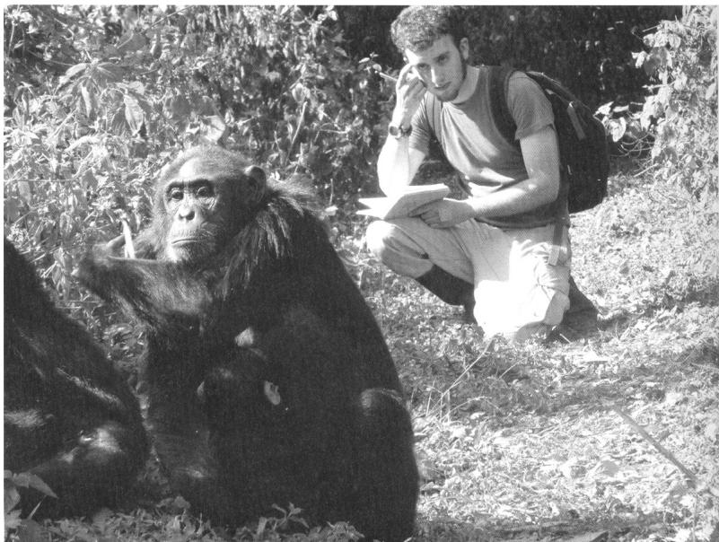

“世人有一个共同的天性。”——威廉·莎士比亚，特洛伊罗斯与克瑞西达［照片承亚历山大·乔治耶夫惠赠］

本章提纲

19.1 人在生命树上的位置

19.2 人与黑猩猩之间的遗传差异说明
什么问题？

19.3 人类进化梗概

19.4 现代人类起源的遗传学证据

19.5 衡量人类多样性

19.6 人类独特的遗传适应

联系：衣橱中的骷髅

理查德·格林、约翰尼斯·克劳斯、阿德里安·布里格斯、托米斯拉夫·马瑞塞克、乌多·斯滕泽尔、马丁·基尔舍、尼克·帕藤森及其他49位作者，2010尼安德特人基因组序列草图
联系：淀粉对比

格奥尔格·佩里、纳撒尼尔·多米尼、卡特里娜·克劳、阿瑟·李、海克·菲格勒、理查德·雷登、约翰·沃纳及其他6位作者，2007

饮食与人类淀粉酶基因拷贝数变异的进化

## 学习目标与科学能力

人类进化遗传学将前面章节中讨论过的遗传学和基因组学的诸多方面汇集在一起，其重点是人类起源及人类独特的特性和适应。学习人类进化遗传学的原理，可掌握以下科学能力。

■ 可描述黑猩猩是与现代人类亲缘关系最近的现生动物的基因组证据。

\- 能解释尼安德特人是谁，以及用什么方法推断出尼安德特人的杂交对现代人类基因组有一小部分贡献。

\- 能解读这一观察结果：现代人类所有线粒体 DNA 的溯祖出现在大约 20 万年前。

\- 能给“选择性清除”和“单体型”这两个词下定义，并能解释为什么一个高度有利的新突变的选择性清除，会产生横跨该突变所在染色体区段的特别长的单体型。

■ 能解释拷贝数变异如何成为适应性遗传变异的来源。

人类在生命树的什么位置上？是什么使得人类不同于其他物种？人类是怎样散布到全球的？人类各族群彼此之间有着怎样的亲缘关系？生物人类学、古生物学、考古学和语言学使用不同的原材料，如早期人类的生物遗迹(骨头和牙齿)、石器及其他文物，以及不同语言共享文字的方式等，来为这些问题提供见解。进化遗传学为同样的问题提供了不同的方法。进化遗传学利用遗传变异数据来重建物种及种群间的进化关系，并鉴别特定物种独特的遗传适应。人类进化遗传学(Human evolutionary genetics)是进化遗传学方法在人类自身物种——智人(Homo sapiens)上的应用。其主要目标是理解人类进化的一些关键问题，即发生了什么、何时发生的、人类基因组是如何适应自身物种所处的生态位的，以及在不同的环境条件下人类种群是如何经历选择的。

从方法学上来看，单纯使用现生人类的遗传数据，就有可能解决人类进化上的问题。许多初学者觉得这种想法很奇怪，他们认为，要推断出与过去有关的结论，一定要有化石数据。但是，现生个体的 DNA 序列中含有与其过去有关的信息。每个世代，DNA 都会累积突变，因为 DNA 复制不精确。如果两个个体的某一基因的 DNA 序列完全相同，但他们却是不相互交配的不同谱系的建立者，则该 DNA 序列会随着世代更替变得越来越不一样，因为在每一谱系中，这些序列会独立地获得不同的突变。由于 DNA 以分子钟的方式随着时间的改变而改变(参见第 17 章)，可以估计来自不同现生个体的两条 DNA 序列具有最后一个共同祖先的时间。DNA 序列越相似，两个个体具有最后一个共同祖先的时间就越近。这种相似性有助于解答人类进化的“何时”问题。已经发生的具体突变及其背后的分子适应，有助于解答“什么”和“如何”的问题。

尽管可以单纯靠现生个体的 DNA 序列推断过去的进化事件，但近来古 DNA 分析技术的进步极大地加强了对人类进化遗传学的理解。人类及其早期的类人祖先(不同于黑猩猩及黑猩猩的祖先)称为人族动物(hominin)。人族动物与人科动物(hominid)不同，人科动物是指包含人类、黑猩猩、大猩猩和猩猩在内的进化类群。两种已经灭绝的人族动物——尼安德特人(Neandertal)和丹尼索瓦人(Denisovan)的基因组已经测序，这些基因组令我们剥开层层的时间迷雾，得到有关现生人类基因组的若干深刻见解。

## 19.1 人在生命树上的位置

人是灵长目动物，灵长目是有胎盘哺乳类约20个目中的一个。早在1863年，托马斯·亨利·赫胥黎就已经认识到，根据形态上的相似性，人与黑猩猩和大猩猩属同一自然类群。类人猿(hominoid)是包括体型较小的猿(长臂猿、合趾猿)和体型较大的猿(人、黑猩猩、倭黑猩猩、大猩猩、猩猩)的类群。自20世纪60年代以来，人们已根据免疫数据认识到，猩猩在遗传上不同于其他大型类人猿。但是，30年后才搞清人、黑猩猩和大猩猩之间的亲缘关系。

## ■ 人类与黑猩猩亲缘关系最近的证据

黑猩猩是与人类亲缘关系最近的物种。黑猩猩有两类，即普通黑猩猩(common chimpanzee, Pan troglodytes)和倭黑猩猩(bonobo)或称侏儒黑猩猩(pygmy chimpanzee, Pan paniscus)。它们相互之间的亲缘关系比其中任何一个与任何其他灵长类物种的亲缘关系都要近。灵长属(Pan)的这两个种共同构成一个进化枝(clade，进化树上的一个类群，包括一个共同祖先及其所有的后裔)，两个种在遗传上与人类都一样近。令某些博物学家震惊的是，黑猩猩与大猩猩(Gorilla gorilla)的亲缘关系并不是最近的，尽管在人类身上未发现在黑猩猩和大猩猩之间相似的一些特征，例如，用指关节行走的运动方式，颅(cranial，头颅)和颅后(postcranial，除头颅外身体的其余部分)比例的相似，以及全身遍布体毛等。人类具有如此众多的独特特征(直立行走、相对于体型大小而言大脑较大、语言、文化、烹饪、能长途奔跑、排卵期隐蔽、发育缓慢、长寿、毛发较少)，以致很多科学家认为人类与黑猩猩和大猩猩在遗传上都应该很不相同。

将人类和黑猩猩在进化上联系起来的遗传学证据主要有两类。第一类来自 DNA 杂交实验，第二类来自多个独立进化的基因区的 DNA 序列研究。

## - 基因组 DNA 的相似性

如第 2 章所述，提高温度会引起 DNA 双链分子的两条链分离(变性)，如图 2.14 所示。如果双链由来自不同物种的链构成，则使两条链分离的温度取决于碱基配对的程度。错配比例高的双链比配对较好的双链变性温度低。DNA 双链的热稳定性由两个物种的单一(非重复)DNA 杂交而形成，因而，热稳定性给这两个物种的基因组 DNA 在核苷酸序列上的相似程度提供了一个测度。

在人和各种猿之间以多种不同方式配对，形成上述杂交 DNA 分子时，变性需要热量最多的是人和黑猩猩之间的杂交分子(图 19.1A)。最高的热稳定性说明人和黑猩猩基因组 DNA 序列的相似性程度最高，如果人和黑猩猩比实验中的其他成对物种具有更近的共同祖先，这一结果就非常容易解释了。杂交 DNA 分子在热稳定性上的差异，可作为衡量物种间亲缘关系的一个标准，因而，可根据这样的数据推导出物种树，如图 19.1B 所示的灵长类物种树一样。

<table><tr><td colspan="4">(A)用来制备杂交DNA分子的物种</td></tr><tr><td></td><td></td><td>解链温度 $T_m$ (°C)</td><td>与人-人 $T_m$ 的差值( $\Delta T_m$ ,单位为°C)</td></tr><tr><td>人人</td><td>xxxxxxxxxxxxxx</td><td>59.50</td><td>0</td></tr><tr><td>黑猩猩</td><td>xxxxxxxxxxxxxx</td><td>57.91</td><td>1.59</td></tr><tr><td>人大猩猩</td><td>xxxxxxxxxxxxxx</td><td>56.97</td><td>2.53</td></tr><tr><td>猩猩</td><td>xxxxxxxxxxxxxx</td><td>55.97</td><td>3.53</td></tr><tr><td>狒狒</td><td>xxxxxxxxxxxxxx</td><td>52.47</td><td>7.03</td></tr></table>

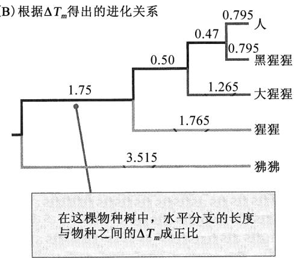  
图 19.1 DNA 杂交研究证据，说明在进化上人和黑猩猩亲缘关系最近。(A)示不同双链 DNA 分子的解链温度 $(T_{\mathrm{m}})$ 。同时，以人类双链 DNA 分子的解链温度为基准，将每个解链温度表示为相对于基准的差值 $(\Delta T_{\mathrm{m}})$ 。(B) $\Delta T_{m}$ 值即用于推导灵长类进化树的遗传距离。[数据来自 A. Caccone and J. R. Powell. Evolution 43 (1989): 925-942.]

DNA 杂交的一个局限是，它给出的是序列相似性的总的量度，没有真正地明确任何序列上的差异。人和黑猩猩都有而在大猩猩中没有的核苷酸置换具体有哪些？这一问题接下来讨论。

## - 多个基因区的 DNA 序列比对

依据图 17.2 阐述的原因，基因树不一定能够反映物种树即物种间真正的谱系关系。这种不一致反映了各谱系中多态性的不完全分选 (incomplete sorting)，但幸运的是，这只在一小部分情况下发生。根据基因组中独立进化的不同区域的众多基因进行基因树分析，通常能得出真实的物种树。所分析的基因之间的独立性是非常重要的，因为，如果连锁的基因具有相同的误导性的不完全分选方式的话，对紧密连锁基因的分析可能会得到与物种树不一样的基因树。但是，如果有足够多的来自独立进化基因区的基因树支持单一的树，则这种不断累积的支持，可增加优势树为真实物种树 (物种真正的系统发育关系) 的置信度。

这一类研究已经给一棵树找到了压倒性的统计学支持，就是人和黑猩猩亲缘关系最近，而大猩猩是离人—黑猩猩进化枝较远的近缘种(姐妹群)的这棵树。这些证据概括于图19.2中，图中显示了联系人、黑猩猩和大猩猩的3棵可能的树(标为A～C)。绝大多数核苷酸位点支持A树，在该树中人和黑猩猩的亲缘关系最近。

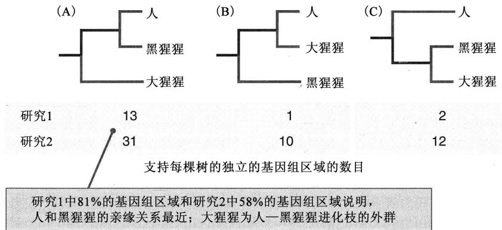  
图 19.2 分析多个独立的基因组区域所得的人和黑猩猩在进化上为最近的近亲的证据。[数据来自 M. Ruvolo. Mol. Biol. Evol. 14(1997): 248-265 及 F. -C. Chen and W. -H. Li. Am. J. Hum. Genet. 68(2007): 444-456.]

## ■ 人与黑猩猩基因组的差异

黑猩猩的众多性状(包括疾病发病率)与人不同，因而，通过比较两者的基因组，来发现这类差异的遗传基础的想法，很有吸引力。例如，不像大多数人类那样，实验感染HIV病毒的黑猩猩不会发展到全面暴发AIDS。另一个例子是，人类在乙肝或丙肝晚期会罹患肝并发症，但黑猩猩不会。

为了了解这两个亲缘关系如此近的类人猿物种在过去600万～800万年的进化过程中积累了什么基因组差异，促使科学家对黑猩猩的基因组进行测序。人和黑猩猩基因组的差异类型及程度概括于图19.3中。人和黑猩猩之间因单核苷酸置换而造成差异的DNA大约有35Mb，相当于基因组的1.2%。另外，这两个

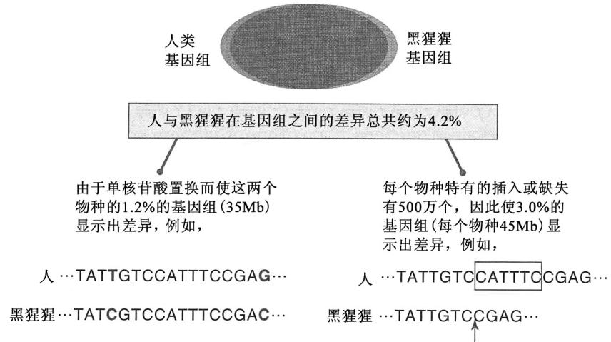  
图 19.3 人与黑猩猩的基因组差异。此处用于比较的是普通黑猩猩(Pan troglodytes)的基因组。[数据来自 The Chimpanzee Sequencing and Analysis Consortium. Nature 437(2005): 69-87.]

物种的一个特点是，存在数目惊人的插入或缺失事件，即在一个物种中存在一些 DNA 片段，在另一个物种中不存在。这类插入或缺失所涉及的 DNA 数量相当大：在人中存在的大约 45Mb DNA，未见于黑猩猩中；而在黑猩猩中存在的另外 45Mb DNA 未见于人中。将核苷酸置换及插入或缺失事件都计算在一起，人和黑猩猩基因组的总的差异大约为 4.2%。

在这两个物种之间，大多数编码蛋白质的基因仅有细微的差异。这两个物种分歧之后，每个基因平均只发生了两个氨基酸的改变。人类和黑猩猩约有 $30\%$ 的蛋白质完全一样。逐一来看染色体，这两个物种的大多数常染色体的遗传差异数量差不多一样。性染色体则有所不同：人与黑猩猩在Y染色体之间的差异比常染色体大，而X染色体的差异比常染色体小。

黑猩猩基因组所揭示的其他遗传差异则造成了一些困惑，例如，一些众所周知使人致病的等位基因，在黑猩猩中却是野生型等位基因。这包括导致糖尿病和冠心病等常见病的等位基因。有个例子与 PPARG 基因有关，该基因在脂类代谢和脂肪细胞发育中很重要。有一个 PPARG 的等位基因，其编码的多肽的第 12 位残基为脯氨酸，在黑猩猩中该等位基因为野生型，但在人类中它会增加患Ⅱ型糖尿病的风险。一个可能的解释是，在人和黑猩猩的共同祖先中，该致病等位基因当初是有利于健康的，因而比较普遍，但后来人类的生理发生变化(可能是对生态、环境或行为改变的响应)，改变了这些等位基因的表型效应。

在所有人类中，基因组中有6个大区的变异相当少(多态性远少于通常的数量)，但在人和黑猩猩之间，这6个区的差异与其他任何区域一样多。很有可能在人族进化过程中，在这些染色体区中出现的新突变中，含有在选择上有优势的遗传变异。每个具有这种选择优势的新变异在出现之后不久频率就快速增加，以比单纯随机能够解释的快得多的速度，取代群体中的旧等位基因(图19.4A)。这样一种频率的快速增加称为选择性清除(selective sweep)(图19.4B)。这种频率的快速增加同时使得相邻核苷酸的频率也快速增加，快到交换也不能打破染色体上等位基因的组合方式。这样一群连锁的等位基因称为单体型(haplotype)。当选择性清除的发生快到超过重组的速度时，具有选择优势的变异会将邻近的变异拽入比一般单体型更长的单体型区段中。人类这6个近乎没有变异的基因组区域分布在不同的染色体上，每个区域的长度为数百万个碱基对(表19.1)。尽管这些区域大部分都包含若干基因，但有一个区域不含已知基因。虽然这些有趣

的染色体区可能会含有一些导致所有现生人类独特表型的基因，但要探明是哪些基因或遗传因子在起作用，还有很多工作要做。迄今仅有一条线索：在两项不同的研究中发现，在4号染色体上的这样一个区域与肥胖症有关联，提示在人类和黑猩猩从共同祖先分歧之后，人类与体重或代谢相关的性状经历过选择。

表 19.1 在过去 25 万年中经历选择性清除的 6 个人类基因组区

<table><tr><td>染色体</td><td>大小/Mb</td><td>基因</td></tr><tr><td>1</td><td>4.00</td><td>从ELAVL4到GPX7等14个已知基因</td></tr><tr><td>2</td><td>4.12</td><td>ARHGAP15(部分)、GTDC1、ZFHX1B</td></tr><tr><td>4</td><td>3.20</td><td>无已知基因或根据实验证据预测的基因</td></tr><tr><td>8</td><td>2.63</td><td>UNC5D及FKSG2</td></tr><tr><td>12</td><td>4.32</td><td>从PAMC1到ATP2B1等10个已知基因</td></tr><tr><td>22</td><td>4.07</td><td>从CARD10到PMM1等52个已知基因</td></tr></table>

数据来自 The Chimpanzee Sequencing and Analysis Consortium. Nature 437 (2005): 69-87.

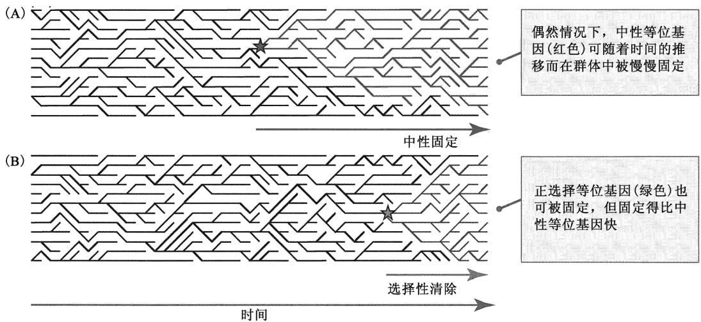  
图 19.4 当新出现的等位基因具有选择优势，快速取代群体中的其他等位基因时，选择性清除就发生了。中性等位基因通过漂变而固定的取代过程(A)比存在选择时的取代过程(B)慢。在选择性清除过程中，染色体上与选择位点相邻的变异减少或被清除。[改编自 M. Bamshad and S. P. Wooding. Nat. Rev. Gen. 4 (2003): 99-111.]

## 19.2 人与黑猩猩之间的遗传差异说明什么问题？

基因型差异如何变成表型差异？大多数性状由多种遗传和环境因素通过复杂的相互作用而决定，因此，对大多数性状而言，基因型和表型之间的关系是模糊不清的。在人与黑猩猩之间观察到的基因组差异，其中一些可能会对表型差异起到显著的作用，而其他差异所起作用很小或无法察觉。人有许多方面与黑猩猩显著不同(图 19.5)，在遗传差异中进行筛选，以找到那些造成人类独特表型性状的差异，是当前研究的一个主题。

与黑猩猩相比，人为两足行走、腿较长、臂较短、头颅较圆、脑较大、脸较平、发育较慢、婴儿期较长、两性异形的程度较小，能精确抓握，能够烹饪，具有语言、艺术、复杂的工具和文化

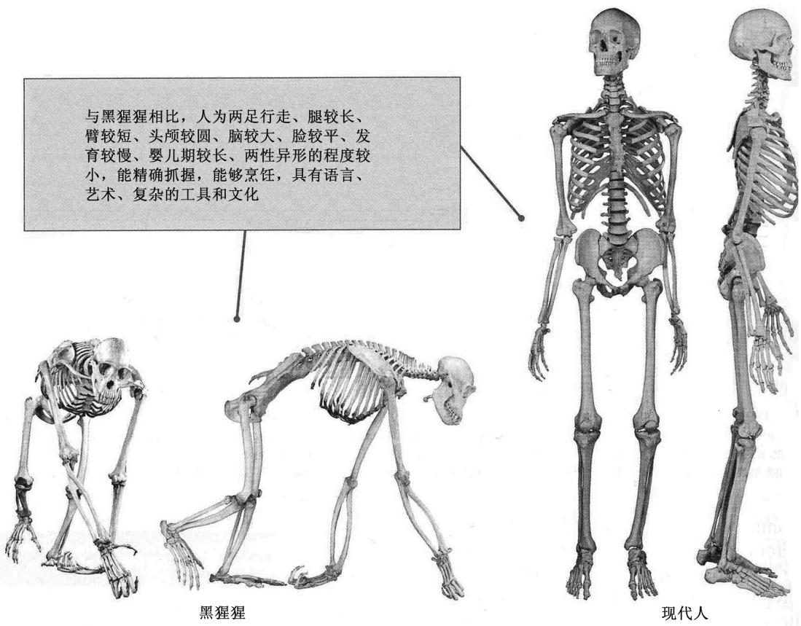  
图 19.5 人和黑猩猩 (Pan troglodytes) 主要的一些表型差异。(©美国自然历史博物馆版权所有)

## - 人类独特的分子适应

由第 17 章可知， $K_{a}/K_{s}$ 值，即改变和不改变蛋白质中氨基酸的核苷酸差异的比值，可用来识别蛋白编码基因的分子适应。异常高的比值说明自然选择曾积极推动过两个物种之一的氨基酸序列的改变，因为改变了的蛋白质使携带它的生物具有一定的繁殖或生存优势。

比较人和黑猩猩的基因组时，发现了什么分子适应？黑猩猩基因组计划分析了多组基因及其相关功能。在人和黑猩猩之间趋异得最快、 $K_{a}/K_{s}$ 值最高的一组基因，与表皮分化(皮肤细胞成熟)有关。与毛发中的角蛋白相关的若干基因也进化得很快。因此，在过去600万～800万年中，编码人类身体外表特征的基因经历了大量的修改。其他快速趋异基因的种类包括与妊娠、嗅觉、免疫功能和生理过程调控有关的基因。另一类在两个物种间表现出巨大差异的基因是转录因子基因。人类转录因子发生的氨基酸改变比黑猩猩的多47%。这些基因很多在早期发育中发挥关键作用。

虽然已识别出在人类谱系中经历过加速进化的基因类型，但要理解与黑猩猩相比每种类型的具体基因在人类中是如何获得改变的功能的，理解它们与生物医学相关的性状有什么联系，仍有很多研究工作需要开展。

## - FOXP2: 与语言有关的基因

人的FOXP2基因与黑猩猩的不同。在一个有语言问题的家系中，发现在三代人中有几个人具有该基因的一种突变型；在一个具有类似问题但无亲缘关系的个体中，也发现该突变型。这些发现将FOXP2基因与语言能力联系了起来。在FOXP2中发现的突变类型如图19.6所示。

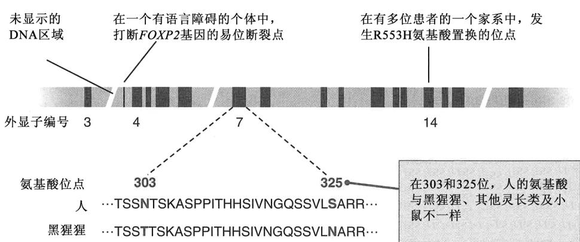  
图 19.6 FOXP2 基因的部分结构，示损害人类语言能力的已知突变和人与黑猩猩及其他哺乳类的差异。[改编自 S. E. Fisher, et al. Annu. Rev. Neurosci. 26(2003): 57-80.]

患者表现出两种不同类型的问题：恰当运动嘴和脸来咬字的障碍，包括语法、词法、词汇理解和语言加工等在内的语言能力障碍。在声音质量上，患者说的话被描述为“一般听众几

乎不能理解。”然而，这些人仍然能够说话，这说明FOXP2不是掌管语言的唯一是与产生正常语言能力有关的若干基因之一。

比较各个物种 FOXP2 基因的 DNA 序列，发现在最保守的蛋白质中，该基因在前 5% 之列。在有语言问题的家系中发生突变的氨基酸，在从酵母到人类、涵盖生命树大部分生物的 FOXP2 蛋白中，均没有改变。在数百万年中，自然选择只让 FOXP2 发生了很少的氨基酸改变，而出现的这些很少的改变都集中在通向人类的谱系中。在过去的 600 万～800 万年中，人类 FOXP2 蛋白获得两个氨基酸的改变(图 19.6)。与此相比，小鼠在与人和黑猩猩的最后的共同祖先分歧后的大约 1.3 亿年间，仅发生了一个氨基酸的改变(图 19.7)。在一些具有语言障碍的人中发现首个 FOXP2 突变之后，通过对具有语言能力障碍的人进行筛查，又发现另一个 FOXP2 突变。但是，人类

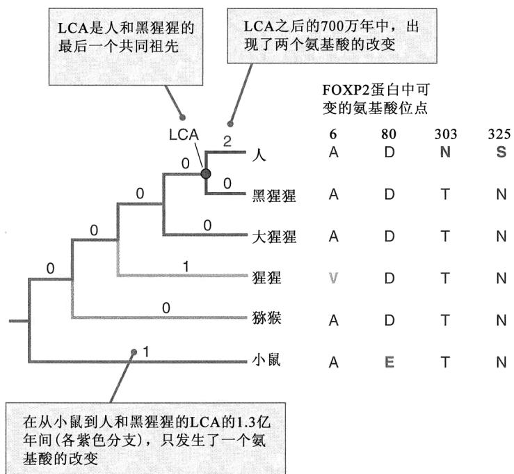  
图 19.7 FOXP2 基因的分子进化。分支上的数字是推断已发生的氨基酸改变的数目。右侧示各物种中 4 个可变氨基酸位点。[数据来自 W. Enard, et al. Nature 418(2002): 869-872.]

和黑猩猩之间这两处FOXP2的不同之处，未发生在已知可影响语言能力的氨基酸位点上。

FOXP2 是在人类胎儿大脑中强烈表达的一种转录因子。导致语言障碍的人类 FOXP2 突变，或使 FOXP2 编码的蛋白质的水平降低，或使位于该蛋白质关键结构部分的一个氨基酸发生改变。FOXP2 蛋白低于正常水平或结构改变，可能会引起胎儿大脑的异常发育，导致语言问题。

具有两个人类 FOXP2 基因拷贝的基因工程小鼠，表现出与野生型小鼠不一样的行为。其探查行为减少。在超声波发声上也不一样(小鼠发出的超声波主要在母子之间的社交功能上起作用)。在生理上，小鼠大脑中生成的多巴胺减少。多巴胺是一种神经递质，在多方面影响行为和认知，包括自主运动、情绪、学习能力、注意力、解决问题的能力及工作记忆等。在解剖上，FOXP2 转基因小鼠的基底神经节和皮层表现出细胞学改变，被认为增加了基底神经节和皮层之间的神经回路的效率。已知这些回路控制包括语言、视觉记忆、词句理解、心算能力和认知灵活性等在内的多种人类性状。有一种观点认为，在人族进化过程中，FOXP2 的改变不仅促进了语言能力在不同方面的进化，而且为人类的创造力奠定了基础。

## ■ 人和黑猩猩的基因表达差异

生物医学研究者常常研究两种类型的人类组织(例如，肝癌细胞与正常肝细胞，或胎儿脑细胞和成人脑细胞)在基因表达上的差异，进化生物学家以同样的方式研究近缘物种的组织之间在基因表达上的差异。微阵列技术及转录组测序(RNA-seq，参见第12章)使得在一次实验中比较两个不同来源的数以百万计基因的转录物成为可能，可以同时揭示众多基因在mRNA水平上的数量差异。来自众多基因的数据可汇总为基因表达差异的距离矩阵，然后可用该距离矩阵数据来构建第17章中所述的进化树。如果mRNA来源于不同的物种，则所得进化树就描绘了两个物种在基因表达上的总的差异。

微阵列技术已被用来比较人、黑猩猩和猩猩的血液、肝脏和脑组织的基因表达。大脑基因表达差异树显示，从人和黑猩猩的共同祖先到人的分支比到黑猩猩的分支长。相比之下，基于血液和肝脏基因表达的树显示，两条分支长度大致相等。这一差异说明，在过去600万～800万年的进化中，在人脑中表达的基因在表达水平上的改变，比它们在黑猩猩大脑中在表达水平上的改变要多得多。如图19.8所示，虽然在人类谱系中，在大脑中表达的基因经历了加速的改变，但在肝脏中表达的基因在表达的总体水平上改变最大。但是，在这两个谱系中，在肝脏中表达的基因在表达上改变的速度大致相同。

人类转录因子基因不仅经历了比黑猩猩多的氨基酸改变，而且它们在基因表达

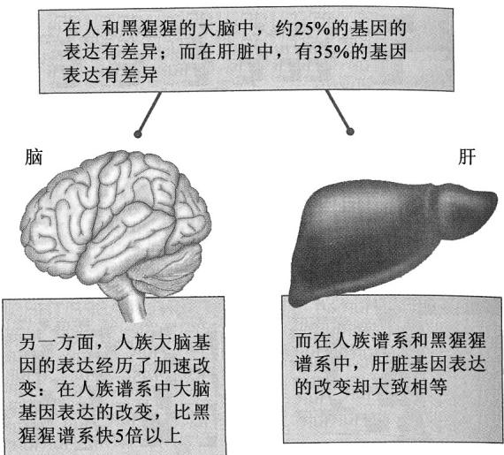  
图 19.8 人和黑猩猩的基因表达差异。[数据来自 W. Enard, et al. Science 296(2002): 340-343 和 W.-P. Hsieh, et al. Genetics 165(2003): 747-757.]

水平上也经历了更大程度的改变。在这类基因中，相对于黑猩猩，人类的大多数改变为基因表达的增加。因为转录因子帮助调节其他基因，所以这一观察结果显示了人类进化过程中基因调节的重要性。

## 19.3 人类进化梗概

对人类表型进化的认识，主要来自于对早期人族动物实物遗迹的研究，这些实物遗迹包括骨骼化石(古人类学研究的重点)、工具及其他文物(考古学研究的重点)。重建人类进化过程非常困难，因为这些遗迹古老(有些古老到700万年)而稀少，并且不同类型的证据因物理特性不同而被保存的程度也不同。牙齿化石比腕骨化石容易找到，而石器和骨制工具比编织的篮子或古代炉火的遗迹保存得更长。因此，用来重建过去的是一些不完整的、有失偏颇的证据。近来在技术上的发展使我们得以以新的方法来考察古代的遗迹，从而弥补这些问题。例如，在牙齿发育方面，现在可以使用一种成像技术来研究，而在分析时不用破坏化石材料。也可分离骨骼中的古DNA并测序，只要其来源不是太古老(目前的极限是少于100万年)或因保存条件不当而被降解。本节是人类进化过程的一个简介，旨在为讨论不同的人类进化模型和某些人类独特性状的分子遗传学证据奠定基础。

生物的任何一个性状均可根据其与直系祖先的相应性状是否相似，划分为祖征(ancestral trait)或衍征(derived trait)。若以这种方式划分性状，要对祖先中可能存在的性状有合理的看法。人和黑猩猩的共同祖先很可能与猿类似，因为在基于遗传学证据的最有可能的系统发育中，大猩猩与人属/灵长属进化枝的亲缘关系最近，并且大猩猩有很多体貌特征与黑猩猩类似。应用简约性(parsimony)原理，即进化最有可能沿着改变最少的路径进行，提示人和黑猩猩的共同祖先为类猿祖先，这是一种类似于混合了大猩猩和普通黑猩猩的特征的动物。这种对人—黑猩猩共同祖先的简约性重建看来是合理的，因为人类独特的一些基本特征具有多个错综复杂的工作部件，如直立行走能力(需要改造骨盆、脊柱和下肢骨)或大大扩大了的大脑(支持语言能力、复杂推理和文化)。这些复杂特征不大可能多次进化出来，或者在某个谱系中进化出来之后又丢失。

## ■ 人类进化演员表

此处简介旨在抓住人族进化的一些主要特点，因而做了简化，未包含人族所有的种，也未包含尚存在争议的种。以下的概述基于古生物学和考古学的证据，遗传学证据后面再讨论。

从广义上来讲，人族动物可分成两个类群(图 19.9)。早期人族动物(early hominin)身材小、大脑小(猿脑大小)。与猿不同的是，他们用双腿直立行走(bipedal locomotion)，尽管他们行走的效率可能没有晚期人族动物高。这些早期的形式比较原始，他们的大脑和面貌更像猿类，但从颈部以下已显示出新的、经过一定衍化的特征，不怎么像猿。例如，图 19.10 所示的阿法南猿(Australopithecus afarensis)，这些生物只生活在非洲森林中。季节合适的时候，他们吃水果，没有水果的时候，他们转而吃块根和块茎。在发育上，这些早期人族动物成熟的速度可能比较快，这点更像猿类，而不像现代人。该结论的前提是牙齿的发育可作为整体发育的代表。早期人族动物与黑猩猩一样，在3～4岁时长出第一恒磨牙，而现代人在6岁左右。在人类进化整个第一阶段的大约500万年中，牙齿变得更大(除男性犬齿变小以外)，牙釉质变得更厚。成年男性的体型是成年女性的1.5～2倍，这种两性之间的差异(两性异形，sexual dimorphism)程度比在现生人类中看到的要大，更像猿类的模式。已知最早的早期人族物种(Sahelanthropus tchadensis，乍得沙赫人)生活在700万年前，而最晚近的类群(Paranthropus boisei，鲍氏傍人)生活到100万年前多一点(图 19.9)。后面一种生物因牙齿巨大而被称作“巨牙人(megadont)。”夹在这两个种所在时间之间的物种是南方古猿属(Australopithecus)的物种，该属物种因在坦桑尼亚莱托利遗留的至少360万年前的脚印而闻名，这些脚印保存在火山灰中。在250万～300万年前的某个时候，南方古猿在非洲产生了后来变成第一个人属(Homo)物种的谱系。南方古猿(australopithecine)一词是南方古猿属(Australopithecus)和副人猿属(Paranthropus)成员的统称，反映了这两个属的亲缘关系。

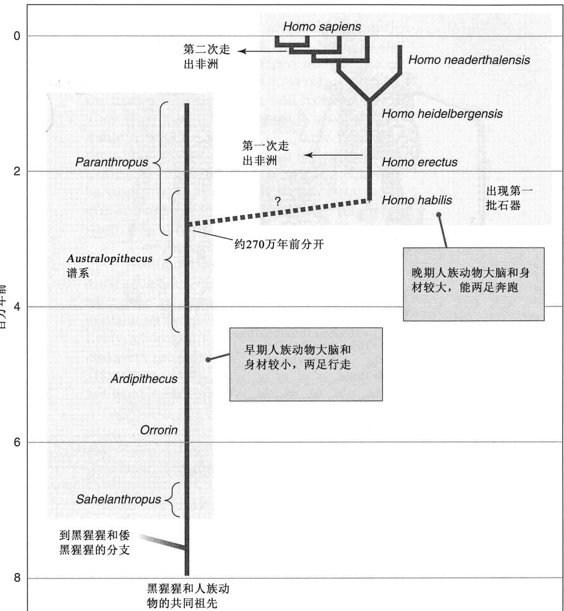  
图 19.9 简化的人族进化树。虽然此处没有显示，但在尼安德特人和现代人从他们的共同祖先海德堡人 (Homo heidelbergensis) 分歧后，在通往尼安德特人的谱系上，一定出现过第三次走出非洲的扩散。(改编自 The Committee on the Earth System Context for Hominin Evolution. 2010. Understanding Climate's Influence on Human Evolution. National Academy of Sciences, Washington, DC.)

人族动物的第二个类群为晚期人族动物(later hominin)，由隶属于人属(Homo)的物种构成(图19.9)。与早期物种相比，晚期人族动物的特点是体型更大、脑更大、腿更长。除了能两足行走以外，他们还能两足奔跑。这种在体型上的整体转变令人困惑：他们的体型更大，大脑增大，因而在代谢上消耗巨大，总体上需要更多的能量，却能以比其祖先更小的牙齿来维持这种表型。这表明，早期人属动物能以比其祖先效率高得多的方式来获取食物。一个假说认为，烹饪的进化使这一转变得以实现，因为每单位质量的熟食比生吃同样的食物能够提供更多的卡路里。但是，最早使用人为控制的火的确凿证据仅能追溯到79万年前(大大晚于直立人出现的200万年前左右)，这削弱了烹饪使晚期人族动物特有的进化改变得以实现的论点。但是，在人族化石记录中观察到的体型和脑的增大与牙齿变小相伴的这种格局是真实存在的，由于这种格局需要新的能量利用方式，因而要予以解释。

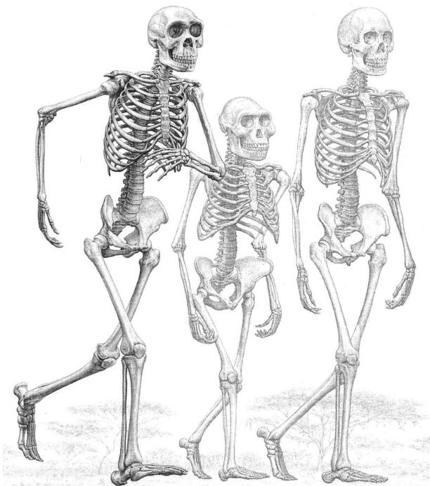  
图 19.10 3 种人族动物。此处以小身材的阿法南猿 (Australopithecus afarensis) (中) 代表早期人族动物，阿法南猿可能可以用双足行走。晚期人族动物的身材和脑较大、腿较长，以直立人 (Homo erectus) (左) 和人类自身的物种现代人 (Homo sapiens) (右) 为代表。直立人是第一个走出非洲的人族物种。(©伦敦自然历史博物馆)

有时将晚期人族动物分成 3 个亚类群：过渡期人族动物(transitional hominin)、前现代人(premodern Homo)和解剖学上的现代人(anatomically modern human)。能人(Homo habilis)属于过渡形式(图 19.9)。能人字面意思是“手灵巧的人”，其名字源于其手骨的结构，它很可能具有比它的祖先更加熟练地操作物体的能力。已发现的最早的石器在 260 万年前，但不清楚是哪个物种制造的。

前现代人包括直立人(Homo erectus)和尼安德特人(Homo neanderthalensis)。直立人是最早出现在190万年前左右的前现代物种，一直生存到大约20万年前。直立人的身材和身体比例类似于今天的智人(图19.10)，但大脑只有智人的2/3大。它的牙齿和嘴巴几乎不比牙齿大的现生人类大。成年女性的身材比成年男性小得不多，这与南方古猿高度的两性异形对比鲜明。在发育上，直立人与猿和南方古猿类似，第一恒磨牙4～5岁时出现，早于智人出现第一恒磨牙所需的时间(6岁)，因而它极有可能已具备类似于智人的饮食习惯。引人注目的是，直立人是第一个离开非洲的人族物种(180万年前左右)。

已在非洲、欧洲、东南亚和南亚发现其化石。直立人与智人的关系，特别是离开非洲的直立人种群及其后裔的命运，是分子证据可以有所建树的议题。

在直立人的后裔中，不属于人类自身物种的成员通常称为古人(archaic human)。这是一个非常笼统的称呼，涵盖人属内的一系列物种，包括公认为尼安德特人和现代人的共同祖先的海德堡人(Homo heidelbergensis)(图 19.9)。海德堡人的化石遗迹可追溯到 40 万～60 万年前，意味着它的脑比直立人的大。

在化石记录中，尼安德特人最早出现在20万年前至40万年前之间的某个时候，大约在2.8万年前灭绝。尽管它被划分为人类自身物种的一个亚种(subspecies)，命名为智人尼安德特亚种(Homo sapiens neanderthalensis)，但在此简介中，把它看作独立于智人的一种古人。(Neandertal是Neanderthal的现代写法。)尼安德特人生活在欧洲、近东和西亚，而没有来自非洲的样品。尼安德特人是直立人的后裔，更具体而言，是源于迁移出非洲的海德堡人。与直立人相比，尼安德特人发育得比较慢，他们的第一恒磨牙要花更长的时间才能长出来。与解剖学上的现代人相比，尼安德特人骨骼较大、身材矮壮结实、骨盆较宽、关节较大(图19.11)。尼安德特人的胸部更似桶形、脸更大、眉脊巨大、门牙突出、大鼻子、下巴后缩。他们的脑部大小与生活在同一时代的解剖学上的现代人差不多，但身体稍重一点。与尼安德特人和原始现代人相比，今天生存的人类的脑和身体都较小。尼安德特人的四肢比较短，正如在其他许多哺乳动物中观察到的一样，这可能反映了对寒冷气候的适应。与现生人类的骨骼相比，尼安德特人的骨骼反映出他们的肌肉更加发达、更有耐力，这可能与能量需求巨大的生活方式有关。他们能高效地捕杀猎物，制作矛和复杂的石器，并且是会埋葬死者的第一种人族动物。考古记录显示，尼安德特人只以较小的社会群体方式生存。

人类自身的物种智人，也称为解剖学上的现代人，最早略少于20万年前出现在非洲。当时，在欧洲有尼安德特人，在东南亚有直立人。因而，在20万年前，地球上存在3种不同的人族动物。之后很久，在6万年前左右，在人族第二次迁移出非洲的过程中，一些智人种群走出非洲，居住到旧世界的其他地区，而其他的智人种群则继续留在非洲(图19.9)。随着智人扩散至整个欧亚大陆，他们开始与尼安德特人和古人种群生活在相同的地区。4.5万年前，智人开始拓展到欧洲。大约在此时或更早些时候，他们最远抵达东亚和澳大利亚。智人在形态上与其他人族动物的不同之处在于，他们的脸比较扁平、眉脊较小、前额较大。其他的不同之处概括于图19.11中。如果尼安德特人大脑的大小与现代人类相近，但身材矮壮，骨骼较强劲，骨盆宽大，胸部较大，脸更扁平，关节较大。他们的四肢较短，可能是对寒冷气候的适应

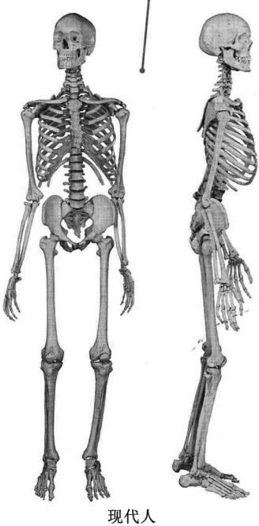

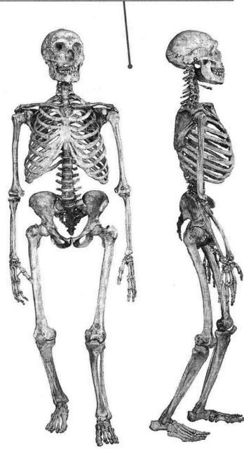  
图 19.11 现代人和尼安德特人在表型上的一些主要差异。
(©美国自然历史博物馆版权所有)

以牙齿的发育状况作为整体发育状况的指针，智人的牙齿发育较慢，表明现代人比尼安德特人成熟的速度要稍慢一些。智人的起源可能刚好与符号语言的起源同步。已知最早的艺术品(洞穴绘画和雕塑)在3万～6万年前，此时符号表达和语言无疑是人类表型的一部分。

1 万～1.2 万年前，随着动植物的驯化，现代人在文化和生物学上出现了一次重大转变，使人类得以在比之前更大、更稳固的社会群体中生活。社群规模的加大最终导致复杂文明和城市的发展。巨大的种群规模意味着传染病有可能在种群中持续下去，因此，在文化和技术创新被引发的同时，传染病也开始成为主要的选择压力之一。

## ■ 现代人类起源模型

在尼安德特人与人类自身物种的关系上，一个不断争论的焦点是：他们与智人的亲缘关系最近，却没有与我们杂交就灭绝了呢，还是在这两个物种之间由于杂交而存在基因流(gene flow)？关于智人与直立人及直立人裔古人种群之间是否存在杂交，也存在类似的问题。

图 19.12 示现代人类起源的 3 个主要模型(假说)，提出这些模型是为了解释智人如何兴起，以及智人与其他古老的人族动物有何关系。这些模型都包含这一事实：直立人是第一个离开非洲并定居欧亚大陆的人族物种(第一次“走出非洲”的迁移)。这些模型的差别在于它们对地理分布不同的直立人种群究竟发生了什么做出了不同的解释。在多地区模型(multiregional model)中(图 19.12A)，智人被看作是在大体相同的时间，从分散在非洲和欧亚大陆若干地区内的不同直立人种群进化而来的。该模型的先决条件是，在广泛分布的智人种群之间存在充分的基因流，以维持新物种的完整性。该模型估计，所有现生人类的最后一个共同祖先很可能相当古老，也许古老到 180 万年前，与离开非洲的直立人种群的最后一个共同祖先所处的时间吻合。

相比之下，非洲取代模型(African replacement model) (图 19.12B) 认为智人仅在非洲进化出来过一次，并且相当晚近(大约 20 万年前)，之后，他们中的一些离开非洲，定居到世界上的其他地方(第二次“走出非洲”事件)。取代模型假设，当智人种群碰上起源于第一次走出非洲的古人种群时，两个种群并未杂交，而是智人取代了古人，因而后者灭绝。在此模型中，现生人类各种群的最后一个共同祖先生活在不超过20万年前。第三个模型称为杂交模型(hybridization model)(图19.12C)，该模型认为智人仅在非洲进化出来过一次，在走出非洲后，在智人和古人产生接触时，二者之间发生杂交。杂交模型估计，现代人类的最后一个共同祖先可能非常古老，因为人类这个物种有来自古人的基因流。

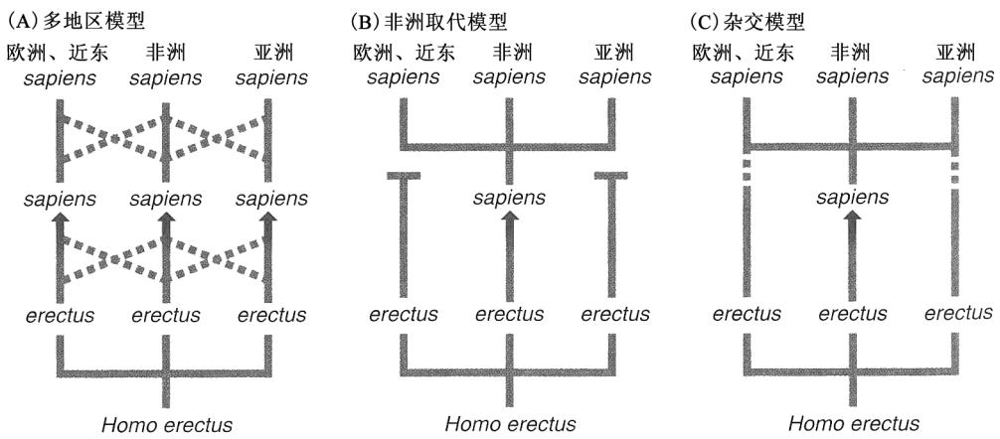  
图 19.12 现代人类起源的 3 个经典模型。红色箭头表示智人的起源。在多地区模型(A)中，在不同地点出现多次智人的起源，而在其他两个模型中，仅在非洲出现一次智人的起源。虚线示基因流。在杂交模型(C)中，基因流是指古人族动物与智人之间的混合(杂交)。在非洲取代模型(B)中的 T 形线是指古人族动物(直立人的后裔)的灭绝，并在没有发生混合的情况下被智人取代

## 联系：衣橱中的骷髅

理查德·格林 $^{1}$ 、约翰尼斯·克劳斯 $^{1}$ 、阿德里安·布里格斯 $^{1}$ 、托米斯拉夫·马瑞塞克 $^{1}$ 、乌多·斯滕泽尔 $^{1}$ 、马丁·基尔舍 $^{1}$ 、尼克·帕藤森 $^{2}$ 及其他49位作者，2010

$^{1}$ 马普进化人类学研究所，莱比锡，德国； $^{2}$ MIT-哈佛布罗德研究所，剑桥，马萨诸塞州

尼安德特人基因组序列草图

这篇重要论文大部分是在关注技术问题，例如，怎样从没被现代人 DNA 污染的骨骼中提取 DNA？在提取的 DNA 中有 95%～98% 来自尼安德特人死亡后侵入骨骼的微生物，这该如何处理？DNA 由于长期埋在地下而受到损伤，怎样校正 DNA 损伤导致的测序错误？但是，对这些难题的成功处理获得了回报，使人们对人类起源的认识更为深刻。

在欧洲的化石记录中，尼安德特人最先出现在约40万年前，约30万年前消失。……分析了来自克罗地亚温迪加洞(Vindija Cave)的尼安德特人骨骼，(并)产生5.3Gb的尼安德特人DNA序列。……(根据这些序列)估计，尼安德特人与现代人常染色体DNA序列的平均趋异时间为82.5万年。……种群趋异时间，即两个种群最后有基因交流的时间点，比DNA序列的趋异时间更近，因为后者是距种群趋异的时间与距祖先种群内DNA序列的共同祖先的平均时间之和。……(我们的数据)提示，尼安德特人与今天的现代人是在27万～44万年前分开的。……尼安德特人与(今天的)非非洲人共同具有的衍生等位基因，显著多于与(今天的)非洲人共同具有的。……一个简约解释是，尼安德特人曾与非非洲人的祖先交流基因。……所检测到的全部或几乎全部的基因流都是从尼安德特人流向现代人，(因而)基因流很有可能发生在欧洲人、东亚人和巴布亚人趋异之前。这可以用中东的早期现代人在扩张到欧亚大陆之前存在混合(杂交)来解释。……现代人在早于10万年前出现在中东，而尼安德特人可能直到5万年前都在相同地区生存。……当建群种群(如解剖学上的现代人)碰到常驻种群(如尼安德特人)时，即使在进入新领地的扩张浪潮的前沿上发生少量的交配事件，也可导致大量基因被引入建群种群，因为随着种群的扩大，引入的等位基因可“冲浪”到高频率。因此，即使也发生过相反方向的基因流，预计可检测到的基因流几乎总是从常驻种群流向建群种群。即使极少量的杂交事件也可造成尼安德特人的等位基因在今天的人类种群中具有可观的等位基因频率。因此，鉴于尼安德特人对今天的非非洲人基因组的贡献仅有1%～4%，尼安德特人和现代人之间杂交的实际规模可能非常有限。

来源：Science 328: 710-722。

## 19.4 现代人类起源的遗传学证据

DNA 中的核苷酸顺序和蛋白质中的氨基酸顺序包含着与这些分子的进化历史有关的信息。反过来，利用这些信息，可有效地推断人类及其种群的进化史。测序技术上的进步也使分析远古 DNA 样品，特别是从尼安德特人骨骼中提取的 DNA 样品，成为可能。在今天活着的人类的 DNA 序列中检测到的结果，支持在某些人类的祖先和尼安德特人(及另一种古人)之间存在杂交。

## ■ 通过线粒体 DNA 来追踪人类历史

DNA 序列样本的谱系历史 (ancestral history)，可以用 17.1 节中讨论过的分子系统发生学方法来进行推测。对于不发生重组的 DNA 分子，如线粒体 DNA (mtDNA)，推断其谱系历史是最简单的。这些细胞器基因组对于追踪祖先也很有用，因为在很多物种中，它们的进化大大快于核基因。在人类中，各谱系之间在线粒体 DNA 序列上的差异，按照一个分子钟模式 (参见第 17 章) 逐渐累积，平均速度为每个线粒体谱系每 3800 年大约 1 次改变。例如，自从巴布亚新几内亚和澳大利亚分别在 4 万年前和 3 万年前有人定居以来，巴布亚新几内亚人与澳大利亚土著人在遗传上一直相当隔离。因此，这两个种群之间进化的总时间为 7 万年 (在巴布亚新几内亚进化了 4 万年，在澳大利亚进化了 3 万年)。如果平均每 3800 年累积一个核苷酸改变，则现代巴布亚新几内亚人与澳大利亚土著在线粒体 DNA 上的差异的期望值预计是 18.4 个核苷酸 (按 70 000/3800 计算)。这样的计算结果是非常粗略的，因为在任何特定的时间间隔中，分子钟的变化会相当大，并且，对定居时间的估计也会随新的考古发现而改变。(由于上述 mtDNA 置换速度是估计的，新的证据已将澳大利亚有人定居的时间增加到 5 万年前。) 不过，这个例子展示了如何用 mtDNA 的进化速率来推测种群之间的差异数目。实际上，通常是反过来进行计算，利用成对种群之间差异的观测值，来估计种群在地理上隔离的年数。

人类各种群之间可能的历史关系，可根据mtDNA核苷酸序列的差异来重建。图19.13示根据mtDNA全序列推断的53个人的mtDNA的谱系关系，以黑猩猩的mtDNA序列置根，这些人代表全世界的人类种群。因为mtDNA不进行重组，所以该树仅是单个DNA分子的遗传史，又因为mtDNA为母系遗传，所以该树是女性的遗传史。尽管如此，该mtDNA树仍表现出几个显著特点。

\- 非洲各种群最先从人类系统树 (phylogenetic tree) 的根部分出。

\- 非洲种群中的大部分mtDNA多样性未见于非非洲人中；平均而言，非洲人中mtDNA的遗传变异约为非非洲人的两倍。

\- 在 4 个 mtDNA 大谱系中，3 个(绿色)仅见于撒哈拉以南地区的非洲人中。

\- 所有人类mtDNA序列的最近的共同祖先(绿圈)的年龄，为(17万±5万)年。鉴于线粒体DNA为母系遗传这一事实，所有现生人类线粒体类型的共同祖先被称作“线粒体夏娃(mitochondrial Eve)”。在专业上，遗传学共同祖先所在的时间称为溯祖时间(coalescence time)。

\- 在非非洲人中可见一个mtDNA谱系的有限子集(紫色和红色)，这些序列与6个非洲人的mtDNA(橙色)的共同祖先，比这6个非洲人的mtDNA与其他非洲人的mtDNA的共同祖先更近。

\- 连接非洲人和非非洲人种群的mtDNA谱系，其最近共同祖先(蓝圈)的年龄，为(5万±2.5万)年。这是现代人走出非洲的时间的估计值上限。

这些mtDNA的结果支持非洲取代模型，因为根据进化树的拓扑结构，以及现代人的共同祖先是一个比较晚近而不是一两百万年老的祖先，这些mtDNA数据与现代人起源于非洲相符。更早之前也有人族动物迁移出非洲，但根据mtDNA证据，这些早期迁移者的后裔显然被后来者取代。最古老的智人化石来自埃塞俄比亚，年龄为(19.5万±0.5万)年。这一时间与图19.13中所有 mtDNA 谱系的最近共同祖先所处的(17 万±5 万)年的时间相符。

比例尺：10个核苷酸的差异

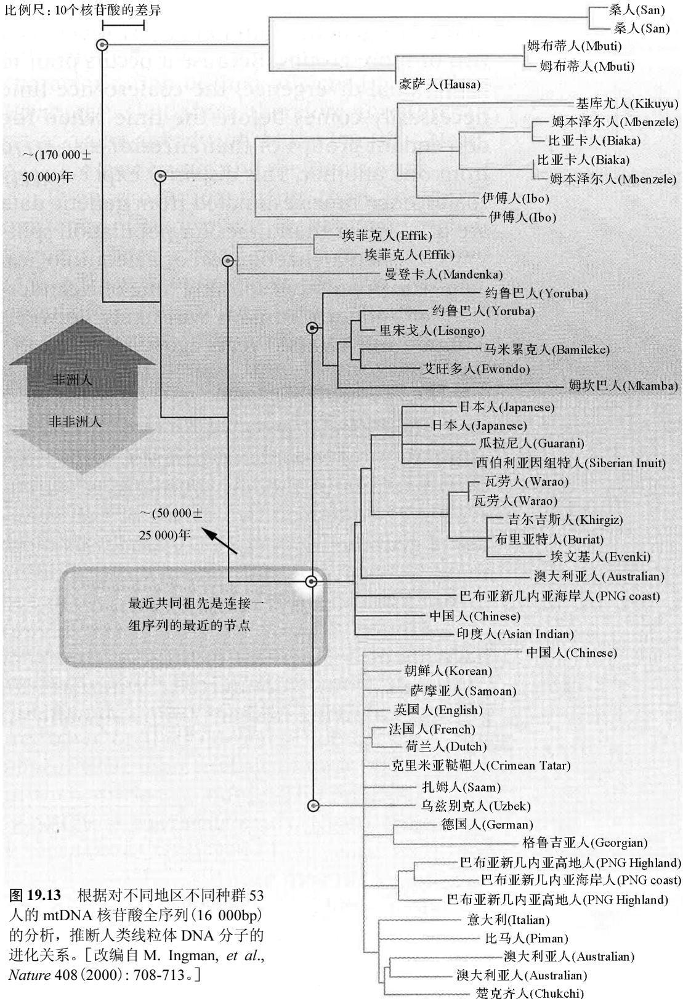

即使当某个分子按照分子钟发生进化时，仍需要古生物学或考古学证据来锚定进化事件发生的真实时间。分子数据只能给出分支的相对长度(例如，一个分支是另一分支的两倍长)。要将分子树上的相对时间转换为以年表示的绝对年代，至少要有一个与树上的某个节点联系起来的已确定年代的化石，以作为校准点。在图 19.13 中，是以人—黑猩猩分开的时间为 500 万年进行校准的。目前的证据支持接近 700 万年的值，因而，图 19.13 中的数据应乘以 7/5。这样，线粒体夏娃溯祖时间的修正值将是 $(23.8 \text{ 万} \pm 7 \text{ 万})$ 年。虽然这个值比之前估计的年代古老一些，但仍与化石证据和晚近的非洲起源相符，因为根据多地区模型估计，现代人的共同祖先的时间为 180 万年，前述修正值远小于该值。

尼安德特人线粒体 DNA 研究对现代人类起源问题也有说法。这些研究发现，尼安德特人的 mtDNA 大大不同于现代人。从尼安德特人测得的几种 mtDNA 序列构成一支，是与现代人 mtDNA 类型所构成的进化枝分开的一个姊妹群。假设人—黑猩猩趋异的时间为 600 万年，并运用分子钟进行估计，现代人和尼安德特人在遗传上的共同祖先在 46.6 万年（为 32.1 万～61.8 万年，置信度为 95%）。尼安德特人的 mtDNA 和人的 mtDNA 为不同进化枝，这一发现说明尼安德特人的 mtDNA 并未进入现代人中。意思就是说，即使发生过杂交，也不是尼安德特人女性和现代人男性之间的杂交。

溯祖时间是指两个或多个类群遗传上最后的共同祖先存在的时间。因为共同祖先存在于突变趋异之前，所以溯祖时间必定在该祖先的直系类群相互分开之前。这种不一致解释了为什么根据遗传数据估计的溯祖时间往往比根据古生物学或考古学数据得来的种群分隔时间古老。尼安德特人和现代人的种群分隔时间可能为2.7万年前～4.4万年前。

## ■ 尼安德特人的基因组

用一些特殊方法来减少细菌或现代人 DNA 对化石 DNA 样品的污染，研究人员已对 3.8 万多年前的 3 个尼安德特人女性化石的 2/3 基因组进行测序。令人惊讶的发现是，欧亚大陆现生人类(从法国、中国和巴布亚新几内亚采集的样本)2%～3%的基因组来自尼安德特人，而撒哈拉沙漠以南非洲现生人类的基因组中没有尼安德特人的 DNA。如图 19.14 所示，基因流的方向是从尼安德特人流入现代人，而不是相反的方向。因为现代人的 mtDNA 中丝毫没有尼安德特人的贡献，所以这两个物种之间的交配很可能是发生在男性尼安德特人和女性非非洲人之间。具有讽刺意味的是，这一结果对图 19.12 中现代人类起源的 3 个简单模型一个也不支持。这些数据最接近支持的是非洲取代模型，但在尼安德特人和离开非洲的智人的共同祖先种群之间有小规模的杂交。尼安德特人对所有非非洲人的基因组的贡献都相等，因此无论尼安德特人生活在什么地方，杂交事件一定发生在智人最开始迁出非洲的时候，但在现代人分散到世界各地之前，很可能是在 5 万～8 万年前。对人类绝大部分 (96%～99%) 的核基因组而言，人类拥有一个生活在晚近非洲的最后的共同祖先。

尼安德特人的基因组也使人类能更加深入地了解自己的基因组。在非非洲人基因组中，可鉴定出某些可能为尼安德特人起源的片段。这些基因组片段比较独特，其遗传多样性在非非洲人中比在非洲人中高。通过现代人、尼安德特人和黑猩猩的基因组的比较，揭示了在通往现代人的谱系中在选择上可能有利的基因区域。最引人注目的例子是，有一个受到选择的区域包含与Ⅱ型糖尿病有关的THADA基因，这说明现代人的生理机能因能量代谢的改变而经历过选择。在人类谱系中，有几个在皮肤中表达的基因也产生了独特的改变，充分说明皮肤是经过适应性变化的组织。与认知发育相关的基因也被优先选择。有一个这样的基因位于唐氏综合征的关键区域，另一个基因与精神分裂症相关，而另外两个基因与自闭症相关。总的来说，这些发现提供了强有力的证据，说明现代人的认知能力是一个在最近的进化时间范围内受到选择的性状。

对尼安德特人核 DNA 的研究，还揭示了在与语言能力相关的 FOXP2 基因中存在两个独特的氨基酸改变，这两个改变只见于人类中，但未见于黑猩猩或其他物种，但是，这些突变的存在，不一定意味着尼安德特人会说话。在外貌方面，在两个尼安德特人中发现了黑皮素受体 1 基因 (MC1R) 的等位基因的一种独特变异，已知在许多动物中该基因可调控皮肤和头发的颜色，其性质表明，有些尼安德特人可能已有红头发和浅色皮肤。现代人没有该等位基因，但人类基因中别的突变可产生相似的表型。如同一些现代人一样，有些尼安德特人可能也能够感受到PTC(苯硫脲)的苦味，其基础是TAS2R38基因的变异(参见第3章)。

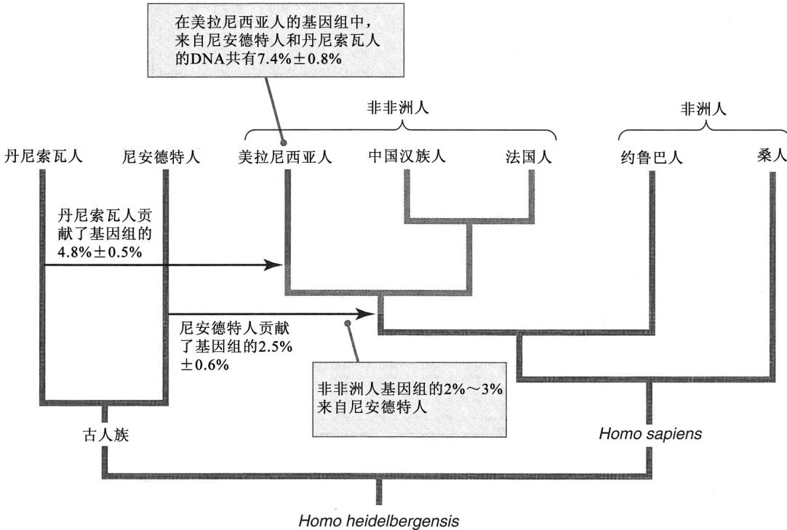  
图 19.14 古人和现代人之间至少发生过两次杂交，两次杂交涉及现代人类种群不同的祖先。这些混合事件是分析现代人、尼安德特人和“丹尼索瓦人”（一种尚未命名的古人种）的基因组数据而揭示的。此处的美拉尼西亚人以新几内亚的巴布亚人和布干维尔岛居民为代表。[改编自 D. Reich, et al., Nature 468(2010): 1053-1060.]

## ■ 另一种古人的基因组

在西伯利亚南部的丹尼索瓦洞(Denisova cave)中，发现了一根3万～5万年前的指骨，从中提取出DNA，并测定了基因组序列。结果令人惊讶，虽然与现代人比起来，“丹尼索瓦人(Denisovans)”更接近尼安德特人，但在遗传上却与尼安德特人不同。如图19.14所示，他们是尼安德特人的姊妹群。通过对丹尼索瓦人的古DNA进行鉴定，表明他们甚至可能代表了先前不为古生物学家所知的一个新的人族物种。因此，在智人离开非洲时，已有3个古人类群(尼安德特人、直立人和丹尼索瓦人)在欧亚大陆定居。

只是丹尼索瓦人的存在还不足为奇，更令人惊讶的是，这些古人仅与一个现生人类种群美拉尼西亚人(Melanesians)(图19.14)具有一小部分 $(4\% \sim 6\%)$ 相同的基因组。丹尼索瓦人对欧亚大陆的其他人类种群没有遗传贡献。丹尼索瓦人与美拉尼西亚人的祖先之间的基因流可能发生在尼安德特人与非非洲人的人类祖先杂交之后，但在美拉尼西亚人的祖先离开亚洲大陆(不晚于5万年前左右)殖民到澳大利亚东北部群岛和巴布亚新几内亚之前。

乍看之下，丹尼索瓦人的线粒体 DNA 令人迷惑，因为它与所有已知的尼安德特人和现代人的线粒体 DNA 都非常不同。在 mtDNA 树上，丹尼索瓦人是人类和尼安德特人的外群，与基于核基因组的树不同。从 mtDNA 方面来看，丹尼索瓦人似乎比从核基因组来看更为古老。丹尼索瓦人、尼安德特人和人类的 mtDNA 溯祖时间大约为 100 万年，而尼安德特人和现代人的 mtDNA 溯祖时间只有一半，为 50 万年。一种可能性是，丹尼索瓦人保留了他们远古的 mtDNA 类型，而尼安德特人和现生美拉尼西亚人通过不完全的谱系分选，失去了远古 mtDNA 类型的任何痕迹。另一种可能性是，丹尼索瓦人曾与别的迄今未知的古人杂交。新的人族动物化石标本(及其基因组)的发现将有助于厘清这些不同的可能性，同时增加在人族动物进化知识上的复杂程度——我们一直觉得这方面的知识不够全面。

## 19.5 衡量人类多样性

国际人类基因组单体型图计划(HapMap Project)是一个正在实施的国际性研究项目，旨在检测人类常见的遗传变异，以及鉴定与疾病相关的常见人类遗传变异。该计划使用第2章所述的方法来检测遍布全基因组的SNP(single-nucleotide polymorphism，单核苷酸多态性)。“HapMap”是“haplotype map”的简写。在一段染色体中，除非发生重组，否则相邻的SNP会作为一个整体遗传。虽然人类基因组含有至少1000万个SNP(目前已知的)，但在疾病相关性检测中，需要研究的仅有 $5\%$ (50万个)，因为相邻的SNP往往是以单体型区段的方式遗传的。

## ■ 用遗传标记来追踪人类历史

SNP 数据也可用来了解人类不同种群之间的遗传相关性。在一项大规模的研究中，考察了来

自全世界51个人类种群938个无亲缘关系个体的65万个SNP。在这些SNP中，约 $97\%$ 为常染色体上的SNP， $2\%$ 为X连锁， $1\%$ 在Y染色体或线粒体DNA上。实验对象生活在其祖先生活的地方，针对性地排除了移民来的人。最开始并未将实验对象看作具体种群的成员，而是作为个体来进行分析。图19.15所示的树概括了这些个体之间的遗传关系，其中有几个特点值得关注：

\- 在人类种群中，基于SNP的树的分辨率高于图19.13中的mtDNA树。SNP树有较高的分辨率是不奇怪

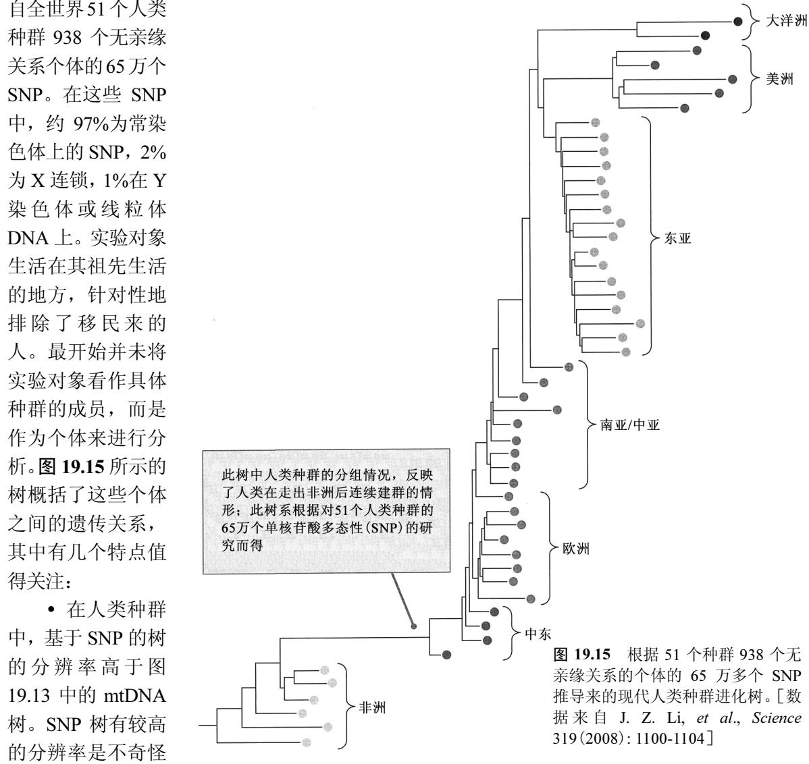

的，因为用来构建 SNP 树的数据，采样范围覆盖每条染色体，数据量比 mtDNA 树多 40 倍以上。

\- 来自相同大陆或大陆次区域的个体，通常一同出现在一个进化枝或关系很近的进化枝中。尤其是非非洲人在遗传上往往与他们的邻近地方的人类似。但是，有些非洲人种群与非非洲人种群的亲缘关系，比与其他非洲人更近，正如在mtDNA树中看到的那样。

\- 撒哈拉沙漠以南地区的非洲人的进化枝靠近树根，其后依次是来自中东、欧洲、中南亚、大洋洲、东亚和美洲的种群。与非洲地理距离越远的种群，往往离树根越远，他们在树上出现的顺序与根据古生物学和考古学证据重建的人类扩张走出非洲的模式大体一致。

\- 以非洲的某个地方为基准，人类种群与基准点的距离越远，具有的杂合基因越少(说明多样性减少)。

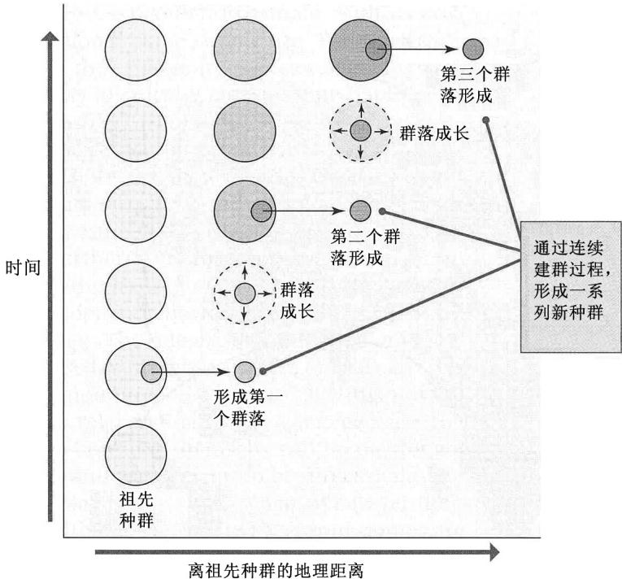  
图 19.16 现代人走出非洲的连续建群模型，其特点是一系列的创始事件，每个源种群都只有一个小的子样本在地理隔离的地点产生出一个新种群(克隆)。每次创始事件都是一个遗传瓶颈，其中，与源种群的多样性相比，新种群的遗传多样性降低。

总的来说，图 19.15 中这棵主要基于核 DNA 数据的树，支持现代人类的非洲起源说。杂合性随距离增加而降低的模式支持连续建群（serial colonization）模型，在该模型中，后一个群体总是由前一个群体的一小部分人创建而来（图 19.16）。在此模型中，离开非洲的第一个现代人类种群是原始种群的一个较小的子样本，遗传多样性较低。随着时间的推移，这个小群体不断变大，最终又冒出一个小的子样本来，移居到离非洲更远一些的第二个地区。第二个创始群比第一个的遗传多样性更低。这种过程持续不断，产生一系列离非洲越来越远、杂合性越来越小的种群。图 19.17 所示的情景示意现代人如何使全世界成为其殖民地，这是综合遗

传学、古生物学和考古学证据而得。

## - 群内变异和群间变异的分配

人类是一个具有层次结构的物种。最底层是单个种群，然后是任意给定地理区域内的若干种群的集群，最后是各主要大陆地区由集群化的种群构成的集团，这些集团总起来就构成人类这个物种。

如果将基于 60 多万个常染色体 SNP 的人类遗传变异分配到这几个层次中，88.9% 的遗传变异包含在种群内，2.1% 包含在种群之间、地理区域之内，而 9.0% 包含在地理区域之间。因此，在人类这个物种内，绝大部分的遗传变异是在最低层级上，即种群内观察到的变异。X 染色体上的变异(基于 1.3 万多个 SNP)情况几乎一样：种群内变异占 84.7%，种群间变异占 2.4%，而地理区域之间占 12.9%。这些全基因组范围的研究显示，大部分人类遗传变异发生在地方种群内，这说明了为什么种群是迄今人类遗传多样性研究的最重要的焦点。

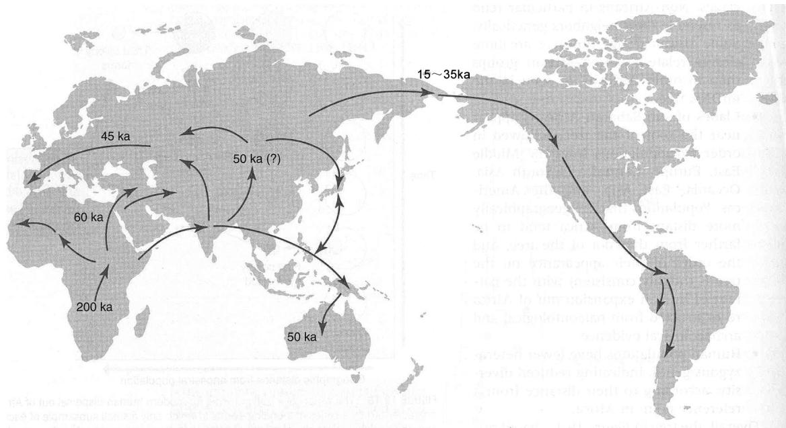  
图 19.17 根据遗传学、古生物学、语言学和考古学数据，现代智人迁移的一种可能的情形。20 万年前这个年代表示在非洲南部首次出现智人的估计时间。人类在 6 万年前前后开始走出非洲。已知的与尼安德特人和丹尼索瓦人的两次杂交事件未予显示。与尼安德特人的杂交可能发生在现代人刚离开非洲之后，在他们到达近东之后、分散到世界上其他地方之前。人类抵达不同大陆的时间及路线仍处于争论之中，可能会随着新化石证据的发现而改变。

## ■ 通过 Y 染色体来追踪人类历史

由于整条 Y 染色体大部分不发生重组，在 Y 染色体上的遗传标记是完全连锁的，当 Y 染色体一代代传递时，遗传标记仍然在一起。因此，Y 染色体之间的遗传关系可以被追踪，因为亲缘关系近的染色体比亲缘关系远的染色体拥有更多相同的等位基因，从而会具有紧密相关的单体型。对许多 Y 染色体的宗谱研究(genealogical study)而言，简单序列重复(simple-sequence repeat, SSR)多态性比较方便，因为存在复制错误和大量的等位基因，使它们的突变率相当高。整条 Y 染色体上有 20～30 个 SSR，如果 Y 染色体的单体型在每个 SSR 基因座上的等位基因都相同，则这样的 Y 染色体必定源自非常晚近的同一条祖先 Y 染色体。在单个基因座上有差别的单体型，遗传关系就稍远一点；两个基因座上有差别的单体型，遗传关系又远一点；……。这个简单的逻辑，就是通过 Y 染色体多态性来追踪种群历史的基础。共享等位基因多的单体型比共享等位基因少的单体型具有更近的共同祖先 Y 染色体。而且，因为可对 SSR 的突变率进行估计，所以可推断祖先染色体存在的时间。这一推理是这一估计的基础：所有现存人类 Y 染色体的最近的共同祖先生活在 5 万～15 万年前。这一估计精确度不高，并且必须要做很多假设。尽管如此，正如下面的例子所示，通过对 Y 染色体的研究，可对人类种群历史有许多了解。

13 世纪的蒙古帝国是史上已知的陆地面积最大的帝国。在其版图最大之时，从中国延伸到俄罗斯，穿越俄罗斯直达中东，然后进入东欧。其奠基者生于1162年左右，取名铁木真(Temujin)。铁木真年轻的时候就组织了一个部落联盟，1200年左右，他开始给他们小个子的蒙古马配上高高的木马鞍和马镫，武装上弓箭，开始征服他们邻近的部落。此后不久，铁木真更名成吉思汗(Genghis Khan)，这是四海之内的统治者的意思。他一贯残忍，常常杀尽反叛城市的男人和男孩，掳掠妇人和女孩。据说，在回答什么是幸福之源这个问题时，他说：“最大的幸福是去击溃你的敌人，去在他们后面追逐，去抢他们的财务，去看他们珍爱的人以泪洗面，去把他们的妻子女儿紧紧抱在怀里。”由于妻妾众多，以及无数没有记录的性战利品，成吉思汗及其子孙非常多产。他的长子术赤(Tushi)公认的儿子有40个，而他的孙子忽必烈汗(Kubilai Khan，在其治下蒙古帝国达到其最大的版图)公认的儿子有22个。

尽管历史对成吉思汗的遗产有很好的记录，但人们几乎不曾料想它会在Y染色体的研究中出现。对采自亚洲广大地区的2123位男性的Y染色体上的32个标记进行基因分型研究，所得结果令人侧目(图19.18)。图中每个圆圈代表一个种群样本，其面积与样本大小成正比。红色扇形表示每个人群中具有一种几乎相同的Y染色体单体型的相对频率，而白色扇形表示在遗传上差异较大的其他单体型的相对频率。估计该近缘单体型的最近共同祖先生活在 $(1000\pm 300)$ 年前。而且，该近缘单体型集中的地区主要在蒙古帝国内(阴影部分)，唯一的例外是由巴基斯坦的哈扎拉族组成的种群10。这个种群给该近缘Y染色体的起源提供了一条线索，因为哈扎拉人自认为是蒙古人的源头，许多哈扎拉人还声称是成吉思汗的直系后裔。不管他们的起源如何，在亚洲广大地区约8%的男性中发现了这条近缘Y染色体(种群1～16)。理论上，从成吉思汗的坟墓中找到材料，检测其Y染色体单体型，可得到是否与他有关的直接证据。成吉思汗因坠马跌伤而死于1227年，据说秘密葬于其出生地附近一隐秘之所。

图 19.18 在古代蒙古帝国及周边种群中，可能为成吉思汗及其男性近亲的后裔的 Y 染色体单体型(红色)的分布。具体种群为：(1)蒙古族，(2)汉族(甘肃)，(3)中国哈萨克族，(4)汉族(新疆)，(5)锡伯族，(6)维吾尔族，(7)柯尔克孜族，(8)哈萨克族，(9)乌兹别克族，(10)哈扎拉族，(11)赫哲族，(12)达斡尔族，(13)鄂温克族，(14)汉族(内蒙古)，(15)(内)蒙古族，(16)满族，(17)鄂伦春族，(18)汉族(黑龙江)，(19)中国朝鲜族，(20)朝鲜人，(21)日本人，(22)畲族，(23)汉族(广东)，(24)瑶族(连南)，(25)黎族，(26)布依族，(27)瑶族(巴马)，(28)回族，(29)汉族(四川)，(30)哈尼族，(31)羌族，(32)中国维吾尔族，(33)藏族，(34)布鲁肖人，(35)巴尔蒂人，(36)卡拉什人，(37)塔吉克人，(38)俾路支人，(39)帕西人，(40)莫克兰黑人，(41)莫克兰俾路支人，(42)布拉灰人，(43)土库曼人，(44)库尔德人，(45)阿塞里人，(46)亚美尼亚人，(47)莱兹吉人，(48)格鲁吉亚人，(49)奥塞梯人，(50)斯万人。[改编自 T. Zerjal, Am. J. Hum. Genet. 72 (2003): 717-721.]  
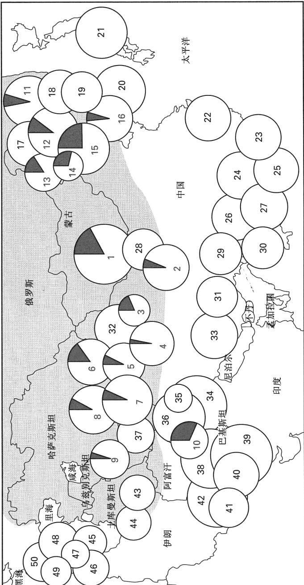

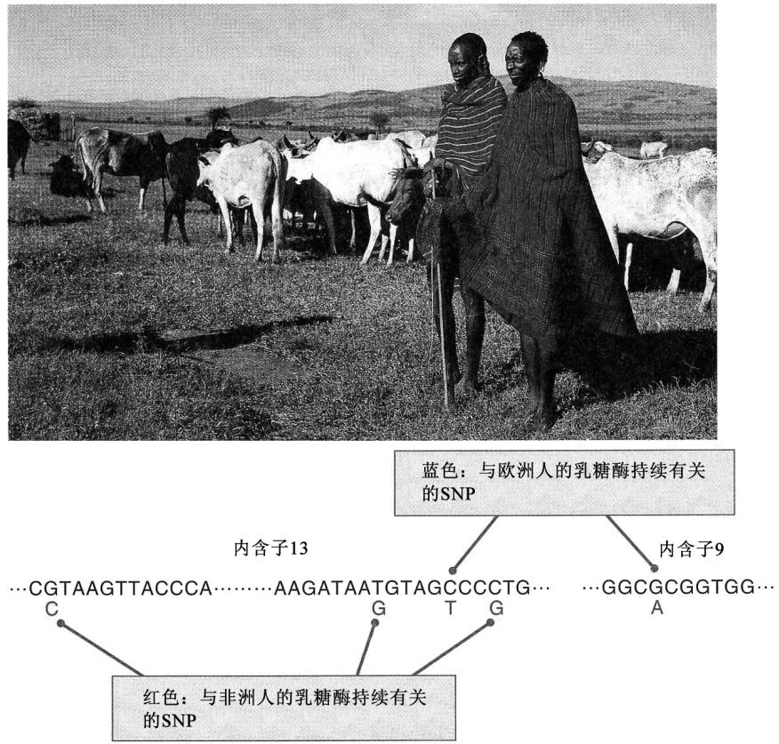

## 19.6 人类独特的遗传适应

人类各种群移民到世界不同地区时(图 19.17)，要面对气候和生态系统都不一样的新环境，为了应对这些生理上的挑战，人类产生了适应。接触地方性寄生虫及其他受限于环境的疾病，对人类免疫系统施加的选择压力因地域不同而不同。新环境在使某些主食丧失的同时，也为开拓新的地方性食物资源提供了机会。文化也发挥着重要作用，例如，在开发新型工具和觅食策略方面。以下各节，将考察迄今发现的几个遗传适应。

## ■ 乳糖酶持续与放牧文明

所有的哺乳动物在婴儿期都要吃奶。婴儿能够从母乳中获取营养价值，是因为乳糖酶-根皮苷水解酶(lactase-phlorizin hydrolase，LPH)可分解乳糖。乳糖是母乳中主要的糖，LPH可将其分解为更容易代谢的葡萄糖和半乳糖成分。典型哺乳动物在婴儿期后不久即失去消化母乳的能力，因为在断奶后肠道LPH活性会不断减少。但是，有些人的乳糖酶一直到成年期都可维持高水平，这种状况称为乳糖酶持续(lactase persistence)。

在哺乳动物中，在成年期具有消化母乳的能力是一种异常状态，在有些人类种群中，特别是在以饲养家畜为传统生活方式的文明(称作畜牧，pastoralism)中，它是一种进化出来的性状(图19.19)。北欧、阿拉伯和部分非洲种群乳糖酶持续的频率非常高，丹麦人、瑞典人及其他北

图 19.19 这些突变出现在位于乳糖酶-根皮苷水解酶基因(LCT)上游的另一个基因(MCM6)的内含子之中，这段 DNA 长约8kb。仅显示一条DNA链。DNA链下方所示的 SNP 变异使 LCT 的转录增强，是与乳糖酶持续相关的等位基因。这5个SNP从不同种群中独立进化而来。这些乳糖酶持续等位基因让成年人能够以奶为营养来源，它们存在于有放牧家牛历史的人类种群(如此处所示的非洲牧民)中。[改编自 S. A. Tishkoff, et al. Nat. Genet. 39(2007): 31-40. Photo © Tierbild Okapia/Photo Researchers, Inc]

欧人约为 90%，中非牧牛的图西人的频率也差不多。相比之下，其他人类种群乳糖酶持续的频率很低或中等，例如，在中国人和泰国人中约为 1%，在南欧人中约为 50%。中等频率可能是种群之间存在基因流的结果。

LCT 为编码乳糖酶的基因，在 2 号染色体上，它被位于另一个基因的一个内含子中的一个上游增强子元件调节。乳糖酶持续与一些特殊的核苷酸突变相关，这些核苷酸突变即使杂合时也能使转录增强，因而乳糖酶持续是一种显性性状。种群不同，乳糖酶持续的调节型突变不同，并且，在每种情况下，与乳糖酶持续相关的等位基因都是新产生的。例如，在北欧人中，在增强子中产生一个 C 到 T 的突变(对人类而言是新产生的)，并与乳糖酶持续相关。(图 19.19)在不同种群中乳糖酶持续由不同的突变所致，这一事实支持在世界各地选择曾数度有利于这一表型的观点。在不同种群或物种中独立进化出相同或相似的性状，称为趋同进化(convergent evolution)。

乳糖酶持续表型意味着在饥荒时成年人可以以奶为营养来源。在食物缺乏时，这种选择优势可能就是生或死的区别。没有乳糖酶持续的成年人在喝奶以后会出现一系列症状，包括严重的胃部不适、腹泻及腹胀(结肠内的细菌发酵未消化的乳糖并释放气体所致)。在有些人类文明中，奶被转变为酸奶或奶酪，这两种食物都使得乳糖的含量降低，因而可被没有乳糖酶持续的个体接受。在这种情况下，文明创新使得在同一种群内基因型不同的人能在不同程度上以奶为食物。

来自牛的遗传学证据也支持乳糖酶持续是人类适应的假设。人们检测了欧洲70多个品种的牛中编码牛奶蛋白的基因的遗传变异，并绘制了牛奶蛋白遗传多样性的地理分布图，发现牛奶蛋白遗传多样性最高的地区与乳糖酶持续发生率最高的地区重叠。对高产奶量的选择可能也使牛奶蛋白基因产生了更高的多样性。甚至在人类自身的基因组在变得能够消化牛奶的过程中，他们就在为了牛奶产量而改变奶牛基因组，这是一个有趣的协同进化(coevolution)的例子，在协同进化中，两个不同的物种以同步进化的方式相互作用。

## ■ 淀粉酶与膳食淀粉

随着农业的发展，人类种群利用当地植物并将其转变成栽培的食物来源。中东的小麦、亚洲的水稻和美洲的玉米等植物物种被驯化。不同的植物性食物含膳食淀粉的量不同。驯化的植物含的淀粉一般比其野生祖先多，而不同的人类群体对淀粉植物的依赖程度不一样。高淀粉饮食是几乎所有生活在干旱环境下依赖块根和块茎生存的农耕者和狩猎-采集者的特点。低淀粉饮食通常属于牧民、潮湿环境下(如热带森林)的狩猎-采集者，以及饮食中肉类和鱼类丰富的北极居民。

自从农业出现以来，不同的饮食很可能对人类的生理产生了不同的选择压力。因而，在人类群体中，消化酶在潜在的选择目标中是首要候选者。淀粉酶(amylase)是一种存在于唾液及胰腺中，可水解淀粉的酶。食物被咀嚼时，唾液淀粉酶完成消化淀粉的第一步。对人类全基因组的拷贝数变异的研究揭示(参见第2章)，不同的人其基因组中的淀粉酶基因数目不同。如图19.20所示，对低淀粉饮食或高淀粉饮食种群的考察表明，拷贝数变异与膳食淀粉相关(低淀粉群体平均5.4个拷贝，而高淀粉群体平均6.7个拷贝)。高淀粉饮食和低淀粉饮食的群体可生活在相互靠近的地方，因此地理血统论(geographical ancestry)不能解释这种模式。而且黑猩猩的每个单倍基因组仅有一个淀粉酶基因拷贝，而倭黑猩猩似乎有两个非功能性(nonfunctional)拷贝，因此人族祖先最有可能的状态是具有较少的基因拷贝数。这说明在人类进化过程中，淀粉酶基因的拷贝数目可能增加了。尽管农业的出现可能促进了淀粉酶基因拷贝数的增加，但也有可能当人族动物从林地和森林转移到比较干旱的稀树草原，变得依赖于淀粉性块根和块茎时，选择就已经开始。

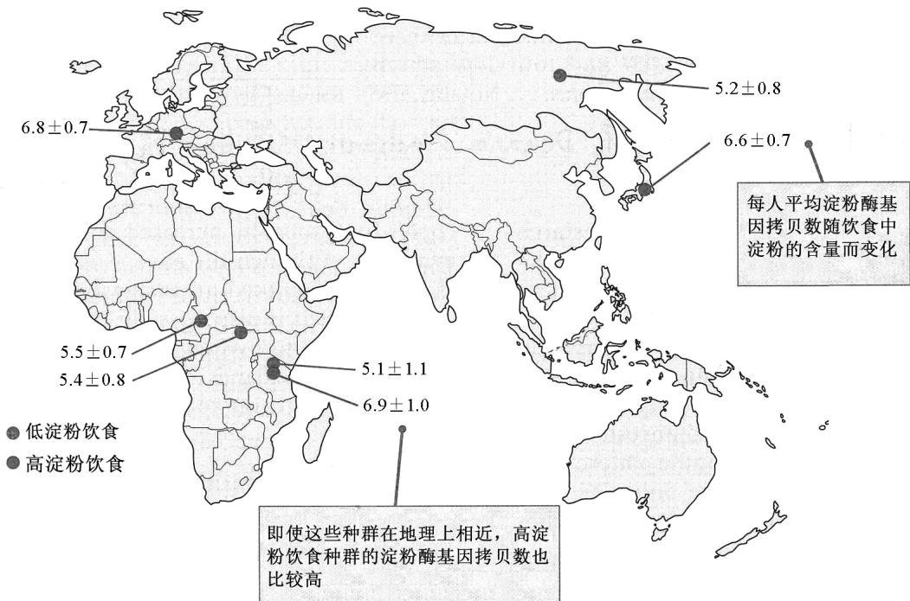  
图 19.20 淀粉酶基因的拷贝数随着人类饮食中的淀粉量变化。[数据来自 G. H. Perry, et al. Nat. Genet. 39(2007): 1256-1260.]

## 联系：淀粉对比

格奥尔格·佩里 $^{1,2}$ 、纳撒尼尔·多米尼 $^{3}$ 、卡特里娜·克劳 $^{1}$ 、阿瑟·李 $^{2}$ 、海克·菲格勒 $^{4}$ 、理查德·雷登 $^{4}$ 、约翰·沃纳 $^{1}$ 及其他6位作者，2007

$^{1}$ 亚利桑那州立大学，坦佩，亚利桑那州； $^{2}$ 布里格姆及妇女医院，波士顿，马萨诸塞州； $^{3}$ 加州大学，圣克鲁斯，加州； $^{4}$ 维康信托基金会桑格研究所，辛克斯顿，英国

## 饮食与人类淀粉酶基因拷贝数变异的进化

酶活性升高的进化可通过增加单一基因转录的调节性突变，或通过增加基因拷贝数而发生。该研究报告人类种群饮食中的淀粉量与一个编码唾液淀粉酶(一种淀粉降解酶)的基因的拷贝数目之间具有很强的相关性。在灵长类动物中，人类并不是唯一一个进化出高淀粉酶活性的物种。有一批旧世界猴(cercopithecines，猴科动物)，包括猕猴和白眉猴，产生的唾液淀粉酶比人类更多。在灵长类动物中，猴科动物是唯一会储存淀粉类食物(如未成熟果实的种子)的，一个合理的假设是，淀粉酶的增加有助于这些淀粉的消化。还不知道猴科动物淀粉酶生成量的增加是由于拷贝数变异还是别的机制。

饮食习惯的显著改变是人族进化的特点，这种改变部分是由石器技术的发展、对火的控制，以及最近对动植物的驯化所推动的。……例如，淀粉成为人类饮食中日益重要的成分，尤其是在农业社会中。……可对“高淀粉”种群与“低淀粉”种群做出区分：对于“高淀粉”种群而言，淀粉类食物资源占饮食的大部分；“低淀粉”种群为传统饮食，淀粉类食物相对较少，(但)强调蛋白质类资源(如肉类和血)和简单的糖类(如来自水果、蜂蜜和牛奶的糖类)。……对3个高淀粉种群和4个低淀粉种群样本的(唾液淀粉酶基因)AMY1的拷贝数做了估计。……值得注意的是，来自总的高淀粉样本的个体具有至少6个AMY1拷贝的比例(70%)，约是低淀粉种群的(37%)两倍。……根据饮食比根据地理上的远近能更好地预测AMY1的拷贝数。……赞成这一模型：至少在某些高淀粉种群中，AMY1的拷贝数一直受到正向或定向选择，但在低淀粉种群中为中性进化(即通过遗传漂变进化)。……与其他大猿的比较表明，在人类谱系中AMY1的拷贝数很可能是增加的。……最初人类特异的AMY1拷贝数的增加可能与人族进化史早期的饮食习惯变化是同时发生的。例如，有假设认为，鳞茎、球茎和块茎等富含淀粉的植物地下储藏器官可能是早期人族动物的主要食物来源。

来源：Science 328: 710-722。

## ■ 对寄生虫和疾病的适应

大约 1 万年前农业出现，并引起人口密度增加，自那时起，传染病就一直危胁着人类种群健康。因此自然选择一直对抵御传染病的等位基因有利，没有任何一种疾病能比疟疾更能清楚地说明这一点。已在不同基因中鉴定出能部分抵御疟疾的多个突变，它们全部都是不到 1 万年前出现在人类种群中的。表 19.2 中列举了这些突变。

表 19.2 抵御疟疾的遗传适应

<table><tr><td>基因</td><td>主要突变类型</td></tr><tr><td>β珠蛋白</td><td>HbS(Glu6Val)、HbC(Glu6Lys)、HbE(Glu26Lys)</td></tr><tr><td>β珠蛋白</td><td>部分或全部缺失(β地中海贫血)</td></tr><tr><td>α珠蛋白</td><td>一个或两个副本缺失(α地中海贫血)</td></tr><tr><td>G6PD</td><td>A-(Val68Met+Asn142Asp)、Med(Ser188Phe)</td></tr></table>

\- 改变 $\beta$ 珠蛋白氨基酸序列的突变。镰形细胞等位基因 $HbS$ 导致 Glu6Val 的氨基酸改变，这在第 17 章讨论过。在中非广大地区及其他曾经流行或仍在流行疟疾的地区，该等位基因相当常见。（分布图见图 17.28。） $HbS$ 等位基因的多样性提示，该突变在非洲至少独立出现过 4 次。另一等位基因 $HbC$ 在同一个密码

子上突变，引起 Glu6Lys 的氨基酸改变。HbC 等位基因频率最高约为 0.2，出现在西非中部的一个狭窄地区。HbC 等位基因的年龄不到 5000 年，其杂合和纯合基因型除均有轻微贫血外，均具有抗疟疾作用。还有一个等位基因 HbE，引起 Glu26Lys 的氨基酸改变。其杂合基因型高度抗疟疾，且对健康无任何不利影响，但纯合基因型的抗疟作用小且有轻度贫血。HbE 等位基因在印度东部、东南亚和缅甸的频率较高，在泰国北部和柬埔寨尤为常见，70%的人为杂合携带者。估计 HbE 等位基因是 1000～4000 年前出现的。

\- 改变 $\beta$ 珠蛋白数量的突变。“地中海贫血”(thalassemia)一词是指珠蛋白链生成量减少的一类疾病。 $\beta$ 地中海贫血可因启动子区或增强子区内使转录水平降低的突变而导致，但更常见的原因是 $\beta$ 珠蛋白基因的全部或部分缺失。杂合基因型具有一定的抗疟作用，不良症状很少；而纯合基因型患者严重贫血，可危及生命，需定期输血或进行骨髓移植。

\- 改变 $\alpha$ 珠蛋白数量的突变。正常情况下每条16号染色体携带两个拷贝的珠蛋白基因。缺失一个拷贝或两个拷贝都缺失，会导致 $\alpha$ 地中海贫血。在杂合状态下，这些缺失会使血红蛋白量减少，且对疟疾有一定的预防作用，但纯合时可引起严重的疾病。具有3个 $\alpha$ 基因拷贝的个体，临床表现正常，但具有两个或两个以下拷贝的人会患贫血，其严重程度取决于拷贝数。4个拷贝均缺失的胎儿会在子宫中死亡。

\- 葡萄糖-6-磷酸脱氢酶(G6PD)缺乏。红细胞需要G6PD来维持其稳定性，当该酶的活性下降时，细胞应激会致使红细胞破裂。红细胞被疟原虫感染就属于一种细胞应激形式。G6PD基因为X连锁基因，该基因的某些等位基因可使G6PD活性降低，但能使红细胞免受疟原虫的严重感染。在非洲最常见的突变型等位基因有两个氨基酸置换(Val68Met和Asn142Asp)，使G6PD活性降低约 $88\%$ 。该等位基因已存在了 $4000\sim 12000$ 年，在女性杂合子和男性携带者中，该等位基因可使严重感染的风险减少约 $50\%$ 。另一个比较晚近的等位基因可追溯到 $2000\sim 7000$ 年前，其置换为Ser188Phe，可使酶活性减少约 $97\%$ 。大多数带有这些等位基因的个体没有临床症状，但某些环境因素可引起红细胞破坏，导致贫血。最常见的环境激发因子有阿司匹林、非类固醇类抗炎药物、病毒或细菌感染、进食蚕豆及接触卫生球中的化学物质等。

疟疾诱发抗病能力的遗传适应绝不是个案。另一个例子见于血液载脂蛋白的两个等位基因中，这两个等位基因仅见于非洲撒哈拉沙漠以南流行昏睡病的地区。昏睡病是由采蝇传播的一种寄生性原虫所致，血液载脂蛋白的这两个等位基因似乎能在一定程度上抵御这种寄生虫，但同时也并发肾病。

## ■ 影响人类肤色的进化适应

人类的肤色是一个复杂性状，是基因、环境因素及两者相互作用综合控制的结果。皮肤的最外层含黑色素细胞(melanocyte)，这是一种特化细胞，含有一种叫做黑素体(melanosome)的亚细胞细胞器，黑素体生成并储存吸收光线的主要色素——黑色素(melanin)。所有的哺乳动物都会产生两种黑色素：棕黑色的真黑色素(eumelanin)和黄红色的嗜黑色素(pheomelanin)。黑素体的数量、大小和形状，两种色素的相对比例，以及激素、紫外线照射量和衰老程度等其他因素，形成人类皮肤主要的色素沉着表型。人类肤色很有可能是对紫外线(UV)辐射的适应性反应。皮肤色素吸收紫外线，保护机体免受紫外线的诱变作用(参见第14章)。紫外线辐射和人类肤色两者都与纬度相关，在高紫外线照射环境中，深色皮肤可防止皮肤癌。

皮肤癌不是肤色的唯一选择因素。深色皮肤也能保护叶酸，这是一种 DNA 合成、修复和基因表达所必需的水溶性 B 族维生素。在快速分裂的细胞中，如在参与胎儿发育和精子发生的细胞中，叶酸尤为重要。叶酸缺乏会导致神经管发育不正常、脊柱缺陷和早期流产。叶酸可被紫外线辐射破坏，但是，皮肤色素沉着可保护这些分子。

肤色在调节紫外线辐射对维生素D的影响上也起着重要作用，维生素D是皮肤中一种紫外线敏感的反应合成的。维生素D为人体健康所必需，因其能使人从饮食中吸收钙质，以助形成强壮的骨骼。维生素D缺乏会导致佝偻病(rickets)，这是一种在正在发育的骨骼中软骨前体不能矿化的疾病。维生素D为正常的细胞生长和免疫系统正常发挥功能所必需，能抑制癌细胞的生长。维生素D对于生殖也是至关重要的，因为佝偻病可导致女性盆腔通道狭窄，使母婴死亡率和发病率增加。在实验小鼠中，维生素D缺乏可导致雌性不育和流产。虽然维生素D可从某些食物中获取，但与皮肤照射紫外线时合成的量相比，饮食只不过是维生素D的次要来源。深色的黑色素沉着方式保护机体免受紫外线的过度照射，但却减少了紫外线的吸收，从而减缓了维生素D合成的进程。对于给定时间内给定的紫外线照射量，浅色皮肤可合成的维生素D比深色皮肤多。据此认为，在阳光和紫外线照射较少的高纬度地区，浅色皮肤在选择上有优势。

人类的肤色是若干影响人类健康的因素(包括防止皮肤癌、防止叶酸被破坏和生成充足的维生素D)相互平衡的结果。因为皮肤不能形成化石，所以不存在人族动物肤色进化的确凿记录，但是生理学和进化论原理可指导我们进行推测。黑猩猩的肤色较浅，全身覆盖着体毛。因此早期人族动物也很可能肤色较浅且全身被毛。人类在进化的某个时候，失去了体毛，这也许是应对较高的日间活动水平的一种方式，以保持身体凉爽。古生物学家认为，这一转变发生在150万～200万年前，此时人族的下肢变长，日常活动范围增加。在高紫外线照射地区，裸露的浅色皮肤患皮肤癌的风险增加。人们假设，在体毛丢失之后，深色皮肤对热带地区的早期人类有利。后来，当人类走出非洲之后，随着人类从赤道附近向紫外线照射较少的地区进一步迁移，对人类肤色的选择再一次改变。

有证据表明，自然选择改变了一些肤色基因在不同人类种群中的频率。例如，欧洲与世界其他地区相比，SLC24A5 基因的等位基因频率差异极大。在几个欧洲种群中，具有 Ala111Thr 氨基酸置换的等位基因的频率为 98%～100%，而在非洲、东亚和美洲土著种群中，具有祖先等位基因 Ala111 的频率为 93%～100%。SLC24A5 的多态性可解释欧洲人和非洲人之间 25%～38% 的肤色差异，但是大多数人类遗传多态性没有这样极端的种群差异。

影响亚洲人的浅肤色的遗传变异，至少部分与导致欧洲人皮肤色素沉着减少的遗传变异不同。例如，OCA2基因的一个等位基因导致His615Arg，该等位基因在东亚人中频率很高，但在欧洲人和西非人中不存在。该等位基因使东亚人的黑色素水平较低。具有0个、1个或2个615Arg衍生等位基因的个体，肤色渐次变浅，并且有该等位基因在东亚种群中受到选择的证据。

人类的肤色表现出趋同进化。即使在单一人类种群中，肤色的遗传变异也可存在大量的趋同。MC1R基因控制黑色素细胞生成哪种类型的黑色素，在欧洲人中，MC1R基因有30多种可影响活性的变异型。其中一种MC1R变异型，存在于尼安德特人中，但在现生人类中没有发现。这些不同的突变各自独立地导致黑素体含嗜黑色素(红黄色素)而不是真黑色素(棕黑色素)，产生红色和金色头发、雀斑、阳光过敏和白皮肤这样的性状。在人类进化过程中，这种表型很可能独立进化出来过很多次。因此不同个体的肤色相似，不一定意味着遗传关系相近。

## 本章概要

\- DNA 杂交研究及大多数的基因树表明，在现生灵长类中，人类与黑猩猩的亲缘关系最近。

\- 多个早期人族物种在非洲进化出来，从 180 万年前开始，有些隶属于人属(Homo)的晚期人族动物迁移出非洲，进入世界的其他地区。

\- 大约20万年前，在非洲进化出解剖学上的现代人；约6万年前，一个亚群迁移到中东。

\- 解剖学上的现代人与其他若干晚期人族动物共同生活在同一时期。DNA序列表明，在非非洲人基因组中有一小部分 $(2\% \sim 3\%)$ 源于与尼安德特人之间的杂交，这很可能在人类第一次离开非洲之后发生在中东。现生美拉尼西亚人另有 $2\% \sim 3\%$ 的基因组来自另一个古人种丹尼索瓦人。

\- 尽管现代人与尼安德特人和丹尼索瓦人之间存在有限的杂交，其在殖民全球的过程中极有可能取代了他们碰到的老的人族种群。

\- 人类种群的遗传多样性约 $85\%$ 存在于任何地理种群中，种群之间的遗传差异相对较少。

\- 人类基因组中有许多影响到性状的进化适应的例子，如对传染病的抗性增强、对膳食淀粉的消化能力增强和肤色变化。

## 基础回顾

\- 在 DNA 杂交实验中，什么是解链温度？解链温度对于 DNA 链之间的相似性有何提示？

\- 在一群物种的若干无关基因的一系列基因树中，为什么认为大多数基因树会与真实的物种树具有相同的结构？

\- 说FOXP2是一个与语言有关的基因，而不说它是“语言基因”，这是什么意思？

\- 什么是选择性清除？为什么选择性清除会导致包含有利基因的长的单体型？

\- 什么是进化的简约性原理？如何用它来重建人类和黑猩猩的共同祖先的特征？请解释。

\- 南方古猿(Australopithecus)属于早期人族动物、过渡期人族动物、前现代人还是解剖学上的现代人？为什么？

\- 解剖学上的现代人(Homo sapiens)是否曾与尼安德特人及直立人共存过一段时间？

\- 什么是现代人类起源的多地区模型？基因组序列支持该模型吗？

\- 用“线粒体夏娃”一词来描述人类线粒体DNA序列的溯祖是否贴切？为何贴切或为何不贴切？

\- 什么是连续建群？该过程如何影响遗传多样性的地理格局？

## 解题指南

习题 1 附图为一棵极其简化的人类线粒体 DNA 树。现代人起源的时间，以及最近一次走出非洲的扩张时间，均基于线粒体分子钟，该分子钟根据人类和黑猩猩的最近共同祖先的时间为 500 万年前的假设进行校准。

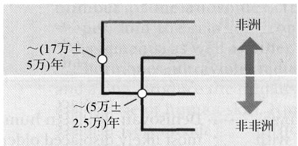

如果假设人—黑猩猩的趋异时间是650万年，图中估计的两个时间会变成多少？估计值的误差范围是否也会改变？

## 答案

两个时间的估计值本身及误差范围都应按 6.5:5 的比例增加，即乘以系数 6.5/5=1.3。因此，(17 万±5 万)年变成(22.1 万±6.5 万)年，而(5 万±2.5 万)年变成(6.5 万±3.25 万)年。

习题 2 此处所示的表格中包括 7 个基因 $(A \sim G)$ 蛋白编码区的 $K_{a}$ 和 $K_{s}$ 值。 $K_{a}$ 是每非同义核苷酸位点的非同义(氨基酸改变的)置换数， $K_{s}$ 是每同义核苷酸位点的同义置换数。氨基酸顺序最保守的基因是哪个？有任何基因显示存在氨基酸改变的正选择吗？

<table><tr><td>基因</td><td>A</td><td>B</td><td>C</td><td>D</td><td>E</td><td>F</td><td>G</td></tr><tr><td> $K_a$ </td><td>0.004</td><td>0.006</td><td>0.029</td><td>0.011</td><td>0.332</td><td>0.019</td><td>0.009</td></tr><tr><td> $K_s$ </td><td>0.265</td><td>0.329</td><td>0.309</td><td>0.438</td><td>0.285</td><td>0.306</td><td>0.337</td></tr></table>

## 答案

对于 $K_{a}$ 和 $K_{s}$ 数据，最宜根据 $K_{a}/K_{s}$ 比值来估计蛋白编码区进化改变的模式。 $K_{a}/K_{s}<1.0$ 表示氨基酸序列保守（比值越小，保守性越强）， $K_{a}/K_{s}=1.0$ 为选择中性时的期望值， $K_{a}/K_{s}>1.0$ 是对氨基酸改变为正选择的期望值。对这些基因而言， $K_{a}/K_{s}$ 值为 0.015（基因 A）、0.018（基因 B）、0.094（基因 C）、0.025（基因 D）、1.16（基因 E）、0.062（基因 F）和 0.027（基因 G）。最小值为 0.015，因此基因 A 最保守，尽管只比基因 B 略保守一点。 $K_{a}/K_{s}>1.0$ 的唯一基因是基因 E，其比值为 1.16。该值可能会与作用于基因 E 的编码序列的正选择相符。

## 分析与应用

19.1 此处所示的是名为 A～D 的 4 种旧世界猴(猴科)的物种树。如果用这几个物种的非重复 DNA 进行 DNA 杂交，哪一对(或哪几对)物种的解链温度最低？哪一对(或哪几对)物种的解链温度最高？

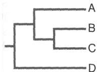

19.2 在 DNA 杂交实验中，预计现代人(H)、尼安德特人(N)和普通黑猩猩(C)非重复 DNA 的解链温度会是什么关系。对答案予以简要说明。符号 $T_{\mathrm{m}}(\mathrm{AB})$ 表示物种 A 和物种 B 的非重复基因组 DNA 之间的解链温度。

(a) $T_{\mathrm{m}}(\mathrm{HN}) < T_{\mathrm{m}}(\mathrm{HC}) < T_{\mathrm{m}}(\mathrm{NC})$

(b) $T_{\mathrm{m}}(\mathrm{HN}) < T_{\mathrm{m}}(\mathrm{NC}) < T_{\mathrm{m}}(\mathrm{HC})$

(c) $T_{\mathrm{m}}(\mathrm{HC}) < T_{\mathrm{m}}(\mathrm{HN}) < T_{\mathrm{m}}(\mathrm{NC})$

(d) $T_{\mathrm{m}}(\mathrm{HC}) < T_{\mathrm{m}}(\mathrm{NC}) < T_{\mathrm{m}}(\mathrm{HN})$

$$
(e) T _ {\mathrm{m}} (\mathrm{NC}) <   T _ {\mathrm{m}} (\mathrm{HC}) <   T _ {\mathrm{m}} (\mathrm{HN})
$$

19.3 在 DNA 杂交实验中，预计现代人(H)、普通黑猩猩(C)和倭黑猩猩(B)非重复 DNA 的解链温度会是什么关系。对答案予以简要说明。符号 $T_{\mathrm{m}}(\mathrm{AB})$ 表示物种 A 和物种 B 的非重复基因组 DNA 之间的解链温度。符号 “≈” 的意思是 “大致相等。”

$$
T _ {\mathrm{m}} (\mathrm{HC}) \approx T _ {\mathrm{m}} (\mathrm{HB}) <   T _ {\mathrm{m}} (\mathrm{BC})
$$

$$
\mathrm{(b)} T _ {\mathrm{m}} (\mathrm{HC}) \approx T _ {\mathrm{m}} (\mathrm{HB}) > T _ {\mathrm{m}} (\mathrm{BC})
$$

$$
(\mathbf {c}) T _ {\mathrm{m}} (\mathrm{BC}) \approx T _ {\mathrm{m}} (\mathrm{HB}) <   T _ {\mathrm{m}} (\mathrm{HC})
$$

(d) $T_{\mathrm{m}}(\mathrm{BC}) \approx T_{\mathrm{m}}(\mathrm{HB}) > T_{\mathrm{m}}(\mathrm{HC})$

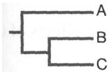

19.4 附图示大猩猩(Gorilla gorilla)、普通黑猩猩(Pan troglodytes)和人(Homo sapiens)的物种树。这些物种与标签A、B和C如何对应？

19.5 附图为 3 个物种的物种树，标有数字的线段对应于物种树的不同分枝。如果在

与某一线段对应的时间间隔内产生一个新突变(产生一个新的衍生

等位基因)并被固定。

(a) 在哪条线段中的突变会产生为 3 个物种所共有的衍生等位基因？

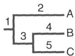

(b) 在哪条线段中的突变会产生为物种 A 和 B 所共有的衍生等位基因?

19.6 如果人和黑猩猩的进化分歧发生在 650 万年前，分开人和黑猩猩的总进化时间是多少？

19.7 在一个进行随机交配的灵长类动物大种群中，有一种由某个蛋白编码基因的串联重复构成的拷贝数多态性。在该种群中，20%的染色体携带该基因的一个拷贝，80%携带该基因的两个拷贝。具有该基因2、3和4个拷贝的个体的期望比例是多少？

19.8 在一个进行随机交配的灵长类动物大种群中，有一种由某个蛋白编码基因的串联重复构成的拷贝数多态性。在该种群中，20%的染色体携带该基因的一个拷贝，30%携带该基因的两个拷贝，50%携带该基因的3个拷贝。具有该基因5个或5个以上拷贝的个体的期望比例是多少？

19.9 在人、黑猩猩和大猩猩中，编码蓝色(光敏)蛋白质色素(视蛋白)的基因为常染色体基因，而编码红色和绿色视蛋白的为X连锁基因。在狨猴、绢毛猴和蜘蛛猴等一些新世界猴中，情况更加复杂。这些物种仅在X染色体上有一个视蛋白基因，但该基因具有多态性。有的X染色体携带红色视蛋白基因，而其他X染色体携带绿色视蛋白基因。这些猴的性别决定与人的性别决定类似。设在这样的一个物种中，红色视蛋白等位基因的频率为0.36，绿色视蛋白等位基因的频率为0.64。假设对该基因而言，交配是随机的，则具有下述视觉能力的雌性的期望频率是多少？

(a)能感受红色，但不能感受绿色

(b)能感受绿色，但不能感受红色

(c) 红色和绿色都能感受

19.10 对于上一题中所述的情况，具有下述视觉能力的雄性的期望频率是多少？

(a)能感受红色，但不能感受绿色

(b)能感受绿色，但不能感受红色

(c) 红色和绿色都能感受

19.11 如果人类 DNA 中任一核苷酸对与黑猩猩 DNA 中相应核苷酸对不同的概率为 1%，则在随机的 1kb 区域内两个物种具有相同核苷酸顺序的概率是多少。(注意：假设相邻核苷酸位点是独立的。)

19.12 下述哪些情况使得基因树不太可能与物种树相对应。

(a)物种形成事件之间的时间较短。

(b)祖先种群规模巨大。

(c) 在共同祖先中存在多态性。

(d) (a) ∼ (c) 都是。

(e) (a) ∼ (c) 都不是。

19.13 在尼安德特人基因组中，发现一些与黑猩猩不一致的衍生 SNP。将尼安德特人的衍生 SNP 与在下面树中所示的 3 个现代人种群中发现的 SNP 进行比较。

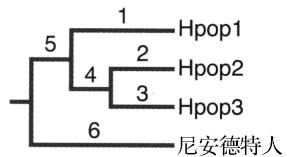

(a) 如果人类种群 2 和 3 比人类种群 1 与尼安德特人相一致的 SNP 更多，则一致程度可表示为 H2=H3>H1，这对尼安德特人和现代人之间的杂交有何提示？

(b)或者假设与尼安德特人的衍生SNP的一致模式为 $\mathrm{H}3 > \mathrm{H}2 > \mathrm{H}1$ ，这对尼安德特人和现代人之间的混合意味着什么？

19.14 用现代人类起源模型来推测目前存在的各人类种群的相似性,哪种模型得到的相似性最高?对答案予以简要说明。

(a) 多地区模型。

(b)非洲取代模型。

(c) 杂交模型。

(d) 就本问题而言，上述 3 个模型没有区别。

19.15 按照对现代人(Homo sapiens)的基因组贡献基因(通过杂交)的可能性将下列物种归类。类别为“不可能”、“高度可能”和“可能。”

(a) 阿法南猿 (Australopithecus afarensis)。

(b) 能人 (Homo habilis)。

(c) 尼安德特人 (Homo neanderthalensis)。

(d) 直立人 (Homo erectus)。

19.16 附表为人类和大猩猩中都存在的某个基因的 $K_{a}$ 和 $K_{s}$ 值，解释其意义。

19.17 在人类 17 号染色体上有一个 900kb 的倒位，该倒位在非洲人中罕见，在欧洲种群中具有大约 0.20 的频率。所有的倒位染色体都具有相同的倒位单体型(即存在于该倒位中的等位基因的特定组合)。预计该倒位单体型会维持不变，为什么？

<table><tr><td></td><td>大猩猩</td><td>人</td></tr><tr><td> $K_a$ </td><td>0.002 15</td><td>0.001 28</td></tr><tr><td> $K_s$ </td><td>0.011 8</td><td>0.006 67</td></tr></table>

19.18 想象一个种群，其中某个基因受到选择性清除。说明下列情况是否会增大或减小与有利基因相关的单体型区段的大小。

(a)选择系数变大。

(b) 重组频率增加。

(c) 突变率增加。

19.19 某个新的有利突变型等位基因的选择性清除导致一个单体型区段(突变等位基因周围的连锁等位基因区)的频率与突变型等位基因一道增加。该区域的重组频率如何决定该单体型区段的大小？选择强度如何决定该单体型区段的大小？

19.20 很多抗疟疾的遗传适应也会因为红细胞缺陷或数量减少而伴随着贫血。你能提出一种解释吗？

19.21 影响某种生物生殖期的两种突变具多态性。一种突变使生殖提前一年开始，但在正常时间结束。另

一种突变使生殖期延长一年，但在正常时间开始。自然选择对这两种突变中的哪一种(或是两种都)有利？

19.22 某一物种流行两种不同的传染病。一种传染病主要杀死年轻个体，另一种主要杀死老年个体。通过自然选择，可产生抵抗力上的遗传适应，对哪一种传染病的自然选择会更强烈？为什么？

19.23 在连续建群模型中，估计祖先种群或后裔种群哪个具有更大量的遗传多样性？为什么？

19.24 属于人类皮肤色素功能的是哪一项？

(a)防止紫外线辐射的诱变作用。

(b)促进维生素D的合成。

(c)防止叶酸(一种 B 族维生素)的分解。

(d) 以上都是。

19.25 在“物种”一词的严格定义中，一个物种的成员不能与另一物种的成员产生可存活且能生育的后代。这一严格定义是否关系到应该将尼安德特人称为人属尼安德特种(Homo neanderthalensis)还是人属智人种尼安德特亚种(Homo sapiens neanderthalensis)?

19.26 鉴定种群 X、Y 和 Z 中某一基因的等位基因，可区分出两种等位基因：A 和 $A'$ 。每个种群固定其中一个等位基因。下列发现哪些与此处所示的基因树相符？

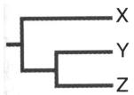

(a) X 固定 A，Y 和 Z 固定 $A'$ 。

(b) X 和 Y 固定 A，Z 固定 $A'$ 。

(c) X 和 Z 固定 A，Y 固定 $A'$ 。

(d) X、Y 和 Z 固定 A。

19.27 在尼安德特人中能发现乳糖酶持续吗？唾液淀粉酶基因的额外拷贝呢？为什么能或不能？

19.28 非洲的血红蛋白 S 和印度的血红蛋白 H 是趋同进化的例子吗？为什么是或不是？

19.29 为什么基因组中重组程度低或不存在重组的区域对于追踪种群的遗传学祖先更为有用？

19.30 在人类进化过程中，两性异形是增大、减小还是大致不变？

## 挑战题

挑战题 1 根据此处所示的物种树，物种 X、Y 和 Z 与祖先种 W 有亲缘关系。标 1 的分支中的种群具有等位基因 A 和 A' 的多态性。等位基因 A 和 A' 频率相等，A' 是衍生等位基因。分支 2 很短，以至于在该分支中固定任何一个等位基因的概率可忽略不计。假设在分支 3、4 和 5 中，一个或另一个等位基因在称作谱系分选 (lineage sorting) 的过程中被独立地固定。

这两个等位基因按如下方式进行谱系分选的概率是多少？

(a) 不存在基因树 (即 X、Y 和 Z 中的等位基因是相同的)。

(b)基因树与物种树一致。

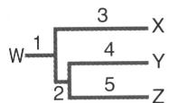

(c)基因树与物种树不一致。

挑战题 2 在挑战题 1 中，假设分支 2 长到足以在该分支中以 2/3 的概率发生固定，且在分支 3 中独立发生固定。在分支 3、4 和 5 中，A 或 A' 以 1/3 的概率独立发生固定。这两个等位基因按如下方式进行谱系分选的概率是多少？

(a) 不存在基因树 (即 X、Y 和 Z 中的等位基因是相同的)。

(b)基因树与物种树一致。

(c)基因树与物种树不一致。

## 网上遗传学

“网上遗传学”(GeNETics)会为你介绍在互联网上寻找遗传学信息的某些最重要的站点。要浏览这些站点，请访问为《遗传学：基因和基因组分析》(第八版)配备的 Jones and Bartlett 公司配套站点http://biology.jbpub.com/book/genetics/8e/。

在该站点中，你会找到一个按章列出的重点关键词列表。选择某个关键词后，可链接到某个网站，其中包含与此关键词相关的信息。

# 偶数习题答案

## 第1章

1.2 关于复制，他们推断，双螺旋的每条链都被用作模板，以形成碱基序列互补的新子链。关于编码能力，他们指出，遗传信息可由 DNA 分子上的碱基顺序编码，类似于印在纸条上的字母。最后，关于突变，他们指出，遗传信息的变化可因复制错误而导致，改变的核苷酸顺序可长期延续下去。

1.4 热灭活 S 细胞和活 R 细胞的混合物能使小鼠患肺炎，但单独的热灭活 S 细胞或单独的活 R 细胞都不能。

1.6 苯酚不会破坏转化活性，强碱会。

1.8 因为成熟的 T2 噬菌体只含有 DNA 和蛋白质；标记 RNA 留在破碎细胞释放的物质中。

1.10 在这种噬菌体 DNA 中，A 的数量与 T 的数量不相等，G 的数量与 C 的数量不相等。因此，推断该 DNA 分子是单链 DNA，不是双链 DNA。

1.12 5'-CTGAT-3'

1.14 互补链的序列为 5'-TACTACTAC $\cdots$ 3'。

1.16 5'-AUCAG-3'

1.18 互补链的序列是 5'-AUACGAUA-3'。

1.20 亮氨酸的密码子必定是 5'-UUA-3'。

1.22 需要考察 6 种可能的阅读框。两条 DNA 链每条都可被转录，每种转录物可以 3 种阅读框中的任何一种翻译。

1.24 该结果意味着 mRNA 是以非重叠的三核苷酸一组的形式翻译：遗传密码是三联体密码。

1.26 密码子 5'-UGG-3'编码 Trp，因而，在此随机多聚体中，预计 Trp 密码子具有 $1/4 \times 3/4 \times 3/4 = 9/64$ 的频率。氨基酸 Val 可由 5'-GUU-3'或 5'-GUG-3'两者编码；前者的期望频率为 $3/4 \times 1/4 \times 1/4 = 3/64$ ，后者的期望频率为 $3/4 \times 1/4 \times 3/4 = 9/64$ ，总计 12/64，即 3/16。在此多聚体中，氨基酸 Phe 只可能由 5'-UUU-3'编码，所以 Phe 会具有 $(1/4)^{3} = 1/64$ 的期望频率。

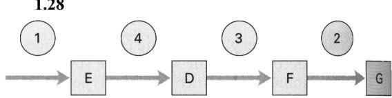

1.30 a. 氨基酸序列为 Met-Val-His-Leu-Thr-Pro-Glu-Glu-Lys-Ser。b. 所得氨基酸序列为 Met-Val-His-Leu-Thr-Pro-Arg-Arg-Ser-Leu…；缺失之后的所有密码子都会改变，因为相对于非突变 RNA，阅读框位移-1位。c. 所得氨基酸序列为Met-Val-His-Leu-Thr-Pro。在此情况下，翻译在Pro后终止，因为该移码突变产生终止密码子5'-UGA-3'。

## 第2章

2.2 (e) 为 5 碳原子，因而携带磷酸基团。(c) 为 3 碳原子，因而携带羟基。

2.4 DNA 回文序列正读反读都一样，但要沿配对链阅读。a. 这是回文序列，因为配对链读作 3'-GGCC-5'; b. 不是，因为配对链读作 3'-AAAA-5'; c. 是，因为配对链读作 3'-CGATCG-5'; d. 不是，因为配对链读作 3'-GGCGAG-5'; e. 不是，因为配对链读作 3'-TTCCAA-5'。

2.6 a. Sca I 产生平端；b. Nhe I 产生 5'突出；c. Cfo I 产生 3'突出。

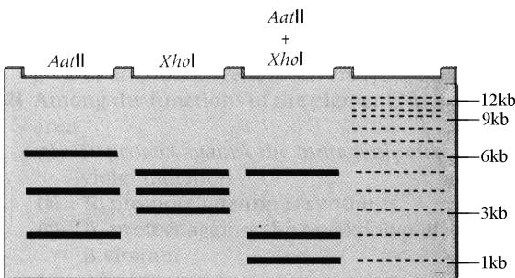

2.10 a. $B_{5}=T$ ; b. $B_{6}=G$ ; c. $B_{7}=互补的嘧啶$ ; d. $B_{8}=T$ 或 A。

2.12 限制位点的概率为 $1/4^{n}$ ，其中 n 为位点中的核苷酸数目。a. $1/4^{4}=0.0039$ ; b. $1/4^{6}=0.00024$ ; c. $1/4^{8}=0.000015$ 。

2.14 a. $4.6 \times 10^{6}/256 \approx 1.8 \times 10^{4}$ ; b. $4.6 \times 10^{6}/4096 \approx 1.1 \times 10^{3}$ ; c. $4.6 \times 10^{6}/65536 \approx 70$ 。

2.16 在原来的分子中有两个 Kas I 位点(以粗体显示)。

5'-CTGGGGCGCCCTCGTCAGCGAGGGGGCGCCGAT-3'
3'-GACCCCGCGGGAGCAGTCGCTCCCCGCGGGCTA-5'
切割产生如下片段：
5'-CTGGG-3'
3'-GACCCCGCG-5'
5'-GCGCCCTCGTCAGCGAGGGG-3'
3'-GGAGCAGTCGCTCCCCGCGG-5'

如果这些片段按原来的同样顺序回到一起，并使断点封闭，中间的片段可以原来的方向或相反方向存在，因为两个末端都是互补的。因此，可能的产物为

5'-CTGGGGCGCCCTCGTCAGCGAGGGGGCGCCGAT-3'
3'-GACCCCGCGGGAGCAGTCGCTCCCCGCGGGCTA-5'
或

2.18 以 Pst I 切割，破坏 Pvu II 位点；但 Pvu II 切割，Pst I 位点保持完整。

2.20 探针 A 产生 4kb 和 12kb 的条带，探针 B 产生 8kb 和 12kb 的条带。

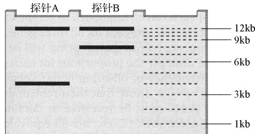

2.22 该限制酶和探针会产生具有两个等位基因的 RFLP，一个(称其为 $A_{1}$ ) 根据 6kb 条带来识别，另一个(称其为 $A_{2}$ ) 根据 10kb 条带来识别。可能的基因型为 $A_{1}A_{1}$ (纯合)、 $A_{1}A_{2}$ (杂合) 和 $A_{2}A_{2}$ (纯合)， $A_{1}A_{1}$ 的表型为 6kb 的一条条带， $A_{1}A_{2}$ 的表型为 6kb 和 10kb 的两条条带， $A_{2}A_{2}$ 的表型为 10kb 的一条条带。

2.24 在此情况下，可检测到3个等位基因。令 $A_{1}$ 表示产生顶部的DNA分子的等位基因， $A_{2}$ 表示产生中间的DNA分子的等位基因， $A_{3}$ 表示产生底部的DNA分子的等位基因。这些等位基因在与探针杂交的限制性片段的大小上不同。 $A_{1}$ 产生3kb片段， $A_{2}$ 产生5kb片段， $A_{3}$ 产生6kb片段。3个等位基因有6种可能基因型。这些基因型和表型(观察到的条带)如下： $A_{1}A_{1}$ （仅有3kb条带）、 $A_{1}A_{2}(3\mathrm{kb}+5\mathrm{kb})$ 、 $A_{2}A_{2}$ （仅有5kb条带）、 $A_{1}A_{3}(3\mathrm{kb}+6\mathrm{kb})$ 、 $A_{2}A_{3}(5\mathrm{kb}+6\mathrm{kb})$ 和 $A_{3}A_{3}$ （仅有6kb条带）。

2.26 不能，它们不会扩增相同的片段，因为这些引物的极性不对。这些引物不会与靶 DNA 链中的任何区域配对。

2.28 RAPD 多态性是出现在一些个体的样品中，但不是全部样品中的扩增条带，因而，该例中的条带 3、5、7 和 10 是 RAPD 多态性。

2.30 对于每一基因座，孩子必定与母亲有一条共同的条带，与父亲有一条共同的条带。对于基因座1，较大的条带与母亲共有，因而产生较小条带的等位基因必定来自 A。因而，基因座 1 排除男性 B 是父亲。对于基因座 2，孩子较小的条带与母亲共有，因而，较大条带的等位基因可能来自 A 或 B。因此，基因座 2 两个男性都不能排除。总起来看，因为基因座 1，证据排除 B 但不排除 A 是可能的父亲。

## 第3章

3.8 7kb 条带显然是该隐性等位基因的标记。
a. II-1 的期望表型是单条 7kb 条带。b. 因 II-2 未患病，可能的分子表型为单条 3kb 条带或 3kb 和 7kb 的两条条带。

3.10 a. 因为该性状为罕见性状，所以假设患病的父亲为杂合的 HD/hd(hd 表示正常等位基因)，是合理的。其一半的配子含 HD 等位基因，因此其子获得该等位基因且以后会发病的概率为 1/2。b. 我们不知道该青年男子是否为杂合的 HD/hd，但他为杂合的概率是 1/2；如果他为杂合，他一半的配子会携带 HD 等位基因。因此，他的孩子具有 HD 等位基因的总概率是 $(1/2)(1/2)=1/4$ 。

3.12 a. 因为系谱中存在近亲婚配(血亲之间的婚配)，所以该性状极有可能是隐性等位基因所致。b. 双横线示近亲婚配。c. III-1 和III-2 是一级堂表亲。d. I-1、I-2、II-2、II3、III-1 和III-2 最有可能为 $Aa$ ，II-1 和II-4 最有可能为 $AA$ 。

3.14 该亲本具有 AA BB 基因型的概率是 $\Pr\{AA\ BB\}=1/2$ 。已知亲本具有 AA BB 基因型，产生 A b 配子的概率是 $\Pr\{A\ b|AA\ BB\}=(1/2)\times0=0$ 。该亲本具有 AA Bb 基因型的概率是 $\Pr\{AA\ Bb\}=1/2$ 。已知亲本具有 AA Bb 基因型，产生 A b 配子的概率是 $\Pr\{A\ b|AA\ Bb\}=(1)\times(1/2)=1/2$ 。因此，产生 A b 配子的总概率为 $\Pr\{A\ b\}=(1/2)\times0+(1/2)\times(1/2)=1/4$ 。

3.16 $(0.002)(1)+(1-0.002)(0.002)=0.004$

3.18 亲本具有基因型 WW 和 ww。来自该杂交的所有 $F_{1}$ 代一定是杂合的 Ww。 $F_{2}$ 代中不同表型的比例为 3/4 圆滑种子 (WW+Ww) 和 1/4 皱缩种子 (ww)。在 $F_{2}$ 代的圆滑种子中，2/3 为 Ww，1/3 为 WW。因此，在 $(2/3\;Ww+1/3\;WW)\times ww$ 一起的杂交后代中，具有皱缩种子的期望比例为 $(2/3)\times(1/2)\times1=1/3$ 。

3.20 9:3:3:1 比值为基因型 A-B-、A-bb、aa B-和 aa bb 的比值。修饰比值 9:7 说明后面 3 种基因型全部具有相同的表型。 $F_{2}$ 测交是在基因型 Aa Bb 和 aa bb 之间，预计后代呈 1/4 Aa Bb、1/4 Aa bb、1/4 aa Bb 和 1/4 aa bb 的比例。同样，后面 3 种基因型会具有相同的表型，因此，测交后代的表型比值为 1:3。

3.22 由于该妇女罹患该病，她有 1/2 的概率将该显性等位基因传给她的孩子，这个孩子有 1/2 的概率真正表现该病(因为该病呈现出 50% 的外显率)。因此，这个孩子会患病的概率是 $1/2 \times 1/2 = 1/4$ 。

3.24 使用贝叶斯定理，事件 A 为具有显性表型的 $F_{1}$ 个体具有基因型 Nn（概率为 2/3）。事件 $A'$ 是个体为纯合显性 NN（概率为 1/3）。令 B 为事件：来自测交的 4 个后代具有显性表型。则

$$
\operatorname * {P r} \{A \mid B \} = \frac {(1 / 2) ^ {4} (2 / 3)}{(1 / 2) ^ {4} (2 / 3) + (1) ^ {4} (1 / 3)} = 1 / 9 = 0. 1 1
$$

3.26 为了避免歧义，按书写等位基因的顺序列举条带，而不是按条带的大小。 $F_{1}$ 代 $(A_{1}A_{2}B_{1}B_{2})$ 均显示 4kb、8kb、2kb 和 6kb 的 4 条条带。 $F_{2}$ 后代由 1/16 $A_{1}A_{1}B_{1}B_{1}$ (4kb 和 6kb 条带)、2/16 $A_{1}A_{1}B_{1}B_{2}$ (4kb、6kb 和 2kb 条带)、1/16 $A_{1}A_{1}B_{2}B_{2}$ (4kb 和 2kb 条带)、2/16 $A_{1}A_{2}B_{1}B_{1}$ (4kb、8kb 和 6kb 条带)、4/16 $A_{1}A_{2}B_{1}B_{2}$ (4kb、8kb、6kb 和 2kb 条带)、2/16 $A_{1}A_{2}B_{2}B_{2}$ (4kb、8kb 和 2kb 条带)、1/16 $A_{2}A_{2}B_{1}B_{1}$ (8kb 和 6kb 条带)、2/16 $A_{2}A_{2}B_{1}B_{2}$ (8kb、6kb 和 2kb 条带) 和 1/16 $A_{2}A_{2}B_{2}B_{2}$ (8kb 和 2kb 条带)。

## 3.28

<table><tr><td>父/母</td><td>1/2 A</td><td>1/2 a</td></tr><tr><td>1/3 A</td><td>1/6 AA</td><td>1/6 Aa</td></tr><tr><td>2/3 a</td><td>2/6 Aa</td><td>2/6 aa</td></tr></table>

期望比值为 1/6 AA : 3/6 Aa : 2/6 aa。

## 第4章

4.2 图(A)为减数分裂后期II，因为染色体数目已经减半。图(B)为有丝分裂后期，因为同源染色体未配对。图(C)为减数分裂后期I，因为同源染色体配对。

4.4 因为这两个基因在不同染色体上(苯丙酮尿症突变为常染色体突变，血友病突变为X连锁突变)，它们会自由组合，所以可以分别来考虑它们。因为双亲对于常染色体隐性的苯丙酮尿症突变均为杂合，所以他们的孩子为纯合隐性的概率为1/4。对于X连锁的血友病，只有男孩才会患病；因为女孩会从她的父亲遗传一条正常的X染色体，所以不会患血友病。因此，女孩两种病都患的概率为0，男孩两种病都患的概率为 $1/4\times1/2=1/8$ 。总起来，概率为 $(1/2)(0)+(1/2)(1/8)=1/16$ 。

4.6 因为孩子有两条 Y 染色体，所以不分离发生在父亲中，在第二次减数分裂期间。

4.8 a. 对每个基因而言，一半的后代是杂合的。因为 3 个基因进行自由组合，可将针对每个基因的比例相乘，得到对于所有 3 个基因均为杂合的后代的期望频率： $(1/2)^{3}=1/8$ 。b. 对每个基因而言，一半的后代为纯合的，因此可将针对每个基因的比例相乘，得到所有 3 个基因均为纯合的后代的期望频率： $(1/2)^{3}=1/8$ 。(注意，题中没有说所有 3 个基因一定是隐性或显性。因此，AABBCC、aabbcc、AAbbcc 和 AAbbCC 等都是等价的。)

4.10 a. $(1/2)^{6}=1/64$ ; b. $6(1/2)^{6}=6/64$ ; c. $15(1/2)^{6}=15/64$ ; d. $20(1/2)^{6}=20/64$ ; e. $1-(1/64)-(6/64)-(15/64)=42/64$ 。

4.12 观察到的 $F_{2}$ 比值说明，两个不同的基因参与鳞茎颜色的决定。而且，因为该比值偏离 9:3:3:1 的经典孟德尔比值，意味着这些基因相互作用。（它们表现出上位性。）用符号 R 来表示产生红色所必需的显性等位基因，r 表示同一基因的隐性等位基因，这样，具有 rr 基因型的洋葱鳞茎为白色。用符号 W 来表示抑制 R 表达的另一个基因的显性等位基因。根据这一假设，具有 R-W-基因型的鳞茎也是白色的。根据该假设，最初的杂交是在 RR ww 红色洋葱和 rr WW 白色洋葱之间。该杂交的 $F_{1}$ 代的基因型为 Rr Ww，白色。 $F_{2}$ 代仍有潜在的 9R-W-：3R-ww：3rrW-：1rrww 基因型比值。如果具有 rr ww 基因型的洋葱为黄色，具有 R-ww 基因型的为红色，具有 R-W- 和 rrW- 的为白色，则可解释所观察到的结果，因为 (9R-W-) + (3rrW-) = 12。

## 4.14 卡方值为 4.00。

4.16 对于常染色体基因，有 21 种可能的基因型：6 种纯合基因型和 15 种杂合基因型。对于 X 连锁基因，可能的基因型数为 27：在女性中有 6 种纯合基因型和 15 种杂合基因型，在男性中有 6 种半合子基因型。

4.18 a. 他们的第一个孩子具有棕色眼睛的概率是 3/4，因为双亲必定为杂合子。b. 2/3。c. 这对夫妇生 3 个蓝眼孩子的概率是 $(1/4)^{3}=1/64$ 。这 3 个孩子一个都不是蓝眼的概率是 $(3/4)^{3}=27/64$ 。

4.20 为方便起见，用符号 W 和 w 来分别表示该 X 连锁基因的野生型和突变型等位基因。令事件 A 为：III-1 为杂合 Ww。令事件 B 为：IV-1、2 和 3 一个也不患病。A 的补为事件 $A'$ ：III-1 为纯合 WW。则， $\Pr\{A\}=1/4$ 且 $\Pr\{A'\}=3/4$ ，因为这两个频率不依赖于 B。而且， $\Pr\{B|A'\}=0$ ， $\Pr\{B|A\}=(1/2)^{2}$ 。1/2 要平方而不是立方的原因是，IV-2 这位女性不提供有关 III-1 的信息；具体来说，因为 III-2 这位男性具有 WY 基因型，所以无论 III-1 的基因型是什么，IV-2 都不会患病。这些表达式均已到位，可应用贝叶斯定理如下：

$$
\begin{array}{r l} \operatorname * {P r} \{A \mid B \} & = \frac {\operatorname* {P r} \{B \mid A \} \operatorname* {P r} \{A \}}{\operatorname* {P r} \{B \mid A \} \operatorname* {P r} \{A \} + \operatorname* {P r} \{B \mid A ^ {\prime \prime} \} \operatorname* {P r} \{A ^ {\prime \prime} \}} \\ & = \frac {(1 / 2) ^ {2} (1 / 4)}{(1 / 2) ^ {2} (1 / 4) + (1) ^ {2} (3 / 4)} = \frac {1}{1 3} = 0. 0 7 7 \end{array}
$$

4.22 为方便起见，用符号 W 和 w 来分别表示该 X 连锁基因的野生型和突变型等位基因。令事件 A 为：III-1 为杂合 Ww。令事件 B 为：个体 IV-1、2 和 3 一个都不患病。由于 II-2 必定为杂合 Ww，则 III-1 为杂合的概率 $\Pr\{A\}=1/2$ 。A 的补为事件 $A'$ ：III-1 为纯合 WW，因此 $\Pr\{A'\}=1/2$ 。因为 III-2 这位男性患病，而 IV-1、IV-2 和 IV-3 无一人患病，所以这些子女必定遗传了来自 III-1 的 W 等位基因。因此， $\Pr\{B|A\}=(1/2)^{3}$ ， $\Pr\{B|A'\}=1$ 。将贝叶斯定理用于这一情况，得

$$
\begin{array}{r l} \operatorname * {P r} \{A \mid B \} & = \frac {\operatorname* {P r} \{B \mid A \} \operatorname* {P r} \{A \}}{\operatorname* {P r} \{B \mid A \} \operatorname* {P r} \{A \} + \operatorname* {P r} \{B \mid A ^ {\prime} \} \operatorname* {P r} \{A ^ {\prime} \}} \\ & = \frac {(1 / 2) ^ {3} (1 / 2)}{(1 / 2) ^ {3} (1 / 2) + (1) (1 / 2)} = \frac {1}{1 1} = 0. 1 1 \end{array}
$$

4.24 每位男性只有一条带，这条带传递给女儿但不传给儿子，这一事实说明是 X 连锁遗传。推导出的基因型为：I -1( $A_{1}A_{1}$ )、I -2( $A_{2}A_{2}$ )、II -1( $A_{1}A_{1}$ )、II -2( $A_{1}A_{2}$ )、II -3( $A_{1}A_{1}$ )、II -4( $A_{1}A_{1}$ )、II -5( $A_{1}A_{2}$ )、II -6( $A_{2}A_{2}$ )、III -1( $A_{2}A_{2}$ )、III -2( $A_{1}A_{2}$ )、III -3( $A_{1}A_{2}$ )和III -4( $A_{1}A_{1}$ )。

4.26 所附庞尼特方示杂交结果。来自雄性的 X 染色体和 Y 染色体以粗体表示，并联 X 染色体用“^”号连接。

精子

<table><tr><td>卵子</td><td>X</td><td>Y</td></tr><tr><td> $\widehat{XX}$ </td><td> $\widehat{XX}$  X</td><td> $\widehat{XX}$  Y</td></tr><tr><td>Y</td><td>X Y</td><td>YY</td></tr></table>

可存活后代由黄色雄性和野生型雌性以相同比例构成。并联 X 遗传与典型情况的差异在于，获得雄性亲本的 X 染色体的是雄性后代，而不是雌性后代。

4.28 杂交结果表明这3个等位基因是如何控制羽毛样式的。如果令 $P^r$ 为控制限制型样式的等位基因，则该等位基因必定对分别控制麻鸭型和黑鸭型样式的等位基因 $P^m$ 和 $P^d$ 为显性。 $P^m$ 等位基因对 $P^d$ 也为显性。a. 来自杂交1的 $\mathrm{F}_1$ 雄性具有 $P^r P^m$ 基因型；来自杂交2的雌性具有 $P^m P^d$ 基因型。它们的后代中，一半具有限制型羽毛样式，另一半具有麻鸭型羽毛样式。b. 在此情况下，3/4的后代会具有限制型羽毛样式，1/4的后代会具有麻鸭型羽毛样式。

4.30 a. 除两个个体(个体9和17)之外，所有患病个体对FMF和1号VNTR等位基因均为纯合。这说明FMF突变和VNTR1紧密连锁于同一染色体上。b. 患病个体9和17对该VNTR基因座为杂合，这可以用在其中一位亲本中，该VNTR基因座与FMF基因座之间的重组来解释。

## 第5章

5.2 a、b、c 和 d 正确；e、f 和 g 错误。

5.4 如果重组频率为 0.05，则随机选到非重组型配子的频率是 1-0.05=0.95。

$$
\mathbf {5 . 6} \quad 1: 2: 1
$$

5.8 100%。在真实生物中，最大重组频率为 50%。
5.10 3 种：亲代双型、非亲双型和四型。

5.12 因为已知重组频率(0.10 和 0.15)，也已知并发系数等于 0.40，所以可以写出应该观察到的双交换频率为 $0.40 \times 0.10 \times 0.15 = 0.006$ 。双交换有两种类型：A b C 和 a B c，因此在 1000 个配子中的期望数各为 3。在 a-b 区间，单次重组体的期望比例等于 0.10 - 0.006 = 0.094。（这里的窍门是要记得减去双交换。）在此区间有两种单交换类型：A b c 和 a B C，在 1000 个配子中，期望数各为 94/2 = 47。同样，在 b-c 区间，单次重组体的期望比例等于 0.15 - 0.006 = 0.144。在此情况下，两种单交换类型是 A B c 和 a b C，各具 144/2 = 72 的期望数。余下的配子有 1000 - 6 - 94 - 144 = 756 个，应由非重组的 A B C 和 a b c 两种类型平均分配，期望数各为 756/2 = 378。

5.14 a. 这是 3:1 比值，意味着 $F_{1}$ 亲本对其中一个基因(此处为 R)为纯合，而对另一个基因为杂合。因而， $F_{1}$ 亲本植株的基因型为 R T/R t。b. 这也是 3:1 比值，但在此情况下， $F_{1}$ 亲本植株的基因型是 r T/r t。c. 此处又是 3:1 比值，因而 $F_{1}$ 亲本植株的基因型是 R T/r T。d. 此例中存在 4 类后代，所以可假设 $F_{1}$ 亲本是双重杂合。已知这两个基因连锁，这可以解释为什么该比值与 9:3:3:1 不同。在 $F_{2}$ 代中观察到的表型分布，可用 $F_{1}$ 植株具有 R T/r t 基因型来解释。尽管从数据看不是很明显，但可知重组频率为 20%。你可以自己用庞尼特方来验证这点。

5.16 对于每对基因，将四分体分成 PD、NPD 和 TT，然后将结果列表如下：

$$
\begin{array}{l l} \text {leu2 - trp1} & \text {PD 230 + 235 = 465} \\ & \text {NPD 215 + 220 = 435} \\ & \text {TT 54 + 46 = 100} \end{array}
$$

对这对基因而言，PD=NPD，因此，leu2 和 trp1 不连锁。

$$
\begin{array}{l l} \text {leu2 - met14} & \text {PD 230 + 235 = 465} \\ & \text {NPD 235 + 220 = 455} \\ & \text {TT 54 + 46 = 100} \end{array}
$$

对这对基因而言，PD=NPD，因此，leu2 和 met14 不连锁。

$$
\begin{array}{l l} \text {trp1 - met14} & \text {PD 235 + 215 = 496} \\ & \text {NPD 230 + 220 + 54 = 504} \\ & \text {TT = 0} \end{array}
$$

对这对基因而言，PD=NPD，因而 trp1 和 met14 也不连锁。但是，不存在 trp1 和 met14 的 TT，这意味着这两个基因离各自的着丝粒都很近，trp1 和 met14 的分离可用来作为着丝粒分离的遗传标记，这使得能够对 leu2 基因与其着丝粒之间的关系作图。因为另外两个基因不与其着丝粒重组，所以所有 leu2 的 TT 均为 leu2 与其着丝粒重组的结果。因此，leu2 与其着丝粒之间的图距为 $(1/2) \times (100/1000) \times 100 = 5\text{cM}$ 。

5.18 a. 后代中最多的两种类型说明杂合亲本的基因型是 $FgH / fGh$ ，基因顺序待定。b. 将亲本类型与双重重组体(最不常见的类型)比较，鉴定在中间的基因。在此例中，中间的基因为 $G$ 。因此，这些基因正确的线性顺序是 $FGH$ 或 $HGF$ 。c. $F$ 和 $G$ 之间的图距为 $(74 + 6) / 1000 = 0.08$ 。 $G$ 和 $H$ 之间的图距为 $(114 + 6) / 1000 = 0.12$ 。因此，中间的基因 $G$ 与其最邻近基因 $F$ 之间的图距为 $0.08 = 8\% = 8$ 图距单位 $= 8\mathrm{cM}$ 。d. 中间的基因 $G$ 与其最远基因 $H$ 之间的图距为 $0.12 = 12\% = 12$ 图距单位 $= 12\mathrm{cM}$ 。e. 双交换的期望数为各区间重组频率与后代总数之积： $0.08 \times 0.12 \times 1000 = 9.6$ 。f. 并发系数 $c$ 为双交换的观测数除以期望数，即 $6 / 9.6 = 0.625$ 。干扰 $i = (1 - c) = 1 - 0.625 = 0.375$ 。

5.20 在卵和精子中，预计 dpy-21 unc-34 重组体的频率均为 0.24/2=0.12，因此 dpy-21 unc-34/ dpy-21 unc-34 合子的期望频率为 $0.12 \times 0.12 = 1.44\%$ .

5.22 突变 1、2 和 7 构成一个互补群，突变 2 是另一个互补群的唯一代表，突变 4 和 6 组成第三个互补群，突变 5 和 9 构成第四个互补群，而第五个互补群由突变 8 代表。

5.24 为了判断与着丝粒的连锁情况，从第一次分裂分离还是第二次分裂分离的角度来考察每个基因。基因 $c$ 产生 $(159 + 116) = 275$ 个具有第一次分裂分离的子囊和 $(83 + 41 + 1) = 125$ 个具有第二次分裂分离的子囊。因而 $c$ 与其着丝粒之间的距离为 $(1/2) \times (125/400) \times 100 = 15.6$ 图距单位。基因 $v$ 产生 $(159 + 83 + 116 + 1) = 359$ 个具有第一次分裂分离的子囊和41个具有第二次分裂分离的子囊。因而 $v$ 与其着丝粒之间的距离为 $(1/2) \times (41/400) \times 100 = 5.1$ 图距单位。基因 $a$ 产生 $(159 + 83 + 41) = 283$ 个具有第一次分裂分离的子囊和116个具有第二次分裂分离的子囊。因而 $a$ 与其着丝粒之间的距离为 $(1/2) \times (116/400) \times 100 = 14.5$ 图距单位。

5.26 a. 毛色基因不可能与具有等位基因 $A_{1}$ 和 $A_{2}$ 的基因连锁，因为该基因是常染色体基因，而毛色基因是 X 连锁基因。 $(A_{1}$ 和 $A_{2}$ 这对等位基因是常染色体基因的一个指征是，有些雄猫两条带都出现，因此它们是杂合的。) b. 毛色基因与具有等位基因 $A_{3}$ 和 $A_{4}$ 的基因连锁，因为来自双重杂合雌猫的大多数后代携带非重组型 X 染色体。c. 有 6 只重组型基因型的猫，即第 2、6、11、16、32 和 34 只猫。d. 总计有 30 个后代，可在其中检测雌性亲本的重组情况，因此重组频率估计为 6/30=20%。

5.28 a. 个体 I-2 对隐性等位基因 a 和限制性片段长度多态性 (RFLP) 等位基因 $M_{2}$ 均为纯合。如果个体 I -2 具有相偶构型 (C)，则 a 与 $M_{2}$ 在同一条染色体上。那么，由于 II -1 对 $M_{2}$ 和 a 为纯合（已知她的基因型是 aa，是因为她是患者），在这两个基因座之间一定不存在重组。如果重组频率为 r，则不重组的频率等于 1-r。对于 II -2，存在类似的道理。由于他对 RFLP 标记为杂合，且为杂合的 Aa（已知他的基因型为 Aa，是因为他未患病），他必定从 I -1 遗传了一条 $M_{1}A$ 染色体，这条染色体也是非重组型的，因此其频率也为 1-r。综上所述，已知 I -1 具有相偶构型时，出现该系谱的概率是 $(1-r)^{2}$ 。另外，如果 I -1 具有相斥构型 (R)，则 II -1 和 II -2 所得配子必定是重组型的，因而，已知 I -1 为相斥构型时，出现该系谱的概率为 $r^{2}$ 。

现在用贝叶斯定理来求解:

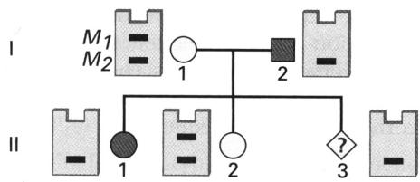

$$
\begin{array}{r l} \operatorname * {P r} \{C \mid X \} & = \frac {\operatorname* {P r} \{X \mid C \} \operatorname* {P r} \{C \}}{\operatorname* {P r} \{X \mid C \} \operatorname* {P r} \{C \} + \operatorname* {P r} \{X \mid R \} \operatorname* {P r} \{R \}} \\ & = \frac {(1 - r) ^ {2} \left(\frac {1}{2}\right)}{(1 - r) ^ {2} \left(\frac {1}{2}\right) + (r) ^ {2} \left(\frac {1}{2}\right)} \\ & = \frac {(0 . 7 5) ^ {2} \left(\frac {1}{2}\right)}{(0 . 7 5) ^ {2} \left(\frac {1}{2}\right) + (0 . 2 5) ^ {2} \left(\frac {1}{2}\right)} \\ & = 0. 9 \end{array}
$$

b. 因为相偶构型和相斥构型是互斥的，所以，

$$
\operatorname * {P r} \{R \mid X \} = 1 - \operatorname * {P r} \{C \mid X \} = 1 - 0. 9 = 0. 1
$$

c. 从凝胶图看出，II-3 遗传得 $M_{2}$ 等位基因。因此需要确定 II-3 也遗传得 a 等位基因的概率。相偶构型不重组，且相斥构型重组时，会出现这一情况。使用总概率定理和 a、b 部分的答案，得

$$
\begin{array}{r l} \operatorname * {P r} \{Y \} & = \operatorname * {P r} \{Y \mid C \} \operatorname * {P r} \{C \} + \operatorname * {P r} \{Y \mid R \} \operatorname * {P r} \{R \} \\ & = (0. 7 5) (0. 9) + (0. 2 5) (0. 1) = 0. 7 \end{array}
$$

## 第6章

6.2 DNA 聚合酶的 3' 到 5' 的外切核酸酶活性具有极其重要的校对功能。如果这种纠错机制失效，因核苷酸错误掺入所致的突变频率会增加百倍左右(参见第 14 章)。

6.4 这种蛋白质称为解旋酶。

6.6 滚环复制始于一个单链缺口，该缺口产生5'-P和3'-OH基团。聚合酶使3'-OH端延伸，取代5'-P端。由于DNA双链是反向平行的，与被取代链互补的链必定以 $3'$ -OH 基团终止。

6.8 c. 密度梯度离心。

6.10 5碳携带基团 a, a 为—CH₂OH。在核苷酸中，a 相当于一个或多个磷酸基团；b 为—H；c 为—OH；d 为—H；而 e 相当于碱基 A、T、G 或 C 之一。

6.12 DNA 聚合酶需要单链模板、引物和所有 4 种三核苷酸；DNA 聚合酶只能将核苷酸加到现成的 3' 端上。在左边的分子中，DNA 聚合酶可用另一条链为模板来延伸每个 3' 端。所得产物的序列为

$$
5 ^ {\prime} - \mathrm {ATGGATCCTTATAACTA- 3 ^ {\prime}}
$$

$$
3 ^ {\prime} - \text { TACCTAGGAATATTGAT-5' }
$$

另外，在右边的分子中，3'端不能延伸，因为没有模板。换句话说，5'突出(如在左边的分子中那样)可被DNA聚合酶填充，而3'突出(如右边分子中那样)不能。

6.14 对于半保留复制模式而言，经过一轮复制之后，所有的 DNA 分子都会是 ${}^{15}N-{}^{14}N$ ；经过两轮复制之后，一半的分子为 ${}^{15}N-{}^{14}N$ ，另一半的分子为 ${}^{14}N-{}^{14}N$ ；经过 3 轮复制后，1/4 为 ${}^{15}N-{}^{14}N$ ，3/4 为 ${}^{14}N-{}^{14}N$ 。对于保留模式而言，经过一轮复制之后，一半的 DNA 分子为 ${}^{15}N-{}^{15}N$ ，另一半为 ${}^{14}N-{}^{14}N$ ；两轮复制之后，1/4 为 ${}^{15}N-{}^{15}N$ ，3/4 为 ${}^{14}N-{}^{14}N$ ；3 轮复制之后，1/8 为 ${}^{15}N-{}^{15}N$ ，7/8 为 ${}^{14}N-{}^{14}N$ 。

6.16 a. 一整转(360°)双螺旋有10bp DNA。因而800bp DNA相当于80转。每个复制叉每秒要旋转80转，因此 $80\times60=4800r/min$ 。b. 两个复制叉从复制起点向相反方向移开，各绕基因组一半时相遇。所需时间为 $(0.5\times4.3\times10^{6})/800s=2687.5s$ ，即44.79min。

6.18 DNA 中腺嘌呤的百分比会增加 5%。

6.20 在 $37^{\circ}$ C 时 DNA 复制基本正常,但在 $42^{\circ}$ C 时不正常。突变体在高温下不能生长。这会是一个致死突变。

6.22 不一定会有相同的毗邻频率。如果这两个物种的序列都是随机的，相同的碱基比值确实会导致相同的毗邻频率。但想一想如下反例：一个物种的序列由大段的 T 与大段的 G 交替排列构成，而另一物种的序列是随机的。在此情况下，碱基比值会一样，但毗邻频率会非常不同。

6.24 滚环复制从一个单链缺口开始，单链缺口产生一个5'-P和一个3'-OH。DNA聚合酶以完整的(无缺口的)那条链为模板，在3'-OH端添加核苷酸；这条生长链为前导链。具有游离5'-P的被置换的链为后随链。

6.26 如果霍利迪结构解离，外围标记没有重组，则一个分子应该为“轻”，另一个分子为“重”。如果霍利迪结构解离，外围标记重组，则一个分子应该是左边“轻”、右边“重”，或相反；在此情况下，两个分子平均而言都是中间密度。

6.28 在左边的染色体中，每条染色单体中的DNA会有一条实线(标记链)和一条虚线(未标记链)。在右边的染色体中，深色染色单体的DNA，两条链都会是实线(两条都是标记链)，浅色染色单体会有一条实线(标记链)和一条虚线(未标记链)。

6.30 序列(A)的第一个(5')核苷酸是G,序列(B)的第一个核苷酸是T。此外，序列(B)的第10和第11个（从5'端开始数，在底部）核苷酸之间有一个5'-AG-3'插入。或者，也可以说序列(A)的第10和第11个核苷酸之间有一个5'-AG-3'缺失。在不知道产生这两种序列的祖先DNA序列的情况下，无法断定是(B)有插入还是(A)有缺失。无论哪种情况，如果该插入/缺失刚好在编码区，就有可能导致翻译阅读框的移位，从而产生错误的氨基酸序列。

## 第7章

7.2 DNA 结构是很长的细丝，在大多数细胞中，其总长度远远大于细胞核的直径，同时还要考虑到每个细胞中会有大量的片段。这会迫使你得出这样的结论：每个 DNA 分子必定要反复地自我折叠。

7.4 每个核小体包含 145bp，加上连接 DNA 的 55bp，每个核小体的 DNA 总长为 200bp。该值相当于 5 个核小体/kb 和 250 个核小体/50kb。

7.6 没有，因为大肠杆菌的染色体是环状染色体，没有末端。

7.8 在每个连续的世代中，端粒会越变越长。

7.10 在果蝇中，异染色质紧靠着丝粒，约占每条染色体臂的 25%；在多线细胞核中，这些区域未被高度复制，而是团聚在一起，形成染色中心。每条染色体臂外侧的 75% 由常染色质构成，在多线细胞核中被高度复制，形成条带区域。

7.12 因为这两个分子的长度相同，所以 G-C 碱基对比例高的分子会比较稳定，从而需要较高的变性温度，这是因为每个 G-C 碱基对有 3 个氢键，而每个 A-T 碱基对只有两个氢键。因此，有 8 个 G-C 碱基对的双链体会比只有 4 个 G-C 碱基对的双链体稳定。

7.14 42 000m 是 42 000 000mm。将此长度缩小 5 万倍，得 84mm。84mm 的长度约为人类 2 号染色体中的 DNA 双链体完全伸展时的实际长度。

7.16 该染色体随着每轮 DNA 复制的进行而渐渐缩短。该染色体连续缩短，到 DNA 复制不再能够复制该基因的野生型表达所需的序列时，即产生新突变 w。

7.18 接头序列如下所示:

## 5'-TTAGGGTTAGGGTTAGGG-3' 3'-AATCCCAATCCCAATCCC-5'

7.20 a. 双螺旋每转有 10 个碱基对。就解旋 4 转而言， $4 \times 10 = 40$ 个碱基对会被打破。b. 每扭转一圈可抵消一整转螺旋的盘旋不足，因此要扭转4圈。

7.22 G+C 碱基对的百分比变化 51，导致 $T_{m}$ 变化 $20.9^{\circ}C$ ，因此所求关系为 $T_{\mathrm{m}}=78+(20.9/51)(g-22)$ ，即 $T_{\mathrm{m}}=69.0+0.41g(°C)$ 。

7.24 因为 $g=(T_{\mathrm{m}}-69.0)/0.41$ ，所以答案是：a. $g=38.3\%G+C$ 。b. $g=43.9\%G+C$ 。

7.26 如果使浓度加倍，复性速度会是原来的两倍，因为互补链会更快地找到彼此。因此 $C_{0}t_{1/2}$ 将维持不变。该结果说明，对 DNA 样品复杂度的估计不依赖于起始浓度，因为起始浓度的任何变化都会被相应的复性时间的变化抵消。

7.28 a. 该螺旋盘旋过度一整转。b. 会超螺旋化。c. 正超螺旋解除螺旋过度。

7.30 显示题中所述特征的 $C_{0}t$ 曲线示意图如附图所示。

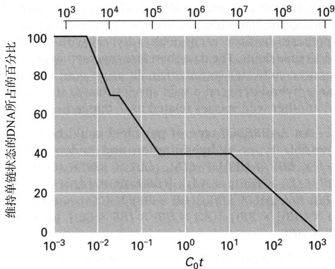  
第8章

8.2 该强制性交换的遗传后果是，X 染色体假常染色体区中的等位基因可与 Y 染色体假常染色体区中它们的同源等位基因互换，使这些基因在系谱中的遗传方式与通常的常染色体遗传方式无法区分。

8.4 a. 克氏综合征核型为 47,XXY，因此有 1 个巴氏小体；b. 特纳综合征核型为 45,X，因此没有巴氏小体；c. 唐氏综合征核型为 47,+21；患该病的人有 1 个或 0 个巴氏小体，取决于患者是女性 (47,XX) 还是男性 (47,XY)；d. 具有 47,XYY 核型的男性没有巴氏小体；e. 具有 47,XXX 核型的女性有 2 个巴氏小体。

8.6 在自发流产中能以可察觉的频率被发现的唯一一种 45 条染色体的核型是 45,X，因此最可能的核型是 45,X。如果这个胎儿能够存活，它会是一个患特纳综合征的 45,X 女性。

8.8 因为 45,X 女儿的 X 染色体中含色盲等位基因，所以 45,X 女儿的 X 染色体必定是从她的父亲获得的(通过带 X 的正常精子)。因此，不分离必定发生在母亲中，不分离产生缺少 X 染色体的卵细胞。

8.10 倒位的序列为 $AB$ $ED$ $CFG$ ，缺失的序列为 $AB$ $FG$ 。可能的易位染色体是 (a) $A$ $B$ $C$ $D$ $ET$ $UV$ 和 $MN$ $O$ $P$ $Q$ $RS$ $FG$ 或 (b) $A$ $B$ $C$ $D$ $ES$ $R$ $Q$ $P$ $ON$ $M$ 和 $V$ $U$ $T$ $FG$ 。在这些两种可能性中，有一种包含两条单着丝粒染色体，另一种包含一条双着丝粒染色体和一条无着丝粒染色体。只有产生两条单着丝粒染色体的易位是遗传稳定的。

8.12 母亲具有含 21 号染色体的罗伯逊易位。唐氏综合征患儿有 46 条染色体，包括正常 21 号染色体的两个拷贝，加上与别的染色体连接的一个额外拷贝（罗伯逊易位）。这和通常的情况不一样，通常唐氏综合征患儿具有 21 三体（核型为 47,+21）。

8.14 被单一缺失显露的基因一定是连续的。根据缺失之间的重叠可推导出基因顺序。第一、二个缺失之间 $a$ 和 $d$ 重叠，而第二、三个缺失之间 $e$ 重叠。基因顺序如附图A部分所示(根据这些数据，只能判断到这个程度)。各个缺失以红色显示。基因 $b$ 在最左边，接着是 $a$ 和 $d$ (顺序未知)，接着是 $c, e$ 和 $f$ 。（基因 $c$ 一定在 $e$ 的左边，因为如果不这样， $c$ 会被缺失3显露。）B部分是一个完全等价的图谱，只不过基因 $b$ 在右边。通过 $b, a, d$ 之间或 $a, d, c$ 之间的三点杂交，或研究更多的缺失，可完成排序。能够显露 $a$ 或 $d$ (但不是两者一起显露)加上两旁至少一个其他标记的任何缺失，可为完成排序提供信息。

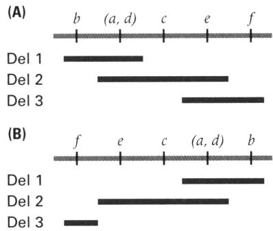

8.16 顺序为 $(ae)dfcb$ ，括号的意思是，根据这些数据不能判断a和e的顺序。答案bcfd(ae)也是正确。

8.18 有 4 条联会染色体成团，说明发生了相互易位。这团染色体含相互易位的两部分及其非易位同源染色体。

8.20 观察到这两个种杂交所得杂种的染色体不配对，说明这两个亲本种的染色体的遗传差异相当大。G. hirsutum 起源的一个可能性，就是通过这种杂种的多倍化而来的，这可以解释 G. hirsutum 中的 26 对染色体。回交结果也与这个假设相符，因为每种回交都产生具有 13 个二价体和 13 个单价体的杂种。因而，这些数据说明，今天的美洲栽培棉最初是野生 G. arboreum 近缘种与野生 G. thurberi 近缘种的杂种的异源多倍体。

8.22 AABBBBCC 型的多倍体可由 9 种杂交和核内复制形成： $\left[(AA\times BB)\times(BB)\right]\times CC$ 、 $\left[(AA\times BB)\times(CC)\right]\times BB$ 、 $\left[(BB\times CC)\times(BB)\right]\times AA$ 、 $\left[(BB\times CC\times(AA))\times BB\right]$ 、 $\left[(BB\times BB)\times(AA)\right]\times CC$ 、 $\left[(BB\times BB)\times(CC)\right]\times AA$ 、 $\left[(AA\times CC)\times(BB)\right]\times BB$ 、 $\left[(AA\times BB)\times(BB\times CC)\right]$ 、 $\left[(AA\times CC)\times(BB\times BB)\right]$ 。

8.24 在这只雄果蝇中，含 $y^{+}$ 的 X 染色体端部变成与 Y 染色体连接，产生基因型 $y X / y^{+} Y$ 。配子为 y X 和 $y^{+} Y$ ，因此，所有的后代为黄色雌性或野生型雄性。

8.26 a. 控制淡绿色叶片的基因和 2 号染色体中易位断裂点之间的重组频率等于 $(36+42)/(36+240+282+42)=13.0$ 图距单位。b. 如果不存在易位，期望比值会是 1:1:1:1.

8.28 可存活后代只能通过相间分离产生，在相间分离中，Y染色体与正常2号染色体一起分离，X-2易位的两部分一起分离。期望结果是50%红宝石眼、粗短翅雄性和50%非红宝石眼、非粗短翅雌性。

8.30 这株独特的酵母为 2 号染色体的二体, 因而杂交结果是三体。2 号染色体上的标记(包括 his7)的分离异常, 但其他染色体上的标记的分离完全正常。

## 第9章

9.2 最终稀释液应含 700 个活细胞/ml，这是悬浮液原液的 $10^{6}$ 倍稀释。可任意组合 100 倍稀释和 10 倍稀释，只要乘积为 $10^{6}$ ，但最简单的可能是 3 次连续的 100 倍稀释。

9.4 T2h 噬菌斑会是清晰的，因为两种菌株都是敏感的；T2 噬菌斑会是浑浊的，因为 B/2 细胞对它有抗性。

9.6 该大肠杆菌菌株含 5000kb，意味着每分钟大约 50kb。因为 $\lambda$ 基因组为 50kb，所以原噬菌体的遗传长度为 1min。

9.8 涂布在缺乏亮氨酸(选择 $Leu^{+}$ )但含链霉素(Str-r)的基本培养基上。leu 等位基因是选择标记，str-r 是反向选择标记。

9.10 a. 用 $m = 2 - 2d^{1/3}$ ，其中， $m$ 是以分钟为单位的图距， $d$ 是共转导频率。对于已知的各个 $d$ 值，图距分别为 $0.74\mathrm{min}$ 、 $0.41\mathrm{min}$ 和 $0.18\mathrm{min}$ 。b. 用 $d = [1 - (m/2)]^3$ 。对于已知的各个 $m$ 值，共转导频率分别为 $0.42$ 、 $0.12$ 和 $0$ 。对于相距 $2\mathrm{min}$ 以上的标记，共转导频率等于 $0$ 。c. $a - b$ 的图距等于 $0.66\mathrm{min}$ ， $b - c$ 的图距等于 $1.07\mathrm{min}$ ，这两个图距可以相加，得 $a - c$ 的距离为 $1.73\mathrm{min}$ 。对于这一图距，预计共转导频率为 $0.002$ 。

9.12 唯一与数据相符的基因顺序是 arg-tau-suc-top-mot。

9.14 a. 含乳糖、色氨酸、组氨酸和链霉素的培养基。b. 含半乳糖、色氨酸、组氨酸和链霉素的培养基。c. 含葡萄糖(或乳糖和半乳糖以外的糖)、组氨酸和链霉素的培养基。d. 含葡萄糖(或乳糖和半乳糖以外的糖)、色氨酸和链霉素的培养基。

9.16 a 正确，因为很多交配对会在 $a^{+}$ 进入之后但在 $c^{+}$ 进入之前断开；b 错误，因为 $b^{+}$ 一定会在 $c^{+}$ 之前进入；c 正确，因为许多 $b^{+} str-r$ 菌落会是 $a^{-} b^{+} str-r$ ；d 错误，因为许多 $b^{+} str-r$ 菌落会是 $a^{-} b^{+} str-r$ ；e 正确，因为产生 $a^{+} b^{-} c^{+} str-r$ 比产生 $a^{+} b^{+} c^{+} str-r$ 需要的重组事件多；f 正确，因为产生 $a^{+} b^{-} c^{+} str-r$ 比产生 $a^{-} b^{+} c^{+} str-r$ 需要的重组事件多；g 正确，因为许多交配对会在 $a^{+}$ 进入之后但在 $b^{+}$ 进入之前断开。

9.18 显然，h 和 tet 紧密连锁，因此含 Hfr 的 $h^{+}$ 等位基因的重组体，往往也含 Hfr 的 tet-s 等位基因，从而这些重组体被 tet-r 的反向选择清除。

9.20 根据 F'质粒的大小，可得的 F'质粒可能是 F'g、F'gh、F'ghi……，或 F'f、F'fe、F'fed……。

9.22 500 个 $his^{+}$ 、250 个 $leu^{+}$ 、50 个 $trp^{+}$ 的顺序说明，这些基因被转移的顺序是 $his^{+} leu^{+} trp^{+}$ 。met 突变是阻止 Hfr 亲本生长的反向选择标记。含组氨酸的培养基选择出 $leu^{+} trp^{+}$ ，菌落数量少是因为两个基因都必须通过重组才能被整合。

9.24 15min 的时间太短，不能让末端基因转移。因此，对 $z^{+}$ str-r 菌落的一个解释是，在 Hfr 细胞中发生了 F 因子的异常切除，产生携带末端标记的 F'质粒。当该 $F'z^{+}$ 质粒被转移进 $F^{-}$ 受体时，所得细胞的基因型会是 $F'z^{+}/z^{-}$ str-r。或者， $z^{+}$ str-r 菌落可通过 $F^{-}$ 受体的 $z^{-}$ 回复突变为 $z^{+}$ 而产生。这两种可能性是可以区分开来的，因为 $F'z^{+}/z^{-}$ str-r 细胞能够将 $z^{+}$ 标记转移给其他细胞。

9.26 a. 依次考虑每个 Hfr，从最早进入的基因开始，当每个基因进入时写下基因名称。相邻基因之间进入时间的差值，为这两个基因之间的距离(单位为 min)。完成每个 Hfr 的基因转移的部分遗传图后，整理这些遗传图，让两个或多个 Hfr 菌株之间共同的标记重叠。该方法得到如下所示的遗传图，其中，箭头示转移的方向，数字为转移时间(单位为 min)。

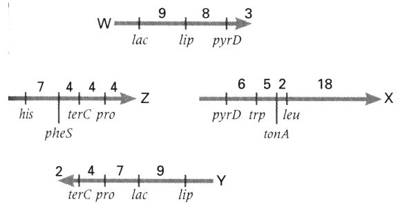

现在按所要求的方式整理复合遗传图，以 100min 的环状形式，0min 在顶部，leu 在大约 2min 处。该图谱如下所示。

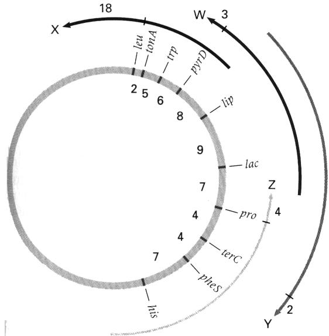

b. 比较该图谱与图 9.13 中的图谱，说明与标准图谱相比，在染色体的一个连续片段上存在一群顺序相反的标记。最简单的解释是，所述菌株发生了部分染色体的倒位，两个断裂点分别在标准图谱的 tonA-pro 和 trp-terC 区。

9.28 所附图谱示 9.27 题中所述缺失的端点所界定的遗传区间，以及与这些区间有关的突变的位置。同时显示 9.29 题中通过互补试验界定的 rIIA 和 rIIB 顺反子的界线。

缺失的端点界定的区间

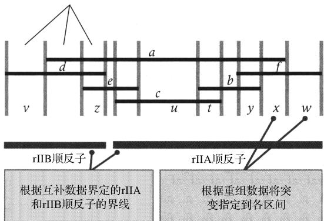

9.30 每个细胞 P2 噬菌体的平均数目是 3 个，因此保持未被 P2 感染的概率是 $e^{-3}=0.050$ ；每个细胞 P4 噬菌体的平均数目是 2 个，因此保持未被 P4 感染的概率是 $e^{-2}=0.135$ 。a. 不被任何一种噬菌体感染的细菌数： $0.050\times0.135\times10^{8}=6.75\times10^{5}$ 。b. 存活细菌数： $6.75\times10^{5}+0.050\times(1-0.135)\times10^{8}=5.00\times10^{6}$ 。c. 产生 P2 后代的细菌数： $(1-0.050)\times0.135\times10^{8}=1.28\times10^{7}$ 。d. 产生 P4 后代的细菌数： $(1-0.050)\times(1-0.135)\times10^{8}=8.22\times10^{7}$ 。

## 第10章

10.2 a. 全部由嘧啶组成: Phe、Ser、Leu 和 Pro。

b. 全部由嘌呤组成：Lys、Arg、Glu 和 Gly。

10.4 a. 原来的 DNA 必定有 5'-ATG-3'/3'-TAC-5' 的碱基序列，底下的链(写在斜线右边的链)是被转录的链；倒位序列为 5'-CAT-3'/3'-GTA-5'，底下的链还是被转录链。因此 mRNA 含 5'-CAU-3'(原来密码子的“反向互补”)，它编码 His。b. 没有一个反向互补密码子是同义密码子。依次检查每个密码子的反向互补密码子可见该答案，或者注意到没有在第二位有互补碱基的同义密码子，更容易得出答案。c. 链终止密码子是 5'-UAA-3'、5'-UAG-3' 和 5'-UGA-3'，它们的反向互补密码子分别是 5'-UUA-3'(Leu)、5'-CUA-3'(Leu) 和 5'-UCA-3'(Ser)。d. 见 c。

10.6 密码子是从 mRNA 的 5' 端开始阅读。肽链的第一个氨基酸在氨基端。因此，如果 C 被加到 3' 端，最后一个密码子会是 UUC，由于遗传密码的简并性，它也编码苯丙氨酸。另外，在 5' 端加上 C，会使第一个密码子变成 CUU，它编码缬氨酸 (Val)，在多聚苯丙氨酸链的氨基端。

10.8 翻译可以 3 种阅读框之一进行: AAG AAG AAG……、AGA AGA AGA……或 GAA GAA GAA……。第一种阅读框编码多聚赖氨酸，第二种编码多聚精氨酸，第三种编码多聚谷氨酸。

10.10 该 RNA 会按交变密码子翻译：AUA-UAUA-AUA-UAUA……，这对应于具有 Ile-Tyr-Ile-Tyr……重复序列的多肽。

10.12 在随机序列中存在 $2^{3}=8$ 种可能的密码子。它们的名称、编码能力及频率为

<table><tr><td>GGG (Gly)</td><td> $(1/4)^{3}=1/64$ </td></tr><tr><td>GGU (Gly)</td><td> $(1/4)^{2}(3/4)=3/64$ </td></tr><tr><td>GUG (Val)</td><td> $(1/4)^{2}(3/4)=3/64$ </td></tr><tr><td>UGG (Trp)</td><td> $(3/4)(1/4)^{2}=3/64$ </td></tr><tr><td>GUU (Val)</td><td> $(1/4)(3/4)^{2}=9/64$ </td></tr><tr><td>UUG (Leu)</td><td> $(3/4)^{2}(1/4)=9/64$ </td></tr><tr><td>UGU (Cys)</td><td> $(3/4)^{2}(1/4)=9/64$ </td></tr><tr><td>UUU (Phe)</td><td> $(3/4)^{3}=27/64$ </td></tr></table>

因此在随机多聚体中会出现的氨基酸及其频率为甘氨酸(4/64=6.25%)、缬氨酸(12/64=18.75%)、色氨酸(3/64=4.69%)、亮氨酸(9/64=14.06%)、半胱氨酸(9/64=14.06%)和苯丙氨酸(27/64=42.19%)。

10.14 a. UGYN 会被翻译成 UGY-GYN，对应于 Cys-Val(如果 Y 是 T) 或 Cys-Ala(如果 Y 是 C)。因此，半胱氨酸后面只可能跟着缬氨酸或丙氨酸。b. UUYN 会被翻译成 Phe-Phe、Phe-Leu 或 Phe-Ser。c. UGGN 会被翻译成 Trp-Gly。d. AUGN 会被翻译成 Met-Cys 或 Met-Trp(N 为 A 时除外，在这种情况下，Met 是多肽链的最后一个氨基酸)。

10.16 a. AUGN 会被翻译成 AUG-UGN，因此第二个氨基酸可能是 Cys 或 Trp。b. 在此情况下，可翻译成 AUG-GNN, 因此第二个氨基酸可能是 Val、Asp、Glu 或 Gly。

10.18 5'-UGG-3'编码色氨酸。该序列可与反密码子3'-ACC-5'或3'-ACU-5'配对。但是，3'-ACU-5'也可与5'-UGA-3'配对，而5'-UGA-3'是链终止密码子。如果3'-ACU-5'被用作色氨酸的反密码子，就会插入色氨酸，而不是终止肽链。因此只有3'-ACC-5'被使用。

10.20 在某一特定位点上具有一个正确氨基酸的概率是 $1-5 \times 10^{-4} = 0.9995$ ，因此，所有 300 个氨基酸都被正确翻译的概率是 $(0.9995)^{300} = 0.86$ ，即 86%。

10.22 如果是从左转录到右，则被转录的链是下面那条，从而 mRNA 序列是 AGA CUU AGC GCU AAA CGU GGU，它编码 Arg-Leu-Ser-Ala-Lys-Arg-Gly。如果颠倒粗体片段，为了保持正确的极性，两条链必须互换，因此，倒位分子的序列是

该分子编码的 mRNA 为 AGA ACG UUU AGC GCU AAG GGU，它编码 Arg-Thr-Phe-Ser-Ala-Lys-Gly。

10.24 茎所缺少的部分是 5'-GUCAUCGAAGCC-GUA-3'。茎环结构如下所示：

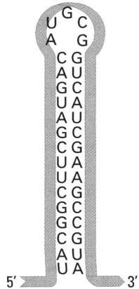

10.26 没有 A 到 I 的修饰时，多肽的顺序是 Val-Pro-Arg-Ser-Ser-His；有 A 到 I 的修饰时，mRNA 阅读为 5'-GUI CCI CGC UCG UCU CIU-3'，翻译成 Val-Pro-Arg-Ser-Ser-Arg。

10.28 因为两条链都可被转录，且转录物有3种可能的阅读框，所以DNA可被转录和翻译的方式有6种。mRNA序列与非转录链一样(U替换T)，因此RNA序列如下：

## 5'-CUA GGU GAC CUA GCU UAA-3' 3'-GAU CCA CUG GAU CGA AUU-5'

粗体的三联体为终止密码子。上面那条 mRNA 在 3 个阅读框中都有终止密码子，而下面那条 mRNA 中，3 个阅读框中有两个有终止密码子。能够是编码序列的 mRNA 阅读框是

$$
5 ^ {\prime} - U U A A G C U A G G U C A C C U A G - 3 ^ {\prime}
$$

其中完整的密码子编码 Lys-Leu-Gly-His。因此被转录链是上面那条链，阅读框是此处说明的阅读框。

10.30 a. 5'-UACCAUGUCAAACAGCGUAUGGUAGCAGUG-3'. b. Met-Ser-Asn-Ser-Val-Trp.

## 第11章

11.2 这些酶被组成型表达，因为在几乎所有细胞中葡萄糖都会被代谢。但酶的水平会受到调节，以防合成失控或合成不足。

11.4 最有可能的调节水平是(a)转录，(b)RNA加工，(c)翻译。

11.6 有两种可能。第一种是，有两个阻遏蛋白结合位点(一个在 EcoR I - BamH I 片段中，另一个在 Hind III - Sac I 片段中)，两者协同作用。每个位点各产生 10 倍的阻遏，但合在一起是 100 倍的阻遏。该假设可通过测定限制性片段的序列来检验，如果每个限制性片段都含一个阻遏蛋白结合位点，则在每个片段中都应该发现一段相似的序列。另一个假设是，阻遏蛋白结合位点非常大，跨越整个 EcoR - Sac I 区。在此情况下，因为 EcoR I - BamH I 片段也应该是阻遏蛋白结合位点的一部分，所以该片段的缺失会有重大影响，而在存在两个不同结合位点的情况下，该片段的缺失最多会产生轻微的影响。

11.8 因为双链体中的两条 DNA 链是反向平行的，所以倒位不仅仅是颠倒序列，还使两条链互换。因此启动子序列的倒位会有严重的影响，因为倒位启动子在相反链中，指向错误的方向。另外，可以预计，增强子元件的倒位不会产生影响或影响很小，因为增强子是 DNA 结合蛋白的靶标，DNA 结合蛋白与增强子的结合与增强子的方向或在哪条 DNA 链中无关。

11.10 在 $37^{\circ}$ C 时，lacZ 和 lacY 的表型都会是 Lac $^{-}$ ；在 $30^{\circ}$ C 时，lacY $^{-}$ 菌株会是 Lac $^{+}$ ，而 lacZ $^{-}$ 菌株会是 Lac $^{-}$ 。

11.12 存在葡萄糖时，cAMP 的浓度较低。两种突变的表型都是 $Lac^{-}$ 。cAMP-CRP 结合不会干扰阻遏蛋白结合，因为 cAMP-CRP 和 lacI 的 DNA 结合位点不同。

11.14 对阻遏蛋白而言，诱导物通常是代谢途径的早期(往往是第一个)底物，且阻遏蛋白因与诱导物的结合而失活。对前阻遏蛋白而言，效应分子通常是代谢途径的产物，且前阻遏蛋白因与效应分子的结合而被激活。

11.16 弱化子不是任何蛋白质的结合位点，因而RNA合成不会从弱化子开始。严格来说，弱化子是潜在的转录终止位点。

11.18 a. 当组氨酸水平低至 His 前阻遏蛋白不再结合时，组氨酸操纵子会起始转录。b. 当负载色氨

<!-- END OFFICIAL API PART part_007 -->


<!-- BEGIN OFFICIAL API PART part_008 -->

酸 tRNA 的水平高到能够发生前导多肽的翻译时，会发生弱化(使转录停止)。c. 当负载色氨酸 tRNA 的水平很低，以致翻译停滞在前导序列的 Trp 密码子处时，转录会继续进行，直到操纵子的终点。

11.20 通常细胞中负载 tRNA 水平最低的氨基酸，在前导 mRNA 中的密码子应该较少，否则在正常的低水平下，也会出现停滞。另外，细胞中负载 tRNA 水平最高的氨基酸，在前导 mRNA 中应该会有多个密码子，否则停滞发生的频次会不足。

11.22 a1 蛋白只有在二倍体中与 $\alpha2$ 蛋白结合时才起作用，因此 MATa' 单倍体细胞会是表现正常的 a 交配型。但是，MATa'/MAT $\alpha$ 二倍体会具有 $\alpha$ 单倍体的表型。原因是，该基因型缺乏 a1/ $\alpha2$ 复合体来阻遏单倍体特异基因，同时也不能阻遏 $\alpha1$ ，从而 $\alpha1$ 基因产物激活 $\alpha$ 特异基因。

11.24 缺乏乳糖或葡萄糖时，有两种蛋白质结合：lac 阻遏蛋白和 CRP-cAMP。存在葡萄糖时，只有阻遏蛋白结合。

11.26 Hfr 细胞将 lac 基因转移进受体细胞中。因为一开始在受体细胞中不存在阻遏蛋白，所以会生成 lac mRNA，此后不久阻遏蛋白生成，lac 转录被阻遏。

11.28 野生型 lac mRNA，或含点突变的 lac mRNA，会在 5kb 处产生条带；含 lacZ\* 的 mRNA 要短 2kb，含 lacY\* 的 mRNA 要短 0.5kb。会出现的带型如附图所示。


11.30 要在乳糖酸上生长，即使是突变型 LacZ 菌株也一定要表达 lacZ 和 lacY 才行。乳糖酸显然不是 lac 操纵子的诱导物，因而，除非也存在 IPTG(lac 操纵子的一种诱导物)来诱导该操纵子的转录，否则 $lacO^{+}$ 突变体也不能在乳糖酸上生长。对于 $lacO^{C}$ 突变体的发现，与此解释一致，因为当 LacY 和突变型 LacZ 是组成型生成时，菌株可以在乳糖酸上生长。

## 第12章

12.2 喜欢黏端是因为黏端只与序列互补的其他黏端结合，而平端片段会与任何其他平端片段结合。

12.4 限制性位点之间的平均距离等于限制性位点出现的概率的倒数。因此必须计算随机 DNA 序列上出现每种限制性位点的概率。答案是 (a) 256, (b) 4096, (c) 256 (N 表示任意核苷酸，其概率为 1), (d) 256, (e) 1024 (因为 R 的概率为 1/2, Y 的概率为 1/2)。

12.6 单链突出端中的两个 N 一定会互补，因此该事件的概率为 $(1/4)^{2}=1/16$ 。

12.8 不会。因为这两条序列的 $5'\rightarrow3'$ 极性不同。

12.10 Fae I 会是一个不错的选择。因为该 mRNA 的序列为 5'-CAUG-3'，所以被转录的 DNA 链的序列为 3'-GTAC-5'，未被转录的 DNA 链的序列为 5'-CATG-3'。因此 Fae I 会紧接在起始密码子之后切割编码序列。

12.12 Aoc II 的位点可能有 $3 \times 3 = 9$ 种，因而任意两个随机位点具有互补末端的概率为 1/9。

$$
1 2. 1 4 \quad (1 / 4) ^ {2} = 1 / 1 6; \quad (1 / 2) ^ {2} = 1 / 4 。
$$

12.16 Pst I, 4kb; Xba I, 2kb; BamH I, 4kb; Pst I + Xba I, 1kb + 2kb; Pst I + BamH I, 2kb; Xba I + BamH I, 1kb + 2kb; Pst I + Xba I + BamH I, 1kb。

12.18 只要序列是随机的, 这两种酶的位点的频率就会是一样的。位点之间的核苷酸对的平均数目是: a. 625; b. 256; c. 625。

12.20 C, 2kb+10kb; P, 3kb+9kb; K, 5kb+7kb; A, 6kb; E, 4kb+8kb; B, 3kb+9kb; X, 1kb+11kb; C+P, 1kb+2kb+9kb; C+E, 2kb+4kb+6kb; C+X, 1kb+2kb+9kb; K+E, 3kb+4kb+5kb; K+X, 1kb+5kb+6kb。

12.22 a. 对常染色体基因而言，女性与男性的拷贝数比值为 1:1，因此会出现黄色斑点。b. 对 X 连锁基因而言，女性与男性的拷贝数比值为 2:1，因此会出现红色斑点。c. 对 Y 连锁基因而言，女性与男性的拷贝数比值为 0:1，因此会出现绿色斑点。

12.24 a. Hpa I 产生平端，而任何一个平端可与任何其他的平端连接。因此 Hpa I 的 A B 片段可以两个方向连接到多接头中。所得克隆会是 X A B Y 或 X B A Y，两者的频率相同。b. 如果某种限制酶产生的片段，其两端是一样的，则任何一端都可以连接到互补黏端上。要使片段的排列方向强制为 X A B Y，要用产生不同黏端的两种限制酶来分别切割载体和靶序列。载体中最靠近 X 的位点必须与靶序列中最靠近 A 的位点互补，而载体中最靠近 Y 的位点必须与靶序列中最靠近 B 的位点互补。在此情况下，如果用 Kpn I 和 Pst I 来切割载体和靶序列，会得到 X A B Y 的排列方向。c. 按照 (b) 部分的逻辑，用 Sal I 和 Kpn I 来切割载体和靶序列，会得到排列方向为 X B A Y 的克隆。

12.26 因为限制性片段的任意两个互补的末端都可连接，所以该基因在质粒中的方向很可能是反的，因此不能发挥功能。

12.28 在可转录感兴趣的基因的克隆中，基因相对于启动子的方向应该正确。这些克隆的限制性图谱如下所示。预计这种方向的基因会被转录。

  
12.30 限制性图谱如附图所示。

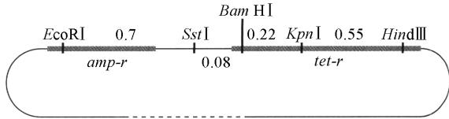  
EcoRI 与HindⅢ其余的质粒=2.45kb

## 第13章

13.2 在功能失去突变中，基因中的遗传信息在一些细胞或全部细胞中不表达。在功能获得突变中，遗传信息表达的量不合适，或在不合适的时间表达，或在不合适的细胞中表达。在同一个基因中，两种突变都可发生：一些等位基因可能是功能失去突变，其他的可能是功能获得突变。但是，一个特定的等位基因一定是其中的一种(或两种都不是)。

13.4 小眼突变对大眼突变为上位基因，大眼突变对小眼突变为下位基因。该结果说明，在该发育途径中，小眼基因的基因产物在大眼基因产物的下游起作用。

13.6 进行互补试验。使两个杂合基因型杂交，判断雌性后代是否具有母体效应致死表型。如果它们是等位基因，预计会有 1/4 的后代具有该表型。如果它们不是等位基因，则所有的后代都应该是正常的。

13.8 因为该基因是充分的，所以功能获得突变会诱导发育命运，从而只要是表达该功能获得等位基因的细胞都会表达该形态特征。该等位基因会是显性的，因为在同源染色体中的正常等位基因不会阻止该发育途径的出现。

13.10 a. 白色；b. 紫色；c. 紫色；d. 白色。

13.12 第一行说明顺序为 D A、E A 和 F A；第二行说明顺序为 D B、E B 和 B F；第三行说明顺序为 C D、E C 和 C F。将这些合起来，说明这些组分起作用的顺序是 E-C-D-B-F-A。

13.14 寻找具有 bicoid 突变体类似表型(缺口和胸)的胚胎。

13.16 移植核对卵母细胞的细胞质产生应答，从而在发育的每个阶段都表现得像卵母细胞一样。

13.18 花瓣—花瓣—雄蕊—心皮。

13.20 轮 1、2、3 和 4 分别产生叶片、花瓣、雄蕊和心皮。

13.22 a. 该结果与单一突变体一致。b. 这些双重突变体的表型说明，只要 $a^{+}$ 就足以产生端分节；产生中分节需要 $a^{+}$ 和 $c^{+}$ ；产生近侧分节需要 $b^{+}$ 和 $c^{+}$ 。c. 详细的模型如附图所示。

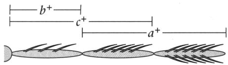

13.24 卵裂和囊胚形成所需的蛋白质是从存在于成熟卵母细胞中的 mRNA 翻译来的,但原肠胚形成需要合子基因的转录。

13.26 挽救胚胎所需的物质为母源 o 基因转录来的 mRNA，或该基因的蛋白质产物，该蛋白质定位于细胞核中。

13.28 a. 因为在 agamous 突变体中，轮 1～4 分别产生萼片、花瓣、花瓣和萼片，但花瓣和萼片需要 apetala-1 的表达。b. 因为在 apetala-1 突变体中，轮 1～4 分别产生心皮、雄蕊、雄蕊和心皮，但心皮和雄蕊需要 agamous 的表达。

13.30 第一行说明顺序为 C A 和 C B，而第二行说明顺序为 A D 和 B D。在该途径中，显然 C 先起作用，D 最后起作用，但 A 和 B 的作用顺序不明确，这种不明确性可用符号 (A,B) 来表示。因此该途径的作用顺序为 C-(A,B)-D。

## 第14章

14.2 a. 2; b. 3; c. 2; d. 1。

14.4 a. T102I 由 C→T 转换导致；b. P106S 由 C→T 转换导致；c. 草甘膦抗性突变体如此罕见是因为它们是双重突变体，在同一个基因内出现两个突变的事件，比单独出现其中一个突变的事件要稀有得多。

14.6 这样的人是体细胞嵌合体，因而可用眼睛虹膜的色素生成细胞或其前体细胞中的体细胞突变来解释。

14.8 a. 起始密码子为 AUG 和 AUM。b. 终止密码子是 UAA、UAG、UAM、UGA 和 UMA。

14.10 因为任何单一核苷酸替换都会产生一个具有随机核苷酸序列的新密码子，所以它是链终止密码子(UAA、UAG或UGA)的概率是3/64，即大约5%。

14.12 该突变很可能是一个缺失, 因为在野生型噬菌体中为 5kb 的一个限制性片段, 在突变型噬菌体中只有大约 3.5kb, 而其他所有片段的大小都相符。这种差异提示该突变为缺失。

14.14 同源重组结果如下图所示:

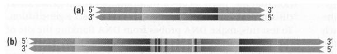

14.16 赖氨酸密码子可为 AAA 或 AAG, 谷氨酸密码子可为 GAA 或 GAG。因而该突变是由密码子第一位的 A-T 到 G-C 的转换所致。

14.18 扇状菌落可用 DNA 双链体仅有一条链发生核苷酸替换来解释。该异源双链体的复制会产生一个具有野生型序列的子代 DNA 分子和另一个具有突变型序列的子代 DNA 分子。细胞分裂产生一个 $Lac^{+}$ 细胞和一个 $Lac^{-}$ 细胞，两个细胞的位置是并排的。由于细胞不会在琼脂表面移动， $Lac^{+}$ 细胞形成半个紫色菌落， $Lac^{-}$ 细胞形成半个粉红色菌落。

14.20 在 A 蛋白中很多位置上的氨基酸替换不消除其发挥作用的能力，只有在消除色氨酸合成酶活性的关键位置上的氨基酸替换才会被检测为 Trp 突变体。

14.22 虽然可损害野生型蛋白质活性的氨基酸替换方式有很多种，但除了恢复为原来的氨基酸外，突变型蛋白质可恢复野生型活性的方式非常少。

14.24 a. 1:1，因为该突变为隐性突变，且雄性的 X 染色体得自母本。b. 全部都是雌性，因为在 $29^{\circ}$ C 时雄性死亡(在此情况下，雄性从父本得到 X 染色体)。

14.26 a. 每代产生一个突变的概率为 $5 \times 10^{-5}$ ，因此每代没有突变的概率为 $1 - (5 \times 10^{-5}) = 0.99995$ 。在 10000 代中没有突变的概率等于 $(0.99995)^{10000} = 0.61$ 。b. 发生一次突变的平均代数是 $1 / (5 \times 10^{-5}) = 20000$ 代。

14.28 (a) 中两个转座因子交换，产生相互易位；(b) 中两个转座因子交换，产生一条双着丝粒染色体和一条无着丝粒染色体。重组产物如附图所示。


14.30 推导两个双重突变体的阅读框序列。+G 和-C 组合的阅读框为 AGAGGUAAGTCTAGA，翻译为 Arg-Gly-Lys-Ser-Arg。该多肽有 3 个相邻的氨基酸被替换，但如果这些替换能被耐受，该多肽可能可以发挥作用。另外，-G 和+C 突变组合的阅读框为 AGATAACGCCTCAGA，翻译为 Arg-End，End 表示 UAA 终止密码子。在这种双重突变体中，下游的重复不能校正上游的终止密码子。

## 第15章

15.2 a. 在允许温度下表型正常。b. 在限制性温度下，母细胞和子细胞不能分离；它们仍然通过一个小的细胞质桥连接在一起，并不断地继续分裂，形成一团相互连接的细胞，每个细胞都与其母细胞和其子细胞通过这种细胞质桥连接。

15.4 周期蛋白-CDK 复合体将磷酸基团转移给它们的靶蛋白；可逆转周期蛋白-CDK 复合体作用的相应酶类是磷酸酶。

15.6 后期促进复合体的两种重要靶标为 Pds1p 和周期蛋白 B。该复合体为泛素蛋白连接酶，可使蛋白质泛素化，将蛋白质标记为需要蛋白酶体销毁。Pds1p 的销毁使姐妹染色单体不分离，因而它与中期/后期过渡相关；周期蛋白 B 的销毁与有丝分裂/G₁ 过渡相关。

15.8 主力是 p53 蛋白。正常情况下 p53 蛋白不会在细胞核中堆积，因为它会被 Mdm2 不断地排出核外。在 DNA 损伤存在时，p53 被磷酸化和乙酰化，这使得它与 Mdm2 的结合减少；p53 在细胞核中堆积，并激活 p21、GADD45、14-3-3 σ 及 miRNA34a 和 miRNA34b/c 基因的转录。这些基因的产物分别与 $G_{1}/S$ 过渡的阻断、S 期延长和 $G_{2}/M$ 过渡相关。

15.10 Bax 和 Bcl2 通常以异二聚体形式存在。Bax 的过度生成导致 Bax 同二聚体，Bax 同二聚体激活细胞凋亡途径。p53 蛋白在细胞凋亡中起作用，是因为 p53 是编码 Bax 的基因的转录因子。某些细胞癌基因会导致 Bcl2 的过度生成，Bcl2 通过掩蔽 Bax/Bcl2 异二聚体中的 Bax 亚基而抵消 Bax 过度生成的效应。

15.12 a. 检测分离的癌基因与非常靠近 p53 基因的 DNA 标记的遗传连锁情况。如果在致病基因和 p53 处的某个 DNA 标记存在紧密连锁，则该病可能与 p53 相关。如果致病基因与 p53 不存在遗传连锁，则该病可能涉及别的基因。b. 可能发生改变的位点包括：使 p53 基因表达减少的启动子改变、内含子中与必需剪接位点对应的改变、去除整个基因的缺失（这样，杂合个体的 p53 序列为野生型 $p53^{+}$ 的同源物）。c. 任何能够模拟 p53 功能失去的原因都可能是该表型的原因。引起 Mdm2 超表达的突变是其中一个可能。其他可能性还包括使磷酸化 p53 的蛋白激酶（如果是关键的蛋白激酶）或乙酰化 p53 的蛋白乙酰化酶丧失功能的突变，这两种修饰只要缺少任何一种，均会使应答 DNA 损伤时 p53 的水平不能升高（可能是因为 Mdm2 仍能与 p53 结合）。对于上述 3 种可能性，综合征都会表现为显性遗传方式，但在细胞水平的表达都需要杂合性丢失。

15.14 会出现染色体畸变是因为正常的 $G_{1}/S$ 检查点的作用是让 DNA 损伤(如染色体断裂)能在进入 S 期之前修复。缺乏正常的 $G_{1}/S$ 检查点时，即使存在染色体断裂或其他畸变，细胞也会过渡到 S 期。

15.16 在应答某些酪氨酸激酶受体的激活时，Ras-GTP 是传递生长信号的核心步骤。组成型 Ras-GTP 会持续传递生长信号。

15.18 意思是，因为大多数从双亲之一遗传了一个突变型 Rb1 基因的个体会患视网膜母细胞瘤，所以在家系中突变型等位基因对视网膜母细胞瘤表型而言表现为显性。但是，杂合个体中的体细胞不会癌变，除非它们发生杂合性丢失，使它们对该突变为实际上的纯合，因此在细胞水平该突变为隐性。

15.20 因为杂合性丢失的概率为 $7.5 \times 10^{-7}$ /细胞，且在双眼中共有 $4 \times 10^{6}$ 个有风险的细胞，所以在任何一个细胞中都没有杂合性丢失的概率为 $(1 - 7.5 \times 10^{-7})$ 自乘 $4 \times 10^{6}$ 次，这等于 0.05，即 5%。因此，家族性视网膜母细胞瘤的外显率为 95%。（熟悉泊松分布的学生可用每个杂合个体具有肿瘤的均数为 3 这一事实，据此，泊松分布意味着没有肿瘤的个体的数目为 $e^{-3} = 0.05$ 。）

15.22 a. 影响四聚化结构域的突变，在机体水平会是显性的，但在细胞水平会是隐性的，因为不会形成混合四聚体。杂合细胞要变成突变型细胞，必须存在杂合性丢失。b. 影响 DNA 结合结构域的突变，在机体水平和细胞水平都会是显性的。因为有害亚基的存在，所以杂合细胞生成的有功能的转录因子非常少。

15.24 观察该系谱可见，第Ⅰ代的母亲(个体9)的c条带来自一个突变型等位基因，因为她的所有患病后代都遗传了该等位基因，而她的所有正常后代都未遗传该等位基因。因此个体5携带与条带c相关的突变型等位基因，从而在她的后代中，个体2和7有高风险，其他个体无风险。个体20也携带产生条带c的突变型等位基因，因此在他的后代中，个体16、21和22具有高风险，其他个体无风险。第Ⅲ代中剩下的个体13无风险，尽管她的DNA产生了一条与c的迁移率相同的带。原因是，该条带源自她父亲的一个等位基因，她父亲与系谱中任何一位患者都没有亲缘关系，因此在此情况下条带c是一个非突变型等位基因的标记。

15.26 一个方法是，先判断在位置上靠近易位位点的是 T 细胞受体基因还是免疫球蛋白重链基因。如果其中任有一个基因靠近断裂点，则可预计存在启动子融合。要证实的话，应该判断断裂点旁边的基因的 mRNA，是否会如存在启动子融合时所期望的那样具有正常的大小。如果未提示在易位位点存在 T 细胞受体或免疫球蛋白基因，则可预计存在基因融合。要检验这一点，用易位位点两侧的 DNA 制备两个 DNA 探针，用这两个探针与正常细胞和白血病细胞的 RNA 印迹进行杂交（这些探针必须足够长，能够延伸进外显子中，否则它们不会与 mRNA 杂交）。对基因融合而言，白血病细胞中的 mRNA 应该是嵌合分子，因而预计白血病细胞的单一 mRNA 与 DNA 两侧都能杂交；对野生型细胞而言，两个探针应与不同大小的 mRNA 杂交。通过更精细的分析，可判断基因融合是否发生在内含子中。

15.28 对致病等位基因一定是杂合的但却不会患癌症的个体是 I -1、I -2 或 III-3。

15.30 RAD9 可能与 $G_{1}/S$ DNA 检查点无关，因为在 $36^{\circ}C$ 条件下，cdc28、cdc6 突变体和 cdc8 rad9 双重突变体可以存活，说明在 rad9 突变体中 $G_{1}/S$ 检查点是完好的。RAD9 可能也与中心体复制检查点无关，因为在 $36^{\circ}C$ 条件下 cdc7 rad9 双重突变体可存活。

RAD9 与 S 期的 DNA 检查点有关，因为在 36℃ 条件下，cdc2、cdc13 突变体和 cdc17 rad9 双重突变体（及 cdc9 rad9 双重突变体）死亡。RAD9 不可能与纺锤体检查点或退出有丝分裂的检查点有关，因为在 36℃ 条件下孵育时，cdc16、cdc23 突变体和 cdc15 rad9 双重突变体可存活。

## 第16章

16.2 严重程度会变化，是因为严重程度取决于患者体内所存在的缺陷型线粒体的比例。

16.4 是，这对于人类线粒体密码是事实。在标准密码中，例外的情况包括 AUA 和 AUG，它们分别编码异亮氨酸和甲硫氨酸；UGA 和 UGG 分别编码“终止”和色氨酸。

16.6 遗传方式为严格的母体遗传，因此黄色很可能是通过细胞质遗传的。一个合理的假设是，编码黄色的基因包含在叶绿体 DNA 中。

16.8 在第三位上的所有转换突变都是同义突变。在 128 种可能的颠换突变中，56 种为同义突变，即 56/128=43.8% 为同义突变。

16.10 在 X 连锁遗传情况下, 一半的 $F_{2}$ 雄性(所有后代的 1/4)会是白色。实际观察结果是, 所有 $F_{2}$ 后代都是绿色。

16.12 由 4 个限制位点组成的那一簇限制位点说明，存在一个反向重复序列。反向重复之间的重组可将其间的片段颠倒，得到两种不同的限制图。它们同时存在于单一个体中，是因为一种限制图是另一种限制图通过重组而来，这种重组发生的频率一定比较高，所以在每个个体中两种 mtDNA 都有。

16.14 $mt^{-}$ 品系的叶绿体优先丢失，且 mt 等位基因以 1:1 的比例分离。期望结果为 $1/2a^{+}b^{-}mt^{+}$ 和 $1/2a^{+}b^{-}mt^{-}$ 。

16.16 a. 全部是 cpl-r，因为叶绿体来自 $mt^{+}$ 亲本。b. 全部是 mit-s，因为线粒体来自 $mt^{-}$ 亲本。c. 抗性：敏感的比例为 2:2，因为核基因进行孟德尔分离。

16.18 分离型小菌落之所以被称为 “分离型”，是因为这种小菌落表型在杂交中，在减数分裂中一个核基因突变进行正常的 2:2 分离，产生 2 小菌落：2 非小菌落的后代。

16.20 因为每个四分体都表现出单亲遗传方式，所以该性状可能是由通过细胞质传递的因子(如线粒体)决定的。4:0 四分体由仅含突变型因子的二倍体产生，0:4 四分体由仅含野生型因子的二倍体产生。

16.22 结合配对方式有 $1/4\ AA \times AA$ 、 $1/2\ AA \times aa$ 和 $1/4\ aa \times aa$ 。这些方式分别产生全为 AA、全为 Aa 和全为 aa 的后代，因此后代为 1/4 AA、1/2 Aa 和 1/4 aa。自体受精时，Aa 基因型变成对 A 或 a 纯合，因此自体受精的期望结果为 1/2 AA 和 1/2 aa。

16.24 $F_{1}$ 的核基因型为 $Rsf/rsf$ ，且所有后代均得到雄性不育细胞质（被 Rsf 等位基因恢复为雄性可育）。在下一代中，3/4 的植株为 Rsf/—、雌雄均可育，但 1/4 的植株为 $rsf/rsf$ ，这些植株雌性可育，但雄性不育。

16.26 最有可能的是某个因子的母体传递，该因子可能是病毒或细菌，在雄性后代中造成很高的成虫前死亡率。

16.28 附表示每对线粒体 DNA 分子共同具有的限制位点的百分数。

<table><tr><td></td><td>1</td><td>2</td><td>3</td><td>4</td><td>5</td></tr><tr><td>1</td><td>100</td><td>0</td><td>80</td><td>10</td><td>0</td></tr><tr><td>2</td><td></td><td>100</td><td>0</td><td>10</td><td>100</td></tr><tr><td>3</td><td></td><td></td><td>100</td><td>11</td><td>0</td></tr><tr><td>4</td><td></td><td></td><td></td><td>100</td><td>10</td></tr></table>

可举例来说明表中各项数据。分子3和4一共有9个限制位点，其中1个位点相同，因此在表中该项为 $1/9 = 11\%$ 。对角线上的各项为100，意思是每个分子与自己的限制位点 $100\%$ 相同。亲缘关系最近的两个分子是2和5(事实上它们是一样的)，因此要将它们组合在一起。接下来亲缘关系最近的两个是1和3，因此也要把它们组合在一起。 $2\sim 5$ 这一组与分子4共同具有的限制位点平均为 $10\%$ ，而 $1\sim 3$ 这组与分子4共同具有的限制位点平均为 $10.5\%$ [即 $(10 + 11) / 2]$ 。因此， $2\sim 5$ 这组和 $1\sim 3$ 这组与分子4的距离差不多相等。下图示推断出来的这些分子的关系。这种类型的数据未指出该把“根”置于树状图的何处。


16.30 该结果拒绝假设(1)，但不能区分假设(2)和(3)。

## 第17章

17.2 各种等位基因的数目为： $A_{1}=2+2+5+1=10$ ; $A_{2}=5+12+12+10=39$ ; $A_{3}=10+5+5+1=21$ 。等位基因总数为70，因此等位基因频率为： $A_{1}$ ，10/70=0.14； $A_{2}$ ，39/70=0.56； $A_{3}$ ，21/70=0.30。

17.4 等位基因 5.7 的频率= $(2\times9+21+15+6)/200=0.30$ ; 等位基因 6.0 的频率= $(2\times12+21+18+7)/200=0.35$ ; 等位基因 6.2 的频率= $(2\times6+15+18+5)/200=0.25$ ; 等位基因 6.5 的频率= $(2\times1+6+7+5)/200=0.10$ 。

17.6 如果基因频率满足哈代-温伯格定律，它们的比例应分别为 $p^2$ 、 $2pq$ 和 $q^2$ 。在每种情况下， $p$ 等于 $AA$ 的频率加上 $Aa$ 频率的一半，且 $q = 1 - p$ 。在随机交配情况下，等位基因频率及期望基因型频率为：(a) $p = 0.50$ ，期望基因型频率为 0.25、0.50 和 0.25；(b) $p = 0.635$ ，期望基因型频率为 0.403、0.463 和 0.133；

(c) p=0.70，期望基因型频率为 0.49、0.42 和 0.09；
(d) p=0.775，期望基因型频率为 0.601、0.349 和 0.051；
(e) p=0.50，期望基因型频率为 0.25、0.50 和 0.25。因此，只有 a 和 c 满足哈代-温伯格定律。

17.8 该隐性等位基因的频率为 $q=\sqrt{1/14000}=0.0085$ 。因此，p=1-0.0085=0.9915，所以杂合子的频率为 2pq=0.017（约为 1/60）。

17.10 假设随机交配的话，该隐性等位基因的频率为 $q=\sqrt{1/250\ 000}=0.002$ 。a. 在一级堂表亲婚生子女中，XP 的期望频率等于 $q^{2}(1-F)+qF$ ，其中，一级堂表亲子女的 F=1/16。在此情况下，上式计算得 $(0.002)^{2}(15/16)+(0.002)(1/16)=0.000\ 128\ 75$ ，即大约 1/7767。b. 比值为 $(1/7767)/(1/250\ 000)=32.2$ 。这就是说，一级堂表亲对导致 XP 的隐性突变型等位基因为纯合的风险要大 32 倍。

17.12 a. 因为 60% 的种子可发芽，所以不能发芽的 40% 为纯合隐性。因此隐性等位基因的频率 $q=\sqrt{0.4}=0.63$ 。这意味着 p=1-0.63=0.37，这是抗性等位基因的频率。b. 杂合子的频率为 $2pq=2\times0.37\times0.63=0.46$ 。显性纯合子的频率为 $(0.37)^{2}=0.14$ ，因此在存活的基因型中，纯合植株的比例为 0.14/0.60=0.23。

17.14 a. 有 17 个 $A_{1}$ 等位基因和 53 个 $A_{2}$ 等位基因，因此等位基因频率为： $A_{1}, 17/70 = 0.24; A_{2}, 53/70 = 0.76$ 。b. 期望基因型频率为： $A_{1}A_{1}, (0.24)^{2} = 0.058; A_{1}A_{2}, 2(0.24)(0.76) = 0.365; A_{2}A_{2}, (0.76)^{2} = 0.578$ 。期望数目分别是 2.0、12.8 和 20.2。

17.16 黄色等位基因 y 的频率为 0.2。在雌性中，野生型 (+/+ 和 y/+) 和黄色 (y/y) 的期望频率分别为 $(0.8)^{2}+2(0.8)(0.2)=0.96$ 和 $(0.20)^{2}=0.04$ 。在 1000 只雌性中，会有 960 只野生型和 40 只黄色。在雄性中，表型频率非常不同。在雄性中，野生型 (+/Y) 和黄色 (y/Y) 的期望频率分别为 0.8 和 0.2，其中，Y 表示 Y 染色体。在 1000 只雌性中，会有 800 只野生型和 200 只黄色。

17.18 在随机交配情况下杂合子的期望频率为 2pq，如果与该频率相比，存在杂合子的缺乏，则提示存在近交。提示存在近交的群体为 d(杂合子期望频率为 0.349) 和 e(杂合子期望频率为 0.5)。

17.20 a. 注意到 $1 / (2.6 \times 10^{6}) = 3.846 \times 10^{-7}$ ; 设 $q^{2} = \sqrt{3.846 \times 10^{-7}}$ , 则 $q = 0.000620$ 。b. $q^{2}(15/16) + q(1/16) = 3.192 \times 10^{-5}$ , 即 $1/25561$ 。c. $(0.99 \times 3.846 \times 10^{-7}) + (0.01 \times 3.192 \times 10^{-5}) = 7.720 \times 10^{-7}$ 。d. $(0.01 \times 3.192 \times 10^{-5}) / (7.720 \times 10^{-7}) = 50.7\%$ 。虽然仅有 $1\%$ 的一级堂表亲婚配, 他们在该基因的纯合隐性中却占了一半以上。

17.22 对每个分类单元而言，UPGMA 距离是连接它们的分支的长度的总和。因而距离矩阵为

<table><tr><td></td><td>B</td><td>C</td><td>D</td></tr><tr><td>A</td><td>17.4</td><td>6.4</td><td>12.6</td></tr><tr><td>B</td><td></td><td>17.4</td><td>17.4</td></tr><tr><td>C</td><td></td><td></td><td>12.6</td></tr></table>

17.24 用公式 17-10，令 n=40， $p_{0}/q_{0}=1$ （接种数量相等），且 $p_{40}/q_{40}=0.35/0.65$ 。解之得 w=0.9846，这是 B 菌株相对于 A 菌株的适合度，因而对 B 的选择系数为 s=1-0.9846=0.0154。

$$
1 7. 2 6 \quad 1 0 ^ {- 4} / (1 0 ^ {- 4} + 1 0 ^ {- 7}) = 0. 9 9 9 。
$$

17.28 a. 杂合基因型的期望频率为 $2 \times 0.00\ 005 \times 0.999\ 95 = 10^{-4}$ ，即 1/10 000。b. 因为 $q = \mu / hs$ ，其中，已知 q = 0.000 05 和 hs = 0.20，所以估计突变率 $\mu = 0.00\ 005 \times 0.20 = 1 \times 10^{-5}$ 。

17.30 a. 稀有有利显性等位基因的频率变化会比较快，因为杂合基因型处在有利于它的选择之中。b. 注意，此处的情况与(a)部分一样，因为有利显性等位基因稀有等于有害隐性等位基因常见，或者相反。因此常见有害隐性等位基因的频率变化较快，因为有利选择会作用于稀有杂合基因型。

## 第18章

18.2 因为方差等于标准差的平方，所以唯一的可能是，该方差等于 1 或 0。

18.4 广义遗传率是基因型的所有差异中表型方差所占的比例，即 $H^{2}=\sigma_{g}^{2}/\sigma_{p}^{2}$ ，它包含显性效应和等位基因之间的互作。狭义遗传率是表型方差中仅由加性效应造成的部分，即 $h^{2}=\sigma_{a}^{2}/\sigma_{p}^{2}$ ，它被用来预测人工选择中亲本和后代之间的相似性。如果所有的等位基因频率等于 1 或 0，则两种遗传率都会等于 0。

18.6 对果实重量而言，已知 $\sigma_{e}^{2}/\sigma_{p}^{2}=0.13$ 。因为 $\sigma_{p}^{2}=\sigma_{g}^{2}+\sigma_{e}^{2}$ ，所以 $H^{2}=\sigma_{g}^{2}/\sigma_{p}^{2}=1-\sigma_{e}^{2}/\sigma_{p}^{2}=1-0.13=0.87$ 。因此，果实重量的广义遗传率为 87%。可溶性固形物含量和酸度的 $H^{2}$ 值分别为 91% 和 89%。

18.8 a. 表型 0、2、4 和 6 的频率分别为 0.015625、0.0140625、0.421875 和 0.421875。b. 均数为 4.50，方差为 2.25，标准差为 1.50。c. 表型 0、1、2、3、4、5 和 6 的频率分别为 0.0156、0.0938、0.2344、0.3125、0.2344、0.0938 和 0.0156。均数为 3.00，方差为 1.50，标准差为 1.22。

18.10 a. 要确定均数，用每个产奶的磅数值(用中值)乘以奶牛的数量，其和除以300(奶牛总数)，得均数值为4080磅。估计方差为626100磅 $^{2}$ ，估计标准差(方差的平方根)为791磅。b. 包含68%的奶牛的范围是均数减去标准差到均数加上标准差，即(4080-791=3289)～(4080+791=5662)磅。c. 对95%的奶牛而言，范围在两个标准差之内，即2498～5698磅。

18.12 a. 基因型方差为 0，因为所有 $F_{1}$ 小鼠都有相同的基因型。b. 存在加性效应的情况下， $F_{1}$ 代的均数会等于两个亲本品系的平均值。

18.14 a. 在遗传异质性群体中，表型方差 $(\sigma_p^2)$ 等于 $\sigma_g^2 + \sigma_e^2 = 40$ 。近交系的方差等于环境方差(因为在遗传纯合群体中 $\sigma_g^2 = 0$ )，则 $\sigma_e^2 = 10$ 。因此在杂合群体中， $\sigma_g^2 = 40 - 10 = 30$ 。广义遗传率 $H^2 = \sigma_g^2 / (\sigma_g^2 + \sigma_e^2) = 30 / 40 = 75\%$ 。b. 如果这两个近交系杂交， $\mathrm{F}_1$ 代会是遗传均一的，结果是，期望方差 $\sigma_e^2 = 10$ 。

18.16 这些子女的遗传关系为半同胞，表 18.3 指出，理论相关系数为 $h^{2}/4$ 。

18.18 a. 因为沙壳虫是无性生殖的生物，亲本和后代具有如同单卵双生一样的遗传关系，因而广义遗传率分别为 0.956 和 0.287。b. 最长刺长度方差的环境成分比牙的数量大。

18.20 $\sigma_{g}^{2}=0.0570-0.0144=0.0426,\quad D=1.689-(-0.137)=1.826$ 。估计基因的最小数量 $n=(1.826)^{2}/(8\times0.0426)=9.8$ 。

$$
18.22 \quad h ^ { 2 } = ( 2 . 3 3 - 2 . 2 6 ) / ( 2 . 3 7 - 2 . 2 6 ) = 63 . 6 \%   .
$$

18.24 用公式 18-6, M=10.8, $M^{*}=5.8$ , $M'=8.8$ 。估计狭义遗传率 $h^{2}=(8.8-10.8)/(5.8-10.8)=0.40$ 。

18.26 20 个个体的平均断奶体重为 81 磅，标准差为 13.8 磅。分布上面一半的均数可用题中已知的关系计算，题中指出，分布上面一半的均数为 $81+(0.8)(13.8)=92$ 磅。用公式 18-6，可解出后代的期望平均断奶体重为 $81+0.2(92-81)=83.2$ 磅。

18.28 a. 狭义遗传率分别为 1.0、0.67、0.18、0.10、0.02、0.01 和 0.002。b. 狭义遗传率的大小取决于表型中的亲子相关性。对稀有隐性等位基因而言，大多数纯合后代来自杂合基因型之间的交配，因此在表型中基本上不存在亲子相关性。

18.30 在此情况下，迭代计算得 $M_{t}=M_{0}+h^{2}(S_{1}+S_{2}+S_{3}+\cdots+S_{t-1})$ 。

## 第19章

19.2 在这些物种中，现代人与尼安德特人亲缘关系最近，因此估计 $T_{\mathrm{m}}(\mathrm{HN})$ 最高。尼安德特人的 DNA 在大约 3 万年前该物种灭绝时停止进化。在此期间，人类和黑猩猩一直继续进化，因而估计人类和黑猩猩的 DNA 比尼安德特人和黑猩猩的 DNA 趋异程度要稍微大一点。因此 $T_{\mathrm{m}}(\mathrm{HC}) < T_{\mathrm{m}}(\mathrm{NC}) < T_{\mathrm{m}}(\mathrm{HN})$ 。这些理由支持选项 (d)。

19.4 人与黑猩猩的亲缘关系最近，因此 B 为人类、C 为黑猩猩，或相反。标签 A 对应于大猩猩。

19.6 1300 万年：从共同祖先到现代人的 650 万年，加上从共同祖先到现代黑猩猩的 650 万年。

19.8 假设复等位基因符合哈代-温伯格比例，并设 $p_{1}=0.2,\ p_{2}=0.3,\ p_{3}=0.5$ 。具有 5 个或 5 个以上拷贝的个体，一条染色体上有 3 个拷贝而其同源染色体上有 2 个拷贝，或两条同源染色体上都各有 3 个拷贝。因此具有 5 个或 5 个以上拷贝的个体的期望比例是 $2p_{2}p_{3}+p_{3}^{2}=2(0.3)(0.5)+(0.5)^{2}=0.55$ 或 55%。

19.10 a. 0.36; b. 0.64; c. 0

19.12 a\~c 3 个都是，因此，答案为 d。

19.14 用多地区模型推测，后代种群之间的差异最大，因为最初在建立者中发生的遗传分化相当古老，大约是180万年前。用杂交模型推测，后代种群之间的差异中等，因为地方种群之间杂交的程度有差异。用非洲取代模型推测，后代种群之间的差异最小，因为后代种群均来自相对晚近的同样的遗传建立者，这一推理支持答案b。

19.16 同义改变接近中性进化，因为它们不改变蛋白质中的氨基酸顺序，而非同义改变可能会受到选择。要解读该表，需计算 $K_{a}$ 与 $K_{s}$ 的比值。 $K_{a}/K_{s}$ 比值大于 1 说明存在正选择，比值小于 1 说明存在对有害突变的选择，而比值为 1 说明是中性（即无选择）。对此处所示的基因而言，大猩猩的 $K_{a}/K_{s}$ 比值等于 0.182，人的 $K_{a}/K_{s}$ 比值等于 0.192，这说明在这两个物种中，该基因的大多数非同义改变似乎都是有害的。

19.18 a. 因为清除会更快，重组的时间更少，所以单倍型区段的大小会增加。b. 因为重组会打断单倍型区段，所以重组频率增加会使单倍型区段的大小减小。c. 突变向单倍型区段中引入新的等位基因，破坏单倍型区段，因此突变率增加会使单倍型区段的大小减小。

19.20 疟原虫攻击的对象是红细胞，因而防止疟原虫的遗传适应就让疟原虫感染红细胞或在红细胞内繁殖更困难。同时，这些遗传适应使红细胞的效率降低，或减少红细胞的形成，从而导致贫血。

19.22 可以预计，对于杀死年轻人的那种疾病的抵抗力，选择的作用更强，因为年轻幸存者比年老幸存者的生殖潜力大。

19.24 d. 所列的功能都是。

19.26 选项 a，因为被固定的等位基因的这种组合方式，可将 Y 和 Z 组合在一起。选项 d 因未提供基因树的任何信息，所以不能认为它与所示基因树相符还是不相符。

19.28 这些性状是 $\beta$ 珠蛋白基因中不同的突变所致，它们是对疟疾具有防治作用的遗传适应，因此它们属于趋同进化。它们的区别在于，血红蛋白 S 纯合个体罹患危及生命的贫血，而血红蛋白 H 纯合个体几乎没有症状。

19.30 与南方古猿和古人相比, 现代人的两性异形已显著减小。

## 词根：前缀、后缀和构词成分

<table><tr><td>词根及前缀</td><td>意思</td><td>举例</td></tr><tr><td>a-、an-</td><td>缺、没有</td><td>acentric(无着丝粒的),没有着丝粒</td></tr><tr><td>ab-</td><td>偏离、远离</td><td>abnormal(异常的),偏离正常</td></tr><tr><td>ac-、acro-</td><td>极端、末端、顶端</td><td>acrocentric(近端着丝粒的),着丝粒靠近染色体端部</td></tr><tr><td>allel-</td><td>彼此</td><td>alleles(等位基因),基因的可相互替换的形式</td></tr><tr><td>allo-</td><td>其他</td><td>allosteric protein(变构蛋白质),对两个分子有不同结合位点的一种蛋白质</td></tr><tr><td>amphi-</td><td>两边、两种</td><td>amphidiploid(双二倍体),包含两种不同生物的二倍基因组的生物(也称为异源四倍体)</td></tr><tr><td>ana-</td><td>分开</td><td>anaphase of mitosis(有丝分裂后期),染色体分离(分开)的时候</td></tr><tr><td>ant-、anti-</td><td>反对、防止、抑制</td><td>antibiotic(抗生素的),防止或抑制生物</td></tr><tr><td>ante-</td><td>先、前</td><td>antedate(比...早),早于某一日期</td></tr><tr><td>apo-</td><td>前、从</td><td>aporepressor(前阻遏蛋白),阻遏蛋白的前体</td></tr><tr><td>aut-、auto-</td><td>自己</td><td>autogenous(自体的),自己生成的</td></tr><tr><td>bi-</td><td>二</td><td>bidirectional(双向的),在两个方向上</td></tr><tr><td>bio-</td><td>生命</td><td>biology(生物学),研究生命和生物的学科</td></tr><tr><td>blast-</td><td>芽、菌</td><td>blastoderm(囊胚层),在发育早期形成的结构</td></tr><tr><td>carcin-</td><td>癌</td><td>carcinogen(致癌剂),引起癌症的试剂</td></tr><tr><td>cata-</td><td>向下</td><td>catabolism(分解代谢),化学分解</td></tr><tr><td>caud-</td><td>尾</td><td>caudal(尾部的)(定向术语)</td></tr><tr><td>chiasm-</td><td>交叉的</td><td>chiasma(交叉),出现在同源染色体之间交换位点处的十字形图形</td></tr><tr><td>chrom-</td><td>有色的</td><td>chromosome(染色体),如此命名是因为它们被染成深色</td></tr><tr><td>circum-</td><td>周围</td><td>circumnuclear(核周的),围绕细胞核</td></tr><tr><td>co-、con-、com-</td><td>共同</td><td>codominant(共显性的),在杂合子中两个等位基因都表达</td></tr><tr><td>cyt-</td><td>细胞</td><td>cytology(细胞学),研究细胞的学科</td></tr><tr><td>de-</td><td>撤销、逆转、失去、除去</td><td>deoxy(脱氧的),失去一个氧原子</td></tr><tr><td>di-</td><td>两次、双</td><td>dicentric(双着丝粒的),具有两个着丝粒</td></tr><tr><td>dys-</td><td>困难的、不完善的、痛苦的</td><td>dysfunctional(功能紊乱的),受干扰的功能</td></tr><tr><td>ec-、ex-、ecto-</td><td>出、外、远离</td><td>excise(切除),切掉</td></tr><tr><td>ectop-</td><td>移位的</td><td>ectopic(异位的),在错误的组织或细胞类型中出现表达</td></tr><tr><td>endo-</td><td>内</td><td>endonuclease(内切核酸酶),在分子内部(而不是两端)切割核酸</td></tr><tr><td>epi-</td><td>在...之上</td><td>episome(附加体),在核心基因组之上(之外)的遗传因子</td></tr><tr><td>eu-</td><td>真、完善</td><td>eukaryote(真核细胞),具有完善的或真正的细胞核的细胞</td></tr><tr><td>exo-</td><td>外、外层</td><td>exonuclease(外切核酸酶),在分子两端的开头消化核酸的酶</td></tr><tr><td>extra-</td><td>外、超过</td><td>extracellular(胞外的),有机体细胞的胞体以外</td></tr><tr><td>flagell-</td><td>鞭</td><td>flagellum(鞭毛),精细胞的尾部</td></tr><tr><td>gam-、gamet-</td><td>已婚的、配偶</td><td>gametes(配子),生殖细胞</td></tr><tr><td>gene</td><td>开头、起源</td><td>genetics(遗传学)</td></tr><tr><td>gon-、gono-</td><td>种子、后代</td><td>gonads(性腺),生殖器官</td></tr><tr><td>haplo-hema-、hemato-、hemo-</td><td>单一血</td><td>haploid(单倍体的),配子的染色体数目hemoglobin(血红蛋白),血液蛋白</td></tr><tr><td>hemi-</td><td>半</td><td>hemimethylated(半甲基化的),只在一条DNA链上甲基化的</td></tr><tr><td>hetero-</td><td>不同的、其他的</td><td>heterosexuality(异性恋的),对异性有性欲的</td></tr><tr><td>holo-</td><td>全</td><td>holoenzyme(全酶),包含所有亚基的酶的形式</td></tr><tr><td>hom-、homo-</td><td>同</td><td>homozygous(纯合的),在同源染色体上具有一个基因的相同等位基因</td></tr><tr><td>homeo-</td><td>类似</td><td>homeotic(同源异形的),结构相关的</td></tr><tr><td>hyper-</td><td>超过</td><td>hypermorphic(超效等位基因的),基因在比正常水平高的水平上表达的状态</td></tr><tr><td>hypo-</td><td>低、少</td><td>hypomorphic(亚效等位基因的),基因在比正常水平低的水平上表达的状态</td></tr><tr><td>in-</td><td>在......之内、到......之内</td><td>induce(诱导),引入(新状态)</td></tr><tr><td>inter-</td><td>在......之间</td><td>intercellular(胞间),在细胞之间</td></tr><tr><td>intercal-</td><td>插入</td><td>intercalated dyes(嵌入染料),在DNA相邻碱基对之间插入的染料</td></tr><tr><td>intra</td><td>在......内、内部</td><td>intracellular(胞内),在细胞内</td></tr><tr><td>iso-</td><td>等、同</td><td>isothermal(等温的),温度相同或相等</td></tr><tr><td>juxta-</td><td>靠近、附近</td><td>juxtapose(并列),放在附近或旁边</td></tr><tr><td>karyo-</td><td>核心、核</td><td>karyotype(核型),一套细胞核染色体</td></tr><tr><td>kin-、kines-</td><td>移动</td><td>kinetic energy(动能),运动的能量</td></tr><tr><td>lact-</td><td>乳</td><td>lactose(乳糖)</td></tr><tr><td>lumen</td><td>光</td><td>lumen(内腔),中空结构的中央</td></tr><tr><td>lys-</td><td>溶解、松开</td><td>lysis(溶菌作用),通过溶解而瓦解</td></tr><tr><td>macro-</td><td>大</td><td>macromolecule(大分子),巨大的分子</td></tr><tr><td>mal-</td><td>恶、异常</td><td>malfunction(功能失常),器官的功能异常</td></tr><tr><td>mater-</td><td>母</td><td>maternal(母体的),与母体有关的</td></tr><tr><td>mega-</td><td>大</td><td>megabase(百万碱基),一百万个碱基对</td></tr><tr><td>meio-</td><td>减少</td><td>meiosis(减数分裂),使染色体数目减半的细胞核分裂</td></tr><tr><td>mero-</td><td>部分</td><td>merodiploid(部分二倍体),(细菌中的)部分二倍体</td></tr><tr><td>meta-</td><td>在......之外、在......之间、过渡</td><td>metaphase(中期),有丝分裂或减数分裂的一个时期,在中期时染色体位于纺锤体两极之间</td></tr><tr><td>micro-</td><td>小</td><td>microscope(显微镜),用于使小物体看起来更大的一种仪器</td></tr><tr><td>mito-</td><td>线、丝</td><td>mitochondria(线粒体),位于细胞中的小的线状结构</td></tr><tr><td>mono-</td><td>单一</td><td>monohybrid(单杂种的),对一对等位基因杂合的</td></tr><tr><td>morpho-</td><td>形</td><td>morphology(形态学),研究生物形态结构的学科</td></tr><tr><td>multi-</td><td>许多</td><td>multinuclear(多核的),具有数个细胞核</td></tr><tr><td>muta-</td><td>变</td><td>mutation(突变),DNA的碱基序列的改变</td></tr><tr><td>nano-</td><td>矮小</td><td>nanometer(纳米),十亿分之一米</td></tr><tr><td>nucle-</td><td>坑、核、小坚果</td><td>nucleus(细胞核)</td></tr><tr><td>nulli、nullo-</td><td>无</td><td>nullisomic(缺体的),没有某一特定染色体的任何拷贝</td></tr><tr><td>oligo-</td><td>少数</td><td>oligonucleotide(寡核苷酸),含几个核苷酸的核酸分子</td></tr><tr><td>onco-</td><td>一团</td><td>oncology(肿瘤学),研究癌症的学科</td></tr><tr><td>oo-</td><td>卵</td><td>oocyte(卵母细胞),雌配子的前体细胞</td></tr><tr><td>org-</td><td>活的</td><td>organism(生物)</td></tr><tr><td>ov-、ovi-</td><td>卵</td><td>ovum(卵),oviduct(输卵管)</td></tr><tr><td>oxy-</td><td>氧</td><td>oxygenation(氧合),某种物质被氧饱和</td></tr><tr><td>para-</td><td>附近、旁边</td><td>paracentric(臂内),在着丝粒旁边</td></tr></table>

<table><tr><td>词根及前缀</td><td>意思</td><td>举例</td></tr><tr><td>pater-</td><td>父</td><td>paternal(父系的),与父亲有关的</td></tr><tr><td>patho-</td><td>病原</td><td>Pathogenic(致病的)</td></tr><tr><td>pent-</td><td>五</td><td>pentose(戊糖),五碳糖</td></tr><tr><td>per-</td><td>通过</td><td>permease(通透酶),一种携带小分子通过细胞膜的蛋白质</td></tr><tr><td>peri-</td><td>周围</td><td>pericentric(臂间的),在着丝粒周围的</td></tr><tr><td>phago-</td><td>吃</td><td>bacteriophage(细菌噬菌体),感染细菌的病毒</td></tr><tr><td>pheno-</td><td>表现、出现</td><td>phenotype(表型),个体的物理外观</td></tr><tr><td>pili</td><td>毛发</td><td>arrector pili muscles of the skin(皮肤立毛肌),使毛发能够直立</td></tr><tr><td>poly-</td><td>多个</td><td>polymorphism(多态性),多种形式</td></tr><tr><td>post-</td><td>之后、背后</td><td>posterior(后部),(一个特定)部位后面的地方</td></tr><tr><td>pre、pro-</td><td>之前、提前</td><td>prenatal(产前的),出生之前</td></tr><tr><td>Proto-</td><td>第一、最初</td><td>prototroph(原养型),具有野生型的营养需求</td></tr><tr><td>pseudo-</td><td>假</td><td>pseudodominant(假显性的),看似显性但不是显性的</td></tr><tr><td>re-</td><td>回、又</td><td>reinfect(再次感染)</td></tr><tr><td>retro-</td><td>向后、之后</td><td>retrovirus(逆转录病毒),从RNA“向后”变成DNA</td></tr><tr><td>sanguine-</td><td>血</td><td>consanguineous(近亲的),反映个体之间的遗传关系</td></tr><tr><td>se-</td><td>分开</td><td>segregate(分离),移开</td></tr><tr><td>semi-</td><td>半</td><td>semicircular(半圆形的),具有一半圆周的形态</td></tr><tr><td>septum</td><td>篱笆</td><td>septum(隔膜),细胞之间的膜或壁</td></tr><tr><td>soma-</td><td>身体</td><td>somatic cells(体细胞)</td></tr><tr><td>sub-</td><td>之下</td><td>subunit(亚基)</td></tr><tr><td>super-</td><td>之上、超过</td><td>supercoil(超螺旋)</td></tr><tr><td>telo-</td><td>端</td><td>telomere(端粒),染色体臂的端部</td></tr><tr><td>tetra-</td><td>四</td><td>tetraploid(四倍体),具有4套染色体</td></tr><tr><td>thermo-</td><td>热</td><td>thermophile(嗜热的),喜热的,能够在高温下生长的</td></tr><tr><td>topo-</td><td>当地的、局部的</td><td>topoisomerase(拓扑异构酶),改变局部状态</td></tr><tr><td>toti-</td><td>全部的</td><td>totipotent(全能性的),具有产生所有细胞类型的能力的</td></tr><tr><td>tra-、trans-</td><td>跨过、经过</td><td>transgenic(转基因的),将新的DNA置于机体中</td></tr><tr><td>tri-</td><td>三</td><td>triploid(三倍体),在一个细胞内具有3套完整的染色体</td></tr><tr><td>ultra-</td><td>之外</td><td>ultraviolet radiation(紫外线辐射),在可见光光谱之外</td></tr><tr><td>vita-</td><td>生命</td><td>vital(有生命的),活的</td></tr><tr><td>vitre-</td><td>杯</td><td>in vitro(体外),在“杯”中——在试管中</td></tr><tr><td>viv-</td><td>活的</td><td>in vivo(体内)</td></tr><tr><td>zyg-</td><td>轭、孪生</td><td>zygote(合子)</td></tr></table>

<table><tr><td>后缀</td><td>意思</td><td>举例</td></tr><tr><td>-able</td><td>可......的、能......的</td><td>viable(能成活的),能够生活或存在的</td></tr><tr><td>-ac</td><td>指......的</td><td>cardiac(心脏的),指心脏的</td></tr><tr><td>-age</td><td>行为、过程</td><td>cleavage(切割),切割的过程</td></tr><tr><td>-al</td><td>与......有关的、关于......的</td><td>chromosomal(染色体的)</td></tr><tr><td>-ary</td><td>与......相关的、与......有关的</td><td>coronary(冠状的),与心脏相关的</td></tr><tr><td>-bryo</td><td>肿大的</td><td>embryo(胚胎)</td></tr><tr><td>-cide</td><td>摧毁或杀死</td><td>germicide(杀菌剂),杀死细菌的试剂</td></tr></table>

<table><tr><td>后缀</td><td>意思</td><td>举例</td></tr><tr><td>-ell、-elle</td><td>小</td><td>organelle(细胞器)</td></tr><tr><td>-emia</td><td>与血有关的病</td><td>anemia(贫血),红细胞缺乏</td></tr><tr><td>-gen</td><td>启动的原因</td><td>pathogen(病因),引起疾病的任何原因</td></tr><tr><td>-gram</td><td>系统记录的数据、记录</td><td>autoradiogram(放射自显影照片),记录放射性原子在何处衰变</td></tr><tr><td>-ic</td><td>具有......性质的</td><td>acidic(酸性的)</td></tr><tr><td>-logy</td><td>研究......的学科</td><td>pathology(病理学),研究疾病导致的结构和功能的改变的学科</td></tr><tr><td>-lysis</td><td>松开、分解</td><td>hydrolysis(水解),一种化合物因吸水而化学分解为另一种化合物</td></tr><tr><td>-oid</td><td>似、像</td><td>cuboid(长方体的),性状像骰子(cube)的</td></tr><tr><td>-oma</td><td>瘤</td><td>lymphoma(淋巴瘤),淋巴组织的一种肿瘤</td></tr><tr><td>-ory</td><td>指......、......的</td><td>auditory(听觉的),指听觉的</td></tr><tr><td>-pathy</td><td>病</td><td>osteopathy(骨病),任何与骨骼有关的病</td></tr><tr><td>-phil、-philo</td><td>喜、爱</td><td>hydrophilic(亲水性的),能够吸引水的(如分子)</td></tr><tr><td>-phobia</td><td>怕</td><td>acrophobia(恐高症),怕高</td></tr><tr><td>-phragm</td><td>隔墙</td><td>diaphragm(横膈膜),将胸腔和腹腔分开</td></tr><tr><td>-plasm</td><td>形态、性状</td><td>cytoplasm(细胞质)</td></tr><tr><td>-scope</td><td>用于检查的工具</td><td>microscope(显微镜),用来检查小东西的工具</td></tr><tr><td>-some</td><td>身体</td><td>chromosome(染色体)</td></tr><tr><td>-stasis</td><td>阻止、固定、站</td><td>epistasis(上位性),“站在上面”,一个基因座的基因型影响另一个基因座的基因型的表型的表达</td></tr><tr><td>-troph</td><td>营养</td><td>prototroph(原养型),野生型生物的营养需求</td></tr><tr><td>-ula、-ule</td><td>微小的</td><td>blastula(囊胚),小“芽”,发育早期的细胞球</td></tr><tr><td>-zyme</td><td>发酵</td><td>enzyme(酶)</td></tr></table>

# 遗传学及基因组学简明词典

## A

aberrant 4:4 segregation 异常 4:4 分离 在单一子囊的孢子中，存在相同数目的等位基因，但在一对孢子中，两个孢子具有不同的基因型。

acentric chromosome 无着丝粒染色体 没有着丝粒的染色体。

acridine 吒啶 一种可引起单碱基插入或缺失的化学诱变剂。

acrocentric chromosome 近端着丝粒染色体 着丝粒靠一端的染色体。

active site 活性位点 酶的一部分，底物分子在此处结合并被转变成反应产物。

acylated tRNA 酰化 tRNA 与氨基酸连接的 tRNA。

adaptation 适应 可提高生物在环境中生存和繁殖机会的任何特性；一个物种进行有利于在特定环境中生存和繁殖的逐渐修改的过程。

addition rule 加法定律 在一组互斥事件中，任何一个事件实现的概率等于各事件的概率之和。

additive variance 加性方差 基因的加性作用所导致的基因型方差的大小，是父母—子女相关性中遗传成分所占的比例；如果没有显性和互作影响性状时，基因型方差会呈现出来的值。

adenine(A) 腺嘌呤 在DNA和RNA中发现的一种含氮嘌呤碱基。

adenyl cyclase 腺苷酸环化酶 催化 cAMP 合成的酶。

adjacent segregation 相邻分离 杂合相互易位的一种分离方式，其中，一条易位染色体和一条正常染色体在一起分离，产生一个非整倍体配子。

adjacent-1 segregation 相邻1分离 杂合相互易位的分离，其中，同源着丝粒分别移到第一次减数分裂纺锤体的两极。

adjacent-2 segregation 相邻2分离 杂合相互易位的分离，其中，两个同源着丝粒移到第一次减数分裂纺锤体同一极。

African replacement model 非洲取代模型 一个假说，即现代人在非洲进化出来，并从非洲开始扩散，在遇到古人种群时将其取代。

agarose 琼脂糖 琼脂的一种组分，在凝胶电泳中用作胶凝剂；它的价值在于，几乎没有分子能与其结合，所以它不会干涉电泳运动。

agglutination 凝集 抗原-抗体相互作用引起的凝集，如病毒或血细胞的凝集。

albinism 白化病 动物的虹膜、皮肤和毛发中黑色素的缺乏；植物中叶绿素的缺乏。

alkaptonuria 尿黑酸尿症 一种隐性遗传性代谢病，患者酪氨酸分解有缺陷，导致在尿中排泄高龙胆酸。

alkylating agent 烷化剂 可将烷基转移到其他分子

上的一种有机化合物。

allele 等位基因 一个给定基因的任何一种可相互替换的形式。

allele frequency 等位基因频率 一个基因的某一指定类型的等位基因在该基因的所有等位基因中所占的相对比例。

allopolyploid 异源多倍体 两个不同物种杂交形成的多倍体。

allosteric protein 变构蛋白 由结合一个小分子所诱导的形状改变而使活性改变的任何蛋白质。

allozyme 等位酶 单一基因的不同等位基因编码的酶。

α helix α 螺旋 蛋白质折叠的一种基本单位，其中，连续的氨基酸形成一个右手螺旋结构，该结构由连续的螺旋线圈中肽键的氨基和羧基成分之间的氢键维系。

alpha satellite α 卫星 见 αDNA。

alphoid DNA αDNA 与哺乳类着丝粒相关的高度重复 DNA 序列。

alternate segregation 相间分离 杂合相互易位的分离，其中，在第一次减数分裂中，相互易位的两个部分与两条非易位染色体分离。

amber codon 琥珀密码子 称呼 UAG 终止密码子的常见俗语；琥珀突变是有义密码子被变成 UAG 的突变。

Ames test 埃姆斯试验 一个检测诱变性的细菌试验；也用于筛查潜在的致癌剂。

amino acid 氨基酸 一类有机分子，有一个氨基和一个羧基；蛋白质通常由20种不同的氨基酸组成。

amino acid attachment site 氨基酸结合位点 氨基酸结合的 tRNA 分子的 3' 端。

aminoacylated tRNA 氨酰 tRNA 与氨基酸共价结合的 tRNA；负载 tRNA。

aminoacyl site 氨酰位 核糖体上的一个 tRNA 结合位点，每个待加入的负载 tRNA 一开始都要与此位点结合。

aminoacyl tRNA synthetase 氨酰 tRNA 合成酶 将正确的氨基酸与 tRNA 分子连接的酶。

amino terminus 氨基端 多肽链的一个末端，此处带一个游离的氨基( $—NH_{2}$ )。

amniocentesis 羊膜穿刺术 为了诊断遗传异常而从羊水中获取胎儿细胞的一种方法。

amorph 无效等位基因 基因产物的功能完全失去的突变。

amplification 扩增 通过选择性复制获得大量 DNA 片段的过程。

amplified fragment length polymorphism(AFLP) 扩增片段长度多态性 用 PCR 检测的一种 DNA 标记, 在这种 PCR 中, 在基因组的限制性片段的两端连接特异的寡核苷酸序列作为引物结合位点, 然后进行 PCR 扩增。

analog 类似物 见 base analog。

anaphase 后期 有丝分裂或减数分裂的一个时期，在该时期中，染色体移到纺锤体的两极。在减数分裂的后期 I，同源着丝粒分离；在后期 II，姐妹着丝粒分离。

anaphase-promoting complex(APC/C) 后期促进复合体 一种泛素-蛋白连接酶，其靶标蛋白的摧毁使细胞能够从中期过渡到后期。

ancestral trait 祖征 与祖先物种中的性状相似的性状。

aneuploid 非整倍体 染色体数目不是单倍体数目的整数倍的细胞或生物体；更笼统一点来说，非整倍性是指与野生型相比，特定基因或染色体区域的拷贝增加或减少。

annealing 退火 两条具有互补碱基序列的核苷酸链聚到一起，形成一个双链分子。

antibiotic-resistant mutant 抗生素抗性突变体 携带对某种抗生素具有抗性突变的细胞或生物体。

antibiotic-resistant mutation 抗生素抗性突变 抗一种或多种抗生素的突变。

antibody 抗体 血液中应答特异性抗原而产生的、可与抗原结合的蛋白质。

anticipation 遗传早现 在某些三核苷酸重复病中观察到的一种现象，在连续世代中，每一代发病的平均年龄都比上一代小。

anticodon 反密码子 在 tRNA 分子中，与 mRNA 中的三碱基密码子互补的 3 个碱基。

antigen 抗原 能够刺激抗体产生的物质。

antigen presentation 抗原呈递 携带与 MHC 蛋白结合的抗原的细胞刺激反应细胞的免疫过程。

antigen-presenting cell 抗原呈递细胞 任何表达主要组织相容复合体、可刺激具有适当抗原受体的 T 细胞的细胞，如巨噬细胞。

antimorph 反效等位基因 表型效应与野生型相反的突变。

antiparallel 反向平行 双链核酸分子的两条链的化学取向；两条链的 5' 到 3' 的取向是相反的。

antisense RNA 反义 RNA 核苷酸序列与一条信使 RNA 全部或部分互补的一个 RNA 分子。

antiterminator 抗终止子 在 RNA 中使转录能够通过基因继续进行的一段序列。

AP endonuclease AP 内切核酸酶 在任何无碱基的脱氧核糖处切割 DNA 链的一种内切核酸酶。

apoptosis 细胞凋亡 遗传性程序性细胞死亡,尤其是在胚胎发育中发生的。

aporepressor 前阻遏蛋白 通过与特定分子结合而变成阻遏蛋白的蛋白质。

AP repair AP 修复 对某种双链 DNA 的修复，这种双链 DNA 的一个或多个脱氧核糖丢失其碱基，变成无嘌呤或无嘧啶核苷酸。

Archaea 古细菌界 三大生物类群之一；以前称为 archaebacteria，它们是单细胞微生物，通常在极端环境中生存。古细菌与细菌的差异，与古细菌和细菌分别与真核生物的差异一样大。Archaeon 是指一个古细菌细胞或一个古细菌种。见

Bacteria。

artificial selection 人工选择 育种者强加的选择，在选择中，只允许具有某些表型的生物繁殖。

ascospore 子囊孢子 见 ascus。

ascus 子囊 在某些真菌类群(包括链孢霉和酵母)中，通过减数分裂产生的孢子(子囊孢子)被包含在一个囊中，这个囊称为子囊。

asexual polyploidization 无性多倍化 在杂种中通过配子融合后染色体组的核内复制形成多倍体的过程。

A site A 位 见 aminoacyl site。

assortative mating 选型交配 对于一个或多个性状而言，交配对象的选择是非随机的；当表型相似的交配比随机交配预期的更频繁时，为正选型交配，相反则为负选型交配。

ATP 三磷酸腺苷 活细胞存储能量的主要分子。

attached-X chromosome 并联 X 染色体 两条 X 染色体连接到一个共同的着丝粒上的染色体，也称为复合 X 染色体。

attachment site 附着位点 细菌染色体上的一种碱基序列，噬菌体 DNA 可在此整合，形成原噬菌体；整合的原噬菌体两侧的两个附着位点之一。

attenuation 弱化作用 见 attenuator。

attenuator 弱化子 靠近 mRNA 分子开头的一种调节碱基序列，转录可在此处终止；当存在弱化子时，它会在编码序列之前。

attractant 引诱剂 通过趋化作用吸引其他生物的物质。

AUG AUG 通常是多肽合成的起始密码子，也是甲硫氨酸的内部密码子。

australopithecine 南方古猿 几种早期人族动物的统称他们能直立行走，牙齿与人相似，但大脑的大小与现代大猿相当。

autogamy 自体受精 草履虫的繁殖过程，在此过程中，基因型通过两个相同的单倍体细胞核的融合而重建，这两个单倍体核是减数分裂的单一产物经过有丝分裂产生的；结果是，对所有基因都是纯合的。

autonomous determination 自主决定 内在决定的、不依赖于外部信号或与其他细胞的相互作用的细胞分化。

autopolyploidy 同源多倍体 存在两套以上同源染色体的多倍体类型。

autoradiography 放射自显影术 产生放射性物质在细胞或细胞大分子中分布情况的摄影图像的一种方法,该图像是放射性物质衰变而在摄影乳胶上产生的。

autoregulation 自调节 基因自身的产物对基因表达的调节。

autosomes 常染色体 性染色体之外的所有染色体。

auxotroph 营养缺陷型 一种突变型微生物，它不能合成生长所需的某种化合物，但在提供该化合物时能够生长。

## B

backcross 回交 $F_{1}$ 代杂合子与某一对象的杂交，该对象的基因型与 $F_{1}$ 代的其中一个亲本相同。

Bacteria 细菌界 生物三大界之一，包括大多数细菌。见 Archaea。

bacterial artificial chromosome (BAC) 细菌人工染色体一种重组 DNA 质粒，其中，一个 DNA 大片段与适当的载体连接，使其能够在细菌细胞中复制和分离。

bacterial attachment site 细菌附着位点 见 attachment site。

bacterial transformation 细菌转化 见 transformation。

bacteriophage 细菌噬菌体 感染细菌细胞的一种病毒，通常称为噬菌体(phage)。

band 带 在凝胶电泳中，一个因某一特定大小的分子的堆积而被深染的致密区域；在果蝇遗传学中，在三龄幼虫唾液腺巨大的多线染色体上发现的任何横纹；在中期染色体上，用特殊染色方法显示的任何横纹。

Barr body 巴氏小体 在雌性哺乳动物某些细胞的中期细胞核中发现的一种深染小体；由浓缩的失活 X 染色体构成。

basal transcription factors 基础转录因子 与种类繁多的基因的转录相关的转录因子。

base 碱基 核酸的单环(嘧啶)或双环(嘌呤)成分。

base analog 碱基类似物 因与某种正常碱基非常相似，而可被掺入 DNA 中的化学试剂。

base composition 碱基组成 核酸中各种碱基的相对比例，或双链 DNA 中 A+T 与 G+C 的相对比例。

base excision repair 碱基切除修复 一种 DNA 修复机制，由一个错配或受损碱基从其连接的脱氧核糖的切除起始。

base pair 碱基对 在核酸分子的双链区中, 通过氢键结合的一对含氮碱基(最常见的是一个嘌呤和一个嘧啶); 通常缩写为 “bp”, 该术语常与 “nucleotide pair” (核苷酸对) 互换使用。在 DNA 中正常的碱基对是 A-T 和 G-C。

base pairing 碱基配对 在双链 DNA 中 A 与 T 或 G 与 C 的特异性的氢键结合。

base stacking 碱基堆积 在溶液中核苷酸的疏水面聚集以尽量减少与水分子接触的趋势。

base-substitution mutation 碱基置换突变 在 DNA 双链体中掺入一个错误的碱基。

Bayes theorem 贝叶斯定理 在概率论中用来计算条件概率的一个经典公式。

B cells    B 细胞    一类白细胞，来自骨髓，能产生抗体。

becquerel 贝克勒尔 放射性单位, 等于 1 次衰变/秒, 缩写为 Bq; 等于 $2.7 \times 10^{-11}$ 居里。

behavior 行为 生物体受刺激或环境改变时所观察到的反应。

B-form DNA B 型 DNA 沃森和克里克所提出来的 DNA 的右手螺旋结构。

β-galactosidase β-半乳糖苷酶 将乳糖切割成葡萄糖和半乳糖组分的一种酶；由乳糖操纵子的一个基因产生。

β sheet β 片层 蛋白质折叠时形成的一种基本结构，在这种结构中，两个多肽片段通过氢键以平行或反向平行排列方式结合。

bidirectional replication 双向复制 从一个复制起点向相反方向进行的 DNA 复制。见 $\theta$ replication。

binding site 结合位点 作为蛋白质结合目标的 DNA 或 RNA 碱基序列；在蛋白质上参与结合的位点。

biochemical pathway 生化途径 显示细胞中某种代谢物在合成或分解过程中产生的中间分子的顺序的示意图。

bioinformatics 生物信息学 计算机在对生物学数据进行解释和管理上的应用。

bivalent 二价体 在减数分裂 I 中相连的一对同源染色体，每条染色体包括两条染色单体。

blastoderm 胚盘 昆虫幼虫发育早期形成的结构；合胞体胚盘是合子细胞核反复分裂但没有胞质分离而形成的；细胞胚盘是通过细胞核迁移到表面并被包含在细胞膜中而形成的。

blastula 囊胚 在胚胎发育早期形成的空心细胞球。

block 阻断 生化途径中一个有缺陷的步骤，往往是因为突变型基因编码的有缺陷的酶，使此处正常的生化反应不能进行。

blood-group system 血型系统 红细胞上的一组抗原，由单一基因的一系列等位基因的作用产生，如 ABO、MN 和 Rh 血型系统。

blunt ends 平端 所有末端碱基均配对的 DNA 分子的末端；该术语通常指不产生单链末端的限制酶所形成的末端。

bonobo 倭黑猩猩 侏儒黑猩猩，Pan paniscus。

bootstrapping 自举法 为了估计基因树中某个特定分支或分支方式的置信度，以随机放回抽样方式生成众多数据集，并对这些数据集进行分析的方法。

branched pathway 分支途径 一个中间产物可作为一个以上产物的前体的一种生化途径。

branch migration 分支迁移 在一个被另一 DNA 分子的单链侵入的 DNA 双链体中，通过逐步置换原来的链而使异源双链区的大小增加的过程。

broad-sense heritability 广义遗传率 基因型方差与总表型方差的比值。

## C

cAMP-CRP complex cAMP-CRP 复合体 由环化 AMP(cAMP) 和 CRP 蛋白构成的一种调节复合体；该复合体为某些操纵子所必需。

cancer 癌症 以细胞增殖失控为特征的大量疾病。

candidate gene 候选基因 因其产物在细胞或机体中的作用而被认为与某个性状的遗传决定有关的一个基因。

cap 帽子 大多数真核生物 mRNA 分子 5' 端的一种复杂结构，具有 5'-5' 连接，而不是通常的 3'-5' 连接。

CAP protein CAP 蛋白 Catabolite activator protein(分解代谢活化蛋白)的缩写；也称为 CRP(cAMP 受体蛋白)。

carbon-source mutant 碳源突变体 携带某种突变，阻止以一种特定分子或一类分子作为碳源的细胞或生物体。

carboxyl terminus 羧基端 多肽链上氨基酸具有游离羧基(—COOH)的一端。

carcinogen 致癌剂 可导致癌症的物理因素或化学试剂。

carrier 携带者 隐性等位基因的杂合子。

cascade 级联反应 起到放大微弱化学信号的一系列酶学活化过程。

cassette 盒，基因盒 在细菌遗传学中，含位点特异重组酶(整合酶)的一段靶序列和通常一种或多种蛋白编码序列的一种环状双链 DNA 分子。在酵母中，可因重新定位到 MAT 基因座而变得具有活性的两组无活性的交配型基因之一。

catabolite activator protein 分解代谢活化蛋白见 CAP protein。

categorical trait 类别性状 一种复杂性状，每种可能的表型可归属于若干离散类别之一；也称为计数性状 (meristic trait)。

cDNA 互补 DNA 见 complementary DNA。

cell cycle 细胞周期 细胞的生长周期；真核生物的细胞周期分成 $G_{1}$ 期(间期 1)、S 期(DNA 合成期)、 $G_{2}$ 期(间期 2)和 M 期(有丝分裂期)。

cell cycle arrest 细胞周期阻滞 细胞周期进程受阻。

cell fate 细胞命运 正常情况下细胞会经历的分化途径。

cell hybrid 细胞杂种 两个培养细胞(通常是不同物种的细胞)融合的产物。

cell lineage 细胞谱系 发育过程中一群细胞的祖先—后代关系。

cell senescence 细胞衰老 培养的哺乳动物细胞经过大约 50 次倍增后停止分裂的一个正常过程。

cellular oncogene 细胞癌基因 编码细胞生长因子的基因，这种基因的异常表达容易导致恶性肿瘤。见 oncogene。

centimorgan 厘摩 遗传图的距离单位,等于 1% 的重组;也称为图距单位 (map unit)。

central dogma 中心法则 遗传信息是从 DNA 中的核苷酸顺序转移到 RNA 转录物中的核苷酸顺序，再转移到多肽链中的氨基酸顺序的概念。

centriole 中心粒 在动物细胞中的一对颗粒状结构，每个由一列微管组成，纺锤体在其四周组织。

centromere 着丝粒 在染色体上与纺锤丝连接的区域，在有丝分裂和减数分裂中参与正常的染色体运动。

centrosome 中心体 在非分裂细胞的细胞核附近所见的细胞质透明的局部区域，在分裂细胞中复制形成纺锤体围绕其组织的中心。见 centriole。

centrosome duplication checkpoint 中心体复制检查点在中心体仍未分裂时阻滞细胞周期的一种机制。

chain elongation 链延伸 在多肽链生长端连续添加氨基酸的过程。

chain initiation 链起始 开始多肽链合成的过程。

chain termination 链终止 结束多肽链合成并使多肽从核糖体上释放的过程；链终止突变会产生新的终止密码子，导致多肽链合成的提前终止。

chaperone 分子伴侣 辅助另一个蛋白质的三维折叠的蛋白质。

Chargaff's rules 查加夫法则 在双链 DNA 中，A 的数量等于 T 的数量，且 G 的数量等于 C 的数量。

charged tRNA 负载 tRNA 连接有氨基酸的 tRNA; 氨酰 tRNA。

checkpoint 检查点 在一个或多个基本过程完成之前阻滞细胞周期的任何机制。

chemoreceptor 化学感受器 任何可与其他分子结合并激发某种行为反应(如趋化、感觉等)的分子，通常是蛋白质。

见 chemosensor。

chemosensor 化学传感器 在细菌中，一类可与特定引诱剂或趋避剂结合的蛋白质。化学传感器与化学感受器相互作用，激发趋化作用。见 chemotaxis。

chemotaxis 趋化性 生物体向吸引它们的化学物质移动或避开排斥它们的化学物质的行为反应。

chiasma 交叉 交换的细胞学表现；在有丝分裂前期 I 可见的同源染色体的非姐妹染色单体之间的十字形交换构型。复数形式是 chiasmata 或 chiasmas。

chimeric gene 嵌合基因 通过重组或遗传工程产生的，由两个或多个不同基因的 DNA 序列拼嵌而成的基因。

chIP 染色质免疫沉淀 见 chromatin immunoprecipitation。

chi-square( $x^{2}$ ) 卡方 计算来评价一组观测数和理论期望数的拟合优度的一种统计量。

chromatid 染色单体 染色体复制所产生的两个纵向亚基中的任何一个。

chromatid interference 染色单体干扰 在减数分裂中，一对非姐妹染色单体之间的交换可能会对相同染色体中第二次交换会涉及相同还是不同染色单体的概率产生的影响；染色单体干扰一般不会发生。

chromatin 染色质 组成真核生物染色体的 DNA 和组蛋白的聚集体。

chromatin immunoprecipitation 染色质免疫沉淀用染色质结合蛋白特异的抗体来沉淀与之结合的 DNA 序列，并对这些 DNA 序列进行研究的方法。

chromatin-remodeling complex 染色质重塑复合体在准备转录时重新组织染色质中的核小体的若干复杂的蛋白聚集体。

chromocenter 染色中心 在果蝇幼虫唾液腺细胞的细胞核中，着丝粒及相邻异染色质的聚集体。

chromomere 染色粒 在减数分裂粗线期最容易看到的一种紧密缠绕的串珠样区域；在出现多线染色体的非分裂细胞中，多线染色体中的这些串珠准确对齐，导致染色体的带状外观。

chromosome 染色体 在真核生物中，一个含线性顺序排列的基因、结合众多蛋白质、两端各有一个端粒、具有一个着丝粒的 DNA 分子；在原核生物中，DNA 结合的蛋白质很少，没有端粒和着丝粒，且往往是环状的；在病毒中，染色体为 DNA 或 RNA，单链或双链，线状或环状，且往往没有蛋白质结合。

chromosome complement 染色体组 细胞或生物的一套染色体。

chromosome interference 染色体干扰 在减数分裂中，一个位置上的交换抑制附近位置上出现另一次交换的现象。

chromosome map 染色体图 显示染色体上基因的位置和相对间距的示意图。

chromosome painting 染色体涂染 用差异化标记的、染色体特异的 DNA 链与染色体杂交，将每条染色体标记上不同颜色的方法。

chromosome territory 染色体域 在间期细胞或非分裂细胞的细胞核中，被特定染色体占据的三维区域。

chromosome theory of heredity 遗传的染色体学说认为染色体是细胞内包含基因的实体的学说。

circadian rhythm 昼夜节律 与昼夜周期同步的、时间大约为 24h 的生物周期。

circular permutation 环形排列 一群因子的一种排列方式，在这种排列方式中，各个因子的顺序相同，但序列可从不同的因子开始。

cis configuration 顺式构型 在双重杂合子中连锁基因的一种布局方式，两个突变都在同一条染色体上，如 $a1a2/++$ ；也称为相引构型。

cis-dominant mutation 顺式显性突变 只影响相同 DNA 分子上的其他基因表达的突变。

cis-heterozygote 顺式杂合子 见 cis configuration。
cis-trans test 顺反测验 见 complementation test。

cistron 顺反子 由互补测验所界定的编码单一遗传功能的一段 DNA 序列；编码单一多肽的一段核苷酸序列。

clade 进化枝 由一个共同祖先及其所有后裔组成的一个生物、群体或物种的集合；进化树上的单一分支。

CIB method CIB 技术 一种用于检测黑腹果蝇的 X 连锁隐性致死突变的遗传方法；之所以这样称呼，是因为在雌性亲本中的 X 染色体被一个倒位 (C)、一个隐性致死等位基因 (l) 和棒状眼显性等位基因 (B) 标记。

cleavage division 卵裂 早期胚胎的有丝分裂。

clone 克隆 一个来自单一亲本、除了新突变外在遗传上与亲本相同的生物体的集合；在遗传工程中，特定基因或 DNA 片段与可复制 DNA 分子(如质粒或噬菌体 DNA)的连接。

cloned DNA 克隆 DNA 整合进可在相同或不同生物中复制的载体分子中的 DNA 序列。

cloning 克隆 产生克隆基因的过程。

CNV 拷贝数变异 见 copy-number variation。

coalescence 溯祖 当顺着时间回溯基因系谱时, 基因谱系在一个共同祖先上的会合。

coding region 编码区 DNA 序列中编码蛋白质的氨基酸的部分。

coding sequence 编码序列 一条 DNA 链中的一个区域，其序列与信使 RNA 编码区中发现的序列相同，除了在 DNA 中的是 T 而不是 U 之外。

coding strand 编码链 在 DNA 双链体的被转录区域中，没有被转录的那条链。

codominance 共显性 在杂合子中两个等位基因都表达的情况。

codon 密码子 在 mRNA 中的 3 个相邻的核苷酸序列，在蛋白质合成时编码一个氨基酸或一个终止信号。

coefficient of coincidence 并发系数 在假设两个重组事件独立发生的情况下, 将双重重组的观测数除以计算得的期望数而得的一个实验值。

coevolution 协同进化 一个群体或物种的进化改变引发不同群体或物种的进化改变的现象。

cohesive end 黏性末端 双链 DNA 分子末端的单链区，可与另一端或另一个分子的互补单链序列黏附。

cointegrate 共合体 两个复制子连接而成的 DNA 分子，通常为环状且通过重组形成。

colchicine 秋水仙碱 在细胞核分裂时可阻止纺锤体形成的一种化学试剂。

colinearity 共线性 多肽链中的氨基酸顺序与 DNA 分子中相应的核苷酸顺序的线性对应关系。

colony 菌落 单个亲本细胞及其子细胞在固体培养基上反复分裂所形成的一团可见的细胞。

colony hybridization assay 菌落杂交分析 一种鉴定含特定克隆基因的菌落的技术；将许多菌落转移到滤膜上，使其裂解，然后与探针接触(探针为与感兴趣的 DNA 序列互补的放射性 DNA 或 RNA)，之后通过放射自显影术确定含与探针互补的序列的菌落的位置。

color blindness 色盲 在人类中，常见的色盲形式是X连锁的红绿色盲。相邻的红色和绿色视蛋白色素基因之间的不等交换产生嵌合视蛋白基因，导致轻度或重度绿色视觉缺陷(分别为绿色弱和绿色盲)和轻度或重度红色视觉缺陷(分别是红色弱和红色盲)。

combinatorial control 组合控制 一种基因调节策略，用相对少数的、时间和组织特异的、正的或负的调节因子的不同组合，来控制数量多得多的基因的表达。

combinatorial joining 组合连接 产生抗体可变性的 DNA 剪接机制，通过该机制，在形成轻链基因时产生许多可能的 V 区和 J 区组合，在形成重链基因时产生许多可能的 V、D 和 J 区的组合。

common ancestor 共同祖先 一个人的父亲和母亲共有的任何祖先。

common chimpanzee 普通黑猩猩 见 Pan troglodytes。

comparative genomics 比较基因组学 为了确定众多近缘物种的相似性和差异，而对它们的基因组所进行的分析。

compartment 区室 在果蝇发育过程中，具有确定发育模式的、少量建立者细胞的一群后裔。

compatible 相容 血液或组织可被输送或移植而没有排斥。

complementary DNA(cDNA) 互补 DNA 逆转录酶
拷贝 RNA 而生成的 DNA 分子；通常缩写为 cDNA。

complementary pairing 互补配对 一条 DNA 链上的每个碱基都与另一条链上相对位置的一个碱基匹配。

complementation 互补 两个具有相似表型的隐性突变同时存在于同一个基因型中时，产生野生型表型的现象；两个基因互补，意味着它们是不同的基因。

complementation group 互补群 一群不能相互互补的突变。

complementation test 互补测验 用来判断两个突变是否是等位基因(存在于相同的功能基因中)的遗传试验。

complete medium 完全培养基 含支持生长和细胞分裂所必需的营养成分的培养基。

complex 复合体 用来指代有序的分子聚集体的一个术语，如在 “酶-底物复合体” 或 “DNA-组蛋白复合体” 中那样。

complex trait 复杂性状 由众多相互作用的基因、通常也由环境因素决定其表达的性状。

compound-X chromosome 复合 X 染色体 见 attached-X chromosome。

computational genomics 计算基因组学 计算机在基因组序列分析上的应用。

condensation 凝缩 在有丝分裂或减数分裂过程中

染色体变短、变粗的盘绕过程。

condensins 凝缩蛋白 参与染色体凝缩的一类蛋白质。

conditional mutation 条件突变 在一定(限制性)环境条件下产生突变表型,但在其他(允许)条件下产生野生表型的突变。

conditional probability 条件概率 在已知事件 B 已经发生的条件下，事件 A 发生的概率；以符号 $\Pr\{A|B\}$ 表示。

congenital 先天的 出生时就存在的。

conjugation 接合 在某些细菌的有性生殖过程中 DNA 转移的过程；在大肠杆菌中，DNA 的转移是单向的，从供体细胞转移到受体细胞。也指草履虫细胞之间的交配。

conjugative plasmid 接合质粒 编码使其能在细胞间转移的蛋白质和其他因子的一种质粒。

consanguineous mating 近亲婚配 亲属之间的婚配。

consensus sequence 共有序列 从一个基因组的许多位置上或许多生物中发现的紧密相关的序列而来的一般化碱基序列；在共有序列中，每个位置上的碱基都是大多数序列在该位置上所发现的碱基。

conservation genetics 保护遗传学 遗传学原理在生物多样性保护和恢复上的应用。

conserved sequence 保守序列 在进化过程中变化非常缓慢的碱基序列或氨基酸序列。

constant region 恒定区 抗体分子重链和轻链的一部分，它们来自相同的重链和轻链基因，在所有抗体中均具有相同的氨基酸序列。

constitutive mutation 组成型突变 导致特定 mRNA 分子的合成不依赖于任何诱导物或阻遏蛋白的存在或不存在、以恒定速率发生的突变。

contact inhibition 接触抑制 正常哺乳动物细胞的一种现象，当细胞出现紧密的物理接触时，细胞会停止生长和分裂。

contig 叠连群 以不间断方式覆盖基因组一个连续区域的一套部分重叠的克隆 DNA 片段；叠连群没有间隙。

continuous trait 连续性状 这种性状的表型可在从一个极端到另一个极端的连续范围内，而不可分成离散的类别。

convergent evolution 趋同进化 在不同谱系中进化出相同或相似性状的进化。

coordinate gene 坐标基因 确定早期胚胎基本的前后轴和背腹轴的一群基因中的任何一个基因。

coordinate regulation 协同调节 单一调节因子对若干蛋白质的合成的控制；在原核生物中，这些蛋白质通常是从单一 mRNA 分子翻译而来的。

copy-number variation 拷贝数变异 很大一部分人类基因组可通过此过程重复或缺失 1kb～1Mb 的亚显微区块。

core particle 核心颗粒 核小体中组蛋白和 DNA 的聚集体，不含连接 DNA。

co-repressor 辅阻遏物 与前阻遏物结合以产生有功能的阻遏物分子的一种小分子。

correlated response 相关反应 在群体中某个性状均数的改变伴随着对另一性状的选择。

correlation coefficient 相关系数 成对数值之间的关联性的一个测度，等于协方差除以各个标准差之积。

cosuppression 共抑制 最先在转基因植物中发现的一个现象,某个基因的额外拷贝导致基因组中存在的所有拷贝的表达都被关闭。

Cot    Cot    核酸起始浓度 $(C_{0})$ 与时间(t)的乘积。

Cot curve    Cot 曲线    核酸复性的百分数与 Cot 的函数关系图。

cotransduction 共转导 通过一个转导颗粒转导两个或多个连锁的遗传标记。

cotransformation 共转化 在细菌中对单一 DNA 片段携带的两个遗传标记的转化。

counterselected marker 反向选择标记 在 Hfr×F⁻细菌交配中用来阻止供体细胞生长的一个突变。

coupled processes 偶联过程 在生化上或功能上联系起来的过程，通过这种联系，早期过程的发生可起始或调节之后的过程。

coupled transcription-translation 偶联转录翻译 在原核生物中，在 mRNA 转录完成之前的 mRNA 分子的翻译。

courtship song 求偶歌 在果蝇的求偶行为中，雄果蝇朝向雌果蝇，有规律地振荡翅膀而产生的声音。

covalent bond 共价键 一种共用电子的化学键。

covalent circle 共价环 见 covalently closed circle。

covalently closed circle 共价闭合环 两端通过共价键连接的环状双链 DNA 分子。

covariance 协方差 成对数值之间关联性的一种测度，定义是各离均差之积的平均值。

CpG island CpG 岛 具有高密度 CpG 二核苷酸的 DNA 区域；在哺乳动物细胞质中，CpG 岛往往与基因启动子区相关。

cranial 颅的 与头部和颅骨有关的。
C region C 区 见 constant region。

Crick strand 克里克链 当按常规用两条水平的平行线来表示双链 DNA 的两条链，且上面那条链的 5 端在最左边时，下面的那条链称为克里克链。

crossing-over 交换 一对同源染色体的非姐妹染色单体之间的交换过程，可导致连锁基因的重组。

crown gall tumor 冠瘿瘤 因感染根癌农杆菌 (Agrobacterium tumefaciens) 所致的植物肿瘤。

CRP protein CRP 蛋白 环化 AMP 阻遏蛋白(cyclic AMP repressor protein)的缩写，在原核生物中 CRP 蛋白与 cAMP 结合，调节诱导型操纵子的活性。

cryptic splice site 隐蔽剪接位点 在 RNA 加工中通常不用的潜在剪接位点，除非正常剪接位点被阻断或发生突变。

curie 居里 放射性单位，等于 $3.7 \times 10^{10}$ 次衰变/秒，缩写是 Ci；等于 $3.7 \times 10^{10}$ 贝克勒尔。

cut-and-paste elements 剪切粘贴因子 一类转座因子，这种转座因子在转座过程中不复制，而是从基因组现成位点上切割（“剪切”）下来，然后在新的靶位点插入（“粘贴”）。

C-value paradox C 值悖理 在真核生物中观察到的基因组大小上的往往巨大的、反直觉的、看似随意的差异。

cyclic adenosine monophosphate(cAMP) 环腺苷一磷酸、环腺苷酸 见 cyclic AMP。

cyclic AMP 环腺苷一磷酸，环腺苷酸 通常缩写为cAMP，用于细胞过程的调节；cAMP 的合成由葡萄糖代谢调节；在原核生物中 cAMP 的作用是通过 CRP 蛋白介导，在真核生物中通过蛋白激酶(使蛋白质磷酸化的酶)介导。

cyclic AMP receptor protein (CRP) cAMP 受体蛋白见 CRP protein。

cyclin 细胞周期蛋白 辅助调节细胞周期的许多蛋白质中的任何一种，在细胞周期中其丰度节律性升高和下降。

cyclin-CDK complex 周期蛋白-CDK 复合体 一个细胞周期蛋白和一个周期蛋白依赖性蛋白激酶(CDK)相互作用而形成的蛋白质复合体。

cyclin-dependent protein kinase(CDK) 周期蛋白依赖性蛋白激酶 与细胞周期蛋白结合而被激活, 可通过对其他蛋白质的磷酸化来调节细胞周期的许多蛋白质中的任何一种。

cytogenetics 细胞遗传学 研究染色体结构和行为的遗传意义的学科。

cytokinesis 胞质分裂 细胞质的分裂。

cytological map 细胞学图 染色体的图示。

cytoplasmic inheritance 细胞质遗传 遗传性状通过细胞质中自我复制的因子(如线粒体和叶绿体)进行传递。

cytoplasmic male sterility 细胞质雄性不育 在玉米中通过线粒体的细胞质遗传的花粉败育类型。

cytosine(C) 胞嘧啶 在 DNA 和 RNA 中发现的一种含氮嘧啶碱基。

cytotoxic T cell 细胞毒性 T 细胞 一种白细胞类型，直接参与攻击被免疫系统标记为销毁的细胞。

## D

daughter strand 子链 新合成的 DNA 链或染色体链。

deamination 脱氨作用 从一个分子上去除一个氨基 $\left(-\mathrm{NH}_{2}\right)$ 。

decaploid 十倍体 具有 10 套染色体的生物。

deficiency 缺失 见 deletion。

degeneracy 简并 在遗传密码中, 一种氨基酸对应于一种以上的密码子, 这种性质称为简并, 也称为冗余 (redundancy)。

degenerate code 简并密码 见 degeneracy。

degree of dominance 显性度 杂合基因型与其中一种纯合基因型相似的程度。

degrees of freedom 自由度 确定某一特定统计检验的显著性水平的一个整数。在卡方的拟合优度检验中，如果期望数不是根据数据本身估计的任何数值而得，则自由度的数目为数据类别的数目减一。

deletion 缺失 染色体遗传物质片段的丢失，也称为 deficiency。

deletion mapping 缺失作图 利用部分重叠的缺失来确定基因在染色体或遗传图上的位置。

deme 繁殖群 见 local population。

denaturation 变性 大分子在没有共价键断裂的情况下失去正常的三维形状，通常伴随着生物活性的丧失；DNA 从双链形式变成单链形式；多肽链的去折叠。

denaturation mapping 变性作图 通过观察在变性早期各条链分离的位置来对双链 DNA 分子的区域进行定位的一

种电镜技术。

denatured DNA 变性 DNA 两条链部分或全部解离的双链 DNA。

deoxyribonuclease 脱氧核糖核酸酶 一种使 DNA 中的糖-磷酸键断裂，形成片段或核苷酸的酶，缩写为 DNase。

dependent 相关的 在谈及概率时，如果一个事件的发生为另一事件的发生提供了有关信息，则这两个事件是相关的。
depurination 脱嘌呤作用 从 DNA 上去除嘌呤碱基。
derepression 去阻遏作用 通过使某种阻遏物失活而

使一个或一组基因激活。  
derived trait 衍征 与祖先的性状不同的进化性状。  
deuteranomaly 绿色弱 见 color blindness。  
deuteranopia 绿色盲 见 color blindness。  
deviation 偏离 在统计学中指与期望值的差。

diakinesis 终变期 减数分裂前期 I 的一个亚期，紧接在中期 I 之前，在终变期中二价体达到最大的缩短和凝缩。

dicentric chromosome 双着丝粒染色体 具有两个着丝粒的染色体。

dideoxyribose 双脱氧核糖 缺少3'羟基的脱氧核糖；双脱氧核糖掺入多核苷酸链时，会阻断进一步的链延伸。

dideoxy sequencing method 双脱氧测序法 一种 DNA 测序的方法，在此方法中，模板链的复制从特定引物开始，在掺入含双脱氧核糖(而不是脱氧核糖)的核苷酸时终止；通过电泳，按大小分离所产生的片段。

differentiation 分化 在生物体发育过程中发生的细胞结构和功能的逐步多样化的复杂变化；对特定的细胞系而言，分化使每个细胞可转录的类型和可合成蛋白质的类型不断受到限制。

diffuse centromere 弥散着丝粒 分散在整条染色体上而不是集中在一个点上的着丝粒，与纺锤丝的分散结合可提示其存在。

dihybrid 双因子杂种 在两个基因座上，每个基因座均为杂合的；在两个基因座上有遗传差异的两个纯种或纯合品系之间杂交的后代。

dimer 二聚体 两个多肽亚基结合而成的蛋白质。

diploid 二倍体 具有完整的两套同源染色体的细胞或生物。

diplotene 双线期 减数分裂前期 I 的一个亚期, 紧接在粗线期之后、终变期之前, 在双线期中, 构成二价体(四分体)的成对姐妹染色单体开始相互分离, 从而使交叉变得可见。

direct repeat 同向重复序列 在同一个分子中以相同方向存在的相同或非常相似的 DNA 或 RNA 碱基序列的多个拷贝。

discontinuous variation 不连续变异 在这种变异中，性状的表型差异可分为两个或多个离散的类别。

disease gene 疾病基因 某些等位基因可使携带它们的个体出现某种疾病表型的风险增加, 具有一个或多个此类等位基因的基因称为疾病基因。

disjunction 分离 在有丝分裂或减数分裂的核分裂过程中，同源染色体分离到纺锤体两极的过程。

displacement loop 替代环 由于伙伴链与另一个分

子配对，使部分 DNA 链从双链分子上脱离时形成的环。

distance matrix 距离矩阵 显示一组蛋白质或核酸序列所有可能的成对序列之间序列趋异量的矩阵。

distribution 分布 在数量遗传学中，显示群体中每种表型的成员所占的比例的数学关系。

disulfide bond 二硫键 两个共价连接的硫原子；见于不同半胱氨酸中的两个硫原子连接的蛋白质中。

dizygotic twins 二卵双生、异卵双生 不同的卵受精产生的双生子，在遗传上为同胞关系，也称为 fraternal twins。

D loop D 环 见 displacement loop。

DNA 脱氧核糖核酸 通常为两条多核苷酸链组成的双螺旋大分子，是所有细胞和许多病毒的遗传信息的携带者。

DNA chip DNA 芯片 固定在玻璃或固相支持物上，用来与荧光标记核酸探针杂交的 DNA 分子的微点的阵列（“微阵列”）。

DNA cloning DNA 克隆 见 cloned DNA。

DNA damage bypass DNA 损伤旁路 一种 DNA 修复机制，在复制过程中，DNA 损伤区被跳过，之后由一个从子代双链体中相应的链上切下来的区域替换。

DNA damage checkpoint DNA 损伤检查点 在受损 DNA 仍未修复时阻滞细胞周期的机制。

DNA fingerprinting DNA 指纹分析 见 DNA typing。

DNA gyrase DNA 旋转酶 有一类酶称为拓扑异构酶，DNA 旋转酶为其中的一种。DNA 旋转酶在 DNA 复制过程中起到松弛 DNA 分子的正超螺旋的作用，DNA 旋转酶在许多噬菌体的生活周期的早期将负超螺旋引入非螺旋化分子。

DNA ligase DNA 连接酶 催化双链 DNA 的一条断裂的多核苷酸链中相邻的 5'-P 和 3'-OH 端之间形成一个共价键的酶。

DNA looping DNA 成环 一种调节机制,使远离启动子近旁的增强子仍能调节转录;增强子和启动子均与适当的蛋白因子结合,通过使它们之间的 DNA 形成环而产生间接的物理接触,这种物理相互作用可激活转录。

DNA marker DNA 标记 在个体之间有差异的、可用来区分一个群体或系谱中个体之间的同源 DNA 分子的基因组 DNA 的任何特征。

DNA methylase DNA 甲基化酶 可在某些碱基，特别是胞嘧啶碱基上添加甲基( $—CH_{3}$ )的一种酶。

DNA microarray DNA 微阵列 固定在邮票大小的固体表面上的含大量 DNA 片段或寡核苷酸的众多微点；通常用于 DNA 或 RNA 样品的杂交，以鉴定基因型、拷贝数多态性或基因表达水平。

DNA polymerase DNA 聚合酶 催化用模板链从 5'-脱氧核苷三磷酸合成 DNA 的任何一种酶。

DNA polymerase complex DNA 聚合酶复合体 包含 DNA 聚合酶、在 DNA 复制中发挥作用的蛋白质聚集体。

DNA polymrease I (Pol I) DNA 聚合酶 I 在大肠杆菌的 DNA 复制中，填补后随链中的缺口并将 RNA 引物替换成 DNA 的酶。

DNA polymerase III (Pol III) DNA 聚合酶III 大肠杆菌的主要 DNA 复制酶。

DNA polymorphism DNA 多态性 个体之间经常有差异的基因组 DNA 的任何特征;通常不将稀有突变视为多态性。

见 DNA marker。

DNA repair DNA 修复 将 DNA 分子中掺入的错误碱基或化学修饰的碱基恢复成正确碱基的若干不同过程中的任何一种。

DNA replication DNA 复制 DNA 分子的拷贝过程。
Dnase DNA 酶 见 deoxyribonuclease。

DNA typing DNA 分型 利用基因组高度多态性区域的 DNA 探针(这样可使几乎每个人的带型都是独特的)，对个人进行的电泳鉴定；有时称为 DNA 指纹分析。

DNA uracil glycosylase DNA 尿嘧啶糖基化酶 当双链 DNA 中出现尿嘧啶时将尿嘧啶去除的酶。

domain （结构）域 在空间上与其他折叠区有一定程度隔离的多肽链的一个折叠区。

dominance 显性 杂合子表达的性状与其中一个等位基因的纯合子相同的状况。在杂合子中表达的这个等位基因或相应的性状被称为显性等位基因或显性性状。

dominance variance 显性方差 在基因型方差中，由影响性状的等位基因的显性效应所导致的那一部分。

dominant allele 显性等位基因 与纯合或杂合时都表达的性状相关的等位基因。

dominant-negative mutation 显性负效突变 某个突变存在时可敲除同源野生型等位基因的功能, 这样的突变称显性负效突变; 常见的一种机制是, 突变型蛋白亚基与野生型亚基结合, 产生无活性的多聚体。

dosage compensation 剂量补偿 一种调节 X 连锁基因的机制，通过该机制，使两性中 X 连锁基因的活性相等；在雌性哺乳动物中，一条 X 染色体随机失活，使两性的 X 连锁基因的产物具有相等的数量。

double-strand break-repair model 双链断裂修复模型一种重组模型，在这种模型中，交换过程由含双链断裂的双链DNA分子启动。

double-stranded DNA 双链 DNA 由两条核苷酸序列互补的反向平行链构成的 DNA 分子。

double-Y syndrome 双 Y 综合征 47, XYY 核型的临床特征。

Down syndrome 唐氏综合征 47,+21(21 三体)核型的临床特征。

drug-resistance plasmid 抗药性质粒 所含基因的产物可使某些抗生素失活的质粒。

duplex DNA 双链 DNA 双链 (double-stranded) DNA 分子。

duplication 重复 一种染色体畸变，在单倍染色体组中，某个染色体片段出现不止一次；如果两个片段相邻，则该重复为串联重复。

dynamic mutation 动态突变 用在由串联重复组成的某些序列上的术语,这些序列由于重复拷贝数的变化频率比较高,从上一代到下一代表现出遗传不稳定性。

## E

ectopic expression 异位表达 在错误的组织或错误的细胞类型中发生的基因表达。

ectopic recombination 异位重组 在基因组中非同源位点上存在的同源 DNA 序列之间的重组，如在一个转座因子的两个拷贝之间的重组。

editing function 编辑功能 DNA 聚合酶可将错误掺入的核苷酸去除的活性；也称为校对功能。

effector 效应物 可使细胞发生调节性改变(如通过诱导)的分子。

electrophoresis 电泳 根据不同分子在所加电场下移动的速率不同而将分子分开的技术，通常通过凝胶进行。

electroporation 电穿孔 利用电场将 DNA 片段导入细胞的技术。

elongation 延伸 氨基酸添加到生长中的肽链或核苷酸添加到生长中的核酸链的过程。

embryo 胚胎 发育早期阶段的生物体(在人类中为第2～7周)。

embryoid 胚状体 从花药中的单倍体细胞形成的一小团分裂细胞，可产生成熟的二倍体植株。

embryonic induction 胚胎诱导 一群细胞的命运由这群细胞与胚胎中近旁细胞的相互作用而决定的发育过程。

embryonic stem cell 胚胎干细胞 囊胚中产生胚胎躯体的细胞。

endonuclease 内切核酸酶 切割单链或双链核酸分子的内部磷酸二酯键的酶；通常是 DNA 特异的或 RNA 特异的。

endoreduplication 核内复制 由于染色体复制和着丝粒分裂，但没有核分裂或胞质分裂，造成染色体组倍增。

endosperm 胚乳 在大多数开花植物中紧靠胚胎形成的营养组织；在大多数二倍体植物中，胚乳是三倍体。

endosymbiont theory 内共生学说 关于线粒体和叶绿体起源的学说,该学说认为线粒体和叶绿体起初是侵入祖先真核细胞的自由生活的生物,开始这些生物可能是寄生物,后来变成共生生物。

enhancer 增强子 真核生物或真核生物病毒中可使邻近基因的转录速率增加的一种碱基序列；其定义性的特征是，它不必紧邻被转录的基因，且其增强活性与其相对于被转录基因的方向无关。

enhancer trap 增强子捕获 将一个带弱启动子的报道基因导入基因组的许多随机位置的一种诱变策略；如果出现报道基因的组织特异性表达，则说明在某个组织特异性增强子附近存在一个插入。

environmental variance 环境方差 在表型方差中因环境差异所致的部分。

enzyme 酶 催化特定的生化反应，但在催化过程中自身未发生改变的蛋白质。

epigenetic 表观遗传的 由染色质结构改变或 DNA 修饰(通常是甲基化)所致，而不是 DNA 序列的改变所致的基因表达的遗传变化。

episome 附加体 既可以自主复制的实体存在于细胞中，又可被整合进基因组的 DNA 元件。

epistasis 上位性 指非等位基因影响同一性状时非等位基因之间的相互作用。上位性通常是指一个基因座的基因型影响另一个基因座的基因型的表型表达时，其中的任何类型的相互作用。见 hypostasis。

epistatic gene 上位基因 在发育遗传学中，其突变表型可掩藏另一个基因的突变表型的任何基因。见 hypostatic gene。

equational division 等数分裂 用来表示第二次减数分裂的术语, 因为第二次减数分裂自始至终都维持单倍染色体组状态不变。

equilibrium 平衡 见 genetic equilibrium。

equilibrium centrifugation in a density gradient 在密度梯度中的平衡离心 分离不同密度大分子的一种方法，在与被分离分子的密度大致相同的溶液中，通过高速离心进行分离；通过离心，在离心管内产生一个密度梯度，每个大分子会迁移到梯度中与其密度相同的位置。

equilibrium density-gradient centrifugation 平衡密度梯度离心 见 equilibrium centrifugation in a density gradient。

erythroblastosis fetalis 胎儿成红细胞增多症 新生儿的一种溶血性疾病；当母亲的抗 Rh $^{+}$ 抗体穿过胎盘，攻击胎儿的 Rh $^{+}$ 细胞时，出现血细胞的破坏。

E site E 位 见 exit site。

estrogen 雌激素 雌性的性激素；在真核生物细胞调节研究中，雌激素极其令人感兴趣，因其靶细胞类型非常多。

ethidium bromide 溴化乙锭 一种可与 DNA 结合并改变 DNA 密度的荧光分子；用于纯化超螺旋 DNA 分子和在凝胶电泳中确定 DNA 的位置。

euchromatin 常染色质 具有正常的染色性能、可进行正常的凝缩周期的染色体区域；在间期细胞核中相对盘绕程度较低(与凝缩的染色体相比)，显然包含大多数基因。

Eukarya 真核生物界 生物三大界之一，在真核生物界中，细胞具有真正的细胞核，通过有丝分裂或减数分裂而分裂。

eukaryote 真核细胞、真核生物 具有真正细胞核 (DNA 包含在包膜中) 的细胞，通过有丝分裂或减数分裂进行细胞分裂；由真核细胞构成的生物。

euploid 整倍体 具有单倍体数目的整数倍染色体数目的细胞或生物。

event 事件 基本结果的任何一种组合。

evolution 进化 随着时间的推移,一个物种的遗传特征的改变逐渐累积,导致更好的适应。

excision 切除 从 DNA 分子中去除片段。

excisionase 切除酶 原噬菌体切除所需的一种酶；与整合酶一道起作用。

excision repair 切除修复 一种 DNA 修复类型, 在这种修复方式中, 受到化学损伤的 DNA 链的片段被酶去除, 然后用另一条链为模板重新合成。

exit site 出口位 在核糖体上，在每个非负载 tRNA 被释放之前与其结合的 tRNA 结合位点。

exon 外显子 在内含子从初级转录物中除去后仍保留在 mRNA 中的基因序列。

exon shuffle 外显子洗牌 关于新基因进化的学说，该学说认为，新基因可通过先前存在的多个基因的不同外显子聚集在一起而进化出来，在新的蛋白质中，每个外显子都编码一个独立的功能结构域。

exonuclease 外切核酸酶 通过切割末端的磷酸二酯键去除多核苷酸链的一个末端核苷酸的酶；核苷酸被连续地、一个一个地去除；通常是 DNA 特异的或 RNA 特异的，且对单链核酸特异或对双链核酸特异。5'→3'外切核酸酶从分子的5'端连续切割核苷酸；3'→5'外切核酸酶从3'端连续切割核苷酸。

expressed sequence tags(ESTs) 表达序列标签 从 mRNA 逆转录来的 cDNA 分子的核苷酸序列。

expressivity 表现度 基因表达表型的程度。

extranuclear inheritance 核外遗传 由位于细胞核外(如在线粒体或叶绿体中)的自复制细胞因子介导的遗传。

## F

familial 家族性的 往往存在于一个系谱的多个世代中的。

fate 命运 在发育过程中，一个或一群细胞分化的最终产物。

fate map 命运图 标出特定成虫结构所起源的区域的昆虫胚盘示意图。

favism 蚕豆病 吃生蚕豆或与某些环境因素接触而引起的红细胞破坏(贫血)；与葡萄糖-6-磷酸脱氢酶缺乏有关。

feedback inhibition 反馈抑制 一种酶被该酶的产物抑制，或一个代谢途径被该代谢途径的产物抑制。

fertility 能育性 具有交配和生育后代的能力。
fertility factor 致育因子 见 F plasmid。

fertility restorer 能育性恢复基因 细胞质雄性不育的阻抑基因。

F factor F 因子 见 F plasmid。

F1 generation 子一代 一次特定交配的第一代后裔。

F2 generation 子二代 第二代后裔，由子一代生物互交或自交产生。

first-division segregation 第一次分裂分离 在第一次减数分裂时，一对等位基因分离到不同细胞核中的分离；在特定细胞中，当基因与着丝粒之间不存在交换时发生。

first meiotic division 第一次减数分裂 使染色体数目减少的减数分裂，有时称为减数分裂(reduction division)。

fitness 适合度 具有特定基因型的生物能够存活和繁殖的平均能力的一个测度。

5'-P group 5'磷酸基 以一个未进一步连接糖的游离磷酸基结束的 DNA 或 RNA 链的末端。

five prime end(5' end) 5'端 以未结合其他核苷酸的5'碳结束的多核苷酸链末端。

fixed allele 固定等位基因 等位基因频率等于 1.0 的等位基因。

flagella 鞭毛 充当运动器官的细菌细胞表面的鞭状突起。

flower ABC model 花 ABC 模型 花决定的一种模型，在该模型中，每轮花分生组织存在独特的基因活性的组合，导致在成熟的花中各分化出一种不同的器官。

fluctuation test 彷徨变异测验 一种统计检验，用来判断细菌突变是随机发生的还是响应选择性试剂而产生的。

folded chromosome 折叠染色体 细菌细胞中 DNA 的形式，在细菌细胞中，环状 DNA 被折叠成致密结构；含蛋白质。

folding domain 折叠结构域 多肽链的一个短区域，在该区域中，氨基酸之间的相互作用所产生的三维构象相对独立于该分子其余部分的折叠。

forward mutation 正向突变 从野生型等位基因到突变型等位基因的改变。

founder effect 建立者效应 一个群体的一群建立者在遗传上不能代表它们所来自的群体时，所导致的随机遗传漂变。

F plasmid F 质粒 一种能够将自己从宿主 $\left(\mathrm{F}^{+}\right)$ 细胞转移到不携带F因子的细胞 $\left(\mathrm{F}^{-}\right.$ 细胞 $)$ 的细菌质粒，常称作F因子、致育因子或有性质粒；当一个F因子被整合进细菌染色体(在Hfr细胞中)时，该染色体在接合过程中可被转移到 $F^{-}$ 细胞中。

F'plasmid F'质粒 除了质粒基因外，含有从细菌染色体获得的基因的 F 质粒；由于整合 F 质粒的异常切除，捎带邻近的细菌 DNA 而形成。

fractal globule 分形小球 染色质包装的一种拟议结构，这种包装方式使染色质既具有可访问性，又能最大限度地减少缠结的形成。

fragile-X chromosome 脆性 X 染色体 一种 X 染色体，在靠近长臂末端有一个位点，在缺乏 DNA 前体时，培养细胞的这一位点有断裂的倾向；导致脆性 X 综合征。

fragile-X syndrome 脆性 X 综合征 一种常见的遗传性智力障碍，与一种容易出现核苷酸扩增的 X 染色体有关。

frameshift mutation 移码突变 在基因中插入或缺失一个或多个核苷酸对，使突变位点之后的所有密码子的阅读框移位而造成的突变事件。

fraternal twins 异卵双生 不同的卵子受精所产生、遗传关系如同同胞的双生子，也称为 dizygotic twins。

free radical 自由基 电离辐射与水相互作用时所产生的具有高度活性的分子；自由基是强氧化剂。

frequency of recombination 重组频率 携带在任一亲本染色体中不存在的等位基因组合的配子所占的比例。

functional genomics 功能基因组学 DNA 微阵列及其他方法在研究众多基因一起协同表达上的应用。

## G

gain-of-function mutation 功能获得突变 使基因超表达或在不恰当的场合表达的突变。

gamete 配子 成熟的生殖细胞，如动物的精子或卵。

gametophyte 配子体 植物生活周期中的单倍体部分，其通过有丝分裂产生配子。

gap gene 裂缺基因 在果蝇中控制连续体节或副体节发育、若突变会使分节模式出现缺口的基因。

gastrula 原肠胚 在动物早期发育中以广泛的细胞迁移为标志的阶段。

G bands G 带 哺乳动物或其他动物染色体经 Giemsa 染色剂处理后产生的条带。
gel electrophoresis 凝胶电泳 见 electrophoresis。

gene 基因 含有可转录成 RNA 分子的遗传信息的遗传单位，该 RNA 分子经加工后，直接发挥作用或被翻译成多肽链；一个基因可突变为不同的形式(称为等位基因)。

gene amplification 基因扩增 某些基因在染色体内或染色体外发生不同程度的复制，使该基因的拷贝数增加的过程。

gene cloning 基因克隆 见 cloned DNA。

gene conversion 基因转换 $Aa$ 杂合基因型的减数分裂产物的比值不是期望的 1A:1a(例如，可以是 3A:1a、1A:3a、5A:3a 或 3A:5a) 的现象。

gene dosage 基因剂量 基因拷贝的数量。

gene expression 基因表达 基因受到调节及其产物合成的多步骤的过程。

gene flow 基因流 配子的传播或个体的迁移造成的群体之间的基因交换；也称为迁移。

gene fusion 基因融合 两个或多个基因的局部连接起来，产生可表达的新的遗传单位的过程。

gene library 基因文库 含某种生物基因组完整的(或差不多完整的)一套片段的大量克隆载体。

gene pool 基因库 一个生物群体的遗传信息的总和。

gene product 基因产物 用来指从基因转录来的 mRNA 分子翻译的多肽链的术语；如果 RNA 不被翻译(如核糖体 RNA)，则该 RNA 分子就是基因产物。

gene regulation 基因调节 基因响应内外信号而使表达受到控制的过程。

gene silencing 基因沉默 导致野生型基因不能表达的任何机制。

gene targeting 基因打靶 进行体内(in vivo)基因的遗传工程的方法，通常是通过同源重组。

gene therapy 基因治疗 利用 DNA 而不是蛋白质或其他药物来治疗疾病的方法。

gene tree 基因树 描绘一个或多个物种中同一个基因的一系列等位基因之间系谱关系的图。

generalized transduction 普遍性转导见
transducing phage。

general transcription factor 通用转录因子 在转录得以进行之前必须与启动子结合的一种蛋白质分子；转录因子对转录而言是必要的，但不是充分的，且它们为许多不同的启动子所共享。

genetic analysis 遗传分析 利用遗传学方法来鉴定产物参与生化途径、发育、行为或其他生物学途径的基因。

genetic code 遗传密码 一套与蛋白质中的20种氨基酸和多肽合成的起始和终止信号相对应的64个碱基三联体(密码子)。

genetic differentiation 遗传分化 等位基因频率的差异在隔离或部分隔离群体之间的逐渐增加。

genetic divergence 遗传趋异 见 genetic differentiation。

genetic engineering 遗传工程 为了创造具有所需特性的新的生物体，通过体外(in vitro)操作连接两个 DNA 分子的过程。

genetic equilibrium 遗传平衡 在群体遗传学中，从上一代到下一代，等位基因频率保持不变的一种状态。

genetic linkage 遗传连锁 见 linkage。

genetic map 遗传图 见 linkage map。

genetic mapping 遗传作图 根据突变型等位基因或DNA标记之间的重组频率，确定它们在染色体上的相对位置的方法。

genetic marker 遗传标记 可在交配或系谱中对其遗传情况进行追踪的任何一对等位基因。

genetics 遗传学 研究生物遗传的学科。

genome 基因组 一个细胞或一个病毒所含的全套基因；在真核细胞中，一般用来指一个完整的单倍染色体组中存在的所有基因。

genome annotation 基因组注释 附加在基因组序列上的、详细说明已知的或推测的功能元件(如蛋白编码基因或microRNA)的位置的说明性注解。

genome equivalent 基因组当量 所含 DNA 总量等于某种生物单倍基因组大小的克隆的数量。

genomic DNA 基因组 DNA 一个细胞或生物体中的 DNA 的总和。

genomic imprinting 基因组印记 见 imprinting。

genomics 基因组学 研究基因组的 DNA 序列、组织、功能和进化的学科。

genotype 基因型 一个生物体或病毒的遗传构成(通常是就一个或少数几个感兴趣的基因而言的遗传构成)，以区别于该生物体或病毒的外在表现(即表型)。

genotype-by-environment association 基因型与环境关联
基因型和环境不是随机组合的情况。

genotype-by-environment interaction 基因型与环境互作 遗传和环境对某个性状的作用不是加性的情况。

genotype-by-sex interaction 基因型与性别互作 一种基因型与环境互作，基因的表型效应因个体性别不同而不同。

genotype frequency 基因型频率 指定基因型的个体在群体中所占的比例。

genotypic variance 基因型方差 在表型方差中基因型的差异所致的部分。

germ cell 种质细胞 产生生殖细胞的细胞。

germinal mutation 种系突变 在产生配子的细胞中的突变，以区别于体细胞突变。

germ line 种系 由种质细胞组成的细胞谱系。
germ-line mutation 种系突变 见 germinal mutation。

glucose-6-phosphate dehydrogenase(G6PD) 葡萄糖-6-磷酸脱氢酶 在葡萄糖代谢的一个生化途径中所用的一种酶。在人类中，缺陷型 G6PD 酶(G6PD 缺乏)与一种红细胞容易破裂的贫血有关。

glyphosate 草甘膦 一种广泛使用的除草剂。

goodness of fit 拟合优度 观测数与根据某个指定的遗传假设而得的期望数一致的程度。

G protein G 蛋白 通过与鸟苷三磷酸(GTP)结合而被激活的信号蛋白中的一员。

G quartet 鸟嘌呤四联体 在单链 DNA 或 RNA 中由于 4 个鸟嘌呤核苷酸之间独特的配对而形成的一种折叠结构。

$G_{1}$ period $G_{1}$ 期 见 cell cycle。

G6PD 葡萄糖-6-磷酸脱氢酶 见 glucose-6-phosphate dehydrogenase。

G6PD deficiency G6PD 缺乏 见 glucose-6-phosphate dehydrogenase。

$G_{1}$ restriction point $G_{1}$ 限制点 细胞在得以投入分裂之前会被阻滞在 $G_{1}$ 期的某一点这一细胞分裂的 “起点” 称为 $G_{1}$ 限制点。

$G_{1}/S$ transition $G_{1}/S$ 过渡点 细胞周期的第一个 “生长” 阶段到 DNA 合成之间的过渡点。

$G_{1}/M$ transition $G_{1}/M$ 过渡点 细胞周期的第二个“生长”阶段到有丝分裂之间的过渡点。

$G_{2}$ period $G_{2}$ 期 见 cell cycle。

gray 格雷 吸收辐射的一个单位, 等于每千克组织吸收 1J 的辐射能, 缩写为 Gy; 等于 100 拉德。

guanine(G) 鸟嘌呤 在 DNA 和 RNA 中发现的一种含氮嘌呤碱基。

guide RNA 指导 RNA 端粒酶中的 RNA 模板。

gynandromorphy 雌雄嵌合体 一种性嵌合体，同时表现出雄性和雌性性别分化的单个生物体。

gyrase 旋转酶 拓扑异构酶Ⅱ的一种，可切割和重接DNA双链体的两条链。

## H

Haldane's mapping function 霍尔丹作图函数 基于不存在染色体干扰的假设的作图函数。

haploid 单倍体 含通常出现在配子中的一套染色体的某个物种的一个细胞或生物体。

haplotype 单体型 在单一染色体上一组连锁基因中每个基因只有一个拷贝的等位基因形式。

Hardy-Weinberg principle 哈代-温伯格定律 在随机交配情况下的期望基因型频率。

H chain H 链 见 heavy chain。
heavy(H) chain 重链 抗体分子中大的那条多肽链。
helicase 解旋酶 将 DNA 双链分开的一种蛋白质。
helix 螺旋 见 $\alpha$ helix。

helix-loop-helix 螺旋-环-螺旋 出现在许多调节蛋白中的一种 DNA 结合模体。

helper T cell 辅助 T 细胞 在免疫系统中参与激活其他细胞的一种白细胞。

hemizygous gene 半合子基因 只有一份剂量的基因，如 XY 雄性中 X 染色体上的基因。

hemoglobin 血红蛋白 红细胞中携带氧气的蛋白质。

hemophilia A 血友病 A 两种 X 连锁的血友病中的一种；患者缺乏凝血因子VIII。

heritability 遗传率 选择可使性状的表型改变的程度的一个测度。见 broad-sense heritability 和 narrow-sense heritability。

heterochromatin 异染色质 在间期保持凝缩和深染的染色质；通常出现在染色体的着丝粒附近和端粒中。有些染色体以异染色质为主组成。

heterochromatin compartment 异染色质区室 在间期或非分裂细胞的细胞核中异染色质所占据的物理区域。

heterochronic mutation 异时性突变 一种使本身正常的基因在错误时间表达的突变。

heteroduplex 异源双链体 两条链来自不同来源的双链核酸分子，如两条链来自不同的同源染色体，甚至来自不同的生物。

heteroduplex region 异源双链区 双链核酸分子中两条链具有不同遗传来源的区域；在重组中作为中间体出现，或通过两条互补单链分子在体外(in vitro)退火产生。

heterogametic 异配的 指对于性染色体而言可产生不同配子；在大多数动物中，雄性为异配性别，但在鸟类、蛾类、蝶类和某些爬行类中，异配性别为雌性。见 homogametic。

heterogeneous nuclear RNA(hnRNA) 核内异质 RNA 在真核细胞的细胞核中发现的初级 RNA 转录物及其未完全加工的产物的统称。

heterokaryon 异核体 具有遗传上不同来源的细胞核的细胞或个体，这是细胞融合但不伴随着核融合的结果。

heteroplasmy 异质性 在单一生物体中存在两种或多种遗传上不同的同类细胞器的情况。

heterosis 杂种优势 杂种在一个或多个性状上优于任何一个近交亲本的现象，也称为 hybrid vigor。

heterozygote superiority 杂合子优势 杂合基因型比任何一种纯合子的适合度更大的情况。

heterozygous 杂合的 携带一个或多个基因的不同等位基因的；非纯合的。

hexaploid 六倍体 具有完整的 6 套染色体的细胞或生物体。

H4 histone H4 组蛋白 见 histone。

Hfr 高频重组细胞 一种大肠杆菌细胞，F 质粒整合到染色体上，使部分或全部染色体可转移到 F-细胞。

high-copy-number plasmid 高拷贝数质粒 在每个细胞中通常具有远大于2个拷贝(往往大于20个拷贝)的质粒。

highly repetitive sequence 高度重复序列 在基因组中有成千上万个拷贝的一种 DNA 序列。

highly significant 高度显著的 见 statistically significant。

histocompatibility 组织相容性 供体的移植组织可被受体接受。

histocompatibility antigens 组织相容性抗原 决定移植物相容或不相容的组织抗原。

histocompatibility genes 组织相容性基因 编码组织相容性抗原的基因。

histone 组蛋白 在染色质中与 DNA 结合的任何一种小的碱性蛋白质；5 种主要组蛋白的名称为 H1、H2A、H2B、H3 和 H4。H1 组蛋白形成核小体核心颗粒之间的接触连接。

histone tail 组蛋白尾 组蛋白亚基氨基端区域，这一部分容易受到可影响基因活性的化学修饰。

Holliday junction 霍利迪连接体 重组过程中的一种中间体，为两个 DNA 双链体形成的十字形结构。

酶 催化霍利迪连接体中两条 DNA 链的断裂和重接，从而产生两个独立的双链分子的酶。

Holliday model 霍利迪模型 一种遗传重组模型，在该模型中，参与重组的两个双链体包含相同长度的异源双链区。

Holliday structure 霍利迪结构 重组过程中的一种中间体，为两个 DNA 双链体形成的十字形结构。

holocentric chromosome 全着丝粒染色体 具有弥散着丝粒的染色体。见 diffuse centromere。

holoenzyme 全酶 见 RNA polymerase holoenzyme。

homeobox 同源异形框 在许多调节基因编码区中发现的一种 DNA 序列模体；与同源异形框相对应的氨基酸序列具有螺旋-环-螺旋结构。

homeotic gene 同源异形框基因 决定基本发育方式

的一群基因中的任何一个基因。见 homeotic mutation。

homeotic mutation 同源异形突变 在发育上导致一种身体结构被另一种身体结构替换的突变。

homeotic selector gene 同源异形选择者基因 见 homeotic gene。

hominid 人科动物 包括人类、黑猩猩、大猩猩和猩猩在内的任何一种大猿。

hominin 人族 现代人类及其祖先。

homogametic 同配的 指对于性染色体而言只产生一种配子的。见heterogametic。

homogentisic acid 高龙胆酸 在尿黑酸尿症患者尿液中排出的、在氧化时会变黑的分子，以前称为尿黑酸(alkapton)。

homologous 同源的 在谈到 DNA 时，指具有相同或几乎相同的核苷酸序列的。

homologous chromosomes 同源染色体 在减数分裂时配对的、具有相同的遗传基因座的染色体，也称为 homologs。

homologous recombination 同源重组 相同或几乎相同的 DNA 序列之间的遗传交换。

homothallism 同宗配合 某些真菌的细胞经过交配型的转换而使同一亲本个体产生的两个细胞能够接合的能力。

homozygous 纯合的 在同源染色体上具有某一基因的相同等位基因的。

H1 histone H1 组蛋白 见 histone。

Hoogsteen base pairing Hoogsteen 碱基配对 一种不常见的碱基配对类型，4 个鸟嘌呤碱基通过氢键形成一个四联体。

horizontal transmission 水平传递 基因从一个物种转移到另一个物种，就像通过可传递性细菌质粒转移基因那样。

hormone 激素 高等真核生物中的一种小分子，由特化组织合成，可调节其他特化细胞的活性。在动物中，激素通过血液从产生之处运输到靶组织。

hot spot 热点 在 DNA 分子中突变率远高于大多数其他位点的位点。

housekeeping gene 管家基因 几乎在所有细胞中表达的水平都相同的、其产物参与基本的代谢过程的基因。

H substance H 物质 红细胞 A、B 抗原的糖类前体。

H3 histone H3 组蛋白 见 histone。

H2A histone H2A 组蛋白 见 histone。

H2B histone H2B 组蛋白 见 histone。

human evolutionary genetics 人类进化遗传学 用来理解人类的生物学历史的遗传学和进化原理。

human genome project 人类基因组计划 对人类基因组和精选的模式生物基因组进行遗传作图和测序的一个全球性计划。

Huntington disease 亨廷顿病 中年发病的一种显性遗传性神经肌肉系统退化病。

hybrid 杂种 遗传上不同的亲本交配产生的个体；也指不同来源的链所产生的双链核酸分子。

hybridization model 杂交模型 人类进化的一种假说，该假说认为，现代人类在非洲进化出来，并从非洲向外扩散，在遇到古人种群时与之产生杂交。

hybrid vigor 杂种优势 见 heterosis。

hydrogen bond 氢键 两个带负电荷的原子共用一个氢原子的一种弱的非共价键。

hydrophobic interaction 疏水相互作用 非极性分子或非极性基团之间的非共价相互作用, 当存在水时使这些分子或基团聚集。

hypermorphic mutation 超效基因突变 使基因产生比野生型基因更多产物的突变。

hypomorphic mutation 亚效基因突变 使基因产生比野生型基因更少产物的突变。

hypostasis 下位性 因不同基因的突变型等位基因的存在而使某个突变型等位基因的特有表型被掩蔽的情况。例如，在果蝇中，white(w)突变导致白眼，因其存在而使任何其他影响眼睛颜色的基因型 [如 vermilion(v)、brown(bw)、garnet(g)、scarlet(st)等的纯合基因型] 被掩蔽。在经典术语中，w 被称为对 v、bw、g 和 st 上位；因而后面这些基因被称为对 w 下位。

hypostatic gene 下位基因 在发育遗传学中，突变表型被另一个基因的突变表型所掩蔽的任何一个基因。见 epistatic gene。

## I

identical twins 同卵双生 见 monozygotic twins。

identity by descent 血统同一 两个等位基因都是比较晚近的单一祖先等位基因的拷贝的情况。

imaginal disk 成虫盘 存在于昆虫幼虫体内、在化蛹过程中发育为成虫结构的结构。

immune reponse 免疫应答 在初次感染致病因子后对致病因子产生抗性的倾向。

immunity 免疫 泛指生物体对特定物质(尤其是致病因子)的抗性。

immunoglobulin 免疫球蛋白 若干类抗体蛋白之一。

immunoglobulin class 免疫球蛋白类别 根据免疫球蛋白的化学特点(包括其重链的身份)对免疫球蛋白划分的类型。

imprinting 印记 在配子发生过程中对 DNA 进行修饰的一种过程，这种修饰可影响基因在合子中的表达；其中一种机制是对 DNA 中某些碱基的甲基化。

inborn error of metabolism 先天性代谢缺陷 遗传决定的生化疾病，通常形式为导致代谢阻断的酶的缺陷。

inbreeding 近交，近亲婚配 亲属之间的交配。

inbreeding coefficient 近交系数 近交的遗传效应的一个测度，表示为与随机交配情况下的期望杂合度相比，在近交个体中杂合度减少的比例。

inbreeding depression 近交衰退 在存在近交时群体的适合度或性能的恶化。

incompatible 不相容 指输血或移植组织时出现排斥。

incomplete dominance 不完全显性 杂合基因型的表型居于两种纯合基因型的表型之间范围内的情况。

incomplete penetrance 不完全外显 突变表型未在具有突变基因型的所有个体中表达的状况。

independent 独立的 在谈到概率时，对于两个事件，若一个事件的发生未给另一个事件是否发生提供信息，则这两个事件是独立的。

independent assortment 自由组合 非连锁基因随机分配到配子中，正如不同(非同源)染色体上的基因，或在单一染色体上但相距很远以致重组率为 1/2 的基因的分配一样。

individual selection 个体选择 根据每个生物体本身的表型进行的选择。

induced mutation 诱发突变 在化学诱变剂或辐射影响下形成的突变。

inducer 诱导物 使阻遏物失活的小分子，通常与阻遏物结合，从而改变阻遏物与操纵子结合的能力。

inducible 诱导性的、诱导型的 仅在存在诱导物分子时，某个基因才能表达，或某种酶才能合成。

inducible transcription 诱导型转录 见 inducible。

induction 诱导 诱导型基因的激活；原噬菌体诱导是原噬菌体的去阻遏，开始噬菌体发生的裂解周期。

initiation 起始 蛋白质合成的开始。

inosine(I) 次黄嘌呤核苷、肌苷 在转移 RNA 中发现的若干罕见碱基之一。

insertional inactivation 插入失活 基因因编码区被打断而失活；在遗传工程中用来作为检测外源 DNA 序列是否插入基因编码区的一种手段。

insertion sequence 插入序列 在原核基因组中能够转座的一种 DNA 序列；此类序列通常会编码自己的转座酶。

in situ hybridization 原位杂交 标记核酸探针与细胞内的 DNA 或 RNA 退火；用于将特定 DNA 分子定位到染色体上或染色体的一部分上，也用于鉴定 RNA 转录物的时间和组织分布。

integrase 整合酶 可将含靶序列的两个 DNA 分子连接起来的任何一种位点特异的重组酶。

integration 整合 一个 DNA 分子完整插入另一个可复制 DNA 分子的过程，就像在原噬菌体整合和染色体被质粒或肿瘤病毒 DNA 整合中一样。

integron 整合子 细菌中的一种 DNA 结构，由一个启动子、一个侧翼的位点特异重组酶(整合酶)的靶位点和通常已被位点特异重组“捕获”的一个或多个蛋白编码盒构成。

intercalation 嵌入 扁平分子在双链 DNA 的堆积碱基之间的插入。

interference 干扰 一个交换阻止在附近形成另一次交换的趋势。

intergenic complementation 基因间互补 不同基因的突变之间的互补。见 complementation test。

intergenic suppression 基因间抑制 一种突变表型因另一个基因中的突变而被抑制；通常特指一个 tRNA 分子能够识别一个终止密码子或两个不同的有义密码子。

interphase 间期 细胞周期中细胞核分裂之间的间隔期，从一次核分裂的末期结束一直到下一次核分裂的前期开始。

interrupted-mating technique 中断交配技术 在 $\mathrm{Hfr} \times \mathrm{F}^{-}$ 杂交中，在特定时间断开体细胞和受体细胞，只让特定长度的 DNA 转移的技术。

intervening sequence 间插序列 见 intron。

intragenic suppression 基因内抑制 一个突变表型
因相同基因内的一个补偿性突变而被抑制。

intron 内含子 被转录但随后在形成成熟 mRNA 分子的过程中从初级转录物中被切除的基因的非编码 DNA 序列；主要出现在真核细胞中。见 exon。

inversion 倒位 一种染色体结构畸变, 数个基因的顺序与正常顺序相反。臂间倒位将着丝粒包含在倒位区中, 而臂内倒位不包含着丝粒。

inversion loop 倒位环 一对染色体(其中一条染色体含一个倒位)的同源基因联会形成的环状结构。

inverted repeat 反向重复(序列) 存在于同一分子中，序列相同或几乎相同，但方向相反的一对碱基序列中的任何一条序列；常见于转座因子两端。

in vitro experiment 体外实验 用从细胞中分离的组分进行的实验。

in vivo experiment 体内实验 用完整细胞进行的实验。

ionizing radiation 电离辐射 当其能量在物质中耗散时可产生离子对的电磁或粒子辐射。

IS element IS 元件 见 insertion sequence。

isochromosome 等臂染色体 具有含同源基因的两条相同的臂的染色体。

isotopes 同位素 具有相同数目的电子和相同数目的质子，但原子核中中子数目不同的某种化学元素的各种形式；不稳定的同位素经过跃迁变成较稳定的状态，在此过程中发出放射性。

## J

J(joining) region J区、连接区 编码抗体分子部分可变区的氨基酸序列的多段DNA序列中的任何一段序列；重链和轻链的J区不一样。

just-so story 想当然的故事 在猜想某个性状在适应上的意义时虚构出来的、没有确凿证据支持的说法；以吉卜林(Rudyard Kipling)于1902年出版的《想当然的故事》一书命名。

## K

kappa particle 卡巴粒 草履虫的一种胞内寄生虫，可释放能够杀死敏感细胞的物质。

karyotype 核型 一个细胞或生物体的染色体组型；通常将中期染色体按照长度和着丝粒的位置排列成图形来表示。

kilobase pair(kb) 千碱基对 双链 DNA 分子的长度单位；等于 1000 碱基对。

kindred 亲属 一群有亲缘关系的个体。

kinetochore 动粒 与着丝粒结合的、在细胞分裂时纺锤丝附着的细胞结构。

kissing complex 接吻复合体 由一条小的调节 RNA 和一条 mRNA 通过碱基配对形成的两分结构。

Klinefelter syndrome 克氏综合征 核型为 47,XXY 的男人的临床特征。

knockout mutation 敲除突变 完全去除基因功能的任何突变；同义词有无效突变(null mutation)、功能失去突变(loss-of-function mutation)和无效基因突变(amorphic mutation)

Kosambi's mapping function 高善必作图函数 假设交换之间的干涉与交换的距离呈正比时的作图函数。

kuru 库鲁病 由朊蛋白引起的一种神经系统疾病。

## L

lac operon 乳糖操纵子 细菌代谢乳糖所需的一组基因。

Lac repressor 乳糖操纵子阻遏蛋白 lacI 基因编码的蛋白质，在缺乏乳糖时与操纵基因结合，从而阻止转录。

lactase persistence 乳糖酶持续 在人类中，在成年时保持水解乳糖的能力。

lactose 乳糖 由葡萄糖和半乳糖结合成的分子。

lactose permease 乳糖通透酶 负责将外界的乳糖运进细菌的一种酶。

lagging strand 后随链 以短片段方式合成，最后连接在一起构成完整链的那条 DNA 链。

lariat structure 套索结构 内含子刚被切除后，5'端向后回折，与另一个核苷酸以5'-2'方式连接而成的环状结构。

L chain L 链 见 light chain。

leader 前导 见 leader polypeptide, leader sequence。

leader polypeptide 前导多肽 某些编码氨基酸生物合成酶的操纵子的前导序列所编码的一种短的多肽；通过弱化机制，前导多肽的翻译参与操纵子的调节。

leader sequence 前导序列 mRNA 分子中从 5'端到编码序列开始之处的区域，有时含调节序列；在原核 mRNA 中，前导序列中包含核糖体结合位点。

leading strand 前导链 在 DNA 中整条链被作为一个连续的单位合成的那条链。

leptotene 细线期 减数分裂前期 I 的第一个亚期，在细线期中，染色体变得在光镜下可见，呈未配对的丝状结构。

lethal mutation 致死突变 导致受累个体死亡的突变。

liability 易感性 风险，尤其指阈值类型的数量性状的风险。

library 文库 见 gene library。

ligand 配体 与特异性受体结合的分子。

light (L) chain 轻链 抗体分子中小的那条肽链。

likelihood ratio 似然比 根据两个不同的假设(例如，在某个指定重组值下的连锁与非连锁)，获得一组观测数据的概率的比值。

lineage 谱系 发育过程中细胞的祖先历史,或进化过程中物种的祖先历史。

lineage diagram 谱系图 细胞谱系及其发育命运的示意图。

linkage 连锁 在减数分裂中，位于同一染色体上的基因一起遗传的频率，比这些基因自由组合时所预期的一起遗传的频率要高的倾向。

linkage equilibrium 连锁平衡 一个群体中不同基因的等位基因在配子中按各等位基因频率的乘积的比例存在的状况。

linkage group 连锁群 共同存在于一条染色体上的一套基因。

linkage map 连锁图 染色体上基因顺序的示意图，在连锁图中，相邻基因之间的距离与它们的重组率成比例；也称为遗传图。

linker 接头 在遗传工程中, 包含用来连接两个 DNA 分子的限制酶切割位点的人工合成的 DNA 片段。

Inc RNA 长非编码 RNA 见 long noncoding RNA。

local population 地方种群 一群占据某个地区的同一物种的个体，在这群个体中，大部分个体都可找到配偶；同义词为繁殖群(deme)和孟德尔式群体(Mendelian population)。

localized centromere 局部着丝粒 出现在大多数真核细胞中的着丝粒组织类型，着丝粒位于染色体的一个小区域内。

locomotor activity 自发活动 生物体自行从一个地方到另一个地方的运动。

locus 基因座 特定基因在染色体上的位点或位置。

lod score    Lod 记分    对数优势比，即似然比的对数；在遗传连锁研究中，对数通常以 10 为底。

long noncoding RNA 长非编码 RNA 帮助调节转录、剪接、翻译和表观遗传修饰的长度大于 200 个核苷酸的 RNA 转录物。

loss-of-function mutation 功能失去突变 去除基因功能的突变；也称为无效突变(null mutation)。

loss of heterozygosity 杂合性丢失 杂合细胞的野生型等位基因的丢失或其功能的丧失,使隐性突变型等位基因得以表达;杂合性丢失的机制包括染色体丢失、基因转换和突变。

lost allele 丢失等位基因 在群体中不再存在的等位基因；其频率为 0。

LTR retrotransposon LTR 反转录转座子 一种通过 RNA 中间体转座的转座因子，在其两端含长末端重复序列 (LTR)。

LUCA LUCA 地球上所有生物的最后一个共同祖先 (last universal common ancestor) 的缩写。

lysis 裂解作用 由于细胞膜和细胞壁的破裂而导致的细胞破裂。

lysogen 溶源菌 获得原噬菌体的细菌细胞的克隆。

lysogenic cycle 溶源周期 在温和噬菌体中，感染的噬菌体的 DNA 变成细胞的遗传物质的一部分的现象。

lysozyme 溶菌酶 可溶解细菌细胞壁的一类酶；见于鸡蛋清和人的眼泪，由许多噬菌体编码。

lytic cycle 裂解周期 噬菌体的生活周期，在裂解周期中，产生子代噬菌体，宿主细菌细胞被裂解。

## M

macrophage 巨噬细胞 一类白细胞，可加工提呈抗原，这是激发免疫应答的必要步骤。

major groove 大沟 在 B 型 DNA 中，沿双螺旋外侧的两条连续的凹槽中大的那条凹槽。

major histocompatibility complex (MHC) 主要组织相容性复合体 一群紧密连锁的编码抗原的基因，这些抗原在组织不相容性中发挥主要作用，且在免疫应答调节及其他方面起作用。

map-based cloning 基于图谱的克隆 一种以遗传图中的基因位置为基础的基因克隆策略；也称为定位克隆 (positional cloning)。

map distance 图距 两个标记基因之间的遗传距离，为跨越这两个标记基因之间若干小的、不重叠区间的长度之和，以图距单位表示。

mapping function 作图函数 在一个区间内的遗传距离与在该区间内观测到的重组百分数之间的数学关系。

map unit 图距单位 连锁图的距离单位，相当于 1% 的重组率。严格来说，以图距单位表示的某个区间的图距等于该区间中平均交换数量(以百分数表示)的一半。有时以厘摩(cM)来表示图距单位。

masked mRNA 隐蔽 mRNA 在没有特定的调节物质以前不会被翻译的信使 RNA；存在于真核细胞，尤其是卵子中；存储 mRNA。

maternal effect 母体效应 母体基因型通过卵子细胞质中存在的物质影响后代表型的现象。

maternal-effect gene 母体效应基因 在母体中表达, 通过在卵母细胞中存在的基因产物影响胚胎早期发育的基因。

maternal inheritance 母体遗传 性状通过雌配子贡献的细胞质因子或细胞器的核外遗传。

maternal sex ratio 母体性比 在某些果蝇种中由于对雄性胚胎致死的寄生虫的胞质遗传而导致的异常性比。

mating system 交配系统 群体的成员择偶的规范；重要的交配系统包括随机交配、选型交配和近交。

mating-type interconversion 交配型互换 在同宗酵母中因遗传信息从非表达基因盒转座到活跃的交配型基因座中而使细胞的交配型转变的现象。

Maxam-Gilbert method Maxam-Gilbert 法、化学测序法 通过在特定核苷酸位置上的链切割来测定 DNA 的核苷酸序列的技术。

MCS 多克隆位点 见 polylinker。

MCP 接受甲基的趋化蛋白 见 methyl-accepting chemotaxis protein。

mean 均数 算术平均值。

megabase pair 兆碱基对 双链核酸分子的长度单位；等于 100 万个碱基对。

meiocyte 性母细胞 一种种质细胞，经过减数分裂产生动物配子或植物孢子。

meiosis 减数分裂 配子发生或孢子发生中核分裂的过程，在此过程中，染色体复制一次，之后细胞核连续分裂两次，产生4个单倍体核。

melanin 黑色素 通常以棕黑色形式(真黑色素)或红棕色形式(嗜黑色素)出现的天然色素。

melting curve 熔解曲线 溶液中存在的变性 DNA 量 (用紫外线吸收值来衡量)作为温度增加的函数的曲线图。

melting temperature 解链温度 双链 DNA 的两条链变性的狭窄温度范围的中点。

Mendelian genetics 孟德尔遗传学 连续世代之间性状分布的统计关系的遗传机制，这些统计关系由以下机制导致：①遗传决定因素(基因)的粒子性；②配子随机结合；③在生殖细胞中遗传决定因素不改变，但要分离。

Mendelian population 孟德尔式群体 见 local population。

meristem 分生组织 植物组织中有丝分裂活跃的生长点。

meristic trait 计数性状 可通过计数来确定表型的性状，如玉米秆上谷穗的数量，或母鸡产蛋的数量。

merodiploid 局部二倍体 携带基因组某一区域的两个拷贝，从而对于该区域的基因为二倍体的细菌细胞。

messenger RNA (mRNA) 信使 RNA 从 DNA 序列转录而来，并被翻译成多肽链中的氨基酸序列的 RNA 分子。在真核生物中，初级转录物要经过精细加工后才能成为 mRNA。

metabolic pathway 代谢途径 以一定顺序进行，将一种特定的起始分子转变成一种或多种特定产物的一系列化学反应。

metabolite 代谢物 作为底物、产物或辅助因子参与代谢的任何小分子。

metacentric chromosome 中着丝粒染色体 着丝粒大约在中间，因而两臂的长度相等或几乎相等的染色体。

metallothionein 金属硫蛋白 一类结合金属的蛋白质。

metaphase 中期 在有丝分裂、减数分裂 I 或减数分裂 II 的核分裂中，凝缩染色体的着丝粒排列在纺锤体两极之间的一个平面上的阶段。

metaphase plate 赤道板 中期细胞中一个假想的平面，与纺锤体的两极距离相等，纺锤丝将染色体的着丝粒排列在该平面上。

methyl-accepting chemotaxis protein 接受甲基的趋化蛋白 细菌趋化作用中化学感受器的别称，缩写为 MCP。

methylation 甲基化 通过添加甲基而对蛋白质、DNA 或 RNA 碱基进行的修饰。

methylation induced premerotically(MIP) 减数分裂前诱导的甲基化 在某些丝状真菌中发现的一种基因沉默的表观遗传机制，在减数分裂之前多拷贝基因被重度甲基化。

MHC 主要组织相容性复合体 见 major histocompatibility complex。

micrococcal nuclease 微球菌核酸酶 从细菌中分离到的一种核酸酶，其对双链 DNA 的切割与序列无关。

microRNA 微 RNA 可抑制含互补序列的 mRNA 翻译的小双链 RNA 分子。

microsatellite 微卫星 一种以短序列(2～9个碱基对)为基础的DNA标记，在基因组中可在一个或多个位点上存在，且在每个位点上都是串联重复的。

middle repetitive DNA sequence 中度重复 DNA 序列
每个基因组可出现数十到数百次的一种 DNA 序列。

migration 迁移 个体在亚群之间的移动；也指电泳中分子的运动。

minimal medium 基本培养基 由简单无机盐、糖、维生素、有机碱、必需氨基酸和其他必需化合物组成的培养基；其成分是完全已知的。基本培养基与复合培养基(肉汤)不同，后者为生物材料(蔬菜、奶、肉)的提取物，含大量化合物，不知道准确成分。

minisatellite 小卫星 一种以 $10\sim 60$ 个碱基对的序列为基础的DNA标记，在基因组中可在一个或多个位点上存在，在每个位点上都是串联重复的。

minor groove 小沟 在 B 型 DNA 中, 双螺旋外侧的两条连续的凹槽中小的那条凹槽。

mismatch 错配 在双链 DNA 中相对的两个核苷酸不能形成氢键的一种格局。

mismatch repair 错配修复 从一对不能正确形成氢键的核苷酸中去除一个核苷酸，接着代之以一个能形成氢键的核苷酸的过程。

missense mutation 错义突变 导致多肽链的一个氨基酸被置换的 DNA 编码序列的改变。

mitochondrial Eve 线粒体夏娃 给现代人类线粒体 DNA 的共同祖先取的一个怪名字。

mitosis 有丝分裂 复制的染色体分开、两个子代细胞核具有与亲代细胞核相同的染色体数目和遗传组成的核分裂过程。

mitotic spindle 有丝分裂纺锤体 在有丝分裂中呈拱形、贯穿细胞的、为染色体所附着的一套纤丝。见 spindle。

mobile DNA 可移动 DNA 在基因组中能够从一个位置移动到另一个位置的任何 DNA 序列；通常指转座因子。

molecular clock 分子钟 在一棵基因树的每一个分支中, 蛋白质或核酸分子在每个单位时间内的变化都具有相同概率的状况。

molecular systematics 分子系统学 估计基因树并推导基因所代表的分类单元之间的进化关系的一组统计学方法。

monocistronic mRNA 单顺反子 mRNA 编码单一多肽链的 mRNA 分子。

monoclonal antibody 单克隆抗体 针对单一抗原、由单一的 B 细胞克隆或杂交瘤细胞的单一细胞系产生的抗体。

monohybrid 单杂种 一对等位基因杂合的基因型；分别对一个基因的不同等位基因纯合的两个基因型之间杂交的后代。

monomer 单体 在多条多肽链构成的蛋白质中，任何一条单一的多肽链(亚基)。

monomorphic gene 单态基因 最常见的等位基因几乎已被固定的基因。

monoploid 单倍体 在多倍体系列的物种中，通过加倍形成基因组的基本染色体组；在多倍体系列中最小的单倍染色体数目。

monosomic 单体 在二倍体个体中，一对染色体中一条染色体丢失的状态。

monozygotic twins 单卵双生 单一受精卵在早期分裂时分裂为两个胚胎而发育成的双生子，也称为同卵双生 (identical twins)。

morphogen 形态发生素 诱导分化的物质。

mosaic 嵌合体 由两种或多种遗传上不同的细胞构成的个体。

M period M 期 见 cell cycle。
mRNA 信使 RNA 见 messenger RNA。

multifactorial trait 多因子性状 由许多因素(通常包括一些遗传因素和一些环境因素)的共同作用决定的性状。

multiple alleles 复等位基因 在群体中存在的一个基因的两个以上的等位基因。

multiple cloning site 多克隆位点 见 polylinker。

multiplication rule 乘法定律 一个概率原理:一系列独立事件全部同时实现的概率，等于各个事件的概率的乘积。

multiregional model 多地区模型 现代人进化的一种假说，该假说认为，现代人是从全世界不同地域的直立人群体几乎同时进化来的。

multivalent 多价体 在多体或多倍体个体的减数分裂过程中，通过联会产生的两条以上同源染色体的联合。

mutagen 诱变剂 能够使突变率增加的因子。

mutagenesis 诱变 基因发生遗传改变的过程；也指用已知诱变剂处理细胞或个体。

mutant 突变体 与野生型不同的任何可遗传的生物实体，如突变型 DNA 分子、突变型等位基因、突变型基因、突变型染色体、突变型细胞、突变型生物体或突变型遗传表型；也指表达突变型等位基因的细胞或生物体。

mutant screen 突变筛查 一种遗传实验，遗传学家用来分离影响特定性状的众多新突变。

mutation 突变 基因或染色体中的遗传改变；也指发生这种改变的过程。即使在一些优秀的教科书中，也常被错误地用作突变体(mutant)的同义词，并且越来越频繁。

mutation pressure 突变压力 突变所具有的改变等位基因频率的趋势，通常非常微弱。

mutation rate 突变率 每个配子或每个世代中，在特定基因中出现新突变的概率。

mutually exclusive (disjoint) events 互斥事件 在谈到概率时，如果一个事件的发生使另一个事件不可能发生，则这两个事件为互斥事件。

## N

narrow-sense heritability 狭义遗传率 表型方差中表现为亲本与后代之间的相似性的部分；严格来说，是加性基因型方差与总表型方差的比。

native conformation 天然构象 分子在细胞内获得的三维形状。

natural selection 自然选择 进化适应的过程，在此过程中，因为在某一特定环境中最适于存活和繁殖的基因型产生的后代比例较高，所以使得该群体在这种环境中存活和繁殖的总能力逐渐增加。

nature versus nurture 先天与后天 用来表示遗传与环境的古老术语；这种二分法通常是错误的，因为大多数性状同时受到遗传因素和环境因素的影响。

negative assortative mating 负选型交配 见 assortative mating。

negative chromatid interference 负染色单体干扰 在减数分裂中，当一条染色体上发生两次或多次交换时，参与一次交换事件的两条非姐妹染色单体也参与另一次交换事件的倾向。

negative regulation 负调节 基因表达的一种调节方式，在阻遏蛋白未从基因的 DNA 上去除之前，不合成 mRNA。

negative supercoiling 负超螺旋 抵消 DNA 盘绕的 DNA 的超螺旋。

neighbor joining 邻接法 用来估计基因树的一种方法，在这种方法中，根据哪一对分类单元之间的距离最短，按顺序将成对的分类单元连接起来。

neomorph 新效基因突变 使突变型等位基因表达新的基因产物，或表达具有新的表型效应的突变型基因产物的突变。

neutral allele 中性等位基因 对生物体存活和繁殖能力的影响可忽略不计的等位基因。

neutral petite 中性小菌落 由于线粒体 DNA 突变而使呼吸作用受损，从而形成小菌落的一种酵母菌株。

nick 切口 DNA 分子的单链断裂。

nicked circle 带切口的环 含一个或多个单链断裂的环状 DNA 分子。

nitrous acid 亚硝酸 $HNO_{2}$ ，一种化学诱变剂。

noncomplementation 不互补 两个突变型等位基因不能表现出互补；不互补说明这两个等位基因是同一基因的不同突变形式。

nondisjunction 不分离 染色体不能分开，从而不能移到分裂纺锤体的两极；结果是染色体的减少或增加。

nonhistone chromosomal proteins 非组蛋白染色体蛋白在分离出来的染色体中发现的不属于组蛋白的一大类蛋白质。

nonhomologous end joining 非同源末端连接 一种DNA修复机制，通过此机制，尽管序列没有同源性，DNA断端也可被连接在一起。

non-LTR retrotransposon 非 LTR 反转录转座子通过 RNA 中间体转座，两端不含长末端重复(LTR)的一种转座因子。

nonparental ditype 非亲双型 含两对重组型孢子的子囊。

nonpermissive conditions 非允许条件 导致条件突变的表型表达的环境条件。

nonselective medium 非选择性培养基 允许野生型及一种或多种突变基因型生长的培养基。

nonsense-mediated decay 无义介导衰变 在真核生物中，含提前的链终止密码子的信使 RNA，由于存在与外显子-外显子接头结合的蛋白质，而在第一轮翻译过程中被销毁的过程。

nonsense mutation 无义突变 将编码氨基酸的密码子变成终止密码子，导致肽链提前终止的突变，也称为链终止突变。

nonsense suppression 无义抑制 一种对多肽的链终止表型的抑制，由突变型 tRNA 介导，这种 tRNA 可在终止密码子位点插入氨基酸。

nonsense suppressor 无义抑制因子 抑制链终止（“无义”）突变表型的任何突变；无义抑制因子通常是 tRNA 基因中的突变。

nonsynonymous mutation 非同义突变 密码子中改变该密码子编码的氨基酸的核苷酸置换。

nontaster 味盲 不具有尝苯硫脲(PTC)味道的遗传能力的个体；纯合隐性表型。

normal distribution 正态分布 以均数和方差来表示的一种对称的钟形分布；在正态分布中，约 68% 的观测值落在离均数 1 个标准差的范围内，约 95% 的观测值落在离均数 2 个标准差的范围内。

nuclease 核酸酶 使核酸分子中的磷酸二酯键断裂的酶。

nucleic acid 核酸 由连接磷酸、结合含氮碱基的五碳糖重复单位构成的多聚体。见 DNA 和 RNA。

nucleic acid hybridization 核酸杂交 从互补单链形成双链核酸的过程。

nucleoid 拟核 在原核细胞胞质、叶绿体或线粒体中没有膜包围的 DNA 团块；通常指细菌的主要 DNA 单位。

nucleolar organizer region 核仁组织者区 染色体上含核糖体 RNA 基因的区域，缩写为 NOR。

nucleolus(plural nucleoli) 核仁（复数为 nucleoli）生成核糖体 RNA 并部分合成核糖体的核内细胞器；通常与核仁组织者区有关。一个细胞核可包含几个核仁。

nucleoside 核苷 与糖共价连接的嘌呤或嘧啶碱基。

nucleosome 核小体 染色质的基本重复单位, 每个核小体由一个核心颗粒和盘绕其外的约含 145 个核苷酸对的一段 DNA 组成, 核心颗粒由 4 种不同的组蛋白每种两分子构成, 相邻的核心颗粒由长约 55 个核苷酸对的连接 DNA 连接, 在连接 DNA 上结合了第五种组蛋白。

nucleosome core particle 核小体核心颗粒 由组蛋白 H2A、H2B、H3 和 H4 各两分子构成的染色质结构单位，其外包绕长约 145 个核苷酸对的一段双链 DNA。

nucleotide 核苷酸 核苷磷酸。

nucleotide analog 核苷酸类似物 结构与正常核苷酸相似，可掺入 DNA 的分子。

nuleotide excision repair 核苷酸切除修复 一种 DNA 修复机制，碱基错配或受损的核苷酸被从 DNA 链中切除，以互补 DNA 链为模板进行更换。

nucleotide substitution 核苷酸置换 一个核苷酸被一个不同的核苷酸替换的突变；在双链 DNA 中，互补链中的配对核苷酸也会改变，以维持沃森-克里克碱基配对。

nucleus 细胞核 真核细胞中包含染色体、由膜包围的细胞器。

nullisomic 缺体 不含特定染色体的任何拷贝的细胞或个体。

null mutation 无效突变 完全去除基因功能的突变；同义词包括敲除突变 (knockout mutation)、功能失去突变 (loss-of-function mutation) 和无效基因突变 (amorphic mutation)。

nutritional mutation 营养型突变 代谢途径的一种突变，这种突变产生在培养基中存在某种物质的需要，或消除利用培养基中存在的某种物质的能力。

## 0

ochre codon 赭石密码子 UAA 终止密码子的行话；  
赭石突变是从有义密码子产生的 UAA 密码子。

octoploid 八倍体 具有完整的 8 套染色体的细胞或生物体。

Okazaki fragment 冈崎片段 在后随链的不连续复制过程中产生的短 DNA 链，也称为前体片段。

oligomerization domain 寡聚化结构域 多肽链中与另一条多肽链的一个区域结合以形成具有两个或多个亚基的蛋白质的区域。

oligonucleotide 寡核苷酸 短的单链核酸，通常是人工合成的，用于 DNA 测序、作为聚合酶链反应的引物、作为探针或用于寡核苷酸定点诱变。

oligonucleotide primer 寡核苷酸引物 人工合成的用于 DNA 测序或作为聚合酶链反应引物的短单链核酸。

oligonucleotide site-directed mutagenesis 寡核苷酸定点诱变 以含特定突变的寡核苷酸替换基因中一个小的区域的过程。

oncogene 癌基因 一种称为原癌基因的细胞基因的功能获得突变,原癌基因的正常功能是促进细胞增殖或抑制细胞凋亡；原癌基因往往与肿瘤恶化有关。

open reading frame 可读框 DNA 编码链或 mRNA 中的一个区域，该区域含一系列不被终止密码子打断的密码子，因而能够编码一条多肽链，缩写为 ORF。

operator 操纵基因 DNA 中的一个调节区，该区域与特定的阻遏蛋白相互作用，以控制相邻结构基因的转录。

operon 操纵子 受一个操纵基因和一种阻遏物调节的一系列相邻的结构基因。

operon model 操纵子模型 一个描述一系列紧密连锁基因(如在大肠杆菌中进行乳糖利用的那些基因)的协同调节的模型；细菌中许多代谢途径的基因被组织成操纵子。

ORF 可读框 见 open reading frame。

organelle 细胞器 细胞质中具有专门的功能、由膜包围的结构，如叶绿体或线粒体。

origin of replication 复制起点 DNA 分子开始复制之处的一段碱基序列。

origin recognition complex(ORC) 起点识别复合体在真核细胞中，在复制起点处起始复制前复合体形成的一种蛋白质复合体。

orthologous gene 直系同源基因 从存在于一个共同祖先中的单一基因而来，存在于两个或多个近缘物种中的基因。

outcrossing 异型杂交 交配对在遗传上亲缘关系较远的一种交配体系；避免近交。

overdominance 超显性 杂合子的适合度比两种纯合子的适合度都高的情况。

overlapping gene 重叠基因 共享部分编码序列的基因。

ovule 胚珠 种子植物中包含胚囊(雌配子体)、卵受精后发育为种子的结构。

## P

pachytene 粗线期 在减数分裂前期 I 中，同源染色体紧密联会的亚期。

pair-rule gene 成对规则基因 在果蝇发育早期活跃的一群基因，它们规定相间体节或副体节的命运。成对规则基因的突变导致偶数或奇数体节或副体节的缺失。

palindrome 回文序列 在核酸中,从中央对称点上读起来,互补链上的碱基顺序是一样的一段 DNA,如 5'-GAATTC-3';限制性内切核酸酶识别和切割的位点通常是回文序列。

paracentric inversion 臂内倒位 不包含着丝粒在内的倒位。

paralogous gene 旁系同源基因 从一个共同祖先基因开始，经过一次或多次基因重复，接着发生序列趋异而得的两个或多个基因。

parasegment 副体节 果蝇中由一个体节的后部和下一个体节的前部构成的发育单位。

parental combination 亲本组合 在后代染色体上，以其中一条亲本染色体上出现的一样的组合方式存在的等位基因。

parental ditype 亲代双型 含两对非重组孢子的子囊。

parental strand 亲链 在 DNA 复制时，在新形成的双链体中作为模板的那条链。

parental type 亲本型 在遗传杂交时，在后代中出现的在任一亲本中存在的任何一种等位基因构型。

partial digestion 部分消化 限制酶切割存在于一个 DNA 分子中的一些但不是全部的限制性位点的状况。

partial diploid 部分二倍体 单倍基因组的一部分被重复(重复部分通常在质粒中)的细胞。

partial dominance 部分显性 杂合子的表型间于相应的两种纯合子的中间，但与其中一种纯合子更像的情况。

Pascal's triangle 帕斯卡三角 呈三角形排列的一些整数，第 $n$ 行表示 $(x + y)^{n - 1}$ 展开式中的各个二项式系数。每一行的第一个和最后一个数字都等于1，其他数字各等于上一行中相邻的两个数字之和。

paternal inheritance 父体遗传 性状通过雄配子贡献的胞质因子或细胞器的核外遗传。

path in a pedigree 系谱的路径 在系谱中，通过某一个体的双亲的一个共同祖先而得的一个闭合环(不考虑方向)。

pathogen 病原体 可致病的生物体。

pathogenicity island 致病岛 细菌 DNA 中含致病基因、可水平转移的区域。

pattern formation 模式形成 看似均质的卵细胞形成在空间上有序的、分化的胚胎的过程。

PCR 聚合酶链反应 见 polymerase chain reaction。
pedigree 系谱 表示亲属之间的家族关系的示意图。

P element P 因子 用来进行果蝇种系转化和其他类型的体内遗传工程的一种剪切型转座因子。

penetrance 外显率 在具有特定基因型的个体中，实际表现出相应表型的个体所占的比例。如果相应表型总能表现，则外显率完全；否则外显率不完全。

peptide bond 肽键 一个氨基酸的氨基(—NH₂)和另一个氨基酸的羧基(—COOH)之间的共价键。

peptidyl site 肽酰位 在核糖体上，在肽键形成后马上与携带新生多肽的 tRNA 结合的 tRNA 结合位点。

peptidyl transferase 肽基转移酶 核糖体负责形成肽键的酶活性。

percent G+C G+C 百分比 在双链DNA中,构成G-C对的碱基对所占的比例。

pericentric inversion 臂间倒位 包含着丝粒的倒位。

permease 通透酶 使特定小分子能够进入细胞的一种膜结合蛋白。

permissive condition 允许条件 条件突变的表型不被表达的环境条件；与非允许条件和限制性条件不同。

petite mutant 小菌落突变体 含有使酵母生长缓慢从而形成小菌落的突变的酵母。

PEV 位置效应花斑 见 position effect variegation。

PFGE 脉冲电场凝胶电泳 见 pulse-field gel electrophoresis。

p53 transcription factor p53 转录因子 辅助哺乳类细胞调节对应激的应答，尤其是对 DNA 损伤的应答的一种重要的蛋白质。

$P_{1}$ generation $P_{1}$ 代 杂交中所用的亲本，或一系列世代的最初的亲本；在不会与祖父母或更远的祖先混淆时，也可称为 P 代。

P group 磷酸基 见 5'-P group。

phage 噬菌体 见 bacteriophage。

phage-attachment site 噬菌体附着位点 在细菌染色体中噬菌体 DNA 可整合以形成原噬菌体的碱基序列。

phage repressor 噬菌体阻遏物 阻止原噬菌体基因转录的调节蛋白。

phenotype 表型 在细胞或生物体中，基因型和环境相互作用产生的、可观察的特征。

phenotypic variance 表型方差 群体中表型性状的总方差。

phenylalanine hydroxylase (PAH) 苯丙氨酸羟化酶 将苯丙氨酸转变成酪氨酸的酶，该酶在苯丙酮尿症患者中有缺陷。

phenylketonuria (PKU) 苯丙酮尿症 一种因不能将苯丙氨酸转变成酪氨酸而导致的人类遗传病；如果在婴幼儿期不进行低苯丙氨酸饮食治疗，会导致严重智力障碍，缩写为 PKU。

phenylthiocarbamide 苯硫脲 见 PTC testing。

Philadelphia chromosome 费城染色体 相互易位导致的，常与某种白血病有关的人类异常 22 号染色体。

phosphodiester bond 磷酸二酯键 在核酸中，在一个核苷酸的 5'磷酸基(5'-P)和下一个核苷酸的 3'羟基(3'-OH)之间形成的共价键；这些键形成核酸分子的主链。

photoreactivation 光复活 紫外线在 DNA 中产生的嘧啶二聚体的酶解；需要可见光及光复活酶。

phylogenetics 系统发生学 对物种之间或大分子序列之间的谱系关系的推断。

phylogenetic tree 系统树 显示一组基因或物种之间的谱系关系的示意图。

physical map 物理图 显示 DNA 分子中物理标记的相对位置的示意图; 常见物理标记包括限制位点的位置和特定的 DNA 序列。

plaque 噬菌斑 在固体培养基上培养的浑浊细菌层中，由于噬菌体感染并杀死细菌细胞而出现的清亮区域；因为每个噬菌斑都是一个噬菌体的产物，所以噬菌斑计数是计算可成活的噬菌体颗粒数目的一种方法。该词也用来表示在培养的动物细胞层中动物病毒导致的清亮区域。

plasmid 质粒 一种独立于宿主染色体而复制的染色体外遗传因子；在每个细胞中可存在一个或多个质粒，在细胞分裂时质粒可以受控或随机的方式分离到子细胞中。有些质粒可被整合到宿主染色体中，如 F 因子。

pleiotropic effect 多效性效应 突变基因继发表现的任何表型效应。

pleiotropy 多效性 单一突变基因影响两个或多个不同的、看似无关的性状的情况。

point mutation 点突变 单一核苷酸对的置换、缺失或增加所致的突变。

polarity 极性 核苷酸链的 $5'\rightarrow3'$ 的方向。

pole cell 极细胞 位于果蝇胚胎后端，产生种质细胞的一群细胞。

Pol III holoenzyme Pol III全酶 含主要 DNA 聚合酶 (在复制时延伸每一条生长的 DNA 链) 的巨大蛋白质复合体。

Pol II holoenzyme Pol II 全酶 含转录大多数蛋白编码基因时所用的那种 RNA 聚合酶的巨大蛋白质复合体。

poly-A tail poly-A 尾巴 在加工过程中添加到许多真核 mRNA 分子 3 端的腺苷酸序列。

polycistronic mRNA 多顺反子 mRNA 可翻译出两种或多种多肽的 mRNA 分子；主要出现在原核生物中。

polygenic inheritance 多基因遗传 一个性状由两个或多个基因的等位基因决定。

polylinker 多接头 载体中存在的一段短的 DNA 序列，含若干适于基因克隆的单一限制位点。

polymer 聚合体 由基本亚基(即单体)通过共价结合有规律地排列成的大分子，如多核苷酸链或多肽链。

polymerase 聚合酶 催化核苷酸共价连接的酶，如 DNA 聚合酶和 RNA 聚合酶。

polymerase $\alpha$ $\alpha$ 聚合酶 真核细胞的主要 DNA 复制酶。

polymerase chain reaction 聚合酶链反应 反复的 DNA 变性、与引物寡核苷酸序列退火、复制循环，使位于引物之间的 DNA 序列的拷贝数发生指数增长。

Polymerase γ γ 聚合酶 负责复制线粒体DNA的酶。
polymorphic gene 多态性基因 在群体中比较常见的等位基因不止一个的基因。

polymorphism 多态性 在群体中，一个基因、一条染色体或一种遗传决定的性状存在两种或多种常见形式的情况。

polynucleotide chain 多核苷酸链 共价连接的核苷酸的聚合体。

polypeptide 多肽 见 polypeptide chain。

polypeptide chain 多肽链 由肽键连接起来的氨基酸的聚合体。

polyploidy 多倍性 一个细胞或生物体具有两个以上完整的染色体组的情况。

polyprotein 多聚蛋白质 最终可被切割以形成两个或多个蛋白质分子的蛋白质聚合体。

polyribosome 多核糖体 见 polysome。

polysome 多核糖体 正在活跃地进行多肽合成的、与一个 mRNA 分子结合的两个或多个核糖体的复合体。

polysomy 多体性 二倍体细胞或生物体具有特定染色体的 3 个或多个拷贝的情况。

polytene chromosome 多线染色体 由许多相同的链横向并列、相互对齐、显示出特征性横带带型的一种巨大染色体。

P1 artificial chromosome P1 人工染色体 一种重组 DNA 质粒，在这种质粒中，一个大的 DNA 片段与源自大肠杆菌 P1 噬菌体的一种载体连接。

P1 bacteriophage P1 噬菌体 感染大肠杆菌的一种温和病毒；在对 P1 为溶源性的细胞中，该噬菌体 DNA 不整合进染色体，而是像质粒一样复制。

population 群体 同一物种的个体群。

population genetics 群体遗传学 孟德尔定律及其他遗传学原理在整个生物群体上的应用。

population structure 群体结构 见 population substructure。

population substructure 群体亚结构 群体的一种组织方式，群体由若干小的繁殖群组成，繁殖群之间的迁移受到限制。也称为群体细分(population subdivision)。

positional cloning 定位克隆 根据基因在遗传图中的位置进行基因克隆的策略，也称为基于图谱的克隆(map-based cloning)。

positional information 位置信息 由某个细胞在胚胎中的位置决定的，传递给该细胞的发育信号。

position effect 位置效应 基因因其在基因组中的位置不同而出现的表达上的改变。

position-effect variegation 位置效应花斑 某个基因处于基因组中的特定位置,使得不同细胞谱系中该基因的表达水平存在变化,从而产生的嵌合表型(花斑)。

positive assortative mating 正选型交配见
assortative mating。

positive chromatid interference 正染色单体干扰 在减数分裂时，在一条染色体中出现两次或两次以上的交换时，参与一个交换事件的两条非姐妹染色单体不参与另一个交换事件的倾向。

positive regulation 正调节 一种基因调节机制, 在此机制中, 一个因子必须以活化形式与 DNA 结合, 才能发生转录。正调节与负调节不同, 在负调节中, 调节因子必须从 DNA 上去除, 才能发生转录。

postcranial 颅后的 身体除头颅以外的部分。

postmeiotic segregation 减数后分离 继减数分裂之后的有丝分裂中遗传上不同的产物的分离,如同在链孢霉中一对具有不同基因型的子囊孢子的形成那样。

postreplication repair 复制后修复 在非复制 DNA 中或在复制叉离受损区域有一定距离之后发生的 DNA 修复。

post-transcriptional cosuppression 转录后共抑制一种基因沉默，产生转录物，但不产生基因产物。

posttranslocation state 移位后态 小亚基刚移动到 mRNA 下一个密码子上时核糖体的状态；此时氨酰(A)位尚未被占据。

precursor fragment 前体片段 见 Okazaki fragment。

prediction equation 预测公式 在数量遗传学中，用来预测人工选择可改进群体平均性能程度的公式;遗传率必定为其中一个分量。

pre-replication complex 复制前复合体 在复制起点处组装的蛋白复合体，被某些周期蛋白—CDK 活化后，激发 DNA 合成的起始。

pretranslocation state 移位前态 小亚基即将移动到 mRNA 下一个密码子上时核糖体的状态；此时出口(E)位尚未被占据。

Pribnow box 普里布诺框 在起始转录的早期步骤中，在原核启动子中与 RNA 聚合酶结合的一段碱基序列。

primary transcript 初级转录物 基因的 RNA 拷贝；在真核生物中，转录物必须经过加工才能形成可翻译的 mRNA 分子。

primase 引发酶 负责合成起始 DNA 所需的 RNA 引物的酶。

primer 引物接头 在核酸中, 起聚合反应生长点作用的一段短 RNA 或单链 DNA。

primer adapter 引物 连接到 DNA 双链体末端，作为聚合酶链反应的扩增引发位点的一段短的双链寡核苷酸。

primer oligonucleotide 引物寡核苷酸 单链 DNA 分子，长度通常为 18～22 个核苷酸，可与长的 DNA 链杂交，从而作为复制的引物。在聚合酶链反应中，两个引物分别与 DNA 双链体的两条相对链退火，两个引物的 3'-OH 端相对。见 polymerase chain reaction。

primosome 引发体 在真核细胞中形成 DNA 复制所用的 RNA 引物的酶复合体。

principle of epistasis 上位性原理 在对线性发育开关途径的遗传分析中,双重突变基因型中的上位基因在途径中下位基因的下游起作用的原理。

prion protein 肟蛋白 蛋白质性传染因子；一种可传播疾病的蛋白质。

probability 概率 特定事件能否实现的置信度的数学表达。

probe 探针 在 DNA-RNA 或 DNA-DNA 杂交分析中所用的标记 DNA 或 RNA 分子。

processing 加工 将初级 RNA 转录物转变成成熟 mRNA、rRNA 或 tRNA 分子，或将多肽链转变成成品蛋白质的一系列化学反应。

processivity 持续合成能力 DNA 聚合酶或 RNA 聚合酶在从模板上分离之前可在核酸模板链上连续跨越的核苷酸数目。

product molecule 产物分子 在酶的催化下使底物分子发生改变而产生的分子。

progenitor cell 祖细胞 成体干细胞。

programmed cell death 程序性细胞死亡 作为正常发育过程的一部分的细胞死亡。见 apoptosis。

prokayote 原核生物、原核细胞 没有细胞核的生物；原核生物细胞通过裂殖(fission)方式分裂。

promoter 启动子 一段 DNA 序列，RNA 聚合酶在此处结合，从而起始转录。

promoter fusion 启动子融合 一个基因的启动子区与另一个基因的蛋白编码区的连接。

promoter mutation 启动子突变 提高或降低启动子起始转录能力的突变。

promoter recognition 启动子识别 转录的第一步。

proofreading function 校对功能 有些 DNA 聚合酶所具有的可去除错误掺入的核苷酸的活性，也称为编辑功能 (editing function)。

prophage 原噬菌体 溶源性细菌中的噬菌体 DNA 形式；这种噬菌体 DNA 受到抑制，且通常会整合到细菌染色体中，但有些原噬菌体可以质粒形式存在。

prophage induction 原噬菌体诱导 激活原噬菌体，使其可进行裂解周期的过程。

prophase 前期 有丝分裂或减数分裂的第一个时期，从间期结束开始，到中期时染色体开始排列对齐为止；减数分裂I和减数分裂II之间通常没有前期，或前期很短。

protanomaly 红色弱 见 color blindness。

protanopia 红色盲 见 color blindness。

protein 蛋白质 由一条或多条多肽链构成的分子。

protein folding 蛋白质折叠 多肽链自身在三维上形成天然构象的过程。

protein subunit 蛋白质亚基 由多条多肽链构成的蛋白

质分子中的任何一条多肽链。

proteome 蛋白质组 基因组编码的整套蛋白质。

proteomics 蛋白质组学 对细胞或生物体中存在的全部蛋白质进行整体研究，以鉴定这些蛋白质的定位、功能和相互作用的学科。

proto-oncogene 原癌基因 起促进细胞增殖或抑制细胞凋亡作用的真核基因,其功能获得突变(癌基因)与肿瘤恶化有关。

prototroph 原养型 能在明确的基本培养基(最理想的情况是只含一种碳源和一种无机化合物的培养基)中生长的微生物菌株。通常将野生基因型看作原养型。

pseudoautosomal region 假常染色体区 在哺乳类中，在 X 和 Y 染色体上含有同源基因的一个小区域。

pseudogene 假基因 由于存在一个或多个突变而没有功能，但在同一生物体中存在对应的有功能拷贝的一段 DNA 序列；假基因被认为是古老基因重复的突变形式。

P site P 位 见 peptidyl site。

PTC tasting    PTC 尝味    在品尝苯硫脲能力上的遗传多态性。

P transposable element P转座因子 用于诱导突变、种系转化及其他种类的遗传工程的一种果蝇转座因子。

Punnett square 庞尼特方 在预测遗传杂交结果时所用的一种叉乘矩阵，在庞尼特方中，雌雄配子及其频率沿着边缘排列。

pulse-field gel electrophoresis 脉冲电场凝胶电泳
一种通过控制电场使巨大的 DNA 片段能够分离的电泳。

purine 嘌呤 在核酸中发现的一类有机碱；主要的嘌呤为腺嘌呤和鸟嘌呤。

pyrimidine 嘧啶 在核酸中发现的一类有机碱；主要的嘧啶为胞嘧啶、尿嘧啶(只在 RNA 中)和胸腺嘧啶。

pyrimidine dimer 嘧啶二聚体 在同一条多核苷酸链中相邻的两个形成化学键的嘧啶碱基，通常是一对胸腺嘧啶；照射紫外线时在 DNA 中形成的最常见的损伤。

## Q

QTL 数量性状基因座 见 quantitative trait locus。

quantitative trait 数量性状 由数个或许多个基因与环境因素共同作用产生的性状, 这种性状通常可在一个连续的范围内进行度量, 如身高或体重。

quantitative trait locus 数量性状基因座 在对于某个基因的等位基因而言基因型不同的个体中,各个等位基因对某种数量性状的表型有显著不同的影响,则该基因所在的基因座称为数量性状基因座。

## R

race 族 在遗传上或地理上独特的同一物种的亚群。

rad 拉德 辐射吸收剂量; 使 1g 物质产生 100 尔格的能量耗散的电离辐射的量; 等于 0.01Gy。

random genetic drift 随机遗传漂变 由于群体大小有限而造成等位基因频率在一代代中的波动。

randomly amplified polymorphic DNA(RAPD) 随机扩增多态 DNA 用一种或多种序列随机的短寡核苷酸引物，通过聚合酶链反应扩增基因组 DNA 后，在凝胶上的条带鉴定出来的一种 DNA 标记。

random mating 随机交配 交配对的形成与基因型和表型无关的交配体系。

random spore analysis 随机孢子分析 在真菌中，随机收集孢子而不是从单个四分体中收集孢子来进行的遗传分析。

reading frame 阅读框 mRNA 中构成密码子的连续核苷酸三联体的相位；因为阅读框的不同，一个特定核苷酸可以是密码子的第一位、第二位或第三位。实际使用的阅读框由被选择来进行链起始的 AUG 密码子决定。

reannealing 重退火 两条分离的单链DNA重新结合形成双链分子。

recessive 隐性 一个等位基因或其相应的表型性状只在纯合子中表现。

reciprocal cross 反交 两个亲本的性别与另一个杂交的亲本性别相反的杂交。

reciprocal translocation 相互易位 非同源染色体之间的部分互换。

recombinant 重组体 因交换而产生的、携带不同于参与交换的两条染色体的等位基因组合的染色体；含重组染色体的细胞或生物体。

recombinant DNA 重组 DNA 两个或多个在正常情况下在物理上不接近，并常常是来自不同生物体的 DNA 片段连接而产生的 DNA 分子。

recombinant DNA technology 重组 DNA 技术 产生由两个或多个不同 DNA 分子的片段组成的 DNA 分子的方法。

recombinant types 重组型 在遗传杂交后代中, 在任何一个亲本中都不存在的等位基因的构型。

recombination 重组 DNA 分子或染色体之间的部分交换；真核细胞中的重组通常会导致两个部分的相互交换。

recombination repair 重组修复 通过两个受损 DNA 分子之间好片段与坏片段的交换而进行的受损 DNA 的修复。

recruitment 募集 转录激活因子与转录复合体的一个或多个组分相互作用，从而将转录复合体吸引到启动子上的过程。
red-green color blindness 红绿色盲 见 color blindness。

reductional division 减数分裂 用来表示第一次减数分裂的术语，因为在这次分裂中染色体数目(以着丝粒数目计)从二倍体数目减少为单倍体数目。

redundancy 冗余 在遗传密码中一种氨基酸与不止一个密码子相对应的特点，也称为简并(degeneracy)。

regulatory gene 调节基因 以控制一个或多个其他基因的表达为主要功能的基因。

regulatory RNA 调节 RNA 在基因调节中发挥作用的 RNA 分子，如调节翻译的小 RNA。

rejection 排斥 抵抗输入的血液或移植的组织的免疫应答。

relative fitness 相对适合度 某种基因型的适合度占另一个基因型适合度的比例。

relative risk 相对风险 在基因型不同的个体中观察到某种特定表型(通常为疾病)的概率的比值。

relaxed DNA 松弛 DNA 因产生单链断裂或在拓扑

异构酶活性作用下将超螺旋去除了的环状 DNA。

release factor 释放因子 在翻译时将多肽链从核糖体上释放的蛋白质。

rem 雷姆 具有与 1 rad 高能 γ 射线相同的生物效应的任何一种电离辐射的剂量；rem 表示 “roentgen equivalent man(人体伦琴当量)”。

renaturation 复性 大分子正常三维结构的恢复；对核酸而言，复性是两个单链分子通过互补碱基配对形成双链分子的过程。

repair 修复 见 DNA repair。

repair synthesis 修复合成 通过酶学过程填补 DNA 分子中受损 DNA 片段切除位点处的缺口的过程。

repellent 驱避剂 任何一种引起生物体在离开该物质的方向上的趋化作用的物质。

repetitive sequence 重复序列 在单倍基因组中出现不止一次的 DNA 序列。

replica plating 影印培养法 一种将琼脂表面上菌落的特定空间格局,复制到一系列琼脂表面上的方法,具体做法是,用一个含有该空间格局的镜像的模子,像盖章一样进行压印;通常是将一块无菌丝绒压在原表面上,使每个菌落的细胞转移到丝绒上,从而得到印模。

replication 复制 见 DNA replication、 $\theta$ replication。

replication fork 复制叉 在正在复制的 DNA 分子中，核苷酸被添加到生长链上的区域。

replication origin 复制起点 DNA 合成开始之处的碱基序列。

replication slippage 复制滑移 在复制过程中小的串联重复序列的拷贝数可增加或减少的过程。

replicon 复制子 具有至少一个复制起点的 DNA 分子。
reporter gene 报道基因 其表达易于监控的基因。

repressible transcription 阻遏型转录 一种转录调节模式，转录的缺省状态是“开”，除非有某种蛋白质(阻遏蛋白)与DNA结合，将转录“关闭”。

repression 阻遏 使基因暂时不能表达的调节过程。

repressor 阻遏物 特异地与邻近某个基因的调节序列结合，从而阻断该基因的转录的蛋白质。

repulsion 相斥 见 trans configuration。

restriction endonuclease 限制性内切核酸酶 识别 DNA 分子中短的核苷酸序列(限制位点)并在此位点切割分子的核酸酶，也称为限制酶。

restriction enzyme 限制酶 见 restriction endonuclease。

restriction fragment 限制性片段 限制酶切割双链 DNA 大分子产生的片段。

restriction fragment length polymorphism(RELP) 限制性片段长度多态性 群体中与含特定探针 DNA 的同源序列的限制片段的大小相关的遗传变异；这种多态性是由于探针两侧的限制位点的位置不同造成的，每一个变异基本上都是一个不同的等位基因。

restriction map 限制图 显示一种或多种限制性内切核酸酶的切割位点的 DNA 分子示意图。

restriction site 限制位点 特定限制性内切核酸酶可

切割之处的碱基序列。

restrictive condition 限制性条件 条件突变的表型可表达的培养条件。

retinoblastoma 视网膜母细胞瘤 由位于染色体带13q14中的肿瘤抑制基因的突变所导致的一种遗传性癌症。遗传一个拷贝的这种突变即可在眼睛的视网膜细胞中导致多发性恶性肿瘤，在恶化细胞中突变成纯合的，如通过产生新突变或有丝分裂重组而纯合。

retinoblastoma protein 视网膜母细胞瘤蛋白 在动物细胞中发现的一个蛋白质家族, 它们通过与起始细胞周期的转录因子结合而使转录因子隔离, 从而起到将细胞停止在 G₁/S 限制点的作用。

retrovirus 反转录病毒 一类 RNA 动物病毒, 在感染时引起与其 RNA 基因组互补的 DNA 的合成。

reverse genetics 反求遗传学 人为在克隆基因中造成突变，并导回细胞或生物种系中的方法。

reverse mutation 回复突变 使之前的一个突变的效应被消除的突变。

reverse transcriptase 反转录酶 从单链 RNA 模板生成互补 DNA 的酶。

reverse transcriptase PCR(RT-PCR) 反转录酶 PCR 对反转录酶以 RNA 为模板生成的双链 DNA 分子的扩增。

reversion 回复 通过第二次突变将突变表型恢复为野生型的过程。

RELP 限制性片段长度多态性 见 restriction fragment length polymorphism。

R group R 基 见 side chain。

Rh Rh 血型 人类的罗猴血型系统，这种血型系统的母胎不相容可导致新生儿溶血病。

Rh-negative Rh 阴性 红细胞缺乏 Rh 血型系统的 D 抗原的表型。

rhodopsin 视紫红质 具视色素功能的一类蛋白质。

Rh-positive Rh 阳性 红细胞具有 Rh 血型系统的 D 抗原的表型。

ribonuclease 核糖核酸酶 可切割 RNA 中磷酸二酯键的任何一种酶，缩写为 RNase。

ribonucleic acid 核糖核酸 见 RNA。

ribonucleoprotein particle 核糖核蛋白颗粒 含一个短的 RNA 分子及数种蛋白质的一种核内颗粒，参与内含子剪切和拼接及其他方面的 RNA 加工。

ribose 核糖 RNA 中的五碳糖。

ribosomal RNA (rRNA) 核糖体 RNA 为核糖体亚基组分的 RNA 分子；真核生物有 4 种 rRNA 分子，即 5S、5.8S、18S 和 28S；原核生物有 3 种，即 5S、16S 和 23S。

ribosome 核糖体 一种细胞器，在蛋白质合成时，mRNA 的密码子在其上被翻译为氨基酸。核糖体由两个亚基组成，每个亚基都由一条 RNA 和若干蛋白质组成。原核生物的亚基为 30S 和 50S 颗粒；真核生物亚基为 40S 和 60S 颗粒。

ribosome-binding site 核糖体结合位点 原核 mRNA 分子中的一段碱基序列, 核糖体可与其结合, 以起始蛋白质合成, 也称为 SD 序列 (Shine-Dalgarno sequence)。

riboswitch 核糖开关 5'RNA 前导序列，视其是否被一种小分子结合,可采取两种构象中的一种,一种构象允许转录,而另一种构象终止转录。

ribozyme 核酶 能够催化一种或多种化学反应的 RNA 分子。

ring chromosome 环状染色体 两端连接起来的染色体；一种没有端粒的染色体。

RIP(repeat-induced point mutation) 重复序列诱导的点突变 在某些丝状真菌中发现的一种基因沉默的突变机制，在此机制中，以多拷贝形式存在的基因会发生众多的核苷酸置换。

risk factor 风险因子 使特定表型(通常为疾病)风险增加的任何遗传或环境因素。

RNA 核糖核酸 糖组分为核糖的核酸；RNA 通常为单链，含腺嘌呤、胞嘧啶、鸟嘌呤和尿嘧啶 4 种碱基。

RNA editing RNA 编辑 转录之后 RNA 中的某些核苷酸被化学改变为其他核苷酸的过程。

RNA interference(RNAi) RNA 干扰 双链 RNA 小片段能够沉默转录物中含同源序列的基因的能力。

RNA polymerase RNA 聚合酶 通过拷贝 DNA 链的碱基序列生成 RNA 的酶。

RNA polymerase holoenzyme RNA 聚合酶全酶 真核生物中一种巨大的蛋白质复合体，由 PolⅡ 与至少 9 个其他亚基结合构成；PolⅡ本身含 12 个亚基。

RNA processing RNA 加工 初级转录物转变成 mRNA、rRNA 或 tRNA 分子的过程，包括剪接、切割、末端修饰和内部碱基的修饰(在 tRNA 中)。

RNase RNA 酶 切割 RNA 的任何一种酶。

RNA-seq 转录组测序 通过对来自 RNA 转录物的 cDNA 进行大规模并行测序，对基因表达水平进行分析的方法。

RNA splicing RNA 剪接 内含子的切除和外显子的连接。

Robertsonian translocation 罗伯逊易位 一种染色体畸变,两条近端着丝粒染色体的两条长臂被连接到同一个着丝粒上。

roentgen 伦琴 电离辐射单位，定义为：在 $0^{\circ}C$ 和 1 个大气压条件下，使每立方厘米干燥空气产生 $2.083 \times 10^{9}$ 个离子对的辐射量；缩写为 R；在 $0^{\circ}C$ 和 1 个大气压条件下，1R 在每立方厘米干燥空气中产生 1 个静电单位的电荷。

rolling-circle replication 滚环复制 一种复制方式，环状亲代分子产生由新形成的 DNA 形成的线状分支。

Rous sarcoma virus 劳氏肉瘤病毒 感染鸡的一种反转录病毒。

R plasmid R 质粒 携带抗药性基因的一种细菌质粒；常用于遗传工程。

rRNA 核糖体 RNA 见 ribosomal RNA。

RT-PCR 反转录酶 PCR 见 reverse transcriptase PCR。

## S

S S 期 见 cell cycle。

salvage pathway 补救途径 用于 DNA 合成的脱氧胸苷三磷酸(dTTP)的次要来源，用胸苷激酶(TK)生成。

Sanger sequencing 桑格测序法 一种测 DNA 序列的方法，在这种方法中，沿模板链延伸的子链因缺少游离3'羟基的双脱氧核苷酸的掺入而被打断。

satellite DNA 卫星 DNA 在真核细胞 DNA 的平衡密度梯度离心中，构成与大多数条带密度不同的一条较小条带的 DNA；由在基因组中重复许多次的短序列(高度重复 DNA)组成，或由线粒体 DNA 或叶绿体 DNA 组成。

scaffold 支架 染色体中一种含蛋白质的物质，被认为在染色质压缩中起部分作用。

second-division segregation 第二次分裂分离 在第二次减数分裂中一对等位基因分离到不同的细胞核中,这是基因和基因所在的那对同源染色体的着丝粒之间存在交换的结果。

second meiotic division 第二次减数分裂 着丝粒分裂、染色体数目不减少的那次减数分裂；也称为等数分裂 (equational division)。

segment 体节 形体模式中一系列重复的形态单位。

segmentation gene 分节基因 在果蝇发育中决定体节和副体节空间格局的决定基因。

segment-polarity gene 体节极性基因 果蝇幼虫体节内发育的空间格局的基因。

segregation 分离 在减数分裂中一对等位基因的两个成员分离到不同配子中的过程。

segregational petites 分离型小菌落 由于核基因的突变而具有呼吸缺陷的、生长缓慢的酵母菌落；遗传方式为孟德尔式。

segregation mutation 分离突变 使本该表现出不同命运的姐妹细胞表现出相同命运的发育突变。

selected marker 选择标记 允许细胞在选择性培养基中生长的遗传突变。

selection 选择 在进化中，基因型在存活和繁殖能力上的内在差异；在动植物育种中，挑选具有特定表型的个体作为下一代亲本的过程；在突变研究中的一种设计方法，通过设计使得只有一种所需类型的细胞能够存活，如同在对某种抗生素的抗性进行选择时的设计那样。

selection coefficient 选择系数 相对适合度增加或减少的量。

selection differential 选择差 在人工选择中，选出来的个体的均数与供选择群体的均数的差值。

selection limit 选择极限 群体不再对某个性状的选择做出反应的状态。

selection-mutation balance 选择-突变平衡 由倾向于增加有害等位基因频率的突变和倾向于减小有害等位基因频率的选择的相反作用决定的平衡。

selection pressure 选择压力 自然选择或人工选择改变等位基因频率的趋势。

selective sweep 选择性清除 对某个新的有利突变的选择非常迅速，以致与这个有利突变连锁的等位基因的频率也增加。

selectively neutral mutation 选择中性突变 对适合度没有影响(或影响微不足道)的突变。

selective medium 选择性培养基 只允许具有特定基因型的细胞生长的培养基。

self-fertilization 自体受精 同一生物体产生的雌、雄

配子的结合。

selfish DNA 自私 DNA 对生物的适合度没有贡献，但能够通过复制和转座一直保持在基因组中的 DNA 序列。

semiconservative replication 半保留复制 DNA 复制的一般方式，在这种复制方式中，双链分子的每条链都作为合成新的互补链的模板，因而子代分子由一条老的(亲)链和一条新合成的链构成。

semisterility 半不育性 一棵植株产生的绝大部分的配子体或一个动物产生的绝大部分合子不能存活的情况, 如易位杂合子的情况。

sense strand 有义链 最初被定为双链 DNA 中的非模板链，这条链具有与转录产物相同的核苷酸序列(但在 RNA 中 U 替换了 T)。后来，一些作者用该词来表示相反的意思——

模板 DNA 链。由于这两种用法都一直存在，使得该词的意思模棱两可，所以最好避免使用。可用模板链(template strand)或被转录链(transcribed strand)来替代。

sequence-tagged site(STS) 序列标签位点 在单倍基因组中只出现一次的 DNA 序列，可在聚合酶链反应中用适当的寡核苷酸引物来扩增，以便鉴定含该序列的克隆。

serial colonization 连续建群 群体扩散的一种方式，每个新形成的群体都是由上一个群体的一个子集建立的。

sex chromosome 性染色体 在性别决定中起作用的染色体，如人类的 X 染色体或 Y 染色体。

sex-influenced trait 从性性状 表达程度取决于个体性别的性状。

sex-limited trait 限性性状 只在一种性别中表达，不在另一种性别中表达的性状。

sex-linked 性连锁的与性染色体(通常是 X 染色体)上的基因决定的性状有关的。

sexual dimorphism 两性异形 两性之间的形态差异或其他差异。

sexual polyploidization 有性多倍化 通过非减数配子的融合形成多倍体的过程。

Shine-Dalgarno sequence SD 序列，夏因-达尔加诺序列见 ribosome-binding site。

shotgun sequencing 鸟枪测序法 一种基因组测序的方法，在这种方法中，被测序的克隆是随机选择的，测得的序列用计算机根据序列之间的重叠组装起来。

shuttle vector 穿梭载体 能够在两种或多种生物中(如在酵母和大肠杆菌中)复制的载体。

sib 同胞 见 sibling。

sibling 同胞 同父同母的兄弟姐妹。

sibship 同胞群 一群兄弟姐妹。

sickle-cell anemia 镰形细胞贫血 人类中一种常染色体隐性遗传的严重贫血，由β珠蛋白链中一个氨基酸的置换导致；杂合子往往比正常纯合子更抗恶性疟疾。

side chain 侧链 在蛋白质结构中,与氨基酸的 $\alpha$ 碳原子结合、决定每个氨基酸的化学性质的化学基团,也称为 R 基。

sievert 西弗 生物组织的辐射照射单位，等于以格雷表示的辐射剂量乘以质量系数，质量系数为衡量相应辐射类型的相对生物效能的值；缩写为 Sv。大体而言，1Sv 的辐射量与 1Gy γ 射线的生物效应相当；1Sv = 100rem。

sigma(σ)subunit σ亚基 RNA 聚合酶中启动子识别所需的亚基。

signal transduction 信号转导 调节信号通过激活一系列的调节蛋白最终决定细胞命运的过程。

significant 显著的 见 statistically significant。

silencer 沉默子 能与某些蛋白质结合的核苷酸序列，这些蛋白质存在时能阻止基因表达或调节基因表达程度。

silent mutation 沉默突变 不具有表型效应的突变。

simple sequence length polymorphism (SSLP) 简单序列长度多态性 在同源染色体之间重复数目不同的短 DNA 序列的串联重复。

simple tandem repeat polymorphism (STRP) 简单串联重复序列多态性 群体中的一种 DNA 多态性，各个等位基因的差异为短串联重复核苷酸序列拷贝数的不同。

single-active-X principle 单条活性 X 染色体原理 在哺乳动物中，除了在极早期胚胎中以外，在各个细胞谱系中除了一条 X 染色体外所有的 X 染色体都要发生遗传失活。

single-copy sequence 单拷贝序列 在每个单倍基因组中只出现一次的 DNA 序列。

single nucleotide polymorphism (SNP) 单核苷酸多态性在同源染色体的 DNA 序列中存在单个核苷酸对的不同，且无论哪种序列都比较常见的一种 DNA 标记。

single-stranded DNA 单链 DNA 由单一多核苷酸链构成的 DNA 分子。

single-stranded DNA binding protein(SSBP) 单链 DNA 结合蛋白 能够结合单链 DNA 的一种蛋白质。

sister chromatid exchange 姐妹染色单体交换 存在于姐妹染色单体中的两个双链 DNA 分子之间的重组；通常没有遗传后果，且在一些生物中不会发生。

sister chromatids 姐妹染色单体 单条染色体复制产生的染色单体。

site-directed mutagenesis 位点专一诱变 在特定核苷酸位点或特定 DNA 区域操纵突变的方法。

site-specific exchange 位点专一交换 见 site-specific recombination。

site-specific recombinase 位点专一重组酶 催化两个双链 DNA 分子在两个分子都有的靶序列位点进行分子间重组的酶。

site-specific recombination 位点专一重组 由特定的酶催化的总是在相同的 DNA 序列之间发生的重组。

small interfering RNA (siRNA) 小干扰 RNA 双链 RNA 的小的切割产物，以含互补序列的 RNA 为目标，以摧毁这些 RNA 或抑制它们的功能。

small nuclear ribonucleoprotein particle (snRNP) 核小核糖核蛋白颗粒 含若干短 RNA 分子和数种蛋白质的小的细胞核颗粒。它们参与内含子剪切、拼接及其他方面的 RNA 加工。

snRNP 核小核糖核蛋白颗粒 “small nuclear ribonucleoprotein particle”的缩写。

SNP chip SNP 芯片 能以 100% 的准确性确定个体的 SNP 基因型的一种微阵列。

somatic cell 体细胞 多细胞生物中除配子和发育成配子的种质细胞外的任何细胞。

somatic-cell genetics 体细胞遗传学 对培养的体细胞进行研究的学科。

somatic mosaic 体细胞嵌合体 含两种遗传上不同的细胞的生物体。

somatic mutation 体细胞突变 在体细胞中产生的突变。

SOS repair SOS 修复 大肠杆菌中一种诱导型的容易出错的 DNA 损伤修复系统。

Southern blot Southern 印迹 一种核酸杂交方法，在这种方法中，变性 DNA 经电泳分离后，被从凝胶上转移到滤膜上，然后在复性条件下与标记 DNA 或 RNA 接触；被标记的区域使得同源 DNA 片段在滤膜上的位置得到确定。

spacer sequence 间隔序列 多顺反子 mRNA 的编码片段之间或 DNA 中基因之间的非编码碱基序列。

specialized transduction 局限性转导见 transducing phage。

species 物种 从遗传上讲，实际上能够交配，或具有交配可能性的一群个体，在生殖上与其他的此类群体隔离。

S period S 期 见 cell cycle。

spindle 纺锤体 由纤维蛋白构成的一种结构，中期时染色体排列在纺锤体上，后期时染色体在纺锤体上移动。

spindle assembly checkpoint 纺锤体组装检查点 在纺锤体正确部署好之前阻滞细胞分裂周期的一种机制。

splice acceptor 剪接受体 外显子的 5'端。

splice donor 剪接供体 外显子的 3'端。

spliceosome 剪接体 细胞核内的一种 RNA-蛋白质颗粒，RNA 转录物在其中被去除内含子。

spontaneous mutation 自发突变 在不存在任何已知诱变剂的情况下发生的突变。

sporadic 散发的 某种疾病为孤立的、在同一系谱中没有其他患者的情况。

spore 孢子 可与母体分离并通过发芽发育成新个体的单细胞生殖实体；在植物中，孢子是减数分裂的单倍体产物。

sporophyte 孢子体 植物中的二倍体的孢子生成世代，与单倍体的配子生成世代(配子体)交替出现。

SSR 简单重复序列 短 DNA 序列的串联重复。

SSRP 简单重复序列多态性 在等位基因中简单重复序列的拷贝数有差异的多态性。

standard deviation 标准差 方差的平方根。

start codon 起始密码子 多肽链开始合成之处的 mRNA 密码子，通常是 AUG。

statistically significant 统计上显著的 在设某个假设成立的情况下，一个实验或一项研究的结果偶然发生的概率很小时，称该结果是统计上显著的。按照惯例，如果期望会出现一样差或更差的结果的概率小于 5%，则所得结果被认为是统计上显著的；如果概率小于 1%，则称所得结果为高度统计显著的；这两种结果都将假设置于严重怀疑之列。

stem cell 干细胞 能无限分裂并分化成若干不同细胞类型的未分化细胞。

sticky end 黏端 在 DNA 片段中由某些限制酶产生的单链末端，能与另一条这样的链中互补的序列重退火。

stochastic noise 随机噪声 在遗传学中，可影响基因

表达水平的分子相互作用的随机变化。

stop codon 终止密码子 多肽合成终止之处的 3 种 mRNA 密码子(UAG、UAA 和 UGA)之一。

structural gene 结构基因 编码多肽链的氨基酸顺序的基因。

STRP 简单串联重复序列多态性 见 simple tandem repeat polymorphism。

STS 序列标签位点 见 sequence-tagged site。

subfunctionalization 亚功能化 在一对重复基因的一个或两个基因中，部分组织特异性调节元件的丢失。

submetacentric chromosome 近中着丝粒染色体 着丝粒将染色体分成两臂长度不相等的染色体。

subpopulation 亚群 在大群体中相互之间的迁移受限的繁殖群。

subspecies 亚种 相对隔离的一个群体或一批群体，与同一物种的其他群体可通过等位基因频率或染色体排列区分开来，有时会表现出与同一物种的其他群体的初期生殖隔离。

substrate 底物 酶作用的物质。

subunit 亚基 有序的大分子聚集体的组分，如含数条链的蛋白质中的单一多肽链。

supercoiled DNA 超螺旋 DNA 见 supercoiling。

supercoiling 超螺旋 由于双链体的过度盘绕或盘绕不足，使双螺旋自身扭曲而产生应力，从而使双链 DNA 产生的螺旋；超螺旋环也称为扭曲环或超螺旋(superhelix)。

suppressive petite 抑制小菌落 酵母中一类胞质遗传的、添加正常线粒体不能校正的小菌落突变体。

suppressor mutation 抑制基因突变 使同一基因中不同位点上(基因内抑制)或不同基因中(基因间抑制)的另一个突变损伤的功能部分或完全恢复的突变。

suppressor tRNA 抑制型 tRNA 通过在终止密码子所在位置上插入一个氨基酸，从而能够翻译终止密码子的 tRNA 分子，但也有几种抑制型 tRNA 可将一种氨基酸替换为另一种氨基酸。

symbiosis 共生 在生存和繁殖上相互依存的生物在一起生活的密切关系。

synapsis 联会 在第一次减数分裂前期的偶线期，同源染色体或染色体区域的配对。

synaptonemal complex 联会复合体 在第一次减数分裂前期的偶线期，在联会的同源染色体之间形成的复合蛋白质结构。

syncytial blastoderm 合胞体胚盘 果蝇发育早期由于细胞核连续分裂但没有胞质分裂而形成的结构。

syndrome 综合征 一群一起出现的症状，但它们出现的规律性还不够，不能用一个专有名词来命名，也称为失调 (disorder)、病 (disease) 或异常 (anomaly)。

synonymous mutation 同义突变 密码子中不改变密码子所编码的氨基酸的核苷酸置换。

syntenic gene 同线基因 存在于同一条染色体上的基因；不等于连锁基因，因为如果两个同线基因离得足够远，则会表现为自由组合。

synteny 同线性 在同一条染色体上存在两个不同基因的情况。

synteny group 同线群 在两个或多个物种中，存在于单一染色体上的一群基因。

## T

tandem duplication 串联重复 位置相邻、方向相同的一对相同或紧密相关的 DNA 序列。

taster 尝味者 具有尝出苯硫脲(PTC)味道的遗传能力的人；纯合显性和杂合子的表型。

TATA box TATA 框 启动子 DNA 中的 5'-TATA-3' 碱基序列。

TATA-box binding protein (TBP) TATA 框结合蛋白与基因启动子区中 TATA 模体结合的蛋白质。

tautomeric shift 互变异构转变 分子中氢原子位置的一种可逆改变, 可将分子从一种同分异构体形式变成另一种同分异构体形式。在核酸中, 这种转变通常发生在酮基(酮式)和羟基(烯醇式)之间。

taxon 分类单元 可以用某种蛋白质、核酸序列或一组此类序列来代表的一个群体、一个物种或其他生物类群。

TBP TATA 框结合蛋白 见 TATA-box binding protein。

TBP-associated factor(TAF) TBP相关因子 任何与TATA框结合蛋白紧密相关的蛋白质。

T cell T 细胞 在免疫应答诸方面起关键作用的一类白细胞。

T DNA T DNA 在根癌农杆菌 (Agrobacterium tumefaciens) 中发现的一种转座因子，可在各种各样的双子叶植物中引起冠瘿瘤。

telomerase 端粒酶 将特定核苷酸添加到染色体端部以形成端粒的一种酶。

telomere 端粒 染色体的端部，含稳定染色体末端所需的 DNA 序列。

telophase 末期 有丝分裂或减数分裂核分裂的最后一个时期。

temperate phage 温和噬菌体 既能进行溶源周期又能进行裂解周期的噬菌体。

temperature-sensitive mutation 温度敏感突变 只在特定温度下引起表型改变的条件突变。

template-directed gap repair 模板指导的缺口修复以同源染色体、姐妹染色单体或重复基因为模板，通过复制填补DNA链上的缺口的一种DNA修复机制。

template strand 模板链 在聚合反应中碱基序列被复制生成互补 DNA 或 RNA 链的核酸链。

terminal redundancy 末端冗余 在 T4 噬菌体中，在线性分子两端发现的一种短的重复；重复区域因噬菌体而异。

termination 终止 多肽链合成的最后一个阶段，此时核糖体碰到终止密码子，成品多肽从核糖体上释放。

terminator 终止子 RNA 中使转录停止的序列。

terminus of replication 复制终点 在进行双向 $\theta$ 复制的环状 DNA 分子中，两个复制叉会合之处。

testcross 测交 杂合子与隐性纯合子的杂交，在所得后代中，每种表型类别都代表一种不同的基因型。

testis-determining factor(TDF) 睾丸决定因子 哺

乳动物 Y 染色体上决定雄性性别的遗传成分。

tetrad 四分体 在减数分裂前期Ⅰ和中期Ⅰ构成一对同源染色体的4条染色单体；也指单一减数分裂的4个单倍体产物。

tetrad analysis 四分体分析 用单一减数分裂的 4 个单倍体产物来分析连锁和重组的方法。

tetramer 四聚体 由 4 个相同或不同多肽亚基构成的蛋白质。

tetraploid 四倍体 具有完整的4套染色体的细胞或生物体；在同源四倍体中，4套染色体是同源的；在异源四倍体中，4套染色体由两个不同祖先各一套完整的二倍染色体组组成。

tetratype 四型 含 4 种不同基因型孢子的子囊，4 种可能的基因型各有两个基因的各一个等位基因。

thermophile 嗜热生物 通常生活在异常高的温度下的生物。

$\theta$ replication $\theta$ 复制 从单一复制起点开始的环状 DNA 分子的双向复制。

30-nm chromatin fiber 30 纳米染色质丝 真核染色质的一个压缩水平，由伸展的、核小体结合的 DNA 丝盘绕产生。

three-point cross 三点杂交 3 个基因分离的杂交; 用来获得基因顺序的确凿证据。

3'-OH group 3'羟基 DNA 或 RNA 链的末端以一个糖分子结束，因而在 3'碳上有一个游离的羟基，这个羟基称为 3'羟基。

threshold trait 阈值性状 具有连续分布的易患性或风险的性状; 易患性大于临界值(阈值)的个体会表现出感兴趣的表型, 如某种病。

thymine(T) 胸腺嘧啶 在 DNA 中发现的一种含氮嘧啶碱基。

thymine dimer 胸腺嘧啶二聚体 见 pyrimidine dimer。

time of entry 进入时间 在 Hfr×F⁻ 的交配中，Hfr 亲本中的某个特定基因被转移到 F⁻ 受体的最早的时间。

Ti plasmid Ti 质粒 存在于根癌农杆菌中的一种质粒，可用于植物遗传工程。

topoisomerase 拓扑异构酶 能引入或消除双链 DNA 的盘绕不足或过度盘绕的酶。它的作用方式是引入单链缺口，改变两条链的相对位置，然后将缺口封闭。

topoisomerase I 拓扑异构酶 I 每次反应可将一圈超螺旋从 DNA 中去除的切口封闭型拓扑异构酶。

topoisomerase II 拓扑异构酶Ⅱ 既能将正超螺旋也能将负超螺旋从 DNA 中去除的拓扑异构酶。这类酶也可切割双链 DNA，然后将另一个双链 DNA 分子从缺口穿过。

total variance 总方差 各种遗传和环境变异的总和。

totipotent cell 全能细胞 能够分化成完整生物体的细胞；合子就是全能的。

trait 性状 生物体的外观、行为、发育、生化及其他特征的任何方面。

trans configuration 反式构型 连锁遗传的一种排列方式，在两个突变位点均为杂合的基因型中，从每个亲本分别得到一个突变位点，即 $a_{1}+/+/a_{2}$ 。

transcript 转录物 从 DNA 模板链产生、碱基序列与

DNA 模板链互补的 RNA 链。

transcription 转录 DNA 模板链所含信息被拷贝到碱基序列互补的单链 RNA 分子中的过程。

transcriptional activator protein 转录激活蛋白与DNA的特定位点结合而激发转录的正调控因子。

transcriptional cosuppression 转录共抑制 使基因不能转录的一种基因沉默机制。

transcription complex 转录复合体 RNA 聚合酶(自身由若干亚基构成)与使转录得以进行的其他多肽亚基一起构成的聚集体。

transducing phage 转导噬菌体 能够产生含细菌 DNA 的颗粒(转导颗粒)的一种噬菌体。局限性转导噬菌体产生的颗粒只携带染色体 DNA 的特定区域；普遍性转导噬菌体产生的颗粒可携带细菌基因组的任何区域。

transduction 转导 噬菌体将遗传信息从一个细菌运载到另一个细菌的过程。

transfer RNA (tRNA) 转移 RNA 在蛋白质合成时将密码子翻译成氨基酸的小 RNA 分子；tRNA 有一个与 mRNA 中的特定密码子互补的三碱基序列，还有一个结合特定氨基酸的位点。

transformation 转化 细胞或生物体与从不同基因型中分离的 DNA 接触而导致的基因型改变；也指在培养时生长受到限制的动物细胞向与正常细胞的生长方式不同的肿瘤样细胞的转变。

transformation mutation 转化突变 令受累细胞进行其他细胞特有的发育命运的突变。

transformation rescue 转化补救 通过种系转化将野生型基因导入突变型生物体时，野生型基因可弥补隐性突变的能力。

transgenic 转基因的与种系中整合了新的 DNA 的动植物有关的。

trans heterozygote 反式杂合子 见 trans configuration。

transition mutation 转换突变 一种嘌呤置换另一种嘌呤或一种嘧啶置换另一种嘧啶所导致的突变。

translation 翻译 按照 mRNA 分子中的核苷酸序列在核糖体上合成多肽的氨基酸序列的过程。

translocation 易位 非同源染色体之间的部分互换；也指蛋白质合成过程中 mRNA 相对于核糖体的移动。见 reciprocal translocation。

transmembrane receptor 跨膜受体 含有跨越细胞膜的氨基酸序列的受体蛋白。

transmission genetics 传递遗传学 研究基因或其他遗传因子从一代到另一代的遗传方式的学科。

transposable element 转座因子 在基因组中能从一个位置移动(转座)到另一个位置的 DNA 序列。

transposase 转座酶 转座所需的蛋白质。

transposition 转座 转座因子的移动。

transposon 转座子 含细菌基因(如抗生素抗性基因)的转座因子；也被不严谨地用作转座因子的同义词。

transposon tagging 转座子标签法 将含遗传标记的转座子插入感兴趣的基因的方法。

transversion mutation 颠换突变 嘌呤置换嘧啶或嘧啶置换嘌呤所致的突变。

trinucleotide expansion 三核苷酸扩展 在 DNA 复制过程中，三核苷酸重复序列的串联拷贝数的增加。

trinucleotide repeat 三核苷酸重复序列 3 个核苷酸的串联重复序列；三核苷酸重复序列的遗传不稳定性是若干人类遗传病的原因。

triplet code 三联体密码 每个密码子都由 3 个碱基组成的密码。

triplication 三次重复 本来只有一个拷贝的 DNA 序列，现在有 3 个拷贝的情况。

triploid 三倍体 具有完整的 3 套染色体的细胞或生物体。

trisomic 三体 一条染色体多出一个拷贝的二倍体个体。

trisomy-X syndrome X 三体综合征 核型 47,XXX 的临床特征。

trivalent 三价体 在减数分裂 I 时，三倍体中的 3 条同源染色体或三体染色体的 3 条同源染色体，当每条同源染色体都只以部分长度与一条同源染色体配对，然后其余部分与另一条同源染色体配对时，所形成的结构为三价体。

tRNA 转移 RNA 见 transfer RNA。

true-breeding 纯种的 如果某个生物的品系、品种或变种产生与自身一样的后代，则称其为纯种的；纯合的。

truncation point 截断点 在人工选择中, 决定哪些个体留来育种、哪些个体会被剔除的表型值。

tumor-suppressor gene 肿瘤抑制基因 在正常情况下控制细胞增殖或激活细胞凋亡途径的基因,其功能失去突变与癌变相关。

Turner syndrome 特纳综合征 具有 45,X 核型的人类女性的临床特征。

twin spot 李生斑 组织中一对相邻的、在遗传上不同的区域, 每个区域都来自发生过有丝分裂重组的有丝分裂的一个子细胞。

two-hybrid analysis 双杂交分析 一种检测蛋白质—蛋白质相互作用的方法，在这种方法中，使用两种融合(杂交)蛋白质，一种蛋白质含DNA结合结构域，而另一种蛋白质含某个转录激活蛋白的转录激活结构域。如果与这些组分结合的多肽链可在细胞核内发生相互作用，则这种相互作用会使上述结构域集聚，从而发生报道基因的转录。

## U

ultracentrifuge 超速离心 转速足够快，能将处于适当的密度梯度中的不同密度的分子分开的离心。

uncharged tRNA 非负载 tRNA 不带氨基酸的 tRNA 分子。

uncovering 显露 在一条结构正常的染色体的某一区域中存在一个隐性等位基因,该染色体的同源染色体的相应区域有一个缺失,该隐性基因的表达称为显露。

underwound DNA 盘绕不足的 DNA 两条链在一定程度上解开的 DNA 分子, 因此该 DNA 分子的一些碱基没有配对。

unequal crossing-over 不等交换 重复序列的非等位拷贝之间的交换，例如，在一个串联重复中，一条染色体中的上游拷贝与同源染色体中的下游拷贝之间的交换。

union of A+B (or A ∪ B) A 和 B 的并集 由只存在于 A 中、只存在于 B 中和在两者中都存在的基本结果构成的事件。

uniparental inheritance 单亲遗传 某个性状通过仅由一个亲本贡献的胞质因子或细胞器而进行的核外遗传。见 maternal inheritance。

unique sequence 单一序列 在每个单倍基因组中只有一个拷贝的 DNA 序列，与重复序列不同。

univalent 单价体 在一倍体或单体中,在减数分裂 I 时染色体因没有配对对象而形成的结构。

unlinked gene 非连锁基因 重组率为 50%(自由组合)的基因;非连锁基因可在同一条染色体上,只要它们离得足够远。

uracil(U) 尿嘧啶 在 RNA 中发现的一种含氮嘧啶碱基。

uridylate 尿苷酸 RNA 中碱基为尿嘧啶的一种核苷酸。

UTR 非翻译区 信使 RNA 的非翻译区；5'UTR 在蛋白编码区的上游，3'UTR 在下游。

## V

variable expressivity 可变表现度 某种特定基因型在表达的严重程度上存在的差异。

variable number of tandem repeat (VNTR) 可变数目串联重复 在一个群体的各个成员中，在基因组中存在短核苷酸序列的串联重复数目的高度多态性的任何区域；结果导致含该重复序列的限制片段在大小上的多态性。

variable region 可变区 免疫球蛋白分子的一个部分，在同一亚类的抗体中这一部分的氨基酸序列变化非常大。见 V region。

variance 方差 统计分布幅度的一个测度；各离均差的平方的均数。

variegation 花斑 斑点状或镶嵌形的表现。

vector 载体 能够复制、可通过重组 DNA 技术插入基因或 DNA 片段的 DNA 分子；克隆载体。

viability 生存力 能生存到生殖年龄的概率。

viral oncogene 病毒癌基因 在某些病毒中发现的容易导致癌症的一类基因。病毒癌基因是病毒中与细胞癌基因相应的基因。见 cellular oncogene、oncogene。

virulent phage 烈性噬菌体 只能进行裂解周期的噬菌体或病毒；与温和噬菌体不同。

virus 病毒 只能在活细胞内繁殖的一种传染性胞内寄生虫。

VNTR 可变数目串联重复 见 variable number of tandem repeats。

Von Hippel-Lindau disease Von Hippel-Lindau 病以视网膜、大脑、中枢神经系统的其他部分及全身各器官的肿瘤为特征的一种遗传病。该病由 3 号染色体上的一个常染色体显性突变所致。

V region V 区 编码抗体分子部分可变区的氨基酸

序列的多种 DNA 序列之一。见 variable region。

V-type position effect V 型位置效应 果蝇中的一种位置效应，其特点是在发育过程中一个或多个基因的不连续表达；通常是由于染色体断裂和重接，将常染色质基因的位置改变到着丝粒异染色质中，或靠近着丝粒异染色质所致。

## W

Watson-Crick pairing 沃森-克里克配对 在 DNA 或 RNA 中 A 与 T 配(在 RNA 中为 A 与 U 配)、G 与 C 配的碱基配对。

Watson strand 沃森链 当按常规用两条水平的平行线来表示双链 DNA 的两条链，且上面那条链的 5' 端在最左边时，上面的那条链称为沃森链。

wildtype 野生型 自然群体中最常见的表型或基因型；也指被硬性指定为比较标准的表型或基因型。

wobble 摆动 在反密码子中，可与密码子第三位上存在的碱基配对的可有几种碱基的情况。

## X

$x^{2}$ 卡方 见 chi-square。

X chromosome X 染色体 在性别决定中起作用，在同配性别中有两个拷贝，而在异配性别中有一个拷贝的染色体。

xeroderma pigmentosum 着色性干皮病 在修复紫外线对 DNA 的损伤上的遗传缺陷，与对阳光的极度敏感和多种皮肤癌有关。

X inactivation X 染色体失活 见 single-active-X principle。

X-linked inheritance X 连锁遗传 位于 X 染色体上的基因的遗传传递方式;通常从正反交产生的后代的类别不同可明显看出。

## Y

YAC 酵母人工染色体 见 yeast artificial chromosome。

Y chromosome Y 染色体 只在异配性别中存在的性染色体；在哺乳动物中，决定雄性的性染色体。

yeast artificial chromosome(YAC) 酵母人工染色体在酵母中，可接受非常巨大的 DNA 片段的一种克隆载体；来自这样一个载体并含另一种生物的 DNA、被导入酵母中的染色体。

## Z

Z-form DNA Z 型 DNA 双链 DNA 一种不常见的、左手螺旋的三维结构。

zinc finger 锌指 在许多 DNA 结合蛋白中发现的一种结构模体，其中，有若干指状突起围住一个锌离子。

zygote 合子 在有性生殖中一个雌配子和一个雄配子融合的产物；受精卵。

zygotene 偶线期 有丝分裂前期 I 中同源染色体联会的亚期。

zygotic gene 合子基因 通过在合子中的表达而控制早期发育的基因。

## 索引

注：页码后面的“f”表示图，“t”表示表格。

## A

ABC 转运蛋白, 405
ABO 血型, 92f, 92t, 92–93
复等位基因决定, 566, 566f
AC. 见锚细胞
ACF 复合体, 355, 356f
ACU 密码子, 21
Alu I 限制酶, 44t
Alu 基因, 466–467
AMY1 基因, 645
Antennapedia, 同源异形框基因, 441
APC/C. 见后期促进复合体
ap 基因, 445t, 445–446, 446f–447f
AP 内切核酸酶, 484
AP 修复, 484, 484f
ARS. 见自主复制序列
Arthrobacter luteus, Alu I 限制酶, 44
ATP. 见腺苷三磷酸
AUG 密码子, 21–23, 22t
AVI 基因, 86
A 碱基. 见腺嘌呤
A 位, 311
α DNA, 210, 210f
α 珠蛋白, 改变 α 珠蛋白数量的突变, 646, 646t
吖啶, 诱变剂, 475
阿伯, 沃纳, 43
阿法南猿, 630–631, 632f
埃弗里, 奥斯瓦尔德, 4
埃及嗜血杆菌（Haemophilus aegyptus），Hae II 限制酶, 44t
埃姆斯试验, 490, 490f
埃文斯，马丁 J., 18, 403
癌基因, 510
癌细胞, 512f–513f, 512–516, 513t
克服海弗利克极限, 214

癌症, 512–522

癌基因, 514

癌症是多种疾病, 512

结直肠癌

结肠家族性腺瘤性息肉病, 517t

遗传性非息肉性结直肠癌, 517t

乳腺癌, 513

BRAC1 基因, 61, 150, 520

BRAC2 基因, 520

家族性乳腺癌, 517t

散发癌, 512

细胞周期调节, 496

遗传性癌综合征, 516–520

DNA 修复缺陷, 520

细胞周期调节和检查点缺陷, 516–520,

517f–519f, 517t

原癌基因, 514, 513t

肿瘤抑制基因, 513, 514t, 515–516

矮牵牛（Petunia hybrida），RNA 干扰, 362–363

艾哈迈德，肖恩, 207

艾利森，安东尼 C., 582

安吉尔曼综合征, 421

基因组印记, 360f, 360–361

氨基端, 294

氨基酸, 9, 294f–295f, 294–296

编码氨基酸的碱基, 18

氨酰 tRNA, 310

氨酰 tRNA 合成酶, 321–322, 322f

氨酰 tRNA 合成酶，翻译, 310

氨酰位, 311

## B

8-氧鸟嘌呤糖苷酶, 483
BamH I 限制酶, 43, 44f, 44t, 45
Bax 肿瘤抑制基因, 514t, 516
BCD 蛋白, 354

Bcl2 基因, 521

胞质小菌落突变体, 540–541, 541f

bcr 基因, 521

保护遗传学, 584

Bcr-Abl 激酶, 521

报道基因, 400

bicoid 基因, 434–435, 435f

鲍氏傍人（Paranthropus boisei），630

bio 基因，E. coli, 273–274

北美红杉（Sequoia sempervirens），父体遗传, 533

bithorax 基因, 441

贝杰斯伯根，罗德里克, 510

BRCA1 基因, 61, 520
外显率, 150

贝叶斯，托马斯, 89

贝叶斯定理, 89–90

BRCA2 基因, 520

贝叶斯法，用于基因树估计, 553

Bub1 肿瘤抑制基因, 514t, 516

本泽，西摩,277,279,285

β-半乳糖苷酶与 Lac 突变体, 333

苯丙氨酸，分解途径, 9–12, 10f

β 珠蛋白，改变 β 珠蛋白氨基酸序列的突变, 646,
646t

八倍性, 245, 245f苯丙氨酸羟化酶（PAH）
苯丙酮尿症, 11
多肽链, 18, 19f

巴克纳氏菌（Buchnera）（蚜虫的共生物）的胞质传递, 543

白化病, 573
系谱分析, 85, 85f苯丙酮尿症（PKU），11
受影响的多种性状, 25–26
突变, 23f–24f, 23–24
有效应对苯丙酮尿症的饮食, 11

白血病，急性, 520f, 520–521

苯硫脲（PTC），苯硫脲尝味能力,86-87

摆动, 323, 323t

比德尔，乔治 W., 10, 12, 18, 273, 596

斑条丽脂鲤（Astyanax fasciatus），602,602f

比较基因组学, 392f-394f, 393-395

半保留复制，双链 DNA, 168–174
滚环复制, 172f–173f, 172–173
环状 DNA 分子的 $\theta$ 复制, 171f–172f, 171–172
梅塞尔森-斯塔尔实验, 168–170, 169f–170f
染色体 DNA 的半保留复制, 170f–171f, 170–171
真核生物的多起点和双向复制, 173f, 173–174臂间染色体倒位, 239, 239f

臂内染色体倒位, 238f-239f, 238-239

边界增强子, vestigial 基因中的边界增强子, 441
编码序列, 303
多肽与编码序列之间的共线性, 296

半不育性, 240

半乳糖代谢（酵母），347f-349f, 347t, 347-350

鞭毛虫（Giardia）的端粒序列, 210–213, 212f, 213t

伴侣蛋白, 316

变态（果蝇成虫），441f-442f, 439-441

孢子, 107

胞质分裂, 103

变形杆菌（Proteus vulgaris），Pvu II 限制酶, 44t

孢子体, 107

胞嘧啶甲基化酶, 472

胞质传递，共生生物的胞质传递, 542–545
草履虫杀伤株, 543–545, 544f–545f
蚜虫共生菌的胞质传递, 543, 543f

胞苷三磷酸（CTP），296

胞嘧啶（C），6,37t
甲基化
基因失活,462f,462-463
转录调节,359-360

变性，DNA 变性, 47

标准差，分布的标准差, 595

标准遗传密码, 318–325
tRNA 与氨酰 tRNA 合成酶, 321–322, 322f
破解, 320, 320f
冗余与摆动, 322–323, 323t
三联体密码的遗传学证据, 318–320, 318f–319f
特点, 321

表达序列标签, 392, 392f

表观遗传机制，转录调节,358-361
胞嘧啶甲基化,358-359,359f
雌雄种系中的基因组印记,360f,360-361
甲基化和转录失活,359-360

表皮生长因子受体（EGFR），510, 510t

## 表型

cAMP-CRP，乳糖操纵子,338,338f

CCR5 基因, 560–562, 561f

定义, 55

cdc 突变体, 499f, 499–500

分子表型, 71–72, 72f

CDK. 见周期蛋白依赖性蛋白激酶

个体选择, 605–607

突变表型, 263f, 263–264

Cdk4, 513t, 514

cDNA. 见互补 DNA

形态表型, 71f, 71–72

ChIP. 见染色质免疫沉淀

影响表型的因素, 593

CHRAC 复合体, 355, 356f

表型方差, 600

ClB 技术, 470–472, 471f

濒危物种，遗传变异的丢失, 584–586

CML. 见慢性髓样白血病

并集（事件）, 83
概率, 83, 83f

CMS. 见细胞质雄性不育

CNV. 见拷贝数变异

并联 X 染色体, 142–143, 143f ColE1 质粒, 388

## 病毒

copia 因子, 466, 467f

基因组大小, 193, 193t
Cot, 205

用病毒开展遗传工程, 410–411

Cot 曲线, 205f-206f, 205-206

用聚合酶链反应检测 HIV, 54

CpG 岛, 359

伯氏疏螺旋体（Borrelia burgdorferi）的 DNA, 193, CRC. 见染色质重塑复合体
193t Cre 重组酶, 261

博特斯坦，戴维, 56

CRP. 见 cAMP 受体蛋白

人类红绿色盲中的不等交换, 234–235, 235f

CRY基因, 353

CTP. 见胞苷三磷酸

不分离, 118, 118f
环境对不分离环境对不分离的影响, 231–232

CVS. 见绒毛膜绒毛取样

C 碱基. 见胞嘧啶

不分离型分离, 240

C 值悖理, 194

不互补, 15, 16f

菜豆（Phaseolus vulgaris），409

不可逆突变, 575, 576f

蔡斯，玛莎, 4–5

不完全显性, 90–93, 91f
复等位基因, 91–92
人类 ABO 血型, 92f人类 ABO 血型, 92f, 92t, 92–93

蚕（Bombyx）的端粒序列, 210–213, 212f, 213t

操纵基因，基因调节,335

不依赖脱腺苷酸途径, 362

操纵子系统，基因调节, 333–340, 336f

lac 突变体, 333–334

布莱克本，伊丽莎白 H., 211

乳糖操纵子表达的随机噪声, 337

布里格斯，阿德里安,634

乳糖操纵子的正调节, 337f-339f, 337-339, 338t

布里奇斯，卡尔文, 114f, 118

色氨酸操纵子的调节, 340, 340f-341f

布鲁克斯，玛丽 W., 510

布伦纳，悉尼, 18, 302

诱导型和组成型的合成和阻遏, 334f, 334–335, 335t

布什，乔治 H. W., 87

阻遏蛋白、操纵基因和启动子, 335–336

部分二倍体, 271

草履虫（Paramecium）

部分消化, 383, 385–386

端粒序列, 213t

## C

杀伤株的胞质传递, 543–545, 544f–545f

cAMP. 见环腺苷一磷酸

测交, 77f, 78t, 77–78

非连锁基因的测交, 80, 80f

利用测交进行缺失作图, 233, 233f

基因转换和错配修复, 183–184, 184f–185f

插入序列（细菌）, 258–260, 259f

查耳酮合成酶, 362

查加夫，欧文, 37

查加夫法则, 38

掺入错误, 168

产气荚膜梭状芽胞杆菌（Clostridium perfringens）的 DNA 碱基组成, 38t

产物分子（生化途径），9

长非编码 RNA（lncRNA），364

连锁基因特有的重组频率, 136–137

长花烟草（Nicotiana longiflora），605,606f

长末端重复序列（LTR），466,467f

长散在元件（LINE），467,468

常染色质, 148, 208

常染色体, 113

超螺旋化（DNA），194–196, 195f
拓扑异构酶, 195–196, 196f

超速离心机, 168

超显性, 581f, 581-582

超效基因突变, 455

裂解周期中的重组, 276–277, 277f

成虫盘（果蝇），439,439f

成对规则基因, 433, 436–437, 437f

沉默突变, 457

成吉思汗, 641–643, 642f沉默子, 299
转录沉默子, 350–351

成纤维细胞生长因子受体（FGFR），514,514t

乘法定律，独立事件, 84, 84f

双链断裂与修复模型, 185-186, 186f-187f

程序性细胞死亡, 422–424
程序性细胞死亡途径的激活, 509f, 509–510

持续合成能力（DNA 聚合酶），508

赤道板, 104

重复，染色体的重复, 234, 234f
串联重复, 234, 234f

重复序列诱导的点突变（RIP），359

重组, 133, 157–58
重组频率, 134
图距换算为重组频率, 148
图距与重组频率, 137–140, 138f–139f, 141f
重组热点, 185, 187
分子机制, 183–187
基因间的重组, 140–141, 142f

位点专一重组，溶源性, 281-285, 282f-284f

雄性与雌性中的重组比较, 137

重组 DNA. 参见克隆；基因组学
重组分子的检测, 388–390
筛选特定的重组体, 390f, 389–390
载体分子中的基因失活, 388f–389f, 388–389有丝分裂重组, 157–158, 158f

定义, 380

植物中的重组 DNA, 404, 404f

限制酶, 380, 381f

重组频率, 134

应用, 407–410
蛋白质生产, 409
动物病毒, 409–410
鲑鱼的生长速度, 407, 407f
营养工程水稻, 408f, 408–409

重组热点, 185

出口位, 311

初级转录物, 303

触发因子（TF），315

传递遗传学, 70–95
不完全显性, 90–93, 91f
复等位基因, 91–92
人类 ABO 血型, 92f, 92t, 92–93

定义, 71

分离（单个基因），73f, 73–78 $F_{2}$ 代的表型比值，74, 74t
测交和回交，77f, 77–78, 78t
分离的验证，76–77, 77f
分离律，74–76, 75f

分离（两个或两个以上基因），78-81, 78f
非连锁基因的测交，80, 80f
三个或三个以上的基因，80-81, 81f
自由组合律，79f-80f, 79-80

概率, 81-84, 82f
基本结果与事件, 82-83
事件并集的概率, 83, 83f
事件交集的概率, 83-84, 84f人类系谱分析, 84–90
贝叶斯定理, 89–90
分子标记, 87, 87f
良性性状, 86–87
条件概率, 88–89, 88f
显性遗传和隐性遗传, 84–86, 85f
上位性, 93–95, 94f
形态表型和分子表型, 71f–72f, 71–72

串联重复, 234, 234f

串联重复序列多态性, 58–60, 59t–60f

纯合性, 55

纯种, 73

雌性. 参见母体条目; X 染色体; X 连锁条目
同配雌性, 113
“线粒体夏娃”, 636
雄性与雌性中的重组比较, 137
异配雌性, 117, 117f

次黄嘌呤, 474

粗糙链孢霉（Neurospora crassa）
DNA，碱基组成,38t
顺序四分体分析,154–155,155f–156f
作为实验生物,10,12
用于遗传分析,12–17

粗线期, 108f-109f, 109-110
脆性 X 综合征, 421, 459-461, 460f-461f
错配修复, 183-184, 184f-185f, 481f-482f, 481-483
错义突变, 457f-458f, 457-458

## D

dADP. 见5' -脱氧腺苷二磷酸  
dAMP. 见5' -脱氧腺苷一磷酸  
dATP. 见5' -脱氧腺苷三磷酸  
dCDP. 见5' -脱氧胞苷二磷酸  
dCMP. 见5' -脱氧胞苷一磷酸  
dCTP. 见5' -脱氧胞苷三磷酸  
dGDP. 见5' -脱氧鸟苷二磷酸  
dGMP. 见5' -脱氧鸟苷一磷酸  
dGTP. 见5' -脱氧鸟苷三磷酸  
DNA（脱氧核糖核酸）  
α DNA, 210, 210f  
B型DNA, 39–40  
Z型DNA, 41

变性, 47

超螺旋化, 194–196, 195f
拓扑异构酶, 195–196, 196f

重组 DNA. 见克隆；基因组学；重组 DNA

单链 DNA, 7

多个基因区域的序列比较, 624–625, 625f

发现, 2

负超螺旋, 195

复性动力学, 203-205, 204f-205f

复制. 见DNA复制

功能, 2-5
基因组, 28-29, 29t
实验证据, 3f-4f, 3-4
在噬菌体中的功能, 4-5, 5f-6f

合成, 50–51, 51f, 103, 103f

环状 DNA 分子的 $\theta$ 复制, 171f, 171–172, 172f

基因组 DNA, 35
人和猿的基因组 DNA 相似性, 624

极性, 7, 37

碱基, 6, 36. 参见具体的碱基编码氨基酸, 18, 19f
不同生物的碱基, 38, 38t
碱基顺序, 6–7

将特定 DNA 分子插入载体, 385–386

结构, 6–7, 7f, 36–42
多核苷酸链, 36–39, 37f–38f, 37t–38t
反向平行双链, 41, 41f
功能与结构相关, 42
碱基配对和碱基堆积, 39f, 39–41, 40f
双链螺旋, 39f, 39–42

进化速率, 556–557

进化速率, 556–557
命名, 37t
染色体中的 DNA. 见染色体
双链 DNA, 7
双螺旋解旋, 175f, 174–175
松弛 DNA, 195
探针, 48
条带（凝胶电泳）, 45
卫星 DNA, 203
位点特异的切割, 380f, 380–383
产生末端明确的 DNA 片段, 380–382,
381f–382f

重组 DNA 分子, 382, 383f
质粒、 $\lambda$ 和黏粒载体, 382–383, 384f

细菌 DNA. 见细菌 DNA细菌 DNA. 觅细菌 DNA
线粒体 DNA
动物线粒体 DNA 的母体遗传, 533–534, 534f
通过线粒体 DNA 追踪人类历史, 635–637,
636f
通过线粒体 DNA 追踪种群历史, 537, 537f
与 RNA 相区别的化学差异, 175, 175f

载体分子, 380

质粒．见质粒

终止子测序, 180–183, 181f
大规模并行测序, 182f–183f, 182–183
桑格法, 180–181, 181f
双脱氧法, 180, 181f

转录, 20f, 20-21

DNA 标记, 35, 36f, 55–61
串联重复序列多态性, 58–60, 59t, 60f
单核苷酸多态性, 55–56, 57f
拷贝数变异, 61
限制性片段长度多态性, 58, 58f–59f
应用, 61–63

DNA 标记在驯化史上的应用, 62

DNA 成环, 353

DNA 重排
程序性 DNA 重排与基因调节, 367–373
基因扩增, 367
交配型的转录控制, 372–373, 373f
交配型互换, 370–371, 371f–372f
抗体和 T 细胞受体的可变性, 367–370,
369f–370f

基因表达与 DNA 重排, 331

DNA 多态性. 见 DNA 标记

DNA 分型, 59, 62, 567f–568f, 567–568

DNA 片段的选择性复制, 49–54
聚合酶链反应, 42, 51–54, 52f–53f
约束因素, 50f–51f, 50–51

半保留复制，双链 DNA, 168–174
滚环复制, 172f–173f, 172–173
环状 DNA 分子的 $\theta$ 复制, 171f–172f,
171–172

梅塞尔森-斯塔尔实验, 168–170, 169f–170f

染色体 DNA 的半保留复制, 170f–171f,
170–171

真核生物的多起点及双向复制, 173f,
173–174

复制终点, 172

功能, 167

滚环复制, 172f-173f, 172-173

后随链的不连续复制, 178–179
复制叉中的片段, 178, 178f–179f
前体片段的连接, 178–179, 179f

解链、稳定和应力释放, 174f-175f, 174-175

链延伸和校对, 176–178, 177f–178f

模板, 7-8, 8f

起始、延伸和掺入错误问题, 167f, 167–168

双向复制, 172

通过引发体复合体起始, 175f-176f, 175-176

终止子测序, 180f, 180–183
大规模并行测序, 182f–183f, 182–183
桑格法, 180–181, 181f

DNA 甲基化酶, 359

DNA 聚合酶, 50, 50f

DNA 聚合酶III（Pol III），177

DNA 聚合酶的持续合成能力, 508

DNA 聚合酶复合体, 176–178, 177f–178f

DNA 克隆, 46

DNA 连接酶, 381

DNA链

后随链, 168
不连续复制, 178–179

极性, 37

交换
二线双交换, 144–145
发生在减数分裂的四线期, 142f–143f,
142–143
三线双交换, 144, 145f
四线双交换, 144, 145f

连接, 384–385, 385f–386f

模板链, 301

黏端 DNA 链, 381, 382f

平端 DNA 链, 381, 382f
前导链, 168
延伸, 167, 167f
子链, 167
DNA 酶. 见脱氧核糖核酸酶
DNA 尿嘧啶糖苷酶, 483
DNA 片段
分离和鉴定, 42–49
Southern 印迹, 49, 49f
核酸杂交, 42, 46–49, 47f–48f
凝胶电泳, 44–46, 45f–46f
限制酶与位点特异的 DNA 切割, 43f–44f,
43–44, 44t
选择性复制, 49–54
聚合酶链反应, 42, 51–54, 52f–53f
约束因素, 50f–51f, 50–51
DNA 损伤检查点, 507f–509f, 507–510, 508t
DNA 损伤旁路, 485–486, 486f
DNA 微阵列, 56
用 DNA 微阵列获得转录谱, 395f–397f, 395–398
DNA 修复, 481f, 481–487
AP 修复, 484, 484f
DNA 损伤旁路, 485–486, 486f
DNA 修复缺陷与癌症, 520
SOS 修复系统, 487
错配修复, 481f–482f, 481–483
光复活, 485
核苷酸切除修复, 484–485, 485f
碱基切除修复, 483–484, 484f
双链缺口修复, 486–487, 487f
DNA 杂交, 624, 624f
DNA 指纹分析, 59, 62, 567f–568f, 567–568
Drosophila virilis 基因组中的高度重复核苷酸序列,
207–208
dsRNA. 见双链 RNA
Ds 因子, 463–464
dTDP. 见5’-脱氧胸苷二磷酸
dTMP. 见5’-脱氧胸苷一磷酸
dTTP. 见5’-脱氧胸苷三磷酸
D 环, 185
δ-内毒素，苏云金杆菌（Bacillus thuringiensis）产生的δ-内毒素, 401

达尔文，查尔斯, 576
大孢子, 107f
大肠杆菌（Escherichia coli）
ColE1 质粒, 388
DNA
碱基组成, 38t
切割, 382
EcoR I 限制酶, 44t, 45–46
K12 株
DNA, 193
基因组大小, 193t
lac 基因, 303, 303t
Lac 突变体, 333–340, 334f, 335t
O157:H7 株中的致病岛, 263
摆动, 323t
操纵子, 343
从大肠杆菌分离的 EcoR I 限制酶, 380–381
翻译的起始, 311
共线性, 296, 296f
基因启动子区中的核苷酸序列, 299, 299f
克隆进大肠杆菌的载体, 383, 384f
普遍性转导噬菌体与大肠杆菌, 271–274, 272f,
274f
启动子序列模体, 299, 299f
染色体基因的转移, 266
噬菌体 M13，作为克隆载体, 382
噬菌体 T4, 277
r II 基因的精细结构, 277–280, 278f–280f,
285–286
噬菌体 λ
DNA, 43
附着位点, 283, 283f
基因调节, 345f–346f, 345t, 345–346
遗传图, 280f–281f, 280–281
作为克隆载体, 382–383, 384f
噬菌体感染, 4–5, 6f
双螺旋的解旋, 174
突变率, 472
位点专一重组, 283
无义抑制, 323–325
遗传图, 270, 270f
有性繁殖, 272–273

原噬菌体图谱, 283–284, 284f  
质粒, 257, 257f, 260–261  
作为克隆载体, 382  
作为重组 DNA 的宿主, 380

大沟, 40

大规模并行测序（DNA 终止子测序），182f-183f, 182-183

大猩猩（Gorilla gorilla），623. 参见猿

先天性代谢缺陷, 9f-11f, 9-12. 参见具体疾病

代谢途径. 见生化途径

代谢物, 11

丹尼索瓦人的基因组, 638–639

单倍体配子, 102

单倍性, 245–246

单纯疱疹病毒，基因组大小, 193t

单核苷酸多态性（SNP），55–56, 57f
限制位点中的 SNP，限制性片段长度多态性与
SNP, 58, 58f

用 SNP 衡量人类多样性, 639f–641f, 639–641

单价体, 230f, 231

单链 DNA 结合蛋白（SSBP），174, 404, 404f

单亲遗传, 533
父体遗传, 533
母体遗传, 533
动物线粒体的母体遗传, 533f-534f, 533-534
母体效应与母体遗传, 534

单体, 228

单体型, 626

单条活性 X 染色体原理, 224

单杂种, 73

蛋白酶体, 505

蛋白质
蛋白编码区中的进化速率, 557–562, 561f
蛋白质中的多肽链, 18, 19f
蛋白质组学, 380
蛋白质组中的蛋白质, 28–30
功能, 8–9
合成，蛋白质合成中的 RNA 类型, 18–20
降解，细胞周期调节, 505f, 505–506
结构蛋白, 8
利用遗传工程生产蛋白质, 409, 409f

酶是蛋白质．见酶；具体的酶认为蛋白质是遗传物质,3受体蛋白,8折叠,314-316,315f

蛋白质-蛋白质相互作用，双杂交分析, 399f–400f,
399–401

蛋白质降解, 505

蛋白质亚基, 296

蛋白质组, 28–30

蛋白质组学，定义, 380

氮芥，诱变剂, 475

倒位，染色体倒位, 237–239, 238f
臂间倒位, 239, 239f
臂内倒位, 238f–239f, 238–239

倒位环, 238

等数分裂（减数分裂），112

等位基因
定义, 54, 54f
复等位基因, 91–92
哈代-温伯格定律与复等位基因, 565f–566f,
565–566

共显性, 58, 72

血统同一, 569f, 569–570

野生型等位基因, 72

隐性等位基因, 72
显露, 233

等位基因频率, 560
导致等位基因频率改变的过程, 574
迁移, 574–575
随机遗传漂变, 574, 582–586, 584f–585f
突变, 574–576
自然选择, 576–582
哈代-温伯格定律, 563

底物分子（生化途径）,9
地方种群,560
地钱（Marchantia polymorpha），叶绿体基因组,530,地球上生命的起源, 27f-28f, 27-28

第二次分裂分离, 154

第二次减数分裂, 112

第一次减数分裂, 108f-109f, 109-112

颠换突变, 455

点着丝粒, 209

电穿孔, 382

电离辐射
导致突变, 473t, 477t, 477–481, 478f–480f, 479t
医用, 478

电泳, 45

淀粉，淀粉酶与膳食淀粉, 644, 645f

淀粉酶，膳食淀粉与淀粉酶, 644–645, 645f

动力学校对, 314

动粒, 104

动态突变, 458–460, 459f–461f

多倍性, 246

胚胎发育, 417–421, 418f
卵母细胞组织结构, 419–420, 420f–421f
早期发育与合子基因组的激活, 420–421
自主发育与细胞间信号转导, 418f–420f,
418–419

线粒体的母体遗传, 533f-534f, 533-534
种系的转化, 401f, 401-404, 403f

独立事件, 84, 84f
乘法定律, 84, 84f

端粒, 510–511
端粒长度，限制细胞倍增次数, 213–214
分子结构, 210–214, 211f–212f, 213t

端粒沉默, 212

端粒酶, 210, 514t, 515

短散在元件（SINE），468–469

断裂点，易位断裂点的遗传作图, 241-242

多倍化，有性多倍化与无性多倍化, 246f, 246–247

菊属（Chrysanthemum）的多倍性, 245f, 245–246
植物进化中的多倍性, 245f, 245–249
同源多倍体生物与异源多倍体生物,
247f–248f, 247–249
一倍体生物, 249, 249f
有性多倍化与无性多倍化, 246f, 246–247

多重抗生素抗性, 263
多地区模型，现代人类起源模型, 634, 634f
多核苷酸链, 36–39, 37f–38f, 37t–38t
多核糖体，翻译与多核糖体, 317, 317f
多接头, 389, 388f–389f
多聚尿苷酸, 316
多聚腺苷酸（真核生物）, 304
多克隆位点（MCS）, 388f–389f, 389
多莉（羊）, 402
多米尼，纳撒尼尔 J., 645
多顺反子 mRNA, 317f–318f, 317–318
多肽
编码序列与多肽之间的共线性, 296
合成
释放期, 313, 313f
延伸期, 312f, 312–314
多肽链, 18–19, 19f, 294–296, 295f
多线染色体, 202f–203f, 202–203
多效性, 25, 25f
多效性效应, 25, 25f
多因子性状. 见复杂性状

## E

21 三体, 228–230, 230f
易位与 21 三体, 242–243, 243f

EcoR I 限制酶, 44t, 45–46, 380–381

EcoR I 限制位点, 72

EGFR. 见表皮生长因子受体

EMS. 见乙基磺酸甲酯

engrailed 基因, 437, 437f

EST. 见表达序列标签

even-skipped 基因, 436

eyeless（无眼）基因, 442, 442f
表达, 455

E-钙黏着蛋白, 514t, 516

E位,311

恶性疟原虫（Plasmodium falciparum），防御恶性疟原虫的突变, 582, 646, 646t

二倍体细胞, 102, 102f

二倍性，自然选择, 578f, 578–579

二重简并位点, 558

二价体, 231, 230f

二粒小麦中的反复杂交, 248f
二线双交换, 144, 145f
二项分布，预测后代分布, 120–121, 121f, 121t
二项式系数的意义, 121–122
二趾两栖鲵，基因组大小, 194t

## F

$\mathrm{F_1}$ 代,73

$\mathrm{F}_2$ 代的表型比值, $74, 74t$

FMR1 基因, 459, 461–462

FOXP2 基因与语言能力, 628f, 628-629

F 因子, 258

F 质粒, 258, 258f–259f

F'质粒，细菌的接合,271,271f

## 发育

动物胚胎发育, 417–421, 418f
卵母细胞组织结构, 419–420, 420f–421f
早期发育与合子基因组的激活, 420–421
自主发育和细胞间信号转导, 418f–420f,
418–419

高等植物发育的遗传控制, 443–446, 447f
花器的组合决定, 445t, 445–446, 446f–447f
拟南芥花的发育, 444f–445f, 444–445, 445t

果蝇发育的遗传控制, 429–443
成虫的变态, 439f–440f, 439–441
成对规则基因, 436–437, 437f
进化中的主控基因, 441–443, 442f–443f
裂缺基因, 436, 436f
模式发育的遗传基础, 432–433, 433f–434f
母体效应基因和合子基因, 432
体节极性基因, 437, 437f
调节层级的相互作用, 438f, 438–439
同源异形框基因, 441, 441f
坐标基因, 434f–435f, 434–435

线虫发育的遗传控制, 421–429, 422f
程序性细胞死亡, 423–424
功能失去和功能获得等位基因, 424f–426f,
424–426
上位性, 427–429, 428f–429f
细胞谱系, 422, 422f
影响细胞谱系的突变, 423

遗传决定因素,417

自主发育, 418f–420f, 418–419

法尔，安德鲁, 363–365

番红花，染色体涂染揭示异源多倍体祖先,248

番茄，端粒序列,210-213,212f,213t

翻译, 21, 21f, 294, 309–316
蛋白质折叠和分子伴侣, 314–316, 315f
复合翻译单位, 316–318
多核糖体, 317, 317f
多顺反子 mRNA, 317f–318f, 317–318

校对和提前终止, 313–314, 314f
释放, 313, 313f
通过 mRNA 扫描起始, 310–311, 311f
无义介导衰变, 310
延伸, 312f, 312–314

翻译控制，基因调节,366–367
小的调节 RNA, 366–367, 367f

反密码子, 310, 311

反求遗传学, 405–406, 406f

反式构型, 135

反式激活作用, 465

反向重复序列, 233

反向平行链, 41-42, 41f

反向选择标记, 268

反义 RNA, 366, 367f

反义转录物, 363

反转录病毒，用反转录病毒开展遗传工程, 409–410

反转录酶, 465–466
克隆, 386–388, 387f

反转录酶 PCR（RT-PCR），388

方差

表型方差, 600
分布的方差, 594–595, 595f
环境方差, 599, 599f
基因型方差和环境方差的联合, 600f,
600–601
基因型方差, 597–599, 598f–599f

纺锤极体, 497

纺锤体组装检查点, 511, 511f

非 LTR 反转录转座子, 467

非减数配子与有性多倍化, 246f, 246-247

非平衡易位, 227

非亲双型（NPD）四分体, 152非同义突变, 456f–457f, 456–457
非同义置换, 557–558
非同源末端连接, 486
非选择性培养基, 264
非整倍体，定义, 227
非洲取代模型，现代人类起源, 634, 634f, 636
非洲爪蟾（Xenopus laevis），基因扩增, 367
菲格勒，海克, 645
肺炎链球菌（Streptococcus pneumoniae）
DNA，碱基组成, 38t
S型和R型, 3f–4f, 3–4
费城染色体, 521
费希尔，埃米尔, 9
费希尔，罗纳德·艾尔默, 124–125
分布（统计）, 594f–596f, 594t, 594–596
标准差, 595
方差, 595, 595f
均数, 595
正态分布, 595, 596f
分布，群体中性状的分布, 594, 594f, 594t
分节基因, 432–433, 434f
分类单元, 552
分离
单个基因的分离, 73f, 73–78
F₂代的表型比值, 74, 74t
测交和回交, 77f, 77–78, 78t
分离的验证, 76–77, 77f
分离律, 74–76, 75f
分离律, 74–76, 75f
两个或两个以上基因的分离, 78f, 78–81
非连锁基因的测交, 80, 80f
三个或三个以上的基因, 80–81, 81f
自由组合律, 79f–80f, 79–80
验证, 76–77, 77f
分离律, 74–76, 75f
分离型小菌落突变体, 540–542, 541f–542f
分形小球, 200
分子伴侣, 316
分子表型, 71–72, 72f
分子进化, 552–560
定义, 552
基因树, 552f, 552–555, 555f

速率, 556
DNA 进化速率, 556–557, 557f
蛋白编码区进化速率, 557–559, 558f
物种树, 555, 555f
新基因的起源, 559, 560f
自举检验, 554–555
分子遗传学, 2
成为分子科学的基础, 2
中心法则, 18–23, 19f
分子钟, 556
风险因子, 61
风信子（Hyacinthoides）
后期, 104
末期, 105
前期, 104
中期, 104
肤色（人类）, 647–648
弗里德赖希共济失调, 460
辐射
电离辐射
导致突变, 473t, 477t, 477–481, 478f–480f,
479t
医用, 478
紫外照射
导致突变, 473t, 476–477
肤色与紫外照射, 647
辅阻遏物, 332
父体遗传, 533
负基因调节, 331–332, 332f
负染色单体干涉, 145
负调节物, 427
负载 tRNA, 310
附加体, 266
复等位基因, 91–92
哈代-温伯格定律, 565f–566f, 565–566
复合 X 染色体, 142–143
复性
DNA 复性，动力学, 203–205, 204f–205f
核酸复性, 46–49, 47f–48f
复杂性状, 592–616
变异的因素, 597–601
环境变异, 599, 599f

基因型变异, 597–599, 598f–599f
遗传变异和环境变异的联合, 600f, 600–601
遗传与环境的互作和关联, 601, 601f

表型, 593

基因型, 593

鉴定影响复杂性状的基因, 612–616
候选基因, 615–616, 616f
连锁分析, 612, 613f
数量性状基因座的数量和性质, 612–614

类别性状, 594

连续性状, 594

亲属之间的相关性, 608–610
狭义遗传率的估计, 609t, 609–610
相关性的几何意义, 609
协方差与相关性, 608

人工选择, 605–608
个体选择下的表型改变, 605–607
近交衰退和杂种优势, 607f, 607–608
狭义遗传率, 605–607, 606f, 609t, 609–610
长期人工选择, 607

数量性状, 594

阈值性状, 594
遗传率 610f-611f, 610-611, 611t,

正态分布, 594f-596f, 594t, 594-596

复杂性状的候选基因, 615–616, 616f

复杂遗传, 593

复制滑移, 460, 461f
在不稳定重复序列中的复制滑移, 493

复制泡, 173, 173f

复制起点, 167

复制前复合体, 504

复制子, 167

副体节, 432, 433f

富兰克林，罗莎琳德, 41

腹侧子宫前体细胞, 424

## G

G+C 百分比, 38
G₁（间隔1）期, 103, 103f, 496, 496f
G₁/S 过渡期
触发, 503–505
阻断, 508
G₁限制点, 503
G₂（间隔2）期, 103, 103f, 496, 496f
G₂/M 过渡期
触发, 504–505
阻断, 508
G6PD. 见葡萄糖-6-磷酸脱氢酶缺乏
GAL4 转录激活蛋白与双杂交分析, 399f–400f,
399–401
gal 基因, 273
GAL 基因, 347f–349f, 347t, 347–350
G-E 关联. 见基因型与环境关联
G-E 互作. 见基因型与环境互作
GTP. 见鸟苷三磷酸
G 带, 219
G 蛋白, 514
G 碱基. 见鸟嘌呤
概率
定义, 82
后代分布预测中的概率, 119–122
二项分布, 120–121, 121f, 121t
二项式系数的意义, 121–122
条件概率，人类系谱分析, 88f, 88–89
遗传分析中的概率, 81–84, 82f
基本结果与事件, 82–83
事件并集的概率, 83, 83f
事件交集的概率, 83–84, 84f
冈崎片段
复制叉中的冈崎片段, 178, 178f–179f
连接, 178–179, 179f
高度显著结果, 124
高龙胆酸，尿黑酸尿症, 9f, 9–11
高频重组细胞, 266f–267f, 266–68
睾丸决定因子（TDF）, 226
戈蒂埃，玛尔特, 228–229
戈尔巴乔夫，米哈伊尔, 480

格雷德，卡萝尔,211

格里菲斯，弗雷德里克, 3

格林，理查德, 634

格思里，伍迪, 88

个体选择, 605–607

根癌农杆菌，植物细胞的转化, 404

功能获得突变, 455
秀丽隐杆线虫的功能获得突变, 424–426,
425f-426f

功能基因组学, 395f-397f, 395-398

功能失去突变, 454
位点专一诱变, 405–406, 406f
秀丽隐杆线虫的功能失去突变, 424–426,
425f–426f

共合体, 260f, 260–261
共合体的形成, 266f–267f, 266–268

共生, 529, 531–532

共生生物，胞质传递,542-545
草履虫的杀伤株,543-545,544f-545f
蚜虫的共生菌,543,543f

共显性等位基因, 58, 72

共线性，编码序列与多肽之间的共线性, 296, 296f

共有序列, 299

共转导, 273, 274f

共转化, 265–266

佝偻病, 647

古细菌
第一个古细菌证据, 28
基因组大小, 193
细菌和古细菌的共同祖先, 27

古细菌（界）,26

谷类
基因组进化, 249–250, 250f
野生谷类的反复杂交, 248f

谷类的基因组进化, 249–250

固定的等位基因, 553

寡核苷酸, 50

寡核苷酸杂交, 56, 57f

管家基因, 346–347

光复活, 485

广义遗传率, 604

鲑鱼

DNA，碱基组成, 38t
含工程生长激素的鲑鱼, 407, 407f
滚环复制, 172f–173f, 172–173
过客链, 364

## H

Hae II 多态性位点, 线粒体 DNA 的母体遗传, 529–530, 530f

Hae II 限制酶, 44t

hairy 基因, 435, 435f

HapMap 计划, 635

HbC 基因, 642

HbE 基因, 642

HbS 基因, 646

HB 蛋白, 354–355

Hfr 细胞, 细菌的接合与 Hfr 细胞, 266f–267f, 266–268

HindIII 限制酶, 44t

HIV. 见人类免疫缺陷病毒

HNPCC. 见遗传性非息肉性结直肠癌

Hoogsteen 碱基配对, 462

HOX 基因, 441, 441f

hTAS2R38 味觉受体蛋白, 86–87

hunchback 基因, 435–437, 436f

哈代, 戈弗雷 H., 563, 566

哈代-温伯格定律, 562–563

复等位基因, 565f–566f, 565–566

随机交配, 562–564

杂合基因型频率, 564–565, 565f

哈恩, 威廉 C., 510

哈氏羚松鼠, 异染色质区, 208, 208f

哈特韦尔, 利兰 H., 18, 502

海德堡人 (Homo heidelbergensis), 632–633

海弗利克, 伦纳德, 213

海弗利克极限, 213–214

合胞体胚盘, 4431

合子基因, 432

核苷, 36, 37f, 37t

核苷酸, 6, 36, 37f, 37t

重复序列, 真核生物, 203–208, 208f

单一序列, 206–207

碱基. 见碱基, DNA; 具体碱基

核苷酸切除修复, 484–485, 485f

核苷酸置换, 455–456

Bar 串联重复, 234, 234f

核酶, 307

copia 因子, 466, 467f

核内复制, 246f, 247

核仁, 103

DNA
碱基组成, 38t
在间期复制, 103, 103f, 173核酸杂交（复性）, 46–49, 47f–48f

核糖, 19
RNA 中的核糖, 175eyeless（无眼）基因, 442, 442f

microRNA, 395

核糖核酸. 见RNA

notch 基因, 425

核糖开关, 343–344, 344f

Notch 基因缺失, 233

核糖体, 19
翻译与核糖体, 309–310white（白眼）基因, 233, 405, 405f

白眼突变, 118, 118f

核糖体 RNA（rRNA），19

变态, 439f–440f, 439–441

核糖体结合位点, 311

电离辐射诱变, 476

核外遗传, 529, 533–539
单亲遗传, 533
父体遗传, 533
母体遗传, 533–534
动物线粒体的母体遗传, 533–534, 534f
母体效应与母体遗传, 534

发育的遗传控制. 见发育, 果蝇发育的遗传控制

基因型的适合度, 579, 579t

通过线粒体 DNA 追踪种群历史, 537, 537f基因组, 29t
大小, 194t
单一序列, 207
高度重复核苷酸序列, 207
线粒体基因组, 530

线粒体遗传病, 535t, 535–536, 536f–537f

剂量补偿, 223

异质性, 534–535

菱形（lozenge）基因, 157

植物的细胞质雄性不育, 538f, 538–539

胚胎和幼虫的体节组织, 432, 433f

真核染色体中的核小体, 198f–199f, 198–200
真核生物的核小体, 198

启动子, 357, 357f

核小体核心颗粒（真核生物），198f-199f, 198-200染色体, 202f–203f, 202–203
ClB, 470–472, 471f
并联 X 染色体, 142f–143f, 142–143

核心颗粒, 198–199, 199f

染色质重塑复合体, 355, 356f

核型，人类,219,219f

随机遗传漂变, 584

X 连锁基因的剂量补偿, 223f, 223–225

同源异形框基因, 441, 441f

Y 染色体的基因含量与进化, 226–227, 227f

位置效应花斑, 244, 244f

标准核型, 219f-221f, 219-221, 221t

细胞间信号转导, 419

假常染色体遗传, 225

性别决定, 118–119, 119f

三花猫的核型, 225, 225f

雄性果蝇无重组, 137

在“失活”X染色体上的活性基因, 225-226, 226f

有丝分裂重组, 157–158, 158f

着丝粒与染色体稳定性, 222f, 222-223

种系转化, 401f, 401-402

盒
交配型互换, 371
抗生素抗性盒, 261, 262f 黑尿病, 9f, 9-11

赫尔希，艾尔弗雷德 D., 4–5, 275

黑色素, 647–648

黑色素瘤（家族性），517t

赫胥黎，托马斯·亨利, 623

黑色素细胞, 647

黑腹果蝇（Drosophila melanogaster）

黑素体, 647

黑猩猩. 参见猿
普通黑猩猩, 623
倭黑猩猩、侏儒黑猩猩, 623
亨特, 蒂姆, 18
亨廷顿病, 460
系谱分析, 85
致病的遗传缺陷, 87–88
恒定（C）抗体区, 369
红绿色盲（人类），不等交换, 234–235, 235f
红鳍东方鲀（Takifugu rubripes），基因组大小, 194t
红色盲, 235
红色面包霉. 见粗糙链孢霉（Neurospora crassa）
红色弱, 235
后部坐标基因, 435
后代分布，后代分布预测中的概率, 119–122
二项分布, 120–121, 121f, 121t
二项式系数的意义, 121–122
后期（有丝分裂）, 103–104, 105f
后期Ⅰ（减数分裂）, 108f, 109–111, 111f
后期Ⅱ（减数分裂）, 108f, 111f, 112
后期促进复合体（APC/C）, 505, 505f
后随链, 168
不连续复制, 178–179
复制叉中的片段, 178, 178f–179f
前体片段的连接, 178–179, 179f
互补, 15, 16f
互补 DNA（cDNA），387–388
互补测验, 15–17, 16f–17f
互补碱基配对, 7
互补群, 17
互补原理, 16–17
互斥事件, 83, 83f
花
花器的组合决定, 445t, 445–446, 446f–447f
拟南芥花的发育, 444f–445f, 444–445, 445t
花 ABC 模型, 446
花斑现象，位置效应花斑, 244f, 244–245
花青素, 362
滑链错配, 460, 461f
怀特，J. G., 422
怀特，雷蒙德 L., 56
环境方差 599, 599f

基因型方差与环境方差的联合, 600f, 600–601
环境因素

不分离与环境因素, 231–232

性状受环境因素影响, 26

环腺苷一磷酸（cAMP），乳糖操纵子与 cAMP, 337

灰盖鬼伞（Coprinus cinereus）中重复序列诱导的点突变, 359

回复, 487

回交, 78

回文序列, 44, 381

霍利迪，罗宾, 184, 186

霍利迪连接体, 186, 187f

霍利迪连接体解离酶, 186

霍奇金，乔纳森, 207

霍维茨，H. 罗伯特, 18

## I

IgG. 见免疫球蛋白 G
Int1 整合子, 261–262, 262f
IS 因子, 258–260, 259f

## J

J（连接）抗体区,369–370
机体遗传学,2
肌阵挛性癫痫合并破碎红纤维（MERRF),535t,536,
536f-537f
基本结果,82–83
基本培养基,13,264
基础转录因子,353–354
基尔舍，马丁,634
基因. 参见具体基因
X 连锁基因,568–569,569f
剂量补偿,223f,223–225
报道基因,400
表达. 见基因表达
不互补,15,16f
定义,2,54,54f,279–280
多效性效应,25,25f
非连锁基因的测交,80,80f
分离. 见分离
复杂性状的候选基因,615–616,616f
管家基因,346–347
互补,15,16f

基因家族, 47
基因克隆. 见克隆; 基因组学; 重组 DNA
基因座, 55, 54f
疾病基因, 61
连锁. 见连锁
旁系同源基因, 559, 560f
嵌合基因, 235
调节. 见基因调节
同线基因, 134–135, 135f
新基因的起源, 559, 560f
印刷惯例, 11
影响复杂性状的基因数目, 602–604, 603f
直系同源基因, 559

基因表达, 18–23, 19f, 293–325
氨基酸、多肽和蛋白质, 294f–295f, 294–296
编码序列与多肽之间的共线性, 296, 296f
定义, 294

翻译, 21, 21f, 309–316
蛋白质折叠和分子伴侣, 314–316, 315f
校对和提前终止, 313–314, 314f
释放, 313, 313f
通过 mRNA 扫描起始, 310–311, 311f
无义介导衰变, 310
延伸, 312f, 312–313

复合翻译单位, 316–318
多核糖体, 317, 317f
多顺反子 mRNA, 317f–318f, 317–318

基因组位置与基因表达, 244f, 244–245

控制点, 331

人和黑猩猩的基因表达差异, 629, 629f

信使 RNA, 303f, 303–304

遗传密码, 21–23, 22t, 23f, 318–325
tRNA 与氨酰 tRNA 合成酶, 321–322, 322f
破解, 320, 320f
冗余与摆动, 322–323, 323t
三联体密码的遗传学证据, 318f–319f,
318–320
特点, 321
无义抑制, 323–325, 324f

异位表达, 455

真核生物的 RNA 加工, 304–309
5'加帽和 3'多聚腺苷酸化, 304, 304f

RNA 剪接机制, 306f–308f, 306–307  
间插序列的剪接, 305  
内含子突变的效应, 308–309, 309f  
人类转录物的特征, 305, 305t  
外显子洗牌, 309  
与转录的偶联, 305–306

转录, 20–21, 20f, 296–303
RNA 合成, 296–297, 297f
RNA 聚合酶的种类, 298, 298f
机制, 299–302, 300f–302f
启动子和终止子, 303, 303t
启动子识别, 298–299, 299f–300f

基因产物的印刷惯例, 11

基因打靶, 403f, 403–404

基因间抑制, 488–489

基因库, 560

基因扩增, 367

基因内抑制, 487–488, 488f

基因融合, 521

基因失活与胞嘧啶甲基化, 461f, 461–462

基因树, 552f, 552–554
物种树和基因树, 555, 555f

基因调节, 330–372
RNA 干扰, 362–365, 363f
长非编码 RNA, 364

表观遗传机制, 358–361
胞嘧啶甲基化, 358–359, 359f
雌雄种系中的基因组印记, 360f, 360–361
甲基化和转录失活, 359–360

操纵子系统, 333–340, 336f
Lac 突变体, 333–334
乳糖操纵子表达的随机噪声, 337
乳糖操纵子的正调节, 337f–339f, 337–339,
338t
诱导型和组成型的合成和阻遏, 334f,
334–335, 335t
阻遏蛋白、操纵基因和启动子, 335–336

程序性 DNA 重排, 367–372
基因扩增, 367
交配型的转录控制, 371–372, 372f
交配型互换, 369–370, 370f–371f抗体和 T 细胞受体的可变性, 367–369,
368f-369f

翻译控制, 365–366
小的调节 RNA, 365–366, 366f

色氨酸操纵子的调节, 340, 340f, 341f

噬菌体 $\lambda$ 的基因调节, 345f–346f, 345t, 345–346

通过 RNA 加工和降解调节, 361–362
mRNA 的稳定性, 361–362
可变剪接, 361, 362f

通过转录终止进行调节, 341–345
核糖开关, 343–344, 344f
弱化作用, 341f–343f, 341–343

协同调节, 331

原核生物的转录调节, 331–333
负调节的诱导系统和阻遏系统, 331–332,
332f
基因表达的随机噪声, 333
正调节, 332f, 332–333

真核生物的基因调节, 346–358

酵母的半乳糖代谢, 347f-349f, 347t,
347-350

可变启动子, 357f-358f, 357-358  
缺失扫描, 351-353, 352f, 353t  
染色质重塑复合体, 355-356, 356f  
转录复合体, 353-355, 354f-355f  
转录激活蛋白, 350, 350f  
转录增强子和转录沉默子, 350-351, 351f

定义, 54f, 55

杂合基因型频率, 564–565, 565f

基因型方差, 597–599, 598f–599f
环境方差与基因型方差的联合, 600f, 600–601

基因型频率, 562

基因型与环境关联（G-E 关联），601,601f

基因型与环境互作（G-E 互作），601,601f

基因型与性别互作, 601

基因印记, 421

基因治疗, 410

基因转换和错配修复, 183–184, 184f–185f

基因组, 28. 参见克隆；基因组学；重组 DNA 测序, 390–391, 391f
大小

复性动力学分析, 206, 206f
进化复杂度与基因组大小, 193t, 193–194,
194f

丹尼索瓦人的基因组, 638–639

禾本科基因组的进化, 249–250, 250f

合子基因组，早期发育与合子基因组的激活，
420–421

尼安德特人基因组, 637f, 637–638

人类基因组
个体间的差异, 35–36
黑猩猩与人基因组的比较, 625f–626f,
625–626, 626t
人类基因组计划, 390
人类基因组中的转座因子, 468–469

人与黑猩猩基因组的比较, 625f-626f, 625-626,
626t

位置对基因表达的效应, 244f, 244–245

细胞器基因组, 530f-531f, 530-531

遗传标记, 35–36, 36f

真核生物基因组中的重复核苷酸序列, 203–206
注释, 391–392, 392f

基因组 DNA, 35

基因组学
比较基因组学, 393f-394f, 393-395
定义, 2, 380
功能基因组学, 395f-397f, 395-398
计算基因组学, 391
染色质免疫沉淀, 398f, 398-399
转录谱, 395f-397f, 395-398

基因组印记，雌雄种系中的基因组印记, 360f,
360–361

基因组注释, 391–392, 392f

基因座, 54f, 55

极粒, 419

极细胞, 431

极性（DNA），7,37

疾病．参见染色体异常；遗传病；具体的疾病人类对疾病的进化适应,646,646t

疾病基因, 61

脊髓小脑性共济失调, 460

计算基因组学, 391

剂量, 219

剂量补偿，X 连锁基因, 223f, 223-225

寄生虫，人类对寄生虫的进化适应, 646, 646t编码氨基酸, 19f
不同生物的碱基, 38, 38t

加法定律，互斥事件的加法定律, 83

DNA 中的碱基编码氨基酸, 18

加罗德，阿奇博尔德, 9–12

加帽，真核生物的加帽, 304

家蚕，mRNA 的激活, 365

碱基堆积, 40

家族性腺瘤性结肠息肉病, 517t

甲基化，调节转录, 359–360 碱基类似物, 474f–475f, 474–475
导致突变, 473f, 474–475, 475f

假常染色体区, 225

假常染色体遗传,225

碱基配对, 40, 40f
互补, 7
沃森-克里克配对, 7 假基因, 35, 557

尖天蓝绣球（Phlox cuspidata），近交, 570–571

间插序列
突变, 308–309, 309f
细胞器的间插序列, 307
真核生物间插序列的剪接, 305 碱基切除修复, 472, 483–484, 484f
键
磷酸二酯键, 37
氢键, 40

检查点，细胞周期中的检查点, 103, 103f, 213, 506f,
506–512
DNA 损伤检查点, 507f–509f, 507–510, 508t
纺锤体组装检查点, 511, 511f
缺陷, 516–520, 517f–519f, 517t
失灵, 512f, 506–512
中心体复制检查点, 511

交换, 140
不等交换, 234, 234f
人类红绿色盲中的不等交换, 234–235, 235f
多重交换, 144–145, 145f
二线双交换, 144, 145f
交换发生在减数分裂的四线期, 142–143, 143f
三线双交换, 144, 145f
四线双交换, 144, 145f
交集，事件的交集, 83
概率, 83–84, 84f

减数分裂, 106f-107f, 106-112
等数分裂, 112
减数分裂（reductional division）, 108f-109f,
109-112
四线期，交换发生在四线期, 142-143, 143f
有性多倍化, 246-247
子囊孢子的形成, 151, 151f

近亲婚配, 86, 569–574
等位基因的血统同一, 571f, 571–572
近交系数, 569–571, 570f, 572f–573f, 573
效应, 573–574, 574f

减数分裂（reductional division），108f-110f, 109-112

减数分裂前诱导的甲基化（MIP），359

剪接，通过可变剪接进行基因调节, 361随机交配, 562–563, 563f
哈代-温伯格定律, 562–563
检验, 564

剪接体, 306

交配型，转录控制, 372-373, 373f

剪切-粘贴因子, 463–464

交配型互换, 370–371, 371f

简并, 320

简单序列重复（SSR），59t, 59–60校对, 168
翻译校对, 313–314, 314f

简单序列重复多态性（SSRR），87, 87f

简约法，用于基因树估计, 553

接触抑制, 512, 516

简约性, 630

碱基
DNA 中的碱基, 6, 36接合
草履虫的接合, 543–544, 544f
细菌的接合, 258, 264, 266–271
F'质粒, 271, 271f

共合体的形成与 Hfr 细胞, 266f–267f,
266–268
进入时间作图, 268t, 268–270, 269f–270f

接合连接, 258

接合质粒, 258, 258f-259f

接吻复合体, 366

杰里，多诺霍, 42

结肠腺瘤性息肉病，家族性, 517t

结直肠癌
家族性腺瘤性结肠息肉病, 517t
遗传性非息肉性结直肠癌, 517t

截断点, 605

姐妹染色单体, 104

姐妹染色单体交换, 170–171

解淀粉芽孢杆菌（Bacillus amyloliquefaciens），BamH I 限制酶, 43, 43f–44f, 44t, 45

解旋酶, 174

界（生物的分界）,26-27

金德，亚历克斯 J., 402

金黄色葡萄球菌（Staphylococcus aureus），抗生素抗性的自然选择, 578

金属硫蛋白, 407

金鱼草（Antirrhinum majus），90,91f

进化, 26, 574

Y染色体基因含量的进化,226-227,227f  
导致等位基因频率改变的过程,574-586  
迁移,574-575  
随机遗传漂变,574,582-586  
突变,574-576  
自然选择,574,576-582

定义, 574

分子进化．见分子进化

趋同进化, 643

人类进化．见人类进化；人类进化遗传学

进化关系, DNA 标记在物种间进化关系上的应用, 63
进化签名, 393–395

进化遗传学
DNA 标记在进化遗传学中的应用, 63
人类进化遗传学. 见人类进化遗传学

进化枝, 623

进入时间作图，细菌的接合, 268t, 268–270, 269f–270f

近端着丝粒染色体, 222, 222f

近交, 86, 569–574
等位基因的血统同一, 571f, 571–572
近交系数, 569–571, 570f
根据系谱计算近交系数, 572f–573f, 572–573
效应, 573–574, 574f

近交衰退, 607, 607f

近交系数, 569–571, 570f
根据系谱计算近交系数, 572f–573f, 572–573

近亲婚配, 86, 569–574
等位基因的血统同一, 571f, 571–572
近交系数, 569–571, 570f
根据系谱计算近交系数, 572f–573f, 570–573
效应, 573–574, 574f

近中着丝粒染色体, 222, 222f

经典遗传学,2

精母细胞, 107, 107f

精神分裂症, 237
具有自闭症和精神分裂症相互风险的拷贝数变异, 236f, 236–237, 237t

局部二倍体, 271

局部着丝粒, 209

菊属（Chrysanthemum）的多倍性, 283–284

巨大粪盘菌（Ascobolus immersus），重复序列诱导的点突变, 359

距离法，用于基因树估计, 553

距离矩阵, 553

聚合酶 $\delta$ ，176

聚合酶链反应（PCR），51-54, 52f-53f 反转录酶 PCR, 388

均数，分布的均数, 595

菌落，细菌菌落, 3, 263, 263f

菌落杂交, 389, 390f

菌毛蛋白, 258

## K

Kit 酪氨酸激酶, 521
Krüppel 基因, 437, 437f
卡巴粒, 543
卡方检验, 122–124, 123f, 123t
连锁的卡方检验, 135–136, 136t卡佩奇，马里奥 R., 18  
开关调节型途径, 427  
坎贝尔，艾伦, 283  
坎佩尔，基思 H. S., 402  
康特，克里斯托弗 M., 510

抗生素抗性
对多种抗生素的抗性, 263
抗生素抗性盒, 261, 262f
抗生素抗性细菌突变体, 264
转座子, 260, 262, 262f
自然选择, 578

抗体
定义, 93
可变性, 367–370, 369f–370f
类别, 367
作用, 93

抗原，定义, 93

拷贝数变异（CNV），61, 236f, 236–237
具有自闭症和精神分裂症相互风险的 CNV, 236f,
237t, 236–237

科罗拉多蜱热病毒，基因组大小, 193t

科斯塔斯，史蒂文 A., 364

可变数目串联重复（VNTR），59, 567–568

可读框（ORF），303

克隆, 382
策略, 384–388
反转录酶, 386–388
将特定 DNA 分子插入载体, 385–386
连接 DNA 分子, 384–385, 385f–386f
菌落杂交, 389–390, 390f
克隆羊, 402
文库, 389
载体, 382–383, 384f

克氏综合征, 231
肯尼迪病, 460
孔, 45
枯草芽孢杆菌（Bacillus subtilis）
yitJ 基因, 344, 344f
色氨酸操纵子, 342

扩增, 50

## L

lacY 基因, 333–334
lacZ 基因, 333–334, 389, 389f
作为报道基因, 351–353, 352f, 353t
lac 基因, 303
Lac 突变体
基因调节, 333–339, 334f, 335t
组成型, 334
LCT 基因, 643
let 基因, 428–429, 429f
leu 基因, 272f, 273
克隆, 385–386
lin-12 基因, 424–425, 425f
lin-3 基因, 425–426, 426f
LINE. 见长散在元件
lin 基因, 428f, 428–429
lncRNA. 见长非编码 RNA
Lod 记分, 150
lozenge 基因, 157
LPH. 见乳糖酶-根皮苷水解酶
LTR. 见长末端重复序列
LTR 反转录转座子, 466, 467f
LUCA. 见所有生命的最后一个共同祖先
喇叭水仙（Narcissus pseudonarcissus），营养工程水稻基因来源, 408, 408f
莱昂，玛丽 F., 224
莱德伯格，埃丝特, 469
莱德伯格，乔舒亚, 12, 18, 266, 272, 469
赖特，休厄尔, 126
酪氨酸，分解途径, 9–11, 10f
酪氨酸血症, 11
勒琼，杰尔姆, 228
雷登，理查德, 645
类别性状, 594

类人猿, 623
厘摩, 137
李, 阿瑟, 645
里德, 布雷恩, 502
里-费综合征, 517, 518f, 517t
利斯凯, R. 迈克尔, 483
利沃夫, 安德烈, 18
连接（J）抗体区, 369–370
连锁, 61–62, 133–134, 62f
卡方检验, 135–136, 136t
连锁群, 140
特有的重组频率, 136–137
同线等位基因的相引与相斥, 134–135, 135f
连锁图 死遗传图; 图谱条目
连续建群, 640, 640f
连续性状, 594
联会, 倒位, 238
联会, 倒位与联会, 238f
镰形细胞贫血, 456f, 456–457, 646
镰形细胞性状, 疟疾, 582
链孢霉（Neurospora）
重复序列诱导的点突变, 359
端粒序列, 210–213, 212f, 213t
两性异形, 630
两足直立行走, 630
烈性噬菌体, 271
裂解周期
裂解周期中的遗传重组, 276–277
噬菌体的裂解周期, 271
裂解作用, 275–276, 276f
裂缺基因, 433, 434f, 436, 436f
裂殖酵母（Schizosacharomyces）的端粒序列, 210–213,
212f, 213t
邻接法, 553
磷酸二酯键, 37
龄期, 429
刘易斯, 爱德华, 18, 436
流感嗜血杆菌（Haemophilus influenzae）
HindⅢ限制酶, 44t
基因组, 28, 29t
流行病学，DNA 标记在流行病学中的应用, 62
硫代葡萄糖苷, 87

六倍体, 245, 245f
颅的比例（猿）, 623
颅后比例（猿）, 623
卵裂, 417, 418f
卵母细胞
成分和组织, 419–420, 420f, 421f
减数分裂中的卵母细胞, 107, 107f
伦德伯格，安替 S., 510
罗伯逊染色体易位, 242, 242f
罗曼诺夫家族
血友病 A, 116–117, 117f
用异质性鉴定遗骸, 534–535
罗特曼，拉克尔, 275
绿色盲, 235
绿色弱, 235

## M

M1V 突变（PAH 基因），24, 24f

mariner 转座子，468

MAT 区，372

MC1R 基因，648

MCS. 见多克隆位点

Mdm2, 507, 507f

MERRF. 见肌阵挛性癫痫合并破碎红纤维综合征

MIP. 见减数分裂前诱导的甲基化

miRNA. 见微 RNA

mRNA. 见信使 RNA

mRNA 激活，364

mRNA 阅读框，318, 318f

mutL 基因，483

mutS 基因，483

M 期（有丝分裂期），103, 103f, 496, 496f

马古利斯，琳恩，531

马勒，赫尔曼 J., 114f, 210, 473, 478–479

马瑞塞克，托米斯拉夫，634

马特哈伊，J. 海因里希，316

麦卡蒂，麦克林恩，4, 5, 462, 463

麦克劳德，科林，4, 5

麦克林托克，芭芭拉，210

麦克唐纳，玛格丽特，5

麦克沃尔，吉姆，402

慢性髓样白血病（CML），521

## 猫

多效性, 25, 25f
三花猫, 225, 225f
温度敏感突变, 454, 454f
眼睛颜色的嵌合体, 456
锚细胞（AC）, 424–425, 425f
帽子, 304
梅洛，克雷格, 363–365
梅塞尔森，马修, 168, 169, 302
梅塞尔森-斯塔尔实验, 168–170, 169f, 170f
酶. 参见具体的酶
酶的遗传控制方面的早期工作, 26, 12–18
限制酶, 43, 380–383
产生末端明确的 DNA 片段, 380–382,
381f–382f
限制位点, 380–381
早期工作, 9
蒙哥马利，玛丽, 364
蒙哥马利，休 E., 614
孟德尔，格雷戈尔, 2
费希尔对孟德尔工作的解释, 124–125, 125f
孟德尔的实验, 71. 参见传递遗传学
孟德尔对实验的描述, 76
孟德尔第二定律, 79f–80f, 79–80
孟德尔第一定律, 74–76, 75f
孟德尔遗传学. 见传递遗传学
弥散着丝粒, 209
米勒，斯坦利, 28
米歇尔，弗里德里克, 2
密码子, 21, 21f, 310
嘧啶, 36, 37f
嘧啶二聚体, 476
免疫, 285
免疫球蛋白 G（IgG），367–369, 369f
命运图, 431, 432f
模板（DNA 复制），8, 8f
模板链（DNA），301
模板指导的缺口修复, 486
模式形成, 417
遗传基础, 432–433, 433f–434f
摩尔根，托马斯·亨特, 114–116, 115f, 133, 137
摩根，南希 A., 542

末端反向重复序列, 463
末端坐标基因, 435
末期（有丝分裂）, 103, 105, 105f
末期Ⅰ（减数分裂）, 108f, 109, 111
末期Ⅱ（减数分裂）, 108f, 111f, 112
莫诺，雅克, 18, 336, 339–340
默里，杰弗里 C., 150
母体效应
母体遗传与母体效应, 534
蜗牛壳盘绕的母体效应, 545–547, 546f–547f
母体效应基因, 432
母体遗传, 533
动物线粒体的母体遗传, 533–534, 534f
母体效应与母体遗传, 534
穆利斯，凯利 B., 51

## N

NAC. 见新生肽链相关复合体
nanos 基因, 435
necdin 基因, 360f, 360–361
notch 基因, 425
Notch 基因缺失, 233
NPD 四分体. 见非亲双型四分体
NURF 复合体, 355–356, 356f
纳斯, 保罗, 18
耐受性, 抗体, 93
南方古猿, 定义, 630
南方玉米叶枯病, 539
囊胚, 417, 418f
内共生学说, 529f, 529–530
内含子
突变, 308–309, 309f
无义介导衰变, 310
细胞器的内含子, 307
真核生物内含子的剪接, 305
内在终止, 301
能育性恢复基因, 538
尼安德特人（Homo neanderthalensis）, 632–635, 633f
基因组, 637–638, 637f
尼伦伯格, 马歇尔 W., 316
拟谷盗（Tribolium）, 603
拟合优度, 122–126

卡方检验, 122–124, 123f, 123t
孟德尔数据, 125f, 125–126

拟核, 196

拟南芥
胞嘧啶碱基, 531
多倍性, 248
基因组, 29, 29t
大小, 194

拟南芥属
端粒序列, 213
花的发育, 444–445, 445f, 445t

粘菌（Dictyostelium）的端粒序列, 210–213, 212f, 213t

黏端, 383
黏端 DNA 链, 381, 382f
限制性内切核酸酶, 43

黏粒（克隆载体），383, 384f
念珠菌（Candida）的端粒序列，210–213, 212f, 213t

摆动, 323t

半乳糖代谢, 347f-349f, 347t, 347-350

端粒序列, 210-213, 212f, 213t

呼吸缺陷型线粒体突变体, 540–542, 542f

基因组, 29t
大小, 193

染色质重塑复合体, 355–356, 356f

同宗配合, 371

拓扑异构酶 II, 195–196, 196f

鸟苷三磷酸（GTP），296

鸟嘌呤（G），6,37t
氧化,474,474f

鸟嘌呤四联体, 463–464

鸟枪测序法（DNA 终止子测序），181

尿苷三磷酸（UTP），296

尿嘧啶（U），19,472
RNA 中的尿嘧啶，175凝胶电泳, 45, 45f
凝缩蛋白, 103
纽斯林-沃尔哈德，克里斯蒂安, 18, 435–436
疟疾，防御疟疾的突变, 582, 646, 646t
疟原虫（Plasmodium）的端粒序列, 213t
诺马斯基显微镜技术, 422

## 0

OCA2 基因, 647
odd-skipped 基因, 437
ORC. 见起点识别复合体
ORF. 见可读框
偶联过程，转录和 RNA 加工的偶联过程, 305–306
偶线期, 108f, 109, 109f

## P

$P_{1}$ 代, 73

p21 肿瘤抑制基因, 514t, 515

p53 基因, 514t, 515

家族性癌综合征, 517–518

p53 转录因子, 507–510, 508t

PAH. 见苯丙氨酸羟化酶

PAH 基因, 突变, 23f, 24, 24f

PAV 基因, 86–87

Pax6 基因, 442

PCR. 见聚合酶链反应

PD 四分体. 见亲代双型四分体

pet 基因, 541–542

PET 基因, 541–542

PEV. 见位置效应花斑

pi 基因, 445t, 445–446, 446f–447f

PKU. 见苯丙酮尿症

Pol II 复合体, 300

Pol II 全酶, 353

Pol III 全酶, 177

poly-A 尾巴, 304

PPR 蛋白. 见三角状五肽重复蛋白

Pst I 限制酶, 44t

PTC. 见苯硫脲

Pvu II 限制酶, 44t

P 位, 311

P 因子, 399f, 399–400

帕斯卡三角, 120, 121f

帕藤森，尼克, 634

庞尼特方, 76, 563, 563f

## Q

旁系同源基因, 559, 560f

QTL. 见数量性状基因座

胚盘, 431

胚胎干细胞
克服海弗利克极限, 214
用胚胎干细胞进行种系转化, 402–403, 403f启动子, 297
识别, 298–299, 299f–300f
序列模体, 298–299, 300f
遗传学证据, 303, 303t

胚胎诱导, 419, 420f

启动子融合, 521

启动子突变, 303

培养基
非选择性培养基, 264
基本培养基, 13, 264
完全培养基, 13
选择性培养基, 264起点识别复合体（ORC），504

起始，DNA链的起始,167
TATA框结合蛋白,300,300f
通过引发体复合体起始,175-176,176f
真核生物的多重起始,173f,173-174

佩里，格奥尔格, 645

佩林，戴维, 339

起始,真核生物通过 mRNA 扫描使翻译起始,310-311,311f

配对框结合结构域, 442

起始因子，翻译与起始因子, 310

配体, 426

千碱基对, 43

配子, 74
单倍体, 102
染色体, 102

迁移，导致等位基因频率改变, 574–575

前部坐标基因, 434–435, 435f

前导多肽, 342, 342f

配子体, 107, 107f

前导链, 168

皮特斯，托马斯 D., 483

前期（有丝分裂），103-104, 105f

嘌呤, 36, 37f

前期Ⅰ（减数分裂），108f-110f, 109-110

平端，限制性内切核酸酶的平端, 43

平衡，等位基因频率的平衡, 575

平衡密度梯度离心, 168前体片段
复制叉中的前体片段, 178f-179f, 178
连接, 178-179, 179f

平衡易位, 227

前突变, 459

平均数, 595

前阻遏蛋白, 332

瓶尔小草（Ophioglossum pycnostichum），多倍性, 246

葡萄糖-6-磷酸脱氢酶（G6PD）缺乏, 646, 646t

嵌合基因, 235

嵌合体
定义, 453
体细胞嵌合体, 158

普遍性转导噬菌体,271

普拉德-威利综合征, 421
基因组印记, 360f, 360–361

嵌入, 476

嵌入剂，嵌入剂导致突变, 473t, 476

普雷格，戈登 R., 542

强直性肌营养不良, 460

普林格尔，约翰 R., 502

普罗拉，托马斯 A., 483

敲除突变, 406, 456
位点专一诱变, 405–406, 406f
秀丽隐杆线虫的敲除突变, 424f–426f, 424–426普通黑猩猩（Pan troglodytes），623

谱系图, 422, 422f

乔丹，迈克尔,614

切除酶, 285

切尔诺贝利核事故, 480f, 480–481

切片酶, 364

亲代双型（PD）四分体, 152

轻链，抗体的轻链, 368

氢键, 40

球形红假单胞菌（Rhodopseudomonas sphaeroides），Rsa I 限制酶, 44t

区室（果蝇），439

区域着丝粒, 209

趋化因子, 560

趋同进化, 643

全基因组关联（WGA）研究, 612

全着丝粒染色体, 209

缺失，染色体的缺失, 232f-233f, 232-233
缺失作图, 233f-234f, 233-234

缺失扫描, 351-353, 352f-353f

缺失突变, 406

群间变异，群内变异和群间变异的分配, 640–641

群内变异，群间变异和群内变异的分配, 640–641

群体
DNA 标记在人类种群历史上的应用, 62
地方种群, 560
定义, 560
群体内性状的分布, 594, 594f, 594t
用线粒体 DNA 追踪种群历史, 537, 537f
有效大小, 585

群体遗传学, 560–569
DNA 分型, 567f, 567–568, 568f
X 连锁基因, 568–569, 569f
等位基因频率和表型频率, 560–562, 561f–562f
复等位基因, 565f–566f, 565–566
随机交配和哈代-温伯格定律, 562–563, 563f
随机交配检验, 564
杂合基因型频率, 564–565, 565f

## R

R408W 突变（PAH 基因），24, 24f
r II基因（噬菌体 T4），精细结构，277–280, 278f–280f, 285–286
Rap1 蛋白，端粒长度，212
Ras, 513t, 514
RB1 基因，519, 519f
RB 蛋白，503–504, 504f

RB肿瘤抑制基因,514t,516
RF. 见释放因子
RFLP. 见限制性片段长度多态性
Rf基因,538

RIP. 见重复序列诱导的点突变

核糖体 RNA, 19

加工. 见RNA加工

结构, 19

双链 RNA, 363–364

微 RNA, 364

小干扰 RNA, 363

信使 RNA. 见信使 RNA

与 DNA 的化学差异, 175, 175f

在分子遗传学的中心法则中, 18-23, 19f

长非编码 RNA, 364

指导 RNA, 212, 212f

转录. 见转录

转移 RNA, 19
氨酰 tRNA, 321–322, 322f
翻译, 21, 21f, 309–310
负载 tRNA（氨酰 tRNA）, 310
无义抑制, 323–325, 324f

作为病毒的遗传物质, 5

RNA 编辑, 531

RNA 干扰（RNAi），基因调节, 362f-363f, 362-365
长非编码 RNA, 364

RNA加工,294基因表达与RNA加工,331通过RNA加工进行基因调节,361-362mRNA的稳定性,361-362可变剪接,361,362f真核生物的RNA加工,304f,304-3095’加帽和3’多聚腺苷酸化,304-309RNA剪接机制,306f-308f,306-307间插序列的剪接,305内含子突变的效应,308-309,309f

人类转录物的特征, 305, 305t
外显子洗牌, 309
转录和加工的偶联, 305–306性别决定, 113, 113f, 118–119, 119f
异常, 231
异配雌性, 117, 117f

RNA 剪接, 305
真核生物 RNA 剪接机制, 306f–308f, 306–307

异常．见染色体异常

RNA 聚合酶, 294
DNA 聚合酶与 RNA 聚合酶的比较, 297
种类, 298, 298f
转录中的 RNA 聚合酶, 294

有丝分裂, 103f, 103–105, 105f

真核染色体
结构, 201–202
压缩, 201f–202f, 201–202
中着丝粒染色体, 222, 222f

RNA 聚合酶全酶, 298

染色体干涉, 147f, 147–148

RNA 诱导的沉默复合体, 364

染色体图谱．见遗传作图

rRNA. 见核糖体 RNA

Rsa I 限制酶, 44t 染色体涂染, 219, 221
揭示异源多倍体祖先, 248

RSC 复合体, 355–356, 356f

染色体遗传学说, 118

RT-PCR. 见反转录酶 PCR

R 基, 294, 294f

R 型（肺炎链球菌），3–4染色体异常
不等交换, 234–235, 235f
重复, 234, 234f

R 质粒, 263

ρ 依赖终止, 301

倒位, 237–239, 238f
臂间倒位, 239, 239f
臂内倒位, 238–239, 239f 染色单体, 104
断裂和重接, 185
姐妹染色单体, 104

拷贝数变异，具有自闭症和精神分裂症相互风险的拷贝数变异, 236f, 237t, 236–237

染色单体干涉, 145

缺失, 232f-233f, 232-233
缺失作图, 233f-234f, 233-234染色体
并联 X（复合 X）染色体, 142f, 142–143
定义, 54, 54f
多倍性, 245f, 245–246
多线染色体, 202–203, 202f, 203f
二倍体细胞的染色体, 102, 102f
发现, 2, 102
减数分裂, 106f–107f, 106–112
近端着丝粒染色体, 222, 222f
近中着丝粒染色体, 222, 222f
全着丝粒染色体, 209
染色体 DNA 的半保留复制, 170f–171f, 170–171
染色体间的物理互换, 140–141, 142f
双着丝粒染色体, 222
无着丝粒染色体, 222
细菌染色体结构, 196–197, 197f
性染色体, 112–119
X 连锁遗传, 114f–117f, 114–115
不分离, 118, 118f

人类的染色体异常, 227–232, 228t
产前诊断, 243
环境对不分离的影响, 231–232
可存活的三体, 229–230
三体的分离, 230f, 230–231
性染色体异常, 231

易位, 240f, 240–243
21 三体, 242–243, 243f
罗伯逊易位, 242, 242f
相互易位, 240–241, 241f
易位断裂点的遗传作图, 241–242
月见草的易位, 243, 243f

染色体域, 200f, 200–201

染色体组, 102f, 102t, 102-103

染色质，真核染色体, 198–200

染色质重塑, 199

染色质重塑复合体（CRC），300, 355, 356f

染色质环, 200, 200f

染色质免疫沉淀（ChIP），398f, 398–399
染色质域, 200
染色中心, 203, 203f

热点
重组热点, 185, 187, 199
突变热点, 279, 472f-473f, 472-473

热休克蛋白, 316

热液喷口，生命起源处, 28, 28f

人工染色体, 383

人工选择, 605–608
长期人工选择, 607
个体选择下的表型改变, 605–607
近交衰退和杂种优势, 607f, 607–608
狭义遗传率, 605–607, 606f
估计, 609t, 609–610

人科动物, 623

人类
DNA，碱基组成, 38t
独特的分子适应, 627–628
肤色, 647–648
核型, 219f, 219–221
X 连锁基因的剂量补偿, 223f, 223–225
Y 染色体的基因含量与进化, 226–227, 227f
标准核型, 219f–221f, 219–221, 221t
假常染色体遗传, 225
三花猫的核型, 225, 225f
在“失活”X 染色体上的活性基因, 225–226,
226f
着丝粒与染色体稳定性, 222f, 222–223

红绿色盲，不等交换,234-235,235f

基因组, 29t
大小, 194t
个体间的差异, 35–36
黑猩猩与人基因组的比较, 625f–626f,
625–626, 626t
人类基因组计划, 390
转座因子, 468t, 468–469

解剖学上的现代人, 632

进化．见人类进化；人类进化遗传学

染色体异常, 227–232, 228t
环境对不分离的影响, 231–232
可存活的三体, 229–230, 230f体能，血管紧张素转化酶编码基因的多态性，
614–615

遗传作图, 150–151
人类系谱中的遗传作图, 149f, 149–150
转录物，特征, 305, 305t

人类多样性，衡量人类多样性, 639–643
群内变异和群间变异的分配, 640–641
通过 Y 染色体来追踪, 641–643, 642f
用遗传标记来衡量, 639f–641f, 639–640

人类基因组, 29t
大小, 193t
个体间的差异, 35–36
黑猩猩与人基因组的比较, 625f–626f, 625–626, 626t
转座因子, 468t, 468–469

人类基因组计划, 390

人类进化, 630–635
人类起源模型, 634, 634f
涉及的物种, 630–633, 631f–633f
现代人起源的遗传学证据, 635–639
丹尼索瓦人基因组, 638–639
尼安德特人基因组, 637f, 637–638
线粒体 DNA, 635–637, 636f

人类进化遗传学, 622–646
定义, 623

衡量人类多样性, 639–643
群内变异和群间变异的分配, 640–641
通过 Y 染色体来追踪, 641–643, 642f
用遗传标记来衡量, 639f–641f, 639–640

人类独特的遗传适应, 643–648
淀粉酶与膳食淀粉, 644, 645f
对寄生虫和疾病的适应, 646, 646t
乳糖酶持续与畜牧, 643–644, 644f
影响肤色的适应, 647–648

人类进化梗概, 630–635
人类起源模型, 634, 634f
涉及的物种, 630–633, 631f–633f

人与猿的关系, 623–629
FOXP2 基因, 628f, 628–629
多个区域的 DNA 序列比较, 624–625, 625f基因组 DNA 的相似性, 624, 624f
人和黑猩猩的基因表达差异, 629, 629f
人类独特的分子适应, 627–628
人与黑猩猩基因组的差异, 625f–626f,
625–626, 626t

现代人类起源的遗传学证据, 635–639
丹尼索瓦人基因组, 638–639
尼安德特人基因组, 637f, 637–638
线粒体 DNA, 635–637, 636f

人类免疫缺陷病毒（HIV）
基因组大小, 193t
检测，通过聚合酶链式反应, 54

人类种群历史，DNA 标记在人类种群历史上的应用，
62

人类转录物，特征, 305, 305t

人属（Homo），第一个证据,28

人族动物, 623
过渡期人族动物, 632
晚期人族动物, 631f-632f, 631-633
早期肤色, 647-648
早期人族动物, 630-631, 631f-632f

绒毛膜绒毛取样（CVS），230

绒泡菌（Physarum）的端粒序列, 210–213, 212f, 213t

溶源性，位点专一重组, 280-287, 282f-284f

乳酸克鲁维酵母（Kluyveromyces lactis），半乳糖代谢, 348–349

乳糖酶持续, 643–644, 644f

乳糖酶-根皮苷水解酶（LPH），643,644f

乳糖通透酶, 333

乳腺癌
BRCA1 基因, 61, 520
外显率, 150
BRCA2 基因, 520
家族性乳腺癌, 517t

软件，基因树估计,553-554

弱化，通过弱化进行基因调节及终止转录, 341f-343f, 341-343

## S

3’-羟基, 37

S（DNA 合成）期，细胞周期, 103, 103f, 496, 496f

SBEI 蛋白, 72

SBEI基因,72

shrunken 基因, 463

SINE. 见短散在元件

siRNA. 见小干扰 RNA

SLC24A5 基因, 647

SNP. 见单核苷酸多态性

SNP 芯片, 56

snRNP, 306–307, 307f

SNRPN 基因, 360f, 360-361

SOS 修复系统, 487

Southern 印迹, 49, 49f

$SRY$ 基因, 226

SSBP. 见单链结合蛋白

SSR. 见简单序列重复

SSRP. 见简单序列重复多态性

STI571 酪氨酸激酶抑制剂, 521

SV40 病毒，基因组大小, 193, 193t

SWI-SNF 复合体, 355–356, 356f

S 盒 RNA, 345

S型（肺炎链球菌），3f-4f, 3-4

$\sigma$ 因子, 299

萨尔斯顿，约翰 E., 18, 422

萨根，琳恩, 531

萨瑟恩，埃德温, 49

三倍性, 246

三点测交，遗传作图, 145–150
人类系谱中的遗传作图, 149–150, 149f
双交换中的染色体干涉, 147
图距与遗传距离, 148, 149f
作图函数, 147–148, 147f

三核苷酸扩展, 459

三核苷酸重复序列（脆性X综合征），458–459, 460f

三价体, 230, 230f

三角状五肽重复（PPR）蛋白, 531

定义, 227
分离, 230f, 230–231
可存活的三体, 228–230, 230f

三线双交换, 144, 145f

三因子杂种, 73

桑格，弗雷德里克, 180–181

上位性, 93–95, 94f
发育开关分析, 427–429, 428f–429f
原理, 427

上位性原理, 427

上游激活序列（UAS），353

生存力，基因型的适合度, 579

生化途径, 9–12, 10f–11f

苯丙氨酸分解, 9–12, 10f–11f

不依赖脱腺苷酸途径, 362

产物分子, 9

底物分子, 9

底物依赖型途径, 427

开关调节型途径, 427

酪氨酸分解, 9–12, 10f–11f

依赖脱腺苷酸途径, 361

遗传分析, 12–18

互补测验, 15–17, 16f–17f

突变基因和缺陷蛋白, 13f–15f, 13–15

应用, 18

阻断, 9–10

生命
起源, 27f–28f, 27–28
统一性, 26–30
基因组和蛋白质组, 28–30, 29t
原核生物和真核生物, 26–27

生命的起源, 27f-28f, 27-28

生命的统一性, 26–30
基因组和蛋白质组, 28–30, 29t
原核生物和真核生物, 26–27

生态学，DNA 标记在生态学中的应用, 62
生长激素基因，工程生长激素基因, 407
生长因子受体, 513t, 514

生殖道支原体(Mycoplasma genitalium), 基因组, 391, 391f

生殖力，基因型的适合度与生殖力, 579

生殖细胞, 74
单倍体, 102
非减数配子与有性多倍化, 246f, 246–247
染色体, 102

施尼亚克，安杰利卡, 402
十倍体, 245
食品安全，DNA 标记在食品安全上的应用, 62
史密斯，奥利弗, 18, 403, 407
似然比, 150
事件, 82–83

## 并集, 83

概率, 83, 83f
独立事件, 84, 84f
互斥事件, 83, 83f
交集, 83
概率, 83–84, 84f

试探与稳定（有丝分裂中期），104

视网膜母细胞瘤, 516, 517f
家族性视网膜母细胞瘤, 518–519
视网膜母细胞瘤蛋白, 503, 504f

视紫红质, 234–235

适应，进化适应, 577
人类独特的进化适应, 643–648
淀粉酶与膳食淀粉, 644–645, 645f
对寄生虫和疾病的适应, 646, 646t
乳糖酶持续与畜牧, 643–644, 644f
影响肤色, 647–648

释放期（多肽合成），313,313f

释放因子（RF），313
翻译与释放因子, 310

嗜黑色素, 647

嗜热生物, 54

噬菌斑形成，细菌,275-276,276f

噬菌体, 271–274
定义, 5
复制起点, 389
结构, 5, 5f
烈性噬菌体, 271
裂解周期, 271裂解周期中的遗传重组, 276–277, 277f

双脱氧测序法（DNA 终止子测序），180, 180f

噬菌斑形成, 275–276, 276f

双脱氧核糖, 180, 180f

噬菌体 DNA 的遗传作用, 4–5, 6f

双向复制, 172

位点专一重组, 281-285, 282f-284f

双因子杂种, 73

温和噬菌体, 281

双杂交分析, 399f-400f, 399-401

遗传学的起源,275

双着丝粒染色体, 222

整合, 283–284

局限性转导, 280–287, 281f, 286f
普遍性转导, 271–274, 272f, 274f营养工程水稻, 408f, 408–409

水稻（Oryza sativa），多倍性, 248

转导噬菌体, 271

噬菌体 M13，作为克隆载体, 382水生栖热菌（Thermus aquaticus）
Taq I 限制酶, 44t
Taq 聚合酶, 54

噬菌体 MS2，基因组大小, 193, 193t

噬菌体 T4, r II 基因的精细结构, 277–280, 278f–280f, 285–286

顺反子, 279–280

顺式构型, 134-135, 135f

噬菌体 T7, DNA 碱基组成, 38t

顺式显性突变, 335

噬菌体 $\lambda$

斯卑尔脱小麦，反复杂交, 248f

DNA, 43

斯科尔尼克，马克, 56

附着位点, 283, 283f

基因调节, 345f-346f, 345t, 345-346斯氏普罗威登斯菌（Providencia stuartii），Pst I 限制酶, 44t

斯塔尔，富兰克林 W., 168, 169
梅塞尔森-斯塔尔实验, 168–170, 169f–170f

噬菌体裂解周期，细菌转导,271

斯特蒂文特，艾尔弗雷德 H., 143, 114f

噬菌体图谱, 283–285, 284f

斯特兰德，米什莱恩, 483

噬菌体阻遏物, 285

斯滕泽尔，乌多,634

噬夏孢欧文氏菌（Erwinia uredovora），营养工程水稻基因来源, 408, 408f

四倍性, 245, 245f

四重简并位点, 558

疏水表面, 40

数量性状, 594

数量性状基因座（QTL），612–616
QTL 的数量和性质, 612–614
QTL 遗传作图中的连锁分析, 612, 613f
复杂性状的候选基因, 615–616, 616f四分体分析，遗传作图, 151f-152f, 151-155
非顺序四分体分析, 152f-153f, 152-153
顺序四分体分析, 154-155, 155f-156f
用非顺序四分体进行遗传作图, 153-154

四分增强子，vestigial 基因, 441

双 Y 核型, 231

双酚 A, 231–232

四膜虫（Tetrahymena）
端粒序列, 210–213, 212f, 213t
自我剪接的 RNA, 307

双链 RNA（dsRNA），363–364

双链断裂与重组修复模型, 185–186, 186f

四线双交换, 144, 145f

四型四分体, 152

双链螺旋结构（DNA），39f, 39–40, 41–42
双螺旋解旋, 174–175, 175f

松弛酶, 258

双链缺口修复,486–487,487f

松弛小体, 258

双螺旋分子, 40

双生子研究（复杂性状），604t, 604–605

苏云金杆菌（Bacillus thuringiensis），δ-内毒素, 401

粟酒裂殖酵母（Schizosaccharomyces pombe）

用粟酒裂殖酵母进行的细胞周期研究, 497f–498f,
497–498

溯祖时间, 636–637

算术平均数非加权配对法（UPGMA），553

随机孢子分析, 154

随机抽样, 583

随机交配, 562–563, 563f
哈代-温伯格定律与随机交配, 562–563
检验, 564

随机遗传漂变, 582–586, 583f, 585f
濒危物种中遗传变异丢失, 584–586
导致等位基因频率改变, 574

随机噪声（基因调节）,333

羧基端, 294

所有生命的最后一个共同祖先（LUCA），27

## T

T DNA, 404, 404f

TAF. 见 TBP 相关因子

Taq I 限制酶, 44t

Taq 聚合酶, 54

TATA 框, 298–299, 300f

TATA 框结合蛋白（TBP），300, 300f, 353

TB-10L1 易位，遗传作图, 241–242

TBP. 见 TATA 框结合蛋白

TBP 相关因子（TAF），353

TDF. 见睾丸决定因子

TF. 见触发因子

Ti 质粒, 404, 404f

TRAP 蛋白, 342–343, 343f

tRNA. 见转移 RNA

trpA 基因，DNA 和蛋白质的共线性, 296

TT 四分体, 152

T 碱基. 见胸腺嘧啶

T 细胞受体，可变性, 368

$\theta$ 复制，环状 DNA 分子, 171f–172f, 171–172

塔特姆，爱德华 L., 10, 12, 12–18, 272

胎儿酒精综合征, 417

肽基转移酶, 313

肽键, 294, 295f

肽酰位, 311

探针 DNA, 48

碳源突变体（细菌）, 264

汤姆森，J.N.,422

唐氏综合征, 228–230, 230f
易位, 242–243, 243f

淘金者蛋白, 364

套索, 306

特纳综合征, 231

特平，雷蒙德,228

藤黄八叠菌（Sarcina lutea），DNA，碱基组成,38t

体节，果蝇胚胎和幼虫的体节, 432, 433f

体节极性基因, 433, 437, 437f

体能，血管紧张素转化酶编码基因的多态性,614–615

体细胞，体细胞中的染色体, 102

体细胞嵌合体, 158

体细胞突变, 454

天花病毒，基因组大小, 193t

条带，凝胶电泳条带, 45, 45f

条件突变, 455, 455f

铁木真, 641–643, 642f

通用转录因子, 299

同胞, 85

同步化细胞, 498

同卵双生, 604

同配性别, 113. 参见雌性

同线群, 250

同线性, 134–135, 135f

同向重复序列, 232

同义突变, 457

同义置换, 557–559

同源多倍体, 247, 247f

同源染色体, 54f, 55

同源异形框基因, 441, 441f

同宗配合, 372

统计显著, 124

突变, 23–24, 42, 452–490, 454t
白眼突变（黑腹果蝇）, 118, 118f
苯丙酮尿症的突变, 23f–24f, 24
不可逆突变, 575, 576f
超效基因突变, 455
错义突变（非同义突变）, 457f–458f, 457–458
导致等位基因频率改变, 574
颠换突变, 456

定义, 23, 454

动态突变, 459–461, 460f–462f

分类（按功能）, 455–456

功能获得突变（新效基因突变），456
秀丽隐杆线虫的功能获得突变，424f-426f,
424-426

功能失去突变（无效基因突变；敲除突变；无效突变），455

位点专一诱变, 405–406, 406f

秀丽隐杆线虫的功能失去突变, 424f–426f,
424–426

核苷酸置换, 456–457

回复突变, 487

电离辐射, 473t, 477t, 477–481, 478f–480f,
479t

甲基类似物, 473t, 474–475, 475f

嵌入剂, 473t, 476

脱嘌呤作用, 473, 473t, 474f

烷化剂, 473t, 475f, 475–476

可逆突变, 575–576

内含子突变, 308–309, 309f

启动子突变, 303

缺失突变, 406

体细胞突变, 454

条件突变, 455, 455f

同义突变（沉默突变）, 457

突变热点, 279

温度敏感突变, 455, 455f

无义突变, 458
抑制, 323–325, 324f

亚效基因突变（渗漏突变），455

移码突变, 318–320, 319f, 459, 459f

抑制基因突变, 487–489

影响细胞谱系的突变, 423

诱发突变, 452

正向突变, 487, 575

种系突变, 454

转换突变, 456

转座因子导致突变, 467–468, 468f 自发突变, 452, 469–473
突变的非适应性本质, 469–470, 470f
突变率估计, 470–473, 472f–473f

突变率，估计,470-472,471f

突变筛查, 13, 13f

突变型, 23
细菌表型, 263f, 263–264

遗传交换机制, 264

细菌突变型, 263–264
抗生素抗性突变型, 264
碳源突变型, 264
营养突变型, 264

小菌落突变体, 540–542, 541f–542f
胞质小菌落, 540–541, 541f
分离型小菌落, 541f–542f, 541–542
中性小菌落, 541

抑制小菌落, 541

影响细胞周期进程的突变型, 499f-500f, 499-501

由不同突变型形成异核体, 15

## 图距

重组频率与图距, 137–140, 138f–139f, 141f
换算为重组频率, 148
物理距离与图距, 148, 149f

图距单位, 137

图卢兹-劳特雷克，亨利, 571

途径，生化途径．见生化途径

蜕皮激素，果蝇变态与蜕皮激素, 439

脱氨作用, 472

脱嘧啶作用, 473

脱嘌呤作用（突变的机制），473, 473t, 474f

脱氧胞苷, 37t

脱氧核糖, 6

脱氧鸟苷, 37t

脱氧腺苷, 37t

脱氧胸苷, 37t

拓扑异构酶, 174
DNA 超螺旋化, 196f, 195–196

## U

UAA 密码子, 22, 22t, 323–325, 324f

UAG 密码子, 22, 22t, 323–325, 324f

UAS. 见上游激活序列

UBE3A 基因, 361f, 361-362

UCC 密码子, 21–22, 22t

UGA 密码子, 22, 22t, 323–325, 324f

UPGMA. 见算术平均数非加权配对法

UTP. 见尿苷三磷酸

U 碱基. 见尿嘧啶

## V

vestigial 基因, 439–441, 440f
V-J 连接, 368
VNTR. 见可变数目串联重复
V 抗体区, 368–369

## W

5’-P 基. 见 5’-磷酸基

5' -磷酸（5' -P）基, 37

5' -脱氧胞苷二磷酸（dCDP），37t

5’-脱氧胞苷三磷酸（dCTP），37t

5’-脱氧胞苷一磷酸（dCMP），37t

5' -脱氧鸟苷二磷酸（dGDP），37t

5’-脱氧鸟苷三磷酸（dGTP），37t

5’-脱氧鸟苷一磷酸（dGDP），37t

5’-脱氧腺苷二磷酸（dADP），37t

5’-脱氧腺苷三磷酸（dATP），37t

5’-脱氧腺苷一磷酸（dAMP），37t

5’-脱氧胸苷二磷酸（dTDP），37t

5’-脱氧胸苷三磷酸（dTTP），37t

5’-脱氧胸苷一磷酸（dTMP），37t

5-溴尿嘧啶，诱变剂, 474f–475f, 475

WGA 研究. 见全基因组关联（WGA）研究

white（白眼）基因, 233, 405, 405f

外切核酸酶活性, 179

DNA 聚合酶的外切核酸酶活性, 177–178, 178f

外显率，遗传病, 85, 85f

外显子, 305

外显子洗牌, 309

豌豆（Pisum sativum），传递遗传学．见传递遗传学

完全培养基, 13

完全外显率, 85, 85f

烷化剂，导致突变,473t,475-476,476f

万能受血者，血型,93

万能输血者，血型,93

威尔金斯，莫里斯 H.F., 41

威尔科克斯，珍妮弗 L., 542

威尔穆特，伊恩, 402

威绍斯，埃里克 F., 18, 435

微 RNA（microRNA，miRNA），365
进化签名, 395

微球菌核酸酶, 198

维多利亚，英国女王，血友病 A, 116–117, 117f

维生素 D，肤色, 647

卫星 DNA, 203

位点专一重组酶, 261–262

位点专一诱变, 405–406, 406f

位置效应，基因表达, 244f, 244–245

位置效应花斑（PEV），244,244f

位置信息, 418f–419f, 418–419

温伯格，罗伯特 A., 510

温伯格，威廉, 563

温度敏感突变, 455, 455f

温和噬菌体, 281

文库，克隆, 389

倭黑猩猩, 623

蜗牛，外壳盘绕的母体效应, 545–547, 546f

沃纳，约翰, 645

沃森，詹姆斯,6,18,41

沃森-克里克配对, 7, 8

无虹膜症, 442

无花果曲霉, 409

无嘧啶位点, 484

无嘌呤位点, 484

无效基因突变, 455
位点专一诱变, 405–406, 406f
秀丽隐杆线虫, 424f–426f, 424–426

无效突变, 455
秀丽隐杆线虫的无效突变, 424f–426f, 424–426
位点专一诱变, 405–406, 406f

无性多倍化, 247, 246f

无性分离, 539–542

紫茉莉的叶片花斑, 539f-540f, 539t, 539-540

无义介导衰变, 310

无义突变, 458

抑制, 323–325, 324f
无义抑制因子, 489
无着丝粒染色体, 222
物种树, 555, 555f

## X

X174 病毒，基因组大小, 193t
XIC 位点, 223
Xist 区, 223
X 连锁基因, 568–569, 569f
剂量补偿, 223f, 223–225
X 连锁信号元件（XSE）, 119
X 连锁遗传, 114f–116f, 114–115
系谱特点, 116–117, 117f
X 染色体, 113, 113f. 参见性染色体
“失活” X 染色体，活性基因, 225–226, 226f
X 三体, 231
X 失活, 223
西兰花，hTAS2R38 味觉受体蛋白, 87
希伦伯格，E., 422
系谱
定义, 84
根据系谱计算近交系数, 572f–573f, 572–573
人类系谱中的遗传作图, 149f, 149–150
血统同一, 571f, 571–572
系谱分析, 84–90
贝叶斯定理, 89–90
分子标记, 87, 87f
良性性状, 86–87
条件概率, 88f, 88–89
显性遗传和隐性遗传, 84–86, 85f
系数
并发系数, 147
二项式系数的意义, 121–122
近交系数, 569–571, 570f
根据系谱计算近交系数, 572f–573f, 572–573
相关系数, 608
选择系数, 577
细胞倍增受端粒长度限制, 213–214
细胞凋亡, 422–424
细胞凋亡途径的激活, 509f, 509–510
细胞分裂周期突变体, 499

细胞间信号转导, 418–419, 419f–420f
细胞命运, 418

细胞谱系

线虫细胞谱系分析, 422f, 423

影响细胞谱系的突变, 423

细胞器, 529–532

RNA 编辑, 531

核外遗传. 见核外遗传

基因组, 530–531, 530f–531f

遗传密码, 532, 532t

细胞死亡, 程序性细胞死亡, 422–424

激活途径, 509f, 509–510

细胞学图, 203

细胞质雄性不育（CMS）, 538f, 538–539

细胞质遗传, 529

细胞周期, 496–512

定义, 103

关键事件, 496–498, 497f–498f

间期, 103, 103f

检查点, 103, 103f, 213, 506f, 506–512

纺锤体组装检查点, 511

缺陷, 516–520, 517f–519f, 517t

失灵, 512, 512f

中心体复制检查点, 511

进程, 501–506

G₁/S 和 G₂/M 过渡的触发因素, 503–505,

504f

蛋白质降解调节, 505f, 505–506

影响细胞周期进程的突变, 499f–500f,

499–501

周期蛋白-CDK 复合体的靶, 503, 503f

周期蛋白和周期蛋白依赖性激酶, 501f–502f,

501–502, 502t

调节缺陷, 516–520, 517f–519f, 517t

转录程序, 498, 498f

细齿, 432

细菌, 256–287

DNA. 见细菌 DNA

F'质粒, 271, 271f

第一个细菌的证据, 28

古细菌和细菌的共同祖先, 27

接合, 258, 264, 266–71

F'质粒, 271, 271f
共合体形成和 Hfr 细胞, 266f–267f, 266–268
进入时间作图, 268t, 269f–270f, 271

抗生素抗性细菌
对多种抗生素的抗性, 263
抗生素抗性盒, 261, 262f
抗生素抗性突变体, 264
转座子, 260
自然选择, 578

染色体，结构, 197, 197f

噬菌斑形成, 275–276, 276f

噬菌体. 见噬菌体

突变表型, 263f, 263–264
遗传交换机制, 264

细菌噬菌体．见噬菌体；具体的噬菌体

蚜虫的共生物, 543
胞质传递, 543, 543f

有性繁殖, 272–273

转导, 264, 271–274
局限性转导, 280–287, 281f, 286f
普遍性转导, 271–274, 272f, 274f
噬菌体裂解周期, 271

转化, 3–4, 4f, 264–266, 265f

细菌（界）,26

细菌 DNA
接合, 258, 264, 266–271
共合体形成和 Hfr 细胞, 266f–267f, 266–268

进入时间作图, 268–270, 269f, 270f

可移动的细菌 DNA, 257–263
插入序列, 258–260, 259f
对多种抗生素的抗性, 263
整合子和抗生素抗性盒, 261f–262f, 261–262
质粒, 257f–259f, 257–258
质粒的移动, 260–261
致病岛, 262–263
转座子, 259–260
转化, 3–4, 4f, 264–266, 265f

细菌菌落, 3, 263, 263f
细菌人工染色体（BAC）, 383
细菌噬菌体. 见噬菌体；具体的噬菌体
细线期, 108f, 109, 109f
狭义遗传率, 605–607, 606f

估计, 609t, 609–610

下位基因, 427

夏因-达尔加诺序列, 311

先天性代谢缺陷, 9f-11f, 9-12. 参见具体疾病

显露（隐性等位基因）,233

不完全显性, 90–93, 91f
复等位基因, 91–92
人类 ABO 血型, 92f, 92t, 92–93

显性度, 580

显性等位基因, 72

显性度, 580

显性负效突变, 518

限制酶, 380–382
产生末端明确的 DNA 片段, 380–382, 381f, 382f
限制位点, 380–381

限制图, 46

限制位点（酶），43–44，380–381

限制性内切核酸酶（限制酶），43f, 43–44, 44f, 44t
黏端, 43
平端, 43

限制性片段, 44

限制性片段长度多态性（RFLP），58, 58f, 59f

限制性条件, 455

线虫. 见秀丽隐杆线虫（Caenorhabditis elegans）

线粒体, 529, 529f
动物线粒体，母体遗传, 533–534, 534f
呼吸缺陷型突变体（酵母）, 540–542, 541f, 542f
基因组, 530
起源, 529

线粒体 DNA
动物线粒体 DNA，母体遗传, 533f-534f, 533-534
通过线粒体 DNA 追踪人类历史, 635-637, 636f
通过线粒体 DNA 追踪种群历史, 537, 537f

“线粒体夏娃”, 636

线粒体遗传病, 535t, 535-536, 536f-537f

腺苷三磷酸（ATP），296

腺苷酸环化酶，乳糖操纵子与腺苷酸环化酶, 337

腺嘌呤（A），6,37t
脱氨,474,474f

相斥构型, 134–135, 135f

相对风险, 61相对适合度, 577–578
成分, 579, 579t

相关反应, 607

相关系数, 608

相关性，亲属之间的相关性, 608–610
几何意义, 609
狭义遗传率的估计, 609t, 609–610
协方差, 608

相互染色体易位, 240–241, 241f

相间分离, 240

相邻 2 分离, 240

相引构型, 134–135, 135f

小孢子, 107f

小干扰 RNA（siRNA），364

小沟, 40

小菌落突变体, 540–542, 541f–542f
胞质小菌落突变体, 540–541, 541f
分离型小菌落突变体, 540–542
抑制小菌落突变体, 541
中性小菌落突变体, 541

小裂球, 419, 420f

小麦DNA的碱基组成, $38t$ 反复杂交,248,248f

小麦（Triticum），反复杂交, 248f

小鼠（Mus musculus）
基因组, 29t

小鼠，细胞间信号转导,419

协方差与相关性, 608

协同进化, 644

协同调节, 331

携带者，突变型等位基因携带者,85

锌指, 350

新生肽链相关复合体（NAC），315

新效基因突变, 456
秀丽隐杆线虫的新效基因突变, 424f–426f,
424–426

信使 RNA（mRNA），19, 303f, 303–304
mRNA 中的核苷酸顺序，20
编码蛋白质，302–3
从 mRNA 开始克隆，386–388, 387f
多顺反子 mRNA, 316–318, 317f

翻译, 21, 21f, 309–310
稳定性，基因表达与 mRNA 的稳定性, 331

形态表型, 71f, 71–72

形态发生素,418

形态遗传学,2

性别决定, 113, 113f
果蝇, 118–119, 119f

性母细胞, 107, 107f

性染色体, 112–119
X 连锁遗传, 114f–115f, 114–115
系谱特点, 116–117, 117f
不分离, 118, 118f
性别决定, 113, 113f
果蝇, 118–119, 119f
异常, 231
异配雌性, 117, 117f

性状
多因子性状. 见复杂性状
复杂性状. 见复杂性状
基因对性状的影响, 25f, 25–26
群体中性状的分布, 594, 594f, 594t
衍征, 630
遗传方式研究. 见传递遗传学
阈值性状的遗传率, 610f–611f, 610–611, 611t
祖征, 630

胸腺嘧啶（T），6,37t,473

雄性. 参见 Y 染色体
雌性与雄性中的重组比较, 137
父体遗传, 533
异配雄性, 113

秀丽隐杆线虫（Caenorhabditis elegans）
发育的遗传分析, 421–429, 422f
程序性细胞死亡, 423–424
功能失去和功能获得等位基因, 424–426,
425f–426f
上位性, 427–429, 428f–429f
细胞谱系, 422, 422f
影响细胞谱系的突变, 423

非永生种系突变体, 207

基因表达阵列, 396, 397f

基因组, 29t
大小, 194t 剂量补偿, 223
染色体, 209
上位性, 427–429, 428f–429f
种系转化, 401–404
自主发育, 419

溴乙锭, 45
徐思群, 365
畜牧，乳糖酶持续, 643–644, 644f
旋转酶, 174
选择标记, 268
选择极限, 607
选择-突变平衡, 579–581, 581f
选择系数, 577
选择性培养基, 264
选择性清除, 626
选择性血清素再摄取抑制剂, 615
血管紧张素转化酶，编码基因的多态性, 614

镰形细胞贫血, 457f, 457–458, 582, 646

血清素转运蛋白作为抑郁症的候选基因, 615–616,
616f

血统同一, 571f, 571-572

血型, 92f, 92t, 92–93
复等位基因决定, 566, 566f

血液，镰形细胞, 457f, 457–458, 646
疟疾与镰形细胞, 582

血液. 参见血红蛋白
血友病 A, 116–117, 117f

血友病 A, 116–117, 117f

## Y

Y染色体, 113, 113f. 参见性染色体
进化，基因含量与进化, 226–227, 227f
通过 Y 染色体追踪人类历史, 641–643, 642f
蚜虫的共生菌, 543
胞质传递, 543, 543f
雅各布，弗朗索瓦, 18, 336, 339–340
亚功能化, 349, 559
亚群, 560

亚系, 423
亚效基因突变, 455
延伸, DNA 链的延伸, 167, 167f
模板链, 301
延伸阶段, 多肽合成的延伸阶段, 312f, 312–313
延伸因子, 翻译与延伸因子, 310
衍征, 630
羊, 克隆, 402
羊膜穿刺术, 230, 243f
羊膜囊, 230
氧化剂, 474
氧化作用, 作为突变机制, 473t, 474, 474f
样本空间, 82
药物基因组学, 616
野生谷类
反复杂交, 248f
野生型等位基因, 72
野生型基因, 异位表达, 456
叶绿体, 529, 529f
基因组, 530, 531f
起源, 529–530
一倍性, 245–246, 249, 249f
一粒小麦中的反复杂交, 248f
衣藻（Chlamydomonas）的端粒序列, 210–213, 212f,
213t
依赖脱腺苷酸途径, 362
胰岛素样生长因子基因（Igf2）, 421
移码突变, 318–320, 319f, 459, 459f
遗传, 染色体遗传学说, 118
遗传标记, 35–36, 36f
人类系谱中的遗传标记, 87, 87f
通过直接分析 DNA 来检测. 见 DNA 标记
用来追踪人类历史, 639f–641f, 639–640
遗传病. 参见具体遗传病
外显率, 85, 85f
线粒体遗传病, 535–536, 535t, 536f–537f
遗传方式
X 连锁遗传, 114f–115f, 114–117
系谱特点, 116–117, 117f
父体遗传, 533
复杂遗传, 593
核外遗传. 见核外遗传

假常染色体遗传, 225

母体遗传, 533
动物线粒体的母体遗传, 533f-534f, 533-534
母体效应与母体遗传, 534

细胞质遗传, 529

隐性遗传, 85f, 85–86

复杂性状的遗传分析, 602f, 602–605
广义遗传率, 604
双生子研究, 604t, 604–605
影响复杂性状的基因数目, 602–604, 603f

互补测验, 15–17, 16f–17f
术语, 54f, 54–55
突变基因和缺陷蛋白, 13f–15f, 13–15
应用, 18

遗传工程. 见克隆；基因组学；重组 DNA

遗传连锁, 61–62, 62f, 133–134
卡方检验, 135–136, 136t
连锁群, 140
连锁图. 见遗传作图
特有的重组频率, 136–137
同线等位基因的相引与相斥, 134–135, 135f

遗传密码, 21-23, 22t, 23f
标准遗传密码. 见标准遗传密码
细胞器的遗传密码, 532, 532t

遗传漂变，随机遗传漂变, 582–586, 583f, 585f
导致等位基因频率改变, 574
在濒危物种中遗传变异丢失, 584–586

遗传敲低, 365

遗传物质
RNA 是病毒的遗传物质, 5
认为蛋白质是遗传物质, 3
遗传物质的基本要求, 42

遗传性非息肉性结直肠癌（HNPCC），517t

遗传修饰生物（GMO），380

保护遗传学, 584
传递遗传学（孟德尔遗传学）．见传递遗传学定义, 2
反求遗传学, 405–406, 406f
分子（现代）遗传学, 2
遗传学成为分子科学的基础, 2

中心法则, 18–23

进化遗传学．见进化遗传学；人类进化遗传学经典（机体或形态）遗传学,2群体遗传学．见群体遗传学

遗传杂交, 73
正反交, 73

遗传早现, 461

遗传作图, 62, 133, 137–145, 138f
重组频率, 137–140, 138f–139f, 141f
交换, 140–145
多重交换, 144–145, 145f
发生在减数分裂的四线期, 142f–143f,
142–143

进入时间作图, 268t, 269f-270f, 271

染色体之间的物理互换, 140–141, 142f

人类系谱中的遗传作图, 149f, 149–150

人类遗传图, 150–151
起源, 56–57

三点测交, 146t, 153–154
双交换中的染色体干涉, 147

四分体分析, 151f-152f, 151-155
非顺序四分体分析, 152f-153f, 152-153
顺序四分体分析, 154-155, 155f-156f

图距与物理距离, 148
易位断裂点的遗传作图, 241–242
用非顺序四分体进行遗传作图, 153–154
作图函数, 147f, 147–148

乙基磺酸甲酯（EMS），诱变剂, 475f-476f, 475-476
异核体, 15-17
异卵双生, 604
异配雌性, 117, 117f
异配雄性, 113
异染色质, 148, 208, 208f
异位表达, 456
异位重组, 232f, 232-233, 468
异型杂交, 73
异源多倍体, 247, 247f-248f
异源双链区, 184-186
异源四倍体, 247
异质性, 534-535
抑郁症，与抑郁症相关的多态性, 615-616, 616f
抑制基因突变, 487-489

抑制小菌落, 541
易患性，阈值性状的遗传率与易患性, 610–611
易位，染色体, 240–243
21 三体, 240f, 242–243, 243f
非平衡易位, 227
罗伯逊易位, 242, 242f
平衡易位, 227
相互易位, 240–241, 241f
易位断裂点的遗传作图, 241–242
月见草（Oenothera）的易位, 243, 244f
引发体复合体，通过引发体复合体起始 DNA 链,
175f–176f, 175–176
引物, 50, 167
隐蔽剪接位点, 308
隐杆线虫(Caenorhabditis)的端粒序列, 210–213, 212f,
213t
隐性等位基因, 72
显露, 233
隐性遗传, 85f, 85–86
印刷惯例（基因及基因产物）, 11–12
营养缺陷型, 264
营养型突变体, 264
硬粒小麦中的反复杂交, 248f
尤里，哈罗德, 28
有丝分裂, 103f, 103–105, 105f
重组, 157–158, 158f
有丝分裂纺锤体, 104
有效群体大小, 585
有性多倍化, 246f, 246–247
诱变，位点专一诱变, 405–406, 406f
诱变剂，检测诱变剂的埃姆斯试验, 489f, 489–490
诱变引物, 406
诱导型转录诱导物, 331–332
诱发突变, 452
语言能力，FOXP2 基因, 628f, 628–629
玉米
DNA 的碱基组成, 38t
比德尔的玉米实验, 596–597
基因组大小, 194
生活史, 107, 107f
细胞质雄性不育, 538–539
遗传作图, 140, 141f

易位断裂点, 241–242

玉米（Zea mays）. 见玉米

玉米小斑病菌（Bipolaris maydis），538

玉蜀黍长蠕孢（Helminthosporium maydis），539

阈值性状, 594

遗传率, 610f–611f, 610–611, 611t

原肠, 419

原肠胚, 417, 418f

原核生物, 26–27. 参见细菌；具体生物

第一个证据, 26–27

基因组大小, 193, 193t

转录的基因调节, 333

负调节，诱导系统和阻遏系统, 331–332, 332f

基因表达的随机噪声, 333

正调节, 332–333, 332f

原噬菌体诱导, 285

原养型, 264

猿，人与猿的关系, 623–629

FOXP2 基因, 628f, 628–629

多个区域的 DNA 序列比较, 624–625, 625f

基因组 DNA 的相似性, 624, 624f

人类独特的分子适应, 627–628

人与黑猩猩关系最近的证据, 623–624

人与黑猩猩基因表达的差异, 629, 629f

人与黑猩猩基因组的差异, 625f–626f, 625–626, 626t

月见草（Oenothera），易位复合体, 243, 244f

允许条件, 455

## Z

杂合基因型，频率, 564–565, 565f
杂合性, 55
杂合子优势, 581–582, 581f
杂交，核酸杂交, 46–49, 47f–48f
杂交模型，现代人类起源模型, 634, 634f
杂种，异型杂交与杂种, 73
杂种优势, 607–608
载体 DNA 分子, 380, 382–383, 384f
载体分子中的基因失活, 388f–389f, 388–389
噪声，基因调节的随机噪声, 333, 337
增强子, 299

转录增强子, 350-351, 351f

中度重复序列, 206, 208

乍得沙赫人（Sahelanthropus tchadensis），630

詹氏甲烷球菌（Methanococcus jannaschii），基因组大小, 193, 193t

染色体
结构, 197–202
压缩, 201f–202f, 201–202

着色性干皮病, 517t

真核生物界,27

真黑色素, 647

着丝粒, 104, 222f, 222–223
臂间倒位与着丝粒, 239
点着丝粒, 209
分子结构, 208–210, 209f–210f
局部着丝粒, 209
弥散着丝粒, 209
区域着丝粒, 209

真菌的四分体分析, 151

整倍体，定义,227

整合酶, 261

抗生素抗性与整合子, 261f, 261–262
细菌的整合子, 261f–262f, 261–262

着丝粒核心颗粒, 209

正反交, 73–74

折叠结构域, 309

正基因调节, 332f, 332-333

真核生物, 27. 参见动物；真菌；植物；具体的生物
DNA 复制, 173f, 173–174
RNA 加工, 304–309

正染色单体干涉, 145

正态分布, 594f-596f, 594t, 594-596

5' 加帽和 3' 多聚腺苷酸化, 304, 304f

RNA 剪接机制, 306f–308f, 306–307

间插序列的剪接, 305

内含子突变的效应, 308–309, 309f

人类转录物的特征, 305, 305t

转录和 RNA 加工的偶联, 305–306

正调节物, 427

古细菌、细菌和真核生物的共同祖先, 27
基因调节, 346–358

第一个证据, 28

酵母的半乳糖代谢, 347f-349f, 347t,
347–350

支架，染色体支架, 202, 202f

可变启动子, 357f-358f, 357-358

染色质重塑复合体, 355–356, 356f

转录复合体, 353-355, 354f-355f

转录增强子和转录沉默子, 350–351, 351f

基因组大小, 193t, 193–194

缺失扫描, 351-353, 352f, 353t

基因组中的单一（单拷贝）核苷酸序列, 206–207

转录激活蛋白, 350, 350f

支链淀粉，豌豆种子表型, 72

正向突变, 487, 579

基因组中的重复核苷酸序列, 203–206
DNA 复性动力学, 203–205, 204f–205f
RNA 聚合酶, 298
高度重复序列, 206–208, 208f
用复性动力学进行分析, 206, 206f

直立人（Homo erectus），631–633，632f

直系同源基因, 559

植酸盐（大米），409

植物. 参见具体植物
多倍性, 245f, 245–246

高等植物，发育的遗传控制, 443–446, 447f
花器的组合决定, 445–446, 446f–447f
拟南芥花的发育, 444f, 444–445, 445t

细胞质雄性不育, 538f, 538–539
植物的转化, 404, 404f

指导RNA,212,212f

质粒, 167, 193, 257f–259f, 257–258, 380
多重抗生素抗性, 263
非接合质粒，转移, 260f, 260–261
复制起点, 388
基因失活, 388f–389f, 388–389
接合质粒, 258, 258f–259f
作为克隆载体, 382–383, 384f

致癌剂，检测致癌剂的埃姆斯试验, 489–490

致病岛, 262–263

致死性种系突变体, 207

智人（Homo sapiens），633. 参见人类条目

中断交配技术, 268, 268t

中期（有丝分裂），104, 105f

中期Ⅰ（减数分裂），108f, 109–110, 111f

中期Ⅱ（减数分裂），108f, 111f, 112

中期分裂相, 219

中心法则，分子遗传学的中心法则, 18-23, 19f

中心体, 104
细胞周期, 496, 497f

中心体复制检查点, 511

中性小菌落, 541

中着丝粒染色体, 222, 222f

终变期, 108f, 109–110

终点，复制终点,172

终止（DNA 链），301, 301f
ρ 依赖终止，301
内在终止，301

终止子，遗传学证据, 303

终止子构象, 344

种群研究，DNA 标记在种群研究上的应用, 63

种系
基因组印记, 360–361
转化，动物种系的转化, 401–404

种系突变, 454

种系转化，位点专一诱变与种系转化, 405–406, 406f

重链（抗体）, 368

周期蛋白
细胞周期进程与周期蛋白, 501f-502f, 501-502,
502t

周期蛋白-CDK 复合体, 501
靶, 503, 503f

周期蛋白 D, 513t, 514

周期蛋白依赖性激酶（CDK）与细胞周期进程，501f-502f, 501-502, 502t

侏儒黑猩猩（Pan paniscus），623

猪 DNA的碱基组成, $38t$

转导（细菌）, 264, 271–74
局限性转导, 280–287, 281f, 286f
普遍性转导, 271–274, 272f, 274f
噬菌体裂解周期, 271

转导噬菌体, 271
普遍性转导噬菌体, 271转化
动物种系的转化, 403f, 403–406, 405f
通过转化导入重组分子, 384, 385f
细菌的转化, 4, 4f, 264–266, 265f
植物的转化, 406, 406f

转化补救, 407, 407f

转换突变, 457

转基因生物, 403–408
定义, 382
动物的种系转化, 403f, 403–406, 405f
位点专一诱变和敲除突变, 407–408, 408f
植物遗传工程, 406, 406f
转化补救, 407, 407f

转录, 20f, 20–21, 294
RNA 合成, 296–297, 297f
RNA 聚合酶的种类, 298, 298f
机制, 299–302, 300f–302f
基因表达, 20f, 20–21, 296–303
基因调节, 331
启动子和终止子, 303, 303t
启动子识别, 298–299, 299f–300f
细胞周期, 502, 502f
与 RNA 加工偶联（真核生物）, 305–306

转录沉默子, 350–351

转录激活蛋白, 332, 350, 350f

转录起点, 297

转录物, 20, 20f
反义转录物, 364

转录因子，通用转录因子, 299

转录增强子, 350-351, 351f

转录终止，通过转录终止进行基因调节,341-345
核糖开关,343-344,344f
弱化作用,341f-343f,341-343

转录组测序（RNA-seq），397–398

转移 RNA（tRNA），19
氨酰 tRNA 合成酶, 321–322, 322f
翻译, 21, 21f, 310
负载 tRNA（氨酰 tRNA），310
无义抑制, 323–325, 324f

转座, 465

转座酶, 465

转座因子, 72, 464–469, 465f

剪切-粘贴因子, 465–466

人类基因组中的转座因子, 468t, 468–469

转座的分子机制, 465–467, 466f–467f

作为突变因素, 467–468, 468f

转座子（细菌）,260

椎实螺（Limnaea peregra），外壳盘绕的母体效应，545–547, 546f

子囊, 151, 151f

子囊孢子, 151, 151f

紫茉莉（Mirabilis jalapa），叶片花斑，539f-540f, 539t, 539-540

紫茉莉的叶片花斑, 539f-540f, 539t, 539-540

紫球海胆（Strongylocentrotus purpuratus），胚胎诱导, 419, 420f

紫外照射
导致突变, 473t, 476–477
肤色与紫外照射, 647

自闭症谱系障碍,236–237
具有精神分裂症和自闭症谱系障碍相互风险的
拷贝数变异,236–237,237f,237t

自发突变, 452, 469–473
突变的非适应性本质, 469–470, 470f
突变率估计, 470–472, 471f
突变热点, 472f–473f, 472–473

自举检验, 554–555

自然频率, 88

自然选择, 574, 576–582
导致等位基因频率改变, 574
二倍体生物的自然选择, 578f, 578–579
室内实验选择, 577f, 577–578
相对适合度, 577–579, 579t
选择-突变平衡, 579–581, 581f
杂合子优势, 581f, 581–582

自体受精，草履虫, 544

自调节, 332

自由度, 124

自由基, 477

自由组合律, 79f-80f, 79-80

自主发育, 418f–420f, 418–419

自主复制序列（ARS），167

阻断，生化途径, 9–10

阻遏蛋白，负基因调节,331

阻遏型转录, 332

组蛋白, 198–200
保守序列, 198
真核染色体的组蛋白, 198–200, 199f

组蛋白尾, 199–200

祖细胞, 213–214

祖征, 630

最大似然法，用于基因树估计, 553

作图函数, 147f, 147-148

坐标基因, 433–435, 434f–435f

## 内容简介

本书为哈佛大学生命科学类本科生必修课程“生命科学综合介绍：遗传学、基因组学与进化”的教材，全面介绍了遗传学和基因组学的基本原理和实验方法，内容包括基因传递、突变、表达和调控的基本过程，遗传学和分子生物学研究的主要实验方法，以及遗传学和基因组学的一些社会历史背景。全书文字简明生动，每章都配有精炼的总结、回顾及大量习题。书中不仅包括大量人类遗传学实例，也包括遗传学在主要模式生物中的大量实际应用。

本书可作为生命科学专业本科生和研究生的教材，通过对本书的系统学习，学生可对遗传学有比较全面的把握，并具备入门级遗传学工作者的思考水平。

www.sciencep.com

<!-- END OFFICIAL API PART part_008 -->
