苷酸途径(deadenylation-independent pathway)，这种途径从脱帽或内切核酸酶切割 mRNA 开始，之后，由于外切核酸酶活性，得以完全消化。不依赖脱腺苷酸途径对含有提前的链终止密码子或未剪接内含子的 mRNA 尤为有效，它可阻止截短多肽(truncated polypeptide)在细胞中的累积。

  
图 11.33 在人类和其他哺乳类中编码胰岛素受体 $\alpha$ 链的基因的初级转录物的可变剪接。
(A)在肝脏中的剪接产生低亲和力的长型。
(B)在骨骼肌中的剪接产生高亲和力的短型。

  
图 11.34 一花坛牵牛花，有开野生型花的植株和开白花的植株。白花开在具有编码花青素合成基因的额外拷贝的植株上，曾预计这种植株会使花的颜色更深。未曾料到的是，该额外的基因拷贝使色素完全消除。[©Ivaschenko Roman/Shutterstock, Inc.]

## 11.8 RNA 干扰

1990 年，一些植物遗传学家报道了他们对编码牵牛花(Petunia hybrida，矮牵牛)花色的基因进行遗传操作的实验。在这种植物中，正常的红色或紫色花色，是由一种称为花青素(anthocyanin)的类黄酮色素产生的，花青素通过一个代谢途径合成，在该途径中，限速步骤由查耳酮合成酶(chalcone synthase)催化。研究人员推测，该基因增加额外的一个拷贝，可能会增加酶的水平，因此会增加色素的数量，产生更深的花色。在实际的实验中(图 11.34)，基因工程植株的花竟是白色的，在工程植株中，查耳酮合成酶 mRNA 的总水平为对照植

株的约 1/50，并且，在杂交中，这种色素形成减少的性状与额外的那个基因拷贝一道分离。不仅额外的那个基因拷贝自身是沉默的，而且它的存在引起同一植株中该基因的两个野生型拷贝沉默。这种出乎意料的基因沉默的机制一直是个谜，直到1998年，安德鲁·法尔(Andrew Fire)和克雷格·梅洛(Craig C. Mello)领导的研究人员才发现，双链RNA(dsRNA)的存在在秀丽隐杆线虫(Caenorhabditis elegans)中产生此类沉默，他们因这一发现被授予2006年的诺贝尔生理学或医学奖。

dsRNA 导致基因沉默是 RNA 干扰 (RNA interference, RNAi) 的一个例子。在真核生物中普遍具有 RNAi 应答的能力，并且很可能存在于共同祖先中，尽管在某些谱系中，包括在真菌和寄生性原虫中这种能力丢失了。很可能 RNAi 的分子机器最初是进化来防御病毒和转座因子的，这些病毒和转座因子要经过一个遗传信息以 dsRNA 形式存在的阶段。沉默效应是高度特异性的，并且非常强有力，每个细胞只需几个 dsRNA 分子就可生效。

RNAi 应答是在真核生物的进化多样化出现之前进化出来的，正如据此可以料到的一样，已详尽阐述的 RNAi 应答机制有数种，各以略为不同的途径起作用，并且生物已以多种方式利用这些途径的组分。关于 RNAi 应答，尚有许多未被发现和未能理解之处，但一些主要轮廓是

清晰的。介导RNAi应答的其中两种主要途径如图11.35所示，A部分示dsRNA的两个主要来源，左边的dsRNA，从同一个双链DNA分子的两条链转录而来，如果每条链各有一个上游启动子时，即可发生这种情况。这是RNA病毒或某些转座因子可产生的dsRNA类型，也是图11.34中被导入的查耳酮合成酶基因所产生的dsRNA类型，图 11.35 通过 siRNA 和 miRNA 途径进行基因沉默的机制。


查耳酮合成酶基因被插到一个产生反义转录物(antisense transcript)的启动子附近，反义转录物是来自通常不被转录的DNA链的转录物。当反义转录物与有义转录物形成RNA双链时，所产生的dsRNA引起牵牛花的RNAi应答。在这类dsRNA中，两条链完全(或几乎完全)配对，并且dsRNA是小干扰RNA(small interfering RNA, siRNA)的来源。

图 11.35A 的右边是另一种 dsRNA 的来源，在此情况下，一个 DNA 双链体含有方向相反的重复序列，在其转录物中形成一个茎环二级结构，其中，茎为 dsRNA 的来源(此类反向重复序列将在第 14 章中详加讨论)。图中所示的这种结构，通常是细胞核中专门的酶从长的转录物产生的。配对的茎通常含有一个或多个错配碱基对，这些是在基因组进化时在反向重复序列中累积的。这些错配是由微RNA(microRNA，miRNA)介导的另一种RNAi途径的特点。

siRNA 和 miRNA 都是在细胞质中产生的，并且它们的途径都使用类似的细胞组分。在这些组分中，一种是称为切片酶(dicer)的酶(图 11.35B)，其功能正如其名：它将 dsRNA 切割成长度约为 25 个碱基对的双链小碎片，小碎片的每端各有一个短的单链突出。虽然该图只显示了单种切片酶，但是，在许多生物中，siRNA 途径和 miRNA 途径各自使用在不同基因中编码的自己的切片酶版本。

此后，切片酶产生的 dsRNA 短碎片合并入 RISC 复合体中(图 11.35C)，RISC 表示 RNA 诱导的沉默复合体(RNA-induced silencing complex)。两条链都被合并，但只有一条链会作为指导 RNA(guide RNA)，通过互补碱基配对识别靶 RNA；另一条链是过客链(passenger strand)，它在活化的 RISC 中被降解。正如切片酶一样，在许多生物中，RISC 复合体的组分——尤其是一个被称作淘金者蛋白(argonaute)的关键组分——在 siRNA 途径和 miRNA 途径之间有差异。

RISC 复合体形成之后，siRNA 途径和 miRNA 途径发挥作用的方式相当不同。在 siRNA 途径中，指导 RNA 与靶 RNA 链完全或几乎完全地配对，因为指导 RNA 和靶 RNA 是从相同双链 DNA 的两条相反链转录来的。在此情况下，RISC 复合体凭借其淘金者蛋白版本的作用切割靶 RNA（图 11.35D）。正是指导 RNA 完全或近乎完全的配对，使 siRNA 途径具有高度专一性。一般情况下，只有一种靶 RNA 被摧毁。

在 miRNA 途径中(图 11.35E)，指导 RNA 和靶 RNA 一般会包含几个错配，因为指导 RNA 和靶 RNA 是从基因组中不同的区域转录来的。在此情况下，活化的 RISC 复合体结合到靶 RNA，凭借其自身的淘金者蛋白版本的作用，阻断翻译过程。因为允许存在一些错配，一种 miRNA 通常以多种转录物为目标，每种转录物来自不同的基因，以此方式，单种 miRNA 可调节整个基因网络的表达。在人类中，已发现 miRNA 途径涉及细胞周期和肿瘤形成中的调节异常。

RNAi 应答不仅在调节通过 dsRNA 识别的靶中发挥作用，而且应答的组分也涉及基因组的结构和组织。例如，在裂殖酵母中，异染色质的诱导和扩散需要淘金者蛋白，并且切片酶和 siRNA 途径的其他组分，被用于维持异染色质中基因的转录沉默状态。

因 RNAi 在理论研究及实际应用上的潜力，RNAi 的发现在遗传学上产生了巨大的轰动。导入 dsRNA 能够降低具有同源转录物的基因的表达水平，是基因活性的遗传敲低 (genetic knockdown) 的基础 [它们被称为敲低 (knockdown) 而不是敲除 (knockout)，是因为这种沉默通常是不完全的]。实际上，RNAi 应答提供了一种产生突变等价物的方法：在不具备发达的诱变和遗传操作系统的生物中，它可使基因表达大幅下降。

RNAi 在生物技术和医学上也有重要应用。例如，在植物生物技术中，RNAi 被用来减少毒素的产生，如同在牵牛花中查耳酮合成酶的 RNAi 减少花青素的数量一样(图 11.34)。在医学上，其应用包括控制 HIV、肝炎、流感、麻疹和其他病毒的新疗法，以及治疗癌症和神经退行性疾病的新方法。

## - 长非编码 RNA (lncRNA)

长非编码 RNA (lncRNA) 一词用来指不被翻译成蛋白质的长度超过 200 个核苷酸的 RNA 转录物。人类基因组包含的 lncRNA 转录物数量不比编码蛋白质的转录物少。虽然有些 lncRNA 转录物来自基因间间隔区，但大多数 lncRNA 转录物来自蛋白编码基因的内部或附近，并且可以包括 5' 非编码区、内含子、外显子或 3' 非编码区在内的其中一条或两条 DNA 链为模板，产生多个往往相互重叠的转录物。总体而言，长非编码 RNA 数量巨大，但具体到单个的 lncRNA，它们被转录的频率比蛋白编码基因通常小得多。许多 lncRNA 转录物可能是在各个开放染色质区中发生的转录的随机噪声的结果。回忆一下，在最理想的反馈控制条件下，转录噪声下降的水平也仅为调节分子数量增加幅度的 1/4 次方；因此，偶然产生的随机转录，其有害效应可能非常小，不值得为了抑制它而付出额外的代价。

但是，已有很多证据充分的例子表明，lncRNA 可在基因调节中起作用。例如，有的 lncRNA 含自我互补区，这些区域可被加工成 microRNA。因为大多数 lncRNA 是从蛋白编码基因内部或附近转录来的，所以它们可形成 RNA/DNA 杂合体，从而影响基因表达。有的例子表明，RNA/DNA 杂合体可阻止转录复合体的组装，从而使蛋白编码基因沉默。而别的例子表明，RNA/DNA 杂合体可募集转录复合体，从而激活蛋白编码基因的转录。有些从蛋白编码基因的互补链转录来的 lncRNA，可与 mRNA 中的序列进行碱基配对，从而影响翻译。

有些 lncRNA 具有一种独特的调节功能，它们通过影响 DNA 甲基化、组蛋白修饰、染色质重塑和异染色质的形成，来对基因表达进行表观遗传修饰。在哺乳动物中，有一种称为 Xist 的含量丰富的 lncRNA，它是从最终失活的那条 X 染色体上的一个位点转录而来的。Xist 转录物要经过剪接和多聚腺苷酸化，但不被翻译，而是将失活 X 染色体从头到尾覆盖起来，募集 DNA 甲基化、组蛋白修饰及其他引起染色质改变的蛋白质，从而导致转录沉默。有一种称为 HOTAIR 的 lncRNA 与 Xist 很相似，它与靶区域结合，作为染色质修饰及其他蛋白质组装的支架，从而使基因沉默。

联系：祸不单行

安德鲁·法尔 $^{1}$ 、徐思群 $^{1}$ 、玛丽·蒙哥马利 $^{1}$ 、史蒂文·科斯塔斯 $^{1}$ 、塞缪尔·德赖弗 $^{2}$ 和克雷格·梅洛 $^{2}$ ，1998

1. 华盛顿卡内基研究所，巴尔的摩市，马里兰州

2. 马萨诸塞大学医学院，伍斯特市，马萨诸塞州

秀丽隐杆线虫中双链 RNA 强大而特异的遗传干扰

工程 RNA 分子导入生物一经成为可能，便开始有些奇怪且出乎意料的结果被报道。在极端的情况下，工程 RNA 阻止具有序列同源性的内源性宿主基因的表达。人们第一次发现，工程 RNA 似乎能够起到反义抑制物的作用——导入的 RNA 与内源性转录物进行碱基配对并干扰它们的功能。如果这是真的，那么，导入的 RNA 的这种抑制效应应该具有强烈的浓度依赖性。在这篇开创性的论文中，作者们证明，导入的双链 RNA (dsRNA) 介导这种抑制效应，并且证明，每个细胞只需要几个分子。秀丽隐杆线虫被证明适合用来做这些实验，因为与其他一些生物不同，秀丽隐杆线虫的 dsRNA 可被从细胞转运到细胞，从亲代传给子代。

在实验中将 RNA 导入细胞，可用来干扰某些生物系统中某个内源性基因的功能。……此处，我们研究对干扰 RNA 在结构和导入方式上的要求。让我们惊奇的是，发现双链 RNA 基本上比任何一条单独的链能更有效地产生干扰。……双链 RNA 引起强大而特异的干扰。注射进去的双链 RNA，每个细胞只需几个分子就可起作用，……表明在干扰过程中可能存在一个催化或放大的部分。……选择 unc-22 (uncoordinated-22) 基因来进行活性的初步比较。unc-22 编码一种含量丰富但非必需的肌丝蛋白。在每个横纹肌细胞中，存在数千拷贝的 unc-22 mRNA。……unc-22 的活性降低，会产生严重的抽搐表型。……覆盖一段 unc-22 (742 个核苷酸) 的纯化反义 RNA 或有义 RNA，只有微不足道的干扰活性，注射的 RNA 需要极高的剂量才能产生一些可观察到的效应。相比之下，有义-反义混合物对内源性基因活性产生极其有效的干扰。该混合物的有效性比任一种单独的链高出至少两个数量级。……有义-反义混合物强大的干扰活性，可能反映了双链 RNA (dsRNA) 的形成，或者，可以想象得到的，反映了这些链之间的一些其他的协同作用。电泳分析表明，注射物主要是双链的。……用 unc-22 dsRNA 干扰造成的表型是非常特异的。注射的线虫，其后代表现出的行为，与 unc-22 的功能丢失性突变极其类似。……可以想象得到，在其他线虫、其他无脊椎动物，以及在脊椎动物中，双链 RNA 介导干扰的情况可能更为普遍。RNA 干扰也可能在植物中起作用。……dsRNA 的遗传干扰可能被生物用于生理性的基因沉默。

来源：A. Fire, et al., Nature 391 (1998): 806-810.

## 11.9 翻译控制

在真核生物中，因为转录和翻译是非偶联的，所以基因表达可在与转录分开的翻译水平被调节。翻译控制的主要类型有：

\- 除在一定条件下之外，使某个 mRNA 分子不能被翻译。

\- 蛋白质合成的总速率的调节。

\- 由于在 mRNA 的上游存在一个小的可读框而终止主要可读框的翻译。

\- 通过与 mRNA 进行碱基配对的 microRNA，抑制翻译(图 11.35E)。

翻译调节的一个重要例子，是激活先前未翻译的细胞质 mRNA。该机制在早期发育中很重要：刚受精的卵以很快的速率合成许多新的蛋白质，所有这些蛋白质几乎都是来自事先存在于细胞质中的 mRNA。已知 mRNA 激活的分子机制的例子为数不多。例如，果蝇中 bicoid、Toll 和 torso 基因的 mRNA，因为它们的 poly-A 尾巴在细胞质中被延长，而被激活。

一个非同寻常的翻译控制的例子，是家蚕丝心蛋白(fibroin)mRNA的生存期的延长。在茧形成的过程中，丝腺以压倒性的优势大量合成单一种类的蛋白质——丝心蛋白。丝心蛋白的数量通过3种不同的机制增加。第一，丝腺细胞变成高度的多倍体，每条染色体累积了数千个拷贝。第二，丝心蛋白基因的转录起始于一个强启动子处，导致在数天内每拷贝基因产生约 $10^{4}$ 个丝心蛋白mRNA分子。第三，丝心蛋白mRNA分子具有非常长的生存期。典型真核生物mRNA分子的生存期约为3h，与此相比，丝心蛋白mRNA可生存数天，在此期间，每个mRNA分子被反复翻译，产生 $10^{5}$ 个丝心蛋白分子。因此，在茧形成的数天时间中，每个丝心蛋白基因可产生大约 $10^{9}$ 个蛋白质分子。

## ■ 小的调节 RNA 控制翻译

控制翻译的小的调节 RNA，在真核生物和原核生物中都已有描述，而基因组序列分析提示，还会有更多的例子。尽管已经详细研究过的例子只有少数几个，但大多数的例子似乎都与序列互补有关：调节 RNA 的序列与 mRNA 的一部分互补，控制 mRNA 的翻译。我们已经见过一个通过 microRNA 进行翻译抑制的例子(图 11.35E)。

与 mRNA 的一部分互补的 RNA 序列，称为反义 RNA (antisense RNA)。反义调节 RNA 通过与 mRNA 配对，起到抑制或激活翻译的作用 (图 11.36)。虽然控制质粒功能 (如拷贝数) 的调节 RNA 都是以单一 RNA 为目标，但接下来要讨论的细菌 RNA 往往控制几种 mRNA 的翻译，从而起到细胞过程的全局调节因子的作用。

图 11.36A 示大肠杆菌的一种小的调节 RNA 缓解氧化应激的例子。在过氧化氢存在的情况下，其中一个去阻遏的基因是 oxyS，该基因编码一个称为 OxyS 的调节 RNA，该 RNA 可与几种 mRNA 结合。对于任何一个给定的相互作用，OxyS 都只有很短的片段与靶 RNA 互补，并能与之退火。例如，OxyS 的两个独立区域与 flhA 基因的 mRNA 结合，flhA 基因编码一种转录激活蛋白（图 11.36A）。互补区域非常短，在此例中仅为 7 个核苷酸，其中一个互补区靠近 AUG 翻译起点，而另一个互补区在下游 40 个核苷酸之外。OxyS 和 flhA mRNA 之间的碱基配对掩盖了核糖体结合位点，从而阻止了翻译。这样一种由一条小的调节 RNA 和一条 mRNA 组成的两分复合体，称为接吻复合体 (kissing complex)。

小的调节 RNA 也可激活翻译。一个例子是图 11.36B 所示的来自大肠杆菌的 DsrA 调节 RNA。在此例中，rpoS 基因的 mRNA 的翻译受到控制，该基因编码 RNA 聚合酶的一个 $\sigma$ 因子，在细胞培养物中，该因子使得在静止期能够从一组特殊的启动子开始转录一组新的 RNA，静止期是细胞密度较高，细胞开始减缓生长和分裂的时期。rpoS mRNA 的 5' 端是自我互补的，因而可形成一个发夹结构，使核糖体结合位点和翻译起点被隐藏。DsrA 的两个几乎连续的区域可与 rpoS mRNA 结合，当结合发生时，核糖体结合位点被释放，从而翻译得以发生。

  
图 11.36 通过(A)OxyS 和(B)DsrA 调节 RNA 调节靶 mRNA 的翻译。[引自 S. Altuvia and E. G. H. Wagner. 2000. Proc. Natl. Acad. Sci. USA 97:9824.]

## 11.10 程序性 DNA 重排

在 DNA 序列中引入改变，是一种不常见的基因调节机制，但也有一些重要的例子。在有些情况下，改变是可逆的，但在其他情况下，改变是永久的。DNA 序列的永久改变，意味着在发生改变的细胞谱系中，基因型被永久地改变。此类不可逆的改变仅在体细胞中发生，不发生于种系中，所以在遗传上它们不被传递。

## ■ 基因扩增

在有些情况下，基因拷贝数会通过一个称为基因扩增(gene amplification)的过程暂时增加。

在非洲爪蟾(Xenopus laevis)卵母细胞的发育过程中，可见一例。从卵母细胞前体形成卵是一个复杂的过程，需要高速的蛋白质合成，因而需要大量的核糖体(约 $10^{12}$ 个)。虽然rRNA基因已经串联重复达600个拷贝左右，但它们的数量还是不足以产生那么多的核糖体。在卵母细胞发育过程中，rRNA基因拷贝数增加到大约240万个(扩增了4000倍)。这种扩增是在卵母细胞发育的3个星期内发生的，是通过形成大量染色体外的、复制出来的rRNA基因的滚环而达成的。还不知道将这些环从染色体中割裂出来并形成滚环的分子机制。当卵母细胞成熟时，不再需要合成rRNA，于是，这些染色体外的rRNA基因拷贝停止复制，开始被降解。在许多生物的卵子发生过程中都会出现rRNA基因的扩增，包括昆虫、两栖类和鱼类。

## - 抗体和 T 细胞受体的可变性

  
T 细胞发挥正常功能需要存在腺苷脱氨酶 (adenosine deaminase, ADA)。这位三岁大的男孩因具有突变型的 ADA 而罹患严重联合免疫缺陷病 (severe combined immunodeficiency disease, SCID)。为了防止致命的感染，他生命中的第一个月是在一个塑料袋里面渡过的。他是受益于 SCID 基因治疗的首批患者之一。经过治疗，他现在能够像别的孩子一样整天在动物园玩耍。[©Peter Dejong/AP Photos.]

也许最令人印象深刻的程序性 DNA 重排的例子, 发生在骨髓源性(B)细胞和胸腺源性(T)细胞中, 这两种细胞在脊椎动物的免疫系统中发挥关键作用。B 细胞产生并分泌循环抗体, 循环抗体与外来抗原结合, 将外来抗原标记为需要摧毁; 而 T 细胞具有特异性受体, 可识别细胞膜上的外来抗原。从一个 B 细胞或 T 细胞到另一个 B 细胞或 T 细胞, 抗体和 T 细胞受体两者都具有高度可变的氨基酸序列, 并且, 这种可变性大部分是通过 DNA 重排产生的, DNA 重排将相对较少数量的编码序列组装成数量巨大的可能组合, 每个 B 细胞或 T 细胞中有一种组合。我们将考察这种产生抗体多样性的 DNA 剪接的过程, 导致 T 细胞受体可变性的也是一种类似的过程。

一个正常的哺乳动物能够产生超过 $10^{8}$ 种不同的抗体，但在任何时候只有其中的一

小部分被产生。每个 B 细胞可产生单一种类的抗体，但要到该细胞被适当的抗原刺激时，这种抗体才分泌。一旦受到刺激后，该 B 细胞进行连续的有丝分裂，最终产生一个在遗传上完全相同的、分泌这种抗体的细胞谱系。即使抗原不再存在，抗体分泌也可继续进行。

抗体有 5 个不同的类别，称为 IgG、IgM、IgA、IgD 和 IgE[Ig 代表免疫球蛋白 (immunoglobulin)]。这 5 类抗体在免疫应答 (immune response) 中执行专门的功能，并表现出一定的结构差异。但是，每类抗体都包含两种大小相异的多肽链：一种称为重链 (H 链，heavy chain) 的大亚基，和一种称为轻链 (L 链，light chain) 的小亚基。免疫球蛋白 G(IgG) 是含量最丰富的一类抗体，且其分子结构最简单 (图 11.37)。一个 IgG 分子包括由二硫键 (disulfide bond，两个共价结合的硫原子) 结合在一起的两条重链和两条轻链，整体形状呈 “Y” 字形。与抗原结合的抗体特异性位点位于 Y 分叉之上的两臂的上半部。每个具有不同特异性的 IgG 分子，在这一部分的轻链和重链中都具有不同的氨基酸序列，这些特异性区域称为重链和轻链的可变抗体区 (variable antibody region)。余下的多肽区域为恒定抗体区 (constant antibody region)，这些区域被称为 “恒定”，是因为在所有的 IgG 分子中，它们具有几乎一样的氨基酸序列。

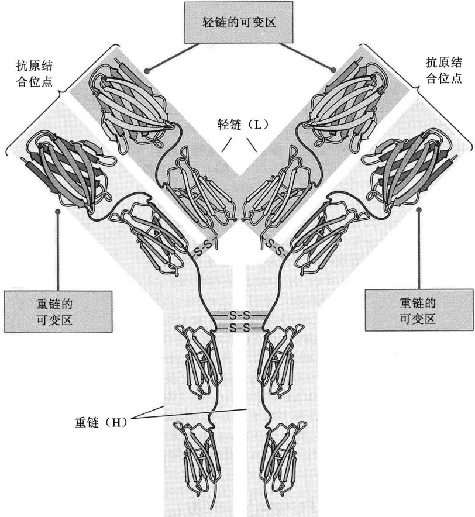  
图 11.37 免疫球蛋白 G(IgG) 分子的结构，示轻链 (L，蓝色阴影) 和重链 (H，黄色阴影)。可变区和恒定区如图所示。

对造成抗体多肽链氨基酸序列可变性的遗传机制，最初的认识来自对编码 IgG 轻链的一个基因的克隆。通过将该基因在胚胎细胞中和在成熟的、产生抗体的 B 细胞中的核苷酸序列进行比较，得到关键的观察结果。在活跃地产生抗体的 B 细胞的基因组中，发现分别与轻链恒定区 (constant region) 和可变区 (variable region) 对应的 DNA 片段非常靠近。但是，在胚胎细胞中，同样的这些 DNA 序列相距很远。对于重链的可变区和恒定区，也得到类似结果。在 B 细胞中，编码这些区域的片段靠近，但在胚胎细胞中远远地分开。

对编码抗体蛋白的基因组区域进行完整的 DNA 测序，不仅揭示了在 B 细胞和胚胎细胞中基因位置不同的原因，而且揭示了抗体可变性起源的机制。种系中的细胞含有与轻链恒定区对应的少数几个基因，这些基因在 DNA 上紧靠在一起，与这些基因分开，但在同一条染色体上，有数量大得多的另外一簇基因，这些基因与轻链可变区对应。在 B 细胞的分化过程中，编码恒定区的一个基因与编码可变区的一个基因被剪接(切断然后连接)到一起，产生一个完整的轻链抗体基因。类似的剪接机制产生重链的恒定区和可变区。

一个完整的抗体基因的形成过程比这一概述说明的还要复杂一些，因为轻链基因由3个部分组成，重链基因由4个部分组成。轻链起源过程中的DNA剪接如图11.38所示。对于可变区两个部分中的每一部分，种系含有多个编码序列，称为可变抗体区[variable(V) antibody region]和连接抗体区[joining(J) antibody region]。在B细胞分化过程中，一个缺失使其中一个V区与其中一个J区的连接成为可能，这种DNA连接过程称为V-J连接(V-J joining)，它可产生V区和J区的许多组合。由于转录增强子位于最右边的J区和C区之间的区域，重排后的基因总是会含有转录增强子。这也保证了只有重排过的基因才会被转录。转录时，连接在一起的V-J序列形成轻链 RNA 转录物的 5' 端。转录继续进行，通过编码基因的恒定抗体区 [constant(C) antibody region] 的 DNA 区，后续的 RNA 剪接将 V-J 区与 C 区连接，产生轻链 mRNA。在编码抗体重链的基因中也发生组合式的连接，只不过在此情况下 DNA 剪接是将重链相应的 V 和 J 与第三组序列之一连接在一起，第三组序列称为 D(表示多样性，diversity)，位于 V 簇和 J 簇之间。

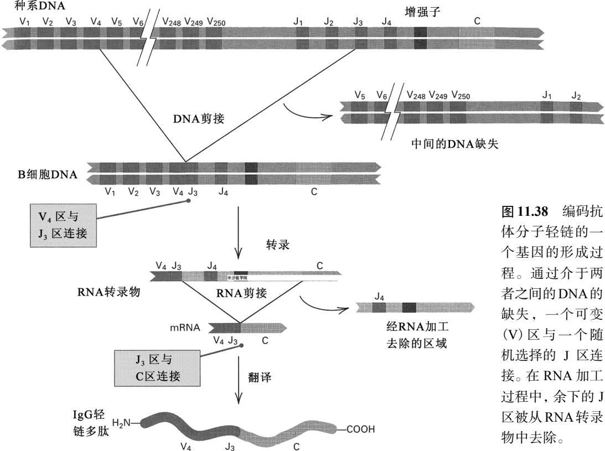

通过组合式连接产生的抗体可变性水平，可以计算出来。在小鼠中，轻链是从大约250个V区和4个J区的组合形成的，产生 $250\times4=1000$ 种可能的链。对重链而言，有大约250个V区、10个D区和4个J区，产生 $250\times10\times4=10000$ 种可能的组合。因为任意轻链可与任意重链组合，所以至少有 $1000\times10\,000=10^{7}$ 种可能的抗体。用于产生抗体的DNA序列数目相当少(约500种)，但可能的抗体数目巨大。

$10^{7}$ 种不同抗体的这个数值是一种低估，因为还存在两种抗体可变性的来源。

1. 在轻链中，V-J 接头可在特定 V-J 组合的不同核苷酸之间剪接；在重链中，V-D-J 接头可在特定的 V-D 组合或 D-J 组合的不同核苷酸之间剪接，这些不同的剪接接头可在剪接基因中产生不同的密码子。例如，V 序列和 J 序列的某一特定的组合可以 5 种方式剪接。在剪接接头处，V 序列含核苷酸 CATTTC，而 J 序列含 CTGGGTG。剪接事件决定在完整的抗体轻链中编码第

<table><tr><td>剪接后的序列</td><td>97</td><td>98</td><td>99</td></tr><tr><td>CACTGGGTG</td><td>His</td><td>Trp</td><td>Val</td></tr><tr><td>CATTGGGTG</td><td>His</td><td>Trp</td><td>Val</td></tr><tr><td>CATTGGGTG</td><td>His</td><td>Trp</td><td>Val</td></tr><tr><td>CATTTGGTG</td><td>His</td><td>Leu</td><td>Val</td></tr><tr><td>CATTTCGTG</td><td>His</td><td>Phe</td><td>Val</td></tr></table>

97、98 和 99 位氨基酸的密码子，因而剪接事件可以下述任一种方式发生，最后两种方式造成氨基酸序列改变。

以此方式，V-J 连接的接头中的可变性可造成在氨基酸序列上有差异的多肽。

mutation)，这种突变发生在 B 细胞发育过程中。这些突变使不同的 B 细胞克隆能够产生不同的

多肽序列，即便它们经历的 V-J 连接完全一样。这种超突变的机制还不清楚。

## - 交配型互换

DNA 序列的重排是酵母中交配型互换(mating-type interconversion)现象的原因。正如曾在第5章中看到的那样，酿酒酵母有两种交配型，以 a 和 $\alpha$ 表示。单倍体 a 细胞和单倍体 $\alpha$ 细胞接合，产生 $\alpha\alpha$ 二倍体，该二倍体可进行减数分裂，产生 4 孢子囊，其中所含单倍体 a 和 $\alpha$ 孢子的比例是 2:2。如果 a 或 $\alpha$ 基因型的单个酵母孢子在与其他孢子隔离的情况下培养，则在后代细胞之间不会接合，因为所有后代细胞会具有相同的交配型。但是，酿酒酵母有一个称为同宗配合(homothallism)的交配系统，有的细胞转变为相反的交配型，使本是纯培养的细胞之间能够接合。

交配型互换的概要如图 11.39 所示，最初的一个单倍体孢子(在此例中为 $\alpha$ ) 通过发芽产生两个子细胞。正如根据正常的有丝分裂预期的那样，母细胞(原来的亲本)和子细胞两者都具有 $\alpha$ 交配型。但是，在下一次细胞分裂中，在母细胞及其新的子细胞中，都发生了交配型的转换(互变)，原来的 $\alpha$ 交配型被 a 交配型取代。在这第二次的细胞分裂完成后， $\alpha$ 细胞和 a 细胞能进行接合，因为现在它们为相反的交配型。细胞核融合产生 $\alpha a$ 二倍体，该二倍体进行减数分裂，其后的孢子形成过程又产生 a 和 $\alpha$ 单倍体孢子。

交配型互换的遗传基础是DNA重排，如图11.40所概括的那样。控制交配型的基因是III号染色体中的MAT基因，该基因可具有a或α两种等位基因形式。如果在单倍体细胞中的等位基因是MATa，那么该细胞具有交配型a；

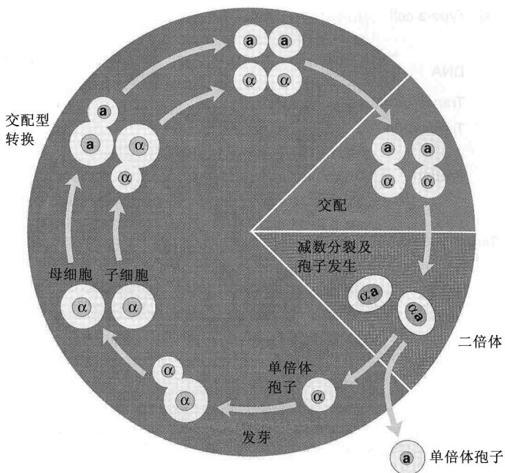  
图 11.39 酿酒酵母中交配型的转换。一个孢子(在此例中，为 $\alpha$ 交配型)发芽产生一个母细胞和一个芽，芽长成一个子细胞。在下一次分裂中，该母细胞和它的新的子细胞转换为相反的交配型(在此例中，为 a)。结果存在两个 $\alpha$ 细胞和两个 a 细胞。交配型相反的细胞可融合，产生 $a\alpha$ 二倍体合子。以类似方式，一个 a 孢子发芽，会造成向 $\alpha$ 交配型的转换。

如果该等位基因是 $MAT\alpha$ ，则该细胞具有交配型 $\alpha$ 。但是，在正常情况下，这两种基因型都含有在同一条染色体中、以非表达的基因盒 (cassette) 形式存在的 a 和 $\alpha$ 的遗传信息。 $HML\alpha$ 盒，离 $MAT$ 基因约 200kb 远，含有 $\alpha$ DNA 序列； $HMRa$ 盒，在 $MAT$ 的另一侧，离 $MAT$ 大约 150kb 远，含有 a DNA 序列。在交配型互换发生时，产生了一种特异性的内切核酸酶（由基因组中其他地方的 $HO$ 基因编码），切割 $MAT$ 区 DNA 的两条链。这种双链缺口启动一个过程，使含相反交配型的非表达基因盒中的遗传信息被插入 $MAT$ 。在该过程中，供体基因盒中的 DNA 序列被复制，所以交配型得以转换，但相同的遗传信息仍保留在基因盒的非表达形式中。 $HML$ 、 $MAT$ 和 $HMR$ 两端的序列完全一样（在图 11.40 中以浅蓝色和深蓝色显示），这些区域在其相互配对和互换中极其重要。 $\alpha$ 区的独特部分，长度为 747 个碱基对；a 区的独特部分长 642 个碱基对。转换过程的分子细节与第 6 章中讨论过的重组的双链缺口机制类似。

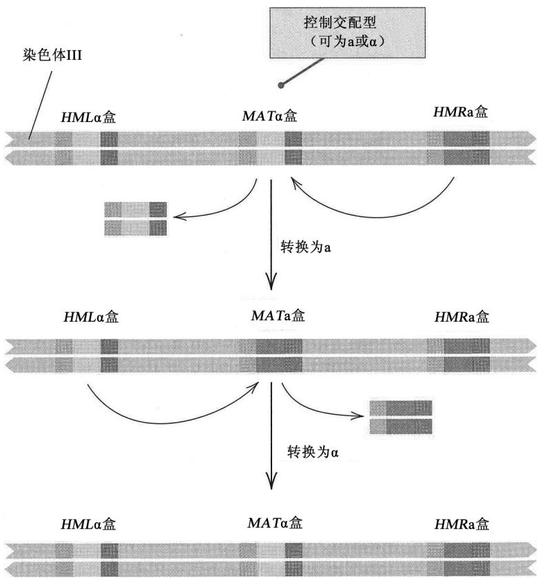  
图11.40 交配型互换的遗传基础。交配型由MAT基因座上的DNA序列决定。HML和HMR基因座是含有非表达交配型基因(为 $\alpha$ 或a之一)的基因盒。在从 $\alpha$ 到a的转换过程中，MAT中的 $\alpha$ 遗传信息被来自HMRa的a遗传信息替换。在从a到 $\alpha$ 的转换过程中，MAT中的a遗传信息被来自HMLα的 $\alpha$ 遗传信息替换。

图 11.40 示连续两次交配型互换，第一次， $\alpha$ 细胞(含 MAT $\alpha$ 等位基因)利用 HMRa 盒中所含的 DNA 序列进行转换，变成 a。转换后的细胞具有 MATa 基因型，在其后的世代中，利用 HML $\alpha$ 中所含的非表达 DNA 序列，后代 a 细胞也可被转换成 $\alpha$ 交配型，该细胞具有 MAT $\alpha$ 基因型。在任何特定细胞的谱系中，交配型转换都可反复发生。

## - 交配型的转录控制

虽然交配型互换是由 DNA 重排控制的，但交配型本身是在转录水平上被控制的。MATa(交配型 a) 和 MATα(交配型 α) 各表达一组单倍体特异的基因。它们的差异在于，MATa 表达一组 a 特异的基因，而 MATα 表达一组 α 特异的基因。两种交配型细胞都表达的单倍体特异基因，包括 HO(编码在交配型互换中所用的 HO 内切核酸酶) 和 RME1(编码减数分裂特异基因的一种阻遏蛋白)。两种交配型各自特异表达的基因，其功能包括：①一种接合肽的分泌，这种接合肽在 DNA 合成之前吸引相反交配型的细胞，为进行融合做准备；②一种受体的产生，该受体为相反交配型所分泌的接合肽的受体。因此，当 a 细胞和 α 细胞接近时，它们已相互做好接合的准备，可以进行融合。

在转录水平上的交配型调节，按图 11.41 所示的调节相互作用进行。这些调节相互作用最初是根据不同类型突变的表型提出来的，大部分细节已被直接的分子研究证实。符号 asg、asg 和 hsg 分别代表 a 特异基因、α 特异基因和单倍体特异基因，每组基因用单个片段来表示，没有“阳光四射”表示没有发生转录。在 a 交配型细胞中(图 11.41A)，MATa 区被转录，从而产生一种称为 a1 的多肽。单独存在的 a1 没有调节活性，在缺乏任何调节信号时，asg 和 hsg 被转录，但 asg 不被转录。在 α 交配型细胞中(图 11.41B)，MATα 区被转录，产生两种调节蛋白，记为 α1 和 α2，α1 是 α 特异基因的正调节因子，而 α2 是 a 特异基因的负调节因子。结果是，asg 和 hsg 被转录，但 asg 的转录被关闭。α1 和 α2 两者都与它们控制的基因的上游特定 DNA 序列

结合。

在二倍体中(图 11.41C)，MATa 和 MATα 都被转录，但产生的多肽只有 a1 和 α2。其原因是，a1 多肽和 α2 多肽结合，形成一种负调节蛋白，抑制 MATα 中的 α1 基因和单倍体特异基因的转录。单独起作用时，α2 多肽是关闭 asg 的负调节蛋白，因为 α1 不产生时，αsg 的转录不打开。总的结果是，因为没有 α1，αsg 不打开，而 hsg 被 a1/α2 复合体打开，这保证可发生减数分裂(因为 RME1 的表达是关闭的)，并保证交配型转换停止(因为缺乏 HO 内切核酸酶)。因此，同宗配合的 aα 二倍体是稳定的，并可进行减数分裂。结果是，aα 二倍体无论是交配型特异的基因还是单倍体特异的基因都不转录。

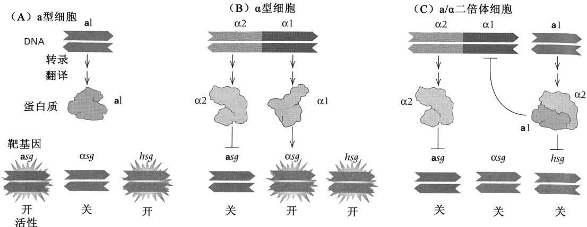

图 11.41 酵母中交配型的转录调节。符号 asg、αsg 和 hsg 分别表示各组 a 特异基因、α 特异基因和单倍体特异基因。以 “阳光四射” 表示的各组基因为 “开”，而没有 “阳光四射” 的各组基因为 “关”。(A) 在 a 细胞中，a1 肽是无活性的，各组基因表现为它们的缺省的活性状态 (asg 和 hsg 开，αsg 关)，所以该细胞是 a 单倍体。(B) 在 α 细胞中，α2 肽关闭 asg，α1 肽打开 αsg，所以该细胞是 α 单倍体。(C) 在 a/α 二倍体中，α2 肽和 a1 肽形成复合体，该复合体关闭 α1 和 hsg，α2 肽关闭 asg，αsg 表现为关的缺省活性，所以在生理上该细胞为非 a、非 α、非单倍体 (也就是说，它是正常的二倍体)。

由 a1/α2 蛋白介导的单倍体特异基因转录的阻遏，是在大肠杆菌的 lac 系统和 trp 系统中已经熟悉的那种负调节的例子。在酵母的例子中，有趣的变化是 α2 蛋白在 a 特异基因的转录阻遏中具有它自己的调节作用，为什么 α2 蛋白不自己也抑制单倍体特异基因？答案就在于其 DNA 结合的特异性，单独存在时，α2 蛋白与单倍体特异基因中的靶序列的亲和力较低。但是，异二聚体 a1/α2 与单倍体特异基因中的靶 DNA 序列不仅具有高亲和力，而且具有高度特异性。

## 本章概要

\- 转录控制是基因调节的一个重要水平，不同机制的调节范围可从完全的负调节（“除非关闭，否则一直打开”）到完全的正调节（“除非打开，否则一直关闭”）。

\- 大多数基因受多种重叠的调节机制的调节。

\- 在原核生物基因组中，编码一个代谢途径的不同酶的基因往往成簇存在，并且由与该基因簇 $5^{\prime}$ 端的一个操纵基因区结合的一种调节蛋白协同控制，这种基因组织结构称为操纵子。

\- 在真核生物中，大多数基因不组织成操纵子。分散存在于基因组中的基因，由位于每个基因附近、与转录激活蛋白相互作用的一个或多个增强子DNA序列协同控制。

\- 真核生物的转录复合体由被募集到基因启动子的众多蛋白组分构成，此时启动子的染色质已经过适当的重构。

\- 转录控制的表观遗传机制是通过 DNA 碱基的修饰(通常是胞嘧啶甲基化)，或与调节蛋白结合而达成的基因表达上的遗传改变。

\- 基因表达也可在 RNA 加工水平上通过可变的剪接方式、转录物或 mRNA 的稳定性进行调节。

\- 双链 RNA 分子可被切割成短片段，用来确定被切割或翻译被阻断的同源 RNA 转录物。

\- 程序性 DNA 重排是某些遗传过程——如产生抗体可变性——的原因。

<table><tr><td></td><td>基因型</td><td>诱导物(+)</td><td>诱导物(-)</td><td>习题1 附表示一些lac操纵子的基因型,z</td></tr><tr><td>a.</td><td> $i^{+} O^{C} zgfp$ </td><td></td><td></td><td>基因是被基因工程改造过的。符号zgfp代表编码</td></tr><tr><td>b.</td><td> $i^{-} O^{+} zgfp$ </td><td></td><td></td><td>绿色荧光蛋白的工程基因,生产该蛋白质的细胞,</td></tr><tr><td>c.</td><td> $i^{S} O^{+} zgfp$ </td><td></td><td></td><td>发绿色荧光。符号zrfp代表编码红色荧光蛋白的工</td></tr><tr><td>d.</td><td> $F^{\prime}i^{+} O^{C} zrfp/i^{+} O^{+} zgfp$ </td><td></td><td></td><td>程基因,生产该蛋白质的细胞,发红色荧光。两种</td></tr><tr><td>e.</td><td> $F^{\prime}i^{+} O^{+} zrfp/i^{+} O^{C} zgfp$ </td><td></td><td></td><td>蛋白质都不生产的细胞,不发荧光;两种蛋白质都</td></tr><tr><td>f.</td><td> $F^{\prime}i^{-} O^{C} zrfp/i^{+} O^{+} zgfp$ </td><td></td><td></td><td>生产的细胞,发黄色荧光(绿色和红色混合所致)。</td></tr><tr><td>g.</td><td> $F^{\prime}i^{-} O^{+} zrfp/i^{+} O^{C} zgfp$ </td><td></td><td></td><td>根据在诱导物缺乏(-)或存在(+)的情况下培养的</td></tr><tr><td>h.</td><td> $F^{\prime}i^{S} O^{C} zrfp/i^{+} O^{+} zgfp$ </td><td></td><td></td><td>各种基因型的细胞的荧光颜色,填入“红色”、“绿</td></tr><tr><td>i.</td><td> $F^{\prime}i^{S} O^{+} zrfp/i^{+} O^{C} zgfp$ </td><td></td><td></td><td>色”、“黄色”或“无”,以完成该表格。</td></tr><tr><td></td><td></td><td></td><td></td><td>答案</td></tr></table>

## 基础回顾

\- 什么是转录的正调节？什么是转录的负调节？在这两种情况下，阻遏蛋白的作用各是什么？每种调节各举一例。

\- 什么是自调节？正向自调节和负向自调节有何区别？哪种调节方式可用来放大微弱的诱导信号？哪种调节方式可用来抑制产物的过度生产？

\- 哪些 lac 突变体类型证明了，要乳糖利用基因表达，在培养基中不必存在乳糖？

\- 操纵子怎样使其包含的基因实现协同控制？在真核生物中通常会发现操纵子吗？

\- 弱化在什么意义上给控制氨基酸生物合成的操纵子提供了一种“微调”机制？

\- 一个含编码某种氨基酸合成代谢途径中各种酶基因的操纵子，在前导序列中包含一个短的可读框，这一短的可读框包含该途径所合成的氨基酸的多个密码子。这些观察结果对该操纵子的调节有什么启示？

\- 什么是转录激活蛋白？什么是转录增强子？什么是染色质重塑复合体？在真核生物的基因调节中，这些因子起什么作用？

\- 可变剪接的可能性对于“一个基因编码一条多肽链”这种说法的普遍性有什么影响？

\- 表观遗传调节(epigenetic regulation)这个术语是什么意思？解释表观遗传调节何以能够通过胞嘧啶甲基化介导。

\- 什么是 RNA 干扰(RNAi)现象？在遗传分析中如何应用 RNAi?

\- 你认为在抗体形成中观察到的那种 DNA 剪接是可逆过程还是不可逆过程？为什么？

## 解题指南

答案

可根据以下原理推断表型：①野生型阻遏蛋白可扩散；②野生型阻遏蛋白能与 $O^{+}$ 结合，但不能与 $O^{C}$ 结合；③野生型阻遏蛋白可与诱导物结合；④ $i^{-}$ 突变型阻遏蛋白与 $O^{+}$ 或 $O^{C}$ 两者都不结合；⑤ $i^{S}$ 突变型阻遏蛋白能与 $O^{+}$ 结合，但不能与 $O^{C}$ 结合；⑥ $i^{S}$ 突变型阻遏蛋白不与诱导物结合。在诱导物缺乏的情况下，荧光表型为(a)绿色；(b)绿色；(c)无；(d)红色；(e)绿色；(f)红色；(g)绿色；(h)红色；(i)绿色。在诱导物存在的情况下，荧光表型为(a)绿色；(b)绿色；(c)无；(d)黄色；(e)黄色；(f)黄色；(g)黄色；(h)红色；(i)绿色。

```txt
习题2 试想一些经过基因工程改造的酵母菌株，其中，红色荧光蛋白(rfp)或绿色荧光蛋白(gfp)与GAL80p或GAL4p融合，但不改变GAL80p或GAL4p与GAL基因调节相关的任何结合特性。红色荧光蛋白聚集的任何细胞区室

基因型
a. GAL3 GAL80-rfp GAL4-gfp
b. GAL3 GAL80-gfp GAL4-rfp
c. gal3 [ko] GAL80-gfp GAL4-rfp
d. GAL3 GAL80-rfp gal4 [nls]-rfp
e. gal3 [ko] GAL80-gfp gal4 [nls]-rfp

半乳糖(-) 半乳糖(+)
细胞质 细胞核 细胞质 细胞核
```

(cellular compartment)，发红色荧光；绿色荧光蛋白聚集的任何细胞区室，发绿色荧光。如果两种荧光蛋白都在同一个区室中，由于红色和绿色混合，该区室发黄色荧光。根据在缺乏(-)或存在(+)半乳糖时培养的每种基因型的细胞质和细胞核的荧光，填入“红色”、“绿色”、“黄色”或“无”，以完成附表。对于运输进细胞核的蛋白质，可以忽略它们在细胞质中翻译时所产生的少量的荧光信号。gal3[ko]等位基因是去除了GAL3p的敲除突变，gal4[nls]等位基因是一种突变型的GAL4，其核定位信号缺失，导致该蛋白质逗留在细胞质中。


## 答案

可根据以下原理推断基因型：①在半乳糖存在的情况下，GAL3p 结合 GAL80p，使 GAL80p 留在细胞质中；②在半乳糖缺乏的情况下，GAL3p 不结合 GAL80p，GAL80p 被运进细胞核中；③GAL4p 具有核定位信号，导致它被运进细胞核中。在半乳糖缺乏的情况下，细胞质的荧光表型为(a)无、(b)无、(c)无、(d)绿色、(e)红色；细胞核的荧光表型为(a)黄色、(b)黄色、(c)黄色、(d)红色、(e)绿色。在半乳糖存在的情况下，细胞质的荧光表型为(a)红色、(b)绿色、(c)无、(d)黄色、(e)红色；细胞核的荧光表型为(a)绿色、(b)红色、(c)黄色、(d)无、(e)绿色。

## 分析与应用

11.1 编码细菌操纵子阻遏蛋白的基因一定要靠近结构基因吗？为什么？对大肠杆菌近缘种基因组的比较证明，lac 操纵子存在于大约 5 千万年前从另一菌种传入的一个基因组岛中。在这个具体例子中，lacI 基因与其他 lac 基因的紧密连锁对这样一种基因组岛的维持起到怎样的作用？

11.2 负责葡萄糖降解的糖酵解代谢途径是活细胞中基本的能量生产系统之一。该途径中的酶会被调节吗？为什么？

11.3 在哺乳动物中，骨髓中的网织红细胞在分化成红细胞的过程中失去细胞核，但是，网织红细胞和红细胞继续合成血红蛋白。提出一个在缺乏血红蛋白基因的情况下血红蛋白合成可持续很长一段时间的机制。

11.4 已知在几种真核生物中某种单一的效应分子可调节不同 mRNA 分子编码的两种蛋白质的合成，为了具体起见，可将这两种蛋白质称为 X 和 Y。在下列各种情况下，调节在基因表达过程的什么水平上发生？

(a) 编码 X 或 Y 的细胞核 RNA 和细胞质 RNA 均未发现。

(b) 可见编码 X 和 Y 的细胞核 RNA，但未见编码 X 和 Y 的细胞质 RNA。

(c) 可见编码 X 和 Y 的细胞核 RNA 和细胞质 RNA，但没有一种 RNA 与多核糖体结合。

11.5 试想一种与某个增强子序列结合并启动转录的转录激活蛋白。在存在几个拷贝而不是只有一个拷贝的增强子的重复中，调节会发生什么改变？

11.6 在对大肠杆菌某种诱导型操纵子操纵基因区的研究中，考察了此处所示的4个构建体的体外转录水平。与每个构建体相连的数字，是在存在阻遏蛋白的情况下观察到的相对转录水平。符号 $E$ 、 $B$ 、 $H$ 和 $S$ 代表EcoRI、BamHI、HindIII和SacI的限制性位点。构建体(a)为野生型操纵基因区，在 $(\mathrm{b}\sim \mathrm{d})$ 部分中，空

框表示缺失的限制性片段，什么样的阻遏蛋白-操纵基因相互作用的假说能够解释这些结果？怎样检验该假说？

11.7 下面是关于大肠杆菌乳糖操纵子的问题。

(a)哪些蛋白质受阻遏蛋白调节?

(b) lac 阻遏蛋白与 lac 操纵基因的结合如何阻止转录?

(c) lac 阻遏蛋白的产生是组成型的还是诱导型的？

11.8 一个基因的调节会受其启动子序列的倒位影响吗？会受增强子序列的倒位影响吗？对答案进行解释。

11.9 诱导物如何让处在负转录控制下的细菌操纵子能够发生转录？

11.10 大肠杆菌的通透酶转运一种 $\alpha$ -半乳糖苷(称为蜜二糖)，也可转运乳糖，但该蜜二糖通透酶对温度敏感：在 $30^{\circ}C$ 时，乳糖可被蜜二糖通透酶转运进细胞中，但在 $37^{\circ}C$ 时不行。在一个以组成型方式产生蜜二糖通透酶的菌株中，lacZ 和 lacY 突变体在 $30^{\circ}C$ 和 $37^{\circ}C$ 下的表型是什么？

11.11 操纵子使得基因活性的协同调节成为可能，可从单一的多顺反子 mRNA 合成一组功能相关的酶。这是否意味着在该多顺反子 mRNA 中的所有蛋白质都以相同的数量产生？请解释。

11.12 当大肠杆菌细胞中存在葡萄糖时，cAMP 的浓度是高还是低？具有无活性的腺苷酸环化酶基因，或具有无活性的 crp 基因的突变体，能否合成 $\beta$ -半乳糖苷酶？cAMP-CRP 与 DNA 的结合是否影响阻遏蛋白的结合？

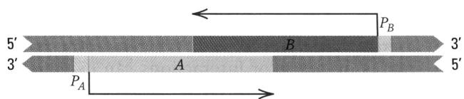  
B 造成的后果是什么？

11.13 基因 A 和 B 以附图所示的方式部分重叠， $P_{A}$ 和 $P_{B}$ 为启动子，箭头示转录的起点、方向和范围。重叠部分包含一个编码蛋白质的外显子。对于发生在重叠区内编码蛋白质的外显子中的突变而言，给阅读框 A 造成以下后果的突变，给阅读框

(a)一个错义突变?

(b)一个缺失?

(c)一个移码突变?

11.14 阻遏蛋白和前阻遏蛋白都能与操纵子基因编码的代谢途径的底物或产物分子结合。一般而言，哪一种与代谢途径的底物结合？哪一种与产物结合？

11.15 在一种大肠杆菌的近缘细菌中，一个含脯氨酸合成基因的生物合成操纵子表现出以下特点。发现该操纵子具有完全类似于大肠杆菌色氨酸操纵子的调节系统，具有一种与脯氨酸结合的前阻遏蛋白，以及包含一串5个连续的脯氨酸密码子的前导序列。

(a)在什么条件下，该脯氨酸操纵子的转录会被起始？

(b)在什么条件下，会发生弱化，从而使转录停止？

(c)在什么条件下，转录会持续进行到该操纵子的终点？

11.16 弱化子是像操纵基因一样与某种蛋白质结合的一个 DNA 区域吗？在任何时候，RNA 合成都是起始于弱化子之处吗？

11.17 分离到一种具有缺陷型核糖体蛋白的大肠杆菌突变体，该核糖体蛋白具有这样一种特性：每次碰到一个色氨酸密码子时，翻译都会暂时停顿一下，不论色氨酸负载 tRNA 是什么水平。预计这种突变会怎样影响色氨酸操纵子的弱化？

11.18 为了研究组氨酸操纵子中的弱化作用，用定向诱变将 his 前导 mRNA 中的 7 个组氨酸密码子 CAY 转变成编码色氨酸的密码子 UGG。

(a)在什么条件下该组氨酸操纵子会起始转录?

(b)在什么条件下会发生弱化，从而使转录停止？

(c)在什么条件下转录会持续进行到该操纵子的终点?

<table><tr><td>0</td><td>1</td><td>2</td><td>3</td><td>4</td><td>5</td><td>6</td><td>7</td><td>8kb</td></tr></table>

11.19 利用只切割非甲基化 5'-CCGG-3'位点的甲基化敏感型限制酶 Hpa II，来研究 3 种哺乳动物中某个基因某一区域中的甲基化，该区域具有示意图中所示的限制性图谱，其中对 Hpa II (H) 位点编了号。

从每个物种的卵和精子中提取 DNA，用 BamH I 和 Hpa II 消化，然后用可与整个感兴趣的区域杂交的探针，通过 Southern 印迹进行分析，结果如凝胶示意图所示。

(a) 在每个物种的每种配子中，哪种配子的 Hpa II 位点是甲基化的？

(b)哪些物种在两性中显示出差异性甲基化?

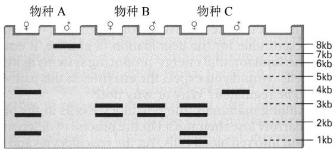

(c) 在哪些物种中雄配子显示出比雌配子更强的甲基化？

11.20 在具有弱化作用的氨基酸生物合成操纵子中，有些前导 mRNA 包含所合成的氨基酸的密码子非常少(如在色氨酸操纵子中)，而其他的前导 mRNA 包含的氨基酸密码子比较多(如在苯丙氨酸操纵子中)。请解释为什么这是预料之中的事。

11.21 在一个基因型为 $MAT\alpha / MAT\alpha$ 的二倍体细胞中， $MAT\alpha$ 中具有一个突变， $\alpha 2$ 基因产物关闭 a 特异基因的功能正常，但不能与 a1 产物结合。预计该细胞会是什么样的交配型表型？

11.22 预计一个基因型为 $MATa'$ 的单倍体细胞(撇号表示一种使 a1 蛋白变为无活性的突变)会是什么样的交配型表型？预计 $MATa'/MAT\alpha$ 二倍体会是什么交配型？

11.23 发现大肠杆菌的一个突变型菌株， $\beta$ -半乳糖苷酶和通透酶的产生都是组成型的(即无论乳糖存在与否都产生)。

(a)该突变体的两种可能的基因型是什么？

(b) 分离到另一种突变体，任何时候都不产生有活性的 $\beta$ -半乳糖苷酶，但如果在培养基中存在乳糖时，产生通透酶。该突变体的基因型是什么？

(c) 用 (a) 和 (b) 部分中的突变体构建一个部分二倍体：当乳糖缺失时，两种酶都不产生；而当乳糖存在时，两种酶都产生。(a) 中的突变体的基因型是什么？

11.24 如果把野生型大肠杆菌菌株培养在没有乳糖和葡萄糖的培养基中,有多少种蛋白质与乳糖操纵子结

合？如果把这些细胞培养在有葡萄糖的培养基中，有多少种蛋白质与乳糖操纵子结合？

11.25 在被抑制型 tRNA 抑制的 UGA 密码子位点，可以插入什么氨基酸？

11.26 一个 $lacI^{+}lacO^{+}lacZ^{+}lacY^{+}Hfr$ 菌株与一个 $F^{-}lacI^{-}lacO^{+}lacZ^{-}lacY^{-}$ 菌株接合。在培养基中缺乏任何诱导物的情况下，在 lac 区已经转移之后，在短期内有 $\beta$ -半乳糖苷酶产生。请解释为什么它会产生，为什么只在短期内产生？

11.27 分离到一种同时不能以许多种糖为碳源的大肠杆菌突变体。但是，遗传分析显示，负责每种糖的代谢的操纵子都没有突变。该突变体可能是什么基因型？

11.28 在 Northern 印迹技术中，在电泳凝胶上分离 mRNA 分子，转移到滤膜上，然后与标记放射性或光敏感性成分的 DNA 杂交。含有探针同源序列的 RNA 分子，成为可见的分离的条带。用来自大肠杆菌的 mRNA 进行一个 Northern 印迹实验，使用与 lacA 基因相应的 DNA 探针，lacA 基因与 lacY 毗邻。野生型 lac mRNA 长约 5kb。研究 lacZ 和 lacY 的两种突变，lacZ 和 lacY 突变是简单的核苷酸置换突变，编码无活性的蛋白质，lacZ 和 lacY\*突变为缺失，lacZ\*缺失丢掉了 2kb 的 lacZ 编码序列，lacY\*缺失丢掉了 0.5kb 的 lacY 编码序列，且这两种等位基因都不产生多肽产物。在诱导物存在 (+) 或缺失 (-) 的情况下进行培养，然后用 Northern 印迹分析下述 6 种基因型的 mRNA。在一定条件下分离 RNA 分子，得到所附凝胶示意图中虚线所示的大小。在凝胶示意图中标出每种基因型在诱导 (+) 和非诱导 (-) 两种条件下预计会出现 mRNA 条带之处。

(a) $lacI^{+} O^{+} Z^{+} Y^{+}$ (b) $lacI^{-} O^{+} Z^{-} Y^{-}$ (c) $lacI^{-} O^{+} Z^{*} Y^{*}$ (d) $lacI^{+} O^{C} Z^{-} Y^{*}$ (e) $F^{\prime}lacI^{+} O^{C} Z^{*} Y^{-}/lacI^{+} O^{+} Z^{-} Y^{*}$ (f) $F^{\prime}lacI^{+} O^{+} Z^{*} Y^{+}/lacI^{+} O^{C} Z^{-} Y^{*}$

11.29 在 Western 印迹中，在电泳凝胶上分离蛋白


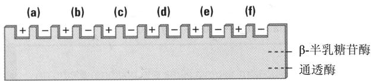

质，转移到滤膜上，然后与标记抗体混合，标记抗体可与其中一种感兴趣的蛋白质结合。用 Western 印迹来分析上一题中的 6 个大肠杆菌菌株，用于印迹的是两种抗体的混合物，一种是 β-半乳糖苷酶的抗体，另一种是通透酶的抗体。所附凝胶示意图显

示这些蛋白质(如果存在的话)会迁移到的位置。在凝胶示意图中标出在诱导 $(+)$ 和非诱导 $(-)$ 条件下培养的这6个菌株中各自可见的条带(如果有的话)。

11.30 LacY 通透酶既能转运乳糖酸，又能转运乳糖，但 LacZ 裂解乳糖酸的效率极低。某些 LacZ 的突变型具有变异的底物特异性，使突变型酶能够裂解乳糖酸。这些突变体能在含有乳糖酸，以乳糖酸为唯一碳源和能量来源的培养基上生长。但是，当操纵基因为野生型时，除非这些突变体同时具有 $lacO^{C}$ 突变，或者在培养基中存在 IPTG（异丙基硫代半乳糖），否则它们不能生长。怎样解释这些结果？

## 挑战题

挑战题 1 在一种新发现的生物中，组氨酸操纵子是负向调节的。它包含合成组氨酸所需酶的结构基因，并且阻遏蛋白也在操纵子内编码，也就是说，在编码其他蛋白质的多顺反子 mRNA 分子中。该 mRNA 的合成由调节单一启动子活性的单一操纵基因控制。该操纵子的辅阻遏物是 tRNA $^{His}$ ，组氨酸与之结合，该 tRNA 不是由该操纵子自己编码的。分离到具有下述缺陷的一批突变体，判断这些组氨酸的酶是否会被每种突变体合成，以及在部分二倍体 (partial diploid) 中每种突变型对其野生型等位基因是显性，仅仅是顺式显性，或者是隐性。

(a) 启动子不能与 RNA 聚合酶结合。

(b) 操纵基因不能与阻遏蛋白结合。

(c) 阻遏蛋白不能与 DNA 结合。

(d) 阻遏蛋白不能与组氨酰-tRNA $^{His}$ 结合。

(e)非负载 tRNA $^{His}$ (即没有结合组氨酸)可与阻遏蛋白结合。

挑战题 2 组氨酸操纵子的弱化子包含 7 个连续的组氨酸。该弱化子编码序列的相关部分为 5'-AAACACCACCATCATCACCATCATCCTGAT-3'

发生一个突变——一个额外的 A 核苷酸被插入到紧接在红色的 A 后面。野生型和突变型弱化子编码的氨基酸顺序是什么？预计该突变体是什么表型？

挑战题 3 在一种昆虫中，基因 cyclops 和 janus 具有不同的组织特异性表达方式：cyclops 仅在眼睛的感光细胞中表达，而 janus 只在精巢中表达。靠近 cyclops 的 5' 端含有一个内含子，在示意图中以影线表示，在该内含子中有两个 EcoR I 的限制性位点。该 EcoR I 片段被移出，然后插入刚好在 janus 启动子上游的一个 EcoR I


位点，此时，janus 既在感光细胞中转录，也在精巢中转录。不论该 EcoR I 片段被插入的方向如何，都产生相同的结果。什么假设能解释这一结果？如何检验该假设？

## 网上遗传学

“网上遗传学”(GeNETics)会为你介绍在互联网上寻找遗传学信息的某些最重要的站点。要浏览这些站点，请访问为《遗传学：基因和基因组分析》(第八版)配备的 Jones and Bartlett 公司配套站点http://biology.jbpub.com/book/genetics/8e/。

在该站点中，你会找到一个按章开列的重点关键词列表。选择某个关键词后，可链接到某个网站，其中包含与此关键词相关的信息。

# 第 12 章 基因组学、蛋白质组学和转基因技术

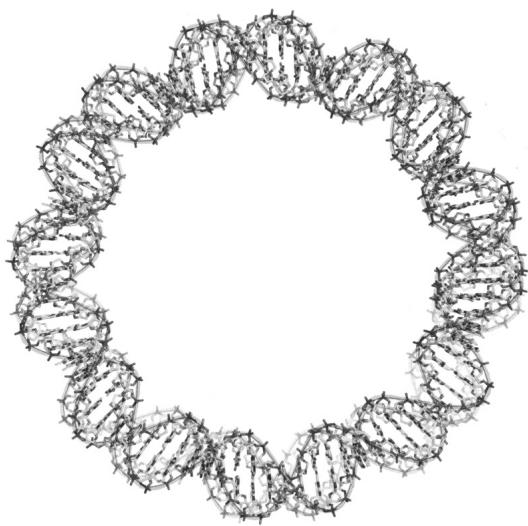

在遗传工程中用作载体的那种环状DNA小分子的艺术再现。[©Laguna Design/Photo Researchers, Inc.]

## 本章提纲

12.1 位点特异的 DNA 切割和克隆载体  
12.2 克隆策略  
12.3 重组分子的检测  
12.4 基因组学和蛋白质组学  
12.5 转基因生物  
12.6 遗传工程的一些应用  
联系：多莉，你好！  
伊恩·威尔穆特、安杰利卡·施尼亚克、吉姆·麦克沃尔、亚历克斯·金德和基思·坎佩尔，1997  
源自哺乳类胎儿细胞和成体细胞的可存活后代  
联系：东拼西凑  
奥利弗·史密斯，2005  
许多小东西：一个遗传学家对复杂疾病的看法

## 学习目标与科学能力

本章所讨论的基因组学、蛋白质组学和转基因技术的原理和方法，为下列科学能力提供必要的背景。

\- 能指出特定 DNA 片段的限制性位点及载体的克隆位点，以便让该片段可以指定方向插入该载体。

\- 能陈述编码蛋白质的基因组区域中的进化签名——近缘物种在 DNA 序列上的特征性差异。

\- 能理解 DNA 微阵列上斑点状荧光颜色的意义，指出所比较的两个样品哪一个的转录水平较高。

\- 能解释 ChIP-chip 和 ChIP-seq 如何揭示与特定蛋白质结合的基因或 DNA 序列。

\- 能给双杂交分析下定义，并解释该方法如何帮助鉴定发生物理接触的蛋白质。

\- 能指出在转基因生物中靶向基因中断和靶向基因置换的区别。

人、黑猩猩、猴子、狐猴、小鼠、狗、猫、蝙蝠、松鼠、兔子、豚鼠、犰狳、刺猬、鼩鼱、负鼠、马、大象、穿山甲、树懒、美洲驼、海豚——这些是已经测定基因组序列的其中一些哺乳动物。在这个名单上加上果蝇、蠕虫和真菌等许多物种，与数以百计的细菌、线粒体和叶绿体，还有数以千计的病毒一道，你会初步领会到能够用来分析和比较的序列数据数量之巨大。除了基因组序列之外，还有办法鉴定出在特定组织类型中、在特定的发育时期中或在细胞周期的不同时期，基因组中的哪些基因被转录。这些就是基因组学的原始数据，基因组学(genomics)研究基因组的DNA序列、组织结构、功能和进化。在蛋白质水平上与其对应的是蛋白质组学(proteomics)，蛋白质组学旨在鉴定细胞或生物体的所有蛋白质(包括任何翻译后修饰的形式)，以及它们的细胞定位、功能和相互作用。蛋白质组学使用本章后面要讨论的方法，鉴定细胞中的哪些蛋白质发生物理接触，从而揭示相互作用的蛋白质的关系网络(network)。

基因组学得以成为可能，是因为一些技术的发明，这些技术最初是为了进行基因操作从而创造具有新基因型和表型的遗传工程生物而设计的，我们把这类方法称为重组 DNA (recombinant DNA)，也称为基因克隆(gene cloning)或遗传工程(genetic engineering)。基本技术非常简单，分离 DNA，用一种或多种限制酶将其切成片段；以新的组合方式将片段连接在一起，然后导回细胞或生物中，以定向的、预定的方式改变细胞或生物的基因型。这种经遗传工程改造过的生物，称为转基因生物(transgenic organism)。转基因生物一般是为了实验研究而制备的，但一个重要的实际应用是开发家畜和农作物良种，在此情况下，转基因生物常被称作遗传修饰生物(genetically modified organism, GMO)。在本章后面会讨论遗传修饰生物的一些具体例子。

## 12.1 位点特异的 DNA 切割和克隆载体

重组 DNA 技术严重依赖于限制酶，我们在 2.3 节介绍过限制酶，说到它们在产生具有明确

  
图 12.1 在大肠杆菌中用作克隆载体的环状质粒的电子显微照片。

末端的 DNA 片段的过程中，存在位点特异的 DNA 切割。在重组 DNA 中，DNA 被限制酶切割后，限制性片段与载体 (vector) 分子连接，载体是可在其中导入 DNA 片段并可在适当的宿主生物中复制的 DNA 分子（一般为环状）（图 12.1）。大肠杆菌 (Escherichia coli) 和出芽酵母酿酒酵母 (Saccharomyces cerevisiae) 是用于重组 DNA 的典型宿主生物。在本节中，我们更加仔细地来看看让限制酶在 DNA 克隆中如此有用的一些特性。我们也会考察在重组 DNA 中最常用的一些载体类型。

## ■ 产生末端明确的 DNA 片段

限制酶是一种核酸酶，无论何处只要含有与限制酶的限制性位点一致的特定核苷酸短序列，限制酶即在此处切割双链 DNA(2.3 节)。每条链的主链都会被切断，产生一个游离的 3'羟基(3'-OH)和一个游离的 5'磷酸基(5'-P)。大多数限制性位点由 4 个或 6 个核苷酸组成。现已从微生物中分离到限制性位点不同的大约 1000 种限制酶。大部分限制性位点是对称的，即在 DNA 双链体的两条链上，识别序列都是一样的。例如，从大肠杆菌中分离到的限制酶 EcoR I，其限制性位点为 5'-GAATTC-3'，另一条链的序列是 3'-CTTAAG-5'，其实是一样的，只不过是将 3' 端写在左边。这种对称的 DNA 短序列称为回文序列 (palindrome)。在双链 DNA 中，EcoR I 在 G 和 A 之间切割回文序列的每条链。

在限制酶被发现之后不久，用电子显微镜进行的观察表明，许多限制酶产生的片段可自发形成环。经过加热，这些环可重新变成线状，但是，如果在形成环之后，用 DNA 连接酶 (DNA ligase，连接 3'-OH 和 5'-P 基团) 处理，末端会变成共价连接。这一观察结果是限制酶的以下 3 个重要特性的第一个证据。

1. 限制酶在对称序列(回文序列)中产生缺口。

2. 两条 DNA 链中的缺口不一定是正对着的。

3. 非对称性地切割 DNA 链的酶，产生具有单链末端的 DNA 片段，单链末端的碱基序列互补，这些特性如图 12.2 中的 EcoR I 所示。

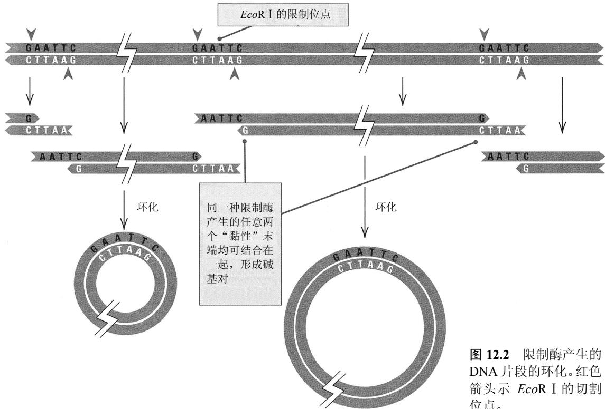

大多数限制酶都像 EcoR I 一样，两条 DNA 链上的切割点是错开的，所产生的单链末端称为黏端(sticky end)，它们能相互黏附，因为它们具有互补的核苷酸序列。有些限制酶(包括 EcoR I)在 5' 端留下单链突出(图 12.3A)，其他限制酶留下 3' 端突出。许多限制酶在对称中心切割两条 DNA 链，形成平端(blunt end)。图 12.3B 示限制酶 Bal I 产生的平端，两个平端也可通过一种来自 T4 噬菌体的连接酶(T4 连接酶)连接，T4 连接酶与大多数其他的连接酶不同，它既可连接平端，又可连接双链 DNA 主链中的单链切口。不过，与黏端的连接总会重新出现原来的限制性位点不同，任何一个平端与其他任何一个平端连接，不一定会产生限制性位点。

大多数限制酶对限制性序列的识别，与 DNA 的来源无关：

如果 DNA 片段是由相同的限制酶产生的，则从一种生物获得的片段与从另一种生物获得的片段会有相同的黏端。

该原理是重组 DNA 技术的基本原理之一。

因为限制酶只在其限制性位点处切割，所以，在某种生物的 DNA 中，特定限制酶产生的切点数目是有限的。例如，一个大肠杆菌 DNA 分子含 $4.6 \times 10^{6}$ 个碱基对，因而，任意一种切割 6 个碱基的限制性位点的酶，会将该分子切成大约 1000 个片段，原因是，如果 4 种核苷酸的频率相等且随机出现，则平均每 $4^{6} = 4096$ 个碱基对会出现一个六碱基的限制性位点。基因组大小为 $3 \times 10^{9}$ 碱基对的人类 DNA，可被切成大约一百万个片段。这些数目虽然大，但与 DNA 随机剪切可能产生的片段数目比起来，还是比较小。令人特别感兴趣的是一些小 DNA 分子的切割产物，这些小 DNA 分子对任何特定的酶可仅有几个切割位点（或者一个也没有），如病毒或质粒的 DNA。质粒 (plasmid) 是存在于细胞（通常是细菌细胞）中的一种 DNA 分子，能独立于细菌染色体进行复制。不同质粒的大小为 1～10 kb。正如马上就要看到的，含有某种特定限制酶的单一切割位点的小的环状质粒，为在 DNA 克隆中作为载体很有价值。

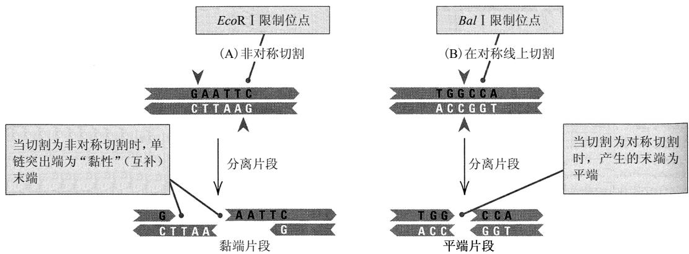  
图 12.3 限制酶产生的两种切口。红色箭头示切割位点。(A)在离限制性位点对称中心相等距离之处，在每条链中产生的非对称切口。(B)在限制性位点对称中心处，在每条链中产生的对称切口。

## - 重组 DNA 分子

在重组 DNA 中, 将特定的目的 DNA 片段与载体 DNA 分子连接。利用转化 (transformation) 方法, 将该重组分子导入细胞中, 该转化方法与埃弗里、麦克劳德和麦卡蒂用来证明 DNA 是遗传物质的方法非常相似 (第 1 章)。转化之后, 随着细胞 DNA 的复制, 重组 DNA 也会复制 (图 12.4)。当分离到稳定的转化体时, 就说与载体连接的 DNA 序列已被克隆 (cloned)。在下一节, 我们会描述几种载体。

## ■ 质粒、 $\lambda$ 和黏粒载体

最普遍有用的载体有 3 个特点:

1. 载体 DNA 比较容易导入宿主细胞。

2. 载体及其包含的任何 DNA 都可在宿主细胞内复制。

3. 可用简单的方法鉴定含载体的细胞，最方便的是通过载体中存在的 DNA 序列赋予宿主的新表型(如抗生素抗性)来鉴定。

最常用的载体是大肠杆菌质粒及大肠杆菌 $\lambda$ 和M13噬菌体的衍生物。现已开发了克隆入动物、植物和细菌细胞的其他质粒和病毒。质粒和噬菌体DNA可通过转化导入细胞，在转化过程中，细胞因接触氯化钙溶液而能够吸收游离DNA，也可用电穿孔(electroporation)方法，通过电脉冲处理，将重组DNA导入细胞。DNA被导入之后，可利用细菌生长过程中表现出来的载体编码的功能，检测含重组DNA的细胞。例如，某种载体编码某种抗生素(如四环素)抗性，成功转化了该载体的大肠杆菌细胞，会在含四环素的培养基上生长，而未被转化的细胞不会生长。使用适当的载体，这种方法的一些变化形式被用来转化动物或植物细胞(12.5节)，但其技术细节差异很大。

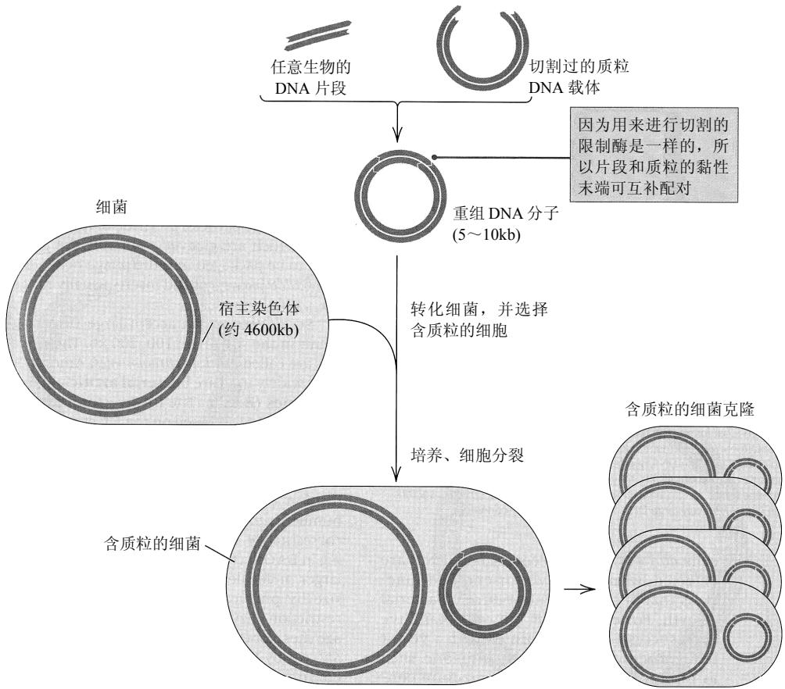  
图 12.4 克隆的一个例子。来自任意生物的一个DNA片段与一个切割过的质粒连接。然后，用重组质粒转化细菌细胞，重组质粒在细胞中复制，并传递给细菌后代。细菌的宿主染色体未按比例绘制。细菌染色体一般比质粒大1000倍左右。

图 12.5 示克隆进大肠杆菌的 3 种常用载体。克隆相对较小的 DNA 片段 (5～10kb) 时，质粒 (图 12.5A) 最方便，稍大一些的片段，可用 $\lambda$ 噬菌体 (图 12.5B) 来克隆。正常的 $\lambda$ 噬菌体基因组长约 50kb，但因为该基因组的中央部分对感染和噬菌体增殖不是必需的，这部分可被去除，替换成供体 DNA。供体 DNA 连接到适当位置后，在体外 (in vitro) 将重组 DNA 包装进成熟的噬菌体，然后用该重组噬菌体来感染细菌细胞。不过，要包装进噬菌体的头部，重组 DNA 一定不能太大或太小，即供体 DNA 与被去除的那部分 $\lambda$ 基因组应该差不多同样大小。大部分 $\lambda$ 克隆载体可接受大小为 12～20kb 的插入片段。更大的 DNA 片段可插入黏粒 (cosmid) 载体 (图 12.5C)。这些载体可以质粒形式存在，但它们也含有称作黏端 (cohesive end) 的 12bp 噬菌体单链黏端 (9.7 节)。黏粒克隆可借助黏端被包装进成熟的噬菌体颗粒中，黏端要经过切割，黏粒 DNA 才能被包装进噬菌体头部。黏粒插入片段的大小的极限一般为 40～45kb。

有些载体可接受 100～200kb 的巨大 DNA 片段，这些载体称为人工染色体 (artificial chromosome)。应用最广的人工染色体是细菌人工染色体 (bacterial artificial chromosome, BAC)。图 12.5D 所示的 BAC 载体，是在大肠杆菌的 F 因子基础上构建的 (在第 9 章讨论 F 因子在接合中的作用时讨论过 F 因子)。在这个 6.8kb 的载体中，基本的功能包括复制 (repE 和 oriS)、调节拷贝数 (parA 和 parB) 和氯霉素抗性基因。应用物理方法，用切割位点稀有的限制酶 (如 Not I 和 Sfi I 这样的酶) 处理，或在只有部分限制性位点被切割 (部分消化) 的条件下用普通的限制酶处理，可将大分子断裂成所需大小的片段，产生适合克隆进 BAC 载体的 DNA 片段。

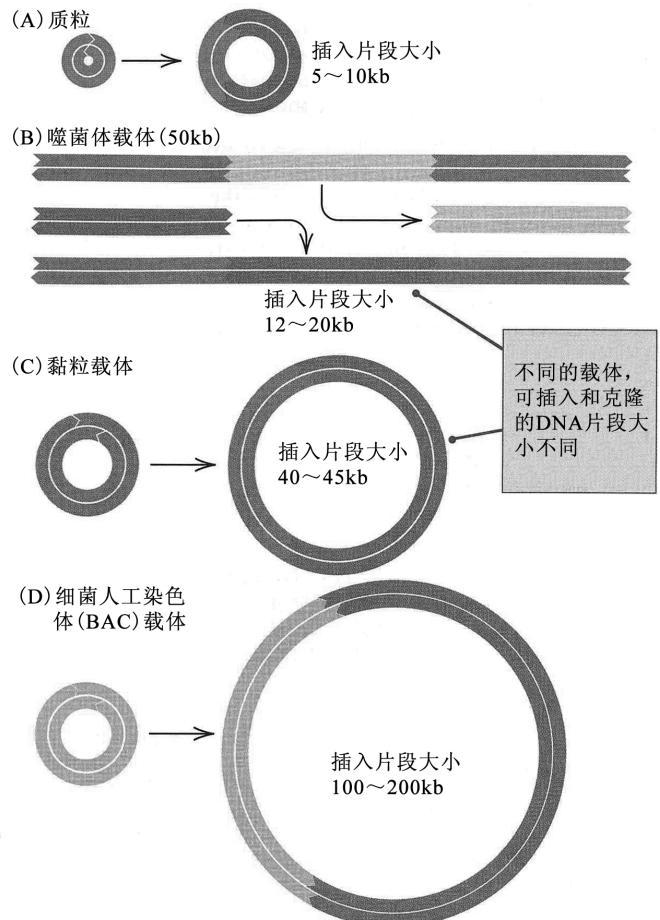  
图 12.5 常用于大肠杆菌的克隆载体，未按比例绘制。(A)克隆相对较小的 DNA 片段，质粒载体比较理想。(B) $\lambda$ 噬菌体载体含有适当的限制性位点，可除去噬菌体的中间部分，代之以感兴趣的 DNA。(C)对于克隆多达 40kb 左右的 DNA 片段，黏粒载体很有用；它们可以像质粒那样复制，但因为含有 $\lambda$ 噬菌体的黏端，所以可被包装进噬菌体颗粒中。(D)BAC 载体很有用，因为它们可以携带比较巨大的 DNA 片段。

## 12.2 克隆策略

在遗传工程中, 实验的直接目的一般是将一个特定的染色体 DNA 片段插入质粒或病毒 DNA 分子中。达到这一目的的任何策略都必定包含如下几个步骤。

1. 供体 DNA 和载体 DNA 的纯化。

2. 用一种或多种限制酶来切割。

3. 供体DNA与载体DNA的连接。

4. 所需重组克隆的鉴定和分离。
步骤 1 和 2 已在 12.1 节中考察过，现在考察步骤 3 和 4。

## - 连接 DNA 片段

在 12.1 节中曾叙述过带有互补碱基的单链“黏性”末端的限制性片段的环化。如图 12.6 所示，因为无论 DNA 的来源如何，特定的限制酶都会产生黏端一模一样的片段，所以，从两种不同生物分离而来的 DNA 分子片段，可被连接起来。在该例中，限制酶 EcoR I 被用来消化来自任何感兴趣的生物的 DNA，同时用来切割只含一个 EcoR I 限制性位点的细菌质粒。供体 DNA 被切割成许多片段（显示了其中一个片段），而质粒被切割成单个线性片段。当供体片段与线性化的质粒混合时，可

通过互补单链末端之间的碱基配对形成重组分子。这时候，用 DNA 连接酶处理该 DNA，使接头封闭，从而使供体片段得以和载体共价连接。将感兴趣的供体 DNA 片段与载体连接的能力，是重组 DNA 技术的基础。

因为任一黏端都可与任何其他的互补黏端发生碱基配对，所以限制性片段的随机连接会产生多种多样的产物，包括许多无用的产物。例如，一个线性 DNA 分子，它被切割成 4 个片段——A、B、C 和 D，这 4 个片段在原来的分子中以 ABCD 的顺序存在(图 12.7)。将这些片段重新连接在一起，偶尔会产生原来的分子，但若 B 和 C 具有相同的成对黏端，也会形成片段的排列方式不一样的分子，包括有一个或多个限制性片段的方向颠倒的排列方式(在图 12.7 中以反向的字母表示)。平端限制性片段的连接，会产生更多的组合，因为任一平端可与任何其他平端连接。

如果来自载体的限制性片段有一个或多个，也会以错误的顺序连接在一起，但这一隐患可通过使用对某个特定的限制酶只有一个切割位点的载体而排除。如图 12.6 所示，当一个环状分子对某种限制酶只有一个切割位点时，切割只在这一个位置发生，任何其他感兴趣的 DNA 片段，如果有互补末端的话，就可插入该缺口。现在已有许多具有单一切割位点的质粒可供利用(大多是通过重组 DNA 技术制备的)。许多载体含有数种不同限制酶的单一位点，但通常每次只用一两种酶。

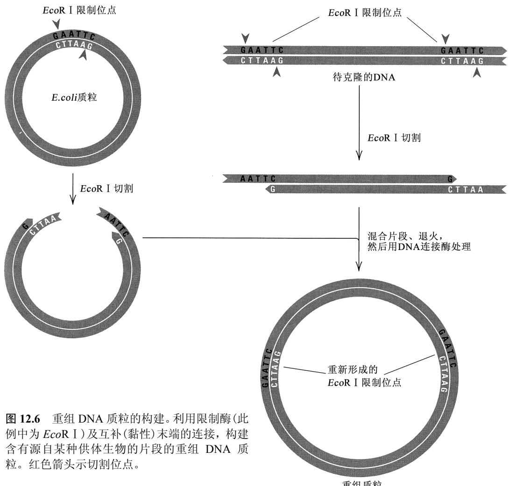

## - 将特定 DNA 分子插入载体

在迄今所描述的重组 DNA 方法中，用限制酶消化得到的大量片段，可与切割过的载体分子连接，产生含有不同供体 DNA 片段的大量重组分子。如果想要得到某个特定的 DNA 克隆片段，必须从其他重组分子组成的往往是巨大的本底中，分离出含有该特定片段的重组分子。最简单的办法是根据该片段产生的表型属性，对所需克隆进行直接选择。

我们举一个直接选择出含特定基因的重组分子的例子，假设想克隆大肠杆菌用来进行亮氨酸生物合成的一个基因。可以利用在这个感兴趣的基因中具有某种突变的 $leu^{-}$ 突变型菌株，来进行直接选择。这种 $leu^{-}$ 细胞不能在固体培养基上形成菌落，除非培养基中含有亮氨酸。为了从没有亮氨酸也能生长的野生型菌株中克隆 $leu^{+}$ 基因，要从 $leu^{+}$ 菌株中分离 DNA，用某种限制酶切割，产生的片段连接进质粒载体，然后以其转化基因型为 $leu^{-}$ 的突变型细胞。将转化后的细胞涂布到缺乏亮氨酸的固体培养基上，任何未转化的细胞，或转化了不含 $leu^{+}$ 基因的 DNA 的细胞，将不能生长，从而不能形成菌落。该培养基可选择出 $leu^{+}$ 转化体，因为含有插入载体的 $leu^{+}$ 基因的细胞，会形成菌落。如果该 $leu^{+}$ 基因含有所用限制酶的限制性位点，则实验不会成功，因为在该基因内的切割会摧毁其功能。因此，这种克隆实验通常是在部分消化 (partial digestion) 的条件下进行，部分消化的意思是，当只有一小部分限制性位点被切割时，裂解反应

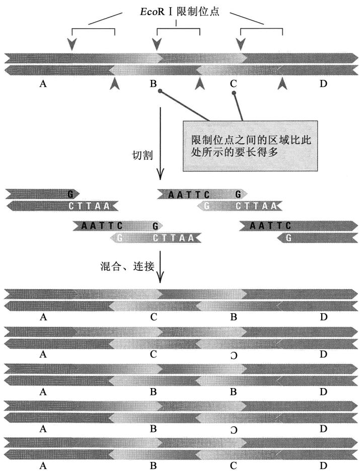  
图 12.7 一种限制酶产生的片段可以任意方式重新连接，因为切割位点的末端都是互补的。在此例中，一个 DNA 分子被一种限制酶切成 4 个不同的片段 (A、B、C 和 D)。显示了这些片段可被如何重新连接的几个例子。反向的字母表示该片段被以和野生型颠倒的方向连接。即便在两端是 A 和 D、中间有两个片段的重新连接的分子中，也有许多分子，一个片段出现两次，而根本没有另一个片段，或具有一个以相反方向存在的片段。仅在偶然情况下，重新连接才会再现原来的 A-B-C-D 顺序。

就被终止。以此方式，即便该 $leu^{+}$ 基因可能含有所用限制酶的一个或多个限制性位点，在部分消化之后，一些 $leu^{+}$ 基因仍有可能碰巧保持完整。

通常不可能像 $leu^{+}$ 例子中那样直接选择重组克隆。如果感兴趣的克隆既不是很罕见，也不是很难检测，则在与载体连接之前，先纯化包含感兴趣的基因的 DNA 片段，往往更好。常用来分离片段的方法有两种。

1. 用聚合酶链反应(polymerase chain reaction, PCR)扩增，这在2.4节中讨论过，在PCR中，与待分离片段的两端同源的寡核苷酸引物，被用来复制感兴趣的片段。经过足够数量的复制循环后，所得溶液主要含有的是被扩增的DNA片段的副本。

2. 对已知含有感兴趣基因的限制性片段进行纯化。例如，如果已知某个特定的限制性片段中含有某个基因，可在电泳(2.3节)后，从凝胶上纯化相应的DNA条带，使该片段得以分离，然后与适当的载体连接。

高等真核生物中的一些基因，包括许多人类基因，都非常长，它们长达数百 kb。含有完整基因的任何 DNA 片段都太长，以致不能用 PCR 扩增，并且对任何限制酶而言，都很可能含有多个切割位点。不过，此类巨大的基因通常产生大小适中

的 mRNA 分子，一般不超过 3kb。如果克隆的目的是生产该基因的蛋白质产物，那么所需的所有信息都包含在 mRNA 中。接下来叙述怎样克隆序列与特定 mRNA 对应的 DNA 分子。

## ■ 反转录酶的使用：cDNA 和 RT-PCR

有些特化的动物细胞含有高丰度的某种特定类型的 mRNA。例如，鸡的输卵管细胞含的卵清蛋白(一种蛋清蛋白)mRNA 非常多，以致从输卵管中提取的 mRNA 主要是卵清蛋白 mRNA。这种纯化的 mRNA 可作为分离含卵清蛋白编码序列的重组克隆的起点。

大多数 mRNA 分子不像卵清蛋白 mRNA 那样丰富。尽管如此，mRNA 仍常被用于克隆，尤其是在基因被许多长的内含子所打断的生物中(就像人类基因那样)，因为 mRNA 包含了内含子已经被去除的蛋白质编码序列。

在典型的真核生物细胞中，mRNA 的丰度水平可被非常粗略地分成 3 种类型。

1. 约 $1\%$ 的表达基因具有高丰度 mRNA (abundant mRNA)，每个细胞数百至数千个拷贝。

2. 约 10% 的表达基因具有中等丰度 mRNA (moderately abundant mRNA), 每个细胞 10～100 个拷贝。

3. 余下的差不多 90% 的表达基因具有稀有 mRNA (rare mRNA)，每个细胞 1～10 个拷贝。

从 mRNA 分子开始的克隆，要利用一种独特的聚合酶——反转录酶(reverse transcriptase)，该酶能与单链 RNA 分子结合，并以其为模板合成互补的 DNA 链。反转录酶最初发现于 RNA 肿瘤病毒中，在这种病毒中，单链 RNA 是遗传物质，反转录酶的功能是生成与病毒 RNA 互补的双链 DNA，该双链 DNA 可被整合进宿主细胞 DNA 中，反转录酶将病毒的遗传信息转换成 DNA，以便宿主细胞分裂时，病毒的遗传信息可复制并传给子细胞。如同其他的 DNA 聚合酶一样，反转录酶也需要引物。在遗传工程中使用此酶时，以通常见于真核生物 mRNA 3'端的 poly-A 尾巴作为引发位点(priming site)比较方便，因为可以 poly-T 组成的寡核苷酸为引物(图 12.8)。像任何其他的单链 DNA 分子一样，从 RNA 模板产生的 DNA 单链可在 3'最末端折叠回自身，形成一个“发夹”结构，该结构含由几个碱基对构成的短的双链区。发夹的 3'端作为第二条 DNA 链合成的引物，产生双链 DNA 分子，第二条链可用 DNA 聚合酶或反转录酶来合成。在编码反转录酶的 RNA 病毒(如人类免疫缺陷病毒，HIV)中，反转录酶自己合成第二条链。转换成常规的双链 DNA 分子，是通过一种核酸酶对发夹进行切割而成。与 RNA 分子互补的 DNA 称为互补 DNA(complementary DNA, cDNA)。

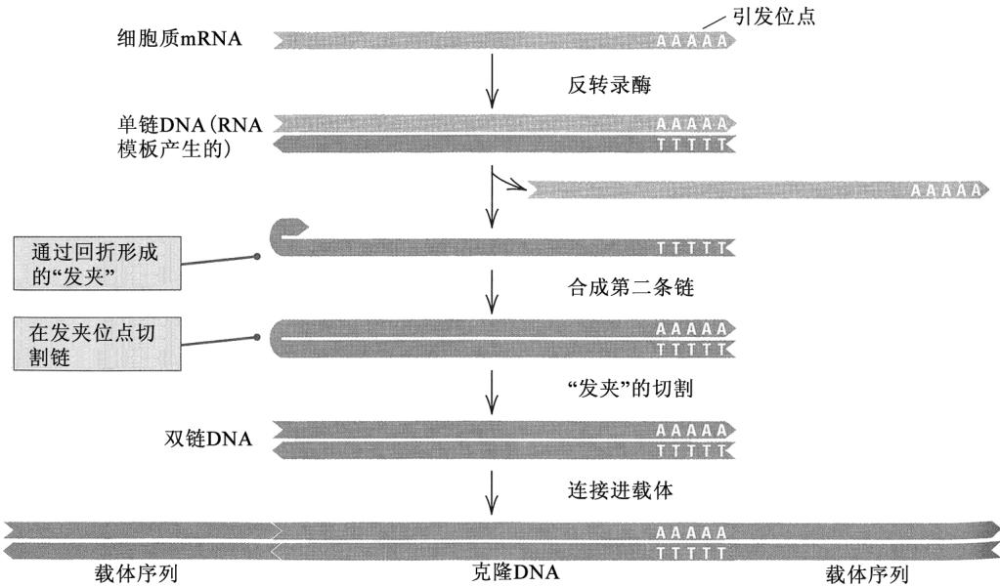  
图 12.8 反转录酶产生一条在序列上与模板 RNA 互补的单链 DNA。在本例中，一个细胞质 mRNA 被拷贝。如此处所示，大多数真核生物 mRNA 分子在 3' 端有一段连续的 A 核苷酸，这作为引发位点比较方便。单链 DNA 生成之后，3' 端的反向折叠形成发夹，作为第二条链合成的引物。发夹被切开后，所得的双链 DNA 可马上或 PCR 扩增后，连接到适当的载体中。

在 mRNA 分子的反转录过程中, 产生的全长 cDNA 包含感兴趣的多肽的不间断的编码序列。因为许多真核生物基因包含存在于初级转录物中, 但在成熟 mRNA 产物中被去除的内含子, 所以 cDNA 序列与基因组 DNA 不完全相同。不过, 如果制备重组 DNA 分子的目的是鉴定编码序列, 或在遗传工程生物中合成该基因的产物, 则加工过的 mRNA 产生的 cDNA, 是首选材料。将 cDNA 与载体连接, 可用连接平端分子的现成方法来完成(图 12.8)。

从稀有 RNA 产生的 cDNA 分子也会比较稀有，不过，在连接进载体之前，可用 PCR 扩增来显著提高克隆稀有 cDNA 分子的效率。该方法的唯一限制是，要求已知 cDNA 两端足够多的

DNA 序列，以便能够设计合适的寡核苷酸引物。用反转录酶产生的 cDNA 进行 PCR 扩增称为反转录酶 PCR (reverse transcriptase PCR, RT-PCR)，所产生的扩增分子含有感兴趣基因的编码序列，而污染 DNA 非常少。

## 12.3 重组分子的检测

将某种限制酶产生的基因组的限制性片段与用同一种酶切割的载体混合后，会产生多种类型的重组分子，例如，没有获得任何片段的自我连接的环状载体；含有一个或多个片段的载体；只由许多相连的片段组成的分子。为了利于分离含特定 DNA 片段的载体，需要一些方法来确保：①载体确实具有一个插入 DNA 片段；②该片段确实是感兴趣的 DNA 片段。本节叙述检测重组 DNA 分子是否具有所需特征的几种实用方法。

## - 载体分子中的基因失活

当使用转化将重组质粒导入细菌细胞时，第一个目标是从所得的不含质粒的细胞和含质粒的细胞的混合物中，分离出含质粒的细菌。一种常用的方法是使用含抗生素抗性标记的质粒，从而可在含抗生素的培养基上筛选转化细菌，只有具有质粒的细胞能形成菌落。例如，一种广泛使用的克隆载体为图 12.9A 所示的 pBluescript 质粒，完整的 pBluescript 质粒为 2961bp，其不同区域各自发挥作用，使其成为一个克隆载体：

\- 该质粒的复制起点(DNA 开始复制的位置)来自大肠杆菌质粒 ColE1。ColE1 是一种高拷贝质粒，其复制起点使 pBluescript 及其重组衍生物在每个细胞中能够存在约 300 个拷贝。

\- 青霉素抗性基因使得在含青霉素的培养基中筛选转化细胞成为可能。


图 12.9 (A) 克隆载体 pBluescript II 示意图。该载体含一个质粒复制起点、一个青霉素抗性基因、一个位于大肠杆菌 lacZ 基因片段中间的多克隆位点(多接头)和一个噬菌体复制起点。(B) 多克隆位点的序列，示不同的单一限制性位点，载体可在这些位点处被打开，以便插入 DNA 片段。657 和 759 这两个数字是指在完整的 pBluescript 序列中碱基对的位置。[承安捷伦科技公司属下 Stratagene 公司惠赠。]

\- 克隆位点，称为多克隆位点(multiple cloning site，MCS)或多接头(polylinker)，含多种不同限制酶的单一切割位点，它可供多种类型的限制性片段插入。在pBluescript中，MCS是一段108bp的序列，含23种不同限制酶的克隆位点(图12.9B)。

\- 重组质粒的检测是通过一个含大肠杆菌 lacZ(β-半乳糖苷酶)基因的区域实现的，在图12.9A中以蓝色显示该区域。图12.10示筛选的根据，当lacZ区被插入MCS中的DNA片段打断后，重组质粒不能让细胞产生β-半乳糖苷酶，在MCS中没有DNA片段插入的非重组质粒可让细胞产生β-半乳糖苷酶。当培养基中含有一种称为X-gal(X-gal裂解后释放出一种深蓝色的染料)的β-半乳糖苷化合物时，可根据颜色区分这两种细胞。如图12.10C所示，在含X-gal的培养基上，细胞中含非重组质粒的菌落产生β-半乳糖苷酶，因而变成深蓝色，而细胞中含重组质粒的菌落不产生β-半乳糖苷酶，从而保持正常的白色不变。

\- 噬菌体复制起点来自单链 DNA 噬菌体 f1。当用 f1 辅助噬菌体 (helper phage) 感染含重组质粒的细胞时，该 f1 起点使得插入片段的一条单链从 lacZ 开始能够被包装进子代噬菌体中。这一特性非常实用，因为它产生的单链 DNA 适于作 DNA 测序的模板 (6.7 节)。图 12.9A 中所示的质粒为 SK(+) 型，也存在 SK(-) 型的质粒，其 f1 起点在对面方向，从而可包装互补 DNA 链。

(B)  
(A)  


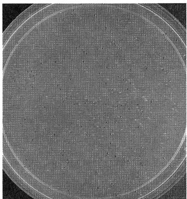

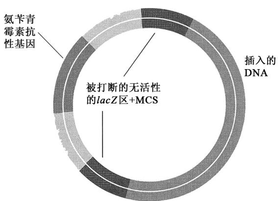  
图 12.10 通过大肠杆菌 lacZ 基因片段的插入失活检测重组质粒。(A)含不间断 lacZ 区的非重组质粒。该区内的多克隆位点 (MCS) 足够小，以致质粒仍然能产生 β-半乳糖苷酶活性。(B)带有插入多克隆位点的供体 DNA 的重组质粒。该质粒可产生青霉素抗性，但不能产生 β-半乳糖苷酶活性，因为打断 lacZ 区的供体 DNA 大到足以使该区变得没有功能。(C)转化细菌的菌落。白色菌落中的细胞所含的质粒带有打断 lacZ 区的插入片段；蓝色菌落中的细胞所含的质粒不带有插入片段。[承艾琳娜·洛佐夫斯基 (Elena R. Lozovsky) 惠赠。]

所有符合标准的克隆质粒都有一个高效的复制起点、供 DNA 片段插入的至少一个单一克隆位点，以及一个被插入 DNA 打断后可产生具有指示重组质粒存在表型的基因。

## - 特定重组体的筛选

一旦在某种特定的载体中得到一个文库(library)——即一组大规模的克隆，下一个问题就是怎样鉴定含有感兴趣的基因的特定重组克隆。如果有含与该基因互补的序列的DNA或RNA分子，可用荧光标记物或放射性物质来标记，作为杂交实验的探针，来鉴定含有该基因的克隆，这种杂交方法称为菌落杂交(colony hybridization)，其概要如图12.11所示。将一张硝酸纤维素滤膜或尼龙膜轻轻地按压在固体培养基表面，待检测的菌落会被转移(拔)到滤膜上。每个菌落都会有一部分留在琼脂培养基上，作为参考平板。用氢氧化钠(NaOH)处理滤膜，使细胞破裂并使DNA变性。然后用含探针的溶液浸泡滤膜(探针由标记DNA或RNA构成，与要寻找的基

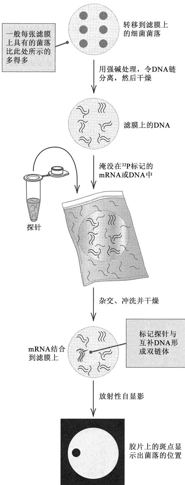  
图 12.11 菌落杂交。

因互补)，并令细胞 DNA 复性。洗涤去除未结合的探针后，根据探针结合的位置鉴定出所需菌落，例如，如果使用放射性标记的探针，可用放射性自显影法定位所需菌落。对于用噬菌体载体感染的细菌细胞，也可用类似方法处理。

如果转化细胞可合成某个克隆基因或cDNA的蛋白质产物，那么，免疫学技术可使产生蛋白质的菌落得以鉴定。其中一种方法是，像菌落杂交那样转移菌落，然后让转移后的复本与特定蛋白质的标记抗体接触，被抗体黏附的菌落，就是含感兴趣的基因的菌落。

## 12.4 基因组学和蛋白质组学

1985 年，认为知道人类基因组中所有 30 亿个核苷酸的全部序列可能会有用的想法浮出水面。在那时，这看起来是个古怪的想法，因为那时 DNA 测序的费用是一个碱基对 1 美元。但这个想法的倡导者认为，启动这样一个计划会刺激技术开发，测序费用就会下降。人类基因组计划 (Human Genome Project) 正式于 1990 年开始，到 2003 年人类序列完成的时候，测序费用确实已经降了下来——降到 1 个碱基对 1 美分。

人类基因组计划的目标不仅包括测人类基因组的序列，而且包括测在遗传学研究中使用的某些主要模式生物的基因组序列，因为已经证明这些模式生物在发现基因功能方面的实用性。人类基因组计划会产生海量的数据，必须存储和访问这些数据，并且必须开发分析此类数据的新方法，所得信息必然会用于药物开发和其他目的，因而必须应对个人遗传信息的隐私权这样的伦理问题。

人类基因组计划取得了极大的成功，但要详细了解基因组的功能和调节，还需要许多年，也许是数十年。了解人类基因组的工具，包括内容注释、比较基因组学和转录谱等方法，以

及研究蛋白质表达、功能和相互作用的方法。这些是基因组学和蛋白质组学的一些关键方法，将在以下章节讨论。

## - 基因组测序

第一批被测序的基因组是病毒和细菌的基因组，因为这些基因组相当小，并且它们在调节序列和蛋白编码序列的布局上相对简单，小的、紧凑的基因组通常比复杂的基因组较容易解读。生殖道支原体(Mycoplasma genitalium)这种细菌的基因组是首先被测序的基因组之一。在所有已知的自由生活的生物中，它具有最小的基因组——仅包含471个基因、长度为580kb的环状DNA分子，这种生物是与灵长类——包括人类——生殖道和呼吸道纤毛上皮细胞相关的一种寄生虫。它属于一个大的细菌类群(支原体)，该类群的细菌缺乏细胞壁，广泛寄生于动植物宿主。

对生殖道支原体基因组进行分析，使我们能够指出，自由生活的细胞所需基因的最小集合可能是什么。图12.12概括了这种生物的基因产物所参与的生物过程，相当大的一部分基因组是用于DNA、RNA和蛋白质这样的大分子的合成，相当大的另一部分维持细胞过程和能量代谢，用于小分子生物合成的基因非常少。不过，编码补救和/或运输小分子的蛋白质的基因，占了全部基因中的相当一部分，这突出了这种生物属于寄生类的事实，余下的基因主要是用于形成细胞膜和帮助该生物逃避宿主的免疫系统。

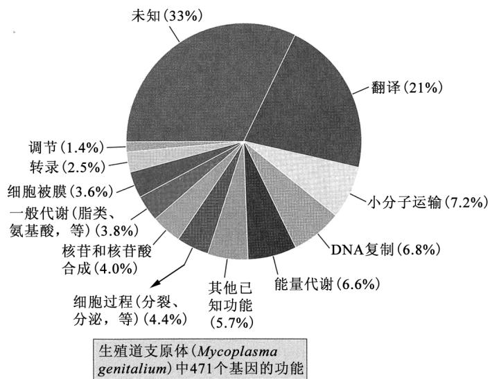  
图 12.12 按功能分类的生殖道支原体基因组中的基因[数据来自 C. M. Fraser, et al., Science 270(1995):397-404.]。

请注意，在图 12.12 中，1/3 的

基因还没有确定功能，这种结果是基因组序列的特点。在许多基因组序列，包括人类基因组中，未确定功能的基因的比例超过50%。因此，即使一个基因组中的基因能被正确识别出来，还会存在许多其他问题。因而，基因组测序应被看作仅仅是在更高、更综合的水平上来理解生物的组织结构和功能的探寻道路上的初级阶段。

## ■ 基因组注释

基因组序列并非不言自明的，它就像一本用只有4个字母的字母表印出来的书，没有空格也没有标点符号，并且也没有索引。要想有用，任何基因组序列必须带基因组注释(genome annotation)，基因组注释是指序列所带的说明性注解。基因组注释详细说明功能元件，即编码区中或编码区附近的一些值得注意的序列(这些序列勾画出编码蛋白的外显子和内含子的轮廓)，以及上、下游结合模体(这些是增强子或沉默子元件的靶标)。注释也包括编码tRNA、参与剪接的核内小RNA和microRNA等功能性RNA的序列，注释还包括转座因子的相应序列等。

大而复杂的基因组，大部分 DNA 不编码蛋白质，大多数编码蛋白质的外显子相对较小且是被巨大的内含子打断的。对于这样的基因组，要解析出基因组序列中编码蛋白质的外显子，鉴别哪些编码蛋白质的外显子属于同一个基因，识别控制基因表达的上下游调控区，尤其是一个令人望而生畏的挑战。在这一水平上的基因组序列的注释属于计算基因组学(computational genomics)的一个方面，在广义上，计算基因组学可定义为计算机在生物学数据的诠释和管理上的应用。

更有甚者，尤其是在多细胞真核生物中，即使对那些功能可以确定的基因，往往不知道每个基因在生活周期的什么时候表达、在哪些组织中表达，也不知道是否存在可变剪接、可变剪接的方式和组织特异性。基因和基因产物的相互作用一般也是不知道的。最大的挑战是了解基因组中的基因怎样发挥功能，才能协调控制发育、代谢、繁殖、行为和对环境的应答。

在基因组注释中，信息量最大的一个信息来源是被转录并加工成 mRNA 的单拷贝序列，这些单拷贝序列可通过对 cDNA 拷贝测序来研究(如 12.2 节所述的那样获得 cDNA)。从这种 cDNA 识别出来的序列称为表达序列标签(expressed sequence tag, EST)。迄今最为雄心勃勃的

  
图 12.13 按功能对 cDNA 序列进行分类。该饼图根据 13 000 多条不同的、随机选择的人类 cDNA 序列建立。[承克雷格·文特尔 (Craig Venter) 及基因组研究所惠赠数据。]

EST 计划之一，包括测定约 30 万条部分 cDNA 序列，其中的 cDNA 从 37 种不同的人类器官和组织制备的 cDNA 文库获得，获得的全部 DNA 序列为 0.83 亿碱基对。虽然估计人类基因组包含 20 000～25 000 个基因，但这些 EST 提示，可能有 10 万种左右的可变剪接转录物。

对这些 EST 进行计算机比对，显示存在 87 983 种不同的序列，根据这些序列与人类或其他生物的已知基因的相似性，可推定许多序列的功能。图 12.13 示按功能对这些 EST 所作的分类，在人类基因中，约 40% 与基本能量代谢、细胞结构、内环境稳定和细胞分裂有关；另有 22% 与 RNA 和蛋白质的合成和加工有关；12% 与细胞间的信号转导和通讯有关。图 12.14 概括了对组织特异性 cDNA 文库进行研究的结果，对于每种器官或组织类型，第一个数字是被测序的 cDNA 克隆总数，括号中的数字是在这种器官或组织的全部 cDNA 序列中

发现的不同的 cDNA 序列数。


<table><tr><td>cDNA来源</td><td>序列</td><td>cDNA来源</td><td>序列</td></tr><tr><td>皮肤</td><td>3 043 (629)</td><td>脑</td><td>67 679 (3 195)</td></tr><tr><td>血细胞</td><td>23 505 (2 194)</td><td>眼</td><td>1 932 (574)</td></tr><tr><td>骨</td><td>5 736 (904)</td><td>唾液腺</td><td>186 (17)</td></tr><tr><td>甲状腺</td><td>2 381 (584)</td><td>食道</td><td>194 (76)</td></tr><tr><td>甲状旁腺</td><td>197 (46)</td><td>脂肪组织</td><td>2 412 (581)</td></tr><tr><td>内皮细胞</td><td>5 736 (1 031)</td><td>心脏</td><td>9 400 (1 195)</td></tr><tr><td>肝</td><td>37 807 (2 091)</td><td>腹膜</td><td>884 (163)</td></tr><tr><td>胆囊</td><td>3 754 (768)</td><td>脾</td><td>7 924 (924)</td></tr><tr><td>结肠</td><td>4 832 (879)</td><td>肾上腺</td><td>3 427 (658)</td></tr><tr><td>平滑肌</td><td>297 (127)</td><td>胰腺</td><td>5 534 (1 094)</td></tr><tr><td>小肠</td><td>1 009 (297)</td><td>肾脏</td><td>3 213 (712)</td></tr><tr><td>前列腺</td><td>7 971 (1 203)</td><td>附睾</td><td>1 716 (370)</td></tr><tr><td>睾丸</td><td>7 117 (1 232)</td><td>骨骼肌</td><td>4 693 (735)</td></tr><tr><td>卵巢</td><td>3 848 (504)</td><td>关节滑膜</td><td>3 889 (813)</td></tr><tr><td>子宫</td><td>6 392 (1 059)</td><td>胚胎</td><td>19 291 (1 989)</td></tr><tr><td>胎盘</td><td>12 148 (1 290)</td><td>胸腺</td><td>2 412 (261)</td></tr></table>

图 12.14 按器官或组织类型对 cDNA 序列所作的分类。在每一类别中，开头的数字是所研究的 cDNA 克隆总数。括号中的数字是在每种器官或组织中发现的不同序列的数目。[数据来自 M. D. Adams, et al., Nature (6547 Suppl.) 377(1995): 3-174.]

## - 比较基因组学

在很多情况下，根据与其他生物的相似序列来识别基因，可获得有用的信息，但如果这些生物从共同祖先趋异的时间太久，就存在一个问题，要分辨序列之间相似到什么程度才可认为它们具有相同的功能。解决这个问题的一个办法是，比较具有一系列分级趋异时间的近缘类群的基因组序列。这种方法称为比较基因组学(comparative genomics)，它已经成为鉴定人类基因组和模式生物基因组的遗传元件的最强有力的策略之一。

以图 12.15 中 12 种果蝇的基因组序列为例，来说明来自比较基因组学的发现。这个树形图概括了这些生物之间的进化关系，以及每

  
当得知遗传工程玉米似乎会杀死帝王蝶时，人们曾组织起来抗议遗传工程玉米。[©Scott Applewhite/AP Photos.]

对物种从共同祖先分开的大致时间。这些物种在地理来源、全球分布、形态、行为、食性及其他表型上都非常不同，然而它们都具有相似的细胞生理、发育程序和生活周期。它们的基因组在序列上表现出相当大的差异(在图12.15的比例尺中，5百万年相当于每10个核苷酸位点中约有1个核苷酸的差异)，并且这些基因组还经历过多次基因重排(主要由倒位所致)。对这12个基因组的比较揭示，尽管在基因组结构和序列上存在广泛的改变，基因功能却仍很保守。

  
图 12.15 12 种果蝇的进化关系，这些果蝇的基因组被测序，以进行比较基因组学研究。按大致的趋异时间比例绘制。[转载自 J. T. Patterson, Studies in the Genetics of Drosophila, Part III and Part IV. University of Texas Publications (1943 and 1944)。经得克萨斯大学奥斯汀分校生物科学学院许可使用。]

比较基因组学的威力来自不同类型的功能元件所表现出来的独特的进化模式，称为进化签名 (evolutionary signature)。图 12.16 示上述 12 种果蝇中的一些例子。A 部分示不编码蛋白质的 DNA 序列特有的进化签名。在整个序列中，物种之间的核苷酸差异几乎是随机出现的 (红褐色)，相当于链终止 (无义) 密码子的改变来来去去 (黄色)，小的插入或缺失 (灰色) 可包含任意数目的核苷酸。

## (A)非编码区

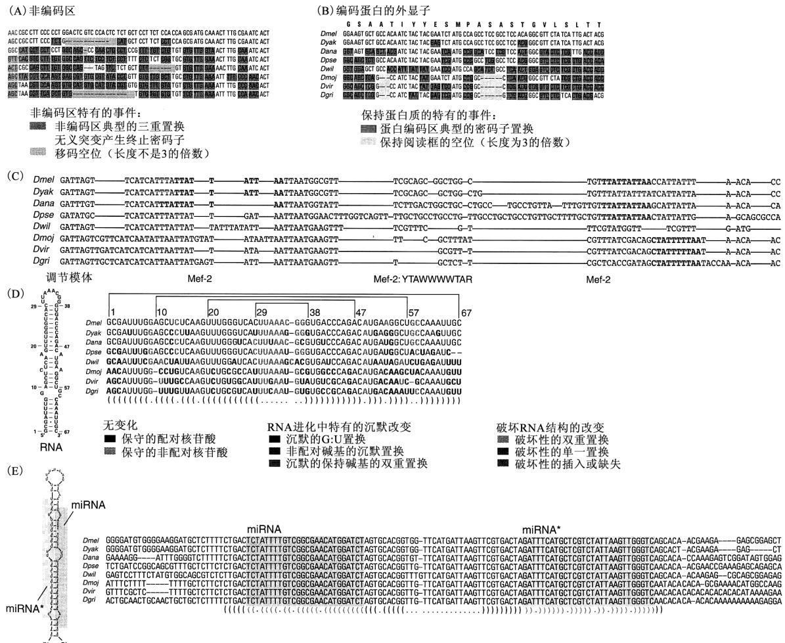  
图 12.16 在 12 个果蝇基因组的不同区域观察到的进化签名，这些区域分别编码：(A) 非编码 RNA；(B) 蛋白质；(C) 转录因子结合位点；(D) RNA 的茎环二级结构；和 (E) microRNA。[改编自 A. Stark, et al., Nature 450 (2007):219-232.]

对比非编码区的核苷酸差异与图 12.16B 中蛋白编码区的核苷酸差异。在编码序列中，特有的进化签名表现为明显的三联体周期性，不会被终止密码子打断。不同种之间的许多核苷酸差异在密码子的第三位上，并且变异密码子往往编码相同的氨基酸。发生缺失时，去除的核苷酸数目为三的倍数(绿色)，这使正常的阅读框得以保存。

比较基因组学也有助于识别作为增强子和沉默子靶标的调节模体。这些模体往往难以识别，因为它们相对较短，在两条 DNA 链上都可存在，且在基因启动子内的位置可变。图 12.16C 中的例子示 Mef-2 蛋白的结合位点。该保守结合位点的序列为 YTAWWWWTAR，其中，Y 表示任意嘧啶，R 表示任意嘌呤，而 W 的意思是要么是 A 要么是 T。这 12 个种的比较显示，在 Mef-2 的其中一个靶基因中，Mef-2 结合位点的序列和位置不同。有些种的结合位点靠近所示区域的 5 端，其他种的靠近 3 端，而有几个种在这两个位置都有 Mef-2 结合位点。

形成折叠的二级结构的 RNA 转录物，如 tRNA、rRNA 和一些 snRNA，有它们自己独特的进化签名。例如，在图 12.16D 中，成对的括号显示在配对的茎结构中保守的碱基对，但不同物种的配对碱基往往有差异(配对核苷酸以颜色编码)。以 29 位和 38 位的核苷酸为例，在黑腹果蝇中这两个位置构成 C-G 对，但在 D. yakuba 中构成 U-G 对(在双链 RNA 中，U 不但与 G 配对，也与 A 配对)。

用共聚焦显微镜进行荧光扫描

在 RNAi 途径中具有重要调节功能的 microRNA，又表现出另一种进化签名(图 12.16E 部分)。在此情况下，在茎区中的变异不大被容许，即使这些变异是互补的，但可见到在环区和其他非配对区内的差异。这 12 个基因组的比较在正确注释黑腹果蝇序列中数以百计的蛋白编码基因、预测许多可能参与基因调节的非编码 RNA 的二级结构、证明有些 microRNA 基因具有多功能产物(增大了它们的调节范围)，以及揭示存在一个转录前和转录后 miRNA 调节目标的网络等方面，起到了重要的作用。鉴别进化签名的最佳趋异时间取决于功能元件的长度，这一观察结果也使系列分级趋异时间的效用得到了验证。较长的功能元件在亲缘关系很近的物种中最容易识别，而较短的功能元件在亲缘关系比较远的物种中可得到最有效的识别。

## ■ 用微阵列或 RNA-seq 获得转录谱

有一种遗传学的新方法称为功能基因组学(functional genomics)，它主要研究基因表达的全基因组模式和基因协同表达的机制。随着细胞环境的改变——例如，由于外部条件、发育或衰老的变化——基因表达的模式也会改变。但基因通常是被成群而不是个别调动的。当一组协同

基因的表达水平降低时，另一组协同基因的表达水平可能会升高。怎样才能同时研究数以万计的所有基因呢？

随着 DNA 微阵列（DNA microarray），或称 DNA 芯片（DNA chip）的发展，研究基因表达的全基因组模式已成为可能。DNA 微阵列是一个邮票大小的平面，上面有 10 000～100 000 个不同的斑点，每个斑点中固定了一种不同的 DNA 序列，这些 DNA 序列可与从不同来源的细胞中分离的 DNA 或 RNA 杂交，诸如在不同条件下培养的细胞、与药物或有

  
相对于样品1，在样品2中， $D$ 基因中度过表达， $E$ 基因的表达相同，而 $F$ 基因中度表达不足

毒化学物质接触或未接触的细胞、不同发育阶段的细胞，以及某种疾病(如癌症)的不同类型或时期的细胞。目前使用的 DNA 芯片有两种。

1. 排列得有寡核苷酸的芯片，这些寡核苷酸是用自动化方法直接在芯片上一个核苷酸一个核苷酸地合成的；这些芯片通常每个阵列有数十万个斑点。

2. 排列有 500～5000bp 变性双链 DNA 的芯片，芯片中的斑点是通过一种微型钢笔样装置的毛细管作用点在芯片上的，每个斑点的点样体积大约为一个液滴的百万分之一，钢笔样装置安装在平台式机器人工作站的活动头上；这些芯片通常每个阵列有数万个斑点。

图 12.17 显示用 DNA 芯片来检测实验样品相对于对照样品的基因表达的全局水平的一种方法。右上角示微阵列中相邻的 6 个斑点，每个斑点含一种 DNA 序列，作为不同基因 $(A \sim F)$ 的探针。左侧示实验方案。首先从实验样品和对照样品中提取 mRNA。然后，如 12.2 节所述，mRNA 经过一轮或数轮反转录。在实验材料 (样品 2) 中，反转录引物包含红色荧光标记；而在对照材料 (样品 1) 中，引物包含绿色荧光标记。当标记 DNA 链增加到足够数量之后，将荧光样品混合，并与 DNA 芯片杂交。

杂交结果如图 12.17 中间部分所示。因为样品是混合样品，所以杂交是竞争性的，因而，与 DNA 芯片结合的红色或绿色链的密度，与混合物中红色或绿色分子的浓度成正比。相对于样品 1，在样品 2 中过表达的基因，会有更多的红色链与斑点杂交，而在样品 2 中表达不足的那些基因，会有更多的绿色链与斑点杂交。

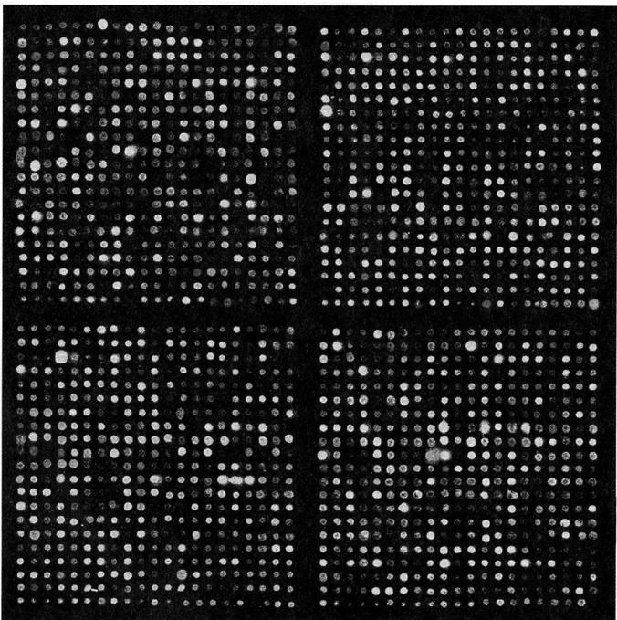  
图 12.18 一个酵母 DNA 芯片的一小部分，显示 1764 个斑点，每个斑点是一种不同的 mRNA 序列的杂交结果。每个斑点的颜色表示实验样品和对照样品中基因表达的相对水平。酵母所有可读框的完整芯片包括 6200 多个斑点。[承耶鲁大学杰弗里·汤森 (Jeffrey P. Townsend) 和杜乔·卡瓦列里 (Duccio Cavalieri) 惠赠。]

杂交之后，将 DNA 芯片置于共聚焦荧光扫描仪中，首先扫描每个像素（可视图像中最小的不连续的单元），记录一种荧光标记的强度，然后又一次扫描，记录另一种荧光标记的强度。合成这些信号，得到微阵列中每个斑点的信号值。如图 12.18 所示，这些信号以颜色的形式显示了基因表达的相对水平。红色或橙色的斑点表示在实验样品中该基因高度或中度过表达，绿色或黄绿色的斑点表示在实验样品中该基因高度或中度表达不足，而完全黄色的斑点表示实验样品和对照样品的基因表达水平相同。以这种方式，DNA 芯片可检测任何 mRNA 种类的相对水平，只要其在样品中的丰度大于每 $10^{5}$ 个分子一个分子，并可检测在表达上小至大约两倍的差异。

基因表达阵列已被用来鉴定在发育中协同调节的基因群。图 12.19 中的例子示秀丽隐杆线虫 (Caenorhabditis elegans) 发育早期 20 组基因的表达谱 (expression profile)。在这些实验中，发

育时间是以相对于四细胞期的分钟数来衡量的。基因表达的相对水平绘制于对数坐标上，因此，转录物相对丰度的变化往往是两到三个数量级。在所考察的这个时间段内，胚胎经历了从对照经过卵细胞中的母源转录物到胚胎自己的转录物的过渡，且涵盖大部分的主要细胞命运被确定的时间段。

在这些实验中所用的微阵列可检测差不多9000个可读框的转录物，所得图谱包括大约2500个基因的变化曲线，其中大约80%的基因在所示时间段内表现出转录物丰度的显著改变。

直到四细胞发育阶段，转录的模式都比较稳定，之后开始迅速变化。最早阶

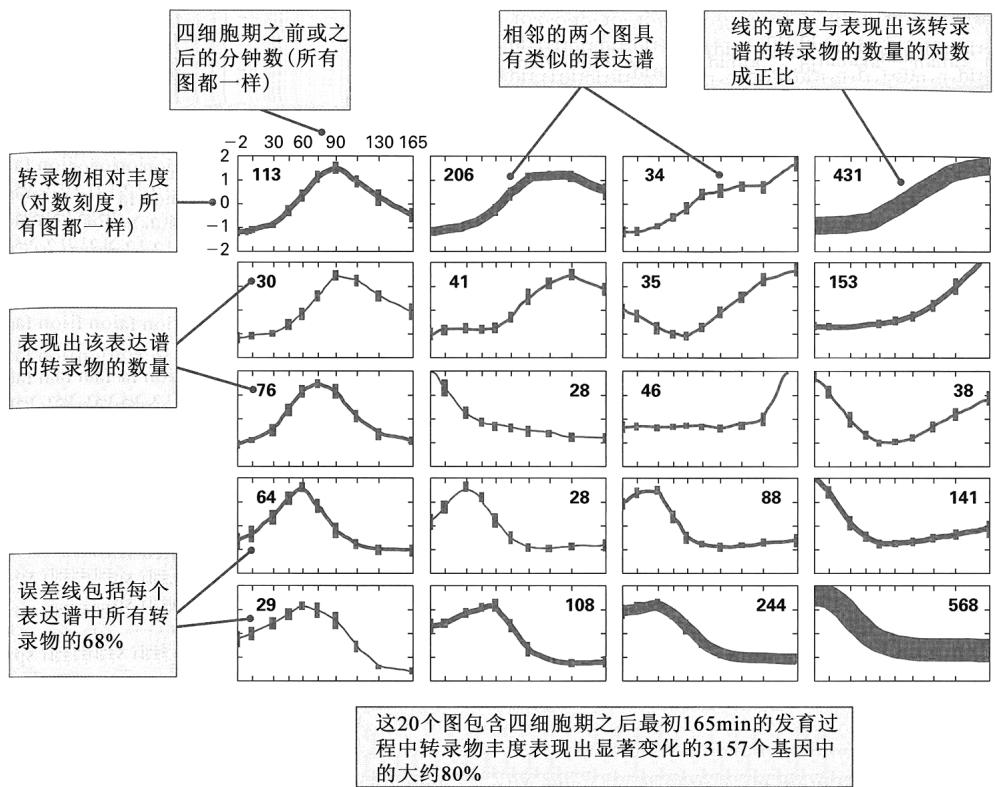  
图 12.19 在秀丽隐杆线虫发育的前 2.75h 过程中约 2500 个基因的转录调节模式。全部发育过程约需 12h。[转载自 L. R. Baugh, et al., Development 130(2003): 889-900。经 The Company of Biologists 许可转载。]

段的发育主要由母源转录物维持。这些转录物中，许多转录物随着发育的进行而被快速清除，例如，在右下角的3个图中的转录物，这些图是根据3簇分别含141、244和568个基因的转录物绘制的。胚胎细胞的转录物显然是诱导产生的，图中右上角含431和153个基因的基因簇的模式即为证明。显示母源转录物消失和胚胎转录物出现的曲线，大约在原肠胚形成时相交，表明发育从母体控制转换为胚胎控制发生在稍早的时期(囊胚中期)。许多基因的转录模式非常复杂，它们有一个短暂的表达峰，表明在发育中仅有一个短暂的时期需要该转录物(虽然不一定是蛋白质产物)，图12.19左边的5个小图显示了这种模式。

虽然图 12.19 中的转录分析相当粗放，但是，鸟瞰在发育过程中发生了什么，鉴定成群的协同表达基因，本身就具有极大的价值，因为它表明这些基因可能具有共同的或重叠的顺式作用调节序列，这些序列受共同的或重叠的成套转录激活蛋白的控制。

除了微阵列，获得转录谱的另一个选择是利用 6.7 节中所讨论的大规模并行测序技术。这种方法称为 RNA-seq (转录组测序)，以 mRNA 的 poly-A 尾巴为 poly-T 寡核苷酸引物的目标，用反转录酶来生成与每个 mRNA 分子互补的单链 DNA。然后复制这些 DNA 链，得到双链 DNA，这些双链 DNA 与在提取 mRNA 的时候存在于细胞中的 mRNA 分子群体相对应。用大规模并行测序分析这些 cDNA 的集合，然后将每种 cDNA 序列与该物种的参考基因组相比，鉴定出与转录物相应的基因。

与微阵列相比，RNA-seq 有许多优点。例如，转录物之间的杂交效率的差异会影响微阵列的结果，但对 RNA-seq 的结果没有影响，因为在 RNA-seq 中，每个转录物都是根据序列来鉴定的。RNA-seq 的另一个优点是，在杂合基因型中，不同等位基因的转录物水平可被检测。等位基因表达的不平衡可因等位基因启动子序列的差异和使转录得以发生的染色质重塑的差异，以及其他因素而造成。如果杂合基因型中的两个等位基因，在所得每条序列的全长上平均有一个核苷酸位点的差异，则在 RNA-seq 读取的所有序列中，约 2/3 的序列会在一个或一个以上的位点有差异，从而使得原来的等位基因可被鉴定。不过，RNA-seq 也有局限性。主要的局限在于，它难以检测到或精确估计在每个细胞中只有几个分子的稀有转录物的丰度。因此，加上其他的原因，应将 DNA 微阵列和 RNA-seq 视为获得转录谱的互为补充的方法。

## ■ 染色质免疫沉淀

不仅衡量基因在转录水平上的差异的程度重要，理解它们为什么会有差异也很重要。转录水平的变化大部分是 DNA 和蛋白质(如转录因子和染色质蛋白)相互作用的结果。一种研究此类相互作用的方法是利用与特定类型的 DNA 结合蛋白结合的抗体。这种抗体与结合在 DNA 结合位点上的蛋白质形成复合体，将抗体-蛋白质-DNA 复合体沉淀下来，即可分离其组分，开展进一步的研究。

分离蛋白质-DNA 复合体的技术称为染色质免疫沉淀(chromatin immunoprecipitation, ChIP)，概括于图 12.20 中。A 部分示一段带有核小体的染色质，其中包含一个与转录因子(红色)结合的 DNA 区域，以及一个组蛋白的一个氨基酸被化学修饰(如甲基化或乙酰化)的核小体(绿色)。在 ChIP 的第一步中，用甲醛之类的化学物质处理，使蛋白质和 DNA 化学交联。然后用酶将染色质消化(或剪切)成含交联的蛋白质和 DNA 的片段(图 12.20B)。然后将样品分成两份，分别加入可与转录因子或修饰组蛋白特异性结合的抗体。在本例中，转录因子的抗体以红色显示，修饰组蛋白的抗体以绿色显示。沉淀并纯化所形成的抗体、蛋白质和 DNA 复合体(图 12.20C)。在这个时候，逆转化学交联，使结合的 DNA 游离出来，以便进一步分析，鉴别与转录因子或修饰组蛋白结合的特定基因或 DNA(图 12.20D)。

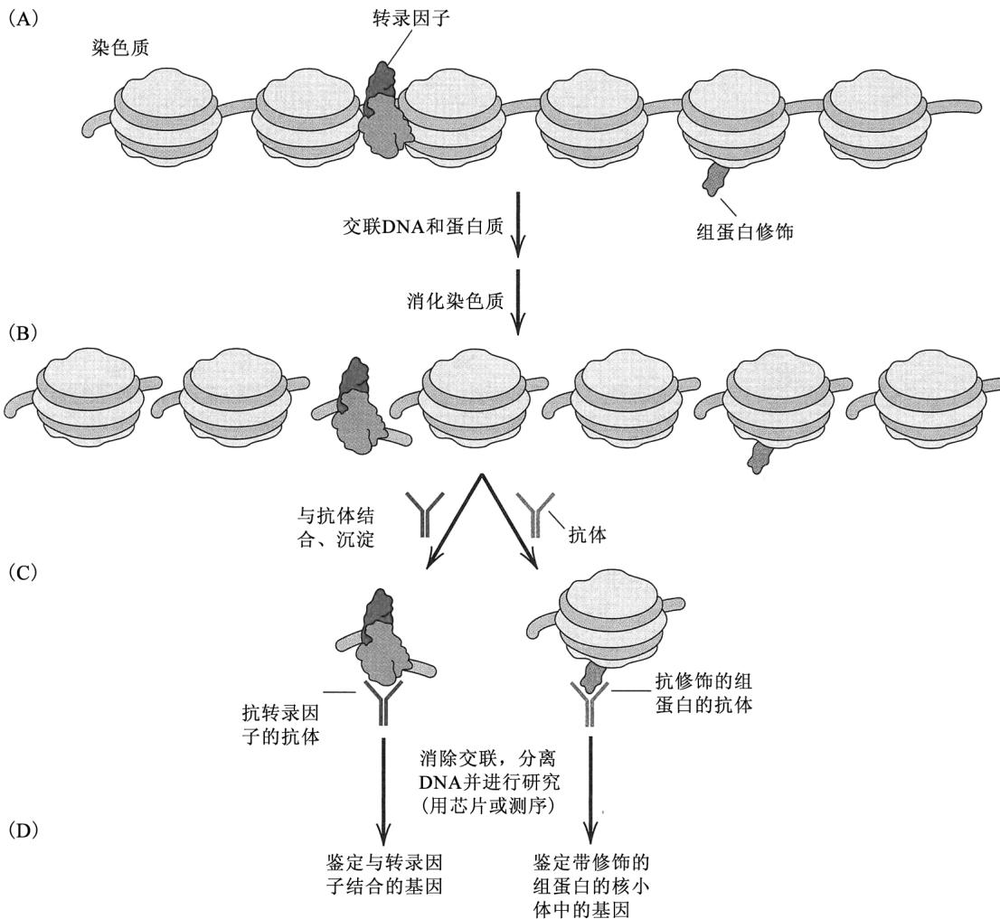  
图 12.20 染色质免疫沉淀(ChIP)。通过化学方法将染色质中的蛋白质和 DNA 交联起来(A)，然后将染色质剪切成片段(B)。加入特异抗体，与转录因子(红色)或修饰的组蛋白(绿色)结合，然后让抗体-蛋白质-DNA 复合体沉淀(C)。逆转交联过程，使得可对复合体中的 DNA 进一步分析(D)。

通常会用两种方法来分析用 ChIP 分离得的 DNA 片段。一种方法称为染色质免疫沉淀芯片 (ChIP-chip)，在这种方法中，将所得 DNA 用荧光标记，用来与微阵列芯片杂交。另一种方法称为染色质免疫沉淀测序 (ChIP-seq)，在这种方法中，用大规模并行测序技术来分析所得 DNA。这两种方法都可揭示与抗体的靶蛋白结合的序列，因而可显示哪些与特定 DNA 序列结合的蛋白质会增强或阻遏附近基因的转录。

## ■ 蛋白质-蛋白质相互作用的双杂交分析

蛋白质-蛋白质相互作用对于理解生物过程也很重要，因为参与相关细胞过程的蛋白质往往会有物理接触。因此，知道哪些蛋白质相互接触，可为未知蛋白质可能存在的功能提供线索。

鉴定蛋白质-蛋白质相互作用的一个方法，是利用 11.5 节所讨论的出芽酵母的 GAL4 转录激活蛋白。GAL4 蛋白含两个独立的结构域，这两个结构域都是转录激活所必需的。一个结构域是锌指 DNA 结合结构域，与被激活的 GAL 基因的启动子中的靶位点结合。另一个结构域是转录激活结构域，与转录复合体接触并真正地激发转录。在野生型 GAL4 蛋白中，这两个结构域是拴在一起的，因为它们是同一条多肽链的两个部分。

  
图 12.21 使用 GAL4 蛋白进行双杂交分析。(A) 当与两个 GAL4 结构域融合的两种蛋白质不发生相互作用时，不发生报道基因的转录。(B) 当这两种蛋白质确实相互作用时，报道基因被转录。

利用 GAL4 来鉴定蛋白质-蛋白质相互作用的关键是，这两个独立结构域的编码区可被拆开，各与不同蛋白质的编码区融合。该策略如图 12.21A 所示，其中，在 GAL 启动子旁边，GAL4 的 DNA 结合结构域和转录激活结构域被绘制成分开的实体，分别与不同的多肽链融合。该启动子与一个报道基因 (reporter gene) 结合，报道基因的转录可被检测，例如，借助菌落中颜色的改变、荧光蛋白的产生或在存在某种抗生素的情况下细胞能够生长等手段。融合的 DNA 结合结构域和融合的转录激活结构域都是杂交蛋白，因此这种检测系统被称作双杂交分析 (two-hybrid analysis)。在 A 部分，与两个 GAL4 结构域融合的两种蛋白质，在细胞核内不发生相互作用。因此，DNA 结合结构域与转录激活结构域保持分离，从而不会发生报道基因的转录。

图 12.21B 示与 GAL4 结构域融合的两种蛋白质发生相互作用的情况。在此情况下，DNA 结合结构域和转录激活结构域相接触，从而发生报道基因的转录。以此方式，在双杂交分析中报道基因的转录表明与 GAL4 结构域融合的蛋白质发生了将两个杂交蛋白结合到一起的物理上的相互作用。

  
图 12.22 酵母核蛋白之间的物理相互作用。未显示未表现出相互作用的核蛋白。[转载自 S. Maslov and K. Sneppen, Science 296(2002): 910-913。经 AAAS 许可转载。图解承布鲁克海文国家实验室谢尔盖·马斯洛夫(Sergei Maslov)惠赠。]

图 12.22 示双杂交分析的一个例子，该图绘制了酵母的 329 种核蛋白中 318 种蛋白质-蛋白质相互作用的网络。这一分析的目的，是将所观察到的相互作用网络，与包含相同数目的相互作用但随机选择相互作用对象的随机网络，进行比较。图 12.22 中的这个网络的一个有趣的特点是，在已经高度关联的蛋白质之间，存在比预计要少的相互作用，这也是其他蛋白质网络的特点。换句话说，通过许多相互作用与其他蛋白质高度关联的蛋白质，往往与其他高度关联的蛋白质不关联，但与具有较少关联的蛋白质关联。在高度关联的蛋白质之间的这种系统性的关联抑制具有这样的作用：它可减小网络中某个部分的随机环境或遗传扰动波及网络其他部分的程度。

双杂交分析给探索

蛋白质-蛋白质相互作用提供了一个强大的方法，因其可大规模地开展、不需要纯化蛋白质、可检测活细胞中发生的相互作用，并且不需要待检测蛋白质的功能方面的信息。但是，该方法也有一些局限。例如，双杂交分析是定性而不是定量的，因而不大容易将弱相互作用与强相互作用区分开。为了增强双杂交分析的可靠性，一般要让杂交蛋白高度表达，所以，在正常浓度下可能不会发生相互作用。双杂交分析还要求蛋白质相互作用发生在细胞核中，但有些蛋白质可能只在细胞质环境中发生相互作用。最后，杂交蛋白可能与天然的蛋白质折叠得不一样，因而，错误折叠的蛋白质可能不能相互作用，但天然构象可以，或错误折叠的蛋白质可以相互作用，但天然的构象不行。结论是，从双杂交分析得来的结果必须小心解读，而另一方面，该方法已经产生了大量有价值的信息。

## 12.5 转基因生物

遗传工程的一个重要的应用是利用取自一个生物物种的基因来改变一个不同生物物种的基因型。这种遗传工程改造所得的生物称为转基因生物(transgenic organism)。来看一个实例，苏云金杆菌(Bacillus thuringiensis)这种细菌生产多种称为δ-内毒素(delta-endotoxin)的杀虫蛋白，这些蛋白质可在细菌孢子中形成结晶。这些蛋白质对鳞翅目(蛾和蝶)、双翅目(具有单对翅的昆虫)和鞘翅目(甲虫)昆虫具有毒性。这些细菌孢子被昆虫摄食后，结晶溶解，并被肠道中的蛋白酶活化，它们与肠上皮上的特异性受体结合，从而产生“管道泄漏”(leakage channel)，最终杀死昆虫。目前，已生产出经过遗传工程改造过的玉米、棉花和其他农作物，在它们的基因组中含有由来源于正常植物基因的序列调节的δ-内毒素编码区。因此，这些工程植物可在组织中产生δ-内毒素，使得摄食它们的昆虫(如欧洲玉米螟)死亡。欧洲玉米螟是在20世纪初期入侵美国的一种鳞翅目害虫，现在每年导致饲料玉米、爆花玉米、留种玉米和甜玉米的作物损失超过10亿美元。

在本节中，将考察生产转基因生物的一些遗传方法。我们已经见过怎样利用转化将重组

DNA 导入细菌细胞中。类似的方法对酵母和许多其他的单细胞微生物也起作用。在后生动物中，包括在家养动植物中，转化需要不同的技术。

## ■ 动物的种系转化

在秀丽隐杆线虫中，转化方法基于这样的事实：直接注射进生殖器官的 DNA，有时会被自发整合进种系细胞的基因组中。因此，如果用包含感兴趣的任何序列及某个遗

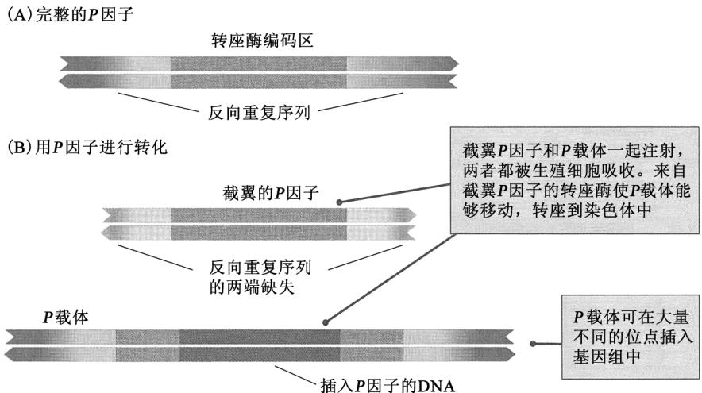  
图 12.23 在果蝇中由转座因子 P 介导的转化。(A)完整的 P 因子包含两端的反向重复序列和内部的转座酶编码区。(B)双组分转化系统。载体组分包含感兴趣的 DNA 及其两侧的转座所需的识别序列。截翼组分是修饰过的 P 因子，它可编码转座酶，但不能转座其自身，因为缺失关键的识别序列。

传标记的重组 DNA 注射线虫，则在被注射线虫的后代中存在该标记的表型，即表明发生了转化。

在果蝇的种系转化中使用一种稍微精细一点的方法。通常的方法是利用一种称为 P 因子 (P element) 的转座因子，P 因子是一段长为 2.9kb 的 DNA 序列，中央区域编码转座酶，其两端各有一段反向重复的 31bp 序列 (图 12.23A)。两端的反向重复序列是转座酶识别必不可少的，转座酶通过切除和插入使 P 因子转座(剪-贴型转座的细节将在 14.3 节中考察)。用于种系转化的载体是一种含 P 因子的质粒，其中，转座酶编码区被感兴趣的 DNA 序列替换，与其在一起的还有一个合适的遗传标记(通常是影响眼睛颜色的遗传标记)。这种 P 因子单独不能转座，因为它不编码转座酶，但因其仍然具有反向重复序列，能被来自别的渠道的转座酶转移。这个转座酶的来源通常是遗传工程改造过的 P 因子的衍生物，称为截翼(wings clipped)因子，它编码有功能的转座酶，但自己不能转座，因为两端的反向重复序列缺失(图 12.23B)。

联系：多莉，你好！

伊恩·威尔穆特、安杰利卡·施尼亚克、吉姆·麦克沃尔、亚历克斯·金德和基思·坎佩尔，1997

罗斯林研究所，罗斯林，中洛锡安，苏格兰

源自哺乳类胎儿细胞和成体细胞的可存活后代

苏格兰的那只被称为“多莉”(Dolly)的芬兰多赛特(Finn Dorset)母羊，是从取自成年哺乳动物细胞的细胞核克隆而来的第一个哺乳动物。该实验曾引发一场媒体轰动。当时的美国总统说，他要反对克隆人类。一位公共卫生教授说：“我认为明智、理性的人不会想克隆他们自己，除了一个古怪的百万富翁可能会想把他的钱留给一个克隆之外。没有什么办法能阻止超级富豪们去海外克隆他们自己。”有些人为动物忧心。善待动物协会(PETA)的一位发言人说：“该是社会学会尊重我们的同伴的时候了，不要用它们来干任何蠢事。”(请注意，在后面的节选中，实验是经过相应的动物福利委员会事先批准的。)克隆动物引起了许多重大争议。其中之一是，克隆出来的动物在遗传上是否确实正常。例如，多莉在2002年被诊断出患关节炎，一年以后又被诊断出患进行性肺病。它在2003年2月14日被执行安乐死。

将处于某一特定发育阶段的单个细胞核，转移到一个去除细胞核的未受精的卵中，给研究到那一发育阶段

  
"I LOVE EWE, MOM!" Dolly and her natural-born lamb, whose fleece was white as snow. [Courtesy of the Roslin Institute, University of Edinburgh.]

“我爱你，妈妈！”多莉和她亲生的小羊，小羊的毛像雪一样白。[承爱丁堡大学罗斯林研究所惠赠。]

的细胞分化是否涉及不可逆的遗传修饰，提供了一个机会。第一个从已分化的细胞发育而来的后代，是从已经被诱导成静止状态的胚胎源性细胞转移来一个细胞核而得到的。现在我们报道，使用相同方法从成体乳腺细胞、胎儿细胞和胚胎细胞诞生了活羊。可从一个成体细胞得到一只羊的事实证明，成体细胞的分化不涉及所谓的发育所需的遗传物质的不可逆修饰。……只有通过去除中期Ⅱ卵母细胞的细胞核来制备受体细胞质，才能在转移二倍体细胞核时避免染色体损伤及维持正常的倍性。我们对培养细胞的研究表明，如果细胞是静止状态的，有一个优点。……总的来说，我们的研究结果表明，来自广泛细胞类型的细胞核，在使用不同细胞周期阶段的适当组合来增加重新编程的机会之后，应该说是全能性的。有鉴于此，在精选畜群中获得的遗传改良，其种质的传播，可通过源自成年动物细胞的细胞核移植，对具有业已验证性能的动物进行有限的复制，而得到加强。……据我们所知，从乳腺细胞进行细胞核移植后诞生的这只羊，是从源自成体组织的细胞发育而来的第一个哺乳动物。……这与普遍接受的观点是一致的，即，哺乳动物分化的实现，几乎全部是由于细胞核与不断变化的细胞质环境之间的相互作用所致的基因表达上的系统而连续的改变。……这些实验是在动物(科学方法)法1986〔英国〕的指导下进行的，并经过罗斯林研究所动物福利与实验委员会批准。

来源：I. Wilmut, et al., Nature 385 (1997): 810-813.

在果蝇的转化中，感兴趣的任何 DNA 序列都可置于缺失型的 P 因子两端之间。所得载体与另一种含截翼因子的质粒一道，被注射到早期胚胎中含有生殖细胞的区域。DNA 被生殖细胞吸收，截翼因子使细胞能够产生有功能的转座酶(图 12.23B)。这使得工程 P 载体转移，结果是转座到基因组中，位置基本上是随机的。在注射过的果蝇的后代中，因为眼睛的颜色或其他在

P 载体中包含的遗传标记，得以将转化体检测出来。P 载体整合进种系的效率通常很高(10%～20%经过注射而能存活且能生育的胚胎，可产生一个或多个转化后代)。不过，效率随着 P 因子中 DNA 片段的增大而下降，有效的上限约为 20kb。

在哺乳类中，种系的转化可以几种方式进行。最直接的方式是将载体 DNA 注射进受精卵的细胞核，然后将受精卵转移到代孕母亲的子宫中发育。载体通常是修饰过的 RNA 病毒，RNA 病毒利用反转录酶将 RNA 基因组转变成双链 DNA，双链 DNA 得以插入被感染细胞的基因组中。遗传工程改造过的含 RNA 插入片段的病毒，可进行同样的整合过程。

转化哺乳类的另一个方法是利用从受精后数天的胚胎中获得的胚胎干细胞(embryonic stem cell)(图12.24)。虽然胚胎干细胞的适应能力不是太强，但可将它们分离、培养生长，然后用重组DNA载体转化。遗传修饰过的干细胞被转移到正在发育的胚胎中，将胚胎移植到代孕母亲的子宫中(图12.24A)，干细胞得以整合进胚胎的不同组织中，并且常常会参与种系的形成。如果胚胎干细胞携带某种遗传标记，如一个控制黑色毛色的基因，则嵌合体小鼠可因它们的斑点毛皮而得到鉴定(B)。在这些小鼠中，有的小鼠交配后生出黑色后代(C)，这表明胚胎干细胞已经被整合到种系中。通过这种方式，胚胎干细胞在培养状态下被导入的遗传改变，可被整合进活的动物的种系中。图12.24中所示的方法已被用来产生在某些基因——诸如与囊性纤维化这样的人类遗传病相关的基因——中带有突变的小鼠品系。这些品系可作为研究该病及测试新药和新疗法的小鼠模型。

  
图 12.24 在小鼠中通过胚胎干细胞进行种系的转化。(A)从黑色品系的胚胎中分离到干细胞,在培养物中经过遗传操作后,注射进白色品系的胚胎中,然后将胚胎导入代孕母鼠的子宫。(B)产生的后代通常是嵌合体,含有来自黑色品系和白色品系的细胞。(C)如果来自黑色品系的细胞在量上主导了种系,则嵌合体小鼠的后代将会是黑色的。[改编自 M. R. Capecchi, Trends. Genet. 5(1989):70-76.]

将变异导入特定基因的方法称为基因打靶(gene targeting)，马里奥·卡佩奇、马丁·埃文斯和奥利弗·史密斯因为在发明该技术上的开创性发现，被授予2007年的诺贝尔生理学或医学奖。基因打靶的特异性来自被导入的重组DNA和染色体中本来存在的正常序列之间的DNA序列的同源性。当这两种DNA序列足够相似时，它们可进行配对，通过断裂和重接过程交换互补链。图12.25示两个例子，其中，基因打靶载体中的DNA序列以环状构型显示，在重组之前，环状构型与染色体中的同源区域配对。靶基因以粉红色显示。在图12.25A中，载体含有被一个新DNA序列的插入打断的靶基因，同源重组导致这段新序列被插入到染色体上的靶基因中。在图12.25B中，载体只含有侧翼序列，本身不含靶基因，所以同源重组导致靶基因被一段无关的DNA序列替换。在这两种情况下，具有靶基因突变的细胞，都可通过在同源重组整合进基因组的序列中包含抗生素抗性基因或其他可选择的遗传标记来进行选择。同源重组的分子机制在 6.8 节中讨论过。

  
图 12.25 胚胎干细胞中的基因打靶。(A)载体(顶部)含有被一个插入片段打断的靶序列(砖红色)。同源重组将该插入片段导入基因组。(B)在此情况下，载体含有位于靶基因两侧的 DNA 序列。同源重组导致靶基因被一段无关的 DNA 序列替换。[改编自 M. R. Capecchi, Trends. Genet. 5 (1989):70-76.]

## - 植物遗传工程

转化植物细胞的一种方法是使用在土壤细菌根癌农杆菌(Agrobacterium tumefaciens)及其近缘种中发现的一种质粒。易感植物可被这种细菌感染，在细菌侵入点(一般是伤口)引起一种称为冠瘿瘤(crown gall tumor)的肿瘤生长。易感植物包括双子叶植物纲(Dicotyledoneae)中的约16 000种开花植物，其中包括绝大多数常见的开花植物。

农杆菌含有一种称为 Ti 质粒 (Ti plasmid) 的 200kb 左右的巨大质粒，该质粒包含一个称为 T DNA (T DNA) 的较小 (约 25kb) 区域，其最两端为 25bp 长的同向重复序列 (以相同方向重复的序列) (图 12.26A)。农杆菌感染会使受感染细胞的代谢发生根本的改变，因为 T DNA 编码刺激细胞分裂的蛋白质而引起肿瘤，并编码将精氨酸转变成农杆菌生长所需的某种罕见衍生物 (通常是胭脂碱或章鱼碱，取决于具体的 Ti 质粒类型) 的酶。

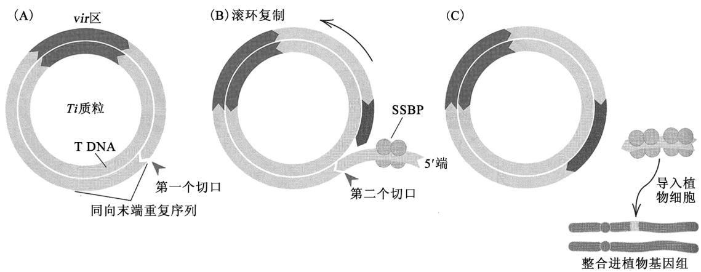  
图 12.26 使用来自 Ti 质粒的 T DNA 进行植物基因组的转化。(A) 在 T DNA 的 5 端形成一个切口。(B) 滚环复制延伸 3 端同时取代 5 端，5 端由单链结合蛋白 (SSBP) 稳定。第二个切口终止复制。(C) 结合 SSBP 的 T DNA 被转移到植物细胞中，并插入基因组中。

植物细胞代谢的改变是 T DNA 被物理转移并整合进植物基因组中所引起的，图 12.26 概括了其机制。转移过程由 6 个基因的产物介导，这些基因在 Ti 质粒称为致毒 (virulence, vir) 区的一个 40kb 区域中。T DNA 的转移从一个单链切口的形成开始(图 12.26A)，T DNA 5 端从该切口处被剥离质粒；产生的豁口被新复制的 DNA 封上，新复制的 DNA 是用无切口的环为模板链，添加到切口的 3 端(图 12.26B)。质粒被转移的区域，由位于 T DNA 另一端的第二个切口界定，但该切口的位置可有少许可变化性。产生的单链 T DNA 与一种单链结合蛋白(SSBP)结合，然后被转移到植物细胞中，并被吸收进细胞核中。在细胞核中，T DNA 被整合进染色体 DNA 中，其机制尚不清楚(图 12.26C)。虽然 SSBP 的氨基酸序列与大肠杆菌的 recA 蛋白(其在同源重组中起关键作用)有一定的相似性，但是 T DNA 的整合不需要序列同源性。

将 T DNA 用在植物转化中，因利用工程质粒而成为可能，在工程质粒中，在正常情况下存在于 T DNA 中的序列被去除，代之以带有可选择标记的待整合进植物基因组的 DNA 序列。另一种含有 vir 基因的质粒使工程 T DNA 可以移动。在被感染组织中，vir 的功能使 T DNA 移动，以便转移进宿主细胞，并整合进染色体。在植物细胞培养中，利用可选择标记选择转化细胞，然后培养成成熟植株。

## ■ 转化补救

种系转化的一个重要应用是在实验上确定任何特定基因在 DNA 上的界线。每个基因既包括编码序列，也包括其正确表达所需的上、下游序列。如同在第 11 章中所见的，这些调节序列控制着转录在发育中发生的时间、在哪些细胞类型中发生，以及在什么水平上进行。在确定某个基因的上、下游界线时，即使知道编码区及侧翼 DNA 的全部核苷酸序列，也可能不够。主要原因是缺乏识别调节序列的通用方法。调节序列往往是一些看似无特征的短序列的组合，事实上，这些看似无特征的序列是控制转录的调节蛋白的关键结合位点。

种系转化如何被用来确定功能基因的界线？参考果蝇白眼基因(white)的例子，该基因发生突变后，导致具有白眼而不是红眼的果蝇。白眼基因的遗传结构如图12.27所示。初级RNA转

录物(B)长 6kb 多一点，含 5 个内含子，这些内含子在 RNA 加工过程中被切除并降解。产生的 mRNA(C) 被翻译成具有 720 个氨基酸的蛋白质(D)，该蛋白质是一个称为 ABC 转运蛋白 (ABC transporter) 的 ATP 依赖的跨膜蛋白大家族的一员，ABC 转运蛋白调节其靶分子或离子穿过细胞膜的运输。白眼转运蛋白位于眼睛的色素生成细胞中，其靶分子是眼睛色素的关键前体之一，因而，具有突变型白眼转运蛋白的果蝇，长白眼。

  
图 12.27 果蝇白眼基因的遗传结构。

用种系转化来解决的问题

是：果蝇需要白眼基因上、下游多少 DNA，才能在色素细胞中产生野生型转运蛋白？实验方法是，先克隆一个包含野生型白眼蛋白编码序列的 DNA 大片段，然后利用种系转化，将该片段导入含有白眼基因突变的果蝇基因组中。如果导入的 DNA 包含正确的基因表达所需的全部 5' 和 3' 调节序列，那么，所得果蝇的表型会是野生型的，因为野生型基因对白眼基因突变为显性。导入的 DNA 片段可修正突变型生物的遗传缺陷的能力，称为转化补救 (transformation rescue) (图 12.28)，这意味着该片段包含所有必需的调节序列。该片段也可能含有一些非必需序列，所以，要找出最小的 5' 和 3' 侧翼区，还需要分析原始片段更小的部分的转化补救。就白眼基因而言，最小的 DNA 片段长约 8.5kb，始于转录起点上游约 2kb 处。

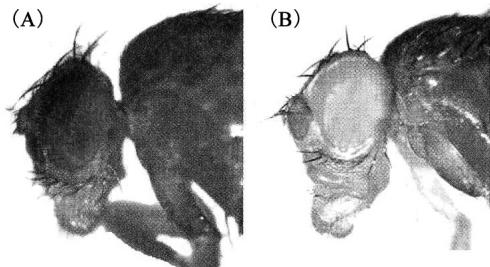  
图 12.28 黑腹果蝇的突变型白眼雄性和野生型红眼雄性。[承 E. R. Lozovsky 惠赠。]

## - 位点专一诱变和敲除突变

一旦基因被克隆和测序, 就可在该基因中导入特定的突变, 并转化进种系中, 以分析产生的表型, 从

而使得弄清该基因的功能成为可能。有时将这种方法称作反求遗传学(reverse genetics)，因其颠倒了传统的遗传分析流程。反求遗传学从某个已知基因开始查明不同突变如何影响表型，而不是从某个突变表型开始试图鉴定突变基因。

现有数种方法可用来在克隆 DNA 的特定位点上产生明确的突变。一种基于聚合酶链反应 (PCR) 的位点专一诱变 (site-directed mutagenesis) 方法，概括于图 12.29 中。该法从一个分离自克隆的野生型基因的单一限制性片段开始，在此例中，假设该片段是一个 EcoR I - BamH I 片段。

进行两个不同的PCR反应。一个PCR使用称作1和2的一对引物，其中，引物1超出EcoRI位点的范围，并与EcoRI位点重叠，以使扩增之后该位点能够重建。而引物2是一个含单碱基错配（在此例中是一个G-A错配）的诱变引物（mutagenic primer）。另一个PCR使用引物对3和4，其中，引物3的5端与引物2的5端毗邻，而引物4超出BamHI的范围并与其重叠，以使扩增后该位点能够重建。扩增产物如C部分所示。当这两种扩增产物被连接，然后用EcoRI和BamHI消化后，原来的EcoRI-BamHI片段被重建，只是新片段在所示位点具有一个特定的A-T→G-C碱基对的置换。当这个

  
图 12.29 利用 PCR 进行位点专一诱变。(A)一个 A-T 核苷酸对将被 G-C 核苷酸对取代。(B)用一条含 G 而不是 A 的引物(2 号引物)，分两部分扩增原始片段。(C)左边的扩增产物在靶位点含 G-C 核苷酸对。(D)连接扩增片段，重新构成含定点突变的 DNA 双链体。

EcoR I - BamH I 片段被替换回原来的野生型基因中后，重建的基因具有一个 A-T→G-C 碱基对突变，该基因可通过种系转化被导入生物中。

类似方法可用来产生缺失突变(deletion mutation，基因的一部分丢失)，或基因的一部分被一段完全无关的序列取代的突变。在基因打靶实验中，使用这样的构建体，通过同源重组来替换基因组中的野生型基因时，得到的突变是敲除突变(knockout mutation)，在敲除突变中，野生型基因已变得完全没有功能（“敲除”）。基因敲除的两种重要应用值得强调一下。第一种是敲除了人类疾病基因的同源基因的小鼠品系的繁育，敲除这些基因是为了当作人类疾病模型。例如，治疗不同遗传原因的高血压的药物有效性，可在已知其产物在调节血压中比较重要的基因被敲除(或具有额外拷贝)的小鼠品系中进行考察。在本章的“联系：东拼西凑”中强调了这一应用。敲除诱变的第二种重要应用是在基因功能鉴定上的应用。例如，在从出芽酵母(酿酒酵母)基因组的全基因组测序中鉴定出的大约6000个基因中，只有约 $25\%$ 与先前通过突变体的分离鉴定的基因相关。另外大约 $35\%$ 的功能是根据它们与其他生物中已经鉴定的基因的同源性推断出来的。但剩下的大约 $40\%$ 的功能，完全未知。在这些神秘的基因中，许多基因的功能可通过考察在各种生长条件下与敲除突变相关的表型而被揭示。

## 12.6 遗传工程的一些应用

重组 DNA 技术引起现代生物学的彻底变革，不仅是因为它开辟了基础研究的新途径，而且是因为它使得创造在工农业上具有实用新表型的生物成为可能。在本节中，我们考察重组 DNA 众多实际应用中的几个。

## - 具有工程生长激素的巨型鲑鱼

在许多动物中，生长速度受生长激素的生成量所控制。具有在高效启动子控制下进行转录的生长激素基因的转基因动物，往往比相应的正常动物长得更大。高效启动子的一个例子见于金属硫蛋白(metallothionein)基因中。金属硫蛋白是结合重金属的蛋白质。它们普遍存在于真核生物中，由

近缘基因构成的一个基因家族的成员编码。例如，人类基因组含有十多个金属硫蛋白基因，可按照它们的序列分成两大类。金属硫蛋白基因的启动子区可驱动任何与它相连的基因进行转录，以对重金属或类固醇激素进行应答。例如，当由金属硫蛋白启动子控制下的大鼠生长激素基因构成的 DNA 构建体被用来产生转基因小鼠时，所产生的小鼠可长到正常小鼠的两倍大。

另一个生长激素构建体的效果如图12.30所示。这些鱼是14个月大的银鲑鱼。左边的那些是普通的银鲑鱼，而右边的那些是转基因鲑鱼，它们含有一个由金属硫蛋白调控区驱动的鲑鱼生长激素基因。该生长激素基因和金属硫蛋白基因都是从红鲑鱼中克隆来的。右边最大的转基因鲑鱼长约 $42\mathrm{cm}$ 。平均而言，转基因鲑鱼比相应的普通鲑鱼重11倍，最大的转基因鲑鱼的体重是非转基因鲑鱼平均体重的37倍。转基因鲑鱼不仅比普通鲑鱼长得快而且变得更大，它们成熟得也快。

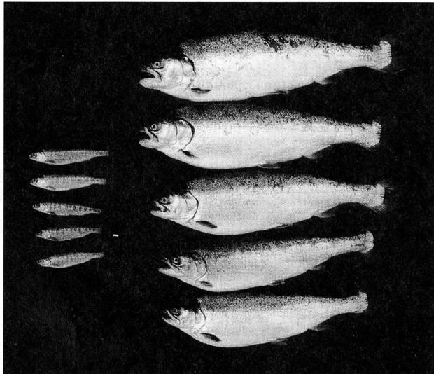  
图 12.30 普通银鲑鱼(左边)和遗传工程银鲑鱼(右边)，后者含红鲑鱼生长激素基因，该基因由金属硫蛋白基因的调控区驱动。转基因鲑鱼的体重平均是非转基因鲑鱼的 11 倍。左边最小的鱼长约 10cm，而右边最大的鱼约为 42cm。

[经 Macmillan Publisher Ltd 许可重印：R. H. Devlin, et al., Nature 371 (1994): 209-210.]

## 联系：东拼西凑

奥利弗·史密斯，2005

北卡罗来纳大学，查珀尔希尔市(教堂山市)，北卡罗来纳州

许多小东西：一个遗传学家对复杂疾病的看法

此文撰于奥利弗·史密斯首次将外源DNA导入哺乳动物基因组中的选定位点的实验成功25周年之际。该方法最初的应用是对单基因起主要效应的表型进行遗传分析。在这里，奥利弗·史密斯讲述他是怎么意识到该方法也可以用来研究复杂疾病。复杂疾病受许多基因影响，每个基因的效应都相当小。他的想法是构建既不缺一个基因，也没有任何基因的额外拷贝的小鼠染色体。通过杂交来组合这些染色体，他可以构建0(倘若小鼠能存活)、1、2、3、4个基因拷贝的小鼠。然后，他可考察这些小鼠，发现表型上的相关变化。他最初将这一方法应用到血压调节的研究上。史密斯对这种性状特别感兴趣，因为他父亲死于高血压并发症，也因为他自己要靠药物来控制血压。史密斯的洞察力和方法取得了巨大的成功，确实值得分享2007年的诺贝尔生理学或医学奖。

常见的多因子病，如动脉粥样硬化、高血压和糖尿病，是众多遗传和环境因素之间的复杂相互作用所导致的。……因其复杂性，多因子病是富有挑战性的研究目标。它们之所以有吸引力，是因为对它们的本质更好地了解，可能会影响许多人的生活，因为生活在富裕社会的人，半数以上可能会患上具有多基因原因的衰弱性疾病。……就像从两个拷贝变成一个拷贝会使基因产物的水平下降一样，从两个拷贝变成三个拷贝似乎可能会使产物的水平升高。……我意识到，对基因表达定量变化效应的检测，应用到有可能改变血压的所有基因上，可能会很有用。……我的思维模式已经开始从少数主要差异可能决定该复杂表型的看法，变为该复杂表型更有可能是“许多小东西”的结果的想法。……我决定……(建立)该系统的计算机模拟。……作为一个非电脑爱好者，我度过了相当不愉快的六个月，断断续续地进行模拟的工作。但结果非常有启发性，因而从那以后，我怀着与日俱增的乐趣，将一些比较简单的计算机模拟用在我大部分的工作中。……我发现，这些模拟的最大的价值是……它逼着你辨认关键因素，逼着你清楚地定义假设，以便将它们整合成一个逻辑整体。就我们的高血压研究而言，模拟证明 AGT(血管紧张素原)基因拷贝数的增加应该会导致……血压上升。……在走进多因子疾病领域的过程中，我的经历使我要强调，在寻找决定常见病个体风险的遗传因素时，寻找数量变异的重要性和质量变异一样。在人类进化过程中，已经积累了许多数量变异——有些是容易看到的在我们身体比例上的外在差异，有些是隐蔽的在基因表达上的内在差异——它们的效应还没有大到足以固定下来或被选择淘汰掉。这些“许多小东西”是我们的个性的一个令人高兴的来源。但它们也很可能是尚缺乏深刻了解的(复杂疾病的)个体易感性变异的一个来源。

来源：O. Smithies, Nat. Rev. Genet. 6 (2005): 419-425.

## ■ 营养工程水稻

虽然迄今为止我们一直关注的是通过操作单基因来进行遗传工程，但也有可能创造引入全新代谢途径的转基因生物。一个引人注目的例子是一种遗传工程水稻的创造，这种水稻含有一个导入的合成β胡萝卜素的生化途径。β胡萝卜素是维生素A的一种前体，主要见于黄色和绿色蔬菜中(全世界约有4亿人患维生素A缺乏症，这些人易患皮肤病和夜盲症)。β胡萝卜素途径包括4种酶，在工程稻中这些酶由来自不同生物的基因编码(图12.31)。其中两个基因来自常见的黄水仙(喇叭水仙，Narcissus pseudonarcissus)，而另外两个基因来自细菌噬夏孢欧文氏菌(Erwinia uredovora)。每对基因都被克隆进T DNA，并通过图12.26中概括的机制，用根癌农杆菌转化进水稻中。然后，让转基因植株杂交，产生含全部4种酶的后代。这种工程稻米含有足够的β胡萝卜素，300g米饭即可提供每日所需的维生素A；它们甚至还带点黄色(图12.31B)。

以大米为主食的人容易缺铁，因为大米中含有一种称为植酸盐(phytate，肌醇六磷酸)的储磷分子，它与铁结合，从而妨碍肠道对铁的吸收。为使这一问题的危害降到最小， $\beta$ 胡萝卜素转基因水稻也进行了相应的遗传工程改造：导入来自无花果曲霉(Aspergillus ficuum)中能分解植酸盐的真菌酶，加上一个来自菜豆(Phaseolus vulgaris)的编码铁储存蛋白的基因，还加上另一个来自巴斯马蒂香米的基因，该基因编码一种促进人类肠道吸收铁的类金属硫蛋白。因此，这种富含β胡萝卜素和可吸收铁的转基因水稻品系，一共含有取自4种没有亲缘关系的生物的6个新基因，加上一个取自完全不同的水稻品系的基因。

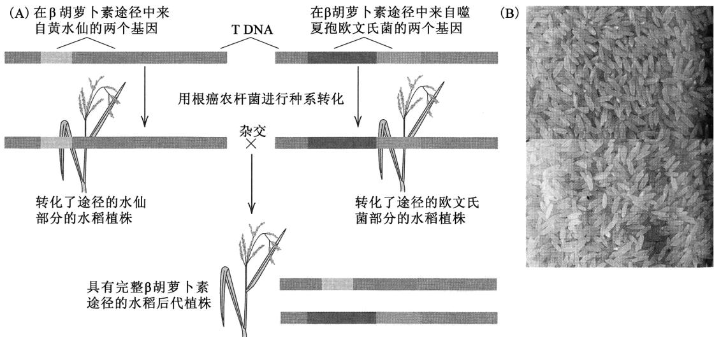  
图 12.31 含 β 胡萝卜素生物合成途径的遗传工程水稻。(A)该途径中的酶来自两个不同物种的基因。(B)该途径的两个部分都具有的水稻植株，产生淡黄色米粒(上)，这是由于它们含 β 胡萝卜素，与此相比，普通植株产生纯白色的米粒(下)。[B 部分承瑞士苏黎世联邦理工学院植物科学研究所英戈·帕特里库斯(Ingo Potrykus)惠赠。]

## ■ 生产有用的蛋白质

遗传工程最重要的应用之一，是大量生产用其他方法难以获得的特殊蛋白质（例如，在每个细胞中仅有几个分子的蛋白质，或仅在少数细胞中或仅在人类细胞中产生的蛋白质）。这种方法在理论上比较简单。编码所需蛋白质的 DNA 序列被克隆进载体中，与适当的调节序列毗邻。该步骤通常用 cDNA 来完成，因为 cDNA 具有以正确的顺序剪接到一起的所有的编码序列。使用高拷贝数的载体，以确保在每个细菌细胞中都存在编码序列的很多个拷贝，这可使得所合成的基因产物占细胞总蛋白质含量的 1%～5%。实际上，在细菌细胞中大量生产某种蛋白质是比较简单的，但往往存在一些必须克服的问题，因为细菌细胞是原核细胞，在细菌细胞中，真核生物蛋白质或许不稳定，或许不能正

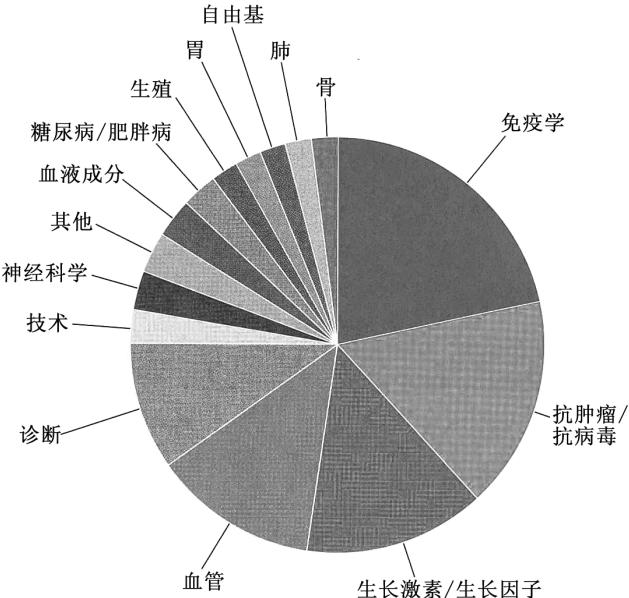  
图 12.32 在给人类基因的遗传工程产物颁发的专利中，给不同临床应用所颁发的专利的相对数目。[数据来自 S. M. Thomas, et al., Nature 380(1996): 387-388.]

常折叠，又或许不能进行必要的化学修饰。目前已在细菌细胞中生产许多重要的蛋白质，包括人类生长激素、凝血因子和胰岛素。欧美专利局已经给遗传工程改造过的人类基因的产物在临床上的应用颁发了数以万计的专利。图 12.32 示已颁发的与临床应用相关的专利的明细。

## ■ 用动物病毒开展遗传工程

动物细胞的遗传工程常常利用称为反转录病毒(retrovirus)的RNA病毒，反转录病毒用反转录酶来制造它们RNA基因组的一个双链DNA拷贝。然后这个DNA拷贝被插入细胞的染色体。从DNA到RNA的正常转录只发生在DNA拷贝插入之后。被感染的宿主细胞在感染后仍能存活，在其基因组中一直保存着该反转录病毒RNA的DNA拷贝。反转录病毒的这些特点，使得它们成为动物细胞——包括鸟类、啮齿类、猴子和人类细胞——遗传工程的方便载体。

用反转录病毒进行遗传工程，使得改变动物细胞的基因型成为可能。因为已经知道多种多样的反转录病毒，包括许多感染人类细胞的病毒，未来也许可用这些方法来校正遗传缺陷。利用反转录病毒的重组 DNA 方法包括：用反转录酶从病毒 RNA 体外合成双链 DNA；然后，用限制酶切割该 DNA，再用已经描述过的技术，插入任何感兴趣的 DNA 片段；转化得到重组反转录病毒 DNA 永久插入基因组的细胞。不过，许多反转录病毒含有引起被感染细胞增殖失控的基因，从而会导致肿瘤。当反转录病毒载体被用于遗传工程时，首先要删除致癌基因。这种删除也给所需 DNA 片段的并入提供了必需的空间。

目前正在努力评估是否可能将反转录载体用在基因治疗(gene therapy)上，基因治疗即通过遗传工程校正体细胞的遗传缺陷。用来测试的样本可能会包括对各种遗传病患者的免疫缺陷的校正。但是，还有一些重大问题妨碍基因治疗的广泛应用。现在还没有完全可靠的方法来确保某个基因只插入适当的靶细胞或靶器官。例如，在最早的一个临床试验中，人们用反转录病毒载体来治疗一组4位重症联合免疫缺陷病患者，反转录病毒载体插入其中一位患者的某个位点，引起LMO-2基因的异常表达，导致急性淋巴细胞性白血病。

用重组 DNA 研发人工合成疫苗的生产，可能会在疾病预防上取得重大突破。天然疫苗的生产往往令人难以接受，因为要与大量的活性病毒[例如，导致获得性免疫缺陷综合征(AIDS)的人类免疫缺陷病毒(HIV-1)]打交道，极其危险。在非致病性生物中克隆和生产病毒抗原，可把这种危险降到最低限度。牛痘病毒(在天花免疫接种中所用的病原体)作为这种应用的候选生物，备受关注。病毒抗原往往在病毒颗粒的表面，可通过遗传工程方法将其中一些抗原导入牛痘病毒的衣壳中。例如，带有乙肝病毒、流感病毒和疱疹性口炎病毒(这种病毒可杀死牛、马和猪)的某些表面抗原的工程牛痘病毒，在动物实验中已被证明有效。疟疾是个巨大的挑战，在非洲、亚洲和拉丁美洲有大约3亿人感染疟疾，每年导致100万～150万人死亡。由于抗性突变的扩散，日益危及该病的药物控制，但最近开发的一种疫苗在临床试验中显示出大约50%的有效性。

## 本章概要

\- 在重组 DNA(基因克隆)中，DNA 片段被分离、插入适当的载体分子中，然后导入细菌或酵母细胞中，并在其中复制。

\- 用专门操作和克隆 DNA 大片段的方法，已得到若干复杂基因组的 DNA 的完整物理图和遗传图。

\- 利用高通量自动化 DNA 测序已获得许多细菌、古细菌和真核生物物种的基因组全序列，包括人类基因组全序列。

\- 比较近缘物种的基因组，有助于发现编码序列和其他功能性遗传元件。

\- 功能基因组学利用 DNA 微阵列使基因表达的全局模式和协同调节的研究成为可能。如双杂交分析之类的蛋白质组学方法使蛋白质-蛋白质相互作用的检测成为可能。

\- 转基因生物携带由种系转化或其他方法导入的 DNA 序列。

\- 重组 DNA 被广泛用于科学研究、医学诊断及药物和其他商品的生产。

## 基础回顾

\- “重组 DNA”这个术语是什么意思？举出重组 DNA 的几个实际用途。

\- 为什么在绝大多数类型的重组 DNA 研究中限制性内切酶都是必不可少的？

\- 在细菌克隆载体中哪些特性是必不可少的？一个载体如何才能具有不止一个克隆位点？多克隆位点(多接头)是什么？

\- 反转录酶催化的是什么反应？在重组 DNA 技术中如何使用这种酶？

\- 指出物理图和遗传图的区别。如果在整个基因组中重组发生的频率都是一样的，遗传图和物理图相比较会是什么情况？

\- 解释“功能基因组学”这一术语。DNA微阵列是什么？在功能基因组学中如何使用微阵列？对课文里描述的那种杂交实验，怎样解读DNA微阵列上的红色或橙色斑点？黄色呢？绿色或黄绿色呢？

\- 叙述使用酵母GAL4蛋白的双杂交系统，并解释双杂交系统如何检测蛋白质之间的相互作用。

\- 什么是转基因生物？转基因生物有哪些实际应用？

\- 解释在胚胎干细胞的基因打靶中重组的作用。如何用基因打靶来产生“敲除”突变？

\- T DNA 是从哪里来的？如何用它来产生转基因植物？

## 解题指南

习题 1 限制酶 Apa I 在 GGGCC|C 位点切割，其中，序列的 5'端按惯例写在左边，3'端写在右边。切割发生在双链 DNA 中竖线所示的位置，因而在另一条链中有一个非对称的切割。使用同样的惯例，限制酶 Bsp120 I 的限制性位点是 G|GGCC。

(a) 每个 Apa I 限制性片段两端是什么 DNA 结构?

(b) 每个 Bsp120 I 限制性片段两端是什么 DNA 结构?

(c) Apa I 限制性片段的末端与 Bsp120 I 限制性片段的末端互补(单链突出端可进行碱基配对的意思)吗?

## 答案

(a) 在回答这样的问题时，最好把限制性位点写成双链分子，用箭头显示切割位点。在此情况下，这两个切割位点是：

$$
\begin{array}{c c c} A p a \text {I} & \downarrow & \downarrow B s p 1 2 0 \text {I} \\ 5 ^ {\prime} \text {- - GGGCCC-3 ^ {\prime}} & & 5 ^ {\prime} \text {- - GGGCCC-3 ^ {\prime}} \\ 3 ^ {\prime} \text {- - CCCGGG-5 ^ {\prime}} & & 3 ^ {\prime} \text {- - CCCGGG-5 ^ {\prime}} \\ \uparrow & & \uparrow \end{array}
$$

因而，典型的 Apa I 限制性片段会有下面所示的结构，其中，N 表示任意核苷酸，点表示数目不详的核苷酸：

$$
\begin{array}{c} A p a \text {I} \quad \begin{array}{c} 5 ^ {\prime} \text {-CNN...NNGGGCC-3} ^ {\prime} \\ 3 ^ {\prime} \text {-CCGGGNN...NNC-5} ^ {\prime} \end{array} \end{array}
$$

(b) 典型的 Bsp120 I 限制性片段会有下面的结构:

$$
\begin{array}{c} B p a 1 2 0 \text {I} \quad \begin{array}{c} 5 ^ {\prime} \text {-GGCCCNN...NNG-3^ {\prime}} \\ 3 ^ {\prime} \text {-GNN...NNCCCGG-5^ {\prime}} \end{array} \end{array}
$$

(c) Apa I 和 Bsp120 I 限制性片段不互补。前者具有 3'突出端，后者具有 5'突出端，它们不能发生碱基配对。

习题 2 在此处所示的示意图中，粗线段代表基因组 DNA 中要克隆的一个基因 (yourgene) 和质粒中的两个抗生素抗性基因 (氨苄青霉素抗性 amp-r 和四环素抗性 tet-r)。同时显示了限制酶 EcoR I 和 BamH I 的限制性位点的位置。仅显示了 yourgene 附近的位点和质粒中的位点。


(a) 准备克隆 yourgene 时，用 EcoR I 还是 BamH I 还是两者一起来消化基因组 DNA?

(b) 准备克隆 yourgene 时，用 EcoR I 还是 BamH I 还是两者一起来消化质粒 DNA?

(c) 消化、混合 DNA、连接及转化之后，用哪种抗生素来选择含质粒的细菌？

(d) 在含质粒的细菌中，怎样用含某种抗生素的培养基来鉴定质粒中可能已插入了 yourgene 的那些转化细胞？

## 答案

(a) 必定不会用 BamH I，因为该酶在 yourgene 内部切割，很可能会破坏它的功能。会用的酶是 EcoR I，因为 yourgene 包含在一个单一的 EcoR I 片段中。

(b) 应该也会用 EcoR I 来消化质粒，因为想要 yourgene 两侧的 EcoR I 位点与切割后质粒的两端互补。

(c)应该在四环素上选择转化体。只有含质粒的那些细胞能生长。

(d) 在具有四环素抗性的细胞中，在 amp-r 基因中可能已经插入 yourgene 的那些细胞应该对氨苄青霉素敏感，因为插入片段打断了 amp-r 基因，破坏了它的功能。

  
片段大小 $(m$ 代表均数）

习题 3 附图示用某种限制酶消化时片段大小的理论预期分布。该曲线即所谓的指数分布 (exponential distribution)，此处用符号 $f(x)$ 来表示，该分布的均数以 m 表示。请注意，该曲线向左偏斜，所以短片段比长片段多得多。该分布被一些竖线分成表示小于均数的一半 $(m/2)$ 、大小从均数的一半到均数 $(m/2 \text{ 到 } m)$ 、从均数到均数的两倍 $(m \text{ 到 } 2m)$ 等的区域。每个区标以其范围内预期大小的片段所占的比例。

(a) 预计比均数小的限制性片段所占的比例是多少？小于均数两倍的片段呢？小于均数三倍的片段呢？小于

均数四倍的片段呢？

(b) 对限制性位点由 4 个核苷酸组成的限制酶而言，平均片段大小是多少？对这样的一种酶而言，预计小于 128bp 的限制性片段的比例是多少？

(c) 对限制性位点由 6 个核苷酸组成的限制酶而言，平均片段大小是多少？对这样的一种酶而言，预计大于 16384bp 的限制性片段的比例是多少？

## 答案

(a) 小于均数的期望比例是 $0.393 + 0.239 = 0.632$ ，小于两倍均数的期望比例是 $0.393 + 0.239 + 0.233 = 0.865$ ，小于三倍均数的期望比例是 $0.393 + 0.239 + 0.233 + 0.086 = 0.951$ ，而小于四倍均数的期望比例是 $0.393 + 0.239 + 0.233 + 0.086 + 0.031 = 0.982$ 。

(b)某个特定的四核苷酸序列的概率是 $1 / 4\times 1 / 4\times 1 / 4\times 1 / 4 = 1 / 256$ ，而均数为其倒数，即256bp。长128bp的片段为均数的一半，所以预计有 $39.3\%$ 的片段在此范围内。

(c)某个特定的六核苷酸序列的概率是 $(1 / 4)^{6} = 1 / 4096$ ，而均数为其倒数，即 $4096\mathrm{bp}$ 。长16384bp的片段为均数的四倍，因而预计仅有1-0.982即 $1.8\%$ 的片段在此范围内。分析与应用

12.1 限制酶在其切割的 DNA 分子上产生的末端有 3 种可能。是哪 3 种可能？

12.2 在进行重组 DNA 时，研究人员一般喜欢连接具有黏端(单链突出端)的限制性片段，而不是平端片段。你能提出一个理由吗？

12.3 在克隆序列未知的某个基因时，一位研究人员决定用某种限制酶来进行部分消化 (partial digestion)，在只有一小部分限制性位点被切割时就终止反应。使用部分消化而不是完全酶切可能会有什么好处？

12.4 下列各种限制酶的限制性位点之间的平均距离是多少？假设 DNA 底物为具有等量的各种核苷酸的随机序列。符号 N 代表任意核苷酸，R 代表任意嘌呤(A 或 G)，Y 代表任意嘧啶(T 或 C)。

(a) TCGA Taq I

(b) GGTACC Kpn I

(c) GTNAC MaeIII

(d) GGNNCC NlaIV

(e) GRCGYC Acy I

12.5 限制酶 Sep I 和 Ppu10 I 具有限制性位点:

ATGCA|T(Sep I)

A|TGCAT(Ppu10 I)

其中，5'端写在左边，在竖线的位置切割。这两种酶产生的黏端互补吗？请解释。

12.6 限制酶 Aas I 具有限制性位点 5'-GACNNNN|NNGTC-3'，其中，N 表示任意核苷酸（与另一条链中的一个互补核苷酸配对），在竖线的位置切割。两个随机的 Aas I 位点具有互补黏端的概率是多少？

12.7 一个特定的限制酶产生的不同的限制性片段，其末端总是具有相同的序列吗？每个限制性片段的两端一定相同吗？请解释答案。

12.8 在双链 DNA 分子中，序列 5'-GGCC-3' 和 3'-GGCC-5' 会被相同的限制酶切割吗？

12.9 限制酶 Hae I 和 Aat I 具有限制性位点:

WGGCCW(Hae I)

AGGCT(Aat I)

其中，5'端写在左边，W代表要么为A(与另一条链中的T配对)要么为T(与另一条链中的A配对)。假设有一条随机核苷酸序列，一个Hae I位点为Aat I位点的概率是多少？一个Aat I位点为Hae I位点的概率是多少？

12.10 限制酶 Fae I 具有限制性位点 CATG|，其中，5 端写在左边，切割位点如竖线所示。如果某条 mRNA 具有序列 CAUG，其中 AUG 是翻译起始密码子，欲在紧接于起始密码子之后切割 DNA，用 Fae I 这种酶行不行？请解释答案。

12.11 限制酶 Aoc II 具有限制性位点 GDGCH|C，其中，D 表示 A 或 G 或 C (在另一条链上有互补碱基)，H 表示 A 或 C 或 T (在另一条链上有互补碱基)。可能会有多少种 Aoc II 位点？在这些位点中，哪些是回文序列？

12.12 限制酶 Aoc II 具有限制性位点 GDGCH|C，其中，D 表示 A 或 G 或 C（在另一条链上有互补碱基），H 表示 A 或 C 或 T（在另一条链上有互补碱基）。如果两个随机的 Aoc II 位点被切割，它们的黏端互补的概率是多少？

12.13 限制酶 Acc I 具有限制性位点 GT|MKAC，其中，M 表示 A 或 C（在另一条链上有互补碱基），K 表示 G 或 T（在另一条链上有互补碱基）。如果两个随机的 Acc II 位点被切割，它们的黏端互补的概率是多少？

12.14 限制酶 Hpy8 I 具有限制性位点 GCNNAC，其中，N 表示任意核苷酸，限制酶 Acc I 具有限制性位点 GTMKAC，其中，M 表示 A 或 C（在另一条链上有互补碱基），K 表示 G 或 T（在另一条链上有互补碱基）。两个随机的 Hpy8 I 位点相同的概率是多少？一个随机的 Hpy8 I 位点也是 Acc I 位点的概率是多少？

12.15 某环状质粒上有两个 BglⅡ的限制性位点，该酶切割位点 A|GATCT。消化后将片段连接在一起，分离得含每个片段一个拷贝的某种环状产物。这是否意味着该连接质粒与原来的质粒是一样的？请解释。

12.16 此处所示的 8kb 质粒上有 Pst I、Xba I 和 BamH I 的限制性位点。以各种酶单独消化、以两种酶的各种组合消化、以 3 种酶一起消化，会产生哪些大小的片段？

12.17 将 DNA 片段克隆进细菌的质粒载体时，为什么将待克隆的 DNA 片段插入某个抗生素抗性基因内部的限制性位点非常有用？为什么对第二种抗生素具有抗性的另一个基因也很有用？

12.18 限制酶 Taq I (限制性位点为 TCGA) 和 MaeIII (限制性位点为 GTNAC, 其中 N 为任意核苷酸) 切割含下列随机序列的双链 DNA 分子的频率是多少?

(a) 20%的 A-T 碱基对和 80%的 G-C 碱基对

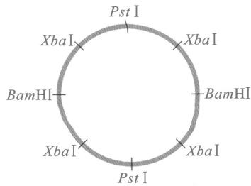

(b) 50%的 A-T 碱基对和 50%的 G-C 碱基对

(c) 80%的 A-T 碱基对和 20%的 G-C 碱基对


12.19 要将某个人类基因导入某种细菌载体的某个启动子下游，希望能够生产大量的这种人类蛋白质。用基因组 DNA 还是 cDNA？解释理由。

12.20 此处所示的是从伯氏疏螺旋体(Borrelia burgdorferi)细胞中分离的一种12kb线状质粒的限制性图谱。伯氏疏螺旋体是通过硬蜱叮咬传播的一种螺旋菌，可引起莱姆病。符号C、P、K、A、E、B和X分别代表限制酶Cla I、Pst I、Kpn I、Ava I、EcoR I、Bal I和Xba I的切割位点。在所附凝胶示意图中，标出以所示的一种或多种限制酶消化该质粒后，会见到条带的位置。

12.21 以 Ava I (A)、Bgl II (B) 和 Mbo I (M) 三种限制酶单独或组合起来消化某种环状质粒，得到所示带

型。绘制该质粒的限制性图谱。(提示：有些条带可能会隐藏着多个片段，因为在凝胶的所有泳道上，产生的所有片段的总的大小都一定是相同的)

12.22 按课文所述将一个 DNA 微阵列与来自女性和男性的人类基因组 DNA 进行竞争性杂交。用一种发红色荧光的基团标记女性的 DNA，用发绿色荧光的基团标记男性的 DNA。如果某个斑点属于下列情况，估计该斑点会发出什么颜色的荧光？

(a)对应于一个常染色体基因。

(b)对应于一个X连锁基因。

(c) 对应于一个 Y 连锁基因。

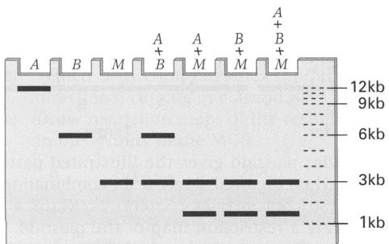

12.23 用 DNA 微阵列进行一个功能基因组学的实验，以检测某种细菌的基因表达水平。与培养在完全培养基上的细胞相比，估计什么基因会在培养于基本培养基上的细胞中过度表达？

12.24 许多工程载体具有供 DNA 插入的多接头(即多克隆位点，MCS)，而不是单个限制性位点。多接头是含多个不同的限制性位点的一段 DNA 短序列，对载体来说，每个限制性位点都是唯一的，这些限制性位点的任何一种组合都可用两种适当的限制酶来切割，产生在两端具有明确的限制性位点的线状载体分子。附图示某个载体多接头中的 5 个限制性位点；与多接头相邻的载体序列以 X 和 Y 表示。附图还显示了一段基因组靶序列的限制性图谱，该序列的两端以 A 和 B 表示。限制酶 Sal I、Kpn I、Pst I 和 Xma I 都产生黏端；Hpa I 产生平端。

(a) 如果该载体和靶序列都用 Hpa I 来消化，产生的片段以这样的方式连接：每个载体分子与且只与一个靶片段连接，A 片段会以什么方向连接到多接头中？

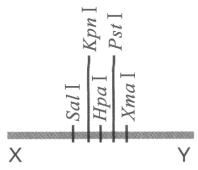  
载体

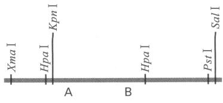  
靶序列

12.25 以 Sal I (S)、EcoR I (E) 和 Cla I (C) 三种限制酶单独或组合起来消化某种环状质粒，得所示带型。绘制该质粒的限制性图谱。(提示：有些条带可能会隐藏着多个片段，因为在凝胶的所有泳道上，产生的所有片段的总的大小都一定相同)

12.26 此处示一个基因及其转录起点和方向，还显示了某种质粒载体的多克隆位点(MCS)。符号 A、B、C、D、E、F、G 和 H 分别代表限制酶 Aat I、Bcl I、Cla I、Dra I、EcoR I、Fsi I、Gdi I 和 HindIII 的切割位点，每种酶均非对称性地切割 DNA 并产生互补的黏端。

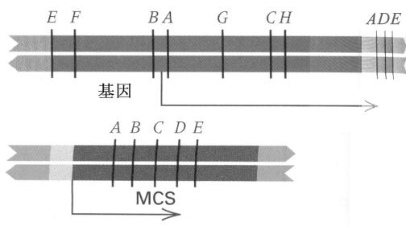

(b) 用哪种 (或哪些) 限制酶来消化载体和靶序列, 以使消化片段被混合并连接后, 克隆 DNA 会具有 X B A Y 的顺序?

(c) 用哪种(或哪些)限制酶来消化载体和靶序列,以使消化片段被混合并连接后,克隆 DNA 会具有 X A B Y 的顺序?

  
这一发现对解释上题中的意外结果有帮助吗？

一个研究小组想将该基因的编码序列置于一个启动子的控制之下，该启动子位于 MCS 的左侧。为了达到这一目的，他们分离了含编码序列的 Aat I 片段，将该片段加到含有已被 Aat I 切割的质粒溶液中，将黏端连接在一起，然后转化细菌细胞。他们筛选得一个转化体，该转化体含质粒，Aat I 片段已插入质粒中的正确位置，可是，令他们失望的是，他们发现这个基因不转录。请提出一个解释。

12.27 在上一题所述的没有功能的重组 DNA 克隆中，经分析推断出 MCS 附近的限制性图谱。结果如附图所示。


12.28 对来自 12.26 题中的其他克隆进行分析，发现就

MCS 附近的限制性图谱而言，克隆分成两种。一种的限制性图谱如上一题所示。另一种是什么样子？估计这种克隆会转录目的基因吗？为什么？

12.29 另一位遗传学家研究了 12.26 题中的限制性图谱并指出，定向克隆(directional cloning)可能是确保编码序列能在重组质粒中转录的更有成效的方法。在这种方法中，用相同的两种限制酶来切割目的基因和质粒，所选的两种酶要使它们的黏端能够确保目的片段以正确的方向插入质粒。要进行 12.26 题中片段的定向克隆，应该用哪两种限制酶？在所得质粒中，MCS 附近的限制性图谱是什么？

12.30 一位遗传学家正在研究一种4kb的双链环状质粒。该质粒携带一些基因，其蛋白质产物赋予宿主细菌四环素抗性(tet-r)和氨苄青霉素抗性(amp-r)。质粒DNA各有下列限制酶的单一位点：Sst I、Kpn I、BamH I、EcoR I和HindIII。将DNA克隆进Sst I位点不会影响任何一种抗性。将DNA克隆进Kpn I、BamH I和HindIII位点会消除四环素抗性。将DNA克隆进EcoR I位点会消除氨苄青霉素抗性。以下列限制酶的混合物进行消化，产生下列大小的片段。在限制性图谱中标出EcoR I、Kpn I、BamH I和HindIII的切割位点相对于Sst I切割位点的位置。

<table><tr><td>酶</td><td>片段大小(kb)</td></tr><tr><td>Sst I EcoR I</td><td>0.70, 3.30</td></tr><tr><td>Sst I Kpn I</td><td>0.30, 3.70</td></tr><tr><td>Sst I BamH I</td><td>0.08, 3.92</td></tr><tr><td>Sst I Hind III</td><td>0.85, 3.15</td></tr><tr><td>Sst I Kpn I EcoR I</td><td>0.30, 0.70, 3.00</td></tr></table>

## 挑战题

挑战题 1：一位遗传学家决定用酵母 DNA 微阵列来研究酵母接合型基因座 MAT 中的缺失突变的效应。为了做这些实验，他从待比较的两个酵母菌株中提取 RNA，在存在绿色 (Cy3) 或红色 (Cy5) 荧光标记的情况下，通过反转录制备每个菌株的标记 cDNA 探针。混合分别标记的 cDNA 溶液，应用于微阵列杂交，微阵列上的斑点为附表所示的每种基因的 DNA 序列。MATα1、MATα2 和 MATα1 为 MAT 基因座上可能存在的编码序列的 DNA，αsg 和 asg 斑点分别含在 α 细胞和 a 细胞中特异性表达的基因的 DNA，而 hsg 斑点含在单倍体细胞中特异性表达的基因的 DNA。对于附表中的每个杂交，标出该杂交的期望颜色 (红色、绿色、黄色或无)。黄色表示等量的 Cy3 和 Cy5，“无”表示在两个菌株中均无表达。符号△表示缺失突变。(在解这个题之前，可能要回顾一下 11.10 节中关于酵母接合型的遗传控制)

<table><tr><td>红色(Cy5)</td><td>野生型 $\alpha$ 细胞</td><td>野生型 $\alpha$ 细胞</td><td>野生型 $\boldsymbol{a}$ 细胞</td><td> $\triangle MAT\alpha 1$ 细胞</td><td> $\triangle MAT\alpha 1$ 细胞</td><td> $\triangle MAT(\alpha 2\alpha 1)/\triangle MAT\alpha 1$ </td></tr><tr><td>绿色(Cy3)</td><td>野生型 $\boldsymbol{a}$ 细胞</td><td>野生型 $\boldsymbol{a}/\alpha$ 细胞</td><td>野生型 $\boldsymbol{a}/\alpha$ 细胞</td><td>野生型 $\boldsymbol{a}$ 细胞</td><td>野生型 $\alpha$ 细胞</td><td>野生型 $\boldsymbol{a}$ 细胞</td></tr><tr><td> $MAT\alpha 1$ </td><td></td><td></td><td></td><td></td><td></td><td></td></tr><tr><td> $MAT\alpha 2$ </td><td></td><td></td><td></td><td></td><td></td><td></td></tr><tr><td> $MAT\alpha 1$ </td><td></td><td></td><td></td><td></td><td></td><td></td></tr><tr><td> $asg$ </td><td></td><td></td><td></td><td></td><td></td><td></td></tr><tr><td> $asg$ </td><td></td><td></td><td></td><td></td><td></td><td></td></tr><tr><td> $hsg$ </td><td></td><td></td><td></td><td></td><td></td><td></td></tr></table>

挑战题 2：附图示某个基因及其转录起点和方向，以及两个质粒载体(A 和 B)的多克隆位点(MCS)，两个载体的差异在于与 MCS 毗邻的启动子位置不同。符号 A、D、E、H、P、S 和 X 分别代表限制酶 Alu I、Dde

I、EcoR I、HindIII、Pst I、Sac I 和 Xho II 的切割位点。在定向克隆中，用相同的两种限制酶来切割感兴趣的基因和质粒，所选的两种酶要使它们的黏端能够确保感兴趣的片段以正确的方向插入质粒。一位遗传学家打算使用定向克隆将该基因的编码区分别置于这两种质粒中启动子的控制之下。

(a) 在质粒 A 中进行定向克隆，应该用哪两种酶？

(b) 在质粒 B 中进行定向克隆，应该用哪两种酶？


(c) 绘制所得质粒 MCS 附近的限制性图谱。

挑战题 3：上题所述的两种情况都成功地进行了定向克隆，但遗憾的是，试管上的标签被弄脏而无法辨认。要区分开这些质粒，是否必须对所有的质粒进行完全的限制性作图，还是只进行简单的指示性的消化就可判断？

## 网上遗传学

“网上遗传学”(GeNETics)会为你介绍在互联网上寻找遗传学信息的某些最重要的站点。要浏览这些站点，请访问为《遗传学：基因和基因组分析》(第八版)配备的 Jones and Bartlett 公司配套站点http://biology.jbpub.com/book/genetics/8e/。

在该站点中，你会找到一个按章列出的重点关键词列表。选择某个关键词后，可链接到某个网站，其中包含与此关键词相关的信息。

# 第 13 章 发育的遗传控制


在子宫内发育至第 7 个月左右的人类胎儿。( $^{©}$ Sebastian Kaulitzki/Shutterstock, Inc.)

## 本章提纲

13.1 发育的遗传决定因素

13.2 动物早期胚胎发育

13.3 线虫发育的遗传分析

13.4 果蝇发育的遗传控制

13.5 高等植物发育的遗传控制

联系：著名的谱系(高贵的血统)

约翰·萨尔斯顿、希伦伯格、怀特和汤姆森，1983
秀丽隐杆线虫的胚胎细胞谱系
联系：胚胎创世纪
克里斯蒂安·纽斯林-沃尔哈德和埃里

克·威绍斯，1980
影响果蝇体节数目和极性的突变

## 学习目标与科学能力

学习发育的遗传控制的基本原理，会使你能够运用下列科学能力。

■ 能区分配体和受体，并能解释它们各自在发育过程中的作用。

■ 能运用上位性原理来推断基因产物在线性开关型调节途径中发挥作用的时间顺序。

\- 能叙述在果蝇发育中坐标基因、裂缺基因、成对规则基因、体节极性基因和同源异形框基因的作用，能叙述每种基因的突变体所具有的特征表型。

■ 能设计实验来判断在新动物物种中 Pax 基因是否参与眼睛的发育。

\- 能叙述拟南芥花发育的 ABC 模型，并能解释在某些花器的发育中转录因子如何以组合方式起作用。

基因调节在人从受精卵发育至胚胎的过程中起核心作用。在发育过程中，基因按预定程序表达，以确保受精卵反复分裂，并确保产生的细胞被有条不紊地特化，以产生完全分化的机体。基因型不仅决定在发育中发生的事件，而且决定这些事件展现的时间顺序。

研究发育的遗传学方法往往会利用使发育方式发生改变的突变。这些突变打断发育过程，使人们有可能鉴定控制发育的因子，并研究这些因子之间的相互作用。本章展示如何将遗传学方法应用于发育研究。例如，秀丽隐杆线虫(Caenorhabditis elegans)、黑腹果蝇(Drosophila melanogaster)和开花植物拟南芥(Arabidopsis thaliana)，因为这些生物已进行过深入的发育遗传学研究。发育的核心过程是模式形成(pattern formation)，即通过受精卵的细胞分裂和分化，出现构成胚胎的在空间上有组织的、特化的细胞。

## 13.1 发育的遗传决定因素

从概念上来说，基因型和发育之间的关系不复杂：

基因型包含发育程序，发育程序逐渐展开，导致在不同类型的细胞中表达不同的成套基因。

换句话说，一些基因在一种细胞中特异性地表达，但在另一种细胞中不表达，发育就是由导致这些结果的一个程序构成。随着发育的逐渐展开，逐渐出现各种类型的细胞，这些细胞所表达的基因具有质的差异。某个特定基因是否表达，可能取决于某个特定转录因子的存在与否、染色质结构的改变，或某个特定受体分子的合成。这些及其他的分子机制，决定一个基因赖以控制另一个基因的相互作用模式。这些调节性的相互作用最终决定细胞的命运。此外，许多在发育中很重要的相互作用使用较为普遍的调节因子。胎儿乙醇综合征堪为一例，在该病中，一种环境因素——慢性乙醇中毒——侵袭胎儿生长和神经发育诸方面。

胚胎的形成亦受其发育环境的影响。基因型决定生物发育的潜能。基因决定发育中的胚胎是发育成线虫、果蝇、鸡，还是小鼠。但是，在遗传上已经决定了的发育潜能，其表达也受环境的影响，而且在有的情况下，其影响还非常巨大。例如，胎儿乙醇综合征，在该病中，慢性乙醇中毒会侵袭胎儿生长和神经发育等方面。

在发育中，有许多这样的例子：调节蛋白应答环境信号，继而作用于基因，使基因选择性地打开或关闭。在发育遗传学中，鉴定在发育中发挥作用的遗传调节性相互作用，是一个重要的主题。实施不同的调节相互作用，意味着在遗传上相同的细胞，表达的基因可具有质的差异。

研究最为深入的是在发育早期、在组织分化之前发生作用的发育基因，因为这些基因确立了总体的发育模式。

## 13.2 动物早期胚胎发育

动物胚胎的早期发育为整个机体奠定基本的发育蓝图。受精启动一系列有丝分裂性质的卵裂(cleavage division)，使胚胎变成多细胞。与卵相比，在总体大小上既不减少也不增加，因为卵裂时几乎没有生长；卵裂只不过是把受精卵分割成越来越小的细胞。卵裂形成囊胚(blastula)，它基本上是含有一个空腔的一团细胞(约 $10^{4}$ 个)(图13.1)。卵裂完成后，通过部分囊胚壁的向内折叠和广泛的细胞迁移，形成原肠胚(gastrula)。在原肠胚细胞的重新组织过程中，细胞被排列成不同的几层。这些细胞层奠定动物基本的形体模式(body plan)。依据后文所述，高等植物的发育过程与动物非常不同。

动物受精卵具有完全的发育潜能, 因其含有产生完整机体所需的遗传程序(在细胞核中)和大分子(在卵母细胞的细胞质中)。早期卵裂产生的细胞一直保持着完全的发育潜能。但是, 在早期胚胎


图 13.1 动物胚胎的早期发育。受精卵卵裂，首先形成一团细胞，然后形成一个空心的细胞团(囊胚)。大量细胞的迁移形成原肠胚，建立胚胎基本的形体模式。


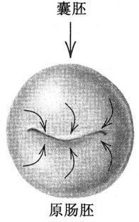

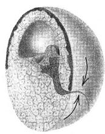


发育过程中，发育潜能逐渐分流到不同方向而受到限制。囊胚内的细胞通常被赋予特定的发育结局，即细胞命运(cell fate)，这限定了后代细胞可能的分化状态。

## - 自主发育和细胞间信号传递

在细胞谱系中，逐渐限制细胞发育潜能的两个主要机制如下。

(1) 自主发育: 发育限制可以是自主的 (autonomous), 即由细胞自身遗传上的程序性变化所决定。

(2) 对位置信息的应答：细胞可以对位置信息 (positional information) 进行应答，即发育限制由细胞在胚胎内的位置所产生。位置信息可由邻近细胞之间信号的相互作用介导，或由形态发生素的浓度梯度介导。形态发生素 (morphogen) 是在发育过程中直接参与生长和体形控制的一种分子。

研究发育命运的限制，通常是将胚胎细胞移植到新的位置，以检测它们是否能够代替其替换掉的细胞。图13.2所示的实验，显示自主发育和对位置信息应答的差别。在正常胚胎中(图13.2A)，细胞1和细胞2的命运不同，要么是因为自主的发育程序，要么是因为它们对前后端附近的位置信息进行应答。当这两个细胞被移植后(图13.2B)，细胞1和细胞2尽管在新位置上，但发育命运仍然不变，则说明是自主发育；在此情况下，胚胎前后颠倒。当发育取决于位置信息时，移植细胞对它们的新位置进行应答，因而胚胎正常。

图 13.2 自主决定和位置信息的区别。(A)如图所示，细胞 1 和细胞 2 正常分化。(B)移植这两个细胞，使它们互换位置。如果移植细胞自主分化，那么它们会像在正常胚胎中一样分化。如果它们通过应答位置信息而分化(信号来自邻近细胞)，那么它们的命运由新位置决定。

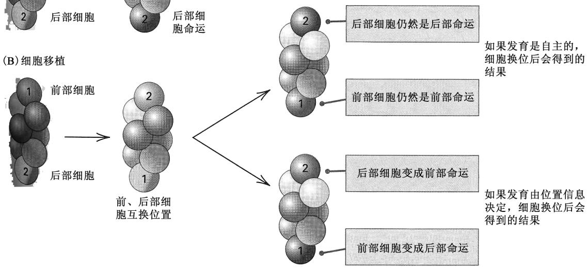

在有些真核生物中，例如，在土壤线虫秀丽隐杆线虫中，许多细胞谱系按照胚胎发育极早期由邻近细胞的相互作用所诱导的遗传程序自主发育。随后的细胞相互作用也很重要，并且每个发育阶段都要由前一个阶段的完成来启动。图 13.3 显示秀丽隐杆线虫发育过程中最初的 3 次细胞分裂，产生 8 个在遗传活性和发育命运上不同的胚胎细胞。在这几次早期的细胞分裂中，细胞命运部分是自主性的，部分是细胞间相互作用的结果。图 13.3B 显示了这些细胞之间的谱系关系。一种被称为极粒 (polar granule) 的细胞质颗粒从细胞 P0 传递到 P1，再从 P1 传递到 P2，从 P2 传递到 P3，显示存在细胞的自

  
图 13.3 秀丽隐杆线虫发育中的早期细胞分裂。(A)细胞的空间组织。(B)细胞的谱系关系。极粒的传递显示细胞自主发育的存在。箭头示决定发育命运的细胞间信号传递机制。[改编自 W. Roush, Science 272(1996): 1871.]

主性机制。极粒的正常分离是细胞骨架中微丝的一项功能。P2 作用于 EMS 和 ABp，表明细胞信号传递机制的存在。EMS 的命运由 P2 中 mom-2 基因的活性决定。P2 细胞还产生信号分子 APX-1，该分子通过细胞表面受体 GLP-1 决定 ABp 的命运。在秀丽隐杆线虫中，许多发育决定是细胞自主性的；在果蝇 (Drosophila) 和小鼠 (Mus) 中，一般是通过细胞间信号传递来调节发育的。利用细胞间信号传递来调节发育，可以提供一种保障措施，帮助克服在发育过程中偶尔可能会发生的个别细胞的死亡。

细胞间信号传递的一个特例是胚胎诱导(embryonic induction)，即胚胎主要结构的发育由邻近细胞输送来的信号决定。例如，在紫球海胆(Strongylocentrotus purpuratus)发育早期，其第4次卵裂之后，在胚胎的腹极产生称作小裂球(micromere)的特化细胞(图13.4A和图13.4B)。在细胞再次进行增殖之后，紧接于小裂球上方的胚胎区向内折叠，形成一个管腔——原肠(archenteron)，原肠最终发育成胃、肠及相关结构。如果从一个16细胞期胚胎上取下小裂球细胞，移植到另一个处于8细胞期的胚胎的背部区域(图13.4C)，则下一次卵裂会产生具有两组小裂球的胚胎(图13.4D)。随着发育的进行，在这些胚胎中，在正常位置会形成原肠，原肠来源于位于腹部小裂球上方的细胞。但在移植的小裂球下方也会形成另一个原肠(图13.4E)，这说明移植的小裂球能够诱导毗邻细胞发育为原肠。

## - 卵母细胞的成分和组织

在卵子发生的大部分过程中，卵母细胞都是二倍体细胞。卵母细胞的细胞质高度有组织且具有区域差异性(图 13.5)。这种空间上的差异最终决定囊胚细胞不同的发育命运。动物卵细胞的细胞质具有两个基本功能。

1. 存储支持卵裂及胚胎发生早期快速合成 RNA 和蛋白质所需的分子。

  
发育出两个胃，一个来自正常的小裂球(图D中底部的细胞)，另一个来自移植的小裂球(图D中顶部的细胞)

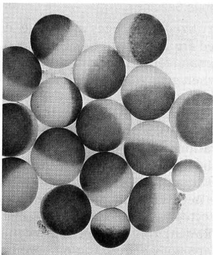  
图 13.4 海胆小裂球细胞所致的原肠的胚胎诱导。(A)处于8细胞期的正常胚胎。(B)处于16细胞期的正常胚胎，示腹面的小裂球。(C)从另一个胚胎将小裂球移植到8细胞胚胎的背端。(D)第4次卵裂后具有两组小裂球的移植胚胎。(E)移植的结果是一个胚胎具有两个原肠。该胚胎中的环状物是正在发育的胃。[E部分转载自A. Ransick and E. H. Davidson, Science 259(1993):1134-1138。经AAAS许可转载。]  
图 13.5 动物卵母细胞是高度有组织的，这是由爪蟾(Xenopus)卵背部和腹部的可见差异揭示的。卵母细胞的区域化组织结构决定早期发育中的许多关键事件。[承科罗拉多大学博尔德分校分子、细胞与发育生物学系(MCDB)迈克尔·克林姆可夫斯基(Michael Klymkowsky)惠赠。]

## 2. 组织细胞质中的分子，提供导致早期胚胎细胞之间差异的位置信息。

要建立卵母细胞正确的成分和组织，需要卵母细胞本身的许多基因和邻近不同类型的辅助细胞提供的基因产物的参与(图 13.6)。在卵母细胞发育过程中，有众多的母源基因被转录，因而成熟的卵母细胞一般会含有编码早期胚胎所需蛋白质的大量转录物。有些母源 mRNA 转录物被掩藏在特殊的核糖核蛋白颗粒中，不能被翻译；这些 mRNA 释放后能被翻译，但直到受精后才会发生。

卵母细胞中的发育指令，一部分由细胞内不同位置存在的不同类型的分子决定，一部分由从一个位置到另一位置具有浓度差异的形态发生素梯度决定。虽然卵母细胞含有许多基因的产物，但在卵母细胞形成过程中专性表达的基因只是少数。在卵母细胞形成过程中表达的大多数基因，在其他组织的发育中或在稍后的发育中也很重要。因而赋予卵母细胞独特发育潜能的，不仅仅是基因产物，还有它们在细胞内的空间组织。

## - 早期发育与合子基因组的激活

去除细胞核的青蛙受精卵仍能进行卵裂，并形成基本的囊胚。同样，当海胆或两栖类合子中的基因转录被阻断时，对卵裂或囊胚形成没有影响，但不会发生原肠胚形成过程。这些观察结果表明，经由囊胚形成而进行的早期发育，不依赖于合子细胞核中的遗传信息。所有必需的大分子都在卵母细胞的细胞质中。

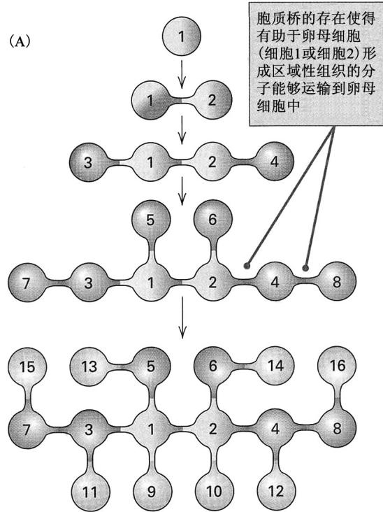

  
图 13.6 (A) 果蝇卵母细胞发育过程中细胞分裂的模式。(B) 细胞群的几何组织。[数据来自 F. M. Butterworth and R. C. King, Genetics 52(1965): 1153-1174.]

继这个不需要合子基因的早期阶段之后，胚胎转而依赖其自身基因的活性。哺乳动物需要合子基因的时间比低等脊椎动物早得多。在任何时间使用阻止小鼠胚胎发育的转录抑制剂，都会影响第一次卵裂。这一结果说明，从母源基因组控制转变为由合子基因组控制，始于两细胞期。这也是合子细胞核编码的蛋白质开始被检出的时期。但是，即使在哺乳动物中，最早的发育阶段仍受卵母细胞细胞质的强烈影响，这种影响决定初次卵裂的分裂面及其他最终影响细胞命运的事件。

哺乳动物合子细胞核的早期激活可能是必需的，因为在配子形成时，有些基因经过称为印记(imprinting)的表观遗传失活过程(参见第11章)。被印记的基因不多，其中包括胰岛素样生长因子基因(Igf2)，该基因是在卵子发生过程中被印记的，以及Igf2跨膜受体基因(Igf2-r)，该基因是在精子发生过程中被印记的。因此，胚胎中Igf2和Igf2-r的表达都需要精细胞核对Igf2的激活和卵细胞核对Igf2-r的激活。印记也影响人类基因组中的基因，现已知印记与脆性X综合征(第14章)、普拉德-威利综合征(Prader-Willi syndrome)和安吉尔曼综合征(Angelman syndrome)等疾病有关(第11章)。

## 13.3 线虫发育的遗传分析

在遗传学研究中，土壤线虫秀丽隐杆线虫(图 13.7)很受欢迎，因为它个头小、容易培养，并且世代时间短而后代数量众多。将其培养于培养皿中的琼脂表面上，饲以大肠杆菌等细菌。因为它们极其微小，在单个培养皿中可容纳多达 $10^{5}$ 个个体。性成熟的秀丽隐杆线虫成虫能在数日之内产卵 300 个以上。在 $20^{\circ}$ C 条件下，卵孵化、历经 4 次幼虫蜕皮，变成性成熟的成虫，约需 60h。

  
图 13.7 土壤线虫秀丽隐杆线虫。[照片承华盛顿大学医学院蒂姆·谢德尔(Tim Schedl)惠赠。]

线虫是具有两种性别的二倍体生物。在秀丽隐杆线虫中，两种性别是雌雄同体和雄性。雌雄同体含两条X染色体(XX)，有功能的卵和有功能的精子两者都产生，因而可进行自体受精。雄性只产生精子，可使雌雄同体受精。雄性秀丽隐杆线虫的性染色体组成由单条X染色体构成，不存在Y染色体，因此雄性核型是XO。

  
图 13.8 粗略的细胞谱系图。不同的终末分化细胞命运记为 W、X 和 Y。细胞谱系中有一个细胞 (A.aa) 发生程序性细胞死亡。

## ■ 细胞谱系分析

秀丽隐杆线虫体壁透明，使人们得以研究其在发育过程中出现的细胞分裂、迁移、分化或死亡。线虫的发育非常独特——细胞分裂和分化的模式极为固定，不同个体之间几乎没有差异。雌雄同体含有精确的959个体细胞，雄性含有精确的1031个体细胞。现已知每个体细胞在细胞和超微结构水平上完整的发育史。一群细胞之间的系谱关系称为细胞谱系(lineage)。细胞谱系可用谱系图(lineage diagram)来说明，谱系图显示祖先—后裔关系和每个细胞的终末分化状态。图13.8显示了细胞A的粗略的谱系图，细胞A的后代要么发生程序性细胞死亡，要么最终分化为W、X或Y型细胞。字母符号是常用来表示线虫细胞的符号类型，每个名称按照祖先及其在胚胎中的位置来表示细胞谱系。例如，细胞A.a和A.p分别是细胞A的前部子细胞和后部子细胞；而A.aa和A.ap是细胞A.a的前部和后部子细胞。

## 联系：著名的谱系(高贵的血统)

约翰·萨尔斯顿 $^{1}$ 、希伦伯格 $^{2}$ 、怀特 $^{1}$ 和汤姆森 $^{1}$ ，1983

$^{1}$ 医学研究理事会分子生物学实验室，剑桥，英格兰，英国

$^{2}$ 马克斯普朗克实验医学研究所，哥廷根市，德国

秀丽隐杆线虫的胚胎细胞谱系

在这项里程碑式的研究中产生的数据，构成了诠释线虫发育突变体的基础。这篇长文提供了浩繁的数据，现在可以通过互联网得到。在胚胎发生过程中，产生了1030个细胞；其中131个(13%)发生程序性细胞死亡。如此高比例的细胞程序性死亡，原因是什么？胚胎的细胞谱系是高度恒定的，即从一个个体到另一个个体都是一样的。它为什么不像在大多数其他生物中发现的那样，具有更大的发育可塑性？本节选试图解决这些问题，重点是该项研究的历史背景和动机、发育的概貌及从线虫进化的角度来诠释细胞谱系。诺马斯基显微镜技术是一项现代发明，也称为微分干涉相差显微镜。当光穿过活物质时，它根据物质的折射率改变相位。在折射率上有差异的细胞和生物体的毗邻部分，引起相位上的不同改变。当两列波穿过某个物体后复合时，相位差产生干涉图形，得到该物体的图像。诺马斯基显微镜的主要优点是，它可用来观察活组织。

这篇报道标志着一个100多年以前开始的计划的完成，即查明线虫完整的细胞谱系。线虫胚胎因其简单和在发育上的重复性，对19世纪的生物学家很有吸引力，因而利用固定标本在确定它们的细胞谱系方面取得了相当大的进展。诺马斯显微镜技术为非破坏性的，而且可产生高分辨率，现在利用此技术已经可以在活的幼虫中跟踪细胞。活体材料的使用，使观察结果获得了以前无法企及的连续性和确定性，从而使得一种线虫(秀丽隐杆线虫)的每个细胞的起源和命运都能够得以确定。因此，现在不仅明确地了解了组织之间的一般关系，而且清楚地揭示了细胞命运的详细模式。……谱系的重要性不仅在于它能立即揭示细胞之间的关系，而且可作为将来的观察结果进行整合的框架。胚胎的细胞谱系基本上是恒定的。从一个个体到另一个个体，细胞分裂、程序性细胞死亡和终末分化的模式是不变的，并且在时序上也看不到大的差异。……将“亚系”（“sublineage”）作为更具描述性但比较冗长的词组“在本质上已决定的亚系”的简称，“在本质上已决定的亚系”被认为是其前体细胞内部的程序产生的一段谱系。……假定存在亚系的两个现成的标准：①从一系列起源和位置不同的前体细胞产生相同的谱系，导致同一套细胞命运；②从激光烧蚀实验或突变体研究中得到该谱系内存在细胞自主性的证据。……从该谱系可明显看出程序性细胞死亡的巨大数目及其重复性。它们中的大多数之所以出现，最有可能的原因是，非必需的细胞常常与必需细胞一道产生。……也许最惊人的发现首先是这些谱系的复杂性，其次是谱系的细胞自主性。……事后来看，我们能够对这种复杂性和这种严格性作出合理的解释。线虫属于一个古老的门，它的细胞谱系是一块冻结的进化之冰。随着时间的推移，新的细胞类型可从这样的前体细胞产生：它们在固有属性上受到选择的程度，不像处在胚胎中意外的位置时受到的选择那样强烈。……最初发育决定所需的细胞与细胞的相互作用，可能已被更快、更经济、更可靠的自主性程序慢慢取代，灵活性的丧失被效率的获得抵消。基于这种观点，反常的分配、细胞死亡及远程迁移——这些看似在一个更加高效的设计中可以去除的特性——全都是发育化石。这里正是寻找进化过程线索，以及当今谱系控制机制线索的地方。

来源：J. E. Sulston, et al., Dev. Biol. 100 (1983): 64-119.

## ■ 影响细胞谱系的突变

现已经研究过线虫中影响细胞谱系的许多突变。它们揭示了基因控制发育的几个一般特征。

\- 细胞的分裂方式和命运通常受不止一个基因的影响，并且可被其中任何一个基因的突变扰乱。

\- 影响发育的大多数基因在不止一种细胞中起作用。

\- 复杂的细胞谱系通常包含比较简单的、由遗传决定的谱系；这些组成部分称为亚系(sublineage)，因为它们表现出完整的细胞分裂和终末分化模式。

\- 一个细胞的谱系可被该细胞自身自主触发，或被与其他细胞的信号相互作用触发。

\- 发育的调节由决定细胞可出现的不同亚系及每个亚系中各个步骤的基因所控制。

突变影响细胞谱系的方式主要有两种。一种是通过非特异性代谢阻断(例如，在 DNA 复制中)，阻止细胞进行分裂或分化。另一种是通过特异性分子缺陷，导致正常情况下见于胚胎中别的地方或发育中不同时间的分裂或分化方式。从发育遗传分析上来看，后一种突变类型更能提供有用的信息，因为这些突变基因参与的不是在所有细胞中都有的“管家”功能，而是必定参与了发育过程。

## ■ 程序性细胞死亡

程序性细胞死亡(programmed cell death)过程又称为细胞凋亡(apoptosis)，是许多生物正常发育过程中的一个重要特征。细胞凋亡是在发育的适当时间细胞自杀的过程。在很多个案中，已经鉴定出决定这种命运的信号分子(已知一些是转录因子)。程序性细胞死亡障碍通常会导致特殊的发育异常。细胞凋亡失败、存活细胞分化成可识别的细胞类型时，结果是那种类型的细胞冗余。例如，在秀丽隐杆线虫中，具有ced-3基因(ced=cell death abnormal，细胞死亡异常)

突变时，正常情况下会发生程序性细胞死亡的某个细胞活了下来，并常常会分化成一个多余的神经细胞。在秀丽隐杆线虫雌雄同体的发育过程中，有精确的131次程序性细胞死亡。在这些死亡中，没有哪一次死亡是性命攸关的。不能进行程序性细胞死亡的突变体可存活、能生育，但发育及感觉能力受到轻微损伤。另外，在果蝇中不能进行细胞凋亡的突变体是致死的，在哺乳动物包括人类中，程序性细胞死亡障碍会导致严重的发育异常，在有些情况下，甚至会导致白血病或其他类型的癌症(参见第15章)。

## ■ 功能失去和功能获得等位基因

导致细胞在发育命运上有差异的基因有时候不容易识别。例如，根据某个突变，可能会将某个基因鉴定成表达某一特定发育命运的必要基因，但在表达该基因的细胞中，该基因可能不是决定细胞发育命运的充分条件。这种可能性使寻找控制主要发育决定的基因的工作变得复杂。

有些基因的突变具有罕见的特点——显性突变和隐性突变具有相反的效应，有时可用这种特点来鉴定控制细胞命运决定的基因。如果同一基因中不同的突变可向相反的方向改变细胞命

  
图 13.9 在秀丽隐杆线虫中 Z1.ppp 和 Z4.aaa 的完整谱系。

运，那么该基因的产物对细胞命运的表达一定是既必要又充分的。在控制发育的基因中，隐性等位基因通常是功能失去突变(loss-of-function mutation)，如缺失、无义突变或失活性的氨基酸置换。发育控制基因的显性等位基因通常是功能获得突变(gain-of-functions mutation)，即基因过度表达，或在错误的细胞中或错误的时间里异位表达。

在秀丽隐杆线虫中，只有少量基因具有以相反方式影响细胞命运的显性和隐性等位基因。lin-12 基因为其中之一，该基因在许多细胞中控制发育决定。例如，图 13.9 示以 Z1.ppp 和 Z4.aaa 表示的两个细胞。在胚胎中，这两个细胞并排着，但它们是从细胞 $P_{0}$ (合子) 经过完全不一样的谱系而来。如图 13.10A 所示，在正常情况下，其中一个细胞分化成锚细胞 (anchor cell, AC)，该细胞参与生殖孔的发育，而另一个细胞分化成腹侧子宫前体细胞 (ventral uterine precursor cell, VU)。Z1.ppp 和 Z4.aaa 成为锚细胞的可能性相同。

Z1.ppp 和 Z4.aaa 直接的细胞间相互作用控制 AC-VU 的发育决定。如果用激光微束烧掉其中一个细胞，则剩下的细胞分化成锚细胞(图 13.10B)。这一结果说明，Z1.ppp 和 Z4.aaa 两者的预编程命运都是锚细胞。在正常情况下，Z1.ppp 或 Z4.aaa 任一个细胞被决定为锚细胞的命运，也就决定了另一个细胞为腹侧子宫前体细胞的命运。如前所述，lin-12 的隐性突变和显性突变具有相反的效应。lin-12 活性缺乏或大大减少的隐性突变以 lin-12 (0) 表示，在突变体中，Z1.ppp 和 Z4.aaa 两者都变成锚细胞(图 13.10C)。相反，lin-12 活性过度表达的显性突变以 lin-12(d) 表示，在突变体中，Z1.ppp 和 Z4.aaa 两者都变成腹侧子宫前体细胞(图 13.10D)。

  
图13.10 在生殖孔发育中Z1.ppp和Z4.aaa命运的控制和lin-12基因对细胞命运的遗传控制。如果带有隐性的功能失去突变 $[lin - 12(0)]$ ，两个细胞都会变成锚细胞；如果带有显性的功能获得突变 $[lin - 12(d)]$ ，两个细胞都会变成腹侧子宫前体细胞。

对 lin-12 的分子分析揭示，该基因编码一种典型的跨膜受体蛋白，其功能与 lin-12 突变的相反的效应一致。受体太少使细胞对信号不敏感；受体太多使它们特别敏感。LIN-12 蛋白(图

## 13.11)的跨膜区将该分子

分成胞外部分(氨基端)和胞内部分(羧基端)。胞外部分含有一种结构域的13次重复，这种结构域见于一种哺乳类的多肽激素——表皮生长因子(epidermal growth factor, EGF)——及果蝇 notch 基因的产物中，notch 基因的产物控制表皮和神经细胞命运的发育决定。氨基端离跨膜区不远处，含有一种富含半胱氨酸的结构域的3次重复，这种结构域也见于 notch 蛋白中。在细胞内，LIN-12蛋白的羧基端含有一种结构域的6次重复，这种结构域也见于 SWI6 和 cdc10 基因中，

  
图 13.11 LIN-12 蛋白的结构，这是一种受体蛋白的结构，含一个跨膜区和不同类型的重复单元，重复单元与表皮生长因子和其他发育控制基因中的重复单元类似。

这两个基因控制出芽酵母和裂殖酵母中的细胞分裂。

图 13.12 示功能失去和功能获得等位基因对表型具有相反效应的另一个例子。锚细胞表达一种称为 lin-3 的信号基因，其产物控制生殖孔发育中靶细胞的命运。图 13.12 显示了 5 个前体细胞——P4.p～P8.p，这些细胞参与生殖孔的发育。每个前体细胞都具有分化成 3 种命运 ( $1^{\circ}$ 、 $2^{\circ}$ 和 $3^{\circ}$ 谱系)之一的能力，这些谱系的差别在于后代细胞是保持合胞体 (S) 状态、纵向分裂 (L)、横向分裂 (T) 还是根本不分裂 (N)。在正常情况下，这些前体细胞如图 13.12 所示进行分化，产生 5 个谱系，顺序是 $3^{\circ} \rightarrow 2^{\circ} \rightarrow 1^{\circ} \rightarrow 2^{\circ} \rightarrow 3^{\circ}$ 。生殖孔本身是由 $1^{\circ}$ 和 $2^{\circ}$ 细胞谱系形成的。一些关键细胞的空间排列如图 13.13 所示。黑色箭头示锚细胞，白色线条示 12 个细胞的系谱。中间的 4 个细胞来自 P6.p，每边的 4 个细胞来自 P5.p 和 P7.p。

图 13.12 利用胞内信号转导决定生殖孔分化。在雌雄同体中，细胞 P4.p～P8.p 在生殖孔的发育中产生细胞谱系。3 种类型的谱系称为 1°、2° 和 3°。1°谱系是锚细胞 (AC) 产生的 LIN-3 配体在 P6.p 中诱导而来，LIN-3 配体使 P6.p 中的 LET-23 受体酪氨酸激酶兴奋。继而，P6.p 细胞产生一种配体，使 P5.p 和 P7.p 中的受体兴奋，诱导 2°谱系。3°谱系为缺省状态，正常情况下 P4.p 和 P8.p 采取缺省状态，在 AC 缺乏时所有细胞都采取缺省状态。  


lin-3 基因产物 (LIN-3) 的重要作用是功能失去和功能获得等位基因相反的表型所提示的。LIN-3 的缺失导致完全不出现生殖孔发育。相反，LIN-3 的过度表达引起过度的生殖孔诱导。LIN-3 是相互作用分子——配体 (ligand) ——的典型例子，LIN-3 与 EGF 样跨膜受体相互作用。此处的受体在 P6.p 细胞中，是 let-23 基因的产物。LET-23 蛋白是一种酪氨酸激酶受体，当它被 LIN-3 配体兴奋时，刺激一系列的胞内信号转导，最终导致决定 1°谱系的转录因子的合成。被诱导的基因之一编码另一个配体，该配体兴奋 P5.p 和 P7.p 细胞上的受体，导致这两种细胞采取 2°谱系 (图 13.12 中的蓝色箭头所示)。水平信号转导的证据是在遗传嵌合型线虫中发现的，在这类线虫中，P5.p～P7.p 的部分或全部细胞缺失 LET-23 受体。如果该受体在所有 3 种类型的细胞中均缺失，则没有一种细胞会采取其正常的命运。但是，如果该受体在 P6.p 中存在而在 P5.p 和 P7.p 中缺失，则所有 3 种细胞类型都会正常分化，这表明接受 LIN-3 信号对 1°谱系的决定是必要的，兴奋的 P6.p 对 2°谱系的决定是必要的。

图 13.13 生殖孔中细胞的空间组织，包括锚细胞(黑色箭头所示)和P5.p～P7.p前两次分裂产生的子细胞(白色树状图所示)。比例尺的长度等于20μm。[转载自G.D.Jongeward,T.R.Clandirin and P.W.Sternberg, Genetics 139 (1995):1553-1566.]

在生殖孔的发育中，P4.p 和 P8.p 细胞采取 $3^{\circ}$ 谱系不是由正信号决定的，而是由信号的缺乏所决定的，因为在锚细胞缺失时，P4.p～P8.p 细胞都表现为 $3^{\circ}$ 谱系。因此， $3^{\circ}$ 谱系的发育是缺省或非诱导状态，即 $3^{\circ}$ 谱系是预编程进细胞中的，如果要改变细胞的命运，必须用另外的信号来覆盖。

## ■ 发育开关分析中的上位性

比德尔和塔特姆最先证明，可用突变来发现合成生长必需的小分子的生化途径中的酶学步骤(第1章)。类似方法可用于发育途径的遗传分析，但逻辑稍有不同。生化途径是底物依赖型途径(substrate-dependent pathway)，其中，每一步骤必须顺利完成，才能进行下一步骤。发育途径是开关调节型途径(switch-regulation pathway)，其中，途径中的每一组分要么抑制、要么激活下一个组分的活性。抑制途径的组分为负调节物(negative regulator)，而激活途径的组分为正调节物(positive regulator)。

秀丽隐杆线虫中生殖孔发育的控制说明了开关调节型途径的遗传分析背后的逻辑，在进行遗传分析之前，要注意以下几点。

\- 用于分析的隐性突变型等位基因必须是完全的功能失去等位基因，因为在有些情况下，即使很残留的活性也会得出误导的结果。

\- 每个突变基因在途径中必须具有唯一的、非冗余的功能。因基因重复或基因功能重叠而产生遗传冗余的途径，不适合进行这种分析。

\- 不同的突变型等位基因应该对同一发育途径起作用。

\- 调节途径应该是线性的，每个组分只与其最邻近的组分相互作用，没有分支途径 (branched pathway) 或平行途径。

尽管存在这些限制，仍有许多开关调节型途径适于进行遗传分析。第一步是分离编码途径组分的大量隐性功能丢失型等位基因，然后按第1章和第3章中所述将这些等位基因分成互补群(基因)。在开关调节型途径中，通常会观察到两类基因，其中，功能失去等位基因产生相反的表型。对秀丽隐杆线虫生殖孔的发育决定而言，一类基因的突变型等位基因导致无生殖孔(ulvaless，无生殖孔)，而另一类基因的突变型等位基因导致多个生殖孔的发育(multivulva，多生殖孔)。

将具有相反表型的突变基因两两组合成双重突变体，根据这些所有可能组合的表型进行开关调节型途径的遗传分析。例如，分析生殖孔发育时，可对所有可能的无生殖孔-多生殖孔双重突变体进行配对。开关调节型途径中各组分的顺序，是通过在双重突变体中观察到的上位性类型来确定的。在第3章中，将上位性(epistasis)定义为任何改变两个基因自由组合的期望比值(9:3:3:1)的两个突变型等位基因之间的相互作用。在开关调节型途径的分析中，该术语的含义略有不同。对于两个基因的等位基因具有相反表型的双重突变体，如果某个基因的突变表型掩藏了另一个基因的突变表型，则该基因称为上位基因(epistatic gene)。例如，如果aa bb的表型与 $aa b^{+}b^{+}$ 的表型一样，那么就说基因a对基因b为上位性的。突变表型被掩藏的基因称为下位基因(hypostatic gene)，在前面的例子中，b基因对a基因即为下位性的。例如，在无生殖孔-多生殖孔双重突变体中，如果该双重突变体是无生殖孔的，那么无生殖孔基因对多生殖孔基因是上位性的，多生殖孔基因对无生殖孔基因是下位性的。上位性可帮助确定发育途径中的组分顺序，理由如下：

上位性原理(principle of epistasis)——在线性的开关调节型途径中，上位基因的产物在途径中相对于下位基因产物的下游起作用；换言之，下位基因的产物在相对于上位基因产物的上游起作用。

图 13.14 示这一原理背后的逻辑。如图所示，有两个开关调节型途径，其中的突变体产生相反的表型：无生殖孔、多生殖孔。在两个途径中，A 和 B 都分别表示基因 a 和 b 的野生型基因产物。箭头表示正调节(兴奋)，而 T 形条表示负调节(抑制)。基因产物 A 和 B 无需直接相互作用。如果有居间组分，则箭头或 T 形条表示所有中间步骤的净效应。

图 13.14 中箭头和 T 形条的选择会使得 $a^{-}a^{-}b^{+}b^{+}$ 和 $a^{+}a^{+}b^{-}b^{-}$ 突变体具有不同的表型。在途径 1 中，A 抑制 B，B 激发生殖孔发育 (V)。因而 $a^{-}a^{-}b^{+}b^{+}$ 基因型对 B 的抑制较小，即 B 的活

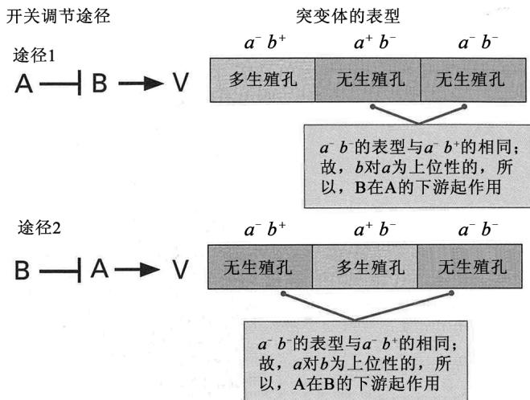  
图 13.14 上位性原理背后的逻辑：上位基因的基因产物在下位基因产物的下游起作用。

性较高，产生多生殖孔表型。与此相反， $a^{+}a^{+}b^{-}b^{-}$ 基因型缺乏B，因而不出现生殖孔发育，产生无生殖孔表型。途径2中A和B的顺序互换，在此情况下， $a^{-}a^{-}b^{+}b^{+}$ 的表型为无生殖孔，而 $a^{+}a^{+}b^{-}b^{-}$ 的表型为多生殖孔。

a 和 b 的上位性相互作用如图中的冒号所示。在途径 1 中， $a^{-}a^{-}b^{-}b^{-}$ 双重突变体为无生殖孔，因为该线虫缺乏 B；而在途径 2 中， $a^{-}a^{-}b^{-}b^{-}$ 双重突变体为无生殖孔，因为该线虫缺乏 A。在这两种情况下，与上位性原理一致，途径中处于下游的基因，对途径中处于上游的基因，都是上位性的。

将上位性原理应用于影响秀丽隐

杆线虫生殖孔发育的一些突变体。4个不同基因中任一基因的突变会导致无生殖孔表型(lin-3、let-23、lin-45和let-60)，而两个不同基因中的任一基因的突变会导致多生殖孔表型(lin-1和lin-15)。所有这些突变都是功能失去突变，纯合突变体的表型在图13.15A中以颜色编码显示，粉红色表示无生殖孔，绿色表示多生殖孔。所有无生殖孔-多生殖孔组合中的上位关系也以相同

颜色编码显示。lin-1 对所有无生殖孔突变都是上位性的，这说明 lin-1 的产物在这些无生殖孔基因产物的下游起作用。同样，lin-15 对 let-23、lin-45 和 let-60 为下位性的，说明 lin-15 的产物在这 3 个基因产物的上游起作用。最后，lin-15 对 lin-3 为上位性的，说明 lin-15 的产物在 lin-3 产物的下游起作用。将这些推论全部合并于 B 部分的途径中。推断出这些相互作用是 T 形条而不是箭头，根据是这些表型的性质。例如，因为 lin-1 突变体的表型是多生殖孔，所以野生型的 lin-1 产物必定抑制生殖孔的形成。倒退一步，

  
图 13.15 上位性原理在生殖孔决定上的应用。(A)实验结果。(B)推导出来的开关调节型途径。

let-23(lin-45 和 let-60 也一样)的表型是无生殖孔，这些基因的产物一定对 lin-1 负调节，因为在不能下调 lin-1 的突变体中，会导致 lin-1 抑制子的过度产生，从而抑制生殖孔形成。

从图 13.15B 明显可见, 对 A 部分中的功能失去突变的分析, 不能揭示 let-23、lin-45 和 let-60 的产物在该途径中发挥功能的顺序, 因为这些突变体都产生无生殖孔表型。在这样一种情况下, 可用功能获得突变来解析途径。有一个这样的突变是 let-60 的一个功能获得突变, 以符号 let-60(gf) 表示, 它导致多生殖孔表型 (与 let-60 的功能失去突变相反)。图 13.16A 显示了 let-60(gf) 与 let-23 或 lin-45 组合的表型, 以颜色编码表示。此时, 上位性原理仍然有效。使用该原理, let-60(gf) 对 let-23 为上位性, 说明 let-60 在 let-23 下游起作用, 而 let-60(gf) 对 lin-45 为下位性, 说明 let-60 在 let-45 上游起作用。

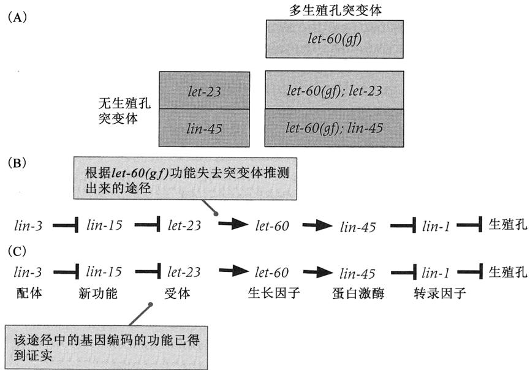  
图 13.16 上位性原理也可用于功能获得(gf)突变体。在此例中，对let-60(gf)的分析使let-23、let-60和lin-45的野生型产物的作用顺序得以确定。

所有这些上位性相互作用所蕴含的生殖孔决定的完整途径如图 13.16B 所示。在仅以遗传分析为基础的情况下，这样的途径应被视为初步假说，其预测必须经过分子生物学和细胞生物学的证实。在生殖孔发育的这一个案中，该途径的基因产物的顺序已被证实，这些基因产物已得到鉴定(C 部分)。这些基因产物如下。

\- 野生型 lin-3 基因编码与脊椎动物表皮生长因子类似的配体，其在生殖孔发育中的作用如图 13.12 所示。

\- 野生型 lin-15 基因控制两种独特而新颖的遗传活性，其在该途径中的功能仍不清楚。

\- 野生型 let-23 基因编码一种与脊椎动物表皮生长因子受体类似的受体(图 13.11)，该受体与 lin-3 配体结合(图 13.12)。

\- 野生型 let-60 基因编码一种与脊椎动物生长因子 Ras 类似的细胞生长因子。

\- 野生型 lin-45 基因编码一种与脊椎动物 Ras 酪氨酸激酶类似的酪氨酸激酶。

\- 野生型 lin-1 基因编码一种转录因子，该因子含有一个称为 ETS 的结构域，该结构域富含带正电荷的芳香族氨基酸残基。

你可能会问，为什么对线虫的生殖孔发育如此重视？一个原因是，生殖孔发育可说明怎样将上位性用于开关调节型途径的分析。另一个原因是，已表明激活Ras及下游酪氨酸激酶的表皮生长因子受体的配体与许多人类癌症有关。在第15章中会更加详细地讨论Ras蛋白在癌症中的作用，但在这里应该强调，许多人类癌症具有的突变，类似于let-60(gf)中的功能获得突变。

## 13.4 果蝇发育的遗传控制

对发育过程的诸多重要的见解来自黑腹果蝇的遗传分析。图 13.17 概括了果蝇的发育周期，从卵、幼虫和蛹到成虫阶段。早期发育包括形成原肠胚的一系列细胞分裂、迁移和内陷。受精后约 24h，由大约 $10^{4}$ 个细胞构成的一龄幼虫从卵中孵化出来。每一幼虫阶段称为一个龄期 (instar)。幼虫连续蜕皮两次，产生二龄和三龄幼虫，继之以化蛹和一个复杂的变态过程，产生由超过 $10^{6}$ 个细胞组成的果蝇成虫。在 $25^{\circ}$ C 条件下饲养的野生型品系中，发育需要 10～12 天。

图 13.18 示果蝇胚胎发育早期不同阶段的侧面观，系通过扫描电子显微镜来观察，以突出表面的细节。每个胚胎被排列成前端在左、腹侧向下。阶段 1～12 按时间顺序排列。阶段 1～5

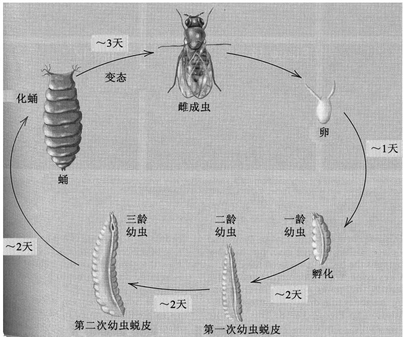

代表早期卵裂，始于新产的受精卵(阶段1)，止于其后约3.25h的细胞胚盘(阶段5)。原肠胚形成(阶段6\~8)之后，直到受精后约9h的阶段12，一个独特的体节模式在躯体上形成。果蝇的早期发育发生于卵壳之内，但照片中卵壳已被去除。

图 13.17 黑腹果蝇的发育程序。各阶段的持续时间都是在 $25^{\circ}$ C 条件下的时间。  
  
图 13.18 黑腹果蝇的早期发育，从紧接于受精后的阶段 1 到受精后约 9h 的阶段 12。[承印第安纳大学布卢明顿分校托马斯·考夫曼(Thomas Kaufman)和鲁道夫·特纳(F. Rudolf Turner)惠赠。]

发育遗传学的一个关键问题是鉴定推动图 13.18 中这种分化模式的基因及基因间的相互作用。这是通过对在发育中表现出异常的突变体进行研究而做到的。为了讨论这些突变体，先要考察一下在细胞胚盘形成过程中发生的细胞事件，然后说明显示细胞胚盘的几何结构是如何与成体果蝇的形态相关的。

图 13.18 中阶段 1～5 的细胞事件如图 13.19 所示，图中显示了卵壳。A 部分对应于新产的受精卵，其中，雄性和雌性的细胞核已经融合(黑点)。前 9 次有丝分裂连续快速发生，没有胞质分裂，在卵内产生一群细胞核(阶段 2)。这些细胞核迁移到边缘，种系由分离到后端的约 10 个极细胞(pole cell)形成；极细胞另外进行两次分裂，然后通过内陷与胚胎再次合并。胚胎内的细胞核再经过 4 次没有胞质分裂的有丝分裂，形成合胞体胚盘(syncytial blastoderm)，它含有大约 6000 个细胞核(阶段 4)。受精 150～195min 后，通过细胞膜的合成，将细胞核于分开，发生胚盘的细胞化。通过细胞化形成的胚盘(blastoderm)是一个扁平的空心细胞球(阶段 5)，相当于高等动物中的囊胚。

烧蚀掉果蝇胚盘内成片的细胞，会导致幼虫和成虫的局部缺陷。根据被破坏的细胞的位置和缺陷类型之间的空

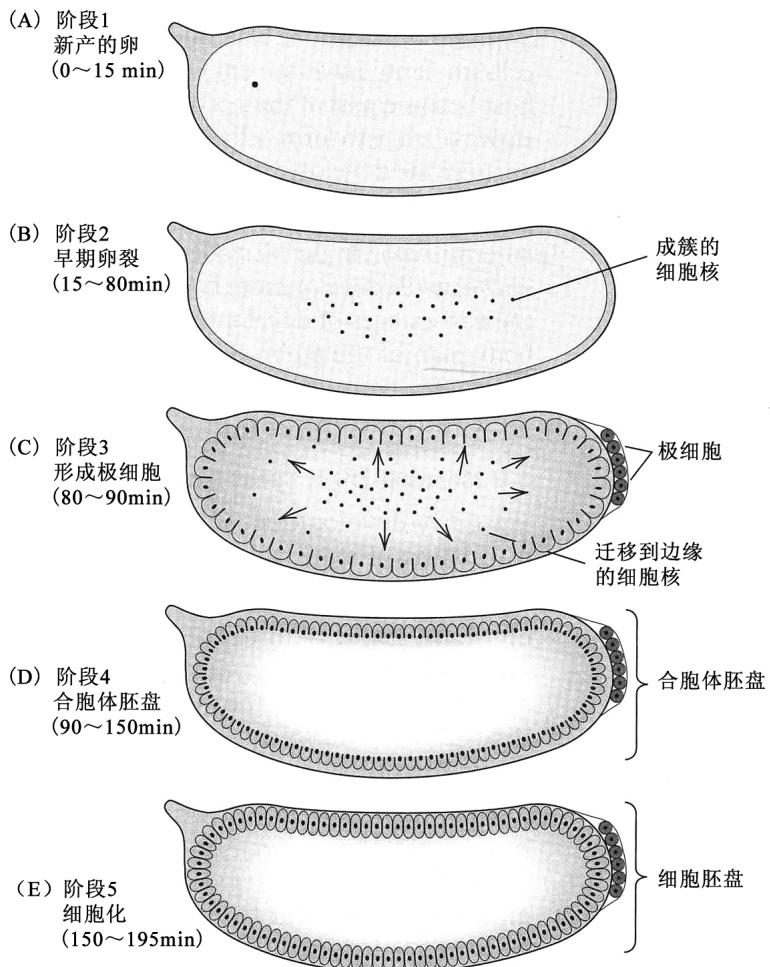  
图 13.19 果蝇的早期发育。(A)受精卵中的细胞核。(B)在合胞体内同时发生有丝分裂。(C)一些细胞核迁移到胚胎边缘，在后端，极细胞(它们形成种系)细胞化。(D)在合胞体胚盘内发生另外的有丝分裂。(E)在细胞核周围形成细胞膜，产生细胞胚盘。

间相关性，可得到胚盘的命运图(fate map)，它详细说明了产生幼虫和成虫不同结构的胚盘细胞。将遗传标记应用于胚盘使命运图更为精细(图13.20)。通过诱导有丝分裂中同源染色体之间的重组，细胞谱系可在发育过程中被遗传标记，产生在遗传上有差异的子细胞(第5章)。与秀丽隐杆线虫早期囊胚中的细胞非常相像，果蝇胚盘中的细胞具有预定的发育命运，在发育中几乎没有替代其他——有时甚至是毗邻——细胞的能力。这一结论的证据来自一些实验，其中，从遗传标记胚盘而来的细胞被移植到宿主胚盘中。移植到对应区域的胚盘细胞变成正常成虫结构的一部分。但是，移植到不同区域的胚盘细胞自主发育，不被整合进宿主结构中。

因为在胚盘中已具有相对较高的决定程度，果蝇发育的遗传分析往往集中在发育的早期阶段，此时，胚胎基本的形体模式已确立，关键的调节过程开始被激活。以下各节概述这些早期事件的遗传控制。

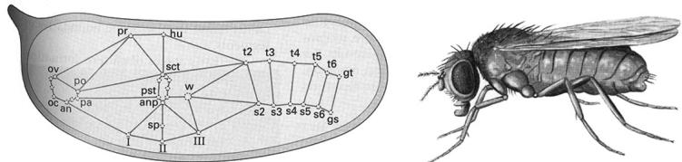  
图 13.20 果蝇胚盘的命运图，示起源于胚盘各部分的成虫结构。该图是综合分析遗传嵌合体中不同成虫结构的遗传标记的表达情况而建立的。缩写代表成虫身体的不同部分。例如，ov 和 oc 为头部结构；w 为翅；Ⅰ、Ⅱ和Ⅲ为第一、第二和第三对足；而 gs 和 gt 为生殖器结构。[改编自 J. C. Hall, W. M. Gelbart, and D. R. Kankel. (M. Ashburner and E. Novitski, eds.). The Genetics and Biology of Drosophila, vol. 1a. Academic Press (1976):265-314.]

## - 母体效应基因和合子基因

果蝇的早期发育需要卵母细胞中存在的母源 mRNA 的翻译。在此期间，蛋白质合成的阻断会使早期卵裂阻滞。合子基因组的表达也是必需的，但时间不一样。在第 9 次卵裂后的任何时间阻断合子基因组的转录，都可阻止胚盘的形成。

因为果蝇发育的最早阶段是编程于卵母细胞中的，所以影响卵母细胞组成或结构的突变会扰乱胚胎的发育。在母体中发挥功能并且为胚胎发育所需的基因称为母体效应基因(maternal-effect gene)，而在胚胎中发挥功能的发育基因称为合子基因(zygotic gene)。这两类基因的相互作用如下：

合子基因对母体效应基因安排在卵细胞中的位置信息进行诠释和应答。

母体效应基因的突变会产生这样一种表型：纯合雌性产生的卵不能支持正常的胚胎发育，但纯合雄性产生的精子正常。因此，正反交会得出迥异的结果。例如，一个隐性母体效应基因突变 m，在正反交中会产生下列结果：

$$
\begin{array}{l}m / m \text { ♀ } \times + / + \text { ♂ } \rightarrow + / m \text { 后代(发育异常) }\\+ / + \text { ♀ } \times m / m \text { ♂ } \rightarrow + / m \text { 后代(发育正常) }\end{array}
$$

杂交的 $+ / \mathrm{m}$ 后代在遗传上是一样的，但当雌性亲本是纯合的 $m / m$ 时，发育异常。

在雌性亲本中需要母体效应基因的原因是，在受精发生之前，母体效应基因就要建立果蝇卵母细胞的极性。它们在胚胎发育的最早阶段活跃，决定胚胎基本的形体模式。母体效应基因突变给研究模式形成的遗传控制，以及鉴定形态发生中重要的分子，提供了一个有价值的工具。

## - 早期发育中模式形成的遗传基础

果蝇幼虫的一个显著特征是，在主躯干上有14个在表面上看起来类似的呈窄条形的重复单元(图13.21)。根据幼虫体表深色的微小齿样突起构成的条带，可从外表上辨认出这些窄条。胚胎中的这14个窄条，对应于胚胎形成的幼虫体节。在形态上，每个体节(segment)由幼虫表皮中肌肉附着点形成的连续凹陷之间的区域界定。这些体节的名称如图13.21所示。有3个头节(C1～C3)、3个胸节(T1～T3)和8个腹节(A1～A8)。除了体节之外，在发育中另一种类型的重复单元也很重要，这些重复单元称为副体节(parasegment)，每个副体节由一个体节的后部和毗邻体节的前部组成。副体节在胚胎发育过程中短暂地存在。虽然它们在形态上不可见，但它们在基因表达上很重要，因为许多基因的表达模式与副体节的边界一致，而不是与体节的边界一致。

  
图 13.21 果蝇胚胎和幼虫的分节体制。体节以连续的凹陷为界，这些凹陷由肌肉在幼虫表皮上的附着点形成。副体节在形态上不明显，但包括毗邻体节的前、后区域。照片显示受精约9h后处在阶段12的体节C1～C3、T1～T3和A1～A8。[照片承印第安纳大学布卢明顿分校托马斯·考夫曼(Thomas Kaufman)和鲁道夫·特纳(F. Rudolf Turner)惠赠。]

模式形成的早期阶段是由通常称为分节基因(segmentation gene)的基因决定的，称为分节基因，是因为这些基因决定体节和副体节的发生和命运。分节基因有4类，它们在胚胎中表达的时间和方式不同。

(1) 坐标基因 (coordinate gene) 决定胚胎主要的坐标轴: 界定前部和后部的前后轴, 界定上、下的背腹轴。

(2) 裂缺基因 (gap gene) 在沿胚胎上连续的成群体节中表达 (图 13.22A)，它们建立下一级的空间组织。裂缺基因的突变导致连续的体节缺失，因此在胚胎正常的结构模式中出现裂缺。

(3) 成对规则基因 (pair-rule gene) 决定胚胎分割成不同的体节 (图 13.22B)。成对规则基因的突变导致在相间的体节中模式因子缺失。成对规则基因具有两体节周期性的原因是，这些基因沿胚胎以斑马条纹的方式表达。

(4) 体节极性基因 (segment-polarity gene) 决定胚胎每个体节中前-后发育的方式 (图 13.22C)。体节极性基因的突变影响所有体节或副体节。许多体节极性基因突变具有正常数目的体节，但每个体节缺失一部分，而其余部分以镜像对称的方式重复。

这 4 类分节基因存在的证据在下面的章节展示。

  
图 13.22 不同类型分节基因的表达方式。

  
图 13.23 果蝇早期胚胎在前后轴上的区域分化。在所示基因类型中，任一类型的突变均导致胚胎中相应区域的消除。

## ■ 坐标基因

坐标基因 (coordinate gene) 为母体效应基因，通过使它们的产物出现在卵母细胞内确定的位置，或通过产物的浓度梯度，确立早期极性。如图 13.23 所示，根据突变表型的形态，可将决定前后轴的基因分成 3 组：前部基因、后部基因和末端基因。

前部基因(anterior gene)作用于头和胸。在这类基因中，关键基因是bicoid。bicoid的突变导致无头、无胸的胚胎，在前端偶有极性相反的腹节重复。bicoid的表型与某些外科手术造成的表型类似。例如，当刺破果蝇卵，让少量细胞质漏掉时，前端细胞质的丢失会导致胚胎头部被一些后面的

结构的发育所代替。同样，通过注射把前部的细胞质替换成后部的细胞质，会产生具有两个镜像对称的腹部而无头的胚胎。

bicoid 基因的产物是决定前部结构的一些基因的一种转录因子。因为 bicoid mRNA 位于早期卵裂胚胎的前部，所以这些基因主要在前部区域被激活。bicoid mRNA 产生于抚育细胞中(图 13.7 中卵母细胞周围的那些细胞)，被输出到卵母细胞前极的局部区域。蛋白质产物分布的范围不再受限，在合胞体卵裂期间形成一个前—后浓度梯度，浓度最大处在胚胎前部顶端(图 13.24)。bicoid 蛋白是决定胚盘命运图的一种主要的形态发生素。该蛋白质是一种转录激活因子，含一个用于结合 DNA 的螺旋-转角-螺旋模体(参见第 11 章)。bicoid 蛋白作用的基因含有多种上游结合结构域，这些结构域由与保守序列 5'-TCTAATCCC-3' 相似的 9 个核苷酸构成。与保守序列相差最多两个碱基对的结合位点可与 bicoid 蛋白进行高亲和力的结合，含 4 个错配的位点可进

行低亲和力的结合。高、低亲和力结合位点的组合，决定基因活化所需的 bicoid 蛋白的浓度：具有较多高亲和力结合位点的基因，在低浓度下可被激活；而具有较多低亲和力结合位点的基因，需要较高的浓度。这种在结合亲和力上的差异说明，沿 bicoid 蛋白的浓度梯度，从一个调节基因到另一个调节基因，基因表达的水平可以不同。在 bicoid 激活的基因中，一个重要基因是裂缺基因 hunchback。前部基因中的其他基因编码 bicoid 局部化所需的细胞组分。

  
图 13.24 在果蝇早期胚胎中与 bicoid 类似的一个基因表达梯度。在照片中，荧光信号强度用伪彩色表示，浓度最高的区域为粉红色，浓度最低的区域为绿色。

[承威斯康星大学麦迪逊分校詹姆斯·朗格兰 (James Langeland)、肖恩·卡罗尔 (Sean Carroll) 和斯蒂芬·帕多克 (Stephen Paddock) 惠赠。]

后部基因 (posterior gene) 作用于腹节 (图 13.23)。一些后部基因的突变体也缺乏极细胞。其中一个后部基因突变 nanos 产生腹分节有缺

陷但极细胞正常的胚胎，这类似于通过外科手术去除后部细胞质产生的异常。这种表型不单单是后端一般性的发育紊乱所致，因为在 nanos 胚胎或经外科手术的胚胎这两种情况下，极细胞(后部还有一个称为尾节的结构，正常情况下，尾节长在极细胞和腹部之间)都不受影响。nanos mRNA 的分布紧靠卵母细胞后极，其基因产物是一种翻译阻遏蛋白。hunchback mRNA 是一种在 nanos 蛋白存在的情况下不翻译的 mRNA。因此，hunchback 的表达被 bicoid 蛋白和 nanos 蛋白联合控制；bicoid 蛋白在前后梯度中激活其转录，而 nanos 蛋白阻遏其在后部区域中的翻译。

末端基因(terminal gene)作用于最前部结构(原头区)和最后部结构(尾节)(图 13.23)。这一类基因中的关键基因是 torso，它编码一种跨膜受体，在早期发育阶段均匀分布在整个胚胎中。torso 受体被一种仅在卵细胞两极释放的信号激活，这种信号由卵细胞两极的抚育细胞释放。torso 受体是一种酪氨酸激酶，它通过对一种或多种靶蛋白中特定的酪氨酸残基进行磷酸化而起始细胞分化。

除这3组决定胚胎前后轴的基因外，第4组基因决定背-腹轴。背-腹决定的形态发生素是dorsal基因的产物，它存在于晚期合胞体胚盘一个明显的从腹部到背部的梯度中。dorsal蛋白是一种转录因子。已知影响背-腹决定的还有其他十几个基因。这些基因的突变会去除腹部和侧面的模式元件。在许多情况下，通过注射野生型细胞质可挽救突变胚胎，无论这些野生型细胞质是从哪里取出的，也无论将其注射到哪里。例如，snake、gastrulation-defective和easter基因，所有这3个基因都编码丝氨酸蛋白酶(serine protease)。丝氨酸蛋白酶合成时是无活性的前体，需要特异性裂解才能活化。它们通常按时间顺序起作用，即在途径中一种酶的活化对下一种酶的活化是必要的。这种酶的连续活化导致级联效应(cascade effect)，极大地放大了初始信号。级联中的每一步，使上一步中产生的信号迅速放大，就像核链式反应一样——每个事件都引发下一瞬间多个新事件的发生。

联系：胚胎创世纪

克里斯蒂安·纽斯林-沃尔哈德和埃里克·威绍斯，1980

欧洲分子生物学实验室，海德堡，德国

影响果蝇体节数目和极性的突变

纽斯林-沃尔哈德和威绍斯假设，通过对突变进行遗传和分子分析，可理解控制像早期胚胎发育那样复杂的过程的分子机制。这一假设格外大胆。表面上，此类突变的表型完全一样，都表现为胚胎死亡。在果蝇遗传图上，已经布满了“隐性致死”的突变。一般认为这些突变不适合进一步分析，因为在任何特定情况下，寻找特定的缺陷就如同大海捞针。纽斯林-沃尔哈德和威绍斯未采用绝大多数已有的突变。他们从系统地获得一套新的隐性致死突变开始，每个突变都表现为早期胚胎中组织模式形成上的一种特殊的、特征性的缺陷。本论文报道他们最初的成就，他们得到许多突变，每种突变都可归属到与发育有关的三大类基因之一。本论文激发了人们对果蝇发育遗传学的极大兴趣。今天，在果蝇研究年会(Annual Drosophila Research Conference)上通常会有大约500个讨论果蝇发育的报告(主要是海报)。1995年，纽斯林-沃尔哈德和威绍斯被授予诺贝尔奖。爱德华·刘易斯因在同源异形框基因上的开创性遗传研究，与他们分享该奖项。

在所有高等动物中，从相似的重复单元构建复杂形式是空间组织的一个基本特点。对任何生物而言，对于基因如何参与这种过程，均知之甚少。在果蝇中，模式的分节(重复)性在幼虫表皮的胸节和腹节最为明显，因而，我们试图鉴定建立这种模式所需的所有基因座。……我们对影响分节模式的突变进行了系统的搜索。我们在这里记述15个基因座上的突变，每个突变表现出来的模式改变，为下述3种新类型之一：模式重复(体节极性突变；6个基因座)、相间体节的模式缺失(配对规则突变；6个基因座)和成组相邻体节的缺失(裂缺突变；3个基因座)。……体节极性突变体具有正常数目的体节。但是，在每个体节中，正常模式的界线明确的一部分缺失，剩下的部分呈镜像重复。重复的部分在“正常”部分的后面，且具有相反的极性。……在配对规则突变体中，每隔一个体节缺失模式的同源部分。6个基因座的缺失方式各具特点。……(体节极性和配对规则)这两类的一个显著特点是，模式的改变在胚胎的前后轴上以特有的间隔重复出现。在裂缺类突变体中未发现此类重复模式，而是一组多达8个相邻体节的缺失。……缺乏重复模式，说明在这些基因座所参与的过程中，胚胎前后轴上的位置由唯一的值规定。……这些实验仍不完整。……在果蝇中，鉴定参与胚胎模式形成这个复杂过程的所有遗传成分似乎是可行的。

来源：C. Nüsslein-Volhard and E. Wieschaus, Nature 287 (1980): 795-801.

## ■ 裂缺基因

坐标基因的主要作用是调节一小组约 6 个裂缺基因沿前-后轴的表达。这些基因之所以称为裂缺基因 (gap gene)，是因为它们的突变会引起来源于一群连续体节的模式元件的缺乏 (图

  
图 13.25 受精后约 2.5h 的果蝇胚胎, 示 hunchback 基因产物 (绿色)、Krüppel 基因产物 (红色) 和它们的叠加 (黄色) 的区域定位。[承威斯康星大学麦迪逊分校詹姆斯·朗格兰 (James Langeland)、肖恩·卡罗尔 (Sean Carroll) 和斯蒂芬·帕多克 (Stephen Paddock) 惠赠。]

形成层级中的下一组基因——成对规则基因。

13.22A)。裂缺基因都是合子基因。例如，hunchback 基因，因为 hunchback 的表达是由 bicoid 和 nanos 的抵消效应 (offsetting effect) 控制。hunchback 的转录在从前至后的梯度中被 bicoid 转录因子激发，但后部的 hunchback 表达因翻译被阻遏而被阻止，因为 nanos 蛋白局限于后部。在图 13.25 的果蝇早期胚胎中，hunchback 表达的梯度以一种 hunchback 基因产物特异抗体的绿色荧光表示。叠加上去的红色荧光由另一个裂缺基因 Krüppel 产物的特异抗体产生。重叠区域的基因表达呈现黄色。hunchback 和 Krüppel 的产物都是锌指类转录因子 (参见第 11 章)。其他的裂缺基因也都编码转录因子。总之，裂缺基因具有区域特异性模式和部分重叠表达的区域，这使得它们能够以组合方式起作用，以控制体节

## - 成对规则基因

坐标基因和裂缺基因决定胚胎的极性，并建立一些大区，随后的发育在大区内发生。随着发育的推进，胚胎越发精致的组织结构与分节基因的表达模式互相紧密关联。这些基因包括成对规则基因(pair-rule gene)，这些基因的突变表型具有交替的体节缺失或畸形(图13.22B)。现已鉴定了大约8个成对规则基因。例如，成对规则基因 even-skipped 的突变影响偶数体节，而另一个成对规则基因 odd-skipped 影响奇数体节。成对规则基因的功能是提供早期幼虫一个分节的形体模式，包括体节的重复性和个性。例如，有 8 个重复的腹节，它们的间距相等，且有数个共同特征，但它们分化的细节不同。

hairy 是最早表达的成对规则基因之一，它的表达模式受 hunchback、Krüppel 和其他裂缺基因的产物调节，正调节和负调节都有。hairy 的表达产生 7 个条纹(图 13.26)。这种条纹图案是成对规则基因表达所特有的，但一个基因表达的条纹与另一个基因表达的条纹通常会有一点点错位。加上裂缺基因的连续的区域性表达，胚胎中基因表达的组合模式已经比较复杂，并且已经线性分化了。图 13.27 显示对 3 个基因的产物染色的胚胎：hairy(绿色)、hunchback(红色)和 Krüppel(蓝色)。表达重叠的区域显示为混合色——橙色、黄色、浅绿色或浅蓝色。即使是在图 13.27 的较早阶段，在每个体节和副体节中的基因表达仍存在独特的组合模式。这种组合控制 (combinatorial control) 具有很高的复杂性，例如，hairy 基因在第 7 个条纹中的表达由一个启动子元件决定，该元件不到 1.5kb，却包含 caudal、hunchback、knirps、Krüppel、tailless、huckebein 和 biocoid 等基因的蛋白质产物(并可能还有其他尚未鉴定的蛋白质)的一系列结合位点。成对规则基因在基因表达上的组合模式界定了体节极性基因表达的边界，体节极性基因在下一个层次上发挥作用。

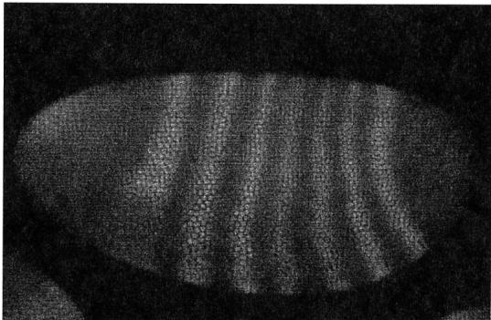  
图 13.26 受精后约 3h 的果蝇胚胎中 hairy 基因表达的 7 个特征性条纹。[承威斯康星大学麦迪逊分校詹姆斯·朗格兰(James Langeland)、肖恩·卡罗尔(Sean Carroll)和斯蒂芬·帕多克(Stephen Paddock)惠赠。]

  
图 13.27 受精后约 3h 的果蝇胚胎中 hairy、hunchback 和 Krüppel 的联合表达模式。在基因表达模式上相当程度的线性分化已经很明显。[承威斯康星大学麦迪逊分校詹姆斯·朗格兰(James Langeland)、肖恩·卡罗尔(Sean Carroll)和斯蒂芬·帕多克(Stephen Paddock)惠赠。]

## ■ 体节极性基因

成对规则基因决定体节和副体节水平上的形体模式，而体节极性基因(segment-polarity gene)引起每一体节的空间分化。现已鉴定了大约14个体节极性基因。突变表型沿着胚胎具有重复的模式缺失（图13.22C），而保留的部分常常有镜像重复。engrailed为最早表达的体节极性基因之一，其表达条纹与副体节的边界大体一致，从而将每个体节分成前区和后区(图13.28)。

  
图 13.28 体节极性基因 engrailed 的表达将果蝇早期胚胎分成 14 个区。这些区最终分化为 3 个头节、3 个胸节和 8 个腹节。[承威斯康星大学麦迪逊分校詹姆斯·朗格兰(James Langeland)、肖恩·卡罗尔(Sean Carroll)和斯蒂芬·帕多克(Stephen Paddock)惠赠。]

体节极性基因的表达终于将早期的极性和线性分化确定为体节和副体节。

## ■ 调节层级的相互作用

调节层级(regulatory hierarchy)中的基因由一套复杂的相互作用所控制，以确保循序渐进地进行发育的分子事件。一些坐标基因、裂缺基因、成对规则基因和体节极性基因之间的相互作用如图13.29所示。绿色连线示兴奋效应，红色连线示抑制效应。这些相互作用，许多是在最初用 13.3 节所讨论的上位性原理进行的遗传分析中发现的。这些基因大多数是由一套复杂的兴奋效应和抑制效应的共同作用而控制的。坐标基因首先起作用，确定胚胎极性；然后，裂缺基因分化出大区；其后，成对规则基因建立由斑马条纹所示的胚胎的周期性；最后，体节极性基因在每个体节的发育身份和命运的特化上起作用。在调节层级的每一水平上，基因起到调节在同一水平表达的其他基因的作用，也起到调节在下游一级水平上表达的基因活性的作用。

  
图 13.29 控制果蝇早期发育的基因之间的调节相互作用层级。[照片承威斯康星大学麦迪逊分校詹姆斯·朗格兰(James Langeland)、肖恩·卡罗尔(Sean Carroll)和斯蒂芬·帕多克(Stephen Paddock)惠赠；示意图承华盛顿大学细胞动力学研究中心乔治·冯·达索夫(George von Dassow)惠赠。]

体节极性基因也对每个体节或副体节中控制分化途径的下游发育基因起调节作用，最终产生成虫形态。接下来讨论成虫的变态及其是如何出现的。

## - 成虫的变态

与其他许多昆虫一样，果蝇幼虫和成虫具分节的形体模式，包括由体节 C1～C3 构成的头部、由体节 T1～T3 构成的胸部和由体节 A1～A8 构成的腹部(图 13.30)。变态(metamorphosis)利用了幼虫内存在的大约 20 个称为成虫盘(imaginal disk)的结构(图 13.31)。成虫盘形成于发育早期，最终形成成虫机体内的主要结构和组织。例如，翅盘(身体每边一个)，产生翅及相关结构；眼-触角盘，产生眼、触角和相关结构；生殖器盘，产生生殖器官。在蛹期，当许多幼虫组织和器官分解时，成虫盘逐步展开，分化为成虫结构。在蛹中发生的形态发生事件，是由幼虫脑部分泌的蜕皮激素(ecdysone)启动的。

  
图 13.30 果蝇幼虫分节和成虫分节之间的关系。成虫的 3 个胸节各具一对足。翅长在第二胸节 (T2) 上，平衡棒 (飞行平衡器) 长在第三胸节 (T3) 上。

  
图 13.31 果蝇成虫结构(A)及衍生为这些结构的成虫盘(B)。(C)三龄幼虫晚期成虫盘的一般形态和位置。

果蝇的细胞决定 (cell determination) 也在称为区室 (compartment) 的有界单元内发生。体节和成虫盘中的细胞不会跨越区室之间的边界而迁移。例如，果蝇的翅盘包含 5 个区室边界，而大部分体节只包含 1 个边界，将体节分成前半和后半。区室存在的证据来自利用有丝分裂重组对单个细胞进行遗传标记，然后观察它们后代的位置。在每个区室内，相邻的细胞群不一定与共同经历发育决定的系谱相关。

如同在早期胚胎中一样，基因表达的重叠模

式与组合控制指导随后的果蝇发育。图 13.32A 显示翅盘中翅发育的一个关键基因 vestigial 的表达模式。这一表达模式表面上均一且略呈圆形，实际上是 vestigial 应答图 13.33 所示的两个不同的信号通路的总和，两个信号通路分别导致底部所示的十字形和四分形的表达模式。图 13.32B 分别显示翅盘中的这两种模式。图 13.33 中的信号通路 A 包括 Apterous、fringe 和 Serrate 等基因的产物；而通路 B 包括 engrailed 和 hedgehog 等基因的产物。Hairy 阻遏蛋白与 vestigial 基因中的一个边界增强子 (boundary enhancer) 结合，诱导基因以十字模式表达。Mad 蛋白与另一个四分增强子 (quadrant enhancer) 结合，诱导基因以四分模式表达。在翅的发育中，vestigial 及其他基因这样重叠的基因表达模式，最终产生在成虫中观察到的精细水平的细胞和形态分化。


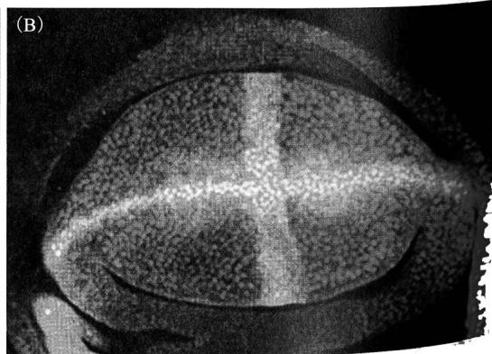  
图 13.32 (A) 在发育中的翅盘中 vestigial 基因(绿色)的表达。略呈圆形的表达区生成翅。(B) 示同一成虫盘中 vestigial 表达的潜在边界和四分模式。[承华盛顿大学细胞动力学研究中心乔治·冯·达索夫(George von Dassow)惠赠。]

  
图 13.33 在翅盘中 vestigial 表达的均一模式是两个不同模式叠加的结果。(A) 边界表达模式由背腹信号通路决定。(B) 四分表达模式由前后信号通路决定。

## - 同源异形框基因

在将果蝇胚胎的周期性转变成线性分化的形体模式的基因中，有两小套同源异形框基因(homeotic gene, HOX gene)。同源异形框基因是根据可导致一个体节转变为另一体节的突变而定义的；该表型是，受影响的体节分化成正常情况下存在于机体别处的结构。同源异形框基

因的正常功能是调节与如下特征相关的靶基因：细胞分裂速度、有丝分裂纺锤体的定向，以及分化出刚毛、足和其他部件的能力。同源异形框基因在将成群的结构基因的活性限制在一定的空间格局内也很重要。其中一类同源异形框基因突变可以 bithorax 为例来说明，该突变导致第三胸节前部转变为第二胸节前部，结果是，除了在正常情况下出现在体节 T2 的那对翅之外，本来出现在体节 T3 的平衡棒也转变为一对翅(图 13.34)。

(A)  
(B)  
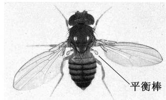

  
图 13.34 (A) 野生型果蝇, 示翅和平衡棒(突出于双翅之后的那对瘤突状结构)。(B) 双胸复合群(bithorax complex)突变产生的具四翅的果蝇。这些突变将第三胸节转变成第二胸节, 从而使正常情况下出现在第三胸节上的平衡棒被转变成后面那对翅。[承爱德华·刘易斯(Edward B. Lewis)惠赠。经帕梅拉·刘易斯(Pamela Lewis)许可使用。]

另一类同源异形框基因突变可以 Antennapedia 为例来说明，该突变导致触角变成足。以 bithorax 和 Antennapedia 为代表的 HOX 基因事实上是基因簇。含 bithorax 的基因簇称为 BX-C(bithorax complex，双胸复合群)，而含 Antennapedia 的基因簇称为 ANT-C(Antennapedia complex，触角-头复合群)。这两个基因簇最初都是由于它们的同源异形效应而被发现的，其后证明它们对幼虫体节的身份确认发挥作用。BX-C 主要与幼虫体节 T3～A8 的发育有关(图 13.30)，最主要是对 T3 和 A1 起作用。BX-C 区占据约 300kb DNA，但只包含 3 个基本的编码区。该区域的其他部分是由一系列复杂的增强子和其他转录因子组成，它们的功能是在特定的副体节中将不同的编码区活化到不同的程度，从而确定体节的身份。ANT-C 主要与头节(H)及胸节 T1 和 T2 的发育有关。

同源异形框基因编码转录激活蛋白。大部分 HOX 基因含有一个或多个同源异形框 (homeobox)，同源异形框是一段约 180 个核苷酸的独特序列，分节蠕虫、青蛙、鸡、小鼠和人等生物之间差异极大，但在这些生物与胚胎分节发育有关的关键基因中，也可见到同源异形框。同源异形框序列存在于外显子中，编码一个包含螺旋-转角-螺旋 DNA 结合模体的蛋白质折叠结构域(参见第 11 章)。

## - 进化中的主控基因

Hox 基因之所以重要，部分原因是它们在确定动物前后轴的形体模式上所起的主控基因 (master control gene) 作用一直是高度保守的。从隐杆线虫这样的具有固定细胞谱系的生物，到果蝇之类的具有界线明确的体节的生物，再到包括人和其他哺乳在内的具有可变细胞谱系的生物，Hox基因都控制着神经系统、肌肉系统、骨骼系统等的前后方向的分化。Hox基因在染色体上的方向也是高度保守的。控制前部结构的Hox基因位于每个Hox基因簇的3'端，而控制后部结构的位于5'端。这种方向与发育过程中这些基因表达的时间顺序一致。这种基因顺序的保守性，部分是因为控制基因表达的关键调节元件位于每个Hox基因簇的两侧区域。

一类称为 Pax 的同源异形框基因很好地说明了发育主控基因在进化上的保守性。Pax 基因编码的 PAX 蛋白含一个同源异形框和另一个 DNA 结合结构域——配对框 (paired box)。在这些基因中，最有名的是 Pax6，它最初是在突变小鼠中作为一种小眼表型的基因而被发现的，后来证明在称为无虹膜症 (aniridia) (虹膜缺失) 的一种遗传型人类视力障碍或失明中该基因发生突变。在这两种情况下，受累个体都是杂合的，因为纯合突变基因型由于头部和大脑的严重发育异常而不能存活。

人类和小鼠的 PAX6 蛋白具有相同的氨基酸序列，这种极端的序列保守性刺激人们到其他生

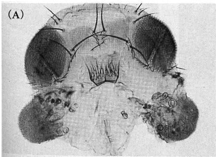


  
图 13.35 果蝇 eyeless 基因的野生型等位基因的表达导致眼睛组织被放错地方。(A) 成虫头部，两条触角都形成眼睛结构。(B) 长眼睛组织的翅。(C) 单条触角，第三节的大部分由眼睛组织构成。(D) 胫节基部长出眼睛的中足。[转载自 G. Halder, P. Callaerts, and W. J. Gehring, Science 267 (1995): 1788-1792. 经 AAAS 许可重印。]

物中去寻找类似的基因。很快在果蝇中发现了一个 Pax 相关基因，并证实它是约一个世纪以前就已经发现的 eyeless(无眼)基因。顾名思义，eyeless 突变体的眼睛大大缩小或没有眼睛。在假设 eyeless 基因可能是果蝇眼睛发育的一个主控基因的基础上，研究人员制造了一些在触角、翅或足等组织中表达野生型 eyeless 基因的突变型果蝇。在每种情况下，该基因表达的结果都是在受累组织中形成复眼(图 13.35)。

Pax 基因如何决定

眼睛的发育正在变得越来越清晰。在果蝇中，眼睛的发育以层级方式发生，在早期的时候有少量基因在靠近顶部起作用。最早起作用的基因是通过反馈相互调节的转录因子，因而它们中的任何一个的表达都会打开其余的基因。因此，这些基因中的任何一个基因的突变都会导致无眼表型，而任何一个基因的错误表达都会在错误的组织中产生眼睛。在幼虫中，当这些早期作用基因被表达时，它们打开了主要在转录调节、细胞增殖、细胞分化和细胞定型等方面发挥作用的大约100个基因的表达。这些基因依次激活其他基因，到蛹期时，大约又有400个与眼睛发育相关的基因被激活，这些基因主要编码结构分子。到成虫期时，另有500个基因被激活，这些基因在细胞内和细胞间信号转导、神经冲动传递及其他与视觉相关的关键过程中发挥作用。

一个关键的实验观察结果是，来自小鼠的 Pax6 基因能够诱导果蝇的眼睛发育。但是，所得的眼睛不是小鼠的眼睛，而是正常的果蝇复眼。因此，Pax6 只不过是开启了复眼正常发育所需的基因层级。

在进化过程中，Pax基因在眼睛发育中起主控基因的作用可以追溯到多远？在迄今详细研究过的所有案例中，这些基因都与眼睛的发育有牵连。例如，涡虫简单的眼点(图 13.36A)，每个眼点仅由面向一个杯状色素细胞的一个细长的光敏神经细胞构成。水母、章鱼和脊椎动物中发现的相机式眼睛(图 13.36B～图 13.36D)，这些眼睛每只都由单一的晶状体将光线投射到一个光敏感的视网膜上。正如我们已知的那样，Pax 基因也控制昆虫复眼的发育(图 13.36E)，昆虫的复眼由数以百计的圆柱体构成，每个圆柱体含一套感光细胞和一个晶状体。扇贝的镜面式眼睛的发育也由同一个基因家族编码(图 13.36F)，在这种眼睛中，光线不仅被投射到视网膜上，而且要经过反射以使敏感性增加。在这些形形色色的眼睛发育中，起关键作用的都是 Pax 及相关基因，这说明在历经数亿年的进化历史中，眼睛只在进化过程的极早期进化出来一次，因此，从那个共同祖先进化而来的，在化石和现生生物中发现的不同类型的眼睛，才会反反复复使用相同的主控基因。

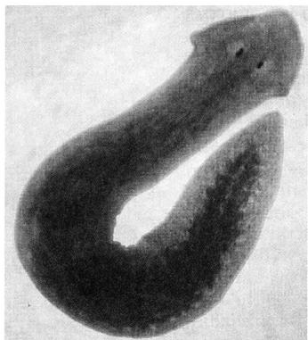  
(A)

  
(B)

  
(C)

  
(D)

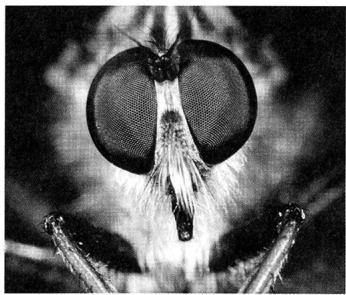  
(E)

  
(F)  
图 13.36 在动物中发现的主要眼睛类型。(A) 涡虫，(B) 水母，(C) 章鱼，(D) 脊椎动物，(E) 蜻蜓和 (F) 扇贝。[A，承哈珀学院兰迪·希泽尔特(Randy Schietzelt)惠赠；B，承哥本哈根大学安德斯·加姆(Anders Garm)惠赠；C，©Jose Hernaiz/fotolia.com；D，©Ivanova Inga/ShutterStock, Inc.; E，©Armin Rose/Dreamstime.com；F，©Ken Read/Science Photo Library。]

## 13.5 高等植物发育的遗传控制

植物的生殖和发育过程异于动物。例如，植物存在二倍孢子体和单倍配子体之间的世代交替；植物的种系不是在胚胎发生过程中在单个场所建立的，而是在成熟机体中的多个场所建立的。例如，在玉米植株中，每个穗都含有可经过减数分裂形成花粉和胚珠的体细胞。

在动物中，大多数主要的发育决定都是在生命早期——在胚胎发生过程中——做出的。在高等植物中，分化的发生几乎持续一生，分化发生在营养器官(根、茎和叶)和花器(萼片、花瓣、雌蕊和雄蕊)中活跃地进行着细胞分裂的区域，这些区域称为分生组织(meristem)。芽和根的分生组织形成于胚胎发生期间，组成分生组织的细胞在独特的几何平面上以不同的速率分裂，形成每个器官系统基本的形态格局。花的分生组织是在胚胎发生之后通过芽的分生组织的重组而建立的，最终分化成每个特定物种特有的花器结构。动物和植物发育的一个重要差异是：

在高等植物中，当细胞群离开分生组织的增殖区，并进一步分化为营养组织或花器组织时，它们的发育命运几乎完全由它们相对于邻近细胞的位置决定。

与位置信息在高等植物发育中的关键作用相比，在动物发育中，细胞谱系在决定细胞命运时往往起关键作用。

高等植物可塑的或 “不决定的” 生长模式是持续产生营养和花器系统的结果。这些模式受昼长及日照质量和强度的影响。植物发育的可塑性使得植物具有适应环境侵害的非凡能力。图 13.37 显示，随着时间的推移，一棵树通过将它边上的栅栏吞进树干中来适应栅栏的存在。


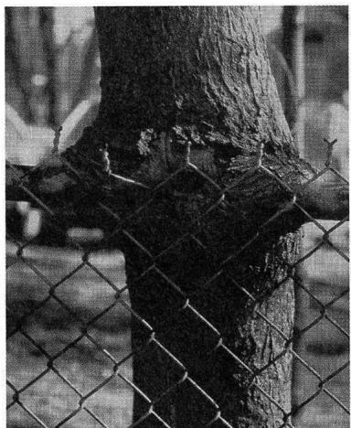

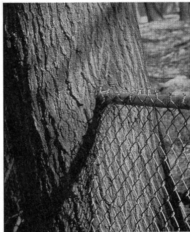  
图13.37 这棵树说明了植物通过发育适应干扰的能力。这棵树与一道栅栏不期而遇，最终将栅栏包进树干中。[承普渡大学罗伯特·普鲁伊特(Robert E. Pruitt)惠赠。]

## ■ 拟南芥的花的发育

拟南芥(十字花科的一个种)的遗传分析揭示了花器结构遗传决定的一些重要原理。拟南芥是典型的开花植物，它的花由排列成同心环状(轮状)的4种器官组成。图13.38示花分生组织俯视图。从外到里，将这些轮称为轮1、轮2、轮3和轮4(A部分)。在花的发育过程中，每个轮产生一种不同的花器(B部分)。轮1产生萼片(最外面的绿色花叶)，轮2产生花瓣(白色的花内叶)，轮3产生雄蕊(雄性器官，产生花粉)，轮4产生心皮(它们融合成子房)。

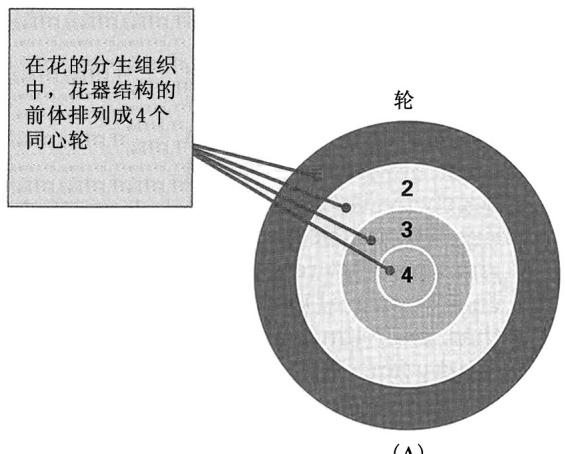  
(A)

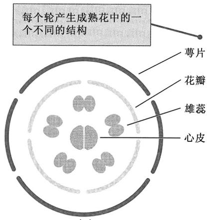  
(B)  
图 13.38 不同的花器结构起源于花分生组织中的同心轮。

影响花发育的突变分成3个主要类型，每一个类型具独特的表型(图13.39)。与野生型的花(A)相比，一种类型缺失萼片和花瓣(B)，另一种类型缺失花瓣和雄蕊(C)，而第三种类型缺失雄蕊和心皮(D)。根据纯合突变植株之间杂交的结果，可将这些不同类型的突变体分成不同的互补群，每个互补群界定一个不同的基因。表13.1示每个基因及该基因的隐性突变纯合植株的表型。缺失萼片和花瓣的表型是由ap1(apetala-1，无花瓣-1)基因的突变导致的。缺失雄蕊和花瓣的表型由ap3(apetala-3，无花瓣-3)或pi(pistillata，宽雌蕊)基因的突变导致。缺失雄蕊和心皮的表型由ag(agamous，隐花)基因的突变导致。这些基因各编码一种转录因子。由ap3、pi和ag编码的转录因子是MADS框(MADS box)转录因子家族的成员，该基因家族的每个成员含一个58个氨基酸的序列模体。MADS框转录因子在植物中非常常见，也见于在动物中，但不常见。

  
(A) 野生型

  
(B) Apetala-1(ap1)

  
(C) Pistillata(pi)

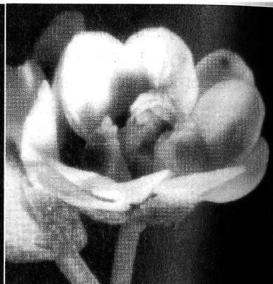  
(D) Agamous (ag)  
图 13.39 在拟南芥中花突变表型的主要类型。(A)野生型花型由萼片、花瓣、雄蕊和心皮的同心轮构成。(B)纯合 ap1(apetala-1) 突变导致花缺失萼片和花瓣。(C)ap3(apetala-3) 或 pi(pistillata) 纯合基因型产生有萼片和心皮但缺失花瓣和雄蕊的花。(D)纯合 ag(agamous) 突变产生有萼片和花瓣但缺失雄蕊和心皮的花。[A、C 和 D 部分承加州理工学院埃利奥特·迈耶罗维茨 (Elliot M. Meyerowitz) 惠赠; B 部分转载自 E. M. Meyerowitz and J. L. Bowman, Sci. Am. 271 (1994):56-65。经加州理工学院埃利奥特·迈耶罗维茨许可使用。]

表 13.1 拟南芥突变体中花的发育

<table><tr><td rowspan="2">基因型</td><td colspan="4">轮</td></tr><tr><td>1</td><td>2</td><td>3</td><td>4</td></tr><tr><td>野生型</td><td>萼片</td><td>花瓣</td><td>雄蕊</td><td>心皮</td></tr><tr><td>ap1/ap1</td><td>心皮</td><td>雄蕊</td><td>雄蕊</td><td>心皮</td></tr><tr><td>ap3/ap3</td><td>萼片</td><td>萼片</td><td>心皮</td><td>心皮</td></tr><tr><td>pi /pi</td><td>萼片</td><td>萼片</td><td>心皮</td><td>心皮</td></tr><tr><td>ag /ag</td><td>萼片</td><td>花瓣</td><td>花瓣</td><td>萼片</td></tr></table>

## - 花器的组合决定

可从突变表型推断 ap1、ap3、pi 和 ag 转录因子在花器决定中的作用。推理的逻辑是基于这样的观察(表 13.1)：任何一个基因的突变消除由毗邻的轮产生的两种花器。这种模式表明，

ap1 为萼片和花瓣所必需，ap3 和 pi 两者都为花瓣和雄蕊所必需，ag 为雄蕊和心皮所必需。因为这些突变表型是由这些基因的功能失去等位基因引起的，所以可以推断，ap1 在轮 1 和轮 2 中表达，ap3 和 pi 在轮 2 和轮 3 中表达，ag 在轮 3 和轮 4 中表达。表 13.2 示这种重叠的表达模式。

表 13.2 中的基因表达模型表明，花的发育是由 4个基因以组合方式控制的。萼片由仅 ap1 有活性的组织发育而成；花瓣由 ap1、ap3 和 pi 的组合激发；雄蕊由 ap3、pi 和 ag 的组合决定；而心皮来自只有 ag 表达的组织。该模型图解于图 13.40 中。

表 13.2 决定花发育的基因的表达域

<table><tr><td>轮</td><td>表达的基因</td><td>决定</td></tr><tr><td>1</td><td>ap1</td><td>萼片</td></tr><tr><td>2</td><td>ap1+ap3 和 pi</td><td>花瓣</td></tr><tr><td>3</td><td>ap3 和 pi+ag</td><td>雄蕊</td></tr><tr><td>4</td><td>ag</td><td>心皮</td></tr></table>

  
图 13.40 拟南芥花的发育由 4 个基因的重叠表达控制。萼片、花瓣、雄蕊和心皮是在同心环(轮)中形成的花器系统。每个同心环的发育身份确认由 ap1、ap3、pi 和 ag 决定，每个基因在两个毗邻的轮中表达。因此，每个轮具有一种唯一的活性基因组合，以 A、B 和 C 的组合表示。

这种花发育的模型通常称为花 ABC 模型 (flower ABC model)，因为最初将 ap1 的野生型活性称为 A，将 ap3 和 pi 共同发挥作用的野生型活性称为 B，而将 ag 的野生型活性称为 C。因此在每个轮中存在的活性的组合，在轮 1 中表示成 A，在轮 2 中表示成 AB，在轮 3 中表示成 BC，而在轮 4 中表示成 C (图 13.40)。

表 13.2 中的模型并不能解释表 13.1 中 ap1 和 ag 突变的所有表型特征。具体说来，按照表 13.2 中的组合模型，在纯合 ap1 植

株中，从轮 1 和轮 2 发育成心皮和雄蕊，应该需要 ag 在轮 1 和轮 2 中表达。同样，在纯合 ag 植株中，从轮 3 和轮 4 发育成花瓣和萼片，应该需要 ap1 在轮 3 和轮 4 中表达。如果假设 ap1 的表达和 ag 的表达是互斥的，这个矛盾就可以解释。在存在 AP1 转录因子的情况下，ag 被阻遏；在存在 AG 转录因子的情况下，ap1 被阻遏。如果是这种情况，那么在 ap1 突变体中，ag 的表达可能会扩散进轮 1 和轮 2；在 ag 突变体中，ap1 的表达可能会扩散进轮 3 和轮 4 中。这一额外的假设能够解释单一突变体甚至双重突变体的表型。

有了关于 ap1 和 ag 相互作用的额外假设，表 13.2 中的模型就与数据吻合，但这个模型正确吗？用针对每个基因的标记探针，通过在花的细胞中进行 RNA 原位杂交，来分析这些基因，所得基因表达模式与表 13.2 中的模式吻合。具体说来，ap1 在轮 1 和轮 2 中表达，ap3 和 pi 在轮 2 和轮 3 中表达，ag 在轮 3 和轮 4 中表达，而且 ap1 和 ag 的表达互斥。结果证明这一假设是正确的。在 ap1 突变体中，ag 在轮 1 和轮 2 中表达；相反，在 ag 突变体中，ap1 在轮 3 和轮 4 中表达。现在也已经知道 ap3 和 pi 是怎样合作的。对应于这两个基因的活性转录因子是一种二聚体蛋白，由 Ap3 和 Pi 多肽组成。在缺乏一种多肽组分的情况下，另一多肽组分在细胞质中为无活性状态。二者共同存在时，形成有活性的二聚体转录因子，并迁移到细胞核中。

鉴于 Ap1、Ap3/Pi 和 Ag 转录因子在花器决定中的关键作用，可以推测，缺失所有 3 种转录因子的三重突变体，可能会发育成非常奇怪的花。apl pi ag 三重突变体的表型如图 13.41 所示。这些花没有任何一样正常的花器。它们仅仅是由排成同心轮的叶片组成。

## 本章概要

\- 在动物细胞中，卵母细胞中的母源基因产物控制最早期的发育，包括确立主要的体轴。

\- 发育基因通常由基因产物的梯度控制，梯度存在于细胞中或跨越部分胚胎。

\- 发育基因的调节是分层的，即在发育早期表达的基因调节后来表达的基因的活性。

\- 上位性原理有助于确定在线性开关调节发育途径中起作用的基因的顺序。该原理认为，上位基因在下位基因下游起作用。

\- 发育基因的调节是组合式的，即每个基因被其他基因的组合所控制。

\- 在动物和植物中，模式形成的许多基本过程看起来是类似的。

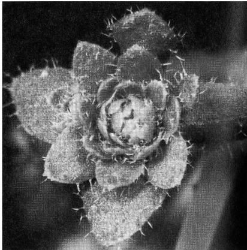  
图 13.41 ap1 pi ag 纯合三重突变体缺少花器发育所需的所有转录因子。因此，这些花缺乏所有的野生型花器结构。它们没有萼片、花瓣、雄蕊和心皮。没有花的遗传决定因子，这些花整个由排列成同心轮的叶片组成。（承加州理工学院埃利奥特·迈耶罗维茨惠赠。）

## 基础回顾

\- 在发育过程中，什么是“位置信息”？位置信息怎样对细胞命运起作用？

\- 线虫发育的完整细胞谱系知识如何证明在发育中程序性细胞死亡(细胞凋亡)的重要性？

\- 如果某个基因对决定某个发育途径不仅必要而且充分，请解释为什么预计功能失去突变体与功能获得突变体的表型不同？

\- 什么是受体？什么是配体？这些分子在细胞间信号转导中发挥什么作用？

\- 什么是成熟卵母细胞的“极性”？

\- 母体效应致死基因怎样成为破解果蝇早期胚胎发生的遗传控制的关键？

\- 在控制果蝇胚胎发育的基因中，指出坐标基因、裂缺基因、成对规则基因和分节极性基因的差异。一般来说，这几类基因表达的时间顺序是什么？

\- 什么是同源异形突变？举一个果蝇的例子。同源异形突变发生在除果蝇之外的其他生物中吗？

\- 植物具有与动物相同意义的种系吗？在这两类生物的进化过程中，这种种系起源上的差异对于“体细胞”突变的潜在作用有何意义？

\- 拟南芥花器发育中萼片、花瓣、雄蕊和心皮发育决定的遗传基础是什么？

## 解题指南

习题 1 在示意图中，B 物质抑制某种花中红色色素的发育。这种花的野生型颜色为粉红色，但已知突变体为白色或红色。假设 B 物质是 B 基因的产物，B 基因的功能失去突变，会有什么样的花的颜色表型？B 基因的功能获得突变会有什么样的花的颜色表型？这种情况是哪一个发育遗传学原理的典型情况？

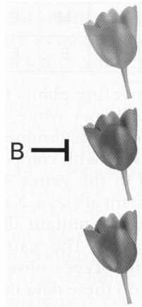

## 答案

因为 B 抑制花的颜色，且野生型表型为粉红色，所以 B 基因的功能失去突变会去除 B，从而减少抑制效果，因此预期表型会是红色。同样，B 基因的功能获得突变会增加 B 的量，从而增强抑制，因此预期花色表型会是白色。这种情况是如下原理的典型情况：发育控制基因的功能失去突变通常具有与功能获得突变相反的表型效应。

习题2 下图示控制花的色素形成的线性开关调节型途径。A物质是B的强化因子。如果A是 $A$ 基因的产物， $A$ 基因的功能失去突变会产生什么样的花色表型？ $A$ 基因的功能获得突变会产生什么样的花色表型？


## 答案

因为 A 强化 B，A 基因的功能失去突变会去除 A，从而减少 B 所导致的抑制的水平；因而，估计花的表型会是红色。相反，A 基因的功能获得突变会增加 B 的效应，从而增加 B 所导致的花的颜色的抑制，因而预计花的颜色的表型会是白色。

习题 3 下图所示的是在某种昆虫末端附肢上观察到的 3 种可能的表型。野生型表型具单列刚毛。有些突

变体产生无刚毛表型，而其他突变体产生附肢具两列刚毛的表型。已知这些刚毛的发育是某一线性开关调节型途径的结果，该途径涉及分别在 A、B、C 和 D 基因中编码的物质 A、B、C 和 D。A、B、C 和 D 作用的顺序未知。突变型等位基因 a 和 b 导致缺失刚毛(M)，而突变型等位基因 c 和 d 导致多一列刚毛(E)。所附矩阵示在所有可能的双重突变体中观察到的表型。这说明 A、B、C 和 D 物质作用的基因顺序是什么？


## 答案

根据上位性原理，在双重突变组合中，上位基因的产物在下位基因产物的下游起作用。因此，矩阵第一行说明了 A C 和 D A 的顺序，而第二行说明了 C B 和 D B 的顺序。将这些信息合起来，这些物质作用的顺序一定是 D-A-C-B。

## 分析与应用

13.1 异时性突变(heterochronic mutation)是一种改变发育事件彼此的相对时间顺序的突变。在一个正常但较慢的发育模式中发现一个突变。该突变称得上是异时性突变吗？请予以解释。

13.2 指出功能失去突变和功能获得突变的差异。同一个基因，两种类型的突变都可发生吗？同一个等位基因，两种类型的效应都可以具有吗？

13.3 上位性原理是什么？怎样将它用于发育中线性开关调节型途径的遗传分析？

13.4 构建了果蝇的一种双重突变体。对单重突变体而言，一种突变体导致眼睛增大，另一种突变体导致小眼。该双重突变体具有小眼。这两个基因中哪一个是上位基因？哪一个是下位基因？假设控制眼睛大小的为线性开关调节型途径，这些结果说明在该发育途径中基因产物作用的顺序是什么？

13.5 在果蝇中，母体效应致死等位基因的结果是什么？如果某个等位基因是母体效应致死的，果蝇怎么能够对它是纯合的？

13.6 怎样判断两个独立分离到的母体效应致死突变是否是同一基因的等位基因？

13.7 试想某个特定基因对于某个形态特征的发育是必要的，但不是充分的。该基因的功能失去突变的预期表型是什么？预计该等位基因是显性的还是隐性的？

13.8 试想某个特定基因对于某个形态特征的发育是充分的。该基因的功能获得突变的预期表型是什么？预计该等位基因是显性的还是隐性的？

13.9 此处所示的线性开关调节型途径控制某个物种的花的颜色。野生型颜色为紫蓝色，而突变体为白色或紫色。在该途径中，基因产物 A 和 B 在所示位置按所示方式起作用 (A 为抑制性的，B 为增强性的)。A 和 B 分别是基因 A 和 B 的产物。下列突变的预期表型是什么？

A → B → 白色
紫蓝色
紫色

(a) A 的功能失去突变
(b) A 的功能获得突变
(c) B 的功能失去突变
(d) B 的功能获得突变


13.10 在一个与 13.9 题中的物种具有亲缘关系的物种中，控制花的颜色的线性开关调节型途径如图所示。野生型颜色仍是紫蓝色，突变体可为白色或紫色。在该物种中，A 和 B 两者都是抑制性的。下列突变的预期表型是什么？

(a) A 的功能失去突变

(b) A 的功能获得突变

(c) B 的功能失去突变

(d) B 的功能获得突变


13.11 果蝇小盾片上通常有 4 根刚毛, 小盾片为胸部基部表皮的小三角区。有些突变体在小盾片上无刚毛,

而有些突变体具有额外的刚毛。假设一个线性开关调节型途径涉及分别在 U、V、W、X、Y 和 Z 基因中编码的基因产物 U、V、W、X、Y 和 Z。突变型等位基因 u、v 和 w 导致额外的刚毛(E)，而突变型等位基因 x、y 和 z 导致刚毛缺失(M)。根据此处所示的双重突变体数据，推导出在刚毛数目途径中 U、V、W、X、Y 和 Z 作用的顺序？

<table><tr><td></td><td>x</td><td>y</td><td>z</td></tr><tr><td>u</td><td>E</td><td>M</td><td>E</td></tr><tr><td>v</td><td>M</td><td>M</td><td>E</td></tr><tr><td>w</td><td>E</td><td>E</td><td>E</td></tr></table>

<table><tr><td></td><td>d</td><td>e</td><td>f</td></tr><tr><td>a</td><td>O</td><td>O</td><td>O</td></tr><tr><td>b</td><td>O</td><td>O</td><td>W</td></tr><tr><td>c</td><td>W</td><td>O</td><td>W</td></tr></table>

13.12 一种开花植物开黄色(野生型)、白色或橙色的花。色素的浓度由一个线性开关调节型途径决定，该途径具有分别由 A、B、C、D、E 和 F 基因编码的组分 A、B、C、D、E 和 F。突变型等位基因 a、b 和 c 导致橙色花(O)，而突变型等位基因 d、e 和 f 导致白花(W)。此处所示的矩阵概括了在双重突变体中观察到的表型。这些数据说明，在该途径中这些组分作用的顺序是什么？

13.13 果蝇的 bicoid 突变导致早期胚胎中头部结构的缺失。当从果蝇胚胎

的前端去除细胞质时，得到类似表型。下列每种情况下会有什么样的发育效应？

(a)用取自野生型胚胎前端的细胞质，注射到bicoid胚胎的前端。

(b)用取自另一个野生型胚胎前端的细胞质，注射到野生型果蝇胚胎的中部。

13.14 来自 bicoid 基因的 mRNA 在 3' 端包含一段序列，使其被定位于卵细胞的前端。在对这一定位所需基因的突变体筛查中，应该寻找什么表型？

13.15 某种甲壳类动物可有中等大小的螯(野生型)、增大的螯或减小的螯。螯的大小由一个线性开关调节型途径决定，该途径具有在基因 $A \sim G$ 中编码的组分 $\mathrm{A} \sim \mathrm{G}$ 。这些组分以E-C-G-A-D-B-F的顺序起作用。突变型等位基因 $a$ 、 $b$ 和 $c$ 导致增大的螯(E)，而突变型等位基因 $d$ 、 $e$ 、 $f$ 和 $g$ 导致减小的螯(R)。在每个单元格中填写双重突变体的预期表型(E或R)，以完成该矩阵。

<table><tr><td></td><td>d</td><td>e</td><td>f</td><td>g</td></tr><tr><td>a</td><td></td><td></td><td></td><td></td></tr><tr><td>b</td><td></td><td></td><td></td><td></td></tr><tr><td>c</td><td></td><td></td><td></td><td></td></tr></table>

13.16 成年青蛙脑细胞的细胞核通常不合成 DNA 或进行有丝分裂。但是，当脑细胞核移植进正在发育的卵母细胞后，出现如下表现：(a) 在快速生长的前减数分裂卵母细胞中，它们合成 RNA；(b) 在比较成熟的卵母细胞中，它们不合成 DNA 或 RNA，但它们的染色体凝缩，从而开始减数分裂。怎样解释这些结果？

13.17 试想一种假想突变的作用于拟南芥花发育的突变型蛋白酶。该蛋白酶具有变异的底物特异性，使它能够消化蛋白质 Ap1 和 Ag(分别为 ap1 和 ag 的产物)并使这两种蛋白质都失活。含 Ap3/Pi 二聚体蛋白，但既不单独含 Ap1，也不单独含 Ag 的组织，发育成介于花瓣和雄蕊之间的花器中间体，鉴于这一事实，在该蛋白酶突变体中，预计花器表型是什么？(提示：缺省状态是“叶”。)

13.18 在拟南芥中，导致 ap3 和 pi 在轮 1 中表达的功能获得突变会有什么表型？

13.19 在 ag(agamous) 的表达局限于轮 3 的拟南芥突变体中，预计由每个轮产生的花器结构是什么？(提示：缺省状态是 “叶”。)

13.20 在 ap1(apetala-1) 的表达局限于轮 2 的拟南芥突变体中, 预计由每个轮产生的花器结构是什么? (提示: 缺省状态是 “叶”。)

13.21 对某种海洋无脊椎动物用来固定猎物的一种特化的附肢进行遗传分析。野生型附肢(附图顶部所示)有3个分节。直接连接于身体的近侧分节具单列稀疏刚毛；中分节具单列密生刚毛；端分节具两列对称的密生刚毛。分离到影响该附肢的3种突变；它们导致图中所示的表型。一个缺乏刚毛的分节的存在，可被视为该附肢发育的缺省状态。提出一个假说来解释基因a、b和c是如何参与该附肢的发育决定的。


13.22 为了对前一习题中所讨论的附肢发育的遗传控制有更加深入的认识，构建了所有可能的双重突变体。它们具有如图所示的表型。

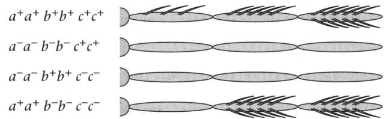

(a)这些表型与从单一突变体中得出的推论一致吗?

(b)这些双重突变提供了什么额外信息？

(c) 提出一个详细的模型，说明哪些基因产物对于每个分节的发育是必需的。

13.23 根据前面两个习题中的数据形成的附肢发育的遗传控制模型，简述与下列每种类型的突变相关的表型。

(a) $c^{+}$ 表达的范围扩大到端分节中的突变。

(b) $a^{+}$ 表达的范围扩大到近侧分节中的 $b^{-}$ 突变。

(c) $b^{+}$ 表达的范围扩大到中分节中的 $a^{-}$ 突变。

13.24 药物放线菌素 D 阻止 RNA 的转录，但几乎不直接作用于蛋白质合成。当受精的海胆卵被浸泡在这种药物的溶液中时，发育进行到囊胚阶段，但不发生原肠胚形成。怎样解释这一发现？

13.25 在拟南芥中，某个基因的功能对于 Ap3/Pi 和 Ag 对发育发挥作用是必要的，预计其功能失去突变会出现什么花器表型？

13.26 美西螈中称为 o 的一种突变是母体效应致死突变，因为无论胚胎自身的基因型是什么，来自 oo 雌性的胚胎在原肠发生阶段都要死亡。但是，用来自 $o^{+}/o^{+}$ 或 $o^{+}/o$ 卵细胞的细胞核提取物注射来自 oo 雌性的卵母细胞，可挽救这些胚胎。注射细胞质无效。对这些结果做出解释。

13.27 预计导致 $ap3$ 和 $pi$ 丢失功能的突变会有什么样的花器表型？在轮 1 和轮 2 及轮 2 和轮 3 中 $ap3$ 和 $pi$ 都被表达的功能获得突变又会有什么样的花器表型？关于 $Ap3 / Pi$ 对 4 个轮的发育命运是必要的还是充分的，这些结果说明了什么？

13.28 请解释，在解释拟南芥花器突变体的表型时，为什么需要假设：

(a) 在 agamous 突变体中，apetala-1 的表达范围扩大到轮 3 和轮 4。

(b) 在 apetala-1 突变体中，agamous 的表达范围扩大到轮 1 和轮 2。

13.29 如果在 apetala-1 突变体中，agamous 的表达范围没有扩大到轮 1 和轮 2，轮 1 和轮 2 的表型能够预测吗？为什么能或为什么不能？

13.30 在某种沙鼠中，影响某个线性开关调节型途径的突变，导致耳朵扩大或减小。该途径涉及在基因 $A \sim D$ 中编码的组分 $\mathrm{A} \sim \mathrm{D}$ 。突变型等位基因 $a$ 和 $b$ 导致耳朵扩大(E)，而突变型等位基因 $c$ 和 $d$ 导致耳朵减小(R)。双重突变体具有所附矩阵所示的表型。根据这些数据，推断在该途径中A、B、C和D作用的顺序是什么？

<table><tr><td></td><td>c</td><td>d</td></tr><tr><td>a</td><td>R</td><td>E</td></tr><tr><td>b</td><td>R</td><td>E</td></tr></table>

## 挑战题

挑战题 1 若要证明，在果蝇胚胎体节形成过程中，表达正常的配对规则模式需要裂缺基因的正常表达，但裂缺基因的表达不需要成对规则基因的表达。有下面 4 种突变可用：

(a) 合子效应裂缺基因 knirps (kni) 的突变。

(b) 合子效应成对规则基因 fushi tarazu (ftz) 的突变。

(c) 由报道基因(lacZ)与 kni 的增强子元件融合构成的转基因。

(d) 由报道基因(lacZ)与ftz的增强子元件融合构成的转基因。

描述需要的品系，以及怎样用它们来证明野生型的 kni 表达对 ftz 的正常表达是必需的，但野生型的 ftz 表达对 kni 的正常表达不是必需的。不用给出杂交的细节。

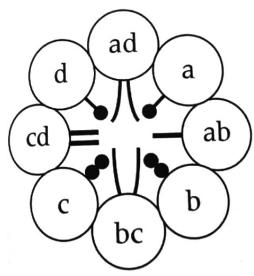

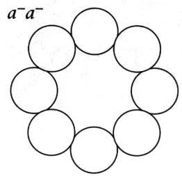


挑战题 2 一种水母有一个由 8 个环状排列的细胞组成的结构，在这些细胞上出现一些突起物，形成有点像毛孔的结构。如附图所示，有些细胞有一模一样的突起物，而其他细胞的突起物完全不同。字母 a～d 表示 4 个发育控制基因 a～d 的产物，这些产物见于这一圈细胞的每个细胞中。

假设在这些基因产物任何一个都不存在时，细胞的缺省状态是缺乏突起物，在下面的示意图中，画出 $a \sim d$ 每种单一突变体的预期表型。

挑战题 3 对于前一题中描述的发育控制系统，画出 6 种可能的双重突变类型每一种的预期表型。


## 网上遗传学

“网上遗传学”(GeNETics)会为你介绍在互联网上寻找遗传学信息的某些最重要的站点。要浏览这些站点，请访问为《遗传学：基因和基因组分析》(第八版)配备的 Jones and Bartlett 公司配套站点http://biology.jbpub.com/book/genetics/8e/。

在该站点中，你会找到一个按章列出的重点关键词列表。选择某个关键词后，可链接到某个网站，其中包含与此关键词相关的信息。

# 第 14 章 突变和 DNA 修复的分子机制

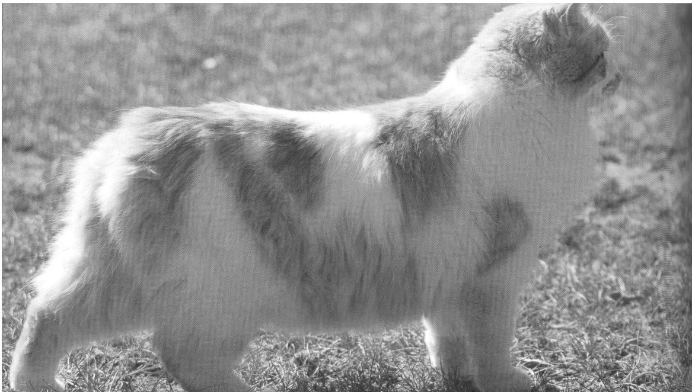

由于单个显性突变的作用，曼克斯猫天生没有尾巴。( $^{©}$ Cheryl Kunde/Shutterstock, Inc.)

本章提纲

14.1 突变的类型

14.2 突变的分子基础

14.3 转座因子

14.4 自发突变

14.5 诱变因素

14.6 DNA 修复的机制

14.7 回复突变和抑制基因突变

联系：情有独钟

芭芭拉·麦克林托克，1950玉米中可变基因座的起源和行为
联系：X 射线之惑
赫尔曼·马勒，1927
基因的人工诱变

联系：在不稳定重复序列中的复制滑移米什莱恩·斯特兰德、托马斯·普罗拉、迈克尔·利斯凯和托马斯·皮特斯，1993影响DNA错配修复的突变使酵母的简单重复序列片段不稳定

## 学习目标与科学能力

理解突变和 DNA 修复的分子机制，便可具备下面的科学能力。

\- 能指出自发突变和诱发突变、种系突变和体细胞突变、条件突变和无条件突变、功能失去突变和功能获得突变的差别。

\- 能解释为什么在密码子第一或第二位的核苷酸置换更有可能导致的是非同义突变而不是同义突变，为什么在第三位的转换突变比颠换突变更有可能导致同义突变。

■ 能叙述影印培养实验，该实验证明抗体抗性突变可在缺乏抗体的情况下出现，因而突

变的发生与它们对机体是否有利没有关系。

\- 能预测以碱基类似物、X射线或紫外线处理细胞时，可能出现的突变类型。

\- 能指出错配修复和核苷酸切除修复的差别，并能解释为什么错配修复对于 DNA 复制的准确性更加重要。

\- 能叙述修复从胞嘧啶产生尿嘧啶的脱氨作用和从5-甲基胞嘧啶产生胸腺嘧啶的脱氨作用的主要机制，并能解释为什么这些机制不一样。

突变 (mutation) 是基因中任何可遗传的改变。本章在分子水平上考察突变的本质。考察突变怎样发生，以及它们对基因和基因表达有什么作用。尽管突变可自发产生，但也可用损伤核苷酸或在多核苷酸链中产生断裂的辐射和各种各样的化学试剂来诱导。大多数类型的 DNA 损伤发生之后紧接着就会被特殊的修复酶校正。因而，在任何世代中传递的新突变，都是少数逃脱修复的 DNA 损伤。

## 14.1 突变的类型

突变可在任何时候、任何细胞中发生。其表型效应的变化范围，从仅能用分子方法检测到的微小改变(例如，DNA多态性)，到导致细胞或生物体死亡的基本生物过程中的巨大变化。

## ■ 种系突变和体细胞突变

可用多种方式对突变进行分类(表 14.1)。大多数突变是自发的，即它们在没有任何已知原因的情况下出现。突变也可通过化学试剂或辐射导致的 DNA 损伤而引起。在多细胞生物中，一种重要的区分依据是突变最早出现的细胞类型。在最终形成配子的细胞中出现的突变，为种系突变(germ-line mutation)，其他所有的突变为体细胞突变(somatic mutation)。体细胞突变产生在基因型上由正常组织和突变型组织混合形成的(嵌合的，mosaic)生物体，对于许多显性突变，在表型上也是嵌合体。因为种系没有受到影响，所以体细胞突变不能传递给后代，因而可能不适于进行遗传分析。但是，在高等植物中，体细胞突变常常能够用营养繁殖的方法进行繁殖，而不用经过种子繁殖阶段，这些方法包括嫁接和扦插。许多具有重要商业价值的水果是典型的营养繁殖，如蛇果和佛罗里达脐橙。

表 14.1 突变的主要类型及其特征

<table><tr><td>分类依据</td><td>突变的主要类型</td><td>主要特征</td></tr><tr><td rowspan="2">来源</td><td>自发突变</td><td>在缺乏已知诱变因素的情况下发生</td></tr><tr><td>诱发突变</td><td>在存在已知诱变因素的情况下发生</td></tr><tr><td rowspan="2">细胞类型</td><td>体细胞突变</td><td>发生在非种系中</td></tr><tr><td>种系突变</td><td>发生在种系中</td></tr><tr><td rowspan="2">表达</td><td>条件突变</td><td>只在限制性条件下表达(例如,高温)</td></tr><tr><td>无条件突变</td><td>在允许条件及限制性条件下都表达</td></tr><tr><td rowspan="4">对功能的作用</td><td>功能失去突变(敲除突变、无效突变)</td><td>消除正常功能</td></tr><tr><td>亚效基因突变(渗漏突变)</td><td>减少正常功能</td></tr><tr><td>超效基因突变</td><td>增加正常功能</td></tr><tr><td>功能获得突变(异位表达)</td><td>在不正确的时间或在不恰当的细胞类型中表达</td></tr><tr><td>分子变化</td><td>核苷酸置换</td><td>双链DNA中的一个碱基对被一个不同的碱基对置换</td></tr><tr><td rowspan="8">对翻译的作用</td><td>转换</td><td>嘧啶(T或C)置换为嘧啶,或嘌呤(A或G)置换为嘌呤</td></tr><tr><td>颠换</td><td>嘧啶(T或C)置换为嘌呤,或嘌呤(A或G)置换为嘧啶</td></tr><tr><td>插入</td><td>存在一个或多个额外的核苷酸</td></tr><tr><td>缺失</td><td>缺失一个或多个核苷酸</td></tr><tr><td>同义突变(沉默突变)</td><td>编码的氨基酸不改变</td></tr><tr><td>错义突变(非同义突变)</td><td>编码的氨基酸改变</td></tr><tr><td>无义突变(终止突变)</td><td>产生翻译终止密码子(UAA、UAG或UGA)</td></tr><tr><td>移码突变</td><td>将密码子的三联体阅读从正常的相位移开</td></tr></table>

## ■ 条件突变

其效应可任由实验者打开或关闭的突变，属于对遗传分析最有用的突变，这些突变称为条件突变(conditional mutation)，因为它们在一组环境条件(称为限制性条件，restrictive condition)下产生表型的改变，但在另一组环境条件(称为允许条件，permissive condition)下不产生表型的改变。例如，温度敏感突变(temperature-sensitive mutation)是一种条件突变，其表达取决于温度。通常，限制性温度较高(在果蝇中是29℃)，在温度高于此临界温度时，生物体表现出突变表型；允许温度较低(在果蝇中是18℃)，在允许条件下，表型为野生型或近乎野生型。含氨基酸置换的蛋白质往往是温度敏感的。在允许条件下，蛋白质正常折叠，几乎正常地发挥功能，但在限制性条件下，蛋白质不稳定，易变性。温度敏感的氨基酸置换常被用来在限制性条件下阻断特定的生化途径，以检测在不同的细胞过程(如DNA复制)中该途径的重要性。

温度敏感性的一个例子见于暹罗猫中，这种猫具端部黑色的爪子、耳朵和尾巴(图 14.1)。在这一品种中，在黑色素沉积途径中，有一种酶是温度敏感的。该途径在正常体温下被阻断，身体的大部分温度较高，因而覆盖这些部分的毛缺乏黑色素。腿、耳朵、口鼻部和尾巴的端部比身体的其余部分冷，因此色素沉积在这些区域。

## ■ 按功能分类

也可按突变影响基因表达的方式对其进行分类。主要类别如下所述。这些类别的经典术语由赫尔曼·马勒于1931年提出，但它们中的大多数已被现代的对应词取代。本书将使用现代术语。

\- 功能失去突变 (loss-of-function mutation) 是导致基因完全失活或完全无功能的基因产物的突变。例如，基因的全部或部分缺失，以及使蛋白质失活的氨基酸置换。功能失去突变也称为无效突变 (null mutation) 或敲除突变 (knockout mutation)。在马勒所用的术语中，也称作无效基因突变 (amorphic mutation)。

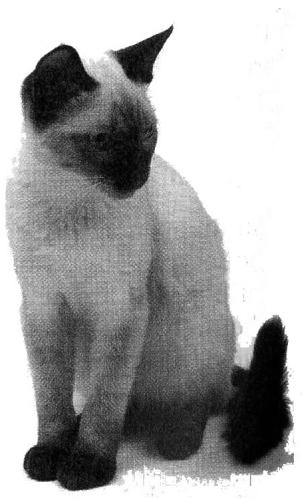  
图 14.1 邧罗猫, 示色素沉积的独特模式。(©Oleg V. Ivanov/Shutterstock, Inc.)

\- 减少但未消除基因表达水平或基因产物活性的突变称为亚

效基因突变(hypomorphic mutation)。亚效基因突变通常由阻止蛋白质在正常水平上产生的核苷酸置换，或损害蛋白质功能的氨基酸置换所致。这类突变有时被称作渗漏(leaky)突变。该术语的根据是，因为表达水平或活性随机地因个体而异，所以少数个体有足够的酶活性“渗漏”出来，产生拟正常表型(quasi-normal phenotype)。与亚效基因突变相反的是超效基因突变(hypermorphic mutation)。正如前缀“hyper”（“超过”、“过度”）的意思，超效基因突变体产生高于正常的基因表达水平，通常是因为突变改变了基因的调节，以致基因产物过度生产。氨基酸置换也可增加酶或其他蛋白质的活性，但这很少见。

\- 功能获得突变(gain-of-function mutation)是一种在性质上改变基因作用的突变。例如，功能获得突变可使某个在正常情况下在某种细胞或组织中没有活性的基因，变得有活性。也可造成某个在正常情况下在发育的某段时间内野生型基因不表达的基因，进行表达。大多数功能失去突变和亚效基因突变是隐性的，但许多功能获得突变是显性的。马勒给功能获得突变的术语是新效基因突变(neomorphic mutation)。

野生型基因在异常位置的表达称为异位表达(ectopic expression)。图 13.35 中有一个例子，果蝇 eyeless 基因的野生型基因产物，于正常情况下不形成眼睛的组织中表达，造成在异常位置发育出含眼色素的部分复眼。

## 14.2 突变的分子基础

所有突变都是 DNA 的核苷酸顺序改变或基因组中 DNA 序列的缺失、插入或重排的结果。染色体重排的主要类型在第 8 章中已讨论。此处在分子水平上考察突变。

## ■ 核苷酸置换

在分子水平上，最简单的突变类型是核苷酸置换(nucleotide substitution)，即 DNA 双链体中的一对核苷酸被置换成一对不同的核苷酸。例如，在一个 A→G 置换中，一条 DNA 链上的一个 A 被置换成 G。该置换暂时形成一个错配的 G-T 碱基对；在下一次复制时该错配分解，在一个子代分子中为正常的 G-C 碱基对，在另一个子代分子中为正常的 A-T 碱基对。在此情况下，G-C 碱基对是突变碱基对，而 A-T 碱基对是非突变碱基对。同样，在一个 A→T 置换中，一条链中的一个 A 被 T 置换，产生暂时的 T-T 错配，该错配通过复制而分解，在一个子代分子中成为 T-A，在另一个子代分子中成为 A-T。在此情况下，T-A 碱基对是突变碱基对，而 A-T 碱基对是非突变碱基对。这里的 T-A 和 A-T 是不相同的，从两条链的核苷酸极性可以看出，5'-T-3'/3'-A-5' 是一种碱基配对，5'-A-3'/3'-T-5' 是另一种碱基配对。

有些核苷酸置换是一个嘧啶碱基被另一个嘧啶碱基置换，或一个嘌呤碱基被另一个嘌呤碱基置换，这些置换称为转换突变 (transition mutation)。可能的转换突变有

$$
\begin{array}{r l}&{\mathrm{T} \rightarrow \mathrm{C} \text {或} \mathrm{C} \rightarrow \mathrm{T}}\\&{(\text {嘧啶} \rightarrow \text {嘧啶})}\\&{\mathrm{A} \rightarrow \mathrm{G} \text {或} \mathrm{G} \rightarrow \mathrm{A}}\\&{(\text {嘌呤} \rightarrow \text {嘌呤})}\end{array}
$$

其他的核苷酸置换是嘌呤置换嘧啶，或相反，这些置换称为颠换突变(transversion mutation)。
可能的颠换突变有

$$
\begin{array}{r l}&{\mathrm{T} \rightarrow \mathrm{A}, \mathrm{T} \rightarrow \mathrm{G}, \mathrm{C} \rightarrow \mathrm{A} \text {或} \mathrm{C} \rightarrow \mathrm{G}}\\&{\quad (\text {嘧啶} \rightarrow \text {嘌呤})}\\&{\mathrm{A} \rightarrow \mathrm{T}, \mathrm{A} \rightarrow \mathrm{C}, \mathrm{G} \rightarrow \mathrm{T} \text {或} \mathrm{G} \rightarrow \mathrm{C}}\\&{\quad (\text {嘌呤} \rightarrow \text {嘧啶})}\end{array}
$$

总共有 4 种可能的转换和 8 种可能的颠换。因此，如果核苷酸置换是严格随机的，那么，可以预计转换与颠换的比例为 1:2。但是，

自发的核苷酸置换往往比转换偏多。在人类基因组的自发核苷酸置换中，转换与颠换的比例约为2∶1。考察遗传密码表(表1.1)可见，转换偏多对于密码子第三位的核苷酸置换有重要意义。在第三位为嘧啶的所有密码子中，处在第三位的是哪一个嘧啶都没有关系；同样，在以嘌呤结束的大多数密码子中，以两种嘌呤中任何一种结束都行。这意味着在密码子第三位的大多数转换突变不改变所编码蛋白质中的氨基酸。改变核苷酸序列但不改变氨基酸序列的突变称为同义突变(synonymous mutation)或沉默突变(silent mutation)，因其将一个密码子变成相同氨基酸的“同义”密码子。

在编码区之外的核苷酸中的突变性变化也可是沉默突变。大多数 DNA 多态性属于此类。在非编码区包括调节区和基因之间的 DNA 中，精确的核苷酸序列往往并不是关键。这些序列可发生碱基置换、小的缺失或添加、转座因子的插入及其他重排，然而这些突变可没有可检测的表型效应。但是，有些非编码序列确实具有极其重要的功能，因而在这些序列中的突变常具有表型效应。

## - 错义突变：以镰形细胞贫血为例

在编码区内的大多数核苷酸置换会导致氨基酸改变，这些突变称为错义突变(missense mutation)或非同义突变(nonsynonymous mutation)。蛋白质氨基酸序列的改变可能会改变蛋白质的生物学性质。单个氨基酸改变的表型效应的经典例子，是造成人类遗传病镰形细胞贫血(sickle-cell anemia)的改变。镰形细胞突变的分子基础如图14.2所示。


这只猫为鸳鸯眼(眼睛颜色的嵌合体)。这种嵌合现象通常是在产生虹膜色素层的细胞谱系中，影响眼睛颜色的某个基因发生体细胞突变的结果。

  
图 14.2 镰形细胞贫血的分子基础。(A) 正常 β 珠蛋白基因的部分 DNA 被转录成编码氨基酸序列 Pro-Glu-Glu-Lys 的 mRNA。在有记号的 A-T 碱基对中，T 被转录为 Glu(谷氨酸) 密码子 GAG 中的 A。(B) 正常的 A-T 碱基对突变为 T-A 碱基对，导致 GAG 被 GUG 替代。密码子 GUG 编码 Val(缬氨酸)，因此，β 珠蛋白分子这一部分的多肽序列为 Pro-Val-Glu-Lys。所产生的血红蛋白有缺陷，在低氧浓度下往往会聚合。

该突变是编码血红蛋白 $\beta$ 珠蛋白链第 6 个氨基酸的密码子的第二位的 A-T→T-A 的颠换，导致正常的谷氨酸 (Glu 或 E) 被缬氨酸 (Val 或 V) 置换。因而该氨基酸置换以 Glu6Val 或 E6V 表示。当镰形细胞等位基因纯合时，有缺陷的 $\beta$ 多肽链使血红蛋白具有形成长的针状聚合物的倾向。发生聚合的红细胞变形为新月形、镰刀形。有些变形的红细胞立即遭到破坏 (降低血液的携氧能力，从而导致贫血)，而其他的被困在毛细血管中，引起毛细血管循环的部分或全部阻断。

Glu6Val 置换的后果是一系列复杂的多效性效应。所有这些效应都与红细胞的瓦解、血液携氧能力的下降，或身体试图弥补该病而进行的生理调节(如脾大)有关。镰形细胞贫血患者会受阵阵剧痛的折磨。贫血导致生长障碍、虚弱和黄疸。患者普遍因虚弱而容易受细菌感染，这是该病患儿最常见的死因。

虽然镰形细胞贫血是一种严重的遗传病，常常导致夭亡，但是，在非洲和中东一些由原生动物寄生虫恶性疟原虫(Plasmodium falciparum)引起的一种疟疾广泛流行的地区，该病比较常见。镰形细胞贫血和疟疾之间的这种关联不是巧合。这种关联缘于突变型β血红蛋白能在一定程度上抵御疟疾感染。在恶性疟原虫的生活周期中，它通过蚊子的叮咬从蚊传给人。感染初期发生在肝细胞中，产生能感染红细胞并在其中增殖的特化形式。红细胞被广泛感染，损害血液携氧的能力，引起虚弱、贫血和疟疾特有的黄疸。但是，在镰形细胞等位基因杂合的人中，感染疟疾的可能性较低，即使感染疟疾也不太严重。杂合镰形细胞基因型的这种部分抗性，在镰形细胞贫血这种遗传病的患病率和疟疾这种寄生虫病的患病率之间产生一种遗传平衡。如果突变型镰形细胞血红蛋白变得过于频繁，则因镰形细胞贫血丧生的人，比因抵御疟疾而免于丧生的人多；另外，如果突变型镰形细胞血红蛋白变得过于罕见，则因镰形细胞贫血丧生的人较少，但免于死亡的人数，因疟疾造成更多的死亡而抵消。这种遗传平衡行为的最终结果，将在第17章中从数量方面来讨论。

与 Glu6Val 置换相比，在血红蛋白中的一些氨基酸置换对表型的影响是微小的。其他蛋白质对氨基酸置换往往也是耐受的。特定的氨基酸置换是否影响蛋白质的折叠、功能或稳定性，因蛋白质和氨基酸而异，其影响取决于该氨基酸在蛋白质结构和功能上的具体作用，以及氨基酸置换的性质。例如，一个亲水性氨基酸被另一个亲水性氨基酸置换，比一个亲水氨基酸被一

  
图 14.3 酪氨酸密码子 UAU 中单个碱基改变可产生的 9 种密码子。蓝色箭头示颠换，灰色箭头示转换。酪氨酸密码子在方框中。2 个可能的终止 (无义) 密码子以红色显示。UAU 密码子总共有 6 种可能的错义突变、2 种可能的无义突变和 1 种沉默突变。

个疏水氨基酸置换的影响要小。在酶活性位点上的任何改变通常都会使酶活性降低。

图 14.3 示酪氨酸密码子 UAU 中单个核苷酸置换可产生的 9 种可能的密码子，按密码子中第一、第二或第三个核苷酸是否突变的顺序排列。1 个突变是沉默突变(方框)，6 个是改变了插入多肽链的氨基酸的错义突变，另外 2 个突变产生终止密码子，导致翻译提前终止，从而产生截短多肽。产生新的终止密码子的核苷酸置换称为无义突变(nonsense mutation)。因为无义突变引起链终止提前，残存的多肽片段几乎总是无功能的。

## - 插入、缺失和移码突变

在 DNA 中也可发生核苷酸的插入或缺失，但以远低于核苷酸置换的频率发生。在哺乳动物基因组中，大多数插入和缺失都很小(通常 1～6 个碱基对)，但有些大到足以除去整个基因或部分染色体(参见第 8 章)。如果它们发生在编码区之外，小的插入或缺失对表型的作用可能微乎其微，除非它们影响邻近基因的表达。

在编码区内，若刚好插入或缺失3个核苷酸，则在所编码的多肽链中增加1个氨基酸，或从多肽链中消除1个氨基酸，因为3个核苷酸是一个密码子的长度。6个核苷酸的插入或缺失增加或消除2个氨基酸，9个核苷酸的插入或缺失增加或消除3个氨基酸。一般而言，倘若插入或缺失的核苷酸数目是3的整数倍，则在多肽链中增加或消除一定数量的氨基酸。

如果插入或缺失的长度不是 3 个核苷酸的整数倍，则突变会使核糖体阅读三联体密码子的相位移位，从而改变从突变位点起下游的所有氨基酸，这样的突变称为移码突变 (frameshift

## mutation)，因为它们“移动”

了 mRNA 中密码子的阅读框。一种常见的移码突变是单核苷酸的插入或缺失。图 14.4 示人类 β 珠蛋白基因中单核苷酸插入的一个例子，其中，(A) 为野生型序列，而 (B) 是突变型序列，在辉光的位置有一个 C-G 核苷酸对的插入。该插入的结果是，从发生插入的这个密码子开始，多肽的全部氨基酸序列都被改变，因为阅读框被移位，在此例中，位移量为 +1。在移位的阅读框中，翻译继续进行，直到碰上一个终止密码子。(完全随机的核苷酸序列，预计在遇到终止密码子之前，翻译只能持续大约 20 个氨基酸。) 任何不是 3 的整数倍个核苷酸的插入或缺失，都会造成移位的阅读框，从而使插入或缺失下游的所有氨基酸与原

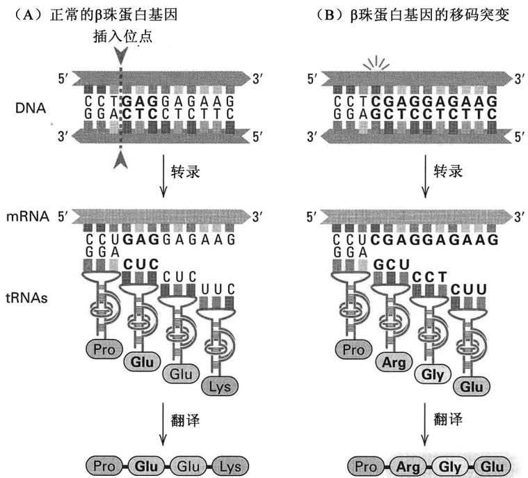  
图 14.4 (A) 人类 β 珠蛋白基因的一小部分, 编码多肽链 5 \~ 8 位氨基酸。(B) 移码突变的结果(在此例中, 移码突变是在 “辉光” 所示的位置插入一个 C-G 核苷酸对)。因为阅读框的移位, 从突变位点开始, 下游所有的密码子都被改变, 所以从这一位点开始, 所有的氨基酸序列都不同。

来的不同。除非移码突变非常靠近蛋白质的羧基端，否则它几乎总是导致无功能蛋白质的合成。

## ■ 三核苷酸重复序列的动态突变

对某种 X 连锁型智力障碍的遗传学研究，揭示出一类出乎意料的突变，因为这类突变所涉及 DNA 区域在遗传上异常不稳定性，所以将其称为动态突变 (dynamic mutation)。这种 X 连锁疾病是与动态突变相关的至少 12 种遗传病中的一种，它与一种 X 染色体相关，这种 X 染色体在缺乏 DNA 前体 (如核苷酸) 的培养细胞中有断裂的倾向。断裂位点在 Xq27.3 区域，靠近长臂末端。含该位点的 X 染色体称为脆性 X (fragile-X) 染色体，相关的智力障碍类型称为脆性 X综合征(fragile-X syndrome)。约 1/2500 的男性和 1/5000 的女性罹患脆性 X 综合征。脆性 X 综合征占所有 X 连锁智力障碍病例的一半左右，并且是仅次于唐氏综合征(参见第 8 章)的遗传性智力障碍的原因。

脆性 X 综合征在严重程度上高度可变。男性患病时，情况通常比女性严重。常见语言及沟通能力上的发育迟滞，以及诸如坐起来和学走路之类的大运动技能的发育迟滞。体征可包括具有招风耳的长脸、结缔组织疲软导致的肌张力低下和关节过度灵活，以及在男性青春期后期异常的大睾丸。智力障碍在男性中通常为中度，在女性中为轻度。在行为上的影响包括焦虑、集中注意力困难、应对感觉刺激困难、逃避目光接触、易怒或情绪失控。这些症状是非特异性的，与自闭症和注意力缺陷多动症等疾病部分重叠。

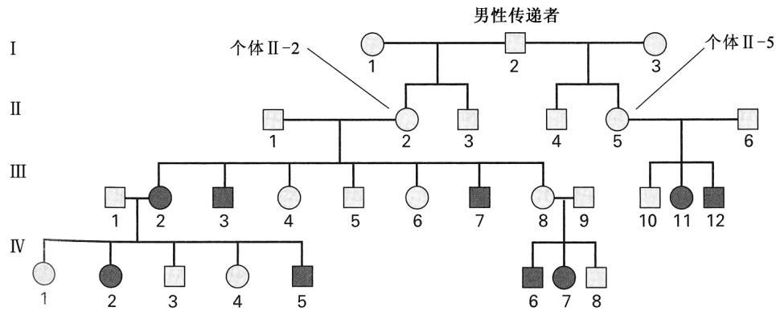  
图 14.5 示脆性 X 综合征传递的系谱。男性 I-2 未患病，但他的两个女儿 (II-2 和 II-5) 生育患病的子女和孙子女。[改编自 C. D. Laird, Genetics 117 (1987): 587-599.]

脆性 X 综合征反常的遗传方式提示其有不同寻常之处，这种遗传方式的主要特点如图 14.5 所示。携带脆性 X 染色体的男性，5 个中约有 1 个其本身表型正常，并且也生育表型

正常的子女。但这种 “男性传递者” (transmitting male) 的杂合的女儿，生育的患儿中常常两种性别都有。在图 14.5 中，以 I -2 表示的男性传递者无病，但他传给他的两个女儿 (II -2 和 II -5) 的 X 染色体，在这两位女性中以某种方式发生改变，以致下一代 (III) 的儿子和女儿患病。该男性传递者的患病或正常孙子女，都有可能生育患病后代 (IV代)。

现已找到脆性 X 综合征的分子基础是 DNA 中存在于断裂发生位点的一个 CGG 型(或者另一条链上的 CCG，这是等价的)三核苷酸重复序列(trinucleotide repeat)(图 14.6)。正常的 X 染色体有 6～54 个重复单位的拷贝，平均约 30 个，而患者有 230～2300 甚至更多的重复拷贝。男性传递者 X 染色体中的三核苷酸重复序列称为前突变(premutation)，具有中等拷贝数，为 52～230。约 1/250 的女性和 1/800 的男性携带一条具有前突变的 X 染色体。三核苷酸前突变的特点是，当(且仅当)被女性传递时，它的拷贝数常常会增加(称为三核苷酸扩展，trinucleotide expansion)到 230 或更多个拷贝的水平，在此状态下的染色体引起脆性 X 综合征。通过男性传递时，不发生扩展。

该病的功能基础是，过多的 CGG 重复拷贝数使 FMR1 (fragile-site mental retardation-1，脆性位点智力障碍-1) 基因失去功能，CGG 重复序列就在 FMR1 中。大多数脆性 X 综合征患者没有 FMR1 mRNA，而正常人和携带者却有该基因的表达。FMR1 基因主要在脑和睾丸中表达，这就解释了男性患者中在智力异常和睾丸异常之间奇怪的联系。

女性传递的前突变发生扩展的概率约为 $80\%$ 。令人惊讶的是，扩展不是发生在母亲的种系中，而是发生在早期胚胎的体细胞中。在不同的体细胞中，扩展在不同的程度上发生，因而患有脆性X综合征的个体是体细胞嵌合体，具有在X染色体中的CGG重复序列拷贝数不同的细胞。这解释了为什么不同患者，脆性X综合征在严重性上的变异极大。

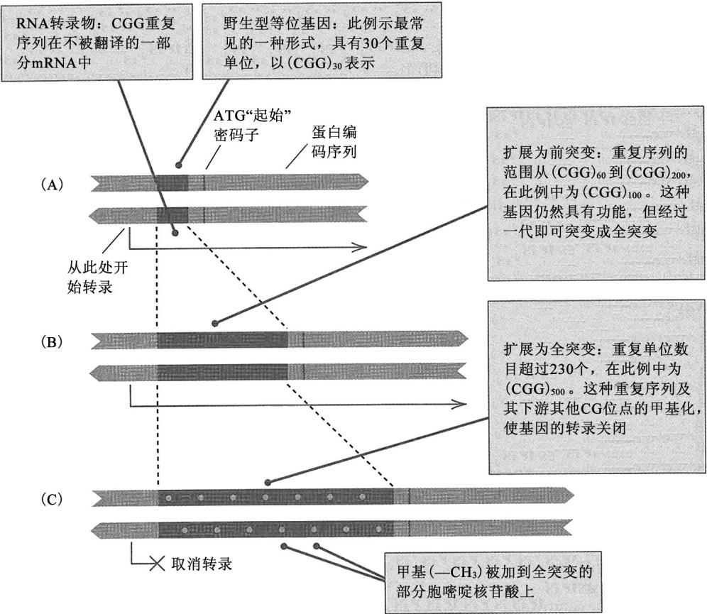  
图 14.6 存在于与脆性 X 综合征有关的 FMR1 基因中的 CGG 重复序列的动态突变。(A)野生型等位基因通常有 30 个重复拷贝。(B)前突变有 60～200 个拷贝，通过女性传递时，前突变容易进一步扩展。(C)全突变，含 >230 个拷贝。在全突变中，该基因转录的缺乏与该区域中某些 CG 二核苷酸的甲基化相关。

其他与动态突变相关的遗传病，包括神经系统疾病强直性肌营养不良(19号染色体，具有不稳定的CTG重复序列)、肯尼迪病(X染色体，AGC重复序列)、弗里德赖希共济失调(9号染色体，AAG)、I型脊髓小脑性共济失调(6号染色体，AGC)和亨廷顿病(4号染色体，AGC)。对脆性X综合征和强直性肌营养不良而言，三核苷酸扩展主要或完全发生于女性传递时，但对于I型脊髓小脑性共济失调和亨廷顿病，它们主要或完全发生于男性传递时。有些三核苷酸重复序列在两种性别传递时都可发生扩展。

有些动态突变还表现出一种称为遗传早现(anticipation)的现象，其中，随着三核苷酸重复序列经过数代的传递，核苷酸重复的数目逐渐增加。其结果是发病年龄随着时间增加而逐渐提前，病情加剧。

三核苷酸扩展的分子机制如图 14.7 所示，该过程称为复制滑移(replication slippage)(也称为滑链错配，slipped-strand mispairing)。当复制沿着含有重复序列的模板链进行时(图 14.7A)，复制复合体会暂时与模板链分离。在与模板重新结合时，新链的 3'端沿模板折返，与上游的一组重复序列配对(图 14.7B)。复制从这点开始继续往下进行(图 14.7C)，从而有些重复序列会被复制两次(被扩展)，被扩展的程度取决于复制复合体在重新结合时折返了多远。模板链和子链不能正常配对，因为它们有不同的重复拷贝数，但这种状况可被核苷酸切除修复系统校正(14.6节)，修复的一个结果是，扩展的区域被导入模板链中(图 14.7D)。虽然现在已知动态突变的机制，但还不知道为什么基因组中的一些三核苷酸重复在遗传上不稳定，而其他的三核苷酸重复是稳定的，也不知道为什么三核苷酸前突变状态是唯一容易发生扩展的，而拷贝数仅仅略少一点的染色体在遗传上却是稳定的。