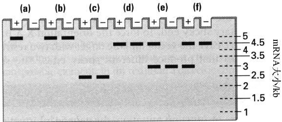
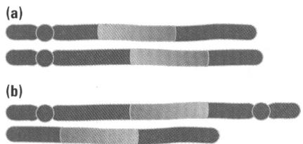
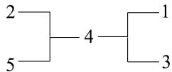

酸 tRNA 的水平高到能够发生前导多肽的翻译时，会发生弱化(使转录停止)。c. 当负载色氨酸 tRNA 的水平很低，以致翻译停滞在前导序列的 Trp 密码子处时，转录会继续进行，直到操纵子的终点。

11.20 通常细胞中负载 tRNA 水平最低的氨基酸，在前导 mRNA 中的密码子应该较少，否则在正常的低水平下，也会出现停滞。另外，细胞中负载 tRNA 水平最高的氨基酸，在前导 mRNA 中应该会有多个密码子，否则停滞发生的频次会不足。

11.22 a1 蛋白只有在二倍体中与 $\alpha2$ 蛋白结合时才起作用，因此 MATa' 单倍体细胞会是表现正常的 a 交配型。但是，MATa'/MAT $\alpha$ 二倍体会具有 $\alpha$ 单倍体的表型。原因是，该基因型缺乏 a1/ $\alpha2$ 复合体来阻遏单倍体特异基因，同时也不能阻遏 $\alpha1$ ，从而 $\alpha1$ 基因产物激活 $\alpha$ 特异基因。

11.24 缺乏乳糖或葡萄糖时，有两种蛋白质结合：lac 阻遏蛋白和 CRP-cAMP。存在葡萄糖时，只有阻遏蛋白结合。

11.26 Hfr 细胞将 lac 基因转移进受体细胞中。因为一开始在受体细胞中不存在阻遏蛋白，所以会生成 lac mRNA，此后不久阻遏蛋白生成，lac 转录被阻遏。

11.28 野生型 lac mRNA，或含点突变的 lac mRNA，会在 5kb 处产生条带；含 lacZ\* 的 mRNA 要短 2kb，含 lacY\* 的 mRNA 要短 0.5kb。会出现的带型如附图所示。

11.30 要在乳糖酸上生长，即使是突变型 LacZ 菌株也一定要表达 lacZ 和 lacY 才行。乳糖酸显然不是 lac 操纵子的诱导物，因而，除非也存在 IPTG(lac 操纵子的一种诱导物)来诱导该操纵子的转录，否则 $lacO^{+}$ 突变体也不能在乳糖酸上生长。对于 $lacO^{C}$ 突变体的发现，与此解释一致，因为当 LacY 和突变型 LacZ 是组成型生成时，菌株可以在乳糖酸上生长。

## 第12章

12.2 喜欢黏端是因为黏端只与序列互补的其他黏端结合，而平端片段会与任何其他平端片段结合。

12.4 限制性位点之间的平均距离等于限制性位点出现的概率的倒数。因此必须计算随机 DNA 序列上出现每种限制性位点的概率。答案是 (a) 256, (b) 4096, (c) 256 (N 表示任意核苷酸，其概率为 1), (d) 256, (e) 1024 (因为 R 的概率为 1/2, Y 的概率为 1/2)。

12.6 单链突出端中的两个 N 一定会互补，因此该事件的概率为 $(1/4)^{2}=1/16$ 。

12.8 不会。因为这两条序列的 $5'\rightarrow3'$ 极性不同。

12.10 Fae I 会是一个不错的选择。因为该 mRNA 的序列为 5'-CAUG-3'，所以被转录的 DNA 链的序列为 3'-GTAC-5'，未被转录的 DNA 链的序列为 5'-CATG-3'。因此 Fae I 会紧接在起始密码子之后切割编码序列。

12.12 Aoc II 的位点可能有 $3 \times 3 = 9$ 种，因而任意两个随机位点具有互补末端的概率为 1/9。

$$
1 2. 1 4 \quad (1 / 4) ^ {2} = 1 / 1 6; \quad (1 / 2) ^ {2} = 1 / 4 。
$$

12.16 Pst I, 4kb; Xba I, 2kb; BamH I, 4kb; Pst I + Xba I, 1kb + 2kb; Pst I + BamH I, 2kb; Xba I + BamH I, 1kb + 2kb; Pst I + Xba I + BamH I, 1kb。

12.18 只要序列是随机的, 这两种酶的位点的频率就会是一样的。位点之间的核苷酸对的平均数目是: a. 625; b. 256; c. 625。

12.20 C, 2kb+10kb; P, 3kb+9kb; K, 5kb+7kb; A, 6kb; E, 4kb+8kb; B, 3kb+9kb; X, 1kb+11kb; C+P, 1kb+2kb+9kb; C+E, 2kb+4kb+6kb; C+X, 1kb+2kb+9kb; K+E, 3kb+4kb+5kb; K+X, 1kb+5kb+6kb。

12.22 a. 对常染色体基因而言，女性与男性的拷贝数比值为 1:1，因此会出现黄色斑点。b. 对 X 连锁基因而言，女性与男性的拷贝数比值为 2:1，因此会出现红色斑点。c. 对 Y 连锁基因而言，女性与男性的拷贝数比值为 0:1，因此会出现绿色斑点。

12.24 a. Hpa I 产生平端，而任何一个平端可与任何其他的平端连接。因此 Hpa I 的 A B 片段可以两个方向连接到多接头中。所得克隆会是 X A B Y 或 X B A Y，两者的频率相同。b. 如果某种限制酶产生的片段，其两端是一样的，则任何一端都可以连接到互补黏端上。要使片段的排列方向强制为 X A B Y，要用产生不同黏端的两种限制酶来分别切割载体和靶序列。载体中最靠近 X 的位点必须与靶序列中最靠近 A 的位点互补，而载体中最靠近 Y 的位点必须与靶序列中最靠近 B 的位点互补。在此情况下，如果用 Kpn I 和 Pst I 来切割载体和靶序列，会得到 X A B Y 的排列方向。c. 按照 (b) 部分的逻辑，用 Sal I 和 Kpn I 来切割载体和靶序列，会得到排列方向为 X B A Y 的克隆。

12.26 因为限制性片段的任意两个互补的末端都可连接，所以该基因在质粒中的方向很可能是反的，因此不能发挥功能。

12.28 在可转录感兴趣的基因的克隆中，基因相对于启动子的方向应该正确。这些克隆的限制性图谱如下所示。预计这种方向的基因会被转录。

  
12.30 限制性图谱如附图所示。

  
EcoRI 与HindⅢ其余的质粒=2.45kb

## 第13章

13.2 在功能失去突变中，基因中的遗传信息在一些细胞或全部细胞中不表达。在功能获得突变中，遗传信息表达的量不合适，或在不合适的时间表达，或在不合适的细胞中表达。在同一个基因中，两种突变都可发生：一些等位基因可能是功能失去突变，其他的可能是功能获得突变。但是，一个特定的等位基因一定是其中的一种(或两种都不是)。

13.4 小眼突变对大眼突变为上位基因，大眼突变对小眼突变为下位基因。该结果说明，在该发育途径中，小眼基因的基因产物在大眼基因产物的下游起作用。

13.6 进行互补试验。使两个杂合基因型杂交，判断雌性后代是否具有母体效应致死表型。如果它们是等位基因，预计会有 1/4 的后代具有该表型。如果它们不是等位基因，则所有的后代都应该是正常的。

13.8 因为该基因是充分的，所以功能获得突变会诱导发育命运，从而只要是表达该功能获得等位基因的细胞都会表达该形态特征。该等位基因会是显性的，因为在同源染色体中的正常等位基因不会阻止该发育途径的出现。

13.10 a. 白色；b. 紫色；c. 紫色；d. 白色。

13.12 第一行说明顺序为 D A、E A 和 F A；第二行说明顺序为 D B、E B 和 B F；第三行说明顺序为 C D、E C 和 C F。将这些合起来，说明这些组分起作用的顺序是 E-C-D-B-F-A。

13.14 寻找具有 bicoid 突变体类似表型(缺口和胸)的胚胎。

13.16 移植核对卵母细胞的细胞质产生应答，从而在发育的每个阶段都表现得像卵母细胞一样。

13.18 花瓣—花瓣—雄蕊—心皮。

13.20 轮 1、2、3 和 4 分别产生叶片、花瓣、雄蕊和心皮。

13.22 a. 该结果与单一突变体一致。b. 这些双重突变体的表型说明，只要 $a^{+}$ 就足以产生端分节；产生中分节需要 $a^{+}$ 和 $c^{+}$ ；产生近侧分节需要 $b^{+}$ 和 $c^{+}$ 。c. 详细的模型如附图所示。

13.24 卵裂和囊胚形成所需的蛋白质是从存在于成熟卵母细胞中的 mRNA 翻译来的,但原肠胚形成需要合子基因的转录。

13.26 挽救胚胎所需的物质为母源 o 基因转录来的 mRNA，或该基因的蛋白质产物，该蛋白质定位于细胞核中。

13.28 a. 因为在 agamous 突变体中，轮 1～4 分别产生萼片、花瓣、花瓣和萼片，但花瓣和萼片需要 apetala-1 的表达。b. 因为在 apetala-1 突变体中，轮 1～4 分别产生心皮、雄蕊、雄蕊和心皮，但心皮和雄蕊需要 agamous 的表达。

13.30 第一行说明顺序为 C A 和 C B，而第二行说明顺序为 A D 和 B D。在该途径中，显然 C 先起作用，D 最后起作用，但 A 和 B 的作用顺序不明确，这种不明确性可用符号 (A,B) 来表示。因此该途径的作用顺序为 C-(A,B)-D。

## 第14章

14.2 a. 2; b. 3; c. 2; d. 1。

14.4 a. T102I 由 C→T 转换导致；b. P106S 由 C→T 转换导致；c. 草甘膦抗性突变体如此罕见是因为它们是双重突变体，在同一个基因内出现两个突变的事件，比单独出现其中一个突变的事件要稀有得多。

14.6 这样的人是体细胞嵌合体，因而可用眼睛虹膜的色素生成细胞或其前体细胞中的体细胞突变来解释。

14.8 a. 起始密码子为 AUG 和 AUM。b. 终止密码子是 UAA、UAG、UAM、UGA 和 UMA。

14.10 因为任何单一核苷酸替换都会产生一个具有随机核苷酸序列的新密码子，所以它是链终止密码子(UAA、UAG或UGA)的概率是3/64，即大约5%。

14.12 该突变很可能是一个缺失, 因为在野生型噬菌体中为 5kb 的一个限制性片段, 在突变型噬菌体中只有大约 3.5kb, 而其他所有片段的大小都相符。这种差异提示该突变为缺失。

14.14 同源重组结果如下图所示:

14.16 赖氨酸密码子可为 AAA 或 AAG, 谷氨酸密码子可为 GAA 或 GAG。因而该突变是由密码子第一位的 A-T 到 G-C 的转换所致。

14.18 扇状菌落可用 DNA 双链体仅有一条链发生核苷酸替换来解释。该异源双链体的复制会产生一个具有野生型序列的子代 DNA 分子和另一个具有突变型序列的子代 DNA 分子。细胞分裂产生一个 $Lac^{+}$ 细胞和一个 $Lac^{-}$ 细胞，两个细胞的位置是并排的。由于细胞不会在琼脂表面移动， $Lac^{+}$ 细胞形成半个紫色菌落， $Lac^{-}$ 细胞形成半个粉红色菌落。

14.20 在 A 蛋白中很多位置上的氨基酸替换不消除其发挥作用的能力，只有在消除色氨酸合成酶活性的关键位置上的氨基酸替换才会被检测为 Trp 突变体。

14.22 虽然可损害野生型蛋白质活性的氨基酸替换方式有很多种，但除了恢复为原来的氨基酸外，突变型蛋白质可恢复野生型活性的方式非常少。

14.24 a. 1:1，因为该突变为隐性突变，且雄性的 X 染色体得自母本。b. 全部都是雌性，因为在 $29^{\circ}$ C 时雄性死亡(在此情况下，雄性从父本得到 X 染色体)。

14.26 a. 每代产生一个突变的概率为 $5 \times 10^{-5}$ ，因此每代没有突变的概率为 $1 - (5 \times 10^{-5}) = 0.99995$ 。在 10000 代中没有突变的概率等于 $(0.99995)^{10000} = 0.61$ 。b. 发生一次突变的平均代数是 $1 / (5 \times 10^{-5}) = 20000$ 代。

14.28 (a) 中两个转座因子交换，产生相互易位；(b) 中两个转座因子交换，产生一条双着丝粒染色体和一条无着丝粒染色体。重组产物如附图所示。

14.30 推导两个双重突变体的阅读框序列。+G 和-C 组合的阅读框为 AGAGGUAAGTCTAGA，翻译为 Arg-Gly-Lys-Ser-Arg。该多肽有 3 个相邻的氨基酸被替换，但如果这些替换能被耐受，该多肽可能可以发挥作用。另外，-G 和+C 突变组合的阅读框为 AGATAACGCCTCAGA，翻译为 Arg-End，End 表示 UAA 终止密码子。在这种双重突变体中，下游的重复不能校正上游的终止密码子。

## 第15章

15.2 a. 在允许温度下表型正常。b. 在限制性温度下，母细胞和子细胞不能分离；它们仍然通过一个小的细胞质桥连接在一起，并不断地继续分裂，形成一团相互连接的细胞，每个细胞都与其母细胞和其子细胞通过这种细胞质桥连接。

15.4 周期蛋白-CDK 复合体将磷酸基团转移给它们的靶蛋白；可逆转周期蛋白-CDK 复合体作用的相应酶类是磷酸酶。

15.6 后期促进复合体的两种重要靶标为 Pds1p 和周期蛋白 B。该复合体为泛素蛋白连接酶，可使蛋白质泛素化，将蛋白质标记为需要蛋白酶体销毁。Pds1p 的销毁使姐妹染色单体不分离，因而它与中期/后期过渡相关；周期蛋白 B 的销毁与有丝分裂/G₁ 过渡相关。

15.8 主力是 p53 蛋白。正常情况下 p53 蛋白不会在细胞核中堆积，因为它会被 Mdm2 不断地排出核外。在 DNA 损伤存在时，p53 被磷酸化和乙酰化，这使得它与 Mdm2 的结合减少；p53 在细胞核中堆积，并激活 p21、GADD45、14-3-3 σ 及 miRNA34a 和 miRNA34b/c 基因的转录。这些基因的产物分别与 $G_{1}/S$ 过渡的阻断、S 期延长和 $G_{2}/M$ 过渡相关。

15.10 Bax 和 Bcl2 通常以异二聚体形式存在。Bax 的过度生成导致 Bax 同二聚体，Bax 同二聚体激活细胞凋亡途径。p53 蛋白在细胞凋亡中起作用，是因为 p53 是编码 Bax 的基因的转录因子。某些细胞癌基因会导致 Bcl2 的过度生成，Bcl2 通过掩蔽 Bax/Bcl2 异二聚体中的 Bax 亚基而抵消 Bax 过度生成的效应。

15.12 a. 检测分离的癌基因与非常靠近 p53 基因的 DNA 标记的遗传连锁情况。如果在致病基因和 p53 处的某个 DNA 标记存在紧密连锁，则该病可能与 p53 相关。如果致病基因与 p53 不存在遗传连锁，则该病可能涉及别的基因。b. 可能发生改变的位点包括：使 p53 基因表达减少的启动子改变、内含子中与必需剪接位点对应的改变、去除整个基因的缺失（这样，杂合个体的 p53 序列为野生型 $p53^{+}$ 的同源物）。c. 任何能够模拟 p53 功能失去的原因都可能是该表型的原因。引起 Mdm2 超表达的突变是其中一个可能。其他可能性还包括使磷酸化 p53 的蛋白激酶（如果是关键的蛋白激酶）或乙酰化 p53 的蛋白乙酰化酶丧失功能的突变，这两种修饰只要缺少任何一种，均会使应答 DNA 损伤时 p53 的水平不能升高（可能是因为 Mdm2 仍能与 p53 结合）。对于上述 3 种可能性，综合征都会表现为显性遗传方式，但在细胞水平的表达都需要杂合性丢失。

15.14 会出现染色体畸变是因为正常的 $G_{1}/S$ 检查点的作用是让 DNA 损伤(如染色体断裂)能在进入 S 期之前修复。缺乏正常的 $G_{1}/S$ 检查点时，即使存在染色体断裂或其他畸变，细胞也会过渡到 S 期。

15.16 在应答某些酪氨酸激酶受体的激活时，Ras-GTP 是传递生长信号的核心步骤。组成型 Ras-GTP 会持续传递生长信号。

15.18 意思是，因为大多数从双亲之一遗传了一个突变型 Rb1 基因的个体会患视网膜母细胞瘤，所以在家系中突变型等位基因对视网膜母细胞瘤表型而言表现为显性。但是，杂合个体中的体细胞不会癌变，除非它们发生杂合性丢失，使它们对该突变为实际上的纯合，因此在细胞水平该突变为隐性。

15.20 因为杂合性丢失的概率为 $7.5 \times 10^{-7}$ /细胞，且在双眼中共有 $4 \times 10^{6}$ 个有风险的细胞，所以在任何一个细胞中都没有杂合性丢失的概率为 $(1 - 7.5 \times 10^{-7})$ 自乘 $4 \times 10^{6}$ 次，这等于 0.05，即 5%。因此，家族性视网膜母细胞瘤的外显率为 95%。（熟悉泊松分布的学生可用每个杂合个体具有肿瘤的均数为 3 这一事实，据此，泊松分布意味着没有肿瘤的个体的数目为 $e^{-3} = 0.05$ 。）

15.22 a. 影响四聚化结构域的突变，在机体水平会是显性的，但在细胞水平会是隐性的，因为不会形成混合四聚体。杂合细胞要变成突变型细胞，必须存在杂合性丢失。b. 影响 DNA 结合结构域的突变，在机体水平和细胞水平都会是显性的。因为有害亚基的存在，所以杂合细胞生成的有功能的转录因子非常少。

15.24 观察该系谱可见，第Ⅰ代的母亲(个体9)的c条带来自一个突变型等位基因，因为她的所有患病后代都遗传了该等位基因，而她的所有正常后代都未遗传该等位基因。因此个体5携带与条带c相关的突变型等位基因，从而在她的后代中，个体2和7有高风险，其他个体无风险。个体20也携带产生条带c的突变型等位基因，因此在他的后代中，个体16、21和22具有高风险，其他个体无风险。第Ⅲ代中剩下的个体13无风险，尽管她的DNA产生了一条与c的迁移率相同的带。原因是，该条带源自她父亲的一个等位基因，她父亲与系谱中任何一位患者都没有亲缘关系，因此在此情况下条带c是一个非突变型等位基因的标记。

15.26 一个方法是，先判断在位置上靠近易位位点的是 T 细胞受体基因还是免疫球蛋白重链基因。如果其中任有一个基因靠近断裂点，则可预计存在启动子融合。要证实的话，应该判断断裂点旁边的基因的 mRNA，是否会如存在启动子融合时所期望的那样具有正常的大小。如果未提示在易位位点存在 T 细胞受体或免疫球蛋白基因，则可预计存在基因融合。要检验这一点，用易位位点两侧的 DNA 制备两个 DNA 探针，用这两个探针与正常细胞和白血病细胞的 RNA 印迹进行杂交（这些探针必须足够长，能够延伸进外显子中，否则它们不会与 mRNA 杂交）。对基因融合而言，白血病细胞中的 mRNA 应该是嵌合分子，因而预计白血病细胞的单一 mRNA 与 DNA 两侧都能杂交；对野生型细胞而言，两个探针应与不同大小的 mRNA 杂交。通过更精细的分析，可判断基因融合是否发生在内含子中。

15.28 对致病等位基因一定是杂合的但却不会患癌症的个体是 I -1、I -2 或 III-3。

15.30 RAD9 可能与 $G_{1}/S$ DNA 检查点无关，因为在 $36^{\circ}C$ 条件下，cdc28、cdc6 突变体和 cdc8 rad9 双重突变体可以存活，说明在 rad9 突变体中 $G_{1}/S$ 检查点是完好的。RAD9 可能也与中心体复制检查点无关，因为在 $36^{\circ}C$ 条件下 cdc7 rad9 双重突变体可存活。

RAD9 与 S 期的 DNA 检查点有关，因为在 36℃ 条件下，cdc2、cdc13 突变体和 cdc17 rad9 双重突变体（及 cdc9 rad9 双重突变体）死亡。RAD9 不可能与纺锤体检查点或退出有丝分裂的检查点有关，因为在 36℃ 条件下孵育时，cdc16、cdc23 突变体和 cdc15 rad9 双重突变体可存活。

## 第16章

16.2 严重程度会变化，是因为严重程度取决于患者体内所存在的缺陷型线粒体的比例。

16.4 是，这对于人类线粒体密码是事实。在标准密码中，例外的情况包括 AUA 和 AUG，它们分别编码异亮氨酸和甲硫氨酸；UGA 和 UGG 分别编码“终止”和色氨酸。

16.6 遗传方式为严格的母体遗传，因此黄色很可能是通过细胞质遗传的。一个合理的假设是，编码黄色的基因包含在叶绿体 DNA 中。

16.8 在第三位上的所有转换突变都是同义突变。在 128 种可能的颠换突变中，56 种为同义突变，即 56/128=43.8% 为同义突变。

16.10 在 X 连锁遗传情况下, 一半的 $F_{2}$ 雄性(所有后代的 1/4)会是白色。实际观察结果是, 所有 $F_{2}$ 后代都是绿色。

16.12 由 4 个限制位点组成的那一簇限制位点说明，存在一个反向重复序列。反向重复之间的重组可将其间的片段颠倒，得到两种不同的限制图。它们同时存在于单一个体中，是因为一种限制图是另一种限制图通过重组而来，这种重组发生的频率一定比较高，所以在每个个体中两种 mtDNA 都有。

16.14 $mt^{-}$ 品系的叶绿体优先丢失，且 mt 等位基因以 1:1 的比例分离。期望结果为 $1/2a^{+}b^{-}mt^{+}$ 和 $1/2a^{+}b^{-}mt^{-}$ 。

16.16 a. 全部是 cpl-r，因为叶绿体来自 $mt^{+}$ 亲本。b. 全部是 mit-s，因为线粒体来自 $mt^{-}$ 亲本。c. 抗性：敏感的比例为 2:2，因为核基因进行孟德尔分离。

16.18 分离型小菌落之所以被称为 “分离型”，是因为这种小菌落表型在杂交中，在减数分裂中一个核基因突变进行正常的 2:2 分离，产生 2 小菌落：2 非小菌落的后代。

16.20 因为每个四分体都表现出单亲遗传方式，所以该性状可能是由通过细胞质传递的因子(如线粒体)决定的。4:0 四分体由仅含突变型因子的二倍体产生，0:4 四分体由仅含野生型因子的二倍体产生。

16.22 结合配对方式有 $1/4\ AA \times AA$ 、 $1/2\ AA \times aa$ 和 $1/4\ aa \times aa$ 。这些方式分别产生全为 AA、全为 Aa 和全为 aa 的后代，因此后代为 1/4 AA、1/2 Aa 和 1/4 aa。自体受精时，Aa 基因型变成对 A 或 a 纯合，因此自体受精的期望结果为 1/2 AA 和 1/2 aa。

16.24 $F_{1}$ 的核基因型为 $Rsf/rsf$ ，且所有后代均得到雄性不育细胞质（被 Rsf 等位基因恢复为雄性可育）。在下一代中，3/4 的植株为 Rsf/—、雌雄均可育，但 1/4 的植株为 $rsf/rsf$ ，这些植株雌性可育，但雄性不育。

16.26 最有可能的是某个因子的母体传递，该因子可能是病毒或细菌，在雄性后代中造成很高的成虫前死亡率。

16.28 附表示每对线粒体 DNA 分子共同具有的限制位点的百分数。

<table><tr><td></td><td>1</td><td>2</td><td>3</td><td>4</td><td>5</td></tr><tr><td>1</td><td>100</td><td>0</td><td>80</td><td>10</td><td>0</td></tr><tr><td>2</td><td></td><td>100</td><td>0</td><td>10</td><td>100</td></tr><tr><td>3</td><td></td><td></td><td>100</td><td>11</td><td>0</td></tr><tr><td>4</td><td></td><td></td><td></td><td>100</td><td>10</td></tr></table>

可举例来说明表中各项数据。分子3和4一共有9个限制位点，其中1个位点相同，因此在表中该项为 $1/9 = 11\%$ 。对角线上的各项为100，意思是每个分子与自己的限制位点 $100\%$ 相同。亲缘关系最近的两个分子是2和5(事实上它们是一样的)，因此要将它们组合在一起。接下来亲缘关系最近的两个是1和3，因此也要把它们组合在一起。 $2\sim 5$ 这一组与分子4共同具有的限制位点平均为 $10\%$ ，而 $1\sim 3$ 这组与分子4共同具有的限制位点平均为 $10.5\%$ [即 $(10 + 11) / 2]$ 。因此， $2\sim 5$ 这组和 $1\sim 3$ 这组与分子4的距离差不多相等。下图示推断出来的这些分子的关系。这种类型的数据未指出该把“根”置于树状图的何处。

16.30 该结果拒绝假设(1)，但不能区分假设(2)和(3)。

## 第17章

17.2 各种等位基因的数目为： $A_{1}=2+2+5+1=10$ ; $A_{2}=5+12+12+10=39$ ; $A_{3}=10+5+5+1=21$ 。等位基因总数为70，因此等位基因频率为： $A_{1}$ ，10/70=0.14； $A_{2}$ ，39/70=0.56； $A_{3}$ ，21/70=0.30。

17.4 等位基因 5.7 的频率= $(2\times9+21+15+6)/200=0.30$ ; 等位基因 6.0 的频率= $(2\times12+21+18+7)/200=0.35$ ; 等位基因 6.2 的频率= $(2\times6+15+18+5)/200=0.25$ ; 等位基因 6.5 的频率= $(2\times1+6+7+5)/200=0.10$ 。

17.6 如果基因频率满足哈代-温伯格定律，它们的比例应分别为 $p^2$ 、 $2pq$ 和 $q^2$ 。在每种情况下， $p$ 等于 $AA$ 的频率加上 $Aa$ 频率的一半，且 $q = 1 - p$ 。在随机交配情况下，等位基因频率及期望基因型频率为：(a) $p = 0.50$ ，期望基因型频率为 0.25、0.50 和 0.25；(b) $p = 0.635$ ，期望基因型频率为 0.403、0.463 和 0.133；

(c) p=0.70，期望基因型频率为 0.49、0.42 和 0.09；
(d) p=0.775，期望基因型频率为 0.601、0.349 和 0.051；
(e) p=0.50，期望基因型频率为 0.25、0.50 和 0.25。因此，只有 a 和 c 满足哈代-温伯格定律。

17.8 该隐性等位基因的频率为 $q=\sqrt{1/14000}=0.0085$ 。因此，p=1-0.0085=0.9915，所以杂合子的频率为 2pq=0.017（约为 1/60）。

17.10 假设随机交配的话，该隐性等位基因的频率为 $q=\sqrt{1/250\ 000}=0.002$ 。a. 在一级堂表亲婚生子女中，XP 的期望频率等于 $q^{2}(1-F)+qF$ ，其中，一级堂表亲子女的 F=1/16。在此情况下，上式计算得 $(0.002)^{2}(15/16)+(0.002)(1/16)=0.000\ 128\ 75$ ，即大约 1/7767。b. 比值为 $(1/7767)/(1/250\ 000)=32.2$ 。这就是说，一级堂表亲对导致 XP 的隐性突变型等位基因为纯合的风险要大 32 倍。

17.12 a. 因为 60% 的种子可发芽，所以不能发芽的 40% 为纯合隐性。因此隐性等位基因的频率 $q=\sqrt{0.4}=0.63$ 。这意味着 p=1-0.63=0.37，这是抗性等位基因的频率。b. 杂合子的频率为 $2pq=2\times0.37\times0.63=0.46$ 。显性纯合子的频率为 $(0.37)^{2}=0.14$ ，因此在存活的基因型中，纯合植株的比例为 0.14/0.60=0.23。

17.14 a. 有 17 个 $A_{1}$ 等位基因和 53 个 $A_{2}$ 等位基因，因此等位基因频率为： $A_{1}, 17/70 = 0.24; A_{2}, 53/70 = 0.76$ 。b. 期望基因型频率为： $A_{1}A_{1}, (0.24)^{2} = 0.058; A_{1}A_{2}, 2(0.24)(0.76) = 0.365; A_{2}A_{2}, (0.76)^{2} = 0.578$ 。期望数目分别是 2.0、12.8 和 20.2。

17.16 黄色等位基因 y 的频率为 0.2。在雌性中，野生型 (+/+ 和 y/+) 和黄色 (y/y) 的期望频率分别为 $(0.8)^{2}+2(0.8)(0.2)=0.96$ 和 $(0.20)^{2}=0.04$ 。在 1000 只雌性中，会有 960 只野生型和 40 只黄色。在雄性中，表型频率非常不同。在雄性中，野生型 (+/Y) 和黄色 (y/Y) 的期望频率分别为 0.8 和 0.2，其中，Y 表示 Y 染色体。在 1000 只雌性中，会有 800 只野生型和 200 只黄色。

17.18 在随机交配情况下杂合子的期望频率为 2pq，如果与该频率相比，存在杂合子的缺乏，则提示存在近交。提示存在近交的群体为 d(杂合子期望频率为 0.349) 和 e(杂合子期望频率为 0.5)。

17.20 a. 注意到 $1 / (2.6 \times 10^{6}) = 3.846 \times 10^{-7}$ ; 设 $q^{2} = \sqrt{3.846 \times 10^{-7}}$ , 则 $q = 0.000620$ 。b. $q^{2}(15/16) + q(1/16) = 3.192 \times 10^{-5}$ , 即 $1/25561$ 。c. $(0.99 \times 3.846 \times 10^{-7}) + (0.01 \times 3.192 \times 10^{-5}) = 7.720 \times 10^{-7}$ 。d. $(0.01 \times 3.192 \times 10^{-5}) / (7.720 \times 10^{-7}) = 50.7\%$ 。虽然仅有 $1\%$ 的一级堂表亲婚配, 他们在该基因的纯合隐性中却占了一半以上。

17.22 对每个分类单元而言，UPGMA 距离是连接它们的分支的长度的总和。因而距离矩阵为

<table><tr><td></td><td>B</td><td>C</td><td>D</td></tr><tr><td>A</td><td>17.4</td><td>6.4</td><td>12.6</td></tr><tr><td>B</td><td></td><td>17.4</td><td>17.4</td></tr><tr><td>C</td><td></td><td></td><td>12.6</td></tr></table>

17.24 用公式 17-10，令 n=40， $p_{0}/q_{0}=1$ （接种数量相等），且 $p_{40}/q_{40}=0.35/0.65$ 。解之得 w=0.9846，这是 B 菌株相对于 A 菌株的适合度，因而对 B 的选择系数为 s=1-0.9846=0.0154。

$$
1 7. 2 6 \quad 1 0 ^ {- 4} / (1 0 ^ {- 4} + 1 0 ^ {- 7}) = 0. 9 9 9 。
$$

17.28 a. 杂合基因型的期望频率为 $2 \times 0.00\ 005 \times 0.999\ 95 = 10^{-4}$ ，即 1/10 000。b. 因为 $q = \mu / hs$ ，其中，已知 q = 0.000 05 和 hs = 0.20，所以估计突变率 $\mu = 0.00\ 005 \times 0.20 = 1 \times 10^{-5}$ 。

17.30 a. 稀有有利显性等位基因的频率变化会比较快，因为杂合基因型处在有利于它的选择之中。b. 注意，此处的情况与(a)部分一样，因为有利显性等位基因稀有等于有害隐性等位基因常见，或者相反。因此常见有害隐性等位基因的频率变化较快，因为有利选择会作用于稀有杂合基因型。

## 第18章

18.2 因为方差等于标准差的平方，所以唯一的可能是，该方差等于 1 或 0。

18.4 广义遗传率是基因型的所有差异中表型方差所占的比例，即 $H^{2}=\sigma_{g}^{2}/\sigma_{p}^{2}$ ，它包含显性效应和等位基因之间的互作。狭义遗传率是表型方差中仅由加性效应造成的部分，即 $h^{2}=\sigma_{a}^{2}/\sigma_{p}^{2}$ ，它被用来预测人工选择中亲本和后代之间的相似性。如果所有的等位基因频率等于 1 或 0，则两种遗传率都会等于 0。

18.6 对果实重量而言，已知 $\sigma_{e}^{2}/\sigma_{p}^{2}=0.13$ 。因为 $\sigma_{p}^{2}=\sigma_{g}^{2}+\sigma_{e}^{2}$ ，所以 $H^{2}=\sigma_{g}^{2}/\sigma_{p}^{2}=1-\sigma_{e}^{2}/\sigma_{p}^{2}=1-0.13=0.87$ 。因此，果实重量的广义遗传率为 87%。可溶性固形物含量和酸度的 $H^{2}$ 值分别为 91% 和 89%。

18.8 a. 表型 0、2、4 和 6 的频率分别为 0.015625、0.0140625、0.421875 和 0.421875。b. 均数为 4.50，方差为 2.25，标准差为 1.50。c. 表型 0、1、2、3、4、5 和 6 的频率分别为 0.0156、0.0938、0.2344、0.3125、0.2344、0.0938 和 0.0156。均数为 3.00，方差为 1.50，标准差为 1.22。

18.10 a. 要确定均数，用每个产奶的磅数值(用中值)乘以奶牛的数量，其和除以300(奶牛总数)，得均数值为4080磅。估计方差为626100磅 $^{2}$ ，估计标准差(方差的平方根)为791磅。b. 包含68%的奶牛的范围是均数减去标准差到均数加上标准差，即(4080-791=3289)～(4080+791=5662)磅。c. 对95%的奶牛而言，范围在两个标准差之内，即2498～5698磅。

18.12 a. 基因型方差为 0，因为所有 $F_{1}$ 小鼠都有相同的基因型。b. 存在加性效应的情况下， $F_{1}$ 代的均数会等于两个亲本品系的平均值。

18.14 a. 在遗传异质性群体中，表型方差 $(\sigma_p^2)$ 等于 $\sigma_g^2 + \sigma_e^2 = 40$ 。近交系的方差等于环境方差(因为在遗传纯合群体中 $\sigma_g^2 = 0$ )，则 $\sigma_e^2 = 10$ 。因此在杂合群体中， $\sigma_g^2 = 40 - 10 = 30$ 。广义遗传率 $H^2 = \sigma_g^2 / (\sigma_g^2 + \sigma_e^2) = 30 / 40 = 75\%$ 。b. 如果这两个近交系杂交， $\mathrm{F}_1$ 代会是遗传均一的，结果是，期望方差 $\sigma_e^2 = 10$ 。

18.16 这些子女的遗传关系为半同胞，表 18.3 指出，理论相关系数为 $h^{2}/4$ 。

18.18 a. 因为沙壳虫是无性生殖的生物，亲本和后代具有如同单卵双生一样的遗传关系，因而广义遗传率分别为 0.956 和 0.287。b. 最长刺长度方差的环境成分比牙的数量大。

18.20 $\sigma_{g}^{2}=0.0570-0.0144=0.0426,\quad D=1.689-(-0.137)=1.826$ 。估计基因的最小数量 $n=(1.826)^{2}/(8\times0.0426)=9.8$ 。

$$
18.22 \quad h ^ { 2 } = ( 2 . 3 3 - 2 . 2 6 ) / ( 2 . 3 7 - 2 . 2 6 ) = 63 . 6 \%   .
$$

18.24 用公式 18-6, M=10.8, $M^{*}=5.8$ , $M'=8.8$ 。估计狭义遗传率 $h^{2}=(8.8-10.8)/(5.8-10.8)=0.40$ 。

18.26 20 个个体的平均断奶体重为 81 磅，标准差为 13.8 磅。分布上面一半的均数可用题中已知的关系计算，题中指出，分布上面一半的均数为 $81+(0.8)(13.8)=92$ 磅。用公式 18-6，可解出后代的期望平均断奶体重为 $81+0.2(92-81)=83.2$ 磅。

18.28 a. 狭义遗传率分别为 1.0、0.67、0.18、0.10、0.02、0.01 和 0.002。b. 狭义遗传率的大小取决于表型中的亲子相关性。对稀有隐性等位基因而言，大多数纯合后代来自杂合基因型之间的交配，因此在表型中基本上不存在亲子相关性。

18.30 在此情况下，迭代计算得 $M_{t}=M_{0}+h^{2}(S_{1}+S_{2}+S_{3}+\cdots+S_{t-1})$ 。

## 第19章

19.2 在这些物种中，现代人与尼安德特人亲缘关系最近，因此估计 $T_{\mathrm{m}}(\mathrm{HN})$ 最高。尼安德特人的 DNA 在大约 3 万年前该物种灭绝时停止进化。在此期间，人类和黑猩猩一直继续进化，因而估计人类和黑猩猩的 DNA 比尼安德特人和黑猩猩的 DNA 趋异程度要稍微大一点。因此 $T_{\mathrm{m}}(\mathrm{HC}) < T_{\mathrm{m}}(\mathrm{NC}) < T_{\mathrm{m}}(\mathrm{HN})$ 。这些理由支持选项 (d)。

19.4 人与黑猩猩的亲缘关系最近，因此 B 为人类、C 为黑猩猩，或相反。标签 A 对应于大猩猩。

19.6 1300 万年：从共同祖先到现代人的 650 万年，加上从共同祖先到现代黑猩猩的 650 万年。

19.8 假设复等位基因符合哈代-温伯格比例，并设 $p_{1}=0.2,\ p_{2}=0.3,\ p_{3}=0.5$ 。具有 5 个或 5 个以上拷贝的个体，一条染色体上有 3 个拷贝而其同源染色体上有 2 个拷贝，或两条同源染色体上都各有 3 个拷贝。因此具有 5 个或 5 个以上拷贝的个体的期望比例是 $2p_{2}p_{3}+p_{3}^{2}=2(0.3)(0.5)+(0.5)^{2}=0.55$ 或 55%。

19.10 a. 0.36; b. 0.64; c. 0

19.12 a\~c 3 个都是，因此，答案为 d。

19.14 用多地区模型推测，后代种群之间的差异最大，因为最初在建立者中发生的遗传分化相当古老，大约是180万年前。用杂交模型推测，后代种群之间的差异中等，因为地方种群之间杂交的程度有差异。用非洲取代模型推测，后代种群之间的差异最小，因为后代种群均来自相对晚近的同样的遗传建立者，这一推理支持答案b。

19.16 同义改变接近中性进化，因为它们不改变蛋白质中的氨基酸顺序，而非同义改变可能会受到选择。要解读该表，需计算 $K_{a}$ 与 $K_{s}$ 的比值。 $K_{a}/K_{s}$ 比值大于 1 说明存在正选择，比值小于 1 说明存在对有害突变的选择，而比值为 1 说明是中性（即无选择）。对此处所示的基因而言，大猩猩的 $K_{a}/K_{s}$ 比值等于 0.182，人的 $K_{a}/K_{s}$ 比值等于 0.192，这说明在这两个物种中，该基因的大多数非同义改变似乎都是有害的。

19.18 a. 因为清除会更快，重组的时间更少，所以单倍型区段的大小会增加。b. 因为重组会打断单倍型区段，所以重组频率增加会使单倍型区段的大小减小。c. 突变向单倍型区段中引入新的等位基因，破坏单倍型区段，因此突变率增加会使单倍型区段的大小减小。

19.20 疟原虫攻击的对象是红细胞，因而防止疟原虫的遗传适应就让疟原虫感染红细胞或在红细胞内繁殖更困难。同时，这些遗传适应使红细胞的效率降低，或减少红细胞的形成，从而导致贫血。

19.22 可以预计，对于杀死年轻人的那种疾病的抵抗力，选择的作用更强，因为年轻幸存者比年老幸存者的生殖潜力大。

19.24 d. 所列的功能都是。

19.26 选项 a，因为被固定的等位基因的这种组合方式，可将 Y 和 Z 组合在一起。选项 d 因未提供基因树的任何信息，所以不能认为它与所示基因树相符还是不相符。

19.28 这些性状是 $\beta$ 珠蛋白基因中不同的突变所致，它们是对疟疾具有防治作用的遗传适应，因此它们属于趋同进化。它们的区别在于，血红蛋白 S 纯合个体罹患危及生命的贫血，而血红蛋白 H 纯合个体几乎没有症状。

19.30 与南方古猿和古人相比, 现代人的两性异形已显著减小。

## 词根：前缀、后缀和构词成分

<table><tr><td>词根及前缀</td><td>意思</td><td>举例</td></tr><tr><td>a-、an-</td><td>缺、没有</td><td>acentric(无着丝粒的),没有着丝粒</td></tr><tr><td>ab-</td><td>偏离、远离</td><td>abnormal(异常的),偏离正常</td></tr><tr><td>ac-、acro-</td><td>极端、末端、顶端</td><td>acrocentric(近端着丝粒的),着丝粒靠近染色体端部</td></tr><tr><td>allel-</td><td>彼此</td><td>alleles(等位基因),基因的可相互替换的形式</td></tr><tr><td>allo-</td><td>其他</td><td>allosteric protein(变构蛋白质),对两个分子有不同结合位点的一种蛋白质</td></tr><tr><td>amphi-</td><td>两边、两种</td><td>amphidiploid(双二倍体),包含两种不同生物的二倍基因组的生物(也称为异源四倍体)</td></tr><tr><td>ana-</td><td>分开</td><td>anaphase of mitosis(有丝分裂后期),染色体分离(分开)的时候</td></tr><tr><td>ant-、anti-</td><td>反对、防止、抑制</td><td>antibiotic(抗生素的),防止或抑制生物</td></tr><tr><td>ante-</td><td>先、前</td><td>antedate(比...早),早于某一日期</td></tr><tr><td>apo-</td><td>前、从</td><td>aporepressor(前阻遏蛋白),阻遏蛋白的前体</td></tr><tr><td>aut-、auto-</td><td>自己</td><td>autogenous(自体的),自己生成的</td></tr><tr><td>bi-</td><td>二</td><td>bidirectional(双向的),在两个方向上</td></tr><tr><td>bio-</td><td>生命</td><td>biology(生物学),研究生命和生物的学科</td></tr><tr><td>blast-</td><td>芽、菌</td><td>blastoderm(囊胚层),在发育早期形成的结构</td></tr><tr><td>carcin-</td><td>癌</td><td>carcinogen(致癌剂),引起癌症的试剂</td></tr><tr><td>cata-</td><td>向下</td><td>catabolism(分解代谢),化学分解</td></tr><tr><td>caud-</td><td>尾</td><td>caudal(尾部的)(定向术语)</td></tr><tr><td>chiasm-</td><td>交叉的</td><td>chiasma(交叉),出现在同源染色体之间交换位点处的十字形图形</td></tr><tr><td>chrom-</td><td>有色的</td><td>chromosome(染色体),如此命名是因为它们被染成深色</td></tr><tr><td>circum-</td><td>周围</td><td>circumnuclear(核周的),围绕细胞核</td></tr><tr><td>co-、con-、com-</td><td>共同</td><td>codominant(共显性的),在杂合子中两个等位基因都表达</td></tr><tr><td>cyt-</td><td>细胞</td><td>cytology(细胞学),研究细胞的学科</td></tr><tr><td>de-</td><td>撤销、逆转、失去、除去</td><td>deoxy(脱氧的),失去一个氧原子</td></tr><tr><td>di-</td><td>两次、双</td><td>dicentric(双着丝粒的),具有两个着丝粒</td></tr><tr><td>dys-</td><td>困难的、不完善的、痛苦的</td><td>dysfunctional(功能紊乱的),受干扰的功能</td></tr><tr><td>ec-、ex-、ecto-</td><td>出、外、远离</td><td>excise(切除),切掉</td></tr><tr><td>ectop-</td><td>移位的</td><td>ectopic(异位的),在错误的组织或细胞类型中出现表达</td></tr><tr><td>endo-</td><td>内</td><td>endonuclease(内切核酸酶),在分子内部(而不是两端)切割核酸</td></tr><tr><td>epi-</td><td>在...之上</td><td>episome(附加体),在核心基因组之上(之外)的遗传因子</td></tr><tr><td>eu-</td><td>真、完善</td><td>eukaryote(真核细胞),具有完善的或真正的细胞核的细胞</td></tr><tr><td>exo-</td><td>外、外层</td><td>exonuclease(外切核酸酶),在分子两端的开头消化核酸的酶</td></tr><tr><td>extra-</td><td>外、超过</td><td>extracellular(胞外的),有机体细胞的胞体以外</td></tr><tr><td>flagell-</td><td>鞭</td><td>flagellum(鞭毛),精细胞的尾部</td></tr><tr><td>gam-、gamet-</td><td>已婚的、配偶</td><td>gametes(配子),生殖细胞</td></tr><tr><td>gene</td><td>开头、起源</td><td>genetics(遗传学)</td></tr><tr><td>gon-、gono-</td><td>种子、后代</td><td>gonads(性腺),生殖器官</td></tr><tr><td>haplo-hema-、hemato-、hemo-</td><td>单一血</td><td>haploid(单倍体的),配子的染色体数目hemoglobin(血红蛋白),血液蛋白</td></tr><tr><td>hemi-</td><td>半</td><td>hemimethylated(半甲基化的),只在一条DNA链上甲基化的</td></tr><tr><td>hetero-</td><td>不同的、其他的</td><td>heterosexuality(异性恋的),对异性有性欲的</td></tr><tr><td>holo-</td><td>全</td><td>holoenzyme(全酶),包含所有亚基的酶的形式</td></tr><tr><td>hom-、homo-</td><td>同</td><td>homozygous(纯合的),在同源染色体上具有一个基因的相同等位基因</td></tr><tr><td>homeo-</td><td>类似</td><td>homeotic(同源异形的),结构相关的</td></tr><tr><td>hyper-</td><td>超过</td><td>hypermorphic(超效等位基因的),基因在比正常水平高的水平上表达的状态</td></tr><tr><td>hypo-</td><td>低、少</td><td>hypomorphic(亚效等位基因的),基因在比正常水平低的水平上表达的状态</td></tr><tr><td>in-</td><td>在......之内、到......之内</td><td>induce(诱导),引入(新状态)</td></tr><tr><td>inter-</td><td>在......之间</td><td>intercellular(胞间),在细胞之间</td></tr><tr><td>intercal-</td><td>插入</td><td>intercalated dyes(嵌入染料),在DNA相邻碱基对之间插入的染料</td></tr><tr><td>intra</td><td>在......内、内部</td><td>intracellular(胞内),在细胞内</td></tr><tr><td>iso-</td><td>等、同</td><td>isothermal(等温的),温度相同或相等</td></tr><tr><td>juxta-</td><td>靠近、附近</td><td>juxtapose(并列),放在附近或旁边</td></tr><tr><td>karyo-</td><td>核心、核</td><td>karyotype(核型),一套细胞核染色体</td></tr><tr><td>kin-、kines-</td><td>移动</td><td>kinetic energy(动能),运动的能量</td></tr><tr><td>lact-</td><td>乳</td><td>lactose(乳糖)</td></tr><tr><td>lumen</td><td>光</td><td>lumen(内腔),中空结构的中央</td></tr><tr><td>lys-</td><td>溶解、松开</td><td>lysis(溶菌作用),通过溶解而瓦解</td></tr><tr><td>macro-</td><td>大</td><td>macromolecule(大分子),巨大的分子</td></tr><tr><td>mal-</td><td>恶、异常</td><td>malfunction(功能失常),器官的功能异常</td></tr><tr><td>mater-</td><td>母</td><td>maternal(母体的),与母体有关的</td></tr><tr><td>mega-</td><td>大</td><td>megabase(百万碱基),一百万个碱基对</td></tr><tr><td>meio-</td><td>减少</td><td>meiosis(减数分裂),使染色体数目减半的细胞核分裂</td></tr><tr><td>mero-</td><td>部分</td><td>merodiploid(部分二倍体),(细菌中的)部分二倍体</td></tr><tr><td>meta-</td><td>在......之外、在......之间、过渡</td><td>metaphase(中期),有丝分裂或减数分裂的一个时期,在中期时染色体位于纺锤体两极之间</td></tr><tr><td>micro-</td><td>小</td><td>microscope(显微镜),用于使小物体看起来更大的一种仪器</td></tr><tr><td>mito-</td><td>线、丝</td><td>mitochondria(线粒体),位于细胞中的小的线状结构</td></tr><tr><td>mono-</td><td>单一</td><td>monohybrid(单杂种的),对一对等位基因杂合的</td></tr><tr><td>morpho-</td><td>形</td><td>morphology(形态学),研究生物形态结构的学科</td></tr><tr><td>multi-</td><td>许多</td><td>multinuclear(多核的),具有数个细胞核</td></tr><tr><td>muta-</td><td>变</td><td>mutation(突变),DNA的碱基序列的改变</td></tr><tr><td>nano-</td><td>矮小</td><td>nanometer(纳米),十亿分之一米</td></tr><tr><td>nucle-</td><td>坑、核、小坚果</td><td>nucleus(细胞核)</td></tr><tr><td>nulli、nullo-</td><td>无</td><td>nullisomic(缺体的),没有某一特定染色体的任何拷贝</td></tr><tr><td>oligo-</td><td>少数</td><td>oligonucleotide(寡核苷酸),含几个核苷酸的核酸分子</td></tr><tr><td>onco-</td><td>一团</td><td>oncology(肿瘤学),研究癌症的学科</td></tr><tr><td>oo-</td><td>卵</td><td>oocyte(卵母细胞),雌配子的前体细胞</td></tr><tr><td>org-</td><td>活的</td><td>organism(生物)</td></tr><tr><td>ov-、ovi-</td><td>卵</td><td>ovum(卵),oviduct(输卵管)</td></tr><tr><td>oxy-</td><td>氧</td><td>oxygenation(氧合),某种物质被氧饱和</td></tr><tr><td>para-</td><td>附近、旁边</td><td>paracentric(臂内),在着丝粒旁边</td></tr></table>

<table><tr><td>词根及前缀</td><td>意思</td><td>举例</td></tr><tr><td>pater-</td><td>父</td><td>paternal(父系的),与父亲有关的</td></tr><tr><td>patho-</td><td>病原</td><td>Pathogenic(致病的)</td></tr><tr><td>pent-</td><td>五</td><td>pentose(戊糖),五碳糖</td></tr><tr><td>per-</td><td>通过</td><td>permease(通透酶),一种携带小分子通过细胞膜的蛋白质</td></tr><tr><td>peri-</td><td>周围</td><td>pericentric(臂间的),在着丝粒周围的</td></tr><tr><td>phago-</td><td>吃</td><td>bacteriophage(细菌噬菌体),感染细菌的病毒</td></tr><tr><td>pheno-</td><td>表现、出现</td><td>phenotype(表型),个体的物理外观</td></tr><tr><td>pili</td><td>毛发</td><td>arrector pili muscles of the skin(皮肤立毛肌),使毛发能够直立</td></tr><tr><td>poly-</td><td>多个</td><td>polymorphism(多态性),多种形式</td></tr><tr><td>post-</td><td>之后、背后</td><td>posterior(后部),(一个特定)部位后面的地方</td></tr><tr><td>pre、pro-</td><td>之前、提前</td><td>prenatal(产前的),出生之前</td></tr><tr><td>Proto-</td><td>第一、最初</td><td>prototroph(原养型),具有野生型的营养需求</td></tr><tr><td>pseudo-</td><td>假</td><td>pseudodominant(假显性的),看似显性但不是显性的</td></tr><tr><td>re-</td><td>回、又</td><td>reinfect(再次感染)</td></tr><tr><td>retro-</td><td>向后、之后</td><td>retrovirus(逆转录病毒),从RNA“向后”变成DNA</td></tr><tr><td>sanguine-</td><td>血</td><td>consanguineous(近亲的),反映个体之间的遗传关系</td></tr><tr><td>se-</td><td>分开</td><td>segregate(分离),移开</td></tr><tr><td>semi-</td><td>半</td><td>semicircular(半圆形的),具有一半圆周的形态</td></tr><tr><td>septum</td><td>篱笆</td><td>septum(隔膜),细胞之间的膜或壁</td></tr><tr><td>soma-</td><td>身体</td><td>somatic cells(体细胞)</td></tr><tr><td>sub-</td><td>之下</td><td>subunit(亚基)</td></tr><tr><td>super-</td><td>之上、超过</td><td>supercoil(超螺旋)</td></tr><tr><td>telo-</td><td>端</td><td>telomere(端粒),染色体臂的端部</td></tr><tr><td>tetra-</td><td>四</td><td>tetraploid(四倍体),具有4套染色体</td></tr><tr><td>thermo-</td><td>热</td><td>thermophile(嗜热的),喜热的,能够在高温下生长的</td></tr><tr><td>topo-</td><td>当地的、局部的</td><td>topoisomerase(拓扑异构酶),改变局部状态</td></tr><tr><td>toti-</td><td>全部的</td><td>totipotent(全能性的),具有产生所有细胞类型的能力的</td></tr><tr><td>tra-、trans-</td><td>跨过、经过</td><td>transgenic(转基因的),将新的DNA置于机体中</td></tr><tr><td>tri-</td><td>三</td><td>triploid(三倍体),在一个细胞内具有3套完整的染色体</td></tr><tr><td>ultra-</td><td>之外</td><td>ultraviolet radiation(紫外线辐射),在可见光光谱之外</td></tr><tr><td>vita-</td><td>生命</td><td>vital(有生命的),活的</td></tr><tr><td>vitre-</td><td>杯</td><td>in vitro(体外),在“杯”中——在试管中</td></tr><tr><td>viv-</td><td>活的</td><td>in vivo(体内)</td></tr><tr><td>zyg-</td><td>轭、孪生</td><td>zygote(合子)</td></tr></table>

<table><tr><td>后缀</td><td>意思</td><td>举例</td></tr><tr><td>-able</td><td>可......的、能......的</td><td>viable(能成活的),能够生活或存在的</td></tr><tr><td>-ac</td><td>指......的</td><td>cardiac(心脏的),指心脏的</td></tr><tr><td>-age</td><td>行为、过程</td><td>cleavage(切割),切割的过程</td></tr><tr><td>-al</td><td>与......有关的、关于......的</td><td>chromosomal(染色体的)</td></tr><tr><td>-ary</td><td>与......相关的、与......有关的</td><td>coronary(冠状的),与心脏相关的</td></tr><tr><td>-bryo</td><td>肿大的</td><td>embryo(胚胎)</td></tr><tr><td>-cide</td><td>摧毁或杀死</td><td>germicide(杀菌剂),杀死细菌的试剂</td></tr></table>

<table><tr><td>后缀</td><td>意思</td><td>举例</td></tr><tr><td>-ell、-elle</td><td>小</td><td>organelle(细胞器)</td></tr><tr><td>-emia</td><td>与血有关的病</td><td>anemia(贫血),红细胞缺乏</td></tr><tr><td>-gen</td><td>启动的原因</td><td>pathogen(病因),引起疾病的任何原因</td></tr><tr><td>-gram</td><td>系统记录的数据、记录</td><td>autoradiogram(放射自显影照片),记录放射性原子在何处衰变</td></tr><tr><td>-ic</td><td>具有......性质的</td><td>acidic(酸性的)</td></tr><tr><td>-logy</td><td>研究......的学科</td><td>pathology(病理学),研究疾病导致的结构和功能的改变的学科</td></tr><tr><td>-lysis</td><td>松开、分解</td><td>hydrolysis(水解),一种化合物因吸水而化学分解为另一种化合物</td></tr><tr><td>-oid</td><td>似、像</td><td>cuboid(长方体的),性状像骰子(cube)的</td></tr><tr><td>-oma</td><td>瘤</td><td>lymphoma(淋巴瘤),淋巴组织的一种肿瘤</td></tr><tr><td>-ory</td><td>指......、......的</td><td>auditory(听觉的),指听觉的</td></tr><tr><td>-pathy</td><td>病</td><td>osteopathy(骨病),任何与骨骼有关的病</td></tr><tr><td>-phil、-philo</td><td>喜、爱</td><td>hydrophilic(亲水性的),能够吸引水的(如分子)</td></tr><tr><td>-phobia</td><td>怕</td><td>acrophobia(恐高症),怕高</td></tr><tr><td>-phragm</td><td>隔墙</td><td>diaphragm(横膈膜),将胸腔和腹腔分开</td></tr><tr><td>-plasm</td><td>形态、性状</td><td>cytoplasm(细胞质)</td></tr><tr><td>-scope</td><td>用于检查的工具</td><td>microscope(显微镜),用来检查小东西的工具</td></tr><tr><td>-some</td><td>身体</td><td>chromosome(染色体)</td></tr><tr><td>-stasis</td><td>阻止、固定、站</td><td>epistasis(上位性),“站在上面”,一个基因座的基因型影响另一个基因座的基因型的表型的表达</td></tr><tr><td>-troph</td><td>营养</td><td>prototroph(原养型),野生型生物的营养需求</td></tr><tr><td>-ula、-ule</td><td>微小的</td><td>blastula(囊胚),小“芽”,发育早期的细胞球</td></tr><tr><td>-zyme</td><td>发酵</td><td>enzyme(酶)</td></tr></table>

# 遗传学及基因组学简明词典

## A

aberrant 4:4 segregation 异常 4:4 分离 在单一子囊的孢子中，存在相同数目的等位基因，但在一对孢子中，两个孢子具有不同的基因型。

acentric chromosome 无着丝粒染色体 没有着丝粒的染色体。

acridine 吒啶 一种可引起单碱基插入或缺失的化学诱变剂。

acrocentric chromosome 近端着丝粒染色体 着丝粒靠一端的染色体。

active site 活性位点 酶的一部分，底物分子在此处结合并被转变成反应产物。

acylated tRNA 酰化 tRNA 与氨基酸连接的 tRNA。

adaptation 适应 可提高生物在环境中生存和繁殖机会的任何特性；一个物种进行有利于在特定环境中生存和繁殖的逐渐修改的过程。

addition rule 加法定律 在一组互斥事件中，任何一个事件实现的概率等于各事件的概率之和。

additive variance 加性方差 基因的加性作用所导致的基因型方差的大小，是父母—子女相关性中遗传成分所占的比例；如果没有显性和互作影响性状时，基因型方差会呈现出来的值。

adenine(A) 腺嘌呤 在DNA和RNA中发现的一种含氮嘌呤碱基。

adenyl cyclase 腺苷酸环化酶 催化 cAMP 合成的酶。

adjacent segregation 相邻分离 杂合相互易位的一种分离方式，其中，一条易位染色体和一条正常染色体在一起分离，产生一个非整倍体配子。

adjacent-1 segregation 相邻1分离 杂合相互易位的分离，其中，同源着丝粒分别移到第一次减数分裂纺锤体的两极。

adjacent-2 segregation 相邻2分离 杂合相互易位的分离，其中，两个同源着丝粒移到第一次减数分裂纺锤体同一极。

African replacement model 非洲取代模型 一个假说，即现代人在非洲进化出来，并从非洲开始扩散，在遇到古人种群时将其取代。

agarose 琼脂糖 琼脂的一种组分，在凝胶电泳中用作胶凝剂；它的价值在于，几乎没有分子能与其结合，所以它不会干涉电泳运动。

agglutination 凝集 抗原-抗体相互作用引起的凝集，如病毒或血细胞的凝集。

albinism 白化病 动物的虹膜、皮肤和毛发中黑色素的缺乏；植物中叶绿素的缺乏。

alkaptonuria 尿黑酸尿症 一种隐性遗传性代谢病，患者酪氨酸分解有缺陷，导致在尿中排泄高龙胆酸。

alkylating agent 烷化剂 可将烷基转移到其他分子

上的一种有机化合物。

allele 等位基因 一个给定基因的任何一种可相互替换的形式。

allele frequency 等位基因频率 一个基因的某一指定类型的等位基因在该基因的所有等位基因中所占的相对比例。

allopolyploid 异源多倍体 两个不同物种杂交形成的多倍体。

allosteric protein 变构蛋白 由结合一个小分子所诱导的形状改变而使活性改变的任何蛋白质。

allozyme 等位酶 单一基因的不同等位基因编码的酶。

α helix α 螺旋 蛋白质折叠的一种基本单位，其中，连续的氨基酸形成一个右手螺旋结构，该结构由连续的螺旋线圈中肽键的氨基和羧基成分之间的氢键维系。

alpha satellite α 卫星 见 αDNA。

alphoid DNA αDNA 与哺乳类着丝粒相关的高度重复 DNA 序列。

alternate segregation 相间分离 杂合相互易位的分离，其中，在第一次减数分裂中，相互易位的两个部分与两条非易位染色体分离。

amber codon 琥珀密码子 称呼 UAG 终止密码子的常见俗语；琥珀突变是有义密码子被变成 UAG 的突变。

Ames test 埃姆斯试验 一个检测诱变性的细菌试验；也用于筛查潜在的致癌剂。

amino acid 氨基酸 一类有机分子，有一个氨基和一个羧基；蛋白质通常由20种不同的氨基酸组成。

amino acid attachment site 氨基酸结合位点 氨基酸结合的 tRNA 分子的 3' 端。

aminoacylated tRNA 氨酰 tRNA 与氨基酸共价结合的 tRNA；负载 tRNA。

aminoacyl site 氨酰位 核糖体上的一个 tRNA 结合位点，每个待加入的负载 tRNA 一开始都要与此位点结合。

aminoacyl tRNA synthetase 氨酰 tRNA 合成酶 将正确的氨基酸与 tRNA 分子连接的酶。

amino terminus 氨基端 多肽链的一个末端，此处带一个游离的氨基( $—NH_{2}$ )。

amniocentesis 羊膜穿刺术 为了诊断遗传异常而从羊水中获取胎儿细胞的一种方法。

amorph 无效等位基因 基因产物的功能完全失去的突变。

amplification 扩增 通过选择性复制获得大量 DNA 片段的过程。

amplified fragment length polymorphism(AFLP) 扩增片段长度多态性 用 PCR 检测的一种 DNA 标记, 在这种 PCR 中, 在基因组的限制性片段的两端连接特异的寡核苷酸序列作为引物结合位点, 然后进行 PCR 扩增。

analog 类似物 见 base analog。

anaphase 后期 有丝分裂或减数分裂的一个时期，在该时期中，染色体移到纺锤体的两极。在减数分裂的后期 I，同源着丝粒分离；在后期 II，姐妹着丝粒分离。

anaphase-promoting complex(APC/C) 后期促进复合体 一种泛素-蛋白连接酶，其靶标蛋白的摧毁使细胞能够从中期过渡到后期。

ancestral trait 祖征 与祖先物种中的性状相似的性状。

aneuploid 非整倍体 染色体数目不是单倍体数目的整数倍的细胞或生物体；更笼统一点来说，非整倍性是指与野生型相比，特定基因或染色体区域的拷贝增加或减少。

annealing 退火 两条具有互补碱基序列的核苷酸链聚到一起，形成一个双链分子。

antibiotic-resistant mutant 抗生素抗性突变体 携带对某种抗生素具有抗性突变的细胞或生物体。

antibiotic-resistant mutation 抗生素抗性突变 抗一种或多种抗生素的突变。

antibody 抗体 血液中应答特异性抗原而产生的、可与抗原结合的蛋白质。

anticipation 遗传早现 在某些三核苷酸重复病中观察到的一种现象，在连续世代中，每一代发病的平均年龄都比上一代小。

anticodon 反密码子 在 tRNA 分子中，与 mRNA 中的三碱基密码子互补的 3 个碱基。

antigen 抗原 能够刺激抗体产生的物质。

antigen presentation 抗原呈递 携带与 MHC 蛋白结合的抗原的细胞刺激反应细胞的免疫过程。

antigen-presenting cell 抗原呈递细胞 任何表达主要组织相容复合体、可刺激具有适当抗原受体的 T 细胞的细胞，如巨噬细胞。

antimorph 反效等位基因 表型效应与野生型相反的突变。

antiparallel 反向平行 双链核酸分子的两条链的化学取向；两条链的 5' 到 3' 的取向是相反的。

antisense RNA 反义 RNA 核苷酸序列与一条信使 RNA 全部或部分互补的一个 RNA 分子。

antiterminator 抗终止子 在 RNA 中使转录能够通过基因继续进行的一段序列。

AP endonuclease AP 内切核酸酶 在任何无碱基的脱氧核糖处切割 DNA 链的一种内切核酸酶。

apoptosis 细胞凋亡 遗传性程序性细胞死亡,尤其是在胚胎发育中发生的。

aporepressor 前阻遏蛋白 通过与特定分子结合而变成阻遏蛋白的蛋白质。

AP repair AP 修复 对某种双链 DNA 的修复，这种双链 DNA 的一个或多个脱氧核糖丢失其碱基，变成无嘌呤或无嘧啶核苷酸。

Archaea 古细菌界 三大生物类群之一；以前称为 archaebacteria，它们是单细胞微生物，通常在极端环境中生存。古细菌与细菌的差异，与古细菌和细菌分别与真核生物的差异一样大。Archaeon 是指一个古细菌细胞或一个古细菌种。见

Bacteria。

artificial selection 人工选择 育种者强加的选择，在选择中，只允许具有某些表型的生物繁殖。

ascospore 子囊孢子 见 ascus。

ascus 子囊 在某些真菌类群(包括链孢霉和酵母)中，通过减数分裂产生的孢子(子囊孢子)被包含在一个囊中，这个囊称为子囊。

asexual polyploidization 无性多倍化 在杂种中通过配子融合后染色体组的核内复制形成多倍体的过程。

A site A 位 见 aminoacyl site。

assortative mating 选型交配 对于一个或多个性状而言，交配对象的选择是非随机的；当表型相似的交配比随机交配预期的更频繁时，为正选型交配，相反则为负选型交配。

ATP 三磷酸腺苷 活细胞存储能量的主要分子。

attached-X chromosome 并联 X 染色体 两条 X 染色体连接到一个共同的着丝粒上的染色体，也称为复合 X 染色体。

attachment site 附着位点 细菌染色体上的一种碱基序列，噬菌体 DNA 可在此整合，形成原噬菌体；整合的原噬菌体两侧的两个附着位点之一。

attenuation 弱化作用 见 attenuator。

attenuator 弱化子 靠近 mRNA 分子开头的一种调节碱基序列，转录可在此处终止；当存在弱化子时，它会在编码序列之前。

attractant 引诱剂 通过趋化作用吸引其他生物的物质。

AUG AUG 通常是多肽合成的起始密码子，也是甲硫氨酸的内部密码子。

australopithecine 南方古猿 几种早期人族动物的统称他们能直立行走，牙齿与人相似，但大脑的大小与现代大猿相当。

autogamy 自体受精 草履虫的繁殖过程，在此过程中，基因型通过两个相同的单倍体细胞核的融合而重建，这两个单倍体核是减数分裂的单一产物经过有丝分裂产生的；结果是，对所有基因都是纯合的。

autonomous determination 自主决定 内在决定的、不依赖于外部信号或与其他细胞的相互作用的细胞分化。

autopolyploidy 同源多倍体 存在两套以上同源染色体的多倍体类型。

autoradiography 放射自显影术 产生放射性物质在细胞或细胞大分子中分布情况的摄影图像的一种方法,该图像是放射性物质衰变而在摄影乳胶上产生的。

autoregulation 自调节 基因自身的产物对基因表达的调节。

autosomes 常染色体 性染色体之外的所有染色体。

auxotroph 营养缺陷型 一种突变型微生物，它不能合成生长所需的某种化合物，但在提供该化合物时能够生长。

## B

backcross 回交 $F_{1}$ 代杂合子与某一对象的杂交，该对象的基因型与 $F_{1}$ 代的其中一个亲本相同。

Bacteria 细菌界 生物三大界之一，包括大多数细菌。见 Archaea。

bacterial artificial chromosome (BAC) 细菌人工染色体一种重组 DNA 质粒，其中，一个 DNA 大片段与适当的载体连接，使其能够在细菌细胞中复制和分离。

bacterial attachment site 细菌附着位点 见 attachment site。

bacterial transformation 细菌转化 见 transformation。

bacteriophage 细菌噬菌体 感染细菌细胞的一种病毒，通常称为噬菌体(phage)。

band 带 在凝胶电泳中，一个因某一特定大小的分子的堆积而被深染的致密区域；在果蝇遗传学中，在三龄幼虫唾液腺巨大的多线染色体上发现的任何横纹；在中期染色体上，用特殊染色方法显示的任何横纹。

Barr body 巴氏小体 在雌性哺乳动物某些细胞的中期细胞核中发现的一种深染小体；由浓缩的失活 X 染色体构成。

basal transcription factors 基础转录因子 与种类繁多的基因的转录相关的转录因子。

base 碱基 核酸的单环(嘧啶)或双环(嘌呤)成分。

base analog 碱基类似物 因与某种正常碱基非常相似，而可被掺入 DNA 中的化学试剂。

base composition 碱基组成 核酸中各种碱基的相对比例，或双链 DNA 中 A+T 与 G+C 的相对比例。

base excision repair 碱基切除修复 一种 DNA 修复机制，由一个错配或受损碱基从其连接的脱氧核糖的切除起始。

base pair 碱基对 在核酸分子的双链区中, 通过氢键结合的一对含氮碱基(最常见的是一个嘌呤和一个嘧啶); 通常缩写为 “bp”, 该术语常与 “nucleotide pair” (核苷酸对) 互换使用。在 DNA 中正常的碱基对是 A-T 和 G-C。

base pairing 碱基配对 在双链 DNA 中 A 与 T 或 G 与 C 的特异性的氢键结合。

base stacking 碱基堆积 在溶液中核苷酸的疏水面聚集以尽量减少与水分子接触的趋势。

base-substitution mutation 碱基置换突变 在 DNA 双链体中掺入一个错误的碱基。

Bayes theorem 贝叶斯定理 在概率论中用来计算条件概率的一个经典公式。

B cells    B 细胞    一类白细胞，来自骨髓，能产生抗体。

becquerel 贝克勒尔 放射性单位, 等于 1 次衰变/秒, 缩写为 Bq; 等于 $2.7 \times 10^{-11}$ 居里。

behavior 行为 生物体受刺激或环境改变时所观察到的反应。

B-form DNA B 型 DNA 沃森和克里克所提出来的 DNA 的右手螺旋结构。

β-galactosidase β-半乳糖苷酶 将乳糖切割成葡萄糖和半乳糖组分的一种酶；由乳糖操纵子的一个基因产生。

β sheet β 片层 蛋白质折叠时形成的一种基本结构，在这种结构中，两个多肽片段通过氢键以平行或反向平行排列方式结合。

bidirectional replication 双向复制 从一个复制起点向相反方向进行的 DNA 复制。见 $\theta$ replication。

binding site 结合位点 作为蛋白质结合目标的 DNA 或 RNA 碱基序列；在蛋白质上参与结合的位点。

biochemical pathway 生化途径 显示细胞中某种代谢物在合成或分解过程中产生的中间分子的顺序的示意图。

bioinformatics 生物信息学 计算机在对生物学数据进行解释和管理上的应用。

bivalent 二价体 在减数分裂 I 中相连的一对同源染色体，每条染色体包括两条染色单体。

blastoderm 胚盘 昆虫幼虫发育早期形成的结构；合胞体胚盘是合子细胞核反复分裂但没有胞质分离而形成的；细胞胚盘是通过细胞核迁移到表面并被包含在细胞膜中而形成的。

blastula 囊胚 在胚胎发育早期形成的空心细胞球。

block 阻断 生化途径中一个有缺陷的步骤，往往是因为突变型基因编码的有缺陷的酶，使此处正常的生化反应不能进行。

blood-group system 血型系统 红细胞上的一组抗原，由单一基因的一系列等位基因的作用产生，如 ABO、MN 和 Rh 血型系统。

blunt ends 平端 所有末端碱基均配对的 DNA 分子的末端；该术语通常指不产生单链末端的限制酶所形成的末端。

bonobo 倭黑猩猩 侏儒黑猩猩，Pan paniscus。

bootstrapping 自举法 为了估计基因树中某个特定分支或分支方式的置信度，以随机放回抽样方式生成众多数据集，并对这些数据集进行分析的方法。

branched pathway 分支途径 一个中间产物可作为一个以上产物的前体的一种生化途径。

branch migration 分支迁移 在一个被另一 DNA 分子的单链侵入的 DNA 双链体中，通过逐步置换原来的链而使异源双链区的大小增加的过程。

broad-sense heritability 广义遗传率 基因型方差与总表型方差的比值。

## C

cAMP-CRP complex cAMP-CRP 复合体 由环化 AMP(cAMP) 和 CRP 蛋白构成的一种调节复合体；该复合体为某些操纵子所必需。

cancer 癌症 以细胞增殖失控为特征的大量疾病。

candidate gene 候选基因 因其产物在细胞或机体中的作用而被认为与某个性状的遗传决定有关的一个基因。

cap 帽子 大多数真核生物 mRNA 分子 5' 端的一种复杂结构，具有 5'-5' 连接，而不是通常的 3'-5' 连接。

CAP protein CAP 蛋白 Catabolite activator protein(分解代谢活化蛋白)的缩写；也称为 CRP(cAMP 受体蛋白)。

carbon-source mutant 碳源突变体 携带某种突变，阻止以一种特定分子或一类分子作为碳源的细胞或生物体。

carboxyl terminus 羧基端 多肽链上氨基酸具有游离羧基(—COOH)的一端。

carcinogen 致癌剂 可导致癌症的物理因素或化学试剂。

carrier 携带者 隐性等位基因的杂合子。

cascade 级联反应 起到放大微弱化学信号的一系列酶学活化过程。

cassette 盒，基因盒 在细菌遗传学中，含位点特异重组酶(整合酶)的一段靶序列和通常一种或多种蛋白编码序列的一种环状双链 DNA 分子。在酵母中，可因重新定位到 MAT 基因座而变得具有活性的两组无活性的交配型基因之一。

catabolite activator protein 分解代谢活化蛋白见 CAP protein。

categorical trait 类别性状 一种复杂性状，每种可能的表型可归属于若干离散类别之一；也称为计数性状 (meristic trait)。

cDNA 互补 DNA 见 complementary DNA。

cell cycle 细胞周期 细胞的生长周期；真核生物的细胞周期分成 $G_{1}$ 期(间期 1)、S 期(DNA 合成期)、 $G_{2}$ 期(间期 2)和 M 期(有丝分裂期)。

cell cycle arrest 细胞周期阻滞 细胞周期进程受阻。

cell fate 细胞命运 正常情况下细胞会经历的分化途径。

cell hybrid 细胞杂种 两个培养细胞(通常是不同物种的细胞)融合的产物。

cell lineage 细胞谱系 发育过程中一群细胞的祖先—后代关系。

cell senescence 细胞衰老 培养的哺乳动物细胞经过大约 50 次倍增后停止分裂的一个正常过程。

cellular oncogene 细胞癌基因 编码细胞生长因子的基因，这种基因的异常表达容易导致恶性肿瘤。见 oncogene。

centimorgan 厘摩 遗传图的距离单位,等于 1% 的重组;也称为图距单位 (map unit)。

central dogma 中心法则 遗传信息是从 DNA 中的核苷酸顺序转移到 RNA 转录物中的核苷酸顺序，再转移到多肽链中的氨基酸顺序的概念。

centriole 中心粒 在动物细胞中的一对颗粒状结构，每个由一列微管组成，纺锤体在其四周组织。

centromere 着丝粒 在染色体上与纺锤丝连接的区域，在有丝分裂和减数分裂中参与正常的染色体运动。

centrosome 中心体 在非分裂细胞的细胞核附近所见的细胞质透明的局部区域，在分裂细胞中复制形成纺锤体围绕其组织的中心。见 centriole。

centrosome duplication checkpoint 中心体复制检查点在中心体仍未分裂时阻滞细胞周期的一种机制。

chain elongation 链延伸 在多肽链生长端连续添加氨基酸的过程。

chain initiation 链起始 开始多肽链合成的过程。

chain termination 链终止 结束多肽链合成并使多肽从核糖体上释放的过程；链终止突变会产生新的终止密码子，导致多肽链合成的提前终止。

chaperone 分子伴侣 辅助另一个蛋白质的三维折叠的蛋白质。

Chargaff's rules 查加夫法则 在双链 DNA 中，A 的数量等于 T 的数量，且 G 的数量等于 C 的数量。

charged tRNA 负载 tRNA 连接有氨基酸的 tRNA; 氨酰 tRNA。

checkpoint 检查点 在一个或多个基本过程完成之前阻滞细胞周期的任何机制。

chemoreceptor 化学感受器 任何可与其他分子结合并激发某种行为反应(如趋化、感觉等)的分子，通常是蛋白质。

见 chemosensor。

chemosensor 化学传感器 在细菌中，一类可与特定引诱剂或趋避剂结合的蛋白质。化学传感器与化学感受器相互作用，激发趋化作用。见 chemotaxis。

chemotaxis 趋化性 生物体向吸引它们的化学物质移动或避开排斥它们的化学物质的行为反应。

chiasma 交叉 交换的细胞学表现；在有丝分裂前期 I 可见的同源染色体的非姐妹染色单体之间的十字形交换构型。复数形式是 chiasmata 或 chiasmas。

chimeric gene 嵌合基因 通过重组或遗传工程产生的，由两个或多个不同基因的 DNA 序列拼嵌而成的基因。

chIP 染色质免疫沉淀 见 chromatin immunoprecipitation。

chi-square( $x^{2}$ ) 卡方 计算来评价一组观测数和理论期望数的拟合优度的一种统计量。

chromatid 染色单体 染色体复制所产生的两个纵向亚基中的任何一个。

chromatid interference 染色单体干扰 在减数分裂中，一对非姐妹染色单体之间的交换可能会对相同染色体中第二次交换会涉及相同还是不同染色单体的概率产生的影响；染色单体干扰一般不会发生。

chromatin 染色质 组成真核生物染色体的 DNA 和组蛋白的聚集体。

chromatin immunoprecipitation 染色质免疫沉淀用染色质结合蛋白特异的抗体来沉淀与之结合的 DNA 序列，并对这些 DNA 序列进行研究的方法。

chromatin-remodeling complex 染色质重塑复合体在准备转录时重新组织染色质中的核小体的若干复杂的蛋白聚集体。

chromocenter 染色中心 在果蝇幼虫唾液腺细胞的细胞核中，着丝粒及相邻异染色质的聚集体。

chromomere 染色粒 在减数分裂粗线期最容易看到的一种紧密缠绕的串珠样区域；在出现多线染色体的非分裂细胞中，多线染色体中的这些串珠准确对齐，导致染色体的带状外观。

chromosome 染色体 在真核生物中，一个含线性顺序排列的基因、结合众多蛋白质、两端各有一个端粒、具有一个着丝粒的 DNA 分子；在原核生物中，DNA 结合的蛋白质很少，没有端粒和着丝粒，且往往是环状的；在病毒中，染色体为 DNA 或 RNA，单链或双链，线状或环状，且往往没有蛋白质结合。

chromosome complement 染色体组 细胞或生物的一套染色体。

chromosome interference 染色体干扰 在减数分裂中，一个位置上的交换抑制附近位置上出现另一次交换的现象。

chromosome map 染色体图 显示染色体上基因的位置和相对间距的示意图。

chromosome painting 染色体涂染 用差异化标记的、染色体特异的 DNA 链与染色体杂交，将每条染色体标记上不同颜色的方法。

chromosome territory 染色体域 在间期细胞或非分裂细胞的细胞核中，被特定染色体占据的三维区域。

chromosome theory of heredity 遗传的染色体学说认为染色体是细胞内包含基因的实体的学说。

circadian rhythm 昼夜节律 与昼夜周期同步的、时间大约为 24h 的生物周期。

circular permutation 环形排列 一群因子的一种排列方式，在这种排列方式中，各个因子的顺序相同，但序列可从不同的因子开始。

cis configuration 顺式构型 在双重杂合子中连锁基因的一种布局方式，两个突变都在同一条染色体上，如 $a1a2/++$ ；也称为相引构型。

cis-dominant mutation 顺式显性突变 只影响相同 DNA 分子上的其他基因表达的突变。

cis-heterozygote 顺式杂合子 见 cis configuration。
cis-trans test 顺反测验 见 complementation test。

cistron 顺反子 由互补测验所界定的编码单一遗传功能的一段 DNA 序列；编码单一多肽的一段核苷酸序列。

clade 进化枝 由一个共同祖先及其所有后裔组成的一个生物、群体或物种的集合；进化树上的单一分支。

CIB method CIB 技术 一种用于检测黑腹果蝇的 X 连锁隐性致死突变的遗传方法；之所以这样称呼，是因为在雌性亲本中的 X 染色体被一个倒位 (C)、一个隐性致死等位基因 (l) 和棒状眼显性等位基因 (B) 标记。

cleavage division 卵裂 早期胚胎的有丝分裂。

clone 克隆 一个来自单一亲本、除了新突变外在遗传上与亲本相同的生物体的集合；在遗传工程中，特定基因或 DNA 片段与可复制 DNA 分子(如质粒或噬菌体 DNA)的连接。

cloned DNA 克隆 DNA 整合进可在相同或不同生物中复制的载体分子中的 DNA 序列。

cloning 克隆 产生克隆基因的过程。

CNV 拷贝数变异 见 copy-number variation。

coalescence 溯祖 当顺着时间回溯基因系谱时, 基因谱系在一个共同祖先上的会合。

coding region 编码区 DNA 序列中编码蛋白质的氨基酸的部分。

coding sequence 编码序列 一条 DNA 链中的一个区域，其序列与信使 RNA 编码区中发现的序列相同，除了在 DNA 中的是 T 而不是 U 之外。

coding strand 编码链 在 DNA 双链体的被转录区域中，没有被转录的那条链。

codominance 共显性 在杂合子中两个等位基因都表达的情况。

codon 密码子 在 mRNA 中的 3 个相邻的核苷酸序列，在蛋白质合成时编码一个氨基酸或一个终止信号。

coefficient of coincidence 并发系数 在假设两个重组事件独立发生的情况下, 将双重重组的观测数除以计算得的期望数而得的一个实验值。

coevolution 协同进化 一个群体或物种的进化改变引发不同群体或物种的进化改变的现象。

cohesive end 黏性末端 双链 DNA 分子末端的单链区，可与另一端或另一个分子的互补单链序列黏附。

cointegrate 共合体 两个复制子连接而成的 DNA 分子，通常为环状且通过重组形成。

colchicine 秋水仙碱 在细胞核分裂时可阻止纺锤体形成的一种化学试剂。

colinearity 共线性 多肽链中的氨基酸顺序与 DNA 分子中相应的核苷酸顺序的线性对应关系。

colony 菌落 单个亲本细胞及其子细胞在固体培养基上反复分裂所形成的一团可见的细胞。

colony hybridization assay 菌落杂交分析 一种鉴定含特定克隆基因的菌落的技术；将许多菌落转移到滤膜上，使其裂解，然后与探针接触(探针为与感兴趣的 DNA 序列互补的放射性 DNA 或 RNA)，之后通过放射自显影术确定含与探针互补的序列的菌落的位置。

color blindness 色盲 在人类中，常见的色盲形式是X连锁的红绿色盲。相邻的红色和绿色视蛋白色素基因之间的不等交换产生嵌合视蛋白基因，导致轻度或重度绿色视觉缺陷(分别为绿色弱和绿色盲)和轻度或重度红色视觉缺陷(分别是红色弱和红色盲)。

combinatorial control 组合控制 一种基因调节策略，用相对少数的、时间和组织特异的、正的或负的调节因子的不同组合，来控制数量多得多的基因的表达。

combinatorial joining 组合连接 产生抗体可变性的 DNA 剪接机制，通过该机制，在形成轻链基因时产生许多可能的 V 区和 J 区组合，在形成重链基因时产生许多可能的 V、D 和 J 区的组合。

common ancestor 共同祖先 一个人的父亲和母亲共有的任何祖先。

common chimpanzee 普通黑猩猩 见 Pan troglodytes。

comparative genomics 比较基因组学 为了确定众多近缘物种的相似性和差异，而对它们的基因组所进行的分析。

compartment 区室 在果蝇发育过程中，具有确定发育模式的、少量建立者细胞的一群后裔。

compatible 相容 血液或组织可被输送或移植而没有排斥。

complementary DNA(cDNA) 互补 DNA 逆转录酶
拷贝 RNA 而生成的 DNA 分子；通常缩写为 cDNA。

complementary pairing 互补配对 一条 DNA 链上的每个碱基都与另一条链上相对位置的一个碱基匹配。

complementation 互补 两个具有相似表型的隐性突变同时存在于同一个基因型中时，产生野生型表型的现象；两个基因互补，意味着它们是不同的基因。

complementation group 互补群 一群不能相互互补的突变。

complementation test 互补测验 用来判断两个突变是否是等位基因(存在于相同的功能基因中)的遗传试验。

complete medium 完全培养基 含支持生长和细胞分裂所必需的营养成分的培养基。

complex 复合体 用来指代有序的分子聚集体的一个术语，如在 “酶-底物复合体” 或 “DNA-组蛋白复合体” 中那样。

complex trait 复杂性状 由众多相互作用的基因、通常也由环境因素决定其表达的性状。

compound-X chromosome 复合 X 染色体 见 attached-X chromosome。

computational genomics 计算基因组学 计算机在基因组序列分析上的应用。

condensation 凝缩 在有丝分裂或减数分裂过程中

染色体变短、变粗的盘绕过程。

condensins 凝缩蛋白 参与染色体凝缩的一类蛋白质。

conditional mutation 条件突变 在一定(限制性)环境条件下产生突变表型,但在其他(允许)条件下产生野生表型的突变。

conditional probability 条件概率 在已知事件 B 已经发生的条件下，事件 A 发生的概率；以符号 $\Pr\{A|B\}$ 表示。

congenital 先天的 出生时就存在的。

conjugation 接合 在某些细菌的有性生殖过程中 DNA 转移的过程；在大肠杆菌中，DNA 的转移是单向的，从供体细胞转移到受体细胞。也指草履虫细胞之间的交配。

conjugative plasmid 接合质粒 编码使其能在细胞间转移的蛋白质和其他因子的一种质粒。

consanguineous mating 近亲婚配 亲属之间的婚配。

consensus sequence 共有序列 从一个基因组的许多位置上或许多生物中发现的紧密相关的序列而来的一般化碱基序列；在共有序列中，每个位置上的碱基都是大多数序列在该位置上所发现的碱基。

conservation genetics 保护遗传学 遗传学原理在生物多样性保护和恢复上的应用。

conserved sequence 保守序列 在进化过程中变化非常缓慢的碱基序列或氨基酸序列。

constant region 恒定区 抗体分子重链和轻链的一部分，它们来自相同的重链和轻链基因，在所有抗体中均具有相同的氨基酸序列。

constitutive mutation 组成型突变 导致特定 mRNA 分子的合成不依赖于任何诱导物或阻遏蛋白的存在或不存在、以恒定速率发生的突变。

contact inhibition 接触抑制 正常哺乳动物细胞的一种现象，当细胞出现紧密的物理接触时，细胞会停止生长和分裂。

contig 叠连群 以不间断方式覆盖基因组一个连续区域的一套部分重叠的克隆 DNA 片段；叠连群没有间隙。

continuous trait 连续性状 这种性状的表型可在从一个极端到另一个极端的连续范围内，而不可分成离散的类别。

convergent evolution 趋同进化 在不同谱系中进化出相同或相似性状的进化。

coordinate gene 坐标基因 确定早期胚胎基本的前后轴和背腹轴的一群基因中的任何一个基因。

coordinate regulation 协同调节 单一调节因子对若干蛋白质的合成的控制；在原核生物中，这些蛋白质通常是从单一 mRNA 分子翻译而来的。

copy-number variation 拷贝数变异 很大一部分人类基因组可通过此过程重复或缺失 1kb～1Mb 的亚显微区块。

core particle 核心颗粒 核小体中组蛋白和 DNA 的聚集体，不含连接 DNA。

co-repressor 辅阻遏物 与前阻遏物结合以产生有功能的阻遏物分子的一种小分子。

correlated response 相关反应 在群体中某个性状均数的改变伴随着对另一性状的选择。

correlation coefficient 相关系数 成对数值之间的关联性的一个测度，等于协方差除以各个标准差之积。

cosuppression 共抑制 最先在转基因植物中发现的一个现象,某个基因的额外拷贝导致基因组中存在的所有拷贝的表达都被关闭。

Cot    Cot    核酸起始浓度 $(C_{0})$ 与时间(t)的乘积。

Cot curve    Cot 曲线    核酸复性的百分数与 Cot 的函数关系图。

cotransduction 共转导 通过一个转导颗粒转导两个或多个连锁的遗传标记。

cotransformation 共转化 在细菌中对单一 DNA 片段携带的两个遗传标记的转化。

counterselected marker 反向选择标记 在 Hfr×F⁻细菌交配中用来阻止供体细胞生长的一个突变。

coupled processes 偶联过程 在生化上或功能上联系起来的过程，通过这种联系，早期过程的发生可起始或调节之后的过程。

coupled transcription-translation 偶联转录翻译 在原核生物中，在 mRNA 转录完成之前的 mRNA 分子的翻译。

courtship song 求偶歌 在果蝇的求偶行为中，雄果蝇朝向雌果蝇，有规律地振荡翅膀而产生的声音。

covalent bond 共价键 一种共用电子的化学键。

covalent circle 共价环 见 covalently closed circle。

covalently closed circle 共价闭合环 两端通过共价键连接的环状双链 DNA 分子。

covariance 协方差 成对数值之间关联性的一种测度，定义是各离均差之积的平均值。

CpG island CpG 岛 具有高密度 CpG 二核苷酸的 DNA 区域；在哺乳动物细胞质中，CpG 岛往往与基因启动子区相关。

cranial 颅的 与头部和颅骨有关的。
C region C 区 见 constant region。

Crick strand 克里克链 当按常规用两条水平的平行线来表示双链 DNA 的两条链，且上面那条链的 5 端在最左边时，下面的那条链称为克里克链。

crossing-over 交换 一对同源染色体的非姐妹染色单体之间的交换过程，可导致连锁基因的重组。

crown gall tumor 冠瘿瘤 因感染根癌农杆菌 (Agrobacterium tumefaciens) 所致的植物肿瘤。

CRP protein CRP 蛋白 环化 AMP 阻遏蛋白(cyclic AMP repressor protein)的缩写，在原核生物中 CRP 蛋白与 cAMP 结合，调节诱导型操纵子的活性。

cryptic splice site 隐蔽剪接位点 在 RNA 加工中通常不用的潜在剪接位点，除非正常剪接位点被阻断或发生突变。

curie 居里 放射性单位，等于 $3.7 \times 10^{10}$ 次衰变/秒，缩写是 Ci；等于 $3.7 \times 10^{10}$ 贝克勒尔。

cut-and-paste elements 剪切粘贴因子 一类转座因子，这种转座因子在转座过程中不复制，而是从基因组现成位点上切割（“剪切”）下来，然后在新的靶位点插入（“粘贴”）。

C-value paradox C 值悖理 在真核生物中观察到的基因组大小上的往往巨大的、反直觉的、看似随意的差异。

cyclic adenosine monophosphate(cAMP) 环腺苷一磷酸、环腺苷酸 见 cyclic AMP。

cyclic AMP 环腺苷一磷酸，环腺苷酸 通常缩写为cAMP，用于细胞过程的调节；cAMP 的合成由葡萄糖代谢调节；在原核生物中 cAMP 的作用是通过 CRP 蛋白介导，在真核生物中通过蛋白激酶(使蛋白质磷酸化的酶)介导。

cyclic AMP receptor protein (CRP) cAMP 受体蛋白见 CRP protein。

cyclin 细胞周期蛋白 辅助调节细胞周期的许多蛋白质中的任何一种，在细胞周期中其丰度节律性升高和下降。

cyclin-CDK complex 周期蛋白-CDK 复合体 一个细胞周期蛋白和一个周期蛋白依赖性蛋白激酶(CDK)相互作用而形成的蛋白质复合体。

cyclin-dependent protein kinase(CDK) 周期蛋白依赖性蛋白激酶 与细胞周期蛋白结合而被激活, 可通过对其他蛋白质的磷酸化来调节细胞周期的许多蛋白质中的任何一种。

cytogenetics 细胞遗传学 研究染色体结构和行为的遗传意义的学科。

cytokinesis 胞质分裂 细胞质的分裂。

cytological map 细胞学图 染色体的图示。

cytoplasmic inheritance 细胞质遗传 遗传性状通过细胞质中自我复制的因子(如线粒体和叶绿体)进行传递。

cytoplasmic male sterility 细胞质雄性不育 在玉米中通过线粒体的细胞质遗传的花粉败育类型。

cytosine(C) 胞嘧啶 在 DNA 和 RNA 中发现的一种含氮嘧啶碱基。

cytotoxic T cell 细胞毒性 T 细胞 一种白细胞类型，直接参与攻击被免疫系统标记为销毁的细胞。

## D

daughter strand 子链 新合成的 DNA 链或染色体链。

deamination 脱氨作用 从一个分子上去除一个氨基 $\left(-\mathrm{NH}_{2}\right)$ 。

decaploid 十倍体 具有 10 套染色体的生物。

deficiency 缺失 见 deletion。

degeneracy 简并 在遗传密码中, 一种氨基酸对应于一种以上的密码子, 这种性质称为简并, 也称为冗余 (redundancy)。

degenerate code 简并密码 见 degeneracy。

degree of dominance 显性度 杂合基因型与其中一种纯合基因型相似的程度。

degrees of freedom 自由度 确定某一特定统计检验的显著性水平的一个整数。在卡方的拟合优度检验中，如果期望数不是根据数据本身估计的任何数值而得，则自由度的数目为数据类别的数目减一。

deletion 缺失 染色体遗传物质片段的丢失，也称为 deficiency。

deletion mapping 缺失作图 利用部分重叠的缺失来确定基因在染色体或遗传图上的位置。

deme 繁殖群 见 local population。

denaturation 变性 大分子在没有共价键断裂的情况下失去正常的三维形状，通常伴随着生物活性的丧失；DNA 从双链形式变成单链形式；多肽链的去折叠。

denaturation mapping 变性作图 通过观察在变性早期各条链分离的位置来对双链 DNA 分子的区域进行定位的一

种电镜技术。

denatured DNA 变性 DNA 两条链部分或全部解离的双链 DNA。

deoxyribonuclease 脱氧核糖核酸酶 一种使 DNA 中的糖-磷酸键断裂，形成片段或核苷酸的酶，缩写为 DNase。

dependent 相关的 在谈及概率时，如果一个事件的发生为另一事件的发生提供了有关信息，则这两个事件是相关的。
depurination 脱嘌呤作用 从 DNA 上去除嘌呤碱基。
derepression 去阻遏作用 通过使某种阻遏物失活而

使一个或一组基因激活。  
derived trait 衍征 与祖先的性状不同的进化性状。  
deuteranomaly 绿色弱 见 color blindness。  
deuteranopia 绿色盲 见 color blindness。  
deviation 偏离 在统计学中指与期望值的差。

diakinesis 终变期 减数分裂前期 I 的一个亚期，紧接在中期 I 之前，在终变期中二价体达到最大的缩短和凝缩。

dicentric chromosome 双着丝粒染色体 具有两个着丝粒的染色体。

dideoxyribose 双脱氧核糖 缺少3'羟基的脱氧核糖；双脱氧核糖掺入多核苷酸链时，会阻断进一步的链延伸。

dideoxy sequencing method 双脱氧测序法 一种 DNA 测序的方法，在此方法中，模板链的复制从特定引物开始，在掺入含双脱氧核糖(而不是脱氧核糖)的核苷酸时终止；通过电泳，按大小分离所产生的片段。

differentiation 分化 在生物体发育过程中发生的细胞结构和功能的逐步多样化的复杂变化；对特定的细胞系而言，分化使每个细胞可转录的类型和可合成蛋白质的类型不断受到限制。

diffuse centromere 弥散着丝粒 分散在整条染色体上而不是集中在一个点上的着丝粒，与纺锤丝的分散结合可提示其存在。

dihybrid 双因子杂种 在两个基因座上，每个基因座均为杂合的；在两个基因座上有遗传差异的两个纯种或纯合品系之间杂交的后代。

dimer 二聚体 两个多肽亚基结合而成的蛋白质。

diploid 二倍体 具有完整的两套同源染色体的细胞或生物。

diplotene 双线期 减数分裂前期 I 的一个亚期, 紧接在粗线期之后、终变期之前, 在双线期中, 构成二价体(四分体)的成对姐妹染色单体开始相互分离, 从而使交叉变得可见。

direct repeat 同向重复序列 在同一个分子中以相同方向存在的相同或非常相似的 DNA 或 RNA 碱基序列的多个拷贝。

discontinuous variation 不连续变异 在这种变异中，性状的表型差异可分为两个或多个离散的类别。

disease gene 疾病基因 某些等位基因可使携带它们的个体出现某种疾病表型的风险增加, 具有一个或多个此类等位基因的基因称为疾病基因。

disjunction 分离 在有丝分裂或减数分裂的核分裂过程中，同源染色体分离到纺锤体两极的过程。

displacement loop 替代环 由于伙伴链与另一个分

子配对，使部分 DNA 链从双链分子上脱离时形成的环。

distance matrix 距离矩阵 显示一组蛋白质或核酸序列所有可能的成对序列之间序列趋异量的矩阵。

distribution 分布 在数量遗传学中，显示群体中每种表型的成员所占的比例的数学关系。

disulfide bond 二硫键 两个共价连接的硫原子；见于不同半胱氨酸中的两个硫原子连接的蛋白质中。

dizygotic twins 二卵双生、异卵双生 不同的卵受精产生的双生子，在遗传上为同胞关系，也称为 fraternal twins。

D loop D 环 见 displacement loop。

DNA 脱氧核糖核酸 通常为两条多核苷酸链组成的双螺旋大分子，是所有细胞和许多病毒的遗传信息的携带者。

DNA chip DNA 芯片 固定在玻璃或固相支持物上，用来与荧光标记核酸探针杂交的 DNA 分子的微点的阵列（“微阵列”）。

DNA cloning DNA 克隆 见 cloned DNA。

DNA damage bypass DNA 损伤旁路 一种 DNA 修复机制，在复制过程中，DNA 损伤区被跳过，之后由一个从子代双链体中相应的链上切下来的区域替换。

DNA damage checkpoint DNA 损伤检查点 在受损 DNA 仍未修复时阻滞细胞周期的机制。

DNA fingerprinting DNA 指纹分析 见 DNA typing。

DNA gyrase DNA 旋转酶 有一类酶称为拓扑异构酶，DNA 旋转酶为其中的一种。DNA 旋转酶在 DNA 复制过程中起到松弛 DNA 分子的正超螺旋的作用，DNA 旋转酶在许多噬菌体的生活周期的早期将负超螺旋引入非螺旋化分子。

DNA ligase DNA 连接酶 催化双链 DNA 的一条断裂的多核苷酸链中相邻的 5'-P 和 3'-OH 端之间形成一个共价键的酶。

DNA looping DNA 成环 一种调节机制,使远离启动子近旁的增强子仍能调节转录;增强子和启动子均与适当的蛋白因子结合,通过使它们之间的 DNA 形成环而产生间接的物理接触,这种物理相互作用可激活转录。

DNA marker DNA 标记 在个体之间有差异的、可用来区分一个群体或系谱中个体之间的同源 DNA 分子的基因组 DNA 的任何特征。

DNA methylase DNA 甲基化酶 可在某些碱基，特别是胞嘧啶碱基上添加甲基( $—CH_{3}$ )的一种酶。

DNA microarray DNA 微阵列 固定在邮票大小的固体表面上的含大量 DNA 片段或寡核苷酸的众多微点；通常用于 DNA 或 RNA 样品的杂交，以鉴定基因型、拷贝数多态性或基因表达水平。

DNA polymerase DNA 聚合酶 催化用模板链从 5'-脱氧核苷三磷酸合成 DNA 的任何一种酶。

DNA polymerase complex DNA 聚合酶复合体 包含 DNA 聚合酶、在 DNA 复制中发挥作用的蛋白质聚集体。

DNA polymrease I (Pol I) DNA 聚合酶 I 在大肠杆菌的 DNA 复制中，填补后随链中的缺口并将 RNA 引物替换成 DNA 的酶。

DNA polymerase III (Pol III) DNA 聚合酶III 大肠杆菌的主要 DNA 复制酶。

DNA polymorphism DNA 多态性 个体之间经常有差异的基因组 DNA 的任何特征;通常不将稀有突变视为多态性。

见 DNA marker。

DNA repair DNA 修复 将 DNA 分子中掺入的错误碱基或化学修饰的碱基恢复成正确碱基的若干不同过程中的任何一种。

DNA replication DNA 复制 DNA 分子的拷贝过程。
Dnase DNA 酶 见 deoxyribonuclease。

DNA typing DNA 分型 利用基因组高度多态性区域的 DNA 探针(这样可使几乎每个人的带型都是独特的)，对个人进行的电泳鉴定；有时称为 DNA 指纹分析。

DNA uracil glycosylase DNA 尿嘧啶糖基化酶 当双链 DNA 中出现尿嘧啶时将尿嘧啶去除的酶。

domain （结构）域 在空间上与其他折叠区有一定程度隔离的多肽链的一个折叠区。

dominance 显性 杂合子表达的性状与其中一个等位基因的纯合子相同的状况。在杂合子中表达的这个等位基因或相应的性状被称为显性等位基因或显性性状。

dominance variance 显性方差 在基因型方差中，由影响性状的等位基因的显性效应所导致的那一部分。

dominant allele 显性等位基因 与纯合或杂合时都表达的性状相关的等位基因。

dominant-negative mutation 显性负效突变 某个突变存在时可敲除同源野生型等位基因的功能, 这样的突变称显性负效突变; 常见的一种机制是, 突变型蛋白亚基与野生型亚基结合, 产生无活性的多聚体。

dosage compensation 剂量补偿 一种调节 X 连锁基因的机制，通过该机制，使两性中 X 连锁基因的活性相等；在雌性哺乳动物中，一条 X 染色体随机失活，使两性的 X 连锁基因的产物具有相等的数量。

double-strand break-repair model 双链断裂修复模型一种重组模型，在这种模型中，交换过程由含双链断裂的双链DNA分子启动。

double-stranded DNA 双链 DNA 由两条核苷酸序列互补的反向平行链构成的 DNA 分子。

double-Y syndrome 双 Y 综合征 47, XYY 核型的临床特征。

Down syndrome 唐氏综合征 47,+21(21 三体)核型的临床特征。

drug-resistance plasmid 抗药性质粒 所含基因的产物可使某些抗生素失活的质粒。

duplex DNA 双链 DNA 双链 (double-stranded) DNA 分子。

duplication 重复 一种染色体畸变，在单倍染色体组中，某个染色体片段出现不止一次；如果两个片段相邻，则该重复为串联重复。

dynamic mutation 动态突变 用在由串联重复组成的某些序列上的术语,这些序列由于重复拷贝数的变化频率比较高,从上一代到下一代表现出遗传不稳定性。

## E

ectopic expression 异位表达 在错误的组织或错误的细胞类型中发生的基因表达。

ectopic recombination 异位重组 在基因组中非同源位点上存在的同源 DNA 序列之间的重组，如在一个转座因子的两个拷贝之间的重组。

editing function 编辑功能 DNA 聚合酶可将错误掺入的核苷酸去除的活性；也称为校对功能。

effector 效应物 可使细胞发生调节性改变(如通过诱导)的分子。

electrophoresis 电泳 根据不同分子在所加电场下移动的速率不同而将分子分开的技术，通常通过凝胶进行。

electroporation 电穿孔 利用电场将 DNA 片段导入细胞的技术。

elongation 延伸 氨基酸添加到生长中的肽链或核苷酸添加到生长中的核酸链的过程。

embryo 胚胎 发育早期阶段的生物体(在人类中为第2～7周)。

embryoid 胚状体 从花药中的单倍体细胞形成的一小团分裂细胞，可产生成熟的二倍体植株。

embryonic induction 胚胎诱导 一群细胞的命运由这群细胞与胚胎中近旁细胞的相互作用而决定的发育过程。

embryonic stem cell 胚胎干细胞 囊胚中产生胚胎躯体的细胞。

endonuclease 内切核酸酶 切割单链或双链核酸分子的内部磷酸二酯键的酶；通常是 DNA 特异的或 RNA 特异的。

endoreduplication 核内复制 由于染色体复制和着丝粒分裂，但没有核分裂或胞质分裂，造成染色体组倍增。

endosperm 胚乳 在大多数开花植物中紧靠胚胎形成的营养组织；在大多数二倍体植物中，胚乳是三倍体。

endosymbiont theory 内共生学说 关于线粒体和叶绿体起源的学说,该学说认为线粒体和叶绿体起初是侵入祖先真核细胞的自由生活的生物,开始这些生物可能是寄生物,后来变成共生生物。

enhancer 增强子 真核生物或真核生物病毒中可使邻近基因的转录速率增加的一种碱基序列；其定义性的特征是，它不必紧邻被转录的基因，且其增强活性与其相对于被转录基因的方向无关。

enhancer trap 增强子捕获 将一个带弱启动子的报道基因导入基因组的许多随机位置的一种诱变策略；如果出现报道基因的组织特异性表达，则说明在某个组织特异性增强子附近存在一个插入。

environmental variance 环境方差 在表型方差中因环境差异所致的部分。

enzyme 酶 催化特定的生化反应，但在催化过程中自身未发生改变的蛋白质。

epigenetic 表观遗传的 由染色质结构改变或 DNA 修饰(通常是甲基化)所致，而不是 DNA 序列的改变所致的基因表达的遗传变化。

episome 附加体 既可以自主复制的实体存在于细胞中，又可被整合进基因组的 DNA 元件。

epistasis 上位性 指非等位基因影响同一性状时非等位基因之间的相互作用。上位性通常是指一个基因座的基因型影响另一个基因座的基因型的表型表达时，其中的任何类型的相互作用。见 hypostasis。

epistatic gene 上位基因 在发育遗传学中，其突变表型可掩藏另一个基因的突变表型的任何基因。见 hypostatic gene。

equational division 等数分裂 用来表示第二次减数分裂的术语, 因为第二次减数分裂自始至终都维持单倍染色体组状态不变。

equilibrium 平衡 见 genetic equilibrium。

equilibrium centrifugation in a density gradient 在密度梯度中的平衡离心 分离不同密度大分子的一种方法，在与被分离分子的密度大致相同的溶液中，通过高速离心进行分离；通过离心，在离心管内产生一个密度梯度，每个大分子会迁移到梯度中与其密度相同的位置。

equilibrium density-gradient centrifugation 平衡密度梯度离心 见 equilibrium centrifugation in a density gradient。

erythroblastosis fetalis 胎儿成红细胞增多症 新生儿的一种溶血性疾病；当母亲的抗 Rh $^{+}$ 抗体穿过胎盘，攻击胎儿的 Rh $^{+}$ 细胞时，出现血细胞的破坏。

E site E 位 见 exit site。

estrogen 雌激素 雌性的性激素；在真核生物细胞调节研究中，雌激素极其令人感兴趣，因其靶细胞类型非常多。

ethidium bromide 溴化乙锭 一种可与 DNA 结合并改变 DNA 密度的荧光分子；用于纯化超螺旋 DNA 分子和在凝胶电泳中确定 DNA 的位置。

euchromatin 常染色质 具有正常的染色性能、可进行正常的凝缩周期的染色体区域；在间期细胞核中相对盘绕程度较低(与凝缩的染色体相比)，显然包含大多数基因。

Eukarya 真核生物界 生物三大界之一，在真核生物界中，细胞具有真正的细胞核，通过有丝分裂或减数分裂而分裂。

eukaryote 真核细胞、真核生物 具有真正细胞核 (DNA 包含在包膜中) 的细胞，通过有丝分裂或减数分裂进行细胞分裂；由真核细胞构成的生物。

euploid 整倍体 具有单倍体数目的整数倍染色体数目的细胞或生物。

event 事件 基本结果的任何一种组合。

evolution 进化 随着时间的推移,一个物种的遗传特征的改变逐渐累积,导致更好的适应。

excision 切除 从 DNA 分子中去除片段。

excisionase 切除酶 原噬菌体切除所需的一种酶；与整合酶一道起作用。

excision repair 切除修复 一种 DNA 修复类型, 在这种修复方式中, 受到化学损伤的 DNA 链的片段被酶去除, 然后用另一条链为模板重新合成。

exit site 出口位 在核糖体上，在每个非负载 tRNA 被释放之前与其结合的 tRNA 结合位点。

exon 外显子 在内含子从初级转录物中除去后仍保留在 mRNA 中的基因序列。

exon shuffle 外显子洗牌 关于新基因进化的学说，该学说认为，新基因可通过先前存在的多个基因的不同外显子聚集在一起而进化出来，在新的蛋白质中，每个外显子都编码一个独立的功能结构域。

exonuclease 外切核酸酶 通过切割末端的磷酸二酯键去除多核苷酸链的一个末端核苷酸的酶；核苷酸被连续地、一个一个地去除；通常是 DNA 特异的或 RNA 特异的，且对单链核酸特异或对双链核酸特异。5'→3'外切核酸酶从分子的5'端连续切割核苷酸；3'→5'外切核酸酶从3'端连续切割核苷酸。

expressed sequence tags(ESTs) 表达序列标签 从 mRNA 逆转录来的 cDNA 分子的核苷酸序列。

expressivity 表现度 基因表达表型的程度。

extranuclear inheritance 核外遗传 由位于细胞核外(如在线粒体或叶绿体中)的自复制细胞因子介导的遗传。

## F

familial 家族性的 往往存在于一个系谱的多个世代中的。

fate 命运 在发育过程中，一个或一群细胞分化的最终产物。

fate map 命运图 标出特定成虫结构所起源的区域的昆虫胚盘示意图。

favism 蚕豆病 吃生蚕豆或与某些环境因素接触而引起的红细胞破坏(贫血)；与葡萄糖-6-磷酸脱氢酶缺乏有关。

feedback inhibition 反馈抑制 一种酶被该酶的产物抑制，或一个代谢途径被该代谢途径的产物抑制。

fertility 能育性 具有交配和生育后代的能力。
fertility factor 致育因子 见 F plasmid。

fertility restorer 能育性恢复基因 细胞质雄性不育的阻抑基因。

F factor F 因子 见 F plasmid。

F1 generation 子一代 一次特定交配的第一代后裔。

F2 generation 子二代 第二代后裔，由子一代生物互交或自交产生。

first-division segregation 第一次分裂分离 在第一次减数分裂时，一对等位基因分离到不同细胞核中的分离；在特定细胞中，当基因与着丝粒之间不存在交换时发生。

first meiotic division 第一次减数分裂 使染色体数目减少的减数分裂，有时称为减数分裂(reduction division)。

fitness 适合度 具有特定基因型的生物能够存活和繁殖的平均能力的一个测度。

5'-P group 5'磷酸基 以一个未进一步连接糖的游离磷酸基结束的 DNA 或 RNA 链的末端。

five prime end(5' end) 5'端 以未结合其他核苷酸的5'碳结束的多核苷酸链末端。

fixed allele 固定等位基因 等位基因频率等于 1.0 的等位基因。

flagella 鞭毛 充当运动器官的细菌细胞表面的鞭状突起。

flower ABC model 花 ABC 模型 花决定的一种模型，在该模型中，每轮花分生组织存在独特的基因活性的组合，导致在成熟的花中各分化出一种不同的器官。

fluctuation test 彷徨变异测验 一种统计检验，用来判断细菌突变是随机发生的还是响应选择性试剂而产生的。

folded chromosome 折叠染色体 细菌细胞中 DNA 的形式，在细菌细胞中，环状 DNA 被折叠成致密结构；含蛋白质。

folding domain 折叠结构域 多肽链的一个短区域，在该区域中，氨基酸之间的相互作用所产生的三维构象相对独立于该分子其余部分的折叠。

forward mutation 正向突变 从野生型等位基因到突变型等位基因的改变。

founder effect 建立者效应 一个群体的一群建立者在遗传上不能代表它们所来自的群体时，所导致的随机遗传漂变。

F plasmid F 质粒 一种能够将自己从宿主 $\left(\mathrm{F}^{+}\right)$ 细胞转移到不携带F因子的细胞 $\left(\mathrm{F}^{-}\right.$ 细胞 $)$ 的细菌质粒，常称作F因子、致育因子或有性质粒；当一个F因子被整合进细菌染色体(在Hfr细胞中)时，该染色体在接合过程中可被转移到 $F^{-}$ 细胞中。

F'plasmid F'质粒 除了质粒基因外，含有从细菌染色体获得的基因的 F 质粒；由于整合 F 质粒的异常切除，捎带邻近的细菌 DNA 而形成。

fractal globule 分形小球 染色质包装的一种拟议结构，这种包装方式使染色质既具有可访问性，又能最大限度地减少缠结的形成。

fragile-X chromosome 脆性 X 染色体 一种 X 染色体，在靠近长臂末端有一个位点，在缺乏 DNA 前体时，培养细胞的这一位点有断裂的倾向；导致脆性 X 综合征。

fragile-X syndrome 脆性 X 综合征 一种常见的遗传性智力障碍，与一种容易出现核苷酸扩增的 X 染色体有关。

frameshift mutation 移码突变 在基因中插入或缺失一个或多个核苷酸对，使突变位点之后的所有密码子的阅读框移位而造成的突变事件。

fraternal twins 异卵双生 不同的卵子受精所产生、遗传关系如同同胞的双生子，也称为 dizygotic twins。

free radical 自由基 电离辐射与水相互作用时所产生的具有高度活性的分子；自由基是强氧化剂。

frequency of recombination 重组频率 携带在任一亲本染色体中不存在的等位基因组合的配子所占的比例。

functional genomics 功能基因组学 DNA 微阵列及其他方法在研究众多基因一起协同表达上的应用。

## G

gain-of-function mutation 功能获得突变 使基因超表达或在不恰当的场合表达的突变。

gamete 配子 成熟的生殖细胞，如动物的精子或卵。

gametophyte 配子体 植物生活周期中的单倍体部分，其通过有丝分裂产生配子。

gap gene 裂缺基因 在果蝇中控制连续体节或副体节发育、若突变会使分节模式出现缺口的基因。

gastrula 原肠胚 在动物早期发育中以广泛的细胞迁移为标志的阶段。

G bands G 带 哺乳动物或其他动物染色体经 Giemsa 染色剂处理后产生的条带。
gel electrophoresis 凝胶电泳 见 electrophoresis。

gene 基因 含有可转录成 RNA 分子的遗传信息的遗传单位，该 RNA 分子经加工后，直接发挥作用或被翻译成多肽链；一个基因可突变为不同的形式(称为等位基因)。

gene amplification 基因扩增 某些基因在染色体内或染色体外发生不同程度的复制，使该基因的拷贝数增加的过程。

gene cloning 基因克隆 见 cloned DNA。

gene conversion 基因转换 $Aa$ 杂合基因型的减数分裂产物的比值不是期望的 1A:1a(例如，可以是 3A:1a、1A:3a、5A:3a 或 3A:5a) 的现象。

gene dosage 基因剂量 基因拷贝的数量。

gene expression 基因表达 基因受到调节及其产物合成的多步骤的过程。

gene flow 基因流 配子的传播或个体的迁移造成的群体之间的基因交换；也称为迁移。

gene fusion 基因融合 两个或多个基因的局部连接起来，产生可表达的新的遗传单位的过程。

gene library 基因文库 含某种生物基因组完整的(或差不多完整的)一套片段的大量克隆载体。

gene pool 基因库 一个生物群体的遗传信息的总和。

gene product 基因产物 用来指从基因转录来的 mRNA 分子翻译的多肽链的术语；如果 RNA 不被翻译(如核糖体 RNA)，则该 RNA 分子就是基因产物。

gene regulation 基因调节 基因响应内外信号而使表达受到控制的过程。

gene silencing 基因沉默 导致野生型基因不能表达的任何机制。

gene targeting 基因打靶 进行体内(in vivo)基因的遗传工程的方法，通常是通过同源重组。

gene therapy 基因治疗 利用 DNA 而不是蛋白质或其他药物来治疗疾病的方法。

gene tree 基因树 描绘一个或多个物种中同一个基因的一系列等位基因之间系谱关系的图。

generalized transduction 普遍性转导见
transducing phage。

general transcription factor 通用转录因子 在转录得以进行之前必须与启动子结合的一种蛋白质分子；转录因子对转录而言是必要的，但不是充分的，且它们为许多不同的启动子所共享。

genetic analysis 遗传分析 利用遗传学方法来鉴定产物参与生化途径、发育、行为或其他生物学途径的基因。

genetic code 遗传密码 一套与蛋白质中的20种氨基酸和多肽合成的起始和终止信号相对应的64个碱基三联体(密码子)。

genetic differentiation 遗传分化 等位基因频率的差异在隔离或部分隔离群体之间的逐渐增加。

genetic divergence 遗传趋异 见 genetic differentiation。

genetic engineering 遗传工程 为了创造具有所需特性的新的生物体，通过体外(in vitro)操作连接两个 DNA 分子的过程。

genetic equilibrium 遗传平衡 在群体遗传学中，从上一代到下一代，等位基因频率保持不变的一种状态。

genetic linkage 遗传连锁 见 linkage。

genetic map 遗传图 见 linkage map。

genetic mapping 遗传作图 根据突变型等位基因或DNA标记之间的重组频率，确定它们在染色体上的相对位置的方法。

genetic marker 遗传标记 可在交配或系谱中对其遗传情况进行追踪的任何一对等位基因。

genetics 遗传学 研究生物遗传的学科。

genome 基因组 一个细胞或一个病毒所含的全套基因；在真核细胞中，一般用来指一个完整的单倍染色体组中存在的所有基因。

genome annotation 基因组注释 附加在基因组序列上的、详细说明已知的或推测的功能元件(如蛋白编码基因或microRNA)的位置的说明性注解。

genome equivalent 基因组当量 所含 DNA 总量等于某种生物单倍基因组大小的克隆的数量。

genomic DNA 基因组 DNA 一个细胞或生物体中的 DNA 的总和。

genomic imprinting 基因组印记 见 imprinting。

genomics 基因组学 研究基因组的 DNA 序列、组织、功能和进化的学科。

genotype 基因型 一个生物体或病毒的遗传构成(通常是就一个或少数几个感兴趣的基因而言的遗传构成)，以区别于该生物体或病毒的外在表现(即表型)。

genotype-by-environment association 基因型与环境关联
基因型和环境不是随机组合的情况。

genotype-by-environment interaction 基因型与环境互作 遗传和环境对某个性状的作用不是加性的情况。

genotype-by-sex interaction 基因型与性别互作 一种基因型与环境互作，基因的表型效应因个体性别不同而不同。

genotype frequency 基因型频率 指定基因型的个体在群体中所占的比例。

genotypic variance 基因型方差 在表型方差中基因型的差异所致的部分。

germ cell 种质细胞 产生生殖细胞的细胞。

germinal mutation 种系突变 在产生配子的细胞中的突变，以区别于体细胞突变。

germ line 种系 由种质细胞组成的细胞谱系。
germ-line mutation 种系突变 见 germinal mutation。

glucose-6-phosphate dehydrogenase(G6PD) 葡萄糖-6-磷酸脱氢酶 在葡萄糖代谢的一个生化途径中所用的一种酶。在人类中，缺陷型 G6PD 酶(G6PD 缺乏)与一种红细胞容易破裂的贫血有关。

glyphosate 草甘膦 一种广泛使用的除草剂。

goodness of fit 拟合优度 观测数与根据某个指定的遗传假设而得的期望数一致的程度。

G protein G 蛋白 通过与鸟苷三磷酸(GTP)结合而被激活的信号蛋白中的一员。

G quartet 鸟嘌呤四联体 在单链 DNA 或 RNA 中由于 4 个鸟嘌呤核苷酸之间独特的配对而形成的一种折叠结构。

$G_{1}$ period $G_{1}$ 期 见 cell cycle。

G6PD 葡萄糖-6-磷酸脱氢酶 见 glucose-6-phosphate dehydrogenase。

G6PD deficiency G6PD 缺乏 见 glucose-6-phosphate dehydrogenase。

$G_{1}$ restriction point $G_{1}$ 限制点 细胞在得以投入分裂之前会被阻滞在 $G_{1}$ 期的某一点这一细胞分裂的 “起点” 称为 $G_{1}$ 限制点。

$G_{1}/S$ transition $G_{1}/S$ 过渡点 细胞周期的第一个 “生长” 阶段到 DNA 合成之间的过渡点。

$G_{1}/M$ transition $G_{1}/M$ 过渡点 细胞周期的第二个“生长”阶段到有丝分裂之间的过渡点。

$G_{2}$ period $G_{2}$ 期 见 cell cycle。

gray 格雷 吸收辐射的一个单位, 等于每千克组织吸收 1J 的辐射能, 缩写为 Gy; 等于 100 拉德。

guanine(G) 鸟嘌呤 在 DNA 和 RNA 中发现的一种含氮嘌呤碱基。

guide RNA 指导 RNA 端粒酶中的 RNA 模板。

gynandromorphy 雌雄嵌合体 一种性嵌合体，同时表现出雄性和雌性性别分化的单个生物体。

gyrase 旋转酶 拓扑异构酶Ⅱ的一种，可切割和重接DNA双链体的两条链。

## H

Haldane's mapping function 霍尔丹作图函数 基于不存在染色体干扰的假设的作图函数。

haploid 单倍体 含通常出现在配子中的一套染色体的某个物种的一个细胞或生物体。

haplotype 单体型 在单一染色体上一组连锁基因中每个基因只有一个拷贝的等位基因形式。

Hardy-Weinberg principle 哈代-温伯格定律 在随机交配情况下的期望基因型频率。

H chain H 链 见 heavy chain。
heavy(H) chain 重链 抗体分子中大的那条多肽链。
helicase 解旋酶 将 DNA 双链分开的一种蛋白质。
helix 螺旋 见 $\alpha$ helix。

helix-loop-helix 螺旋-环-螺旋 出现在许多调节蛋白中的一种 DNA 结合模体。

helper T cell 辅助 T 细胞 在免疫系统中参与激活其他细胞的一种白细胞。

hemizygous gene 半合子基因 只有一份剂量的基因，如 XY 雄性中 X 染色体上的基因。

hemoglobin 血红蛋白 红细胞中携带氧气的蛋白质。

hemophilia A 血友病 A 两种 X 连锁的血友病中的一种；患者缺乏凝血因子VIII。

heritability 遗传率 选择可使性状的表型改变的程度的一个测度。见 broad-sense heritability 和 narrow-sense heritability。

heterochromatin 异染色质 在间期保持凝缩和深染的染色质；通常出现在染色体的着丝粒附近和端粒中。有些染色体以异染色质为主组成。

heterochromatin compartment 异染色质区室 在间期或非分裂细胞的细胞核中异染色质所占据的物理区域。

heterochronic mutation 异时性突变 一种使本身正常的基因在错误时间表达的突变。

heteroduplex 异源双链体 两条链来自不同来源的双链核酸分子，如两条链来自不同的同源染色体，甚至来自不同的生物。

heteroduplex region 异源双链区 双链核酸分子中两条链具有不同遗传来源的区域；在重组中作为中间体出现，或通过两条互补单链分子在体外(in vitro)退火产生。

heterogametic 异配的 指对于性染色体而言可产生不同配子；在大多数动物中，雄性为异配性别，但在鸟类、蛾类、蝶类和某些爬行类中，异配性别为雌性。见 homogametic。

heterogeneous nuclear RNA(hnRNA) 核内异质 RNA 在真核细胞的细胞核中发现的初级 RNA 转录物及其未完全加工的产物的统称。

heterokaryon 异核体 具有遗传上不同来源的细胞核的细胞或个体，这是细胞融合但不伴随着核融合的结果。

heteroplasmy 异质性 在单一生物体中存在两种或多种遗传上不同的同类细胞器的情况。

heterosis 杂种优势 杂种在一个或多个性状上优于任何一个近交亲本的现象，也称为 hybrid vigor。

heterozygote superiority 杂合子优势 杂合基因型比任何一种纯合子的适合度更大的情况。

heterozygous 杂合的 携带一个或多个基因的不同等位基因的；非纯合的。

hexaploid 六倍体 具有完整的 6 套染色体的细胞或生物体。

H4 histone H4 组蛋白 见 histone。

Hfr 高频重组细胞 一种大肠杆菌细胞，F 质粒整合到染色体上，使部分或全部染色体可转移到 F-细胞。

high-copy-number plasmid 高拷贝数质粒 在每个细胞中通常具有远大于2个拷贝(往往大于20个拷贝)的质粒。

highly repetitive sequence 高度重复序列 在基因组中有成千上万个拷贝的一种 DNA 序列。

highly significant 高度显著的 见 statistically significant。

histocompatibility 组织相容性 供体的移植组织可被受体接受。

histocompatibility antigens 组织相容性抗原 决定移植物相容或不相容的组织抗原。

histocompatibility genes 组织相容性基因 编码组织相容性抗原的基因。

histone 组蛋白 在染色质中与 DNA 结合的任何一种小的碱性蛋白质；5 种主要组蛋白的名称为 H1、H2A、H2B、H3 和 H4。H1 组蛋白形成核小体核心颗粒之间的接触连接。

histone tail 组蛋白尾 组蛋白亚基氨基端区域，这一部分容易受到可影响基因活性的化学修饰。

Holliday junction 霍利迪连接体 重组过程中的一种中间体，为两个 DNA 双链体形成的十字形结构。

酶 催化霍利迪连接体中两条 DNA 链的断裂和重接，从而产生两个独立的双链分子的酶。

Holliday model 霍利迪模型 一种遗传重组模型，在该模型中，参与重组的两个双链体包含相同长度的异源双链区。

Holliday structure 霍利迪结构 重组过程中的一种中间体，为两个 DNA 双链体形成的十字形结构。

holocentric chromosome 全着丝粒染色体 具有弥散着丝粒的染色体。见 diffuse centromere。

holoenzyme 全酶 见 RNA polymerase holoenzyme。

homeobox 同源异形框 在许多调节基因编码区中发现的一种 DNA 序列模体；与同源异形框相对应的氨基酸序列具有螺旋-环-螺旋结构。

homeotic gene 同源异形框基因 决定基本发育方式

的一群基因中的任何一个基因。见 homeotic mutation。

homeotic mutation 同源异形突变 在发育上导致一种身体结构被另一种身体结构替换的突变。

homeotic selector gene 同源异形选择者基因 见 homeotic gene。

hominid 人科动物 包括人类、黑猩猩、大猩猩和猩猩在内的任何一种大猿。

hominin 人族 现代人类及其祖先。

homogametic 同配的 指对于性染色体而言只产生一种配子的。见heterogametic。

homogentisic acid 高龙胆酸 在尿黑酸尿症患者尿液中排出的、在氧化时会变黑的分子，以前称为尿黑酸(alkapton)。

homologous 同源的 在谈到 DNA 时，指具有相同或几乎相同的核苷酸序列的。

homologous chromosomes 同源染色体 在减数分裂时配对的、具有相同的遗传基因座的染色体，也称为 homologs。

homologous recombination 同源重组 相同或几乎相同的 DNA 序列之间的遗传交换。

homothallism 同宗配合 某些真菌的细胞经过交配型的转换而使同一亲本个体产生的两个细胞能够接合的能力。

homozygous 纯合的 在同源染色体上具有某一基因的相同等位基因的。

H1 histone H1 组蛋白 见 histone。

Hoogsteen base pairing Hoogsteen 碱基配对 一种不常见的碱基配对类型，4 个鸟嘌呤碱基通过氢键形成一个四联体。

horizontal transmission 水平传递 基因从一个物种转移到另一个物种，就像通过可传递性细菌质粒转移基因那样。

hormone 激素 高等真核生物中的一种小分子，由特化组织合成，可调节其他特化细胞的活性。在动物中，激素通过血液从产生之处运输到靶组织。

hot spot 热点 在 DNA 分子中突变率远高于大多数其他位点的位点。

housekeeping gene 管家基因 几乎在所有细胞中表达的水平都相同的、其产物参与基本的代谢过程的基因。

H substance H 物质 红细胞 A、B 抗原的糖类前体。

H3 histone H3 组蛋白 见 histone。

H2A histone H2A 组蛋白 见 histone。

H2B histone H2B 组蛋白 见 histone。

human evolutionary genetics 人类进化遗传学 用来理解人类的生物学历史的遗传学和进化原理。

human genome project 人类基因组计划 对人类基因组和精选的模式生物基因组进行遗传作图和测序的一个全球性计划。

Huntington disease 亨廷顿病 中年发病的一种显性遗传性神经肌肉系统退化病。

hybrid 杂种 遗传上不同的亲本交配产生的个体；也指不同来源的链所产生的双链核酸分子。

hybridization model 杂交模型 人类进化的一种假说，该假说认为，现代人类在非洲进化出来，并从非洲向外扩散，在遇到古人种群时与之产生杂交。

hybrid vigor 杂种优势 见 heterosis。

hydrogen bond 氢键 两个带负电荷的原子共用一个氢原子的一种弱的非共价键。

hydrophobic interaction 疏水相互作用 非极性分子或非极性基团之间的非共价相互作用, 当存在水时使这些分子或基团聚集。

hypermorphic mutation 超效基因突变 使基因产生比野生型基因更多产物的突变。

hypomorphic mutation 亚效基因突变 使基因产生比野生型基因更少产物的突变。

hypostasis 下位性 因不同基因的突变型等位基因的存在而使某个突变型等位基因的特有表型被掩蔽的情况。例如，在果蝇中，white(w)突变导致白眼，因其存在而使任何其他影响眼睛颜色的基因型 [如 vermilion(v)、brown(bw)、garnet(g)、scarlet(st)等的纯合基因型] 被掩蔽。在经典术语中，w 被称为对 v、bw、g 和 st 上位；因而后面这些基因被称为对 w 下位。

hypostatic gene 下位基因 在发育遗传学中，突变表型被另一个基因的突变表型所掩蔽的任何一个基因。见 epistatic gene。

## I

identical twins 同卵双生 见 monozygotic twins。

identity by descent 血统同一 两个等位基因都是比较晚近的单一祖先等位基因的拷贝的情况。

imaginal disk 成虫盘 存在于昆虫幼虫体内、在化蛹过程中发育为成虫结构的结构。

immune reponse 免疫应答 在初次感染致病因子后对致病因子产生抗性的倾向。

immunity 免疫 泛指生物体对特定物质(尤其是致病因子)的抗性。

immunoglobulin 免疫球蛋白 若干类抗体蛋白之一。

immunoglobulin class 免疫球蛋白类别 根据免疫球蛋白的化学特点(包括其重链的身份)对免疫球蛋白划分的类型。

imprinting 印记 在配子发生过程中对 DNA 进行修饰的一种过程，这种修饰可影响基因在合子中的表达；其中一种机制是对 DNA 中某些碱基的甲基化。

inborn error of metabolism 先天性代谢缺陷 遗传决定的生化疾病，通常形式为导致代谢阻断的酶的缺陷。

inbreeding 近交，近亲婚配 亲属之间的交配。

inbreeding coefficient 近交系数 近交的遗传效应的一个测度，表示为与随机交配情况下的期望杂合度相比，在近交个体中杂合度减少的比例。

inbreeding depression 近交衰退 在存在近交时群体的适合度或性能的恶化。

incompatible 不相容 指输血或移植组织时出现排斥。

incomplete dominance 不完全显性 杂合基因型的表型居于两种纯合基因型的表型之间范围内的情况。

incomplete penetrance 不完全外显 突变表型未在具有突变基因型的所有个体中表达的状况。

independent 独立的 在谈到概率时，对于两个事件，若一个事件的发生未给另一个事件是否发生提供信息，则这两个事件是独立的。

independent assortment 自由组合 非连锁基因随机分配到配子中，正如不同(非同源)染色体上的基因，或在单一染色体上但相距很远以致重组率为 1/2 的基因的分配一样。

individual selection 个体选择 根据每个生物体本身的表型进行的选择。

induced mutation 诱发突变 在化学诱变剂或辐射影响下形成的突变。

inducer 诱导物 使阻遏物失活的小分子，通常与阻遏物结合，从而改变阻遏物与操纵子结合的能力。

inducible 诱导性的、诱导型的 仅在存在诱导物分子时，某个基因才能表达，或某种酶才能合成。

inducible transcription 诱导型转录 见 inducible。

induction 诱导 诱导型基因的激活；原噬菌体诱导是原噬菌体的去阻遏，开始噬菌体发生的裂解周期。

initiation 起始 蛋白质合成的开始。

inosine(I) 次黄嘌呤核苷、肌苷 在转移 RNA 中发现的若干罕见碱基之一。

insertional inactivation 插入失活 基因因编码区被打断而失活；在遗传工程中用来作为检测外源 DNA 序列是否插入基因编码区的一种手段。

insertion sequence 插入序列 在原核基因组中能够转座的一种 DNA 序列；此类序列通常会编码自己的转座酶。

in situ hybridization 原位杂交 标记核酸探针与细胞内的 DNA 或 RNA 退火；用于将特定 DNA 分子定位到染色体上或染色体的一部分上，也用于鉴定 RNA 转录物的时间和组织分布。

integrase 整合酶 可将含靶序列的两个 DNA 分子连接起来的任何一种位点特异的重组酶。

integration 整合 一个 DNA 分子完整插入另一个可复制 DNA 分子的过程，就像在原噬菌体整合和染色体被质粒或肿瘤病毒 DNA 整合中一样。

integron 整合子 细菌中的一种 DNA 结构，由一个启动子、一个侧翼的位点特异重组酶(整合酶)的靶位点和通常已被位点特异重组“捕获”的一个或多个蛋白编码盒构成。

intercalation 嵌入 扁平分子在双链 DNA 的堆积碱基之间的插入。

interference 干扰 一个交换阻止在附近形成另一次交换的趋势。

intergenic complementation 基因间互补 不同基因的突变之间的互补。见 complementation test。

intergenic suppression 基因间抑制 一种突变表型因另一个基因中的突变而被抑制；通常特指一个 tRNA 分子能够识别一个终止密码子或两个不同的有义密码子。

interphase 间期 细胞周期中细胞核分裂之间的间隔期，从一次核分裂的末期结束一直到下一次核分裂的前期开始。

interrupted-mating technique 中断交配技术 在 $\mathrm{Hfr} \times \mathrm{F}^{-}$ 杂交中，在特定时间断开体细胞和受体细胞，只让特定长度的 DNA 转移的技术。

intervening sequence 间插序列 见 intron。

intragenic suppression 基因内抑制 一个突变表型
因相同基因内的一个补偿性突变而被抑制。

intron 内含子 被转录但随后在形成成熟 mRNA 分子的过程中从初级转录物中被切除的基因的非编码 DNA 序列；主要出现在真核细胞中。见 exon。

inversion 倒位 一种染色体结构畸变, 数个基因的顺序与正常顺序相反。臂间倒位将着丝粒包含在倒位区中, 而臂内倒位不包含着丝粒。

inversion loop 倒位环 一对染色体(其中一条染色体含一个倒位)的同源基因联会形成的环状结构。

inverted repeat 反向重复(序列) 存在于同一分子中，序列相同或几乎相同，但方向相反的一对碱基序列中的任何一条序列；常见于转座因子两端。

in vitro experiment 体外实验 用从细胞中分离的组分进行的实验。

in vivo experiment 体内实验 用完整细胞进行的实验。

ionizing radiation 电离辐射 当其能量在物质中耗散时可产生离子对的电磁或粒子辐射。

IS element IS 元件 见 insertion sequence。

isochromosome 等臂染色体 具有含同源基因的两条相同的臂的染色体。

isotopes 同位素 具有相同数目的电子和相同数目的质子，但原子核中中子数目不同的某种化学元素的各种形式；不稳定的同位素经过跃迁变成较稳定的状态，在此过程中发出放射性。

## J

J(joining) region J区、连接区 编码抗体分子部分可变区的氨基酸序列的多段DNA序列中的任何一段序列；重链和轻链的J区不一样。

just-so story 想当然的故事 在猜想某个性状在适应上的意义时虚构出来的、没有确凿证据支持的说法；以吉卜林(Rudyard Kipling)于1902年出版的《想当然的故事》一书命名。

## K

kappa particle 卡巴粒 草履虫的一种胞内寄生虫，可释放能够杀死敏感细胞的物质。

karyotype 核型 一个细胞或生物体的染色体组型；通常将中期染色体按照长度和着丝粒的位置排列成图形来表示。

kilobase pair(kb) 千碱基对 双链 DNA 分子的长度单位；等于 1000 碱基对。

kindred 亲属 一群有亲缘关系的个体。

kinetochore 动粒 与着丝粒结合的、在细胞分裂时纺锤丝附着的细胞结构。

kissing complex 接吻复合体 由一条小的调节 RNA 和一条 mRNA 通过碱基配对形成的两分结构。

Klinefelter syndrome 克氏综合征 核型为 47,XXY 的男人的临床特征。

knockout mutation 敲除突变 完全去除基因功能的任何突变；同义词有无效突变(null mutation)、功能失去突变(loss-of-function mutation)和无效基因突变(amorphic mutation)

Kosambi's mapping function 高善必作图函数 假设交换之间的干涉与交换的距离呈正比时的作图函数。

kuru 库鲁病 由朊蛋白引起的一种神经系统疾病。

## L

lac operon 乳糖操纵子 细菌代谢乳糖所需的一组基因。

Lac repressor 乳糖操纵子阻遏蛋白 lacI 基因编码的蛋白质，在缺乏乳糖时与操纵基因结合，从而阻止转录。

lactase persistence 乳糖酶持续 在人类中，在成年时保持水解乳糖的能力。

lactose 乳糖 由葡萄糖和半乳糖结合成的分子。

lactose permease 乳糖通透酶 负责将外界的乳糖运进细菌的一种酶。

lagging strand 后随链 以短片段方式合成，最后连接在一起构成完整链的那条 DNA 链。

lariat structure 套索结构 内含子刚被切除后，5'端向后回折，与另一个核苷酸以5'-2'方式连接而成的环状结构。

L chain L 链 见 light chain。

leader 前导 见 leader polypeptide, leader sequence。

leader polypeptide 前导多肽 某些编码氨基酸生物合成酶的操纵子的前导序列所编码的一种短的多肽；通过弱化机制，前导多肽的翻译参与操纵子的调节。

leader sequence 前导序列 mRNA 分子中从 5'端到编码序列开始之处的区域，有时含调节序列；在原核 mRNA 中，前导序列中包含核糖体结合位点。

leading strand 前导链 在 DNA 中整条链被作为一个连续的单位合成的那条链。

leptotene 细线期 减数分裂前期 I 的第一个亚期，在细线期中，染色体变得在光镜下可见，呈未配对的丝状结构。

lethal mutation 致死突变 导致受累个体死亡的突变。

liability 易感性 风险，尤其指阈值类型的数量性状的风险。

library 文库 见 gene library。

ligand 配体 与特异性受体结合的分子。

light (L) chain 轻链 抗体分子中小的那条肽链。

likelihood ratio 似然比 根据两个不同的假设(例如，在某个指定重组值下的连锁与非连锁)，获得一组观测数据的概率的比值。

lineage 谱系 发育过程中细胞的祖先历史,或进化过程中物种的祖先历史。

lineage diagram 谱系图 细胞谱系及其发育命运的示意图。

linkage 连锁 在减数分裂中，位于同一染色体上的基因一起遗传的频率，比这些基因自由组合时所预期的一起遗传的频率要高的倾向。

linkage equilibrium 连锁平衡 一个群体中不同基因的等位基因在配子中按各等位基因频率的乘积的比例存在的状况。

linkage group 连锁群 共同存在于一条染色体上的一套基因。

linkage map 连锁图 染色体上基因顺序的示意图，在连锁图中，相邻基因之间的距离与它们的重组率成比例；也称为遗传图。

linker 接头 在遗传工程中, 包含用来连接两个 DNA 分子的限制酶切割位点的人工合成的 DNA 片段。

Inc RNA 长非编码 RNA 见 long noncoding RNA。

local population 地方种群 一群占据某个地区的同一物种的个体，在这群个体中，大部分个体都可找到配偶；同义词为繁殖群(deme)和孟德尔式群体(Mendelian population)。

localized centromere 局部着丝粒 出现在大多数真核细胞中的着丝粒组织类型，着丝粒位于染色体的一个小区域内。

locomotor activity 自发活动 生物体自行从一个地方到另一个地方的运动。

locus 基因座 特定基因在染色体上的位点或位置。

lod score    Lod 记分    对数优势比，即似然比的对数；在遗传连锁研究中，对数通常以 10 为底。

long noncoding RNA 长非编码 RNA 帮助调节转录、剪接、翻译和表观遗传修饰的长度大于 200 个核苷酸的 RNA 转录物。

loss-of-function mutation 功能失去突变 去除基因功能的突变；也称为无效突变(null mutation)。

loss of heterozygosity 杂合性丢失 杂合细胞的野生型等位基因的丢失或其功能的丧失,使隐性突变型等位基因得以表达;杂合性丢失的机制包括染色体丢失、基因转换和突变。

lost allele 丢失等位基因 在群体中不再存在的等位基因；其频率为 0。

LTR retrotransposon LTR 反转录转座子 一种通过 RNA 中间体转座的转座因子，在其两端含长末端重复序列 (LTR)。

LUCA LUCA 地球上所有生物的最后一个共同祖先 (last universal common ancestor) 的缩写。

lysis 裂解作用 由于细胞膜和细胞壁的破裂而导致的细胞破裂。

lysogen 溶源菌 获得原噬菌体的细菌细胞的克隆。

lysogenic cycle 溶源周期 在温和噬菌体中，感染的噬菌体的 DNA 变成细胞的遗传物质的一部分的现象。

lysozyme 溶菌酶 可溶解细菌细胞壁的一类酶；见于鸡蛋清和人的眼泪，由许多噬菌体编码。

lytic cycle 裂解周期 噬菌体的生活周期，在裂解周期中，产生子代噬菌体，宿主细菌细胞被裂解。

## M

macrophage 巨噬细胞 一类白细胞，可加工提呈抗原，这是激发免疫应答的必要步骤。

major groove 大沟 在 B 型 DNA 中，沿双螺旋外侧的两条连续的凹槽中大的那条凹槽。

major histocompatibility complex (MHC) 主要组织相容性复合体 一群紧密连锁的编码抗原的基因，这些抗原在组织不相容性中发挥主要作用，且在免疫应答调节及其他方面起作用。

map-based cloning 基于图谱的克隆 一种以遗传图中的基因位置为基础的基因克隆策略；也称为定位克隆 (positional cloning)。

map distance 图距 两个标记基因之间的遗传距离，为跨越这两个标记基因之间若干小的、不重叠区间的长度之和，以图距单位表示。

mapping function 作图函数 在一个区间内的遗传距离与在该区间内观测到的重组百分数之间的数学关系。

map unit 图距单位 连锁图的距离单位，相当于 1% 的重组率。严格来说，以图距单位表示的某个区间的图距等于该区间中平均交换数量(以百分数表示)的一半。有时以厘摩(cM)来表示图距单位。

masked mRNA 隐蔽 mRNA 在没有特定的调节物质以前不会被翻译的信使 RNA；存在于真核细胞，尤其是卵子中；存储 mRNA。

maternal effect 母体效应 母体基因型通过卵子细胞质中存在的物质影响后代表型的现象。

maternal-effect gene 母体效应基因 在母体中表达, 通过在卵母细胞中存在的基因产物影响胚胎早期发育的基因。

maternal inheritance 母体遗传 性状通过雌配子贡献的细胞质因子或细胞器的核外遗传。

maternal sex ratio 母体性比 在某些果蝇种中由于对雄性胚胎致死的寄生虫的胞质遗传而导致的异常性比。

mating system 交配系统 群体的成员择偶的规范；重要的交配系统包括随机交配、选型交配和近交。

mating-type interconversion 交配型互换 在同宗酵母中因遗传信息从非表达基因盒转座到活跃的交配型基因座中而使细胞的交配型转变的现象。

Maxam-Gilbert method Maxam-Gilbert 法、化学测序法 通过在特定核苷酸位置上的链切割来测定 DNA 的核苷酸序列的技术。

MCS 多克隆位点 见 polylinker。

MCP 接受甲基的趋化蛋白 见 methyl-accepting chemotaxis protein。

mean 均数 算术平均值。

megabase pair 兆碱基对 双链核酸分子的长度单位；等于 100 万个碱基对。

meiocyte 性母细胞 一种种质细胞，经过减数分裂产生动物配子或植物孢子。

meiosis 减数分裂 配子发生或孢子发生中核分裂的过程，在此过程中，染色体复制一次，之后细胞核连续分裂两次，产生4个单倍体核。

melanin 黑色素 通常以棕黑色形式(真黑色素)或红棕色形式(嗜黑色素)出现的天然色素。

melting curve 熔解曲线 溶液中存在的变性 DNA 量 (用紫外线吸收值来衡量)作为温度增加的函数的曲线图。

melting temperature 解链温度 双链 DNA 的两条链变性的狭窄温度范围的中点。

Mendelian genetics 孟德尔遗传学 连续世代之间性状分布的统计关系的遗传机制，这些统计关系由以下机制导致：①遗传决定因素(基因)的粒子性；②配子随机结合；③在生殖细胞中遗传决定因素不改变，但要分离。

Mendelian population 孟德尔式群体 见 local population。

meristem 分生组织 植物组织中有丝分裂活跃的生长点。

meristic trait 计数性状 可通过计数来确定表型的性状，如玉米秆上谷穗的数量，或母鸡产蛋的数量。

merodiploid 局部二倍体 携带基因组某一区域的两个拷贝，从而对于该区域的基因为二倍体的细菌细胞。

messenger RNA (mRNA) 信使 RNA 从 DNA 序列转录而来，并被翻译成多肽链中的氨基酸序列的 RNA 分子。在真核生物中，初级转录物要经过精细加工后才能成为 mRNA。

metabolic pathway 代谢途径 以一定顺序进行，将一种特定的起始分子转变成一种或多种特定产物的一系列化学反应。

metabolite 代谢物 作为底物、产物或辅助因子参与代谢的任何小分子。

metacentric chromosome 中着丝粒染色体 着丝粒大约在中间，因而两臂的长度相等或几乎相等的染色体。

metallothionein 金属硫蛋白 一类结合金属的蛋白质。

metaphase 中期 在有丝分裂、减数分裂 I 或减数分裂 II 的核分裂中，凝缩染色体的着丝粒排列在纺锤体两极之间的一个平面上的阶段。

metaphase plate 赤道板 中期细胞中一个假想的平面，与纺锤体的两极距离相等，纺锤丝将染色体的着丝粒排列在该平面上。

methyl-accepting chemotaxis protein 接受甲基的趋化蛋白 细菌趋化作用中化学感受器的别称，缩写为 MCP。

methylation 甲基化 通过添加甲基而对蛋白质、DNA 或 RNA 碱基进行的修饰。

methylation induced premerotically(MIP) 减数分裂前诱导的甲基化 在某些丝状真菌中发现的一种基因沉默的表观遗传机制，在减数分裂之前多拷贝基因被重度甲基化。

MHC 主要组织相容性复合体 见 major histocompatibility complex。

micrococcal nuclease 微球菌核酸酶 从细菌中分离到的一种核酸酶，其对双链 DNA 的切割与序列无关。

microRNA 微 RNA 可抑制含互补序列的 mRNA 翻译的小双链 RNA 分子。

microsatellite 微卫星 一种以短序列(2～9个碱基对)为基础的DNA标记，在基因组中可在一个或多个位点上存在，且在每个位点上都是串联重复的。

middle repetitive DNA sequence 中度重复 DNA 序列
每个基因组可出现数十到数百次的一种 DNA 序列。

migration 迁移 个体在亚群之间的移动；也指电泳中分子的运动。

minimal medium 基本培养基 由简单无机盐、糖、维生素、有机碱、必需氨基酸和其他必需化合物组成的培养基；其成分是完全已知的。基本培养基与复合培养基(肉汤)不同，后者为生物材料(蔬菜、奶、肉)的提取物，含大量化合物，不知道准确成分。

minisatellite 小卫星 一种以 $10\sim 60$ 个碱基对的序列为基础的DNA标记，在基因组中可在一个或多个位点上存在，在每个位点上都是串联重复的。

minor groove 小沟 在 B 型 DNA 中, 双螺旋外侧的两条连续的凹槽中小的那条凹槽。

mismatch 错配 在双链 DNA 中相对的两个核苷酸不能形成氢键的一种格局。

mismatch repair 错配修复 从一对不能正确形成氢键的核苷酸中去除一个核苷酸，接着代之以一个能形成氢键的核苷酸的过程。

missense mutation 错义突变 导致多肽链的一个氨基酸被置换的 DNA 编码序列的改变。

mitochondrial Eve 线粒体夏娃 给现代人类线粒体 DNA 的共同祖先取的一个怪名字。

mitosis 有丝分裂 复制的染色体分开、两个子代细胞核具有与亲代细胞核相同的染色体数目和遗传组成的核分裂过程。

mitotic spindle 有丝分裂纺锤体 在有丝分裂中呈拱形、贯穿细胞的、为染色体所附着的一套纤丝。见 spindle。

mobile DNA 可移动 DNA 在基因组中能够从一个位置移动到另一个位置的任何 DNA 序列；通常指转座因子。

molecular clock 分子钟 在一棵基因树的每一个分支中, 蛋白质或核酸分子在每个单位时间内的变化都具有相同概率的状况。

molecular systematics 分子系统学 估计基因树并推导基因所代表的分类单元之间的进化关系的一组统计学方法。

monocistronic mRNA 单顺反子 mRNA 编码单一多肽链的 mRNA 分子。

monoclonal antibody 单克隆抗体 针对单一抗原、由单一的 B 细胞克隆或杂交瘤细胞的单一细胞系产生的抗体。

monohybrid 单杂种 一对等位基因杂合的基因型；分别对一个基因的不同等位基因纯合的两个基因型之间杂交的后代。

monomer 单体 在多条多肽链构成的蛋白质中，任何一条单一的多肽链(亚基)。

monomorphic gene 单态基因 最常见的等位基因几乎已被固定的基因。

monoploid 单倍体 在多倍体系列的物种中，通过加倍形成基因组的基本染色体组；在多倍体系列中最小的单倍染色体数目。

monosomic 单体 在二倍体个体中，一对染色体中一条染色体丢失的状态。

monozygotic twins 单卵双生 单一受精卵在早期分裂时分裂为两个胚胎而发育成的双生子，也称为同卵双生 (identical twins)。

morphogen 形态发生素 诱导分化的物质。

mosaic 嵌合体 由两种或多种遗传上不同的细胞构成的个体。

M period M 期 见 cell cycle。
mRNA 信使 RNA 见 messenger RNA。

multifactorial trait 多因子性状 由许多因素(通常包括一些遗传因素和一些环境因素)的共同作用决定的性状。

multiple alleles 复等位基因 在群体中存在的一个基因的两个以上的等位基因。

multiple cloning site 多克隆位点 见 polylinker。

multiplication rule 乘法定律 一个概率原理:一系列独立事件全部同时实现的概率，等于各个事件的概率的乘积。

multiregional model 多地区模型 现代人进化的一种假说，该假说认为，现代人是从全世界不同地域的直立人群体几乎同时进化来的。

multivalent 多价体 在多体或多倍体个体的减数分裂过程中，通过联会产生的两条以上同源染色体的联合。

mutagen 诱变剂 能够使突变率增加的因子。

mutagenesis 诱变 基因发生遗传改变的过程；也指用已知诱变剂处理细胞或个体。

mutant 突变体 与野生型不同的任何可遗传的生物实体，如突变型 DNA 分子、突变型等位基因、突变型基因、突变型染色体、突变型细胞、突变型生物体或突变型遗传表型；也指表达突变型等位基因的细胞或生物体。

mutant screen 突变筛查 一种遗传实验，遗传学家用来分离影响特定性状的众多新突变。

mutation 突变 基因或染色体中的遗传改变；也指发生这种改变的过程。即使在一些优秀的教科书中，也常被错误地用作突变体(mutant)的同义词，并且越来越频繁。

mutation pressure 突变压力 突变所具有的改变等位基因频率的趋势，通常非常微弱。

mutation rate 突变率 每个配子或每个世代中，在特定基因中出现新突变的概率。

mutually exclusive (disjoint) events 互斥事件 在谈到概率时，如果一个事件的发生使另一个事件不可能发生，则这两个事件为互斥事件。

## N

narrow-sense heritability 狭义遗传率 表型方差中表现为亲本与后代之间的相似性的部分；严格来说，是加性基因型方差与总表型方差的比。

native conformation 天然构象 分子在细胞内获得的三维形状。

natural selection 自然选择 进化适应的过程，在此过程中，因为在某一特定环境中最适于存活和繁殖的基因型产生的后代比例较高，所以使得该群体在这种环境中存活和繁殖的总能力逐渐增加。

nature versus nurture 先天与后天 用来表示遗传与环境的古老术语；这种二分法通常是错误的，因为大多数性状同时受到遗传因素和环境因素的影响。

negative assortative mating 负选型交配 见 assortative mating。

negative chromatid interference 负染色单体干扰 在减数分裂中，当一条染色体上发生两次或多次交换时，参与一次交换事件的两条非姐妹染色单体也参与另一次交换事件的倾向。

negative regulation 负调节 基因表达的一种调节方式，在阻遏蛋白未从基因的 DNA 上去除之前，不合成 mRNA。

negative supercoiling 负超螺旋 抵消 DNA 盘绕的 DNA 的超螺旋。

neighbor joining 邻接法 用来估计基因树的一种方法，在这种方法中，根据哪一对分类单元之间的距离最短，按顺序将成对的分类单元连接起来。

neomorph 新效基因突变 使突变型等位基因表达新的基因产物，或表达具有新的表型效应的突变型基因产物的突变。

neutral allele 中性等位基因 对生物体存活和繁殖能力的影响可忽略不计的等位基因。

neutral petite 中性小菌落 由于线粒体 DNA 突变而使呼吸作用受损，从而形成小菌落的一种酵母菌株。

nick 切口 DNA 分子的单链断裂。

nicked circle 带切口的环 含一个或多个单链断裂的环状 DNA 分子。

nitrous acid 亚硝酸 $HNO_{2}$ ，一种化学诱变剂。

noncomplementation 不互补 两个突变型等位基因不能表现出互补；不互补说明这两个等位基因是同一基因的不同突变形式。

nondisjunction 不分离 染色体不能分开，从而不能移到分裂纺锤体的两极；结果是染色体的减少或增加。

nonhistone chromosomal proteins 非组蛋白染色体蛋白在分离出来的染色体中发现的不属于组蛋白的一大类蛋白质。

nonhomologous end joining 非同源末端连接 一种DNA修复机制，通过此机制，尽管序列没有同源性，DNA断端也可被连接在一起。

non-LTR retrotransposon 非 LTR 反转录转座子通过 RNA 中间体转座，两端不含长末端重复(LTR)的一种转座因子。

nonparental ditype 非亲双型 含两对重组型孢子的子囊。

nonpermissive conditions 非允许条件 导致条件突变的表型表达的环境条件。

nonselective medium 非选择性培养基 允许野生型及一种或多种突变基因型生长的培养基。

nonsense-mediated decay 无义介导衰变 在真核生物中，含提前的链终止密码子的信使 RNA，由于存在与外显子-外显子接头结合的蛋白质，而在第一轮翻译过程中被销毁的过程。

nonsense mutation 无义突变 将编码氨基酸的密码子变成终止密码子，导致肽链提前终止的突变，也称为链终止突变。

nonsense suppression 无义抑制 一种对多肽的链终止表型的抑制，由突变型 tRNA 介导，这种 tRNA 可在终止密码子位点插入氨基酸。

nonsense suppressor 无义抑制因子 抑制链终止（“无义”）突变表型的任何突变；无义抑制因子通常是 tRNA 基因中的突变。

nonsynonymous mutation 非同义突变 密码子中改变该密码子编码的氨基酸的核苷酸置换。

nontaster 味盲 不具有尝苯硫脲(PTC)味道的遗传能力的个体；纯合隐性表型。

normal distribution 正态分布 以均数和方差来表示的一种对称的钟形分布；在正态分布中，约 68% 的观测值落在离均数 1 个标准差的范围内，约 95% 的观测值落在离均数 2 个标准差的范围内。

nuclease 核酸酶 使核酸分子中的磷酸二酯键断裂的酶。

nucleic acid 核酸 由连接磷酸、结合含氮碱基的五碳糖重复单位构成的多聚体。见 DNA 和 RNA。

nucleic acid hybridization 核酸杂交 从互补单链形成双链核酸的过程。

nucleoid 拟核 在原核细胞胞质、叶绿体或线粒体中没有膜包围的 DNA 团块；通常指细菌的主要 DNA 单位。

nucleolar organizer region 核仁组织者区 染色体上含核糖体 RNA 基因的区域，缩写为 NOR。

nucleolus(plural nucleoli) 核仁（复数为 nucleoli）生成核糖体 RNA 并部分合成核糖体的核内细胞器；通常与核仁组织者区有关。一个细胞核可包含几个核仁。

nucleoside 核苷 与糖共价连接的嘌呤或嘧啶碱基。

nucleosome 核小体 染色质的基本重复单位, 每个核小体由一个核心颗粒和盘绕其外的约含 145 个核苷酸对的一段 DNA 组成, 核心颗粒由 4 种不同的组蛋白每种两分子构成, 相邻的核心颗粒由长约 55 个核苷酸对的连接 DNA 连接, 在连接 DNA 上结合了第五种组蛋白。

nucleosome core particle 核小体核心颗粒 由组蛋白 H2A、H2B、H3 和 H4 各两分子构成的染色质结构单位，其外包绕长约 145 个核苷酸对的一段双链 DNA。

nucleotide 核苷酸 核苷磷酸。

nucleotide analog 核苷酸类似物 结构与正常核苷酸相似，可掺入 DNA 的分子。

nuleotide excision repair 核苷酸切除修复 一种 DNA 修复机制，碱基错配或受损的核苷酸被从 DNA 链中切除，以互补 DNA 链为模板进行更换。

nucleotide substitution 核苷酸置换 一个核苷酸被一个不同的核苷酸替换的突变；在双链 DNA 中，互补链中的配对核苷酸也会改变，以维持沃森-克里克碱基配对。

nucleus 细胞核 真核细胞中包含染色体、由膜包围的细胞器。

nullisomic 缺体 不含特定染色体的任何拷贝的细胞或个体。

null mutation 无效突变 完全去除基因功能的突变；同义词包括敲除突变 (knockout mutation)、功能失去突变 (loss-of-function mutation) 和无效基因突变 (amorphic mutation)。

nutritional mutation 营养型突变 代谢途径的一种突变，这种突变产生在培养基中存在某种物质的需要，或消除利用培养基中存在的某种物质的能力。

## 0

ochre codon 赭石密码子 UAA 终止密码子的行话；  
赭石突变是从有义密码子产生的 UAA 密码子。

octoploid 八倍体 具有完整的 8 套染色体的细胞或生物体。

Okazaki fragment 冈崎片段 在后随链的不连续复制过程中产生的短 DNA 链，也称为前体片段。

oligomerization domain 寡聚化结构域 多肽链中与另一条多肽链的一个区域结合以形成具有两个或多个亚基的蛋白质的区域。

oligonucleotide 寡核苷酸 短的单链核酸，通常是人工合成的，用于 DNA 测序、作为聚合酶链反应的引物、作为探针或用于寡核苷酸定点诱变。

oligonucleotide primer 寡核苷酸引物 人工合成的用于 DNA 测序或作为聚合酶链反应引物的短单链核酸。

oligonucleotide site-directed mutagenesis 寡核苷酸定点诱变 以含特定突变的寡核苷酸替换基因中一个小的区域的过程。

oncogene 癌基因 一种称为原癌基因的细胞基因的功能获得突变,原癌基因的正常功能是促进细胞增殖或抑制细胞凋亡；原癌基因往往与肿瘤恶化有关。

open reading frame 可读框 DNA 编码链或 mRNA 中的一个区域，该区域含一系列不被终止密码子打断的密码子，因而能够编码一条多肽链，缩写为 ORF。

operator 操纵基因 DNA 中的一个调节区，该区域与特定的阻遏蛋白相互作用，以控制相邻结构基因的转录。

operon 操纵子 受一个操纵基因和一种阻遏物调节的一系列相邻的结构基因。

operon model 操纵子模型 一个描述一系列紧密连锁基因(如在大肠杆菌中进行乳糖利用的那些基因)的协同调节的模型；细菌中许多代谢途径的基因被组织成操纵子。

ORF 可读框 见 open reading frame。

organelle 细胞器 细胞质中具有专门的功能、由膜包围的结构，如叶绿体或线粒体。

origin of replication 复制起点 DNA 分子开始复制之处的一段碱基序列。

origin recognition complex(ORC) 起点识别复合体在真核细胞中，在复制起点处起始复制前复合体形成的一种蛋白质复合体。

orthologous gene 直系同源基因 从存在于一个共同祖先中的单一基因而来，存在于两个或多个近缘物种中的基因。

outcrossing 异型杂交 交配对在遗传上亲缘关系较远的一种交配体系；避免近交。

overdominance 超显性 杂合子的适合度比两种纯合子的适合度都高的情况。

overlapping gene 重叠基因 共享部分编码序列的基因。

ovule 胚珠 种子植物中包含胚囊(雌配子体)、卵受精后发育为种子的结构。

## P

pachytene 粗线期 在减数分裂前期 I 中，同源染色体紧密联会的亚期。

pair-rule gene 成对规则基因 在果蝇发育早期活跃的一群基因，它们规定相间体节或副体节的命运。成对规则基因的突变导致偶数或奇数体节或副体节的缺失。

palindrome 回文序列 在核酸中,从中央对称点上读起来,互补链上的碱基顺序是一样的一段 DNA,如 5'-GAATTC-3';限制性内切核酸酶识别和切割的位点通常是回文序列。

paracentric inversion 臂内倒位 不包含着丝粒在内的倒位。

paralogous gene 旁系同源基因 从一个共同祖先基因开始，经过一次或多次基因重复，接着发生序列趋异而得的两个或多个基因。

parasegment 副体节 果蝇中由一个体节的后部和下一个体节的前部构成的发育单位。

parental combination 亲本组合 在后代染色体上，以其中一条亲本染色体上出现的一样的组合方式存在的等位基因。

parental ditype 亲代双型 含两对非重组孢子的子囊。

parental strand 亲链 在 DNA 复制时，在新形成的双链体中作为模板的那条链。

parental type 亲本型 在遗传杂交时，在后代中出现的在任一亲本中存在的任何一种等位基因构型。

partial digestion 部分消化 限制酶切割存在于一个 DNA 分子中的一些但不是全部的限制性位点的状况。

partial diploid 部分二倍体 单倍基因组的一部分被重复(重复部分通常在质粒中)的细胞。

partial dominance 部分显性 杂合子的表型间于相应的两种纯合子的中间，但与其中一种纯合子更像的情况。

Pascal's triangle 帕斯卡三角 呈三角形排列的一些整数，第 $n$ 行表示 $(x + y)^{n - 1}$ 展开式中的各个二项式系数。每一行的第一个和最后一个数字都等于1，其他数字各等于上一行中相邻的两个数字之和。

paternal inheritance 父体遗传 性状通过雄配子贡献的胞质因子或细胞器的核外遗传。

path in a pedigree 系谱的路径 在系谱中，通过某一个体的双亲的一个共同祖先而得的一个闭合环(不考虑方向)。

pathogen 病原体 可致病的生物体。

pathogenicity island 致病岛 细菌 DNA 中含致病基因、可水平转移的区域。

pattern formation 模式形成 看似均质的卵细胞形成在空间上有序的、分化的胚胎的过程。

PCR 聚合酶链反应 见 polymerase chain reaction。
pedigree 系谱 表示亲属之间的家族关系的示意图。

P element P 因子 用来进行果蝇种系转化和其他类型的体内遗传工程的一种剪切型转座因子。

penetrance 外显率 在具有特定基因型的个体中，实际表现出相应表型的个体所占的比例。如果相应表型总能表现，则外显率完全；否则外显率不完全。

peptide bond 肽键 一个氨基酸的氨基(—NH₂)和另一个氨基酸的羧基(—COOH)之间的共价键。

peptidyl site 肽酰位 在核糖体上，在肽键形成后马上与携带新生多肽的 tRNA 结合的 tRNA 结合位点。

peptidyl transferase 肽基转移酶 核糖体负责形成肽键的酶活性。

percent G+C G+C 百分比 在双链DNA中,构成G-C对的碱基对所占的比例。

pericentric inversion 臂间倒位 包含着丝粒的倒位。

permease 通透酶 使特定小分子能够进入细胞的一种膜结合蛋白。

permissive condition 允许条件 条件突变的表型不被表达的环境条件；与非允许条件和限制性条件不同。

petite mutant 小菌落突变体 含有使酵母生长缓慢从而形成小菌落的突变的酵母。

PEV 位置效应花斑 见 position effect variegation。

PFGE 脉冲电场凝胶电泳 见 pulse-field gel electrophoresis。

p53 transcription factor p53 转录因子 辅助哺乳类细胞调节对应激的应答，尤其是对 DNA 损伤的应答的一种重要的蛋白质。

$P_{1}$ generation $P_{1}$ 代 杂交中所用的亲本，或一系列世代的最初的亲本；在不会与祖父母或更远的祖先混淆时，也可称为 P 代。

P group 磷酸基 见 5'-P group。

phage 噬菌体 见 bacteriophage。

phage-attachment site 噬菌体附着位点 在细菌染色体中噬菌体 DNA 可整合以形成原噬菌体的碱基序列。

phage repressor 噬菌体阻遏物 阻止原噬菌体基因转录的调节蛋白。

phenotype 表型 在细胞或生物体中，基因型和环境相互作用产生的、可观察的特征。

phenotypic variance 表型方差 群体中表型性状的总方差。

phenylalanine hydroxylase (PAH) 苯丙氨酸羟化酶 将苯丙氨酸转变成酪氨酸的酶，该酶在苯丙酮尿症患者中有缺陷。

phenylketonuria (PKU) 苯丙酮尿症 一种因不能将苯丙氨酸转变成酪氨酸而导致的人类遗传病；如果在婴幼儿期不进行低苯丙氨酸饮食治疗，会导致严重智力障碍，缩写为 PKU。

phenylthiocarbamide 苯硫脲 见 PTC testing。

Philadelphia chromosome 费城染色体 相互易位导致的，常与某种白血病有关的人类异常 22 号染色体。

phosphodiester bond 磷酸二酯键 在核酸中，在一个核苷酸的 5'磷酸基(5'-P)和下一个核苷酸的 3'羟基(3'-OH)之间形成的共价键；这些键形成核酸分子的主链。

photoreactivation 光复活 紫外线在 DNA 中产生的嘧啶二聚体的酶解；需要可见光及光复活酶。

phylogenetics 系统发生学 对物种之间或大分子序列之间的谱系关系的推断。

phylogenetic tree 系统树 显示一组基因或物种之间的谱系关系的示意图。

physical map 物理图 显示 DNA 分子中物理标记的相对位置的示意图; 常见物理标记包括限制位点的位置和特定的 DNA 序列。

plaque 噬菌斑 在固体培养基上培养的浑浊细菌层中，由于噬菌体感染并杀死细菌细胞而出现的清亮区域；因为每个噬菌斑都是一个噬菌体的产物，所以噬菌斑计数是计算可成活的噬菌体颗粒数目的一种方法。该词也用来表示在培养的动物细胞层中动物病毒导致的清亮区域。

plasmid 质粒 一种独立于宿主染色体而复制的染色体外遗传因子；在每个细胞中可存在一个或多个质粒，在细胞分裂时质粒可以受控或随机的方式分离到子细胞中。有些质粒可被整合到宿主染色体中，如 F 因子。

pleiotropic effect 多效性效应 突变基因继发表现的任何表型效应。

pleiotropy 多效性 单一突变基因影响两个或多个不同的、看似无关的性状的情况。

point mutation 点突变 单一核苷酸对的置换、缺失或增加所致的突变。

polarity 极性 核苷酸链的 $5'\rightarrow3'$ 的方向。

pole cell 极细胞 位于果蝇胚胎后端，产生种质细胞的一群细胞。

Pol III holoenzyme Pol III全酶 含主要 DNA 聚合酶 (在复制时延伸每一条生长的 DNA 链) 的巨大蛋白质复合体。

Pol II holoenzyme Pol II 全酶 含转录大多数蛋白编码基因时所用的那种 RNA 聚合酶的巨大蛋白质复合体。

poly-A tail poly-A 尾巴 在加工过程中添加到许多真核 mRNA 分子 3 端的腺苷酸序列。

polycistronic mRNA 多顺反子 mRNA 可翻译出两种或多种多肽的 mRNA 分子；主要出现在原核生物中。

polygenic inheritance 多基因遗传 一个性状由两个或多个基因的等位基因决定。

polylinker 多接头 载体中存在的一段短的 DNA 序列，含若干适于基因克隆的单一限制位点。

polymer 聚合体 由基本亚基(即单体)通过共价结合有规律地排列成的大分子，如多核苷酸链或多肽链。

polymerase 聚合酶 催化核苷酸共价连接的酶，如 DNA 聚合酶和 RNA 聚合酶。

polymerase $\alpha$ $\alpha$ 聚合酶 真核细胞的主要 DNA 复制酶。

polymerase chain reaction 聚合酶链反应 反复的 DNA 变性、与引物寡核苷酸序列退火、复制循环，使位于引物之间的 DNA 序列的拷贝数发生指数增长。

Polymerase γ γ 聚合酶 负责复制线粒体DNA的酶。
polymorphic gene 多态性基因 在群体中比较常见的等位基因不止一个的基因。

polymorphism 多态性 在群体中，一个基因、一条染色体或一种遗传决定的性状存在两种或多种常见形式的情况。

polynucleotide chain 多核苷酸链 共价连接的核苷酸的聚合体。

polypeptide 多肽 见 polypeptide chain。

polypeptide chain 多肽链 由肽键连接起来的氨基酸的聚合体。

polyploidy 多倍性 一个细胞或生物体具有两个以上完整的染色体组的情况。

polyprotein 多聚蛋白质 最终可被切割以形成两个或多个蛋白质分子的蛋白质聚合体。

polyribosome 多核糖体 见 polysome。

polysome 多核糖体 正在活跃地进行多肽合成的、与一个 mRNA 分子结合的两个或多个核糖体的复合体。

polysomy 多体性 二倍体细胞或生物体具有特定染色体的 3 个或多个拷贝的情况。

polytene chromosome 多线染色体 由许多相同的链横向并列、相互对齐、显示出特征性横带带型的一种巨大染色体。

P1 artificial chromosome P1 人工染色体 一种重组 DNA 质粒，在这种质粒中，一个大的 DNA 片段与源自大肠杆菌 P1 噬菌体的一种载体连接。

P1 bacteriophage P1 噬菌体 感染大肠杆菌的一种温和病毒；在对 P1 为溶源性的细胞中，该噬菌体 DNA 不整合进染色体，而是像质粒一样复制。

population 群体 同一物种的个体群。

population genetics 群体遗传学 孟德尔定律及其他遗传学原理在整个生物群体上的应用。

population structure 群体结构 见 population substructure。

population substructure 群体亚结构 群体的一种组织方式，群体由若干小的繁殖群组成，繁殖群之间的迁移受到限制。也称为群体细分(population subdivision)。

positional cloning 定位克隆 根据基因在遗传图中的位置进行基因克隆的策略，也称为基于图谱的克隆(map-based cloning)。

positional information 位置信息 由某个细胞在胚胎中的位置决定的，传递给该细胞的发育信号。

position effect 位置效应 基因因其在基因组中的位置不同而出现的表达上的改变。

position-effect variegation 位置效应花斑 某个基因处于基因组中的特定位置,使得不同细胞谱系中该基因的表达水平存在变化,从而产生的嵌合表型(花斑)。

positive assortative mating 正选型交配见
assortative mating。

positive chromatid interference 正染色单体干扰 在减数分裂时，在一条染色体中出现两次或两次以上的交换时，参与一个交换事件的两条非姐妹染色单体不参与另一个交换事件的倾向。

positive regulation 正调节 一种基因调节机制, 在此机制中, 一个因子必须以活化形式与 DNA 结合, 才能发生转录。正调节与负调节不同, 在负调节中, 调节因子必须从 DNA 上去除, 才能发生转录。

postcranial 颅后的 身体除头颅以外的部分。

postmeiotic segregation 减数后分离 继减数分裂之后的有丝分裂中遗传上不同的产物的分离,如同在链孢霉中一对具有不同基因型的子囊孢子的形成那样。

postreplication repair 复制后修复 在非复制 DNA 中或在复制叉离受损区域有一定距离之后发生的 DNA 修复。

post-transcriptional cosuppression 转录后共抑制一种基因沉默，产生转录物，但不产生基因产物。

posttranslocation state 移位后态 小亚基刚移动到 mRNA 下一个密码子上时核糖体的状态；此时氨酰(A)位尚未被占据。

precursor fragment 前体片段 见 Okazaki fragment。

prediction equation 预测公式 在数量遗传学中，用来预测人工选择可改进群体平均性能程度的公式;遗传率必定为其中一个分量。

pre-replication complex 复制前复合体 在复制起点处组装的蛋白复合体，被某些周期蛋白—CDK 活化后，激发 DNA 合成的起始。

pretranslocation state 移位前态 小亚基即将移动到 mRNA 下一个密码子上时核糖体的状态；此时出口(E)位尚未被占据。

Pribnow box 普里布诺框 在起始转录的早期步骤中，在原核启动子中与 RNA 聚合酶结合的一段碱基序列。

primary transcript 初级转录物 基因的 RNA 拷贝；在真核生物中，转录物必须经过加工才能形成可翻译的 mRNA 分子。

primase 引发酶 负责合成起始 DNA 所需的 RNA 引物的酶。

primer 引物接头 在核酸中, 起聚合反应生长点作用的一段短 RNA 或单链 DNA。

primer adapter 引物 连接到 DNA 双链体末端，作为聚合酶链反应的扩增引发位点的一段短的双链寡核苷酸。

primer oligonucleotide 引物寡核苷酸 单链 DNA 分子，长度通常为 18～22 个核苷酸，可与长的 DNA 链杂交，从而作为复制的引物。在聚合酶链反应中，两个引物分别与 DNA 双链体的两条相对链退火，两个引物的 3'-OH 端相对。见 polymerase chain reaction。

primosome 引发体 在真核细胞中形成 DNA 复制所用的 RNA 引物的酶复合体。

principle of epistasis 上位性原理 在对线性发育开关途径的遗传分析中,双重突变基因型中的上位基因在途径中下位基因的下游起作用的原理。

prion protein 肟蛋白 蛋白质性传染因子；一种可传播疾病的蛋白质。

probability 概率 特定事件能否实现的置信度的数学表达。

probe 探针 在 DNA-RNA 或 DNA-DNA 杂交分析中所用的标记 DNA 或 RNA 分子。

processing 加工 将初级 RNA 转录物转变成成熟 mRNA、rRNA 或 tRNA 分子，或将多肽链转变成成品蛋白质的一系列化学反应。

processivity 持续合成能力 DNA 聚合酶或 RNA 聚合酶在从模板上分离之前可在核酸模板链上连续跨越的核苷酸数目。

product molecule 产物分子 在酶的催化下使底物分子发生改变而产生的分子。

progenitor cell 祖细胞 成体干细胞。

programmed cell death 程序性细胞死亡 作为正常发育过程的一部分的细胞死亡。见 apoptosis。

prokayote 原核生物、原核细胞 没有细胞核的生物；原核生物细胞通过裂殖(fission)方式分裂。

promoter 启动子 一段 DNA 序列，RNA 聚合酶在此处结合，从而起始转录。

promoter fusion 启动子融合 一个基因的启动子区与另一个基因的蛋白编码区的连接。

promoter mutation 启动子突变 提高或降低启动子起始转录能力的突变。

promoter recognition 启动子识别 转录的第一步。

proofreading function 校对功能 有些 DNA 聚合酶所具有的可去除错误掺入的核苷酸的活性，也称为编辑功能 (editing function)。

prophage 原噬菌体 溶源性细菌中的噬菌体 DNA 形式；这种噬菌体 DNA 受到抑制，且通常会整合到细菌染色体中，但有些原噬菌体可以质粒形式存在。

prophage induction 原噬菌体诱导 激活原噬菌体，使其可进行裂解周期的过程。

prophase 前期 有丝分裂或减数分裂的第一个时期，从间期结束开始，到中期时染色体开始排列对齐为止；减数分裂I和减数分裂II之间通常没有前期，或前期很短。

protanomaly 红色弱 见 color blindness。

protanopia 红色盲 见 color blindness。

protein 蛋白质 由一条或多条多肽链构成的分子。

protein folding 蛋白质折叠 多肽链自身在三维上形成天然构象的过程。

protein subunit 蛋白质亚基 由多条多肽链构成的蛋白

质分子中的任何一条多肽链。

proteome 蛋白质组 基因组编码的整套蛋白质。

proteomics 蛋白质组学 对细胞或生物体中存在的全部蛋白质进行整体研究，以鉴定这些蛋白质的定位、功能和相互作用的学科。

proto-oncogene 原癌基因 起促进细胞增殖或抑制细胞凋亡作用的真核基因,其功能获得突变(癌基因)与肿瘤恶化有关。

prototroph 原养型 能在明确的基本培养基(最理想的情况是只含一种碳源和一种无机化合物的培养基)中生长的微生物菌株。通常将野生基因型看作原养型。

pseudoautosomal region 假常染色体区 在哺乳类中，在 X 和 Y 染色体上含有同源基因的一个小区域。

pseudogene 假基因 由于存在一个或多个突变而没有功能，但在同一生物体中存在对应的有功能拷贝的一段 DNA 序列；假基因被认为是古老基因重复的突变形式。

P site P 位 见 peptidyl site。

PTC tasting    PTC 尝味    在品尝苯硫脲能力上的遗传多态性。

P transposable element P转座因子 用于诱导突变、种系转化及其他种类的遗传工程的一种果蝇转座因子。

Punnett square 庞尼特方 在预测遗传杂交结果时所用的一种叉乘矩阵，在庞尼特方中，雌雄配子及其频率沿着边缘排列。

pulse-field gel electrophoresis 脉冲电场凝胶电泳
一种通过控制电场使巨大的 DNA 片段能够分离的电泳。

purine 嘌呤 在核酸中发现的一类有机碱；主要的嘌呤为腺嘌呤和鸟嘌呤。

pyrimidine 嘧啶 在核酸中发现的一类有机碱；主要的嘧啶为胞嘧啶、尿嘧啶(只在 RNA 中)和胸腺嘧啶。

pyrimidine dimer 嘧啶二聚体 在同一条多核苷酸链中相邻的两个形成化学键的嘧啶碱基，通常是一对胸腺嘧啶；照射紫外线时在 DNA 中形成的最常见的损伤。

## Q

QTL 数量性状基因座 见 quantitative trait locus。

quantitative trait 数量性状 由数个或许多个基因与环境因素共同作用产生的性状, 这种性状通常可在一个连续的范围内进行度量, 如身高或体重。

quantitative trait locus 数量性状基因座 在对于某个基因的等位基因而言基因型不同的个体中,各个等位基因对某种数量性状的表型有显著不同的影响,则该基因所在的基因座称为数量性状基因座。

## R

race 族 在遗传上或地理上独特的同一物种的亚群。

rad 拉德 辐射吸收剂量; 使 1g 物质产生 100 尔格的能量耗散的电离辐射的量; 等于 0.01Gy。

random genetic drift 随机遗传漂变 由于群体大小有限而造成等位基因频率在一代代中的波动。

randomly amplified polymorphic DNA(RAPD) 随机扩增多态 DNA 用一种或多种序列随机的短寡核苷酸引物，通过聚合酶链反应扩增基因组 DNA 后，在凝胶上的条带鉴定出来的一种 DNA 标记。

random mating 随机交配 交配对的形成与基因型和表型无关的交配体系。

random spore analysis 随机孢子分析 在真菌中，随机收集孢子而不是从单个四分体中收集孢子来进行的遗传分析。

reading frame 阅读框 mRNA 中构成密码子的连续核苷酸三联体的相位；因为阅读框的不同，一个特定核苷酸可以是密码子的第一位、第二位或第三位。实际使用的阅读框由被选择来进行链起始的 AUG 密码子决定。

reannealing 重退火 两条分离的单链DNA重新结合形成双链分子。

recessive 隐性 一个等位基因或其相应的表型性状只在纯合子中表现。

reciprocal cross 反交 两个亲本的性别与另一个杂交的亲本性别相反的杂交。

reciprocal translocation 相互易位 非同源染色体之间的部分互换。

recombinant 重组体 因交换而产生的、携带不同于参与交换的两条染色体的等位基因组合的染色体；含重组染色体的细胞或生物体。

recombinant DNA 重组 DNA 两个或多个在正常情况下在物理上不接近，并常常是来自不同生物体的 DNA 片段连接而产生的 DNA 分子。

recombinant DNA technology 重组 DNA 技术 产生由两个或多个不同 DNA 分子的片段组成的 DNA 分子的方法。

recombinant types 重组型 在遗传杂交后代中, 在任何一个亲本中都不存在的等位基因的构型。

recombination 重组 DNA 分子或染色体之间的部分交换；真核细胞中的重组通常会导致两个部分的相互交换。

recombination repair 重组修复 通过两个受损 DNA 分子之间好片段与坏片段的交换而进行的受损 DNA 的修复。

recruitment 募集 转录激活因子与转录复合体的一个或多个组分相互作用，从而将转录复合体吸引到启动子上的过程。
red-green color blindness 红绿色盲 见 color blindness。

reductional division 减数分裂 用来表示第一次减数分裂的术语，因为在这次分裂中染色体数目(以着丝粒数目计)从二倍体数目减少为单倍体数目。

redundancy 冗余 在遗传密码中一种氨基酸与不止一个密码子相对应的特点，也称为简并(degeneracy)。

regulatory gene 调节基因 以控制一个或多个其他基因的表达为主要功能的基因。

regulatory RNA 调节 RNA 在基因调节中发挥作用的 RNA 分子，如调节翻译的小 RNA。

rejection 排斥 抵抗输入的血液或移植的组织的免疫应答。

relative fitness 相对适合度 某种基因型的适合度占另一个基因型适合度的比例。

relative risk 相对风险 在基因型不同的个体中观察到某种特定表型(通常为疾病)的概率的比值。

relaxed DNA 松弛 DNA 因产生单链断裂或在拓扑

异构酶活性作用下将超螺旋去除了的环状 DNA。

release factor 释放因子 在翻译时将多肽链从核糖体上释放的蛋白质。

rem 雷姆 具有与 1 rad 高能 γ 射线相同的生物效应的任何一种电离辐射的剂量；rem 表示 “roentgen equivalent man(人体伦琴当量)”。

renaturation 复性 大分子正常三维结构的恢复；对核酸而言，复性是两个单链分子通过互补碱基配对形成双链分子的过程。

repair 修复 见 DNA repair。

repair synthesis 修复合成 通过酶学过程填补 DNA 分子中受损 DNA 片段切除位点处的缺口的过程。

repellent 驱避剂 任何一种引起生物体在离开该物质的方向上的趋化作用的物质。

repetitive sequence 重复序列 在单倍基因组中出现不止一次的 DNA 序列。

replica plating 影印培养法 一种将琼脂表面上菌落的特定空间格局,复制到一系列琼脂表面上的方法,具体做法是,用一个含有该空间格局的镜像的模子,像盖章一样进行压印;通常是将一块无菌丝绒压在原表面上,使每个菌落的细胞转移到丝绒上,从而得到印模。

replication 复制 见 DNA replication、 $\theta$ replication。

replication fork 复制叉 在正在复制的 DNA 分子中，核苷酸被添加到生长链上的区域。

replication origin 复制起点 DNA 合成开始之处的碱基序列。

replication slippage 复制滑移 在复制过程中小的串联重复序列的拷贝数可增加或减少的过程。

replicon 复制子 具有至少一个复制起点的 DNA 分子。
reporter gene 报道基因 其表达易于监控的基因。

repressible transcription 阻遏型转录 一种转录调节模式，转录的缺省状态是“开”，除非有某种蛋白质(阻遏蛋白)与DNA结合，将转录“关闭”。

repression 阻遏 使基因暂时不能表达的调节过程。

repressor 阻遏物 特异地与邻近某个基因的调节序列结合，从而阻断该基因的转录的蛋白质。

repulsion 相斥 见 trans configuration。

restriction endonuclease 限制性内切核酸酶 识别 DNA 分子中短的核苷酸序列(限制位点)并在此位点切割分子的核酸酶，也称为限制酶。

restriction enzyme 限制酶 见 restriction endonuclease。

restriction fragment 限制性片段 限制酶切割双链 DNA 大分子产生的片段。

restriction fragment length polymorphism(RELP) 限制性片段长度多态性 群体中与含特定探针 DNA 的同源序列的限制片段的大小相关的遗传变异；这种多态性是由于探针两侧的限制位点的位置不同造成的，每一个变异基本上都是一个不同的等位基因。

restriction map 限制图 显示一种或多种限制性内切核酸酶的切割位点的 DNA 分子示意图。

restriction site 限制位点 特定限制性内切核酸酶可

切割之处的碱基序列。

restrictive condition 限制性条件 条件突变的表型可表达的培养条件。

retinoblastoma 视网膜母细胞瘤 由位于染色体带13q14中的肿瘤抑制基因的突变所导致的一种遗传性癌症。遗传一个拷贝的这种突变即可在眼睛的视网膜细胞中导致多发性恶性肿瘤，在恶化细胞中突变成纯合的，如通过产生新突变或有丝分裂重组而纯合。

retinoblastoma protein 视网膜母细胞瘤蛋白 在动物细胞中发现的一个蛋白质家族, 它们通过与起始细胞周期的转录因子结合而使转录因子隔离, 从而起到将细胞停止在 G₁/S 限制点的作用。

retrovirus 反转录病毒 一类 RNA 动物病毒, 在感染时引起与其 RNA 基因组互补的 DNA 的合成。

reverse genetics 反求遗传学 人为在克隆基因中造成突变，并导回细胞或生物种系中的方法。

reverse mutation 回复突变 使之前的一个突变的效应被消除的突变。

reverse transcriptase 反转录酶 从单链 RNA 模板生成互补 DNA 的酶。

reverse transcriptase PCR(RT-PCR) 反转录酶 PCR 对反转录酶以 RNA 为模板生成的双链 DNA 分子的扩增。

reversion 回复 通过第二次突变将突变表型恢复为野生型的过程。

RELP 限制性片段长度多态性 见 restriction fragment length polymorphism。

R group R 基 见 side chain。

Rh Rh 血型 人类的罗猴血型系统，这种血型系统的母胎不相容可导致新生儿溶血病。

Rh-negative Rh 阴性 红细胞缺乏 Rh 血型系统的 D 抗原的表型。

rhodopsin 视紫红质 具视色素功能的一类蛋白质。

Rh-positive Rh 阳性 红细胞具有 Rh 血型系统的 D 抗原的表型。

ribonuclease 核糖核酸酶 可切割 RNA 中磷酸二酯键的任何一种酶，缩写为 RNase。

ribonucleic acid 核糖核酸 见 RNA。

ribonucleoprotein particle 核糖核蛋白颗粒 含一个短的 RNA 分子及数种蛋白质的一种核内颗粒，参与内含子剪切和拼接及其他方面的 RNA 加工。

ribose 核糖 RNA 中的五碳糖。

ribosomal RNA (rRNA) 核糖体 RNA 为核糖体亚基组分的 RNA 分子；真核生物有 4 种 rRNA 分子，即 5S、5.8S、18S 和 28S；原核生物有 3 种，即 5S、16S 和 23S。

ribosome 核糖体 一种细胞器，在蛋白质合成时，mRNA 的密码子在其上被翻译为氨基酸。核糖体由两个亚基组成，每个亚基都由一条 RNA 和若干蛋白质组成。原核生物的亚基为 30S 和 50S 颗粒；真核生物亚基为 40S 和 60S 颗粒。

ribosome-binding site 核糖体结合位点 原核 mRNA 分子中的一段碱基序列, 核糖体可与其结合, 以起始蛋白质合成, 也称为 SD 序列 (Shine-Dalgarno sequence)。

riboswitch 核糖开关 5'RNA 前导序列，视其是否被一种小分子结合,可采取两种构象中的一种,一种构象允许转录,而另一种构象终止转录。

ribozyme 核酶 能够催化一种或多种化学反应的 RNA 分子。

ring chromosome 环状染色体 两端连接起来的染色体；一种没有端粒的染色体。

RIP(repeat-induced point mutation) 重复序列诱导的点突变 在某些丝状真菌中发现的一种基因沉默的突变机制，在此机制中，以多拷贝形式存在的基因会发生众多的核苷酸置换。

risk factor 风险因子 使特定表型(通常为疾病)风险增加的任何遗传或环境因素。

RNA 核糖核酸 糖组分为核糖的核酸；RNA 通常为单链，含腺嘌呤、胞嘧啶、鸟嘌呤和尿嘧啶 4 种碱基。

RNA editing RNA 编辑 转录之后 RNA 中的某些核苷酸被化学改变为其他核苷酸的过程。

RNA interference(RNAi) RNA 干扰 双链 RNA 小片段能够沉默转录物中含同源序列的基因的能力。

RNA polymerase RNA 聚合酶 通过拷贝 DNA 链的碱基序列生成 RNA 的酶。

RNA polymerase holoenzyme RNA 聚合酶全酶 真核生物中一种巨大的蛋白质复合体，由 PolⅡ 与至少 9 个其他亚基结合构成；PolⅡ本身含 12 个亚基。

RNA processing RNA 加工 初级转录物转变成 mRNA、rRNA 或 tRNA 分子的过程，包括剪接、切割、末端修饰和内部碱基的修饰(在 tRNA 中)。

RNase RNA 酶 切割 RNA 的任何一种酶。

RNA-seq 转录组测序 通过对来自 RNA 转录物的 cDNA 进行大规模并行测序，对基因表达水平进行分析的方法。

RNA splicing RNA 剪接 内含子的切除和外显子的连接。

Robertsonian translocation 罗伯逊易位 一种染色体畸变,两条近端着丝粒染色体的两条长臂被连接到同一个着丝粒上。

roentgen 伦琴 电离辐射单位，定义为：在 $0^{\circ}C$ 和 1 个大气压条件下，使每立方厘米干燥空气产生 $2.083 \times 10^{9}$ 个离子对的辐射量；缩写为 R；在 $0^{\circ}C$ 和 1 个大气压条件下，1R 在每立方厘米干燥空气中产生 1 个静电单位的电荷。

rolling-circle replication 滚环复制 一种复制方式，环状亲代分子产生由新形成的 DNA 形成的线状分支。

Rous sarcoma virus 劳氏肉瘤病毒 感染鸡的一种反转录病毒。

R plasmid R 质粒 携带抗药性基因的一种细菌质粒；常用于遗传工程。

rRNA 核糖体 RNA 见 ribosomal RNA。

RT-PCR 反转录酶 PCR 见 reverse transcriptase PCR。

## S

S S 期 见 cell cycle。

salvage pathway 补救途径 用于 DNA 合成的脱氧胸苷三磷酸(dTTP)的次要来源，用胸苷激酶(TK)生成。

Sanger sequencing 桑格测序法 一种测 DNA 序列的方法，在这种方法中，沿模板链延伸的子链因缺少游离3'羟基的双脱氧核苷酸的掺入而被打断。

satellite DNA 卫星 DNA 在真核细胞 DNA 的平衡密度梯度离心中，构成与大多数条带密度不同的一条较小条带的 DNA；由在基因组中重复许多次的短序列(高度重复 DNA)组成，或由线粒体 DNA 或叶绿体 DNA 组成。

scaffold 支架 染色体中一种含蛋白质的物质，被认为在染色质压缩中起部分作用。

second-division segregation 第二次分裂分离 在第二次减数分裂中一对等位基因分离到不同的细胞核中,这是基因和基因所在的那对同源染色体的着丝粒之间存在交换的结果。

second meiotic division 第二次减数分裂 着丝粒分裂、染色体数目不减少的那次减数分裂；也称为等数分裂 (equational division)。

segment 体节 形体模式中一系列重复的形态单位。

segmentation gene 分节基因 在果蝇发育中决定体节和副体节空间格局的决定基因。

segment-polarity gene 体节极性基因 果蝇幼虫体节内发育的空间格局的基因。

segregation 分离 在减数分裂中一对等位基因的两个成员分离到不同配子中的过程。

segregational petites 分离型小菌落 由于核基因的突变而具有呼吸缺陷的、生长缓慢的酵母菌落；遗传方式为孟德尔式。

segregation mutation 分离突变 使本该表现出不同命运的姐妹细胞表现出相同命运的发育突变。

selected marker 选择标记 允许细胞在选择性培养基中生长的遗传突变。

selection 选择 在进化中，基因型在存活和繁殖能力上的内在差异；在动植物育种中，挑选具有特定表型的个体作为下一代亲本的过程；在突变研究中的一种设计方法，通过设计使得只有一种所需类型的细胞能够存活，如同在对某种抗生素的抗性进行选择时的设计那样。

selection coefficient 选择系数 相对适合度增加或减少的量。

selection differential 选择差 在人工选择中，选出来的个体的均数与供选择群体的均数的差值。

selection limit 选择极限 群体不再对某个性状的选择做出反应的状态。

selection-mutation balance 选择-突变平衡 由倾向于增加有害等位基因频率的突变和倾向于减小有害等位基因频率的选择的相反作用决定的平衡。

selection pressure 选择压力 自然选择或人工选择改变等位基因频率的趋势。

selective sweep 选择性清除 对某个新的有利突变的选择非常迅速，以致与这个有利突变连锁的等位基因的频率也增加。

selectively neutral mutation 选择中性突变 对适合度没有影响(或影响微不足道)的突变。

selective medium 选择性培养基 只允许具有特定基因型的细胞生长的培养基。

self-fertilization 自体受精 同一生物体产生的雌、雄

配子的结合。

selfish DNA 自私 DNA 对生物的适合度没有贡献，但能够通过复制和转座一直保持在基因组中的 DNA 序列。

semiconservative replication 半保留复制 DNA 复制的一般方式，在这种复制方式中，双链分子的每条链都作为合成新的互补链的模板，因而子代分子由一条老的(亲)链和一条新合成的链构成。

semisterility 半不育性 一棵植株产生的绝大部分的配子体或一个动物产生的绝大部分合子不能存活的情况, 如易位杂合子的情况。

sense strand 有义链 最初被定为双链 DNA 中的非模板链，这条链具有与转录产物相同的核苷酸序列(但在 RNA 中 U 替换了 T)。后来，一些作者用该词来表示相反的意思——

模板 DNA 链。由于这两种用法都一直存在，使得该词的意思模棱两可，所以最好避免使用。可用模板链(template strand)或被转录链(transcribed strand)来替代。

sequence-tagged site(STS) 序列标签位点 在单倍基因组中只出现一次的 DNA 序列，可在聚合酶链反应中用适当的寡核苷酸引物来扩增，以便鉴定含该序列的克隆。

serial colonization 连续建群 群体扩散的一种方式，每个新形成的群体都是由上一个群体的一个子集建立的。

sex chromosome 性染色体 在性别决定中起作用的染色体，如人类的 X 染色体或 Y 染色体。

sex-influenced trait 从性性状 表达程度取决于个体性别的性状。

sex-limited trait 限性性状 只在一种性别中表达，不在另一种性别中表达的性状。

sex-linked 性连锁的与性染色体(通常是 X 染色体)上的基因决定的性状有关的。

sexual dimorphism 两性异形 两性之间的形态差异或其他差异。

sexual polyploidization 有性多倍化 通过非减数配子的融合形成多倍体的过程。

Shine-Dalgarno sequence SD 序列，夏因-达尔加诺序列见 ribosome-binding site。

shotgun sequencing 鸟枪测序法 一种基因组测序的方法，在这种方法中，被测序的克隆是随机选择的，测得的序列用计算机根据序列之间的重叠组装起来。

shuttle vector 穿梭载体 能够在两种或多种生物中(如在酵母和大肠杆菌中)复制的载体。

sib 同胞 见 sibling。

sibling 同胞 同父同母的兄弟姐妹。

sibship 同胞群 一群兄弟姐妹。

sickle-cell anemia 镰形细胞贫血 人类中一种常染色体隐性遗传的严重贫血，由β珠蛋白链中一个氨基酸的置换导致；杂合子往往比正常纯合子更抗恶性疟疾。

side chain 侧链 在蛋白质结构中,与氨基酸的 $\alpha$ 碳原子结合、决定每个氨基酸的化学性质的化学基团,也称为 R 基。

sievert 西弗 生物组织的辐射照射单位，等于以格雷表示的辐射剂量乘以质量系数，质量系数为衡量相应辐射类型的相对生物效能的值；缩写为 Sv。大体而言，1Sv 的辐射量与 1Gy γ 射线的生物效应相当；1Sv = 100rem。

sigma(σ)subunit σ亚基 RNA 聚合酶中启动子识别所需的亚基。

signal transduction 信号转导 调节信号通过激活一系列的调节蛋白最终决定细胞命运的过程。

significant 显著的 见 statistically significant。

silencer 沉默子 能与某些蛋白质结合的核苷酸序列，这些蛋白质存在时能阻止基因表达或调节基因表达程度。

silent mutation 沉默突变 不具有表型效应的突变。

simple sequence length polymorphism (SSLP) 简单序列长度多态性 在同源染色体之间重复数目不同的短 DNA 序列的串联重复。

simple tandem repeat polymorphism (STRP) 简单串联重复序列多态性 群体中的一种 DNA 多态性，各个等位基因的差异为短串联重复核苷酸序列拷贝数的不同。

single-active-X principle 单条活性 X 染色体原理 在哺乳动物中，除了在极早期胚胎中以外，在各个细胞谱系中除了一条 X 染色体外所有的 X 染色体都要发生遗传失活。

single-copy sequence 单拷贝序列 在每个单倍基因组中只出现一次的 DNA 序列。

single nucleotide polymorphism (SNP) 单核苷酸多态性在同源染色体的 DNA 序列中存在单个核苷酸对的不同，且无论哪种序列都比较常见的一种 DNA 标记。

single-stranded DNA 单链 DNA 由单一多核苷酸链构成的 DNA 分子。

single-stranded DNA binding protein(SSBP) 单链 DNA 结合蛋白 能够结合单链 DNA 的一种蛋白质。

sister chromatid exchange 姐妹染色单体交换 存在于姐妹染色单体中的两个双链 DNA 分子之间的重组；通常没有遗传后果，且在一些生物中不会发生。

sister chromatids 姐妹染色单体 单条染色体复制产生的染色单体。

site-directed mutagenesis 位点专一诱变 在特定核苷酸位点或特定 DNA 区域操纵突变的方法。

site-specific exchange 位点专一交换 见 site-specific recombination。

site-specific recombinase 位点专一重组酶 催化两个双链 DNA 分子在两个分子都有的靶序列位点进行分子间重组的酶。

site-specific recombination 位点专一重组 由特定的酶催化的总是在相同的 DNA 序列之间发生的重组。

small interfering RNA (siRNA) 小干扰 RNA 双链 RNA 的小的切割产物，以含互补序列的 RNA 为目标，以摧毁这些 RNA 或抑制它们的功能。

small nuclear ribonucleoprotein particle (snRNP) 核小核糖核蛋白颗粒 含若干短 RNA 分子和数种蛋白质的小的细胞核颗粒。它们参与内含子剪切、拼接及其他方面的 RNA 加工。

snRNP 核小核糖核蛋白颗粒 “small nuclear ribonucleoprotein particle”的缩写。

SNP chip SNP 芯片 能以 100% 的准确性确定个体的 SNP 基因型的一种微阵列。

somatic cell 体细胞 多细胞生物中除配子和发育成配子的种质细胞外的任何细胞。

somatic-cell genetics 体细胞遗传学 对培养的体细胞进行研究的学科。

somatic mosaic 体细胞嵌合体 含两种遗传上不同的细胞的生物体。

somatic mutation 体细胞突变 在体细胞中产生的突变。

SOS repair SOS 修复 大肠杆菌中一种诱导型的容易出错的 DNA 损伤修复系统。

Southern blot Southern 印迹 一种核酸杂交方法，在这种方法中，变性 DNA 经电泳分离后，被从凝胶上转移到滤膜上，然后在复性条件下与标记 DNA 或 RNA 接触；被标记的区域使得同源 DNA 片段在滤膜上的位置得到确定。

spacer sequence 间隔序列 多顺反子 mRNA 的编码片段之间或 DNA 中基因之间的非编码碱基序列。

specialized transduction 局限性转导见 transducing phage。

species 物种 从遗传上讲，实际上能够交配，或具有交配可能性的一群个体，在生殖上与其他的此类群体隔离。

S period S 期 见 cell cycle。

spindle 纺锤体 由纤维蛋白构成的一种结构，中期时染色体排列在纺锤体上，后期时染色体在纺锤体上移动。

spindle assembly checkpoint 纺锤体组装检查点 在纺锤体正确部署好之前阻滞细胞分裂周期的一种机制。

splice acceptor 剪接受体 外显子的 5'端。

splice donor 剪接供体 外显子的 3'端。

spliceosome 剪接体 细胞核内的一种 RNA-蛋白质颗粒，RNA 转录物在其中被去除内含子。

spontaneous mutation 自发突变 在不存在任何已知诱变剂的情况下发生的突变。

sporadic 散发的 某种疾病为孤立的、在同一系谱中没有其他患者的情况。

spore 孢子 可与母体分离并通过发芽发育成新个体的单细胞生殖实体；在植物中，孢子是减数分裂的单倍体产物。

sporophyte 孢子体 植物中的二倍体的孢子生成世代，与单倍体的配子生成世代(配子体)交替出现。

SSR 简单重复序列 短 DNA 序列的串联重复。

SSRP 简单重复序列多态性 在等位基因中简单重复序列的拷贝数有差异的多态性。

standard deviation 标准差 方差的平方根。

start codon 起始密码子 多肽链开始合成之处的 mRNA 密码子，通常是 AUG。

statistically significant 统计上显著的 在设某个假设成立的情况下，一个实验或一项研究的结果偶然发生的概率很小时，称该结果是统计上显著的。按照惯例，如果期望会出现一样差或更差的结果的概率小于 5%，则所得结果被认为是统计上显著的；如果概率小于 1%，则称所得结果为高度统计显著的；这两种结果都将假设置于严重怀疑之列。

stem cell 干细胞 能无限分裂并分化成若干不同细胞类型的未分化细胞。

sticky end 黏端 在 DNA 片段中由某些限制酶产生的单链末端，能与另一条这样的链中互补的序列重退火。

stochastic noise 随机噪声 在遗传学中，可影响基因

表达水平的分子相互作用的随机变化。

stop codon 终止密码子 多肽合成终止之处的 3 种 mRNA 密码子(UAG、UAA 和 UGA)之一。

structural gene 结构基因 编码多肽链的氨基酸顺序的基因。

STRP 简单串联重复序列多态性 见 simple tandem repeat polymorphism。

STS 序列标签位点 见 sequence-tagged site。

subfunctionalization 亚功能化 在一对重复基因的一个或两个基因中，部分组织特异性调节元件的丢失。

submetacentric chromosome 近中着丝粒染色体 着丝粒将染色体分成两臂长度不相等的染色体。

subpopulation 亚群 在大群体中相互之间的迁移受限的繁殖群。

subspecies 亚种 相对隔离的一个群体或一批群体，与同一物种的其他群体可通过等位基因频率或染色体排列区分开来，有时会表现出与同一物种的其他群体的初期生殖隔离。

substrate 底物 酶作用的物质。

subunit 亚基 有序的大分子聚集体的组分，如含数条链的蛋白质中的单一多肽链。

supercoiled DNA 超螺旋 DNA 见 supercoiling。

supercoiling 超螺旋 由于双链体的过度盘绕或盘绕不足，使双螺旋自身扭曲而产生应力，从而使双链 DNA 产生的螺旋；超螺旋环也称为扭曲环或超螺旋(superhelix)。

suppressive petite 抑制小菌落 酵母中一类胞质遗传的、添加正常线粒体不能校正的小菌落突变体。

suppressor mutation 抑制基因突变 使同一基因中不同位点上(基因内抑制)或不同基因中(基因间抑制)的另一个突变损伤的功能部分或完全恢复的突变。

suppressor tRNA 抑制型 tRNA 通过在终止密码子所在位置上插入一个氨基酸，从而能够翻译终止密码子的 tRNA 分子，但也有几种抑制型 tRNA 可将一种氨基酸替换为另一种氨基酸。

symbiosis 共生 在生存和繁殖上相互依存的生物在一起生活的密切关系。

synapsis 联会 在第一次减数分裂前期的偶线期，同源染色体或染色体区域的配对。

synaptonemal complex 联会复合体 在第一次减数分裂前期的偶线期，在联会的同源染色体之间形成的复合蛋白质结构。

syncytial blastoderm 合胞体胚盘 果蝇发育早期由于细胞核连续分裂但没有胞质分裂而形成的结构。

syndrome 综合征 一群一起出现的症状，但它们出现的规律性还不够，不能用一个专有名词来命名，也称为失调 (disorder)、病 (disease) 或异常 (anomaly)。

synonymous mutation 同义突变 密码子中不改变密码子所编码的氨基酸的核苷酸置换。

syntenic gene 同线基因 存在于同一条染色体上的基因；不等于连锁基因，因为如果两个同线基因离得足够远，则会表现为自由组合。

synteny 同线性 在同一条染色体上存在两个不同基因的情况。

synteny group 同线群 在两个或多个物种中，存在于单一染色体上的一群基因。

## T

tandem duplication 串联重复 位置相邻、方向相同的一对相同或紧密相关的 DNA 序列。

taster 尝味者 具有尝出苯硫脲(PTC)味道的遗传能力的人；纯合显性和杂合子的表型。

TATA box TATA 框 启动子 DNA 中的 5'-TATA-3' 碱基序列。

TATA-box binding protein (TBP) TATA 框结合蛋白与基因启动子区中 TATA 模体结合的蛋白质。

tautomeric shift 互变异构转变 分子中氢原子位置的一种可逆改变, 可将分子从一种同分异构体形式变成另一种同分异构体形式。在核酸中, 这种转变通常发生在酮基(酮式)和羟基(烯醇式)之间。

taxon 分类单元 可以用某种蛋白质、核酸序列或一组此类序列来代表的一个群体、一个物种或其他生物类群。

TBP TATA 框结合蛋白 见 TATA-box binding protein。

TBP-associated factor(TAF) TBP相关因子 任何与TATA框结合蛋白紧密相关的蛋白质。

T cell T 细胞 在免疫应答诸方面起关键作用的一类白细胞。

T DNA T DNA 在根癌农杆菌 (Agrobacterium tumefaciens) 中发现的一种转座因子，可在各种各样的双子叶植物中引起冠瘿瘤。

telomerase 端粒酶 将特定核苷酸添加到染色体端部以形成端粒的一种酶。

telomere 端粒 染色体的端部，含稳定染色体末端所需的 DNA 序列。

telophase 末期 有丝分裂或减数分裂核分裂的最后一个时期。

temperate phage 温和噬菌体 既能进行溶源周期又能进行裂解周期的噬菌体。

temperature-sensitive mutation 温度敏感突变 只在特定温度下引起表型改变的条件突变。

template-directed gap repair 模板指导的缺口修复以同源染色体、姐妹染色单体或重复基因为模板，通过复制填补DNA链上的缺口的一种DNA修复机制。

template strand 模板链 在聚合反应中碱基序列被复制生成互补 DNA 或 RNA 链的核酸链。

terminal redundancy 末端冗余 在 T4 噬菌体中，在线性分子两端发现的一种短的重复；重复区域因噬菌体而异。

termination 终止 多肽链合成的最后一个阶段，此时核糖体碰到终止密码子，成品多肽从核糖体上释放。

terminator 终止子 RNA 中使转录停止的序列。

terminus of replication 复制终点 在进行双向 $\theta$ 复制的环状 DNA 分子中，两个复制叉会合之处。

testcross 测交 杂合子与隐性纯合子的杂交，在所得后代中，每种表型类别都代表一种不同的基因型。

testis-determining factor(TDF) 睾丸决定因子 哺

乳动物 Y 染色体上决定雄性性别的遗传成分。

tetrad 四分体 在减数分裂前期Ⅰ和中期Ⅰ构成一对同源染色体的4条染色单体；也指单一减数分裂的4个单倍体产物。

tetrad analysis 四分体分析 用单一减数分裂的 4 个单倍体产物来分析连锁和重组的方法。

tetramer 四聚体 由 4 个相同或不同多肽亚基构成的蛋白质。

tetraploid 四倍体 具有完整的4套染色体的细胞或生物体；在同源四倍体中，4套染色体是同源的；在异源四倍体中，4套染色体由两个不同祖先各一套完整的二倍染色体组组成。

tetratype 四型 含 4 种不同基因型孢子的子囊，4 种可能的基因型各有两个基因的各一个等位基因。

thermophile 嗜热生物 通常生活在异常高的温度下的生物。

$\theta$ replication $\theta$ 复制 从单一复制起点开始的环状 DNA 分子的双向复制。

30-nm chromatin fiber 30 纳米染色质丝 真核染色质的一个压缩水平，由伸展的、核小体结合的 DNA 丝盘绕产生。

three-point cross 三点杂交 3 个基因分离的杂交; 用来获得基因顺序的确凿证据。

3'-OH group 3'羟基 DNA 或 RNA 链的末端以一个糖分子结束，因而在 3'碳上有一个游离的羟基，这个羟基称为 3'羟基。

threshold trait 阈值性状 具有连续分布的易患性或风险的性状; 易患性大于临界值(阈值)的个体会表现出感兴趣的表型, 如某种病。

thymine(T) 胸腺嘧啶 在 DNA 中发现的一种含氮嘧啶碱基。

thymine dimer 胸腺嘧啶二聚体 见 pyrimidine dimer。

time of entry 进入时间 在 Hfr×F⁻ 的交配中，Hfr 亲本中的某个特定基因被转移到 F⁻ 受体的最早的时间。

Ti plasmid Ti 质粒 存在于根癌农杆菌中的一种质粒，可用于植物遗传工程。

topoisomerase 拓扑异构酶 能引入或消除双链 DNA 的盘绕不足或过度盘绕的酶。它的作用方式是引入单链缺口，改变两条链的相对位置，然后将缺口封闭。

topoisomerase I 拓扑异构酶 I 每次反应可将一圈超螺旋从 DNA 中去除的切口封闭型拓扑异构酶。

topoisomerase II 拓扑异构酶Ⅱ 既能将正超螺旋也能将负超螺旋从 DNA 中去除的拓扑异构酶。这类酶也可切割双链 DNA，然后将另一个双链 DNA 分子从缺口穿过。

total variance 总方差 各种遗传和环境变异的总和。

totipotent cell 全能细胞 能够分化成完整生物体的细胞；合子就是全能的。

trait 性状 生物体的外观、行为、发育、生化及其他特征的任何方面。

trans configuration 反式构型 连锁遗传的一种排列方式，在两个突变位点均为杂合的基因型中，从每个亲本分别得到一个突变位点，即 $a_{1}+/+/a_{2}$ 。

transcript 转录物 从 DNA 模板链产生、碱基序列与

DNA 模板链互补的 RNA 链。

transcription 转录 DNA 模板链所含信息被拷贝到碱基序列互补的单链 RNA 分子中的过程。

transcriptional activator protein 转录激活蛋白与DNA的特定位点结合而激发转录的正调控因子。

transcriptional cosuppression 转录共抑制 使基因不能转录的一种基因沉默机制。

transcription complex 转录复合体 RNA 聚合酶(自身由若干亚基构成)与使转录得以进行的其他多肽亚基一起构成的聚集体。

transducing phage 转导噬菌体 能够产生含细菌 DNA 的颗粒(转导颗粒)的一种噬菌体。局限性转导噬菌体产生的颗粒只携带染色体 DNA 的特定区域；普遍性转导噬菌体产生的颗粒可携带细菌基因组的任何区域。

transduction 转导 噬菌体将遗传信息从一个细菌运载到另一个细菌的过程。

transfer RNA (tRNA) 转移 RNA 在蛋白质合成时将密码子翻译成氨基酸的小 RNA 分子；tRNA 有一个与 mRNA 中的特定密码子互补的三碱基序列，还有一个结合特定氨基酸的位点。

transformation 转化 细胞或生物体与从不同基因型中分离的 DNA 接触而导致的基因型改变；也指在培养时生长受到限制的动物细胞向与正常细胞的生长方式不同的肿瘤样细胞的转变。

transformation mutation 转化突变 令受累细胞进行其他细胞特有的发育命运的突变。

transformation rescue 转化补救 通过种系转化将野生型基因导入突变型生物体时，野生型基因可弥补隐性突变的能力。

transgenic 转基因的与种系中整合了新的 DNA 的动植物有关的。

trans heterozygote 反式杂合子 见 trans configuration。

transition mutation 转换突变 一种嘌呤置换另一种嘌呤或一种嘧啶置换另一种嘧啶所导致的突变。

translation 翻译 按照 mRNA 分子中的核苷酸序列在核糖体上合成多肽的氨基酸序列的过程。

translocation 易位 非同源染色体之间的部分互换；也指蛋白质合成过程中 mRNA 相对于核糖体的移动。见 reciprocal translocation。

transmembrane receptor 跨膜受体 含有跨越细胞膜的氨基酸序列的受体蛋白。

transmission genetics 传递遗传学 研究基因或其他遗传因子从一代到另一代的遗传方式的学科。

transposable element 转座因子 在基因组中能从一个位置移动(转座)到另一个位置的 DNA 序列。

transposase 转座酶 转座所需的蛋白质。

transposition 转座 转座因子的移动。

transposon 转座子 含细菌基因(如抗生素抗性基因)的转座因子；也被不严谨地用作转座因子的同义词。

transposon tagging 转座子标签法 将含遗传标记的转座子插入感兴趣的基因的方法。

transversion mutation 颠换突变 嘌呤置换嘧啶或嘧啶置换嘌呤所致的突变。

trinucleotide expansion 三核苷酸扩展 在 DNA 复制过程中，三核苷酸重复序列的串联拷贝数的增加。

trinucleotide repeat 三核苷酸重复序列 3 个核苷酸的串联重复序列；三核苷酸重复序列的遗传不稳定性是若干人类遗传病的原因。

triplet code 三联体密码 每个密码子都由 3 个碱基组成的密码。

triplication 三次重复 本来只有一个拷贝的 DNA 序列，现在有 3 个拷贝的情况。

triploid 三倍体 具有完整的 3 套染色体的细胞或生物体。

trisomic 三体 一条染色体多出一个拷贝的二倍体个体。

trisomy-X syndrome X 三体综合征 核型 47,XXX 的临床特征。

trivalent 三价体 在减数分裂 I 时，三倍体中的 3 条同源染色体或三体染色体的 3 条同源染色体，当每条同源染色体都只以部分长度与一条同源染色体配对，然后其余部分与另一条同源染色体配对时，所形成的结构为三价体。

tRNA 转移 RNA 见 transfer RNA。

true-breeding 纯种的 如果某个生物的品系、品种或变种产生与自身一样的后代，则称其为纯种的；纯合的。

truncation point 截断点 在人工选择中, 决定哪些个体留来育种、哪些个体会被剔除的表型值。

tumor-suppressor gene 肿瘤抑制基因 在正常情况下控制细胞增殖或激活细胞凋亡途径的基因,其功能失去突变与癌变相关。

Turner syndrome 特纳综合征 具有 45,X 核型的人类女性的临床特征。

twin spot 李生斑 组织中一对相邻的、在遗传上不同的区域, 每个区域都来自发生过有丝分裂重组的有丝分裂的一个子细胞。

two-hybrid analysis 双杂交分析 一种检测蛋白质—蛋白质相互作用的方法，在这种方法中，使用两种融合(杂交)蛋白质，一种蛋白质含DNA结合结构域，而另一种蛋白质含某个转录激活蛋白的转录激活结构域。如果与这些组分结合的多肽链可在细胞核内发生相互作用，则这种相互作用会使上述结构域集聚，从而发生报道基因的转录。

## U

ultracentrifuge 超速离心 转速足够快，能将处于适当的密度梯度中的不同密度的分子分开的离心。

uncharged tRNA 非负载 tRNA 不带氨基酸的 tRNA 分子。

uncovering 显露 在一条结构正常的染色体的某一区域中存在一个隐性等位基因,该染色体的同源染色体的相应区域有一个缺失,该隐性基因的表达称为显露。

underwound DNA 盘绕不足的 DNA 两条链在一定程度上解开的 DNA 分子, 因此该 DNA 分子的一些碱基没有配对。

unequal crossing-over 不等交换 重复序列的非等位拷贝之间的交换，例如，在一个串联重复中，一条染色体中的上游拷贝与同源染色体中的下游拷贝之间的交换。

union of A+B (or A ∪ B) A 和 B 的并集 由只存在于 A 中、只存在于 B 中和在两者中都存在的基本结果构成的事件。

uniparental inheritance 单亲遗传 某个性状通过仅由一个亲本贡献的胞质因子或细胞器而进行的核外遗传。见 maternal inheritance。

unique sequence 单一序列 在每个单倍基因组中只有一个拷贝的 DNA 序列，与重复序列不同。

univalent 单价体 在一倍体或单体中,在减数分裂 I 时染色体因没有配对对象而形成的结构。

unlinked gene 非连锁基因 重组率为 50%(自由组合)的基因;非连锁基因可在同一条染色体上,只要它们离得足够远。

uracil(U) 尿嘧啶 在 RNA 中发现的一种含氮嘧啶碱基。

uridylate 尿苷酸 RNA 中碱基为尿嘧啶的一种核苷酸。

UTR 非翻译区 信使 RNA 的非翻译区；5'UTR 在蛋白编码区的上游，3'UTR 在下游。

## V

variable expressivity 可变表现度 某种特定基因型在表达的严重程度上存在的差异。

variable number of tandem repeat (VNTR) 可变数目串联重复 在一个群体的各个成员中，在基因组中存在短核苷酸序列的串联重复数目的高度多态性的任何区域；结果导致含该重复序列的限制片段在大小上的多态性。

variable region 可变区 免疫球蛋白分子的一个部分，在同一亚类的抗体中这一部分的氨基酸序列变化非常大。见 V region。

variance 方差 统计分布幅度的一个测度；各离均差的平方的均数。

variegation 花斑 斑点状或镶嵌形的表现。

vector 载体 能够复制、可通过重组 DNA 技术插入基因或 DNA 片段的 DNA 分子；克隆载体。

viability 生存力 能生存到生殖年龄的概率。

viral oncogene 病毒癌基因 在某些病毒中发现的容易导致癌症的一类基因。病毒癌基因是病毒中与细胞癌基因相应的基因。见 cellular oncogene、oncogene。

virulent phage 烈性噬菌体 只能进行裂解周期的噬菌体或病毒；与温和噬菌体不同。

virus 病毒 只能在活细胞内繁殖的一种传染性胞内寄生虫。

VNTR 可变数目串联重复 见 variable number of tandem repeats。

Von Hippel-Lindau disease Von Hippel-Lindau 病以视网膜、大脑、中枢神经系统的其他部分及全身各器官的肿瘤为特征的一种遗传病。该病由 3 号染色体上的一个常染色体显性突变所致。

V region V 区 编码抗体分子部分可变区的氨基酸

序列的多种 DNA 序列之一。见 variable region。

V-type position effect V 型位置效应 果蝇中的一种位置效应，其特点是在发育过程中一个或多个基因的不连续表达；通常是由于染色体断裂和重接，将常染色质基因的位置改变到着丝粒异染色质中，或靠近着丝粒异染色质所致。

## W

Watson-Crick pairing 沃森-克里克配对 在 DNA 或 RNA 中 A 与 T 配(在 RNA 中为 A 与 U 配)、G 与 C 配的碱基配对。

Watson strand 沃森链 当按常规用两条水平的平行线来表示双链 DNA 的两条链，且上面那条链的 5' 端在最左边时，上面的那条链称为沃森链。

wildtype 野生型 自然群体中最常见的表型或基因型；也指被硬性指定为比较标准的表型或基因型。

wobble 摆动 在反密码子中，可与密码子第三位上存在的碱基配对的可有几种碱基的情况。

## X

$x^{2}$ 卡方 见 chi-square。

X chromosome X 染色体 在性别决定中起作用，在同配性别中有两个拷贝，而在异配性别中有一个拷贝的染色体。

xeroderma pigmentosum 着色性干皮病 在修复紫外线对 DNA 的损伤上的遗传缺陷，与对阳光的极度敏感和多种皮肤癌有关。

X inactivation X 染色体失活 见 single-active-X principle。

X-linked inheritance X 连锁遗传 位于 X 染色体上的基因的遗传传递方式;通常从正反交产生的后代的类别不同可明显看出。

## Y

YAC 酵母人工染色体 见 yeast artificial chromosome。

Y chromosome Y 染色体 只在异配性别中存在的性染色体；在哺乳动物中，决定雄性的性染色体。

yeast artificial chromosome(YAC) 酵母人工染色体在酵母中，可接受非常巨大的 DNA 片段的一种克隆载体；来自这样一个载体并含另一种生物的 DNA、被导入酵母中的染色体。

## Z

Z-form DNA Z 型 DNA 双链 DNA 一种不常见的、左手螺旋的三维结构。

zinc finger 锌指 在许多 DNA 结合蛋白中发现的一种结构模体，其中，有若干指状突起围住一个锌离子。

zygote 合子 在有性生殖中一个雌配子和一个雄配子融合的产物；受精卵。

zygotene 偶线期 有丝分裂前期 I 中同源染色体联会的亚期。

zygotic gene 合子基因 通过在合子中的表达而控制早期发育的基因。

## 索引

注：页码后面的“f”表示图，“t”表示表格。

## A

ABC 转运蛋白, 405
ABO 血型, 92f, 92t, 92–93
复等位基因决定, 566, 566f
AC. 见锚细胞
ACF 复合体, 355, 356f
ACU 密码子, 21
Alu I 限制酶, 44t
Alu 基因, 466–467
AMY1 基因, 645
Antennapedia, 同源异形框基因, 441
APC/C. 见后期促进复合体
ap 基因, 445t, 445–446, 446f–447f
AP 内切核酸酶, 484
AP 修复, 484, 484f
ARS. 见自主复制序列
Arthrobacter luteus, Alu I 限制酶, 44
ATP. 见腺苷三磷酸
AUG 密码子, 21–23, 22t
AVI 基因, 86
A 碱基. 见腺嘌呤
A 位, 311
α DNA, 210, 210f
α 珠蛋白, 改变 α 珠蛋白数量的突变, 646, 646t
吖啶, 诱变剂, 475
阿伯, 沃纳, 43
阿法南猿, 630–631, 632f
埃弗里, 奥斯瓦尔德, 4
埃及嗜血杆菌（Haemophilus aegyptus），Hae II 限制酶, 44t
埃姆斯试验, 490, 490f
埃文斯，马丁 J., 18, 403
癌基因, 510
癌细胞, 512f–513f, 512–516, 513t
克服海弗利克极限, 214

癌症, 512–522

癌基因, 514

癌症是多种疾病, 512

结直肠癌

结肠家族性腺瘤性息肉病, 517t

遗传性非息肉性结直肠癌, 517t

乳腺癌, 513

BRAC1 基因, 61, 150, 520

BRAC2 基因, 520

家族性乳腺癌, 517t

散发癌, 512

细胞周期调节, 496

遗传性癌综合征, 516–520

DNA 修复缺陷, 520

细胞周期调节和检查点缺陷, 516–520,

517f–519f, 517t

原癌基因, 514, 513t

肿瘤抑制基因, 513, 514t, 515–516

矮牵牛（Petunia hybrida），RNA 干扰, 362–363

艾哈迈德，肖恩, 207

艾利森，安东尼 C., 582

安吉尔曼综合征, 421

基因组印记, 360f, 360–361

氨基端, 294

氨基酸, 9, 294f–295f, 294–296

编码氨基酸的碱基, 18

氨酰 tRNA, 310

氨酰 tRNA 合成酶, 321–322, 322f

氨酰 tRNA 合成酶，翻译, 310

氨酰位, 311

## B

8-氧鸟嘌呤糖苷酶, 483
BamH I 限制酶, 43, 44f, 44t, 45
Bax 肿瘤抑制基因, 514t, 516
BCD 蛋白, 354

Bcl2 基因, 521

胞质小菌落突变体, 540–541, 541f

bcr 基因, 521

保护遗传学, 584

Bcr-Abl 激酶, 521

报道基因, 400

bicoid 基因, 434–435, 435f

鲍氏傍人（Paranthropus boisei），630

bio 基因，E. coli, 273–274

北美红杉（Sequoia sempervirens），父体遗传, 533

bithorax 基因, 441

贝杰斯伯根，罗德里克, 510

BRCA1 基因, 61, 520
外显率, 150

贝叶斯，托马斯, 89

贝叶斯定理, 89–90

BRCA2 基因, 520

贝叶斯法，用于基因树估计, 553

Bub1 肿瘤抑制基因, 514t, 516

本泽，西摩,277,279,285

β-半乳糖苷酶与 Lac 突变体, 333

苯丙氨酸，分解途径, 9–12, 10f

β 珠蛋白，改变 β 珠蛋白氨基酸序列的突变, 646,
646t

八倍性, 245, 245f苯丙氨酸羟化酶（PAH）
苯丙酮尿症, 11
多肽链, 18, 19f

巴克纳氏菌（Buchnera）（蚜虫的共生物）的胞质传递, 543

白化病, 573
系谱分析, 85, 85f苯丙酮尿症（PKU），11
受影响的多种性状, 25–26
突变, 23f–24f, 23–24
有效应对苯丙酮尿症的饮食, 11

白血病，急性, 520f, 520–521

苯硫脲（PTC），苯硫脲尝味能力,86-87

摆动, 323, 323t

比德尔，乔治 W., 10, 12, 18, 273, 596

斑条丽脂鲤（Astyanax fasciatus），602,602f

比较基因组学, 392f-394f, 393-395

半保留复制，双链 DNA, 168–174
滚环复制, 172f–173f, 172–173
环状 DNA 分子的 $\theta$ 复制, 171f–172f, 171–172
梅塞尔森-斯塔尔实验, 168–170, 169f–170f
染色体 DNA 的半保留复制, 170f–171f, 170–171
真核生物的多起点和双向复制, 173f, 173–174臂间染色体倒位, 239, 239f

臂内染色体倒位, 238f-239f, 238-239

边界增强子, vestigial 基因中的边界增强子, 441
编码序列, 303
多肽与编码序列之间的共线性, 296

半不育性, 240

半乳糖代谢（酵母），347f-349f, 347t, 347-350

鞭毛虫（Giardia）的端粒序列, 210–213, 212f, 213t

伴侣蛋白, 316

变态（果蝇成虫），441f-442f, 439-441

孢子, 107

胞质分裂, 103

变形杆菌（Proteus vulgaris），Pvu II 限制酶, 44t

孢子体, 107

胞嘧啶甲基化酶, 472

胞质传递，共生生物的胞质传递, 542–545
草履虫杀伤株, 543–545, 544f–545f
蚜虫共生菌的胞质传递, 543, 543f

胞苷三磷酸（CTP），296

胞嘧啶（C），6,37t
甲基化
基因失活,462f,462-463
转录调节,359-360

变性，DNA 变性, 47

标准差，分布的标准差, 595

标准遗传密码, 318–325
tRNA 与氨酰 tRNA 合成酶, 321–322, 322f
破解, 320, 320f
冗余与摆动, 322–323, 323t
三联体密码的遗传学证据, 318–320, 318f–319f
特点, 321

表达序列标签, 392, 392f

表观遗传机制，转录调节,358-361
胞嘧啶甲基化,358-359,359f
雌雄种系中的基因组印记,360f,360-361
甲基化和转录失活,359-360

表皮生长因子受体（EGFR），510, 510t

## 表型

cAMP-CRP，乳糖操纵子,338,338f

CCR5 基因, 560–562, 561f

定义, 55

cdc 突变体, 499f, 499–500

分子表型, 71–72, 72f

CDK. 见周期蛋白依赖性蛋白激酶

个体选择, 605–607

突变表型, 263f, 263–264

Cdk4, 513t, 514

cDNA. 见互补 DNA

形态表型, 71f, 71–72

ChIP. 见染色质免疫沉淀

影响表型的因素, 593

CHRAC 复合体, 355, 356f

表型方差, 600

ClB 技术, 470–472, 471f

濒危物种，遗传变异的丢失, 584–586

CML. 见慢性髓样白血病

并集（事件）, 83
概率, 83, 83f

CMS. 见细胞质雄性不育

CNV. 见拷贝数变异

并联 X 染色体, 142–143, 143f ColE1 质粒, 388

## 病毒

copia 因子, 466, 467f

基因组大小, 193, 193t
Cot, 205

用病毒开展遗传工程, 410–411

Cot 曲线, 205f-206f, 205-206

用聚合酶链反应检测 HIV, 54

CpG 岛, 359

伯氏疏螺旋体（Borrelia burgdorferi）的 DNA, 193, CRC. 见染色质重塑复合体
193t Cre 重组酶, 261

博特斯坦，戴维, 56

CRP. 见 cAMP 受体蛋白

人类红绿色盲中的不等交换, 234–235, 235f

CRY基因, 353

CTP. 见胞苷三磷酸

不分离, 118, 118f
环境对不分离环境对不分离的影响, 231–232

CVS. 见绒毛膜绒毛取样

C 碱基. 见胞嘧啶

不分离型分离, 240

C 值悖理, 194

不互补, 15, 16f

菜豆（Phaseolus vulgaris），409

不可逆突变, 575, 576f

蔡斯，玛莎, 4–5

不完全显性, 90–93, 91f
复等位基因, 91–92
人类 ABO 血型, 92f人类 ABO 血型, 92f, 92t, 92–93

蚕（Bombyx）的端粒序列, 210–213, 212f, 213t

操纵基因，基因调节,335

不依赖脱腺苷酸途径, 362

操纵子系统，基因调节, 333–340, 336f

lac 突变体, 333–334

布莱克本，伊丽莎白 H., 211

乳糖操纵子表达的随机噪声, 337

布里格斯，阿德里安,634

乳糖操纵子的正调节, 337f-339f, 337-339, 338t

布里奇斯，卡尔文, 114f, 118

色氨酸操纵子的调节, 340, 340f-341f

布鲁克斯，玛丽 W., 510

布伦纳，悉尼, 18, 302

诱导型和组成型的合成和阻遏, 334f, 334–335, 335t

布什，乔治 H. W., 87

阻遏蛋白、操纵基因和启动子, 335–336

部分二倍体, 271

草履虫（Paramecium）

部分消化, 383, 385–386

端粒序列, 213t

## C

杀伤株的胞质传递, 543–545, 544f–545f

cAMP. 见环腺苷一磷酸

测交, 77f, 78t, 77–78

非连锁基因的测交, 80, 80f

利用测交进行缺失作图, 233, 233f

基因转换和错配修复, 183–184, 184f–185f

插入序列（细菌）, 258–260, 259f

查耳酮合成酶, 362

查加夫，欧文, 37

查加夫法则, 38

掺入错误, 168

产气荚膜梭状芽胞杆菌（Clostridium perfringens）的 DNA 碱基组成, 38t

产物分子（生化途径），9

长非编码 RNA（lncRNA），364

连锁基因特有的重组频率, 136–137

长花烟草（Nicotiana longiflora），605,606f

长末端重复序列（LTR），466,467f

长散在元件（LINE），467,468

常染色质, 148, 208

常染色体, 113

超螺旋化（DNA），194–196, 195f
拓扑异构酶, 195–196, 196f

超速离心机, 168

超显性, 581f, 581-582

超效基因突变, 455

裂解周期中的重组, 276–277, 277f

成虫盘（果蝇），439,439f

成对规则基因, 433, 436–437, 437f

沉默突变, 457

成吉思汗, 641–643, 642f沉默子, 299
转录沉默子, 350–351

成纤维细胞生长因子受体（FGFR），514,514t

乘法定律，独立事件, 84, 84f

双链断裂与修复模型, 185-186, 186f-187f

程序性细胞死亡, 422–424
程序性细胞死亡途径的激活, 509f, 509–510

持续合成能力（DNA 聚合酶），508

赤道板, 104

重复，染色体的重复, 234, 234f
串联重复, 234, 234f

重复序列诱导的点突变（RIP），359

重组, 133, 157–58
重组频率, 134
图距换算为重组频率, 148
图距与重组频率, 137–140, 138f–139f, 141f
重组热点, 185, 187
分子机制, 183–187
基因间的重组, 140–141, 142f

位点专一重组，溶源性, 281-285, 282f-284f

雄性与雌性中的重组比较, 137

重组 DNA. 参见克隆；基因组学
重组分子的检测, 388–390
筛选特定的重组体, 390f, 389–390
载体分子中的基因失活, 388f–389f, 388–389有丝分裂重组, 157–158, 158f

定义, 380

植物中的重组 DNA, 404, 404f

限制酶, 380, 381f

重组频率, 134

应用, 407–410
蛋白质生产, 409
动物病毒, 409–410
鲑鱼的生长速度, 407, 407f
营养工程水稻, 408f, 408–409

重组热点, 185

出口位, 311

初级转录物, 303

触发因子（TF），315

传递遗传学, 70–95
不完全显性, 90–93, 91f
复等位基因, 91–92
人类 ABO 血型, 92f, 92t, 92–93

定义, 71

分离（单个基因），73f, 73–78 $F_{2}$ 代的表型比值，74, 74t
测交和回交，77f, 77–78, 78t
分离的验证，76–77, 77f
分离律，74–76, 75f

分离（两个或两个以上基因），78-81, 78f
非连锁基因的测交，80, 80f
三个或三个以上的基因，80-81, 81f
自由组合律，79f-80f, 79-80

概率, 81-84, 82f
基本结果与事件, 82-83
事件并集的概率, 83, 83f
事件交集的概率, 83-84, 84f人类系谱分析, 84–90
贝叶斯定理, 89–90
分子标记, 87, 87f
良性性状, 86–87
条件概率, 88–89, 88f
显性遗传和隐性遗传, 84–86, 85f
上位性, 93–95, 94f
形态表型和分子表型, 71f–72f, 71–72

串联重复, 234, 234f

串联重复序列多态性, 58–60, 59t–60f

纯合性, 55

纯种, 73

雌性. 参见母体条目; X 染色体; X 连锁条目
同配雌性, 113
“线粒体夏娃”, 636
雄性与雌性中的重组比较, 137
异配雌性, 117, 117f

次黄嘌呤, 474

粗糙链孢霉（Neurospora crassa）
DNA，碱基组成,38t
顺序四分体分析,154–155,155f–156f
作为实验生物,10,12
用于遗传分析,12–17

粗线期, 108f-109f, 109-110
脆性 X 综合征, 421, 459-461, 460f-461f
错配修复, 183-184, 184f-185f, 481f-482f, 481-483
错义突变, 457f-458f, 457-458

## D

dADP. 见5' -脱氧腺苷二磷酸  
dAMP. 见5' -脱氧腺苷一磷酸  
dATP. 见5' -脱氧腺苷三磷酸  
dCDP. 见5' -脱氧胞苷二磷酸  
dCMP. 见5' -脱氧胞苷一磷酸  
dCTP. 见5' -脱氧胞苷三磷酸  
dGDP. 见5' -脱氧鸟苷二磷酸  
dGMP. 见5' -脱氧鸟苷一磷酸  
dGTP. 见5' -脱氧鸟苷三磷酸  
DNA（脱氧核糖核酸）  
α DNA, 210, 210f  
B型DNA, 39–40  
Z型DNA, 41

变性, 47

超螺旋化, 194–196, 195f
拓扑异构酶, 195–196, 196f

重组 DNA. 见克隆；基因组学；重组 DNA

单链 DNA, 7

多个基因区域的序列比较, 624–625, 625f

发现, 2

负超螺旋, 195

复性动力学, 203-205, 204f-205f

复制. 见DNA复制

功能, 2-5
基因组, 28-29, 29t
实验证据, 3f-4f, 3-4
在噬菌体中的功能, 4-5, 5f-6f

合成, 50–51, 51f, 103, 103f

环状 DNA 分子的 $\theta$ 复制, 171f, 171–172, 172f

基因组 DNA, 35
人和猿的基因组 DNA 相似性, 624

极性, 7, 37

碱基, 6, 36. 参见具体的碱基编码氨基酸, 18, 19f
不同生物的碱基, 38, 38t
碱基顺序, 6–7

将特定 DNA 分子插入载体, 385–386

结构, 6–7, 7f, 36–42
多核苷酸链, 36–39, 37f–38f, 37t–38t
反向平行双链, 41, 41f
功能与结构相关, 42
碱基配对和碱基堆积, 39f, 39–41, 40f
双链螺旋, 39f, 39–42

进化速率, 556–557

进化速率, 556–557
命名, 37t
染色体中的 DNA. 见染色体
双链 DNA, 7
双螺旋解旋, 175f, 174–175
松弛 DNA, 195
探针, 48
条带（凝胶电泳）, 45
卫星 DNA, 203
位点特异的切割, 380f, 380–383
产生末端明确的 DNA 片段, 380–382,
381f–382f

重组 DNA 分子, 382, 383f
质粒、 $\lambda$ 和黏粒载体, 382–383, 384f

细菌 DNA. 见细菌 DNA细菌 DNA. 觅细菌 DNA
线粒体 DNA
动物线粒体 DNA 的母体遗传, 533–534, 534f
通过线粒体 DNA 追踪人类历史, 635–637,
636f
通过线粒体 DNA 追踪种群历史, 537, 537f
与 RNA 相区别的化学差异, 175, 175f

载体分子, 380

质粒．见质粒

终止子测序, 180–183, 181f
大规模并行测序, 182f–183f, 182–183
桑格法, 180–181, 181f
双脱氧法, 180, 181f

转录, 20f, 20-21

DNA 标记, 35, 36f, 55–61
串联重复序列多态性, 58–60, 59t, 60f
单核苷酸多态性, 55–56, 57f
拷贝数变异, 61
限制性片段长度多态性, 58, 58f–59f
应用, 61–63

DNA 标记在驯化史上的应用, 62

DNA 成环, 353

DNA 重排
程序性 DNA 重排与基因调节, 367–373
基因扩增, 367
交配型的转录控制, 372–373, 373f
交配型互换, 370–371, 371f–372f
抗体和 T 细胞受体的可变性, 367–370,
369f–370f

基因表达与 DNA 重排, 331

DNA 多态性. 见 DNA 标记

DNA 分型, 59, 62, 567f–568f, 567–568

DNA 片段的选择性复制, 49–54
聚合酶链反应, 42, 51–54, 52f–53f
约束因素, 50f–51f, 50–51

半保留复制，双链 DNA, 168–174
滚环复制, 172f–173f, 172–173
环状 DNA 分子的 $\theta$ 复制, 171f–172f,
171–172

梅塞尔森-斯塔尔实验, 168–170, 169f–170f

染色体 DNA 的半保留复制, 170f–171f,
170–171

真核生物的多起点及双向复制, 173f,
173–174

复制终点, 172

功能, 167

滚环复制, 172f-173f, 172-173

后随链的不连续复制, 178–179
复制叉中的片段, 178, 178f–179f
前体片段的连接, 178–179, 179f

解链、稳定和应力释放, 174f-175f, 174-175

链延伸和校对, 176–178, 177f–178f

模板, 7-8, 8f

起始、延伸和掺入错误问题, 167f, 167–168

双向复制, 172

通过引发体复合体起始, 175f-176f, 175-176

终止子测序, 180f, 180–183
大规模并行测序, 182f–183f, 182–183
桑格法, 180–181, 181f

DNA 甲基化酶, 359

DNA 聚合酶, 50, 50f

DNA 聚合酶III（Pol III），177

DNA 聚合酶的持续合成能力, 508

DNA 聚合酶复合体, 176–178, 177f–178f

DNA 克隆, 46

DNA 连接酶, 381

DNA链

后随链, 168
不连续复制, 178–179

极性, 37

交换
二线双交换, 144–145
发生在减数分裂的四线期, 142f–143f,
142–143
三线双交换, 144, 145f
四线双交换, 144, 145f

连接, 384–385, 385f–386f

模板链, 301

黏端 DNA 链, 381, 382f

平端 DNA 链, 381, 382f
前导链, 168
延伸, 167, 167f
子链, 167
DNA 酶. 见脱氧核糖核酸酶
DNA 尿嘧啶糖苷酶, 483
DNA 片段
分离和鉴定, 42–49
Southern 印迹, 49, 49f
核酸杂交, 42, 46–49, 47f–48f
凝胶电泳, 44–46, 45f–46f
限制酶与位点特异的 DNA 切割, 43f–44f,
43–44, 44t
选择性复制, 49–54
聚合酶链反应, 42, 51–54, 52f–53f
约束因素, 50f–51f, 50–51
DNA 损伤检查点, 507f–509f, 507–510, 508t
DNA 损伤旁路, 485–486, 486f
DNA 微阵列, 56
用 DNA 微阵列获得转录谱, 395f–397f, 395–398
DNA 修复, 481f, 481–487
AP 修复, 484, 484f
DNA 损伤旁路, 485–486, 486f
DNA 修复缺陷与癌症, 520
SOS 修复系统, 487
错配修复, 481f–482f, 481–483
光复活, 485
核苷酸切除修复, 484–485, 485f
碱基切除修复, 483–484, 484f
双链缺口修复, 486–487, 487f
DNA 杂交, 624, 624f
DNA 指纹分析, 59, 62, 567f–568f, 567–568
Drosophila virilis 基因组中的高度重复核苷酸序列,
207–208
dsRNA. 见双链 RNA
Ds 因子, 463–464
dTDP. 见5’-脱氧胸苷二磷酸
dTMP. 见5’-脱氧胸苷一磷酸
dTTP. 见5’-脱氧胸苷三磷酸
D 环, 185
δ-内毒素，苏云金杆菌（Bacillus thuringiensis）产生的δ-内毒素, 401

达尔文，查尔斯, 576
大孢子, 107f
大肠杆菌（Escherichia coli）
ColE1 质粒, 388
DNA
碱基组成, 38t
切割, 382
EcoR I 限制酶, 44t, 45–46
K12 株
DNA, 193
基因组大小, 193t
lac 基因, 303, 303t
Lac 突变体, 333–340, 334f, 335t
O157:H7 株中的致病岛, 263
摆动, 323t
操纵子, 343
从大肠杆菌分离的 EcoR I 限制酶, 380–381
翻译的起始, 311
共线性, 296, 296f
基因启动子区中的核苷酸序列, 299, 299f
克隆进大肠杆菌的载体, 383, 384f
普遍性转导噬菌体与大肠杆菌, 271–274, 272f,
274f
启动子序列模体, 299, 299f
染色体基因的转移, 266
噬菌体 M13，作为克隆载体, 382
噬菌体 T4, 277
r II 基因的精细结构, 277–280, 278f–280f,
285–286
噬菌体 λ
DNA, 43
附着位点, 283, 283f
基因调节, 345f–346f, 345t, 345–346
遗传图, 280f–281f, 280–281
作为克隆载体, 382–383, 384f
噬菌体感染, 4–5, 6f
双螺旋的解旋, 174
突变率, 472
位点专一重组, 283
无义抑制, 323–325
遗传图, 270, 270f
有性繁殖, 272–273

原噬菌体图谱, 283–284, 284f  
质粒, 257, 257f, 260–261  
作为克隆载体, 382  
作为重组 DNA 的宿主, 380

大沟, 40

大规模并行测序（DNA 终止子测序），182f-183f, 182-183

大猩猩（Gorilla gorilla），623. 参见猿

先天性代谢缺陷, 9f-11f, 9-12. 参见具体疾病

代谢途径. 见生化途径

代谢物, 11

丹尼索瓦人的基因组, 638–639

单倍体配子, 102

单倍性, 245–246

单纯疱疹病毒，基因组大小, 193t

单核苷酸多态性（SNP），55–56, 57f
限制位点中的 SNP，限制性片段长度多态性与
SNP, 58, 58f

用 SNP 衡量人类多样性, 639f–641f, 639–641

单价体, 230f, 231

单链 DNA 结合蛋白（SSBP），174, 404, 404f

单亲遗传, 533
父体遗传, 533
母体遗传, 533
动物线粒体的母体遗传, 533f-534f, 533-534
母体效应与母体遗传, 534

单体, 228

单体型, 626

单条活性 X 染色体原理, 224

单杂种, 73

蛋白酶体, 505

蛋白质
蛋白编码区中的进化速率, 557–562, 561f
蛋白质中的多肽链, 18, 19f
蛋白质组学, 380
蛋白质组中的蛋白质, 28–30
功能, 8–9
合成，蛋白质合成中的 RNA 类型, 18–20
降解，细胞周期调节, 505f, 505–506
结构蛋白, 8
利用遗传工程生产蛋白质, 409, 409f

酶是蛋白质．见酶；具体的酶认为蛋白质是遗传物质,3受体蛋白,8折叠,314-316,315f

蛋白质-蛋白质相互作用，双杂交分析, 399f–400f,
399–401

蛋白质降解, 505

蛋白质亚基, 296

蛋白质组, 28–30

蛋白质组学，定义, 380

氮芥，诱变剂, 475

倒位，染色体倒位, 237–239, 238f
臂间倒位, 239, 239f
臂内倒位, 238f–239f, 238–239

倒位环, 238

等数分裂（减数分裂），112

等位基因
定义, 54, 54f
复等位基因, 91–92
哈代-温伯格定律与复等位基因, 565f–566f,
565–566

共显性, 58, 72

血统同一, 569f, 569–570

野生型等位基因, 72

隐性等位基因, 72
显露, 233

等位基因频率, 560
导致等位基因频率改变的过程, 574
迁移, 574–575
随机遗传漂变, 574, 582–586, 584f–585f
突变, 574–576
自然选择, 576–582
哈代-温伯格定律, 563

底物分子（生化途径）,9
地方种群,560
地钱（Marchantia polymorpha），叶绿体基因组,530,地球上生命的起源, 27f-28f, 27-28

第二次分裂分离, 154

第二次减数分裂, 112

第一次减数分裂, 108f-109f, 109-112

颠换突变, 455

点着丝粒, 209

电穿孔, 382

电离辐射
导致突变, 473t, 477t, 477–481, 478f–480f, 479t
医用, 478

电泳, 45

淀粉，淀粉酶与膳食淀粉, 644, 645f

淀粉酶，膳食淀粉与淀粉酶, 644–645, 645f

动力学校对, 314

动粒, 104

动态突变, 458–460, 459f–461f

多倍性, 246

胚胎发育, 417–421, 418f
卵母细胞组织结构, 419–420, 420f–421f
早期发育与合子基因组的激活, 420–421
自主发育与细胞间信号转导, 418f–420f,
418–419

线粒体的母体遗传, 533f-534f, 533-534
种系的转化, 401f, 401-404, 403f

独立事件, 84, 84f
乘法定律, 84, 84f

端粒, 510–511
端粒长度，限制细胞倍增次数, 213–214
分子结构, 210–214, 211f–212f, 213t

端粒沉默, 212

端粒酶, 210, 514t, 515

短散在元件（SINE），468–469

断裂点，易位断裂点的遗传作图, 241-242

多倍化，有性多倍化与无性多倍化, 246f, 246–247

菊属（Chrysanthemum）的多倍性, 245f, 245–246
植物进化中的多倍性, 245f, 245–249
同源多倍体生物与异源多倍体生物,
247f–248f, 247–249
一倍体生物, 249, 249f
有性多倍化与无性多倍化, 246f, 246–247

多重抗生素抗性, 263
多地区模型，现代人类起源模型, 634, 634f
多核苷酸链, 36–39, 37f–38f, 37t–38t
多核糖体，翻译与多核糖体, 317, 317f
多接头, 389, 388f–389f
多聚尿苷酸, 316
多聚腺苷酸（真核生物）, 304
多克隆位点（MCS）, 388f–389f, 389
多莉（羊）, 402
多米尼，纳撒尼尔 J., 645
多顺反子 mRNA, 317f–318f, 317–318
多肽
编码序列与多肽之间的共线性, 296
合成
释放期, 313, 313f
延伸期, 312f, 312–314
多肽链, 18–19, 19f, 294–296, 295f
多线染色体, 202f–203f, 202–203
多效性, 25, 25f
多效性效应, 25, 25f
多因子性状. 见复杂性状

## E

21 三体, 228–230, 230f
易位与 21 三体, 242–243, 243f

EcoR I 限制酶, 44t, 45–46, 380–381

EcoR I 限制位点, 72

EGFR. 见表皮生长因子受体

EMS. 见乙基磺酸甲酯

engrailed 基因, 437, 437f

EST. 见表达序列标签

even-skipped 基因, 436

eyeless（无眼）基因, 442, 442f
表达, 455

E-钙黏着蛋白, 514t, 516

E位,311

恶性疟原虫（Plasmodium falciparum），防御恶性疟原虫的突变, 582, 646, 646t

二倍体细胞, 102, 102f

二倍性，自然选择, 578f, 578–579

二重简并位点, 558

二价体, 231, 230f

二粒小麦中的反复杂交, 248f
二线双交换, 144, 145f
二项分布，预测后代分布, 120–121, 121f, 121t
二项式系数的意义, 121–122
二趾两栖鲵，基因组大小, 194t

## F

$\mathrm{F_1}$ 代,73

$\mathrm{F}_2$ 代的表型比值, $74, 74t$

FMR1 基因, 459, 461–462

FOXP2 基因与语言能力, 628f, 628-629

F 因子, 258

F 质粒, 258, 258f–259f

F'质粒，细菌的接合,271,271f

## 发育

动物胚胎发育, 417–421, 418f
卵母细胞组织结构, 419–420, 420f–421f
早期发育与合子基因组的激活, 420–421
自主发育和细胞间信号转导, 418f–420f,
418–419

高等植物发育的遗传控制, 443–446, 447f
花器的组合决定, 445t, 445–446, 446f–447f
拟南芥花的发育, 444f–445f, 444–445, 445t

果蝇发育的遗传控制, 429–443
成虫的变态, 439f–440f, 439–441
成对规则基因, 436–437, 437f
进化中的主控基因, 441–443, 442f–443f
裂缺基因, 436, 436f
模式发育的遗传基础, 432–433, 433f–434f
母体效应基因和合子基因, 432
体节极性基因, 437, 437f
调节层级的相互作用, 438f, 438–439
同源异形框基因, 441, 441f
坐标基因, 434f–435f, 434–435

线虫发育的遗传控制, 421–429, 422f
程序性细胞死亡, 423–424
功能失去和功能获得等位基因, 424f–426f,
424–426
上位性, 427–429, 428f–429f
细胞谱系, 422, 422f
影响细胞谱系的突变, 423

遗传决定因素,417

自主发育, 418f–420f, 418–419

法尔，安德鲁, 363–365

番红花，染色体涂染揭示异源多倍体祖先,248

番茄，端粒序列,210-213,212f,213t

翻译, 21, 21f, 294, 309–316
蛋白质折叠和分子伴侣, 314–316, 315f
复合翻译单位, 316–318
多核糖体, 317, 317f
多顺反子 mRNA, 317f–318f, 317–318

校对和提前终止, 313–314, 314f
释放, 313, 313f
通过 mRNA 扫描起始, 310–311, 311f
无义介导衰变, 310
延伸, 312f, 312–314

翻译控制，基因调节,366–367
小的调节 RNA, 366–367, 367f

反密码子, 310, 311

反求遗传学, 405–406, 406f

反式构型, 135

反式激活作用, 465

反向重复序列, 233

反向平行链, 41-42, 41f

反向选择标记, 268

反义 RNA, 366, 367f

反义转录物, 363

反转录病毒，用反转录病毒开展遗传工程, 409–410

反转录酶, 465–466
克隆, 386–388, 387f

反转录酶 PCR（RT-PCR），388

方差

表型方差, 600
分布的方差, 594–595, 595f
环境方差, 599, 599f
基因型方差和环境方差的联合, 600f,
600–601
基因型方差, 597–599, 598f–599f

纺锤极体, 497

纺锤体组装检查点, 511, 511f

非 LTR 反转录转座子, 467

非减数配子与有性多倍化, 246f, 246-247

非平衡易位, 227

非亲双型（NPD）四分体, 152非同义突变, 456f–457f, 456–457
非同义置换, 557–558
非同源末端连接, 486
非选择性培养基, 264
非整倍体，定义, 227
非洲取代模型，现代人类起源, 634, 634f, 636
非洲爪蟾（Xenopus laevis），基因扩增, 367
菲格勒，海克, 645
肺炎链球菌（Streptococcus pneumoniae）
DNA，碱基组成, 38t
S型和R型, 3f–4f, 3–4
费城染色体, 521
费希尔，埃米尔, 9
费希尔，罗纳德·艾尔默, 124–125
分布（统计）, 594f–596f, 594t, 594–596
标准差, 595
方差, 595, 595f
均数, 595
正态分布, 595, 596f
分布，群体中性状的分布, 594, 594f, 594t
分节基因, 432–433, 434f
分类单元, 552
分离
单个基因的分离, 73f, 73–78
F₂代的表型比值, 74, 74t
测交和回交, 77f, 77–78, 78t
分离的验证, 76–77, 77f
分离律, 74–76, 75f
分离律, 74–76, 75f
两个或两个以上基因的分离, 78f, 78–81
非连锁基因的测交, 80, 80f
三个或三个以上的基因, 80–81, 81f
自由组合律, 79f–80f, 79–80
验证, 76–77, 77f
分离律, 74–76, 75f
分离型小菌落突变体, 540–542, 541f–542f
分形小球, 200
分子伴侣, 316
分子表型, 71–72, 72f
分子进化, 552–560
定义, 552
基因树, 552f, 552–555, 555f

速率, 556
DNA 进化速率, 556–557, 557f
蛋白编码区进化速率, 557–559, 558f
物种树, 555, 555f
新基因的起源, 559, 560f
自举检验, 554–555
分子遗传学, 2
成为分子科学的基础, 2
中心法则, 18–23, 19f
分子钟, 556
风险因子, 61
风信子（Hyacinthoides）
后期, 104
末期, 105
前期, 104
中期, 104
肤色（人类）, 647–648
弗里德赖希共济失调, 460
辐射
电离辐射
导致突变, 473t, 477t, 477–481, 478f–480f,
479t
医用, 478
紫外照射
导致突变, 473t, 476–477
肤色与紫外照射, 647
辅阻遏物, 332
父体遗传, 533
负基因调节, 331–332, 332f
负染色单体干涉, 145
负调节物, 427
负载 tRNA, 310
附加体, 266
复等位基因, 91–92
哈代-温伯格定律, 565f–566f, 565–566
复合 X 染色体, 142–143
复性
DNA 复性，动力学, 203–205, 204f–205f
核酸复性, 46–49, 47f–48f
复杂性状, 592–616
变异的因素, 597–601
环境变异, 599, 599f

基因型变异, 597–599, 598f–599f
遗传变异和环境变异的联合, 600f, 600–601
遗传与环境的互作和关联, 601, 601f

表型, 593

基因型, 593

鉴定影响复杂性状的基因, 612–616
候选基因, 615–616, 616f
连锁分析, 612, 613f
数量性状基因座的数量和性质, 612–614

类别性状, 594

连续性状, 594

亲属之间的相关性, 608–610
狭义遗传率的估计, 609t, 609–610
相关性的几何意义, 609
协方差与相关性, 608

人工选择, 605–608
个体选择下的表型改变, 605–607
近交衰退和杂种优势, 607f, 607–608
狭义遗传率, 605–607, 606f, 609t, 609–610
长期人工选择, 607

数量性状, 594

阈值性状, 594
遗传率 610f-611f, 610-611, 611t,

正态分布, 594f-596f, 594t, 594-596

复杂性状的候选基因, 615–616, 616f

复杂遗传, 593

复制滑移, 460, 461f
在不稳定重复序列中的复制滑移, 493

复制泡, 173, 173f

复制起点, 167

复制前复合体, 504

复制子, 167

副体节, 432, 433f

富兰克林，罗莎琳德, 41

腹侧子宫前体细胞, 424

## G

G+C 百分比, 38
G₁（间隔1）期, 103, 103f, 496, 496f
G₁/S 过渡期
触发, 503–505
阻断, 508
G₁限制点, 503
G₂（间隔2）期, 103, 103f, 496, 496f
G₂/M 过渡期
触发, 504–505
阻断, 508
G6PD. 见葡萄糖-6-磷酸脱氢酶缺乏
GAL4 转录激活蛋白与双杂交分析, 399f–400f,
399–401
gal 基因, 273
GAL 基因, 347f–349f, 347t, 347–350
G-E 关联. 见基因型与环境关联
G-E 互作. 见基因型与环境互作
GTP. 见鸟苷三磷酸
G 带, 219
G 蛋白, 514
G 碱基. 见鸟嘌呤
概率
定义, 82
后代分布预测中的概率, 119–122
二项分布, 120–121, 121f, 121t
二项式系数的意义, 121–122
条件概率，人类系谱分析, 88f, 88–89
遗传分析中的概率, 81–84, 82f
基本结果与事件, 82–83
事件并集的概率, 83, 83f
事件交集的概率, 83–84, 84f
冈崎片段
复制叉中的冈崎片段, 178, 178f–179f
连接, 178–179, 179f
高度显著结果, 124
高龙胆酸，尿黑酸尿症, 9f, 9–11
高频重组细胞, 266f–267f, 266–68
睾丸决定因子（TDF）, 226
戈蒂埃，玛尔特, 228–229
戈尔巴乔夫，米哈伊尔, 480

格雷德，卡萝尔,211

格里菲斯，弗雷德里克, 3

格林，理查德, 634

格思里，伍迪, 88

个体选择, 605–607

根癌农杆菌，植物细胞的转化, 404

功能获得突变, 455
秀丽隐杆线虫的功能获得突变, 424–426,
425f-426f

功能基因组学, 395f-397f, 395-398

功能失去突变, 454
位点专一诱变, 405–406, 406f
秀丽隐杆线虫的功能失去突变, 424–426,
425f–426f

共合体, 260f, 260–261
共合体的形成, 266f–267f, 266–268

共生, 529, 531–532

共生生物，胞质传递,542-545
草履虫的杀伤株,543-545,544f-545f
蚜虫的共生菌,543,543f

共显性等位基因, 58, 72

共线性，编码序列与多肽之间的共线性, 296, 296f

共有序列, 299

共转导, 273, 274f

共转化, 265–266

佝偻病, 647

古细菌
第一个古细菌证据, 28
基因组大小, 193
细菌和古细菌的共同祖先, 27

古细菌（界）,26

谷类
基因组进化, 249–250, 250f
野生谷类的反复杂交, 248f

谷类的基因组进化, 249–250

固定的等位基因, 553

寡核苷酸, 50

寡核苷酸杂交, 56, 57f

管家基因, 346–347

光复活, 485

广义遗传率, 604

鲑鱼

DNA，碱基组成, 38t
含工程生长激素的鲑鱼, 407, 407f
滚环复制, 172f–173f, 172–173
过客链, 364

## H

Hae II 多态性位点, 线粒体 DNA 的母体遗传, 529–530, 530f

Hae II 限制酶, 44t

hairy 基因, 435, 435f

HapMap 计划, 635

HbC 基因, 642

HbE 基因, 642

HbS 基因, 646

HB 蛋白, 354–355

Hfr 细胞, 细菌的接合与 Hfr 细胞, 266f–267f, 266–268

HindIII 限制酶, 44t

HIV. 见人类免疫缺陷病毒

HNPCC. 见遗传性非息肉性结直肠癌

Hoogsteen 碱基配对, 462

HOX 基因, 441, 441f

hTAS2R38 味觉受体蛋白, 86–87

hunchback 基因, 435–437, 436f

哈代, 戈弗雷 H., 563, 566

哈代-温伯格定律, 562–563

复等位基因, 565f–566f, 565–566

随机交配, 562–564

杂合基因型频率, 564–565, 565f

哈恩, 威廉 C., 510

哈氏羚松鼠, 异染色质区, 208, 208f

哈特韦尔, 利兰 H., 18, 502

海德堡人 (Homo heidelbergensis), 632–633

海弗利克, 伦纳德, 213

海弗利克极限, 213–214

合胞体胚盘, 4431

合子基因, 432

核苷, 36, 37f, 37t

核苷酸, 6, 36, 37f, 37t

重复序列, 真核生物, 203–208, 208f

单一序列, 206–207

碱基. 见碱基, DNA; 具体碱基

核苷酸切除修复, 484–485, 485f

核苷酸置换, 455–456

Bar 串联重复, 234, 234f

核酶, 307

copia 因子, 466, 467f

核内复制, 246f, 247

核仁, 103

DNA
碱基组成, 38t
在间期复制, 103, 103f, 173核酸杂交（复性）, 46–49, 47f–48f

核糖, 19
RNA 中的核糖, 175eyeless（无眼）基因, 442, 442f

microRNA, 395

核糖核酸. 见RNA

notch 基因, 425

核糖开关, 343–344, 344f

Notch 基因缺失, 233

核糖体, 19
翻译与核糖体, 309–310white（白眼）基因, 233, 405, 405f

白眼突变, 118, 118f

核糖体 RNA（rRNA），19

变态, 439f–440f, 439–441

核糖体结合位点, 311

电离辐射诱变, 476

核外遗传, 529, 533–539
单亲遗传, 533
父体遗传, 533
母体遗传, 533–534
动物线粒体的母体遗传, 533–534, 534f
母体效应与母体遗传, 534

发育的遗传控制. 见发育, 果蝇发育的遗传控制

基因型的适合度, 579, 579t

通过线粒体 DNA 追踪种群历史, 537, 537f基因组, 29t
大小, 194t
单一序列, 207
高度重复核苷酸序列, 207
线粒体基因组, 530

线粒体遗传病, 535t, 535–536, 536f–537f

剂量补偿, 223

异质性, 534–535

菱形（lozenge）基因, 157

植物的细胞质雄性不育, 538f, 538–539

胚胎和幼虫的体节组织, 432, 433f

真核染色体中的核小体, 198f–199f, 198–200
真核生物的核小体, 198

启动子, 357, 357f

核小体核心颗粒（真核生物），198f-199f, 198-200染色体, 202f–203f, 202–203
ClB, 470–472, 471f
并联 X 染色体, 142f–143f, 142–143

核心颗粒, 198–199, 199f

染色质重塑复合体, 355, 356f

核型，人类,219,219f

随机遗传漂变, 584

X 连锁基因的剂量补偿, 223f, 223–225

同源异形框基因, 441, 441f

Y 染色体的基因含量与进化, 226–227, 227f

位置效应花斑, 244, 244f

标准核型, 219f-221f, 219-221, 221t

细胞间信号转导, 419

假常染色体遗传, 225

性别决定, 118–119, 119f

三花猫的核型, 225, 225f

雄性果蝇无重组, 137

在“失活”X染色体上的活性基因, 225-226, 226f

有丝分裂重组, 157–158, 158f

着丝粒与染色体稳定性, 222f, 222-223

种系转化, 401f, 401-402

盒
交配型互换, 371
抗生素抗性盒, 261, 262f 黑尿病, 9f, 9-11

赫尔希，艾尔弗雷德 D., 4–5, 275

黑色素, 647–648

黑色素瘤（家族性），517t

赫胥黎，托马斯·亨利, 623

黑色素细胞, 647

黑腹果蝇（Drosophila melanogaster）

黑素体, 647

黑猩猩. 参见猿
普通黑猩猩, 623
倭黑猩猩、侏儒黑猩猩, 623
亨特, 蒂姆, 18
亨廷顿病, 460
系谱分析, 85
致病的遗传缺陷, 87–88
恒定（C）抗体区, 369
红绿色盲（人类），不等交换, 234–235, 235f
红鳍东方鲀（Takifugu rubripes），基因组大小, 194t
红色盲, 235
红色面包霉. 见粗糙链孢霉（Neurospora crassa）
红色弱, 235
后部坐标基因, 435
后代分布，后代分布预测中的概率, 119–122
二项分布, 120–121, 121f, 121t
二项式系数的意义, 121–122
后期（有丝分裂）, 103–104, 105f
后期Ⅰ（减数分裂）, 108f, 109–111, 111f
后期Ⅱ（减数分裂）, 108f, 111f, 112
后期促进复合体（APC/C）, 505, 505f
后随链, 168
不连续复制, 178–179
复制叉中的片段, 178, 178f–179f
前体片段的连接, 178–179, 179f
互补, 15, 16f
互补 DNA（cDNA），387–388
互补测验, 15–17, 16f–17f
互补碱基配对, 7
互补群, 17
互补原理, 16–17
互斥事件, 83, 83f
花
花器的组合决定, 445t, 445–446, 446f–447f
拟南芥花的发育, 444f–445f, 444–445, 445t
花 ABC 模型, 446
花斑现象，位置效应花斑, 244f, 244–245
花青素, 362
滑链错配, 460, 461f
怀特，J. G., 422
怀特，雷蒙德 L., 56
环境方差 599, 599f

基因型方差与环境方差的联合, 600f, 600–601
环境因素

不分离与环境因素, 231–232

性状受环境因素影响, 26

环腺苷一磷酸（cAMP），乳糖操纵子与 cAMP, 337

灰盖鬼伞（Coprinus cinereus）中重复序列诱导的点突变, 359

回复, 487

回交, 78

回文序列, 44, 381

霍利迪，罗宾, 184, 186

霍利迪连接体, 186, 187f

霍利迪连接体解离酶, 186

霍奇金，乔纳森, 207

霍维茨，H. 罗伯特, 18

## I

IgG. 见免疫球蛋白 G
Int1 整合子, 261–262, 262f
IS 因子, 258–260, 259f

## J

J（连接）抗体区,369–370
机体遗传学,2
肌阵挛性癫痫合并破碎红纤维（MERRF),535t,536,
536f-537f
基本结果,82–83
基本培养基,13,264
基础转录因子,353–354
基尔舍，马丁,634
基因. 参见具体基因
X 连锁基因,568–569,569f
剂量补偿,223f,223–225
报道基因,400
表达. 见基因表达
不互补,15,16f
定义,2,54,54f,279–280
多效性效应,25,25f
非连锁基因的测交,80,80f
分离. 见分离
复杂性状的候选基因,615–616,616f
管家基因,346–347
互补,15,16f

基因家族, 47
基因克隆. 见克隆; 基因组学; 重组 DNA
基因座, 55, 54f
疾病基因, 61
连锁. 见连锁
旁系同源基因, 559, 560f
嵌合基因, 235
调节. 见基因调节
同线基因, 134–135, 135f
新基因的起源, 559, 560f
印刷惯例, 11
影响复杂性状的基因数目, 602–604, 603f
直系同源基因, 559

基因表达, 18–23, 19f, 293–325
氨基酸、多肽和蛋白质, 294f–295f, 294–296
编码序列与多肽之间的共线性, 296, 296f
定义, 294

翻译, 21, 21f, 309–316
蛋白质折叠和分子伴侣, 314–316, 315f
校对和提前终止, 313–314, 314f
释放, 313, 313f
通过 mRNA 扫描起始, 310–311, 311f
无义介导衰变, 310
延伸, 312f, 312–313

复合翻译单位, 316–318
多核糖体, 317, 317f
多顺反子 mRNA, 317f–318f, 317–318

基因组位置与基因表达, 244f, 244–245

控制点, 331

人和黑猩猩的基因表达差异, 629, 629f

信使 RNA, 303f, 303–304

遗传密码, 21–23, 22t, 23f, 318–325
tRNA 与氨酰 tRNA 合成酶, 321–322, 322f
破解, 320, 320f
冗余与摆动, 322–323, 323t
三联体密码的遗传学证据, 318f–319f,
318–320
特点, 321
无义抑制, 323–325, 324f

异位表达, 455

真核生物的 RNA 加工, 304–309
5'加帽和 3'多聚腺苷酸化, 304, 304f

RNA 剪接机制, 306f–308f, 306–307  
间插序列的剪接, 305  
内含子突变的效应, 308–309, 309f  
人类转录物的特征, 305, 305t  
外显子洗牌, 309  
与转录的偶联, 305–306

转录, 20–21, 20f, 296–303
RNA 合成, 296–297, 297f
RNA 聚合酶的种类, 298, 298f
机制, 299–302, 300f–302f
启动子和终止子, 303, 303t
启动子识别, 298–299, 299f–300f

基因产物的印刷惯例, 11

基因打靶, 403f, 403–404

基因间抑制, 488–489

基因库, 560

基因扩增, 367

基因内抑制, 487–488, 488f

基因融合, 521

基因失活与胞嘧啶甲基化, 461f, 461–462

基因树, 552f, 552–554
物种树和基因树, 555, 555f

基因调节, 330–372
RNA 干扰, 362–365, 363f
长非编码 RNA, 364

表观遗传机制, 358–361
胞嘧啶甲基化, 358–359, 359f
雌雄种系中的基因组印记, 360f, 360–361
甲基化和转录失活, 359–360

操纵子系统, 333–340, 336f
Lac 突变体, 333–334
乳糖操纵子表达的随机噪声, 337
乳糖操纵子的正调节, 337f–339f, 337–339,
338t
诱导型和组成型的合成和阻遏, 334f,
334–335, 335t
阻遏蛋白、操纵基因和启动子, 335–336

程序性 DNA 重排, 367–372
基因扩增, 367
交配型的转录控制, 371–372, 372f
交配型互换, 369–370, 370f–371f抗体和 T 细胞受体的可变性, 367–369,
368f-369f

翻译控制, 365–366
小的调节 RNA, 365–366, 366f

色氨酸操纵子的调节, 340, 340f, 341f

噬菌体 $\lambda$ 的基因调节, 345f–346f, 345t, 345–346

通过 RNA 加工和降解调节, 361–362
mRNA 的稳定性, 361–362
可变剪接, 361, 362f

通过转录终止进行调节, 341–345
核糖开关, 343–344, 344f
弱化作用, 341f–343f, 341–343

协同调节, 331

原核生物的转录调节, 331–333
负调节的诱导系统和阻遏系统, 331–332,
332f
基因表达的随机噪声, 333
正调节, 332f, 332–333

真核生物的基因调节, 346–358

酵母的半乳糖代谢, 347f-349f, 347t,
347-350

可变启动子, 357f-358f, 357-358  
缺失扫描, 351-353, 352f, 353t  
染色质重塑复合体, 355-356, 356f  
转录复合体, 353-355, 354f-355f  
转录激活蛋白, 350, 350f  
转录增强子和转录沉默子, 350-351, 351f

定义, 54f, 55

杂合基因型频率, 564–565, 565f

基因型方差, 597–599, 598f–599f
环境方差与基因型方差的联合, 600f, 600–601

基因型频率, 562

基因型与环境关联（G-E 关联），601,601f

基因型与环境互作（G-E 互作），601,601f

基因型与性别互作, 601

基因印记, 421

基因治疗, 410

基因转换和错配修复, 183–184, 184f–185f

基因组, 28. 参见克隆；基因组学；重组 DNA 测序, 390–391, 391f
大小

复性动力学分析, 206, 206f
进化复杂度与基因组大小, 193t, 193–194,
194f

丹尼索瓦人的基因组, 638–639

禾本科基因组的进化, 249–250, 250f

合子基因组，早期发育与合子基因组的激活，
420–421

尼安德特人基因组, 637f, 637–638

人类基因组
个体间的差异, 35–36
黑猩猩与人基因组的比较, 625f–626f,
625–626, 626t
人类基因组计划, 390
人类基因组中的转座因子, 468–469

人与黑猩猩基因组的比较, 625f-626f, 625-626,
626t

位置对基因表达的效应, 244f, 244–245

细胞器基因组, 530f-531f, 530-531

遗传标记, 35–36, 36f

真核生物基因组中的重复核苷酸序列, 203–206
注释, 391–392, 392f

基因组 DNA, 35

基因组学
比较基因组学, 393f-394f, 393-395
定义, 2, 380
功能基因组学, 395f-397f, 395-398
计算基因组学, 391
染色质免疫沉淀, 398f, 398-399
转录谱, 395f-397f, 395-398

基因组印记，雌雄种系中的基因组印记, 360f,
360–361

基因组注释, 391–392, 392f

基因座, 54f, 55

极粒, 419

极细胞, 431

极性（DNA），7,37

疾病．参见染色体异常；遗传病；具体的疾病人类对疾病的进化适应,646,646t

疾病基因, 61

脊髓小脑性共济失调, 460

计算基因组学, 391

剂量, 219

剂量补偿，X 连锁基因, 223f, 223-225

寄生虫，人类对寄生虫的进化适应, 646, 646t编码氨基酸, 19f
不同生物的碱基, 38, 38t

加法定律，互斥事件的加法定律, 83

DNA 中的碱基编码氨基酸, 18

加罗德，阿奇博尔德, 9–12

加帽，真核生物的加帽, 304

家蚕，mRNA 的激活, 365

碱基堆积, 40

家族性腺瘤性结肠息肉病, 517t

甲基化，调节转录, 359–360 碱基类似物, 474f–475f, 474–475
导致突变, 473f, 474–475, 475f

假常染色体区, 225

假常染色体遗传,225

碱基配对, 40, 40f
互补, 7
沃森-克里克配对, 7 假基因, 35, 557

尖天蓝绣球（Phlox cuspidata），近交, 570–571

间插序列
突变, 308–309, 309f
细胞器的间插序列, 307
真核生物间插序列的剪接, 305 碱基切除修复, 472, 483–484, 484f
键
磷酸二酯键, 37
氢键, 40

检查点，细胞周期中的检查点, 103, 103f, 213, 506f,
506–512
DNA 损伤检查点, 507f–509f, 507–510, 508t
纺锤体组装检查点, 511, 511f
缺陷, 516–520, 517f–519f, 517t
失灵, 512f, 506–512
中心体复制检查点, 511

交换, 140
不等交换, 234, 234f
人类红绿色盲中的不等交换, 234–235, 235f
多重交换, 144–145, 145f
二线双交换, 144, 145f
交换发生在减数分裂的四线期, 142–143, 143f
三线双交换, 144, 145f
四线双交换, 144, 145f
交集，事件的交集, 83
概率, 83–84, 84f

减数分裂, 106f-107f, 106-112
等数分裂, 112
减数分裂（reductional division）, 108f-109f,
109-112
四线期，交换发生在四线期, 142-143, 143f
有性多倍化, 246-247
子囊孢子的形成, 151, 151f

近亲婚配, 86, 569–574
等位基因的血统同一, 571f, 571–572
近交系数, 569–571, 570f, 572f–573f, 573
效应, 573–574, 574f

减数分裂（reductional division），108f-110f, 109-112

减数分裂前诱导的甲基化（MIP），359

剪接，通过可变剪接进行基因调节, 361随机交配, 562–563, 563f
哈代-温伯格定律, 562–563
检验, 564

剪接体, 306

交配型，转录控制, 372-373, 373f

剪切-粘贴因子, 463–464

交配型互换, 370–371, 371f

简并, 320

简单序列重复（SSR），59t, 59–60校对, 168
翻译校对, 313–314, 314f

简单序列重复多态性（SSRR），87, 87f

简约法，用于基因树估计, 553

接触抑制, 512, 516

简约性, 630

碱基
DNA 中的碱基, 6, 36接合
草履虫的接合, 543–544, 544f
细菌的接合, 258, 264, 266–271
F'质粒, 271, 271f

共合体的形成与 Hfr 细胞, 266f–267f,
266–268
进入时间作图, 268t, 268–270, 269f–270f

接合连接, 258

接合质粒, 258, 258f-259f

接吻复合体, 366

杰里，多诺霍, 42

结肠腺瘤性息肉病，家族性, 517t

结直肠癌
家族性腺瘤性结肠息肉病, 517t
遗传性非息肉性结直肠癌, 517t

截断点, 605

姐妹染色单体, 104

姐妹染色单体交换, 170–171

解淀粉芽孢杆菌（Bacillus amyloliquefaciens），BamH I 限制酶, 43, 43f–44f, 44t, 45

解旋酶, 174

界（生物的分界）,26-27

金德，亚历克斯 J., 402

金黄色葡萄球菌（Staphylococcus aureus），抗生素抗性的自然选择, 578

金属硫蛋白, 407

金鱼草（Antirrhinum majus），90,91f

进化, 26, 574

Y染色体基因含量的进化,226-227,227f  
导致等位基因频率改变的过程,574-586  
迁移,574-575  
随机遗传漂变,574,582-586  
突变,574-576  
自然选择,574,576-582

定义, 574

分子进化．见分子进化

趋同进化, 643

人类进化．见人类进化；人类进化遗传学

进化关系, DNA 标记在物种间进化关系上的应用, 63
进化签名, 393–395

进化遗传学
DNA 标记在进化遗传学中的应用, 63
人类进化遗传学. 见人类进化遗传学

进化枝, 623

进入时间作图，细菌的接合, 268t, 268–270, 269f–270f

近端着丝粒染色体, 222, 222f

近交, 86, 569–574
等位基因的血统同一, 571f, 571–572
近交系数, 569–571, 570f
根据系谱计算近交系数, 572f–573f, 572–573
效应, 573–574, 574f

近交衰退, 607, 607f

近交系数, 569–571, 570f
根据系谱计算近交系数, 572f–573f, 572–573

近亲婚配, 86, 569–574
等位基因的血统同一, 571f, 571–572
近交系数, 569–571, 570f
根据系谱计算近交系数, 572f–573f, 570–573
效应, 573–574, 574f

近中着丝粒染色体, 222, 222f

经典遗传学,2

精母细胞, 107, 107f

精神分裂症, 237
具有自闭症和精神分裂症相互风险的拷贝数变异, 236f, 236–237, 237t

局部二倍体, 271

局部着丝粒, 209

菊属（Chrysanthemum）的多倍性, 283–284

巨大粪盘菌（Ascobolus immersus），重复序列诱导的点突变, 359

距离法，用于基因树估计, 553

距离矩阵, 553

聚合酶 $\delta$ ，176

聚合酶链反应（PCR），51-54, 52f-53f 反转录酶 PCR, 388

均数，分布的均数, 595

菌落，细菌菌落, 3, 263, 263f

菌落杂交, 389, 390f

菌毛蛋白, 258

## K

Kit 酪氨酸激酶, 521
Krüppel 基因, 437, 437f
卡巴粒, 543
卡方检验, 122–124, 123f, 123t
连锁的卡方检验, 135–136, 136t卡佩奇，马里奥 R., 18  
开关调节型途径, 427  
坎贝尔，艾伦, 283  
坎佩尔，基思 H. S., 402  
康特，克里斯托弗 M., 510

抗生素抗性
对多种抗生素的抗性, 263
抗生素抗性盒, 261, 262f
抗生素抗性细菌突变体, 264
转座子, 260, 262, 262f
自然选择, 578

抗体
定义, 93
可变性, 367–370, 369f–370f
类别, 367
作用, 93

抗原，定义, 93

拷贝数变异（CNV），61, 236f, 236–237
具有自闭症和精神分裂症相互风险的 CNV, 236f,
237t, 236–237

科罗拉多蜱热病毒，基因组大小, 193t

科斯塔斯，史蒂文 A., 364

可变数目串联重复（VNTR），59, 567–568

可读框（ORF），303

克隆, 382
策略, 384–388
反转录酶, 386–388
将特定 DNA 分子插入载体, 385–386
连接 DNA 分子, 384–385, 385f–386f
菌落杂交, 389–390, 390f
克隆羊, 402
文库, 389
载体, 382–383, 384f

克氏综合征, 231
肯尼迪病, 460
孔, 45
枯草芽孢杆菌（Bacillus subtilis）
yitJ 基因, 344, 344f
色氨酸操纵子, 342

扩增, 50

## L

lacY 基因, 333–334
lacZ 基因, 333–334, 389, 389f
作为报道基因, 351–353, 352f, 353t
lac 基因, 303
Lac 突变体
基因调节, 333–339, 334f, 335t
组成型, 334
LCT 基因, 643
let 基因, 428–429, 429f
leu 基因, 272f, 273
克隆, 385–386
lin-12 基因, 424–425, 425f
lin-3 基因, 425–426, 426f
LINE. 见长散在元件
lin 基因, 428f, 428–429
lncRNA. 见长非编码 RNA
Lod 记分, 150
lozenge 基因, 157
LPH. 见乳糖酶-根皮苷水解酶
LTR. 见长末端重复序列
LTR 反转录转座子, 466, 467f
LUCA. 见所有生命的最后一个共同祖先
喇叭水仙（Narcissus pseudonarcissus），营养工程水稻基因来源, 408, 408f
莱昂，玛丽 F., 224
莱德伯格，埃丝特, 469
莱德伯格，乔舒亚, 12, 18, 266, 272, 469
赖特，休厄尔, 126
酪氨酸，分解途径, 9–11, 10f
酪氨酸血症, 11
勒琼，杰尔姆, 228
雷登，理查德, 645
类别性状, 594

类人猿, 623
厘摩, 137
李, 阿瑟, 645
里德, 布雷恩, 502
里-费综合征, 517, 518f, 517t
利斯凯, R. 迈克尔, 483
利沃夫, 安德烈, 18
连接（J）抗体区, 369–370
连锁, 61–62, 133–134, 62f
卡方检验, 135–136, 136t
连锁群, 140
特有的重组频率, 136–137
同线等位基因的相引与相斥, 134–135, 135f
连锁图 死遗传图; 图谱条目
连续建群, 640, 640f
连续性状, 594
联会, 倒位, 238
联会, 倒位与联会, 238f
镰形细胞贫血, 456f, 456–457, 646
镰形细胞性状, 疟疾, 582
链孢霉（Neurospora）
重复序列诱导的点突变, 359
端粒序列, 210–213, 212f, 213t
两性异形, 630
两足直立行走, 630
烈性噬菌体, 271
裂解周期
裂解周期中的遗传重组, 276–277
噬菌体的裂解周期, 271
裂解作用, 275–276, 276f
裂缺基因, 433, 434f, 436, 436f
裂殖酵母（Schizosacharomyces）的端粒序列, 210–213,
212f, 213t
邻接法, 553
磷酸二酯键, 37
龄期, 429
刘易斯, 爱德华, 18, 436
流感嗜血杆菌（Haemophilus influenzae）
HindⅢ限制酶, 44t
基因组, 28, 29t
流行病学，DNA 标记在流行病学中的应用, 62
硫代葡萄糖苷, 87

六倍体, 245, 245f
颅的比例（猿）, 623
颅后比例（猿）, 623
卵裂, 417, 418f
卵母细胞
成分和组织, 419–420, 420f, 421f
减数分裂中的卵母细胞, 107, 107f
伦德伯格，安替 S., 510
罗伯逊染色体易位, 242, 242f
罗曼诺夫家族
血友病 A, 116–117, 117f
用异质性鉴定遗骸, 534–535
罗特曼，拉克尔, 275
绿色盲, 235
绿色弱, 235

## M

M1V 突变（PAH 基因），24, 24f

mariner 转座子，468

MAT 区，372

MC1R 基因，648

MCS. 见多克隆位点

Mdm2, 507, 507f

MERRF. 见肌阵挛性癫痫合并破碎红纤维综合征

MIP. 见减数分裂前诱导的甲基化

miRNA. 见微 RNA

mRNA. 见信使 RNA

mRNA 激活，364

mRNA 阅读框，318, 318f

mutL 基因，483

mutS 基因，483

M 期（有丝分裂期），103, 103f, 496, 496f

马古利斯，琳恩，531

马勒，赫尔曼 J., 114f, 210, 473, 478–479

马瑞塞克，托米斯拉夫，634

马特哈伊，J. 海因里希，316

麦卡蒂，麦克林恩，4, 5, 462, 463

麦克劳德，科林，4, 5

麦克林托克，芭芭拉，210

麦克唐纳，玛格丽特，5

麦克沃尔，吉姆，402

慢性髓样白血病（CML），521

## 猫

多效性, 25, 25f
三花猫, 225, 225f
温度敏感突变, 454, 454f
眼睛颜色的嵌合体, 456
锚细胞（AC）, 424–425, 425f
帽子, 304
梅洛，克雷格, 363–365
梅塞尔森，马修, 168, 169, 302
梅塞尔森-斯塔尔实验, 168–170, 169f, 170f
酶. 参见具体的酶
酶的遗传控制方面的早期工作, 26, 12–18
限制酶, 43, 380–383
产生末端明确的 DNA 片段, 380–382,
381f–382f
限制位点, 380–381
早期工作, 9
蒙哥马利，玛丽, 364
蒙哥马利，休 E., 614
孟德尔，格雷戈尔, 2
费希尔对孟德尔工作的解释, 124–125, 125f
孟德尔的实验, 71. 参见传递遗传学
孟德尔对实验的描述, 76
孟德尔第二定律, 79f–80f, 79–80
孟德尔第一定律, 74–76, 75f
孟德尔遗传学. 见传递遗传学
弥散着丝粒, 209
米勒，斯坦利, 28
米歇尔，弗里德里克, 2
密码子, 21, 21f, 310
嘧啶, 36, 37f
嘧啶二聚体, 476
免疫, 285
免疫球蛋白 G（IgG），367–369, 369f
命运图, 431, 432f
模板（DNA 复制），8, 8f
模板链（DNA），301
模板指导的缺口修复, 486
模式形成, 417
遗传基础, 432–433, 433f–434f
摩尔根，托马斯·亨特, 114–116, 115f, 133, 137
摩根，南希 A., 542

末端反向重复序列, 463
末端坐标基因, 435
末期（有丝分裂）, 103, 105, 105f
末期Ⅰ（减数分裂）, 108f, 109, 111
末期Ⅱ（减数分裂）, 108f, 111f, 112
莫诺，雅克, 18, 336, 339–340
默里，杰弗里 C., 150
母体效应
母体遗传与母体效应, 534
蜗牛壳盘绕的母体效应, 545–547, 546f–547f
母体效应基因, 432
母体遗传, 533
动物线粒体的母体遗传, 533–534, 534f
母体效应与母体遗传, 534
穆利斯，凯利 B., 51

## N

NAC. 见新生肽链相关复合体
nanos 基因, 435
necdin 基因, 360f, 360–361
notch 基因, 425
Notch 基因缺失, 233
NPD 四分体. 见非亲双型四分体
NURF 复合体, 355–356, 356f
纳斯, 保罗, 18
耐受性, 抗体, 93
南方古猿, 定义, 630
南方玉米叶枯病, 539
囊胚, 417, 418f
内共生学说, 529f, 529–530
内含子
突变, 308–309, 309f
无义介导衰变, 310
细胞器的内含子, 307
真核生物内含子的剪接, 305
内在终止, 301
能育性恢复基因, 538
尼安德特人（Homo neanderthalensis）, 632–635, 633f
基因组, 637–638, 637f
尼伦伯格, 马歇尔 W., 316
拟谷盗（Tribolium）, 603
拟合优度, 122–126

卡方检验, 122–124, 123f, 123t
孟德尔数据, 125f, 125–126

拟核, 196

拟南芥
胞嘧啶碱基, 531
多倍性, 248
基因组, 29, 29t
大小, 194

拟南芥属
端粒序列, 213
花的发育, 444–445, 445f, 445t

粘菌（Dictyostelium）的端粒序列, 210–213, 212f, 213t

黏端, 383
黏端 DNA 链, 381, 382f
限制性内切核酸酶, 43

黏粒（克隆载体），383, 384f
念珠菌（Candida）的端粒序列，210–213, 212f, 213t

摆动, 323t

半乳糖代谢, 347f-349f, 347t, 347-350

端粒序列, 210-213, 212f, 213t

呼吸缺陷型线粒体突变体, 540–542, 542f

基因组, 29t
大小, 193

染色质重塑复合体, 355–356, 356f

同宗配合, 371

拓扑异构酶 II, 195–196, 196f

鸟苷三磷酸（GTP），296

鸟嘌呤（G），6,37t
氧化,474,474f

鸟嘌呤四联体, 463–464

鸟枪测序法（DNA 终止子测序），181

尿苷三磷酸（UTP），296

尿嘧啶（U），19,472
RNA 中的尿嘧啶，175凝胶电泳, 45, 45f
凝缩蛋白, 103
纽斯林-沃尔哈德，克里斯蒂安, 18, 435–436
疟疾，防御疟疾的突变, 582, 646, 646t
疟原虫（Plasmodium）的端粒序列, 213t
诺马斯基显微镜技术, 422

## 0

OCA2 基因, 647
odd-skipped 基因, 437
ORC. 见起点识别复合体
ORF. 见可读框
偶联过程，转录和 RNA 加工的偶联过程, 305–306
偶线期, 108f, 109, 109f

## P

$P_{1}$ 代, 73

p21 肿瘤抑制基因, 514t, 515

p53 基因, 514t, 515

家族性癌综合征, 517–518

p53 转录因子, 507–510, 508t

PAH. 见苯丙氨酸羟化酶

PAH 基因, 突变, 23f, 24, 24f

PAV 基因, 86–87

Pax6 基因, 442

PCR. 见聚合酶链反应

PD 四分体. 见亲代双型四分体

pet 基因, 541–542

PET 基因, 541–542

PEV. 见位置效应花斑

pi 基因, 445t, 445–446, 446f–447f

PKU. 见苯丙酮尿症

Pol II 复合体, 300

Pol II 全酶, 353

Pol III 全酶, 177

poly-A 尾巴, 304

PPR 蛋白. 见三角状五肽重复蛋白

Pst I 限制酶, 44t

PTC. 见苯硫脲

Pvu II 限制酶, 44t

P 位, 311

P 因子, 399f, 399–400

帕斯卡三角, 120, 121f

帕藤森，尼克, 634

庞尼特方, 76, 563, 563f

## Q

旁系同源基因, 559, 560f

QTL. 见数量性状基因座

胚盘, 431

胚胎干细胞
克服海弗利克极限, 214
用胚胎干细胞进行种系转化, 402–403, 403f启动子, 297
识别, 298–299, 299f–300f
序列模体, 298–299, 300f
遗传学证据, 303, 303t

胚胎诱导, 419, 420f

启动子融合, 521

启动子突变, 303

培养基
非选择性培养基, 264
基本培养基, 13, 264
完全培养基, 13
选择性培养基, 264起点识别复合体（ORC），504

起始，DNA链的起始,167
TATA框结合蛋白,300,300f
通过引发体复合体起始,175-176,176f
真核生物的多重起始,173f,173-174

佩里，格奥尔格, 645

佩林，戴维, 339

起始,真核生物通过 mRNA 扫描使翻译起始,310-311,311f

配对框结合结构域, 442

起始因子，翻译与起始因子, 310

配体, 426

千碱基对, 43

配子, 74
单倍体, 102
染色体, 102

迁移，导致等位基因频率改变, 574–575

前部坐标基因, 434–435, 435f

前导多肽, 342, 342f

配子体, 107, 107f

前导链, 168

皮特斯，托马斯 D., 483

前期（有丝分裂），103-104, 105f

嘌呤, 36, 37f

前期Ⅰ（减数分裂），108f-110f, 109-110

平端，限制性内切核酸酶的平端, 43

平衡，等位基因频率的平衡, 575

平衡密度梯度离心, 168前体片段
复制叉中的前体片段, 178f-179f, 178
连接, 178-179, 179f

平衡易位, 227

前突变, 459

平均数, 595

前阻遏蛋白, 332

瓶尔小草（Ophioglossum pycnostichum），多倍性, 246

葡萄糖-6-磷酸脱氢酶（G6PD）缺乏, 646, 646t

嵌合基因, 235

嵌合体
定义, 453
体细胞嵌合体, 158

普遍性转导噬菌体,271

普拉德-威利综合征, 421
基因组印记, 360f, 360–361

嵌入, 476

嵌入剂，嵌入剂导致突变, 473t, 476

普雷格，戈登 R., 542

强直性肌营养不良, 460

普林格尔，约翰 R., 502

普罗拉，托马斯 A., 483

敲除突变, 406, 456
位点专一诱变, 405–406, 406f
秀丽隐杆线虫的敲除突变, 424f–426f, 424–426普通黑猩猩（Pan troglodytes），623

谱系图, 422, 422f

乔丹，迈克尔,614

切除酶, 285

切尔诺贝利核事故, 480f, 480–481

切片酶, 364

亲代双型（PD）四分体, 152

轻链，抗体的轻链, 368

氢键, 40

球形红假单胞菌（Rhodopseudomonas sphaeroides），Rsa I 限制酶, 44t

区室（果蝇），439

区域着丝粒, 209

趋化因子, 560

趋同进化, 643

全基因组关联（WGA）研究, 612

全着丝粒染色体, 209

缺失，染色体的缺失, 232f-233f, 232-233
缺失作图, 233f-234f, 233-234

缺失扫描, 351-353, 352f-353f

缺失突变, 406

群间变异，群内变异和群间变异的分配, 640–641

群内变异，群间变异和群内变异的分配, 640–641

群体
DNA 标记在人类种群历史上的应用, 62
地方种群, 560
定义, 560
群体内性状的分布, 594, 594f, 594t
用线粒体 DNA 追踪种群历史, 537, 537f
有效大小, 585

群体遗传学, 560–569
DNA 分型, 567f, 567–568, 568f
X 连锁基因, 568–569, 569f
等位基因频率和表型频率, 560–562, 561f–562f
复等位基因, 565f–566f, 565–566
随机交配和哈代-温伯格定律, 562–563, 563f
随机交配检验, 564
杂合基因型频率, 564–565, 565f

## R

R408W 突变（PAH 基因），24, 24f
r II基因（噬菌体 T4），精细结构，277–280, 278f–280f, 285–286
Rap1 蛋白，端粒长度，212
Ras, 513t, 514
RB1 基因，519, 519f
RB 蛋白，503–504, 504f

RB肿瘤抑制基因,514t,516
RF. 见释放因子
RFLP. 见限制性片段长度多态性
Rf基因,538

RIP. 见重复序列诱导的点突变

核糖体 RNA, 19

加工. 见RNA加工

结构, 19

双链 RNA, 363–364

微 RNA, 364

小干扰 RNA, 363

信使 RNA. 见信使 RNA

与 DNA 的化学差异, 175, 175f

在分子遗传学的中心法则中, 18-23, 19f

长非编码 RNA, 364

指导 RNA, 212, 212f

转录. 见转录

转移 RNA, 19
氨酰 tRNA, 321–322, 322f
翻译, 21, 21f, 309–310
负载 tRNA（氨酰 tRNA）, 310
无义抑制, 323–325, 324f

作为病毒的遗传物质, 5

RNA 编辑, 531

RNA 干扰（RNAi），基因调节, 362f-363f, 362-365
长非编码 RNA, 364

RNA加工,294基因表达与RNA加工,331通过RNA加工进行基因调节,361-362mRNA的稳定性,361-362可变剪接,361,362f真核生物的RNA加工,304f,304-3095’加帽和3’多聚腺苷酸化,304-309RNA剪接机制,306f-308f,306-307间插序列的剪接,305内含子突变的效应,308-309,309f

人类转录物的特征, 305, 305t
外显子洗牌, 309
转录和加工的偶联, 305–306性别决定, 113, 113f, 118–119, 119f
异常, 231
异配雌性, 117, 117f

RNA 剪接, 305
真核生物 RNA 剪接机制, 306f–308f, 306–307

异常．见染色体异常

RNA 聚合酶, 294
DNA 聚合酶与 RNA 聚合酶的比较, 297
种类, 298, 298f
转录中的 RNA 聚合酶, 294

有丝分裂, 103f, 103–105, 105f

真核染色体
结构, 201–202
压缩, 201f–202f, 201–202
中着丝粒染色体, 222, 222f

RNA 聚合酶全酶, 298

染色体干涉, 147f, 147–148

RNA 诱导的沉默复合体, 364

染色体图谱．见遗传作图

rRNA. 见核糖体 RNA

Rsa I 限制酶, 44t 染色体涂染, 219, 221
揭示异源多倍体祖先, 248

RSC 复合体, 355–356, 356f

染色体遗传学说, 118

RT-PCR. 见反转录酶 PCR

R 基, 294, 294f

R 型（肺炎链球菌），3–4染色体异常
不等交换, 234–235, 235f
重复, 234, 234f

R 质粒, 263

ρ 依赖终止, 301

倒位, 237–239, 238f
臂间倒位, 239, 239f
臂内倒位, 238–239, 239f 染色单体, 104
断裂和重接, 185
姐妹染色单体, 104

拷贝数变异，具有自闭症和精神分裂症相互风险的拷贝数变异, 236f, 237t, 236–237

染色单体干涉, 145

缺失, 232f-233f, 232-233
缺失作图, 233f-234f, 233-234染色体
并联 X（复合 X）染色体, 142f, 142–143
定义, 54, 54f
多倍性, 245f, 245–246
多线染色体, 202–203, 202f, 203f
二倍体细胞的染色体, 102, 102f
发现, 2, 102
减数分裂, 106f–107f, 106–112
近端着丝粒染色体, 222, 222f
近中着丝粒染色体, 222, 222f
全着丝粒染色体, 209
染色体 DNA 的半保留复制, 170f–171f, 170–171
染色体间的物理互换, 140–141, 142f
双着丝粒染色体, 222
无着丝粒染色体, 222
细菌染色体结构, 196–197, 197f
性染色体, 112–119
X 连锁遗传, 114f–117f, 114–115
不分离, 118, 118f

人类的染色体异常, 227–232, 228t
产前诊断, 243
环境对不分离的影响, 231–232
可存活的三体, 229–230
三体的分离, 230f, 230–231
性染色体异常, 231

易位, 240f, 240–243
21 三体, 242–243, 243f
罗伯逊易位, 242, 242f
相互易位, 240–241, 241f
易位断裂点的遗传作图, 241–242
月见草的易位, 243, 243f

染色体域, 200f, 200–201

染色体组, 102f, 102t, 102-103

染色质，真核染色体, 198–200

染色质重塑, 199

染色质重塑复合体（CRC），300, 355, 356f

染色质环, 200, 200f

染色质免疫沉淀（ChIP），398f, 398–399
染色质域, 200
染色中心, 203, 203f

热点
重组热点, 185, 187, 199
突变热点, 279, 472f-473f, 472-473

热休克蛋白, 316

热液喷口，生命起源处, 28, 28f

人工染色体, 383

人工选择, 605–608
长期人工选择, 607
个体选择下的表型改变, 605–607
近交衰退和杂种优势, 607f, 607–608
狭义遗传率, 605–607, 606f
估计, 609t, 609–610

人科动物, 623

人类
DNA，碱基组成, 38t
独特的分子适应, 627–628
肤色, 647–648
核型, 219f, 219–221
X 连锁基因的剂量补偿, 223f, 223–225
Y 染色体的基因含量与进化, 226–227, 227f
标准核型, 219f–221f, 219–221, 221t
假常染色体遗传, 225
三花猫的核型, 225, 225f
在“失活”X 染色体上的活性基因, 225–226,
226f
着丝粒与染色体稳定性, 222f, 222–223

红绿色盲，不等交换,234-235,235f

基因组, 29t
大小, 194t
个体间的差异, 35–36
黑猩猩与人基因组的比较, 625f–626f,
625–626, 626t
人类基因组计划, 390
转座因子, 468t, 468–469

解剖学上的现代人, 632

进化．见人类进化；人类进化遗传学

染色体异常, 227–232, 228t
环境对不分离的影响, 231–232
可存活的三体, 229–230, 230f体能，血管紧张素转化酶编码基因的多态性，
614–615

遗传作图, 150–151
人类系谱中的遗传作图, 149f, 149–150
转录物，特征, 305, 305t

人类多样性，衡量人类多样性, 639–643
群内变异和群间变异的分配, 640–641
通过 Y 染色体来追踪, 641–643, 642f
用遗传标记来衡量, 639f–641f, 639–640

人类基因组, 29t
大小, 193t
个体间的差异, 35–36
黑猩猩与人基因组的比较, 625f–626f, 625–626, 626t
转座因子, 468t, 468–469

人类基因组计划, 390

人类进化, 630–635
人类起源模型, 634, 634f
涉及的物种, 630–633, 631f–633f
现代人起源的遗传学证据, 635–639
丹尼索瓦人基因组, 638–639
尼安德特人基因组, 637f, 637–638
线粒体 DNA, 635–637, 636f

人类进化遗传学, 622–646
定义, 623

衡量人类多样性, 639–643
群内变异和群间变异的分配, 640–641
通过 Y 染色体来追踪, 641–643, 642f
用遗传标记来衡量, 639f–641f, 639–640

人类独特的遗传适应, 643–648
淀粉酶与膳食淀粉, 644, 645f
对寄生虫和疾病的适应, 646, 646t
乳糖酶持续与畜牧, 643–644, 644f
影响肤色的适应, 647–648

人类进化梗概, 630–635
人类起源模型, 634, 634f
涉及的物种, 630–633, 631f–633f

人与猿的关系, 623–629
FOXP2 基因, 628f, 628–629
多个区域的 DNA 序列比较, 624–625, 625f基因组 DNA 的相似性, 624, 624f
人和黑猩猩的基因表达差异, 629, 629f
人类独特的分子适应, 627–628
人与黑猩猩基因组的差异, 625f–626f,
625–626, 626t

现代人类起源的遗传学证据, 635–639
丹尼索瓦人基因组, 638–639
尼安德特人基因组, 637f, 637–638
线粒体 DNA, 635–637, 636f

人类免疫缺陷病毒（HIV）
基因组大小, 193t
检测，通过聚合酶链式反应, 54

人类种群历史，DNA 标记在人类种群历史上的应用，
62

人类转录物，特征, 305, 305t

人属（Homo），第一个证据,28

人族动物, 623
过渡期人族动物, 632
晚期人族动物, 631f-632f, 631-633
早期肤色, 647-648
早期人族动物, 630-631, 631f-632f

绒毛膜绒毛取样（CVS），230

绒泡菌（Physarum）的端粒序列, 210–213, 212f, 213t

溶源性，位点专一重组, 280-287, 282f-284f

乳酸克鲁维酵母（Kluyveromyces lactis），半乳糖代谢, 348–349

乳糖酶持续, 643–644, 644f

乳糖酶-根皮苷水解酶（LPH），643,644f

乳糖通透酶, 333

乳腺癌
BRCA1 基因, 61, 520
外显率, 150
BRCA2 基因, 520
家族性乳腺癌, 517t

软件，基因树估计,553-554

弱化，通过弱化进行基因调节及终止转录, 341f-343f, 341-343

## S

3’-羟基, 37

S（DNA 合成）期，细胞周期, 103, 103f, 496, 496f

SBEI 蛋白, 72

SBEI基因,72

shrunken 基因, 463

SINE. 见短散在元件

siRNA. 见小干扰 RNA

SLC24A5 基因, 647

SNP. 见单核苷酸多态性

SNP 芯片, 56

snRNP, 306–307, 307f

SNRPN 基因, 360f, 360-361

SOS 修复系统, 487

Southern 印迹, 49, 49f

$SRY$ 基因, 226

SSBP. 见单链结合蛋白

SSR. 见简单序列重复

SSRP. 见简单序列重复多态性

STI571 酪氨酸激酶抑制剂, 521

SV40 病毒，基因组大小, 193, 193t

SWI-SNF 复合体, 355–356, 356f

S 盒 RNA, 345

S型（肺炎链球菌），3f-4f, 3-4

$\sigma$ 因子, 299

萨尔斯顿，约翰 E., 18, 422

萨根，琳恩, 531

萨瑟恩，埃德温, 49

三倍性, 246

三点测交，遗传作图, 145–150
人类系谱中的遗传作图, 149–150, 149f
双交换中的染色体干涉, 147
图距与遗传距离, 148, 149f
作图函数, 147–148, 147f

三核苷酸扩展, 459

三核苷酸重复序列（脆性X综合征），458–459, 460f

三价体, 230, 230f

三角状五肽重复（PPR）蛋白, 531

定义, 227
分离, 230f, 230–231
可存活的三体, 228–230, 230f

三线双交换, 144, 145f

三因子杂种, 73

桑格，弗雷德里克, 180–181

上位性, 93–95, 94f
发育开关分析, 427–429, 428f–429f
原理, 427

上位性原理, 427

上游激活序列（UAS），353

生存力，基因型的适合度, 579

生化途径, 9–12, 10f–11f

苯丙氨酸分解, 9–12, 10f–11f

不依赖脱腺苷酸途径, 362

产物分子, 9

底物分子, 9

底物依赖型途径, 427

开关调节型途径, 427

酪氨酸分解, 9–12, 10f–11f

依赖脱腺苷酸途径, 361

遗传分析, 12–18

互补测验, 15–17, 16f–17f

突变基因和缺陷蛋白, 13f–15f, 13–15

应用, 18

阻断, 9–10

生命
起源, 27f–28f, 27–28
统一性, 26–30
基因组和蛋白质组, 28–30, 29t
原核生物和真核生物, 26–27

生命的起源, 27f-28f, 27-28

生命的统一性, 26–30
基因组和蛋白质组, 28–30, 29t
原核生物和真核生物, 26–27

生态学，DNA 标记在生态学中的应用, 62
生长激素基因，工程生长激素基因, 407
生长因子受体, 513t, 514

生殖道支原体(Mycoplasma genitalium), 基因组, 391, 391f

生殖力，基因型的适合度与生殖力, 579

生殖细胞, 74
单倍体, 102
非减数配子与有性多倍化, 246f, 246–247
染色体, 102

施尼亚克，安杰利卡, 402
十倍体, 245
食品安全，DNA 标记在食品安全上的应用, 62
史密斯，奥利弗, 18, 403, 407
似然比, 150
事件, 82–83

## 并集, 83

概率, 83, 83f
独立事件, 84, 84f
互斥事件, 83, 83f
交集, 83
概率, 83–84, 84f

试探与稳定（有丝分裂中期），104

视网膜母细胞瘤, 516, 517f
家族性视网膜母细胞瘤, 518–519
视网膜母细胞瘤蛋白, 503, 504f

视紫红质, 234–235

适应，进化适应, 577
人类独特的进化适应, 643–648
淀粉酶与膳食淀粉, 644–645, 645f
对寄生虫和疾病的适应, 646, 646t
乳糖酶持续与畜牧, 643–644, 644f
影响肤色, 647–648

释放期（多肽合成），313,313f

释放因子（RF），313
翻译与释放因子, 310

嗜黑色素, 647

嗜热生物, 54

噬菌斑形成，细菌,275-276,276f

噬菌体, 271–274
定义, 5
复制起点, 389
结构, 5, 5f
烈性噬菌体, 271
裂解周期, 271裂解周期中的遗传重组, 276–277, 277f

双脱氧测序法（DNA 终止子测序），180, 180f

噬菌斑形成, 275–276, 276f

双脱氧核糖, 180, 180f

噬菌体 DNA 的遗传作用, 4–5, 6f

双向复制, 172

位点专一重组, 281-285, 282f-284f

双因子杂种, 73

温和噬菌体, 281

双杂交分析, 399f-400f, 399-401

遗传学的起源,275

双着丝粒染色体, 222

整合, 283–284

局限性转导, 280–287, 281f, 286f
普遍性转导, 271–274, 272f, 274f营养工程水稻, 408f, 408–409

水稻（Oryza sativa），多倍性, 248

转导噬菌体, 271

噬菌体 M13，作为克隆载体, 382水生栖热菌（Thermus aquaticus）
Taq I 限制酶, 44t
Taq 聚合酶, 54

噬菌体 MS2，基因组大小, 193, 193t

噬菌体 T4, r II 基因的精细结构, 277–280, 278f–280f, 285–286

顺反子, 279–280

顺式构型, 134-135, 135f

噬菌体 T7, DNA 碱基组成, 38t

顺式显性突变, 335

噬菌体 $\lambda$

斯卑尔脱小麦，反复杂交, 248f

DNA, 43

斯科尔尼克，马克, 56

附着位点, 283, 283f

基因调节, 345f-346f, 345t, 345-346斯氏普罗威登斯菌（Providencia stuartii），Pst I 限制酶, 44t

斯塔尔，富兰克林 W., 168, 169
梅塞尔森-斯塔尔实验, 168–170, 169f–170f

噬菌体裂解周期，细菌转导,271

斯特蒂文特，艾尔弗雷德 H., 143, 114f

噬菌体图谱, 283–285, 284f

斯特兰德，米什莱恩, 483

噬菌体阻遏物, 285

斯滕泽尔，乌多,634

噬夏孢欧文氏菌（Erwinia uredovora），营养工程水稻基因来源, 408, 408f

四倍性, 245, 245f

四重简并位点, 558

疏水表面, 40

数量性状, 594

数量性状基因座（QTL），612–616
QTL 的数量和性质, 612–614
QTL 遗传作图中的连锁分析, 612, 613f
复杂性状的候选基因, 615–616, 616f四分体分析，遗传作图, 151f-152f, 151-155
非顺序四分体分析, 152f-153f, 152-153
顺序四分体分析, 154-155, 155f-156f
用非顺序四分体进行遗传作图, 153-154

四分增强子，vestigial 基因, 441

双 Y 核型, 231

双酚 A, 231–232

四膜虫（Tetrahymena）
端粒序列, 210–213, 212f, 213t
自我剪接的 RNA, 307

双链 RNA（dsRNA），363–364

双链断裂与重组修复模型, 185–186, 186f

四线双交换, 144, 145f

四型四分体, 152

双链螺旋结构（DNA），39f, 39–40, 41–42
双螺旋解旋, 174–175, 175f

松弛酶, 258

双链缺口修复,486–487,487f

松弛小体, 258

双螺旋分子, 40

双生子研究（复杂性状），604t, 604–605

苏云金杆菌（Bacillus thuringiensis），δ-内毒素, 401

粟酒裂殖酵母（Schizosaccharomyces pombe）

用粟酒裂殖酵母进行的细胞周期研究, 497f–498f,
497–498

溯祖时间, 636–637

算术平均数非加权配对法（UPGMA），553

随机孢子分析, 154

随机抽样, 583

随机交配, 562–563, 563f
哈代-温伯格定律与随机交配, 562–563
检验, 564

随机遗传漂变, 582–586, 583f, 585f
濒危物种中遗传变异丢失, 584–586
导致等位基因频率改变, 574

随机噪声（基因调节）,333

羧基端, 294

所有生命的最后一个共同祖先（LUCA），27

## T

T DNA, 404, 404f

TAF. 见 TBP 相关因子

Taq I 限制酶, 44t

Taq 聚合酶, 54

TATA 框, 298–299, 300f

TATA 框结合蛋白（TBP），300, 300f, 353

TB-10L1 易位，遗传作图, 241–242

TBP. 见 TATA 框结合蛋白

TBP 相关因子（TAF），353

TDF. 见睾丸决定因子

TF. 见触发因子

Ti 质粒, 404, 404f

TRAP 蛋白, 342–343, 343f

tRNA. 见转移 RNA

trpA 基因，DNA 和蛋白质的共线性, 296

TT 四分体, 152

T 碱基. 见胸腺嘧啶

T 细胞受体，可变性, 368

$\theta$ 复制，环状 DNA 分子, 171f–172f, 171–172

塔特姆，爱德华 L., 10, 12, 12–18, 272

胎儿酒精综合征, 417

肽基转移酶, 313

肽键, 294, 295f

肽酰位, 311

探针 DNA, 48

碳源突变体（细菌）, 264

汤姆森，J.N.,422

唐氏综合征, 228–230, 230f
易位, 242–243, 243f

淘金者蛋白, 364

套索, 306

特纳综合征, 231

特平，雷蒙德,228

藤黄八叠菌（Sarcina lutea），DNA，碱基组成,38t

体节，果蝇胚胎和幼虫的体节, 432, 433f

体节极性基因, 433, 437, 437f

体能，血管紧张素转化酶编码基因的多态性,614–615

体细胞，体细胞中的染色体, 102

体细胞嵌合体, 158

体细胞突变, 454

天花病毒，基因组大小, 193t

条带，凝胶电泳条带, 45, 45f

条件突变, 455, 455f

铁木真, 641–643, 642f

通用转录因子, 299

同胞, 85

同步化细胞, 498

同卵双生, 604

同配性别, 113. 参见雌性

同线群, 250

同线性, 134–135, 135f

同向重复序列, 232

同义突变, 457

同义置换, 557–559

同源多倍体, 247, 247f

同源染色体, 54f, 55

同源异形框基因, 441, 441f

同宗配合, 372

统计显著, 124

突变, 23–24, 42, 452–490, 454t
白眼突变（黑腹果蝇）, 118, 118f
苯丙酮尿症的突变, 23f–24f, 24
不可逆突变, 575, 576f
超效基因突变, 455
错义突变（非同义突变）, 457f–458f, 457–458
导致等位基因频率改变, 574
颠换突变, 456

定义, 23, 454

动态突变, 459–461, 460f–462f

分类（按功能）, 455–456

功能获得突变（新效基因突变），456
秀丽隐杆线虫的功能获得突变，424f-426f,
424-426

功能失去突变（无效基因突变；敲除突变；无效突变），455

位点专一诱变, 405–406, 406f

秀丽隐杆线虫的功能失去突变, 424f–426f,
424–426

核苷酸置换, 456–457

回复突变, 487

电离辐射, 473t, 477t, 477–481, 478f–480f,
479t

甲基类似物, 473t, 474–475, 475f

嵌入剂, 473t, 476

脱嘌呤作用, 473, 473t, 474f

烷化剂, 473t, 475f, 475–476

可逆突变, 575–576

内含子突变, 308–309, 309f

启动子突变, 303

缺失突变, 406

体细胞突变, 454

条件突变, 455, 455f

同义突变（沉默突变）, 457

突变热点, 279

温度敏感突变, 455, 455f

无义突变, 458
抑制, 323–325, 324f

亚效基因突变（渗漏突变），455

移码突变, 318–320, 319f, 459, 459f

抑制基因突变, 487–489

影响细胞谱系的突变, 423

诱发突变, 452

正向突变, 487, 575

种系突变, 454

转换突变, 456

转座因子导致突变, 467–468, 468f 自发突变, 452, 469–473
突变的非适应性本质, 469–470, 470f
突变率估计, 470–473, 472f–473f

突变率，估计,470-472,471f

突变筛查, 13, 13f

突变型, 23
细菌表型, 263f, 263–264

遗传交换机制, 264

细菌突变型, 263–264
抗生素抗性突变型, 264
碳源突变型, 264
营养突变型, 264

小菌落突变体, 540–542, 541f–542f
胞质小菌落, 540–541, 541f
分离型小菌落, 541f–542f, 541–542
中性小菌落, 541

抑制小菌落, 541

影响细胞周期进程的突变型, 499f-500f, 499-501

由不同突变型形成异核体, 15

## 图距

重组频率与图距, 137–140, 138f–139f, 141f
换算为重组频率, 148
物理距离与图距, 148, 149f

图距单位, 137

图卢兹-劳特雷克，亨利, 571

途径，生化途径．见生化途径

蜕皮激素，果蝇变态与蜕皮激素, 439

脱氨作用, 472

脱嘧啶作用, 473

脱嘌呤作用（突变的机制），473, 473t, 474f

脱氧胞苷, 37t

脱氧核糖, 6

脱氧鸟苷, 37t

脱氧腺苷, 37t

脱氧胸苷, 37t

拓扑异构酶, 174
DNA 超螺旋化, 196f, 195–196

## U

UAA 密码子, 22, 22t, 323–325, 324f

UAG 密码子, 22, 22t, 323–325, 324f

UAS. 见上游激活序列

UBE3A 基因, 361f, 361-362

UCC 密码子, 21–22, 22t

UGA 密码子, 22, 22t, 323–325, 324f

UPGMA. 见算术平均数非加权配对法

UTP. 见尿苷三磷酸

U 碱基. 见尿嘧啶

## V

vestigial 基因, 439–441, 440f
V-J 连接, 368
VNTR. 见可变数目串联重复
V 抗体区, 368–369

## W

5’-P 基. 见 5’-磷酸基

5' -磷酸（5' -P）基, 37

5' -脱氧胞苷二磷酸（dCDP），37t

5’-脱氧胞苷三磷酸（dCTP），37t

5’-脱氧胞苷一磷酸（dCMP），37t

5' -脱氧鸟苷二磷酸（dGDP），37t

5’-脱氧鸟苷三磷酸（dGTP），37t

5’-脱氧鸟苷一磷酸（dGDP），37t

5’-脱氧腺苷二磷酸（dADP），37t

5’-脱氧腺苷三磷酸（dATP），37t

5’-脱氧腺苷一磷酸（dAMP），37t

5’-脱氧胸苷二磷酸（dTDP），37t

5’-脱氧胸苷三磷酸（dTTP），37t

5’-脱氧胸苷一磷酸（dTMP），37t

5-溴尿嘧啶，诱变剂, 474f–475f, 475

WGA 研究. 见全基因组关联（WGA）研究

white（白眼）基因, 233, 405, 405f

外切核酸酶活性, 179

DNA 聚合酶的外切核酸酶活性, 177–178, 178f

外显率，遗传病, 85, 85f

外显子, 305

外显子洗牌, 309

豌豆（Pisum sativum），传递遗传学．见传递遗传学

完全培养基, 13

完全外显率, 85, 85f

烷化剂，导致突变,473t,475-476,476f

万能受血者，血型,93

万能输血者，血型,93

威尔金斯，莫里斯 H.F., 41

威尔科克斯，珍妮弗 L., 542

威尔穆特，伊恩, 402

威绍斯，埃里克 F., 18, 435

微 RNA（microRNA，miRNA），365
进化签名, 395

微球菌核酸酶, 198

维多利亚，英国女王，血友病 A, 116–117, 117f

维生素 D，肤色, 647

卫星 DNA, 203

位点专一重组酶, 261–262

位点专一诱变, 405–406, 406f

位置效应，基因表达, 244f, 244–245

位置效应花斑（PEV），244,244f

位置信息, 418f–419f, 418–419

温伯格，罗伯特 A., 510

温伯格，威廉, 563

温度敏感突变, 455, 455f

温和噬菌体, 281

文库，克隆, 389

倭黑猩猩, 623

蜗牛，外壳盘绕的母体效应, 545–547, 546f

沃纳，约翰, 645

沃森，詹姆斯,6,18,41

沃森-克里克配对, 7, 8

无虹膜症, 442

无花果曲霉, 409

无嘧啶位点, 484

无嘌呤位点, 484

无效基因突变, 455
位点专一诱变, 405–406, 406f
秀丽隐杆线虫, 424f–426f, 424–426

无效突变, 455
秀丽隐杆线虫的无效突变, 424f–426f, 424–426
位点专一诱变, 405–406, 406f

无性多倍化, 247, 246f

无性分离, 539–542

紫茉莉的叶片花斑, 539f-540f, 539t, 539-540

无义介导衰变, 310

无义突变, 458

抑制, 323–325, 324f
无义抑制因子, 489
无着丝粒染色体, 222
物种树, 555, 555f

## X

X174 病毒，基因组大小, 193t
XIC 位点, 223
Xist 区, 223
X 连锁基因, 568–569, 569f
剂量补偿, 223f, 223–225
X 连锁信号元件（XSE）, 119
X 连锁遗传, 114f–116f, 114–115
系谱特点, 116–117, 117f
X 染色体, 113, 113f. 参见性染色体
“失活” X 染色体，活性基因, 225–226, 226f
X 三体, 231
X 失活, 223
西兰花，hTAS2R38 味觉受体蛋白, 87
希伦伯格，E., 422
系谱
定义, 84
根据系谱计算近交系数, 572f–573f, 572–573
人类系谱中的遗传作图, 149f, 149–150
血统同一, 571f, 571–572
系谱分析, 84–90
贝叶斯定理, 89–90
分子标记, 87, 87f
良性性状, 86–87
条件概率, 88f, 88–89
显性遗传和隐性遗传, 84–86, 85f
系数
并发系数, 147
二项式系数的意义, 121–122
近交系数, 569–571, 570f
根据系谱计算近交系数, 572f–573f, 572–573
相关系数, 608
选择系数, 577
细胞倍增受端粒长度限制, 213–214
细胞凋亡, 422–424
细胞凋亡途径的激活, 509f, 509–510
细胞分裂周期突变体, 499

细胞间信号转导, 418–419, 419f–420f
细胞命运, 418

细胞谱系

线虫细胞谱系分析, 422f, 423

影响细胞谱系的突变, 423

细胞器, 529–532

RNA 编辑, 531

核外遗传. 见核外遗传

基因组, 530–531, 530f–531f

遗传密码, 532, 532t

细胞死亡, 程序性细胞死亡, 422–424

激活途径, 509f, 509–510

细胞学图, 203

细胞质雄性不育（CMS）, 538f, 538–539

细胞质遗传, 529

细胞周期, 496–512

定义, 103

关键事件, 496–498, 497f–498f

间期, 103, 103f

检查点, 103, 103f, 213, 506f, 506–512

纺锤体组装检查点, 511

缺陷, 516–520, 517f–519f, 517t

失灵, 512, 512f

中心体复制检查点, 511

进程, 501–506

G₁/S 和 G₂/M 过渡的触发因素, 503–505,

504f

蛋白质降解调节, 505f, 505–506

影响细胞周期进程的突变, 499f–500f,

499–501

周期蛋白-CDK 复合体的靶, 503, 503f

周期蛋白和周期蛋白依赖性激酶, 501f–502f,

501–502, 502t

调节缺陷, 516–520, 517f–519f, 517t

转录程序, 498, 498f

细齿, 432

细菌, 256–287

DNA. 见细菌 DNA

F'质粒, 271, 271f

第一个细菌的证据, 28

古细菌和细菌的共同祖先, 27

接合, 258, 264, 266–71

F'质粒, 271, 271f
共合体形成和 Hfr 细胞, 266f–267f, 266–268
进入时间作图, 268t, 269f–270f, 271

抗生素抗性细菌
对多种抗生素的抗性, 263
抗生素抗性盒, 261, 262f
抗生素抗性突变体, 264
转座子, 260
自然选择, 578

染色体，结构, 197, 197f

噬菌斑形成, 275–276, 276f

噬菌体. 见噬菌体

突变表型, 263f, 263–264
遗传交换机制, 264

细菌噬菌体．见噬菌体；具体的噬菌体

蚜虫的共生物, 543
胞质传递, 543, 543f

有性繁殖, 272–273

转导, 264, 271–274
局限性转导, 280–287, 281f, 286f
普遍性转导, 271–274, 272f, 274f
噬菌体裂解周期, 271

转化, 3–4, 4f, 264–266, 265f

细菌（界）,26

细菌 DNA
接合, 258, 264, 266–271
共合体形成和 Hfr 细胞, 266f–267f, 266–268

进入时间作图, 268–270, 269f, 270f

可移动的细菌 DNA, 257–263
插入序列, 258–260, 259f
对多种抗生素的抗性, 263
整合子和抗生素抗性盒, 261f–262f, 261–262
质粒, 257f–259f, 257–258
质粒的移动, 260–261
致病岛, 262–263
转座子, 259–260
转化, 3–4, 4f, 264–266, 265f

细菌菌落, 3, 263, 263f
细菌人工染色体（BAC）, 383
细菌噬菌体. 见噬菌体；具体的噬菌体
细线期, 108f, 109, 109f
狭义遗传率, 605–607, 606f

估计, 609t, 609–610

下位基因, 427

夏因-达尔加诺序列, 311

先天性代谢缺陷, 9f-11f, 9-12. 参见具体疾病

显露（隐性等位基因）,233

不完全显性, 90–93, 91f
复等位基因, 91–92
人类 ABO 血型, 92f, 92t, 92–93

显性度, 580

显性等位基因, 72

显性度, 580

显性负效突变, 518

限制酶, 380–382
产生末端明确的 DNA 片段, 380–382, 381f, 382f
限制位点, 380–381

限制图, 46

限制位点（酶），43–44，380–381

限制性内切核酸酶（限制酶），43f, 43–44, 44f, 44t
黏端, 43
平端, 43

限制性片段, 44

限制性片段长度多态性（RFLP），58, 58f, 59f

限制性条件, 455

线虫. 见秀丽隐杆线虫（Caenorhabditis elegans）

线粒体, 529, 529f
动物线粒体，母体遗传, 533–534, 534f
呼吸缺陷型突变体（酵母）, 540–542, 541f, 542f
基因组, 530
起源, 529

线粒体 DNA
动物线粒体 DNA，母体遗传, 533f-534f, 533-534
通过线粒体 DNA 追踪人类历史, 635-637, 636f
通过线粒体 DNA 追踪种群历史, 537, 537f

“线粒体夏娃”, 636

线粒体遗传病, 535t, 535-536, 536f-537f

腺苷三磷酸（ATP），296

腺苷酸环化酶，乳糖操纵子与腺苷酸环化酶, 337

腺嘌呤（A），6,37t
脱氨,474,474f

相斥构型, 134–135, 135f

相对风险, 61相对适合度, 577–578
成分, 579, 579t

相关反应, 607

相关系数, 608

相关性，亲属之间的相关性, 608–610
几何意义, 609
狭义遗传率的估计, 609t, 609–610
协方差, 608

相互染色体易位, 240–241, 241f

相间分离, 240

相邻 2 分离, 240

相引构型, 134–135, 135f

小孢子, 107f

小干扰 RNA（siRNA），364

小沟, 40

小菌落突变体, 540–542, 541f–542f
胞质小菌落突变体, 540–541, 541f
分离型小菌落突变体, 540–542
抑制小菌落突变体, 541
中性小菌落突变体, 541

小裂球, 419, 420f

小麦DNA的碱基组成, $38t$ 反复杂交,248,248f

小麦（Triticum），反复杂交, 248f

小鼠（Mus musculus）
基因组, 29t

小鼠，细胞间信号转导,419

协方差与相关性, 608

协同进化, 644

协同调节, 331

携带者，突变型等位基因携带者,85

锌指, 350

新生肽链相关复合体（NAC），315

新效基因突变, 456
秀丽隐杆线虫的新效基因突变, 424f–426f,
424–426

信使 RNA（mRNA），19, 303f, 303–304
mRNA 中的核苷酸顺序，20
编码蛋白质，302–3
从 mRNA 开始克隆，386–388, 387f
多顺反子 mRNA, 316–318, 317f

翻译, 21, 21f, 309–310
稳定性，基因表达与 mRNA 的稳定性, 331

形态表型, 71f, 71–72

形态发生素,418

形态遗传学,2

性别决定, 113, 113f
果蝇, 118–119, 119f

性母细胞, 107, 107f

性染色体, 112–119
X 连锁遗传, 114f–115f, 114–115
系谱特点, 116–117, 117f
不分离, 118, 118f
性别决定, 113, 113f
果蝇, 118–119, 119f
异常, 231
异配雌性, 117, 117f

性状
多因子性状. 见复杂性状
复杂性状. 见复杂性状
基因对性状的影响, 25f, 25–26
群体中性状的分布, 594, 594f, 594t
衍征, 630
遗传方式研究. 见传递遗传学
阈值性状的遗传率, 610f–611f, 610–611, 611t
祖征, 630

胸腺嘧啶（T），6,37t,473

雄性. 参见 Y 染色体
雌性与雄性中的重组比较, 137
父体遗传, 533
异配雄性, 113

秀丽隐杆线虫（Caenorhabditis elegans）
发育的遗传分析, 421–429, 422f
程序性细胞死亡, 423–424
功能失去和功能获得等位基因, 424–426,
425f–426f
上位性, 427–429, 428f–429f
细胞谱系, 422, 422f
影响细胞谱系的突变, 423

非永生种系突变体, 207

基因表达阵列, 396, 397f

基因组, 29t
大小, 194t 剂量补偿, 223
染色体, 209
上位性, 427–429, 428f–429f
种系转化, 401–404
自主发育, 419

溴乙锭, 45
徐思群, 365
畜牧，乳糖酶持续, 643–644, 644f
旋转酶, 174
选择标记, 268
选择极限, 607
选择-突变平衡, 579–581, 581f
选择系数, 577
选择性培养基, 264
选择性清除, 626
选择性血清素再摄取抑制剂, 615
血管紧张素转化酶，编码基因的多态性, 614

镰形细胞贫血, 457f, 457–458, 582, 646

血清素转运蛋白作为抑郁症的候选基因, 615–616,
616f

血统同一, 571f, 571-572

血型, 92f, 92t, 92–93
复等位基因决定, 566, 566f

血液，镰形细胞, 457f, 457–458, 646
疟疾与镰形细胞, 582

血液. 参见血红蛋白
血友病 A, 116–117, 117f

血友病 A, 116–117, 117f

## Y

Y染色体, 113, 113f. 参见性染色体
进化，基因含量与进化, 226–227, 227f
通过 Y 染色体追踪人类历史, 641–643, 642f
蚜虫的共生菌, 543
胞质传递, 543, 543f
雅各布，弗朗索瓦, 18, 336, 339–340
亚功能化, 349, 559
亚群, 560

亚系, 423
亚效基因突变, 455
延伸, DNA 链的延伸, 167, 167f
模板链, 301
延伸阶段, 多肽合成的延伸阶段, 312f, 312–313
延伸因子, 翻译与延伸因子, 310
衍征, 630
羊, 克隆, 402
羊膜穿刺术, 230, 243f
羊膜囊, 230
氧化剂, 474
氧化作用, 作为突变机制, 473t, 474, 474f
样本空间, 82
药物基因组学, 616
野生谷类
反复杂交, 248f
野生型等位基因, 72
野生型基因, 异位表达, 456
叶绿体, 529, 529f
基因组, 530, 531f
起源, 529–530
一倍性, 245–246, 249, 249f
一粒小麦中的反复杂交, 248f
衣藻（Chlamydomonas）的端粒序列, 210–213, 212f,
213t
依赖脱腺苷酸途径, 362
胰岛素样生长因子基因（Igf2）, 421
移码突变, 318–320, 319f, 459, 459f
遗传, 染色体遗传学说, 118
遗传标记, 35–36, 36f
人类系谱中的遗传标记, 87, 87f
通过直接分析 DNA 来检测. 见 DNA 标记
用来追踪人类历史, 639f–641f, 639–640
遗传病. 参见具体遗传病
外显率, 85, 85f
线粒体遗传病, 535–536, 535t, 536f–537f
遗传方式
X 连锁遗传, 114f–115f, 114–117
系谱特点, 116–117, 117f
父体遗传, 533
复杂遗传, 593
核外遗传. 见核外遗传

假常染色体遗传, 225

母体遗传, 533
动物线粒体的母体遗传, 533f-534f, 533-534
母体效应与母体遗传, 534

细胞质遗传, 529

隐性遗传, 85f, 85–86

复杂性状的遗传分析, 602f, 602–605
广义遗传率, 604
双生子研究, 604t, 604–605
影响复杂性状的基因数目, 602–604, 603f

互补测验, 15–17, 16f–17f
术语, 54f, 54–55
突变基因和缺陷蛋白, 13f–15f, 13–15
应用, 18

遗传工程. 见克隆；基因组学；重组 DNA

遗传连锁, 61–62, 62f, 133–134
卡方检验, 135–136, 136t
连锁群, 140
连锁图. 见遗传作图
特有的重组频率, 136–137
同线等位基因的相引与相斥, 134–135, 135f

遗传密码, 21-23, 22t, 23f
标准遗传密码. 见标准遗传密码
细胞器的遗传密码, 532, 532t

遗传漂变，随机遗传漂变, 582–586, 583f, 585f
导致等位基因频率改变, 574
在濒危物种中遗传变异丢失, 584–586

遗传敲低, 365

遗传物质
RNA 是病毒的遗传物质, 5
认为蛋白质是遗传物质, 3
遗传物质的基本要求, 42

遗传性非息肉性结直肠癌（HNPCC），517t

遗传修饰生物（GMO），380

保护遗传学, 584
传递遗传学（孟德尔遗传学）．见传递遗传学定义, 2
反求遗传学, 405–406, 406f
分子（现代）遗传学, 2
遗传学成为分子科学的基础, 2

中心法则, 18–23

进化遗传学．见进化遗传学；人类进化遗传学经典（机体或形态）遗传学,2群体遗传学．见群体遗传学

遗传杂交, 73
正反交, 73

遗传早现, 461

遗传作图, 62, 133, 137–145, 138f
重组频率, 137–140, 138f–139f, 141f
交换, 140–145
多重交换, 144–145, 145f
发生在减数分裂的四线期, 142f–143f,
142–143

进入时间作图, 268t, 269f-270f, 271

染色体之间的物理互换, 140–141, 142f

人类系谱中的遗传作图, 149f, 149–150

人类遗传图, 150–151
起源, 56–57

三点测交, 146t, 153–154
双交换中的染色体干涉, 147

四分体分析, 151f-152f, 151-155
非顺序四分体分析, 152f-153f, 152-153
顺序四分体分析, 154-155, 155f-156f

图距与物理距离, 148
易位断裂点的遗传作图, 241–242
用非顺序四分体进行遗传作图, 153–154
作图函数, 147f, 147–148

乙基磺酸甲酯（EMS），诱变剂, 475f-476f, 475-476
异核体, 15-17
异卵双生, 604
异配雌性, 117, 117f
异配雄性, 113
异染色质, 148, 208, 208f
异位表达, 456
异位重组, 232f, 232-233, 468
异型杂交, 73
异源多倍体, 247, 247f-248f
异源双链区, 184-186
异源四倍体, 247
异质性, 534-535
抑郁症，与抑郁症相关的多态性, 615-616, 616f
抑制基因突变, 487-489

抑制小菌落, 541
易患性，阈值性状的遗传率与易患性, 610–611
易位，染色体, 240–243
21 三体, 240f, 242–243, 243f
非平衡易位, 227
罗伯逊易位, 242, 242f
平衡易位, 227
相互易位, 240–241, 241f
易位断裂点的遗传作图, 241–242
月见草（Oenothera）的易位, 243, 244f
引发体复合体，通过引发体复合体起始 DNA 链,
175f–176f, 175–176
引物, 50, 167
隐蔽剪接位点, 308
隐杆线虫(Caenorhabditis)的端粒序列, 210–213, 212f,
213t
隐性等位基因, 72
显露, 233
隐性遗传, 85f, 85–86
印刷惯例（基因及基因产物）, 11–12
营养缺陷型, 264
营养型突变体, 264
硬粒小麦中的反复杂交, 248f
尤里，哈罗德, 28
有丝分裂, 103f, 103–105, 105f
重组, 157–158, 158f
有丝分裂纺锤体, 104
有效群体大小, 585
有性多倍化, 246f, 246–247
诱变，位点专一诱变, 405–406, 406f
诱变剂，检测诱变剂的埃姆斯试验, 489f, 489–490
诱变引物, 406
诱导型转录诱导物, 331–332
诱发突变, 452
语言能力，FOXP2 基因, 628f, 628–629
玉米
DNA 的碱基组成, 38t
比德尔的玉米实验, 596–597
基因组大小, 194
生活史, 107, 107f
细胞质雄性不育, 538–539
遗传作图, 140, 141f

易位断裂点, 241–242

玉米（Zea mays）. 见玉米

玉米小斑病菌（Bipolaris maydis），538

玉蜀黍长蠕孢（Helminthosporium maydis），539

阈值性状, 594

遗传率, 610f–611f, 610–611, 611t

原肠, 419

原肠胚, 417, 418f

原核生物, 26–27. 参见细菌；具体生物

第一个证据, 26–27

基因组大小, 193, 193t

转录的基因调节, 333

负调节，诱导系统和阻遏系统, 331–332, 332f

基因表达的随机噪声, 333

正调节, 332–333, 332f

原噬菌体诱导, 285

原养型, 264

猿，人与猿的关系, 623–629

FOXP2 基因, 628f, 628–629

多个区域的 DNA 序列比较, 624–625, 625f

基因组 DNA 的相似性, 624, 624f

人类独特的分子适应, 627–628

人与黑猩猩关系最近的证据, 623–624

人与黑猩猩基因表达的差异, 629, 629f

人与黑猩猩基因组的差异, 625f–626f, 625–626, 626t

月见草（Oenothera），易位复合体, 243, 244f

允许条件, 455

## Z

杂合基因型，频率, 564–565, 565f
杂合性, 55
杂合子优势, 581–582, 581f
杂交，核酸杂交, 46–49, 47f–48f
杂交模型，现代人类起源模型, 634, 634f
杂种，异型杂交与杂种, 73
杂种优势, 607–608
载体 DNA 分子, 380, 382–383, 384f
载体分子中的基因失活, 388f–389f, 388–389
噪声，基因调节的随机噪声, 333, 337
增强子, 299

转录增强子, 350-351, 351f

中度重复序列, 206, 208

乍得沙赫人（Sahelanthropus tchadensis），630

詹氏甲烷球菌（Methanococcus jannaschii），基因组大小, 193, 193t

染色体
结构, 197–202
压缩, 201f–202f, 201–202

着色性干皮病, 517t

真核生物界,27

真黑色素, 647

着丝粒, 104, 222f, 222–223
臂间倒位与着丝粒, 239
点着丝粒, 209
分子结构, 208–210, 209f–210f
局部着丝粒, 209
弥散着丝粒, 209
区域着丝粒, 209

真菌的四分体分析, 151

整倍体，定义,227

整合酶, 261

抗生素抗性与整合子, 261f, 261–262
细菌的整合子, 261f–262f, 261–262

着丝粒核心颗粒, 209

正反交, 73–74

折叠结构域, 309

正基因调节, 332f, 332-333

真核生物, 27. 参见动物；真菌；植物；具体的生物
DNA 复制, 173f, 173–174
RNA 加工, 304–309

正染色单体干涉, 145

正态分布, 594f-596f, 594t, 594-596

5' 加帽和 3' 多聚腺苷酸化, 304, 304f

RNA 剪接机制, 306f–308f, 306–307

间插序列的剪接, 305

内含子突变的效应, 308–309, 309f

人类转录物的特征, 305, 305t

转录和 RNA 加工的偶联, 305–306

正调节物, 427

古细菌、细菌和真核生物的共同祖先, 27
基因调节, 346–358

第一个证据, 28

酵母的半乳糖代谢, 347f-349f, 347t,
347–350

支架，染色体支架, 202, 202f

可变启动子, 357f-358f, 357-358

染色质重塑复合体, 355–356, 356f

转录复合体, 353-355, 354f-355f

转录增强子和转录沉默子, 350–351, 351f

基因组大小, 193t, 193–194

缺失扫描, 351-353, 352f, 353t

基因组中的单一（单拷贝）核苷酸序列, 206–207

转录激活蛋白, 350, 350f

支链淀粉，豌豆种子表型, 72

正向突变, 487, 579

基因组中的重复核苷酸序列, 203–206
DNA 复性动力学, 203–205, 204f–205f
RNA 聚合酶, 298
高度重复序列, 206–208, 208f
用复性动力学进行分析, 206, 206f

直立人（Homo erectus），631–633，632f

直系同源基因, 559

植酸盐（大米），409

植物. 参见具体植物
多倍性, 245f, 245–246

高等植物，发育的遗传控制, 443–446, 447f
花器的组合决定, 445–446, 446f–447f
拟南芥花的发育, 444f, 444–445, 445t

细胞质雄性不育, 538f, 538–539
植物的转化, 404, 404f

指导RNA,212,212f

质粒, 167, 193, 257f–259f, 257–258, 380
多重抗生素抗性, 263
非接合质粒，转移, 260f, 260–261
复制起点, 388
基因失活, 388f–389f, 388–389
接合质粒, 258, 258f–259f
作为克隆载体, 382–383, 384f

致癌剂，检测致癌剂的埃姆斯试验, 489–490

致病岛, 262–263

致死性种系突变体, 207

智人（Homo sapiens），633. 参见人类条目

中断交配技术, 268, 268t

中期（有丝分裂），104, 105f

中期Ⅰ（减数分裂），108f, 109–110, 111f

中期Ⅱ（减数分裂），108f, 111f, 112

中期分裂相, 219

中心法则，分子遗传学的中心法则, 18-23, 19f

中心体, 104
细胞周期, 496, 497f

中心体复制检查点, 511

中性小菌落, 541

中着丝粒染色体, 222, 222f

终变期, 108f, 109–110

终点，复制终点,172

终止（DNA 链），301, 301f
ρ 依赖终止，301
内在终止，301

终止子，遗传学证据, 303

终止子构象, 344

种群研究，DNA 标记在种群研究上的应用, 63

种系
基因组印记, 360–361
转化，动物种系的转化, 401–404

种系突变, 454

种系转化，位点专一诱变与种系转化, 405–406, 406f

重链（抗体）, 368

周期蛋白
细胞周期进程与周期蛋白, 501f-502f, 501-502,
502t

周期蛋白-CDK 复合体, 501
靶, 503, 503f

周期蛋白 D, 513t, 514

周期蛋白依赖性激酶（CDK）与细胞周期进程，501f-502f, 501-502, 502t

侏儒黑猩猩（Pan paniscus），623

猪 DNA的碱基组成, $38t$

转导（细菌）, 264, 271–74
局限性转导, 280–287, 281f, 286f
普遍性转导, 271–274, 272f, 274f
噬菌体裂解周期, 271

转导噬菌体, 271
普遍性转导噬菌体, 271转化
动物种系的转化, 403f, 403–406, 405f
通过转化导入重组分子, 384, 385f
细菌的转化, 4, 4f, 264–266, 265f
植物的转化, 406, 406f

转化补救, 407, 407f

转换突变, 457

转基因生物, 403–408
定义, 382
动物的种系转化, 403f, 403–406, 405f
位点专一诱变和敲除突变, 407–408, 408f
植物遗传工程, 406, 406f
转化补救, 407, 407f

转录, 20f, 20–21, 294
RNA 合成, 296–297, 297f
RNA 聚合酶的种类, 298, 298f
机制, 299–302, 300f–302f
基因表达, 20f, 20–21, 296–303
基因调节, 331
启动子和终止子, 303, 303t
启动子识别, 298–299, 299f–300f
细胞周期, 502, 502f
与 RNA 加工偶联（真核生物）, 305–306

转录沉默子, 350–351

转录激活蛋白, 332, 350, 350f

转录起点, 297

转录物, 20, 20f
反义转录物, 364

转录因子，通用转录因子, 299

转录增强子, 350-351, 351f

转录终止，通过转录终止进行基因调节,341-345
核糖开关,343-344,344f
弱化作用,341f-343f,341-343

转录组测序（RNA-seq），397–398

转移 RNA（tRNA），19
氨酰 tRNA 合成酶, 321–322, 322f
翻译, 21, 21f, 310
负载 tRNA（氨酰 tRNA），310
无义抑制, 323–325, 324f

转座, 465

转座酶, 465

转座因子, 72, 464–469, 465f

剪切-粘贴因子, 465–466

人类基因组中的转座因子, 468t, 468–469

转座的分子机制, 465–467, 466f–467f

作为突变因素, 467–468, 468f

转座子（细菌）,260

椎实螺（Limnaea peregra），外壳盘绕的母体效应，545–547, 546f

子囊, 151, 151f

子囊孢子, 151, 151f

紫茉莉（Mirabilis jalapa），叶片花斑，539f-540f, 539t, 539-540

紫茉莉的叶片花斑, 539f-540f, 539t, 539-540

紫球海胆（Strongylocentrotus purpuratus），胚胎诱导, 419, 420f

紫外照射
导致突变, 473t, 476–477
肤色与紫外照射, 647

自闭症谱系障碍,236–237
具有精神分裂症和自闭症谱系障碍相互风险的
拷贝数变异,236–237,237f,237t

自发突变, 452, 469–473
突变的非适应性本质, 469–470, 470f
突变率估计, 470–472, 471f
突变热点, 472f–473f, 472–473

自举检验, 554–555

自然频率, 88

自然选择, 574, 576–582
导致等位基因频率改变, 574
二倍体生物的自然选择, 578f, 578–579
室内实验选择, 577f, 577–578
相对适合度, 577–579, 579t
选择-突变平衡, 579–581, 581f
杂合子优势, 581f, 581–582

自体受精，草履虫, 544

自调节, 332

自由度, 124

自由基, 477

自由组合律, 79f-80f, 79-80

自主发育, 418f–420f, 418–419

自主复制序列（ARS），167

阻断，生化途径, 9–10

阻遏蛋白，负基因调节,331

阻遏型转录, 332

组蛋白, 198–200
保守序列, 198
真核染色体的组蛋白, 198–200, 199f

组蛋白尾, 199–200

祖细胞, 213–214

祖征, 630

最大似然法，用于基因树估计, 553

作图函数, 147f, 147-148

坐标基因, 433–435, 434f–435f

## 内容简介

本书为哈佛大学生命科学类本科生必修课程“生命科学综合介绍：遗传学、基因组学与进化”的教材，全面介绍了遗传学和基因组学的基本原理和实验方法，内容包括基因传递、突变、表达和调控的基本过程，遗传学和分子生物学研究的主要实验方法，以及遗传学和基因组学的一些社会历史背景。全书文字简明生动，每章都配有精炼的总结、回顾及大量习题。书中不仅包括大量人类遗传学实例，也包括遗传学在主要模式生物中的大量实际应用。

本书可作为生命科学专业本科生和研究生的教材，通过对本书的系统学习，学生可对遗传学有比较全面的把握，并具备入门级遗传学工作者的思考水平。

www.sciencep.com