# 第1章

> **本章插入内容**（中文对照与英文对应，插在所列中文节末尾；导言在章首，小结/习题/Review 在章末）
>
> - Watson 第1章「孟德尔学派的世界观」 → 1.1 引言
> - Watson 第2章「核酸承载遗传信息」 → 1.2 分子生物学简史
> - Campbell Concept 16.1 → 1.1 引言
> - 章末小结/习题：Watson 第1章、Watson 第2章

## 绪论

1.1 引言  
1.2 分子生物学简史  
1.3 分子生物学主要研究内容  
1.4 展望

图 1-1 Charles Robert Darwin(达尔文)
英国生物学家;进化论的奠基人。

## 1.1 引言

现代分子生物学研究的终极目标是要在分子水平上阐明各种生命活动的规律，揭示生命的本质。从20世纪40年代开始，无数生命科学家用他们的智慧和汗水，赢得了20世纪自然科学最伟大的革命——揭开生物遗传的谜底。随着DNA的结构与功能、RNA在蛋白质合成中的作用、蛋白质的结构与功能、遗传密码及基因表达调控的本质等被相继阐述，人类开始了从生物学的必然王国向自由王国的过渡。分子水平的生物学研究，正在越来越多地影响各个传统生物科学领域，如组织学、细胞学、解剖学、胚胎学、遗传学及生理学和进化论。我们将在本书中尽可能系统性地提供有关现代分子生物学各分支的基本理论和主要实验依据，介绍导致最近二三十年来现代生物学高速发展的新技术、新方法以及所衍生的新学科。本章首先介绍历史背景和主要人物，并简单讨论人类对遗传的最基本单位——基因——化学本质的认识过程。

## 1.1.1 创世说与进化论

多少年来,人们常常会反复提出3个与生命和一切生物学现象有关的问题:

① 生命是怎样起源的？

② 为什么“有其父必有其子”？

③ 动、植物个体是怎样从一个受精卵发育而来的？

直到 19 世纪初叶,这些问题大都只能从宗教或迷信的角度进行回答。西方人一直相信基督教的宣传,相信上帝先创造了花草树木、世间万物,后来又创造了男人亚当,再从亚

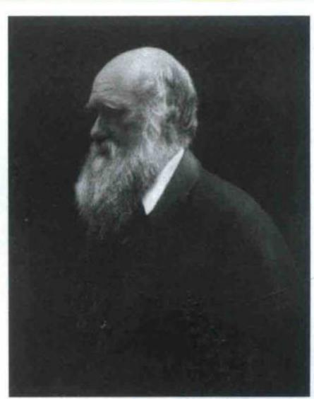

当身上抽出一根肋骨，这就成了女人夏娃。亚当、夏娃婚配繁衍产生了人类。1859年，伟大的英国生物学家达尔文(Charles Darwin)出版了著名的《物种起源》一书，确立了进化论的概念，打破了上帝造人的传统观念，极大地推动了人类思想的发展。达尔文(图1-1)从小热爱大自然，喜欢采集动、植物标本。他16岁到爱丁堡大学学习，参加了青年人的普林尼学术活动，研讨拉马克的进化学说。拉马克虽然不信“上帝创造一切”的“创世说”，却又拿不出令人信服的证据来。这些讨论使达尔文的思想陷于矛盾和斗争之中，他决心深入大自然去寻找答案。

9年后,达尔文以自然科学家的身份,参加了历时5年的贝格尔号军舰环球旅行,历尽了千辛万苦,在晕船、饥渴、病痛和死亡的威胁下,他坚持工作,采集了大量动、植物标本和化石并细心地进行比较、鉴别和研究,提出并解答了一系列学术问题,如:相似的动物为什么居住在千里之外的不同地区?同一个小岛上为什么聚集着许多不同的动物?低等动物与高等动物有些什么样的联系?人是如何产生的?等等。从贝格尔号回到英国以后,他发表了一系列论文,逐步阐述了生物进化的观点。在《物种起源》这部划时代的科学巨著中,他用大量事实证明“物竞天择,适者生存”的进化论思想。他认为世界上的一切生物都是可变的,并预言从低等到高等的变化过程中必定有过渡物种存在。他指出物种的变异是由于大自然的环境和生物群体的生存竞争造成的,彻底否定了上帝创造万物的旧思想,推翻了物种不变的神话,使生物学真正迈入实证自然科学的行列。

通过记载不同动、植物的地理分布,研究近亲种族的解剖学、形态学的相似性和变异率,达尔文第一个认识到生物世界的不连续性。他发现,当记录研究跨越一个较长的历史时期,主要存在物种会有很大的变化。他认为,环境因素如大地变迁、特定区域内的温度、降雨量变化及气候条件改变,都会以“自然选择压力”的形式,在生物体的世代遗传中体现出来。正是在这种“自然选择压力”之下,新物种才不断诞生,旧的、与环境不再相容的物种也不断消亡。他在书中这样写道:“对于每一个动、植物种群来说,因为总是有大大多于可能生存下来的个体出生,所以为生存而斗争是长期的、永久的。”如果某些个体偶然获得了于自身有利的变异,就会在生与死的斗争中占同类的上风,从而生存下来。根据遗传学原理,任何生存下来的个体都倾向于扩增其经过修饰的新性状,以保持生存优势。

达尔文关于生物进化的学说及其唯物主义的物种起源理论,是生物科学史上最伟大的创举之一,具有不可磨灭的贡献。为了纪念这位生物科学大师,人们把进化论称为“达尔文学说”。

## 1.1.2 细胞学说

早期生物科学家的另一大贡献是提出了“细胞学说”(cell theory)。

17 世纪末叶,荷兰显微镜专家 Leeuwenhoek 制作成功了世界第一架光学显微镜。通过这一装置,他看到了一系列肉眼看不到而又使人迷惑不解的微小生物,他将这些小生命称为“微动物”(animalcule)。若干年后,人们才知道它们是单细胞生物。

Leeuwenhoek 出身贫寒,16岁便失学当了学徒。在好奇心驱使下,他把工余时间都用来研究、磨制、装配玻璃透镜。开始,他用自己磨制的透镜观察蜜蜂蜇人的“针”,看蚊子叮人的口器,以及小甲虫的足等。随着制镜手艺不断提高,他制成了能放大200倍的显微镜,不断公布自己的观察结果,并将新发现报告给当时世界最权威的科学管理机构——英国皇家学会。他第一个观察到狗和人的精子,发现了酵母菌,描述了红细胞等。为了表彰和鼓励 Leeuwenhoek 的研究工作,英国皇家学会吸收他为会员。自此,一个小学徒终于成长为受人尊敬的大科学家。

1702 年, Leeuwenhoek 在观察轮虫时, 偶然发现雨水中有微生物。这些生物是怎么来的呢？为了解开这个谜，他做了一个实验：收集开始下雨时的雨水来观察，里面并没有微生物。到了第四天再观察，就有许多微生物出现在水中。Leeuwenhoek 因此得出了一个结论：“风能将空气灰尘中的微生物带入水中。”以后经过对昆虫、海贝和鳝鱼等的细心研究，他进一步断定：“微生物不是由泥沙尘埃产生的，而是和动物一样，有完整的生活史。”这一有趣的发现使 Leeuwenhoek 更为出名。

大约与 Leeuwenhoek 同时代的 Hooke, 第一次用“细胞”这个概念来形容组成软木的最基本单元。直到 19 世纪中叶, 这一概念才正式被科学界所接受。随着显微技术、组织保存技术和超薄切片技术的不断发展, 科学家发现动、植物组织都是由细胞所组成, 而且细胞是可以分裂的, 每一个细胞都是或曾经是一个单独的活的实体, 包含有生命的全部特征。

动、植物的基本单元是细胞，这是19世纪三大发现之一的“细胞学说”的核心。首先建立这一学说的是德国植物学家Schleiden和动物学家Schwann。Schleiden出生于汉堡，22岁就获得了法学博士学位，但他并不喜欢当律师。28岁时，他先后到哥廷根和柏林学习植物学和医学，35岁时获得医学和哲学博士学位。Schwann高中毕业后，没有按照父母的意愿学神学，而是毅然去柏林学医。24岁获得博士学位，在柏林解剖博物馆工作时结识了Schleiden。他俩虽然个性、经历迥异，但共同的志趣和真诚的情感促成了他们多年的合作。Schleiden研究被子植物的胚囊，Schwann研究蛙类的胚胎组织，相同的研究方向，相似的研究方法，使他们取得了一致见解，共同创立了生物科学的基础理论——细胞学说。

1847 年, Schwann 在描述动物组织时这样写道: “所有组织的最基本单元是形状非常相似而又高度分化的细胞。” 可以认为, 细胞的发生和形成是生物学界普遍和永久的规律。从此, 细胞学说开始广为传播。研究发现, 每一个动、植物个体实际上是千千万万个生命单元的总和, 而这些微小单元——细胞, 包含了所有的生命信息。因为单个细胞生长分裂, 组织、器官和个体的生命现象实际上是细胞活动的总和, 所以细胞可以而且应该成为生物学研究的首要对象。今天的细胞生物学和分子细胞生物学就是在这个基础上发展起来的。

## 1.1.3 经典生物化学和遗传学

进化论和细胞学说相结合,产生了作为主要实验科学之一的现代生物学,而以研究动、植物遗传变异规律为目标的遗传学和以分离纯化、鉴定细胞内含物质为目标的生物化学则是这一学科的两大支柱。早在19世纪中叶,人们就发现动物和植物细胞的提取液中主要是一些能受热或酸变性形成纤维状沉淀的物质。这些物质包含有大体相等摩尔浓度的碳、氢、氧和氮。科学家将这些物质命名为蛋白质。生物化学家Buchner第一个实现了用酵母无细胞提取液和葡萄糖进行氧化反应,生成乙醇,证明化学物质转换并不需要完整的细胞而仅仅需要细胞中的某些成分。后续研究发现蛋白质是活细胞中所有化学反应的执行者和催化剂。

生物化学从一开始就承担了双重使命:分析细胞的组成成分并弄清楚这些物质与细胞内生命现象的联系。19世纪中叶到20世纪初，是早期生物化学的大发展阶段，组成蛋白质的20种基本氨基酸被相继发现（最晚分离的是苏氨酸，1935年），著名生物化学家Fisher还论证了连接相邻氨基酸的“肽键”的形成。细胞的其他组成成分，如脂质、糖类和核酸也相继在那一阶段被科学家所认识和部分纯化。那时，科学家还无法解释细胞内最重要的生命活动，即细胞成分是如何世代相传的。

奥地利大科学家、经典遗传学创始人孟德尔（Gregor Mendel）(图1-2)发现并提出遗传学定律的故事像是不朽的神话，在生物学界被广泛传诵。孟德尔从小爱好园艺，虽然因为家境贫寒，没有念完大

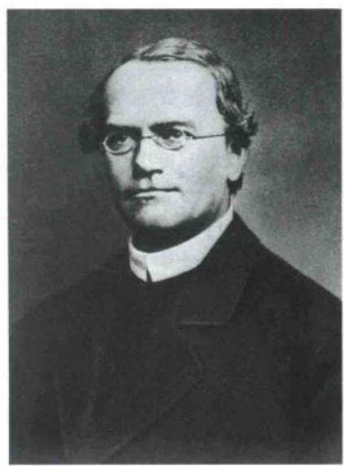  
图1-2 Gregor Johann Mendel(孟德尔)  
遗传学的奠基人，被称为“遗传学之父”，于1865年发现遗传学定律。

学就当了修道士,但却矢志不渝钻研科学。他出于对“种瓜得瓜,种豆得豆”的生物遗传现象的好奇和困惑,挑选了20多种大小不同,形状、颜色各异的食用豌豆,在修道院里反复进行杂交、自交等试验。从1857年到1864年的7年间,孟德尔选择了7对差异明显的简单性状,对豌豆的生长进行了仔细的观察。例如,他用产生圆形种子的豌豆同产生皱皮种子的植株杂交,得到几百粒全是圆形的杂交子一代 $\left(\mathrm{F}_{1}\right)$ 种子。第二年,他种植了253粒 $F_{1}$ 圆形种子并进行自交,得到7324粒 $F_{2}$ 种子,他发现有5474粒是圆形的,1850粒是皱皮的,用统计学方法计算出圆皱比为3:1。

他还进行了具有两个对立性状的豌豆品系之间的双因子杂交试验。他发现当选用产生黄色圆形种子的豌豆品系同产生绿色皱皮种子的豌豆品系进行杂交时，所产生的 $F_{1}$ 种子全是黄色圆形的，但在自交产生 $F_{2}$ 的576粒种子中，不但出现了两种亲本类型，而且还出现了两种新的重组类型，其中黄色圆形315粒，黄色皱皮121粒，绿色圆形108粒，绿色皱皮32粒。这4种类型的比例接近于9:3:3:1。

根据以上现象,孟德尔总结出生物遗传的两条基本规律:

第一,当两种不同植物杂交时,它们的下一代可能与亲本之一完全相同。他把这一现象称为统一规律。根据自己长期的实验结果,孟德尔认为,生物的每一种性状都是由遗传因子控制的。这些因子可以从亲代到子代,代代相传。在体细胞内,遗传因子是成对存在的,其中一个来自父本,一个来自母本。在形成配子时成对的遗传因子彼此分开,单独存在。他还认为,有些遗传因子以显性(dominant)形式存在,即能在任何杂种一代得到表达;而有些因子呈隐性(recessive)状态,只有当父、母本同时含有这一因子时,才得到表现。

第二,不同植物品种杂交后的 $F_{1}$ 种子再进行杂交或自交时,下一代就会按照一定的比例发生分离,因而具有不同的形式。他把这一现象称为分离规律。如红花和白花植株杂交,得到的 $F_{1}$ 植株全部为粉色花,自交后代中有 1 株红色花、1 株白色花、2 株粉色花。这一代的白色花互相交配,将永远得到白色花;红色花互相交配得到的永远是红色花;但这一代的粉色花互相交配,其结果就像上一代那样,仍旧是 1 红、1 白、2 粉。所有这些花朵,都按照孟德尔的分离规律依次遗传下去。分离规律对动、植物的杂种后代都适用。

图 1-3 Thomas Hunt Morgan(托马斯·摩尔根)
美国生物学家,被誉为“现代遗传学之父”。  
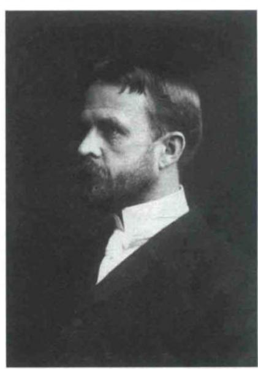

由于孟德尔的研究方法和结论都远远超越了当时的科学认知水平,他的这些天才的科学发现和见解,并没有立即引起生物学界的注意。从1865年他发表《植物杂交试验》一文到1884年逝世,欧美各国科学界几乎无人理睬他的巨大贡献。直到1900年,他的理论才被荷兰科学家H. de Vries等人重新发现、验证并得到普遍应用,他也逐渐被公认为经典遗传学的奠基人。

虽然孟德尔早在 1861 年就通过豌豆杂交实验揭示了遗传的物质性(a discrete unit governing inherited characteristics),但直到 1909 年丹麦科学

家 Johannsen 才根据希腊文“给予生命”的定义,创造了“gene”(基因)这个代表遗传学最基本单位的新名词。美国人托马斯·摩尔根(T. H. Morgan) (图 1-3) 是第一个用实验证明“基因”学说的科学家。1910 年,Morgan 和他的助手们发现了第一只白眼雄果蝇。因为正常情况下,果蝇都是红眼的,称为野生型,所以,他们将白眼果蝇称为突变型。Morgan 将白眼雄果蝇与红眼雌果蝇交配,所产生的 $F_1$ 不论雌雄,全为红眼果蝇(孟德尔的统一规律! )。这些 $F_1$ 果蝇互相交配所产生的 $F_2$ 有红眼也有白眼,但所有白眼果蝇都是雄性的,说明白眼性状与性别有联系,这一点与孟德尔的遗传性状独立分离规律是背道而驰的(现在我们已经知道,当所研究的两个基因位于同一染色体上而又距离较近时,Morgan 的连锁遗传规律起主导作用;而当所研究的两个基因位于不同染色体上时,孟德尔的独立分离规律起主导作用)。

果蝇有 4 对染色体。在雌果蝇中,有一对很小呈颗粒状的染色体,两对呈“V”形的染色体,另有一对呈棒状、被称为 XX 的染色体。在雄果蝇体内,前三对同雌果蝇完全相同,第四对染色体则由一条棒状的 X 染色体和一条呈“J”形的 Y 染色体所取代,人们称这一对为 XY 染色体。Morgan 当时就知道性染色体的存在,因此他推想,白眼这一隐性基因(w)是位于 X 染色体上,而在 Y 染色体上没有它的等位基因。他将 F₁ 红眼雌果蝇(Ww)与白眼雄果蝇亲本(wY)回交,结果产生的后代果蝇中有 1/4 是红眼雌果蝇,1/4 是白眼雄果蝇。这个实验证明,白眼隐性突变基因(w)确实位于 X 染色体上。这一现象被称为遗传性状的连锁规律,又称连锁遗传。

Morgan 和他的助手们第一次将代表某一特定性状的基因,与某一特定的染色体联系起来,使科学界普遍认识了染色体的重要性并接受了孟德尔的遗传学原理。Morgan 特别指出:种质由某些独立的要素组成,我们把这些要素称为遗传因子,或者更简单地称为基因。

## 1.1.4 DNA 的发现与基因学说的创立

1928 年,英国科学家 Griffith 等人发现,肺炎链球菌使小鼠死亡的原因是引起肺炎。细菌的毒性(致病力)是由细胞表面荚膜中的多糖所决定的。具有光滑外表的 S 型肺炎链球菌因为带有荚膜多糖而能使小鼠发病,具有粗糙外表的 R 型细菌因为没有荚膜多糖而失去致病力(荚膜多糖能保护细菌免受动物白细胞的攻击)。

首先用实验证明基因就是 DNA 分子的是美国著名的微生物学家 Avery。他和他的同事们首先将光滑型致病菌(S 型)烧煮杀灭活性以后再侵染小鼠,发现这些死细菌自然丧失了致病能力(图 1-4)。然而,当他们将经烧煮杀死的 S 型细菌和活的天然无致病力的 R 型细菌混合再感染小鼠时,奇迹发生了!实验小鼠每次都可怜巴巴地死了。解剖死鼠发现有大量活的 S 型(而不是 R 型)细菌。他们推测,死细菌中的某一成分——转化源(transforming principle)将无致病力的细菌转化成病原细菌。用已杀死的 S 型细菌的不同细胞组分反复试验发现,死细菌 DNA 指导了这一可遗传的转化,从而导致了小鼠死亡。Avery 等人的工作奠定了遗传学理论的新基石——DNA 是遗传信息的载体。

我们再来看一看美国冷泉港卡内基遗传学实验室科学家Hershey和他的学生Chase在1952年从事的T2噬菌体侵染细菌实验(图1-5)。该噬菌体专门寄生在细菌体内，它的头、尾外部都有由蛋白质组成的外壳，头内主要是DNA。噬菌体侵染细菌的过程可以分为以下5个步骤：①噬菌体用尾部的末端（基片、尾丝）吸附在细菌表面；②噬菌体通过尾轴把DNA全部注入细菌细胞内，噬菌体的蛋白质外壳则留在细胞外面；③噬菌体的DNA一旦

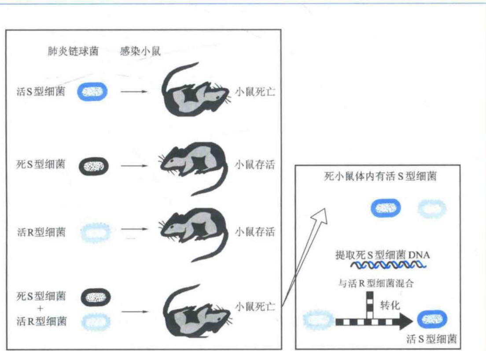

## 图1-4 DNA是“转化源”

左图从上到下: 将活的 S 型细菌注射到实验小鼠体内, 小鼠迅速死亡; 将经烧煮灭活的 S 型细菌注射到小鼠体内, 小鼠保持健康; 将活的 R 型细菌注射到小鼠体内, 小鼠也保持健康; 而将烧煮灭活的 S 型细菌和活的 R 型细菌一道注射到小鼠体内却能导致小鼠死亡。右图: 分离被杀死的 S 型细菌的各种组分并分别与活的 R 型细菌混合, 注射小鼠后发现, 只有 S 型死细菌的 DNA 能使 R 型细菌发生转化, 获得致病力。

## 图 1-5 Hershey 和 Chase 证实噬菌体 DNA 侵染细菌的实验流程

当细菌培养基中分别带有 $^{35}$ S或 $^{32}$ P标记的氨基酸或核苷酸，子代噬菌体中就相应含有 $^{35}$ S标记的蛋白质或 $^{32}$ P标记的核酸。分别用这些噬菌体感染没有放射性标记的细菌，经过1\~2个噬菌体DNA复制周期后发现，子代噬菌体中几乎不含带 $^{35}$ S标记的蛋白质，但含有30%以上的 $^{32}$ P标记，说明在噬菌体传代过程中发挥作用的可能是DNA，而不是蛋白质。

进入细菌体内,它就能利用细菌的生命过程合成噬菌体自身的 DNA 和蛋白质;④新合成的 DNA 和蛋白质外壳,能组装成许许多多与亲代完全相同的子代噬菌体;⑤子代噬菌体由于细菌的解体而被释放出来,再去侵染其他细菌。实验中,他们用 ${}^{32}$ P 标记 DNA,用 ${}^{35}$ S 标记蛋白质。他们发现,如果在侵染细菌后立即收集噬菌体,可得到 70% 的 ${}^{32}$ P 标记的 DNA 和 20% 的 ${}^{35}$ S 标记的蛋白质。如果侵染细菌后让噬菌体复制一代,那么,新生代噬菌体中 50% 的 DNA 链上带有 ${}^{32}$ P 标记,而噬菌体总蛋白中只有不到 1% 仍带有 ${}^{35}$ S 标记。这说明在噬菌体侵染细菌的过程中,只有 DNA 进入到细菌细胞体内,而这些 DNA 足以完成噬菌体的全部生命过程。

那么,DNA 到底是什么样的呢? 在 1944 年的研究报告中,Avery 这样写道: 当溶液中乙醇的体积达到 9/10 时,有纤维状物质析出。如稍加搅动,这种物质便会像棉线绕在线轴上一样绕在硬棒上,溶液中的其他成分则以颗粒状沉淀留在下面。溶解纤维状物质并重复沉淀数次,可提高其纯度。这一物质具有很强的生物学活性,初步实验证实它很可能就是 DNA(谁能想到! )。对 DNA 分子的物理化学研究导致了现代生物学翻天覆地的革命,这更是 Avery 所没有想到的!

尽管由于 Morgan 及其学派的出色工作,基因学说得以在 20 世纪初叶就得到了普遍承认,但直到 Watson(沃森)和 Crick(克里克)提出 DNA 双螺旋模型之前,人们对于基因的理解仍然是抽象的、概念化的,缺乏准确的实质性内容。那时的遗传学家,既没有探明基因的结构特征,也完全不能解释位于细胞核中的染色体和基因怎样控制发生在细胞质中的各种生化过程,不能解释基因是怎样在细胞繁殖过程中准确地复制和代代相传。正是因为他们在1953年提出DNA的反向平行双螺旋模型,才为充分揭示遗传信息的传递规律铺平了道路,Watson和Crick与通过X射线衍射证实该模型的Wilkins分享了1962年的诺贝尔生理学或医学奖(图1-6)。英年早逝的Franklin对DNA晶体结构的解析为Wilkins的获奖提供了关键数据。

  
图1-6 左上, Francis Harry Compton Crick (弗朗西斯·哈里·康普顿·克里克); 右上, Maurice Hugh Frederick Wilkins (莫里斯·休·弗雷德里克·威尔金斯); 左下, Rosalind Elsie. Franklin (罗莎琳德·埃尔西·富兰克林); 右下, James Dewey Watson (詹姆斯·杜威·沃森)

<!-- W-BEGIN Watson 1 孟德尔学派的世界观 -->

### 【中文对照 Watson 第1章：孟德尔学派的世界观】

> 来源：Watson《基因的分子生物学》第七版中译本（书籍/03_基因的分子生物学_第七版） 第1章 孟德尔学派的世界观。

#### [W] 第1章

#### [W] 孟德尔学派的世界观

本章概要

孟德尔的发现

遗传的染色体理论

基因连锁和交换

染色体定位

突变引起遗传变异

早期关于基因是什么以及如何发挥作用的推测

对基因-蛋白质之间关系的初步探索

人类在所有的生物中是独一无二的，这很容易理解。人类已经独自建立了复杂的语言系统，能够进行有意义的、复杂的思维和情感交流，并且建立了伟大的文明进而改变了这个世界，这对其他的生命形式是不可思议的。所以，我们总是想当然地认为人类与其他物种相比，肯定有某种特殊性。这种观点在许多宗教形式中都有清晰的体现，通过这些宗教我们试图解释生命的起源以及我们存在的理由，进而尝试创造一种可操作的、用来规范我们生活的条律。在一个多世纪以前，人们很自然地认为，就像每个人的生命有特定的起始和终结时间一样，整个人类及其他所有生命形式应该也是在一个特定时刻被创造出来的。

150 年以前，当达尔文（Charles

Darwin）和华莱士（Alfred R. Wallace）基于适者生存的观点提出了演化理论时，这种“创世论”的观点才第一次受到了真正的质疑。他们认为，各种形式的生命不是恒定不变的，而是持续地产生一些略有不同的动植物，其中的一些因为适应环境而存活下来，并且产生更多的后代。在演化论提出的时代，他们还不知道这些持续发生的变异的起因，但是他们确实正确地意识到，如果这些变化要想成为演化的基础，由此所获得的新特征一定要在后代中保持下去。

最初，达尔文受到了猛烈的抨击，主要是来自那些不愿意相信人类与丑陋的猿类可能有共同祖先的人们，哪怕这些祖先是生活在一千万年以前。也有一些反对者是生物学家，他们认为达尔文的证据不能令人信服。其中一位是著名的自然学家Jean L. Agassiz，当时在哈佛大学花了多年的时间写文章反对达尔文和他的伙伴赫胥黎（Thomas L. Huxley），赫胥黎是当时最有影响的演化论的推行者。到19世纪末期，科学上的争论已经基本结束了。如今动植物的地理分布及其在化石记录中的选择性出现（selective occurrence）只能有一种解释，那就是连续演化的生物来自共同的祖先。今天，演化论已经被普遍接受，当然除了极少数原教旨主义者（fundamentalist），他们拒绝的理由不是基于理智，而是来自宗教的教义。

根据达尔文的理论，我们可以立即推论，40亿年以前存在于地球上的生命是一种简单的形式，也许就像我们今天所知的最简单的生命形式——细菌，存在这样小的细菌也告诉我们生命状态的实质是在很小的生物中建立的。演化理论还认为生命的基本原理适用于所有的生命形式。

#### [W] 孟德尔的发现

孟德尔（Gregor Mendel）的实验研究是不同豌豆品系间进行育种实验（遗传杂交）的结果，这些豌豆品系间具有不同的、界定明确的特征，如种子的形状（圆滑或皱缩）、颜色（黄色或绿色）、豆荚的形状（饱满或皱缩）及茎秆的长度（高秆或矮秆）等。他集中研究了界定明确的特征间的差异，这一点非常重要。以前许多育种家曾尝试研究整体性状的遗传，如植株总重，但是没能发现任何亲本和子代间性状传递的简单的规律（框1-1）。

#### [W] 框1-1 孟德尔定律

具有从一代细胞向下一代细胞传递可遗传的性状的能力，是生命细胞最重要的特征。人类早已注意到遗传的存在，他们观察到许多性状，如眼睛或头发的颜色，可以由父母传递给孩子。但是，直到20世纪的前几年，遗传的物理学基础并不清楚，遗传的染色体理论就是在那个富于创造性的时期建立的。

1860 年，人们已经知道遗传物质可以通过精子和卵子传递。1868 年 Ernst Haeckel 注意到精子主要由核物质组成，所以推测核是负责遗传的。此后，大约又花了 20 年的时间才确定了染色体是活性因子，因为有丝分裂、减数分裂和受精等细节是首先需要研究清楚的。当这些工作都完成后，可以看出，不像其他的细胞组分，染色体在子代细胞中是完全等量均分的。而且，很容易理解形成单倍体的减数分裂过程使精子和卵子染色体数目减小，这对保证后代染色体数目的恒定来说是必需的。但是这些事实仅仅提示染色体可能携带遗传物质。

随着遗传基本规律的发现，在世纪交替之际获得了证据。1865年，孟德尔在他送给位于Brno的自然科学学会的文章“植物杂交实验”中首次提出相关的概念。在他所展示的数据中，孟德尔详细地描述了豌豆性状的传递模式（我们将在下文详细介绍）、他关于遗传原理的结论、以及与有争议的演化论的关系等。尽管孟德尔早期做过一些努力，试图引起当时主流生物学家的兴趣，但并没有得到科学界的认可，他的观点完全被忽视了。1900年，孟德尔去世后16年，三位独立工作于不同系统的植物育种家验证了被遗忘的、具有重要意义的孟德尔的工作。Hugo De Vries、Karl Correns和Erich Tschermak从事的是与孟德尔相关的工作，在不知道孟德尔工作的情况下分别获得了相似的结论。

#### [W] 独立分离定律

当证实了所用的亲本形状是可以真实遗传的，也就是说它们会产生完全相同的后代之后，孟德尔做了一系列只有单一性状不同（如种子形状和颜色）的豌豆亲本（P）间的杂交。所有的子代（ $F_{1}$ 即第一子代）只具有一个亲本的性状。例如，在黄色和绿色豌豆杂交的组合中，所有的子代都是黄色种子。在 $F_{1}$ 代表现的性状称为显性（dominant），而在 $F_{1}$ 代不表现的性状称为隐性（recessive）。

当孟德尔将 $F_{1}$ 进行遗传杂交时，其实验结果的意义就很清楚了。这些杂交组合的结果是：大约 25% 的 $F_{2}$ 代个体重新呈现隐性性状，而呈现显性性状个体大约占 75%。他所研究的 7 个性状中，每一个性状在 $F_{2}$ 中的显隐性个体之比都是 3:1。当这些实验进行到第三代 $(F_{3})$ 时，所有表现隐性性状的豌豆呈现真实遗传（bred true）（即产生的后代仍表现隐性性状）。而那些表现显性性状的豌豆会产生两种后代，其中 1/3 呈真实遗传（只产生显性性状后代），其余的 2/3 同样产生混合的、显隐性比率为 3:1 的后代群体。

孟德尔正确地将他的实验结果解释如下（图 1-1）：各种性状是由成对的因子[现在我们称为基因（gene）]控制的，其中一个因子来自雄性亲本，另一个来自雌性亲本。例如，纯系的圆豌豆有两个拷贝［或者称为等位基因（allele）］的圆粒基因（RR），而纯

系的皱豌豆有两个拷贝的皱粒（rr）等位基因。每一个圆粒品系的配子带有一个圆粒基因（R），皱粒品系的配子带有一个皱粒基因（r）。在亲本RR和rr的杂交中，受精后产生带有两种等位基因（Rr）的 $F_{1}$ 植株，其种子表现为圆粒，因为R对r是显性的。我们把一个个体的外观或物理性状称之为表现型或表型（phenotype），而其遗传组成称为基因型（genotype），表型相同的个体可能具有不同的基因型。所以，为了了解一个生物的基因型，经常有必要进行几个世代的杂交。纯合（homozygous）一词表述的是基因对中分别来自母本和父本的基因是相同的（如RR或rr）。相应地，杂合（heterozygous）一词表述的是基因对中来自母本和父本的基因是不同的（如Rr）。

可以用一个或几个字母来表示一个基因。显性等位基因可以用大写字母（R）或加上标（r+）或者单独的加号（+）表示。在本书中，我们用第一种方式即大写字母表示显性等位基因，用小写字母表示隐性等位基因。

需要注意的是，配子中只有该生物所具有

  
图 1-1 孟德尔第一定律（独立分离律）如何解释 $F_{2}$ 代的显隐性的比率为 3:1。R 代表显性等位基因，r 代表隐性等位基因，圆形种子代表显性表型，皱缩的种子代表隐性表型。

的两个拷贝的基因中的一个（一个等位基因，要么 R，要么 r，但不会同时有两个），生物所产生的两种类型的配子数目是相同的。所以，在豌豆 F1 代产生的配子中含有 R 或 r 的概率各占 50%，配子中带有何种等位基因完全是随机的。当我们考察数目有限的 F2 代个体时，我们并不期望绝对的 3:1 比率，这个比率有时稍微高一些，有时稍微低一些。但当我们观察的样品越来越多时，得到的显隐性状的个体数之比就越来越接近 3:1。

F2代重新出现隐性性状，表明隐性等位基因在F1代（Rr）既没有改变也没有丢

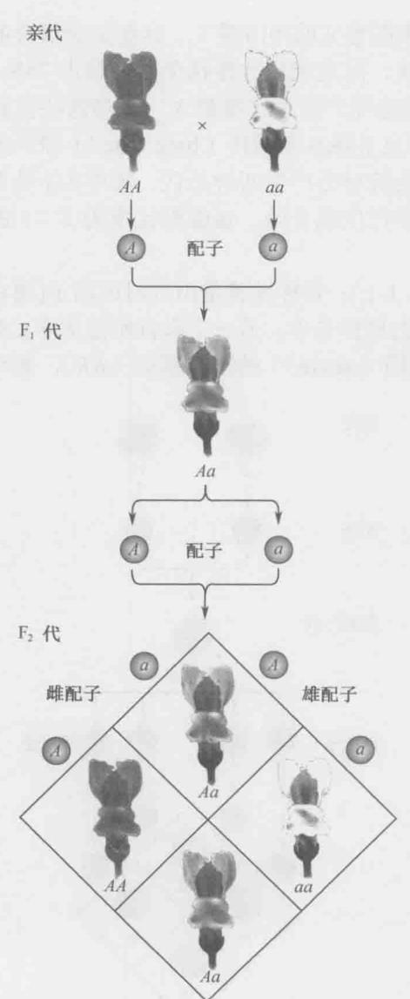  
图 1-2 金鱼草花色的遗传。一个亲本是纯合的红色花（AA），另外一个亲本是纯合的白色花（aa），它们没有显隐性关系，杂合的 $F_{1}$ 代花是粉红色的。 $F_{2}$ 代红色、粉色和白色花的比率为 1:2:1。

失，而显性和隐性基因都是独立传递的，并且在性细胞形成过程中能够独立分离。这个独立分离定律（principle of independent segregation）通常被称为孟德尔第一定律。

#### [W] 有些等位基因既非显性也非隐性

在孟德尔所报道的杂交中，基因对的一个成员对另一个成员是完全显性。但在自然界中并不总是如此。有时，杂合体的表型居于两种纯合体的表型之间。例如，纯系的红色金鱼草（Antirrhinum）和白色金鱼草杂交产生的 $F_{1}$ 代是居间的粉红色。如果将 $F_{1}$ 代自交，产生的 $F_{2}$ 代个体中，红色、粉色和白色的比率为1∶2∶1（图1-2）。所以，在这种情况下，可以通过表型将杂合体与纯合体分开。我们也可以看到，孟德尔定律并不取决于是否基因对中的一个基因对另一个基因呈显性。

#### [W] 独立分配定律

孟德尔将他的育种实验扩大到有多个不同性状的豌豆品系之间。就像上文一样，他从两个豌豆品系开始，自交时它们都是真实遗传的。一个品系具有圆形的黄色种子，另一个是皱缩的绿色种子，因为圆形黄色对皱缩绿色是显性的，所有的 $F_{1}$ 代种子都是圆形黄色的。将 $F_{1}$ 代自交，检查所产生的 $F_{2}$ 代种子的外观（表型），除两种原来的表型外（圆形黄色、皱缩绿色），又出现了两种新的表型[重组体（recombinant）]——皱缩黄色和圆形绿色。

孟德尔发现，假设基因是存在的，并且每一对基因在性细胞形成过程中都可以独立地传递到配子中，他就可以解释这些结果。这种解释如图1-3所示，每一个配子只包含基因对中的一个等位基因。所以， $F_{1}$ 代（RrYy）产生的配子将是RY、Ry、rY、ry，但不会是Rr、Yy、YY或RR。并且在这个例子中，出现4种可能的配子的概率都是相同的，来自同一亲本的基因并没有同时出现的倾向。结果是， $F_{2}$ 代的表型呈现9个圆形黄色、3个圆形绿色、3个皱缩黄色和1个皱缩绿色，就像图1-3的下部的Punnet方块所展示的（这种排列方式是由英国数学家Punnet介绍的，所以以他的名字命名）。这一独立分配定律（principle of independent）通常被称为孟德尔第二定律。

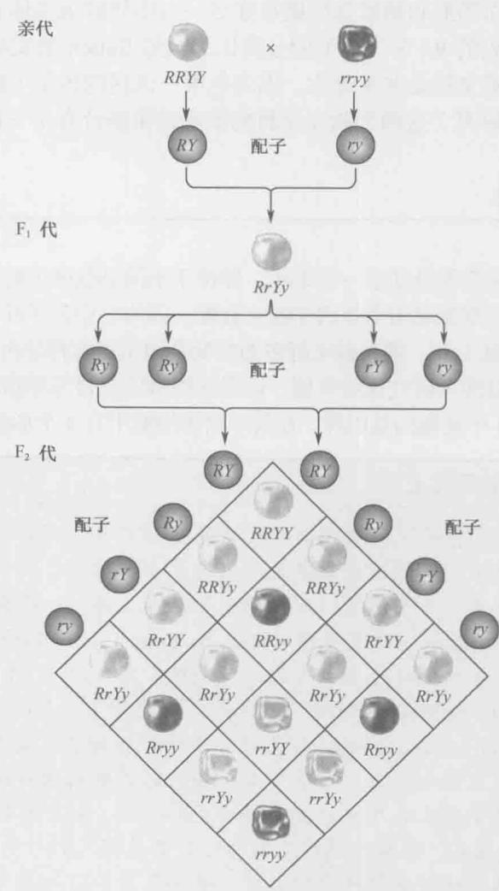  
图 1-3 孟德尔第二定律（独立分配定律）是如何发挥作用的。在这个例子中，黄色（Y）和绿色（y）种子的遗传与圆形（R）和皱缩（r）种子的遗传是连在一起的。R 和 Y 等位基因对 r 和 y 呈显性。亲本和子代的基因型用相应的字母组合表示，4 种不同的表型用相应的背景色来区分。

#### [W] 遗传的染色体理论

孟德尔的发现一开始不被接受的主要原因是缺乏减数分裂和有丝分裂期间染色体行为的证据。但是，在1900年重新发现孟德尔定律时，人们已经有了这方面的知识，并且在1903年被美国生物学家Walter S. Sutton引用。在他的经典文章“遗传过程中的染色体”一文中，Sutton强调了二倍体由两组形态上相似的染色体组成的重要性，在减数分裂过程中，每一个配子都获得一对同源染色体中的一条。他假设基因是染色体上的一部分，并用上述发现来解释孟德尔的实验结果。他推测黄色和绿色种子的基因是在某一对特定染色体上，而圆形和皱缩基因则是在另一对不同的染色体上。这一假说立即就解释了实验中所观察到的 $9:3:3:1$ 的分离比。虽然Sutton的文章并没有证明遗传的染色体理论，但它的意义还是非常重大，因为他第一次将遗传学（育种实验的研究）和细胞学（细胞结构的研究）这两个独立学科的实验结果整合在了一起。

#### [W] 基因连锁和交换

孟德尔的独立分配定律是基于一个事实，即位于不同染色体上的基因在减数分裂过程中独立行动。然而，经常发现两个基因非独立分配，因为它们位于同一染色体上[连锁基因（linked gene），见框1-2]。随着越来越多的突变基因用于育种分析，发现了许多不符合随机分配的事例。通过深入研究这些事例，证明连锁群的数目与单倍体染色体的数目是相同的。例如，果蝇有4个连锁的基因群，在其单倍体细胞中有4个形态上可区分的染色体。

#### [W] 框1-2 基因串联在染色体上

最初所有的育种实验采用的都是自然发生的遗传变异。例如，孟德尔使用过从种子经销商处得来的种子，而经销商肯定是从农民手中收购的。同一基因存在不同的形式（等位基因）就产生了一个问题，即它们是如何产生的？一个直接的假说就是基因可以变为（突变为）新基因[突变基因（mutant gene）]。从1908年开始，伟大的美国生物学家Morgan和他的年轻合作者们——遗传学家Calvin B. Bridges、Hermann J. Muller及Alfred H. Sturtevant对这一假说第一次进行了认真的实验验证。他们以小小的果蝇（Drosophila melanogaster，黑腹果蝇）为实验材料，发现了第一个雄性白眼果蝇突变体，而不是正常的红眼。白眼突变是在红眼果蝇的培养瓶中自发产生的突变体。实际上，自然界中存在的几乎所有果蝇都是红眼的，控制红眼的基因就称为野生型基因（wild-type gene），导致白眼的基因称为突变基因（等位基因）。

白眼突变基因马上被用来进行育种实验（框1-2图1），实验结果令人兴奋，因为等位基因的表现与X染色体完全平行（也就是说，与性连锁）。这一发现意味着这个基因可能与控制性别的基因都位于X染色体上。这一假说很快就由更多的新突变基因的交配实验得到了验证，当时新发现的基因中多数也是性连锁的。

亲代

(b)

亲代

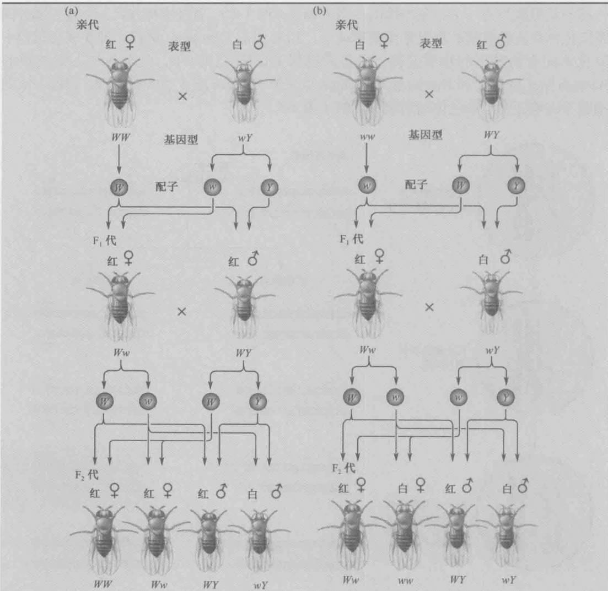  
框1-2图1果蝇中的性连锁基因的遗传。位于性染色体上的基因会分别在雄性和雌性后代表现，因为如果只有一条X染色体，该染色体上的隐性基因总是会表现。图示两个交配实验，都涉及位于X染色体上的隐性基因[w代表白眼（white eye）]。（a）雄性亲本是白眼果蝇（wY），雌性是同源的红眼个体（WW）；（b）雄性为红眼（WY），雌性为白眼（ww）。此处字母Y不是代表等位基因，而是雄性果蝇中对应于X染色体的Y染色体。Y染色体上没有对应于X染色体上的w或W的基因。

然而，连锁实际上不可能是完全的。在减数分裂过程中，同一染色体上的两个基因保持同步的概率，从略低于100%到接近50%。这一数值的变化表明存在着一个同源染色体间基因交换的机制，这个机制称为交联（crossing over）。比利时细胞学家F.A.Janssens首先描述了其细胞学基础。在减数分裂开始时，通过一个联会（synapsis）过程，同源染色体沿着与长轴平行的方式形成染色体对。在这个阶段，每一个染色体都复制一次，形成两个染色单体。所以，联会将4个染色单体聚在一起（四连体，tetrad），互相缠绕。Janssens推测可能因为缠绕中的张力原因，两个染色单体有时会在相应的位置发生断裂。这样就有可能产生4个断裂末端，它们可能交叉相连，这样每一个染色单体的一部分就可能与另一个染色单体的一部分相连（图1-4）。通过这种方式，含有一部分同源染色体片段的重组的染色单体就形成了。20年以后，Janssens假说，即在联会过程中染色体间有物理上的物质交换，才正式得到了证明。1931年，在康奈尔大学工作的Barbara McClintock和Harriet B. Creighton以玉米（Zea mays）为实验材料，通过一流的细胞学实验证明了染色体的断裂和重组（图1-5）。

  
图 1-4 Janssens 的交联假说。  
图 1-5 同源染色体间物理交换的示意图。在大多数生物中，同源的染色体对具有相同的形状。然而，有时它们也不完全相同，图中所示一条染色体带有额外的一段遗传物质，以及一段致密的、可以反复形成节状结构的区域。McClintock 和 Creighton 就发现了这样一对染色体，并用它们证明在配对的染色体间涉及实际的物理交联。在图示的实验中，同源的 c、wx 后代肯定是在 C 和 wx 基因座间发生交联后产生的。当用细胞学方法检测 c，wx 后代时，可以看到具有节状结构的染色体，表明无节的 Wx 区域是被有节的 wx 区域物理上替代了。图中彩色框代表的是纯合的 c、wx 子代染色体。

#### [W] 染色体定位

摩尔根和他的学生们并没有等待交联发生的细胞学证据就着手探索 Janssens 假说的含义。他们推测染色体上紧密相邻的基因（紧密连锁）比相距较远的基因更有可能同时分配，同时意识到这是一种确定染色体上的基因相对位置，进而绘制遗传图谱（geneticmap）的方法，这种方法是很直观的。让我们来看同一个染色体上3个基因分离的情形，这些基因的排列状况可以用3次交配来确定，每次交配只调查其中的两个基因（双因子交配）。AB和ab之间的交配会产生4种类型的后代：两种亲本基因型（AB和ab）、两种重组基因型（Ab和aB）。AC和ac之间的交配同样会产生两种亲本基因型和两种重组基因型Ac和aC，而BC和bc之间的交配将产生亲本基因型和Bc、bC重组基因型。每一个交配都将产生一个特定的亲本基因型和重组基因型后代的比率。例如，第1组交配产生 $30\%$ 的重组子，第2组产生 $10\%$ ，第3组 $25\%$ 。这些数据告诉我们，基因 $\pmb{a}$ 和c的距离较 $\pmb{a}$ 和b、b和c的距离近，而 $\pmb{a}$ 和b之间与b和c之间的遗传距离更为接近，最符合这些数据的基因排列顺序是 $a - c - b$ （图1-6）。

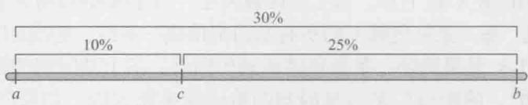  
图 1-6 根据三个双因子交配实验推测 3 个基因的顺序。

通常会用三因子交配实验来准确无误地验证双因子交配实验所确定的基因顺序的正确性。当前述例子中的3个基因通过 $ABC \times abc$ 的交配进行时，会出现6种重组基因型（图1-7），它们可分为3组，个体数目最少的一组来自双交换。通过寻找频率最低的那一组，往往立即就可以确认（或否定）一种推测的排列方式。图1-7的结果马上就可以确认双因子交配实验所暗示的顺序，事实上只有a-c-b顺序才是合理的，即最少的重组子是AcB和aCb。

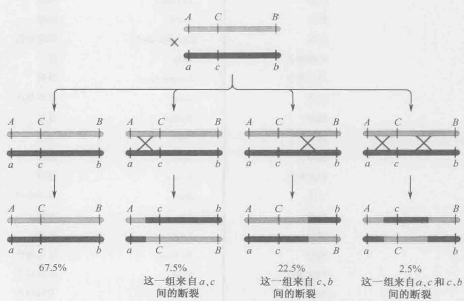  
图 1-7 用三因子交配确定基因的顺序。发生频率最低的交联重组一定来自双交换，图中所列的不同百分比是从无限多的样品中获得的理论值。当只有一定数目的后代时，其准确值的确定需要考虑随机的统计。

存在多个交联事件的事实意味着最远的两个标记 $a$ 和 $b(ab)$ 发生重组的数目通常少于 $a$ 和 $c(ac)$ 以及 $c$ 和 $b(cb)$ 之间重组概率的和。为了得到更精确的最远标记的距离，我们来计算 $ac \times cb$ 重组的概率，即在 $c$ 和 $b$ 间发生一次交换、在 $a$ 和 $c$ 间也发生一次交换，或者是反过来 $(cb \times ac)$ 。将这个概率从总的概率中减去，就会得到更准确的重组的概率。如下的简单公式

$$
a b = a c + c b - 2 (a c) (c b)
$$

适合于一个交联的发生不影响其他交联发生频率的所有情形。但遗憾的是，精确的定位经常受干扰现象（interference）的影响，它会提高或降低相关交换的概率。

利用上述推理，由摩尔根领导的哥伦比亚大学研究小组在1915年之前确定了超过85个果蝇突变基因的位置（表1-1）。每个基因被放在4个连锁群或者说染色体的一个特定位点。最重要的是，每一条染色体上的所有基因都排成一条线，基因的排列是严格线性而没有分支的。图1-8是果蝇的一条染色体的遗传图谱，图上基因间的距离是用图距单位（map unit）表示的，图距单位是与基因间的重组频率相关的。如果两个基因间的重组频率是 $5\%$ ，那么基因间的距离就是5个图距单位。因为在相距很远的基因间发生双交换的概率很高，图距单位的计算就不准确，除非所有紧密相邻的基因间都进行了重组实验。

表 1-1 1915 年报道的 85 个果蝇突变体基因

<table><tr><td>名称</td><td>所影响的位置</td><td>名称</td><td>所影响的位置</td></tr><tr><td colspan="4">第1组</td></tr><tr><td>Abnormal</td><td>腹部</td><td>Lethal, 13</td><td>身体,死亡</td></tr><tr><td>Bar</td><td>眼睛</td><td>Minature</td><td>翅膀</td></tr><tr><td>Bifid</td><td>脉络</td><td>Notch</td><td>脉络</td></tr><tr><td>Bow</td><td>翅膀</td><td>Reduplicated</td><td>眼睛颜色</td></tr><tr><td>Cherry</td><td>眼睛颜色</td><td>Ruby</td><td>腿</td></tr><tr><td>Chrome</td><td>身体颜色</td><td>Rudimentary</td><td>翅膀</td></tr><tr><td>Cleft</td><td>脉络</td><td>Sable</td><td>身体颜色</td></tr><tr><td>Club</td><td>翅膀</td><td>Shifted</td><td>脉络</td></tr><tr><td>Depressed</td><td>翅膀</td><td>Short</td><td>翅膀</td></tr><tr><td>Dotted</td><td>胸部</td><td>Skee</td><td>翅膀</td></tr><tr><td>Eosin</td><td>眼睛颜色</td><td>Spoon</td><td>翅膀</td></tr><tr><td>Facet</td><td>小眼</td><td>Spot</td><td>身体颜色</td></tr><tr><td>Forked</td><td>脊骨</td><td>Tan</td><td>触角</td></tr><tr><td>Furrowed</td><td>眼睛</td><td>Truncate</td><td>翅膀</td></tr><tr><td>Fused</td><td>脉络</td><td>Vermilion</td><td>眼睛颜色</td></tr><tr><td>Green</td><td>身体颜色</td><td>White</td><td>眼睛颜色</td></tr><tr><td>Jaunty</td><td>翅膀</td><td>Yellow</td><td>身体颜色</td></tr><tr><td>Lemon</td><td>身体颜色</td><td></td><td></td></tr><tr><td colspan="4">第2组</td></tr><tr><td>Antlered</td><td>翅膀</td><td>Jaunty</td><td>翅膀</td></tr><tr><td>Apterous</td><td>翅膀</td><td>Limited</td><td>腹部条纹</td></tr><tr><td>Arc</td><td>翅膀</td><td>Little crossover</td><td>2号染色体</td></tr><tr><td>Balloon</td><td>脉络</td><td>Morula</td><td>小眼</td></tr><tr><td>Black</td><td>身体颜色</td><td>Olive</td><td>身体颜色</td></tr><tr><td>Blistered</td><td>翅膀</td><td>Plexus</td><td>脉络</td></tr><tr><td>Comma</td><td>胸部标记</td><td>Purple</td><td>眼睛颜色</td></tr><tr><td>Confluent</td><td>脉络</td><td>Speck</td><td>胸部标记</td></tr><tr><td>Cream II</td><td>眼睛颜色</td><td>Strap</td><td>翅膀</td></tr><tr><td>Curved</td><td>翅膀</td><td>Streak</td><td>体型</td></tr><tr><td>Dachs</td><td>腿</td><td>Trefoil</td><td>体型</td></tr><tr><td>Extra vein</td><td>脉络</td><td>Truncate</td><td>翅膀</td></tr><tr><td>Fringed</td><td>翅膀</td><td>Vestigial</td><td>翅膀</td></tr><tr><td colspan="4">第3组</td></tr><tr><td>Band</td><td>体型</td><td>Pink</td><td>眼睛颜色</td></tr><tr><td>Beaded</td><td>翅膀</td><td>Rough</td><td>眼睛</td></tr><tr><td>Cream III</td><td>眼睛颜色</td><td>Safranin</td><td>眼睛颜色</td></tr><tr><td>Deformed</td><td>眼睛</td><td>Sepia</td><td>眼睛颜色</td></tr><tr><td>Dwarf</td><td>身体大小</td><td>Sooty</td><td>身体颜色</td></tr><tr><td>Ebony</td><td>身体颜色</td><td>Spineless</td><td>脊骨</td></tr><tr><td>Giant</td><td>身体大小</td><td>Spread</td><td>翅膀</td></tr><tr><td>Kidney</td><td>眼睛</td><td>Trident</td><td>体型</td></tr><tr><td>Low crossing over</td><td>3号染色体</td><td>Truncate</td><td>翅膀</td></tr><tr><td>Maroon</td><td>眼睛颜色</td><td>Whitehead</td><td>体型</td></tr><tr><td>Peach</td><td>眼睛颜色</td><td>White ocelli</td><td>单眼</td></tr><tr><td colspan="4">第4组</td></tr><tr><td>Bent</td><td>翅膀</td><td>Eyeless</td><td>眼睛</td></tr></table>

突变发生于 4 个连锁群中，因为细胞学研究中观察到的染色体数目为 4，表明基因是位于染色体上。注意不同基因的突变会对一个性状（如身体的颜色）有不同的影响。

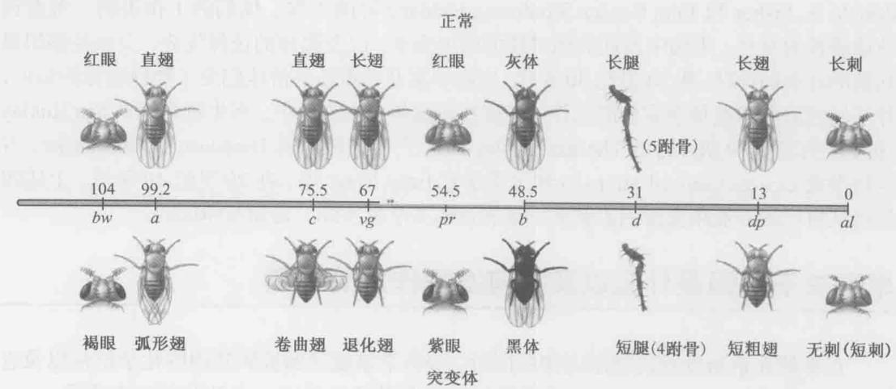  
图 1-8 果蝇 2 号染色体的遗传图。

即使两个基因处在很长的染色体的两端，因为有多次交联事件发生，它们至少有50%的概率共同分离。如果它们中间发生了奇数次的交联，两个基因就会分开；如果发生的交换次数为偶数，它们就不会分开。所以，在果蝇遗传研究的早期，经常不能确定两个基因是位于不同的染色体上还是位于一条长染色体的两端。只有定位了很多的基因后，才能令人信服地证明连锁群的数目与细胞学上可分的染色体数目相等。1915年，摩尔根与他的学生Alfred H. Sturtevant、Hermann J. Muller和Calvin B. Bridges出版了权威性的著作《孟德尔遗传的机制》（The Mechanism of Mendelian Heredity），在这本书中，他们首次宣布了遗传的染色体基础的普遍性。现在我们将这一概念与演化论和细胞理论一起作为理解生命本质的最重要成就。

#### [W] 突变引起遗传变异

现在我们有可能理解生物界中那些可遗传的变化是演化理论的基石。正常情况下，染色体复制过程中基因是忠实复制的。然而在极少数情况下，基因中还是会发生一些变化[突变（mutation）]，形成不同的等位基因，其中大部分（当然不是全部）的功能不如野生型的等位基因。显然，这样的事情应该很少发生，否则，在每一个细胞周期中都有很多基因发生突变，那么产生的后代就不再像它们的亲本。实际上，存在少量而有限度的突变是有很多好处的，它是产生变异体的稳定来源，是动植物适应不断变化的物理和生物环境所需要的。

然而，出乎意料的是，这些孟德尔学派遗传学家们的实验结果并没有被传统的生物学家所接受，研究不同生命形式的演化关系的权威人士也不接受。人们的疑问是，摩尔根和他的学生们所研究的这些遗传变异是否足以产生演化上明显不同的结构，如翅膀和眼睛。相反，这些生物学家相信，肯定还有更强有力的“大突变”存在，它们才是产生演化飞跃的原因。

然而疑问慢慢地消失了，这在很大程度上应该归功于数学遗传学家 Sewall Whigh、Ronald A. Fisher 和 John Burden Sanderson Haldane 等的工作。他们的工作表明，考虑到地球漫长的岁月，果蝇中发现的相对较低的突变率，以及温和的选择优势，应该足够积累起新的有利的性状。到 20 世纪 30 年代，生物学家开始重新评价他们关于物种起源的知识，并开始理解数学遗传学家们的工作。在这些新达尔文主义者中，有生物学家 Julian Huxley（他是达尔文的早期支持者 Thomas Huxley 的孙子）、遗传学家 Theodosius Dobzhansky、古生物学家 George Gaylord Simpson 和鸟类学家 Ernst Mayr 等。在 20 世纪 40 年代，上述四位都从自己的专业角度证明孟德尔学派和达尔文学派实际上是相互印证的。

#### [W] 早期关于基因是什么以及如何发挥作用的推测

几乎就在重新发现孟德尔定律的同时，遗传学家就开始推测基因的化学结构以及它们如何发挥功能。因为无从得知遗传物质的化学特性，所以一直没有真正的进展。

即使当时已经知道染色体中存在核酸和蛋白质也帮助不大，因为对它们的结构均一无所知。最有价值的推测是基于这样的事实，即基因肯定可以自我复制，至少在某种意义上应该如此。当一条染色体变为两个拷贝时，它们的结构肯定会得到准确的复制。这一事实立即引出了一个非常重要的化学问题，那就是一个复杂的分子是如何精确地被复制并产生与原件无异的复制件。

一些物理学家也开始对基因感兴趣,当量子力学在20世纪20年代后期横空出世时,一种观点出现了:为了了解基因,必须首先了解最先进的理论物理的奥妙。然而,这种想法从来没有真正执行,因为很明显,即使最好的物理学家或理论化学家也不会去关心结构尚待阐明的物质。只有一个事实也许会让他们有所思考,那就是1927年Muller和L. J. Stadler独立发现的X射线可以诱发突变。因为X射线轰击大基因的概率比轰击小基因的概率要高,所以可以根据某一射线剂量下照射某一特定基因诱发突变的频率大致估计基因的大小。即便如此还需要种种特定的假设,事实上没有任何人,包括Muller和Stadler本人在内,真正地重视这种可能性。

#### [W] 对基因-蛋白质之间关系的初步探索

检查某个基因的改变会影响细胞中哪一个蛋白质，是发现基因和蛋白质相互关系的最有成效的早期方法。最初这些研究相当困难，因为没有人知道器官中（如眼睛或翅膀）蛋白质的任何信息，不久人们就意识到研究简单的、具有代谢功能的基因应该比研究影响整体结构的基因更容易，在早期一个有效的例子来自影响某种氨基酸代谢的遗传病研究。人类会发生影响苯丙氨酸代谢能力的自发突变，当一个带有纯合的突变性状的个体吃了含苯丙氨酸的食物时，由于不能将苯丙氨酸转化为酪氨酸，就会造成苯基喹啉酸（phenylpyruvic acid）在血液中累积至毒性水平，这些疾病称为“先天代谢错误”。早在1909年，英国医生Archibald E. Garrod就认为其野生型基因是负责某种特定酶的表达，在纯合的突变体中，这种酶是先天缺乏的。

20 世纪 30 年代，Garrod 提出的关于基因与蛋白质相互关系的假说通过下列工作得到了进一步拓展：Haldane 和 Rose Scott-Moncrieff 在英格兰进行的关于花色素的工作，美国的 Wright 在豚鼠的毛发色素方面的工作，德国的 A. Kuhn、Boris Ephrussi 和 George W. Beadle 起初在法国、后来在加州（美国）进行的关于昆虫眼睛色素的研究。在所有的研究中，实验证据都表明特定的基因影响色素形成的特定步骤，基因的缺失会造成颜色的改变，例如，果蝇眼睛的颜色由红色变为琥珀色。然而，由于缺乏相关酶的结构的基本知识，所以不可能进一步分析基因与酶之间的关系，并且当时也不能确认大部分基因是控制蛋白质合成的（当时人们对所有的酶都是蛋白质这一观点也有怀疑），也不清楚是否所有的蛋白质都是受基因控制的。

早在 1936 年，孟德尔学派的遗传学家就清楚地意识到，如果仍沿用那些阐明孟德尔遗传学基本特征的方法进行实验，难以有效地获得关于基因是如何发挥作用的信息。相反，取而代之的应该是寻找更适合化学分析的生物学对象。他们认识到当时具备的关于核酸和蛋白质的化学知识完全不足以进行基础的生物化学研究，即使对最合适的生物系统也不行。但幸运的是，化学知识的局限性并没有阻止他们学习如何使用化学结构简单的霉类、细菌和病毒进行遗传实验。就像我们将要看到的，就在遗传学家们需要的时候，必要的化学知识也产生了。

<!-- W-END Watson 1 孟德尔学派的世界观 -->

<!-- C-BEGIN Campbell 16.1 -->

### 【英文对应 Campbell Concept 16.1：DNA is the genetic material】

> 来源：Campbell Biology（书籍/01_Campbell_Biology） 第16章 The Molecular Basis of Inheritance，Concept 16.1。

#### [EN] Concept 16.1: DNA is the genetic material

Today, even schoolchildren have heard of DNA, and scientists routinely manipulate DNA in the laboratory. Early in the 20th century, however, identifying the molecules of inheritance posed a major challenge to biologists.

#### [EN] The Search for the Genetic Material: Scientific Inquiry

Once T. H. Morgan's group showed that genes exist as parts of chromosomes (described in Concept 15.1), the two chemical components of chromosomes—DNA and protein—emerged as the leading candidates for the genetic material. Until the 1940s, the case for proteins seemed stronger: Biochemists had identified proteins as a class of macromolecules with great heterogeneity and specificity of function, essential requirements for the hereditary material. Moreover, little was known about nucleic acids, whose physical and chemical properties seemed far too uniform to account for the multitude of specific inherited traits exhibited by every organism. This view gradually changed as the role of DNA in heredity was worked out in studies of bacteria and the viruses that infect them, systems far simpler than fruit flies or humans. Let's trace the search for the genetic material as a case study in scientific inquiry.

#### [EN] Evidence That DNA Can Transform Bacteria

In 1928, a British medical officer named Frederick Griffith was trying to develop a vaccine against pneumonia. He was studying Streptococcus pneumoniae, a bacterium that causes pneumonia in mammals. Griffith had two strains (varieties) of the bacterium, one pathogenic (disease-causing) and one nonpathogenic (harmless). He was surprised to find that when he killed the pathogenic bacteria with heat and then mixed the cell remains with living bacteria of the nonpathogenic strain, some of the living cells became pathogenic (Figure 16.2). Furthermore, this newly acquired trait of pathogenicity was inherited by all the descendants of the transformed bacteria. Apparently, some chemical component of the dead pathogenic cells caused this heritable change, although the identity of the substance was not known. Griffith called the phenomenon transformation, now defined as a change in genotype and phenotype due to the taking up of external DNA by a cell. Later work by Oswald Avery, Maclyn McCarty, and Colin MacLeod identified the transforming substance as DNA.

Scientists remained skeptical, however, since many still viewed proteins as better candidates for the genetic material. Also, many biologists were not convinced that bacterial genes would be similar in composition and function to those of more complex organisms. But the major reason for the continued doubt was that so little was known about DNA.

#### [EN] Evidence That Viral DNA Can Program Cells

Additional evidence that DNA was the genetic material came from studies of viruses that infect bacteria (Figure 16.3). These viruses are called bacteriophages (meaning “bacteria-eaters”), or phages for short. Viruses are much simpler than cells. A virus is little more than

#### [EN] Figure 16.2

#### [EN] Inquiry: Can a genetic trait be transferred between different bacterial strains?

Experiment

Frederick Griffith studied two strains of the bacterium Streptococcus pneumoniae. The S (smooth) strain can cause pneumonia in mice; it is pathogenic because the cells have an outer capsule that protects them from an animal's immune system. Cells of the R (rough) strain lack a capsule and are nonpathogenic. To test for the trait of pathogenicity, Griffith injected mice with the two strains:

Living S cells (pathogenic control)

Living R cells (nonpathogenic control)

Heat-killed S cells (nonpathogenic control)

Mixture of heat-killed S cells and living R cells

Conclusion

The living R bacteria had been transformed into pathogenic S bacteria by an unknown, heritable substance from the dead S cells that enabled the R cells to make capsules.

Data from F. Griffith, The significance of pneumococcal types, Journal of Hygiene 27:113–159 (1928).

WHAT IF? How did this experiment rule out the possibility that the R cells simply used the dead S cells' capsules to become pathogenic? For suggested answer, see Appendix A.

DNA (or sometimes RNA) enclosed by a protective coat, which is often simply protein. To produce more viruses, a virus must infect a cell and take over the cell's metabolic machinery.

Phages have been widely used as tools by researchers in molecular genetics. In 1952, Alfred Hershey

#### [EN] Figure 16.3 A virus infecting a bacterial cell.

A phage called T2 attaches to a host cell and injects its genetic material through the plasma membrane, while the head and tail parts remain on the outer bacterial surface (colorized TEM).

and Martha Chase performed experiments showing that DNA is the genetic material of a phage known as T2. This is one of many phages that infect Escherichia coli (E. coli), a bacterium that normally lives in the intestines of mammals and is a model organism for molecular biologists. At that time, biologists already knew that T2, like many other phages, was composed almost entirely of DNA and protein. They also knew that the T2 phage could quickly turn an E. coli cell into a T2-producing factory that released many copies of new phages when the cell ruptured. Somehow, T2 could reprogram its host cell to produce viruses. But which viral component—protein or DNA—was responsible?

Hershey and Chase answered this question by devising an experiment showing that only one of the two components of T2 actually enters the E. coli cell during infection (Figure 16.4). In their

#### [EN] Figure 16.4

#### [EN] Inquiry: Is protein or DNA the genetic material of phage T2?

#### [EN] Experiment

Alfred Hershey and Martha Chase used radioactive sulfur and phosphorus to trace the fates of protein and DNA, respectively, of T2 phages that infected bacterial cells. They

1 Mixed radioactively labeled phages with bacteria. The phages infected the bacterial cells.

wanted to see which of these molecules entered the cells and could reprogram them to make more phages.

2 Agitated the mixture in a blender to free the phage parts outside the bacteria from the cells.

3 Centrifuged the mixture so that bacteria formed a pellet at the bottom of the test tube; free phages and phage parts, which are lighter, remained suspended in the liquid.

4 Measured the radioactivity in the pellet and the liquid.

Batch 1: Phages were grown with radioactive sulfur ( $^{35}$ S), which was incorporated into phage protein (pink).

Radioactivity (phage protein) found in liquid

Batch 2: Phages were grown with radioactive phosphorus ( $^{32}$ P), which was incorporated into phage DNA (blue).

#### [EN] Results

When proteins were labeled (batch 1), radioactivity remained outside the cells, but when DNA was labeled (batch 2), radioactivity was found inside the cells. Cells containing radioactive phage DNA released new phages with some radioactive phosphorus.

#### [EN] Conclusion

Phage DNA entered bacterial cells, but phage proteins did not. Hershey and Chase concluded that DNA, not protein, functions as the genetic material of phage T2.

Data from A. D. Hershey and M. Chase, Independent functions of viral protein and nucleic acid in growth of bacteriophage, Journal of General Physiology 36:39–56 (1952).

WHAT IF? How would the results have differed if proteins carried the genetic information?

For suggested answer, see Appendix A.

experiment, they used a radioactive isotope of sulfur to tag protein in one batch of T2 and a radioactive isotope of phosphorus to tag DNA in a second batch. Because protein, but not DNA, contains sulfur, radioactive sulfur atoms were incorporated only into the protein of the phage. In a similar way, the atoms of radioactive phosphorus labeled only the DNA, not the protein, because nearly all the phage's phosphorus is in its DNA. In the experiment, different samples of nonradioactive E. coli cells were infected separately with the protein-labeled and DNA-labeled batches of T2. The researchers then tested the two samples shortly after the onset of infection to see which type of radioactively labeled molecule—protein or DNA—had entered the bacterial cells and would therefore be capable of reprogramming them.

Hershey and Chase found that the phage DNA entered the host cells, but the phage protein did not. Moreover, when these bacteria were returned to a culture medium and the infection ran its course, the E. coli released phages that contained some radioactive phosphorus. This result further showed that the DNA inside the cell played an ongoing role during the infection process. They concluded that the DNA injected by the phage must be the molecule carrying the genetic information that makes the cells produce new viral DNA and proteins. The Hershey-Chase experiment was a landmark study because it provided powerful evidence that nucleic acids, rather than proteins, are the hereditary material, at least for certain viruses.

#### [EN] Additional Evidence That DNA Is the Genetic Material

Further evidence that DNA is the genetic material came from the laboratory of biochemist Erwin Chargaff. DNA was known to be a polymer of nucleotides, each having three components: a nitrogenous (nitrogen-containing) base, a pentose sugar called deoxyribose, and a phosphate group (Figure 16.5). The base can be adenine (A), thymine (T), guanine (G), or cytosine (C). Chargaff analyzed the base composition of DNA from a number of different organisms. In 1950, he reported that the base composition of DNA varies from one species to another. For example, he found that 32.8% of sea urchin DNA nucleotides have the base A, whereas only 24.7% of those from the bacterium E. coli have an A. This evidence of molecular diversity among species, which most scientists had presumed to be absent from DNA, made DNA a more credible candidate for the genetic material.

Chargaff also noticed a peculiar regularity in the ratios of nucleotide bases. In the DNA of each species he studied, the number of adenines approximately equaled the number of thymines, and the number of guanines approximately equaled the number of cytosines. In sea urchin DNA, for example, the four bases are present in these percentages: A = 32.8% and T = 32.1%; G = 17.7% and C = 17.3%. (The percentages are not exactly the same because of limitations in Chargaff's techniques.)

These two findings became known as Chargaff's rules: (1) DNA base composition varies between species, and (2) for each species, the percentages of A and T bases are roughly equal, as are those of G and C bases. In the Scientific Skills Exercise, you can use Chargaff's rules to predict percentages of nucleotide bases. The basis for these rules remained unexplained until the discovery of the double helix.

#### [EN] Figure 16.5 The structure of a DNA strand.

Each DNA nucleotide monomer consists of the sugar deoxyribose (blue pentagon) attached to both a nitrogenous base (A, T, G, or C), and a phosphate group (yellow circle). The phosphate group of one nucleotide is attached to the sugar of the next by a covalent bond, forming a “backbone” of alternating phosphates and sugars from which the bases project. A polynucleotide strand has directionality, from the 5' end (with the phosphate group) to the 3' end (with the —OH group of the sugar). 5' and 3' refer to the numbers assigned to the carbons in the sugar ring (see magenta numbers).

Sugar-phosphate backbone

Nitrogenous bases

#### [EN] Building a Structural Model of DNA

Once most biologists were convinced that DNA was the genetic material, the challenge was to determine how the structure of DNA could account for its role in inheritance. By the early 1950s, the arrangement of covalent bonds in a nucleic acid polymer was well established (see Figure 16.5), and researchers focused on discovering the three-dimensional structure of DNA. Among the scientists working on the problem were Linus Pauling, at the California Institute of Technology, and Maurice Wilkins and Rosalind Franklin, at King's College in London. First to come up with the complete answer, however, were two scientists who were relatively unknown at the time—the American James Watson and the Englishman Francis Crick.

The collaborative work that solved the puzzle of DNA structure began soon after Watson went to Cambridge University, where Crick

#### [EN] Scientific Skills Exercise Working with Data in a Table

Given the Percentage Composition of One Nucleotide in a Genome, Can We Predict the Percentages of the Other Three Nucleotides? Even before the structure of DNA was elucidated, Erwin Chargaff and his co-workers noticed a pattern in the base composition of nucleotides from different species: The percentage of adenine (A) bases roughly equaled that of thymine (T) bases, and the percentage of cytosine (C) bases roughly equaled that of guanine (G) bases. Further, the percentage of each pair (A–T or C–G) varied from species to species. We now know that the 1:1 A/T and C/G ratios are due to complementary base pairing between A and T and between C and G in the DNA double helix, and differences between species are due to the unique sequences of bases along a DNA strand. In this exercise, you will apply Chargaff's rules to predict the composition of bases in a genome.

How the Experiments Were Done In Chargaff's experiments, DNA was extracted from the given species, hydrolyzed to break apart the nucleotides, and then analyzed chemically. These studies provided approximate values for each type of nucleotide. (Today, whole-genome sequencing allows base composition analysis to be done more precisely directly from the sequence data.)

Data from the Experiments Tables are useful for organizing sets of data representing a common set of values (here, percentages of A, G, C, and T) for a number of different samples (in this case, from different species). You can apply the patterns that you see in the known data to predict unknown values. In the table shown here, the complete base distribution data are given for sea urchin DNA and salmon DNA; you will use Chargaff's rules to fill in the rest of the table with predicted values.

was studying protein structure with a technique called X-ray crystallography (see Figure 5.21). While visiting the laboratory of Maurice Wilkins, Watson saw an X-ray diffraction image of DNA produced by Wilkins's accomplished colleague Rosalind Franklin (Figure 16.6). Images produced by X-ray crystallography are not actually pictures of molecules. The spots in the image were produced by X-rays that were diffracted (diverted) as they passed through aligned fibers of purified DNA. Watson was familiar with the type of X-ray diffraction pattern of helical molecules, and seeing the photo that Wilkins showed him confirmed that DNA was helical in shape. The photo also added to earlier data obtained by Franklin and others suggesting the width of the helix and the spacing of the nitrogenous bases along it. The pattern in this photo implied that the helix was made up of two strands, contrary to a three-stranded model proposed by Linus Pauling a short time earlier. The presence of two strands accounts for the now-familiar term double helix. DNA is shown in some of its many different representations in Figure 16.7. Watson and Crick began building models of a double helix that would conform to the X-ray measurements and what was then

<table><tr><td rowspan="2">Source of DNA</td><td colspan="4">Base Percentage</td></tr><tr><td>Adenine</td><td>Guanine</td><td>Cytosine</td><td>Thymine</td></tr><tr><td>Sea urchin</td><td>32.8</td><td>17.7</td><td>17.3</td><td>32.1</td></tr><tr><td>Salmon</td><td>29.7</td><td>20.8</td><td>20.4</td><td>29.1</td></tr><tr><td>Wheat</td><td>28.1</td><td>21.8</td><td>22.7</td><td></td></tr><tr><td>E. coli</td><td>24.7</td><td>26.0</td><td></td><td></td></tr><tr><td>Human</td><td>30.4</td><td></td><td></td><td>30.1</td></tr><tr><td>Ox</td><td>29.0</td><td></td><td></td><td></td></tr><tr><td>Average %</td><td></td><td></td><td></td><td></td></tr></table>

Data from several papers by Chargaff: for example, E. Chargaff et al., Composition of the desoxypentose nucleic acids of four genera of sea-urchin, Journal of Biological Chemistry 195: 155–160 (1952).

#### [EN] INTERPRET THE DATA

1. Explain how the sea urchin and salmon data demonstrate both of Chargaff's rules.

2. Using Chargaff's rules, fill in the table with your predictions of the missing percentages of bases, starting with the wheat genome and proceeding through $E. coli$ , human, and ox. Show how you arrived at your answers.

3. If Chargaff's rule—that the amount of A equals the amount of T and the amount of C equals the amount of G—is valid, then hypothetically we could extrapolate this to the combined DNA of all species on Earth (like one huge Earth genome). To see whether the data in the table support this hypothesis, calculate the average percentage for each base in your completed table by averaging the values in each column. Does Chargaff's equivalence rule still hold true?

Instructors: A version of this Scientific Skills Exercise can be assigned in Mastering Biology.

Figure 16.6 Rosalind Franklin and her X-ray diffraction photo of DNA.  
  
(a) Rosalind Franklin

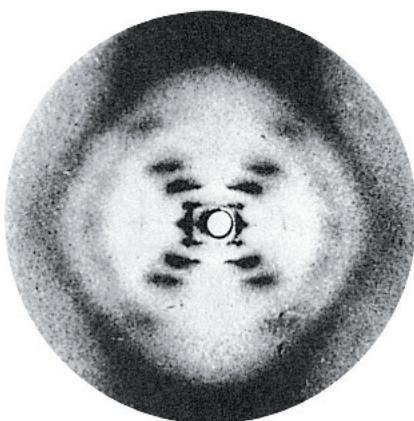  
(b) Franklin's X-ray diffraction photograph of DNA

Diameter $= 2\mathrm{nm}$

One full turn every 10 base pairs (3.4 nm)

#### [EN] Visualizing DNA

#### [EN] Figure 16.7

DNA can be illustrated in many ways, but all diagrams represent the same basic structure. The level of detail shown depends on the process or the type of information being conveyed.

Here, the two DNA strands are shown untwisted so it's easier to see the chemical details. Note that the strands are antiparallel—they are oriented in opposite directions, like the lanes of a divided street.

#### [EN] Structural Images

The space-filling model on the left shows the 3-D shape of the DNA double helix; the diagram on the right shows chemical details of DNA's structure. In both images, phosphate groups are yellow, deoxyribose sugars are blue, and nitrogenous bases are shades of green and orange.

The DNA double helix is "right-handed." To see why, picture a person's right hand held as shown, following the sugar phosphate backbone up the helix and around to the back. (It won't work with their left hand.)

1. Describe the bonds that hold together the nucleotides in one DNA strand. Then compare them with the bonds that hold the two DNA strands together.

2. How do the two ends of a DNA strand differ in structure?

#### [EN] Simplified Images

When molecular detail is not necessary, DNA is portrayed in a range of simplified diagrams, depending on the focus of the figure.

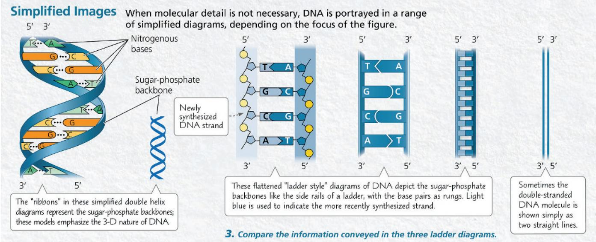

These flattened "ladder style" diagrams of DNA depict the sugar-phosphate backbones like the side rails of a ladder, with the base pairs as rungs. Light blue is used to indicate the more recently synthesized strand.

Sometimes the double-stranded DNA molecule is shown simply as two straight lines.

3. Compare the information conveyed in the three ladder diagrams.

#### [EN] DNA Sequences

Genetic information is carried in DNA as a linear sequence of nucleotides that may be transcribed into mRNA and translated into a polypeptide. When focusing on the DNA sequence, each nucleotide can be represented simply as the letter of its base: A, T, C, or G.

3' - ACGTAAGCGGTTAAT-5'
5' - TGCATTTCGCCAATTA-3'

Instructors: Additional questions related to this Visualizing Figure can be assigned in Mastering Biology. For suggested answers, see Appendix A.

known about the chemistry of DNA, including Chargaff's rule of base equivalences. Having also read an unpublished annual report summarizing Franklin's work, they knew she had concluded that the sugar-phosphate backbones were on the outside of the DNA molecule, contrary to their working model. Franklin's arrangement was appealing because it put the negatively charged phosphate groups facing the aqueous surroundings, while the relatively hydrophobic nitrogenous bases were hidden in the interior. Watson constructed such a model, in which the two sugar-phosphate backbones are antiparallel—that is, their subunits run in opposite directions (see Figure 16.7). You can imagine the overall arrangement as a rope ladder with rigid rungs. The side ropes represent the sugar-phosphate backbones, and the rungs represent pairs of nitrogenous bases. Now imagine twisting the ladder to form a helix. Franklin's X-ray data indicated that the helix makes one full turn every $3.4\mathrm{nm}$ along its length. With the bases stacked just $0.34\mathrm{nm}$ apart, there are ten layers of base pairs, or rungs of the ladder, in each full turn of the helix.

The nitrogenous bases of the double helix are paired in specific combinations: adenine (A) with thymine (T), and guanine (G) with cytosine (C). It was mainly by trial and error that Watson and Crick arrived at this key feature of DNA. At first, Watson imagined that the bases paired like with like—for example, A with A and C with C. But this model did not fit the X-ray data, which suggested that the double helix had a uniform diameter. Why is this requirement inconsistent with like-with-like pairing of bases? Adenine and guanine are purines, nitrogenous bases with two organic rings, while cytosine and thymine are nitrogenous bases called pyrimidines, which have a single ring. Pairing a purine with a pyrimidine is the only combination that results in a uniform diameter for the double helix (Figure 16.8).

Watson and Crick reasoned that there must be additional specificity of pairing dictated by the structure of the bases. Each base has chemical side groups that can form hydrogen bonds with its appropriate partner: Adenine can form two hydrogen bonds with thymine and only thymine; guanine forms three hydrogen bonds with cytosine and only cytosine. In shorthand, A pairs with T, and G pairs with C (Figure 16.9).

The Watson-Crick model took into account Chargaff's ratios and ultimately explained them. Wherever one strand of a DNA molecule has an A, the partner strand has a T. Similarly, a G in one strand is always paired with a C in the complementary strand. Therefore, in the DNA of any organism, the amount of adenine equals the amount of thymine, and the amount of guanine equals the amount of cytosine. (Modern DNA-sequencing techniques have confirmed that the amounts are exactly equal.) Although the

Purine + purine: too wide

  
Pyrimidine + pyrimidine: too narrow  
Purine + pyrimidine: width consistent with X-ray data

#### [EN] Figure 16.9 Base pairing in DNA.

Nitrogenous base pairs are held together by hydrogen bonds.

Figure 16.8 Possible base pairings in the DNA double helix.  
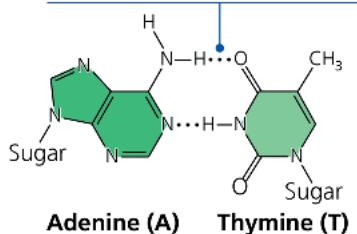

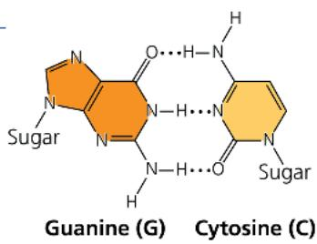

base-pairing rules dictate the combinations of nitrogenous bases that form the “rungs” of the double helix, they do not restrict the sequence of nucleotides along each DNA strand. The linear sequence of the four bases can be varied in countless ways, and each gene has a unique base sequence.

In April 1953, Watson and Crick surprised the scientific world with a succinct, one-page paper that reported their molecular model for DNA: the double helix, which has since become an icon of molecular biology. They did not include Rosalind Franklin as an author, in spite of using her data to build their model. Watson and Crick, along with Maurice Wilkins, were awarded the Nobel Prize in 1962 for this work. (Sadly, Franklin had died at the age of 37 in 1958 and was thus ineligible for the prize.) The beauty of the double helix model was that the structure of DNA suggested the basic mechanism of its replication.

#### [EN] Concept Check 16.1

1. Given a polynucleotide sequence such as GAATTC, explain what further information you would need in order to identify which is the 5' end. (See Figure 16.5.)

2. VISUAL SKILLS While trying to develop a vaccine for S. pneumoniae, Griffith was surprised to discover the phenomenon of bacterial transformation. Based on the results in the second and third panels of Figure 16.2, what result was he expecting in the fourth panel? Explain.

For suggested answers, see Appendix A.

<!-- C-END Campbell 16.1 -->

## 1.2 分子生物学简史

分子生物学是研究核酸、蛋白质等所有生物大分子的形态、结构特征及其重要性、规律性和相互关系的科学，是人类从分子水平上真正揭开生物世界的奥秘，由被动地适应自然界转向主动地改造和重组自然界的基础学科。当人们意识到同一生物不同世代之间的连续性是由生物体自身所携带的遗传物质所决定的，科学家为揭示这些遗传密码所进行的努力就成为人类征服自然的一部分，而以生物大分子为研究对象的分子生物学就迅速成为现代生物学领域里最具活力的科学。

在蛋白质化学方面,继 Sumner 在 1936 年证实酶是蛋白质之后,Sanger 利用纸电泳及层析技术于 1953 年首次阐明胰岛素的一级结构,开创了蛋白质序列分析的先河。而 Kendrew 和 Perutz 利用 X 射线衍射技术解析了肌红蛋白(myoglobin)及血红蛋白(hemoglobin)的三维结构,论证了这些蛋白质在输送分子氧过程中的特殊作用,成为研究生物大分子空间立体构型的先驱。为了解分子生物学进程,我们不妨来看一看以部分诺贝尔生理学或医学奖和化学奖作为纽带的分子生物学发展简史。

1959 年,美籍西班牙裔科学家 Severo Ochoa 发现了细菌的多核苷酸磷酸化酶,成功地合成了核糖核酸,研究并重建了将基因内的遗传信息通过 RNA 中间体翻译成蛋白质的过程。他和 Kornberg 分享了当年的诺贝尔生理学或医学奖,而后者的主要贡献在于实现了 DNA 分子在细菌细胞和试管内的复制。

1965 年,法国科学家 Jacob 和 Monod 由于提出并证实了操纵子 (operon) 作为调节细菌细胞代谢的分子机制而与 Iwoff 分享了诺贝尔生理学或医学奖。除了著名的操纵子模型以外, Jacob 和 Monod 还首次提出存在一种与染色体 DNA 序列相互补,能将编码在染色体 DNA 上的遗传信息带到蛋白质合成场所 (细胞质) 并翻译产生蛋白质的信使核糖核酸,即 mRNA 分子。他们的这一学说对分子生物学的发展起了极其重要的指导作用。

1968 年, 美国科学家 Nirenberg 由于在破译 DNA 遗传密码方面的贡献, 与 Holly 和

Khorana 等人分享了诺贝尔生理学或医学奖。Holly 的主要功绩在于阐明了酵母丙氨酸 tRNA 的核苷酸序列, 并证实所有 tRNA 具有结构上的相似性, 而 Khorana 第一个合成了核酸分子, 并且人工复制了酵母基因。

1975 年,美国人 Temin、Dulbecco 和 Baltimore 由于发现在 RNA 肿瘤病毒中存在以 RNA 为模板,反转录生成 DNA 的反转录酶而共享诺贝尔生理学或医学奖。

1980 年, Sanger 因设计出一种测定 DNA 分子内核苷酸序列的方法, 而与 Gilbert 和 Berg 分获诺贝尔化学奖。Berg 是研究 DNA 重组技术的元老, 他最早 (1972) 获得了含有编码哺乳动物激素基因的工程菌株。Sanger 与 Gilbert 发明的 DNA 序列分析法至今仍被广泛使用, 成为分子生物学最重要的研究手段之一。此外, Sanger 还由于测定了牛胰岛素的一级结构而获得 1958 年诺贝尔化学奖。

1983 年,美国遗传学家 McClintock 由于在 50 年代提出并发现了可移动的遗传因子 (jumping gene, 或称 mobile element) 而获得诺贝尔生理学或医学奖。

1984 年, 德国人 Kohler、美国人 Milstein 和丹麦科学家 Jerne 由于发展了单克隆抗体技术, 完善了极微量蛋白质的检测技术而分享了诺贝尔生理学或医学奖。

1989 年,美国科学家 Altman 和 Cech 由于发现某些 RNA 具有酶的功能(称为核酶)而共享诺贝尔化学奖。Bishop 和 Varmus 由于发现正常细胞同样带有原癌基因而分享当年的诺贝尔生理学或医学奖。

1993 年,美国科学家 Roberts 和 Sharp 由于在断裂基因方面的工作而荣获诺贝尔生理学或医学奖,美国科学家 Mullis 由于发明 PCR 仪而与第一个设计基因定点突变的 Smith 共享诺贝尔化学奖。

1994 年,美国科学家 Gilman 和 Rodbell 由于发现了 G 蛋白在细胞内信息传导中的作用而分享诺贝尔生理学或医学奖。

1995 年,美国人 Lewis、德国人 Nusslein-Volhard 和美国人 Wieschaus 由于在 40—70 年代先后独立鉴定了控制果蝇体节发育基因而分享诺贝尔生理学或医学奖。

1996 年,澳大利亚科学家 Doherty 和瑞士人 Zinkernagel 由于阐明了 T 淋巴细胞的免疫机制而分享了当年的诺贝尔生理学或医学奖。他们发现,白细胞只有同时识别入侵病原物和与之相伴的主要组织不相容抗原,才能准确识别受病原侵害的细胞并将其清除掉。

1997 年,美国科学家 Prusiner 由于发现朊病毒(prion)作为早老性痴呆症(CJD 综合征)等疾病的病原并能直接在宿主细胞中繁殖传播而获得诺贝尔生理学或医学奖。

2006 年,美国科学家 Kornberg 由于在揭示真核细胞转录机制方面的杰出贡献获得诺贝尔化学奖。美国科学家 Fire 和 Mello 由于在揭示控制遗传信息流动的基本机制——RNA 干扰方面的杰出贡献而获得诺贝尔生理学或医学奖。

2009 年,澳籍美国科学家 Elizabeth Blackburn 由于揭示了端粒和端粒酶(telomere and telomearse)在保护染色体免遭降解方面的贡献,与她早期的博士生 Carol Greider 以及 Jack Szostak 共同获得诺贝尔生理学或医学奖。这是第 100 届诺贝尔生理学或医学奖,也是诺贝尔科学奖史上第一次有两个女科学家同时获奖。

第1章 绪论

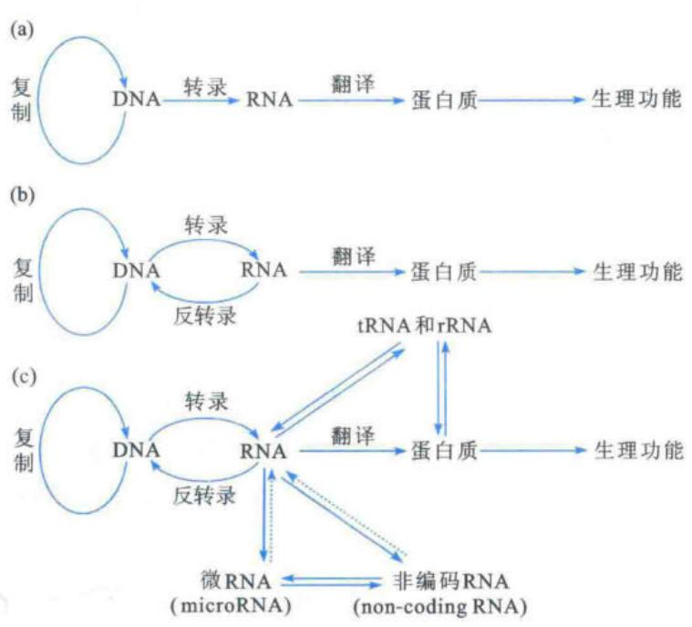  
图1-7 遗传信息传递的中心法则  
(a) Crick 在 1954 年首次提出的“中心法则”草图；(b) 20 世纪 70—80 年代广为流传的“中心法则”示意图；(c) 进入 21 世纪后修正的“中心法则”示意图。

2010 年,英国科学家 Robert G. Edwards 因为在试管婴儿和体外授精方面的杰出研究获得诺贝尔生理学或医学奖。Edwards 从 20 世纪 50 年代开始体外授精实验,长期得不到科学界和舆论的支持,英国医学研究基金会曾完全停止资助该项目。获奖时,他已经完全瘫痪,他的夫人在病床前“告诉”他这个迟来的褒奖。

此外, Avery 等人(1944)关于强致病性光滑型(S 型)肺炎链球菌 DNA 导致无毒株粗糙型(R 型)细菌发生遗传转化的实验, Meselson 和 Stahl(1958)关于 DNA 半保留复制的实验, Crick 于 1954 年所提出的遗传信息传递规律(即中心法则)(图 1-7), Yanofsky 和 Brener(1961)关于遗传密码三联子的设想都对分子生物学的发展起了重大作用, 将被永远记入史册。

我国生物科学家吴宪20世纪20年代初在北京协和医学院生化系与汪猷、张昌颖等人一道完成了蛋白质变性理论、血液生化检测和免疫化学等一系列有重大影响的研究，成为我国生物化学界的先驱。20世纪60年代、70年代和80年代，我国科学家相继实现了人工全合成有生物学活性的结晶牛胰岛素，解出了三方二锌猪胰岛素的晶体结构，采用有机合成与酶促相结合的方法完成了酵母丙氨酸转移核糖核酸的人工全合成，在酶学研究、蛋白质结构及生物膜结构与功能等方面都有世所瞩目的建树。

<!-- W-BEGIN Watson 2 核酸承载遗传信息 -->

### 【中文对照 Watson 第2章：核酸承载遗传信息】

> 来源：Watson《基因的分子生物学》第七版中译本（书籍/03_基因的分子生物学_第七版） 第2章 核酸承载遗传信息。

#### [W] 第2章

#### [W] 核酸承载遗传作息

#### [W] 本章概要

本章概要
Avery 的惊人发现: DNA 能够携带遗传特性
双螺旋
DNA 中的遗传信息是由 4 种核苷酸单元形成的序列所承载的
中心法则
确定蛋白质合成的方向
基因组学时代

早在化学家们注意到存在承载遗传信息的特殊分子之前，遗传学家们就已着手探寻这种分子了。20世纪30年代，遗传学家就开始推测什么样的分子可能具有基因所需要的稳定性，同时又能长久地、偶然地发生突变，这是演化的基础。直到40年代中期，似乎还没有直接的方式可以探求基因的化学本质。人们早就知道染色体含有一种特殊的分子——脱氧核糖核酸（DNA），但是没有办法证明这种分子携带遗传信息，相反，却认为DNA仅仅是一种分子支架，支撑某种尚未发现的、专门携带遗传信息的蛋白质。当时认为基因是由氨基酸组成的，因为氨基酸看起来是唯一具有足够复杂

度并能够携带遗传信息的生物分子。

因此，探索基因在细胞中的作用，进而了解基因的本质就颇有意义了。在20世纪40年代早期，以George W. Beadle和Edward Tatum为先锋对脉孢菌（Neurospora）的研究中，发现越来越多的证据支持30年前Garrod提出的假说，即基因的任务就是控制特定酶的合成（一个基因一个酶假说）。当时已经知道所有已知的酶都是蛋白质，关键的问题是基因参与蛋白质合成的方式。从种种推测开始，最简单的假说就是基因中的遗传信息决定蛋白质多肽链中20种不同氨基酸的顺序。

验证这一假说，凭直觉几乎没有什么用，即使对最好的生物化学家也如此，因为用酶作为工具检测添加到多肽链中的氨基酸的顺序是不合逻辑的。如果那样的话就应该需要同蛋白质所含氨基酸数目相同的排序酶，才能合成蛋白质。但是，当时所有已知的酶自身也都是蛋白质（现在我们知道RNA在个别情况下也可以发挥酶的功能），那么（如果按上述逻辑），就需要另外的排序酶来合成排序酶。这显然是一个自相矛盾的怪圈，除非我们假定有一种异乎寻常的、互相衔接的合成，其中某个特定的蛋白质具有许多不同的酶的特性。在这样的假设前提下，我们才有可能看到（将是非常困难的）一个可以行使功能的细胞。然而，大部分蛋白质不可能执行多种功能。事实上，现在所有的知识指向相反的方向，即一种蛋白质一种功能。

#### [W] Avery 的惊人发现：DNA 能够携带遗传特性

肺炎致病菌的研究出人意料地显示，DNA 有可能是主要的遗传分子。1928 年，英国微生物学家 Frederick Griffith 观察到开创性的结果：当非致病肺炎链球菌菌株与热灭活的同种致病菌混合后，成为致病的细菌。这种从非致病菌向致病菌的转化（transformation）表明了遗传的改变，这一现象通过新成为致病菌的后代菌株转化其他的非致病细菌可以重复出来。这就产生了一种推测，即当病原细胞被热灭活时，其遗传组分并没有被破坏。而且，一旦这些遗传组分从热灭活的细胞中释放出来，还能穿过活的受体细胞的细胞壁并与受体的遗传组分进行重组（图 2-1）。随后的研究验证了对这一遗传现象的解释。致病性显示了荚膜基因的功能，该基因编码一个含糖的、与荚膜合成相关的关键酶，在大多数致病肺炎菌上都有这种荚膜。当 S（smooth，平滑的）型荚膜等位基因存在时，致病性必需的荚膜就会在细胞的外围形成（形成荚膜的同时也会使细菌所形成的菌落呈现平滑的外观）；当 R（rough，粗糙的）型等位基因存在时，没有荚膜形成，相应的细胞是非致病的，这些细胞形成的菌落的边缘是粗糙的。

  
图 2-1 通过遗传背景不同的热灭活菌株，转化另一种细菌（肺炎双球菌）的遗传特性。本图表明 R 型菌株接受来自热灭活的 S 型菌株的包含荚膜基因的染色体片段。由于大多数 R 型细胞接受的是别的染色体片段，因此特定基因的转化率通常低于 1%。

在 Griffith 观察到上述现象的最初几年内，又发现灭活后的细菌抽提物也可以诱发遗传转化，他们立即展开了确定这种转化因子化学本质的工作。当时，大部分生化学家仍然相信基因应该是蛋白质。所以，历经十几年的研究，美国微生物学家 Oswald T. Avery 与他在纽约洛克菲勒研究所的同事 Colin M. MacLeod 和 Maclyn McCarty 在 1944 年宣布了他们的重要发现，即有活性的遗传物质是 DNA（图 2-2），所有人都大吃一惊。支持他们结论的关键实验是：所获得的高度纯化的活性组分的转化活性可以被来自胰腺的脱氧核糖核酸酶所破坏。该酶是刚刚纯化的，可以特异性地把 DNA 分子降解成核苷酸，但是对蛋白质或 RNA 的完整性没有任何影响。添加胰腺的核糖核酸酶（可以降解 RNA）或各种蛋白酶（破坏蛋白质）对转化活性都没有影响。

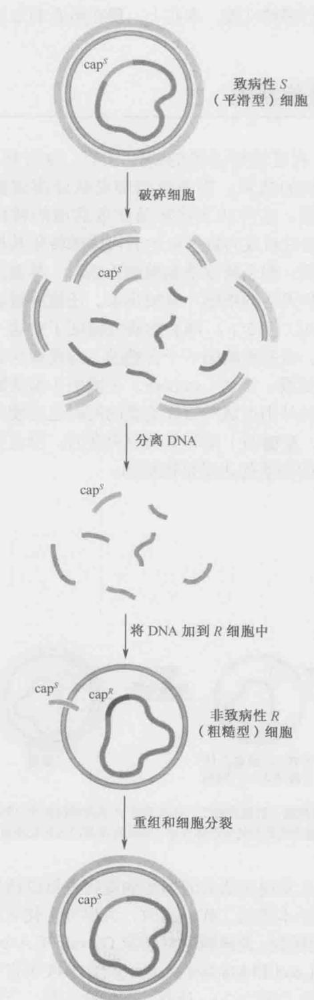  
图 2-2 分离纯化转化因子。(来源: Stahl F.W. 1964. The mechanics of inheritance, Fig. 2.3. © Pearson Education, Inc.)

#### [W] 病毒基因也是核酸

对病毒及被病毒感染的细胞进行化学性质研究为上述理论提供了更重要的支持证据。到

  
图 2-3 图示只有 T2 噬菌体的 DNA 组分携带遗传信息，蛋白质外壳只具有保护作用。

1950年，已经可以获得若干足够纯度的病毒，并能够检测病毒中含有什么类型的分子。这项工作得到一个非常重要的且具有广泛意义的结论，即所有的病毒都含有核酸。当时已经越来越意识到病毒是含有遗传物质的，所以立即就提出了一个问题：是不是核酸就是病毒基因的载体呢？为了回答这一问题，1952年Alfred D. Hershey和Martha Chase在纽约长岛的冷泉港实验室完成了一项实验，用同位素研究细菌病毒T2［噬菌体（bacteriophage，phage）］的增殖，这种噬菌体由DNA核心区，以及由多种不同的蛋白质分子集合形成的、起保护作用的外壳组成。他们将蛋白质外壳用放射性同位素 $^{35}\mathrm{S}$ 标记，核心区DNA用放射性同位素 $^{32}\mathrm{P}$ 标记。然后用标记的病毒跟踪蛋白质和核酸在噬菌体增殖过程中的走向，主要是检测亲本病毒标记的哪种原子进入宿主细胞并出现在后代噬菌体中。

这些实验获得的结果清楚无误地表明，在后代噬菌体中能够检测到大量的亲本噬菌体的核酸，而没有任何亲本蛋白质（图 2-3）。此外，实验还证明几乎没有亲本蛋白质进入细菌，而只能吸附在细菌细胞外，当 DNA 进入细菌细胞后这些蛋白质就没有任何功能了。这一点由以下实验巧妙地证明：在 DNA 进入细胞后剧烈振荡侵染的细菌，结果吸附在细菌上的外壳蛋白脱落但并不影响细菌形成新的噬菌体颗粒。

利用某些病毒，现在可以进行更令人信服的实验。例如，从小鼠多瘤病毒纯化的DNA可以进入小鼠细胞，启动病毒繁殖的周期并产生数以千计新的多瘤病毒颗粒。所以，病毒蛋白质的基本功能就是在细胞间移动过程中保护其遗传成分——核酸。

#### [W] 双螺旋

用 X 射线分析蛋白质结构的同时，少衍射图谱。1938 年 William Astbury 用 Ola Hammarsten 和 Torbjorn Caspersson 提供的 DNA 样品拍摄到了第一张衍射图谱。但直到 20 世纪 50 年代初期，Maurice Wilkins 和 Rosalind Franklin 才获得了高质量的 X 射线衍射照片（图 2-4）。从这些照片来看，DNA 的结构应该是螺旋形的，而且不止一条多核苷酸链，不是 2 条就是 3 条。与此同时，将 DNA 分子连接起来的共价键也清楚了。1952 年，一群在 Alexander Todd 实验室工作的有机化学家证明：将 DNA 的核苷酸结合在一起的是 3'-5' 磷酸二酯键（图 2-5）。

出于对 Linus Pauling 的 $\alpha$ 螺旋蛋白基序

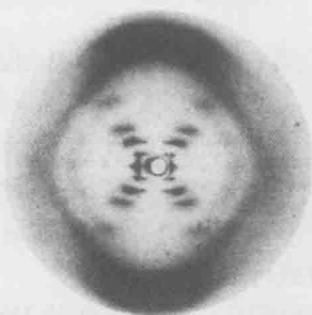  
图 2-4 用来阐明 DNA 结构的关键 X 射线照片。这张照片由 Rosalind Franklin 于 1952～1953 年冬天在伦敦 King 学院拍摄，它证明了 DNA 是螺旋形结构的猜想。照片中心的十字形的 X 射线反射图形表明了螺旋的形式（X 射线照片上暗的部位）；位于顶端和底部的很深的黑色区域表明相距 3.4 Å 的嘌呤和嘧啶碱基是规则的相邻叠加的，并垂直于螺旋轴。（来源：Franklin R. E. and Gosling R.G. 1953. Nature171: 740-741，经许可）。

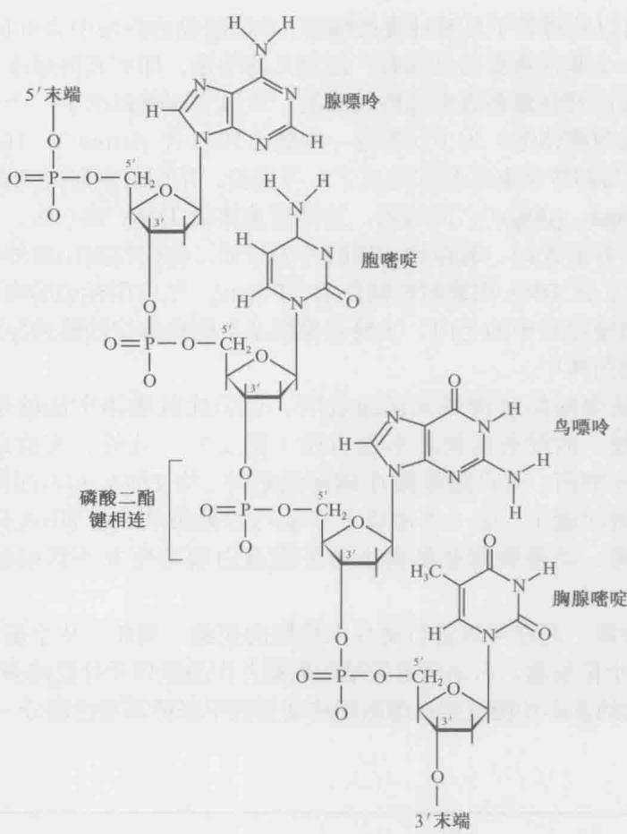  
图 2-5 DNA 多聚核苷酸的一部分，图示连接核苷酸的 3'-5' 的磷酸二酯键的连接方式。磷酸基团将一个核苷酸的 3' 碳原子与另一个核苷酸的 5' 碳原子相连。

(motif)（第6章）的兴趣，William Cochran、Francis H. Crick和Vladimir Vand在1951年建立了一种很好的关于螺旋分子的衍射理论，使探索可能的DNA结构更为简单。1953年，克里克（Francis H. Crick）和沃森（James D. Watson）提出了正确的互补双螺旋理论（见第4章），当时他们是在Max Perutz和John Kendrew的实验室工作。正确答案的获得主要依赖于发现了与Wilkins和Franklin的X射线衍射数据相符合并且从立体化学角度来讲最可能的构象。

在双螺旋中，两条反向的 DNA 链由碱基对之间的氢键（一种非共价的化学弱键，见第 3 章）结合在一起（图 2-6）。这种碱基配对是高度特异的：腺嘌呤只与胸腺嘧啶配对，而鸟嘌呤只与胞嘧啶配对。在双螺旋 DNA 分子中，A 残基的数目一定与 T 残基的数目相等，同样地，G 的数目一定与 C 的数目相等（见框 2-1）。结果是，双螺旋的两条链的碱基序列有互补的关系，其中任何一条 DNA 链的序列都严格地决定了其对应链的序列。

双螺旋结构的发现对许多遗传学家分析数据的方式带来了意义深远的革命。基因不

#### [W] 框 2-1 Chargaff 定律

生化学家 Erwin Chargaff 用纸层析技术分析 DNA 的核苷酸组成。1949 年，他提出的数据表明不但 4 种不同的核苷酸的含量不同，而且 4 种核苷酸的比率在不同的物种中也不一样（框 2-1 表 1）。这些发现意味着一种可能性，即 DNA 分子中核苷酸的精确排列承载着其遗传特性。

Chargaff 实验同时也表明，4 种碱基的相对比率不是随机的。所有 DNA 样品中，A 残基数目与 T 残基数目相等，而 G 残基数目等于 C 残基数目。另外，不论 DNA 的来源如何，嘌呤与嘧啶的比值都大体上等于（嘌呤 = 嘧啶）。在知道 DNA 的三维结构之前是难以理解 A = T 和 G = C 的关系（Chargaff 定律）的重要意义的。

框2-1 表1奠定Chargaff定律的数据

<table><tr><td>来源</td><td>A:G</td><td>T:C</td><td>A:T</td><td>G:C</td><td>嘌呤:嘧啶</td></tr><tr><td>牛</td><td>1.29</td><td>1.43</td><td>1.04</td><td>1.00</td><td>1.1</td></tr><tr><td>人</td><td>1.56</td><td>1.75</td><td>1.00</td><td>1.00</td><td>1.0</td></tr><tr><td>母鸡</td><td>1.45</td><td>1.29</td><td>1.06</td><td>0.91</td><td>0.99</td></tr><tr><td>鲱鱼</td><td>1.43</td><td>1.43</td><td>1.02</td><td>1.02</td><td>1.02</td></tr><tr><td>小麦</td><td>1.22</td><td>1.18</td><td>1.00</td><td>0.97</td><td>0.99</td></tr><tr><td>酵母</td><td>1.67</td><td>1.92</td><td>1.03</td><td>1.20</td><td>1.0</td></tr><tr><td>嗜血流感菌</td><td>1.74</td><td>1.54</td><td>1.07</td><td>0.91</td><td>1.0</td></tr><tr><td>大肠杆菌K2菌株</td><td>1.05</td><td>0.95</td><td>1.09</td><td>0.99</td><td>1.0</td></tr><tr><td>禽类结核杆菌</td><td>0.4</td><td>0.4</td><td>1.09</td><td>1.08</td><td>1.1</td></tr><tr><td>沙雷氏菌</td><td>0.7</td><td>0.7</td><td>0.95</td><td>0.86</td><td>0.9</td></tr><tr><td>杆菌</td><td>0.7</td><td>0.6</td><td>1.12</td><td>0.89</td><td>1.0</td></tr></table>

来源：After Chargaff E. et al. 1949. J. Biol. Chem. 177: 405.

再是一种神秘的东西，它的活动不再只能用遗传实验来研究。相反，它已经变成了一个化学家可以客观面对的、真实的分子物体，就像其他的小分子（如丙酮酸盐和 ATP）。然而，最令人振奋的还不仅仅是破解了结构，还有来自结构的内涵。在知道答案之前，人们一直在担心该答案难以揭示基因的复制和功能；值得庆幸的是，这一答案非常令人振奋。两条互补的、相互缠绕的链本身就意味着一条链能够为另一条链的合成提供一个特定的表面（模板）（图 2-6）。如果这一假说成立，那么困扰遗传学家们多年的关于基因复制的基本问题，就从理论上得到了解决。

#### [W] 合成 DNA 的聚合酶的发现

为严格地证明一条 DNA 链是指导其互补的 DNA 链合成的模板，还需要在试管中（离体）建立 DNA 合成系统，而实际上，出乎分子遗传学家们的预料，在很短的时间内建立了这一体系。当时，分子遗传学家与生物化学家的工作相距很远，后者擅长酶纯化方面的工作。利用生化技术破解 DNA 复制之谜的领军人物是美国生化学家 Arthur Kornberg，他在 1956 年用无细胞的细菌抽提物证明了 DNA 的合成。在随后的几年中，

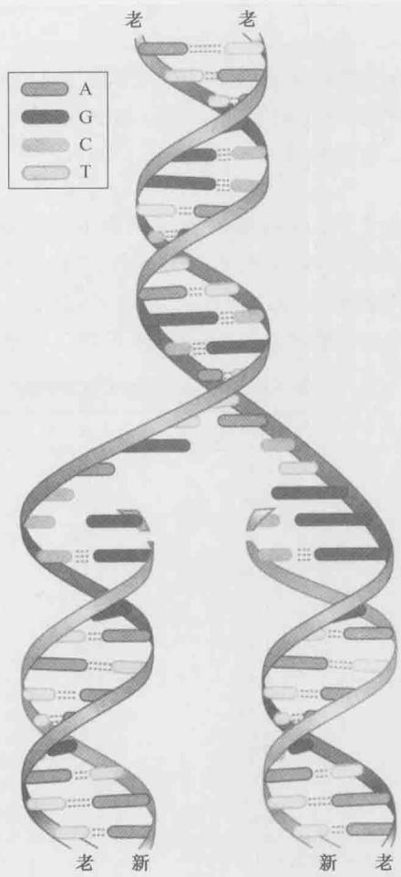  
图 2-6 DNA 的复制。新合成的链用橙色表示。

Kornberg 进一步证明了催化 DNA 前体元件的连接需要一种特定的聚合酶。Kornberg 的研究揭示了组成 DNA 的核苷酸元件是富含能量的前体物质（dATP、dGTP、dCTP 和 dTTP，图 2-7）。进一步的实验鉴定了一种单链的多肽——DNA 聚合酶 I（DNA Pol I），它能够催化新的 DNA 链合成。DNA 聚合酶 I 将核苷酸前体用 3'-5'磷酸二酯键连接起来（图 2-8）。这种反应需要 DNA 存在，其作用是将 4 种核苷酸按顺序排列成最终的多聚核苷酸产物。

DNA 聚合酶 I 依赖 DNA 模板来决定所合成的 DNA 的顺序。这一点首先由以下实验证明：用含不同数量的 A:T 和 G:C 碱基对的 DNA 分子作模板，进行酶促合成。在所有的实验中，酶促合成的产物都与模板 DNA 的碱基比率相同（表 2-1）。在无细胞体系的合成中，没有形成蛋白质或其他任何形式的分子，完全排除了其他非 DNA 的组分作为遗传特性的中间载体的可能性。所以，毫无疑问，DNA 就是合成自身的直接模板。

核苷：

嘧啶碱：

脱氧鸟苷-5'-磷酸  

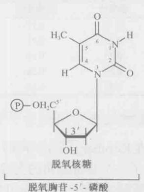

糖：

核苷酸：脱氧胞苷-5'-磷酸

核苷：

嘌呤碱：

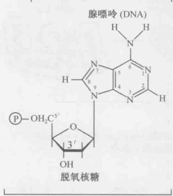

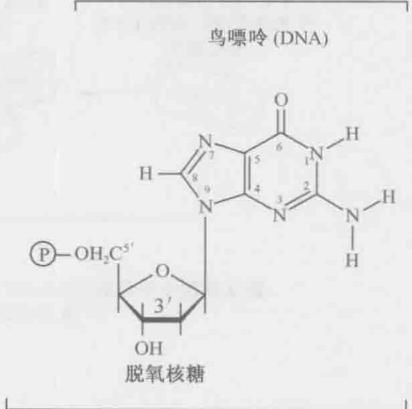

糖：

核苷酸：

图 2-7 DNA 的核苷酸。图中显示的是 4 种核苷酸的不同结构。  
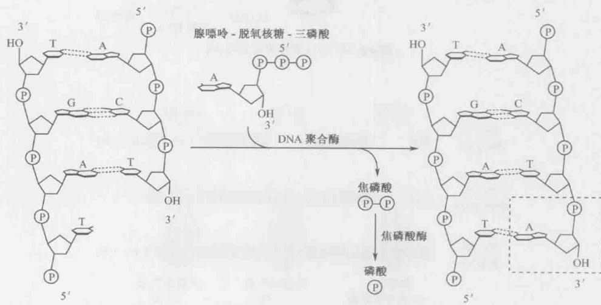  
图 2-8 由 DNA 聚合酶 | 催化的 DNA 链的酶促合成反应。图示将核苷酸添加到不断增长的 DNA 链上去的反应是由 DNA 聚合酶催化的。尽管 DNA 聚合酶本身就能催化细胞中的 DNA 合成，释放的焦磷酸是由焦磷酸酶转化为二磷酸的，更加有利于核苷酸添加的正向反应。

表 2-1 酶促合成的 DNA 产物及 DNA 模板中的碱基组成比较

<table><tr><td rowspan="2">DNA模板来源</td><td colspan="4">酶促合成产物的碱基组成</td><td rowspan="2">A+T/G+C 产物中</td><td rowspan="2">A+T/G+C 模板中</td></tr><tr><td>腺嘌呤</td><td>胸腺嘧啶</td><td>鸟嘌呤</td><td>胞嘧啶</td></tr><tr><td>球菌(细菌)</td><td>0.15</td><td>0.15</td><td>0.35</td><td>0.35</td><td>0.41</td><td>0.39</td></tr><tr><td>产气杆菌(细菌)</td><td>0.22</td><td>0.22</td><td>0.28</td><td>0.28</td><td>0.80</td><td>0.82</td></tr><tr><td>大肠杆菌</td><td>0.25</td><td>0.25</td><td>0.25</td><td>0.25</td><td>1.00</td><td>0.97</td></tr><tr><td>牛胸腺</td><td>0.29</td><td>0.28</td><td>0.21</td><td>0.22</td><td>1.32</td><td>1.35</td></tr><tr><td>噬菌体T2</td><td>0.32</td><td>0.32</td><td>0.18</td><td>0.18</td><td>1.78</td><td>1.84</td></tr></table>

#### [W] 支持 DNA 复制过程中双链分开的实验证据

1958年，在Kornberg研究的同时，当时在加州理工学院的Matthew Meselson和Frank W. Stahl进行了一个非常聪明的实验：他们将子代DNA分子分离，证明了双螺旋的两条链在DNA复制过程中一直是分开的（图2-9）。实验的成功部分归因于用 $^{15}$ N重同位素作为标签来区分亲代和子代 DNA 链。生长在含重同位素 ${}^{15}$ N 的培养基中的细菌的 DNA 比在正常的 ${}^{14}$ N 培养基中的细菌的 DNA 密度要大一些。另外，实验的成功还部分归因于用重盐（如氯化铯）进行密度梯度离心分离轻、重 DNA 实验技术的建立。当施加高离心力时，在离心管底部的溶液密度会变得更高（旋转时，它们是离旋转轴最远的位置）。如果选择的初始溶液密度合适，DNA 分子就会移动到离心管的中部，停留在与盐溶液的密度相同的区域。此时，同两条链都完全是 ${}^{14}$ N 前体的“轻-轻 DNA”（LL DNA）相比，两条链都完全是 ${}^{15}$ N 的“重-重 DNA”（HH DNA）会在较高密度区形成一条带（离离心管底部更近）。当把含有重 DNA 的细菌转移到普通培养基（含 ${}^{14}$ N）上培养时，用来进行 DNA 合成的核苷酸前体是轻的，所以转移后新合成的 DNA 同转移前的 DNA 是可以区分的。

溶液在140 000 g超速离心大约48h  
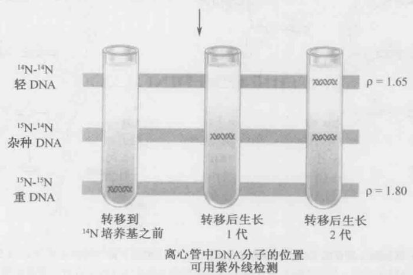  
图 2-9 用氯化铯密度梯度证明 DNA 复制过程中互补链的解开。

如果 DNA 的复制涉及解链过程，从普通培养基上生长不同时间后的 DNA 分子的密度就可以推测出来。生长一代以后，所有的 DNA 分子应该含有一条重链和一条轻链，也就是居中的杂种密度（“重-轻 DNA”，HL DNA）。这正是 Meselson 和 Stahl 所观察到的现象。同样地，生长两代以后，一半的 DNA 分子是轻的，另一半是杂种，与解链的预测完全符合。一定要注意，DNA 在从细菌里纯化出来时，会被断裂成小片段。这就保证了大多数 DNA 不是被完全复制，要么不被复制。如果细菌基因组保持完整，很可能会有很多部分复制的中间密度的分子（既不是 HH、HL，也不是 LL）存在。

由此 Meselson 和 Stahl 的实验证明了 DNA 复制（replication）是半保留的过程，在复制过程中双螺旋中的一条链保持不变（也就是“保留”），两条亲本链分别分配到两个子代分子中（半保留复制中的“半”）。这些实验排除了当时的另外两种模型：保留和分散复制模型（图 2-10）。保留模型认为，亲本的两条链不分开，而新形成的两条链则形成全新的 DNA 分子。按照这一模型，细胞生长一代后就应该有轻 DNA 形成。在当时许多人都特别倾向的分散复制模型中，DNA 链首先被打成碎片，片段的长度可能只有 10 个碱基对，利用这些片段合成同样短的 DNA 片段，然后这些短片段再连接起来形成完整的 DNA 链。按照这个复杂的模型，DNA 链将是由新老 DNA 共同组成的（即非保留的），只能在多代生长之后才会有轻 DNA 出现。

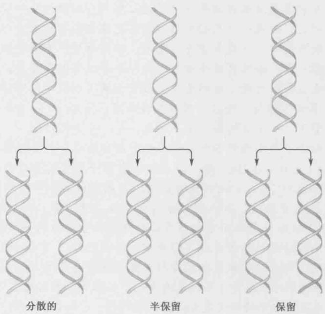  
图 2-10 3 种可能的 DNA 复制机制。了解了 DNA 结构之后，提出了几种解释 DNA 复制的模型，本图介绍了 3 种。由 Meselson 和 Stahl 提出的实验与其他模型不同，清楚地证明了 DNA 是半保留复制的。

#### [W] DNA 中的遗传信息是由 4 种核苷酸形成的序列所承载

双螺旋的发现终止了 DNA 是否是主要遗传物质的争论。在用实验证明 DNA 的复制涉及解链之前，分子遗传学家就将研究重点转向了解 DNA 中的遗传信息是如何决定蛋白质的氨基酸顺序的（见框 2-2）。因为所有的 DNA 链都能够形成双螺旋，其遗传特性的核心肯定是隐含在由 4 种核苷酸单元形成的线性顺序中。所以，作为携带遗传信息的实体，当时人们就认识到 DNA 分子应该是由 4 个字母（A、G、C 和 T）构成的很长的单词（在后面的章节中我们还将看到，现在更应该说 DNA 是很长的句子）。即使只有 4 个字母，可能的 DNA 排列的数目（ $4^{N}$ ，其中 N 是序列中字母的个数）对于最小的 DNA 分子来说也非常庞大，实际上可能存在的遗传信息是无限的。现在我们知道一个典型的细菌的基因由大约 1000 个碱基对组成，这样大小的一段 DNA 可能产生的基因数目是 $4^{1000}$ ，这个数目比所有生物中已知的基因数目都大几个数量级。

#### [W] 框2-2 基因控制蛋白质中氨基酸顺序的证据

基因（DNA）控制氨基酸顺序的第一个实验证据来自对镰刀状细胞贫血症遗传病的患者的血红蛋白的研究。如果一个人的两条同源染色体都带有β珠蛋白基因（编码组成血红蛋白的两条肽链中的一个）的S型等位基因，就会导致严重的贫血症，其典型特征是患者的红细胞呈镰刀形。如果β珠蛋白基因的一个等位基因是S型，贫血症状就相对较轻，红细胞也接近正常的形状。红细胞中血红蛋白的类型似乎与遗传特征相符合。在SS的情况下，血红蛋白不正常，特征是其溶解性不同；而在+S（一个等位基因是野生型——译者注）的情形下，一半血红蛋白是正常的，另一半是镰刀形。

野生型血红蛋白分子是由两种多肽链组成的，即 $\alpha$ 链和 $\beta$ 链（框2-2图1）。每一条肽链的分子质量大约是 $16100\mathrm{Da}$ 。每一个血红蛋白分子中有两条 $\alpha$ 链和两条 $\beta$ 链，总的分子质量大约为 $64400\mathrm{Da}$ 。 $\alpha$ 链和 $\beta$ 链是由不同的基因控制的，所以一个突变只能影响一条链—— $\alpha$ 链或者 $\beta$ 链，但不会同时影响二者。1957年，剑桥大学的Vernon M. Ingram证明了镰刀状血红蛋白与正常血红蛋白的区别在于 $\beta$ 链的一个氨基酸的改变：第6个氨基酸位置，由正常的谷氨酸变成了缬氨酸。除此之外，正常和突变血红蛋白的所有氨基酸序列都相同，因为这种氨基酸顺序的改变只在带有S型的 $\beta$ 珠蛋白基因的患者中才会出现。一个最简单的假设是S等位基因决定了 $\beta$ 珠蛋白基因的突变。随后对其他类型贫血症 $\beta$ 珠蛋白氨基酸序列的分析完全支持这种解释；序列分析表明，每一种特定的贫血症都有多肽链特定位置上一个氨基酸的改变（框2-2图2）。

  
框 2-2 图 1 野生型和镰状细胞血红蛋白的形成(血红蛋白结构的来源: 图自 Irving Gels。版权为 Howard Hughes Medical Institute 所有, 未经许可不得复制)。

<table><tr><td colspan="10">α链</td></tr><tr><td colspan="2">位置</td><td>1</td><td>2</td><td>16</td><td>30</td><td>57</td><td>58</td><td>68</td><td>141</td></tr><tr><td colspan="2">氨基酸</td><td>Val</td><td>Leu</td><td>Lys</td><td>Glu</td><td>Gly</td><td>His</td><td>Asp</td><td>Arg</td></tr><tr><td rowspan="5">血红蛋白的突变体</td><td>Hb I</td><td></td><td></td><td>Asp</td><td></td><td></td><td></td><td></td><td></td></tr><tr><td>Hb GHonolulu</td><td></td><td></td><td></td><td>Glu</td><td></td><td></td><td></td><td></td></tr><tr><td>HbNorfolk</td><td></td><td></td><td></td><td></td><td>Asp</td><td></td><td></td><td></td></tr><tr><td>Hb MBoston</td><td></td><td></td><td></td><td></td><td></td><td>Tyr</td><td></td><td></td></tr><tr><td>Hb GPhiladelphia</td><td></td><td></td><td></td><td></td><td></td><td></td><td>Lys-</td><td></td></tr></table>

<table><tr><td colspan="12">β链</td></tr><tr><td colspan="2">位置</td><td>1</td><td>2</td><td>3</td><td>6</td><td>7</td><td>26</td><td>63</td><td>67</td><td>125</td><td>150</td></tr><tr><td colspan="2">氨基酸</td><td>Val</td><td>His</td><td>Leu</td><td>Glu</td><td>Glu</td><td>Glu</td><td>His</td><td>Val</td><td>Glu</td><td>His</td></tr><tr><td rowspan="8">血红蛋白的突变体</td><td>Hb S</td><td></td><td></td><td></td><td>Val</td><td></td><td></td><td></td><td></td><td></td><td></td></tr><tr><td>Hb C</td><td></td><td></td><td></td><td>Lys $^{+}$ </td><td></td><td></td><td></td><td></td><td></td><td></td></tr><tr><td>Hb GSan José</td><td></td><td></td><td></td><td></td><td>Gly</td><td></td><td></td><td></td><td></td><td></td></tr><tr><td>Hb E</td><td></td><td></td><td></td><td></td><td></td><td>Lys $^{+}$ </td><td></td><td></td><td></td><td></td></tr><tr><td>Hb M Saskatoon</td><td></td><td></td><td></td><td></td><td></td><td></td><td>Tyr</td><td></td><td></td><td></td></tr><tr><td>HbZürich</td><td></td><td></td><td></td><td></td><td></td><td></td><td>Arg $^{+}$ </td><td></td><td></td><td></td></tr><tr><td>Hb MMilwaukee-1</td><td></td><td></td><td></td><td></td><td></td><td></td><td></td><td>Glu $^{-}$ </td><td></td><td></td></tr><tr><td>Hb Dβ Punjab</td><td></td><td></td><td></td><td></td><td></td><td></td><td></td><td></td><td>Glu</td><td></td></tr></table>

框 2-2 图 2 一些已经确认的人类血红蛋白突变体的氨基酸替换。

#### [W] DNA 不是直接决定所合成的蛋白质的模板

虽然 DNA 一定携带着决定氨基酸顺序的信息，但很明显双螺旋本身不可能是蛋白质合成的模板。实验表明在没有 DNA 存在的场所仍可以进行蛋白质的合成，所以排除了 DNA 起直接作用的可能。在所有的真核生物细胞中蛋白质的合成发生在细胞质中，而核膜将染色体 DNA 与细胞质分开。

因此，至少对真核细胞而言，还应该有第二种承载信息的分子存在，由它负责从 DNA 上获得特定遗传信息，然后转移到细胞质中作为蛋白质合成的模板。从一开始，人们的注意力就集中在功能尚不清楚的第二种核酸分子——RNA 上。Torbjorn Caspersson 和 Jean Brachet 发现 RNA 主要存在于细胞质中；很容易想象，当一条 DNA 链不用于互补 DNA 链合成的模板时，可能就会作为互补 RNA 链的模板。

#### [W] RNA 与 DNA 具有非常相似的化学性质

通过了解 RNA 的结构, 可以知道它是如何以 DNA 为模板准确合成的。RNA 与 DNA 的化学性质非常相似, 也是一个没有分支的长链大分子, 含有 4 种核苷酸, 以 3'-5'磷酸二酯键相连 (图 2-11)。在化学组成上, RNA 与 DNA 有两个差异: 一个是糖组分的微小差异 (图 2-12): DNA 中为脱氧核糖, 而 RNA 中为核糖, 除多一个 OH (羟基) 外, 核糖与脱氧核糖相同; 第二个差异是 RNA 分子没有胸腺嘧啶, 而含有结构相似的尿嘧啶。尽管存在这些差异, 多聚核糖核苷酸也有形成 DNA 那种互补双螺旋的能力。

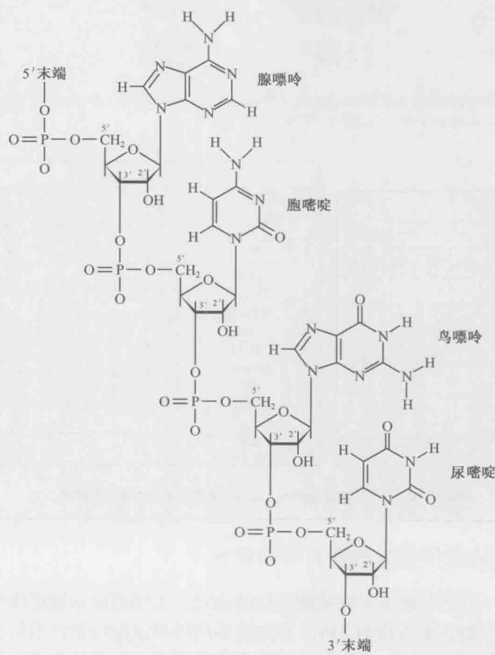  
图 2-11 一段多聚核糖核苷酸（RNA）链。红色部分表示与 DNA 的区别。

  
图 2-12 RNA 与 DNA 核苷酸之间的区别。左图为 DNA 的核苷酸，旁边为 RNA 的核苷酸。所有 RNA 的核苷酸含有核糖（而 DNA 中为脱氧核糖），核糖的 C2 位有一个羟基（用红色表示）。此外，在碱基组成上，RNA 中为尿嘧啶，而 DNA 为胸腺嘧啶，尿嘧啶在嘧啶环的 5 位上有氢原子（用红色表示），而胸腺嘧啶在该位置是甲基。其余 3 个碱基相同。

额外的羟基以及尿嘧啶中缺少胸腺嘧啶中才有的甲基都不影响 RNA 通过碱基配对形成双螺旋结构的能力。然而，与 DNA 不同，在细胞中 RNA 主要以单链分子存在。如果有双链 RNA 螺旋形成，大多数也是由同一单链 RNA 分子的两个部分形成的。

#### [W] 中心法则

到 1953 年秋，人们已经普遍接受了如下的假说，那就是染色体 DNA 是 RNA 分子的模板，RNA 分子合成后转移到细胞质中，在那里决定蛋白质中氨基酸的顺序。1956 年，Crick 将遗传信息的传递途径称为中心法则（central dogma）。

$$
\text { 复制 } \quad \mathrm{DNA} \xrightarrow {\text { 转录 }} \mathrm{RNA} \xrightarrow {\text { 翻译 }} \text { 蛋白质 }
$$

其中，箭头表示遗传信息的传递方向。环绕 DNA 的箭头代表 DNA 是自我复制的模板。DNA 与 RNA 之间的箭头表示 RNA 的合成（转录，transcription）是以 DNA 为模板的。相应地，蛋白质的合成（翻译，translation）是以 RNA 为模板的。更为重要的是，最后两个箭头表示的过程，只能单方向存在，也就是说，不能由蛋白质模板合成 RNA，也难以想像由 RNA 模板合成 DNA。蛋白质不能作为 RNA 的模板已经经受了时间的验证，然而，正如我们将在第 11 章中要提到的，有时 RNA 链确实可以作为互补的 DNA 的模板。这种与正常信息流的方向相反的事例，与大量的以 DNA 为模板合成的 RNA 分子相比，是非常少见的。所以，大约 50 年前提出的中心法则在今天看来仍然是基本正确的。

#### [W] Crick 的适配子假设

最初，人们简单地认为用于合成蛋白质的 RNA 模板，可以折叠并在其表面形成适合于 20 种不同氨基酸的空腔。这些空腔应该有一定的形状，只适合于一种氨基酸，在蛋白质合成过程中，RNA 就是以这种方式决定氨基酸排列的顺序。然而到了 1955 年，Crick 对这种传统的、想当然的观点产生了怀疑，他认为该模型预测的结果不可能出现。这是因为：第一，RNA 的 4 种碱基（A、U、G、C）上的特异化学基团应该主要与水溶性基团相互作用，而许多氨基酸（如 Leu、Val、Phe）的侧链基团却强烈地倾向于与非水溶性基团（疏水基团）发生作用；第二，即使 RNA 分子能够折叠并形成疏水表面，但是让 RNA 分子精确区分化学结构非常相似的氨基酸几乎是不可能的，例如，Gly 和 Ala、Val 和 Ile 之间，其差别仅仅在于一个甲基（CH₃）的存在与否。所以 Crick 提出，在整合成蛋白质之前，氨基酸先结合在某种特异的适配子（adaptor）分子上，而适配子具有独特的表面，可以与 RNA 模板上的碱基特异结合。

#### [W] 转运RNA的发现

探索蛋白质是如何合成的，需要建立无细胞体系，加入RNA分子，该体系能够以氨基酸前体合成蛋白质。1953年，Paul C. Zamecnik及其同事最早成功地建立了这种体系。他们的成功主要得益于最新的放射性标记氨基酸技术，这种技术可以用来跟踪新合成的、微量的蛋白质，另外还有高效便捷的、用来分离各种细胞组分的制备型超速离心技术。在这之前人们就认为核糖体是细胞内合成蛋白质的场所，核糖体是所有细胞的细胞质中含RNA的小颗粒，它与蛋白质的合成有密切的关系（图2-13）。

  
图 2-13 附着在内质网上的核糖体的电子显微照片。胰腺细胞的电子显微照片（105000×）。图的右上部分为线粒体，左下部分为附着在内质网上的大量的核糖体（电子密度高的小圆点），有的核糖体游离存在于细胞质中，有的附着在内质网膜上（K.R. Porter 惠赠）。

  
图 2-14 由 Robert W. Holley 及其助手鉴定的酵母丙氨酸 tRNA 的结构。这个 tRNA 的反密码子识别 mRNA 上的丙氨酸。在 tRNA 结构中存在着修饰核苷： $\psi = 假尿嘧啶核苷；T = 胸腺嘧啶核糖核苷；DHU = 5, 6-二氢尿嘧啶核苷；I = 次黄嘌呤核苷；m^{1}G = 1-甲基鸟嘧啶核苷；m^{1}I = 1-甲基次黄嘌呤核苷；m^{2}G = N，N-甲基鸟嘧啶核苷。$

几年后，Zamecnik 与 Mahlon B. Hoagland 合作研究获得了重要的发现：在被整合进蛋白质之前，氨基酸首先结合到我们现在所称的转运 RNA（transfer RNA，tRNA）分子上。转运 RNA 大约占细胞总 RNA 的 10%（图 2-14）。

除 Crick 之外，这一实验结果出乎所有人的预料。Crick 已经预测到所谓的适配子（adaptor）可能是 RNA 短链，因为它们的碱基应该能够与蛋白质合成的模板 RNA 上的相应碱基配对并“阅读”这些碱基。以后我们会讨论更多的细节（第 15 章），实际上 Zamecnik 和 Hoagland 所提出的转运 RNA 分子就是 Crick 提出的适配子分子。每一个 tRNA 分子都有一段连续的碱基序列（反密码子），在蛋白质合成过程中与 RNA 模板上的一组连续碱基序列（密码子）特异结合。

#### [W] 核糖体的矛盾问题：缺乏特异性

细胞总 RNA 的 85% 存在于核糖体中，因为在蛋白质合成旺盛的细胞中（如胰脏、肝脏细胞和快速增殖的细菌），核糖体的绝对数量急剧增加，所以最初人们认为核糖体 RNA（ribosome RNA，rRNA）是决定氨基酸顺序的模板。当详细研究了大肠杆菌的核糖体之后，发现若干难以解释的现象：第一，所有大肠杆菌核糖体甚至其他所有生物的核糖体，都由两个大小不等的亚基组成，每个亚基都包含 RNA，在周围离子浓度影响下，两个亚基可以可逆地聚合或分开。第二，小亚基中所有 rRNA 的长度大致相同（大肠杆菌约 1500 个碱基），大亚基中的 rRNA 长度也基本相同（约 3000 个碱基）。第三，在所有已知的细菌、植物和动物中，大小亚基的 rRNA 碱基组成基本相同（有较高的 G 和 C），虽然它们各自 DNA 的 AT/GC 比值有很大变化。如果说 rRNA 是由大量不同基因组成的、不同 RNA 模板的集合体，那么上述现象都不应该出现，所以大小亚基都不像是模板 RNA。

#### [W] 信使 RNA（mRNA）的发现

T4噬菌体侵染的细胞提供了一个寻找真正模板的理想体系。受T4侵染后，大肠杆菌细胞停止合成自己的RNA，只能合成T4 DNA转录的RNA。令人吃惊的是，T4 RNA不仅与T4 DNA的碱基组成很相似，而且它不能与核糖体蛋白结合。正常情况下，核糖体蛋白与rRNA结合形成核糖体。相反，T4 RNA首先与已存在的核糖体结合，然后移动穿过核糖体表面，使其碱基进入适当位点，在这里与相应的tRNA-氨基酸前体结合进行蛋白质合成（图2-15）。这种情况下，T4 RNA就决定了氨基酸的顺序，它就是长期寻找的蛋白质合成的RNA模板。由于它将DNA信息带到了进行蛋白质合成的核糖体位点，故称为信使RNA（message RNA，mRNA）。首次观察到T4 RNA与大肠杆菌核糖体结合是在1960年春，很快在未侵染的大肠杆菌细胞中获得了其他信使RNA的证据，因此，完全排除了rRNA作为模板的可能。实际上，核糖体中的rRNA组分，与大约50种与之结合的核糖体蛋白一起，是蛋白质合成的工厂。细胞将tRNA-氨基酸前体引导到某个位置，在那里它们读取mRNA模板提供的信息（详见第15章）。

细胞中，mRNA 仅占总 RNA 的百分之几。为编码细胞里的不同蛋白质，mRNA 的长度和核苷酸组成变化很大，所以，不难理解为什么 mRNA 在最初未被研究者们重视。

在给定的时间内，只有很小的一段 mRNA 结合在核糖体上，所以一个 mRNA 分子可以被多个核糖体同时读取。绝大多数核糖体都是多聚核糖体（polyribosome）（翻译相同 mRNA 的一组核糖体）的一部分，多聚核糖体可能会包含 50 多个成员（图 2-16）。

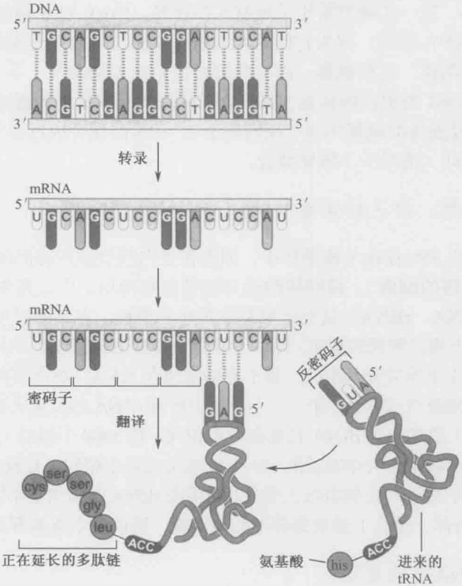

图 2-15 转录和翻译。以 DNA 的一条链为模板，按照碱基互补原则合成 mRNA。密码子每 3 个一组，与 tRNA 分子上反密码子区域的 3 个核苷互补。碱基配对形成后，tRNA 分子另一端携带的氨基酸添加到正在生长的蛋白质链上。  
  
图 2-16 多聚核糖体示意图。每个核糖体附着在 mRNA 5'端的信号起始处，并沿着 mRNA 分子合成多肽。一条 mRNA 链上可能同时结合数个核糖体，整个装置称为多聚核糖体。

#### [W] 以 DNA 为模板酶促 RNA 的合成

随着信使 RNA 的发现，第一个能以 DNA 为模板转录 RNA 的酶很快就分别在生化学家 Jerard Hurwitz 和 Sam B. Weiss 的实验室分离出来了。这种称为 RNA 聚合酶（RNA polymerase）的酶必须在有 DNA 的情况下工作，并以其为模板，利用 ATP、GTP、CTP 和 UTP 核苷酸为前体，合成单链 RNA（图 2-17）。在细菌中，同一种酶分别以相应的染色体 DNA 为模板合成 RNA。生成的 RNA 碱基组成随加入不同 AT/GC 比值的 DNA 模板而变化，这就是 DNA 负责排列核糖核苷酸前体的直接证据。在所有的酶促合成中，RNA 的 AU/GC 比值与 DNA 的 AT/GC 比值大体相同（表 2-2）。

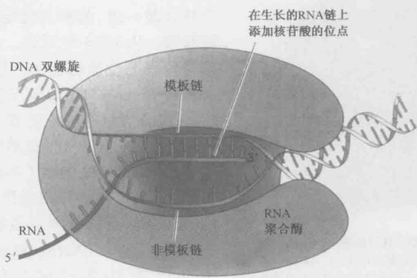  
图 2-17 RNA 聚合酶催化的以 DNA 为模板的 RNA 的合成。

表 2-2 酶促合成 RNA 与其双螺旋 DNA 模板碱基组成的比较

<table><tr><td rowspan="2">DNA 模板来源</td><td colspan="4">RNA 碱基组成</td><td rowspan="2">A+U/G+C 观察</td><td rowspan="2">A+T/G+C DNA 中</td></tr><tr><td>腺嘌呤</td><td>尿嘧啶</td><td>鸟嘌呤</td><td>胞嘧啶</td></tr><tr><td>T2</td><td>0.31</td><td>0.34</td><td>0.18</td><td>0.17</td><td>1.86</td><td>1.84</td></tr><tr><td>小牛胸腺</td><td>0.31</td><td>0.29</td><td>0.19</td><td>0.21</td><td>1.50</td><td>1.35</td></tr><tr><td>大肠杆菌</td><td>0.24</td><td>0.24</td><td>0.26</td><td>0.26</td><td>0.92</td><td>0.97</td></tr><tr><td>Micrococcus lysodeikticus (一种细菌)</td><td>0.17</td><td>0.16</td><td>0.33</td><td>0.34</td><td>0.49</td><td>0.39</td></tr></table>

在转录过程中，两条 DNA 链中只能有一条作为 RNA 合成的模板。这是有道理的，因为两条 DNA 链虽然序列互补，但携带的遗传信息并不相同，会编码完全不同的多肽。RNA 的合成总是沿固定方向进行，由 5' 端的核苷酸开始，到 3' 端的核苷酸结束（图 2-17）。

到此为止，已经有充分的证据证明了该推测，RNA 确实是从含 DNA 的核中移动到含核糖体的细胞质中。将细胞短暂地暴露在放射性标记的前体中，然后加入过量的未标记氨基酸（“脉冲标记”实验），在此窗口期内合成的 mRNA 就会被标记。这项研究表明 mRNA 是在细胞核中合成的。在一小时内，可以观察到大部分 RNA 离开了细胞核进入细胞质（图 2-18）。

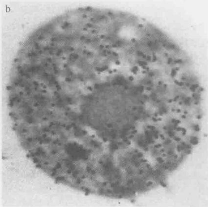  
图2-18 RNA在核中合成后转移到细胞质中的证明。(上)在放射性标记的胞嘧啶培养基中培养 $15\mathrm{min}$ 后细胞（四膜虫）的放射自显影照片。细胞薄切片照片中深度曝光的是银乳胶颗粒，每个黑点代表掺入到RNA中的 ${}^{3}\mathrm{H}$ 发射电子的轨迹，几乎所有新形成的RNA都在细胞核中。（下）相同的细胞在放射性标记的胞嘧啶中培养 $12\mathrm{min}$ ，然后转移到非放射性标记的胞嘧啶中培养 $88\mathrm{min}$ 后的放射自显影照片。发现在 $12\mathrm{min}$ 内掺入RNA中的所有的标记，都离开细胞核进入到细胞质中。（D.M.Prescott，University of Colorado Medical School；reproduced from Prescott D.M. 1964.Progr.Nucleic Acid Res Mol Biol.3：35Elsevier经许可）

#### [W] 遗传密码的破译

已知存在20种氨基酸，但仅有4种碱基，所以肯定是由几个核苷酸以某种组合的方式来确定一个特定氨基酸。如果是两个核苷酸一组，最多只能定义16个 $(4\times 4)$ 氨基酸。从1954年开始，人们就在认真考虑遗传密码应该是什么，尤其是三联体（3个核苷酸一组）会如何行使功能，即使三联体显然能提供多于需要的排列组合 $(4\times 4\times 4)$ （如果每个氨基酸只能由一个三联体编码）。此时提出了共线性假设，这是非常重要的。共线性的意思是沿DNA链排列的核苷酸组合编码沿多肽链上排列的氨基酸。事实上，Charles Yanofsky和Sydney Brenner在20世纪60年代初期就已经通过对细菌蛋白质的突变分析观察到这种共线性的存在。另外，还有Brenner和Crick在1961年的遗传分析也同样重要，他们首次证明了3个核苷酸的组合确定一个氨基酸。

但是哪 3 个碱基的特定组合(密码子)确定哪一种氨基酸，只能通过生化分析。

突破性的进展来自于 Marshall Nirenberg 和 Heinrich Mattaei 的工作。1961 年他们观察到，将体外合成的多聚核苷酸 poly U（UUUUU…）加入能合成蛋白质的无细胞体系中，产生的是只含苯丙氨酸的多肽。所以，UUU 这一组核苷酸肯定编码的是苯丙氨酸。利用复杂度逐渐升高的多聚核苷酸作为信使 RNA，很快就鉴定了越来越多的密码子。在破译密码子的过程中，尤为重要的是利用了像 AGUAGU 这样的多聚核苷酸，这是由有机化学家 Har Gobind Khorana 合成的。这些特定的多聚核苷酸在破译更复杂的密码子中是至关重要的。1966 年，密码子全部破译，可能的 64 个密码子中有 61 个编码相应的氨基酸，大多数氨基酸都由一个以上的核苷酸三联体编码（表 2-3）。

表 2-3 遗传密码

<table><tr><td></td><td colspan="2">U</td><td colspan="2">C</td><td colspan="2">A</td><td colspan="2">G</td><td></td></tr><tr><td rowspan="4">U</td><td colspan="2">UUU Phe</td><td colspan="2">UCU Ser</td><td colspan="2">UAU Tyr</td><td colspan="2">UGU Cys</td><td></td></tr><tr><td colspan="2">UUC Leu</td><td colspan="2">UCC</td><td colspan="2">UAC 终止子</td><td colspan="2">UGC 终止子</td><td></td></tr><tr><td colspan="2">UUA Leu</td><td colspan="2">UCA</td><td colspan="2">UAA 终止子</td><td colspan="2">UGA Trp</td><td></td></tr><tr><td colspan="2">UUG Leu</td><td colspan="2">UCG</td><td colspan="2">UAG 终止子</td><td>UGG</td><td>Trp</td><td></td></tr><tr><td rowspan="4">C</td><td colspan="2">CUU Leu</td><td colspan="2">CCU Pro</td><td colspan="2">CAU His</td><td colspan="2">CGU Arg</td><td rowspan="4"></td></tr><tr><td colspan="2">CUU Leu</td><td colspan="2">CCC</td><td colspan="2">CAC</td><td>CGC</td><td></td></tr><tr><td colspan="2">CUA</td><td colspan="2">CCA</td><td colspan="2">CAA Gln</td><td>CGA</td><td></td></tr><tr><td colspan="2">CUG</td><td colspan="2">CCG</td><td colspan="2">CAG</td><td>CGG</td><td></td></tr><tr><td rowspan="4">A</td><td colspan="2">AUU Ile</td><td colspan="2">ACU Thr</td><td colspan="2">AAU Asn</td><td colspan="2">AGU Ser</td><td></td></tr><tr><td colspan="2">AUC Met</td><td colspan="2">ACC</td><td colspan="2">AAC Lys</td><td colspan="2">AGC Arg</td><td></td></tr><tr><td colspan="2">AUA Met</td><td colspan="2">ACA</td><td colspan="2">AAA Lys</td><td colspan="2">AGA Arg</td><td rowspan="2"></td></tr><tr><td colspan="2">AUG Met</td><td colspan="2">ACG</td><td colspan="2">AAG</td><td>AGG</td><td></td></tr><tr><td rowspan="4">G</td><td colspan="2">GUU Val</td><td colspan="2">GCU Ala</td><td colspan="2">GAU Asp</td><td colspan="2">GGU Gly</td><td rowspan="4"></td></tr><tr><td colspan="2">GUC Val</td><td colspan="2">GCC</td><td colspan="2">GAC Glu</td><td>GGC</td><td></td></tr><tr><td colspan="2">GUA Val</td><td colspan="2">GCA</td><td colspan="2">GAA Glu</td><td>GGA</td><td></td></tr><tr><td colspan="2">GUG Val</td><td colspan="2">GCG</td><td colspan="2">GAG Glu</td><td>GGG</td><td></td></tr></table>

#### [W] 确定蛋白质合成的方向

确定了遗传密码的性质之后，下一个问题就是多聚核苷酸链如何指导多肽的合成。正如我们在本章已经看到、在第9章还要进行详细讨论的，多聚核苷酸链（DNA和RNA）由 $5'\rightarrow3'$ 方向合成。但是多肽链的延伸是如何进行的呢？是从氨基端到羧基端，还是相反呢？

利用与确定氨基酸密码相似的无细胞体系蛋白质合成系统回答了上述问题。研究者加入β珠蛋白mRNA而不是合成的mRNA，来指导蛋白质的合成。在蛋白质合成开始几分钟后，利用放射性标记的氨基酸处理无细胞体系几秒钟（低于合成珠蛋白链需要的时间），然后立即终止蛋白质合成。这种快速的放射性标记方式称为脉冲标记（pulse-labeling）。利用凝胶电泳技术将在标记期间合成的完整的珠蛋白与未完全合成的珠蛋白分离（第7章），分析所有的在完成合成时都存在放射性标记的蛋白质，用胰蛋白酶处理全长的多肽，使蛋白质在特异位点断裂，产生一系列长度不同的多肽片段，最后，测量掺入每个片段中的放射性强度（图2-19）。

注意珠蛋白是在脉冲标记的不同阶段合成的，最后合成的肽链含有最多的放射性标记的前体（图2-19a）。相反，含放射性标记最弱的肽链来自最早合成的β珠蛋白。研究者观察到来自珠蛋白的氨基端区域的肽链的放射性最低，而羧基端区域的标记最强

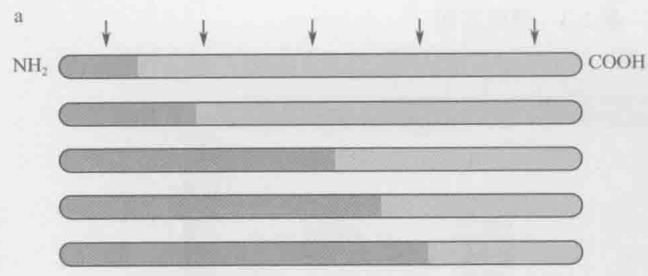

  
图 2-19 掺入到延伸的多肽链的放射性标记。（a）脉冲标记后合成的多肽链中的放射性分布（表示为蓝色）。β 珠蛋白的胰蛋白酶切割位置以红色箭头表示。（b）掺入的放射性标记强度经多肽长度归一化后在整条链中的相对位置图。

(图 2-19b)。所以我们得出如下结论: 蛋白质的合成方向是从氨基端到羧基端, 换句话说, 在蛋白质合成过程中, 新的氨基酸是加到新生多肽链的羧基末端上。

#### [W] 起始和终止信号也由 DNA 编码

开始人们推测 mRNA 的翻译是从一端开始，读完整个 mRNA 信息之后结束。但实际上翻译的起始和终止都在 mRNA 的内部位置上，所以翻译的起始和终止信号肯定存在 DNA（及其 mRNA 产物）上。首先阐明的是终止信号，3 个密码子（UAA、UAG 和 UGA），即已知的无义密码子（nonsense codon），不编码任何。翻译的起始信号的编码方式较 G 既编码起始的甲硫氨酸，也编密码子前面有富含嘌呤核苷酸的核生物中，AUG 相对于 mRNA 始点。

一个氨基酸，作为翻译的终止信号（有时称为终止密码子）。翻译的起始信号的编码方式较复杂，所有多肽链均以甲硫氨酸开始，但是三联密码子AUG既编码起始的甲硫氨酸，也编码内部的甲硫氨酸。原核生物中，在编码多肽起始的AUG密码子前面有富含嘌呤核苷酸的区域，其作用是使mRNA结合到核糖体上（第15章）。在真核生物中，AUG相对于mRNA起始点的位置有关键作用，第一个AUG总是作为翻译的起始点。

#### [W] 基因组学时代

随着中心法则的阐明，到20世纪60年代中期，人们对蕴含在核苷酸序列内的遗传蓝图决定表型这一问题有了清晰认识，这意味着从DNA序列中可能揭示出对生物及其演化本质的深刻认识。近年来由于快速、自动化DNA测序方法的出现，几百种有机体的全基因组序列测定工作已经完成，甚至单个拷贝就达30亿碱基对的人类基因组序列及其包含的不少于20000个基因也已经阐明。序列的比较分析对于多种生物的基因组测序非常重要。通过对不同生物相似基因编码的氨基酸序列进行预测和比较，人们可以鉴别出重要的蛋白质区域。例如，在许多不同的生物中，负责核苷酸结合或直接催化核苷酸添加的DNA聚合酶的氨基酸序列是非常保守的。所以，鉴定在细菌而非真核细胞中对DNA聚合酶功能至关重要的氨基酸，只能通过细菌的基因组序列预测其

氨基酸序列。

比较不同的基因组也能了解不编码蛋白质的 DNA 序列。对鉴定控制基因表达、DNA 复制、染色体分离和重组的序列来说，进行基因组序列的比较会有很大帮助。因为这些调控序列更倾向于以较快的速度发生变化，这样的比较往往是在亲缘关系较近的物种中（如不同的细菌之间或人与其他灵长类之间）进行。对亲缘关系较近的物种进行比较具有重要的价值，这就促进了研究比较透彻的模式生物的基因组测序（如果蝇、酵母和多种灵长类动物）。

对同一生物不同个体的基因组进行比较，对鉴别疾病相关的突变具有潜在的价值。例如，为了鉴别疾病相关基因，最近建立了可以快速地对许多不同个体基因组片段进行比较的方法。最后，我们可以期待这一天的到来：通过基因组序列分析能够揭示人类复杂行为的起源，如语言的获得、动物身躯演化的多样性的机制等。

以下章节将为读者理解 DNA 如何作为模板、决定生物学复杂性打下坚实的基础。第 2 篇的章节会回顾与本书主题相关的、基本的化学知识和生物化学结构。第 2 篇的最后一章会介绍多种实验室常见技术，这些技术已广泛应用于生物结构和诸多问题的研究。第 3 篇是基因组的维持，前几个章节会叙述遗传物质的结构及其忠实复制，后面的几个章节会讲述遗传变异的产生和基因组损伤部分的修复过程。第 4 篇是基因组的表达，将描述 DNA 中的遗传指令是如何转变为蛋白质的；第 5 篇讲述产生机体复杂性（如胚胎发生）和物种多样性（如演化）的不同基因表达策略。第 5 篇的最后一章是系统生物学，讲述了一些跨学科的研究方法，以便对更为复杂的生物组织水平进行研究。最后的附录描述了几种常见的模式生物，它们是非常重要的实验系统，用于揭示不同物种间的一般生物模式。

<!-- W-END Watson 2 核酸承载遗传信息 -->

## 1.3 分子生物学主要研究内容

现代生物学研究发现,所有生物体中的有机大分子都是以碳原子为核心,并以共价键的形式与氢、氧、氮及磷等以不同方式构成的。不仅如此,一切生物体中的各类有机大分子都是由完全相同的单体,如蛋白质分子中的20种氨基酸、DNA及RNA中的8种碱基所组合而成的,由此产生了分子生物学的3条基本原理:

① 构成生物体各类有机大分子的单体在不同生物中都是相同的。

② 生物体内一切有机大分子的构成都遵循共同的规则。

③ 某一特定生物体所拥有的核酸及蛋白质分子决定了它的属性。

图 1-8 比较了生物体内各种大分子、亚细胞结构及原核、真核细胞或不同生物个体的大小,了解并熟记它们的相对体积对于我们深入领会分子生物学所研究的生命过程有着不容忽视的作用。如在 B-DNA 中每个碱基对中心距离为 0.34 nm, DNA 双螺旋的直径为 1.9 nm, 而一个相对分子质量为 $5.0 \times 10^{4}$ 的球状蛋白的直径则为 5.0 nm, 仅相当于 15\~20 个碱基对。核小体 (nucleosome) 由于外表面缠绕了 146 个碱基对, 其相对分子质量则达到 $3.0 \times 10^{5}$ , 直径为 11 nm。负责蛋白质合成的核糖体, 其相对分子质量高达数百万, 直径为 20 nm 以上。在一个体积为 $1 \sim 2 \mu \mathrm{m}^{3}$ 的细菌细胞内, 多核糖体确实可以算是一个不小的工厂了。

现代分子生物学主要包括如下四个方面的研究：

图 1-8 生物世界的长度和体积比较

(a) 生物界各种特征性生物大分子、各种亚细胞结构与细胞、成人及已知世界最高的树木——加州巨杉(高度可达100 m以上)的长度比较；(b) 核酸、蛋白质、RNA聚合酶、核小体、核糖体和人染色体等主要生物大分子的体积比较。

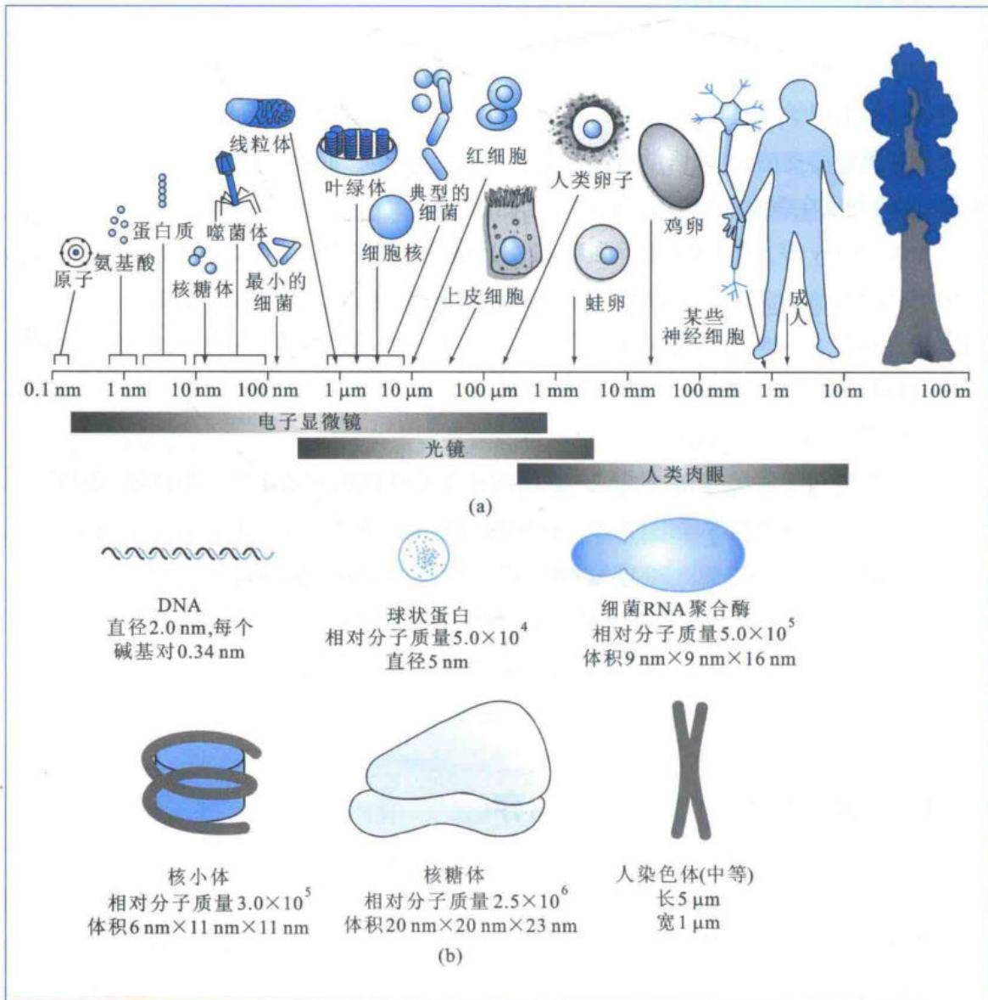

## 1.3.1 重组 DNA 技术(基因工程)

这是20世纪70年代初兴起的技术科学,目的是将不同的DNA片段(如某个基因或基因的一部分)按照人们的设计定向连接起来,在特定的受体细胞中与载体同时复制并得到表达,产生影响受体细胞的新的遗传性状。严格地说,重组DNA技术并不完全等于基因工程,因为后者还包括其他可能使生物细胞基因组结构得到改造的体系。重组DNA技术是核酸化学、蛋白质化学、酶工程及微生物学、遗传学、细胞学长期深入研究的结晶,而限制性内切酶、DNA连接酶及其他工具酶的发现与应用则是这一技术得以建立的关键。

重组 DNA 技术有着广阔的应用前景。首先,它可被用于大量生产某些在正常细胞代谢中产量很低的多肽,如激素、抗生素、酶类及抗体等,提高产量,降低成本,使许多有价值的多肽类物质得到广泛应用。由于发现了根癌农杆菌,发明了植物基因的轰击转化法,用转基因模式大规模改良农作物的抗病、抗逆、抗虫性,提高产量、改善品质或用传统农作物产生特种资源已经成为世界农业发展的潮流。

其次,重组 DNA 技术可用于定向改造某些生物的基因组结构,使它们所具备的特殊经济价值或功能得以成百上千倍地提高。如有一种含有分解各种石油成分的重组 DNA 的超级细菌,能快速分解石油,可用来恢复被石油污染的海域或土壤。美国科学家应用该技术构建了“工程沙门氏菌”,在研制避孕疫苗方面取得了重要进展。他们先去掉沙门氏菌致病基因部分,再引入来自精子的某些遗传信息,将改造后的细菌送入雌鼠体内,发现能产生排斥精细胞的抗体,使精子不能与卵子结合,从而达到避孕目的。美国陆军研究发展和工程中心还从织网蜘蛛中分离出合成蜘蛛丝的基因,并利用该基因在实验室里生产蜘蛛丝。他们将这一基因转移到细菌内,生产出一种可溶性丝蛋白,经浓缩后纺成一种强度超过钢的特殊纤维。研究人员希望对该基因进行修饰,以生产出高性能纤维,从而用于生产防弹背心、帽子、降落伞绳索和其他高强度的轻型装备。

第三,重组 DNA 技术还被用来进行基础研究。如果说,分子生物学研究的核心是遗传信息的传递和控制,那么根据中心法则,我们要研究的就是从 DNA 到 RNA,再到蛋白质的全过程,也即基因的表达与调控。在这里,无论是对启动子的研究(包括调控元件或称顺式作用元件),还是对转录因子的克隆与分析,都离不开重组 DNA 技术的应用。

## 1.3.2 基因表达调控研究

因为蛋白质分子参与并控制了细胞的一切代谢活动,而决定蛋白质结构和合成时序的信息都由核酸(主要是脱氧核糖核酸)分子编码,表现为特定的核苷酸序列,所以基因表达实质上就是遗传信息的转录和翻译。在个体生长发育过程中生物遗传信息的表达按一定的时序发生变化(时序调节),并随着内外环境的变化而不断加以修正(环境调控)。基因表达的调控主要发生在转录水平或翻译水平上。原核生物的基因组和染色体结构都比真核生物简单,转录和翻译在同一时间和空间内发生,基因表达的调控主要发生在转录水平。真核生物有细胞核结构,转录和翻译过程在时间和空间上都被分隔开,且在转录和翻译后都有复杂的信息加工过程,其基因表达的调控可以发生在各种不同的水平上。基因表达调控主要表现在信号转导研究、转录因子研究及 RNA 剪辑 3 个方面。信号转导是指外部信号通过细胞膜上的受体蛋白传到细胞内部,并激发诸如离子通透性、细胞形状或其他细胞功能方面的应答过程。当信号分子(配体)与相应的受体作用后,可以引发受体分子的构型变化,使之形成专一性的离子通道,也可以激活受体分子的蛋白激酶或磷酸酯酶活性,还可以通过受体分子指导合成 cGMP、cAMP、三磷酸肌醇等第二信使分子。研究认为,信号转导之所以能引起细胞功能的改变,主要是由于信号最后活化了某些蛋白质分子,使之发生构型变化,从而直接作用于靶位点,打开或关闭某些基因。

转录因子是一群能与基因 5' 端上游特定序列专一结合,从而保证目的基因以特定的强度在特定的时间与空间表达的蛋白质分子。在对植物的某些性状进行遗传分析时发现,某些基因的突变会影响其他基因的表达。例如,有 20 多个基因参与玉米花青素的生物合成,但其中的 Cl、r、pl 或 b 基因发生突变后,该代谢途径中的结构酶基因全部被关闭。如果 Antp、Flz 或 Ubx 等基因发生突变,果蝇的体节发育就会受影响,身体中的一部分就可能变成相似于另一部分的结构,因此,它们是控制果蝇胚胎早期体节分化与发育的主要调节基因,它们所编码的蛋白质是调节与发育有关的结构基因表达的总开关。

真核基因在结构上的不连续性是近10年来生物学上的重大发现之一。当基因转录成pre-mRNA后，除了在5'端加帽及3'端加多聚A[poly(A)]之外，还要切去隔开各个相邻编码区的内含子，使外显子(编码区)相连后成为成熟mRNA。研究发现，许多基因中的内含子并不是一次全部切去，而是在不同的细胞或不同的发育阶段选择性剪切其中部分内含子，生成不同的mRNA及蛋白质分子。如降钙素基因、肌原蛋白基因和参与果蝇体细胞分化的dsx基因等，都采用选择性剪切方式从而生成不同功能的蛋白质。由于RNA的选择性剪切不牵涉到遗传信息的永久性改变，所以是真核基因表达调控中一种比较灵活的方式。

## 1.3.3 生物大分子的结构功能研究(结构分子生物学)

一个生物大分子,无论是核酸、蛋白质或多糖,在发挥生物学功能时,必须具备两个前提。首先,它拥有特定的空间结构(三维结构);其次,在它发挥生物学功能的过程中必定存在着结构和构象的变化。结构分子生物学就是研究生物大分子特定的空间结构及结构的运动变化与其生物学功能关系的科学。它包括结构的测定、结构运动变化规律的探索及结构与功能相互关系的建立3个主要研究方向。传统上最常见的研究三维结构及其运动规律的手段是X射线衍射的晶体学(又称蛋白质晶体学),或是用二维或多维核磁共振研究液相结构。现在,更多的科学家在采用冷冻电子显微镜技术研究生物大分子的空间结构。

## 1.3.4 基因组、功能基因组与生物信息学研究

人类基因组全序列的发表为确定基因对人类生长发育和疾病的预防治疗提供了一个前所未有的大舞台。最新的数据表明，已有5843个物种的基因组全序列被测定，包括脊椎动物122个，植物44个，细菌4857个，真菌501个，原生生物119个，后生动物68个(http://www.ensembl.org)，极大地丰富了人类的知识宝库，加快了人类认识自然和改造自然的步伐。虽然完成某一生物的基因组计划就意味着该物种所有遗传密码已经为人类所掌握，但测定基因组序列只是了解基因的第一步，因为基因组计划不可能直接阐明基因的功能，更不能预测该基因所编码蛋白质的功能与活性，所以，并不能指导人们充分准确地利用这些基因的产物。于是，科学家又在基因组计划的基础上提出了“蛋白质组计划”（又称“后基因组计划”或“功能基因组计划”），旨在快速、高效、大规模鉴定基因的产物和功能。

巨大的基因组信息给科学家带来了前所未遇的挑战。以人细胞中所带有的29亿多个碱基对为例，一个人即使每秒读10个碱基，每天工作24小时，一年干365天，也得花10年时间才能把这些数据看一遍，更不用说数据分析了。依靠计算机快速高效运算并进行统计分类和结构功能预测的生物信息学就是在这样的背景下诞生的。没有生物信息学的知识，不借助于最先进的计算科学，人类就不可能最大程度地开发和运用基因组学所产生的庞大数据。

## 1.4 展望

20 世纪中期以来,生物学正在各个学科之间广泛渗透,相互促进,不断深入和发展,既从宏观和微观、最基本和最复杂等不同方向展开研究,也从分子水平、细胞水平、个体和群体等不同层次深入探索各种生物学现象,逐步揭开生命的奥秘。生物学革命也为数学、物理学、化学、信息、材料与工程科学提出了许多新概念、新问题和新思路,促使这些学科在理论和方法上得到发展提高。

生命世界的多样性和生命本质的一致性这个辩证的统一,已经为越来越多的人所接受。尽管生命过程在不同生物中的表现形式可以是完全不同的,但生命活动的本质是高度一致的,如核酸与蛋白质一级结构的对应关系,在整个生命世界都是一致的。除极少数生物体外,脱氧核糖核酸是地球上亿万生灵所共有的遗传密码。如果没有这个统一性,人们就不可能把某一个基因从A生物转移到B生物体内,得到表达并发挥相同的功能。从表面上看,动物和植物是两个完全不同的群体,它们以两种完全不同的方式摄取能量。动物靠的是氧化磷酸化,在食物的氧化过程中合成“生命通货”——三磷酸腺苷(ATP),而植物则通过光合作用,将光能转变成ATP,以供生命活动之需。其实,动、植物细胞代谢活动的实质都是电子在一系列受体蛋白质之间传递,造成膜内外质子梯度差,以合成ATP。生命活动的这种高度一致性,使分子生物学研究日益渗透到生物学的各个领域,产生了全面的影响。

分子生物学、细胞生物学和神经生物学被认为是当代生物学研究的三大主题，分子生物学的全面渗透推动了细胞生物学和神经生物学的发展。分子生物学研究技术的发展，几乎完全改变了科学家对膜内外信号转导、离子通道的分子结构、功能特性及运转方式的认识。

遗传学是分子生物学发展以来受影响最大的学科。孟德尔著名的皱皮豌豆和圆形豌豆子代分离实验以及由此得到的遗传规律，纷纷在近20年内得到分子水平上的解释。越来越多的遗传学原理正在被分子水平的实验所证实或摒弃，许多遗传病已经得到控制或矫正，许多经典遗传学无法解决的问题和无法破译的奥秘，也相继被攻克，分子遗传学已成为人类了解、阐明和改造自然界的重要武器之一。

分类和进化研究是生物学中最古老的领域,它们同样由于分子生物学的渗透而获得了新生。过去研究分类和进化,主要依靠生物体的形态,并辅以生理特征,来探讨生物间亲缘关系的远近。现在,反映不同生命活动中更为本质的核酸、蛋白质序列间的比较,已被大量用于分类和进化的研究。由于核酸技术的进步,科学家已经可能从已灭绝生物的化石里提取极为微量的 DNA 分子,并进行深入的研究,以此确证这些生物在进化树上的地位。

分子生物学还对发育生物学研究产生了巨大的影响。人们早就知道，个体生长发育所需的全部信息都是储存在 DNA 序列中的，如果受精卵中的遗传信息不能按照一定的时空顺序表达，个体发育规律就会被打乱，高度有序的生物世界就不复存在。大量分子水平的实验证明，非编码 RNA（包括 miRNA 和 siRNA）在动植物个体发育过程中发挥了举足轻重的作用。

生命活动的一致性决定了21世纪的生物学是真正的系统生物学（systems biology），是生物学范围内所有学科在分子水平上的统一。以基因组学、转录组学、蛋白质组学以及代谢组学等不同层次“组学”的最新成果为基础的系统生物学是研究生物系统中所有组成成分（基因、mRNA、蛋白质等）的变化规律，以及在特定遗传或环境条件下相互关系的学科。由于分子生物学、生物化学及生物物理学的影响，大量物理、化学工作者进入生物学领域，使分子生物学成为自然科学领域中进展最迅速，最具活力和生机的科学，是新世纪的带头学科。愿有志于生命科学研究的莘莘学子及广大青年朋友们，早日掌握分子生物学的原理和核心内容，为人类文明和社会进步做出新贡献！

## 思考题

1. 简述孟德尔、摩尔根和沃森等人对分子生物学发展的主要贡献。

2. 写出 DNA、RNA、mRNA 和 siRNA 的英文全名。

3. 试述“有其父必有其子”的生物学本质。

4. 早期主要有哪些实验证实 DNA 是遗传物质？写出这些实验的主要步骤。

5. 定义重组 DNA 技术和基因工程技术。

6. 说出分子生物学的主要研究内容。

7. 通过对本章的学习,哪些科学家的哪些事迹使你感动?

## 参考文献

1. Avery T O, MacLeod C M, McCarthy M. Studies of the chemical nature of the substance inducing transformation of pneumococcal types. J Exp Med, 1944, 79: 137–158.

2. Crick F H, Barnett L, Brenner S, et al. General nature of the genetic code for proteins. Nature, 1961, 192: 1227–1232.

3. Hershey A D, Chase M. Independent functions of viral protein and nucleic acid in growth of bacteriophages. J Gen Physiol, 1952, 36: 39–56.

4. Meselson M, Stahl F W. The replication of DNA in Escherichia coli. Proc Nat Acad Sci USA, 1958, 44: 671-682.

5. Watson J D, Crick F H. A structure for deoxyribose nucleic acid. Nature, 1953, 171: 737–738.

6. Watson J D, Crick F H. Genetic implications of the structure of deoxyribonucleic acid. Nature, 1953, 171: 964–967.

7. Wilkins M F H, Stokes A R, Wilson H R. Molecular structure of deoxypentose nucleic acids. Nature, 1953, 171:738-740.

## 数字课程学习

e 教学课件

目在线自测

思考题解析

2.1 染色体
2.2 DNA 的结构
2.3 DNA 的复制
2.4 原核生物和真核生物 DNA 复制的特点
2.5 DNA 的突变与修复
2.6 DNA 的转座
2.7 SNP 的理论与应用

<!-- W-BEGIN Watson 1 章末 -->

### 【中文对照 Watson 第1章章末：小结、参考文献、习题】

> 来源：Watson《基因的分子生物学》第七版中译本（书籍/03_基因的分子生物学_第七版） 第1章 孟德尔学派的世界观 章末，附录 2 中该章偶数习题答案附后。

#### [W] 小结

遗传是由染色体控制的，染色体是细胞内基因的载体。遗传因子在1865年首先由孟德尔发现并描述，但是其重要意义到20世纪初才被认可。每一个基因都可能存在不同的形式，称为等位基因。孟德尔认为决定一个遗传性状的遗传因子（也就是现在众所周知的基因）是由亲本提供给每个后代的。这种行为的物理基础是在减数分裂过程中同源染色体的分配：一对同源染色体中的一条（随机选择）将分配给一个单倍体细胞，当两个基因位于同一染色体上时，它们倾向于共同遗传（连锁）。决定不同性状的基因经常是相互独立遗传的，因为它们位于不同的染色体上。在任何情形下，连锁极少是完全的，因为在减数分裂过程中同源染色体结合在一起，并且经常在相同处断裂后重新交叉连接（交联），交联可以将来自父本染色体的基因转移到来自母本染色体的基因中。

来自同一基因的不同等位基因源自其自身的可遗传变异（突变）。正常情况下，基因非常稳定，并且在染色体复制过程中是忠实拷贝的；突变只是偶尔发生，一般会产生有害的后果。然而突变扮演着正面的角色，有利的稀有突变的积累是演化理论所依赖的遗传多样性的基础。

多年来，基因的结构及其控制细胞特征的化学途径是神秘的。随着大量的自发突变体的研究，人们越来越清楚，“一个基因控制一个性状”是不存在的，所有复杂性状都受控于多个基因。最合理的观点是由 Garrod 在 1909 年提出的“基因控制酶的合成”。然而，孟德尔学派遗传学家的工具，如植物玉米、动物小鼠甚至果蝇等生物材料都不适合用于基因与蛋白质之间的深入的化学研究。为了进行这类分析，用更简单的生物进行实验是必不可少的。

#### [W] 参考文献

Ayala F.J. and Kiger J.A., Jr. 1984. Modern genetics, 2nd ed. Benjamin Cummings, Menlo Park, California.

Beadle G.W. and Ephrussi B. 1937. Development of eye color in Drosophila: Diffusible substances and their inter-relations. Genetics 22:76–86.

Carlson E.A. 1966. The gene: A critical history. Saunders, Philadelphia.
———. 1981. Genes, radiation, and society: The life and work of HJ. Muller. Cornell University Press, Ithaca, New York.

Caspari E. 1948. Cytoplasmic inheritance. Adv Genet 2: 1–66.

Corrons C. 1937. Nicht Mendelnde vererbung (od F. von Wettstein). Borntraeger, Berlin.

Dobzhansky T. 1941. Genetics and the origin of species, 2nd ed. Columbia University Press, New York.

Fisher R.A. 1930. The genetical theory of natural selection. Clarendon Press, Oxford.

Garrod A.E. 1908. Inborn errors of metabolism. Lancet 2; 1–7, 73–79, 142–148, 214–220.

Haldane J.B.S. 1932. The courses of evolution. Harper & Row, New York.

Huxley J. 1943. Evolution: The modern synthesis. Harper & Row, New York.

Leo D.F. 1947. Actions of radiations on living cells. Macmillan, New York.

Mayr E. 1942. Systematics and the origin of species. Columbia University Press, New York.

——. 1982. The growth of biological thought: Diversity, evolution, and inheritance. Harvard University Press, Cambridge, Massachusetts.

McClintock B. 1951. Chromosome organization and gene expression. Cold Spring Harbor Symp. Quant. Biol. 16: 13–57.

——. 1984. The significance of responses of genome to challenge.

Science 226: 792–800.

McClintock B. and Creighton H.B. 1931. A correlation of cytological and genetical crossing over in Zea mays. Proc. Natl. Acad. Sci. 17:492–497.

Moore J. 1972a. Heredity and development, 2nd ed. Oxford University Press, Oxford.

——. 1972b. Readings in heredity and development. Oxford University Press, Oxford.

Morgan T.H. 1910. Sex-linked inheritance in Drosophila. Science 32:120–122.

Morgan T.H., Sturtevant A.H., Muller H.J., and Bridges C.B. 1915. The mechanism of Mendelian heredity. Holt, Rinehart & Winston, New York.

Muller H.J. 1927. Artificial transmutation of the gene. Science 46: 84–87.

Olby R.C. 1966. Origins of Mendelism. Constable and Company Ltd., London.

Peters J.A. 1959. Classic papers in genetics. Prentice-Hall, Englewood Cliffs, New Jersey.

Rhoades M.M. 1945. Plastid mutations. Cold Spring Harbor Symp. Quant. Biol. 11: 202–207.

Sager R. 1972. Cytoplasmic genes and organelles. Academic Press, New York.

Scott-Moncrieff R. 1936. A biochemical survey of some Mendelian factors for flower color. J. Genetics 32: 117–170.

Simpson G.G. 1944. Tempo and mode in evolution. Columbia University Press, New York.

Sonneborn T.M. 1950. The cytoplasm in heredity. Heredity 4: 11–36.

Stadler L.J. 1928. Mutations in barley induced by X-rays and radium. Science 110: 543–548.

Sturtevant A.II. 1913. The linear arrangement of six sex-linked factors in Drosophila as shown by mode of association. J. Exp. Zool. 14:39–45.

Sturtevant A.II, and Beadle G.W. 1962. An introduction to genetics. Dover, New York.

Sutton W.S. 1903. The chromosome in heredity. Biol. Bull. 4: 231–251.

Wilson E.B. 1925. The cell in development and heredity, 3rd ed. Macmillan, New York.

Wright S. 1931. Evolution in Mendelian populations. Genetics 16:97–159.

——. 1941. The physiology of the gene. Physiol. Rev. 21: 487–527.

#### [W] 习题

#### [W] 偶数习题的答案请参见附录2

习题1 当你比较某个基因的两个等位基因X时，你怎么定义这两个基因为不同的等位基因？

习题 2 判断对错并阐述你的理由：一个基因只能拥有两个等位基因。

习题 3 判断对错并阐述你的理由：一个性状往往仅由一个基因决定。

习题 4 判断对错并阐述你的理由：对于某个特定的基因，它的等位基因不是显性就是隐性的。

习题 5 鉴定你在热带雨林中所发现的一个新的青蛙品种的皮肤颜色的显/隐性关系。假设在该物种内，是由常染色体上的基因控制皮肤颜色。并且你发现的该种青蛙均为亮蓝色或黄色。亮蓝色雌蛙和亮蓝色雄蛙产生的后代均为亮蓝色。黄色雌蛙和黄色雄蛙产生的后代既有亮蓝色又有黄色。请鉴定每种性状（亮蓝色皮肤及黄色皮肤）的显隐性关系并阐述你的理由。另写出上述两组亲代的基因型，用字母 B 代表控制皮肤颜色的基因。

#### [W] 习题6

A. 如同孟德尔做的一样，当把纯合的产生黄色种子和纯合的产生绿色种子的豌豆杂交时，你认为 $F_{1}$ 代的豌豆会出现什么表型？假设黄色种子相对于绿色种子是显性性状。
B. 把 $F_{1}$ 代豌豆进行自交，请给出 $F_{2}$ 代不同表型的比例。

C. 请给出 $F_{2}$ 代不同基因型的比例。

D. 请给出 $F_{2}$ 代杂合子与纯合子的比例。

习题 7 孟德尔研究了豌豆的 7 个独立性状，幸运的是，其中控制 6 个性状的基因位于不同的染色体上，控制两个性状的基因位于同一染色体上且相距较远。如果孟德尔在当初的研究中选择了由连锁基因决定的两个性状，那么孟德尔的哪条定律（第一定律还是第二定律）会受到影响？请阐述你的理由。

习题8 对位于果蝇同一条染色体上的三个基因（X、Y及Z）进行定位。每个基因都有一个显性和一个隐性等位基因。进行三组不同的双因子交配实验（1：XY和xy，2：YZ和yz，3：XZ和xz）。假设所有的杂交实验都是在二倍体果蝇之间进行，并且上述基因的等位基因都是纯合的。最后观察到第1组中有 $7\%$ 的重组，第2组中有 $20\%$ 的重组，第3组中有 $13\%$ 的重组。请画一幅示意图表示上述基因的位置，并用图距单位（m.u.）标明彼此之间的距离。

习题 9 你想用三因子交配实验来证实问题 8 中推断的基因位置（将 XYZ/xyz 和 xyz/xyz 进行杂交），结果中最罕见的重组型为 xyz 和 Xyz。该结果是否证实了你在问题 8 中的推断并阐述理由。

习题 10 你再次对果蝇的三个基因（L、M 及 N）进行定位。每个基因都有一个显性和一个隐性等位基因。进行三组不同的双因子交配实验（1：LM 和 lm，2：MN 和 mn，3：LN 和 ln）。假设所有的杂交实验都是在二倍体果蝇之间进行，并且上述基因的等位基因都是纯合的。最后观察到第 1 组中有 5% 的重组，第 2 组中有 50% 的重组，第 3 组中有 50% 的重组。基于上述结果，请对基因之间的顺序和距离进行推断。

习题 11 基于问题 10 中的结果，用基因 O 来进行新的交配实验。最后观察到 MO 和 mo 的交配后代中有 30% 的重组，LO 和 lo 中有 35% 的重组，NO 和 no 中有 25% 的重组。假设所有的杂交实验都是在二倍体果蝇之间进行，并且上述基因的等位基因都是纯合的。根据问题 10 和问题 11 中的信息，请画一幅示意图表示上述基因的位置，并用图距单位（m.u.）标明彼此之间的距离。

习题 12 给出突变的定义。细胞有许多机制来防止突变的出现，请解释非常低的突变率为何对于阻止生物体突变是有益的。

习题 13 请阐述染色体与染色单体之间的区别。

习题 14 定位铜绿蝇（Lucilia cuprina）6 号染色体的位置并和发表的遗传图作比较。在最近的一次交配实验中，针对三个突变 tri、pk 和 y 进行研究，它们分别显示变厚的静脉窦、粉色身体及黄色眼睛表型。将纯合突变雄蝇与杂合突变雌蝇（tri pk y/+++）进行杂交，记录子代的数量。在已发表的遗传图中，y 和 pk 之间的遗传距离为 23.0 m.u.，pk 和 tri 之间的遗传距离为 18.4 m.u.，y 和 tri 之间的遗传距离为 41.4 m.u。基于已发表的遗传图谱和下面所列条件，计算出进行单交换和双交换的子代期望值。记住观察值是有

刘韧 杨焕明 校）

#### [W] 附录 2：本章偶数习题答案

问题 2 错误。A 基因可能有两个以上的等位基因，其中一个可以确定所有等位基因之间的关系（例如，通过遗传杂交和绘制图谱或是测序的方式）。

问题 4 错误。就金鱼草来说，一些等位基因是不完全显性。当纯合的红色金鱼草和白色金鱼草杂交时，产生的 $F_{1}$ 代是中间型。A 基因可能有一个以上的等位基因，每个等位基因相对于另外的等位基因之间的关系是确定的。

问题6

A. 所有黄色种子的豌豆。对于种子颜色基因来说，所有植株都应该是杂合的（Yy）。如果黄色是显性，那么只有黄色种子的表型可以被观察到。

B. 3 个黄色种子：1 个绿色种子。

C. 1YY:2Yy:1yy.

D. 2 杂合（Yy）: 2 纯合（YY 和 yy）或简化为 1:1。

问题8

问题 10 从这些信息可以看出，L 和 M 是连锁的，并且在一条染色体上相距 5 m.u。重组率为 50% 表明相离甚远的无论是位于同一条染色体上或不同染色体上的基因是不连锁的。所以 N 基因与 L 和 M 的距离都大于 50 m.u.，或与它们不在同一条染色体上。

问题 12 一个突变是由 DNA 序列的改变造成的，并且可以遗传下来。久而久之，低突变率使生物在它们的环境中适应这种改变，突变提高了生物体在新的环境中生存下来的能力，并将遗传给下一代。

问题 14 就观察到的重组后代来说，15 必须是最小值，因为双交叉是最不可能的事件。

从所给的信息可以得出，pk 在 y 和 tri 之间，因此 15 代表 y 和 pk、pk 和 tri 之间的总观察交叉。

计算重组率（或 m.u.），具体到两个基因之间的交叉，你可以通过后代总数来划分观察到的重组子。对于观察到的重组子，你需要增加双交叉的值，因为单一的交叉确实发生在那些后代当中。

$y$ 和 $pk$ 之间的距离 $= ((X + 15) / 1000) \times 100 = 23.0\%$ 或 $23.0\mathrm{m.u}$ .

X=215=重组后代总数的期望观察值，表示 y 和 pk 之间的一次交叉。

$pk$ 和 $tri$ 之间的距离= $((X+15)/1000) \times 100 = 18.4\%$ 或 $18.4\mathrm{m.u}$ .

X=169=重组后代总数的期望观察值，表示 pk 和 tri 之间的一次交叉。

<!-- W-END Watson 1 章末 -->

<!-- W-BEGIN Watson 2 章末 -->

### 【中文对照 Watson 第2章章末：小结、参考文献、习题】

> 来源：Watson《基因的分子生物学》第七版中译本（书籍/03_基因的分子生物学_第七版） 第2章 核酸承载遗传信息 章末，附录 2 中该章偶数习题答案附后。

#### [W] 小结

发现 DNA 是遗传物质可以追溯到 Griffith 的实验, 他的研究表明细菌的无毒菌株能被加热致死的有毒菌株中的物质遗传转化。随后 Avery、McCarty 和 MacLeod 证实此转化物质是 DNA。Hershey 和 Chase 用放射物质标记的噬菌体进行实验, 进一步证实 DNA 是遗传物质。在 Chargaff 定律及 Franklin 和 Wilkins 的 X 射线衍射研究的基础上, Watson 和 Crick 提出了 DNA 的双螺旋结构。在这个模型中, 两条多聚核苷酸链相互缠绕形成规则的双螺旋, 双螺旋的两条链通过碱基对之间的氢键连接。腺嘌呤总是与胸腺嘧啶配对, 鸟嘌呤总是与胞嘧啶配对。碱基对的存在说明两条链的序列不同但互补。这种互补的双链结构意味着一种复制机制, 即一条链可以作为模板合成其互补链。支持这一假说的证据, 一是 Meselson 和 Stahl 观察到的每一次 DNA 复制过程中双螺旋的两条链相互分离, 二是 Kornberg 发现了使用单链 DNA 作为模板合成其互补链的酶。

就像我们看到的，按照中心法则，遗传信息从 DNA 流向 RNA 再到蛋白质，这一传递过程分两步完成。首先 DNA 转录为 RNA 中间物（mRNA），然后再翻译成蛋白质，mRNA 的翻译需要有叫做 tRNA 的 RNA 适配子。遗传密码的关键特征是每一个三联密码被 tRNA 识别，tRNA 可以携带相应的氨基酸。在 64 个（4 × 4 × 4）可能的密码子中，

61 个用于编码构成各种蛋白质的 20 种氨基酸，另外 3 个用于提供终止信号。对遗传密码的认识使我们能从 DNA 序列预测蛋白质序列。快速 DNA 测序方法的出现使我们进入了新的基因组时代，很多生物有机体包括人类的全基因组序列正在完成序列比较，为鉴别基因组中的关键区域提供了有效方法，我们所指的关键区域不仅指编码重要的蛋白质元件，还有那些控制基因表达和基因组复制的调控区域。

#### [W] 参考文献

Brenner S., Jacob F., and Meselson M. 1961. An unstable intermediate carrying information from genes to ribosomes for protein synthesis. Nature 190: 576–581.

Brenner S., Stretton A.O.W., and Kaplan S. 1965. Genetic code: The nonsense triplets for chain termination and their suppression. Nature 206: 994–998.

Cairns J., Stent G.S., and Watson J.D., eds 1966. Phage and the origins of molecular biology. Cold Spring Harbor Laboratory, Cold Spring Harbor, New York.

Chargaff E. 1951. Structure and function of nucleic acids as cell constituents. Fed Proc 10: 654–659.

Cold Spring Harbor Symposia on Quantitative Biology. 1966. Vol. 31: The genetic code. Cold Spring Harbor Laboratory, Cold Spring Harbor, New York.

Crick F.H.C. 1955. On degenerate template and the adaptor hypothesis. A note for the RNA Tic Club, unpublished. Mentioned in Crick's 1957 discussion, pp. 25–26, in The structure of nucleic acids and their role in protein synthesis. Biochem Soc Symp no. 14, Cambridge University Press, Cambridge, England.

——. 1958. On protein synthesis. Symp. Soc. Exp. Biol. 12: 548–555.

——. 1963. The recent excitement in the coding problem. Prog Nucleic Acid Res. 1: 164–217.

——. 1988. What mad pursuit: A personal view of scientific discovery. Basic Books, New York.

Crick F.H.C. and Watson J.D. 1954. The complementary structure of deoxyribonucleic acid. Proc. Roy. Soc. A 223: 80–96.

Echols H. and Gross C.A., eds 2001. Operators and promoters: The story of molecular biology and its creators. University of California Press, Berkeley, California.

Franklin R.E. and Gosling R.G. 1953. Molecular configuration in sodium thymonuclease. Nature 171: 740–741.

Hershey A.D. and Chase M. 1952. Independent function of viral protein and nucleic acid on growth of bacteriophage. J. Gen. Physiol. 36: 39–56.

Hoagland M.B., Stephenson M.L., Scott J.F., Hecht L.I., and Zamecnik P.C. 1958. A soluble ribonucleic acid intermediate in protein synthesis. J. Biol. Chem. 231: 241–257.

Holley R.W., Apgar J., Everett G.A., Madison J.T., Marquisso M., Merrill S.H., Penswick J.R., and Zamir A. 1965. Structure of a ribonucleic acid. Science 147: 1462–1465.

Ingram V.M. 1957. Gene mutations in human hemoglobin: The chemical difference between normal and sickle cell hemoglobin. Nature 180:326–328.

Jacob F. and Monod J. 1961. Genetic regulatory mechanisms in the synthesis of proteins. J. Mol. Biol. 3: 318–356.

Judson H.F. 1996. The eighth day of creation, expanded edition. Cold Spring Harbor Laboratory Press. Cold Spring Harbor. New York.

Kornberg A. 1960. Biological synthesis of deoxyribonucleic acid. Science 131: 1503–1508.

Kornberg A. and Baker T.A. 1992. DNA replication. W.H. Freeman, New York.

McCarty M. 1985. The transforming principle: Discovering that genes are made of DNA. Norton, New York.

Meselson M. and Stahl F.W. 1958. The replication of DNA in Escherichia coli. Proc. Natl. Acad. Sci. 44: 671–682.

Nirenberg M.W. and Matthaei J.II. 1961. The dependence of cell-free protein synthesis in E. coli upon naturally occurring or synthetic polyribonucleotides. Proc. Natl. Acad. Sci. 47: 1588–1602.

Olby R. 1975. The path to the double helix. University of Washington Press, Seattle.

Portugal F.H. and Cohen J.S. 1980. A century of DNA: A history of the discovery of the structure and function of the genetic substance. MIT Press, Cambridge, Massachusetts.

Sarabhai A.S., Stretton A.O.W., Brenner S., and Bolte A. 1964. Colincarity of the gene with the polypeptide chain. Nature 201: 13–17.

Stent G.S. and Calendar R. 1978. Molecular genetics: An introductory narrative, 2nd ed. Freeman, San Francisco.

Volkin E. and Astrachan L. 1956. Phosphorus incorporation in E. coli ribonucleic acid after infection with bacteriophage T2. Virology 2:146–161.

Watson J.D. 1963. Involvement of RNA in synthesis of proteins. Science 140: 17–26.

——. 1968. The double helix, Athenecum, New York.

——. 1980. The double helix: A Norton critical edition (ed. G.S. Stent). Norton, New York.

——, 2000. A passion for DNA: Genes, genomes and society. Cold Spring Harbor Laboratory Press, Cold Spring Harbor, New York.

——. 2002. Genes, girls, and Gamow: After the double helix. Knopf, New York.

Watson J.D. and Crick F.H.C. 1953a. Genetical implications of the structure of deoxyribonucleic acid. Nature 171: 964–967.

——. 1953b. Molecular structure of nucleic acids; a structure for deoxyribose nucleic acid. Nature 171: 737–738.

Wilkins M.I.F., Stokes A.R., and Wilson I.R. 1953. Molecular structure of deoxypentose nucleic acid. Nature 171: 738–740.

Yanofsky C., Carlton B.C., Guest J.R., Helinski D.R., and Henning U. 1964. On the colinearity of gene structure and protein structure. Proc. Natl. Acad. Sci. 51: 266–272.

#### [W] 习题

偶数习题的答案请参见附录2

习题 1 Avery、MacLeod 及 McCarty 推断 DNA 携带有遗传信息, 能够将非致病性 R(粗糙)肺炎链球菌转化为致病性 S(平滑)肺炎链球菌。请阐述分别用脱氧核糖核酸酶、核糖核酸酶以及蛋白水解酶处理活性纯化组分背后的实验逻辑。

习题 2 请阐述在 1952 年进行的 Hershey-Chase 实验中（图 2-3），蛋白质外壳用 ${}^{35}$ S 标记而核心区 DNA 用 ${}^{32}$ P 标记的原因。对调这两种标记是否可行（核心区 DNA 用 ${}^{35}$ S 标记而蛋白质外壳用 ${}^{32}$ P 标记）？

习题3

A. 考虑框 2-1 中 Chargaff 的数据，请阐述如何借助人的数据排除双链 DNA 中胸腺嘧啶与胞嘧啶配对的可能性。

B. 如果 Chargaff 仅仅收集了大肠杆菌 K2 菌株的数据，你还能很确定地排除双链 DNA 中胸腺嘧啶与胞嘧啶配对的可能性吗？请阐述理由。

习题 4 请描述碱基、核苷以及核苷酸之间的结构差异（适用于所有碱基）。

习题 5 请回顾表 2-1 中的数据, 并阐述来自产气杆菌的实验数据如何支持 DNA 聚合酶利用一条模板来合成特定序列 DNA 的假说。

习题6

A. 假设细菌基因组复制时采用的是分散复制模型，使用 Meselson 和 Stahl 当初相同的实验装置（详见图 2-9、图 2-10），请预测进行一轮复制后观察到的条带分布情况（重链、轻链及杂合链）。

B. 假设细菌基因组复制时采用的是保留复制模型，观察到的情况又会是怎样呢？

C. 在 Meselson 和 Stahl 的实验中, 需要进行多少轮的复制才能有效区分三种复制模型(分散、保留及半保留)。

习题 7 请回顾框 2-2 中的数据, 并阐述 Vernon Ingram 如何利用 S 型等位基因与镰刀状细胞贫血症来为基因编码蛋白质这一理论提供证据。

习题 8 请描述几个 RNA 的常规特征来证明 RNA 是从 DNA 到蛋白质氨基酸序列的遗传信息载体。

习题 9 请列出 rRNA 不决定蛋白质合成中氨基酸序列的理由。

习题 10 请阐述形成多聚核糖体后如何有利于蛋白质表达。

习题 11 利用表 2-3 中给出的遗传密码，请写出利用无细胞的翻译系统并以 AGUAGU 为模板生成的氨基酸名字。

习题 12 请写出中心法则的具体步骤，并列出每一步在细胞中发生的位置。对于每一个箭头，请写出其代表的过程名称和完成该步所需酶或复合体的名字。请描述 mRNA、tRNA 及 rRNA 在哪一步发挥作用并简述其发挥的作用。

#### [W] 习题13

A. 回顾图 2-19 所描述的实验和数据。就实验步骤来讲，请解释为什么在所有分离的全长肽段中每肽段长度的放射性强度都不一样。

B. 如果没有用胰蛋白酶进行处理，图中呈现的数据会有什么变化？

C. 如果蛋白质的合成方向是从羧基端到氨基端，图中呈现的数据又会有什么变化？并请阐述你的理由。

习题 14 Tissières 和 Hopkins 研究了 DNA 和蛋白合成之间的关系。在一项实验中，他们测量了在存在脱氧核糖核酸酶（DNase）的情况下，掺入到蛋白质中的标记氨基酸含量。他们将大肠杆菌粗提物与不同浓度的 DNase 孵育 10min，之后加入蛋白质合成反应所需的成分，包括 ${}^{14}$ C 标记的丙氨酸。掺入的放射性强度用 cpm（放射性/分钟）表示，详见下表。

<table><tr><td>DNase (μg/ml)</td><td>0</td><td>1</td><td>5</td><td>10</td><td>20</td><td>50</td></tr><tr><td>cpm</td><td>813</td><td>334</td><td>372</td><td>364</td><td>386</td><td>426</td></tr><tr><td>% 抑制</td><td></td><td>59</td><td>54</td><td>55</td><td>53</td><td>48</td></tr></table>

A. DNase 的加入对蛋白合成有什么影响?

B. 根据你了解到的中心法则相关知识，请解释为什么加入 DNase 后对氨基酸合成有影响。

数据来自 Tissières 和 Hopkins（1961. Proc. Natl. Acad. Sci. 47: 2015–2023）。

习题 15 Audrey Stevens 测量了掺入到 RNA 中的 ${}^{32}$ P-ADP 及 ${}^{32}$ P-ATP 的含量。他将不同的核苷酸混合物加到大肠杆菌提取物（以促进 RNA 合成）中，每个反应加入的成分列于下表。掺入到 RNA 中的放射性强度用 cpm（放射性/分钟）表示。

<table><tr><td>加入反应体系的化合物</td><td>掺入的放射性强度(cpm)</td></tr><tr><td>ATP</td><td>790</td></tr><tr><td>ATP, UTP, CTP, GTP</td><td>3920</td></tr><tr><td>ADP</td><td>690</td></tr><tr><td>ADP, UDP, CDP, GDP</td><td>1800</td></tr></table>

A. 基于这章的知识以及给出的数据，你认为大肠杆菌的提取物含有哪种酶？
B. 相比其他的反应，第二个反应拥有最大的 cpm 值，请问为什么？
数据来自 Stevens（1960. Biochem. Biophys. Res. Commun. 3: 92–96）。

#### [W] 附录 2：本章偶数习题答案

问题 2 DNA 骨架由糖-磷酸基团组成，因此用 ${}^{32}$ P 来标记。某些氨基酸含有硫（如半胱氨酸和甲硫氨酸），所以蛋白质用 ${}^{35}$ S 来标记。反向标记是不可能的，因为 DNA 中不含硫，氨基酸中不含磷。

问题 4 DNA 碱基有胞嘧啶 C、胸腺嘧啶 T、腺嘌呤 A 和鸟嘌呤 G。含氮碱基含有一个嘧啶（C、T）或嘌呤（A、G）的环状结构。核苷包含一个与糖（RNA 中的核糖，DNA 中的脱氧核糖）结合的含氮碱基。核苷酸包含一个与核糖或脱氧核糖结合的含氮碱基，而核糖与 1\~3 个磷酸基团（单磷酸、双磷酸或三磷酸）相结合。

#### [W] 问题6

A. 按照分散复制模型，一轮之后所有 DNA 都将一半含有 ${}^{15}N$ ，一半含有 ${}^{14}N$ 。因此在氯化铯溶液梯度超速离心后，结果条带将落在中间带。

B. 按照保留复制模型，一轮之后将有一半的双链 DNA 分子含有 ${}^{15}N$ ，另一半含有 ${}^{14}N$ 。在氯化铯溶液梯度超速离心后，则结果条带将落在一条重带和一条轻带上。

C. 保留复制模型可以消除一轮的细菌复制, 但两轮复制就需要区分分散模型和半保留模型。按照保留模型复制一轮, 可以产生两条重链, 一条完全用 $^{15}\mathrm{N}$ 标记, 另一条完全用 $^{14}\mathrm{N}$ 标记。经过离心, 显示两条离散的条带 (HH 和 LL), 而实际观察不到。但经过分散模型或半保留复制模型的一轮复制之后, 将产生一个单一的条带梯度。根据半保留复制模型, 第二轮复制将产生两条离散的条带 (LL 和 HL), 这个在实际当中可以观察到。而这样的分布模型将可以进一步预测中间型条带, 每条链是含有轻链 (大多数是) 和一些重链的混合链。因此, 第二轮复制证实了半保留复制模型。

问题 8 RNA（而非 DNA）存在于细胞质中，细胞质是蛋白质合成的场所。RNA 的化学结构类似于 DNA（核糖代替脱氧核糖，尿嘧啶代替胸腺嘧啶）。RNA 由 DNA 模板链合成。

问题 10 多核糖体描述了在同一时间内转运相同 mRNA 的一组核糖体。借助多核糖体，特定蛋白的翻译增强，达到蛋白质某种水平的时间缩短。这使得一个 mRNA 作为模板可以同时进行蛋白质的多个拷贝。这是很有用的，因为 mRNA 不可能在高水平或是有个较短的半衰期（短暂的）。

问题12

DNA 聚合酶用于细胞核中 DNA 的复制或 DNA 合成。RNA 聚合酶用于将细胞核中的 DNA 转录为 mRNA。核糖体主要是在细胞质中将 RNA 翻译为蛋白质。mRNA 是转录的产物，蛋白质合成（翻译）的模板。tRNA 在翻译过程中充当转接器阅读模板并转运合适的氨基酸。rRNA 充当核糖体的结构成分和翻译过程中肽键形成的催化组分。

#### [W] 问题14

A. DNA 酶的水平不到一半，蛋白质合成将受到抑制，太多的 DNA 酶也不会增加效果。

B. 虽然 DNA 不是蛋白质合成的直接模板，但在中心法则中这两个过程通过 mRNA 连贯起来。在 DNA 酶的存在下，DNA 遭到破坏。没有 DNA，RNA 聚合酶就没有模板制造出新的 mRNA。mRNA 是蛋白质合成的模板，mRNA 的寿命是短暂的，所以 mRNA 整体水平的降低直接是由于 DNA 酶的加入导致的。在 DNA 酶存在的情况下，某些 mRNA 必须用来检测蛋白质合成的水平。

<!-- W-END Watson 2 章末 -->
