# 第2章 染色体与DNA

> **本章插入内容**（中文对照与英文对应，插在所列中文节末尾；导言在章首，小结/习题/Review 在章末）
>
> - Watson 第3章「弱化学键和强化学键的重要性」 → 2.2 DNA 的结构
> - Watson 第4章「DNA的结构」 → 2.2 DNA 的结构
> - Watson 第8章「基因组结构、染色质和核小体」 → 2.1 染色体
> - Watson 第9章「DNA的复制」 → 2.4 原核生物和真核生物 DNA 复制的特点
> - Watson 第10章「DNA的突变和修复」 → 2.5 DNA 的突变与修复
> - Watson 第11章「分子水平上的同源重组」 → 2.5 DNA 的突变与修复
> - Watson 第12章「位点特异性重组和DNA转座」 → 2.6 DNA 的转座
> - Campbell Concept 16.2 → 2.3 DNA 的复制
> - Campbell Concept 16.3 → 2.1 染色体
> - Campbell Concept 17.5 → 2.5 DNA 的突变与修复
> - Campbell Concept 21.4 → 2.1 染色体
> - Lehninger §24.1 → 2.1 染色体
> - Lehninger §24.2 → 2.2 DNA 的结构
> - Lehninger §24.3 → 2.1 染色体
> - Lehninger §25.1 → 2.4 原核生物和真核生物 DNA 复制的特点
> - Lehninger §25.2 → 2.5 DNA 的突变与修复
> - Lehninger §25.3 → 2.6 DNA 的转座
> - 章首导言与章末：Campbell 第16章、Lehninger 第24章、Lehninger 第25章
> - 章末小结/习题：Watson 第3章、Watson 第4章、Watson 第8章、Watson 第9章、Watson 第10章、Watson 第11章、Watson 第12章

<!-- 章节边界按正文内容恢复；原始 MinerU 内容保留如下。 -->

# 染色体与 DNA

图 2-1 核苷酸的组成与结构
核苷的 5' 位和 3' 位都可能与磷酸基团相连。

图2-2 组成DNA和RNA分子的5种含氮碱基的结构式

很久以前,人们就知道所有生命体具有代代相传的本领。然而,生物遗传的物质基础是什么?或者说,什么因素决定了生物遗传呢?现代遗传学,尤其是分子生物学的研究证实,脱氧核糖核酸,简称 DNA,控制了生物的性状遗传(也有以核糖核酸——RNA 作为遗传物质的,如部分病毒和类病毒)。无论 DNA 或 RNA,都是以核苷酸(nucleotide)为基本结构单位,由许许多多个单核苷酸通过 3',5'-磷酸二酯键连接形成链状的生物大分子。每个核苷酸又由磷酸、核糖和碱基 3 部分组成(图 2-1)。核苷酸可进一步分解成核苷(nucleoside)和磷酸,核苷再进一步分解成核糖和碱基(base)。核酸中的核糖有两类:D-2'-脱氧核糖(D-2'-deoxyribose)和 D- 核糖(D-ribose)。核酸就是根据所含核糖种类不同而分为脱氧核糖核酸(DNA)和核糖核酸(RNA)。组成 DNA 分子的碱基只有 4 种,即腺嘌呤(A)、鸟嘌呤(G)、胸腺嘧啶(T)和胞嘧啶(C)。RNA 中的碱基有 4 种,其中 3 种与 DNA 中的相同,只是用尿嘧啶(U)代替了胸腺嘧啶(T)。图 2-2 是存在于 DNA 和 RNA 分子中的

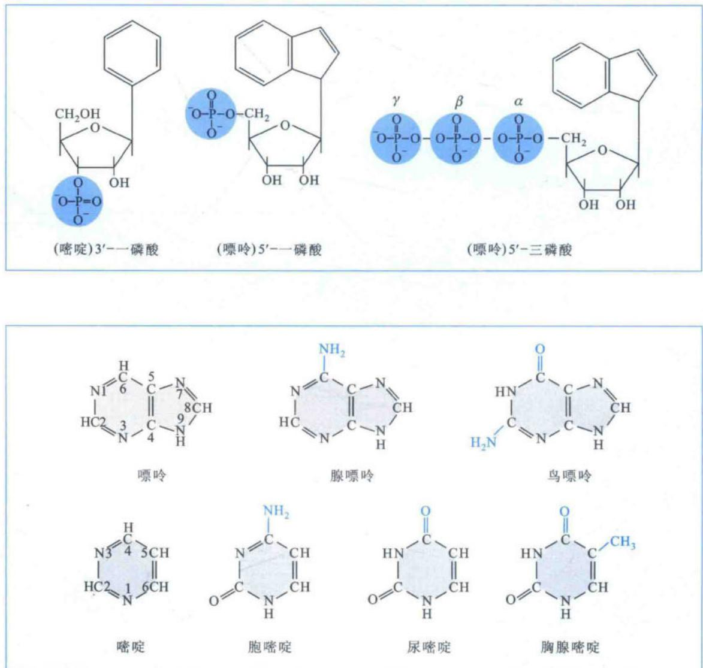

5种含氮碱基的结构式。

<!-- C-BEGIN Campbell 16 导言 -->

### 【英文对应 Campbell 第16章导言：The Molecular Basis of Inheritance】

> 来源：Campbell Biology（书籍/01_Campbell_Biology） 第16章章首（Key Concepts 与引言）。

#### [EN] 第16章 The Molecular Basis of Inheritance

<!-- 章节边界按正文内容恢复；原始 MinerU 内容保留如下。 -->

#### [EN] The Molecular Basis of Inheritance

#### [EN] Key Concepts

16.1 DNA is the genetic material

16.2 Many proteins work together in DNA replication and repair

16.3 A chromosome consists of a DNA molecule packed together with proteins

#### [EN] Study Tip

Draw DNA replication: Make up a single-stranded DNA sequence that is 40 nucleotides in length. As you go through Concepts 16.1 and 16.2, use your sequence to draw a double-stranded DNA molecule, labeling the ends. Then diagram the process of replication of your DNA molecule.

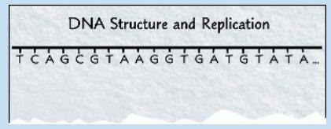

  
Figure 16.1 The elegant double-helical structure of deoxyribonucleic acid (DNA) shook the scientific world when it was proposed in April 1953 by James Watson and Francis Crick. The DNA you inherited from your parents contains all your genes—your genetic information.

#### [EN] How does DNA replication transmit genetic information?

DNA replication allows genetic information to be inherited from a parent cell to daughter cells (by mitosis) and from generation to generation (starting with meiosis).

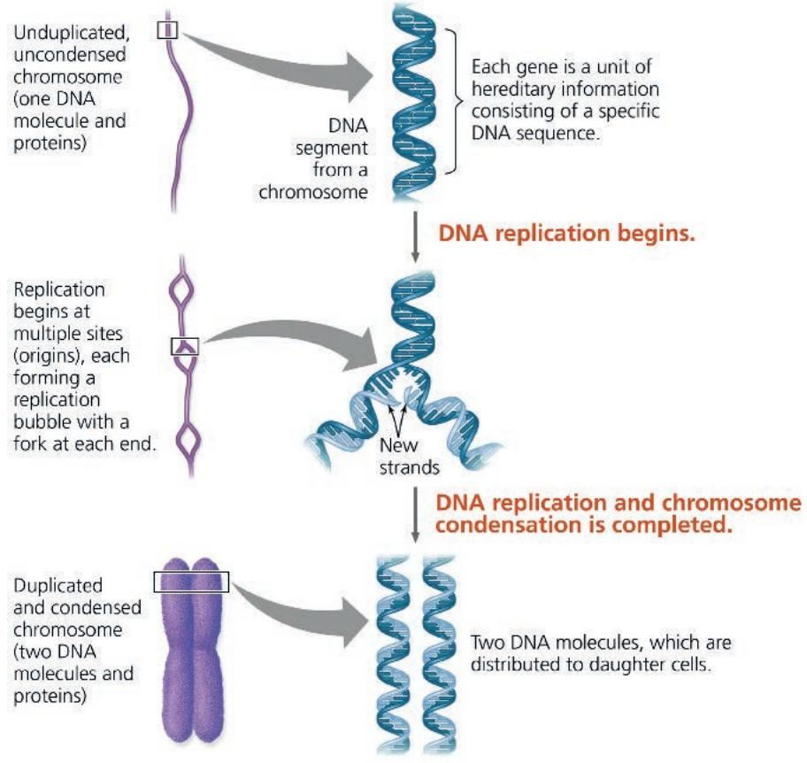

<!-- C-END Campbell 16 导言 -->

<!-- L-BEGIN Lehninger 24 导言 -->

### 【英文对应 Lehninger 第24章导言：Genes and Chromosomes】

> 来源：Lehninger Principles of Biochemistry（书籍/02_生物化学原理） 第24章章首。

#### [EN] INFORMATION PATHWAYS

PART OUTLINE

24 Genes and Chromosomes 885

25 DNA Metabolism 914

26 RNA Metabolism 960

27 Protein Metabolism 1005

28 Regulation of Gene Expression 1054

The third and final part of this book explores the biochemical mechanisms underlying the apparently contradictory requirements for both genetic continuity and the evolution of living organisms. What is the molecular nature of genetic material? How is genetic information transmitted from one generation to the next with high fidelity? How do the rare changes in genetic material that are the raw material of evolution arise? How is genetic information ultimately expressed in the amino acid sequences of the astonishing variety of protein molecules in a living cell?

Today's understanding of information pathways has arisen from the convergence of genetics, physics, and chemistry in modern biochemistry. This convergence was epitomized by the discovery of the double-helical structure of DNA, postulated by James Watson and Francis Crick in 1953. Genetic theory contributed the concept of coding by genes. Physics permitted the determination of molecular structure by x-ray diffraction analysis. Chemistry revealed the composition of DNA. The profound impact of the Watson-Crick hypothesis arose from its ability to account for a wide range of observations derived from studies in these diverse disciplines.

This discovery revolutionized our understanding of the structure of DNA and inevitably stimulated questions about its function. The double-helical structure itself clearly suggested how DNA might be copied so that the information it contains can be transmitted from one generation to the next. Clarification of how the information in DNA is converted into functional proteins came with the discoveries of messenger RNA and transfer RNA and with the deciphering of the genetic code.

These and other major advances gave rise to the central dogma of molecular biology, comprising the three major processes in the cellular utilization of genetic information. The first is replication, the copying of parental DNA to form daughter DNA molecules with identical nucleotide sequences. The second is transcription, the process by which parts of the genetic message encoded in DNA are copied precisely into RNA. The third is translation, whereby the genetic message encoded in messenger RNA is translated on the ribosomes into a polypeptide with a particular sequence of amino acids.

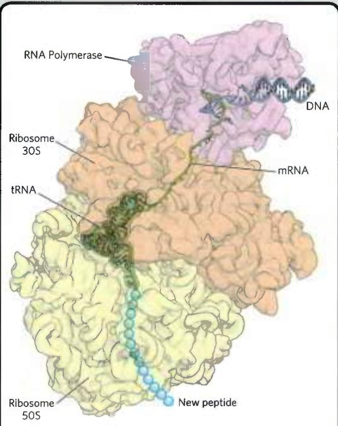  
In bacteria, transcription and translation are tightly coupled such that ribosomes are in direct contact with RNA polymerases. The mRNA is translated as soon as it is synthesized. The overall complex has been given the name expressome.

Part III explores these and related processes. In Chapter 24 we examine the structure, topology, and packaging of chromosomes and genes. The processes underlying the central dogma are elaborated in Chapters 25 through 27. Finally, in Chapter 28, we turn to regulation, examining how the expression of genetic information is controlled.

A major theme running through these chapters is the added complexity inherent in the biosynthesis of macromolecules that contain information. Assembling nucleic acids and proteins with particular sequences of nucleotides and amino acids represents nothing less than preserving the faithful expression of the template upon which life itself is based. We might expect the formation of phosphodiester bonds in DNA or peptide bonds in proteins to be a trivial feat for cells, given the arsenal of enzymatic and chemical tools described in Part II. However, the framework of patterns and rules established in our examination of metabolic pathways thus far must be enlarged considerably to take into account molecular information. Bonds must be formed between particular subunits in informational biopolymers, avoiding either the occurrence or the persistence of sequence errors. This requirement has an enormous impact on the thermodynamics, chemistry, and enzymology of the biosynthetic processes. Formation of a peptide bond requires an energy input of only about 21 kJ per mole of bonds and can be catalyzed by relatively simple enzymes. But to synthesize a bond between two specific amino acids at a particular place in a polypeptide, the cell invests about 125 kJ/mol while making use of more than 200 enzymes, RNA molecules, and specialized proteins. The chemistry involved in peptide bond formation does not change because of this requirement, but additional processes are layered over the basic reaction to ensure that the peptide bond is formed between particular amino acids. Biological information is expensive.

The dynamic interaction between nucleic acids and proteins is another central theme of Part III. Regulatory and catalytic RNA molecules are gradually taking a more prominent place in our understanding of these pathways (discussed in Chapters 26 through 28). However, most of the processes that make up the pathways of cellular information flow are catalyzed and regulated by proteins. An understanding of these enzymes and other proteins can have practical as well as intellectual rewards, because they form the basis of recombinant DNA technology (introduced in Chapter 9).

Evolution again constitutes an overarching theme. Many of the processes outlined in Part III can be traced back billions of years, and a few can be traced to LUCA, the last universal common ancestor. The ribosome, most of the translational apparatus, and some parts of the transcriptional machinery are shared by every living organism on this planet. Genetic information is a kind of molecular clock that can help define ancestral relationships among species. Shared information pathways connect humans to every other species now living on Earth, and to all species that came before. Exploration of these pathways is allowing scientists to slowly open the curtain on the first act — the events that may have heralded the beginning of life on Earth.

#### [EN] GENES AND CHROMOSOMES

24.1 Chromosomal Elements 885

24.2 DNA Supercoiling 891

24.3 The Structure of Chromosomes 898

DNA molecules are typically the largest macromolecules in any cell, often many orders of magnitude longer than the cells or viral particles that contain them (Fig. 24-1). The extraordinary degree of organization required for the tertiary packaging of DNA into chromosomes — the repositories of genetic information, is the focus of this chapter. It also gives rise to the principles around which the chapter is organized:

P1 Chromosomes include dedicated sequences that ensure their replication, transcription, packaging, and transmission from one generation to the next. They are more than a long stretch of protein-encoding genes.

P2 Chromosomes are large. To constrain them in a small space can require multiple layers and multiple modes of tertiary structure.

P3 Chromosomes in all cells are maintained in a state of torsional stress. DNA is underwound relative to the stable B-form structure, facilitating both the packaging of DNA and access to the genetic information contained within it.

P4 Specialized proteins and RNAs maintain chromosome structure. Topoisomerases control DNA underwinding. Histones, condensins, cohesins, and other DNA-binding proteins provide scaffolds to organize chromosome structure. Certain long, noncoding RNAs also play important roles in chromosome structure and function.

The chapter begins with an examination of the elements that make up viral and cellular chromosomes, and then considers chromosomal size and organization. We then discuss DNA topology, describing the coiling and supercoiling of DNA molecules. Finally, we consider the protein-DNA interactions that organize chromosomes into compact structures.

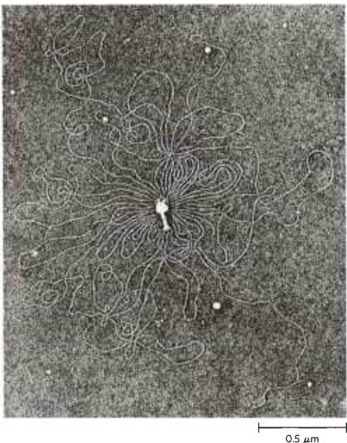  
FIGURE 24-1 Bacteriophage T2 protein coat surrounded by its single, linear molecule of DNA. The DNA was released by lysing the bacteriophage particle in distilled water and allowing the DNA to spread on the water surface. An undamaged T2 bacteriophage particle consists of a head structure that tapers to a tail by which the bacteriophage attaches itself to the outer surface of a bacterial cell. All the DNA shown in this electron micrograph is normally packaged inside the phage head. [Republished with permission of Elsevier, from A. K. Kleinschmidt et al. (1962), "Preparation and length measurements of the total deoxyribonucleic acid content of T2 bacteriophages," Biochim. Biophys. Acta 61:857–864; permission conveyed through Copyright Clearance Center, Inc.]

<!-- L-END Lehninger 24 导言 -->

<!-- L-BEGIN Lehninger 25 导言 -->

### 【英文对应 Lehninger 第25章导言：DNA Metabolism】

> 来源：Lehninger Principles of Biochemistry（书籍/02_生物化学原理） 第25章章首。

#### [EN] DNA METABOLISM

25.1 DNA Replication 915

25.2 DNA Repair 930

25.3 DNA Recombination 940

As the repository of genetic information, DNA occupies a unique and central place among biological macromolecules. The nucleotide sequences of DNA encode the primary structures of all cellular RNAs and proteins and, through enzymes, indirectly affect the synthesis of all other cellular constituents. This passage of information from DNA to RNA and protein guides the size, shape, and functioning of every living thing.

DNA is a marvelous device for the stable storage of genetic information. The phrase “stable storage,” however, conveys a static and misleading picture. It fails to capture the complexity of processes by which genetic information is preserved in an uncorrupted state and then transmitted from one generation of cells to the next. DNA metabolism comprises both the process that gives rise to faithful copies of DNA molecules (replication) and the processes that affect the inherent structure of the information (repair and recombination). Together, these activities are both the focus of this chapter and the underpinning for several guiding principles:

#### [EN] P1 Along with catalysis, biological information is one of the two key prerequisites for life. The faithful maintenance and transmission of genetic information from one generation to another ensures continuity within each species.

P2 Information is expensive. The chemistry of joining one nucleotide to the next in DNA replication is elegant and simple, almost deceptively so. However, the enzymatic and thermodynamic commitment to linking one nucleotide to another in DNA far exceeds what would normally be required to successfully form a phosphodiester bond. It is not enough to synthesize a phosphodiester bond; that bond must accurately link two particular nucleotides.

#### [EN] P3 The fidelity of genome maintenance and transmission is not perfect. DNA damage

happens, often by spontaneous processes. DNA replication and repair deal with the vast majority of DNA lesions, providing a high degree of genetic fidelity and stability. The few DNA damage events that slip through uncorrected provide fuel for evolution.

#### [EN] P4 Although considered separately, the processes of replication, repair, and recombination of DNA are not distinct. These processes are highly integrated in cells, and they are required for proper genome maintenance.

We give the enzymes of DNA metabolism special emphasis in this chapter. These enzymes are not only intrinsically important biologically; they are also important in medicine and biochemical technologies. Many of the seminal discoveries in DNA metabolism have been made with Escherichia coli, so its well-understood enzymes are generally used to illustrate the ground rules.

KEY CONVENTION Before taking a closer look at replication, we make a short digression into the use of abbreviations in naming genes and proteins — you will encounter many of these in this and later chapters. Bacterial genes generally are named using three italicized, lowercase letters that often reflect a gene's apparent function. For example, the dna, uvr, and rec genes affect DNA replication, resistance to the damaging effects of UV radiation, and recombination, respectively. Where several genes affect the same process, the letters A, B, C, and so forth, are added — as in dnaA, dnaB, dnaQ, for example — usually reflecting their order of discovery rather than the order of their gene products in a reaction sequence. Similar conventions exist for naming eukaryotic genes, although the exact form of the abbreviations may vary with the species, and no single convention applies to all eukaryotic systems. For example, in the budding yeast Saccharomyces cerevisiae, gene names are generally three uppercase letters followed by a number, all italicized (e.g., the gene COX1 encodes a subunit of cytochrome oxidase). Gene names that predate current conventions may differ in format.

The use of abbreviations in naming proteins is less straightforward. During genetic investigations, the protein product of each gene is usually isolated and characterized. Many bacterial genes were identified and named before the roles of their protein products were understood in detail. Sometimes the gene product was found to be a previously isolated protein, and some renaming occurred. Often, however, the product turned out to be an as yet unknown protein, with an activity not easily described by a simple enzyme name.

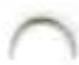

Bacterial proteins often retain the name of their genes. When referring to the protein product of an E. coli gene, we use roman type and capitalize the first letter: for example, the dnaA and recA gene products are the DnaA and RecA proteins, respectively. Conventions for eukaryotic proteins are again complex. For yeast, some proteins have long common names (such as cytochrome oxidase). Others have the same name as the gene, in which case the protein name usually has one uppercase and two lowercase letters, followed by a number and the letter "p," all in roman type (such as Rad51p). The "p" is to emphasize that this is a protein and to prevent confusion with naming conventions for other organisms.

<!-- L-END Lehninger 25 导言 -->

## 2.1 染色体

## 2.1.1 染色体概述

由于亲代能够将自己的遗传物质 DNA 以染色体 (chromosome) 的形式传给子代,保持了物种的稳定性和连续性,因此,人们普遍认为染色体在遗传上起着主要作用。染色体包括 DNA 和蛋白质两大部分。DNA 只有包装成为染色体才能保证其稳定性,并使其编码的遗传信息稳定地传递给子代。同一物种内每条染色体所带 DNA 的量是一定的,但不同染色体或不同物种之间变化很大,从上百万到几亿个核苷酸不等。人 X 染色体就带有 1.28 亿个核苷酸对,而 Y 染色体只带有 0.19 亿个核苷酸对(表 2-1)。此外,组成染色体的蛋白质 (组蛋白和非组蛋白) 种类和含量也是十分稳定的。由于细胞内的 DNA 主要在染色体上,所以说遗传物质的主要载体是染色体。

表 2-1 人类基因组各条染色体中碱基对数量和推导的功能基因数量对照 \*

<table><tr><td>染色体编号</td><td>长度 /Mbp</td><td>估计的基因数</td></tr><tr><td>1</td><td>220</td><td>3 453</td></tr><tr><td>2</td><td>240</td><td>2 954</td></tr><tr><td>3</td><td>200</td><td>2 427</td></tr><tr><td>4</td><td>186</td><td>1 861</td></tr><tr><td>5</td><td>182</td><td>2 136</td></tr><tr><td>6</td><td>172</td><td>2 257</td></tr><tr><td>7</td><td>146</td><td>1 831</td></tr><tr><td>8</td><td>146</td><td>1 560</td></tr><tr><td>9</td><td>113</td><td>1 537</td></tr><tr><td>10</td><td>130</td><td>1 653</td></tr><tr><td>11</td><td>132</td><td>2 185</td></tr><tr><td>12</td><td>134</td><td>1 861</td></tr><tr><td>13</td><td>99</td><td>1 032</td></tr><tr><td>14</td><td>87</td><td>1 283</td></tr><tr><td>15</td><td>80</td><td>1 198</td></tr><tr><td>16</td><td>75</td><td>1 421</td></tr><tr><td>17</td><td>78</td><td>1 545</td></tr><tr><td>18</td><td>79</td><td>826</td></tr><tr><td>19</td><td>58</td><td>1 675</td></tr><tr><td>20</td><td>61</td><td>986</td></tr><tr><td>21</td><td>33</td><td>449</td></tr><tr><td>22</td><td>36</td><td>835</td></tr><tr><td>X</td><td>128</td><td>1 465</td></tr><tr><td>Y</td><td>19</td><td>210</td></tr><tr><td>总长</td><td>2 907</td><td>39 114</td></tr></table>

\* 根据 Science (2001)291:1304-1351。

图 2-3 大肠杆菌细胞中基因组 DNA 的电子显微镜照片

箭头所示处为球状质粒 DNA, 各种白斑或黑斑为样品制备中产生的假象。

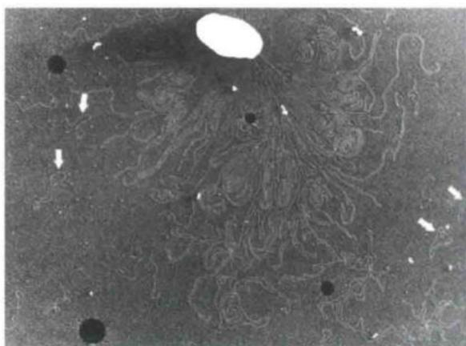

19 世纪中叶,细胞生物学家首先在光学显微镜下看到了细胞这个生命的基本单位,他们记录了真核细胞分裂的全过程,发现了细胞质与细胞核之间的界限,还在细胞分裂时观察到存在于细胞核中的棒状可染色结构并将其命名为染色体。因为当细胞分裂时,每条染色体都复制生成一条与母链完全一样的子链,形成同源染色体对。一般说来,染色体只有在

细胞有丝分裂过程中,才可在光学显微镜下观察到。而在细胞生活周期中占较长时间的分裂间期,染色体以较细且松散的染色质形式存在于细胞核中。非分裂期的细胞核经低渗处理、溶胀破裂后释放出染色质,在电子显微镜下呈纤维串珠状的长丝,包括有 DNA 双螺旋的长臂及部分蛋白质。

真核与原核细胞染色体除了外观结构不同之外，它们在细胞内的存在方式也不同。细菌染色体外裹着稀疏的蛋白质，这些蛋白质有些与DNA的折叠有关，另一些则参与DNA复制、重组及转录过程。真核细胞的染色体中，DNA与蛋白质完全融合在一起，其蛋白质与相应DNA的质量比约为2：1。这些蛋白质，包括组蛋白和非组蛋白，在染色体的结构中起着重要作用。这样，DNA、组蛋白和非组蛋白及部分RNA（主要是尚未完成转录而仍与模板DNA相连接的那些RNA，其含量不到DNA的 $10\%$ )组成了染色体。

因为原核生物没有真正的细胞核，DNA一般位于一个类似“核”的结构——称为类核体上。细菌DNA是一条相对分子质量在 $10^{9}$ 左右的共价、闭合双链分子，通常也称为染色体(图2-3)。虽然快速生长期内的大肠杆菌可以有几条染色体，但一般情况下只含有一条染色体。因此，大肠杆菌和其他原核细胞都是单倍的。

原核生物 DNA 的主要特征是: 原核生物中一般只有一条染色体且大都带有单拷贝基因, 只有很少数基因 (如 rRNA 基因) 以多拷贝形式存在; 整个染色体 DNA 几乎全部由功能基因与调控序列所组成; 几乎每个基因序列都与它所编码的蛋白质序列呈线性对应状态。

## 2.1.2 真核细胞染色体的组成

真核细胞都有明显的核结构,除了性细胞以外,真核细胞的染色体都是二倍体,而性细胞即生殖细胞的染色体数目是体细胞的一半,故称为单倍体。在二倍体阶段,每个基因都有两个拷贝,其中的一个拷贝会通过配子(gamete),即性细胞(精子或卵子)从亲本传到子代。精、卵细胞结合形成合子(zygote),也称受精卵,它包含了从父、母本来的各一个拷贝的所有基因,从而创造了一个新生的二倍体。在这个新的个体内,基因的一个拷贝来自父本,另一个拷贝来自母本。

作为遗传物质,染色体具有如下特征:①分子结构相对稳定;②能够自我复制,使亲、子代之间保持连续性;③能够指导蛋白质的合成,从而控制整个生命过程;④能够产生可遗传的变异。

由于真核细胞 DNA 相对分子质量一般大大超过原核生物, 其染色体也常常为大量蛋白质及核膜所包围, DNA 的转录和翻译是在不同的空间和时间上进行的, 所以其基因表达的调控不仅与 DNA 的序列有关, 而且也与染色体的结构有关。下面我们来详细介绍一下真核细胞染色体的组成。

## 1. 蛋白质

染色体上的蛋白质主要包括组蛋白和非组蛋白。组蛋白是染色体的结构蛋白，它与DNA组成核小体。通常可以用2 mol/L NaCl或0.25 mol/L的HCl/H₂SO₄处理染色质使组蛋白与DNA分开，然后再用离子交换柱层析分离。根据其凝胶电泳性质可以把组蛋白分为H₁、H₂A、H₂B、H₃及H₄。这些组蛋白都含有大量的赖氨酸和精氨酸，其中H₃、H₄富含精氨酸，H₁富含赖氨酸；H₂A、H₂B介于两者之间。它们的理化特性见表2-2。

表 2-2 真核细胞染色体上的组蛋白成分分析

<table><tr><td>种类</td><td>相对分子质量</td><td>氨基酸数目</td><td>分离难易度</td><td>保守性</td><td>染色质中比例</td><td>染色质中位置</td></tr><tr><td> $H_{1}$ </td><td>21 000</td><td>223</td><td>易</td><td>不保守</td><td>0.5</td><td>接头</td></tr><tr><td> $H_{2}A$ </td><td>14 500</td><td>129</td><td>较难</td><td>较保守</td><td>1</td><td>核心</td></tr><tr><td> $H_{2}B$ </td><td>13 800</td><td>125</td><td>较难</td><td>较保守</td><td>1</td><td>核心</td></tr><tr><td> $H_{3}$ </td><td>15 300</td><td>135</td><td>最难</td><td>最保守</td><td>1</td><td>核心</td></tr><tr><td> $H_{4}$ </td><td>11 300</td><td>102</td><td>最难</td><td>最保守</td><td>1</td><td>核心</td></tr></table>

组蛋白具有如下特性：

① 进化上的极端保守性。不同种生物组蛋白的氨基酸组成是十分相似的，特别是 $\mathrm{H}_{3}$ 、 $\mathrm{H}_{4}$ 。牛、猪、大鼠的 $\mathrm{H}_{4}$ 氨基酸序列完全相同。牛的 $\mathrm{H}_{4}$ 序列与豌豆序列相比只有两个氨基酸的差异(豌豆 $\mathrm{H}_{4}$ 中的异亮氨酸 $^{60} \rightarrow$ 缬氨酸 $^{60}$ ，精氨酸 $^{77} \rightarrow$ 赖氨酸 $^{77}$ )。 $\mathrm{H}_{3}$ 的保守性也很强，鲤鱼与小牛胸腺的 $\mathrm{H}_{3}$ 只差一个氨基酸，小牛胸腺与豆苗 $\mathrm{H}_{3}$ 只差4个氨基酸。 $\mathrm{H}_{2}\mathrm{A}, \mathrm{H}_{2}\mathrm{B}$ 的变化相对大些， $\mathrm{H}_{1}$ 的变化则更大。 $\mathrm{H}_{3}$ 及 $\mathrm{H}_{4}$ 在氨基酸组成上的极端保守性表明，它们可能对稳定真核生物的染色体结构起重要作用。

② 无组织特异性。到目前为止，仅发现鸟类、鱼类及两栖类红细胞染色体不含 $H_{1}$ 而带有 $H_{5}$ ，精细胞染色体的组蛋白是鱼精蛋白这两个例外。

③ 肽链上氨基酸分布的不对称性。碱性氨基酸集中分布在 N 端的半条链上。例如， $H_{4}$ N 端的半条链上净电荷为 +16, C 端只有 +3, 大部分疏水基团都分布在 C 端。这种不对称的分布可能与它们的功能和相互作用有关。碱性的半条链易与 DNA 的负电荷区结合, 而另外半条链与其他组蛋白、非组蛋白结合。表 2-3 比较了不同组蛋白中赖氨酸和精氨酸含量。

## 2.1 染色体

## 仅供个人科学教研

表 2-3 不同组蛋白分子中所含的碱性氨基酸比较(占氨基酸总数的%)

<table><tr><td>碱性氨基酸</td><td> $H_{1}$ </td><td> $H_{2}A$ </td><td> $H_{2}B$ </td><td> $H_{3}$ </td><td> $H_{4}$ </td></tr><tr><td>赖氨酸</td><td>29.5</td><td>10.9</td><td>16.0</td><td>9.6</td><td>10.8</td></tr><tr><td>精氨酸</td><td>1.3</td><td>9.3</td><td>6.4</td><td>13.3</td><td>13.7</td></tr></table>

④ 组蛋白的修饰作用。由于组蛋白富含精氨酸和赖氨酸,可以发生包括甲基化、乙酰化、磷酸化、泛素化、ADP核糖基化、丙酰化、丁酰化、琥珀酰化和巴豆酰化等多种翻译后修饰。这些修饰共同组成组蛋白密码,在不同的条件下更为灵活地影响染色质的结构与功能。在几种组蛋白中以 $H_{3}$ 和 $H_{4}$ 的修饰作用比较普遍(图2-4),并且以甲基化、乙酰化修饰为主, $H_{2}A$ 、 $H_{2}B$ 能发生泛素化和乙酰化修饰, $H_{1}$ 有泛素化和磷酸化修饰。修饰作用只发生在细胞周期的特定时间和组蛋白的特定位点上。

组蛋白甲基化是由组蛋白甲基转移酶和去甲基化酶催化的可逆修饰。甲基化可发生在组蛋白的赖氨酸和精氨酸残基上，而且赖氨酸残基能够发生单、双、三甲基化，而精氨酸残基能够被单、双甲基化。组蛋白 $H_{3}$ 的第4、9、27和36位， $H_{4}$ 的第20位赖氨酸， $H_{3}$ 的第2、17、26位及 $H_{4}$ 的第3位精氨酸都是甲基化的常见位点。组蛋白H3K4的甲基化主要聚集在活跃转录的启动子区域。组蛋白H3K9和H3K27的甲基化则与基因的转录抑制或异染色质化有关，H3K36和H3K79的甲基化参与基因转录激活。这些不同程度的甲基化极大地增加了组蛋白修饰和调节基因表达的复杂性，组蛋白甲基化的异常导致肿瘤等多种人类疾病的发生。与其他修饰相比，组蛋白的甲基化修饰方式是比较稳定的，适合作为表观遗传信息。

组蛋白乙酰化主要发生在核心组蛋白上，在含有活性基因的 DNA 结构域中，乙酰化程度更高， $H_{3}$ 和 $H_{4}$ 乙酰化程度大于 $H_{2}A$ 和 $H_{2}B$ 。乙酰化的主要位点分布在 $H_{3}$ 和 $H_{4}$ 的 N 端比较保守的赖氨酸位置上。乙酰化修饰由组蛋白乙酰基转移酶和组蛋白去乙酰化酶协调进行，以保证乙酰化水平的动态平衡。组蛋白乙酰化呈现多样性，核小体上有多个乙酰化位点，但特定基因部位的组蛋白乙酰化和去乙酰化是以一种非随机的、位置特异的方

图2-4 组蛋白N端残基中常见的化学修饰

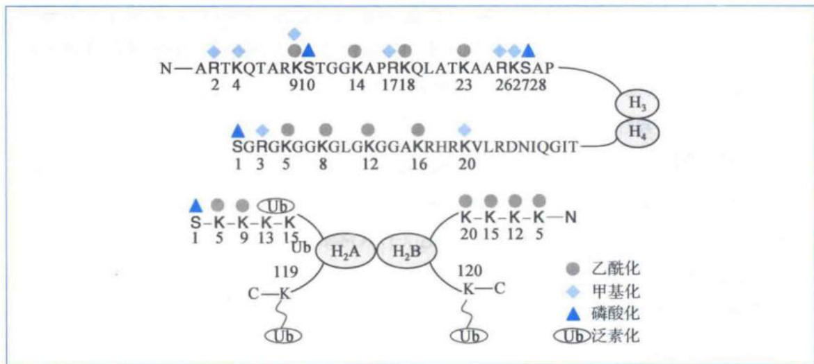

式进行,可能通过对组蛋白电荷以及相互作用蛋白的影响,来调节基因转录水平。乙酰化/去乙酰化修饰影响染色质结构和基因活化,组蛋白的乙酰化有利于 DNA 与组蛋白八聚体的解离,使核小体结构松弛,从而使各种转录因子和协同转录因子能与 DNA 结合位点特异性结合,激活基因的转录;反之,去乙酰化则抑制转录。组蛋白的乙酰化、去乙酰化修饰还参与 DNA 修复、拼接、复制,染色体的组装,以及细胞的信号转导,与肿瘤等疾病的发生发展密切相关。有关组蛋白的甲基化和乙酰化在基因表达中的调控作用将在第八章详细介绍。

组蛋白的泛素化修饰位点为高度保守的赖氨酸残基，组蛋白 $H_{1}$ 、 $H_{2}A$ 、 $H_{2}B$ 和 $H_{3}$ 都能发生泛素化修饰。与经典的蛋白质泛素调节途径不同，组蛋白的泛素化修饰不会导致蛋白质的降解，却能招募核小体形成染色体，并参与 X 染色体的失活，影响组蛋白的甲基化和基因的转录，也在 DNA 损伤应答等生理过程中发挥重要调控作用。

组蛋白 $H_{1}$ 、 $H_{2}A$ 、 $H_{2}B$ 及 $H_{3}$ 能够和多聚 ADP-核糖的共价结合发生 ADP 核糖基化修饰，被认为是在真核细胞内启动复制过程的开关。

组蛋白的修饰可以通过影响组蛋白与 DNA 双链的亲和性, 改变染色质的疏松或凝集状态, 或通过影响转录因子与结构基因启动子的亲和性来发挥基因调控作用。

⑤ 富含赖氨酸的组蛋白 $H_{5}$ 。在成熟的鱼类和鸟类的红细胞中， $H_{1}$ 被特殊的组蛋白 $H_{5}$ 所取代。从该组蛋白的氨基酸成分来看，除了富含赖氨酸（24%）以外，还富含丙氨酸（16%）、丝氨酸（13%）及精氨酸（11%）。它与 $H_{1}$ 并无明显的亲缘关系。有核的红细胞完全失去复制和转录的能力，其核很小，染色质高度浓缩，所以人们认为红细胞染色质的失活与 $H_{5}$ 的积累有关。但是，在成红细胞中也有相当数量的 $H_{5}$ 。有证据表明， $H_{5}$ 的磷酸化很可能在染色质失活过程中起重要作用。

染色体上除了存在大约与 DNA 等量的组蛋白以外,还存在大量的非组蛋白。非组蛋白占组蛋白总量的 60%\~70%,它的种类很多,有 20\~100 种。非组蛋白包括酶类,如 RNA 聚合酶及与细胞分裂有关的收缩蛋白、骨架蛋白、核孔复合物蛋白以及肌动蛋白、肌球蛋白、微管蛋白、原肌蛋白等,它们也可能是染色质的结构成分。

HMG 蛋白 (high mobility group protein)。这是一类能用低盐 (0.35 mol/L NaCl) 溶液抽提、能溶于 2% 三氯乙酸、相对分子质量都在 $3.0 \times 10^{4}$ 以下的非组蛋白。因其相对分子质量小、在凝胶电泳中迁移速度快而得名。HMG 蛋白富含赖氨酸、精氨酸、谷氨酸和天冬氨酸，是真核细胞内除组蛋白外含量最为丰富的一组染色质蛋白质。这类蛋白质的特点是能与 DNA 结合，也能与 $H_{1}$ 作用，但都很容易用低盐溶液抽提，说明它们与 DNA 的结合并不牢固。现在一般认为这类蛋白质可能与 DNA 的超螺旋结构有关，是真核细胞基因表达调控的动力体现者，在染色质的结构与功能及基因表达调控过程中均发挥着重要作用。

DNA 结合蛋白。用 2 mol/L NaCl 除去全部组蛋白和 70% 的非组蛋白后，还有一部分非组蛋白紧紧地与 DNA 结合在一起，只有用 2 mol/L NaCl 和 5 mol/L 尿素才能把这些蛋白质解离。它们是一些相对分子质量较低的蛋白质，约占非组蛋白的 20%，染色质的 8%。它们可能是一些与 DNA 的复制或转录有关的酶或调节物质。

A24 非组蛋白。有科学家用 0.2 mol/L 的硫酸从小鼠肝中分离到一种称为 A24 的非组蛋白。这种蛋白质的溶解性质与组蛋白相似。氨基酸序列测定发现 A24 的 C 端与 $H_{2}A$ 相同，但它有两个 N 端，一个 N 端的序列与 $H_{2}A$ 相同，另一个 N 端与泛素相同，是在 $H_{2}A$ 的 119 位赖氨酸的 $\varepsilon-NH_{2}$ 上附加上去的多肽。它与 $H_{2}A$ 差不多大小，呈酸性，含有较多的谷氨酸和天冬氨酸。A24 的总量大约是 $H_{2}A$ 的 1%，位于核小体内，可能具有 rDNA 抑制子的作用，但具体功能有待于深入研究。

## 2. 真核生物基因组 DNA

真核细胞基因组的最大特点是它含有大量的重复序列,而且功能 DNA 序列大多被不编码蛋白质的非功能 DNA 所隔开。生物体内所有的染色体组成基因组,每 Mb 基因组 DNA 上所含有的平均基因数目称为基因密度(gene density)。我们把一种生物单倍染色体中 DNA 的总长度称为基因组的大小(genome size)。基因组的大小与生物体的复杂性相关(图 2-5)。在真核生物中,基因组的大小一般是随生物进化而增加的,高等生物基因组的大小一般大于低等生物,这很容易被高等生物需要更多的基因来控制性状所解释。然而,许多复杂性相近的物种却有着显著不同的基因组大小。例如,蝗虫的基因组大小是果蝇基因组的 25 倍,水稻的基因组是小麦基因组的 1/40,这表明基因的数目可能与生物的复杂度关系更加密切。研究发现,基因密度是复杂度相近但基因组大小迥异的物种之间的主要区别。一般来说,基因密度越高,生物的复杂性越低(表 2-4)。与原核生物相比,真核生物不但基因密度低,而且各种变异相对较多。真核生物中,基因密度随着生物复杂性的增加而降低,这主要是由于在真核细胞中基因长度,特别是大量基因间隔区序列(intergenic sequence)造成的。

图 2-5 各种生物细胞内基因组大小的比较

(a) 同类生物不同种属之间 DNA 总量变化很大; (b) 从编码每类生物所需要 DNA 量的最低值看, 生物基因组的大小具有从低等生物到高等生物逐渐增加的趋势。

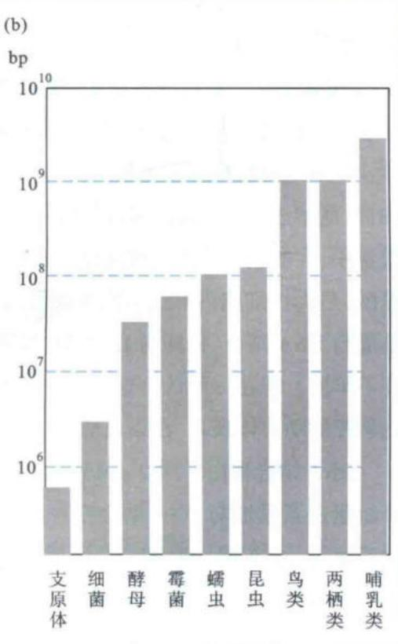

表 2-4 不同生物基因组中基因密度的比较

<table><tr><td>物种</td><td>基因密度/(基因数/Mb)</td><td>基因组大小/Mb</td><td>大致基因数目</td></tr><tr><td>原核生物</td><td></td><td></td><td></td></tr><tr><td>肺炎链球菌</td><td>1060</td><td>2.2</td><td>2300</td></tr><tr><td>大肠杆菌K-12</td><td>950</td><td>4.6</td><td>4400</td></tr><tr><td>真核生物</td><td></td><td></td><td></td></tr><tr><td>真菌</td><td></td><td></td><td></td></tr><tr><td>酿酒酵母</td><td>480</td><td>12</td><td>5800</td></tr><tr><td>原生生物</td><td></td><td></td><td></td></tr><tr><td>四膜虫</td><td>&gt;90</td><td>220</td><td>&gt;20000</td></tr><tr><td>无脊椎动物</td><td></td><td></td><td></td></tr><tr><td>美丽线虫</td><td>200</td><td>97</td><td>19000</td></tr><tr><td>果蝇</td><td>80</td><td>180</td><td>13700</td></tr><tr><td>东亚飞蝗</td><td>?</td><td>5000</td><td>?</td></tr><tr><td>脊椎动物</td><td></td><td></td><td></td></tr><tr><td>人类</td><td>8.5</td><td>2900</td><td>27000</td></tr><tr><td>小鼠</td><td>12</td><td>2500</td><td>29000</td></tr><tr><td>植物</td><td></td><td></td><td></td></tr><tr><td>拟南芥</td><td>125</td><td>125</td><td>25500</td></tr><tr><td>水稻</td><td>&gt;100</td><td>430</td><td>&gt;45000</td></tr><tr><td>玉米</td><td>&gt;20</td><td>2200</td><td>&gt;45000</td></tr></table>

对于复杂度高的生物,调控转录的序列长度显著增长,分散在真核生物中编码蛋白质的基因区段中的非蛋白质编码区段(内含子)的数目也大量增加 $^{(图2-6)}$ 。例如,人基因组中功能未知的基因间隔区序列超过60%。间隔区DNA根据其重复性分为唯一性(大约1/4的基因间隔区序列)和重复性两大类,人类基因组中几乎一半以上由重复多次的DNA

  
图 2-6 人类基因组由多种类型的 DNA 序列组成, 绝大多数 DNA 序列不编码蛋白质

序列组成。

真核细胞的 DNA 序列大致上可被分为 3 类:

① 不重复序列 在单倍体基因组里,这些序列一般只有一个或几个拷贝,它占 DNA 总量的 40%\~80%,如牛细胞中占 55%,小鼠中占 70%,果蝇中占 79%。不重复序列长 750\~2000 bp,相当于一个结构基因的长度。实际上结构基因基本上属于不重复序列,如蛋清蛋白、蚕丝心蛋白、血红蛋白和珠蛋白等都是单拷贝基因。

② 中度重复序列 这类序列的重复次数在 $10^{1} \sim 10^{4}$ 之间，占总DNA的 $10\% \sim 40\%$ ，在小鼠中占 $20\%$ ，果蝇中占 $15\%$ ，各种rRNA、tRNA以及某些结构基因如组蛋白基因等都属于这一类。非洲爪蟾的18S、5.8S及28S rRNA基因是连在一起的，它们中间隔着不转录的间隔区，这些rRNA基因及间隔区组成的单位在DNA链上串联重复约5000次。在许多动物的卵细胞形成过程中这些基因可进行几千次不同比例的复制，产生 $2 \times 10^{6}$ 个拷贝，使rDNA占卵细胞DNA的 $75\%$ ，从而使该细胞能积累 $10^{12}$ 个核糖体，以合成大量蛋白质供细胞分裂之需。中度重复序列往往分散在不重复序列之间。

③ 高度重复序列——卫星 DNA 这类 DNA 只在真核生物中发现, 占基因组的 10%\~60%, 由 6\~100 个碱基组成, 在 DNA 链上串联重复成千上万次。实验中常用 CsCl 密度梯度离心将卫星 DNA 与其他 DNA 分开, 形成两个以上的峰, 即含量较大的主峰和高度重复序列小峰, 后者又称卫星区带(峰)。原位杂交法证明, 许多卫星 DNA 均位于染色体的着丝粒部分, 也有一些在染色体臂上。这类 DNA 是高度浓缩的, 是异染色质的组成部分。卫星 DNA 是不转录的, 其功能不明, 可能与染色体的稳定性有关。

## 3. 染色质和核小体

由 DNA 和组蛋白组成的染色质纤维细丝是许多核小体连成的念珠状结构[图 2-7(a)]，大量实验证实了这一结构模型。首先，人们发现染色质 DNA 的 $T_{\mathrm{m}}$ 值比自由 DNA 高，说明在染色质中 DNA 极可能与蛋白质分子相互作用；其次，在染色质状态下，由 DNA 聚合酶和 RNA 聚合酶催化的 DNA 复制和转录活性大大低于在自由 DNA 中的反应；DNA 酶 I (DNase I) 对染色质 DNA 的消化远远慢于对纯 DNA 的作用。另外，染色质的电子显微镜图显示出由核小体组成的念珠状结构[图 2-7(b)]，可以看到由一条细丝连接着的一连串直径为 10 nm 的球状体。在染色质的 X 射线衍射图中也发现了 10 nm 的重复单位。DNase I 或小球菌核酸酶可以切断游离 DNA 上的任何磷酸二酯键，而除了少数几个位点以外染色质中的 DNA 是被保护不受消化的。用小球菌核酸酶处理染色质以后进行电泳，便可以得到一系列片段，这些被保留的 DNA 片段均为 200 bp 基本单位的倍数，其大小分别为 200 bp (单体)、400 bp (双体)、600 bp (三体) 等(图 2-7d)。电镜图显示一个染色质片段中球形颗粒的长度为 200 bp，如具有 600 bp DNA 的染色质片段含有 3 个直径为 10 nm 的颗粒。因此，电镜上看到的颗粒相当于核酸酶切割后得到的核小体(图 2-7)。

现在已经知道,核小体是由 $H_{2}A$ 、 $H_{2}B$ 、 $H_{3}$ 、 $H_{4}$ 各两个分子生成的八聚体和由大约 200 bp DNA 组成的。 $H_{3}\cdot H_{4}$ 四聚体的形成启动核小体的组装,四聚体然后与 DNA 结合,再与两个 $H_{2}A\cdot H_{2}B$ 二聚体结合,完成核小体的组装。八聚体在中间,DNA 分子盘绕在

  
图 2-7 核小体单位的存在及核心颗粒的形成

(a) 核小体结构示意图；(b) 从电镜下看到的染色质结构；(c) 核小体单元的产生；(d) 小球菌核酸酶对核小体 DNA 的消化。

外，而 $H_{1}$ 则在核小体的外面。每个核小体只有一个 $H_{1}$ 。所以，核小体中组蛋白和 DNA 的比例是每 200 bp DNA 有 $H_{2}A$ 、 $H_{2}B$ 、 $H_{3}$ 、 $H_{4}$ 各两个， $H_{1}$ 一个。每个核心组蛋白有一个 N 端延伸的“尾巴”，上面有许多高度修饰的位点（图 2-8）。用核酸酶水解核小体后产生只含 146 bp 核心颗粒（图 2-7），包括组蛋白八聚体及与其结合的 146 bp 核心 DNA，该序列绕在核心外面形成 1.65 圈，每圈约 80 bp。核小体之间的连接 DNA 的长度是可变的，一般为 20～60 bp。由许多核小体构成了连续的染色质 DNA 细丝。

需要注意的是,在核小体中组蛋白与 DNA 的结合是动态的,其相互作用的稳定性受到核小体重塑复合体的影响,利用 ATP 水解释放的能量,由多个蛋白质组成的核小体重

图 2-8 组蛋白八聚体组成核小体的核心  

塑复合体促进组蛋白八聚体沿 DNA 滑动，从一个 DNA 分子转移到另一个 DNA 分子，使核小体重塑，增加 DNA 的易接近性。上述组蛋白 N 端尾部的修饰在调控染色质的易接近性中也发挥重要作用。

核小体的形成是染色体中 DNA 压缩的第一个阶段。在核小体中 DNA 盘绕组蛋白八聚体核心，从而使分子收缩成 1/7，200 bp DNA 完全舒展时长约 68 nm，却被压缩在 10 nm 的核小体中。当然 1/7 的压缩比仍远远低于染色体中 DNA 的压缩比。例如，人中期染色体中含 $6.2 \times 10^{9}$ 碱基对，其理论长度应是 200 cm，这么长的 DNA 被包装在 46 个 5 μm 长的圆柱体（染色体）中，

其压缩比约为 $10^{4}$ 。分裂间期染色质比较松散，压缩比是 $10^{2} \sim 10^{3}$ 。所以说，核小体只是 DNA 压缩的第一步。

那么，DNA 包装成染色体的下一个水平是什么呢？在电镜下观察染色质，可以看到 10 nm 及 30 nm 两类不同的纤维构造。通过改变离子强度，30 nm 纤维和 10 nm 纤维可以可逆地相互转化。10 nm 纤维是由核小体串联成的染色质细丝，主要在低离子强度及无 $H_{1}$ 情况下产生。当离子强度较高且有 $H_{1}$ 存在时，以 30 nm 纤维为主，它是由 10 nm 的染色质细丝盘绕成螺旋管状的粗丝，通称螺线管（solenoid）。螺线管的每一螺旋包含 6 个核小体，其压缩比为 6。这种螺线管是分裂间期染色质和分裂中期染色体的基本组分。组蛋白 $H_{1}$ 通过与结合在核小体上的 DNA 结合，使染色质进一步压缩，形成 30 nm 螺线

图2-9 组蛋白 $\mathrm{H}_{1}$ 使DNA更紧密地盘绕在核小体上  

管(图2-9)。染色质和染色体可能是一个多层次的螺旋结构,上述螺线管可进一步压缩形成超螺旋。有迹象表明:中期染色质是一细长、中空的圆筒,直径为4000 nm,由30 nm螺线管缠绕而成,压缩比是40。这个超螺旋圆筒进一步压缩1/5便成为染色体单体,总压缩比是7×6×40×5,将近一万倍,与DNA的压缩比相近(图2-10)。表2-5总结了染色体形成过程中长度与宽度的变化。

真核生物基因组的结构特点总结归纳如下：

① 真核基因组庞大，一般都远大于原核生物的基因组。

② 真核基因组存在大量的重复序列。

③ 真核基因组的大部分为非编码序列，占整个基因组序列的 90% 以上，该特点是真核生物与细菌和病毒之间最主要的区别。

④ 真核基因组的转录产物为单顺反子。

⑤ 真核基因是断裂基因，有内含子结构。

⑥ 真核基因组存在大量的顺式作用元件。包括启动子、增强子、沉默子等(详见第8章“真核基因表达调控”)。

⑦ 真核基因组中存在大量的 DNA 多态性。DNA 多态性是指 DNA 序列中发生变异而导致的个体间核苷酸序列的差异,主要包括单核苷酸多态性 (single nucleotide polymorphism, SNP) 和串连重复序列多态性 (tandem repeat polymorphism) 两类。

⑧ 真核基因组具有端粒结构。端粒(telomere)是真核生物线性基因组DNA末端的一种特殊结构,它是一段DNA序列和蛋白质形成的复合体。其DNA序列相当保守,一般有多个短寡核苷酸串连在一起构成。人类的端粒DNA长5\~15 kb。它具有保护线性DNA的完整复制、保护染色体末端和决定细胞的寿命等功能,有关端粒的研究也是分子生物学的研究热点之一。

  
图 2-10 染色体 DNA 结构示意图  
(a) 30 nm 染色体结构图；(b) 双螺旋 DNA 经过一系列包装成为染色体的过程图示。

两段各含10个螺旋的染色质

一个螺旋中包含30个莲座状结构

每个莲座状结构中都有6个环状DNA

每个环状结构中含有75000bp

$30\mathrm{nm}$ 结构

染色体 DNA 的念珠状结构

双链DNA

表 2-5 染色体形成过程中长度与宽度的变化

<table><tr><td>过程</td><td>成分</td><td>名称</td><td>宽度增加</td><td>长度压缩</td></tr><tr><td>第一级</td><td>DNA + 组蛋白</td><td>核小体</td><td>5 倍</td><td>7 倍</td></tr><tr><td>第二级</td><td>核小体</td><td>螺线管</td><td>3 倍</td><td>6 倍</td></tr><tr><td>第三级</td><td>螺线管</td><td>超螺旋</td><td>13 倍</td><td>40 倍</td></tr><tr><td>第四级</td><td>超螺旋</td><td>染色体</td><td>2.5~5 倍</td><td>5 倍</td></tr><tr><td>合计</td><td></td><td></td><td>500~1 000 倍</td><td>8 400 倍(8 000~10 000)</td></tr></table>

## 2.1.3 原核生物基因组

原核生物的基因组很小,大多只有一条染色体,且 DNA 含量少,如大肠杆菌 DNA 的相对分子质量仅为 $2.4 \times 10^{9}$ , 或 $4.6 \times 10^{6}$ bp, 其完全伸展总长约为 1.3 mm, 含 4000 多个基因。最小的病毒如双链 DNA 病毒 SV40, 其基因组相对分子质量只有 $3 \times 10^{6}$ , 含 5 个基因, 而单链 RNA 病毒 Qβ, 只含有 4 个基因。此外, 细菌的质粒、真核生物的线粒体、高等植物的叶绿体等也含有 DNA 和功能基因, 这些 DNA 被称为染色体外遗传因子。从基因组的组织结构来看, 原核细胞 DNA 有如下特点。

## 1. 结构简炼

原核 DNA 分子的绝大部分是用来编码蛋白质的, 只有非常小的一部分不转录, 这与真核 DNA 的冗余现象不同。在 $\Phi X174$ 中不转录部分只占 4% 左右 (217/5 386), T4 DNA 中占 5.1% (282/5 577), 而且, 这些不转录 DNA 序列通常是控制基因表达的序列, 如 $\Phi X174$ 的 H 和 A 基因之间 (3 906\~3 973 位核苷酸) 就包括了 RNA 聚合酶结合位点、转录终止信号区及核糖体结合位点等基因表达调控元件。

## 2. 存在转录单元

原核生物 DNA 序列中功能相关的 RNA 和蛋白质基因,往往丛集在基因组的一个或几个特定部位,形成功能单位或转录单元,它们可被一起转录为含多个 mRNA 的分子,叫多顺反子 mRNA。ΦX174 及 G4 基因组中就含有数个多顺反子。功能相关的基因,如 ΦX174 中的 D-E-J-F-G-H 等都串联在一起转录产生一条 mRNA 链,然后再翻译成各种蛋白质,其中 J、F、G 及 H 编码外壳蛋白,D 蛋白与病毒装配有关,E 蛋白则导致细菌的裂解。这是功能相关基因协同表达的方式之一。在大肠杆菌中,由几个结构基因及其操纵基因、启动基因组成的操纵子也是一种转录功能单位,如组氨酸操纵子转录成一条多顺反子 mRNA,再翻译成组氨酸合成途径中的 9 个酶。

## 3. 有重叠基因

直到不久前,人们还认为基因是一段 DNA 序列,这段序列负责编码一个蛋白质或一条多肽。但是,已经发现在一些细菌和动物病毒中有重叠基因,即同一段 DNA 能携带两种不同蛋白质的信息。1973 年 Weiner 和 Weber 在研究一种大肠杆菌 RNA 病毒时发现,有两个基因从同一起点开始翻译,一个在 400 bp 处结束,生成较小的蛋白质,而在 3% 的情况下,翻译可一直进行下去直到 800 bp 处碰到双重终止信号时才停止,合成较大相对分子质量的蛋白质。当时他们认为相对分子质量大的蛋白质含量少，对病毒无关紧要，因而不予重视，没有进一步研究。后来，Weissman证实小分子蛋白质是一种外壳蛋白，需要量大，大分子蛋白质产量虽少，却是组成有感染力的病毒颗粒所必需的。当Weiner等想回头研究这一现象时，Sanger在Nature杂志(1977年)上发表了ΦX174 DNA的全部核苷酸序列，正式发现了重叠基因。

ΦX174 是一种单链 DNA 病毒, 宿主为大肠杆菌, 感染宿主后合成另一条链 [(-)], 变成复制型 (replicating form, RF), 然后以新合成的 (-) 链为模板合成子代 DNA 分子 [(+) 链], 并合成 9 个蛋白质, 总相对分子质量约 $2.5 \times 10^{5}$ , 相当于 6078 个核苷酸, 而病毒 DNA 本身只有 5375 个核苷酸, 顶多能编码总相对分子质量为 $2.0 \times 10^{5}$ 的多肽, 这个矛盾很长时期都无法解决。Sanger 在弄清 ΦX174 DNA 的全部核苷酸序列及各个基因的起讫位置和密码数目以后发现, ΦX174 的 9 个基因有些是重叠的。主要有以下几种情况:

① 一个基因完全在另一个基因里面,如基因 B 在基因 A 内,基因 E 在基因 D 内。

② 部分重叠,如基因 K 和基因 C 的部分重叠。

③ 两个基因只有一个碱基对的重叠, 如 D 基因终止密码子的最后一个碱基是 J 基因起始密码子的第一个碱基。

尽管这些重叠基因的 DNA 序列大致相同,但由于基因重叠部位一个碱基的变化可能影响后续肽链的全部序列,从而编码完全不同的蛋白质。除了 $\Phi X174$ 外,SV40 病毒、G4 噬菌体的 DNA 中也存在基因重叠现象。如 SV40 DNA 由 5224 个碱基对组成,它编码 3 个外壳蛋白(VP1、VP2、VP3)及 2 个表面抗原(T 及 t),Fiers 等在测定 SV40 DNA 的全部核苷酸顺序以后发现,VP1、VP2、VP3 的基因之间都有 122 个碱基对的重叠序列,但密码子各不相同。t 抗原基因完全在 T 抗原基因里面,它们有一个共同的起始密码子。基因重叠可能是生物进化过程中自然选择的结果。

<!-- W-BEGIN Watson 8 基因组结构、染色质和核小体 -->

### 【中文对照 Watson 第8章：基因组结构、染色质和核小体】

> 来源：Watson《基因的分子生物学》第七版中译本（书籍/03_基因的分子生物学_第七版） 第8章 基因组结构、染色质和核小体。

#### [W] 第3篇基因组的维持

#### [W] 本篇概要

\- 第8章 基因组结构、染色质和核小体

\- 第9章 DNA的复制

\- 第10章 DNA的突变和修复

\- 第11章 分子水平上的同源重组

\- 第12章 位点特异性重组和DNA转產

第 3 篇将介绍 DNA 的结构和从一代细胞到下一代细胞的复制、遗传和变异过程。在第 8～12 章中，我们将仔细分析 DNA 和与它关系密切的 RNA，着重探讨以下问题：

\- 组成真核生物染色体的、比细胞大小要长很多的 DNA 分子怎样被包装在细胞核里？

\- DNA 分子在细胞周期中如何进行精确而完整的复制？如何达到复制的高保真性？

\- DNA 分子如何避免来自于自身和环境的损伤？受损后怎样进行修复？

\- 重组和转座过程中染色体间 DNA 片段的交换如何进行？又有什么样的生物学意义？

在回答这些问题的过程中，我们将注意到 DNA 分子既受到保守作用的影响——使其在代代相传的过程中保持不变；同时又受到相反作用的影响，使遗传物质发生重要变化，推动生物的多样性和演化。

第 8 章描述组成染色体的巨大 DNA 分子在不同生物体中如何呈现不同的组织形式和大小。巨大的染色体 DNA 不是裸露的，它通过和一些特殊的蛋白质一起包装形成称为染色质的结构。这一包装过程可以使细胞容纳下很长的 DNA 分子，不仅染色体的长度变短，而且改变了 DNA 的可接近性和行为。染色质经修饰后，可以使 DNA 变得更易于或难以接近。DNA 的这些变化可以确保它在正确的时间和位置进行复制、重组和转录。第 8 章还介绍了染色质的组蛋白和非组蛋白组分、染色质结构、以及调节染色体 DNA 可接近性的各种酶。

从 DNA 的结构可以推测出遗传物质复制的可能机制。第 9 章详细描述了 DNA 的复制机制，以及保证 DNA 双链同时复制所需的多种酶和复杂的分子机器。我们还讨论了 DNA 复制过程如何启动，细胞如何精密调控 DNA 的复制来维持合适数目的染色体。

DNA 的复制并不是万无一失的，每一轮复制出错后若不纠正，都会导致子代 DNA 分子发生突变。而且，DNA 分子是脆弱的，会发生自发损伤，或受到化学物质或辐射的损伤。如果想要避免遗传物质的恶性突变的快速积累，就需要检测并修复这些损伤。第 10 章介绍了 DNA 损伤的检测和修复机制。从细菌到人类，各种生物体都依赖于相似的、高度保守的 DNA 损伤的检测和修复机制来保证 DNA 的完整性，DNA 损伤的检测和修复系统失常将导致可怕的后果，如癌症。

第 3 篇的最后两章介绍了 DNA 代谢的另一方面。与确保遗传物质的变化降低到最小限度的保守的复制和修复过程相比，这些过程会引起 DNA 序列的重排。第 11 章介绍了同源重组——同源染色体通过断裂、重新连接以互换相应的 DNA 片段的过程。作为 DNA 损伤的主要修复机制，同源重组丰富了遗传多样性，并使缺失或受损的序列得到替换。本章还详细介绍了同源重组途径的两种模式，同时也介绍了一系列分子“机器”——它们在 DNA 分子间搜寻同源序列，生成并消除两种同源重组模式中的中间产物。

最后，第 12 章介绍了两种特殊的重组——位点特异性重组和转座，这些过程会导致许多生物体包括人类基因组中的某些序列的大量积累。我们还将在本章讨论这些遗传物质交换的分子机制及其产生的生物学影响。

#### [W] 冷泉港实验室档案馆中的照片

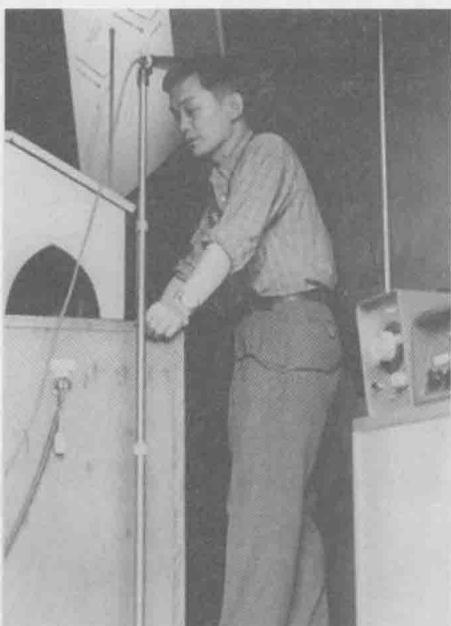

Reiji Okazaki, 1968 年微生物 DNA 复制研讨会。Okazaki 此时刚刚揭示了在 DNA 复制时其中一条新生链是如何先以小片段的方式开始合成，然后再连接起来的。“Okazaki 片段”解释了只能以一个方向合成的酶为什么却能同时生成两条极性相反的链（第 9 章）。

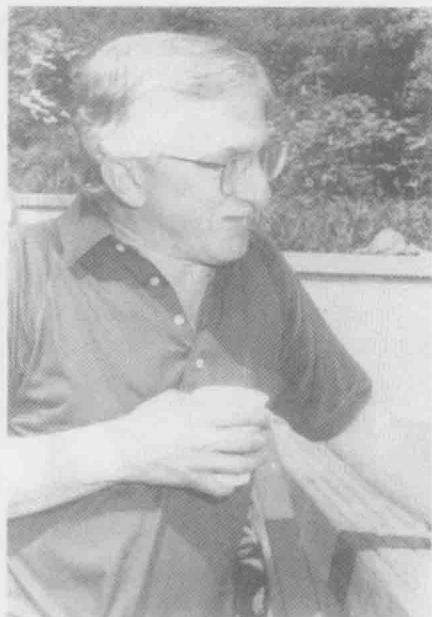  
Paul Modrich, 1993 年 DNA 和染色体研讨会。Modrich 是 DNA 修复领域的先驱，他揭示了错配修复的大部分机制（第 10 章）。

  
Carol Greider、Titia de Lange 和 Elizabeth Blackburn，2001 年端粒会议。Blackbum 发现了在染色体末端的端粒重复序列特征。后来，作为 Blackburn 实验室的研究生，Greider 发现了端粒酶。这个酶可以维持端粒（第 9 章）。在她们中间的是 de Lange，她的工作主要集中于细胞中结合并保护端粒的蛋白质。Blackburn 与 Greider 和 Jack Szostak 共同分享了 2009 年的诺贝尔生理学或医学奖。

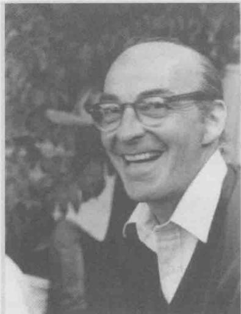  
Arthur Kornberg, 1978 年 DNA 复制和重组研讨会。Kornberg 对 DNA 复制（第 9 章）研究有突出贡献。他纯化出第一个可以合成 DNA 的酶，这是一种来源于大肠杆菌的 DNA 聚合酶。他用实验证明新的 DNA 合成需要 DNA 模板，从而证实了沃森和克里克提出的 DNA 复制模型。由于上述的工作，Kornberg 与 Severo Ochoa 分享了 1959 年的诺贝尔生理学或医学奖。

Matthew Meselson, 1968 年微生物 DNA 复制研讨会。Meselson 和 Stahl 一起用实验证明了 DNA 的半保留复制（见下页照片和第 2 章）。Meselsen 在数个领域都作出了重要贡献，包括纯化第一个限制性核酸内切酶，该研究于照片拍摄这年发表。他在防止化学与生物武器方面的工作广为人知。

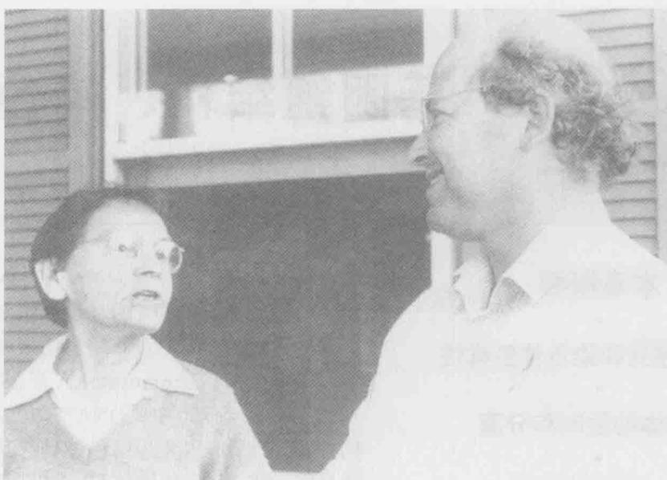

Barbara McClintock 和 Robin Holliday，1984 年的 DNA 水平重组学术讨论会。McClintock 提出转座子的存在以解释她在 20 世纪 40 年代开展的玉米遗传学的研究结果（第 12 章）。这一成果直到 30 年后的 1983 年才被肯定并荣获诺贝尔生理学或医学奖。Holliday 则提出了以他名字命名的同源重组的基本模型（第 11 章）。

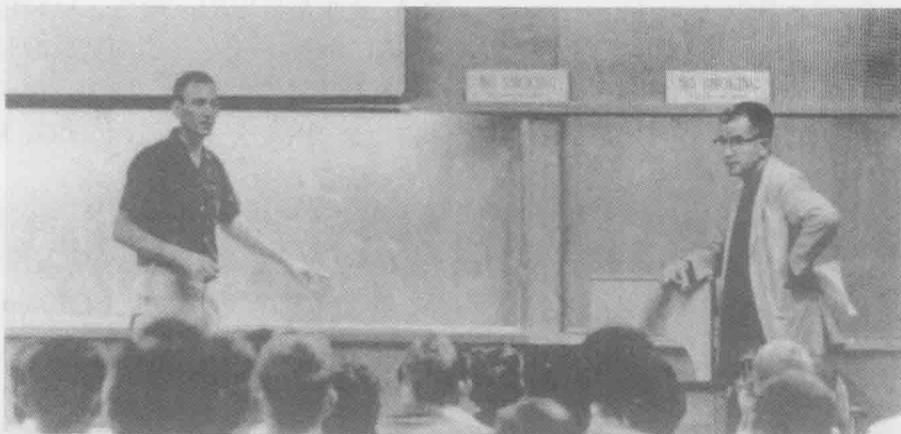

Franklin Stahl 和 Max Delbrück，1958 年的遗传物质交换：机制与结果研讨会。Stahl 与 Meselson（见上页照片）一起证明了 DNA 的半保守复制。这一实验曾被称为“最漂亮的生物学实验”（第 2 章）。Stahl 随后为我们理解同源重组作出了很大贡献（第 11 章）。Delbrück 是“噬菌体小组”（一班在冷泉港实验室度夏的科学家，将噬菌体发展成生物学的第一个模式系统）的最有影响的创始人之一（附录 1）。

#### [W] 第8章 基因组结构、染色质和核小体

本章概要
基因组序列和染色体多样性
染色体的复制和分离

核小体
染色质的高级结构
染色质结构的调控
核小体的组装

我们在第 4 章中单独介绍了 DNA 的结构。然而，在细胞中 DNA 是和蛋白质结合存在的，每条 DNA 及其结合的蛋白质构成了一条染色体（chromosome）。在原核生物、真核生物甚至病毒中，DNA 都是以这种结构存在。DNA 包装为染色体具有几个重要的功能：第一，染色体是 DNA 的紧密结构，更适合存在于细胞中。第二，这种包装可以保护 DNA 免于损伤。完全裸露的 DNA 分子在细胞中是相当不稳定的。相反，染色体 DNA 是非常稳定的。第三，只有包装成染色体的 DNA 才能在每次细胞分裂时有效地将 DNA 传递给两个子代细胞。第四，染色体将每个 DNA 分子全面地组织起来。该组

织可以通过调节 DNA 的可接近性来调控细胞内所有 DNA 参与的事件。

真核细胞染色体分子质量的一半为蛋白质。在真核细胞中，DNA 的一段特定区域及与之结合的蛋白质称为染色质(chromatin)，这些结合蛋白大部分是小的碱性蛋白质，即组蛋白(histone)；其他丰度较低的核染色体结合蛋白，通常称为非组蛋白(non-histone protein)。这些蛋白质包含大量的 DNA 结合蛋白，可以调控细胞 DNA 的转录、复制、修复和重组。这些内容将在随后的五章中逐一详细讨论。

染色质中的蛋白质有另一重要的功能：压缩 DNA，下面的计算可以清晰地看出该功能的重要性。人的细胞中单套染色体（单倍体）（haploid set）含有 $3 \times 10^{9}$ 碱基对，我们在第 4 章里学到，每个碱基对的厚度为 3.4Å，如果将单倍体 DNA 拉直并首尾相接，DNA 的长度将约为 $10^{10}$ Å，即 1 m。对于一个二倍体细胞（人的细胞是典型的二倍体细胞）来说，DNA 的长度加倍为 2 m。由于一个典型的人的细胞核的直径仅为 10～15μm，显而易见，DNA 必须被压缩多个数量级才能适应那么小的空间。这是怎样做到的呢？

在人的细胞（和其他所有的真核细胞）中，DNA 的压缩主要是通过 DNA 有规律地结合组蛋白，形成核小体（nucleosome）来实现。形成结构紧密的核小体是第一步，压缩后的 DNA 线性长度只有原先的万分之一。当然，DNA 的压缩也会造成损失。DNA 与组蛋白及其他包装蛋白的结合限制了 DNA 的可接近性，可接近性的降低会干扰介导 DNA 复制、修复、重组的蛋白质与 DNA 的相互作用，尤其是对转录相关的蛋白质影响最显著。真核细胞利用染色质的抑制特性来调控基因表达及其他与 DNA 有关的生命活动。个别核小体的结构变化可以使染色体特定区域的 DNA 与其他蛋白质相互作用。核小体的改变由修饰和重塑核小体的酶所介导，这是个动态的、区域性的过程，可以使酶和调控蛋白在不同的时间结合到染色体的不同区域。因此，了解核小体的结构及其与 DNA 相关的调控是解释真核细胞中涉及 DNA 的多数调控过程的关键。

尽管原核细胞的基因组都较小，但是对其 DNA 进行压缩仍是必要的。E.coli 必须把它的大约 1mm 的 DNA 包装到长度仅有 1μm 的细胞中。目前尚不清楚原核 DNA 是如何进行压缩的。例如，细菌没有组蛋白和核小体，却有其他小的碱性蛋白质，这些蛋白质可能会有相似的功能。本章我们将集中介绍真核细胞的染色体和染色质。首先，我们将讨论不同生物染色体的 DNA 序列特征，尤其集中在蛋白质编码内容的变化上；随后，将讨论保证细胞分裂时染色体能精确传递的机制；最后，我们将介绍真核染色质及其基本功能单元——核小体的结构和调控。

#### [W] 基因组序列和染色体多样性

在我们详细介绍染色体结构之前，有必要先了解构成染色体骨架的 DNA 分子的结构。近来对几千个生物基因组的测序提供了丰富的信息，使我们了解染色体 DNA 的构成及其特性是如何随着生物体复杂性的增加而变化的。

#### [W] 染色体可以是环状或线性的

传统的观点认为原核细胞有一条环状的染色体，真核细胞有多条线性染色体（表8-1）。随着对越来越多的原核生物的研究，这个观点受到了挑战。尽管大多数研究过的原核生物（如E.coli和B.subtilis）确实只有单一的环状染色体，然而现已发现大量的原核生物含有多条染色体，或线性染色体，或二者皆有。相反，所有的真核细胞都含有多条线性染色体。真核生物染色体的数目因物种而不同，通常为2\~50条，但在极少的情况下染色体数目能达到数千条[例如原生生物四膜虫（Tetrahymena）的大核，表8-1]。

表 8-1 不同生物体染色体组成的变化

<table><tr><td>物种</td><td>染色体数目</td><td>染色体拷贝数</td><td>染色体形式</td><td>基因组大小/Mb</td></tr><tr><td colspan="5">原核生物</td></tr><tr><td>生殖道支原体</td><td>1</td><td>1</td><td>环状</td><td>0.58</td></tr><tr><td>大肠杆菌 K-12</td><td>1</td><td>1</td><td>环状</td><td>4.6</td></tr><tr><td>根瘤农杆菌</td><td>4</td><td>1</td><td>3 条环状,1 条线性</td><td>5.67</td></tr><tr><td>苜蓿中华根瘤菌</td><td>3</td><td>1</td><td>环状</td><td>6.7</td></tr><tr><td colspan="5">真核生物</td></tr><tr><td>酿酒酵母(芽殖酵母)</td><td>16</td><td>1或2</td><td>线性</td><td>12.1</td></tr><tr><td>粟酒裂殖酵母(裂殖酵母)</td><td>3</td><td>1或2</td><td>线性</td><td>12.5</td></tr><tr><td>秀丽线虫(线虫)</td><td>6</td><td>2</td><td>线性</td><td>97</td></tr><tr><td>拟南芥(草本植物)</td><td>5</td><td>2</td><td>线性</td><td>125</td></tr><tr><td>黑腹果蝇(果蝇)</td><td>4</td><td>2</td><td>线性</td><td>180</td></tr><tr><td>四膜虫(原生生物)</td><td>小核5,大核225</td><td>小核2,大核10~10000</td><td>线性</td><td>125</td></tr><tr><td>红鳍东方鲀(鱼类)</td><td>22</td><td>2</td><td>线性</td><td>393</td></tr><tr><td>小鼠(啮齿类)</td><td>19+X,Y</td><td>2</td><td>线性</td><td>2600</td></tr><tr><td>人</td><td>22+X,Y</td><td>2</td><td>线性</td><td>3200</td></tr></table>

环状和线性染色体都有各自的问题，必须克服这些问题才能保证基因组的维持和复制。环状染色体复制后需要拓扑异构酶来将其分离到子代细胞中，没有这些酶，复制后两个子代染色体仍然会互锁或连接在一起（见第4章，图4-23），相反，线性真核染色体的DNA末端必须保护起来以避免酶对DNA末端的降解，这造成了DNA复制过程中的一系列不同的困难，我们将在第9章中进行讨论。

#### [W] 每个细胞都有特定的染色体数目

典型的原核细胞的染色体仅有一个完整拷贝，包装在一个称为类核（nucleoid）的结构中（图 8-1b）。然而，当原核细胞迅速分裂时，正在复制过程中的那部分染色体会存在2个有时甚至是4个拷贝。原核细胞还经常携带一个或多个小的、独立的环状DNA，称为质粒（plasmid）。与大的染色体DNA不同，质粒通常不是细菌生长所必需的，而是携带着赋予细菌良好特性的基因，如抗生素抗性基因。此外，质粒有别于染色体DNA的另一特征是每个细胞中可以有多个完整拷贝存在。

大多数真核细胞是二倍体（diploid），也就是说，细胞中每条染色体有两个拷贝（图8-1c）。同一个染色体的两个拷贝叫做同源染色体（homolog），分别来自父本和母本。但是，一个真核生物中的所有细胞并非都是二倍体，某些细胞是单倍体或多倍体。单倍体（haploid）细胞每条染色体只有一个拷贝，并且参与有性生殖（例如，精子和卵子都是单倍体细胞）。多倍体（polyploid）细胞中每条染色体都超过两个拷贝。事实上，许多生物体维持它们大多数的成熟细胞在多倍体状态。在极端情况下，每条染色体的拷贝数可能有数百甚至数千。这种全基因组扩增的方式可以使一个细胞产生大量的RNA和随后的蛋白质产物。例如，巨核细胞（megakaryocyte）是一种特化的多倍体细胞（每条染色体大约有28个拷贝），能产生数千个人体血液所必需的、没有染色体的血小板（每毫升血液中大约有200 000个血小板）。通过多倍体形式，巨核细胞维持高水平的新陈代谢，以生产大量的血小板。由于这么多条染色体的分离是非常困难的事，因此多倍体细胞几乎总是处于停止分裂的状态。无论染色体数目的多少，真核染色体总是包含在由膜包围的称为细胞核（nucleus）的细胞器中（图8-1c）。

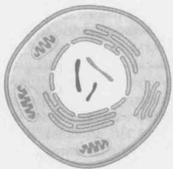  
图 8-1 典型的原核细胞与真核细胞的比较。(a). 一个典型的真核细胞的直径约为 10\~100μm，原核细胞约为 1μm。(b). 原核染色体 DNA 位于类核内，占据细胞内大部分的空间。与真核细胞的细胞核不同，类核没有膜将它和细胞的其他组分分开，质粒 DNA 用红色表示。(c). 真核染色体位于由膜所包围的细胞核中。由细胞核中存在的染色体的拷贝数可区分单倍体和二倍体细胞。（来源：Brown T. A. 2002 Genomes, 2nd edition, p. 32. Fig2.1. © BIOS Scientific Publishers. 经 Taylor & Francis 许可.）

#### [W] 基因组的大小与生物体的复杂度相关

基因组的大小（单倍染色体中 DNA 的长度）在不同的生物中有相当大的变化（表 8-2）。由于生物的复杂度越高，所需的基因也就越多（比较细菌、单细胞真核生物和多细胞真核生物时可以看到这个规律，见第 21 章）。因此基因组的大小与生物体的复杂度相关也就不足为奇。但通常原核细胞的基因组不足 10Mb。尽管一些较复杂的原生生物可能有大于 200Mb 的基因组，通常单细胞真核生物的基因组都小于 50Mb，而多细胞生物的基因组更大，甚至可超过 100 000Mb。

尽管生物体的复杂度与基因组的大小之间大致呈正相关，但并不精确。许多复杂度相近的生物体的基因组大小却显著不同：果蝇的基因组大约是蝗虫的基因组的1/25，而小麦的基因组是水稻基因组的40倍（表8-2）。这些例子中，基因的数目而不是基因组的大小，与生物的复杂性更密切相关。当我们比较不同生物的相对基因密度时，可以清楚地看到这一点。

表 8-2 不同生物体基因组中基因密度的比较

<table><tr><td>物种</td><td>基因组大小/Mb</td><td>大致的基因数目</td><td>基因密度/(个/Mb)</td></tr><tr><td>原核生物(细菌)</td><td></td><td></td><td></td></tr><tr><td>生殖器支原体</td><td>0.58</td><td>500</td><td>860</td></tr><tr><td>肺炎链球菌</td><td>2.2</td><td>2300</td><td>1060</td></tr><tr><td>大肠杆菌 K-12</td><td>4.6</td><td>4400</td><td>950</td></tr><tr><td>根瘤农杆菌</td><td>5.7</td><td>5400</td><td>960</td></tr><tr><td>苜蓿中华根瘤菌</td><td>6.7</td><td>6200</td><td>930</td></tr><tr><td>真核生物(动物)</td><td></td><td></td><td></td></tr><tr><td>真菌</td><td></td><td></td><td></td></tr><tr><td>酿酒酵母</td><td>12</td><td>5800</td><td>480</td></tr><tr><td>粟酒裂殖酵母</td><td>12</td><td>4900</td><td>410</td></tr><tr><td>原生生物</td><td></td><td></td><td></td></tr><tr><td>四膜虫</td><td>125</td><td>27000</td><td>220</td></tr><tr><td>无脊椎动物</td><td></td><td></td><td></td></tr><tr><td>秀丽线虫</td><td>103</td><td>20000</td><td>190</td></tr><tr><td>果蝇</td><td>180</td><td>14700</td><td>82</td></tr><tr><td>紫海胆</td><td>160</td><td>16000</td><td>100</td></tr><tr><td>东亚飞蝗</td><td>5000</td><td>未定</td><td>未定</td></tr><tr><td>脊椎动物</td><td></td><td></td><td></td></tr><tr><td>河豚</td><td>393</td><td>22000</td><td>56</td></tr><tr><td>人类</td><td>3200</td><td>20000</td><td>6.25</td></tr><tr><td>小鼠</td><td>2600</td><td>22000</td><td>8.5</td></tr><tr><td>植物</td><td></td><td></td><td></td></tr><tr><td>拟南芥</td><td>120</td><td>26500</td><td>200</td></tr><tr><td>水稻</td><td>430</td><td>~45000</td><td>~100</td></tr><tr><td>玉米</td><td>2200</td><td>&gt;45000</td><td>&gt;20</td></tr><tr><td>小麦</td><td>16000</td><td>未定</td><td>未定</td></tr><tr><td>郁金香</td><td>~120000</td><td>未定</td><td>未定</td></tr></table>

#### [W] E.coli 的基因组几乎全部由基因构成

E.coli 的单一染色体上的绝大多数 DNA 都编码蛋白质或结构 RNA（图 8-2）。而大部分非编码序列都参与调控基因的转录（第 18 章）。由于一个转录起始位点通常可以控制几个基因的表达，因而这些区域在基因组中维持在最小的比例。E.coli 基因组中的一个关键元件并不是基因的一部分，也不是一段调控基因表达的序列，而是 E.coli 复制起始区。这个短的染色体区段指导着整个复制机器的组装（将在第 9 章讨论）。复制起始区虽然有重要的功能，但它非常小，仅为 E.coli 4.6 Mb 基因组中的几百个碱基对。

  
图 8-2 不同生物染色体基因密度的比较。图中展示了 4 种生物中一个具有代表性的 65 kb 的 DNA 区段。编码 RNA 聚合酶（真核生物编码 RNA 聚合酶 II）大亚基的区域用红色表示，编码其他基因的区域用绿色表示，内含子 DNA 用紫色表示，重复 DNA 用黄色表示，独特的基因间 DNA 用灰色表示。注意随着生物复杂度的增加，在相同长度的 DNA（65 kb DNA 区域）中编码基因的数目是如何变化的

#### [W] 复杂度高的生物基因密度低

如何解释具有相似复杂度的生物体却有明显不同的基因组大小（如果蝇和蝗虫）？这种不同主要与基因的密度有关。基因密度的简单衡量方法是每 Mb 基因组 DNA 上基因的平均数目。如果一个 50Mb 基因组的生物有 5000 个基因，那么这个生物体的基因密度为 100 个基因/Mb。当比较不同生物体的基因密度时，可以清楚地看到不同生物体利用 DNA 来编码基因的效率不同。生物体的复杂度与基因的密度之间存在大致负相关的关系；生物体复杂度越低，其基因密度越高。例如，目前所发现的基因密度最高的生物体是病毒。在某些情况下病毒利用 DNA 的两条链来编码相互重叠的基因。尽管在细菌中重叠基因极少见，但细菌的基因密度非常恒定地接近 1000 个基因/Mb。

与原核生物相比，真核生物的基因密度较低且更多变（表8-2）。在真核生物中仍然存在一个普遍的趋势，即基因密度随生物体复杂度的增加而降低。简单的单细胞真核生物酿酒酵母（S. cerevisiae）的基因密度（约500个基因/Mb）与原核生物非常接近。相反，人的基因密度估计是原核生物的1/50。图8-2比较了在所有生物中相对保守的RNA聚合酶的大亚基基因的DNA序列，尽管所编码蛋白的分子质量相似，但是不同的生物间基因大小存在极大的差异。较人基因组更大的生物可能有着更小的基因密度。是什么原因导致基因密度的降低呢？

#### [W] 基因仅占真核染色体 DNA 的一小部分

两种因素会导致真核细胞中基因密度的降低：基因大小和基因间序列（intergenic sequence）的增加。复杂度高的生物，基因大的主要原因并不是蛋白质大，或需要更长的 DNA 来编码相同的蛋白质，而是因为在真核生物中编码蛋白质的基因区域通常是不连续的。这些分散的非蛋白质编码区段称为内含子（intron）。内含子转录后可通过 RNA 剪接（RNA splicing）的过程从 RNA 中删除（图 8-3），我们将在第 14 章详细讨论 RNA 剪接。内含子的存在极大地增加了编码一个基因所需的 DNA 的长度（表 8-3）。例如，人的一个基因的平均转录长度大约为 27kb（不要与基因密度相混淆），而平均编码蛋白质的区段仅为 1.3 kb。一个简单的计算可看出，人的编码蛋白质的基因中平均仅有 5% 的序列直接参与了编码相应的蛋白质，而其他的 95% 都由内含子构成。简单的真核生物的内含子较少，这与它们较高的基因密度相一致。例如，在酿酒酵母中，仅有 3.5% 的基因有内含子，而且没有一个内含子大于 1kb（表 8-3）。

  
图 8-3 RNA 剪接的示意图。外显子 1 上方的箭头表示前体 mRNA 转录启动的位置。此初级转录物经过剪接加工去除非编码的内含子，生成 mRNA。

表 8-3 不同基因组中内含子和重复序列的比例

<table><tr><td>物种</td><td>基因密度(个/Mb)</td><td>基因中平均的内含子数目</td><td>重复序列的比例</td></tr><tr><td>原核生物(细菌)</td><td></td><td></td><td></td></tr><tr><td>大肠杆菌 K-12</td><td>950</td><td>0</td><td>&lt; 1</td></tr><tr><td>真核生物(动物)</td><td></td><td></td><td></td></tr><tr><td>真菌</td><td></td><td></td><td></td></tr><tr><td>酿酒酵母</td><td>480</td><td>0.04</td><td>3.4</td></tr><tr><td>无脊椎动物</td><td></td><td></td><td></td></tr><tr><td>秀丽线虫</td><td>190</td><td>5</td><td>6.3</td></tr><tr><td>果蝇</td><td>82</td><td>3</td><td>12</td></tr><tr><td>脊椎动物</td><td></td><td></td><td></td></tr><tr><td>河豚</td><td>56</td><td>5</td><td>2.7</td></tr><tr><td>人</td><td>6.25</td><td>6</td><td>46</td></tr><tr><td>植物</td><td></td><td></td><td></td></tr><tr><td>拟南芥</td><td>220</td><td>3</td><td>未定</td></tr><tr><td>水稻</td><td>~100</td><td>未定</td><td>42</td></tr></table>

在更复杂的生物中，基因间序列数目的大量增加是导致基因密度降低的另一原因。基因间隔区是基因组上与蛋白质和结构 RNA 的表达无关的那部分 DNA。人的基因组中有超过 60% 的部分由基因间序列组成，这其中绝大多数的功能未知（图 8-4）。基因间隔区 DNA 分为两类：单一的和重复的。大约 1/4 的基因间隔区 DNA 是单一的，导致单一基因间 DNA 序列增加的原因之一是指导和调控转录的 DNA 序列的增加，也称为调控序列（regulatory sequence）。随着生物体复杂度的提高，编码更多的基因，调控基因表

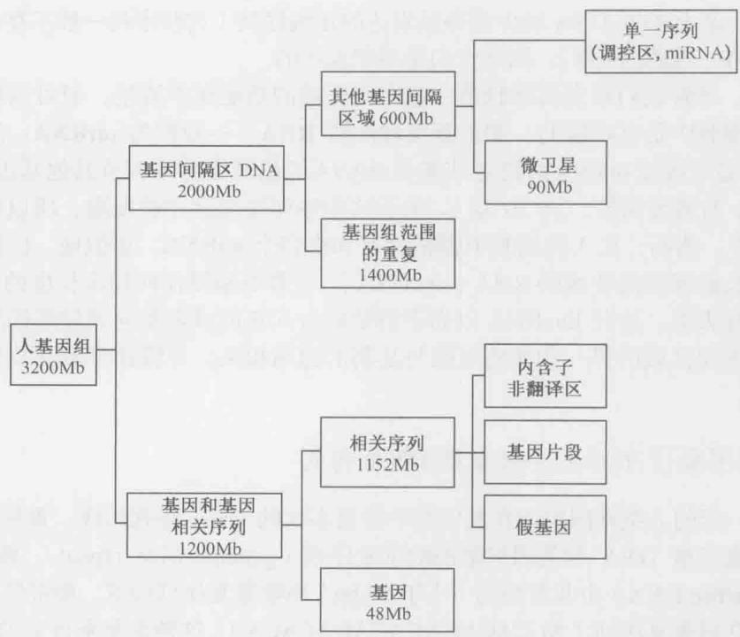  
图 8-4 人类基因组的组织及其组分。人类基因组由许多不同类型的 DNA 序列构成，绝大多数 DNA 序列不编码蛋白质。此图显示了各种类型序列的分布和数量。（来源：Brown T. A. 2002. Genomes, 2nd edition, p.23, box1.4.© BIOS Scientific Publishers. 经 Taylor & Francis 许可.）

达的调控序列也变得更加复杂，其序列大小也不断增加。人类基因组基因间 DNA 的单一区段包含了许多显而易见的、已丧失功能的残留区段，如无功能的突变基因、基因碎片和假基因。突变基因和基因碎片是由于简单的随机突变或在 DNA 重组过程中的错误所造成的。假基因则是因反转录酶（reverse transcriptase）的作用而形成的（图 8-5 和第 12 章）。这种酶可将 RNA 复制为双链 DNA（称为拷贝 DNA、copy DNA 或 cDNA），通常只在某些特定类型的病毒中表达，参与病毒的繁殖。但是，当细胞被这类病毒感染后，作为其副效应，细胞中

  
图 8-5 反转录 mRNA 的整合导致假基因的产生。当细胞中存在反转录酶时，mRNA 分子能被拷贝成双链 DNA。在极少数情况下，这些 DNA 分子能整合入基因组形成假基因。由于在新转录的 RNA 中内含子会被迅速地删除，所以假基因共同的特征就是缺少内含子。这可以将其与原基因区分开来。另外，因为启动子序列不是 mRNA 的一部分，所以假基因缺少相应的、指导其转录的启动子序列。

的 mRNA 会被拷贝成 DNA，而这些 DNA 片段可以一个较低的频率重新整合到基因组中。然而，由于这些 DNA 缺少指导其表达的正确序列（这些序列一般不存在于基因的 RNA 产物中，见第 13 章），因此它们是不能表达的。

最后，尽管我们对真核细胞单一基因间区域的功能还不清楚，但可以确定的是，它在真核细胞中是有功能的，如最新发现的微RNA，一般称为miRNA。这些结构性的小RNA通过改变mRNA的稳定性或者mRNA的翻译能力来调节其他基因的表达（参见微RNA的基因调控，第20章）。由于这些序列在最近才被发现，所以还没有包括在表8-2中。然而，在人类细胞中据估计有500多个miRNA。相似地，已经鉴定了数以千计的长链基因间非编码RNA（lincRNA）。尽管不编码任何相应长度的蛋白质，但是最近研究表明，这些lincRNA以尚不清楚的方式正向或者负向调控基因表达。多数单一性基因间区域的另一功能还可能与复制的起始相关，尽管在多数真核生物中还没有被证明。

#### [W] 人的基因间隔区序列主要由重复 DNA 构成

几乎一半的人类基因组由在基因组中重复多次的 DNA 序列组成。重复 DNA 一般有两种：微卫星 DNA 和基因组范围的重复序列（genome-wide repeat）。微卫星 DNA（microsatellite DNA）由非常短的（小于 13 bp）串联重复序列构成。最常见的微卫星序列是二核苷酸重复序列（如 CACACACACACACACA）。这种重复来自于 DNA 的正确复制的困难，几乎占了人类基因组 3% 的序列。

基因组范围的重复序列（genome-wide repeats）要比微卫星大得多，每个重复单元的长度都大于100bp，甚至大于1kb。这些序列要么作为单一拷贝散布在基因组中，要么紧密相连成簇存在。尽管这些重复有许多种类，但是它们有着共同的特点，即都是转座因子（transposable element）。

转座因子是指能从基因组的一个位置转移到另一个位置的序列，这个过程称为转座(transposition)。在转座过程中，转座元件经常在保留原拷贝的情况下，转移到基因组中新的位置上。因此，这些序列可在基因组中加倍并累积。在人的细胞中，转座因子的移动极少发生。然而，在漫长的生命演化过程中，这些转座因子非常成功地繁衍了自己，已大约占人基因组的 $45\%$ 。在第12章中我们将讨论转座因子在基因组中移动的机制，以及如何控制它们的移动以防止它们整合到基因中。

虽然我们是以人类基因组为背景讨论基因间序列的特征，然而在其他生物体中也发现了许多相同的特征。例如，通过对基因组非常大的几种植物（如玉米）的部分已知序列的比较，可以看到在这些基因组中转座因子可能占有更大的比例。甚至在像 E.coli 和酿酒酵母这样基因组结构致密的生物中，也发现有转座因子和微卫星重复的存在（图 8-2）。不同之处只是这些序列在简单生物体中占据基因组不那么成功，可能是由低效率的复制和（或）高效率的删除（被修复机制删除或是发生复制的生物体被删除）综合影响的结果。

尽管现在倾向于认为重复 DNA 是垃圾 DNA（junk DNA），但是这些序列可以稳定地维持成百上千代，表明基因间 DNA 对宿主生物体有积极的意义（或者选择优势）。

#### [W] 染色体的复制和分离

真核染色体在细胞分裂过程中需要着丝粒、端粒和复制起始位点

在真核染色体上有几个重要的 DNA 元件，它们不是基因，也不参与基因表达的调控（图 8-6）。这些元件包括指导染色体 DNA 复制起始的复制起始位点（origins of replication）、引导染色体进入子代细胞的着丝粒（centromere），以及负责保护和复制线性染色体末端的端粒（telomere）。它们对于细胞分裂过程中染色体的正确复制和分离是至关重要的。现在我们对每个元件逐一加以讨论。

  
图 8-6 着丝粒、复制起始位点和端粒是真核染色体的稳定所必需的。每条真核染色体包括两个端粒、一个着丝粒和多个复制起始位点。端粒位于每条染色体的两端。与端粒不同，每条染色体上只有一个着丝粒，且没有固定的位置。有些着丝粒靠近染色体中部，有些靠近端粒。复制起始位点分布于整条染色体上（在酿酒酵母中大约每 30 kb 有一个复制起始位点）。

复制起始位点（origins of replication）是 DNA 复制机器组装和复制起始的位点。复制起始位点间隔约 30\~40kb，分布在每条真核染色体上。原核染色体也需要复制起始位点。与真核染色体不同，原核染色体通常只有一个复制起始位点。一般来说，复制起始位点位于非编码区。复制起始位点的 DNA 序列将在第 9 章详细讨论。

着丝粒（centromere）是 DNA 复制后染色体准确分离所必需的。复制后的染色体的两个拷贝叫姐妹染色体（sister chromosomes），它们必须分离为单拷贝，分别进入两个子细胞。与复制起始位点相似，着丝粒指导一个精细的蛋白质复合体的形成，此结构也称为动粒（kinetochore）。动粒的作用机制是与着丝粒 DNA 和蛋白质纤维（微管）相互作用，拉动姐妹染色体相互远离并进入两个子细胞。与每条真核染色体上有多个复制起始位点不同，每条染色体上仅有一个着丝粒（图 8-7a）。若着丝粒缺失，复制后的染色体会随机分离，导致子细胞的染色体的缺失或加倍（图 8-7b）。如果一条染色体上存在一个以上拷贝的着丝粒，同样是灾难性的。动粒会附着在将染色体拉向相反方向的微管上，导致染色体的断裂（图 8-7c）。着丝粒的大小变化很大。在酿酒酵母中，着丝粒为不到 200bp 的单一序列；而大多数真核生物的着丝粒大于 40kb，并且主要由重复 DNA 序列组成（图 8-8）。

#### [W] a 一个着丝粒

  
每个细胞一个染色体

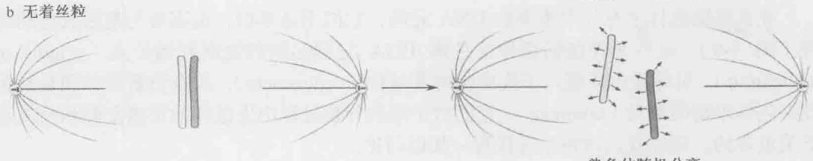

图 8-7 多于或少于一个着丝粒导致染色体的丢失或断裂。（a）. 正常的染色体有一个着丝粒。染色体复制后，每个拷贝的端粒指导一个动粒的形成。这两个动粒结合到有丝分裂纺锤体的两极，并在细胞分裂之前向细胞相反的两边牵拉。（b）. 缺少着丝粒的染色体会很快从细胞中丢失。着丝粒缺失时染色体不能与纺锤体结合，只能随机地分配到两个子代细胞中。这经常导致一个子代细胞得到同一染色体的两个拷贝，而另一子代细胞丢失了这条染色体。（c）. 有两个或更多个着丝粒的染色体在分离时经常发生断裂。如果一个染色体有多个着丝粒，它能同时与纺锤体的两极结合。当分离起始时，有丝分裂纺锤体的两极的反向作用力经常会使同时结合在两极上的染色体断裂。  

图 8-8 着丝粒的大小和组成在不同生物体间变化很大。酿酒酵母的着丝粒很小且由非重复序列组成。而其他的生物体，如果蝇和裂殖酵母的着丝粒非常大，而且主要由重复序列组成。裂殖酵母着丝粒仅中间的 4～7 kb 是非重复序列，绝大多数果蝇和人的着丝粒由重复 DNA 组成。  

  
240 kb 到几 Mb

端粒（telomere）位于线性染色体的两端。与复制起始位点和着丝粒类似，端粒结合有许多蛋白质，在这种情况下，这些蛋白质执行着两个重要的功能。首先，端粒蛋白质可以将细胞中染色体的天然末端与染色体断裂和其他DNA的断裂区分开来。一般来说，DNA的末端是经常发生重组和DNA降解的位点。结合在端粒上的蛋白质能避免重组和DNA降解的发生。其次，端粒作为一种特殊的复制起始位点，可以使细胞复制染色体的末端。在第9章里将详细讨论标准的DNA复制机器不能完整地复制线性染色体的末端的原因。端粒通过一种特殊的DNA聚合酶——端粒酶（telomerase）来完成线性染色体末端的复制。

与染色体的大多数部分不同，端粒的相当一部分以单链的形式存在（图 8-9）。大多数端粒具简单的重复序列，重复序列因物种而异。典型的重复序列由一段短的、富含TG的序列组成。例如，人的端粒具有5'-T TAGGG-3'的重复序列。我们将在第9章中讲到，端粒中的重复序列是由于它们特殊的复制方式所造成的。

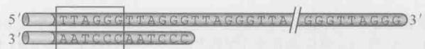  
图 8-9 典型的端粒结构。框中显示了一个重复序列单元（取自人的细胞）。注意  
染色体 3'端的单链 DNA 区域可长达数百个碱基。

#### [W] 真核染色体的复制和分离发生在细胞周期的分裂期

在细胞分裂过程中，染色体必须复制并分离到子细胞中去。在细菌细胞中这些过程是同时发生的。也就是说，在 DNA 复制的同时，产生的两个拷贝会向细胞相反的两边分离。尽管已经清楚在细菌中这些过程受到严格的调控，但调控的机制还不清楚。相反，真核细胞染色体的复制和分离发生在细胞分裂过程的不同时期，下面我们将加以讨论。

细胞完成一轮分裂的过程称为细胞周期（cell cycle）。大多数真核细胞的分裂会使子细胞维持与母细胞一致的染色体数目，这种分裂类型称为细胞的有丝分裂（mitotic cell division）。

有丝分裂的细胞周期可以分为四期： $G_{1}$ 、S、 $G_{2}$ 和 M（图 8-10）。涉及染色体增殖的关键过程发生在细胞周期的特定阶段。DNA 合成发生在细胞周期的合成期或 S 期（synthesis 或 S phase），导致每条染色体的复制（图 8-11）。复制后配对的每条染色体叫做一条染色单体（chromatid），配对的两条染色单体称为姐妹染色单体（sister chromatid）。复制后的姐妹染色单体通过一个叫做黏粒（cohesin）的分子聚在一起，这一过程称为姐妹染色单体的附着（sister chromatid cohesion），这种状态一直维持到染色体的相互分离。

染色体分离发生在细胞周期的有丝分裂期或 M 期（mitosis，M phase）。下面将讲述有丝分裂的全过程，但先讨论这个过程中的 3 个关键步骤（图 8-12）。首先，每对姐妹染色单体与一个叫做有丝分裂纺锤体（mitotic spindle）的结构结合。纺锤体由长的蛋白质纤维——微管（microtubule）组成。微管与两个微管组织中心（microtubule organizing center）中的一个相连。[微管组织中心在动物细胞中称为中心粒（centrosome），在酵母和其他真菌中称为纺锤体极体（spindle pole body）]。微管组织中心位于细胞的两侧，形成“极”，微管向着两极拉动染色单体。染色单体的配对由组装在每个着丝粒处的动粒（kinetochore）所介导（图8-6）。其次，由于黏粒的水解，染色单体间黏附力消失。在黏附力消失之前，它可以抵抗有丝分裂纺锤体的拉力。当黏附力消失之后，有丝分裂的第三个重要过程才能发生：姐妹染色单体分离（sister chromatid separation）。由于缺少了染色单体黏附力的抗衡，染色单体被迅速地拉向有丝分裂纺锤体相反的两极。因此，姐妹染色单体间的黏附力与有丝分裂纺锤体相反两极对姐妹染色单体动粒的黏附力是相互对立的作用，只有精细地协调二者才能使染色体正确地进行分离。

图 8-10 真核有丝分裂细胞周期。真核细胞周期有 4 个阶段。染色体复制发生在 S 期，染色体分离发生在 M 期。 $G_{1}$ 和 $G_{2}$ 间期允许细胞为细胞周期的后续过程做准备。例如，许多真核细胞利用细胞周期的 $G_{1}$ 期合成完成细胞分裂所需的足量的营养成分。  
  
图 8-11 S 期的事件。在 S 期有两个主要的染色体事件发生。每条染色体完整地进行 DNA 复制拷贝，复制发生后不久，环状的黏粒分子将复制后的两拷贝 DNA 缚在一起，导致姐妹染色单体的附着。每个蓝色或红色的“管”代表一个单链 DNA 分子。

  
图 8-12 分裂期（M 期）的事件。三个重要的事件发生在有丝分裂期。首先，连接姐妹染色单体对的两个动粒分别黏附到有丝分裂纺锤体的相反两极。一旦全部的动粒都结合到两极上，通过破坏黏粒环使姐妹染色单体间的黏附力消失。最后，当黏附力消失后，姐妹染色体分离到有丝分裂纺锤体相反的两极。

#### [W] 真核细胞分裂时染色体的结构发生变化

在一轮细胞分裂中，染色体的结构发生多次变化；然而，染色体主要以两种状态存在（图 8-13）。当细胞的染色体分离时，染色体处于最压缩的状态。形成这种压缩状态的过程称为染色体凝聚（chromosome condensation）。在这种压缩状态下，染色体间完全相互独立，大大方便了分离过程的进行。

在 $G_{1}$ 、S 和 $G_{2}$ 期 [统称为间期（interphase）]，染色体不分离时，其压缩程度大大降低。事实上，在细胞周期的这些阶段，染色体可能是高度缠绕的，与有丝分裂过程中染色体的有组织排布相比，此时的染色体更像一盘意大利面条。然而，在这些阶段中染色体的结构也会发生改变。DNA 复制要求与染色体结合的蛋白质几乎全部解离和重装。DNA 复制完成后，姐妹染色单体的黏附立即形成，使新复制的两条染色单体相互连接。在细胞周期中，单个基因转录的开关或者上调下调伴随着染色体相关位置上结构的改变。因此，染色体是一个不断变化的结构，它更像是一个细胞器，而不只是一条简单的 DNA 链。

  
图 8-13 染色质结构的变化。M 期的染色体达到最大程度的压缩，而在细胞周期的其他阶段（有丝分裂的 $G_{1}$ 、S 和 $G_{2}$ ）染色体处于解聚状态。这些解聚的时期统称为间期。

#### [W] SMC 蛋白介导姐妹染色单体的黏附和染色体的凝聚

介导姐妹染色单体黏附和染色体凝聚的关键蛋白是相互关联的。染色体结构维持（SMC）蛋白是一类延伸蛋白（extended protein），它们通过长的螺旋卷曲结构域相互作用形成固定的配对（见第6章，图6-9）。SMC蛋白与非SMC蛋白一起形成多蛋白复合体，将两个DNA螺旋连接在一起。如前所讨论的，一种含有SMC蛋白的复合体叫做黏粒（cohesin），DNA复制后，黏粒将两个子代DNA（姐妹染色单体）连接起来，这种连接是姐妹染色体黏附的基础。黏粒的结构被认为是一个由两个SMC蛋白和两个非SMC蛋白组成的大环。尽管姐妹染色体单体黏附的确切机制尚不清楚，已经建立了一个很好的模型，表明姐妹染色单体黏附的机制是两条姐妹染色单体穿过黏粒蛋白环的中心（图8-14）。在这个模型中，黏粒的非SMC亚基发生蛋白水解会导致黏粒的开环，姐妹染色单体凝聚消失，子染色体向细胞相反的两极迁移。

伴随染色体分离所发生的染色体凝聚同样需要一个相关的含有 SMC 蛋白的复合体——凝聚蛋白（condensin）。尽管我们对这种复合体的结构和功能知之甚少，但它具有许多与黏粒复合体相同的特点，因此猜测它也是一个环状复合体。如果是这样，它可能是利用环状的特点引起染色体的凝聚。例如，凝聚蛋白能将同一染色体的不同区域连接在一起，大大减少染色体的线性长度（图 8-14）。

#### [W] 有丝分裂维持亲本染色体的数目

我们现在讲述有丝分裂的全过程。有丝分裂分为几个时期（图 8-15）。在分裂前期（prophase），凝聚蛋白和拓扑异构酶Ⅱ（帮助解开染色体）使染色体凝聚成高度紧密的结构以准备进行分离。在前期结束时，核膜裂解，细胞进入分裂中期（metaphase）。

在分段中期，有丝分裂纺锤体形成，姐妹染色体的动粒与微管结合。只有当一对姐妹染色单体的两个动粒分别与从相对的微管组织中心发出的微管结合后，正确的染色单体连接才告完成。这种连接类型叫做二价联会（bivalent attachment，图8-15），会导致微管对染色单体对施加拉张力，向相反的方向牵拉姐妹染色单体。从同一微管组织中心发出的微管与两个染色单体或者其中之一的结合，叫做单价联会（monovalent attachment）。这种结合不能产生拉张力，最终导致染色体的丢失。如果二价联会不能随后形成，单价联会能让染色体的两个拷贝拉到一个子细胞中去。姐妹染色单体的黏附力抵消了二价联会产生的拉张力，从而使所有染色体排列在细胞的中部，位于两个微管组织中心之间（这个位置被称为中期板，亦称赤道板）。值得一提的是，只有在所有的姐妹染色单体都进行二价联会后，染色体才会开始分离。

黏粒分子因蛋白质水解的破坏，导致姐妹染色单体间黏附的消失，从而触发染色体的分离。这一过程发生在细胞分裂的后期（anaphase）。在后期，姐妹染色单体分离并移动到细胞的两侧。一旦两个姐妹染色单体不再黏附在一起，它们便不能抵抗纺锤体微管向外的拉力。二价联会保证了每对姐妹染色单体的两个成员被拉向相反的两极，使每个子代细胞都得到每个复制的染色体的一个拷贝。

有丝分裂的最后阶段称为末期（telophase）。在末期，包围每套分离的染色体的核膜

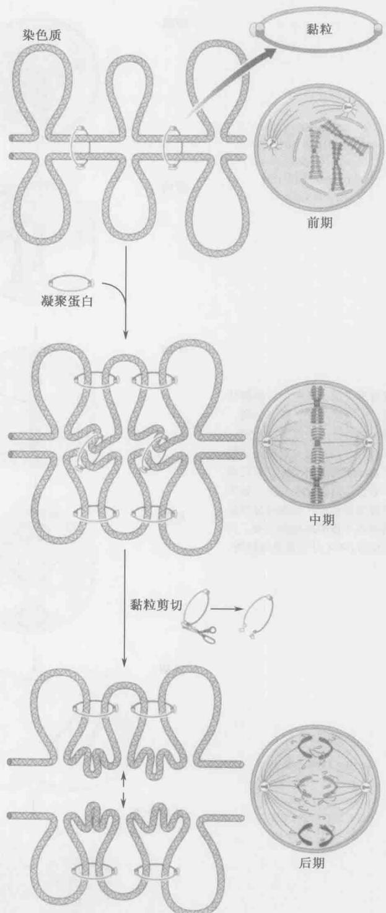  
图 8-14 推测的黏粒和凝聚蛋白模型。黏粒和凝聚蛋白是环状蛋白复合体，包括两个 SMC 蛋白，是细胞核骨架的组成部分，对连接远距离的或不同区域的 DNA 有重要作用。推测含有环状结构的这些蛋白质允许 DNA 的两个区段柔韧且牢固地连接。在图示中，SMC 蛋白用绿色（黏粒）或者蓝色（凝聚蛋白）表示。（来源：Haering C. H. et al. 2002. Mol. Cell 9: 773-778, F8, page785, ©Elsevier.）

图 8-15 有丝分裂。在有丝分裂之前，染色体以解聚状态存在，此时为间期。前期，染色体凝聚，准备分离，在大多数真核细胞中，包围着染色体的核膜发生裂解；在中期，每个姐妹染色单体对结合到有丝分裂纺锤体的两极；进入后期，姐妹染色单体间黏附力消失，导致姐妹染色单体的分离；末期，染色体凝聚状态消失，包围着两群分离后的染色体的核膜重新形成；细胞质分裂是细胞周期的最后阶段，包围着两个核的细胞膜收缩，并最终分裂成两个子细胞。所有的 DNA 分子都是双链的。

重新形成。此时，两个细胞所共有的细胞质发生物理分离，细胞分裂完成。这个过程称为胞质分裂（cytokinesis）。

细胞周期的间期为下一个细胞周期作准备，同时检查上一个阶段是否正确完成

真核细胞周期中余下的两个阶段是间期。 $G_{1}$ 期发生于 DNA 合成之前， $G_{2}$ 期位于 S 期和 M 期之间。细胞周期的间期有两个作用：一是为下一个细胞周期阶段做好时间上的准备，二是检查上一个细胞周期阶段是否正确完成。例如，在进入 S 期以前，大多数细胞必须达到一定的大小和蛋白质合成水平，以满足完成下一轮 DNA 合成所需的足够的蛋白质和营养成分。如果在细胞周期的前一阶段存在问题，细胞周期检查点（cell cycle checkpoint）则停止细胞周期并给细胞提供时间以完成这一步。例如，含有损伤 DNA 的细胞将细胞周期阻止在 DNA 合成之前的 $G_{1}$ 期或者有丝分裂之前的 $G_{2}$ 期，以防止产生损伤的染色体的事件发生。在细胞周期继续进行之前，这种延迟为损伤的修复提供了时间。

#### [W] 减数分裂减少了亲本染色体的数目

真核细胞分裂的另一种类型——减数分裂，专门产生子代细胞，和母细胞相比，它仅含有半数的染色体。这是由 DNA 复制之后的两轮染色体分离完成的。与有丝分裂细胞周期相似，减数分裂细胞周期（meiotic cell cycle）包括 $G_{1}$ 期、S 期和一个延长的 $G_{2}$ 期（图 8-16）。在减数分裂的 S 期，每条染色体复制。与有丝分裂 S 期相同，姐妹染色单体仍然结合在一起。进入减数分裂的细胞必须是二倍体，因此 DNA 复制前每条染色体有两个拷贝，分别来自父母。DNA 复制之后，这些相关的姐妹染色单体对，称为同源染色体（homologs），互相配对并发生重组。同源染色体间的重组在两个同源染色体间构建了一个物理连接，这种连接是染色体分离时连接两个相关的姐妹染色单体对所必需的。我们将在第 11 章详细讨论减数分裂过程中的重组。

减数分裂与有丝分裂细胞周期的最大不同发生在染色体分离阶段。有丝分裂仅有一轮染色体分离，而减数分裂中的染色体经过两轮分离，称为减数分裂Ⅰ期和Ⅱ期。与有丝分裂相同，每一轮染色体分离都包括前期、中期和后期。减数分裂Ⅰ的中期也叫做中期Ⅰ（meiosisⅠ），此时同源染色体与微管纺锤体相反的两极结合。这一结合由动粒介导。由于每个姐妹染色单体对的两个动粒都结合到微管纺锤体的同一极，这个相互作用被称为单价联会（monovalent attachment）（与有丝分裂的二价联会相反，有丝分裂中每个姐妹染色单体对的两个动粒是结合到纺锤体相反的两极上的）。如同在有丝分裂中一样，配对的同源染色体最初能抵抗纺锤体所施加的将它们拉开的拉张力。在减数分裂Ⅰ期时，此过程是通过同源染色体间的物理连接或者重组所诱发的染色体交换所介导。沿姐妹染色单体臂上的黏附力也可提供这种抵抗力。当这种黏附力在后期Ⅰ消失后，同源染色体相互释放并分离到细胞相反的两极。重要的是，姐妹染色单体的着丝粒附近间的黏附力仍然存在，使姐妹染色单体仍保持配对状态。

图 8-16 减数分裂。减数分裂与有丝分裂相似，也能分成不连续的阶段。DNA 复制后，同源姐妹染色单体相互配对，形成 4 条相关的染色体。为简便起见，仅用一个染色体描述分离过程，蓝色和黄色拷贝代表分别来自父母。在配对过程中，来自不同姐妹染色质的染色单体发生重组，在同源染色体间形成一种称为交叉的连接。中期 I 期间，每个姐妹染色单体对的两个动粒与减数分裂纺锤体的一极结合。同源的姐妹染色单体的动粒与相反的两极结合形成的拉张力，被同源染色体间的连接力所抵抗。作用于染色体臂的姐妹染色单体黏附力的消失驱动细胞进入后期 I。失去染色体臂黏附使同源染色体相互分离。姐妹染色单体通过着丝粒附近的黏附力仍然结合在一起。减数分裂 II 期与有丝分裂非常相似。在减数中期 II，两个减数分裂纺锤体形成。与有丝分裂中期相同，每个姐妹染色单体对的动粒与减数分裂纺锤体的相反两极结合。在后期 II，姐妹染色单体间残余的黏附力消失，姐妹染色单体相互分离。分离后的 4 套染色体包装到细胞核内并分离成 4 个细胞，形成 4 个孢子或配子。所有的 DNA 分子以双链形式存在。（来源：Murray A. and Hunt T.1993. The cell cycle: An introduction, Fig.10.2 Copyright © 1993 by Oxford University Press, Inc. 经 Oxford University Press, Inc. 许可）

减数分裂的第二轮分离，即减数分裂Ⅱ期（meiosis Ⅱ），与有丝分裂非常相似，主要的不同是这轮分离之前没有 DNA 的复制。相反，纺锤体已形成且与两个新分离的姐妹染色单体对相连。与有丝分裂相同，中期Ⅱ（metaphase Ⅱ）时的纺锤丝以二价联会方式结合到姐妹染色单体对的两个动粒上。在减数分裂后期 I 仍维持在着丝粒附近的黏附力是抵抗纺锤体拉力的关键因素。当这种黏附力消除后，后期Ⅱ（anaphase Ⅱ）开始。此时的细胞中有 4 套染色体，每套只包含每条染色体的一个拷贝。每套染色体外周形成一个细胞核，然后胞质分离，形成 4 个单倍体细胞。这些细胞可通过交配形成新的二倍体细胞。

#### [W] 在显微镜下可观察到不同时期的染色体结构

长期以来，显微镜用来观察染色体的结构和功能。事实上，在明确染色体是细胞中遗传信息的载体之前，对细胞分裂过程中染色体的运动和变化就有了较深入的研究。用简单的光学显微镜就可以容易地观察到凝聚状态下的有丝分裂或减数分裂染色体。凝聚染色体的显微镜分析还常被用于鉴定人类细胞的染色体构成，以检测是否存在如染色体缺失等染色体异常，或者某一个染色体的拷贝过少或过多的个体。

处于非有丝分裂期（即间期）的染色体 DNA 凝聚程度较低（图 8-17a）。在电子显微镜下可以观察到两种状态的染色质：直径 30nm 的纤丝和直径为 10nm 的纤丝（图 8-17b）。30nm 的纤丝是染色质较紧密的结构，通常折叠成大环从蛋白核或骨架中伸出；相反，10nm 的纤丝是染色质较松散的形式，通常组装成一串串有规则的“念珠”，而这些珠子就是核小体，该蛋白质-DNA 复合物在染色体结构和功能方面的调控中有重要作用。我们首先着重讲述核小体的特点，包括核小体是怎样形成的，然后描述依赖于核小体的结构是怎样对核 DNA 的易接近性进行控制的。

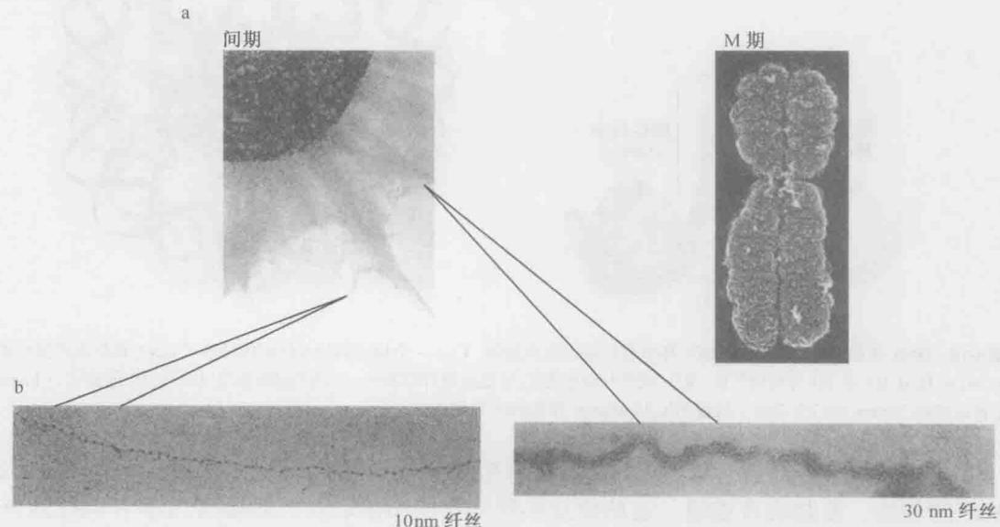  
图 8-17 电子显微镜下观察到的染色质结构。（a）. M 期和间期 DNA 的电子显微照片显示了染色质的结构变化。（b）. 间期细胞中不同形式的染色质的电子显微照片显示了 30 nm 和 10 nm 的染色质纤丝（念珠状）。（来源：a. Alberts B. et al. 2002. Molecular biology of the cell, 4th edition., Figs. 4-21 和 4-23, Garland Science/Taylor & Francis LLC@V.Foe.)

#### [W] 核小体

#### [W] 核小体是染色体的结构单位

在真核细胞中大多数 DNA 被包装成核小体。核小体由 8 个组蛋白所形成的核心组成，DNA 缠绕在组蛋白核心上。每个核小体之间的 DNA（“念珠”上的“线”，图 8-17b）叫做连接 DNA（linker DNA）。DNA 通过包装进核小体，被压缩了大约 6 倍，但这远不及在真核细胞中观察到的压缩 1000～10 000 倍的 DNA。然而，这种 DNA 的初始包装对于后续各个层次上的 DNA 压缩是至关重要的。

与核小体结合最紧密的 DNA 叫做核心 DNA（core DNA），它像线缠绕线轴一样盘绕组蛋白八聚体约 1.65 圈（图 8-18）。通过核酸酶处理能确定每个核小体上 DNA 的长度（框 8-1）。在所有的真核细胞中，长度约 147bp 的核心 DNA 是核小体一个不变的特征。相反，核小体之间的连接 DNA 的长度是可变的。这个距离一般是 20\~60bp，并且每个真核生物有各自特征性的连接 DNA 的平均长度（表 8-4）。连接 DNA 平均长度的不同可能是因为不同生物由核小体 DNA 形成的更复杂结构的特点不同，而不仅仅是核小体自身的不同（参见染色体高级结构部分）。

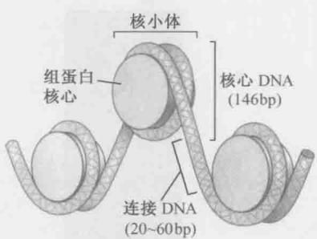

  
图 8-18 DNA 包装成核小体。(a) 核小体包装和组织的示意图。(b) 一个核小体的晶体结构显示了 DNA 盘绕在组蛋白核上。H2A、H2B、H3 和 H4 分别用红色、黄色、紫色和绿色表示。注意在随后的图中，不同的组蛋白都用相同的颜色表示。(Luger K. et al. 1997. Nature 389:251-260.) 镜像图用 MolScript 和 Raster3D 制作。

在任何细胞中都会有数段 DNA 没有被包装到核小体中。这些 DNA 区段一般参与基因的表达、复制或者重组。这些位点尽管未与核小体结合，但通常与参与调控这些过程的非组蛋白结合。我们将在随后的第 19 章讨论从 DNA 上去除核小体并维持此 DNA 区域在无核小体状态下的机制。

#### [W] 框 8-1 微球菌核酸酶和核小体 DNA

通过利用无序列特异性的微球菌核酸酶（micrococcal nuclease，MNase）处理染色体，人们第一次得到了纯化的核小体。这个酶剪切DNA的能力主要由DNA的易接近性控制。微球菌核酸酶能迅速地剪切无蛋白质保护的DNA序列而对结合有蛋白质的DNA序列的剪切效率很差。利用这种酶有控制地处理染色体，可得到具核酸酶抗性的、与组蛋白结合的DNA分子。这些DNA分子的长度为160\~220bp，且与各两个拷贝的H2A、H2B、H3和H4结合。一般来说，这些颗粒包括与核小体紧密结合的DNA和一单位的连接DNA。进一步的微球菌核酸酶处理会使全部的连接DNA降解，剩下的最小的核小体仅包括147bp的DNA，被称为核小体核心颗粒（nucleosome core particle）。

利用一个简单的实验可以测量缠绕每个核小体的 DNA 的平均长度（框 8-1 图 1）。用微球菌核酸酶温和地处理染色质，这将在部分的连接 DNA 中仅仅打开一个切点。核酸酶处理之后，从全部的蛋白质（包括组蛋白）中提取 DNA 并进行凝胶电泳分离。电泳得到一组具长度梯度的片段，其长度为核小体到核小体的平均距离的整倍数。这是由于微球菌核酸

  
框 8-1 图 1 微球菌核酸酶对核小体 DNA 的逐步消化。
(R.D. Kornberg 惠赠)

酶对染色质的部分消化所造成的。因此，有许多核小体未被消化分离，使得其 DNA 片段等于结合于这些核小体上的全部 DNA 的长度。进一步的消化将切开全部的连接 DNA，形成核小体核心颗粒，这时仅得到一条约 147bp 的片段。

表 8-4 各种生物体中连接 DNA 的平均长度

<table><tr><td>物种</td><td>核小体重复长度/bp</td><td>连接 DNA 的平均长度/bp</td></tr><tr><td>酵母</td><td>160~165</td><td>13~18</td></tr><tr><td>海胆(精子)</td><td>~260</td><td>~110</td></tr><tr><td>果蝇</td><td>~180</td><td>~33</td></tr><tr><td>人类</td><td>185~200</td><td>38~53</td></tr></table>

#### [W] 组蛋白是带正电荷的小分子蛋白质

组蛋白是目前所知与真核 DNA 相关的丰度最高的蛋白质。真核细胞一般包括 5 种组蛋白：H1、H2A、H2B、H3 和 H4。组蛋白 H2A、H2B、H3 和 H4 是核心组蛋白（core histone），各两个拷贝的这几种组蛋白形成核小体的蛋白核，核小体 DNA 盘绕其上。组蛋白 H1 不是核小体核心颗粒的一部分，相反，它与连接 DNA 结合，被称为连接组蛋白（linker histone）。4 种核心组蛋白在细胞中以同等的数量存在，而 H1 仅有其他组蛋白丰度的一半。这与每个核小体（含每个核心组蛋白的两个拷贝）与 H1 一一对应的发现相符。

组蛋白与带负电荷的 DNA 分子紧密结合。与此一致的是，组蛋白中带正电荷的氨基酸的含量很高（表 8-5）。各种组蛋白中有超过 20% 的氨基酸残基是赖氨酸或精氨酸。核心组蛋白是相对较小的蛋白质，分子质量一般为 11\~15 kDa，组蛋白 H1 稍大，分子质量约为 21 kDa。

表 8-5 组蛋白的一般特征

<table><tr><td>组蛋白类型</td><td>组蛋白</td><td>分子质量/Da</td><td>赖氨酸及精氨酸的百分含量/%</td></tr><tr><td rowspan="4">核心组蛋白</td><td>H2A</td><td>14 000</td><td>20</td></tr><tr><td>H2B</td><td>13 900</td><td>22</td></tr><tr><td>H3</td><td>15 400</td><td>23</td></tr><tr><td>H4</td><td>11 400</td><td>24</td></tr><tr><td>连接组蛋白</td><td>H1</td><td>20 800</td><td>32</td></tr></table>

核小体的蛋白核是一个圆盘状的结构，只有当 DNA 存在时才组装成一种有序的结构。没有 DNA 时，核心组蛋白在溶液中形成中间组装体。在每种核心组蛋白中都存在一个保守区域，称为组蛋白折叠域（histone-fold domain），调节这些组蛋白中间体的组装（图 8-19）。组蛋白折叠域由 3 个 $\alpha$ 螺旋组成，螺旋之间被两个短的无规则环隔开。组蛋白折叠域调节头尾相连的、专一配对的组蛋白异源二聚体的形成。组蛋白 H3 和 H4 首先形成异源二聚体，然后两个二聚体形成一个四聚体，含有两个分子的 H3 和 H4。相反，H2A 和 H2B 在溶液中形成异源二聚体而不是四聚体。

一个核小体的组装涉及这些结构单位与DNA有序地结合(图8-20)。首先，H3·H4四聚体与DNA结合；然后两个H2·H2B二聚体结合到H3·H4-DNA复合体，形成最后的核小体。我们将在本章的后面部分讨论组装过程是在什么时候、如何在细胞中完成的。

每个核心组蛋白有一个 N 端延伸，称为尾巴（tail），它没有一个确定的结构，是完整的核小体中易接近的部分。用胰蛋白酶（能专一性地从蛋白质上去除带正电荷的氨基酸）处理核小体能检测到这种易接近性。用胰蛋白酶处理核小体能迅速地去除组蛋白易接近的 N 端尾巴，但不能切断紧密包装的组蛋白折叠区（图 8-21）。因为蛋白酶消化后 DNA 仍然与核小体紧密结合，所以暴露的 N 端尾巴对于 DNA 与组蛋白八聚体的结合不是必需的。然而，尾巴上有许多高度修饰的位点，可以改变这些核小体的功能。这些修饰包括丝氨酸、赖氨酸和精氨酸残基上的磷酸化、乙酰化和甲基化。我们将在讨论核小体功能之后，再讨论组蛋白尾修饰的作用。现在，我们讨论核小体的详细结构。

  
图 8-19 核心组蛋白具有共同的折叠结构。(a). 图中 4 种组蛋白显示为线性分子。形成 α 螺旋的组蛋白折叠域以圆柱表示，注意每个组蛋白都有结构上特异的相邻区域，其中包括其他的 α 螺旋区。(b). 两个组蛋白（H2A 和 H2B）的螺旋区结合形成一个二聚体。H3 和 H4 也用相似的方式形成 H3₂·H4₂ 四聚体。(Alberts B. et al. 2002. Molecular biology of the cell, 4th edition, p.209, Fig. 4-26. © Garland Science Taylor & Francis. LLC.)

#### [W] 核小体的原子结构

核小体核心颗粒（图 8-18b，147bp 的 DNA 加上一个完整的组蛋白八聚体）高分辨率的三维结构为我们揭示了核小体是如何行使功能的。核小体对 DNA 的高度亲和性、DNA 结合到核小体上时发生的扭曲和 DNA 序列的非特异性这些现象，都可用此组蛋白与 DNA 相互作用的结构来解释。这个结构也凸显了 N 端尾巴的功能和位置。最后，此 DNA 与组蛋白八聚体相互作用的结构揭示了核小体的动态特征和核小体组装的过程。在接下来的几部分中我们将讨论核小体的每一个特性。

#### [W] 核小体中 DNA 的组蛋白结合区

尽管核小体不是完全对称的，但是有大致的二重轴对称，叫做二价轴(dyad axis)。如果将圆盘状的组蛋白八聚体的表面视作时钟，将147bp的DNA的中点定在12点钟的位置（图8-22），就可以看到这种对称性，而DNA的末端靠近于11点和1点钟的位置。从12点到6点通过圆盘的中心画一条线，定义为二价轴。绕着这个轴将核小体旋转 $180^{\circ}$ ，可以看到一个和旋转前几乎相同的外观。

图 8-20 核小体的组装。 $H_{32}\cdot H_{42}$ 四聚体的形成启动核小体的组装，四聚体然后与双链 DNA 结合。结合到 DNA 上的 $H_{32}\cdot H_{42}$ 四聚体再与两个拷贝的 H2A·H2B 二聚体结合，完成核小体的组装。（来源：Alberts B. et al. 2002. Mo lecular biology of the cell, 4th edition, p.210, Fig.4-27. Garland Science/Taylor & Francis LLC@J.Waterborg.）  

H3·H4 四聚体和 H2A·H2B 二聚体分别与核小体中特定的 DNA 区段相互作用（图 8-23）。H3·H4 四聚体的组蛋白折叠区与 147bp DNA 中间的 60bp 相互作用。H3 的 N 端区域最接近组蛋白折叠区，形成第 4 个 α 螺旋，与结合的 DNA 两个末端的 13bp 片段相互作用（这个区域与前述的无结构的 H3 的 N 端尾是有区别的）。如果我们将核小体绘成上述的时钟，H3·H4 四聚体构成组蛋白八聚体的上半部分。重要的是，组蛋白 H3·H4 四聚体在核小体中占据着关键的位置，分别与 DNA 的中部和两端结合（图 8-23a 中标为青绿色的 DNA）。两个 H2A·H2B 二聚体分别与结合着 H3 和 H4 的中间 60bp、两侧大约各 30bp 的 DNA 结合。我们再次用时钟作比喻，与 H2A·H2B 二聚体结合的 DNA 定位于核小体圆盘的大约 5 点到 9 点钟的位置。两个 H2A·H2B 二聚体构成组蛋白八聚体的底端部分，从 DNA 的末端穿过圆盘（图 8-23b 中标为橙色的 DNA）。

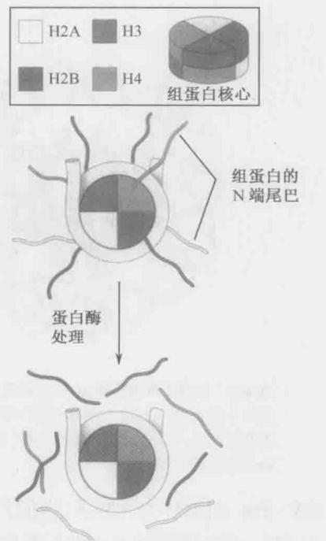  
图 8-21 核心组蛋白的 N 端尾易受到蛋白酶的作用。用有限的可以在碱性氨基酸之后切开的蛋白酶（如胰蛋白酶）处理核小体，能专一地去除 N 端尾巴而保留完整的组蛋白核。

  
图 8-22 核小体有一个大致的二重轴对称。(a). 三维结构。(b). 核小体 “钟面” 示意图。从 3 个方向显示核小体的结构。每个方向都是绕（b）图中所示的 12 点到 6 点的轴线旋转 90° 所得。(a. Luger K., et al. 1997. Nature 389:251-260.) 镜像图用 BobScript、MolScript 和 Raster3D 制作。

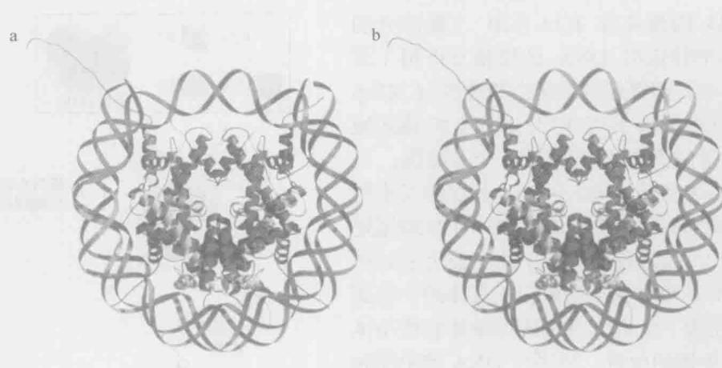  
图 8-23 组蛋白和核小体 DNA 的相互作用。(a). H3·H4 与 DNA 的中部和末端结合（用青绿色表示）。(b). H2A·H2B 二聚体与核小体一侧 DNA 的 30bp 结合。与 H2A·H2B 二聚体结合的 DNA 用橙色表示。(Luger K., et al. 1997. Nature389: 251-260.) 镜像图用 Bob Script、MolScript 和 Raster3D 制作。

H3·H4 四聚体与 DNA 之间广泛的相互作用有助于解释核小体的有序组装（图 8-24）。H3·H4 四聚体与 DNA 的中部和末端结合，造成 DNA 高度弯曲和固定，使得 DNA 与 H2A·H2B 二聚体的结合相对容易。与此相反，DNA 与 H2A·H2B 二聚体相对较短的结合长度，不足以造成 DNA 与 H3·H4 四聚体的结合。

#### [W] 许多不依赖于 DNA 序列的接触介导核心组蛋白与 DNA 间的相互作用

  
图 8-24 缺少 H2A 和 H2B 的核小体。在这个图中，组蛋白 H2A 和 H2B 被人为地从核小体中去除。这个结构可能与核小体组装过程中的 DNA·H3₂·H4₂ 四聚体中间物类似（图 8-20）。（Luger K., et al.1997. Nature 389: 251-260.）镜像图用 BobScript、MolScript 和 Raster3D 制作。

对组蛋白和核小体 DNA 相互作用的进一步观察揭示出核小体内的 DNA 结合和弯曲的结构基础。每次 DNA 的小沟面对组蛋白八聚体时可发现一个接触位点，共发现了 14 个不同的位点（图 8-25）。DNA 与核小体之间的这种联系是通过组蛋白和 DNA 间大量的氢键（约 40 个）所介导的。这些氢键大多位于蛋白质和 DNA 小沟附近磷酸二酯骨架上的氧原子之间，只有 7 个氢键位于蛋白质侧链和 DNA 小沟的碱基之间，所有这些氢键都在 DNA 的小沟里。

这些氢键中的大多数（一个典型的识别特异序列的 DNA 结合蛋白质仅有 20 个氢键与 DNA 作用）提供使 DNA 弯曲的驱动力。高度碱性的组蛋白通过屏蔽具抵抗 DNA 弯曲作用的磷酸基团的负电荷而将

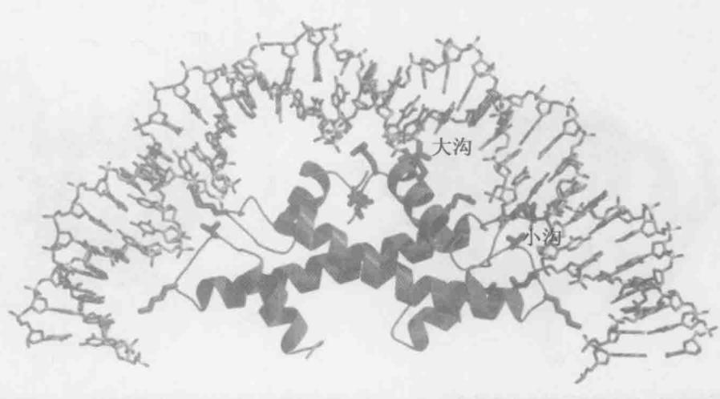  
图 8-25 组蛋白与 DNA 的接触位点。为了清楚起见,图中只显示了 DNA 与一个 H3·H4 二聚体的相互作用。参与组蛋白与 DNA 相互作用的部分亚基用红色表示。注意这些区域聚集在 DNA 的小沟处。(Luger.1997. Nature 389: 251-260.) 镜像图用 BobScript、MolScript 和 Raster3D 制作。

DNA 弯曲。只有 DNA 弯曲使弯曲区内部的磷酸基团变为不适宜的邻近状态。组蛋白的高碱性特点还有助于两个相邻 DNA 螺旋紧密毗邻，这种毗邻对于 DNA 在组蛋白八聚体上多次缠绕是必要的。

组蛋白与 DNA 间的所有接触位点都与 DNA 的小沟或磷酸骨架相关。这个发现与组蛋白八聚体和 DNA 结合的非序列特异性的事实相一致。无论是 DNA 的小沟还是磷酸骨架，都不富含具碱基特异性的信息。而且，在与 DNA 小沟中的碱基所形成的 7 个氢键中，都不含有可区分 G:C 和 A:T 碱基对的元素（第 4 章，图 4-10）。

#### [W] 组蛋白的 N 端尾可稳定盘绕在八聚体上的 DNA

核小体的结构也能使我们对组蛋白 N 端尾巴的情况有所了解。4 个 H2B 和 H3 的尾巴从两个 DNA 螺旋间伸出。它们伸出的路径由两个相邻的小沟形成，在两个 DNA 螺旋之间形成了一个仅容一条多肽链的缝隙（图 8-26a）。值得注意的是，绕着组蛋白八聚体圆盘所伸出的 H2B 和 H3 尾巴之间的距离大致相等（H3 尾巴在大约 1 点和 11 点处伸出，H2B 尾巴在大约 4 点和 8 点处伸出）。H4 和 H2A 氨基端尾巴不是从两个 DNA 螺旋之间伸出，而是从 DNA 螺旋的“上面”或“下面”伸出来的（图 8-26a）。H4 尾巴位于核小体表面的 3 点和 9 点处，H2A 尾巴位于 5 点和 7 点处（图 8-26b）。从 DNA 螺旋之间或两侧伸出的组蛋白尾巴，其作用类似于一个螺丝上的凹槽，指导 DNA 以左手方式盘绕于组蛋白八聚体的圆盘上。正如我们在第 4 章中所讨论的一样，DNA 以左手方式缠绕使 DNA 形成负的超螺旋。当有 DNA 穿过时，组蛋白尾巴上最接近组蛋白圆盘的部分（不会被蛋白酶降解），也可在组蛋白和 DNA 之间形成许多氢键。

  
图 8-26 组蛋白尾巴从核小体核心的特定位置伸出。(a). 这个侧面图展示了从两个 DNA 螺旋间伸出的 H2B 和 H3 尾巴, 相反, H4 和 H2A 尾巴从两个 DNA 螺旋的上面或下面伸出。(Luger K. et al. 1997. Nature 389: 251-260.) 示意图用 GRASP 绘制。(b). 图中所示为组蛋白尾巴相对于 DNA 进出的位置, 组蛋白尾巴可在 DNA 的很多相应位置上伸出。(Davey C. A. et al. 2002. J. Mol. Biol. 319: 1097-1113.) 镜像图用 BobScript、MolScript 和 Raster3D 制作。

#### [W] 缠绕组蛋白核心的 DNA 呈负超螺旋特性

往共价闭环 DNA 模板上每加一个核小体，就能使相应 DNA 的连环数（linking number）改变约-1.2。由于 DNA 维持松弛状态主要依赖拓扑异构酶（topoisomerases），所以如果将核小体和 DNA 分离，被包装成核小体的 DNA 将形成负超螺旋。因此核小体可以被看成是维持或者稳定负超螺旋的结构。细胞为什么要保持这样一个负超螺旋的储库呢？已有很多例子说明该储库对细胞内 DNA 进行解链具有重要的促进作用，如 DNA 复制的起始、转录和重组。更重要的是，DNA 的负超螺旋有利于 DNA 的解旋（见第 4 章，图 4-17）。因此，核小体移除不仅增加了 DNA 的可接近性，还有利于附近 DNA 序列的解旋（框 8-2）。

如果核小体在真核生物细胞中具有储存负超螺旋的功能，那么是什么在原核生物中起相应作用呢？答案是多数原核生物的整个基因组都保持在负超螺旋状态。这种作用是由一种称为促旋酶（gyrase）的特殊的拓扑异构酶，通过减少连环数来增加负超螺旋的方法来实现的。例如，在 E.coli 细胞中，促旋酶的作用结果是使整个基因组具有大约平均 -0.07 的超螺旋密度。把负超螺旋导入松弛 DNA 是一种需能反应，因此，促旋酶只有在 ATP 存在的情况下才能把负超螺旋导入 DNA 中。在缺少 ATP 的情况下，促旋酶仅能使 DNA 松弛（如减少正超螺旋 DNA 的连环数）。

并不是所有的细菌都需要将它们的 DNA 保持在负超螺旋状态。适宜在极高温度条件下（>80℃）生长的细菌必须消耗额外的能量防止 DNA 由于热变性而解旋。这些生物有一种不同的拓扑异构酶，称为反促旋酶（reverse gyrase）。在 ATP 存在的情况下，反促旋酶可以增加松弛 DNA 的连环数。热变性通常会导致基因组的很多区域被解旋，反促旋酶通过维持基因组的正超螺旋结构逆转热变性的效果。

#### [W] 框 8-2 核小体和超螺旋密度

为什么核小体能改变自己含有 DNA 的拓扑结构呢？正如第 4 章所述，两种扭曲方式对 DNA 超螺旋的形成具有重要作用：环螺旋型的和缠绕型的（也称绞螺旋型的）。DNA 是以环螺旋方式缠绕到组蛋白八聚体上的。左手螺旋或右手螺旋决定了引入的超螺旋是正超螺旋还是负超螺旋（即相关 DNA 连环数的增加或减少等）。对环螺旋型扭曲而言，左手螺旋引入负超螺旋（对缠绕型扭曲而言则相反，右手螺旋引入负超螺旋）。因此，缠绕核小体 DNA 的左手螺旋环型扭曲减少了相关 DNA 的连环数。基于这个原因，核小体倾向于整合负超螺旋密度的 DNA，要用 DNA 组装核小体并且引入正超螺旋是很困难的。

很多用共价闭和环状 DNA（cccDNA）来组装的核小体需要拓扑异构酶来适应与组蛋白结合的 DNA 的连环数的变化（见框 8-2 图 1）。如果缺少拓扑异构酶，cccDNA 组装成一个核小体时，需要非结合的 DNA（非核小体相关 DNA）来适应连环数的等量的增加（注意，在缺少拓扑异构酶的情况下，cccDNA 的总连环数是确定的）。因此，非结合 DNA 将会积累增加的连环数，增大正超螺旋的密度。非结合 DNA 的正超螺旋数越多，就越难组装到核小体里去。

拓扑异构酶的加入能极大地促进核小体与 cccDNA 的结合。核小体组装时如果存在拓扑异构酶，它并不能作用于与核小体结合的 DNA，而是使非核小体结合 DNA 松驰，通过减少这些区域的连环数来降低正超螺旋的密度。拓扑异构酶通过维持非结合 DNA 的松驰状态，来促进组蛋白和 DNA 的结合以及更多的核小体的形成。值得一提的是，在质粒中的总体效应是随着核小体的不断被组装，连环数不断下降。

由拓扑异构酶引起的连环数减少，能够作为核小体组装过程的实验分析指标。该分析基于凝胶电泳能将松弛和超螺旋 cccDNA 区分开来（见图 4-27）的原理。第一步是在拓扑异构酶存在的条件下以 cccDNA 组装核小体。在适当的时间点往组装反应中加入强去污剂（如 SDS），使拓扑异构酶失活并将组蛋白从 DNA 上去除。得到的 DNA 通过凝胶电泳分离并鉴定其超螺旋特性。因为在组蛋白从 DNA 上去除的同时，拓扑异构酶也失活，保留了组装成核小体的 DNA 的连环数。一般来说，拓扑异构酶能把组装到每个核小体上的 cccDNA 减少 1.2 个连环数。因此，组装到核小体上的 cccDNA 越多，形成的负超螺旋数也越多（框 8-2 图 1c，d）。超螺旋的电泳迁移率较快，这在凝胶电泳中很容易被观察到（框 8-2 图 2）。

由于核小体 DNA 在组蛋白上缠绕 1.65 圈，环状共价闭合的质粒形成单个核小体的时候就会导致 -1.65 圈的扭曲，所以会造成等量的连环数变化。就像上面所说的，当测量每个核小体对应的连环数时，得到的结果为 -1.2，小于这个数。这种偏差称为“核小体连环数悖论”，而解决这一难题的关键是揭示核小体高溶解作用的晶体结构是在什么时候被溶解的。对组蛋白核心相关的 DNA 进行深入分析表明：相对于裸 DNA 而言，每圈螺旋的碱基数减少了（从 10.5bp/圈降至 10.2 bp/圈）。每个螺旋的碱基数减少导致那段 DNA 的连环数增加。考虑到第 4 章中 cccDNA（10 500 bp）这个例子，常规的 B 型 DNA 为 10.5 bp/圈，在质粒中就有 +1000 连环数（10 500/10.5）。相反，以每螺旋 10.2 bp 计，同样的 DNA 连环数就约为 +1029 的（10500/10.2）。因此，通过减少

框8-2图1共价闭环DNA（cccDNA）组装核小体需要拓扑异构酶。（a）在缺少拓扑异构酶的情况下，非结合DNA上的正超螺旋的积累抑制了核小体和cccDNA的组装。（b）拓扑异构酶存在的情况下，核小体装配并没有增加。示拓扑异构酶是如何通过减少连环数使非结合DNA松弛的。（c）拓扑异构酶存在的情况下，增加核小体装配。（d）同时去除组蛋白和灭活拓扑异构酶（如通过加入强去污剂）表明连环数的减少与核小体DNA相关。

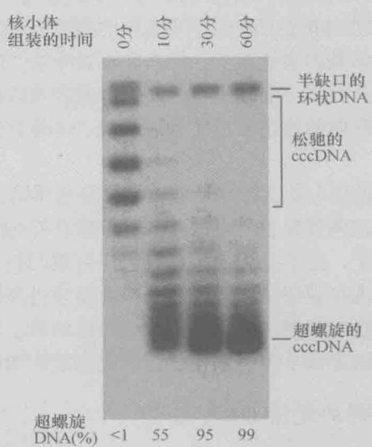  
框 8-2 图 2 核小体组装实验检测相应连环数减少的实例。在拓扑异构酶存在的情况下，核小体以 cccDNA 进行组装。在组装开始（0min）或者核小体组装反应的各个时间点加入去污剂，并且通过非变性琼脂糖凝胶电泳分离及溴化乙锭染色。尽管琼脂糖凝胶电泳并不能区分 cccDNA 是正超螺旋还是负超螺旋，但是 DNA 嵌入剂（intercalator）能增加连环数从而改变凝胶中的 DNA 状态（一种更加松弛的状态），根据这一点能够用来显示 cccDNA 的负超螺旋（没有显示，经 ItoT.et al.1997.Cell 90:145-155.Fig.2c ©Elsevier 许可使用。）

每圈螺旋的碱基数与组蛋白八聚体的结合，就会使核小体结合 DNA 的连环数略微增加。这种改变使每个核小体上连环数的变化由 -1.65 降到 -1.2。这一差异（大约每个核小体变化 +0.4）可以由每圈上碱基数的数量和核小体 DNA 的长度的改变计算得到。

这些问题与真核生物线性染色体是否有关？短的线性片段与超螺旋无关，因为DNA末端可以通过旋转来适应连环数的改变。但对于非常大的真核生物细胞的线性染色体就不适用了。首先，这些染色体太大，不能通过快速旋转来消除DNA超螺旋变化。更重要的是，染色体不是简单的线性DNA链，每条染色体DNA都被折叠到一个由大环组成的更加紧密的结构中，这些大环与被称为核骨架的蛋白质结构拴在一起。这些附属装置将环与环在拓扑学上分开，同时也阻止了染色体DNA的自由旋转。

#### [W] 染色质的高级结构

#### [W] 异染色质和常染色质

自早期利用光学显微镜的观察开始，科学家就发现染色体的结构是不一致的。对染色体的早期研究将染色体区域分为两个部分：异染色质（heterochromatin）和常染色质（euchromatin）。异染色质能被多种染料染成深色，具有更为紧密的形态；而常染色质则具有相反的特征即染色浅而具有相对伸展的结构。随着分子生物学对基因和基因表达的深入了解，发现染色体的异染色质区域的基因表达量非常有限，而常染色质区域的基因表达量较高。这一发现提示染色体的这两种不同染色质的结构与基因表达的总体水平有关联。

尽管异染色质区域显示基因表达很少，但这并不意味这些区域不重要。正如我们在讨论基因表达时将学到的，关闭一个基因与启动一个基因可以说同等重要。另外，异染色质与包括端粒和着丝粒在内的特定染色体区域相关，这两个染色体关键组分的功能非常重要。

经过若干年的研究，研究人员已对异染色质和常染色质结构有了分子水平上更加完整的理解。现在已清楚，这两种染色质中的 DNA 都被组装进核小体中。异染色质结构和常染色质结构的不同在于，位于这两个不同染色体区域的核小体是如何被（或不被）组装进更大的组件之中。现在很清楚，异染色质区由组装进高级结构的核小体 DNA 组成，并因此形成了基因表达的障碍。相反，常染色质区的核小体的组装程度要低得多。在下面的章节中，我们将讨论核小体是如何被组装进高级结构的。

#### [W] 组蛋白 H1 与核小体之间的连接 DNA 结合

一旦核小体形成，DNA 包装的下一步就是与组蛋白 H1 结合。与核心组蛋白相似，H1 是一种小的、带正电荷的蛋白质（表 8-5）。H1 与核小体之间的连接 DNA 的相互作用，进一步加强了核小体与 DNA 间的紧密结合，增加了对核小体 DNA 的保护。这可以从对微球菌核酸酶消化的抵抗力增强检测到。因此，除了核心组蛋白保护 147bp 的 DNA 之外，组蛋白 H1 与核小体的结合保护了额外的 20bp DNA 免于微球菌核酸酶的消化。

组蛋白 H1 具有不同寻常的特点，可与 DNA 双螺旋的两个不同的区域结合。通常，这两个区域是与核小体结合的同一 DNA 分子的一部分（图 8-27）。相对于核小体而言，H1 的结合位点是不对称的。H1 的一个结合区是核小体一端的连接 DNA，另一结合位点在与核小体结合的 147 bp DNA 的中间（在二价轴上仅有的 DNA 双螺旋）。因此，上

  
H1 结合

图 8-27 组蛋白 H1 结合两个 DNA 螺旋。就组蛋白 H1 与核小体的相互作用而言，组蛋白 H1 分别与核小体一端的连接 DNA 及与核小体结合的 DNA 中部的 DNA 螺旋结合（即核心组蛋白八聚体结合的 147bpDNA 的中间）。

述免于核酸酶消化的、额外的 DNA 仅是核小体一侧的连接 DNA。H1 的结合使 DNA 的两个区域紧密靠近，增加了在组蛋白八聚体上紧密盘绕的 DNA 的长度。

H1 的结合使 DNA 进出核小体的角度更为固定。通过电子显微镜可以观察到（图 8-28），这种效果使核小体 DNA 呈现出独特的锯齿形外观。DNA 进出的角度视条件（包括盐浓度、pH 和其他蛋白质的存在）变化很大。如果我们假设这些角度相对于二价轴是约 $20^{\circ}$ ，这将导致核小体交替存在于组蛋白 H1 结合的连接 DNA 中心区的两侧（图 8-29）。

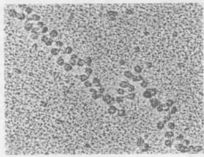  
图 8-28 H1 的结合导致核小体 DNA 的进一步凝聚。这两幅照片是在电子显微镜下显示的组蛋白 H1 存在（a）或缺失（b）时的核小体 DNA。注意在组蛋白 H1 存在时，核小体 DNA 的凝聚更紧密且结构更固定。（来源：Thoma F. et al. 1979. J. Cell Biology 83: 403-427, Figs. 4&6. © RockefellerUniversityPress.）

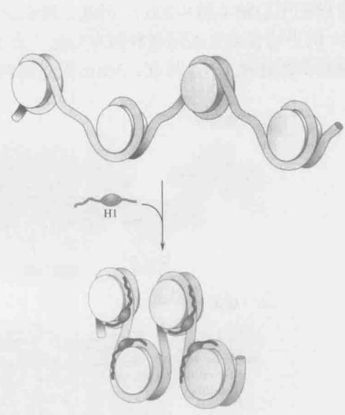  
图 8-29 组蛋白 H1 使 DNA 更紧密地盘绕于核小体。这两幅图是组蛋白 H1 存在或缺失条件下 DNA 盘绕核小体情况的比较。组蛋白 H1 能与每个核小体作用，结合于连接 DNA 和核小体结合 DNA 中部的 DNA 螺旋。

#### [W] 核小体束能形成更复杂的结构：30nm 纤丝

组蛋白 H1 的结合稳定了染色质的高级结构。在试管中，当盐浓度增加时，组蛋白 H1 的加入导致核小体 DNA 形成一条 30nm 纤丝（30nm fiber）。这个结构也能在体内观察到，代表了 DNA 凝聚的下一层次。更重要的是，DNA 整合到这种纤丝内使其不易被许多依赖 DNA 的酶（如 RNA 聚合酶）接近。

关于 30nm 纤丝的结构，目前有两种模型。在螺线管模型（solenoid model）中，核小体 DNA 形成一个超螺旋，每圈大约包含 6 个核小体（图 8-30a）。电镜和 X 射线衍射研究都支持这个结构。研究表明，30nm 纤丝有一个大约 11nm 的螺旋斜度。这也是核小体圆盘的大约直径，表明 30nm 纤丝是由核小体圆盘堆叠成螺旋状所构成（图 8-30a）。在这个模型中，组蛋白八聚体圆盘的平面间相互连接，而核小体的 DNA 表面形成超螺旋外部易接近的表面。连接 DNA 被埋藏在超螺旋的中心，但从不穿过纤丝轴。而且，当 DNA 从一个核小体移到另一核小体时，连接 DNA 环绕着中心轴。

30nm 纤丝的另一模型是锯齿模型（图 8-30b）。这个模型的基础是结合 H1 后的核小体呈锯齿状。在这种模型下，30nm 纤丝是这些锯齿形核小体束的压缩结构。新近以 4 个核小体 DNA 单一分子的 X 射线衍射和对弹簧状的单一 30 nm 纤丝的分析支持这个模型。与螺线管模型不同，锯齿状的构象要求连接 DNA 以相对笔直的方式穿过纤丝的中心轴（图 8-30b）。因此，较长的连接 DNA 有利于这种构象的形成。因为连接 DNA 的平均长度在不同物种间有变化（表 8-4），所以 30nm 纤丝的结构并不总是相同，根据局部的连接 DNA 长度，30nm 纤丝的两种形式都可以在细胞中找到。

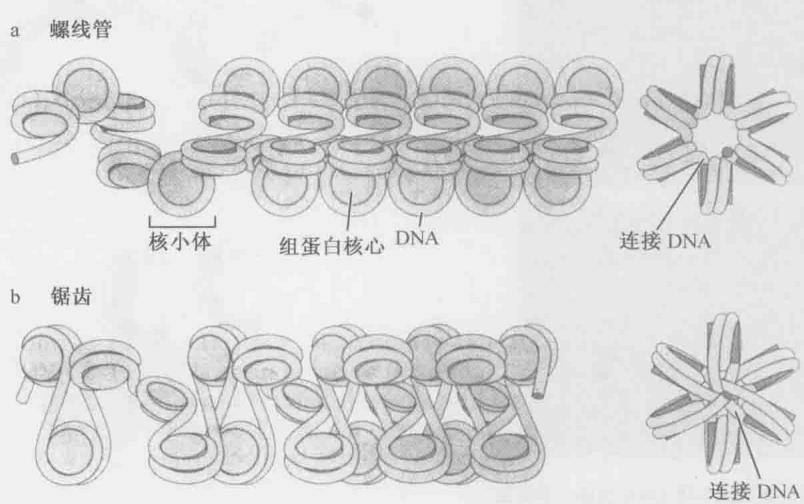  
图 8-30 30nm 染色质纤丝的两种模型。在 a、b 两组中，左边为纤丝的侧面，右边为沿纤丝的中心轴的下观图。（a）.螺线管模型。注意连接 DNA 不穿过超螺旋的中心轴且进出核小体的位点和侧面相对不易靠近。（b）.锯齿模型。在这种模型中，连接 DNA 经常穿过纤丝的中心轴，侧面甚至进出位点更易靠近。（来源：Pollard T.and Earnshaw W.2002.Cell Biology,1st edition, p.202, Fig.13-6. ©Elsevier）

#### [W] 组蛋白 N 端尾巴对于 30nm 纤丝的形成是必需的

缺少 N 端尾巴的核心组蛋白不能形成 30nm 纤丝。这个尾巴最可能的作用是通过它与相邻核小体的相互作用稳定 30nm 纤丝。核小体的三维晶体结构支持这种模型。

  
图 8-31 组蛋白 N 端尾巴稳定 30nm 纤丝的推测模型。在这个模型中，30nm 纤丝用锯齿模型表示。几种不同的核心组蛋白与尾巴的相互作用是可能的。这里描绘了每个交替的组蛋白间的相互作用，但这种相互作用也能在相邻的或更远的组蛋白间发生。

核小体三维结构显示，在晶格中，H2A、H3和H4的N端尾巴各自与相邻的核小体相互作用（图8-31）。最近的研究表明，组蛋白H4带正电荷的N端与组蛋白H2A带负电荷的折叠区相互作用，对于 $30\mathrm{nm}$ 纤丝的形成特别重要。与H4尾巴相互作用的H2A残基在许多真核生物中是保守的，但这些残基不参与DNA的结合或组蛋白八聚体的形成，一种可能性是H2A的这些区域是保守地介导核小体相互之间与H4尾巴的作用。我们将在下面看到，在细胞中组蛋白尾巴经常是修饰的靶标，这些修饰可能影响 $30\mathrm{nm}$ 纤丝和其他核小体高级结构的形成能力。

  
图 8-32 染色质的高级结构。(a). 一个透射电子显微照片显示染色质从染色体的中心结构处伸出。电子密集的区域是核骨架，在真核细胞中它负责将大量的染色体 DNA 组织起来。(b). 一个真核染色体的结构模型，显示大多数 DNA 包装进 30nm 纤丝的大环且其根部结合于核骨架上。而有活性的 DNA 位点（如转录或 DNA 复制位点）以 10nm 纤丝甚至裸露 DNA 的形式存在。（来源：a. Courtesy of J. R. Paulson and U.K. Laemmli.）

#### [W] DNA 的进一步凝聚与核小体 DNA 的大环有关

DNA 包装为核小体和 30nm 纤丝共同导致 DNA 的线性长度压缩了大约 40 倍。但这种 1\~2 m 长的 DNA 仍然不能适合大约 $10^{-5}$ m 直径的细胞核。为了使 DNA 压缩更紧，必须对 30nm 纤丝进行进一步折叠。尽管尚不清楚这种折叠的确切结构，但是一个流行的模型推测 30nm 纤丝形成 40\~90 kb 的环，在其根部通过蛋白质结构的核骨架（nuclear scaffold）连接起来（图 8-32）。虽然核骨架的真实结构仍是个谜，但已经研究出一些方法来鉴定作为这个结构一部分的那些蛋白质。

目前已发现有两类蛋白质参与核骨架的形成。一类是拓扑异构酶Ⅱ（TopoⅡ），它大量存在于核骨架的制备物和纯化的有丝分裂染色体中。用能够导致DNA在TopoⅡ的DNA结合位点发生断裂的药物处理细胞，得到长约50kb的DNA片段。这与用有限的核酸酶消化染色体所得到的片段长度相似，表明TopoⅡ可能是参与形成这种根部相连的环状DNA的机制的一部分。此外，每个环的根部的TopoⅡ可以保证这些环在拓扑学上的相互分离。

SMC 蛋白也是核骨架中含量丰富的组成成分。正如我们先前所讨论的（见“染色体复制和分离部分”），SMC 蛋白是染色体复制后进行凝聚和维持姐妹染色体联会机制的关键组成成分。这些蛋白质通过与核骨架的结合，为其与染色体 DNA 的相互作用提供了内在的基础，从而增强它们的功能。

#### [W] 组蛋白的变构体影响核小体功能

核心组蛋白是最保守的真核蛋白质之一。因此，由这些蛋白质形成的核小体在全部真核生物中是非常相似的。但是，在真核细胞中发现了很多组蛋白变构体，能替代四种标准组蛋白中的一种，形成替代型核小体。这类核小体可能用来划分染色体的特定区域，或者赋予核小体特定的功能。例如，H2A.X是H2A的一种变构体，广泛分布于真核细胞的核小体中，当染色体DNA发生断裂的时候（称为双链断裂），邻近断点的H2A.X会被磷酸化。这种被磷酸化后的H2A.X可以被DNA修复酶特异地识别，并将修复酶定位到DNA损伤位点。

另一个组蛋白变构体 CENP-A，与含有着丝粒 DNA 的核小体结合。在这个染色体区域，CENP-A 替代了核小体中的组蛋白 H3 亚基。这些核小体整合进动粒，介导染色体与有丝分裂纺锤体的黏附（图 8-12）。与 H3 相比，CENP-A 含有较长的 N 端尾巴，但含有相似的组蛋白折叠结构域，所以 CENP-A 的加入不大可能改变核小体的核心结构。然而，CENP-A 延长的尾巴可能给动粒的其他蛋白质组分提供新的结合位点（图 8-33）。按照这种假说，CENP-A 的丢失可能干扰动粒组分与着丝粒 DNA 的相互作用。

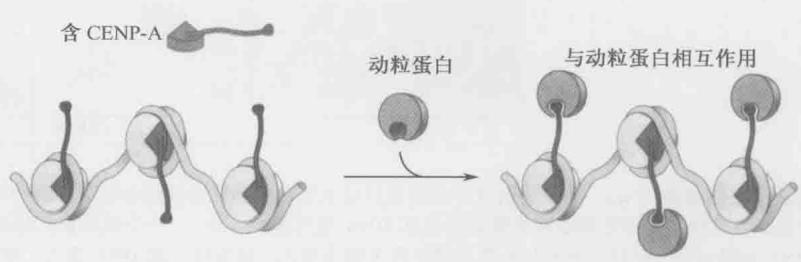  
图 8-33 组蛋白变构体掺入引起的染色质改变。CENP-A 替代组蛋白 H3 可能为一个或多个动粒的组分提供了结合位点。

#### [W] 染色质结构的调控

#### [W] DNA 与组蛋白八聚体的相互作用是动态过程

正如我们将在第 19 章详细讲述的，DNA 包装进核小体对基因组的表达有重要影响。在许多情况下，能够靠近特定 DNA 区域所需的关键步骤是将核小体去除，或者使其与 DNA 的结合不那么紧密。为适应这种需要，组蛋白八聚体与 DNA 的结合应该是动态的。此外，有一些因子能与核小体相互作用，增加或降低这种动态结合。这些特征共同保证了核小体的位置以及与 DNA 相互作用的改变，以适应 DNA 易接近性经常变化的需要。

类似于所有非共价键介导的相互作用，任何特定的 DNA 区段与组蛋白八聚体的结合都不是永久的，任何 DNA 区段都将短暂地从与八聚体的紧密相互作用中释放出来。这种释放类似于 DNA 双螺旋的暂时解链（与我们在第 4 章中讨论的一致）。由于许多 DNA 结合蛋白更易结合没有组蛋白的 DNA，因此 DNA 与组蛋白核心结构结合的动态特点十分重要。只有从组蛋白八聚体上释放出来，或者结合到连接 DNA 上，即 DNA 上没有核小体的区段，这些蛋白质才能识别 DNA 上的结合位点。

DNA 从核小体上间歇性地、自发性地释放，其结果是蛋白质与其 DNA 结合位点接近的概率为 1/50\~1/100 000，概率的大小取决于结合位点在核小体中的位置，越处于中心的结合位点越不易接近。因此，在与核小体紧密结合的 147bp DNA 上的 73 位点附近的结合位点是最不易接近的位点，而在核小体 DNA 两端（1 或 147 位点）的结合位点最易于接近。这些发现表明 DNA 暴露的机制归因于 DNA 从核小体上解绕，而不是简单地从组蛋白八聚体表面伸出（图 8-34）。值得注意的是，这些研究都是在试管里用分离纯化的核小体来进行的，与细胞中 DNA 从核小体上解绕可能有所不同，因为在细胞中，长长的 DNA 要组装到很多相邻的核小体（被称为核小体集束）里去。与 H1 的结合及核小体组装成 30nm 的纤丝，都将改变这些事件的发生概率。然而，核小体的动态结构表明，X 射线晶体学揭示的核小体结构只是短暂性的，而不是大部分时间里的其他构型。

  
图 8-34 接近与核小体结合的 DNA 的模型。对具序列特异性的 DNA 结合蛋白与核小体结合能力的研究表明，DNA 从核小体上的解绕对于 DNA 的易接近性起决定作用。因此，最靠近核小体进出位点处的 DNA 结合位点是最易接近的，而最靠近结合 DNA 中部的位点是最不易被接近的。

#### [W] 核小体重塑复合体有助于核小体的移动

除了核小体所呈现的内在动态性之外，组蛋白和 DNA 相互作用的稳定性还受到蛋白质大复合体、称为核小体重塑复合体（nucleosome-remodeling complex）的影响。这些多蛋白复合体有助于以 ATP 水解为能量的核小体-DNA 的相互作用或核小体位置的改变。被这些酶催化的核小体改变，有三种基本的类型（图 8-35）。所有核小体重塑复合体都能催化 DNA 沿着组蛋白八聚体表面的“滑动”（sliding）。另一种类型的核小体重塑复合体能够催化第二种更为极端的变化，使组蛋白八聚体进入溶液或从一个 DNA 螺旋向另一个螺旋“转移”（transfer）。最后，某些酶可以促进核小体中的二聚体 H2A/H2B 转换成其他形式的二聚体（如 H2A.X/H2B 在双链断裂处转换为 H2A/H2B）。

  
图 8-35 核小体重塑催化核小体的移动。（上）核小体沿 DNA 分子滑动，暴露出 DNA 结合蛋白的结合位点。（中）核小体重塑复合体也可以从 DNA 中解离出核小体，从而产生更大的无核小体区，（下）一组核小体重塑复合体可以同时催化未经修饰的和变化的 $H_{2}A/H_{2}B$ 二聚体的交换。

最近的研究已经揭示核小体重塑复合体是如何将DNA在组蛋白八聚体上移动的（图8-36）。每一个这样的多亚基酶都有一个ATP水解亚基，当从核糖体重塑复合体中解离后，可以在双链DNA上定向移动（也称为移位）。目前的结构表明核小体重塑复合体可以与组蛋白八聚体，以及与核小体DNA相邻的DNA移位酶亚基结合。通过将移位酶固定在组蛋白八聚体的特定位置上，核小体重塑复合体的ATP水解，其最终结果是将组蛋白八聚体表面的DNA移开。从转移位点的核小体表面释放的DNA的转移可以产生DNA环。这个环可以在组蛋白八聚体的表面传送直到其到达核小体DNA的另一端。尽管该环可以向任意方向移动，但是核小体重塑复合体与核小体DNA之间的其他作用力阻止了该DNA环向近端DNA连接器的移动（该移动不会改变核小体的位置）。重要的是，这种方法并不要求组蛋白八聚体与核小体DNA之间的作用瞬间消失。相反，在组蛋白八聚体表面的DNA的这种“尺蠖样”（inchworm-like）运动允许在整个重塑过程中组蛋白-DNA之间主要相互作用保持不变。重要的是要记住，DNA 序列与组蛋白八聚体的相互作用的亲和性是基本等同的。这样，可以把 DNA 分子沿着组蛋白八聚体的滑动看成是不同的能量等同状态与组蛋白八聚体的结合，核小体重塑复合物使 DNA 更为容易地接近这些不同的状态。

  
图 8-36 核小体重塑复合体催化的核小体 DNA 滑动模型。(a) 据这一模型，核小体重塑复合体的 ATP 水解亚基结合到距中心二价轴两个螺周的核小体 DNA 上（如核小体的 147 bp 中的 52 位）。核小体重塑复合物的其他亚基都与组蛋白紧密结合。图示 DNA 和组蛋白从二价轴到最邻近的、未结合 DNA 的每一个接触点（每两螺周一个接触点，14 螺周中有 7 个接触点）。(b) ATP 依赖的 DNA 移位活性，使核小体重塑复合体首先将 DNA 从最近邻的连接区拉入核小体。ATP 水解亚基和连接 DNA 之间的 5 个接触点被打断（被打断的接触点为黑色，完整的接触点为白色）。(c) 被打断的接触点在移位的 DNA 重新形成(1\~5 位)，留下 DNA 环紧靠 ATP 水解亚基（6 位）。(d) 为去除 DNA 环，这个模型提出其他序列像“波”（wave）一样沿着组蛋白的表面移动，每一次打断 1 或 2 个接触点（先是 6，然后是 7），直到所有接触点都以它们之间适量的 DNA 重新形成。此时，与组蛋白结合的 DNA 不再过量，核小体已经在 DNA 上就位。(e) DNA 环移动到末梢时，核小体也在 DNA 上移位。(经许可修改自 Saha A. et al. 2006. Nat. Rev. Mol. Cell Biol. 7: 437-447, Fig. 4 a. ©Macmillan.)

在任一细胞中都有多种类型的核小体重塑复合体（表8-6）。它们至少有2个亚基，最多有10个亚基。正如前文所描述的（见图8-36），这些复合体中的每一种都含有一个推进DNA移动的ATP水解亚基。尽管在不同的复合体中ATP水解亚基是相似的，但是与每一个复合物结合的其他亚基可以调节其功能。例如，这些复合体包含能将其定位于特定染色体位置上的亚基。在一些情况下，这种定位由重塑复合体亚基和DNA结合的转录因子间的相互作用所介导。在其他情况下，结合到经特异修饰的组蛋白N端尾巴也可以介导定位[通过铬功能域(chromodomain)或溴功能域(bromodomain)，将在下面讲到]。

表 8-6 ATP 依赖性核小体重塑复合体

<table><tr><td>类型</td><td>亚基数目</td><td>组蛋白结合域</td><td>滑动</td><td>转移</td></tr><tr><td>SWI/SNF</td><td>8~14</td><td>溴功能域</td><td>有</td><td>有</td></tr><tr><td>ISWI</td><td>2~4</td><td>溴功能域,SANT域,PHD指纹</td><td>有</td><td>无</td></tr><tr><td>CHD</td><td>1~10</td><td>铬功能域,PHD指纹,SANT域</td><td>有</td><td>有</td></tr><tr><td>INO80</td><td>10~16</td><td>溴功能域</td><td>有</td><td>未定</td></tr></table>

#### [W] 某些核小体处于特定的位置：核小体的定位

由于核小体与 DNA 的相互作用是动态的，并且没有序列特异性，所以大多数核小体的位置是不固定的。但在有些情况，对核小体的位置，或称为核小体的定位（positioning），进行限制是有利的。通常，核小体的定位允许调节蛋白的 DNA 结合位点处于易接近的连接 DNA 区。在多数情况下，这些没有核小体结合的 DNA 区段要足够大，以使多个调节蛋白的结合位置易于被接近。例如，活跃的转录因子的上游起始位点通常是无核小体的部位。

核小体定位可由 DNA 结合蛋白或特定的 DNA 序列指导。在细胞中，最常见的方式是核小体与 DNA 结合蛋白间的竞争。正如许多蛋白质不能与核小体内的 DNA 结合一样，当蛋白质与 DNA 结合后，就阻止了核心组蛋白与这段 DNA 随后的结合。如果两个 DNA 结合蛋白与 DNA 结合的位点间的距离小于 DNA 组装成一个核小体所需的最小长度（约 150bp），那么这两个蛋白质之间的 DNA 将不与核小体结合（图 8-37a）。邻近 DNA 与其他蛋白质的结合能进一步增加不与核小体结合的区域的长度。除了这种依赖于蛋白质的核小体定位的抑制机制外，一些 DNA 结合蛋白与相邻的核小体紧密作用，导致核小体立即在与这些蛋白质相邻的位置优先组装（图 8-37b）。

核小体定位的另一种方式涉及特定的 DNA 序列，这些序列对核小体有高度的亲和性。由于结合在核小体上的 DNA 是弯曲的，所以核小体优先在 DNA 易弯曲的区域形成。富含 A:T 的 DNA 有向小沟弯曲的潜在倾向。因此，富含 A:T 的 DNA 有利于组装，其小沟面对组蛋白八聚体。富含 G:C 的 DNA 则有相反的倾向，因此，当小沟背

  
图 8-37 两个依赖于 DNA 结合蛋白的核小体定位模型。（a）许多 DNA 结合蛋白与 DNA 的结合和同一 DNA 与组蛋白八聚体的结合是不兼容的。因为核小体的形成需要多于 147bp 的 DNA，如果两个与 DNA 结合的结合因子间的距离小于 147bp，那么二者之间的 DNA 不能组装进核小体。（b）一些 DNA 结合蛋白具有与核小体结合的能力。这些蛋白质一旦与 DNA 结合，将立即有助于核小体与相邻蛋白质 DNA 结合位点的结合。

离组蛋白八聚体时有利于组装（图8-38）。每个核小体都试图使富含A:T和富含G:C序列的这种排列方式最大化，最近对酵母(S.cerevisiae)核小体定位的研究揭示，高达50%的核小体严格定位可归因于这些核小体的组蛋白核心对其所包含的DNA序列的优先结合。值得注意的是，虽然这些序列可被优先结合，但却不是核小体组装所必需的，而通过其他蛋白质的作用，包括染色质重塑和转录因子结合，还可将核小体从这些它们偏

  
图 8-38 核小体倾向于与弯曲的 DNA 结合。特定的 DNA 序列能定位核小体。由于 DNA 在与核小体结合的过程中会剧烈弯曲，所以具有内在弯曲倾向的 DNA 序列可定位核小体。A：T 碱基对有向小沟弯曲的内在倾向，G：C 碱基对则有相反的倾向。富含 A：T 和 G：C 的序列之间以约 5 bp 为周期变化的交替序列是核小体优先的结合位点。（来源：Alberts B. et al. 2002. Molecular biology of the cell, 4th edition, Fig.4-28. ©Garland Science / Taylor & Francis LLC.）

好的位置移除。

核小体定位的这些机制会影响基因组中核小体的结构。尽管如此，大多数核小体并没有严格的定位。严格定位的核小体经常在指导转录起始的位点，这将在真核转录的章节（第13章和第19章）中讨论。我们已经讨论了定位主要是作为保证调控DNA序列的可接近性的一种手段，一个定位的核小体仅需通过定位在与某一特定位点有重叠的位置上，即可阻止此位点被接近。因此，定位的核小体对于其附近DNA序列的可接近性具有正、负双重效应。框8-3描述了确定核小体定位的一种方法。

#### [W] 框8-3 细胞中核小体定位的实验

核小体与相邻的重要调控序列间定位的重要性促进了在细胞中追踪核小体定位方法的发展。这其中的许多方法都是利用核小体具有保护 DNA 免受微球菌核酸酶消化的能力。正如框 8-1 所描述的，微球菌核酸酶易于切断核小体间的 DNA，而不是与核小体紧密结合的 DNA。利用这个性质可以在一个细胞群体中定位与结合位置相同的核小体（框 8-3 图 1）。

为了精确地定位核小体的位置，分离细胞染色质并用适量微球菌核酸酶处理使之轻微断裂是非常重要的。通常是温和地裂解细胞，得到完整的细胞核，然后再用几种不同浓度的微球菌核酸酶短暂地处理细胞核（一般1min），微球菌核酸酶很小，能迅速地进入细胞核。利用不同浓度微球菌核酸酶处理的目的是使核酸酶在每个细胞中对目的区域仅切割一次。一旦DNA被消化，将细胞核裂解，从DNA上去除全部的蛋白质。切割的位点（更重要的是未切割的位点）留下了蛋白质结合DNA的记录。

为了鉴定特定区域的切割位点，有必要对所有的切割片段创建一个确定的末端位点并研究 DNA 杂交的专一性。为了创建固定的末端位点，可以利用一种酶切位点在目的区域附近的限制性内切核酸酶处理从样品中纯化的 DNA。根据 DNA 的大小在琼脂糖凝胶电泳上分离后，将 DNA 变性并转移到硝酸纤维素膜上，然后用特定序列的标记 DNA 探针与之杂交（称为 Southern 印迹，第 7 章有详细描述）。在这种情况下，DNA 探针需仔细地选择，以使其与目的位点处限制位点的紧邻序列杂交。经杂交和洗脱后，DNA 探针将显示出微球菌核酸酶处理目的区域后所产生片段的长度。

片段的长度是如何揭示定位的核小体的位置呢？与定位的核小体结合的 DNA 将不被抗微球菌核酸酶消化，而是产生约 160\~200bp 的、没有被切断的 DNA 区域，在 Southern 印迹中显示为 DNA 条带梯度中有一个大的间隙。经常能发现有定位的核小体束存在，表现为一个相似的、周期性的 160\~200bp 片段循环，代表了切割和保护的位点。

最近发展了一个相关的方法用于鉴定整个基因组中的核小体位置。该方法首先通过甲醛处理细胞，使其组蛋白和DNA交联在一起（框8-3图2a）。然后将细胞裂解，分离出染色质并利用微球菌核酸酶处理直到DNA的大部分是单核小体大小(约147bp)。

  
框 8-3 图 1 细胞中核小体定位的分析。此图描述了在细胞中确定核小体定位的实验步骤。细节参阅正文。

在反向交联后，DNA 通过凝胶电泳分离，产生的 147bp 的 DNA 片段纯化后进行末端配对深度测序。深度测序的方法不仅检测每个 DNA 片段的末端，而且会追溯哪些末端是来自于相同的 DNA 片段。因此，末端配对测序既揭示了基因组位置又揭示了测序 DNA 片段的长度。核小体尺寸的 DNA 片段测序揭示了核小体的位置。这些位置可以定位在每个染色体上。核小体的定位由许多来源于相同 147bp 区域的 DNA 片段决定（框 8-3 图 2b）。利用这种方法，整个基因组上的核小体都可以实现定位。

  
框 8-3 图 2 核小体定位的全基因组分析。(a) 细胞利用甲醛交联后, 分离出染色质并用微球菌核酸酶处理完全, 从而产生主要的核小体颗粒。反向交联后, 147bp DNA 的主带通过凝胶电泳进行分离及末端配对测序。(b) 插图展现在随机及特点位点的核小体连接 DNA 的染色体映射。

#### [W] 组蛋白 N 端的尾巴经常被修饰

当组蛋白从细胞中分离出来，其 N 端尾巴通常被许多种小分子修饰（图 8-39）。尾巴中的赖氨酸经常被单一的乙酰基或甲基基团修饰，而精氨酸则会被一个、两个或者三个甲基基团修饰（图 8-40）。同样，丝氨酸和苏氨酸（以及一个酪氨酸）主要受磷酸化修饰。尽管并不常见，在组氨酸上还存在其他较大的修饰基团，包括 ADP-核糖和小蛋白（如泛素及小泛素相关修饰物）。

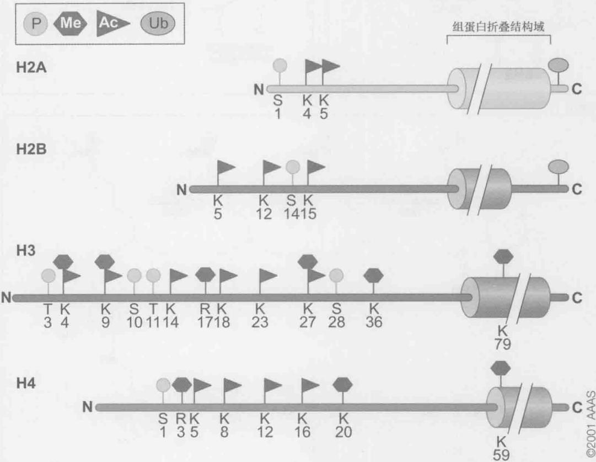  
图 8-39 组蛋白 N 端尾巴的修饰改变了染色质的功能。图中显示了每个组蛋白上已知的修饰位点。为简单起见，仅表示乙酰化、甲基化、磷酸化和泛素化。大多数修饰发生在组蛋白的尾巴区域，但偶尔也发生在组蛋白折叠内部（如组蛋白 H3 的 79 位赖氨酸的甲基化）。(来源: Alberts B. et al. 2002. Molecular biology of the cell, 4th edition, Fig. 4-35. ©Garland Science/Taylor & Francis LLC 和 Jenuwein and Allis. C. D. 2001. Science 293: 1074-1080, Figs. 2 and 3. ©AAAS, 经许可)

重要的是，组蛋白的特殊修饰与不同的细胞事件相关联。例如，在组蛋白H4氨基端第8和第16位氨酸位点上发生的乙酰化与基因表达的起始位置相关，而发生在第5和第12位赖氨酸位点上的乙酰化就不具有这种意义，但却是新合成的H4的分子标志，意味着相应H4分子将与DNA被整合进新的核小体中。相似地，组蛋白尾巴的甲基化也可具有不同的生物学意义，组蛋白H3第4、36或79位点上的赖氨酸甲基化与基因表达相关，而第9或第27位点上的赖氨酸甲基化则与转录抑制相关。由于组氨酸修饰较易发生在染色质的特殊功能区（如转录起始位点），所以提出了组蛋白尾端修饰组成生物密码，可以被细胞内特定蛋白读写删除的假设。关于该假设的全面讨论见框19-5。

  
图 8-40 组蛋白末端修饰的结构。图中标注了小分子组蛋白修饰的分子结构和相关的修饰酶的类型 [组蛋白乙酰转移酶（HAT）；组蛋白脱酰酶（HDAc）；组蛋白甲基转移酶（HMT）；组蛋白去甲基酶（HDM）]。只列出了被作用的氨基酸。至今仍未发现甲基化的精氨酸组蛋白去甲基酶，提示该标记只能通过组蛋白脱离 DNA 链的方式来去除。（授权引用自 Lohse B. et al. 2011. Bioorg. Med. Chem. 19: 3625-3636, Fig.1. ©Elsevier.）

组蛋白的修饰是如何改变核小体功能的呢？一个显而易见的改变是乙酰化和磷酸化减少了组蛋白尾巴的正电荷（图8-41）。正电荷的减少降低了组蛋白尾巴对带负电荷的 DNA 骨架的亲和性。更加重要的是，组蛋白尾巴的修饰影响了组蛋白束形成更为抑制状态的高级染色质结构的能力。如前所述，组蛋白 N 端尾巴对于 30nm 纤丝的形成是必需的，而对组蛋白尾巴的修饰可调节这个功能。例如，乙酰化的组蛋白与基因组的表达区结合，H4 的 N 端尾巴的乙酰化影响了核小体整合进抑制状态的 30nm 纤丝的能力。如前所述，带正电荷的 H4 N 端尾巴和带负电荷的 H2A 组蛋白折叠区表面的相互作用是形成 30nm 纤丝的关键。乙酰化改变了 H4 尾巴的电荷状态，从而干扰了这一过程。

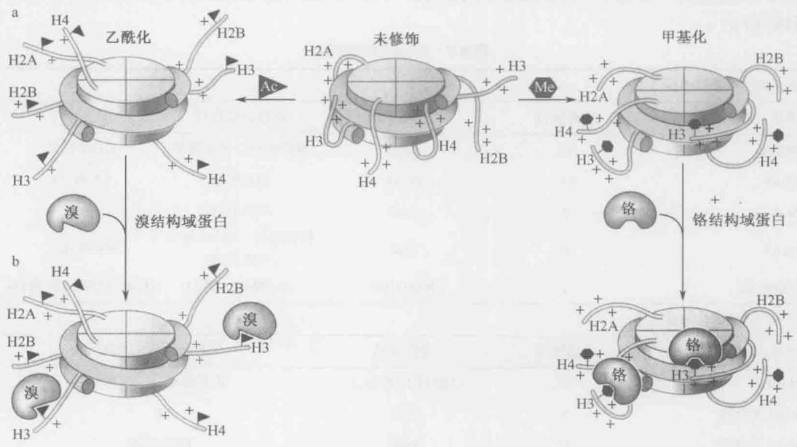  
图 8-41 组蛋白尾巴修饰的影响。(a). 核小体与 DNA 结合的影响。未修饰的和甲基化的组蛋白尾巴被认为与核小体 DNA 的结合比乙酰化的组蛋白尾巴更紧密。(b). 组蛋白尾巴的修饰为修饰染色质的酶提供了结合位点。

#### [W] 核小体重塑和修饰复合物的蛋白结构域识别经修饰的组蛋白

经修饰的组蛋白尾巴能聚集特异性蛋白到染色质上（图 8-41b）。溴结构域（bromodomains）、铬结构域（chromodomains），TUDOR 结构域和 PHD 指纹（plant homodomain）能识别修饰形式的组蛋白尾巴。含溴结构域的蛋白质能与乙酰化的组蛋白尾巴相互作用，而含有铬结构域-TUDOR 结构域和 PHD 指纹的蛋白质能与甲基化的组蛋白相互作用。另一个称为 SANT 结构域的蛋白结构域的特点正好相反，那些含 SANT 结构域的蛋白质优先与未经修饰的组蛋白尾巴相互作用。这些蛋白结构域很好地解释了组蛋白修饰的重要性，很多情况下含这些结构域的蛋白质特异性地识别众多组蛋白修饰中的一种修饰形式。例如，HP1 蛋白含有一个铬结构域，它只能与 9 位赖氨酸甲基化了的 H3 组蛋白结合，而不与任何其他甲基化的组蛋白结合。有趣的是，还有很多蛋白质也含有这样的一个结构域，说明这些蛋白质是特化了的，专门识别多种修饰的组蛋白。例如，一些蛋白质含有 PHD 指纹，特异性识别组蛋白 H3 的 4 位甲基化赖氨酸并紧靠溴结构域，而这溴结构域能识别乙酰化的赖氨酸。

这些能识别经修饰的组蛋白的结构域是如何改变相关核小体的功能的？一个重要的方式是经修饰的组蛋白能将很多酶聚集起来，进一步修饰邻近的核小体。例如，很多修饰组蛋白尾巴的酶（称为组蛋白乙酰基转移酶，histone acetyltransferase）含有溴结构域，这些溴结构域能识别它们产生的同样的组蛋白修饰（表8-7），在这种情况下，溴结构域能进一步修饰已经乙酰化的区域，有助于乙酰化组蛋白的维持和继续（见下面的讨论）。

表 8-7 组蛋白修饰酶

<table><tr><td colspan="5">组蛋白乙酰转移酶复合体</td></tr><tr><td>类型</td><td>亚基数目</td><td>催化亚基</td><td>组蛋白结合域</td><td>靶组蛋白</td></tr><tr><td>SAGA</td><td>15</td><td>Gcn5</td><td>铬功能域、溴功能域</td><td>H3和H2B</td></tr><tr><td>PCAF</td><td>11</td><td>PCAF</td><td>溴功能域</td><td>H3和H4</td></tr><tr><td>NuA3</td><td>3</td><td>Sas3</td><td>PHD指纹</td><td>H3</td></tr><tr><td>NuA4</td><td>6</td><td>Esal</td><td>铬功能域、SANT域、PHD指纹</td><td>H4和H2A</td></tr><tr><td>P300/CBP</td><td>1</td><td>P300/CBP</td><td>溴功能域、PHD</td><td>H2A、H2B、H3和H4</td></tr><tr><td colspan="5">组蛋白去乙酰化酶复合体</td></tr><tr><td>类型</td><td>亚基数目</td><td>催化亚基</td><td colspan="2">同源调节域/修饰域</td></tr><tr><td>NuRD</td><td>9</td><td>HDAC1/HDAC2</td><td colspan="2">溴功能域、PHD指纹</td></tr><tr><td>SIR2复合物</td><td>3</td><td>Sir2</td><td colspan="2">无</td></tr><tr><td>Rpd3大亚基</td><td>12</td><td>Rpd3</td><td colspan="2">PHD指纹</td></tr><tr><td>Rpd3小亚基</td><td>5</td><td>RpD3</td><td colspan="2">溴功能域、PHD指纹</td></tr><tr><td colspan="5">组蛋白甲基转移酶</td></tr><tr><td>名称</td><td colspan="2">组蛋白结合域</td><td colspan="2">靶组蛋白</td></tr><tr><td>SET1</td><td colspan="2">无</td><td colspan="2">H3(赖氨酸4)</td></tr><tr><td>SUV39/CLR4</td><td colspan="2">溴功能域</td><td colspan="2">H3(赖氨酸9)</td></tr><tr><td>SET2</td><td colspan="2">无</td><td colspan="2">H3(赖氨酸36)</td></tr><tr><td>DOT1</td><td colspan="2">无</td><td colspan="2">H3(赖氨酸79)</td></tr><tr><td>PRMT</td><td colspan="2">无</td><td colspan="2">H3(精氨酸3)</td></tr><tr><td>SET9/SUV4-20</td><td colspan="2">无</td><td colspan="2">H4(赖氨酸20)</td></tr><tr><td colspan="5">组蛋白去甲基化酶</td></tr><tr><td>名称</td><td colspan="2">组蛋白结合域</td><td colspan="2">靶甲基化组蛋白</td></tr><tr><td>LSD1</td><td colspan="2">PHD指纹、SANT域</td><td colspan="2">H3(赖氨酸4)</td></tr><tr><td>JHDM1</td><td colspan="2">PHD指纹</td><td colspan="2">H3(赖氨酸36)</td></tr><tr><td>JHDM3</td><td colspan="2">PHD指纹,TUDOR域</td><td colspan="2">H3(赖氨酸9,36)</td></tr></table>

经修饰的组蛋白也能聚集作用于染色质的其他蛋白质。很多核小体重塑复合物的一个或几个亚基都有这些识别修饰后组蛋白的结构域（见表8-6），使修饰后的组蛋白能够聚集这些酶。很多与转录调控有关的蛋白质也含有这些结构域。例如，TF11D转录机器的关键组分就含有一个溴结构域，这个结构域将转录机器引导到核小体乙酰化位置上。这是组蛋白乙酰化的另一个途径，这一乙酰化能增加相关DNA的转录活性。能识别组蛋白甲基化位置的铬结构域可以与转录被抑制的基因结合，这个铬结构域在好多蛋白质中都已发现。这些蛋白质对于异染色质的形成非常重要，包括HP1蛋白和“多梳”蛋白（polycomb）（分别见第19章和第21章）。

#### [W] 特定的酶负责组蛋白的修饰

我们刚才已经讲述了组蛋白的修饰是动态的，且是由特定的酶催化的（图 8-40）。组蛋白乙酰转移酶（HAT）催化乙酰基团添加到组蛋白上，而组蛋白去乙酰化酶（HDAc）可去除这种修饰。相似地，组蛋白甲基转移酶（HMT）将甲基加到组蛋白上，组蛋白去甲基酶（HDM）则将甲基去除。许多不同的组蛋白乙酰转移酶和去乙酰化酶已经被鉴定，可通过它们对不同的组蛋白或是同一组蛋白不同赖氨酸的识别能力来进行区分。组蛋白甲基转移酶和去甲基化酶有更好的特异性，通常可以精确识别组蛋白上众多赖氨酸或精氨酶中的某一个（表 8-7）。由于不同的修饰对核小体的功能有不同的影响，因此不同的组蛋白乙酰转移酶或甲基转移酶对核小体的修饰（或相对应酶的去修饰）会对染色质的结构和 DNA 的很多功能进行调控。

与核小体重塑复合体一样，这些修饰酶是大的多聚蛋白复合体的一部分。其他的亚基在引导这些酶到特定的 DNA 区域上起着重要作用。与核小体重塑复合体相似，这些复合体可以和与 DNA 结合的转录因子，或直接与修饰的核小体发生相互作用。引导这些酶到特定的 DNA 区域是沿着染色质能够观察到特定的组蛋白修饰模式的原因，并且是调控真核染色体中基因表达水平的主要机制（见第 19 章）。

#### [W] 核小体的修饰和重塑共同增强 DNA 的易接近性

N 端尾巴的修饰和核小体重塑的共同作用能显著地改变 DNA 的易接近性。正如我们将在第 13 章和第 19 章中所见，参与这些修饰的蛋白质复合体经常集合到转录活性位点上。尽管它们发挥作用的顺序不总是相同，但累积起来的效果使 DNA 的易接近性在特定的部位产生显著的改变。N 端尾巴的修饰能减少核小体束形成抑制性结构，产生能集合包括核小体重塑因子在内的其他蛋白质的位点。随后的核小体重塑能进一步增强核小体 DNA 的易接近性，允许 DNA 结合蛋白接近它们的结合位点，与适当的 DNA 结合蛋白或 DNA 序列相结合，这些改变能导致 DNA 特定位点处的核小体的定位或释放（图 8-42）。

  
图 8-42 染色质重塑复合体和组蛋白修饰酶共同改变染色质的结构。序列特异性的 DNA 结合蛋白通常引导这些酶到染色体的特定区域。在这个图中，DNA 结合蛋白（蓝色）首先引导一个组蛋白乙酰转移酶来修饰邻近的核小体，使局部的 30 nm 染色质纤丝转变为较易接近的 10 mm 纤丝，增强 DNA 的易接近性。这导致了第二个 DNA 结合蛋白（橙色）的结合，它又导入了一个核小体重塑复合物，核小体重塑复合物的定位有助于邻近核小体的滑动，暴露了第三个结合蛋白（绿色）的结合位置，如转录起始位点的 TATA 结合蛋白质的结合位点。尽管我们在这里描述的是先发生组蛋白乙酰化复合体结合，然后导入染小体重塑复合体的顺序，但两种顺序都可以观察到并具有相同的效果。事实上，不同的组蛋白修饰酶，也能形成更浓缩的、不易接近的染色质。

#### [W] 核小体的组装

#### [W] DNA 复制后核小体组装即开始

一条染色体的复制需要 DNA 的复制和子代 DNA 分子上相关蛋白质的重新组装。后一过程与 DNA 复制紧密相连，以确保新复制的 DNA 分子迅速组装进核小体。在第 9 章中我们将详细讨论 DNA 复制的机制。这里我们只讨论 DNA 复制后指导核小体组装的机制。

虽然 DNA 的复制要求核小体的部分解离，但是 DNA 在一系列有序的过程中很快被重新组装。如前所述，在 DNA 上核小体组装的第一步是结合一个 H3 和 H4 四聚体。一旦四聚体结合后，两个 H2A·H2B 二聚体结合形成最终的核小体。据推测，在高级染色质组装的过程中，H1 最后加入这个复合体。

为了复制一条染色体，子代染色体上的核小体至少半数是新合成的。是不是将全部的原有组蛋白丢失而仅用新合成的组蛋白来组装成核小体？如果不是这样，原有的组蛋白是如何在两个子代染色体间分配的？考虑到组蛋白的修饰会对染色质的易接近性有影响，因此原有组蛋白的命运就成为一个特别重要的问题。如果原有的组蛋白完全丢失，那么染色体的复制将删除对先前修饰的核小体的任何“记忆”。相反，如果原有的组蛋白保留在一条染色体上，那么这条染色体相对于另一拷贝的染色体将有一套不同的修饰。

在实验中采用不同的标记物标记原有的和新的组蛋白，发现原有的组蛋白存在于两条子代染色体中（图8-43）。然而，这种混合不是完全随机的。H3·H4四聚体和H2A·H2B二聚体或者全由新的组蛋白，或者全由旧的组蛋白所组成。因此，当复制叉经过时，核小体解离为亚组装部件。H3·H4四聚体似乎仍随机地与两个子代双螺旋之一结合，并不从DNA上释放而成为游离的组蛋白成分。相反，H2A·H2B二聚体被释放且进入局部的环境，参与新的核小体的组装。

在染色体复制过程中，原有组蛋白分布的遗传性为精确地按父本模式进行组蛋白修饰提供了一个机制。通过这个机制，无论原有的组蛋白在哪个子代染色体上，都倾向于重新结合到靠近它们在父代染色体上的位置上（图8-44）。这种修饰组蛋白定位的遗传性为每个子代染色体上相似的位置提供了数量有限的修饰。这些组蛋白修饰具有引导修饰酶的能力，可以在邻近的核小体上进行相似的修饰（见上面对组蛋白结合域的讨论）。这为在DNA复制发生后维持相似的修饰状态提供了一个简单的机制（图8-44）。这些机制可能对染色质状态的世代遗传具有重要作用。考虑到组蛋白修饰在基因表达调控（见第19章）以及其他一些DNA的相互作用中的重要性，保持这些修饰状态对维持细胞特性，以及细胞中DNA的复制与分离都是很关键的。

#### [W] 核小体的组装需要组蛋白“伴侣”

核小体的组装不是一个自发的过程。早期的研究发现简单的将纯化的组蛋白添加到DNA中，仅有很少的甚至没有核小体形成。相反，大多数组蛋白聚集形成没有活性的形式。为了正确组装核小体，有必要将盐浓度提高到非常高的水平（大于 1mol/L NaCl），然后再在数小时内缓慢降低浓度。尽管提高盐浓度有助于核小体组装的离体研究（如前面讨论的对核小体结构的研究），但在体内核小体的组装并不涉及盐浓度的升高。

  
图 8-43 DNA 复制后组蛋白的遗传。染色体复制时，与父本染色体结合的组蛋白具有不同的分配形式。组蛋白 H3·H4 四聚体随机地转移到两条子链中的任一条上，但不解离为游离状态的 H3·H4 四聚体。新合成的 H3·H4 四聚体在没有继承亲代四聚体的链上形成核小体的基础；相反，H2A 和 H2B 二聚体被释放进入游离的可溶环境，并与新合成的 H2A 和 H2B 竞争与 H3·H4 的结合。一般来说，这种分配类型的后果是新合成的 DNA 上的第二个 H3·H4 四聚体将来自亲代染色体。这些四聚体保留了全部父代核小体上的修饰；H2A 和 H2B 二聚体则更可能是新合成的。

在生理盐浓度下对核小体组装的研究鉴定出一些能指导组蛋白在 DNA 上组装的因子。这些因子是带负电荷的蛋白质，与 H3·H4 四聚体或 H2A·H2B 二聚体形成复合体（表 8-8），并护送它们到核小体组装的位置。由于这些因子可以避免组蛋白与 DNA 发生无效的相互作用，因此被称为组蛋白伴侣（histone chaperone）（图 8-45）。

组蛋白伴侣是如何指导在新的 DNA 合成位置进行核小体的组装呢？对组蛋白 H3·H4 四聚体伴侣 CAF-1 的研究揭示了一个可能的答案。由 CAF-1 指导的核小体的组装需要靶 DNA 正在复制，因此，正在复制的 DNA 以某种方式被标记，用于核小体的组装。有趣的是，当 DNA 复制完成后这种标记就逐渐消失。对依赖于 CAF-1 的组装的研究表明，这个标记是一种叫做 PCNA 的环状滑动夹蛋白。正如将在第 9 章详细讨论的一样，PCNA 形成一个环绕着 DNA 双螺旋的环，在 DNA 合成过程中将 DNA 聚合酶固定在 DNA 上。当聚合酶作用完成后，PCNA 从 DNA 聚合酶上释放，但仍与 DNA 相连。

  
图 8-44 亲代 H3·H4 四聚体的遗传有助于染色质状态的遗传。染色体复制后，父代 H3·H4 四聚体的分配导致子代染色体获得了与亲代相同的修饰。这些修饰具有导入相同修饰酶的能力，有助于将相同的修饰状态正确传递到两个子代染色体。为简便起见，图中显示在组蛋白核心区的乙酰化。事实上，这种修饰一般发生在组蛋白的 N 端尾。

表 8-8 组蛋白伴侣的特征

<table><tr><td>名称</td><td>亚基数目</td><td>结合组蛋白</td><td>与滑动夹是否相互作用</td></tr><tr><td>CAF-1</td><td>4</td><td>H3·H4</td><td>是</td></tr><tr><td>H1RA</td><td>4</td><td>H3·H4</td><td>否</td></tr><tr><td>RCAF</td><td>1</td><td>H3·H4</td><td>否</td></tr><tr><td>NAP-1</td><td>1</td><td>H2A·H2B</td><td>否</td></tr></table>

  
图 8-45 染色质组装因子有助于核小体的组装。复制叉经过后，染色质组装因子伴随游离的 H3·H4 四聚体（如 CAF-1）和 H2A·H2B 二聚体（NAP-1）到新复制 DNA 的位点。一旦到了新复制的 DNA 上，这些因子即将其结合的组蛋白转移给 DNA。CAF-1 因子通过与 DNA 滑动夹的相互作用被引导到新复制的 DNA 上。这些环状的辅助复制因子环绕 DNA，当复制叉移动时可从复制机器上释放。有关更为详细的 DNA 滑动夹及其在 DNA 复制中的功能将在第 9 章讲述。

在这种情况下，PCNA 能与其他蛋白质发生作用。CAF-1 与释放的 PCNA 结合，优先将 H3·H4 四聚体组装到与 PCNA 结合的 DNA 上。因此，通过与 DNA 复制机制上的一个成分结合，CAF-1 在新复制的 DNA 位点指导核小体组装。

<!-- W-END Watson 8 基因组结构、染色质和核小体 -->

<!-- C-BEGIN Campbell 16.3 -->

### 【英文对应 Campbell Concept 16.3：A chromosome consists of a DNA molecule packed together with proteins】

> 来源：Campbell Biology（书籍/01_Campbell_Biology） 第16章 The Molecular Basis of Inheritance，Concept 16.3。

#### [EN] Concept 16.3: A chromosome consists of a DNA molecule packed together with proteins

Now let's examine how DNA is packaged into chromosomes, the structures that carry genetic information. The main component of the genome in most bacteria is a double-stranded, circular DNA molecule that is associated with specific proteins. A bacterial chromosome differs from a eukaryotic chromosome in that a eukaryotic chromosome consists of a single linear DNA molecule associated with a large number of proteins. In E. coli, the chromosomal DNA consists of about 4.6 million nucleotide pairs, representing about 4,400 genes. This is 100 times more DNA than is found in a typical virus, but only about one-thousandth as much DNA as in a human somatic cell. Even so, that is a tremendous amount of DNA to be packaged in such a small container.

Stretched out, the DNA of an E. coli cell would measure about a millimeter in length, 1,000 times longer than the region it occupies in the cell. Within a bacterium, however, certain proteins cause the chromosome to coil and “supercoil,” densely packing it so that it fills only part of the cell. Unlike the nucleus of a eukaryotic cell, this dense region of DNA in a bacterium, called the nucleoid, is not bounded by a membrane (see Figure 6.5).

Each eukaryotic chromosome contains a single linear DNA double helix that, in humans, averages about $1.5 \times 10^{8}$ nucleotide pairs. This is an enormous amount of DNA relative to a chromosome's condensed length. If completely stretched out, such a DNA molecule would be about $4\mathrm{cm}$ long, thousands of times the diameter of a cell nucleus—and that's not even considering the DNA of the other 45 human chromosomes!

In the cell, eukaryotic DNA is precisely combined with a large amount of protein. The exact way in which this complex of DNA and protein, called chromatin, fits into the nucleus has long been debated. Figure 16.23 outlines the current view of the organization of chromatin during interphase and how it is condensed during mitosis into the metaphase chromosome. Study this figure carefully before reading further.

#### [EN] Exploring Chromatin Packing in a Eukaryotic Chromosome

Figure 16.23

#### [EN] DNA, the Double Helix

Shown below is a ribbon model of DNA, with each ribbon representing one of the polynucleotide strands. The TEM shows a molecule of naked (protein-free) DNA; the double helix is 2 nm across.

#### [EN] Histones

Proteins called histones are responsible for the main level of DNA packing in interphase chromatin. More than a fifth of a histone's amino acids are positively charged (Lys or Arg) and therefore bind tightly to the negatively charged DNA.

Four types of histones are most common in chromatin. The histones are very similar among eukaryotes, probably reflecting their important role in chromatin structure.

#### [EN] Nucleosomes in a 10-nm Fiber

In electron micrographs, unfolded chromatin is roughly 10 nm in diameter (the 10-nm fiber). Such chromatin resembles beads on a string (see the TEM). Each “bead” is a nucleosome, the basic unit of DNA packing; the “string” between beads is called linker DNA.

A nucleosome consists of DNA wound twice around a protein core of eight histones, two each of the four main histone types. The amino end of each histone (the histone tail) extends outward from the nucleosome and is involved in regulation of gene expression.

In the cell cycle, the histones leave the DNA only briefly during DNA replication. Generally, they do the same during the process of transcription, which requires access to the DNA by transcription proteins.

  
Euchromatin (loosely arranged 10-nm fiber)

#### [EN] Euchromatin/Heterochromatin

A recent technique called ChromEMT allows scientists to visualize chromatin in intact cells. ChromEMT and other new techniques have shown that the 10-nm fiber is the basic constituent of interphase chromatin.

During interphase, different regions of a chromosome may exist as euchromatin (below left) or heterochromatin (below). In euchromatin, the 10-nm fiber is loosely arranged in a more open configuration than heterochromatin; higher degrees of organization, including the 30-nm fiber in one older model, may exist in specific cells or at certain times. (This is an area of very active research.) The DNA in euchromatin is accessible to the proteins that carry out transcription, and its genes can be expressed. In heterochromatin, the 10-nm fiber is more densely arranged and less accessible to these proteins; genes in heterochromatin are generally not expressed.

Euchromatin and heterochromatin are organized into regions by other proteins not shown here; this organization is dynamic but disappears once mitosis begins.

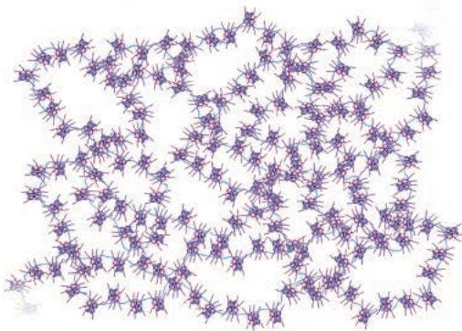  
Heterochromatin (densely arranged 10-nm fiber)

Chromatin undergoes striking changes in how densely it is packed during the course of the cell cycle (see Figure 12.7). In interphase cells stained for light microscopy, the chromatin usually appears as a diffuse mass within the nucleus, with some denser clumps, including in regions of centromeres and telomeres. The less compacted, more dispersed interphase chromatin is called euchromatin (“true chromatin”) to distinguish it from the more compacted, denser-appearing heterochromatin (see Figure 16.23). Recent research has clarified our understanding of chromatin structure: For both types of chromatin, the basic organizing unit is the 10-nm fiber—nucleosomes joined by linker DNA. In heterochromatin, this 10-nm fiber is folded and bent back on itself to a much greater degree than in euchromatin, accounting for its denser appearance.

Because heterochromatin is so compacted, it is largely inaccessible to the proteins responsible for transcribing the genetic information, a crucial early step in gene expression. In contrast, the looser packing of euchromatin makes its DNA accessible to those proteins, and the genes present in euchromatin are available for transcription.

Early on, biologists assumed that interphase chromatin was a tangled mass in the nucleus, like a bowl of spaghetti, but this is far from the case. Although an interphase chromosome lacks an obvious scaffold, there are proteins that further organize the 10-nm fiber into larger compartments and smaller looped domains. Some of the looped domains appear to be attached to the nuclear lamina, on the inside of the nuclear envelope, and perhaps also to fibers of the nuclear matrix. These attachments may help

#### [EN] Prophase

When mitosis begins, DNA replication has already occurred, so each chromosome consists of two sister chromatids. During prophase, the chromatin of each sister chromatid begins to condense. Two related proteins called condensin II and condensin I play important roles. First, condensin II proteins (red) bind to the 10-nm fiber of DNA and form DNA loops that get larger and larger. The condensin II proteins form a central scaffold from which the loops extend. As the loops grow, the chromosome gets wider and shorter. By the end of prophase, the chromosome

#### [EN] Prometaphase

When prometaphase begins, condensin I proteins (green) bind to DNA outside the central scaffold, making smaller loops (not shown) out of the larger loops generated by condensin II. The process continues, with more and more loops extending outward, and the chromosome getting denser, shorter, and wider. The scaffold itself also begins to twist into a helix (suggested by the curved gray arrows), allowing even more loops per given length of chromosome.

#### [EN] Metaphase

At metaphase, the chromosome is at its most dense, with the most loops per turn, and therefore is at its shortest length. The two sister chromatids are fully condensed.

  
Replicated chromosome (1,400 nm)

Figure 16.24 "Painting" chromosomes.

Researchers can treat (“paint”) human chromosomes with molecular tags that cause each chromosome pair to appear a different color.

(a) The ability to visually distinguish among chromosomes makes it possible to see how the chromosomes are arranged in the interphase nucleus. Each chromosome appears to occupy a specific territory during interphase. In general, the two homologs of a pair are not located together.

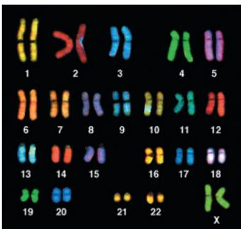

(b) These metaphase chromosomes have been "painted" so that the two homologs of a pair are the same color. On the left is a spread of treated chromosomes; on the right, they have been organized into a karyotype.

MAKE CONNECTIONS If you arrested a human cell in metaphase I of meiosis and applied this technique, what would you observe? How would this differ from what you would see in metaphase of mitosis? Review Figure 13.8 and Figure 12.7.

For suggested answer, see Appendix A.

<!-- C-END Campbell 16.3 -->

<!-- C-BEGIN Campbell 21.4 -->

### 【英文对应 Campbell Concept 21.4：Multicellular eukaryotes have a lot of noncoding DNA and many multigene families】

> 来源：Campbell Biology（书籍/01_Campbell_Biology） 第21章 Genomes and Their Evolution，Concept 21.4。

#### [EN] Concept 21.4: Multicellular eukaryotes have a lot of noncoding DNA and many multigene families

We have spent most of our time focusing on genes that code for proteins. Yet the coding regions of these genes and the genes for small RNAs like tRNAs make up a small portion of most multicellular eukaryotic genomes. For example, only a tiny part—about 1.5%—codes for proteins or is transcribed into rRNAs or tRNAs.

Figure 21.6 shows what is known about the makeup of the remaining 98.5% of the genome.

Gene-related regulatory sequences and introns account, respectively, for 5% and about 20% of the human genome. The rest, located between functional genes, includes some unique (single-copy) noncoding DNA, such as gene fragments and pseudogenes, former genes that have accumulated mutations over a long time and no longer produce functional proteins. (The genes that produce small noncoding RNAs are a tiny percentage of the genome, distributed between the 20% introns and the 15% unique noncoding DNA.) Most of the DNA

Figure 21.6 Types of DNA sequences in the human genome. The gene sequences that code for proteins or are transcribed into rRNA or tRNA molecules make up only about 1.5% of the human genome (dark purple in the pie chart), while introns and regulatory sequences associated with genes (lighter purple) make up about a quarter. The vast majority of the human genome does not code for proteins (although much of it gives rise to RNAs), and a large amount is repetitive DNA (dark and light green and teal).

between functional genes, however, is repetitive DNA, which consists of sequences that are present in multiple copies in the genome.

The bulk of many eukaryotic genomes consists of DNA sequences that neither code for proteins nor are transcribed to produce RNAs with known functions; this noncoding DNA was often described in the past as “junk DNA.” However, we now know from the ENCODE project described earlier that 80% of the genome appears to have some biochemical function, and genome comparisons over the past 10 years have revealed the persistence of this DNA in diverse genomes over many hundreds of generations. For example, the genomes of humans, rats, and mice contain almost 500 regions of noncoding DNA that are identical in sequence in all three species. This is a higher level of sequence conservation than is seen for protein-coding regions in these species, strongly supporting the hypothesis that the noncoding regions have important functions. Next, we’ll examine how genes and noncoding DNA sequences are organized within genomes of multicellular eukaryotes, using the human genome as our main example. Genome organization tells us a lot about how genomes have evolved and continue to evolve, as we’ll see in Concept 21.5.

#### [EN] Transposable Elements and Related Sequences

Both prokaryotic and eukaryotic organisms have stretches of DNA that can move from one location to another within the genome. These stretches are known as transposable genetic elements, or simply transposable elements. During the process called transposition, a transposable element moves from one site in a cell's DNA to a different target site by a type of recombination process. Transposable elements are sometimes called "jumping genes," but actually they never entirely detach from the cell's DNA. Instead, the original and new DNA sites are brought very close together by enzymes and other proteins that bend the DNA. Surprisingly, about 75% of human repetitive DNA (44% of the entire human genome) is made up of transposable elements and sequences related to them.

The first evidence for wandering DNA segments came from American geneticist Barbara McClintock's breeding experiments with calico corn (maize) in the 1940s and 1950s (Figure 21.7). Tracking corn plants through many generations, McClintock analyzed changes in the color of corn kernels. The patterns she saw led her to propose that there were genetic elements capable of moving from other locations in the genome into the genes for kernel color, disrupting the genes and changing the kernel color. McClintock's hypothesis provoked great interest among her maize colleagues, but most other scientists thought the phenomenon she had observed might occur only in maize. Her careful work and insightful ideas were finally validated many years later when transposable elements were found in bacteria. In 1983, at the age of 81, McClintock received the Nobel Prize for her pioneering research.

#### [EN] Movement of Transposons and Retrotransposons

Eukaryotic transposable elements are of two types. The first type, transposons, move within a genome by means of a DNA intermediate. Transposons can move by a “cut-and-paste” mechanism, which removes the element from the original site, or by a “copy-and-paste” mechanism, which leaves a copy behind (Figure 21.8). Both mechanisms require an enzyme called transposase, which is generally encoded by the transposon.

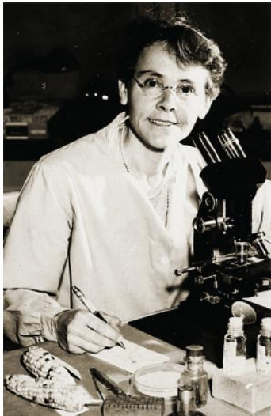

  
Figure 21.7 The effect of transposable elements on corn kernel color.

Barbara McClintock first proposed the idea of mobile genetic elements after observing variegations in the color of the kernels on a corn cob (top right).

Figure 21.8 Transposon movement.  
Movement of transposons by either the copy-and-paste mechanism (shown here) or the cut-and-paste mechanism involves a double-stranded DNA intermediate that is inserted into the genome.  
  
VISUAL SKILLS How would this figure differ if it showed the cut-and-paste mechanism?  
For suggested answer, see Appendix A.

#### [EN] Interview

Interview with Virginia Walbot: Plant genetics and development (eTextbook only)

Most transposable elements in eukaryotic genomes are of the second type, retrotransposons, which move by means of an RNA intermediate that is a transcript of the retrotransposon DNA. Thus, retrotransposons always leave a copy at the original site during transposition (Figure 21.9). To insert at another site, the RNA intermediate is first converted back to DNA by reverse transcriptase, an enzyme encoded by the retrotransposon. (Reverse transcriptase is also encoded by retroviruses, as you learned in Concept 19.2. In fact, retroviruses may have evolved from retrotransposons, or vice versa.) Another cellular enzyme catalyzes insertion of the reverse-transcribed DNA at a new site.

Figure 21.9 Retrotransposon movement.  
Movement begins with synthesis of a single-stranded RNA intermediate. The remaining steps are essentially identical to part of the retrovirus replicative cycle (see Figure 19.8).  

#### [EN] Sequences Related to Transposable Elements

Multiple copies of transposable elements and sequences related to them are scattered throughout eukaryotic genomes. A single unit is usually hundreds to thousands of base pairs long, and the dispersed copies are similar but usually not identical to each other. Some of these are transposable elements that can move; the enzymes required for this movement may be encoded by any transposable element, including the one that is moving. Others are related sequences that have lost the ability to move altogether. Transposable elements and related sequences make up 25–50% of most mammalian genomes (see Figure 21.6) and even higher percentages in amphibians and many plants. In fact, the very large size of some plant genomes is accounted for by extra transposable elements rather than by extra genes. For example, transposable elements make up 85% of the corn genome!

In humans and other primates, a large portion of transposable element–related DNA consists of a family of similar sequences called Alu elements. These sequences alone account for approximately 10% of the human genome. Alu elements are about 300 nucleotides long, much shorter than most functional transposable elements, and they do not code for any protein. However, many Alu elements are transcribed into RNA, and at least some of these RNAs are thought to help regulate gene expression.

An even larger percentage (17%) of the human genome is made up of a type of retrotransposon called LINE-1, or L1. These sequences are much longer than Alu elements—about 6,500 base pairs—and typically have a very low rate of transposition. However, researchers working with mice have discovered that transcription of L1 retrotransposons is crucial for the development of early (one- and two-cell stage) embryos. They have proposed that transcription of L1 retrotransposons may affect the chromatin structure in ways important for embryonic development.

Although some transposable elements encode proteins, these proteins do not carry out normal cellular functions. Therefore, transposable elements are usually included in the “noncoding” DNA category, along with other repetitive sequences.

#### [EN] Other Repetitive DNA, Including Simple Sequence DNA

Repetitive DNA that is not related to transposable elements has probably arisen from mistakes during DNA replication or recombination. Such DNA accounts for about 14% of the human genome (see Figure 21.6). About a third of this (5–6% of the human genome) consists of duplications of long stretches of DNA, with each unit ranging from 10,000 to 300,000 base pairs. These long segments seem to have been copied from one chromosomal location to another site on the same or a different chromosome and probably include some functional genes.

In contrast to scattered copies of long sequences, stretches of DNA known as simple sequence DNA contain many copies of tandemly repeated short sequences, as in the following example (showing one DNA strand only):

#### [EN] ... GTTACGTTACGTTACGTTACGTTACGTTAC ...

In this case, the repeated unit (GTTAC) consists of 5 nucleotides, but the number can range from 2 to 500. When the unit contains

2–5 nucleotides, the series of repeats is called a short tandem repeat, or STR; we discussed the use of STR analysis in preparing genetic profiles by use of PCR in Concept 20.4 (see Figure 20.24). The number of copies of the repeated unit can vary from site to site within a given genome. There could be as many as several hundred thousand repetitions of the GTTAC unit at one site, but only half that number at another. STR analysis is performed on sites selected because they have relatively few repeats. The repeat number varies from person to person, and since humans are diploid, each person has two alleles per repeat site; these can differ in repeat number. This diversity produces the variation represented in the genetic profiles that result from STR analysis.

Simple sequence DNA makes up 3% of the human genome, much of it located at chromosomal telomeres and centromeres, where it may play a structural role. The DNA at centromeres is essential for the separation of chromatids in cell division (see Concept 12.2) and, along with simple sequence DNA located elsewhere, may also help organize the chromatin within the interphase nucleus. The simple sequence DNA located at telomeres binds proteins that protect chromosomal ends from degradation and from joining to other chromosomes.

Short repetitive sequences like those described here provide a challenge for whole-genome shotgun sequencing because the presence of many short repeats hinders accurate reassembly of fragment sequences by computers. Regions of simple sequence DNA account for much of the uncertainty present in estimates of whole-genome sizes and are the reason some sequences are considered “permanent drafts.”

#### [EN] Genes and Multigene Families

Now, let's take a look at genes. Recall that DNA sequences that code for proteins or give rise to tRNA or rRNA make up only 1.5% of the human genome (see Figure 21.6). If we include introns and regulatory sequences, the total amount of DNA that is gene-related—coding and noncoding—constitutes about 25% of the human genome. Put another way, only about 6% (1.5% out of 25%) of the length of the average gene is represented in the final gene product.

Many eukaryotic genes are present as unique sequences, with only one copy per haploid set of chromosomes. But in the human genome and the genomes of many other animals and plants, these unique genes make up less than half of the total gene-related DNA. The rest occur in multigene families, collections of two or more identical or very similar genes.

In multigene families that consist of identical DNA sequences, those sequences are usually clustered tandemly and, with the notable exception of the genes for histone proteins, have RNAs as their final products. An example is the family of identical DNA sequences that each include the genes for the three largest rRNA molecules (Figure 21.10a). These rRNA molecules are transcribed from a single transcription unit that is repeated tandemly hundreds to thousands of times in one or several clusters in the genome of a multicellular eukaryote. The many copies of this rRNA transcription unit help cells to quickly make the millions of ribosomes needed for active protein synthesis. The primary transcript is cleaved to yield three rRNA molecules, which combine with proteins and one other kind of rRNA (5S rRNA) to form ribosomal subunits.

Figure 21.10 Gene families.  
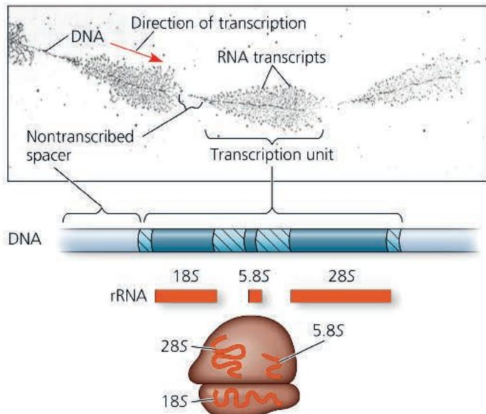

(a) Part of the ribosomal RNA gene family. The TEM at the top shows three of the hundreds of copies of rRNA transcription units in the rRNA gene family of a salamander genome. Each "feather" corresponds to a single unit being transcribed by about 100 molecules of RNA polymerase (dark dots along the DNA), moving left to right (red arrow). The growing RNA transcripts extend from the DNA, accounting for the feather-like appearance. In the diagram of a transcription unit below the TEM, the genes (darker blue) for three types of rRNA are adjacent to regions (striped) that are transcribed but later removed. A single transcript is processed to yield one of each of the three rRNAs (red), key components of the ribosome.  

(b) The human $\alpha$ -globin and $\beta$ -globin gene families. Adult hemoglobin is composed of two $\alpha$ -globin and two $\beta$ -globin polypeptide subunits, as shown in the molecular model. The genes (darker blue) encoding $\alpha$ - and $\beta$ -globins are found in two families, organized as shown here. The noncoding DNA (light blue) separating the functional genes within each family includes pseudogenes ( $\Psi$ ; gold), versions of the functional genes that no longer encode functional polypeptides. Genes and pseudogenes are named with Greek letters, as you have seen previously for the $\alpha$ - and $\beta$ -globins. Some genes are expressed only in the embryo or fetus.

VISUAL SKILLS In the TEM at the top of part (a), how could you determine the direction of transcription if it weren't indicated by the red arrow? For suggested answer, see Appendix A.

The classic examples of multigene families of nonidentical genes are two related families of genes that encode globins, a group of proteins that include the $\alpha$ and $\beta$ polypeptide subunits of hemoglobin. One family, located on chromosome 16 in humans, encodes various forms of $\alpha$ -globin; the other, on chromosome 11, encodes forms of $\beta$ -globin (Figure 21.10b). The different forms of each globin subunit are expressed at different times in development, allowing hemoglobin to function effectively in the changing environment of the developing animal. In humans, for example, the embryonic and fetal forms of hemoglobin have a higher affinity for oxygen than the adult forms, ensuring the efficient transfer of oxygen from mother to fetus. Also found in the globin gene family clusters are several pseudogenes.

In Concept 21.5, we'll consider the evolution of these two globin gene families as we explore how arrangements of genes provide insight into the evolution of genomes. We'll also examine some processes that have shaped the genomes of different species over evolutionary time.

#### [EN] Concept Check 21.4

1. Discuss the characteristics of mammalian genomes that make them larger than genomes of prokaryotic organisms.

2. VISUAL SKILLS Which of the three mechanisms described in Figures 21.8 and 21.9 result(s) in a copy remaining at the original site as well as a copy appearing in a new location?

3. Contrast the organizations of the rRNA gene family and the globin gene families. For each, explain how the existence of a family of genes benefits the organism.

4. MAKE CONNECTIONS Assign each DNA segment at the top of Figure 18.9 to a sector in the pie chart in Figure 21.6.

For suggested answers, see Appendix A.

<!-- C-END Campbell 21.4 -->

<!-- L-BEGIN Lehninger 24.1 -->

### 【英文对应 Lehninger §24.1：Chromosomal Elements】

> 来源：Lehninger Principles of Biochemistry（书籍/02_生物化学原理） 第24章 Genes and Chromosomes，§24.1。

Cellular DNA contains genes and intergenic regions, both of which may serve functions vital to the cell. The more complex genomes, such as those of eukaryotic cells, demand increased levels of chromosomal organization, and this is reflected in the structural features of the chromosomes. We begin by considering the different types of DNA sequences and structural elements within chromosomes.

#### [EN] Genes Are Segments of DNA That Code for Polypeptide Chains and RNAs

Our understanding of genes has evolved tremendously over the past century. Classically, a gene was defined as a portion of a chromosome that determines or affects a single character or phenotype (visible property), such as eye color. George Beadle and Edward Tatum proposed a molecular definition of a gene in 1940. After exposing spores of the fungus Neurospora crassa to x-rays and other agents now known to damage DNA and cause alterations in DNA sequence (mutations), they detected mutant fungal strains that lacked one or another specific enzyme, sometimes resulting in the failure of an entire metabolic pathway. Beadle and Tatum concluded that a gene is a segment of genetic material that determines, or codes for, one enzyme: the one gene-one enzyme hypothesis. Later this concept was broadened to one gene-one polypeptide, because many genes code for a protein that is not an enzyme or for one polypeptide of a multisubunit protein.

The modern biochemical definition of a gene is even more precise. A gene is all the DNA that encodes the primary sequence of some final gene product, which can be either a polypeptide or an RNA with a structural or catalytic function. DNA also contains other segments or sequences that have a purely regulatory function. Regulatory sequences provide signals that may denote the beginning or the end of genes, or influence the transcription of genes, or function as initiation points for replication or recombination (Chapter 28). Some genes can be expressed in different ways to generate multiple gene products from a single segment of DNA; the special transcriptional and translational mechanisms that allow this are described in Chapters 26 through 28.

We can estimate directly the minimum overall size of genes that encode proteins. As described in detail in Chapter 27, each amino acid of a polypeptide chain is coded for by a sequence of three consecutive nucleotides in a single strand of DNA (Fig. 24-2), with these “codons” arranged in a sequence that corresponds to the sequence of amino acids in the polypeptide that the gene encodes. A polypeptide chain of 350 amino acid residues (an average-size chain) corresponds to 1,050 base pairs (bp) of coding DNA. Many genes in eukaryotes and a few in bacteria and archaea are interrupted by noncoding DNA segments and are therefore considerably longer than this simple calculation would suggest.

How many genes are in a single chromosome? The Escherichia coli chromosome is a circular DNA molecule (in the sense of an endless loop rather than a perfect circle) with 4,641,652 bp. These base pairs encode about 4,300 genes for proteins and more than 200 genes for structural or catalytic RNA molecules. Among eukaryotes, the approximately 3.1 billion base pairs of the human genome include approximately 20,000 genes on the 24 different chromosomes.

FIGURE 24-2 Colinearity of the coding nucleotide sequences of DNA and mRNA and the amino acid sequence of a polypeptide chain. The triplets of nucleotide units in DNA determine the amino acids in a protein through the intermediary mRNA. One of the DNA strands serves as a template for synthesis of mRNA, which has nucleotide triplets (codons) complementary to those of the DNA. In some bacterial and many eukaryotic genes, coding sequences are interrupted at intervals by regions of noncoding sequences (called introns).  

#### [EN] DNA Molecules Are Much Longer than the Cellular or Viral Packages That Contain Them

Chromosomal DNAs are often many orders of magnitude longer than the cells or viruses in which they are located (Fig. 24-1; Table 24-1). This is true of every class of organism or viral parasite.

Viruses Viruses are not free-living organisms; rather, they are infectious parasites that use the resources of a host cell to carry out many of the processes they require to propagate. Many viral particles consist of no more than a genome (usually a single RNA or DNA molecule) surrounded by a protein coat.

Almost all plant viruses and some bacterial and animal viruses have RNA genomes. These genomes tend to be particularly small. For example, the genomes of mammalian retroviruses such as HIV consist of 9,000 nucleotides of single-stranded RNA.

The genomes of DNA viruses vary greatly in size. Many viral DNAs are circular for at least part of their life cycle. During viral replication within a host cell, specific types of viral DNA called replicative forms may appear; for example, many linear DNAs become circular and all single-stranded DNAs become double-stranded. A typical medium-size DNA virus is bacteriophage $\lambda$ (lambda), which infects E. coli. In its replicative form inside cells, $\lambda$ DNA is a circular double helix. This double-stranded DNA contains 48,502 bp and has a contour length of 17.5 $\mu$ m. Bacteriophage $\phi$ X174 is much smaller; the DNA in the viral particle is a single-stranded circle, and the double-stranded replicative form contains 5,386 bp. P2 Although viral genomes are small, the contour lengths of their DNAs are typically hundreds of times longer than the long dimensions of the viral particles that contain them (Table 24-1).

<table><tr><td colspan="4">TABLE 24-1 The Sizes of DNA and Viral Particles for Some Bacterial Viruses (Bacteriophages)</td></tr><tr><td>Virus</td><td>Size of viral DNA (bp)</td><td>Length of viral DNA (nm)</td><td>Long dimension of viral particles (nm)</td></tr><tr><td> $\phi X174$ </td><td>5,386</td><td>1,939</td><td>25</td></tr><tr><td>T7</td><td>39,936</td><td>14,377</td><td>78</td></tr><tr><td> $\lambda$  (lambda)</td><td>48,502</td><td>17,460</td><td>190</td></tr><tr><td>T4</td><td>168,889</td><td>60,800</td><td>210</td></tr></table>

Note: Data on size of DNA are for the replicative form (double-stranded). The contour length is calculated assuming that each base pair occupies a length of 3.4 Å (see Fig. 8-13).

Bacteria A single E. coli cell contains almost 100 times as much DNA as a bacteriophage $\lambda$ particle. The chromosome of an E. coli cell is a single, double-stranded circular DNA molecule. Its 4,641,652 bp have a contour length of about 1.7 mm, some 850 times the length of the E. coli cell (Fig. 24-3). In addition to the very large, circular DNA chromosome in their nucleoid, many bacteria contain one or more small circular DNA molecules that are free in the cytosol. These extrachromosomal elements are called plasmids (Fig. 24-4; see also p. 305). Most plasmids are only a few thousand base pairs long, but some contain up to 400,000 bp. They carry genetic information and undergo replication to yield daughter plasmids, which pass into the daughter cells at cell division. Plasmids have been found in yeast and other fungi as well as in bacteria.

In many cases plasmids confer no obvious advantage on their host, and their sole function seems to be self-propagation. However, some plasmids carry genes that are useful to the host bacterium. For example, some plasmid genes make a host bacterium resistant to antibacterial agents. Plasmids carrying the gene for the enzyme $\beta$ -lactamase confer resistance to $\beta$ -lactam antibiotics such as penicillin, ampicillin, and amoxicillin (see Fig. 6-34). These and similar plasmids may pass from an antibiotic-resistant cell to an antibiotic-sensitive cell of the same or another bacterial species, making the recipient cell antibiotic-resistant. The extensive use of antibiotics in some human populations and in animal feeds has served as a strong selective force, encouraging the spread of antibiotic resistance-coding plasmids (as well as transposable elements, described below, that harbor similar genes) in disease-causing bacteria.

Eukaryotes A yeast cell, one of the simplest eukaryotes, has 2.6 times more DNA in its genome than an E. coli cell (Table 24-2). Cells of Drosophila, the fruit fly used in classical genetic studies, contain more than 35 times as much DNA as E. coli cells, and human cells have almost 700 times as much. The cells of many plants and amphibians contain even more. The genetic material of eukaryotic cells is apportioned into chromosomes, the diploid (2n) number depending on the species. A human somatic cell, for example, has 46 chromosomes (Fig. 24-5). Each chromosome of a eukaryotic cell, such as that shown in Figure 24-5a, contains a single, very large, duplex DNA molecule. The DNA molecules in the 24 different types of human chromosomes (22 matching pairs of autosomes plus the X and Y sex chromosomes) vary in length over a 25-fold range. Each type of chromosome in eukaryotes carries a characteristic set of genes.

P2 DNA molecules of one human genome (22 chromosomes plus X and Y), placed end to end, would extend for about a meter. Most human cells are diploid, so each cell contains a total of 2 m of DNA. An adult human body contains approximately $10^{14}$ cells and thus a total DNA length of $2 \times 10^{11}$ km. Compare this with the circumference of the earth ( $4 \times 10^{4}$ km) or the distance between the earth and the sun ( $1.5 \times 10^{8}$ km)—a dramatic illustration of the extraordinary degree of DNA compaction in our cells.

Eukaryotic cells also have organelles, mitochondria and chloroplasts, that contain DNA. Mitochondrial DNA (mtDNA) molecules are much smaller than the nuclear chromosomes. In animal cells, mtDNA contains fewer than 20,000 bp (16,569 bp in human mtDNA) and is a circular duplex. Each mitochondrion typically has 2 to 10 copies of this mtDNA molecule, and the number can rise to hundreds in certain cells of an embryo that is undergoing cell differentiation. Plant cell mtDNA ranges in size from 200,000 to 2,500,000 bp. Chloroplast DNA (cpDNA) also exists as circular duplexes and ranges in size from 120,000 to 160,000 bp. Mitochondrial and chloroplast DNAs have an evolutionary origin in the chromosomes of ancient bacteria that gained

FIGURE 24-3 A bacterial cell and its DNA. The length of the E. coli chromosome (1.7 mm), depicted in linear form, relative to the length of a typical E. coli cell (2 $\mu$ m).

FIGURE 24-4 DNA from a lysed E. coli cell. In this electron micrograph, several small, circular plasmid DNAs are indicated by white arrows. The black spots and white specks are artifacts of the preparation. [Huntington Potter, University of Colorado School of Medicine, and David Dressler, Balliol College, Oxford University.]

TABLE 24-2 DNA, Gene, and Chromosome Content in Some Genomes

<table><tr><td></td><td>Total DNA (bp)</td><td>Number of chromosomesa</td><td>Approximate number of protein-coding genes</td></tr><tr><td>Escherichia coli K12 (bacterium)</td><td>4,641,652</td><td>1</td><td> $4,494^b$ </td></tr><tr><td>Saccharomyces cerevisiae (yeast)</td><td>12,157,105</td><td> $16^c$ </td><td>6,600</td></tr><tr><td>Caenorhabditis elegans (nematode)</td><td>100,286,401</td><td> $12^d$ </td><td>20,191</td></tr><tr><td>Arabidopsis thaliana (plant)</td><td>119,667,750</td><td>10</td><td>27,655</td></tr><tr><td>Drosophila melanogaster (fruit fly)</td><td>143,726,002</td><td>18</td><td>13,931</td></tr><tr><td>Oryza sativa (rice)</td><td>375,049,285</td><td>24</td><td>37,849</td></tr><tr><td>Mus musculus (mouse)</td><td>2,730,871,774</td><td>40</td><td>22,480</td></tr><tr><td>Homo sapiens (human)</td><td>3,096,649,726</td><td>46</td><td> $20,454^e$ </td></tr></table>

Note: This information is constantly being refined. For the most current information, consult the websites for the individual genome projects. [Data from ensembl.org. Accessed April 21, 2020.] $^{a}$ The diploid chromosome number is given for all eukaryotes except yeast. $^{b}$ Includes known RNA-coding genes. $^{c}$ Haploid chromosomes number. Wild yeast strains generally have eight (octoploid) or more sets of these chromosomes. $^{d}$ Number for females, with two X chromosomes. Males have an X but no Y, thus 11 chromosomes in all $^{e}$ When known genes encoding functional RNAs are included, this number rises to more than 43,000.

access to the cytoplasm of host cells and became the precursors of these organelles (see Fig. 1-37). Mitochondrial DNA codes for the mitochondrial tRNAs and rRNAs and for a few mitochondrial proteins. More than 95% of mitochondrial proteins are encoded by nuclear DNA. Mitochondria and chloroplasts divide when the cell divides. Their DNA is replicated before and during division, and the daughter DNA molecules pass into the daughter organelles.

#### [EN] Eukaryotic Genes and Chromosomes Are Very Complex

Many bacterial species have only one chromosome per cell and, in nearly all cases, each chromosome contains only one copy of each gene. A very few genes, such as those for rRNAs, are repeated several times. Genes and regulatory sequences account for almost all the DNA in bacteria. Moreover, almost every gene is precisely colinear with the amino acid sequence (or RNA sequence) it encodes throughout its entire length (Fig. 24-2).

The organization of genes in eukaryotic DNA is structurally and functionally much more complex. Studies of eukaryotic chromosome structure and the sequencing of entire eukaryotic genomes have yielded many surprises.

FIGURE 24-5 Eukaryotic chromosomes. (a) A pair of linked and condensed sister chromatids from a Chinese hamster ovary cell. Eukaryotic chromosomes are in this state after replication at metaphase during mitosis. (b) A complete set of chromosomes from a leukocyte from one of the authors. There are 46 chromosomes in every normal human somatic cell. [(a) Don W. Fawcett/Science Source. (b) © Michael M. Cox.]

P1 Many, if not most, eukaryotic genes have a distinctive structural feature: the colinearity of the DNA and amino acid sequence is periodically broken by intervening segments of DNA that do not code for the amino acid sequence of the polypeptide product. Such nontranslated DNA segments in genes are called introns, and the coding segments are called exons. Few bacterial genes contain introns. In higher eukaryotes, the typical gene has much more intron sequence than sequences devoted to exons. For example, in the gene coding for the single polypeptide chain of ovalbumin, an avian egg protein (Fig. 24-6), the introns are much longer than the exons; altogether, the seven introns make up 85% of the gene's DNA. The gene encoding the hemoglobin β subunit has only two introns, but again they are larger than the exons. Genes for histones seem to have no introns. In many cases the function of introns is not clear. In total, only about 1.5% of human DNA is "coding" or exon DNA, carrying sequence information for protein products. However, when the much larger introns are included as functional elements in the gene and their length is included, as much as 30% of the human genome consists of protein-coding genes.

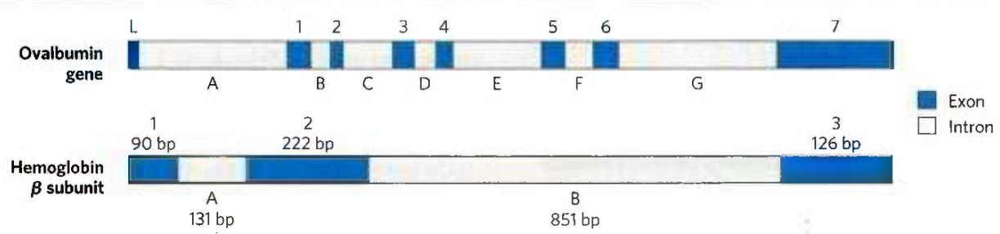  
FIGURE 24-6 Introns in two eukaryotic genes. The gene for ovalbumin has seven introns (A to G), splitting the coding sequences into eight exons (L, and 1 to 7). The gene for the $\beta$ subunit of hemoglobin has two introns and three exons, including one intron that alone contains more than half the base pairs of the gene.

A great deal of work remains to be done to understand the genomic sequences that do not correspond to protein-encoding genes. Much of the DNA that is not within genes is made up of repeated sequences of several kinds. These include transposable elements (transposons), molecular parasites that account for nearly half of the DNA in the human genome (see Fig. 9-25a and Chapters 25 and 26), and genes encoding functional RNA molecules of many types.

Approximately 3% of the human genome consists of highly repetitive sequences, also referred to as simple-sequence DNA or simple sequence repeats (SSR). These short sequences, generally less than 10 bp long, are sometimes repeated millions of times per cell. The simple-sequence DNA is also called satellite DNA, so named because its unusual base composition often causes it to migrate as “satellite” bands (separated from the rest of the DNA) when fragmented cellular DNA samples are centrifuged in a cesium chloride density gradient. Studies suggest that simple-sequence DNA does not encode proteins or RNAs. The functional importance of the highly repetitive DNA has been defined in at least some cases. Much of it is associated with two crucial features of eukaryotic chromosomes: centromeres and telomeres.

P1 The centromere (Fig. 24-7) is a sequence of DNA that functions during cell division as an attachment point for proteins that link the chromosome to the mitotic spindle. This attachment is essential for the equal and orderly segregation of chromosome sets to daughter cells. The centromeres of Saccharomyces cerevisiae have been isolated and studied. The sequences essential to centromere function are about 130 bp long and are very rich in A=T pairs. The centromeric sequences of higher eukaryotes are much longer and, unlike those of yeast, generally consist of thousands of tandem copies of one or several sequences of 5 to 10 bp, in the same orientation.

P1 Telomeres (Greek telos, "end") are sequences at the ends of eukaryotic chromosomes that help stabilize the chromosome. Telomeres end with multiple repeated sequences of the form

$$
\begin{array}{l} (5 ^ {\prime}) (\mathrm{T} _ {x} \mathrm{G} _ {y}) _ {n} \\ (3 ^ {\prime}) (\mathrm{A} _ {x} \mathrm{C} _ {y}) _ {n} \end{array}
$$

where x and y are generally between 1 and 4 (Table 24-3). The number of telomere repeats, n, is in the range of 20 to 100 for most single-celled eukaryotes and is generally more than 1,500 in mammals. The ends of a linear DNA molecule cannot be routinely replicated by the cellular replication machinery (which may be one reason why bacterial DNA molecules are circular). Repeated telomeric sequences are added to eukaryotic chromosome ends primarily by the enzyme telomerase (see Fig. 26-35).

  
FIGURE 24-7 Important structural elements of a yeast chromosome.

<table><tr><td colspan="2">TABLE 24-3 Telomere Sequences</td></tr><tr><td>Organism</td><td>Telomere repeat sequence</td></tr><tr><td>Homo sapiens (human)</td><td> $(TTAGGG)_n$ </td></tr><tr><td>Tetrahymena thermophila (ciliated protozoan)</td><td> $(TTGGGG)_n$ </td></tr><tr><td>Saccharomyces cerevisiae (yeast)</td><td> $(T(G)_{1-3}(TG)_{2-3})_n$ </td></tr><tr><td>Arabidopsis thaliana (plant)</td><td> $(TTTAGGG)_n$ </td></tr></table>

Artificial chromosomes (Chapter 9) have been constructed as a means of better understanding the functional significance of many structural features of eukaryotic chromosomes. A reasonably stable artificial linear chromosome requires only three components: a centromere, a telomere at each end, and sequences that allow the initiation of DNA replication. Yeast artificial chromosomes (YACs; see Fig. 9-6) have been developed as a research tool in biotechnology. Similarly, human artificial chromosomes (HACs) are being developed for the treatment of genetic diseases. These may eventually provide a new path to the intracellular replacement of missing or defective gene products, or somatic gene therapy.

#### [EN] SUMMARY 24.1 Chromosomal Elements

■ Genes are segments of a chromosome that contain the information for a functional polypeptide or RNA molecule. In addition to genes, chromosomes contain a variety of regulatory sequences involved in replication, transcription, and other processes.

■ Genomic DNA and RNA molecules are generally orders of magnitude longer than the viral particles or cells that contain them.

Many genes in eukaryotic cells (but few in bacteria and archaea) are interrupted by noncoding sequences, or introns. The coding segments separated by introns are called exons. Only about 1.5% of human genomic DNA encodes proteins; even when introns are included, less than one-third of human genomic DNA consists of genes. Much of the remainder consists of repeated sequences of various types. Nucleic acid parasites known as transposons account for about half of the human genome. Eukaryotic chromosomes have two important special-function repetitive DNA sequences: centromeres, which are attachment points for the mitotic spindle, and telomeres, located at the ends of chromosomes.

<!-- L-END Lehninger 24.1 -->

<!-- L-BEGIN Lehninger 24.3 -->

### 【英文对应 Lehninger §24.3：The Structure of Chromosomes】

> 来源：Lehninger Principles of Biochemistry（书籍/02_生物化学原理） 第24章 Genes and Chromosomes，§24.3。

The term “chromosome” is used to refer to a nucleic acid molecule that is the repository of genetic information in a virus, a bacterium, an archaeon, a eukaryotic cell, or an organelle. It also refers to the densely colored bodies seen in the nuclei of dye-stained eukaryotic cells undergoing mitosis, as visualized using a light microscope.

#### [EN] Chromatin Consists of DNA, Proteins, and RNA

The eukaryotic cell cycle produces remarkable changes in the structure of chromosomes (Fig. 24-22). In nondividing eukaryotic cells (in the G0 phase) and those in interphase (G1, S, and G2), the chromosomal material, chromatin, is amorphous. In the S phase of interphase, the DNA in this amorphous state replicates, each chromosome producing two sister chromosomes (called sister chromatids) that remain associated with each other after replication is complete. The chromosomes become much more condensed during prophase of mitosis, taking the form of a species-specific number of well-defined pairs of sister chromatids (Fig. 24-5).

  
FIGURE 24-22 Changes in chromosome structure during the eukaryotic cell cycle. The relative lengths of the phases shown here are arbitrary. The duration of each phase varies with cell type and with growth conditions (for single-celled organisms) or metabolic state (for multicellular organisms); mitosis is typically the shortest phase. Cellular DNA is uncondensed throughout interphase, as shown in the cartoons of the nucleus. The interphase period can be divided into the G1 (gap) phase; the S (synthesis) phase, when the DNA is replicated; and the G2 phase, throughout which the replicated chromosomes (chromatids) cohere to one another. Mitosis can be divided into four stages. The DNA undergoes condensation in prophase. During metaphase, the condensed chromosomes line up in pairs along the plane halfway between the spindle poles. The two chromosomes of each pair are linked to different spindle poles via microtubules that extend between the spindle and the centromere. The sister chromatids separate at anaphase, each drawn toward the spindle pole to which it is connected. The process is completed in telophase. After cell division, the chromosomes decondense and the cycle begins anew.

P4 Chromatin consists of fibers containing protein and DNA in approximately equal proportions (by mass), along with a significant amount of associated RNA. The DNA in the chromatin is very tightly associated with proteins called histones, which package and order the DNA into structural units called nucleosomes (Fig. 24-23). Also found in chromatin are many nonhistone proteins, some of which help maintain chromosome structure and others that regulate the expression of specific genes (Chapter 28).

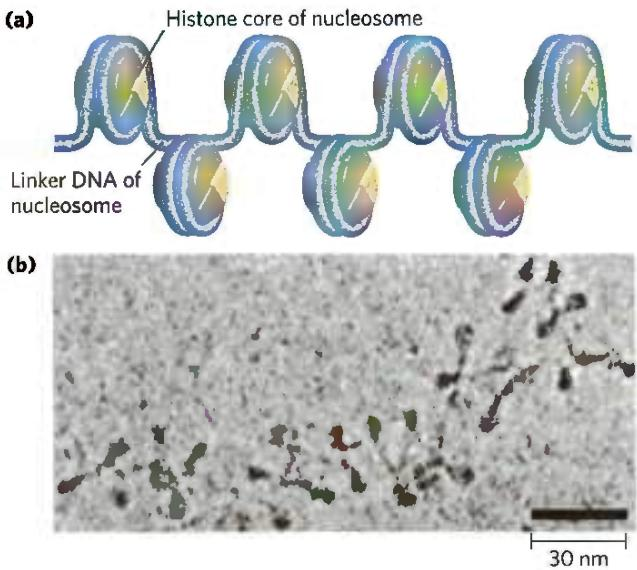  
FIGURE 24-23 Nucleosomes. (a) Regularly spaced nucleosomes consist of core histone proteins bound to DNA. (b) In this electron micrograph, the DNA-wrapped histone octamer structures are clearly visible. [(b) J. Bednar et al., Nucleosomes, linker DNA, and linker histone form a unique structural motif that directs the higher-order folding and compaction of chromatin, Proc. Natl. Acad. Sci. USA vol. 95 no. 24: 14173–14178, November 1998 Cell Biology Fig. 1. © 1998 National Academy of Sciences, U.S.A.]

Beginning with nucleosomes, eukaryotic chromosomal DNA is packaged into a succession of higher-order structures that ultimately yield the compact chromosome seen with the light microscope. We now turn to a description of this structure in eukaryotes and compare it with the packaging of DNA in bacterial cells.

#### [EN] Histones Are Small, Basic Proteins

Found in the chromatin of all eukaryotic cells, histones have molecular weights between 11,000 and 21,000 and are very rich in the basic amino acids arginine and lysine (together these make up about one-fourth of the amino acid residues). All eukaryotic cells have five major classes of histones, differing in molecular weight and amino acid composition (Table 24-5). The H3 histones are nearly identical in amino acid sequence in all eukaryotes, as are the H4 histones, suggesting strict conservation of their functions. For example, only 2 of 102 amino acid residues differ between the H4 histone molecules of peas and cows, and only 8 differ between the H4 histones of humans and yeast. Histones H1, H2A, and H2B show less sequence similarity across eukaryotic species.

Each type of histone is subject to enzymatic modification by methylation, acetylation, ADP-ribosylation, phosphorylation, glycosylation, SUMOylation, or ubiquitination (p. 216 and Fig. 6-38). Such modifications affect the net electric charge, shape, and other properties of histones, as well as the structural and functional properties of the chromatin. The modifications play a role in the regulation of transcription and in chromatin structure at different stages of the cell cycle.

In addition, eukaryotes generally have several variant forms of certain histones, most notably histones

<table><tr><td colspan="5">TABLE 24-5 Types and Properties of the Common Histones</td></tr><tr><td rowspan="2">Histones</td><td rowspan="2">Molecular weight</td><td rowspan="2">Number of amino acid residues</td><td colspan="2">Content of basic amino acids (% of total)</td></tr><tr><td>Lys</td><td>Arg</td></tr><tr><td>H1a</td><td>21,130</td><td>223</td><td>29.5</td><td>11.3</td></tr><tr><td>H2Aa</td><td>13,960</td><td>129</td><td>10.9</td><td>19.3</td></tr><tr><td>H2Ba</td><td>13,774</td><td>125</td><td>16.0</td><td>16.4</td></tr><tr><td>H3</td><td>15,273</td><td>135</td><td>19.6</td><td>13.3</td></tr><tr><td>H4</td><td>11,236</td><td>102</td><td>10.8</td><td>13.7</td></tr></table>

$^{a}$ The sizes of these histones vary somewhat from species to species. The numbers given here are for bovine histones.

H2A and H3, described in more detail below. The variant forms, along with their modifications, have specialized roles in DNA metabolism.

  
FIGURE 24-24 DNA wrapped around a histone core. (a) The simplified structure of a nucleosome octamer (left), with DNA wrapped around the histone core (right). (b) A ribbon representation of the nucleosome from the African frog Xenopus laevis. Different colors represent the different histones, matching the colors in (a). (c) Surface representation of the nucleosome. The view in (c) is rotated relative to the view in (b) to match the orientation shown in (a). A 146 bp segment of DNA in the form of a left-handed solenoidal supercoil wraps around the histone complex 1.67 times. (d) Two views of histone amino-terminal tails protruding from between the two DNA duplexes that supercoil around the nucleosome core. Some tails pass between the supercoils, through holes formed by alignment of the minor grooves of adjacent helices. The H3 and H2B tails emerge between the two coils of DNA wrapped around the histone; the H4 and H2A tails emerge between adjacent histone subunits. (e) The amino-terminal tails of one nucleosome protrude from the particle and interact with adjacent nucleosomes, helping to define higher-order DNA packaging. [(b-d) Data from PD8 ID 1AOI, K. Luger et al., Nature 389:251, 1997.]

#### [EN] Nucleosomes Are the Fundamental Organizational Units of Chromatin

P4 The eukaryotic chromosome depicted in Figure 24-5 represents the compaction of a DNA molecule about $10^{5}\mu \mathrm{m}$ long into a cell nucleus that is typically 5 to $10\mu \mathrm{m}$ in diameter. This 10,000-fold compaction is achieved by means of several levels of highly organized folding. Subjection of chromosomes to treatments that partially unfold them reveals a structure in which the DNA is bound tightly to beads of protein, often regularly spaced. The beads in this "beads-on-a-string" arrangement are complexes of histones and DNA. The bead plus the connecting DNA that leads to the next bead form the nucleosome, the fundamental unit of organization on which the higher-order packing of chromatin is built (Fig. 24-24). The bead of each nucleosome contains eight histone molecules: two copies each of H2A, H2B, H3, and H4.

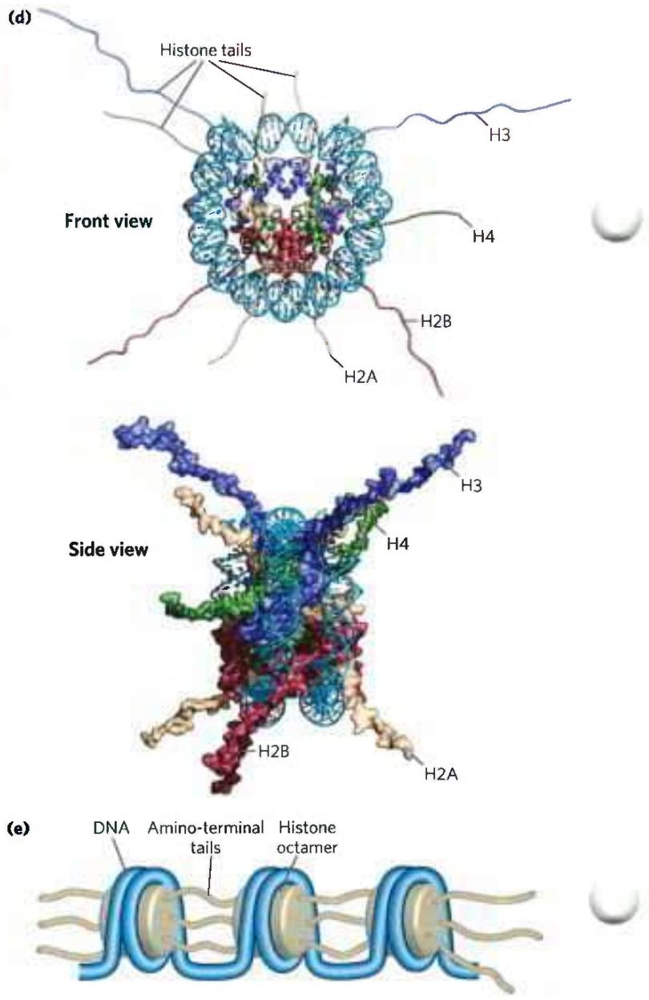

The spacing of the nucleosome beads provides a repeating unit typically of about 200 bp, of which 146 bp are bound tightly around the eight-part histone core and the remainder serve as linker DNA between nucleosome beads. Histone H1 binds to the linker DNA. Brief treatment of chromatin with enzymes that digest DNA causes the linker DNA to degrade preferentially, releasing histone particles containing 146 bp of bound DNA that is protected from digestion.

Researchers have crystallized nucleosome cores obtained in this way, and x-ray diffraction analysis reveals a particle made up of the eight histone molecules with the DNA wrapped around the core in the form of a left-handed solenoidal supercoil (Fig. 24-24; see also Fig. 24-21). Extending out from the nucleosome core are the amino-terminal tails of the histones, which are intrinsically disordered (Fig. 24-24d). Most of the histone modifications occur in these tails. The tails play a key role in forming contacts between nucleosomes in the chromatin (Fig. 24-24e). As the nucleosomes are approximately 10 to 11 nm in diameter, this simple beads-on-a-string structure is sometimes called the 10 nm fiber.

A close inspection of the nucleosome structure reveals why eukaryotic DNA is underwound even though eukaryotic cells lack enzymes that underwind DNA. Recall that the solenoidal wrapping of DNA in nucleosomes is but one form of supercoiling that can be taken up by underwound (negatively supercoiled) DNA. The tight wrapping of DNA around the histone core requires the removal of about one helical turn in the DNA. When the protein core of a nucleosome binds in vitro to a relaxed closed-circular DNA, the binding introduces a negative supercoil. Because this binding process does not break the DNA or change the linking number, the formation of a negative solenoidal supercoil must be accompanied by a compensatory positive supercoil in the unbound region of the DNA (Fig. 24-25). As mentioned earlier, eukaryotic topoisomerases can relax positive supercoils. Relaxing the unbound positive supercoil leaves the negative supercoil fixed (through its binding to the nucleosome's histone core) and results in an overall decrease in linking number. Indeed, topoisomerases have proved necessary for assembling chromatin from purified histones and closed-circular DNA in vitro.

Another factor that affects the binding of DNA to histones in nucleosome cores is the sequence of the bound DNA. Histone cores do not bind at random positions on the DNA; rather, some locations are more likely to be bound than others. This positioning is not fully understood, but in some cases it seems to depend on a local abundance of A=T base pairs in the DNA helix where it is in contact with the histones (Fig. 24-26). A cluster of two or three A=T base pairs facilitates the compression of the minor groove that is needed for the DNA to wrap tightly around the nucleosome's histone core. Nucleosomes bind particularly well to sequences where AA or AT or TT dinucleotides are staggered at 10 bp intervals, an arrangement that can account for up to 50% of the positions of bound histones in vivo.

  
FIGURE 24-25 Chromatin assembly. (a) Relaxed closed-circular DNA. (b) Binding of a histone core to form a nucleosome induces one negative supercoil. In the absence of any strand breaks, a positive supercoil must form elsewhere in the DNA ( $\Delta Lk = 0$ ). (c) Relaxation of this positive supercoil by a topoisomerase leaves one net negative supercoil ( $\Delta Lk = -1$ ).

Nucleosome cores are deposited on DNA during replication or following other processes that require a transient displacement of nucleosomes. Other, nonhistone proteins are required for the positioning of some nucleosome cores. In several organisms, certain proteins bind to a specific DNA sequence and facilitate the formation of a nucleosome core nearby. Nucleosome cores seem to be deposited stepwise. A tetramer of two H3 and two H4 histones binds first, followed by two H2A–H2B dimers. The incorporation of nucleosomes into chromosomes after chromosomal replication is mediated by a complex of histone chaperones conserved in all eukaryotes and described here for the yeast system. These include the proteins CAF1 (chromatin assembly factor 1), RTT106 and RTT109 (regulation of Ty1 transposition), and ASF1 (anti-silencing factor 1). ASF1 binds to newly synthesized H3–H4 dimers and facilitates RTT109-mediated acetylation at Lys $^{56}$ (K56) of histone H3 (H3K56). The H3K56 modification increases the affinity of H3 for CAF1 and RTT, which in turn promote the deposition of H3-containing histone complexes on the DNA after replication. CAF1 binds directly to a key component of the replication complex called PCNA (see Chapter 25), so that nucleosome deposition is closely coordinated with replication. Some of the same histone chaperones, or different ones, may help assemble nucleosomes after DNA repair, transcription, or other processes.

  
FIGURE 24-26 The effect of DNA sequence on nucleosome binding. Runs of two or more A=T base pairs facilitate the bending of DNA, whereas runs of two or more G≡C base pairs have the opposite effect. When spaced at about 10 bp intervals, consecutive A=T base pairs help bend DNA into a circle. When consecutive G≡C base pairs are spaced 10 bp apart, offset by 5 bp from runs of A=T base pairs, DNA binding to the nucleosome core is facilitated. [Data from PDB ID 1AOI, K. Luger et al., Nature 389.251, 1997.]

Histone exchange factors permit the substitution of histone variants for core histones in contexts other than postreplication. Proper placement of these variant histones is important. Studies show that mice lacking one of the variant histones die as early embryos (Box 24-1). Precise positioning of nucleosome cores also plays a role in the expression of some eukaryotic genes (Chapter 28).

#### [EN] Nucleosomes Are Packed into Highly Condensed Chromosome Structures

Wrapping of DNA around a nucleosome core compacts the DNA length about sevenfold. The overall compaction in a chromosome, however, is greater than 10,000-fold—ample evidence for even higher orders of structural organization. The condensation does not follow a rigid organization, but it is also not random and occurs so as to avoid the formation of knots.

P4 The higher levels of folding are not yet fully understood, but certain regions of DNA seem to associate with a chromosomal scaffold (Fig. 24-27) that contains many proteins. Given the need to fold and compact the chromosome without creating knots, topoisomerase II is one of the most abundant proteins in the chromosome, further emphasizing the relationship between DNA underwinding and chromatin structure. P3 Topoisomerase II is so important to the maintenance of chromatin structure that inhibitors of this enzyme can kill rapidly dividing cells. Several drugs used in cancer chemotherapy are topoisomerase II inhibitors that allow the enzyme to promote strand breakage but not the resealing of the breaks (Box 24-2, p. 906).

There are additional layers of organization in the eukaryotic nucleus. Just before cell division during mitosis, chromosomes can be seen as highly condensed and organized structures (Figure 24-28a). During interphase, chromosomes appear dispersed (Fig. 24-28b,

(b)  
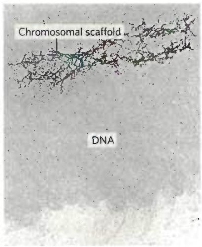

FIGURE 24-27 Loops of DNA attached to a chromosomal scaffold. (a) A swollen mitotic chromosome, produced in a buffer of low ionic strength, as seen in the electron microscope. Notice the appearance of chromatin loops at the margins. (b) Extraction of the histones leaves a proteinaceous chromosomal scaffold surrounded by naked DNA. (c) The DNA appears to be organized in loops attached at their base to the scaffold in the upper left corner; scale bar = 1 μm. The three images are at different magnifications. [(a, b) Don W. Fawcett/Science Source. (c) U. K. Laemmli et al., "Metaphase chromosome structure: The role of nonhistone proteins," Cold Spring Harb. Symp. Quant. Biol. 42:351, 1978. © Cold Spring Harbor Laboratory Press.]  

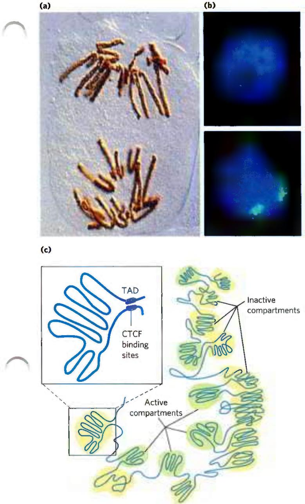  
FIGURE 24-28 Chromosomal organization in the eukaryotic nucleus. (a) Condensed chromosomes at the mitotic anaphase in cells of the bluebell (Endymion sp.). (b) Interphase nuclei of human breast epithelial cells. The nucleus on the bottom has been treated so that its two copies of chromosome 11 fluoresce green. (c) Chromosomes are organized into active compartments, in which actively transcribed genes are clustered, and inactive compartments, made of heterochromatin within which genes are silenced. In both cases, the compartments feature large DNA loops called topologically associating domains (TADs), many constrained at their bases by DNA-binding proteins such as CTCF. Certain lncRNAs (Fig. 24-29) also play a role in defining loops within chromatin. Constraining a loop at its base not only provides a boundary for the loop, but also allows supercoiling within the loop to be controlled. [(a) Pr. G. Giménez-Martín/Science Source. (b) Karen Meaburn and Tom Misteli/National Cancer Institute.]

top), but they do not meander randomly in nuclear space (Fig. 24-28b, bottom). Each chromosome appears to be organized with two sets of compartments, one set that is transcriptionally active and the other that is transcriptionally inactive. The level of chromatin condensation is reduced in the transcriptionally active compartments. The highly condensed DNA in transcriptionally inactive regions or in regions lacking genes is also called heterochromatin. Within each compartment, large segments of DNA are organized in loops called topologically associating domains, or TADs. The TADs, which typically average about 800,000 bp, are often bordered by DNA sites recognized by the CCCTC-binding factor (CTCF). The binding by CTCF brings together sites that are otherwise quite distant in the linear DNA sequence, tethering the base of the loop (Fig. 24-28c).

P4 Another important component defining the structure of chromosomes is RNA, particularly a class of RNAs called long noncoding RNAs (lncRNAs). RNA has the potential to take up a variety of structures (see Chapter 8), and can interact with DNA, proteins, or other RNA molecules. The lncRNAs, as the name implies, are functional RNAs, generally over 200 nucleotides long, that do not necessarily encode proteins. Many lncRNAs are now known and more are being discovered rapidly. Many of them provide a scaffold for proteins that both bind to the RNA and affect chromosome structure and function. Some proteins that bind to lncRNAs also have binding sites on DNA, and the RNAs provide a link that tethers distant parts of the chromosome together (Fig. 24-29). Other proteins that bind to lncRNAs help to position nucleosomes, modify histones,

  
FIGURE 24-29 Effects of lncRNAs on chromosome architecture and gene expression. (a) Various lncRNAs can interact with DNA-binding proteins and in some cases with DNA to tether otherwise distant segments of DNA. (b) A transcribed lncRNA can interact with multiple proteins that have gene regulatory roles, suppressing or activating transcription of nearby genes. [Information from J. M. Engreitz et al., Nat. Rev. Mol. Cell Biol. 17:756, 2016, Fig. 5.]

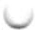

#### [EN] Epigenetics, Nucleosome Structure, and Histone Variants

Information that is passed from one generation to the next — to daughter cells at cell division or from parent to offspring — but is not encoded in DNA sequences is referred to as epigenetic information. Much of it is in the form of covalent modification of histones and/or the placement of histone variants in chromosomes. Understanding that placement in the context of a chromosome encompassing millions of base pairs is the focus of some powerful technologies.

Chromatin regions where active gene expression (transcription) is occurring tend to be partially decondensed and are called euchromatin. In these regions, histones H3 and H2A are often replaced by the histone variants H3.3 and H2AZ, respectively (Fig. 1). The complexes that deposit nucleosome cores containing histone variants on the DNA are similar to those that deposit nucleosome cores with the more common histones. Nucleosome cores containing histone H3.3 are

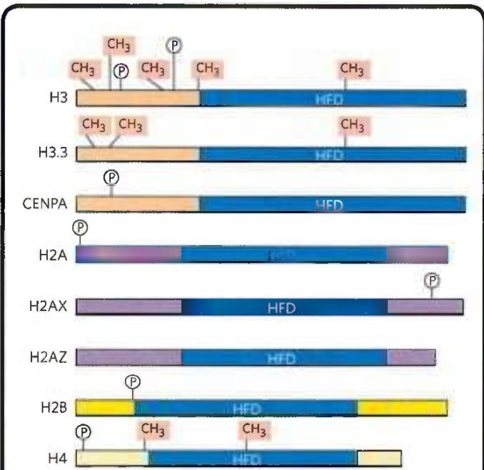  
FIGURE 1 Shown here are the standard histones H3, H2A, and H2B and a few of the known variants. Sites of Lys/Arg residue methylation and Ser phosphorylation are indicated. HFD denotes the histone-fold domain, a structural domain common to all standard histones. Regions denoted in other colors define sequence and structural homologies. [Information from K. Sarma and D. Reinberg, Nat. Rev. Mol. Cell Biol. 6:139, 2005.]

methylate DNA at various locations to alter gene transcription, and generally affect chromosome structure in many different ways. Some well-studied examples include particular lncRNAs that play a major role in X chromosome inactivation in mammals (Box 24-3).

deposited by a complex in which CAF1 (chromatin assembly factor 1) is replaced by the protein HIRA (a name derived from a class of proteins called HIR, for histone repressor). Both CAF1 and HIRA can be considered histone chaperones, helping to ensure the proper assembly and placement of nucleosomes. Histone H3.3 differs in sequence from H3 by only four amino acid residues, but these residues all play key roles in histone deposition.

Like histone H3.3, H2AZ is associated with a distinct nucleosome deposition complex, and it is generally associated with chromatin regions involved in active transcription. Incorporation of H2AZ stabilizes the nucleosome octamer, but it impedes some cooperative interactions between nucleosomes that are needed to compact the chromosome. This leads to a more open chromosome structure that enables the expression of genes in the region where H2AZ is located. The gene encoding H2AZ is essential in mammals. In fruit flies, loss of H2AZ prevents development beyond the larval stage.

Another H2A variant is H2AX, which is associated with DNA repair and genetic recombination. In mice, the absence of H2AX results in genome instability and male infertility. Modest amounts of H2AX seem to be scattered throughout the genome. When a double-strand break occurs, nearby molecules of H2AX become phosphorylated at Ser $^{139}$ in the carboxyl-terminal region. If this phosphorylation is blocked experimentally, formation of the protein complexes necessary for DNA repair is inhibited.

The H3 histone variant known as CENPA (centromere protein A) is associated with the repeated DNA sequences in centromeres. The chromatin in the centromere region contains the histone chaperones CAF1 and HIRA, and both proteins could be involved in the deposition of nucleosome cores containing CENPA. Elimination of the gene for CENPA is lethal in mice.

The function and positioning of the histone variants can be studied by an application of technologies used in genomics. One useful technology is chromatin immunoprecipitation, or chromatin IP (ChIP). Nucleosomes containing a particular histone variant are precipitated by an antibody that binds specifically to this variant. These nucleosome cores can be studied in isolation from their DNA, but more commonly the DNA associated with them is included in the study to determine where the nucleosome cores of interest bind. The DNA can be sequenced, yielding a map of genomic sequences to which those particular nucleosome cores bind. This technique is called a ChIP-Seq experiment (Fig. 2).

The entire structure of each chromosome is constrained within a subnuclear domain called a chromosome territory (Fig. 24-30). There is little or no intermingling of chromosomal DNA in different territories. The exact location of chromosome territories

The histone variants, along with the many covalent modifications that histones undergo, help define and isolate the functions of chromatin. They mark the chromatin, facilitating or suppressing specific functions such as chromosome segregation, transcription, and DNA repair. The histone modifications do not disappear at cell division or during meiosis, and thus they become part of the information transmitted from one generation to the next in all eukaryotic organisms.

  
FIGURE 2 A ChIP-Seq experiment is designed to reveal the genomic DNA sequences to which a particular histone variant binds. (a) A histone variant with an epitope tag (a protein or chemical structure recognized by an antibody; see Chapters 5 and 9) is introduced into a particular cell type, where it is incorporated into nucleosomes. (In some cases, an epitope tag is unnecessary because antibodies are available that bind directly to the histone modification of interest.) Chromatin is isolated from the cells and digested briefly with micrococcal nuclease (MNase). The DNA bound in nucleosomes is protected from digestion, but the linker DNA is cleaved, releasing segments of DNA bound to one or two nucleosomes. An antibody that binds to the epitope tag is  
added, and the nucleosomes containing the epitope-tagged histone variant are selectively precipitated. The DNA in these nucleosomes is extracted from the precipitate and sequenced in depth to reveal the locations where the nucleosomes are bound. (b) In this example, the binding of different modified versions of histone H3 is characterized along the gene YLR249W from the yeast S. cerevisiae. Numbers along the bottom correspond to numbered nucleotide positions in this chromosomal segment. The top and bottom panels show the distributions of H3K4me3 (H3 with Lys $^{4}$ methylated three times) and H3K4me1, respectively. SPMR is sequence tags per million reads. [Information from L. M. Soares et al., Mol. Cell 68:773, 2017, Fig. 1D.]

varies from cell to cell in an organism, but some spatial patterns are evident. Some chromosomes have a higher density of genes than others (for example, human chromosomes 1, 16, 17, 19, and 22), and these tend to have territories in the center of the nucleus. Chromosomes with more heterochromatin tend to be located on the nuclear periphery. Spaces between chromosomes are often sites where transcriptional machinery and transcriptionally active genes on adjacent chromosomes are concentrated.

#### [EN] Curing Disease by Inhibiting Topoisomerases

P3 The topological state of cellular DNA is intimately connected with its function. Without topoisomerases, cells cannot replicate or package their DNA, or express their genes — and they die. Inhibitors of topoisomerases have therefore become important pharmaceutical agents, targeted at infectious agents and malignant cells.

Two classes of bacterial topoisomerase inhibitors have been developed as antibiotics. The coumarins, including novobiocin and coumermycin A1, are natural products derived from Streptomyces species. They inhibit the ATP binding of the bacterial type II topoisomerases, DNA gyrase and topoisomerase IV. These antibiotics are not often used to treat infections in humans, but research continues to identify clinically effective variants.

The quinolone antibiotics, also inhibitors of bacterial DNA gyrase and topoisomerase IV, first appeared in 1962 with the introduction of nalidixic acid. This compound had limited effectiveness and is no longer used clinically in the United States, but the continued development of this class of drugs eventually led to the introduction of the fluoroquinolones, exemplified by ciprofloxacin (Cipro). The quinolones act by blocking the last step of the topoisomerase reaction, the resealing of the DNA strand breaks. Ciprofloxacin is a broad-spectrum antibiotic. It is one of the few antibiotics reliably effective in treating anthrax infections and is considered a valuable agent in protection against possible bioterrorism. Quinolones are selective for the bacterial topoisomerases, inhibiting the eukaryotic enzymes only at concentrations several orders of magnitude greater than the therapeutic doses.

Some of the most important chemotherapeutic agents used in cancer treatment are inhibitors of human topoisomerases. Topoisomerases are generally present at elevated levels in tumor cells, and agents targeted to these enzymes are much more toxic to the tumors than to most other tissue types. Inhibitors of both type I and type II topoisomerases have been developed as anticancer drugs.

Camptothecin, isolated from a Chinese ornamental tree and first tested clinically in the 1970s, is an inhibitor of eukaryotic type I topoisomerases. Clinical trials indicated limited effectiveness, despite its early promise in preclinical work on mice. However, two effective derivatives, irinotecan (Campto) and topotecan (Hycamtin) — used to treat colorectal cancer and ovarian cancer, respectively — were developed in the 1990s. All of these drugs act by trapping the topoisomerase-DNA complex in which the DNA is cleaved, inhibiting religation.

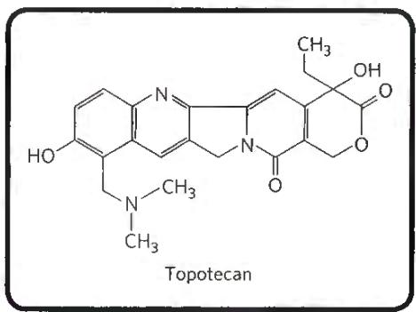

The human type II topoisomerases are targeted by a variety of antitumor drugs, including doxorubicin (Adriamycin), etoposide (Etopophos), and ellipticine. Doxorubicin, effective against several kinds of human tumors, is an anthracycline in clinical use. Most of these drugs stabilize the covalent topoisomerase-DNA (cleaved) complex.

All of these anticancer agents generally increase the levels of DNA damage in the targeted, rapidly growing tumor cells. However, noncancerous tissues can also be affected, leading to a more general toxicity and unpleasant side effects that must be managed during therapy. As cancer therapies become more effective and survival statistics for cancer patients improve, the independent appearance of new tumors is becoming a greater problem. In the continuing search for new cancer therapies, topoisomerases are likely to remain prominent targets for research.

#### [EN] X Chromosome Inactivation by an IncRNA: Preventing Too Much of a Good (or Bad) Thing

In higher eukaryotes, the Y chromosome contains only a few genes. The X chromosome, in contrast, often contains more than a thousand genes, many essential for cell function and organismal development. Males have just one X chromosome, whereas females have two. Females thus could end up with a double dose of gene products, leading to a variety of potentially toxic outcomes. Mechanisms of gene dosage compensation vary among different groups of eukaryotes. In most mammals, dosage compensation is accomplished by X chromosome inactivation, randomly affecting just one of the two X chromosomes in a given cell. The effects of this can be seen in calico cats, all of which are female. Fur pigmentation genes are found on the X chromosome. When a cat inherits chromosomes with different pigmentation alleles on its two X chromosomes, its coloration patterns reflect the random inactivation of one or the other X chromosome in different sets of cells.

  
A calico cat. (krblokhin/Getty Images)

An IncRNA called Xist (X-inactive specific transcript) is uniquely expressed from its gene on the inactive X chromosome. Xist is approximately 17,000 nucleotides long, encodes no proteins, and is expressed only in cells with two X chromosomes (not in males). Xist is an essential component of the X inactivation process. This IncRNA interacts with many proteins and transcription factors (Fig. 1). As it migrates in the region immediately proximal to the gene from which it is transcribed, Xist gradually encompasses more and more DNA as that X chromosome undergoes a major condensation, giving rise to the inactive form called a Barr body.

The active X chromosome also transcribes the gene that produces Xist, but it does so in the opposite direction to produce a longer lncRNA called Tsix (Xist spelled backward). Tsix is synthesized using a different RNA polymerase binding site (promoter; Chapter 26) and is 40,000 nucleotides long. A large part of Tsix is perfectly complementary to Xist, and it antagonizes the function of any Xist that may appear near the active X chromosome.

(a)  

(b)  
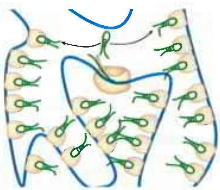

(c)  

FIGURE 1 (a) As Xist RNA is transcribed, it migrates to nearby regions within an X chromosome, (b) binding to proteins including SAFA (scaffold attachment factor A). Xist binding spreads through the chromosome, leading to condensation and other architectural changes to form a Barr body. Other than the Xist gene itself, gene expression is suppressed throughout the chromosome. (c) The effects are quite local; Xist does not spread within the nucleus beyond the chromosome territory occupied by the inactivated X chromosome. [Information from J. M. Engreitz et al., Nat. Rev. Mol. Cell Biol. 17:756, 2016, Fig. S.]

Random X inactivation occurs in the cells of a female embryo long before birth. The processes that initiate the inactivation of one, but not both, of the X chromosomes in a particular cell are still being elucidated.

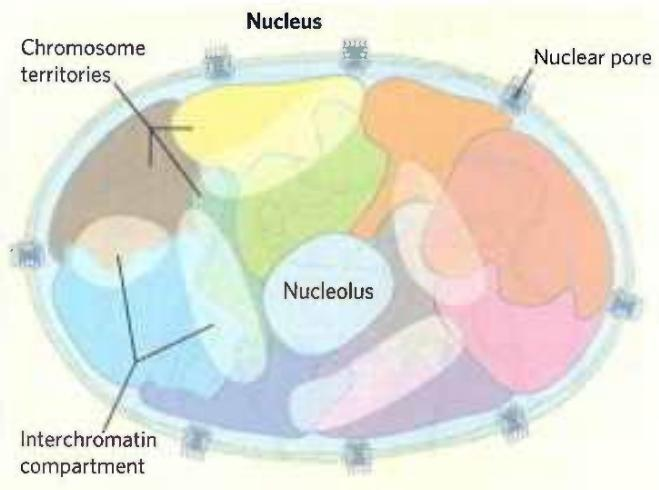  
FIGURE 24-30 Chromosome territories. Cartoon showing chromosome territories in a eukaryotic nucleus. The interchromatin compartments are enriched in transcriptional machinery and have abundant actively transcribed genes. The nucleolus is a suborganelle within the nucleus where ribosomes are synthesized and assembled (Chapter 27).

#### [EN] Condensed Chromosome Structures Are Maintained by SMC Proteins

P4 SMC proteins (structural maintenance of chromosomes), the third major class of chromatin protein in addition to the histones and topoisomerases, are responsible for maintaining the structure and integrity of chromosomes following replication. The primary structure of SMC proteins consists of five distinct domains (Fig. 24-31a). The amino- and carboxyl-terminal globular domains, N and C, each of which contains part of an ATP-hydrolytic site, are connected by two regions of $\alpha$ -helical coiled-coil motifs (see Fig. 4-10) joined by a hinge domain. The proteins are generally dimeric, forming a V-shaped complex that is thought to be tied together through the protein's hinge domains. One N domain and one C domain come together like tweezers to form a complete ATP-hydrolytic site at each free end of the V (Fig. 24-31b).

Proteins in the SMC family are found in all types of organisms, from bacteria to humans. Eukaryotes have two major types, cohesins and condensins, both of which are bound by regulatory and accessory proteins (Fig. 24-31c, d). Cohesins play a substantial role in linking together sister chromatids immediately after replication and keeping them together as the chromosomes condense to metaphase. This linkage is essential if chromosomes are to segregate properly at cell division. Cohesins, along with a third protein, kleisin, are thought to form a ring around the replicated chromosomes that ties them together until separation is required. The ring may expand and contract in response to ATP hydrolysis. Condensins are essential to the condensation of chromosomes as cells enter mitosis. In the laboratory, condensins bind to DNA in a manner that creates positive supercoils; that is, condensin binding causes the DNA to become overwound, in contrast to the underwinding

  
induced by the binding of nucleosomes. A model for the role of condensins in chromatin compaction is presented in Figure 24-32. In brief, as DNA is compacted to

FIGURE 24-32 Two current models of the possible role of condensins in chromatin condensation. Initially, the DNA is bound at the hinge region of the SMC protein, in the interior of what can become an intramolecular SMC ring. ATP binding leads to head-to-head association, forming supercoiled loops in the bound DNA. Subsequent rearrangement of the head-to-head interactions to form rosettes condenses the DNA. Condensins may organize the looping of the chromosome segments in several ways. [Information from T. Hirano, Nat. Rev. Mol. Cell Biol. 7:311, 2006, Fig. 6.]

form tighter and tighter loops, the condensins stabilize the loops by binding at the base of each one. Cohesins and condensins are essential in orchestrating the many changes in chromosome structure during the eukaryotic cell cycle (Fig. 24-33).

#### [EN] Bacterial DNA Is Also Highly Organized

We now turn briefly to the structure of bacterial chromosomes. P2 Bacterial DNA is compacted in a structure called the nucleoid, which can occupy a significant fraction of the cell volume (Fig. 24-34). The DNA seems to be attached at one or more points to the inner surface of the plasma membrane. Much less is known about the structure of the nucleoid than of eukaryotic chromatin, but a complex organization is slowly being revealed. P3 In E. coli, a scaffoldlike structure seems to organize the circular chromosome into a series of about 500 looped domains, each encompassing, on average, 10,000 bp (Fig. 24-35), as described above for chromatin. The domains are topologically constrained; for example, if the DNA is cleaved in one domain, only the DNA within that domain will be relaxed. The domains do not have fixed end points. Instead, the boundaries are most likely in constant motion along the DNA, coordinated with DNA replication.

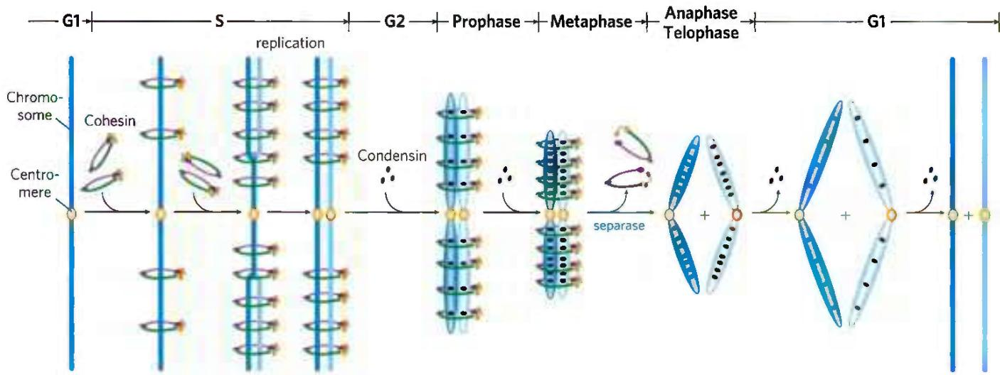  
FIGURE 24-33 The roles of cohesins and condensins in the eukaryotic cell cycle. Cohesins are loaded onto the chromosomes during G1 (see Fig. 24-22), tying the sister chromatids together during replication. At the onset of mitosis, condensins bind and maintain the chromatids  
in a condensed state. During anaphase, the enzyme separase removes the cohesin links. Once the chromatids separate, condensins begin to unload and the daughter chromosomes return to the uncondensed state. [Information from D. P. Bazett-Jones et al., Mol. Cell 9:1183, 2002, Fig. 5.]

  
FIGURE 24-34 E. coli nucleoids. The DNA of these cells is stained with a dye that fluoresces blue when exposed to UV light. The blue areas define the nucleoids. Notice that some cells have replicated their DNA but have not yet undergone cell division and hence have multiple nucleoids. [Lars Renner.]

  
FIGURE 24-35 Looped domains of the E. coli chromosome. Each domain is about 10,000 bp long. The domains are not static but move along the DNA as replication proceeds. Barriers at the boundaries of the domains, of unknown composition, prevent the relaxation of DNA beyond the boundaries of the domain where a strand break occurs. The putative boundary complexes are shown as gray-shaded ovoids. The arrows denote movement of DNA through the boundary complexes.

Bacterial DNA does not seem to have any structure comparable to the local organization provided by nucleosomes in eukaryotes. P4 Histonelike proteins are abundant in E. coli—the best-characterized example is a two-subunit protein called HU ( $M_{r}$ 19,000)—but these proteins bind and dissociate within minutes, and no regular, stable DNA-histone structure has been found. The dynamic structural changes in the bacterial chromosome may reflect a requirement for more ready access to its genetic information. The bacterial cell division cycle can be as short as 15 min, whereas a typical eukaryotic cell may not divide for hours or even months. In addition, a much greater fraction of bacterial DNA is used to encode RNA and/or protein products. Higher rates of cellular metabolism in bacteria mean that a much higher proportion of the DNA is being transcribed or replicated at a given time than in most eukaryotic cells.

#### [EN] SUMMARY 24.3 The Structure of Chromosomes

A eukaryotic chromosome is made of DNA, protein, and RNA, forming a structure called chromatin.

Histones are small, basic DNA-binding proteins. Complexes of histones form nucleosomes, the fundamental structural unit of chromatin.

The nucleosome consists of histones and a 200 bp segment of DNA. A core protein particle containing eight histone molecules (two copies each of histones H2A, H2B, H3, and H4) is encircled by a segment of DNA (about 146 bp) in the form of a left-handed solenoidal supercoil.

■ Higher-order folding of chromosomes involves attachment to a chromosomal scaffold. Transcriptionally active and inactive regions of chromosomes are separated into compartments, each featuring large loops of DNA, each loop constrained at its base by proteins and lncRNAs. Individual chromosomes are constrained within nuclear subdomains called territories. Histone H1, topoisomerase II, and SMC proteins play organizational roles in chromosomes.

■ The SMC proteins, principally cohesins and condensins, have important roles in keeping the chromosomes organized during each stage of the cell cycle.

The bacterial chromosome is extensively compacted into the nucleoid, but the chromosome seems to be much more dynamic and irregular in structure than eukaryotic chromatin, reflecting the shorter cell cycle and very active metabolism of a bacterial cell.

<!-- L-END Lehninger 24.3 -->

## 2.2 DNA 的结构

现在我们已经知道,DNA 是遗传的物质基础,基因是具有特定生物功能的 DNA 序列,通过基因的表达能够使上一代的性状准确地在下一代表现出来。那么,DNA 为什么能起遗传作用,它又是怎样起作用的呢?这与它的分子结构是密切相关的。

## 2.2.1 DNA 的一级结构

Watson 和 Crick 于 1953 年提出了著名的 DNA 双螺旋模型,为合理地解释遗传物质的各种功能,解释生物的遗传和变异,解释自然界千变万化的生命现象奠定了理论基础。前面说过,DNA 又称脱氧核糖核酸,是英文 deoxyribonucleic acid 的简称。它是一种高分子化合物,其基本单位是脱氧核苷酸。在所有的 DNA 分子中,磷酸和脱氧核糖(图 2-11)是永远不变的,而含氮碱基是可变的,主要有 4 种,即腺嘌呤(A)、鸟嘌呤(G)、胞嘧啶(C)和胸腺嘧啶(T)(表 2-6)。因此脱氧核苷酸可分别称为腺嘌呤脱氧核苷酸、鸟嘌

图 2-11 2-脱氧核糖(左)和核糖(右)结构式  
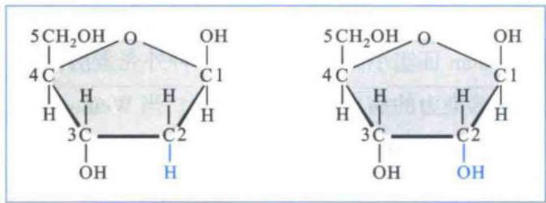

呤脱氧核苷酸、胞嘧啶脱氧核苷酸和胸腺嘧啶脱氧核苷酸。许许多多个脱氧核苷酸经 $3'\rightarrow5'$ 磷酸二酯键聚合而成为 DNA 链 $^{(图2-12)}$ 。DNA 通常以线性或环状形式存在，

绝大多数 DNA 分子都由两条碱基互补的单链构成, 只有少数生物, 如某些噬菌体或病毒是以单链形式存在的。

表 2-6 碱基、核苷和核苷酸

<table><tr><td>碱基</td><td>核苷</td><td>核苷酸</td><td>RNA</td><td>DNA</td></tr><tr><td>腺嘌呤 (adenine)</td><td>腺苷 (adenosine)</td><td>腺苷酸 (adenylic acid)</td><td>AMP</td><td>dAMP</td></tr><tr><td>鸟嘌呤 (guanine)</td><td>鸟苷 (guanosine)</td><td>鸟苷酸 (guanylic acid)</td><td>GMP</td><td>dGMP</td></tr><tr><td>胞嘧啶 (cytosine)</td><td>胞苷 (cytidine)</td><td>胞苷酸 (cytidylic acid)</td><td>CMP</td><td>dCMP</td></tr><tr><td>胸腺嘧啶 (thymine)</td><td>胸苷 (thymidine)</td><td>胸苷酸 (thymidylic acid)</td><td></td><td>dTMP</td></tr><tr><td>尿嘧啶 (uracil)</td><td>尿苷 (uridine)</td><td>尿苷酸 (uridylic acid)</td><td>UMP</td><td></td></tr></table>

所谓 DNA 的一级结构, 就是指 4 种核苷酸的连接及其排列顺序, 表示了该 DNA 分子的化学构成。从 DNA 的分子结构可以看出, 碱基在长链中的排列顺序是千变万化的。组成 DNA 分子的碱基虽然只有 4 种, 它们的配对方式也只有 A 与 T、C 与 G 两种, 但是, 由于碱基可以任何顺序排列, 构成了 DNA 分子的多样性。每个 DNA 分子所具有的特定的碱基排列顺序构成了 DNA 分子的特异性, 不同的 DNA 链可以编码出完全不同的多肽。DNA 分子中 4 种核苷酸千变万化的序列排列反映了生物界物种的多样性和复杂性。

图 2-12 多核苷酸链中新生磷酸糖苷键的产生过程示意图  

DNA 不仅具有严格的化学组成,还具有特殊的空间结构,核苷酸序列对 DNA 高级结构的形成有很大影响,如 B-DNA 中多 G-C 区易形成左手螺旋 DNA(Z-DNA),而反向重复的 DNA 片段易出现发夹结构等。可以说,DNA 一级结构决定其高级结构,这些高级结构又决定和影响着一级结构的功能。研究 DNA 一级结构对阐明遗传物质的结构、功能以及表达调控都非常重要。

## 2.2.2 DNA 的二级结构

DNA 的二级结构是指两条多核苷酸链反向平行盘绕所生成的双螺旋结构。其基本特点是：

① DNA 分子是由两条互相平行的脱氧核苷酸长链盘绕而成的。

② DNA 分子中的脱氧核糖和磷酸交替连接, 排在外侧, 构成基本骨架, 碱基排列在内侧。

两条链上的碱基通过氢键相结合,形成碱基对,它的组成有一定的规律。这就是嘌呤与嘧啶配对,而且腺嘌呤(A)只能与胸腺嘧啶(T)配对,鸟嘌呤(G)只能与胞嘧啶(C)配对。如一条链上某一碱基是C,另一条链上与它配对的碱基必定是G。碱基之间的这种一一对应的关系叫碱基互补配对原则。在生物活体中,不论DNA的二级结构还是高级结构,都是时刻变化的,即在二级结构的各种构象间、在二级结构与高级结构间或高级结构的各种构象间存在一个动力学的平衡。通常情况下,DNA的二级结构分两大类:一类是右手螺旋,如A-DNA和B-DNA,DNA通常是以右手螺旋形式存在的;另一类是左手螺旋,即Z-DNA(图2-13)。

## 1. DNA 右手螺旋的几种构象及其动态平衡

## (1) B-DNA 的构象

1953 年, Watson 和 Crick 基于以下三个方面的发现, 提出了 DNA 双螺旋模型:

① X 射线衍射实验数据表明 DNA 是一种规则螺旋结构。

② DNA 分子密度测量表明这种螺旋结构由两条多核苷酸链组成。

③ 不论碱基的数目多少,G 的含量总是与 C 一

图 2-13 A-, B-, Z-DNA 结构比较 (a\~c) 以及左、右手螺旋的比较 (d)  
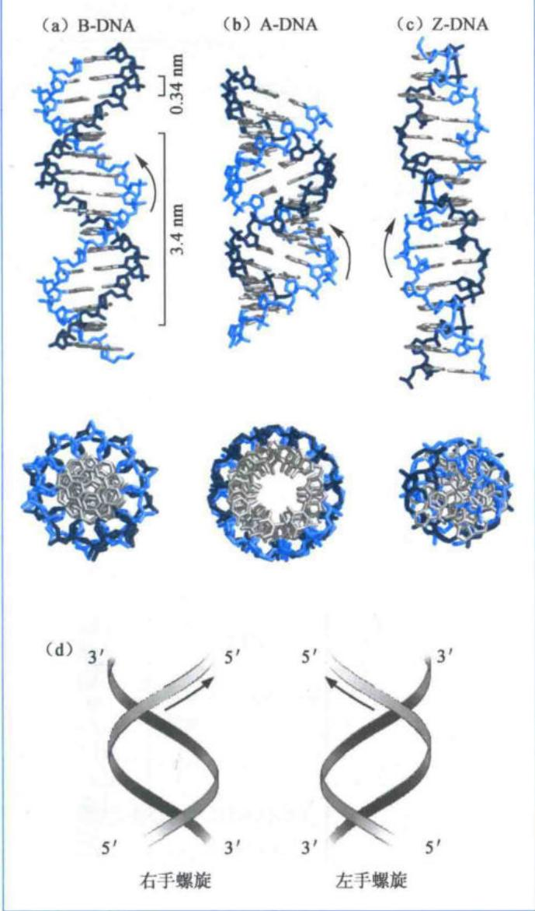

样,而 A 与 T 也是一样的。

该 DNA 分子双螺旋结构模型解释了 DNA 的理化性质,并将 DNA 的结构与功能联系起来。DNA 结构受环境条件的影响。此模型所描述的是 DNA 钠盐在较高湿度下的结构,是 B 型双螺旋,称为 B-DNA 结构。B-DNA 钠盐结构含水量较高,是大多数 DNA 在细胞中的构象。它既规则又很稳定,是由两条反向平行的多核苷酸链围绕同一中心轴构成的右手螺旋结构 $^{(图 2-13)}$ 。多核苷酸的方向由核苷酸间的磷酸二酯键的走向决定,一条从 $5'\rightarrow3'$ ,另一条从 $3'\rightarrow5'$ 。链间有螺旋型的凹槽,其中一个较浅,叫小沟(约 1.2 nm 交叉);一个较深,叫大沟(约 2.2 nm 交叉)。两条链上的碱基以氢键相连,G 与 C 配对,A 与 T 配对 $^{(图 2-14)}$ 。嘌呤和嘧啶碱基对层叠于双螺旋的内侧。顺着螺旋轴心从上向下看,可见碱基平面与纵轴垂直,且螺旋的轴心穿过氢键的中点。相邻碱基对平面之间的距离为 0.34 nm,即顺中心轴方向,每隔 0.34 nm 有一个核苷酸,以 3.4 nm 为一个结构重复周期。核苷酸的磷酸基团与脱氧核糖在外侧,通过磷酸二酯键相连接而构成 DNA 分子的骨架。脱氧核糖环平面与纵轴大致平行。双螺旋的直径为 2.0 nm $^{(图 2-15)}$ 。一般说来,A-T 丰富的 DNA 片段常呈 B-DNA,它是普遍存在的结构。

## (2) A-DNA 的结构

在相对湿度 75% 以下时, X 射线衍射分析表明 DNA 的构象不同于上述 B-DNA 的结构特点, 虽然也是右手双螺旋, 但碱基对与中心轴的倾角发生改变, 螺旋宽而短, 每圈螺旋包括11个碱基对，该构象的DNA称为A型(A-DNA)。A-DNA与B-DNA的重要区别在于：A-DNA碱基对倾斜大，并偏向双螺旋的边缘，因此具有一个深窄的大沟和宽浅的小沟；B-DNA中碱基对倾斜角小，螺旋轴穿过碱基对，其大沟宽，小沟窄(图2-13)。若DNA双链中一条链被相应的RNA链所替换，则变构成A-DNA。当DNA处于转录状态时，DNA模板链与由它转录所得的RNA链间形成的双链就是A-DNA。由此可见A-DNA构象对基因表达有重要意义。此外，B-DNA双链都被RNA链所取代而得到由两条RNA链组成的双螺旋结构也是A-DNA，表2-7例举了几种主要DNA的结构参数。

图 2-14 DNA 双螺旋结构中碱基配对示意图(A 与 T, G 与 C 配对)  
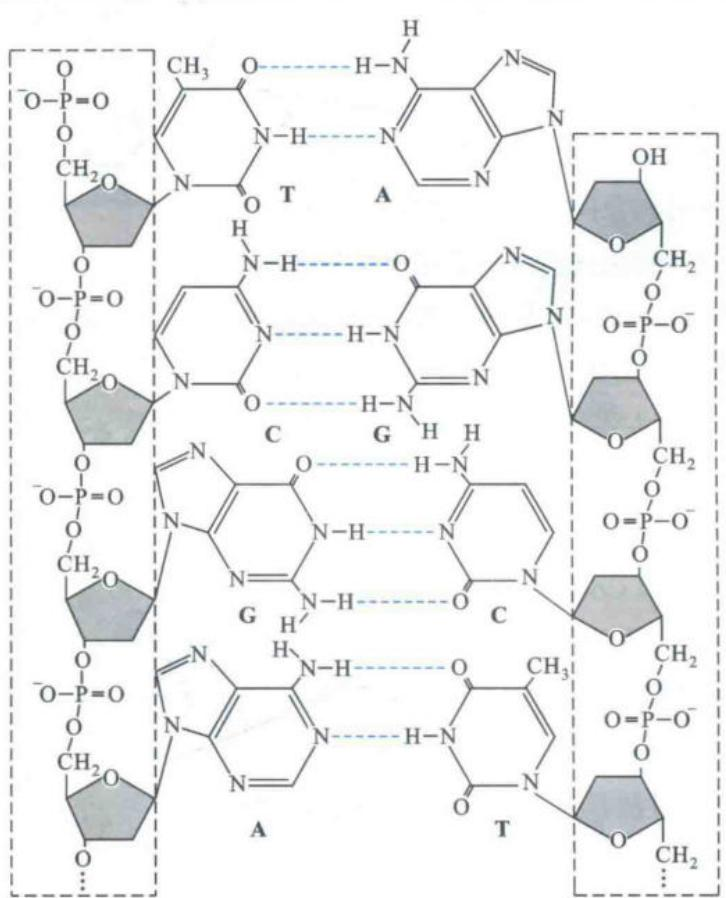

  
图 2-15 DNA 的反向平行双螺旋结构

除 A-DNA、B-DNA 螺旋外，还存在 B'-DNA、C-DNA 和 D-DNA 等不同形式，但它们均接近 B 型，可作为 B 型同一族。

表 2-7 不同螺旋形式 DNA 分子主要参数比较

<table><tr><td>双螺旋</td><td>A-DNA</td><td>B-DNA</td><td>Z-DNA</td></tr><tr><td>碱基倾角 /°</td><td>20</td><td>6</td><td>7</td></tr><tr><td>碱基间距 /nm</td><td>0.26</td><td>0.34</td><td>0.37</td></tr><tr><td>螺旋直径 /nm</td><td>2.55</td><td>2.37</td><td>1.84</td></tr><tr><td>每轮碱基数</td><td>11</td><td>10</td><td>12</td></tr><tr><td>大沟</td><td>很狭、很深</td><td>宽、较深</td><td>平坦</td></tr><tr><td>小沟</td><td>很宽、浅</td><td>狭、较深</td><td>很狭、很深</td></tr><tr><td>糖苷键构象</td><td>反式</td><td>反式</td><td>C 反式、G 顺式</td></tr><tr><td>螺旋方向</td><td>右</td><td>右</td><td>左</td></tr></table>

## 2. DNA 二级结构中左手螺旋——Z-DNA 的研究

Z-DNA 结构是 1979 年由 Rich 提出的。Rich 用一位荷兰科学家提供的 d(CGCGCG) 结晶, 对它进行 X 射线衍射结构分析, 最后提出了 Z-DNA 结构模型。Z-DNA 螺旋细长, 每圈螺旋含 12 对碱基, 大沟平坦, 小沟深而窄, 核苷酸构象顺反相间, 螺旋骨架呈 Z 字形。

图 2-16 Z-DNA 调节转录的两种模式图  
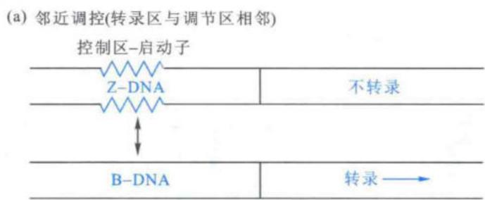

(b) 远距离调控(转录区可在上千个碱基对以外)  

当时,由于用右手螺旋结构模型解链过程来解释大分子 DNA 复制时遇到困难,该模型的提出曾经一度动摇过右手螺旋学说。现已证明,左手螺旋 Z-DNA 只是右手螺旋结构模型的一个补充和发展。

虽然 B-DNA 是最常见的 DNA 构象,但 A-DNA 和 Z-DNA 似乎具有不同的生物活性。图 2-16 是 Z-DNA 调控基因转录的两种模式。在邻近调控系统中,与调节区相邻的转录区被 Z-DNA 抑制,只有当 Z-DNA 转变为 B-DNA 后,转录才得以活化。而在远距离调控系统中,Z-DNA 可通过改变负超螺旋水平,决定聚合酶能否与模板链相结合而调节转录起始活性。

## 3. DNA 双链的变性和复性

由于 DNA 双螺旋的两条链之间通过非共价键结合在一起,它们比较容易分开。当 DNA 溶液温度接近沸点或者 pH 较高时,互补的两条链就可能分开,称为 DNA 的变性 (denaturation)。但 DNA 双链的这种变性过程是可逆的,当变性 DNA 的溶液缓慢降温时,DNA 的互补链又可重新聚合,重新形成规则的双螺旋。DNA 双链的这种变性和复性能力被用于 Southern 印迹杂交和 DNA 芯片分析等。

20 世纪 50 年代研究 DNA 变性的经典实验使人们对 DNA 双螺旋的特性有了深刻的认识。DNA 在 260 nm 处吸光度 (absorbance) 最大，并且双螺旋 DNA 的光吸收比单链 DNA 低 40%。当 DNA 溶液温度升高到接近水的沸点时，260 nm 的吸光度明显增加，这种现象称为增色效应 (hyperchromicity)；相反，减色效应 (hypochromicity) 则是因为双螺旋 DNA 中的碱基堆积降低了其对紫外线的吸收能力。

现在,人们常通过检测 DNA 溶液的紫外吸光度变化来监控 DNA 的变性过程。将 DNA 的吸光度相对温度变化绘制曲线,发现 DNA 光吸收的急剧增加发生在相对较窄的范围内。科学家把吸光度增加到最大值一半时的温度称为 DNA 的熔点(melting point),用 $T_{m}$ 表示(图 2-17)。DNA 像冰一样融解,经历了从高度有序的双螺旋结构向无规则单链结构的转变。 $T_{m}$ 值是 DNA 的一个重要的特征常数, 其大小主要与下列因素相关:

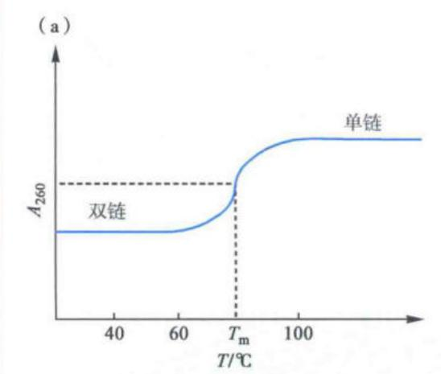

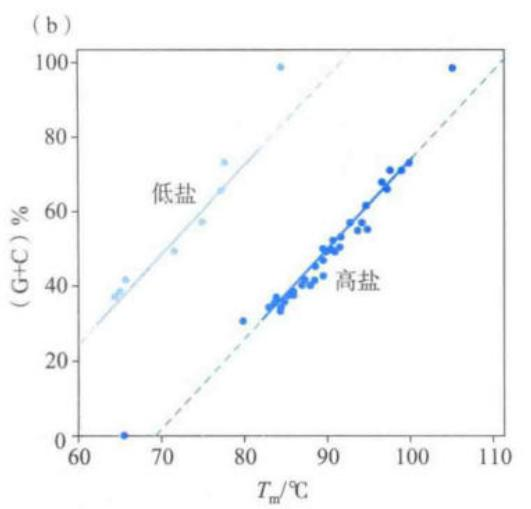  
图 2-17 DNA 的变性曲线及其影响因素  
(a) DNA 的变性曲线；
(b) DNA 的熔点取决于 G+C 的百分含量和溶液中的盐浓度。

① DNA 中 G+C 的含量 G+C 的含量越高, DNA 的 $T_{m}$ 值也越高。这主要是因为 G-C 碱基对间有 3 个氢键, 并且它与相邻碱基对间的堆积力更大。常用如下公式 $T_{m}=69.3+0.41(G+C)\%$ 来计算 DNA 的 $T_{m}$ 值, 并以此推算该 DNA 的碱基百分组成。小于 25 mer 的寡核苷酸的 $T_{m}$ 值计算公式为: $T_{\mathrm{m}}=4(\mathrm{G}+\mathrm{C})+2(\mathrm{A}+\mathrm{T})$ 。

② 溶液中的离子强度 离子强度的效应反映出双螺旋的另一基本特征。两条DNA链的骨架包含了带负电荷的磷酸基团，当这些负电荷没有被中和时，DNA双链间的静电斥力将驱使两条链分开。在高离子强度下，负电荷可以被阳离子中和，双螺旋的结构被稳定保持；在低离子强度下，未被中和的负电荷将会降低双螺旋的稳定性。因此，在离子强度较低的介质中，DNA的 $T_{m}$ 值较低而范围宽，在较高离子强度下， $T_{m}$ 值较高而范围窄。所以，DNA样品一般在含盐缓冲溶液中比较稳定，而较难保存在稀电解质溶液中。

③ DNA 的均一性 一些病毒 DNA、人工合成的多腺嘌呤－胸腺嘧啶脱氧核苷酸等均质 DNA (homogeneous DNA) 融解温度范围较小，而异质 DNA (heterogeneous DNA) 融解温度范围较宽，因此 $T_{m}$ 值也可作为衡量 DNA 样品均一性的标准。

## 2.2.3 DNA 的高级结构

DNA 的高级结构是指 DNA 双螺旋进一步扭曲盘绕所形成的更复杂的特定空间结构，包括超螺旋、线性双链中的纽结 (kink)、多重螺旋等。其中，超螺旋结构是 DNA 高级结构的主要形式，可分为正超螺旋（右手超螺旋）与负超螺旋（左手超螺旋）两大类，负超螺旋是细胞内常见的 DNA 高级结构形式，正超螺旋是过度缠绕的双螺旋。它们在不同类型的拓扑异构酶作用下或在特殊情况下可以相互转变，如：

图 2-18 用电话机连线做模型说明 DNA 链中的螺旋与超螺旋

右上图为噬菌体 PM2 松弛态 DNA 的电子显微照片；右下图为噬菌体 DNA 超螺旋形式的电子显微照片。(电镜照片由 J. C. Wang 惠赠, 1982, Scientific American 247:97)

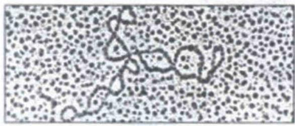

$$
\text { 负超螺旋 } \xrightarrow [ \text { 溴化乙锭 } ]{\text { 拓扑异构酶 }} \text { 松弛DNA } \xrightarrow [ \text { 溴化乙锭 } ]{\text { 拓扑异构酶 }} \text { 正超螺旋 }
$$

DNA 双螺旋结构中,一般每转一圈有 10 个核苷酸对,双螺旋总处于能量最低状态。若正常 DNA 双螺旋额外地多转或少转几圈,使每转一圈的核苷酸数目大于或小于 10,就会出现双螺旋空间结构的改变,在 DNA 分子中产生额外的张力(图 2-18)。若此时双螺旋链的末端是自由的,可通过链的转动而释放这种额外的张力,从而保持原来的双螺旋结构;若此时 DNA 分子的末端是固定的或是环状分子,双链不能自由转动,额外的张力就不能释放而导致 DNA 分子内部原子空间位置的重排,造成扭曲,即出现超螺旋结构(图 2-19)。由此可见,B-DNA 双螺旋分子的链间螺旋数若发生变化,就会出现超螺旋结构,而且超螺旋的绕数与 B-DNA 的链间螺旋数有密切关系。

研究细菌质粒 DNA(环状双链 DNA)时发现,天然状态下该 DNA 以负超螺旋为主,稍被破坏即出现开环结构,两条链均断开则呈线性结构(图 2-19)。在电场作用下,相同相对分子质量的超螺旋 DNA 比线性 DNA 迁移率大,线性 DNA 又比开环 DNA 迁移率大,以此可判断质粒结构是否被破坏。

DNA 分子的这种变化可以用一个数学公式来表示:

$$
L = T + W
$$

式中，L 为连接数（linking number），是指环形 DNA 分子两条链间交叉的次数，只要不发生链的断裂，L 是个常量；T 为双螺旋的盘绕数（twisting number）；W 为超螺旋数（writhing number），后两者是变量。

超螺旋是 DNA 三级结构的一种普遍形式, 双螺旋 DNA 的松开导致负超螺旋, 而拧紧则导致正超螺旋。

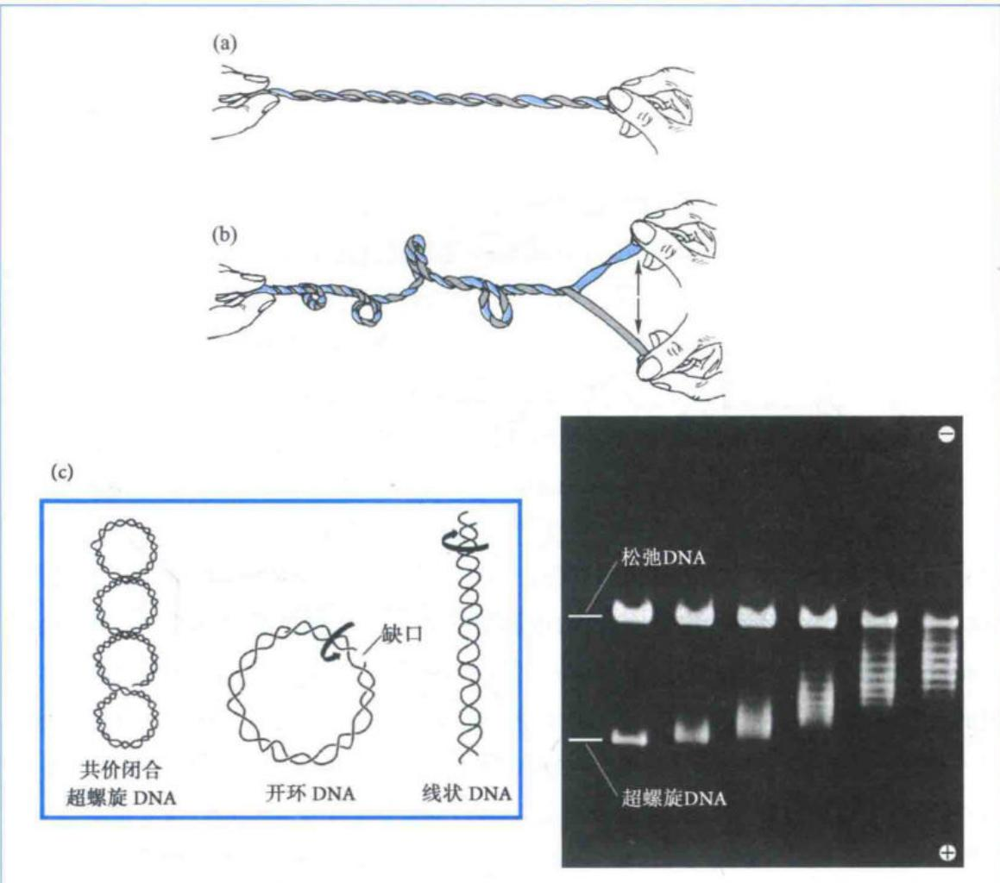

图 2-19 由于强行分开双螺旋末端而引发产生的超螺旋结构及不同构象 DNA 在电泳中的泳动速度

(a) 没有超螺旋的两股绳子；(b) 一端被强行拉开后，中间出现超螺旋；(c) 左，质粒DNA的3种不同构象；(c) 右，用凝胶电泳分离超螺旋和松弛DNA。电泳速度随超螺旋圈数的增加而提高（电泳照片由J. C. Wang 惠赠）。

<!-- W-BEGIN Watson 3 弱化学键和强化学键的重要性 -->

### 【中文对照 Watson 第3章：弱化学键和强化学键的重要性】

> 来源：Watson《基因的分子生物学》第七版中译本（书籍/03_基因的分子生物学_第七版） 第3章 弱化学键和强化学键的重要性。

#### [W] 第2篇 大分子的结构和 研究

本篇概要

\- 第3章 弱化学键和强化学键的重要性

\- 第4章 DNA的结构

\- 第5章 RNA的结构和多功能性

\- 第6章 蛋白质的结构

\- 第7章 分子生物学技术

第 2 篇主要致力于大分子结构方面的研究，包括构成这些结构的化学基础，以及研究这些结构的方法。

第 3 章讲述了一些基本化学知识,主要包括化学键的种类(弱化学键和强化学键)和化学键在生物学中的作用。我们的讨论从弱的相互作用开始，如氢键、范德华力和疏水键。这些化学键介导了大分子之间的大部分相互作用，如蛋白质与蛋白质之间的相互作用、蛋白质与 DNA 之间的相互作用等。这些弱的化学键对细胞内大部分生理过程的激活及调节至关重要，例如，酶通过弱的相互作用同其底物结合，转录调节因子通过同样的化学键同 DNA 上的特定位点结合调控基因表达。

单独的弱相互作用实际上非常微弱，因此在形成之后很快就会分开。相互作用的这种可逆性具有非常重要的生物学意义。在细胞内，分子之间的相互作用必须是动态的（可逆的），否则整个系统就会停滞。同时，一些相互作用至少在短期内是稳定的。为了适应这种表面上相互冲突的需求，多种弱相互作用需要结合在一起。

然后我们讨论了强化学键，它们把组成每个大分子的成分联系在一起。因此，按特定顺序排列的氨基酸通过强化学键连接在一起组成了蛋白质，碱基通过类似的方式组成了 DNA（组成氨基酸和碱基的原子也是通过强化学键连接在一起的）。

第 4 章详细地从原子水平讲述了 DNA 的结构，包括从碱基和骨架的化学组成到碱基配对作用及其他维持双链的作用。因此，我们可以了解弱化学键和强化学键在赋予分子相应特性从而定义其功能方面的重要性。DNA 的拓扑结构往往是受到一定约束的，第 4 章结合可改变拓扑结构的酶对这种约束的生物学意义进行了讨论。

第 5 章对 RNA 的结构进行了探索。尽管同 DNA 的结构相似，但 RNA 拥有自己与众不同的结构特点和性质，包括催化多个胞内生理过程的非凡能力，这一能力我们会在后面的章节进行介绍。RNA 这种既含有编码信息（像 DNA）又具有酶活性的特性使它在生命的早期演化中扮演了重要角色，我们会在第 17 章详细讨论。

在第 6 章，我们将会看到强化学键和弱化学键是如何一起决定蛋白质不同三维结构（同时含有特定的功能）的。因此，就像介导大分子间的相互作用一样，弱化学键也可以介导如特定蛋白质不相邻氨基酸之间的相互作用。通过这些相互作用，它们决定了氨基酸的初级结构如何折叠形成三维结构。

在第 6 章中, 我们还讨论了蛋白质之间, 以及蛋白质同 DNA 或 RNA 之间是如何发生相互作用的。蛋白质同核酸之间的相互作用是大多数生理过程或调控的关键, 因此我们会在本书中反复进行讨论。我们还会讨论如何调节特定蛋白质的功能。一种方法是通过改变蛋白质的形状，该机制称为变构调节。特定的蛋白质处于某种构象时，会呈现出一种特定的酶活性，或者可以结合特定的目标分子。但是处于另一种构象时，可能就会失去这种能力。这种形状上的变化可以通过结合另一个蛋白质或者小分子（如糖）而触发。在其他事例中，变构效应可被共价修饰所诱导，例如，结合一个或多个磷酸基团可以触发蛋白质形状的改变。蛋白质还可以被另外一种方式所控制：同目标分子发生相互作用。通过这种方式，特定的蛋白质可以被募集在一起与不同的蛋白质发生相互作用以回应不同的信号。

第 2 篇的最后一章是第 7 章，该章节主要对分子生物学的基础技术进行了描述。这些技术广泛应用于核酸和蛋白质研究。另外一些针对特定问题的特殊技术和方法会在单独的章节进行介绍。第 7 章收集的这些技术和方法都是分子生物学研究中的核心技术与方法，应用十分广泛。

#### [W] 冷泉港实验室资料库中的照片

  
Joan Steitz 和 Fritz Lipmann，1969 年的蛋白质合成机制学术会议。Steitz 的研究集中在 RNA 分子的结构和功能，尤其是与 RNA 剪接有关的工作（第 14 章），她也是本书第四版的作者之一；Lipmann 证明了 ATP 中的高能磷酸基团是驱动许多生物反应的能量来源（第 3 章）。因为这一工作，他与 Hans Krebs 分享了 1953 年的诺贝尔生理学或医学奖。

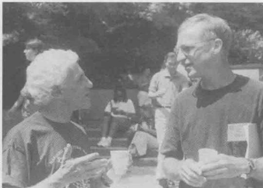  
Stephen Harrison 和 Don Wiley，1999 年免疫系统中信号和基因表达研讨会。多年以来这两位结构生物学家共用哈佛的同一间实验室，研究方向相互独立，偶尔重叠。他们都对病毒性感染很有兴趣。Harrison 的研究团队最先确定一个完好无损的病毒粒子的原子结构；Wiley 因在流感血凝素和 MHC 复合物的研究而闻名。Harrison 为本书这一版撰写了关于蛋白质结构的新章节。在他与 Mark Ptashne 的合作中确定了第一个序列特异的蛋白质-DNA 复合物的结构。

  
Werner Arber 和 Daniel Nathans, 1978 年 DNA 复制和重组研讨会。由于发现了限制性内切核酸酶及其在 DNA 分子分析中的应用（第 7 章），他们与 Hamilton Smith 一起荣获了 1978 年的诺贝尔生理学或医学奖。这一重大发现对 20 世纪 70 年代早期重组 DNA 技术的建立起了关键作用。

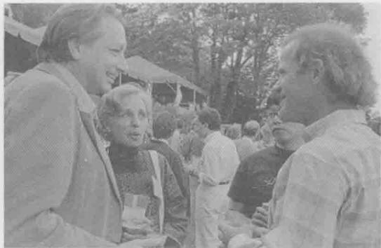  
Kary Mullis, 1986 年人类分子生物学研讨会。Mullis（右）发明了聚合酶链反应(Polymerase Chain Reaction, PCR)——分子生物学核心技术之一（第 7 章），因此他获得了 1993 年的诺贝尔化学奖。与他合照的 Maxine Singer（中）是一位以编写了许多遗传学方面书籍（经常与 Paul Berg 合著）而闻名的作家和管理者，于 1992 年获得了美国国家科学勋章。图中左侧的是 Georgii Georgiev——俄罗斯发育生物期刊的创始编辑。

  
Paul Berg, 1963 年大分子的合成和结构讨论会。Berg 是体外构建重组 DNA 分子的先驱者，是 1980 年诺贝尔化学奖获得者之一。

  
Hamilton O. Smith, 1984 年 DNA 水平重组讨论会。Smith 因为发现限制性核酸内切酶 II 并揭示其特性（第 7 章），与 Werner Arber 和 Daniel Nathans 共同获得 1978 年的诺贝尔生理学或医学奖。随后，他与 Craig Venter 合作，并参与了从第一个微生物基因组（流感嗜血杆菌）测序到创建合成基因组（第 17 章）的一系列课题。

  
Leroy Hood 和 J.Craig Venter, 1990 年基因组作图和测序会议。Hood 发明了自动测序技术，并在 20 世纪 80 年代中期制造了第一台仪器。Venter 最早使用并改进了这种自动测序仪，得益最大。依靠对原始数据的拼接，这种仪器可实现鸟枪法测序策略，由此极大地加快了全基因组的测序工作，其中包括人类基因组测序（第 7 章）。

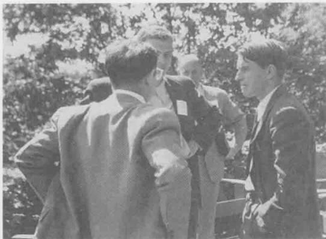

Albert Keston, Sidney Udenfriend 和 Frederick Sanger, 1949 年氨基酸和蛋白质研讨会。Keston 发明了检测葡萄糖的试纸，Udenfriend 进行了抗疟疾药物的筛选和实验。Sanger 是唯一两次获得诺贝尔化学奖的人。他第一次获奖是在 1958 年，当时他发明了一种测定蛋白质氨基酸序列的方法；22 年后他第二次获得了诺贝尔化学奖，这一次获奖是因为他发明了 DNA 测序方法，现在人们进行 DNA 测序所使用的几乎都是这种方法，包括用来进行全基因组测序的自动测序仪所使用的测序方法（第 7 章）。“蛋白质具有特定序列”的发现不仅是显著的技术成就，而且首次揭示了蛋白质可能也有特定的结构。

Francis S. Collins 和 Maynard V. Olson，1992 年基因组作图和测序会议。Collins 是最早的“基因狩猎者”之一，他在 1989 年就发现了广为关注的囊性纤维化基因。1993 年，他接替 James Watson 成为国家人类基因组研究中心（National Center for Human Genome Research, National Human Genome Research Institute 的前身）的主任，后任国家人类基因组研究所主任至今。在这幅照片上，他正站在关于酵母人工染色体（Yeast Artificial Chromosomes, YAC）的展板前听 Olson 的介绍，几年前 Olson 发明了这种 YAC 载体，使克隆的片段长度增加了 10 倍（第 7 章）。

Eric S. Lander(发言人)1986年人类分子生物学大会。Lander后来成为公众资助的人类基因组计划（Human Genome Project）的领军人物，他也是2001年发表的基因组序列文章的第一作者（第7章）。就像在前面关于Gilbert和Botstein的照片一样，Lander正在1986年的辩论中就是否有必要进行人类基因组测序发表他的观点。在他旁边是David Page，看上去若有所思，他的工作主要围绕Y染色体的结构、功能和演化，而前排的Nancy Hopkins（一名发育生物学家，也是本书第四版的作者之一）和后排的James Watson则听得津津有味。

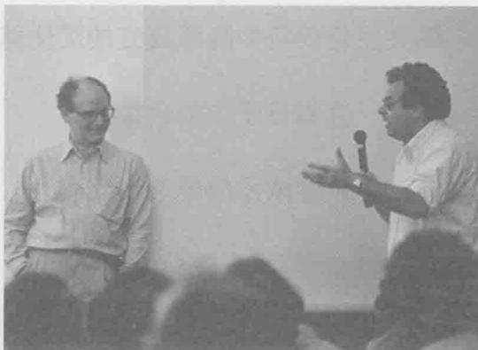  
Walter Gilbert 和 David Botstein，1986 年人类分子生物学研讨会。Gilbert 发明了化学法 DNA 测序。图中他正在与 Botstein 进行人类基因组是否切实可行的历史性争论。在对噬菌体多年研究的基础上，Botstein 对使用酵母 S. cerevisiae 作为分子生物学研究的模式真核生物的工作做出了重大贡献；他也是基因组学领域发展早期的一个关键人物（第 7 章和附录 1）。

#### [W] 第3章

#### [W] 弱化学键和强化学键的重要性

本章概要
化学键的特征
自由能的概念
生物体系中的弱化学键
高能键
供能分子是热不稳定的
酶在生物反应中降低反应的活化能
生物分子中的自由能
生物合成反应中的高能键
基团转移反应中前体的活化

本书重点描述的,也是大多数分子生物学家所关注的,是蛋白质和核酸。它们分别由氨基酸和核苷酸构成,并且两者都是由于共价键的参与而组成了多肽(蛋白质)和多聚核苷酸(核糖核酸)。共价键是一种强的、稳定的化学键,在生物体系中一般不会自发断裂。但是,弱一些的化学键也同样存在,实际上,它们对生物体是至关重要的,这部分是由于它们能够在细胞内生理环境下形成或断裂。弱化学键介导了酶与其底物的相互作用,更重要的一点是,弱化学键介导了大分子之间的相互作用(将在后面几章中讨论)。例如,蛋白质与DNA或RNA、一种蛋白质与另一种蛋白质之间的相互作用。然而,同等重要的是,弱化学键介导了同一大分子不同部位之间的相互作用,并由此决定了这些分子的形状及其生物学功能。因此,尽管蛋白质是由许多共价连接的氨基酸组

成的线性单链，但是其形状和功能是由它所形成的稳定的三维结构决定。即使是在蛋白质一级序列中不相邻的两个氨基酸之间也存在弱相互作用，这些各自独立的弱相互作用的总和最终决定了蛋白质的形状。同样，正是这些弱的非共价键使 DNA 的两条链聚合在一起形成双螺旋结构。

本章第一部分将要讨论化学键的本质和自由能的概念，即化学键形成过程中所释放（或改变）的能量。然后我们重点讨论对所有生物大分子发挥正确功能起着至关重要作用的弱化学键的本质。我们将着重介绍弱化学键何以拥有其特性。在本章的最后部分，我们会讨论高能键、肽键及磷酸二酯键的热动力学。

#### [W] 化学键的特征

化学键（chemical bond）是一种将原子联系在一起的吸引力。有限数量原子的集合体称为分子（molecule）。起初，人们认为在分子中只有共价键将原子联系在一起；现在，我们已经知道弱吸引力在许多大分子的联系中起重要作用。例如，一些弱化学键的联合作用将血红素的4条多肽链联系起来。即使弱相互作用相当弱，当其单独存在时并不能有效连接两个原子，习惯上还是被称为化学键。

化学键有几个共同特征，一个显而易见的特征就是强度。在生理温度下，强化学键几乎从不断裂，这就是为什么共价键连接的原子总是属于同一个分子；弱化学键则比较容易断裂，单个存在时只能短暂维持。只有当众多弱化学键组成有序的集合时，它们才能存在较长时间。化学键的强度与它的键长有关，所以由强化学键连接的两个原子之间的距离通常比由弱化学键连接的两个原子之间的距离短。例如，构成氢分子（H:H）的两个共价连接氢原子相距0.74Å，而由范德华力连接的两个同样的氢原子则相距1.2Å。

另一个重要的特征是原子能形成的最大键数。一个原子能够形成的共价键的数目称为原子价（valence）。例如，氧的原子价为2，即它不能形成两个以上的共价键。而对于范德华力，由于其限制因素纯粹是空间效应，因此有更大可变性，可能成键的数目仅由同时能够接触到的相邻原子的数目决定。氢键的形成有更严格的限制，一个共价连接的氢原子通常只能参与一个氢键的形成，而氧原子在少数情况下可以形成两个以上的氢键。

由同一个原子起始的两个化学键之间的角度称为键角（bond angle）。两个特定共价键之间的键角总是一致的。例如，一个碳原子拥有4个共价键，它们构成正四面体（键角= $109^{\circ}$ ）；相反，弱化学键的键角具有更大的可变性。

化学键的允许旋转自由度（freedom of rotation）也是各不相同。单个共价键允许连接的原子自由旋转（图3-1），而二键和三键就有着严格限制。具有部分双键特性的共价键，如肽键，也有着严格限制。因此，肽键连接起来的羰基（C=O）和亚氨基（N=C）基团必须处在同一平面（图3-2）。另一方面，更弱的离子键对连接的原子的相对方向没有限制。

  
图 3-1 葡萄糖中 C5-C6 键的旋转。这个碳-碳键是一个单键，所以 a、b、c 所列 3 种结构都可能存在。

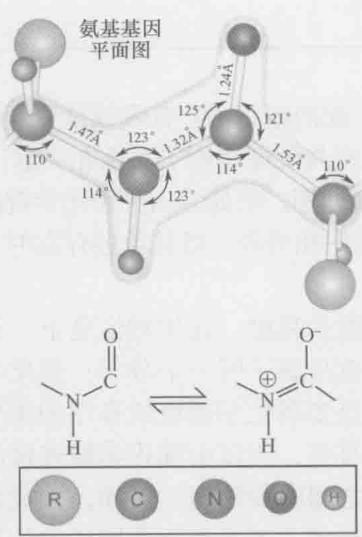  
图 3-2 肽键的平面结构。上图是某延伸多肽链的片段。由于肽键的双键特性（中间部分），旋转是不允许的，所有灰色区域的原子必须处于同一平面。然而，围绕其余两个共价键的旋转是可能的，这导致了多肽的不同结构。（来源：Pauling L. 1960. The nature of the chemical bond and the structure of molecules and crystals: An introduction to modern structure chemistry, 3rd edition, p. 495 Copyright ©1960 Cornell University.）

#### [W] 化学键的量子机制解释

构成化学键的力，不论强弱，其本质对化学家来说始终是个谜，直到20世纪20年代，原子的量子理论（量子机制）建立，关于化学键形成的众多的经验主义法则才第一次有了坚实的理论基础。人们认识到所有的化学键，不论强弱，均基于电荷力。量子机制将共价键解释为共用电子，也为弱化学键的形成提供了解释。

#### [W] 化学键的形成涉及能量形式的变化

两个原子之间化学键的自发形成过程总是包括未成键原子部分内能的释放和向另一能态的转变。键越强，成键过程中释放的能量越多。原子 A 和 B 的成键过程可描述为：

$$
\mathrm{A} + \mathrm{B} \rightarrow \mathrm{AB} + \text { 能量 } \quad [ \text { 方程   3 - 1 } ]
$$

在这里，AB 代表成键集合体，A 与 B 的反应速率直接与两者的碰撞概率成正比。卡

路里（calorie）经常用来作为衡量能量的单位，1 cal 是 1 g 水的温度从 14.5℃ 提高到 15.5℃ 所需的能量。由于 1 mol 化学键的打断通常会释放上千卡的能量，因此化学反应中大部分的能量变化用千卡每摩尔表示（kcal/mol）。

然而，由化学键连接的原子不会永久结合在一起，因为存在打断化学键的力。到目前为止，其中最重要的一种来自热能。高速运动的分子或原子之间的碰撞能够打断化学键，在碰撞过程中，一个运动分子碰到两个连接着的原子，失去部分动能，同时会将它们分开。分子运动越快（温度越高），在碰撞过程中打断化学键的可能性越大。因此，提高分子所处的温度，其化学键的稳定性就下降。化学键的打断一般表示如下：

$$
\mathrm{AB} + \text { 能量 } \rightarrow \mathrm{A} + \mathrm{B}\tag{[方程 3-2]}
$$

打断化学键所需的能量与形成化学键时释放的能量正好相等。这种等量遵循热力学第一定律，即能量（除非与质量相互转换）既不能创生也不能消灭。

#### [W] 化学键形成与断裂的平衡

每一个化学键都是形成与断裂综合反应的结果。当两者在一个密闭体系中达到平衡时，单位时间产生的化学键的数量将等于断裂的化学键数量。所以成键原子的比率可以用下面的方程描述：

$$
K _ {\mathrm{eq}} = \operatorname{conc} ^ {\mathrm{AB}} / \left(\operatorname{conc} ^ {\mathrm{A}} \times \operatorname{conc} ^ {\mathrm{B}}\right)\tag{[方程 3-3]}
$$

式中， $K_{eq}$ 表示平衡常数（equilibrium constant），conc $^{A}$ 、conc $^{B}$ 和 conc $^{AB}$ 分别表示 A、B 和

AB 的含量百分比，以 mol/L 为单位。不管我们以 A 和 B 起始，还是以分子 AB 或分子 AB 和 A、B 的混合物起始，达到平衡时，A、B 和 AB 的比率都会达到由 $K_{eq}$ 给出的浓度。

#### [W] 自由能的概念

在成键原子的比率趋向平衡浓度（equilibrium concentration）的过程中，能量的形式在不断变化。从生物学的角度来说，表示这种能量变化最有效的方法就是通过物理化学家的自由能（free energy）的概念来描述。这一概念用G表示，以纪念19世纪伟大的物理学家吉布斯（Josiah Gibbs）。本书不会给出严格的自由能的定义，也不会给出自由能与其他能量形式的区别之处。因此，读者必须阅读有关热力学第二定律的化学类参考书。在此我们只能说，自由能是一种能够做功的能量。

热力学第二定律告诉我们，在自发的反应中自由能总是下降的（ $\Delta G$ 是负值）。然而，当反应达到平衡时，自由能将不再变化（ $\Delta G=0$ ）。密闭体系的平衡态是自由能最低的状态。

在反应趋近平衡态的过程中失去的自由能，或者转化为热，或者使熵值增加。在此，我们不会试图定义熵，只能说熵是衡量混乱度的标准：混乱度越高，熵值越大。熵的存在意味着许多自发的化学反应（伴随有自由能的净下降）并不需要提供激发热能。例如，当氯化钠（NaCl）溶于水时，体系吸热而不是放热。虽然如此，自由能仍然净下降，因为钠离子和氯离子从固体溶入水的过程增加了体系的混乱度。

#### [W] $K_{\mathrm{eq}}$ 与 $\Delta G$ 呈指数关系

很明显，化学键越强，相应地伴随其释放的自由能（ $\Delta G$ ）越多，以成键状态存在的原子的比率越大。这一常识以物理化学方程定量表示如下：

$$
\varDelta G = - R T (\ln K _ {\mathrm{eq}}) \text {或} K _ {\mathrm{eq}} = \mathrm{e} ^ {- \varDelta G / \mathrm{RT}}\tag{[方程 3-4]}
$$

式中，R 是气体常数，T 是绝对温度，ln 是以 e 为底数的对数（以 $K_{eq}$ 为幂）， $K_{eq}$ 是平衡常数，e = 2.718。

将 R 值（1.987 cal/deg·mol）和 T（当温度为 $25^{\circ}$ C 时等于 298）代入公式中发现，如果所有的反应物以摩尔浓度表示，低至 2 kcal/mol 的 $\Delta G$ 能够使一个成键反应进行完全（表 3-1）。

表 3-1 ${25}^{ \circ  }\mathrm{C}$ 时平衡常数与 ${\Delta G}$ 的关系

<table><tr><td>平衡常数( $K_{eq}$ )</td><td>自由能 $\Delta G$ (kcal/mol)</td></tr><tr><td>0.001</td><td>4.089</td></tr><tr><td>0.01</td><td>2.726</td></tr><tr><td>0.1</td><td>1.363</td></tr><tr><td>1.0</td><td>0</td></tr><tr><td>10.0</td><td>-1.363</td></tr><tr><td>100.0</td><td>-2.726</td></tr><tr><td>1000.0</td><td>-4.089</td></tr></table>

#### [W] 共价键是很强的

伴随自由原子，如氢或氧，共价键形成的 $\Delta G$ 以符号表示是极大的负值，通常有-50\~-110 kcal/mol。方程3-4告诉我们，成键反应的 $K_{\mathrm{eq}}$ 会相当大，所以保持未成键状态的氢原子或氧原子的比率将会极低。如果我们有 $1\mathrm{mol / L}$ 的反应原子，且 $\Delta G$ 为-100 kcal/mol，当反应达到平衡时每 $10^{40}$ 个原子中仅会有一个保持未成键状态。

#### [W] 生物体系中的弱化学键

范德华力、疏水键、氢键和离子键是生物体系中几种重要的弱化学键。我们将发现，有时氢键和离子键之间的区别并不那么严格。

#### [W] 弱化学键具有 1\~7 kcal/mol 的能量

范德华力是最弱的化学键，它的能量（1～2 kcal/mol）仅仅比热运动的动能稍大。氢键和离子键的能量为3～7 kcal/mol。

在溶液体系中，几乎所有分子都与其邻近原子建立一些弱化学键。任何分子都有形成范德华力的能力，而氢键或离子键只能在带有净电荷（离子）或电荷分布不均匀的分子之间形成。某些分子拥有形成多种弱化学键的能力。然而考虑到能量因素，我们知道分子总是更倾向于形成较强的化学键。

#### [W] 生理温度下弱化学键不断形成和断裂

最强的弱化学键的能量仅是 $25^{\circ}$ C 时（热）运动的平均动能（0.6 kcal/mol）的 10 倍左右。由于热运动的动能具有明显的扩散性，在生理温度下具有许多这样的分子，它们拥有足够的动能来打断最强的弱化学键。

极性与非极性分子的区别

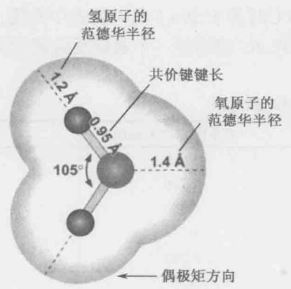  
图 3-3 水分子的结构。

所有形式的弱相互作用都是基于电荷间的吸引力。电荷间的分离可能是永久的，也可能是暂时的，这取决于对象原子。例如，氧分子（O：O）的两个氧原子间具有对称的电荷分布，所以两个原子都不带电荷；相反，水分子（H：O：H）的成键电子不是平衡共享的，因此具有不对称的电荷分布（图3-3）。这些成键电子与氧原子更牢固地结合，导致氧原子携带一定的负电荷，而两个氢原子携带相等的正电荷，正电荷的中心在负电荷中心的另一侧。分离的正负电荷的合力被称为电荷偶极矩（dipole moment）。电子的非平均共用反映了成键原子对电子的不同吸引力。具有获取电子倾向的原子称为负电性（electronegative）原子；具有失去电子倾向的原子称为正电性（electropositive）原子。

具有偶极矩的分子（如 $H_{2}O$ ）被称为极性分子（polar molecule）；没有有效偶极矩的分子被称为非极性分子（nonpolar molecule）。例如，在甲烷（ $CH_{4}$ ）中碳原子和氢原子对它们共用的电子对具有相似的吸引力，所以任何一方都不带明显电荷。

一个分子的电荷分布能够被其周围存在的其他分子所影响，当后者是极性分子时影响尤其明显。这种影响能够使非极性分子具有轻微的极性特性。如果后者没有极性，它的存在通过电荷分布波动仍然能够改变非极性分子。但是，这种削弱的影响所产生的电荷分离要远远弱于极性分子，导致极低的反应能量和弱化学键的自发生成。

#### [W] 范德华力

范德华力（van der Waals bonding）来源于两个相距足够近的原子之间的非特异吸引力。它产生的基础不是存在永久的电荷分离，而是分子靠近所引起的电荷轻微波动。范德华力作用于所有类型的分子，不论是极性分子还是非极性分子。由于键能与键长的6次方成反比，因此，范德华力受相互作用的分子之间的距离的影响极大（图3-4）。

  
图 3-4 范德华力随距离变化的改变。本图中所示原子为稀有惰性气体氩原子。（来源：Adapted from Pauling L. 1953, General chemistry, 2nd. edition, p. 322. Copyright 1953 by W. H. Freeman. Used with permission.）

当原子间距离更短时，更强的范德华排斥力同样存在，这种排斥源于所涉及原子的外电子层的重叠。对每种原子，范德华吸引力和排斥力会在某一特定距离达到平衡，这个距离即所谓的范德华半径（van der Waals radius）（表3-2和图3-5）。随着原子大小的增加，相距距离为范德华半径的两个原子间的范德华力的能量增大。对普通原子，其能量大约为1 kcal/mol，仅比室温下的分子平均热能（0.6kcal/mol）略大。

表 3-2 生物分子中原子的范德华半径

<table><tr><td>原子</td><td>范德华半径/Å</td></tr><tr><td>H</td><td>1.2</td></tr><tr><td>N</td><td>1.6</td></tr><tr><td>O</td><td>1.4</td></tr><tr><td>P</td><td>1.9</td></tr><tr><td>S</td><td>1.85</td></tr><tr><td>CH3基团</td><td>2.0</td></tr><tr><td>芳香族分子的半厚度</td><td>1.7</td></tr></table>

这意味着在生理温度下，只有在某个分子与另一分子的几个原子之间成键时，范德华力才是有效的成键力。只有这时，反应的能量才大于由随机热运动带来的分离趋势。为了使数个原子能够有效地相互作用，分子必须精确地吻合，因为两个相互作用的原子之间的距离不能超过它们的范德华半径太多（图3-6）。距离只要稍有扩大，键的强度就会迅速趋向于零。所以当一个分子形成的凹穴正好配合另一个分子的突起部分，两者之间就能形成最强的范德华力，抗原和它的特定抗体就是一个最好的例子（图 3-7）。在这种情况下，键能有时能够达到 20～30 kcal/mol，因此，抗原-抗体复合物极少分离。范德华力不是极性分子的主要成键模式，因为这些分子通过形成其他形式的化学键能够处在更低的能态（失去更多自由能）。

  
图 3-5 几种保持范德华半径的分子。原子分别以紫色、蓝色和橙色表示。

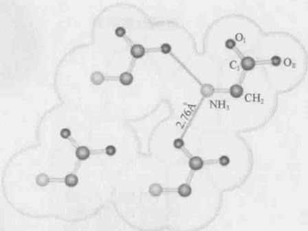  
图 3-6 甘氨酸结晶的分子排列。分子的空间结构是由其组成原子的范德华半径决定的，N-HO 键例外，氢键的存在使它缩短了。（来源：Adapted, with permission, from Pauling L. 1960. The nature of the chemical bond and the structure of molecules and crystals: An introduction to modern structure chemistry, 3rd ed., p. 262. ©1960 Cornell University.）

  
图 3-7 抗原-抗体反应。所示结构为 Fab D1.3 和溶菌酶（紫色）所形成的复合物，a 为空间实体模型，b 为片段折叠模型。（Fischmann T. O., Bentley G. A., Bhat T. N., Boulot G., Mariuzza R. A., Phillips S. E., Tello D., and Polijak R. J. 1991 J. Biol. Chem 266: 12915.）

#### [W] 氢键

氢键（hydrogen bond）形成于一个带部分正电的共价键供体氢原子和一个带部分负电的共价键受体原子之间（图 3-8）。例如，氨基 $\left(-NH_{2}\right)$ 的氢原子被带负电的酮基 $(-C=O)$ 的氧原子吸引。有时，形成氢键的原子属于某个带一个单位电荷的基团（如 $NH_{3}^{+}$ 或 $COO^{-}$ ）；有时，供体氢原子和负电性受体原子都带不足一个单位电荷。

与氧原子（O-H）或氮原子（N-H）共价连接的氢原子形成了生物学上最重要的氢键。而且，氧原子和氮原子也是常见的负电性受体原子。表3-3列出了一些最重要的氢键。如果不考虑环境中的水分子，氢键键能介于3\~7 kcal/mol，受体原子与供体原子间的电荷差越大，键越强。氢键虽然弱于共价键，却明显强于范德华力。因此，氢键将使两个原子间的距离小于范德华半径，但不会小于由共价键连接的两个原子间的距离。

与范德华力不同的是，氢键有高度的方向性。在最强的氢键中，氢原子明显朝向受体原子（图 3-9）。如果氢原子的偏向超过 $30^{\circ}$ ，键能就比较低。由于氢键的形成需要分子中存在互补的供体氢原子和受体基团，所以氢键比范德华力更具特异性。

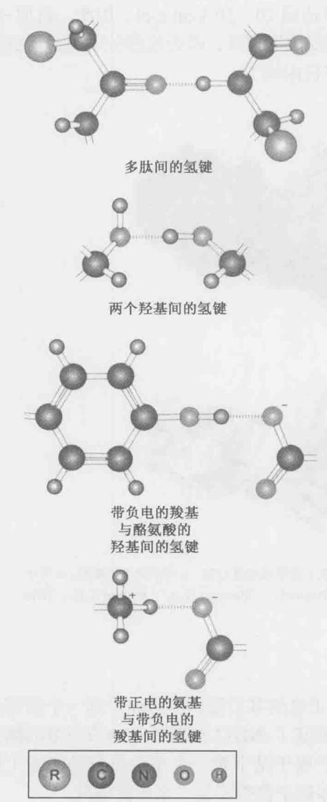

表 3-3 生物学中重要氢键的大约键长

<table><tr><td>键</td><td>氢键近似长(Å)</td></tr><tr><td>O—H·····O</td><td>2.70±0.10</td></tr><tr><td>O—H·····O-</td><td>2.63±0.10</td></tr><tr><td>O—H·····N</td><td>2.88±0.13</td></tr><tr><td>N—H·····O</td><td>3.04±0.13</td></tr><tr><td>N+—H·····O</td><td>2.93±0.10</td></tr><tr><td>N—H·····N</td><td>3.10±0.13</td></tr></table>

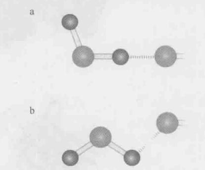  
图 3-9 氢键的方向性。a. 共价键 O—H 的矢量直接指向受体氧原子，形成强化学键。b. 矢量没有指向氧原子，形成弱化学键。

#### [W] 某些离子键也是氢键

许多有机分子由于带有一个或多个净正电荷或负电荷而具有了离子特性。例如，带负电的单核苷酸含有带负电的磷酸基团，而所有氨基酸（脯氨酸除外）都带有负电性的羧基（COO $^{-}$ ）和正电性的氨基（NH $_{3}^{+}$ ），各带一个单位电荷。这些带电基团的电荷通常被附近带相反电荷的基团中和。带相反电荷的基团间的静电力称为离子键（ionic bond）。

图 3-8 生物分子中的氢键举例。

在水溶液中，离子键的平均键能一般约为 5 kcal/mol。

在一般情况下，无机阳离子（如 $Na^{+}$ 、 $K^{+}$ 或 $Mg^{2+}$ ）或阴离子（如 $Cl^{-}$ 或 $SO_{4}^{2-}$ ）可以中和离子化的有机分子的电荷。在水溶液中，阳离子和阴离子中和电荷后并不占据特定位置，这是因为无机离子通常带有水化层，因而并不与带电基团直接接触。所以在水溶液中，围绕无机阳离子或阴离子的静电力并不是决定有机分子外形的重要因素。

另一方面，带相反电荷的基团所形成的氢键将具有高度的方向性。例如， $\mathrm{COO}^{-}$ 和 $\mathrm{NH}_3^+$ 经常形成氢键。由于这种键要强于由带不到一个单位电荷的基团所形成的化学键，它们的键长也会相应的短些。而带一个单位电荷的基团也可以和带不到一个单位电荷的基团形成强的氢键。例如，氨基（ $\mathrm{NH}_2$ ）的氢原子能与羧基（ $\mathrm{COO}^{-}$ ）的氧原子形成强化学键。

#### [W] 弱相互作用需要互补的分子表面

只有当相互作用的表面非常邻近时，弱化学键才能起作用。而只有当分子表面具有互补结构（complementary structure）时，也就是说一个分子表面的突起部分（或正电）与另一个分子表面的凹穴（或负电）相称时，这种邻近才有可能实现，即相互作用分子必须具有锁钥结构关系（lock-and-key relationship）。在细胞中，这一要求通常意味着一些分子不能和同类型的另一分子结合，因为这些分子不具有分子内相互作用所必需的对称性。例如，一些极性分子拥有供体氢原子却缺乏适合的受体原子，而另一些分子虽然能够接受氢键却没有氢原子来供给。此外，细胞中存在着许多这样的分子，由于拥有必要的对称性，它们能够形成强分子内相互作用，水分子就是这样一个重要的例子。

#### [W] 水分子形成氢键

生理条件下，水分子几乎从不离子化形成 $H^{+}$ 和 $OH^{-}$ 。取而代之的是，它们以极性 H-O-H 分子的形式存在，其中的氢原子和氧原子都形成了强氢键。每个水分子的氧原子能够结合其他分子的两个氢原子，而每个氢原子可以结合一个邻近氧原子。这些氢键构成正四面体结构（图 3-10），因而当水分子处于液态或固态时，每个水分子总有 4 个最近的邻居（nearest neighbors），正四面体的每一个方向一个。处于冰的形态的水分子与邻近水分子的结合将会非常牢固，邻近水分子的数目也是固定的。如果温度大于冰点（0℃），热运动的能量就能打断氢键，允许水分子不断变更其最邻近的水分子。然而，即使是液态水，大多数水分子在任一瞬间内还是由4个强氢键连接着。

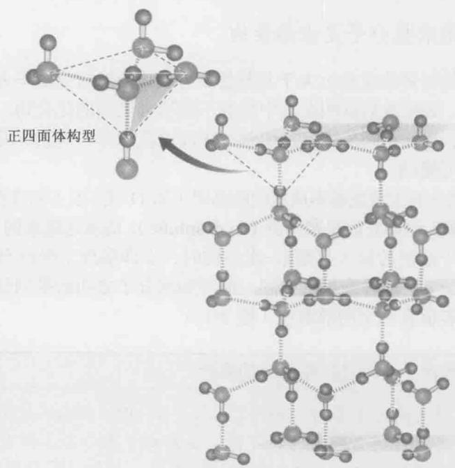  
图 3-10 水分子所形成的晶格。水分子间形成氢键所获得的能量促使其形成正四面体结构。氧原子以大圆表示，氢原子以小圆表示。尽管分子的温度决定了排列的严格性，如图所示的结构不但在冰中，在水中也还是占优势。（引用自 Pauling L. 1960. The nature of the chemical bond and the structure of molecules and crystals: An introduction to modern structure chemistry, 3rd edition, p. 262. Copyright © 1960 Cornell University. Used by permission of the publisher.）

#### [W] 水溶液中分子间的弱化学键

弱化学键的平均能量尽管低于共价键，却毫无疑问地大于热能，因而能够确保大部分水溶液中的分子与其他分子形成次要化学键。方程3-4经修正适合于液体中高浓度分子的情况下，可以给出分子的成键比率。由此我们可以知道，在生理温度下低至2\~3 kcal/mol的反应能都足以使大多数分子形成最大量的强次要化学键。

溶剂分子在特定瞬间内会显著地影响溶质分子的特定结构，这不仅因为分子都具有特定外形，而且还因为不同的分子能够形成不同的次要化学键。所以，一个分子将会不停运动，直到它与一个能与之形成最强化学键的分子靠近。

毫无疑问，溶液是非静态的。由于热运动的扰乱，溶液的特定结构不断从一个状态变化到另一具有同等内能的状态。在生物体系中同等重要的一个事实是，新陈代谢持续地将一个分子转变为另一个分子，因此自动地改变了所形成的次要化学键。细胞的溶液态结构不但被热运动不停扰动，而且受其溶质分子在新陈代谢过程中变化的影响。

#### [W] 倾向于形成氢键的有机分子是水溶性的

每个原子基团的氢键能量是远大于其范德华力的，所以与范德华力相比，分子更容易形成氢键。例如，如果我们试图在水中溶解不能形成氢键的化合物，如苯，水分子和苯分子会迅速分开，水分子间形成氢键而苯分子间以范德华力聚集。因此在水中溶解非氢键有机分子是不可能的。

另一方面，那些含有大量能够形成氢键的基团（如 O 或 OH）的极性分子（如葡萄糖和丙酮酸）能够溶解于水[即它们是亲水的（hydrophilic），而不是疏水的（hydrophobic）]。当这类基团对水分子晶格的插入打断水-水氢键时，立即形成了极性有机分子和水分子间氢键。然而在能量上，这种变化的排列一般不如水分子之间的排列稳定，因此即使是极性最大的分子一般也有一定的溶解度（框 3-1）。

#### [W] 框3-1 分子外形的唯一性和选择性结合的概念

即使大多数细胞内的分子是由少数化学基团（如 $OH$ 、 $NH_{2}$ 和 $CH_{3}$ ）构成，但分子对其邻近分子的选择仍然有着很大的特异性。这是由于每个分子都有其唯一的成键性质。一个非常明显的证明来自于立体异构物的特异性。例如，蛋白质总是由 L-氨基酸构成，而不是其镜像 D-氨基酸（框 3-1 图 1）。尽管 L-氨基酸和 D-氨基酸具有完全相同的共价键，它们和不对称分子的结合特性却十分不同。因此，大部分酶对 L-氨基酸特异。如果一种特异性的酶能够和 L-氨基酸结合，那么它就不能结合 D-氨基酸。

细胞内大多数分子仅能与少数其他分子形成有效的弱化学键，部分原因是生物系统中的大多数分子存在于溶液环境中。细胞中化学键的形成不仅依赖于两个分子是否连接紧密，而且依赖于此化学键是否比与溶剂水分子可能形成的其他化学键有利。

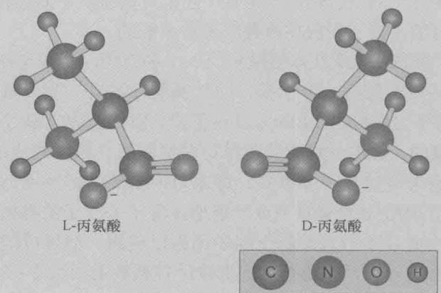  
框 3-1 图 1 丙氨酸的两种立体异构体。(来源: Adapted from Pauling L.1960. The nature of the chemical bond and the structure of molecules and crystals : An introduction to modern structure chemistry, 3rd edition, p.465. Copyright 1960 © Cornell University.

因此，几乎所有细胞需要的分子，不管是通过食物还是生物合成获取，在水中都或多或少是不溶的。通过热运动，这些分子偶尔与其他分子发生碰撞，直到它们与互补的分子表面结合，释放水分子以参与水相反应。

#### [W] 疏水“键”稳定大分子

水分子排斥非极性分子的强烈趋势经常被为疏水键（hydrophobic bonding）。一些化学家喜欢称水溶液中所有非极性分子间的化学键为疏水键（图 3-11）。从某种意义来说这种叫法是错误的，因为它试图强调的现象是不存在化学键（非极性分子间易于形成的化学键基于范德华吸引力）。另一方面，疏水键这一叫法又很有用，因为它强调了这样一个事实，即非极性分子会试图排列在一起以避免与水分子接触。不论是对蛋白质分子之间和蛋白质与其他分子的复合物的稳定性，还是对蛋白质在细胞膜上的分布，疏水作用都非常重要，它可能占据了蛋白质折叠时总自由能的一半。

  
图 3-11 氨基酸非极性侧链间的范德华力（疏水性）。氢原子没有单独标出，为了图示的清晰，范德华半径缩小了 20%，填充图旁的结构式表示原子的排列情况。a. 苯丙氨酸-亮氨酸键；b. 苯丙氨酸-苯丙氨酸键。（来源：Adapted from Scheraga H.A., The proteins, 2nd edition, p. 527. Copyright © Harold Scheraga. Used with permission.）

例如，考虑丙氨酸和甘氨酸在水溶液中与一个拥有同丙氨酸互补表面的分子成键时释放能量的差异——丙氨酸有一个甲基，而甘氨酸却没有。当丙氨酸与这个分子成键时，甲基周围的范德华力释放出1 kcal/mol的能量，而甘氨酸成键时却不会。从方程3-4我们可以知道，单独的、如此小的能量差异对丙氨酸和甘氨酸的成键不会有太大影响。然而，此计算并没有考虑这样一个事实，即水对丙氨酸的排斥度远大于甘氨酸。丙氨酸中存在的 $CH_{3}$ 比甘氨酸中的氢原子更严重地扰乱了水分子的晶格。目前，由疏水性侧链扰乱水分子晶格而必须引入的修正因子还难以预测。但很可能，水倾向于排斥丙氨酸，并将它推向第三分子，这是通过比水排斥甘氨酸的力大2\~3 kcal/mol的疏水作用完成的。

由此我们得出了一个重要结论，即使最为相近的分子与第三分子成键时的能量差别（当相似分子间的差别为一个非极性基团），在细胞内溶液中比在非水溶液环境中也至少大2\~3 kcal/mol。有时，能量差异可达3\~4 kcal/mol，这是因为涉及的分子通常含有能形成氢键的极性基团。

#### [W] $\Delta G$ 具有的 2\~5 kcal/mol 的优势

我们知道，一个次要化学键的能量（2～5 kcal/mol）能够确保一个分子与另一分子的特定基团优先成键。而且，这种能量差不多会大到在细胞中形成严格的晶格排列；也就是说，细胞内不会结晶，但是如果次要化学键的能量大上数倍，结晶就会发生。大能量差意味着次要化学键极少断裂，断裂会导致与细胞生存不相容的低溶质扩散率。

#### [W] 弱化学键使酶与底物结合

弱化学键是酶与其底物初始结合的必需基础。酶并非任意地与所有分子结合，而是仅与其底物有显著的亲和性。

因为酶对化学反应的两个方向都有催化作用，所以它们必须对两套反应分子都有特异的亲和性。在某些情况下，可以测量酶与其底物结合的平衡常数（方程3-4），从而计算出成键的 $\Delta G$ 。由此可以得到关于成键类型的提示。一些 $\Delta G$ 在 $5\sim 10$ kcal/mol间的强次要化学键是特异性酶-底物反应的基础。另一个值得注意的是，化学键的 $\Delta G$ 极少大到异常，所以作为随机热运动的结果，酶底物复合物能够快速地形成和分解。这解释了为什么酶能够快速地行使其功能，有时甚至快至 $10^{6}$ 次/秒。如果酶与其底物，或者更重要的是与其产物，以更强的化学键结合，它们的反应速度就会慢得多。

大多数蛋白质-DNA、蛋白质-蛋白质相互作用由弱化学键介导

正如我们在本书中将要看到的，蛋白质与 DNA 的相互作用、蛋白质与蛋白质的相互作用构成了细胞生命活动的核心，这些生命活动包括如何识别信号并做出反应、基因的表达、DNA 的复制、修复和重组等，当然还包括对这一系列过程的调控。同样地，这些相互作用是通过在本章中所描述的这类弱化学键来实现的。尽管单个化学键的能量很低，但是任意两个相互作用分子间的许多这类化学键的共同作用保证了反应的亲和性及特异性。

在第 6 章，我们将要具体讨论蛋白质是如何构建的、它们怎样形成特定的结构，以及它们如何与 DNA 或蛋白质结合。

#### [W] 高能键

我们现在来关注一下生物系统中的高能共价键。目前我们已经从热动力学角度讨论过弱键的形成。每次讨论弱键的时候都会面对这样的问题：弱键的形成是否涉及自由能的获得或丢失？只有当 $\Delta G$ 为负值的时候，热动力学平衡才会有利于反应的进行。这一方法对共价键同样有效。生物酶经常参与共价键的形成或断裂的事实并不意味着不再需要 $\Delta G$ 为负。

然而，从表面上分析，细胞中很多重要共价键的形成同热动力学定律是相悖的，尤其是那些把小分子聚合在一起形成大的聚合分子的键。这些键的形成一般会涉及自由能的增加。最初，这一事实说明细胞具有一种独特的能力可以在违反热动力学定律的条件下正常工作，这一特性实际上是真正的“生命的奥秘”。

不过现在，人们已经很清楚，这些生物合成过程并不违反热动力学定律，而是基于同最初假设不同的反应。例如，核酸并不是由核苷磷酸盐缩合而成；糖原也不是直接由葡萄糖残基形成；蛋白质也不是由氨基酸单元形成的。取而代之的是，单分子前体利用ATP中的能量首先转化成高能量的“激活”前体。接下来，我们会通过研究蛋白质中的肽键和核酸中的磷酸二酯键的热动力学阐明这些观点。然而，我们首先需要简要地了解一下共价键的一般热动力学特性。

#### [W] 供能分子是热不稳定的

不同分子所拥有的自由能变化范围很大，这是因为共价键并不总是具有相同的能量。举例来说，氢氧原子间的共价键比氢氢原子间的或氧氧原子间的共价键明显要强，消耗 O—O 或 H—H 来形成 O—H 将会释放能量。因此，能量观点告诉我们，充分浓缩的氧气和氢气的混合物将会转化为水。

一个分子以弱共价键连接时将会比以强共价键连接时具有更多的自由能。初看起来这个观点好像很矛盾，因为这意味着键越强，释放的能量越少。但是当我们了解到一个形成强化学键的原子在此过程中已经失去大量自由能的时候，就自然能得出以上结论。因此，那些含有弱共价键而成为热不稳定的分子是最好的食物分子（供能分子）。

例如，葡萄糖就是一个理想的食物分子，因为当它被氧化为 $CO_{2}$ 和 $H_{2}O$ 时，自由能显著降低。另一方面， $CO_{2}$ 的碳氧原子间有着强共价双键，即羰基双键（carbonyl bond），不是动物的食物分子。在缺乏能量供体 ATP 时，即使有特定酶的帮助， $CO_{2}$ 也不能自发转化为更复杂的有机分子。 $CO_{2}$ 能被植物作为主要碳源是因为光量子提供的能量在磷酸化的过程中导致了 ATP 的生成。

在生理温度下如果没有催化作用，将分子转化为其他含较低自由能分子的化学反应几乎没有速度。这是因为，即使是弱共价键，相对来说也很强，在细胞中极少被热运动打断。为了在缺少催化作用的条件下打断共价键，我们必须提供将成键原子分开的能量。当原子被分开后，它们可以与新的对象结合形成更强的化学键，在结合过程中，释放的能量等于打断旧化学键而消耗的能量与新旧键间的能量差之和（图 3-12）。

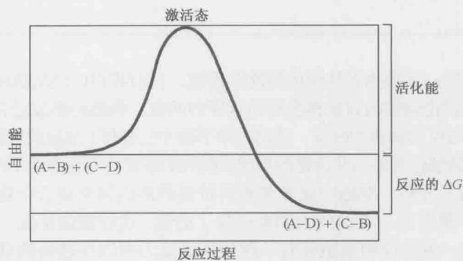  
图 3-12 化学反应的活化能： $(A-B)+(C-D)\rightarrow(A-D)+(C-B)$ 。这个反应伴随有自由能的下降。

在分子转化过程中必须提供的打断旧化学键的能量称为活化能（activation energy）。活化能通常小于化学键的初始能，因为分子重排一般不会产生完全自由的原子，取而代之的，两个反应分子间的碰撞是必需的，随之形成暂时的分子复合物形式，称为激活态（activated state）。在激活态，两个分子的紧密邻近使各自的化学键更加不稳定，所以打断此时的化学键就比打断自由分子的化学键所需的能量少。

细胞内大多数共价键的化学反应表示如下：

$$
(A - B) + (C - D) \rightarrow (A - D) + (C - B)\tag{[方程 3-5]}
$$

这一反应的质量方程为：

$$
K _ {\mathrm{eq}} = \left(\operatorname{conc} ^ {\mathrm{A-D}} \times \operatorname{conc} ^ {\mathrm{C-B}}\right) / \left(\operatorname{conc} ^ {\mathrm{A-B}} \times \operatorname{conc} ^ {\mathrm{C-D}}\right)\tag{[方程 3-6]}
$$

式中， $conc^{A-B}$ 、 $conc^{C-D}$ 等指的是以 mol/L 表示的反应物的浓度。同样地，在这里方程 3-7 将 $K_{eq}$ 与 $\Delta G$ 联系起来（表 3-4）。

$$
\Delta G = - R T \mathrm{ln} K _ {\mathrm{eq}} \text {或} K _ {\mathrm{eq}} = \mathrm{e} ^ {- \Delta G / R T}\tag{[方程 3-7]}
$$

由于反应的能量通常为 20～30 kcal/mol，生理温度下激活态几乎不存在。高的活化能是阻止细胞内共价键自发重排的壁垒。这一壁垒的重要性非同寻常，没有它们，生命将不可能出现。因为所有的原子都将处于最低能量状态，这将导致无法为后续反应储存所需的能量。但是如果没有选择性地降低某些反应的活化能的方法，生命同样不可能出现。如果想让细胞在遭受诸如电离或紫外辐射等外力造成的损害后仍能有足够快的生长

速度，这种壁垒尤其是必需的。

表 3-4 $K_{\mathrm{eq}}$ 与 $\Delta G$ 的关系 $\Delta G = -RT (\ln K_{\mathrm{eq}})$

<table><tr><td>平衡常数  $K_{eq}$ </td><td>自由能 $\Delta G/(kcal/mol)$ </td><td>平衡常数  $K_{eq}$ </td><td>自由能 $\Delta G/(kcal/mol)$ </td></tr><tr><td> $10^{-6}$ </td><td>8.2</td><td> $10^{-1}$ </td><td>1.4</td></tr><tr><td> $10^{-5}$ </td><td>6.8</td><td> $10^{3}$ </td><td>0.0</td></tr><tr><td> $10^{-4}$ </td><td>5.1</td><td> $10^{2}$ </td><td>-1.4</td></tr><tr><td> $10^{-3}$ </td><td>4.1</td><td> $10^{2}$ </td><td>-2.7</td></tr><tr><td> $10^{-2}$ </td><td>2.7</td><td> $10^{3}$ </td><td>-4.1</td></tr></table>

#### [W] 酶在生物反应中降低反应的活化能

生命绝对需要酶。酶的功能（function of enzymes）就是通过将分子重排的活化能降低到热运动能够提供的范围，从而加速细胞生存所必需的化学反应速率（rate）（图3-13）。当特定的酶存在时，阻止具有最低自由能的反应物快速反应的壁垒将会消失。酶不会改变反应的平衡，它们仅仅加快了反应的速度。因此，如果热力学平衡对某个分子的形成不利，酶的存在并不能提高该分子的产率。

  
图 3-13 酶（彩色曲线）降低活化能并加快反应速度。注意，因为平衡状态没有改变，所以 $\Delta G$ 保持相同。

由于酶必须催化每个细胞分子的重排，对不同分子自由能的认知并不能自然而然地告诉我们一个能量上允许的反应是否真实存在。必须考虑反应速度。只有当细胞具有适合的酶时，反应才会有意义。

#### [W] 生物分子中的自由能

热力学告诉我们，所有的生化路径都必须具有自由能降低的特征。降解反应路径就是一个明显的例子，在反应中伴随着热的放出，热力学不稳定的食物分子被转变为更稳定的化合物，如 $CO_{2}$ 和 $H_{2}O$ 。所有的降解反应路径都有两个主要目的：①为更大的有机分子的形成提供必需的、作为原料的小有机分子片段；②将原始食物分子的大部分自由能以可利用的形式保存起来。通过耦联降解反应路径的几个步骤与储存自由能的高能分子（如 ATP）的形成，就能达到第二个目的。

食物分子的所有自由能并不是完全转化为高能分子的自由能。如果实际情况是这样，降解反应路径将不再具有自由能降低的特性，而且将不再存在有利于食物分子裂解的驱动力。相反，我们发现所有降解反应路径都会伴随着食物分子中至少一半的自由能转化为热或熵。例如，据估计，细胞中葡萄糖的自由能大约40%被用来产生新的高能化合物，其余部分消散为热或熵。

#### [W] 具有高负值 $\Delta G$ 的高能键水解作用

拥有一到数个化学键的高能分子，其化学键可被水裂解，这种作用称为水解作用（hydrolysis），水解作用伴随有大量自由能的释放（5 kcal/mol）。这种水解时产生极大负值 $\Delta G$ 的特殊的化学键称为高能键（high-energy bond）。不过这种叫法有误导作用，因为不是这些化学键的能量高，而是水解时释放的自由能高。然而，高能键的叫法已被普遍接受，为了方便我们还是要继续这种用法并以符号“\~”表示高能键。

一个普通高能键的水解能量（约 7 kcal/mol）要比一个葡萄糖分子一步完全降解所释放的能量（688kcal/mol）小得多。葡萄糖的一步降解是不能产生高能键的。毫无疑问，这正是生物体中葡萄糖降解需要那么多步的原因。所以，降解过程中每一步所释放的能量与高能键水解的自由能大小对应。

最重要的高能化合物是 ATP。它由无机磷酸盐 $^{①}$ 和 ADP 所构成，利用降解反应或太阳光获得的能量形成，后者即光合作用（photosynthesis）。然而，自然界还存在许多其他重要的高能化合物。一些直接在降解反应过程中形成，另一些则利用 ATP 的自由能形成。表 3-5 列举了数种最重要类型的高能键，每一种都含有磷或硫原子。ATP 的高能磷酸键来自于磷酸基团单元，但是，焦磷酸键（ $\text{P} \sim \text{P}$ ）并非唯一一种高能磷酸键，磷酸基团与羧基氧原子的结合会产生一个高能酰键。现在我们已经清楚，在能量新陈代谢中，含有硫原子的高能键发挥着与含磷高能键几乎同等重要的作用。含有高能硫键的最重要的分子是乙酰 CoA，它是脂肪酸生物合成的主要能量来源。

表 3-5 高能键的重要类型

<table><tr><td>种类</td><td>示例分子</td><td>反应</td><td>反应的 $\Delta G$ (kcal/mol)</td></tr><tr><td>焦磷酸</td><td> $\textcircled{P} \sim \textcircled{P}$ 焦磷酸</td><td> $\textcircled{P} \sim \textcircled{P} \rightleftharpoons \textcircled{P} + \textcircled{P}$ </td><td> $\Delta G = -6$ </td></tr><tr><td>二磷酸腺苷</td><td>腺嘌呤— $\textcircled{P} \sim \textcircled{P}$ (ADP)</td><td> $ADP \rightleftharpoons AMP+ \textcircled{P}$ </td><td> $\Delta G = -6$ </td></tr><tr><td>三磷酸腺苷</td><td>腺嘌呤— $\textcircled{P} \sim \textcircled{P} \sim \textcircled{P}$ (ATP)</td><td> $ATP \rightleftharpoons ADP+ \textcircled{P}$ </td><td> $\Delta G = -7$ </td></tr><tr><td>烯醇式磷酸</td><td>[IMAGE]</td><td> $PEP \rightleftharpoons$ 丙酮酸+ $\textcircled{P}$ </td><td> $\Delta G = -12$ </td></tr><tr><td>氨</td><td></td><td> $AM \textcircled{P} \sim AA \rightleftharpoons AMP+AA$ </td><td> $\Delta G = -7$ </td></tr><tr><td>磷酸化胍盐</td><td></td><td>肌氨酸~ $\textcircled{P} \rightleftharpoons$ 肌氨酸+ $\textcircled{P}$ </td><td> $\Delta G = -8$ </td></tr><tr><td>硫酯</td><td>磷酸肌氨酸 $H_3C-C\overset{\text{O}}{\underset{\text{S-CoA}}{\ce{C}}}$ 乙酰-CoA</td><td>乙酰-CoA $\rightleftharpoons$ CoA-SH+乙酸根</td><td> $\Delta G = -8$ </td></tr></table>

高能键较大的 $\Delta G$ 分布范围（表 3-5）意味着“高能”键的叫法有些专横。一般的判断标准是该键的水解是否伴随有另一重要的生物合成反应。例如，伴随 6-磷酸葡萄糖的水解所产生的负 $\Delta G$ 是 3\~4 kcal/mol，但这个 $\Delta G$ 并不足以促使肽键的合成，因此这种磷脂键并不属于高能键。

#### [W] 生物合成反应中的高能键

由较小的分子组装形成大分子的过程通常需要输入自由能。如果不伴随着自由能的净下降，生物合成反应路径（如降解反应路径）将不会发生。这意味着许多生物合成反应路径需要外在的自由能来源，而高能化合物就是这些自由能来源。生物合成中许多化学键的形成与高能键的断裂相耦联，因而自由能的净变化是负值。所以细胞内高能键的寿命通常极短，它们几乎刚在降解反应中形成就被酶催化分解，以产生驱动另一反应进行的能量。

生物合成反应路径中并非每一步都需要高能键的断裂，经常仅仅是其中的一步或两步需要。有时这是因为即使缺少额外高能键， $\Delta G$ 还是有利于生物合成反应的方向。另一种情况是 $\Delta G$ 等于零或者甚至可能略微显正值，然而，与高能键水解作用耦联的 $\Delta G$ 相比，这种微小的正 $\Delta G$ 是微不足道的。正如我们在图3-14看到的，一个反应路径的所有自由能变化的总和才有意义。如果某一特定生物合成反应步骤的后继步骤的 $K_{\mathrm{eq}}$ 是 $100:1$ ，有利于生物合成反应的正方向，那么就不必再考虑它的 $K_{\mathrm{eq}}$ 略微（80：20）有利于降解反应。

同样地，降解反应路径中也并非每一步都产生高能键。例如，在葡萄糖漫长的酵解

产生 ATP。而且，许多降解反应路径中的一步或多步需要高能键的断裂。葡萄糖的酵解又是一个这样的例子，每产生 4 分子 ATP，它必须消耗 2 分子 ATP。当然，所有的产能降解反应过程都会产生比消耗的能量多的能量。

#### [W] 肽键的自发水解

由两个氨基酸生成一个二肽和一个水分子需要 1\~4 kcal/mol 的 $\Delta G$ ,

  
图 3-14 一个多步新陈代谢路径的自由能变化，A→B→C→D→E。其中两步（A→B 和 C→D）不利于 A→E 的反应方向，因为它们具有微正的 $\Delta G$ 。然而由于步骤 B→C 和 D→E 所提供的极大的负 $\Delta G$ ，它们已经没有意义了。所以，整个反应有利于 A→E 方向。

这依赖于参加反应的氨基酸类型。这种正值的 $\Delta G$ 告诉我们，多肽链不可能由自由氨基酸生成。更进一步，我们必须考虑这样一个事实，即细胞内水分子的浓度比其他任何分子高得多（一般情况下要高出 100 倍），所有水分子参与的反应的平衡都强烈地倾向于消耗水分子的反应方向。这可以由平衡常数的定义中简单看出。例如，生成二肽的反应：

$$
\mathrm{氨基酸(A)+氨基酸(B)} \rightarrow \mathrm{二肽(A-B)+H} _ {2} \mathrm{O}\tag{[方程 3-8]}
$$

具有以下平衡常数：

$$
K _ {\mathrm{eq}} = \left(\operatorname{conc} ^ {\mathrm{A} - \mathrm{B}} \times \operatorname{conc} ^ {\mathrm{H2O}}\right) / \left(\operatorname{conc} ^ {\mathrm{A}} \times \operatorname{conc} ^ {\mathrm{B}}\right)\tag{[方程 3-9]}
$$

在这里浓度都是以 mol/L 为单位。所以，对于一个给定的 $K_{eq}$ （方程 $\Delta G = -RT \ln K_{eq}$ 将其与 $\Delta G$ 联系在一起），大得多的水分子浓度意味着相对小的二肽浓度，而且相对浓度非常重要。实际上，简单的计算表明即使非水解反应的 $\Delta G$ 为 -3 kcal/mol，水解反应仍可能自发进行。

所以，在理论上蛋白质是不稳定的，如果给以足够长的时间，蛋白质将会自发降解为自由氨基酸。但从另一方面而言，如果缺乏特定的酶，这种自发反应的速度太低并不能对细胞的新陈代谢产生轻微的影响。也就是说，蛋白质一旦形成，除非被特定的酶催化降解，否则都将保持稳定状态。

负值 $\Delta G$ 与正值 $\Delta G$ 的耦联

在能够相互结合形成蛋白质之前，氨基酸必须接受自由能。人们发现 ATP 作为能量供体的基本作用之后，就明白了这一过程是如何实现的。ATP 含有 3 个与腺嘌呤分子（腺嘌呤-O- $^{①}$ \~ $^{②}$ \~ $^{③}$ ）相连的磷酸基团，当一个或两个末端～P 基团被水解断裂时，自由能会显著下降。

$$
\text { 腺嘌呤 } - \mathrm{O} - \textcircled {\mathrm{P}} \sim \textcircled {\mathrm{P}} \sim \textcircled {\mathrm{P}} + \mathrm{H} _ {2} \mathrm{O} \rightarrow \text { 腺嘌呤 } - \mathrm{O} - \textcircled {\mathrm{P}} \sim \textcircled {\mathrm{P}} + \textcircled {\mathrm{P}}\tag{[方程 3-10]}
$$

$$
(\Delta G = - 7 \mathrm{kcal/mol})
$$

$$
\text { 腺嘌呤 } - \mathrm{O} - \textcircled {P} \sim \textcircled {P} \sim \textcircled {P} + \mathrm{H} _ {2} \mathrm{O} \rightarrow \text { 腺嘌呤 } - \mathrm{O} - \textcircled {P} + \textcircled {P} \sim \textcircled {P}\tag{[方程 3-11]}
$$

$$
(\Delta G = - 8 \mathrm{kcal/mol})
$$

$$
\text {腺嘌呤- O - P } \sim \textcircled {P} + \mathrm{H} _ {2} \mathrm{O} \rightarrow \text {腺嘌呤- O - P} + \textcircled {P}\tag{[方程 3-12]}
$$

$$
(\Delta G = - 6 \mathrm{kcal/mol})
$$

所有这些断裂反应都具有负值 $\Delta G$ ，其绝对值（数字大小不考虑符号）要大于单体分子形成高分子时的正值 $\Delta G$ 。自身具有正值 $\Delta G$ 的生物合成反应之所以能够进行，是因为它们与高能键的断裂反应相耦联，而后者伴随着具有绝对值更大的负值 $\Delta G$ 。所以，在蛋白质的合成过程中，每个肽键的形成（ $\Delta G = +0.5 \, kcal/mol$ ）都与 ATP 断裂为 AMP 和磷酸盐的反应相耦联，后者具有 -8 kcal/mol 的 $\Delta G$ （方程 4-7）。这导致净 -7.5 kcal/mol 的 $\Delta G$ 已经足以保证平衡有利于蛋白质的合成而非断裂。

#### [W] 基团转移反应中前体的活化

当 ATP 被水解为 ADP 和磷酸盐的时候，大部分自由能转变为热。由于热能不能被

<!-- END OFFICIAL API PART part_001 -->

<!-- BEGIN OFFICIAL API PART part_002 -->

利用形成共价键，所以两个分别具有正值 $\Delta G$ 和负值 $\Delta G$ 的完全分离的反应不能形成耦联反应。相反，耦联反应是由两个或多个连续反应构成的。这些反应通常是基团转移（group-transfer）反应：在此类反应中，分子交换其功能基团（不包括氧化还原反应）。催化这类反应的酶被称为转移酶（transferase）。请看下面的反应：

$$
(\mathrm{A} - \mathrm{X}) + (\mathrm{B} - \mathrm{Y}) \rightarrow (\mathrm{A} - \mathrm{B}) + (\mathrm{X} - \mathrm{Y})\tag{[方程 3-13]}
$$

在这个例子中，X 基团与 B 相交换。转移基团反应被严格定义为不包括水分子参与的反应。当有水分子参与时，

$$
(\mathrm{A} - \mathrm{B}) + (\mathrm{H} - \mathrm{OH}) \rightarrow (\mathrm{A} - \mathrm{OH}) + (\mathrm{B} - \mathrm{H})\tag{[方程3-14]}
$$

这时反应就被称为水解反应，而参与的酶被称为水解酶（hydrolase）。

在此，令我们感兴趣的基团转移反应是那些与高能键连接的基团。当这类高能基团被转移至适当的受体分子时，它们将与受体分子以高能键连接。因此，基团转移反应允许高能键从一个分子向另一个分子的转移。例如，方程3-15和方程3-16展示了ATP的能量是如何转移以形成GTP的，后者是RNA合成的前体之一：

$$
\text { 腺嘌呤 } - Ⓟ \sim Ⓟ \sim Ⓟ + \text { 鸟嘌呤 } - Ⓟ \rightarrow \text { 腺嘌呤 } - Ⓟ \sim Ⓟ + \text { 鸟嘌呤 } - Ⓟ \sim Ⓟ [ \text { 方程   3 - 15 } ]
$$

$$
\text {腺嘌呤- } Ⓟ \sim Ⓟ \sim Ⓟ + \text {鸟嘌呤- } Ⓟ \sim Ⓟ \rightarrow \text {腺嘌呤- } Ⓟ \sim Ⓟ + \text {鸟嘌呤- } Ⓟ \sim Ⓟ \sim Ⓟ\tag{[方程 3-16]}
$$

GTP 的高能 $^{①}$ \~ $^{②}$ 基团使其可以自发与其他分子连接。GTP 是所谓活化分子（activated molecule）的一个例子；类似地，转移高能基团的过程被称为基团活化（group activation）。

#### [W] 基团转移中 ATP 的多变性

在对作为能量供体的分子的能量所进行的调控中，ATP 的合成起着关键作用。不论是在氧化反应中还是光合磷酸化反应中，能量用来将 ADP 和磷酸盐合成 ATP：

$$
\text { 腺嘌呤 } - Ⓟ \sim Ⓟ + Ⓟ + \text { 能量 } \rightarrow \text { 腺嘌呤 } - Ⓟ \sim Ⓟ \sim Ⓟ\tag{[方程 3-17]}
$$

由于 ATP 是生物体中高能基团的首先接受者，因此它必然是一系列反应的起始点。在这些反应中，高能基团被转移到低能量分子以使其获得自发反应的潜能。ATP 的中心作用源于这样一个事实，即它含有两个高能键，每一个的断裂释放不同的基团。这可以由图 3-15 看出，图中展示了由 ATP 产生的 3 种重要的基团： $^{①} \sim ^{②}$ ，焦磷酸基团；\~ AMP，单磷酸腺苷基团；\~ $^{③}$ ，磷酸基团。值得注意的是，只有当这些高能基团转移到适当的受体分子上时，它们才显示出高能特性。例如，\~ $^{④}$ 基团转移到 COO $^{-}$ 基团会产生高能 COO \~ $^{⑤}$ 磷酰基团，但是同样的基团转移到糖羟基（-C-OH）（正如 6-磷酸葡萄糖形成过程中发生的），却只能产生低能量化学键（水解中产生的 ΔG 降低小于 5 kcal/mol）。

#### [W] 与 AMP 连接使氨基酸活化

正如方程 3-18 所示，当 ATP 中的 AMP 基团转移到氨基酸的 COO $^{-}$ 基团上时，氨基酸就被活化了：

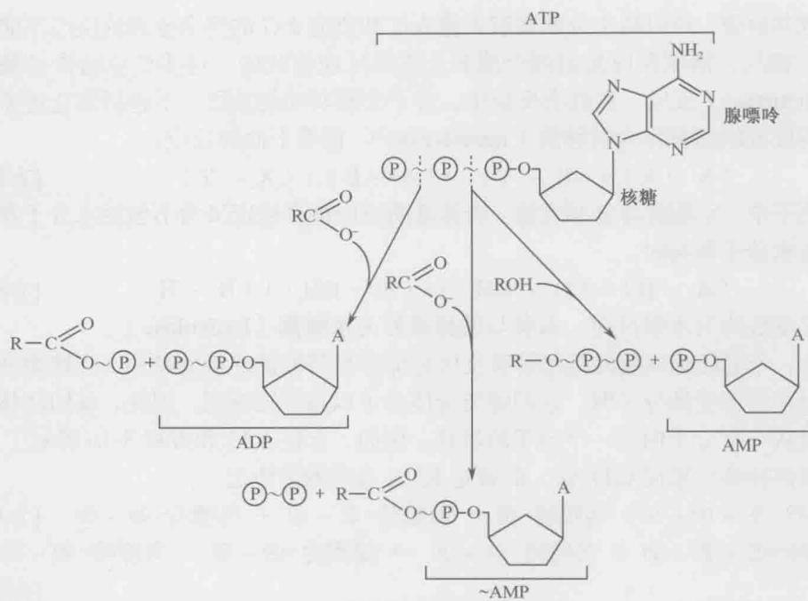  
图 3-15 ATP 参与的重要基团转移反应。

$$
\begin{array}{c} \mathrm{H} \quad \mathrm{R} \\ \mathrm{H} - \mathrm{N} ^ {+} - \mathrm{C} - \mathrm{C} \\ \mathrm{H} \quad \mathrm{H} \end{array} + \text {腺苷一} \mathbb {P} \sim \mathbb {P} \sim \mathbb {P} \longrightarrow \begin{array}{c} \mathrm{H} \quad \mathrm{R} \\ \mathrm{H} - \mathrm{N} ^ {+} - \mathrm{C} - \mathrm{C} \\ \mathrm{H} \quad \mathrm{H} \end{array} + \mathbb {P} \sim \mathbb {P}\tag{[方程 3-18]}
$$

（方程中 R 表示氨基酸的特定侧链）催化这一类型反应的酶称为氨基酸酰基合成酶（aminoacyl synthetases）。从热力学意义上讲，氨基酸（AA）一旦被活化，就能够用来合成蛋白质。虽然如此，AA～AMP 复合物并不是蛋白质的直接前体。相反，由于某种原因（我们将在第 15 章讨论），必须发生第二次转移基团反应，将羰基活化的氨基酸转移到一个 tRNA 分子的末端：

$$
\mathrm{AA} \sim \mathrm{AMP} + \mathrm{tRNA} \rightarrow \mathrm{AA} \sim \mathrm{tRNA} + \mathrm{AMP}\tag{[方程 3-19]}
$$

通过 AA \~ tRNA 分子的缩合，延伸中的多肽链末端形成了新的肽键：

$$
\mathrm{AA} \sim \mathrm{tRNA} + \text { 延   伸   中   的   多   肽   链   (n   个   氨   基   酸) } \rightarrow \mathrm{tRNA} + \text { 延   伸   中   的   多   肽   链   (n   +   1   个   氨   基   酸) }\tag{[方程 3-20]}
$$

所以，如同所有其他耦联反应一样，这一“耦联反应”的最终步骤必须是移去活化基团及高能键转变为具有低水解自由能的化学键。这是驱动蛋白质合成反应方向的负值 $\Delta G$ 的来源。

#### [W] 核酸前体被①～②活化

不论是 DNA 还是 RNA，所有类型的核酸都是由单核苷酸单体[也称为磷酸化核苷（nucleoside phosphates）]所组成。然而，单核苷酸在热力学上比氨基酸更难聚合。这是因为将其连接起来的磷酸二酯键在水解过程中释放相当多的自由能（-6 kcal/mol）。这意味着核酸将以极低的速度自发水解为单核苷酸。所以，相对于蛋白质的生物合成，活化前体在核酸的生物合成中更重要。

DNA 和 RNA 的直接前体都是 5'-三磷酸核苷。对于 DNA，这些前体是 dATP、dGTP、dCTP 和 dTTP（d 指的是脱氧）；对于 RNA，前体是 ATP、GTP、CTP 和 UTP。因此，ATP 不仅仅作为转基因反应中高能基团的主要来源，而且其自身就是 RNA 的直接前体。所有其他 3 种 RNA 前体都由类似于方程 3-15 和方程 3-16 所描述的转基因反应生成。脱氧三磷酸核苷由几乎相同的途径形成：在脱氧单核苷酸合成后，它们通过从 ATP 转移基团转变为三磷酸形式。

$$
\text {脱氧核苷-} Ⓟ + \mathrm{ATP} \rightarrow \text {脱氧核苷-} Ⓟ \sim Ⓟ + \mathrm{ADP}\tag{[方程 3-21]}
$$

$$
\text { 脱氧核苷 } - Ⓟ \sim Ⓟ + \mathrm{ATP} \rightarrow \text { 脱氧核苷 } - Ⓟ \sim Ⓟ \sim Ⓟ + \mathrm{ADP}\tag{[方程 3-22]}
$$

然后这些三磷酸核苷就能通过磷酸二酯键连接在一起形成多聚核苷酸，在这一转移基团反应中，一个焦磷酸键被打断，释放一个焦磷酸基团：

$$
\text {脱氧核苷-} Ⓟ \sim Ⓟ \sim Ⓟ + \text {延伸的多聚核苷酸链(n个核苷酸)}
$$

$$
\rightarrow \textcircled {P} \sim \textcircled {P} + \text {   延伸的多聚核苷酸链   } (n + 1 \text {   个核苷酸   })\tag{[方程 3-23]}
$$

与形成肽键的反应不同,这一反应不具有负值 $\Delta G$ 。实际上, $\Delta G$ 略微偏正(大约0.5 kcal/mol)。这种情况立即引出一个问题,多聚核苷酸显然在不断形成,它必需的自由能来源是什么?

核酸合成过程中释放的①～②能量值

多聚核苷酸形成过程中所需的自由能来自高能焦磷酸基团的分裂，后者与高能磷酸二酯键同时形成。所有的细胞都具有一种有效的酶——焦磷酸酶，这种酶会将刚刚形成的焦磷酸分子打断：

$$
ⓟ \sim Ⓟ \rightarrow 2 Ⓟ \quad (\Delta G = - 7 \mathrm{kcal/mol})\tag{[方程 3-24]}
$$

大的负值 $\Delta G$ 意味着反应是不可逆的。也就是说，一旦①～②断裂就不可能再次形成。

与焦磷酸基团的分裂[方程 3-21]相耦联的单磷酸核苷基团的聚合[方程 3-24]具有一个平衡常数，它由两个反应总的 $\Delta G$ 决定： $(0.5\ \text{kcal/mol}) + (-7\ \text{kcal/mol})$ 。最终的数值 $(\Delta G = -6.5\ \text{kcal/mol})$ 告诉我们，核酸几乎从不断裂生成其三磷酸核苷前体。

在这里我们看到了一个有力的实例，正是伴随一系列反应的总的自由能变化决定了其中某一反应是否能发生。具有微小正值 $\Delta G$ 的反应自身是不会自发发生的，但它们经常是重要的新陈代谢路径的一部分，其后继反应具有大的负值 $\Delta G$ 。不论何时我们都应该记住，一个单独反应（或甚至是一个单独路径）从不孤立存在；相反，通过代谢产物的加入和移去，反应的平衡在不断改变。

#### [W] ⑤ \~ ⑥ 分裂是大多数生物合成反应的特征

核酸的合成并非唯一一个由 $^{①}$ \~ $^{②}$ 的释放和分裂决定其方向的反应。实际上，所有的生物合成反应都具有一步或多步释放焦磷酸基团反应。以氨基酸与AMP结合活化为例，从其自身来说，高能键从 ATP 转移到 AA～AMP 复合物的过程具有微小的正值 $\Delta G$ 。然而，正是 ATP 末端焦磷酸基团的释放和分裂提供了驱动反应所需的负值 $\Delta G$ 。

当我们考虑这样一个问题，即为什么细胞试图由三磷酸核苷合成核酸而不是单磷酸核苷（图 3-16），焦磷酸基团分裂的巨大作用就很清楚了。磷酸，而不是焦磷酸，形成了磷酸二酯键的骨架。然而，在有大量磷酸盐存在的情况下磷酸二酯键并不稳定，这是因为它们形成时没有释放大量自由能。所以，生物合成反应可被轻易逆转；如果磷酸盐大量累积，根据质量反应定律，反应将开始向核酸分解的方向移动。而且对细胞来说，磷酸盐一形成就将其移除是不可行的（从而阻止逆向反应），因为所有细胞都需要一定浓度的内部磷酸盐维持生长。相反，产生焦磷酸然后迅速将其打断为两分子磷酸盐的一系列反应，消除了磷酸盐的产生和核酸的生物合成间的联系，从而阻止了逆转生物合成反应的可能性（图 3-16）。这样的结果是，细胞内很难积累足够的磷酸盐以驱动逆反应方向（或断裂方向）的两个反应。由此我们可以清楚地知道，运用三磷酸核苷作为核酸的前体并非随机选择的结果。

  
图 3-16 核酸生物合成的两种可能途径。(a) 运用二磷酸核苷合成核酸；(b) 运用三磷酸核苷合成核酸。

类似的讨论将告诉我们，为什么在所有细胞内都是由 ATP 作为高能基团的关键供体，而不是 ADP。起初这种 ATP 偏爱在生化学家看来是绝对的，但是现在我们发现，许多运用 ADP 作为能量供体的反应同样存在，且保持较好的反应方向。

<!-- W-END Watson 3 弱化学键和强化学键的重要性 -->

<!-- W-BEGIN Watson 4 DNA的结构 -->

### 【中文对照 Watson 第4章：DNA的结构】

> 来源：Watson《基因的分子生物学》第七版中译本（书籍/03_基因的分子生物学_第七版） 第4章 DNA的结构。

#### [W] 第4章

本章概要
DNA 结构
DNA 拓扑学

#### [W] DNA 的结构

人们在发现 DNA 是携带了染色体所有遗传信息的主要遗传分子后, 立即将注意力集中在 DNA 的结构上。人们希望通过了解 DNA 结构, 能够揭示染色体如何分开并形成两个相同的拷贝, 以及这一过程中 DNA 携带的遗传信息如何进行复制。从 20 世纪 40 年代末到

50年代初，几个美国和欧洲的研究小组既协作又竞争地开展研究，以期了解DNA链是如何通过共价键连接在一起，由此形成的DNA分子是如何在三维空间中排列。不足为奇，刚开始人们担心DNA的结构非常复杂甚至可能很古怪，不同基因中的DNA结构是完全不同的。因此，当DNA的双螺旋结构被发现时，人们大大松了一口气。DNA的这一基本结构告诉我们，所有基因的三维结构都大致相同，区别仅在于DNA互补双链中4种核苷酸的数量和排列顺序的不同。

双螺旋结构的发现距今已有60年，关于遗传物质的这一阐述仍然未受到质疑，不需要做改动以适应新的发现。然而，人们也逐渐认识到DNA的结构并不完全和刚开始设想的完全一致。例如，一些小病毒的染色体DNA是单链而不是双链分子。而且，受局部DNA序列的影响，不同的碱基对的精确方向有着细微的差别。一些序列甚至能使DNA卷曲成左手双螺旋，与最初阐述的DNA基本结构——右手双螺旋正好相反。虽然有些DNA分子是线性的，但也有一些是环状的。DNA双螺旋经常围绕DNA结合蛋白进一步盘绕卷曲成超螺旋结构，这样造成了更大的复杂性。显然，DNA和RNA的结构比开始所设想的更加丰富多样，更加复杂。实际上，不存在一种适用于DNA和RNA的通用结构。本章将要讨论，多核苷酸链由于其独特的物理、化学、拓扑学特性，在一般结构的基础上能发生很多变化。

#### [W] DNA 的结构

DNA 由多核苷酸链构成

通常 DNA 最重要的结构特征是两条多核苷酸链（polynucleotide chain）以双螺旋的

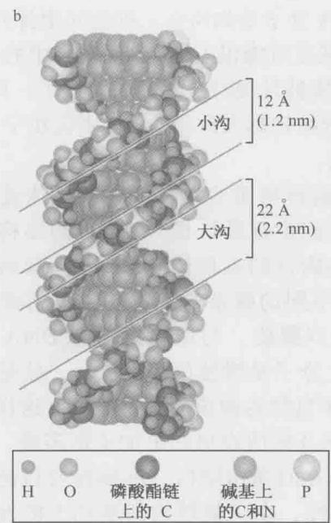  
图 4-1 DNA 的双螺旋结构。(a) DNA 双螺旋的结构示意图。螺旋的每一圈（34Å 或 3.4nm）大约有 10.5 个碱基对。(b) 双螺旋的空间结构实体模型。糖和磷酸基团构成了每条链的骨架，以黄色、灰色和红色圈表示。本图显示了 DNA 分子的螺旋情况，碱基朝向内部，但可以通过大、小沟而被接近。

形式互相缠绕（图 4-1）。图 4-1a 为双螺旋结构的示意图，由于 DNA 双链互补，如果将它倒置 $180^{\circ}$ （如将这本书上下颠倒），双螺旋看起来仍跟原来是一样的，这是由双链的互补性造成的。图 4-1b 是双螺旋的分子结构空间实体模型，体现了 DNA 分子的组成成分及在螺旋结构中的相对位置。双螺旋两条单链的骨架是由糖和磷酸基团交替构成的；碱基朝向骨架的内侧，通过大沟和小沟可以接近碱基。

让我们首先来考察 DNA 最基本的组成成分——核苷酸的特点。一个磷酸基团和戊糖相连形成 2'-脱氧核糖（2'-deoxyribose），一个碱基连接于 2'-脱氧核糖即构成了核苷酸（nucleotide）。磷酸基团和戊糖的结构如图 4-2 所示。之所以叫做 2'-脱氧核糖，是因为戊糖的第二位碳原子没有羟基（而是两个氢）。请注意核糖上原子的位置在右上角都标以“”以区别于碱基上原子的位置（详见下述讨论）。

我们可以想像，碱基通过与戊糖 1'位碳原子上的羟基结合脱去一个水分子形成糖苷键（图 4-2），从而与 2'-脱氧核糖结合。戊糖和碱基相结合形成核苷（nucleoside）。同样地，我们可以想像磷酸基与 2'-脱氧核糖 5'位碳原子上的羟基结合脱水形成 5'磷酸单酯。核苷加一个（或一个以上）磷酸形成核苷酸（nucleotide）。因此，碱基通过糖苷键与糖相连，而糖又通过磷酸酯键与磷酸相连，这样就形成了核苷酸（表 4-1）。

核苷酸依次以磷酸二酯键相连形成多核苷酸链，即一个核苷酸 2'-脱氧核糖上的 3'-羟基与另一个核苷酸上 5'-羟基的

磷酸基相连（图 4-3）。在磷酸二酯键（phosphodiester linkage）中，两个核苷酸间的磷酰基的一个糖通过 3'-羟基酯化，另一个糖通过 5'-羟基酯化。多核苷酸链以磷酸二酯键为基础构成了规则的、不断重复的糖磷酸骨架，这是 DNA 结构的一个特点。与此相反，多核苷酸链中碱基的排列顺序却是无规律的，碱基排列顺序的不规则性加上其长度是 DNA 储存大量信息的基础。

  
图 4-2 脱水形成核苷酸。在 $2'$ -脱氧核糖的 C 原子的数目以红色表示。

表 4-1 腺嘌呤与相关复合物

<table><tr><td></td><td>碱基腺嘌呤</td><td>核苷2&#x27;-脱氧腺苷</td><td>核苷酸2&#x27;-脱氧腺苷-5&#x27;磷酸</td></tr><tr><td>结构</td><td></td><td></td><td></td></tr><tr><td>相对分子质量</td><td>185.1</td><td>251.2</td><td>331.2</td></tr></table>

磷酸二酯键赋予了 DNA 链的固有极性，这种极性由核苷酸的不对称性和它们结合的方式所决定。DNA 链的一端是游离的 5'-磷酸基或 5'-羟基，另一端是游离的 3'-磷酸基或 3'-羟基。习惯上，DNA 序列由 5' 端（在左边）向 3' 端书写，一般 5' 端是磷酸基而 3' 端是羟基。

#### [W] 每个碱基都有它偏好的异构体

构成 DNA 的碱基可以分为两类：嘌呤（purine）和嘧啶（pyrimidine）。嘌呤为腺嘌呤（adenine）和鸟嘌呤（guanine）；嘧啶为胞嘧啶（cytosine）和胸腺嘧啶（thymine）。图 4-4 显示了嘌呤的双环结构，腺嘌呤和鸟嘌呤具有这种相同的基本结构，但附着的基因不同；同样，图 4-4 也显示出了胞嘧啶和胸腺嘧啶的单环结构的差异。图 4-4 还用数字标注了嘌呤和嘧啶环上的位置，碱基在嘧啶的 N1 位置上通过糖苷键与脱氧核糖相连，而在嘌呤的 N9 位置上通过糖苷键与脱氧核糖相连。

  
图 4-3 多核苷酸链的详细结构。本图表示嘌呤（蓝色）和嘧啶（黄色）之间的碱基配对作用，  
以及骨架间的磷酸二酯键。(来源: Dickerson R. E.1983. Scientific American249: 94, 绘图: Irving  
Geis. 由 Irving Geis Collection/Howard Hughes Medical Institution 提供，未经许可不得复制）

每个碱基都存在两个可选的异构状态（tautomeric state），它们互相保持平衡。这种平衡极大地倾向于图4-4所示的常规结构，它们是碱基配对的主要结构。嘌呤和嘧啶环上的氮原子大多以氨基形式存在而很少以亚氨基构型出现；同样，鸟嘌呤和胸腺嘧啶上的氧原子通常以酮式构型存在而很少以烯醇式构型出现。例如，图4-5显示了胞嘧啶的亚氨基异构体，图4-5b为鸟嘌呤的烯醇式异构体。正如我们看到的，异构体是导致DNA合成时出错的普遍原因。

#### [W] 双螺旋的两条链通过碱基反向平行配对连接在一起

两条多核苷酸链上的碱基靠较弱的、非共价键结合使其互相缠绕形成双螺旋，如图 4-1 所示。一条链上的腺嘌呤总是和另一条上的胸腺嘧啶配对，而鸟嘌呤总是和胞嘧啶配对。两条链有相同的几何螺旋结构，但连接它们的碱基配对使得它们有相反的极性，即一条链上 5'端的碱基和另一条链上 3'端的碱基配对，叫做反向平行，这是腺嘌呤和胸腺嘧啶、鸟嘌呤和胞嘧啶互相配对的立体化学结果。

#### [W] 双螺旋的两条链序列互补

腺嘌呤和胸腺嘧啶配对、鸟嘌呤和胞嘧啶配对的结果是使两条相互缠绕的链上的碱基序列呈互补关系并赋予 DNA 自我编码的特性。举个例子，如果一条链上的序列是 5'-ATGTC-3'，那么另一条链则必然是互补的序列 3'-TACAG-5'。

“Watson-Crick”配对规则的严格性源自于腺嘌呤和胸腺嘧啶、鸟嘌呤和胞嘧啶的分子结构及氢键的互补性（图4-6）。腺嘌呤和胸腺嘧啶配对，腺嘌呤C6上环外的氨基基团与胸腺嘧啶C4上的羰基可以形成一个氢键；同样，腺嘌呤的N1和胸腺嘧啶的N3也形成一个氢键。鸟嘌呤和胞嘧啶也是如此，所以在一碱基对中既有氢键也有分子结构的互补。GC碱基对有3个氢键，因为鸟嘌呤C2上环化的氨基基团和胞嘧啶C2上的羰基形成氢键，同样鸟嘌呤的N1和胞嘧啶的N3，鸟嘌呤C6的羰基和胞嘧啶N4上环化的氨基也可形成氢键。Watson-Crick碱基配对需要碱基处于它们优势的异构状态。

双螺旋一个重要的特点是两个碱基对正好有相同的几何结构, 无论是 A:T 碱基对或是 G:C 碱基对都不会影响两个糖之间的排列, 因为这两个碱基对的糖附着点间的距离是相同的。T:A 碱基对或 C:

图 4-4 嘌呤和嘧啶。虚线表示碱基和核糖结合的位点。为简便起见，除非特殊说明，氢原子不在后面图示的核糖和碱基中表示出来。

G 碱基对也不会影响糖的排列。换句话说，两个糖之间有一个大致的二乘对称轴关系，不需要扭曲 DNA 的总体结构，这 4 种碱基对就能安置于内；而且双螺旋的两条糖磷酸骨架上的碱基彼此间可以整齐地堆积。因此，DNA 中的碱基对顺序不规整，但总体结构相对规整。这与蛋白质（见第六章）中的氨基酸顺序不规整造成其结构的巨大差异正好形成对比。

#### [W] 双螺旋由于碱基配对和碱基堆积获得稳定性

互补碱基之间由氢键连接是双螺旋的一个基本特征，有助于双螺旋的热动力学稳定性和碱基配对的特异性。乍一看，由于以下几个原因，氢键看似对 DNA 的稳定性影响不大。水溶液中的有机分子含有满足所有氢键形成的特性，因为许多水分子可快速地与它结合或解离。结果，每当一个碱基对形成时在配对碱基之间产生一个氢键，就有一个碱基与水分子之间的氢键断裂，而这一氢键在碱基对还没形成前就存在了。因此，氢键对维持双螺旋稳定性所起的净作用似乎不是很大。然而，当多核苷酸链分离时，水分子在碱基上排成一排；当双螺旋中两条链合在一起时，水分子被碱基替代。这样造成了无序，增加了熵值，使双螺旋得以稳定。氢键并不是稳定双螺旋的唯一因素。

  
图 4-5 碱基异构体。氨基↔亚氨基和酮式↔烯醇式的互变异构现象。（a）胞嘧啶通常为氨基式很少有亚氨基式。（b）鸟嘌呤通常为酮式，很少有烯醇式。

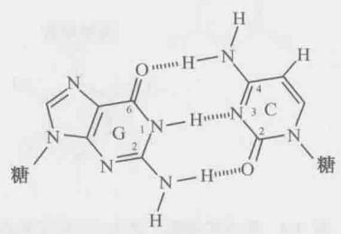

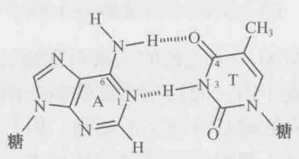  
图 4-6 A:T 和 G:C 碱基配对。图示碱基之间的氢键。

第二个重要的作用力来自于碱基间的堆积力。碱基是扁平、相对难溶于水的分子，它们以大致垂直于双螺旋轴的方向互相上下堆积。双螺旋堆积时碱基之间电子云的相互作用（ $\pi-\pi$ ）对双螺旋的稳定有重要作用。堆积的碱基可以通过瞬时的、诱导性的电子云偶极彼此吸引，这一现象被称为范德华作用。碱基堆积因为疏水效应同样有助于双螺旋的稳定

性。简单来讲，与“油脂性”的或疏水的碱基表面相比，水分子更倾向于在彼此间相互作用。相对缺少堆积力的单链 DNA，这些疏水面由于碱基堆积被埋藏在双螺旋内侧，减少了碱基表面暴露于水分子的可能，从而降低了双螺旋结构的自由能。

#### [W] 氢键对碱基配对特异性的重要作用

正如我们所见，氢键对 DNA 的稳定性贡献不大，但是对碱基配对的特异性非常重要。如果我们尝试着使腺嘌呤和胞嘧啶配对，一个氢键受体（腺嘌呤的 N1）对着另一个氢键受体（胞嘧啶的 N3），而两个受体之间无法再容纳一个水分子，也就无法形成氢键（图4-7）。同样，两个氢键供体——腺嘌呤 C6 和胞嘧啶 C4 上的氨基基团也彼此相对。所以，A:C 碱基配对是不稳定的，因为受体和供体基团上的水分子必然会被除去，而碱基对间无法形成氢键。

碱基会从双螺旋中翻转出来

  
图 4-7 A: C 的不相配。本图显示 A 和 C 之间不能形成正确的氢键。因此它们间的碱基配对是不稳定的。

到目前为止我们已经知道,双螺旋的力学特征有助于使一条多核苷酸链上的一个

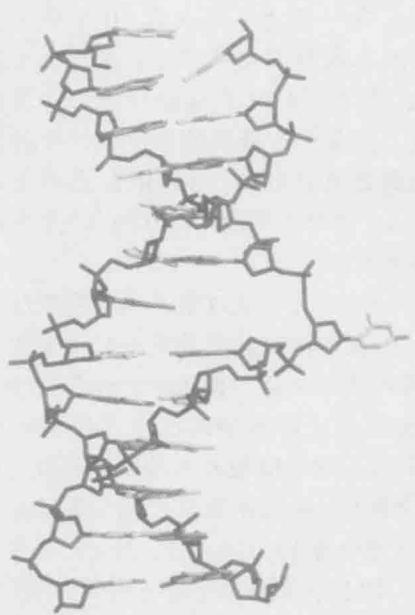  
图 4-8 碱基翻出。图中的 DNA 结构由甲基化酶的结构中分离得到，显示了胞嘧啶残基的翻出，以及给邻近碱基对造成的轻微变形。（Klimasauskas S., Kumar S., Roberts R. J., and Cheng X. 1994. Cell. 76: 357，图像由 BobScript、MolScript 及 Raster 3D 软件制作。）

碱基与另一条链上的互补碱基配对。然而，有时单个碱基会从双螺旋中突出出来，这种值得注意的现象叫做碱基翻出（base flipping），如图4-8所示。正如我们将在第10章中看到的，碱基从双螺旋中翻出能使碱基处于酶的催化部位，一些酶就是通过和这些螺旋构型外的碱基相互作用而使碱基甲基化或除去受损碱基的。而且，人们相信与同源重组和DNA修复相关的酶能将碱基一个接一个地翻转出来，借此扫描DNA搜寻同源区域或损伤区域。因为一次只翻转一个碱基，这个过程并不需要很多能量。显然，DNA比人们所设想的更有弹性。

#### [W] DNA 通常是右手双螺旋

用物理学中的手性法则进行分析，我们可以看到双螺旋中两条多核苷酸链都是右手螺旋。试想一下，举起你的右手，如图4-9所示的DNA分子，拇指朝上并沿

着螺旋的长轴，其余手指随着沟的方向摆放。沿拇指所指的方向追踪双螺旋的一条链，你将注意到螺旋的方向和你的手指所指的方向相同。若用左手，则无法得到上述发现。

DNA 的螺旋状结构导致了它是有周期性的。两个相邻碱基对间的夹角大约是 $36^{\circ}$ 。通过分析 DNA 的 X 射线晶体衍射图发现，完成一个螺旋（ $360^{\circ}$ ）需 10 个碱基对的堆积（图 4-1 a），也就是说，每一个螺周通常是 10 个碱基对。进一步的讨论见框 4-1，云母实验表明溶液中双螺旋 DNA 每一螺周含有 10.5 个碱基对。

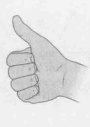

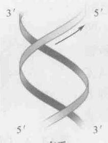

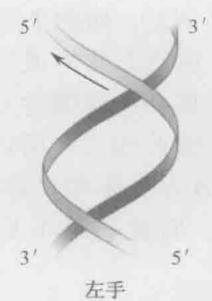

  
图 4-9 左手和右手螺旋。双螺旋的两条链以右手螺旋的方式互相缠绕。  
框4-1 云母实验表明溶液中双螺旋DNA每一螺周含有10.5个碱基对

每一螺周含有10个碱基对，这个数值会因为条件的不同而有所变动。20世纪70年代进行的经典实验表明吸附在某一表面上的DNA每一螺周不只含有10个碱基对。小片段DNA可以吸附在云母表面上，而且5'端磷酸基的存在使得DNA在云母上呈一定的方向性。随后吸附在云母上的DNA用DNase I（一种脱氧核糖核酸酶）消化。这种酶可以裂解DNA磷酸糖骨架上的磷酸二酯键。但由于这种酶的体积大，空间位阻使它无法作用于DNA的侧面或底面，仅仅可以切断距离云母最远的DNA表面上的磷酸二酯键（将DNA看成是平躺于平面上的圆柱体）。因此经过切割后得到的片段的长度应该可以反映出DNA的周期性，即每一螺周碱基对的数目。

吸附在云母上的DNA经过DNase I切割后得到的片段可以通过聚丙烯酰胺凝胶电泳进行分离（框4-1图1，以及第7章关于电泳的说明）。聚丙烯酰胺凝胶是一种类似于果冻的基质。因为DNA带负电，所以它在胶体中向电场的正极泳动。由于胶体的阻碍作用，

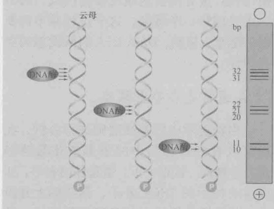  
框4-1 图1 云母实验

使得片段的泳动速度与片段的大小成反比，即片段越大泳动速度越慢。电泳分离后，从电泳结果中我们发现片段平均大小为10、11、21、31和32等，即以10.5个碱基对逐倍递增的DNA片段成簇存在。10.5就是每一螺周的碱基对的数目，这与其他方法推测出的溶液中DNA每一螺周的碱基对数目相近（见下文“双螺旋以多重构象存在”）。利用DNase探测DNA结构的这种方法现已应用到分析DNA与蛋白质的相互作用上（第7章）。

#### [W] 双螺旋有大沟和小沟

DNA 分子两条链所形成的双螺旋结构使 DNA 分子延伸成长长的多聚体。其上有两条大小不一的沟。为什么会有一条小沟、一条大沟？这是由碱基对的空间几何结构决定的。碱基对上凸起的两个糖（糖苷键间的夹角）之间的角度大约为 $120^{\circ}$ （指窄角，广角则为 $240^{\circ}$ ）（图 4-1b 和图 4-6）。结果，当越来越多的碱基对上下堆积起来时，其一侧糖间的窄角就形成了小沟（minor groove），而另一侧的广角就形成了大沟（major groove）。（如果糖和糖之间呈直线相对，也就是 $180^{\circ}$ 的角度，那么所形成的两个沟大小相同，不存在小沟和大沟之分）。大沟中有丰富的化学信息

每个碱基对的边缘都暴露于大沟、小沟中，从而产生了氢键供体和受体，以及识别碱基对的范德华力表面的模式（图4-10）。在大沟中的A：T碱基对边缘，化学基团以如下顺序排列：氢键受体（腺嘌呤N7）、氢键供体（腺嘌呤C6上的环外氨基）、氢键受体（胸腺嘧啶C4上的羰基）和大的疏水表面（胸腺嘧啶C5上的甲基）。同样，在大沟中G：C碱基对的边缘展示了下列基团：氢键受体（鸟嘌呤N7）、氢键受体（鸟嘌呤C6上的羰基）、氢键供体（胞嘧啶C4上的环外氨基）和小的非极性氢（胞嘧啶C5上的氢）。

  
图 4-10 碱基对边缘的化学基团暴露于大沟、小沟中。红色字母分别为氢键受体（A）、氢键供体（D）、非极性氢（H）和甲基基团（M）。

因此，所形成的氢键和暴露于大沟中的整体形状的特有模式可以将 A:T 碱基对与 G:C 碱基对区别开来，并可区分 A:T 碱基对与 T:A 碱基对、G:C 碱基对与 C:G 碱基对。我们可以把这些特征看成代码，其中 A 代表氢键受体，D 代表氢键供体，M 代表甲基，H 代表非极性氢。以这种代码方式，在大沟中 ADAM 代表一个 A:T 碱基对；AADH 代表一个 G:C 碱基对；MADA 代表一个 T:A 碱基对；HDAA 代表一个 C:G 碱基对。在所有情况下，大沟中化学基团的这种代码都可以具体说明不同碱基对的特性。

这些模式是非常重要的，使得蛋白质无需解开继而破坏双螺旋就可准确地识别 DNA 序列。事实上，正如我们将要看到的，一个首要的解码机制就是通过氨基酸侧链进入大沟、识别特定 DNA 并与其结合（详见第 6 章）。

小沟中化学信息较少，而且现有的信息对于区分各碱基对也没多大用处。由于体积小，它不太能容纳氨基酸侧链。在小沟中，A：T 碱基对与 T：A 碱基对、G：C 碱基对与 C：G 碱基对看起来极其相似。A：T 碱基对有氢键受体（腺嘌呤 N3）、非极性氢（腺嘌呤 C2 上的氢）和氢键受体（胸腺嘧啶 C2 上的羰基），它的代码即为 AHA，但若从反向读取，其代码是相同的。从侧链伸入小沟的蛋白质的氢键形成特性角度看，A：T 碱基对与 T：A 碱基对没什么不同。同样，G：C 碱基对有氢键受体（鸟嘌呤 N3）、氢键供体（鸟嘌呤 C2 上的环外氨基）和氢键受体（胞嘧啶 C2 上的酮基），它的代码为 ADA。所以，从氢键形成角度看，C：G 碱基对与 G：C 碱基也没有什么不同。小沟中，A：T 碱基对与 G：C 碱基对容易区分，但 G：C 碱基对与 C：G 碱基对、A：T 碱基对与 T：A 碱基对则不容易区分（图 4-10）。虽然小沟中的碱基一般较难以被分辨，但同样的氢键受体存在于小沟中的配对碱基，因此同样可以使 DNA 结合蛋白正确地识别 B 型 DNA 的碱基对（如 DNA 聚合酶，见第九章）。

#### [W] 双螺旋以多重构象存在

早期对高浓度细纤维的 DNA 溶液 DNA 进行 X 射线晶体衍射分析提出了两种结构：A-DNA 和 B-DNA（图 4-11；框 4-2：如何通过 X 射线胶片中的斑点来揭示 DNA 结构）。

  
图 4-11 B-DNA、A-DNA 和 Z-DNA 的模型。所有结构中每条链的糖-磷酸骨架在外侧（一个用紫色表示，一个用绿色表示），碱基在内侧（用银色表示）。上面的为侧面图，下面的为横切图。（a）B-DNA 是细胞中的通常构型，其特征为每螺周 10 个碱基对（螺距 3.4nm），即邻近碱基对堆积距离为 0.34nm，并且可以看到大沟和小沟。（b）A-DNA 更为紧凑，每螺周 11 个碱基对，且碱基对与螺旋纵轴间的夹角比较大。此外，A-DNA 是中空的（见横切图），RNA 双链和 RNA-DNA 杂交双链采取这种构型。（c）Z-DNA 是左手螺旋，呈 “Z” 字形。（来源：C. Kielkopfand P. B. Dervan 惠赠）

在较高湿度下观察到的 B-DNA 最接近生理条件下 DNA 的一般结构：每螺周 10 个碱基对，宽的大沟和窄的小沟。在较低湿度条件下观察到的 A-DNA 每圈 11 个碱基对。与 B-DNA 相比，大沟窄且深，小沟宽且浅。细胞中绝大部分 DNA 以 B 型构象存在，但在某些 DNA-蛋白质复合体中 DNA 也可以 A 型构象存在，而且 A-DNA 与以双螺旋形式存在的 RNA 分子的结构相似。

#### [W] 框 4-2 如何通过 X 射线胶片中的斑点揭示 DNA 结构

在分子生物学的历史上最经典的图像之一，就是由 Rosalind Franklin 拍摄的一张著名的照片：一个定向的 DNA 分子纤维的 X 射线衍射模式图。这张由她拍摄的照片之所以具有如此重大的历史意义，是因为该照片为 B 型 DNA 的沃森-克里克模型（Waston-Crick model）提供了关键的证据。而且，Francis Crick 作为一位推动了螺旋分子衍射理论发展的科学家，从胶片上的斑点的模式推断出 DNA 的两条链是相互缠绕的。乍一看，她的图像与双螺旋并没有多大关系。那么，这些斑点的神秘模式

  
框 4-2 图 1 Rosalind Franklin 的 DNA 的 X 射线衍射成像揭示出 Maltese 十字视标 (Maltese cross)。(经 Franklin R.E. and Gosling R.G. 1953, Nature 171:740\~741, Macmillan 许可修改)

#### [W] 是如何揭示出作为遗传物质的 DNA 的原子结构呢？

从图中我们可以看到，Franklin的图像由一个中心Maltese十字视标（Maltese cross）构成（在框4-2图1中用红色表示），该视标又由宽点（该宽点的宽度反映出DNA分子纤维的无序状态）组成。斑点沿着水平“层次”（layer）线（见数字标注）被均匀隔开。请注意，从十字视标的中心往上或往下计数时，不能发现第四层次线上的斑点。同时还要注意，Maltese十字视标以及图像顶部和底部极暗的区域产生出一系列菱形区域（见用蓝色表示的两个例子）。经过对波的衍射本性的一些思考，从定性的角度上，我们现在可以这样解释，这个表面上晦涩难懂的斑点模式其实与双螺旋结构是相对应的。

X射线衍射的原理是当波通过一个周期性阵列时，如果波长与该阵列的重复单位近似的话，波之间会发生干涉（interference）（这就是为什么X射线会被用来揭示原子结构，因为它的波长很短，仅为0.15nm）。如果波的振动一致，波之间会相互加强（结构性干涉），但如果一系列波的波谷与另一系列波的波峰相遇，波之间则相互抵消（破坏性干涉）。因此，一束束通过含有水平线的阵列的波会产生一行垂直于该水平线的斑点（框4-2图2）。可以想象，如果水平线倾斜的话，会产生一行倾斜的斑点（该行斑点仍然垂直于倾斜的线）。还可以进一步想象，对于如图所示的两套以“Z”字形连接的倾斜线来说，如果波通过它们，则会产生由两行倾斜的斑点组成的十字形。

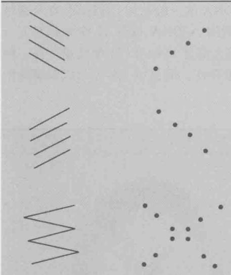  
框 4-2 图 2 穿过平行线时光波衍射的模式

现在让我们回到 DNA 上来。想象一下，双螺旋中一条链的骨架投影到一个平面上来，不严格地说，这会产生一系列相互连接的 zig 和 zag（或更恰当一点，正弦曲线）。如果我们想像 zig 为产生一套倾斜线，zag 产生另一套倾斜线，那么穿过 zig 和 zag 的波将会产生如以上例子所示的两行相互交叉的斑点。这就构成了 Franklin 照片中 Maltese 十字视标的基础，因此该十字揭示出了 DNA 的螺旋结构。基于 X 射线的波长，同时测量层次线间隔开的距离，进一步揭示出螺旋的周期为 3.4nm。当然，DNA 并非只包含一个螺旋骨架，而是包含双螺旋骨架，这一点也通过 Franklin 的照片得以揭示。DNA 双螺旋之间有 3/8 的螺旋重复单元对位不准，结果证明双螺旋之间的这种抵消产生了一

个额外的破坏性干涉，而将第四层次线抹除。因此，丢失的第四层次线表明 DNA 具有双螺旋结构，并告诉我们双螺旋之间是如何相对排列的。

最后，DNA骨架并非我们想象中的那样是一条平滑线。相反，从原子水平来讲，它是颗粒性的，由糖磷酸单元构成。这种颗粒性导致了额外的强度，尤其是十字视标中心的北面和南面，产生出一种四菱形的模式。在比这分辨率更高的照片中，从十字视标中心往北面和南面可以清楚地数出10条层次线。这种衍射模式的特点告诉我们，双螺旋的周期（3.4nm）为原子周期的10倍，对应于以0.34nm为间隔的10个重复单元。因为每一个糖磷酸单元具有一个碱基，因此B型DNA每一螺旋周期（即每一个螺旋转角）由10个碱基对组成。

因此，对于波的衍射的初步理解使如下工作成为可能：通过 X 射线胶片上的斑点的简单模式推导出 DNA 结构的主要特点。

B-DNA 是一种理想结构，与细胞中的 DNA 略有不同，体现在两个方面：第一，溶液中的 DNA 分子比 B-DNA 分子螺旋程度更高，平均每螺周有 10.5 个碱基对；第二，B 型构象是均一的结构，然而实际的 DNA 没有如此规则，甚至从精细结构看，它的各个碱基对之间都有所不同，这是将不同序列 DNA 的晶体结构进行比较得出的结论。例如，每个碱基对的两个碱基并不是一直处于同一平面，甚至能呈现“螺旋桨扭转”，两个碱基平面沿着碱基对的长轴相对于彼此向相反方向旋转，赋予碱基对类似螺旋桨的特征（图 4-12）。此外，每个碱基对精确的螺旋桨扭角并不恒定，结果局部的大沟、小沟的宽度会发生变化。因此，DNA 分子永远不会是完全规则的双螺旋。相反，DNA 的准确构象取决于双螺旋每一位置上碱基对的种类（A：T、T：A、G：C 或者 C：G）及其相邻碱基对的存在。但是就许多研究而言，B 型构象仍然是与细胞中 DNA 结构最接近的。

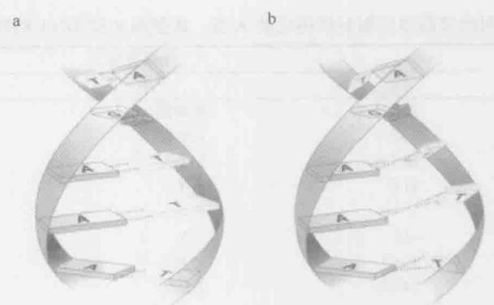  
图 4-12 右手螺旋中嘌呤和嘧啶碱基对之间的螺旋桨扭转。（a）常规 Watson 和 Crick 配对中 3 个连续 A:T 碱基对的序列结构。（b）螺旋桨扭转引发碱基相对于其长轴的旋转。（据 Aggaarwalet al., 1988. Science. 242: 899-907, Fig.5b. ©AAAS.）

#### [W] DNA 有时可形成左手螺旋

包含交替的嘌呤和嘧啶残基的 DNA 除可形成右手螺旋外，还可形成左手螺旋。为了弄清左手螺旋是如何形成的，我们需要仔细考察将碱基连到 2'-脱氧核糖 1'位置的糖苷键。这个键可以以顺式（syn）或反式（anti）存在（图 4-13）。右手螺旋 DNA 的糖苷键只以反式构象存在，而左手螺旋中基本重复单位通常是嘌呤嘧啶二核苷酸。糖苷键在嘌呤位置以顺式构象存在，在嘧啶位置以反式构象存在。正是嘌呤处的顺式构象造成了左手螺旋。由于嘌呤处变为顺式构象，使得左手螺旋 DNA 的骨架上顺式反式构象交替出现，呈现“Z”字形走向（因此命名为 Z-DNA；图 4-11），可与右手螺旋区分开。影响反式向顺式转变的旋转也使核糖基团在折叠过程中发生了变化。如图 4-13 所示，C3' 和 C2' 可以转换位置。只有在高阳离子浓度下（如 Na⁺），中和了带负电的磷酸基团，溶液中的交替嘌呤嘧啶残基才会呈现左手螺旋构象。在低盐浓度情况下，它们会形成典型的右手螺旋构象。Z-DNA 的生理意义还不清楚，左手螺旋在细胞 DNA 中可能只占很小一部分。A-DNA、B-DNA 和 Z-DNA 的更多细节列于表 4-2。

#### [W] DNA 双链可以分开（变性）和复性

因为双螺旋的两条链依靠较弱的力（非共价键）结合在一起，故我们预计它们分开也很容易。确实，双螺旋的结构解析之时，就表明 DNA 以这种方式进行复制。当 DNA 溶液温度高于生理温度（接近 $100^{\circ}$ C）或者 pH 较高时，互补的两条链就可分开，这个过程称为变性（denaturation）。然而，DNA 双链完全分开的变性过程是可逆的，当变性 DNA 的热溶液缓慢降温，DNA 的互补链又可重新聚合，形成规则的双螺旋（图 4-14）。由于变性的 DNA 分子具有复性的能力，因此来源不同的两条 DNA 链通过缓慢降温也可形成人工杂交 DNA 分子，同样，互补的 DNA 和 RNA 链也可形成杂交分子。在第 20 章里，两条单链核酸形成杂交分子的能力被称为杂交（hybridization）。这是分子生物学中几项不可缺少的技术的基础，如 Southern 印迹杂交和 DNA 芯片分析（第 7 章）。

表 4-2 从 X 射线单晶体衍射分析得出的 A 型、B 型和 Z 型 DNA 结构特性的比较

<table><tr><td rowspan="2"></td><td colspan="3">螺旋类型</td></tr><tr><td>A</td><td>B</td><td>Z</td></tr><tr><td>外形</td><td>短粗</td><td>长而薄</td><td>细长</td></tr><tr><td>每碱基上升</td><td>2.3Å</td><td>3.32 Å</td><td>3.8 Å</td></tr><tr><td>螺旋直径</td><td>25.5 Å</td><td>23.7 Å</td><td>18.4 Å</td></tr><tr><td>螺旋方向</td><td>右手</td><td>右手</td><td>左手</td></tr><tr><td>每螺旋单位碱基数</td><td>1</td><td>1</td><td>2</td></tr><tr><td>每螺周碱基数</td><td>~11</td><td>~10</td><td>12</td></tr><tr><td>碱基夹角</td><td>33.6°</td><td>35.9°</td><td>每2bP为-60°</td></tr><tr><td>螺距</td><td>24.6Å</td><td>33.2Å</td><td>45.6Å</td></tr><tr><td>碱基倾角</td><td>+19°</td><td>-1.2°</td><td>-9°</td></tr><tr><td>碱基平均螺旋桨扭角</td><td>+18°</td><td>+16°</td><td>约0°</td></tr><tr><td>螺旋轴位置</td><td>大沟</td><td>穿过碱基对</td><td>小沟</td></tr><tr><td>大沟</td><td>极狭、很深</td><td>宽、中等深度</td><td>平坦</td></tr><tr><td>小沟</td><td>很宽、浅</td><td>狭、中等深度</td><td>极狭、很深</td></tr><tr><td>糖苷键构象</td><td>反式</td><td>反式</td><td>C反式、G顺式</td></tr></table>

来源：据：Dickerson R. et al. 1982. CSHSQB47: 14. Copyright © 1982 Cold Spring Harbor Laboratory Press. 许可修改。

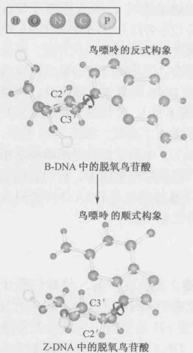

图 4-13 B-DNA 中鸟嘌呤的反式构象和 Z-DNA 中鸟嘌呤的顺式构象。右手螺旋的 B-DNA 中，连接脱氧核糖和碱基的糖苷键（用红色表示）只以反式构象存在；左手螺旋的 Z-DNA 中，糖苷键沿箭头方向旋转，在嘌呤处形成顺式构象（这里为鸟嘌呤）；而嘧啶处依然保持规则的反式构象，没有发生旋转。（来源：Wang A. J. H. et al. 1982. CSHSQB 47: 41. Copyright © 1982 Cold Spring Harbor Laboratory Press.）

20 世纪 50 年代通过在一系列条件下研究 DNA 变性的经典实验对双螺旋的特性有了深刻的认识。这些实验依靠测量通过 DNA 溶液的紫外线吸光率实现对 DNA 变性的监控。DNA 在 260nm 处有最大吸收值，碱基是造成吸收的主要因素。由于双螺旋 DNA 的光吸收比单链 DNA 少 40%，当 DNA 溶液温度升高到接近水的沸点时，光吸收值（absorbance）在 260 nm 处明显增加，这种现象称为增色效应（hyperchromicity）；而减色效应则是因为双螺旋 DNA 中的碱基堆积降低了对紫外线的吸收能力。

如果我们将 DNA 的光吸收对温度绘制函数曲线，不难看出光吸收的急剧增加发生在相对较窄的一个范围内。吸光度增加到最大值一半时的温度叫做 DNA 的熔点(melting point)，用 Tm 表示（图 4-15）。DNA 像冰一样溶化，经历了从高度有序的双螺旋结构向无规则单链结构的转变。在 DNA 熔点处光吸收的急剧增加说明 DNA 互补双链的变性、复性是一个高度协同的、类似于拉拉链一样的过程。例如，复性最可能以缓慢的成核反应发生，首先一条链上的一小部分碱基在互补链上找到与它们互补的那部分碱基并与之配对（图 4-14），然后两条链的其余部分就会在成核位置像拉拉链那样迅速形成双螺旋（图 4-14）。

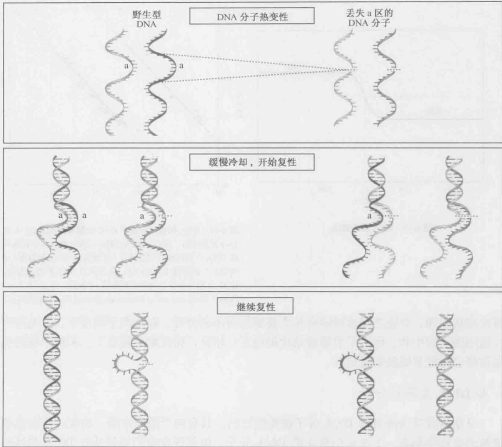  
图 4-14 退火和杂交。两个基本相同的双链 DNA 分子的混合物：一个是正常的野生型 DNA，另一个是缺少一小段核苷酸的突变体 DNA（缺少核苷酸的区域用红色标为 a）。加热混合物使 DNA 变性。变性 DNA 在低于熔解温度的条件下培育时可以复性，产生两种类型的复性分子：一是完全复性分子，分别由互补的两条野生型链或两条突变型链构成双螺旋；二是杂交分子，由一条野生型链和一条突变型链构成，并形成一段短的不配对的环（区域 a）。

Tm 值是 DNA 的特征常数，很大程度上取决于 DNA 中 G+C 的百分含量和溶液的离子强度。DNA 中 G+C 的百分含量越高（即 A+T 的百分含量越低），DNA 的 Tm 值越高（图 4-16）。DNA 溶液的盐浓度越高，DNA 的 Tm 值也越高。这是为什么呢？与 A:T 碱基对相比，G:C 碱基对对 DNA 的稳定性具有更重要的作用。首先，G:C 碱基对之间有 3 个氢键，而 A:T 碱基对之间只有 2 个氢键；更为重要的是，G:C 碱基对与相邻碱基对之间的堆积力比 A:T 碱基对与其相邻碱基对之间的堆积力更大。离子强度的效应则反映出双螺旋的另一基本特性。两条 DNA 链的骨架包含了带负电的磷酸基团。如果这些负电荷没有被中和，双链之间这种静电斥力将驱使两条链分开。在高离子强度下，负电荷可以被阳离子所中和，促进了双螺旋结构的稳定；相反，在低离子强度下，未被中和的负电荷将会降低双螺旋的稳定性。

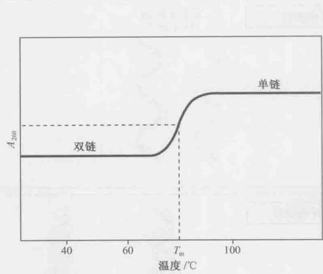  
图 4-15 DNA 变性曲线。

  
图 4-16 DNA 的变性取决于 G+C 含量和盐浓度。G+C 的百分含量越高，DNA 的变性温度（Tm）越高。不同来源的 DNA 分别溶解在低盐浓度（红线表示）和高盐浓度（绿线表示）的溶液中，pH 7.0。各点代表 DNA 的变性温度，以 G+C 的百分含量为纵坐标作图。（来源：Marmur J. and Doty P. 1962 Journal of Molecular Biology 5: 120. ©Elsevier）

#### [W] 一些 DNA 为环状分子

早期研究认为所有的 DNA 分子都是线形的，具有两个游离末端。确实，每个真核细胞的染色体都有一个极长的独立的 DNA 分子，但是现在我们知道某些 DNA 是环状的。例如，小猴 DNA 病毒 SV40 染色体就是环状双螺旋 DNA 分子，长约 5000bp，并且大多数细菌染色体也是环状的。E. coli 的环状染色体长约 5000kb。此外，许多细菌都有染色体外自主复制的遗传因子——质粒（plasmid），通常为环状 DNA 分子。

有趣的是，一些 DNA 分子有时为线形，有时为环状。最著名的例子是 $\lambda$ 噬菌体，它是一种寄生在 E. coli 中的 DNA 病毒。在病毒粒子中 $\lambda$ 噬菌体的基因组是线形双链分子。但当 $\lambda$ 噬菌体感染 E. coli 细胞时， $\lambda$ 噬菌体的基因组被注入 E. coli 细胞，DNA 分子随之发生环化。这是由于 $\lambda$ 噬菌体的双链 DNA 末端具有互补的单链凸出部分，即“黏性末端”，可通过碱基配对连接而成为环状。

#### [W] DNA 拓扑学

DNA 是一种柔性结构，它的精确的分子参数与两个因素相关：①周围的离子环境；②和它形成 DNA-蛋白质复合体的 DNA 结合蛋白的性质。因为线性 DNA 分子的末端是游离的，所以它们可以自由旋转以适应双螺旋两条链彼此缠绕次数的变化。但是如果

DNA 分子的两个末端共价连接形成环状分子,并且两条链的糖-磷酸骨架没有间断,DNA 分子的两条链彼此缠绕的次数就不能改变。这样的共价闭环 DNA（covalently closed circular DNA, cccDNA）的拓扑结构是受限的。甚至由于长度极长,染色质结构,以及与其他细胞成分的相互作用等原因,真核细胞染色体的线形 DNA 分子的拓扑结构也是受限的(第 8 章)。尽管有这些限制,DNA 仍然在细胞中参与了许多动力学过程。例如,双螺旋的相互缠绕的两条链必须迅速分开以完成 DNA 复制并转录为 RNA。因此,理解 DNA 拓扑学,以及细胞如何在 DNA 复制、转录及其他的染色体活动中适应并利用拓扑结构的限制,在分子生物学中具有极其重要的意义。

#### [W] 连环数是共价闭环 DNA 的固有拓扑特性

考虑一下共价闭环 DNA 的拓扑特性。因为多核苷酸链中无断裂，所以不破坏共价键就不能使 cccDNA 的两条链彼此分离。如果想使环状 DNA 的两条链分开而又不永久破坏糖-磷酸骨架上的任何共价键，我们必须使一条链反复穿过另一条链（有一种酶能完成这个过程）。连环数（linking number）是指要使两条链完全分开时一条链必须穿过另一条链的次数（图 4-17）。不论 DNA 分子如何扭曲，连环数是共价闭环 DNA 的固有拓扑特性，而且一定是整数。

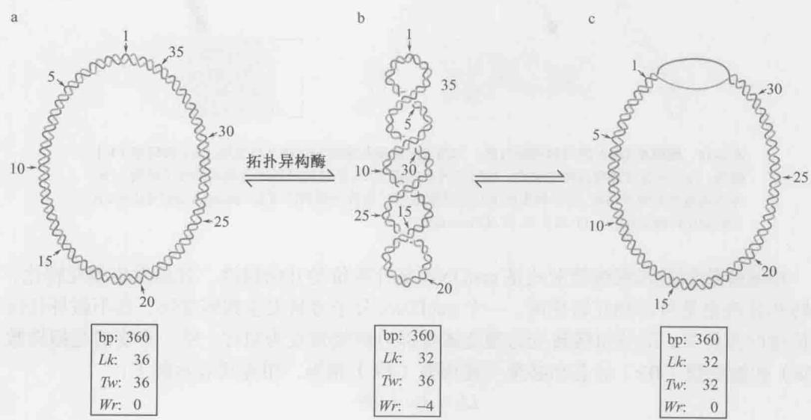  
图 4-17 共价闭环 DNA（cccDNA）的拓扑结构。图示为 DNA 松弛态（a）到负超螺旋结构（b）的转变，超螺旋结构的张力可通过环状 DNA 形成超螺旋（b）或碱基对氢键的局部断裂（c）以消除。（据 Dr. M. Gellert 许可修改。）（来源：Modified from Kornberg A. and Baker T. A. 1992 DNA replication，11-21，p.32. ©W. H. Freeman.）

#### [W] 连环数由扭转数和缠绕数共同决定

连环数是扭转（twist）和缠绕（writhe）这两个几何数的总和。先来看扭转数，扭转数仅仅是一条链旋绕另一条链的螺旋数，即一条链完全缠绕另一条链的次数。设想一个cccDNA分子平躺在一个平面上，在这个平面构象中，连环数就等于扭转数。确实，扭转数可以由统计两条链彼此缠绕的次数而加以确认（图 4-17 a）。右手螺旋的螺旋交叉数（扭转数）被定义为正数，因此 DNA 的连环数是正值。

但是 cccDNA 通常不是处在一个平面上，而是扭转的，以至于在三维空间里双螺旋的长轴经常重复地自我交叉（图 4-17 b），这称为缠绕数。为使这种外力造成的扭曲更加形象化，可以想像一下过度扭曲的电话线。

缠绕可能有两种形式：一种形式称互卷（interwound）或相缠螺旋（plectonemic writhe），如图4-17b和图4-18a描述的，长轴本身自我交叉；另一种形式为环形（toroid）或螺线管状（spiral），像通常DNA缠绕蛋白质时一样，其长轴以螺线管形式绕成圆柱状（图4-18b）。缠绕数（Wr）是cccDNA中相缠螺旋形式缠绕数和（或）螺线管形式缠绕数的总和。例如图4-17b所示分子的缠绕数为4。

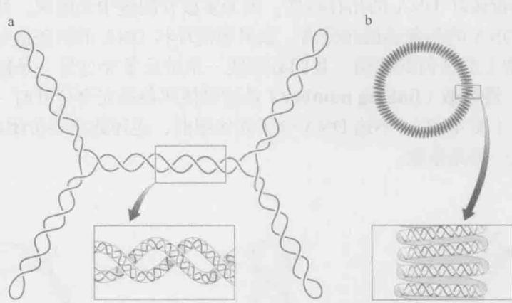  
图 4-18 超螺旋 DNA 的两种缠绕方式。本图显示相同长度的 cccDNA 以互卷（a）和环形（b）缠绕。（a）互卷或被称为相缠螺旋，通过扭转双螺旋 DNA 穿过自身形成分枝状的分子结构。（b）环形或被称为螺线管状，在本例中用圆柱形线圈展示。（修改并得到许可 Kornberg A. and Baker T.A. 1992.DNA replication，11-22,p.33.W.H.Freeman.）

相缠螺旋形式和螺线管形式是 cccDNA 拓扑等价的几何特性，容易发生相互转化，扭转和缠绕也是可以相互转化的。一个 cccDNA 分子容易发生扭转变形，在不破坏任何共价键的条件下，部分扭转转变为缠绕或者部分缠绕转变为扭转。唯一不变的是扭转数（Tw）和缠绕数（Wr）的总和必须与连环数（Lk）相等，用等式表示如下：

$$
L k = T w + W r
$$

#### [W] $Lk^{0}$ 是生理条件下完全松弛态 cccDNA 的连环数

设想 cccDNA 未形成超螺旋（supercoiling），即松弛态（relaxed），则它的扭转数就与生理条件下 DNA 溶液中的 B-DNA 相同（每螺周约 10.5 个碱基对）。生理条件下 cccDNA 的连环数（Lk）表示为 $Lk^{0}$ 。这样一个分子的 $Lk^{0}$ 就是碱基对数除以 10.5 所得的值。假如一个 cccDNA 长度为 10 500bp，则 $Lk = +1000$ （由于 DNA 是右手螺旋，此值为正数）。为了说明这一点，我们不妨做个实验，将长度为 10 500bp 的 cccDNA 的一条链拉展为平面环状，则另一条链与这条链交叉 1000 次。

如果 cccDNA 不处于松弛态, 我们如何消除它的超螺旋呢? 一个方法是用 DNase I 温和处理 DNA, 目的是平均每个 DNA 分子打断一个磷酸二酯键（或一小部分键）。一旦 DNA 以这种方式产生 “缺口” 就不再受拓扑抑制, 它的链可以自由旋转, 使缠绕消失（图 4-19）。如果缺口被修复, 产生的 cccDNA 分子呈松弛态, Lk 平均值与 $Lk^{0}$ 相等（由于修复缺口时旋转程度波动, 所产生的 cccDNA 的 Lk 有的略大于 $Lk^{0}$ , 有的略小于 $Lk^{0}$ 。因此这种解旋的方法将会产生一系列限定在很窄范围内的 cccDNA, 其 Lk 平均值与 $Lk^{0}$ 相等）。

  
图 4-19 DNase | 作用可使 DNA 解旋。

#### [W] 细胞中 DNA 呈负超螺旋

用 Lk 与 $Lk^{0}$ 的差值表示超螺旋的程度，称为连环差（linking difference）：

$$
\Delta L k = L k - L k ^ {o}
$$

如果 cccDNA 的 $\Delta Lk$ 绝对值不是零，DNA 就会因为过度扭曲产生超螺旋。 $Lk < Lk^{0}$ ，即 $\Delta Lk < 0$ ，DNA 产生“负超螺旋”； $Lk > Lk^{0}$ ，即 $\Delta Lk > 0$ ，DNA 产生“正超螺旋”。举例来说，图 4-17 a 所示分子为松弛态， $Lk^{0} = 36$ ；图 4-17 b 所示分子为负超螺旋，Lk = 32，后者与前者相差 4，所以 $\Delta Lk = -4$ 。

因为 $\Delta Lk$ 与 $Lk^{o}$ 取决于 DNA 分子的长度，采用一个超螺旋的标准测量方式会更方便。这就是超螺旋密度（superhelical density），用 $\sigma$ 表示，定义如下：

$$
\sigma = \Delta L k / L k ^ {0}
$$

从细菌和真核细胞中提取的环状 DNA 分子通常是负超螺旋， $\sigma$ 值约为-0.06。图 4-20 所示电子显微照片将噬菌体 DNA 松弛态结构与超螺旋结构进行了比较。

超螺旋的生物学意义是什么呢？负超螺旋含有自由能，可以为打开双链提供能量，使 DNA 复制和转录这样的解离双链的过程得以顺利完成。因为 $Lk = Tw + Wr$ ，负超螺旋可以让双螺旋扭转数减少（比较图 4-17 a 和图 4-17 b），负超螺旋区域因而有局部解旋倾向。因此，与松弛态 DNA 相比，负超螺旋 DNA 更易于解链。

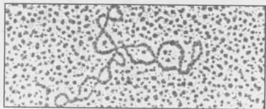  
图 4-20 超螺旋 DNA 的电子显微照片。上方电镜照片显示松驰型（非超螺旋）。噬菌体 PM2 的 DNA 分子，下方为超螺旋状态。（电镜照片由 Wang J. 惠赠，1982. Sci Am, 247: 97）

唯一含有正超螺旋 DNA 的生物体是某些生活在极端高温环境（如温泉）中的嗜热微生物。在这种情况下，我们认为正超螺旋提供能量，阻止 DNA 在高温中发生变性。正超螺旋多转几圈（DNA 过度扭曲），则嗜热微生物 DNA 双链打开就比一般生物呈负超螺旋的 DNA 需要更多能量。

#### [W] 真核细胞中核小体引入了负超螺旋

在第 8 章中我们将提到真核细胞细胞核中的 DNA 被包装成小颗粒，称为核小体（nucleosome）。在核小体中，DNA 双螺旋以螺线管方式围绕蛋白质核心缠绕两圈。重要的是，它以左手螺旋方式进行盘绕（伸出左手，想像 DNA 如何盘绕在核小体上，见第 8 章，图 8-18）。实际上，左手螺线管方式就等同于负超螺旋。因此，DNA 包装成核小体引入了负超螺旋密度。

#### [W] 拓扑异构酶可使超螺旋 DNA 解旋

连环数是 DNA 的固有特性, 受制于 DNA 的拓扑结构, 只有破坏糖-磷酸骨架才能使它发生改变。拓扑异构酶（topoisomerase）可以催化 DNA 产生瞬时单链或双链的断裂而改变连环数。

拓扑异构酶有两种基本类型。拓扑异构酶Ⅱ通过两步改变DNA连环数。它们在DNA上产生一瞬时的双链缺口，并在缺口闭合以前使一小段未被切割的双螺旋DNA穿过这一缺口，图4-21是此反应的大概过程示意。拓扑异构酶Ⅱ依靠ATP水解提供的能量来催化这一反应。相反，拓扑异构酶I一步就可以改变DNA的连环数，其作用是使DNA暂时产生单链切口，让未被切割的另一条单链在切口闭合之前穿过这一切口（图4-22）。与拓扑异构酶Ⅱ相比，拓扑异构酶I不需要ATP。下面将阐述拓扑异构酶如何以受控的、协调的方式松弛DNA及促进其他相关反应。

  
图 4-21 DNA 在拓扑异构酶Ⅱ的作用下改变连环数的过程。拓扑异构酶Ⅱ结合于 DNA，产生双链断裂，未断裂的 DNA 穿过缺口后，再将断链闭合。

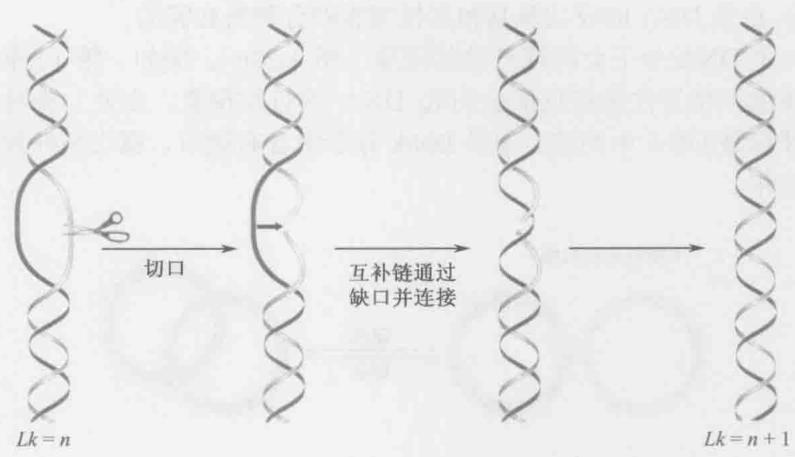  
图 4-22 拓扑异构酶Ⅰ的作用机制。拓扑异构酶切开 DNA 双链中的一条，没有被切的互补链通过缺口穿过来，然后连上缺口，该过程使连环数加 1。

#### [W] 原核生物中存在引导 DNA 超螺旋形成的特殊拓扑异构酶

原核和真核生物都存在可以从 DNA 中去除超螺旋的拓扑异构酶Ⅰ和Ⅱ。另外，原核生物还拥有一种特殊的拓扑异构酶Ⅱ，通称为促旋酶，它引入而不是去除负超螺旋。DNA 促旋酶使原核生物染色体产生负超螺旋。这种负超螺旋促进 DNA 双螺旋的解旋，而这种解旋又会激发包括启动 DNA 转录和复制在内的许多反应。

#### [W] 拓扑异构酶也可以解链和松弛 DNA 分子

拓扑异构酶不仅能松弛双螺旋 DNA，而且能促进一些与维持细胞内 DNA 的适当结构有关的重要反应的发生。这些酶利用松弛双螺旋 DNA 相同的瞬时 DNA 断裂以及链通过机制来实现这些反应。

拓扑异构酶既能链接（catenate）也能解开（decatenate）环状 DNA 分子。环状 DNA 分子如果像一条链的两个环一样连接在一起，就称为相互“链接”（图 4-23a）。在拓扑异构酶的两种活性中，解开环状 DNA 的能力显然更富有生物学意义。如同我们将在第 9 章看到的，一轮 DNA 复制完成后通常产生链接在一起的 DNA 分子（参见第 9 章，图 9-36）。解开这些 DNA，使它们在细胞分离时分配至两个子细胞，拓扑异构酶在此过程中起了关键作用。两个共价闭合的环状 DNA 分子的解开要求一个 DNA 分子的两条链穿过另一个 DNA 分子的双链缺口。这些反应有赖于拓扑异构酶Ⅱ。由于解链的必要性，拓扑异构酶Ⅱ是细胞必需的蛋白质。然而，如果两个相互链接的 DNA 分子中至少有一个携带缺口，那么拓扑异构酶Ⅰ也可以解开这两个分子（图 4-23b）。

虽然在考虑拓扑问题的时候，我们关注的总是环状 DNA 分子，真核生物的长线性染色体也存在拓扑结构。例如，在每一轮 DNA 复制中，两条双链的子 DNA 分子通常缠绕在一起（图 4-23c）。这些相互缠绕的位点就像链接在一起的 DNA 分子之间的连接一样，阻碍了姐妹染色体在有丝分裂过程中的分离。因此，通常由拓扑异构酶Ⅱ催化的

DNA 解缠绕，也是 DNA 的成功复制和真核细胞的分裂所必需的。

有时，一个 DNA 分子会出现打结的现象（图 4-23d）。例如，第 12 章中我们将详细讨论的一些位点特异性重组反应会引起 DNA 的打结现象。在此，拓扑异构酶Ⅱ也可以解开这种双链 DNA 中的结。如果 DNA 分子中含有缺口，那么拓扑异构酶 I 也可以完成解链工作。

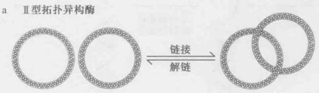

b I型拓扑异构酶  
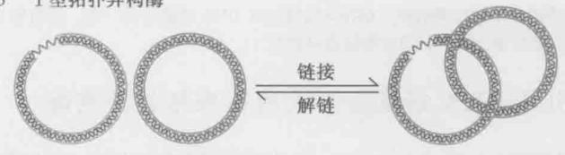

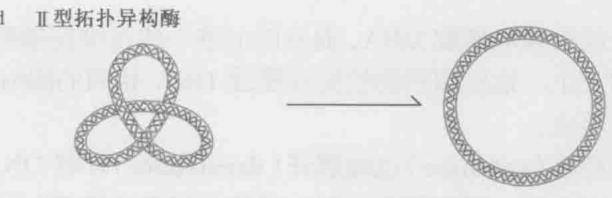  
图 4-23 拓扑异构酶对 DNA 的解环、解旋和解结作用。（a）拓扑异构酶Ⅱ能够在共价闭合环状 DNA 分子上产生一个双链缺口并使另一个 DNA 分子穿过缺口形成套在一起的双环链接或解链。  
（b）拓扑异构酶I只有在DNA分子有缺口或断点的情况下才能使DNA分子链接或解链，因为这种酶一次只能切断一条DNA链。(c)真核生物染色体复制过程中所产生的相互缠绕的线性DNA长链能够被拓扑异构酶解开。（d）DNA的结能够被拓扑异构酶解开。

#### [W] 拓扑异构酶通过蛋白质-DNA 的共价连接裂解 DNA 链或使它们重新连接

拓扑异构酶为了发挥功能,必须能够切断一条或两条 DNA 链,然后再将切断的 DNA 链重新连接起来。通过共价中间物的机制,拓扑异构酶可以不依赖任何其他蛋白质或高能辅助因子(如 ATP;见下文)。当拓扑异构酶活性部位的酪氨酸残基攻击靶 DNA 骨架上的磷酸二酯键时,可使 DNA 断裂产生一缺口(图 4-24),而拓扑异构酶则通过磷酸酪氨酸连接与其中一个断端共价相连。DNA 的另一端带有一个游离的羟基,可在下文中看到这个末端如何被酶紧紧地抓住。

  
(b)

  
图 4-24 拓扑异构酶通过酪氨酸-DNA 共价中间体切开 DNA。(a) 断开和重连接反应。为简便起见，这里仅显示单条 DNA 链，图 4-25 可见更真实的图片。拓扑异构酶Ⅱ使用同样的机制，但需要两个酶的亚基，每个亚基打开一条 DNA 链。拓扑异构酶有时打开 DNA 5'端，有时打开 3'端。(b) 磷酸酪氨酸共价中间体的详细结构。

这种磷酸-酪氨酸连接保存了被裂解的磷酸二酯键的能量。因此，只要逆转原来的反应，DNA 就可以被重新闭合：来自 DNA 断端的游离羟基攻击磷酸-酪氨酸键，最终重新形成磷酸二酯键。这个反应重新连接 DNA 链，释放拓扑异构酶，拓扑异构酶可以接着催化另一轮反应。虽然像上面所说的，拓扑异构酶Ⅱ需要 ATP 水解释放的能量，这些能量主要用于拓扑异构酶-DNA 复合物的分子构象的改变，而并非使 DNA 链断裂或重新连接。

#### [W] 拓扑异构酶构成“酶桥”让 DNA 片段往来穿梭

在 DNA 断裂和重新连接的过程中，拓扑异构酶促使 DNA 的另一条片段穿过断点。因此，拓扑异构酶功能的行使要求 DNA 断裂、DNA 链穿过和 DNA 重新连接都以高度协调的方式进行。从几个不同拓扑异构酶的结构可以看出这些反应是怎么发生的。这里我们将解释拓扑异构酶 I 松弛 DNA 的一个模型。

起始解链循环时，拓扑异构酶与 DNA 片段形成紧密的复合物，复合物中双链变性（图 4-25a）。高度的负超螺旋 DNA 链倾向于熔解变性（如前面所述），使这种 DNA 成为松弛反应的良好底物。一条 DNA 链结合于酶的裂隙中，这使它靠近酪氨酸活性部位这条链断裂，产生 DNA-酪氨酸中间产物（图 4-25b）。这一步反应成功的关键在于新断裂的 DNA 的另一末端也被拓扑异构酶紧密结合。断裂后，拓扑异构酶经过一次大的构象变化，在断裂的链中打开一个缺口，并通过自身成桥状连接这个缺口。第二条链（没有断裂的那条链）此时穿过那个缺口，结合于蛋白质内部的“圆环状”孔中的DNA结合位点（图4-25c）。链穿过以后，拓扑异构酶-DNA复合物中发生第二次构象变化，通过攻击磷酸-酪氨酸键的羟基（如前所述）使DNA的断端重新连接起来（图4-25d）。重新连接以后，拓扑异构酶必须再经过一次构象变化，释放DNA（图4-25e）。这一过程的DNA产物与最初的DNA分子基本相同，只是连环数增加了一个。

  
图 4-25 拓扑异构酶Ⅰ催化反应模型。图示为质粒 DNA 负超螺旋一系列的解旋过程。DNA 两条链如黑灰线所示（不按比例），蛋白质的四个结构域按区域标记。结构域Ⅰ用红色，Ⅱ用蓝色，Ⅲ用绿色，Ⅳ用橙色标记。（来源：Champoux J.2001.DNA topoisomerases.Annual Review of Biochemistry.70:369-413. ©Annual Reviews.）

上述反应机制中拓扑异构酶在链穿行过程中起到了“蛋白桥”的作用，这种机制也适用于拓扑异构酶Ⅱ。然而拓扑异构酶Ⅱ是二聚体（某些情况下是四聚体）。拓扑异构酶Ⅱ作用机制的基本特点是DNA双链的断裂需要拓扑异构酶两个亚基及其活性位点中的酪氨酸残基的参与。

#### [W] DNA 拓扑异构体可被电泳分离

长度相同而连环数不同的共价闭环 DNA 分子叫做 DNA 拓扑异构体（DNA topoisomer）。虽然拓扑异构体的分子质量相同，它们也可以通过琼脂糖凝胶电泳 [见第 7 章的凝胶电泳（gel electrophoresis）的解释] 彼此分开。拓扑异构体分离的基础是扭曲越大，cccDNA 的形状就越致密。在此，可以再次试想电话线的超螺旋如何使它变得更致密。DNA 越致密就越容易在凝胶基质中迁移（图 4-26）。因此，一个完全松弛的 cccDNA 的迁移要比这一环状 DNA 链的高度超螺旋的拓扑结构体慢得多。图 4-27 显示的是 DNA 拓扑结构体被凝胶电泳分离成一系列条带。相邻条带的 DNA 分子连环数相差一个。显然，电泳迁移率与 DNA 的拓扑结构密切相关（框 4-3）。

  
图 4-26 DNA 拓扑异构产物的电泳分离图。A: 松弛或有缺口的环状 DNA; B: 线性 DNA; C: 高度超螺旋的 cccDNA; D: 拓扑异构体梯度标记。

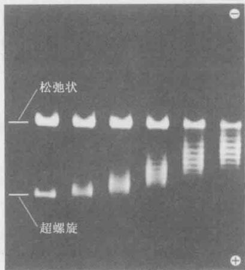  
图 4-27 用凝胶电泳分离超螺旋和松弛的 DNA。用凝胶电泳分离超螺旋和松弛的 DNA。电泳的速度按超螺旋圈数的增加而增加。（来源：J. C. Wang 惠赠）

#### [W] 框4-3 DNA环的拓扑学特性证明了DNA每螺周含有10.5个碱基对的螺旋周期性

由于 DNA 的不同拓扑结构体能通过电泳分离，人们根据这一发现设计了一个简单的实验来证明溶液中 DNA 每周螺旋含有 10.5 个碱基对。假设用拓扑异构酶 I 将大小分别为 3990 bp、3995 bp 和 4011 bp 的三种 cccDNA 完全解旋。琼脂糖凝胶电泳时，3990 bp 和 4011 bp 的 cccDNA 迁移率基本相同。由于热波动，拓扑异构酶处理后产生了一系列拓扑异构体，但是为了方便起见，我们只考虑含量最丰富的拓扑异构体（相对于最松弛态 cccDNA），3990 bp 和 4011 bp DNA 的含量最丰富的拓扑异构体的迁移率难以区分，因为它们之间 21 个碱基对的不同相对整个 DNA 环来说是可以忽略的。然而，虽然 3995 bp 的 DNA 环只比 3990 bp 的 DNA 环多了 5 个碱基，但其含量最丰富的拓扑异构体却比另外两种环迁移得稍快一些。那么，我们怎样解释这种现象呢？3990 bp 和 4011 bp 的 DNA 环处于最松弛的状态时，连环数正好等于 $Lk^{\circ}$ ，对于 3990 bp 的 DNA 来说（大小按 10.5 个碱基对分开） $Lk^{\circ}$ 等于 380，而对于 4011 bp 的 DNA 来说 $Lk^{\circ}$ 等于 382。因为 $Lk$ 等于 $Lk^{\circ}$ ，这两者的连环数的差值（ $\Delta Lk = Lk - Lk^{\circ}$ ）都为 0，DNA 不存在扭曲。由于连环数必须是整数，而 3995 bp 的 DNA 环在最松弛的状态下可以有连环数为 380 或 381 的两种拓扑异构体。然而，3995 bp 的 DNA 环的 $Lk^{\circ}$ 是 380.5。这样，即使在它最松弛的状态下，3995 bp 的共价闭合环状 DNA 也必须有半个单位的扭曲（连环数差值为 0.5），因此它比 3990 bp 和 4011 bp 的 DNA 环迁移得快。换句话说，为了解释长度相差 21 个碱基对（螺旋的两圈）的两个 DNA 环迁移率相同，而长度相差只有 5 个碱基对（大约一半螺旋）的两个 DNA 环迁移率却不同，我们得出了“溶液中的 DNA 每周螺旋含有 10.5 个碱基”的结论。

#### [W] 溴化乙锭离子可使 DNA 解旋

溴化乙锭（Ethidium）是一种既大又平而且多环的阳离子，它的平面形状使其能滑入或嵌入到堆积的 DNA 碱基对平面之间（图 4-28）。因为在紫外光下溴化乙锭会发荧光，而且嵌入 DNA 后荧光强度显著增强，因此，溴化乙锭常用来作为染料检测 DNA。

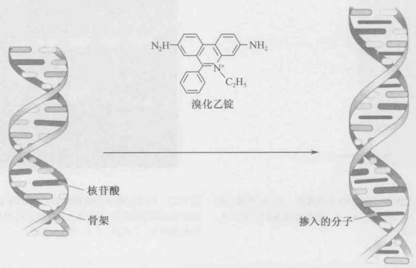  
图 4-28 溴化乙锭掺入 DNA。溴化乙锭的插入增加了相邻碱基对之间的空间距离，扭曲了磷酸核糖骨架，降低了螺旋程度。

当溴化乙锭嵌入两个碱基对之间时，引起 DNA 解旋 $26^{\circ}$ ，使得通常的碱基对之间的夹角由 $36^{\circ}$ 变为 $10^{\circ}$ ，换句话说，溴化乙锭降低了 DNA 的扭曲程度。想象一下，若 DNA 分子每个碱基对中都嵌有一个溴化乙锭离子，那么每周螺旋不再是 10 个碱基对而是 36 个碱基对。当溴化乙锭结合的是线性或缺口环状 DNA 分子时，溴化乙锭只引起螺旋倾斜度的增加。但是当溴化乙锭结合于共价闭合环状 DNA 时结果会怎么样呢？cccDNA 连环数并没有增加（并没有共价键断裂或形成），但是每分子溴化乙锭嵌入则使每圈的扭曲度降低 $26^{\circ}$ 。考虑到 $Lk = Tw + Wr$ ，Tw 的减少必须由 Wr 的增加来补偿。如果最初环状 DNA 为负超螺旋（细胞中分离出的环状 DNA 大多如此），加入溴化乙锭将增加 Wr，也就是说，溴化乙锭的加入可松弛 DNA。如果加入足量的溴化乙锭，负超螺旋将变为 0；若加入更多的溴化乙锭 Wr 将大于 0，此时 DNA 将变为正超螺旋。

因为溴化乙锭的结合增加了共价闭合环状（cccDNA）的 Wr，从而使 DNA 在凝胶电泳中的迁移率发生了很大变化。在非饱和的溴化乙锭存在的情况下，负超螺旋环状 DNA 更为松弛并且迁移缓慢，而松弛的 cccDNA 则变为正超螺旋，迁移的速度加快。

<!-- W-END Watson 4 DNA的结构 -->

<!-- L-BEGIN Lehninger 24.2 -->

### 【英文对应 Lehninger §24.2：DNA Supercoiling】

> 来源：Lehninger Principles of Biochemistry（书籍/02_生物化学原理） 第24章 Genes and Chromosomes，§24.2。

How is cellular or viral DNA compacted into the cells or viral coats that contain it in a way that still permits access to the information in the DNA? The extreme compaction implies a high degree of structural organization. First, the many negative charges of the phosphoryl groups in the DNA backbone must be neutralized. Cations, particularly $Mg^{2+}$ ions, and a class of molecules called polyamines provide multiple positive counterions to permit DNA compaction. Polyamines are derived from the amino acid ornithine (see Box 6-1). The second key to DNA compaction is a DNA structural alteration known as supercoiling. All cells maintain their DNA in a state that is underwound—having fewer right-handed helical turns per given length of DNA—than B-form DNA. The underwinding places structural strain on the DNA, causing it to twist upon itself. Supercoiling affects and is affected by processes such as replication and transcription. We introduce it here as a prelude to a broader discussion of DNA metabolism.

P3 "Supercoiling" means the coiling of a coil. An old-fashioned telephone cord, for example, was typically a coiled wire. The path taken by the wire between the base of the phone and the receiver often included one or more supercoils (Fig. 24-8). DNA is coiled in the form of a double helix, with both strands of the DNA coiling around an axis. The further coiling of that axis upon itself (Fig. 24-9) produces DNA supercoiling. As detailed below, DNA supercoiling is generally a manifestation of structural strain. When there is no net bending of the DNA axis upon itself, the DNA is said to be in a relaxed state.

  
FIGURE 24-8 Supercoils. An old-fashioned phone cord is coiled like a DNA helix, and the coiled cord can itself coil in a supercoil. Examining phone cords helped lead Jerome Vinograd and his colleagues to the insight that many properties of small circular DNAs can be explained by supercoiling. They first detected DNA supercoiling—in small circular viral DNAs—in 1965.

  
FIGURE 24-9 Supercoiling of DNA. When the axis of the DNA double helix is coiled on itself, it forms a new helix (superhelix). The DNA superhelix is usually called a supercoil.

As we shall see, the supercoiling that occurs in cells reflects underwinding of the DNA, facilitating the separation of strands required for the processes of replication and transcription (Fig. 24-10).

That a DNA molecule would bend on itself and become supercoiled in tightly packaged cellular DNA would seem logical, and perhaps even trivial, were it not for one additional fact: many circular DNA molecules remain highly supercoiled even after they are extracted and purified, freed from protein and other cellular components. P3 This indicates that supercoiling is an intrinsic property of DNA tertiary structure. It occurs in all cellular DNAs and is highly regulated by each cell.

Several measurable properties of supercoiling have been established, and the study of supercoiling has provided many insights into DNA structure and function. This work has drawn heavily on concepts derived from a branch of mathematics called topology, the study of the properties of an object that do not change under continuous deformations. For DNA, continuous deformations include conformational changes due to thermal motion or due to interaction with proteins or other molecules; discontinuous deformations involve DNA strand breakage. For circular DNA molecules, a topological property is one that is unaffected by deformations of the DNA strands as long as no breaks are introduced. Topological properties are changed only by breakage and rejoining of the backbone of one or both DNA strands.

We now examine the fundamental properties and physical basis of supercoiling.

  
FIGURE 24-10 The effects of replication and transcription on DNA supercoiling. Because DNA is a double-helical structure, strand separation leads to added stress and supercoiling if the DNA is constrained (not free to rotate) ahead of the strand separation. (a) The general effect can be illustrated by twisting two strands of a rubber band about each other to form a double helix. If one end is constrained, separating the two strands at the other end will lead to twisting. (b) In a DNA molecule, the progress of a DNA polymerase or RNA polymerase (as shown here) along the DNA involves separation of the strands. As a result, the DNA becomes overwound ahead of the enzyme (upstream) and underwound behind it (downstream). Red arrows indicate the direction of winding.

#### [EN] Most Cellular DNA Is Underwound

To understand supercoiling, we must first focus on the properties of small circular DNAs such as plasmids and small viral DNAs. When these DNAs have no breaks in either strand, they are referred to as closed-circular DNAs. In aqueous solutions, DNA is most stable—that is, it is in its lowest free-energy form—in the B-form structure. If the DNA of a closed-circular molecule conforms closely to the B-form structure (Watson-Crick structure; see Fig. 8-13), with one turn of the double helix per 10.5 bp, the DNA is relaxed rather than supercoiled (Fig. 24-11). Supercoiling results when DNA is subject to some form of structural strain such that it is overwound or underwound. Purified closed-circular DNA is rarely relaxed, regardless of its biological origin. P3 Furthermore, DNAs derived from a given cellular source have a characteristic degree of supercoiling. DNA structure is therefore strained in a manner that is regulated by the cell to induce the supercoiling.

In almost every instance, the strain is a result of underwinding of the DNA double helix in the closed circle. In other words, the DNA has fewer helical turns than would be expected for the B-form structure. The effects of underwinding are summarized in Figure 24-12. An 84 bp segment of a circular DNA in the relaxed state would contain eight double-helical turns, one for every 10.5 bp. If one of these turns were removed, there would be (84 bp)/7 = 12.0 bp per turn, rather than the 10.5 found in B-DNA (Fig. 24-12b). This is a deviation from the most stable DNA form, and the molecule is thermodynamically strained as a result. Generally, much of this strain would be accommodated by coiling the axis of the DNA on itself to form a supercoil (Fig. 24-12c; some of the strain in this 84 bp segment would simply become dispersed in the untwisted structure of the larger DNA molecule). In principle, the strain could also be accommodated by separating the two DNA strands over a distance of about 10 bp (Fig. 24-12d). In isolated closed-circular DNA, strain introduced by underwinding is generally accommodated by supercoiling rather than strand separation, because coiling the axis of the DNA usually requires less energy than breaking the hydrogen bonds and disrupting the base stacking that stabilizes paired bases. Note, however, that the underwinding of DNA in vivo makes separation of the DNA strands easier, facilitating access to the information they contain.

Every cell actively underwinds its DNA with the aid of enzymatic processes (described below), and the resulting strained state represents a form of stored energy. Cells maintain DNA in an underwound state to facilitate its compaction by coiling. The underwinding of DNA is also important to enzymes of DNA metabolism that must bring about strand separation as part of their function.

The underwound state can be maintained only if the DNA is a closed circle or if it is bound and stabilized by proteins so that the strands are not free to rotate about each other. If there is a break in one strand of an isolated, protein-free circular DNA, free rotation at that point will cause the underwound DNA to revert spontaneously to the relaxed state. In a closed-circular DNA molecule, however, the number of helical turns cannot be changed without at least transiently breaking one of the DNA strands. The number of helical turns in a DNA molecule therefore provides a precise description of supercoiling.

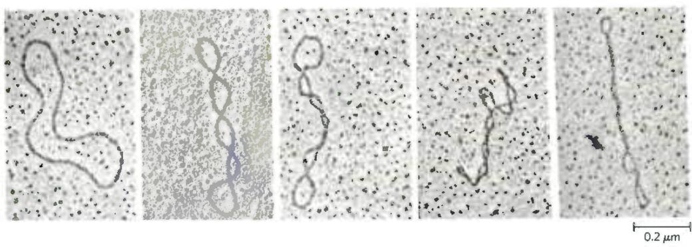  
FIGURE 24-11 Relaxed and supercoiled plasmid DNAs. The molecule in the leftmost electron micrograph is relaxed; the degree of supercoiling increases from left to right. [Laurien Polder, from A. Kornberg, DNA Replication, p. 29, W. H. Freeman, 1980.]

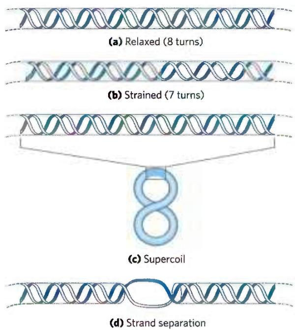  
FIGURE 24-12 Effects of DNA underwinding. (a) A segment of DNA in a closed-circular molecule, 84 bp long, in its relaxed form with eight helical turns. (b) Removal of one turn induces structural strain. (c) The strain is generally accommodated by formation of a supercoil. (d) DNA underwinding also makes the separation of strands somewhat easier. In principle, each turn of underwinding should facilitate strand separation over about 10 bp, as shown here. However, the hydrogen-bonded base pairs would generally preclude strand separation over such a short distance, and the effect becomes important only for longer DNAs and higher levels of DNA underwinding.

#### [EN] DNA Underwinding Is Defined by Topological Linking Number

The field of topology provides some ideas that are useful to the discussion of DNA supercoiling, particularly the concept of linking number. Linking number is a topological property of double-stranded DNA, because it does not vary when the DNA is bent or deformed, as long as both DNA strands remain intact. Linking number (Lk) is illustrated in Figure 24-13. As we shall see, all cells have enzymes called topoisomerases that catalyze changes in the linking number. Because of this critical role, topoisomerases are the targets of many antibiotics and cancer chemotherapy agents.

  
FIGURE 24-13 Linking number, Lk. Here, as usual, each blue ribbon represents one strand of a double-stranded DNA molecule. For the molecule in (a), Lk = 1. For the molecule in (b), Lk = 6. One of the strands in (b) is kept untwisted for illustrative purposes, to define the border of an imaginary surface (shaded blue). The number of times the twisting strand penetrates this surface provides a rigorous definition of linking number.

Let's begin by visualizing the separation of the two strands of a double-stranded circular DNA. If the two strands are linked as shown in Figure 24-13a, they are effectively joined by what can be described as a topological bond. Even if all hydrogen bonds and base-stacking interactions were abolished such that the strands were not in physical contact, this topological bond would still link the two strands. Visualize one of the circular strands as the boundary of a surface (such as the soap film framed by the loop of a bubble wand before you blow a bubble). The linking number can be defined as the number of times the second strand pierces this surface. For the molecule in Figure 24-13a, Lk = 1; for that in Figure 24-13b, Lk = 6. The linking number for a closed-circular DNA is always an integer. By convention, if the links between two DNA strands are arranged so that the strands are interwound in a right-handed helix, the linking number is defined as positive (+); for strands interwound in a left-handed helix, the linking number is negative (−). Negative linking numbers are, for all practical purposes, not encountered in DNA.

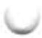

We can now extend these ideas to a closed-circular DNA with 2,100 bp (Fig. 24-14a). When the molecule is relaxed, the linking number is simply the number of base pairs divided by the number of base pairs per turn, which is close to 10.5; so in this case, Lk = 200. The linking number in relaxed DNA is designated $Lk_{0}$ . For a circular DNA molecule to have a topological property such as linking number, both strands must be intact, without a break. If there is a break in either strand, the two strands can, in principle, be unraveled and separated completely. In this case, no topological bond exists and Lk is undefined (Fig. 24-14b).

We can now describe DNA underwinding in terms of changes in the linking number. For the molecule shown in Figure 24-14a, $Lk_{0} = 200$ ; if two turns are removed from this molecule, Lk = 198. The change can be described by the equation

$$
\begin{array}{r} \Delta L k = L k - L k _ {0} \\ = 1 9 8 - 2 0 0 = - 2 \end{array}\tag{24-1}
$$

It is often convenient to express the change in linking number in terms of a quantity that is independent of the length of the DNA molecule. This quantity, called the specific linking difference or superhelical density ( $\sigma$ ), is a measure of the number of turns removed relative to the number present in relaxed DNA:

  
FIGURE 24-14 Linking number applied to closed-circular DNA molecules. A 2,100 bp circular DNA is shown in three forms: (a) relaxed, Lk = 200; (b) relaxed with a nick (break) in one strand, Lk undefined; and (c) underwound by two turns, Lk = 198. The underwound molecule generally exists as a supercoiled molecule, but underwinding also facilitates the separation of DNA strands.

$$
\sigma = \frac {\Delta L k}{L k _ {0}}\tag{24-2}
$$

In the example in Figure 24-14c, $\sigma = 0.01$ , which means that $1\%$ (2 of 200) of the helical turns present in the DNA (in its B form) have been removed. The degree of underwinding in cellular DNAs generally falls in the range of $5\%$ to $7\%$ ; that is, $\sigma = -0.05$ to $-0.07$ . The negative sign indicates that the change in linking number is due to underwinding of the DNA. The supercoiling induced by underwinding is therefore defined as negative supercoiling. Conversely, under some conditions DNA can be overwound, resulting in positive supercoiling. Note that the twisting path taken by the axis of the DNA helix when the DNA is underwound (negative supercoiling) is the mirror image of that taken when the DNA is overwound (positive supercoiling) (Fig. 24-15). Supercoiling is not a random process; the path of the supercoiling is largely prescribed by the torsional strain imparted to the DNA by decreasing or increasing the linking number relative to B-DNA. P2 P3 An increase in superhelical density brings about an increase in DNA compaction.

Linking number can be changed by $\pm1$ by breaking one DNA strand, rotating one of the ends $360^{\circ}$ about the unbroken strand, and rejoining the broken ends. This change has no effect on the number of base pairs or the number of atoms in the circular DNA molecule. Two forms of a circular DNA that differ only in a topological property such as linking number are referred to as topoisomers.

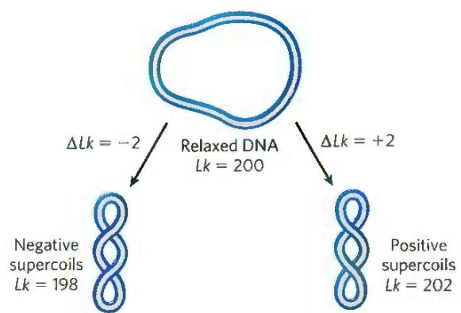  
FIGURE 24-15 Negative and positive supercoils. For the relaxed DNA molecule of Figure 24-14a, underwinding or overwinding by two helical turns (Lk = 198 or 202) will produce negative or positive supercoiling, respectively. Notice that the DNA axis twists in opposite directions in the two cases.

Cruciform DNA  
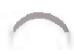

#### [EN] WORKED EXAMPLE 24-1 Calculation of Superhelical Density

What is the superhelical density ( $\sigma$ ) of a closed-circular DNA with a length of 4,200 bp and a linking number (Lk) of 374? What is the superhelical density of the same DNA when Lk = 412? Are these molecules negatively or positively supercoiled?

SOLUTION: First, calculate $Lk_{0}$ by dividing the length of the closed-circular DNA (in bp) by 10.5 bp/turn: (4,200 bp)/(10.5 bp/turn) = 400. We can now calculate $\Delta Lk$ from Equation 24-1: $\Delta Lk = Lk - Lk_{0} = 374 - 400 = -26$ . Substituting the values for $\Delta Lk$ and $Lk_{0}$ into Equation 24-2: $\sigma = \Delta Lk / Lk_{0} = -26 / 400 = -0.065$ . Because the superhelical density is negative, this DNA molecule is negatively supercoiled.

When the same DNA molecule has an Lk of 412, $\Delta Lk = 412 - 400 = 12$ , and $\sigma = 12/400 = 0.03$ . The superhelical density is positive, and the molecule is positively supercoiled.

In addition to causing supercoiling and making strand separation somewhat easier, the underwinding of DNA facilitates structural changes in the molecule. These are of less physiological importance but they help illustrate the effects of underwinding. Recall that a cruciform (see Fig. 8-19) generally contains a few unpaired bases; DNA underwinding helps to maintain the required strand separation (Fig. 24-16). Underwinding of a right-handed DNA helix also enables the formation of short stretches of left-handed Z-DNA in regions where the base sequence is consistent with the Z form (see Chapter 8).

#### [EN] Topoisomerases Catalyze Changes in the Linking Number of DNA

DNA supercoiling is a precisely regulated process that influences many aspects of DNA metabolism. Every cell has enzymes with the sole function of underwinding and/or relaxing DNA. The enzymes that increase or decrease the extent of DNA underwinding are topoisomerases; the property of DNA that they change is the linking number. These enzymes play an especially important role in processes such as replication and DNA packaging. There are two classes of topoisomerases. Type I topoisomerases act by transiently breaking one of the two DNA strands, passing the unbroken strand through the break, and rejoining the broken ends; they change Lk in increments of 1. Type II topoisomerases break both DNA strands and change Lk in increments of 2.

P2 When a circular DNA is supercoiled, it is twisted upon itself and therefore is more compact than when it is relaxed. The supercoiled molecule will thus migrate faster in a gel matrix (Fig. 24-17). A population of identical plasmid DNAs with the same linking number migrates as a discrete band during agarose gel electrophoresis. Topoisomers with Lk values differing by as little as 1 can be separated by this method, so changes in linking number induced by topoisomerases are readily detected.

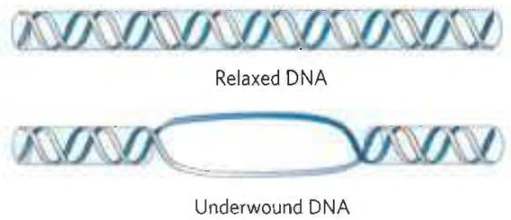

FIGURE 24-16 Promotion of cruciform structures by DNA underwinding. In principle, cruciforms can form at palindromic sequences (see Fig. 8-19), but they seldom occur in relaxed DNA because the linear DNA accommodates more paired bases than does the cruciform structure. Underwinding of the DNA facilitates the partial strand separation needed to promote cruciform formation at appropriate sequences.  
  
FIGURE 24-17 Visualization of topoisomers. In this experiment, all DNA molecules have the same number of base pairs but exhibit some range in the degree of supercoiling. Because supercoiled DNA molecules are more compact than relaxed molecules, they migrate more rapidly during gel electrophoresis. The gels shown here separate topoisomers (moving from top to bottom) over a limited range of superhelical density. In lane 1, highly supercoiled DNA migrates in a single band, even though different topoisomers are probably present. Lanes 2 and 3 illustrate the effect of treating the supercoiled DNA with a type I topoisomerase; the DNA in lane 3 was treated for a longer time than that in lane 2. As the superhelical density of the DNA is reduced to the point where it corresponds to the range in which the gel can resolve individual topoisomers, distinct bands appear. Individual bands in the region indicated by the bracket next to lane 3 each contain DNA circles with the same linking number; Lk changes by 1 from one band to the next. (Courtesy of Michael Cox Lab.)

E. coli has at least four individual topoisomerases (I through IV). Those of type I (topoisomerases I and III) generally relax DNA by removing negative supercoils (increasing Lk). The way in which bacterial type I topoisomerases change linking number is illustrated in Figure 24-18. A bacterial type II enzyme, called either topoisomerase II or DNA gyrase, can introduce negative supercoils (decrease Lk). It uses the energy of ATP to accomplish this. To alter DNA linking number, type II topoisomerases cleave both strands of a DNA molecule and pass another duplex through the break. The overall degree of supercoiling of bacterial DNA is maintained by regulation of the net activity of topoisomerases I and II. Topoisomerases III and IV have more-specialized roles in DNA metabolism.

Eukaryotic cells also have type I and type II topoisomerases. The type I enzymes are topoisomerases I and III. The single type II enzyme has two isoforms in vertebrates, called IIα and IIβ. Most type II enzymes, including a DNA gyrase in archaea, are related and define a family called type IIA. The eukaryotic type II topoisomerases cannot underwind DNA (introduce negative supercoils), but they can relax both positive and negative supercoils (Fig. 24-19a). The capacity of type II topoisomerases to pass one duplex DNA segment through a double-strand break in another duplex allows these enzymes to untangle catenanes, DNA circles that are topologically linked (Fig. 24-19b). Some topoisomerases are specialized for decatenation functions. For example, the bacterial type II enzyme called topoisomerase IV is involved in chromosome untangling during cell division (Chapter 25).

Archaea have an unusual enzyme, topoisomerase VI, which alone defines the type IIB family. The full diversity of DNA topoisomerases is illustrated in Table 24-4. As we shall show in the next few chapters, topoisomerases play a critical role in every aspect of DNA metabolism, making them important drug targets for the treatment of bacterial infections and cancer.

#### [EN] DNA Compaction Requires a Special Form of Supercoiling

Supercoiled DNA molecules are uniform in several respects. The supercoils are right-handed in a negatively supercoiled DNA molecule (Fig. 24-15), and they tend to be extended and narrow rather than compacted, often with multiple

Type I topoisomerase  
  
MECHANISM FIGURE 24-18 The type I topoisomerase reaction. Bacterial topoisomerase I increases Lk by breaking one DNA strand, passing the unbroken strand through the break, then resealing the break.  
Nucleophilic attack by the active-site Tyr residue breaks one DNA strand. The ends are ligated by a second nucleophilic attack. At each step, one high-energy bond replaces another. [Information from J.J. Champoux, Annu. Rev. Biochem. 70:369, 2001, Fig. 3.]

  
FIGURE 24-19 Alteration of the linking number by a eukaryotic type IIα topoisomerase. (a) The general mechanism features passage of one intact duplex DNA segment through a transient double-strand break in another segment. The DNA segment enters and leaves the topoisomerase through gated cavities, called the N gate and the C gate, above and below the bound DNA. Two ATPs are bound and hydrolyzed

  
during this cycle. The enzyme structure and use of ATP are specific to this reaction. (b) When topologically linked as shown, two DNA circles are referred to as a catenane. By cleaving both strands of one circle and passing a segment of the second circle through the break, a type II topoisomerase can decatenate the circles. [(a) Information from J. J. Champoux, Annu. Rev. Biochem. 70:369, 2001, Fig. 11.]

<table><tr><td colspan="5">TABLE Diversity in DNA Topoisomerases</td></tr><tr><td>Type</td><td>Mechanism</td><td>Family (defined by structural class)</td><td>Domain(s)</td><td>Notes</td></tr><tr><td rowspan="3">IA</td><td rowspan="3">Strand passagea</td><td>Topoisomerase I</td><td>Bacteria, Eukarya</td><td>Relaxes (-)</td></tr><tr><td>Topoisomerase III</td><td>Bacteria, Eukarya</td><td>Relaxes (-)</td></tr><tr><td>Reverse gyrase</td><td>Archaea, Bacteria</td><td>Uses ATP to introduce positive supercoils; thermophilic bacteria and archaea only</td></tr><tr><td>IB</td><td>Swivelaseb</td><td>Topoisomerase IB</td><td>Bacteria, Eukarya</td><td>A few bacteria; all eukaryotes</td></tr><tr><td>IC</td><td>Swivelase</td><td>Topoisomerase V</td><td>Archaea</td><td>Methanopyrus only</td></tr><tr><td rowspan="4">IIA</td><td rowspan="4">Strand passagec</td><td>Topoisomerase II (DNA gyrase)</td><td>Archaea, Bacteria</td><td>Introduces negative supercoils (ATPase)</td></tr><tr><td>Topoisomerase IIα</td><td>Eukarya</td><td>Relaxes (+ or -)</td></tr><tr><td>Topoisomerase IIβ</td><td>Eukarya</td><td>Relaxes (+ or -)</td></tr><tr><td>Topoisomerase IV</td><td>Bacteria</td><td>Decatenased</td></tr><tr><td>IIB</td><td>Strand passage</td><td>Topoisomerase VI</td><td>Archaea, Bacteria, Eukarya</td><td>Among eukaryotes, plants, algae, and protists only</td></tr><tr><td colspan="5">aSee Figure 24-18.bA nick is made in one strand, and the other strand is allowed to rotate to relieve topological strain.cSee Figure 24-19a.dSee Figure 24-19b.</td></tr></table>

branches (Fig. 24-20). At the superhelical densities normally encountered in cells, the length of the supercoil axis, including branches, is about 40% of the length of the DNA. This type of supercoiling is referred to as plectonemic (from the

Greek plektos, "twisted," and nema, "thread"). The term can be applied to any structure with strands intertwined in some simple and regular way, and it is a good description of the general structure of supercoiled DNA in solution.

  
(a)

  
(b)

  
(c)

Plectonemic supercoiling, the form observed in isolated DNAs in the laboratory, does not produce sufficient compaction to package DNA in the cell. A second form of supercoiling, solenoidal (Fig. 24-21), can be adopted by an underwound DNA. Instead of the extended right-handed supercoils characteristic of the plectonemic form, solenoidal supercoiling involves tight left-handed turns, similar to the shape taken up by a garden hose neatly wrapped on a reel. Although their structures are dramatically different, plectonemic and solenoidal supercoiling are two forms of negative supercoiling that can be taken up by the same segment of underwound DNA. The two forms are readily interconvertible. Although the plectonemic form is more stable in solution, the solenoidal form can be stabilized by protein binding, as it is in eukaryotic chromosomes; it provides a much greater degree of compaction. Solenoidal supercoiling is a primary mechanism by which underwinding contributes to DNA compaction in cells.

  
FIGURE 24-21 Plectonemic and solenoidal supercoiling of the same DNA molecule, drawn to scale. Plectonemic supercoiling takes the form of extended right-handed coils. Solenoidal negative supercoiling takes the form of tight left-handed turns about an imaginary tubelike structure. The two forms are readily interconverted, although the solenoidal form is generally not observed unless certain proteins are bound to the DNA. Solenoidal supercoiling provides a much greater degree of compaction.

FIGURE 24-20 Plectonemic supercoiling. (a) Electron micrograph of plectonemically supercoiled plasmid DNA and (b) an interpretation of the observed structure. The dotted lines show the axis of the supercoil; notice the branching of the supercoil. (c) An idealized representation of this structure. [(a, b) Republished with permission of Elsevier, from T. C. Boles et al. (1990), "Structure of plectonemically supercoiled DNA," J. Mol. Biol. 213:931–951, Fig. 2; permission conveyed through Copyright Clearance Center, Inc.]  

#### [EN] SUMMARY 24.2 DNA Supercoiling

■ Most cellular DNAs are supercoiled. Underwinding decreases the total number of helical turns in DNA relative to the relaxed, B form. To maintain an underwound state, DNA must be either a closed circle or bound to protein.

■ Underwinding is quantified by a topological parameter called linking number, Lk. Underwinding is measured in terms of specific linking difference, or superhelical density, $\sigma$ , which is $(Lk - Lk_{0})/Lk_{0}$ . For cellular DNAs, $\sigma$ is typically -0.05 to -0.07, which means that approximately 5% to 7% of the helical turns in the DNA have been removed. DNA underwinding facilitates strand separation by enzymes of DNA metabolism.

■ DNAs that differ only in linking number are called topoisomers. Topoisomerases, enzymes that underwind and/or relax DNA, catalyze changes in linking number. The two classes of topoisomerases, type I and type II, change Lk in increments of 1 or 2, respectively, per catalytic event.

■ Supercoiled DNA in solution, unconstrained by proteins, takes on a plectonemic supercoiling structure. When supercoiled DNA is wrapped around specialized DNA-binding proteins, it forms solenoidal supercoils.

<!-- L-END Lehninger 24.2 -->

## 2.3 DNA 的复制

前面我们讲过,生命的遗传实际上是染色体 DNA 自我复制的结果。而染色体 DNA 的自我复制主要是通过半保留复制来实现的,是一个以亲代 DNA 分子为模板合成子代 DNA 链的过程。细胞分裂时,通过 DNA 准确地自我复制 (self-replication),亲代细胞所含的遗传信息就原原本本地传送到子代细胞。由于 DNA 是遗传信息的载体,因此亲代 DNA 必须以自身分子为模板来合成新的分子——准确地复制成两个拷贝,并分配到两个子代细胞中去,才能真正完成其遗传信息载体的使命。DNA 的双链结构对于维持这类遗传物质的稳定性和复制的准确性都是极为重要的。

双链 DNA 的复制是一个非常复杂的过程,在复制的起始、延伸和终止三个阶段,无论是原核生物还是真核生物都需要有多种酶和蛋白质的协同参与。DNA 复制均涉及拓扑异构酶、解旋酶、单链结合蛋白、引物合成酶、DNA 聚合酶及连接酶等酶和蛋白质的参与。

## 2.3.1 DNA的半保留复制

Watson 和 Crick 在提出 DNA 双螺旋结构模型时就对 DNA 的复制过程进行了探讨。由于 DNA 分子由两条多核苷酸链组成, 两条链上的碱基——G 只能与 C 相配对, A 只能与 T 相配对, 所以, 两条链是互补的, 一条链上的核苷酸排列顺序决定了另一条链上的核苷酸排列顺序。就是说, DNA 分子的每一条链都含有合成它的互补链所需的全部信息。Watson 和 Crick 推测, DNA 在复制过程中碱基间的氢键首先断裂, 双螺旋解旋并被分开, 每条链分别作为模板合成新链, 产生互补的两条链。这样新形成的两个 DNA 分子与原来 DNA 分子的碱基顺序完全一样。因此, 每个子代分子的一条链来自亲代 DNA, 另一条链则是新合成的, 所以这种复制方式被称为 DNA 的半保留复制 (semiconservative replication) (图 2-20)。

图2-20 DNA的半保留复制  
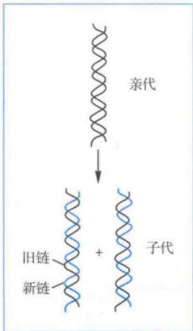

1958 年, Meselson 和 Stahl 研究了经 ${}^{15}$ N 标记 3 个世代的大肠杆菌 DNA, 首次证明了 DNA 的半保留复制。他们将大肠杆菌长期在以 ${}^{15}$ N 作氮源的培养基中培养, 得到 ${}^{15}$ N-DNA。由于该 DNA 分子的密度比普通 DNA ( ${}^{14}$ N-DNA) 的密度要大, 在氯化铯密度梯度离心时, 这两种 DNA 形成位置不同的区带。他们用普通培养基 (含 ${}^{14}$ N 的氮源) 培养 ${}^{15}$ N 标记的大肠杆菌, 经过一代以后, 所有 DNA 的密度都在 ${}^{15}$ N-DNA 和 ${}^{14}$ N-DNA 之间, 即形成了一半 ${}^{15}$ N 和一半 ${}^{14}$ N 的杂合分子, 两代后出现等量的 ${}^{14}$ N 分子和 ${}^{14}$ N- ${}^{15}$ N 杂合分子。若再继续培养, 可以看到 ${}^{14}$ N-DNA 分子增多, 说明 DNA 分子在复制时均可被分成两个亚单位, 分别构成子代分子的一半, 这些亚单位经过许多代复制仍然保持着完整性。

实验已经证明,无论是原核生物还是真核生物,其 DNA 都是以半保留复制方式遗传的。DNA 的这种半保留复制保证了 DNA 在代谢上的稳定性。经过许多代的复制,DNA 多核苷酸链仍可完整地存在于后代而不被分解掉。这种稳定性与 DNA 的遗传功能相符。

## 2.3.2 DNA 复制的一些基本概念

## 1. 复制子与复制叉

一般把生物体内能独立进行复制的单位称为复制子(replicon)。复制时,双链 DNA 要解开成两股链分别进行,所以,这个复制起始点呈现叉子的形式,被称为复制叉(replication fork)(图 2-21)。许多实验证明,DNA 的复制是由固定的起始点开始的,并在特定的终止点结束复制。因此,从复制起始点到终止点的区域为一个复制子。一个复制子只含一个复制起始点(origin)。复制叉从复制起点开始沿着 DNA 链连续移动,起始点可以启动单向复制或者双向复制,这主要取决于在复制起点形成一个复制叉还是两个复制叉。在单向复制中,所产生的一个复制叉离开起始点,沿 DNA 链前进;在双向复制中,起始点处产生两个复制叉,它们从起始点开始沿着相反的方向等速前进。

## 2. 复制起始点

从细菌、酵母、线粒体和叶绿体中鉴定出的复制起始点的共同特点是含有丰富的 AT

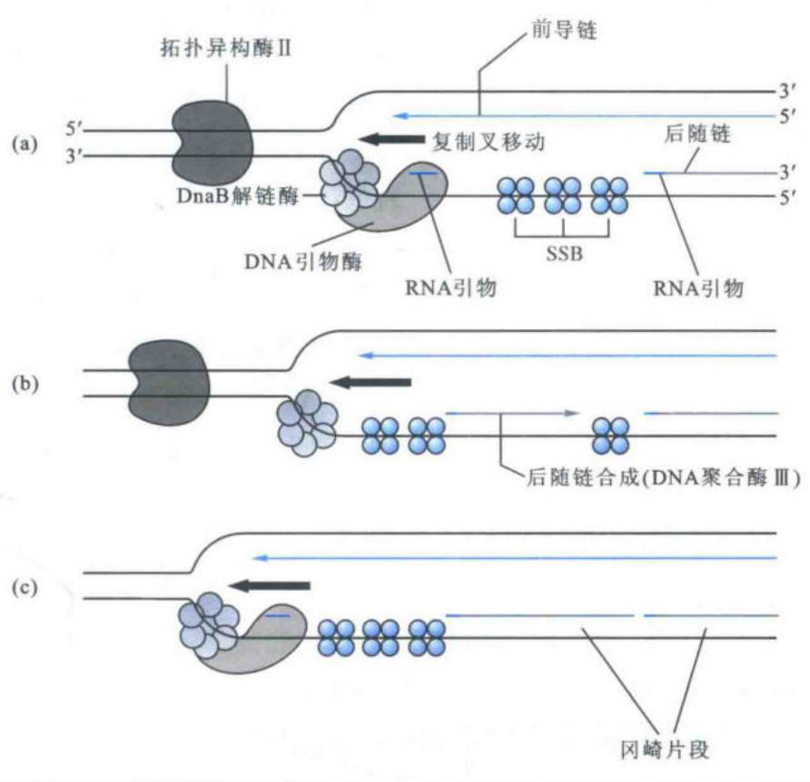  
图 2-21 DNA 链的复制过程示意图

(a) DNA 改变双螺旋构象, 解链酶解开双链, 在单链 DNA 结合蛋白 (SSB) 和 DNA 聚合酶Ⅲ的共同作用下合成前导链, 方向与复制叉推进的方向一致。在后随链上, 当复制叉进一步打开时, RNA 引物才能与 DNA 单链相结合。(b) 后随链合成时, 产生冈崎片段。(c) 复制叉继续前进, 引物酶合成新的 RNA 引物, 与 DNA 单链相结合准备引发合成新的冈崎片段。

序列,它可能有利于 DNA 复制启动时双链的解开。通常,细菌、病毒和线粒体的 DNA 分子都是作为单个复制子完成复制的,而真核生物基因组可以同时在多个复制起点上进行双向复制,也就是说它们的基因组包含有多个复制子(表 2-8)。真核生物复制子并非同时起作用,一般情况下,在特定的时间范围内,只有不超过 15% 的复制子进行复制。

表 2-8 部分生物复制子的比较

<table><tr><td>物种</td><td>细胞内复制子数目/个</td><td>平均长度/kb</td><td>复制子移动速度/(bp·min-1)</td></tr><tr><td>大肠杆菌</td><td>1</td><td>4200</td><td>50000</td></tr><tr><td>酵母</td><td>500</td><td>40</td><td>3600</td></tr><tr><td>果蝇</td><td>3500</td><td>40</td><td>2600</td></tr><tr><td>爪蟾</td><td>15000</td><td>200</td><td>500</td></tr><tr><td>蚕豆</td><td>35000</td><td>300</td><td>?</td></tr></table>

## 3. 复制终止点

复制子中控制复制终止的位点称为复制终止点(terminus)。在环形的大肠杆菌 DNA 中,复制终止点在起始点的相对位置(旋转 180°)。复制从起始点开始,双向进行,复制叉向两个相反方向沿环状 DNA 前进,最后两个复制叉相遇在一个位点而停止,该位点即为终止位点。

## 4. 复制方向

通过放射自显影实验可以判断 DNA 复制的方向性。复制开始时，首先用低放射性的$^{3}$ H脱氧胸苷标记大肠杆菌,数分钟后转移到含有高放射性的培养基中继续标记。因此,在放射自显影图像上,复制起始区的放射性标记密度比较低,感光还原的银颗粒密度也较低;继续合成区标记密度较高,银颗粒密

图2-22 从一个复制起始点开始的DNA单向复制  

度也较高。如果是单向复制，银颗粒的密度分布是一端低，另一端高；而双向复制则是中间密度低，两端高。

① 单向复制 从一个复制起始点开始, 只有一个复制叉在移动 $^{(图2-22)}$ 。某些环状 DNA 利用这种方式拷贝双链 DNA, 如质粒 ColE1 DNA。

② 双向复制 复制起始于一个位点,但向两侧分别形成复制叉,向相反方向移动。这种复制方式最为普遍。实验表明,无论是原核生物还是真核生物,DNA 的复制主要是从固定的起始点以双向等速复制方式进行的 $^{(图 2-23)}$ 。复制叉以 DNA 分子上某一特定顺序为起点,向两个方向等速生长前进。

③ 相向复制 还有一种比较特殊的相向复制模式。从两个起始点分别起始两条链的复制,这种模式虽然有两个复制叉的生长端,但在每个复制叉中只有一条链作为模板合成 DNA $^{(图2-24)}$ 。某些线性 DNA 病毒(如腺病毒)以这种方式进行复制,其双链 DNA 的每条链上都有一个复制起始点,分别起始合成一条新链,两条链以相向方式生长延伸。

## 5. 复制速度

真核生物的基因组比原核生物大,其染色体具有复杂的高级结构,复制时需要解开核小体,复制后又需重新形成核小体,其复制叉移动速度为1 000\~3 000 bp/min。真核生物染色体DNA上有多个复制起始点,可进行多复制子的同步复制,以满足细胞对DNA的需要。

细菌 DNA 只有一个复制起始点, 所以其复制叉的移动速度比真核生物要快 20\~50

图 2-23 放射性标记实验证明 DNA 的复制是从固定的起始点双向等速进行的

(a) 仅用 ${}^{3}$ H 胸腺嘧啶标记 DNA 10 min 即压 X 光片；(b) ${}^{3}$ H 标记 DNA 合成 10 min 后又继续非标记合成 10 min，导致 X 光片上的复制叉变长，银颗粒分布广而稀少；(c) 从一个复制起始点开始的 DNA 双向对称式复制。

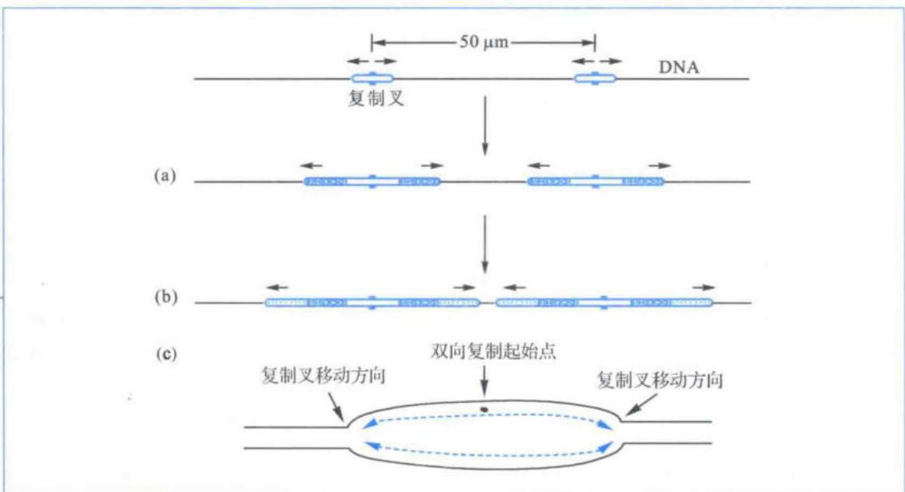

倍,可达50 000 bp/min。每个复制单位在30\~60 min内完成复制。并且,起始点可以连续发动复制,以满足其快速生长的需要。

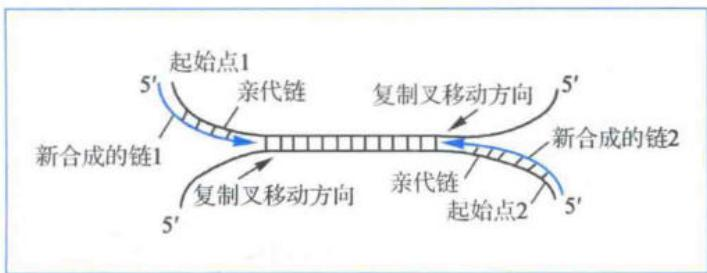  
图 2-24 从两个复制起始点开始, 新生 DNA 单链沿单一方向生长

## 归纳起来,对一个生物体基

因组而言,复制起始点是固定的,表现为固定的序列,并识别参与复制起始的特殊蛋白质。复制叉移动的方向和速度虽是多种多样的,但以双向等速方式为主。

## 6. 冈崎片段与半不连续复制

由于 DNA 双螺旋的两条链是反向平行的, 因此在复制叉附近解开的 DNA 链一条是 $5'\rightarrow3'$ 方向, 另一条是 $3'\rightarrow5'$ 方向, 两个模板极性不同, 而所有已知 DNA 聚合酶的合成方向都是 $5'\rightarrow3'$ , 不是 $3'\rightarrow5'$ , 这就不能解释 DNA 的两条链几乎同时复制合成这个事实。为了解释这一等速复制现象, 日本学者冈崎 (Okazaki) 等提出了 DNA 的半不连续复制 (semidiscontinuous replication) 模型。他用 ${}^{3}H$ 脱氧胸苷短时间标记大肠杆菌, 提取 DNA, 变性后用超离心方法得到了许多 ${}^{3}H$ 标记的、长度为 1000\~2000 个碱基的、被后人称为冈崎片段的 DNA。现在已知一般原核生物的冈崎片段要长些, 真核生物中的要短些。延长标记时间后, 冈崎片段可转变为成熟 DNA 链, 由此推断这些片段必然是复制过程的中间产物。此外, 用 DNA 连接酶温度敏感突变株进行实验, 在连接酶不起作用的温度下, 可以观察到有大量小 DNA 片段的累积, 说明 DNA 复制过程中至少有一条链首先合成较短的冈崎片段, 然后再由连接酶连成大分子 DNA。

图 2-25 总结了两条新链在两个向相反方向移动的复制叉上不同的特征,我们根据它们不同的性质分别将其称为前导链(leading strand)和后随链(lagging strand)。前导链DNA的合成按 $5' \rightarrow 3'$ 方向,随着亲代双链DNA的解开而连续进行复制;后随链在合成过程中,一段亲本DNA单链首先暴露出来,然后以与复制叉移动相反的方向按照 $5' \rightarrow 3'$ 方向合成一系列的冈崎片段,然后再把它们连接成完整的后随链。进一步研究还证明,这种前导链的连续复制和后随链的不连续复制在生物界是有普遍性的,因而称之为双螺旋DNA的半不连续复制。

## 7. DNA 聚合酶的作用机制

DNA 的合成是在 DNA 聚合酶 (DNA polymerase) 的催化下完成的。DNA 聚合酶用一个活性位点催化 4 种脱氧核苷三磷酸的添加, 它通过监视引入核苷酸形成 A-T 或 G-C 碱基对的能力, 在正确碱基对形成的情况下, 引物的 3'-OH 和在最佳催化位置上的核苷三磷酸的 α-磷酸才能发生催化反应。只有在正确底物存在时, 共价键形成的速率才显著增加, 正确碱基对掺入的速率是错误核苷酸掺入速率的一万倍, 表明酶对不同底物具有催化选择性。

## (1) DNA 聚合酶的 3 个结构域

对与引物－模板接头结合的不同 DNA 聚合酶的三维结构研究表明,该酶的三维结构

图2-25 DNA合成的半不连续性

(a) 前导链是持续合成的, 而后随链则是以不连续的方式合成的; (b) 两个向相反方向移动的复制叉分别合成前导链和后随链 DNA 的示意图, 显示复制叉是不对称的。

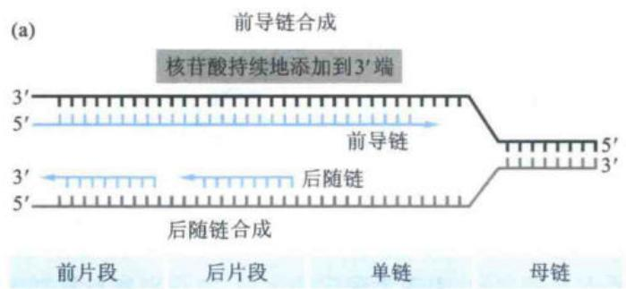

图 2-26 DNA 聚合酶的三维结构
(a) DNA 聚合酶与引物－模板接头结合；
(b) T7 DNA 聚合酶与 DNA 结合的三维结构。  

类似于一只半握的右手,其3个结构域分别被称为拇指、手指和手掌(图2-26)。DNA底物位于右手的裂缝中,新合成的DNA与手掌相连,DNA催化位点位于手指和拇指指尖的裂缝中。

手掌域含有催化位点的基本元件,由一个β折叠构成。两个二价金属离子 $\left(\mathrm{Mg}^{2+}\right.$ 或 $\left.\mathrm{Zn}^{2+}\right)$ 在该区域的结合有利于改变催化区域周围的化学环境,利于催化作用的进行。此外,手掌域还负责检查最新加入的核苷酸碱基配对的准确性。错误配对的碱基使催化活性显著降低,使引物-模板从聚合酶活性位点上脱离下来,结合到聚合酶上另一个具有校对功能的核酸酶活性位点上。

手指域对催化也很重要。手指域的几个残基可与引入的 dNTP 结合，当正确的碱基配对形成时，手指域包围住 dNTP，使引入的核苷酸和金属离子密切接触，促进催化反应。

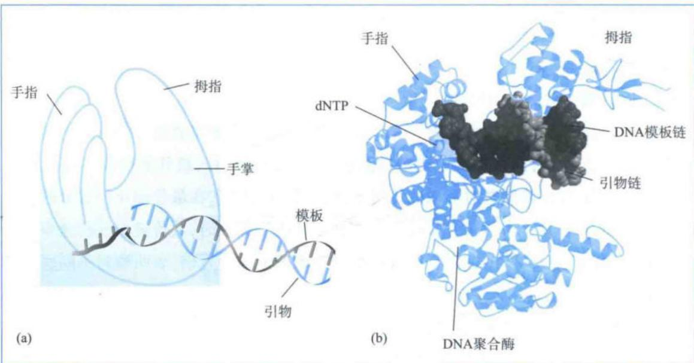

手指域还能够和模板区结合,使模板产生弯曲,仅使催化位点上引物后的第一个模板碱基暴露,避免在下一个核苷酸添加时造成对模板碱基选择的混淆。

拇指域与最新合成的 DNA 相互作用,一是维持引物以及活性部位的正确位置,二是促进 DNA 聚合酶与其底物之间的紧密连接,有助于添加更多的 dNTP。

## (2) DNA 聚合酶的延伸能力

DNA 的合成速度是由 DNA 聚合酶的延伸能力 (processivity) 决定的。所谓 DNA 聚合酶的延伸能力, 是指每次聚合酶与模板 - 引物结合时所能添加的核苷酸的平均数。高延伸性的 DNA 聚合酶催化 DNA 合成的速率可能高达一个完全非延伸性聚合酶的 1000 倍。DNA 聚合酶沿着 DNA 模板滑行的能力有利于提高延伸能力。DNA 聚合酶与完全包围 DNA 的 “滑动夹” 蛋白之间的相互作用可以进一步提高延伸能力。

## (3) 外切核酸酶具有校正新合成 DNA 的能力

作为 DNA 聚合酶的同一类多肽, 核酸酶(校正外切核酸酶, proofreading exonuclease)通过去除不正确碱基配对的核苷酸来校正 DNA 的合成。当不正确核苷酸被添加到引物链时, 校正外切核酸酶将它从引物链的 3' 端除去, 就像计算机键盘上的删除键那样, 把最近发生的错误去除掉, 极大地增加了 DNA 合成的精确度。校正外切核酸酶将不正确配对碱基的发生概率降低至每添加 $10^{7}$ 个核苷酸出现一次。此外, 后面提到的复制后错配修复可将 DNA 错误概率降至每添加 $10^{10}$ 个核苷酸出现一次。

## 8. 滑动 DNA 夹极大地增加了 DNA 聚合酶的延伸能力

与滑动 DNA 夹 (sliding DNA clamp) 的结合使得 DNA 聚合酶在复制叉上具有高延伸能力。滑动 DNA 夹由多个相同的蛋白亚基组成“油炸圈饼”形状的结构。滑动 DNA 夹中央的孔洞直径约为 3.5 nm，足以容纳 DNA 双螺旋、参与 DNA 合成的蛋白质以及必需的水分子 $^{(图 2-27)}$ 。聚合酶与滑动 DNA 夹在复制叉处形成复合体，在 DNA 合成时沿着 DNA 模板高效地滑动，保持聚合酶与 DNA 的紧密接触，从而大大增加了 DNA 聚合酶的延伸能力。

当单链 DNA 模板完成复制后, DNA 聚合酶必须从 DNA 模板和滑动夹上释放下来以参与新的 DNA 复制, 而滑动 DNA 夹则会滑动到新的 DNA 合成位点并执行新的功能。滑动 DNA 夹蛋白是病毒、细菌、酵母以及人类等生物的 DNA 复制体系中必不可少的保守部件,其结构在不同的生物中是保守的,都是相同的六边形对称结构,但形成夹子的亚基数在不同生物中可能不同。

  
滑动夹中央的孔洞直径约为3.5 nm, DNA螺旋的宽度约为2.0 nm, 因此, 在滑动夹和DNA之间可容纳一个或两个水分子(图像使用PyMOL软件制作)。

如上所述,滑动夹是一个闭合的环,由5个亚基组成的滑动夹装载器(sliding clamp loader)通过结合和水解ATP催化滑动夹的打开,并将其安放在DNA的引物-模板接头上。只有当滑动夹在与其相互作用的所有酶都完成工作后,滑动夹装载器才能通过改变滑动夹的构象将其从DNA上移除。

<!-- C-BEGIN Campbell 16.2 -->

### 【英文对应 Campbell Concept 16.2：Many proteins work together in DNA replication and repair】

> 来源：Campbell Biology（书籍/01_Campbell_Biology） 第16章 The Molecular Basis of Inheritance，Concept 16.2。

#### [EN] Concept 16.2: Many proteins work together in DNA replication and repair

Hereditary information in DNA directs the development of your biochemical, anatomical, physiological, and, to some extent, behavioral traits. A person's resemblance to their parents has its basis in the accurate replication of DNA prior to meiosis and therefore its transmission from the parents' generation to the children's. Replication prior to mitosis ensures faithful transmission of genetic information from a parent cell to two daughter cells.

Of all nature's molecules, nucleic acids are unique in their ability to dictate their own replication from monomers. The relationship between structure and function is evident in the double helix: The specific complementary pairing of nitrogenous bases in DNA has a functional significance. Watson and Crick ended their classic paper with this statement: "It has not escaped our notice that the specific

Figure 16.10 A model for DNA replication: the basic concept.  
In this simplified illustration, a short segment of DNA has been untwisted. Simple shapes symbolize the four kinds of bases. Dark blue represents DNA strands present in the parental molecule; light blue represents newly synthesized DNA.  
  
(a) The parental molecule has two complementary strands of DNA. Each base is paired by hydrogen bonding with its specific partner, A with T and G with C.

  
(b) First, the two DNA strands are separated. Each parental strand can now serve as a template for a new, complementary strand.

  
(c) Nucleotides complementary to the parental (dark blue) strand are connected to form the sugar-phosphate backbones of the new "daughter" (light blue) strands.  
somehow come back together after the process (that is, the parental molecule is conserved). In yet a third model, called the dispersive model, all four strands of DNA following replication have a mixture of old and new DNA (Figure 16.11).

pairing we have postulated immediately suggests a possible copying mechanism for the genetic material."¹ In this section, you will learn about the basic principle of DNA replication, the copying of DNA, as well as some important details of the process.

#### [EN] The Basic Principle: Base Pairing to a Template Strand

In a second paper, Watson and Crick stated their hypothesis for how DNA replicates: "Now our model for deoxyribonucleic acid is, in effect, a pair of templates, each of which is complementary to the other. We imagine that prior to duplication the hydrogen bonds are broken, and the two chains unwind and separate. Each chain then acts as a template for the formation on to itself of a new companion chain, so that eventually we shall have two pairs of chains, where we only had one before. Moreover, the sequence of the pairs of bases will have been duplicated exactly."2

Figure 16.10 illustrates the basic idea. If you cover a DNA strand in Figure 16.10a, its linear sequence of nucleotides is revealed by applying the base-pairing rules to the uncovered strand. The two strands are complementary; each stores the information necessary to reconstruct the other. When a cell copies a DNA molecule, each strand serves as a template for ordering nucleotides into a new, complementary strand. Nucleotides line up along the template strand according to the base-pairing rules and are linked to form the new strands. One double-stranded DNA molecule becomes two, each an exact replica of the “parental” molecule.

This model of DNA replication remained untested for several years following publication of the DNA structure. The necessary experiments were simple in concept but difficult to perform. Watson and Crick's model predicts that when a double helix replicates, each of the two daughter molecules will have one old strand, from the parental molecule, and one newly made strand. This semiconservative model can be distinguished from a conservative model of replication, in which the two parental strands

#### [EN] Figure 16.11 DNA replication: three alternative models.

Each short segment of double helix symbolizes the DNA within a cell. Beginning with a parent cell, we follow the DNA for two more generations of cells—two rounds of DNA replication. Parental DNA is dark blue; newly made DNA is light blue.

<table><tr><td></td><td>Parent cell</td><td>First replication</td><td>Second replication</td></tr><tr><td>(a) Conservative model.The two parental strands reassociate after acting as templates for new strands, thus restoring the parental double helix.</td><td></td><td></td><td></td></tr><tr><td>(b) Semiconservative model.The two strands of the parental molecule separate, and each functions as a template for synthesis of a new, complementary strand.</td><td></td><td></td><td></td></tr><tr><td>(c) Dispersive model.Each strand of both daughter molecules contains a mixture of old and newly synthesized DNA.</td><td colspan="3"></td></tr></table>

#### [EN] Figure 16.12

#### [EN] Inquiry: Does DNA replication follow the conservative, semiconservative, or dispersive model?

Experiment

Matthew Meselson and Franklin Stahl cultured E. coli for several generations in a medium containing nucleotide precursors labeled with a heavy isotope of nitrogen, ${}^{15}$ N. They then transferred the bacteria to a medium with only ${}^{14}$ N, a lighter isotope. They took one sample after the first DNA replication and another after the second replication. They extracted DNA from the bacteria in the samples and then centrifuged each DNA sample to separate DNA of different densities.

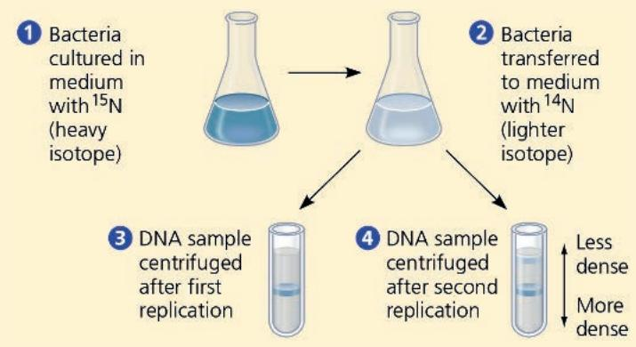

#### [EN] Conclusion

Meselson and Stahl compared their results to those predicted by each of the three models in Figure 16.11, as summarized in the following diagram. The first replication in the ${}^{14}$ N medium produced a single band of many molecules of hybrid ( ${}^{15}$ N- ${}^{14}$ N) DNA. This

Although mechanisms for conservative or dispersive DNA replication are not easy to devise, these models remained possibilities until they could be ruled out. After two years of preliminary work at the California Institute of Technology in the late 1950s, Matthew Meselson and Franklin Stahl devised a clever experiment that distinguished between the three models, described in Figure 16.12. Their results supported the semiconservative model of DNA replication, as predicted by Watson and Crick, and their experiment is widely recognized among biologists as a classic example of elegant design.

The basic principle of DNA replication is conceptually simple. However, the actual process involves some complicated biochemical gymnastics, as we will now see.

#### [EN] DNA Replication: A Closer Look

The bacterium E. coli has a single chromosome of about 4.6 million nucleotide pairs. In a favorable environment, an E. coli cell can copy all of this DNA and divide to form two genetically identical daughter cells in considerably less than an hour. Each of result eliminated the conservative model. The second replication produced both light and hybrid DNA, refuting the dispersive model and supporting the semiconservative model. They therefore concluded that DNA replication is semiconservative.

  
Data from M. Meselson and F. W. Stahl, The replication of DNA in Escherichia coli, Proceedings of the National Academy of Sciences USA 44:671–682 (1958).

INQUIRY IN ACTION Read and analyze the original paper in Inquiry in Action: Interpreting Scientific Papers.

Instructors: A related Experimental Inquiry Tutorial can be assigned in Mastering Biology.

WHAT IF? If Meselson and Stahl had first grown the cells in ${}^{14}$ N-containing medium and then moved them into ${}^{15}$ N-containing medium before taking samples, what would have been the result after each of the two replications?

For suggested answer, see Appendix A.

your somatic cells has 46 DNA molecules in its nucleus, one long double-helical molecule per chromosome. In all, that represents about 6 billion nucleotide pairs, or over 1,000 times more DNA than is found in most bacterial cells. If we were to print the one-letter symbols for these bases (A, G, C, and T) the size of the type you are now reading, the 6 billion nucleotide pairs of information in a diploid human cell would fill about 1,400 biology textbooks. Yet it takes one of your cells just a few hours to copy all of this DNA during S phase of interphase. This replication of an enormous amount of genetic information is achieved with very few errors—only about one per 10 billion nucleotides. The copying of DNA is remarkable in its speed and accuracy.

More than a dozen enzymes and other proteins participate in DNA replication. Much more is known about how this “replication machine” works in bacteria (such as $E.\ coli$ ) than in eukaryotes, and we will describe the basic steps of the process for $E.\ coli$ , except where otherwise noted. What scientists have learned about eukaryotic DNA replication suggests, however, that most of the process is fundamentally similar for prokaryotes and eukaryotes.

#### [EN] Getting Started

The replication of chromosomal DNA begins at particular sites called origins of replication, short stretches of DNA that have a specific sequence of nucleotides. The E. coli chromosome, like many other bacterial chromosomes, is circular and has a single origin. Proteins that initiate DNA replication recognize this sequence and attach to the DNA, separating the two strands and opening up a replication “bubble” (Figure 16.13a). Replication of DNA then proceeds in both directions until the entire molecule is copied. In contrast to a bacterial chromosome, a eukaryotic chromosome may have hundreds or even a few thousand replication origins. Multiple replication bubbles form and eventually fuse, thus speeding up the copying of the very long DNA molecules (Figure 16.13b). As in bacteria, eukaryotic DNA replication proceeds in both directions from each origin.

At each end of a replication bubble is a replication fork, a Y-shaped region where the parental strands of DNA are being unwound. Several kinds of proteins participate in the unwinding (Figure 16.14). Helicases are enzymes that untwist the double helix at the replication forks, separating the two parental strands and making them available as template strands. After the parental strands separate, single-strand binding proteins bind to the unpaired DNA strands, keeping them from re-pairing. The untwisting of the double helix causes tighter twisting and strain ahead of the replication fork. Topoisomerase is an enzyme that helps relieve this strain by breaking, swiveling, and rejoining DNA strands.

#### [EN] Synthesizing a New DNA Strand

The unwound sections of parental DNA strands are now available to serve as templates for the synthesis of new complementary DNA strands. However, the enzymes that synthesize DNA cannot initiate the synthesis of a polynucleotide; they can only add DNA nucleotides to the end of an already existing chain that is base-paired with the template strand. An initial nucleotide chain that can be used as a pre-existing chain is produced during DNA synthesis; this is actually a short stretch of RNA, not DNA. The RNA chain is called a primer

Figure 16.13 Origins of replication in E. coli and eukaryotes.  
The smaller red arrows indicate the movement of the replication forks and thus the overall directions of DNA replication within each bubble.  
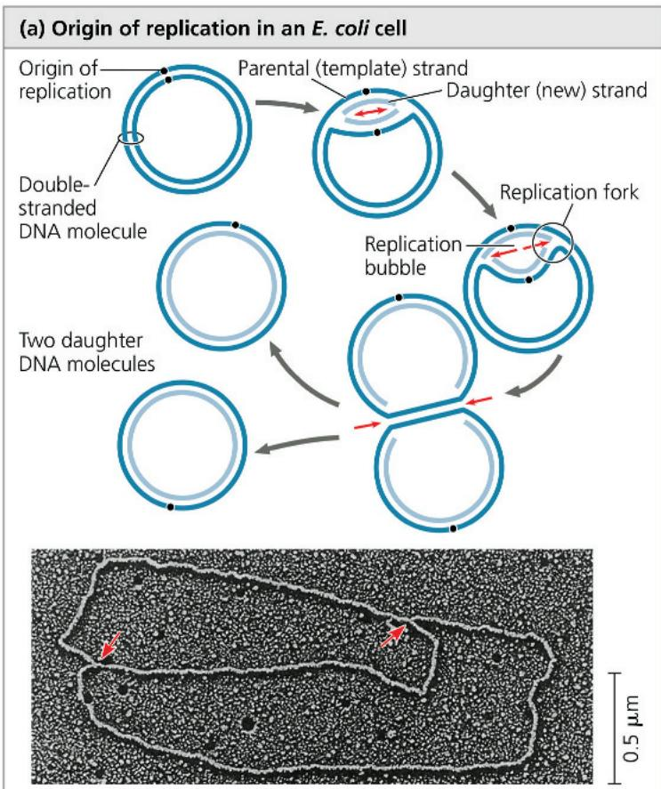  
The circular chromosome of E. coli and other bacteria has only one origin of replication. The parental strands separate there, forming a replication bubble with two forks (red arrows). Replication proceeds in both directions until the forks meet on the other side, resulting in two daughter DNA molecules. The TEM shows a bacterial chromosome with a replication bubble.

  
Two daughter DNA molecules

  
In a linear chromosome of a eukaryote, replication bubbles form at many sites along the giant DNA molecule during S phase of interphase. The bubbles expand as replication proceeds in both directions (red arrows). Eventually, the bubbles fuse and synthesis of the daughter strands is complete. The TEM shows three replication bubbles along the DNA of a cultured Chinese hamster cell.

Figure 16.14 Some of the proteins involved in the initiation of DNA replication.

The same proteins function at both replication forks in a replication bubble. For simplicity, only the left-hand fork is shown, and the DNA bases are drawn much larger in relation to the proteins than they are in reality.

and is synthesized by the enzyme primase (see Figure 16.14). Primase starts a complementary RNA chain with a single RNA nucleotide and adds RNA nucleotides one at a time, using the parental DNA strand as a template. The completed primer, generally five to ten nucleotides long, is thus base-paired to the template strand. The new DNA strand will start from the 3' end of the RNA primer; the RNA primer will be destroyed later, as we'll describe in a bit.

Enzymes called DNA polymerases catalyze the synthesis of new DNA by adding nucleotides to the 3' end of a preexisting chain. In E. coli, there are several DNA polymerases, but two of them appear to play the major roles in DNA replication: DNA polymerase III and DNA polymerase I. The situation in eukaryotes is more complicated, with at least 11 different DNA polymerases discovered so far, although the general principles are the same.

Most DNA polymerases require a primer and a DNA template strand, along which complementary DNA nucleotides are lined up, one by one. In E. coli, DNA polymerase III (abbreviated DNA pol III) adds a DNA nucleotide to the RNA primer and then continues adding DNA nucleotides, which are complementary to the parental DNA template strand, to the growing end of the new DNA strand. The rate of elongation is about 500 nucleotides per second in bacteria and 50 per second in human cells.

Each nucleotide to be added to a growing DNA strand consists of a sugar attached to a base and to three phosphate groups. You have already encountered such a molecule—ATP (adenosine triphosphate; see Figure 8.9). The only difference between the ATP of energy metabolism and dATP, the adenine nucleotide used to make DNA, is the sugar component, which is deoxyribose in the building block of DNA but ribose in ATP. Like ATP, the nucleotides used for DNA synthesis are chemically reactive, partly because their triphosphate tails have an unstable cluster of negative charge. DNA polymerase catalyzes the addition of each monomer to the growing end of a DNA strand by a condensation reaction in which two phosphate groups are lost as a molecule of pyrophosphate. Subsequent hydrolysis of the pyrophosphate to two molecules of inorganic phosphate is a coupled exergonic reaction that helps drive the polymerization reaction (Figure 16.15).

#### [EN] Antiparallel Elongation

As we have noted previously, the two ends of a DNA strand are different, giving each strand directionality, like a one-way street (see Figure 16.5). In addition, the two strands of DNA in a double helix are antiparallel, meaning that they are oriented in opposite directions to each other, like the two sides of a divided street (see Figure 16.15). Therefore, the two new strands formed during DNA replication must also be antiparallel to their template strands.

The antiparallel arrangement of the double helix, together with a constraint on the function of DNA polymerases, has an important effect on how replication occurs. Because of their structure, DNA polymerases can add nucleotides only to the free 3' end of a primer or growing DNA strand, never to the 5' end (see Figure 16.15). Thus, a new DNA strand can elongate only in the 5' → 3' direction. With this in mind, let's examine one of the two replication forks in a bubble (Figure 16.16). Along one template strand, DNA polymerase III can synthesize a complementary strand continuously by elongating the new DNA in the mandatory 5' → 3' direction. DNA pol III remains in the replication fork on that template strand and continuously adds nucleotides to the new complementary strand as the fork progresses. The DNA strand made by this mechanism is called the leading strand. Only one primer is required for DNA pol III to synthesize the entire leading strand (see Figure 16.16).

To elongate the other new strand of DNA in the mandatory $5'\rightarrow3'$ direction, DNA pol III must work along the other template strand in the direction away from the replication fork. The DNA strand elongating in this direction is called the lagging strand. In contrast to the leading strand, which elongates continuously, the

Figure 16.15 Addition of a nucleotide to a DNA strand. DNA polymerase catalyzes addition of a nucleotide to the 3' end of a growing DNA strand, with the release of two phosphates.  
  
DRAW IT Circle the area where the new bond was made. For suggested answer, see Appendix A.

#### [EN] Figure 16.16 Synthesis of the leading strand during DNA replication.

This diagram focuses on the left replication fork shown in the overview box. DNA polymerase III (DNA pol III), shaped like a cupped hand, is shown closely associated with a protein called the “sliding clamp” that encircles the newly synthesized double helix like a doughnut. The sliding clamp moves DNA pol III along the DNA template strand.

lagging strand is synthesized discontinuously, as a series of segments. These segments of the lagging strand are called Okazaki fragments, after Reiji Okazaki, the Japanese scientist who discovered them. The fragments are about 1,000–2,000 nucleotides long in E. coli and 100–200 nucleotides long in eukaryotes.

Figure 16.17 illustrates the steps in the synthesis of the lagging strand at one fork. Whereas only one primer is required on the leading strand, each Okazaki fragment on the lagging strand must be primed separately (1 and 4). After DNA pol III forms an Okazaki fragment (2 to 4), another DNA polymerase, DNA pol I, replaces the RNA nucleotides of the adjacent primer with DNA nucleotides one at a time (5). But DNA pol I cannot join the final nucleotide of this replacement DNA segment to the first DNA nucleotide of the adjacent Okazaki fragment. Another enzyme, DNA ligase, accomplishes this task, joining the sugar-phosphate backbones of all the Okazaki fragments into a continuous DNA strand (6).

Synthesis of the leading strand and synthesis of the lagging strand occur concurrently and at the same rate. The lagging strand is so named because its synthesis is delayed slightly relative to synthesis of the

Figure 16.17 Synthesis of the lagging strand.  
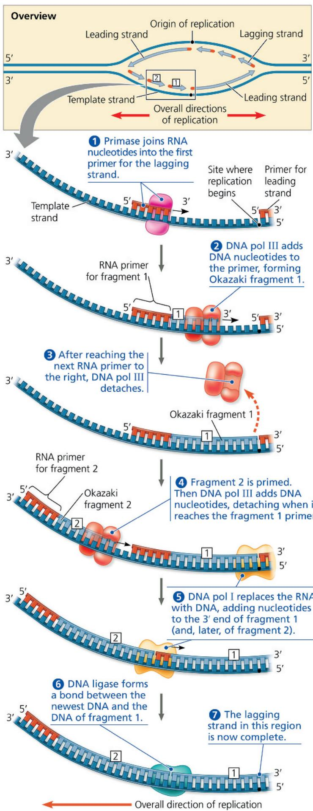

leading strand; each new fragment of the lagging strand cannot be started until enough template has been exposed at the replication fork.

Figure 16.18 and Table 16.1 summarize DNA replication. Please study them carefully before proceeding.

#### [EN] The DNA Replication Complex

It is traditional—and convenient—to represent DNA polymerase molecules as locomotives moving along a DNA railroad track, but such a model is inaccurate in two important ways. First, the various proteins that participate in DNA replication actually form a single large complex, a “DNA replication machine.” Many protein-protein interactions facilitate the efficiency of this complex. For example, by interacting with other proteins at the fork, primase apparently acts as a molecular brake, slowing progress of the replication fork and coordinating the placement of primers and the

rates of replication on the leading and lagging strands. Second, the DNA replication complex may not move along the DNA; rather, the DNA may move through the complex during the replication process. In eukaryotic cells, multiple copies of the complex, perhaps grouped into “factories,” may be anchored to the nuclear matrix, a framework of fibers extending through the interior of the nucleus.

Some experimental evidence supports a model in which two DNA polymerase molecules, one on each template strand, "reel in" the parental DNA and extrude newly made daughter DNA molecules. In this so-called trombone model, the lagging strand is also looped back through the complex (Figure 16.19). Whether the complex moves along the DNA or whether the DNA moves through the complex, either anchored or not, are still open, unresolved questions that are under active investigation.

Figure 16.18 A summary of bacterial DNA replication.  
The detailed diagram shows the left-hand replication fork of the replication bubble shown in the overview (upper right). Viewing each daughter strand in its entirety in the overview, you can see that half of it is made continuously as the leading strand, while the other half (on the other side of the origin) is synthesized in fragments as the lagging strand.  
  
DRAW IT Draw a diagram showing the right-hand fork of the bubble in this figure. Number the Okazaki fragments, and label all 5' and 3' ends.  
For suggested answer, see Appendix A.

Table 16.1 Bacterial DNA Replication Proteins and Their Functions

<table><tr><td>Protein</td><td>Function</td></tr><tr><td>Helicase</td><td>Unwinds parental double helix at replication forks</td></tr><tr><td>Single-strand binding protein</td><td>Binds to and stabilizes single-stranded DNA until it is used as a template</td></tr><tr><td>Topoisomerase</td><td>Relieves overwinding strain ahead of replication forks by breaking, swiv-elling, and rejoining DNA strands</td></tr><tr><td>Primase</td><td>Synthezises an RNA primer at 5&#x27; end of leading strand and at 5&#x27; end of each Okazaki fragment of lagging strand</td></tr><tr><td>DNA pol IIT</td><td>Using parental DNA as a template, synthezises new DNA strand by add-ing nucleotides to an RNA primer or a pre-existing DNA strand</td></tr><tr><td>DNA pol I</td><td>Removes RNA nucleotides of primer from 5&#x27; end and replaces them with DNA nucleotides added to 3&#x27; end of adjacent fragment</td></tr><tr><td>DNA ligase</td><td>Joins Okazaki fragments of lagging strand; on leading strand, joins 3&#x27; end of DNA that replaces primer to rest of leading strand DNA</td></tr></table>

Figure 16.19 The “trombone” model of the DNA replication complex.

#### [EN] Proofreading and Repairing DNA

The accuracy of DNA replication is not solely due to the specificity of base pairing. Initial pairing errors between incoming nucleotides and those in the template strand occur at a rate of one in $10^{5}$ nucleotides. However, errors in the completed DNA molecule amount to only one in $10^{10}$ (10 billion) nucleotides, an error rate that is 100,000 times lower. This is because during DNA replication, many DNA polymerases proofread each nucleotide against its template as soon as it is covalently bonded to the growing strand. Upon finding an incorrectly paired nucleotide, the polymerase removes the nucleotide and then resumes synthesis. (This action is similar to fixing a texting error by deleting the wrong letter and then entering the correct one.)

Mismatched nucleotides sometimes evade proofreading by a DNA polymerase. In mismatch repair, other enzymes remove and replace incorrectly paired nucleotides that have resulted from replication errors. Researchers highlighted the importance of such repair enzymes when they found that a hereditary defect in one of them is associated with a form of colon cancer. Apparently, this defect allows cancer-causing errors to accumulate in the DNA faster than normal.

Incorrectly paired or altered nucleotides can also arise after replication. In fact, maintenance of the genetic information encoded in DNA requires frequent repair of various kinds of

In this proposed model, two molecules of DNA polymerase III work together in a complex, one on each strand, with helicase and other proteins. The lagging strand template DNA loops through the complex, resembling the slide of a trombone.

  
DRAW IT Draw a line tracing the lagging strand template in this figure. For suggested answer, see Appendix A.

damage to existing DNA. DNA molecules are constantly subjected to potentially harmful chemical and physical agents, such as X-rays, as we'll discuss in Concept 17.5. In addition, DNA bases may undergo spontaneous chemical changes under normal cellular conditions. However, these changes in DNA are usually corrected before they become permanent changes—mutations—perpetuated through successive replications. Each cell continuously monitors and repairs its genetic material. Because repair of damaged DNA is so important to the survival of an organism, it is no surprise that many different DNA repair enzymes have evolved. Almost 100 are known in E. coli, and about 170 have been identified so far in humans.

Most cellular systems for repairing incorrectly paired nucleotides, whether they are due to DNA damage or to replication errors, use a mechanism that takes advantage of the base-paired structure of DNA. In many cases, a segment of the strand containing the damage is cut out (excised) by a DNA-cutting enzyme—a nuclease—and the resulting gap is then filled in with nucleotides, using the undamaged strand as a template. The enzymes involved in filling the gap are a DNA polymerase and DNA ligase. There are several such DNA repair systems; one is called nucleotide excision repair.

An example is shown in Figure 16.20. An important function of the DNA repair enzymes in our skin cells is to repair genetic damage caused by the UV rays of sunlight: For example, adjacent thymine bases on a DNA strand can become covalently linked into thymine dimers, causing the DNA to buckle and interfere with DNA replication. The importance of repairing this kind of damage is underscored by a disorder called xeroderma pigmentosum (XP), which in most cases is caused by an inherited defect in a nucleotide excision repair enzyme. Individuals with XP are hypersensitive to sunlight; mutations in their skin cells caused by ultraviolet light are left uncorrected, often resulting in skin cancer. The effects are extreme: Without sun protection, children who have XP can develop skin cancer by age 10.

Figure 16.20 Nucleotide excision repair of DNA damage.  

#### [EN] Evolutionary Significance of Altered DNA Nucleotides

EVOLUTION Faithful replication of the genome and repair of DNA damage are important for the functioning of the organism and for passing on a complete, accurate genome to the next generation. The error rate after proofreading and repair is extremely low, but rare mistakes do slip through. Once a mismatched nucleotide pair is replicated, the sequence change is permanent in the daughter molecule that has the incorrect nucleotide as well as in any subsequent copies. As we mentioned earlier, a permanent change in the DNA sequence is called a mutation.

Mutations can change the phenotype of an organism (see Concept 17.5). And if they occur in germ cells, which give rise to gametes, mutations can be passed on from generation to generation. The vast majority of such changes either have no effect or are harmful, but a very small percentage can be beneficial. In either case, mutations are the original source of the variation on which natural selection operates during evolution and are ultimately responsible for the appearance of new species. (You'll learn more

about this process in Unit Four.) The balance between complete fidelity of DNA replication or repair and a low mutation rate has resulted in new proteins that contribute to different phenotypes. Ultimately, over long periods of time, this process leads to new species and thus to the rich diversity of life on Earth today.

#### [EN] Replicating the Ends of DNA Molecules

For linear DNA, such as the DNA of eukaryotic chromosomes, the usual replication machinery cannot complete the 5' ends of daughter DNA strands because there is no 3' end of a preexisting polynucleotide for DNA polymerase to add onto. This is another consequence of the enzyme's requirements. Even if an Okazaki fragment can be started with an RNA primer hydrogen-bonded to the very end of the template strand, once that primer is removed, it cannot be replaced with DNA because there is no 3' end available for nucleotide addition (Figure 16.21). As a result, repeated rounds of replication produce shorter and shorter DNA molecules with uneven ("staggered") ends.

Most prokaryotic organisms have a circular chromosome, with no ends, so the shortening of DNA does not occur. But what protects the genes of linear eukaryotic chromosomes from being eroded away during successive rounds of DNA replication? Eukaryotic chromosomal DNA molecules have special nucleotide sequences called telomeres at their ends (Figure 16.22). Telomeres do not contain genes; instead, the DNA typically consists of multiple repetitions of one short nucleotide sequence. In each human telomere, for example, the six-nucleotide sequence TTAGGG is repeated between 100 and 1,000 times.

Telomeres have two protective functions. First, specific proteins associated with telomeric DNA prevent the staggered ends of the daughter molecule from activating the cell's systems for monitoring DNA damage. (Staggered ends of a DNA molecule, which often result from double-strand breaks, can trigger signal transduction pathways leading to cell cycle arrest or cell death.) Second, telomeric DNA acts as a kind of buffer zone that provides some protection against the organism's genes shortening, somewhat like how the plastic-wrapped ends of a shoelace slow down its unraveling. Telomeres do not prevent the erosion of genes near the ends of chromosomes; they merely postpone it.

As shown in Figure 16.21, telomeres become shorter during every round of replication. Thus, as expected, telomeric DNA tends to be shorter in dividing somatic cells of older individuals and in cultured cells that have divided many times. It has been proposed that shortening of telomeres is somehow connected to the aging process of certain tissues and even to aging of the organism as a whole.

But what about germ cells, whose genome must persist virtually unchanged from an organism to its offspring over many generations? If the chromosomes of germ cells became shorter in every cell cycle, essential genes would eventually be missing from the gametes they produce. However, this does not occur: An enzyme called telomerase catalyzes the lengthening of telomeres in eukaryotic germ cells, thus restoring their original length and compensating for the shortening that occurs during DNA replication. This enzyme contains its own RNA molecule that it uses as a template to artificially “extend” the leading strand, allowing the lagging strand to maintain a given length.

Figure 16.21 Shortening of the ends of linear DNA molecules. Here we follow the left end of one DNA molecule through two rounds of replication. After the first round, the new lagging strand is shorter than its template. After a second round, both the leading and lagging strands have become shorter than the original parental DNA. Although not shown here, the other ends of these chromosomal DNA molecules (not shown) also become shorter.

  
Figure 16.22 Telomeres.

Eukaryotes have repetitive, noncoding sequences called telomeres at the ends of their DNA. Telomeres are the bright spots stained orange in these mouse chromosomes (LM).  
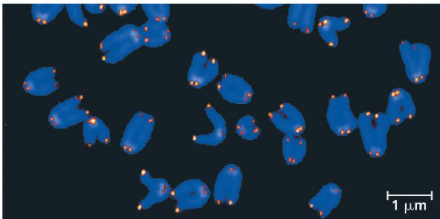

Telomerase is not active in most human somatic cells, but its activity varies from tissue to tissue. The activity of telomerase in germ cells results in telomeres of maximum length in the zygote.

The notion that longer telomeres could provide a sort of “fountain of youth” has prompted a number of studies. A decade ago, one study that artificially extended telomere length in cultured cells reported that, indeed, the cells had much longer life spans, as measured by how many times they could divide. As a logical extension, in 2023, a research team carried out a study on a group of related individuals with a mutation that led to longer telomeres. Comparing these individuals with family members without the mutation, the researchers reported that although some of those with the mutation showed signs of youthfulness, a large number of them developed tumors, cancers, and harmful blood conditions.

A likely conclusion is that normal shortening of telomeres may protect organisms from cancer by limiting the number of divisions that somatic cells can undergo. Cells from large tumors often have unusually short telomeres, as we would expect for cells that have undergone many cell divisions. Further shortening would presumably lead to self-destruction of the tumor cells. Telomerase activity is abnormally high in cancerous somatic cells, suggesting that its ability to stabilize telomere length may allow these cancer cells to persist. Many cancer cells do seem capable of unlimited cell division, as do immortal strains of cultured cells (see Concept 12.3). For several years, researchers have studied inhibition of telomerase as a possible cancer therapy. While studies that inhibited telomerase in mice with tumors have led to the death of cancer cells, eventually the cells have restored the length of their telomeres by an alternative pathway. This is an area of ongoing research that may eventually yield useful cancer treatments.

#### [EN] Concept Check 16.2

1. What role does complementary base pairing play in the replication of DNA?

2. Identify two major functions of DNA pol III in DNA replication.

3. MAKE CONNECTIONS What is the relationship between DNA replication and the S phase of the cell cycle? See Figure 12.6.

4. VISUAL SKILLS If the DNA pol I in a given cell were non-functional, how would that affect the synthesis of a leading strand? In the overview box in Figure 16.18, point out where DNA pol I would normally function on the top leading strand.

For suggested answers, see Appendix A.

<!-- C-END Campbell 16.2 -->

## 2.4 原核生物和真核生物 DNA 复制的特点

## 2.4.1 原核生物 DNA 复制的特点

大肠杆菌基因组以双链环状 DNA 分子的形式存在, 复制起始区位于其遗传图的 84 min 附近, 复制起始点 (oriC) 含有 3 个 13 bp 的串联重复保守序列, GATCTNTTNTTTT, 以及 4 个由 9 bp 的保守序列 (TTATNCANA) 组成的能结合 DnaA 的起始结合位点 (图 2-28)。复制起始后, 在 oriC 上形成的两个复制叉沿着整个基因组双向等速移动, DNA 复制的中间产物可形成一个 $\theta$ , 两个复制叉在距起始点 $180^{\circ}$ 处会合。

## 1. DNA 双螺旋的解旋

DNA 在复制时, 其双链首先解开, 形成复制叉, 这是一个有多种蛋白质及酶参与的复杂过程。已经发现一些酶和蛋白质能使 DNA 双链变得易于解开, 或者可以使超螺旋分子松弛。首先在拓扑异构酶 I 的作用下解开负超螺旋, 并与解链酶共同作用, 在复制起始点处解开双链。参与解链的除一组解链酶外, 还有 Dna 蛋白等, 一旦局部解开双链, 就必须有 SSB 蛋白来稳定解开的单链, 以保证该局部结构不会恢复成双链, 接着由引发酶等组成的引发体迅速作用于两条单链 DNA 上。不论是前导链还是后随链, 都需要一段 RNA 引物以起始子链 DNA 的合成。现将其中重要的酶与蛋白质分述如下。

① DNA 解链酶(DNA helicase) DNA 解链酶能通过水解 ATP 获得能量来解开双链 DNA。大部分 DNA 解链酶(包括大肠杆菌解链酶Ⅱ、Ⅲ、T4 噬菌体 dda、T4 基因 41 和人解链酶等)可沿后随链模板的 $5'\rightarrow3'$ 方向并随着复制叉的前进而移动,只有另一种解链(Rep 蛋白)是沿前导链模板的 $3'\rightarrow5'$ 方向移动。因此推测 Rep 蛋白和特定 DNA 解链酶分别在 DNA 的两条母链上协同作用,以解开双链 DNA。

② 单链 DNA 结合蛋白(single-stranded DNA binding protein, SSB) 最初发现噬菌体 T4 的基因 32 蛋白可以在远低于解链温度时使双链 DNA 分开, 并牢牢地结合在单链 DNA 上, 后来发现许多生物中都有这类蛋白质。从原核生物得到的 SSB 与 DNA 结合时还表现出协同效应: 如第一个 SSB 结合到 DNA 上去的能力为 1, 第二个 SSB 结合能力则可高达 $10^{3}$ ; 真核生物牛、鼠和人细胞中的 SSB 与单链 DNA 结合时, 则不表现上述协同效应。

图 2-28 大肠杆菌 DNA 复制起始点 (oriC) 保守序列分布图  

SSB 的作用是保证被解链酶解开的单链在复制完成前能保持单链结构,它以四聚体形式存在于复制叉处,待单链复制完成后才离开,重新进入循环。所以,SSB 的作用是保持单链的存在,并没有解链的作用。

③ DNA 拓扑异构酶(DNA topoisomerase) 大多数天然状态下的 DNA 分子都具有适度的负超螺旋,可以形成部分的单链结构,利于蛋白质与 DNA 的结合。在复制过程中,随着 DNA 的解旋,双螺旋的盘绕数 T 减少,而超螺旋数 W 增加,使正超螺旋增加,未解链部分的缠绕更加紧密,形成的压力使解链不能继续进行。拓扑异构酶能够消除解链造成的正超螺旋的堆积,消除阻碍解链继续进行的这种压力,使复制得以延伸。

## 2. DNA 复制的引发

所有 DNA 的复制都是从一个固定起始点开始的,而目前已知的 DNA 聚合酶都只能延长已存在的 DNA 链,而不能从头合成 DNA 链,那么一个新 DNA 的复制是怎样开始的呢?

研究发现，DNA 新链的起始需要一条 RNA 引物。所有的 DNA 聚合酶都不能够从头启动新 DNA 链的合成，需要带有游离 3' 羟基的引物（primer）。DNA 复制时，往往先由引发酶（一种特殊的 RNA 聚合酶，不需要用特异 DNA 序列来起始新 RNA 引物的合成）在 DNA 模板上合成一段 RNA 链，它提供引发末端（引物），接着由 DNA 聚合酶从 RNA 引物 3' 端开始合成新的 DNA 链。无论前导链还是后随链开始 DNA 合成时，都需要 RNA 引物引发复制，只是对于前导链来说，这一引发过程比较简单，只要有一段 RNA 引物，DNA 聚合酶就能以此为起点一直合成下去。但对于后随链来说，引发过程就十分复杂，每个冈崎片段都需要新引物，需要多种蛋白质和酶的协同作用，还牵涉到冈崎片段的形成和连接。

后随链的引发过程往往由引发体(primosome)来完成。引发体由6种蛋白质n、n'、n"、DnaB、DnaC和DnaI共同组成，只有当引发体前体(preprimosome)把这6种蛋白质合在一起并与引发酶(primase)进一步组装后形成引发体，才能发挥其功效。引发酶是dnaG基因的产物，是在特定环境下发挥作用的RNA聚合酶，仅用于合成DNA复制所需的一小段RNA。引发体像火车头一样在后随链分叉的方向上前进，并在模板上断断续续地引发生成后随链的引物RNA短链，再由DNA聚合酶Ⅲ作用合成DNA，直至遇到下一个引物或冈崎片段为止。由RNase H降解RNA引物并由DNA聚合酶I将缺口补齐，再由DNA连接酶将两个冈崎片段连在一起形成大分子DNA。

图 2-29 以大肠杆菌为例解释了由 oriC 复制起始点处引发的 DNA 复制过程。在大肠杆菌中，一些蛋白质有序地作用于复制起始点。首先是在 ATP 的作用下，大约 20 个 DnaA 蛋白与 oriC 的 4 个 9 碱基保守序列结合，形成寡聚复合物；接着，在 DNA 结合蛋

图2-29 由大肠杆菌oriC复制起始点处引发的DNA复制过程  

白 HU 蛋白和 ATP 的共同作用下，DnaA 复制起始复合物使 3 个 13 碱基串联重复序列变性，形成开链；在 DnaC 蛋白的协助下，六聚化的解链酶 DnaB 替换了 DnaA，与 DNA 链结合，目前认为 DnaB 可能具有两种构象，一种形式与双链 DNA 结合，另一种形式与单链 DNA 结合。这两种形式的转化可引发双链体的熔化，需要 ATP 的水解提供能量，即每解开一个碱基对需要水解一个 ATP，它在一个与双链区相连的单链区起始解链，使 DNA 双链进一步解开。

## 3. 复制的延伸

在复制的延伸过程中,前导链和后随链的合成同时进行。前导链持续合成,由全酶异二聚体中的一个亚单位和前导链模板结合,在引物 RNA 合成的基础上,连续合成新的 DNA,其合成方向与复制叉一致。

后随链的合成分段进行,形成中间产物冈崎片段,再通过共价连

接成一条连续完整的新 DNA 链。分为 4 个步骤：

① 首先, 引物酶合成约 10 核苷酸大小的新引物。两个引物间的距离在细菌中为 1000\~2000 个核苷酸, 在真核细胞中为 100\~400 个核苷酸。

② DNA 聚合酶Ⅲ以 $5'\rightarrow3'$ 方向延伸该引物，直到遇见邻接引物的 $5'$ 端。这个新合成的 DNA 片段就是冈崎片段。

③ 在 E. coli 中, DNA 聚合酶 I 具有 $5' \rightarrow 3'$ 外切酶的活性, 被用来去除引物。

④ DNA 连接酶连接相邻的冈崎片段使之成为一条完整的子代链。

## 4. 复制的终止

除Tus蛋白以外，链的终止看起来不需要太多蛋白质的参与。当复制叉前移，遇到约22个碱基的重复性终止子序列(Ter)时，Ter-Tus复合物能使DnaB不再将DNA解链，阻挡复制叉的继续前移，等到相反方向的复制叉到达后停止复制，其间仍有 $50\sim 100$ bp未被复制，由DNA修复机制填补空缺，其后两条链解开。在DNA拓扑异构酶IV的作用下使

复制叉解体,释放子链 DNA $^{(图 2-30)}$ 。

## 5. DNA 聚合酶

细胞中一般含有多种被特化的、能高效而精确地复制基因组 DNA 的聚合酶。现已发现在大肠杆菌中存在 DNA 聚合酶 I、II、III、IV 和 V，有关 DNA 聚合酶 I、II 和 III（主要 DNA 聚合酶）的活性、功能及特点等归纳如表 2-9。

  
图 2-30 大肠杆菌中 DNA 复制的终止

DNA 聚合酶 I 是第一个被鉴定出来的 DNA 聚合酶,但它不是复制大肠杆菌染色体的主要聚合酶。该蛋白质可以被蛋白酶切成两个区域:占蛋白 2/3 的 C 端区域 $(6.8 \times 10^{4})$ 又称为 Klenow 片段,同时具有 DNA 聚合酶活性和 $3' \rightarrow 5'$ 外切核酸酶活性,既可合成 DNA 链,又能降解 DNA,保证了 DNA 复制的准确性。另外,它的 N 端区域 $(3.5 \times 10^{4})$ 具有 $5' \rightarrow 3'$ 外切核酸酶的活性,可作用于双链 DNA,又可水解 $5'$ 端或距 $5'$ 端几个核苷酸处的磷酸二酯键,因而该酶被认为在切除由紫外线照射而形成的嘧啶二聚体中起着重要的作用。它也可用以除去冈崎片段 $5'$ 端 RNA 引物,使冈崎片段间缺口消失,保证连接酶将片段连接起来。

表 2-9 大肠杆菌 DNA 聚合酶 I、II 和 III 的性质比较

<table><tr><td>性质</td><td>DNA 聚合酶I</td><td>DNA 聚合酶II</td><td>DNA 聚合酶III</td></tr><tr><td> $3' \rightarrow 5'$ 外切</td><td>+</td><td>+</td><td>+</td></tr><tr><td> $5' \rightarrow 3'$ 外切</td><td>+</td><td>-</td><td>-</td></tr><tr><td>新生链合成</td><td>-</td><td>-</td><td>+</td></tr><tr><td>相对分子质量( $\times 10^{3}$ )</td><td>103</td><td>90</td><td>900</td></tr><tr><td>细胞内分子数</td><td>400</td><td>?</td><td>10~20</td></tr><tr><td>生物学活性</td><td>1</td><td>0.05</td><td>15</td></tr><tr><td>已知的结构基因</td><td>Pol(A)</td><td>Pol(B)</td><td>Pol(C)(dnaE、N、Z、X、Q等)</td></tr></table>

DNA 聚合酶Ⅱ具有 $5'\rightarrow3'$ 方向聚合酶活性,但酶活性很低。若以每分钟酶促核苷酸掺入 DNA 的转化率计算,只有 DNA 聚合酶 I 的 5%,故也不是复制中主要的酶。其 $3'\rightarrow5'$ 外切核酸酶活性可起校正作用。目前认为 DNA 聚合酶Ⅱ的生理功能主要是起修复 DNA 的作用。

DNA 聚合酶Ⅲ包含 7 种不同的亚单位和 9 个亚基。生物活性形式为二聚体。它既有 $5'\rightarrow3'$ 方向聚合酶活性，也有 $3'\rightarrow5'$ 外切核酸酶活性。该酶的活性较强，为 DNA 聚合酶 I 的 15 倍，DNA 聚合酶 II 的 300 倍。它能在引物的 $3'-OH$ 上以每分钟约 5 万个核苷酸的速率延长新生的 DNA 链，是大肠杆菌 DNA 复制中链延长反应的主导聚合酶，是组成具有高度延伸能力的 DNA 聚合酶Ⅲ全酶（DNA Pol III holoenzyme）的主要部分。

DNA 聚合酶Ⅳ和 V 分别由 dinB 和 $umuD'_{2}C$ 基因编码, 主要在 DNA 修复和跨损伤合

成(translesion synthesis, TLS)过程中发挥功能。

## 6. 原核生物 DNA 复制的调控

原核细胞的生长和增殖速度取决于培养条件,但在生长增殖速度不同的细胞中 DNA 链延伸的速度几乎是恒定的,只是复制叉的数量不同。迅速分裂的细胞具较多复制叉,而分裂缓慢的细胞复制叉较少并出现复制的间隙。细胞内复制叉的多少决定了复制起始频率的高低,这可能是原核细胞复制的调控机制。复制起始频率的直接调控因子是蛋白质和 RNA。

以大肠杆菌染色体 DNA 的复制调控为例, 染色体的复制与细胞分裂一般是同步的, 但复制与细胞分裂不直接耦联。复制起始不依赖于细胞分裂, 而复制的终止则能引发细胞分裂。在一定生长速度范围内, 细胞与染色体的质量之比相对恒定, 这是由活化物、阻遏物和去阻遏物及它们的相互作用所制约的。复制的功能单位, 即复制子与转录的操纵子相似, 由起始物位点和复制起始点两部分组成。起始物位点编码复制调节蛋白质, 复制起始点与调节蛋白质相互作用并启动复制。起始物位点突变使复制停止并导致细胞死亡。这些条件致死突变包括 dnaA、dnaC 和 dnaT 突变株, 证明上述基因编码的调节蛋白质通过与复制复合物的相互作用确定复制起始频率和复制方式。

DNA 复制的调控主要发生在起始阶段,一旦开始复制,如没有意外的阻力,就一直可以复制下去直到完成。大肠杆菌的复制起始点有 oriC 和 oriH 两种,其中 oriC 是首选的复制起始点,而 oriH 是在 RNase H 缺失突变株中发现的一系列复制起始点。这两种起始点起始复制的机制和调控方式不同。

## 2.4.2 真核生物 DNA 复制的特点

真核生物 DNA 的复制与原核生物 DNA 复制有很多不同,例如,真核生物每条染色质上可以有多处复制起始点,而原核生物只有一个起始点;真核生物的染色体在全部完成复制之前,各个起始点上 DNA 的复制不能再开始,而在快速生长的原核生物中,复制起始点上可以连续开始新的 DNA 复制,表现为虽只有一个复制单元,但可有多个复制叉。

## 1. 真核生物 DNA 每个细胞周期只精确地复制一次

在真核生物细胞中，DNA复制只是细胞周期的一部分，它只在S期进行。第一批复制子的激活标志着S期的开始。在之后的几个小时里，其余的复制子相继启动，细胞中所有的DNA都必须精确地复制一次。DNA的重复复制会造成严重的后果，导致基因组中特定区域的拷贝数增加。真核生物DNA复制叉的移动速度大约只有50 bp/s，还不到大肠杆菌的1/20；真核生物的复制子相对较小，其长度为40\~100千碱基对，所以每条染色体上有多个复制起始点。必须有足够多的起始点被激活，才能保证每个S期细胞中每条染色体都被完全复制。

## 2. 真核细胞复制的起始需要在前复制复合体 pre-RC 的指导下进行

真核生物中复制起始区有什么特点呢？目前为止，酿酒酵母的复制起始点已经被鉴定出来，长150 bp左右，包括数个复制起始必需的保守区，将这个特殊序列作为一个部件来构建一个环状的 DNA 分子, 这个核外 DNA 分子在酵母中是能够自主复制的。我们把酵母的复制起始点称为自主复制序列 (autonomously replicating sequences, ARS)。后来在其他真核生物中也发现类似于酵母 ARS 元件的序列。不同 ARS 序列的共同特征是具有一个被称为 A 区的 11 个 A-T 碱基对的保守序列。

与原核细胞不同,真核细胞中复制起始的两个步骤发生在细胞周期的不同时期:对指导复制起始的序列进行识别(复制器选择,replicator selection)发生在 $G_{1}$ 期,随后的起始点激活发生在细胞进入S期后,这就保证了每条染色体在每个细胞周期中只复制一次。由4个独立的蛋白质组成的前复制复合体pre-RC的形成介导了复制器的选择。真核生物DNA复制的起始需要起始点识别复合物(origin recognition complex,ORC)参与,人们首先在酿酒酵母中发现了ORC,之后在裂殖酵母、果蝇和爪蟾中鉴定出相似的复合物。

## 3. 细胞周期蛋白依赖性激酶调控前复制复合体的形成和激活

ORC 结合复制器后, 招募两个解旋酶装载蛋白 Cdc6 和 Cdt1, 再共同募集真核复制叉解旋酶 Mcm2\~7 复合体, 形成 pre-RC。如图 2-31 所示, 在 G₁ 期 pre-RC 形成后并没有立即被激活, 只有在细胞从 G₁ 到达 S 期后, 由于调控 pre-RC 的两种激酶 Cdk 和 Ddk 在 S 期被激活, pre-RC 被磷酸化后诱发起始点上其他复制蛋白的组装和复制的起始。细胞周期蛋白依赖性激酶 Cdk 在 G₁ 期无活性, 但在 S、G₂ 和 M 期一直具有高水平的活性。Cdk 对于 pre-RC 具有双重调控功能: 它既是激活 pre-RC, 启动 DNA 复制所必需的, 又参与抑制新的 pre-RC 的形成。因此, 在每个细胞周期内, pre-RC 只能在 G₁ 期内形成一次, 其被激活的机会也只有一次。

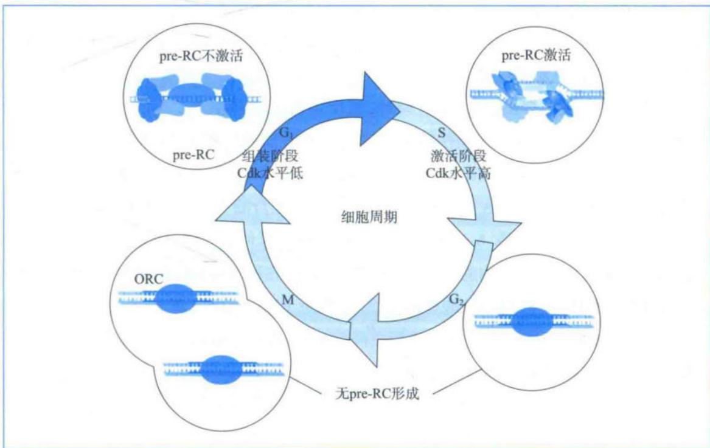  
图 2-31 细胞周期调控 Cdk 活性和 pre-RC 的形成  
在 $G_{1}$ 期, 激酶 Cdk 的水平低, 新的 pre-RC 虽然能够形成却没有活性。在 S 期, Cdk 活性的提高引发 DNA 复制的起始, 并阻止在刚复制产生的 DNA 上形成其他新 pre-RC, 保证了每个细胞周期中每条染色体只复制一次。

## 2.4.3 真核生物 DNA 聚合酶

已发现的真核生物 DNA 聚合酶有 15 种以上。在哺乳动物细胞中主要有 5 种 DNA 聚合酶，分别称为 DNA 聚合酶 $\alpha$ 、 $\beta$ 、 $\gamma$ 、 $\delta$ 和 $\varepsilon$ ，其特性如表 2-10。

表 2-10 真核生物 DNA 聚合酶的特性比较

<table><tr><td>性质</td><td>DNA聚合酶 $\alpha$ </td><td>DNA聚合酶 $\beta$ </td><td>DNA聚合酶 $\gamma$ </td><td>DNA聚合酶 $\delta$ </td><td>DNA聚合酶 $\varepsilon$ </td></tr><tr><td>亚基数</td><td>4</td><td>1</td><td>2</td><td>2~3</td><td> $\geqslant 1$ </td></tr><tr><td>在细胞内分布</td><td>核内</td><td>核内</td><td>线粒体</td><td>核内</td><td>核内</td></tr><tr><td>功能</td><td>DNA引物合成</td><td>DNA损伤修复</td><td>线粒体 DNA复制</td><td>主要 DNA复制酶</td><td>复制修复</td></tr><tr><td> $3' \rightarrow 5'$ 外切</td><td>无</td><td>无</td><td>有</td><td>有</td><td>有</td></tr><tr><td> $5' \rightarrow 3'$ 外切</td><td>无</td><td>无</td><td>无</td><td>无</td><td>无</td></tr></table>

真核细胞的 DNA 聚合酶和细菌 DNA 聚合酶基本性质相同, 均以 dNTP 为底物, 需 $Mg^{2+}$ 激活, 聚合时必须有模板链和具有 3'-OH 末端的引物链, 链的延伸方向为 $5'\rightarrow3'$ 。但真核细胞的 DNA 聚合酶一般都不具有外切核酸酶活性, 推测一定有另外的酶在 DNA 复制中起校对作用。

DNA 聚合酶 $\alpha$ 的功能主要是引物合成, 即能起始前导链和后随链的合成。它与引发酶 (primase) 形成复合体, 因其具有引发、延伸链的双重功能, 所以又被称为 pol $\alpha$ 的引发酶。DNA 聚合酶 $\beta$ 活性水平稳定, 可能主要在 DNA 损伤的修复中起作用, 属于高忠实性修复酶。DNA 聚合酶 $\delta$ 是主要负责 DNA 复制的酶, 参与前导链和后随链的合成。而 DNA 聚合酶 $\varepsilon$ 与后随链合成有关, 在 DNA 合成过程中核苷切除以及碱基的切除修复中起着重要的作用, 而且, 它在细胞的重组过程中可能具有某些功能。DNA 聚合酶 $\gamma$ 在线粒体 DNA 的复制中发挥作用。

除了上述5种主要的DNA聚合酶外，真核生物中还存在 $\zeta$ 、 $\eta$ 、 $\iota$ 和 $\kappa$ 等几种DNA聚合酶，它们承担着修复损伤的功能，但这些修复酶的忠实性都很低。

有关真核生物 DNA 复制比较公认的说法是: 在复制叉上存在一个 DNA 聚合酶 $\alpha/$ 引发酶复合体和另外两个 DNA 聚合酶复合体。这两个聚合酶中一个是 DNA 聚合酶 $\delta$ ，另一个是第二个 DNA 聚合酶 $\delta$ 或 DNA 聚合酶 $\varepsilon$ ，前者延伸前导链，后者合成后随链的冈崎片段。冈崎片段 RNA 引物的去除分为两步。首先，一种可特异性切除 DNA-RNA 杂合底物的 RNA 酶 H1 发挥内切核酸酶的活性，在靠近 RNA 与 DNA 的连接处切开引物，由具备 $5'\rightarrow3'$ 外切核酸酶活性的 FEN1 蛋白降解 RNA 片段。最后，由 DNA 连接酶 I 将相邻的冈崎片段连接起来。

真核生物染色体复制时,前导链可连续复制直到模板链的末端,释放出完整的子代染色单体;而后随链以不连续的方式复制,必须有特殊的机制来安排5'端部分DNA链的复制问题,以免该链子代 DNA 的 5' 端序列逐步缩短。真核生物能够通过形成端粒结构和具有反转录酶活性的端粒酶来防止 DNA 复制时后随链缩短而产生的染色体部分缺短。端粒酶能利用自身携带的 RNA 链作为模板,以 dNTP 为原料,以反转录的方式催化合成模板后随链 5' 端 DNA 片段或外加重复单位(如人染色体端粒为 TTAGGG),以维持端粒一定的长度,从而防止染色体的缺短损伤。

## 2.4.4 端粒酶与 DNA 末端复制

由于所有新的 DNA 合成启动都需要一条引物, 这使线性染色体末端的复制成为难题, 称为末端复制问题 (end replication problem) (图 2-32)。以前导链为模板的复制不存在这种问题, 一条 RNA 引物即可指导 DNA 链的起始并能延伸到其模板的 5' 最末端。后随链合成需要多条引物, 当起始最后一个冈崎片段合成的 RNA 引物的末端与后随链模板上最末端的碱基对退火, 该 RNA 引物被从 DNA-RNA 杂合双链上去除后, 引物酶可能缺乏足够的空间合成新的 RNA 引物, 导致后随链 DNA 产物 3' 端形成一小段单链 DNA, 使每一轮 DNA 复制后有一条子代 DNA 被截短。若这个末端复制问题不被解决的话，将破坏遗传物质从亲代到子代的完整传递，导致染色体末端基因丢失。

  
图2-32 末端复制问题  
当后随链复制机器到达染色体末端时，引物酶可能没有足够的空间去合成新的RNA引物，导致后随链DNA产物上3'端形成一小段单链DNA。在下一轮复制中，这个区域将被丢失，两个产物中的一个会因此逐步变短。

细胞主要通过两种方法来解决末端复制问题。一是用蛋白质代替 RNA 作为每个染色体末端最后一个冈崎片段的引物。研究发现，在某些具有线性染色体的细菌和病毒的染色体末端，有特定蛋白质通过某个氨基酸残基提供 -OH，代替 RNA 引物所提供的 $3^{\prime}-OH$ 。

多数真核细胞则利用端粒酶来延伸染色体3'端，解决末端复制问题。端粒酶是一种特殊的酶，它由蛋白质和RNA组成。与DNA聚合酶不同的是，它不需要外源DNA模板来指导新dNTP的添加，由于其RNA序列含有1.5拷贝的完整端粒序列，可以与端粒3'端的单链DNA退火，因此，端粒利用其自身含有的RNA成分作为模板将端粒序列添加到染色体3'端。同时，与端粒双链区域结合的蛋白质会精确地调控该片段长度，不会使端粒无限延伸下去。

## 2.4.5 真核细胞 DNA 的复制调控

真核细胞的生活周期可分为4个时期： $G_{1}$ 、S、 $G_{2}$ 和M期。 $G_{1}$ 是复制预备期，S为复制期， $G_{2}$ 为有丝分裂准备期，M为有丝分裂期。DNA复制只发生在S期。真核细胞中DNA复制有3个水平的调控：

① 细胞周期水平调控 也称为限制点调控, 即决定细胞停留在 $G_{1}$ 期还是进入 S 期。许多外部因素和细胞因子参与限制点调控。促细胞分裂剂、致癌剂、外科切除等都可诱发细胞由 $G_{1}$ 期进入 S 期。一些细胞质因子如四磷酸二腺苷和聚 ADP-核糖也可诱导 DNA 的复制。

② 染色体水平调控 决定不同染色体或同一染色体不同部位的复制子按一定顺序在 S 期起始复制, 这种有序复制的机制还不清楚。

③ 复制子水平调控 决定复制的起始与否。这种调控从单细胞生物到高等生物是高度保守的。此外，真核生物复制起始还包括转录活化、复制起始复合物的合成和引物合成等阶段，许多参与复制起始蛋白的功能与原核生物中相类似。酵母染色体复制只发生于S期，各个复制子按专一的时间顺序活化，在S期的不同阶段起始复制。研究由3个复制起始点(ARS1、ARS2和10Z)构建的质粒发现，酵母复制起始受时序调控，也受α因子和cdc基因调控。已克隆的ARS片段中都有14 bp的核心序列，其中序列为A(或T)TT-TATPuTTA(或T)的11个核苷酸是高度保守的，这个区域的点突变使ARS失去复制起始功能。

<!-- W-BEGIN Watson 9 DNA的复制 -->

### 【中文对照 Watson 第9章：DNA的复制】

> 来源：Watson《基因的分子生物学》第七版中译本（书籍/03_基因的分子生物学_第七版） 第9章 DNA的复制。

#### [W] 第9章

本章概要

DNA合成的化学基础

DNA聚合酶的作用机制

复制叉

DNA聚合酶的特化

复制叉上的DNA合成

DNA复制的起始

结合和解旋：起始子蛋白对复制起始位点的选择和激活

结束复制

#### [W] DNA 的复制

当 DNA 双螺旋被揭示的时候，最令生物学家振奋的是 DNA 多聚核苷酸互绕链上碱基之间的互补性。似乎很难想象这种互补性的结构会不被用作 DNA 复制的基础。事实上，正是 DNA 的结构所揭示出的自身互补性质，才最终使生物学家们接受了 Oswald T. Avery 的论断，即遗传信息的载体是 DNA，而不是某种形式的蛋白质（第 2 章）。

当讨论模板如何作用的时候，我们强调两个具有相同表面的基团不会相互吸引（第4章）；相反，具有相反形状或电荷基团之间的吸引则容易得多。因此，无需任何结构上的认识，也能猜测到像基因这样复杂的分子不可能直接被复制；相反，复制会涉及形成具有形状上互补的分子，并作为复制的模板。因此，在对蛋白质或核酸结构取得详尽的认识之前，一些遗传学

家曾怀疑 DNA 是否作为某一特定蛋白质的模板，而此蛋白质反过来也是相应 DNA 的模板。

但是自 DNA 自身互补的性质被揭示后，关于蛋白质模板可能参与 DNA 复制的观点很快就被否定了。人们很容易就推测到每个亲代 DNA 分子双链中的任一条链都可作为模板形成子代 DNA 分子的互补链。尽管这个假设一经提出就被认为是最合理可行的，但是仍需有实验的支持。令人高兴的是，在 DNA 双螺旋结构发现后的 5 年内，就有明确的证据显示 DNA 在复制过程中发生了互补链的分离（见第 2 章对 Meselson 和 Stahl 实验的讨论），而且有切实的酶学证据显示单独的 DNA 就可作为新 DNA 链合成的模板。

从某种意义上讲，这些结果使基因如何复制的问题得到了解答；但从另一种意义上讲，对 DNA 复制的研究才刚刚开始。DNA 是怎样开始复制的？缠绕的 DNA 是如何分开从而可以作为复制模版的？是什么调节复制的机制保证子细胞既不积累也不丢失染色体？对于这些及其他问题的研究表明，即使是最简单的 DNA 的复制，都是一个复杂的、多步骤的过程。此过程中所涉及的酶，比最初发现第一个 DNA 聚合酶后所预计的要多很多。真核细胞中大的线性染色体的复制则更为复杂。这些染色体的复制需要很多复制起始位点，以严格的时相方式合成完整的染色体，而且，复制的起始必须在精确的协调控制下，以确保所有序列都仅仅复制一次。此外，保守性的 DNA 复制不能完全复制染色体末端（端粒），细胞必须形成一套新的方式来保持这部分染色体的完整性。

本章将首先讲述 DNA 合成的化学基础及催化此反应的酶的功能，然后将讨论在一条完整的染色体上 DNA 的合成是如何在复制叉上起始的，我们将重点放在 DNA 复制的起始。在所有细胞中，DNA 的复制都受到严格的控制，而复制起始是高度受调控的步骤。我们将描述复制起始蛋白是如何在基因组上被称为复制起始位点的特定位点处解开 DNA 双螺旋，复制叉蛋白如何聚集到这些位点形成复制体。最后，我们将描述 DNA 复制的终止以及线性染色体末端复制的特殊问题。总之，研究揭示了多种蛋白共同协作形成一个复合物，多种酶参与这一严格的过程，以令人惊叹的速度、准确性和完整性精确执行了 DNA 复制这一过程。

#### [W] DNA 合成的化学基础

#### [W] DNA 合成需要脱氧核苷三磷酸和引物-模板接头

进行 DNA 的合成，必须具备两个关键的底物。首先，新的合成需要 4 种脱氧核苷三磷酸—dGTP、dCTP、dATP、dTTP（图 9-1a）。核苷三磷酸通过 2'-脱氧核糖上的 5'羟基连接 3 个磷酰基团。最内侧的磷酰基团（最靠近脱氧核糖的基团）称为 α-磷酸，而中间的和最外侧的基团分别称为 β-磷酸和 γ-磷酸。

DNA 合成第二个重要的底物是具有特定排列的单链 DNA 或双链 DNA（图 9-1b），称为引物-模板接头（primer-template junction）。恰如其名，引物-模板接头有两个重要的元件。模板（template）是指导所有互补脱氧核苷酸添加的单链 DNA，引物（primer）是与模板互补但比模板短的一小段序列。引物还必须有一个与模板单链区毗邻的、暴露的 3'-OH，当新核苷酸加入时，此 3'-OH 使链得以延伸。

  
图 9-1 DNA 合成所需的底物。(a) 2'-脱氧核糖核苷三磷酸的常规结构。α-、β-和γ-磷酸的位置被标示。(b) 引物-模板接头的常规结构。较短的引物与较长的 DNA 链完全退火，而且它必须有与模板单链 DNA 区毗邻的游离的 3'-OH；较长的 DNA 链有一个与引物退火的区域和一个毗邻的单链 DNA 区，此区作为 DNA 合成的模板。新 DNA 的合成使引物的 3' 端得到延伸。

一般而言,只有引物-模板接头的引物部分才是 DNA 合成的底物,这是因为在 DNA 合成过程中只有引物被化学修饰,模板仅提供选择哪种核苷酸进行添加的必要的信息。然而,对所有 DNA 合成而言,引物和模板都是不可缺少的。

DNA 通过引物 3' 端的延伸进行合成

DNA 合成要求新链通过引物 3'端的延伸而生长（图 9-2）。事实上，这是 RNA 和 DNA 合成共同的性质。 $S_{N}2$ 反应中形成磷酸二酯键，在此反应中，引物链 3'端的羟基基团攻击引入的核苷三磷酸的 $\alpha$ -磷酰基基团。切下的基团是焦磷酸，它是核苷酸底物释放 $\beta$ -和 $\gamma$ -磷酸所产生的。

  
图 9-2 DNA 合成的机制。DNA 合成由掺入 dNTP 的 α-磷酸的亲核攻击引发。这导致引入的引物 3' 端延伸一个核苷酸并释放一个焦磷酸分子。焦磷酸很快被焦磷酸酶水解成 2 个磷酸分子。

模板链指导 4 种核苷三磷酸的添加。与模板链碱基配对的核苷三磷酸非常容易被添加到引物链上。注意，双螺旋的两条链为反向平行的走向，这种结构意味着 DNA 合成的模板链有与 DNA 生长链相反的走向。

#### [W] 焦磷酸水解是 DNA 合成的驱动力

单个核苷酸添加到长度为 n 的多聚核苷酸生长链上可用下面的反应来表述：

$$
\mathrm{XTP} + (\mathrm{XMP}) _ {n} \rightarrow (\mathrm{XMP}) _ {n + 1} + \mathrm{P} \sim \mathrm{P}
$$

但是此反应的自由能非常小（ $\Delta G = -3.5 \, kcal/mol$ ），那么核苷酸多聚化形成 DNA 的驱动力是什么呢？额外的自由能由焦磷酸酯酶将焦磷酸快速水解成 2 个磷酸基团来提供。

$$
\mathrm{P} \sim \mathrm{P} \rightarrow 2 \mathrm{P} _ {i}
$$

核苷酸添加和焦磷酸水解的净结果是 2 个高能磷酸键的断裂。因此，DNA 合成是个耦联反应，其全反应为

$$
\mathrm{XTP} + (\mathrm{XMP}) _ {n} \rightarrow (\mathrm{XMP}) _ {n + 1} + 2 \mathrm{P} _ {i}
$$

这是一个极易发的反应，其 $\Delta G$ 为-7kcal/mol，相对应的平衡常数（Keq）约为 $10^{5}$ 。如此高的 Keq 意味着 DNA 合成反应是完全不可逆的。

#### [W] DNA 聚合酶的作用机制

#### [W] DNA 聚合酶用一个活性位点催化 DNA 的合成

DNA 合成由 DNA 聚合酶（DNA polymerase）催化。与大多数对一个反应只有一个活性位点的酶不同，DNA 聚合酶用一个活性位点来催化任意 4 种脱氧核苷三磷酸的添加。DNA 聚合酶通过 A:T 和 G:C 碱基对几乎相当的几何尺寸来达到其催化的灵活性（注意 DNA 螺旋的尺寸与 DNA 序列基本无关）。

DNA 聚合酶监测的是引入核苷酸形成 A:T 或 G:C 碱基对的能力，而不是进入活性位点的是何种核苷酸（图 9-3）。只有在形成正确的碱基对的情况下，引物的 3'-OH

a 正确的碱基对

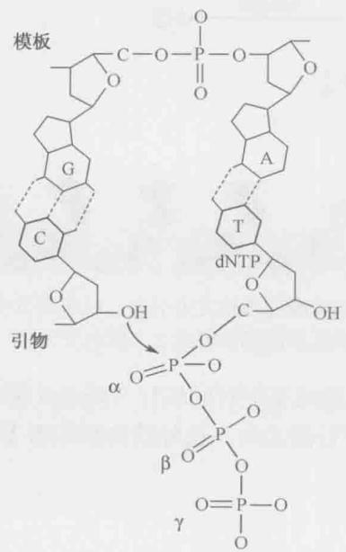

b 不正确的碱基对

  
图 9-3 DNA 聚合酶催化核苷酸添加需要正确配对的碱基。(a) 引物 3'-OH 端对正确配对的 dNTP 进攻的示意图。(b) DNA 聚合酶对不正确碱基配对催化结果的示意图。如图所示，不正确的 A:A 碱基对使引入核苷酸的 α-磷酸错位。这种不正确的排列极大地降低了催化速率，导致 DNA 聚合酶优先添加正确配对的 dNTP。(来源：Brautigan C. A. and Steitz T. A. 1998. Curr. Opin. Structural Biology 8: 54-63, Fig 4d. ©Elsevier.)

和在最佳催化位置上的引入核苷三磷酸的 $\alpha$ -磷酸才能发生催化反应。不正确的碱基配对因为使底物处于不利于催化的排列，使得核苷酸的添加效率显著降低（图 9-3b）。这是一个动力学选择性的实例。其中，酶对几种可能的底物具有催化选择性，只有当正确的底物存在时，共价键形成的速率才显著增加。事实上，错误核苷酸掺入的速率是碱基配对正确时的掺入速率的 1/10 000。通常检测新 DNA 合成的方式描述如框 9-1。

DNA 聚合酶对核糖核苷三磷酸（rNTP）与脱氧核糖核苷三磷酸（dNTP）显示出令人惊异的分辨能力。虽然在细胞中 rNTP 比 dNTP 的浓度要高约 10 倍，但它们掺入的速率却是 dNTP 的 1/1000。这种分辨能力是通过将 rNTP 立体排斥在 DNA 聚合酶活性位点之外而达到的（图 9-4）。在 DNA 聚合酶中，核苷酸结合口袋非常小，不能容纳引入核苷酸上的 2'-OH。此空间被 2 个与糖环形成范德华接触的氨基酸占据。有趣的是，将这些氨基酸换成其他较小侧链的氨基酸（如将谷氨酸换成丙氨酸），则 DNA 聚合酶对 dNTP 和 rNTP 的分辨率显著降低。符合 DNA 聚合酶部分要求但不是所有要求的核苷酸能够阻止 DNA 聚合反应的延伸。这些核苷酸也代表了一类用于治疗癌症和病毒感染的药物（见框 9-2）。

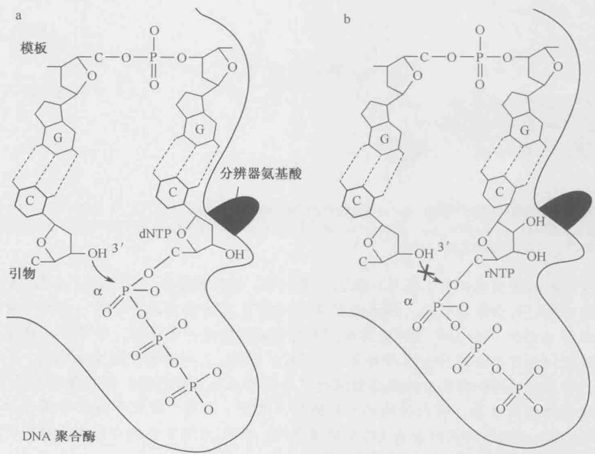  
图 9-4 空间位阻阻止 DNA 聚合酶催化反应使用 rNTP。（a）正确碱基配对的 dNTP 结合到 DNA 聚合酶上，在此条件下，引物的 3'-OH 与 dNTP 的 α-磷酸紧密靠近。（b）增加 2'-OH 引起对核苷酸结合口袋内氨基酸 [分辨器（discriminator）氨基酸] 的空间碰撞，导致 dNTP 的 α-磷酸错位，以及与引物 3'-OH 的定位偏差（misalignment），极大地降低了催化的速率。

#### [W] 框 9-1 核素掺入法用来测定核酸和蛋白质合成

DNA 聚合酶的活性如何测定？最简单的用于测定一种聚合物合成的方法是核素掺入法。在 DNA 聚合酶实例中，用这种方式来测定被标记的 dNTP 前体整合进 DNA 分子。典型的实例是用放射性原子标记 dNTP，这些放射性原子最终保留在 DNA 产物中（如用放射性同位素 ${}^{32}$ P 替换 $\alpha$ 位磷酸中的磷原子，框 9-1 图 1a）。或者，dTTP 甲基基团位置用荧光分子合成（框 9-1 图 1b）。甲基基团不包含在碱基配对中，DNA 聚合酶能够容易地适应这个位点比较大的成分。此外，这些修饰能够很容易地用拍照或敏感的光电倍增管探测电子或光子的情况。

  
框 9-1 图 1 标记的脱氧核苷三磷酸盐。(a) $\alpha[^{32}P]dATP$ . 核苷酸的 $\alpha$ 位的 P 被放射性同位素 ${}^{32}P$ 替代。注意，仅有 P 原子最终会成为合成后 DNA 的一部分。(b) 荧光标记的三磷酸胸苷。在这个标记的前体中，荧光复合物荧光素和胸腺嘧啶环的第五位相连，这个位置通常连接的是甲基。

核素掺入法需要两步（框9-1图2）。第一步，前体被整合进聚合物。在DNA聚合酶的实例中，聚合酶与引物：模板及标记的dNTP前体孵育适当时间。在大多数情况下，四种dNTP中的只有一种被标记，因为检测方法是很灵敏的。第二步，产生的聚合物必须和没有整合进的前体分离开。以DNA为例，这一步有两种方法完成。一种方法是，将DNA聚合酶反应物在高盐浓度下通过带正电荷的滤膜，带强负电荷的DNA主链能够结合在膜上，弱电荷的单个苷酸则不结合。此外，凝胶电泳能够通过分子大小区分DNA产物，游离核苷比DNA移动更快。同时，DNA产物的合成能够用标记的核苷酸整合进DNA聚合物中的数目来测定。

我们描述了以 DNA 聚合反应为背景的核酸掺入法，但是，这种方法也能够用来测定催化 RNA 和蛋白质合成的酶的活性。比如，标记的氨基酸能够用来分析它们整合进蛋白质的情况。

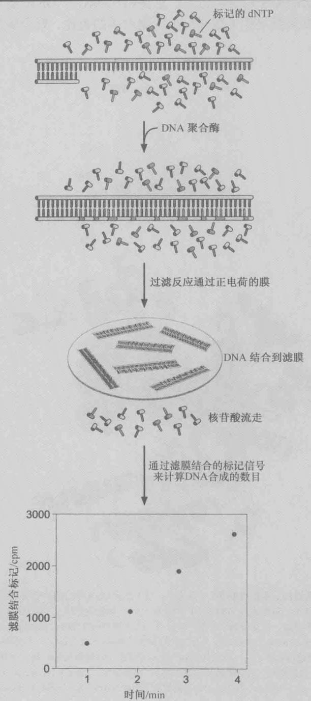  
框 9-1 图 2 核素掺入法来测定 DNA 合成。如例所示，滤膜结合用来分离没有被结合的核苷酸和合成的 DNA 链。

#### [W] DNA 聚合酶像手一样握住引物-模板接头

关于 DNA 聚合酶如何催化 DNA 合成的分子解释，来自于对各种与引物-模板接头结合的 DNA 聚合酶的原子结构的研究。这些结构揭示了 DNA 底物位于一个大的、形似一只半握的右手的裂缝之中（图 9-5）。依据对手的类比，聚合酶的 3 个结构域被称为拇指、手指和手掌。

  
图 9-5 DNA 聚合酶的三维结构类似于一只右手。（a）图示 DNA 聚合酶与引物-模板接头结合。手指、拇指和手掌已被标出。新合成的 DNA 与手掌相连，DNA 催化位点位于手指和拇指之间的裂缝中。模板链的单链区强烈弯曲，不从拇指和手指之间穿过。（b）类似的 T7DNA 聚合酶与 DNA 结合的图示。DNA 用填充（space-filling）方式表示，蛋白质用条带（ribbon）方式显示。手指和拇指由 $\alpha$ 螺旋构成，手掌因为 DNA 的遮挡而看不见。引入的 dNTP 显示为红色（碱基和脱氧核糖）和黄色（三磷酸部分）。DNA 模板链显示为黑灰色，引物链显示为银灰色。（Doublie S., Tabor S., Long A.M., Richardson C.C., and Ellenberger T.1998. Nature 391:251-258.）镜像图用 BobScript、MolScript 和 Raster3D 制作。

手掌域由一个 $\beta$ 折叠片构层成，含有催化位点的基本元件，尤其是DNA聚合酶的这一区域结合2个二价金属离子（通常是 $\mathrm{Mg}^{2+}$ 或 $\mathrm{Zn}^{2+}$ ），可以改变正确碱基配对的dNTP和引物 $3^{\prime}$ -OH周围的化学环境（图9-6）。第一个金属离子降低 $3^{\prime}$ -OH对氢的亲和力，产生一个准备对引入dNTP上α-磷酸进行亲核攻击的 $3^{\prime}\mathrm{O}^{-}$ 。第二个金属离子与dNTP的β-和γ-磷酸负电荷协同作用，稳定由引物和引入核苷酸连接在一起时所产生的焦磷酸。

  
图 9-6 与 DNA 聚合酶结合的两个金属离子催化核苷酸的添加。（a）图示为 DNA 聚合酶的活性位点。两个金属离子（显示为绿色）通过与两个高度保守的天冬氨酸残基的相互作用被固定。金属离子 A 主要与 3'-OH 相作用，使得 O 和 H 之间的连接变弱。这产生一个亲核的 $3'O^{-}$ ；金属离子 B 与引入的 dNTP 的三磷酸相互作用，中和它的负电荷。催化后，焦磷酸产物通过与金属离子 B 类似的相互作用得到稳定（未显示）。（b）金属离子与 DNA 聚合酶、引物 3'-OH 端，以及引入核苷酸的相互作用的活性位点处的三维结构。金属离子显示为绿色，其他元件的颜色同图 9-5b。本处所示的聚合酶的视角，基本等同于将图 9-5b 中的图沿 DNA 螺旋的轴旋转约 $180^{\circ}$ 的图像。（Doublie S., Tabor S., Long A.M., Richardson C. C., and Ellenberger T. 1998. Nature 391: 251-258.）镜像图用 BobScript、MolScript 和 Raster3D 制作。

除了在催化中的作用外，手掌域还负责检查最新加入的核苷酸碱基配对的准确性。聚合酶的这一区域与新合成 DNA 小沟中的碱基对形成大量的氢键。这种接触虽无碱基特异性（见图 4-10），但是只有在新添加的核苷酸（不管它们是哪一种核苷酸）碱基配对正确的时候才形成。此区域中错误配对的 DNA 影响小沟的结合性，使催化活性显著降低。变慢的催化反应和对新合成 DNA 降低的亲和力共同使引物-模板从聚合酶活性位点上脱离下来，并结合到聚合酶上一个独立的、具校对功能的核酸酶的活性位点上，在那里错配 DNA 被切掉（稍后讨论）。

手指域和拇指域的作用是什么？手指域对催化也很重要。手指域中的几个残基可与引入的 dNTP 结合。更重要的是，一旦引入的 dNTP 与模板之间形成正确的碱基配对，手指域即发生移动，包围住 dNTP（图 9-7）。聚合酶“手”的这种闭合形式可以使引入的核苷酸与催化性的金属离子密切接触，从而促进催化反应。

手指域还与模板区结合，使模板的磷酸二酯键骨架在第一个和第二个碱基间产生约90°的回折，此弯曲仅使催化位点上引物后第一个模板碱基暴露。模板的这种构象避免了在下一个核苷酸添加时可能会造成的对配对的模板碱基选择的混淆（图9-8）。

与手指域及手掌域不同的是,拇指域与催化的关系不紧密,而是与最新合成的 DNA 相互作用（图 9-5）。这有两个目的：第一，维持引物及活性部位的正确位置；第二，帮助维持 DNA 聚合酶与其底物之间的紧密连接。这种连接有助于 DNA 聚合酶每次与引物-模板接头结合时添加许多 dNTP 的能力（稍后讨论）。

总之，DNA 聚合酶将核苷酸添加到 DNA 生长链是一系列有序的事件。引入的核苷酸碱基与模板提供的下一个碱基进行配对，这种作用使聚合酶的“手指”在碱基配对的 dNTP 周围闭合。聚合酶的这种构象将关键的催化性金属离子置于催化下一个磷酸二酯键形成的位置上。碱基配对的核苷酸与引物的结合使手指重新打开，并使引物-模板接头移动一个碱基，然后聚合酶准备进行下一次的添加。重要的是，这些事件的每一步都由引入 dNTP 与模板之间正确的碱基配对驱动。

#### [W] DNA 聚合酶是一种延伸酶

DNA 聚合酶的催化是快速的。DNA 聚合酶能在引物链上每秒添加 1000 个核苷酸。DNA 合成的速度主要取决于 DNA 聚合酶的延伸能力。延伸能力（processivity）是酶处理多聚体底物时的一种特性。对于 DNA 聚合酶，其延伸能力定义为每次酶与引物-模板接头结合时所添加核苷酸的平均数。每个 DNA 聚合酶都有其特征性的延伸能力，范围从每次结合时仅几个核苷酸到 50000 多个碱基（图 9-9）。

每次结合添加大量的核苷酸，使 DNA 合成的速率显著提高。聚合酶与引物-模板接头的初始结合是限速步骤。典型的 DNA 聚合酶反应中，DNA 聚合酶定位并结合到引物-模板接头的时间约为 1s，一旦结合后，核苷酸的添加非常迅速（在毫秒范围内）。因此，一个完全非延伸性的 DNA 聚合酶每秒添加约 1 个碱基对；相反，最快的 DNA 聚合酶通过保持与模板的结合进行多轮 dNTP 的添加，速度可达每秒添加 1000 个核苷酸。因此，高延伸性的聚合酶与一个完全非延伸性的酶相比，其 DNA 合成的整体速率可高出 1000 倍。

<!-- END OFFICIAL API PART part_003 -->

<!-- BEGIN OFFICIAL API PART part_004 -->

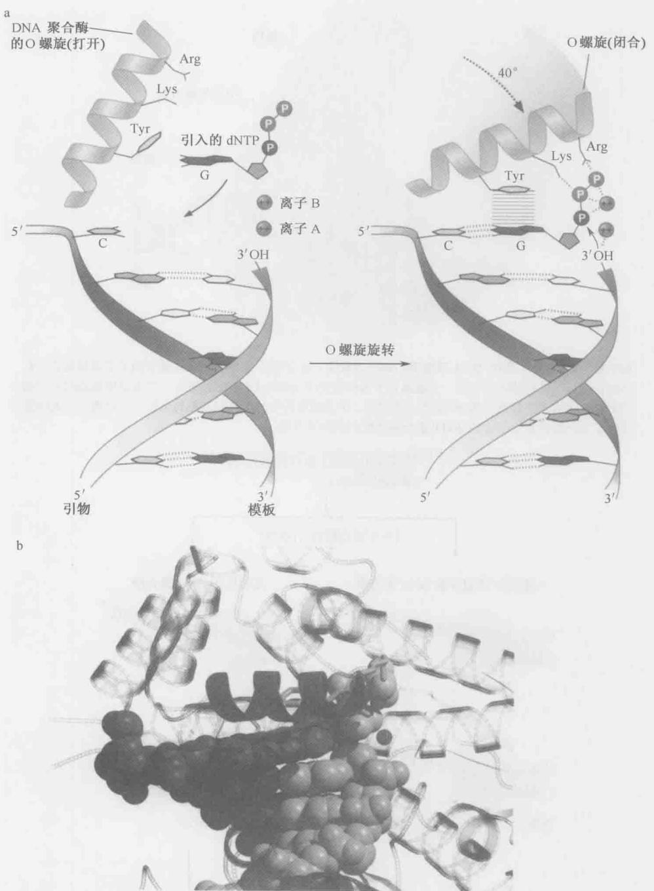  
图 9-7 当形成正确碱基配对的时候，DNA 聚合酶 “抓住” 模板和引入的核苷酸。（a）图示为引入核苷酸与 DNA 模板正确碱基配对之后，DNA 聚合酶结构的变化。主要的变化是在手指域中，一个被称为 O 螺旋的螺旋旋转 $40^{\circ}$ 。在打开的构象中，此螺旋远离引入的核苷酸。当聚合酶为闭合构象时，此螺旋运动并与引入的 dNTP 形成几个重要的相互作用。酪氨酸与 dNTP 的碱基形成堆积作用，两个带电残基与三磷酸结合。这些相互作用共同使 dNTP 就位，并由与 DNA 聚合酶结合的两个金属离子介导完成催化。（b）与底物结合的 T7 DNA 聚合酶处于闭合构象时的结构。O 螺旋显示为紫色；蛋白质结构中的其他部分为清楚起见显示为透明；在 O 螺旋后面的关键的酪氨酸、赖氨酸和精氨酸显示为粉色；引入 dNTP 的碱基和脱氧核糖显示为红色；引物显示为银灰色；模板链显示为黑灰色；两个催化性金属离子显示为绿色；磷酸显示为黄色。（Doublie S., et al. 1998. Nature 391;251-258.）镜像图用 BobScript、MolScript 和 Raster 3D 制作。

图 9-8 模板 DNA 穿过 DNA 聚合酶的路径示意图。刚合成的 DNA 与 DNA 聚合酶的手掌域结合。在活性位点上，模板单链区的第一个碱基位于预计将合成为双链 DNA 的位置上。当沿着模板链向其 5'端行进时，磷酸二酯骨架突然 90°回折，使得第二个及随后所有的单链碱基都处于另一个位置上，此位置消除了与活性位点上结合的 dNTP 进行碱基配对的所有可能。  
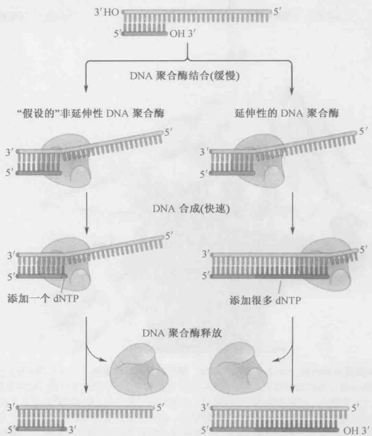  
图 9-9 DNA 聚合酶以延伸方式合成 DNA。此图表示延伸性 DNA 聚合酶和非延伸性 DNA 聚合酶之间的差别。两种 DNA 聚合酶都与引物-模板接头结合。当结合时，非延伸性酶在引物的 3' 端添加一个 dNTP，然后从新的引物-模板接头释放下来。相反，延伸性的 DNA 聚合酶与模板结合一次，就添加很多 dNTP。

DNA 聚合酶沿 DNA 模板滑行的能力有利于提高延伸能力。DNA 聚合酶一旦与引物-模板接头结合，立即以序列非特异的方式与 DNA 的大部分双链区域紧密作用。此相互作用包括磷酸骨架与拇指域之间的电子静电相互作用，以及 DNA 小沟与手掌域（如上所述）之间的相互作用。此相互作用无序列相关性，使得 DNA 即使在与聚合酶相结合后也能自如地移动。每次引物链上添加一个核苷酸，DNA 就与聚合酶部分脱离（与小沟之间的氢键断裂但与拇指域之间的静电相互作用仍保持）。然后 DNA

用同样的序列非特异性机制，迅速地在移动一个碱基对的位置上与聚合酶重新结合。下面我们将要继续讨论，DNA 聚合酶与完全包围 DNA 的 “滑动夹” 蛋白之间的相互作用，可进一步提高延伸能力。

#### [W] 外切核酸酶校正新合成出的 DNA

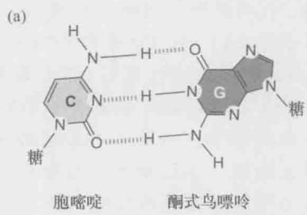

仅依靠碱基配对的几何学以及碱基间的互补，尚无法达到细胞内观测到的极高的 DNA 合成精确度（约每添加 $10^{10}$ 个碱基对产生一个错误）。影响 DNA 聚合酶精确度的主要因素是碱基偶然 $(1/10^{5})$ 地变换成“错误”的互变异构体（亚氨基或烯醇，见第 4 章，图 4-5）。碱基的这种变构体使不正确的碱基对可以位于催化中正确的位置（图 9-10）。如我们现在所述，校正过程可纠正这种错误。

  
图 9-10 鸟嘌呤的异构转换导致与胸腺嘧啶错配。(a)正常的酮式鸟嘌呤与胞嘧啶配对。(b)鸟嘌呤罕见的烯醇式异构体与胸腺嘧啶配对，而不与胞嘧啶配对。尽管仅列举了鸟嘌呤异构转换造成的错配，其实在每种碱基均存在并影响配对的特异性。

#### [W] 框 9-2 抗癌、抗病毒试剂靶向 DNA 复制

DNA 在细胞分裂时进行复制的过程成为了很多用来阻止恶性肿瘤生长的化学药物的靶标。这些药物靶向 DNA 复制的不同阶段。

一些常用的化学疗法实际靶向了核苷酸前体的生物合成，因此DNA聚合酶没有底物合成DNA。例如，药物5-氟尿嘧啶（5-FU）和6-巯基嘌呤（6-MP）是核苷酸前体的类似物，分别抑制嘧啶和嘌呤核苷酸的合成（框9-2图1a，b）。5-氟尿嘧啶（5-FU）是治疗结肠癌的主要药物，它也被用来治疗胃癌、胰腺癌、早期乳腺癌。6-巯基嘌呤（6-MP）基本用于治疗血癌患者。

其他的抗癌药物直接地靶向 DNA 的合成。阿糖胞苷（AraC）是脱氧胞苷酸类似物，转化成三磷酸核苷后整合进 DNA，替代了 dCTP（框 9-2 图 1c）。一旦整合进去，dCTP 脱氧核糖糖基和阿糖胞苷（AraC）的阿拉伯糖基之间的差异导致 DNA 3' 端位

置的不正确和末端延伸的终止。类似于 6-巯基嘌呤（6-MP），阿糖胞苷（AraC）主要用于治疗急性白血病。

第三类的药物破坏 DNA 来阻断 DNA 的复制。顺铂和亚硝基脲氮芥（BCNU）在鸟苷酸残基彼此相近时会引起链内和链间 DNA 链的交联（框 9-2 图 1d，e）。这种交联（尤其是链间的交联）干扰了 DNA 的延伸。顺铂是治疗睾丸癌的主要药物，亚硝基脲氮芥（BCNU）用于治疗脑瘤和白血病。相似地，喜树碱和依托泊苷对拓扑异构酶有抑制作用，进而阻断了这些蛋白质在 DNA 主链的断开后进行磷酸二酯结合的作用（见第 4 章，图 4-24）。当 DNA 聚合酶试图用某一 DNA 为模板进行复制时，这些抑制药物会在 DNA 模板上产生阻断 DNA 复制的断裂。

这些药物的靶细胞复制自身的 DNA 并快速分裂。尽管癌细胞快速分裂的特性使它们对这些药物敏感，但是体内其他的细胞也受到影响。毫无疑问，这些药物也对快速分裂的宿主细胞，如红细胞、白细胞、发质细胞有毒性。使用这些药物带来的副作用包括免疫力下降（因为白细胞的丢失）、贫血（由于红细胞的丢失）、腹泻（因为肠胃道受损）和脱发。

复制抑制剂也可被作抗病毒药物。第一个发现抗 HIV 感染的有效药物是 3-叠氮脱氧胸苷（AZT），一种脱氧胸苷的类似物，阻止特异的 DNA 聚合酶（称逆转录酶；见第 12 章）在 HIV 感染后复制 HIV 的 RNA 基因进而合成 DNA。最近一种鸟嘌呤核苷酸类似物叫做阿昔洛韦已经替代了 AZT 作为 HIV DNA 聚合酶的抑制剂。

  
框 9-2 图 1 靶向 DNA 复制的一些常见化疗药物的结构。(a) 5-氟尿嘧啶；(b) 6-巯基嘌呤；(c) 阿糖胞苷；(d) 顺铂；(e) 亚硝基脲氮芥；(f) 叠氮胸苷；(g) 阿昔洛韦

这个类似物是具有一个开放链的正常腺苷的核糖（框 9-2 图 1f, g）。然而，这个类似物能够被修饰成一个三磷酸根的形式，通过病毒的 DNA 聚合酶被整合进 DNA。一旦整合进去，由于缺乏核苷这些类似物起到链终止的作用，因而 3'-OH 需要更多的核苷酸添加。重要的一点是，细胞内的 DNA 聚合酶识别这些药物的能力很弱，因而同化疗药物相比副作用很小。

DNA 合成的校正通过核酸酶去除不正确配对的核苷酸来实现。最初这种类型的酶被认作是 DNA 聚合酶的同一类多肽，现在则认为是校正外切核酸酶（proofreading exonuclease）。这类酶可以从 DNA 的 3' 端，即从新 DNA 链的生长端开始降解 DNA [只能从 DNA 末端进行降解的酶叫做外切核酸酶（exonuclease），而能在 DNA 链中部切割的核酸酶叫做内切核酸酶（endonuclease）]。

最初，3'外切核酸酶作为 DNA 聚合酶同一多肽的一个部分并没引起什么关注。为什么 DNA 聚合酶需要把它刚刚合成出的 DNA 降解掉呢？当了解到外切核酸酶有很强的降解含错误碱基对 DNA 的倾向时，它的功能就变得清晰了。这样，当发生不正确核苷酸被添加到引物链这种罕见的情况时，校正外切核酸酶可将此核苷酸从引物链的 3'端除去。这个新加长 DNA 的“校正”给了 DNA 聚合酶第二次添加正确核苷酸的机会。

DNA 聚合酶向碱基错配的引物附近添加核苷酸的能力降低，从而加快了对错配核苷酸的去除。因为与手掌域相互作用弱，所以错配 DNA 改变了 3'-OH 和引入核苷酸的几何构象。添加了错配的 dNTP 使催化作用降低，几何构象的改变也降低了核苷酸的添加速度。所以，当发生错配碱基时，它既降低了新核苷酸添加的速度，也提高了校正外切核酸酶的活性。

在 DNA 合成时，无需 DNA 脱离聚合酶即可进行校正（图 9-11）。当错配碱基对存在于 DNA 聚合酶的活性位点时，引物-模板接头会不稳固，产生若干不成对的碱基对 DNA，DNA 聚合酶对错配碱基的亲和力降低，但核酸外切酶活性在单链的 3' 端增强了 10 倍，因而新合成的未配对的 3' 端由 DNA 聚合酶活性位点移到核酸外切酶活性位点，不正确的核苷酸被外切酶移除（其余的额外核苷酸也被移去）。当不正确碱基对被去除后，正确配对的引物-模板接头滑回 DNA 聚合酶的活性位点，DNA 合成继续进行。

本质上，校正外切核酸酶就像键盘上的“delete”（删除）键那样工作，它只能去除最近发生的错误。校正外切核酸酶的加入极大地增加了DNA合成的精确度。平均DNA聚合酶每添加 $10^{5}$ 个核苷酸，就会插入1个不正确的核苷酸。校正外切核酸酶将错配碱基的发生概率降低到每添加 $10^{7}$ 个核苷酸出现1次。此错误概率仍比通常在细胞中观察到的实际突变概率高很多（每添加 $10^{10}$ 个核苷酸出现1次错误）。这部分高出来的精确度是由第10章所述的复制后错配修复过程实现的。

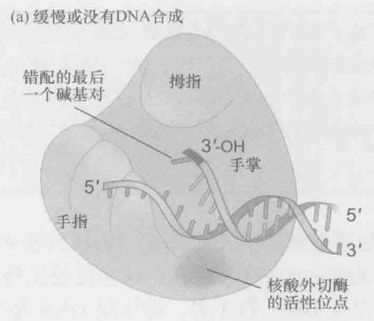  
(b) 切除错配的核苷酸

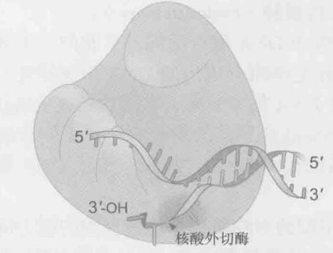

(c) 恢复DNA合成  

图 9-11 校正外切核酸酶将错配碱基从 DNA 的 3' 端除去。(a) 当聚合酶把不正确核苷酸掺入 DNA 后, DNA 合成的速度降低且引物 3' 端与 DNA 聚合酶活性位点的亲和力减弱。(b) 因为存在错配的 3' 端, 引物的最后 3\~4 个核苷酸成为单链, 与校正外切核酸酶活性位点的亲和力增加。与此活性位点结合后, 错配核苷酸 (及额外核苷酸) 即从引物上被除去。(c) 当错配核苷酸被除去后, 正确配对的引物-模板重新形成, DNA 聚合酶重新聚集 (新合成 DNA 以红色表示)。(来源: Baker T.A. and Bell S. P. 1998. Cell 92: 295-305, Fig. 1b. ©Elsevier.)

#### [W] 复制叉

#### [W] 复制叉上 DNA 的两条链同时合成

至此，我们已经在相对模拟的条件下讨论了 DNA 的合成，即在引物-模板接头处仅产生一条 DNA 新链。然而在细胞中，DNA 双链的两条链是同时进行复制的。这要求将双螺旋的两条链分开以形成两条 DNA 模板。刚分开的模板链与未复制的双链 DNA 之间的连接区称为复制叉（replication fork）（图 9-12），复制叉向着未复制的 DNA 双链区域连续运动，其身后留下指导两个子代 DNA 双链形成的两条单链 DNA 模板。

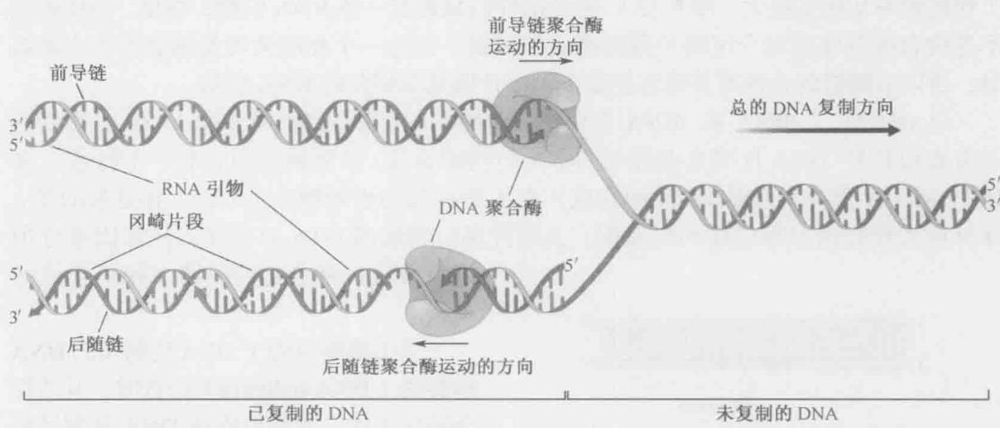  
图 9-12 复制叉。新合成的 DNA 表示为红色，RNA 引物表示为绿色。为了方便说明，所示的冈崎片段人为地缩短了。在细胞中，冈崎片段为 100\~2000bp 不等。

DNA 反向平行的性质给在复制叉上两条暴露的模板同时进行复制制造了难题，因为 DNA 只能沿着 3' 端进行合成，所以两条暴露的模板中仅有一条能够随着复制叉的运动进行连续的复制。在此条模板链上，DNA 聚合酶简单地尾随着复制叉。此模板指导下新合成的 DNA 链称为前导链（leading strand）。

另一条单链 DNA 模板指导下的新 DNA 链合成更复杂，此模板指导 DNA 聚合酶在与复制叉相反的方向上运动。此模板指导的新 DNA 链称为后随链（lagging strand）。如图 9-12 所示，此条 DNA 链必须以不连续方式进行合成。

前导链 DNA 聚合酶在模板一解开后就能进行复制，后随链在其能够复制之前，必须等复制叉运动并暴露出足够长的模板后才能进行合成。当新的后随链模板暴露足够长度后，DNA 合成起始并持续至它抵达后随链 DNA 的上一个新合成片段的 5' 端为止。

在后随链上形成的新链 DNA 短片段称为冈崎片段（Okazaki fragment），其在细菌中的长度变化为 1000～2000 个核苷酸，在真核生物中为 100～400 个核苷酸。冈崎片段被合成出来后，相互之间很快共价连接成一条连续的完整的新 DNA 链（稍后讨论）。因此，冈崎片段是 DNA 复制中短暂的中间产物。

#### [W] DNA 新链的起始需要一条 RNA 引物

如上所述，所有 DNA 聚合酶均需要带有游离 3'-OH 的引物，它们不能够从头启动新 DNA 链的合成。DNA 新链的合成是如何开始的呢？为了完成这一步，细胞利用了 RNA 聚合酶具有而 DNA 聚合酶没有的能力：从头合成新 RNA 链。引物酶（primase）

是一种能在单链 DNA 模板上制造短 RNA 引物（5～10 个核苷酸长度）的特殊的 RNA 聚合酶。这些引物随后由 DNA 聚合酶进行延伸。虽然 DNA 聚合酶只能将脱氧核糖核苷酸添加到 DNA 中，但它们用与 DNA 模板退火的 RNA 引物或 DNA 引物都能启动合成。

虽然前导链和后随链都需要引物酶来起始 DNA 的合成，但是引物酶在这两种链上工作的频率却相差极大（图 9-12）。每条前导链只需要一条 RNA 引物；相反，后随链的不连续合成意味着每个冈崎片段都需要新引物。因为一个复制叉可复制数百万个碱基对，所以后随链的合成需要数百至数千冈崎片段及其相关的 RNA 引物。

与 mRNA、rRNA 和 tRNA 合成中涉及的 RNA 聚合酶不同（第 15 章），引物酶不需要用特异 DNA 序列来起始新 RNA 引物的合成，反而偏好用含有一个特殊三聚体的 ssRNA 模板来起始 RNA 的合成（在大肠杆菌的引物酶为 GTA）。有意思的是，在分析大肠杆菌基因组序列时发现，大肠杆菌引物酶的 GTA 目标序列在基因组分中

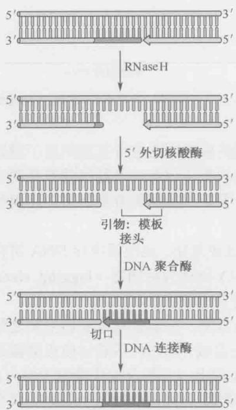  
图 9-13 从新合成 DNA 上除去 RNA 引物。图示为 RNA 引物去除过程中，RNase H、5' 外切核酸酶、DNA 聚合酶以及 DNA 连接酶相继作用。RNA 引物除去前的 DNA 显示为灰色，RNA 引物显示为绿色，新合成的替代 RNA 引物的 DNA 显示为红色。

过量表达，将会是后随链 DNA 合成的模板。

当引物酶与处于 DNA 复制叉的 DNA 解旋酶（DNA helicase）结合时，其活性会明显增加。此蛋白质在 DNA 复制叉处解开 DNA 链，产生可以被引物酶作用的 ssDNA 模板，DNA 解旋酶将在下面详细介绍。ssDNA 模板与 DNA 解旋酶的结合确保了引物酶只在复制叉处具有活性。

#### [W] 完成 DNA 复制必须除去 RNA 引物

要完成 DNA 的复制，用于起始的 RNA 引物就必须被除去并用 DNA 取而代之（图 9-13）。对 RNA 引物的去除可以认为是 DNA 的修复，且此步骤与 DNA 的切除修复有许多相同的性质，后者在第 10 章中有详细阐述。

为了用 DNA 取代 RNA 引物，RNA 酶 H（RNase H）识别并除去各条 RNA 引物的大部分。此酶特异性地降解与 DNA 碱基配对的 RNA（此处，其名称中的“H”意指 RNA-DNA 杂交链中的杂交，

hybrid）。除了与 DNA 末端直接连接的核糖核苷酸外，RNase H 可除去其他所有的 RNA 引物。这是因为 RNase H 只能断裂两个核糖核苷酸之间的键。最后一个核糖核苷酸是由从 5' 端降解 RNA 或 DNA 的外切核酸酶除去的。

RNA 引物除去后在双链 DNA 中留下的切口，形成引物-模板接头，这是 DNA 聚合酶理想的底物（图 9-13）。DNA 聚合酶填补此切口直至每个核苷酸都碱基配对，生成一条完整的 DNA 分子（除了在磷酸二酯键骨架上被修复链的 3'-OH 和 5'磷酸基之间有一处断裂）。DNA 上的这个“切口”被称为 DNA 连接酶（DNA ligase）的酶修复。DNA 连接酶用一个高能协同因子，如 ATP，在毗邻的 5' 磷酸基和 3'-OH 之间形成一个磷酸二酯键。只有当所有的 RNA 引物都被替代且相关的切口均被修复后，DNA 的合成才告结束。

#### [W] DNA 解旋酶在复制叉之前解开双螺旋

一般而言，DNA 聚合酶解离双链 DNA 的两条碱基配对链的能力很差。因此，在复制叉上，由称为 DNA 解旋酶（DNA helicase）的另一组酶催化双链 DNA 两条链的分离。这些酶使用核苷三磷酸（一般为 ATP）水解的能量结合到单链 DNA 上，并沿着其定向移动，以去除任何退火到其所结合的单链 DNA 上的 DNA 链。在复制叉上作用的 DNA 解旋酶通常是环形的六聚体蛋白（图 9-14）。这些环形的蛋白质复合体环绕着单链-双链接头附近复制叉上的两条单链中的一条。

与 DNA 聚合酶一样，DNA 解旋酶也具有延伸性。在每次与底物结合后，就可解开 DNA 上的多个碱基对。在复制叉上发现的环形六聚体 DNA 解旋酶，因为环绕着 DNA 而显示有高度的延伸能力。因此，解旋酶从其 DNA 底物上释放下来需要打开六聚体蛋白环，这是非常罕见的。换句话说，解旋酶只有当它到达其环绕的 DNA 的末端时才解离下来。

当然，酶和 DNA 的这种排列方式为最初 DNA 解旋酶与 DNA 底物的结合制造了麻烦。在环状染色体中没有 DNA 末端被 DNA 解旋酶穿过，这个问题也更为明显。由于

解旋酶总是结合在线性染色体的外端,外端的复制也存在同样问题。因此,细胞中有特殊的机制来组装 DNA 解旋酶环绕 DNA（参见下文“复制的起始”）。这种 DNA 复制中所涉及的蛋白质与其 DNA 底物之间的拓扑学连接是提高延伸能力的常见机制。

每个 DNA 解旋酶在单链 DNA 上都沿着一定的方向运动。这是所有 DNA 解旋酶都具有的特性，称为极性(polarity)。DNA 解旋酶可以有 $5'\rightarrow3'$ 或 $3'\rightarrow5'$ 的极性，此方向始终是根据结合的（或被环形解旋酶环绕的）DNA 链而不是去除的

  
图 9-14 DNA 解旋酶分离双螺旋的两条链。当 ATP 加到与单链 DNA 结合的 DNA 解旋酶上时，解旋酶在单链 DNA 上以一定的极性运动。在图示中，DNA 解旋酶具有 $5'\rightarrow3'$ 极性。这个极性说明 DNA 解旋酶与复制叉上的后随链模板结合。

那一条链决定的。以在复制叉的后随链模板上作用的 DNA 解旋酶为例，其 $5'\rightarrow3'$ 的极性使 DNA 解旋酶朝复制叉双链区域行进（图 9-14）。与所有以定向方式沿 DNA 运动的酶一样，解旋酶沿单链 DNA 的运动也需要化学能量的提供。解旋酶的能量由 ATP 水解提供。

#### [W] DNA 解旋酶牵引单链 DNA 通过蛋白质中心孔

一个六聚体 DNA 解旋酶如何利用 ATP 水解释放的能量移动 DNA？一种病毒的六聚体解螺旋酶结合到单链 DNA 的原子结构提供了这个问题的突破点。在这种结构中，单链 DNA 被解旋酶的 6 个亚基所环绕（图 9-15），每个亚基有一个“发夹”蛋白环，结合 DNA 主干的磷酸基和它两个邻近的核糖组分。有意思的是，这些 DNA 结合的环是右手螺旋，沿着单链 DNA 每一个环结合到下一个磷酸基团。如图 9-15 所示，最顶端的“阶梯”结合到 5'端，最低层的结合到单链 DNA 的 3'端。

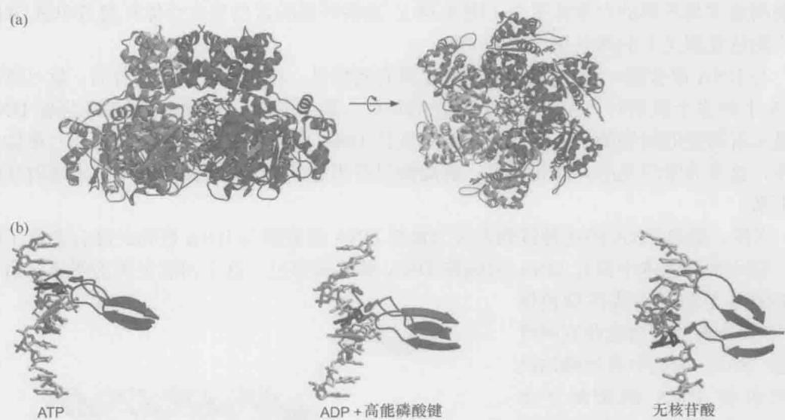  
图 9-15 DNA 解旋酶的结构和机制。(a) 牛乳头瘤病毒 EI 六聚体解旋酶的整体结构。每个亚基显示出了不同的颜色，图示为从左侧看的中心通道的复合物。蛋白亚基显示丝带的结构，单链 DNA 用棒图显示。(b) DNA 结合发夹假定运动图示说明。我们仅展示了单链 DNA 在解旋酶的中心通道，六聚体蛋白环中的两个在转位过程中结合在此处。三个视图分别是紫色发卡环与磷酸和黑色的核苷酸相互作用，从顶端（ATP 结合）状态到中间状态（ADP 结合态），再到底部状态（无核苷酸相连）。注意，在 ATP 结合状态和 ADP+Pi 状态，ssDNA 中的黑色碱基和蓝色发卡是如何一起移动，并在无核苷酸状态释放出来。重新结合的 ATP 驱动 DNA 结合环返回顶部，结合新的磷酸基（蓝色环比紫色环在“无核苷酸相连”步骤中早一步形成，图的上部显示了紫色发卡环）。注意其他的四个 DNA 结合环经历着同样的过程（Enemark E. J. and Joshua-Tor L. 2006. Nature 442: 270-275. PDB Code:2 GXA）。图像用 MoScript、BobScript 和 Raster3D 处理。

这张原子结构图只是一个快照，但是，6个不同的亚基在DNA移位过程中处于不同的阶段。结合6个不同亚基同DNA、ATP/ADP的相互作用说明了蛋白质的发夹结构如何协同运动来牵引ssDNA通过解旋酶的中心孔。一个亚基首先结合到单链DNA结构的顶部（图9-15b），DNA结合环通过连续的构象移向底部，牵引DNA通过。重要的是，不同的构象结合着不同的核苷酸状态：顶部是 ATP 结合状态，中间是 ADP 结合状态，底部是无核苷酸结合状态。因此，每一个单一的亚基结合点、水解酶、游离的 ATP，都将经历从顶部到中间再到底部的构象。总之，可以把解旋酶想象为有 6 只手且 6 只手交互地拉一根绳子的样子。

除了沿 ssDNA 的移位，解旋酶必须置换互补链来使 DNA 解旋。六聚解旋酶的中心通道结构表明，链的置换是为了使 DNA 通过中心通道。中心通道最窄的部位直径是 13 Å，对单链 DNA 来说足够大，但是对直径为 20 Å 的双链 DNA 而言太小了。

#### [W] 复制前单链结合蛋白使单链 DNA 稳定

DNA 解旋酶经过之后，新产生的单链 DNA 必须保持碱基未配对的状态，直至被用作 DNA 合成的模板。为了使分开的链稳定，单链 DNA 结合蛋白（ssDNA-binding protein, SSB）迅速地结合其上。一个 SSB 的结合会促进另一个 SSB 与其紧邻的单链 DNA 结合（图 9-16）。

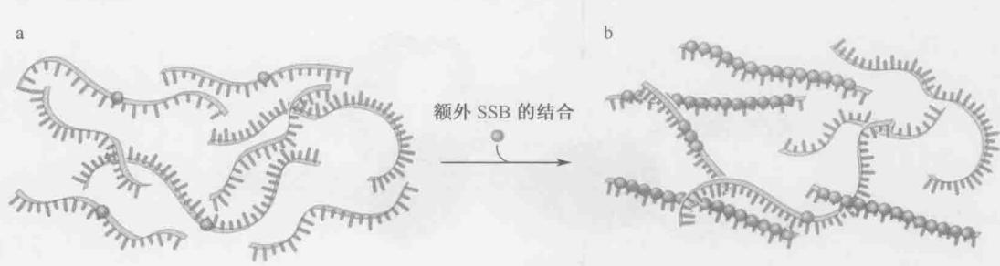  
图 9-16 单链 DNA 结合蛋白（SSB）与 DNA 的结合。（a）图中显示有限的 SSB 与 9 条单链 DNA 分子中的 4 条结合。（b）当更多的 SSB 与 DNA 结合后，它优先结合到先前已有 SSB 分子结合的 DNA 附近。只有最初结合的单链 DNA 被 SSB 完全覆盖后，其他 DNA 分子才发生结合。注意，当单链 DNA 被 SSB 覆盖后，变成更为伸直的构象，以抑制分子间的碱基配对。

这一过程称为协同结合（cooperative binding），因为与紧邻的单链 DNA 区域结合的 SSB 分子相互之间也能够结合。这样大大稳定了 SSB 与单链 DNA 之间的相互作用，使得已有一个或多个 SSB 结合的位点比其他位点更易结合新的 SSB。

协同结合使单链 DNA 随着 DNA 解旋酶的释放而很快被 SSB 所覆盖（协同结合是许多 DNA 结合蛋白的一种特性，见第 18 章，框 18-4）。一旦被 SSB 覆盖，ssDNA 即处于伸直状态，有利于其作为模板进行 DNA 合成或 RNA 引物的合成。

SSB 以序列非特异性方式与 ssDNA 相互作用。SSB 主要通过与磷酸骨架的静电相互作用，以及与 DNA 碱基的相互堆积作用与 ssDNA 接触。与序列特异性的 DNA 结合蛋白不同，SSB 与 ssDNA 碱基之间几乎没有氢键的作用。

#### [W] 拓扑异构酶除去 DNA 解旋时在复制叉上产生的超螺旋

随着复制叉上 DNA 链的分离, 叉前的双链 DNA 变得更加正超螺旋化(图 9-17)。这种超螺旋的积累是 DNA 解旋酶消除了两链间碱基部分的结果。如果 DNA 链保持不断裂, 则不会减少 DNA 双链解旋的连环数（两条 DNA 互绕的次数）(第 4章）。因此，随着 DNA 解旋酶的行进，DNA 必须在越来越少的碱基对中维持同样数目的连环数。事实上，若复制叉前方的 DNA 保持松弛状态，每 10 个 DNA 碱基解旋时就要除去 1 个 DNA 连环。如果没有机制来消除这些累积的超螺旋，复制机器将在不断上升的压力面前陷于停顿。

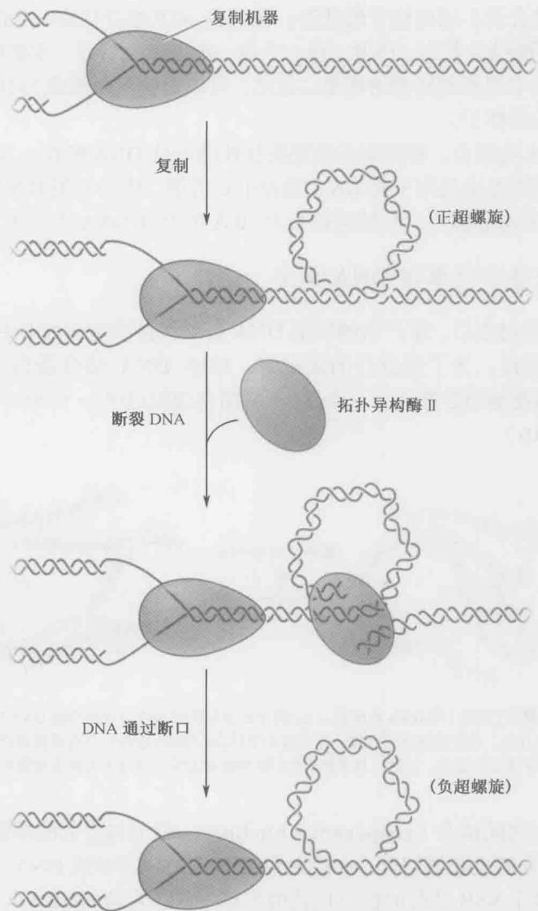  
图 9-17 拓扑异构酶在复制叉上的作用。当正超螺旋在复制叉前累积时，拓扑异构酶会将其迅速地除去。本图显示拓扑异构酶Ⅱ除去由复制叉所产生的正超螺旋，将未复制的双链 DNA 中的一部分通过位于未复制区域附近的双链断口可以消除正超螺旋。值得注意的是，这种变化将使连环数减少 2 个，因此每复制 20bp 会发生一次。虽然此处所示的是Ⅱ型拓扑异构酶的作用,但是Ⅰ型拓扑异构酶也能消除复制叉产生的正超螺旋。注意，正超螺旋在复制叉前端表现为右手螺旋（一个完整的环形相当于一个正螺旋）。一个 dsDNA 分子通过后完全转换为左手螺旋（一个完整的环形相当于一个负螺旋）。这说明了为何Ⅱ型拓扑异构酶改变的连环数为 2 个单位（DNA 拓扑和螺旋的更多信息请参见第 4 章和第 8 章，框 8-2）。

对于细菌的环形染色体，此问题非常明显，但真核生物染色体也有同样的问题。因为真核生物染色体不是闭合的环，原则上它们能通过沿着其长度方向的旋转来消除引入的超螺旋。然而事实并非如此，因为不可能每次当螺旋解开一圈时，就旋转长达几百万碱基对长度的 DNA。

由 DNA 解旋酶的作用所引入的超螺旋，可通过拓扑异构酶（topoisomerase）对在复制叉前未被复制的双链 DNA 的作用来消除（图 9-17）。这些酶是通过断裂一条或两条 DNA 链但不让其脱落，并且让同等数目的 DNA 链通过断口来完成的（如我们在第 4 章所述）。此作用消除了超螺旋的累积。通过这种方式，拓扑异构酶作为一个“转环”，快速地消除了 DNA 解旋所产生的超螺旋累积。

#### [W] 复制叉酶扩大了 DNA 聚合酶底物的范围

DNA 聚合酶本身只能使与单链 DNA 模板退火的 3'-OH 引物延长，引物酶、DNA 解旋酶及拓扑异构酶的加入极大地扩大了 DNA 聚合酶可能的底物范围。引物酶提供了在任何单链 DNA 上都能起始新的 DNA 链的能力。当然，引物酶也要求除去 RNA 引物来完成复制。类似地，DNA 解旋酶对链的解离，以及拓扑异构酶对正超螺旋的消除使 DNA 聚合酶能够复制双链 DNA。虽然不同生物中这些蛋白质的名称不同（表 9-1），但是，细菌、酵母和人等生物均使用这一套酶来完成染色体 DNA 的复制。

表 9-1 复制叉上工作的酶

<table><tr><td></td><td>大肠杆菌(E. coli)</td><td>酿酒酵母(S. cerevisiae)</td><td>人类</td></tr><tr><td>引物酶</td><td>DnaG</td><td>引物酶(PRI 1/PRI 2)</td><td>引物酶</td></tr><tr><td>DNA 解旋酶</td><td>DnaB</td><td>Mcm2-7 复合体</td><td>Mcm2-7 复合体</td></tr><tr><td>SSB</td><td>SSB</td><td>RPA</td><td>RPA</td></tr><tr><td>拓扑导构酶</td><td>旋转酶、拓扑异构酶I</td><td>拓扑异构酶I、II</td><td>拓扑异构酶I、II</td></tr></table>

值得注意的是，DNA 解旋酶和拓扑异构酶行使其功能时，均没有永久性地改变 DNA 的化学结构或合成任何新的 DNA 分子。DNA 解旋酶仅仅把将 DNA 双链维持在一起的氢键打开而没有断裂任何共价键。虽然拓扑异构酶断裂掉一个或多个 DNA 的共价键，但在 DNA 脱离之前每个断裂的键都被精确地修复了（见第 4 章，图 4-25）。这些酶的作用是使 DNA 分子的构象发生改变，而不是改变 DNA 的化学结构。重要的是，这些构象的变化对于作为细菌和真核生物染色体基础的大的双链 DNA 分子的复制是至关重要的。

在复制叉上工作的蛋白质与 DNA 密切作用，但采用的是序列非特异的方式。这些相互作用利用 DNA 与特定碱基对无关的特性：负电荷及磷酸骨架结构（如 DNA 聚合酶的拇指域）、小沟内残基的氢键（如 DNA 聚合酶的手掌域）、碱基之间的疏水堆积作用（如 SSB）。另外，很多蛋白质具有环绕（如 DNA 解旋酶）或包裹（如 DNA 聚合酶）DNA 的结构，以保持与 DNA 的结合。

#### [W] DNA 聚合酶的特化

#### [W] 细胞中 DNA 聚合酶为行使不同的功能而被特化

DNA 聚合酶在高效而精确地复制基因组过程中所处的核心地位要求细胞有多种特化的 DNA 聚合酶。例如，E. coli 中至少有 5 种 DNA 聚合酶，这些酶依据其酶学特性、亚基组成和丰度而划分（表 9-2）。DNA 聚合酶 III（DNA Pol III）是染色体复制中所涉及的最主要的酶。因为全长为 4.6 Mb 的 E.coli 由 2 个复制叉进行复制，DNA 聚合酶 III 必须有很强的延伸能力。与这些要求相一致的是，人们发现 DNA 聚合酶 III 常常作为更大的、具有高度延伸能力的复合体——DNA 聚合酶 III 全酶（DNA Pol III holoenzyme）的一部分。

表 9-2 DNA 聚合酶的活性和功能

<table><tr><td></td><td>亚基数目</td><td>功能</td></tr><tr><td colspan="3">原核生物(E. coli)</td></tr><tr><td>Pol I</td><td>1</td><td>RNA引物的去除、DNA修复</td></tr><tr><td>Pol II(Din A)</td><td>1</td><td>DNA修复</td></tr><tr><td>Pol III核心酶</td><td>3</td><td>染色体复制</td></tr><tr><td>Pol III全酶</td><td>9</td><td>染色体复制</td></tr><tr><td>Pol IV(Din B)</td><td>1</td><td>DNA修复、移损合成(translesion synthesis)(TLS)</td></tr><tr><td>Pol V(UmuC、UmuD2°C)</td><td>3</td><td>移损合成</td></tr><tr><td colspan="3">真核生物</td></tr><tr><td>Pol α</td><td>4</td><td>DNA复制过程中合成引物</td></tr><tr><td>Pol β</td><td>1</td><td>碱基切除修复</td></tr><tr><td>Pol γ</td><td>3</td><td>线粒体DNA复制及修复</td></tr><tr><td>Pol δ</td><td>2~3</td><td>后随链DNA复制、核苷酸和碱基切除修复</td></tr><tr><td>Pol ε</td><td>4</td><td>前导链DNA复制、核苷酸和碱基切除修复</td></tr><tr><td>Pol θ</td><td>1</td><td>DNA交联修复</td></tr><tr><td>Pol ξ</td><td>1</td><td>移损合成</td></tr><tr><td>Pol λ</td><td>1</td><td>减数分裂相关的DNA修复</td></tr><tr><td>Pol μ</td><td>1</td><td>体细胞超变</td></tr><tr><td>Pol κ</td><td>1</td><td>移损合成</td></tr><tr><td>Pol η</td><td>1</td><td>相对精确的移损合成通过顺-反环丁烷二联体</td></tr><tr><td>Pol i</td><td>1</td><td>移损合成、体细胞超变</td></tr><tr><td>Rev 1</td><td>1</td><td>移损合成</td></tr></table>

数据源自 Sutton M.D. and Walker G.C. 2001. Proc. Natl. Acad. Sci. 98:8342-8349 及其参考文献.

相反，DNA 聚合酶 I（DNA Pol I）专门用于除去起始 DNA 合成所需的 RNA 引物。为此，DNA 聚合酶 I 具有 5' 外切核酸酶的活性，能将 DNA 合成位点最上游的 RNA 或 DNA 迅速除去。与 DNA 聚合酶 III 不同，DNA 聚合酶 I 的延伸能力不强，每次结合仅能添加 20～100 个核苷酸。这些性质使其适用于 RNA 引物的去除和在所产生的单链 DNA 缺口中进行 DNA 的合成。DNA 聚合酶 I 的 5' 外切核酸酶可以除去 RNase H 所不能除去的 RNA-DNA 连接（图 9-13）。DNA 聚合酶 I 合成较短片段的能力使其适用于合成先前被 RNA 引物占据的短区域（<10 个核苷酸），在大量 DNA 降解及重新合成之前即解离下来。总之，DNA 聚合酶 I 完成其功能后仅在 DNA 链上留一个缺口。

因为 DNA 聚合酶 I 和 DNA 聚合酶 III 都与 DNA 复制有关, 所以这两种酶都必须有高度的精确性。因此, 这两种蛋白质都具有相关的校正外切核酸酶活性。E.oli 中的另外 3 种 DNA 聚合酶特别用于 DNA 的修复, 它们无校正活性, 这些酶将在第 10 章中予以讨论。

真核细胞中也有多种 DNA 聚合酶，通常有 15 种以上。其中，对于基因组的复制至关重要的有3种：DNA Pol δ、DNA Pol ε及DNA Pol α/引物酶。这些真核生物的DNA聚合酶由多个亚基构成（表9-2）。DNA Pol α/引物酶特别参与新DNA链的起始，这种四亚基蛋白复合体由二亚基的DNA Pol α和二亚基的引物酶组成。引物酶合成RNA引物后，所产生的RNA引物-模板接头立即与DNA Pol α结合以启动DNA的合成。

因为 DNA Pol α/引物酶的延伸能力相对较低，所以很快就被高延伸性的 DNA Pol δ 或 ε 取代。DNA Pol δ 或 ε 取代 DNA Pol α/引物酶的过程称为聚合酶的切换（polymerase switching）（图 9-18），这导致在真核细胞复制叉上有 3 种不同的 DNA 聚合酶在工作。DNA Pol δ 和 ε 在复制叉上特异性地复制不同的链，DNA Pol δ 合成前导链，DNA Pol ε 合成后随链。如同在细菌细胞中那样，真核细胞中其他的 DNA 聚合酶大多参与 DNA 的修复。

  
图 9-18 真核细胞 DNA 复制过程中 DNA 聚合酶的切换。本图显示了真核细胞中 DNA 聚合酶的作用顺序。为了图示方便，DNA 合成的长度比实际的短。通常 DNA Polα/引物酶的产物为 50\~100bp，由 Pol δ 或 ε 进一步延伸为 100\~10000 个核苷酸。虽然 DNA Pol δ 和 DNA Pol ε 都能替代 DNA Pol α/引物酶，但目前的研究表明 DNA Pol δ 位于前导链，DNA Pol ε 位于后随链。

#### [W] 滑动夹极大地增加了 DNA 聚合酶的延伸能力

复制叉上高度的延伸能力确保了染色体的快速复制。如我们所讨论的，DNA 聚合酶在复制叉上可以在不脱离模板的情况下合成成千上万的碱基对。尽管如此，在没有其他蛋白质存在的情况下，DNA 聚合酶在复制叉上仅能合成 20～100 个碱基对后即从模板上脱离下来。那么，是什么原因使这些酶在复制叉上的延伸能力如此显著地提高了呢？

DNA 聚合酶在复制叉上具有高延伸能力的关键原因在于它们与被称为滑动 DNA 夹（sliding DNA clamp）的蛋白质间的结合。这些蛋白质由多个相同的亚基构成，并组装成“油炸圈饼”的形状。夹子中央的孔洞大得足以环绕 DNA 双螺旋，并在 DNA 和蛋白质之间留下一个或两个水分子厚的空间（图 9-19a）。这些夹子沿着 DNA 滑动，并不与 DNA 分离，还紧密结合 DNA 聚合酶及引物-模板接头（图 9-19b）。聚合酶与滑动夹所形成的复合体在 DNA 合成时沿着 DNA 模板高效地移动。

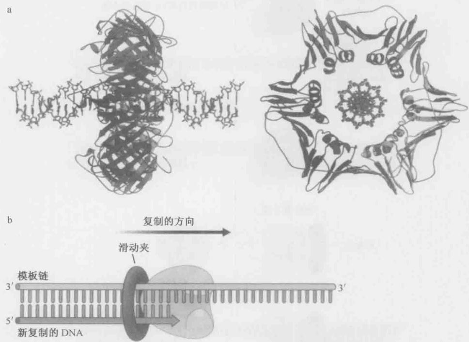  
图 9-19 滑动 DNA 夹的结构。(a) 与 DNA 结合的滑动 DNA 夹的三维结构。滑动夹中央的开孔约为 35 Å，DNA 螺旋的宽度约为 20 Å，这样提供了在滑动夹和 DNA 之间容纳一个或两个水分子厚度薄层的足够空间，使滑动夹沿 DNA 运动很容易。(Krishna T.S., et al. 1994. Cell 79:1233-1243. 图像用 Bob-Script、MolScript 和 Raster 3D 绘制。DNA 模型由 Leemor Joshua-Tor 制作)。(b) 滑动夹环绕着由与其结合的 DNA 聚合酶所产生的新复制的 DNA。当新合成的 DNA 从 DNA 聚合酶上出现时，滑动夹与最靠近新合成 DNA 的 DNA 聚合酶部分相互作用。

与滑动夹的结合是如何改变 DNA 聚合酶的延伸能力的呢？在无滑动夹的情况下，DNA 聚合酶平均每合成 20～100 个碱基对就从 DNA 模板上解离并散落开来。在有滑动夹的情况下，DNA 聚合酶的活性部位仍经常从 DNA 的 3'-OH 末端脱落，但是其与滑动夹的结合阻止了聚合酶从 DNA 上散开（图 9-20）。通过保持 DNA 聚合酶与 DNA 的紧密接触，滑动夹使 DNA 聚合酶能迅速地重新结合到同一引物-模板接头上，大大增加了 DNA 聚合酶的延伸能力。

  
图 9-20 滑动 DNA 夹增强了相结合的 DNA 聚合酶的延伸能力。(a) 滑动 DNA 夹环绕 DNA 同时结合 DNA 聚合酶。(b) 相对较低持续合成能力的 DNA 聚合酶会导致频繁地从引物:模板结合上脱落,但与聚合酶结合的滑动夹防止了聚合酶从 DNA 上散开。(c) DNA 聚合酶与滑动夹之间的结合确保 DNA 聚合酶能重新结合相同的引物:模板并继续 DNA 的合成。(d) DNA 聚合酶完成模板合成后,由于没有引物:模板再次结合而从滑动夹上释放。

当单链 DNA 模板完全复制后，DNA 聚合酶必须从双链 DNA 和滑动夹上释放，与新的引物-模板接头结合。此释放是通过依赖于环结合 DNA 的 DNA 聚合酶与滑动夹之间亲和力的变化实现的。与引物-模板接头结合的 DNA 聚合酶与夹子有很高的亲和力。但是，当 DNA 聚合酶到达单链 DNA 模板的末端时（如冈崎片段的末端），活性部位存在的双链 DNA 使 DNA 聚合酶构象发生变化，降低了其与滑动夹及 DNA 之间的亲和力（图 9-20）。因此，当聚合酶完成一段 DNA 复制后，它即从滑动夹释放，在新的引物-模板接头上开始工作。

释放 DNA 聚合酶后，滑动夹并不立即从复制的 DNA 上脱落下来。相反，其他必须在 DNA 新合成处作用的蛋白质通过与夹子蛋白相互作用而执行其功能。如第 8 章所述，真核细胞中组装染色质的酶通过与真核滑动 DNA 夹（称为 PCNA）之间的相互作用被募集到 DNA 的复制部位。类似地，冈崎片段修复所涉及的真核蛋白也与滑动夹蛋白作用。不论何种情况，这些蛋白质均通过与滑动夹之间的相互作用在最需要它们的时候聚集到新的 DNA 合成部位。

滑动夹蛋白是病毒、细菌、酵母及人类等生物 DNA 复制体系中的保守部件。与其功能保守性相一致的是，源自这些不同生物的滑动夹的结构也是保守的（图 9-21）。不论何种情况，夹子均为同样的六边形对称并有相同的直径。尽管其整体结构非常类似，但形成夹子的亚基数目却不相同。

  
图 9-21 不同生物中滑动 DNA 夹的三维结构。所有生物中都发现有滑动 DNA 夹，它们有相似的结构。（a）E. coli 的滑动 DNA 夹由 2 个拷贝的 β 蛋白构成。（Kong X.P., et al. 1992. Cell 69:425-437.）（b）T4 噬菌体滑动 DNA 夹是 gp45 蛋白的三聚体（Moarefi l., et al. 2000. I Mol. Biol. 296:1215-1223.）（c）真核滑动 DNA 夹是 PCNA 蛋白的三聚体。（Krishna T. S., et al. 1994. Cell 79:1233-1243.）镜像图用 BobScript、MolScript 和 Raster 3D 绘制。

#### [W] 滑动夹通过滑动夹装载器打开并安置在 DNA 上

滑动夹在溶液中是一个闭合的环，必须打开才能套在 DNA 双螺旋上。一类称为滑动夹装载器（sliding clamp loader）的特殊的蛋白复合体催化滑动夹的打开并将其安放在 DNA 上。这些酶通过结合 ATP 并将其水解而将滑动夹环置于 DNA 的引物-模板接头上（框 9-3）。滑动夹装载器还能将滑动夹在不使用的时候将其从 DNA 上移除，这一过程不需要 ATP。像 DNA 解旋酶和拓扑异构酶一样，这些酶改变其靶物（滑动夹）的构象，但并不改变其化学组成。

#### [W] 框 9-3 ATP 控制蛋白的功能：滑动夹的装载

滑动 DNA 夹装载器由 5 个亚基组成，是一类含有相关 ATP 结合和水解位点的蛋白质家族成员，称为 AAA $^{+}$ 蛋白。这种蛋白质组合成 AAA $^{+}$ 蛋白复合体，利用水解 ATP 的能量来改变目标蛋白或 DNA 的结构。滑动 DNA 夹装载器是由不同的 AAA $^{+}$ 蛋白组成的，而其他 AAA $^{+}$ 蛋白复合体一般是由一种 AAA $^{+}$ 蛋白的多个拷贝组成。尽管 AAA $^{+}$ 蛋白含有相关 ATP 结合和水解位点，但是它们行使不同的功能。除了装载成 DNA 滑动夹，AAA $^{+}$ 蛋白还解开 DNA，在 DNA 模板周围加载解旋酶（如 ORC 和 DnaC，在 DNA 复制起始的章节我们谈论过），蛋白质去折叠，拆分蛋白质复合物。实际上，因为它具有多种活性，我们称这些 AAA 蛋白为 ATPase。

ATP的结合及水解是如何与滑动夹的装载联系到一起的？起始步骤要求ATP结合到装载器，当与ATP结合时，夹子装载器与滑动夹结合并通过拆开一个亚基-亚基界面使滑动夹打开（框9-3图1）。打开的滑动夹通过夹子装载器上一个高亲和力的DNA结合位点被运送到DNA上。与滑动夹的结合相一致，DNA的结合需要装载器结合ATP。滑动夹在DNA合成合成位点一直存在，装载器的DNA结合位点特异性地识别引物-模板接头。打开的滑动夹环绕住引物-模板接头的双链DNA区域。

滑动夹装载的最后一步是由 ATP 水解所催化的。夹子装载器与引物-模板接头的结合激发了 ATP 的水解（通过夹子装载器进行）。因为夹子装载器只有在与 ATP 结合时（而不是 ADP）才能与滑动夹及 DNA 结合，水解使夹子装载器释放滑动夹并从 DNA 上脱离。滑动夹一旦从夹子装载器上释放，即自动闭合而套住 DNA。此过程的净结果是滑动夹安装到 DNA 聚合酶的作用位点——引物-模板接头上。ADP 和 Pi 的释放以及与新 ATP 分子的结合使夹子装载器能够启动新一轮的装载。

夹子装载器的功能解释了 ATP 结合和水解与分子事件耦联的几个特征。通常 ATP 与蛋白质的结合多发生在事件的组装阶段：因子与靶分子的结合。例如，夹子装载器有两个靶分子：滑动夹及引物-模板接头。夹子装载器与这两个靶分子的结合都需要 ATP。类似地，ATP 的结合也激发 DNA 解旋酶与单链 DNA 结合的能力。不论哪种情况，与 ATP 结合相耦联的事件均被视为循环中的一部分。对夹子装载器而言，打开滑动夹环需要的是 ATP 的结合而不是水解。对于 DNA 解旋酶来说，与单链 DNA 的结合很可能是 DNA 解旋的关键事件。在这些事例中，与 ATP 的结合稳定了酶的构象，利于酶以特定的构象与底物相互作用。

那 ATP 水解的作用是什么？ATP 的水解通常与事件中的解离阶段相关：释放结合在酶上的靶分子。ATP 所稳定的复合体一旦形成，就一定会解离。这可能是简单的分离，但是，更多情况下是将元件还原到其起始状态（如溶液中游离的滑动夹）。如果 ATP 所稳定的复合体结合得十分牢固，此过程将很缓慢。为了保证在正确的时间、地点以正确的速率发生解离，由 ATP 水解来起始解离。例如，ATP 水解使夹子装载器恢复到它既不与滑动夹也不与 DNA 结合的状态。这种初始状态的回复可能会发生在当酶仍与 ATP 水解产物（ADP 和 Pi）结合的时候，或是需要其分离的时候。

ATP 水解与反应耦联的最后一个重要的机制是 ATP 水解的引发。在所需要的复合体组装好之前，相关因子不水解 ATP 是十分关键的。一般而言，特定复合体的形成可引发 ATP 的水解。对于夹子装载器而言，此复合体是滑动夹、夹子装载器及引物-模板接头所形成的三体复合体。

因此，ATP 控制这些分子事件与酶对构象变化的时相控制最直接相关。酶通过在两种构象状态之间有序地变化和形成一种重要的中间物引发 ATP 水解以完成这种控制。相反，如果酶只是结合和释放 ATP（无水解），则反应将频繁回到起始状态而几乎不能完成任何工作。

框 9-3 图 1 ATP 控制滑动夹的装载。(a) 滑动夹装载器是五亚基的蛋白质复合体，其活性是由 ATP 的结合和水解控制的。在 E.coli 中夹子装载器称为 γ-复合体，在真核细胞中称为复制因子 C(RF-C)。(b) 为了催化滑动夹的打开，夹子装载器必须与 ATP 结合。(c) 夹子装载器一旦与 ATP 结合，即与夹子结合并在一个亚基-亚基界面处将环打开。(d) 形成的复合体可与 DNA 结合。DNA 的结合是由优先与引物-模板接头结合的夹子装载器介导的。与 DNA 的正确结合有两个结果：第一，打开后的滑动夹被定位，可使双链 DNA 处于夹子的孔洞之中；第二，DNA 的结合通过夹子装载器激发了 ATP 的水解。(e) 因为只有结合 ATP 的夹子装载器才能与夹子以及 DNA 结合，所以结合 ADP 的夹子装载器很快就从夹子及 DNA 上脱离下来，留下套在双链 DNA 引物-模板接头位置处的闭合的夹子。(来源：O'Donnell M. et al. 2001. Curr. Biol. 11: R935-R946, Fig. 5. ©Elsevier.)

是什么控制滑动夹何时从 DNA 上装载和移除呢？只要细胞中出现引物-模板接头，滑动夹的装载就可能发生。此 DNA 结构并非只在 DNA 复制时形成，在 DNA 修复事件中也有（第 10 章）。滑动夹只有当其不再被其他酶使用时才能从 DNA 上移除。滑动夹装载器和 DNA 聚合酶不能同时与滑动夹作用，因为它们在滑动夹的同一面上有重叠的结合位点。因此，与 DNA 聚合酶结合的滑动夹不会从 DNA 上移除。类似地，核小体组装因子、冈崎片段修复蛋白及其他 DNA 修复蛋白均与夹子装载器一样，与滑动夹的同一区域作用，因此，滑动夹只能在与其相作用的所有酶都完成工作后才能从 DNA 上移除。

#### [W] 复制叉上的 DNA 合成

在复制叉上前导链和后随链同时进行合成，这对在 DNA 合成期内限制细胞内单链 DNA 的数量有重要意义。当 DNA 的单链区断裂时，在染色体上会产生完全的断裂，这比双链 DNA 上的一条单链 DNA 断裂修复起来要困难得多。而且，修复这种类型的损伤经常会导致 DNA 的突变（第 10 章）。因此，限制 DNA 处于此状态的时间是十分重要的。为了协调 DNA 两条链的复制，在复制叉上有多种 DNA 聚合酶在行使功能。

E. coli 中，这些聚合酶的协同作用是通过连接成巨大的多蛋白复合体来实现，此复合体称为 DNA Pol Ⅲ全酶（图 9-22）。全酶是核心酶和对其有增强功能的其他元件组成的多蛋白复合体的总称。DNA Pol Ⅲ全酶含有3个拷贝的核心 DNA Pol Ⅲ和1个拷贝的五亚基滑动夹装载器。虽然在全酶中滑动夹装载器只有一个拷贝，但包括3个拷贝 $\tau$ 蛋白，每个 $\tau$ 蛋白结合一个 DNA Pol Ⅲ核心酶（图9-22）。

  
图 9-22 DNA Pol III全酶的组成。每个拷贝的 DNA Pol III全酶有 4 个酶：3 个拷贝的 DNA Pol III核心酶和 1 个拷贝的滑动夹装载器。滑动夹装载器含有 3 个拷贝的 τ 蛋白，每个 τ 蛋白均与一个 DNA Pol III核心酶相作用。对 τ 蛋白进行的氨基酸序列分析表明，此蛋白质的 DNA Pol III结合区域与夹子装载器所涉及的蛋白质之间有一段延伸的柔性接头。这个接头据认为可以使聚合酶以相对独立的方式运动，一个聚合酶复制前导链，而另两个聚合酶复制后随链。（来源：O'Donnell M. et al. 2001. Curr. Biol. 11:R935–R946, Fig. 6. ©Elsevier.）

当 DNA 同时在前导链和后随链模板上合成的时候，多个 DNA 聚合酶如何在复制叉处保持连接？一个解释此耦联效应的模型认为复制机器利用了 DNA 和 $\tau$ 蛋白的柔性（图 9-23）。当解旋酶在复制叉处解开 DNA 螺旋后，前导链模板暴露并立即与一个 DNAPol III 核心酶作用，合成一条连续的 DNA 互补链。相反，后随链模板并不是立即与 DNA 聚合酶作用，而是以单链 DNA 的形式伸出，并被 SSB 迅速结合。引物酶与 DNA 解旋酶相互作用从而被激活，在后随链模板上合成一条新的 RNA 引物。产生的 RNA：DNA 杂交体被滑动夹装载器识别为引物-模板接头，滑动夹在此处组装，第二个 DNA Pol III 启动后随链的合成。

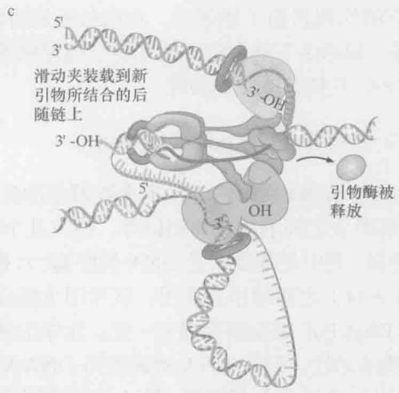  
图 9-23 E.coli 复制叉上用于协调两种 DNA 聚合酶复制的“长号模型”。(a) E. coli DNA 复制叉上的 DNA 解旋酶在后随链模板上沿着 5'→3'方向运动。DNA Pol III 全酶通过 τ 亚基与 DNA 解旋酶相互作用，τ 亚基也与 DNA Pol III 核心酶结合。一个 DNA Pol III 核心酶复制前导链，另两个 DNA Pol III 核心酶复制后随链。SSB 覆盖在 DNA 的单链区域（为了简便起见，后随链上的 SSB 只在 a 部分中显示）。(b) DNA 引物酶周期性地与 DNA 解旋酶结合并在后随链模板上合成新的 RNA 引物。(c) 新的 RNA 引物合成后，DNA 滑动夹装载器就在模板-引物接头处加载滑动夹。(d) 空闲的“第二个”后随链 DNA 聚合酶在模板-引物接头处快速识别 DNA 滑动夹，并合成新的冈崎片段。(e) 当“第一个”后随链 DNA 聚合酶到达冈崎链模板的末端后，从滑动夹释放出来。此时“第一个”后随链 DNA 聚合酶已经就位，准备识别后随链模板的下一个 RNA 引物/滑动夹。所以，本模型描述了两个后随链 DNA 聚合酶交替启动冈崎片段的合成。

当一个后随链上的 DNA 聚合酶合成冈崎片段后，解旋酶产生了更多的单链 DNA，而该模板上新的 RNA 引物也被合成。与前面的后随链的引物一样，新的 RNA 引物可以被滑动夹装载器识别。尽管传统上认为 DNA Pol 全酶仅有两个 DNA Pol Ⅲ核心酶，近期研究认为还存在第三个 DNA Pol Ⅲ。在前一个冈崎片段尚未完成合成时，一旦 DNA 滑动夹在 RNA 引物上加载后，第三种 DNA Pol Ⅲ就可启动新冈崎片段的合成。因此，第二个冈崎片段在合成前一个冈崎片段的聚合酶释放前就已经开始合成了。当每个冈崎片段合成结束后，聚合酶即从模板上释放（即一旦 DNA 聚合酶完成冈崎片段的合成后，立刻从滑动夹上解离）。此时第二个 DNA 聚合酶正在指导后随链的合成，因为 DNA 聚合酶从滑动夹上解离比 DNA 合成速度慢，于是在其缓慢的解离过程中后随链的合成得以继续。因为解离的 DNA Pol Ⅲ核心酶通过滑动夹装载器的 τ 亚基与解旋酶保持着联系，所以在加载滑动夹后该 DNA 聚合酶立即与 RNA 引物-模板接头在理想的位置结合。这个模型被称为“长号模型”，以比喻在后随链模板上 DNA 聚合酶和 DNA 解旋酶之间形成的单链 DNA 环状结构大小的变化。

真核细胞中 DNA 的复制也需要三种 DNA 聚合酶：DNA Pol α/引物酶、DNA Pol δ 及 DNA Pol ε（图 9-18）。DNA Pol α/引物酶启动新链合成，DNA Pol δ 和 DNA Pol ε 进行链的延伸。在 E.coli 中，一种 DNA 聚合酶（DNA Pol ε）合成前导链，两种 DNA 聚合酶（DNA Pol α/引物酶和 DNA Pol δ）合成后随链（尽管 DNA Pol α/引物酶和也可以合成前导链的引物，但是其功能在后随链更强）。已知许多其他蛋白质为真核细胞复制叉的一部分，这些蛋白质的作用目前了解甚少，它们很可能协调三种 DNA 聚合酶，并耦联聚合酶 DNA 解旋酶（Mcm2-7 复合物）的功能。与原核细胞所不同的是，真核细胞的滑动夹装载器——RF-C 不具有这样的功能。

#### [W] 复制叉蛋白之间的相互作用形成 E.coli 的复制体

DNA Pol III全酶组分之间的联系并不是发生在细菌复制叉各元件中唯一的相互作用。除了DNA Pol III全酶组分之间的相互作用以外，还有几个复制叉蛋白-蛋白间的相互作用加快了复制叉的进程。其中最重要的是DNA解旋酶（六聚体dnaB蛋白）（表9-1）与DNA Pol III全酶（图9-24）之间的相互作用。该作用由组成全酶的滑动夹装载器的 $\tau$ 亚基介导，将解旋酶和DNA Pol III全酶连接到一起。此作用使解旋酶运动的速度增加10倍，从而激发了解旋酶的活性。如果DNA解旋酶与DNA聚合酶分离，其速度将减慢（图9-24）。解旋酶活性与DNA Pol III耦联，防止了解旋酶从DNA Pol III全酶上“逃脱”，使得这两个关键的复制叉酶得以协调。

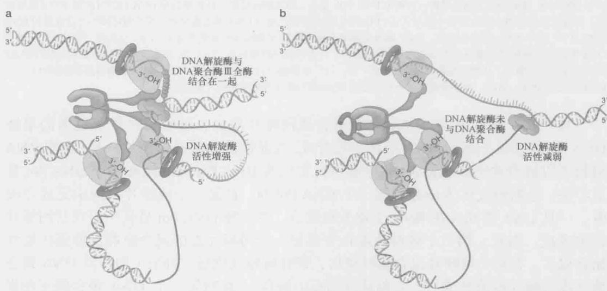  
图 9-24 DNA 解旋酶与 DNA Pol III 全酶的结合加快 DNA 链的分离。滑动夹装载器的 τ-亚基在复制叉上与 DNA 解旋酶和 DNA 聚合酶都发生作用。(a) 当此相互作用发生后，DNA 解旋酶以与 DNA 聚合酶复制 DNA 大致相同的速度解开 DNA。(b) 如果 DNA 解旋酶没有与 DNA Pol III 全酶作用，则 DNA 解开的速度变为原来的 1/10。在此情况下，DNA 聚合酶的复制快于 DNA 解旋酶对未复制 DNA 链的拆分。这使 DNA Pol III 全酶能赶上 DNA 解旋酶并重新形成一个复制体。

第二个重要的蛋白质间相互作用发生在 DNA 解旋酶与引物酶之间。与 E.coli 复制叉中的多数蛋白质不同，引物酶与复制叉的结合并不紧密。相反，在约 1 秒一次的间隔中，引物酶与解旋酶及 SSB 覆盖的单链 DNA 结合并合成新的 RNA 引物。虽然 DNA 解旋酶与引物酶之间的作用相对较弱，但是其相互作用大大激发了引物酶的活性（提高约 1000 倍）。RNA 引物合成后，引物酶从 DNA 解旋酶上脱落并进入溶液中。

在 E.coli 中，引物酶与 DNA 解旋酶之间相对较弱的相互作用对于调节冈崎片段长度很重要。紧密的结合可导致后随链上的引物合成更频繁，这样冈崎片段就会较短。较弱的作用则产生较长的冈崎片段。

复制叉上发挥作用的全部蛋白质的总和称为复制体（replisome）。这些蛋白质在一起形成一个用于DNA合成的、调度有序的“工厂”，此“工厂”含有多个相互关联的机器。这些机器都可单独地行使重要的特殊功能。当它们在一起的时候，其活动通过相互之间的作用进行协调。这些相互作用在E. coli细胞中已所知甚详，但是对噬菌体和真核DNA复制机器的研究表明，这些生物中的DNA复制亦涉及类似的、多机器间的协调作用。事实上，在E. coli复制中涉及的蛋白质在其他生物中也有明确的同源蛋白。噬菌体、原核生物和真核生物DNA复制中执行类似功能的因子的名称见表9-1。

为了更好地体会复制 DNA 的酶令人惊叹的能力，设想一个 DNA 碱基有你的课本那么大。这种情况下双链 DNA 将有约 1m 的直径，E.coli 基因组将是一个约 500 英里（800 千米）周长的大环。更重要的是，复制体有联邦快递（UPS）的运货车那么大，它将以超过 375 英里/小时（600 千米/小时）的速度运动！对两个这样的机器来说，E.coli 基因组的复制历时 40 分钟、途经 250 英里（400 千米）路程，每个机器在它的航迹上留下两条 1 米粗的 DNA 线缆。令人叫绝的是，复制机器在路程当中平均仅产生一个错误。

#### [W] DNA 复制的起始

#### [W] 特定的基因组 DNA 序列指导 DNA 复制的起始

复制叉最初的形成需要 DNA 双链的分离提供单链 DNA 用于 DNA 解旋酶结合和 RNA 引物及新 DNA 的合成所必需的模板。虽然 DNA 链的分离（也称为 DNA 解旋）在染色体末端最容易进行，但是 DNA 的合成通常是在中间区域起始的。事实上，对于环状染色体来说，无染色体末端使内部 DNA 解旋对复制起始很重要。

DNA 解旋和复制起始发生的特殊位点称为复制起始位点（origin of replication），其数目依不同的生物而不同，每个染色体上可有少至一个、多至数千个的起始位点。

#### [W] 复制起始的复制子模型

1963 年，Francois Jacob、Sydney Brener 及 Jacques Cuzin 提出一个模型来解释细菌中复制起始事件。他们定义所有的 DNA 均从称为复制子（replicon）的特定起始位点开始复制。例如，因为 E.coli 中的单条染色体只有一个复制起始位点，所以整个染色体是一个复制子。相反，多个复制起始位点的存在将每个真核染色体分成多个复制子——每一个都有一个复制起始位点。

复制子模型提出了控制复制起始的两个元件：复制器和起始子（图9-25）。复制器（replicator）是指足够指导DNA复制起始的整套顺式作用的DNA序列。与之相对照的是，复制起始位点是在DNA上发生DNA解旋及DNA合成起始位点。尽管复制起始位点始终是复制器的一部分，但是有时（尤其是在真核细胞中）复制起始位点仅仅是指导复制起始（复制器）的DNA序列的一部分。如我们将在第13章所见到的，在转录启动子与转录起始位点之间也有同样的区别。

  
图 9-25 复制子模型。起始子与复制器的结合引发了复制的起始和相关 DNA 的复制。

复制子模型的第二个元件是起始子（initiator）蛋白。此蛋白质特异性地识别复制器中的一个DNA元件并激活复制的起始（图9-25）。起始子蛋白已经在多种生物中得到确认，包括细菌、病毒及真核细胞。虽然这些蛋白质结合到DNA上的方法各不相同，但是它们选择的位点都将成为复制起点。有趣的是，所有已知起始子蛋白均由ATP的结合和水解调节，并且有共同的核心AAA $^{+}$ ATP结合基序，该基序和DNA滑动夹装载器不同但相关联。

如下面我们所看到的，起始子蛋白是复制起始中唯一涉及的序列特异性 DNA 结合蛋白，复制起始所需的其他蛋白质均不与 DNA 特异性地结合，相反，这些蛋白质通过相互作用，以及对特殊 DNA 结构（如单链 DNA 或引物-模板接头）的亲和性而聚集到复制子上。进一步而言，对很多真核细胞，起始子蛋白并没有表现出序列特异性的结合活性。

#### [W] 复制器序列包括起始子结合位点和容易解旋的 DNA

复制器的 DNA 序列有两个共同的特性（图 9-26）。第一，它们含有起始子蛋白结合位点，此位点是组装复制起始机器的核心；第二，它们含有一段富含 AT 的 DNA，此段 DNA 容易解旋但并不自发进行。在复制器上，DNA 的解旋是由复制起始蛋白控制的，多数生物中这些蛋白质被严格调控。

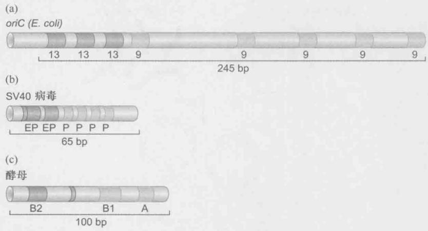  
图 9-26 复制器的结构。图示为组成三个研究得很透彻的复制器的 DNA 元件。起始子 DNA 结合位点表示为绿色，促进 DNA 解旋的元件表示为蓝色，DNA 合成的起始位点表示为红色。（a）oriC 由 5 个 “9mer” 的 DnaA 结合位点和 3 个 “13mer” 的重复元件构成，后者是 DNA 解旋的起始位点。（oriC 位点不在所示的序列之内）（b）真核病毒 SV40 的复制器由 4 个称为大 T 抗原的五聚体起始子蛋白结合位点（P）和 20bp 早期回文序列（EP）构成，后者是 DNA 解旋的部位。（c）在酵母复制器上常见 3 种元件。A 元件和 B1 元件与起始子 ORC 结合，B2 元件促进 DNA 的解旋酶的结合。

E.coli 染色体复制所需要的单个复制器被称为 “oriC”。有两个重复的基序对 oriC 功能至关重要（图 9-26a）。9mer 单位的基序是 E.coli 起始子 DnaA 的结合位点，其在 oriC 上重复 5 次。13mer 单位的基序重复 3 次，是起始时单链 DNA 形成的起始位点。

虽然很多真核生物病毒与单细胞真核酿酒酵母复制器的特殊序列不同，但其整体结构却很相似（图 9-26b,c）。定义复制起始位点的方法见框 9-4。

对多细胞真核生物的复制器了解还不多。相对于单细胞真核生物和细菌采用的、针对稳定繁殖的环形小 DNA 的遗传分析方法，对鉴别多细胞真核生物复制器的特征变得困难重重（框 9-4）。在少数几例得到鉴别的复制器中，发现它们比酿酒酵母和细菌染色体中的复制器大得多。与那些较小的复制器不同，在这些复制器中很难发现简单突变导致的功能丧失。而且特异的 DNA 序列在此并没有发挥重要作用。最近研究表明，局部核小体密度及相邻转录因子减少是重要的复制器决定因素。

#### [W] 框9-4 复制起始位点和复制器的鉴别

复制器序列通常用遗传学实验进行鉴别。例如，首个酵母复制器就是用 DNA 转化实验鉴别的（框 9-4 图 1）。在这些研究中，研究人员将基因组 DNA 片段随机地克隆到缺少复制器但含有一个宿主细胞中缺少的选择性标记的质粒中。对于转化后可在细胞中维持的质粒，克隆的 DNA 片段中一定含有一个酵母复制器。被鉴别的 DNA 片段称为自主复制序列（autonomously replicating sequence，ARS）。这些序列是在人工合成的环形质粒中作为复制器起作用，所以需要进一步的证据来证明这些序列在其原本的染色体位置处也是复制器。

框9-4图1 复制器的遗传学鉴别。用限制性内切酶切割含有选择性标记的质粒（小的环形DNA分子），使质粒中正常的复制器被切除，产生一个不含复制器的DNA片段。为了从特定物种中分离到复制器，使用同一种限制性内切酶切割来自此物种的DNA并将其连接到被切割的质粒中，重新生成环形的质粒，每个质粒中都含有一个来自受试物种的片段。此DNA然后转化到宿主中并用质粒上的选择性标记对重组的质粒进行筛选（如果标记为抗生素抗性，细胞将在有抗生素情况下生长）。生长的细胞中含有质粒及其选择性标记，表明质粒能够在细胞中复制，而且质粒一定含有复制器。从宿主细胞中分离质粒并对插入DNA进行测序，可鉴别含有复制器片段的序列。进一步对插入DNA进行诱变（如删除插入DNA的特殊区域）并重复上述实验，可对复制器进行精细的鉴定。

为了证实 ARS 在染色体中是作为复制器而起作用的，有必要发展在细胞中定位复制起始位点的方法。一个方法是利用在复制起始过程中形成的 DNA 复制中间体不寻常的结构。与完全复制的或完全未复制的 DNA 不同，正处于复制过程中的 DNA 不是线性的。例如，不含有复制起始位点的 DNA 片段（由限制性内切酶对 DNA 切割产生）在其复制的时候具有各种 “Y” 形的构象（框 9-4 图 2，蓝色的 DNA 片段）。类似地，含有复制起始位点的 DNA 片段复制起始后立即呈水泡形。最后，如果复制起始位点不对称地位于 DNA 片段内，则 DNA 开始呈水泡形然后转变成 Y 形（框 9-4 图 2，红色的 DNA 片段）。利用双向琼脂糖凝胶电泳可将这些特殊形状的 DNA 与大多数线性 DNA 区分开来（框 9-4 图 3）。

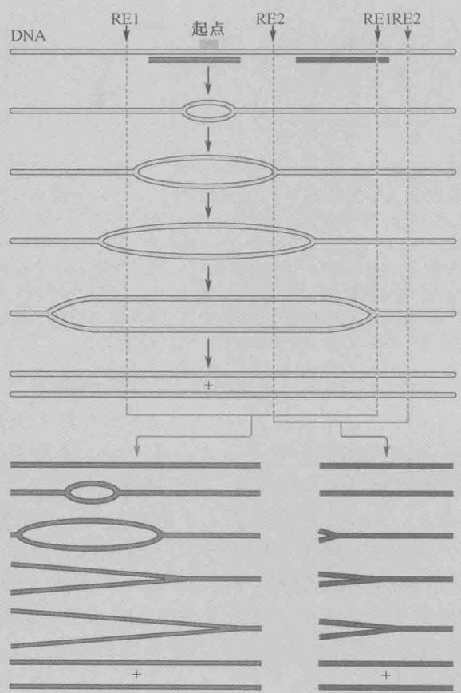

框 9-4 图 2 复制过程中的 DNA 的特殊结构。所示为限制性内切酶对复制过程中的 DNA 切割的结果。图示表示“复制泡”（由两个复制叉从复制起始位点上背道而驰所形成）的生长。对复制中间体进行切割，随后用 DNA 标记探针进行杂交来检测。如果使用红色的限制性内切酶，而且只检测到可与红色的 DNA 探针杂交的片段，则将产生左侧的模式。如果使用蓝色的限制性内切酶和蓝色的 DNA 探针来检测生成的 DNA 片段，则可观察到右侧的模式。注意左侧模式开始的时候有含“水泡”的 DNA 片段，最终变为“Y”形分子。右侧模式始终无“水泡”，但是有各种各样的“Y”形中间体。只有含有复制起始位点的 DNA 片段才能够产生左侧的模式。

  
框9-4图3复制起始位点的分子鉴别。（a）通过双向电泳分离DNA，可以将处于复制过程中的DNA与完全复制的或完全未复制的DNA分离开来。总DNA从分裂期细胞（即正在复制）中提取。DNA首先按照大小进行分离（使用低电压电泳和大孔径琼脂糖凝胶）。然后电场旋转 $90^{\circ}$ ，DNA再按照大小和形状进行分离（使用高电压和在小孔径琼脂糖凝胶）。用Southern印迹来检测插入的DNA。起点（绿色）、限制性内切酶切割位点（红色）、DNA探针（蓝色）的位置显示出3种不同的模式。（b）起始点位于DNA片段外的Southern杂交图，称为Y-弧，所有的复制中间体、物均呈Y字形。有3个等长臂的分子（2号）在第二向电泳中移动最慢。（c）起始点位于DNA片段中间，检测结果为水泡-弧。含最大复制泡的中间体在第二向电泳中迁移最慢（d）起始点位于中心区外侧的限制性片段图谱。中间体开始是水泡形，随后（复制叉通过限制性位点后）成为Y字形，水泡到Y-弧模式”被认为是对起始位点的最好显示。

为了鉴别在复制过程中的 DNA，首先用限制性内切酶消化正在分裂细胞的 DNA 并用双向琼脂糖凝胶电泳进行分离。在第一向中，DNA 按照大小进行分离，在第二向中，DNA 按照大小和形状进行分离。这是通过在每一向上使用不同的凝胶密度和电泳速率达到的。为了按照大小和形状进行分离，琼脂糖凝胶的孔径要小（高琼脂糖密度），而且电泳速度要快。相反，如果主要是按照大小进行分离，则琼脂糖凝胶的孔径要大一些（低琼脂糖密度）并且电泳的速度要慢一些。当电泳完成后，将 DNA 分子转移到硝酸纤维素膜上并用 Southern 印迹检测（第 7 章）。对限制性内切酶和 DNA 探针的选择能极大地影响分析的效果。通常，这个方法需要研究人员对复制起始位点可能的定位有充分认识。近来出现了利用 DNA 芯片鉴定起始位点的新方法，这种方法不需要任何对起始位点位置的经验认识。

双向电泳是如何鉴别含复制起始位点的 DNA 中间体的呢？DNA 迁移的特殊模式能为复制起始位点的鉴别提供明确的证据。在第一向中特殊的结构迁移最慢。例如，一个含有 3 个等长臂的 Y 形分子，在从特定 DNA 片段中得到的所有这样的分子中迁移最慢（框 9-4 图 3b），因此在 DNA 分子弧形顶端的是非线性分子。相反，带有两个非常短的复制臂和一个大的复制区域的 Y 形分子，其迁移与同一 DNA 片段的未复制版本非常相似。最后，由几乎已经完全复制的片段所产生的 Y 形分子在形状上与二倍于未复制片段大小的线形分子相似。因此，当一个 DNA 分子被单个复制叉复制时，它迁移的位置将与弧形中的未复制片段紧邻，并且最终到达二倍于未复制 DNA 大小的线性分子预计迁移到的位置。此形状被称为 Y-弧（Y-arc），代表的是正处于复制过程的分子。因为每一轮复制中所有的 DNA 分子都被复制，所以大部分的 DNA 片段都是这种类型的模式。

含有复制起始位点的分子形成水泡形的复制中间物，此中间物在第一向中迁移得甚至比Y形分子还慢。泡越大，迁移越异于线性DNA（框9-4图3c）。不幸的是，对泡形复制中间物的片段所产生的弧[称为水泡弧（bubble arc）]与Y形中间物产生的弧很难分辨（框9-4图3b,c）。如果起始位点不对称地位于DNA片段内，则此困难可得到解决。在这种情况下，中间物开始是水泡形，但是，当最靠近片段末端的复制又完成复制的时候，水泡形的中间物将变成Y形。这个所谓的水泡形到Y形转换（bubble-to-Y transition）造成弧的间断，很容易被检测到，可作为复制起始位点的明确标志（框9-4图3d）。因此，理想化的状态是选择在待检的复制起始位点两侧不对称的位置上进行切割的限制性内切酶。

#### [W] 结合和解旋：起始子蛋白对复制起始位点的选择和激活

起始子蛋白在复制起始过程中一般执行至少两种不同的功能。第一，这些蛋白质通过结合位点与复制器 DNA 结合；第二，起始子蛋白与复制起始过程中所需的其他因子相互作用，将其聚集到复制器。不是所有的起始子蛋白都行使第三种功能：扭曲或解旋其结合位点附近的 DNA 区域以利于打开双链 DNA。

以 E.coli 起始子蛋白 DnaA 为例，DnaA 包含两个 DNA 结合域，一个与 oriC 中双链区重复的 9mer 元件结合（图 9-26），当与 ATP（非 ADP）结合时，DnaA 还与 oriC 中重复的 13mer 元件所在区域的 DNA 相互作用。这些额外的相互作用涉及 DnaA 的单链 DNA 结合位点，使 13mer 元件区域内 20bp 的 DNA 链分离。有趣的是，一旦与 DnaA 结合，单链 DNA 将保持防止形成多于 3 个连续碱基对的构象。此解旋 DNA 给其他复制蛋白提供了单链 DNA 模板，用于起始复制中的 RNA 和 DNA 合成步骤（稍后讨论）。

在染色体一个位置上形成单链 DNA 不能满足 DNA 解旋酶和其他复制蛋白的组装，DnaA 还会在复制器所形成的单链 DNA 上聚集其他的包括 DNA 解旋酶在内的复制蛋白（见下节）。E.coli 复制的调控与 DnaA 活性的变化有关，对此将在框 9-5 中讨论。

真核细胞中，起始子是一个被称为起始位点识别复合体（origin recognition complex, ORC）的六蛋白复合体。ORC 的功能在酵母细胞中研究得最清楚。ORC 可识别酵母复制器上被称为 A 元件的保守序列，以及次保守的 B1 元件（图 9-26）。像 DnaA 那样，ORC 结合并水解 ATP。在起始位点上的序列特异性 DNA 结合需要结合 ATP，ORC 将真核细胞 DNA 解旋酶装载到复制器 DNA 的过程需要水解 ATP（稍后讨论）。与 DnaA 不同的是，与酵母复制器结合的 ORC 自身并不导致相邻 DNA 链的分离。但是，ORC 可直接或间接地将其他复制蛋白全部召集到复制器上（见下文）。

#### [W] 蛋白质-蛋白质和蛋白质-DNA 相互作用指导起始过程

起始子与复制器结合后，复制起始中剩下的步骤主要由蛋白质相互作用和序列非依赖性的蛋白质-DNA 相互作用来驱动。最终结果是组装出两个我们前面描述的复制叉机器。为了阐述形成这些蛋白质机器的事件，我们从了解最透彻的 E.coli 开始。

起始子（DnaA）结合到 oriC 并使 13merDNA 解旋后，单链 DNA 和 DnaA 共同召集双蛋白复合体：DNA 解旋酶(DnaB)及解旋酶装载器 DnaC（图 9-27 a-d）。重要的是，结合到解旋酶装载器后会将灭活 DNA 解旋酶，并阻止其在不适当的位点行驶功能。一旦在起始位点结合单链 DNA，解旋酶装载器就指导它结合的 DNA 解旋酶在单链 DNA 周围进行组装（单链 DNA 穿过 DnaB 解旋酶六聚体蛋白环中央）。尽管组装的机制还不清楚，但类似于套在引物-模板接头上的滑动 DNA 夹的组装，需要打开 DNA 解旋酶的六聚体环并且环绕在靶 ssDNA 上（框 9-3）。有趣的是，DnaC 和滑动夹装载器一样是利用 ATP 的 AAA $^{+}$ 蛋白。

解旋酶与上面所述的复制叉其他元件之间的相互作用指导复制机器其他部分的组装（图9-27e,f）。解旋酶将DNA引物酶召集到DNA的起始位点上，导致在起始位点的两条链上合成RNA引物。为了在前导链合成引物，此过程中解旋酶装载器被释放，导致解旋酶激活。DNA PolⅢ全酶通过与引物-模板接头及解旋酶的相互作用被引导到起始位点上。当全酶出现后，即在RNA引物上组装滑动夹，前导链聚合酶开始工作。在解旋酶的作用下，新的单链DNA不断暴露并与SSB结合，DNA引物酶合成第一条后随链引物。这些新的引物-模板接头被夹子装载器锁定，此夹子装载器将另外两个滑动夹安放到后随链上。这些夹子被第二个核心DNA PolⅢ识别，导致后随链合成的启动。随着第一个冈崎片段的延伸和更多的单链DNA后随链模板形成，新的RNA引物开始合成。滑动DNA夹组装形成后，第三个核心DNA PolⅢ启动第二个冈崎片段合成（图9-27g,h）。这时，两个复制叉已经组装完成，复制起始结束。

#### [W] 真核染色体每一个细胞周期精确地复制一次

如第 7 章所讨论的，真核细胞分裂所需过程发生在细胞周期的不同时期。染色体 DNA 复制仅发生在细胞周期的 S 期。在此期间，细胞中的所有 DNA 都必须精确地复制一次。染色体任何部分复制的不完整都可造成子染色体之间不适当的连接。互联染色体的分离会引起染色体的断裂或缺失（图 9-28）。即使极其有限的 DNA 的重复复制都将产生很难修复的损伤。频繁地修复这些损伤，将导致相关 DNA 的扩增，从而增加了相关基因的表达。重要调控基因的拷贝数即使增加一个或两个也会导致基因表达、细胞分裂或对环境信号应答的灾难性缺陷。所以，真核细胞每分裂一次，每条染色体中每个碱基对复制且只能复制一次，这是极其重要的。

图 9-27 E.coli DNA 复制起始的模型。图示为 E. coli 复制起始的主要事件。（a）多个 DnaA-ATP 蛋白结合到 oriC 内的 9mer 重复序列上。（b）DnaA-ATP 与这些序列的结合导致链在 13mer 重复处分离。这是由 DnaA-ATP 中的 ssDNA 结合域介导的，改变了相关 ssDNA 的结构，使其不能与配对的 ssDNA 链杂交。（c）DNA 解旋酶（DnaB）和 DNA 解旋酶装载器（DnaC）形成复合物与 DnaA 起始位点结合，该相互作用由解旋酶装载器的 ssDNA 结合域，及 DnaA 和解旋酶/解旋酶装载器之间的作用来介导。（d）DNA 解旋酶装载器催化 DNA 解旋酶蛋白环的打开和环在单链 DNA 起始位点位置上的套装。（e）每个 DNA 解旋酶募集一个引物酶，引物酶在各模板上合成 RNA 引物。RNA 引物导致解旋酶装载器从解旋酶上释放，激活解旋酶。DNA 解旋酶的运动还将所有剩下的、与复制器结合的 DnaA 除去。（f）新合成的引物和解旋酶被 DNA Pol III 全酶中的夹子装载器元件识别。滑动夹在每条 RNA 引物上组装，前导链的合成是由全酶的三个核心 DNA Pol III 中的一个启动的。（g）当各个 DNA 解旋酶运动约 1000bp 之后，在各自的后随链模板上合成第二条 RNA 引物并装载滑动夹。产生的引物-模板接头被全酶中的第二个 DNA Pol III 核心酶识别，导致后随链合成的启动。（h）现在各个复制叉上的前导链和后随链合成都已启动，如图 9-23 所示，第三个核心 DNA Pol III 参与后随链合成。每个复制叉将持续到模板的末端或遇到邻近复制起始位点产生的另一个复制叉为止。  

#### [W] 框 9-5 E.coli DNA 复制受 DnaA-ATP 水平及 SeqA 的调控

在所有生物中，为了保证染色体数目和细胞数量保持适当的平衡，对复制起始进行严格控制十分重要。虽然在真核细胞中对这种平衡的调控最为严格，E.coli也通过禁止新近启动的起点重新启动而防止染色体复制出现意外。有几种不同的机制涉及其中。

有一种方法可检测 DNA 复制前后甲基化状况的变化(框 9-5 图 1)。E.coli 细胞中，一种称为 Dam 甲基转移酶的酶将甲基基团加到每个 GATC 序列的 A 上（注意此序列是回文结构）。通常基因组在 GATC 序列上是完全甲基化的。这种情况在 GATC 序列复制之后就改变了。因为在新合成的 DNA 链中，A 残基尚未甲基化，所以这些刚刚被复制的位点只有一条链被甲基化（即半甲基化）。

新复制 oriC 的半甲基化状态可被 SeqA 蛋白检测到。SeqA 与 GATC 紧密结合，但这仅发生在 GTAC 序列半甲基化的时候。在 oriC 内部及相邻的位置有大量的 GTAC 序列。当复制起始后，SeqA 即结合在这些位点直到它们被 Dam 甲基化酶完全甲基化。

SeqA 的结合有两个结果。首先，它极大地降低了 GATC 结合部位的甲基化速率；其次，当与这些 oriC 邻近位点结合时，SeqA 阻止了 DnaA 与 oriC 的结合和结合所导致的新一轮复制。因此，oriC 附近 GATC 位点从甲基化到半甲基化的转化（此事件是复制从 oriC 起始的直接结果）导致 DnaA 结合受抑制，从而阻止了从两个新合成出的子拷贝 oriC 上进行快速的复制重启动。

其他针对 DnaA 的机制也可抑制在新合成出的子拷贝 oriC 上进行快速的重启。如上所述，只有与 ATP 结合的 DnaA 才能指导复制的起始；但在起始过程中，ATP 转化成 ADP。此外，复制起始后，装载的滑动夹募集 Hda 蛋白，导致 DnaA 水解 ATP。因此，经过一轮复制起始的过程后，DnaA 成为失活状态而无法被重新使用。将结合的 ADP 换成 ATP 是一个非常缓慢的过程，进一步阻滞了可促进复制作用的 DnaA-ATP 结合物的积累。oriC 附近序列的复制进程也减少了可与 oriC 结合的 DnaA 的数量。在 oriC 外有 300 多个 9mer 结合位点（DnaA 还在许多启动子上作为转录调节子），当它们被复制时，此数量加倍。DnaA 结合位点的增加使得可利用的 DnaA 数量降低。

这些机制共同作用，使 E.coli 在 oriC 的新拷贝上启动复制的能力快速、显著地降低。虽然这些机制防止了快速的重起始，但是此种抑制却并不需要一直持续到细胞分裂完成之时。事实上，为了使 E.coli 细胞用最大速度进行分裂，oriC 的子拷贝必须在上一轮复制完成之前就启动复制。这是因为 E.coli 细胞每 20min 分裂一次，但是 E.coli 基因组复制一次就需要 40min 以上。因此，在快速生长条件下，E.coli 细胞在上一轮复制完成之前就要重新启动一次，有时候是两次（框 9-5 图 2）。即使在这样快速的生长条件下，每轮细胞分裂中复制起始也不超过一次，因此，每一轮细胞分裂就只有一轮自 oriC 的复制起始。

框9-5图1SeqA与半甲基化的DNA结合抑制了新近复制的子代复制起始位点的重起始。（a）在DNA复制之前，E.coli基因组上所有的GATC序列都是两条链被甲基化的（“完全”甲基化）。图中甲基基团用红色的六边形表示。（b）DNA复制使这些位点变成半甲基化状态（只有一条DNA链被甲基化）。（c）半甲基化的GATC序列很快被SeqA结合。（d）结合的SeqA蛋白抑制这些序列被完全甲基化以及DnaA蛋白对oriC的结合。（为了简便起见，d、e、f部分只图示两条子分子中的一条。）（e）当SeqA偶尔从GATC位点上脱离时，序列即被DNA甲基转移酶完全甲基化，防止了SeqA的重新结合。（f）当GATC被完全甲基化之后，DnaA能结合到9mer序列并指导新一轮子代oriC复制器的复制。  
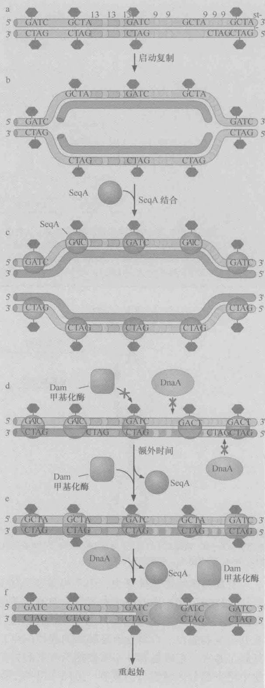

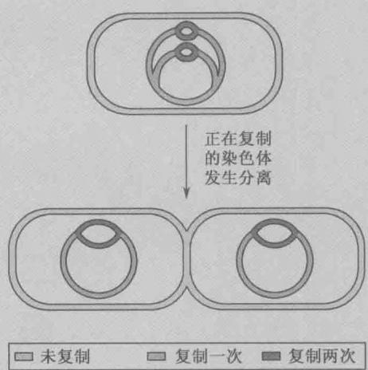  
框 9-5 图 2 在快速生长的细胞中复制起始位点的重起始先于细胞分裂。为了使基因组在每一轮细胞分裂前完全复制，细菌细胞必须在细胞分裂完成之前在其单起始位点上经常进行 DNA 复制的起始。这意味着分离到子细胞中的染色体仍在进行活跃的复制。这与真核细胞不同，真核细胞中在所有的 DNA 复制完成之前不进行染色体的分离。

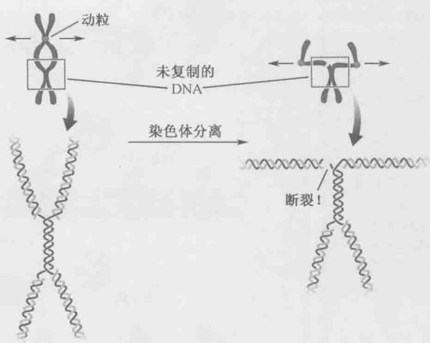  
图 9-28 DNA 复制不完整所导致的染色体断裂。图示显示的是不完全复制后染色体分离的结果。每个图片上面显示的都是完整的染色体。底部显示的是染色体在 DNA 水平上的断裂细节。（染色体分离详见第 7 章。）随着染色体被拉开，未复制的 DNA 上承受张力，导致染色体断裂。

对真核生物染色体来说，由于每条染色体上都有很多个复制起始位点，所以 DNA 复制且只能复制一次的要求对其非常具有挑战性。通常每隔 30kb 就有一个起点，所以即便是一个小的真核染色体，也可能含有超过 10 个复制起点，人的染色体则含有成千上万个复制起点。必须激活足够多的起始位点，以保证每个 S 期中每条染色体都被完全复制。通常，完成复制并不需要把所有的起始位点都激活，但是如果激活得太少，基因组中将有部分区域没有被复制。虽然在某些细胞分裂轮次中，有些可能的起始位点并没有被用到，但是没有一个已复制的复制起始位点可以重启动。因此，一个起始位点不管是被激活而使其自身复制，还是被邻近起始位点产生的复制叉所复制，它都必须失活，直至下一轮细胞分裂开始为止（图 9-29）。如果这些前提条件没有达到，则一个细胞周期内带有起始位点的 DNA 将被复制两次，将会打破真核 DNA 复制的“复制且仅复制一次”的原则。

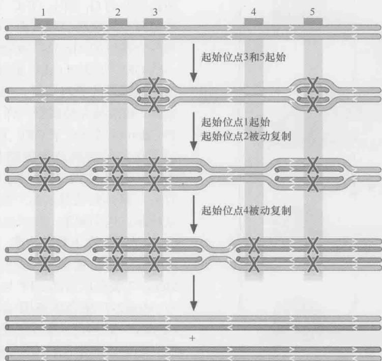  
图 9-29 DNA 复制使复制器失活。图示为带有 5 个复制器的真核染色体。标识为 3 和 5 的复制器首先被激活，导致两对双向复制叉的形成。亲代复制叉的激活导致两个子代 DNA 分子上这两个复制器的拷贝都失活，直至下一个细胞周期（用红色 × 表示）。复制叉继续延伸使与 2 号和 4 号复制器交叠的 DNA 被复制。如果一个复制器在尚未被启动的时候被邻近起始位点过来的复制叉复制，则称其为被动复制。虽然这些复制器并未被启动，但是它们仍然因其 DNA 的复制作用而失活（稍后我们将讨论，这是因为装载于起始点的解旋酶被移动过来的复制叉移除了）。相反，复制器 1 在启动之前邻近的复制叉并未抵达，它就能正常启动。复制器出现的数目多于完成 DNA 复制所需的复制器的数目，这是一种保证每条染色体都能完成复制的冗余形式。

#### [W] 装载解旋酶是真核细胞中复制起始的第一步

真核细胞中复制起始需要的两个步骤发生在细胞周期的不同时期内（第8章）。在复制器上装载解旋酶发生于 $G_{1}$ 期（早于S期）。复制器或起始位点的激活，包括解旋酶活化和复制体组装，仅在细胞进入S期后才发生。

装载解旋酶和起始位点激活的分离与原核细胞中的情况不同，原核细胞中起始因子结合到复制器 DNA 直接启动了 DNA 的解旋、装载解旋酶及复制体的组装。如我们下面所看到的那样，在真核细胞中，解旋酶装载与解旋酶激活、复制体组装这两个事件的短暂分离保证了在每个细胞周期中每条染色体仅仅复制一次（细菌细胞对此问题的解

  
图 9-30 真核生物解旋酶的装载。真核生物 DNA 复制解旋酶的装载是一个有序的过程，由 ATP 结合的起始位点识别复合体（ORC）与复制器的结合引发。ORC 与复制器结合后，就募集 ATP 结合的 Cdc6 和两个拷贝的 Mcm2-7 解旋酶并结合到解旋酶装载蛋白 Cdt1 上。这些蛋白的组装触发 Cdc6 水解 ATP，导致了 Mcm2-7 头对头二聚体的装载，以致它们将起始点 DNA 双链起点包围起来，并使得 Cdc6 和 Cdt1 从起始点上被释放。ORC 水解 ATP 可以重置该过程（图示为从 Mcm2-7 上释放）。ATP 和 ADP 的交换允许新一轮解旋酶的加载。

决方法不同，见框9-5）。

真核细胞装载解旋酶需要4个独立的蛋白质在复制器中完成（图9-30）。解旋酶装载的第一个步骤是复制器被真核起始子ORC识别，结合ATP。当细胞进入细胞周期的 $\mathrm{G}_{1}$ 期时，ORC与起始点结合，募集两个解旋酶装载蛋白（Cdc6和Cdt1）和两个拷贝的Mcm2-7解旋酶。有趣的是，一些ORC亚基和Cdc6蛋白与DnaC和滑动夹装载器的亚基一样，都是AAA+家族成员。和滑动夹装载器一样，ATP与ORC和Cdc6的结合对于ORCDNA结合、稳定募集的解旋酶及解旋酶装载蛋白是必需的。Cdc6水解ATP导致了Mcm2-7头对头二聚体的装载，这一复合物将DNA双链起点包围起来。在该过程中，Cdt1和Cdc6从起始点上释放出来。ORCATP的水解可以重置该过程并允许新一轮Mcm2-7装载以启动ATP与ORC的结合。与Mcm2-7复合体包围dsDNA而不是ssDNA一致的是，真核解旋酶的装载并不能立刻导致起始位置DNA的解旋。相反，解旋酶在 $\mathrm{G}_{1}$ 期装载，但是只有细胞从 $\mathrm{G}_{1}$ 期进入到S期时，解旋酶才被激活使DNA解旋并起始复制。

装载的解旋酶被两种蛋白激酶——CDK(细胞周期依赖性激酶)和DDK(Dbf4依赖性激酶)激活（图9-31）。蛋白激酶（protein Kinase）是可将磷酸基团共价连

接到靶蛋白上的蛋白质（第13章）。这些激酶只有在细胞进入S期以后才能被激活。当其被激活后，DDK作用于已装载的解旋酶，而CDK则作用于其他两种复制酶。这些蛋白质的磷酸化导致Cdc45和GINS蛋白结合到Mcm2-7解旋酶（图9-31）。重要的是，Cdc45和GINS强烈地促进Mcm2-7ATPase和解旋酶的活性，并共同形成Mcm2-7DNA解旋酶活性形式——Cdc45-Mcm2-7-GINS(CMG)复合体。尽管解旋酶最初装载到dsDNA上形成头对头的二聚体，但是在复制叉上解旋酶被认为是环绕着ssDNA的单一Mcm2-7六聚体。因此，在活化阶段，DNA的一条链需要从每个解旋酶的中心通道解离出来，而两个Mcm2-7复合体的相互作用会破裂（图9-32）。三种真核DNA聚合酶以特定的顺序在起始位点组装。在DNA解旋前，DNA Polε与Cdc45和GINS同时结合在起点上。相反，DNA Pol δ 和 DNA Pol α/引物酶在募集到起始点之前都要求 DNA 解旋。此顺序保证了 3 种 DNA 聚合酶在起始位点的出现都先于首个 RNA 引物合成（由 DNA Pol α/引物酶进行）。

  
图 9-31 激活装载的解旋酶导致真核复制体的组装。当细胞进入细胞周期的 S 期时，两种蛋白激酶——CDK 和 DDK 被激活。DDK 使装载的 Mcm2-7 解旋酶磷酸化，而 CDK 使 Sld2 和 Sld3 磷酸化。磷酸化的 Sld2 和 Sld3 与 Dpb11 结合，这些蛋白质导致解旋酶激活蛋白 Cdc45 和 GINS 与解旋酶结合。Cdc45 和 GINS 与 Mcm2-7 解旋酶形成一种稳定的复合物（称为 Cdc45/Mcm2-7/GINS 或 CMG 复合体），并极大地促进了 Mcm2-7 解旋酶的活性。前导链 DNA 聚合酶（ε）被招募到此时的解旋酶上（DNA 解旋之前）。在 CMG 复合物形成后，Sld2、Sld3 和 Dpb11 从起始位点释放。DNA Pol α/引物酶和 DNA Pol δ（主要作用于后随链）只能在 DNA 解旋后被召募。将 DNA 聚合酶维持在复制叉上的蛋白质-蛋白质相互作用力仍然知之甚少。

在起始位点组装的蛋白质只有部分仍作为真核复制体的一部分继续起作用。CMG复合体和三种DNA聚合酶成为复制叉机器的部件。与E.coli DNA解旋酶装载器(DnaC)类似，其他因子（如Cdc6和Cdt1）只是参与复制叉蛋白的组装，在其作用结束之后被释放或被破坏（图9-31）。

#### [W] 对解旋酶装载和激活的调控使每个细胞周期中仅有一轮复制发生

真核细胞如何对数以百计甚至数以千计的复制起始位点进行活性控制，以使得在一个细胞周期中甚至没有一个位点被激活超过一次？答案在于在每个细胞周期中发生的两种复制状态之间的相互转换。在 $G_{1}$ 期，细胞处于解旋酶装载阶段，可以进行解旋酶的装载但是不能激活已组装好的解旋酶。而进入 S 期以及之后的 $G_{2}$ 和 M 期时，在 $G_{1}$ 期装载的解旋酶可以被激活，而新的解旋酶的装载则受到了严格的抑制（图 9-33）。重要的是，对于解旋酶装载和激活的条件并不适用于另一种解旋酶。尽管在不同机体中的精确的机制是各不相同，但是在所有活跃分裂的真核细胞中的调控机制是相同的。因此，在每个细胞周期中，对于解旋酶而言，仅有一次机会可以装载到起始点上（ $G_{1}$ 期），而装载的解旋酶也只有一次机会被激活（在S期、 $G_{2}$ 期和M期，尽管实际上，S期时所有装载好的解旋酶都被复制叉激活或破坏）。只有在细胞分离它们的复制染色体并分开后，它们才可以重新进入 $G_{1}$ 期并在起始点上装载新的解旋酶。

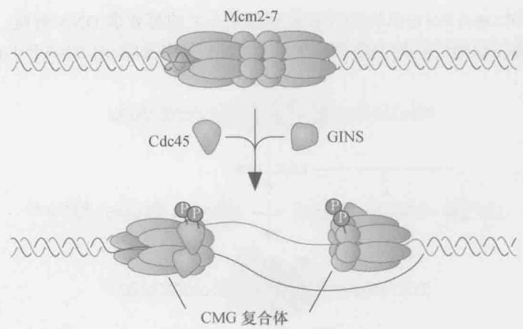  
图 9-32 解旋酶激活改变解旋酶的相互作用。在解旋酶激活之前，装载的解旋酶以头对头的双六聚物形式包围双链 DNA（由 Mcm2-7 氨基末端相互作用介导）。解旋酶激活后，CMG 复合物的 Mcm2-7 蛋白质转向包围单链 DNA，两个 Mcm2-7 复合物之间的相互作用被打破。

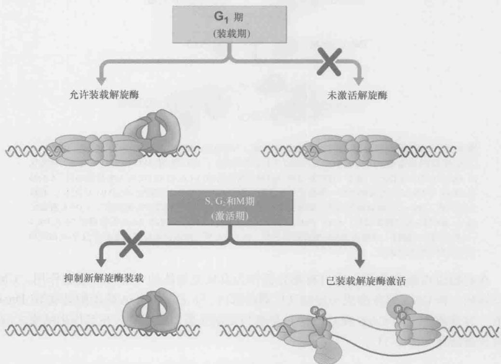  
图 9-33 在不同细胞周期真核解旋酶的装载和活化。在细胞周期的 $G_{1}$ 期，允许装载解旋酶，但是解旋酶的活化被抑制。而在剩余的细胞周期中（S 期， $G_{2}$ 期和 M 期），解旋酶的装载被抑制，而已装载的解旋酶能被激活（该过程只在 S 期发生，因为在 S 期后所有装载的 Mcm2-7 复合物将会从 DNA 上移除；见图 9-29）。

该调控是如何完成的？在出芽期的啤酒酵母中，该调控与 CDK 的功能有紧密的关系（图 9-34）。这些酶在调控复制时的功能是相互对立的。首先，如上面描述的，这些酶是激活装载的解旋酶从而起始 DNA 的复制。其次，CDK 的活性抑制了解旋酶的装载。当考虑到上述调控时，这些不同的角色允许一种酶来控制复制起始两种状态的相互转换。在 G₁ 期时 CDK 的水平很低，因而可以允许解旋酶的装载，但是阻止解旋酶的激活。进入 S 期伴随着 CDK 活性的迅速升高，从而激活装载好的解旋酶同时阻止新的解旋酶的装载。重要的是，在细胞周期的剩余时期（S 期、G₂ 期和 M 期），CDK 的水平依然是升高的。

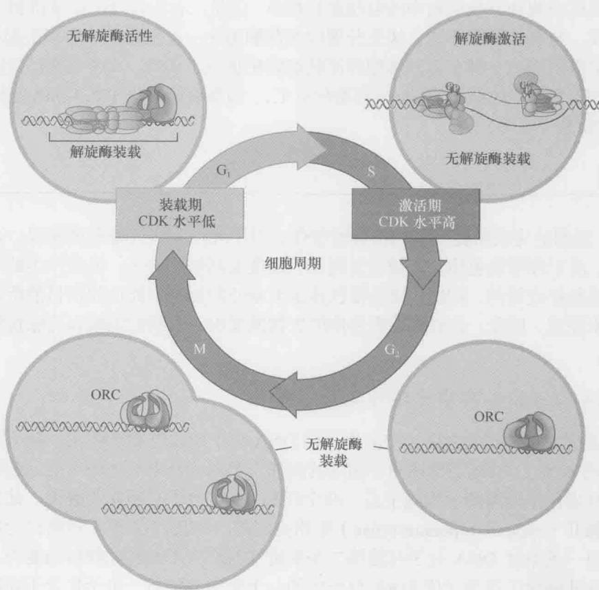  
图 9-34 在细胞周期中 CDK 活性调控复制。在啤酒酵母细胞中，CDK 水平严格调控着解旋酶的装载和活化。 $G_{1}$ 期，CDK 水平低，新的解旋酶复合体虽能形成但是却不能被激活（因为该活化行为需要 CDK 的参与）。在 S 期，活性水平提高的 CDK 引发 DNA 复制的起始并阻止任何在刚复制的 DNA 上的新解旋酶复合体形成。解旋酶被用于复制起始之后，不进入复制叉并从起始点解离。类似地，对与解旋酶相连的 DNA 的复制也引起复合体的解体（未显示）。因为 CDK 在有丝分裂结束之前一直保持高水平，所以在染色体完成分离之前不再形成任何新的解旋酶复合体。无新的解旋酶复合体形成，复制重新起始是不可能发生的。

装载好的解旋酶在复制叉完成 DNA 合成后，或它们所结合的 DNA 被复制之后被释放出来（通过在相邻起点上的复制叉，图 9-29）。这些暴露的复制器随后用于新解旋酶复合体的形成并迅速结合上 ORC。尽管这些位点上存在起始子，但 S 期、 $G_{2}$ 期和 M 期细胞中高活性水平的 CDK 阻止了 ORC、Cdc6 和 Cdt1 的功能。只有当细胞将其染色体分离且完成细胞分裂的时候，CDK 的活性才消失，新一轮的解旋酶装载才能够开始。

#### [W] 真核和原核生物 DNA 复制起始的相似性

现在我们已经描述了在真核细胞和原核细胞中的复制起始，很明显，在两种情况下复制起始有共同的特点。第一步是起始子蛋白对复制器的识别。起始子蛋白和一个或多个解旋酶装载蛋白共同将 DNA 解旋酶募集到复制器上。解旋酶（和真核细胞中起始位点上其他潜在的蛋白质）产生单链 DNA 区域，作为 RNA 引物合成的模板。当引物合成后，复制体的其他元件通过与形成的引物-模板接头相互作用进行组装。

尽管真核细胞和原核细胞中的复制起始相似，但是二者所涉及的调节机制是完全不同的。例如，与真核细胞不同，快速分裂的细菌细胞在一次细胞循环内多次起始复制。复制调节中最严谨的步骤在真核细胞和原核细胞中也是不同的。真核细胞对复制的调节集中在 MCM 解旋酶装载到 DNA 的起始位点上，而细菌细胞集中在 DnaA 起始蛋白与 DNA 的结合上（框 9-5）。

#### [W] 结束复制

DNA 复制的完成需要一系列特殊的事件。对于环形和线性染色体来说，这些事件是不同的。对于环形染色体，常规的复制叉机器能复制整个分子，但是产生的子代分子之间是相互拓扑连接的。相反，线性染色体最末端处的复制不能由我们目前所讨论的复制叉机器来完成。因此，含有线性染色体的生物发展出一套新的策略以克服这种末端复制的问题。

#### [W] 子代 DNA 分子的分离需要拓扑异构酶Ⅱ

环形染色体复制完成之后，产生的子代 DNA 分子如铰链般连接在一起（图 9-35；第 4 章，图 4-23）。铰链是描述两个相连的圆环（类似于链中的连环）的一般性术语。为了使这些染色体分离到子细胞中去，两个环形 DNA 分子必须相互脱离。此分离是由拓扑异构酶Ⅱ（type II topoisomerase）作用完成的。如我们在第 4 章所讨论的，这些酶具有断裂一条双链 DNA 分子并使第二条双链 DNA 分子通过此缺口的能力。这样，拓扑异构酶Ⅱ催化了两个子代 DNA 分子中的一个断裂并使另一个子代分子通过这个缺口。此反应使两个子代染色体解开铰环，并使它们分配到两个分离的细胞中。

虽然此活性对环形染色体的分离的重要性毋庸置疑，但是拓扑异构酶Ⅱ的活性对于大的线性分子分离也很重要。尽管线形分子复制之后本身并无拓扑学连接，但是体积巨大的真核生物染色体必须将DNA折叠成环并与蛋白质支架连接（第8章，图8-32b）。这种连接导致在两个子代染色体分离时会遇到很多与环形染色体分离同样的问题。如同

环形 DNA, 拓扑异构酶 II 也能使这些连接的 DNA 分离。

后随链的合成不能复制线性染色体的最末端

所有新的 DNA 合成启动都需要一条 RNA 引物，这使线性染色体末端的复制成为难题，这种情况被称为末端复制问题（end replication problem）（图 9-36）。对前导链模板复制来说不存在这种问题。在这种情况下，一条内部的 RNA 引物即可指导 DNA 链的起始并能延伸到其模板的 5' 末端。与此相反，后随链合成的完成需要多条引物，这意味着不能产生一条完整拷贝的模板。即使是在冈崎片段合成的最后一个 RNA 引物的末端与后随链模板上最末端的碱基对退火的情况下，当此 RNA 引物被去除以后，在染色体末端仍将有一小段未复制的单链 DNA（RNA 引物长度）。尽管截短发生在两条子代 DNA 中的一条，但是在下一轮复制完成后，两条子代 DNA 都会发生截短。这意味着每一轮 DNA 复

  
图 9-35 拓扑异构酶Ⅱ催化复制产物的解环。当一个环形 DNA 复制后，产生的子代 DNA 分子仍保持相互连接。DNA 拓扑异构酶Ⅱ能够有效地使 DNA 环分开（或解环）。

制都将出现两条子代 DNA 分子中的一条被截短的情况。很显然，这种情况将破坏遗传物质从一代向另一代的完整传递。尽管缓慢，但是最终染色体末端的基因将会丢失。

细胞解决末端复制问题有各种各样的方法。一种解决方法是用蛋白质代替 RNA 作为每个染色体末端最后一个冈崎片段的引物（图 9-37）。在这种情况下，“引物蛋白”与后随链模板结合并用一个氨基酸来提供 -OH（通常为酪氨酸），以代替正常情况下 RNA 引物提供的 3'-OH。通过与最后的后随链结合，引物蛋白与染色体的 3' 端形成共价连接。这种在末端连接复制蛋白质的情况，在某些具线性染色体的细菌（多数细菌是环形染色体）的染色体末端，以及在某些具线性染色体的细菌病毒和动物病毒的染色体末端都有发现。

多数真核细胞使用完全不同的方法来复制其染色体末端。如我们在第8章所述，真核生物染色体的末端称为端粒(telomere)，它们通常由首尾相接的、富含TG的DNA序列构成。例如，人端粒含有很多首尾相接的重复序列5'-TTAGGG-3'。虽然这种重复序列很多都是双链的，但是每条染色体的3'端都位于其5'端之外成为单链DNA。这种独特的结构可作为新的复制起始位点以弥补末端复制问题。此起始位点不与其他真核生物的起始蛋白相互作用，而是募集一个称为端粒酶（telomerase）的特殊DNA聚合酶。

  
图 9-36 末端复制问题。当后随链复制机器到达染色体末端时，有时引物酶没有足够的空间去合成新的 RNA 引物。这导致复制的不完整和后随链 DNA 产物上 3' 端形成一小段单链 DNA。当此 DNA 产物在下一轮被复制的时候，两个产物中的一个将变短，在上一轮复制中没有被复制的区域将丢失。

  
图 9-37 蛋白质引物是解决末端复制问题的一个办法。通过与 DNA 聚合酶和模板 3'端的结合，蛋白质提供具引物作用的羟基基团以起始 DNA 的合成。在所示的例子中，蛋白质如在很多病毒中所见到的那样成为 DNA 合成的引物。对于较长的 DNA 分子来说，此方法结合传统的起始位点处的复制方法来使染色体进行复制。

#### [W] 端粒酶是一种不需要外源模板的新型 DNA 聚合酶

端粒酶（telomerase）是一种特殊的酶，它既含有多蛋白亚基，也含有RNA成分（所以这是一个核糖核蛋白的例子，见第5章）。与其他所有DNA聚合酶相同的是，端粒酶用于延伸其DNA底物的3'端。但与大多数DNA聚合酶不同的是，端粒酶不需要外源性DNA模板来指导dNTP的添加，而是利用其RNA成分作为模板，将端粒序列添加到染色体末端的3'端。端粒酶利用其自身的RNA作为模板，特异性地延伸特定单链DNA序列的3'-OH。这一特殊机制的结果是，新合成的DNA为单链DNA。

端粒酶发挥特殊功能的关键所在是该酶的 RNA 组分，称为端粒酶 RNA 或 TER，在不同物种中，TER 大小从 150 到 1300 碱基不等。在所有生物中，此 RNA 序列含有 1.5 拷贝的完整端粒序列（对人而言，此序列是 5'-TAACCCTAA-3'），能与端粒 3' 端的单链 DNA 退火（图 9-38）。退火发生的方式是 RNA 模板的一部分保持单链，形成端粒酶发挥作用的引物-模板接头。端粒酶的一个蛋白质亚属于 DNA 聚合酶，这种 DNA 聚合酶使用 RNA 模板，称为反转录酶（此亚基称为端粒酶反转录酶或 TERT）。如我们将在第 12 章所看到的，这些酶将 RNA 反转录成 DNA，而不是较常规的 DNA 转录成 RNA。采用 RNA 模板，TERT 合成 DNA 至 TER 模板的末端，但是不能继续复制此 RNA 之外的序列。此时 RNA 模板与 DNA 产物解离，再次与端粒上的最后 4 个核苷酸退火，然后重复此过程。

端粒酶的特性在某种程度上来说具有其独特性，但与其他 DNA 聚合酶仍然非常类似。端粒酶含有 RNA 成分、不需要外源性模板，以及能够使用单纯的单链 DNA 底物的特点，使其与其他 DNA 聚合酶相区别。此外，端粒酶还具有将其 RNA 模板从 DNA 产物上去除的能力，以重复进行模板指导下的合成。通常，这意味着端粒酶有 RNA-DNA 解旋酶活性。另一方面，与其他所有的 DNA 聚合酶相同，端粒酶也需要模板来指导核苷酸的添加，只能延长 DNA 的 3' 端、使用同样的核苷酸前体、具有持续延伸能力、每次与 DNA 底物结合后可添加很多重复序列。框 9-6 讨论了端粒酶在调节细胞生长和细胞衰老过程中的作用。

#### [W] 端粒酶通过延伸染色体 3' 端解决了末端复制问题

当端粒酶作用于端粒的 3'端时，它仅能延伸染色体两条链中的一条。那么，5'端是怎样延伸的呢？此工作是由后随链 DNA 复制机器来完成的（图 9-39）。通过提供一个延伸的 3'端，端粒酶为后随链复制机器的作用提供了额外的模板。用端粒酶延伸的 3'端作为模板，RNA 引物进行合成和延伸，使细胞也能有效地增加染色体 5'端的长度。

即便是在后随链复制机器作用后，染色体末端仍有一小段单链 DNA 区域。事实上，3'端凸出尾巴的存在对端粒的末端保护功能可能很重要（如下所述）。然而，端粒酶和后随链复制机器的作用，能够保证端粒维持在足够的长度以保护染色体末端不会变得太短。由于端粒 DNA 的重复性及非蛋白编码特性，细胞可以耐受不同长度的端粒存在。

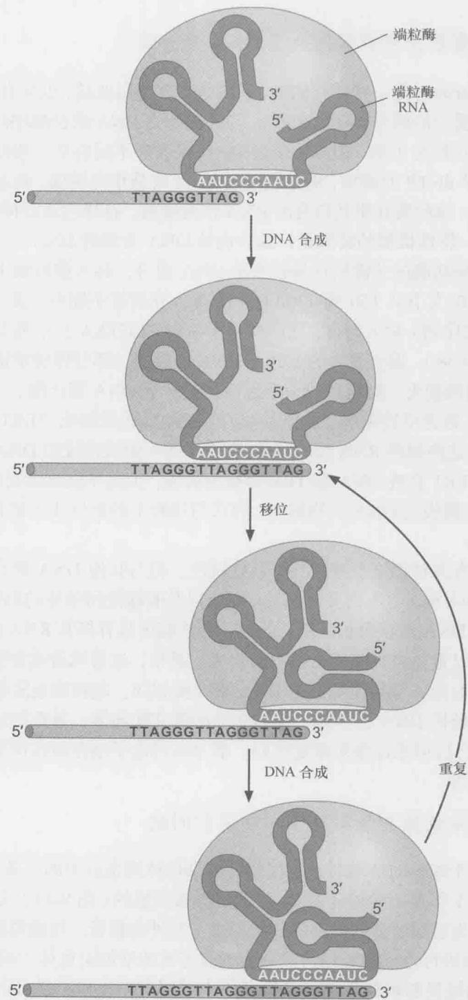  
图 9-38 端粒酶进行的端粒复制。端粒酶用其 RNA 成分与端粒单链 DNA 区域的 3' 端退火。随后用其反转录酶活性合成 DNA 至 RNA 模板末端。然后端粒酶将 RNA 从 DNA 产物上移去并重新结合到端粒的末端，重复上述过程。

#### [W] 框 9-6 老化、癌症和端粒假说

所有的生物都终归面临死亡。无论是只能存活几天或几周的较小生物，还是能与人类一样存活许多年的生物都不能摆脱既定的死亡。正如所料，研究人员（和其他人）一直在研究这些限制，希望能理解（或许克服）它们，寻找传说中的“青春之泉”。

当研究人员研发出体外细胞生长的方法时，他们认为这些细胞可以永生化。这提示死亡是机体而不是细胞的问题。在 Leonard Hayflick 仔细研究培养细胞的分裂后，这种假设就站不住脚了。他们发现即使在独立培养中，细胞的分裂次数也是有限的。有趣的是，Hayflick 的研究发现细胞能够分裂的有限次数是该源头细胞的一种特性，现在被称为 “Hayflick 极限”。

Hayflick 的研究引出了关于细胞携带着一个内在的倒计时计时器来限制细胞分裂次数的想法。当这个钟到达零的时候，细胞将被阻止再次分裂。多年来这个时钟分子一直不为人知，然而，端粒的性质及其在 DNA 复制中的作用已了解得较为透彻，人们渐渐明确端粒很可能就是长久以来梦寐以求的分裂计数钟。与这个想法一致，从年轻人分离出来的端粒 DNA 比老年人长。这个观察提出了端粒 DNA 的长度限制了细胞分裂次数的假说。

虽然这个概念仍然是一个假说，但支持端粒与细胞老化相关的实验数据却在增加。例如，如果假说可行，正常细胞应该只有很少或者没有端粒酶活性，否则这些细胞就会简单地在端粒变短的时候延长它们的端粒。确实，很多正常细胞只有非常有限的端粒酶活性。相反的，细胞增殖能力增加，如干细胞和肿瘤来源细胞，都有较高的端粒酶活性。事实上，对肿瘤细胞的培养研究表明，它们可以无限增殖。第二个重要的支持该模型的实验表明，在正常细胞中表达端粒酶能有效地使细胞永生化。

肿瘤细胞中端粒酶活性升高这一发现提出了一个假设，认为端粒可作为抑制失去正常生长控制细胞的增殖能力的方法。如果真如此，那么就可以解释为什么多细胞生物不允许在所有的细胞中存在端粒酶活性。事实上，已有很多研究在努力寻求抑制端粒酶活性的抑制剂作为化疗药物。端粒酶活性在肿瘤细胞中的升高同时也提示，全面活化端粒酶活性很可能不是一种明智的、追求永生化的选择。

#### [W] 端粒结合蛋白调节端粒酶活性和端粒长度

端粒酶是一种结合于端粒双链区、能调节端粒长度的蛋白质，理论上，端粒酶可以无限制地延长端粒（图 9-40）。在酵母细胞中，结合在端粒上的蛋白质是端粒酶活性的弱抑制剂（图 9-41）。当端粒序列重复拷贝较少时，较少的蛋白质与端粒结合，端粒酶可以延长端粒的 3'羟基末端。随着端粒的逐渐增长，更多的端粒结合蛋白聚积并且抑制端粒酶

  
图 9-39 端粒酶对端粒 3' 端的延伸解决了末端复制问题。虽然端粒酶只能通过为后随链 DNA 合成提供新增的模板来直接延伸端粒的 3' 端，但染色体的两个末端都得到了延伸。

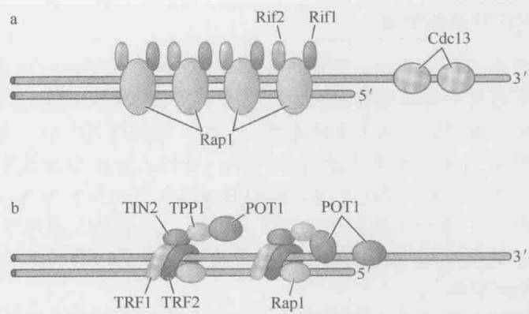  
图 9-40 端粒结合蛋白。端粒结合蛋白调节端粒酶活性在酵母和人细胞中的图示。（a）酵母细胞。Rap1 直接和端粒双链重复 DNA 结合，而 Rif1 和 Rif2 通过与 Rap1 的结合间接地与端粒发生作用。这三种蛋白质均抑制端粒酶活性。Cdc13 和端粒单链重复 DNA 结合，在端粒酶的募集中起作用。（b）人细胞。TRF1 和 TRF2 直接结合到端粒双链重复 DNA 上。人细胞中 Rap1 的同源蛋白以及 TIN2、TPP1 和 POT1 都与 TRF1 和 TRF2 相互作用。这些蛋白质一起形成一个复合体，使端粒逃脱 DNA 修复酶的作用而保护端粒，此复合体被命名为 “Shelterin”。POT1 同样能直接和端粒单链重复 DNA 结合并抑制端粒酶活性。

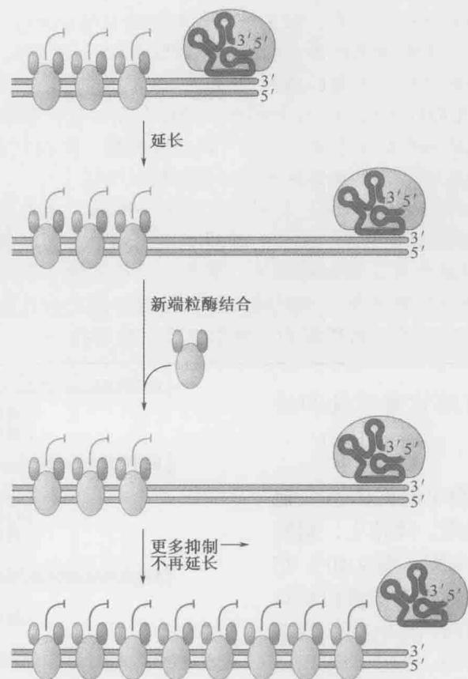  
图 9-41 端粒结合蛋白调节端粒的长度。端粒相对较短时，出现少量端粒结合蛋白并对端粒酶有较弱的抑制作用。在此情况下，端粒酶可以延长端粒的3'端。当这些区域由后随链DNA合成机器作用变成双链结构时，其他端粒结合蛋白可以与端粒相互作用。这些蛋白的结合增强了对端粒酶的抑制作用，阻止了端粒酶的进一步延伸。（经允许改编，源自Smogorzeska and de Lange T. 2004. Annu. Rec. Biochem. 73: 177-208. Fig. 3a. © Annual Reviews）

延长端粒的 3'羟基末端。这一简单的负反馈机制（长端粒抑制端粒酶）是维持端粒在所有染色体末端具有相同长度的强有力的方法。

结合蛋白识别单链形式的端粒同样能调节端粒酶活性。在酵母细胞中，Cdcl3蛋白与端粒的单链区结合，研究表明，该蛋白质募集端粒酶到端粒上，因此Cdcl3是端粒酶的正向激活因子。相反，结合到端粒单链DNA上的人体蛋白POT1，则是端粒酶活性的抑制因子，缺少该蛋白质的细胞，端粒DNA的长度大大增加。有趣的是，该蛋白质间接地和人细胞中端粒双链结合蛋白相互作用。研究已经表明端粒长度越长，募集越多的TOP1结合在端粒的单链DNA末端，抑制端粒酶活性。

#### [W] 端粒结合蛋白保护染色体末端

端粒结合蛋白除调节端粒酶功能之外，还对保护染色体末端至关重要。通常认为在细胞中，DNA末端的存在是DNA中双链断裂的标记，该断裂是DNA修复机器的靶位点（见第10章）。这种修复最常见的结果是启动基因组上DNA之间的重组（在二倍体细胞中，这种重组以断裂染色体的完整拷贝为靶位点）。但是这种重组只适于DNA随机断裂，如果端粒参与该重组事件将会产生严重后果。以修复双链DNA断裂的方式来修复端粒会导致染色体融合，最终导致染色体随机断裂。

是什么在保护端粒逃脱这种命运呢？简单来说，结合在端粒上的蛋白质将端粒同细胞中其他 DNA 末端区分开来。这些蛋白质的减少将导致端粒被误认为是正常的 DNA 断裂。一种简单有效的保护方法是用结合在其上的蛋白质包被端粒。对人类端粒结构的研究提供了另一种保护方法。电镜观察到从人类细胞中分离的端粒是环状结构而非线性结构（图 9-42a），后续分析显示该结构（称为 t 环）是由端粒的 3'单链 DNA 末端向端粒的双链 DNA 区域插入产生的（图 9-42b）。我们推测，形成 t 环后端粒末端被包裹起来，不能被识别为正常 DNA。有趣的是，纯化的 TRF2 能够指导纯化的端粒 DNA t 环结构的形成。

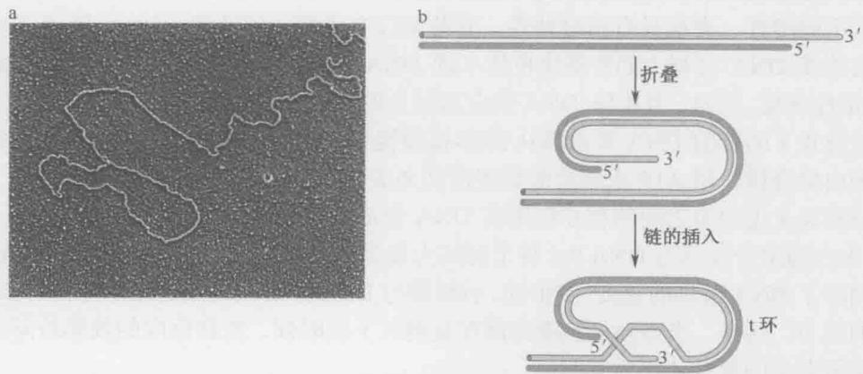  
图 9-42 细胞中端粒环状结构的形成。(a) 人类细胞中分离到的端粒的电镜图。DNA 末端环包括端粒末端的单链 DNA，即文中提到的 t 环。图中右上角的 DNA 末端与染色体剩余部分结合。(经允许再版，源自 Griffith J. D. et al. 1999. Cell 97: 503-514. Fig. 3f © Elsevier) (b) t 环形成机制。首先端粒折叠使端粒末端的单链 DNA 接近端粒的双链 DNA 重复区。一旦单链 DNA 恰当定位，将插入双链 DNA 重复序列，代替双链 DNA 另一条链与互补链形成螺旋。该现象称为置换环，是同源重组中常见的中间体（见第 11 章）。端粒结合蛋白和其他细胞蛋白（如重组蛋白）共同作用促进该过程的发生。注意，若端粒变短，此折叠不易发生。

t 环结构与端粒长度的控制有关。正如环状结构可以保护端粒不被 DNA 修复酶修复一样，端粒酶不能识别环状端粒，因为其缺少明显的单链 3'末端。有人提出，端粒长度越短，就越难形成 t 环结构，因此细胞内出现更多的端粒 3'末端。

<!-- W-END Watson 9 DNA的复制 -->

<!-- L-BEGIN Lehninger 25.1 -->

### 【英文对应 Lehninger §25.1：DNA Replication】

> 来源：Lehninger Principles of Biochemistry（书籍/02_生物化学原理） 第25章 DNA Metabolism，§25.1。

P1 Long before the structure of DNA was known, scientists wondered at the ability of organisms to create faithful copies of themselves and, later, at the ability of cells to produce many identical copies of large, complex macromolecules. Speculation about these problems centered around the concept of a template, a structure that would allow molecules to be lined up in a specific order and joined to create a macromolecule with a unique sequence and function. The 1940s brought the revelation that DNA was the genetic molecule, but not until James Watson and Francis Crick deduced its structure did the way in which DNA could act as a template for the replication and transmission of genetic information become clear: one strand is the complement of the other. The strict base-pairing rules mean that each strand provides the template for a new strand with a predictable and complementary sequence (see Figs. 8-14, 8-15). The fundamental properties of the DNA replication process and the mechanisms used by the enzymes that catalyze it have proved to be essentially identical in all species.

#### [EN] DNA Replication Follows a Set of Fundamental Rules

Early research on bacterial DNA replication and its enzymes helped to establish several basic properties that have proven applicable to DNA synthesis in every organism.

DNA Replication Is Semiconservative P1 Each DNA strand serves as a template for the synthesis of a new strand, producing two new DNA molecules, each with one new strand and one old strand. This is semiconservative replication. The semiconservative nature of replication was established by Matthew Meselson and Frank Stahl in 1957.

Replication Begins at an Origin and Usually Proceeds Bidirectionally Following the confirmation of a semiconservative mechanism of replication, a host of questions arose. Are the parent DNA strands completely unwound before each is replicated? Does replication begin at random places or at a unique point? After initiation at any point in the DNA, does replication proceed in one direction or both?

Photographic images of tritium ( $^{3}$ H)-labeled bacterial DNA made by John Cairns revealed that the intact chromosome of E. coli is a single huge circle, 1.7 mm long. Radioactive DNA isolated from cells during replication showed an extra loop (Fig. 25-1). Cairns concluded that the loop resulted from the formation of two radioactive daughter strands, each complementary to a parent strand. One or both ends of the loop are dynamic points, termed replication forks, where parent DNA is being unwound and the separated strands quickly replicated. Cairns's results demonstrated that both DNA strands are replicated simultaneously, and variations on his experiment showed that replication of bacterial chromosomes is bidirectional: both ends of the loop have active replication forks.

  
FIGURE 25-1 Visualization of DNA replication. Stages in the replication of circular DNA molecules have been visualized by electron microscopy. Replication of a circular chromosome produces a structure resembling the Greek letter theta, $\theta$ , as both strands are replicated simultaneously (new strands shown in light red). The electron micrographs show images of plasmid DNA being replicated from a single replication origin. [Electron micrographs: Cairns, J. (1963), The Chromosome of Escherichia coli, Cold Spring Harbor Symp Quant Biol, 28, 43–46. © Cold Spring Harbor Laboratory Press.]

Determination of whether the replication loops originate at a unique point in the DNA required landmarks along the DNA molecule. These landmarks were provided by a technique called denaturation mapping, developed by Ross Inman and colleagues. Using the 48,502 bp chromosome of bacteriophage $\lambda$ , Inman showed that DNA could be selectively denatured at sequences unusually rich in A=T base pairs, generating a reproducible pattern of single-strand bubbles (see Fig. 8-28). Using the denatured regions as points of reference, investigators have subsequently been able to measure the position and progress of the replication forks. Inman and colleagues found that the replication loops always initiated at a unique point, which was termed an origin. They also confirmed the earlier observation that replication is usually bidirectional. For circular DNA molecules, the two replication forks meet at a point on the side of the circle opposite to the origin. Specific origins of replication have since been identified and characterized in bacteria and eukaryotes.

DNA Synthesis Proceeds in a 5'→3' Direction and Is Semidiscontinuous A new strand of DNA is always synthesized in the 5'→3' direction, with the free 3'-OH as the point at which the DNA is elongated. (Recall from Chapter 8 that the 5' end lacks a nucleotide attached to the 5' position, and the 3' end lacks a nucleotide attached to the 3' position.) Because the two DNA strands are antiparallel, the strand serving as the template is read from its 3' end toward its 5' end.

If synthesis always proceeds in the $5'\rightarrow3'$ direction, how can both strands be synthesized simultaneously? If both strands were synthesized continuously while the replication fork moved, one strand would have to undergo $3'\rightarrow5'$ synthesis. This problem was resolved by Reiji Okazaki and colleagues in the 1960s. Okazaki found that one of the new DNA strands is synthesized in short pieces, now called Okazaki fragments. Thus, one strand is synthesized continuously and the other discontinuously (Fig. 25-2). The continuous strand, or leading strand, is the one for which $5'\rightarrow3'$ synthesis proceeds in the same direction that the replication fork moves. The discontinuous strand, or lagging strand, is the one in which $5'\rightarrow3'$ synthesis proceeds in the direction opposite to the direction of fork movement. Okazaki fragments are typically 150 to 200 nucleotides long in eukaryotes, and 1,000 to 2,000 nucleotides long in bacteria. As we shall see, leading and lagging strand syntheses are tightly coordinated.

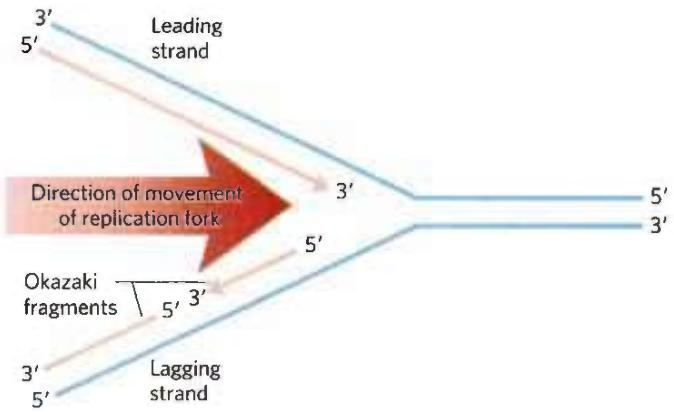  
FIGURE 25-2 Defining DNA strands at the replication fork. A new DNA strand (light red) is always synthesized in the $5'\rightarrow3'$ direction. The template is read in the opposite direction, $3'\rightarrow5'$ . The leading strand is continuously synthesized in the direction taken by the replication fork. The other strand, the lagging strand, is synthesized discontinuously in short pieces (Okazaki fragments) in a direction opposite to that in which the replication fork moves. The Okazaki fragments are spliced together by DNA ligase. In bacteria, Okazaki fragments are $\sim1{,}000$ to 2,000 nucleotides long. In eukaryotic cells, they are 150 to 200 nucleotides long.

#### [EN] DNA Is Degraded by Nucleases

To explain the enzymology of DNA replication, we first introduce the enzymes that degrade DNA rather than synthesize it. These enzymes are known as nucleases, or DNases if they are specific for DNA rather than RNA. Every cell contains several different nucleases, belonging to two broad classes: exonucleases and endonucleases. Exonucleases degrade nucleic acids from one end of the molecule. Many operate in only the 5'→3' direction or the 3'→5' direction, removing nucleotides only from the 5' end or the 3' end, respectively, of one strand of a double-stranded nucleic acid or of a single-stranded DNA. Endonucleases can begin to degrade at specific internal sites in a nucleic acid strand or molecule, reducing it to smaller and smaller fragments. A few exonucleases and endonucleases degrade only single-stranded DNA. A few important classes of endonucleases cleave only at specific nucleotide sequences (such as the restriction endonucleases that are so important in biotechnology; see Chapter 9, Fig. 9-2). You will encounter many types of nucleases in this and subsequent chapters.

#### [EN] DNA Is Synthesized by DNA Polymerases

  
Arthur Kornberg, 1918–2007
[World History Archive/Alamy.]

The search for an enzyme that could synthesize DNA began in 1955. Work by Arthur Kornberg and colleagues led to the purification and characterization of a DNA polymerase from E. coli cells, a single-polypeptide enzyme now called DNA polymerase I ( $M_{r}$ 103,000; encoded by the polA gene). Much later, investigators found that E. coli contains at least four additional distinct DNA polymerases, described below.

Detailed studies of DNA polymerase I revealed features of the DNA synthetic process that are now known to be common to all DNA polymerases. The fundamental reaction is a phosphoryl group transfer. The nucleophile is the 3'-hydroxyl group of the nucleotide at the 3' end of the growing strand. Nucleophilic attack occurs at the $\alpha$ phosphorus of the incoming deoxynucleoside 5'-triphosphate (Fig. 25-3). Inorganic pyrophosphate is released in the reaction. The general reaction is

$$
\begin{array}{c} (\mathrm{dNMP}) _ {n} + \mathrm{dNTP} \longrightarrow (\mathrm{dNMP}) _ {n + 1} + \mathrm{PP} _ {\mathrm{i}} \\ \text {DNA} \end{array}\tag{25-1}
$$

where dNMP and dNTP are a deoxynucleoside 5'-monophosphate and 5'-triphosphate, respectively. Catalysis by virtually all DNA polymerases prominently involves two $Mg^{2+}$ ions at the active site. One of these helps to deprotonate the 3'-hydroxyl group, rendering it a more effective nucleophile. The other binds to the incoming dNTP and facilitates departure of the pyrophosphate.

P2 The reaction seems to proceed with only a minimal change in free energy, given that one phosphodiester bond is formed at the expense of a somewhat less stable phosphate anhydride. However, noncovalent base-stacking and base-pairing interactions provide additional stabilization to the lengthened DNA product relative to the free nucleotide. Also, the formation of products is facilitated in the cell by the 19 kJ/mol generated in the subsequent hydrolysis of the pyrophosphate product by the enzyme pyrophosphatase (p. 485).

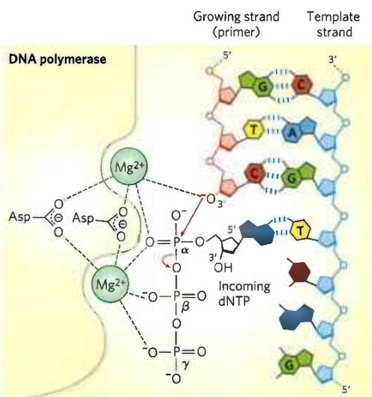  
MECHANISM FIGURE 25-3 The DNA polymerase reaction. The catalytic mechanism for addition of a new nucleotide by DNA polymerase involves two $\mathrm{Mg}^{2+}$ ions, coordinated to the phosphate groups of the incoming nucleotide triphosphate, the $3^{\prime}$ -hydroxyl group that will act as a nucleophile, and three Asp residues, two of which are highly conserved in all DNA polymerases. The $\mathrm{Mg}^{2+}$ ion depicted at the top facilitates attack of the $3^{\prime}$ -hydroxyl group of the primer on the $\alpha$ phosphate of the nucleotide triphosphate; the other $\mathrm{Mg}^{2+}$ ion facilitates displacement of the pyrophosphate. Both ions stabilize the structure of the pentacovalent transition state. RNA polymerases use a similar mechanism.

Early work on DNA polymerase I led to the definition of two central requirements for DNA polymerization (Fig. 25-4). First, all DNA polymerases require a template. The polymerization reaction is guided by a template DNA strand according to the base-pairing rules predicted by Watson and Crick: where a guanine is present in the template, a cytosine deoxynucleotide is added to the new strand, and so on. P1 This was a particularly important discovery, not only because it provided a chemical basis for accurate semiconservative DNA replication, but also because it represented the first example of the use of a template to guide a biosynthetic reaction.

Second, the polymerases require a primer. A primer is a strand segment (complementary to the template) with a free 3'-hydroxyl group to which a nucleotide can be added; the free 3' end of the primer is called the primer terminus (Fig. 25-4a). In other words, part of the new strand must already be in place: all DNA polymerases can add nucleotides only to a preexisting strand. Many primers are oligonucleotides of RNA rather than DNA, and specialized enzymes synthesize primers when and where they are required.

A DNA polymerase active site has two parts (Fig. 25-4a). The incoming nucleotide is initially positioned in the insertion site. Once the phosphodiester bond is formed, the polymerase slides forward on the DNA and the new base pair is positioned in the postinsertion site. These sites are located in a pocket that resembles the palm of a hand (Fig. 25-4b, c).

After adding a nucleotide to a growing DNA strand, a DNA polymerase either dissociates or moves along the template and adds another nucleotide. Dissociation and reassociation of the polymerase can limit the overall polymerization rate—the process is generally faster when a polymerase adds more nucleotides without dissociating from the template. The average number of nucleotides added before a polymerase dissociates defines its processivity. DNA polymerases vary greatly in processivity; some add just a few nucleotides before dissociating, whereas others add many thousands.

#### [EN] Replication Is Very Accurate

Replication proceeds with an extraordinary degree of fidelity. In E. coli, a mistake is made only once for every $10^{9}$ to $10^{10}$ nucleotides added. For the E. coli chromosome of $\sim4.6\times10^{6}$ bp, this means that an error occurs only once per 1,000 to 10,000 replications. During polymerization, discrimination between correct and incorrect nucleotides relies not just on the hydrogen bonds that specify the correct pairing between complementary bases but also on the common geometry of the standard A=T and G≡C base pairs (Fig. 25-5). The active site of DNA polymerase I accommodates only base pairs with this geometry. An incorrect nucleotide may be able to hydrogen-bond with a base in the template, but it generally will not fit into the active site. Incorrect bases can be rejected before the phosphodiester bond is formed.

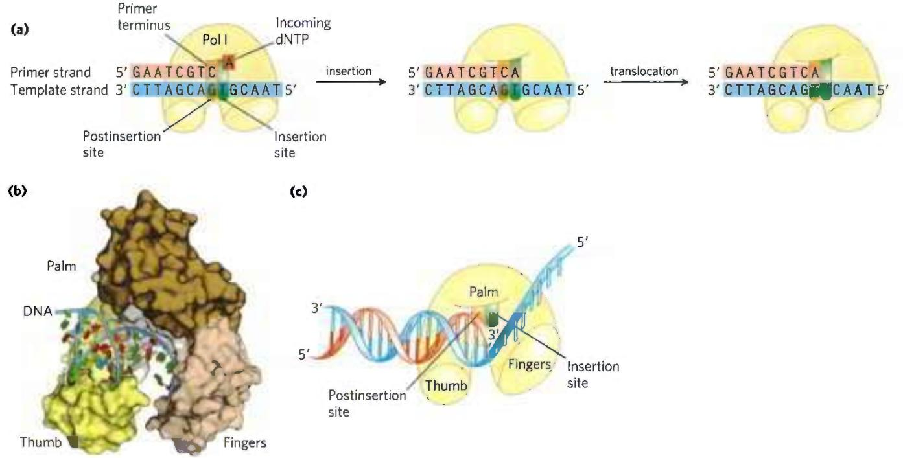  
FIGURE 25-4 Elongation of a DNA chain. (a) DNA polymerase I activity requires a single unpaired strand to act as template and a primer strand to provide the free hydroxyl group at the 3' end to which the new nucleotide unit is added. Each incoming complementary nucleotide is bound selectively, in part by base-pairing to the appropriate nucleotide in the template strand. The reaction product has a new free 3' hydroxyl, allowing the addition of another nucleotide. The newly formed base pair  
translocates to make the active site available to the next pair to be formed. (b) The core of most DNA polymerases is shaped like a human hand that wraps around the active site. The structure shown here is DNA polymerase I of Thermus aquaticus, bound to DNA. (c) A cartoon interpretation shows the insertion site, where the nucleotide addition occurs, and the postinsertion site, to which the newly formed base pair translocates. [(b) Data from PDB ID 4KTQ, Y. Li et al., EMBO J. 17:7514, 1998.]

The accuracy of the polymerization reaction itself, however, is insufficient to account for the high degree of fidelity in replication. Careful measurements in vitro have shown that DNA polymerases insert one incorrect nucleotide for every $10^{4}$ to $10^{5}$ correct ones. These mistakes sometimes occur because a base is briefly in an unusual tautomeric form (see Fig. 8-9), allowing it to hydrogen-bond with an incorrect partner. In vivo, the error rate is reduced by additional enzymatic mechanisms.

One mechanism intrinsic to many DNA polymerases is a separate $3'\rightarrow5'$ exonuclease activity that double-checks each nucleotide after it is added. This nuclease activity permits the enzyme to remove a newly added nucleotide and is highly specific for mismatched base pairs (Fig. 25-6). If the polymerase has added the wrong nucleotide, translocation of the enzyme to the position where the next nucleotide is to be added is inhibited. This kinetic pause provides the opportunity for a correction. The

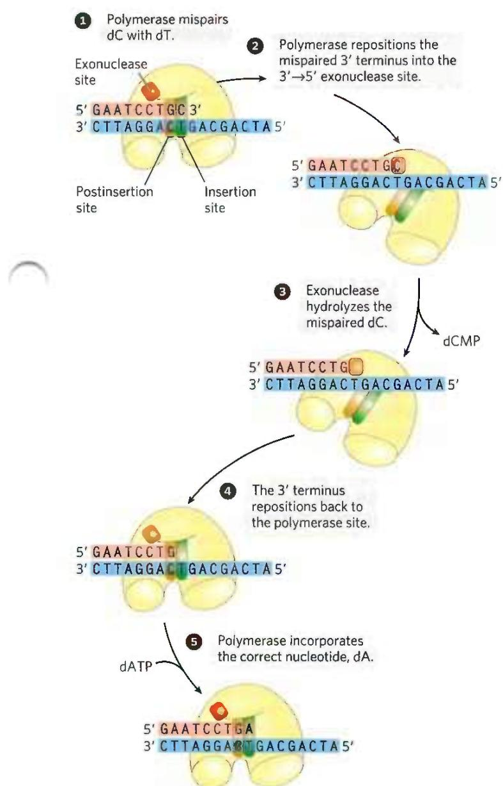  
FIGURE 25-6 An example of error correction by the 3'→5' exonuclease activity of DNA polymerase I. Structural analysis has located the exonuclease activity behind the polymerase activity as the enzyme is oriented in its movement along the DNA. A mismatched base (here, a C-T mismatch) impedes translocation of DNA polymerase I (Pol I) to the next site.

3'→5' exonuclease activity cleaves the most recently added phosphodiester bond and removes the mispaired nucleotide; the polymerase then adds another nucleotide to begin active synthesis again. This activity, known as proofreading, is not simply the reverse of the polymerization reaction (Eqn 25-1). P2 Instead, replacement of the incorrect nucleotide requires the expenditure of three high-energy bonds. The polymerizing and proofreading activities of a DNA polymerase can be measured separately. Proofreading improves the inherent accuracy of the polymerization reaction $10^{2}$ -to $10^{3}$ -fold. In the monomeric DNA polymerase I, the polymerizing and proofreading activities have separate active sites within the same polypeptide.

P3 When base selection and proofreading are combined, DNA polymerase leaves behind one net error for every $10^{6}$ to $10^{8}$ bases added. Yet the measured accuracy of replication in E. coli is higher still. The additional accuracy is provided by a separate enzyme system that repairs the mismatched base pairs remaining after replication. We describe this mismatch repair, along with other DNA repair processes, in Section 25.2.

#### [EN] E. coli Has at Least Five DNA Polymerases

More than 90% of the DNA polymerase activity observed in E. coli extracts can be accounted for by DNA polymerase I. Soon after the isolation of this enzyme in 1955, however, evidence began to accumulate that it is not suited for replication of the large E. coli chromosome. First, the rate at which it adds nucleotides (600 nucleotides/min) is too slow (by a factor of 100 or more) to account for the rates at which the replication fork moves in the bacterial cell. Second, DNA polymerase I has a relatively low processivity. Third, genetic studies have demonstrated that many genes, and therefore many proteins, are involved in replication: DNA polymerase I clearly does not act alone. Fourth, and most important, in 1969 John Cairns isolated a bacterial strain with an altered gene for DNA polymerase I that produced an inactive enzyme. Although this strain was abnormally sensitive to agents that damaged DNA, it was nevertheless viable.

A search for other DNA polymerases led to the discovery of E. coli DNA polymerase II and DNA polymerase III in the early 1970s. DNA polymerase II is an enzyme involved in one type of DNA repair (Section 25.3). DNA polymerase III is the principal replication enzyme in E. coli. DNA polymerases IV and V, identified in 1999, are involved in an unusual form of DNA repair (Section 25.2). The properties of these five DNA polymerases are compared in Table 25-1.

DNA polymerase I, then, is not the primary enzyme of replication; instead, it performs a host of cleanup functions during replication, recombination, and repair. The polymerase's special functions are enhanced by its $5'\rightarrow3'$ exonuclease activity. This activity, distinct from the $3'\rightarrow5'$ proofreading exonuclease (Fig. 25-6), is located in a structural domain that can be separated from the rest of the enzyme by mild protease treatment. When the $5'\rightarrow3'$ exonuclease domain is removed, the remaining fragment ( $M_{r}$ 68,000), the large fragment or Klenow fragment, retains the polymerization and proofreading activities. The $5'\rightarrow3'$ exonuclease activity of intact DNA polymerase I can replace a segment of DNA (or RNA) paired to the template strand, in a process known as nick translation (Fig. 25-7). Most other DNA polymerases lack a $5'\rightarrow3'$ exonuclease activity.

<table><tr><td colspan="6">TABLE 25-1 Comparison of the Five DNA Polymerases of E. coli</td></tr><tr><td rowspan="2"></td><td colspan="5">DNA polymerase</td></tr><tr><td>I</td><td>IIa</td><td>III</td><td>IVa</td><td>Va</td></tr><tr><td>Structural geneb</td><td>polA</td><td>polB</td><td>polC (dnaE)</td><td>dinB</td><td>umuC</td></tr><tr><td>Subunits (number of different types)</td><td>1</td><td>7</td><td>9</td><td>1</td><td>3</td></tr><tr><td>Mr</td><td>103,000</td><td>88,000c</td><td>1,065,400</td><td>39,100</td><td>110,000</td></tr><tr><td>3&#x27;→5&#x27; exonuclease (proofreading)</td><td>Yes</td><td>Yes</td><td>Yes</td><td>No</td><td>No</td></tr><tr><td>5&#x27;→3&#x27; exonuclease</td><td>Yes</td><td>No</td><td>No</td><td>No</td><td>No</td></tr><tr><td>Polymerization rate (nucleotides/s)</td><td>10–20</td><td>40</td><td>250–1,000</td><td>2–3</td><td>1</td></tr><tr><td>Processivity (nucleotides added before polymerase dissociates)</td><td>3–200</td><td>1,500</td><td>≥500,000</td><td>1</td><td>6–8</td></tr></table>

$^{a}$ Translesion (mutagenic) DNA polymerases. For DNA polymerase IV, processivity is increased substantially by association with a $\beta$ clamp. These polymerases are slowed when a DNA lesion is present in the DNA template strand.  
$^{b}$ For enzymes with more than one subunit, the gene listed here encodes the subunit with polymerization activity. Note that dnaE is an earlier designation for the gene now referred to as polC. $^{c}$ Polymerization subunit only. DNA polymerase II shares several subunits with DNA polymerase III, including the $\beta$ , $\delta$ , $\delta'$ , $\chi$ , and $\psi$ subunits (see Table 25-2).

DNA polymerase III is much more complex than DNA polymerase I, with nine different kinds of subunits (Table 25-2). Its polymerization and proofreading activities reside in its $\alpha$ and $\varepsilon$ subunits, respectively. The $\theta$ subunit associates with $\alpha$ and $\varepsilon$ to form a core polymerase, which can polymerize DNA but with limited processivity. Up to three core polymerases can be linked by a clamp-loading complex consisting of five subunits of three different types, $\tau_{3}\delta\delta'$ . The core polymerases are linked through the $\tau$ (tau) subunits. Two additional subunits, $\chi$ (chi) and $\psi$ (psi), are bound to the clamp-loading complex. The entire assembly of 16 protein subunits (eight different types) is called DNA polymerase III\* (Fig. 25-8a).

DNA polymerase III\* can polymerize DNA, but with a much lower processivity than one would expect for the organized replication of an entire chromosome. The necessary increase in processivity is provided by the addition of the $\beta$ subunits. The $\beta$ subunits associate in pairs to form donut-shaped structures that encircle the DNA and act like clamps (Fig. 25-8b). Each dimer associates with a core subassembly of polymerase III\* (one dimeric clamp per active core subassembly) and slides along the DNA as replication proceeds. The $\beta$ sliding clamp prevents the dissociation of DNA polymerase III from DNA, dramatically increasing processivity—to greater than 500,000

FIGURE 25-7 Nick translation. The bacterial DNA polymerase I has three domains, catalyzing its DNA polymerase, 5'→3' exonuclease, and 3'→5' exonuclease activities. The 5'→3' exonuclease domain is in front of the enzyme as it moves along the DNA and is not shown in Figure 25-4. By degrading the DNA strand ahead of the enzyme and synthesizing a new strand behind, DNA polymerase I can promote nick translation, in which a break or nick in the DNA is effectively moved along with the enzyme. This process has a role in DNA repair and in the removal of RNA primers during replication (both described later in this chapter). The strand of nucleic acid to be removed (either DNA or RNA) is shown in purple, the replacement strand in red. DNA synthesis begins at a nick (a broken phosphodiester bond, leaving a free 3' hydroxyl and a free 5' phosphate). A nick remains where DNA polymerase I eventually dissociates, and the nick is later sealed by another enzyme.

<table><tr><td colspan="6">TABLE 25-2 Subunits of DNA Polymerase III of E. coli</td></tr><tr><td>Subunit</td><td>Number of subunits per holoenzyme</td><td>Mrof subunit</td><td>Gene</td><td>Function of subunit</td><td></td></tr><tr><td> $\alpha$ </td><td>3</td><td>129,900</td><td>polC (dnaE)</td><td>Polymerization activity</td><td rowspan="3">Core polymerase</td></tr><tr><td> $\varepsilon$ </td><td>3</td><td>27,500</td><td>dnaQ (mutD)</td><td>3&#x27;→5&#x27; proofreading exonuclease</td></tr><tr><td> $\theta$ </td><td>3</td><td>8,600</td><td>holE</td><td>Stabilization of  $\varepsilon$  subunit</td></tr><tr><td> $\tau$ </td><td>3</td><td>71,100</td><td>dnaX</td><td>Stable template binding; core enzyme dimerization</td><td rowspan="6">Clamp-loading ( $\gamma$ ) complex that loads  $\beta$  subunits on lagging strand at each Okazaki fragmenta</td></tr><tr><td> $\delta$ </td><td>1</td><td>38,700</td><td>holA</td><td>Clamp opener</td></tr><tr><td> $\delta'$ </td><td>1</td><td>36,900</td><td>holB</td><td>Clamp loader</td></tr><tr><td> $\chi$ </td><td>1</td><td>16,600</td><td>holC</td><td>Interaction with SSB</td></tr><tr><td> $\psi$ </td><td>1</td><td>15,200</td><td>holD</td><td>Interaction with  $\tau$  and  $\chi$ </td></tr><tr><td> $\beta$ </td><td>6</td><td>40,600</td><td>dnaN</td><td>DNA clamp required for optimal processivity</td></tr></table>

$^{a}$ The $\gamma$ subunit is encoded by a portion of the gene for the $\tau$ subunit (dnaX), such that the amino-terminal 66% of the $\tau$ subunit has the same amino acid sequence as the $\gamma$ subunit. The $\gamma$ subunit is generated by a translational frameshifting mechanism (p. 1013) that leads to premature translational termination. The $\gamma$ subunit shares the clamp-loading functions of $\tau$ but lacks the protein segments that interact with the core polymerase or with DnaB helicase. Clamp-loading complexes incorporating $\gamma$ subunits may operate independently of the DNA polymerase III holoenzyme, promoting the unloading of $\beta$ clamps discarded on the lagging strand as the replication fork progresses. They may also promote loading of $\beta$ clamps for some DNA repair processes that require DNA synthesis away from the replication fork.

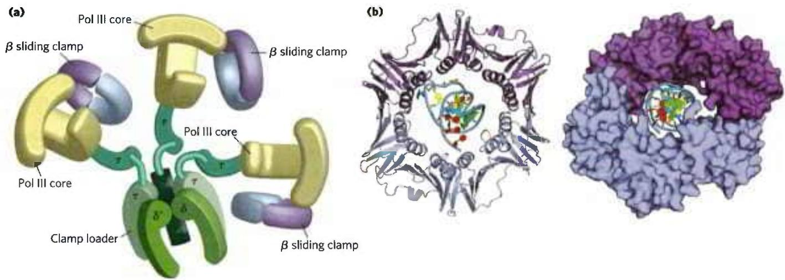  
FIGURE 25-8 DNA polymerase III. (a) Architecture of bacterial DNA polymerase III (Pol III). Three core domains, composed of subunits $\alpha$ , $\varepsilon$ , and $\theta$ , are linked by a five-subunit clamp-loading complex, with the composition $\tau_{3}\delta\delta'$ . The core subunits and clamp-loading complex constitute DNA polymerase III\*. The other two subunits of DNA polymerase III\*, $\chi$ and $\psi$ (not shown), also bind to the clamp-loading complex. Three $\beta$ clamps interact with the three core subassemblies, each clamp a dimer of the $\beta$ subunit. The complex interacts with the DnaB helicase (described later in the text)  
through the $\tau$ subunits. (b) Two $\beta$ subunits of $E.$ coli polymerase III form a circular clamp that surrounds the DNA. The clamp slides along the DNA molecule, increasing the processivity of the polymerase III holoenzyme to more than 500,000 nucleotides by preventing its dissociation from the DNA. The two $\beta$ subunits are shown in two shades of purple as ribbon structures (left) and surface contour images (right), surrounding the DNA. ((a) Information from N. Yao and M. O'Donnell, Mol. Biosyst. 4:1075, 2008. (b) Data from PDB ID 2POL, X.-P. Kong et al., Cell 69:425, 1992.]

(Table 25-1). The addition of the $\beta$ subunits converts DNA polymerase III\* to DNA polymerase III holoenzyme.

#### [EN] DNA Replication Requires Many Enzymes and Protein Factors

Replication in E. coli requires not just a single DNA polymerase but 20 or more different enzymes and proteins, each performing a specific task. The entire complex has been termed the DNA replicase system or replisome. The enzymatic complexity of replication reflects the constraints imposed by the structure of DNA and by the requirements for accuracy. The main classes of replication enzymes are considered here in terms of the problems they overcome.

The DNA must be separated into two strands that each act as a template. P2 This is generally accomplished by helicases, enzymes that move along the DNA and separate the strands, using chemical energy from ATP. Strand separation creates topological stress in the helical DNA structure (see Fig. 24-11), which is relieved by the action of topoisomerases. The separated strands are stabilized by DNA-binding proteins. As noted earlier, before DNA polymerases can begin synthesizing DNA, primers must be present on the template—generally, short segments of RNA synthesized by enzymes known as primases. Ultimately, the RNA primers are removed and replaced by DNA; in E. coli, this is one of the many functions of DNA polymerase I. A specialized nuclease that degrades RNA in RNA-DNA hybrids, called RNase H1, also removes some RNA primers. After an RNA primer is removed and the gap is filled in with DNA, a nick remains in the DNA backbone in the form of a broken phosphodiester bond. These nicks are sealed by DNA ligases. All these processes require coordination and regulation best characterized in the E. coli system.

#### [EN] Replication of the E. coli Chromosome Proceeds in Stages

The synthesis of a DNA molecule can be divided into three stages: initiation, elongation, and termination, distinguished both by the reactions taking place and by the enzymes required. As you will find here and in the next two chapters, synthesis of the major information-containing biological polymers—DNAs, RNAs, and proteins—can be understood in terms of these same three stages, with the stages of each pathway having unique characteristics. The events described below reflect information derived primarily from in vitro experiments using purified E. coli proteins, although the principles are highly conserved in all replication systems.

Initiation The E. coli replication origin, oriC, consists of 245 bp and contains DNA sequence elements that are highly conserved among bacterial replication origins. The general arrangement of the conserved sequences is illustrated in Figure 25-9. Two types of sequences are of special interest: five repeats of a 9 bp sequence (R sites) that serve as binding sites for the key initiator protein, DnaA, and a region rich in A=T base pairs called the DNA unwinding element (DUE). There are three additional DnaA-binding sites (I sites), and binding sites for the proteins IHF (integration host factor) and FIS (factor for inversion stimulation). These two proteins were discovered as necessary components of certain recombination reactions described later in this chapter, and their names reflect those roles. Another DNA-binding protein, HU (a histonelike bacterial protein originally dubbed factor U), also participates but does not have a specific binding site.

At least 10 different enzymes or proteins (summarized in Table 25-3) participate in the initiation phase of replication. They open the DNA helix at the origin and establish a prepriming complex for subsequent reactions. The crucial component in the initiation process is the DnaA protein, a member of the AAA+ ATPase protein family (ATPases associated with diverse cellular activities). Many AAA+ ATPases, including DnaA, form oligomers and hydrolyze ATP relatively slowly. This ATP hydrolysis acts as a switch that mediates interconversion of the protein between two states. In the case of DnaA, the ATP-bound form is active and the ADP-bound form is inactive.

Eight DnaA protein molecules, all in the ATP-bound state, assemble to form a helical complex encompassing the R and I sites in oriC (Fig. 25-10). DnaA has a higher affinity for R sites than I sites, and it binds R sites equally well in its ATP- or ADP-bound form. The I sites, which bind only the ATP-bound DnaA, allow discrimination between the active and inactive forms of DnaA. The tight right-handed wrapping of the DNA around this complex introduces a positive supercoil (see Chapter 24). The associated strain in the nearby DNA, combined with the binding of additional DnaA protein to the DUE region, leads to strand separation in the A=T-rich DUE. The complex formed at the replication origin also includes several DNA-binding proteins—HU, IHF, and FIS—that facilitate DNA bending.

The DnaC protein, another AAA+ ATPase, then loads the DnaB protein onto the separated DNA strands in the denatured region. A hexamer of DnaC, each subunit bound to ATP, forms a tight complex with the ring-shaped, hexameric DnaB helicase. This DnaC-DnaB interaction opens the DnaB ring, the process being aided by a further interaction between DnaB and DnaA. Two of the ring-shaped DnaB hexamers are loaded in the DUE, one onto each DNA strand. The ATP bound to DnaC is hydrolyzed, releasing the DnaC and leaving the DnaB bound to the DNA.

  
FIGURE 25-9 Arrangement of sequences in the E. coli replication origin, oriC. Conserved sequences for key repeated elements are shown. N represents any of the four nucleotides. The horizontal arrows indicate the orientations of the nucleotide sequences (left-to-right arrow denotes

a sequence in the top strand; right-to-left, in the bottom strand). FIS and IHF are binding sites for proteins described in the text. R sites are bound by DnaA. I sites are additional DnaA-binding sites (with different sequences, labeled 11, 12, and 13), for DnaA only when the protein is complexed with ATP.  

<table><tr><td>Protein</td><td> $M_{t}$ </td><td>Number of subunits</td><td>Function</td></tr><tr><td>DnaA protein</td><td>52,000</td><td>1</td><td>Recognizes oriC sequence; opens duplex at specific sites in origin</td></tr><tr><td>DnaB protein (helicase)</td><td>300,000</td><td> $6^{a}$ </td><td>Unwinds DNA</td></tr><tr><td>DnaC protein</td><td>174,000</td><td> $6^{a}$ </td><td>Required for DnaB binding at origin</td></tr><tr><td>HU</td><td>19,000</td><td>2</td><td>Histonelike protein; DNA-binding protein; stimulates initiation</td></tr><tr><td>FIS</td><td>22,500</td><td> $2^{a}$ </td><td>DNA-binding protein; stimulates initiation</td></tr><tr><td>IHF</td><td>22,000</td><td>2</td><td>DNA-binding protein; stimulates initiation</td></tr><tr><td>Primase (DnaG protein)</td><td>60,000</td><td>1</td><td>Synthesizes RNA primers</td></tr><tr><td>Single-stranded DNA-binding protein (SSB)</td><td>75,600</td><td> $4^{a}$ </td><td>Binds single-stranded DNA</td></tr><tr><td>DNA gyrase (DNA topoisomerase II)</td><td>400,000</td><td>4</td><td>Relieves torsional strain generated by DNA unwinding</td></tr><tr><td>Dam methylase</td><td>32,000</td><td>1</td><td>Methylates ( $5'$ )GATC sequences at oriC</td></tr></table>

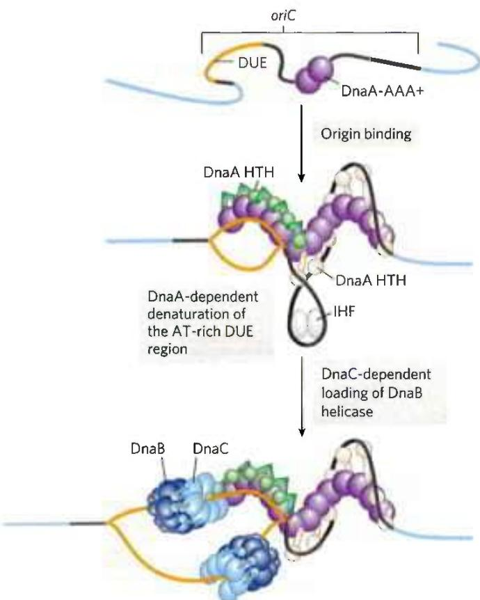  
FIGURE 25-10 Model for initiation of replication at the E. coli origin, oriC. DnaA protein molecules bind initially at the five specific R sites. Upon ATP binding, additional DnaA molecules bind at the I sites in the origin, forming a right-handed helical complex and drawing in more DnaA molecules that continue the helix into the DUE region (see Fig. 25-9). The DNA is wrapped around this complex. DnaA molecules bound at the R and I sites bind the DNA with an HTH domain (referring to a DNA binding motif called helix-turn-helix). The A=T-rich DUE region is denatured as a result of the strain imparted by the DnaA binding. Within the DUE, single-stranded DNA is bound by the ATPase domain of DnaA rather than by the HTH. Formation of the helical DnaA complex is facilitated by the proteins HU, IHF, and FIS. The detailed structural roles of these proteins are not known, but IHF may stabilize a transient DNA loop, as shown here. Hexamers of the DnaB protein bind to each strand, with the aid of DnaC protein. The DnaB helicase activity further unwinds the DNA in preparation for priming and DNA synthesis. [Information from J. P. Erzberger et al., Nat. Struct. Mol. Biol. 13:676, 2006.]

Loading of the DnaB helicase is the key step in replication initiation. As a replicative helicase, DnaB migrates along the single-stranded DNA in the 5'→3' direction, unwinding the DNA as it travels. The DnaB helicases loaded onto the two DNA strands thus travel in opposite directions, creating two potential replication forks. All other proteins at the replication fork are linked directly or indirectly to DnaB. The DNA polymerase III holoenzyme is linked through its τ subunits; additional DnaB interactions are described below. As replication begins and the DNA strands are separated at the fork, many molecules of single-stranded DNA-binding protein (SSB) bind to and stabilize the separated strands, and DNA gyrase (DNA topoisomerase II) relieves the topological stress induced ahead of the fork by the unwinding reaction.

Initiation is the only phase of DNA replication that is known to be regulated, and it is regulated such that replication occurs only once in each cell cycle. The mechanism of regulation is not yet entirely understood, but genetic and biochemical studies have provided insights into several separate regulatory mechanisms.

Once DNA polymerase III has been loaded onto the DNA, along with the $\beta$ subunits (signaling completion of the initiation phase), the protein Hda binds to the $\beta$ subunits and interacts with DnaA to stimulate hydrolysis of its bound ATP. Hda is yet another AAA+ ATPase closely related to DnaA (its name is derived from homologous to DnaA). This ATP hydrolysis leads to disassembly of the DnaA complex at the origin. Slow release of ADP by DnaA and rebinding of ATP cycles the protein between its inactive (with bound ADP) and active (with bound ATP) forms on a time scale of 20 to 40 minutes.

The timing of replication initiation is affected by DNA methylation and interactions with the bacterial plasma membrane. The oriC DNA is methylated by the Dam methylase (Table 25-3), which methylates the $N^6$ position of adenine within the palindromic sequence (5')GATC. (Dam is not a biochemical expletive; it stands for DNA adenine methylation.) The oriC region of E. coli is highly enriched in GATC sequences—it has 11 in its 245 bp; the average frequency of GATC in the E. coli chromosome as a whole is 1 in 256 bp.

Immediately after replication, the DNA is hemimethylated: the parent strands have methylated oriC sequences but the newly synthesized strands do not. The hemimethylated oriC sequences are now sequestered by interaction with the plasma membrane (the mechanism is unknown) and by binding of the protein SeqA. After a time, oriC is released from the plasma membrane, SeqA dissociates, and the DNA must be fully methylated by Dam methylase before it can again bind DnaA and initiate a new round of replication.

Elongation The elongation phase of replication includes two distinct but related operations: leading strand synthesis and lagging strand synthesis. Several enzymes at the replication fork are important to the synthesis of both strands. Parent DNA is first unwound by DNA helicases, and the resulting topological stress is relieved by topoisomerases. Each separated strand is then stabilized by SSB. From this point, synthesis of leading and lagging strands is sharply different.

Leading strand synthesis, the more straightforward of the two, begins with the synthesis by primase (DnaG protein) of a short (10 to 60 nucleotide) RNA primer at the replication origin. DnaG interacts with DnaB helicase to carry out this reaction, and the primer is synthesized in the direction opposite to that in which the DnaB helicase is moving. In effect, the DnaB helicase moves along the strand that becomes the lagging strand in DNA synthesis; however, the first primer laid down in the first DnaG-DnaB interaction serves to prime leading strand DNA synthesis in the opposite direction. Deoxyribonucleotides are added to this primer by a DNA polymerase III complex linked to the DnaB helicase tethered to the opposite DNA strand. Leading strand synthesis then proceeds continuously, keeping pace with the unwinding of DNA at the replication fork.

Lagging strand synthesis, as we have noted, is accomplished in short Okazaki fragments (Fig. 25-11a). First, an RNA primer is synthesized by primase, and, as in leading strand synthesis, DNA polymerase III binds to the RNA primer and adds deoxyribonucleotides (Fig. 25-11b). On this level, the synthesis of each Okazaki fragment seems straightforward, but the details are quite complex. The complexity lies in the coordination of leading and lagging strand synthesis. Both strands are produced by a single asymmetric DNA polymerase III dimer; this is accomplished by looping the DNA of the lagging strand as shown in Figure 25-12, bringing together the two points of polymerization.

The synthesis of Okazaki fragments on the lagging strand entails some elegant enzymatic choreography.

  
FIGURE 25-11 Synthesis of Okazaki fragments. (a) At intervals, primase synthesizes an RNA primer for a new Okazaki fragment. If we consider the two template strands as lying side by side, lagging strand synthesis formally proceeds in the opposite direction from fork movement. Each primer is extended by DNA polymerase III. DNA synthesis continues until the fragment extends as far as the primer of the previously added Okazaki fragment.  
A new primer is synthesized near the replication fork to begin the process again. (b) In the replisome complex, DNA synthesis on the leading and lagging strands is tightly coordinated. Each DNA polymerase III holoenzyme has three sets of core subunits (yellow), linked together with a single clamp-loading complex, so one or two Okazaki fragments can be synthesized simultaneously, along with the leading strand.

FIGURE 25-12 DNA synthesis on the leading and lagging strands. Events at the replication fork are coordinated by a single DNA polymerase III dimer, in an integrated complex with DnaB helicase. This figure shows the replication process already underway; (a) through (e) are discussed in the text. Only two sets of polymerase core subunits rather than three are shown, to more clearly illustrate the cycling on the lagging strand. The lagging strand is looped so that DNA synthesis proceeds steadily on both the leading and lagging strand templates at the same time. Red arrows indicate the 3' end of the two new strands and the direction of DNA synthesis. An Okazaki fragment is being synthesized on the lagging strand. The subunit colors and the functions of the clamp-loading complex are explained in Figure 25-13.

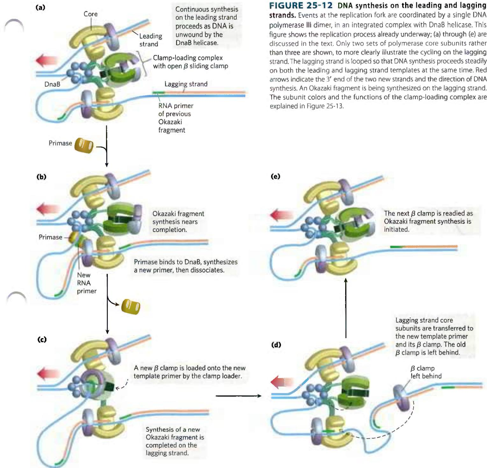

DNA polymerase III uses one set of its core subunits (the core polymerase) to synthesize the leading strand continuously, while the other two sets of core subunits cycle from one Okazaki fragment to the next on the looped lagging strand. In vitro, a DNA polymerase III holoenzyme with only two sets of core subunits can synthesize both leading and lagging strands. However, a third set of core subunits increases the efficiency of lagging strand synthesis as well as the processivity of the overall replisome.

DnaB helicase, bound in front of DNA polymerase III, unwinds the DNA at the replication fork (Fig. 25-12a) as it travels along the lagging strand template in the $5'\rightarrow3'$ direction. DnaG primase occasionally associates with DnaB helicase and synthesizes a short RNA primer (Fig. 25-12b). A new $\beta$ sliding clamp is then positioned at the primer by the clamp-loading complex of DNA polymerase III (Fig. 25-12c). When synthesis of an Okazaki fragment has been completed, replication halts, and the core subunits of DNA polymerase III dissociate from their β sliding clamp (and from the completed Okazaki fragment) and associate with the new clamp (Fig. 25-12d, e). This initiates synthesis of a new Okazaki fragment. Two sets of core subunits may be engaged in the synthesis of two different Okazaki fragments at the same time. The proteins acting at the replication fork are summarized in Table 25-4.

<table><tr><td colspan="4">TABLE 25-4 Proteins of the E. coli Replisome</td></tr><tr><td>Protein</td><td> $M_{r}$ </td><td>Number of subunits</td><td>Function</td></tr><tr><td>SSB</td><td>75,600</td><td>4</td><td>Binding to single-stranded DNA</td></tr><tr><td>Helicase (DnaB protein)</td><td>300,000</td><td>6</td><td>DNA unwinding</td></tr><tr><td>Primase (DnaG protein)</td><td>60,000</td><td>1</td><td>RNA primer synthesis</td></tr><tr><td>DNA polymerase III</td><td>1,065,400</td><td>17</td><td>New strand elongation</td></tr><tr><td>DNA polymerase I</td><td>103,000</td><td>1</td><td>Filling of gaps; excision of primers</td></tr><tr><td>DNA ligase</td><td>74,000</td><td>1</td><td>Ligation</td></tr><tr><td>DNA gyrase (DNA topoisomerase II)</td><td>400,000</td><td>4</td><td>Supercoiling</td></tr></table>

  
FIGURE 25-13 The DNA polymerase III clamp loader. The five subunits of the clamp-loading (γ) complex are the δ and δ' subunits and the amino-terminal domain of each of the three τ subunits (see Fig. 25-8). The complex binds to three molecules of ATP and to a dimeric β clamp. This binding forces the β clamp open at one of its two subunit interfaces. Hydrolysis of the bound ATP allows the β clamp to close again around the DNA.

The clamp-loading complex of DNA polymerase III, consisting of parts of the three $\tau$ subunits along with the $\delta$ and $\delta'$ subunits, is also an AAA+ ATPase. This complex binds to ATP and to the new $\beta$ sliding clamp. The binding imparts strain on the dimeric clamp, opening up the ring at one subunit interface (Fig. 25-13). The newly primed lagging strand is slipped into the ring through the resulting break. The clamp loader then hydrolyzes ATP, releasing the $\beta$ sliding clamp and allowing it to close around the DNA.

The replisome promotes rapid DNA synthesis, adding \~1,000 to 2,000 nucleotides to each strand (leading and lagging). Once an Okazaki fragment has been completed, its RNA primer is removed by DNA polymerase I or RNase H1 and replaced with DNA by the polymerase; the remaining nick is sealed by DNA ligase (Fig. 25-14).

DNA ligase catalyzes the formation of a phosphodiester bond between a 3' hydroxyl at the end of one DNA strand and a 5' phosphate at the end of another strand. The phosphate must be activated by adenylylation. DNA ligases isolated from viruses and eukaryotes use ATP for this purpose. DNA ligases from bacteria are unusual in that many use NAD $^{+}$ —a cofactor that usually functions in hydride transfer reactions (see Fig. 13-24)—as the source of the AMP activating group (Fig. 25-15). DNA ligase is another enzyme of DNA metabolism that has become an important reagent in recombinant DNA experiments (see Fig. 9-1).

  
FIGURE 25-14 Final steps in the synthesis of lagging strand segments. RNA primers in the lagging strand are removed by the $5'\rightarrow3'$ exonuclease activity of DNA polymerase I or RNase H1, and then replaced with DNA by DNA polymerase I. The remaining nick is sealed by DNA ligase. The role of ATP or NAD $^{+}$ is shown in Figure 25-15.

Termination Eventually, the two replication forks of the circular E. coli chromosome meet at a terminus region

FIGURE 25-15 Mechanism of the DNA ligase reaction. In each of the three steps, one phosphodiester bond is formed at the expense of another. Steps ① and ② lead to activation of the 5' phosphate in the nick. An AMP group is transferred first to a Lys residue on the enzyme and then to the 5' phosphate in the nick. In step ③, the 3'-hydroxyl group attacks this phosphate and displaces AMP, producing a phosphodiester bond to seal the nick. In the E. coli DNA ligase reaction, AMP is derived from NAD⁺. The DNA ligases isolated from some viral and eukaryotic sources use ATP rather than NAD⁺, and they release pyrophosphate rather than nicotinamide mononucleotide (NMN) in step ①.

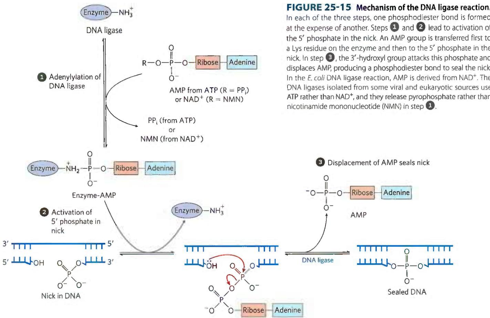

containing multiple copies of a 20 bp sequence called Ter (Fig. 25-16). The Ter sequences are arranged on the chromosome to create a trap that a replication fork can enter but cannot leave. The Ter sequences function as binding sites for the protein Tus (terminus utilization substance). The Tus-Ter complex can arrest a replication fork from only one direction. Only one Tus-Ter complex functions per replication cycle—the complex first encountered by either replication fork. Given that opposing replication forks generally halt when they collide, Ter sequences would not seem to be essential, but they may prevent overreplication by one fork in the event that the other is delayed or halted by an encounter with DNA damage or some other obstacle.

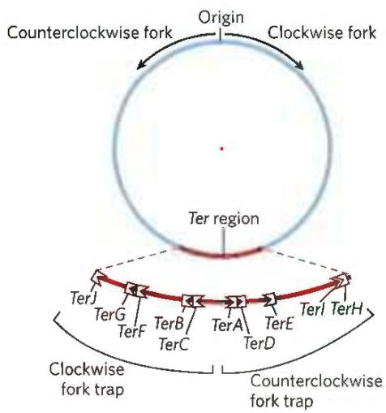  
FIGURE 25-16 Termination of chromosome replication in E. coli. The Ter sequences (TerA through TerJ) are positioned on the chromosome in two clusters with opposite orientations. The overall Ter region encompasses about $9\%$ of the circular chromosome.

So, when either replication fork encounters a functional Tus-Ter complex, it halts; the other fork halts when it meets the first (arrested) fork. The final few hundred base pairs of DNA between these large protein complexes are then replicated (by an as yet unknown mechanism), completing two topologically interlinked (catenated) circular chromosomes (Fig. 25-17). DNA circles linked in this way are known as catenanes. Separation of the catenated circles in E. coli requires topoisomerase IV (a type II topoisomerase). The separated chromosomes then segregate into daughter cells at cell division. The terminal phase of replication of other circular chromosomes, including many of the DNA viruses that infect eukaryotic cells, is similar.

#### [EN] Replication in Eukaryotic Cells Is Similar but More Complex

The DNA molecules in eukaryotic cells are considerably larger than those in bacteria and are organized into complex nucleoprotein structures (chromatin; p. 898). The essential features of DNA replication are the same in eukaryotes and bacteria, and many of the protein complexes are functionally and structurally conserved. However, eukaryotic replication is regulated and coordinated with the cell cycle, and must function within the complexities of chromatin structure.

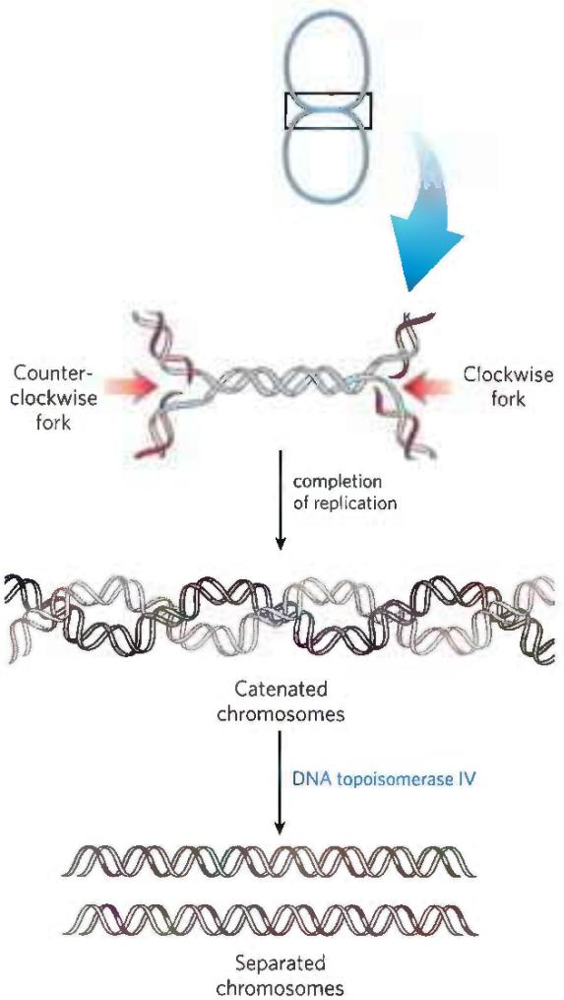  
FIGURE 25-17 Role of topoisomerases in replication termination. Replication of the DNA separating opposing replication forks leaves the completed chromosomes joined as catenanes, or topologically interlinked circles. The circles are not covalently linked, but because they are interwound and each is covalently closed, they cannot be separated — except by the action of topoisomerases. In E. coli, a type II topoisomerase known as DNA topoisomerase IV plays the primary role in separating catenated chromosomes, transiently breaking both DNA strands of one chromosome and allowing the other chromosome to pass through the break.

Origins of replication have a well-characterized structure in some lower eukaryotes, but they are much less defined in higher eukaryotes. In both cases, replication begins in short nucleosome-free regions. Yeast (S. cerevisiae) has about 400 defined replication origins called autonomously replicating sequences (ARSs), or replicators. Yeast replicators span \~150 bp and contain several essential, conserved sequences. There are about 30,000 to 50,000 replication origins in human chromosomes.

The replication origins of vertebrates in general may be defined by some aspect of DNA secondary structure, as yet unknown.

Regulation ensures that all cellular DNA is replicated once per cell cycle. Much of this regulation involves proteins called cyclins and the cyclin-dependent kinases (CDKs) with which they form complexes (see Section 12.8). The cyclins are rapidly destroyed by ubiquitin-dependent proteolysis at the end of the M phase (mitosis), and the absence of cyclins allows the establishment of prereplicative complexes (pre-RCs) on replication initiation sites. In rapidly growing cells, the pre-RC forms at the end of M phase. In slow-growing cells, it does not form until the end of G1. Formation of the pre-RC renders the cell competent for replication, an event sometimes called licensing.

As in bacteria, the key event in the initiation of replication in all eukaryotes is the loading of the replicative helicase, a heterohexameric complex of minichromosome maintenance (MCM) proteins (MCM2 to MCM7). The ring-shaped MCM2–7 helicase functions in some ways like the bacterial DnaB helicase, although it translocates 3'→5' along the leading strand template. It is loaded onto the DNA in steps (Fig. 25-18). The origin is recognized and bound first by another six-protein complex, called ORC (origin recognition complex), followed by the protein CDC6 (cell division cycle), which recruits CDT1 (CDC10-dependent transcript 1). Together, they facilitate the loading of two inactive MCM2–7 complexes (the pre-RC). The ORC-CDC6 complex and CTD1 dissociate, leaving behind the pre-RC. ORC has five AAA+ ATPase domains among its subunits and is functionally analogous to the bacterial DnaA. The yeast CDC6 is yet another AAA+ ATPase that forms a complex with the ORC subunits. Following pre-RC formation, another set of proteins, CDC45 and the GINS, bind to and activate the MCM2–7 helicase, triggering DNA denaturation. (GINS refers to the first letters of the numbers 5-1-2-3 in Japanese, go-ichi-ni-san, providing a somewhat cryptic callout to the four protein subunits of the complex: SLD5, PSF1, PSF2, and PSF3.) The replication proteins then bind to form a replisome, and bidirectional replication begins.

Commitment to replication requires the synthesis and activity of S-phase cyclin-CDK complexes (such as the cyclin E-CDK2 complex; see Fig. 12-36) and CDC7-DBF4. Both types of complexes help to activate replication by binding to and phosphorylating several subunits of the pre-RC. Other cyclins and CDKs function to inhibit the formation of more pre-RC complexes once replication has been initiated. For example, CDK2 binds to cyclin A as cyclin E levels decline during S phase, inhibiting CDK2 and preventing the licensing of additional pre-RC complexes.

The rate of movement of the replication fork in eukaryotes (\~50 nucleotides/s) is only one-twentieth that observed in E. coli. At this rate, replication of an average human chromosome proceeding from a single origin would take more than 500 hours, making the requirement for many origins evident.

  
FIGURE 25-18 Assembly of a prereplicative complex at a eukaryotic replication origin. The initiation site (origin) is bound by ORC, CDC6, and CDT1. These proteins, many of them AAA+ ATPases, promote loading of two MCM2-7 helicase complexes, in a reaction analogous to the loading of the bacterial DnaB  
helicase by DnaC protein. The two loaded but inactive MCM2–7 complexes comprise the prereplicative complex, or pre-RC. The pre-RC is subsequently activated by addition of CDC45 and the GINS proteins, followed by addition of the replisome components. [Information from M.W. Parker et al., Crit. Rev. Biochem. Mol. Biol. 52:107, 2017.]

Like bacteria, eukaryotes have several types of DNA polymerases. Some have been linked to particular functions, such as the replication of mitochondrial DNA. The replication of nuclear chromosomes primarily involves three multisubunit DNA polymerases. The highly processive DNA polymerase $\varepsilon$ synthesizes the leading strand, and DNA polymerase $\delta$ synthesizes the lagging strand. Both enzymes have $3'\rightarrow5'$ proofreading exonuclease activities. DNA polymerase $\alpha$ , a DNA polymerase/primase, synthesizes RNA primers and also extends them by about 10 nucleotides of DNA to initiate synthesis of each Okazaki fragment on the lagging strand. One subunit of DNA polymerase $\alpha$ has a primase activity, and the largest subunit ( $M_{r}\sim180,000$ ) contains the polymerization activity. However, this polymerase has no proofreading $3'\rightarrow5'$ exonuclease activity, making it unsuitable for high-fidelity DNA replication.

DNA polymerases $\varepsilon$ and $\delta$ are associated with and stimulated by proliferating cell nuclear antigen (PCNA; $M_{r}$ 29,000), a protein found in large amounts in the nuclei of proliferating cells. The three-dimensional structure of PCNA is remarkably similar to that of the $\beta$ subunit of E. coli DNA polymerase III (Fig. 25-8b), although primary sequence homology is not evident. PCNA has a function analogous to that of the $\beta$ subunit, forming a circular clamp that enhances the processivity of the two polymerases.

Two other protein complexes also function in eukaryotic DNA replication. RPA (replication protein A) is a single-stranded DNA-binding protein, equivalent in function to the E. coli SSB protein. RFC (replication factor C)

is a clamp loader for PCNA and facilitates the assembly of active replication complexes. The subunits of the RFC complex have significant sequence similarity to the subunits of the bacterial clamp-loading ( $\gamma$ ) complex.

Termination of replication on linear eukaryotic chromosomes occurs when replication forks operating from nearby origins converge. As in bacteria, there are successive steps of final replication, replisome dissociation, and decatenation of the DNA products. All of the steps are mediated by additional protein complexes, with some parts of the process still undefined.

#### [EN] Viral DNA Polymerases Provide Targets for Antiviral Therapy

Many DNA viruses encode their own DNA polymerases, and some of these have become targets for pharmaceuticals. For example, the DNA polymerase of the herpes simplex virus is inhibited by acyclovir, a compound developed by Gertrude Elion and George Hitchings (p. 836). Acyclovir consists of guanine attached to an incomplete ribose ring.

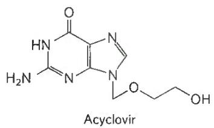

It is phosphorylated by a virally encoded thymidine kinase; acyclovir binds to this viral enzyme with an affinity 200-fold greater than its binding to the cellular thymidine kinase. This ensures that phosphorylation occurs mainly in virus-infected cells. Cellular kinases convert the resulting acyclo-GMP to acyclo-GTP, which is both an inhibitor and a substrate of DNA polymerases; acyclo-GTP competitively inhibits the herpes DNA polymerase more strongly than cellular DNA polymerases. Because it lacks a 3' hydroxyl, acyclo-GTP also acts as a chain terminator when incorporated into DNA. Thus viral replication is inhibited at several steps.

#### [EN] SUMMARY 25.1 DNA Replication

■ Replication of DNA follows a set of universal rules. Replication is semiconservative, each strand acting as template for a new daughter strand. It is carried out in three identifiable phases: initiation, elongation, and termination. The process starts at a single origin in bacteria and usually proceeds bidirectionally. DNA is synthesized in the 5'→3' direction by DNA polymerases. At the replication fork, the leading strand is synthesized continuously in the same direction as replication fork movement; the lagging strand is synthesized discontinuously as Okazaki fragments, which are subsequently ligated.

■ Nucleases are enzymes that degrade DNA. Endonucleases cleave within a DNA polymer; exonucleases degrade DNA from the end of one strand (either $5'\rightarrow3'$ or $3'\rightarrow5'$ ).

■ DNA polymerases are complex enzymes that synthesize DNA, and often possess additional activities, including exonuclease functions.

■ DNA is replicated with very high fidelity. Accuracy is maintained by (1) base selection by the polymerase, (2) a $3'\rightarrow5'$ proofreading exonuclease activity that is part of many DNA polymerases, and (3) specific repair systems for mismatches left behind after replication.

■ Most cells have several DNA polymerases. In E. coli, DNA polymerase III is the primary replication enzyme. DNA polymerase I is responsible for special functions during replication, recombination, and repair.

■ Replication requires an array of enzymes and protein factors in addition to DNA polymerases. Many of these proteins belong to the AAA+ ATPase family.

■ Replication initiation occurs when replicative helicases are loaded onto replication origins in stepwise fashion. Elongation is achieved by an active replisome—a supramolecular complex of nucleic acids and many proteins, including polymerases. Termination occurs when replisomes proceeding in opposite directions converge. It requires decatenation of the replication products when replication is complete.

■ The major replicative DNA polymerases in eukaryotes are DNA polymerases $\varepsilon$ and $\delta$ . DNA polymerase $\alpha$ synthesizes primers.

■ Viral DNA replication is a drug target.

<!-- L-END Lehninger 25.1 -->

## 2.5 DNA 的突变与修复

## 2.5.1 DNA 的突变

基因突变是指在基因内的遗传物质发生可遗传的结构和数量的变化。DNA 的突变主要来源于 DNA 复制过程中出现的错误、遗传物质的化学和物理损伤，以及转座子插入所造成的 DNA 序列变化。自发突变的发生频率非常低，通过人工诱导能够提高突变率。复制错误和 DNA 损伤有两个后果：一是给 DNA 带来永久性的不可逆的改变，最终改变基因编码的序列，称之为基因突变；二是 DNA 的某些化学变化使得 DNA 不能再被用作模板进行复制和转录。基因突变有多种类型，包括碱基替换、转换、颠换、插入突变、同义突变、错义突变、无义突变和移码突变等。其中最简单的突变是一种碱基变成另一种碱基，其中，嘧啶到嘧啶和嘌呤到嘌呤的替换称为转换（transition）；嘧啶到嘌呤和嘌呤到嘧啶的替换称为颠换（tranversion）。一般把单个核苷酸的突变称为点突变（point mutation），并把由于一个或少数几个核苷酸的插入或缺失引起的突变归入同一类型，称为 indel。突变的累计将会导致疾病的发生。由于染色体 DNA 在生命过程中占有至高无上的地位，DNA 复制的准确性以及 DNA 日常的损伤修复就有着特别重要的意义。

## 2.5.2 DNA损伤的修复

细胞可以通过多种修复机制来及时修复 DNA 损伤。表 2-11 是几种主要的 DNA 修复系统。

表 2-11 DNA 的修复系统

<table><tr><td>DNA修复系统</td><td>损伤</td><td>功能</td></tr><tr><td>错配修复</td><td>复制错误</td><td>恢复错配</td></tr><tr><td>碱基切除修复</td><td>受损的碱基</td><td>切除突变的碱基</td></tr><tr><td>核苷酸切除修复</td><td>嘧啶二聚体碱基上的大加合物</td><td>切除突变的核苷酸片段</td></tr><tr><td>双链断裂修复(同源重组修复和非同源末端连接)</td><td>双链断裂</td><td>修复损伤DNA,保持遗传信息的完整性,还可帮助修复DNA复制中的错误</td></tr><tr><td>DNA直接修复(光复活作用)</td><td>嘧啶二聚体和甲基化DNA</td><td>修复嘧啶二体或甲基化DNA</td></tr><tr><td>跨损伤合成</td><td>嘧啶二聚体或脱嘌呤位点</td><td>使复制通过DNA损伤继续进行,有高度的易错性</td></tr><tr><td>SOS修复</td><td>嘧啶二聚体等</td><td>维持基因组的完整性,提高细胞的生存率,但留下的错误较多</td></tr></table>

## 1. 错配修复

一旦在 DNA 复制过程中发生错配,细胞能够通过准确的错配修复(mismatch repair)系统识别新合成链中的错配并加以校正,DNA 子链中的错配几乎完全能被修正,充分反映了母链序列的重要性。因此,错配修复系统对 DNA 复制忠实性有很大的贡献。该系统识别母链的依据来自 Dam 甲基化酶,它能使位于 5'-GATC 序列中腺苷酸的 N $^{6}$ 位甲基化。一旦复制叉通过复制起始点,母链就会在开始 DNA 合成前的几秒钟至几分钟内被甲基化。此后,只要两条 DNA 链上碱基配对出现错误,错配修复系统就会根据“保存母链,修正子链”的原则,找出错误碱基所在的 DNA 链,并在对应于母链甲基化腺苷酸上游鸟苷酸的 5'位置切开子链(图 2-33),再根据错配碱基相对于 DNA 切口的方位启动如图 2-34 中

图 2-33 根据母链甲基化原则找出错配碱基过程图示

(a) 发现碱基错配；(b) 在水解 ATP 的作用下，MutS、MutL 与碱基错配位点的 DNA 双链相结合；(c) MutS-MutL 在 DNA 双链上移动，发现甲基化 DNA 后由 MutH 切开非甲基化的子链。

所示两条修复途径之一,合成新的子链 DNA 片段。

## 2. 切除修复

① 碱基切除修复(base-excision repair) 研究发现,所有细胞中都带有不同类型、能识别受损核酸位点的糖苷水解酶,它能特异性切除受损核苷酸上的 N-β 糖苷键,在 DNA 链上形成去嘌呤或去嘧啶位点,统称为 AP 位点(图 2-35)。一类 DNA 糖苷水解酶一般只对应于某一特定类型的损伤,如尿嘧啶糖苷水解酶就特异性识别 DNA 中胞嘧啶自发脱氨形成的尿嘧啶,而不会水解 RNA 分子中尿嘧啶上的 N-β 糖苷键。DNA 分子中一旦产生了 AP 位点,AP 内切核酸酶就会把受损核苷酸的糖苷-磷酸键切开,并移去包括 AP 位点核苷酸在内的小片段 DNA,由 DNA 聚合酶 I 合成新的片段,最终由 DNA 连接酶把两者连成新的被修复的 DNA 链。

② 核苷酸切除修复(nucleotide-excision repair) 当 DNA 链上相应位置的核苷酸发生损伤,导致双链之间无法形成氢键,则由核苷酸切除修复系统负责修复。图 2-36 分当错配碱基位于切口 3' 下游端时，在 MutL-MutS、DNA 解链酶Ⅱ、DNA 外切酶Ⅵ或 RecJ 核酸酶的作用下，从错配碱基 3' 下游端开始切除单链 DNA 直到原切口，并在 DNA 聚合酶Ⅲ和 SSB 的作用下合成新的子链片段。若错配碱基位于切口的 5' 上游端，则在 DNA 外切酶Ⅰ或 X 的作用下，从错配碱基 5' 上游端开始切除单链 DNA 直到原切口，再合成新的子链片段。

  
图2-34 碱基错配修复过程示意图

  
图 2-35 DNA 分子中常见的几种核苷酸非酶促转变反应  
(a) 脱氨基反应;
(b) 脱嘌呤反应(N- $\beta$ 糖苷键被水解)

别是大肠杆菌(左)和人类细胞(右)中的修复过程。损伤发生后,首先由 DNA 切割酶 (excinuclease) 在已损伤的核苷酸 5' 和 3' 位分别切开磷酸糖苷键,产生一个由 12\~13 个核苷酸(原核生物)或 27\~29 个核苷酸(人类或其他高等真核生物)的小片段,移去小片段后由 DNA 聚合酶 I (原核)或 ε (真核)合成新的片段,并由 DNA 连接酶完成修复中的最后一道工序。

## 3. 同源重组修复和非同源末端连接

当 DNA 发生双链断裂时, 可通过同源重组修复 (homologous recombination repair, HR) 和非同源末端连接 (non-homologous endjoining, NHEJ) 来进行修复 (图 2-37)。同源重组修复是利用细胞内的同源染色体对应的 DNA 序列作为修复的模板进行 DNA 修复的过程。重组修复又被称为“复制后修复”, 它发生在复制之后。机体细胞对在复制起始时尚未修复的 DNA 损伤部位可以先复制再修复, 即先跳过该损伤部位, 在新合成链中留下一个对应于损伤序列的缺口, 该缺口由 DNA 重组来修复: 通过从未损伤 DNA 找回序列信息来修复 DNA 的断裂, 即先从同源 DNA 母链上将相应核苷酸序列片段移至子链缺口处, 然后再用新合成的序列补上母链空缺。同源重组受一系列蛋白质的调控和催化, 如原核生物细胞内的 RecA、RecBCD、RecF、RecO、RecR, 以及真核生物细胞内的 Rad51、Mre11-Rad50 等。

  
图 2-36 大肠杆菌(左)和人类细胞(右)中的核苷酸切除修复过程示意图  
在原核生物中,受损伤核苷酸3'端的第5位,5'端的第8位磷酸糖苷键分别被DNA切割酶切开。在人类细胞中,受损伤核苷酸3'端第6位,5'端的第22位磷酸糖苷键分别被DNA切割酶切开。

由于同源重组反应严格依赖 DNA 分子之间的同源性, 只有当细胞核内存在与损伤 DNA 同源的 DNA 片段时, HR 才能发生。因此, 原核生物的同源重组通常发生在 DNA 复制过程中, 而真核生物的同源重组则主要发生在细胞的 $G_{2}$ 期和 S 期, 是一种高保真 (error-free) 的修复方式, 对维持遗传物质的正常功能和稳定性具有重要作用。当细胞核内没有相应的同源 DNA 片段时, 细胞将利用另一种方式 (非同源性末端连接, NHEJ) 来进行染色体断裂的修复。NHEJ 通过断裂末端突出的单链之间错排配对, 断裂的两个末端直接相互连接。NHEJ 由在细菌、酵母和人类中均有发现的高度保守蛋白家族的 KU 介导, 是一种易错 (error-prone) 修复方式。

## 4. DNA 的直接修复

生物体内还存在多种 DNA 损伤以后直接修复 (direct repair) 而并不需要切除碱基或核苷酸的机制。直接修复是把损伤的碱基回复到原来状态的一种修复。最普遍的例子是

  
图 2-37 同源重组修复(HR)和非同源末端连接(NHEJ)  
DNA 双链断裂的两种主要修复方式，(a) 为同源重组修复 (HR)，(b) 为非同源末端连接 (NHEJ)。

图 2-38 紫外线诱发形成嘧啶二体  

在 DNA 光解酶 (photolyase) 的作用下把在光下或经紫外线照射形成的环丁烷胸腺嘧啶二体及 6-4 光化物 (6-4 photoproduct) 还原成为单体的过程 (图 2-38)。生物体内还广泛存在着使 $O^6$ -甲基鸟嘌呤脱甲基化的甲基转移酶, 以防止形成 G-T 配对。

## 5. 跨损伤合成

跨损伤合成(translesion synthesis, TLS)是一类复制后修复,也被称为“跨缺刻复制”或“备份复制”(backup synthesis),最先发现于原核细胞中。在 DNA 链复制过程中,当 DNA 聚合酶遇到嘧啶二聚体或脱嘌呤位点等没有被修复的损伤而使复制停顿时,复制机器必须越过损伤以防止复制叉的崩塌,机体必须启动跨损伤合成系统并忽略已存在的损伤(图 2-39)。跨损伤合成是由一个独特的但是分布广泛的 DNA 聚合酶家族催化的。当细胞处于较强烈而持久的 SOS 应答生理条件下,一些受 SOS 机制控制的可诱导性 DNA 聚合酶,包括大肠杆菌细胞中的 DNA 聚合酶 IV (DinB) 和 DNA 聚合酶 V (UmuC,活性形式是和 2 个分子的 UmuD' 形成的 UmuD'2C 复合体),以及真核生物细胞内的被归类为 Y 家族的 DNA 聚合酶 (pol η、pol ι、pol κ、Rev1 等)得到表达。虽然它们是模板依赖性的,但在掺入核苷酸时却不依赖于碱基配对。该修复机制具有高度的易错性,容易引入突变,但避免了染色体不完全复制的更坏后果。因为它的高错误率,跨损伤合成被认为是一个聊胜于无的修复系统,它可使细胞存活下来,但付出的代价是高突变频率的发生,有点像中国俗语所说的“好死不如赖活着”。

## 6. SOS 修复系统

SOS 修复(SOS repair)系统是细胞 DNA 受到损伤或复制系统受到抑制的紧急情况下,细胞为求生存而产生的一种应急措施。它是一种旁路系统,允许新生的 DNA 链越过胸腺嘧啶二聚体继续复制,其代价是保真度的极大降低。SOS 修复包括诱导 DNA 损伤修复、诱变效应、细胞分裂的抑制以及溶原性细菌释放噬菌体等,细胞癌变也与 SOS 修复有关。

SOS 修复广泛存在于原核和真核生物中,主要包括两个方面:DNA 的修复、产生变异。前者利于细胞的存活,具有重要意义,而后者可能产生不利的后果,如导致细胞的癌变。

图 2-39 跨损伤合成 (TLS)  
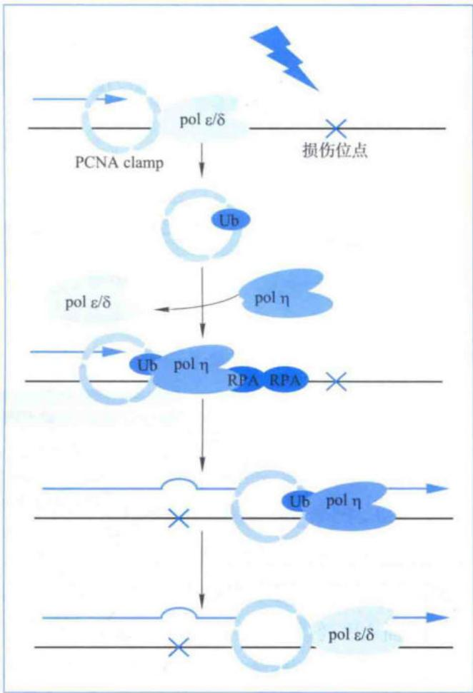  
细胞内 DNA 损伤刺激激活 PCNA 的泛素化，促进 pol $\eta$ 的聚集及 TLS 通路的启动，保证复制叉跨过损伤位点。

<!-- W-BEGIN Watson 10 DNA的突变和修复 -->

### 【中文对照 Watson 第10章：DNA的突变和修复】

> 来源：Watson《基因的分子生物学》第七版中译本（书籍/03_基因的分子生物学_第七版） 第10章 DNA的突变和修复。

#### [W] 第10章 DNA的突变和修复

#### [W] 本章概要

复制错误及其修复

DNA损伤

DNA损伤的修复

遗传物质保持代代持续传递依赖于把突变概率维持在低水平上。生殖细胞系中高突变率将摧毁物种，体细胞中高突变率将摧毁个体。活细胞需要成千上万个基因正确行使职能，每个基因都可能毁于发生在其蛋白质编码序列或者负责其表达或信使 RNA（mRNA）加工的旁侧序列等众多位点上的某个突变。

要使后代有很好的存活机会，DNA 序列必须在生殖细胞系中基本不变地进行传递。同样，如果生物成体中的体细胞中突变概率太高的话，这些细胞就不能执行其功能。例如，癌症是因为掌管细胞周期的基因受损，导致细胞无法按照可控方式进行生长和分裂而产生的。如果体细胞突变率高的话，癌症的发生率将是灾难性的和致命的。

同时，如果继承的遗传物质具有绝对的忠实性，将失去驱动演化所需的基因变异，那么新的物种，包括人类都不可能出现。因此，生命和生物多样性依赖于突变与突变修复之间的良好平衡。在本章中，我们将研究突变的原因，以及负责逆转或纠正遗传物质上的这些损伤从而使之最小化的系统。

DNA 复制的不准确性和遗传物质的化学损伤是突变的两个重要来源。来自互变异构化的复制错误我们已经在第 9 章介绍，它为 DNA 复制过程中碱基配对的精确性设定了一个上限。复制 DNA 的酶促机器试图通过校正读码的机制来应对不正确核苷酸的错误插入，但是仍有些错误逃过检测。而且，DNA 是个复杂而且脆弱的有机分子，其化学稳定性有限。它不仅要遭受自发的损伤，如碱基缺失，而且还遭受可使其骨架断裂并改变其碱基的化学结构的天然和非天然化合物以及的辐射的攻击。简言之，来自环境的对遗传物质的复制错误和损伤是不可避免的。第三个重要的突变源是被称为转座子（transposon）的 DNA 元件造成的一种插入。转座就其本身来说是一个重要的课题，我们将在第 12 章进行详细阐述。

复制错误和 DNA 损伤有两个后果：一是给 DNA 带来永久性的改变（突变），这可能改变基因的编码序列或者基因的调控序列；二是 DNA 的某些化学变化使得 DNA 不能再用作复制和转录的模板。通常突变效果只在发生了序列改变的细胞的后代显示，但是妨碍复制或者转录的损伤能立即在细胞功能和存活上起作用。

细胞受到的挑战是双重的。第一，它必须扫描基因组以检查合成中的错误及 DNA 的损伤；第二，它必须修复损伤，如果有可能的话，以一种恢复原始 DNA 序列的方式进行。本章我们将讨论复制过程中产生的错误、源于自发的 DNA 损伤，以及化学物质和辐射造成的损伤。每种情况下我们都要考虑遗传物质的改变如何被检测到以及它是如何被正确修复的。这些问题中我们将要进行讨论的如下：DNA 如何足够快速地进行修复以防止错误成为突变存在于遗传物质中？在修复复制错误的过程中细胞如何将母链与子链区分开来？当断裂或者严重的损伤致使原始序列不能再被读取的时候，细胞如何恢复正确的 DNA 序列？细胞如何应对阻碍复制的损伤？回答这些问题有赖于了解需要进行修复的错误或损伤的类型。

我们将从探讨复制过程中发生的错误开始,然后探讨在细胞修复复制错误以及DNA损伤的多种修复机制之前所自发产生的或来自外界的攻击造成的各种各样的损伤。最后,我们概述了在复制过程中让DNA损伤维系以阻止细胞凋亡并且使得DNA损伤后续被修复的通路。我们将看到使细胞能处理DNA各种各样损伤的多个交叠系统,从而了解生物在保持遗传物质忠实性方面所做的努力。

#### [W] 复制错误及其修复

突变的本质

突变几乎包括 DNA 序列上每一种可以想像得到的改变。最简单的突变是一种碱基变成另一种碱基，有两种类型：转换（transition），即嘧啶到嘧啶或嘌呤到嘌呤的替换，如 T 到 C 和 A 到 G；颠换(transversion)，

即嘧啶到嘌呤或嘌呤到嘧啶的替换，如 T 到 G 或 A、A 到 C 或 T（图 10-1）。另一种简单的突变是一个核苷酸或少量核苷酸的插入或缺失。改变单个核苷酸的突变被称为点突变（point mutation）。

其他类型的突变引起 DNA 的更大改变，如大范围的插入和缺失，以及染色体结构的整体重排。此种变化可能由转

  
图 10-1 碱基的替换。a. 转换。b. 颠换。

座子的插入或者细胞重组过程中的异常作用所导致——转座子通常将数千个核苷酸的外源 DNA 插入到基因的编码序列或者调控序列中（第 12 章），或由细胞重组过程中的异常活动所致。染色体上任一给定位点自发产生新突变的总体概率为每轮 DNA 复制 $10^{6} \sim 10^{11}$ ，其中染色体上有些位点是“热点”，此处的突变发生频率高而其他位点发生变化的概率相对较低。

有一种尤其易发突变的序列因为它对人类的遗传学和疾病的重要性而值得特别关注。这些突变易发序列是简单的2-、3-或4-核苷酸序列的重复，被称为DNA微卫星(DNAmicrosatellite）。一个为人熟知的例子涉及二核苷酸序列 CA 的重复。CA 重复片段在人类和其他真核细胞染色体上分布非常广泛。复制机器很难精确拷贝这种重复序列，常常发生“打滑”。打滑使得重复序列的拷贝数目增加或减少，结果在人群中染色体上特定位置处的 CA 重复片段长度常常为高度多态性。这种多态性为可遗传突变作图（如增大人类患某些疾病倾向的突变）提供了方便的物理标记（框 10-1，三联核苷酸重复的扩增导致疾病）。

#### [W] 框 10-1 三联核苷酸重复的扩增导致疾病

另一个为人熟知的错误易发序列的例子是某些基因中的三联核苷酸序列重复CGG和CAG。常发现人类中的这种三联核苷酸重复在一代传给下一代的时候发生扩增，使得所导致的疾病在患病个体的孩子和孙子上渐进性加重。三联体扩增导致的疾病例子有成人肌（强直性肌）营养不良、导致精神迟缓的脆性X综合征，以及引起神经蜕变的亨廷顿病。CAG是谷氨酰胺的密码子，它在亨廷顿蛋白编码序列中的扩增导致患有亨廷顿病的患者突变蛋白中含谷氨酰胺残基片段的长度加大。最近的研究表明，这个多聚谷氨酰胺片段干扰名为Sp1的转录因子中谷氨酰胺富含区与名为TFIID的转录机器元件的亚基“TAFII130”中对应的谷氨酰胺富含区之间正常的相互作用（见第13章）。此干扰削弱大脑神经元中的转录，包括神经递质受体基因的转录。其他基因中CAG扩增产生的相似的多聚谷氨酰胺片段可能也通过破坏转录因子与TAFII130之间的相互作用而作用。

#### [W] 有些复制错误能逃脱校正读码

如我们所知，复制机器凭借校正读码机制使精确度达到极高的水平，即复制子中的3'→5'外切酶元件可将错误掺入的核苷酸去除（如第9章所述）。校正读码将DNA复制的忠实度提高约100倍，然而校正读码的核酸外切酶并非绝对安全。有些错误插入的核苷酸逃脱检测并在新合成的链与模板链之间形成错误配对。模板链中4种核苷酸，每种的配对位置都可以有3种不同的核苷酸被错误插入（例如，在模板链上的T可能面对T、G或C），共有12种可能的错配（T：T、T：G、T：C等）。如果错误插入的核苷酸没有及时被检测到并被替换的话，序列的变化将永久性地存在于基因组中。在第二轮复制的时候，错误插入的核苷酸已经是模板链的一部分，将指导其互补性核苷酸插入到新合成的链中（图10-2）。此时不存在错配，取而代之的是在DNA序列中产生一个永久性的改变（突变）。

#### [W] 错配修复能将逃脱校正读码的错误去除

幸运的是，有一套用来检测错配并对之进行修复的机制。保证 DNA 复制忠实性的最后责任由错配修复系统（mismatch repair system）承担，它将 DNA 合成的精确性又提高了 2\~3 个数量级。错配修复系统面对两个挑战：第一，它必须扫描基因组寻找错误配对，因为错误配对是短暂的（它们在第二轮复制后被消除，此时它们产生突变），错配修复系统必须很快就发现错误配对并对之进行修复；第二，系统必须准确地纠正错误配对，即它必须在新合成的链中将错误插入的核苷酸换掉而不能把母链中正确的核苷酸换掉。

  
图 10-2 突变可通过复制永久性地插入进去。在第一轮复制中错误插入一个碱基可引入一个突变；在第二轮复制中，突变就永久性地插入到 DNA 序列中了。

在大肠杆菌中，错配是由错配修复蛋白MutS的二聚体来检测的（图10-3）。MutS扫描DNA，从错配引起DNA骨架的扭曲变形上识别出它们。MutS包围含错误配对的DNA，诱导DNA产生一个明显的纽结和MutS自身构象上的变化（图10-4）。MutS特异性的关键在于含有错误配对的DNA比正确碱基配对的DNA更容易扭曲。MutS拥有错配修复所需要的ATP酶活性，但是它在修复中的具体作用还是未知的。MutS和含错误配对的DNA形成的复合体募集MutL——错配修复系统中的第二个蛋白质，MutL再激活MutH。MutH是一种酶，能在错配位点附近的一条链上产生一个切口或割口。切口形成后由一种特殊的DNA解旋酶(UvrD)和三个核酸外切酶中的一个发挥作用(见下文)。解旋酶从切口开始向错配位点方向解开DNA，核酸外切酶逐步地将解旋的单链消化掉，延伸到并越过错配核苷酸的位点。此作用产生一个单链缺口，此缺口被DNA聚合酶Ⅲ（PolⅢ）填补并由DNA连接酶接合。整体效果是将错误配对除去并用正确碱基配对的核苷酸取而代之。

但是 E.coli 错配修复系统如何知道两个错配核苷酸中的哪一个要被取代呢？如果修复是随机发生的话，那么有一半的概率错误将永久存在于 DNA 中。答案是，E.coli 通过我们就要提到的暂时半甲基化对母链进行了标记。

E.coli 的 Dam 甲基化酶（Dam methylase）使两条链上的 5'-GATC-3'序列中的 A 残基都甲基化。GATC 序列广泛分布于整个基因组中 [约每 256（4⁴）个碱基对发生一次]，所有这种位点都被 Dam 甲基化酶甲基化。当复制叉经过两条链的 GATC 都甲基化（全甲基化）的 DNA 时，产生的子代 DNA 双链就是半甲基化的（只有母链是甲基化的）。这样在几分钟的时间内，直到 Dam 甲基化酶赶上并将新合成的子链甲基化为止，子代 DNA 双链将只有一条担任模板的链被甲基化（图 10-5a）。这样，新合成的链即被标记（它没有甲基基团），从而被认出是要被修复的链。

  
错配被修复  
图 10-3 用以修复复制错误的差误配对修复途径。MutS 包围着含有纽结的错配 DNA（未标出，见图 10-4）。接下来，MutS 募集 MutL 和 MutH，并且由 MutS 的 ATP 酶活性催化 ATP 的水解。MutH 是一种内切核酸酶，能在 DNA 上接近错配的位置产生一个切口。紧接着，一个外切核酸酶消化切口链，向着错配方向移动。最后，产生的单链的缺口由 DNA 聚合酶填补并消除错配。（经允许改编自 Junop M. S. et al. 2001. Mol. Cell 7: 1-12, Fig. 6b. © Elsevier.）

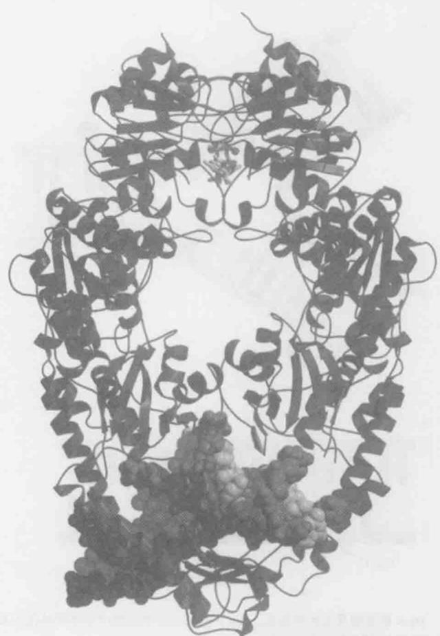  
图 10-4 MutS-DNA 复合体的晶体结构。注意 DNA 上位于结构底部的纽结和在酶的结构的顶部的 ATP，分别用黄色、绿色和红色表示。DNA 用一种空间填充的形式表示，红色代表骨架，灰色代表碱基。（Junop M. S. et al. 2002. Mol, Cell 7: 1-12.）镜像图用 BobScript、MolScript 和 Raster3D 绘制。

MutH 蛋白结合在这样的半甲基化位点处，但它的核酸内切酶活性通常是隐藏的。只有被位于附近错配处的 MutL 和 MulS 接触的时候（这可能是在几百个碱基对的距离内），MutH 才能像我们上面所说的那样被激活。这种相互作用如何能在数百 bp 的距离以外发生，还是未知的。但是最近有证据表明，MutS-MutL 复合体可以离开错配处并沿着 DNA 的外缘移动到半甲基化位点处的 MutH。MutH 被激活后，选择性地将未甲基化的链切开，这样在错误配对附近只有新合成的 DNA 被除去并被取代（图 10-5b）。因此甲基化是在复制发生错误的时候，使 E.coli 修复系统能够从母链上找回正确序列的“记忆”设备。

MutH 产生的切口与错误配对之间单链 DNA 的去除可以使用不同的核酸外切酶，这取决于 MutH 在错误插入的核苷酸 5' 还是 3' 一侧切割 DNA。如果在错配的 5' 侧切 DNA，则用核酸外切酶Ⅶ或 RecJ 沿 5'→3' 方向从 MutH 产生的切口开始经过错误插入的核苷酸来除去 DNA 片段。反之，如果切口在错配的 3' 侧，则由核酸外切酶 I 沿 3'→5' 方向除去 DNA 片段。如我们所看到的，错配碱基被除去之后，由 DNA 聚合酶Ⅲ来填补缺失的序列（图 10-6）。

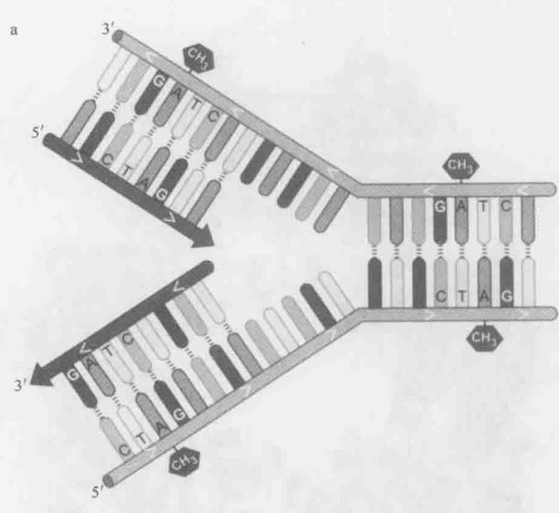

  
图 10-5 Dam 在复制叉上的甲基化。（a）. 在 E.coli 中复制产生半甲基化的 DNA。（b）. MutH 在未甲基化的子链上进行切割。

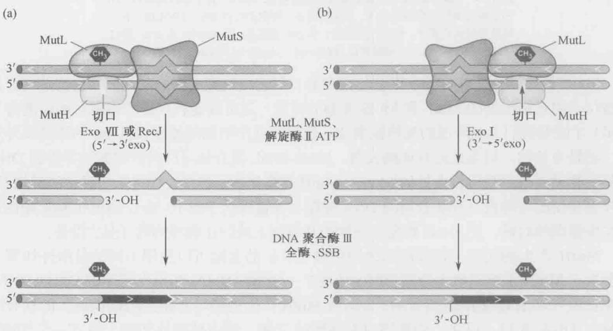  
图10-6 错配修复的方向性：核酸外切酶对错配 DNA 的去除。为了简化，与 DNA 结合的 MutH 表示成与错配处的 MutS 直接相连的形式。（a）未甲基化的 GATC 位于突变的5'侧；（b）未甲基化的 GATC 位于突变的3'侧。

真核细胞也能修复错误配对，它们使用MutS(MutS同源物称为MSH蛋白)和MutL（MutL同源物称为MLH和PMS）的同源物完成这一功能。事实上，真核生物有多种具有不同专一性的MutS样蛋白。例如，一种是专门用于简单错配的，而另一种用于识别DNA复制期间“打滑”产生的小的插入或缺失。错配修复在较高等生物上扮演极为重要的角色，最生动的证据是，发现结肠癌（遗传性非息肉性结直肠癌）的遗传倾向性是由于人的MutS同源物（尤其是MSH2同源物）和MutL同源物的基因突变。

即使真核生物细胞有错配修复系统，它们还缺少MutH及像E.coli那样用半甲基化标记母链的聪明策略（事实上，多数细菌都没有Dam甲基化酶，并且也不能用半甲基化来标记新合成的链）。那么错配修复系统是怎么知道两条链中哪一条需要校正的呢？如我们在第9章中看到的那样，后随链进行不连续合成产生冈崎片段，再通过DNA连接酶与先前合成的DNA相连接。在连接步骤之前，冈崎片段与先前合成的链之间隔着一个切口，这个切口可以看成是等同于E.coli中MutH在新合成链上产生的切口。事实上，真核细胞的提取物将修复含有切口的人工模板上的错配，并且是选择性地在携带切口的链上进行。最近的结果表明，MutS的人类同源物（MSH）与复制体上的滑动夹元件（PCNA，我们在第9章曾予以讨论）相互作用，因此可能被招募到后随链DNA不连续合成的部位上。与滑动夹的相互作用也可能将错配修复蛋白招募到前导链的3'（生长中）端。

#### [W] DNA损伤

DNA 的自发损伤：水解和脱氨基作用

突变不仅来源于复制的错误，还来源于 DNA 的损伤。如我们将看到的，有些 DNA 损伤来源于环境因素，如辐射和所谓的诱变剂（mutagen）——增加突变发生概率的化学试剂（框 10-2, Ames 测试）。但是 DNA 也因水的作用产生自发性损伤（这听起来很滑稽，因为双螺旋的正确结构有赖于水性的环境）。

#### [W] 框10-2 Ames测试

分析化学物质在动物体中所具有的潜在致癌作用既费时又费钱。但是，因为多数致癌剂都是致变剂，所以化学物质潜在的致癌作用可从其致变能力方面方便地进行评估。加利福尼亚大学伯克利分校（UC Berkeley）的 Bruce Ames 设计了一个简单的测试方法，根据化学物质在伤寒沙门氏菌（Salmonella typhimurium）中引起突变的能力来评价化学物质可能的致癌作用。Ames 测试采用的这个 S.typhimurium 菌株中负责组氨酸生物合成的操纵子发生了突变。例如，突变株操纵子的组氨酸生物合成基因之一可能含有一个错义或者移码突变。结果，突变株细胞在组氨酸缺乏的固体培养基上不能生长和形成菌落（框 10-2 图 1）。但是，如果用一个有致变性的化学物质处理突变株细胞（因而具有潜在的致癌性），在少量突变细胞中化合物将使原来的错义或者移码突变（取决于致变剂的性质）产生回复突变。此回复突变使细胞恢复了在组氨酸缺乏的固体培养基上生长和形成菌落的能力。诱变剂越强，菌落的数目就越多。有些致癌的化学物质开始的时候没有致变性，但是代谢外源物质的肝脏将其转变成了致变剂。为鉴别能够在肝脏中转化为突变剂的化学物质，Ames用肝中各种酶的混合物处理潜在的致变剂。Ames测试中发现有致变性的化学物质可进一步在动物身上再测试其潜在的致癌作用。

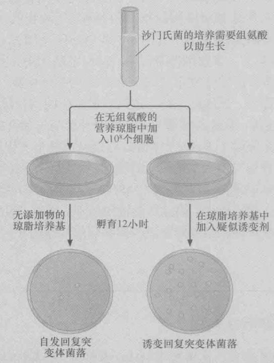  
框10-2图1 Ames实验

最频繁和最重要类型的水解损伤是胞嘧啶碱基的脱氨基（图 10-7a）。在正常的生理条件下，胞嘧啶可自发进行脱氨基作用，从而产生非天然的（在 DNA 中）碱基尿嘧啶。尿嘧啶优先与腺嘌呤配对，因此，复制时在另一条链上导入腺嘌呤，而不是胞嘧啶指导下的鸟嘌呤。腺嘌呤和鸟嘌呤也易于自发脱氨基，脱氨基将腺嘌呤转变成次黄嘌呤，次黄嘌呤与胞嘧啶而不是与胸腺嘧啶形成氢键；鸟嘌呤转变成黄嘌呤，黄嘌呤虽然与胞嘧啶之间只有两个氢键，但是它仍与胞嘧啶配对。DNA 还通过 N-糖苷键的自发水解进行去嘌呤化（depurination），并在 DNA 中形成脱碱基（abasic）位点（没有碱基的即脱氧核糖）（图 10-7b）。

注意，与上面所讨论的复制错误不同，这些水解反应都导致 DNA 形成非天然的改变。无嘌呤位点当然是非天然的，而且每个脱氨基作用都产生一个非天然的碱基，因而这种改变可被下面所述的修复系统识别。这种情况还说明了为什么 DNA 有胸腺嘧啶而没有尿嘧啶。如果 DNA 天然含有尿嘧啶而不是胸腺嘧啶的话，那么胞嘧啶的脱氨基作用将产生一个天然碱基，这是修复系统很难识别的。

脱氨基作用产生一个天然存在碱基的危险，可用 5'-甲基胞嘧啶引起的问题来解释。脊椎动物 DNA 由于甲基转移酶的作用经常在胞嘧啶的位置上含有一个 5'-甲基胞嘧啶。

这个修饰后的碱基在转录沉默中起作用（第19章）。5'-甲基胞嘧啶脱氨基产生胸腺嘧啶（图10-7c），明显不能被识别为异常碱基，所以，在下一轮复制中就作为胞嘧啶到胸腺嘧啶(C→T)的转换而被固定。事实上，脊椎动物DNA中甲基化的胞嘧啶是自发突变的热点。

#### [W] DNA 损伤：烷化反应、氧化反应和辐射

DNA 易于受烷化反应、氧化反应和辐射的损伤。在烷化反应中，甲基或乙基基团被转移到碱基的反应位点及 DNA 骨架的磷酸基上。烷化化合物包括亚硝胺（nitrosamines）和非常强烈的实验室诱变剂 N-甲基-N₁-硝基-N-亚硝基胍（N-methyl-N₁-nitro-N-nitrosoguanidine）。鸟嘌呤 C6 原子上的氧是最容易发生烷基化的位点之一（图 10-8）。此甲基化的产物 O⁶-甲基鸟嘌呤（O⁶-methyl-guanine）常常与胸腺嘧啶错配，导致受损 DNA 复制的时候 G：C 碱基对变成 A：T 碱基对。

DNA 还易受到活性氧簇的攻击（如 $O_{2}^{-}$ 、 $H_{2}O_{2}$ 和 $OH\cdot$ ）。这些强烈的氧化剂由电离辐射和产生自由基的化学试剂产生。例如，鸟嘌呤氧化后产生 7,8-二羟基-8-氧代鸟嘌呤，简称氧代鸟嘌呤（oxoG）。氧代鸟嘌呤有强烈的致变性，

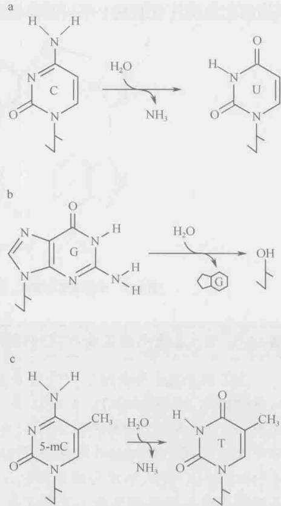  
图 10-7 水解损伤引起的突变。(a). 胞嘧啶脱氨基产生鸟嘌呤。(b). 鸟嘌呤通过水解脱嘌呤化产生脱嘌呤的脱氧核糖。(c). 5-甲基胞嘧啶的脱氨基在 DNA 中产生天然碱基——胸腺嘧啶。

因为它既能与腺嘌呤也能与胞嘧啶碱基配对。如果在复制的时候与腺嘌呤碱基配对，则产生 G:C 到 T:A 的颠换，这是人类癌症中最普通的突变之一。因此，电离辐射和氧化剂的致癌效应可能部分是由于能把鸟嘌呤转换成氧代鸟嘌呤的自由基引起的。

另一种碱基损伤是紫外线造成的。260nm左右波长的辐射被碱基强烈吸收，其后果之一是在同一多核苷酸链相邻位置上的两个嘧啶之间发生光化学聚合。两个胸腺嘧啶的

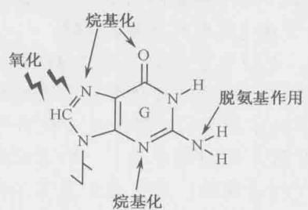  
图 10-8 鸟嘌呤的修饰。图示为鸟嘌呤上易于被化学处理，如烷化反应、氧化反应和辐射损伤的特殊部位。经这些修饰的产物常常为高度致变的。

聚合产物叫做胸腺嘧啶二聚体(thymine dimer)（图10-9），含有由毗邻胸腺嘧啶的C5和C6形成的环丁烷（cyclobutane）环。当胸腺嘧啶与胞嘧啶毗邻时，产生的聚合体是胸腺嘧啶胞嘧啶加合物，此处胸腺嘧啶通过其C6连接到胞嘧啶的C4上。这些聚合的碱基不能再进行碱基配对，从而导致复制过程中DNA聚合酶的终止。测量DNA损伤的量，如胸腺嘧啶二聚体，以及DNA损伤对细胞生存能力和基因组保真度维持产生的影响（见框10-3，DNA损伤的定量及其对细胞生存和诱变的影响）。

  
图 10-9 胸腺嘧啶二聚体。紫外线引起毗邻胸腺嘧啶之间形成环丁烷环。

#### [W] 框 10-3 DNA 损伤的定量和其对细胞生存和诱变的影响

为了解 DNA 损伤修复以及变异发生，研究人员通过实验来测量 DNA 损伤及其对细胞的影响。如何测量 DNA 的损伤，最开始看来似乎是具有挑战性的。如何能够看到细胞内 DNA 的改变呢？科学家已经开发出许多技术来达到这一目的。在一个实验中，研究人员使用一种靶向特定类型 DNA 损伤的抗体，如胸腺嘧啶二聚体。他们在分离的基因组 DNA 样本中用类似使用抗体在免疫印迹分析中测量蛋白质的含量的方法来衡量胸腺嘧啶二聚体的水平（见第 7 章）。在另一个实验中，用彗星或单细胞凝胶电泳实验通过电泳中迁移模式的改变检测单链和双链损伤及其他类型的细胞内 DNA 损伤。受损的 DNA 显示荧光显微镜观察到的彗星样外观。新技术的持续发展为 DNA 损伤提供了更准确和更具体的检测方法。

如何测定 DNA 损伤对细胞生存能力的影响呢？对于单细胞生物如细菌和真菌，存活实验可以简单地将细胞接种于固态培养基上并通过对比处理和未处理的细胞形成的菌落数（克隆形成的单位）来比较。杀伤率或 DNA 损伤诱导剂和条件（致死曲线）之间的关系是通过一定范围内不同剂量的 DNA 损伤剂与存活细胞数画图得出。当处理的损伤类型需要一个特定的修复通路时，那么在该修复通路上有突变的则相对于野生型在同样的剂量上会表现出较低的存活率。一个不同的方法被用来测量 DNA 损伤剂对哺乳动物细胞存活率的影响。在该方法中，一种荧光染料（生-死标记）用于鉴定活细胞和死细胞。DNA 损伤剂处理后的细胞存活率就通过荧光显微镜下计算细胞被染色与否来获得。

DNA 损伤试剂或条件的定量研究除了细胞存活外，也涉及了突变发生率的检测。与 Ames 测试（见框 10-2）类似，突变发生率的检测实验可以通过在缺乏突变基因相关必须产物或下游产物的条件固体培养基上测定携带有特定突变的细胞的生存能力的逆转来完成。突变发生实验可能同样涉及正向突变（从野生型到突变型）一个特定基因并在允许突变细胞生长的选择培养基中培养。类似于存活实验，突变发生实验需要用不同剂量的 DNA 损伤剂处理细胞。突变发生率通过逆转的百分率或正向突变作为与细胞存活相关的功能剂量来计算。

最后，γ辐射和X射线（电离辐射）有很高的危险性，因为它们可使DNA双链断裂，这很难被修复。电离辐射能直接攻击（离子化）DNA骨架中的脱氧核糖。另外，辐射能通过产生活性氧簇间接攻击（如上所述），因为后者能与脱氧核糖亚基反应。因为细胞需要完整的染色体来复制其DNA，所以电离辐射用于在癌症治疗中治疗性地杀死快速增殖细胞。某些抗癌药物，如争光霉素（bleomycin）也能引起DNA的断裂。电离辐射和像争光霉素那样的试剂，因能导致DNA断裂，所以被认为具有断裂性（clastogenic）（源于希腊语klastos，其含义为“断裂的”）。

#### [W] 突变还可由碱基类似物和嵌入剂引起

突变还可由可替换正常碱基的化合物（碱基类似物，base analog）或能插入碱基间的化合物（嵌入剂，intercalating agent）导致复制错误而引起（图10-10）。碱基类似物在结构上与正常碱基类似，但是其不同之处使其对细胞又非常危险。因此，碱基类似物与正常碱基的相似程度足以使其被细胞摄取，转化成核苷三磷酸并在复制中被插入到DNA中。但是，因为这些碱基与正常碱基在结构上存在差异，使其配对不准确，导致复制过程中频繁发生错误。最有致变性的一个碱基类似物是5-溴尿嘧啶（5-bromouracil），为胸腺嘧啶的类似物。溴取代原子的存在使碱基可以通过烯醇互变异构体与鸟嘌呤错配（图10-10a）。如我们在第4章所见，酮互变异构体的倾向性远远大于烯醇互变异构体，但是胸腺嘧啶比5-溴尿嘧啶更是如此。

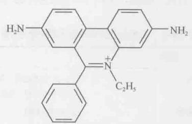  
溴乙锭

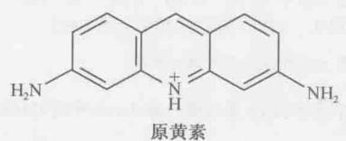

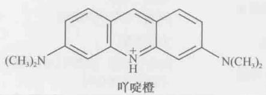  
图10-10 可引起 DNA 突变的碱基类似物和嵌入剂。(a). 胸腺嘧啶的碱基类似物, 5-溴尿嘧啶能与鸟嘌呤错配。(b). 嵌入剂。

如我们在第 4 章对溴乙锭所讨论的那样，嵌入剂是含有几个多元环的扁平分子，能与 DNA 中同样扁平的嘌呤或者嘧啶碱基结合，就如在双螺旋中的碱基相互结合或堆积那样。嵌入剂，如原黄素（proflavin）、吖啶（acridine）和溴乙锭（ethidium），能导致一个甚或几个碱基对的缺失或插入。当基因中发生这样的缺失或插入的时候，如第 16 章我们讨论遗传密码的时候将会看到的那样，会对其信使 RNA 的翻译产生深刻的影响，因为它们将编码序列移出了正确的可读框。

嵌入剂是怎样引起短的插入和缺失的呢？插入情况的一个可能性是，这些致变剂通过插入模板链碱基之间，导致 DNA 聚合酶在嵌入分子对侧插入一个额外的核苷酸（一个这种结构的嵌入大约能使两个碱基对之间的通常间距加倍）。相反，缺失的情况是由于嵌入分子的存在引起模板扭曲，这可能使聚合酶跳过一个核苷酸。

#### [W] DNA 损伤的修复

如我们所看到的那样，DNA 的损伤有两种后果。有些类型的损伤，如胸腺嘧啶二聚体或 DNA 骨架的切口和断裂，使得复制或者转录受阻。其他类型的损伤产生改变了的碱基，在复制上没有立即产生结构性后果，但是引起了错配，这可在复制之后导致 DNA 序列上永久性的改变。例如，通过脱氨基作用，胞嘧啶转化成尿嘧啶产生 U：G 错配，在一轮复制之后，成为一条子染色体上的 C：G 到 T：A 的转换突变。这些考虑解释了为什么细胞演化出完美的机制以保证在损伤阻碍复制或者产生突变之前就识别并修复损伤。缺少这样的机制，细胞不能耐受太长时间。

在这一部分，除了修复复制过程中错配的错配修复系统之外，我们还探讨 DNA 损伤修复系统（表 10-1）。这些系统最直接的方式是（指真正的修复）修复酶简单地将损伤逆转（撤销）。一个更精致的步骤涉及剪切修复系统（excision repair system），此处受损的核苷酸没有被修复，而是从 DNA 上被除去。在剪切修复系统中，另一条未受损的链作为模板，以便 DNA 聚合酶重新掺入正确的核苷酸。如我们将见到的，有两种剪切修复，一种仅仅将受损的核苷酸去除，另一种将包含损伤的一小段单链 DNA 去除。

表 10-1 DNA 损伤修复和耐受系统

<table><tr><td>类型</td><td>损伤</td><td>酶</td></tr><tr><td>错配修复</td><td>复制错误</td><td>E. coli中MutS、MutL、MutH人类中MSH、MLH和PMS</td></tr><tr><td>光激活作用</td><td>嘧啶二聚体</td><td>DNA光解酶</td></tr><tr><td>碱基切除修复</td><td>受损的碱基</td><td>DNA糖基化酶</td></tr><tr><td rowspan="2">核苷酸切除修复</td><td>嘧啶二聚体</td><td rowspan="2">E. coli中UvrA、UvrB、UvrC、和UvrD,人类中XPC、XPA、XPD、ERCCI-XPF以及XPG</td></tr><tr><td>碱基上的巨大加合物</td></tr><tr><td>双链断修复</td><td>双链断裂</td><td>E. coli中RecA和RecBCD</td></tr><tr><td>移损DNA合成</td><td>嘧啶二聚体、脱嘌呤位点或碱基上的巨大加合物</td><td>Y家族DNA聚合酶,如E. coli中的UmuC</td></tr></table>

但是，更精致的系统是重组修复（recombinational repair），当 DNA 两条链都受损（断裂）时采用这种修复。这种情况下，一条链不能作为另一条链修复的模板。因此，在重组修复 [也叫双链断裂修复（double-strand break repair）] 中，序列信息从染色体第二条未受损的拷贝上找回。最后，当 DNA 聚合酶的复制进程被受损碱基阻碍的时候，一个特殊的移损聚合酶（translesion polymerase）以一种不依靠模板和新合成 DNA 链之间碱基配对的方式经过受损位点进行拷贝。因为移损合成不可避免地具有很高的错误易发性（致变性），所以细胞在迫不得已的情况下才采用此机制。

#### [W] DNA 损伤的直接逆转

损伤简单逆转修复的一个例子是光激活作用（photoreactivation），光激活作用直接逆转紫外辐射造成的嘧啶二聚体结构。光激活反应中，DNA 光解酶从光线中捕获能量并将其用于断裂连接毗邻嘧啶的共价键（图 10-11）。换句话说，受损碱基被直接修复了。

  
图10-11 光激活作用。紫外线照射产生胸腺嘧啶二聚体。当被光照射时，DNA光解酶将二聚体形成的环打断，恢复成两个胸腺嘧啶残基。

直接逆转的另一个例子是甲基化碱基 $O^{6}$ -甲基鸟嘌呤上的甲基被去除（见上文）。在此例中，甲基转移酶把甲基基团转移到其自身的一个半胱氨酸残基上，从而使之从鸟嘌呤残基上除去（图 10-12）。对细胞来说这个代价很昂贵，因为甲基转移酶不具有催化性，一旦接受一个甲基基团就不可再次被使用。

  
图10-12 甲基基团的去除。甲基转移酶催化 $\mathrm{O}^{6}$ -甲基鸟嘌呤的甲基基团转移到该酶的一个半胱氨酸残基上，从而在 DNA 中恢复成正常的 $\mathrm{G}$ 。

#### [W] 碱基切除修复酶通过碱基弹出机制除去受损碱基

DNA 清除受损碱基最普遍的方法是通过修复系统将已变化的碱基除去并替换掉。两种主要的修复系统是碱基切除修复(base excision repair)和核苷酸切除修复(nucleotideexcision repair）。在碱基切除修复中，一种称为糖基化酶（glycosylase）的酶识别并通过水解糖苷键除去受损碱基（图10-13）。在随后的核酸内切步骤中，产生的脱碱基戊糖从DNA骨架上去除。核酸内切性切割还除去自发水解产生的脱嘌呤和脱嘧啶的戊糖。受损核苷酸从骨架上完全除去以后，一种修复DNA聚合酶和DNA连接酶用未受损的链作为模板重建了一条完整的链。

  
图10-13 碱基切除途径：尿嘧啶糖基化酶反应。尿嘧啶糖基化酶水解糖苷键以使尿嘧啶从DNA骨架上脱离，并留下一个AP位点（脱嘌呤位点，或者在此情况下是脱嘧啶位点）。AP核酸内切酶在AP位点的5'位置上切断DNA骨架，留出3'-OH；核酸外切酶在AP位点的3'位置上切割，留出5'磷酸，产生的缺口被DNA聚合酶I填补。

  
图 10-14 DNA 糖基化酶复合体的结构。酶显示为灰色，DNA 显示为紫色。图中受损的碱基——氧代鸟嘌呤显示为红色，从螺旋中弹出，进入酶的催化中心。（Bruner S. D., et al. 2000. Nature 403: 859-866.）镜像图用 BobScript、MolScript 和 Raster 3D 制作。

DNA 糖基化酶为损伤特异性的，细胞中有多种具有不同特异性的 DNA 糖基化酶。因此，一种特殊的糖基化酶识别尿嘧啶（胞嘧啶脱氨基作用产生），另一种负责除去氧代鸟嘌呤（oxoG，鸟嘌呤氧化的结果）。在人细胞核中总共鉴别出 11 种不同的 DNA 糖基化酶。

因为每个碱基都埋藏在 DNA 螺旋中，所以将基因组中受损碱基清除出去是一个难题。DNA 糖基化酶是如何在扫描基因组的时候检测受损碱基的呢？证据表明，这些酶沿 DNA 的小沟纵向扩散直到检测出一种特定类型的损伤。但是，如果碱基包埋在 DNA 螺旋中，那么糖基化酶如何对其起作用呢？对此疑惑的解答源于 DNA 具有令人惊叹的柔韧性。对 X 射线晶体学的研究揭示了受损的碱基

是被弹出的，所以它突出于双螺旋之外，此处它正好位于糖基化酶的特异性口袋中（图10-14）。有趣的是，双螺旋仅需中等的结构扭曲就能使碱基弹出，所以碱基弹出的能量消耗不会太大（第4章图4-8）。然而，糖基化酶沿着DNA扩散的时候，不可能将每一个碱基都弹出来检查异常，这些酶进行受损碱基扫描的机制仍然不为人知。

如果受损碱基在 DNA 复制之前没有通过碱基切除而被除去会怎样呢？这是不是意味着将不可避免地产生突变？在倾向于和 A 发生错配的 oxoG 例子中存在一种防故障机制（图 10-15）。一种专门的糖基化酶可识别模板链上 oxoG 配对位置错误掺入 A 产生的 oxoG：A 碱基对。然而在这种情况下，糖基化酶会除去 A。因此，修复酶把与 oxoG 配对的 A 认作突变，并除去虽没有受损但是却不正确的碱基 A。

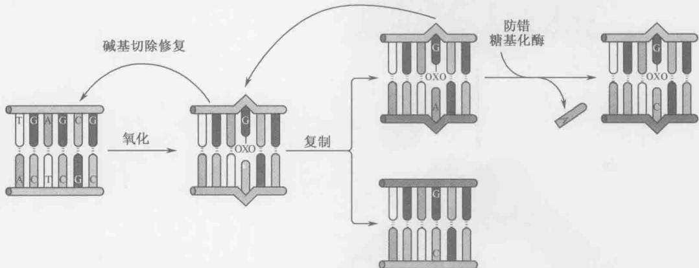  
图10-15 oxoG：A修复。鸟嘌呤氧化产生oxoG。修饰后的碱基在DNA复制之前就能被DNA糖基化酶通过碱基切除途径进行修复。如果复制发生在oxoG被除去之前，致使A被错误插入，那么防错糖基化酶能除去A，使A被C替换掉。这给DNA糖基化酶除去修饰的碱基提供了第二次机会。

另一个防故障系统的例子是除去与 G 配对的 T 的糖基化酶。如我们所见，5-甲基胞嘧啶自发的脱氨基作用能形成 T：G 错配，这在脊椎动物的 DNA 中常常发生。因为 T 和 G 都是正常的碱基，细胞如何识别哪一个才是不正确的碱基呢？糖基化酶系统认为，T：G 错配中的 T 是 5-甲基胞嘧啶脱氨基作用产生的，并选择性地除去 T 使其被 C 取代。

#### [W] 核苷酸切除修复酶在损伤两侧切割受损的 DNA

与碱基切除修复不同，核苷酸切除修复酶不能区分各种不同的损伤，而是识别双螺旋形状上的扭曲，如胸腺嘧啶二聚体或碱基上存在大的化学加合物时产生的扭曲。这种扭曲引发一连串的事件，导致含有损伤的一小段单链片段（或小区）被去除。去除修复在 DNA 上产生的单链缺口由 DNA 聚合酶用未受损的链为模板进行填补，从而恢复原始的核苷酸序列。

E. coli 的核苷酸切除修复主要由 4 种蛋白质来完成：UvrA、UvrB、UvrC 和 UvrD（图 10-16）。UvrA 和 UvrB 组成的复合体扫描 DNA，其中 UvrA 负责检测螺旋中的扭曲，一旦遇到扭曲，UvrA 退出复合体。UvrB 使 DNA 变性，在损伤周围产生一个单链的凸起。然后，UvrB 募集 UvrC，UvrC 产生两个切口：一个位于损伤 5'侧的 8 个核苷酸处，另一个位于损伤 3'侧的 4 个或 5 个核苷酸处。切割产生长度为 12\~13 个残基的单链 DNA

图 10-16 核苷酸切除修复途径。(a) 通过与 UvrB 形成二聚体的 UvrA, ATP 水解促进促进二聚体形成 UvrA 和 UvrB 扫描 DNA, 寻找扭曲。(b) UvrA 离开复合体, UvrB 在扭曲附近将 DNA 局部变性。(c) UvrC 与 UvrB 形成复合体, 在损伤的 5'侧和 3'侧产生切口。(d) DNA 解旋酶 UvrD 将单链片段从双螺旋上释放出来, DNA 聚合酶 I 和连接酶对缺口进行修复和填补。(a\~d 经允许取自 Zou Y. and Van Houten B. 1999, EMBO J. 18: 4898, Fig 7. © Macmillan.)

片段，此片段在 DNA 解旋酶 UvrD 的可作用范围之内。最后，DNA 聚合酶 I（Pol I）和 DNA 连接酶填补产生的缺口。

较高等细胞中核苷酸切除修复的原理与 E.coli 中的基本相同，但是对损伤的检测、切除和修复系统更为复杂，涉及 25 个或者更多的多肽。其中 XPC 负责检测螺旋中的扭曲，这在 E.coli 中是 UvrA 的职能。与在 E.coli 中一样，DNA 被变性打开并在损伤周围形成一个凸起。凸起的形成涉及 XPA 和 XPD 蛋白的解旋酶活性（E.coli 中 UvrB 的对应物），以及单链结合蛋白 RPA。凸起在损伤部位的 5' 端产生的切割位点供核酸酶 ERCC1-XPF 切割，在 3' 端产生的切割位点供核酸酶 XPG 切割（代表 UvrC 的功能）。在高等细胞中，产生的单链 DNA 片段为 24\~32 个核苷酸。与在细菌中一样，DNA 片段释放后产生的缺口被 DNA 聚合酶和连接酶填补。

如其名称所表明的那样，UVR蛋白是紫外线损伤修复所需要的。uvr基因突变株对紫外线敏感，缺少除去胸腺嘧啶-胸腺嘧啶二聚体和胸腺嘧啶-胞嘧啶加合物的能力。事实上，这些蛋白质广泛识别各种类型的巨大加合物并将之修复。核苷酸切除修复对人类也很重要。人类可患上一种名为着色性干皮病的遗传病，此病使患者对光线极度敏感并导致皮肤损伤，包括皮肤癌（见框10-4，核苷酸切除修复和跨损伤合成与人类遗传缺陷的联系）。

#### [W] 框 10-4 核苷酸切除修复和跨损伤合成与人类遗传性疾病的关系

人类可患一种遗传性疾病——着色性干皮病（XP），它是一种常染色体疾病，使得患者对阳光非常敏感，同时导致皮肤损伤，包括皮肤癌。已有7个基因被鉴定其突变能引起XP。这些基因的特定蛋白（如XPA、XPC、XPD、XPF和XPG等；见正文）处于人类的核苷酸切除修复途径（NER），突显了NER在紫外损伤中的重要性。除了NER相关的蛋白质，一种XP的突变型XP-V是由于DNA跨损伤修复聚合酶Polη（见后面关于跨损伤聚合酶的讨论）的缺陷引起的。编码该酶的基因有时称为XPV，携有XP-V的个体表现出较为缓和的XP症状。

在 XP 患者的细胞水平上发生了什么呢?由于 NER 缺陷的存在, 细胞 UV 诱导的 DNA 损伤修复能力, 如对胸腺嘧啶二聚体的修复受到限制, XP 患者暴露于阳光后, 细胞内 DNA 损伤的数量增加, 导致诱变的增加和细胞死亡。具有突变的 Pol η 的细胞在复制中无法修复胸腺嘧啶二聚体突变, 因此必须使用另一个旁路的跨损伤聚合酶, 以避免阻滞在复制期。因为 Pol η (但不包括其他跨损伤聚合酶) 校正了胸腺嘧啶二聚体的插入, 使用其他跨损伤聚合酶可能增加突变的频率。

核苷酸切除修复不仅能修复整个基因组中的损伤，而且当RNA聚合酶的转录过程被某个基因中发生的转录（模板）链的损伤所终止时，它还能拯救RNA聚合酶。此现象叫做转录耦联修复（transcription-coupled repair），包括将核苷酸切除修复蛋白募集到受阻的RNA聚合酶上（图10-17）。转录耦联修复的意义在于它将修复酶集中于正在活跃地被转录的DNA（基因）上。实际上，RNA聚合酶在细胞中起到另一种损伤检测蛋白的作用。真核细胞中转录耦联修复的核心是通用转录因子 TFIIH。如我们将在第 13 章所看到的那样，TFIIH 在转录起始过程中解开 DNA 模板的螺旋。TFIIH 的亚基包括上面讨论的 DNA 解螺旋蛋白 XPA 和 XPD。所以，TFIIH 负责两个独立的职能：在核苷酸切除修复过程（包括转录耦联修复）中，有解链功能的解旋酶将损伤周围的 DNA 解旋，以及在基因转录过程中帮助打开 DNA 模板。原核生物中也存在将修复和转录耦联在一起的系统。

#### [W] 重组修复通过从未受损 DNA 中找回序列信息来修复 DNA 断裂

切除修复用未受损的 DNA 链作为模板来替代另一条链上已受损的 DNA 片段。细胞如何修复 DNA 中双螺旋两条链都断裂的双链断裂呢？这是由双链断裂修复（DSB）途径 [double-strand break（DSB） repair pathway] 进行的。此途径从姐妹染色体中取回序列信息。因为 DSB 修复途径在常规的同源重组及 DSB 修复中具有核心作用，所以 DSB 修复途径本身就是一个重要的主题，我们将在第 11 章中对其进行详细探讨。

DNA 重组还帮助修复 DNA 复制中的错误。设想复制叉在 DNA 中遇到没有被核苷酸切除修复纠正的损伤（如胸腺嘧啶二聚体），DNA 聚合酶有时将会放弃尝试越过此损伤进行复制。DNA 聚合酶有时试图尝试跳过损伤进行复制。虽然模板链不能使用了，但是序列信息仍然能通过重组从复制叉的另一个子分子上取回（见第 11 章）。当重组修复完毕后，核苷酸切除系统又有一次修复胸腺嘧啶二聚体的机会。事实上，已经知道重组缺失的突变体对紫外线敏感。再考虑复制叉在 DNA 模板中遇到一个切口，复制叉越过切口将产生 DNA 断裂，这只能通过双链断裂修复途径进行修复。虽然一般我们认为重组是探讨序列新组合的演化策略，但它最初的功能可能是为了修复 DNA 的损伤。

#### [W] DNA 中的 DSB 可以通过直接与断裂末端相连而修复

在所有的 DNA 损伤中，DSB 是对细胞最有害的。如果不修复，DNA 的断裂将引起多种有害的后果，如阻断复制和引起染色体缺失，进而导致细胞死亡或肿瘤转化。细胞通常有多种重叠的途径来处理 DNA 损伤，那么细胞不仅仅依赖于 DSB 修复途径来处理 DSB 也就不足为奇了。正如我们所看到的和在第 11 章中将要讨论的，DSB 修复途径依赖于姐妹染色体的 DNA 序列信息来修复受损的 DNA 分子。这是一种有效的策略，因为姐妹染色体可以为绕过断裂位点而精确地恢复原先的序列提供一个模板。在酵母细胞中，DSB 修复是断裂修复的一种主要途径。但是，在细胞周期的早期，两个姐妹染色体由 DNA 复制产生之前又会发生什么呢？如果一个仍未复制的染色体发生了断裂，就没有姐妹染色体可以作为 DSB 修复途径的模板了。在这种情况下，另外一个称为非同源末端连接（nonhomologous end joining，NHEJ）的系统就可以发挥作用了。NHEJ 是酵母中的备用系统，但是在高等细胞中它是修复断裂的一个主要途径（框 10-5，非同源末端连接）。

  
图 10-17 转录耦联的 DNA 修复。(a). RNA 聚合酶在损伤上游正常地转录 DNA。(b). 当遇到 DNA 中的损伤时, RNA 聚合酶受阻, 转录停止。(c). RNA 聚合酶招募核苷酸切除修复蛋白到损伤部位上, 然后从 DNA 上回退或者解离, 以使修复蛋白能触及损伤。(经 Zou Y. and Van Houten B. 1999. EMBO J. 18: 4898, Fig 7. © Macmillan.)  
框10-5 非同源末端连接

NHEJ能够修复暴露于外源有害物而产生的DSB，如电离辐射及细胞内在的损伤（如DNA复制失败）。显然，NHEJ也存在于所有正常细胞内在的适应性免疫过程中。免疫系统产生大量多种多样的抗体分子，这些分子由所谓的轻链和重链组成。轻链和重链是在重组过程中产生的，包括大量储备着编码蛋白的DNA元件V和J（在抗体的重链中是D片段）等大片段的连接，从而形成多肽的不同区域。第12章我们将这个过程称为 V(D)J 重组 [V(D)J recombination]。V(D)J 重组的启动是通过在一个淋巴细胞特异的过程中引入 DNA 的断裂，这个过程还涉及 RAG1 和 RAG2 两个蛋白质。一旦断裂产生，NHEJ 途径（并不是淋巴细胞特异的）就会将两个末端连接。然而在这种情况下，蛋白编码片段的末端并不是与它们原先的部分连接。这些末端会与新的片段连接起来形成重链和轻链中的合成编码序列。NHEJ 也参与 V(D)J 重组的另一个例子——控制 T-细胞受体的免疫多肽的形成，将在第 12 章讨论。

强调 NHEJ 在人类生物学中的重要性是因为一些罕见的遗传综合征，它们的特征是对电离辐射和 DNA 损伤剂，以及由 V(D)J 重组缺陷导致的免疫缺陷高度敏感。可见患有这些综合征的患者在 NHEJ 途径的 Artemis、LigaseIV 或 Cermummos-XLF 基因中发生了突变。

我们可以解释的是，进行 NHEJ 保护并加工断裂的末端，同时将它们连接在一起的机制。由于断裂末端的序列信息丢失了，穿过断裂处的原先序列在异源末端连接过程中无法忠实地修复，因此，NHEJ 是有致变性的。当然，由 NHEJ 介导的 DNA 末端连接而导致的诱变要比将断裂的 DNA 留下而不修复对细胞的损伤小得多。

在 NHEJ 中将 DNA 末端连接起来的机制是什么呢？如其名称所示，NHEJ 不涉及同源重组。取而代之的是，通过断裂末端突出的单链之间错排配对，断裂 DNA 的两个末端直接相互连接。此错排配对是通过不同片段（可以短至一个碱基对）互补碱基之间的匹配完成的（偶然发现的微小同源件）。单链尾巴用核酸酶去除，缺口用 DNA 聚合酶填补。

已经鉴定出了很多调控 NHEJ 的蛋白质。至今，在哺乳动物细胞中已经发现了 7 个 NHEJ 途径的组分，它们的名字都比较难记：Ku70、Ku80、DNA-PKcs、Artemis、XRCC4、Cernunnos-XLF 和 DNA Ligase IV（图 10-18）。Ku70 和 Ku80 是 NHEJ 最基本的成分，它们能形成一个异源二聚体与 DNA 的断裂末端结合并招募蛋白激酶 DNA-PKc。DNA-PKc 接下来与 Artemis 形成复合体。Artemis 同时具有 5'→3' 外切核酸酶和潜在的内切核酸酶活性，可以被 DNA-PKc 的磷酸化作用激活。这些核酸水解活性对断裂末端进行加工并为连接作准备。连接是由 Ligase IV、XRCC4 和 Cernunnos-XLF 组成的复合物来执行的。

NHEJ 在真核生物中是普遍存在的，但是在细菌中很少发生。然而，有人在枯草芽孢杆菌（Bacillus subtilis）的孢子中发现了一个很有意思的特殊例子。枯草芽孢杆菌能在孢子生成和成熟孢子组装蛋白的时候产生类 Ku 蛋白和一种 DNA 连接酶。Ku 蛋白和 DNA 连接酶代表了一个简单的二蛋白 NHEJ 系统，在孢子萌芽时修复 DNA 断裂。缺少这些蛋白质的突变孢子对于干热（一种已知的引起 DNA 断裂的条件）非常敏感。在萌芽时期，加热突变的孢子并不能恢复生长，因为无法将热诱导的断裂重新连接。

萌芽时期的孢子主要依赖于 NHEJ 而不是 DSB 修复途径来修复断裂是有重要意义的。孢子只有一条染色体，因此，它们不能依赖于姐妹染色体作为修复突变的模板。有

趣的是，孢子的染色体紧密卷曲形成一个典型的圆环结构可以保持断裂的 DNA 末端之间紧密相邻。这种紧密相邻的结构可以使正确的末端重连变得容易，甚至是染色体发生多处断裂的情况。枯草芽孢杆菌的孢子及有关的细菌能在极端环境下比其他任何休眠的细胞更有效地生存。NHEJ 就是这种惊人技巧的基础。

#### [W] 移损 DNA 合成使复制越过 DNA 损伤继续进行

在迄今我们已经探讨的很多例子中，DNA损伤是通过切除然后用未受损的模板重新合成来完成修复的。但是，这种修复系统不能十分有效地运行，有时正在复制的DNA聚合酶仍会遇到没有被修复的损伤，如嘧啶二聚体或脱嘌呤位点。因为这样的损伤是DNA聚合酶前进的障碍，所以复制机器必须试图越过损伤来进行复制，或被迫终止复制。即使细胞不能修复损伤，也有防故障机制使复制机

  
图 10-18 哺乳动物的 NHEJ 途径。Ku70 和 Ku80 组成的异源二聚体与断裂 DNA 的末端结合并招募蛋白激酶 DNA PKc。DNAPKcs 紧接着招募拥有外切核酸酶和内切核酸酶活性的 Artemis 对断裂末端进行加工。最后，连接酶 IV、XRCC4 和 CernunosXLF 组成的复合物将两个断裂末端相连。（Sekiguchi J. M. and Ferguson D. O. 2006. Cell 124: 260-262. © Elsevier. 经许可重绘）

器绕过受损的部位，这种机制就叫做移损合成（translesion synthesis）。如我们将看到的那样，这个机制有高度的易错性，易引入突变，但是移损合成使细胞避免了染色体不完全复制的更坏命运。DNA损伤容限的一个关键特性使DNA损伤保持在基因组中。DNA修复路径可以随后修正损伤（图10-19）。

移损合成是被一类特化的 DNA 聚合酶催化的，此酶越过损伤部位直接合成 DNA（图 10-20）。在 E.coli 中，移损合成是由 UmuC 和 UmuD'蛋白的复合体 DNA PolV 或 DNA PolIV（DinB）承担的。DimB 和 UmuC 是 DNA 聚合酶的一个独特家族的一员，它在很多生物中都被发现，称为 DNA 聚合酶的 Y 家族（图 10-21 和框 10-6，DNA 聚合酶的 Y 家族）。人类有 5 种移损聚合酶，其中 4 种属于 Y 家族。

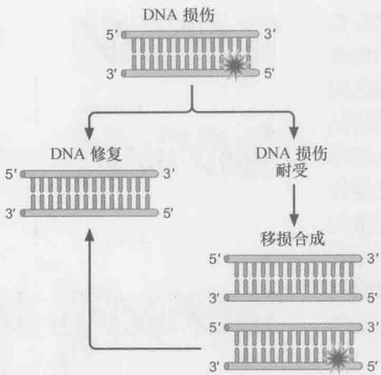  
图10-19 DNA损伤的细胞防御。细胞通过DNA修复通路将损伤的DNA恢复到正常的状态。当基因正在被复制时如果出现DNA损伤，细胞必须启动DNA损伤耐受机制，从而避免产生复制中断或者导致致命的DNA链断裂。损伤合成虽然可以完成DNA损伤位点的复制，但是随后DNA修复通路必须对其进行修正，否则损伤就会一直存在于基因组中。

  
图 10-20 移损 DNA 合成。复制时一旦在模板中遇到损伤，DNA 聚合酶 III 与其滑动夹一起从 DNA 上脱离下来并被移损 DNA 聚合酶取代。移损 DNA 聚合酶越过模板链（上者）上的胸腺嘧啶二聚体继续进行 DNA 的合成。然后移损聚合酶被 DNA 聚合酶 III 替换。（Woodgate R.1999. Genes Dev.13: 2191-2195, Fig.1. © Cold Spring Harbor Laboratory Press. 经许可重绘）

框 10-6 Y 家族 DNA 聚合酶

DNA 聚合酶按照它们氨基酸序列的彼此相似性而划分成若干家族，在图中用不同的颜色表示（框 10-6，图 1）。最近证实 UmuC 和其他几种移损 DNA 聚合酶是一个庞大而独特的 DNA 聚合酶家族的创始成员，该家族被称为 Y 家族，在三种生命领域——细菌、古细菌和真核生物中都有发现。DNA 聚合酶的 Y 家族成员特征性地在未受损 DNA 模板上进行低保真度 DNA 合成，但是它能够越过阻碍 DNA 合成酶其他家族成员进行复制的 DNA 损伤。框 10-6 图 1 显示移损 DNA 聚合酶的 Y 家族系统演化树。

  
框 10-6 图 1 Y 家族 DNA 聚合酶的系统演化树。(经允许引用自 OhmoriH. Et al. 2001. Mol. Cell 8: 7, Fig1. © Elsevier.)

这些聚合酶一个重要的性质就是，虽然它们是模板依赖性的，但是它们掺入核苷酸的方式不依赖于碱基配对。这解释了酶是如何越过模板链上的损伤合成 DNA 的。但是，因为酶没有从模板上“读取”序列信息，所以移损合成常有高易错性。试想在脱嘌呤或脱嘧啶例子中损伤位点并无碱基特异性的信息。移损聚合酶通过不按照碱基配对的方式插入核苷酸来越过损伤进行合成。虽然如此，插入的核苷酸并不是随机的——有些移损聚合酶插入特定的核苷酸。例如，人的一个 Y 家族移损聚合酶（DNA Polη）成员在嘧啶二聚体对应位置上正确插入两个 A 残基。结构研究显示，DNA Polη 的活性位点比另一种 DNA 移损聚合酶（DNA Polκ）更容易容纳一个胸腺嘧啶二聚体（图 10-22）。

©2010 Macmillan

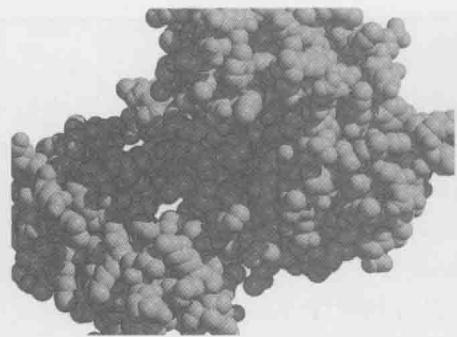

  
图 10-21 移损聚合酶的晶体结构。此处显示的是两种不同的 DNA 聚合酶的结构。左侧是家族聚合酶（损伤旁路）的结构；右侧是噬菌体 T7 的典型 DNA 聚合酶。注意 Y-聚合酶结构中活性位点更加开阔，而在右侧缺失的蛋白区域关闭了通道（黄色箭头指示）。掺入的核苷酸用红色表示，模板核苷酸用蓝色表示。（Y polymerase, Ling H. et al. 2001. Cell 107: 91. PDB Code: 1JX4. T7 polymerase, Doublé S. et al. 1998. Nature 391: 251. PDB Code: 1T7P.）镜像图用 MolScript, BobScript 和 Raster 3D 制作。

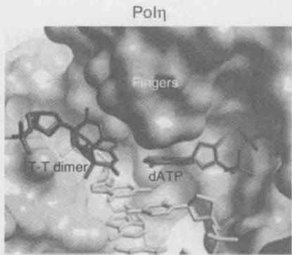

Polk  
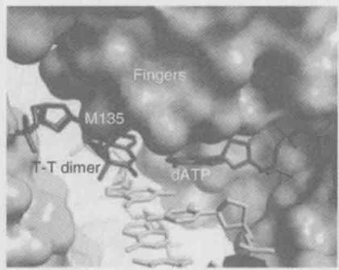  
图 10-22 移损聚合酶支持某些特殊种类的损伤。（左图）一个胸腺嘧啶二聚体与 DNAPolη 的活性位点非常适合，因此允许在对应位置上正确插入两个 A 残基。（右图）叠加图像显示一个胸腺嘧啶二聚体与另一种 DNA 移损聚合酶 DNAPolk 的活性位点不适合，DNAPolk 更适合于其他 DNA 损伤的修复。（引用自 Silverstein T.D. et al. 2010. Nature 465: 1039–1043, Fig. 4b, p. 1042. ©Macmillan.）

因为它的高错误率，移损合成（类似于 NHEJ）被认为是最后可选择的求助系统。它能使细胞存活下来，否则可能对复制是灾难性的打击，但是付出的代价是高突变发生率。突变发生（mutagenesi）是基因组引进和保持突变的一个过程。由于这个原因，移损 DNA 聚合酶必须受到严格的调控。在正常条件下，E. coli 中没有移损合成酶，此酶只有在对 DNA 损伤应答的时候才被诱导合成。因此，编码移损聚合酶的基因作为 SOS 反应（SOS response）途径的一部分来表达。损伤导致转录阻抑物（LexA 阻抑物）被蛋白质水解性分解，此转录阻抑物控制 SOS 反应涉及的基因的表达，包括 DimB, UmuC 和 UmuD（UmuD'无活性的前体）。有趣的是，同一途径还负责 UmuD 到 UmuD' 的蛋白水解性转变。LexA 和 UmuD 的切割都是被称为 RecA 的蛋白质激发的，此蛋白质被 DNA 损伤产生的单链 DNA 激活。RecA 是双功能蛋白，它还参与 DNA 的重组，将在第 11 章讨论。

接下来我们讨论一下移损聚合酶是如何进入 DNA 损伤位点处受阻的复制机器的。在哺乳动物细胞中，移损聚合酶是通过对滑行夹的化学修饰来进入移损修复途径的。在第9章中我们已经看到，滑行夹（也就是真核生物的PCNA）将复制聚合酶锚定在DNA模板上。化学修饰是指将滑行夹与一个泛素化途径（ubiquitination）中的多肽（泛素）进行共价连接。在真核生物中，泛素化途径被广泛用于标记各种加工途径的蛋白质，如降解。最近发现越来越多的泛素化途径能够引发移损合成，并且成为由泛素肽等标签蛋白控制的细胞过程之一。一旦泛素化，滑行夹就会招募一个含有能够识别和结合泛素的结构域的移损聚合酶。移损聚合酶有时候会取代生长链3'端的复制聚合酶而越过损伤位点进行生长链的延伸（图10-23a）。因此，滑行夹的泛素化成为一个危机信号，可以招募移损聚合酶来拯救在DNA损伤位点处受阻的复制机器。除了聚合酶转换机制，也有数据证明移损合成也可以采用填空机制，即随着复制的进行，由于参与复制的DNA聚合酶在越过DNA损伤后重新启动或者开始新的冈崎片段合成时所产生的空隙（图10-23b）。

  
图 10-23 移损合成的可选择模式。这两种模式解释了移损合成的机制。（a）在聚合酶转换模式中，当正在进行 DNA 复制的 DNA 聚合酶遇到 DNA 损伤的时候，便会停止合成 DNA 并被一种或多种移损聚合酶代替，DNA 聚合酶将会暂时离开损伤的部位，越过损伤部位以后，DNA 聚合酶又会重新代替移损聚合酶继续进行复制。（b）在填空模式中，当正在进行 DNA 复制的 DNA 聚合酶遇到 DNA 损伤的时候，DNA 合成并不会停止，DNA 聚合酶会跳过损伤的部位继续进行 DNA 合成，在损伤的部位留下一个缺口。随后，一个或多个移损聚合酶会进行合成来填补这个缺口。（改编自 Waters L. S. et al. 2009. Microbiol. Mol. Biol. Rev. 73: 134–154, Fig. 4, p.146.）

最后，移损合成还有几个令人着迷但是却仍然没有答案的问题。移损酶如何取代DNA复制复合体上正常的复制聚合酶？DNA合成越过损伤后，正常复制聚合酶怎样回来并取代在复制叉上的移损酶？移损聚合酶的延伸能力低，所以可能在复制通过损伤后不久它们就从模板上脱离下来。不管怎样，这个解释仍给我们留下了挑战，去解答正常加工酶如何重新进入复制机器中这一问题。

<!-- W-END Watson 10 DNA的突变和修复 -->

<!-- W-BEGIN Watson 11 分子水平上的同源重组 -->

### 【中文对照 Watson 第11章：分子水平上的同源重组】

> 来源：Watson《基因的分子生物学》第七版中译本（书籍/03_基因的分子生物学_第七版） 第11章 分子水平上的同源重组。

#### [W] 第11章 分子水平上的同源重组

本章概要
DNA 断裂频发并启动同源重组
同源重组的模式
同源重组中的蛋白质机器
真核细胞的同源重组
交配型的转换
同源重组机制的遗传结果

所有的 DNA 都是重组 DNA。在同源染色体配对的减数分裂期第一次核分裂前，遗传信息的频繁交换最明显，使得染色体不断地被混合和重排。在配对阶段，染色体间发生遗传交换，这种现象通常被称为交换（crossing over），它是同源重组（homologous recombination）的结果之一，这种重组涉及染色体间 DNA 序列的物理交换。同一条染色体上的两个基因间发生交换的频率取决于它们之间的物理距离，相距越远越易发生交换。实际上，在以早期交换频率测量为基础构建的遗传图，通过揭示基因排列的固定及线性顺序规律，首次提供了染色体的结构信息。

但有时基因的顺序会发生改变。例如，一种被称为转座子（transposon）的可以移动的 DNA 片段会随机地出现在染色体的不同位置上并促进 DNA 的重排，从而改变染色体的结构。导致转座及其他一些基因组重排的重组机制不同于同源重组，我们将在第 12 章中详细讨论这些现象。

同源重组是细胞的一个基本过程，由专门合成、专门调控的酶所催化。除了造成遗传多态性外，重组还能用细胞中未损伤的同源染色体 DNA 链来修复因损伤而丢失的染色体序列。重组同时还提供一种机制，重启被停止或损伤的复制叉（“复制重启”）。此外，特殊类型的重组还能调控某些基因的表达。例如，通过交换染色体的特定部分，细胞可以把本来休眠的基因置于它们可以表达的区域。

除了解释遗传过程外，还阐明了重组的分子机制，该机制引领了基因操作方法的发展。例如，它已使在多种不同实验动物中产生“基因敲除”和“转基因”变异成为常规（见附录A）。这种依靠重组在整体生物的背景下去掉或引入基因，是确定基因功能非常有效的方法。

#### [W] DNA 断裂频发并启动同源重组

DNA 经常发生双链断裂（double-stranded break，DSB）。如果断裂未得到修复，对细胞的后果是灾难性的。例如，E. coli 染色体上一个双链断裂如果无能力修复，对细胞是致命的。对大多数细胞而言，用于修复双链断裂的主要机制就是同源重组（homologous recombination）。有些细胞也可通过被称为非同源末端连接（NHEJ）的较简单机制进行修复。这个过程已在第 10 章中描述过（见第 10 章，框 10-5）。

细菌中，同源重组的主要生物学作用是修复双链断裂。这些断裂的 DNA 末端由多种方式形成（见第 10 章）。离子辐射和其他损害因子有时直接破坏 DNA 双链的骨架。许多类型的 DNA 损害可以经由干扰复制叉的进程而间接造成双链断裂。例如，一条 DNA 链上未修复的缺口能使经过的复制叉在此停止（图 11-1）。与此类似，一个使 DNA 不能作为模板的 DNA 链上的损伤可以导致复制叉停止。这种停止的复制叉的继续又有好几种途径（如复制叉后退、核酸酶分解等，图 11-1），并形成 DNA 双链断裂的末端。这些 DNA 断端会引发该 DNA 与其同源 DNA 形成重组，进而修复这个断裂。

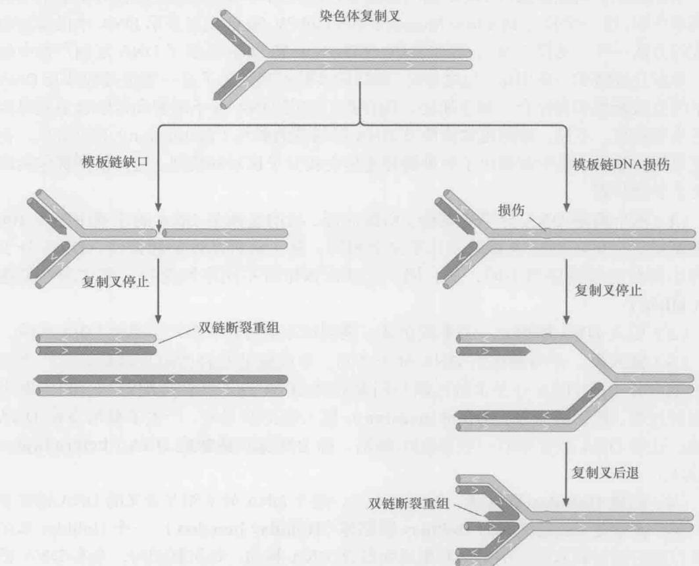  
图 11-1 DNA 复制时模板上的损伤能导致双链断裂。模板链上单个缺口造成双链断裂易于理解（左图）。不过模板上的一个造成复制叉停止的损伤也能形成双链断裂（右图）。在这种情况下，两条新合成的链（标为红色）可形成碱基互补链，导致复制叉向后退。这种结构可通过多种方法进行进一步的处理。断端可引发重组。

同源重组除了能修复染色体 DNA 双链断裂外，还能促进细菌间的遗传物质交换。这种遗传物质交换发生在宿主细胞的染色体和经噬菌体转导或细胞接合而进入的 DNA 之间（见第 7 章）。在这些情况下，进入细胞的 DNA 为线性分子，提供能引发同源重组的关键 DNA 断端。

同源重组是真核细胞中修复 DNA 断裂和复制叉停止的关键步骤。染色体修复和复制重起是同源重组的主要功能，在高级生物的很多体细胞中是这样，在植物性生长的单细胞中也是这样。然而，在很多情况下，遗传交换和染色体稳定都需要同源重组。除此以外，同源重组还有其他作用，如下面将要提及的，重组是减数分裂时同源染色体配对的必要步骤。在这种情况下，当细胞进入减数分裂时，产生一种特殊的蛋白质，介导 DNA 产生双链断裂从而引发重组。所以，虽然双链断裂有多种起因，DNA 上出现双链断裂仍是同源重组事件早期的关键步骤。

#### [W] 同源重组的模式

早期用原子同位素掺入 DNA 的巧妙实验，使人们对同源重组过程在分子水平上有了基本认识。这一实验与 Matthew Meselson 和 Frank W. Stahl 用以显示 DNA 半保留复制模式的方法一样（见第 2 章）。在实验中，Meselson 和 Stahl 证明了 DNA 复制产物中包含一条新合成链和一条旧链。与之相反，同样的实验过程揭示了这一重组过程涉及 DNA 分子的直接断裂和再结合。如下所述，现在我们知道 DNA 分子断裂和再结合是同源重组的主要特点。不过，重组也常常涉及 DNA 链局部的破坏（destruction）和再合成。在这些早期实验后，研究者提出了各种解释遗传交换分子机制的模型，这些模型都包括以下几个关键步骤。

（1）两个同源 DNA 分子的联会。所谓同源，指的是两条 DNA 的序列中至少 100 个碱基对以上的序列完全相同或几乎完全相同。除了这种高度的相似性，DNA 分子可有小部分区域的序列不同，如：同一个基因携带有不同序列变异，称之为等位基因（allele）。

（2）引入 DNA 断裂。一旦断裂形成，断裂的末端可进一步产生单链 DNA 区域。

（3）链入侵。在两条重组 DNA 分子之间，形成碱基互补的短片段起始区。当来自于亲本分子的 DNA 分子单链区域与同源双链 DNA 分子互补链配对结合时，发生该配对过程，称为链入侵（strand invasion）。链入侵的结果是，产生了新的双链 DNA 区域；这种 DNA 经常带有一些错配的碱基，称为异源双链螺旋 DNA（heteroduplex DNA）。

（4）形成 Holliday 联结体。链入侵之后，两个 DNA 分子相互交叉的 DNA 链联系在一起，这个交叉的结构称为 Holliday 联结体（Holliday junction）。一个 Holliday 联结体可以通过配对碱基连续的解链和配对而沿着 DNA 移动。每次移动时，亲本 DNA 链上配对碱基断开，由相同的碱基配对形成重组中间体，该过程称为分支移位（branch migration）。

（5）Holliday 联结体的拆分。重新生成两个分开的双螺旋 DNA 从而完成遗传物质的交换过程称为拆分（resolution）。拆分的方式有两种：通过 Holliday 联结体的断裂或者通过“分解”过程。在第一种方式中，切开联结体中的 DNA 链可以重新形成两个分开的二聚体。我们会发现，在两个重组的 DNA 分子拆分时，哪两对 DNA 链在形成 Holliday 联结体时被切断，对于 DNA 交换程度有很大影响。在第二种方式中，拆分通过分解实现，这是一种收敛或瓦解的机制，我们会在下文详细描述。

#### [W] 链入侵是同源重组的关键早期步骤

将联会的两条同源双链染色体画成如图 11-2a 所示，对演示重源重组的各个步骤非常有用。尽管这些分子序列几乎完全相同，带有同一基因不同的等位基因（在图 11-2 中用符号 A/a、B/b、C/c 表示），对理解重组的结果是很有帮助的。

重组是通过在每条 DNA 分子上同样区域引入一个双链断裂而始发的（图 11-2b）。断裂位置附近的 DNA 链可以从互补链的位置上释放出来，使之可供“侵入”并最终与同源 DNA 双链互补配对（图 11-2c）。在损伤位点附近的链的加工处理过程详述如下。在同源重组链中，入侵是关键的一步，这种链入侵，以及后续的在两个同源双链之间的互补链的配对在这些分子间会形成一个稳定的配对。这个过程也会引发两个亲本 DNA 链的交换。下面我们将讲到，催化链入侵的酶称为链交换蛋白（strand-exchange protein），因为它们促进了这个关键反应。

链入侵形成的 Holliday 联结体可通过分支移位沿着 DNA 移动，这种移位提高了交换 DNA 的长度。如果两个 DNA 分子并不完全相同，如同一基因不同的等位基因间常有的少量序列上的差异，发生在这些区域的分支移位形成的 DNA 双螺旋将带有一个或若干个序列错配（图 11-2d 中的 B 和 b 等位基因及旁边的放大图）。修复异源双螺旋 DNA 的错配有重要的遗传结果，本章的结尾处将提及这一点。

#### [W] Holliday 联结体拆分是完成遗传物质交换的重要一步

完成重组要求 Holliday 联结体拆分，这个拆分过程是通过在交叉处切割 DNA 链；这个反应把两个重组的 DNA 分子分开来，完成遗传物质的交换。图 11-3 显示了两个同源 DNA 双螺旋通过一个 Holliday 联结体连接在一起。拆分有两种不同的形式，可以形成两种不同的 DNA 产物，下面我们将做进一步的阐释。

图 11-3 显示了两个相似的双链 DNA 分子之间的交换产生的分支 DNA 上两对剪切点的位置。为了使这些剪切点易于观察，将 Holliday 联结体旋转，形成一个没有交叉的、十字路口形状的结构。序列相同且极性相同的两条 DNA 链将被切断。剪切位点的两种方式在图 11-3 中分别被标为 1 和 2。

在这个例子中，标为1的剪切位点发生在两条DNA链中，这两条链完全是由两个亲本DNA分子分别组成的（如蓝色实线和灰色实线所示的链）。如果这些链现在被切割并共价的连接（第二个反应是由DNA连接酶催化的，后面会讨论），那么将产生的DNA分子的结构和序列如图的左下角所示。这些产物被视为剪接（splice）重组产物，因为两个原先的双螺旋被剪接到了一起，来自亲本的 DNA 分子的区域与杂交双螺旋共价连接到了一起。如下面所述的等位基因标签，产生的剪接产物导致了基因重排，这些基因位于重组位点的两侧。因此这种类型的重组又被称为交换产物（crossover product），因为在这种 DNA 分子中，交叉点位于 A 和 C 基因之间。

  
图 11-2 Holliday 模型中的分支移位。在 DNA 单链上的小箭头标示 $5'\rightarrow3'$ 的方向。字母 A 和 a、B 和 b、C 和 c 分别代表了不同的等位基因。等位基因之间的序列差异不大。所以异源双链上同一基因座位、不同的等位基因之间就会形成错配（如 d 图右边的放大图所示）。

  
图 11-3 Holliday 联结体剪切。拆分时有两对供剪切的位点。一对位点的剪切产生“剪切”或交换产物；另一对位点剪切将产生“补丁”或非交换产物。小插图显示一个 Holliday 联结体的结构。请注意，小插图中的 DNA 碱基完全配对。

与之相反，Holliday 联结体中另一对剪切位点（图 11-3 中图标为 2）位于两条 DNA 链中，并且含有两个亲本分子的序列区域（例如，蓝色和灰色片段）。在这些位点发生拆分和共价连接以后，产生的 DNA 分子包含一段杂合 DNA 链（补丁），这些分子被称为补丁产物（patch product）。在这些产物中，重组并未产生两侧基因的重排（见图 11-3 中等位基因 A/a 和 C/c 等位基因标签），这些分子又被称为非交换产物（noncross-over products）。影响拆分的位点和极性的因素将在下面讨论。

#### [W] 双链断裂修复模型描绘了许多重组事件

同源重组经常因 DNA 双链断裂而启动。描述这种遗传交换反应的常用模型是双链断裂修复途径（double-stranded break-repair pathway）（图 11-4）。在这个模型里，始发事件是两条同源双螺旋 DNA 分子中的一条发生了双链断裂（图 11-4a），而另外一条保持完整。两条 DNA 分子中的非对称始发断裂，导致双链 DNA 断裂模型的后期重组过程也是非对称的（即两条双螺旋的处理不同。在下文，我们将看到这一点）。

发生双链 DNA 断裂后，一种 DNA 裂解酶逐步降解断裂的 DNA 分子以产生单链 DNA 区段（图 11-4b）。该过程在断裂的 DNA 上产生了叫做单链 DNA 末端的、以 3' 端结尾的单链延伸体。有时双链断裂处的两条链都会被降解，有时只有 5' 端的链被降解。

由上述过程产生的单链 DNA 末端这时侵入到未断裂的同源 DNA 双螺旋中（图 11-4c）。这张图示意了单链入侵，下一张图表示的是双链入侵。这两种情况中，每一条入侵链都和另一条 DNA 分子中的互补链配对。因为入侵链以 3' 端结尾，它们可以作为合成新 DNA 的引物。以同源 DNA 双链中的互补链作为模板，从这些 3' 断端开始延长，以重新合成断裂处被破坏的 DNA 片段（图 11-4d, e）。

如果原先的两条 DNA 分子序列在断裂附近并不完全一样（如上述的单碱基对替换），那么在重组的“双链断裂”修复中，序列信息就有可能丢失。如图 11-4 所示的重组事件，以标示的双链为模板合成 DNA 的结果导致 DNA（灰色）的序列信息丢失。在双链断裂修复模式下，这种单向的遗传物质交流有时会留下一个遗传标记——引发基因转变（gene conversion）事件，在本章结尾处我们将重述这一点。

双链断裂模式所产生的重组中间体——两个 Holliday 联结体，以分支移位的方式沿着 DNA 移动，并最终被拆分而结束重组事件。同样地，依据拆分 Holliday 联结体时所剪切的 DNA 链，可以决定最终 DNA 分子重组点两侧序列的基因是否发生重新配对（也就是导致交换）。如何拆分包含有两个 Holliday 联结体的重组中间体，以及拆分的不同方法，见框 11-1 的说明。

  
图 11-4 同源重组的双链断裂修复模型。图示产生有两个 Holliday 联结体的重组中间体的过程。

(a)

#### [W] 框11-1 如何拆分有两个Holliday联结体的重组中间体

如何剪切重组中间体的 Holliday 联结体, 对终产物 DNA 分子的结构有很重大的影响。终产物重组点两侧序列是重新分配（剪接/交换产物）还是不进行重新配对（补丁/非交换产物）决定于拆分如何进行。因为经双链断裂修复模型途径所产生的中间体有两个 Holliday 联结体，所以难于预见哪种产物是由哪种可能的 Holliday 联结体剪切组合产生的。实际上，一种简单的方法可判定是否产生了交换或非交换产物。

下面以框11-1图1中分别标为x和y的两个联结体来解释拆分中间体的不同方式。对于每一个联结体，有两个可能的剪切位置（标为1和2）。决定拆分是否产生交换或非交换产物的简单规则如下：如果两个联结体在同一个位置剪切，如都在1或都在2，那么产生的是非交换产物。如图1中b所示，两个联结体都在2位置上剪切，产生了非交换产物。请注意，等位基因A/B和a/b仍然在亲代染色体上同一DNA分子。两个联结体同时在1位上剪切也会产生非交换产物。

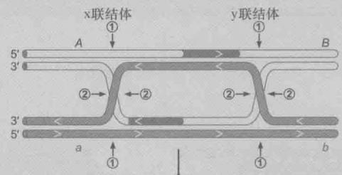

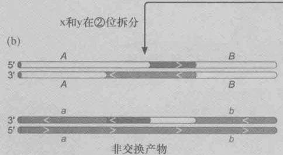

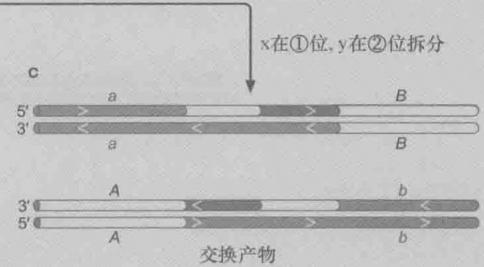  
框 11-1 图 1 双链分裂途径中间物的二种不同的拆分方式。亲代 DNA 分子连接，如图 10-4 所示。红色标示的 DNA 区域在重新合成。

与之相反，如果剪切发生在两个联结体不同的位置，就会产生交换产物。这种类型的拆分如框11-1图1c所示。x联结体在1位上剪切，y联结体在2位上剪切。请注意现在基因A和b相连，而基因a则和B相连。因此，两侧基因重新分配。如果x联结体在2位剪切，y联结体在1位剪切，也会产生交换产物。

为什么这条简单的规则是真实的？为理解这一点，比较本图中的联结体和图11-3中的单Holliday联结体。单联结体在1位上剪切产生剪接产物，在2位上剪切则产生补丁产物。当你结合两个联结体的剪切结果时，便会有如下结论：

两个联结体都在2位上剪切，产生补丁产物（补丁+补丁=补丁，非交换产物）；

两个联结体都在1位上剪切，同样产生补丁产物（剪接+剪接=补丁），因为第二次剪接型拆分正好“抵消”了第一次剪切所造成的基因重排；

若一个联结体在1位上剪切，另一个在2位上剪切，就会形成交换产物（剪接 + 补丁 = 剪接），因为在1位上剪切形成的基因重排在对最终产物中得以保留。

#### [W] 同源重组中的蛋白质机器

所有的生物都编码能催化 DNA 重组各个生化步骤的蛋白质。有些重组步骤中，同源蛋白质家族的成员在所有的生物中提供同样的功能。相比之下，另外一些重组步骤中，不同生物由不同种类的蛋白质催化，但都产生大体相同的结果。我们对重组机制最翔实的了解来自于对大肠杆菌及其噬菌体的研究。因此，我们首先着重描述主要通过双链断裂修复途径 [又称 RecBCD 途径（RecBCD pathway）] 促进大肠杆菌重组的蛋白质。真核细胞同源重组及其涉及的蛋白质将在下文介绍。

表 11-1 列出了在细菌和真核细胞（如芽殖酵母是最深入理解的真核细胞）中催化关键重组步骤的蛋白质。这些蛋白质活性是完成双链断裂修复路径关键步骤所必需的。除了这些负责重组的蛋白质外，DNA 聚合酶、单链 DNA 结合蛋白、拓扑异构酶、连接酶等也在遗传物质交换过程中起着关键作用。

表 11-1 原核和真核细胞中催化重组步骤的因子

<table><tr><td>重组步骤</td><td>大肠杆菌中的催化蛋白</td><td>真核细胞中的催化蛋白</td></tr><tr><td>同源 DNA 联会及链侵入</td><td>RecA 蛋白</td><td>Rad51, Dcm1(减数分裂期)</td></tr><tr><td>引入双链断裂</td><td>无</td><td>Spo11(减数分裂期, HO(交配模式转换)</td></tr><tr><td>作用于 DNA 断裂以产生用于侵入的单链</td><td>RecBCD(解旋酶/核酸酶)</td><td>MRX 蛋白(又称为 Rad50/58/60 核酸酶)</td></tr><tr><td>链交换蛋白组装</td><td>RecBCD 和 RecFOR</td><td>Rad52 和 Rad59</td></tr><tr><td>Holliday 联结体识别和分支移位</td><td>RuvAB 复合体</td><td>不详</td></tr><tr><td>拆分 Holliday 联结体</td><td>RuvC</td><td>Rad51c-XRCC3 复合体、WRN 和 BLM</td></tr></table>

请注意，尽管在 RecBCD 路径的重组中，两个重组 DNA 分子中至少要有一个双链断裂，但在表 11-1 中没有列出大肠杆菌中引入双链断裂的蛋白质。如前所述，迄今为止尚未发现细菌中有引入双链断裂功能的特殊蛋白质。实际上，DNA 损伤、DNA 修复中的“错误”（mis-steps）和复制叉停止等事件是染色体 DNA 产生双链断裂的主要来源。另外在遗传物质交换的反应中，如噬菌介导的转导（见附录 A），感染的 DNA 片段带有断裂的 DNA 末端。

下面将描述大肠杆菌的重组蛋白，及其如何在重组过程中通过双链断裂修复路径行使功能。我们将根据这些蛋白质在反应过程中出现的顺序加以讨论。首先讨论的是RecBCD酶如何作用于DNA的双链断裂点进而产生单链区；然后，阐述产生链交换作用的RecA蛋白的结构和作用机制，当RecA蛋白结合在DNA单链上后，能发现DNA上的序列同源区并在这些同源区域间形成新的碱基对；接下来，讨论促进分支移位的RuvA和RuvB蛋白；最后，介绍拆分Holliday联结体的酶RuvC。

#### [W] RecBCD 解旋酶/核酸酶加工用于重组的 DNA 分子断裂

具有单链延伸端或“尾巴”的 DNA 分子是引发同源序列间链交换的合适底物。RecBCD 酶(RecBCD enzyme)作用于断裂的 DNA 分子以产生单链 DNA 区域, RecBCD

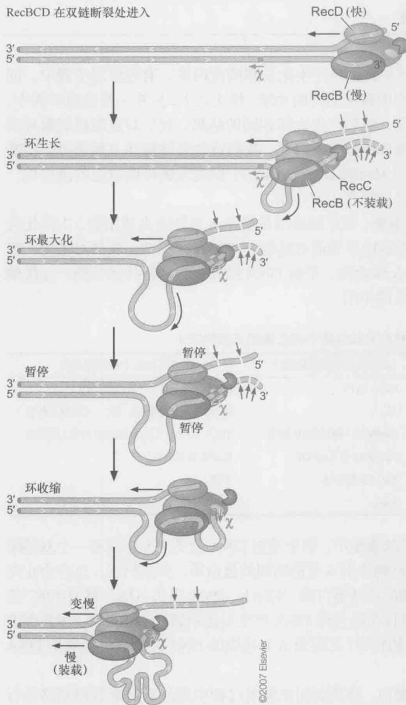  
图 11-5 RecBCD 处理 DNA 的步骤。注意 RecBCD 蛋白可以从任意一个或者两个破坏的末端进入该 DNA 分子。然而，Chi 位点仅从一个方向发挥作用。在展示的 DNA 分子中，Chi 位点被导向特定方向以便保证只有从右向左移动的 RecBCD 酶才可以被修饰。RecBCD 酶含有两个解旋酶：RecD（绿色）可以在 5' 端链（上游链）上迅速移动，RecB（紫色）可以在 3' 端链上缓慢移动（上游链）。因为这两个解旋酶移动的速度不同，RecB 在解旋过程中于下游链累积形成一个单链 DNA 环。当酶遇到 Chi 位点后，这个环就会“卷起来”，其 3' 端（现在同 Chi 接触）就可以参与 RecA 的装配。（经许可引用自 Spies et al. 2007. Cell 131: 694–705, Fig. 5, p. 701. ©Elsevier.）

也可协助链交换蛋白 RecA 结合到单链 DNA 末端。另外，RecBCD 所拥有的多种酶活性提供给细胞一种 “选择”，或是与进入细胞的 DNA 分子发生重组，或是降解它。

RecBCD 由 3 个亚基组成（recB 基因、recC 和 recD 基因的产物），并有 DNA 解旋酶和核酸酶活性。复合物依靠 ATP 水解提供的能量，结合在 DNA 双链断裂处并沿 DNA 移动。在该蛋白质的作用下，DNA 被解旋，同时伴有或不伴有破坏一条或两条 DNA 链。RecBCD 蛋白的活性受控于一段特殊的 Chi 位点（cross-over hotspot instigator）的 DNA 序列。Chi 位点由于能够提高同源重组的频率而被发现。

RecB 和 RecD 亚基都是 DNA 解旋酶, 利用 ATP 水解的能量解链 DNA 碱基对 (见第 9 章)。RecB 亚基不仅含有 $3'\rightarrow5'$ 解旋酶, 还含有一个多功能的核酸酶结构域, 后者可以在 DNA 上移动的同时对其进行消化。RecD 是一个 $5'\rightarrow3'$ 的解旋酶, 而 RecC 具有识别 Chi 位点的功能。究竟这种复杂的多功能机器的多个亚基是如何一起工作来实现其在 DNA 上的移动的? 当该复合物遇到 Chi 位点的时候又会发生什么?

多项研究（包括那些基于单分子技术的研究）已经表明

RecB 和 RecD 解旋酶可以像 “马达” 那样沿 DNA 中的两条相反的链独立移动，彼此的速度也不一样。同时，它们可以 “驱动” RecBCD 复合物沿着 DNA 分子以超过 1000bp/s的速度移动。DNA 中的 Chi 位点作为一种 “分子节流阀” 可以调节解旋酶的活性，进而调节 DNA 易位的速度。图 11-5 是一张原理图，从整体上描述了 RecBCD 处理一个含有单个 Chi 位点的 DNA 分子以激活该分子进行重组的过程。RecBCD 从 DSB 位点进入 DNA 并沿着 DNA 分子移动，同时使链发生解旋。但在开始的时候，复合物的两个马达以不同的速度移动——RecD 的速度比 RecB 的要快，因而会引导该复合物。随着 RecB 逐渐追上，由 3' 端凸起部分的单链 DNA 形成的环便出现在复合物的前面。

遇到 Chi 位点后，复合物停止数秒，然后以初始速率的一半继续。在停止过程中，三个事件发生进而改变了复合物的活性。第一，突出的单链环状 DNA 被 RecB 亚基拉或绕回来，RecB 成为主要的驱动区并主导着复合物；第二，一个可能的构象发生变化，导致 RecD 亚基解偶联；第三，RecBCD 的核酸酶活性发生变化。随着 RecBCD 移入 Chi 位点之外的远端序列，核酸酶不再依 3'→5' 方向剪切 DNA。此外，相反的 DNA 链比遇到 Chi 位点前更加频繁的拆分。这种变化的结果使一条双螺旋 DNA3' 单链延长到 3' 端的 Chi 位点。这种结构适于 RecA 蛋白的组装，并引发链交换（详情下述）。现在我们认为 RecBCD 遇到 Chi 位点后酶活性变化的分子机制与 DNA 通过 RecBCD 多亚基复合体的变化方式有关。

与 DNA 结合的 RecBCD 复合体结构使我们更加深入地了解这三个亚基的功能，以

及当遇到 Chi 位点后活性是如何变化的。如图 11-6 所示，这个蛋白质复合体是一个三角形，双螺旋 DNA 是从三角体的上部进入蛋白质的。在这里，DNA 遇到一个称为“栓”的结构，这个结构是由 RecC 亚基突出来的，它的作用是切割双螺旋并且引领各自的 DNA 链到两个酶的驱动区。RecC 亚基引领 3'链进入 RecB 驱动区并使 5'链进入 RecD 驱动区。在这种情况下，RecC 虽然本身不是一个解旋酶，但提高了整个复合体解旋的活性。酶中孔道的形成使得 3'DNA 尾巴恰好暴露于 RecB 亚基核酸酶活性位点处。因此在酶遇到 Chi 位点前这条链就被高效地降解了。DNA 的 5'尾部离开 RecD 驱动区后同样会暴露于 RecB 核酸酶的活性位点处，但是它的降解效率低于 3'端尾部，因为它必须与更易被降解的 3'尾部竞争。然而，一旦遇到一个 Chi 位点，这种情况就会发生变化。RecC 识别并紧紧结合此 DNA 位点，并且一

  
图 11-6 RecBCD-DNA 复合物的结构。这里 RecB 标为蓝色，RecC 为红紫色，RecD 为绿色。通过复合物的“顶部”进入的结合 DNA 标为紫色，白色箭头指的是结合钙离子（红色）与 RecB 核酸酶活性位点。这个结构显示了 DNA 的剖面图。ReC 接触 DNA 双链并将其分开，将 3' 链引导到 RecB 的左面，5' 尾巴结合到 RecD 的右面。（Singleton M. R. et al. 2004. Nature 432: 7015, PDS Code: 1W36.）图像以 Py MOL (DeLano W. L. 2002 The Py MOL molecular graphics system. 绘制，DeLano Scientific, Palo Alto, California http://www.pymol.org)

旦 Chi 位点的 3'端被结合后，3'尾部就不能进入核酸酶，也就阻止了 3'端的降解。这样通过活性位点处竞争者的移除促进了 5'尾部的降解。

由 RecBCD 产生的单链 DNA 尾部必须被 RecA 蛋白所包被，这样才能发生重组。然而，细胞中含有一种单链结合蛋白（SSB）也可以结合到这种 DNA 上。为了保证是 RecA 而不是 SSB 结合到这些单链 DNA 尾部，RecBCD 直接与 RecA 结合以利于该蛋白质的组装。这种结合导致了 RecB 亚基的核酸酶结构域与 RecA 蛋白之间的蛋白质-蛋白质相互作用，并把 RecA 结合到了 DNA 的 3' 端尾巴上。

#### [W] Chi 位点控制 RecBCD

Chi 位点能够使重组发生率提高约 10 倍。这种提高在与 Chi 位点直接相邻的区域最为明显。虽然 Chi 位点附近 10kb 左右的区域都能观察到重组概率的提高，但这种趋势随着远离 Chi 位点而逐渐降低（图 11-7）。最初，人们对这种提高只发生在 Chi 位点的一侧感到迷惑，但现在已经清楚为何这样：双链断裂（RecBCD 切入点）和 Chi 位点间

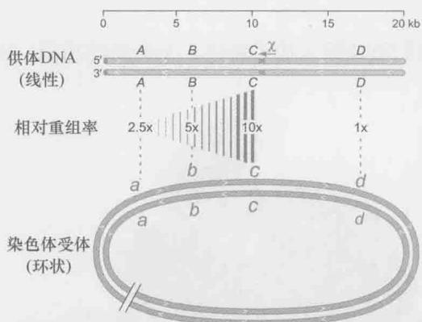  
图 11-7 Chi 位点的极性。本图显示了一个 Chi 位点能特异性提高 Chi 位点及其远处序列的重组频率。示例是一个经转导或接合进入细胞内的线性 DNA 和细菌 DNA 发生的交换事件。实际参与的 DNA 序列可能更长。例如，噬菌体转导经常传递约 80kb 的 DNA 片段。大肠杆菌染色体的长度约为 5Mb。

的 DNA 被酶切成小片段, 所以不能发生重组。相比之下, Chi 位点后的 DNA 序列遇到 RecBCD 后, 保留着待重组的单链形式, 并特异性地与 RecA 结合。

Chi 位点控制 RecBCD 核酸酶活性的能力使之可帮助细菌细胞免受通过噬菌体介导或接合的外源 DNA 的入侵。8 个核苷酸的 Chi 序列（CGTGGTGG）在大肠杆菌基因组中出现的概率极高。据预测，大肠杆菌基因组上每 65kb 才有一个、总共 80 个 Chi 位点；实际上，大肠杆菌染色体序列共有 1009 个 Chi 位点。由于 Chi 过多出现，大肠杆菌 DNA 进入大肠杆菌细胞时易被 RecBCD 加工，产生 3' 端单链 DNA，因此被激活以引发重组。相比之下，来自于另一株的 DNA（大肠

杆菌 Chi 位点未过多出现）没有过多的 Chi 位点。RecBCD 作用于此 DNA 后，将导致其被过度降解，而并非被激活后用于重组。

总而言之，RecBCD 的 DNA 降解活性有多种后果。这种降解功能对于处理 DNA 断端，使之与 RecA 组装及链入侵是必需的。在此情况下，RecBCD 促进重组。但是，RecBCD 通过降解 DNA 来激活重组，所以整个同源重组的过程中也必须有 DNA 合成以使被降解的 DNA 链再生。此外，RecBCD 的功能有时候仅仅是降解 DNA——正如降解缺少 Chi 位点的外源 DNA 一样。这时，RecBCD 可保护细胞免受引进外源序列（可能带有噬菌体或其他有害成分）可能造成的损害。

#### [W] RecA 蛋白在单链 DNA 上组装并促进链入侵

RecA 蛋白是参与同源重组的关键蛋白质，是 “链交换蛋白”（strand-exchange protein）酶家族的基本成员，这些蛋白质催化同源 DNA 分子的配对。配对过程涉及寻找两个分子间相配的序列以及在两个分子间产生供配对的区域。

RecA 蛋白促进 DNA 配对和链交换的活性可以通过使用简单的 DNA 底物进行体外实验来观察。图 11-8 列举了 DNA 配对和链交换的过程，以展示 RecA 的生化活性。这些 DNA 分子的重要特性是：①两条 DNA 分子序列互补；②至少其中一个分子上有使 RecA 能够组装的单链 DNA 区；③在互补区内存在一个 DNA 末端，使新形成的双螺旋中的 DNA 链相互缠绕。

  
图 11-8 RecA 链交换的底物。这里展示的是可能参与 DNA 配对和链交换的三种可能的结构组合。注意 a 和 c 上的括弧显示一条 DNA 链上的缺口的位置。

具有活性的 RecA 是一种蛋白质 DNA 纤丝（图 11-9）。与多数涉及分子生物学的、以小且离散的蛋白单位行使功能（如单体、双体、六聚体等）的蛋白质不同，RecA 蛋白丝非常大，且大小不一，通常包括约 100 个 RecA 亚基和 300 个核苷酸的 DNA。RecA 蛋白丝可以容纳 1 条、2 条、3 条甚至 4 条 DNA 链。下面将会看到，有 1 条或 3 条 DNA 的 RecA 蛋白丝在重组中间体中更为常见。

此丝状结构中的 DNA 与没有蛋白质结合的单链 DNA 或标准的 B-DNA 螺旋相比高度延伸，其平均相邻碱基间距为 5Å，而不是常见的 3.4Å（第 4 章）。所以，当 DNA 和 RecA 蛋白结合后，DNA 分子长度增长至原来的 1.5 倍（图 11-9a）。寻找同源 DNA 序列和 DNA 链交换就是在这种 RecA 蛋白丝内进行的。

RecA 蛋白的亚基互助地结合到 DNA 上形成蛋白丝。RecA 结合与组装到单链 DNA 上的速度远快于组装到双链 DNA 上的速度，从而解释了为什么需要单链 DNA 区段作为链交换的底物。蛋白丝通过加入 RecA 亚基沿 5'→3' 方向延长，这意味着以 3' 端结尾的 DNA 链更易被 RecA 蛋白包裹（图 11-10）。请注意，在重组的双链断裂修复模式中，正是这种构型的 DNA 分子参与了链入侵。

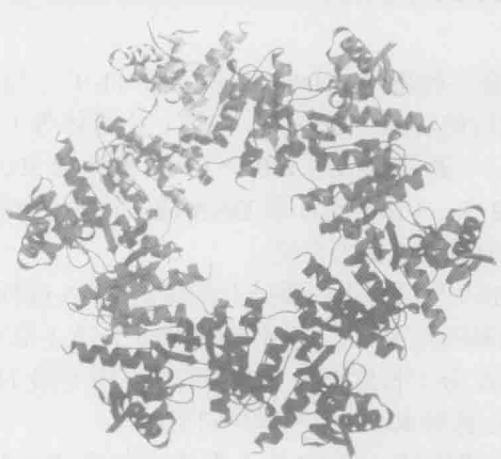  
图 11-9 RecA 蛋白丝的 3 个视图。(a).电镜图下,全部或部分被 RecA 蛋白包裹的环状 DNA。图中有一个未被 RecA 蛋白包裹的 DNA 分子,可以看出结合 RecA 后,DNA 变长。(经授权。来源:Stasiak A. and Egelman E. H. 1988. Genetic Recombination. ed. R. Kucherlapati and G. Smith, pp. 265-307. Fig.3.©ASM press. 3.) (b). 综合多张电镜照片生成的蛋白丝的高分辨率照片。图中左侧是大肠杆菌的 RecA,右侧是酵母的链交换相关蛋白质 Rad51。(来源:Edward Egelman, University of Virginia.) (c). X 射线晶体衍射生成的高分辨率照片。图示从上往下看一周螺旋丝。单个亚基标上了颜色,红色亚基靠近观察者。(Story R. M. and Steitz T. A. 1992. Nature 355; 318.) 镜像图用 BobScript、MolScript 和 Raster3D 制作。

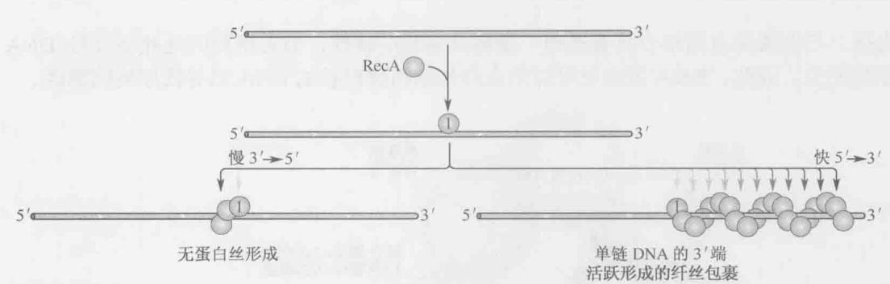  
图 11-10 RecA 组装的方向性。请注意，新的 RecA 亚基在 DNA 3' 端结合到纤丝的速度远快于结合到其 5' 端的速度。因为此组装的方向性，3' 端延长的单链 DNA 分子更易于被 RecA 包裹；相比之下，5' 端延长的单链 DNA 分子难于成为蛋白丝组装的底物。

#### [W] 在 RecA 蛋白丝里建立新的配对 DNA

RecA 催化的链交换过程可以分成不同的反应阶段。首先，RecA 纤丝必须组装在其中一个参与的 DNA 分子上，组装发生在具有单链 DNA 区域（如单链 DNA 末端）的 DNA 分子上。这个 RecA-单链 DNA 复合体是参与寻找同源序列的活性形态。在这个过程中，RecA 必须 “寻找” 和蛋白质内的 DNA 和一新的 DNA 分子之间的碱基互补。分别同单链 DNA 和双链 DNA 结合的 RecA 的结构揭示了多样的 DNA 延伸方式，并暗示了链交换的机制（图 11-11）。

  
图 11-11 RecA 促进的链交换反应的 DNA 视图。(a) 双链 DNA 同 RecA 突触前纤丝配对，后者由 RecA 和单链 DNA 组成，二者配对可以产生异源双链核酸分子 DNA-RecA 和单链 DNA。(b) 参与的 DNA 分子的结构：B 型 DNA；突触前纤丝内的单链 DNA；纤丝内的双链 DNA；随机卷曲的单链 DNA。(经授权，引用自 Kowalczykowski S.C. 2008. Nature 453: 463, Fig. 1, p. 465. ©Macmillan.)

RecA 可促进寻找同源序列，这是因为蛋白丝结构具有两个不同的 DNA 结合部位：主要位点（结合第一个 DNA 分子）与次要位点（图 11-12）。次要位点可被双链 DNA占据。与次要位点的结合具有迅速、微弱且短暂的特性，但更重要的是此结合与 DNA 序列无关。因此，RecA 蛋白丝可以结合并快速筛选很长的 DNA 以寻找序列同源区。

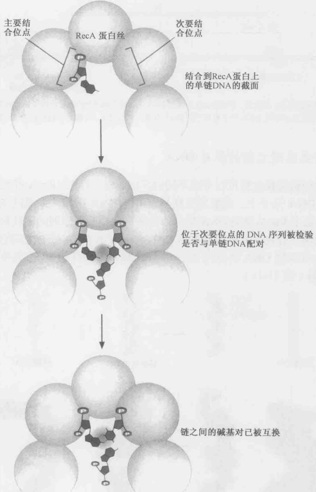  
图 11-12 在 RecA 蛋白丝内寻找同源区和 DNA 链交换的两步模型。如图 11-9c 所示，此 RecA 蛋白丝从上往下看，新引入的 DNA 双链以蓝色表示。（a）图显示了单个 DNA 链与 RecA 蛋白结合的交叉部分。（b）次要位点的 DNA 被动来进行互补性测试。（c）链之间的碱基配对改变。（改自 Howard-Flanders et al. 1984. Nature 309: 215-220.）

RecA 蛋白丝如何检测同源序列的详细机制尚不清楚。结合在次要位点的 DNA 暂时被解链并和在主要位点的单链 DNA 做同源性比对。这种 “检验” 被认为是通过碱基互补配对作用进行的，虽然检验初期并不破坏位于次要位点双链 DNA 的整体碱基对结构。支持这种理论的实验显示起初的配对可能涉及双螺旋数个碱基的弹出（见第 9 章）。体

<!-- END OFFICIAL API PART part_004 -->

<!-- BEGIN OFFICIAL API PART part_005 -->

外实验显示，仅 15 个碱基的序列配对就可以为 RecA 蛋白丝发现同源区域的信号，从而启动链交换。

RecA 蛋白丝如何检测同源序列的详细机制尚不清楚，但是我们现在知道单链 DNA 和 ATP 是如何同 RecA 结合形成螺旋状“突触前”纤丝的，这主要是基于结构相关研究。纤丝中的单链 DNA 变得缠绕不足并伸展开，这一变化可能允许其同双链 DNA 进行更好的 Watson-Crick 配对，以便形成同源性更好的突触纤丝（同图 11-13 中显示的结构相比）。在突触前纤丝中，单链 DNA 同 RecA 中的 3 个核苷酸结合（3 个核苷酸/RecA，由化学计量学得出），这一数值针对的是 B 型 DNA 构象——回顾第 4 章中的知识：这种 DNA 结构的重复单元是 3 个核苷酸，称为“核苷酸三联体”（图 11-14）。在突触前纤丝中 B 型 DNA 的每个三核苷酸单元后面，有一个很大的“步幅”存在于下一个碱基前面，这些很大的“步幅”主要负责分支的螺旋（相比于裸露 DNA 而言）（图 11-13 和图 11-14）。

  
图 11-13 RecA-单链 DNA 的结构和 RecA-双链 DNA 的结构。(a) 突触前核蛋白纤丝的结构。(b) 突触后核蛋白纤丝的结构。(经允许, 复制自 Chen et al. 2008. Nature 453: 489. Part a is Fig. 1A, p. 490; part b is Fig. 4A, p. 492. ©Macmillan.)

结合在次要位点的 DNA 暂时被解链并和在主要位点的单链 DNA 做同源性比对。这种 “检验” 被认为是通过碱基互补配对作用进行的，虽然检验初期并不破坏位于次要位点双链 DNA 的整体碱基对结构。体外实验显示，仅 15 个碱基的序列配对就可以做为 RecA 蛋白丝发现同源区域的信号，从而启动链交换。

当一个碱基互补的区域被定位后，RecA 促进这两个 DNA 分子借助其各自的 Watson-Crick 氢键形成一个稳定的复合体（图 11-15a）。重复单元是由堆积的碱基对形成的三联体，这与 B 型 DNA 非常相似（图 11-15b）。这个与 RecA 结合的三链结构被称为连接分子（joint molecule），通常含有数百个碱基对的杂合 DNA，实际的链交换就发生在连接分子内。在主要位点上的 DNA 链可与在次要位点上的双链 DNA 形成碱基配对，链交换需要断开链之间的一对碱基对，然后形成一组新的同样的互补碱基对。完成链交换的同时，也要求新配对的碱基链相互缠绕，形成正确的双螺旋。RecA倾向于结合到链交换后的DNA产物上，正是此结合能量实际驱动交换反应，进而形成新的DNA构型。

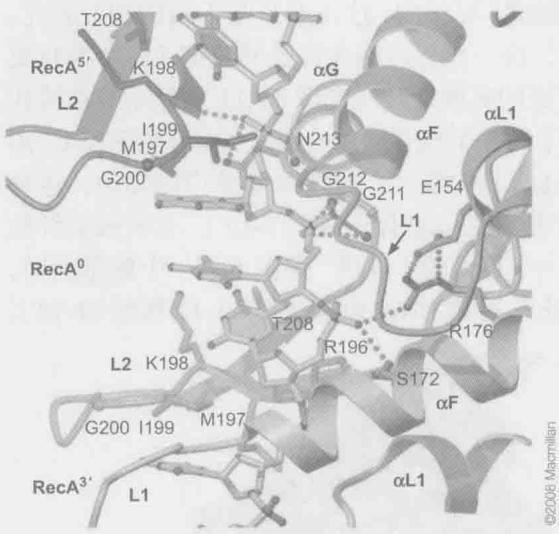  
图 11-14 RecA 中单链 DNA 的特写。每个核苷酸三联体都由三个 RecA 单元结合。（经允许，改自 Chen et al. 2008. Nature 453: 489, Fig. 2, p. 491. ©Macmillan.）

  
图 11-15 纤丝中的 DNA 的结构不会发生剧烈变化。(a) 突触前的核苷酸三联体（灰色）是同突触后的碱基对三联体（黄色）叠加在一起的。Watson-Crick 氢键由虚线表示。(b) 突触后的碱基对三联体（黄色）同 B 型 DNA（蓝绿色）叠加在一起。Watson-Crick 氢键表示为虚线，洋红色的属于异源双链的，绿色的属于 B-DNA。(经许可，改自 Chen et al. 2008. Nature 453: 489, Fig. 5a, b, p. 491. © Macmillan.)

#### [W] 所有的生物都有 RecA 同源物

所有的生物都有 RecA 家族的链交换蛋白，研究得最详细的是真细菌的 RecA、古细菌的 RadA、真核生物的 Rad51 和 Dmc1，以及噬菌体 T4 的 UvsX 蛋白。这些蛋白质可形成与 RecA 类似（图 11-16）的蛋白丝，并以类似的方式行使相似的功能（虽然这些蛋白质的部分功能因它们特殊的细胞学角色和反应对象而发生了特化）。我们将在下面讲述 Rad51 和 Dmc1 在真核生物细胞重组中的功能。

#### [W] RuvAB 复合体特异性地识别 Holliday 联结体并促进分支移位

当重组的链入侵步骤完成后，两个重组的 DNA 分子被一个 DNA 分支连接起来，称为 Holliday 联结体（见上文所述）。分支点的移动需要两个同源 DNA 双螺旋交换碱基对，细胞编码的一些蛋白质可大幅提高分支移位速率。

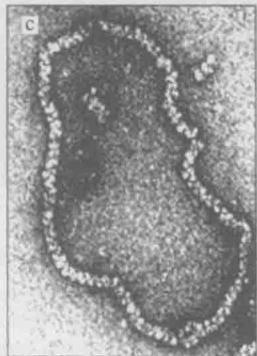  
图11-16 三类生物中类似 RecA 的蛋白质。图中显示(a)人类 Rad51;(b)大肠杆菌 RecA;(c) Archaeoglobus fulgidus RadA 蛋白质。Rad51 和 RecA 蛋白已在图11-8中出现过。请注意电镜图片中的局部放大图揭示的蛋白丝的类似螺旋结构。(来源：West S. C. et al. Nat. Rev. Mol. Cell Biol. 4: 435-445. ©Macmillan. 图像由 A. Stasiak, University of Lausanne, Switzerland. 提供)

RuvA 蛋白是一个特异性结合 Holliday 联结体的 DNA 结合蛋白, 它可识别 DNA 联结体的结构, 而不考虑相应的 DNA 特异性序列。RuvA 蛋白识别并结合到 Holliday 联结体上, 促使 RuvB 蛋白结合到这个位点上。RuvB 是一个六聚体 ATP 酶, 类似 DNA 复制过程中的六聚体解旋酶 (见第 9 章)。RuvBATP 酶提供能量, 以促进碱基对交换, 而移动 DNA 分支这种能量可以快速地在一个方向上移动 DNA 分支。一个 Holliday 联结体上的 RuvAB 复合体的结构模型 (图 11-17) 展示出一个四聚体 RuvA 蛋白和两个六聚体 RuvB 蛋白如何同时促进 DNA 链交换的过程。

#### [W] RuvC 剪切位于 Holliday 联结体的特定 DNA 链从而结束重组

结束重组需要拆分两条重组的 DNA 分子间的 Holliday 联结体（或多个联结体）。在细菌中，RuvC 是拆分 Holliday 联结体的主要核酸内切酶。正是因 RuvC 能剪切 RecA 在体外试验中形成的 DNA 联结体而被发现并得到纯化。遗传学证据显示它的功能与 RuvA 和 RuvB 相呼应。

RuvC 引起的拆分经识别 Holliday 联结体（可能以 RuvA 和 RuvB 的复合体形式存在）后，特异地两条同一方向的同源 DNA 链打开缺口。此剪切形成了 5'端磷酸基团末端和 3'-OH 末端，这些末端可以直接被 DNA 连接酶接上。依据哪一对 DNA 链被 RuvC 剪切，连接后的重组产物可以是剪接（交换）或是补丁（未交换）的类型。图 11-18 显示了 RuvC 的结构及其如何与 DNA 联结体相互作用的模式图。

图 11-17 高分辨率 RuvA 结构图和 RuvAB 复合体与 Holliday 联结体结合的模式图。(a). RuvA 四聚体的晶体结构显示该蛋白具有四重对称性。(Ariyoshi M., et al. 2000. Proc. Natl. Acad. Sci. 97: 8257-8262.) 镜像图使用 Bobscript、Molscript 和 Raster 3D 制作。(b). 有两个 RuvB 六聚体的晶体模式图。请注意, 一个 RuvA 四聚体是如何以四重对称的形态结合到联结体上的。两个 RuvB 六聚体结合在 RuvA 对称的两侧, 并起到驱动器的功能, 以驱使 DNA 通过联结体。RuvB 六聚体以截面图表示, 以显现穿过这些复合体的 DNA 链。(改自 Yamada K. et al. 2002. Mol. Cell 10: 671-681, Fig.4.)  
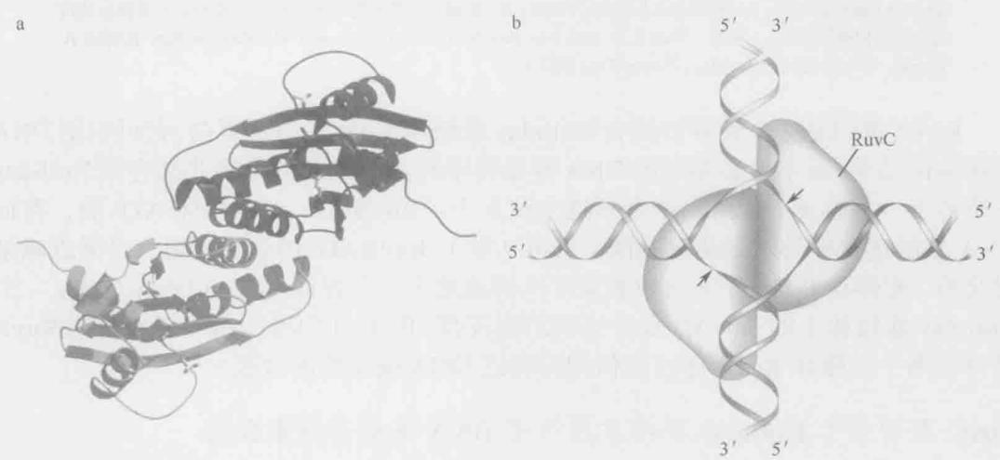  
图 11-18 高分辨率的 RuvC 拆分酶结构图以及与 Holliday 联结体结合的 RuvC 二聚体的模式图。(a). RuvC 蛋白的晶体结构。(Ariyoshi M., et al. 1994. Cell 78: 1063-1072.) 图像使用 BobScript、MolScript 和 Raster3D 制作。(b). 一个 RuvC 二聚体结合到 Holliday 联结体上的模式图。请注意在该图中，一个 RuvC 二聚体是如何与 Holliday 联结体结合，并在两条相同的 DNA 链上引入对称的缺口。(已获许可，改自 Rafferty J. B. et al. 1996. Science 274: 416-421, Fig. 1b, © AAAS.)

尽管 RuvC 靠识别结构而非特定序列行使其功能，但 RuvC 剪切 DNA 还是有一定程度的序列特异性。剪切只发生在与 5'-A/T-T-T-G/C 符合的一致性序列的位点，在这段序列的第二个 T 后面剪切。DNA 中这些一致性序列较多，平均每 64 个核苷酸就会有一个。这种一定程度的序列特异性可保证在联结体拆分前至少有一些分支移位发生。没有这种序列选择性，Holliday 联结体可能刚产生就被 RuvC 剪切，从而限制了参与链交换的 DNA 区域。

#### [W] 真核细胞的同源重组

#### [W] 真核细胞的同源重组具有额外的功能

如前所述，在细菌中，修复 DNA 的双链断裂需要同源重组。重新启动损坏的复制叉，并允许染色体 DNA 与以噬菌体感染或接合的形式进入细胞的 DNA 发生重组。同样地，在真核细胞中，同源重组也是 DNA 修复和启动受损复制叉所需要的。这种对同源重组的需要可由具重组蛋白缺陷的细胞对 DNA 破坏剂（特别是破坏 DNA 链的试剂）非常敏感所证实。此外，具有干扰同源重组突变的动物较倾向于患某种特定类型的癌症。然而，在我们下面的讨论中可以看到，同源重组在真核生物中发挥着另外的重要作用。尤其是在减数分裂的过程中，同源重组显得更为重要。在减数分裂过程中，同源重组确

保染色体正确配对，从而保持基因组的完整性。这种重组可以使亲本染色体之间的基因发生重组，确保每套基因的多态性能够传给子代。

#### [W] 同源重组保证减数分裂中染色体的分离

正如第9章所述，减数分裂（meiosis）有两轮核分裂，减少正常双倍体细胞（2N）的DNA含量，成为配子的DNA含量（1N）。图11-19显示了在两轮分裂中染色体是怎样分配的。分离前，细胞中的每个染色体都有两个拷贝（同源染色体），分别得自父母双方。在S期，这些染色体进行复制从而获得了DNA四倍体（4N）（图11-20），复制的产物——姐妹染色单体聚在一起。这时，准备进行第一次核分裂，这些复制了的同源染色体必须进行配对，并且排列在细胞的中心。正是这种同源染色体的配对需要同源重组（图11-19）。这些事件皆需精细的时间安排。重组必须在第一次核分离前完成，从而使同源染色体正确地排列然后分开。在这个过程中，姐妹染色单体保持配对（图11-20，图8-16）。然后在第二次核分裂中，姐妹染色单体才分开。这种分裂产生4个配子，每一个都具有每条染色体的一个拷贝（如1N的DNA含量）。

  
图 11-19 减数分裂的 DNA 动态过程。为了易于理解，该图只显示一对同源染色体。红色和蓝色分别显示经过一轮 DNA 复制以后的两个同源染色体。同源重组是同源染色体配对以准备第一轮核分裂所必需的。这类重组也可以引起交换，如本图中所显示的 A 与 B 基因之间。

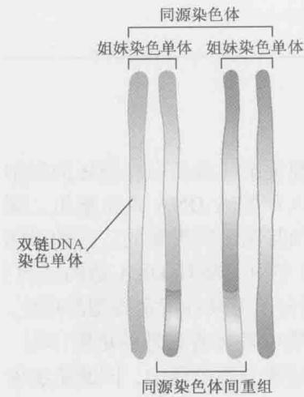  
图 11-20 同源染色单体之间减数分裂重组。所示的每个结构均是被称为染色单体的已复制的双链 DNA 分子。配对的称为姐妹染色单体，发生在非姐妹染色单体对之间的重组是由 Dmc1 介导的（见图 11-19）。

如果没有重组，染色体通常无法在第一次减数分裂过程中正确地排列，从而极易引起染色体的丢失。染色体的不恰当分离被称为不分离（nondisjunction），会导致大量配子没有正确的染色体组成。具有过多或过少染色体数量的配子在受精后都不能正常发育，因而失败的同源重组往往表现为低生殖能力。这种在减数分裂过程中发生的同源重组被称为减数分裂重组（meiotic recombination）。

减数分裂重组也常常引起两个同源亲代染色体间基因的交换，这种遗传交换（如图 11-20 显示的那样）可以用细胞学方法观察到（图 11-21a，左侧图示）。一个重要的结果是亲本 DNA 分子上的等位基因在下一代发生了重新分配。

#### [W] 减数分裂中程序化生成的 DNA 双链断裂

细胞成功地完成减数分裂所需要的发育程序包括

启动很多一般生长过程中不需要的基因表达。其中的一个就是 SPO11，该基因编码一个蛋白质，可引入染色体 DNA 的双链断裂，进而启动减数分裂重组。

Spo11 蛋白可以在很多染色体位置上切断 DNA，它对序列没什么选择性，但却必须发生在减数分裂的一个特定时期。Spo11 参与的 DNA 切割正好发生在已复制的同源染色体开始进行配对的时候。Spo11 切割的位置尽管普遍，但这些切割位点并非随机地分布在 DNA 上。相反，它们多分布在核小体包装疏松的染色体区域，如控制基因转录的启动子区域（见第 8 章和第 19 章）。DNA 出现较高概率的双链断裂区域，也会发生高频率的重组。如此，常被 Spo11 切割的 DNA 位点，如 Chi 位点，也是重组的热点。

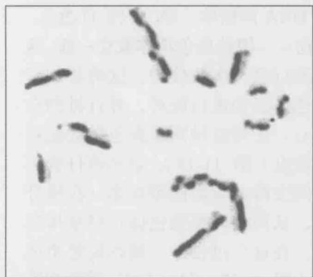  
图 11-21 交换的细胞学图示。仓鼠组织培养细胞中直接观察到的染色单体相互交换。经过吉姆萨染色的染色体，DNA 双链中胸腺嘧啶均被溴脱氧尿苷替代并被染浅色，如果只有一条链被替代，则呈深色。经过两个世代生长于溴脱氧鸟苷中，经复制的新的染色单体仅有一条链被替代，而另一姐妹染色单体则双链均被替代。如此，姐妹染色单体就可以区分，交换则可以很容易地以浅深交替带而显现出来（左侧）。同样，如果用 DNA 破坏试剂处理正处于有丝分裂的细胞，也能看到相间的重组染色体（右侧）。（Sheldon Wolff and Jody Bodycote 惠赠）

DNA 断裂的机制如下：Spo11 蛋白中一个特异的酪氨酸侧链可攻击磷酸二酯键骨架，从而切断 DNA，并在蛋白质与受损的 DNA 链间生成共价复合物（图 11-22），Spo11 的两个亚基在两个 DNA 链的相差两个核苷酸处切开，形成一个交错的双链断裂。Spo11 与 DNA 拓扑异构酶及位点特异性重组酶具有同样的 DNA 剪切机制（见第 4 章和第 12 章）。实际上，蛋白质序列比较显示 Spo11 和这些酶都有一定的同源性。

Spo11 的切割涉及一个蛋白质-DNA 共价复合物，这导致了两个结果。第一，Spo11 切割处 5'端的 DNA 可共价连接该酶。正是这些与 Spo11 相连的 5'端 DNA 形成了单链 DNA 尾端的起始点，这种尾端可引起类似 RecA 的蛋白质的组装，并启动 DNA 链入侵（如下文所述）。第二，被切断的

  
图 11-22 Spo11 的切割机制。Spo11 蛋白中酪氨酸的—OH 基团对 DNA 进行攻击，生成一个蛋白质-DNA 共价连接。Spo11 的两个亚基是生成双链 DNA 断裂所必需的，一个亚基攻击其中一条 DNA 链。注意，由于这样的切割机制，DSB 能够通过切割反应的简单逆转而重接。

DNA 磷酸二酯键的能量储存在蛋白质-DNA 的连接中，这样 DNA 链能通过切割反应简单逆转（化学机制见图 12-5）而被重接。这种重接发生在细胞接到停止减数分裂的信息之后。

#### [W] MRX 蛋白作用于被切开的 DNA 末端，以组装类 RecA 的链交换蛋白

Spo11 催化的 DNA 双链断裂生成单链区域,该区域用于组装类 RecA 的链交换蛋白。如细菌中观察的 RecBCD 路径,这个处理过程产生了很长的 3' 端单链 DNA 片段（图 11-23）。在减数分裂重组中,MRX 酶复合物负责催化该 DNA 处理过程。MRX 酶复合物尽管与 RecBCD 不同源,但也是一个多亚基的 DNA 核酸酶。MRX 酶复合物由 Mre11、Rad50 和 Xrs2 三个亚基组成,并以三个亚基的首字母命名。

断裂处的 DNA 处理完全作用于 5' 端的 DNA 链上, 即与 Spo11 蛋白共价结合的 DNA 链（如前述）。3' 端的 DNA 链不被降解, 所以此 DNA 处理反应被称为 5'→3' 端切除。MRX 正是通过 5'→3' 的反应, 从而生成具 3' 端的单链 DNA, 通常可达 1kb 或更长。MRX 酶复合物还被认为能去除与 DNA 相连的 Spo11。

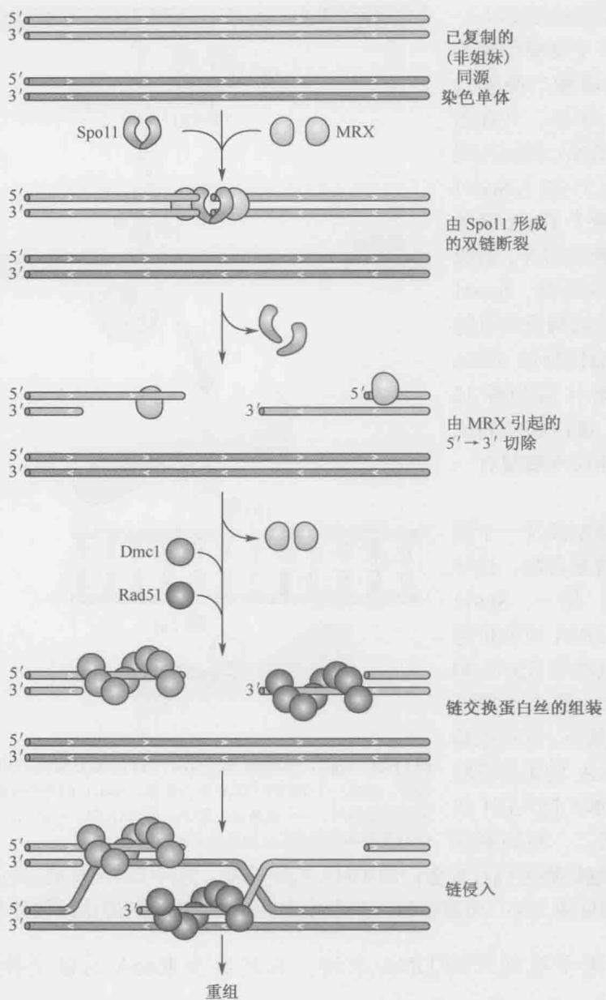  
图 11-23 减数分裂重组途径概述。减数分裂过程中双链断裂的形成需要 Spo11 和 MRX 复合体的参与。观察指出，DSB 的形成和后续的链处理，通常是由多种蛋白质的协调作用的偶联而完成。MRX 蛋白负责切除断裂位点的 5'端 DNA，然后链交换蛋白 Dmc1 和 Rad51 组装到单链 DNA 尾上。以上两个蛋白质都参与了重组，但还不清楚它们如何共同作用。为便于理解，本图中显示它们正在形成独立的蛋白丝。（已获许可，改自 Lichten M. 2001. Curr Biol. 11：R253-R256，Fig. 2. ©Elsevier.）

#### [W] Dmc1 是专一在减数分裂重组中行使功能的类 RecA 蛋白

真核生物编码两种被充分阐明的、与细菌 RecA 蛋白同源的蛋白质——Rad51 和 Dmc1。这两种蛋白质都在减数分裂重组中发挥作用。尽管 Rad51 广泛地表达在进行细胞有丝分裂和减数分裂的细胞中，Dmc1 则仅在细胞进入减数分裂时被表达。

减数分裂中的链交换发生在两个特定类型的同源 DNA 之间。减数分裂重组发生在每个染色体都有 4 套完整的 DNA 双链分子拷贝，即两个同源染色体各复制生成了一对姐妹染色单体时（图 11-20）。尽管两个同源染色体具有些序列的微差异，携带不同的基因不同的等位基因，但这 4 套染色体中的大部分 DNA 序列都是相同的。有趣的是，依赖 Dmc1 的重组倾向发生于非姐妹同源染色单体之间，而不是姐妹染色单体之间（图 11-20）。尽管这种选择的机制目前还不知道，但有其清晰的生物学基础：减数分裂重组可通过促进同源染色体间的交联而有助于等待分裂的同源染色体联会（alignment）。

#### [W] 多种蛋白质共同促进减数分裂重组

如前所述，参与形成双链断裂、处理 DNA 生成 3'端尾巴的单链 DNA 和参与减数分裂重组过程中链交换等关键步骤的蛋白质已被发现并定性。遗传实验显示很多其他的蛋白质也参与了这一过程。此外，有很多蛋白质表现出与已知的重组酶间的作用，并且它们似乎是在一个很大且多组分的复合体中行使其功能的。这些大型蛋白质-DNA 复合体被称为“重组工厂”（recombination factory），该结构可在细胞中观察到。例如，图 11-24 显示在减数分裂中 Rad51 和 Dmc1 共定位在这些“工厂”里。

还有很多其他种类的蛋白质被证实与Rad51共同作用以促进重组和双链DNA断裂的修复。Rad52是另外一个与Rad51相互作用的必要重组蛋白。Rad52启动Rad51 DNA蛋白丝（Rad51的活性形态）的组装。Rad52通过对RPA（真核细胞中主要的单链DNA结合蛋白）的拮抗作用而启动Rad51蛋白丝的组装。因此，

  
图 11-24 在细胞减数分裂过程中，Rad51 和 Dmc1 蛋白共同定位于“重组工厂”。用荧光标记 Rad51（绿色）和 Dmc1（红色）抗体，以免疫染色法检测蛋白质。两种蛋白质在一起的时候，合并的影像呈黄色。（来源：经 Shinohara M. et al. 2000. Proc. Nat I. Acad. Sci. 97: 10814-10819, Fig. 1A, ©National Academy of Sciences 许可使用）

Rad52 与已知大肠杆菌的 RecBCD 蛋白有相似的活性，RecBCD 蛋白可帮助 RecA 结合在原本被 SSB 所结合的单链 DNA 上。Rad52 蛋白也能促进互补单链 DNA 分子的退火和碱基配对，这种活性在重组起始阶段的双链配对反应中也发挥着重要的作用。BRCA2 基因的产物也参与 Rad51 介导的双链断裂修复（见框 11-2 “肿瘤抑制基因 BRCA2 的产物和 Rad51 蛋白相互作用并调控基因组的稳定性”）。

#### [W] 框 11-2 肿瘤抑制基因 BRCA2 的产物和 Rad51 蛋白相互作用并调控基因组的稳定性

BRCA2基因对于维持基因组的稳定性具有重要的作用。在人类中，近一半的家族性乳腺癌都被认为是由于BRCA2基因的突变造成的。这种癌症的易感性至少部分来自BRCA2在Rad51介导的双链断裂修复中的直接作用。当细胞被培养在对DNA有损伤的化学试剂中时，可以很明显地观察到Rad51聚集体，首先被组装起来以激活DNA修复。BRCA2基因缺陷的细胞不能在细胞受损时在细胞核中组装起这些聚集体同时也不能进行相应的DNA修复。BRCA2蛋白和Rad51蛋白直接相互作用(见框11-2图1)，它们的相互作用可能对Rad51蛋白在细胞中正确定位以利于DNA修复及调节Rad51蛋白的活性非常重要。因此，与BRCA2基因突变相关的显著表现型说明，在真核生物包括在人类中，DNA双链断裂修复和Rad51依赖性的同源重组是至关重要的。

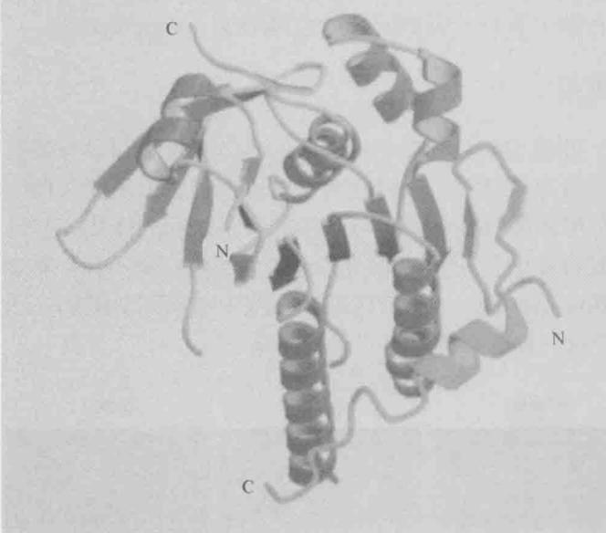

框11-2图1 Rad51蛋白和BRCA2蛋白重复基序相互作用复合体的结构。许多生化与结构研究表明，BRCA2上被称为BRC基序的、含有保守重复序列的特异区段是同Rad51蛋白作用的重要位点。其中的一个重复基序BRC4被证实与Rad51蛋白具有很高的亲和性。结构分析更精确地揭示了BRC4是如何与Rad51蛋白形成复合体的。在本图中，Rad51蛋白的 $\alpha$ 螺旋用紫色显示，β折叠用蓝色显示，BRC肽段的重复序列用绿色显示。每条序列都标注了氨基末端和羧基末端。（来源：经Pellegrini L. et al. 2002. Nature 420: 287-293, Fig. 1a. ©Macmillan. 许可使用）

通过与细菌的模拟比较，我们推测真核细胞也编码启动重组过程中分支移位和Holliday联结体拆分的蛋白质。事实上，具有启动这些功能的酶已经被发现了。例如，Rad51C（一种含有类Rad51蛋白的复合体）和另一种蛋白XRCC3已经被证实具有Holliday联结体拆分酶的活性。同样地，RecQ解旋酶家族的成员在DSB修复过程中的同源重组中发挥了重要的作用，而且可能还参与减数分裂。例如，在人体中，双Holliday联结体的处理方式之一就包含一种可以同拓扑异构酶合作的RecQ解旋酶。这种机制称为双连接体分离，可以阻止侧翼序列的互换。在人体发现的三种解旋酶（BLM、WRN和RTS/RECQ4）分别与布鲁姆综合征、沃纳综合征以及色素沉着综合症相关，它们会导致早衰和肿瘤生成的倾向（见框11-3，早衰和癌变相关蛋白会促进Holliday联结体处理的旁路途径）。

#### [W] 框 11-3 早衰和癌变相关蛋白会促进 Holliday 联结体处理的旁路途径

RecQ DNA 解旋酶从细菌到人类都非常保守，它们在同源重组的早期和晚期都扮演了非常重要的角色。这些解旋酶可以特异性地处理和编辑重组中间体，导致交联分子在双 Holliday 联结体中间体形成之前发生瓦解。结果是，解旋酶以交叉类事件为代价促进非交叉重组（框 11-3 图 1）。在人体中，严格的早衰和各类肿瘤都与编码这些解旋酶（WRN、BLM 和 RTS/RECQ4）的基因的功能缺失突变相关（见框 11-3 表 1）。

  
框 11-3 图 1 重组的交叉和非交叉通路。在交叉通路中（上一条通路），Holliday 联接体的解离酶（用剪刀表示）在交联处完成组装并进行不对称切割，形成交叉产物。与之形成对比的是，在非交叉通路中（下一条通路），RecQ 家族的解旋酶（用绿色箭头表示）促进合成依赖性链的退火和拆分。这一机制表明这些解旋酶的活性把最初有链互换蛋白产生的交联分子拆分开。这一过程也可以使得 D 环沿着 DNA 分子滑动，且允许侵入链在交联分子瓦解前在 DNA 聚合酶作用下进行延伸。（经授权，引用自 Zakharyevich K. et al. 2012. Cell 149: 334-347, Fig. 7. ©Elsevier.有些许改动）

框 11-3 表 1 RecQ 相关病症的临床特点

<table><tr><td>综合征(基因)</td><td>主要临床特征</td><td>肿瘤倾向</td></tr><tr><td>布鲁姆综合征(BLM)</td><td colspan="2">矮小、突出的鼻子、窄脸颊、色素沉积、红肿、皮肤早发性同组织和种类呈正态分布静脉扩张、精神呆滞、II型糖尿病、免疫缺陷、肺病、生育能力差或丧失</td></tr><tr><td>沃纳综合征(WRN)</td><td colspan="2">双边白内障、嘶哑、皮肤改变、四肢纤瘦、过早花发/原始肉瘤和间质细胞瘤早发脱发、面部皱缩、身材矮小、骨质疏松、性腺机能减退、糖尿病、软组织钙化</td></tr><tr><td>色素沉着综合征(RECQ4)</td><td colspan="2">皮肤异色症、少年白内障、生长迟缓、骨骼发育不良、骨肉瘤早发头发稀疏、性腺机能减退</td></tr></table>

经授权，改自 Bernstein K.A. et al. 2010. Annu. Rev. Genet. 44: 393-417, Table 1, p. 395. © Annual Reviews.

正如我们所看到的，减数分裂重组可使同源染色体联会，并促进它们之间的遗传交换。这些重组反应通常导致亲本染色体间的交换。然而，依赖重组中间物的 Holliday 联结体的拆分结果，通过双链断裂修复途径的重组也能够产生非交换产物（见上文）。这些事件可为成功的减数分裂提供必需的染色体配对，但未在染色体遗传结构上留下可检测的变化。

然而，即便是非交换重组也会产生遗传后果，如导致基因转变（gene conversion）。基因转变发生在当一个基因的等位基因丢失并被其他等位基因所替代之时。关于基因转变是如何发生在有丝分裂生长期细胞和减数分裂细胞中的例子，将在下面介绍。

#### [W] 交配型的转换

除了促进 DNA 配对、DNA 修复和遗传交换外，同源重组还能够改变染色体特定位置的 DNA 序列。这种类型的重组有时是为了调控基因的表达。例如，经由转换不同交配型基因出现在该生物基因组中可被表达的特定位置，重组可对酿酒酵母的交配类型进行控制。

酿酒酵母是种单细胞真核生物，并可以3种不同的细胞类型生存（见附录A）。酿酒酵母的单倍体细胞有两种交配型——a或α。当a和α细胞相接近时，它们能够进行融合（即交配）形成一个a/α双倍体细胞。这个a/α细胞然后可以经过减数分裂形成两个单倍体a细胞和两个单倍体α细胞。

交配型基因编码转录调节蛋白。这些调节蛋白控制靶基因的表达，该靶基因的产物决定细胞类型。在一个细胞中，可表达的交配型基因正是位于该细胞基因交配型基因座（mating-typelocus，MAT locus）上的基因（图11-25）。这样，在a细胞中a1基因出现在MAT基因座上，而在α细胞中，α1和α2基因出现在MAT基因座上。在双倍体细胞中，此两种交配型控制基因都会表达。交配型基因所编码的调节蛋白，一起与其他3种细胞类型中发现的调节蛋白以多种协同方式作用，以保证在不同细胞类型中被正确表达（见第19章）。

如我们正在讨论的，细胞能够通过重组转换它们的交配型。各细胞除了 a 或 $\alpha$ 基因存在于 MAT 基因座上以外，另外还有一套 a 和 $\alpha$ 基因存在于基因组的其他位置（但并不表达）。这些额外的沉默拷贝所在的基因座称之为 HMR 和 HML（图 11-25）。

  
图 11-25 遗传基因座编码交配型信息。尽管 3 号染色体带有 3 个交配型基因座，但是只有在 MAT 基因座上的基因可以表达。HML 编码一个沉默拷贝的 α 基因，而 HMR 编码一个沉默拷贝的 a 基因。如果重组发生在 MAT 和 HML 位置上，a 细胞就会转换成 α 细胞。如果重组发生在 MAT 和 HMR 位置上，α 细胞转换成 a 细胞。（经许可，改自 Haber J. E. 1998. Annu. Rev. Genet. 32: 561-599, Fig. 3. ©Annual Reviews）

所以，这些 HMR 和 HML 基因座被称为沉默盒（silent cassette）。它们的功能是提供一个遗传信息的“储藏室”，用来改变细胞交配型。这种转换需要通过同源重组使遗传信息从 HM 基因座转换到 MAT 基因座。

#### [W] 特定位点的双链 DNA 断裂引发交配型转换

交配型转换是由 MAT 基因座的双链断裂引发的，这个反应由特异的 DNA 切割酶——HO 内切核酸酶（HO endonuclease）来完成。HO 基因的表达被严格地控制，以确保转换在适当时候发生。这个调控机制将在第 19 章中进行介绍。HO 是一种序列特异性的内切核酸酶。酵母染色体上唯一携带 HO 识别序列的是交配型基因座。HO 在染色体上切割形成一个黏性的断裂，与 Spo11 切割相比，HO 只是水解 DNA，并不与 DNA 断裂处共价相连。

HO 引起的断裂，其 5'→3' 的 DNA 切除反应与减数分裂重组的机制一样。所以，切除依赖于 MRX 蛋白复合体，并对带 5' 端的 DNA 链具有特异性，而带 3' 端 DNA 链保持稳定而不被核酸酶消化。一旦生成长的 3' 单链 DNA 尾巴，它们就被 Rad51 和 Rad52 蛋白包裹（与其他帮助组装重组蛋白质-DNA 复合体的蛋白质一样）。这些被 Rad51 蛋白包裹的 DNA 链寻找同源染色体区域以启动链的入侵和遗传交换。

交配型的转换是单向性的，即序列信息（尽管并不是真正的 DNA 片段）从 HMR 和 HML “移动” 到 MAT 基因座，但是绝对不会从反方向进行。这样，在重组过程中，被切掉的 MAT 基因座总是接受者，而 HMR 和 HML 基因座在整个重组过程中是不变的。这种方向性源于 HO 内切核酸酶不能切割其在 HML 和 HMR 基因座上的识别序列，因为此区域的染色质结构使得酶无法接近这些位点。

由 Rad51 包裹位于 MAT 基因座的 3'单链 DNA 末端可 “选择” HMR 或 HML 基因座的 DNA 进行链入侵。如果 MAT 基因座的 DNA 序列是 a，则侵入会发生在有 $\alpha$ 序列的 “储备” 拷贝的 HMLR；反之，如果 MAT 带有 $\alpha$ 基因，则侵入会发生在储备有 a 序列的 HMR。重组之后，被选择的 HM 基因座的信息也出现在 MAT 基因座。这种遗传改变不是从 MAT 到 HR 基因座的信息相互交换。这种非交互的重组事件是基因转变的一个特例。

#### [W] 交配型转换是一种基因转变事件，与交换无关

尽管 DSB 修复途径可以解释交配型转换的重组机制，但是大量的证据显示，在链入侵步骤之后，此重组途径不同于 DSB 修复机制。其中一个提示是在交配型转换的过程中从未发现属于交换的重组产物。回顾在 DSB 修复途径中，产生两种 Holliday 联结体中间型的拆分产物——剪接（交换产物）和补丁（非交换产物）（图 11-3）。根据 DSB 修复模式，这两种产物发生的概率相似，但是，在交配型转换中从未观察到有交换产物存在。所以，无 Holliday 联结体中间体的重组模型更适于解释交配型转换。

为解释没有发生交换事件的基因转变的机制，提出了一种新的重组模型，称之为合成依赖性链退火（synthesis-dependent strand annealing，SDSA）。图11-26显示在这种机制下，如何发生交配型转换。如上所述，首先在重组位点引入DSB（图11-26a），经过5'到3'切除以及链侵入之后（图11-26b、c），侵入的3'端作为引物在Ya侧翼的同源区域启动新的DNA合成继续复制Ya序列（图11-26c、d）。值得注意的是，与DSB修复途径所不同的是，一个完整的复制叉在该处形成。

然而，相比于普通的 DNA 复制，新合成的链自模板上置换下来后会同第二个切除的 5' 端发生退火。一旦这样的退火发生，相应的长的 3' 端（图 11-26d 中底部的链）便会被核酸内切酶切割，新形成的 3' 端会引发、延伸进而复制 Ya 序列的第二条链（图 11-26e、f）。其结果是新的双链 DNA 片段被合成，再连接到最初被 HO 内切酶切断的 DNA 位点上，并被 MRX 切除。这个新的片段具有与模板相同的 DNA 序列（图 11-26 中的 HMRa）。

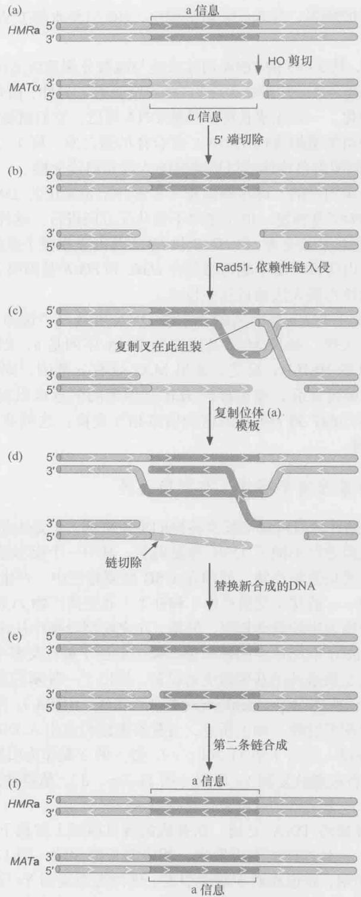  
图 11-26 交配型转换的重组模型：依赖合成的链退火（synthesis-dependent strand annealing, SDSA）。图示位于 MAT 基因座基因转变的步骤（详见文字内容）。HMR 和 MAT 区域显示为绿色；编码 a 信息的 HMR 为深绿色，编码 $\alpha$ 信息的 MAT 呈橙绿色。当 SDSA 结束时，起初位于 MAT 区域的 $\alpha$ 信息被替换，即转变成为 HMR 区域的 a 信息。

所以，新合成的 DNA——其互补 DNA 分子信息的精确拷贝，替代了原有的 DNA 信息。这种机制更恰当地解释了不需要切除 Holliday 联结体的基因转变。通过这个模型，交配型重组时没有发现交换产物不再是一个谜。

#### [W] 同源重组机制的遗传结果

如在本章开头所讨论的，最初的同源重组机制模型在很大程度上是为了解释该过程的遗传结果。现在重组的基本步骤已被了解，我们有必要回顾一下同源重组的过程及其如何改变 DNA 分子而产生特异的遗传变化。

同源重组的一个重要特点是，无论是何种序列，只要有足够的相似区域，它就可以发生在任何两个 DNA 区域间。现在我们知道了原因所在，同源重组没有一个步骤需要特异 DNA 序列的识别。至于部分依赖序列的步骤（如经 Chi 位点转化的 RecBCD、被 RuvC 蛋白所剪切的 DNA），其偏好的序列则很常见。两个 DNA 分子间发生重组的关键步骤在于 RecA 家族的一个链交换蛋白能成功地将两条分子配对，而任何具有能形成正确碱基配对的正常 DNA 链都可以指导这个过程。

重组大致上独立于序列的事实导致一个推论，即任何两个基因间的重组频率和这些基因间的距离成正比。因为 DNA 区域可被平等地用来启动一个成功的重组事件，所以可观察到此正比性。同源重组的这个基本特性使我们能够用重组率来制作一个遗传图，以显示染色体上基因的顺序和距离。

当 DNA 的一个区域在形成重组时不具有这种 “平均” 概率时，将遗传图和物理图比较就会产生曲解（图 11-27）。重组概率高的区域称为 “热点”，而重组概率低的区域称为 “冷点”。因此，中间有热点的两个基因，在遗传图上要比在物理图上的同一区域相距更远。反之，中间有冷点的基因在遗传图上的距离比它们的物理图距离要更接近。我们已遇到两个能够从分子水平上解释染色体上存在冷点和热点的例子。靠近 Chi 位点和 Spo11 剪切位点的区域是热点，拥有高于平均的启动重组概率；而这类位点较少的区域则是冷点。

#### [W] 重组时的 DNA 修复是基因转变的起因之一

同源重组的另一个遗传结果是基因转变。我们曾在酵母交配型转换的重组特例中介绍了基因转变的概念。然而，基因转变也常发生在正常同源重组事件中，如引起细菌中的遗传交换和减数分裂中的染色体配对。

为了演示减数分裂重组中的基因转变，假设一个减数分裂期的细胞在其同源染色体上分别为等位基因 A 和 a。DNA 复制后，将产生 4 个该基因的拷贝，基因型是 AAaa。如果没有基因转变，将产生 2 个带有 A 等位基因的配子和 2 个带有 a 等位基因的配子。如果所产生的配子的基因型是 Aaaa（或者是 AAAA），则说明发生了一个将 A 置换成 a（或相反）的基因转变事件。这是怎么发生的呢？

在双链断裂修复过程中，基因转变以两种方式发生。首先，考虑如果 A 基因与双链断裂处很接近时将会发生什么。这时当 3' 单链 DNA 末端侵入同源双螺旋链并延伸，则可能会复制 a 信息，这个过程可以导致替换重组后染色体上的 A 信息（图 11-4d）。

基因转变的第二种机制涉及修复重组中间体所产生的碱基错配。假如链入侵或分支移位包括 A/a 基因，则可能会形成一段异源双链 DNA，在一条链上有 A 序列而另一条链上有 a 序列（图 11-28 和图 11-2d，插图）。带有碱基错配的 DNA 区域能被细胞错配修复酶识别和作用（我们在第10章讨论过），这些酶能特异地修复DNA上的碱基错配。当碱基错配酶发现碱基错配后，会在两条链中的一条上切除一小段DNA。然后，一个具修复作用的DNA聚合酶填补这个缺口，并产生正确的配对序列。当作用于重组中间体时，错配修复酶将随机选择被修复的一条链。因此，修复后产生的双链带有编码 $A$ 信息的序列还是编码 $a$ 信息的序列，取决于哪条链被修复酶修复，这就产生了基因转变。

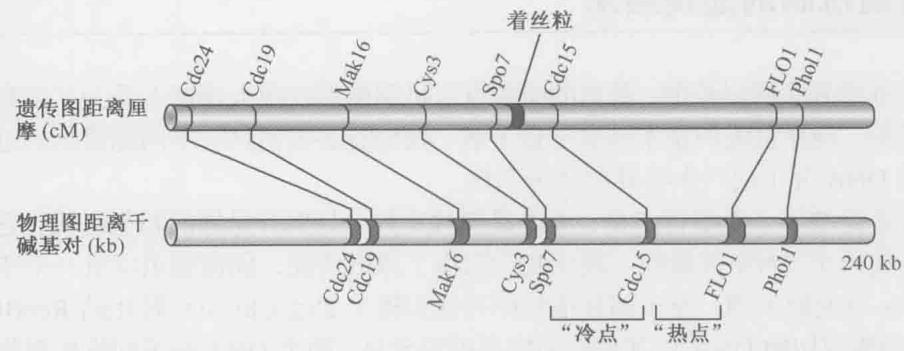  
图 11-27 酵母染色体一段典型区域的遗传图和物理图的比较。标记显示了不同基因的位置。注意遗传图上 Spo7 和 Cdc15 之间的区域，因为低交换频率，遗传图小于物理图；相反，Cdc15 和 FL01 之间的区域，因为高频率交换，遗传图大于物理图。（经许可，改自 Alberts B. et al. 2002. Molecular biology of the cell, 4th edition, p. 1138, Fig. 20-14. © Garland Science/Taylor & FrancisLLC.）

  
图 11-28 错配修复重组中间体的异源双链 DNA 可以导致基因转变

<!-- W-END Watson 11 分子水平上的同源重组 -->

<!-- C-BEGIN Campbell 17.5 -->

### 【英文对应 Campbell Concept 17.5：Mutations of one or a few nucleotides can affect protein structure and function】

> 来源：Campbell Biology（书籍/01_Campbell_Biology） 第17章 Gene Expression From Gene to Protein，Concept 17.5。

#### [EN] Concept 17.5: Mutations of one or a few nucleotides can affect protein structure and function

Now that you have explored the process of gene expression, you can consider the effects of changes to the genetic information of a cell. Because these changes, called mutations, are the ultimate source of new genes, they are responsible for the huge diversity of genes found among organisms. Earlier, we considered chromosomal rearrangements that affect long segments of DNA (see Figure 15.14); these are considered large-scale mutations. Here we examine small-scale mutations of one or a few nucleotide pairs, including point mutations, changes in a single nucleotide pair of a gene.

If a point mutation occurs in a gamete or in a cell that gives rise to gametes, it may be transmitted to offspring and to future generations. If the mutation has an adverse effect on the phenotype of a person, the mutant condition is referred to as a genetic disorder or hereditary disease. For example, we can trace the genetic basis of sickle-cell disease to the mutation of a single nucleotide pair in the gene that encodes the $\beta$ -globin polypeptide of hemoglobin. The change of a single nucleotide in the DNA's template strand leads to an altered mRNA and the

Figure 17.25 A summary of transcription and translation in a eukaryotic cell.

This diagram shows the path from one gene to one polypeptide. Each gene in the DNA can be transcribed repeatedly into many identical RNA molecules, and each mRNA can be translated repeatedly to yield many identical polypeptide molecules. (Remember that the final products of some genes are not polypeptides but RNA molecules that don't get translated, including tRNAs and rRNAs.) In general, the steps of transcription and translation are similar in bacterial, archaeal, and eukaryotic cells. The major difference is the occurrence of RNA processing in the eukaryotic nucleus. Other significant differences are found in the initiation stages of both transcription and translation and in the termination of transcription. To visualize these processes in their cellular context, see Figure 6.32d-f.

#### [EN] RNA PROCESSING

2 In eukaryotes, the RNA transcript (pre-mRNA) is spliced and modified to produce mRNA, which moves from the nucleus to the cytoplasm.

#### [EN] AMINO ACID ACTIVATION

4 Each amino acid attaches to its proper tRNA with the help of a specific enzyme and ATP.

#### [EN] TRANSLATION

5 A succession of tRNAs add their amino acids to the polypeptide chain as the mRNA is moved through the ribosome one codon at a time. When completed, the polypeptide is released from the ribosome.

Figure 17.26 The molecular basis of sickle-cell disease: a point mutation.

The allele that causes sickle-cell disease differs from the wild-type (normal) allele by a single DNA nucleotide pair. The micrographs are SEMs of a normal red blood cell (on the left) and a sickled red blood cell (right) from individuals homozygous for wild-type and mutant alleles, respectively.

production of an abnormal protein (Figure 17.26; also see Figure 5.19). In individuals who are homozygous for the mutant allele, the sickling of red blood cells caused by the altered hemoglobin produces the multiple symptoms associated with sickle-cell disease (see Concept 14.4 and Figure 23.18). Another disorder caused by a point mutation is a heart condition called familial cardiomyopathy, which is responsible for some of the tragic incidents of sudden death in young athletes. Point mutations in several genes encoding muscle proteins have been identified, any of which can lead to this disorder.

#### [EN] Types of Small-Scale Mutations

Many mutations occur in regions outside of protein-coding genes, and any potential effect they have on the phenotype of the organism may be subtle and hard to detect. For this reason, here we'll concentrate on mutations within protein-coding genes. Small-scale mutations within a gene can be divided into two general categories: (1) single nucleotide-pair substitutions and (2) nucleotide-pair insertions or deletions. Insertions and deletions can involve one or more nucleotide pairs.

#### [EN] Substitutions

A nucleotide-pair substitution is the replacement of one nucleotide and its partner with another pair of nucleotides (Figure 17.27a, on the next page). Some substitutions have no effect on the encoded protein, owing to the redundancy of the genetic code. For example, if 3'-CCG-5' on the template strand mutated to 3'-CCA-5', the mRNA codon that used to be GGC would become GGU, but a glycine would still be inserted at the proper location in the protein (see Figure 17.6). In other words, a change in a nucleotide pair may transform one codon into another that is translated into the same amino acid. Such a change is an example of a silent mutation, which has no observable effect on the phenotype. (Silent mutations can occur outside genes as well.) Interestingly, there is evidence that some silent mutations may indirectly affect where or at what level the gene gets expressed, even though the actual protein is the same.

Substitutions that change one amino acid to another one are called missense mutations. Such a mutation may have little effect on the protein: The new amino acid may have properties similar to those of the amino acid it replaces, or it may be in a region of the protein where the exact sequence of amino acids is not essential to the protein's function.

However, the nucleotide-pair substitutions of greatest interest are those that cause a major change in a protein. The alteration of a single amino acid in a crucial area of a protein—such

as in the part of the $\beta$ -globin subunit of hemoglobin shown in Figure 17.26 or in the active site of an enzyme as shown in Figure 8.19—can significantly alter protein activity. Occasionally, such a mutation leads to an improved protein or one with novel capabilities, but much more often such mutations are neutral or detrimental, leading to a useless or less active protein that impairs cellular function. A second example of a missense mutation is a mutation in the tyrosinase gene that causes the albino phenotype in the Asinara donkey. Recently, Italian researchers sequenced the tyrosinase gene in donkeys from this wild population and showed that a recessive mutation is responsible for the lack of pigment. In this gene, a C is changed to a G, resulting in a histidine being added to the protein instead of an aspartic acid. The changed amino acid is in a site in tyrosinase that normally binds a copper atom, and it makes the enzyme incapable of binding copper, rendering it nonfunctional. As in the case of sickle-cell disease, just one change in a nucleotide base results in a dramatic phenotypic change.

Substitution mutations are usually missense mutations; that is, the altered codon still codes for an amino acid and thus makes sense, although not necessarily the right sense. But a point mutation can also change a codon for an amino acid into a stop codon. This is called a nonsense mutation, and it causes translation to be terminated prematurely; the resulting polypeptide will be shorter than the polypeptide encoded by the normal gene. Most nonsense mutations lead to nonfunctional proteins.

In the Problem-Solving Exercise, you'll work with a few common single nucleotide-pair substitution mutations in the gene encoding insulin, some or all of which may lead to diabetes. You will classify these mutations into one of the types we just described and characterize the change in the amino acid sequence.

Figure 17.27 Types of small-scale mutations that affect mRNA sequence. All but one of the types shown here also affect the amino acid sequence of the encoded polypeptide.  
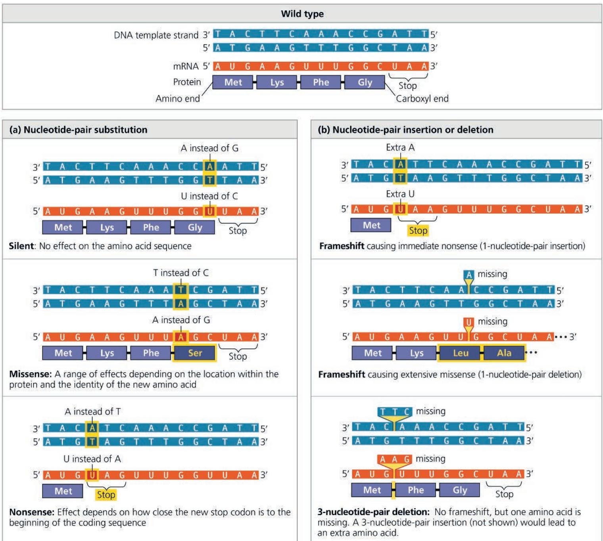

#### [EN] Insertions and Deletions

Insertions and deletions are additions or losses of nucleotide pairs in a gene (Figure 17.27b). These mutations have a disastrous effect on the resulting protein more often than substitutions do. Insertion or deletion of nucleotides may alter the reading frame of the genetic message, the triplet grouping of nucleotides on the mRNA that is read during translation. Such a mutation, called a frameshift mutation, occurs whenever the number of nucleotides inserted or deleted is not a multiple of three. All nucleotides downstream of the deletion or insertion will be improperly grouped into codons; the result will be extensive missense mutations, usually ending sooner or later in a nonsense mutation that leads

to premature termination. Unless the frameshift is very near the end of the gene, the protein is almost certain to be nonfunctional. Insertions and deletions also occur outside of coding regions; these are not called frameshift mutations, but can have effects on the phenotype—for instance, they can affect how a gene is expressed.

#### [EN] New Mutations and Mutagens

Mutations can arise in a number of ways. Errors during DNA replication or recombination can lead to nucleotide-pair substitutions, insertions, or deletions, as well as to mutations affecting longer stretches of DNA. If an incorrect nucleotide is added to a

#### [EN] Problem-Solving Exercise

Are insulin mutations the cause of three infants' neonatal diabetes?

#### [EN] Your Data

You will analyze the cDNA codons for amino acids 35–54 (of the 110 amino acids) of each patient's insulin protein, so the start codon (AUG) is not present. The sequences of the wild-type cDNA and the patients' cDNA are shown below, arranged in codons.

Wild-type cDNA 5'-CTG GTG GAA GCT CTC TAC CTA GTG TGC GGG GAA CGA GGC TTC TTC TAC ACA CCC AAG ACC -3'
Patient 1 cDNA 5'-CTG GTG GAA GCT CTC TAC CTA GTG TGC GGG GAA CGA GGC TGC TTC TAC ACA CCC AAG ACC -3'
Patient 2 cDNA 5'-CTG GTG GAA GCT CTC TAC CTA GTG TGC GGG GAA CGA GGC TCC TTC TAC ACA CCC AAG ACC -3'
Patient 3 cDNA 5'-CTG GTG GAA GCT CTC TAC CTA GTG TGC GGG GAA CGA GGC TTC TTG TAC ACA CCC AAG ACC -3'

Data from N. Nishi and K. Nanjo, Insulin gene mutations and diabetes, Journal of Diabetes Investigation 2:92–100 (2011).

Insulin is a hormone that acts as a key regulator of blood glucose level, and insulin deficiency can lead to diabetes. In some cases of neonatal (newborn) diabetes, the gene coding for the insulin protein has a nucleotide-pair substitution mutation that alters the protein structure enough to cause it to malfunction. Doctors can use DNA sequence information to diagnose diabetes and other diseases. For example, the insulin gene sequence of a patient with neonatal diabetes can be analyzed to determine if it has a mutation and, if so, its effect.

In this exercise, you will determine the effect of mutations within insulin gene sequences in infant diabetes patients.

#### [EN] Your Approach

Suppose you are a medical geneticist presented with three infant patients, all of whom have a nucleotide-pair substitution in their insulin gene. It is your job to analyze each mutation to figure out its effect on the amino acid sequence of the insulin protein. To identify the mutation in each patient, you will compare his or her individual insulin complementary DNA (cDNA) sequence to that of the wild-type cDNA. (cDNA is a double-stranded DNA molecule that is based on the mRNA sequence and thus contains only the portion of a gene that is translated—introns are not included. cDNA sequences are commonly used to compare the coding regions of genes.) Identifying the codons that have been changed will tell you which, if any, amino acids are altered in the patient's insulin protein.

growing chain during replication, for example, the base on that nucleotide will then be mismatched with the nucleotide base on the other strand. In many cases, the error will be corrected by DNA proofreading and repair systems (see Concept 16.2). Otherwise, the incorrect base will be used as a template in the next round of replication, resulting in a mutation. Such mutations are called spontaneous mutations. It is difficult to calculate the rate at which such mutations occur. Rough estimates have been made of the rate of mutation during DNA replication for both E. coli and eukaryotes, and the numbers are similar: About one nucleotide in every $10^{10}$ is altered, and the change is passed on to the next generation of cells.

#### [EN] Your Analysis

1. Compare each patient's cDNA sequence to the wild-type cDNA sequence. Circle the codons where a nucleotide-pair substitution mutation has occurred.

2. Use a codon table (see Figure 17.6) to identify the amino acid encoded by the codon with the mutation in each patient's insulin sequence, and compare it to the amino acid encoded by the codon in the corresponding wild-type sequence. As is standard practice with DNA sequences, the coding (nontemplate) strand of the cDNA has been provided, so to convert it to mRNA for use with the codon table, you only need to change T to U. Classify each patient's nucleotide-pair substitution mutation: Is it a silent, missense, or nonsense mutation? Explain, for each answer.

3. Compare the structure of the amino acid you identified in each patient's insulin sequence to that of the corresponding amino acid in the wild-type sequence (see Figure 5.14). Given that each patient has neonatal diabetes, discuss how the change of amino acid in each might have affected the insulin protein and thus resulted in the disease. (Consider the chemical nature of the side chains.)

Instructors: A version of this Problem-Solving Exercise can be assigned in Mastering Biology. Or a more extensive investigation called “Solve It: Which Insulin Mutations May Result in Disease?” can be assigned.

A number of physical and chemical agents, called mutagens, interact with DNA in ways that cause mutations. In the 1920s, Hermann Muller discovered that X-rays caused genetic changes in fruit flies, and he used X-rays to make Drosophila mutants for his genetic studies (just as Beadle and Tatum did with their Neurospora cells). But Muller also recognized an alarming implication of his discovery: X-rays and other forms of high-energy radiation pose hazards to the genetic material of people as well as laboratory organisms. Mutagenic radiation, a physical mutagen, includes ultraviolet (UV) light, which can cause disruptive thymine dimers in DNA (see Figure 16.20).

Chemical mutagens fall into several categories. Nucleotide analogs are chemicals similar to normal DNA nucleotides but that pair incorrectly during DNA replication. Other chemical mutagens interfere with correct DNA replication by inserting themselves into the DNA and distorting the double helix. Still other mutagens cause chemical changes in bases that change their pairing properties.

Researchers have developed a variety of methods to test the mutagenic activity of chemicals. A major application of these tests is the preliminary screening of chemicals to identify those that may cause cancer. This approach makes sense because most carcinogens (cancer-causing chemicals) are mutagenic, and conversely, most mutagens are carcinogenic.

#### [EN] Using CRISPR to Edit Genes and Correct Disease-Causing Mutations

Ever since biologists have understood how disease-causing proteins were the result of mutations in genes, they have sought techniques for gene editing—altering genes in a specific, predictable way. Their aim has been to use such a technique to change specific genes in living cells, in part to try to correct genes that cause disease. Over the past couple of decades, biologists have developed a powerful new technique for gene editing, called the CRISPR-Cas9 system, that is transforming the field of genetic engineering, the direct manipulation of genes for practical purposes. Cas9 is a bacterial protein that helps defend bacteria against the viruses that infect them (bacteriophages). In bacterial cells, Cas9 acts together with “guide RNA” made from the CRISPR region of the bacterial genome. (Figure 19.7 explains how this defense system works in bacteria.)

#### [EN] Interview

Interview with Francisco Mojica: Discovering CRISPR in bacteria (eTextbook only)

Similar to other DNA-cutting enzymes involved in DNA repair (described in Concept 16.2), Cas9 is a nuclease that cuts double-stranded DNA molecules. The power of Cas9 for gene editing is that the Cas9 protein will cut any sequence to which it is directed. Cas9 is directed to its target by a guide RNA molecule that it binds and uses as a homing device, cutting both strands of any DNA sequence that is complementary to the guide RNA. Scientists have been able to exploit the function of Cas9 by introducing a Cas9–guide RNA complex into a cell they wish to alter (Figure 17.28). The guide RNA in the complex is engineered to be complementary to the “target” gene. Cas9 cuts both strands of the target DNA, and the resulting broken ends of DNA trigger a DNA repair system (similar to that shown in Figure 16.20). When there is no undamaged DNA for the enzymes of the repair system to use as a template, as shown at the bottom left of Figure 17.28, the repair enzymes introduce or remove random nucleotides while

Figure 17.28 Gene editing using the CRISPR-Cas9 system.  

rejoining the ends. Generally, this process alters the DNA sequence so that the gene no longer works properly. This technique is a highly successful way for researchers to “knock out” (disable) a given gene to study what that gene does in an organism.

But what about using this system to help treat genetic diseases? Researchers have modified the technique so that the CRISPR-Cas9 system can be used to repair a gene that has a harmful mutation. They introduce a segment from the normal (functional) gene along with the CRISPR-Cas9 system. After Cas9 cuts the target DNA, repair enzymes can use the normal DNA as a template to repair the target DNA at the break point. In this way, the CRISPR-Cas9 system edits the defective gene so that it is corrected (see the bottom right of Figure 17.28).

After studies using mouse models, CRISPR-based treatments for sickle-cell disease and another disease caused by a mutation of the $\beta$ -globin gene called beta-thalassemia were tested in human clinical trials. These disorders are good targets because they are caused by a mutation in a single gene, and they involve blood cells. The patients' blood cells are removed and genetically edited outside the body, then returned to the patient. In these clinical trials, rather than trying to correct the $\beta$ -globin mutation, the approach was to re-activate a gene for fetal hemoglobin, a different form that is normally turned off at birth but can substitute for $\beta$ -globin. A significant majority of patients showed remarkable results, having near-normal hemoglobin levels and not needing blood transfusions or experiencing pain crises. In 2024, this gene therapy treatment for these two blood-based disorders was approved for usage by the U.S. Food and Drug Administration (FDA).

Researchers, physicians, and patients alike are excited about the potential of CRISPR technology to treat or even cure human diseases that have a genetic basis, such as autoimmune diseases, Alzheimer's, and Parkinson's diseases, as well as some types of cancer. As of early 2025, 20 gene therapy treatments have been approved by the FDA. However, there are still concerns about using CRISPR-treated cells in humans because of possible effects on genes that are not being targeted (so-called "off-target" genes); this is an active area of research. The risks associated with cutting both strands of DNA by CRISPR are avoided when CRISPR is used in conjunction with a new technique called base editing. In this process, specific bases in a gene are not cut and replaced, but rather chemically modified to resemble a different base, thus altering the resulting protein so it is no longer harmful. In another approach, researchers are using different forms of Cas proteins that are more accurate.

Jennifer Doudna, a co-discoverer of CRISPR-Cas9, recognized not only its incredible potential but also the danger of its misapplication. After having a dream in which Adolf Hitler asked her what could be done with this gene-editing tool, Doudna realized it was imperative to spend some time reflecting on ethical considerations. In 2015, she convened a conference of biologists who agreed at the end of the meeting to urge extreme caution as the field moves forward—and the discussion continues.

#### [EN] What Is a Gene? Revisiting the Question

Our definition of a gene has evolved over the past few chapters, as it has through the history of genetics. We began with the Mendelian concept of a gene as a discrete unit of inheritance that affects a phenotypic character (Chapter 14). We saw that Morgan and his colleagues assigned such genes to specific loci on chromosomes (Chapter 15). We went on to view a gene as a region of specific nucleotide sequence along the length of the DNA molecule of a chromosome (Chapter 16). Finally, in this chapter, we have considered a functional definition of a gene as a DNA sequence that codes for a specific polypeptide chain or a functional RNA molecule, such as a tRNA. All these definitions are useful, depending on the context in which genes are being studied.

We have noted that merely saying a gene codes for a polypeptide is an oversimplification. Most eukaryotic genes contain noncoding segments (such as introns), so large portions of these genes have no corresponding segments in polypeptides. Molecular biologists also often include promoters and certain other regulatory regions of DNA within the boundaries of a gene. These DNA sequences are not transcribed, but they can be considered part of the functional gene because they must be present for transcription to occur. Our definition of a gene must also be broad enough to include the DNA that is transcribed into rRNA, tRNA, and other RNAs that are not translated. These genes have no polypeptide products but play crucial roles in the cell. Thus, we arrive at the following definition: A gene is a region of DNA that can be expressed to produce a final functional product that is either a polypeptide or an RNA molecule.

When considering phenotypes, however, it is often useful to start by focusing on genes that code for polypeptides. In this chapter, you have learned in molecular terms how a typical gene is expressed—by transcription into RNA and then translation into a polypeptide that forms a protein of specific structure and function. Proteins, in turn, bring about an organism's observable phenotype.

A given type of cell expresses only a subset of its genes. This is an essential feature in multicellular organisms: You'd be in trouble if the lens cells in your eyes started expressing the genes for hair proteins, which are normally expressed only in hair follicle cells! Gene expression is precisely regulated, which we'll explore in the next chapter, beginning with the simpler case of bacteria and continuing with eukaryotes.

#### [EN] Concept Check 17.5

1. What happens when one nucleotide pair is lost from the middle of the coding sequence of a gene?

2. MAKE CONNECTIONS Individuals heterozygous for the sickle-cell allele are generally healthy but show phenotypic effects of the allele under some circumstances (see Figure 14.17). Explain in terms of gene expression.

3. DRAW IT The template strand of a gene includes this sequence:
3'-TACTTGTCCGATATC-5'. The sequence is mutated to 3'-TACTTGTCCAATATC-5'. For both wild-type and mutant sequences, draw the double-stranded DNA, the resulting mRNA, and the amino acid sequence each encodes. What is the effect of the mutation on the amino acid sequence?

4. WHAT IF? How could you use the CRISPR-Cas9 system to correct the mutation described in question 3? Based on the answer to question 3, would this be worth doing?

<!-- END OFFICIAL MINERU API RESULT part_04 -->

<!-- BEGIN OFFICIAL MINERU API RESULT part_05 -->

<!-- C-END Campbell 17.5 -->

<!-- L-BEGIN Lehninger 25.2 -->

### 【英文对应 Lehninger §25.2：DNA Repair】

> 来源：Lehninger Principles of Biochemistry（书籍/02_生物化学原理） 第25章 DNA Metabolism，§25.2。

Most cells have only one or two sets of genomic DNA. P1 Damaged proteins and RNA molecules can be quickly replaced by using information encoded in the DNA, but DNA molecules themselves are irreplaceable. Maintaining the integrity of the information in DNA is a cellular imperative, supported by an elaborate set of DNA repair systems. DNA can become damaged by a variety of processes, some spontaneous, others catalyzed by environmental agents (Chapter 8). Replication itself can very occasionally damage the information content in DNA when polymerase errors create mismatched base pairs (such as G paired with T).

The chemistry of DNA damage is diverse and complex. The cellular response to this damage includes enzymatic systems that catalyze some of the most interesting chemical transformations in DNA metabolism. We first examine the effects of alterations in DNA sequence and then consider specific repair systems.

#### [EN] Mutations Are Linked to Cancer

The best way to illustrate the importance of DNA repair is to consider the effects of unrepaired DNA damage (a lesion). P3 The most serious outcome is a change in the base sequence of the DNA, which, if replicated and transmitted to future generations of cells, becomes permanent. A permanent change in the nucleotide sequence of DNA is called a mutation. Mutations can involve the replacement of one base pair with another (substitution mutation) or the addition or deletion of one or more base pairs (insertion or deletion mutations). If the mutation affects nonessential DNA or if it has a negligible effect on the function of a gene, it is known as a silent mutation. P1 P3 Rarely, a mutation confers some biological advantage. Most nonsilent mutations, however, are neutral or deleterious.

In mammals there is a strong correlation between the accumulation of mutations and cancer. A simple test developed by Bruce Ames in the 1970s measures the potential of a given chemical compound to promote certain easily detected mutations in a specialized bacterial strain (Fig. 25-19). Few of the chemicals that we encounter in daily life score as mutagens in this test. However, of the compounds known to be carcinogenic from extensive animal trials, more than 90% are also found to be mutagenic in the Ames test. Because of this strong correlation between mutagenesis and carcinogenesis, the Ames test for bacterial mutagens is still widely used as a rapid and inexpensive screen for potential human carcinogens.

The genomic DNA in a typical mammalian cell accumulates many thousands of lesions during a 24-hour period. However, as a result of DNA repair, fewer than 1 in 1,000 become a mutation. DNA is a relatively stable molecule, but in the absence of repair systems, the cumulative effect of many infrequent but damaging reactions would make life impossible.

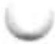

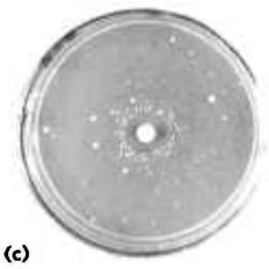

  
FIGURE 25-19 Ames test for carcinogens, based on their mutagenicity. A strain of Salmonella typhimurium having a mutation that inactivates an enzyme of the histidine biosynthetic pathway is plated on a histidine-free medium. Few cells grow. (a) The few small colonies of S. typhimurium that do grow on a histidine-free medium carry spontaneous mutations that permit the histidine biosynthetic pathway to operate. Three identical nutrient plates (b), (c), and (d) have been inoculated with an equal number of cells. Each plate then receives a disk of filter paper containing progressively lower concentrations of a mutagen. The mutagen greatly increases the rate of back-mutation and hence the number of colonies. The clear areas around the filter paper indicate where the concentration of mutagen is so high that it is lethal to the cells. As the mutagen diffuses away from the filter paper, it is diluted to sublethal concentrations that promote back-mutation. Mutagens can be compared on the basis of their effect on mutation rate. Because many compounds undergo a variety of chemical transformations after entering cells, compounds are sometimes tested for mutagenicity after first incubating them with a liver extract. Some substances have been found to be mutagenic only after this treatment. [Bruce N. Ames, University of California, Berkeley, Department of Biochemistry and Molecular Biology.]

#### [EN] All Cells Have Multiple DNA Repair Systems

The number and diversity of repair systems reflect both the importance of DNA repair to cell survival and the diverse sources of DNA damage (Table 25-5). Some common types of lesions, such as pyrimidine dimers (see Fig. 8-30), can be repaired by several distinct systems. Nearly 200 genes in the human genome encode proteins dedicated to DNA repair. In many cases, the loss of function of one of these proteins results in genomic instability and an increased occurrence of oncogenesis (Box 25-1).

P2 Many DNA repair processes also seem to be extraordinarily inefficient energetically—an exception to the pattern observed in the vast majority of metabolic pathways, where every ATP is generally accounted for and used optimally. When the integrity of the genetic information is at stake, the amount of chemical energy invested in a repair process seems almost irrelevant.

Accurate DNA repair is possible largely because the DNA molecule consists of two complementary strands. Damaged DNA in one strand can be removed and replaced, without introducing mutations, by using the undamaged complementary strand as a template. We consider here the principal types of repair systems, beginning with those that repair the rare nucleotide mismatches that are left behind by replication.

<table><tr><td colspan="2">TABLE 25-5 Types of DNA Repair Systems in E. coli</td></tr><tr><td>Enzymes/proteins</td><td>Type of damage</td></tr><tr><td colspan="2">Mismatch repair</td></tr><tr><td>Dam methylaseMutH, MutL, MutS proteinsDNA helicase IISSB</td><td rowspan="2">Mismatches</td></tr><tr><td>DNA polymerase IIIExonuclease IExonuclease VIIRecJ nucleaseExonuclease XDNA ligase</td></tr><tr><td colspan="2">Base-excision repair</td></tr><tr><td>DNA glycosylasesAP endonucleasesDNA polymerase IDNA ligase</td><td>Abnormal bases (uracil,hypoxanthine, xanthine);alkylated bases; in some otherorganisms, pyrimidine dimers</td></tr><tr><td colspan="2">Nucleotide-excision repair</td></tr><tr><td>ABC excinucleaseDNA polymerase IDNA ligase</td><td>DNA lesions that causelarge structural change(e.g., pyrimidine dimers)</td></tr><tr><td colspan="2">Direct repair</td></tr><tr><td>DNA photolyases</td><td>Pyrimidine dimers</td></tr><tr><td> $O^6$ -Methylguanine-DNAmethyltransferase</td><td> $O^6$ -Methylguanine</td></tr><tr><td>AlkB protein</td><td>1-Methylguanine, 3-methylcytosine</td></tr></table>

Mismatch Repair Correction of the rare mismatches left after replication in E. coli improves the overall fidelity of replication by an additional factor of $10^{2}$ to $10^{3}$ . The mismatches are nearly always corrected to reflect the information in the old (template) strand, which the repair system can distinguish from the newly synthesized strand by the presence of methyl group tags on the template DNA. The mismatch repair system of E. coli includes at least 10 protein components (Table 25-5) that function either in strand discrimination or in the repair process itself. The functions of many of these were first worked out by Paul Modrich and colleagues in the 1980s.

The strand discrimination mechanism has not been determined for most bacteria or eukaryotes, but it is well understood for E. coli and some closely related bacterial species. In these bacteria, strand discrimination is based on the action of Dam methylase, which, as you will recall, methylates DNA at the $N^{6}$ position of all adenines within (5')GATC sequences. Immediately after passage of the replication fork, there is a short period (a few seconds or minutes) during which the template strand is methylated

#### [EN] DNA Repair and Cancer

Human cancers develop when genes that regulate normal cell division (oncogenes and tumor suppressor genes; see Chapter 12) fail to function, are activated at the wrong time, or are altered. As a consequence, cells may grow out of control and form a tumor. The genes controlling cell division can be damaged by spontaneous mutation or overridden by the invasion of a tumor virus (Chapter 26). Not surprisingly, alterations in DNA repair genes that result in a higher rate of mutation can greatly increase an individual's susceptibility to cancer. Defects in the genes encoding the proteins involved in nucleotide-excision repair, mismatch repair, recombinational repair, and error-prone translesion DNA synthesis have all been linked to human cancers. Clearly, DNA repair can be a matter of life and death.

Nucleotide-excision repair requires a larger number of proteins in humans than in bacteria, although the overall pathways are very similar. Genetic defects that inactivate nucleotide-excision repair have been associated with several genetic diseases, the best-studied of which is xeroderma pigmentosum (XP). Because nucleotide-excision repair is the sole repair pathway for pyrimidine dimers in humans, people with XP are extremely sensitive to light and readily develop sunlight-induced skin cancers. Most people with XP also have neurological abnormalities, presumably because of their inability to repair certain lesions caused by the high rate of oxidative metabolism in neurons. Defects in the genes encoding any of at least seven different protein components of the nucleotide-excision repair system can result in XP, giving rise to seven different genetic groups, denoted XPA to XPG. Note that XPC and XPE are parts of complexes that recognize damaged DNA, whereas XPA, XPB, XPD, XPF, and XPG are all components of a much larger multisubunit complex that represents the human excinuclease depicted in Figure 25-24. These proteins are involved in making the DNA incisions and removing the 29mer segment of DNA.

Most microorganisms have redundant pathways for the repair of cyclobutane pyrimidine dimers—making use of DNA photolyases and sometimes base-excision repair as alternatives to nucleotide-excision repair—but humans and other placental mammals do not. This lack of a backup for nucleotide-excision repair for removing pyrimidine dimers has led to speculation that early mammals were small, furry, nocturnal animals with little need to repair UV damage. However, mammals do have a pathway for the translesion bypass of cyclobutane pyrimidine dimers, which involves

but the newly synthesized strand is not (Fig. 25-20). The transient unmethylated state of GATC sequences in the newly synthesized strand permits the new strand to be distinguished from the template strand. Replication mismatches in the vicinity of a hemimethylated GATC sequence are then repaired according to the information

DNA polymerase $\eta$ . This enzyme preferentially inserts two A residues opposite a T–T pyrimidine dimer, minimizing mutations. People with a genetic condition in which DNA polymerase $\eta$ function is missing exhibit an XP-like illness known as XP-variant, or XP-V. Clinical manifestations of XP-V are similar to those of the classic XP diseases, although mutation levels are higher in XP-V when cells are exposed to UV light. Apparently, the nucleotide-excision repair system works in concert with DNA polymerase $\eta$ in normal human cells, repairing and/or bypassing pyrimidine dimers as needed to keep cell growth and DNA replication going. Exposure to UV light introduces a heavy load of pyrimidine dimers, and some must be bypassed by translesion synthesis to keep replication on track. When one system is missing, it is partly compensated for by the other. A loss of DNA polymerase $\eta$ activity leads to stalled replication forks and bypass of UV lesions by different, more mutagenic, translesion synthesis (TLS) polymerases. As when other DNA repair systems are absent, the resulting increase in mutations often leads to cancer.

One of the most common inherited cancer-susceptibility syndromes is hereditary nonpolyposis colon cancer (HNPCC). This syndrome has been traced to defects in mismatch repair. Human and other eukaryotic cells have several proteins analogous to the bacterial MutL and MutS proteins (see Fig. 25-21). Defects in at least five different mismatch repair genes can give rise to HNPCC. The most prevalent are defects in the hMLH1 (human MutL homolog 1) and hMSH2 (human MutS homolog 2) genes. In individuals with HNPCC, cancer generally develops at an early age, with colon cancers being most common.

Most human breast and ovarian cancer occurs in women with no known predisposition. However, about 10% of cases are associated with inherited defects in two genes, BRCA1 and BRCA2. Human BRCA1 and BRCA2 are large proteins (1,834 and 3,418 amino acid residues, respectively) that interact with a wide range of other proteins involved in transcription, chromosome maintenance, DNA repair, and control of the cell cycle. BRCA2 has been implicated in the recombinational DNA repair of double-strand breaks. One of the key roles of BRCA2 is to load the human RecA homolog, called Rad51, onto DNA at the sites of double-strand breaks. BRCA1 has as yet imperfectly defined roles in the repair of double-strand breaks, transcription, and some other processes of DNA metabolism. Women with defects in either the BRCA1 or BRCA2 gene have a high (\~70%) chance of developing breast cancer.

in the methylated parent (template) strand. If both strands are methylated at a GATC sequence, few mismatches are repaired; if neither strand is methylated, repair occurs but does not favor either strand. The methyl-directed mismatch repair system of E. coli efficiently repairs mismatches up to 1,000 bp from a hemimethylated GATC sequence.

  
FIGURE 25-20 Methylation and mismatch repair. Methylation of DNA strands can serve to distinguish parent (template) strands from newly synthesized strands in E. coli DNA, a function that is critical to mismatch repair. The methylation occurs at the $N^{6}$ of adenines in (5')GATC sequences. This sequence is a palindrome, present in opposite orientations on the two strands.

How is the mismatch correction process directed by relatively distant GATC sequences? Figure 25-21 illustrates one mechanism. MutS scans the DNA and forms a clamplike complex upon encountering a lesion. The complex binds to all mismatched base pairs (except C–C). MutL protein forms a complex with MutS protein, and the MutSL complex slides along the DNA to find a hemimethylated GATC sequence. MutH binds to MutL, and the MutSLH complex moves in either direction at random along the DNA. MutH has a site-specific endonuclease activity that is inactive until the complex encounters a hemimethylated GATC sequence. At this site, MutH catalyzes cleavage of the unmethylated strand on the 5' side of the G in GATC, which marks the strand for repair. Further steps in the pathway depend on where the mismatch is located relative to this cleavage site (Fig. 25-22).

When the mismatch is on the 5' side of the cleavage site (Fig. 25-22, right side), the unmethylated strand is unwound and degraded in the 3'→5' direction from the

  
FIGURE 25-21 A model for the early steps of methyl-directed mismatch repair. Recognition of the sequence (5')GATC and of the mismatch are specialized functions of the MutH and MutS proteins, respectively.

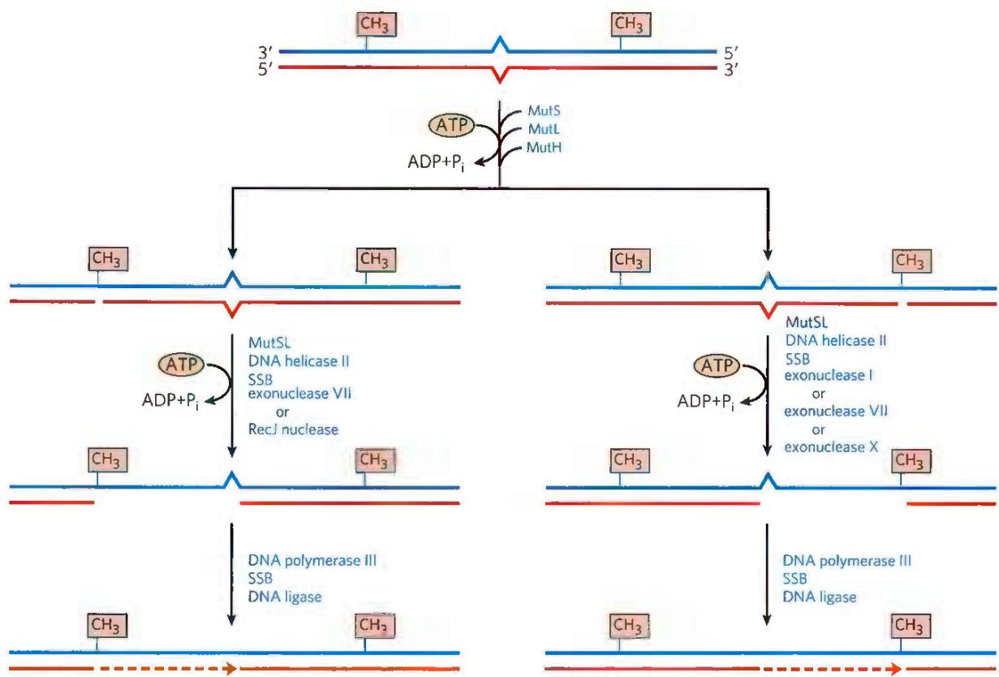  
FIGURE 25-22 Completion of methyl-directed mismatch repair. The combined action of DNA helicase II, SSB, and one of four different exonucleases removes a segment of the new strand between the MutH cleavage site and a point just beyond the mismatch. The particular  
exonuclease depends on the location of the cleavage site relative to the mismatch, as shown by the alternative pathways here. The resulting gap is filled in (dashed line) by DNA polymerase III, and the nick is sealed by DNA ligase (not shown).

cleavage site through the mismatch, and this segment is replaced with new DNA. This process requires the combined action of DNA helicase II (also called UvrD helicase), SSB, exonuclease I or exonuclease X (both of which degrade strands of DNA in the 3'→5' direction) or exonuclease VII (which degrades single-stranded DNA in either direction), DNA polymerase III, and DNA ligase. The pathway for repair of mismatches on the 3' side of the cleavage site is similar (Fig. 25-22, left), except that the exonuclease is either exonuclease VII or RecJ nuclease (which degrades single-stranded DNA in the 5'→3' direction).

P2 Mismatch repair is particularly costly for E. coli in terms of energy expended. The mismatch may occur 1,000 or more base pairs from the GATC sequence. The degradation and replacement of a strand segment of this length require an enormous investment in activated deoxynucleotide precursors to repair a single mismatched base. This again underscores the importance to the cell of genomic integrity.

Eukaryotic cells also have mismatch repair systems, with several proteins structurally and functionally analogous to the bacterial MutS and MutL (but not MutH) proteins. Alterations in human genes encoding proteins of this type produce some of the most common inherited cancer-susceptibility syndromes (see Box 25-1), further demonstrating the value to the organism of DNA repair systems. The main MutS homologs in most eukaryotes, from yeast to humans, are MSH2 (MutS homolog), MSH3, and MSH6. Heterodimers of MSH2 and MSH6 generally bind to single base-pair mismatches, and they bind less well to slightly longer mispaired loops. In many organisms, the longer mismatches (2 to 6 bp) may be bound instead by a heterodimer of MSH2 and MSH3, or are bound by both types of heterodimers in tandem. Homologs of MutL, predominantly a heterodimer of MLH1 (MutL homolog) and PMS1 (post-meiotic segregation), bind to and stabilize the MSH complexes. Many details of the subsequent events in eukaryotic mismatch repair remain to be worked out. In particular, we do not know how newly synthesized DNA strands are identified, although research reveals that this process does not involve GATC sequences.

Base-Excision Repair Every cell has a class of enzymes called DNA glycosylases that recognize particularly common DNA lesions (such as the products of cytosine and adenine deamination; see Fig. 8-29a) and remove the affected base by cleaving the N-glycosyl bond. The repair pathway is called base-excision repair, as the first step involves only the removal of the base rather than an entire nucleotide. The cleavage creates an apurinic or apyrimidinic site in the DNA, commonly referred to as an AP site or abasic site. Each DNA glycosylase is generally specific for one type of lesion.

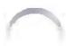

Uracil DNA glycosylases, for example, found in most cells, specifically remove from DNA the uracil that results from spontaneous deamination of cytosine. Mutant cells that lack this enzyme have a high rate of G≡C to A=T mutations. This glycosylase does not remove uracil residues from RNA or thymine residues from DNA. The capacity to distinguish thymine from uracil, the product of cytosine deamination—necessary for the selective repair of the latter—may be one reason why DNA evolved to contain thymine instead of uracil (p. 280).

Most bacteria have just one type of uracil DNA glycosylase, whereas humans have at least four types, with different specificities—an indicator of the importance of removing uracil from DNA. The most abundant human uracil glycosylase, UNG, is associated with the replisome, where it eliminates the occasional U residue inserted in place of a T during replication. The deamination of C residues is 100-fold faster in single-stranded DNA than in double-stranded DNA, and humans have an enzyme, hSMUG1, that removes any U residues occurring in single-stranded DNA during replication or transcription. Two other human DNA glycosylases, TDG and MBD4, remove either U or T residues paired with G, which are generated by deamination of cytosine or 5-methylcytosine, respectively.

Other DNA glycosylases recognize and remove a variety of damaged bases, including formamidopyrimidine and 8-hydroxyguanine (both arising from purine oxidation), hypoxanthine (from adenine deamination), and alkylated bases such as 3-methyladenine and 7-methylguanine. Glycosylases that recognize other lesions, including pyrimidine dimers, have also been identified in some classes of organisms. Remember that AP sites also arise from slow, spontaneous hydrolysis of the N-glycosyl bonds in DNA (see Fig. 8-29b).

Once an AP site has been formed by a DNA glycosylase, another type of enzyme must repair it. The repair is not made by simply inserting a new base and re-forming the N-glycosyl bond. Instead, the deoxyribose 5'-phosphate left behind is removed and replaced with a new nucleotide. This process begins with one of the AP endonucleases, enzymes that cut the DNA strand containing the AP site. The position of the incision relative to the AP site (5' or 3' to the site) depends on the type of AP endonuclease. A segment of DNA including the AP site is then removed, DNA polymerase I replaces the DNA, and DNA ligase seals the remaining nick (Fig. 25-23). In eukaryotes, nucleotide replacement is carried out by specialized polymerases, as described below.

Nucleotide-Excision Repair DNA lesions that cause large distortions in the helical structure of DNA generally are repaired by the nucleotide-excision system, a repair pathway critical to the survival of all free-living organisms. In nucleotide-excision repair (Fig. 25-24), a multisubunit enzyme (excinuclease) hydrolyzes two phosphodiester bonds, one on either side of the distortion caused by the lesion. In E. coli and other bacteria, the enzyme system hydrolyzes the fifth phosphodiester bond on the 3' side and the eighth phosphodiester bond on the 5' side to generate a fragment of 12 to 13 nucleotides (depending on whether the lesion involves one or two bases). In humans and other eukaryotes, the enzyme system hydrolyzes the sixth phosphodiester bond on the 3' side and the twenty-second phosphodiester bond on the 5' side, producing a fragment of 27 to 29 nucleotides. Following the dual incision, the excised oligonucleotides are released from the duplex and the resulting gap is filled—by DNA polymerase I in E. coli and DNA polymerase ε in humans. DNA ligase seals the nick.

  
FIGURE 25-23 DNA repair by the base-excision repair pathway. 1 A DNA glycosylase recognizes a damaged base (in this case, a uracil) and cleaves between the base and deoxyribose in the backbone. 2 An AP endonuclease cleaves the phosphodiester backbone near the AP site. 3 DNA polymerase I initiates repair synthesis from the free $3^{\prime}$ hydroxyl at the nick, removing (with its $5^{\prime} \rightarrow 3^{\prime}$ exonuclease activity) and replacing a portion of the damaged strand. 4 The nick remaining after DNA polymerase I has dissociated is sealed by DNA ligase.

  
FIGURE 25-24 Nucleotide-excision repair in E. coli and humans. The general pathway of nucleotide-excision repair is similar in all organisms. ① An excinuclease binds to DNA at the site of a bulky lesion and cleaves the damaged DNA strand on either side of the lesion. ② The  
DNA segment — of 13 nucleotides (13mer) or 29 nucleotides (29mer) — is removed with the aid of a helicase. The gap is filled in by DNA polymerase, and the remaining nick is sealed with DNA ligase. (Information from a figure provided by Aziz Sancar.)

In E. coli, the key enzymatic complex is the ABC excinuclease, which has three protein components, UvrA ( $M_{r}$ 104,000), UvrB ( $M_{r}$ 78,000), and UvrC ( $M_{r}$ 68,000). The term “excinuclease” is used to describe the unique capacity of this enzyme complex to catalyze two specific endonucleolytic cleavages, distinguishing this activity from that of standard endonucleases. A dimeric UvrA protein (an ATPase) scans the DNA and binds to the site of a lesion. A UvrB protein can bind to UvrA either before or after an encounter with the lesion. At the lesion, the UvrA dimer dissociates, leaving a tight UvrB-DNA complex. UvrC protein then binds to UvrB, and UvrB makes an incision at the fifth phosphodiester bond on the 3' side of the lesion. This is followed by a UvrC-mediated incision at the eighth phosphodiester bond on the 5' side. The resulting fragment, consisting of 12 to 13 nucleotides, is removed by UvrD helicase. The short gap thus created is filled in by DNA polymerase I and DNA ligase. This pathway (Fig. 25-24, left) is a primary repair route for many types of lesions, including cyclobutane pyrimidine dimers, 6-4 photoproducts (see Fig. 8-30), and several other types of base adducts, including benzo[a]pyrene-guanine, which is formed in DNA by exposure to cigarette smoke. The nucleolytic activity of the ABC excinuclease is novel in the sense that two cuts are made in the DNA.

The mechanism of eukaryotic excinucleases is quite similar to that of the bacterial enzyme, although at least 16 polypeptides with no similarity to the E. coli excinuclease subunits are required for the dual incision. Some of the nucleotide-excision repair and base-excision repair in eukaryotes is closely tied to transcription (see Chapter 26). Genetic deficiencies in nucleotide-excision repair in humans give rise to a variety of serious diseases (see Box 25-1).

Direct Repair Several types of damage are repaired without removing a base or nucleotide. The best-characterized example is direct photoreactivation of cyclobutane pyrimidine dimers, a reaction promoted by DNA photolyases. Pyrimidine dimers result from a UV-induced reaction.

Through a mechanism worked out by Aziz Sancar and colleagues, photolyases use energy derived from absorbed light to reverse the damage (Fig. 25-25). Photolyases generally contain two cofactors that serve as light-absorbing agents, or chromophores: in all organisms, one is FADH $_{2}$ ; in E. coli and yeast, the other is a folate. The reaction mechanism entails the generation of free radicals. DNA photolyases are not found in humans and other placental mammals.

Additional examples are seen in the repair of nucleotides with alkylation damage. The modified nucleotide $O^{6}$ -methylguanine forms in the presence of alkylating agents and is a common and highly mutagenic lesion. It tends to pair with thymine rather than cytosine during replication, and therefore causes G≡C to A=T mutations (Fig. 25-26).

MECHANISM FIGURE 25-25 Repair of pyrimidine dimers with photolyase. Energy derived from absorbed light is used to reverse the photoreaction that caused the lesion. The two chromophores in E. coli photolyase (M, 54,000), $N^5$ , $N^{10}$ -methenyltetrahydrofolylpolyglutamate (MTHFpolyGlu)

and FADH $^{-}$ , perform complementary functions. MTHFpolyGlu functions as a photoantenna to absorb blue-light photons. The excitation energy passes to FADH $^{-}$ , and the excited flavin ( $*$ FADH $^{-}$ ) donates an electron to the pyrimidine dimer, leading to the rearrangement as shown.

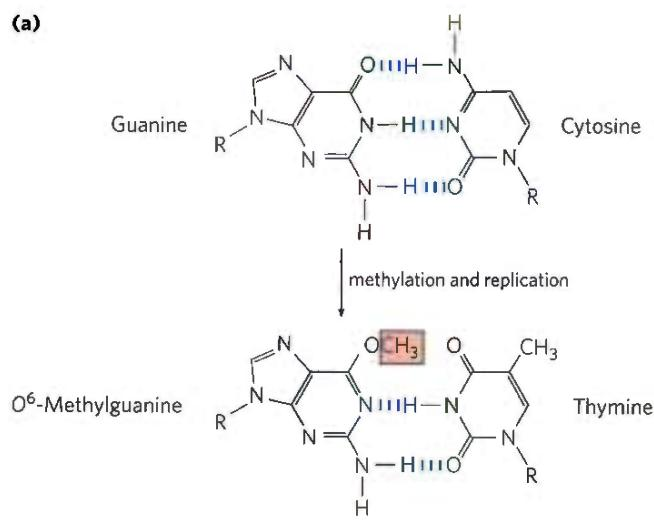  
FIGURE 25-26 Example of how DNA damage results in mutations. (a) The methylation product $O^6$ -methylguanine pairs with thymine rather than cytosine residues. (b) If not repaired, this leads to a G≡C to A=T mutation after replication.

Direct repair of $O^{6}$ -methylguanine is carried out by $O^{6}$ -methylguanine-DNA methyltransferase, a protein that catalyzes transfer of the methyl group of $O^{6}$ -methylguanine to one of its own Cys residues. This methyltransferase is not strictly an enzyme, because a single methyl transfer event permanently methylates the protein, inactivating it in this pathway. P2 The consumption of an entire protein molecule to correct a single damaged base is another vivid illustration of the priority given to maintaining the integrity of cellular DNA.

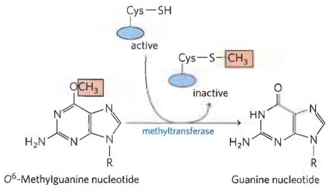

A very different but equally direct mechanism is used to repair 1-methyladenine and 3-methylcytosine. The amino groups of A and C residues are sometimes methylated when the DNA is single-stranded, and the methylation directly affects proper base pairing. In E. coli, oxidative demethylation of these alkylated nucleotides is mediated by the AlkB protein, a member of the $\alpha$ -ketoglutarate- $Fe^{2+}$ -dependent dioxygenase superfamily (Fig. 25-27). (See Box 4-2 for a description of proline hydroxylation, catalyzed by another member of this enzyme family.)

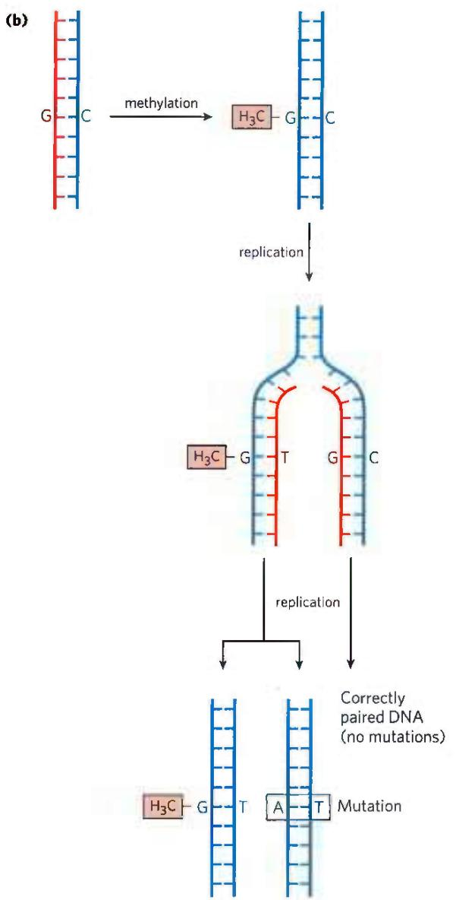

#### [EN] The Interaction of Replication Forks with DNA Damage Can Lead to Error-Prone Translesion DNA Synthesis

The repair pathways considered to this point generally work only for lesions in double-stranded DNA, the undamaged strand providing the correct genetic information to restore the damaged strand to its original state. However, in certain types of lesions, such as double-strand breaks, double-strand cross-links, or lesions in a single-stranded DNA, the complementary strand is itself damaged or is absent. P3 Double-strand breaks and lesions in single-stranded DNA most often arise when a replication fork encounters an unrepaired DNA lesion (Fig. 25-28). Such lesions and DNA cross-links can also result from ionizing radiation and oxidative reactions.

At a stalled bacterial replication fork, there are two avenues for repair. In the absence of a second strand, the information required for accurate repair must come from a separate, homologous chromosome. The repair system thus involves homologous genetic recombination. This recombinational DNA repair is considered in

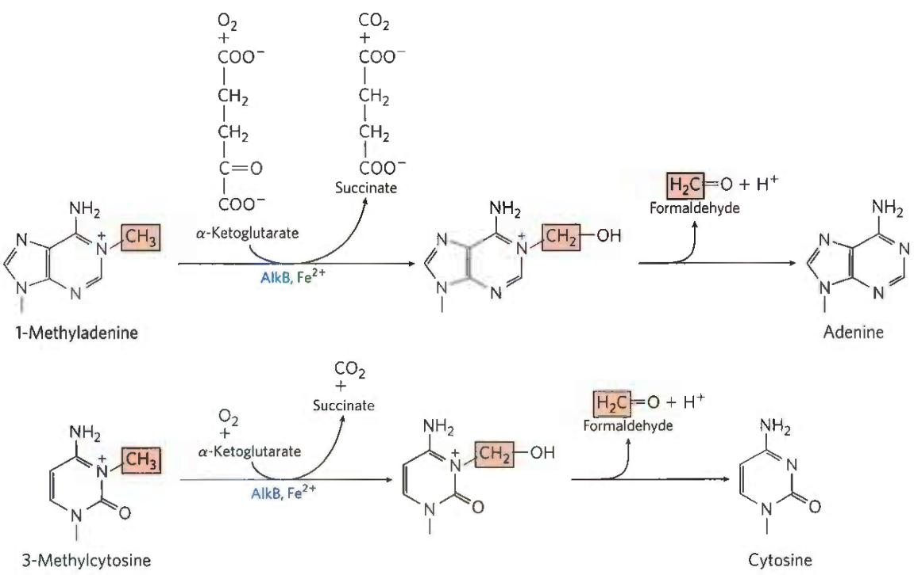  
FIGURE 25-27 Direct repair of alkylated bases by AlkB. The AlkB protein is an $\alpha$ -ketoglutarate- $\mathrm{Fe}^{2+}$ -dependent hydroxylase (see Box 4-2). It catalyzes the oxidative demethylation of 1-methyladenine and 3-methylcytosine residues.

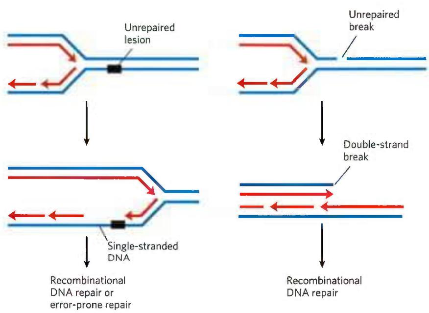  
FIGURE 25-28 DNA damage and its effect on DNA replication. If the replication fork encounters an unrepaired lesion or strand break, the DNA polymerase sometimes disengages and re-initiates downstream. The lesion remains in an unreplicated, single-stranded gap that is left behind the replication fork (left). In other cases, a replication fork may encounter a lesion that is actively undergoing repair such that a transient break is present in one of the template strands. When the replication fork encounters it, the single-strand break becomes a double-strand break (right). In each case, the damage to  
one strand cannot be repaired by mechanisms described earlier in this chapter, because the complementary strand required to direct accurate repair is damaged or absent. There are at least two possible avenues for repair: recombinational DNA repair or, when lesions are unusually numerous, error-prone repair. The latter mechanism involves translesion DNA polymerases such as DNA polymerase V, encoded by the umuC and umuD genes and activated by the RecA protein that can replicate, albeit inaccurately, over many types of lesions. The repair mechanism is "error-prone" because mutations often result.

detail in Section 25.3. Under some conditions, a second repair pathway, error-prone translesion DNA synthesis (often abbreviated TLS), becomes available. When this pathway is active, DNA repair is significantly less accurate, and a high mutation rate can result. In bacteria, error-prone translesion DNA synthesis is part of a cellular stress response to extensive DNA damage known, appropriately enough, as the SOS response.

Some of the 40 or more SOS proteins, such as the UvrA and UvrB proteins involved in the error-free nucleotide-excision repair already described, are normally present in the cell but are induced to higher levels as part of the SOS response. Additional SOS proteins participate in the pathway for error-prone repair; these include the UmuC and UmuD proteins (unmutable; lack of the umu gene eliminates error-prone repair). The UmuD protein is cleaved in an SOS-regulated process to a shorter form called UmuD', which forms a complex with UmuC and a protein called RecA (described in Section 25.3) to create a specialized DNA polymerase, DNA polymerase V (UmuD'2UmuCRecA), which can replicate past many of the DNA lesions that would normally block replication. Proper base pairing is often impossible at the site of such a lesion, so this translesion replication is error-prone.

Given the emphasis on the importance of genomic integrity throughout this chapter, the existence of a system that increases the rate of mutation may seem incongruous. However, we can think of this system as a desperation strategy. The umuC and umuD genes are fully induced only late in the SOS response, and they are not activated for translesion synthesis initiated by UmuD cleavage unless the levels of DNA damage are particularly high and all replication forks are blocked. The mutations resulting from DNA polymerase V-mediated replication kill some cells and create deleterious mutations in others, but this is the biological price a species pays to overcome an otherwise insurmountable barrier to replication, as it permits at least a few mutant daughter cells to survive.
P3 The resultant mutations contribute to evolution.

Yet another DNA polymerase, DNA polymerase IV, is also induced during the SOS response. Replication by DNA polymerase IV, a product of the dinB gene, is also highly error-prone. The bacterial DNA polymerases IV and V (Table 25-1) are part of a family of TLS polymerases found in all organisms. These enzymes lack a proofreading exonuclease and have a more open active site than other DNA polymerases, one that accommodates damaged template nucleotides. With these enzymes, the fidelity of base selection during replication may be reduced by a factor of $10^{2}$ , lowering overall replication fidelity to one error in $\sim 1,000$ nucleotides.

P4 Mammals have many low-fidelity DNA polymerases of the TLS polymerase family. However, the presence of these enzymes does not necessarily translate into an unacceptable mutational burden, because most of the enzymes also have specialized functions in DNA repair. DNA polymerase η (eta), for example, found in all eukaryotes, promotes translesion synthesis primarily across cyclobutane T–T dimers. Few mutations result, because the enzyme preferentially inserts two A residues across from the linked T residues. Several other low-fidelity polymerases, including DNA polymerases β,ι (iota), and λ, have specialized roles in eukaryotic base-excision repair. Each of these enzymes has a 5'-deoxyribose phosphate lyase activity in addition to its polymerase activity. After base removal by a glycosylase and backbone cleavage by an AP endonuclease, these polymerases remove the abasic site (a 5'-deoxyribose phosphate) and fill in the very short gap. The frequency of mutation due to DNA polymerase $\eta$ activity is minimized by the short lengths (often one nucleotide) of DNA synthesized.

What emerges from research into cellular DNA repair systems is a picture of a DNA metabolism that maintains genomic integrity with multiple and often redundant systems. Most of the major DNA repair systems occur in all organisms. P4 These repair systems are often integrated with the DNA replication systems and are complemented by recombination systems, which we turn to next.

#### [EN] SUMMARY 25.2 DNA Repair

■ Mutations are genomic changes that alter the information in DNA. When mutations occur in genes encoding enzymes involved in DNA repair, the loss of function can lead to cancer.

Cells have many systems for DNA repair. Major repair systems present in all organisms include mismatch repair, base excision repair, nucleotide-excision repair, and direct repair.

In bacteria, TLS DNA polymerases respond to very heavy DNA damage with error-prone translesion DNA synthesis. In eukaryotes, similar polymerases have specialized roles in DNA repair that minimize the introduction of mutations.

<!-- L-END Lehninger 25.2 -->

## 2.6 DNA 的转座

DNA 的转座,或称移位(transposition),是由可移位因子(transposable element)介导的遗传物质重排现象。与 DNA 的同源重组相比,转座作用发生的频率虽然要低得多,但它仍然有着十分重要的生物学意义,这不仅因为它能说明在细菌中发现的许多基因缺失或倒转现象,而且它常被用于构建新的突变体。已经发现“转座”这一命名并不十分准确,因为在转座过程中,可移位因子的一个拷贝常常留在原来位置上,在新位点上出现的仅仅是它的拷贝。因此,转座有别于同源重组,它依赖于 DNA 的复制。

## 2.6.1 转座子的分类和结构特征

转座子(transposon, Tn)是存在于染色体 DNA 上可自主复制和位移的基本单位。最初是由 Barbara McClintock 于 20 世纪 40 年代在玉米的遗传学研究中发现的。几十年的研究结果表明转座子存在于所有的生物体内，人类基因组中有 35% 以上的序列为转座子序列，其中大部分与疾病相关。

转座子分为两大类: 插入序列(insertional sequence, IS) 和复合型转座子(composite transposon)。

图2-40 DNA转座的一般模式  

## 1. 插入序列(IS)

插入序列是最简单的转座子,它不含有任何宿主基因。它们是细菌染色体或质粒DNA的正常组成部分。一个细菌细胞常带有少于10个IS。转座子常常被定位到特定的基因中,造成该基因突变。科学上用标准命名法对这些突变进行编号,如 $\lambda$ :IS1表示有一个IS1插入到 $\lambda$ 噬菌体基因组内。IS都是可以独立存在的单元,带有介导自身移动的蛋白质,也可作为其他转座子的组成部分。

常见的 IS 都是很小的 DNA 片段(约 1 kb)，末端具有反向重复区，转座时往往复制宿主靶位点一小段(4～15 碱基对)DNA，形成位于 IS 两端的正向重复区 $^{(图 2-40)}$ 。除 IS1 以外，所有已知 IS 都只有一个开放读码框，翻译起始点紧挨着第一个反向重复区，终止点位于第二个反向重复区或重复区附近。IS1 含有两个分开的读码框，只有移码通读才能产生功能型转座酶。一般情况下，每个 IS 转座频率是 $10^{-3} \sim 10^{-4}/$ 世代，恢复频率则低得多，为 $10^{-6} \sim 10^{-10}/$ 世代。

## 2. 复合型转座子

复合型转座子是一类带有某些抗药性基因(或其他宿主基因)的转座子,其两翼往往是两个相同或高度同源的IS,表明IS插入到某个功能基因两端时就可能产生复合型转座子(图2-41)。一旦形成复合型转座子,IS就不能再单独移动,因为它们的功能被修饰了,只

图 2-41 复合型转座子的两端往往各有一个 IS，在每个 IS 两侧各有反向重复区  
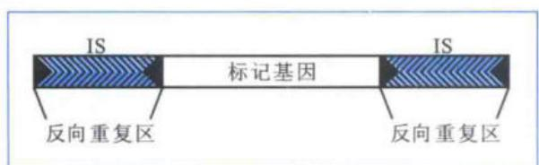

能作为复合体移动。大部分情况下,这些转座子的转座能力是由 IS 决定和调节的。

除了末端带有IS的复合型转座子以

  
图2-42 转座子TnA的结构示意图

外,还存在一些没有 IS 的、体积庞大的转座子(5 000 碱基对以上)——TnA 家族。这类转座子带有 3 个基因,其中一个编码 β-内酰胺酶(AmpR),另两个则是转座作用所必需的。图 2-42 是转座子 TnA 结构模式。所有 TnA 类转座子两翼都带有 38bp 的反向重复序列。

## 2.6.2 真核生物中的转座子

转座子不仅存在于原核细胞(如大肠杆菌)和低等真核细胞(如酵母)中,也同样存在于高等真核生物。如玉米和果蝇中就发现了多个在基因组内随机分布而且能重复移动的转座子。大量研究证实,几乎所有高等生物基因组中都存在类似转座子序列,高等真核生物基因组的流动性可能比原核生物还要大些。

早在20世纪初，遗传学家就已发现玉米中存在决定体细胞变异的“控制因子”（事实上就是转座子）。40多年前McClintock在美国康奈尔大学和冷泉港实验室对Ac-Ds等系统所进行的开创性工作，打破了孟德尔关于基因固定排列于染色体上的概念，尽管在当时几乎不能被科学界所接受，30多年后终于在分子水平上得到证实，并使她获得了诺贝尔生理学或医学奖。

可以把玉米细胞内的控制因子归纳为两大类:一类是自主性因子(autonomous element),另一类是非自主性因子(nonautonomous element)。前者具有自主剪接和转座的功能,后者单独存在时是稳定的,不能转座,当基因组中存在与非自主性因子同家族的自主性因子时,它才具备转座功能,成为与自主性因子相同的转座子。同一家族的自主性因子能为非自主性因子的转座提供反式作用蛋白(转座酶),而不同家族间无此反应。研究发现,玉米转座子同样具有典型的IS特征——在转座子的两翼有两个反向重复序列,在靶DNA插入位点有两个短的正向重复序列。

## 2.6.3 转座作用的遗传学效应

转座子引发了许多遗传变异,如基因重排及质粒-染色体 DNA 整合等,DNA 转座的遗传学效应主要有以下几方面:

① 转座引起插入突变。各种 IS、Tn 转座子都可以引起插入突变。如果插入位于某操纵子的前半部分，就可能造成极性突变，导致该操纵子后半部分结构基因表达失活。

② 转座产生新的基因。如果转座子上带有抗药性基因，它一方面造成靶 DNA 序列

上的插入突变,同时也使这个位点产生抗药性。

③ 转座产生的染色体畸变。当复制型转座发生在宿主 DNA 原有位点附近时，往往导致转座子两个拷贝之间的同源重组，引起 DNA 缺失或倒位。若同源重组发生在两个正向重复转座区之间，就导致宿主染色体 DNA 缺失；若重组发生在两个反向重复转座区之间，则引起染色体 DNA 倒位。

④ 转座引起的生物进化。由于转座作用,使原来在染色体上相距甚远的基因组合到一起,构建成一个操纵子或表达单元,可能产生有新的生物学功能的基因和新的蛋白质分子。

<!-- W-BEGIN Watson 12 位点特异性重组和DNA转座 -->

### 【中文对照 Watson 第12章：位点特异性重组和DNA转座】

> 来源：Watson《基因的分子生物学》第七版中译本（书籍/03_基因的分子生物学_第七版） 第12章 位点特异性重组和DNA转座。

#### [W] 第12章 位点特异性重组和DNA转座

本章概要
- 保守性位点特异性重组（CSSR）
- 位点特异性重组的生物学作用
- 转座
- 转座子及其调控的实例
- V（D）J 重组

DNA 是一种非常稳定的分子。通过前面章节的学习，我们了解到：DNA 的复制、修复及同源重组过程都保持了很高的保真度，这些遗传过程确保了一个物种的基因组在传代过程中保持几乎完全一致。然而，重要的是，还有一些遗传过程造成了 DNA 序列的重排，从而导致了一个更具动态性的基因组结构，这些过程就是本章的主题。

很多重要的DNA重排都是由两类重要的遗传重组造成的——保守性位点特异性重组（conservative site-specific recombination, CSSR）和转座重组（一

般称作转座）（transpositional recombination）。CSSR 发生在两段特定的序列之间（图 12-1）。相反，转座则是发生在特定序列和非特定 DNA 位点之间。由这些重组活动促成的生物学过程包括：病毒感染过程中病毒基因组插入到宿主细胞 DNA、DNA 片段倒位改变基因结构，以及转座因子（transposable element）（又叫“跳跃”基因）从一个染色体位点移动到另一个位点。

这些 DNA 重排对染色体结构和功能有着深远的影响。对许多物种而言，转座是自发性突变的主要来源，人类基因组中几乎一半的序列都源于转座子（尽管目前大多数元件都不具活性）。而且，正如我们将看到的，病毒感染和脊椎动物免疫系统的发育都严重地依赖这些特殊的 DNA 重组。

保守性位点特异性重组和转座在机制上具有共同的关键特征。重组酶（recombinase）能够识别 DNA 分子上要发生重组的特定序列，它把这些特定序列集合在一起，形成一个蛋白质-DNA 的复合体，这个复合体把这些 DNA 位点衔接起来，形成联会复合体（synaptic complex）。在这种复合体中，重组酶催化 DNA 分子的断裂和重新连接，造成 DNA 片段的倒位或位移。一个重组酶通常可以完成所有步骤。这两种类型的重组都被精细地控制着，从而使在 DNA 中引入断裂和非预期的重组 DNA 片段对细胞带来的危害降到最低。但是，我们还将了解到，这两种重组类型在原理上还有一些关键的差异。

  
图 12-1 两类遗传重组。上图显示的是位点特异性重组。红色和蓝色重组位点间重组的结果使包含 A 和 B 基因的 DNA 片段发生了颠倒。下图显示的是红色的转座子从灰色的 DNA 上切除并插入到另一个蓝色的 DNA 的不相关位点上。

下面先介绍比较简单的位点特异性重组，然后再对转座进行讨论。每个部分都是先介绍原理的基本特点，然后再提供几个具体的例子。

#### [W] 保守性位点特异性重组（CSSR）

发生在靶 DNA 上特定 DNA 序列的位点特异性重组

很多由一个特定 DNA 片段发生重排的反应都是由保守性位点特异性重组造成的。这些反应的一个关键特性是发生移动的 DNA 片段都带有短而特殊的序列元件，叫做重组位点（recombination site），在这里可发生 DNA 交换。这种重组类型的一个例子是 $\lambda$ 噬菌体基因组整合到细菌染色体上（图 12-2，附录 A）。

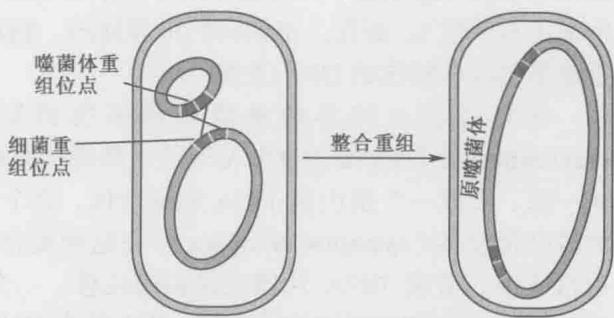  
图 12-2 λ 噬菌体基因组整合到宿主细胞染色体。在两个 DNA 分子之间 DNA 的交换常特异性地发生在重组位点之间。在图中未按比例显示 λ 噬菌体和细胞染色体的相对长度。

λ噬菌体整合时,重组总是精确地发生在位于两个重组位点之间一段相同的序列上,这两个重组位点,一个在噬菌体 DNA 上,另一个在细菌 DNA 上。重组位点带有两类序列元件:重组酶特异结合的序列和发生 DNA 断裂及重新连接的序列。重组位点往往很短,大约只有 20bp,也可能会更长一些,并带有其他序列基序或蛋白质结合位点。关于更复杂的重组位点的例子,我们将在介绍具体的重组反应时进行说明。

  
图12-3 CSSR 重组的3种类型。在每个图例中，红色的 DNA 片段通过重组发生了移动或重排。A、B、C、D、X 和 Y 代表位于不同 DNA 片段的基因，深红色和蓝色区块代表重组酶识别序列，黑色箭头代表交换区，这些序列元件一起构成重组位点。

CSSR 能够产生 3 种不同类型的 DNA 重排（图 12-3）：①一个 DNA 片段在特定位点的插入（如 λ 噬菌体 DNA 整合到细菌染色体）；②DNA 片段的缺失；③DNA 片段的倒位。重组结果是造成 DNA 插入、缺失还是倒位，是由 DNA 分子或参与重组的其他分子上的重组酶识别位点的结构决定的。

要理解重组位点的结构如何决定 DNA 重排的类型，我们就必须对重组位点的序列元件进行更仔细的研究（图 12-4）。每个重组位点都是由一对对称排列的重组酶识别序列（recombinase recognition sequence）构成，这些识别序列中间所包围着一个短的不对称序列，称为交换区（crossover region），DNA 的断裂和重新连接就在这里发生。

由于交换区是不对称的，所以每个重组位点都带有特定的极性。单个 DNA 分子上的两个位点的方位排列或呈反向重复（inverted repeat）的关系，或呈同向重复（direct repeat）的关系。在一对反向位点间的重组将使这两个位点间的 DNA 片段发生倒位（图 12-3，右图）；相反，以同样的机制发生在两个同向重复位点间的重组将使这两个位点间的 DNA 片段发生缺失（图 12-3，中图）；最后，两个不同分子的重组位点相互靠近并交换 DNA 造成 DNA 片段的插入（图 12-3，左图）。在对重组酶进行一般性讨论后，将介绍这 3 种重排类型的几个实例。

位点特异性重组酶通过一个蛋白质-DNA的共价中间体对DNA进行切割并重新连接

保守性位点特异性重组酶共有两个家族——丝氨酸重组酶（serine recombinase）和酪氨酸重组酶（tyrosine recombinase）。这两个家族的基本原理都是在切割 DNA 时形成一个蛋白质-DNA 的共价中间体。对丝氨酸蛋白酶而言，该酶活性位点内丝氨酸残基的侧链对重组位点内的特定磷酸二酯键进行攻击（图 12-5），结果造成 DNA 分子一个单链断裂的同时，在丝氨酸和这个 DNA 断裂位点上的一个磷酸之间形成一个共价连接。同样地，对酪氨酸重组酶来说，则是其活性位点上酪氨酸的侧链攻击 DNA 并与之结合。表 12-1 按家族和生物功能分类列出了许多重要的重组酶。

图 12-4 CSSR 过程起作用的结构。一对对称的重组酶识别序列分列在发生重组的交换区两端。重组酶亚基结合到这些重组位点。注意交换区的序列不是回文形式，导致了重组位点内部的不对称。（图片经允许修改，源自：Craig N. et al. 2002. Mobile DNA II, p.4, Fig.1 2002 ©ASM Press.）  
  
图12-5 丝氨酸重组酶和酪氨酸重组酶的共价中间体机制。如图中所示，丝氨酸活性位点的一个羟基攻击磷酸基团，导致重组位点一条单链的断裂，然后断开的DNA上的羟基再攻击蛋白质-DNA中间的共价键，从而逆转了断裂反应，缝合DNA并释放蛋白质。重组酶的标记为Rec，以蓝色表示。

蛋白质-DNA 共价中间体保存了蛋白质和 DNA 之间的共价连接间断裂的磷酸二酯键的能量。这样，DNA 链可以通过逆转断裂过程被重新连接。在这个逆转过程中，来自断裂 DNA 的一个羟基攻击连接蛋白质和 DNA 的共价键，这一过程共价地缝合了 DNA 缺口，同时释放出游离的（不结合 DNA 的）重组酶（图 12-5）。

正是这种机制的特性赋予保守性位点特异性重组（CSSR）名称中“保守性”的意义：被称为“保守”是因为反应中被断开的每个DNA键都被重组酶重新连接起来，而DNA在被重组酶断开并重新连接的过程中不需要外部的能量，如ATP水解所释放的能量。这种裂解机制以及形成的共价中间体并不为重组酶所特有。DNA拓扑异构酶（见第4章）和Spo11也是这种机制，后者运用这种机制在减数分裂期间诱导DNA双链断裂引发同源重组（见第11章）。

表 12-1 重组酶的家族和功能

<table><tr><td>重组酶</td><td>功能</td></tr><tr><td colspan="2">丝氨酸重组酶家族</td></tr><tr><td>沙门氏菌 Hin 转化酶</td><td>通过识别 hix 位点使一个染色体区域倒位造成一个基因启动子翻转,表达两种截然不同的表面抗原</td></tr><tr><td>Tn3 转座子和 Yδ 解离酶</td><td>启动一个 DNA 的删除反应来解除复制性转座造成的 DNA 融合,重组位点为 res 位点</td></tr><tr><td colspan="2">酶氨酸重组酶家庭</td></tr><tr><td>λ 噬菌体整合酶</td><td>启动 λ 噬菌体基因组整合或离开大肠杆菌染色体特定序列上的整合及切除反应,重组位点为 res 位点</td></tr><tr><td>PI 噬菌体 Cre</td><td>通过噬菌体 DNA 上的识别位点( lox 位点)在浸染过程中启动噬菌体 DNA 的环化</td></tr><tr><td>大肠杆菌 XerC 和 XerD</td><td>启动一些 DNA 删除反应,将二聚体的环状 DNA 分子变成单体,同时识别质粒( cer )位点和细菌染色体(dif)位点</td></tr><tr><td>酵母 FLP</td><td>将酵母的 2μ质粒上一个区域倒位以产生一个叫做滚环复制的 DNA 扩增反应,重组位点为 frt 位点</td></tr></table>

#### [W] 丝氨酸重组酶诱导 DNA 双链断裂及链交换，促成重组

CSSR 总是发生在两个重组位点之间。如上所示，这些位点可以在同一个 DNA 分子上（如倒位或缺失），也可以在两个不同的分子上（如插入）。每个重组位点都是由双链 DNA 构成的。因此，在重组过程中，这4条 DNA 单链（每个双螺旋两条）必须先断开，再与另一个分子上的单链重新连接，以产生重排的 DNA。

丝氨酸重组酶在进行链交换前将 4 条单链全部切断（图 12-6）。重组酶蛋白中一个分子催化其中一个断裂反应，所以至少需要由 4 个亚基组成（即四聚体形态）重组酶。

亲本 DNA 双链分子的断裂产生 4 个双链 DNA 片段（根据它们所结合的蛋白质的不同分别标记为 R1、R2、R3 和 R4，如图 12-6 所示）。要使重组发生，上边 DNA 分子的 R2 片段必须结合到下边 DNA 分子的 R3 片段上。同样，上边 DNA 分子的 R1 片段必须结合到下边 DNA 分子的 R4 片段上。一旦这一 DNA 交换发生，每个断裂 DNA 链的 3'-OH 端就会攻击新配对片段上的重组酶-DNA 间的共价键。如上所述，这个反应释放了重组酶，而且共价地缝合了 DNA 链，产生了重排的 DNA 产物。

  
图 12-6 丝氨酸重组酶催化的重组反应。4 条 DNA 单链各自被重组酶蛋白一个亚基断裂于交换区，4 个亚基分别被标记为 R1、R2、R3 和 R4。一个双螺旋中的两条单链的断裂位点相差两个碱基，这两个碱基区域在重组产物中形成一个杂交二倍体。图中所示的重组位点与图 12-4 中的类似。

#### [W] 丝氨酸重组酶-DNA复合体的结构揭示了它通过亚基旋转以完成链交换

重组过程中丝氨酸重组酶-DNA复合体的结构很好地展示了DNA链的交换是如何自然协调的。这个复合体包括丝氨酸重组酶的4个亚基和2个断裂的双链DNA分子。每个重组酶亚基中的丝氨酸活性位点与每个重组DNA位点的5'磷酸基团之间形成的共价链接清晰可见。每个共价链接的末端依次产生一个带有游离的3'羟基的DNA末端参与链的交换。

这一复合体的最显著特征是在“上面”和“下面”的重组酶二聚体之间具有一个大而平的分界面（图12-7a）。这种结构大多是疏水且光滑的，基本不会阻滞复合体上下两部分结构围绕彼此进行旋转。而正负电荷配对的一些区域则特别在初始状态以及相互呈 $180^{\circ}$ 的旋转角度时稳定二聚体的结构。因此，对于此复合体的分析强有力地证实了重组的机制包括：①DNA断裂形成共价的酶-DNA中间体；②在蛋白-DNA复合体中二聚体旋转了

180°；③二聚体旋转后攻击解离酶-DNA复合体中的DNA3'羟基末端，使链重新连接形成新的重组构型。随着更多结构性和机制性实验的完成，这种引人注目的蛋白旋转现象将得到更深的了解（图12-7b）。

  
图 12-7 丝氨酸重组酶的结构。（a）这个结构显示的大而平的四聚体界面是旋转的位点。重组酶四聚体由蓝绿色的亚基二聚体（顶端）和灰色的亚基二聚体（底端）组成。该四聚体中的每个亚基都分别位点特异性地结合在该结构中的4个“DNA臂”上（注意DNA之间的联系是通过DNA分子外侧的蛋白质亚基的α螺旋实现的）。尽管在这里只显示了两条链被切断，但是对于一个完整的重组反应，4个DNA链必须全部断裂（如图12-6）。(Li W. et al. 2005.. Science 309: 1210. PDB Code: 1ZR4.) 图形通过MolScript，BobScript和Raster3D制作。(b) 在较上面的展现的是四聚体界面旋转位点的侧面图，而在较下面的视图则是将侧面图旋转90°得到的俯视图，揭示了四聚体亚基对之间对齐的角度（用有颜色的柱表示）。在该图中展现了在DNA切除过程中丝氨酸重组酶四聚体的不同的旋转构象的结构。在左侧的起始的四聚体构象（亲代类型）是准备切除的构象：每个旋转的亚基对的α螺旋约呈50°角。第一次顺时针旋转约35°使亚基对的螺旋构象处于约85°交角。再旋转约90°则产生对齐的构象异构体，而最后再旋转约55度则完成了一轮的亚基交换并将重组构型中的DNA链排列成连接形式。（图片经允许修改，源自Johnson R.C. and McLean M.M. 2011. Structure 19: 751–753；Fig.2, p. 752. ©Elsevier.）

#### [W] 酪氨酸重组酶每次断裂和结合一对 DNA 单链

和丝氨酸重组酶不同，酪氨酸重组酶先完成两条 DNA 单链的断裂和重新连接，再对剩下的两条单链进行断裂和重新连接（图12-8）。考虑到是两个 DNA 分子与它们的重组位点配对，因此同样需要4个分子的重组酶，每个分子断裂一条 DNA 单链。重组开始时，结合到左侧重组酶结合位点的亚基（在图12-8a中标记为 R1 和 R3）分别断裂各自结合的 DNA 分子的上面的那条单链，这次断裂发生在交换区的第一个核苷酸处。然后，上边（灰色）的 DNA 分子的右上单链和下边红色的 DNA 分子的右上单链交换配对的伙伴。这两条 DNA 单链就被连接到一起，形成了重组构型。这个“第一单链”交换反应所产生的一个带分岔的 DNA 中间体称为 Holliday 联结体（见第11章，图12-8b）。

一旦第一单链交换完成，另外两个重组酶亚基（标记为 R2 和 R4）就会切割两个 DNA 分子的下单链（图 12-8c）。它们再交换配对的伙伴并经过与断裂反应逆转的过程连接起来。这个“第二单链”的交换反应打开了 Holliday 联结体（见第 11 章），得到重排的 DNA 产物。下一节我们将讨论这些化学反应是如何在重组酶蛋白质-DNA 复合体的作用下发生的。

  
图 12-8 酪氨酸重组酶催化的重组反应。第一步，由 R1 和 R3 亚基断裂 DNA（a）。如图所示，蛋白质与断裂的 DNA 通过 3' 端磷酸-酪氨酸键连接。断裂 DNA 5' 端的两个羟基各自攻击另一个 DNA 分子上蛋白质-DNA 的连接键后发生第一对单链的交换（b）。第二条单链的交换机制与上面相同，通过 R2、R4 亚基完成（c 和 d）。（来源：Craig N. et al. 2002. Mobile DNA II, color plate1, chapter 2. ©ASM Press.）

#### [W] 酪氨酸重组酶与 DNA 结合的结构揭示了 DNA 交换的机制

酪氨酸重组酶的位点特异性重组机制已经了解得很清楚了。这一蛋白质家族的一些成员的结构已经得到了很好的了解，并揭示出其在重组过程中的作用。一个完美的例子就是 Cre 重组酶结合到重组 DNA 两种不同构型上时的结构。下面介绍从这些结构得出的详细机制。Cre 是 P1 噬菌体编码的一种酶，其功能是在侵染过程中环化线性的噬菌体基因组。Cre 作用于 DNA 上的重组位点叫 lox，Cre-lox 是一个由酪氨酸重组酶家族催化重组反应的简单例子，整个重组仅需 Cre 蛋白和 lox 位点。Cre 也是在遗传工程中被广泛使用的一个工具（框 12-1 位点特异性重组在遗传工程中的应用）。

#### [W] 框 12-1 位点特异性重组在遗传工程中的应用

由于一些位点特异性重组系统非常简单，因而被广泛用作遗传实验的工具。Cre 重组酶和其“近亲”FLP 重组酶，都被用在真核生物基因删除的实验中（见附录 A 的例子）。

我们举一个假设的例子就能清楚地说明这种策略的益处。例如，一个研究人员对某个基因在肺癌发育过程中的作用感兴趣，希望用小鼠作为模型生物来研究这个过程（附录 A）。当该基因被破坏或“敲除”后（见图 A-27），小鼠在胚胎形成早期就都死了。很明显，这个基因在小鼠早期发育中是必需的。那么，该如何研究该基因在成年动物肺癌形成中的作用呢？

这时，位点特异性重组往往可为我们提供答案。通过传统的方法在感兴趣的基因两侧引入可被 Cre（或 FLP）识别的重组位点，在没有重组酶的情况下，这些位点对该基因的功能不造成任何影响。因此，可将编码 Cre 蛋白（或 FLP 蛋白）的基因引入该生物体内，并将其置于一个可严格调控的启动子的控制之下（第 19 章）。这样，小鼠先在无重组酶的情况下发育，出生之后，“开启” Cre 的表达，重组酶的出现就造成了该基因的丢失。通过这种方法，把 Cre 处理（将感兴趣的基因删除）后的小鼠的情况与该基因保持完整的“正常”小鼠进行比较，就可以探讨该基因在肺癌发育过程中的作用。这样，利用 Cre 形成的重组使得我们可以在不同的发育时期研究基因的潜在功能。

Cre-lox 结构表明，重组需要 4 个 Cre 亚基，每个亚基结合到底物 DNA 上的一个结合位点（图 12-9）。DNA 的构象通常是一个呈平面四方形的四通管接头结构（第 11 章关于 Holliday 联结体的讨论），每个“臂”上都结合了一个 Cre 亚基。尽管乍看起来这个结构的四边是对称的，但实际上不是这样。Cre 有两种不同的构象，构象 1 的一对亚基用绿色标记，构象 2 的另一对亚基用紫色标记（图 12-9b）。Cre 只有在其中一种构象（图中绿色标记的亚基）时才能够切断和重新连接 DNA。因此，每次只有一对亚基处于活性状态。随着反应的进行，活性构象在两对亚基间来回转换，而这种转换对于控制重组过程的进行和保证“每次作用一条单链”的交换机制是至关重要的。

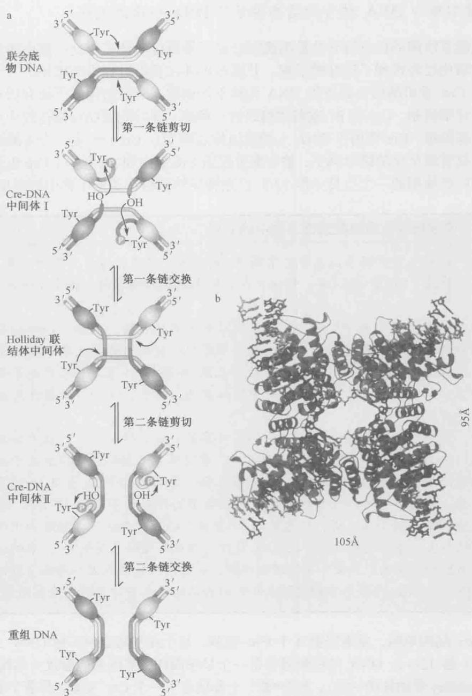  
图 12-9 Cre 重组酶的位点特异性重组机制。(a)一系列 Cre-DNA 中间体的结构，它反映了“每次作用一条单链”的交换机制。在每个分图中，只有两个绿色的亚基是活性构象。可以看出，当第一条单链断裂后亚基的颜色发生了交换，第二对 Cre 亚基变为重组的活性构象。（图片经允许修改，源自：Guo F. et al. 1997. Nature 389:41. ©Macmillan）(b)有 Cre 结合到 Holliday 联结中间体的晶体结构（对应于图 a 的第三张图）。注意绿色的两个亚基的构形与紫色的不同，因此复合体不是一个四重对称。留心观察可以发现，结构中相邻的两对 DNA 臂更加接近一些。（Gopaul D. N. et al. 1998. EMBO J. 17: 4175.）图形通过 BobScript、MolScript 和 Raster 3D 软件制作。

#### [W] 位点特异性重组的生物学作用

细胞和病毒利用保守性位点特异性重组来实现多种多样的生物学功能，某些功能将在下面进行讨论。很多噬菌体的感染就是使用这种重组机制将自己的 DNA 插入到

  
图 12-10 参与 $\lambda$ 噬菌体整合和切除的重组位点显示出的重要序列元件。C、C'、B 和 B' 是核心的 $\lambda$ Int 结合位点，其他的蛋白质结合位点位于 att P 上及 C 和 C' 位点两端。这些区域叫做“臂”，左边的叫 P 臂，右边的叫 P' 臂。标记为 $P_{2}$ 、 $P_{2}$ 和 $P_{1}'$ 的紫色小区块是臂上的 $\lambda$ Int 结合位点。H 是整合宿主因子（integration host factor，IHF）的结合位点，X 是 Xis 的结合位点，F 是 Fis 的结合位点，其他的构筑蛋白在这里不再作介绍。灰色区域是交换区。为了表示清楚，结合在核心位点上的 $\lambda$ Int 没有画出来。值得注意的是，在噬菌体整合或切除的过程中并非所有的蛋白结合位点都被占用。在重组反应之后，P 臂变成 attL 的一部分，而 P' 臂变成了 attR 的一部分。

宿主染色体中。还有些时候，位点特异性重组被用来改变基因的表达。例如，一个 DNA 片段的倒换可以决定两个基因中哪一个进行表达。位点特异性重组也被广泛地用于帮助环状 DNA 分子在复制、同源重组和细胞分裂过程中保持其结构完整性。

位点特异性重组系统之间的比较揭示出一些普遍的原理。所有反应的关键都是重组酶与 DNA 的结合，以及使两个重组位点聚合在一起。对于一些重组反应来说，这个结合过程很简单，仅需要重组酶和它的 DNA 识别序列，就像刚描述的 Cre 的情况一样。与此相反，另外一些重组反应则需要辅助蛋白。这些辅助蛋白包括一些所谓的构筑蛋白（architectural protein），它们结合到特定 DNA 序列上并使其弯曲，使之成为有利于重组过程进行的特异形状。构筑蛋白还可以控制重组反应发生的方向，例如，在阻止 DNA 切除这个反向反应的同时确保这个 DNA 片段的整合。显而易见，这种调节作用对于产生合乎逻辑的生物学结果是至关重要的。最后我们会了解到，通过其他蛋白质对重组酶的调节可以控制某种 DNA 重组发生的时间，并使其与其他细胞活动协调一致。

#### [W] $\lambda$ 整合酶催化病毒基因组在宿主细胞染色体上的整合和切除

当 $\lambda$ 噬菌体侵染宿主细菌时，一系列的调节活动导致其或者形成静止的溶原状态（lysogenic state），或者进行噬菌体的增殖，即进入裂解性生长（lytic growth）过程（第18章，附录 A）。溶原体的形成需要噬菌体 DNA 整合到宿主染色体上。同样地，要使噬菌体脱离溶原状态，开始复制并产生新的噬菌体颗粒，它就必须将自己的 DNA 从宿主染色体上切下来。对这一整合 / 切除过程的分析为我们提供了从分子水平上对位点特异性重组进行研究的切入口。

为实现整合， $\lambda$ 整合酶蛋白（ $\lambda$ Int）在两个特定位点之间催化重组的进行，这两个位点叫做 $att$ 位点，或者 RH 附着位点。 $attP$ 位点在噬菌体上（P 代表噬菌体）， $attB$ 位点在细菌染色体上（B 代表细菌，图12-2）。 $\lambda$ Int 是一个酪氨酸重组酶，所催化的单链交换机制遵循前面介绍的 Cre 蛋白的催化过程。然而，与 Cre 重组不同的是， $\lambda$ 整合需要辅助蛋白的帮助来组装所需的蛋白质-DNA 复合体。辅助蛋白控制着反应过程，确保在噬菌体生命周期的正确时间进行 DNA 的整合和切除。我们先介绍整合的过程，再了解切除是如何被启动的。

对 $\lambda$ 整合的调节中很重要的一点是 attP 和 attB 位点的高度不对称结构（图 12-10）。这两个位点都含有一个中央核心片段（约 30bp），这些核心重组位点都包含有两个 $\lambda$ Int 结合位点和一个发生单链交换的交换区（如前所述）。不同的是，attB 仅由这个中央核心区组成，而 attP 则长很多（240bp），它还携带有许多其他蛋白质的结合位点。

attP 核心区两端的 DNA 区域被称为“臂”，臂上有若干个蛋白质结合位点，包括 $\lambda$ Int 结合的其他位点（在图12-10中标记为 $P_{1}$ 、 $P_{2}$ 和 $P'$ ）。 $\lambda$ Int 是一个不寻常的蛋白质，因为它有两个结构域参与了序列特异性的 DNA 结合：一个结构域结合到臂上的重组酶识别位点；另一个结合到核心识别位点。另外，attP 臂上的位点还被几个构筑蛋白所结合，这些蛋白质的结合控制了重组进行的方向和效率。

整合过程要求 attB、attP、 $\lambda$ Int，以及一个叫做整合宿主因子（integration host factor，IHF）的构筑蛋白的参与。IHF 是一个序列依赖性的 DNA 结合蛋白，它能使 DNA 产生大角度（大于 160°）的弯曲（图 12-11）。attP 的臂上携带了 3 个 IHF 结合位点（在图 12-10 上被标记为 H $_{1}$ 、

  
图 12-11 使 DNA 弯曲以便将 DNA 结合位点聚合在一起的 IHF 作用模型。位于 attP 的 P' 臂上的 λ Int 和 IHF 结合位点如图所示。IHF 结合到 H' 位点后将 DNA 弯曲，使一个分子的 λ Int 同时与 P'₁ 和 C' 位点结合。DNA 上 H' 位点中的断裂表现为在 DNA 上出现一个缺口，被用于 IHF-DNA 复合体的结构分析。（图片经允许修改，源自：Rice P. et al. 1996. Cell 87: 1295-1303. Fig. 8. ©Elsevier.）

$H_{2}$ 和 $H^{\prime}$ ）。IHF 的作用是将 DNA 臂上的 $\lambda$ Int 位点（ $\lambda$ Int 与之结合较强）与中央核心区上的位点（ $\lambda$ Int 与之结合较弱）聚合在一起。因此，由 IHF 介导使 DNA 产生大角度弯曲，使 $\lambda$ Int 找到结合能力较弱的核心识别位点，从而催化重组的发生。

当重组完成后，环形的噬菌体基因组稳定地整合到宿主染色体上。因此，在噬菌体和宿主 DNA 的结合处产生了两个新的杂交位点。这些位点被称为 attL（左侧）和 attR（右侧）（图12-10）。这些位点都含有核心区域，但是臂区却被分开了（图12-10中 P 和 P' 区域的位置）。所以，在新的重排结构中，两个核心区域都没有能力运用产生整合复合体的机制来组装有活性的 $\lambda$ Int 重组酶复合体，因为对组装很关键的 DNA 位点根本不在正确的位置上。

#### [W] λ 细菌噬菌体的切除需要一个新的折叠 DNA 的蛋白质

λ 噬菌体是如何被切除的呢？一个由噬菌体编码的构筑蛋白对切除重组至关重要，这个蛋白质叫做 Xis（即 excise 切除），它结合到特定的 DNA 序列上并造成 DNA 的弯曲。这样看来，其功能与 IHF 类似。Xis 识别 attR 一个臂上的两个主要序列基序（也存在于 attP 臂上，图12-10中标记为 $X_{1}$ 和 $X_{2}$ ）。和这些序列结合后，DNA 产生一个大的弯曲（大于 $140^{\circ}$ ），通过聚合 Xis、 $\lambda$ Int 和 IHF 一起构成在 attR 上有活性的蛋白质-DNA 复合体来促进切除过程。这个复合体将富有成效地与聚集在 attL 上的蛋白质发生相互作用，然后发生重组。

除了促进切除过程（attL 和 attR 之间的重组）以外，Xis 结合到 DNA 上也抑制了整合过程（attP 和 attB 之间的重组），因为 Xis 和 attP 结合后的 DNA 结构与 $\lambda$ Int 和 IHF 正常结合到这些位点时的结构完全不同。Xis 是一个噬菌体编码蛋白，而且仅仅在噬菌体启动进入裂解性生长的情况下才开始表达。关于 Xis 表达的详细情况将在第18章中介绍。Xis 在切除过程中作为辅助因子起到刺激作用，在整合过程中起到抑制因子的作用，这种双重功能保证了在 Xis 存在的情况下噬菌体基因组能够从宿主染色体中被切除，并保持游离的状态。

#### [W] Hin 重组酶颠倒一段 DNA 片段，使得特定基因开始表达

沙门氏菌（Salmonella）的 Hin 重组酶通过将一个细菌染色体片段倒位，来控制两组基因中哪一组被表达。Hin 重组是一类重组反应的代表，这些重组在细菌中是相当普遍的，被称为程序性重排。它的功能通常是让一部分细菌能够对周围环境的突然变化获得“预适应”。在 Hin 倒位的情况中，重组能够帮助细菌躲避宿主免疫系统的攻击，我们即将对此进行说明。

倒位过程所控制的基因能编码两种不同形态的鞭毛蛋白（H1 和 H2），它们是鞭毛纤丝的蛋白质组分。鞭毛位于细菌表面，因而通常是免疫系统的识别目标（图 12-12）。通过用 Hin 重组实现在这两种形态间的切换，至少使细菌群体中的部分个体不被免疫系统识别出其表面的结构。

被 Hin 倒位的染色体区域大约长 1000bp，其两端是叫做 hixL（左侧）和 hixR（右侧）的特异性重组位点（图 12-13），这些序列彼此间方向相反。Hin 是一种丝氨酸重组酶，它催化倒位的发生，工作原理在前面介绍这个家族时已经讲过了。在可倒位的片段上带有编码 Hin 的基因，同时作为一个启动子，当可倒位片段处于某种方向时，它将启动位于可倒位片段外、与 hixR 位点直接相邻的一些基因的表达。当可倒位片段处于“开”的方向时，这些相邻的基因将得到表达；但当它翻转成“关”的方向时，由于缺乏有功能的启动子，这些基因无法被转录。

  
图12-12 带有鞭毛的细菌（沙门氏菌）显微照片。这张彩色的增强型电子扫描显微图片显示了鼠伤寒沙门氏菌（红色）正在侵入培养的人体细胞。细菌上发丝状的突起就是鞭毛。（来源：RockyMountain Laboratories，NIAID，NIH.）

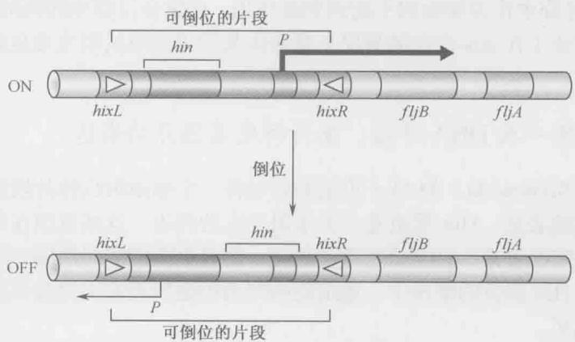  
图 12-13 沙门氏菌 Hin 重组酶催化的 DNA 倒位。Hix 位点间 DNA 片段的倒位翻转了一个启动子（P）的位置，造成了两种不同形式的鞭毛蛋白基因表达。

被这个“翻跟头”的启动子所控制的两个基因是 $fljB$ 和 $fljA$ 。 $fljB$ 编码 H2鞭毛蛋白， $fljA$ 则编码针对 H1鞭毛蛋白基因的转录抑制因子。H1鞭毛蛋白基因位于较远的一个位点。这样，当在“开”的方向时，H2鞭毛蛋白和 H1的抑制因子被表达，这些细胞的表面毫无例外都是 H2 型鞭毛；而当处于“关”的方向时，H2 和 H1 的抑制因子都不表达，细胞表面只有 H1 型的鞭毛。

#### [W] Hin 重组过程需要一个 DNA 增强子

Hin 重组过程除了需要 hix 位点外，还需要一段序列。这段短短的序列（约60bp）是一个增强子，它能将重组率提高1000倍左右。像增强子促进转录的作用（第19章）一样，这段序列即使在离重组位点很远的情况下也能行使其功能。增强子要起作用还需要细菌的 Fis 蛋白 [作为倒位促进因子（factor for inversion stimulation，Fis）被发现而得名]。像 IHF 一样，Fis 也是一个位点特异性的 DNA 弯曲蛋白。另外，它与 Hin 蛋白发生接触，这对重组过程很重要。

增强子-Fis 蛋白的复合体激活了重组的催化步骤。Hin 可以在没有 Fis-增强子复合体存在的情况下与 hix 重组位点结合配对，形成联会复合体（图 12-14）。这与 $\lambda$ 整合中 IHF 的作用不同，后一过程中辅助蛋白 IHF 在重组酶-DNA 复合体的组装中是不可或缺的。Fis 激活 Hin 重组，需要 3 个 DNA 位点（hixL、hixR 和增强子）聚集在一起，而负 DNA 超螺旋（第 4 章）极大地促进这三联复合体的形成，它能够稳定远距离 DNA 位点的聚合。另一个细菌构筑蛋白 Hu 也能促进这个倒位体的组装。Hu 蛋白与 IHF 的结构同源，但与 IHF 不同的是，它与 DNA 的结合是非序列特异性的。

  
图12-14 Hin 催化过程中重组复合体的形成。Hin 蛋白能单独识别并与两个 hix 位点配对。当 Fis 蛋白存在时，就可以形成三联复合体，这个复合体叫做倒位体（invertasome），是促进重组的最活跃的复合体。（图片经允许修改，源自：Craig N. et al. 2002. Mobile DNA II, p. 246, Fig. 9. © ASM Press.）

是什么生物学基本原理控制着由Fis-增强子复合体催化的Hin倒位呢？那就是确保重组仅仅发生在同一个DNA分子的两个hix位点之间。这种选择性要确保的是避免可倒位片段在DNA分子间重排过程中频繁跳跃而破坏细菌染色体的完整性。

与 $\lambda$ 噬菌体的整合和切除不同，Hin 所催化的倒位没有严格的调控，反而是随机发生的，所以在一群细胞中总有一些细胞带有同一方向的可倒位片段，而另一些带相反方

向的可倒位片段。

#### [W] 重组酶将多聚环状 DNA 分子转换成单体

位点特异性重组对细胞中环状 DNA 分子的维护起到关键作用。如同原核和真核细胞中大多数质粒一样，大多数细菌的染色体也是环状的，一些病毒基因组也是环状的。环状 DNA 分子固有的一个问题是，在同源重组过程中它们有时会形成二聚体甚至多聚体，而位点特异性重组可被用来将这些 DNA 多聚体恢复到单体形态。

当两个相同的环状分子间发生 DNA 交换时会发生什么情况呢？在一个细菌染色体两个拷贝间发生的这一过程如图 12-15 所示（见第 11 章，关于同源重组的讨论）。一个单独的同源重组会产生一个大的环状染色体，所有基因都有两份拷贝，即一个二聚的染色体。在细胞分裂时，这种二聚体会造成很大麻烦，因为只有一个 DNA 分子，而不是两个，要分给两个姐妹子细胞。

由于这种多聚体的问题，许多环形 DNA 分子上都带有位点特异性重组酶的识别位点。这些酶称为解离酶（resolvase），因为它们能将二聚体（和多聚体）“解离”为单体。显然，对这些蛋白质来说，它们的关键功能是特异性地催化解离（一种 DNA 的删除反应）而不是相反的过程（将单体变为多聚体），否则只能使多聚体问题变得更糟！我们将会看到，一种特殊机制在增强重组反应中起到了方向选择的作用（框 12-2，Xer 重组酶催化细菌染色体和很多细菌质粒的单体化）。

#### [W] 框 12-2 Xer 重组酶催化细菌染色体和很多细菌质粒的单体化

Xer 是酪氨酸重组酶家族的一个成员, 它促进重组的机制与前面讲过的 Cre 蛋白很相似。Xer 是一个异源四聚体, 包含两个 XerC 蛋白亚基和两个 XerD 蛋白亚基。XerC 和 XerD 都是酪氨酸重组酶, 但识别不同的 DNA 序列, 所以 Xer 催化的重组位点必须要包含这两种识别序列。该位点在细菌染色体上叫做 dif 位点。交换区的一端是 XerC 的识别序列, 另一端是 XerD 的识别序列 (框 12-2 图 1)。染色体上只有一个 dif 位点, 它位于 DNA 复制终止区内 (第 9 章)。当染色体形成二聚体时, 该二聚体便有两个 dif 位点 (图 12-15)。

那么细胞如何确保在 dif 位点上由 Xer 介导的重组过程会将二聚体染色体转换为单体, 而不是促成相反的过程呢? 这个定向的调节是通过 Xer 重组酶和一个叫 FtsK 的细胞分裂蛋白之间的相互作用实现的。这个调节的过程是: 当 FtsK 蛋白不与 XerCD 复合体的 dif 位点发生相互作用时, 重组复合体仅具有两个 XerC 亚基活性的构象, 因而, XerC 将催化一对 DNA 单链的交换, 形成 Holliday 联结中间体 (见上文关于酪氨酸重组酶基本原理的讨论)。由于 XerD 一直没有被激活, 重组无法完成, 与 XerC 断裂反应相逆的过程反而常常发生, 结果是又重新产生了最初的 DNA 结构 (框 12-2 图 1)。

相反，当 FtsK 蛋白存在并与 XerCD 复合体发生相互作用时，复合体的构象发生改变，XerD 蛋白被激活。这时，XerD 催化第一对单链的重组，产生 Holliday 联结中间体；这一反应完成后，XerC 催化第二对单链的交换反应，产生重组后的 DNA 产物（框 12-2 图 1）。

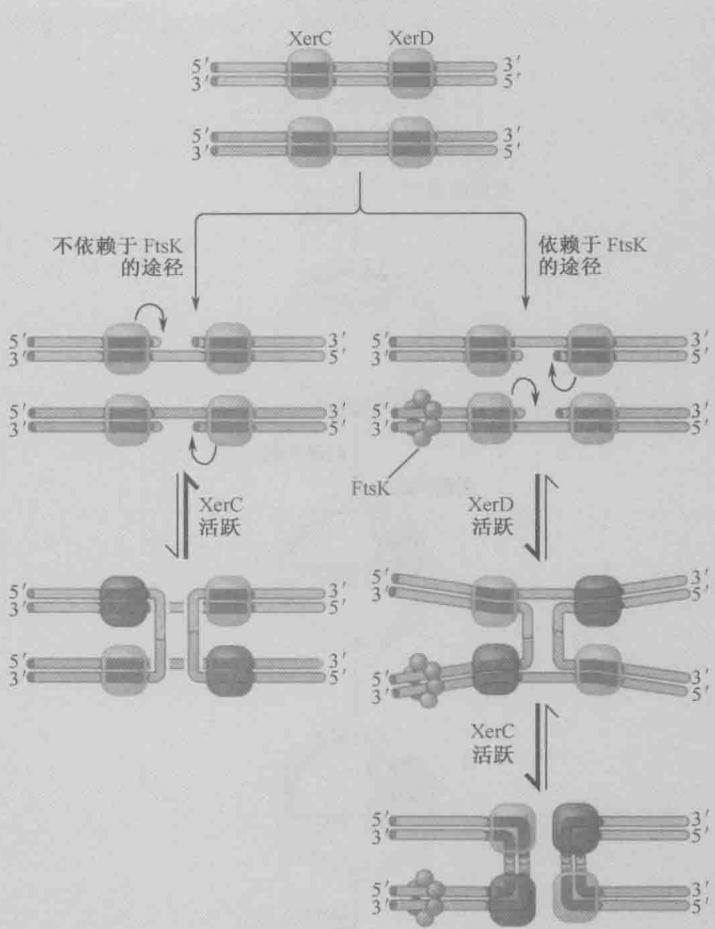  
框12-2 图1 Xer 介导 dif 位点重组的途径。没有 FtsK 存在时（不依赖于 FtsK 途径，左图），仅 XerC 激活并推动单链交换形成 Holliday 联结中间体，这时（由于 XerD 没有激活）重组无法完成，XerC 的反应也常常发生逆转。当有 FtsK 存在时（依赖 FtsK 途径，右图），XerD 被激活并催化形成 Holliday 联结中间体，XerC 催化第二对单链的交换后完成重组，生成染色体单体。（图片经允许修改，源自：Aussel L. et al. 2002. Cell 108: 195-205, Fig. 6. © Elsevier.）

FtsK 是一个沿 DNA 移动的 ATP 酶，是一个功能类似于 RuvB 蛋白的 “DNA 动力蛋白机器”（DNA-pumping protein machine）。RuvB 蛋白在同源重组过程中促进 DNA 的分支移位（在第 11 章讨论过）。FtsK 还是一个膜结合蛋白，它被定位于细胞中发生细胞分裂的地方，其作用是在细胞分裂前将 DNA 从细胞中央移开，使细胞可以在这一位置分裂。

FtsK 相对于分裂位点的位置很关键，它确保了当细胞中出现二聚染色体时 XerD 被特异性地激活。这种情况下，染色体在分裂细胞的中央被“卡住”，二聚染色体的一半被分到每个子细胞中。FtsK 也会与不对称排列于 dif 位点附近的特异极 DNA（叫作 KOPS）相互作用。结果，Ftsk 运送 dif 位点趋近隔膜并互相接近。这一运动从而促进了 dif 位点的配对并激活 XerD 重组。就这样，在细胞分裂周期中，位点特异性重组被调控发生在合适的时间和地点。

  
染色体单体  
图 12-15 环形 DNA 能形成多聚体。DNA 复制期间，两个子代 DNA 分子间的同源重组能产生一个染色体（或质粒）的二聚体。XerCD 重组酶催化的位点特异性重组将其变为细胞正常分裂所需的单倍体 DNA 分子。

还有其他一些机制能够指导特定 DNA 片段的重组

尽管我们的讨论仅限于保守性位点特异性重组，实际上还有一些在特定序列上实现类似生物学功能的其他重组事件，其中包括在第11章讲过的由于目标基因转换造成的酵母的交配型转换现象；在脊椎动物免疫系统中，编码关键蛋白质的基因片段在组装时发生的重排现象，即 V（D）J 重组，也是发生在特定的位点上。而后者的机制与转座很相似，所以在本章后半部分会对其作一些介绍。

#### [W] 转座

#### [W] 一些遗传因子通过转座被移位到染色体的新位置上

转座（transposition）是一种特殊的遗传重组，它是将特定的遗传因子从 DNA 上的一个地方移位到另一个地方。这些可以移动的遗传因子叫做转座因子（transposable element）或转座子（transposon）。移位的发生是通过转座因子两端的 DNA 序列和宿主细胞 DNA 的一段序列间发生重组实现的（图 12-16）。我们将看到，移位过程可能会、也可能不会伴随着遗传因子的复制，某些情况下，这种重组过程会涉及暂时性的 RNA 中间体。

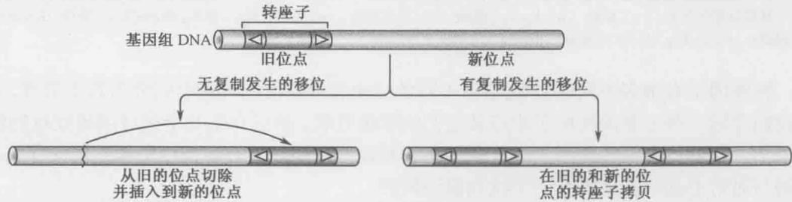  
图12-16 一个移动的遗传因子转座到宿主 DNA 的一个新位点。某些情况下，重组过程涉及转座子从 DNA 上的旧位置被切除（左边）；在另一些情况下，转座子的一个拷贝保留在原来的位置上，另一个拷贝则插入到 DNA 的新位点（右边）。

当转座因子移位时，转座因子通常对插入位点几乎没有序列选择性，所以，转座子可能会插入到基因内部，造成基因完全失活；也可能会插入到一个基因的调控序列中，造成该基因表达的改变。正是这种对基因功能和表达的影响使得转座子被发现（框12-3，玉米因子和转座子的发现）。所以，并不令人意外的是，转座因子是许多物种中新突变的主要来源，而它们也的确是产生导致人类遗传疾病的突变的一个重要原因。正是转座因子这种不加选择的DNA插入能力，使得它们在经过修饰后被用于生物实验中，诱导突变和作为运输DNA的载体。

所有生物的基因组上都有转座因子。基因组序列的比较分析揭示了两个惊人的发现：第一，转座相关序列可以占据物种基因组中的很大一部分，例如，人和玉米基因组的 $50\%$ 以上是由转座相关序列组成的（包括转座子片段和被突变导致失活的“死”因子片段），而这与基因组中仅有很小一部分序列（在人的基因组中小于 $2\%$ ）编码蛋白形成了鲜明的对比；第二，转座子的含量在不同的基因组中变化很大（图12-17），例如，与人和玉米不同，果蝇和酵母的基因组则富含基因而缺乏转座子。

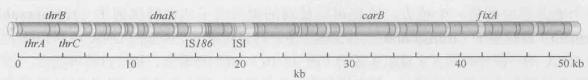  
图12-17 基因组上转座子的发生和分布。重复序列大多数由转座子或转座子相关序列所组成（如被截短的因子），以绿色表示，基因以紫色表示。（a）玉米；（b）人；（c）果蝇；（d）芽殖酵母；（e）大肠杆菌。（来源：BrownT.A. 2002. Genomes, 2nd edition, p.34, Fig.2.2 and references therein. ©Taylor & Francis.)

转座因子有很多不同的类型,根据不同的结构和重组机制可将它们分为若干家族。下面我们介绍三种主要的转座子家族及它们的重组机制，然后介绍几个被详细研究过的转座因子。在具体介绍转座因子时，我们将着重说明转座如何被调控以平衡它们的存在、复制与对宿主基因造成潜在的干扰和错误调控。

转座的遗传重组机制并不仅限于实现转座子的移位功能。例如，很多病毒在感染时，也是使用了一种与转座几乎相同的途径将自己整合到宿主细胞的染色体上，所以病毒的整合反应在这里与转座一同讨论。同样地，在细胞中改变基因表达模式的一些DNA重排也采用了一种类似于转座的机制。V（D）J重组是一个被了解得很清楚的例子，它是脊椎动物免疫系统功能发育中一个必备的反应。V（D）J重组将在本章最后进行讨论。

#### [W] 三类基本的转座因子

根据转座子的结构及其转座机制，可将其分为以下三个家族：

1. DNA 转座子。

2. 类病毒反转录转座子，包括反转录病毒。这些因子又称为长末端重复序列（long terminal repeat, LTR）反转录转座子。

3. 多聚腺苷酸（poly-A）反转录转座子。这类因子又称为非病毒反转录转座子。

图 12-18 图解了这三类转座因子家族的基本遗传结构。DNA 转座子在整个重组周期中一直保持 DNA 的形态，它通过 DNA 链的断裂和重新连接实现移位。在这一点上，

它与保守性位点特异性重组因子移位的方式很相似。两种反转录转座子的移位都需要一个暂时性的 RNA 中间体的参与。

#### [W] DNA 转座子上带有一个转座酶基因，两端是重组位点

DNA 转座子上既携带了作为重组位点的 DNA 序列又携带了编码参与重组的蛋白质的基因（图12-18a）。转座因子两端的重组位点以反向重复序列分布，这些末端反向重复序列的长度从25bp 到几百 bp 不等。它们并不是严格意义上的重复序列，并且带有重组酶识别序列。催化转座的重组酶通常叫做转座酶（transposase）[有时也叫整合酶（integrase）]。

DNA 转座子带有编码自身转座酶的基因，也可能会携带一些其他基

a DNA 转座子

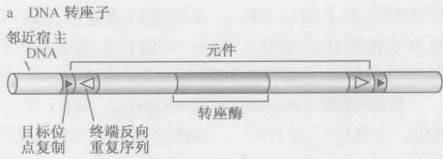

b 类病毒反转录转座子 / 反转录病毒  

c poly-A 反转录转座子

  
图 12-18 三类转座因子的遗传结构。(a). DNA 转座子。其元件包括作为重组位点的终端反向重复序列（绿色含白色箭头）和一个编码转座酶的基因。(b). 类病毒反转录转座子及反转录病毒。包括两端的长末端重复序列（LTR）及其间编码整合酶及反转录酶（RT）的区域。(c). 聚腺苷酸反转录转座子。两端在 5' 和 3' UTR 序列内，以及编码两个酶的序列：RNA 结合酶（ORF1）和一个同时具有反转录酶和核酸内切酶功能的酶（ORF2）。

因，这些基因编码的蛋白质可能调节转座，也可能为转座因子或宿主细胞提供一些有益的功能。例如，很多细菌 DNA 转座子上携带的基因所编码的蛋白质能够提高细菌对一个或多个抗生素的抗性。因此，这种转座子的存在使得宿主细胞具有了对该抗生素的抗性。

紧邻转座子两端的 DNA 序列有一个短的重复序列片段（2\~20bp），这些片段呈正向重复，叫做靶位点重复（target site duplication），产生于重组过程中,我们将在下面对此进行讨论。

#### [W] 转座子包括自主转座子和非自主转座子

带有一对末端反向重复序列和一个转座酶基因的 DNA 转座子，本身具备了促成自身转座的所有条件，这类因子叫做自主转座子（autonomous transposon）。然而，在基因组上还有很多比较简单的可移位 DNA 片段，叫做非自主转座子（nonautonomous transposon），它们仅有末端反向重复序列，即转座所需的 cis-acting 序列。细胞中自主转座子表达的转座酶会识别这些末端反向重复序列，从而帮助非自主转座因子发生转座。但是在没有“帮助者”转座子（产生转座酶）存在时，非自主转座因子只能待在原处无法移动。

类病毒反转录转座子和反转录病毒带有末端重复序列及两个对重组很重要的基因

类病毒反转录转座子和反转录病毒也带有反向末端重复序列，它们是重组酶结合和作用的位点（图12-18b）。末端反向重复序列嵌入在较长的重复序列中，它们以正向重复形式排列在转座因子两端，叫做长末端重复序列（long terminal repeat）或LTR。类病毒反转录转座子编码两种移位所需的蛋白质——整合酶（转座酶）和反转录酶。

反转录酶（reverse transcriptase，RT）是一种特殊类型的 DNA 聚合酶，它能以 RNA 为模板合成 DNA。转座需要有这个酶，因为转座过程要求有一个 RNA 中间体的参与。由于这些因子将 RNA 转变成 DNA，与正常的中心法则（DNA 到 RNA）相反，所以称为“反式”因子。类病毒反转录转座子和反转录病毒的区别是：反转录病毒的基因组被组装到病毒颗粒内，离开宿主细胞再去感染新的细胞；而反转录转座子只能在一个细胞内移位到一个新的 DNA 位点，不能离开宿主细胞。与 DNA 转座子一样，这些因子两端也是短的靶位点重复序列，它们是在重组过程中产生的。

#### [W] 像基因的聚腺苷酸反转录转座子

聚腺苷酸反转录转座子没有其他转座子所带的末端反向重复序列，相反，它的两端含有完全不同的序列（图12-18c）。一端称为5'UTR，另一端是3'UTR，它带有一串叫做多聚腺苷酸序列（poly-A sequence）的A-T碱基对，这些因子两端也有短的靶位点重复序列。

反转录转座子带有两个基因——ORF1和 ORF2。ORF1编码一个 RNA 结合蛋白，ORF2编码的蛋白质同时具有反转录酶和核酸内切酶的作用。尽管这个蛋白质与其他转座子家族编码的转座酶和重组酶不同，但它在重组过程中也起着关键作用。与 DNA 转座子和类病毒转座子一样，聚腺苷酸反转录转座子也存在自主转座子和非自主转座子两种形式。此外，基因组序列分析表明，很多 5'UTR 序列不完整的断裂转座子失去了转座的能力。

#### [W] DNA 转座的剪切-粘贴机制

DNA 转座子、类病毒反转录转座子和反转录病毒都用一种类似的重组机制把它们的 DNA 插入到一个新的位点。我们首先来了解一下最简单的转座反应——DNA 转座子非复制性移位的机制。这个重组过程包括转座子从宿主 DNA 上初始位置的切除，以及将这个切下来的转座子整合到一个新的 DNA 位点，因此把这个机制叫做剪切-粘贴转座（cut-and-paste transposition）（图 12-19）。

开始重组时，转座酶结合到转座子两端的反向重复序列上。一旦转座酶识别了这些序列，它就将这两端聚集在一起形成一个稳定的蛋白质-DNA复合体，这个复合体被称为联会复合体（synaptic complex）或转座体（transpososome），它包含一个转座酶的多聚体（通常为2\~4个亚基）和两个DNA末端（见下文）。这个复合体的功能是确保转座子移位所需的DNA断裂和重新连接能够在转座因子两端同时发生，此外，还能在重组过程中保护DNA末端免受细胞中酶的作用。下一步是将转座子DNA从基因组的原始位置上切除。转座子上的转座酶亚基先断裂转座子每端的一条单链，断裂位置就在转座子DNA和它所插入的宿主序列间的连接处（该区域叫做flanking host DNA）。转座酶

切断 DNA 后，转座因子 DNA 末端带有游离的3'羟基基团。要完成断裂反应，每端的另一条 DNA 单链也需要被切断，而不同的转座子断裂这第两条单链的机制各不相同（这些单链的5'端位于转座子与宿主DNA连接处），这些机制将在下面进行描述。

转座子被切除后，被转座酶首先释放的转座子 DNA 的 3'端羟基攻击新插入位点的 DNA 磷酸二酯键，被攻击的 DNA 片段叫做靶 DNA(target DNA)。对大多数转座子而言，靶 DNA 本质上可以是任何序列。攻击的结果是将转座子 DNA 共价连接到靶 DNA 上，而在每个 DNA 连接反应中，靶 DNA 上会产生一个缺口（图 12-19）。DNA 连接反应是通过一步酯基转移作用实现的，它又被称为 DNA 单链交换（DNA strand transfer）（图 12-20）。RNA 剪接中就使用了类似的机制来连接核酸单链（第 14 章）。

转座体确保转座子两端的 DNA 一起攻击同一靶位点的两条链，这两条链上被攻击的位点通常相隔几个碱基（如比较常见的是相隔2个、5个和9个碱基），这个距离对每种转座子来说都是固定的，由此产生邻近转座子两端的靶位点短重复序列（将在下节说明）。一旦 DNA 单链转移完成，转座体的任务也就完成了，剩下的重组步骤由细胞内的 DNA 修复蛋白来完成。

剪切-粘贴转座中的中间体由缺口修复来完成

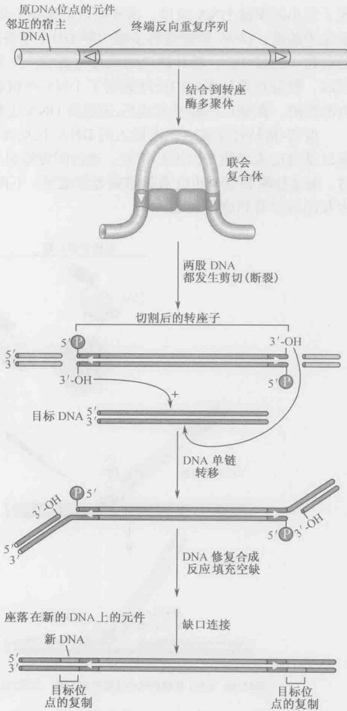  
图 12-19 剪切-粘贴的转座机制。如图所示，一个转座子从灰色宿主 DNA 的一个靶位点转移到蓝色 DNA 上的新位点。注意，在 DNA 单链交换反应中靶 DNA 断裂位点的黏性末端使新的靶位点上生成短的重复序列（靶位点复制）。原插入位点的 DNA（灰色）由于转座子的切除留下了一个双链的断裂，这个断裂可以通过非同源末端连接或同源重组的方式被修复（见第 10 章和第 11 章）。注意：为简洁起见，图中的化学步骤未标示出结合蛋白质。

中间体结构使转座子 DNA 的3'端结合到靶 DNA 上。这个结构还带有靶 DNA 上的两个缺口，它们产生于 DNA 单链转移过程中。转座子 DNA 单链上的两个位点被转移到靶位点的两条单链上，这两条单链的断点相隔几个核苷酸，这导致在插入的转座子两端出现了短小的单链 DNA 缺口，这些缺口会被宿主细胞自身编码的 DNA 修复聚合酶填补。要说明的是，DNA 单链转移步骤中靶 DNA 断裂所产生的3'羟基端可以作为修复合成中的引物（图12-18）。填补缺口的结果是造成产生邻近转座子的靶位点的复制（见上文）。所以，靶位点重复序列的长度表明了 DNA 单链转移中靶 DNA 的两条单链上被攻击位点的距离。在缺口的修复完成后,还需要 DNA 连接酶来封闭 DNA 单链。

剪切-粘贴转座在它原来插入的 DNA 位点处也留下了一个断裂的双链，它必须被修复以维持宿主细胞基因组的完整。通过同源重组来修复双链 DNA 断裂在第11章中已讲过，而这些断裂有时也会直接重新连接起来。下面在对 Tcl / mariner 转座子家族的讨论中我们就会看到这种现象。

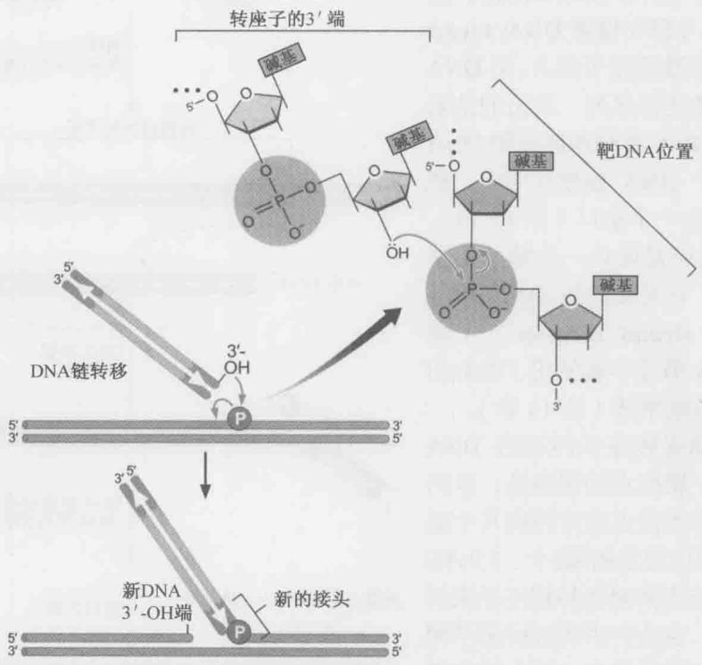  
图12-20 DNA 单链转移的详细化学步骤。为简洁起见图仅示转座子和靶 DNA 的单链。

#### [W] DNA 转座中断裂非转移链的多种机制

如前所述，转座酶通过断裂转座因子的3'端和促进DNA单链的转移来催化剪切-粘贴转座过程。然而，通过这种机制移动的转座子也需要断开转座子与邻近宿主DNA连接处的5'端单链。这些单链叫非转移链（nontransferred strands），其5'端在DNA单链转移反应期间并不直接连到靶DNA上。不同的转座子催化第二条单链断裂反应的机制各不相同（图12-21），这里介绍2种方法。

用来断裂非转移单链是不同于转座酶的另一种酶（图12-21）。例如，细菌的 Tn7 转座子编码的一种特殊蛋白质（TnsA）就有这种作用（图12-21a）。TnsA 的结构与核酸内切酶很相似，它与 Tn7 自身编码的转座酶（TnsB 蛋白）组装在一起，共同作用将转座子从原来的靶位点上切除下来。

  
图12-21 非转移链断裂的三种机制。（a）通过一种非转座酶来切断。（b）转座酶催化一条单链攻击相对链形成发夹形的DNA中间体。在这种机制中是转移链攻击非转移链，然后这两个发夹形末端再被转座酶水解打开。（c）Hermes转座子使用的是通过形成发夹切割第二条单链的另一种机制。在这种机制中，先导链（非转移链）首先断裂，并且发夹结构在插入起始位点形成，而不是在转座子末端。

断裂非转移链的另一种方法由转座酶自身完成，它用一种 DNA 酯基转移机制，其过程与 DNA 单链转移相似。例如，在 Tn5 和 Tn10 转座子断裂非转移链时就产生一个 “DNA 发夹” 结构。为了形成发夹结构，转座酶用先断开的转座子 DNA 3' 端跨过 DNA 双螺旋直接攻击另一条单链的磷酸二酯键（图 12-21b），结果既断裂了被攻击的 DNA 单链，又将其与转座子 DNA 3' 端与缺口的一端共价连到一起。结果，两条 DNA 单链通过一个环形末端共价连接在一起，其结构让人联想到一个发夹。

然后发夹 DNA 的末端被转座酶断裂（打开），产生一个标准的双链 DNA 断裂，打开反应在转座子 DNA 两端进行。这一步骤一旦完成，DNA 因子的3'端就准备通过 DNA 单链转移反应连接到一个新的靶 DNA 上。

Hermes 转座子是 hAT 因子家族的一个成员，也通过 DNA 发夹中间体从旧的 DNA 插入位点上切除转座子，但是切割单链和酯基转移反应的顺序有所不同。这里 DNA 发夹在宿主细胞的 DNA 上形成，而不是在转座因子的末端形成（图 12-21c）。在本章的后面我们会看到，这种 DNA 切割和重新连接的方式与研究发现的 V（D）J 重组的早期步骤是十分相似的。这种机制的相似性成为一个假说的有力支持，该假说认为，V（D）J 重组是在脊椎动物演化过程中，由宿主机体捕获和“驯服”转座子形成的。

尽管在图12-21中未标示出来，转座子两端 DNA 的断裂也可以通过转座子两末端间的酯基转移反应完成。在这种情况下，一个断裂的3'-OH 端攻击转座因子上同一单链的另一端，产生的 DNA 中间体进一步反应得到被切除的转座子。IS 3 转座子家族就是利用这种机制。

为什么转座酶会用酯基转移作用作为断裂机制呢？这可能是一种经济的解决办法。转座酶具有以下基本功能：① 催化转座子 DNA3'端的位点特异性水解；② 用酯基转移作用将此末端变为非特异性位点。而当同样的反应作用于一个新的 DNA 位点时（例如：起始切割位点的相对链），就可以帮助转座酶将转座子切除，因此，这个机制就使转座子无需再编码一个酶来断裂非转移链。

#### [W] DNA 的复制性转座

一些 DNA 转座子使用的机制是复制性转座（replicative transposition），其转座因子在每个转座过程中都进行了复制。虽然转座反应的结果明显不同，但我们可以看出，其重组机制与剪切-粘贴转座非常相似（图 12-22）。

复制性转座的第一步是转座酶蛋白和转座子 DNA 两端装配成一个转座体。像在剪切-粘贴转座中看到的一样，形成转座体对协调转座子 DNA 两端的断裂和重新连接是非常重要的。

第二步是转座子末端 DNA 的断裂。这个反应是在转座体内由转座酶催化的。转座酶在转座子序列与邻近的宿主 DNA 连接处诱导产生一个缺口（图12-22），这个断裂使得转座子序列的两个3'-OH DNA 末端获得释放。与剪切-粘贴转座不同，这时转座子DNA 并不从原来的序列上被切除，这一点是这两种转座最大的不同。

然后，转座子 DNA 的3'-OH末端通过 DNA 单链的转移反应被连接到靶 DNA 位点上，这一机制与前面的剪切-粘贴转座相同。但是，这里产生的中间体是双交叉的 DNA 分子（图12-22）。在此中间体中，转座子的3'端被共价连接到新的靶位点，而5'端仍与原来的邻近 DNA 相连。

中间产物的两个 DNA 交叉形成一个复制叉结构（见第9章）。DNA 单链转移后，宿主细胞的 DNA 复制蛋白将组装到这些复制叉上。在一个已经充分研究的复制性转座例子中（Mu 噬菌体，下文将讲到），蛋白质特异性地组装到两个交叉中的一个上（图12-22，下图）。以断开的靶 DNA 3' 端为引物进行 DNA 合成，复制沿转座子序列进行直到第二个交叉处停止。此复制反应产生2个拷贝的转座子 DNA，复制产物两端是短小的正向排列靶位点重复序列。

复制性转座常常会造成染色体的倒位和丢失，这对宿主细胞有很大的危害性。这种趋势所导致的重排有时会对复制性转座造成不利的自然选择结果。或许这就是为什么很多转座因子演化出在插入到新位点前即将其从原位点完全切除的方法。转座子切除后就避免了对宿主基因组造成较大的干扰。下面我们将会讨论到，通过一个RNA中间体也可以避免转座造成的这种干扰性重排。

  
与两个拷贝的转座子共整合

图12-22 复制性转座的机制。转座体在转座子两端诱导形成单链缺口，露出3'-OH端。然后这些羟基攻击靶DNA，并通过DNA单链转移与之连接。注意，此时在转座子的每一端只有一条单链插入靶位点，形成了一个双交叉的DNA结构。细胞的复制成分组装到其中一个“交叉”（图中左边），将整个转座子序列进行复制。生成的产物叫做共和体，它有两个通过转座子两个拷贝连接起来的起始环形DNA分子。交叉中间体的单链DNA缺口产生了靶位点的复制，为了简洁起见，这些复制在图中没有明确标出。

#### [W] 类病毒反转录转座子和反转录病毒通过一个 RNA 中间体实现移位

类病毒反转录转座子和反转录病毒插入到宿主细胞基因组的新位点，所用的 DNA 断裂及 DNA 单链转移步骤与前面讲的 DNA 转座相同。不同的地方是，这些反转录因子的重组需要一个 RNA 中间体的参与。

转座周期开始于反转录转座子（或反转录病毒）DNA 序列在细胞内的 RNA 聚合酶的催化下转录得到 RNA。转录起始于 LTR（图 12-23）中的一个启动子序列，一直穿过整个因子得到转座因子的一个几乎全长的 RNA 拷贝，然后 RNA 反转录成一个双链 DNA 分子，这个 DNA 分子叫做 cDNA（复制的 DNA），它游离于宿主 DNA 序列之外。

这个 cDNA 能够被整合酶（与 DNA 因子的转座酶高度相关的一种蛋白质，下面将会看到）识别并被重组到一个新的靶 DNA 位点。整合酶结合到该 cDNA 的末端，然后从每条单链的3'端切下几个核苷酸，这个断裂反应与 DNA 转座子的 DNA 断裂步骤相同。当用于整合的直接前体 DNA 由 RNA 模板反转录生成后，它已经呈一个被切除的转座子形态。因此，对这些因子而言无需一种切断第二单链的机制。然后通过 DNA 单链转移反应，整合酶催化将断开的3'端插入到宿主细胞基因组的靶位点。上面讲过，这些靶位点本质上可以是任何 DNA 序列，DNA 单链转移后在靶位点产生的缺口由宿主细胞的 DNA 修复蛋白填补并完成重组。这个缺口修复反应造成靶位点的复制。

由于产生 RNA 中间体的转录过程起始于 LTR 的内部，所以 RNA 没有携带全长的 LTR 序列，转录起始位点到转座因子末端之间的序列丢失了。因此，在反转录过程中需要一种特殊的机制来产生全长的转录因子。在反转录过程中，有两个内部引物合成和两个单链转换反应。这些转换造成了 cDNA 末端序列的复制，这样 cDNA 序列就完整了，重构的 LTR 序列补偿了转录过程中丢失的区域。LTR 的这次重构对于重组酶识别 cDNA 和后续的重组过程是至关重要的。

#### [W] DNA 转座酶和反转录整合酶同属于一个蛋白超家族

由上可以看出，在 DNA 转座和类病毒反转录转座子及反转录病毒的 DNA 移位过程中，转座子 DNA（或 cDNA）3'端的断裂和单链转移反应都是共有的步骤。这一重组机制的保守性可由转座酶及整合酶蛋白的结构得到反映（图 12-24）。高分辨率结构揭示出许多不同的转座酶和整合酶上的催化结构域有着相同的三维结构。这个催化结构域包含了三个演化保守的酸性氨基酸——两个天冬氨酸（D）和一个谷氨酸（E）。所以，这类重组酶被归类为 DDE 基序（motif）的转座酶／整合酶蛋白。这些酸性氨基酸构成了部分的活性位点以及协调反应活性所需的二价金属离子（如 $Mg^{2+}$ 或 $Mn^{2+}$ ）（同 DNA 聚合酶，第 9 章）。这类蛋白质的一个显著特点是它们用这一个位点既催化 DNA 断裂又催化 DNA 单链转移，而不是用两个活性位点来分别催化这两个化学反应。

除了结构高度保守的催化结构域外，其他区域在这个蛋白质家族中是不保守的。这些非保守区域编码位点特异性的 DNA 结合域及参与蛋白质相互作用的区域，这是组装特异性针对各个重组因子的蛋白质-DNA 复合体时所必需的。这样，这些独特的区域确保了转座酶和整合酶只催化编码自己的转座因子或是与其高度相关因子的重组。

  
图 12-23 反转录病毒整合机制和类病毒反转录转座子的转座。上边图例表示已整合的前病毒。LTR 序列的详细图示见框 12-3。如图所示，病毒 RNA 的转录启动子位于左边的 LTR 中，该病毒 RNA 的 cDNA 合成过程详见框 12-3。整合酶催化的 DNA 剪切和单链转移步骤如此图所示。

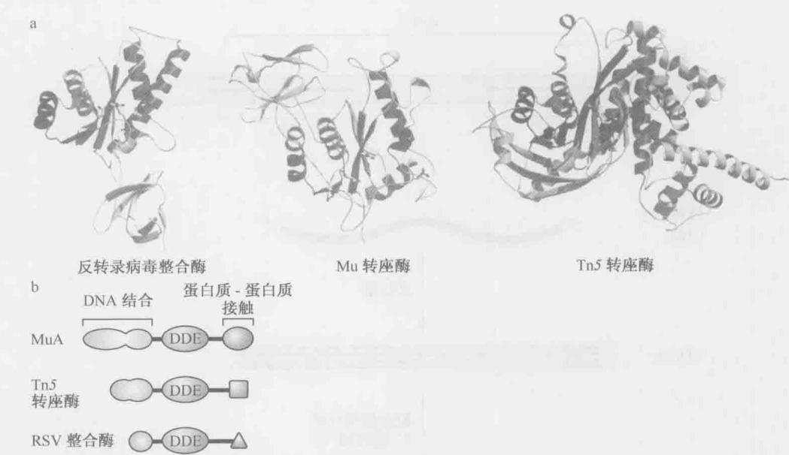  
图 12-24 转座酶和整合酶催化结构域的相似性。（a）从右至左依次为 Tn5 转座酶（Davies D. R. et al. 2000. Science 289: 77-85）、Mu 噬菌体转座酶（Rice P. and Mizuuchi K. 1995. Cell 82: 209-220）和 RSV 整合酶（Chook Y. M. et al. 1994. J. Mol. Biol. 240: 476-500）的保守核心结构域。它们相同的二级结构成分以相同的颜色表示。DDE 基序（motif）的活性位点残基以球棒模型表示。图形通过 BobScript、MolScript 和 Raster 3D 软件制作。（b）如 a 中所示的 3 个蛋白质的结构域的图解，N 端的域结合 DNA，图 a 的中间的结构域包含了催化区；C 端的结构域参与组装转座体所需的蛋白质-蛋白质相互作用，以及与调节转座的其他蛋白质发生相互作用。（来源：Rice P.A. and Baker T.A. 2001. Nat. Struct. Biol. 8: 302-307.）

转座酶和整合酶只有结合在 DNA 上形成联会复合体(或叫转座体)时才有活性(如前所述)。Tn5 转座酶结合到一对转座子末端 DNA 片段时的晶体结构让我们清楚地了解到这一点（图 12-25）。与这些 DNA 片段（即一个转座子的末端）的其中一个相结合的重组酶识别序列上的转座酶亚基，为转座子另一端的 DNA 断裂和 DNA 单链转移反应提供了催化结构域。正是由于这个亚基的结构，只有在两个亚基和一对 DNA 末端一起构成复合体时，转座酶才被放置到正确的重组位置。

#### [W] 聚腺苷酸（poly-A）反转录转座子通过一种“反向剪切”机制进行移位

聚腺苷酸反转录转座子，如人的 LINE 因子的移位需要一个 RNA 中间体，但其转座机制与类病毒转座因子有所不同，它的机制叫做靶位点引导反转录（target-site-primed reverse transcription）（图 12-26）。首先是细胞内 RNA 聚合酶对整合因子的转录（图 12-26a）。尽管启动子在 5'UTR 内，这时它能指导起始于转座因子序列的第一个核苷酸的 RNA 合成。

新合成的 RNA 被转运到细胞质中翻译成 ORF1 和 ORF2 两个蛋白质（见上面的讨论）。这些蛋白质与编码它们的 RNA 保持结合（图 12-26b）。转座因子以这种方式促进了自身的转座，而不为其他竞争因子贡献蛋白质。

这个蛋白质-RNA复合体重新进入核内并与细胞DNA结合(图12-26c)。已知ORF2蛋白同时具备核酸内切酶和反转录酶的活性，这个核酸内切酶通过在染色体DNA上产生一个缺口来启始整合反应（图12-26d）。富含胸腺嘧啶（T）的序列是优先被断裂的位点。在断裂位点出现的多个 T 使得 DNA 与 RNA 因子的多聚腺苷酸尾巴形成碱基配对，然后切口反应产生的 DNA 3'-OH 末端作为引物反转录 RNA 转座因子（图 12-26e）。另外，ORF2蛋白也催化这一 DNA 合成反应。后续的转座步骤尽管了解得还不太清楚，但是应包括 cDNA 第二单链的合成、插入位点 DNA 缺口的修复和 DNA 单链的接合。

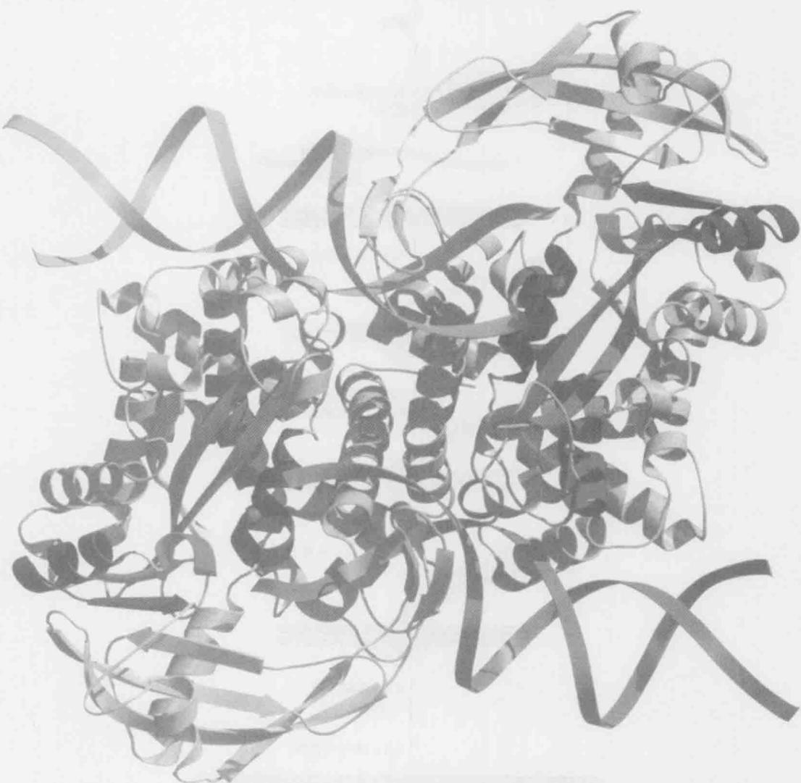  
图 12-25 Tn5 结合 DNA 底物后的共结晶体。复合体中包含一个转座酶的二聚体。在图 12-24 中催化结构域以彩色表示，绿色小球表示与蛋白质活性位点结合的二价金属离子。注意，当重组酶亚基的 DNA 结合域连接到转座子一端时，其重组催化结构域也贡献给转座子的另一端。DNA 用蓝色和粉色表示。（Davies D. R et al. 2000. Science 289: 77-85.）图形通过 BobScript、MolScript 和 Raster3D 软件制作，Leemor Joshua-Tor 完成了额外的 DNA 建模。

通过大规模基因组测序发现很多聚腺苷酸反转录转座子都被截断了，其中大部分都丢失了5'端的区域，而不具备编码因子的基因的完整拷贝或完整的启动子，因而这些被截断的转座因子失去了转座能力。

  
图12-26 聚腺苷酸反转录转座子的转座通过靶位点引导的反转录过程完成。图示概述了 LINE 因子的移动模型。(a) 细胞内的 RNA 聚合酶起始了一个整合的 LINE 因子的转录。(b) 转录得到的 mRNA 翻译后生成两个 ORF 产物，并结合到其 mRNA 的 3' 端。(c) 这个蛋白质-mRNA 复合体结合到富含胸腺嘧啶的靶 DNA 位点。(d) 复合体上的蛋白质启动了靶 DNA 的断裂，在 DNA 末端留下了 3'-OH，并形成 RNA：DNA 的杂合子。(e) 靶 DNA 的 3'-OH 端作为引物反转录 RNA 因子得到 cDNA（第一条单链的合成）。（f）最后的转座反应步骤包括：第二条 cDNA 单链的合成、DNA 的连接以及断点修复，最终生成了一个新插入的 LINE 因子。

#### [W] 转座子及其调控的实例

转座子成功地侵入和繁殖于所有生物体的基因组中。很明显，它们是非常健壮的生物实体。这些成功可以部分归功于转座过程的调控，正是这种调控使得转座子与宿主细胞之间建立了一种和谐的共存关系。这种共存关系对转座子来说是至关重要的，因为没有了宿主，转座子就无法存在。另一方面，就像刚才讲的，转座子也会在宿主细胞中造成严重破坏，导致插入突变，改变基因表达，形成大规模基因重排。这些干扰破坏在植物中尤其明显，正是这一点导致在玉米中发现了转座子（框12-3，玉米转座因子及转座子的发现）。

#### [W] 框12-3 玉米转座因子及转座子的发现

植物基因组中含有大量的转座子。而且转座因子改变基因表达的能力可逐渐通过植物颜色的变化被观察到（框 12-3 图 1 和图 2）。因此，在植物中首先发现转座子和许多它们的沉默特征就不奇怪了。

  
框 12-3 图 1 Tam3 转座引起金鱼草花出现彩色色斑的例子。白色斑块的大小与转座频率有关。（经许可后重新印刷，Chatterjee M. 和 Martin C. 1997. Plant J.11: 759-771；Fig.2a. ©Blackwell Publishing）。

20世纪40年代后期，Barbara McClintock 在玉米中发现了“控制因子”，实际上是转座因子断裂染色体的能力引起了 McClintock 的注意。她发现一些植株的染色体频繁断裂，并将造成这些染色体断裂的遗传因子命名为 Ds（dissociator；解离子）。令人惊奇的是，她观察到这些染色体断裂的“热点”位点在不同的植株上位置不同，甚至一个植株和它自己后代之间的位点都不同。这一现象首次揭示了遗传因子可以在染色体上移动，即“转座”。

Ds 实际上是一个非自主性的 DNA 转座子，它通过剪切-粘贴转座实现移动。McClintock 还发现 Ds 的移位需要 Ac（activator；激活子）因子存在于同一细胞，并提供转座酶蛋白。Ac 因子现在已确定属于一个叫 hAT 的 DNA 转座子大家族，其名称是苍蝇的 hobo 因子、玉米的 Ac 因子和金鱼草的 Tam 因子的首字母缩写。家蝇中的 Hermes 因子也属于这个家族并已用在机理分析中。

  
框 12-3 图 2 因转座形成彩斑的玉米棒（摄影 Barbara McClintock；图片源于 Cold Spring Harbor Laboratory Archives）。

下面我们简要介绍几个已经充分了解的转座子和转座子家族（更多转座子及其重要特性总结于表12-2中）。每一个小节对一个特定的因子进行简要介绍，并介绍一个关于该因子调控的例子，这种调控作用对该转座子来说非常重要。我们将会看到，有两种调控类型会反复出现：

表 12-2 转座因子的主要类型

<table><tr><td>类型</td><td>结构特点</td><td>移位机制</td><td>例子</td></tr><tr><td colspan="4">DNA介导的转座</td></tr><tr><td>细菌的复制性转座子</td><td>末端反向重复序列包围着中间的抗生素抗性基因和转座酶基因</td><td>每一次插入到一个新的靶位点都伴随着DNA因子的复制</td><td>Tn3、γδ、Mu噬菌体</td></tr><tr><td>细菌的剪切-粘贴转座子</td><td>末端反向重复序列包围着中间的抗生素抗性基因和转座酶基因</td><td>DNA因子从原位点被切除后,插入到一个新位点</td><td>Tn5、Tn10、Tn7、IS911、Tn917</td></tr><tr><td>真核细胞转座子</td><td>反向重复序列包围着带有内含子的编码区</td><td>DNA因子从原位点被切除后,插入到一个新位点</td><td>P因子(果蝇)、hAT家族因子、Tc1/Mariner因子</td></tr><tr><td colspan="4">RNA介导的转座</td></tr><tr><td>类病毒反转录转座子</td><td>250~600bp的正向末端重复序列(LTR)包围的反转录酶、整合酶和类反转录病毒的Gag蛋白的基因</td><td>RNA聚合酶II从左边LTR的启动子开始转录出RNA,然后再反转录并插入到靶位点</td><td>Ty因子(酵母)、Copia因子(果蝇)</td></tr><tr><td>聚腺苷酸反转录转座子</td><td>3&#x27;端富含A-T的序列和5&#x27;端UTR序列包围着编码RNA结合蛋白和反转录酶的基因</td><td>从其内部的启动子开始转录生成RNA;核酸内切酶切断DNA开启靶位点引导的反转录过程</td><td>F和G因子(果蝇)、LINE和SINE(哺乳动物)、Alu序列(人)</td></tr></table>

\- 细胞中转座子对自身拷贝数的控制。转座因子通过调节拷贝数（regulating copy number），限制自身给宿主细胞带来的有害影响。

\- 转座子对靶位点选择的控制。已经发现了两类常见的靶位点调控方式：其一，一些因子倾向于插入到对宿主细胞不造成危害的染色体区域，这些区域被称为转座子的避风港（safe havens）；在第二种调节类型中，一些转座子能特异性地避免插入到自身序列中，这种现象叫做转座目标免疫性（transposition target immunity）。

#### [W] IS4 家族的紧凑型转座因子通过多种机制实现对拷贝数的控制

细菌转座子 Tn10 是 IS4 家族中一个被充分研究的代表, 这个家族还包括 Tn5。Tn10 是一个 9kb 长的紧凑型转座因子, 它编码一个自身转座酶所需的基因和几个使其对四环素具有抗性的基因（图 12-27）。

Tn10 转座子采用剪切-粘贴机制（如前述），通过 DNA 发夹结构断裂非转移单链（图 12-18 和图 12-21）。Tn10 由 3 个功能模块组成，这个结构有一定的普遍性，具备这种结构的因子被称为复合转座子（composite transposon）。最外面的两个模块叫 IS10L（左边）和 IS10R（右边），实际上是微型转座子。“IS”代表的意思是插入序列（insertion

  
图 12-27 细菌转座子 Tn10 的遗传结构。图中所示为细菌转座子 Tn10 的各个功能因子。像很多细菌转座子一样，Tn 10 实际上在其两端携带了两个“微型转座子”，它们是 IS 10L（左）和 IS10R（右）。这两种类型的 IS 10 因子都能自行转座，也都在 Tn 10 之外的 DNA 中被单独发现。白色三角代表 IS 因子和 Tn 10 末端的反向重复序列。虽然 4 个拷贝在序列上并非完全相同，但它们都能被 Tn 10 的转座酶识别并用作重组位点。

sequence）。IS 10R 是编码转座酶的基因，转座酶能够识别 IS 10R、IS 10L 和 Tn10 的末端反向重复序列。IS 10L 的序列虽然与 IS10R 非常相似，但它不能编码具有功能的转座酶。所以，IS 10R 和 Tn10 是自主转座子，而 IS 10L 则是非自主转座子。如预期的一样，由于自身可移动，两种类型的 IS10 转座因子在基因组不与 Tn10 相连。

Tn10在某种指定细胞中通过限制转座发生的频率来限制其拷贝数。例如，它使用一种反义RNA（antisense RNA）的机制来限制转座酶基因的表达（图12-29）（第19章和第20章中关于反义RNA调节的讨论）。靠近IS10R末端的是两个启动子，它们通过宿主RNA聚合酶指导RNA合成。指导RNA向内合成的启动子（称为 $P_{\mathrm{IN}}$ ）负责转座酶基因的表达，而指导向外转录的启动子（称为 $P_{\mathrm{OUT}}$ ），如下所述，通过生成反义RNA来调节转座酶的表达。

通过这个机制，细胞内的 Tn10 拷贝数越多，反义 RNA 也就越多，反过来又限制了转座酶基因的表达（图 12-28，更多的细节参照图示），因而，这个细胞株中的转座频率就会很低。相反，如果细胞中仅有一个 Tn10 拷贝，反义 RNA 的水平就会很低，转座蛋白就会高效地合成，转座发生的频率就较高。

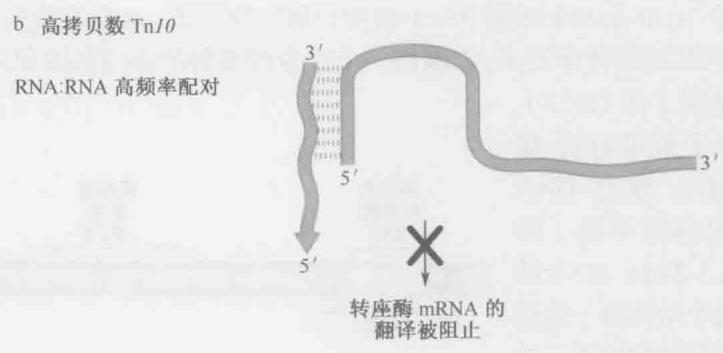

  
图12-28 Tn10 表达的反义调节。(a). 重叠的启动子区域如图所示，向左的启动子 $(P_{\mathrm{IN}})$ 启动转座酶基因的表达，向右的启动子 $(P_{\mathrm{OUT}})$ 开始于距 $P_{IN}$ 启动子左端36bp 处，它启动反义 RNA 的表达。这两个转录物的前36bp 是互补的。注意，在细胞中起始于 $P_{OUT}$ 的反义转录物的较起始于 $P_{IN}$ 的转录物的有较长的寿命。(b). 细胞中 Tn 10 的拷贝数多时，这两个 RNA 的配对就频繁发生，阻止了转座酶 mRNA 的翻译（因而最终减少了转座子的拷贝数）。(c). 当细胞中转座子拷贝数很低时，两种 RNA 转录本配对很少，转座酶 mRNA 能够高效翻译，细胞中转座子的拷贝数增加。

#### [W] 框12-4 转座的靶免疫机制

转座目标免疫机制的核心是 MuA 转座酶和 MuB ATP 酶间的相互作用。正是 MuA 和 MuB 的相互作用阻止了 MuB 结合到与 MuA 结合的 DNA 附近。这个相互作用对它们的影响是：

\- MuA 阻止了 MuB 结合到其附近的 DNA 位点。这一过程需要 ATP 的水解。

\- MuB 帮助 MuA 找到转座的靶位点。

要了解单个的蛋白质-蛋白质和蛋白质-DNA 相互作用如何一同产生目标免疫，我们来看看转座到两个候选 DNA 片段时的情况：一个代表任意的 DNA 片段，而另一个片段带有一个插入的 Mu 因子的拷贝（框 12-4 图 1）。我们把第一个片段叫做天然区域（naive region），把第二个片段叫做免疫区域。

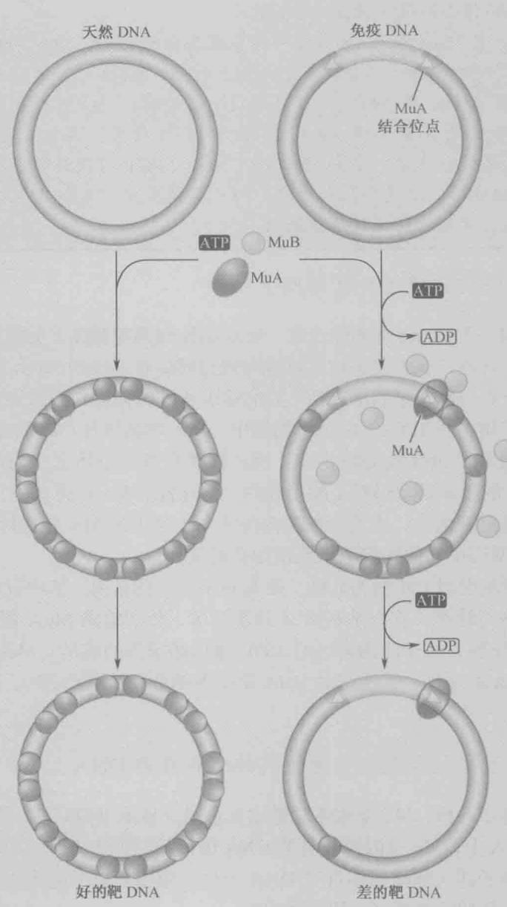  
框12-4 图1 MuA 和 MuB 在 DNA 上的相互作用导致了靶位点免疫的发生。MuA 结合位点位于转座子末端的末端反向重复序列中（深绿色表示），为了说明清楚，图中所示的 MuA 仅结合了两个重复区域中的一个。每当 MuB 水解 ATP 时，它就从 DNA 脱了下来（结合 ATP 的 MuB 以更深的绿色显示）。MuA 和 MuB 的相互作用能促进这个水解反应，尽管图中所示只有两个 MuB 分子与 MuA 作用。实际上，MuA 总是趋向于接触到所有的紧密连接在它的 DNA 结合位点上的 MuB 分子。一个单独的 MuA 结合的末端反向重复序列可以使 5\~15 kb 的 DNA 序列获得“免疫性”。

那么当 Mu 因子准备转座时这两个 DNA 区域时会发生什么呢？首先考虑天然区域，结合 ATP 形成复合体（MuB-ATP）的 MuB 蛋白以非特异性的方式结合到此 DNA 上，与此同时，MuA 转座酶在 Mu DNA 上组装转座体，然后转座体内的 MuA 蛋白与天然区域上的 MuB-DNA 复合体发生蛋白质-蛋白质相互作用。这种相互作用的结果是

MuB 将这个序列作为靶位点传递给 MuA。

与此相反，当 MuA 和 MuB 都结合到免疫区域的 DNA 上时，MuA 与免疫区域上 Mu 噬菌体基因组的特异性结合位点发生相互作用。MuB-ATP 的结合仍采用非特异性的方式。然而当 MuA 和 MuB 都结合到这一区域时，它们将发生相互作用，结果是 MuA 通过 MuB 刺激 ATP 水解，使得 MuB 与 DNA 分离，因此，MuB 就不能在免疫 DNA 片段上聚集。通过这个方法，Mu 转座蛋白用 ATP 中保存的能量来保护其基因组免于成为转座的目标。从这个机制中我们还可以预测出，只要 DNA 上有一个单独的 MuA 结合位点，就足以获得目标免疫性。

#### [W] Mu 噬菌体是一种异常活跃的转座子

和 $\lambda$ 噬菌体一样，Mu 噬菌体也是一种溶原性细菌噬菌体（见附录 A）。Mu 也是一种较大的 DNA 转座子，它侵染宿主细胞时通过转座将自己的 DNA 插入到宿主的基因组上，所用的方式与反转录病毒类似（如前述）。Mu 噬菌体在裂解性生长时也通过多轮的复制性转座扩增自身 DNA。在裂解周期中，Mu 噬菌体每小时能完成大约 100 轮的转座，它是目前已知的最高效的转座子。而且即使在静止溶原态，与传统的转座子（如 Tn10）相比，它的转座频率仍然是相当高的。它的名字 Mu 是突变子（mutator）的缩写，这源于其疯狂转座的能力，因为当细胞内插入一个拷贝的 Mu 噬菌体 DNA 后，噬菌体 DNA 插入细胞基因中而使细胞频繁地增加新的突变。

Mu 噬菌体基因组大小约为40kb，带有35个以上的基因，其中仅有两个基因编码的蛋白质专注地参与转座，它们是基因 A 和基因 B，分别编码 MuA 蛋白和 MuB 蛋白。MuA 是一个转座酶，属于前面讲过的 DDE 蛋白超家族的成员；MuB 蛋白是一个 ATP 酶，它促进 MuA 的活性，并控制对 DNA 靶位点的选择（图12-29）。这个过程将在下一节介绍。

#### [W] Mu 噬菌体通过靶位点免疫来避免其转座到自身 DNA 上

像许多转座子一样，Mu 噬菌体对靶位点也很少显示出偏好性。因此，“好”的靶点常常出现在 DNA 上，Mu 基因组自身的 DNA 也被频繁地选为靶位点。鉴于序列的选择如此随机，转座子插入到噬菌体自身 DNA 上后，很容易造成噬菌体基因的严重紊乱，那么 Mu 噬菌体是如何避免这一情况的呢？

由于 Mu 转座受到转座目标免疫（transposition target immunity）（框12-4，转座的靶免疫机制）作用的调控，使得这一问题得以解决。在转座时，这个作用致使 Mu 因子周围的 DNA 位点及包括转座子自身的 DNA 位点，不易成为转座的靶位点。

已经发现了很多不同的可转座因子都具有转座目标免疫性，而且可以远距离发生作用。例如，一个已经存在的 Mu 转座子可以对附近约 15kb 的范围实现 Mu 转座子对新插入的免疫。还有一些转座因子（如 Tn3 和 Tn7）的目标免疫范围超过了 100kb。目标免疫使得一个转座因子免于被自身或同类型因子的另一个拷贝插入。而且，这种对靶 DNA 选择的调节推动了转座因子移动到远离自身的新位置，这个特点或许有益于转座子整体

的生存和繁衍。

Tc1 / mariner 因子是真核细胞中极其成功的 DNA 转座因子

已经发现的 Tc1 / mariner 转座因子家族成员在非脊椎动物和脊椎动物中都普遍存在，这个家族的转座因子是真核细胞中最常见的 DNA 转座子。尽管这些因子有明显的相关性，但来自不同物种的成员有着不同的特性和命名。例如，来自线虫 C.elegans 的因子叫 Tc 因子，而从果蝇体内分离出的因子叫 mariner 因子。

Tc 1/mariner 因子是已知最简单的自主转座子之一。通常，它们的长度约为1.5\~2.5kb，仅包含一对反向末端重复序列（转座酶结合位点）和一个编码转座酶蛋白的基因，该转座酶属于DDE蛋白超家族（如前述）。与很多转座子不同的是，它的转座过程不需要辅助蛋白的参与，尽管在最后的重组步骤中需要细胞的DNA修复蛋白。或许如此简单的结构和机制正是它们在如此广泛的宿主物种中获得巨大成功的原因。

Tc1/mariner 因子的转移是通过剪切-粘贴的转座机制实现的（图12-19）。转座子 DNA 从原宿主 DNA 两端的切除是通过单链的成对断裂实现的，断裂位点间隔两个碱基。这些因子非常容易插入到有 5'TA 序列（很明显，这是常见的序列）的地方。

转座子被切除后在宿主染色体上留下的“空”位点怎么办呢？在 Tc1 / mariner 转座中，对一些曾经携带过转座子的位点分析表明，有时这些断开的 DNA 末端被修补（通过 DNA 的修复合成）后就直接连接起来（第10章，关于非同源末端连接的讨论）。这些修复反应会在原先

  
图 12-29 Mu 转座子前期步骤的概况。MuA 转座酶的 4 个亚基组装在 Mu DNA 的末端，MuB 与 ATP 结合然后结合任意的 DNA 序列。MuA 与 MuB 之间的蛋白质间相互作用使 MuA DNA-转座体复合体结合到新的 DNA 目标位点上。MuB 没有在最后一组图中展现出来，因为在 DNA 链转移后，不再需要 MuB，因而其可能离开了复合体。

的位点插入几个额外的碱基对，这些短小的插入 DNA 被称为 “脚印”（footprint），因为它们是转座子“途经” 这里后在基因组上留下的踪迹。

与很多转座子不同，Tc1 / mariner 因子的转座并未得到很好的调控。或许就是由于缺乏调控，在基因组序列上发现了很多“死”的转座子，即无法转座。例如，很多转座酶基因发生突变造成转座子失活。研究人员用活性因子和无活性因子上的很多序列人为构造了一个极度活跃的 Tc1 / mariner 因子，称为“睡美人”。与分离出的天然因子相比，它能以很高的频率发生转座。“睡美人”很有希望成为一个用于在真核物种细胞中诱发突变和插入 DNA 的有效工具。而且这个重构实验还说明，天然的 Tc1 / mariner 因子由于其转座酶蛋白没有发挥最佳作用而自然降低了转座的频率。

#### [W] 酵母 Ty 因子转座到基因组的安全港

Ty 因子（酵母中的转座子）是酵母中重要的转座子，属于类病毒反转录转座子。事实上，它们与反转录病毒的相似性已经超越了转座机制。Ty RNA 在细胞中被发现组装成类病毒的颗粒（图 12-30），所以这些因子好像是病毒一样，只是不能离开一个细胞去感染另一个细胞。已经有很多类型的 Ty 因子被充分研究。例如，酿酒酵母中有 Ty1、Ty3、Ty4 和 Ty5 因子（尽管 Ty5 在这类酵母中都是失活的）。每一类 Ty 因子都能催化自身的移位，但不能移动其他类的因子。

  
b

  
T=3

  
T=4  
图12-30 酵母的 Ty 因子被组装到病毒颗粒中。(a). 过表达的 Ty1类病毒颗粒的酿酒酵母细胞的电子显微照片。颗粒呈卵形、电子密集的结构。(b). 低温电子显微扫描显示的 Ty1病毒颗粒的三维重构结构。Ty1 因子所携带的被切断的 Gag 蛋白与病毒颗粒的三聚体构成了钉状外壳。(经得许可后重新印刷, 源自: Craig N. et al. 2002. Mobile DNA II, © ASM Press. b, 同样源自 H. Saibil.)

Ty 因子偏向于整合到染色体上的特定区域（图 12-31）。例如，Ty1 因子几乎总是插入到被宿主 RNA 聚合酶Ⅲ（Pol III）转录的起始位点上游约 200 bp 的区域内（第 13章）。RNA 聚合酶Ⅲ特异性地转录 tRNA 基因，所以大多数 Ty1 因子就插入到这些基因附近。Ty3 因子的插入也和 RNA 聚合酶Ⅲ的启动子紧密相关。这一情况下，插入位点就精确定位在转录起始点位置（±2bp）。与此不同的是，Ty5 因子趋向于插入到基因组的静止区，也就是转录静止区域，Ty5 插入的静止区包括端粒和交配型基因座的静止拷贝（第 11 章）。在所有这些情形中，区域性靶位点的选择机制与一个特定的蛋白质-蛋白质复合体的形成有关。这个复合体由两个蛋白质组成，分别是与 cDNA 结合的复合体中的整合酶，以及与染色体位点结合的特定的宿主蛋白。例如，Ty5 整合酶就与 DNA 沉默蛋白 Sir4 构成了一个特殊的复合体（第 19 章）。

  
图12-31 Ty因子的整合位点簇。每个彩色区块代表一个已知的转座插入位点。注意，Ty1、Ty2、Ty3和Ty4都是插入到由细胞RNA聚合酶Ⅲ转录的tRNA基因附近，插入发生在真实基因的上游，因而不对基因的表达产生干扰。Ty1和Ty2是紧密相关的转座因子，所以归为一类；Ty5被发现位于染色体末端和交配型基因座（第11章）附近的“沉默”（即低转录）区域。（来源：Dan Voaytas.）

为何 Ty 因子表现出这种靶位点的区域性偏好呢？有人提出，正是由于这种靶位点的选择性，使得大多数的插入远离基因组中直接与编码蛋白相关的重要区域，让转座子能保留在宿主细胞中。使用目标性转座方式对酵母这种小而富含基因的基因组有更加重要的意义。

#### [W] LINE 因子能够推动自身转座，还能转座细胞 RNA

自主性聚腺苷酸反转录转座子 LINE 在脊椎动物基因组中大量存在。事实上，人的基因组中约 20% 由 LINE 序列构成。这些因子起初是被当作重复序列家族发现的，它的名字来源于最初的定义：LINE 是“散布在核内的长因子”（long interspersed nuclear element）的缩写。L1 是人体内了解得最清楚的一个 LINE 因子。除了能推动自身的移位，LINE 还能提供一些蛋白质，用于反转录和整合其他相关的重复序列——一种被称为“散布在核内的短因子”（short interspersed nuclear element，SINE）的非自主性聚腺苷酸反转录转座子。基因组序列显示这类因子也是大量出现，通常大小为 100\~400bp。在人的基因组中普遍存在的 Alu 序列就是 SINE 的一个例子。LINE 和 SINE 因子典型结构的比较如图 12-32 所示。LINE 和 SINE 的序列看起来像是简单的基因，可事实上，如对转座很重要的 cis-acting 因子，它仅包含一个指导该因子转录成 RNA 的启动子和一个聚腺苷酸序列。前面讲过，这些腺苷酸残基与靶位点的 DNA 配对，帮助形成反转录所需的末端引物（图 12-23）。

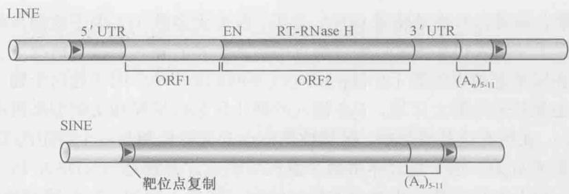  
图12-32 一个典型的 LINE 和 SINE 的遗传结构。注意在因子右端的聚腺苷酸序列的长度是可变的。这是一个聚腺苷酸反转座子的典型特征，这些因子两端的靶位点重复序列（蓝色箭头）的长度也是可变的。序列因子没有按比例显示。这两类因子都带有启动子序列，见图12-20 和图12-28。（图片经允许修改，源自：Bushman F. 2002. Lateral DNA transfer, p. 251, Fig.8.4. © Cold Spring Harbor Laboratory Press.）

这种转座所需的序列如此简单，给 LINE 因子提出一个问题：如何避免对细胞内 mRNA 的转座呢？我们知道，所有的基因都有启动子，它们大部分被转录成 mRNA 后，在3'端都带有一个聚腺苷酸的序列（第14章），那么所有的 mRNA 都可能成为吸引转座酶的底物。实际上，基因组序列已经为我们提供了清楚的证据表明细胞 RNA 通过靶位点引导的反转录机制实现转座。

细胞中很多基因在基因组上都有一些高度同源的其他拷贝，这些拷贝丢失了启动子和内含子（存在于基因中的序列，通过 RNA 剪切被从 mRNA 中去掉，见第14章），通常在5'端被截短。这些序列被称为加工后的假基因（processed pseudogene），通常不能被细胞表达。这些假基因两端一般是靶 DNA 的短重复序列，这个结构恰好就是 LINE 促进的细胞 mRNA 转座的预期结果。

尽管细胞 RNA 会发生转座，但这是一个罕见的现象。避免这一过程的基本机制是编码 LINE 因子的蛋白质在翻译时迅速地结合到自己的 RNA 上（图12-23）。这样，它们在催化反转录和整合时，对编码自己的 RNA 表现出了很强的偏好性。

#### [W] V(D)J 重组

我们看到转座涉及很多不同遗传因子的移动，然而细胞也在利用重组机制来实现对自身有帮助的功能。最好的例子就是 V（D）J 重组，它发生在脊椎动物免疫系统的细胞中。

脊椎动物免疫系统的工作是识别和防御生物体如病毒、细菌和病原细胞的入侵。脊椎动物用两类特殊的细胞（B 细胞和 T 细胞）专门识别这些入侵者。B 细胞制造循环于血液系统中的抗体（antibody）；而 T 细胞制造细胞表面结合的受体蛋白，称为 T 细胞受体（T cell receptor）。这两类蛋白质识别“外部”分子后便展开一系列旨在消灭入侵者的活动。为成功地完成它们的功能，抗体和 T 细胞受体必须能识别大量的多种分子。细胞用于产生多种多样的抗体和 T 细胞受体的基本机制所依靠的就是被称为 V(D) J 重组的一套特殊的 DNA 重排反应。

组成抗体和 T 细胞受体基因的基因片段是通过一系列的序列特异性重排装配而成的。要了解这个重组过程是如何产生所需的多样性，就需要了解一下抗体分子的结构（图12-33）；T细胞受体与抗体的分子结构相似。编码抗体分子的基因组区域如图12-34所示。抗体由两条轻链和两条重链构成，抗体蛋白与外源分子结合的部分叫抗原结合位点（antigen-binding site），这个结合区由抗体分子的 $V_{L}$ 和 $V_{H}$ 两个结构域构成，如图12-33所示。字母“V”表示这一段蛋白质序列是高度变化的。抗体分子的其他结构域叫做“C”区，即稳定区，它在不同的抗体分子之间没有太大变化。

  
图 12-33 一个抗体分子的结构。两条轻链用粉色显示，两条重链用蓝色表示。可变区和稳定区仅标记于抗体分子的左边。注意抗原结合区形成于 $V_{L}$ 和 $V_{H}$ 结构域之间的界面。（Harris L. J. et al. 1998. J. Mol. Biol. 275: 861-72.）图形通过 MolScript、BobScript 和 Raster 3D 软件制作。

如图12-34a 所示，编码抗体轻链（来自小鼠）的基因组区域叫做 kappa 基因座，这个区域有 300 个基因片段，可以编码不同版本的轻链 $V_{L}$ 蛋白区。另外有 4 个基因片段编码一个短的蛋白质区域，叫 J 区，其后是编码 $C_{L}$ 结构域的一个单独编码区。通过我们下面描述的机制，V（D）J 重组可将 V 区和 J 区的 DNA 任意配对融合。所以，单从这一基因组区域重组产生的抗体轻链就有 1200 种变化，然后通过 RNA 剪切将这些基因片段与 $C_{L}$ 编码区结合在一起（第 14 章）。

编码抗体重链的基因片段装配情况与此相似，不过它还有一个额外的基因单元，叫D（Diversity，多样性）片段（图12-34c），所以重链基因的情况更加复杂。例如，小鼠的一个特定重链基因座有100多种V区、12种D区和4种J区，组装这个基因的V(D)J重组就会产生4800多种不同的蛋白质序列。由于具有功能的抗体可由任意的重链和轻链配对而成，所以在轻链和重链基因位点进行的重组对抗体蛋白结构的影响具有放大效应。

  
图12-34 V(D)J 重组过程概述。上图所示为生成抗体蛋白轻链的步骤。a. 细胞中（配子型 DNA）未经 V(D)J 重组的部分轻链 DNA 的遗传结构。b. B 细胞发育过程中发生在两个特异性基因片段（V3 和 J3）间的重组。这是发生在不同 B 细胞前体中很多种重组事件中的一种，重组的基因座转录后通过 RNA 剪切（第14章）并列在一起形成连续的基因片段，该 mRNA 翻译产生轻链蛋白。c. 更加复杂的重链遗传区域的图例，它带有额外的“D”基因片段和多种类型的稳定区片段（Cμ、Cγ等）。(图片经允许修改，源自：Bushman F. 2002. Lateral DNA transfer, p.345, Fig.11.3. © Cold Spring Harbor Laboratory Press.)

#### [W] V(D) J 重组中的早期活动是通过一种类似于转座子切除的机制实现的

被 V（D）J 重组所装配的基因片段两端的序列叫做重组信号序列（recombination signal sequence）。这些信号序列都有两个高度保守的序列基序（motif），一个长 7bp（7mer），另一个长 9bp（9mer）（图 12-35），这些基序能被重组酶结合（如下所述）。重组信号序列分为两类，一类包含 7mer 和 9mer 的基序以及两者中间的 12bp 的序列；另一类包含两个基序以及两者中间的 23bp 的序列（图 12-35a）。重组总是发生在一对重组信号序列之间，其中一个有 12bp 的间隔区，另一个有 23bp 的间隔区。这些成对的信号序列以反向重复的结构排列在要被连起来的 DNA 片段两端（图 12-35b）。

负责识别和断裂重组信号序列的重组酶由两个蛋白质亚基组成，分别叫 RAG1 和 RAG2 [RAG 是重组激活基因（recombination activating gene）的缩写]。这些蛋白质的作用方式与转座酶相似（图 12-36），它们识别重组酶信号序列，然后将两位点配对构成一个蛋白质-DNA 联会复合体。

  
图 12-35 V(D)J 重组中重组信号序列的识别。(a). 两类重组信号序列（RSS）的近观图，12bp 的间隔序列由蓝色显示，23bp 的间隔序列由绿色表示，两类因子共有的 7mer 和 9mer 的序列因子由浅绿色显示，间隔区核苷酸序列并不重要，而其长度是至关重要的。(b). 编码抗体（Ig 基因）和 T 细胞受体蛋白（TCR 基因）的遗传区域中 RSS 重排的几个例子。(a. 图片经允许修改，源自：Bushman F. 2002. Lateral DNA transfer, p.345, Fig.11.3. © Cold Spring Harbor Laboratory Press.)

  
图 12-36 V (D) J 重组途径：发生断裂的机制类似于转座子的切除机制。重组酶催化信号序列末端的单链断裂后产生了游离的 3'-OH，然后每个 3'-OH 开始攻击相对链形成一个发夹形的中间体（图 12-23b）。随后发卡结构水解并连接形成 V 和 J 区间的一个编码联合体，携带重组信号序列的两个末端也连成一个信号联合体，前者可以继续进行重组，后者则被丢弃。（图片经允许修改，源自：Bushman F. 2002. Lateral DNA transfer, p.348, Fig.11.6. ©Cold Spring Harbor Laboratory Press.）

然后，复合体内的 RAG1 蛋白诱导重组信号序列和将要被重排的基因片段之间每一个连接处的 DNA 单链的断裂（图 12-36a）。这样的位点断裂使得编码蛋白的片段具有了一个自由的 3'-OH 末端（图 12-36b）。然后，与以前看到的转座子切除反应，尤其在 Hermes 通路中那样（图 12-21），这个 3'-OH DNA 末端攻击 DNA 双螺旋的另一条单链。这个攻击导致了 DNA 的双链断裂和重新连接反应，并产生一个发卡形的 DNA 末端。具有 DNA 发夹末端的序列是蛋白质编码片段，而重组信号序列末端现在是正常的 DNA 双链断裂（图 12-36c）。用同样的机制，每个重组的 DNA 片段都形成一个 DNA 发卡结构。

一旦联会复合体上的两个 DNA 序列被切开，又被 RAG 重组酶变成发卡形状后，细胞内的 DNA 修复蛋白就会接管任务，并完成剩下的重组反应（图12-36d）。两个蛋白质编码片段上的 DNA 发卡末端必须被打开，而且这些末端还必须被连接到一起，细胞内的非同源末端连接蛋白（第10章）参与了这一反应。有趣的是，DNA 的连接通常伴随着若干核苷酸的增减，这里的增加与我们所说的 Tc1 / mariner 转座子切除时在原靶位点上留下“足迹”的现象类似。这些增加的额外的核苷酸为所生成的蛋白质分子序列增加了多样性。成对断裂的重组信号序列也在重组过程中连接了起来，结果通常产生了一个环形的 DNA 分子而被细胞丢弃。

初始化 V（D）J 重组的 DNA 断裂与转座子切除这两种机制间的相似性是非常明显的。事实上，重组信号序列与转座子末端的末端反向重复序列也很相似，而且 RAG1 蛋白具有一些同 DDE 转座酶蛋白家族相似的序列。事实上，基因组分析近期发现一个叫做 Transib 的转座子家族。它有可能是 RAG1 和重组信号序列的共同来源。这些现象和很多其他现象一起为我们提供的强有力的证据表明，V（D）J 重组这一高等动物免疫系统的关键特征是由 DNA 转座演化而来的。这个结论说明了可转座因子在细胞基因组演化过程中的关键作用。

<!-- W-END Watson 12 位点特异性重组和DNA转座 -->

<!-- L-BEGIN Lehninger 25.3 -->

### 【英文对应 Lehninger §25.3：DNA Recombination】

> 来源：Lehninger Principles of Biochemistry（书籍/02_生物化学原理） 第25章 DNA Metabolism，§25.3。

The rearrangement of genetic information within and among DNA molecules encompasses a variety of processes, collectively placed under the heading of genetic recombination. The practical applications of DNA rearrangements in altering the genomes of increasing numbers of organisms are now being explored (Chapter 9).

  
Barbara McClintock,
1902–1992
[AP Photo.]

Genetic recombination events fall into at least three general classes. Homologous genetic recombination (also called general recombination) involves genetic exchanges between any two DNA molecules (or segments of the same molecule) that share an extended region of nearly identical sequence. The actual sequence of bases is irrelevant, as long as it is similar in the two DNAs. In site-specific recombination, the exchanges occur only

at a particular DNA sequence. DNA transposition is distinct from both other classes in that it usually involves a short segment of DNA with the remarkable capacity to move from one location in a chromosome to another. These "jumping genes" were first observed in maize in the 1940s by Barbara McClintock. There are also unusual genetic rearrangements for which no mechanism or purpose has yet been proposed. Here we focus on the three general classes.

Homologous genetic recombination is largely a pathway to repair double-strand breaks in DNA. An alternative process for double-strand break repair that does not entail recombination, called nonhomologous end joining (NHEJ), is also described here. Genetic recombination systems have functions as varied as their mechanisms. They include roles in specialized DNA repair systems, specialized activities in DNA replication, regulation of expression of certain genes, facilitation of proper chromosome segregation during eukaryotic cell division, maintenance of genetic diversity, and implementation of programmed genetic rearrangements during embryonic development. In most cases, genetic recombination is closely integrated with other processes in DNA metabolism, and this becomes a theme of our discussion.

#### [EN] Bacterial Homologous Recombination Is a DNA Repair Function

P4 In bacteria, homologous genetic recombination is primarily a DNA repair process, and in this context (as noted in Section 25.2) it is referred to as recombinational DNA repair. It is usually directed at the reconstruction of replication forks that have stalled or collapsed at the site of DNA damage. Homologous genetic recombination can also occur during conjugation (mating), when chromosomal DNA is transferred from one bacterial cell (donor) to another (recipient). Recombination during conjugation, although rare in wild bacterial populations, contributes to genetic diversity.

P4 When a replication fork encounters DNA damage, many pathways may resolve the conflict. A common feature of the DNA repair pathways illustrated in Figures 25-21 to 25-24 is that they introduce a transient break into one of the DNA strands. If a replication fork encounters a damaged site under repair near a break in one of the template strands, one arm of the replication fork becomes disconnected by a double-strand break and the fork collapses (Fig. 25-29). The end of that break is processed by degrading the 5'-ending strand. The resulting 3' single-stranded extension is bound by a recombinase

  
FIGURE 25-30 The RecBCD helicase/nuclease. (a) A cutaway view of the RecBCD enzyme structure as it is bound to DNA. The subunits are shown in different colors; the DNA is entering from the left, and the unwound DNA strands (not part of the solved structure) are shown exiting to the right. A bulbous protein structure called a pin, part of the RecC subunit, facilitates the separation of strands. (b) Activities of the RecBCD enzyme at a DNA end. [(a) Data from PDB ID 1W36, M. R. Singleton et al., Nature 432:187, 2004.]

that uses it to promote strand invasion: the 3' end invades the intact duplex DNA connected to the other arm of the fork and pairs with its complementary sequence. This creates a branched DNA structure (a point where three DNA segments come together). The DNA branch can be moved in a process called branch migration to create an X-like crossover structure known as a Holliday intermediate, named after researcher Robin Holliday, who first postulated its existence. The Holliday intermediate is cleaved, or "resolved," by a special class of nucleases. The overall process reconstructs the replication fork.

In E. coli, the DNA end-processing is promoted by the RecBCD nuclease/helicase. The RecBCD enzyme binds to linear DNA at a free (broken) end and moves inward along the double helix, unwinding and degrading the DNA in a reaction coupled to ATP hydrolysis (Fig. 25-30). The RecB and RecD subunits are helicase motors, with RecB moving $3'\rightarrow5'$ along one strand, and RecD moving $5'\rightarrow3'$ along the other strand. The activity of the enzyme is altered when it interacts with a sequence referred to as chi, (5')GCTGGTGG, which binds tightly to a site on the RecC subunit. From that point, degradation of the strand with a $3'$ terminus is greatly reduced, but degradation of the $5'$ -terminal strand is increased. This process creates a single-stranded DNA with a $3'$ end, which is used during subsequent steps in recombination. The 1,009 chi sequences scattered throughout the E. coli genome enhance the frequency of recombination about 5- to 10-fold within 1,000 bp of each chi site. The enhancement declines as the distance from chi increases. Sequences that enhance recombination frequency have also been identified in several other organisms.

The bacterial recombinase is the RecA protein. RecA is unusual among the proteins of DNA metabolism in that its active form is an ordered, helical filament of up to several thousand subunits that assemble cooperatively on DNA (Fig. 25-31). This filament usually forms on single-stranded DNA, such as that produced by the RecBCD enzyme. Its formation is not as straightforward as shown in Figure 25-31, because the single-stranded DNA-binding protein (SSB) is normally present and

(c)  
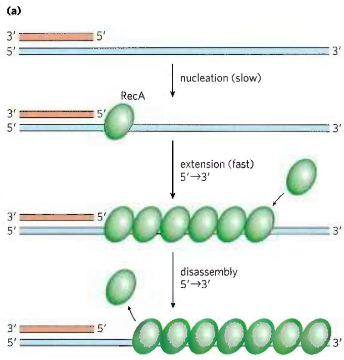

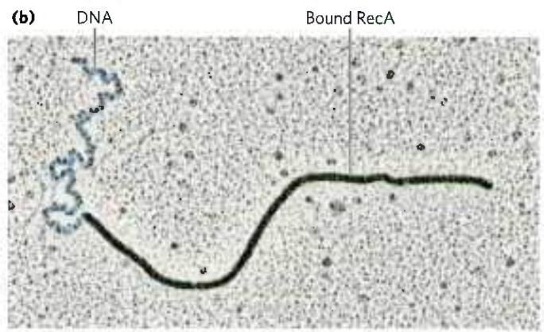

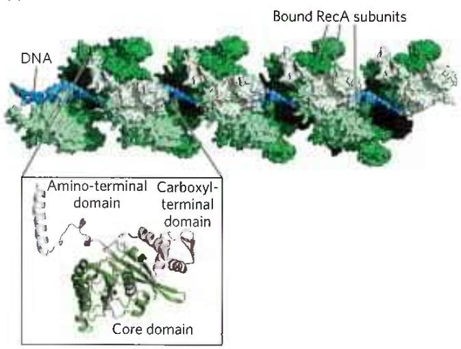  
FIGURE 25-31 RecA protein filaments. RecA and other recombinases in this class function as filaments of nucleoprotein. (a) Filament formation proceeds in discrete nucleation and extension steps. Nucleation is the addition of the first few RecA subunits. Extension occurs by adding RecA subunits so that the filament grows in the 5'→3' direction. When disassembly occurs, subunits are subtracted from the trailing end. (b) Colorized electron micrograph of a RecA filament bound to DNA. (c) Segment of a RecA filament with four helical turns (24 RecA subunits). Notice the bound double-stranded DNA in the center. The core domain of RecA is structurally related to the motor domains of helicases. [(b) By permission of the Estate of Ross Inman. Special thanks to Kim Voss. (c) Data from PDB ID 3CMX, Z. Chen et al., Nature 453:489, 2008.]

specifically impedes the binding of the first few subunits to DNA (filament nucleation). The RecBCD enzyme acts directly as a RecA loader, facilitating the nucleation of a RecA filament on single-stranded DNA that is coated with SSB. The filaments assemble and disassemble predominantly in a 5'→3' direction. Many other bacterial proteins regulate the formation and disassembly of RecA filaments, including an alternative set of RecA loading proteins called RecF, RecO, and RecR. RecA protein promotes the central steps of homologous recombination, including the DNA strand invasion step of Figure 25-29, as well as other strand exchange reactions occurring in vitro. Once a Holliday intermediate has been created via branch migration, it can be cleaved by specialized nucleases such as the bacterial RuvC protein (Fig. 25-32), and nicks are sealed by DNA ligase. A viable replication fork structure is thus reconstructed, as outlined in Figure 25-29.

After the recombination steps are completed, the replication fork reassembles in a process called origin-independent restart of replication. Different combinations of four proteins (PriA, PriB, PriC, and DnaT) act with DnaC in several pathways to load DnaB helicase onto the reconstructed replication fork. The DnaG primase then synthesizes an RNA primer, and DNA polymerase III reassembles on DnaB to restart DNA synthesis. Complexes that include some combination of the PriA, PriB, PriC, and DnaT, along with DnaB, DnaC, and DnaG proteins, are called replication restart primosomes. In this way, the process of recombination is tightly intertwined with replication. One process of DNA metabolism supports the other.

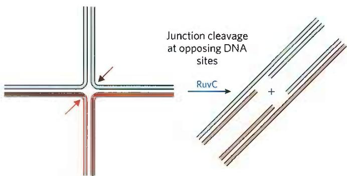  
FIGURE 25-32 Resolution of a Holliday intermediate by the RuvC protein. RuvC is a specialized nuclease that binds to the RuvAB complex and cleaves the Holliday intermediate on opposing sides of the crossover junction (red arrows), so that two contiguous DNA arms remain in each product.

#### [EN] Eukaryotic Homologous Recombination Is Required for Proper Chromosome Segregation during Meiosis

In eukaryotes, homologous genetic recombination has roles in replication and cell division, including the repair of stalled replication forks. Recombination occurs with the highest frequency during meiosis, the process by which diploid germ-line cells with two sets of chromosomes divide to produce haploid gametes (sperm cells or ova) in animals (haploid spores in plants)—each gamete having only one member of each chromosome pair (Fig. 25-33).

Meiosis begins with replication of the DNA in the germ-line cell so that each DNA molecule is present in four copies. Each set of four homologous chromosomes (tetrad) exists as two pairs of sister chromatids, and the sister chromatids remain associated at their centromeres. The cell then goes through two rounds of cell division without an intervening round of DNA replication. In the first cell division, the two pairs of sister chromatids are segregated into daughter cells. In the second cell division, the two chromosomes in each sister chromatid pair are segregated into new daughter cells. In each division, the chromosomes to be segregated are drawn into the daughter cells by spindle fibers attached to opposite poles of the dividing cell. The two successive divisions reduce the DNA content to the haploid level in each gamete.

Proper chromosome segregation into daughter cells requires that physical links exist between the homologous chromosomes to be segregated. As the spindle fibers attach to the centromeres of chromosomes and start to pull, the links between homologous chromosomes create tension. This tension, sensed by cellular mechanisms not yet understood, signals that this pair of chromosomes or sister chromatids is properly aligned for segregation. Once the tension is sensed, the links are gradually dissolved and segregation proceeds. If improper spindle fiber attachment occurs (e.g., if the centromeres of a chromosome pair are attached to the same cellular pole), a cellular kinase senses the lack of tension and activates a system that removes the spindle attachments, allowing the cell to try again.

During the second meiotic division, the centromeric attachments between sister chromatids, augmented by cohesins deposited during replication (see Fig. 24-33), provide the physical links that are needed to guide segregation. However, during the first meiotic cell division, the two pairs of sister chromatids to be segregated are not related by a recent replication event and are not linked by cohesins or any other physical association. Instead, the homologous pairs of sister chromatids are aligned and new links are created by recombination, a process involving the breakage and rejoining of DNA (Fig. 25-34).

FIGURE 25-33 Meiosis in animal germ-line cells. The chromosomes of a hypothetical diploid germ-line cell (four chromosomes; two homologous pairs) replicate and are held together at their centromeres. Each replicated double-stranded DNA molecule is called a chromatid (sister chromatid). In prophase I, just before the first meiotic division, the two homologous sets of chromatids align to form tetrads, held together by covalent links at homologous junctions (chiasmata). Crossovers occur within the chiasmata (see Fig. 25-34). These transient associations between homologs ensure that the two tethered chromosomes segregate properly in the next step, when attached spindle fibers pull them toward opposite poles of the dividing cell in the first meiotic division. The products of this division are two daughter cells, each with two pairs of different sister chromatids. The pairs now line up across the equator of the cell in preparation for separation of the chromatids (now called chromosomes). The second meiotic division produces four haploid daughter cells that can serve as gametes. Each has two chromosomes, half the number of the diploid germ-line cell. The chromosomes have re-sorted and recombined.

(a)  
(b)  
  
FIGURE 25-34 Recombination during prophase I in meiosis. (a) A model of double-strand break repair for homologous genetic recombination. The two homologous chromosomes (one shown in red, the other blue) involved in this recombination event have identical or very nearly identical sequences. Each of the two genes shown has different alleles on the two chromosomes. The steps are described in the text. (b) Crossing over occurs during prophase of meiosis I. The several stages of prophase I are aligned with the recombination processes shown in (a). Double-strand breaks are introduced and processed in

(c)  
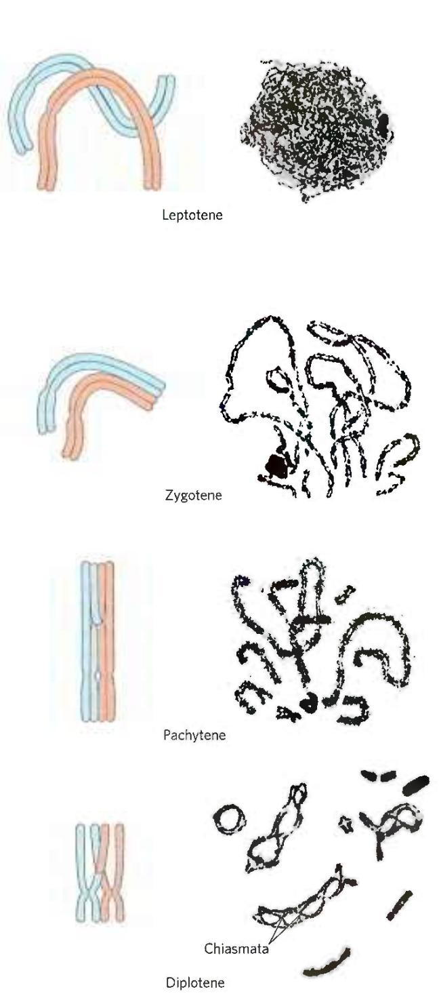  
the leptotene stage. The strand invasion and completion of crossover occur later. As homologous sequences in the two pairs of sister chromatids are aligned in the zygotene stage, synaptonemal complexes form and strand invasion occurs. The homologous chromosomes are tightly aligned by the pachytene stage. (c) Homologous chromosomes of a grasshopper, viewed at successive stages of meiotic prophase I. The chiasmata become visible in the diplotene stage. [(c) B. John, Melosis, Figs 2.1a, 2.2a, 2.2b, 2.3a, Cambridge University Press, 1990. Reprinted with the permission of Cambridge University Press.]

This exchange, also referred to as crossing over, can be observed with the light microscope. Crossing over links the two pairs of sister chromatids together at points called chiasmata (singular, chiasma). Also during crossing over, genetic material is exchanged between the pairs

BOX 25-2

MEDICINE

#### [EN] Why Proper Segregation of Chromosomes Matters

When chromosomal alignment and recombination are not correct and complete in meiosis I, segregation of chromosomes can go awry. One result may be aneuploidy, a condition in which a cell has the wrong number of chromosomes. The haploid products of meiosis (gametes or spores) may have no copies or two copies of a chromosome. When a gamete having two copies of a chromosome joins with a gamete having one copy of a chromosome during fertilization, cells in the resulting embryo have three copies of that chromosome (they are trisomic).

In S. cerevisiae, aneuploidy resulting from errors in meiosis occurs at a rate of about 1 in 10,000 meiotic events. In fruit flies, the rate is about 1 in a few thousand. Rates of aneuploidy in mammals are considerably higher. In mice, the rate is 1 in 100, and it is even higher in other mammals. The rate of aneuploidy in fertilized human eggs has been estimated as 10% to 30%; this is almost certainly an underestimate. Most of these aneuploid cells are monosomes (they have a single copy of a chromosome) or trisomies. Most trisomies are lethal, and many result in miscarriage long before the pregnancy is detected. Almost all monosomes are fatal in the early stages of fetal development. Aneuploidy is the leading cause of pregnancy loss. The few trisomic fetuses that survive to birth generally have three copies of chromosome 13, 18, or 21 (trisomy 21 is Down syndrome). Abnormal complements of the sex chromosomes are also found in the human population. The societal consequences of aneuploidy in humans are considerable. Aneuploidy is the leading genetic cause of developmental and mental disabilities. At the heart of these high rates is a feature of meiosis in female mammals that has special significance for the human species.

In a human male, germ-line cells begin to undergo meiosis at puberty, and each meiotic event requires a relatively short time. In contrast, meiosis in the germ-line cells of human females is a highly protracted process. The production of an egg begins before a female is born, with the onset of meiosis in the fetus, at 12 to 13 weeks of gestation. Meiosis is initiated in all the developing fetal germ-line cells over a period of a few weeks. The cells proceed through much of meiosis I. Chromosomes line up and generate crossovers, continuing just beyond the pachytene stage (see Fig. 25-34)—and then the process stops. The chromosomes enter an arrested phase called the dictyate stage, with the crossovers in place, a kind of suspended animation where they remain as the female matures—so, typically of sister chromatids. These exchanges increase genetic diversity in the resulting gametes. The importance of meiotic recombination to proper chromosome segregation is well illustrated by the physiological and societal consequences of their failure (Box 25-2).

remaining in this stage for anywhere from about 13 to 50 years. At sexual maturity, individual germ-line cells continue through the two meiotic cell divisions to produce egg cells.

Between the onset of the dictyate stage and the final completion of meiosis, something may happen that disrupts or damages the crossovers linking homologous chromosomes in the germ-line cells. As a woman ages, the rate of trisomy in the egg cells she produces increases, dramatically so as she approaches menopause (Fig. 1). There are many hypotheses on why this occurs, and several different factors may play a role. However, most of the hypotheses are centered on recombination crossovers in meiosis I and their stability over the protracted dictyate stage.

It is not yet clear what medical steps could be taken to reduce the incidence of aneuploidy in women of child-bearing age. What is revealed is the inherent importance of recombination and generation of crossovers in human meiosis.

  
FIGURE 1 The increasing incidence of human trisomy with increasing age of the mother. [Data from T. Hassold and P. Hunt, Nat. Rev. Genet. 2:280, 2001, Fig. 6.]

A likely pathway for homologous recombination during meiosis is outlined in Figure 25-34a. The model has four key features. First, homologous chromosomes align. Second, a double-strand break is created in a DNA molecule, and the exposed ends are processed by an exonuclease, leaving a single-stranded extension with a free 3'-hydroxyl group at the broken end (step 1). Third, the exposed 3' ends invade the intact duplex DNA of the homolog, and this is followed by branch migration and/or replication to create a pair of Holliday intermediates (steps 2 to 4). Fourth, cleavage of the two crossovers creates either of two pairs of complete recombinant products (step 5). Notice the similarity of these steps to the bacterial recombinational repair processes outlined in Figure 25-29. The DNA strand invasion in eukaryotes is catalyzed by RecA-like recombinases called Rad51 and Dmc1. Loading of Rad51 onto DNA is promoted by Rad51 loading protein BRCA2 (analogous to the bacterial RecF, RecO, and RecR proteins).

In this double-strand break repair model for recombination, the 3' ends are used to initiate the genetic exchange. Once paired with the complementary strand on the intact homolog, a region of hybrid DNA is created that contains complementary strands from two different parent DNAs (the product of step 2 in Fig. 25-34a). Each of the 3' ends can then act as a primer for DNA replication. Meiotic homologous recombination can vary in many details from one species to another, but most of the steps outlined above are generally present in some form. There are two ways to resolve the Holliday intermediate with a RuvC-like nuclease so that the two products carry genes in the same linear order as in the substrates—the original, unrecombined chromosomes (step 5). If cleaved one way, the DNA flanking the region containing the hybrid DNA is not recombined; if cleaved the other way, the flanking DNA is recombined. Both outcomes are observed in vivo.

The homologous recombination illustrated in Figure 25-34 is an elaborate process that is essential to accurate chromosome segregation. Its molecular consequences for the generation of genetic diversity are subtle. To understand how this process contributes to diversity, we should keep in mind that the two homologous chromosomes that undergo recombination are not necessarily identical. The linear array of genes may be the same, but the base sequences in some of the genes may differ slightly (in different alleles). In a human, for example, one chromosome may contain the allele for hemoglobin A (normal hemoglobin) while the other contains the allele for hemoglobin S (the sickle cell mutation). The difference may consist of no more than one base pair among millions.

Crossing over is not an entirely random process, and "hot spots" have been identified on many eukaryotic chromosomes. However, the assumption that crossing over can occur with equal probability at almost any point along the length of two homologous chromosomes remains a reasonable approximation in many cases, and it is this assumption that permits the mapping of genes on a particular chromosome. The frequency of homologous recombination in any region separating two points on a chromosome is roughly proportional to the distance between the points, and this allows determination of the relative positions of different genes and the distances between those genes. The independent assortment of unlinked genes on different chromosomes (Fig. 25-35)

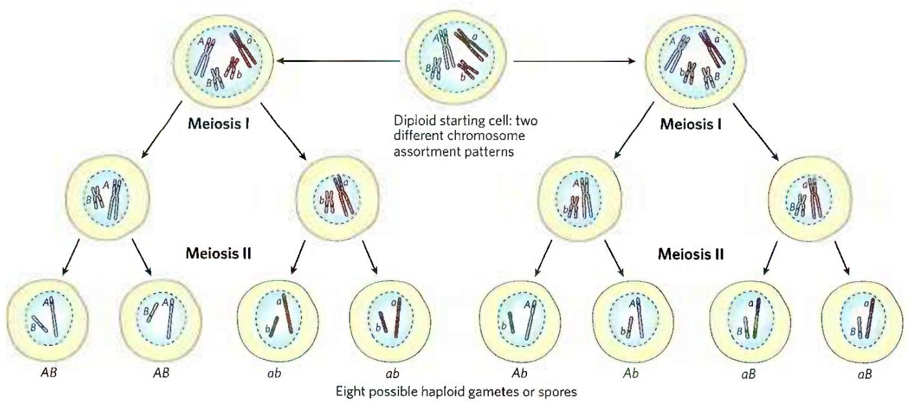  
FIGURE 25-35 The contribution of independent assortment to genetic diversity. In this example, the two chromosomes have already been replicated to create two pairs of sister chromatids. Blue and red distinguish the sister chromatids of each pair. One gene on each chromosome is highlighted,  
with different alleles (A or a, B or b) in the homologs. Independent assortment can lead to gametes with any combination of the alleles present on the two different chromosomes. Crossing over (not shown here; see Fig. 25-34) would also contribute to genetic diversity in a typical meiotic sequence.

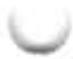

makes another major contribution to the genetic diversity of gametes. These genetic realities guide many of the modern applications of genomics, such as defining haplotypes (see Fig. 9-26) or searching for disease genes in the human genome (see Fig. 9-30).

As in bacteria, this recombination process is used to repair double-strand breaks that arise anywhere in the genome. In eukaryotes, these systems operate in the context of chromatin, rendering additional complexities to their regulation and damage detection mechanisms (Box 25-3). P3 Homologous recombination thus serves at least three identifiable functions in eukaryotes: (1) it contributes to the repair of several types of DNA damage; (2) it provides, in eukaryotic cells, a transient physical link between chromatids that promotes the orderly segregation of chromosomes at the first meiotic cell division; and (3) it enhances genetic diversity in a population.

BOX 25-3

MEDICINE

#### [EN] How a DNA Strand Break Gets Attention

Each human chromosome contains many millions of DNA base pairs, all bound up in an elaborate chromatin structure (Chapter 24). If a strand break occurs somewhere in the DNA, how do the many proteins needed for its repair actually find it? The answer lies, at least in part, in a protein called poly-ADP ribose polymerase 1, or PARP1. PARP1 is a first responder, scanning the DNA for DNA damage and in particular for single-strand breaks. When it finds such sites, it binds and synthesizes an elaborate branched poly-ADP ribose polymer from an NAD precursor (Fig. 1). The polymers are attached to the PARP1 enzyme and also linked to some nearby proteins through Glu, Asp, or Lys residues. The resulting structure is a kind of signal, marking the chromosomal location of damage. A large number of DNA repair proteins bind to and are thus recruited to the poly-ADP ribose polymers, effecting DNA repair. If PARP1 activity is absent, repair is compromised and the number of single-strand breaks in all chromosomes increases. When the chromosome is replicated, the single-strand breaks become double-strand breaks (see Fig. 25-29).

As we saw in Box 25-1, many malignant tumors have a defect in a DNA repair pathway. For example, breast or ovarian cancer is often associated with defects in double-strand break repair (e.g., in the genes encoding BRCA1 or BRCA2 or other proteins in the pathway). In these cells, the further loss of PARP1 activity is especially toxic, as single-strand breaks build up and chromosomes become

#### [EN] Some Double-Strand Breaks Are Repaired by Nonhomologous End Joining

Double-strand breaks sometimes occur when recombinational DNA repair is not feasible, such as during phases of the cell cycle when no replication is occurring and no sister chromatids are present. At these times, another path is needed to avoid the cell death that would result from a broken chromosome. That alternative is provided by nonhomologous end joining (NHEJ). The broken chromosome ends are simply processed and ligated back together.

Nonhomologous end joining is an important pathway for double-strand break repair in all eukaryotes and has also been detected in some bacteria. The importance of NHEJ increases with genomic complexity, and the process accounts for most double-strand break

broken during replication. This has led to the development of PARP1 inhibitors as a treatment for tumors in which double-strand break repair is defective. The first such pharmaceutical agent, olaparib, was approved for use in the United States in 2014. Many more PARP1 inhibitors have since been approved or are undergoing clinical trials. The effects have often been dramatic. For women with breast or ovarian tumors displaying deficiencies in BRCA1 or BRCA2 that have responded to more traditional therapies, subsequent maintenance treatment with PARP1 inhibitors has led to a fourfold increase in progression-free survival. PARP1 inhibitors are also showing promise for use with other breast and ovarian tumors, as well as other types of tumors, most of which have DNA repair deficiencies of some kind. As research continues, the use of PARP inhibitors is becoming an important part of the standard of care for a growing list of cancers.

repair outside meiosis in mammals. In yeast, most double-strand breaks are repaired by recombination, and only a few by NHEJ. NHEJ is a mutagenic process, and a smaller genome, such as that of yeast, has relatively little tolerance for the loss of information. The small genomic alterations may be tolerable in mammalian somatic cells, because they are balanced by the undamaged information on the homolog in each diploid cell, and in these non-germ-line cells the mutations are not inherited. In vertebrates, a loss of the genes encoding NHEJ function can produce a predisposition to cancer.

Unlike homologous recombinational repair, NHEJ does not conserve the original DNA sequence. The pathway in eukaryotes is illustrated in Figure 25-36. The reaction is initiated at the broken ends of a double-strand break by the binding of a heterodimer consisting of the proteins Ku70 and Ku80 ("KU" being the initials of the individual with scleroderma whose serum autoantibodies were used to identify this protein complex; the numbers refer to the approximate molecular weights of the subunits). The Ku proteins are conserved in almost all eukaryotes and act as a kind of molecular scaffold to assemble the other protein components. Ku70-Ku80 interacts with another protein complex containing a protein kinase called DNA-PKcs and a nuclease known as Artemis. Once the complex is assembled, the two broken DNA ends are synapsed (held together). DNA-PKcs autophosphorylates in several locations and also phosphorylates Artemis. Artemis, when phosphorylated, acquires an endonuclease function that can remove 5' or 3' single-stranded extensions or hairpins that might be present at the ends. The DNA ends are then separated with the aid of a helicase, and strands from the two different ends are annealed at locations

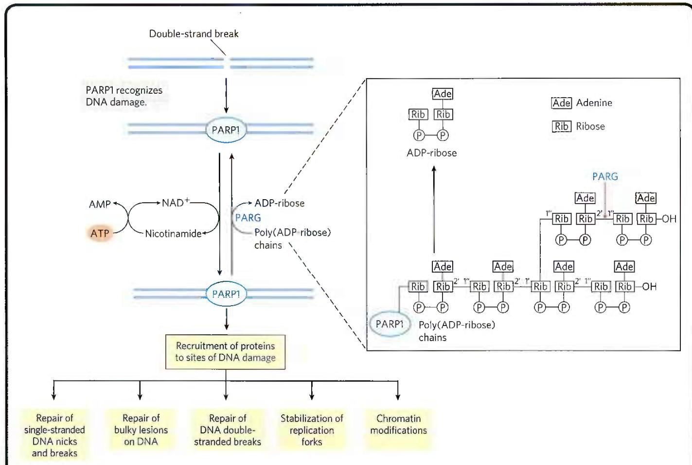  
FIGURE 1 The activity and function of poly-ADP ribose polymerase in detecting DNA strand breaks and other types of damage. (Information from A. R. Chaudhuri and A. Nussenzweig, Nat. Rev. Mol. Cell Biol. 18:610, 2017, Fig. 1.)

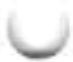

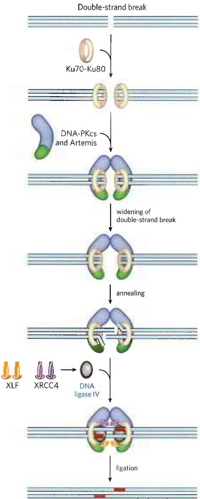  
FIGURE 25-36 Nonhomologous end joining. The Ku70-Ku80 complex is the first to bind the DNA ends, followed by a complex including DNA-PKcs and the nuclease Artemis. These proteins then recruit a complex consisting of XRCC4, XLF, and DNA ligase IV. Either of two DNA polymerases, Pol $\mu$ or Pol $\lambda$ (not shown), subsequently extends the annealed DNA strands, as needed, before ligation. [Information from J. M. Sekiguchi and D. O. Ferguson, Cell 124:260, 2006, Fig. 1.]

where short regions of complementarity are encountered. Artemis cleaves any unpaired DNA segments that are created. Small DNA gaps are filled by a DNA polymerase, Pol $\mu$ or Pol $\lambda$ . Finally, the nicks are sealed by a protein complex consisting of XRCC4 (x-ray cross complementation group), XLF (XRCC4-like factor), and DNA ligase IV.

DNA ends are not joined randomly by NHEJ. Instead, when a double-strand break occurs, the ends are generally constrained by the structure of chromatin and thus remain close together. Very rare events linking end sequences that are normally far apart in the chromosome, or are on different chromosomes, may be responsible for occasional dramatic and usually deleterious genomic rearrangements.

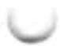

#### [EN] Site-Specific Recombination Results in Precise DNA Rearrangements

Homologous genetic recombination can involve any two homologous sequences. The second general type of recombination, site-specific recombination, is a very different type of process: recombination is limited to specific sequences. Recombination reactions of this type occur in virtually every cell, filling specialized roles that vary greatly from one species to another. Examples include regulation of the expression of certain genes and promotion of programmed DNA rearrangements in embryonic development or in the replication cycles of some viral and plasmid DNAs. Each site-specific recombination system consists of an enzyme called a recombinase and a short (20 to 200 bp), unique DNA sequence where the recombinase acts (the recombination site). One or more auxiliary proteins may regulate the timing or outcome of the reaction.

There are two general classes of site-specific recombination systems, which rely on either Tyr or Ser residues in the active site. In vitro studies of many site-specific recombination systems in the tyrosine class have elucidated some general principles, including the fundamental reaction pathway (Fig. 25-37a). Several of these enzymes have been crystallized, revealing structural details of the reaction. A separate recombinase recognizes and binds to each of two recombination sites on two different DNA molecules or within the same DNA. One DNA strand in each site is cleaved at a specific point within the site, and the recombinase becomes covalently linked to the DNA at the cleavage site through a phosphotyrosine bond (step 1). The transient protein-DNA linkage preserves the phosphodiester bond that is lost in cleaving the DNA, so high-energy cofactors such as ATP are unnecessary in subsequent steps. The cleaved DNA strands are rejoined to new partners to form a Holliday intermediate, with new phosphodiester bonds created at the expense of the protein-DNA linkage (step 2). An isomerization then occurs (step 3), and the process is repeated at a second point within each of the two recombination sites (steps 4 and 5). In systems that employ an active-site Ser residue, both strands of each recombination site are cut concurrently and rejoined to new partners without the Holliday intermediate. In both types of systems, the exchange is always reciprocal and precise, regenerating the recombination sites when the reaction is complete. We can view a recombinase as a site-specific endonuclease and ligase in one package.

(a)  
Recombinase  
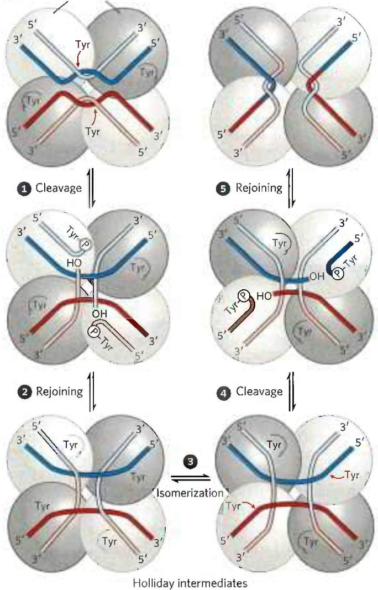

(b)  

The sequences of the recombination sites recognized by site-specific recombinases are partially asymmetric (nonpalindromic), and the two recombining sites align in the same orientation during the recombinase reaction.

FIGURE 25-37 A site-specific recombination reaction. (a) The reaction shown here is for a common class of site-specific recombinases called integrase-class recombinases (named after bacteriophage $\lambda$ integrase, the first recombinase characterized). These enzymes use Tyr residues as nucleophiles at the active site. The reaction is carried out within a tetramer of identical subunits. Recombinase subunits bind to a specific sequence, the recombination site. Two dimeric complexes, each bound to a single site in the DNA, come together to form the tetrameric complex shown here. One strand in each DNA is cleaved at particular points in the sequence. The nucleophile is the —OH group of an active-site Tyr residue, and the product of rejoining is a covalent phosphotyrosine link between protein and DNA. After isomerization, the cleaved strands join to new partners, producing a Holliday intermediate. Steps and complete the reaction by a process similar to the first two steps. The original sequence of the recombination site is regenerated after recombining the DNA flanking the site. These steps occur within a complex of multiple recombinase subunits that sometimes includes other proteins not shown here. (b) Surface contour model of a four-subunit integrase-class recombinase called the FLP recombinase, bound to a Holliday intermediate (shown with light blue and dark blue helix strands). The protein has been rendered transparent so that the bound DNA is visible. Another group of recombinases, called the resolvase/invertase family, use a Ser residue as nucleophile at the active site. [(b) Data from PD8 ID 1P4E, P.A. Rice and Y.Chen, J.Biol. Chem. 278:24,800, 2003.]

The outcome depends on the location and orientation of the recombination sites (Fig. 25-38). If the two sites are on the same DNA molecule, the reaction either inverts or deletes the intervening DNA, determined by whether the recombination sites have the opposite or the same orientation, respectively. If the sites are on different DNAs, the recombination is intermolecular; if one or both DNAs are circular, the result is an insertion. Some recombinase systems are highly specific for one of these reaction types and act only on sites with particular orientations.

Complete chromosomal replication can require site-specific recombination. Recombinational DNA repair of a circular bacterial chromosome, while essential, sometimes generates deleterious byproducts. The resolution of a Holliday intermediate at a replication fork by a nuclease such as RuvC, followed by completion of replication, can give rise to one of two products: the usual two monomeric chromosomes or a contiguous dimeric chromosome (Fig. 25-39). In the latter case, the covalently linked chromosomes cannot be segregated to daughter cells at cell division, and the dividing cells become "stuck." A specialized site-specific recombination system in E. coli, the XerCD system, converts the dimeric chromosomes to monomeric chromosomes so that cell division can proceed. The reaction is a site-specific deletion (Fig. 25-38b). P4 This is another example of the close coordination between DNA recombination processes and other aspects of DNA metabolism.

#### [EN] Transposable Genetic Elements Move from One Location to Another

We now consider the third general type of recombination system: recombination that allows the movement of transposable elements, or transposons. These segments of DNA, found in virtually all cells, move, or "jump," from one place on a chromosome (the donor site) to another on the same or a different chromosome (the target site). DNA sequence homology is not usually required for this movement, called transposition; the new location is determined more or less randomly. Insertion of a transposon in an essential gene could kill the cell, so transposition is tightly regulated and usually very infrequent. Transposons are perhaps the simplest of molecular parasites, adapted to replicate passively within the chromosomes of host cells. In some cases they carry genes that are useful to the host cell, and thus exist in a kind of symbiosis with the host.

  
FIGURE 25-38 Effects of site-specific recombination. The outcome of site-specific recombination depends on the location and orientation of the recombination sites (red and green) in a double-stranded DNA molecule. Orientation here (shown by arrowheads) refers to the order of nucleotides in

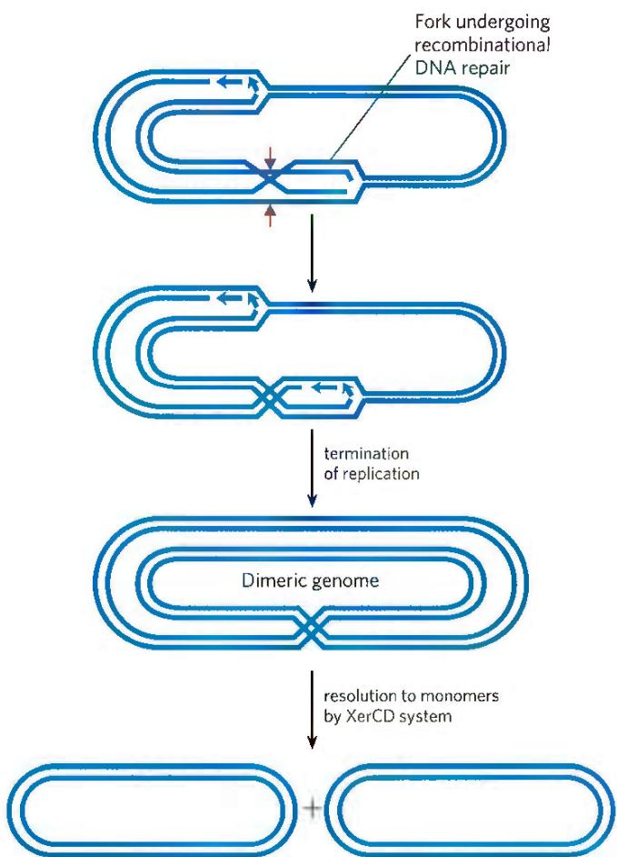  
FIGURE 25-39 DNA deletion to undo a deleterious effect of recombinational DNA repair. The resolution of a Holliday intermediate during recombinational DNA repair (if cut at the points indicated by the red arrows) can generate a contiguous dimeric chromosome. A specialized site-specific recombinase in E. coli, XerCD, converts the dimer to monomers, allowing chromosome segregation and cell division to proceed.

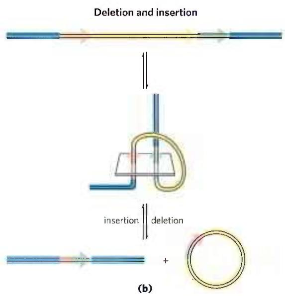  
the recombination site, not the $5'\rightarrow3'$ direction. (a) Recombination sites with opposite orientation in the same DNA molecule. The result is an inversion. (b) Recombination sites with the same orientation, either on one DNA molecule, producing a deletion, or on two DNA molecules, producing an insertion.

Bacteria have two classes of transposons. Insertion sequences (simple transposons) contain only the sequences required for transposition and the genes for the proteins (transposases) that promote the process. Complex transposons contain one or more genes in addition to those needed for transposition. These extra genes might, for example, confer resistance to antibiotics and thus enhance the survival chances of the host cell. The spread of antibiotic-resistance elements among disease-causing bacterial populations that is rendering some antibiotics ineffectual (p. 887) is mediated to a large degree by transposition.

Bacterial transposons vary in structure, but most have short repeated sequences at each end that serve as binding sites for the transposase. When transposition occurs, a short sequence at the target site (5 to 10 bp) is duplicated to form an additional short repeated sequence that flanks each end of the inserted transposon (Fig. 25-40). These duplicated segments result from the cutting mechanism used to insert a transposon into the DNA at a new location.

There are two general pathways for transposition in bacteria. In direct (or simple) transposition (Fig. 25-41, left), cuts on each side of the transposon excise it, and the transposon moves to a new location. This leaves a double-strand break in the donor DNA that must be repaired. At the target site, a staggered cut is made (as in Fig. 25-40), the transposon is inserted into the break, and DNA replication fills in the gaps to duplicate the target-site sequence. In replicative transposition (Fig. 25-41, right), the entire transposon is replicated, leaving a copy behind at the donor location. A cointegrate is an intermediate in this process, consisting of the donor region covalently linked to DNA at the target site. Two complete copies of the transposon are present in the cointegrate, both having the same relative orientation in the DNA. In some well-characterized transposons, the cointegrate intermediate is converted to products by site-specific recombination, in which specialized recombinases promote the required deletion reaction.

  
FIGURE 25-40 Duplication of the DNA sequence at a target site when a transposon is inserted. The sequences duplicated following transposon insertion are shown in red. These sequences are generally only a few base pairs long, so their size relative to that of a typical transposon is greatly exaggerated in this drawing.

Eukaryotes also have transposons, structurally similar to bacterial transposons, and some use similar transposition mechanisms. In other cases, however, the mechanism of transposition seems to involve an RNA intermediate. Evolution of these transposons is intertwined with the evolution of certain classes of RNA viruses. Both are described in the next chapter. As illustrated in Figure 9-25, nearly half of the human genome is made up of various types of transposable elements.

#### [EN] Immunoglobulin Genes Assemble by Recombination

Some DNA rearrangements are a programmed part of development in eukaryotic organisms. An important example is the generation of complete immunoglobulin genes from separate gene segments in vertebrate genomes.

  
FIGURE 25-41 Two general pathways for transposition: direct (simple) and replicative. The DNA is first cleaved on each side of the transposon, at the sites indicated by arrows. The liberated 3'-hydroxyl groups at the ends of the transposon act as nucleophiles in a direct attack on phosphodiester bonds in the target DNA. The target phosphodiester bonds are staggered (not directly across from each other) in the two DNA strands. The transposon is now linked to the target DNA. In direct transposition (left), replication fills in gaps at each end to complete the process. In replicative transposition (right), the entire transposon is replicated to create a cointegrate intermediate. The cointegrate is often resolved later, with the aid of a separate site-specific recombination system. The cleaved host DNA left behind after direct transposition is either repaired by DNA end joining or degraded (not shown); the latter outcome can be lethal to the organism.

A human (like other mammals) is capable of producing millions of different immunoglobulins (antibodies) with distinct binding specificities, even though the human genome contains only \~20,000 genes. Recombination allows an organism to produce an extraordinary diversity of antibodies from a limited DNA-coding capacity. Studies of the recombination mechanism reveal a close relationship to DNA transposition and suggest that this system for generating antibody diversity may have evolved from an ancient cellular invasion by transposons.

We can use the human genes that encode proteins of the immunoglobulin G (IgG) class to illustrate how antibody diversity is generated. Immunoglobulins consist of two heavy and two light polypeptide chains (see Fig. 5-20). Each chain has two regions: a variable region, with a sequence that differs greatly from one immunoglobulin to another, and a region that is virtually constant within a class of immunoglobulins. There are also two distinct families of light chains, kappa and lambda, which differ somewhat in the sequences of their constant regions. For all three types of polypeptide chains (heavy chain, and kappa and lambda light chains), diversity in the variable regions is generated by a similar mechanism. The genes for these polypeptides are divided into segments, and the genome contains clusters with multiple versions of each segment. The joining of one version of each gene segment creates a complete gene.

Figure 25-42 depicts the organization of the DNA encoding the kappa light chains of human IgG and shows how a mature kappa light chain is generated. In undifferentiated cells, the coding information for this polypeptide chain is separated into three segments. The V (variable) segment encodes the first 95 amino acid residues of the variable region, the J (joining) segment encodes the remaining 12 residues of the variable region, and the C segment encodes the constant region. The genome contains 40 different V segments, 5 different J segments, and 1 C segment.

As a stem cell in the bone marrow differentiates to form a mature B lymphocyte, one V segment and one J segment are brought together by a specialized recombination system (Fig. 25-42). During this programmed

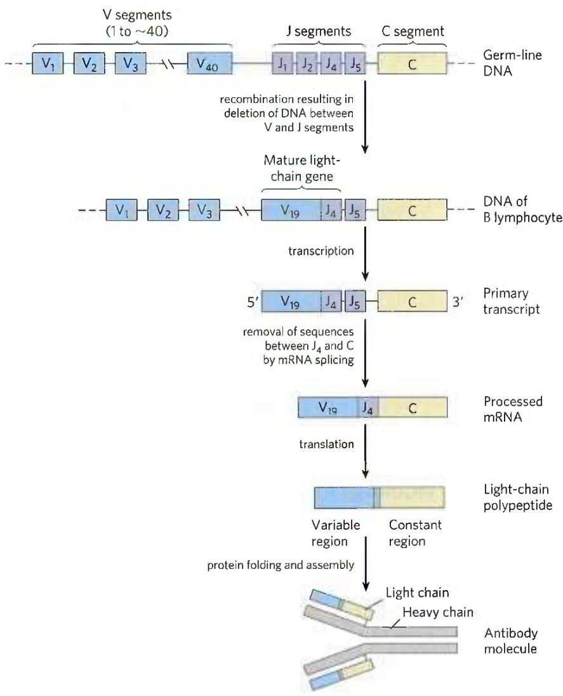  
FIGURE 25-42 Recombination of the V and J gene segments of the human IgG kappa light chain. At the top is shown the arrangement of IgG-coding sequences in a stem cell of the bone marrow. Recombination deletes the DNA between a particular V segment and a J segment. Transcription and RNA splicing, as described in Chapter 26, produces the light-chain polypeptide. The light chain can combine with any of 5,000 possible heavy chains to produce an antibody molecule.

DNA deletion, the intervening DNA is discarded. There are about $40 \times 5 = 200$ possible V–J combinations. The recombination process is not as precise as the site-specific recombination described earlier, so additional variation occurs in the sequence at the V–J junction. This increases the overall variation by a factor of at least 2.5, so the cells can generate about $2.5 \times 200 = 500$ different V–J combinations. The final joining of the V–J combination to the C region is accomplished by an RNA-splicing reaction after transcription, a process described in Chapter 26.

The recombination mechanism for joining the V and J segments is illustrated in Figure 25-43. Just beyond each V segment and just before each J segment lie recombination signal sequences (RSSs). These are bound by proteins called RAG1 and RAG2 (products of the recombination activating gene). The RAG proteins catalyze the formation of a double-strand break between the signal sequences and the V (or J) segments to be joined. The V and J segments are then joined with the aid of a second complex of proteins.

The genes for the heavy chains and the lambda light chains form by similar processes. Heavy chains have more gene segments than light chains, with more than

  
FIGURE 25-43 Mechanism of immunoglobulin gene rearrangement. The RAG1 and RAG2 proteins bind to the recombination signal sequences (RSSs) and cleave one DNA strand between the RSS and the V (or J) segments to be joined. The liberated 3' hydroxyl then acts as a nucleophile, attacking a phosphodiester bond in the other strand to create a double-strand break. The resulting hairpin bends on the V and J segments are cleaved, and the ends are covalently linked by a complex of proteins specialized for end-joining repair of double-strand breaks.

5,000 possible combinations. Because any heavy chain can combine with any light chain to generate an immunoglobulin, each human has at least $500 \times 5,000 = 2.5 \times 10^{6}$ possible IgGs. And additional diversity is generated by high mutation rates (of unknown mechanism) in the V sequences during B-lymphocyte differentiation. Each mature B lymphocyte produces only one type of antibody, but the range of antibodies produced by the B lymphocytes of an individual organism is clearly enormous.

Did the immune system evolve in part from ancient transposons? The mechanism for generation of the double-strand breaks by RAG1 and RAG2 mirrors several reaction steps in transposition (Fig. 25-43). In addition, the deleted DNA, with its terminal RSSs, has a sequence structure found in most transposons. In the test tube, RAG1 and RAG2 can associate with this deleted DNA and insert it, transposonlike, into other DNA molecules (probably a rare reaction in B lymphocytes). Although we cannot know for certain, the properties of the immunoglobulin gene rearrangement system suggest an intriguing origin in which the distinction between host and parasite has become blurred by evolution.

#### [EN] SUMMARY 25.3 DNA Recombination

■ DNA sequences are rearranged in recombination reactions, usually in processes tightly coordinated with DNA replication or repair.

■ Homologous genetic recombination can take place between any two DNA molecules that share sequence homology. In bacteria, recombination serves mainly as a DNA repair process, focused on reactivating stalled or collapsed replication forks or on the general repair of double-strand breaks.

In eukaryotes, recombination is essential to ensure accurate chromosome segregation during the first meiotic cell division. It also helps to create genetic diversity in the resulting gametes.

■ Nonhomologous end joining provides an alternative mechanism for the repair of double-strand breaks, especially in eukaryotic cells.

Site-specific recombination occurs only at specific target sequences, and this process can also involve a Holliday intermediate. Recombinases cleave the DNA at specific points and ligate the strands to new partners. This type of recombination is found in virtually all cells, and its many functions include DNA integration and regulation of gene expression.

■ In almost all cells, transposons use recombination to move within or between chromosomes.

In vertebrates, a programmed recombination reaction related to transposition joins immunoglobulin gene segments to form immunoglobulin genes during B-lymphocyte differentiation.

<!-- L-END Lehninger 25.3 -->

## 2.7 SNP 的理论与应用

SNP 是 single nucleotide polymorphism 的缩写, 中文翻译为单核苷酸多态性, 指基因组 DNA 序列中由于单个核苷酸 (A、T、C 和 G) 的突变而引起的多态性。染色体 DNA 同一位置上的每个碱基类型叫做一个等位位点。SNP 是基因组中最简单、最常见的多态性形式, 具有很高的遗传稳定性。随着 SNP 检测和分析技术的进一步发展, 已经成为继限制性片段长度多态性 (RFLP) 和微卫星标记 (SSR) 之后的第三代遗传标记。

## 2.7.1 SNP概述

一个 SNP 表示在基因组某个位点上一个核苷酸的变化, 这种变化可能是颠换, 也可能是转换, 后者约占 SNP 总量的 2/3 左右, 主要是因为 CpG 二核苷酸上的胞嘧啶残基是人类基因组中最易发生突变的位点, 其中大多数是甲基化的, 可自发地脱去氨基而形成胸腺嘧啶。SNP 广泛存在于人类基因组中, 其发生频率约为 1% 或更高。据估计, 人类 DNA 中每 300 \~ 1 000 个碱基对就有一个 SNP, 因此, 一个人类个体携带 300 万 \~ 1 000 万个 SNP。位于染色体上某一区域的一组相关联的 SNP 等位位点被称作单倍型(haplotype), 相邻 SNP 的等位位点倾向于以一个整体遗传给后代(图 2-43)。

根据 SNP 在基因组中的分布位置可分为基因编码区 SNP(cSNP)、基因调控区 SNP(pSNP) 和基因间随机非编码区 SNP(rSNP)3 类。因为编码区内的变异率仅占周围序列的 1/5, cSNP 的总量显著少于其他两类 SNP。从对生物遗传性状的影响上看，cSNP 又可分为两种，一种是同义 cSNP(synonymous cSNP)，即 SNP 所导致的编码序列改变并不影响其所翻译的蛋白质的氨基酸序列，突变碱基与未突变碱基的含义相同；另一种是非同义 cSNP (non-synonymous cSNP)，指碱基序列的改变可使以其为蓝本翻译的蛋白质序列发生改变，

图2-43 单倍型是染色体上共同遗传的SNP组合

图中 SNP1 和 SNP2 在同一条染色体上而且距离很近, SNP1 有等位位点 A 和 G, SNP2 有等位位点 G 和 T。因此, 染色体对有两种可能的 SNP 组合。

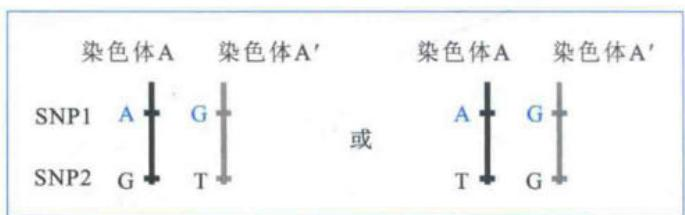

从而影响了蛋白质的功能。这种改变常常是导致生物性状改变的直接原因。位于基因调控区的SNP则会影响基因表达量的多少，因此，这两类SNP在功能和疾病发生发展方面具有更重要的意义。

## 2.7.2 SNP 的检测技术

传统的 SNP 检测方法是采用已有技术,如限制性片段长度多态性(RFLP)、PCR-单链构象多态性(PCR-SSCP)、毛细管电泳及变性高效液相色谱(DHPLC)等。但目前国际上最常见的仍然是通过 DNA 测序法获得新的 SNP。

基因型分型(genotyping)是指利用数据库中已有的SNP进行特定人群的序列和发生频率的研究,主要包括基因芯片技术、Taqman技术、分子导标(molecular beacon)技术和焦磷酸测序法(pyrosequencing)等。

## 2.7.3 SNP的应用

## 1. 人类单倍型图的绘制

大多数染色体区域只有少数几个常见的单体型,代表了一个群体中人与人之间的大部分多态性。某些染色体区域可以有很多SNP位点,但是只用少数几个标签SNP,就能够提供该区域内大多数的遗传多态性模式。绘制人类单倍型图的目的就是描述人类常见的遗传多态性模式和染色体上具有成组紧密关联SNP的区域。2002年10月,国际人类基因组单倍型图计划(HapMap计划)正式启动,到目前为止已有超过150万个SNP被精确定位于各染色体上(下一期的目标是使总密度达到每500 bp有一个SNP)。已经根据这些SNP对来自4个不同人种的269份DNA样品进行了基因型分型,通过不同个体基因组DNA的基因型分型和频率计算,绘制更加精密的单倍型图。人类单倍型图的绘制完成,将为我们精确定位复杂疾病,如糖尿病、癌症、心脏病、中风、哮喘等的易感基因提供重要信息。

## 2. SNP 与疾病易感基因的相关性分析

当一个遗传标记的频率在患者中明显超过非患者时,就表明该标记可能与这种疾病相关。随着大量代谢通路和上百万 SNP 的确认,SNP 作为新一代遗传标记在人类疾病研究中显示出极高的潜在价值。已经通过 SNP 的相关研究发现了高血压、哮喘、类风湿关节炎、肺癌、前列腺癌等许多易感基因。

## 3. 指导用药与药物设计

由于 SNP 能够充分反映个体间的遗传差异, 所以通过研究 SNP 与个体对药物敏感或耐受的相关性研究, 可能阐明遗传因素对药效的影响, 因此可能建立与基因型相关的治疗方案, 对患者施行个性化用药。因此, 根据特定的基因型来设计药物可能在不久的将来成为现实。

## 思考题

## 1. 染色体具备哪些作为遗传物质的特征？

2. 简述真核细胞内核小体的结构特点。

3. 请例举 3 项实验证据来说明为什么染色质中 DNA 与蛋白质分子是相互作用的。

4. 简述组蛋白的主要修饰类型并说出其功能。

5. 简述 DNA 的一、二、三级结构。

6. 原核生物 DNA 具有哪些不同于真核生物 DNA 的特征?

7. 谁提出了 DNA 双螺旋结构模型？简述其主要实验依据及其在分子生物学发展中的重要意义。

8. DNA 以何种方式进行复制？如何保证 DNA 复制的准确性？

9. 简述原核生物 DNA 的复制特点。

10. 什么是 DNA 的 $T_{m}$ 值？它受哪些因素的影响？

11. DNA 复制时为什么前导链是连续复制,而后随链是以不连续的方式复制?并请以大肠杆菌为例简述后随链复制的各个步骤。

12. 真核生物 DNA 的复制在哪些水平上受到调控？

13. 细胞通过哪几种修复系统对 DNA 损伤进行修复？它们在维持基因组稳定性中的作用是什么？

14. 什么是转座子,可分为哪些种类?

15. 什么是 SNP？它作为第三代遗传标记有什么优点？

## 参考文献

1. Li G, Reinberg D. Chromatin higher-order structures and generegulation. Curr. Opin. Genet. Dev., 2011, 21:175-186.

2. Rando O. Combinatorial complexity in chromatin structure and function: Revisiting the histone code. Curr. Opin. Genet. Dev., 2012, 22: 148–155.

3. Brautigam C A, Steitz T A. Structural and functional insights provided by crystal structures of DNA polymerases. Curr. Opin. Struct. Biol., 1998, 8: 54–63.

4. Steitz T A. A mechanism for all polymerases. Nature, 1998, 391:231-232.

5. Remus D, Diffley J F X. Eukaryotic DNA replication control: Lock and load, then fire. Curr. Opin. Cell Biol., 2009, 21: 771-777.

6. Sekiguchi J M, Ferguson D O. DNA double-strand break repair: A relentless hunt uncovers new prey. Cell, 2006, 124: 260–262.

## 数字课程学习

e 教学课件

目在线自测

思考题解析

3.1 RNA 的结构、分类和功能
3.2 RNA 转录概述
3.3 RNA 转录的基本过程
3.4 原核生物与真核生物的转录及产物特征比较
3.5 原核生物 RNA 聚合酶与 RNA 转录
3.6 真核生物 RNA 聚合酶与 RNA 转录
3.7 RNA 转录的抑制
3.8 真核生物 RNA 的转录后加工
3.9 RNA 的编辑、再编码和化学修饰
3.10 mRNA 转运
3.11 核酶
3.12 RNA 在生物进化中的地位

<!-- W-BEGIN Watson 3 章末 -->

### 【中文对照 Watson 第3章章末：小结、参考文献、习题】

> 来源：Watson《基因的分子生物学》第七版中译本（书籍/03_基因的分子生物学_第七版） 第3章 弱化学键和强化学键的重要性 章末，附录 2 中该章偶数习题答案附后。

#### [W] 小结

细胞中许多重要的化学过程并不包含共价键的形成和断裂。大多数分子的细胞定位依赖于弱（或者说次要）的吸引力或排斥力；而且，弱化学键在决定许多分子（尤其是大分子）外形上起着重要作用。最重要的几种弱化学键是氢键、范德华力、疏水作用和离子键。即使这类键相对较弱，它们还是足够强，以保证正确的分子（或原子团）相互作用。例如，酶分子表面的外形唯一适合于与其底物分子的结合。

不论是弱化学键还是强共价键，所有化学键的形成都遵循热力学定律。如果反应的结果是释放自由能（负 $\Delta G$ ），化学键就能形成。为了打断化学键，必须给予相同大小的自由能。由于在原子间形成共价键会导致很大的负 $\Delta G$ ，共价连接的原子几乎不会自发分开。相反地，伴随弱化学键形成的 $\Delta G$ 仅仅是生理温度下分子平均热运动能量的数倍。在活细胞中单个弱化学键频繁地形成和断裂。

具有极性（带电）基团的分子拥有与非极性分子（其中的电荷平均分布）完全不同的相互作用方式。极性分子能够形成氢键，而非极性分子仅能形成范德华力。最重要的极性分子是水分子，每个水分子可与其他水分子形成4个氢键。极性分子大多是水溶性的（程度不同），而非极性分子不能溶于水，这是因为它们不能与水分子形成氢键。

任何一个特定分子具有其唯一的分子外形，这严格限制了它能与之形成强次要化学键的分子的数量。强次要相互作用不但需要两个分子作用表面间的互补关系（锁钥关系），还需要许多原子的参与。尽管只由1\~2个次要化学键连接的分子经常发生解离，但是这些弱化学键的总和能够使分子形成稳定的聚集体。DNA双螺旋结构从不自发解离的事实说明，在这样的聚集体里，极端稳定是可能的。

粗略看来，许多分子的生物合成好像违背了热力学定律，即自发反应必须伴随有自由能的下降（ $\Delta G$ 是负值）。例如，从氨基酸形成蛋白质就具有正的 $\Delta G$ 。当我们认识到生物合成反应并非如起初想像的那样进行时，问题自然就解决了。例如，蛋白质并非由自由氨基酸直接形成，而是首先被酶催化转化为高能活化分子的前体，在特定酶的催化下聚合形成所需的生物合成产物。

所以，许多生物合成过程是“耦联”反应的结果，第一个反应为第二个反应提供自发进行所需的能量。细胞内最主要的能量来源是ATP，它或者是在降解反应（如发酵或呼吸）过程中，或者是在光合作用过程中，由ADP和无机磷酸盐形成的。ATP具有数个高能键，在水解时产生数值很大的负 $\Delta G$ 。与高能键相连的基团称为高能基团。通过基团转移反应，高能基团能被转移到其他分子上，从而形成新的高能化合物。这些衍生的高能分子是许多生物合成步骤的直接前体。

结合 AMP 基团后，氨基酸被活化形成 AA \~ AMP 分子，其中 AMP 来自于 ATP。AA \~ AMP 分子中的高能键的能量类似于 ATP 中高能键的能量。虽然如此，基团转移反应还是由于高能 $^{①}$ \~ $^{②}$ 分子的存在才能进行完全。高能 $^{③}$ \~ $^{④}$ 分子在 AA \~ AMP 分子的形成过程中产生，随后被焦磷酸酶打断生成低能量基团。所以，逆反应 $^{⑤}$ \~ $^{⑥}$ + AA \~ AMP → ATP + AA 不能存在。

几乎所有的生物合成反应起始于 $^{①}$ \~ $^{②}$ 的释放。 $^{③}$ \~ $^{④}$ 一旦形成，立即就被酶催化打断为两个磷酸盐分子，从而消除了逆向生物合成反应的可能性。 $^{⑤}$ \~ $^{⑥}$ 分裂的巨大作用为细胞的主要能量供体是 ATP（而非 ADP）提供了一个解释。ADP 不能转移高能基团并同时产生 $^{⑦}$ \~ $^{⑧}$ 基团作为副产物。

#### [W] 参考文献

#### [W] Weak Chemical Interactions

Branden C. and Tooze J. 1999. Introduction to protein structure, 2nd ed. Garland Publishing, New York.

Creighton T.E. 1992. Proteins: Structure and molecular properties, 2nd ed. W.H. Freeman, New York.
———. 1983. Proteins, W.H. Freeman, San Francisco.

Donohue J. 1968. Selected topics in hydrogen bonding. In Structural chemistry and molecular biology (ed. A. Rich and N. Davidson), pp. 443–465. W.H. Freeman, San Francisco.

Fersht A. 1999. Structure and mechanism in protein science: A guide to enzyme catalysis and protein folding. W.H. Freeman, New York.

Gray H.B. 1964. Electrons and chemical bonding. Benjamin Cummings, Menlo Park, California.

Klotz I.M. 1967. Energy changes in biochemical reactions. Academic Press, New York.

Kyte J. 1995. Mechanism in protein chemistry. Garland Publishing, New York.

——. 1995. Structure in protein chemistry. Garland Publishing, New York.

Lehninger A.L. 1971. Bioenergetics, 3rd ed. Benjamin Cummings, Menlo Park, California.

Lesk A. 2000. Introduction to protein architecture: The structural biology of proteins. Oxford University Press, New York.

Marsh R.E. 1968. Some comments on hydrogen bonding in purine and pyrimidine bases. In Structural chemistry and molecular biology (eds. A. Rich and N. Davidson), pp. 485–489, W.H. Freeman, San Francisco.

Morowitz H.J. 1970. Entropy for biologists. Academic Press, New York.

Pauling L. 1960. The nature of the chemical bond, 3rd ed. Cornell University Press, Ithaca, New York.

Tinoco I., Sauer K., Wang J.C., Puglisi J.D., and Wang J.Z. 2001. Physical chemistry: Principles and applications in life sciences, 4th ed. Prentice Hall College Division, Upper Saddle River, New Jersey.

#### [W] Strong Chemical Bonds

Berg J., Tymoczko J.L., and Stryer L. 2006. Biochemistry, 6th ed. W.H. Freeman, New York.

Kornberg A. 1962. On the metabolic significance of phosphorolytic and pyrophosphorolytic reactions. In Horizons in biochemistry (eds. M. Kasha and B. Pullman), pp. 251–264. Academic Press, New York.

Krebs H.A. and Kornberg H.L. 1957. A survey of the energy transformation in living material. Ergeb. Physiol. Biol. Chem. Exp. Pharmakol. 49: 212.

Nelson D.L. and Cox M.M. 2000. Lehninger principles of biochemistry, 3rd ed. Worth Publishing, New York.

Nicholls D.G. and Ferguson S.J. 2002. Bioenergetics 3. Academic Press, San Diego.

Purich D.L., ed. 2002. Enzyme kinetics and mechanism, Part F: Detection and characterization of enzyme reaction intermediates. Methods in Enzymology, Vol. 354. Academic Press, San Diego.

Silverman R.B. 2002. The organic chemistry of enzyme-catalyzed reactions. Academic Press, San Diego.

Tinoco I., Sauer K., Wang J.C., Puglisi J.D., and Wang J.Z. 2001. Physical chemistry: Principles and applications in life sciences, 4th ed. Prentice Hall College Division, Upper Saddle River, New Jersey.

Voet D., Voet J.G., and Pratt C. 2002, Fundamentals of biochemistry. John Wiley & Sons, New York.

#### [W] 习题

#### [W] 偶数习题的答案请参见附录2

习题 1 两个大分子之间可以存在什么类型的键?

习题 2 （判断对错，如果是错的，请改正错误）酶降低了反应所需的 $\Delta G$ 。

习题 3 （判断对错，如果是错的，请改正错误）离子键和氢键均强于范德华力。

习题 4 （判断对错，如果是错的，请改正错误）在 $25^{\circ}$ C 条件下， $K_{eq}$ 10 倍变化相当于 $\Delta G$ 10 倍变化。

习题 5 回顾表 3-5，请阐述何种重大细胞反应参与了三磷酸腺苷分解成一磷酸腺苷和焦磷酸以及焦磷酸分解成两个磷酸盐的反应，并解释为什么这些过程中反应产生的 $\Delta G$ 特别大。

习题6 对于下列反应起主要作用的键是？

A. 双链 DNA 中一条 DNA 链与另外一条 DNA 发生作用；

B. 两个氨基酸形成的二肽。

习题 7 请描述水分子在凝固点和 $25^{\circ}$ C 时的结构，以及水分子之间起主要作用的键的名称。

习题 8 请用偶极矩的概念来定义极性分子和非极性分子。极性和非极性分子之间会产生范德华力吗？

习题 9 假设 PEP 水解成丙酮酸和磷酸的 $\Delta G$ 为 -12 kcal/mol，计算 $25^{\circ}C$ 时的 $K_{eq}$ 值。

习题 10 有方程: AB + 能量 $\Leftrightarrow$ A + B, 计算平衡时 A 的浓度, 假设 $K_{eq} = 8.0 \times 10^{5} \, mmol/L$ , [B] = 2 mmol/L, [AB] = 0.5 mmol/L。

习题 11 一个含氮碱基的结构如下所示。如果只考虑该结构本身（不考虑是 DNA 或 RNA），图中有多少可能的氢键受体以及氢键供体？

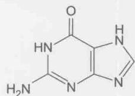

习题 12 glutamate + NH₃ ⇔ glutamine + H₂O, ΔG = +3.4 kcal/mol，将以上反应和 ATP 水解反应偶联是否会促进谷氨酰胺生成？请阐述理由并写出整个反应。

习题 13 请阐述为什么是三磷酸腺苷而不是二磷酸腺苷被用于 DNA 合成反应。

习题 14 研究人员调查了 100 多个蛋白质-DNA 复合体中蛋白质与 DNA 的相互作用。

下表列出了一系列的数据：碱基和氨基酸之间的单个氢键分布。

<table><tr><td rowspan="2">氨基酸</td><td colspan="4">DNA碱基</td></tr><tr><td>胸腺嘧啶</td><td>胞嘧啶</td><td>腺嘌呤</td><td>鸟嘌呤</td></tr><tr><td>精氨酸</td><td>5</td><td>4</td><td>7</td><td>26</td></tr><tr><td>谷氨酸</td><td>—</td><td>11</td><td>—</td><td>1</td></tr><tr><td>酪氨酸</td><td>—</td><td>—</td><td>—</td><td>—</td></tr></table>

A. 请阐述为什么研究人员没有在色氨酸和四种碱基之间发现氢键。

B. 请阐述为什么研究人员在精氨酸和四种碱基之间均发现了氢键。

C. 精氨酸是否有优先结合一种氨基酸的倾向？

数据来自Luscombe等（2001.Nucleic Acids Res.29：2860-2874）。

#### [W] 附录 2：本章偶数习题答案

问题 2 错误。酶降低了反应的活化能。（ $\Delta G$ 也一样）

问题 4 错误。在 $25^{\circ}C$ ， $K_{eq}$ 变化 10 倍，相应的 $\Delta G$ 变化约 1.4 倍。

问题6

A. DNA 碱基之间的氢键。

B. 共价键（肽键）。

问题 8 极性分子有偶极矩，而非极性分子没有偶极矩。范德华相互作用可以包括极性和非极性分子。

问题 10 $K_{eq}=([A]\times[B])/[AB]=([A]\times2\ \text{mmol/L})/(0.5\ \text{mmol/L})=8.0\times10^{5}\ \text{mmol/L},$ $[A]=2.0\times10^{5}\ \text{mmol/L}$

问题 12 是的。 $ATP + H_{2}O \Leftrightarrow ADP + P_{i}\Delta G = -7 kcal/mol$ （表 3-5）.

耦合 ATP 水解的反应，得出一个负的 $\Delta G$ 值。

总反应：谷氨酸 $+NH_{3}+ATP\Leftrightarrow$ 谷氨酰胺 $+ADP+P_{i}\Delta G=-3.6\ kcal/mol.$

问题 14

A. 色氨酸的侧链不包括氢键供体或受体。

B. 谷氨酸的侧链包括能够参与氢键形成的羧酸。

C. 虽然数量少，但有这样一个趋势：在蛋白质-DNA 复合物中精氨酸与鸟嘌呤形成氢键。

<!-- W-END Watson 3 章末 -->

<!-- W-BEGIN Watson 4 章末 -->

### 【中文对照 Watson 第4章章末：小结、参考文献、习题】

> 来源：Watson《基因的分子生物学》第七版中译本（书籍/03_基因的分子生物学_第七版） 第4章 DNA的结构 章末，附录 2 中该章偶数习题答案附后。

#### [W] 小结

DNA 通常形成右手双螺旋。两条多聚脱氧核糖核苷酸链构成双螺旋。每一条链又是由交替的磷酸和脱氧核糖以磷酸二酯键依次连接形成的多聚体。每个脱氧核糖都会伸出一个碱基，碱基有4种：属于嘌呤类的腺嘌呤和鸟嘌呤，属于嘧啶类的胸腺嘧啶和胞嘧啶。脱氧核糖-磷酸骨架是规则的，而碱基的顺序则是不规则的，使其承载了DNA的信息。每一链都有 $5^{\prime}\rightarrow 3^{\prime}$ 的方向性，两条链按照反向平行的方式对应，即两条链的方向相反。

碱基配对和碱基堆积力使得两条多核苷酸链结合在一起。碱基的配对由氢键介导，会导致水分子的释放，进而使得熵值增加。碱基堆积力则通过两种方式增加双螺旋的稳定性：碱基间电子云的相互作用（范德华力）和碱基疏水表面的内埋（疏水效应）。

介导碱基配对的氢键是特异的：一条链上的腺嘌呤总是和另一条链上的胸腺嘧啶配对，而鸟嘌呤则通常和胞嘧啶配对。这种碱基之间的严格配对表明构成 DNA 碱基的嘌呤和嘧啶的氢原子位置是固定的。腺嘌呤和胞嘧啶以氨基而不是亚氨基异构体形式存在，而鸟嘌呤和胸腺嘧啶则以酮式而不是烯醇式形式存在。两条链间的碱基互补赋予了 DNA 自我编码的特性。

DNA 双螺旋两条链的分开（变性）需要高温、极端的 pH 或者其他某些变性剂来破坏氢键。当 DNA 缓慢地恢复到正常的细胞环境，变性的双链会特异恢复到有生物活性的双螺旋结构（复性或退火）。

DNA 在溶液状态下周期性螺旋缠绕，每旋转一周有大约 10.5 个碱基。碱基对相互之间的堆积形成了带有两条沟的双螺旋。由于糖环在双螺旋外侧与碱基之间形成 $120^{\circ}$ 的夹角，使两条沟的大小不同。每个碱基对的边缘暴露在沟内，形成富含氢键供体和受体及范德华表面的区域，可用于识别碱基对。大沟（major groove）包含的化学信息比小沟（minor groove）更多，而且对核酸序列专一性结合蛋白的识别作用更为重要。

几乎所有细胞内的 DNA 都是非常长的分子, 每条特定的染色体就是一个 DNA 分子。真核细胞容纳如此超长的 DNA 采用的方法是利用蛋白颗粒把 DNA 分段包装成核小体。大多数 DNA 分子以线形存在, 但也有的是环状的, 如原核细胞和某些病毒的染色体。

DNA 分子同样具有柔性。如果其拓扑结构不受限，它可以自由旋转从而改变两条链相互缠绕的次数。但是当它以闭合共价环状结构存在或者以染色质存在时，DNA 的拓扑结构就会受到限制。连环数是闭合环状 DNA 的固有拓扑学特性，它是指如果需要把两条环状的链完全解开，一条链需要绕过另一条链的次数。连环数是两个可以相互转换的几何特性参数的总和：扭转数，表示两条链相互缠绕的次数；缠绕数，表示 DNA 在长轴上自身交叉的数目。DNA 每个螺旋 10.5 个碱基并且螺旋没有扭曲，此时 DNA 在生理条件下处于松弛状态。如果连环数减少，DNA 受到扭转压力时候的状态称为负超螺旋。细胞中的 DNA 一般有 6% 以负超螺旋存在。

真核细胞中以左手方向缠绕核小体的 DNA 引入了负超螺旋；而原核生物由于没有组蛋白，所以负超螺旋的产生是由促旋酶来完成的。促旋酶是拓扑异构酶Ⅱ家族中的一种，拓扑异构酶Ⅱ在 DNA 双链上产生瞬间的断裂，然后使双链的一个区域穿过缺口，通过这两步可改变 DNA 的连环数。拓扑异构酶Ⅱ中的一些成员能够起到松弛超螺旋 DNA 的作用，相反，DNA 促旋酶能够产生负超螺旋。拓扑异构酶Ⅰ也能起到松弛超螺旋 DNA 的作用，但是它的作用方式是使一条链穿过另一条链瞬间产生的缺口。

#### [W] 参考文献

#### [W] 书籍

Bloomfield V.A., Crothers D.M., Tinoco I. Jr., and Heast J.E. 2000. Nucleic acids: Structures, properties, and functions. University Science Books, Sausalito, California.

Watson J.D., ed. 1982. Structures of DNA. Cold Spring Harbor Symposium on Quantitative Biology, Vol. 47. Cold Spring Harbor Laboratory Press, Cold Spring Harbor, New York.

#### [W] DNA 结构

Chambers D.A., ed. 1995. DNA: The double-helix—Perspective and prospective at forty years. Ann. N.Y. Acad. Sci. 758: 1–472.

Dickerson R.E. 1983. The DNA helix and how it is read. Sci. Am. 249:94–111.

Franklin R.E. and Gosling R.G. 1953. Molecular configuration in sodium thymonucleate. Nature 171: 740–741.

Roberts R.J. 1995. On base flipping. Cell 82: 9–12.

Watson J.D. and Crick F.H.C. 1953a. Molecular structure of nucleic acids: A structure for deoxyribonucleic acids. Nature 171: 737–738.

——. 1953b. Genetical implications of the structure of deoxyribonucleic acids. Nature 171: 964–967.

Wilkins M.H.F., Stokes A.R., and Wilson H.R. 1953. Molecular structure of deoxypentose nucleic acids. Nature 171: 738–740.

#### [W] DNA 拓扑学

Dröge P. and Cozzarelli N.R. 1992. Topological structure of DNA knots and catenanes. Methods Enzymol. 212: 120–130.

Wang J.C. 2002. Cellular roles of DNA topoisomerases: A molecular perspective. Nat. Rev. Mol. Cell Biol. 3: 430–440.

#### [W] 习题

#### [W] 偶数习题的答案请参见附录2

习题1 请解释以下描述双链DNA或构成DNA的双链特征的形容词。  
A.有极性的  
B.反向平行的  
C.互补的

习题2

A. 请计算 B-DNA 四个螺周大概的碱基对数目（基于早期 X 射线衍射结构数据）；请计算 B-DNA 四个螺周大概的碱基对数目（基于溶液中 DNA 结构数据）；请计算 B-DNA 四个螺周的纵轴长度。
B. 请计算 A-DNA 四个螺周大概的碱基对数目（基于早期 X 射线衍射结构数据）

习题3 判断对错，如果是错的，请改正错误。  
A. 拥有更多G：C碱基对的DNA序列相比拥有更多A：T碱基对的熔点（ $T_{\mathrm{m}}$ ）更高，因为G：C碱基对之间有三个氢键，而A：T碱基对之间只有两个氢键。  
B. 熵值和碱基间的堆积力是稳定双链DNA的主要因素。  
C. 碱基间的堆积力决定了DNA中碱基配对的特异性。

习题 4 对于每个碱基对，判断两对碱基之间可否由小沟、大沟、二者均可或二者均不能加以区分。
G : C vs C : G \_\_\_\_

A : T vs G : C \_\_\_\_

A : T vs T : A \_\_\_\_

习题 5 核酸结构类似物的化学结构和 DNA 中四种主要的核苷相比差别非常小。DNA 合成实验中的两种核酸类似物的结构如下所示：

A. 在下面横线上写出模仿的核苷名字。

B. 在图上圈出不同于四种核苷的化学基团。

习题6

A. 你从大肠杆菌中分离出一种超螺旋的 10 000 bp 长的质粒。假设这个质粒是共价闭环 DNA（cccDNA），将该质粒用 DNase I 进行处理，每个 DNA 分子平均会产生一个缺口。

i. 写出 DNase I 破坏的键的名字

ii. 处理之后该质粒的拓扑结构会发生什么变化？

B. 之后使 DNase I 失活, 加入 DNA 连接酶和 ATP, 这时会产生一条新的 cccDNA (DNA 连接酶可以补平缺口并且反应需要 ATP)。简单描述生成的 cccDNA 的拓扑结构并从 Lk 和 $Lk^{0}$ 两个方面阐述你的理由。

习题 7 你从大肠杆菌中分离出长 10 500 bp 的质粒（超螺旋，cccDNA）。该质粒含有限制性核酸内切酶 EcoR I 的一个特异性识别位点。限制性核酸内切酶识别一条特异性序列，并且可以对该序列的双链进行切割（第 21 章）。将该 cccDNA 在含有如下所列的成分的四种反应体系中进行短暂反应，温度为 37℃。将反应物进行琼脂糖凝胶检测并用溴化乙锭和紫外光进行观察。反应体系包括了必需的缓冲溶液和 ATP。琼脂糖凝胶结果如下图所示，请指出下面每个泳道各自都代表了哪个反应的产物。

i. 单独的缓冲溶液  
ii. DNase I （短暂处理）  
iii. 拓扑异构酶 I  
iv. EcoR I

习题8 利用你的X射线衍射知识，将下面的字母和它对应的衍射模式相对应。假设衍射模式是基于该字母的重复结果，考虑简单化，只展示了单个字母的结果（提示：将每个字母分解成单条线并想象他们产生的衍射模式，然后，再将结果组合到一起得到最终的衍射模式图。范例已给出）。

A E N X Z

N

(潘庆飞 夏志 译 刘韧 胡学达 校)

#### [W] 附录 2：本章偶数习题答案

问题2

A. 10 碱基/螺旋×4 螺旋=\~40 碱基（4 个螺旋）。

在溶液中：10.5 碱基/螺旋×4 螺旋=42 碱基（4 个螺旋）。

长度 = 3.4 nm/螺旋 × 4 螺旋 = 13.6 nm。

B. 11 碱基/螺旋×4 螺旋=\~44 碱基（4个螺旋）。

问题 4 G : C vs. C : G 大沟

化学基团模式对于 G:C 碱基大沟是 AADH，而对于 C:G 碱基大沟是 HDAA。两组碱基的小沟模式是一样的，都是 ADA。
A，氢键受体；D，氢键供体；H，非极性氢；M，甲基基团。
A : T vs. G : C 两组

化学基团模式对于 A：T 碱基大沟是 ADAM，而对于 G：C 碱基大沟是 AADH。对于 A：T 碱基的小沟模式是 AHA，而对于 G：C 碱基的小沟模式是 ADA。

A : T vs. T : A 大沟

化学基团模式对于 A：T 碱基大沟是 ADAM，而对于 T：A 碱基大沟是 MADA。两组碱基的小沟模式是一样的，都是 AHA。

问题6

Ai. 磷酸二酯键。(DNA 酶 I 的轻度处理将通过切割 DNA 糖-磷酸骨架来刻痕 DNA)

Aii. DNA 最初是超螺旋的。经过 DNA 酶 I 处理过之后，DNA 不再是一个共价闭合的环状 DNA 并且会变松。

B. DNA 连接酶处理会再密封 DNA 刻痕，可以使共价闭合环状 DNA(cccDNA)再次形成。LK $^{0}$ 的值不为整数（10000/10.5）。LK 是一个整数，不等于 LK $^{0}$ 。因此，一定有一些少量的超螺旋。

问题8 NAZXE

衍射图线是垂直于字母线条的。

<!-- W-END Watson 4 章末 -->

<!-- W-BEGIN Watson 8 章末 -->

### 【中文对照 Watson 第8章章末：小结、参考文献、习题】

> 来源：Watson《基因的分子生物学》第七版中译本（书籍/03_基因的分子生物学_第七版） 第8章 基因组结构、染色质和核小体 章末，附录 2 中该章偶数习题答案附后。

#### [W] 小结

在细胞中，DNA 被组织成大的结构，称为染色体。尽管 DNA 是构成染色体的基础，但是每条染色体的一半是蛋白质。染色体可能是线性的或环状的，但每个细胞有特定数目和结构的染色体。我们现在已经知道了几千种生物体完整的基因组序列，这些序列显示每个生物染色体上的 DNA 以不同的效率来编码蛋白质。简单生物使用绝大多数的 DNA 编码蛋白质，较复杂的生物仅用一小部分 DNA 编码蛋白质或 RNA。调控序列复杂度的增加、内含子及其他调控 RNA 的出现都导致了复杂机体基因组的非编码区的扩大。

当细胞分裂时，细胞必须精确维持其染色体的组成。每个染色体必须含有细胞分裂时维持染色体的 DNA 元件。所有的染色体必须有一个或多个复制起始位点。在真核细胞中，着丝粒在染色体分离过程中起着至关重要的作用，而端粒保护线性染色体末端并进行复制。在细胞分裂过程中，真核细胞精细地将染色体的复制和分离过程分开。染色体的分离有两种方式。在有丝分裂过程中，一种高度特化的机制确保每个复制的染色体的一个拷贝传递到每个子代细胞中；在减数分裂过程中，额外的一轮染色体分离（没有 DNA 复制）减少了子代细胞中染色体的数目。

真核 DNA 及其相关蛋白质的结合成染色质。染色质的基本单位是核小体，由各两个拷贝的核心组蛋白（H2A、H2B、H3、H4）和大约 147bp 的 DNA 构成。这个蛋白质-DNA 复合物在细胞中有两个重要的功能：压缩 DNA 以适应细胞核的大小和限制 DNA 的易接近性。细胞广泛地利用后一种功能来调控许多 DNA 的功能，包括基因表达。

核小体的原子结构显示 DNA 盘绕在圆盘状的组蛋白核心外大约 1.7 圈。DNA 和组蛋白的相互作用非常广泛，但没有碱基特异性。这些相互作用的特点解释了 DNA 绕组蛋白八聚体的弯曲和几乎所有 DNA 序列最终组装进核小体的能力。这个结构也揭示了组蛋白 N 端尾巴的位置及其指导 DNA 进出核小体的路径。

一旦 DNA 组装成核小体，它有能力形成更复杂的结构来进一步压缩 DNA。第五种组蛋白 H1 有助于这个过程的完成。H1 通过与结合在核小体上的 DNA 结合，使得 DNA 更紧密地盘绕在八聚体上。一种更为压缩的染色质形式——30nm 纤丝，是由结合有 H1 的核小体束有序排列构成。这个结构比 DNA 仅仅形成核小体更具有抑制性。已有的证据表明，形成这种结构显著降低了 DNA 接近参与 DNA 转录的酶或蛋白质的可能性。

在核小体中 DNA 与组蛋白的结合是动态的，允许 DNA 结合蛋白间歇地靠近 DNA。核小体重塑复合物通过增加核小体的可移动性来增加核小体上 DNA 的易接近性。可观察到两种运动方式：组蛋白八聚体沿 DNA 的滑动；组蛋白八聚体从一个 DNA 完整地转移到另一个 DNA 分子。这些复合体定位于基因组的特定区域，以便于染色质易接近性的改变。某些核小体被限定在基因组的固定位置上，称为“定位”。核小体的定位由 DNA 结合蛋白或特殊的 DNA 序列指导。

组蛋白 N 端尾巴的修饰也可以改变染色质的易接近性。修饰的类型包括赖氨酸的乙酰化和甲基化及丝氨酸的磷酸化。N 端尾巴的乙酰化经常发生在基因表达的活跃区。这些修饰既改变了核小体自身的特性，也作为蛋白质的结合位点，由此影响染色质的易接近性。这些修饰也会召集具有相同修饰作用的酶，对相邻核小体进行相似的修饰，使染色体复制时被修饰的核小体/染色质的区域得以稳定地传递。

DNA 复制后，立即组装成核小体，未包装状态的 DNA 存在时间极短。这涉及特定的组蛋白伴侣，这些组蛋白伴侣护送 H3·H4 四聚体和 H2A·H2B 二聚体到达复制

Brown T.A. 2007. Genomes 3, 2nd ed. Garland Science, New York.
Morgan D.O. 2007. The cell cycle: Principles of control. New Science Press Ltd., London.

叉。在 DNA 的复制过程中，核小体暂时解离。组蛋白 H3·H4 四聚体和 H2A·H2B 二聚体被随机地分配到任一子代分子中。一般来说，每个新的 DNA 分子中有一半旧的和一半新的组蛋白。这样，两组染色体都承继了修饰的组蛋白，这些修饰的组蛋自然后作为“种子”，使邻近的组蛋白发生相似的修饰。

#### [W] 参考文献

#### [W] 书籍

Allis C.D., Jenuwein T., Reinberg D., and Caparros M.-L., eds. 2007. Epigenetics. Cold Spring Harbor Laboratory Press, Cold Spring Harbor, New York.

#### [W] 染色体

Bendich A.J. and Drlica K. 2000, Prokaryotic and eukaryotic chromosomes: What's the difference? Bioessays 22: 481–486.

Thanbichler M., Wang S.C., and Shapiro L. 2005. The bacterial nucleoid: A highly organized and dynamic structure. J. Cell Biochem. 96:506–521.

核小体

Clapier C.R. and Cairns B.R. 2009. The biology of chromatin remodeling

complexes. Annu. Rev. Biochem. 78: 273–304.

Gardner K.E., Allis C.D., and Strahl B.D. 2011, Operating on chromatin, a colorful language where context matters. J. Mol. Biol. 409:36–46.

Li G. and Reinberg D. 2011. Chromatin higher-order structures and gene regulation. Curr. Opin. Genet. Dev. 21; 175–186.

Luger K., Madev A.W., and Richmond R.K. 1997. Crystal structure of the nucleosome core particle at 2.8 Å resolution. Nature 389: 251–260.

Narliker G.J., Fan H.-Y., and Kingston R.E. 2002. Cooperation between complexes that regulate chromatin structure and transcription. Cell 108: 475–487.

Rando O. 2012. Combinatorial complexity in chromatin structure and function: Revisiting the histone code. Curr. Opin. Genet. Dev. 22:148–155.

Shahbazian M.D. and Grunstein M. 2007. Functions of site-specific histone acetylation and deacetylation. Annu. Rev. Biochem. 76:75–100.

Thiriet C. and Hayes J.J. 2005. Chromatin in need of a fix: Phosphorylation of H2AX connects chromatin to DNA repair. Mol. Cell 18:617–622.

#### [W] 习题

#### [W] 偶数习题的答案请参见附录2

习题 1 请列举至少三个大肠杆菌和人类细胞之间在染色体组成上的不同之处。

习题2 请说明染色质DNA分别处于真核细胞和原核细胞的哪个位置？

习题3 基因组的大小是否直接与物种的复杂度相关？请解释你的依据。

习题 4 基因间序列大约为人类基因组的 60%，这些基因间序列是从何而来的？它们的作用又有什么？

习题5 请解释为何真核细胞的每个染色体包含了多个复制起始位点，但却只有一个着丝粒？

习题 6 姐妹染色单体是如何聚合从而保证每个子代细胞只会得到每个染色体的一个拷贝？

习题 7 一个双倍体人类细胞，不同阶段每个细胞（或者即将成为子代细胞）内包含的

染色体拷贝数分别是多少？  
有丝分裂起始时  
有丝分裂结束时  
减数分裂I期结束时  
减数分裂II期结束时

习题8 在人类中，什么细胞进行有丝分裂，什么细胞进行减数分裂？

习题 9 请描述一个核小体的组成成分。

习题 10 请描述组蛋白和 DNA 之间的成键类型，并指出这些键在 DNA 的什么位置形成。这些相互作用是否具有序列特异性？请解释你的判断。

习题 11 请解释为何称将负超螺旋形式的 DNA 包装入核小体是细胞功能的一种进步。

习题 12 蛋白质的哪个(或哪些)结构域识别组蛋白的乙酰化氨基末端? 哪个(或哪些)蛋白结构域识别组蛋白的甲基化氨基末端?

习题 13 请回顾框 8-2 图 1 的内容, 根据以下图示, 预测下列不同形式的 DNA 在琼脂糖胶内的迁移位置。
A. 松弛的 cccDNA，如框 8-2 图 1a 所示。
B. 无拓扑异构酶组装的核小体（如框 8-2 图 1a 所示），并在电泳前用去垢剂处理。
C. 在最初反应中加入拓扑异构酶但防止进一步的核小体组装（如框 8-2 图 1b 所示），并在电泳前加入去垢剂处理。
D. 在 B 中加入拓扑异构酶，允许其如框 8-2 图 1c 所描述的进一步的核小体组装，并在电泳前加入去垢剂处理。

习题 14 为了研究核小体结合 DNA 和一个特异组蛋白去乙酰化酶之间可能的相互作用，你决定进行一个电泳迁移率变动分析（EMSA）。关于该技术细节请参考第 7 章。利用 ${}^{32}$ P 末端标记的、含有两个核小体定位位点的线性 DNA 模板，在孵育前将两个核小体组装到该 DNA 模板上，再将其分别与含和不含组蛋白去乙酰化酶进行孵育。在一些反应中你采用了未修饰的核小体，而另外的反应中则采用了 36 位赖氨酸甲基化的组蛋白 H3。

A. 基于以上数据，提出一个组蛋白去乙酰化酶和核小体结合 DNA 之间相互作用的模型。
B. 你认为是什么类型的蛋白质结构域允许组蛋白去乙酰化酶与核小体之间的相互作用。

摘自 Huh et al. （2012.EMBO J. 31：3564-3574）

(逄莎莎 胡学达 潘庆飞 译 刘韧 侯桂雪 杨焕明 校)

#### [W] 附录 2：本章偶数习题答案

问题 2 染色体 DNA 位于原核细胞中的类核。对于真核细胞，染色体 DNA 位于细胞核中。细胞核不同于类核，它是与膜结合的，通常占细胞体积的一小部分。

问题 4 基因间序列可能起因于转座事件。它们可能编码 miRNA，作为转录的调控序列，或可能只是非功能性的，如假基因。

问题 6 内聚力使姐妹染色单体在 S 期和有丝分裂的早期阶段结合在一起。在有丝分裂后期（第三期），内聚力消除，以便微管连接到着丝粒，并分开着丝粒使一对姐妹染色体分开形成子细胞。

问题 8 所有细胞（体细胞和生殖细胞）的生长和分裂都经过有丝分裂，只有生殖细胞产生卵子和精子的过程经过减数分裂。

问题 10 氢键主要来自于小沟附近的组蛋白和磷酸二酯骨架之间，另外就是小沟碱基之间。

这些相互作用没有序列特异性。整个基因组 DNA 包裹着组蛋白。与 DNA 小沟有相互作用的蛋白质不太可能以一种特异性方式来相互作用。相反，与 DNA 大沟的相互作用通常会使序列特异性相互作用（见第 4 章）。

问题 12 溴区结构域识别乙酰化。染色体域、TUDOR 域、PHD 结构域识别甲基化（SANT 域识别未修饰的组蛋白尾巴）。

问题14

A. 组蛋白脱乙酰氨基酶结合 DNA 核小体（泳道 1、2、3 和 4，与泳道 5 比较）。假设组蛋白脱乙酰氨基酶是单体，两个脱乙酰氨基酶能够在同一时间结合 DNA 核小体（在泳道 2、3 和 4 都有两条较高的迁移条带）。组蛋白脱乙酰氨基酶似乎在识别组蛋白 H3 的赖氨酸 36 上的甲基化核小体，要优于未甲基化的核小体（见泳道 1 和 2，

3 和 4）。

B. 基于此数据，组蛋白脱乙酰氨基酶可能包含一个染色质域而与甲基化了的组蛋白 H3 相互作用。

<!-- W-END Watson 8 章末 -->

<!-- W-BEGIN Watson 9 章末 -->

### 【中文对照 Watson 第9章章末：小结、参考文献、习题】

> 来源：Watson《基因的分子生物学》第七版中译本（书籍/03_基因的分子生物学_第七版） 第9章 DNA的复制 章末，附录 2 中该章偶数习题答案附后。

#### [W] 小结

DNA 的合成依赖于两种类型的底物：4 种脱氧核苷三磷酸（dATP、dTTP、dCTP、dGTP）；模板 DNA 的结构——引物-模板接头。模板 DNA 决定了掺入核苷酸的序列。引物作为脱氧核苷酸添加的底物，每个脱氧核苷酸都持续地添加到 3' 端的羟基上。

DNA 的合成被称为 DNA 聚合酶的酶所催化，此酶利用单一活性位点来添加 4 种 dNTP 前体。对 DNA 聚合酶的结构研究发现，其类似于一只在催化位点抓住 DNA 和即将添加的核苷酸的手。此结构对极精确的 DNA 合成反应具有重要意义。DNA 聚合酶具有延伸性，每次结合一个底物，都可添加很多核苷酸。校正性核酸外切酶通过类似于“删除键”那样的作用除去不正确添加的核苷酸，可进一步增强 DNA 合成的精确性。

在细胞中，DNA 模板的两条链在称为复制叉的结构上同时被复制。因为 DNA 的两条链是反向平行的，所以只有一条 DNA 模板链能以连续方式进行复制（称为前导链）。另一条 DNA 链（称为后随链）必须先合成一系列短的、称为冈崎片段的 DNA 片段。每条 DNA 链都用一条由引物酶所合成的 RNA 引物来起始。为完成复制，这些引物必须被除去。当 RNA 引物被 DNA 取代以后，所有单独引物合成的后随链 DNA 片段由连接酶连接在一起，形成一个连续的 DNA 链。

除 DNA 聚合酶以外，还有一系列的蛋白质帮助协调和促进 DNA 复制反应。这些额外的因子促进双链 DNA 模板的解旋（DNA 解旋酶）、稳定单链 DNA 模板（SSB），以及除去在复制叉前形成的超螺旋（拓扑异构酶）。DNA 聚合酶被特化用于 DNA 复制期间的不同事件。有些具有高延伸性，有些则仅有很低的延伸性。DNA 滑动夹增强了用于大片段 DNA 复制（如整条染色体）的 DNA 聚合酶的延伸能力。这些夹子蛋白与 DNA 拓扑连接，但是，当其与 DNA 聚合酶结合的时候能沿着刚合成出来的 DNA 滑行，有效地防止了结合的 DNA 聚合酶从引物-模板接头上脱落。称为滑动 DNA 夹装载器的特殊蛋白复合体，用 ATP 水解的能量将滑动夹安装到引物-模板接头附近的 DNA 上。

复制叉上蛋白质之间的相互作用在 DNA 合成中起着重要作用。在 E.coli 中，三个 DNA 聚合酶组合成称为 DNA Pol Ⅲ全酶的大复合体。DNA Pol Ⅲ全酶与 DNA 解旋酶的结合刺激了 DNA 解旋的速度。类似地，引物酶与 DNA 解旋酶的结合增加了其合成 RNA 引物的能力。这样，当整套复制蛋白都在复制叉上的时候，复制反应的效率最高。这套蛋白质所形成的复合体称为复制体。

DNA 合成的起始受复制器的特殊序列指导。复制起始的物理位点称为复制起始位点。复制器与起始子的蛋白质特异性地结合，起始子刺激并募集复制起始所需的其他蛋白质（如 DNA 解旋酶），在部分情况下使 DNA 解旋。随后，蛋白质-蛋白质或非特异性蛋白质-DNA 相互作用驱动 DNA 复制的起始。

真核细胞中 DNA 复制的起始被严格地调控，以确保每条染色体上的每个核苷酸在一轮细胞分裂中都只能被复制一次。这种严格的调控是通过在细胞周期中控制解旋酶的装载和激活来实现的。在细胞周期的 $G_{1}$ 期，解旋酶可装载但是不激活。在细胞周期的其他时期内（S 期、 $G_{2}$ 期和 M 期），装载的解旋酶被激活，启动 DNA 复制，但是不能装载新的解旋酶。因此，一个细胞周期中，每个复制器仅指导一轮复制起始，这保证了 DNA 只被精确地复制一次。

结束 DNA 复制需要特殊酶的活性。对于环形染色体来说，DNA 拓扑异构酶Ⅱ将拓扑连接的环状产物彼此分开；线性染色体也需要特殊的蛋白质来确保其复制的完整。在真核细胞中，一种称为端粒酶的特殊 DNA 聚合酶可使染色体末端（端粒）作为一个独特的复制起始位点。通过延长端粒的 3' 端，端粒酶消除了复制叉机器进行常规合成时所造成的染色体末端渐进性丢失的问题。结合于端粒 DNA 上的蛋白质调节端粒酶的活性，保护染色体末端不被降解和重组。

#### [W] 参考文献

#### [W] 书籍

DePamphilis M.L., Bell S., and Méchali M. 2012. DNA replication. Cold Spring Harbor Laboratory Press, Cold Spring Harbor, New York. In press.

#### [W] DNA 合成的化学基础

Brautigam C.A. and Steitz T.A. 1998. Structural and functional insights provided by crystal structures of DNA polymerases. Curr. Opin. Struct. Biol. 8: 54–63.

Jäger J. and Pata J.D. 1999. Getting a grip: Polymerases and their substrate complexes. Curr. Opin. Struct. Biol. 9: 21–28.

#### [W] DNA 聚合酶的作用机制

Doublie S. and Ellenberger T. 1998. The mechanism of action of T7 DNA polymerase. Curr. Opin. Struct. Biol. 8: 704–712.

Steitz T.A. 1998. A mechanism for all polymerases. Nature 391: 231–232.

——. 2006. Visualizing polynucleotide polymerase machines at work. EMBO J. 25: 3458–3468.

#### [W] 复制叉

Corn J.E. and Berger J.M. 2006. Regulation of bacterial priming and daughter strand synthesis through helicase–primase interactions. Nucleic Acids Res. 34: 4082–4088.

McHenry C.S. 2011. DNA replicases from a bacterial perspective. Ann. Rev. Biochem. 80: 403–436.

O'Donnell M. and Kuriyan J. 2006, Clamp loaders and replication initiation. Curr. Opin. Struct. Biol. 16: 405–415.

Vos S.M., Tretter E.M., Schmidt B.H., and Berger J.M. 2011. All tangled up: How cells direct, manage and exploit topoisomerase function. Nat. Rev. Mol. Cell Biol. 12: 827–841.

#### [W] DNA 聚合酶的特化

Lovett S.T. 2007. Polymerase switching in DNA replication. Mol. Cell. 27:523–526.

#### [W] DNA 复制的起始

Arias E.F. and Walter J.C. 2007. Strength in numbers: Preventing recomplication via multiple mechanisms in eukaryotic cells. Genes Dev. 21:497–518.

Duderstadt K.F. and Berger J.M. 2008. AAA ATPases in the initiation of DNA replication. Crit. Rev. Biochem. Mol. Biol. 43: 163–187.

Remus D. and Diffley J.F.X. 2009. Eukaryotic DNA replication control: Lock and load, then fire. Curr. Opin. Cell Biol. 21: 771–777.

Robinson N.P. and Bell S.D. 2005. Origins DNA replication in the three domains of life. FERS J. 272: 3757–3766.

#### [W] 结束复制

Blackburn E.II, and Collins K. 2011, Telomerase: An RNP enzyme synthesizes DNA. Cold Spring Harb. Perspect. Biol. 3; a003558. doi:10.1101/cshperspect.a003558.

Lingor B.R. and Price C.M. 2009. Conservation of telomere protein complexes: Shuffling through evolution. Crit. Rev. Biochem. Mol. Biol. 44: 434–446.

#### [W] 习题

偶数习题答案请参见附录2。

习题 1 请写出 DNA 合成的两个底物的名称,并解释为何各自都是 DNA 合成所必需的。

习题 2 请列出从引物结合模板与脱氧核苷三磷酸起始的 DNA 合成反应步骤。

习题 3 请解释为何 DNA 的合成反应同时伴随着焦磷酸盐的水解。

习题 4 抗病毒药物阿昔洛韦(分子结构图如下)被用于治疗双链 DNA 病毒如单纯疱疹病毒引起的感染。阿昔洛韦在 DNA 合成水平发挥作用。
A. 阿昔洛韦的功能是作为哪个脱氧核糖核苷的模拟物？
B. 阿昔洛韦必须被一个病毒编码的激酶改造后才能被组装到 DNA 中。请解释为何阿昔洛韦并入 DNA 合成过程装到 DNA 中。请解释为何阿昔洛韦并入 DNA 合成过程前要有激酶的激活作用。

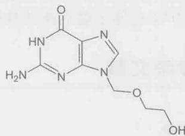

习题 5 请解释为何 PCR（聚合酶链反应）过程中需要在缓冲液内加入氯化镁。

习题 6 请推测为何某些 DNA 聚合酶缺乏外切酶活性却并非 DNA 复制过程中引入错配的主要因素。

习题 7 下图为一个正在进行后随链合成的长链 DNA 模板。短横线代表了两个已经合成好的冈崎片段，请在图中的用字母代表的复制叉处（a

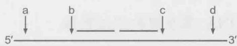

至 d），指出何处将是引发酶合成下一个 RNA 引物的位置，并解释你的选择。

习题 8 下图是真核细胞的一个复制起点。

A. 整个复制过程发生在虚线的哪一边：左，右或者两边？  
B. 在双划线的右边，哪一条模板链（上或下）与DNA聚合酶会是持续复制反应？  
C. 在双划线的左边，哪一条模板链（上或下）的完全复制过程更易被导致DNA连接酶部分功能活化的突变所影响？

习题 9 你想要设计一个实验，起始是一个滑动夹结合在 DNA 上，那么该 DNA 需要什么特性来建立滑动夹子和 DNA 之间的结合？还需要其他什么蛋白组分来确保该结合？

习题10

A. 请解释为何大肠杆菌的基因组的完全复制需要 $40 \mathrm{~min}$ , 但每个细胞的分裂只需要 $20 \mathrm{~min}$ 。  
B. 为何大肠杆菌细胞不需要端粒酶？

习题11

A. 请描述 DNA 解旋酶在复制叉中的作用。
B. 由于 DNA 解旋酶的活性，拓扑异构酶也同样是复制过程中所必需的。请解释拓扑异构酶是如何帮助 DNA 解旋酶更有效地工作。
C. 在 PCR 过程中你并不需要加入 DNA 解旋酶到反应中，请解释原因。

习题 12 在大肠杆菌中，DNA 聚合酶 I 拥有 5' 和 3' 外切酶活性，而 DNA 聚合酶 III 只有 3' 外切酶活性。请解释这两种聚合酶的外切酶活性差异背后的功能学意义。

习题 13 研究者已经将如先天角化不良症等疾病相关的突变定位到编码端粒酶 RNA 组分的 DNA 序列上。请描述端粒酶 RNA 组分的缺陷为何会与疾病相关。

习题 14 回顾框 9-1。利用 ${}^{32}$ P 标记的 dNTP（ ${}^{32}$ P 替代了 dNTP 中的 $\alpha$ 磷酸基）核素掺入实验来检测 DNA 合成。

A. 如果你使用的 dNTP 是标记在 $\beta$ 或 $\gamma$ 磷酸基，你在新合成的 DNA 上将检测不到任何放射活性，请解释原因。

B. 在掺入 ${}^{32}$ P 标记的 dNTP 后、检测 ${}^{32}$ P 的掺入量前还必须先将未掺入的标记 dNTP 与新合成的 DNA 链分离开。解释凝胶电泳作为一种手段是如何将未掺入的标记 dNTP 与新合成的 DNA 分开的。

C. 如框 8-1 图 2 所示的过滤结合过程, 请说出一个能确定过滤已经将未掺入的 ${}^{32}$ P 标记 dNTP 从 DNA 中分离的阴性对照。

#### [W] 附录 2：本章偶数习题答案

问题 2 DNA 合成的基本机制是开始于依赖氢键,引入的核苷酸与 DNA 模板相互作用。一个正确的碱基形成后,3'-OH 引物会启动引入的核苷酸 a-磷酸的一个亲核攻击。焦磷酸被释放,并通过焦磷酸酶水解成两分子磷酸酶。至此引入的核苷酸与模板完成碱基配对,与引物链共价相连。

问题4

A. 脱氧鸟苷。

B. 没有三磷酸基团，无环鸟苷不能并入到不断增长的 DNA 链。激酶使底物磷酸化，还会添加无环鸟苷缺失的磷酸基团。

问题 6 某些 DNA 聚合酶只用在像 DNA 修复这样的特殊过程中。他们往往不是非常连续，也不执行细胞中的大部分 DNA 合成。因此，对这些 DNA 酶来说，校对不是那么重要，校对将插入少量与领先或滞后链的 DNA 聚合酶有关的核苷酸。

问题8

A. 两个都是。复制将在两个方向进行。

B. 底部。底部链作为右边的领先链模板。RNA 引物的 3'端退火并延伸，通过 DNA 聚合酶，能够持续不断地复制到模板的末端。

C. 底部。DNA 合成期间，DNA 连接酶需要在滞后链的冈崎片段之间产生磷酸二酯键。对于滞后链，底链充当模板，因为 DNA 合成必须是不连续的。

问题10

A. 大肠杆菌细胞每分裂一次只复制一次，但当大肠杆菌快速分裂时，在前一轮复制完成之前就开始下一轮的复制。在这些条件下，细胞分裂时间可以低至 20min。

B. 环形大肠杆菌不像线性染色体那样有末端。在这些条件下，大肠杆菌并没有因缺乏端粒酶而在每轮复制之后出现染色体长度缩短的问题，因为其复制机制可以完全复制环形基因组。

问题 12 每个 DNA 聚合酶的 3' 外切核酸酶活性提供 DNA 合成过程中 DNA 聚合酶去除错误核苷酸的能力。DNA 聚合酶 I 具有附加的 5' 外切核酸酶活性以去除 DNA 聚合酶前面的核苷酸。具体而言，此功能有助于 DNA 聚合酶去除 DNA 滞后链上的 RNA 引物。

问题14

A. $\alpha$ -磷酸通过 3'-OH 亲核攻击成为新合成的 DNA 链的一部分。 $\beta$ -或 $\gamma$ -磷酸变成焦磷酸，

焦磷酸后来水解并从未结合到增长的 DNA 链上。

B. 凝胶电泳通过大小来分离分子。标记 ${}^{32}$ P 的 dNTP 要比新合成的 DNA 少得多，并且迁移速度要比任何长链 DNA 快得多。

C. 阴性对照的一个例子是在缺乏 DNA 聚合酶的情况下进行相同的 DNA 合成实验。如何没有新的 DNA 合成，引物:模板交界处将不被标记。如果你正确地筛选包含引物的反应——在带正电荷的膜上模板交界处和标记 ${}^{32}$ P 的 dNTP，你会发现放射性不会粘到过滤器。你可以比较包含 DNA 聚会酶的同样的反应体系。如果你担心标记 ${}^{32}$ P 的 dNTP 结合 DNA 聚合酶的任何可能的影响，你可以在过滤之前进行处理蛋白酶的反应。

<!-- W-END Watson 9 章末 -->

<!-- W-BEGIN Watson 10 章末 -->

### 【中文对照 Watson 第10章章末：小结、参考文献、习题】

> 来源：Watson《基因的分子生物学》第七版中译本（书籍/03_基因的分子生物学_第七版） 第10章 DNA的突变和修复 章末，附录 2 中该章偶数习题答案附后。

#### [W] 小结

只有当生物的 DNA 被忠实地复制，并保护免受可改变其编码特性的化学和物理损伤的时候，生物才能存活。复制精确度的限度和损伤修复的限度是由天然突变概率揭示的。因此，虽然单个碱基的错误概率可在 10 000 倍范围内变化，但是在正常情况下，一个普通的核苷酸被复制 $10^{9}$ 次，才有可能被错误改变约 1 次。复制精确性主要来自 DNA 聚合酶复制模板的方式。正确碱基选择最初是根据互补配对进行的。DNA 聚合酶校正读码的活性增加了精确度。最后，在错配修复中，新合成的 DNA 链被一种酶扫描，然后该酶启动含不正确配对碱基 DNA 的替换过程。尽管有这些安全措施，但是所有类型的错误还是都发生了：碱基替换、小片段和大片段的插入与缺失、DNA 序列的大规模重排。

细胞含有大量用于修复 DNA 损伤的酶储备，这些损伤可能是致命的，或改变 DNA 使其产生有破坏性的突变。有些酶直接逆转 DNA 损伤，如光解酶，其逆转了嘧啶二聚体的结构。更通用的策略是切除修复，即受损的片段被去除，并以未受损的链作为模板合成新的 DNA 将之替换。在碱基切除修复中，DNA 糖基化酶和核酸内切酶只将受损的核苷酸除去；但是在核苷酸切除修复中，含有损伤的一小段单链 DNA 被除去。在 E.coli 中，切除修复是 UvrABC 核酸内切酶启动的，此酶在受损部位产生一个凸起，切去含有损伤的 12 核苷酸 DNA 片段。高等细胞用类似的方式进行核苷酸的切除修复，但是涉及的蛋白质数目更多，而且切除的单链 DNA 为 24\~32 残基长。

最有害的损伤是 DNA 断裂。断裂是由重组或者 DSB 进行修复的，在这个过程中序列根据另外的一个同源的双螺旋进行复制而绕过断裂位点。如果在修复合成中没有模板可用，DNA 断裂会被 NHEJ 通过可能易错的方式将两端重新连接起来而修复。如果细胞需要修复受损的 DNA，移损合成使得细胞对损伤耐受。移损合成使得复制可以绕过阻断 DNA 聚合酶复制进程的损伤而继续进行。移损合成是受到一类特殊的和广泛存在的 DNA 聚合酶家族调控的。该家族能够以一种不准确且不依赖于碱基配对的方式进行 DNA 合成。

由于突变发生及其修复，永久地影响着生物继承的基因，并且因为癌症常常是体细胞突变引起的，所以令我们十分关注。

#### [W] 参考文献

#### [W] 书籍

Friedberg E.C., Walker G.C., Siede W., Wood R.D., Schultz R.A., and Ellenberger T. 2005. DNA repair and mutagenesis. ASM Press, Washington, DC.

Kornberg A. and Baker T.A. 1992. DNA replication, 2nd ed. W.H. Freeman, New York.

#### [W] 复制错误及修复

Kunkel T.A. and Erie D.A. 2005. DNA mismatch repair. Annu, Rev. Biochem. 76: 681–710.

#### [W] DNA 损伤的修复

Bridges B.A. 1999. DNA repair: Polymerases for passing lesions. Curr. Biol. 9; R475–R477.

Citterio E., Verneulen W., and Hoeijmakers J.H. 2000. Transcriptional healing. Cell 101: 447–450.

Daley J.M., Palmbos P.L., Wu D., and Wilson T.E. 2005. Nonhomologous end joining in yeast. Annu. Rev. Genet. 39: 431–451.

de Laat W.L., Jaspers N.G., and Hoeijmakers J.H. 1999. Molecular mechanism of excision nucleotide repair. Genes Dev. 13: 768–785.

Drapkin R., Reardon J.T., Ansari A., Huang J.C., Zawel L., Ahn K., Sancar A., and Reinberg D. 1994. Dual role of TFIIH in DNA

excision repair and in transcription by RNA polymerase II. Nature 368: 769–772.

Kleczkowska H.E., Marra G., Lettieri T., and Jiricny J. 2001. hMSH3 and hMSH6 interact with PCNA and colocalize with it to replication foci. Genes Dev. 15: 724–736.

Lehmann A.R., McGibbon D., and Orphanet M.S. 2011. Xeroderma pigmentosum, J Rare Dis 6: 70.

Sekiguchi J.M. and Ferguson D.O. 2006. DNA double-strand break repair: A relentless hunt uncovers new prey. Cell 124: 260–262.

Silverstein T.D., Johnson R.E., Jain R., Prakash L., Prakash S., and Aggarwal A.K. 2010. Structural basis for the suppression of skin cancers by DNA polymerase η. Nature 465: 1039–1043.

Verhoeven E.E., Wyman C., Moolenaar G.F., and Goosen N. 2002. The presence of two UvrB subunits in the UvrAB complex ensures damage detection in both DNA strands. EMBO J. 21: 4196–4205.

Waters L.S., Minesinger B.K., Wiltrout M.E., D'Souza S., Woodruff R.V., and Walker G.C. 2009. Eukaryotic translesion polymerases and their roles and regulation in DNA damage tolerance. Microbiol. Mol. Biol. Rev. 73; 134–154.

Webster M.P., Jukes R., Zamfir V.S., Kay C.W., Bagnéris C., and Barrett T. 2012. Crystal structure of the UvrB dimer: Insights into the nature and functioning of the UvrAB damage engagement and UvrB-DNA complexes. Nucleic Acids Res. doi: 10.1093/nar/gks633.

#### [W] 习题

#### [W] 偶数习题的答案请参见附录2

习题 1 如果在复制过程中 DNA 聚合酶错误地将一个 C 替换了 T，假设校对和错配修正没有校正这个错配，那么这个突变在下一轮的复制中将导致转换还是颠换？请解释你的选择。

习题 2 请解释为何 DNA 上一个 5-甲基胞嘧啶的脱氨基会比一个胞嘧啶的脱氨基更能导致一个自发性的热点突变？

习题 3 如下图的损伤碱基结构图，请圈出与 DNA 中正常碱基结构的不同之处。请写出导致产生该产物的修饰过程的名称以及你认为的能识别并修复这类 DNA 损伤的 DNA 修复通路。

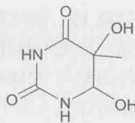

习题 4 以下的术语描述了一个常见的 DNA 修复通路。请将各个步骤按正确的顺序排列。写出大肠杆菌中错配修复、碱基切除修复和核苷酸切除修复通路中的每一步需要的蛋白质名称。

连接，DNA 合成，识别，切除

#### [W] 习题5

A. 请计算在人类细胞的一轮复制过程中可能发生的错配数目。假设人类基因组的大小是32亿个碱基对。

B. 请计算在人类细胞的一轮复制过程中如果不存在错配修复的话可能发生的错配数目。

习题 6 假设在大肠杆菌中发生 dam（编码 Dam 甲基化酶的基因）的功能丧失性突变，请就自发突变可能观测到的表型改变进行预测。简要解释你的回答。

习题 7 请描述通过碱基切除的 3-甲基腺嘌呤修复与由甲基转移酶直接逆转的 $O^{6}$ -甲基鸟嘌呤修复相比可能的优点和缺点。

习题 8 DNA 暴露在化疗药物顺铂下能导致在两个邻近鸟嘌呤间形成 DNA 链间交联。请解释为何两个鸟嘌呤之间的链间交联相比碱基切除修复更适合核苷酸切除修复。

习题 9 请预测一个细胞的转录偶联核苷酸切除修复系统不能正常发挥其功能所会导致的直接后果。

习题 10 除了对 DNA 的损伤耐受外，列出可能导致潜在突变的修复通路。请描述该通路如何导致突变。

习题 11 请解释 DNA 修复与 DNA 损伤耐受之间的差异。

习题 12 假设一个功能缺失性突变发生在核苷酸切除修复和移损合成通路。请预测 DNA 损伤的水平、存活率，以及在 UV 照射后相比野生型的突变发生水平。在下表中，在空白处填入增高、下降或者保持不变。

<table><tr><td>突变途径</td><td>DNA 损伤</td><td>存活率</td><td>诱变</td></tr><tr><td>NER</td><td>——</td><td>——</td><td>——</td></tr><tr><td>移损合成</td><td>——</td><td>——</td><td>——</td></tr></table>

习题 13 你打算检测两株大肠杆菌对 DNA 损伤剂 MMS(甲磺酸甲酯)的敏感度, MMS 是一种能甲基化 DNA 特异碱基的烷化剂。将细胞用一系列剂量的 MMS 处理后（通过将细胞与 MMS 在液体培养基中培养不同时间长度），你将细胞种在固体培养基中进行存活计数（如下表）。请根据表格数据画出两株细菌的散点图（存活率与 MMS 处理剂量的比较）。哪一株细菌对 MMS 更敏感？（请注意在计算单克隆时，你可能需要进行连续稀释法培养，在本例中我们将忽略连续稀释法这个步骤）

<table><tr><td>菌株</td><td>未经MMS处理</td><td>MMS处理5 min</td><td>MMS处理10 min</td></tr><tr><td>菌株A</td><td>254</td><td>251</td><td>249</td></tr><tr><td>菌株B</td><td>325</td><td>253</td><td>189</td></tr></table>

习题 14 有许多报道声称在你日常生活中接触到的一些化学物是致突变剂。你对此很感兴趣，想要研究你常用的化学物是不是能致突变的。

为达到该目的，你选择了 Ames 试验来测试沙门氏菌的 HisG 基因点突变的逆转。你加入一种化学物到细菌的生长培养基中，并假设你在每个突变形成皿上都种了相同的细胞数，你同时计算了化学物处理过和未处理的细胞的存活率。在该实验的存活皿中培养基是非选择性培养基。该实验结果的汇总如下：

<table><tr><td>化合物</td><td>存活率</td><td>回复突变体极目(His+菌落/皿)</td></tr><tr><td>未添加化合物</td><td>100</td><td>28</td></tr><tr><td>化合物A</td><td>50</td><td>1400</td></tr><tr><td>化合物B</td><td>70</td><td>20</td></tr><tr><td>化合物C</td><td>100</td><td>7</td></tr></table>

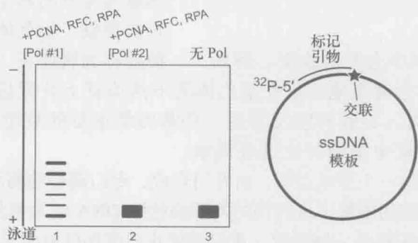

A. 在 Ames 试验中选择性培养皿必须使用何种培养基？请详细解释为何该实验能导致突变的逆转。
B. 最开始你很惊讶地看到逆转发生在你没有加任何化合物的实验组中，但你意识到这是正常的。请给出一个特定的例子解释在没有加入诱变剂的情况下逆转是如何产生的。
C. 哪些化合物你可以鉴定为可能包含了抗诱变剂？请解释你的原因。

习题 15 你设计了一个第 9 章问题中的随访实验。回顾一下实验的设计：你新发现了两种真核细胞的 DNA 聚合酶并且想要了解更多关于它们的特性。一开始，你分别获得了纯化的 DNA 聚合酶蛋白并进行聚合酶持续合成能力的实验。你使用了结合到环状单链 DNA 模版（ssDNA）的 5'端 ${}^{32}$ P 标记的短片段引物，通过接下来的步骤去获得聚合酶 1（Pol #1）和聚合酶 2（Pol #2）各自的聚合酶持续合成能力的测定结果。

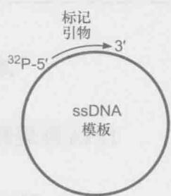

1. 在适宜的缓冲液体系中将带有引物的环形 ssDNA 与 Pol #1 或 Pol #2 在 37℃ 预孵育 5min;

2. 加入 dNTP 和过量的 ssDNA 以引发反应；

3. 在反应持续 10min 后，加入 SDS 终止反应，将样品在变性条件下进行聚丙烯酰胺凝胶电泳（能去掉游离的单核苷酸）。

进行下一步的实验，结果如下图。在该实验中，你分别将 DNA 聚合酶与配体蛋白（PCNA、RFC 和 RPA）和含有两个鸟嘌呤链间交联的 DNA 模板（由顺铂诱导）孵育。交联位点如星标所示（右下图）立即附着于引物的 3' 端。

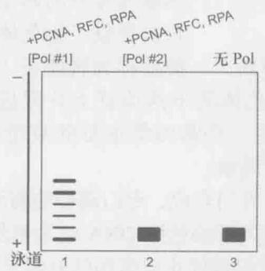

A. 请描述各个 DNA 聚合酶在模板存在顺铂诱导的链间交联情况下的持续合成能力。
B. 根据以上给出数据，请详细指出 DNA 聚合酶 #1 在细胞内可能扮演的角色。

#### [W] 附录 2：本章偶数习题答案

问题 2 胞嘧啶脱氨基产生尿嘧啶。在碱基切除修复过程中的一个特定的糖基化酶可以识别出尿嘧啶，因为它不属于 DNA 组成。如果尿嘧啶仍存在，下一轮复制之后将发生一个突变。5'-甲基胞嘧啶脱氨产生胸腺嘧啶，而且在 DNA 修复过程中不被认作一个错误。在下一轮复制时，5'-甲基胞嘧啶脱氨产生的胸腺嘧啶与腺嘌呤配对并成为一个转换突变。因此，细胞去除尿嘧啶来阻止突变，但并不去除脱氨产生的胸腺嘧啶。

问题4

<table><tr><td>正确顺序</td><td>MMR</td><td>BER</td><td>NER(核酸切除修复)</td></tr><tr><td>识别</td><td>MutS(MutH决定链)</td><td>DNA糖基化酶</td><td>UvrA</td></tr><tr><td>切除</td><td>MutH(被MutL激活)以及Exo VII,RecJ或Exo I</td><td>DNA糖基化酶AP内切核酸酶和外切酶</td><td>UvrC and UvrD(受助于UvrB引发的泡状物)</td></tr><tr><td>DNA合成</td><td>DNA聚合酶III</td><td>DNA聚合酶I</td><td>DNA聚合酶I</td></tr><tr><td>连接</td><td>DNA连接酶</td><td>DNA连接酶</td><td>DNA连接酶</td></tr></table>

问题 6 如果没有一个正常运作的 Dam 甲基化酶，父链在复制过程中将不会被甲基化。没有经过甲基化，MutH 没有办法区分父链和新合成的链。MutH 将以某个频率切割错误链。父链的错配修复将导致自发突变（未被外源诱导）的增加。

问题 8 类似于胸腺嘧啶二聚体,两个鸟嘌呤之间的交叉链扭曲了 DNA 螺旋。这使 NER 蛋白识别扭曲而切除延伸的 DNA,包括铂化合物诱导的交叉链。碱基切除修复只切除一个核苷酸。此外,特定的 DNA 糖基化酶必须识别出 DNA 损伤。没有糖基化酶识别铂化合物诱导的交叉链。

问题 10 非同源末端连接（NHEJ）以引入突变为代价修复双链断裂（DSB）。非同源末端连接（NHEJ）酶处理 DSB 的自由端。通过该处理，两条链结合在一起之前 DNA 序列是丢失或增加的。

问题 12

<table><tr><td>突变通路</td><td>DNA 损害</td><td>存活率</td><td>突变发生</td></tr><tr><td>NER</td><td>增加</td><td>降低</td><td>增加</td></tr><tr><td>转化合成</td><td>保持不变</td><td>降低</td><td>减少</td></tr></table>

相对于野生型，对于 NER 突变体来说，DNA 损伤量增加是因为胸腺嘧啶二聚体没有被有效地修复。通过跨损伤合成的 DNA 损伤耐受并不能修复损伤，所以即使耐受缺失确实导致更多的细胞死亡，DNA 损伤的水平也保持不变。这也是真正的 NER 的损失。NER 突变体细胞中的 DNA 损伤越多，就有越多的突变发生。如果跨损伤合成通路被破坏，将较少发生突变，因为跨损伤合成聚合酶通常有助于发生突变。

问题14

A. 介质必须缺乏组氨酸的选择。只有在 HisG 基因中的原点突变的特定位置的另一个点突变可以导致颠换。此突变一定会改变序列回到基因的野生型序列，使得细胞在缺乏组氨酸的情况下生长。
B. 细胞中的自由基能够破坏 DNA，这样会造成颠换的突变发生。其他通常的过程，像复制错误，碱基的水解攻击作用也会改变 DNA。
C. 化学物 A. 有更多的回复体表明由化学物 A 诱导（与生存有关）的突变频率比对照组（没有加化学物）的更高。
D. 化学物 C. 有较少的回复体表明相对于对照组（没有加化学物），由化学物 C 诱导（与生存有关）的突变频率更低。

<!-- W-END Watson 10 章末 -->

<!-- W-BEGIN Watson 11 章末 -->

### 【中文对照 Watson 第11章章末：小结、参考文献、习题】

> 来源：Watson《基因的分子生物学》第七版中译本（书籍/03_基因的分子生物学_第七版） 第11章 分子水平上的同源重组 章末，附录 2 中该章偶数习题答案附后。

#### [W] 小结

所有的生物都会发生同源重组，以允许遗传交换、染色体上基因重排、断裂 DNA 及停滞复制叉的修复。重组过程涉及 DNA 分子的断裂和重接。同源重组的双链断裂修复途径很好地描述了很多重组事件。依据此模型，启动交换需要两条同源 DNA 分子中的一条具有双链断裂。DNA 的断端被 DNA 降解酶作用，产生单链 DNA 片段。这些单链 DNA 片段参与其同源 DNA 的配对。一旦发生了配对，两条 DNA 分子就被称为 Holliday 联结体的分支结构所连接。在 Holliday 联结体处切断 DNA，以拆分联结体并结束重组。Holliday 联结体可被两种方式剪切：其中一种方法会产生交换产物，即两个亲本 DNA 分子被共价连接；另一种剪切联结体的方法不产生交换产物，而仅是形成一个重组 DNA 的“补丁”。

细胞编码催化所有同源重组步骤的酶。关键酶是链交换蛋白。其中，大肠杆菌的 RecA 是个先例；类 RecA 的蛋白质存在于所有的生命体中。类 RecA 的链交换蛋白促进两条 DNA 分子寻找同源序列和重组中间体的链交换。RecA 以一个大的 DNA——蛋白质复合体（RecA 蛋白丝）发挥功能。真核生物的细胞编码两个链交换蛋白，分别为 Rad51 和 Dmc1。其他重要的重组酶是产生 DNA 双链断裂并启动重组的 DNA 剪切酶。这些蛋白质（Spo11 和 HO）只在真核细胞中出现。作用于 DNA 断端而产生所需要的单链末端的核酸酶，分别是原核生物的 RecBCD 酶和真核生物中的 MRX 酶复合体。此外，还有促进移动（分支移位）和剪切（拆分）Holliday 联结体的其他酶。

减数分裂中，重组对第一次核分裂前同源染色体的正确配对是必不可少的。因此，重组被高度调控以保证发生在所有的染色体上。Spo11 DNA 切割酶和 Dmc1 链交换蛋白都在重组反应中起特异性的作用。同源重组有时也用来调控基因表达。酵母的交配型转换是这种调控的绝佳例证，同时也是一个基因转变的例子。已经有一个被称为依赖合成的链退火（SDSA）的新模型描述一些同源重组事件，该模型是在分析交配型转换机制的过程中产生的。这种机制可以产生基因转变型的遗传交换产物，但不会导致交换的发生。

#### [W] 参考文献

#### [W] 书籍

Brown T.A. 2007. Genomes, 3rd ed. Garland Science, New York.

Griffiths A.J.F., Miller J.H., Suzuki D.T., Lewontin R.C., and Gelbart W.M. 2000. An introduction to genetic analysis, 7th ed. W.H. Freeman, New York.

#### [W] 细菌的重组

Chen Z., Yang H., and Pavletich N.P. 2008. Mechanism of homologous recombination from the RecA-ssDNA/dsDNA structures. Nature 453: 489–494.

Court D.L., Sawitzke J.A., and Thomason L.C. 2002. Genetic engineering using homologous recombination. Annu. Rev. Genet. 36: 361–388.

Cox M.M. 2001. Recombinational DNA repair of damaged replication forks in Escherichia coli: Questions. Annu. Rev. Genet. 35: 53–82.

Kowalczykowski S.C., Dixon D.A., Eggleston A.K., Lauder S.D., and Rehrauer W.M. 1994. Biochemistry of homologous recombination in Escherichia coli. Microbiol. Rev. 58: 401–465.

Lusetti S.L. and Cox M.M. 2002. The bacterial RecA protein and the recombinatorial DNA repair of stalled replication forks. Annu. Rev. Biochem. 71: 71–100.

Smith G.R. 2001. Homologous recombination near and far from DNA breaks: Alternative roles and contrasting views. Annu. Rev. Genet. 35: 243–274.

#### [W] 真核细胞的重组

Bernstein K.A., Gangloff S., and Rothstein R. 2010. The RecQ DNA helicases in DNA repair. Annu. Rev. Genet. 44: 393–417.

Eichler E.E. and Sankoff D. 2003. Structural dynamics of eukaryotic chromosome evolution. Science 301: 793–797.

#### [W] 酵母交配型的转换

Keeney S, 2001. Mechanism and control of meiotic recombination initiation. Curr. Top. Dev. Biol. 52: 1–53.

Page S.L. and Hawley R.S. 2003. Chromosome choreography: The meiotic ballet. Science 301; 785–789.

Pâques F. and Haber J.E. 1999. Multiple pathways of recombination induced by double-strand breaks in Saccharomyces cerevisiae. Microbiol. Mol. Biol. Rev. 63; 349–404.

Pastink A., Eeken J.C., and Lohman P.H. 2001. Genomic integrity and the repair of double-strand DNA breaks. Mutat. Res. 480–481:37–50.

Prado F., Cortes-Ledesma F., Huertas P., and Aguilera A. 2003. Mitotic recombination in Saccharomyces cerevisiae. Curr. Genet. 42: 185–198.

Stracker T.H. and Petrini J.H.J. 2011. The MRE11 complex: Starting from the ends. Nat. Rev. 12: 90–103.

Symington L.S. 2002. Role of RAD52 epistasis group genes in homologous recombination and double-strand break repair. Microbiol. Mol. Biol. Rev. 66: 630–670.

van den Bosch M., Lohman P.H., and Pastink A. 2002. DNA double-strand break repair by homologous recombination. Biol. Chem. 383:873–892.

West S.C. 2003. Molecular views of recombination proteins and their control. Nat. Rev. Mol. Cell Biol. 4: 435–445.

Haber J.E. 2002. Switching of Saccharomyces cerevisiae mating-type genes. In Mobile DNA II (ed. N.L. Craig, et al.), pp. 927–952. ASM Press, Washington, D.C.

Haber J.E. 2012. Mating-type genes and MAT switching in Saccharomyces cerevisiae. Genetics 191; 33–64.

For answers to even-numbered questions, see Appendix 2: Answers.

#### [W] 习题

#### [W] 偶数习题的答案请参见附录2

习题 1 DNA 复制可以通过两种方式导致 DNA 模板发生双链断裂 (DSB)，请解释这两种方式。

习题 2 假设你现在有某特定基因的两个等位基因，请描述该 DNA 的哪些特征可以将二者区分开来？这两个等位基因是同源的吗？

习题 3 在双链断裂（DSB）形成过程中，相应的酶类会对双链 DNA 进行处理形成单链 DNA（图 11-4b 所示）。切割反应的方向（5'→3'或 3'→5'）对该过程会有影响吗？为什么？

习题 4 下图表示的是双链断裂修复同源重组的前三步，其中有一些错误，列出这些错误，并回答：这些错误错在哪里？应该如何纠正？

习题5 什么是“异源双链DNA”？

习题 6 请列举由 RecBCD 催化的不同的酶促活动，并描述每个活性在同源重组（通过双链断裂修复通路）各个步骤中的意义。

习题 7 请解释：为什么基于 RecA 的链互换不能发生在两个同源的、双链的、共价闭合的环状 DNA（cccDNA）之间，而可以发生在两个双链 DNA 分子之间（图 11-8c 所示）？

习题 8 以下图所示的为 Holliday 联接体（Holliday junction）DNA 反应底物（5'端已用 ${}^{32}$ P 进行末端标记），提出一种可被研究人员彩用的分析方案来确定 RuvA 蛋白同

DNA 反应底物的结合。另外，提供一种 DNA 反应底物修饰方案并以此为阴性对照，阐

明 RuvA 结合的特异性方面（用 A、B、C 和 D 来标记用于组装底物的特别的单链 DNA 片段）。

习题 9 请解释在原核生物中没有，但在真核生物中有的，同源重组的最重要的作用。

习题 10 在真核生物中, 细胞是如何产生减数分裂同源重组起始所需要的双链断裂（DSB）的? 请作简要描述。

习题 11 请对基因转换进行定义，并举例说明基因转换发生的机制？

习题 12 请比较接合型转换中使用的合成依赖单链退火和双链断裂修复同源重组的异同。

习题 13 请解释：为什么双链断裂修复同源重组可以发生在任意两个拥有同源性的 DNA 分子之间，而不是拥有特定序列的两个 DNA 分子之间？

习题 14 研究人员表示一种人类蛋白在 Holliday 联结体拆分发挥功能. 他们纯化了该蛋白并把它用在了一个以左下图所示的 DNA 为反应底物的实验中。左下图中的 A、B、C 和 D 表示 4 条 DNA 链，它们的长度都是 60nt，其中只有 A 链的 5'末端进行了 ${}^{32}$ P 标记。研究人员基于该反应底物设置了 3 种反应：（1）不含该蛋白；（2）含有纯化后的蛋白（蛋白质 X）；（3）含有 RecA（作为对照）。反应产物通过变性的聚丙烯酰胺凝胶电泳分离，每种产物各占一条泳道。放射自显影的胶图如右下图所示。

#### [W] 附录 2：本章偶数习题答案

问题 2 由于少部分序列变异而等位基因彼此不同。基因序列的大部分仍是相同的，所以等位基因是同源的。

问题 4 第三步显示 5'端涌入。这是个问题，因为 DNA 聚合酶需要引物模板结合点的 3'-OH 来延伸。为了纠正此问题，第三步应该显示一个 3'端的入侵和适当的蓝色链的碱基修复。

问题 6 RecBCD 包含 DNA 解旋酶及核酸酶活性。特别是，RecB 起到 $3'\rightarrow5'$ DNA 解旋酶和核酸酶的作用，RecD 起 $5'\rightarrow3'$ DNA 解旋酶的作用，RecC 则帮助提高 RecB 和 RecD 的效率。RecC 通过识别并结合 $3'$ 端的 $\chi$ 位点来终止核酸酶活性。RecBCD 在侵入 DNA 双链来产生单链 DNA 时起到了关键作用。

问题 8 DNA 底物可以通过如下的凝胶迁移改变检测（EMSA）得以分析。蛋白 RuvA 与末端标记了的 DNA 底物孵育后的产物用非变性胶来分离，在该胶上应该看到两条带：迁移快的那条带仅仅是 DNA 底物，而迁移慢的带则是与 RuvA 结合在一起的 DNA。在连接点处的一条 DNA（末端 $5^{\prime-32}P$ 标记）可以作为该实验的阴性对照，因为 RucA 不能和单链结合，因而只能看到迁移快的那条带。

问题 10 Spo11 介导 DNA 双链的断裂，它的酪氨酸可以通过断裂磷酸二酯键来切开 DNA。Spo11 通过介导断裂的 DNA 形成共价高能来贮存磷酸二酯键断裂所释放的能量。

问题 12 与 DSB 修复同源重组相同，SDSA 在重组位点的 DSB 处开始，从 5'→3' 切除，在 3' 处断裂作为 DNA 合成的引物。SDSA 与 DSB 修复同源重组的区别在于不能切除 Holliday 叉。随着链的断裂，在 SDSA 中形成完整的复制叉。在 SDSA 中未断裂的 3' 端被移除，新合成的 DNA 被取代，第二次的 DNA 合成完成后导致了基因的转换。

#### [W] 问题14

A. 第二行表明蛋白 X 切除 Holliday 交叉——如 DNA 底物。由于只标记了一条 DNA 链，因而在放射自显影时值能看到一条链。因为全长 DNA 底物是 60nt 而切除后的产物为 31nt，所以切除通常发生在链中心的位置，与“交叉点”大约 90°。第 3 行则表明如所预料的，RecA 并不切除 DNA 底物。

B. 蛋白质 X 的功能与 RuvC 类似。在 E.coli 中，RuvC 以类似与蛋白 X 的方式切除 Holliday 叉。

<!-- W-END Watson 11 章末 -->

<!-- W-BEGIN Watson 12 章末 -->

### 【中文对照 Watson 第12章章末：小结、参考文献、习题】

> 来源：Watson《基因的分子生物学》第七版中译本（书籍/03_基因的分子生物学_第七版） 第12章 位点特异性重组和DNA转座 章末，附录 2 中该章偶数习题答案附后。

#### [W] 小结

尽管 DNA 通常被看成是储存着遗传物质的非常稳定的分子, 它也经历着很多种的重排作用。两类遗传重组——保守性位点特异性重组和转座是造成大多数 DNA 重排的原因。

保守性位点特异性重组发生在 DNA 的特定序列元件上。重组酶蛋白识别这些序列元件，对其进行 DNA 单链切断和重新连接，使包含重组位点的 DNA 片段发生重排。有三种常见的重排类型：DNA 插入、DNA 缺失和 DNA 倒位。这些重排具有很多功能，如病毒感染时将自己的基因组插入到宿主细胞的基因组中、分解 DNA 多聚体，以及改变基因表达。

DNA 上重组位点的结构和 DNA 构筑蛋白的参与决定了某种特定重组反应的结果。构筑蛋白可使得 DNA 片段弯曲，并且对发生在该特定 DNA 区域的重组反应有很大的影响。

有两种保守性位点特异性重组酶家族，它们都是通过一个蛋白质-DNA共价中间体断裂DNA的。对于丝氨酸重组酶而言，这个共价连接是通过一个丝氨酸残基活性位点实现的；而对于酪氨酸重组酶而言，则是通过一个酪氨酸残基活性位点实现的。酪氨酸重组酶的结构揭示出了重组机制的细节。

转座是一类将可移动遗传因子移位到新位点的重组反应，该遗传因子叫转座子。主要有三类转座子：DNA 转座子、类病毒反转录转座子和聚腺苷酸反转录转座子。DNA 转座子在转座周期中始终为 DNA，它的移位机制有两个：切除后由转座子中间体参与的剪切-粘贴机制和复制机制。两类反转录转座子的移动则都要通过一个 RNA 中间体，它们的“反转录”元件的移位需要 RNA 依赖性的 DNA 聚合酶（又叫反转录酶）和一个重组酶蛋白。

所有物种的基因组中都有转座子，它们可能占据了全部 DNA 序列的一大部分，同时它们还是突变和基因组重排的一个主要原因。转座过程往往受到调控，以确保转座子不会对宿主细胞的基因组造成太大的干扰。通常可以观察到的两种调控机制是对转座子拷贝数的控制和对新插入位点的选择。

最后，一个类似转座的机制被用于其他类型的 DNA 重排反应。最显著的例子是 V（D）J 重组反应，它负责在脊椎动物免疫系统的发育中对基因片段进行装配。

#### [W] 参考文献

#### [W] 书籍

Bushman F. 2002. Lateral DNA transfer: Mechanisms and consequences. Cold Spring Harbor Laboratory Press, Cold Spring Harbor, New York.

Craig N.L., Craigie R., Gellert M., and Lambowitz A.M. eds. 2002. Mobile DNA II. American Society for Microbiology, Washington, D.C.

#### [W] 位点特异性重组

Chen Y. and Rice P.A. 2003. New insight into site-specific recombination from FLP recombinase-DNA structures. Annu. Rev. Biophys. Biomol. Struct. 32: 135–159.

Grindley N.D.F., Whiteson K.L., and Rice P.A. 2006. Mechanisms of site-specific recombination. Annu. Rev. Biochem. 75: 567–605.

Hallet B. and Sherratt D.J. 1997. Transposition and site-specific recombination: Adapting DNA cut-and-paste mechanisms to a variety of genetic rearrangements. FEMS Microbiol. Rev. 21: 157–178.

Matthews A.G. and Oettinger M.A. 2009. RAG: A recombinase diversified. Nat. Immunol. 10: 817–821.

Smith M.C. and Thorpe H.M. 2002. Diversity in the serine recombinases. Mol. Microbiol. 44: 299–307.

Yang W. 2010. Topoisomerases and site-specific recombinases: Similarities in structure and mechanism. Crit. Rev. Biochem. Mol. Biol. 45:520–534.

#### [W] 转座

Gueguen E., Rousseau P., Duval-Valentin G., and Chandler M. 2005. The

transpososome: Control of transposition at the level of catalysis. Trends Microbiol. 13: 543–549,

Haren L., Ton-Hoang B., and Chandler M. 1999. Integrating DNA: Transposases and viral integrases. Annu. Rev. Microbiol. 53: 245–281.

Plasterck R. 1995. The Tc1/mariner transposon family. Curr. Top. Microbiol. Immunol. 204: 125–143.

Prak E.T.L. and Kazazian H.H. Jr. 2000. Mobile elements in the human genome. Nat. Rev. Genet. 1: 134–144.

Rebollo R., Romanish M.T., and Mager D.L. 2012. Transposable elements: An abundant and natural source of regulatory sequences for host genes. Annu. Rev. Genet. (in press). doi: 10.1146/annurev-genet-110711-155621.

Rice P.A. and Baker T.A. 2001. Comparative architecture of transposase and integrative complexes. Nat. Struct. Biol. 8: 302–307.

Smit A.F.A. 1999, Interspersed repeats and other mementos of transposable elements in mammalian genomes. Curr. Opin. Genet. Dev. 9:657–663.

#### [W] V(D)J 重组

Fugmann S.D., Lee A.I., Schockett P.E., Villey I.J., and Schatz D.G. 2000. The RAG proteins and V(D)J recombination: Complexes, ends, and transposition. Annu. Rev. Immunol. 18: 495–527.

Gellert M. 2002. V(D)J recombination: RAG proteins, repair factors, and regulation. Annu. Rev. Biochem. 71: 101–132.

Oettinger M.A. 2004. Hairpins at split ends in DNA. Nature 432: 960–961.

#### [W] 习题

#### [W] 偶数习题的答案请参见附录2

习题1 给定一条线性的双链DNA，它包含两个分开的交叉区域，这些区域周围存在一些重组酶识别位点。如果重组的结果是删除或倒位，请描述重组位点的排列方式，并解释为什么这种排列方式决定了重组反应的结果。

习题 2 请解释为什么丝氨酸重组酶和酪氨酸重组酶的催化不需要外部的能量供应，比如 ATP 的水解。

习题 3 请解释位点特异性重组和转座的主要区别。

习题 4 请列举酪氨酸重组酶和丝氨酸重组酶在保守的位点特异性重组反应中的异同。

习题 5 请描述 Cre 重组酶在真核生物基因工程中的优势。

习题 6 λ 噬菌体在感染大肠杆菌的过程中，可以通过整合重组进入溶源态，或通过切出重组进入溶菌态。λ 整合酶是否在整合重组或切出重组，或者同时在两者中发挥作用？请给出答案并解释。

习题 7 请描述鼠伤寒沙门氏菌中 Hin 重组酶催化 DNA 倒位的生物相关性。

习题 8 请解释重组周期中可以区分转座子和逆转录转座子的主要特征。

习题 9 人类基因组可以包含 50% 以上的转座子相关序列，但却并未因此经历较多的、由转座子移动造成的遗传不稳定性，请给出你的解释。

习题 10 请解释为什么科学家使用像 Tn5 这样的转座子作为基因工程工具从细菌或酵母细胞中筛选具有给定表型的突变体。相比于化学诱变产生的变异，这种转座子为什么可以在遗传筛选中能提供一些实验上的优势？

习题 11 研究人员已经发现,用反转录酶抑制因子处理人类肿瘤细胞可以降低肿瘤细胞增殖的速度。请预测为什么反转录酶可以在人类细胞中表达。提出一种假设,解释为什么反转录酶的活性可以同肿瘤细胞关联起来。

习题 12 比较剪切-粘贴型转座和复制型转座的机制。

习题 13 请描述 V（D）J 重组在抗体多样化中的作用，并解释在 V（D）J 重组通路中非同源末端连接为什么是修复双链 DNA 断裂（发夹水解后编码片段的融合）的一种有利机制？

习题 14 因子Ⅷ的缺陷会造成 A 型血友病，这是一种血液类疾病。研究该疾病的研究人员已经对该病的某位患者和该患者的母亲（非血友病患者）的 DNA 进行了评估。他们对长度为 186kb 的因子Ⅷ的基因进行了分析，该基因包括 26 个外显子（见第 14 章）。研究人员使用 Kpn I 和 Sst I 两种限制性核酸内切酶对该基因组进行了酶解，然后又通过凝胶电泳对酶解产物进行了分离，最后他们使用放射性标记的 cDNA 探针对分离的 DNA 进行了探测，这些探针可以同含有因子Ⅷ基因的外显子 14\~26 的片段进行结合。这些片段的大小和相应的外显子如右侧的放射自显影图所示。研究人员的结论是：有一个转座子插入到了因子Ⅷ的一个外显子中。

A. 请描述该患者和其母亲的 Sst I 酶解结果的不同之处。请尽量具体。
B. 请描述该患者和其母亲的 Kpn I 酶解结果的不同之处。请尽量具体。

C. 请提出一种假设来解释我们观察到的差异，这些差异包含了发生转座子插入的因子Ⅷ的外显子。

数据改编自 Kazazian Jr. et al. （1988. Nature 332: 164-166）。

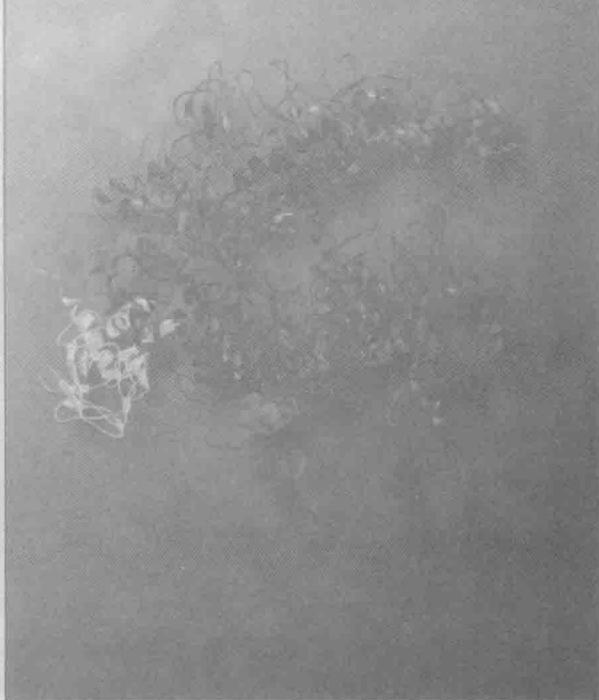

#### [W] 附录 2：本章偶数习题答案

问题 2 重组酶可以储存蛋白-DNA 共价中间物的磷酸二酯键断裂所产生的能量。而一旦有裂解链进攻蛋白质-DNA 共价键，重组酶则可以将断裂的 DNA 链修复。

问题 4 每种重组酶都可以形成共价的重组酶-DNA 中间体，利用 2 个螺旋的 4 条 DNA 链，催化可逆反应，并都包括可以识别并结合 DNA 的 4 个特异位点的 4 个亚基。而每种重组酶在催化这些反应的时候都不需要额外的能量。

第一步,丝氨酸重组酶将 DNA 的 4 条链断裂。酪氨酸重组酶则首先仅仅将 2 条 DNA 链断裂并重新拼接,然后再断裂和拼接另外两条 DNA。第一次断裂拼接可以产生在丝氨酸重组酶机制下不会生成的 Holliday 叉。丝氨酸重组酶机制包括蛋白质-DNA 二聚体的 $180^{\circ}$ 旋转,而酪氨酸重组酶则不具有该 DNA 旋转机制。

问题 6 λInt 在整合和切除重组中起作用，λInt 是一种可以催化 att 位点重组的酪氨酸重组酶。λInt 也可以在 Xis 和 IHF 的帮助下催化切除。

问题 8 DNA 转座子在整个周期中都结合在 DNA 上，而逆转录转座子则只在增殖时瞬间结合在 RNA 上。

问题 10 转座子的插入如 Tn5 插入宿主基因组中一般不是序列特异性的。在剪切粘贴机制中，Tn5几乎是随机的插入目标宿主的基因组中。依据插入位点的不同，该过程有可能会破坏基因的翻译区或者对于基因表达很重要的上游DNA元件。科学家可以筛选出特殊表型的细胞，由于转座子序列是已知的，从而可以鉴定被破坏的基因。而在通过化学诱变来进行的筛选中则很难发现突变的位点。

问题 12 在剪切-粘贴机制中，转座子可以从原来的基因位点上切除，并通过 DNA 链转移机制来袭击并嵌入 DNA 的另一个位点。在复制机制中，转座酶可以破坏转座子每边的一条链，破坏后的链可以袭击并与基因组上其他的目标 DNA 位点结合形成双链分支结构。复制结束后所产生的支状中间体是包含有两个转座子的环状结构。

#### [W] 问题14

A. 该母亲的 Sst I 消化并没有显示出 5.5 kb 片段相应的条带，而是包含了一条 3.2kb 的片段相应的条带。只有包含外显子 14 的片段是不同的，而其他的片段的大小则是相同的。

B. 给患者的 Kpn I 消化并没有显示出 7.3kb 片段相应的条带而是包含了 5.3kb 和 4.3kb 的片段相应的条带。只有包含外显子 14 的片段是不同的，而其他的片段的大小则是相同的。

C. 由于在该患者和母亲的消化物中只有包含外显子14的片段是不同的，所以转座子很可能插入了外显子14中。在Sst I消化下，该患者有一条比目前的3.2kb片段更长的2.3kb的片段。而在Kpn I消化下，该患者则有两条比母亲的7.3kb片段更短的片段，但是这两个较短片段的总和是9.6kb。这些结果可以用转座子（转座子14）嵌入来解释，而转座子DNA本身包括Kpn I识别位点。

<!-- W-END Watson 12 章末 -->

<!-- C-BEGIN Campbell 16 Review -->

### 【英文对应 Campbell 第16章章末：Chapter Review】

> 来源：Campbell Biology（书籍/01_Campbell_Biology） 第16章 Summary of Key Concepts 与 Test Your Understanding。

### [EN] Chapter 16 Review

### [EN] Summary of Key Concepts

To review key terms, go to the Vocabulary Self-Quiz (eTextbook only).

### [EN] Concept 16.1: DNA is the genetic material

\- Experiments with bacteria and with phages provided the first strong evidence that the genetic material is DNA.

organize regions of chromatin where genes are active. The chromatin of each chromosome occupies a specific restricted area within the interphase nucleus, and the chromatin fibers of different chromosomes do not appear to be entangled (Figure 16.24a).

As a cell prepares for mitosis, its chromatin becomes organized into loops and coils, eventually condensing into a characteristic number of short, thick metaphase chromosomes that are distinguishable from each other with the light microscope (Figure 16.24b).

The chromosome is a dynamic structure that is condensed, loosened, modified, and remodeled as necessary for various cell processes, including DNA replication, mitosis, meiosis, and gene expression. Certain chemical modifications of histones affect the state of chromatin condensation and also have multiple effects on gene expression, as you'll see in Concept 18.2.

In this chapter, you have learned how DNA molecules are arranged in chromosomes and how DNA replication provides the copies of genes that parents pass to offspring. However, it is not enough that genes be copied and transmitted; the information they carry must be used by the cell. In other words, genes must also be expressed. In the next chapter, we will examine how the cell expresses the genetic information encoded in DNA.

### [EN] Concept Check 16.3

1. Describe the structure of a nucleosome, the basic unit of DNA packing in eukaryotic cells.

2. How does euchromatin differ from heterochromatin in structure and function?

3. MAKE CONNECTIONS Interphase chromosomes appear to be attached to the nuclear lamina and perhaps also the nuclear matrix. Describe these two structures. See Figure 6.9 and the associated text.

For suggested answers, see Appendix A.

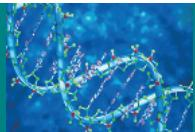

  
What does it mean when we say that the two DNA strands in the double helix are antiparallel? What would an end of the double helix look like if the strands were parallel?

### [EN] Concept 16.2: Many proteins work together in DNA replication and repair

\- The Meselson-Stahl experiment showed that DNA replication is semiconservative: The parental molecule unwinds, and each strand then serves as a template for the synthesis of a new strand according to base-pairing rules.

• DNA replication at one replication fork is summarized here:

\- DNA polymerases proofread new DNA, replacing incorrect nucleotides. In mismatch repair, enzymes correct errors that persist. Nucleotide excision repair is a process by which nucleases cut out and other enzymes replace damaged stretches of DNA.

\- The ends of eukaryotic chromosomal DNA get shorter with each round of replication. The presence of telomeres, repetitive sequences at the ends of linear DNA molecules, postpones the erosion of genes. Telomerase catalyzes the lengthening of telomeres in germ cells.

Compare DNA replication on the leading and lagging strands, including similarities and differences.

### [EN] Concept 16.3: A chromosome consists of a DNA molecule packed together with proteins

\- The chromosome of most bacterial species is a circular DNA molecule with some associated proteins, making up the nucleoid.

\- The chromatin making up a eukaryotic chromosome is composed of DNA, histones, and other proteins. The histones bind to each other and to the DNA to form nucleosomes, the most basic units of DNA packing, which exist as part of the 10-nm fiber. Histone tails extend outward from each bead-like nucleosome core. Additional coiling and folding lead ultimately to the highly condensed chromatin of the metaphase chromosome.

\- Chromosomes occupy restricted areas in the interphase nucleus. In interphase cells, most 10-nm fiber chromatin is loosely arranged (euchromatin), but some is more densely arranged (heterochromatin). Euchromatin, but not heterochromatin, is generally accessible for gene transcription.

Describe the levels of chromatin packing you'd expect to see in an interphase nucleus. For suggested answers, see Appendix A.

### [EN] Test Your Understanding

For more multiple-choice questions, go to the Practice Test (eTextbook only).

### [EN] Levels 1-2: Remembering/Understanding

1. In his work with pneumonia-causing bacteria and mice, Griffith found that

(A) the protein coat from pathogenic cells was able to transform nonpathogenic cells.

(B) heat-killed pathogenic cells caused pneumonia.

(C) some substance from pathogenic cells was transferred to nonpathogenic cells, making them pathogenic.

(D) the polysaccharide coat of bacteria caused pneumonia.

2. What is the basis for the difference in how the leading and lagging strands of DNA molecules are synthesized?

(A) The origins of replication occur only at the $5'$ end.

(B) Helicases and single-strand binding proteins work at the 5' end.

(C) DNA polymerase can join new nucleotides only to the $3'$ end of a pre-existing strand, and the strands are antiparallel.

(D) DNA ligase works only in the $3'\rightarrow5'$ direction.

3. In analyzing the number of different bases in a DNA sample, which result would be consistent with the base-pairing rules?
(A) A = G
(B) A + G = C + T
(C) A + T = G + C
(D) A = C

4. The elongation of the leading strand during DNA synthesis

(A) progresses away from the replication fork.

(B) occurs in the $3'\rightarrow5'$ direction.

(C) produces Okazaki fragments.

(D) depends on the action of DNA polymerase.

5. In a nucleosome, the DNA is wrapped around

(A) histones.

(B) ribosomes.

(C) polymerase molecules.

(D) a thymine dimer.

### [EN] Levels 3-4: Applying/Analyzing

6. E. coli cells grown on ${}^{15}$ N medium are transferred to ${}^{14}$ N medium and allowed to grow for two more generations (two rounds of DNA replication). DNA extracted from these cells is centrifuged. What density distribution of DNA would you expect in this experiment?

(A) one high-density and one low-density band

(B) one intermediate-density band

(C) one high-density and one intermediate-density band

(D) one low-density and one intermediate-density band

7. A student isolates, purifies, and combines in a test tube a variety of molecules needed for DNA replication. When she adds some DNA to the mixture, replication occurs, but each DNA molecule consists of a normal strand paired with numerous segments of DNA a few hundred nucleotides long. What has she probably left out of the mixture?

(A) DNA polymerase

(B) DNA ligase

(C) Okazaki fragments

(D) primase

8. The spontaneous loss of amino groups from adenine in DNA results in hypoxanthine, an uncommon base, opposite thymine. What combination of proteins could repair such damage?

(A) nuclease, DNA polymerase, DNA ligase

(B) telomerase, primase, DNA polymerase

(C) telomerase, helicase, single-strand binding protein

(D) DNA ligase, replication fork proteins, adenylyl cyclase

9. MAKE CONNECTIONS Although the proteins that cause the E. coli chromosome to coil are not histones, what property would you expect them to share with histones, given their ability to bind to DNA (see Figure 5.14)?

### [EN] Levels 5-6: Evaluating/Creating

10. EVOLUTION CONNECTION Some bacteria may be able to respond to environmental stress by increasing the rate at which mutations occur during cell division. How might this be accomplished? Might there be an evolutionary advantage to this ability? Explain.

### [EN] 11. SCIENTIFIC INQUIRY

DRAW IT Model building can be an important part of the scientific process. The illustration shown above is a computer-generated model of a DNA replication complex. The parental and newly synthesized DNA strands are color-coded differently, as are each of the following three proteins: DNA pol III, the sliding clamp, and single-strand binding protein.

(a) Using what you've learned in this chapter to clarify this model, label each DNA strand and each protein.

(b) Draw an arrow to indicate the overall direction of DNA replication.

12. WRITE ABOUT A THEME: ORGANIZATION The continuity of life is based on heritable information in the form of DNA, and structure and function are correlated at all levels of biological organization. In a short essay (100–150 words), describe how the structure of DNA is correlated with its role as the molecular basis of inheritance.

### [EN] 13. SYNTHESIZE YOUR KNOWLEDGE

This image shows DNA (gray double helix) interacting with a computer-generated model of a TAL protein (multicolored ribbons and connecting wires), one of a family of proteins found only in a species of the bacterium Xanthomonas. The bacterium uses proteins like this one to find specific gene sequences in cells of the organisms it infects, such as tomatoes, rice, and citrus fruits. Given what you know about DNA structure and considering the image above, discuss how the TAL protein's structure suggests that it functions.

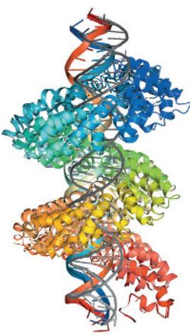

For selected answers, see Appendix A.

<!-- C-END Campbell 16 Review -->

<!-- L-BEGIN Lehninger 24 章末 -->

### 【英文对应 Lehninger 第24章章末：Key Terms、习题与简答】

> 来源：Lehninger Principles of Biochemistry（书籍/02_生物化学原理） 第24章章末及书末 Abbreviated Solutions 第24章。

### [EN] KEY TERMS

Terms in bold are defined in the glossary.

chromosome 885  
phenotype 886  
mutation 886  
gene 886  
regulatory sequence 886  
plasmid 887  
intron 889  
exon 889  
simple-sequence DNA 890  
satellite DNA 890  
centromere 890  
telomere 890  
supercoil 891  
relaxed DNA 891  
topology 891  
linking number 893  
specific linking difference 894  
superhelical density (σ) 894  
topoisomers 894

topoisomerases 895  
catenane 896  
plectonemic 897  
solenoidal 898  
chromatin 899  
histones 899  
nucleosome 899  
histone exchange factors 902  
heterochromatin 903  
topologically associating domains (TADs) 903  
long noncoding RNA (lncRNA) 903  
epigenetic 904  
euchromatin 904  
chromosome territory 904  
Barr body 907  
SMC proteins 908  
cohesins 908  
condensins 908  
nucleoid 909

### [EN] PROBLEMS

1. Packaging of DNA in a Virus Bacteriophage T2 has a DNA of molecular weight $120 \times 10^{6}$ contained in a head about 210 nm long. Calculate the length of the DNA and compare it with the length of the T2 head. Assume the molecular weight of a nucleotide base pair is 650 and that the DNA is in the B form and relaxed.

2. The DNA of Phage M13 The base composition of the DNA within a bacteriophage M13 viral particle is A, 23%; T, 36%; G, 21%; C, 20%. What does this tell you about this DNA molecule?

3. The Mycoplasma Genome The complete genome of the simplest bacterium known, Mycoplasma genitalium, is a circular DNA molecule with 580,070 bp. Calculate the molecular weight and contour length (when relaxed) of this molecule. What is $Lk_0$ for the Mycoplasma chromosome? If $\sigma = -0.06$ , what is $Lk$ ?

4. Size of Eukaryotic Genes An enzyme isolated from rat liver has 192 amino acid residues and is encoded by a gene with 1,440 bp. Explain the relationship between the number of amino acid residues in the enzyme and the number of nucleotide pairs in its gene.

5. Linking Number A closed-circular DNA molecule in its relaxed form has an Lk of 500. Approximately how many base pairs are in this DNA? How is Lk altered (increases, decreases, doesn't change, becomes undefined) when (a) a protein complex binds to form a nucleosome, (b) one DNA strand is broken, (c) DNA gyrase and ATP are added to the DNA solution, or (d) the double helix is denatured by heat?

6. DNA Topology In the presence of a eukaryotic condensin and a bacterial type II topoisomerase, the Lk of a relaxed closed-circular DNA molecule does not change. However, the DNA becomes highly knotted.

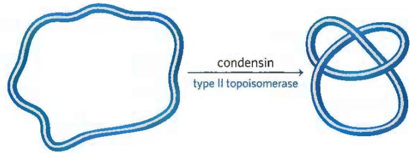

Formation of the knots requires breakage of the DNA, passage of a segment of DNA through the break, and religation by the topoisomerase. Given that every reaction of the topoisomerase would be expected to result in a change in linking number, how can Lk remain the same?

7. Superhelical Density Bacteriophage $\lambda$ infects E. coli by integrating its DNA into the bacterial chromosome. The success of this recombination depends on the topology of the E. coli DNA. When the superhelical density ( $\sigma$ ) of the E. coli DNA is greater than -0.045, the probability of integration is less than 20%; when $\sigma$ is less than -0.06, the probability is >70%. Plasmid DNA isolated from an E. coli culture is found to have a length of 13,800 bp and an Lk of 1,222. Calculate $\sigma$ for this DNA and predict the likelihood that bacteriophage $\lambda$ will be able to infect this culture.

8. Altering Linking Number (a) What is the Lk of a 5,000 bp circular duplex DNA molecule with a nick in one strand? (b) What is the Lk of the molecule in (a) when the nick is sealed (relaxed)? (c) How would the Lk of the molecule in (b) be affected by the action of a single molecule of E. coli topoisomerase I? (d) What is the Lk of the molecule in (b) after eight enzymatic turnovers by a single molecule of DNA gyrase in the presence of ATP? (e) What is the Lk of the molecule in (d) after four enzymatic turnovers by a single molecule of bacterial type I topoisomerase? (f) What is the Lk of the molecule in (d) after binding of one nucleosome core?

9. Chromatin The agarose gel shown, in which the thick bands represent DNA, helped researchers define nucleosome structure. They generated this result by briefly treating chromatin with an enzyme that degrades DNA, then removing all protein and subjecting the purified DNA to electrophoresis. Numbers at the side of the gel denote the position to which a linear DNA of the indicated size would migrate. What does this gel demonstrate about chromatin structure? Why are the DNA bands thick and spread out rather than sharply defined?

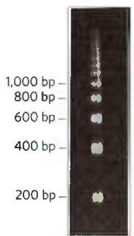  
[Courtesy Dr. Roger D. Kornberg,  
Stanford University School of Medicine.]

10. DNA Structure Explain how the underwinding of a B-DNA helix might facilitate or stabilize the formation of Z-DNA (see Fig. 8-17).

11. Maintaining DNA Structure (a) Describe two structural features required for a DNA molecule to maintain a negatively supercoiled state. (b) List three structural changes that become more favorable when a DNA molecule is negatively supercoiled. (c) What E. coli enzyme, with the aid of ATP, can generate negative superhelicity in DNA? (d) Describe the physical mechanism by which this enzyme acts.

12. Yeast Artificial Chromosomes (YACs) Researchers use YACs to clone large pieces of DNA in yeast cells. What three types of DNA sequence do researchers require to ensure proper replication and propagation of a YAC in a yeast cell?

13. Nucleoid Structure in Bacteria In bacteria, DNA topology affects the transcription of a subset of genes, with expression increasing or (more often) decreasing when the DNA is relaxed. Following cleavage of a bacterial chromosome at a specific site by a restriction enzyme (one that cuts at a long, and thus rare, sequence), only nearby genes (within 10,000 bp) exhibit either an increase or a decrease in expression. The transcription of genes elsewhere in the chromosome is unaffected. Explain. (Hint: See Fig. 24-35.)

14. DNA Topology When DNA is subjected to electrophoresis in an agarose gel, shorter molecules migrate faster than longer ones. Closed-circular DNAs of the same size but with different linking numbers also can be separated on an agarose gel: topoisomers that are more supercoiled, and thus more condensed, migrate faster through the gel. In the gel shown, purified plasmid DNA has migrated from top to bottom. There are two bands, with the faster band much more prominent.

  
[Michael Cox Laboratory.]

(a) What are the DNA species in the two bands? (b) If topoisomerase I were added to a solution of this DNA, what would happen to the upper and lower bands after electrophoresis? (c) If DNA ligase were added to the DNA, would the appearance of the bands change? Explain your answer. (d) If DNA gyrase plus ATP were added to the DNA after the addition of DNA ligase, how would the band pattern change?

15. DNA Topoisomers When DNA is subjected to electrophoresis in an agarose gel, shorter molecules migrate faster than longer ones. Closed-circular DNAs of the same size but different linking number also can be separated on an agarose gel: topoisomers that are more supercoiled, and thus more condensed, migrate faster through the gel—from top to bottom in the two gels shown. An investigator added a dye, chloroquine, to these gels. Chloroquine intercalates between base pairs and stabilizes a more underwound DNA structure. When the dye binds to a relaxed closed-circular DNA, the DNA is underwound where the dye binds, and unbound regions take on positive supercoils to compensate. In the experiment shown here, an investigator used topoisomerases to make preparations of the same DNA circle with different superhelical densities ( $\sigma$ ). Completely relaxed DNA migrated to the position labeled N (for nicked), and highly supercoiled DNA (above the limit where individual topoisomers can be distinguished) migrated to the position labeled X.

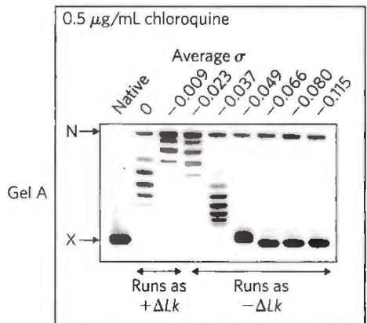

  
[R. P. Bowater (2005), "Supercoiled DNA: structure," in Encyclopedia of Life Sciences, John Wiley & Sons/Wiley InterScience, www.els.net.]

(a) In gel A, why does the $\sigma = 0$ lane (i.e., DNA prepared so that $\sigma = 0$ , on average) have multiple bands?

(b) In gel B, is the DNA from the $\sigma = 0$ preparation positively or negatively supercoiled in the presence of the intercalating dye?

(c) In both gels, the $\sigma = -0.115$ lane has two bands, one a highly supercoiled DNA and one relaxed. Propose a reason for the presence of relaxed DNA in these lanes (and others).

(d) The native DNA (leftmost lane in each gel) is the same DNA circle isolated from bacterial cells and untreated. What is the approximate superhelical density of this native DNA?

16. Nucleosomes The human genome comprises just over 3.1 billion base pairs. Assuming it contains nucleosomes that are spaced as described in this chapter, how many molecules of histone H2A are present in one somatic human cell? (Ignore reductions in H2A due to its replacement in some regions by H2A variants.) How would the number change after DNA replication but before cell division?

17. Bacterial DNA Topoisomerase IV The gene encoding topoisomerase IV in E. coli is essential, even though another type II topoisomerase (topoisomerase II or gyrase) is present. Suggest a reason for the requirement for topoisomerase IV.

18. Chromosome Topology Eukaryotic chromosomes are linear DNA molecules, yet the DNA of a chromosome retains a high level of underwinding (supercoiling) throughout its length. How does the organization of chromosomal DNA into loops called TADs contribute to the maintenance of supercoiling?

### [EN] DATA ANALYSIS PROBLEM

19. Defining the Functional Elements of Yeast Chromosomes Figure 24-7 shows the major structural elements of a chromosome of budding yeast (S. cerevisiae). Heiter, Mann, Snyder, and Davis (1985) determined the properties of some of these elements. They based their study on the finding that in yeast cells, plasmids (which have genes and an origin of replication) act differently from chromosomes (which have these elements plus centromeres and telomeres) during mitosis. The plasmids are not manipulated by the mitotic apparatus and segregate randomly between daughter cells. Without a selectable marker to force the host cells to retain them (see Fig. 9-4), these plasmids are rapidly lost. In contrast, chromosomes, even without a selectable marker, are manipulated by the mitotic apparatus and are lost at a very low frequency (about $10^{-5}$ per cell division).

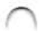

Heiter and colleagues set out to determine the important components of yeast chromosomes by constructing plasmids with various parts of chromosomes and observing whether these "synthetic chromosomes" segregated properly during mitosis. To measure the frequencies of different types of failed chromosome segregation, the researchers needed a rapid assay to determine the number of copies of synthetic chromosomes present in different cells. The assay took advantage of the fact that wild-type yeast colonies are white whereas certain adenine-requiring (ade-) mutants yield red colonies on nutrient media; ade2- cells lack functional AIR carboxylase (the enzyme of step 6a in Fig. 22-35) and accumulate AIR (5-aminoimidazole ribonucleotide) in their cytoplasm, and the excess AIR is converted to a conspicuous red pigment. The other part of the assay involved the gene SUP11, which encodes an ochre suppressor (a type of nonsense suppressor in which a termination codon specifies an amino acid) that suppresses the phenotype of some ade2- mutants.

Heiter and coworkers started with a diploid strain of yeast homozygous for ade2 $^{-}$ ; these cells are red. When the mutant cells contain one copy of SUP11, the metabolic defect is partly suppressed and the cells are pink. When the cells contain two or more copies of SUP11, the defect is completely suppressed and the cells are white.

The researchers inserted one copy of SUP11 into synthetic chromosomes containing various elements thought to be important in chromosome function, and then observed how well these chromosomes were passed from one generation to the next. These pink cells were plated on nonselective media, and the behavior of the synthetic chromosomes was observed. Heiter and coworkers looked for colonies in which the synthetic chromosomes segregated improperly at the first division after plating, giving rise to a colony that was half one genotype and half the other. Because yeast cells are nonmotile, this would be a sectored colony, with one half one color and the other half another color.

(a) One way for the mitotic process to fail is nondisjunction: the chromosome replicates but the sister chromatids fail to separate, so both copies of the chromosome end up in the same daughter cell. Explain how nondisjunction of the synthetic chromosome would give rise to a colony that is half red and half white.

(b) Another way for the mitotic process to fail is chromosome loss: the chromosome does not enter the daughter nucleus or is not replicated. Explain how loss of the synthetic chromosome would give rise to a colony that is half red and half pink.

By counting the frequency of the different colony types, Heiter and colleagues could estimate the frequency of these aberrant mitotic events with different types of synthetic chromosome. First, they explored the requirement for centromeric sequences by constructing synthetic chromosomes with DNA fragments of different sizes containing a known centromere. Their results are shown here.

<table><tr><td>Synthetic chromosome</td><td>Size of centromere-containing fragment (kbp)</td><td>Chromosome loss (%)</td><td>Nondisjunction (%)</td></tr><tr><td>1</td><td>None</td><td>—</td><td>&gt;50</td></tr><tr><td>2</td><td>0.63</td><td>1.6</td><td>1.1</td></tr><tr><td>3</td><td>1.6</td><td>1.9</td><td>0.4</td></tr><tr><td>4</td><td>3.0</td><td>1.7</td><td>0.35</td></tr><tr><td>5</td><td>6.0</td><td>1.6</td><td>0.35</td></tr></table>

(c) Based on these data, what can you conclude about the size of the centromere required for normal mitotic segregation? Explain your reasoning.

(d) All the synthetic chromosomes created in these experiments were circular and lacked telomeres. Explain how they could be replicated more-or-less properly.

Heiter and colleagues next constructed a series of linear synthetic chromosomes that included the functional centromeric sequence and telomeres, and they measured the total mitotic error frequency (\% loss + \% nondisjunction) as a function of size.

<table><tr><td>Synthetic chromosome</td><td>Size (kbp)</td><td>Total error frequency (%)</td></tr><tr><td>6</td><td>15</td><td>11.0</td></tr><tr><td>7</td><td>55</td><td>1.5</td></tr><tr><td>8</td><td>95</td><td>0.44</td></tr><tr><td>9</td><td>137</td><td>0.14</td></tr></table>

(e) Based on these data, what can you conclude about the chromosome size required for normal mitotic segregation? Explain your reasoning.

(f) Normal yeast chromosomes are linear, range from 250 kbp to 2,000 kbp in length, and, as noted above, have a mitotic error frequency of about $10^{-5}$ per cell division. Extrapolating the results from (e), do the centromeric and telomeric sequences used in these experiments explain the mitotic stability of normal yeast chromosomes, or must other elements be involved? Explain your reasoning. (Hint: A plot of log of error frequency vs. length will be helpful.)

### [EN] Reference

Heiter, P., C. Mann, M. Snyder, and R.W. Davis. 1985. Mitotic stability of yeast chromosomes: A colony color assay that measures nondisjunction and chromosome loss. Cell 40:381–392.

### [EN] Abbreviated Solutions — Chapter 24

1. $6.1 \times 10^{4}$ nm; 290 times longer than the T2 phage head

2. The number of A residues does not equal the number of T residues, nor does the number of G equal the number of C, so the DNA is not a base-paired double helix; the M13 DNA is single-stranded.

3. $M_{r} = 3.8 \times 10^{8}$ ; length = 200 $\mu$ m; $Lk_{0} = 55, 200$ ; Lk = 51, 900

4. The exons contain 3 bp/amino acid × 192 amino acids = 576 bp. The remaining 864 bp are in introns, possibly in a leader or signal sequence, and/or in other noncoding DNA.

5. 5,000 bp. (a) Doesn't change; Lk cannot change without breaking and re-forming the covalent backbone of the DNA. (b) Becomes undefined; a circular DNA with a break in one strand has, by definition, no Lk. (c) Decreases; in the presence of ATP, gyrase underwinds DNA. (d) Doesn't change; this assumes that neither of the DNA strands is broken in the heating process.

6. For Lk to remain unchanged, the topoisomerase must introduce the same number of positive and negative supercoils.

7. $\sigma = -0.067; > 70\%$ probability

8. (a) Undefined; the strands of a nicked DNA could be separated and thus have no Lk. (b) 476 (c) The DNA is already relaxed, so the topoisomerase does not cause a net change; Lk = 476. (d) 460; gyrase plus ATP reduces the Lk in increments of 2. (e) 464; eukaryotic type 1 topoisomerases increase the Lk of underwound or negatively supercoiled DNA in increments of 1. (f) 460; nucleosome binding does not break any DNA strands and thus cannot change Lk.

9. A fundamental structural unit in chromatin repeats about every 200 bp; the DNA is accessible to the nuclease only at 200 bp intervals. The brief treatment was insufficient to cleave the DNA at every accessible point, so a ladder of DNA bands is created in which the DNA fragments are multiples of 200 bp. The thickness of the DNA bands suggests that the distance between cleavage sites varies somewhat. For instance, not all the fragments in the lowest band are exactly 200 bp long.

10. A right-handed helix has a positive Lk; a left-handed helix (such as Z-DNA) has a negative Lk. Decreasing the Lk of a closed circular B-DNA by underwinding facilitates formation of regions of Z-DNA within certain sequences. (See Chapter 8, p. 273, for a description of sequences that permit the formation of Z-DNA.)

11. (a) Both strands must be covalently closed, and the molecule must be either circular or constrained at both ends. (b) Formation of cruciforms, left-handed Z-DNA, plectonemic or solenoidal supercoils, and unwinding of the DNA are favored. (c) E. coli DNA topoisomerase II or DNA gyrase (d) It binds the DNA at a point where it crosses on itself, cleaves both strands of one of the crossing segments, passes the other segment through the break, then reseals the break. The result is a change in Lk of -2.

12. Centromere, telomeres, and an autonomous replicating sequence or replication origin

13. The bacterial nucleoid is organized into domains approximately 10,000 bp long. Cleavage by a restriction enzyme relaxes the DNA within a domain, but not outside the domain. Any gene in the cleaved domain for which expression is affected by DNA topology will be affected by the cleavage; genes outside the domain will not.

14. (a) The lower, faster-migrating band is negatively supercoiled plasmid DNA. The upper band is nicked, relaxed DNA. (b) DNA topoisomerase I would relax the supercoiled DNA. The lower band would disappear, and all of the DNA would converge on the upper band. (c) DNA ligase would produce little change in the pattern. Some minor additional bands might appear near the upper band, due to the trapping of topoisomers not quite perfectly relaxed by the ligation reaction. (d) The upper band would disappear, and all of the DNA would be in the lower band. The supercoiled DNA in the lower band might become even more supercoiled and migrate somewhat faster.

15. (a) When DNA ends are sealed to create a relaxed, closed circle, some DNA species are completely relaxed but others are trapped in slightly underwound or overwound states. This gives rise to a distribution of topoisomers centered on the most relaxed species. (b) Positively supercoiled (c) The DNA that is relaxed despite the addition of dye is DNA with one or both strands broken. DNA isolation procedures inevitably introduce small numbers of strand breaks in some of the closed-circular molecules. (d) -0.05. This is determined by simply comparing native DNA with samples of known $\sigma$ . In both gels, the native DNA migrates most closely with the sample of $\sigma = -0.049$ .

16. 62 million (the genome refers to the haploid genetic content of the cell; the cell is actually diploid, so the number of nucleosomes is doubled). The number is obtained by dividing 3.1 billion bp by 200 bp/nucleosome (giving 15.5 million nucleosomes), multiplying by 2 copies of H2A per nucleosome, and again multiplying by 2 to account for the diploid state of the cell. The 62 million would double upon replication.

17. DNA topoisomerase IV is needed to decatenate the two circular chromosome products of DNA replication prior to cell division.

18. A TAD, or topologically associating domain, is a DNA loop that is bound and constrained at its base. Supercoiling within the TAD is maintained in part by the restriction to free DNA rotation imposed by the protein binding at the base of the loop.

19. (a) In nondisjunction, one daughter cell and all of its descendants get two copies of the synthetic chromosome and are white; the other daughter cell and all of its descendants get no copies of the synthetic chromosome and are red. This gives rise to a half-white, half-red colony. (b) In chromosome loss, one daughter cell and all of its descendants get one copy of the synthetic chromosome and are pink; the other daughter cell and all of its descendants get no copies of the synthetic chromosome and are red. This gives rise to a half-pink, half-red colony. (c) The minimum functional centromere must be smaller than 0.63 kbp, because all fragments of this size or larger confer relative mitotic stability. (d) Telomeres are required to fully replicate only linear DNA; a circular molecule can replicate without them.

(f)  

(e) The larger the chromosome, the more faithfully it is segregated. The data show neither a minimum size below which the synthetic chromosome is completely unstable nor a maximum size above which stability no longer changes.

  
As shown in the graph, even if the synthetic chromosomes were as long as the normal yeast chromosomes, they would not be as stable. This suggests that other, as yet undiscovered, elements are required for stability.

<!-- L-END Lehninger 24 章末 -->

<!-- L-BEGIN Lehninger 25 章末 -->

### 【英文对应 Lehninger 第25章章末：Key Terms、习题与简答】

> 来源：Lehninger Principles of Biochemistry（书籍/02_生物化学原理） 第25章章末及书末 Abbreviated Solutions 第25章。

### [EN] KEY TERMS

Terms in bold are defined in the glossary.

template 915
semiconservative
replication 915
replication fork 916
origin 916
Okazaki fragment 916
leading strand 916
lagging strand 916
nucleases 916
exonucleases 916
endonucleases 916
DNA polymerases 916
DNA polymerase I 916
primer 917
primer terminus 917
processivity 917
proofreading 919
DNA polymerase III 919
replisome 921
helicases 921
topoisomerases 922
primases 922
DNA ligases 922
DNA unwinding element (DUE) 922
AAA+ ATPases 922
catenane 927
prereplicative complex (pre-RC) 928
licensing 928
minichromosome maintenance (MCM) protein 928
ORC (origin recognition complex) 928

DNA polymerase ε 929
DNA polymerase δ 929
DNA polymerase α 929
mutation 930
DNA glycosylases 934
base-excision repair 934
AP site 935
abasic site 935
AP endonucleases 935
DNA photolyases 937
error-prone translesion DNA synthesis 939
SOS response 939
homologous genetic recombination 940
site-specific recombination 940
DNA transposition 940
recombinational DNA repair 941
branch migration 942
Holliday intermediate 942

replication restart
primosome 943

double-strand break repair model 947

nonhomologous end joining (NHEJ) 948
transposon 951
transposition 952
insertion sequence 952

### [EN] PROBLEMS

1. DNA Replication An investigator adds DNA polymerase III holoenzyme, DNA primase (DnaG), single-stranded DNA-binding protein (SSB), an ATP-dependent DNA ligase, and the replicative helicase (DnaB) to each of the DNA substrates shown, along with ATP and all four dNTPs. The length of DNA in the circle in structure 1 is 10,000 bp. The linear (unbranched) part of structure 2 is 20,000 bp long.

(a) If precursor (dNTP) concentrations are not limiting, Okazaki fragments are 2,000 nucleotides long, and replication proceeds at 1,000 nucleotides/s for 30 seconds, which DNA substrate will generate a longer replication product?

(b) For structure 1, draw the product of this 30 second replication. (c) Draw the expected product if DnaG were left out of the reaction. (d) Draw the expected product if DNA ligase were instead left out of the reaction.

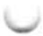

2. Heavy Isotope Analysis of DNA Replication A researcher switches a culture of E. coli growing in a medium containing ${}^{15}NH_{4}Cl$ to a medium containing ${}^{14}NH_{4}Cl$ for three generations (an eightfold increase in population). What is the molar ratio of hybrid DNA ( ${}^{15}N-{}^{14}N$ ) to light DNA ( ${}^{14}N-{}^{14}N$ ) at this point?

3. Replication of the E. coli Chromosome The E. coli chromosome contains 4,641,652 bp.

(a) How many turns of the double helix must be unwound during replication of the E. coli chromosome?

(b) Using the data in this chapter, how long would it take to replicate the E. coli chromosome at $37\ ^{\circ}C$ if two replication forks proceeded from the origin? Assume replication occurs at a rate of 1,000 bp/s. Under some conditions, E. coli cells can divide every 20 min. How might this be possible?

(c) In the replication of the E. coli chromosome, about how many Okazaki fragments would be formed? What factors are required to link together newly synthesized Okazaki fragments in the lagging strand?

4. Base Composition of DNAs Made from Single-Stranded Templates Predict the base composition of the total DNA synthesized by DNA polymerase on templates provided by an equimolar mixture of the two complementary strands of bacteriophage $\phi$ X174 DNA (a circular DNA molecule). The base composition of one strand is A, 24.7%; G, 24.1%; C, 18.5%; and T, 32.7%. What assumption is necessary to answer this problem?

5. DNA Replication Kornberg and his colleagues incubated soluble extracts of E. coli with a mixture of dATP, dTTP, dGTP, and dCTP, all labeled with ${}^{32}$ P in the $\alpha$ -phosphate group. After a time, they treated the incubation mixture with trichloroacetic acid, which precipitates the DNA but not the nucleotide precursors. They then collected the precipitate and determined the extent of precursor incorporation into DNA from the amount of radioactivity present in the precipitate.

(a) If any one of the four nucleotide precursors were omitted from the incubation mixture, would radioactivity be found in the precipitate? Explain.

(b) Would ${}^{32}$ P be incorporated into the DNA if only dTTP were labeled? Explain.

(c) Would radioactivity be found in the precipitate if ${}^{32}$ P labeled the $\beta$ phosphate or $\gamma$ phosphate rather than the $\alpha$ phosphate of the deoxyribonucleotides? Explain.

6. The Chemistry of DNA Replication All DNA polymerases synthesize new DNA strands in the 5'→3' direction. In some respects, replication of the antiparallel strands of duplex DNA would be simpler if there were also a second type of polymerase, one that synthesized DNA in the 3'→5' direction. The two types of polymerase could, in principle, coordinate DNA synthesis without the complicated mechanics required for lagging strand replication. However, no such 3'→5'-synthesizing enzyme has been found. Suggest two possible mechanisms for 3'→5' DNA synthesis. Pyrophosphate should be one product of both proposed reactions. Could one or both mechanisms be supported in a cell? Why or why not? (Hint: You may suggest the use of DNA precursors not actually present in extant cells.)

7. Activities of DNA Polymerases You are characterizing a new DNA polymerase. When you incubate the enzyme with ${}^{32}$ P-labeled DNA and no dNTPs, you observe the release of $[{}^{32}\mathrm{P}]$ dNMPs. The addition of unlabeled dNTPs prevents this release. Explain the reactions that most likely underlie these observations. What would you expect to observe if you added pyrophosphate instead of dNTPs?

8. Leading and Lagging Strands Prepare a table that lists the names and compares the functions of the precursors, enzymes, and other proteins needed to make the leading strand versus the lagging strand during DNA replication in E. coli.

9. Function of DNA Ligase Some E. coli mutants contain defective DNA ligase. When researchers expose these mutants to ${}^{3}$ H-labeled thymine and then sediment the DNA produced on an alkaline sucrose density gradient, two radioactive bands appear. One corresponds to a high molecular weight fraction, the other to a low molecular weight fraction. Explain.

10. Fidelity of Replication of DNA What factors promote the fidelity of replication during synthesis of the leading strand of DNA? Would you expect the lagging strand to be made with the same fidelity? Give reasons for your answers.

11. Importance of DNA Topoisomerases in DNA Replication DNA unwinding, such as that occurring in replication, affects the superhelical density of DNA. In the absence of topoisomerases, the DNA would become overwound ahead of a replication fork as the DNA is unwound behind it. A bacterial replication fork will stall when the superhelical density ( $\sigma$ ) of the DNA ahead of the fork reaches +0.14 (see Chapter 24).

An investigator initiates bidirectional replication at the origin of a 6,000 bp plasmid in vitro, in the absence of topoisomerases. The plasmid initially has a $\sigma$ of $-0.06$ . How many base pairs will be unwound and replicated by each replication fork before the forks stall? Assume that both forks travel at the same rate and that each includes all components necessary for elongation except topoisomerase.

12. The Ames Test In a nutrient medium that lacks histidine, a thin layer of agar containing $\sim10^{9}$ Salmonella typhimurium histidine auxotrophs (mutant cells that require histidine to survive) produces $\sim13$ colonies over a two-day incubation period at 37 °C (see Fig. 25-19). How do these colonies arise in the absence of histidine? When investigators repeat the experiment in the presence of 0.4 $\mu$ g of 2-aminoanthracene, the number of colonies produced over two days exceeds 10,000. What does this indicate about 2-aminoanthracene? What can you surmise about its carcinogenicity?

13. DNA Repair Mechanisms Vertebrate and plant cells often methylate cytosine in DNA to form 5-methylcytosine (see Fig. 8-5a). In these same cells, a specialized repair system recognizes G-T mismatches and repairs them to G≡C base pairs. How might this repair system be advantageous to the cell? (Explain in terms of the presence of 5-methylcytosine in the DNA.)

14. The Energetic Cost of Mismatch Repair In an E. coli cell, DNA polymerase III makes a rare error and inserts a G opposite an A residue at a position 650 bp away from the nearest GATC sequence. The mismatch repair system accurately repairs the mismatch. How many phosphodiester bonds derived from deoxynucleotides (dNTPs) does this repair expend? This process also uses ATP molecules. Which enzyme(s) consume the ATP?

15. DNA Repair in People with Xeroderma Pigmentosum The condition known as xeroderma pigmentosum (XP) arises from mutations in at least seven different human genes (see Box 25-1). The deficiencies are generally in genes encoding enzymes involved in some part of the pathway for human nucleotide-excision repair. The various types of XP are denoted A through G (XPA, XPB, etc.), with a few additional variants lumped under the label XPV.

Investigators irradiate cultures of fibroblasts from healthy individuals and from patients with XPG with ultraviolet light. After isolating and denaturing the DNA, they characterize the resulting single-stranded DNA by analytical ultracentrifugation. (a) Samples from the normal fibroblasts show a significant reduction in the average molecular weight of the single-stranded DNA after irradiation, but samples from the XPG fibroblasts show no such reduction. Why might this be?

(b) If you assume that a nucleotide-excision repair system is operative in fibroblasts, which step might be defective in the cells from the patients with XPG? Explain.

16. DNA Repair and Cancer Many pharmaceuticals used for tumor chemotherapy are DNA damaging agents. What is the rationale behind actively damaging DNA to address tumors? Why do such treatments often have a greater effect on a tumor than on healthy tissue?

17. Direct Repair Cells normally repair the lesion $O^{6}$ -meG by directly transferring the methyl group to the protein $O^{6}$ -methylguanine-DNA methyltransferase. For the nucleotide sequence AAC( $O^{6}$ -meG)TGCAC, with a damaged (methylated) G residue, what would be the sequence of both strands of double-stranded DNA resulting from replication in each of the situations listed?

(a) Replication occurs before repair.

(b) Replication occurs after repair.

(c) Two rounds of replication occur, followed by repair.

18. Strand Invasion in Recombination A key step in many homologous recombination reactions is strand invasion (see step 2 in Fig. 25-29). In almost every case, strand invasion proceeds with a single strand that has a free 3' end rather than a 5' end. What DNA metabolic advantage is inherent with the use of a free 3' end for strand invasion?

19. Holliday Intermediates How does the formation of Holliday intermediates in homologous genetic recombination differ from their formation in site-specific recombination?

20. Cleavage of Holliday Intermediates A Holliday intermediate forms between two homologous chromosomes, at a point between genes $A$ and $B$ , as shown. The chromosomes have different alleles of the two genes ( $A$ and $a$ , $B$ and $b$ ). Where would the Holliday intermediate have to be cleaved (points X and/or Y) to generate a chromosome that would carry (a) an Ab genotype or (b) an ab genotype?

21. A Connection between Replication and Site-Specific Recombination Most wild strains of S. cerevisiae have multiple copies of the circular DNA plasmid $2\mu$ (named for its contour length of about $2\mu m$ ), which has $\sim6,300$ bp. For its replication, the plasmid uses the host replication system, under the same strict control as the host cell chromosomes, replicating only once per cell cycle. Replication of the plasmid is bidirectional, with both replication forks initiating at a single, well-defined origin. However, one replication cycle of a $2\mu$ plasmid can result in more than two copies of the plasmid, allowing amplification of the plasmid copy number (number of plasmid copies per cell) whenever plasmid segregation at cell division leaves one daughter cell with fewer than the normal complement of plasmid copies. Amplification requires a site-specific recombination system encoded by the plasmid, which serves to invert one part of the plasmid relative to the other. Explain how a site-specific inversion event could result in amplification of the plasmid copy number. (Hint: Consider the situation when replication forks have duplicated one recombination site but not the other.)

### [EN] DATA ANALYSIS PROBLEM

22. Mutagenesis in Escherichia coli Many mutagenic compounds act by alkylating the bases in DNA. The alkylating agent R7000 (7-methoxy-2-nitronaphtho[2,1-b]furan) is an extremely potent mutagen.

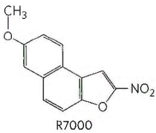

In vivo, R7000 is activated by the enzyme nitroreductase, and this more reactive form covalently attaches to DNA—primarily, but not exclusively, to G≡C base pairs.

In a 1996 study, Quillardet, Touati, and Hofnung explored the mechanisms by which R7000 causes mutations in E. coli. They compared the genotoxic activity of R7000 in two strains of E. coli: the wild-type (Uvr $^{+}$ ) and mutants lacking uvrA activity (Uvr $^{-}$ ). They first measured rates of mutagenesis. Rifampicin is an inhibitor of RNA polymerase. In its presence, cells will not grow unless certain mutations occur in the gene encoding RNA polymerase; the appearance of rifampicin-resistant colonies thus provides a useful measure of mutagenesis rates.

The investigators determined the effects of different concentrations of R7000. Their results are shown in the following graph:

  
(a) Why are some mutants produced even when no R7000 is present?

Quillardet and colleagues also measured the survival rate of bacteria treated with different concentrations of R7000, with the following results:

  
(b) Explain how treatment with R7000 is lethal to cells.

(c) Explain the differences in the mutagenesis curves and in the survival curves for the two types of bacteria, Uvr $^{+}$ and Uvr $^{-}$ , as shown in the graphs.

The researchers went on to measure the amount of R7000 covalently attached to the DNA in Uvr $^{+}$ and Uvr $^{-}$ E. coli. They incubated bacteria with [ $^{3}$ H]R7000 for 10 or 70 minutes, extracted the DNA, and measured its $^{3}$ H content in counts per minute (cpm) per microgram of DNA.

$^{3}$ H in DNA (cpm/ $\mu$ g)

<table><tr><td>Time (min)</td><td>Uvr+</td><td>Uvr-</td></tr><tr><td>10</td><td>76</td><td>159</td></tr><tr><td>70</td><td>69</td><td>228</td></tr></table>

(d) Explain why the amount of ${}^{3}H$ drops over time in the Uvr $^{+}$ strain and rises over time in the Uvr $^{-}$ strain.

Quillardet and colleagues then examined the particular DNA sequence changes caused by R7000 in the Uvr $^{+}$ and Uvr $^{-}$ bacteria. For this, they used six different strains of E. coli, each with a different point mutation in the lacZ gene, which encodes $\beta$ -galactosidase. Cells with any of these mutations have a nonfunctional $\beta$ -galactosidase and are unable to metabolize lactose (i.e., a Lac $^{-}$ phenotype). Each type of point mutation required a specific reverse mutation to restore lacZ gene function and Lac+ phenotype. By plating cells on a medium containing lactose as the sole carbon source, the researchers selected for these reverse-mutated, Lac+ cells. And by counting the number of Lac+ cells following mutagenesis of a particular strain, they could measure the frequency of each type of mutation.

First, they looked at the mutation spectrum in Uvr $^{-}$ cells. The following table shows the results for the six strains, CC101 through CC106 (with the point mutation required to produce Lac $^{+}$ cells indicated in parentheses).

Number of Lac $^{+}$ cells (average ± SD)

<table><tr><td>R7000 (μg/mL)</td><td>CC101 (A=T to C≡G)</td><td>CC102 (G≡C to A=T)</td><td>CC103 (G≡C to C≡G)</td><td>CC104 (G≡C to T=A)</td><td>CC105 (A=T to T=A)</td><td>CC106 (A=T to G≡C)</td></tr><tr><td>0</td><td>6±3</td><td>11±9</td><td>2±1</td><td>5±3</td><td>2±1</td><td>1±1</td></tr><tr><td>0.075</td><td>24±19</td><td>34±3</td><td>8±4</td><td>82±23</td><td>40±14</td><td>4±2</td></tr><tr><td>0.15</td><td>24±4</td><td>26±2</td><td>9±5</td><td>180±71</td><td>130±50</td><td>3±2</td></tr></table>

(e) Which types of mutation show significant increases above the background rate due to treatment with R7000? Provide a plausible explanation for why some have higher frequencies than others.

(f) Can all of the mutations you listed in (e) be explained as resulting from covalent attachment of R7000 to a G≡C base pair? Explain your reasoning.

(g) Figure 25-26b shows how methylation of guanine residues can lead to a G≡C to A=T mutation. Using a similar pathway, show how an R7000-G adduct could lead to the G≡C to A=T or T=A mutations shown above. Which base pairs with the R7000-G adduct?

The results for the Uvr $^{+}$ bacteria are shown in the following table.

Number of Lac $^{+}$ cells (average ± SD)

<table><tr><td>R7000 (μg/mL)</td><td>CC101 (A=T to C≡G)</td><td>CC102 (G≡C to A=T)</td><td>CC103 (G≡C to C≡G)</td><td>CC104 (G≡C to T=A)</td><td>CC105 (A=T to T=A)</td><td>CC106 (A=T to G≡C)</td></tr><tr><td>0</td><td>2±2</td><td>10±9</td><td>3±3</td><td>4±2</td><td>6±1</td><td>0.5±1</td></tr><tr><td>1</td><td>7±6</td><td>21±9</td><td>8±3</td><td>23±15</td><td>13±1</td><td>1±1</td></tr><tr><td>5</td><td>4±3</td><td>15±7</td><td>22±2</td><td>68±25</td><td>67±14</td><td>1±1</td></tr></table>

(h) Do these results show that all mutation types are repaired with equal fidelity? Provide a plausible explanation for your answer.

### [EN] Reference

Quillardet, P., E. Touati, and M. Hofnung. 1996. Influence of the uvr-dependent nucleotide-excision repair on DNA adducts formation and mutagenic spectrum of a potent genotoxic agent: 7-methoxy-2-nitronaphtho[2,1-b]furan (R7000). Mutat. Res. 358:113–122.

### [EN] Abbreviated Solutions — Chapter 25

1. (a) Structure 1

2. This is an extension of the classic Meselson-Stahl experiment. After three generations the molar ratio of ${}^{15}N-{}^{14}N$ DNA to ${}^{14}N-{}^{14}N$ DNA is 2/6 = 0.33.

3. (a) $4.42 \times 10^{5}$ turns (b) 40 min. In cells dividing every 20 min, a replicative cycle is initiated every 20 min, each cycle beginning before the prior one is complete. (c) 2,000 to 5,000 Okazaki fragments. The fragments are 1,000 to 2,000 nucleotides long. The ligation of Okazaki fragments does not occur randomly. Each fragment is stably base-paired with the lagging strand template prior to ligation with its neighbor, ensuring proper ordering.

4. A, 28.7%; G, 21.3%; C, 21.3%; T, 28.7%. The DNA strand made from the template strand: A, 32.7%; G, 18.5%; C, 24.1%; T, 24.7%; the DNA strand made from the complementary template strand: A, 24.7%; G, 24.1%; C, 18.5%; T, 32.7%. This assumes that the two template strands are replicated completely.

5. (a) No. Incorporation of ${}^{32}$ P into DNA results from the synthesis of new DNA, which requires the presence of all four nucleotide precursors. (b) Yes. Although all four nucleotide precursors must be present for DNA synthesis, only one of them has to be radioactive for radioactivity to appear in the new DNA. (c) No. Radioactivity is incorporated only if the ${}^{32}$ P label is in the $\alpha$ phosphate; DNA polymerase cleaves off pyrophosphate—that is, the $\beta$ - and $\gamma$ -phosphate groups.

6. Mechanism 1: 3'-OH group of an incoming dNTP attacks the $\alpha$ phosphate of the triphosphate at the 5' end of the growing DNA strand, displacing pyrophosphate. This mechanism uses normal dNTPs, and the growing end of the DNA always has a triphosphate on the 5' end.

Mechanism 2: This uses a new type of precursor, nucleotide 3'-triphosphates. The growing end of the DNA strand has a 5'-OH group, which attacks the $\alpha$ phosphate of an incoming deoxynucleoside 3'-triphosphate, displacing pyrophosphate. Note that this mechanism would require the evolution of new metabolic pathways to supply the needed deoxynucleoside 3'-triphosphates.

7. The DNA polymerase contains a $3'\rightarrow5'$ exonuclease activity that degrades DNA to produce $[^{32}P]dNMPs$ . The activity is not a $5'\rightarrow3'$ exonuclease, because the addition of unlabeled dNTPs inhibits the production of $[^{32}P]$ dNMPs (polymerization activity would suppress a proofreading exonuclease but not an exonuclease operating downstream of the polymerase). Addition of pyrophosphate would generate $[^{32}P]$ dNTPs through reversal of the polymerase reaction.

8. Leading strand: Precursors: dATP, dGTP, dCTP, dTTP (also needs a template DNA strand and DNA primer); enzymes and other proteins: DNA gyrase, helicase, single-stranded DNA-binding protein, DNA polymerase III, topoisomerases, and pyrophosphatase. Lagging strand: Precursors: ATP, GTP, CTP, UTP, dATP, dGTP, dCTP, dTTP (also needs an RNA primer); enzymes and other proteins: DNA gyrase, helicase, single-stranded DNA-binding protein, primase, DNA polymerase III, DNA polymerase I, DNA ligase, topoisomerases, and pyrophosphatase. NAD+ is also required as a cofactor for DNA ligase.

9. Mutants with defective DNA ligase produce a DNA duplex in which one of the strands remains in pieces (as Okazaki fragments). When this duplex is denatured, sedimentation results in one fraction containing the intact single strand (the high molecular weight band) and one fraction containing the unspliced fragments (the low molecular weight band).

10. Watson-Crick base pairing between template and leading strand; proofreading and removal of wrongly inserted nucleotides by the 3'-exonuclease activity of DNA polymerase III. Yes—perhaps. Because the factors ensuring fidelity of replication are operative in both the leading and the lagging strands, the lagging strand would probably be made with the same fidelity. However, the greater number of distinct chemical operations involved in making the lagging strand might provide a greater opportunity for errors to arise.

### [EN] 11. \~1,200 bp (600 in each direction)

12. A small fraction (13 of $10^{9}$ cells) of the histidine-requiring mutants spontaneously undergo back-mutation and regain their capacity to synthesize histidine. 2-Aminoanthracene increases the rate of back-mutations about 1,800-fold and is therefore mutagenic. Since most carcinogens are mutagenic, 2-aminoanthracene is probably carcinogenic.

13. Spontaneous deamination of 5-methylcytosine (see Fig. 8-29a) produces thymine, and thus a G-T mismatched pair. These are among the most common mismatches in the DNA of eukaryotes. The specialized repair system restores the G=C pair.

14. \~1,950 (650 in the DNA degraded between the mismatch and GATC, plus 650 in DNA synthesis to fill the resulting gap, plus 650 in degradation of the pyrophosphate products to inorganic phosphate). ATP is hydrolyzed by the MutSL complex and by the UvrD helicase.

15. (a) UV irradiation produces pyrimidine dimers; in normal fibroblasts, these are excised by cleavage of the damaged strand by a special excinuclease. Thus the denatured single-stranded DNA contains the many fragments created by the cleavage, and the average molecular weight is lowered. These fragments of single-stranded DNA are absent from the XPG samples, as indicated by the unchanged average molecular weight. (b) The absence of fragments in the single-stranded DNA from the XPG cells after irradiation suggests the special excinuclease is defective or missing.

16. Most cancerous tumors consist of cells that are deficient in some aspect of DNA repair, relative to the normal surrounding tissue. They thus can be more sensitive to the DNA damaging agent. Tumor cells also tend to be actively dividing, a state in which cells are more sensitive to DNA damage that might be encountered by replication forks.

17. Using G\* to represent $O^{6}$ -meG:
(a) (5')AACG\*TGCAC
TTG T ACGTG
(5')AACGTGCAC
TTGCACGTG

(b) (5')AACGTGCAC TTGCACGTG

(5')AACGTGCAC TTGCACGTG

(c) (5')AACG\*TGCAC TTG T ACGTG

(5')AACATGCAC

TTGTACGTG

$2\times (5^{\prime})$ AACGTGCAC TTGCACGTG

18. Once paired with a complement after strand invasion, the 3' end, unlike a 5' end, can be extended by a DNA polymerase.

19. During homologous genetic recombination, a Holliday intermediate may be formed almost anywhere within the two paired, homologous chromosomes; the branch point of the intermediate can move extensively by branch migration. In site-specific recombination, the Holliday intermediate is formed between two specific sites, and branch migration is generally restricted by heterologous sequences on either side of the recombination sites.

### [EN] 20. (a) Points Y (b) Points X

21. Once replication has proceeded from the origin to a point where one recombination site has been replicated but the other has not, site-specific recombination not only inverts the DNA between the recombination sites but also changes the direction of one replication fork relative to the other. The forks will chase each other around the DNA circle, generating many tandem copies of the plasmid. The multimeric circle can be resolved to monomers by additional site-specific recombination events.

  
22. (a) Even in the absence of an added mutagen, background mutations occur due to radiation, cellular chemical reactions, and so forth. (b) If the DNA is sufficiently damaged, a substantial fraction of gene products is nonfunctional and the cell is nonviable. (c) Cells with reduced DNA repair capability are more sensitive to mutagens. Because they less readily repair lesions caused by R7000, Uvr $^{-}$ bacteria have an increased mutation rate and increased chance of lethal effects. (d) In the Uvr $^{+}$ strain, the excision-repair system removes DNA bases with attached $[^{3}H]R7000$ , decreasing the amount of ${}^{3}H$ in these cells over time. In the Uvr $^{-}$ strain, the DNA is not repaired and the ${}^{3}H$ level increases as $[{}^{3}H]R7000$ continues to react with the DNA.

(e) All mutations listed in the table except A=T to G≡C show significant increases over background. Each type of mutation results from a different type of interaction between R7000 and DNA. Because different types of interactions are not equally likely (due to differences in reactivity, steric constraints, etc.), the resulting mutations occur with different frequencies. (f) No. Only those that start with a G≡C base pair are explained by this model. Thus A=T to C≡G and A=T to T=A must be due to R7000 attaching to an A or a T. (g) R7000—G pairs with A. First, R7000 adds to G≡C to give R7000—G≡C. (Compare this with what happens with the CH₃—G in Fig. 25-27b.) If this is not repaired, one strand is replicated as R7000—G=A, which is repaired to T=A. The other strand is wild-type. If the replication produces R7000—G=T, a similar pathway leads to an A=T base pair. (h) No. Compare data in the two tables, and keep in mind that different mutations occur at different frequencies.

A=T to C≡G: moderate in both strains; but better repair in Uvr $^{+}$

G≡C to A=T: moderate in both; no real difference

G≡C to C≡G: higher in Uvr $^{+}$ ; certainly less repair!

G≡C to T=A: high in both; no real difference

A=T to T=A: high in both; no real difference

A=T to G≡C: low in both; no real difference

Certain adducts may be more readily recognized by the repair apparatus than others, and these are repaired more rapidly and result in fewer mutations.

<!-- L-END Lehninger 25 章末 -->
