# 第3章 生物信息的传递（上）——从DNA到RNA

> **本章插入内容**（中文对照与英文对应，插在所列中文节末尾；导言在章首，小结/习题/Review 在章末）
>
> - Watson 第5章「RNA的结构和功能多样性」 → 3.1 RNA 的结构、分类和功能
> - Watson 第13章「转录机制（章首）」 → 3.5 原核生物 RNA 聚合酶与 RNA 转录
> - Watson 第13章「真核生物的转录」 → 3.6 真核生物 RNA 聚合酶与 RNA 转录
> - Watson 第14章「RNA剪接」 → 3.8 真核生物 RNA 的转录后加工
> - Watson 第15章「信使 RNA」 → 3.4 原核生物与真核生物的转录及产物特征比较
> - Watson 第17章「生命起源和早期进化」 → 3.12 RNA 在生物进化中的地位
> - Campbell Concept 17.1 → 3.2 RNA 转录概述
> - Campbell Concept 17.2 → 3.3 RNA 转录的基本过程
> - Campbell Concept 17.3 → 3.8 真核生物 RNA 的转录后加工
> - Lehninger §26.1 → 3.6 真核生物 RNA 聚合酶与 RNA 转录
> - Lehninger §26.2 → 3.8 真核生物 RNA 的转录后加工
> - Lehninger §26.4 → 3.11 核酶
> - 章首导言与章末：Campbell 第17章、Lehninger 第26章
> - 章末小结/习题：Watson 第5章、Watson 第13章、Watson 第14章、Watson 第17章

<!-- 章节边界按正文内容恢复；原始 MinerU 内容保留如下。 -->

# 生物信息的传递(上) ——从 DNA 到 RNA

现代分子生物学的最基本原理是:基因作为唯一能够自主复制、永久存在的单位,其生物功能是以蛋白质的形式表达出来的。所以我们说,DNA 序列是遗传信息的贮存者,它通过自主复制得到永存,并通过转录生成信使 RNA,翻译生成蛋白质的过程来控制生命现象。

基因表达包括转录(transcription)和翻译(translation)两个阶段,转录是指拷贝出一条与DNA链序列完全相同(除了T→U之外)的RNA单链的过程,是基因表达的核心步骤;翻译是指以新生的mRNA为模板,把核苷酸三联遗传密码子翻译成氨基酸序列、合成多肽链的过程,是基因表达的最终目的。因为只有mRNA所携带的遗传信息才被用来指导蛋白质生物合成,所以人们一般用U、C、A、G这4种核苷酸而不是T、C、A、G的组合来表示遗传性状。

转录和翻译的速度基本相等,37℃时,转录生成 mRNA 的速度大约是每分钟 2500 个核苷酸,即每秒钟合成 14 个密码子,而蛋白质合成的速度大约是每秒钟 15 个氨基酸。正常情况下,从一个基因开始表达到细胞中出现其 mRNA 的间隔约为 2.5 min,而再过半分钟左右就能在细胞内测到相应的蛋白质。

图 3-1 DNA 模板与 mRNA 及多肽链之间存在共线性关系

<table><tr><td>DNA</td><td>mRNA</td><td>蛋白质</td><td></td><td></td></tr><tr><td>5′ | 3′</td><td>5′</td><td rowspan="46">氨基端</td><td></td><td></td></tr><tr><td>C G G</td><td>Arg</td><td></td><td></td></tr><tr><td>G U G</td><td>Gly</td><td></td><td></td></tr><tr><td>T A G</td><td>Tyr</td><td></td><td></td></tr><tr><td>A A C</td><td>Thr</td><td></td><td></td></tr><tr><td>A T A</td><td>Phe</td><td></td><td></td></tr><tr><td>C U U</td><td>Ala</td><td></td><td></td></tr><tr><td>T A U</td><td>Val</td><td></td><td></td></tr><tr><td>G G C</td><td>Ser</td><td></td><td></td></tr><tr><td>C U U</td><td rowspan="37">羧基端</td><td></td><td></td></tr><tr><td>G G U</td><td></td><td></td></tr><tr><td>T A U</td><td></td><td></td></tr><tr><td>T A U</td><td></td><td></td></tr><tr><td>T A U</td><td></td><td></td></tr><tr><td>T A U</td><td></td><td></td></tr><tr><td>T A U</td><td></td><td></td></tr><tr><td>T A U</td><td></td><td></td></tr><tr><td>T A U</td><td></td><td></td></tr><tr><td>T A U</td><td></td><td></td></tr><tr><td>T A U</td><td></td><td></td></tr><tr><td>T A U</td><td></td><td></td></tr><tr><td>T A U</td><td></td><td></td></tr><tr><td>T A U</td><td></td><td></td></tr><tr><td>T A U</td><td></td><td></td></tr><tr><td>T A U</td><td></td><td></td></tr><tr><td>T A U</td><td></td><td></td></tr><tr><td>T A U</td><td></td><td></td></tr><tr><td>T A U</td><td></td><td></td></tr><tr><td>T A U</td><td></td><td></td></tr><tr><td>T A U</td><td></td><td></td></tr><tr><td>T A U</td><td></td><td></td></tr><tr><td>T A U</td><td></td><td></td></tr><tr><td>T A U</td><td></td><td></td></tr><tr><td>T A U</td><td></td><td></td></tr><tr><td>T A U</td><td></td><td></td></tr><tr><td>T A U</td><td></td><td></td></tr><tr><td>T A U</td><td></td><td></td></tr><tr><td>T A U</td><td></td><td></td></tr><tr><td>T A U</td><td></td><td></td></tr><tr><td>T A U</td><td></td><td></td></tr><tr><td>T A U</td><td></td><td></td></tr><tr><td>T A U</td><td></td><td></td></tr><tr><td>T A U</td><td></td><td></td></tr><tr><td>T A U</td><td></td><td></td></tr><tr><td>T A U</td><td></td><td></td></tr><tr><td>T A U</td><td>羧基端</td><td></td></tr></table>

DNA 是贮藏遗传信息的最重要的生物大分子。DNA 分子中的核苷酸排列顺序不但决定了细胞内所有 RNA 及蛋白质的基本结构, 还通过蛋白质(酶)的功能间接控制了细胞内全部有效成分的生产、运转和功能发挥。我们把与 mRNA 序列相同的那条 DNA 链称为编码链 (coding strand) 或称有义链 (sense strand), 并把另一条根据碱基互补原则指导 mRNA 合成的 DNA 链称为模板链 (template strand) 或称反义链 (antisense strand)。贮存在任何基因中的生物信息都必须首先被转录生成 RNA $^{(图 3-1)}$ , 才能得到表达。DNA 和 RNA 虽然很相似, 只有 T 或 U 及核糖的第二位碳原子上有所不同, 但它们的生物学活性却很不同。

除了少数 RNA 病毒, 所有 RNA 分子都来自 DNA。贮存于 DNA 双链中的遗传信息通过一个被称为转录(transcription)的酶促反应按照碱基互补配对的原则被转化成为单链 RNA 分子。

<!-- C-BEGIN Campbell 17 导言 -->

### 【英文对应 Campbell 第17章导言：Gene Expression From Gene to Protein】

> 来源：Campbell Biology（书籍/01_Campbell_Biology） 第17章章首（Key Concepts 与引言）。

#### [EN] 第17章 Gene Expression From Gene to Protein

<!-- 章节边界按正文内容恢复；原始 MinerU 内容保留如下。 -->

#### [EN] Gene Expression: From Gene to Protein

#### [EN] Key Concepts

17.1 Genes specify proteins via transcription and translation

17.2 Transcription is the DNA-directed synthesis of RNA: A Closer Look

17.3 Eukaryotic cells modify RNA after transcription

17.4 Translation is the RNA-directed synthesis of a polypeptide: A Closer Look

17.5 Mutations of one or a few nucleotides can affect protein structure and function

#### [EN] Study Tip

Make a visual study guide: Sketch the process shown here, and add labels and details as you read the chapter. (In this exercise, assume all processes take place in a eukaryotic cell.)

  
Figure 17.1 A population of albino donkeys grazes on vegetation on the hillsides of Asinara, an Italian island. Several centuries ago, a recessive mutation that disables pigment synthesis arose in the DNA of one donkey and was passed down through the generations. Inbreeding has resulted in a large number of homozygous albino donkeys living on the island today.

#### [EN] How can one change in DNA result in such a dramatic change in appearance?

Proteins are the link between genotype and phenotype. Gene expression is the process by which DNA directs the synthesis of proteins:

<!-- C-END Campbell 17 导言 -->

<!-- L-BEGIN Lehninger 26 导言 -->

### 【英文对应 Lehninger 第26章导言：RNA Metabolism】

> 来源：Lehninger Principles of Biochemistry（书籍/02_生物化学原理） 第26章章首。

#### [EN] RNA METABOLISM

26.1 DNA-Dependent Synthesis of RNA 961

26.2 RNA Processing 972

26.3 RNA-Dependent Synthesis of RNA and DNA 988

#### [EN] 26.4 Catalytic RNAs and the RNA World Hypothesis 995

Expression of the information in a gene generally involves production of an RNA molecule transcribed from a DNA template. Strands of RNA and DNA may seem similar at first glance, differing only in that RNA has a hydroxyl group at the 2' position of the aldopentose, and uracil usually replaces thymine. However, unlike DNA, most RNAs carry out their functions as single strands, strands that fold back on themselves and have the potential for much greater structural diversity than DNA (Chapter 8). RNA is thus suited to a variety of cellular functions.

RNA is the only macromolecule known to have a role both in the storage and transmission of information and in catalysis, which has led to much speculation about its possible role as an essential chemical intermediate in the development of life on this planet. The discovery of catalytic RNAs, or ribozymes, has changed the very definition of an enzyme, extending it beyond the domain of proteins. Proteins nevertheless remain essential to RNA and its cellular functions. In the biosphere of today, all nucleic acids, including RNAs, are complexed with proteins. In the case of RNA, these complexes are called ribonucleoproteins or RNPs. Some of these RNPs are quite elaborate, and RNA can assume both structural and catalytic roles within complicated biochemical machines.

All RNA molecules except the RNA genomes of certain viruses are derived from information permanently stored in DNA. During transcription, an enzyme system converts the genetic information in a segment of double-stranded DNA into an RNA strand with a base sequence complementary to one of the DNA strands. Four major kinds of RNA are produced. Messenger RNAs (mRNAs) encode the amino acid sequence of one or more polypeptides specified by a gene or set of genes. Transfer RNAs (tRNAs) read the information encoded in the mRNA and transfer the appropriate amino acid to a growing polypeptide chain during protein synthesis. Ribosomal RNAs (rRNAs) are constituents of ribosomes, the intricate cellular machines that synthesize proteins. Noncoding RNAs (ncRNAs) have a variety of catalytic, structural, and regulatory functions.

During replication the entire chromosome is usually copied, but transcription is more selective. Only particular genes or groups of genes are transcribed at any one time, and some portions of the DNA genome are never transcribed. The cell restricts the expression of genetic information to the formation of gene products needed at any particular moment. The sum of all the RNA molecules produced in a cell under a given set of conditions is called the cellular transcriptome. Given the relatively small fraction of the human genome devoted to protein-coding genes (about 2%), we might expect that only a small part of the human genome is transcribed. This is not the case. Transcriptome analyses have revealed that approximately 76% of the human genome is transcribed into RNA. The products are predominantly not mRNAs but rather ncRNAs. Many ncRNAs are involved in regulating gene expression by interaction with other RNAs, genomic DNA, or proteins. However, the rapid pace of their discovery has forced us to realize that we do not yet know the function of the majority of our genomic ncRNA transcripts.

In this chapter we examine the synthesis of RNA on a DNA template and the postsynthetic processing, location, and turnover of RNA molecules. In doing so, we encounter many of the specialized functions of RNA, including catalytic functions. We also describe systems in which RNA is the template and DNA the product, rather than vice versa. The information pathways thus come full circle and reveal that template-dependent nucleic acid synthesis has standard rules, regardless of the nature of template or product (RNA or DNA). This examination of the biological interconversion of DNA and RNA as information carriers leads inevitably to a discussion of the evolutionary origin of biological information and processing. We will be guided by four principles.

P1 RNA is synthesized by RNA polymerases using DNA templates and ribonucleoside 5'-triphosphates. RNA is made in the 5'→3' direction and complementary to the template DNA strand. Transcription is highly regulated and initiates by recruitment of the transcription machinery to gene promoters. Although bacterial and eukaryotic polymerases share many conserved features, the transcriptional machinery and its regulation are much more complex in eukaryotes.

P2 Many RNAs must be modified and processed to become functional. RNAs can be modified by nucleases, by excision of certain RNA segments, and/or by chemical modification of the RNA nucleotides. In humans, nearly all mRNAs are 5' capped, spliced, and polyadenylated before being exported from the nucleus for translation in the cytoplasm.

P3 RNA can be used as a template for synthesis of DNA by reverse transcriptases. RNA carries genetic information that can be reverse transcribed into DNA. Retroviruses, such as HIV or those responsible for some cancers, must convert their RNA genomes into DNA by reverse transcription. Reverse transcription by telomerase is also responsible for producing the telomeres that protect the DNA found at the ends of eukaryotic chromosomes.

P4 RNA can act as both a catalyst and carrier of genetic information. Ribozymes can catalyze chemical transformations using many of the same strategies as protein-based enzymes. The dual capacity of RNA as both a carrier of genetic information and a catalyst is support for the RNA world hypothesis for the evolution of life on Earth.

<!-- L-END Lehninger 26 导言 -->

## 3.1 RNA 的结构、分类和功能

信使核糖核酸通常用 mRNA 表示, 是英文 messenger RNA 的简称。mRNA 在大肠杆菌细胞内占总 RNA 的 2% 左右 (tRNA 占 16%, 而 rRNA 则占 80% 以上)。尽管科学家很早就怀疑生物细胞内存在能将遗传信息从 DNA 上转移到蛋白质分子上的信使 (或称模板), 但由于 mRNA 在细菌细胞内的半衰期很短, 科学家直到 20 世纪 70 年代初才首次将这一重要物质从细胞中分离出来。现已查明, 许多基因的 mRNA 在体内还是相当稳定的, 半衰期从几个小时到几天不等。目前, 人们已能从几乎所有生物体内分离纯化编码任何蛋白质的 mRNA。

虽然 mRNA 在所有细胞内执行着相同的功能, 即通过三联体密码翻译生成蛋白质, 但其生物合成的具体过程和成熟 mRNA 的结构在原核细胞和真核细胞内是不同的。真核细胞 mRNA 的最大特点在于它往往以一个较大相对分子质量的前体 RNA 出现在核内, 需要经过转录后加工。只有成熟的、相对分子质量明显变小并经化学修饰的 mRNA 才能进入细胞质, 参与蛋白质的合成。

原核生物常以 AUG(有时 GUG, 甚至 UUG)作为起始密码子, 而真核生物几乎永远以 AUG 作为起始密码子。

## 3.1.1 RNA 的结构特点

## 1. RNA 含有核糖和嘧啶,通常是单链线性分子

与 DNA 不同, RNA 骨架含有核糖, 在 RNA 中尿嘧啶取代了胸腺嘧啶, RNA 主要以单链形式存在于生物体内, 其高级结构很复杂。

## 2. RNA 链自身折叠形成局部双螺旋

由于 RNA 链频繁发生自身折叠, 在互补序列间形成碱基配对区, 所以尽管 RNA 是单链分子, 它仍然具有大量的双螺旋结构特征。RNA 可以多种茎-环结构 (stem-loop structure), 如发夹结构 (hairpin)、凸起 (bulge)、环状结构 (loop) 或四通道内环 (four-stem junction) 的形式存在 $^{(图3-2)}$ , 因此, RNA 的碱基配对区可以是规则的双螺旋, 也可能是不连续的部分双螺旋。

除了 Watson-Crick 配对的碱基, RNA 中还具有额外的非 Watson-Crick 配对的碱基, 如 G-U 碱基对(图 3-2e), 该特征使得 RNA 链自我配对的能力得到增强, 更易形成双螺旋结构, 常常出现局部区域碱基配对。双螺旋 RNA 的小沟宽而浅, 几乎没有序列特异性信息; 大沟狭且深, 使得与其相互作用的蛋白质氨基酸侧链难以接近它, 因此 RNA 不适合与蛋白质进行序列特异性的相互作用, 虽然有一些蛋白质可以序列特异性方式结合在 RNA 上。

## 3. RNA 可折叠形成复杂的三级结构

因为 RNA 没有形成规则双螺旋的长度限制, RNA 中的碱基配对还可能发生在不

图 3-2 RNA 的特殊结构特征

(a) 发夹结构；(b) 凸起；(c) 环状结构；(d) 四通道内环；(e) G-U 碱基对；(f) 假结。

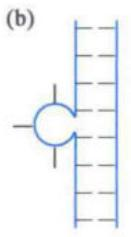

(d)  

(f)  

相邻的序列中,形成“假结”(pseudoknot)(图3-2f)等复杂结构,这些特殊的结构特征使得RNA常形成大量的三级结构。由于RNA骨架上未配对的区域可以不受限制地自由旋转,所以碱基和核糖磷酸骨架之间的非常规相互作用使RNA常常折叠成包括不规则的碱基配对的复杂的三级结构,如tRNA中的三碱基配对以及碱基与骨架的相互作用。利用RNA结构的复杂性,研究者可以通过构建含有随机序列的RNA文库筛选到与特定小分子、多肽等具有高亲和力的RNA。

## 4. 环状 RNA

早在几十年前,生物学家们就发现了环状 RNA(circRNA)。近年来,随着二代测序的发展,人们发现环状 RNA 其实是非常普遍的。这些分子广泛存在于从古菌、酵母、小鼠到人类多种生物的细胞中。环状 RNA 呈封闭环状结构,因不受 RNA 外切酶的影响而不易降解,比线性 RNA 稳定得多。真核细胞的环状 RNA 来自于 mRNA 前体(pre-mRNA)的反向剪接。虽然环状 RNA 通常表达水平较低,但它们的表达存在细胞和组织特异性。近年来的研究表明,环状 RNA 可以通过不同途径影响基因表达,有效扩展真核细胞转录组的多样性和复杂性,在细胞中扮演着重要的角色。

## 3.1.2 RNA 在细胞中的分布

生物体内的 RNA 种类繁多,且分布在细胞的不同部位。各类 RNA 在组成、大小、分子结构、生物学功能以及亚细胞定位等方面都有所不同。图 3-3 列举了目前细胞中已发现的 RNA 类型。

生物体内主要有3种RNA参与遗传信息的传递,即编码特定蛋白质序列的信使RNA(messenger RNA,mRNA),能特异性解读mRNA中的遗传信息、将其转化成相应氨基酸后加入多肽链中的转运RNA(transfer RNA,tRNA)和直接参与核糖体中蛋白质合成的核糖体RNA(ribosomal RNA,rRNA)。

  
图 3-3 RNA 各组分在细胞中的分布

## 3.1.3 RNA的功能

RNA 既可作为信息分子又能作为功能分子发挥作用。作为信息分子，RNA 担负着贮藏及转移遗传信息的功能，起着遗传信息由 DNA 到蛋白质的中间传递体的核心作用；作为功能分子，它在以下几个方面发挥重要的作用：①作为细胞内蛋白质生物合成的主要参与者；②部分 RNA 可以作为核酶在细胞中催化一些重要的反应，主要作用于初始转录产物的剪接加工；③参与基因表达的调控，与生物的生长发育密切相关；④在某些病毒中，RNA 是遗传物质。

<!-- W-BEGIN Watson 5 RNA的结构和功能多样性 -->

### 【中文对照 Watson 第5章：RNA的结构和功能多样性】

> 来源：Watson《基因的分子生物学》第七版中译本（书籍/03_基因的分子生物学_第七版） 第5章 RNA的结构和功能多样性。

#### [W] 第5章 RNA的结构和功能多样性

<!-- 章节边界按正文内容恢复；原始 MinerU 内容保留如下。 -->

#### [W] RNA 的结构和功能多样性

#### [W] 本章概要

RNA 含有核糖和尿嘧啶，通常是单链
RNA 链自身折叠形成局部双螺旋，类似于
A-DNA

RNA可折叠成复杂的三级结构

结合有化学探针的核苷酸替代物可以预测RNA结构

定向演化会选择结合小分子的RNA一些RNA可以是酶类

乍看起来，RNA 同 DNA 非常相似。当然，它的化学组成同 DNA 有一些细微差别：主链上的氢原子被羟基基团所替代；四种碱基有一种没有甲基基团。实际上，很多年以来，RNA 的作用都被认为是辅助 DNA 进行信息传递。虽然一些病毒的基因组是由 RNA 组成的，但总体来讲，DNA 才是遗传信息的仓库。与该看法不同的是，RNA 在很大程度上被看成是把遗传信息由 DNA 转移给核糖体的传送器，是遗传信息的解码器，同时还是核糖体的结构成分。而现在，我们已经意识到 RNA 在结构上远比 DNA 复杂，在功能上也比我们之前所认识的更丰富。

虽然 RNA 主要以单链分子的形式存在，但是通过链内碱基配对，呈现

出很多双螺旋的特征，并能折叠成大量不同的三级结构。这些 RNA 结构有诸多令人惊奇之处，如非经典碱基对、碱基和骨架的相互作用、结点状构型。最值得一提的是，一些 RNA 分子是酶类，催化从核酸到蛋白质的信息传递中的核心反应，具有重要的演化意义。

#### [W] RNA 含有核糖和尿嘧啶，通常是单链

现在我们来看 RNA 和 DNA 的三个不同之处（图 5-1）。第一，RNA 骨架含有核糖，而不是 2'-脱氧核糖，也就是说在核糖的 C 2' 的位置上带有一个羟基。第二，在 RNA 中尿嘧啶（uracil）取代了胸腺嘧啶，尿嘧啶有着和胸腺嘧啶相同的单环结构，但是缺乏 5 甲基（5 methyl）基团。胸腺嘧啶实际上是 5 甲基-尿嘧啶（5 methyl-uracil）。另外，同胸腺嘧啶一样，尿嘧啶也同腺嘌呤配对（图 5-2）。考虑到二者的相似性，演化为什么会选择含有额外甲基基团的胸腺嘧啶作为 DNA 组成碱基呢？在第 10 章中我们会讲到，胞嘧啶可以通过自发的脱氨基作用形成尿嘧啶，后者会被修复系统识别为非 DNA 组成成分，进而恢复成胞嘧啶。如果遗传物质 DNA 中含有尿嘧啶，胞嘧啶脱氨基形成的尿嘧啶就无法被维持基因组稳定的监测系统检测到。

  
图 5-1 RNA 的结构特点。本图显示了 RNA 骨架的结构，由磷酸和核糖交替排列组成。RNA 结构中有别于 DNA 的部分以红色表示。

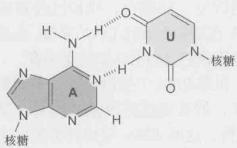  
图 5-2 尿嘧啶同腺嘌呤配对。注意尿嘧啶区别于胸腺嘧啶的 5'位置在配对中并没有涉及到。

第三，RNA 通常是单链的多聚核苷酸。除了某些病毒以外，如流感病毒和获得性免疫缺陷综合征病毒，RNA 并不是遗传物质，它不需要以自己为模板进行复制。从功能上讲，RNA 的功能之一是作为从基因到蛋白质合成的媒介，如信使 RNA（mRNA）；RNA 的另一功能是作为 mRNA 上密码子与氨基酸的接头，如转运 RNA（tRNA）；RNA 作为核糖体

的组成部分，也发挥着结构性功能。另外，RNA 还是一种调节分子，通过和某些 mRNA 互补序列的结合而对其翻译过程进行调控（见第 20 章）。最后，还有一些 RNA（包括组成核糖体的一种结构 RNA）是在细胞中催化一些重要反应的酶。综上所述，RNA 只是拷贝了双链 DNA 中的一条链，这条链的互补链则不存在。RNA 也可以形成很长的双螺旋，但这种情况在自然界中很少见。

#### [W] RNA 链自身折叠形成局部双螺旋，类似 A-DNA

尽管 RNA 是单链分子，它仍然具有大量的双螺旋结构的特征（图 5-3）。这是因为

RNA 链频繁发生自身折叠，从而在互补序列间形成碱基配对区。如果两段互补序列彼此非常接近，RNA 可以采用多种柄环结构（stem-loop structure）中的一种，其中的非互补 RNA 从双螺旋区域的末端凸出来（图 5-3）。RNA 双螺旋的伸展部分也可以呈现为内环（internal loops，柄任意一侧的未配对核苷酸）、凸起（bulges，

  
图 5-3 RNA 的双螺旋特点。在含有互补序列的 RNA 分子中，中间的非互补部分可以环状凸出出来，形成图示结构中的一种：凸起、内环或发卡环。

凸出部分某侧的未配对核苷酸），或结合部（junctions）（图5-3）。

某些情况下，环的特殊性质能增强柄环结构的稳定性。例如，具有UUCG“四碱基环”的柄环结构，由于环中特殊的碱基堆积作用而非常稳定（图5-4）。碱基配对也可以发生在不相邻的序列中，形成称为假结（pseudoknot）的复杂结构（图5-5）。RNA的碱基配对区可以是规则的双螺旋，或者是不连续的，例如，含有不互补的、凸出于双螺旋之外的核苷酸。

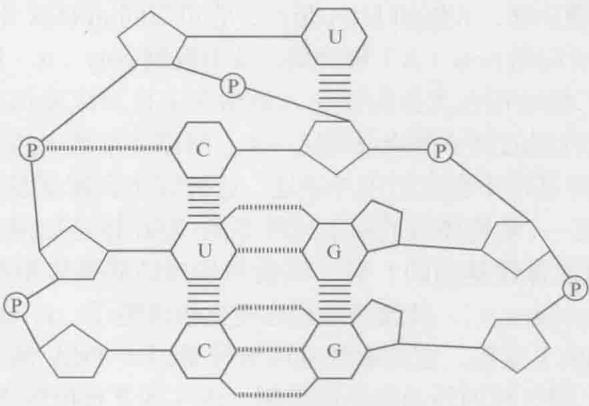  
C(UUCG)G 四碱基环

图 5-4 四碱基环。碱基堆积作用使四碱基环结构更加稳定。紫色的核糖之间的灰色环代表 RNA 骨架的磷酸部分。水平线代表碱基堆积作用。  
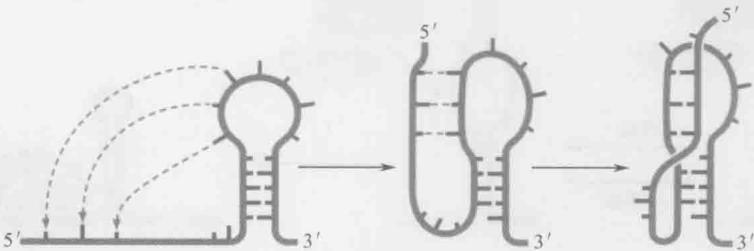  
图 5-5 假结。不相邻的互补序列之间碱基配对形成假结结构。

RNA 具有额外的非 Watson-Crick 配对的碱基，如 G：U 碱基对，这个特征使 RNA 更易于形成双螺旋结构。G：U 碱基对之间有两个氢键：尿嘧啶 N3 和鸟嘌呤 C6 上羰基之间的氢键，以及尿嘧啶 C2 上羧基和鸟嘌呤 N1 之间的氢键（图 5-6）。非 Watson-Crick 配对在所有的 RNA 中均存在（GA 和 GU 配对在核糖体 RNA 中最为丰富）。由于 RNA 链中不仅存在两种常规 Watson-Crick 碱基对，而且有 G：U 碱基对，因此，RNA 链自我配对的能力得到增强，常常出现局部区域碱基配对，但不是 DNA 那种长的、规则的螺旋形式。

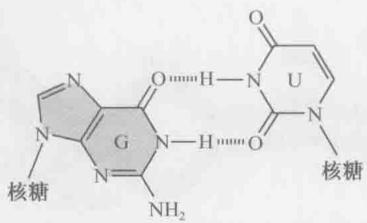  
图 5-6 G：U 碱基对。图中所示为鸟嘌呤与尿嘧啶配对形成的氢键。

RNA 骨架上 2'-OH 的存在阻止 RNA 形成 B 型螺旋。其实双螺旋 RNA 更类似于 A-DNA 的结构。它的小沟宽且浅，从而易于接近，但是小沟里几乎没有序列特异性信息；而大沟狭且深，与它相互作用的蛋白质的氨基酸侧链难

以接近它。所以，从精细原子结构上看，RNA 的双螺旋与 DNA 的双螺旋十分不同，使 RNA 不适合与蛋白质进行序列特异性的相互作用。然而，有很多例子表明蛋白质可与 RNA 发生序列特异性结合，这往往依赖于对发夹环、凸起和扭曲的识别，而这些结构是由非常规碱基配对引起的。这样的例子包括：同各自 tRNA 结合的 tRNA 合成酶；臭名昭著的植物蛋白——蓖麻毒蛋白，它可以切割真核生物核糖体大亚基中大 RNA “八叠球菌/蓖麻毒蛋白” 环中的重要的糖苷键；人体的 U1A 蛋白，它可以同 mRNA 中 U 形的、U1A 多聚腺苷酸化抑制元件结合阻断 poly（A）聚合酶，从而限制 poly（A）尾巴的长度。

有时，RNA 的二级结构在无蛋白质介入的情况下也可以发挥重要的生物学功能。有一个来自细菌致病机理的例子很能说明这一点。病原体细菌表达可使动物染病的毒性基因。一般而言，毒性基因不会在宿主外表达，这种表达会被受感染的动物中的刺激所诱导。温度便是刺激之一，动物体内的温度比外界高。病原体是如何检测到温度增加的？热传感器又是如何激活毒性基因的？对于靠食物传播的病原体单核细胞增多性李斯特氏菌（Listeria monocytogenes），其致病原理已经比较清楚了。L. monocytogenes 会导致免疫缺陷个体和孕妇染上重疾。它的毒性基因被转录因子 PrfA 激活，该因子的合成反过来又由其 mRNA 上游区域的转录水平所控制，该区域含有核糖体结合位点（图 5-7）。

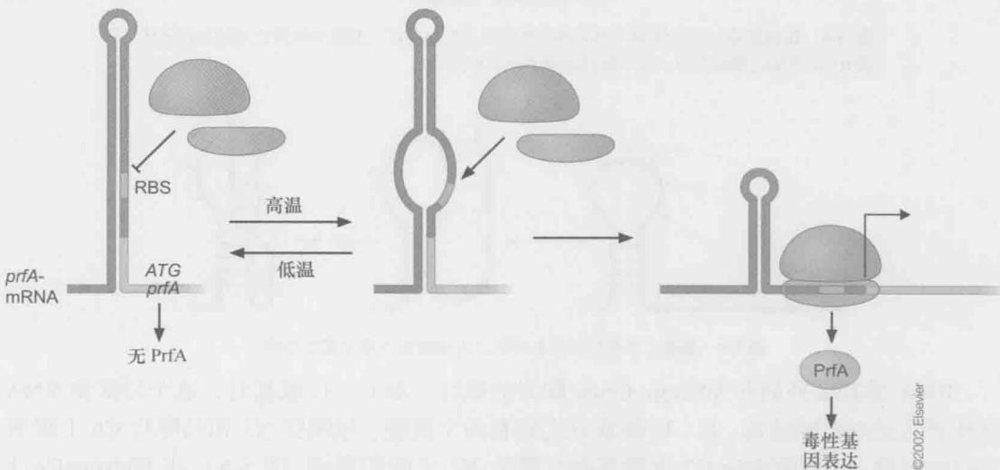  
图 5-7 毒性基因表达的热传感器。L. monocytogenes 中的 prfA 调节基因在翻译水平上由温度依赖性的核糖体结合位点（ribosome-binding site，RBS）开关所控制。蓝色的椭圆代表核糖体亚基。（经允许，引用自 Elsevier，from Johannson J. et al. 2002. Cell 110: 551–561, Fig. 7.）

我们在第 15 章会看到，核糖体结合位点是一段在蛋白质合成起始阶段被核糖体所识别的序列。该上游区域发生自身折叠形成对温度敏感的二级 RNA 结构，该结构可以掩盖核糖体结合位点，导致核糖体在 $30^{\circ}$ C 的时候无法结合上去。而在 $37^{\circ}$ C 时，该结构消失，允许翻译机器同核糖体结合位点结合并产生 PrfA。通过把该上游区域同绿色荧光蛋白编码基因融合，发现二级结构对于这种热调节是必要而充分的（见框 5-2）。当把该融合基因移植到大肠杆菌中后，该基因会在 $37^{\circ}$ C 引发荧光，而不是 $30^{\circ}$ C。

#### [W] RNA 可折叠成复杂的三级结构

由于 RNA 没有形成长的规则螺旋的限制，因此可形成大量的三级结构。因为 RNA

骨架上未配对的区域可以不受限制地自由旋转，所以 RNA 常常折叠成包括不规则碱基配对的复杂三级结构。如 tRNA 中的三碱基对及碱基与骨架的相互作用（如图 5-8 中的 U:A:U 三碱基）。蛋白质可以协助 RNA 大分子三级结构的形成，如核糖体中发现的蛋白质。蛋白质可以中和磷酸骨架的负电荷，从而消除由于静电斥力造成的结构不稳定。

  
U:A:U 三碱基对  
图 5-8 U: A: U 三碱基对。图中所示为非常规三碱基配对形成的氢键。

RNA 所形成的三级结构并不是绝对静

止的。同样的 RNA 分子可能会以一种或多种可选择的构象存在。这种不同构象之间的转换具有十分重要的生物学意义，如核糖开关（riboswitch，见下文和第 20 章）和小鼠白血病病毒编码 mRNA（见框 5-1）。

#### [W] 框 5-1 RNA 开关通过小鼠白血病病毒控制蛋白质合成

小鼠白血病病毒（MLV）是一种RNA病毒，可以导致小鼠及其他脊椎动物患上癌症。同人类免疫缺陷病毒一样，它也是一种逆转录病毒，通过DNA中间体完成复制。RNA基因组通过反转录酶复制出DNA。RNA基因组，也是mRNA，编码一种称为Gag的病毒结构蛋白和由该蛋白组成的多聚蛋白以及称为Pol的逆转录酶。Gag编码基因紧邻于Pol编码基因的上游。Gag或者自己单独生成，或者延长翻译下游的Pol基因以融合蛋白Gag-Pol的方式产生。当Gag单独生成的时候，核糖体在终止密码子处终止翻译（见第15章），该终止密码子位于Gag编码基因的末端。当以融合蛋白的方式产生的时候，核糖体越过终止密码子继续翻译，得到Gag-Pol融合蛋白。因为结构蛋白比酶的需求要大，所以病毒保持这两种产物的比例处于一个合理的范围就十分重要。病毒通过把核糖体通读的比例限制在5%\~10%来实现这一点。

这种设计拥有很多优势。它排除了对额外启动子元件的需求（基因组已经非常紧凑），并把病毒酶的产出同结构成分的合成连接起来，允许其在病毒繁殖的时候并入到病毒中。

MLV是如何控制其mRNA的翻译通读的呢？Victoria D'Souza和Steven Goff及其同事通过核磁共振确定了MLV mRNA中Gag终止密码子下游序列的三维结构，进而解决了这个问题（Houck-Loomis et al. 2011）。他们发现下游序列有一个假结，假结没有固定的结构，而是处在两种构象的动态平衡之中。一种构象限制翻译，抑制Gag的生成，称为非激活构象；另一种构象允许通读产生Gag-Pol融合蛋白，称为激活构象（见框5-1图1）。

为了保证只有有限的 mRNA 可以跳过终止密码子通读，假结作为一种质子传感器发挥作用。在生理 pH 下，蛋白质的浓度使得只有 5%\~10% 的假结可以感受到质子并折叠成活化的构象。为达到这一目的，该分子通过腺嘌呤 N1 位的氮原子（一般不会发生质子化）获得一个质子并在分子中形成一个三碱基结构，进而变成激活构象。

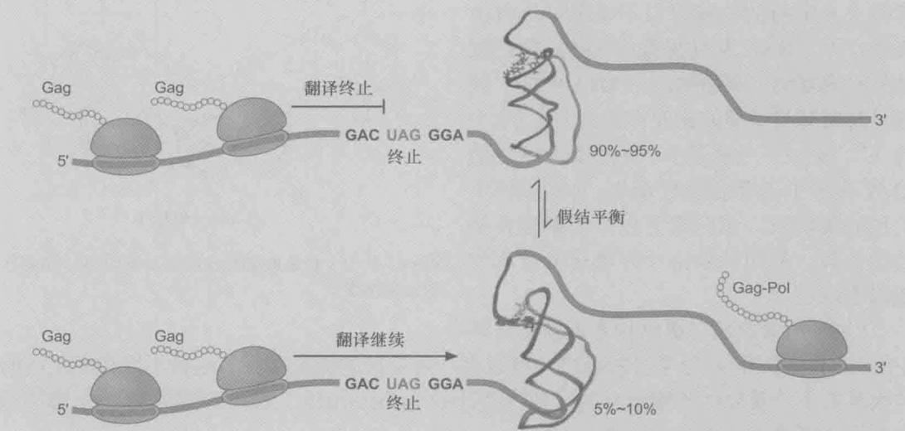  
框 5-1 图 1 两种假结构象的平衡控制着终止密码子处的翻译。翻译 MLV RNA 的核糖体遇到了位于 Gag 可读框下游的终止密码子（UAG）。当假结处于非激活构象（上图）时，翻译在终止密码子处终止，合成的是 Gag 蛋白。而当假结处于激活构象时（下图），核糖体可以跳过终止密码子进行通读，合成的是 Gag-Pol 融合蛋白。两种构象的平衡决定了 Gag 和 Gag-Pol 两种蛋白的比例。未质子化和质子化的腺嘌呤分别用红色和绿色表示。（图片由 V. D. Souza 惠赠）

#### [W] 结合化学探针的核酸替代物可以预测 RNA 结构

正如我们已经知道的，RNA 分子可以呈现出多种多样的结构，包括螺旋伸展、凸起、环和远程的三维相互作用。这些结构是如何被发现的呢？传统的研究方法包括核磁共振（nuclear magnetic resonance, NMR）、X 射线晶体学（X-ray crystallography），但通过这些方法解决结构问题很困难，而且核磁共振不能用于大的 RNA 分子。另外的方法是使用化学物质对 RNA 分子的二级结构进行探测（这些化学物质可以同未配对的碱基发生反应），并辅以相关的算法（从已知的堆积能量和氢键相互作用情况进行结构预测）。这种化学的方法往往并不可靠。“变异-比对”（mutate-and-map）策略是一项引人注目的创新，它可以对 RNA 结构进行高可信度的预测。

变异-比对是一种双向的过程,可以把变异的和化学的修饰方法组合到一起。首先,要制备核苷酸取代基的文库,在 RNA 序列中每个核苷酸都被其互补碱基所取代。其次,通过称为 SHAPE (selective 2'-hydroxyl acylation analyzed by primer extension, 基于引物延伸的选择性 2'-羟基酰化分析) 的过程对每一个变异 RNA 进行化学修饰。在 SHAPE 中,RNA 用化学试剂进行处理,如 N-甲基靛红酸酐(N-methylisatoic anhydride),这些化学试剂可以使未配对核苷酸上的 2'-羟基优先酰化。未配对核苷酸的位置可以通过引物延伸来确定,在该策略中,DNA 引物通过逆转录酶进行延伸(见第 12 章)。逆转录酶遇到化学修饰的时候就会停止延伸,因此通过延伸产物的大小便可以确定化学修饰的位点。

图 5-9 展示的是对核糖开关这类 RNA 进行变异-比对分析的结果（我们在第 20 章会看到，核糖开关是指那些可以同特定的小分子结合的 RNA）。横轴表示的是 RNA 上的位置（从 5' 到 3'），纵轴表示的是每个变异 RNA 的核苷酸取代基突变（顶部表示 5' 末端的变异，底部表示 3' 末端的变异）。小方框鉴定的是同酰化试剂反应的核苷酸，因此认为是未配对的。显著的对角线对应的是变异位点上未配对的核苷酸。也就是说，对角线上的每一个酰化位点都会有相应的变异位点相匹配。对角线外的方框表示那些未配对的核苷酸，

不同核苷酸上的突变直接导致这些核苷酸变成未配对状态。这些方框常用来表示由于互补碱基对中核苷酸替代导致的未配对核苷酸。然而，在一些例子中，变异看起来可以颠覆整个螺旋，导致邻近的几个核苷酸变成未配对状态。在最后一步，会使用RNA结构模型算法分析数据，比如RNA structure算法。该算法不仅可以用来预测螺旋，而且可以用来对仅有少量相邻核苷酸的远程相互作用进行预测。结果，变异-比对模型使得二级及三级结构预测成为可能。对结构已知的RNA（如图5-9所示的核糖开关）使用变异-比对策略，证明这种方法是可靠的。

  
图 5-9 预测 RNA 二级及三级结构的双向策略。本图展示的是某核酶的变异-比对数据，横轴表示酰化位点沿 RNA 分布的情况，纵轴表示变异位点的信息。酰化位点由灰色和黑色表示（灰度表示修饰的程度）。基于统计分析算法，只有最显著的数据被展示出来。（经允许，引用自 Kladwang W. et al. 2011. Nat. Chem. 3: 954-962, Fig. 2A, p. 956. MacMillan.)

#### [W] 定向演化选择了可以结合小分子的 RNA

研究人员利用 RNA 潜在的结构复杂性通过定向选择获得了一些新的、自然界中不存在的 RNA 分子，它们拥有特定的令人满意的性质，这一过程称为 SELEX（systematicevolution of ligands by exponential enrichment, 指数富集配体系统演化技术)。通过随机方式合成 RNA 分子, 可以获得含有巨大序列多样性的寡核苷酸混合物。例如, 对于长度为 20 的寡核糖核苷酸混合物, 因为每个位点有 4 种核苷酸的可能性, 这样整个混合物的复杂度就是 $4^{20}$ 种序列, 或者 $10^{12}$ 种! 对于这种寡核糖核苷酸混合物, RNA 分子可以通过生物化学的方法被选择 (如通过亲和层析, affinity chromatography), 选出

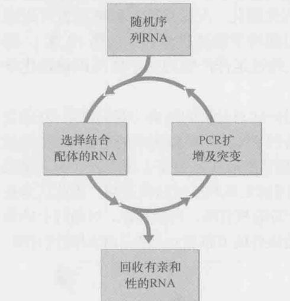  
图 5-10 SELEX 富集可以结合小分子的 RNA 的过程。

那些具有特定性质的 RNA，如对特定的小分子或蛋白质有亲和性。这些 RNA 称为适配子（aptamer）。通过 PCR（第 7 章）连续扩增以及通过诱变聚合酶获得序列多样性并进行多轮选择可以富集适配子，使其同小分子和蛋白配体的亲和性逐渐增加（图 5-10）。RNA 适配子识别的配体的有很多，如 ATP、卡那霉素（kanamycin）、妥布霉素（tobramycin）、新霉素（neomycin）、氰钴胺素（cyanocobalamine）、朊病毒蛋白和凝血因子 X11a。一个基于连续 SELEX 的策略创造了另一个典型的例子——对荧光基团具有高亲和性的 RNA 分子，RNA 同该荧光基团的作用方式与绿色荧光蛋白相同（见框 5-2）。

#### [W] 框5-2 通过定向演化获得类似于GFP的RNA

绿色荧光蛋白（green fluorescent protein，GFP）是广泛应用于分子生物学研究的蛋白之一，被激发光激发后产生绿色荧光。绿色荧光蛋白可以自发产生共价结合的荧光基团，这种蛋白质是从维多利亚多管发光水母（Aequorea victoria）中发现的。许多物种，从细菌到鱼类和小鼠，都拥有表达功能性GFP的能力，使研究人员可以通过GFP进行各种各样的科学研究。例如，该蛋白可用作活细胞中基因表达的报告基因，甚至可以使其融合蛋白在细胞中的位置可视化。正如我们已经看到的，RNA丰富的多样性、其折叠成复杂的三级结构的能力及SELEX技术的发明，获得具有某些特定用途的定制化的适配子已经成为可能。SELEX技术最近有一个非常引人注目的应用，它获得了可以同小分子荧光基团结合的RNA适配子，这些适配子可以创造拟态的GFP。这一工作由Jeremy Paige及其同事完成（见Paige et al. 2011. Science 333: 642-646）。这些RNA-荧光基团复合物具有与GFP相同的颜色和亮度，但拥有更多有用的特征，我们下面会讲到。

GFP 中自发形成的荧光基团是 4-羟基苯亚甲基咪唑啉酮（4-hydroxybenzolidene imidazolinone），可以通过同 GFP 的一部分发生特异性接触而发出荧光，这种特异性接触通过抑制分子内运动实现，该运动可以阻止自由荧光团发出荧光。在刚开始的时候，Paige 等使用一种 GFP 天然荧光基团的衍生物（3,5-二甲氧基-4-羟基苯亚甲基咪唑啉酮），该衍生物同样需要抑制分子内运动来发出荧光。10个SELEX循环后获得了结合在3,5-二甲氧基-4-羟基苯亚甲基咪唑啉酮（固定于琼脂糖）上的RNA分子。Spinach是其中之一，当它同自由的荧光基团结合的时候可以产生浅绿色荧光。使用其他的荧光基团，同时增加SELEX的循环数，作者获得了从蓝色到红色的多种RNA-荧光基团复合物（框5-2图1）。为了证明这些适配子的实用性，Paige等把Spinach编码序列同5S RNA编码基因的3'端进行了融合。5S RNA是核糖体大亚基的非编码成分，由RNA聚合酶Ⅲ合成（见第15章）。通过构建5S-Spinash融合基因，作者对核糖体RNA由细胞核进入细胞溶质的移动实现可视化。

  
框 5-2 图 1 呈现多种不同颜色的 RNA-荧光基团复合物。（经授权，复制自 Paige JS.et al.2011.Science 333:642-646, Fig.2D.AAAS.）

最近，Spinach 被进一步改造成为细胞代谢的传感器。这一工作是通过把 Spinach 同特定的适配子连接在一起实现的，这种特定的适配子可以同代谢物结合，如 S-腺苷蛋氨酸（SAM）或 ATP（框 5-2 图 2）。生成的传感器 RNA 由 Spinach 和代谢物结合结构域构成，除非其结构通过结合代谢物变得稳定，否则它无法结合荧光基团。这种传感器 RNA 曾用来对大肠杆菌活细胞中的 SAM 进行示踪。首先使含有传感器的细胞缺少甲硫氨酸（甲硫氨酸是 SAM 生物合成的前体），然后用荧光基团处理，接着向生长培养基中加入甲硫氨酸，这会对细胞荧光产生一个显著的刺激。这一类传感器或许可以为在活细胞中实时监控代谢物水平的变化提供一种有效的方法。

  
框 5-2 图 2 使用 SELEX 技术获得代谢传感器。代谢传感器包括荧光基团结合结构域（绿）和代谢产物结合结构域（紫）。当 RNA 同时结合荧光基团和代谢产物时就形成稳定的荧光复合物。（经授权，复制自 Paige JS.et al. 2012.Science 335:1194, Fig.1A.AAAS.）

这个例子强调了 RNA 非凡的多功能性。自然界在自然选择中通过这种多功能性创造了核糖开关、核酶、tRNA 分子和调节 RNA（我们会在第 15 章和第 20 章讲到）。现在，分子生物学家也正在通过这种多功能性创造更多种类的 RNA 分子，以便更好地服务于全人类。

实际上，就像我们在第 20 章看到的那样，大自然已经做到这一点了。细菌中的代谢操纵子有时会受到调控 RNA 元件的控制，比如核糖开关（riboswitch），它可以同小分子配体结合并对基因转录和翻译进行控制。核糖开关识别的代谢分子包括：赖氨酸、鸟嘌呤、辅助因子辅酶 B12 和下面我们会讨论的代谢物葡萄糖-6-磷酸。

#### [W] 一些 RNA 可以是酶类

许多年来普遍认为酶只能是蛋白质，酶必须能结合底物，启动化学反应，释放产物，并可以重复使用。蛋白质很适合作为酶分子，它由20种氨基酸组成，可折叠形成具有底物、小分子辅助因子的结合位点和催化位点的复杂三级结构。现在我们知道很容易形成三级结构的RNA也是一种生物催化剂。RNA酶被称为核酶（ribozyme），具有酶的许多典型特征：催化位点、底物结合位点和辅助因子（如金属离子）结合位点。

RNase P 是最早发现的核酶之一，它是一种内切核糖核酸酶，参与从大的 RNA 前体生成 tRNA 的过程。RNase P 可以特异地剪切 RNA 前体 5'端的前导片段，进而形成成熟的、有功能的 tRNA，该过程如图 5-11 所示。RNase P 由 RNA 和蛋白质共同组成，起催化作用的只是 RNA。蛋白质组分中和了 RNA 上的负电荷，使 RNase P 可与带负电的底物有效结合，从而促进了反应的进行。如果有小的、带正电的离子（如多肽亚精胺）中和了负电荷，即使没有蛋白质组分，RNA 组分也可以催化 tRNA 前体的剪切。

  
图 5-11 RNase P 对 RNA 前体 5' 端的片段进行切割，进而形成 tRNA 分子。

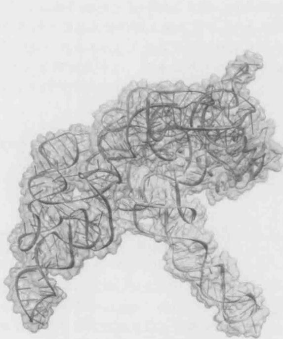  
图 5-12 RNase P 的结构。此图展示的是细菌中 RNase P 全酶的晶体结构：紫色表示的是 RNA 亚基，蓝色表示的是蛋白亚基，黄色表示的是 tRNA。催化中心的金属离子用红色球体表示。（该结构由 Protein Data Base [PDB: 3Q1R] 中的信息组装而成，参考文献为 Reiter N.J. et al. 2010. Nature 468: 784-789.）

正如我们下面要看到的，tRNA 可以折叠成 L 状的三级结构，tRNA 的 5'端和 3'端位于该三级结构的同一侧。RNase P 的晶体结构揭示：磷酸二酯链的切割位点位于 RNase P 中 RNA 组分的催化中心内，而蛋白质组分则和前导片段发生相互作用（图 5-12）。

GlmS 是一种蛋白质类的生物酶，在其 mRNA 的 5'非翻译区发现的一种结构说明 RNA 可以同时扮演核酶和核糖开关两种角色。GlmS 可以催化代谢物葡糖胺-6-磷酸的合成。该 RNA 是一种核酶，可以降解编码 GlmS 合成的 mRNA，但其活性依赖于葡糖胺-6-磷酸。因此，该 RNA 也是一种核糖开关。所以，当葡糖胺-6-磷酸处于高水平时，编码 GlmS 的 mRNA 就会被降解掉，从而减少葡糖胺-6-磷酸的合成。

其他的核酶发挥反式的酯化作用，参与去除一些核酸分子的内部序列，如 mRNA 前体、tRNA 前体和 rRNA 前体间插序列即内含子（intron）的切除过程，这被称为 RNA

#### [W] 剪接（RNA splicing）（第14章）。

#### [W] 锤头状核酶通过形成 2', 3'-环磷酸剪切 RNA

让我们再关注一下一种特殊核酶的结构及功能，即所谓的锤头状核酶（hammerhead）。它是一种序列特异性的核糖核酸酶，从被称为类病毒(viroid)的植物感染性RNA病毒中得到，类病毒的繁殖依赖自我剪切。当类病毒复制时，在连续的RNA链上产生多个拷贝。单个类病毒由剪切而产生，而这种剪切反应由结合处周围的RNA序列催化完成。这样自我剪切的序列由于其二级结构类似锤头而被称为锤头结构，而每个锤头结构由3个配对的柄构成（Ⅰ、Ⅱ、Ⅲ），包围着起催化作用的不互补的核苷酸中心（图5-13）。这种剪切反应发生在第17位的胞嘧啶上。锤头结构的三级结构显示催化中心位于三个柄的结合部附近（图5-13）。

为了弄清锤头结构如何起作用，必须首先了解在碱性环境下

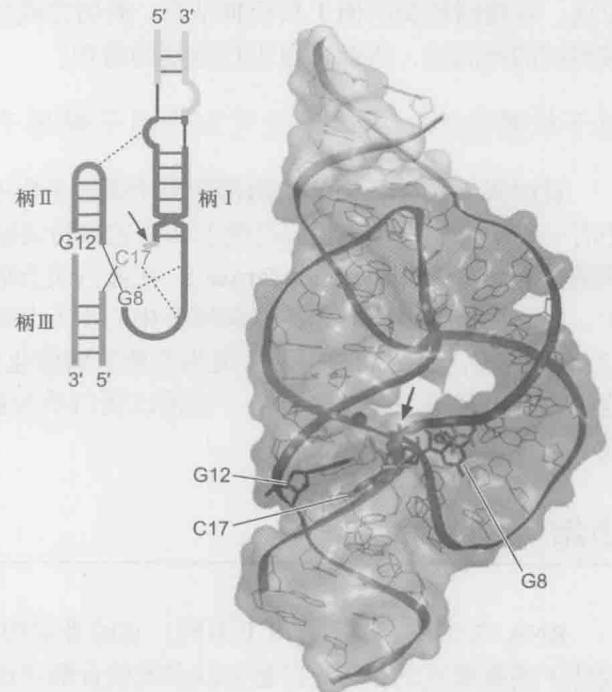  
图 5-13 锤头状核酶的结构。左上方的图表示的是“锤头”的二级结构，三个柄都用颜色高亮显示了。点线表示的是 Watson-Crick 碱基对之间的相互作用。橙色部分和箭头表示的是 C17 处易断裂的键。（来源：经 McKay D.B. and Wedekind J.E. 同意，1999，The RNA World, 2nd ed. [ed.Gesteland R.F. et al.], p.267, Fig. 1A. ©Cold Spring Harbor Laboratory Press.）右图表示的是锤头状核酶的 3D 结构，中间的红色部分表示催化中心的镁离子。这张结构图展示了柄 I（右上方）、柄 II（中间左侧）和茎环 III（底部），它们同左上方示意图中的着色相同。镁离子是否参与催化目前还不确定（橙色箭头所示）。裂解的位置在第 17 位的胞嘧啶上。（图片由 V.D'Souza 参照 Protein Data Base[PDB:20EU]用 PyMOL 制作，具体描述见 Martick M. et al 2008. Chem Biol. 15: 332-342

RNA 如何水解。如果 pH 很高，RNA 骨架上核糖的 2'-羟基会处于去质子化状态，这样使带有负电的氧可以进攻位于同一核糖的 3' 易断开的磷，从而打断 RNA 链，产生 2', 3'-环磷酸酯及一个自由的 5' 羟基。RNA 链上的每一个核糖都能通过这个反应水解，这样整个完整的分子能够酶解成核苷酸分子。（想一想为什么 DNA 不像 RNA 那样易于被碱水解？）许多蛋白质类的核糖核酸酶也是通过 2', 3'-环磷酸酯的形成来裂解 RNA 底物的。在正常细胞环境的 pH 时，这些蛋白质酶类通过结合在其活性位点上的金属离子来活化 RNA 的 2'-羟基。锤头状核酶同样是通过 2', 3'-环磷酸酯的形成来裂解 RNA 底物。3D 结构提示镁离子距催化中心很近，但是确切的剪切反应机制和金属离子的作用还未阐明。

因为锤头状核酶通常的作用方式是自身剪切，它们不能算是真正的催化剂。每个催化剂分子通常一次只催化一个反应，这样转换数为一。但是可以通过遗传工程手段把整个分子分开成两部分，一部分是核酶，包含了催化核心；另一部分是底物，包含了剪切位点。底物同核酶的柄Ⅰ和柄Ⅲ结合。剪切完成之后底物被释放，代替它的是一个没有被剪切的新底物，因此可以进行重复的剪切。

位于核糖体中心的核酶也可以作用于碳原子中心

目前我们所涉及到的核酶都作用于磷原子中心。但在第 15 章我们会看到，核糖体中有一种 RNA 成分，我们习惯上认为它只扮演结构上的角色，现在我们知道它是一种肽基转移酶（peptidyl transferase），在蛋白质合成过程中负责肽键的形成。在这个例子中，核酶在催化反应时作用于碳原子中心而不是磷原子中心。除此之外，正如我们在第 17 章讨论的，在活细胞中几个最为重要的酶催化反应之一就是由 RNA 分子来完成的，这一发现已经被采纳用于支持“当前以蛋白质为基础的生命起源于更早的 RNA 世界”这一假说。

<!-- W-END Watson 5 RNA的结构和功能多样性 -->

## 3.2 RNA 转录概述

## 3.2.1 RNA转录与DNA复制的比较

RNA 转录与 DNA 的复制相比尽管在化学和酶学上非常相似,但两者之间存在一些明显的差别:

① 与 DNA 聚合酶不同, RNA 聚合酶具有从头起始转录的能力, 所以它在催化 RNA 合成时不需要引物。

② RNA 聚合酶在添加几个核苷酸后,便将正在延长的链从模板上置换下来,RNA 产物不与模板 DNA 链保持碱基互补状态。因此,多个 RNA 聚合酶分子可以同时转录一个基因,保证在短时间内合成某一个基因的大量转录产物。

③ 转录具有选择性。DNA 复制必须将整个基因组全部拷贝，并且在每个细胞周期内只复制一次。RNA 转录则是选择性地复制基因组的特定部分，可以产生几个到上千个相同的拷贝。基因组的不同部分转录程度不同，在不同细胞中，同一细胞的不同生长发育阶段或者同一细胞应答不同刺激，在不同时间点所转录的基因都可能不同。

④ 与 DNA 复制的精确度相比, 转录中每添加 10 000 个核苷酸会发生一次错误, 表

明转录过程缺乏严谨的矫正机制。

## 3.2.2 转录机器的主要成分——RNA聚合酶

以 DNA 序列为模板的 RNA 聚合酶主要以双链 DNA 为模板(若以单链 DNA 做模板,则活性大大降低),以 4 种核苷三磷酸作为活性前体,并以 $Mg^{2+}/Mn^{2+}$ 为辅助因子,催化 RNA 链的起始、延伸和终止,它不需要任何引物,催化生成的产物是与 DNA 模板链相互补的 RNA。RNA 或 RNA-DNA 双链杂合体不能作为模板。RNA 聚合酶是转录过程中最关键的酶。每个细胞中约有 7 000 个 RNA 聚合酶分子,根据细胞的生长情况,任何时候都可能有 2 000\~5 000 个酶在执行转录 DNA 模板的功能。原核和真核生物的 RNA 聚合酶虽然都能催化 RNA 的合成,但在其分子组成、种类和生化特性上各有特色,我们将在下面分别介绍。

## 3.2.3 启动子与转录起始

启动子是一段位于结构基因 5' 端上游区的 DNA 序列, 能活化 RNA 聚合酶, 使之与模板 DNA 准确地相结合并具有转录起始的特异性。有实验表明, 对许多启动子来说, RNA 聚合酶与之相结合的速率至少比布朗运动中的随机碰撞高 100 倍。

转录的起始是基因表达的关键阶段,而这一阶段的重要问题是 RNA 聚合酶与启动子的相互作用。启动子的结构影响了它与 RNA 聚合酶的亲和力,从而影响了基因表达的水平。有关启动子的结构特点,我们将在后面分别介绍原核和真核生物启动子的组成。

图 3-4 RNA 的转录单位示意图  
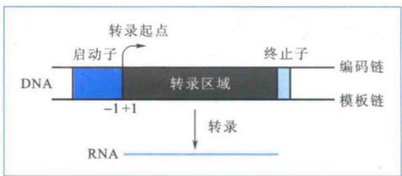

转录单位(transcription unit)是一段从启动子开始至终止子(terminator)结束的DNA序列，RNA聚合酶从转录起点开始沿着模板前进，直到终止子为止，转录出一条RNA链(图3-4)。

转录起点是指与新生 RNA 链

第一个核苷酸相对应 DNA 链上的碱基,研究证实通常为一个嘌呤。常把起点前面,即 5' 端的序列称为上游序列(upstream),而把其后面即 3' 端的序列称为下游序列(downstream)。在描述碱基的位置时,一般用数字表示,起点为 +1,下游方向依次为 +2、+3……等,上游方向依次为 -1、-2、-3……等。序列的书写方向通常是固定的,使转录从左(上游)向右(下游)进行,mRNA 同样按照 5'→3' 方向书写。

<!-- C-BEGIN Campbell 17.1 -->

### 【英文对应 Campbell Concept 17.1：Genes specify proteins via transcription and translation】

> 来源：Campbell Biology（书籍/01_Campbell_Biology） 第17章 Gene Expression From Gene to Protein，Concept 17.1。

#### [EN] Concept 17.1: Genes specify proteins via transcription and translation

Inherited traits like albinism are determined by genes, which have information content in the form of specific sequences of nucleotides along stretches of DNA, the genetic material. The DNA inherited by an organism leads to specific traits by dictating the synthesis of proteins and of RNA molecules involved in protein synthesis. In the case of coat and skin color, the gene containing the information to synthesize an enzyme that makes pigment allows normal coloring, and a faulty version of that gene leads to lack of color, or the albino phenotype. Proteins are the link between genotype and phenotype. Gene expression is the process by which DNA directs the synthesis of proteins (or, in some cases, just RNAs). The expression of genes that code for proteins includes two stages: transcription and translation.

Before going into the details of how genes direct protein synthesis, let's step back and examine how the fundamental relationship between genes and proteins was discovered.

#### [EN] Evidence from Studying Metabolic Defects

In 1902, British physician Archibald Garrod was the first to suggest that genes dictate phenotypes through enzymes, proteins that catalyze specific chemical reactions in the cell. He postulated that the symptoms of an inherited disease reflect an inability to make a particular enzyme. He later referred to such diseases as “inborn errors of metabolism.” For example, people with a disease called alkaptonuria have black urine because it contains a chemical called alkapton, which darkens upon exposure to air. Garrod reasoned that these people cannot make an enzyme that breaks down alkapton, so alkapton is expelled in their urine.

Several decades later, research supported Garrod's hypothesis that a gene dictates the production of a specific enzyme, later named the one gene–one enzyme hypothesis. Biochemists learned that cells synthesize and degrade most organic molecules via metabolic pathways, in which each chemical reaction in a sequence is catalyzed by a specific enzyme (see Concept 8.1). Such metabolic pathways lead, for instance, to the synthesis of the pigments that give the brown donkey in Figure 17.1 its fur color or fruit flies (Drosophila) their eye color (see Figure 15.3). In the 1930s, the American biochemist and geneticist George Beadle and his French colleague Boris Ephrussi speculated that in Drosophila, each mutation affecting eye color blocks pigment synthesis at a specific step by preventing production of the enzyme that catalyzes that step. But neither the chemical reactions nor the enzymes that catalyze them were known at the time.

#### [EN] Nutritional Mutants in Neurospora: Scientific Inquiry

A breakthrough in demonstrating the relationship between genes and enzymes came a few years later at Stanford University, where Beadle and Edward Tatum began working with a bread mold,

Neurospora crassa. Unlike the diploid organisms studied by Mendel (peas) and T. H. Morgan (fruit flies), Neurospora is a haploid species. Because its genome contains only one copy of each gene, that single copy determines the individual's expressed phenotype. Therefore, when Beadle and Tatum wanted to discover the function of any gene, they only needed to mutate and disable that one allele. They chose to study the protein-coding genes required for a specific nutritional activity. They caused mutations in genes by bombarding Neurospora with X-rays and looked among the survivors for mutants that differed in their nutritional needs from the wild-type bread mold.

Wild-type Neurospora has modest food requirements. It can grow in the laboratory on minimal medium—a simple solution containing minimal nutrients for growth—inorganic salts, glucose, and the vitamin biotin—incorporated into agar, a support medium. From these basics, wild-type mold cells use their metabolic pathways to produce all the other nutrient molecules (like amino acids) they need for growth, dividing repeatedly and forming visible colonies of genetically identical cells. As shown in Figure 17.2, Beadle and Tatum generated different “nutritional mutants” of Neurospora cells, each of which had a mutation in one gene and was unable to synthesize a

Figure 17.2 Beadle and Tatum's experimental approach.  
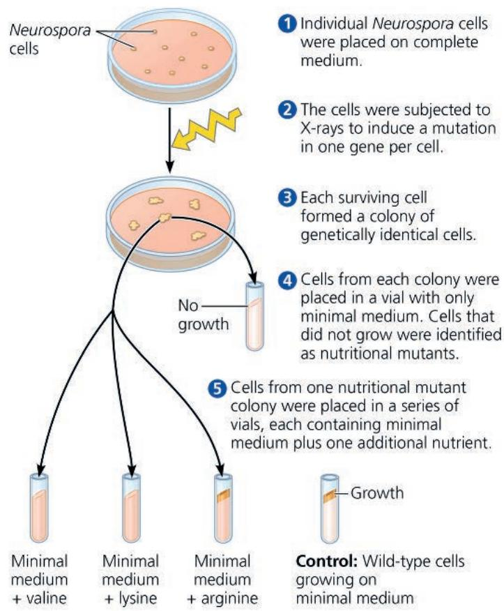  
6 The vials were observed for growth. In this example, the mutant cells grew only on minimal medium + arginine, indicating that this mutant was missing the enzyme for the synthesis of arginine.

particular essential nutrient. Such cells could not grow on minimal medium but could grow on complete medium, which contains all nutrients needed for growth. For Neurospora, the complete medium consists of the minimal medium supplemented with all 20 amino acids and a few other nutrients. Beadle and Tatum hypothesized that in each nutritional mutant, the gene for the enzyme that synthesizes a particular nutrient had been disabled by the mutation. They were able to determine experimentally which nutrient each mutant strain (original cell and its descendants) was unable to synthesize.

This approach resulted in a valuable collection of mutant strains of Neurospora, each catalogued by its defect in a particular pathway. Two colleagues, Adrian Srb and Norman Horowitz, used a collection of arginine-requiring mutants to investigate the biochemical pathway for arginine synthesis in Neurospora (Figure 17.3). Srb and Horowitz pinned down each mutant's defect more specifically, using additional tests to distinguish among three classes of arginine-requiring mutants. Mutants in each class required a different set of compounds along the arginine-synthesizing pathway, which has three steps. These results, and those of many similar experiments done by Beadle and Tatum, suggested that each class was blocked at a different step in this pathway because mutants in that class lacked the enzyme that catalyzes the blocked step.

Because Beadle and Tatum set up their experimental conditions so that each mutant was defective in a single gene, the collected results, taken together, provided strong support for the one gene–one enzyme hypothesis, as they dubbed it: that the function of a gene is to dictate the production of a specific enzyme. Further support for this hypothesis came from experiments that identified the specific enzymes lacking in the mutants. Beadle and Tatum shared a Nobel Prize in 1958 for “their discovery that genes act by regulating definite chemical events” (in the words of the Nobel committee).

Today, we know of countless examples in which a mutation in a gene causes a faulty enzyme that in turn leads to an identifiable condition. The albino donkeys in Figure 17.1 lack a key enzyme called tyrosinase in the metabolic pathway that produces melanin, a dark pigment. The absence of melanin causes white fur and other effects throughout the donkey's body. Its nose, ears, and hooves, as well as its eyes, are pink because no melanin is present to mask the reddish color of the blood vessels that run through those structures.

#### [EN] The Products of Gene Expression: A Developing Story

As researchers learned more about proteins, they made revisions to the one gene—one enzyme hypothesis. First of all, not all proteins are enzymes. Keratin, the structural protein of animal hair, and the hormone insulin are two examples of nonenzyme proteins. Because proteins that are not enzymes are nevertheless gene products, molecular biologists began to think in terms of one gene—one protein. However, many proteins are constructed from two or more different polypeptide chains, and each polypeptide is specified by its own gene. For example, hemoglobin—the oxygen-transporting protein of vertebrate red blood cells—contains two kinds of polypeptides, and thus two genes code for this protein,

one for each type of polypeptide (see Figure 5.18). Beadle and Tatum's idea was therefore restated as the one gene—one polypeptide hypothesis. Even this description is not entirely accurate, though. First, in many cases, a eukaryotic gene can code for a set of closely related polypeptides via a process called alternative splicing, which you will learn about later in this chapter. Second, quite a few genes code for RNA molecules that have important functions in cells even though they are never translated into protein. For now, we will focus on genes that do code for polypeptides. (Note that it is common to refer to these gene products as proteins—a practice you will encounter in this book—rather than more precisely as polypeptides.)

#### [EN] Basic Principles of Transcription and Translation

Genes provide the instructions for making specific proteins, but a gene does not build a protein directly. The bridge between DNA and protein synthesis is the nucleic acid RNA. RNA is chemically similar to DNA except that it contains ribose instead of deoxyribose as its sugar and has the nitrogenous base uracil rather than thymine (see Figure 5.23). Thus, each nucleotide along a DNA strand has A, G, C, or T as its base, and each nucleotide along an RNA strand has A, G, C, or U as its base. An RNA molecule usually consists of a single strand.

We often describe the flow of information from gene to protein in terms of languages. Just as specific sequences of letters communicate information in a language such as English, specific sequences of monomers convey information in polymers like nucleic acids and proteins. In DNA or RNA, the monomers are the four types of nucleotides listed previously, which differ in their nitrogenous bases. Genes are typically hundreds or thousands of nucleotides long, each gene having a specific sequence of nucleotides. Each polypeptide of a protein also has monomers arranged in a particular linear order (the protein's primary structure; see Figure 5.18), but its monomers are amino acids. Thus, nucleic acids and proteins contain information written in two different chemical languages. Getting from DNA to protein involves two major stages: transcription and translation.

Transcription is the synthesis (production) of RNA using information in the DNA. The two nucleic acids are written in different forms of the same language, and the information is simply transcribed, or “rewritten,” from DNA to RNA. Just as a DNA strand provides a template for making a new complementary strand during DNA replication (see Concept 16.2), it also can serve as a template for assembling a complementary sequence of RNA nucleotides. For a protein-coding gene, the resulting RNA molecule is a faithful transcript of the gene’s protein-building instructions. This type of RNA molecule is called messenger RNA (mRNA) because it carries a genetic message from the DNA to the protein-synthesizing machinery of the cell. (Transcription is the general term for the synthesis of any kind of RNA on a DNA template. Later, you will learn about some other types of RNA produced by transcription.)

Translation is the synthesis of a polypeptide using the information in the mRNA. During this stage, there is a change in

#### [EN] Figure 17.3

#### [EN] Inquiry: Do individual genes specify the enzymes that function in a biochemical pathway?

Working with the mold Neurospora crassa, Adrian Srb and Norman Horowitz, then at Stanford University, used Beadle and Tatum's experimental approach (see Figure 17.2) to isolate mutants that required arginine in their growth medium. The researchers showed that these mutants fell into three classes, each defective in a different gene. From studies by others on mammalian liver cells, they suspected that the metabolic pathway of arginine biosynthesis involved a precursor nutrient and the intermediate molecules ornithine and citrulline, as shown in the diagram.

Their most famous experiment, shown here, tested both the one gene–one enzyme hypothesis and their postulated arginine-synthesizing pathway. In this experiment, they grew their three classes of mutants under the four different conditions shown in the results table below. They included minimal medium (MM) as a control, knowing that wild-type cells could grow on MM but mutant cells could not. (See test tube diagram.)

  
Control: Minimal medium

#### [EN] Results

As shown in the table with test tubes, the wild-type strain was capable of growth under all experimental conditions, requiring only the minimal medium. The three classes of mutants each had a specific set of growth requirements. For example, class II mutants could not grow when ornithine alone was added but could grow when either citrulline or arginine was added.

#### [EN] Conclusion

From the growth requirements of the mutants, Srb and Horowitz deduced that each class of mutant was unable to carry out one step in the pathway for synthesizing arginine, presumably because it lacked the necessary enzyme, as shown in the table with arginine synthesis pathways. Because each of their mutants was mutated in a single gene, they concluded that each mutated gene must normally dictate the production of one enzyme. Their results supported the one gene—one enzyme hypothesis, proposed by Beadle and Tatum, and also confirmed that the arginine pathway described in the mammalian liver also operates in Neurospora. (Notice in the results table that a mutant can grow only if supplied with a compound made after the defective step because this bypasses the defect.)

Data from A. M. Srb and N. H. Horowitz, The ornithine cycle in Neurospora and its genetic control, Journal of Biological Chemistry 154:129–139 (1944).

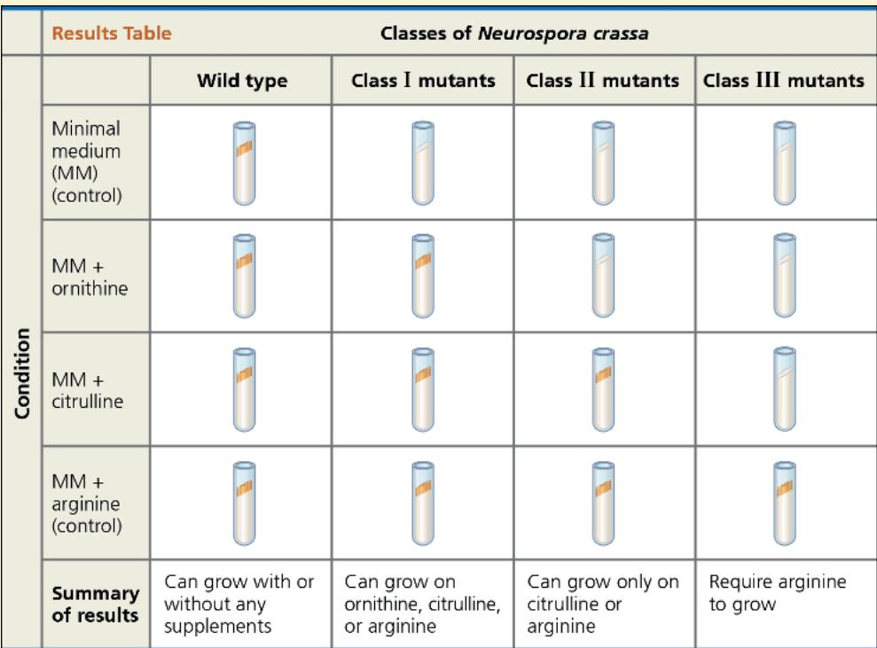

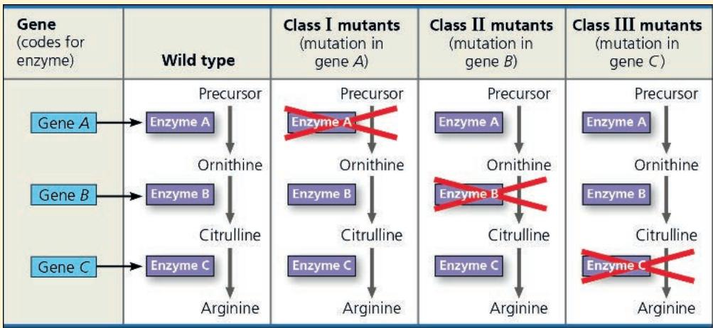  
WHAT IF? Suppose the experiment had shown that class I mutants could grow only in MM supplemented by ornithine or arginine and that class II mutants could grow in MM supplemented by citrulline, ornithine, or arginine. What conclusions would the researchers have drawn from those results regarding the biochemical pathway and the defect in class I and class II mutants?
For suggested answer, see Appendix A.

language: The cell must translate the nucleotide sequence of an mRNA molecule into the amino acid sequence of a polypeptide. The sites of translation are ribosomes, molecular complexes that facilitate the orderly linking of amino acids into polypeptide chains.

Transcription and translation occur in all organisms. Because most studies have involved bacteria and eukaryotic cells, they are our main focus in this chapter. The basic mechanics of transcription and translation are similar for bacteria and eukaryotes, but there is an important difference in the flow of genetic information within the cells. Bacteria do not have nuclei. Therefore, nuclear membranes do not separate bacterial DNA and mRNA from ribosomes and the other protein-synthesizing equipment (Figure 17.4a). This lack of compartmentalization allows translation of an mRNA to begin while its transcription is still in progress, as you'll see later. By contrast, eukaryotic cells have nuclei. The presence of a nuclear envelope separates transcription from translation in space and time (Figure 17.4b). Transcription occurs in the nucleus, but the mRNA must be transported to the cytoplasm for translation. In eukaryotes, before RNA transcripts from protein-coding genes can leave the nucleus, they are modified in various ways to produce the final, functional mRNA. The transcription of a protein-coding eukaryotic gene results in pre-mRNA, and further RNA processing yields the finished mRNA. The initial RNA transcript from any gene, including those specifying RNA that is not translated into protein (such as tRNA and rRNA, which will be described in Concept 17.4), is more generally called a primary transcript.

To summarize: Genes program protein synthesis via genetic messages in the form of messenger RNA. Put another way, cells are governed by a molecular chain of command with a directional flow of genetic information:

This idea, that the flow of information went only one way, was named the central dogma by Francis Crick in 1956. In the 1970s, however, scientists were surprised to discover some enzymes that use RNA molecules as templates for DNA synthesis, an example of information flow from RNA to DNA (see Concept 19.2). Still, these exceptions do not discredit the idea that, in general, genetic information flows from DNA to RNA to protein. In the next section, we discuss how the instructions for assembling amino acids into a specific order are encoded in nucleic acids.

#### [EN] The Genetic Code

When biologists began to suspect that the instructions for protein synthesis were encoded in DNA, they recognized a problem: There are only four nucleotide bases to specify 20 amino acids. Thus, the genetic code cannot be a language where each written symbol corresponds to a word. How many nucleotides, then, would turn out to correspond to an amino acid?

#### [EN] Codons: Triplets of Nucleotides

If each kind of nucleotide base were translated into an amino acid, only four amino acids could be specified, one per nucleotide base.

Figure 17.4 Overview: the roles of transcription and translation in the flow of genetic information.

In a cell, inherited information flows from DNA to RNA to protein. The two main stages of information flow are transcription and translation. A miniature version of part (a) or (b) accompanies several figures later in the chapter as an orientation diagram to help you see where a particular figure fits into the overall scheme of gene expression.

  
(a) Bacterial cell. In a bacterial cell, which lacks a nucleus, mRNA produced by transcription is immediately translated without additional processing.

  
(b) Eukaryotic cell. The nucleus provides a separate compartment for transcription. The original RNA transcript, called pre-mRNA, is processed in various ways before leaving the nucleus as mRNA.

So, what about a language of two-letter code words? The two-nucleotide sequence AG, for example, could specify one amino acid, and GT could specify another. Since there are four possible nucleotide bases in each position, this would give us 16 (that is, $4 \times 4$ , or $4^{2}$ ) possible arrangements—still not enough to code for all 20 amino acids.

Triplets of nucleotide bases are the smallest units of uniform length that can code for all the amino acids. If each arrangement of three consecutive nucleotide bases specifies an amino acid, there can be 64 (that is, $4^{3}$ ) possible code words—more than enough to specify all the amino acids. Experiments have verified that the flow of information from gene to protein is based on a triplet code: The genetic instructions for a polypeptide chain are written in the DNA as a series of nonoverlapping, three-nucleotide words. The series of words in a gene is transcribed into a complementary series of nonoverlapping, three-nucleotide words in mRNA, which is then translated into a chain of amino acids (Figure 17.5).

Figure 17.5 The triplet code.

For each gene, one DNA strand functions as a template for transcription of RNAs, such as mRNA. The base-pairing rules for DNA synthesis also guide transcription, except that RNA is made with uracil (U) instead of thymine (T). During translation, the mRNA is read as a sequence of nucleotide triplets, called codons. Each codon specifies an amino acid to be added to the growing polypeptide chain. The mRNA is read in the $5'\rightarrow3'$ direction.

  
VISUAL SKILLS By convention, the nontemplate strand, also called the coding strand, is used to represent a DNA sequence. Write the sequence of the mRNA strand and the nontemplate strand—in both cases reading from 5' to 3'—and compare them. Why do you think this convention was adopted? (Hint: Why is this called the coding strand?)
For suggested answer, see Appendix A.

During transcription, the gene determines the sequence of nucleotide bases along the length of the RNA molecule that is being synthesized. For each gene, only one of the two DNA strands is transcribed. This strand is called the template strand because it provides the pattern, or template, for the sequence of nucleotides in an RNA transcript. For any given gene, the same strand is used as the template every time that gene is transcribed. However, farther along on the same chromosomal DNA molecule, the opposite strand may function as the template for a different gene. Particular DNA sequences associated with a gene determine how the enzyme that transcribes genes is oriented when it binds, and this establishes which strand will be used as the template.

An mRNA molecule is complementary rather than identical to its DNA template because RNA nucleotides are assembled on the template according to base-pairing rules (see Figure 17.5). The pairs are similar to those that form during DNA replication, except that U (the RNA substitute for T) pairs with A and the mRNA nucleotides contain ribose instead of deoxyribose. Like a new strand of DNA, the RNA molecule is synthesized in an antiparallel direction to the template strand of DNA. (To review what is meant by “antiparallel” and the 5′ and 3′ ends of a nucleic acid chain, see Figure 16.7.) In the example in Figure 17.5, the nucleotide triplet ACC along the DNA template strand (written as 3′-ACC-5′) provides a template for 5′-UGG-3′ in the mRNA molecule. The mRNA nucleotide triplets are called codons, and they are customarily written in the 5′ → 3′ direction. In our example, UGG is the codon for the amino acid tryptophan (abbreviated Trp, or W). The term codon is also used for the DNA nucleotide triplets along the nontemplate strand. These codons are complementary to the template strand and thus identical in sequence to the mRNA (except for T’s instead of U’s). For this reason, the nontemplate DNA strand is often called the coding strand; by convention, the sequence of the coding strand is used when a gene’s sequence is reported.

During translation, the sequence of codons along an mRNA molecule is decoded, or translated, into a sequence of amino acids making up a polypeptide chain. The codons are read by the translation machinery in the $5'\rightarrow3'$ direction along the mRNA. Each codon specifies which one of the 20 amino acids will be incorporated at the corresponding position along a polypeptide. Because codons are nucleotide triplets, the number of nucleotides making up a genetic message must be three times the number of amino acids in the protein product. For example, 300 nucleotides along an mRNA strand code for 100 amino acids in the polypeptide it encodes.

#### [EN] Cracking the Code

Molecular biologists cracked the genetic code of life in the early 1960s when a series of elegant experiments disclosed the amino acid translations of each of the mRNA codons. The first codon was deciphered in 1961 by Marshall Nirenberg, of the National Institutes of Health, and colleagues. They synthesized an artificial mRNA made up of only uracil-bearing nucleotides, thus containing only one codon (UUU) over and over. When added to a test-tube mixture that contained all 20 amino acids, ribosomes, and the other components required for protein synthesis, the “poly-U” mRNA was translated into a polypeptide containing many units of the phenylalanine (Phe, or F) amino acids, strung together as a polyphenylalanine chain. Thus, Nirenberg determined that the mRNA codon UUU specifies the amino acid phenylalanine. Soon, the amino acids specified by the codons AAA, GGG, and CCC were similarly identified.

Although more elaborate techniques were required to decode mixed triplets such as AUA and CGA, all 64 codons were deciphered by the mid-1960s. As Figure 17.6 shows, 61 of the 64 triplets code for amino acids. The other three codons act as “stop” signals, or termination codons, marking the end of translation. Notice that the codon AUG has a dual function: It codes for the amino acid methionine (Met, or M) and also functions as a “start” signal, or initiation codon. Genetic messages usually begin with the mRNA codon AUG, which signals the protein-synthesizing machinery to begin translating the mRNA at that location. (Because AUG also stands for methionine, polypeptide chains all begin with methionine when they are synthesized. However, an enzyme may subsequently remove this starter amino acid from the chain.)

Notice in Figure 17.6 that there is redundancy in the genetic code, but no ambiguity. For example, although codons GAA and GAG both specify glutamic acid (redundancy), neither of

#### [EN] Figure 17.6 The codon table for mRNA.

The three nucleotide bases of an mRNA codon are designated here as the first, second, and third bases, reading in the $5'\rightarrow3'$ direction along the mRNA. The codon AUG not only stands for the amino acid methionine (Met, or M) but also functions as a “start” signal for ribosomes to begin translating the mRNA at that point. Three of the 64 codons function as “stop” signals, marking where ribosomes end translation. Both one- and three-letter codes are shown for the amino acids; see Figure 5.14 for their full names.

Second mRNA base  
  
VISUAL SKILLS A segment in the middle of an mRNA has the sequence 5'-AGAGAACCGCGA-3'. Using the codon table, translate this sequence, assuming the first three nucleotides are a codon.  
For suggested answer, see Appendix A.

them ever specifies any other amino acid (no ambiguity). The redundancy in the code is not altogether random. In many cases, codons that are synonyms for a particular amino acid differ only in the third nucleotide base of the triplet. We will see why this is later in the chapter.

Our ability to extract the intended message from a written language depends on reading the symbols in the correct groupings—that is, in the correct reading frame. Consider this statement: “The red dog ate the bug.” Group the letters incorrectly by starting at the wrong point, and the result will probably be gibberish: for example, “her edd oga tet heb ug.” The reading frame is also important in the molecular language of cells. The short stretch of polypeptide shown in Figure 17.5, for instance, will be made correctly only if the mRNA nucleotides are read from left to right ( $5' \rightarrow 3'$ ) in the groups of three shown in the figure: UGG UUU GGC UCA. Although a genetic message is written with no spaces between the codons, the cell’s protein-synthesizing machinery reads the message as a series of nonoverlapping three-letter words. The message is not read as a series of overlapping words—UGG, GUU, and so on—which would convey a very different message.

#### [EN] Evolution of the Genetic Code

EVOLUTION The genetic code is nearly universal, shared by organisms from the simplest bacteria to the most complex plants and animals. The mRNA codon CCG, for instance, is translated as the amino acid proline in all organisms whose genetic code has been examined. In laboratory experiments, genes can be transcribed and translated after being transplanted from one species to another, sometimes with quite striking results, as shown in Figure 17.7.

Figure 17.7 Evidence for evolution: expression of genes from different species.

Because diverse forms of life share a common genetic code due to their shared ancestry, one species can be programmed to produce proteins characteristic of a second species by introducing DNA from the second species into the first.

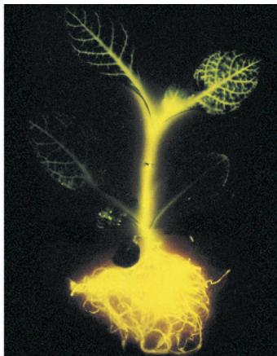  
(a) Tobacco plant expressing a firefly gene. The yellow glow is produced by a chemical reaction catalyzed by the protein product of the firefly gene.

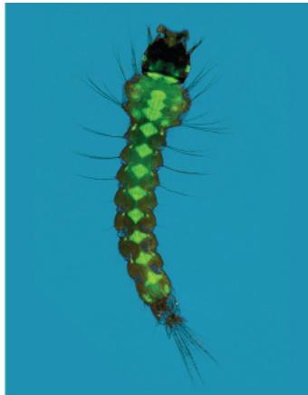  
(b) Mosquito larva expressing a jellyfish gene. The gene codes for green fluorescent protein (GFP) and is inserted into organisms as a reporter gene so researchers can tell if a gene of interest is being expressed.

Bacteria can be programmed by the insertion of human genes to synthesize certain human proteins for medical use, such as insulin. Such applications have produced many exciting developments in the area of biotechnology (see Concept 20.4).

The evolutionary significance of the code's near universality is clear. A language shared by all living things must have been operating very early in the history of life—early enough to be present in the common ancestor of all present-day organisms. A shared genetic vocabulary is a reminder of the kinship of all life.

#### [EN] Concept Check 17.1

1. MAKE CONNECTIONS In a research article about alkaptonuria published in 1902, Garrod suggested that humans inherit two “characters” (alleles) for a particular enzyme and that both parents must contribute a faulty version for the offspring to have alkaptonuria. Today, would this disorder be called dominant or recessive? (See Concept 14.4.)

2. Describe the polypeptide product you would expect from a poly-G mRNA that is 30 nucleotides long.

3. DRAW IT The template strand of a gene contains the sequence 3'-TTCAGTCGT-5'. Suppose that the nontemplate sequence were transcribed instead of the template sequence. Draw the nontemplate sequence in 3' to 5' order. Then, draw the mRNA sequence and translate it using Figure 17.6. Predict how well the protein synthesized from the nontemplate strand would function, if at all.

For suggested answers, see Appendix A.

<!-- C-END Campbell 17.1 -->

## 3.3 RNA 转录的基本过程

无论是原核还是真核细胞,RNA链的合成都具有以下几个特点:RNA是按 $5'\rightarrow3'$ 方向合成的,以DNA双链中的反义链(模板链)为模板,在RNA聚合酶催化下,以4种核苷三磷酸(NTPs)为原料,根据碱基配对原则(A-U、T-A、G-C),各核苷酸间通过形成磷酸二酯键相连,不需要引物的参与,合成的RNA带有与DNA编码链(有义链)相同的序列(A-U)。转录的基本过程包括模板识别、转录起始、通过启动子及转录的延伸和终止 $^{(图3-5)}$ 。

  
图 3-5 大肠杆菌中依赖于 DNA 的 RNA 转录过程图示  
(a) 在转录的任意时刻, 转录泡中单链 DNA 的长度为 17 个碱基左右, 被聚合形成复合物所保护的 DNA 序列为 35 个碱基左右; (b) 由于基因转录所引起的 DNA 超螺旋结构变化。

## 3.3.1 模板识别

模板识别(template recognition)阶段主要指RNA聚合酶识别启动子序列并与启动子DNA双链特异性结合的过程。启动子(promoter)是基因转录起始所必需的一段DNA序列，是基因表达调控的上游顺式作用元件之一。

## 3.3.2 转录起始

转录起始(initiation)不需要引物。RNA聚合酶结合在启动子上以后，使启动子附近的DNA双链解旋并解链，形成转录泡以促使底物核糖核苷酸与模板DNA的碱基配对。转录起始就是RNA链上第一个核苷酸键的产生。

图 3-6 DNA 的转录循环假说

(a) 转录循环示意图；
(b) RNA 聚合酶 - DNA
-RNA 的转录复合物
模型。

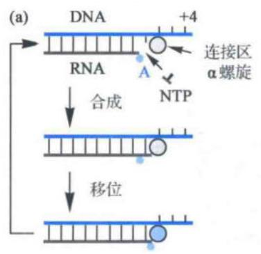

## 3.3.3 转录延伸

RNA 的合成是连续的过程。一旦进入转录延伸(elongation)阶段,底物 NTP 不断被添加到新生 RNA 链的 3'-OH 端,随着转录泡复合体与 RNA 聚合酶沿着 DNA 模板向前移动,DNA 双螺旋持续解开,暴露出新的单链 DNA 模板,新生 RNA 链的 3' 端不断延伸,在解链区形成 RNA-DNA 杂合物。而在解链区的后面,DNA 模板链与其原先配对的非模板链重新结合成为双螺旋,RNA 链被逐步释放。

现在常用 DNA 转录循环(transcription cycle—transloction mechanism)假说(图 3-6)来解释 RNA 链的延伸。首先,三磷酸核苷酸(NTP)填补了开放的底物位点并在活性位点形成磷酯键;此时,处于 RNA 聚合酶 II 活性位点的核酸发生“移位”,其中连接区的 α 螺旋结构从笔直变为弯折再恢复为笔直状态,为下一轮 RNA 合成留出了空的底物位点。

## 3.3.4 转录终止

当 RNA 链延伸到转录终止(termination)位点时,RNA 聚合酶不再形成新的磷酸二酯键,RNA-DNA 杂合物分离,转录泡瓦解,DNA 恢复成双链状态,而 RNA 聚合酶和 RNA 链都被从模板上释放出来,这就是转录的终止。

<!-- C-BEGIN Campbell 17.2 -->

### 【英文对应 Campbell Concept 17.2：Transcription is the DNA-directed synthesis of RNA: A Closer Look】

> 来源：Campbell Biology（书籍/01_Campbell_Biology） 第17章 Gene Expression From Gene to Protein，Concept 17.2。

#### [EN] Concept 17.2: Transcription is the DNA-directed synthesis of RNA: A Closer Look

Now that we have considered the linguistic logic and evolutionary significance of the genetic code, we are ready to reexamine transcription, the first stage of gene expression, in greater detail.

#### [EN] Molecular Components of Transcription

Messenger RNA, the carrier of information from DNA to the cell's protein-synthesizing machinery, is transcribed from the template strand of a gene. An enzyme called an RNA polymerase pries the two strands of DNA apart and joins together RNA nucleotides complementary to the DNA template strand, thus elongating the RNA polynucleotide (Figure 17.8). Like the DNA polymerases that function in DNA replication, RNA polymerases can assemble a polynucleotide only in its $5' \rightarrow 3'$ direction, adding onto its $3'$ end. Unlike DNA polymerases, however, RNA polymerases are able to start a chain from scratch; they don't need to add the first nucleotide onto a pre-existing primer.

Figure 17.8 The stages of transcription: initiation, elongation, and termination.

This general depiction of transcription applies to both bacteria and eukaryotes, but the details of termination differ, as described in the text. Also, in a bacterium, the RNA transcript is immediately usable as mRNA; in a eukaryote, the RNA transcript must first undergo processing.

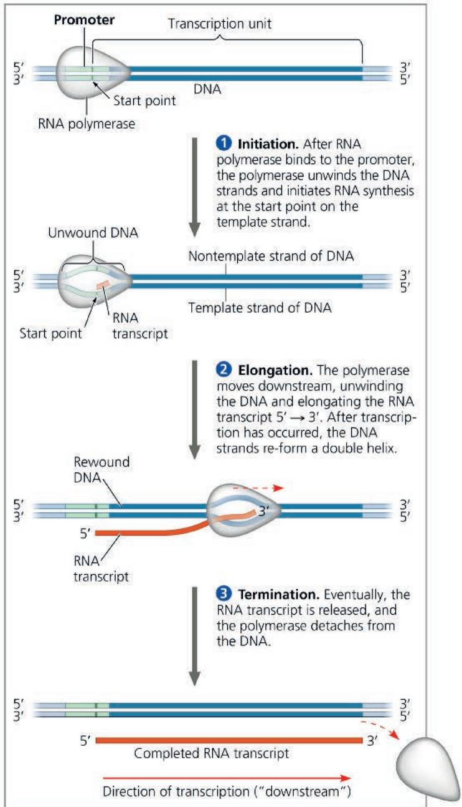  
MAKE CONNECTIONS Compare the use of a template strand during transcription and replication. See Figure 16.18.  
For suggested answer, see Appendix A.

Specific sequences of nucleotides along the DNA mark where transcription of a gene begins and ends. The DNA sequence where RNA polymerase attaches and initiates transcription is known as the promoter; in bacteria, the sequence that signals the end of transcription is called the terminator. (The termination mechanism in eukaryotes will be described later.) Molecular biologists refer to the direction of transcription as “downstream” and the other direction as “upstream.” These terms are also used to describe the positions of nucleotide sequences within the DNA or RNA. Thus, the promoter sequence in DNA is said to be upstream from the terminator. The stretch of DNA downstream from the promoter that is transcribed into an RNA molecule is called a

#### [EN] transcription unit.

Bacteria have a single type of RNA polymerase that synthesizes not only mRNA but also other types of RNA that function in gene expression, such as ribosomal RNA. In contrast, eukaryotes have at least three types of RNA polymerase in their nuclei; the one used for pre-mRNA synthesis is called RNA polymerase II. The other RNA polymerases transcribe RNA molecules that are not translated into protein. In the discussion that follows, we start with the features of mRNA synthesis common to both bacteria and eukaryotes and then describe some key differences.

#### [EN] Synthesis of an RNA Transcript

The three stages of transcription, as shown in Figure 17.8 and described next, are initiation, elongation, and termination of the RNA chain. Study Figure 17.8 to familiarize yourself with the stages and the terms used to describe them.

#### [EN] RNA Polymerase Binding and Initiation of Transcription

The promoter sequence of a gene includes within it the transcription start point—the nucleotide where RNA polymerase actually begins synthesizing the mRNA—and typically extends several dozen or so nucleotide pairs upstream from the start point (Figure 17.9). Based on interactions with proteins (transcription factors), RNA polymerase binds in a precise location and orientation on the promoter. This binding determines where transcription starts and the direction it will travel, thus which strand of DNA is used as the template.

Certain sections of a promoter sequence are especially important for binding RNA polymerase in a way that ensures that transcription will begin at the correct start point. In bacteria, part of the RNA polymerase itself specifically recognizes and binds to the promoter. In eukaryotes, a collection of proteins called transcription factors (purple proteins in Figure 17.9), help guide the binding of RNA polymerase and the initiation of transcription. Only after transcription factors are attached to the promoter does RNA polymerase II bind to it. The whole complex of transcription factors and RNA polymerase II bound to the promoter is called a transcription initiation complex. Figure 17.9 shows the role of transcription factors and a crucial promoter DNA sequence called the TATA box in forming the initiation complex at a eukaryotic promoter.

The interaction between eukaryotic RNA polymerase II and transcription factors is an example of the importance of protein-protein interactions in controlling eukaryotic transcription. Once the appropriate transcription factors are firmly attached to the promoter DNA and the polymerase is bound to them in the correct orientation on the DNA, the enzyme unwinds the two DNA strands and begins transcribing the template strand at the start point.

Figure 17.9 The initiation of transcription at a eukaryotic promoter. In eukaryotic cells, proteins called transcription factors mediate the initiation of transcription by RNA polymerase II.  
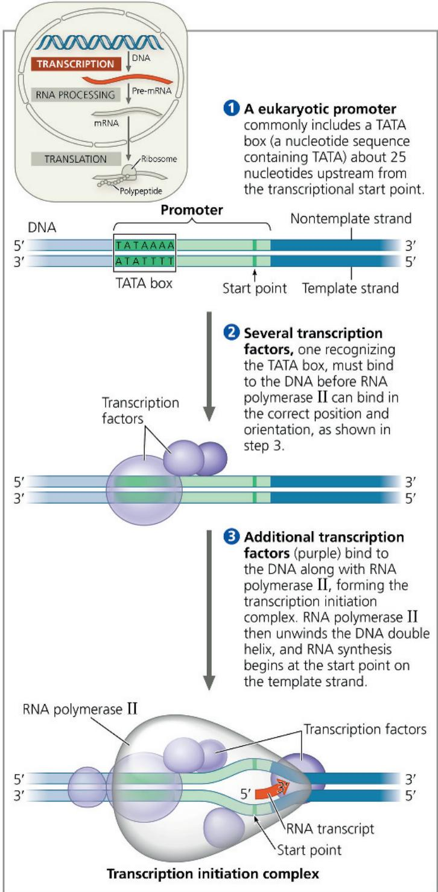  
Explain how the interaction of RNA polymerase with the promoter would differ if the figure showed transcription initiation for bacteria.
For suggested answer, see Appendix A.

#### [EN] Elongation of the RNA Strand

As RNA polymerase moves along the DNA, it untwists the double helix, exposing about 10–20 DNA nucleotides at a time for pairing with RNA nucleotides (Figure 17.10). The enzyme adds nucleotides to the 3' end of the growing RNA molecule as it moves along the double helix. As transcription proceeds forward, the newly synthesized RNA molecule behind the RNA polymerase peels away from its DNA template, and the DNA double helix reforms. Transcription progresses at a rate of about 40 nucleotides per second in eukaryotes.

A single gene can be transcribed simultaneously by several molecules of RNA polymerase following each other like trucks in a convoy. A growing strand of RNA trails off from each polymerase, with the length of each new strand reflecting how far along the template the enzyme has traveled from the start point (see the mRNA molecules in Figure 17.23). The congregation of many polymerase molecules simultaneously transcribing a single gene increases the amount of mRNA transcribed from it, which helps the cell make the encoded protein in large amounts.

#### [EN] Termination of Transcription

Bacteria and eukaryotes differ in the way they terminate transcription. In bacteria, transcription proceeds through a terminator sequence in the DNA. The transcribed terminator (an RNA sequence) functions as the termination signal, causing the polymerase to detach from the DNA and release the transcript, which requires no further modification before translation. In eukaryotes, RNA polymerase II transcribes a sequence on the

Figure 17.10 Transcription elongation.

RNA polymerase moves along the DNA template strand, joining complementary RNA nucleotides to the 3' end of the growing RNA transcript. Behind the polymerase, the new RNA peels away from the template strand, which re-forms a double helix with the nontemplate strand.

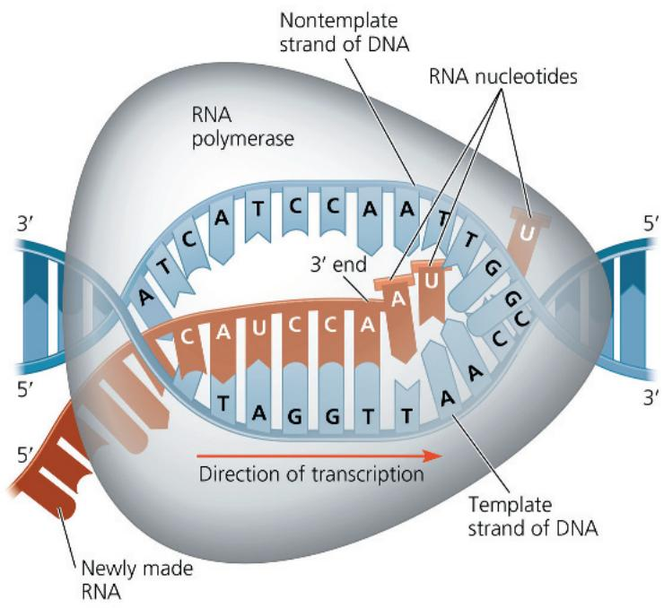

DNA called the polyadenylation signal sequence, which specifies a polyadenylation signal (AAUAAA) in the pre-mRNA. This is called a “signal” because once this stretch of six RNA nucleotides appears, it is immediately bound by certain proteins in the nucleus. Then, at a point about 10–35 nucleotides downstream from the AAUAAA, these proteins cut the RNA transcript free from the polymerase, releasing the pre-mRNA. The pre-mRNA then undergoes processing, the topic of the next section. Although that cleavage marks the end of the mRNA, the RNA polymerase II continues to transcribe. Enzymes begin to degrade the RNA made after cleavage, starting at its newly exposed 5' end. The polymerase continues transcribing, pursued by the enzymes, until they catch up to the polymerase and it dissociates from the DNA.

#### [EN] Concept Check 17.2

1. What is a promoter? Is it located at the upstream or downstream end of a transcription unit?

2. What enables RNA polymerase to start transcribing a gene at the right place on the DNA in a bacterial cell? In a eukaryotic cell?

3. WHAT IF? Suppose X-rays caused a sequence change in the TATA box of a particular gene's promoter. How would that affect transcription of the gene? (See Figure 17.9.)

For suggested answers, see Appendix A.

<!-- C-END Campbell 17.2 -->

## 3.4 原核生物与真核生物的转录及产物特征比较

## 3.4.1 原核生物与真核生物转录过程比较

原核生物与真核生物基因转录具有一定的相似性,但也存在以下几方面的差异(表3-1):

① 只有一种 RNA 聚合酶参与所有类型的原核生物基因转录,而真核生物有 3 种以上的 RNA 聚合酶来负责不同类型的基因转录,合成不同类型的、在细胞核内有不同定位的 RNA。

② 转录产物有差别。原核生物的初始转录产物大多数是编码序列，与蛋白质的氨基酸序列呈线性关系；而真核生物的初始转录产物很大，含有内含子序列，成熟的 mRNA 只占初始转录产物的一小部分。

表 3-1 原核生物与真核生物转录比较

<table><tr><td>原核生物</td><td>真核生物</td></tr><tr><td>一种RNA聚合酶参与转录</td><td>3种以上RNA聚合酶参与转录</td></tr><tr><td>初始转录产物大多是编码序列,与蛋白质的氨基酸序列呈线性关系</td><td>初始转录产物很大,含内含子序列,成熟的mRNA只占初始转录产物的一小部分</td></tr><tr><td>初始转录产物不需要剪接加工就可行使翻译模板的功能</td><td>初始转录产物需要经过剪接、修饰等加工才能成为成熟的mRNA</td></tr><tr><td>转录和翻译发生在同一个细胞空间,这两个过程几乎是同步进行的</td><td>真核细胞mRNA的合成和功能表达发生在不同的空间和时间范畴内</td></tr></table>

图3-7 原核生物和真核生物转录及翻译的比较  

③ 原核生物的初始转录几乎不需要剪接加工, 就可直接作为成熟的 mRNA 进一步行使翻译模板的功能; 真核生物转录产物需要经过剪接、修饰等转录后加工成熟过程才能成为成熟的 mRNA。

④ 在原核生物细胞中,转录和翻译不仅发生在同一个细胞空间里,而且这两个过程几乎是同步进行的,蛋白质合成往往在 mRNA 刚开始转录时就被引发了。真核生物 mRNA 的合成和蛋白质的合成则发生在不同的空间和时间范畴内(图 3-7)。

## 3.4.2 原核生物 mRNA 的特征

## 1. 原核生物 mRNA 的半衰期短

细菌基因的转录与翻译是紧密相联的,基因转录一旦开始,核糖体就结合到新生mRNA链的5'端,启动蛋白质合成,而此时该mRNA的3'端还远远没有转录完全(图3-8)。

图 3-8 在细菌中，mRNA 的转录、翻译和降解几乎同时进行，mRNA 的半衰期非常短  

在电子显微镜下,我们可以看到一连串核糖体紧紧跟在RNA聚合酶后面。

绝大多数细菌 mRNA 的半衰期短得令人吃惊, mRNA 的降解紧随着蛋白质翻译过程发生。现在一般认为, 转录开始 1 min 后, 降解就开始了, 这就是说, 当一个 mRNA 的 5' 端开始降解时, 其 3' 端部分可能仍在合成或被翻译。mRNA 降解的速度大概只有转录或翻译速度的一半。科学家发现每过大约 2 min, 体系中出现新生蛋白质的速度就下降 50%。

因为基因转录和多肽链延伸的速度基本相同,所以细胞内某一基因产物(蛋白质)的多少决定于转录和翻译的起始效率,以大肠杆菌色氨酸合成酶基因为例,平均每分钟约有15次转录起始,这些mRNA链从生成到降解平均被翻译10次,所以,稳定状态下细胞中每分钟生成150个多肽。在讨论mRNA半衰期的时候我们不应忘记,所有这一切都只是统

计学上的平均值。事实上,新生 mRNA 与成熟 mRNA 受核酸酶“攻击”的概率是相等的。所以,有些 mRNA 链可能被翻译了许多次,而同一群体中的另外一些 mRNA 分子可能根本没有被翻译。虽然 mRNA 的寿命具有随机性,但某一 mRNA 的翻译产量却是大致稳定的。

## 2. 许多原核生物 mRNA 可能以多顺反子的形式存在

细菌 mRNA 可以同时编码不同的蛋白质,我们把只编码一个蛋白质的 mRNA 称为单顺反子 mRNA (monocistronic mRNA), 把编码多个蛋白质的 mRNA 称为多顺反子 mRNA (polycistronic mRNA)。多顺反子 mRNA 是一组相邻或相互重叠基因的转录产物 (图 3-9), 这样的一组基因可被称为一个操纵子（operon），是生物体内的重要遗传单位，如大肠杆菌乳糖操纵子转录成编码3条多肽的多顺反子mRNA，经过翻译生成β-半乳糖苷酶、透过酶及乙酰基转移酶。

图 3-9 许多原核细胞的 mRNA 以多顺反子形式存在  
  
第3章 生物信息的传递(上) 仅供个人科学教研

几乎所有 mRNA 都可以被分成 3 部分: 编码区和位于 AUG 之前的 5' 端上游非编码区, 以及位于终止密码子之后不翻译的 3' 端下游非编码区。编码区从起始密码子 AUG 开始, 经一连串编码氨基酸的密码子直至终止密码子。对于第一个顺反子来说, 一旦 mRNA 的 5' 端被合成, 翻译起始位点即可与核糖体相结合, 而后面几个顺反子翻译的起始就会受其上游顺反子结构的调控。一种情况是, 第一个蛋白质合成终止以后, 核糖体分解成大、小亚基, 脱离 mRNA 模板, 第二个蛋白质的翻译必须等到新的小亚基和大亚基与该蛋白质起始密码子相结合后才可能开始 (图 3-10a)。当然, 前一个多肽翻译完成以后, 核糖体大、小亚基分离, 小亚基也可能不离开 mRNA 模板, 而是迅速与游离的大亚基结合, 启动第二个多肽的合成 (图 3-10b)。

## 3. 原核生物 mRNA 的 5' 端无帽子结构, 3' 端没有或只有较短的多 (A) 结构

原核生物起始密码子AUG上游7～12个核苷酸处有一被称为SD序列(Shine-Dalgarnosequence)的保守区，因为该序列与16S rRNA 3'端反向互补，所以被认为在核糖体与mRNA的结合过程中起作用(图3-11)。如果把16S rRNA 3'端的6个保守核苷酸反过来写，则为3'-UCCUCC-5'。所有已知大肠杆菌mRNA的翻译起始区都含有4～5个(至少3个)对应于SD序列的核苷酸。

细菌 16S rRNA 的 3' 端既非常保守, 又高度自我互补, 能形成发夹结构。与 mRNA 互补的部分也参与这个“发夹”的形成。表面上看这似乎是一对矛盾, 一个序列不可能在形成“发夹”的同时又与 mRNA 相结合。事实上, 这正好说明序列配对是动态的、可变的, 翻译起始复合物的生成很可能包含了 rRNA 3' 端的发夹结构的改变, 启动蛋白质翻译以

  
图 3-10 原核生物多顺反子基因中后续编码区翻译起始受顺反子之间距离的影响

(a) 当两个顺反子之间距离较远时, 前一顺反子翻译的终止与后一顺反子翻译的起始是相互独立的; (b) 当两个顺反子之间距离较近时, 前一顺反子翻译的终止与后一顺反子翻译的起始相衔接, 30S 小亚基始终与 mRNA 结合, 只有 50S 大亚基可能与 mRNA 分离。

<!-- END OFFICIAL API PART part_001 -->

<!-- BEGIN OFFICIAL API PART part_002 -->

图 3-11 SD 序列与 16S rRNA 3' 端反向互补, 在核糖体与 mRNA 的结合过程中发挥重要作用

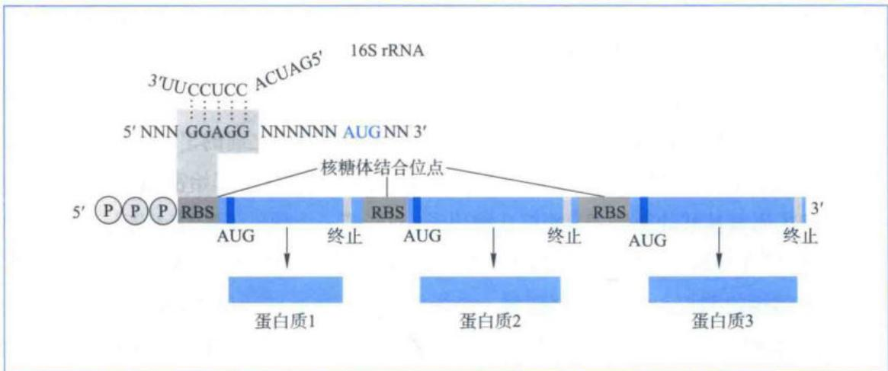  
后，mRNA-rRNA 杂合体被打破，为核糖体在 mRNA 模板上的移动创造了条件。

## 3.4.3 真核生物 mRNA 的特征

凡是编码功能蛋白的真核基因都通过 RNA 聚合酶Ⅱ进行转录, 真核基因几乎都是单顺反子, 只包含一个蛋白质的信息, 其长度在几百到几千个核苷酸之间。一个完整的基因, 不但包括编码区 (coding region), 还包括 5' 和 3' 端长度不等的特异性序列, 它们虽然不编码氨基酸, 却在基因表达的过程中起着重要作用。所以, “基因” 的分子生物学定义是: 产生一条多肽链或功能 RNA 所必需的全部核苷酸序列! 真核生物 mRNA 结构上的最大特征是 5' 端的帽子及 3' 的多 (A) 结构 (图 3-12a)。

## 1. 真核生物 mRNA 的 5' 端存在“帽子”结构

真核生物(不包括叶绿体和线粒体)的mRNA 5'端都是经过修饰的,基因转录一般从嘌呤(主要是A,也可能是G)起始,第一个核苷酸保留了5'端的三磷酸基团并能通过其3'-OH位与下一个核苷酸的5'磷酸基团形成二酯键,转录产物的起始序列为pppApNpNp……。然而,如果在体外用核酸酶处理成熟mRNA,其5'端并不产生预期的核苷三磷酸,而产生以5'→5'三磷酸基团相连的二核苷酸,5'终端是一个在mRNA转录后加上去的甲基化鸟嘌呤(图3-12)。

mRNA 5' 端加 “G” 的反应是由鸟苷酸转移酶完成的, 这个反应非常迅速, 很难在体外或体内测得 5' 自由三磷酸基团的存在。据测算, 在新生 mRNA 链达到 50 个核苷酸之前, 甚至可能在 RNA 聚合酶 II 离开转录起始位点之前, 帽子结构就已加到 mRNA 的第一个核苷酸上了。这就是说, mRNA 几乎一诞生就是戴上帽子的。一般认为, 帽子结构是 GTP 和原 mRNA 5' 三磷酸腺苷 (或鸟苷) 缩合反应的产物, 新加上的 G 与 mRNA 链上所有其他核苷酸方向正好相反, 像一顶帽子倒扣在 mRNA 链上, 故而得名。

mRNA 的帽子结构常常被甲基化。第一个甲基出现在所有真核细胞的 mRNA 中(单细胞真核生物 mRNA 主要是这个结构)，由鸟嘌呤 -7- 甲基转移酶 (guanine-7-methyltransferase) 催化，称为零类帽子(cap0)。帽子结构的下一步是在第二个核苷酸(原 mRNA 5'第一位)的 2'-OH 位上加另一个甲基，这步反应由 2'-O- 甲基转移酶完成。一般把有这两个甲基的结构称为 1 类帽子(cap1)，真核生物中以这类帽子结构为主。当 mRNA 原第一位核苷酸是腺嘌呤时，其 N $^{6}$ 位有时也被甲基化，这一反应只能在 2'-OH 被甲基化以后才能发生。在某些生物细胞内，mRNA 链上的原第二个核苷酸的 2'-OH 位也可能被甲基化，因为这个反应只以带有 1 类帽子的 mRNA 为底物，所以被称为 2 类帽子(cap2)。有 2 类帽子的 mRNA 只占有帽 mRNA 总量的 15% 以下。

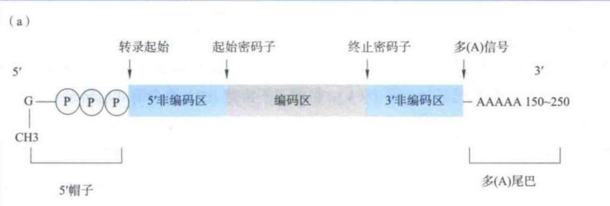  
图 3-12 真核生物 mRNA 结构
(a) 真核生物 mRNA 的结构特征; (b) 真核生物 mRNA 的帽子结构。

(b)  

帽子结构可能使 mRNA 免遭核酸酶的破坏。实验表明，去除珠蛋白 mRNA 5' 端的 7-甲基鸟嘌呤后，该 mRNA 分子的翻译活性和稳定性都明显下降。而且，有帽子结构的 mRNA 更容易被蛋白质合成的起始因子所识别，从而促进蛋白质的合成。在呼肠孤病毒中，含甲基化 5' 端 mRNA 的蛋白质合成速度比不含甲基的 mRNA 要快。用化学方法除去 5' 端的甲基以后，上述 mRNA 作为蛋白质合成模板的活性消失，说明 mRNA 5' 端甲基化的帽子是翻译所必需的。已经发现在呼肠孤病毒中无 m $^{7}$ G 的 mRNA 不能与核糖体 40S 小亚基结合，证明甲基化的帽子结构可能是蛋白质合成起始信号的一部分。

## 2. 绝大多数真核生物 mRNA 具有多(A)尾

除组蛋白基因外,真核生物 mRNA 的 3' 端都有多(A)序列,其长度因 mRNA 种类不同而变化,一般为 40\~200 个。多(A)序列是在转录后加上去的,可能在细胞核中的核内不均一 RNA 阶段就已经加上了多(A)。目前还不清楚 RNA 聚合酶 II 所转录基因的精确终止位点,但研究发现,几乎所有真核基因的 3' 端转录终止位点上游 15\~30 bp 处的保守序列 AAUAAA 对于初级转录产物的准确切割及加多(A)是必需的(图 3-13)。实验证明,尽管多(A)位点及 AATAAA 的存在对于基因的转录和成熟意义重大,但 RNA 聚合酶 II 却不在多(A)位点终止,而往往继续转录,因此,大部分已知基因的初始转录产物拥有多(A)位点下游 0.5\~2 kb 核苷酸序列。

加多(A)时需要由内切酶切开 mRNA 3' 端的特定部位,然后由多(A)合成酶催化多腺苷酸的反应。如果将上述保守序列切除,该基因组合的转录活性就会消失。点突变实验将 AAUAAA 变为 AAGAAA,虽然维持了该基因的转录活性,却发现 mRNA 的剪接加工受阻,因而没有功能性 mRNA 产生。

多(A)是mRNA由细胞核进入细胞质所必需的形式,它大大提高了mRNA在细胞质中的稳定性。当mRNA刚从细胞核进入细胞质时,其多(A)尾一般比较长,随着mRNA在细胞质内逗留时间延长,多(A)逐渐变短消失,mRNA进入降解过程。此外,翻译起始因子eIF4F和包绕在多(A)尾的poly(A)结合蛋白之间的相互作用使真核mRNA保持环状,因而多(A)还能增强mRNA的可翻译能力。

真核生物 mRNA 大都具有多(A)尾,这一特性已被广泛应用于分子克隆。常用寡聚dT片段与 mRNA 上的多(A)相配对,作为反转录酶合成第一条 cDNA 链的引物。

尽管大部分真核 mRNA 有多(A)尾,细胞中仍可有多达 1/3 没有多(A)的 mRNA,我们把带有多(A)的 mRNA 称为多(A) $^{+}$ ,而把没有多(A)的 mRNA 称为多(A) $^{-}$ 。现已查明,约 1/3 的多(A) $^{-}$ mRNA 编码了不同形式的组蛋白, 其余 2/3 的多(A) $^{-}$ mRNA 可能带有与多(A) $^{+}$ 组分相同的遗传信息。

图 3-13 真核生物 mRNA 的加多(A)反应  

<!-- W-BEGIN Watson 15 信使 RNA -->

### 【中文对照 Watson 第15章：信使 RNA】

> 来源：Watson《基因的分子生物学》第七版中译本（书籍/03_基因的分子生物学_第七版） 第15章 翻译。

#### [W] 信使RNA

#### [W] 多肽链是由可读框决定的

翻译机器只解码每条 mRNA 的部分序列。如在第 2 章中所提到的及在第 16 章中将要详细讨论的，蛋白质合成的信息蕴藏在三联核苷酸密码子中，每个密码子决定一个氨基酸。每条 mRNA 的蛋白质编码区由连续的、不交叠的、称为可读框（open reading frame，一般简称为 ORF）的密码子串组成。每个 ORF 对应一个蛋白质，其起始和终止点都位于 mRNA 内部，即 ORF 的终止点不同于 mRNA 的终止点。

翻译始于可读框的 5'端起点，每次读取一个密码子直到 3'端终点。第一个和最后一个密码子分别称为起始密码子（start codon）和终止密码子（stop codon）。细菌中，起始密码子通常是 5'-AUG-3'，但是 5'-GUG-3'有时甚至 5'-UUG-3'也被使用。真核细胞总是使用 5'-AUG-3'作为起始密码子。起始密码子有两个重要的功能：第一，它决定插入到延伸过程中的多肽链的第一个氨基酸；第二，它确定了所有后续密码子的可读框。由于密码子是一个紧接一个排列（但不相互交叠），而且由三个核苷酸组成，因此每条mRNA 链可以用三种不同模式的可读框来翻译（图 15-1）。但是一旦翻译开始了，可读框的模式就确定了。这样，通过设定第一个密码子的位置，起始密码子决定了所有后续密码子的位置。

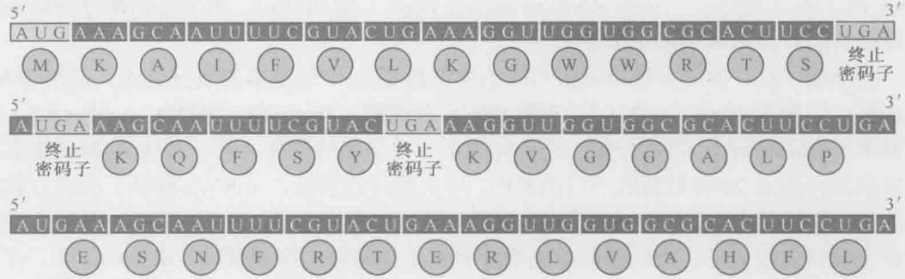  
图 15-1 大肠杆菌 Trp（Escherichia coli trp）前导序列的三种可能的可读框。起始密码子以绿色表示，终止密码子以红色表示。每个可读框编码的氨基酸序列在每一密码子的下方以单个字母表示。

终止密码子有三个（5'-UAG-3'、5'-UGA-3'、5'-UAA-3'），它们决定可读框的终点并发出终止多肽合成的信号。我们现在可以全面地理解可读框这一术语的含义了。它是一段连续的密码子，以特定的框架（由第一个密码子决定）来“阅读”，该框架对翻译过程是“开放”的，因为它没有终止密码子（也就是说，翻译过程可持续到ORF的最后一个密码子）。

信使 RNA 包含至少一个可读框。每条 mRNA 的 ORF 数量在真核和原核细胞中是有区别的。真核细胞的 mRNA 几乎都只有一个 ORF。相反，原核细胞的 mRNA 经常含有两个或多个 ORF，因此可编码多个多肽链。含有多个 ORF 的信使 RNA 称为多顺反子 mRNA（polycistronic mRNA），而那些只编码一个 ORF 的信使 RNA 称为单顺反子 mRNA（monocistronic mRNA）。正如在第 13 章中所提到的，细菌中的多顺反子 mRNA 经常编码功能相关的蛋白质，如在氨基酸或核酸的生物合成过程中参与不同步骤的蛋白质。典型的原核和真核细胞的 mRNA 结构如图 15-2 所示。

#### [W] 原核细胞 mRNA 具有核糖体结合位点，可以募集翻译机器

要使翻译发生，mRNA 必须募集核糖体。为了促进其与核糖体结合，许多原核细胞的可读框在起始密码子的上游（5'端）含有一段短序列称为核糖体结合位点（ribosomebinding site, RBS）。这一元件也被称作 SD 序列（Shine-Dalgarno sequence），它是通过比较多个 mRNA 序列后所发现，并以发现它的科学家的名字所命名的。RBS 一般位于起始密码子 5'端 3\~9 个碱基内，并与核糖体 RNA 组分之一的 16S 核糖体 RNA（rRNA，图 15-2a）的 3'端的一段序列互补。RBS 与这一 RNA 发生碱基配对，使得核糖体排列在可读框的起始处。16S RNA 的这一区域的核心序列为 5'-CCUCCU-3'。无独有偶，原核细胞的 RBS 大多具有 5'-AGGAGG-3'序列。RBS 和起始密码子之间碱基的互补状况和空间距离对可读框翻译的活跃程度有很大的影响：互补度高并且距离适合的情况能提高翻译的水平；反之，互补度低和（或）距离不当则通常导致较低水平的翻译。

  
图 15-2 信使 RNA 的结构。(a) 一个多顺反子的原核细胞信使 RNA。核糖体结合位点以 RBS 表示。(b) 一个单顺反子的真核细胞信使 RNA。5' 帽子结构在 mRNA 的末端以球形表示。

某些原核细胞的 ORF 缺乏较强的 RBS 但仍有活跃的翻译。这些 ORF 不是 mRNA 的第一个 ORF，而位于多顺反子信使 RNA 中另一个 ORF 之后（不是所有的原核 mRNA 是多顺反子）。在这些情况下，下游可读框的起始密码子经常与上游可读框的 3' 端相交叠（大多数是 5'-AUGA-3' 序列，既有起始密码子，也有终止密码子）。这样，刚刚结束上游可读框翻译的核糖体正好处于恰当的位置，并从下游可读框的起始密码子开始翻译。这种结构安排绕开了用 RBS 募集核糖体的需要。这种交叠可读框之间的连锁翻译称为翻译耦合（translational coupling）。需要注意的是，在这种情况下，下游 ORF 的翻译的进行需要依赖于上游 ORF 的翻译。事实上，对于两个翻译耦合的基因，上游 ORF 中的终止突变也会阻止下游 ORF 的翻译。

#### [W] 真核细胞 mRNA 在 5' 和 3' 端被修饰，以促进翻译

与原核细胞不同，真核细胞的 mRNA 通过位于 5' 端的称为 5' 帽子（5' cap）的特殊化学修饰来募集核糖体（第 13 章和图 13-25b）。所谓 5' 帽子，是一个通过与众不同的 5'-5' 结合方式与 mRNA 的 5' 端结合的甲基化鸟嘌呤核苷酸。经过 3 个步骤进行合成（第 13 章和图 13-24），5' 帽子的鸟嘌呤核苷酸与 mRNA 的 5' 端通过 3 个磷酸基团结合。这样形成的 5' 帽子结构能够募集核糖体结合到 mRNA 上。一旦结合到 mRNA 上，核糖体沿着 5'→3' 的方向移动直至遇到 5'-AUG-3' 起始密码子，这一过程称为扫描（scanning）。

真核生物 mRNA 有另外两个特征能促进翻译过程。其一是在某些 mRNA 中，起始密码子的上游第三个碱基为嘌呤并且第一个下游碱基为鸟嘌呤的特殊序列（5'-G/

ANNAUGG-3')。这一序列首先由 Marilyn Kozak 发现，称为 Kozak 序列。虽然许多真核细胞缺乏 Kozak 序列，但它的存在确实能够提高翻译的效率。与原核细胞的情况相反，Kozak 序列被认为能够与起始 tRNA 发生相互作用，而不是与核糖体的 RNA 成分相互作用。另一个有利于翻译的特征是 3' 端的 poly-A 尾结构。如第 13 章所述，这一尾结构是由 poly-A 聚合酶合成的。尽管位于 mRNA 的 3' 端，poly-A 尾巴可通过增强关键翻译起始因子的募集作用来提高翻译的水平。更重要的是，除了在翻译中的作用以外，这些 5' 端和 3' 端的修饰也可以保护真核 mRNA 免受快速降解（我们将在“依赖翻译的 mRNA 和蛋白质的稳定性调节”部分进行讨论）。

<!-- W-END Watson 15 信使 RNA -->

## 3.5 原核生物 RNA 聚合酶与 RNA 转录

## 3.5.1 原核生物 RNA 聚合酶

在细菌中,一种 RNA 聚合酶几乎负责所有 mRNA、rRNA 和 tRNA 的合成。大多数原核生物 RNA 聚合酶的组成是相同的,大肠杆菌 RNA 聚合酶是原核生物 RNA 聚合酶中研究最清楚的酶,它首先由 2 个 α 亚基、一个 β 亚基、一个 β' 亚基和一个 ω 亚基组成核心酶,然后加上一个 σ 亚基后则成为聚合酶全酶(holoenzyme),相对分子质量为 $4.65 \times 10^{5}$ (图 3-14)。

原核生物转录的起始需要全酶参与,由 $\sigma$ 因子辨认起始点,延长过程仅需要核心酶的催化。转录的真实性取决于有特异的转录起始位点,转录起始后按照碱基互补原则准确地转录模板 DNA 序列及具有特异的终止部位。RNA 的合成是在模板 DNA 的启动子位点上起始的,而这个任务是靠 $\sigma$ 因子来完成的。RNA 聚合酶的核心酶虽可合成 RNA,但不能找到模板 DNA 上的起始位点,所以核心酶的产物是不均一的,而且 DNA 的两条链都可作为核心酶的模板。只有带 $\sigma$ 因子的全酶才能专一地与 DNA 上的启动子结合,选择其中一条链作为模板,合成RNA链。 $\sigma$ 因子的作用在于帮助转录起始,因此也称为起始亚基,一旦转录开始,它就脱离了起始复合物,而由核心酶负责RNA链的延伸。研究发现,由 $\beta$ 和 $\beta'$ 亚基组成了聚合酶的催化中心,它们在序列上与真核生物RNA聚合酶的两个大亚基有同源性。 $\beta$ 亚基能与模板DNA、新生RNA链及核苷酸底物相结合(表3-2)。

  
图 3-14 大肠杆菌 RNA 聚合酶的主要成分与功能

表 3-2 大肠杆菌 RNA 聚合酶的组成分析

<table><tr><td>亚基</td><td>基因</td><td>相对分子质量</td><td>亚基数</td><td>组分</td><td>功能</td></tr><tr><td> $\alpha$ </td><td>rpoA</td><td> $3.65 \times 10^{4}$ </td><td>2</td><td>核心酶</td><td>核心酶组装,启动子识别</td></tr><tr><td> $\beta$ </td><td>rpoB</td><td> $1.51 \times 10^{5}$ </td><td>1</td><td>核心酶</td><td rowspan="2"> $\beta$ 和 $\beta'$ 共同形成RNA合成的活性中心,与DNA模板结合,催化磷酸二酯键形成</td></tr><tr><td> $\beta'$ </td><td>rpoC</td><td> $1.55 \times 10^{5}$ </td><td>1</td><td>核心酶</td></tr><tr><td> $\omega$ </td><td>?</td><td> $1.1 \times 10^{4}$ </td><td>1</td><td>核心酶</td><td>未知</td></tr><tr><td> $\sigma$ </td><td>rpoD</td><td> $7.0 \times 10^{4}$ </td><td>1</td><td> $\sigma$ 因子</td><td>存在多种 $\sigma$ 因子,用于识别不同的启动子,促进转录起始</td></tr></table>

α亚基可能与核心酶的组装及启动子识别有关,并参与RNA聚合酶和部分调节因子的相互作用。实验证明,T4噬菌体感染大肠杆菌后对α亚基的一个精氨酸残基进行ADP糖基化修饰,造成RNA聚合酶全酶对启动子亲和力降低。

σ因子的作用是负责模板链的选择和转录的起始，它是酶的别构效应物，使酶专一性识别模板上的启动子。在细胞内σ因子的数量只有核心酶的30%，因此任何时候只有三分之一的聚合酶以全酶形式存在。σ因子可以极大地提高RNA聚合酶对启动子区DNA序列的亲和力(图3-14)，酶底结合常数提高 $10^{3}$ 倍，酶底复合物的半衰期可达数小时甚至数十小时。σ因子还能使RNA聚合酶与模板DNA上非特异性位点的结合常数降低 $10^{4}$ 倍，使非特异性位点酶底复合物的半衰期小于1s。核心酶在T7噬菌体DNA上约有1300个结合位点，平均结合常数为 $2\times10^{11}$ 。加入σ因子后则出现两类位点，大部分位点的结合常数在 $10^{8}\sim10^{9}$ 之间，但有8个位点的结合常数在 $10^{12}\sim10^{14}$ 之间，从而表明σ因子不仅增加聚合酶对启动子的亲和力，还降低了它对非专一位点的亲和力。

在某些细菌细胞内含有能识别不同启动子的 $\sigma$ 因子, 以适应不同生长发育阶段的要求, 调控不同基因转录的起始 $^{(表3-3)}$ 。

表 3-3 大肠杆菌中的 $\sigma$ 因子能识别并与启动子区的特异性序列相结合

<table><tr><td>因子</td><td>基因</td><td>功能</td><td>-35区</td><td>间隔/bp</td><td>-10区</td></tr><tr><td> $\sigma^{70}$ </td><td>rpoD</td><td>广泛</td><td>TTGACA</td><td>16~18</td><td>TATAAT</td></tr><tr><td> $\sigma^{32}$ </td><td>rpoH</td><td>热休克</td><td>TCTCNCCCTTGAA</td><td>13~15</td><td>CCCCATNTA</td></tr><tr><td> $\sigma^{54}$ </td><td>rpoN</td><td>氮代谢</td><td>CTGGNA</td><td>6</td><td>TTGCA</td></tr></table>

与大肠杆菌相比，T3 和 T7 噬菌体的 RNA 聚合酶在结构上要简单得多，它们由一条多肽链组成，相对分子质量小于 $1 \times 10^{5}$ 。在 $37^{\circ}C$ 下，它们的转录速度为每秒 200 个核苷酸。但是，这种简单的聚合酶只能起始存在于噬菌体中的几个启动子的转录。因此，大肠杆菌

RNA 聚合酶组成上的复杂性可能反映了它必须与大量蛋白质因子相互作用这个事实。

当 RNA 聚合酶按 $5'\rightarrow3'$ 方向延伸 RNA 链时, 解旋的 DNA 区域也随之移动。聚合酶可以横跨约 40 个碱基对, 而解旋的 DNA 区域大约是 17 个碱基对。自由核苷酸能被聚合酶加到新生的 RNA 链上, 并形成 DNA-RNA 杂合体。随着聚合酶在模板上的运动, 靠近 $3'$ 端的 DNA 不断解旋, 同时在 $5'$ 端重新形成 DNA 双链, 将 RNA 链挤出 DNA-RNA 杂合体。RNA 的 $3'$ 端有 20\~30 个核苷酸与 DNA 或聚合酶相结合 (图 3-5)。

图 3-15 转录启动子区 DNA 序列的分离纯化过程图示  

## 3.5.2 原核生物启动子结构

启动子区是 RNA 聚合酶的结合区, 其结构直接关系到转录的效率。那么, 启动子区有什么结构特点呢?

Pribnow 设计了一个实验,他把 RNA 聚合酶全酶与模板 DNA 结合后,用 DNase I 水解 DNA,然后用酚抽提,沉淀纯化 DNA 后得到一个被 RNA 聚合酶保护的 DNA 片段(图 3-15),有 41\~44 个核苷酸对。他先后分离了 fd 噬菌体、T7 噬菌体的 A₂ 及 A₃ 启动子、λ 噬菌体的 Pᵣ 启动子及大肠杆菌乳糖操纵子的 UV5 启动子等 5 段被酶保护的区域,并进行了序列分析,以后又有人做了 50 多个启动子的序列分析后发现,在被保护区内有一个由 5 个核苷酸组成的共同序列,是 RNA 聚合酶的紧密结合点,现在称为 Pribnow 区(Pribnow box),这个区的中央大约位于起点上游 10 bp 处,所以又称为 -10 区。

提纯被保护的片段后却发现，RNA聚合酶并不能重新结合或并不能选择正确的起始点，表明在保护区外可能还存在与RNA聚合酶对启动子的识别有关的序列。果然，科学家不久就从噬菌体的左、右启动子 $\mathrm{P_L}$ 及 $\mathrm{P_R}$ 和SV40启动子的-35bp附近找到了另一段共同序列：TTGACA。经过数年的努力，分析了46个大肠杆菌启动子的序列以后确证绝大部分启动子都存在这两段共同序列，即位于-10bp处的TATA区和-35bp处的TTGACA区(图3-16)。现已查明，-10位的TATA区和-35位的TTGACA区是RNA聚合酶与启动子的结合位点，能与 $\sigma$ 因子相互识别而具有很高的亲和力。

$$
\begin{array}{r l} & - 3 5 \text {   区   } \\ & \dots \dots \mathrm{T} _ {8 5} \mathrm{T} _ {8 3} \mathrm{G} _ {8 1} \mathrm{A} _ {6 1} \mathrm{C} _ {6 9} \mathrm{A} _ {5 2} \dots \dots \mathrm{T} _ {8 9} \mathrm{A} _ {8 9} \mathrm{T} _ {5 0} \mathrm{A} _ {6 5} \mathrm{A} _ {1 0 0} \dots \dots \end{array}
$$

## 3.5.3 原核生物启动子中 -10 区与 -35 区的最佳间距

在原核生物中，-35区与-10区之间的距离通常是 $16\sim 19$ 碱基对，小于15碱基对或大于20碱基对都会降低启动子的活性(图3-17)。保持启动子这两段序列以及它们之间的距离是十分重要的，否则就会改变它所控制基因的表达水平。这可以被解释为一旦-35区相对于-10区旋转所产生的超螺旋发生改变(增减一个碱基对就会使两者之间的夹角发生 $36^{\circ}$ 的变化), 若要使酶与 DNA 在这个区域内保持正确的取向, 就必须使二者之一发生扭曲, 需要增加结合自由能。

图 3-16 大肠杆菌 RNA 聚合酶全酶所识别的启动子区  

<table><tr><td colspan="2">上游元件</td><td>-35区</td><td>间隔区</td><td>-10区</td><td>间隔区</td><td>转录起始位点</td></tr><tr><td colspan="7">理论上一致性序列+1</td></tr><tr><td></td><td>NNAAAATTTT-T</td><td>N</td><td>TTGACA</td><td> $N_{17}$ </td><td>TATAAT</td><td> $N_6$ </td></tr><tr><td colspan="7">rrnBP1启动区序列</td></tr><tr><td></td><td>AGAAAATTATTTAAATTTCCT</td><td>N</td><td>GTGTCA</td><td> $N_{16}$ </td><td>TATAAT</td><td> $N_8$ </td></tr><tr><td colspan="2">trp</td><td>TTGACA</td><td> $N_{17}$ </td><td>TTAACT</td><td> $N_7$ </td><td>A</td></tr><tr><td colspan="2">lac</td><td>TTTACA</td><td> $N_{17}$ </td><td>TATGTT</td><td> $N_6$ </td><td>A</td></tr><tr><td colspan="2">recA</td><td>TTGATA</td><td> $N_{18}$ </td><td>TATAAT</td><td> $N_7$ </td><td>A</td></tr><tr><td colspan="2">araBAD</td><td>CTGACG</td><td> $N_{18}$ </td><td>TACTGT</td><td> $N_6$ </td><td>A</td></tr></table>

在细菌中常见两种启动子突变。一种叫下降突变(down mutation)，如果把 Pribnow 区从 TATAAT 变成 AATAAT 就会大大降低其结构基因的转录水平。另一类突变叫上升突变 (up mutation)，即增加 Pribnow 区共同序列的同一性。例如，在乳糖操纵子的启动子中，将其 Pribnow 区从 TATGTT 变成 TATATT，就会提高启动子的效率，提高乳糖操纵子基因的转录水平。

图3-17 -10区和-35区的最佳距离  
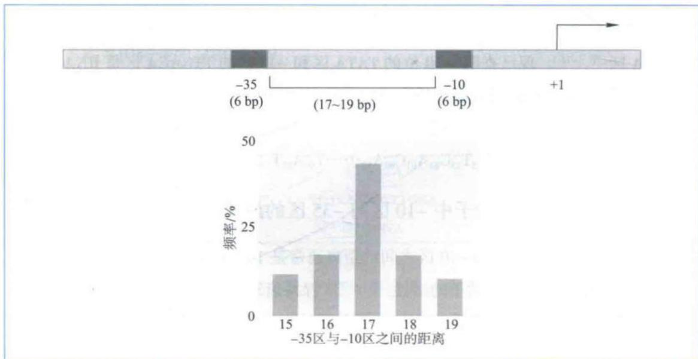

## 3.5.4 原核生物 RNA 聚合酶对启动子的识别和结合

大肠杆菌 RNA 聚合酶与启动子的相互作用主要包括启动子区的识别、酶与启动子的结合及 $\sigma$ 因子的结合与解离。

一般认为,RNA聚合酶并不直接识别碱基对本身,而是通过氢键互补的方式加以识别。在启动子区DNA双螺旋结构中,腺嘌呤分子上的 $N^{6}$ 、鸟嘌呤分子上的 $N^{2}$ 、胞嘧啶分子上的 $N^{4}$ 都是氢键供体,而腺嘌呤分子上的 $N^{7}$ 、 $N^{3}$ ,胸腺嘧啶分子上的 $O^{4}$ 、 $O^{2}$ ,鸟嘌呤分子上的 $N^{7}$ 、 $O^{6}$ 、 $N^{3}$ 和胞嘧啶分子上的 $O^{2}$ 都是氢键受体。由于它们分别处于DNA双螺旋的大沟或小沟内,因此都具有特定的方位,而酶分子中也有处于特定空间构象的氢键受体与供体,当它们与启动子中对应的分子在一定距离内相互补时,就形成氢键,相互结合。这种氢键互补学说较为圆满地解释了启动子功能既受DNA序列影响,又受其构象影响这一事实。当保守区某些碱基的取代不影响DNA上氢键的方位和特性时,启动子原有的功能保持不变;当局部DNA构象或电荷密度改变影响了这些基团的相对方位时,启动子的功能就会受到影响。

## 3.5.5 原核生物 RNA 转录周期

原核生物 RNA 的转录周期可以用图 3-18 表示。下面详细介绍转录起始、延伸和终止过程中的主要特点。

## 1. RNA 转录起始

① RNA 聚合酶全酶对启动子的识别,聚合酶与启动子可逆性结合形成封闭复合物 (closed complex)。此时,DNA 链仍处于双链状态。

② 伴随着 DNA 构象上的重大变化,封闭复合物转变成开放复合物(open complex),聚合酶全酶所结合的 DNA 序列中有一小段双链被解开(图 3-18, 图 3-19)。对于强启动子来说,从封闭复合物到开放复合物的转变是不可逆的,是快反应。

③ 开放复合物与最初的两个 NTP 相结合, 并在这两个核苷酸之间形成磷酸二酯键后转变成包括 RNA 聚合酶、DNA 和新生 RNA 的三元复合物 (ternary complex)。

新生的三元复合物可以进入两条不同的反应途径:一是合成并释放2\~9个核苷酸的短RNA转录物,即所谓的流产式起始。转录起始后直到形成9个核苷酸短链的过程是通过启动子阶段,此时RNA聚合酶一直处于启动子区,在这个阶段,聚合酶合成的产物长度小于10个核苷酸,这些转录产物如果不进一步延长,新生的RNA链与DNA模板链的结合不够牢固,就很容易从DNA链上掉下来并导致转录重新开始。其次,如果RNA聚合酶成功地合成9个以上核苷酸,就形成了一个稳定的三元复合物并离开启动子区,转录就进入正常的延伸阶段。所以，三元复合物通过某个启动子的时间代表这个启动子的起始转录作用的强弱。三元复合物通过这个启动子的时间越短，表明该基因转录起始的频率越高。含有 $\sigma$ 因子的聚合酶全酶的作用是启动子的选择和转录的起始，而核心酶则在 RNA 链的延伸中发挥作用。

图 3-18 原核生物 RNA 聚合酶的转录周期  
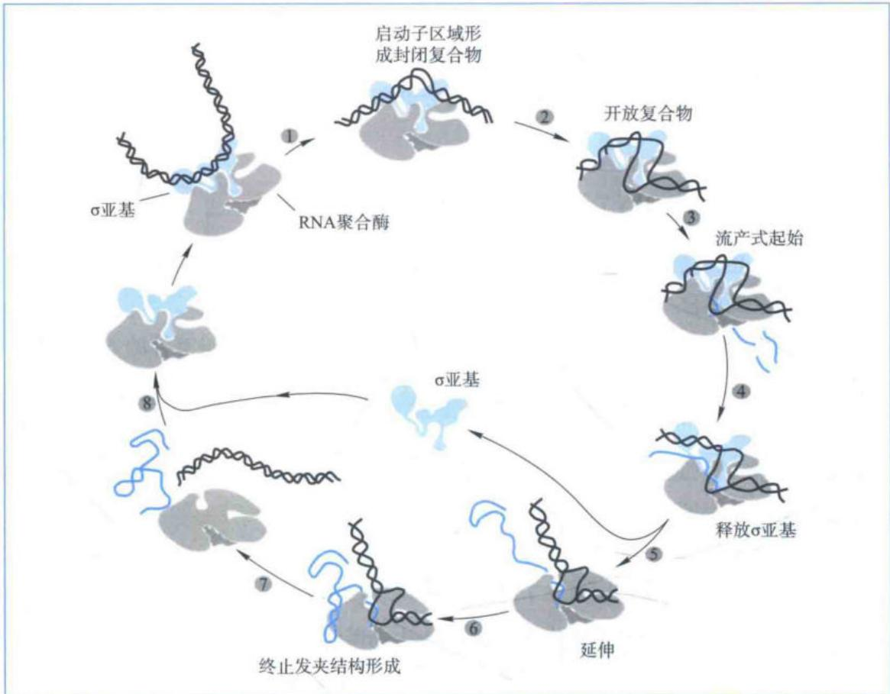

## 2. 新生 RNA 链的延伸

当 RNA 聚合酶催化新生的 RNA 链的长度达到 9～10 个核苷酸时， $\sigma$ 因子从转录复合物的 RNA 聚合酶全酶上脱落下来，RNA 聚合酶离开启动子，核心酶沿模板 DNA 链移动并使新生 RNA 链不断伸长的过程就是转录的延伸。

进入延伸阶段, DNA 和聚合酶分子都发生了构象变化。RNA 聚合酶从起始阶段的全酶构象转变为延伸阶段的核心酶构象。核心酶与 DNA 模板的结合是松弛状的非特异性结合, 有利于核心酶沿着 DNA 模板向前移动。当 $\sigma$ 因子存在时, $\beta$ 和 $\beta'$ 亚基的构象是与 DNA 专一性结合所要求的构象, 不含有 $\sigma$ 因子的核心酶也失去了对特异性序列识别和结合的能力。

由核心酶、DNA 和新生 RNA 所组成的转录延伸复合物是转录循环中一个十分重要的环节。与转录起始复合物相比，延伸复合物极为稳定，可以长时间地与 DNA 模板相结合而不解离。在延伸过程中，新生的 RNA 链中只有 8\~9 个核苷酸与 DNA 模板保持碱基互补状态，RNA 链的其余部分则从模板上剥落下来，并从 RNA 出口通道离开。

## 3. 延伸 RNA 聚合酶同时具有合成和校对两种功能

在 RNA 延伸过程中,除了 RNA 合成之外,RNA 聚合酶还要通过两种机制来执行校对功能。一是聚合酶利用其活性位点,在一个简单的逆向反应中,通过重新加入焦磷酸来去除错误插入的核糖核苷酸。该修复方式既可以去除错误碱基也可以去除正确碱基,但由于其在错误碱基处花的时间比在正确碱基处更长,所以去除错误碱基的频率更高。此种校对方式称为焦磷酸编辑(pyrophosphorolytic editing)。

另一种校对机制被称为水解编辑(hydrolytic editing)，它是由一些Gre因子激发的。Gre因子其实主要是延伸刺激因子，帮助聚合酶快速延伸，克服较难转录区域的“停滞不前”现象，同时去除含有错误配对的序列。

图3-19 RNA合成的起始

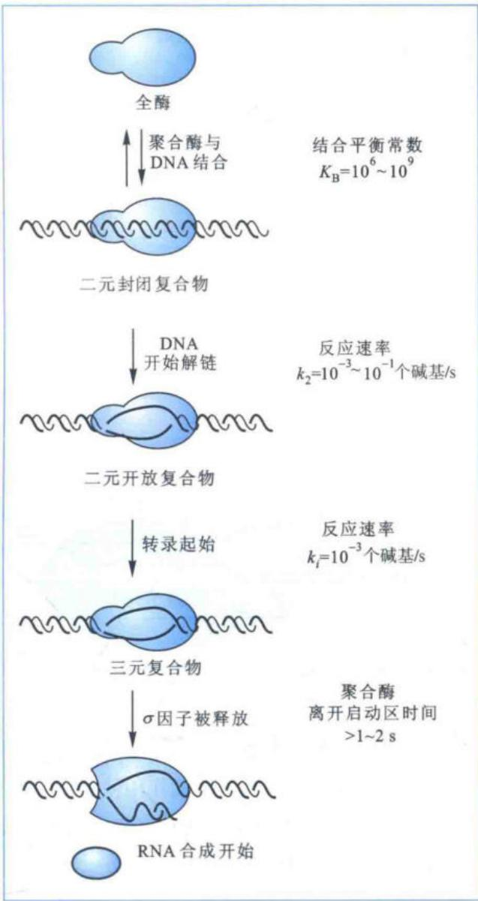

## 4. RNA 转录的终止

一般情况下,RNA 聚合酶起始基因转录后,它就会沿着模板 $5'\rightarrow3'$ 方

向不停地移动,合成 RNA 链,直到碰上终止信号时,RNA 聚合酶才停止加入新的核苷酸,与模板 DNA 相脱离并释放新生 RNA 链。终止发生时,所有参与形成 RNA-DNA 杂合体的氢键都必须被破坏,模板 DNA 链才能与有义链重新组合成 DNA 双链。

根据体外实验中 RNA 聚合酶是否需要辅助因子参与才能终止 RNA 链的延伸, 可将大肠杆菌中的终止子分为不依赖于 $\rho$ 因子和依赖于 $\rho$ 因子两大类。

在不依赖于 $\rho$ 因子的终止反应中, 没有任何其他因子参与, 核心酶就能终止基因转录。现已查明, 模板 DNA 上存在终止转录的特殊信号——终止子, 又称内在或固有终止子 (intrinsic terminator), 每个基因或操纵子都有一个启动子和一个终止子。

内在终止子有两个明显的结构特点:① 终止位点上游一般存在一个富含 GC 碱基的反向重复序列(大约 20 个核苷酸),由这段 DNA 转录产生的 RNA 容易形成发夹结构。② 在终止位点前面有一段由 4\~8 个 A-T 碱基对序列,其转录产物的 3' 端为寡聚 U。这些元件要在它们被转录之后才会影响聚合酶,即它们是以 RNA 形式发挥作用的。这种结构特征的存在决定了转录的终止。在新生 RNA 中出现发夹结构会导致 RNA 聚合酶的暂停,破坏 RNA-DNA 杂合链 5' 端的正常结构。寡聚 U 的存在使杂合链的 3' 端部分出现不稳定的 rU·dA 区域,两者共同作用使 RNA 从三元复合物中解离出来(图 3-20)。

图3-20 由基因序列决定的转录终止过程示意图  
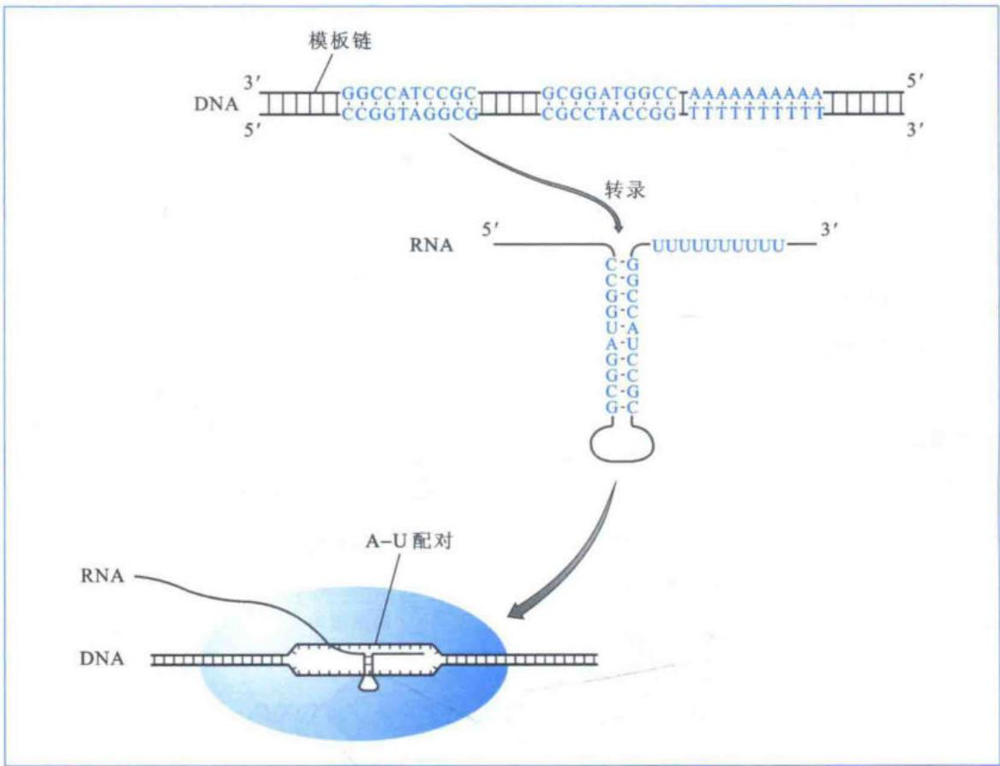

终止效率与二重对称序列和寡聚 U 的长短有关,随着发夹结构(至少 6 bp)和寡聚 U 序列(至少 4 个 U)长度的增加,终止效率逐步提高。

依赖于 $\rho$ 因子的终止指有些终止位点的 DNA 序列缺乏共性,而且不能形成强的发夹结构,因而不能诱导转录的自发终止。体外转录实验表明,RNA 聚合酶并不能识别这些转录终止信号而停止转录,只有在加入大肠杆菌 $\rho$ 因子后该聚合酶才能在 DNA 模板上准确地停止转录。 $\rho$ 因子是一个由 6 个相同亚基组成的六聚体 $^{(图3-21)}$ ,它的相对分子质量约为 $2.8 \times 10^{5}$ ,它具有 NTP 酶和解螺旋酶活性,能水解各种核苷酸三磷酸,它通过催化 NTP 的水解促使新生 RNA 链从三元转录复合物中解离出来,从而终止转录。大肠杆菌的 $\rho-$ 依赖型终止子占所有终止子的一半左右。

目前认为， $\rho$ 因子是RNA聚合酶终止转录的重要辅助因子，它的作用机制可用“穷追”(hot pursuit)模型来解释。RNA合成起始以后， $\rho$ 因子即附着在新生的RNA链 $5^{\prime}$ 端的某个可能有序列或二级结构特异性的位点上，利用ATP水解产生的能量，沿着 $5^{\prime} \rightarrow 3^{\prime}$ 方向朝转录泡靠近，其运动速度可能比RNA聚合酶移动的速度快些；当RNA聚合酶移动到终止子而暂停时， $\rho$ 因子到达RNA的 $3^{\prime}-OH$ 端追上并取代了暂停在终止位点上的RNA聚合酶，它所具有的RNA-DNA解螺旋活性使转录产物RNA从模板DNA上释放，随后，转录复合物解体，完成转录过程(图3-20)。

  
图 3-21 ρ 因子参与的 RNA 转录终止模式  
(a) $\rho$ 转录终止因子的晶体结构, 表明 $\rho$ 蛋白是由 6 个单体形成一个开放的环(来自于 Skordalakes E and Berger J M. Cell 2003, 114:135); (b) $\rho$ 因子的“穷追”(hot pursuit)模型。

<!-- W-BEGIN Watson 13 转录机制（章首） -->

### 【中文对照 Watson 第13章：转录机制（章首）】

> 来源：Watson《基因的分子生物学》第七版中译本（书籍/03_基因的分子生物学_第七版） 第13章 转录机制。

#### [W] 第4篇基因组的表达

#### [W] 本篇概要

\- 第13章 转录机制

\- 第14章 RNA剪接

\- 第15章 翻译

\- 第16章 遗传密码

\- 第16章 生命起源和早期演化

第 4 篇主要介绍基因是如何表达的，或者说，以核苷酸线性序列的形式储存在多聚核苷酸链中的信息是如何转换成为多肽链中的氨基酸线性序列的。我们同样讨论了这些过程在早期生命中是如何起源的。

第 13\~16 章是按照将基因中的信息复制到 RNA，即信使 RNA（messenger RNA），再将信使 RNA 解码成为多肽链的信息流向编排的。核苷酸序列的信息由 DNA 传递到 RNA 的过程，即转录（transcription），是第 13 章的主题。

RNA 聚合酶局部解旋一小段 DNA，并以短暂分离的两条 DNA 链中的一条为模板，通过碱基配对逐渐合成互补的 RNA 链，这一化学反应的过程与 DNA 合成极其相似。尽管在所有细胞中合成 RNA 的基本酶非常相似，但真核生物转录机器的其他部分要比原核生物复杂得多。

在原核生物中，信使 RNA 一旦合成，便立即作为蛋白质合成的模板使信息流向下一个阶段。真核生物则不然,转录的 RNA 产物必须经过一系列的成熟事件才能成为信使 RNA。最引人注目的加工事件称为信使 RNA 剪接（mRNA splicing），第 14 章对此进行了描述。真核生物细胞的基因常常被一个（有时是多个）非蛋白质编码的片段（即内含子，intron）所打断。当这样的基因转录成 RNA 的时候，这些内含子必须去除，从而使蛋白质编码片段（即外显子，exon）能够彼此连接在一起，成为一条连续的蛋白质编码序列。第 14 章描述了负责高精度去除内含子的精密分子机器。

关于遗传信息翻译过程的细节将在第 15 章和第 16 章讨论。翻译是以核苷酸序列形式储存在信使 RNA 中的遗传信息指导氨基酸有序地掺入到蛋白质多肽链中的过程。第 15 章描述了参与翻译过程的 4 个主要组分：信使 RNA 的编码序列；转运器分子（即 tRNA）；将氨基酸装载到 tRNA 转运器上的氨酰-tRNA 合成酶；由 RNA 和蛋白质组成的核糖体，即蛋白质合成工厂。

第 16 章描述了阐明遗传密码（genetic code）的经典实验，同时列出了翻译这些密码的法则。核苷酸序列的信息是基于一种 3 个字母的密码，而蛋白质序列的信息则是基于 20 个不同的氨基酸。密码具有简并性，两个或更多密码子（在大多数情况下）编码同一种氨基酸。还存在特殊的密码子，指明翻译应在何处开始和在何处结束。

最后，在第 17 章中，我们将研讨生命是如何在它初始的位置起源的，原始的遗传编码、复制和表达机制，以及它们是如何演化成为我们看到的现代的生物世界的，正如第 3 篇和第 4 篇中讨论的那样。

#### [W] 冷泉港实验室档案馆中的照片

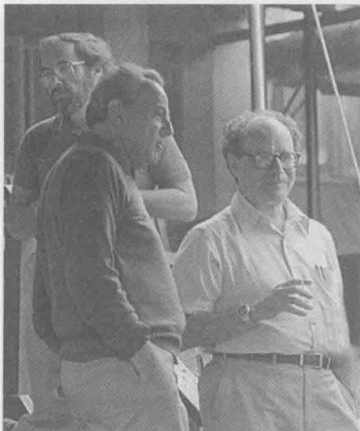

David Baltimore、Francois Jacob 和 Walter Gilbert, 1985 年发育分子生物学研讨会。Baltimore 和 Howard Temin 共同发现了以 RNA 为模板合成 DNA 的反转录酶（第 12 章）。Jacob 与 Jacques Monod 提出了基因表达如何被调节的基本模型（第 18 章），还提出了 DNA 复制如何被调节的一个模型（第 9 章）。Gilbert 为基因调节的 “Jacob-Monod 模型” 的某些方面提供了生物化学证明，他还发明了一种用于 DNA 测序的化学方法（第 7 章）。他们分别于 1975 年（生理学或医学）、1965 年（生理学或医学）和 1980 年（化学）获得了诺贝尔奖。

David Allis 和 Emily Bernstein，2004 年表观遗传学研讨会。Allis 第一个发现了修饰组氨酸的酶——Tetrahymena 的组氨酸乙酰转移酶（第 8 章）。自从这个酶被发现后，研究组氨酸修饰范围及其对基因表达的影响的全新领域成长了起来。图中 Allis 与他实验室的博士后 Bernstein 在一起，后者曾是 Greg Hannon 实验室的研究生，在那里她发现了参与 RNAi 的 Dicer 酶（第 20 章）。

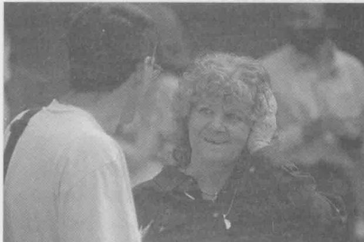  
Ada Yonath, 2001 年核糖体研讨会。受到熊的细胞中核糖体二维晶体结构的启发，Yonath 制造核糖体的晶体以解析它的三维结构。很多人相信核糖体的结构是可以解析的，这也是她研究工作的一个长久的目标。由于她在核糖体研究中的贡献，她和 Venki Ramakrishnan 及 Tom Steitz 一起获得了 2009 年的诺贝尔化学奖。

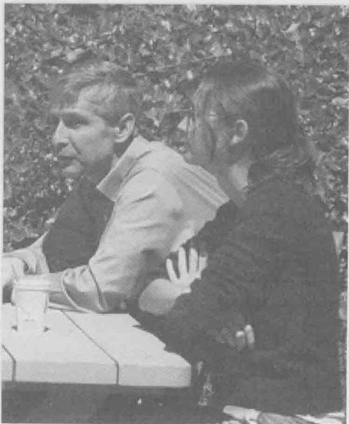

  
Robert Roeder，1998年转录机制研讨会。Roeder发现了三个真核RNA聚合酶——Pol I、Ⅱ、Ⅲ，纯化了这些酶以及起始转录所需的其他因子（第13章）。左边那个带着质疑眼神的是Camilo Parada，当时是Roeder实验室的博士后。

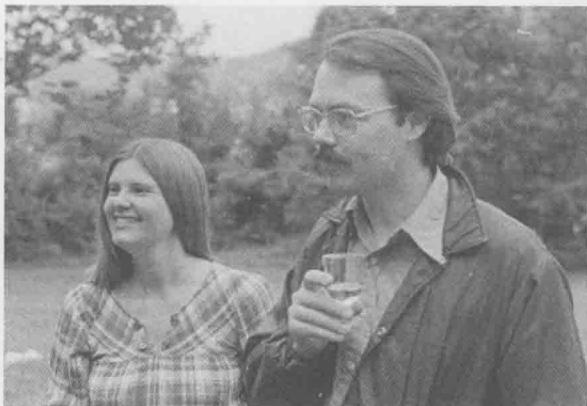  
Phillip Sharp, 1974 年肿瘤病毒研讨会。Sharp 和 Richard Roberts 共同获得了 1993 年的诺贝尔生理学或医学奖，因为他们发现很多真核细胞的基因是“割裂”的，也就是说，它们的编码区域是被分段非编码 DNA 打断的。这些非编码区域是通过“剪接”而从 RNA 拷贝中去除的（第 14 章）。图中为 Sharp 和夫人 Ann。

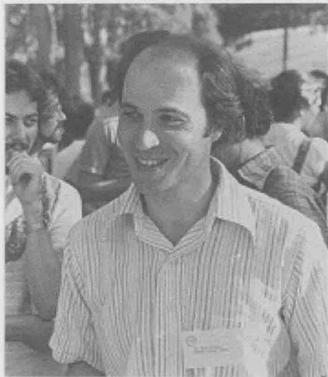  
Roger D. Kornberg, 1977 年染色质研讨会。Kornberg 早期研究核小体结构（第 8 章），于 2006 年因 RNA 聚合酶 II 结构（第 13 章）的研究获得诺贝尔化学奖。他父亲是 Arthur Kornberg，本书前面（P196）有其相片。

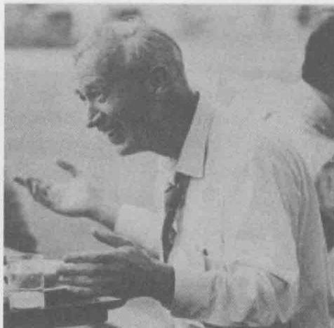  
Paul Zamecnik, 1969 年蛋白质合成机制研讨会。Zamecnik 发展了体外蛋白质合成系统，已证明该系统对理解遗传密码如何工作及细胞如何制造蛋白质是非常重要的（第 2 章和第 15 章）。他还和 Mahlon Hoagland 一起发现了 tRNA，它是蛋白质合成过程中的一个关键成分（第 15 章）。

  
Richard Roberts, 1977 年染色质研讨会。Roberts 的主要研究集中于限制性内切核酸酶的功能和多样性（第 7 章），他也是“割裂基因”的共同发现者之一，为此他与 Phillip Sharp 于 1993 年一起获得了诺贝尔生理学或医学奖。这里展示的和他在一起的科学家是（由左到右）：Yasha Gluzman，肿瘤病毒学家；Ahmad Bukhari，致力于研究噬菌体 Mu 转座（第 12 章）；James Darnell，他的工作集中在基因调节中的信号转导方面（第 19 章）。

  
Venki Ramakrishnan 和 Jack Szostak，2009 年演化生物学研讨会。由于核糖体晶体结构方面的研究工作，Ramakrishnan（左）与 Ada Yonath 及 Tom Steitz 分享了 2009 年诺贝尔化学奖，同时由于他在端粒上的研究工作，Szostak（中）与 Elizabeth Blackburn 以及 Carol Greider 分享了那一年的诺贝尔生理学或医学奖，这张照片来自于和 Alex Gann 一起的研讨会的野餐，他也是本书的作者之一。

#### [W] 第13章 转录机制

#### [W] 本章概要

RNA 聚合酶和转录周期

细菌的转录周期

真核生物的转录

由 RNA 聚合酶 I 和 III 催化的转录

在此之前,我们一直在考察基因组的维持,也就是说遗传物质是如何组织、保护和复制的。现在,我们将问题转到遗传物质如何表达,即 DNA 的一串碱基是如何指导 RNA 和蛋白质的合成的,后者可以行使细胞功能和定义细胞特性。在后面的几章里,我们将描述负责基因表达的基本过程:转录、RNA 加工及翻译。

转录在化学和酶学上与 DNA 的复制（第 9 章）非常相似。二者都通

过酶的作用合成一条与 DNA 模板互补的核酸链。当然，二者之间存在一些重要的差别，最主要的就是转录得到的新链是由核糖核苷酸（ribonucleotide）组成的，而不是脱氧核糖核苷酸（ribonucleotide）（第 5 章）。转录机制区别于复制的其他特征包括以下几点。

\- RNA 聚合酶（RNA polymerase，催化 RNA 合成的酶）不需要引物，它能够从头起始转录（但是正如我们将要讨论的，细胞内的转录必须在特定的序列上才能起始）。

\- RNA 产物不与模板 DNA 链的碱基保持互补状态。相反，RNA 聚合酶在每个核糖核苷酸添加处的几个核苷酸之后，便将正在延长的链从模板上置换下来（图 13-1）。这一置换对 RNA 行使功能非常关键（例如，最常见的产生蛋白质产物的翻译过程）。而且，由于这一释放紧随合成位点之后，多个 RNA 聚合酶分子可以一个紧接着另一个，在同一时间转录同一个基因。这样，一个细胞就可以在短时间内在一个基因（或其他 DNA 序列）上合成大量的转录产物。重要的是，当 RNA 产物紧跟在每个行进的 RNA 聚合酶后面从 DNA 模板上解离下来时，两条 DNA 链重新配对（图 13-1）。

\- 尽管转录是非常精确的（每添加1万个核苷酸发生1次错误），但还是不如复制更为精确（每1000万个核苷酸发生1次错误）。这一区别反映出尽管确实存在两种RNA合成的校正办法，转录过程还是缺乏广泛的校正机制。

  
图 13-1 DNA 转录成为 RNA。本图所示为在没有相关酶的作用下，DNA 双螺旋是如何解旋和 RNA 链是如何在模板上合成的。本图还显示了 RNA 转录产物是如何在合成点几个核苷酸后从 DNA 模板上解离下来的，以及 DNA 链如何重新配对。图中转录从左到右进行。

较转录而言，细胞更关注复制的精确性是有道理的。DNA 是储存遗传物质的分子，DNA 复制是遗传物质得以传递的过程。复制过程中发生的任何错误都会很容易引起灾难性后果——它将永远存在于这一个体的基因组中，并传递给它的后代。相反，转录仅仅产生一些暂时性的拷贝，而且通常从同一个转录区域会得到几个拷贝。因此，转录过程中发生一个错误，除了在许多暂时性的副本中产生一个有缺陷的副本外，几乎不会造成任何其他的损害。

除了上述机制的区别，DNA 复制和转录之间还存在一个重要的差异，体现在两者的不同目的。转录仅是有选择性地复制基因组的特定部分，并从任何特定的部分产生一个到几百个，或者甚至上千个拷贝。相反，复制必须将整个基因组全部拷贝，并且在每次细胞分裂时进行一次（并且只进行一次，见第 9 章）。转录区域的选择并不是随机的，每个转录区域通常包括一个或多个基因，而且在每个转录区域的首端和尾端都存在特定的 DNA 序列指导转录的起始和终止。

不仅基因组的不同部分的转录程度不同，而且转录哪一部分、转录范围有多大都是可以调控的。这样，在不同的细胞中，或者同一细胞的不同时段，可能转录不同组别的基因。例如，某个人的两个遗传特征相同的细胞在很多情况下会转录不同组别的基因，从而导致那两个细胞在特征和功能上的差异（如一个可以是肌肉细胞，而另一个是神经细胞）。或者，一些特定的细菌细胞会依其生长的培养基的不同而转录不同组别的基因。这些调控的问题将在第4篇予以解答。

#### [W] RNA 聚合酶和转录周期

#### [W] RNA 聚合酶具有不同形式，但有许多共同特性

从细菌到人类的所有细胞里，RNA 聚合酶在本质上都进行同一种反应。因此，来自这些不同物种的酶具有许多共同的特性就不足为奇了，尤其是那些直接参与催化 RNA 合成的部分。从细菌到哺乳动物，细胞的 RNA 聚合酶都是由多个亚基（subunit）构成的（虽然一些噬菌体和细胞器的确编码一些单亚基的酶来完成相同的任务，框 13-2）。表 13-1 列出了各种情况下亚基的数目和大小，以及不同的酶之间哪些亚基序列是保守的。

表 13-1 RNA 聚合酶的亚基

<table><tr><td colspan="2">原核生物</td><td colspan="3">真核生物</td></tr><tr><td>细菌核心酶</td><td>古细菌核心酶</td><td>RNA聚合酶I</td><td>RNA聚合酶II</td><td>RNA聚合酶III</td></tr><tr><td> $\beta'$ </td><td>A&#x27;/A&#x27;&#x27;</td><td>RPA1</td><td>RPB1</td><td>RPC1</td></tr><tr><td> $\beta$ </td><td>B</td><td>RPA2</td><td>RPB2</td><td>RPC2</td></tr><tr><td> $\alpha^I$ </td><td>D</td><td>RPC5</td><td>RPB3</td><td>RPC5</td></tr><tr><td> $\alpha^II$ </td><td>L</td><td>RPC9</td><td>RPB11</td><td>RPC9</td></tr><tr><td> $\omega$ </td><td>K</td><td>RPB6</td><td>RPB6</td><td>RPB6</td></tr><tr><td></td><td>[+6个其他亚基]</td><td>[+9个其他亚基]</td><td>[+7个其他亚基]</td><td>[+11个其他亚基]</td></tr></table>

每列的亚基按分子质量由大到小排序。(经允许, 引用自 Ebright R.H. 2000.J. Mol. Biol. 304: 687–698, Fig. 1, p. 688. ©Elsevier.)

由此表可见，细菌只有1种RNA聚合酶，而真核细胞中则有3种——RNA聚合酶I、Ⅱ和Ⅲ（RNA Pol I、Ⅱ和Ⅲ）。聚合酶Ⅱ（Pol II）是本章后半部分阐述真核转录时将要重点讲到的酶，它是这些酶中研究得最为深入的，也是负责转录大多数基因的酶——实际上是转录几乎所有蛋白质编码基因的酶。聚合酶I（Pol I）和聚合酶Ⅲ（Pol III）分别参与转录专门的RNA编码基因。具体来说，Pol I转录的是大核糖体RNA前体基因，而PolⅢ转录的是tRNA基因、一些小的核RNA基因和5S rRNA基因。在本章的末尾我们将再讨论这些酶。近年来，学界又发现了两种DNA依赖的RNA聚合酶，并将其命名为Pol IV和Pol V。这两种酶只在植物中存在，它们转录参与转录抑制的小干扰RNA（small interfering RNA，第20章）。它们与Pol II的亲缘关系较为密切，演化产生的时间不长。它们的一些蛋白亚单位与Pol II是一致的，由同样的基因编码；另一些序列上游区别的亚单位则是来自于近期复制的拷贝。

细菌 RNA 聚合酶的核心酶（core enzyme）可以独立合成 RNA，它是由 $\alpha$ 亚基（subunit）的两个拷贝和 $\beta$ 、 $\beta'$ 、 $\omega$ 亚基的各一个拷贝组成的。这个酶与真核生物的聚合酶密切相关（表 13-1）。具体来说，它的两个大亚基（ $\beta$ 和 $\beta'$ ）与 RNA 聚合酶Ⅱ的两个大亚基（RPB1 和 RPB2）同源。同时， $\alpha$ 亚基与 RPB3 和 RPB11 同源、 $\omega$ 亚基与 RPB6 同源。细菌 RNA 聚合酶的核心酶结构与酵母 RNA 聚合酶Ⅱ的核心酶相似，二者在图 13-2 中并列显示。后面我们将会描述一些能够阐明这些酶的工作原理的结构细节，这里我们只重点描述一些共同的特征。

细菌和酵母的核心酶有着共同的总体形态和组织形式；实际上，它们比亚基在序列上的相似度更为相似。二者内部靠近活性位点的部分尤为如此，而外周部分的相似性则差一些。这些相似点和相异点的分布是合理的：酶的内部参与在 DNA 模板上合成 RNA（所有生物体都一样）；然而，酶的许多外周部分参与到其他蛋白质的相互作用中，而这些在原核和真核细胞中是不同的。

总的来说，每一个酶的形状都像一只蟹爪。这让我们回想起第9章中描述的DNA聚合酶的“手”形结构（图9-5）。“蟹爪”的两个“钳子”主要是由各个酶的两个最大亚基构成（细菌的酶是 $\beta$ 和 $\beta^{\prime}$ 亚基，真核生物的酶是RPB1和RPB2亚基）。酶的活性位点是由这两个亚基的一些区域共同组成的，位于钳子基部，被称为“活性中心裂隙”（active center cleft）区域（图13-2）。活性位点的工作原理依据双金属离子催化添加核苷酸的机制，该机制在所有的聚合酶中均如此（第9章）。然而，RNA聚合酶的活性位点含有一个紧密结合的 $\mathrm{Mg}^{2+}$ ，第二个离子是在合成周期中由每个新的核苷酸带入的，与焦磷酸一起释放。

生物体中有多种通道允许 DNA、RNA 和核糖核酸进出这些酶的活性中心裂隙。我们会在后面谈到转录机制的部分再进行详细的讨论。

  
图 13-2 原核生物和真核生物 RNA 聚合酶晶体结构（crystal structure）的比较。（a）。栖热水生菌（T. aquaticus）RNA 聚合酶的核心酶结构。各个亚基以不同的颜色表示：β 亚基为蓝色，β' 亚基为紫色，两个 α 亚基分别为黄色和绿色，ω 亚基为红色，以红球表示的 Mg $^{2+}$ 在 a、b 中均注明了活性位点（来源：Seth Darst，洛克菲勒大学，私人通信）。（b）。酿酒酵母（S. cerevisiae）RNA 聚合酶Ⅱ的结构。各个亚基以不同的颜色表示，以表明与细菌中相应亚基的关系（表 13-1）。因此，RPB1 和 RPB2 分别为紫色和蓝色，RPB3 和 RPB11 分别为绿色和黄色，RPB6 为红色（来源：Cramer P., et al. 2001. Science. 292: 1863）。图像使用 MolScript、BobScript 和 Raster 3D 软件制作。

#### [W] 由 RNA 聚合酶进行的转录是由一系列步骤完成的

为转录一个基因，RNA 聚合酶要进行一系列定义明确的步骤，这些步骤分为三个阶段：起始（initiation）、延伸（elongation）和终止（termination）。在这里及图 13-3 中，我们总结了每个阶段的基本特征。

起始 启动子（promoter）是最初结合 RNA 聚合酶的 DNA 序列（与所需的转录起始因子一起结合）。启动子-聚合酶复合体一旦形成就发生结构改变，以利于起始过程继续进行。和复制的起始一样，DNA 在转录将要开始的部位解旋，碱基对分开，产生一个单链 DNA 的“转录泡”。与 DNA 复制相同，转录总是从 5' 端向 3' 端进行。也就是说，新的核糖核苷酸添加在延伸链的 3' 端。然而，与 DNA 复制不同的是，只有一条 DNA 链作为模板合成 RNA 链。因为 RNA 聚合酶以固定的方向与启动子结合，所以同一条链总是从特定启动子开始转录。

启动子的选择决定了哪一段 DNA 被转录，这也是对转录进行调控的主要步骤。

延伸 一旦 RNA 聚合酶已经合成了一小段 RNA（10 个碱基左右），转录便进入了延伸阶段。在延伸阶段，RNA 聚合酶除催化 RNA 的合成外，还执行着多项重要任务。它解开前方的 DNA，又使其后的 DNA 重新复性；在移动的同时，逐步解开正在延长的 RNA 链与模板的配对；而且还执行校正的功能。相反，在复制过程中，需要几个不同的酶来执行这些相似的功能。

终止 一旦 RNA 聚合酶转录了整个基因（或整组基因），它必须停下来并释放 RNA 产物（并从 DNA 上解离下来），这一步骤称为终止。在某些细胞中，存在着特定的、已研究清楚的终止序列；而在其他一些细胞中，是什么使聚合酶停止转录并从模板上分离还不十分清楚。

#### [W] 转录起始包括三个定义明确的步骤

转录周期（transcription cycle）的第一个阶段——起始——又可以分为一系列定义明确的步骤（图 13-3）。第一步是聚合酶与启动子初步结合形成所谓的闭合式复合体（closed complex），这时 DNA 还保持着双链状态，聚合酶结合在螺旋的一个面上。起始阶段的第二步，闭合式复合体经过转变而成为开放式复合体（open complex），DNA 双链在起始位点周围大约 13 bp 的距离内分开以形成转录泡。在起始阶段的下一步，启动子逃离，聚合酶进入转录起始阶段。

DNA 的展开使模板链得以释放。最前面的两个核糖核苷酸被带入活性位点，排列在模板链上并彼此结合。通过这种方式，后续的核糖核苷酸结合到正在延长的 RNA 链上。最初 10 个左右核糖核苷酸的合成是一个效率相当低的过程，在这一阶段，聚合酶经常释放出很短的转录物（每一个都短于 10 个左右的核苷酸），然后再重新开始合成。在这个阶段，聚合酶启动子复合体称为起始转录复合体（initial transcribing complex）。一旦某个聚合酶释放出超过 10 核苷酸的转录本，就可以说它逃离(escaped)了启动子。这时，它已经形成了一个包括酶、DNA 和 RNA 的稳定的三重复合体（stable ternary complex），完成了向延伸阶段的转变。

  
聚合酶终止，并释放 RNA

图 13-3 转录周期的几个阶段：起始、延伸和终止。图中显示了转录周期的常规步骤。所示特征为细菌和真核生物转录共同拥有的。起始、延伸和终止所需要的其他因子并未在这里显示，但将在后面的正文中进行描述。编码 RNA 链开端的 DNA 核苷酸称为转录起始位点，指定为“+1”位置。转录行进方向的序列称为起始位点的下游。类似地，起始位点前面的序列称为上游序列。当提到上游序列的某一特定位置时，将给予一个负值，下游序列则给予正值。

在本章的后续部分，我们将更为详细地对转录周期进行描述——首先是细菌，然后是真核系统。

#### [W] 细菌的转录周期

#### [W] 细菌的启动子在强度和序列上是多样的，但是具有某些明确的特征

原则上，细菌的核心 RNA 聚合酶能够在 DNA 分子上的任何一点开始转录，这点可以在体外用纯化的核心酶来验证。但在细胞内，聚合酶只在启动子处起始转录。一个称为 $\sigma$ 的起始因子的加盟，使得核心酶 $(\alpha_{2}\beta\beta'\omega)$ 转变为只在启动子处起始转录。该酶的这种形式称为 RNA 聚合酶的全酶（holoenzyme，图 13-4）。

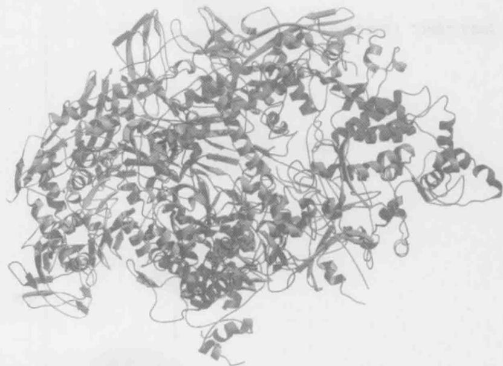  
图 13-4 栖热水生菌 RNA 聚合酶的全酶。灰色所示为核心酶（与图 13-2 的 a 图中所示的是同一个酶），紫色所示为 $\sigma^{70}$ 亚基（区域 2、3、4，见图 13-6）。右边为区域 2，顶部为区域 3，底部为区域 4。 $\sigma$ 区域 2 和 4 分别识别启动子的 -10 和 -35 区域，稍后将在正文中进行描述。（Murakami K. S., et al. 2002. Science. 296: 1280.）图像使用 MolScript、BobScript 和 Raster 3D 软件制作。

在大肠杆菌中，最常见的 $\sigma$ 因子称为 $\sigma^{70}$ （我们将在第 18 章和第 22 章中讨论其他可供选择的 $\sigma$ 因子及它们在转录调节中的作用）。含有 $\sigma^{70}$ 的聚合酶识别的启动子具有以下共同的特征性结构：两段 6 个核苷酸长的保守序列，被长度为 17\~19 个核苷酸的非特异序列（图 13-5a）所分隔。这两段保守序列的中心分别位于 RNA 合成起始位点上游约 10bp 和 35bp 处。因此，根据图 13-3 的计数方案（编码 RNA 链开端的 DNA 核苷酸被指定为 +1），这两段序列称为 -35 和 -10 区域（region）或元件（element）。

虽然绝大多数的 $\sigma^{70}$ 启动子包含可被识别的-35 和-10 区域，但序列并不一致。通过对许多不同启动子的比较，可以得到一个共有序列（consensus sequence，关于这些共有序列的来源详细可见框 13-1）。共有序列反映了首选的-35 和-10 区域，被最适宜的长度（17bp）所分隔。很少有启动子具有与其一模一样的序列，但多数与其仅有几个核苷酸的差别。

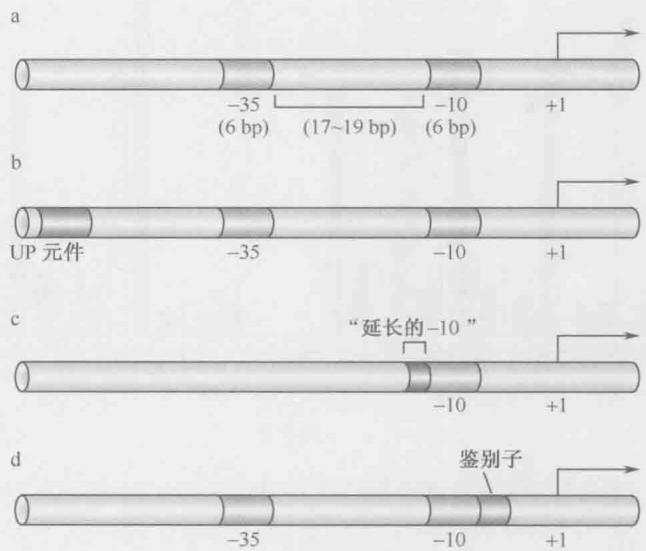  
图 13-5 细菌启动子的特征。图中显示了细菌启动子元件的不同组合情况。每个元件对聚合酶的结合和功能所起的作用在正文中有详细描述。

#### [W] 框13-1 共有序列

被某个特定蛋白质识别的结合位点，其 DNA 序列不一定完全一致。类似地，使一个蛋白质具有某种特殊功能的氨基酸序列在不同的蛋白质中可能会有微小的差异。共有序列就是在上述的每种情况中，由不同样本在每一个位置上最常见的核苷酸（或氨基酸）所组成的序列版本。含有 $\sigma^{70}$ 因子的 RNA 聚合酶识别大肠杆菌启动子的共有序列如图所示（框 13-1 图 1）。这一共有序列是通过对 300 个已知具有 $\sigma^{70}$ 启动子功能的序列进行比较，并确定在 -35 和 -10 六核苷酸区域中每一个位置上最常见的碱基得到的。该核苷酸就被选为共有序列中该位置上的特定核苷酸；每一个位置上的特定核苷酸出现的相对频率及其他三种核苷酸的频率在图表中进行了描绘。注意，位于 -35 和 -10 区域之间的 17\~19 个核苷酸并不存在具有显著意义的共有序列。

在图例中，每一个单独的启动子序列都已确定，所以比较这些序列并没有什么价值。但是，让我们来考虑一个完全不同的例子：所涉及的 DNA 结合蛋白还没有确定的结合位点。但是，一条染色体的几个区域在其长度范围内的某个位置上含有结合位点。可以使用一种扫描所有这些染色体区域序列的计算机算法来寻找它们共有的潜在结合位点。

当结合位点未知时，找到 DNA 结合蛋白所识别的共有序列的第二种途径是，利用化学方法合成大批随机序列的短 DNA 片段。将目标蛋白与这些 DNA 分子混合在一起，就可以筛选到与目标蛋白结合的 DNA，并测定其序列。对这些序列的比较很容易显示出共有序列，因为每一个片段都非常短。这种方法（常被称为 SELEX）广泛地用于确定未知的 DNA 结合蛋白的结合位点。第 7 章中有对 SELEX 的详细描述。

  
框 13-1 图 1 启动子的共有序列和共有间距。（获得许可并重新绘图自 Alberts B. et al. 2002. Molecular biology of the cell, 4th ed., p. 308, Fig. 6.12. ©Garland Science/Taylor & Francis Books LLC.）

具有与共有序列更近似序列的启动子通常要比那些匹配较差的启动子“更强”。所谓启动子的强度（strength），是指一个启动子在一定时间内可以起始多少个转录物。这一度量标准受到以下因素的影响：启动子最初与聚合酶的结合程度、对异构化作用的支持效率，以及此后聚合酶逃离的难易程度。启动子强度与序列的相关性解释了为什么有许多不同种类的启动子：一些基因的表达水平远远超出其他基因，前者很可能具有与共有序列更为接近的序列。

在一些较强的启动子中，如指导核糖体 RNA（rRNA）基因表达的启动子，发现额外与 RNA 聚合酶结合的 DNA 元件，称为 UP 元件（UP-element，图 13-5b）。它通过提供额外的特异性相互作用而增强聚合酶与 DNA 的结合。

另一类型的 $\sigma^{70}$ 启动子缺乏-35 区域，而是有一个所谓的“延长的-10 区域”元件（图 13-5c）。与标准的-10 区域相比，这一元件在其上游末端有一个额外的短序列元件。聚合酶与这一额外序列元件之间的联系，补偿了-35 区域的缺失。大肠杆菌的 gal 基因（该基因产物指导乳糖的代谢；第 18 章）使用的就是这种启动子。

最后，在紧挨着-10元件的下游发现了一个新的结合RNA聚合酶的DNA元件。这个新元件称为鉴别子（discriminator，图13-5d）。鉴别子与聚合酶之间相互作用的强度影响酶与启动子复合体的稳定性。

#### [W] σ 因子介导聚合酶与启动子的结合

$\sigma^{70}$ 因子可以分为四个区域,称为 $\sigma$ 区域1\~ $\sigma$ 区域4(图13-6)。识别启动子-10和-35元件的区域分别是区域2和4。

区域 4 的两个螺旋形成一个常见的 DNA 结合基序（motif），称为螺旋-转角-螺旋（helix-turn-helix）。其中一个螺旋插入到-35 区域的大沟（major groove）中并与该区域的碱基相互作用；另一个则从大沟的顶部横向穿过，与 DNA 骨架接触。这一结构基序见于许多 DNA 结合蛋白，例如细菌细胞中几乎所有的转录激活因子与抑制因子（见第 18 章），我们在第 6 章进行了详细的讨论（图 6-13）。

  
图 13-6 σ 因子的区域。识别启动子特定区域的 σ 因子的那些区域以箭头指示。区域 2.3 负责 DNA 解旋。有关 σ 因子将 RNA 聚合酶核心酶募集到一个标准启动子上的示意图，见图 13-7。（经许可引用自 Young B.A. et al. 2002. Cell. 109: 417–420, Fig. 1. ©Elsevier.）

-10 区域也被一个 $\alpha$ 螺旋所识别，但其复杂的相互作用尚未彻底研究清楚。原因在于-35区域仅提供能量以确保聚合酶与启动子的结合，而-10区域在转录起始过程中有着更为精细的任务，因为它处在闭合式复合体向开放式复合体转变时DNA解旋起始元件中。因而，与-10区域相互作用的 $\sigma$ 因子区域不光与DNA结合，还参与其他的功能。与这一预想相一致，参与识别-10区域的 $\alpha$ 螺旋包含几个芳香族氨基酸，这些氨基酸可以和非模板链上的碱基相互作用，以维持解旋DNA的稳定。在第9章中，我们曾描述过DNA复制过程中单链结合蛋白（single-strand binding，SSB）存在类似的功能。

最近的对区域 2 的结构研究发现，它与一个单链状态的-10 元件结合，而且全部与开放复合体相接触，揭示了 $\sigma$ 因子和单链 DNA 分子间以适当的结合相互作用来推动解离过程的。非模板链上的两个碱基将插入到 $\sigma$ 因子的“口袋”结构中，这一过程中适当的分子间接触可以稳定处于解螺旋状态的启动子序列。

在某些物种中细胞的-10元件会延长一部分序列，这些序列将被 $\sigma$ 区域3中的一个 $\alpha$ 螺旋所识别，此螺旋与组成这一元件的两个特异性的碱基对接触。同时，鉴别子由 $\sigma$ 区域1、2识别。

与启动子内的其他元件不同，UP 元件并不被 $\sigma$ 因子所识别，而是被 $\alpha$ 亚基的羧基末端域一个被称为 $\alpha$ CTD 的结构域（图 13-7）识别。 $\alpha$ CTD 通过一个可变形的衔接物与 $\alpha$ 亚基的氨基端域（ $\alpha$ NTD）相连接。因而，虽然 $\alpha$ NTD 包埋在酶内部， $\alpha$ CTD 仍可以到达上游元件，即使该元件并不处于与 -35 区域直接相邻的位置，而是位于上游更远处。

$\sigma$ 亚基以这样一种方式定位在全酶结构内，实现对各种启动子元件的识别。所以，DNA结合区域朝向酶体外部而不是被包埋起来。而且，这些区域之间的间距与它们所识别的DNA元件之间的距离是一致的。当 $\sigma$ 因子结合在全酶里时， $\sigma$ 区域2和4分开大约 $75\AA$ ，这与一个典型的 $\sigma^{70}$ 启动子的-10和-35元件中心点之间的距离基本相同（图13-7）。区域2与区域4之间的这一相当大的蛋白结构域的间距是由 $\sigma$ 的区域3提供的，尤其是区域3.2也称为 $\sigma_{3/4}$ 连接区（图13-4和图13-6）。

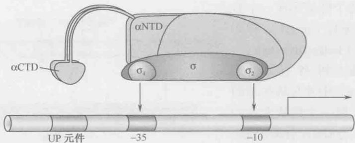  
图 13-7 σ 和 α 亚基将 RNA 聚合酶核心酶募集到启动子上。α 亚基的 C 端域（α CTD）识别 UP 元件（如果存在的话），而 σ 区域 2 和 4 分别识别 -10 和 -35 区域（图 13-6）。在本图中，RNA 聚合酶的示意形式与在先前的图中所显示的有相当大的差别。这种形式对于显示与 DNA 和调节蛋白的接触面是非常有用的，我们在第 18 章考察细菌的转录调节时还将会在某些图中使用它。

#### [W] 向开放式复合体的转变过程涉及 RNA 聚合酶和启动子 DNA 的结构变化

在闭合式复合体内 RNA 聚合酶与启动子 DNA 的结合使 DNA 仍处于双链状态。转录起始的下一个阶段要求聚合酶在开放式复合体中与启动子更紧密地结合在一起。从闭合式复合体到开放式复合体的转变过程涉及聚合酶的结构变化，以及 DNA 双链的打开，暴露出模板链和非模板链。相对于转录起始位点而言，这一解离事件发生在 -11 和 +2 之间的区域。

对于含 $\sigma^{70}$ 因子的细菌聚合酶，这一转变被称为异构化作用（isomerization）。它不需要从 ATP 水解获得能量，而是 DNA-酶复合体的构象自发地变成一种在能量上更具优势的形式。就像我们上面指出的那样，非模板链上的-10 元件的两个碱基（ $A_{11}$ 和 $T_{7}$ ）（图 13-8）处于自由状态，不再插入到 $\sigma$ 因子的“口袋”结构中，也就不再有如下功能的相互作用：通过将单链形式的-10 元件稳定下来，这些相互作用可以推动启动子去解离（图 13-8）。

异构化作用本质上是不可逆的，一旦异构化完成，通常转录将会随后起始（虽然在某些情况下还会再发生调控）。相反，闭合式复合体的形成则是易于逆转的——聚合酶可以转变为开放式复合体，从启动子上脱离。

为了描绘伴随异构化作用发生的结构变化，我们需要更为细致地了解全酶的结构。正如前面所描述的，在这个爪状酶的钳子之间有一条通道穿过（图 13-2）。由 $\beta$ 和 $\beta'$ 亚基的一些区域共同组成的活性位点，位于钳子基部的“活性中心裂隙”之内。

有 5 条通道通向酶的内部，如图 13-9 的开放式复合体的图片中所示。核苷三磷酸（NTP）摄取通道（没有在图中展示，请见图例说明）允许核糖核苷酸进入活性中心。RNA 出口通道允许正在延长的 RNA 链在延伸合成的同时离开此酶。其他的 3 个通道允许 DNA 进出此酶，如下所述。

下游 DNA（也就是聚合酶前方将被转录的 DNA）以双链的形式经下游 DNA 通道（在两个钳子之间）进入活性中心裂隙。在活性中心裂隙内，DNA 双链从 +3 位置开始分离。非模板链（NT）通过其特异性的通道离开活性中心裂隙并从聚合酶的表面经过，模板链（T）则沿着一条路线穿过活性中心裂隙，经它的特异性通道离开。聚合酶后面的上游 DNA 在 -11 位置处重新恢复双链状态。

  
图 13-8 通过 σ 区域 2 识别和解离 -10 元件。σ 区域 2 上具有两个口袋结构，其中各自结合非模板链的自由状态的 -10 碱基。这些能量上有优势的连接反应驱动了启动子的解离，这一反应过程不需要 ATP 的水解。（a）Taq RNA 聚合酶 σ₂ 区域的放大影像，以及结合闭合式复合体（蓝色）的双链 DNA 和部分开放式复合体（黄色）的单链 DNA。图中还展示了“口袋”结构中的两个碱基（A 和 T，用黄色表示）。红色箭头指示自由状态的碱基如何联系到闭合式复合体中相同的碱基（经许可图片复制自 Feklistov A. 和 Darst S.A. 2011. Cell 147: 1257, Fig. 6C, p. 1265. ©Elsevier.）（b）详细展示图 a 中区域 2 和非模板链的 -10 区域是如何结合的，特别是自由状态的碱基如何驱动 DNA 从这一区域解离（经许可并调整自 Liu X., Bushnell D.A., and Kornberg R.D. 2011. Cell 147: 1218, Fig. 1, p. 1219. ©Elsevier.）

从闭合式复合体向开放式复合体转变的异构化作用中，可以观察到聚合酶发生了两个显著的结构变化。第一，位于聚合酶前部的钳子牢固地钳压在下游DNA上。第二， $\sigma$ 的N端区域（区域1.1）位置有至关重要的移动。在未结合DNA时， $\sigma$ 区域1.1处于全酶的活性中心裂隙内部，阻断了开放式复合体中模板DNA链经过的路线。在开放式复合体中，区域1.1移动了大约 $50\AA$ 的距离，出现在酶的外部，使DNA可以进到裂隙中（图13-9）。 $\sigma$ 区域1.1处于高度的负电荷状态（恰似DNA）。因而，在全酶中，区域1.1起着DNA的分子模拟物（molecular mimic）的作用。活性中心裂隙的空间呈高度正电荷状态，既可以被区域1.1占据，也可以被DNA占据。

#### [W] 转录由 RNA 聚合酶起始，不需要引物

我们在第9章中谈到，DNA聚合酶并不重新合成新的DNA链，也就是说，它只能延伸一条已经存在的多聚核苷酸链。因此，复制总是需要引物链。引物通常是一段较短的RNA，与DNA模板链结合，形成一段较短的杂交双链区域；然后DNA聚合酶将核苷酸添加到引物的3'端。

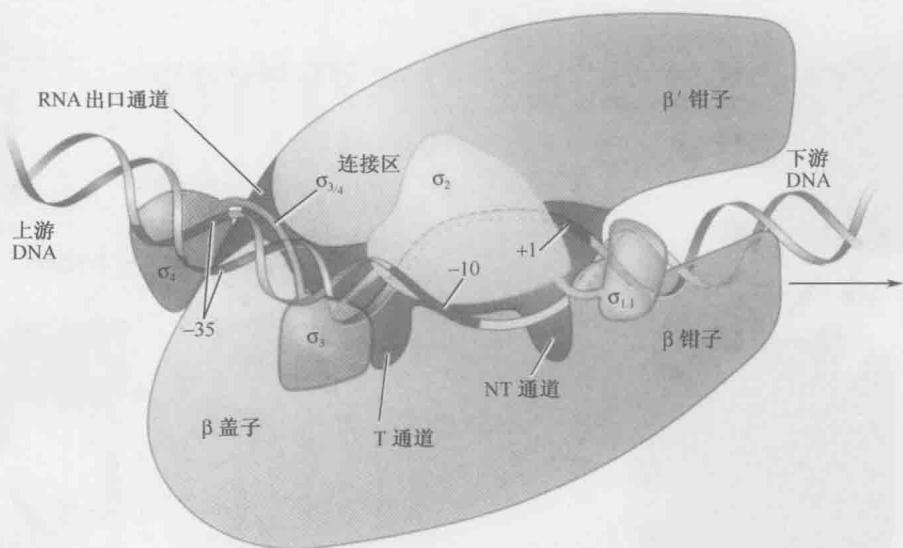  
图 13-9 进出开放式复合体的通道。本图显示了两条 DNA 链的相对位置（模板链为灰色，非模板链为橘红色）、 $\sigma$ 因子的 4 个区域、启动子的 -10 和 -35 区域，以及转录的起始位点（+1）。DNA 和 RNA 进出 RNA 聚合酶的通道也在图中显示。这里唯一没有显示的通道是核苷酸进入（NTP 摄入）通道，核苷酸由此通道进入活性位点裂隙，结合到增长中的 RNA 链中。如图所示，该通道从页面深处进入位于 DNA +1 附近的活性位点。DNA 链从蛋白质下面经过的部分以虚线表示。 $\sigma$ 区域 3/4 连接区，也称 $\sigma_{3,2}$ 是 $\sigma_{3,1}$ 和 $\sigma_{4}$ 之间的连接区域。（原图由 Richard Ebright 设计。）

RNA 聚合酶能够在一条 DNA 模板上起始新的 RNA 链，并不需要引物。这一功能要求起始的核糖核苷酸被带到活性位点，并稳定地保持在模板上，同时下一个核苷三磷酸以正确的几何形态呈递，使聚合这一化学过程得以完成。这是相当困难的，因为 RNA 聚合酶的转录物大多以腺嘌呤核苷酸（A）开始，这种核苷酸仅通过两个氢键与模板核苷酸（胸腺嘧啶核苷酸，T）结合，而胞嘧啶核苷酸（C）和鸟嘌呤核苷酸（G）之间有三个氢键。

因此，聚合酶必须与一条或者多条 DNA 模板链、起始核苷酸以及第二个核苷酸建立特异性的相互作用，严格控制其保持正确的方向，才可以开始对引入的核苷三磷酸进行化学反应。这种对聚合酶与起始核苷酸之间特异性相互作用的要求可能解释了为什么大多数转录物都以同一种核苷酸开始。目前学界大多认为， $\sigma$ 区的 3/4 链接处与模板链互作，可以保证在正确的构象和位置启动转录。与此一致的是，用含有缺少此部分的 $\sigma^{70}$ 的聚合酶进行的实验中，起始过程所需要的两个核苷酸中的一个或两个的浓度比平时要高得多。

#### [W] 转录起始阶段，RNA 聚合酶保持位置不变并将下游 DNA 拉向自己

如我们已经描述的，RNA 聚合酶首先合成并释放一些短于 10 核苷酸（无效合成）的小 RNA 转录物，然后进入转录起始阶段，包括逃离启动子、进入延长阶段，以及合成正确的转录物。很长时间我们都不明白在最初的无效转录循环中，酶的活性位点是如何沿着 DNA 模板移动的。迄今提出过三个通用模型（图 13-10）具体如下。

1. “瞬时漂移”（transient excursion）模型提出 RNA 聚合酶正向反向的瞬时迁移循

环。聚合酶被认为离开启动子沿着 DNA 模板移动一小段，合成一小段转录物，然后流产释放转录物，再回到其在启动子的原始位置。

2.“蠕虫移动”（inchworming）模型认为在聚合酶内有一个具伸缩性的元件，使得酶前方含有活性位点的部件向下游移动，合成一小段转录物，然后流产，再收缩回到其仍留在启动子上的酶主体。

3. “蜷缩”（scrunching）模型认为位于固定位置的、与启动子结合的、聚合酶下游的 DNA 被酶拉进来。于是在酶的内部堆积的 DNA 以单链“泡”的形式逗留。

现在普遍相信第三个模型

——蜷缩，反映了真实的情况。这个结论基于一系列的发现——包括单分子分析实验，这些实验可以测量在最初的转录阶段聚合酶不同部分相互之间及相对于图 13-10 最初转录的机制。在最初的转录起始阶段，RNA 聚合酶的活性中心相对于 DNA 模板向前移动，合成短的转录物并流产，然后重复这个循环直到逃离启动子。图中表示了说明该过程的三个模型。根据第一个模型——瞬时漂移（上图），聚合酶沿着 DNA 移动。在第二个模型——蠕虫移动（中图）中——酶的前部分沿着 DNA 移动，但由于酶内部有一个具伸缩性的区域，酶的后部分可以在启动子上保持固定。在第三个模型——蜷缩（下图）中，酶保持固定，把 DNA 拉过来。这些模型之间的不同点，以及支持蜷缩模型的证据在正文中有描述。（获得许可并重新绘图自 Kapanidis A.N. et al. 2006. Science 314: 1144–1147, Fig. 1a. ©AAAS.）

DNA 模板链的位置。结果显示，在最初的转录阶段，聚合酶在启动子上位置不变并解开下游 DNA 把其拉进来。只有蜷缩模型与这些结果吻合。

启动子逃离涉及聚合酶-启动子相互作用及聚合酶核心- $\sigma$ 相互作用的破坏

我们已经看到，在最初的转录阶段存在一个流产性起始过程，短的（9个核苷酸或更短）转录物合成并释放。只有合成一条达到阈值（10个核苷酸或更多）的转录物时，聚合酶才能逃离启动子并进入延伸阶段。一旦达到这个长度，转录物不能停留在与DNA配对的区域，必须开始像线一样穿入RNA出口通道（图13-9）。启动子逃离与打破聚合酶和启动子元件之间，以及聚合酶与作用于特定启动子的任何调控蛋白之间的所有相互作用有关（第18章）。

目前还不清楚 RNA 聚合酶为什么必须在成功逃离启动子之前经历流产性转录起始。但是 $\sigma$ 因子的一个区域作为分子模拟物参与其中，它是 3/4 连接区，模拟的是 RNA。此区域位于开放式复合体的 RNA 出口通道中间（图 13-9），为了使 RNA 链可以合成超过 10 个核苷酸， $\sigma$ 的这个区域必须从该位置被逐出，这个过程需要聚合酶尝试几次才能成功。

σ 区域 3/4 连接区的逐出可能说明了 σ 与延伸酶的结合比其与开放式复合体的结合更弱。事实上，它常常从延伸复合体上完全丢失。

一旦逃离，蜷缩过程将发生逆转。也就是说，在蜷缩时解离的 DNA 又重新复合，伴随着转录“泡”从 22\~24 个核苷酸萎缩成 12\~14 个核苷酸大小（图 13-3），这个过程提供了聚合酶在逃离时打破聚合酶启动子及核心酶 $\sigma$ 相互作用所需要的能量。因此，蜷缩是在转录起始中储存和转移能量的一种方法，能量在逃离时的释放可以使聚合酶与启动子分离并从核心酶驱逐 $\sigma$ 因子。

在框 13-2 “单亚基 RNA 聚合酶” 中，我们将看到，尽管缺乏 $\sigma$ 亚基，在从起始复合物向延伸复合物转变的过程中这些简单的 RNA 聚合酶是如何经历结构上类似的转移的。

#### [W] 框 13-2 单亚基 RNA 聚合酶

正文中讨论了在细菌和真核生物细胞中发现的多亚基RNA聚合酶。但是亦有单亚基RNA聚合酶，这些酶能够完成与那些在复杂的多细胞中的对应物一样的基本反应。许多噬菌体，如大肠杆菌噬菌体T7编码的这种聚合酶，在感染时用以转录其大多数基因。类似地，多数线粒体和叶绿体的基因也是由一些与此类单亚基噬菌体酶紧密相关的聚合酶转录的。演化造就了这些能够完成转录任务的相对简单的酶，正如我们在正文中强调过的，即使对大得多并且更为复杂的多亚基酶来说，转录也是一项令人印象深刻的成就。

T7聚合酶是研究得最为广泛的单亚基聚合酶。它的分子质量为100kDa，而细菌的核心酶为400kDa（不包括σ因子），其结构在框13-2图1中显示。总体上，它看起来与我们在第9章中描述过的DNA聚合酶的PolI家族相似。因而，T7的RNA聚合酶像是一只右手，具有手指、拇指和手掌，代表排布在中心裂隙周围的域，活性位点位于裂隙内。

虽然 T7 聚合酶在结构上与 RNA 聚合酶没有关联，反而更像 DNA 聚合酶，但它的确也具有与细胞的 RNA 聚合酶一样的特征。通过比较 T7 聚合酶和细菌聚合酶在与各自的模板组成的复合体中的结构，这些特征变得很明显。如我们在正文中所看到的，细菌的聚合酶具有各种各样的通道进出活性中心裂隙（图 13-8）。例如，一个通道允许核苷三磷酸进入活性中心，接触模板，并在模板的影响下聚合到增长中的 RNA 链上。另一个通道则为增长中的 RNA 链提供了离开聚合酶的出口。类似的通道也可以在噬菌体聚合酶的结构中见到。

将细菌和 T7 聚合酶的起始和延伸复合体进行比较后发现一个明显的差异，即在细菌和 T7 中，一种类似的功能转变是通过不同结构变化而实现的。我们在正文中曾特别指出，在细菌中从起始到延伸的转变包括了 $\sigma$ 因子一个区域的位置明显的移动。这一移动打开了 RNA 出口通道，因此使长度超过 10 个核苷酸的转录物得以生成。T7 聚合酶中没有 $\sigma$ 因子，但是在此单亚基酶体内的一个类似的结构变化介导了起始复合体向延伸复合体的转变，这一结构变化对于 RNA 出口通道的形成是必需的。

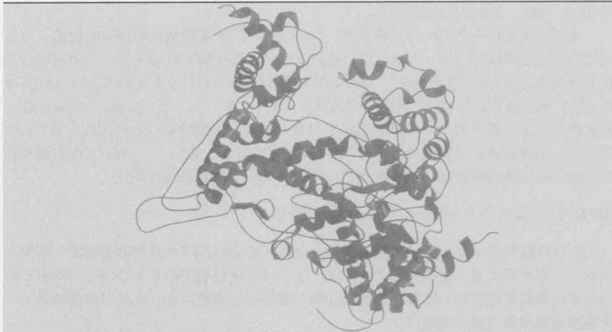  
框 13-2 图 1 噬菌体 T7 的 RNA 聚合酶。(来自 Jeruzalmi D. and Steitz T.A. 1998. EMBO J. 17: 4101.) 图像使用 MolScript、BobScript 和 Raster 3D 等软件制作。

#### [W] 延伸聚合酶是一个边合成边校对 RNA 的向前行进的机器

DNA 通过延伸酶的方式与通过开放式复合体相似（图 13-9），双链 DNA 在两个钳子之间进入酶的前部。在催化裂隙的开口处，两条链分开并沿着不同的路径穿过酶，然后从各自的通道离开酶，并在延伸聚合酶（elongation polymerase）的后面重新形成双螺旋结构。核苷酸通过其固定的通道进入活性位点，并在模板 DNA 链的引导下添加到增长中的 RNA 链上。在任何一个特定时刻，增长中的 RNA 链中只有 8 个或 9 个核苷酸与 DNA 模板保持碱基互补状态；RNA 链的其余部分则剥落并从 RNA 出口通道离开。参见图 13-11 的延伸复合物示意图。

在延伸过程中，聚合酶在增长的 RNA 转录物上一次添加一个核苷酸。与转录起始时聚合酶采用蜷缩的方式将 DNA 拉入酶不一样（图 13-10），在延伸过程中聚合酶使用一步作用机制：单分子技术显示聚合酶就像一个分子马达一样向前推进，每前进一步的距离相当于任何一个正在加入 RNA 链的核苷酸的碱基对的长度。另外，“泡”的大小，即非双链 DNA 的长度，在延伸过程中保持不变：当一个核苷酸对在行进酶的前方分开，一个核苷酸对就在其后方形成。

除了合成转录本，RNA 聚合酶还执行着两项校对（proofreading）功能。第一个被称为焦磷酸化编辑（pyrophosphorolytic editing）。在此状态下，聚合酶利用它的活性位点，在一个简单的逆向反应中，通过重新加入 PPi 催化错误插入的核糖核苷酸的去除。然后聚合酶可以将另一个核糖核苷酸加入到增长中 RNA 链的相应位置上。需要注意的是，通过这种方式聚合酶既可以去除错误的碱基，也可以去除正确的碱基，但是它在不匹配的地方比在匹配的地方花的时间更长，所以常去除前者。在第二种称为水解编辑（hydrolytic editing）的校对机制中，聚合酶倒退一个或更多的核苷酸（图 13-11d）并切

开 RNA 产物，去除掉错误的序列。

水解编辑是由一些 Gre 因子激发的。Gre 因子不仅能够增强水解编辑的功能，而且同时也作为延伸刺激因子。也就是说，它们确保聚合酶能够有效地延伸并帮助克服转录在较难转录的序列处“停滞不前”。这些功能的组合类似于真核生物的转录因子 TFIIS 对其 RNA 聚合酶Ⅱ的作用（见本章后续的描述及图 13-22）。另一组蛋白质——Nus 蛋白，在延伸阶段加入聚合酶，并以目前还很不明确的方式促进延伸和终止的过程（第 18 章描述了一个调控延伸过程的例子）。其中一种细菌中的 Nus 蛋白——NusG，在古菌和真核生物中保守性同样很高（在真核生物中被称为 Spt5，见后面的讨论）。

#### [W] RNA 聚合酶可能变得停滞不前，需要挪走

在有些情况下，一个延伸着的 RNA 聚合酶可能变得停滞不前并结束转录。停滞不前的一个常见理由是一条损坏的 DNA 链。如果被转录的基因是必不可少的，停滞不前的后果可能是灾难性的：停滞不前的聚合酶不能制造有效的产物，并且对试图转录同一个基因的其他聚合酶造成障碍。

为了处理这种情况，细胞具有挪走停滞不前的聚合酶并且同时招募修复酶[具体而言是内切酶Uvr（A）BC的功能]。接下来的修复称为转录偶联的修复，我们在第10章讨论过。聚合酶的挪走及修复酶的招募都是由一个叫做TRCF的蛋白进行的。

TRCF 具有 ATPase 活性。它结合聚合酶上游的双链 DNA，并且利用 ATPase 传动器（motor）沿着 DNA 移动，直到遇到停止的 RNA 聚合酶。碰撞把聚合酶往前推，或是使它重新开始延伸，或更常见的是，使 RNA 聚合酶、模板 DNA、和 RNA 转录物的三重复合体解离。这样就结束了酶的转录，但为修复酶和其他 RNA 聚合酶开辟了道路。

#### [W] 转录由 RNA 序列内部信号终止

我们已经看到转录终止的一种途径。在延伸过程中，当 RNA 聚合酶停滞不前时，它可以通过置换因子 TRCF 的作用从 DNA 上除去（正如上面所描述的）。这种终止由损坏的 DNA 或其他计划外的障碍引起。但是在基因的末端，转录终止是一个正常且重要的功能。称为终止子（terminator）的序列引发延伸聚合酶从 DNA 上脱离并且释放出它已经合成的 RNA 链。在细菌中，终止子有两种类型：Rho 依赖型（Rho-dependent）和 Rho 非依赖型（Rho-independent）。第一种类型，顾名思义，需要一个称为 Rho 的蛋白质来诱发终止反应。第二种类型不需要其他因子的参与就导致终止。我们将依次讨论这两种类型的终止子。

Rho 依赖型终止有一些定义不太明确的 RNA 元件，被称为 rut 位点。就像下面将要讨论到的，它们需要 Rho 因子的参与才能发挥作用。Rho 是一个具有 6 个相同亚基的环状蛋白质，在单链 RNA 离开聚合酶时与之结合（图 13-12）。此蛋白质还具有 ATPase 活性：一旦与转录物结合，它就利用 ATP 水解产生的能量来诱发终止。终止的准确机制还不清楚，模型有如下几个：Rho 把聚合酶往相对于 DNA 和 RNA 的前方推，导致终止，与 TRCF 介导的终止方式（如前所述）类似；或 Rho 把 RNA 拉出聚合酶导致终止；

或者 Rho 诱发聚合酶的构象改变使酶终止。最近的大多数实验证据显示，最后一种方式至少在不同基因转录的终止中发挥了重要作用。构象改变引起延伸复合物终止后，参与因子的解离过程更慢。

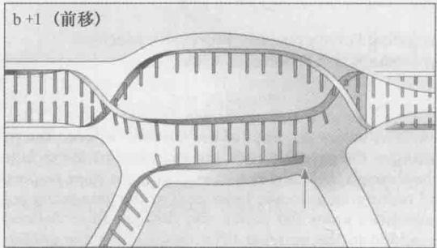

  
图 13-11 RNA 聚合酶延伸复合体内部的模板和转录物。图示转录过程的不同阶段 RNA 聚合酶内 RNA 及 DNA 模板相对位置的示意图。(a)未移位的聚合酶（0）显示 RNA 链与模板 DNA 链 9 个碱基的配对。(b)前移的聚合酶（+1）显示聚合酶已经向前方移动了一个碱基的情况。(c)结合 NTP 的前移聚合酶显示如图 b 中相同的 DNA 和 RNA 位置，带着一个进入的 NTP。(d)回移的聚合酶（-1）显示当聚合酶如在水解编辑时回移一个碱基的情况。红色箭头指向聚合酶中一个固定的位置，所有图中都一样。为了清晰起见，这里显示的聚合酶与图 13-9 方向不同，RNA 出口通道在下方。(由 Richard Ebright 友情提供。)

最近的研究同时显示 Rho 可以通过转录循环来与 RNA 聚合酶结合。因此，Rho 并不是通过易位到一个初期的、包含 rut 序列的转录本来接触聚合酶的。它更倾向于在转录的早期与聚合酶结合，或者在之后的某个时间点结合到正在从延伸酶上释放的 RNA 转录的上。Rho 的易位可能会导致 RNA 环更为绷紧，而当它足够紧的时候，延伸的 RNA 酶将会终止。

Rho 是如何被引导到特定的 RNA 分子上的？首先，它结合的位点有某种特异性（所谓的 rut 位点，即 Rho 的利用）。这些位点最理想的组成成分是几段约 40 个核苷酸、不折叠为二级结构的序列（也就是说，它们主要保持着单链状态），还富含 C 残基。

特异性的第二个层次是 Rho 无法与任何正在被翻译的转录物（也就是与核糖体结合的转录物）

  
图 13-12 Rho 转录终止因子。图为 Rho 终止因子的晶体结构俯视图。它由一个 Rho 蛋白的六聚体组成，每一个单体以一种不同的颜色表示。6 个单体形成一个开放的环，这个环并不是平面的，第 6 个亚基要比第 1 个更深入页面所在的平面。两个亚基之间的缝隙为 12Å，螺旋倾斜度为 45 Å。据认为，Rho 所作用的 RNA 转录物（未显示）是沿着每个亚基的底部结合的，然后从环的中央穿过。（Skordalakes E. and Berger J.M. 2003. Cell 114: 135.）图像使用 MolScript、BobScript 和 Raster 3D 等软件制作。

结合。在细菌中，转录和翻译是紧密相连的——延伸中的 RNA 转录物还在合成时，一旦离开了聚合酶，翻译就在其上起始了。因而，Rho 只会终止那些转录已超出一个基因或操纵子（operon）的末端但仍在转录着的转录物。

Rho 非依赖型终止子也被称为固有终止子（intrinsic terminator），因为它们不需要其他因子就能够发挥作用。Rho 非依赖型终止子由两个序列元件组成：一段短的反向重复序列（约 20 个核苷酸），其后是一段约 8 个 A:T 碱基对的序列（图 13-13）。这些元件要转录后才会影响聚合酶，也就是说它们是以 RNA 而不是 DNA 起作用的。当聚合酶转录一段反向重复序列时，合成的 RNA 能够通过自身碱基配对形成一个茎环结构（stem-loop，常称为“发夹”，见第 5 章）。发夹的形成破坏了延伸复合体，从而引起终止。与 Rho 依赖型终止一样，其作用机制还不清楚。现行的模型与那些 Rho 依赖型的差不多，也就是说，发夹或是把聚合酶往相对于 DNA 和 RNA 的方向推，或是把转录物从聚合酶上硬扯下来，或是诱发聚合酶的构象改变而导致终止。

如我们之前所描述的，发夹结构只有在后面跟随着一段 A：U 碱基对时才能有效地发挥终止子的作用。这是因为在这种环境中，当发夹结构形成时，增长中的 RNA 链仅通过 A：U 碱基对固定在模板上的活性位点。由于 A：U 碱基对是所有碱基对中最弱的（甚至比 A：T 碱基对还要弱），所以更容易被含有茎环结构的转录聚合酶所打断，RNA 也因

而更容易脱离下来（图 13-14）。

  
图 13-13 一个 Rho 非依赖型终止子的序列。上部是终止子在 DNA 中的序列，中部显示 RNA 的序列，底部是终止子发夹的结构。所讨论的终止子来自于第 18 章中讨论的色氨酸衰减子（trp attenuator）。方框中显示的是分离到的破坏终止子序列的突变。（引自 Yanofsky C. 1981. Nature 289: 751–758.）

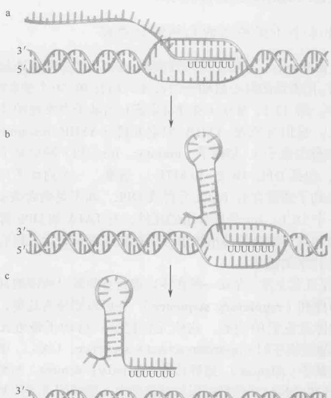  
图 13-14 转录终止。图为 Rho 非依赖型终止子如何工作的模型。(a) RNA（图 13-11）中的发夹结构在该区域被聚合酶转录后立刻形成（聚合酶未在此显示）；(b) 该 RNA 结构在聚合酶转录 DNA 下游的 AT 富集区域时将其破坏；(c) 究竟发夹是如何破坏正在转录的聚合物还不太清楚（文中有不同的模型）。发夹结构，以及 RNA 中一段 U 与模板中 A 之间的弱相互作用协同显然使转录物的释放变得容易（引自 Platt T. 1984, Cell 24: 10-23.）

<!-- W-END Watson 13 转录机制（章首） -->

## 3.6 真核生物 RNA 聚合酶与 RNA 转录

真核生物的 RNA 聚合酶高度分工,转录过程中往往需要包括转录因子在内的多种蛋白因子参与,因此,真核生物基因转录过程比与原核生物更为复杂。

## 3.6.1 真核生物 RNA 聚合酶

真核生物中共有3类结构相对更复杂的RNA聚合酶，它们在细胞核中的位置不同，负责转录的基因不同，对 $\alpha-$ 鹅膏蕈碱的敏感性也不同(表3-4)。 $\alpha-$ 鹅膏蕈碱是一种来自真菌毒蕈的八肽二环剧毒物，它对真核生物的3种RNA聚合酶有不同的浓度依赖性作用。在动、植物及昆虫细胞中，RNA聚合酶II的活性可被低浓度的 $\alpha-$ 鹅膏蕈碱所抑制，但聚合酶I却不受抑制。在动物细胞中高浓度的 $\alpha-$ 鹅膏蕈碱可抑制聚合酶III的转录，而在昆虫中则不具有抑制作用。

表 3-4 真核细胞中 3 类 RNA 聚合酶特性比较

<table><tr><td>酶</td><td>细胞内定位</td><td>转录产物</td><td>相对活性</td><td>对α-鹅膏蕈碱的敏感程度</td></tr><tr><td>RNA聚合酶I</td><td>核仁</td><td>rRNA</td><td>50%~70%</td><td>不敏感</td></tr><tr><td>RNA聚合酶II</td><td>核质</td><td>hnRNA</td><td>20%~40%</td><td>敏感</td></tr><tr><td>RNA聚合酶III</td><td>核质</td><td>tRNA</td><td>约10%</td><td>存在物种特异性</td></tr></table>

## 1. 真核生物 RNA 聚合酶的分类

RNA 聚合酶 I 存在于细胞核的核仁中, 其转录产物是 45S rRNA 前体, 经剪接修饰后生成除了 5S rRNA 外的各种 rRNA。rRNA 与蛋白质组成的核糖体是蛋白质合成的场所。RNA 聚合酶 I 在低离子强度时活性最高。

RNA 聚合酶Ⅱ位于细胞核质内，在核内转录生成 mRNA 的前体分子，即核内不均一 RNA（hnRNA, heterogeneous nuclear RNA），经剪接加工后生成的 mRNA 被运送到胞质中作为蛋白质合成的模板。RNA 聚合酶Ⅱ在较高离子强度，特别是高 $Mn^{2+}$ 条件下，有较高的活性。

RNA 聚合酶Ⅲ也位于细胞核质内, 催化的主要转录产物是 tRNA、5S rRNA、snRNA(核内小 RNA), 其中 snRNA 参与 RNA 的剪接。RNA 聚合酶Ⅲ在很宽的离子强度范围内均有活性, 离子优选 $Mn^{2+}$ 。

除了细胞核中的 RNA 聚合酶之外, 真核生物线粒体和叶绿体中还存在着不同的 RNA 聚合酶。线粒体 RNA 聚合酶只有一条多肽链, 相对分子质量小于 $7 \times 10^{4}$ , 是已知最小的 RNA 聚合酶之一, 与 T7 噬菌体 RNA 聚合酶有同源性。叶绿体 RNA 聚合酶比较大, 结构上与细菌中的聚合酶相似, 由多个亚基组成, 部分亚基由叶绿体基因组编码。线粒体和叶绿体 RNA 聚合酶活性不受 $\alpha-$ 鹅膏蕈碱所抑制。

## 2. 真核生物 RNA 聚合酶的组成分析

3类真核生物RNA聚合酶一般都由 $8\sim 16$ 个亚基所组成（表3-5），相对分子质量超过 $5\times 10^{5}$ 。其中，RNA聚合酶II的两个大亚基，RPB1和RPB2，与细菌核心酶的两个大亚基 $(\beta$ 和 $\beta^{\prime})$ 是同源的；其RPB3和RPB11与 $\alpha$ 亚基、RPB6与 $\omega$ 亚基是同源的。虽然不同生物3类聚合酶的亚基种类和大小各异，它们的结构都比原核生物RNA聚合酶复杂但有相似性。存在两条普遍遵循的原则：一是聚合酶中有两个相对分子质量超过 $1\times 10^{5}$ 的大亚基；二是同种生物3类聚合酶都有几个共同的亚基，有“共享”小亚基的倾向，即有几个小亚基，如RPB6、RPC5和RPC9，是其中3类或2类聚合酶所共有的。

表 3-5 真核生物 RNA 聚合酶的亚基

<table><tr><td>RNA 聚合酶I</td><td>RNA 聚合酶II</td><td>RNA 聚合酶III</td></tr><tr><td>RPA1</td><td>RPB1</td><td>RPC1</td></tr><tr><td>RPA2</td><td>RPB2</td><td>RPC2</td></tr><tr><td>RPC5</td><td>RPB3</td><td>RPC5</td></tr><tr><td>RPC9</td><td>RPB11</td><td>RPC9</td></tr><tr><td>RPB6</td><td>RPB6</td><td>RPB6</td></tr><tr><td>其他 9 个亚基</td><td>其他 7 个亚基</td><td>其他 11 个亚基</td></tr></table>

注：亚基按照相对分子质量由大到小的顺序排列。

## 3. 真核生物 RNA 聚合酶的结构

晶体结构研究表明,无论是原核生物还是真核生物,RNA 聚合酶有着共同的结构形态,其形状大体像一只蟹爪(图3-22)。2006年度诺贝尔化学奖得主罗杰·科恩伯格等通过对酵母的RNA聚合酶Ⅱ的晶体结构的研究全面地揭示了各亚基间的相互关系,证明有多个通道分别允许DNA、RNA和核糖核酸进出RNA聚合酶的活性中心裂隙(图3-23)。RNA聚合酶Ⅱ分成4个主要作用模块(module),其中包括围绕在活性中心(active center)周围的一个钳子形结构域(clamp)。蟹爪的两个钳子主要是由最大的两个亚基(RPB1和RPB2)构成。酶的活性位点是由这两个亚基的一些区域共同组成的,位于钳子基部的一个被称为“活性中心裂隙”的区域内。只有当钳子形结构域处于开放状态时,才允许启动子DNA序列进入,起始基因转录。钳子形结构域延伸出来的3个平滑结构域可能在转录过程中起到促进RNA解旋以及帮助DNA重新形成螺旋的作用。

  
图 3-22 原核生物和真核生物 RNA 聚合酶的晶体结构的比较  
(a) 噬热水生菌(Thermus aquaticus)RNA聚合酶的核心酶的结构；(b) 酿酒酵母(Saccharomyces cerevisiae)RNA聚合酶Ⅱ的结构(来自于Cramer P. et al. 2001, Science 292:1863)。

## 3.6.2 真核生物启动子对转录的影响

所谓启动子是指确保转录精确而有效地起始的 DNA 序列。真核生物的基因由 3 类不同 RNA 聚合酶负责转录,所以这些基因的启动子结构也有各自的特点。由 RNA 聚合酶Ⅱ所转录的编码蛋白质的基因数目最多,这里只介绍 RNA 聚合酶Ⅱ所转录的真核生物

(a)  

(b)  
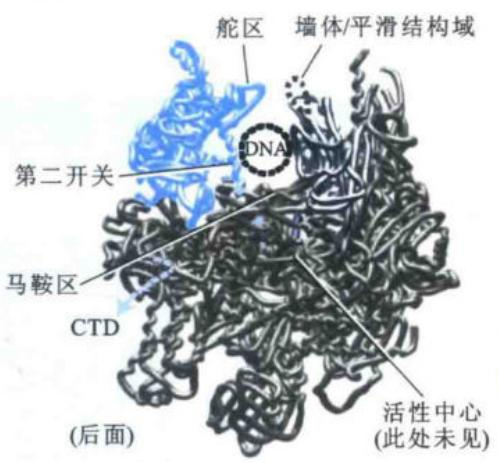  
图3-23 模板DNA进入转录复合体的路径  
(a) 俯瞰图: 双螺旋 DNA 用倾斜的圆筒表示, 转录因子 TF II 的结合位点用虚圈表示; (b) 后视图: DNA 从钳子形结构和墙体 / 平滑结构域的中间穿越。

图3-24 真核生物RNA聚合酶Ⅱ所识别的启动子区  

启动子的特点。

1979 年美国科学家 Goldberg 首先注意到真核生物中由 RNA 聚合酶 II 催化转录的 DNA 序列 5' 上游区有一段与原核生物 Pribnow 区相似、富含 TA 的保守序列。由于该序列前 4 个碱基为 TATA，所以又称为 TATA 区 (TATA box)。此后 10 多年间，科学家通过对许多基因启动子区的分析，发现绝大多数功能蛋白基因的启动子都具有共同的结构模式。简单地说，真核基因的启动子在 -25～-35 区含有 TATA 序列 (图 3-24)，是核心启动子的组成部分，在核心启动子上游 100～200 bp 范围内，还存在一个转录调控区，有多个启动元件，如在很多基因的 -70～-80 区含有 CCAAT 区 (CAAT box)，在 -80～-110 含有 GCCACACCC 或 GGGCGGG 区 (GC box)。习惯上，将 TATA 区上游的保守序列称为上游启动子元件 (upstream promoter element, UPE) 或称上游激活序列 (upstream activating sequence, UAS)。

比较原核和真核基因转录起始位点上游区的结构,发现两者之间存在很大的差别(图 3-25)。原核基因启动区范围较小,一般情况下,TATAAT(Pribnow 区)的中心位于 $-7\sim -10$ ，上游 $-30\sim -70$ 区为正调控因子结合区， $+1\sim -20$ 区为负调控因子结合区。真核基因的调控区较大，TATAA/TA区位于 $-20\sim -30$ ，而 $-40\sim -110$ 区为上游激活区。除Pribnow区之外，原核基因启动子上游只有TTGACA区（ $-30\sim -40$ ）作为RNA聚合酶的主要结合位点，参与转录调控；而真核基因除了含有可与之相对应的CAAT区之外，大多数基因还拥有GC区和增强子区等各种调控元件。

图 3-25 原核和真核生物基因转录起始位点上游区的结构比较  

  
图 3-26 SV40 基因启动子上 TATAAA 及邻近区域对基因转录活性的影响

TATA区和上游启动子元件(CAAT区或GC区)的作用有所不同。前者的主要作用是使转录精确地起始,如果除去TATA区或进行碱基突变,转录产物下降的相对值不如CAAT区或GC区突变后明显,但发现所获得的RNA产物起始点不固定。研究SV40晚期基因启动子发现,上游激活区的存在与否,对该启动子的生物活性有着根本性的影响。若将该基因5'上游-21\~-47核苷酸序列切除,基因完全不表达(图3-26)。

上游启动子元件 CAAT 区和 GC 区主要控制转录起始频率, 基本不参与起始位点的确定。CAAT 区对转录起始频率的影响最大, 该区任一碱基的改变都将极大地影响靶基因的转录强度, 而启动区其他序列中 1\~2 个碱基的置换则没有太大的影响。此外, 在 TATA 区和相邻的 UPE 区之间插入核苷酸也会使转录减弱, 在人类 β- 血红蛋白基因启动区的两个 UPE 序列之间插入 15 个核苷酸, 该启动子完全失去功能。CAAT 和 GC 区相对于 TATA 区的取向 (5'→3' 或 3'→5'), 对转录强度的影响不大。

尽管这3种保守序列都有着重要功能,但并不是每个基因的启动子区都包含这3种序列。真核细胞中存在着大量特异性或组成型表达的、能够与不同基因启动子区UPE相结合的转录调控因子。基因转录实际上是RNA聚合酶、转录调控因子和启动子区各种调控元件相互作用的结果。

## 3.6.3 转录起始复合物的组装

真核细胞 RNA 转录起始过程中模板的识别与原核细胞有所不同。真核生物 RNA 聚合酶不能直接识别基因的启动子区，需要至少 7 种与 $\sigma$ 因子在细菌转录中所执行的功能类似的，被称为转录调控因子（transcription factor, TF）的辅助蛋白质 $^{(表3-6)}$ ，按特定顺序结合于启动子上，帮助 RNA 聚合酶特异性地结合到靶基因的启动子上并解开 DNA 双链。因为不少辅助因子本身就包含多个亚基，所以它们与聚合酶形成的转录前起始复合物(preinitiation transcription complex, PIC) 相对分子质量特别大, 包含 40 多条肽链, 总相对分子质量高达 $2 \times 10^{6}$ , 该复合物保证转录有效的起始。

转录因子和 RNA 聚合酶Ⅱ必须以特定的顺序结合到启动子序列上。形成 PIC 的第一步，TFⅡD 与启动子核心元件 TATA 区相结合，RNA 聚合酶Ⅱ、TFⅡA、TFⅡB 等才能依次结合。此后，TFⅡE、TFⅡH、TFⅡJ 等迅速靠近已形成的复合物（图 3-27）。PIC 的装配过程具有严格的顺序性，各组分的分工明确，如果缺少一种或几种成分，则不能起始转录，或者只有很低的转录速率。

此外，RNA 聚合酶Ⅱ最大亚基的 C 端结构域 CTD 重复序列上有多个位点能够发生磷酸化 $^{(图3-27)}$ ，可能通过影响聚合酶与转录因子的相互作用来影响 RNA 聚合酶Ⅱ在 PIC 上的组装，进而调节转录起始。CTD 的磷酸化与非磷酸化的互变，对于转录延伸过程也具有重要的调节作用。

图 3-27 由 RNA 聚合酶Ⅱ和各种转录因子组装成转录前起始复合物指导基因转录

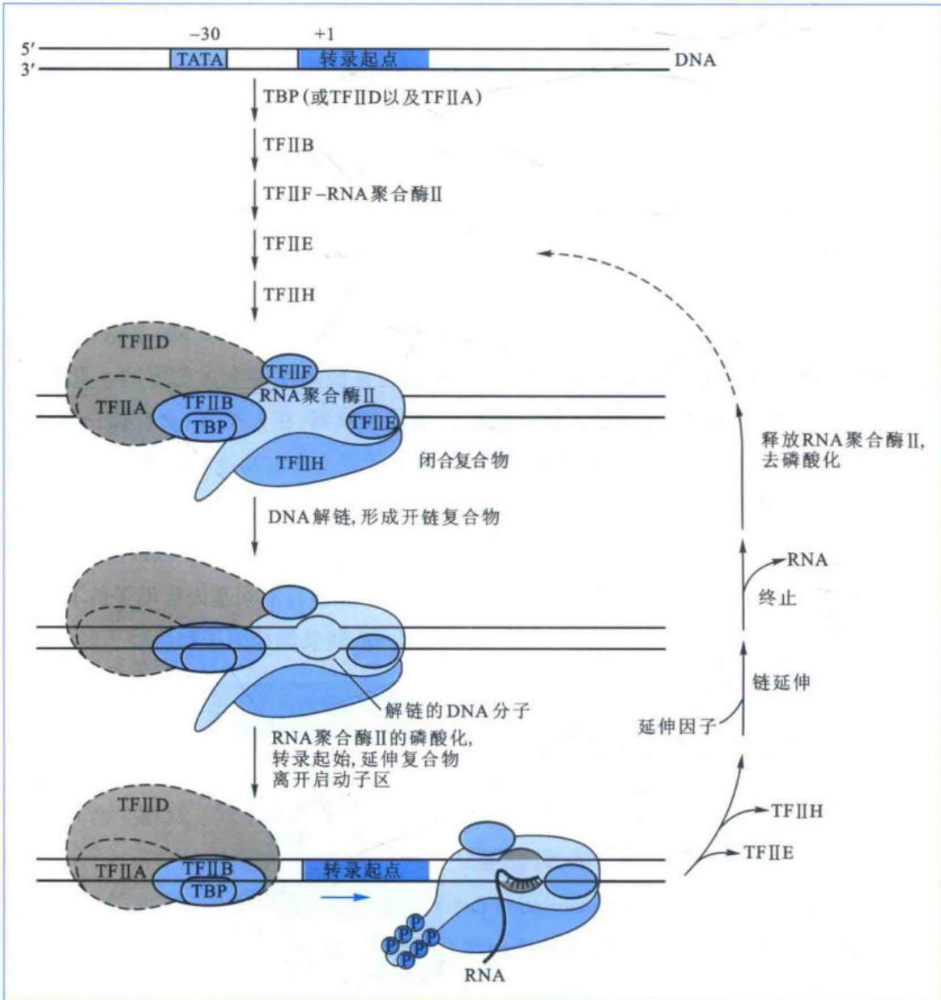

表 3-6 真核生物 RNA 聚合酶 II 所形成的转录起始复合物

<table><tr><td>蛋白质</td><td>亚基数</td><td>亚基的相对分子质量 / × $10^{3}$ </td><td>功能</td></tr><tr><td>RNA聚合酶II</td><td>12</td><td>10~220</td><td>催化RNA的生物合成</td></tr><tr><td>TBP</td><td>1</td><td>38</td><td>与启动子上的TATA区相结合</td></tr><tr><td>TFIIA</td><td>3</td><td>12,19,35</td><td>使TBP及TFIIB与启动子的结合比较稳定</td></tr><tr><td>TFIIB</td><td>1</td><td>35</td><td>与TBP相结合,吸引RNA聚合酶和TFIIF到启动区上</td></tr><tr><td>TFIID</td><td>12</td><td>15~250</td><td>与各种调控因子相互作用</td></tr><tr><td>TFIE</td><td>2</td><td>34,57</td><td>吸引TFIIH,有ATP酶及解链酶活性</td></tr><tr><td>TFIIF</td><td>2</td><td>30,74</td><td>结合RNA聚合酶II并在TFIIB帮助下阻止聚合酶与非特异性DNA序列相结合</td></tr><tr><td>TFIHH</td><td>12</td><td>35-89</td><td>在启动子区解开DNA双链,使RNA聚合酶II磷酸化,接纳核苷酸切除修复体系</td></tr></table>

## 3.6.4 增强子及其功能

除了启动子以外,近年来发现还有另一序列与转录的起始有关。在SV40的转录单元上发现它的转录起始位点上游约200碱基对处有两段72碱基对长的重复序列,它们不是启动子的一部分,但能增强或促进转录的起始,除去这两段序列会大大降低这些基因的转录水平,若保留其中一段或将之取出插至DNA分子的任何部位,就能保持基因的正常转录。因此,称这种能强化转录起始的序列为增强子或强化子(enhancer)。除SV40外,还在反转录病毒基因、免疫球蛋白基因、胰岛素基因、胰糜蛋白酶基因等许多基因的启动区中陆续发现了增强子的存在。

有人曾把 $\beta-$ 珠蛋白基因置于带有上述 72 碱基对序列的 DNA 分子上, 发现它在体内的转录水平提高了 200 倍。而且, 无论把这段 72 碱基对序列放在转录起点上游 1400 碱基对处还是下游 3300 碱基对处, 它都有转录增强作用。增强子很可能通过影响染色质 DNA-蛋白质结构或改变超螺旋的密度而改变模板的整体结构, 从而使得 RNA 聚合酶更容易与模板 DNA 相结合, 起始基因转录。

## 增强子具有下列特点：

① 远距离效应 一般位于上游 -200 碱基对处,但可增强远处启动子的转录,即使相距十多个千碱基对也能发挥作用。

② 无方向性 无论位于靶基因的上游、下游或内部都可发挥增强转录的作用。

③ 顺式调节 只调节位于同一染色体上的靶基因,而对其他染色体上的基因没有作用。

④ 无物种和基因的特异性,可以连接到异源基因上发挥作用。

⑤ 具有组织特异性 SV40 的增强子在 3T3 细胞中比多瘤病毒的增强子要弱,但在 HeLa 细胞中 SV40 的增强子比多瘤病毒的要强 5 倍。增强子的效应需特定的蛋白质因子参与。

⑥ 有相位性 其作用和 DNA 的构象有关。

⑦ 某些增强子可应答外部信号 如热休克基因在高温下才表达,金属硫蛋白基因在镉和锌的存在下才表达,另外一些增强子可以被固醇类激素所激活。

<!-- W-BEGIN Watson 13 真核生物的转录 -->

### 【中文对照 Watson 第13章：真核生物的转录】

> 来源：Watson《基因的分子生物学》第七版中译本（书籍/03_基因的分子生物学_第七版） 第13章 转录机制。

#### [W] 真核生物的转录

正如我们已经讨论过的，真核生物中的转录是由与原核生物中发现的 RNA 聚合酶密切相关的一类聚合酶完成的。这不会让人感到惊讶，原核生物与真核生物中转录过程本身是相同的。然而，每种情况中所用的“机器”存在差别。有一点我们已经看到了：真核生物一般有三个不同的聚合酶（Pol I、Pol II 和 Pol III，另外植物中还有 Pol IV 和 Pol V），而细菌只有一个。还有，细菌只需要一个额外的起始因子（σ），而真核生物中有效的和启动子特异的起始则需要几个起始因子。这些起始因子称为通用转录因子（general transcription factor，GTF）。

在体外，通用转录因子和 PolⅡ构成从一个 DNA 模板（不含组蛋白）上起始转录所需要的全部材料。然而正如我们在第 8 章中所见，在体内，真核细胞内的 DNA 模板是整合在核小体内的。在这种环境下，单靠通用转录因子就不足以结合启动子序列并启动有意义的表达，而是需要额外的因子参与，包括 DNA 结合调节蛋白（DNA-binding regulatory protein）、中介蛋白复合体（mediator complex）和染色质修饰酶（chromatin-modifying enzyme）。

我们将先讨论在体外 Pol Ⅱ和通用转录因子被招募到一个启动子上起始转录的基本机制，然后再讨论在体内启动转录所需的额外成分的作用。

#### [W] RNA 聚合酶Ⅱ的核心启动子由 4 个不同序列的元件组合而成

真核细胞的核心启动子（core promoter）是指在体外检测时，Pol II 机器精确地起始转录所需要的最少的一组序列元件。代表性的核心启动子的长度大约有 40\~60 个核苷酸，从转录起始位点向上游或下游延伸。图 13-15 显示了在 Pol II 核心启动子中发现的几个元件相对于转录起始位点的位置。它们分别是 TFIIB 识别元件（TFIIB recognition element, BRE）、TATA 元件（或被称为盒子）、起始子（initiator, Inr）和下游启动子元件（downstream promoter element，包括 DPE, DCE, 和 MTE）。通常，一个启动子只含有这些元件之中的几个。比如，启动子通常含有 TATA 元件或 DPE，而不是两者兼备。含 TATA 的启动子经常也会含有一个 DCE。Inr 是最常用的元件，与 TATA 和 DPE 都能共同存在。每一个元件的共有序列和与其结合的通用转录因子在图中也有显示，我们将在下面的部分对这些特征进行更为详细的描述。

在核心启动子之外（而且通常是在其上游）存在一些在体内进行有效转录所需的其他序列元件。这些元件共同组成调节序列（regulatory sequence），并可以划分为几类，反映出它们的位置、所讨论的生物体及它们的功能。这些元件包括：启动子最近元件（promoter proximal element）、上游激活物序列（upstream activator sequence，UAS）、增强子（enhancer），以及一系列称为沉默子（silencer）、边界元件（boundary element）和绝缘子（insulator）的抑制元件。所有这些DNA元件都可以与调控蛋白（激活因子或抑制因子）结合。调控蛋白可以帮助或阻碍从核心启动子开始的转录，我们将在第19章展开讨论。其中有些调控序列可以位于距它们所作用的核心启动子几万甚至几十万碱基之外。

  
图 13-15 Pol II 核心启动子。图中显示了不同 DNA 元件相对于转录起始位点（以 DNA 上方的箭头指示）的位置。正文中所描述的这些元件如下：BRE（TFIIB recognition element，TFⅡB识别元件）；TATA（TATA box，TATA 盒）；Inr（initiator element，起始子元件）；DPE（downstream promoter element，下游启动子元件）；DCE（downstream core element，下游核心元件）。另一个在正文中提及的元件——MTE（motif ten element，十基序元件）未在本图显示，它紧邻 DPE 的上游。图中还显示了每个元件的共有序列（元件的确定方法与细菌启动子元件相同，框 13-1），以及识别每一个元件的通用转录因子的名称。

#### [W] RNA 聚合酶Ⅱ在启动子上和通用转录因子形成前起始复合体

通用转录因子共同执行 $\sigma$ 因子在细菌转录中所执行的功能。其中有些因子与 $\sigma$ 的个别区域具有较弱的同源性，通用转录因子帮助聚合酶结合到启动子上并解开 DNA（类似于细菌转录中由闭合式复合体向开放式复合体的转变）。它们也帮助聚合酶从启动子上逃离并开始延伸阶段。一起结合在启动子上准备开始转录的一套完整的通用转录因子和聚合酶称为前起始复合体（pre-initiation complex）。

如上所述（及图 13-15），许多 Pol II 启动子包含一个所谓的 TATA 元件（大约在转录起始位点上游 30 个碱基对处）。这是前起始复合体开始形成的位置。TATA 元件是由叫做 TFIID 的通用转录因子所识别的[“TFII”的名称是指 Pol II 的转录因子（transcription factor for Pol II），单独的因子以 A、B 等加以区分]。像很多通用转录因子一样，TFIID 实际上是一个多亚基复合体。TFIID 中与 TATA 序列结合的成分称为 TBP（TATA binding protein）。此复合体中的其他亚基称为 TAF，即 TBP 关联因子（TBP-associated factor）。某些 TAF 识别其他启动子核心元件，如 Inr、DPE 和 DCE，即使最强的结合是在 TBP 和 TATA 之间，因此，TFIID 是启动子识别和建立前起始复合体必不可少的因子。

TBP 一旦结合到 DNA 上，就使 TATA 序列极大地扭曲变形（我们不久将对这一点进行更为详细的讨论）。形成的 TBP-DNA 复合体提供了一个平台，把其他通用转录因子和聚合酶本身募集到启动子上。在体外，这些蛋白质按照下列顺序在启动子处组装（图 13-16）：TFIIA、TFIIB、TFIIF 与聚合酶一起，然后是 TFIIE 和 TFIIH。包含这些成分的前起始复合体形成后，启动子就开始解旋。与细菌中的情形相反，真核细胞中的启动子解旋需要 ATP 的水解并由 TFIIH 介导，是该因子的类解旋酶活性刺激了启动子 DNA 的解开。

#### [W] 启动子逃离需要聚合酶“尾巴”的磷酸化

与细菌中的过程类似，在聚合酶从启动子逃离并进入延伸阶段之前，有一个流产性起始阶段。回忆一下上文提到的细菌中转录起始过程，在流产性起始过程中，聚合酶合成一连串短的转录物。在真核细胞启动子逃离的两个步骤是细菌中所没有的：一个是

ATP 水解（除了前面 DNA 解离所需要的 ATP 水解之外），另一个是聚合酶的磷酸化，对此我们即将进行描述。

  
图 13-16 由 RNA 聚合酶Ⅱ引发的转录起始。这里显示了按步骤进行的 Pol Ⅱ前起始复合体的组装过程，正文对此进行了详细描述。一旦在启动子处完成组装，添加 RNA 合成所需的核苷酸前体，以及聚合酶“尾巴”内部的丝氨酸残基发生磷酸化，Pol Ⅱ就会离开前起始复合体。此尾巴包含多个重复的七肽序列：Tyr-Ser-Pro-Thr-Ser-Pro-Ser（见图 13-21）。

Pol II 的大亚基有一个 C 端域 (carboxy-terminal domain, CTD), 称为“尾巴”(图 13-16)。CTD 包含一连串重复的七肽序列：Tyr-Ser-Pro-Thr-Ser-Pro-Ser。酵母 Pol II 的 CTD 中有 27 个这样的重复序列，秀丽新小杆线虫有 32 个，果蝇有 45 个，人类有 52 个。事实上，重复序列的数字看来与基因组的复杂性相关。每一个重复序列都包含特定的蛋白激酶的磷酸化位点，其中一个激酶就是 TFIIH 的一个亚基。

被募集到启动子上的 PolⅡ最初包含了一个尾巴，这些序列在很大程度上未被磷酸化。但是在延伸复合体内发现的 PolⅡ，则在其尾巴上出现了多个磷酰基基团（phosphoryl group）。这些磷酸盐的添加帮助聚合酶摆脱起始转录所用的大部分通用转录因子，并在逃离启动子时将它们丢下。

就像我们将要看到的，对 PolⅡ的 CTD 的磷酸化状态的调控也控制着后面的步骤——RNA 合成的延伸，甚至 RNA 的加工。实际上，除 TFIIH 外，已发现许多作用于 CTD 的其他蛋白激酶，并且还发现了一个去除由那些蛋白激酶加上的磷酸盐的磷酸酯酶。

#### [W] TBP 用一个插入双螺旋小沟的 $\beta$ 折叠来结合并扭曲 DNA

TBP 用一个广泛的 β 折叠（β sheet）区域识别 TATA 元件的小沟（minor groove，图 13-17），这是不常见的。典型的情况是，蛋白质用插入 DNA 大沟的 α 螺旋来识别 DNA，如我们在第 6 章中所见，本章前部分描述的 σ 因子也是如此。TBP 的非传统

识别机制的原因与该蛋白质扭曲局部 DNA 结构有关。但是这一识别模式引出了一个问题：特异性是如何实现的？

我们在第 6 章中已经看到，与 DNA 的大沟相比，小沟中能够区分碱基对的化学信息较少。相反，TBP 依赖 TATA 序列能够经受特殊结构扭曲的能力而对其进行选择，如下面即将要描述的。

当与 DNA 结合时，TBP 会使小沟扩展为一个近乎平面的构象；它还以大约 $80^{\circ}$ 的角度使 DNA 弯曲。TBP 与 DNA 的相互作用仅包括该蛋白质和小沟中碱基对边缘之间有限的一些氢键。相反，特异性主要由插入到识别序列两端的碱基对提供，具体是由能够驱使 DNA 发生强烈弯曲的两对苯基丙氨酸（phenylalanine）的侧链实现的。

  
图 13-17 TBP-DNA 复合体。TBP（紫色）与在许多 Pol II 基因的起始处 DNA 的 TATA 序列（灰色）构成复合体，这一相互作用的细节在正文中进行了描述。（引自 Nikolov D.B. et al. 1995. Nature 377:119.）图像使用 MolScript、BobScript 和 Raster 3D 等软件制作，图像两侧延伸的 DNA 模型由 Leemor Joshua-Tor 建立。

A: T 碱基对更为有利，因为它们易于扭曲而使小沟开始开放。 $\beta$ 折叠中的磷酸盐骨架和基本残基之间也存在着广泛的相互作用，从而增加了相互作用的总体结合能量。

#### [W] 其他通用转录因子在起始中也有特殊作用

我们并不完全知道所有其他通用转录因子的功能。正如我们已经指出的，这些因子

中的一些实际上是由两个或更多亚基组成的复合体（表 13-2）。下面我们来阐述几个结构和功能的特征。

TAF TBP 与大约 10 个 TAF 结合。两个 TAF 在启动子处结合 DNA 元件，如起始子元件（Inr）和下游启动子元件（DPE）（图 13-15）。几个 TAF 与组蛋白有结构同源性，尽管没有证据，已有人提出它们可能以相似的方式与 DNA 结合。例如，果蝇（Drosophila）的 TAF42 和 TAF62 已被表

表 13-2 RNA 聚合酶 II 的通用转录因子

<table><tr><td>通用转录因子</td><td>亚基数量</td></tr><tr><td>TBP</td><td>1</td></tr><tr><td>TFIIA</td><td>2</td></tr><tr><td>TFIIB</td><td>1</td></tr><tr><td>TFIE</td><td>2</td></tr><tr><td>TFIIF</td><td>3</td></tr><tr><td>TFIHH</td><td>10</td></tr><tr><td>TAFs</td><td>11</td></tr></table>

表中的亚基数量描述的是酵母细胞，但它们同包括人类在内的其他真核细胞也很相似。然而，也有些许的不同，比如人类的TFIIF只有两个亚基，而TFIIA则有三个。

明形成一个类似于 H3·H4 四聚体（第 8 章）的结构。这些类组蛋白 TAF 不仅在 TFIID 复合体中发现，而且与一些组蛋白修饰酶结合，如酵母的 SAGA 复合体（第 8 章和表 8-7）。

另一个 TAF 似乎调控 TBP 与 DNA 的结合。它利用一个与 TBP 的 DNA 结合表面结合的抑制性盖子来完成这一任务——这是另外一个分子模拟的例子。TBP 要与 TATA 结合，这个盖子就必须被移去。

TFIIB 此蛋白质为一条多肽单链，在 TBP 之后进入前起始复合体（图 13-16）。TFIIB-TBP-DNA 三元复合体的晶体结构显示出特殊的 TFIIB-TBP 和 TFIIB-DNA 联系（图 13-18），其中包括与 TATA 元件上游的大沟（至 BRE）（图 13-15）和下游的小沟之间的碱基特异性相互作用。TFIIB 与 TBP-TATA 复合体的非对称性结合造成了前起始复合体其余部分组装的非对称性，以及由此引起的单向转录。TFIIB 在前起始复合体中也与 Pol II 接触。所以，此蛋白质似乎是连接 TBP-TATA 与聚合酶之间的桥梁。结构研究显示，TFIIB 的部分区域以与细菌中 σ3/4 连接区相似的方式插入 Pol II 的 RNA 出口通道和活性中心裂隙。这些 TFIIB 的区域[被称为连接者（linker）和阅读者（reader）]协助了开放式复合体的形成，这一过程可能是通过在 RNA：DNA 杂合链形成之前稳定解离的 DNA 实现的。

TFIIF 这个双亚基（人类）因子与 PolⅡ结合，并与 PolⅡ（以及其他因子）一起被募集到启动子上。PolⅡ-TFIIF 起着稳定 DNA-TBP-TFIIB 复合体的作用，并且是 TFIIE 和 TFIIH 被募集到前起始复合体上的前提条件（图 13-6）。在酵母中，这个因子包括第三个功能未知的亚基（表 13-2）。

<!-- END OFFICIAL API PART part_005 -->

<!-- BEGIN OFFICIAL API PART part_006 -->

TFIIE 和 TFIIH TFIIE 与 TFIIF 相似，由两个亚基构成，它是下一个结合到前起始复合体上的，并参与 TFIIH 的募集和调控。TFIIH 控制着依赖 ATP 的、从前起始复合体向开放式复合体的转变。它也是通用转录因子中最大和最复杂的——它有 10 个亚基，而且分子质量与聚合酶本身相当。TFIIH 内有两个亚基具有 ATP 酶的功能；还有一个亚基是蛋白激酶，参与启动子的解旋和逃离，如上面所描述过的。与其他因子一起，ATP 酶亚基还参与核苷酸错误匹配的修复（第 10 章）。

TFIIH 是怎样介导启动子 DNA 序列解离的呢？从细菌的例子中我们可以看到，通过

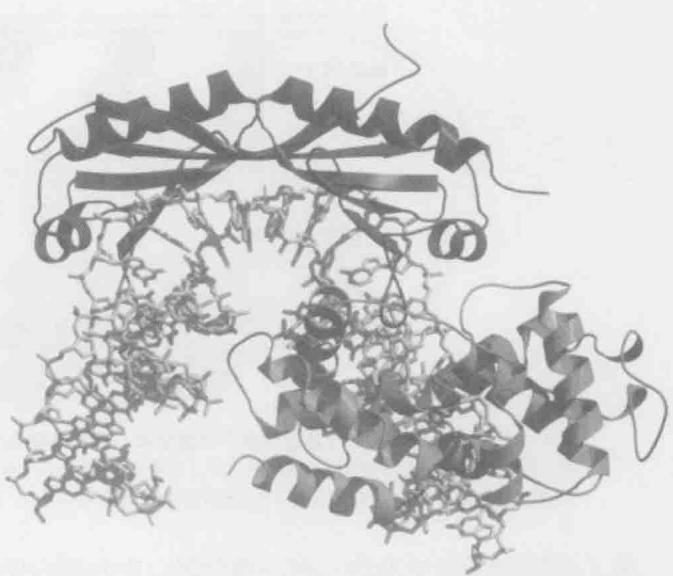  
图 13-18 TFIIB-TBP-启动子复合体。此结构显示了结合在 TATA 序列上的 TBP 蛋白，正如我们在前面的图中所看到的。这里通用转录因子 TFIIB（蓝绿色）已经加载到复合体上。这个三重复合体形成了一个平台，在前起始复合体组装过程中，其他通用转录因子和 Pol II 被募集到此平台上（引自 Nikolov D.B. et al. 1995. Nature 377: 119.）图像使用 MolScript、BobScript 和 Raster 3D 等软件制作，图像两侧延伸的 DNA 模型由 Leemor Joshua-Tor 建立。

DNA 非编码链上的碱基与 $\sigma$ 亚单位的口袋结构结合，-10 元件从启动子解离。这一过程不需要 ATP 的水解作用，仅仅是通过结合反应的结果倾向于解离的构象而推动的（图 13-8）。真核生物中的情况更为复杂。TFIIH 亚单位的作用类似于 ATP 驱动的双链 DNA 的易位因子。这一亚单位与自聚合酶开始的下游 DNA 结合（正如我们在图 13-16 中看到的），以右手螺旋的方式插入到聚合酶的裂缝中并与双链 DNA 相互作用。由于上游启动子 DNA 被 TFIID 和其他一些 GTF 固定住，TFIIH 这一反应推动了 DNA 的解螺旋。

#### [W] 体内的转录起始需要其他蛋白质参与，包括中介蛋白复合体

到现在为止，我们已经描述了在体外 Pol Ⅱ从一条裸露的 DNA 模板起始转录所需的条件。但是我们已经指出，细胞内高水平的、受调控的转录还需要额外的转录调控蛋白、中介蛋白复合体和核小体修饰酶（其自身常常是大的蛋白质复合体的组成部分）（图 13-19）。各个修饰复合体的特征列在第 8 章和表 8-7 中。

这些额外需求的原因之一是 DNA 模板在细胞内包装到染色质内，正如我们在第 8 章中讨论过的。这一条件使聚合酶及其相关因子与启动子的结合变得复杂。被称为激活因子（activator）的转录调控蛋白帮助聚合酶募集到启动子上，使其稳定地结合在那里。这一募集过程是通过 DNA 结合的激活因子、染色质修饰及重塑因子、转录机器组成部分之间的相互作用介导的。其中一个相互作用是与中介复合体（因此而得名）。中介蛋白通过一个表面与大聚合酶亚基的 CTD“尾巴”结合，而将其他表面用于与 DNA 结合的激活因子之间的相互作用。这解释了在细胞内成功地进行转录为什么需要中介蛋白。

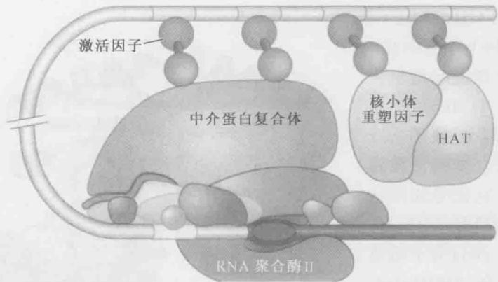  
图 13-19 在中介蛋白、核小体修饰因子和重塑因子及转录激活因子存在时前起始复合体的组装。除了图 13-16 中所示的通用转录因子之外，结合在基因附近位点的转录激活因子募集核小体修饰和重塑复合体、中介蛋白复合体共同帮助形成前起始复合体。

除了在转录激活中的这一核心作用外，中介蛋白中单个亚基的缺失常常导致一小部分基因失去表达，每个亚基对应不同子集的基因（它是由许多亚基构成的）。这很可能反映了一个事实，即不同激活因子被认为与不同中介蛋白亚基相互作用而将聚合酶带到不同的基因上。此外，中介蛋白还通过调控TFIIH内的CTD激酶来帮助转录起始。

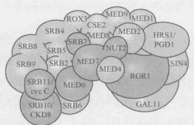  
酵母中介蛋白

  
人类中介蛋白  
图 13-20 酵母和人类中介蛋白的比较。大多数亚基在酵母和人类中都存在，不同的亚基以浅色阴影显示。（酵母中介蛋白图片调整自 Guglielmi B. et al. 2004. Nucleic Acids Res. 32: 5379-5391, Fig. 8B；人蛋白图片获得许可并调整自 Malik S. 和 Roeder R.G. 2005. Trends biochem. Sci. 30: 256-263, Fig. la. ©Elsevier.）

对核小体修饰因子和重塑因子的需求在不同的启动子上甚至同一启动子在不同的环境下都是不同的。无论何时何处，当需要时，这些复合体也是由 DNA 结合的激活因子或者调控 RNA 募集的。

我们将在第 19 章中讨论中介蛋白和修饰因子在激发转录中的作用。现在我们要考察中介蛋白的一些结构和功能上的特性。

中介蛋白包含很多亚基，其中有些亚基从酵母到人类是保守的

如图 13-20 所示, 酵母和人的中介蛋白各自包括 20 个以上的亚基, 其中 7 个在两种生物之间表现出显著的序列同源性(起初, 二者的名称是不同的, 这是由于鉴别它们的过程中所使用的实验方法不同。但最近确立了一个协定, 不同生物体中相当的亚基取一样的名字。图 13-20 也采用了这种命名)。这些亚基的功能几乎都没有鉴定。只有一个 (Srb4 / Med17) 几乎是在所有 Pol II 细胞内转录所必需的。低分辨率的结构比较提示两种中介蛋白具有相似的形状, 而且二者都非常大, 甚至比 RNA 聚合酶本身还要大。

酵母和人类的中介蛋白都是由一些模块组装而成的，每个模块是一组亚基（图13-20）。在体外，这些模块在某些条件下能够彼此分离。这一观测结果和分离手段的不同可以获得多种多样的人类中介蛋白组合（和大小）的事实，使人们认为存在各种形式的中介蛋白（尤其在多细胞动物中），每一种形式都包含一些中介蛋白亚基的子集，而且不同的形式参与调控不同子集的基因或者应答不同类别的调控因子（激活因子或抑制因子）。然而，亚基组成的变化也可能仅仅反映了分离方法的不同，是一种人为因素造成的。

最近完成的对中介蛋白上一个部分（酵母中介蛋白的头部模块）的晶体结构解析有助于我们了解中介蛋白整体的结构。这个模块包含了7个亚单位（Med17/Srb4、Med11、Med22/Srb6、Med6、Med8、Med18/Srb5、Med20/Srb2），形成了具有三个结构域的三维结构，通过与TFIIH和RNA聚合酶的CTD尾部并置的形式与转录复合物结合，并通过前两者的引入推动复合物的磷酸化反应。对丝氨酸残基的磷酸化是转录起始和启动子逃逸所需要的（接下来我们将讨论）。特别需要指出的是，通过TFIIH自身对丝氨酸5的磷酸化将导致中介蛋白在这一过程中从聚合酶上脱离。

#### [W] 一组新的因子激发 PolⅡ延伸和 RNA 校对（proofreading）

如前所述，一旦聚合酶逃离了启动子并起始了转录，便转入了延伸阶段。这一转变包括 PolⅡ酶从大部分起始因子的结合体中脱离，如通用转录因子和中介蛋白。另一组因子被募集在它们的位置上。其中的一些（如 TFIIS 和 SPT5）是所谓的延伸因子（elongation factor），也就是激发延伸的因子，其他的是 RNA 加工所需要的。参与 RNA 加工的酶像一些之前已经讨论过的起始因子一样，被募集到 PolⅡ大亚基的 C 端尾巴（CTD）上（图 13-21）。然而，在这一情况中，那些因子更倾向于 CTD 被磷酸化的形式。因而，CTD 的磷酸化导致了起始因子与延伸和 RNA 加工所需要的那些因子之间的交换。

从酵母 PolⅡ的晶体结构可以明显看出，聚合酶 CTD 的位置与新合成的 RNA 离开此酶的通道直接相邻（它能够从酶体延伸出大约 800Å，其长度很长，约 7 倍于酶的其他部分的长度）。这些特征使得它的尾巴可以与延伸和加工机器的几个组分结合并将它们运送到新生成的 RNA 处。

有多个蛋白质被确认可以激发由 PolⅡ介导的延伸。其中之一是激酶 P-TEFb，它是由转录激活因子募集到聚合酶上的。一旦与 PolⅡ结合，此蛋白质就将 CTD 重复序列中第二个单位的丝氨酸残基磷酸化，此磷酸化事件与延伸有关（图 13-21）。此外，P-TEFb 磷酸化，并因此激活另一个称为 SPT5 的蛋白质，它本身是一个延伸因子。最后，还有另一个延伸因子 TAT-SF1 被 P-TEFb 募集。因而，P-TEFb 以三种不同的方式激发延伸。

SPT5 是一种与我们在上文中谈到了细菌转录延伸因子 NusG 相似的蛋白质。事实上，这是在所有生物界的唯一普遍保守的转录因子——从细菌、古菌到真核生物均有存在。NusG/SPT5 蛋白在夹钳的顶端结合各自的 RNA 聚合酶，重叠的部分被区域 4（细菌内）和 TFⅡB（真核生物内）接触。这个重叠区域（可能相互排斥）的绑定显示出一种有趣的可能性；取代启动因子可能是这些延伸机制的一部分。这也表明，调节基因表达进而调节延伸速度是一种古老的机制。

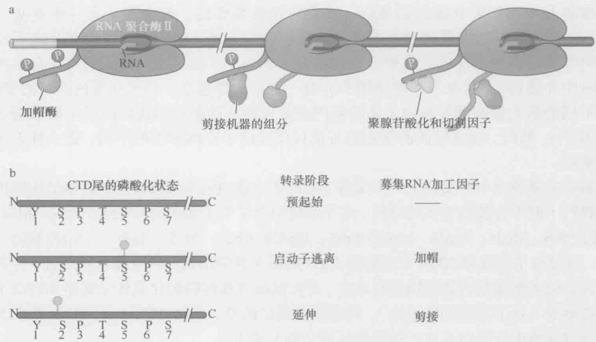  
图 13-21 RNA 加工酶是由聚合酶的 CTD 尾巴募集的。（a）参与 RNA 加工的各种因子由聚合酶的 CTD 尾巴募集。不同因子的募集取决于尾巴的磷酸化状态。这些因子随后在需要的时候转移到 RNA 上（见正文下节）。（b）第一行显示尾巴的示意图，以及一个拷贝的七肽重复序列。被磷酸化的丝氨酸残基的位置在第二、三行中标出。位置 5 处的丝氨酸残基的磷酸化见于启动子逃离后，并与加帽因子的募集相关。位置 2 处的丝氨酸残基的磷酸化见于延伸期间，并与剪接因子的募集相关。参与转录延伸和 RNA 加工的因子的募集是重叠的。因此，延伸因子 hSPT5 被募集到在 Ser-5 磷酸化的尾巴上。

正如我们将在第19章讨论的，在部分高等真核生物中，启动子招募前起始复合物有较高的效率，但是在起始转录后聚合酶仍然处于暂停的状态。这些启动子看上去，Nus5G/SPT5与相应的RNA聚合酶的“钳子”部位结合，这一部位覆盖了与细菌中的bys区域4或者真核生物中的TFIIB相互作用的序列。这种结合（而且被推断为是互斥的）使分子获得了一种有趣的可能性，即将起始因子重置使之成为延伸因子发挥功能的一部分。这一现象同样提示了对转录延伸速率的调控是一种调节基因表达的古老的机制。这些启动子可能与基因的快速表达或者参与某种高度协调的调控机制有关。同时，招录特定的激活因子（如PETFb激酶）可以将它们从静止状态中释放出来从而调控它们的表达（第19章）。

另一类延伸因子是所谓的 ELL 家族。它们也结合延伸中的聚合酶并抑制聚合酶的瞬时停顿；否则，这种暂停会发生在 DNA 的许多位点。第一个人类 ELL 蛋白最初是在急性髓系白血病(acute myeloid leukemia)中被发现的，作为一个经历置换的基因产物发挥功能(框 19-3)。

另一个不影响起始但激发延伸的因子是TFIIS。类似ELL此因子促进延伸的总体速度，在遭遇到减缓聚合酶进程的序列时，它可以通过限制其暂停时间而发挥功能。聚合酶并不是以一个固定的速度转录整个序列的，这是其特征之一。相反，它会周期性地暂停，有时在恢复转录前会暂停相当长的时间。在TFIIS存在时，聚合酶在任何一个特定位点上暂停的时间都会被缩短。

TFIIS 还有另外一个功能—参与由聚合酶进行的校对。我们在本章的开头已经谈到了聚合酶是如何能够低效地用酶的活性位点来进行核苷酸掺入的逆向反应而去除错误加入的碱基的。除此之外，TFIIS 能够激发聚合酶内固有的 RNA 酶活性（非活性位点的部分），允许通过局部有限的 RNA 降解这样一个不同的途径来去除错误加入的碱基。这一特征与细菌中的 Gre 因子激发的水解编辑相类似。图 13-22 显示了尽管结构与序列上无关，TFIIS 和 GreB 如何以相似的方式分别与酵母和细菌的聚合酶结合来激发同样的反应。

#### [W] 延伸 RNA 聚合酶在行进过程中必须应对组蛋白的空间阻碍

与转录起始一样，延伸也在组蛋白的存在下进行，因为 DNA 模板整合在核小体内。RNA 聚合酶如何通过这些潜在的障碍而转录？

比较裸露 DNA 和整合在染色质中的 DNA 的体外转录实验，我们可以观察到染色质在细胞内极大地阻碍转录过程。这个实验设置提供了在染色质存在的情况下确定促转录因子的分析方法。由此，在人类细胞提物中确定了一个称为促进染色体转录（facilitates chromatin transcription, FACT）因子。顾名思义，这个因子使染色质模板进行的转录更有效。FACT 是两个非常保守的蛋白的异型双聚体（heterodimer）——Spt16 和 SSRP1。前者的酵母同源基因在遗传学研究中已经被确定与染色质调制有关。FACT 在延伸中的作用是通过这个复合体与包括 TFIIS 在内的已知的延伸因子之间的遗传相互作用而建立的。

  
图 13-22 TFIIS 和 GreB 行为相似。剖面图显示暂停的 RNA 聚合酶Ⅱ与 TFIIS 复合体（左图）以及细菌 RNA 聚合酶与 GreB（右图）的主要特征。TFIIS（橙色）插入 RNA 聚合酶Ⅱ的核心，而 GreB（也是橙色）插入细菌 RNA 聚合酶的通道。在各自情况下，主要的催化镁离子指定为 Metal A（粉色），两个保守的酸性残基用绿色环表示。因此我们看到，虽然这两个蛋白质不同，它们的行为基本一致。虚线箭头表示撤离的 RNA 的假定位置（也参见图 13-11）。（来源：Conaway R.C. et al. 2003. Cell 114: 272–274, Fig. 1. ©Elsevier. 经许可并重新绘制。）

FACT 如何起作用？第 8 章曾提到核小体是八聚体，由 H2A、H2B、H3、H4 组蛋白和 DNA 组成（第 8 章和图 8-20）。这些组蛋白排成两个模块：H2A·H2B 二聚体和 H3·H4 四聚体。Spt16 结合前者，SSRP1 结合后者。令人惊奇的是，FACT 可以通过挪开一个 H2A·H2B 二聚体而拆除组蛋白，也可以通过放回 H2A·H2B 二聚体而重新组装组蛋白。

由此我们描绘出在延伸过程中 FACT 如何起的作用（图 13-23）。在转录中 RNA 聚合酶的前方，FACT 挪开一个 H2A·H2B 二聚体。这使得聚合酶通过那个核小体（在体外，已经显示了从模板上挪开一个 H2A·H2B 二聚体使转录能够进行）。FACT 还有组蛋白伴护活性，这使得它能够在行进的聚合酶后将 H2A·H2B 二聚体立即放回到组蛋白六聚体中。如此，FACT 使得聚合酶延伸，同时保持了转录中染色质的完整性。

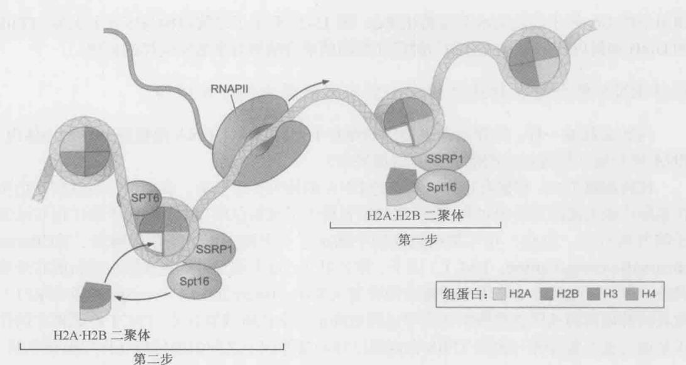  
图 13-23 FACT 协助通过核小体的延伸模型。如文中所述，FACT 显示为 Spt16 和 SSRP1 的异型二聚体，能够在转录的 RNA 聚合酶前方拆除核小体（步聚一）并在其后重装（步骤二）。具体地说，它挪开 H2A·H2B 二聚体。STP6 结合组蛋白 H3，相信能帮助核小体重装。（获得许可并重新绘图自 Reinberg D. and Sims R. 2006. J. Biol. Chem. 281: 23297–23301，Fig. 2b. ©American Society for Biochemistry and Molecular Biology.）

#### [W] 延伸聚合酶与各种 RNA 加工所需要的一组新的蛋白质因子相互作用

一旦被转录，真核细胞的 RNA 必须以各种方式进行加工，然后再从细胞核输出到可翻译的地方。这些加工事件包括：RNA 5'端加帽（capping）、剪接（splicing）和 RNA 3'端的多聚腺苷酸化（polyadenylation）。其中最复杂的是剪接——非编码的内含子从 RNA 中去除而产生成熟的 mRNA 的过程。这一过程和其他过程（如 RNA 编辑）的机制及调控是第 14 章的主题。我们在这里讨论另外两个过程——加帽以及转录物的多聚腺苷酸化。

引人注目的是，参与延伸的蛋白质和RNA加工所需要的蛋白质存在交叠。例如，上面提到过的一个延伸因子（SPT5）也帮助募集 $5^{\prime}$ 加帽酶到聚合酶的CTD尾巴[第5位上的丝氨酸磷酸化（图13-21b)]。hSPT5激活 $5^{\prime}$ 加帽酶的活性。又如，延伸因子TAT-SF1募集剪接机器的组分到带有Ser2磷酸化尾巴的聚合酶上（图13-21b）。因而转录的延伸、终止和RNA加工似乎是相互联系的，人们推测这是为了保证它们的正确配合。

第一个 RNA 加工事件是加帽，涉及在 RNA 的 5' 端添加一个修饰过的鸟嘌呤碱基。具体来讲，这是一个甲基化的鸟嘌呤，而且是以一种不常见的包括 3 个磷酸盐的 5'-5' 连接方式加入到 RNA 转录物中的（这一结构展示在图 13-24 的底部）。

5'帽子是由3个酶促反应步骤生成的，细节见图13-24及其说明。在第一个步骤中，一个磷酸盐基团从转录物的5'端去除。然后在第二个步骤中，GMP部分加上。在最后一步中，给此核苷酸添加上一个甲基。RNA从聚合酶的RNA出口通道一出现就被加帽了。这一分子事件发生在转录周期中起始和延伸间的转变阶段。加帽之后，尾部序列重复中的Ser5发生去磷酸化可能导致加帽机器的脱离，而进一步的磷酸化（这次是尾部重复中的Ser2）导致RNA剪接所需要的机器的募集（详见第14章及图13-21b）。

最后一个 RNA 加工事件——mRNA 3'端的多聚腺苷酸化，是与转录的终止密切相关的（图 13-25）。正如加帽和剪接一样，聚合酶的 CTD 尾巴也参与募集某些多聚腺苷酸化所必需的酶（图 13-21）。一旦聚合酶到达基因的末端，就会遇到一段特殊的序列，此序列在转录到 RNA 之后会引发多聚腺苷酸化酶向该 RNA 的转移，导致 4 个事件的发生：mRNA 的切割、多个腺嘌呤被添加到其 3'端、将与 RNA 聚合酶结合着的 RNA 按照由 5'到 3'核酸酶进行降解，以及随后由聚合酶进行的转录终止。下面详述这一系列事件。

在聚合酶接近基因的末端时，两个蛋白质复合体由聚合酶的 CTD 运载：切割和聚腺苷酸化特异性因子（cleavage and polyadenylation specificity factor, CPSF）；切割刺激因子（cleavage stimulation factor, CSTF）。有些序列一旦转录到 RNA 中就会引发这些因子向 RNA 的转移，这些序列被称为 poly-A 信号（poly-A signal），它们的作用方式在图 13-25 中显示。一旦 CPSF 和 CSTF 结合到 RNA 上，其他蛋白质也就被募集，先引起 RNA 的切割，然后是多聚腺苷酸化。

  
图 13-24 RNA 的 5' 帽子的结构和形成。第一步，RNA 5' 端的γ-磷酸盐由 RNA 三磷酸酯酶（triphosphatase）去除（一个转录物的起始核苷酸最初保留着其α-、β-和γ-磷酸盐）。下一步，鸟苷酸转移酶（guanylyl transferase）把 GMP 部分加到末端的β-磷酸盐上。这是一个两步过程：首先，酶-GMP 复合体通过 GTP 释放β-和γ-磷酸盐而产生。然后来自酶的 GMP 转移到 RNA5' 端的β-磷酸盐上。一旦形成了这一连接，新加上的鸟嘌呤和 mRNA 起初的 5' 端的嘌呤就由甲基转移酶加上甲基基团而得到进一步的修饰。所形成的 5' 帽子结构随后将核糖体募集到 mRNA 上以准备开始转录（第 15 章）。

  
图 13-25 多聚腺苷酸化和终止。此过程中的各个步骤在文中有描述。

多聚腺苷酸化是由 poly-A 聚合酶介导的，此酶在由切割所形成的 RNA 的 3'端添加大约 200 个腺嘌呤。它以 ATP 作为前体，并以与 RNA 聚合酶相同的化学机制添加核苷酸，但是这一过程并不需要模板，因而长腺苷酸尾巴见于 RNA 中，而非 DNA 中。目前还不清楚决定 poly-A 尾巴长度因素是什么，但是该过程涉及其他与 poly-A 序列特异结合的蛋白质，然后成熟的 mRNA 从细胞核中运出（在第 14 章中讨论）。值得注意的是，长腺苷酸尾巴是由 PolⅡ产生的转录物所特有的，此特征使得可以在实验中用亲和层析法分离蛋白质编码的 mRNA。

如上所述,我们了解了一旦基因被转录,成熟的 mRNA 是如何从聚合酶上释放的。不过是什么终止了聚合酶的转录呢?实际上,聚合酶并不在 RNA 被切割和多聚腺苷酸化时就立刻终止。相反,它继续沿着模板移动,产生第二个 RNA 分子。聚合酶在终止以及从模板上分离前,还可以继续转录几千个核苷酸。接下来将描述转录终止的模型。

转录终止与高活性的 RNase 对 RNA 的破坏紧密关联

多聚腺苷酸化与转录终止密切相关，虽然其机制还不十分清楚。最近，当降解即刻从聚合酶出现的第二个 RNA 的酶已经被确认，这个酶本身可能就引发终止。这被称为终止的“鱼雷模型”（torpedo model）（图 13-26a）。

  
图 13-26 转录终止的模型：鱼雷（torpedo）和变构（allosteric）。如正文中所述，有两个模型解释真核 RNAPol II 转录一个基因后是如何终止的。图中，在 DNA 上的 poly-A 位点就在紧邻基因的下游（浅绿色，转录本也用浅绿色表示，绿色虚线表示降解的转录物）。（a）在鱼雷模型中，poly-A 位点下游转录的 RNA 被 5'→3'RNase（鱼雷）攻击，该 RNase 由聚合酶本身带到这个转录物上。当这个核酸外切酶追上聚合酶时，它引发了从 DNA 模板上解离和转录的终止。（b）在变构模型中，聚合酶在转录基因时具有高活性，之后一旦过了 poly-A 位点，活性降低。这个改变可能由于修饰和构象改变。即使在变构模型，第二个 RNA 要被 RNase 降解，但不是终止的原因。在此情况下，RNA 降解没有在图中显示，以强调这两个模型不同的终止机制。（来源：Luo W. and Bentley D. 2004, Cell 119: 911–914, Fig. 1. ©Elsevier. 经许可并重新绘制）

第二个 RNA 的自由端没有被加帽, 因此可以与真正的转录物加以区别。这个新 RNA 被一种在酵母中称为 Rat1（人类中是 Xrn2）的 RNase 所识别，该酶被另一个与 RNA 聚合酶的 CTD 结合蛋白（Rtt103）运送到 RNA 的末端。Rat1 酶活性很高，从 5'→3' 方向迅速地降解 RNA，直到追上还在转录的、RNA 不断从中涌出的聚合酶。转录终止可能不需要 Rat1 和聚合酶之间有任何特异的相互作用，实际上是以与本章前面部分描述过的细菌中 Rho 依赖型终止类似的方式引发的，即高活性的 RNase 把聚合酶往前推，并且 / 或者将余下的新生 RNA 转录物从聚合酶中拉出来。除了 Rat1 之外，其他因子也可能是聚合酶在体外离开 DNA 链的过程所需要的。仅有 Rat1 不能完成这一功能，甚至直到转录本被降解的时候。

尽管转录终止的鱼雷模型的认可程度在目前占有优势，但有人还提出了另外一个模型称为“变构模型”（allosteric model）（图 13-26b）。根据这个模型，终止取决于延伸聚合酶的构象改变，构象改变降低了酶的活性，导致其后不久就自发终止。这个构象改变可能与多聚腺苷酸化相关联，可能的引发原因有聚合酶 CTD 尾巴的 3'加工酶转移到 RNA，随后结合到其他诱发构象改变的因子的 CTD 尾巴上等。

#### [W] 由 RNA 聚合酶 | 和 RNA 聚合酶 || 催化的转录

#### [W] RNA 聚合酶 I 和 RNA 聚合酶 III 识别不同的启动子，但仍需 TBP

我们已经提到，真核细胞中除 PolⅡ之外还有另外两个聚合酶——PolⅠ和PolⅢ。这些酶是与PolⅡ相关的，甚至共用几个亚基（表13-2），但是它们从不同的启动子起始转录并转录不同的基因。这些基因编码专门的RNA，而不是蛋白质，这一点我们已经在本章前面的部分讨论过。这些酶也各自使用自己独特的一组通用转录因子。然而，TBP是通用的，它不仅参与PolⅡ起始的转录，也参与PolⅠ和PolⅢ的转录。

与 PolⅡ一样，虽然 TBP 是唯一的在 Pol I 和 Pol III 中用到的 GTF，最近有越来越多的证据显示别的 GTF 同样存在于 PolⅡ中，事实上它们的结构和功能在其他分子系统中也是类似的。因此，举个例子，有一个与 TFIIE 类似的蛋白复合体，包含两个亚基，其中一个在 Pol I 中出现（A49/34.5），另一个在 PolⅡ中出现（C37/53）。TFIIE 样的亚基同样也在 Pol I 和 Pol III 被发现。除此之外，这两个分子系统中包含功能类似于 TFIIB 的因子：在 Pol I 中的 TAF1B 因子和在 Pol III 的 TFIIIB 上的 Brf1 亚基。

#### [W] Pol I 只用于转录 rRNA 基因

Pol I 只用于一个基因的表达, 那就是合成 rRNA 前体的基因。该基因在每个细胞中都有很多拷贝, 事实上它的表达水平远远高于其他任何基因, 这也许解释了为什么它有自己专用的聚合酶。

rRNA 基因的启动子包括两个部分：核心元件和上游控制元件（upstream control element，UCE），如图 13-27 所示。前者位于转录起始位点周围，后者在上游 100\~150bp 处（在人类中）。除了 Pol I 之外，起始还需要另外两个称为 SL1 和 UBF 的因子。SL1 由 TBP 和 3 个 Pol I 转录特异的 TAF 组成，这一复合体结合核心元件。SL1 只有在 UBF 存在时才与 DNA 结合，该因子结合 UCE，引入 SL1 并通过募集 Pol I 至核心启动子激发转录。

#### [W] Pol III 启动子位于转录起始位点的下游

Pol Ⅲ启动子有多种形式，而且绝大部分具有位于转录起始位点下游的不寻常特征（如在基因的编码区内）。一些 Pol Ⅲ启动子（如 tRNA 基因的启动子）包含两个区域，称为盒子 A 和盒子 B，二者被一个短的元件分隔开（图 13-28）；另一些包含盒子 A 和盒子 C（如 5S rRNA 基因）；还有一些包含与 Pol Ⅱ启动子相似的 TATA 元件。

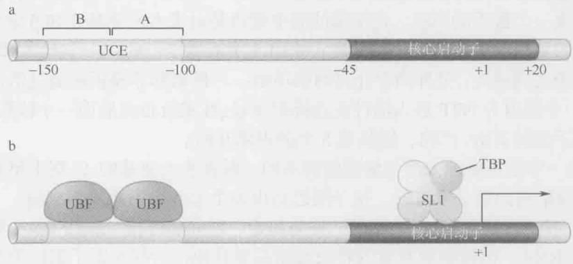  
图 13-27 Pol I 启动子区域。(a) Pol I 启动子结构；(b) Pol I 转录因子。这里显示的是人类的情况。酵母中参与帮助 Pol I 转录的一组蛋白质明显不同。

与 Pol Ⅱ和 Pol Ⅰ一样，Pol Ⅲ进行的转录除需要聚合酶之外，还需要转录因子。在这一情况中，这些因子称为 TFIIIB 和 TFIIIC（对于 tRNA 基因），5S rRNA 基因的转录还需要加上 TFIIIA。

图 13-28 显示了 tRNA 的启动子。这里，TFIIIC 复合体结合到启动子区域。这个复合体将 TFIIIB 募集到紧邻起始位点上游的 DNA 上，在那里它将 Pol III 募集到转录的起始位点上，然后此酶起始转录。推测当它转录时将 TFIIIC 从 DNA 模板上替换掉。与另两类聚合酶一样，Pol III 也使用 TBP，这一普遍存在的因子见于 TFIIIB 复合体中。

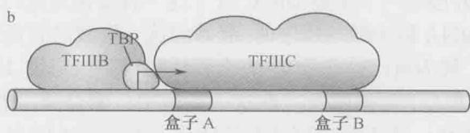  
图 13-28 Pol III 核心启动子。这里显示的是一个酵母 tRNA 基因的启动子。导致转录起始的事件的次序在正文中有描述。对于其他 Pol III 基因（就像对于 5S rRNA 一样），TFIIIA、TFIIIB 和 TFIIIC 这样的蛋白因子是必需的，其中 TFIIIA 结合在盒 A 上。

<!-- W-END Watson 13 真核生物的转录 -->

<!-- L-BEGIN Lehninger 26.1 -->

### 【英文对应 Lehninger §26.1：DNA-Dependent Synthesis of RNA】

> 来源：Lehninger Principles of Biochemistry（书籍/02_生物化学原理） 第26章 RNA Metabolism，§26.1。

Our discussion of RNA synthesis begins with a comparison between transcription and DNA replication (Chapter 25). Transcription resembles replication in its fundamental chemical mechanism, its polarity (direction of synthesis), and its use of a template. And like replication, transcription has initiation, elongation, and termination phases. Transcription differs from replication in that it does not require a primer and, generally, involves only limited segments of a DNA molecule. Additionally, only one DNA strand serves as a template for a particular RNA molecule.

#### [EN] RNA Is Synthesized by RNA Polymerases

The discovery of DNA polymerase and its dependence on a DNA template spurred a search for an enzyme that synthesizes RNA complementary to a DNA strand. By 1960, four research groups had independently detected an enzyme in cellular extracts that could form an RNA polymer from ribonucleoside 5'-triphosphates.

Subsequent work on the purified Escherichia coli RNA polymerase helped to define the fundamental properties of transcription (Fig. 26-1). P1 DNA-dependent RNA polymerase requires, in addition to a DNA template, all four ribonucleoside 5'-triphosphates (ATP, GTP, UTP, and CTP) as precursors of the nucleotide units of RNA, as well as Mg $^{2+}$ . The chemistry and mechanism of RNA synthesis closely resemble those used by DNA polymerases (see Fig. 25-3). RNA polymerase elongates an RNA strand by adding ribonucleotide units to the 3'-hydroxyl end, building RNA in the 5'→3' direction. The 3'-hydroxyl group acts as a nucleophile, attacking the α phosphate of the incoming ribonucleoside triphosphate (Fig. 26-1a) and releasing pyrophosphate. The overall reaction is

$$
\begin{array}{c} \mathrm {(NMP) _ {n}} + \mathrm{NTP} \longrightarrow \mathrm {(NMP) _ {n + 1}} + \mathrm{PP} _ {\mathrm{i}} \\ \text {RNA} \end{array}
$$

RNA polymerase requires DNA for activity and is most active when bound to a double-stranded DNA. As noted above, only one of the two DNA strands serves as a template. The template DNA strand is copied in the 3'→5' direction (antiparallel to the new RNA strand), just as in DNA replication. Each nucleotide in the newly formed RNA is selected by Watson-Crick base-pairing interactions: U residues are inserted in the RNA to pair with A residues in the DNA template, G residues are inserted to pair with C residues, and so on. Base-pair geometry (see Fig. 25-5) may also play a role in base selection.

Unlike DNA polymerase, RNA polymerase does not require a primer to initiate synthesis. Initiation occurs when RNA polymerase binds at specific DNA sequences called promoters (described below). The 5'-triphosphate group of the first residue in a nascent (newly formed) RNA molecule is not cleaved to release PP $_{i}$ , but instead remains intact and functions in eukaryotes as a substrate for the RNA-capping machinery (see Fig. 26-13). During the elongation phase of transcription, the growing end of the new RNA strand base-pairs temporarily with the DNA template to form a short hybrid RNA-DNA double helix, about 8 bp long (Fig. 26-1b). The RNA in this hybrid duplex "peels off" shortly after its formation, and the DNA duplex re-forms.

To enable RNA polymerase to synthesize an RNA strand complementary to one of the DNA strands, the DNA duplex must unwind over a short distance, forming a transcription "bubble." During transcription, the E. coli RNA polymerase generally keeps about 17 bp unwound. The 8 bp RNA-DNA hybrid occurs in this unwound region. Elongation of a transcript by E. coli RNA polymerase proceeds at a rate of 50 to 90 nucleotides/s. Because DNA is a helix, movement of a transcription bubble requires considerable strand rotation of the nucleic acid molecules. DNA strand rotation is restricted in most DNAs by DNA-binding proteins and other structural barriers. As a result, a moving RNA polymerase generates waves of positive supercoils ahead of the transcription bubble and negative supercoils behind (Fig. 26-1c). This has been observed both in vitro and in vivo (in bacteria). In the cell, the topological problems caused by transcription are relieved through the action of topoisomerases (Chapter 24).

(a)  
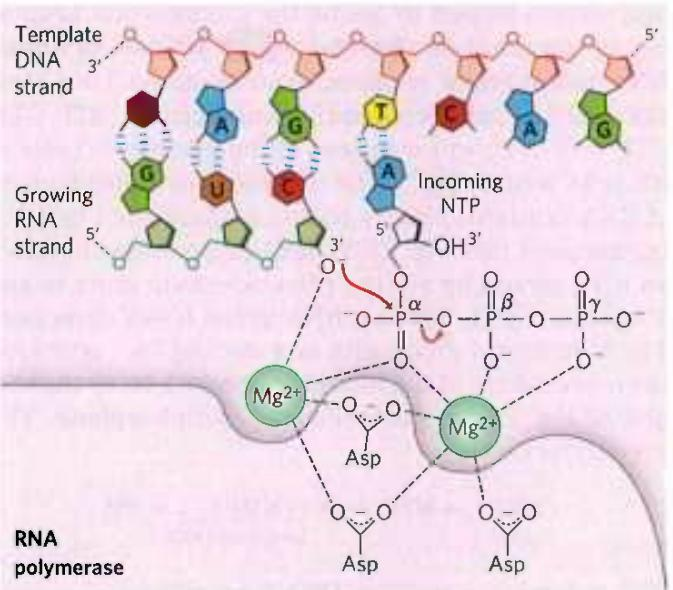  
FIGURE 26-1 Transcription by RNA polymerase in E. coli. For synthesis of an RNA strand complementary to one of two DNA strands in a double helix, the DNA is transiently unwound. (a) Catalytic mechanism of RNA synthesis by RNA polymerase. Notice that this is essentially the same mechanism used by DNA polymerases. The reaction involves two $\mathrm{Mg}^{2+}$ ions coordinated to the phosphate groups of the incoming nucleoside triphosphates (NTPs) and to three Asp residues, which are highly conserved in the RNA polymerases of all species. One $\mathrm{Mg}^{2+}$ ion facilitates attack by the $3^{\prime}$ -hydroxyl group on the $\alpha$ phosphate of the NTP; the other $\mathrm{Mg}^{2+}$ ion facilitates displacement of the pyrophosphate. Both metal ions stabilize the pentacovalent transition state. (b) About 17 bp of DNA are unwound at any given time. RNA

KEY CONVENTION The two complementary DNA strands have different roles in transcription. The strand that serves as template for RNA synthesis is called the template strand. The DNA strand complementary to the template, the nontemplate strand, or coding strand, is identical in base sequence to the RNA transcribed from the gene, with U in the RNA in place of T in the DNA (Fig. 26-2). The coding strand for a particular gene may be located in either strand of a given chromosome (as shown in Fig. 26-3 for a virus). By convention, the regulatory sequences that control transcription (described later in this chapter) are designated by the sequences in the coding strand.

The DNA-dependent RNA polymerase of E. coli is a large, complex enzyme with five core subunits ( $\alpha_{2}\beta\beta'\omega$ ; $M_{r}$ 390,000) and a sixth subunit, one of a group designated (5') CGCTATAGCGTTT(3') DNA nontemplate (coding) strand
(3') GCGATATCGCAAA(5') DNA template strand
(5') CGCUAUAGCGUUU(3') RNA transcript

  
polymerase and the transcription bubble move from left to right along the DNA as shown, facilitating RNA synthesis. The DNA is unwound ahead and rewound behind as RNA is transcribed. As the DNA is rewound, the RNA-DNA hybrid is displaced and the RNA strand is extruded. (c) Movement of an RNA polymerase along DNA tends to create positive supercoils (overwound DNA) ahead of the transcription bubble and negative supercoils (underwound DNA) behind it. The RNA polymerase is in close contact with the DNA ahead of the transcription bubble as well as with the separated DNA strands and the RNA within and immediately behind the bubble. A channel in the protein funnels new NTPs to the polymerase active site. The polymerase footprint encompasses about 35 bp of DNA during elongation.

FIGURE 26-2 Template and nontemplate (coding) DNA strands. The two complementary strands of DNA are defined by their function in transcription. The RNA transcript is synthesized on the template strand and is identical in sequence (with U in place of T) to the nontemplate strand, or coding strand.

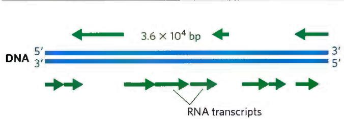  
FIGURE 26-3 Organization of coding information in the adenovirus genome. The genetic information of the adenovirus genome is encoded by a double-stranded DNA molecule of 36,000 bp, both strands of which encode proteins. The information for most proteins is encoded by (that is, identical to) the top strand — by convention, the strand is oriented 5' to 3' from left to right. The bottom strand acts as template for these transcripts. However, a few proteins are encoded by the bottom strand, which is transcribed in the opposite direction (and uses the top strand as template).

σ, with variants designated by size (molecular weight). The σ subunit binds transiently to the core and directs the enzyme to specific binding sites on the DNA (described below). These six subunits constitute the RNA polymerase holoenzyme (Fig. 26-4). The RNA polymerase holoenzyme of E. coli thus exists in several forms, depending on the type of σ subunit. The most common subunit is σ $^{70}$ (M $_{r}$ 70,000), and the upcoming discussion focuses on the corresponding RNA polymerase holoenzyme.

RNA polymerases lack a separate proofreading $3'\rightarrow5'$ exonuclease active site (such as that of many DNA polymerases), and the error rate for transcription is higher than that for chromosomal DNA replication—approximately one error for every $10^{4}$ to $10^{5}$ ribonucleotides incorporated into RNA. Because many copies of an RNA are generally produced from a single gene, and nearly all RNAs are eventually degraded and replaced, a mistake in an RNA molecule is of less consequence to the cell than a mistake in the permanent information stored in DNA. Many RNA polymerases, including bacterial RNA polymerase and the eukaryotic RNA polymerase II (discussed below), do pause when a mispaired base is added during transcription, and they can remove mismatched nucleotides from the 3' end of a transcript by direct reversal of the polymerase reaction. But we do not yet know whether this activity is a true proofreading function and to what extent it may contribute to the fidelity of transcription.

(a)  
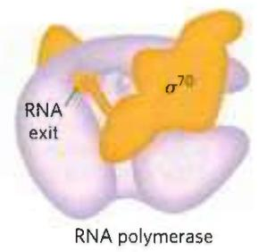

  
FIGURE 26-4 Structure of the $\sigma^{70}$ RNA polymerase holoenzyme of E. coli. (a) The several subunits of the bacterial RNA polymerase give the enzyme the shape of a crab claw (purple). The $\sigma^{70}$ subunit rests on top of the crab claw and threads through the RNA exit channel. (b) In this crystal structure of the RNA polymerase holoenzyme, each of the six subunits ( $\alpha_{2}\beta\beta'\omega$ and $\sigma^{70}$ ) can be identified. The pincers of the crab claw are formed by the $\beta$ and $\beta'$ subunits. [Data from PDB ID 4MEY, D. Degen et al., eLife 3:e02451, 2014.]

#### [EN] RNA Synthesis Begins at Promoters

Initiation of RNA synthesis at random points in a DNA molecule would be an extraordinarily wasteful process. P1 Instead, an RNA polymerase binds to specific sequences in the DNA called promoters, which direct the transcription of adjacent segments of DNA (genes). The sequences where RNA polymerases bind are variable, and much research has focused on identifying the particular sequences that are critical to promoter function.

In E. coli, RNA polymerase binding occurs within a region stretching from about 70 bp before the transcription start site to about 30 bp beyond it. By convention, the DNA base pairs that correspond to the beginning of an RNA molecule are given positive numbers, and those preceding the RNA start site are given negative numbers. The promoter region thus extends between positions -70 and +30. Analyses and comparisons of the most common class of bacterial promoters (those recognized by an RNA polymerase holoenzyme containing $\sigma^{70}$ ) have revealed consensus sequences centered about positions -10 and -35 (Fig. 26-5a). Although the sequences are not identical for all bacterial promoters in this class, certain nucleotides that are particularly common at each position form a consensus sequence. The consensus sequence at the -10 region is (5')TATAAT(3'); at the -35 region it is (5')TTGACA(3'). A third AT-rich recognition element, called the UP (upstream promoter) element, occurs between positions -40 and -60 in the promoters of certain highly expressed genes. The UP element is bound by the $\alpha$ subunit of RNA polymerase. The efficiency with which an RNA polymerase containing $\sigma^{70}$ binds to a promoter and initiates transcription is determined in large measure by these sequences, the spacing between them, and their distance from the transcription start site. A change in only one base pair in the promoter can decrease the rate of binding by several orders of magnitude. The promoter sequence thus establishes a basal level of expression that can vary greatly from one E. coli gene to the next. The x-ray crystal structure of the $\sigma^{70}$ RNA polymerase holoenzyme bound to its promoter shows how the $\sigma$ factor recognizes both the RNA polymerase and the -10 and -35 regions by introducing a large bend in the DNA (Fig. 26-5b). Information about these interactions can also be obtained using the method illustrated in Box 26-1.

  
FIGURE 26-5 Promoter recognition by RNA polymerase holoenzymes containing $\sigma^{70}$ . (a) The nontemplate strand of the consensus sequence for $E.$ coli promoters recognized by $\sigma^{70}$ is shown, read in the $5^{\prime} \rightarrow 3^{\prime}$ direction, as is the convention for representations of this kind. The sequences differ from one promoter to the next, but comparisons of many promoters reveal similarities, particularly in the -10 and -35 regions. The sequence element UP, not present in all $E.$ coli promoters, generally occurs in the region between -40 and -60 and strongly stimulates transcription at the promoters that contain them. Spacer regions contain slightly variable numbers of nucleotides (N). Only the first nucleotide coding the RNA transcript  
(at position +1) is shown. (b) This x-ray crystallographic structure of the E. coli holoenzyme bound to a promoter shows that the $\sigma^{70}$ subunit introduces a sharp bend in the DNA template, allowing it to simultaneously contact the -35 and -10 regions as well as the RNA polymerase core. In this view the $\beta$ subunit was omitted to allow the path of the DNA through the polymerase to be more easily seen. Due to the low resolution of the structure (5.5 Å) not all of the DNA backbone could be modeled, and these unmodeled regions are missing from the DNA shown in the figure. A cartoon schematic of the structure is also shown below (a), aligned with consensus promoter elements. [Data from PDB ID 4YLN, Y. Zuo and T. A. Steitz, Mol. Cell S8:534, 2015.]

The pathway of transcription initiation and the fate of the $\sigma$ subunit are illustrated in Figure 26-6. The pathway consists of two major parts, binding and initiation, each with multiple steps. First, the polymerase, directed by its bound $\sigma$ factor, binds to the promoter. A closed complex (in which the bound DNA remains double-stranded) and an open complex (in which the bound DNA is partially unwound near the -10 sequence) form in succession. Second, transcription is initiated within the complex, leading to a conformational change that converts the complex to the elongation form, followed by movement of the transcription complex away from the promoter (promoter clearance). Any of these steps can be affected by the specific makeup of the promoter sequences. The $\sigma$ subunit dissociates at random as the polymerase enters the elongation phase of transcription. The protein NusA ( $M_{r}$ 54,430) binds to the elongating RNA polymerase, competitively with the $\sigma$ subunit. Once transcription is complete, NusA dissociates from the enzyme, the RNA polymerase dissociates from the

DNA, and a $\sigma$ factor ( $\sigma^{70}$ or another) can again bind to the enzyme to initiate transcription.

E. coli has other classes of promoters bound by RNA polymerase holoenzymes with different $\sigma$ subunits, such as the promoters of the heat shock genes. The products of this set of genes are made at higher levels when the cell is exposed to environmental stress, such as a sudden increase in temperature. RNA polymerase binds to the promoters of these genes only when $\sigma^{70}$ is replaced with the $\sigma^{32}$ ( $M_{r}$ 32,000) subunit, which is specific for the heat shock promoters (see Fig. 28-3). By using different $\sigma$ subunits, the cell can coordinate the expression of sets of genes, permitting major changes in cell physiology. Which sets of genes are expressed is determined by the availability of the various $\sigma$ subunits. This, in turn, is determined by several factors: regulated rates of synthesis and degradation, posttranslational modifications that switch individual $\sigma$ subunits between active and inactive forms, and a specialized class of anti- $\sigma$ proteins, each type binding to and sequestering a particular $\sigma$ subunit to render it unavailable for transcription initiation.

<!-- END OFFICIAL API PART part_010 -->

<!-- BEGIN OFFICIAL API PART part_011 -->

#### [EN] RNA Polymerase Leaves Its Footprint on a Promoter

Footprinting, a technique derived from principles used in DNA sequencing, identifies the DNA sequences bound by a particular protein. Researchers isolate a DNA fragment thought to contain sequences recognized by a DNA-binding protein, and then radiolabel one end of one strand (Fig. 1). They then use chemical or enzymatic reagents to introduce random breaks in the DNA fragment (averaging about one break per molecule). Separation of the labeled cleavage products (broken fragments of various lengths) by high-resolution electrophoresis produces a ladder of radioactive bands. In a separate tube, the cleavage procedure is repeated on copies of the same DNA fragment in the presence of the DNA-binding protein. The researchers then subject the two sets of cleavage products to electrophoresis and compare them side by side. A gap ("footprint") in the series of radioactive bands derived from the DNA-protein sample, attributable to protection of the DNA by the bound protein, identifies the sequences that the protein binds.

  
FIGURE 1 Footprint analysis of the RNA polymerase-binding site on a DNA fragment. Separate experiments are carried out in the presence (+) and absence (−) of the polymerase.

The precise location of the protein-binding site can be determined by directly sequencing (see Fig. 8-35) copies of the same DNA fragment and including the sequencing lanes (not shown here) on the same gel with the footprint. Figure 2 shows footprinting results for the binding of RNA polymerase to a DNA fragment containing a promoter. The polymerase covers 60 to 80 bp; protection by the bound enzyme includes the -10 and -35 regions.

  
FIGURE 2 Footprinting results of RNA polymerase binding to the lac promoter. In this experiment, the 5' end of the nontemplate strand was radioactively labeled. Lane C is a control in which the labeled DNA fragments were cleaved with a chemical reagent that produces a more uniform banding pattern. [© Courtesy of Carol Gross Laboratory.]

  
FIGURE 26-6 Transcription initiation and elongation by E. coli RNA polymerase. Initiation of transcription requires several steps generally divided into two phases: binding and initiation. In the binding phase, the initial interaction of the RNA polymerase with the promoter leads to formation of a closed complex, in which the promoter DNA is stably bound but not unwound. A 12 to 15 bp region of DNA—from within the -10 region to position +2 or +3—is then unwound to form an open complex. Additional intermediates (not shown) have been detected in the pathways leading to the closed and open  
complexes, along with several changes in protein conformation. The initiation phase encompasses promoter binding, transcription initiation, and promoter clearance (steps 1 through 4 here). Once elongation commences, the $\sigma$ subunit is released and is replaced by the protein NusA. The polymerase leaves the promoter and becomes committed to elongation of the RNA (step 5). When transcription is complete, the RNA is released, the NusA protein dissociates, and the RNA polymerase dissociates from the DNA (step 6). Another $\sigma$ subunit binds to the RNA polymerase and the process begins again.

#### [EN] Transcription Is Regulated at Several Levels

Requirements for any gene product vary with cellular conditions or developmental stage, and transcription of each gene is carefully regulated to form gene products only in the proportions needed. P1 Regulation can occur at any step of transcription, including elongation and termination. However, much of the regulation is directed at the polymerase binding and transcription initiation steps outlined in Figure 26-6. Differences in promoter sequences are just one of several levels of control.

The binding of proteins to sequences both near to and distant from the promoter can also affect levels of gene expression. Protein binding can activate transcription by facilitating either RNA polymerase binding or steps farther along in the initiation process, or it can repress transcription by blocking the activity of the polymerase. In E. coli, one protein that activates transcription is the cAMP receptor protein (CRP), which increases the transcription of genes coding for enzymes that metabolize sugars other than glucose when cells are grown in the absence of glucose. Repressors are proteins that block the synthesis of RNA at specific genes. In the case of the Lac repressor, transcription of the genes for the enzymes of lactose metabolism is blocked when lactose is unavailable.

As described further in Chapter 27, transcription of mRNAs and their translation are tightly coupled in bacteria. As a protein-coding gene is being transcribed, ribosomes rapidly bind to and begin to translate the mRNA before its synthesis is complete. Another protein, NusG, binds directly to both the ribosome and RNA polymerase, linking the two complexes. The rate of translation directly affects the rate of transcription. In contrast, eukaryotes carry out transcription in the nucleus and translation in the cytoplasm, making it impossible for these two steps to be physically coupled.

#### [EN] Specific Sequences Signal Termination of RNA Synthesis

RNA synthesis is processive; that is, the RNA polymerase introduces a large number of nucleotides into a growing RNA molecule before dissociating (p. 917). This is necessary because, if the polymerase released an RNA transcript prematurely, it could not resume synthesis of the same RNA and would have to start again from the beginning of the gene. However, an encounter with certain DNA sequences results in a pause in RNA synthesis, and at some of these sequences transcription is terminated. Our focus here is again on the well-studied systems in bacteria. E. coli has at least two classes of termination signals: one class relies on a protein factor called $\rho$ (rho), and the other is $\rho$ -independent.

Most $\rho$ -independent terminators have two distinguishing features. The first is a region that produces an RNA transcript with self-complementary sequences, permitting the formation of a hairpin structure (see Fig. 8-19a) centered 15 to 20 nucleotides before the projected end of the RNA strand. The second feature is a highly conserved string of three A residues in the template strand that are transcribed into U residues near the 3' end of the hairpin. When a polymerase arrives at a termination site with this structure, it pauses (Fig. 26-7a). Formation of the hairpin structure in the RNA disrupts several A=U base pairs in the RNA-DNA hybrid segment and may disrupt important interactions between RNA and the RNA polymerase, facilitating dissociation of the transcript.

  
FIGURE 26-7 Termination of transcription in E. coli. (a) p-Independent termination. RNA polymerase pauses at a variety of DNA sequences, some of which are terminators. One of two outcomes is then possible: either the polymerase bypasses the site and continues on its way, or the complex undergoes a conformational change (isomerization). During isomerization, intramolecular pairing of complementary sequences in the newly formed RNA transcript may form a hairpin that disrupts the RNA-DNA hybrid, the interactions

The $\rho$ -dependent terminators lack the sequence of repeated A residues in the template strand but usually include a CA-rich sequence called a rut (rho utilization) element. The $\rho$ protein associates with the RNA at specific binding sites and migrates in the 5'→3' direction until it reaches the transcription complex that is paused at a termination site (Fig. 26-7b). Here it promotes release of the RNA transcript. The $\rho$ protein has an ATP-dependent RNA-DNA helicase activity that permits translocation of the protein along the RNA, and ATP is hydrolyzed by the $\rho$ protein during the termination process. The detailed mechanism by which the protein promotes the release of the RNA transcript is not known.

#### [EN] Eukaryotic Cells Have Three Kinds of Nuclear RNA Polymerases

The transcriptional machinery in the nucleus of a eukaryotic cell is much more complex than that in bacteria. Eukaryotes have three nuclear RNA polymerases, designated I, II, and III, which are distinct complexes but have certain subunits in common. Each polymerase has a specific function (Table 26-1) and is recruited to a specific promoter sequence. In addition, eukaryotic mitochondria and chloroplasts have their own RNA polymerases for transcription of genes encoded in their own DNA (see Fig. 19-40). The RNA polymerases in these organelles are similar to bacterial RNA polymerases and less elaborate than the nuclear transcription machinery discussed below.

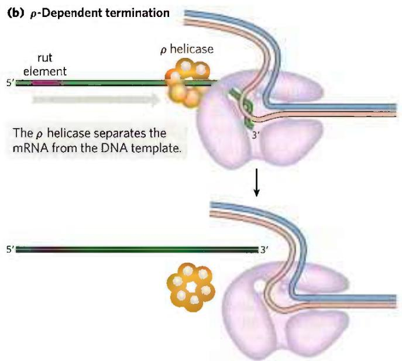  
between RNA and polymerase, or both. An A=U hybrid region at the 3' end of the new transcript is relatively unstable, and the RNA dissociates from the complex completely, leading to termination. At nonterminating pause sites, the complex may escape after the isomerization step to continue RNA synthesis. (b) ρ-Dependent termination. RNAs that include a rut element recruit the ρ helicase. The ρ helicase migrates along the mRNA in the 5'→3' direction and separates it from the polymerase.

<table><tr><td colspan="2">TABLE 26-1 Eukaryotic Nuclear RNA Polymerases</td></tr><tr><td>RNA polymerase</td><td>Types of RNA synthesized</td></tr><tr><td>I</td><td>Pre-ribosomal RNA</td></tr><tr><td>II</td><td>mRNA ncRNA</td></tr><tr><td>III</td><td>tRNA 5S rRNA ncRNA</td></tr></table>

RNA polymerase I (Pol I) is responsible for the synthesis of only one type of RNA, a transcript called pre-ribosomal RNA (or pre-rRNA), which contains the precursor for the 18S, 5.8S, and 28S rRNAs. The principal function of RNA polymerase II (Pol II) is the synthesis of mRNAs and many ncRNAs. This enzyme can recognize thousands of promoters that vary greatly in sequence. Some Pol II promoters have a few sequence features in common, including a TATA box (eukaryotic consensus sequence TATA(A/T)A(A/T)(A/G)) near base pair -30 and an Inr sequence (initiator) near the RNA start site at +1 (Fig. 26-8). However, such promoters are in the minority, and elaborate interactions with regulatory proteins guide Pol II function at many promoters that lack these features.

RNA polymerase III (Pol III) makes tRNAs, the 5S rRNA, and other small, specialized ncRNAs, including the U6 RNA component of the spliceosome, which we will discuss in Section 26.2. The promoters recognized by Pol III are well characterized. Some of the sequences required for the regulated initiation of transcription by

<table><tr><td rowspan="3"></td><td colspan="2">-30</td><td colspan="2">+1</td></tr><tr><td colspan="2">TATAAA</td><td>YYANTA</td><td>YY</td></tr><tr><td>Various regulatory sequences</td><td>TATA box</td><td>Inr</td><td>3&#x27;</td></tr></table>

FIGURE 26-8 Some common features of TATA box promoters recognized by eukaryotic RNA polymerase II. The TATA box is the major assembly point for the proteins of the preinitiation complexes of Pol II. The DNA is unwound at the initiator sequence (Inr), and the transcription start site is usually within or very near this sequence. In the Inr consensus sequence shown here, N represents any nucleotide and Y represents a pyrimidine nucleotide. Additional sequences around the TATA box and downstream (to the right as shown here) of Inr may be recognized by one or more transcription factors. The sequence elements of Pol II promoters summarized here are much more variable and complex in comparison to E. coli promoters (see Fig. 26-5).

Pol III are located within the gene itself, whereas others are in more conventional locations upstream of the RNA start site (Chapter 28).

#### [EN] RNA Polymerase II Requires Many Other Protein Factors for Its Activity

RNA polymerase II is central to eukaryotic gene expression and has been studied extensively. P1 Although this polymerase is strikingly more complex than its bacterial counterpart, the complexity masks a remarkable conservation of structure, function, and mechanism. Pol II isolated from either yeast or human cells is a 12-subunit enzyme with an aggregate molecular weight of more than 510,000. The largest subunit (RBP1) exhibits a high degree of homology to the $\beta'$ subunit of bacterial RNA polymerase. Another subunit (RBP2) is structurally similar to the bacterial $\beta$ subunit, and two others (RBP3 and RBP11) show some structural homology to the two bacterial $\alpha$ subunits. Pol II must function with genomes that are more complex and with DNA molecules more elaborately packaged than in bacteria. The need for protein-protein contacts with the numerous other protein factors required to navigate this labyrinth accounts in large measure for the added complexity of the eukaryotic polymerase.

The largest subunit of Pol II (RBP1) also has an unusual feature, a long carboxyl-terminal tail consisting of many repeats of a consensus heptad amino acid sequence,—YSPTSPS—. There are 26 repeats in the yeast enzyme (19 exactly matching the consensus) and 52 (21 exact) in the mouse and human enzymes. This carboxyl-terminal domain (CTD) is separated from the main body of the enzyme by an intrinsically disordered linker sequence. The CTD has many important roles in Pol II function, as outlined below.

RNA polymerase II requires an array of other proteins, called transcription factors, to form the active transcription complex. The general transcription factors required at every Pol II promoter (factors usually designated TFII with an additional identifier) are highly conserved in all eukaryotes (Table 26-2). The process of transcription by Pol II can be described in terms of several phases—assembly, initiation, elongation, termination—each associated with characteristic proteins (Fig. 26-9). The step-by-step pathway described below leads to active transcription in vitro. In the cell, many of the proteins may be present in larger, preassembled complexes, simplifying the pathways for assembly on promoters. As you read about this process, consult Figure 26-9 and Table 26-2 to help keep track of the many participants.

Assembly of RNA Polymerase and Transcription Factors at a Promoter The formation of a closed complex begins when the TATA-binding protein (TBP) binds to the TATA box (Fig. 26-9a, step 1). At promoters lacking a TATA box, TBP arrives as part of a multisubunit complex called

<table><tr><td colspan="4">TABLE 26-2 Proteins Required for Initiation of Transcription at the RNA Polymerase II (Pol II) Promoters of Eukaryotes</td></tr><tr><td>Transcription protein</td><td>Number of different subunits</td><td>Subunit(s)  $M_r^a$ </td><td>Function(s)</td></tr><tr><td colspan="4">Initiation</td></tr><tr><td>Pol II</td><td>12</td><td>7,000–220,000</td><td>Catalyzes RNA synthesis</td></tr><tr><td>TBP (TATA-binding protein)</td><td>1</td><td>38,000</td><td>Specifically recognizes the TATA box</td></tr><tr><td>TFIIA</td><td>2</td><td>13,000, 42,000</td><td>Stabilizes binding of TFIIIB and TBP to the promoter</td></tr><tr><td>TFIIB</td><td>1</td><td>35,000</td><td>Binds to TBP; recruits Pol II-TFIIF complex</td></tr><tr><td>TFIIDb</td><td>13–14</td><td>14,000–213,000</td><td>Required for initiation at promoters lacking a TATA box</td></tr><tr><td>TFIIE</td><td>2</td><td>33,000, 50,000</td><td>Recruits TFIIH; has ATPase and helicase activities</td></tr><tr><td>TFIIF</td><td>2–3</td><td>29,000–58,000</td><td>Binds tightly to Pol II; binds to TFIIIB and prevents binding of Pol II to nonspecific DNA sequences</td></tr><tr><td>TFIIH</td><td>10</td><td>35,000–89,000</td><td>Unwinds DNA at promoter (helicase activity); phosphorylates Pol II CTD; recruits nucleotide-excision repair proteins</td></tr><tr><td colspan="4">Elongationc</td></tr><tr><td>ELLd</td><td>1</td><td>80,000</td><td></td></tr><tr><td>pTEFb</td><td>2</td><td>43,000, 124,000</td><td>Phosphorylates Pol II CTD</td></tr><tr><td>SII (TFIIS)</td><td>1</td><td>38,000</td><td></td></tr><tr><td>Elongin (SIII)</td><td>3</td><td>15,000, 18,000, 110,000</td><td></td></tr></table>

$^{b}$ The presence of multiple copies of some TFIID subunits brings the total subunit composition of the complex to 21–22.  
$^{c}$ The function of all elongation factors is to suppress the pausing or arrest of transcription by the Pol II–TFIIF complex.  
$^{d}$ Name derived from eleven-nineteen lysine-rich leukemia. The gene for ELL is the site of chromosomal recombination events frequently associated with acute myeloid leukemia.

TFIID. TBP is bound, in turn, by the transcription factor TFIIB. TFIIA then binds and, along with TFIIB, helps to stabilize the TBP-DNA complex. The TFIIB-TBP complex is next bound by another complex consisting of TFIIF and Pol II. TFIIF helps target Pol II to its promoters, both by interacting with TFIIB and by reducing the binding of the polymerase to nonspecific sites on the DNA. Finally, TFIIE and TFIIH bind to create the closed, preinitiation complex (PIC).

A key function of TFIID in the PIC is to position TBP on the promoter, which in turn dictates the location of Pol II loading and transcription initiation. Because most human promoters (\~80%) lack a TATA box, how TFIID correctly positions TBP and Pol II relative to the transcription start site was poorly understood until their structures were determined by cryo-EM (Fig. 26-9b). These structures showed that TFIID binds the promoter DNA in an elongated complex that is anchored by TBP-DNA interactions on one end and extends linearly over 70 base pairs. The Inr sequence is positioned roughly in the middle, straddled on both ends by TFIID subunits. TFIID thus acts as a scaffold to direct binding of Pol II and other PIC components and uses its structure and interactions with TBP to help define the transcription start site.

TFIIH has multiple subunits and includes a DNA helicase activity that promotes the unwinding of DNA near the RNA start site (a process requiring the hydrolysis of ATP), thereby creating an open initiation complex (Fig. 26-9a, step 2). Counting all the subunits of the various factors (including TFIIA and the subunits of TFIID), this active initiation complex can have more than 50 polypeptides.

RNA Strand Initiation and Promoter Clearance TFIIH has an additional function during the initiation phase. A kinase activity in one of its subunits phosphorylates Pol II at many places in the CTD (Fig. 26-9a, step 3). Several other protein kinases, including CDK9 (cyclin-dependent kinase 9), which is part of the complex pTEFb (positive transcription elongation factor b), also phosphorylate the CTD, primarily on Ser residues of the CTD repeat sequence. CTD phosphorylation causes a conformational change in the overall complex, initiating transcription. During the subsequent elongation phase of transcription, the phosphorylation state of the CTD changes, affecting which RNA processing components are bound to the transcription complexes (Fig. 26-10).

During synthesis of the initial 60 to 70 nucleotides of RNA, first TFIIE, then TFIIH is released, and Pol II enters the elongation phase of transcription (Fig. 26-9a, step 4).

Elongation, Termination, and Release TFIIF remains associated with Pol II throughout elongation. During this stage, polymerase activity is greatly enhanced by protein elongation factors (Table 26-2). The elongation factors, some bound to the phosphorylated CTD, suppress pausing during transcription and also coordinate interactions between the supramolecular complexes involved in the posttranscriptional processing of mRNAs. Once the RNA transcript is completed, transcription is terminated (Fig. 26-9a, step 5). The Pol II CTD is dephosphorylated and the transcription machinery recycled, ready to initiate another transcript.

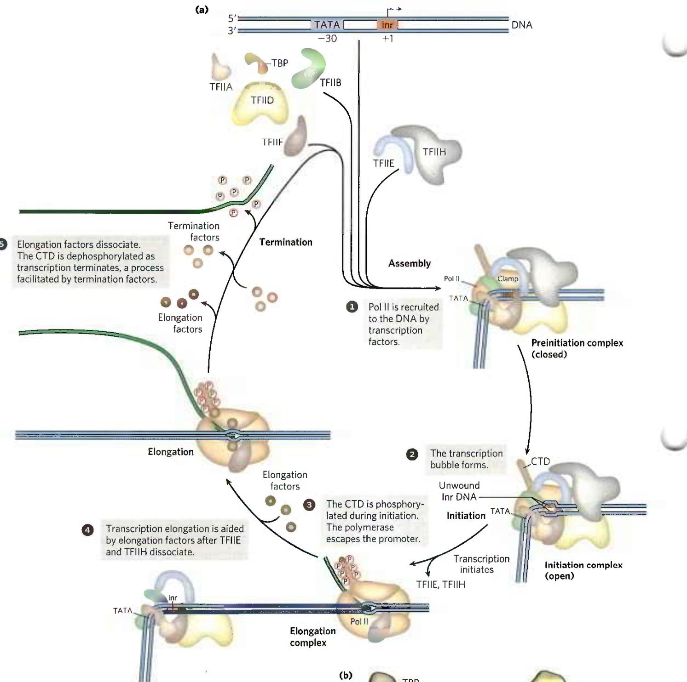

FIGURE 26-9 Transcription at RNA polymerase II promoters. (a) TBP (often with TFIIA and sometimes with TFIID) and TFIIB bind sequentially to a promoter. TFIIF plus Pol II are then recruited to that complex. The further addition of TFIIE and TFIIH results in a closed complex. Within the complex, the DNA is unwound at the Inr region by the helicase activity of TFIIH and perhaps of TFIIE, creating an open complex that completes assembly. The carboxyl-terminal domain of the largest Pol II subunit is phosphorylated by TFIIH, and the polymerase then escapes the promoter and initiates transcription. Elongation is accompanied by the release of many transcription factors and is also enhanced by elongation factors (see Table 26-2). After termination, Pol II is released, dephosphorylated, and recycled. (b) Structure of the human TFIIA/TFIID/TBP complex bound to promoter DNA, determined by cryo-EM. The DNA is stretched linearly over 70 base pairs, with the Inr sequence positioned roughly in the middle of TFIID, anchored by TBP/TATA-box interactions on the end. ([a) Information from E. Nogales et al., Curr. Opin. Struct. Biol. 47:60, 2017, Fig. 4. (b) Data from PDB ID 5FUR, R.K. Louder et al., Nature 531:604, 2016.]  

  
FIGURE 26-10 Phosphorylation of the carboxyl-terminal domain (CTD) of RNA polymerase II. The phosphorylation pattern of the CTD changes during different phases of transcription due to the action of kinases and phosphorylases associated with the transcription machinery. Multiple

Regulation of transcription at Pol II promoters is an elaborate process. It involves the interaction of a wide variety of other proteins with the preinitiation complex. Some of these regulatory proteins interact with transcription factors, others with Pol II itself. The regulation of eukaryotic transcription is described in more detail in Chapter 28.

#### [EN] RNA Polymerases Are Drug Targets

Both bacterial and eukaryotic RNA polymerases are the targets of a large number of chemical inhibitors. Some of these molecules inhibit transcription of both types of RNA polymerases; others selectively inhibit only certain types of polymerase.

The elongation of RNA strands by RNA polymerase in both bacteria and eukaryotes is inhibited by the antibiotic actinomycin D. The planar portion of this molecule inserts (intercalates) into the double-helical DNA between successive G≡C base pairs, deforming the DNA duplex. This prevents movement of the polymerase along the DNA during transcription. Because actinomycin D inhibits RNA elongation in intact cells as well as in cell extracts, it can be used to identify cell processes that depend on RNA synthesis.

Rifampin (Fig. 26-11a) inhibits bacterial RNA synthesis by preventing the promoter clearance step of transcription. Rifampin is an important antibiotic for the treatment of tuberculosis (TB), which is caused by the bacterium Mycobacterium tuberculosis and kills approximately 1.8 million people each year. The antibiotic binds near the active site of RNA polymerase and prevents extension of the RNA product beyond 2 to 3 nucleotides. Unfortunately, M. tuberculosis can develop resistance to rifampin; more than 600,000 cases of rifampin-resistant TB are reported each year. In many cases, resistance is due to mutation in the rifampin binding site (Fig. 26-11b), particularly at Asp $^{516}$ , His $^{526}$ , and Ser $^{531}$ of the $\beta$ subunit. New drugs that inhibit M. tuberculosis RNA polymerase are desperately needed for treatment of drug-resistant TB.

repeats of the CTD tail are phosphorylated with the patterns shown here during each stage; however, these are not shown for clarity. Understanding the patterns and heterogeneity of CTD tail phosphorylation at different stages of transcription and on different genes is an active area of transcription research.  
(a)  

(b)  
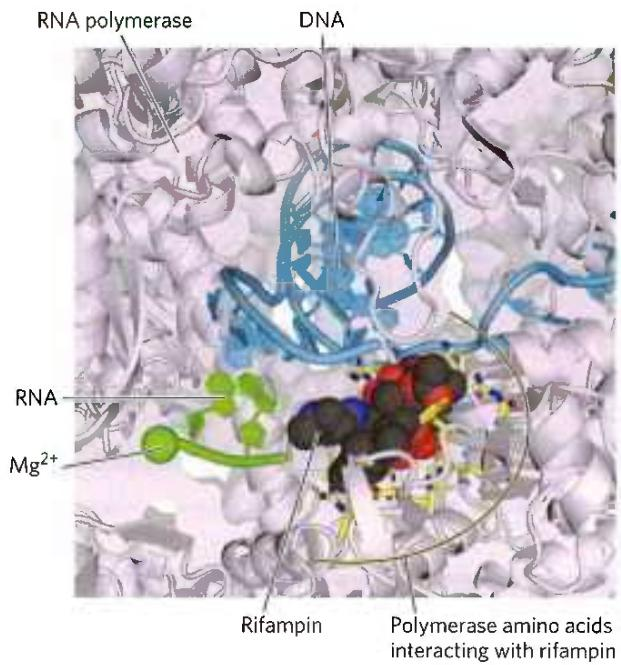  
FIGURE 26-11 Inhibition of RNA polymerase by rifampin. (a) Chemical structure of rifampin. (b) X-ray crystallographic structure of rifampin bound to the active site of M. tuberculosis RNA polymerase. In this slab view, much of the surrounding polymerase has been removed so that active site details, including one of the essential $\mathrm{Mg}^{2+}$ ions, can be highlighted. Rifampin (shown in spacefill) binds within the active site and blocks extension of the RNA transcript. Many RNA polymerase amino acids make direct contact with rifampin, and mutation of these amino acids can result in rifampicin-resistant RNA polymerase and TB infection. [(b) Data from PDB ID SUH6 and information from W. Lin et al., Mol. Cell 66:169, 2017.]

The death cap mushroom Amanita phalloides has a very effective defense mechanism against predators. It produces $\alpha$ -amanitin, which disrupts transcription in animal cells by blocking Pol II and, at higher concentrations, Pol III. Neither Pol I nor bacterial RNA polymerase is sensitive to $\alpha$ -amanitin—nor is the RNA polymerase II of A. phalloides itself. Because $\alpha$ -amanitin is selective for inhibiting the function of only certain RNA polymerases, it has proven useful for identifying the functions of different polymerases in the cell. Mitochondrial and bacterial RNA polymerases share significant similarities to one another, including $\alpha$ -amanitin resistance. By exposing eukaryotic cells to $\alpha$ -amanitin, it is possible to detect newly synthesized mRNAs that arise only from mitochondrial and not nuclear transcription. Researchers using $\alpha$ -amanitin need to exercise abundant caution because it is highly toxic to humans. An amount of $\alpha$ -amanitin the size of a grain of rice contains a lethal dose.

  
Amanita phalloides, the death cap mushroom [Wolstenholme Images/Alamy Stock Photo.]

#### [EN] SUMMARY 26.1 DNA-Dependent Synthesis of RNA

■ Transcription is catalyzed by DNA-dependent RNA polymerases, which use ribonucleoside 5'-triphosphates to synthesize RNA in the 5'→3' direction, complementary to the template strand of duplex DNA. Transcription occurs in several phases: binding of RNA polymerase to a DNA site called a promoter, initiation of transcript synthesis, elongation, and termination.

■ RNA polymerases bind regions of DNA called promoters to initiate transcription of nearby genes. Promoter sequences help to establish the level of gene expression and in E. coli are recognized by variable RNA polymerase subunits called $\sigma$ factors. Transcription initiation involves formation of the closed and open complexes. DNA is unwound in the open complex to allow it to serve as the transcription template.

As the first committed steps in transcription, binding of RNA polymerase to the promoter and initiation of transcription are closely regulated.

■ Bacterial transcription stops at sequences called terminators. E. coli commonly uses two types of termination signals: $\rho$ -dependent and $\rho$ -independent.

■ Eukaryotic cells have three types of nuclear RNA polymerases. The vast majority of cellular mRNAs and ncRNAs are synthesized by Pol II.

■ Binding of Pol II to its promoters requires an array of proteins called transcription factors. Ultimately, a large molecular complex called the preinitiation complex, PIC, forms at the promoter. Elongation factors participate in the elongation phase of transcription. The phosphorylation state of the long carboxyl-terminal domain of the largest Pol II subunit changes in the initiation and elongation phases and determines what components are part of the initiation and elongation complexes.

■ RNA polymerases can be inhibited by a number of drugs, some of which are specific to either bacterial or eukaryotic polymerases. Drugs that inhibit bacterial RNA polymerase are commonly used to treat infections such as tuberculosis.

<!-- L-END Lehninger 26.1 -->

## 3.7 RNA 转录的抑制

RNA 转录的抑制剂根据其作用性质主要可以分为 3 大类: 第一类是嘌呤和嘧啶类似物, 它们作为核苷酸代谢拮抗剂而抑制前体 RNA 的合成; 第二类是 DNA 模板功能抑制剂, 通过与 DNA 结合而改变模板的功能; 第三类是 RNA 聚合酶的抑制物, 它们与 RNA 聚合酶结合而抑制其活力。表 3-7 是一些典型的 RNA 转录的抑制剂。

表 3-7 常见的转录抑制剂

<table><tr><td>抑制剂</td><td>靶点</td><td>抑制作用</td></tr><tr><td>碱基类似物(5-氟尿嘧啶等)</td><td>核苷酸</td><td>抑制和干扰核苷酸合成</td></tr><tr><td>利福霉素</td><td>细菌全酶</td><td>和β亚基结合,抑制起始</td></tr><tr><td>利迪链霉素</td><td>细菌核心酶</td><td>和β亚基结合,抑制起始</td></tr><tr><td>放射线素D</td><td>DNA模板</td><td>与DNA结合,阻止延伸</td></tr><tr><td>α-鹅膏蕈碱</td><td>真核RNA聚合酶II</td><td>与RNA聚合酶II结合</td></tr></table>

## 3.7.1 嘌呤和嘧啶类似物

一些人工合成的碱基类似物,如5-氟尿嘧啶、6-氮尿嘧啶、6-巯基嘌呤、8-氮鸟嘌呤等能够抑制和干扰DNA或RNA合成。这些碱基类似物或者作为代谢拮抗物直接抑制核苷酸合成有关的酶类,或者通过掺入核酸分子形成异常的核酸结构,从而影响核酸的进一步延伸。碱基类似物进入体内后一般先转变为相应的核苷酸后才能发挥抑制作用。6-巯基嘌呤在体内首先转变为巯基嘌呤核苷酸,并阻断细胞内嘌呤核苷酸的合成。它是重要的癌症治疗药物,用于治疗急性白血病和绒毛上皮癌等。8-氮鸟嘌呤形成核苷酸后既能抑制嘌呤核苷酸的合成,还能掺入到RNA中,形成非正常的RNA,从而抑制相应蛋白质的合成。5-氟尿嘧啶进入体内后首先转变为F-UMP,再转变为脱氧核糖核苷酸(F-dUMP),抑制胸腺嘧啶核苷酸合成酶并阻碍胸腺嘧啶渗入RNA分子。5-氟尿嘧啶也具有抑制肿瘤细胞生长的功能。在正常细胞中,5-氟尿嘧啶能被分解为α-氟-β-氨基丙酸,但在癌细胞中则不被分解,这是5-氟尿嘧啶在临床上被用来作为化疗药物的原因之一。

## 3.7.2 DNA 模板功能抑制剂

放线菌素、烷化剂和嵌入染料能与DNA结合使其失去模板功能，进而抑制RNA转录。放线菌素D(actinomycin D)具有抗菌和抗癌作用，是DNA模板功能的抑制物，可与DNA形成非共价复合物，抑制其作为模板的功能。1 mmol/L的放线菌素D就可有效抑制RNA转录,但需要 10 mmol/L 才能抑制 DNA 的复制。

烷化剂如氮芥、磺酸酯、氮丙啶等分子中带有能使 DNA 烷基化的活性烷基，同时作用于 DNA 的两条链，使之发生交联，抑制其模板功能。烷化剂的毒性较大，能够引起细胞突变，具有致癌作用。有些烷化剂，如环磷酰胺，能选择性杀伤肿瘤细胞，因而在临床上被用于治疗恶性肿瘤。

某些具有扁平芳香族发色团的嵌入剂，如吖啶类染料和溴化乙锭等可插入双链DNA相邻的碱基对之间，因此又称为嵌入染料。嵌入剂通常含有吖啶或菲啶环，它们的大小与碱基相当，插入后使DNA在复制中缺失或增添一个核苷酸，导致移码突变。溴化乙锭(ethidium bromide, EB)是高灵敏度的荧光试剂，与核酸结合后抑制其复制和转录。实验中常用来检测样品中DNA和RNA的浓度。

## 3.7.3 RNA 聚合酶抑制剂

某些抗生素或化学药物,如利福霉素(rifamycin)、利迪链霉素(streptolydigin)和α-鹅膏蕈碱都是RNA聚合酶的抑制物。其中,利福霉素能强烈地抑制革兰氏阳性菌和结核杆菌,具有广谱抗菌作用,能特异性地抑制细菌RNA聚合酶的活性。利迪链霉素与细菌RNA聚合酶的β亚基结合,抑制转录的起始。α-鹅膏蕈碱主要抑制真核生物RNA聚合酶。

## 3.8 真核生物 RNA 的转录后加工

## 3.8.1 真核生物 RNA 中的内含子

真核基因大多是断裂的,也就是说,一个基因可由多个内含子和外显子间隔排列而成。研究表明,内含子在真核基因中所占的比例很高,甚至超过99%(表3-8)。

断裂基因的存在表明真核细胞的基因结构和 mRNA 合成过程比原核细胞要复杂得多, 因为真核基因表达往往伴随着 RNA 的剪接过程 (splicing), 从 mRNA 前体分子中切除被称为内含子 (intron) 的非编码区, 并使基因中被称为外显子 (exon) 的编码区拼接形成成熟 mRNA $^{(图 3-28)}$ 。

表 3-8 部分人类基因中内含子序列所占的比例分析

<table><tr><td>基因</td><td>长度 /kb</td><td>内含子数量</td><td>内含子所占比例 /%</td></tr><tr><td>胰岛素</td><td>1.4</td><td>2</td><td>67</td></tr><tr><td>β-珠蛋白</td><td>1.4</td><td>2</td><td>69</td></tr><tr><td>血清蛋白</td><td>18</td><td>13</td><td>89</td></tr><tr><td>胶原蛋白组分VII</td><td>31</td><td>117</td><td>71</td></tr><tr><td>VIII因子</td><td>186</td><td>25</td><td>95</td></tr><tr><td>萎缩性肌强直因子</td><td>2 400</td><td>78</td><td>&gt;99</td></tr></table>

## 图 3-28 真核基因中存在非编码的内含子区

所示基因含有4个外显子和3个内含子。转录从启动子区开始，产生了包括全部外显子和内含子的前mRNA。通过剪接除去内含子，并将外显子连接起来，得到成熟的mRNA。

## 3.8.2 真核生物 tRNA 前体的转录后加工

真核生物 tRNA 基因有内含子, 其前体必须经过剪接。其内含子具有下列特点: ①长度和序列没有共同性, 一般有 16\~46 个核苷酸; ②位于反密码子的下游; ③内含子和外显子间的边界没有保守序列, 所以与 mRNA 的剪接不同, tRNA 前体的剪接不符合一般规律。

由于 tRNA 分子具有高度保守的二级结构, 真核生物 tRNA 前体内含子的精确切除信号是 tRNA 分子共同的二级结构。哺乳动物、酵母、果蝇和植物等的 tRNA 的加工基本上相同, 主要包括下面需要酶催化的 3 个过程:

① 内含子的剪接 tRNA 内切核酸酶切割前体分子中的内含子；RNA 连接酶将外显子部分连接在一起。

② 3' 端添加 CCA 真核生物所有 tRNA 前体的 3' 端缺乏 -CCAOH 结构, 在蛋白质翻译过程中没有活性, 因而需要在 tRNA 核苷酸转移酶的催化下在其 3' 端添加 CCA。

③ 核苷酸修饰 tRNA 分子中稀有核苷酸较多, 其修饰很频繁。如 tRNA 甲基化酶能够催化 tRNA 分子特定位置的甲基化等, 但这些稀有核苷酸的功能还有待深入研究。

## 3.8.3 真核生物 rRNA 前体的转录后加工

大多数真核生物 rRNA 基因无内含子。有些虽然有内含子但并不转录。新生 rRNA 前体与蛋白质结合，形成巨大的核糖核蛋白前体（pre-rRNA）颗粒，前体长度约为成熟 rRNA 的 2 倍，因此，rRNA 前体必须被剪接成成熟的 rRNA 分子，此过程在核仁中进行。核仁小 RNA（snoRNA）参与核糖核酸酶对特定立体结构的识别，从而确定切割位点。

在不同真核生物中，rRNA 前体的每个转录单位内各 rRNA 的排列顺序和加工过程都十分保守。以人 HeLa 细胞为例，哺乳动物细胞内 rRNA 前体的剪切过程包括以下 4 个步骤(图 3-29):

① 在 $5'$ 端切除非编码的序列,生成 41S 中间产物。

② 41S RNA 再被切割为两段,一段为 32S,含有 28S rRNA 和 5.8S rRNA,另一段为

  
图 3-29 人 HeLa 细胞和小鼠 L 细胞的 rRNA 前体转录后加工示意图

20S, 含有 18S rRNA。

③ 32S RNA 进一步被剪切成 28S rRNA 和 5.8S rRNA。

④ 20S RNA 被剪切生成 18S rRNA。

## 3.8.4 真核生物 mRNA 的剪接

RNA 剪接主要有 3 种(不包括 tRNA 的加工过程): pre-mRNA 剪接、I 类和 II 类自剪接内含子。

由 DNA 转录生成的原始转录产物——核内不均一 RNA(hnRNA), 即 mRNA 的前体, 经过 5' 加 “帽” 和 3' 酶切加多腺苷酸, 再经过 RNA 的剪接, 编码蛋白质的外显子部分就连接成为一个连续的可读框(open reading frame, ORF), 通过核孔进入细胞质, 就能作为蛋白质合成的模板了。表 3-9 和图 3-30 分别总结了原始 mRNA 成熟期间的主要加工过程。

真核基因平均含有 8～10 个内含子, 前体分子一般比成熟 mRNA 大 4～10 倍。不同生物细胞内含子的边界处存在相似的核苷酸序列, 表明内含子剪接过程在进化上是保守的。比较同源基因的进化过程发现内含子的异化大于外显子, 特定的内含子还可能在进化过程中丢失, 因此, 内含子的 “功能” 及其在生物进化中的地位是一个引人注目的问题。另外, 许多人类疾病是内含子剪接异常引起的, 如地中海贫血患者的珠蛋白基因中, 大约有 1/4 的核苷酸突变发生在内含子的 5′ 或 3′ 边界保守序列上, 或者虽然位于内含子中间但干扰了前体 mRNA 的正常剪接。

图 3-30 初级转录产物的生成及其主要加工剪接过程图示  

表 3-9 RNA 加工过程及其生理功能

<table><tr><td>加工过程</td><td>推测的生理功能</td></tr><tr><td>加帽反应</td><td>mRNA 从细胞核向细胞质运转,翻译起始</td></tr><tr><td>加多 A 反应</td><td>转录终止,翻译起始和 mRNA 降解</td></tr><tr><td>RNA 的剪接</td><td>从 mRNA、tRNA 和 rRNA 分子中切除内含子</td></tr><tr><td>RNA 的切割</td><td>从前体 RNA 中释放成熟 tRNA 和 rRNA 分子</td></tr></table>

## 1. RNA 序列决定了剪接的发生位点

图 3-31 脊椎动物 mRNA 前体中常见的内含子剪接所必需的保守序列

图中显示 $5'$ 剪接位点和 $3'$ 剪接位点的共有序列以及分支点的保守腺苷酸成分。

比较不同基因的核苷酸序列发现，mRNA 前体中内含子的两端边界存在共同的序列，这些序列结构可能是产生 mRNA 前体剪接的信号。多数细胞核 mRNA 前体内含子的 5' 边界序列为 GU, 3' 边界序列为 AG。因此，GU 表示供体衔接点的 5' 端，AG 代表接纳体衔接点的 3' 端。把这种保守序列模式称为 GU-AG 法则，又称为 Chambon 法则。  
除了边界序列之外,外显子与内含子交界处的序列,内含子内部的部分序列也可能参与内含子的剪接(图3-31)。在3'端剪接位点AG的附近有一段富含嘧啶的区域,含有10\~20个嘧啶核苷酸;5'端有一保守序列(5'-GUPuAGU-3')。此外,许多发生分叉剪接的核mRNA内含子3'端上游18\~50个核苷酸处,存在一个序列为 $Py_{80}NPy_{87}Pu_{75}APy_{95}$ 的保守区,其中A为百分之百保守,且具有2'-OH,是参与形成分叉剪接中间物的特定腺嘌呤,

<table><tr><td colspan="2">5&#x27;剪接位点</td><td colspan="2">分支点</td><td colspan="2">3&#x27;剪接位点</td></tr><tr><td>5&#x27;A/CAG</td><td>GUPuAGU</td><td>A</td><td>富Py区</td><td>AG</td><td>G</td></tr><tr><td colspan="2">外显子</td><td colspan="2">内含子</td><td colspan="2">外显子</td></tr></table>

称为分支点。上述保守序列都是 pre-mRNA 剪接过程中各种核糖核蛋白剪接调节因子的结合位点，对于有效和准确的剪接非常重要。

## 2. RNA 剪接中的两步转酯反应

RNA 剪接是由两步转酯反应完成的, 这两步转酯反应使得 pre-mRNA 中原有的某些磷酸二酯键断开, 并形成一些新的磷酸二酯键。

第一步转酯反应是由位于分支位点的保守腺苷酸的2'羟基引发的。它作为亲核基团攻击5'剪接位点保守鸟苷酸的磷酰基团。结果，外显子3'端的核糖与内含子5'端磷酸之间的磷酸二酯键被断开，游离出来的5'磷酸则与分支点保守腺苷酸的2'羟基连接。因此，除了5'→3'骨架磷酸二酯键，新的磷酸二酯键从保守腺苷酸的2'羟基伸出来，产生一个三叉交汇点。

第二步转酯反应中，5'外显子作为亲核基团，攻击3'剪接位点的磷酰基团，导致两个结果：一是把5'和3'外显子连接起来了，二是把内含子作为离去基团释放出去。因为内含子的5'端已经在第一次转酯反应中与分支点腺苷酸相连接，所以新释放出来的内含子形状像一个套索（lariat form）。

在上述两步转酯反应中,没有增加新的化学键,只是断开了两个磷酸二酯键,同时形成了两个新的磷酸二酯键。

## 3. 剪接体与 RNA 剪接

上述的转酯反应是由一个被称为剪接体(spliceosome)的大型复合体介导的。剪接体是mRNA前体在剪接过程中组装形成的多组分复合物，是一种具有催化剪接反映的核糖核蛋白复合体，它包含约150种蛋白质和5种RNA $^{[图3-32]}$ ，大小与核糖体差不多。研究表明，剪接体中的5种RNA(U1、U2、U4、U5和U6)统称为核小RNA(snRNA)。每种snRNA长100\~300核苷酸，与几种蛋白质形成的RNA－蛋白质复合物被称为细胞核小核糖核蛋白(small nuclear ribonuclear protein, snRNP)。它是剪接体的亚单位，剪接体就是由这些snRNP形成的巨型复合体，参与RNA的剪接。但是，每种snRNP执行的任务不同，因此，在剪接反应的不同时期，剪接体中含有不同的snRNP。剪接体中可能还有一些与剪接体松散结合的不属于snRNP的蛋白质。

snRNP 在剪接中的功能如下: ①识别 5' 剪接位点和分支点; ②按需要把这两个位点集结到一起; ③催化或协助催化 RNA 的剪接和连接反应。只有参与剪接反应的 RNA 与 RNA 之间、蛋白质与 RNA 之间以及蛋白质与蛋白质之间具备很好的协同作用, 才能完成复杂的剪接反应。

剪接过程的详细步骤由图 3-33 所示。mRNA 链上每个内含子的 5' 和 3' 端分别与不同的 snRNP 相结合，形成 RNA 和 RNP 复合物。

  
图 3-32 剪接体是一个巨大的复合物
剪接体大小约为 $1.2 \times 10^{7}$ 。5 种 snRNP 几乎占了总体的一半。剩下的一些蛋白质包括已知的剪接因子以及参与基因表达其他阶段的蛋白质。

图 3-33 真核生物 mRNA 前体中内含子剪接过程示意图  

一般情况下,由 U1 snoRNA 以碱基互补的方式识别 mRNA 前体 5'剪接点,由结合在 3'剪接点上游富嘧啶区的 U2AF(U2 auxiliary factor)识别 3'剪接点并引导 U2 snRNP 与分支点相结合,形成剪接前体(pre-spliceosome),并进一步与 U4、U5、U6 snRNP 三聚体相结合,形成 60S 的剪接体(spliceosome),进行 RNA 前体分子的剪接。

哺乳动物细胞中，mRNA 前体上的 snRNP 是从 5' 向下游“扫描”，选择在分支点富嘧啶区 3' 下游的第一个 AG 作为剪接的 3' 位点。AG 前一位核苷酸可以影响剪接效率，一般说来，CAG=UAG>AAG>GAG。如果 mRNA 前体上同时存在几个 AG，可能发生剪接竞争。

RNA 剪接过程中容易发生两类错误,一是遗漏了剪接位点,二是剪接位点邻近的非靶位点被错认为剪接位点。生物体一般通过两种机制来提高选择剪接位点的准确性。首先,在 RNA 转录过程中,RNA 聚合酶Ⅱ携带多种参与 RNA 加工的蛋白质,包括参与剪接的蛋白质。当新合成的 RNA 形成 5' 剪接位点时,这些蛋白质就从 RNA 聚合酶Ⅱ上转移到 RNA 分子上并结合于 5' 剪接位点,准备与下一个 3' 剪接位点的剪接成分相互作用,以识别正确的 3' 剪接位点。这种与转录同步的剪接体组装方式大大减少了外显子遗漏的可能性。此外,研究发现可能有一个富含丝氨酸和精氨酸被称为 SR 蛋白的辅助因子与外显子中的外显子剪接增强子区相结合,通过与剪接机器的相互作用将其引导到邻近的

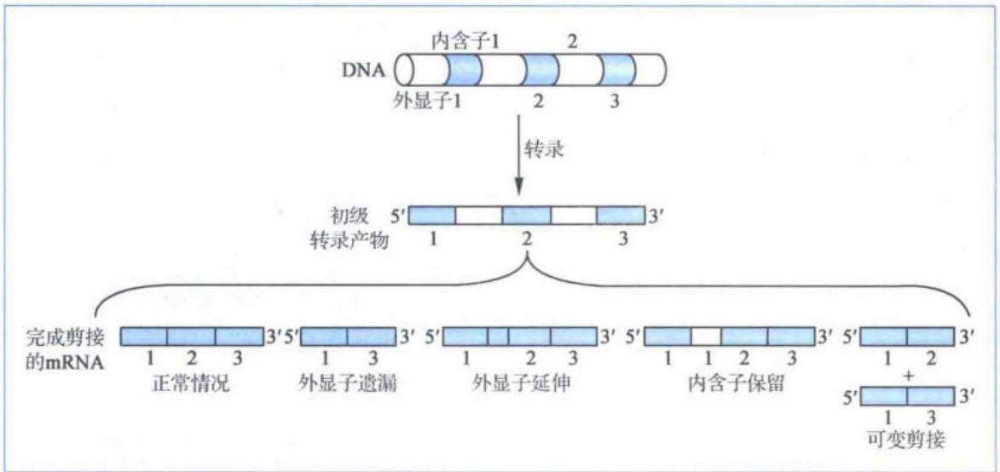  
图3-34 RNA剪接的5种模式

剪接位点,以优先识别最靠近外显子的剪接位点,防止错误剪接,确保剪接的准确性和高效性。

## 4. RNA 的可变剪接

在高等真核生物中,内含子通常是有序或组成性地从 mRNA 前体中被剪接,然而,在个体发育或细胞分化时可以有选择性地越过某些外显子或某个剪接点进行变位剪接,产生出组织或发育阶段特异性 mRNA,称为内含子的可变剪接或选择性剪接。人类基因组中,大约 60% 的基因能发生可变剪接,使一个基因产生多个蛋白质产物。图 3-34 显示产生可变剪接的几条主要途径。

## 5. I类和Ⅱ类自剪接内含子

与前面所述的 mRNA 前体中 GU-AG 类(主要)和 AU-AC 类(次要)内含子剪接方式不同的是 I、II 类内含子,因为带有这些内含子的 RNA 本身具有催化活性,能通过自身折叠成一种特殊的构象来进行内含子的自我剪接,而不需要形成剪接体。表 3-10 总结了存在于生物体内的各种内含子。

表 3-10 生物体内的各种内含子

<table><tr><td>内含子类型</td><td>细胞内定位</td></tr><tr><td>GU-AG</td><td>细胞核,前体mRNA(真核)</td></tr><tr><td>AU-AC</td><td>细胞核,前体mRNA(真核)</td></tr><tr><td>I类内含子</td><td>细胞核,前体rRNA(真核),细胞器RNA,少数细菌RNA</td></tr><tr><td>II类内含子</td><td>细胞器RNA,部分细菌RNA</td></tr><tr><td>III类内含子</td><td>细胞器RNA</td></tr><tr><td>双内含子</td><td>细胞器RNA</td></tr><tr><td>tRNA前体中的内含子</td><td>细胞核,tRNA前体(真核)</td></tr></table>

① I 类自剪接内含子 最初在研究原生动物四膜虫 RNA 前体时发现了 I 类内含子，后来在细菌中也发现存在这类内含子。I 类内含子的剪接主要也是发生了两次磷酸二酯键的转移,即两次转酯反应(trans-esterification)。在Ⅰ类自剪接内含子切除体系中,第一个转酯反应由一个游离的鸟苷或鸟苷酸(GMP、GDP或GTP)介导,鸟苷或鸟苷酸的3'-OH作为亲核基团攻击内含子5'端的磷酸二酯键,从上游切开RNA链。在第二个转酯反应中,上游外显子的自由3'-OH作为亲核基团攻击内含子3'位核苷酸上的磷酸二酯键,使内含子被完全切开,上下游两个外显子通过新的磷酸二酯键相连(图3-35)。Ⅰ类内含子释放出线性内含子,而不是一个套索结构。

Ⅰ类自剪接内含子通常比Ⅱ类内含子小,有一个保守的二级结构,包括容纳鸟苷或鸟苷酸结合的口袋以及一段与5'剪接位点序列配对的“内在指导序列”,以确定鸟苷亲核攻击的精确位置。

②Ⅱ类自剪接内含子 这类内含子主要存在于真核生物的线粒体和叶绿体 rRNA 基因中。在Ⅱ类内含子切除体系中，转酯反应无需游离鸟苷酸或鸟苷，而是由内含子本身的靠近 3' 端的腺苷酸 2'-OH 作为亲核基团攻击内含子 5' 端的磷酸二酯键，从上游切开 RNA 链后形成套索状结构。再由上游外显子的自由 3'-OH 作为亲核基团攻击内含子 3' 位核苷酸上的磷酸二酯键，使内含子被完全切开，上下游两个外显子通过新的磷酸二酯键相连（图 3-36）。表 3-11 总结了各种剪接类型的特点。

图 3-35 I 类内含子的自剪接过程  

图 3-36 Ⅱ类内含子的自剪接过程  
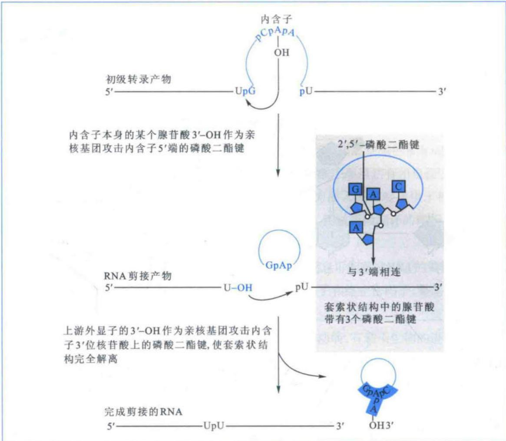

表 3-11 RNA 剪接的 3 种类型

<table><tr><td>类型</td><td>丰度</td><td>机制</td><td>催化机器</td></tr><tr><td>细胞核 pre-mRNA</td><td>常见,适用于大多数真核基因</td><td>两步转酯反应,分支点为 A</td><td>主要剪接体</td></tr><tr><td>II类自剪接内含子</td><td>罕见,来自某些细胞器的真核基因及原核基因</td><td>与 pre-mRNA 类似</td><td>内含子编码的核酶</td></tr><tr><td>I类自剪接内含子</td><td>罕见,某些真核生物的细胞核 rRNA、细胞器基因,及少量原核基因</td><td>两步转酯反应,分支点为 G</td><td>内含子编码的核酶</td></tr></table>

<!-- W-BEGIN Watson 14 RNA剪接 -->

### 【中文对照 Watson 第14章：RNA剪接】

> 来源：Watson《基因的分子生物学》第七版中译本（书籍/03_基因的分子生物学_第七版） 第14章 RNA剪接。

#### [W] 第14章 RNA剪接

本章概要
RNA 剪接的化学基础
剪接体
剪接过程
剪接替换
可变剪接
外显子重组
RNA 编辑
mRNA 转运

一个基因的编码区实际上是一系列的三联体密码子，它们决定了多肽产物的氨基酸线性顺序。迄今为止，我们一直默认编码序列是连续的，即多肽链上一个氨基酸的密码子与下一个氨基酸的密码子是直接相邻的。对绝大多数细菌及其噬菌体而言的确如此。但真核基因却很少这样，其基因的编码区被非编码区有规律地间隔开了。

所以许多真核基因是嵌合的，由一段段编码区组成，它们被另外的一段段的非编码区隔开。编码区被称为外显子（exon），它们之间的非编码区被称为内含子（intron）。当 RNA 转录完成后，内含子需要被除去而外显子则被连接起来形成成熟的 mRNA。从技术上来说，术语“外显子”是指在成熟 RNA 中保留的任何序列片段，不管这些序列片段是否为编码序列。非编码的外显子包括：mRNA 的 5'端和 3'端的非翻译序列；剪接后稳定的非编码 RNA 全长序列如 X 染色体失

活调节因子 Xist（第 20 章）；有功能的 RNA 片段，如在第 20 章中提到的小分子 RNA （microRNA）。

图 14-1 显示了一个典型的真核基因，3 个内含子把基因编码区分成了 4 个外显子。基因的内含子数量相差悬殊，大多数含内含子的酵母基因（和少数人类基因）只有 1 个内含子，鸡 proα2 胶原蛋白（collagen）基因有 50 个内含子，而人 Titin 基因则有多达 363 个内含子。图 14-2 显示了一系列已测序物种中每个基因所含内含子的平均个数。从图中可以清楚地看到，从单细胞真核生物（如酵母），到稍高等的生物（如线虫和果蝇）直到人，内含子平均数持续增加。

外显子和内含子的大小也变化不定，事实上，内含子一般比它们所分隔的外显子要长得多。例如，典型外显子的长度在150nt左右，然而内含子却可长达800kb，尽管有些也很短。哺乳动物的二氢叶酸还原酶（dihydrofolate reductase）基因长达31kb以上，但只有6个分散的外显子，对应的mRNA长度为2kb，该基因编码区不足其全长的10%。

  
图 14-1 典型的真核基因。图中所示的基因有 4 个外显子，被 3 个内含子分开。如中间一行所示，转录从启动子区开始，产生了包括全部外显子和内含子的 pre-mRNA。剪接过程除去了内含子，并将外显子连接起来，得到了成熟的 mRNA；成熟的 mRNA 经过进一步加工（多聚腺苷酸化，第 13 章），然后转运出细胞核，就可以翻译得到一个蛋白质产物。从技术上来说，5' 先导区和 3' 非编码区也是外显子，因为它们保留在成熟的 mRNA 中，此处用紫色表示它们是非编码的外显子状态。

与没有内含子的原核基因一样，真核“割裂”（split）基因也整个地转录为单一的一条RNA链。所以一个典型的真核基因，其初始转录产物不仅包括外显子，也包括内含子，这显示在图14-1的中间一行。因为内含子数量和长度都可以非常大，初始转录产物（即前mRNA，pre-mRNA）实际上可以很长。人的抗肌营养不良蛋白基因（dystrophin）是一个极端例子，要全部转录该基因，RNA聚合酶就得横跨2400kb的DNA序列（假设转录速度为 $40\mathrm{bp / s}$ ，不难看出，要获得该基因的一条转录体，就得花费漫长的 $17\mathrm{h!}$ ）。这就提出了一种可能性，即外显子冗余和它们的长度对于表达速率有显著的影响，我们将在第21章中关于发育过程的基因表达部分回顾这一现象并给予详细探讨。

正如我们之前所述，“割裂”基因的初始转录物在翻译成蛋白质之前，必须先除去其内含子。从 pre-mRNA 中除去内含子的过程称为 RNA 剪接（RNA splicing）。这个过程将 pre-mRNA 转化为成熟的 RNA，并且必须绝对准确，避免在外显子连接处缺少或增多哪怕是一个核苷酸。我们将在第 15、16 章中看到，mRNA 的三联体密码子是按蛋白质编码序列的第一个密码子所确定的固定可读框来翻译的。所以，如果剪接不够准确，如在两个外显子接合处少了或者多了一个核苷酸，必将导致外显子偏离正确的可读框，下游的密码子就会组合错误，从而把错误的氨基酸掺入到蛋白质中。

有些 pre-mRNA 存在不止一种剪接方式，从而产生不同的 mRNA。例如，可以保留不同组合的外显子，这称为可变剪接（alternative splicing）。通过这种方式，一个基因可以产生多个多肽产物。可变剪接的产物称为亚型（isoform）。据估计，人类基因组中的蛋白编码基因有 90% 或者以上发生可变剪接，从而产生多个蛋白质产物。

通过可变剪接，从某个基因得到不同产物的数量可以从两种到数百甚至数千种。例如，大鼠编码神经元细胞 $\mathrm{K}^+$ 通道的Slo基因，其编码产物可达500种之多；后面我们将会看到，有一个果蝇基因通过可变剪接可编码多达38000种产物。可变剪接经常作为一种调节机制，在不同的细胞中响应不同的分子信号，得到不同的剪接产物。

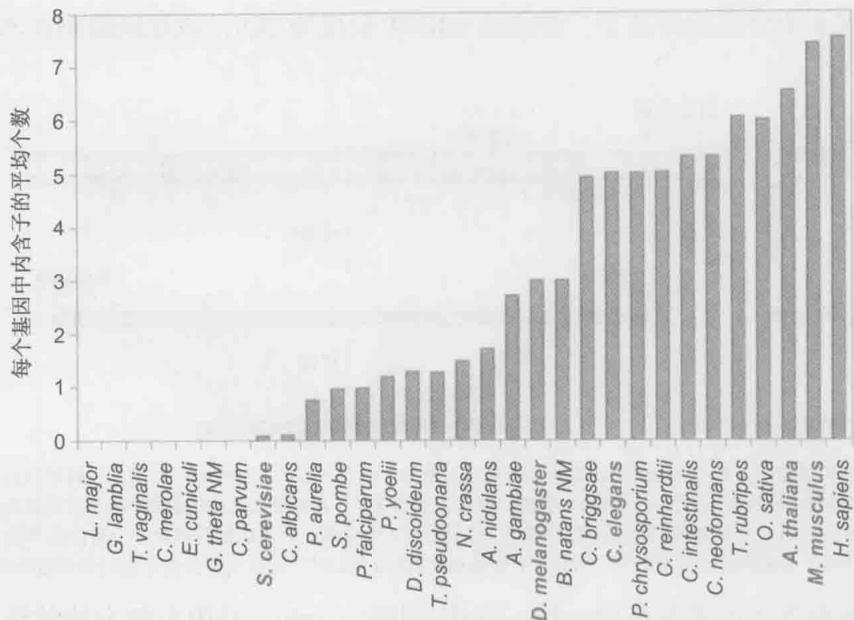  
图 14-2 不同真核生物物种每个基因内含子的个数。图示为一些真核生物物种每个基因内含子的平均数。图中红色显示的是普通的模式生物（附录 1）：酿酒酵母（Saccharomyces cerevisiae）、黑腹果蝇（Drosophila melanogaster）、秀丽新小杆线虫（Caenorhabditis elegans）、拟南芥（Arabidopsis thaliana），和小鼠（Mus musculus）。图中显示的其他物种分别为冈比亚按蚊（Anopheles gambiae）、构巢曲霉（Aspergillus nidulans）、绿领鞭藻（Bigelowiella natans nucleomorph）、线虫（Canorhabditis briggsae）、白色念珠菌（Candida albicans）、莱茵衣藻（Chlamydomonas reinhardtii）、玻璃海鞘（Ciona intestinalis）、新型隐球菌（Cryptococcus neoformans）、隐孢子虫（Cryptosporidium parvum）、单细胞红藻（Cyanidioschyzon merolae）、盘基网柄菌（Dictyostelium discoideum）、兔脑原虫（Encephalitozoon cuniculi）、蓝氏贾第虫（Giardia lamblia）、海藻（Guillardiaetheta nucleomorph）、人（Homo sapiens）；硕大利什曼原虫（Leishmania major）、粗糙脉孢霉（Neurospora crassa）、水稻（Oryza sativa）、双小核草履虫（Parameciun aurelia）、黄孢原毛平革菌（phanerochaete chrysosporium）、亚性疟原（Plasmodium falciparum）、鼠约氏疟原虫（Plasmodium yoelii）、粟酒裂殖酵母（Schizosaccharomyces pombe）、红鳍东方鲀（Takifugu rubripes）、假矮海链藻（Thalassiosira pseudonana）和阴道滴虫（Trichomonas vaginalis）。（获得许可并重新绘图自 Roy S.W.and Gilbert W. 2006. Nat. Rev. Genet. 7: 212，Fig. 1. ©Macmillan.）

在本章中，我们不仅讨论 RNA 剪接的机制和调控，也探讨真核基因编码区被分隔的可能原因。我们还会介绍 RNA 编辑——另一种可以改变初始转录产物以得到不同编码产物的途径。

RNA 剪接是在研究哺乳动物腺病毒（adenovirus）基因表达的过程中发现的，详见框 14-1。

框14-1 腺病毒和RNA剪接的发现

对细菌及其噬菌体的研究使人们相信：从核苷酸序列角度来讲，mRNA 是其基因的精确复制物（第 16 章）。1977 年首次发现某些（我们现在知道，实际上是许多）真核 mRNA 是从比其长得多的初始转录产物通过拼接的方式剪接得到的，当时确实让人们大吃一惊。那么这个惊人的发现是如何获得的呢？

为了了解真核生物的基因转录，科学家把注意力集中在腺病毒——一种人DNA病毒上面。腺病毒最初是作为研究真核基因分子生物学的模型，正如T4和λ噬菌体是研究原核基因分子生物学的模型一样（见附录1）。腺病毒颗粒由其自身编码的几种不同蛋白质构成，这些蛋白质的mRNA得以纯化，人们希望通过这些mRNA的5'端可以分析出各个基因在基因组上的转录起始位置。然而尽管所编码的蛋白质各不相同，所有的mRNA却都拥有相同的5'端序列。我们现在知道，腺病毒颗粒的所有蛋白质的mRNA都来自同一个启动子，即主要晚期启动子（major late promoter）。从该启动子进行转录，会得到横跨许多蛋白质编码序列的长转录产物（框14-1图1），该转录产物经过可变剪接，就分别得到诸如六邻体（hexon）和各种纤维蛋白等的各种病毒颗粒成分的mRNA。所有mRNA拥有共同的5'端序列，由3段短的非编码序列编织而成，称为“三裂体引导序列”（tripartite leader），然后引导序列通过可变剪接分别与编码六邻体（hexon）、纤维蛋白（fiber）和其他毒粒蛋白（virion）的序列相连接，最终产生每一种晚期病毒mRNA。

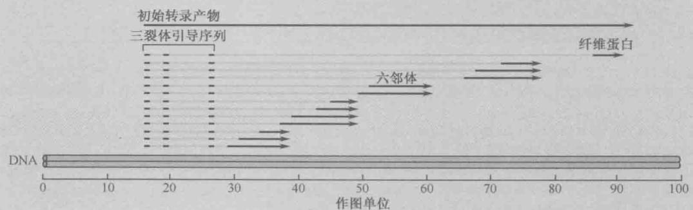  
框 14-1 图 1 人 2-型腺病毒基因组图。本图显示了病毒晚期 mRNA 的转录模式，包括初始转录产物（上端的深绿色长箭头），分别位于 16.6、19.6 和 26.6 作图单位处的三裂体引导序列（显示为绿色短线），以及编码各种病毒晚期的 mRNA 的 DNA 序列在基因组图谱上的位置（病毒晚期 mRNA 显示为深绿色短箭头）。

这些 mRNA 是由病毒基因组几个不同区域的 RNA 剪接而来的结论源于许多实验结果，其中之一是 R 环定位方法（R-loop mapping，框 14-1 图 2）。当 RNA 在适当条件下与包含一段相同序列的双链 DNA 一起培养时，RNA 与其互补序列杂交，使得另一条非互补 DNA 链形成一个环（框 14-1 图 2a）。然后使用观察核酸的方法进行染色，就可在电镜下看到 R 环，因为双链 DNA 或 DNA：RNA 比单链的核酸显得要粗。用腺病毒 mRNA 进行这种实验时，发现一段 DNA 上所形成的 R 环并非完全连续。相反，mRNA 的一端或两端会从 R 环伸出来成为单链尾巴（框 14-1 图 2b），具体情况视所用的病毒 DNA 片段而定。有时其中一个尾巴会与病毒基因组其他区域的 DNA 片段杂交（框 14-1 图 2c）。显然，这些 mRNA 是复合分子，由基因组上不连续区域的互补序列连接而成。这些以及其他种类的 DNA：RNA 杂交实验最终推导出框 14-1 图 1 所示的可变剪接模式。

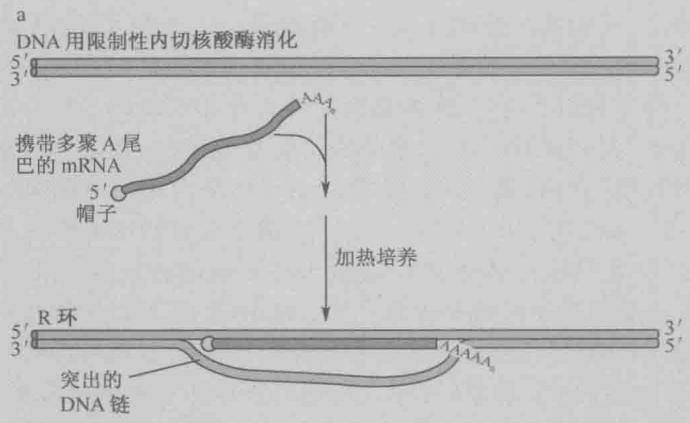

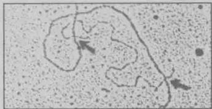

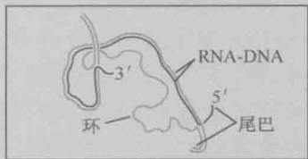

  
框 14-1 图 2 2-型腺病毒晚期 mRNA 的 R 环定位。(a) 本示意图演示了 R 环结构的形成过程。用限制酶消化得到的一段双链 DNA 与 mRNA 混合，并在 80% 甲酰胺中加热到温度刚好超过 DNA 的变性温度。退火后 mRNA 与其互补 DNA 的杂交导致另一条 DNA 链的逐出。mRNA 的多聚 A 尾巴（不是 DNA 所编码的，见第 12 章）也会从杂交体的一端伸出来。(b) 六邻体 mRNA 与其位于 2-型腺病毒基因组的晚期区域的互补 DNA 序列培养后所观察到的 R 环的电子显微图谱及示意图。注意 mRNA 的 3'端和 5'端都伸了出来。图中 DNA 用黑色线条表示；RNA 用绿色线条表示。(获得许可并重新绘图自 Berget S.M. et al. 1977. Proc. Natl. Acad. Sci. 74: 3171–3175. ©National Academy of Sciences. (c) 纤维蛋白 mRNA 与腺病毒全基因组和用限制酶酶切的基因组的早期区域这两种 DNA 分子培养所观察到的 R 环电子显微图谱及示意图。(获得许可并重新绘图自 Chow L.T. et al. 1977. Cell 12: 1–8, p2. ©Elsevier.)

#### [W] RNA 剪接的化学基础

#### [W] RNA 序列决定剪接位点

我们现在考察剪接反应的分子机制。内含子和外显子如何相互区别？内含子是如何除去的？外显子怎样精确连接起来？内含子和外显子的边界是由pre-mRNA内的特殊核苷酸序列标明的，这些序列指明了剪接应该在何处进行。如图14-3所示，外显子和内含子边界，即内含子的5'端是由称为5'剪接位点（5'splice site）的序列标明的。在内含子3'端的内含子和外显子边界是由称为3'剪接位点（3'splice site）的序列标明的[5'和3'剪接位点有时被分别称作供体（donor）和受体（acceptor）位点，但这种命名方法现在已很少使用]。

图 14-3 还显示了剪接所必需的第三个序列，称为分支点（branchpoint site），或称分支点序列(branchpoint sequence)。分支点全部位于内含子之内，通常靠近 3' 端，后面为多聚嘧啶区（Py tract）。

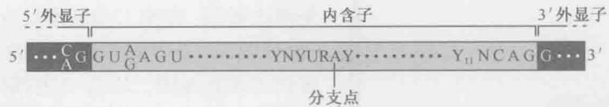  
图 14-3 内含子与外显子交界处的核苷酸序列。图中显示了 5' 和 3' 剪接位点的共有序列和分支点的保守腺苷酸。按照共有序列标识的惯例，如果某一位置有两个核苷酸出现概率相似，就把两者都标出来。本图显示的共有序列是人类的情况。下同（除非特别声明）。

以上几个位点各自的共有序列显示在图 14-3 中。最保守的序列是 5'剪接位点的 GU 和 3'剪接位点的 AG 及分支点的 A。这些高度保守的核苷酸都位于内含子中——这也许并不奇怪，因为外显子不同于内含子，它是要用来编码特定氨基酸的，其序列必然受到限制。

当内含子两边的外显子连接时，内含子是以套索（lariat）结构被除去的

让我们首先讨论剪接的化学基础。剪接是由连续两步转酯反应（transesterification）完成的，pre-mRNA中原来的一些磷酸二酯键断开，再形成一些新的磷酸二酯键（图14-4）。第一步转酯反应是由分支点保守腺苷酸的2'羟基引发的。它作为亲核基团，攻击5'剪接位点保守鸟苷酸的磷酰基团[该反应为双分子亲核取代（SN2）反应，通过5价磷中间体完成]。

  
图 14-4 剪接反应。本图显示了正文中描述的剪接反应的两个步骤。在第一步中 RNA 形成环状结构，图 14-5 中有详细描述。

第一步反应的结果是,外显子3'端的核糖与内含子5'端磷酸之间的磷酸二酯键断开,而游离出来的5'端与分支点保守腺苷酸连接。这样,除了5'-3'骨架磷酸二酯键连接,第三个磷酸二酯键从保守腺苷酸的3'羟基伸出来,产生一个三叉交汇点(threeway junction,保守腺苷酸因而叫做分支点)。图14-5示意了这种三联连接方式。

  
图 14-5 剪接反应形成的三叉交汇结构。

请注意，在第一次转酯反应中，5'外显子是离去基团。在第二步转酯反应中，5'外显子（准确地说，是其新游离出来的3'羟基）反过来作为亲核基团，攻击3'剪接位点的磷酰基团（图14-4）。第二次转酯反应产生两个结果：首先也是最重要的，是把5'和3'外显子连接起来了，所以第二次转酯反应才是把两个编码区真正连接起来的剪接步骤。其次，使内含子作为离去基团释放。因为内含子的5'端已经在第一次转酯反应中与分支点腺苷酸连接，所以新释放出来的内含子形状像一个套索。

在以上两步转酯反应中，没有增加新的化学键——断开了两个磷酸二酯键，同时又形成了两个新的磷酸二酯键。由于只是移动化学键，这个化学过程不需要消耗能量。但是，正如我们所见，在剪接反应过程中消耗了大量 ATP。这些能量不是用于化学反应，而是用来正确组装和运行剪接机器。

剪接反应的另一个要点是其方向性：如

何保证剪接只沿正方向进行，即朝向图 14-4 所示的产物方向进行？原则上，反应可以沿着另一个方向进行，事实上在某些特殊的环境条件下是可能发生的。但在一般的细胞环境中，剪接都是单向完成的，接下来我们将讨论这是如何实现的。

#### [W] 剪接体

#### [W] RNA 剪接是由一个叫做剪接体的大复合体执行的

上面描述的转酯反应是由被称为剪接体（spliceosome）的大型分子“机器”介导的。这个复合体包含约150种蛋白质和5种RNA，大小与将mRNA翻译成蛋白质的核糖体差不多（第15章）。即使只完成一步剪接反应，剪接体也需要水解几个分子的ATP。令人惊奇的是，剪接体的多数功能是由其RNA而不是蛋白质组分执行的，这也与核糖体情况类似。因而，RNA分子识别内含子与外显子交界处的特异序列，很可能直接参与催化了剪接过程。

剪接体中的5种RNA（U1、U2、U4、U5和U6）统称为核内小RNA（small nuclear RNA，snRNA）。在大多数真核细胞中每种snRNA长 $100\sim 300\mathrm{nt}$ ，且与几种蛋白质形成复合物。这些RNA-蛋白质复合物称为小核内核糖蛋白（small nuclear ribonuclear protein，snRNP）。第6章中我们看到了U1 snRNA部分片段的晶体结构，该部分是U1snRNA 结合到 U1 snRNP 蛋白组成的部分（图 6-18）。

剪接体就是由这些 snRNP 形成的巨型复合体，但是在剪接反应的不同时期的具体成分不尽相同：不同的 snRNP 在不同时间进出剪接体，行使特殊的功能。剪接体中还有许多蛋白质不属于 snRNP，另外一些蛋白质只是与剪接体松散结合。

snRNP 在剪接中的功能有三个方面：识别 5'剪接位点和分支点；按需要把这两个位点集结到一起；催化（或协助催化）RNA 剪切和连接反应。要执行这些功能，所有 RNA-RNA、RNA-蛋白质、蛋白质-蛋白质相互作用都很重要。我们先考察某些 RNA-RNA 相互作用，这些相互作用发生于单个 snRNP 之内、不同的 snRNP 之间，以及 snRNP 与 pre-mRNA 之间。

例如，图 14-6a 显示 U1 snRNA 与 pre-mRNA 的 5'剪接位点之间通过互补碱基配对发生相互作用，在反应的后期，该位点又被 U6 snRNA 所识别；第二个例子见图 14-6b，分支点序列为 U2 snRNA 所识别；第三个例子见图 14-6c，显示 U2 snRNA 和 U6 snRNP 间的相互作用，该作用把 5'剪接位点和分支点拉拽到一起。我们在稍后就会看到，正是这些相互作用及其他类似的相互作用，加上由此所导致的重排，推动了剪接反应并保证其准确性。

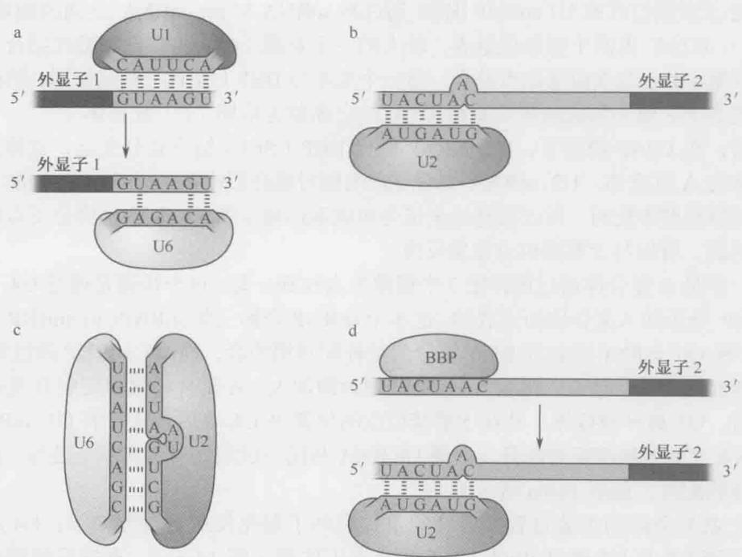  
图 14-6 剪接过程中形成的某些 RNA:RNA 杂合体。(a) 不同的 snRNP 在剪接反应的不同阶段可以识别 pre-mRNA 上的相同或交叠的序列，如 U1 和 U6 都识别 pre-mRNA 的 5' 剪接位点；(b) U2 snRNP 识别分支点序列。(c) U2 和 U6 snRNP 之间的 RNA:RNA 互补配对；(d) pre-mRNA 的同一序列在不同阶段，分别为蛋白质（非 snRNP 的成分）和 snRNP 所识别。以上每一种变化都伴随着剪接体组分的来去，以及能够使剪接反应正常进行的结构重排。本图所示序列来自酵母。

前面提到，某些非 snRNP 也参与了剪接反应。例如，U2AF（U2 辅助因子）识别多聚嘧啶区及 3'剪接位点，并在剪接反应的起始步骤中协助分支点结合蛋白(branchpoint-binding protein, BBP) 结合到分支点上。如图 14-6d 所示，BBP 随后被 U2 snRNP 取代。其他参与剪接反应的蛋白质还包括某些有助于在 mRNA 上装载 snRNP 的 RNA 退火因子及 DEAD 盒解旋酶（helicase）蛋白。后者利用其 ATPase 活性解离特定的 RNA-RNA 相互作用，以便形成替代配对方式，从而驱动贯穿于整个剪接过程的重排反应顺利进行。同时，将被剪接的 mRNA 从剪接体上移除并启动剪接体的解体也是必需的。

#### [W] 剪接过程

剪接体内的组装、重排与催化反应：剪接过程

剪接过程的详细步骤示于图 14-7。这里展示的是一个典型的通路，而对于一个具体的细胞而言，某些过程会有所改变，甚至部分路径发生逆转（我们将在后面的章节详细讨论）。但我们展示的这个通路反映了一系列非凡的分子事件，动态的剪接体通过这一过程推动剪接反应在细胞中发生。

首先,5'剪接位点被 U1 snRNP 识别(通过其 snRNA 与 pre-mRNA 之间的碱基配对,图 14-6)。U2AF 由两个亚单位组成,较大的一个亚基(65)与多聚嘧啶区结合,较小的一个亚基(35)与3'剪接位点结合。前一个亚基与 BBP(SF1) 相互作用,协助其结合到分支点上。以上形成的蛋白质和 RNA 结合体称为早期(E)复合体。

随后，在 U2AF 协助下，U2 snRNP 取代 BBP（SF1）结合到分支点，这样形成的结合物称为 A 复合体。U2 snRNA 与分支点的配对结合形成了一段双螺旋 RNA，由于分支点的腺苷酸不配对，所以被挤出来成为单碱基凸出（图 14-6b）。这样分支点腺苷酸是非配对的，可以与 5'剪接位点发生反应。

下一步是 A 复合体通过重排把 3 个剪接位点拉到一起。这个步骤是通过 U4、U6 及 U5 snRNP 分步加入复合体而完成的。这 3 个 snRNP 合称三联 snRNP(tri-snRNP)颗粒，其中 U4 和 U6 snRNP 通过其 RNA 组分的互补配对相结合，而 U5 snRNP 通过蛋白质-蛋白质相互作用松散结合。随着 tri-snRNP 颗粒的加入，A 复合体就转变成 B 复合体。

随后，U1 离开剪接体，其在 5'剪接位点的位置由 U6 取代。这要求 U1 snRNA 与 pre-mRNA 之间的碱基配对断开，以便 U6 RNA 与同一区域配对（实际上是与一段与之重叠的序列配对，如图 14-6a 所示）。

以上就是全部的组装过程。后续的重排启动了催化反应，过程如下：U4 离开剪接体，以便 U6 与 U2 通过 RNA-RNA 配对发生作用（图 14-6c）。重排后的剪接体叫 C 复合体，具有活性位点。也就是说，重排把相关组分（一般认为仅包含 U2 和 U6 snRNA）聚集到剪接体内，从而产生活性位点。这个重排也保证了 RNA 底物处于合适的位置便于反应进行。令人惊奇的是，不仅活性位点主要由 RNA 构成，而且仅在剪接体组装的这个时期才形成。这种策略大概有助于降低错误剪接的概率。把剪接活性位点形成与完成剪接体早期组装过程有机地联系起来，使得活性位点只存在于合理的剪接部位。

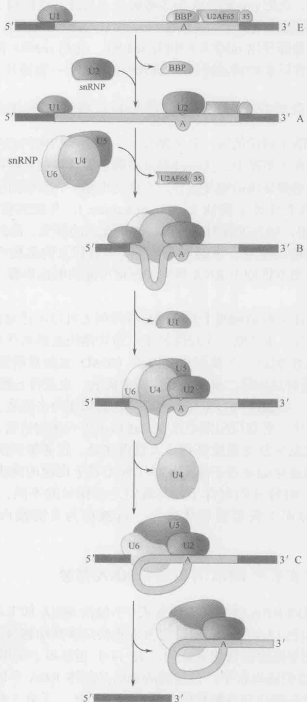  
图 14-7 剪接体介导的剪接反应步骤。图中显示了剪接体的组装和作用，每一步的详细过程在正文中有叙述。在每一步骤中都有剪接体组分加入或离开。这种结构重排引起的变化是剪接反应进行所需要的。注意每个复合体的名字在右边显示。有证据表明，有些组分并非如图中所示的那一刻进入或离开，比方说它们可能还在那里但结合程度松散，而不是彻底离开。同样，也不能断定某些变化过程的顺序，尤其是涉及 U6 配对变化的两步：它先在 5' 剪接位点取代 U1，还是先取代 U4 与 U2 结合？尽管有以上这些不确定的方面，图上还是展示了剪接反应的不同阶段不同关键组分的参与及剪接体的一般动力学特性。

活性位点出现后，就把 pre-mRNA 的 5'剪接位点与分支点拉到了一起，加速了第一次转酯反应。5'和 3'剪接位点的第二次转酯反应由 U5 snRNP 协助，把两个外显子连接在一起。最后的步骤是释放出 mRNA 产物及 snRNP。起初 snRNP 仍然与内含子形成的套索结合在一起，随着后者的快速降解，snRNP 又进入下一轮循环。

剪接体的组装是动态的和多样的,而它的解离过程确保剪接在细胞中是单向的

有必要强调我们刚才讨论的这一分子路径——组装剪切体的各步骤的顺序，这是一个理想化的版本。在真实情况中，这一过程并不像上面描述的那样严格。首先，我们展示的围绕内含子切除的剪接体的组装过程，在真实细胞中，那些因子更有可能围绕外显子开始组装，这被称为外显子确认（exon definition），考虑到剪接增强子（splicing enhancer）参与的作用，学界近期对这一过程有更深入的研究。除此之外，分子事件的精确顺序会有一定程度的变动。举例来说，5'和3'剪切点的聚集可能早于也可能晚于snRNP三体的招募：细节依赖于RNA序列和任何可能的限速步骤。同时，剪切体组装的几个步骤是可逆的。

在上文中我们阐述了剪切的两个核心的反应原则上可以可逆地进行，但在一个具体的细胞中不会同时发生。由于第二个反应发生后剪切体快速解离开来，分子组装的过程的方向是固定的。去组装由一个我们提到过的 DEAD 盒解旋酶蛋白推动，它被称为 Prp22。这个蛋白质是剪切的第二步催化反应所需要的，也是将 mRNA 从剪切体剥离所需要的。造成后面这一功能缺失的突变也可以抑制剪切体的去组装，这种情况下可以观察到在纯化的剪接体中，剪切反应既可以正向进行也可以逆向进行。

剪切体和剪切机制的复杂程度高到让人觉得诧异。这是如何演化形成的？将外显子直接通过一步反应连接起来是不是更简单（而不是上面说的两步反应）？考虑到这个问题，我们转向一组特殊的内含子，与我们之前探讨的不同，它们可以将自己从pre-mRNA上剪切掉而不需要剪切体参与，这被称为自剪接内含子（self-splicing intron）。

#### [W] 自剪接内含子的存在表明 RNA 可以催化 RNA 剪接

细胞内已经发现的 RNA 剪接有三种方式（不包括 tRNA 加工过程，对此我们将在第 15 章中讨论），如表 14-1 所示。到目前为止我们只涉及细胞核内 pre-mRNA 剪接，它们在所有真核细胞都是由剪接体完成的。表 14-1 还显示了所谓的 I 类（group I）和 II 类（group II）自剪接内含子。自剪接的意思是前体 RNA 中的内含子自身折叠成一种特殊的构象，然后催化自身释放的化学过程（回忆一下第 5 章讨论的核酶的一般特性）。自剪接的实用定义是，在没有任何蛋白质或其他 RNA 分子存在的情况下，内含子可以在试管内将自身从 RNA 分子中剪接除去。自剪接内含子根据结构和作用机制分为两类。严格来说，自剪接内含子并不是酶（催化剂），因为它们只介导一轮 RNA 加工过程（框 14-2）。

表 14-1 RNA 剪接的 3 种类型

<table><tr><td>类型</td><td>丰度</td><td>机制</td><td>催化机器</td></tr><tr><td>细胞核 pre-mRNA</td><td>很常见,适用于大多数真核基因</td><td>两步转酯反应,分支点为 A</td><td>主要和次要剪接体</td></tr><tr><td>II类剪接内含子</td><td>罕见,来自某些细胞器的真核基因及原核基因</td><td>与 pre-mRNA 相同</td><td>内含子编码的核酶</td></tr><tr><td>I类剪接内含子</td><td>罕见,某些真核生物的细胞核 rRNA、细胞器基因,以及少量原核基因</td><td>两步转酯反应,分支点为 G</td><td>与II类自剪接内含子相同</td></tr></table>

对于Ⅱ类自剪接内含子，剪接的化学过程以及所产生的RNA中间产物，与细胞核内pre-mRNA相同。如图14-8所示，内含子通过分支点的腺苷酸攻击5'剪接位点（内含子5'端与其5'端外显子交界处）的磷酸二酯键。该反应得到如以前所示的带分支的套索结构，并在随后的第二步转酯反应中，新游离出来的外显子3'羟基攻击3'剪接位点，释放出套索状的内含子，并把5'和3'外显子连接起来。

#### [W] Ⅰ类自剪接内含子释放出线形内含子，而不是一个套索结构

I 类自剪接内含子剪接机制完全不同（图 14-8c）。它们使用游离的鸟苷或鸟苷酸，而不是分支点腺苷酸。RNA 分子结合该鸟苷或鸟苷酸，并将其 3'羟基呈递给 5'剪接位点，以前面提到的形成套索结构的同类转酯反应，把游离的鸟苷或鸟苷酸与内含子 5'端连接起来。第二步反应与以前讲述的完全相同：游离的外显子 3'端攻击 3'剪接位点。这个反应把两个外显子连接起来并释放出内含子，尽管在这里内含子是线形的而不再是套索状。

#### [W] 框 14-2 | 类自剪接内含子转化为核酶

一旦Ⅰ类自剪接内含子剪接下来，其活性部位仍然是完整的。那么是什么阻止了剪接反应逆向进行呢？一个因素是细胞内高浓度的鸟苷——这非常有利于正向反应。然而除此以外，内含子本身还通过进一步的反应有效地防止其参加逆反应。很凑巧，内含子的3'端正好是鸟苷酸，可以进入鸟苷结合口袋。同时，内含子5'端也可以结合内在指导序列。这样就会发生第三次转酯反应，使内含子环化。与3'端鸟苷酸形成的化学键是不稳定的，会自发进行水解。结果内含子重新线性化，但已被截短，从而排除了逆剪接的可能性。

如前文所述，Ⅰ类（及Ⅱ类）自剪接内含子并不是严格意义上的酶，因为其转化数只有1。但是它们很容易通过以下方式转化为核酶（框14-2图1）：上述重新线性化的内含子保留了活性部位。如果提供了游离的鸟苷或鸟苷酸，又有合适的底物正好包含与内在指导序列互补的序列，它将反复催化底物分子的切割。类似于通过将活性部位与底物分开把自剪接的斧头RNA改造成核酶（第5章），我们也可以把Ⅰ类自剪接内含子变成核酶。我们可以进一步通过改变内在指导序列来获得特定的核酶，切割我们希望的目的RNA分子。

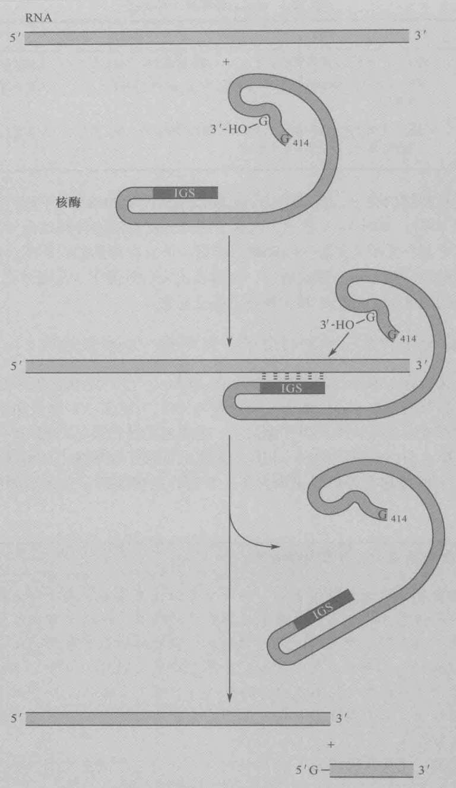  
框 14-2 图 1 | 类自剪接内含子可以转变成真正的核酶。

Ⅰ类自剪接内含子比Ⅱ类小，有一个保守的二级结构（RNA折叠见第5章）。该结构包括一个容纳鸟苷或鸟苷酸的结合口袋，只要这些鸟苷或鸟苷酸是以核糖的形式出现。除此之外，Ⅰ类自剪接内含子还含有一段“内在指导序列”，与5'剪接位点的序列配对，因而确定了鸟苷亲核攻击的精确位置（框14-2）。

  
图 14-8 | 类和Ⅱ类自剪接内含子。本图比较了Ⅰ类和Ⅱ类自剪接内含子完成的剪接反应与前述的剪接体介导的剪接反应。Ⅱ类自剪接的化学过程与剪接体介导的剪接反应过程基本相同，由内含子内高度活跃的腺苷酸启动剪接过程，并形成套索状产物。对于Ⅰ类自剪接内含子，其RNA通过折叠形成一个鸟苷结合口袋，从而结合一个游离的鸟苷用以启动剪接过程。虽然这类内含子在体外无需蛋白质协助就能够进行自身剪接，但在体内环境下，它们通常需要蛋白质组分来激活剪接反应。（获得许可并重新绘图自Cech T.R. 1986. Cell 44: 207–210, Fig. 1. ©Elsevier.）

典型的自剪接内含子长 400\~1000nt，与通过剪接体去除的内含子相反，其大部分序列对于剪接反应至关重要，因为自剪接内含子必须折叠成精确的立体结构才能完成相应的化学反应。另外在体内环境下，自剪接内含子与多种蛋白质形成复合物以协助保持正确的立体结构——部分是通过遮蔽 RNA 分子骨架实现的。折叠本身需要 RNA 骨架的某些部分与其他部分极接近，而相应骨架区磷酸根携带的净负电荷如果不进行遮蔽，势必相互排斥。在体外，提高盐浓度（即增加阳离子浓度）补偿了蛋白质的缺乏。这就是为什么剪接反应本身不需要蛋白质的原因。

自剪接及剪接体介导的剪接反应具有类似的化学过程反映了它们之间的演化关系。原始的类似Ⅱ类自剪接内含子有可能是现代 pre-mRNA 剪接的演化起始点。RNA 的催化功能保留下来了，但是不再需要内含子本身具有广泛的序列特异性，而由 snRNA 及其结合的反式蛋白质提供绝大多数功能。这样内含子只要保留最少的序列以保证剪接过程发生在正确的位置，从而允许数量更多，并且大小和序列也各不相同的内含子存在。

进行第一次转酯反应的催化部位，其结构在Ⅱ类自剪接内含子和 pre-mRNA / snRNP 复合体中高度相似（图 14-9）。这种现象进一步支持了下述更广义的假设（第 17 章）：在现代生物的演化早期，许多细胞内的催化功能是由 RNA 来执行的，后来才基本上被蛋白质所取代。但是对于剪接体和核糖体而言，这种活性还没有完全被蛋白质所取代。相反，残余的 RNA 催化机制仍然保留在剪接复合体的核心部分。

  
图 14-9 Ⅱ类自剪接内含子及 pre-mRNA 剪接过程中 RNA 催化区域的折叠方式。本图没有描绘Ⅱ类自剪接内含子 RNA 的虚线区取代另外 4 个折叠域。通过 X 射线晶体学研究证明了这些区域令人惊讶的相似性。

#### [W] 剪接体怎样可靠地确定剪接位点？

我们已经知道了一种防止错误剪接的机制：在剪接体组装过程中，只有当 RNA 序列能够被多个组分同时识别，才能在该部位形成剪接活性位点。例如，5'剪接位点必须首先被 U1 snRNP 识别，然后再被 U6 snRNP 识别。两者同时出错的可能性很小，所以选择还是很严格的。虽然如此，pre-mRNA 剪接位点出错的问题仍然非常严重。

考虑以下情况：人类的基因平均有 8\~9 个外显子，可能存在 3 种不同的剪接方式。但是人类有一个基因拥有 363 个外显子，而果蝇的某个基因有 38000 种不同的剪接方式（下节将详述）。如果不借助其他外力，各种 snRNP 要从整条 RNA 分子上找到正确的 5' 和 3' 剪接位点，并将它们正确配对并结合到一起，那么，发生一些错误就在所难免。需要指出的是，外显子长度一般只有 150nt 左右，而内含子长度平均可达 3000nt（前面提到，有的内含子可长达 800 000nt）。因此必须从内含子的汪洋大海中捕捞外显子。

剪接位点的识别容易犯两种错误（图 14-10）：一是遗漏了剪接位点，例如，结合到某个 5'剪接位点的剪接体成分，跳过了正确的 3'剪接位点，与结合到下游另一个 3'剪接位点的剪接体成分相互作用。

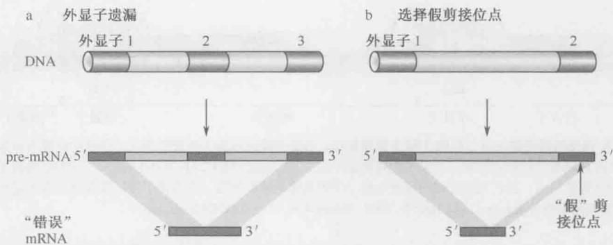  
图 14-10 剪接位点选择错误可能导致的后果。（a）遗漏一个外显子的后果。这种情况发生于：结合到某个 5' 剪接位点的剪接体成分，跳过正确的 3' 剪接位点，与结合到下游另一个 3' 位点的剪接体成分相互作用。（b）图示剪接体成分识别“假”的剪接位点（序列相似但不是合法的剪接位点）可能导致的后果。在所显示的例子中，假位点位于外显子内部，使得该外显子的近 5' 端被错误地当成内含子而剪接掉了。

二是与剪接位点邻近的错误位点被认为是剪接位点。这一点很容易理解，因为我们记得剪接位点的保守序列是相当宽松的。这样，某个5'剪接位点的剪接体成分就可能与结合在“假”3'剪接位点上的剪接体成分错误配对（图14-10b）。

能够增加剪接位点选择准确性的两种机制如下。其一，如第13章所述，在将某个基因转录为RNA时，RNA复制酶Ⅱ携带了多种具有RNA加工功能的蛋白质(图13-19)，其中包括参与剪接的蛋白质。当在新合成的RNA分子上遇到5'剪接位点时，那些蛋白质就从RNA复制酶Ⅱ的C端“尾巴”（剪接相关蛋白质搭乘在RNA复制酶Ⅱ的位置）转移到RNA分子上。剪接体成分一旦结合了5'剪接位点，就会做好准备与那些结合即将转录出来的、下一个3'剪接位点的剪接体成分相互作用。于是在更下游的任何竞争性3'剪接位点被转录出来之前，剪接体成分就已经识别出了正确的3'剪接位点。这种与转录同时进行的剪接体组装方式极大地减少了外显子遗漏的可能性。

(值得注意的是，虽然多数剪接体是在基因转录的同时完成组装的——具体到每个外显子则是按其被转录的顺序，但这并不意味着内含子本身也是按相同顺序剪接。与我们熟悉的许多生物过程，如转录、复制等相反，剪接并不涉及“轨道”机制。“轨道”机制指某种复合体在 RNA 的一端组装，并在它向另一端移动过程中发挥作用。)

其二，确保优先识别邻近外显子的剪接位点（因而更有可能是真正的剪接位点），以防止使用错误剪接位点。一种富含丝氨酸和精氨酸的蛋白质（即SR蛋白）结合外显子的剪接增强子（exonic splicing enhancer，ESE）。结合到这些位点的SR蛋白与剪接机器的组分相作用，将其引导到附近的剪接位点。这样剪接体就可以更有效地结合到正确的剪接位点，而不会结合到离外显子较远的错误位点。具体来说，SR蛋白将U2AF蛋白引导到3'剪接位点并将U1 snRNP引导到5'剪接位点（图14-11）。如前所述，这些因子界定了剪接位点，使其他剪接体成分能正确地装配起来（图14-7）。这种引导作用可通过 SR 蛋白和剪接体蛋白间的直接相互作用来实现。另外一种方式是最近提出来的即通过与剪接体组装和工作时形成的 RNA：RNA 杂合体发生相互作用及对后者的稳定来实现。

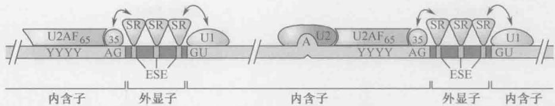  
图 14-11 SR 蛋白将剪接体成分引导到 5' 和 3' 剪接位点。合法剪接位点由于邻近外显子，所以优先被剪接体所识别。所以 SR 蛋白结合到外显子的特定区域（外显子剪接增强子），以此为起点将 U2AF 和 U1 snRNP 分别引导到下游的 5' 剪接位点和上游的 3' 剪接位点。这样就在正确的位置上启动了剪接体的装配过程，也保证了剪接能按照前面所叙述的方式进行（获得许可并重新绘图自 Maniatis T. and Tasic B. 2002. Nature 418: 236–243. ©Macmillan.）

SR 蛋白是剪接所必需的。它们不仅保证了基本剪接的准确性和高效性（上面刚刚提到），而且调节可变剪接（马上就会讨论到）。它们种类繁多，有些由生理信号调控，另外一些则不受生理调控而具有活性（组成型）。有一些只在某些特定的细胞类型中表达，调节细胞类型特异性剪接。

#### [W] 剪接替换

在转向讨论可变剪切之前，我们在这里简单描述两种剪切体和剪切反应。在第一种

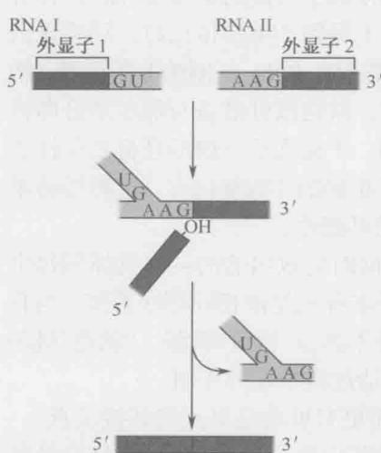  
图 14-12 反式剪接。原本位于两个不同的 RNA 分子上的两个外显子，通过反式剪接可以连接进同一条 mRNA 中。反式剪接的化学过程与前述的标准剪接方式无异，剪接产物也完全一样。只是标准剪接中另一个产物是套索结构，而反式剪接中则是 Y 形分支结构。因为标准剪接是在一条 RNA 分子内形成环状结构，而反式剪接是把两条 RNA 分子连到一起。

情况中，我们将讨论两个不在同一条 mRNA 上的外显子如何融合地剪切到一起；第二种情况中，我们将讨论一种特殊的剪切机器，它可以同时去除一组内含子。

#### [W] 不同 RNA 分子的外显子可通过反式剪接融合

在上面对剪切的描述中，我们推定一个外显子的5'剪切位点和紧挨着的一个外显子的3'剪切位点作用。真实情况并不总是这样。在可变剪切（alternative splicing）中，某个外显子可能被细胞有选择地忽略掉，这就使两个不相邻外显子剪切到一起（我们后面会详细讨论）。有时甚至两个不同RNA分子能够通过剪切反应连在一起，这被称为反式剪切。虽然在大多数生物中发生的概率很低，反式剪切却经常出现在锥虫（Trypanosome）的mRNA上。在秀丽新小杆线虫（Caenorhabditis elegans）上，所有的mRNA都要经过反式剪切（以与5'前导序列结合），而其中一部分还要经过顺式剪切途径。

图 14-12 展示了基础的剪切反应是如何形成反式剪切的。除了 U1 因子，反式剪切使用了与顺式剪切一样的剪接体（至少在线虫中是这样）。我们现在看看剪接使用的剪接体有多大的差异。

#### [W] 少数内含子是由涉及另一组 snRNP 的剪接体来剪接的

高等真核生物（包括哺乳动物、植物等）采用我们前面所提到的主要剪接体来完成绝大部分 pre-mRNA 的剪接。但是在这些生物体内（与酵母不同），有些 pre-mRNA 是由另一种丰度较低的剪接体来剪接的。这种低丰度剪接体含有某些与前述的主要剪接体一样的组分，但还有另外一些单独的成分。低丰度剪接体中的 U11 和 U12 成分在剪接

反应中的作用与主要剪接体中的 U1 和 U2 类似，但识别的序列不同。U4 snRNA 和 U6 snRNP 在两类剪接体中都存在，虽然所使用的名称相同但实质上并不完全一样。而 U5 在主要剪接体和低丰度的、所谓次要剪接体中是完全一样的。

次要剪接体识别一类很少见的内含子，其共有序列不同于绝大多数 pre-mRNA 内含子的共有序列。需要强调的是，虽然这些内含子是罕见的，但是它们在基因组上的分布是广泛的——人类大约 800 个基因包含至少一个“少数内含子”。进一步的，最近发现低丰度 snRNP 在多种人类罕见疾病中发挥重要的作用。

这种次要剪接体又称为 AT-AC 剪接体, 因为最初发现其识别的罕见内含子的 5' 端是 AU, 3' 端是 AC (对应于 DNA 则为 AT 和 AC)。后来得知其剪接的多数内含子也具有 GT-AG 末端结构 (与主流内含子一样), 但在其他场合, 内含子的共有序列不同于主要剪接途径内含子的共有序列。

虽然识别的剪接位点和分支点序列不同,但是两种剪接体除去内含子的化学过程还是完全一样的(图 14-13)。与这种保守的化学过程相一致,snRNP 所识别的剪接位点序列差异对应 snRNA 互补序列的相应差异。所以,实际上保守的是剪接位点序列与 snRNA 碱基配对能力,并非任何一方的特定序列。

  
图 14-13 AT-AC 型（次要）剪接体催化的剪接反应。这种次要剪接体作用于少数外显子（例如，在人类可能仅为 1/1000 的剪切位点），而这类外显子有特殊的剪接位点序列。尽管如此，剪切反应的化学过程是一样的，剪接体成分也有相同的，其余不同的成分也是密切相关的。

值得注意的是，AT-AC 内含子可能符合前面讨论的演化图。如前所述，有人主张Ⅱ类内含子代表了内含子的最原始形式。进而，AT-AC 内含子从Ⅱ类内含子演化，并最终产生主流的 pre-mRNA 内含子。

#### [W] 可变剪接

#### [W] 通过可变剪接，一个基因可以得到多个产物

如本章前言所述，许多高等真核生物编码的 RNA 可以通过可变剪接产生两条或多条不同的 mRNA，从而翻译出不同的蛋白质产物[或 RNA 变异体（isoform）]。研究显示，40% 的果蝇基因和高达 90% 的人类基因需要经过可变剪接。其中很多基因仅产生两个剪接变异体，但在某些例子中，从单个基因所能得到的剪接变异体的可能数目非常惊人——可达到几百（如人的 Slo 基因）甚至几千个（如果蝇的 Dscam 基因）。可变剪接有时具有表达的多样性，多个剪接体可能会随机产生。但是在更多的情况下，可变剪接的过程是受到严格调控的，针对在不同的条件下或者不同的细胞类型中生成特定蛋白产物。

一个简单的例子是哺乳动物肌肉蛋白 troponin T（肌钙蛋白 T）。图 14-14 显示该基因转录得到的一段 pre-mRNA，含有 5 个外显子。该 pre-mRNA 可以剪接成为两种不同的成熟 mRNA，各有 4 个外显子。除去各自各携带一个独特的外显子，两种 mRNA 有 3 个共同的外显子。

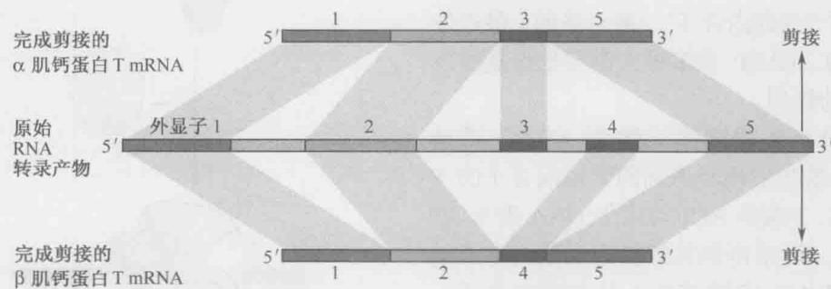  
图 14-14 肌钙蛋白 T 基因的可变剪接。本图显示该基因含有 5 个外显子，可以剪接成为图示的两种不同形式，一种含有 1、2、4、5 外显子，另一种含有 1、2、3、5 外显子。

但如图 14-15 所示，可变剪接可由多种方式发生。除了选择不同的外显子，外显子还可以延长（通过选择不同的下游 5' 或上游 3' 的剪接位点）。在其他一些情况中，外显子可以被（有意）遗漏，或内含子保留在成熟的 mRNA 中。还有一些可变剪接是基因通过不同的启动子转录所致，结果一种转录产物中包含一个 5' 端外显子，而另一种产物中不含此外显子。同样，可变的多聚腺苷酸（poly-A）位点可以使 3' 端外显子被延伸，或者可变 3' 端外显子被某个特定基因的一些转录产物所利用。甚至还有可变反式剪接的例子（图 14-12）。

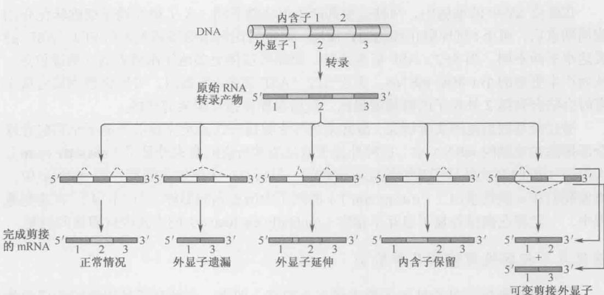  
图 14-15 RNA 剪接的 5 种模式。上方表示一个有 3 个外显子的基因。中间是其转录得到的 pre-mRNA，然后通过 5 种不同的途径剪接。如果包括所有外显子，会得到含有 3 个外显子的 mRNA。如果遗漏第 2 外显子就会得到只有第 1 和第 3 外显子的 mRNA。如果第 1 外显子延伸，就会得到包括第 1 内含子的部分序列以及 3 个外显子的 mRNA。如果保留第 1 内含子，会得到包含第 1 内含子全部序列的 mRNA。而第 2 和 3 外显子用来进行可变剪接，就会产生两种 mRNA，分别包含第 1、2 外显子或 1、3 外显子。

另一个延伸外显子剪接的例子是猴SV40病毒的T抗原（图14-16）。T抗原基因编码两个蛋白质：大T抗原（T-ag）和小t抗原（t-ag）。这两个蛋白质来自于同一基因的pre-mRNA的不同可变剪接。如图14-16所示，T抗原基因有2个外显子，由于使用了不同的5'剪接位点就产生了不同的成熟mRNA。在编码大T抗原的mRNA中，外显子1直接与外显子2连接，除去了其间的内含子。反之，小t抗原的mRNA是通过使用其他的5'剪接位点而形成的。于是，它的mRNA还含有部分内含子序列（此即图14-15所示的外显子延伸的例子）。这个大的mRNA反而编码小蛋白质的原因是在该mRNA所保留的部分内含子序列中有一个终止密码子。

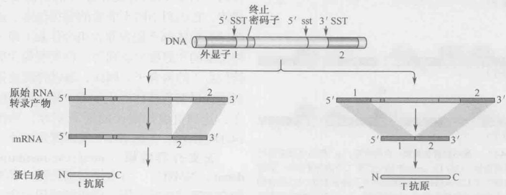  
图 14-16 SV40T 抗原的可变剪接。本图显示 SV40 病毒 T 抗原 RNA 剪接过程。感染 SV40 的细胞中两种剪接方式都存在，两种抗原都产生。小 t 抗原由大的 mRNA 编码，该 mRNA 在第 2 外显子上游有一个符合可读框的终止密码子。5'SST 指产生大 T 抗原 mRNA 的 5'剪接位点；5'sst 指产生小 t 抗原 mRNA 的 5'剪接位点，3'SST 指共用的 3'剪接位点。

在感染 SV40 的细胞中，两种抗原都产生但功能不同。大 T 抗原诱导细胞转化和细胞周期重启，而小 t 抗原阻止细胞凋亡反应。两者的比例因剪接相关蛋白 SF2 / ASF 的表达水平而不同。当 SF2 / ASF 高表达时，驱使剪接体更多地使用最近的 5' 剪接位点，从而产生更多的小 t 抗原 mRNA。由于 SF2 / ASF 属于 SR 蛋白，可以设想当其含量丰富时会结合到第 2 外显子的剪接增强区，然后在那里指导组装剪接体。

通过全基因组范围实验研究，最常见的可变剪接形式就是完整的外显子全部包含或全部排除在成熟的 mRNA 中。这种外显子就是通常所说的盒式外显子（cassette exon）。人类约 10% 的盒式外显子基因是成对出现的，但只有一个保留在剪接过的 mRNA 中，就像我们在 α 肌钙蛋白 T（α-troponin T）的例子中所提到的那样（图 14-14）。在这些基因中，一定存在确保外显子以互不相容（mutually exclusive）的方式进行剪接的机制。

#### [W] 确保互不相容性剪接的几种机制

几种机制确保了可变外显子的选择互不相容，即当一个外显子被选择留在成熟的mRNA上，则另一个就不被选择（如同α肌钙蛋白T的例子一样，当外显子3被选择留下，则外显子4总是被剪切掉，反之亦然）。接下来我们讨论这几种机制，然后在下一节中讨论一个特例，它需要一种特殊的机制。

空间位阻 考察一个内含子隔开的两个可变外显子。如果内含子内的剪接位点太靠近，剪接因子就不能同时结合两个位点。因此，如图14-17的例子所示，U1 snRNP结合到两个可变外显子（外显子2和3）间的内含子的5'剪接位点，阻止了U2 snRNP结合到同一内含子的分支点（图14-17b）；或者，U2 snRNP结合到分支点阻止了U1 snRNP结合到5'剪接位点（图14-17c）。α肌钙蛋白的外显子3和4就是通过这种机制达到互不相容的。

这种重排可以起因于一个内含子内剪接位点的相对位置，或者由于内含子就是太小不能发挥作用。在果蝇中，任何小于59个核苷酸的外显子均属于这一类。

  
图 14-17 互不相容性剪接：空间位阻。(a) 图示可变剪接的多种可能性。(b) U1 snRNP 结合到第二个内含子的 5' 剪接位点阻止了 U2 snRNP 结合到该内含子的分支点；U2 结合到第三个内含子导致外显子 3 被剪切掉。(c) U2 snRNP 结合到第二个内含子的分支点阻止了 U1 结合到该内含子的 5' 剪接位点。此时，U1 结合到第一个内含子的 5' 剪接位点导致外显子 2 被剪切掉。

主要剪接位点和次要剪接位点的联合 如前所述，除了主要剪接体外，还存在另一种形式的剪接体即所谓的次要剪接体，它识别不同于前者的剪接位点。这两种剪接体都不能去除含组合位点（即一种类型的5'剪接位点和另一种类型的3'剪接位点）的内含子。因此，通过合理地排列这些可变剪接体所识别的5'和3'剪接位点，达到可变外显子的互不相容，如图14-18a所示。人的JNK1基因就是如此。

无义介导降解（nonsense-mediated decay，NMD）与迫使剪接机器以互不相容的形式剪接不同，此机制确保只含一个或另外一个外显子（两个内含子不会同时出现或同时不出现）的 mRNA 能存活。

换句话说，尽管不能保证互不相容性剪接，但这种机制的结果和互不相容性剪接一样。无义介导降解基于的事实是，同时包含两个外显子产生的 mRNA 含有提前的终止密码子（图 14-18b）。这种 mRNA 会被 NMD 破坏，细节在第 15 章中讲述（图 15-50）。

#### [W] 关于果蝇的 Dscam 基因的特例: 大范围的互不相容性剪接

果蝇的 Dscam（唐氏综合征细胞黏附分子，Down syndrome cell adhesion molecule）基因能够编码 38,016 种不同的蛋白质。如图 14-19 所示，来自 Dscam 基因的每一种可能的 mRNA 都含有 24 个外显子，其中 20 个是相同的，另外 4 个外显子（外显子 4, 6, 9 和 17）在 pre-mRNA 上是以多种可变形式存在的。因此，外显子 4 有 12 种可变版本，外显子 6 有 48 种，外显

  
图 14-18 互不相容性剪接。(a). 主要和次要剪接体识别的剪接位点。(b). 无义介导降解。

子 9 有 33 种，外显子 17 有 2 种。这些外显子可能的排列（ $12 \times 48 \times 33 \times 2$ ）产生大量可能形式的成熟 mRNA。

Dscam 基因编码的蛋白是细胞表面蛋白，属于免疫球蛋白（immunoglobulin，Ig）超家族成员。图 14-19 下部显示的是该蛋白质的一般结构。此蛋白分子含有一个跨膜区域（由外显子 17 编码，因此有两种可变形式）；各种亚型中都相同的纤维连接蛋白结构域；以及 Ig 结构域，其中三个 Ig 结构域的部分片段是由高度可变的外显子 4、6 和 9 所编码的。因此，不同亚型的可变性主要来自于 Ig 的这些结构域。

在果蝇中，Dscam蛋白执行两种完全不同的功能：既可以在大脑的神经网络模式中起作用，也可以作为天然免疫系统的一部分识别抗原。在执行神经功能时，Dscam蛋白介导特异的细胞与细胞间相互作用。任何特定亚型的蛋白质只能和同亚型相互作用，而不能和其他亚型相互作用。人们认为这种选择性确保一个特定的轴突能够区分其他轴突，从而决定是否表达与其相同或者不同的亚型。

这一选择性被认为可以使给定的神经突触获得区分自身和别的神经突触的能力，它们可以区分出哪个细胞是“自我”，哪个不是“自我”，也就是说是否来自于同样的神经元。在大脑发育神经网络形成的过程中，神经突触展示了“自我避免”（self-avoidance）的行为：从同一个神经元发出的突触彼此避免接触。体内实验显示，对DSCAM亚型在神经元表面的编码产物的亲同种抗原识别（homophilic recognition）机制可以实现自身细胞的识别。

在免疫系统中，就像脊椎动物体内的抗体一样，不同亚型识别不同的抗原。人们认为演化压力驱动的多样性来源于这种功能的选择。

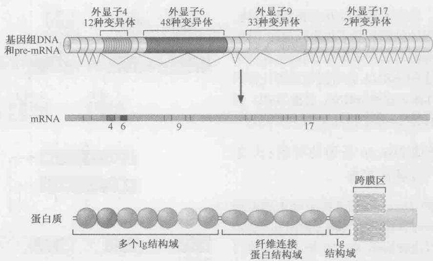  
图 14-19 果蝇 Dscam 基因的多重外显子。Dscam 基因（图的上部）长 61.2kb，经转录和剪接，产生一种或多种长度为 7.8kb，由 24 个外显子组成的 mRNA（图中显示这些 mRNA 的一般结构）。外显子 4、6、9 和 17 存在多种互不相容的选择方式。因此，每一个 mRNA 都包含一个外显子 4（12 种选择，用红色表示），一个外显子 6（48 种选择，用紫色表示），一个外显子 9（33 种选择，用绿色表示），以及一个外显子 17（2 种选择，用黄色表示）。外显子 4、6、9 编码三个 Ig 结构域的一部分，用相应颜色表示；外显子 17 编码跨膜结构域。如果用到这些外显子的所有可能组合，Dscam 基因能产生 38016 种不同的 mRNA 和蛋白。（获得许可并重新绘图自 Schmucker D. 2000. Cell 101：671，Fig. 8. ©Elsevier.）

#### [W] Dscam 外显子 6 的互不相容性剪接不符合任何一种标准机制，只能用一种新的策略来解释

如我们前面所看到的，外显子6是Dscam基因中4个可变剪接外显子中的1个，在这个例子中，外显子6有48种可供选择的版本。这种选择规模用前几种选择性剪接机制无法解释。例如，尽管空间位阻可以解释毗邻外显子不被剪接，但不能解释其他相距更远的外显子同样不被剪接。此外，在Dscam基因上所有的剪接位点都是主要剪接体位点，所以双剪接体机制不能解释。NMD同样无法解释外显子6的互不相容剪接：即使由于包括0个、2个或3个外显子而导致移码，一个含有4个外显子的mRNA与只有1个外显子的mRNA具有相同的读码框。含7个外显子的mRNA也是如此，依此类推。

那么细胞怎么保证在 mRNA 中只有一个外显子 6 的变异体呢？新机制依赖 pre-mRNA 中可变的 RNA：RNA 碱基对结构。每种可变结构确保仅有一个外显子 6 的变异体在任何时候都得到保护，不受普遍存在的剪接抑制所抑制。我们现在考察这种机制是怎么工作的，以及这种机制是如何通过果蝇 Dscam 基因和其他昆虫物种中相应基因的序列分析而发现的？

图 14-20 显示的是这种机制的基本模型。该模型有两类保守序列元件。第一个元件停泊位点（docking site）位于外显子 5 和第一个外显子 6 变异体（外显子 6.1）之间。在每个外显子 6 变异体前面都有一个拷贝的第二种元件——选择子序列（selector sequence，图 13-20 中以外显子 6.21 为例）。每一个选择子序列都是不同的，但如图 14-21 所示，它们都能与停泊位点配对。每个选择子序列结合停泊位点的区域有重叠，因此不同的选择子序列和停泊位点结合是互不相容的，即一次只有一个选择子能结合停泊位点。能结合到停泊位点的选择子序列使其相应的外显子6靠近外显子5，从而确保该外显子6的变异体被选择。

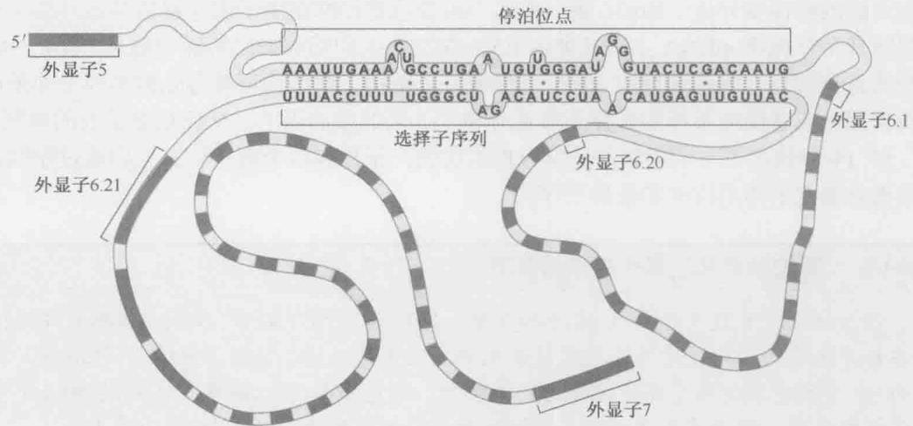  
图 14-20 停泊位点：选择子序列。外显子 6.21 前的选择子序列与停泊位点的碱基配对。（由 Brenton Graveley 惠赠）

  
图 14-21 6 个外显子 6 变异体的选择子序列，每个都与外显子 6 的停泊序列结合。每个选择子序列通过碱基配对与停泊序列的细微不同区域结合，但是这种与停泊位点的结合是互不相容的。（由 Brenton Graveley 惠赠）

除了使被选择的外显子6变异体靠近外显子5外，选择子序列和停泊位点的杂交结合也确保该外显子6变异体免于普遍抑制机制的作用，这种机制可以抑制外显子6产生其他可能的剪接变异体。Hrp36蛋白作为一种普遍剪接抑制因子通过覆盖其他外显子从而抑制其留在成熟mRNA上。这种由RNA杂交产生的局部抑制解除可能是RNA二级结构的直接结果；或者通过在RNA上形成一个结构，此结构可被移除抑制因子的蛋白质所识别；或者使被选择的外显子靠近外显子5内的激活因子，从而克服受到的抑制。

框 14-3 描述了一个生物信息学分析的实例，正是在这个例子中，人们通过序列比对发现并鉴定了停泊位点和选择子序列。

#### [W] 框 14-3 停泊位点和选择子序列的鉴定

停泊位点在黑腹果蝇中长66个核苷酸。在另外10种果蝇中，90%\~100%的停泊位点序列是保守的。即使比对包含其他非果蝇昆虫（如蚊子、家蚕、蜜蜂），停泊位点中间的24个核苷酸仍然是高度保守的！事实上，它是整个Dscam基因（超过60kb）中最保守的序列。停泊序列最初就是通过这种保守性鉴定出来的（框14-3图1）。

D. melanogaster
D. simulans
D. yakuba
D. erecta
D. ananassae
D. pseudoobscura
D. persimilis
D. mojavensis
D. virilis
D. grimshawi
A. gambiae
A. aegypti
B. mori
A. meliffera
T. castaneum

框 14-3 图 1 15 种昆虫的停泊位点核苷酸序列比对。包括：10 种果蝇；2 种蚊子，冈比亚疟蚊（Anopheles gambiae）和埃及伊蚊（Aedesaegypti）；鳞翅目的家蚕（Bomby xmori）；膜翅目的蜜蜂（Apismellifera）；鞘翅目的赤拟谷盗（Tribolium castaneum）。每个停泊位点上最常见的核苷酸用阴影显示，共有序列的示意图在下部显示。每个字母的高度代表该核苷酸在此位置上出现的频率。（-来源：Graveley B.R. 2005. Cell 123: 65–73, Fig. 2. ©Elsevier. 经许可重新绘制）

选择子序列也是通过序列比对发现的，虽然其保守性不如停泊位点高。选择子序列是外显子6变异体上游内含子中相对保守的序列。对比黑腹果蝇外显子6变异体48个选择子序列，揭示了与停泊序列互补的一个28个核苷酸的共有序列（框14-3图2）。当将每一个选择子序列与停泊位点比对时，发现每个选择子序列都可以与停泊位点配对，每个配对是唯一的，但相互重叠。实例见图14-21。

6.24 GTCATTGTCGAGAGCTCTT----TACATCCAATAC--TCAGGCAGT
6.47 GGCTTTTCCAGTACCCATTATCAGGTTAGTCCAACA--TCGGGCATATC---CAATTAGACAGAGG
6.22 CAGCTCAATCGTATCC----AATCCCAGCTT--TTAGG---TAAACACTTAAGATTTA
6.17 CAGCTGTCAGGACTT----G-TCCAGCAGC--TTAGGCAGTAAATCG
6.34 TTCAG---CCC----TTAGACCAACA--TCAGGC
6.10 GTGGGTTTCCC----TTTCCCAACATCATCAGACAGTTTT
6.4 GGTAACCC----A-ACCCAACAC--TTAGGC
6.6 GTCAGTCCCT----TCCCATG--TCAGGCA
6.38 GGCATTTCC----GGTGCCAGTTT--TTAGGTTATATACTAATTTTTTGGTT
6.33 G---CC----TTGAACCAACA--TCAGGCTTGGTTTCGATTTCCTTTTA
6.15 TGCCC----TCCACCAACAT--TCA
6.8 TCCT----AGGCCCAACAT--TCAAG
6.14 GTCGTTTCATTCT-ATCCCAGCAT--TCAGATAGTAGATTTT
6.35 TCCT----ATCCCATACTAT--TCCAATGTCCGCGATAGATT
6.9 TACTTTAAATTAAAATCCAACACATTCAGTCAGTGC----AATAAGGGA
6.1 TCA----AGTCCCAATCG--TT-GGCTATCTTCACTTCTTA
6.41 CTCAGGCGTTCCCCGTTGCCATCATT-AGGTAGTTTCAGCAAA---CAGGCTTCTAGGTT
6.3 CC----TATCCCAACTG--A-AGG---TGTC-CTTTCGA
6.31 TTGGGAATCAGTGTCAATAT--TCAGGCAGTTGTATGGAGTTGTTAGAGC
6.37 GGTAA---GCCCA---CATTCAGGCAGTT---AGTAA
6.29 GGTGATTCTGCTCAGN--CATTCAGGGAGTTTTA---AGTTATGGCT
6.32 TCTTTATGATTCCACAT--TCAGACAGTT
6.39 TGTTGATAAACCCAATT--TCAGTCAGTTTTCA
6.23 GAGTGCCCTGGTTGCCTTATTCATGTAGTTTT---CAT-----GGTCT
6.7 TATCCCTGACTTTCAC-ET-CGGCAGTTTACAAT----TGAGTTAGG
6.42 GCCTTGATCCCGTGTAATCAGGCAGTTTTCATAGAGATT
6.12 TGCTCAACTTCCAACATTGGGCAGATTTC
6.26 CCCCATCCATTTCCACTCAGGCAGTTTTC-ACTAGACTTCGGTT
6.2 ACCCAGACCA--AC-TTGCGCCAGTTTCCAAT----TGAGATTGCTCGC
6.16 CCCTGT--CCAACATTCAGGTATTTCTTAGCAT----GGC
6.19 CTCTGTCTT--CGTC-AGGCAGTTTCAAAGTTCCTTTAGCTGATAGGT
6.25 TGTCGAGTT--CCTT-GGGCAGTTTCAAT----CTCAG--CACGGGTT
6.20 CATTGCTGAGTACAGTCCAGGCAGGTTTTCATG-AGATTGGG
6.21 CATTGTTGAGTACAATCAGACGGGTTTCCATTTACATAGAATGTTTAGAAGC
6.5 TTTATGCCCAACT--TCAGGCAG--GTCTAGA
6.36 ACCCCGCACGCACATTTCAGTCAGTTTAT----TGTTTGCGTTTAGCT
6.13 AACACCAA--T--TCAGACTGTTTTTTTATTG
6.27 ATCCCAAGTTGGTTCAGGCAGA--C----TTCAAACTGA--CTT
6.28 ATCCCTACGCATTTAGGCAGTTTTCGGTTTACTTAG
6.44 ACCCAACACTATTCAACCAGTA--ATTAAAGCGAC
6.40 ACGGTG---T--TCA-ACTGGTTCTGTTAGGGTTCAAATAGA
6.43 TTTAGCATCAGGCAGTTTTC
6.30 CCAACATTCCGGGAGTTTCAAT
6.48 CCAACATTCCGGCAGCAAATAGCAT--TTCAAATAGGGATCTTA
6.45 GTTCAGGCAG----CTTAGAAGGC--T
6.18 TTCAGGCAGTTTT--CTTAAAAAAGA--TCTTCTTAAGCA
6.11 GGGCGGTATT CGAA----TTCAG--GAC
6.46 AGGTAGCCAATA-----AGTAGA---CTTA

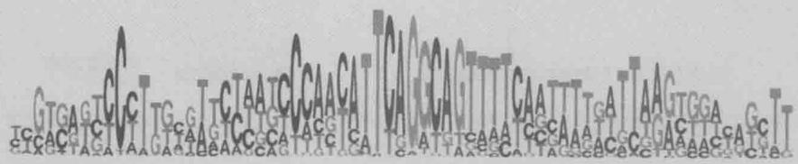  
框 14-3 图 2 黑腹果蝇选择子的共有序列。图上部显示的是 48 个选择子及其两侧序列的比对。中间部分出现频率最高的核苷酸用亮标显示。图下部显示的是利用比对产生的选择子序列的共有序列。（来源：Graveley B.R. 2005. Cell 123: 65–73, Fig. 4. ©Elsevier. 经许可重新绘制）

#### [W] 可变剪接受激活因子和抑制因子调控

剪接调控蛋白可以结合到称为外显子/内含子剪接增强子（ESE或ISE，exonic/intronicsplicing enhancer）或者外显子/内含子剪接减弱子（ESS或ISS，exonic/intronic splicing silencer，ISS）的特殊序列上。前者增强附近的剪接位点的剪接，后者正好相反。我们已经介绍过增强子及与其结合的SR蛋白（图14-11）。这些序列和蛋白质对将剪接体引导到各个外显子区域非常重要，即使没有可变剪接也如此。在刚刚提到的大T抗原可变剪接的例子中（图14-16），也是SR蛋白保证了可变剪接的进行。该蛋白质家族数量庞大种类多样，在调控可变剪接方面也有特殊作用，即在不同的条件下引导剪接体到不同的剪接位点发挥作用。所以在发育的某个阶段，或者在某种类型的细胞中，一种特定的 SR 蛋白的存在与否或者活性高低，就可以决定某一特定的剪接位点是否得到利用。图 14-22 是关于剪接调控的假设示例，激活因子结合到剪接增强子上，抑制因子结合到剪接减弱子上。

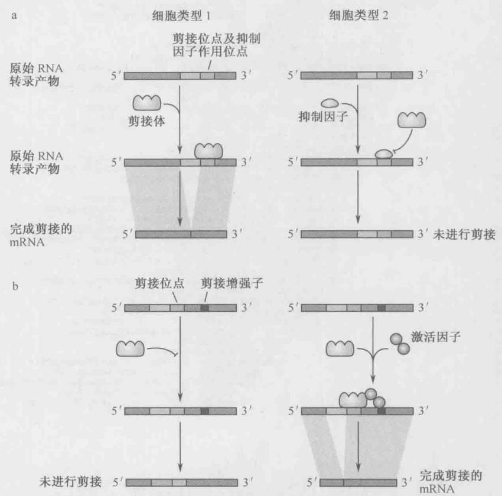  
图 14-22 可变剪接的调控。（a）某些可变剪接的外显子总是在成熟 mRNA 出现，除非受到某种抑制蛋白的阻止；（b）另外一些则相反，只有某种激活因子发挥作用，才能包含在成熟的 mRNA 中。上面两种方式都可以用来进行剪接调控，使得某一特定的外显子出现在一种类型细胞的成熟 mRNA 中，而不会出现在另一种类型细胞的成熟 mRNA 中。

SR 蛋白利用某个结构域结合 RNA，如我们在第 6 章讨论的 RNA 识别基序（RNA recognition motif，RRM，图 6-18）。每个 SR 蛋白都含有另一个结构域，富含精氨酸和丝氨酸，称为 RS 结构域（RS domain）。该结构域位于肽链的 C 端，介导 SR 蛋白与剪接体蛋白的相互作用，把剪接体募集到附近的剪接位点。

有一类激活因子能在特殊的组织中增强某种特定的剪接方式，如果蝇的 Half-pint 蛋白。这个激活因子调控果蝇卵巢中一组 pre-mRNA 的可变剪接。它通过结合到那些 pre-mRNA 特定外显子的 3'剪接位点附近并募集 U2AF 因子来进行调控。

多数减弱子由不均一核糖核蛋白（heterogeneous nuclear ribonucleo-protein，hnRNP）家族的成员识别。这些蛋白质能结合 RNA 但没有 RS 结构域，所以无法募集剪接体。相反，它们可以阻断特定的剪接位点，使之丧失作用。我们在前面的 Dscam 例子中看到过类似的功能，Hrp36抑制了外显子6的变异体留在mRNA中。另一个例子是hnRNPA1，它可以识别并结合位于HIV tat pre-mRNA一个外显子内的减弱子并抑制该外显子最终出现在成熟的mRNA中。通过结合到该位点上，抑制因子阻断了激活因子SC35（一种SR蛋白）对附近增强子的结合。这种阻断不是直接的（两个结合位点并不重叠），而是促进了其他的hnRNPA1协同结合到邻近的序列上，并整个覆盖了增强子位点。即便如此，由于SF2/ASF对增强子的亲和力比SC35要大，另一个SR蛋白（SF2/ASF）仍然能够克服这种抑制作用，取代已经结合的抑制因子。在后面第18、19章关于转录调控的例子中，我们还会看到类似的协同和竞争结合的情况。

哺乳动物的另一个剪接抑制因子是 hnRNPI 蛋白。有时 hnRNPI 直接结合到多聚嘧啶区阻断剪接体的结合，所以也叫多聚嘧啶区结合（Py tract binding, PTB）蛋白。有时它结合到某个外显子两个外侧的序列上，使该外显子不能进入成熟的 mRNA。但是，hnRNPI 减弱子并非通过直接结合到剪接位点或者剪接增强位点与剪接体组分竞争，而是通过与剪接体发生互作，抑制它发挥功能。例如，当 U1 结合到 5'剪接位点以后，hnRNPI 与 U1 某一区域结合，导致 U1 不能与促进外显子配对的蛋白互作，从而阻止外显子配对。（图 14-23b）。

  
图 14-23 两种沉默子的作用机制。(a) HIV tat 第三个外显子被 hnRNPA1 去除的机制。剪接反应的激活因子 SC35 结合在 ESE 上促进外显子的保留。A1 与外显子的 ESS 结合，从这里延伸直到被 ESE 封闭并跨过完整的 SC35 结合序列。(b) 通过 hnRNP1（PTB）蛋白去除外显子的机制。正如书中所述，PTB 结合到外显子内部，与 U1 的 5'剪接位点相互作用。这一作用抑制了 U1 与 3'剪接位点相互作用的能力，从而形成 U1 在成对外显子上游而 U2 在下游的局面。

#### [W] 可变剪接的调控决定了果蝇的性别

现在，我们来探讨一个可变剪接调控非常精细的例子——果蝇 double-sex（dsx）基因的剪接调控。一只特定果蝇的性别取决于其 mRNA 上两个可变剪接产物中哪一个被制造出来。

X 染色体和常染色体的比例决定果蝇的性别。X 染色体和常染色体的比例为 1（两条 X 染色体和两套常染色体）时果蝇为雌性，比例为 0.5 时为雄性。这个比例最初用 SisA 和 SisB 两个转录激活因子的转录调控水平来检测（第 18 章和第 19 章将详细讨论转录调控机制）。编码这两个转录激活因子的基因都在 X 染色体上，所以在早期胚胎发育中，准雌性果蝇产生的 SisA 和 SisB 转录激活因子的量是准雄性的两倍（图 14-24）。

这些转录激活因子结合到 Sex-lethal（Sxl）基因调控序列上游的位点。另一个结合并控制 Sxl 基因转录的调控因子叫做 Dpn(Deadpan)，该转录抑制因子是由常染色体（染色体 2）基因编码的。因此，转录激活因子和抑制因子在雌雄个体中的比例是不同的，这就造成了 Sxl 基因在雌性中被激活而在雄性中被抑制。

  
图 14-24 在雄性和雌性果蝇中 Sxl 基因的早期转录调控。Sis A 和 Sis B 基因位于 X 染色体上，编码控制 Sxl 基因表达的转录激活因子。Dpn 是 Sxl 基因的一个转录抑制因子，由染色体 2 上的一个基因编码。尽管雄性和雌性表达等量的常染色体编码的 Dpn，但是雌性产生 2 倍于雄性的转录激活因子（因为雌性有 2 条 X 染色体，而雄性仅有 1 条）。激活因子和抑制因子的比例不同保证了 Sxl 基因在雌性中表达，而在雄性中不表达。然后 Sxl 蛋白自调控 Sxl 基因的表达，如正文及下图中所述。（引自：Estes P.A. et al. 1995. Mol. Cell. Biol. 15: 904–917.）

Sxl 基因的表达是从两个转录启动子开始的: $P_{e}$ 和 $P_{m} \circ P_{e}$ (promoter for establishment) 受 SisA 和 SisB 调控，因此仅在雌性中表达。在发育后期，该启动子永久关闭。在雌性胚胎中，Sxl 的表达由 $P_{m}$ (promoter for maintenance) 来维持。

无论是雌性还是雄性， $P_{m}$ 起始的转录都是组成型的，但是由此产生的 RNA 比 $P_{e}$ 起始转录得到的 RNA 多一个外显子（图 14-23）。如果此外显子留在成熟的 mRNA 中，则无法产生有活性的蛋白质，在雄性中即如此。但是在雌性中，通过剪接除去此外显子则可以持续地产生具有功能的 Sxl 蛋白。

如图 14-25 所示，正是在雌性中而不是在雄性中存在的（早期从 $P_{e}$ 转录的）Sxl 蛋白介导由 $P_{m}$ 转录的 mRNA 剪接，确保有抑制活性的外显子被剪切掉。Sxl 蛋白作为一个剪接抑制因子执行上述功能。

因此，功能性的 Sxl 蛋白可以持续地在雌性中产生。Sxl 蛋白调控其他 RNA 及自身 RNA 的剪接，其中之一是在雌、雄中均组成型表达的 tra 基因 RNA（图 14-25）。同样，在没有 Sxl 蛋白介导的剪接时，这个 RNA 不产生蛋白（雄性），而当 Sxl 蛋白存在时，RNA 经剪接后可以产生有功能的 Tra 蛋白（雌性）。

Tra 同样也是剪接调控因子。Sxl 是剪接抑制因子而 Tra 是剪接激活因子(图 14-25)。Tra 调控的底物之一是编码 Dsx 的基因转录得到的 RNA。此 RNA 有两种可变剪接产物，两者都编码调控蛋白但活性不同。在 Tra 存在的情况下，dsx RNA 经过剪接后产生的 Dsx 蛋白抑制雄性特异性基因的表达。在不存在 Tra 的情况下，dsx RNA 经过剪接后产生的 Dsx 蛋白抑制雌性特异性基因的表达。

  
图 14-25 一连串的可变剪接决定了果蝇的性别。如正文中所详述，Sxl 蛋白在雌性中表达（图右半部分），不在雄性中表达（图左半部分）。Sxl 蛋白的表达靠其自身调节其 mRNA 的剪接来维持。在雄性中没有这种调控，不产生有功能的 Sxl 蛋白。在雌性中 Sxl 蛋白还控制 tra 基因的剪接，产生有功能的 Tra 蛋白（雄性中无）。Tra 蛋白本身也是一个剪接调控因子，作用于 dsx 基因 pre-mRNA。dsx mRNA 在 Tra 蛋白的调控下剪接产生的 Dsx 蛋白（雌性），其 C 端有 30 个氨基酸，与其在没有 Tra 蛋白（雄性）调控下产生的蛋白质不同。在雌性中产生的 Dsx 蛋白激活雌性发育所需基因，抑制雄性发育所需基因。在雄性中产生的 Dsx 蛋白，其 C 端有 150 个氨基酸，抑制指导雌性发育的基因。Sxl 蛋白作为一个剪接抑制因子结合到 3' 端剪接位点的多聚嘧啶区（图 13-3）。相反，Tra 蛋白作为一个剪接增强子结合 dsx RNA 某个外显子的增强子序列（图 14-11）。

#### [W] 可变剪接的转换在细胞多能性中占据核心位置

实验利用胚胎干细胞诱导分化细胞，是哺乳动物的发育生物学研究中最吸引人的课题，同时这一领域的医学突破也获得了更多的关注。胚胎干细胞是在胚胎组织中发现的一种未分化的细胞，它可以分化成动物成体的各种组织和细胞类型，因此被认为是具有多能性（pluripotent）的细胞（见附录1）。事实上，胚胎干细胞可以在实验室中培养并定向分化成肌肉、神经、胰腺或者其他特定的细胞类型。最近人们发现，通过人工增强一些维持多能性相关的关键转录因子的生成，体细胞可以去分化形成多能性细胞（所谓的“诱导多能干细胞”，iPS，框21-1）。这一类转录因子包括OCT4和NANOG等。FOXP1是一种属于Forkhead家族的DNA结合蛋白转录因子，可以刺激OCT4和NANOG的生成（以及其他关键的调节蛋白）。事实上，通过mRNA剪切的不同可以产生两种FoxP1蛋白亚型，其中一种包含外显子18b，另外一种则包含外显子18a（图14-26）。由含外显子18b的mRNA编码的蛋白质被称为FOXP1-ES，它可以激活靶基因(OCT4、NANOG等)，引起去分化从而促进iPS细胞的形成。与之相反的，含18a的FOXP1蛋白本身则起到相反的分子作用，它不能激活OCT4和NANOG的转录而引起细胞的分化。

  
图 14-26 与细胞多能性相关的可变剪接转换。通过一个已知的 Winged helix 结构域，转录因子 FOXP1 结合在 DNA 的特定位点上。DNA 位点的特异性识别可以被 mRNA 的可变剪切所改变。因此，当一个特定的外显子被保留在 mRNA 上（18a），得到的转录本可以识别这一序列位点。但是当剪切体保留了 18b 而不是 18a 时，得到的转录物（FOXP1-ES）结合在不同的 DNA 序列上，从而控制了另外一组基因的表达。

外显子 18a 到 18b 的可变剪接转换如何引起从干细胞驱动基因表达转向促细胞分化基因表达？FOXP1 通过一个已知的 Winged helix 结构域与 DNA 结合，由此识别特定的 DNA 序列。由外显子 18a 向 18b 的转换使编码蛋白上的 Winged helix 的 35 个氨基酸残基发生了替换。这一替换改变了 FOXP1 结合 DNA 序列的特异性。有实验发现，只要替换其中两个氨基酸残基，即将天冬酰胺和组氨酸替换成甘氨酸和苏氨酸，就可以使 FOXP1 和 FOXP1-ES 结合到 DNA 序列有所不同。

因此，FOXP1 mRNA 的可变剪切位于调控细胞多能性和分化的转录链条的一系列分子事件的顶层。回忆一下性别致死基因的可变剪切，同样位于决定果蝇性别的一个分子事件链条的起始位置。在性别致死的例子中，X 染色体和常染色体的比例指示了哪些剪切本在雌性或者雄性中生成。在 FOXP1 的例子中，这一分子事件决定了哪种 mRNA 编码的蛋白在胚胎干细胞中表达，或者在已分化的细胞中表达。总体来看，这些例子强调了可变剪切在果蝇和哺乳动物中具有广泛的基因调控的作用。

我们已经描述了真核系统剪接的各种方式，以及参与剪接的组分的多样性。任何一种参与剪接的组分失去功能都可能导致严重后果，如框 14-4 所述：pre-mRNA 剪接错误导致人类疾病。

#### [W] 框 14-4 Pre-mRNA 剪接错误导致人类疾病

如正文所述，绝大部分人类基因都含有内含子。事实上，绝大部分的人类基因中都含有多个内含子。因此，许多导致人类疾病的点突变其实是破坏 pre-mRNA 剪接的核苷酸替换。据估计，至少 15% 的导致人类疾病的点突变改变了剪接的识别序列。一个典型的例子就是 β-地中海贫血症（β-thalassemia）。这种人类遗传性疾病的特征就是血红蛋白的一个亚基 β-球蛋白（β-globin）的产生发生了障碍。其中一类 β-地中海贫血症是由于 β-球蛋白基因的第一个内含子中发生了一个点突变，序列从 TTGGT 变成了 TTAGT。这个点突变产生了一个 3' 端剪接位点（Py tract AG / G 见图 14-3）序列。结果患者的 β-球蛋白 pre-mRNA 的剪接主要发生在由突变产生的 3' 端剪接位点而非正常的剪接位点。

一种名叫家族性孤立性生长激素缺乏Ⅱ型（familial isolated growth hormone deficiencytype Ⅱ）的遗传病是由于生长激素pre-mRNA的剪接错误造成的，导致患者身材矮小。Frasier综合征（Frasier syndrome）是一种泌尿生殖系统疾病，是对肾脏和生殖腺的发育起重要作用的一个基因的pre-mRNA剪接发生错误引起的。另外两个例子是一种痴呆症，是编码细胞骨架蛋白（cytoskeleton）和一种囊肿性纤维化（cystic fibrosis）的mRNA剪接发生错误引起的。

还有其他疾病是由破坏剪接体本身的突变造成的，例如色素性视网膜炎（renti-nitis pigmentosa，RP）。该病的特征是视网膜进行性恶化直至失明。多个基因发生突变导致色素性视网膜炎，其中大部分基因具有视网膜特定的功能。但也有一些突变发生在编码剪接体组分的基因上。由于患者同时具有一份正常的基因拷贝和一份发生突变的基因拷贝，故其体内可以产生剪接蛋白，只是低于正常水平。

为什么一个剪接体组分低于正常水平所产生的影响只出现在一个特定的组织——视网膜呢？一种可能的解释基于这样一个事实，即视网膜上的感光色素视紫红质（photopigment rhodopsin）需要高水平的周转。因此，剪接机器必须满足产生大量视蛋白（opsin，视紫红质的蛋白成分）的需求，以替代被降解的视蛋白。因此，视网膜可能对剪接的稍微改变比其他组织更敏感，因为其他组织不需要产生大量的特定蛋白。

脊髓肌肉萎缩症（spinal muscular atrophy，SMA）是一种在儿童中最常见的遗传性致死疾病。其特征是脊髓神经元的进行性退化，该病是由于运动神经元存活（survival motor neuron，SMN）基因发生突变引起的。SMN是剪接机器中普遍存在的组分，其准确的功能不是很清楚。与色素性视网膜炎的例子一样，我们不知道为什么剪接缺损的影响主要呈现在运动神经元。

上面介绍的例子都是遗传性疾病，但是这种剪接损坏导致疾病的突变同样发生在体细胞中。例如，细胞周期调控因子p73基因的突变。P73蛋白因其mRNA的可变剪接存在多种形式。导致 p73 pre-mRNA 可变剪接错误的突变与一种名为鳞状细胞癌（squamous cell carcinoma）的癌症相关。导致很多其他 pre-mRNA 的剪接损坏或者可变剪接错误的体细胞突变很可能也是癌症病因之一。

通常人们认为医学是生物学最伟大的老师。当然，正如我们前面所见，这句格言恰好适用于 pre-mRNA 剪接领域，人类遗传疾病的研究对于探索剪接相关的序列及剪接机制提供了巨大的启示。事实上，pre-mRNA 剪接机器最基本的组分 snRNP 的发现正是基于一种自身免疫狼疮的研究（autoimmune disease lupus），这种疾病的患者能产生针对自身核蛋白颗粒的抗体。对人类遗传疾病的持续研究很可能会对 pre-mRNA 的成熟机制有更多启示。

#### [W] 矫正剪接缺陷是治疗疾病的一种途径

这里我们阐述其中一种疾病和它的解决方案，即脊髓性肌萎缩（spinal muscular atrophy，SMA）。正如之前描述的，SMA是由一个去除掉剪切机器的的突变造成的，这个突变发生在SMN1基因上。一般来讲，SMN1基因转录后会发生可变剪切，它的 $90\%$ 的成熟转录物都包含一个特定的外显子，即7号外显子，从而形成全长的蛋白质。人类有该家族的另一个基因SMN2，编码同样功能的蛋白。它在功能上可以取代SMN1，但是这个基因只有 $10\%$ 的转录本包含7号外显子。因此，我们可以推测SMN1的缺失可以导致SMN2的转录物中更多地包含7号外显子以补偿其功能。

一种反义寡核苷酸的方法可以调控 SMN2 的原始转录物是否保留 7 号外显子。如图中所示（框 14-4 图 1），寡核苷酸探针设计为与转录物的特定序列结合，使其不能结合到剪切抑制因子 hnRNP 上。在表达人类 SMN2 基因的生物工程小鼠中验证了这一策略的可行性，现在已经筹划开展相应的临床试验。

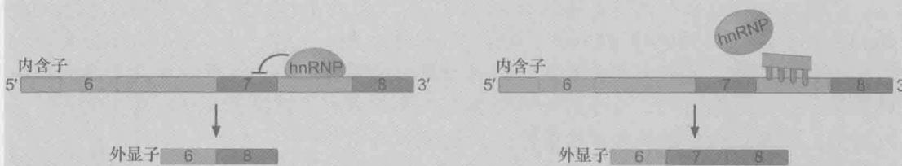  
框 14-4 图 1 SMN2 剪接的模式。单链反义寡聚核苷酸被设计为可以结合 RNA 转录本的一个区域，这一区域在正常情况下雨剪接抑制因子 hnRNP 结合而将外显子 7 剪切下来。如果该寡聚核苷酸替代 hnRNP 结合上后将使外显子 7 保留在成熟的 mRNA 中，从而合成这一形式的 SMN 蛋白。(来源: Rigo F. et al. 2012. J. Cell Biol. 199:21-25, Fig. 2, p. 23. doi:10.1083/jcb.20127087. ©Rockefeller University Press. 经许可重新绘制。)

#### [W] 外显子重组（exon shuffling）

#### [W] 外显子通过重组的方式产生编码新蛋白质的基因

如我们所看到的，所有真核生物都含有内含子，然而这种结构元素在细菌中却极为罕见甚至于几乎不存在。这种情形有两种可能的解释。

第一种为内含子在先模型（intron early model），即内含子曾存在于所有生物，但在细菌中丢失了。假设细菌中确实原本就存在内含子，那么内含子为什么会在后来丢失呢？理由是这些基因密度高的生物（第8章和第12章）为了应对环境的压力，精简了基因组结构以提高染色体复制和细胞分裂的速度。（真核生物中，单细胞且生长较快的酵母的内含子数目比复杂的多细胞生物要少）。

另一种解释为，内含子在细菌中从来就不存在，而是演化过程中后来才出现的。按照这种所谓的内含子在后模型（intron late model），内含子可能通过类似转座子的机制（第12章），插入到原先没有内含子的基因之中。

不管孰是孰非，目前还不能明确解决这个问题，但是另一个问题也许更有意义：为

什么内含子在真核生物中得以保存下来,尤其是在多细胞真核生物中以那么广泛的形式存在?内含子存在的一个明显好处是可以满足在剪接过程中除去它的需求,使可变剪接成为可能,从而可以由一个基因得到多种蛋白质产物。但从更宏观的角度来看,有利于这些生物的另一个好处是:把编码区分成几个外显子使得通过外显子改组的方式产生新基因成为可能。有三个观察结果有力地证明了这个过程是真实存在的。

\- 第一,某个特定基因的外显子和内含子的交界处经常与该基因编码蛋白质的结构域（第6章）的边界相一致，即每个外显子似乎经常编码蛋白质的一个独立的折叠单位(也经常与一个独立的功能相一致)。以图14-27所示的DNA结合蛋白为例，与多数DNA结合蛋白一样，这个蛋白质有两个结构域——DNA识别区和二聚化区。如图所示，这两个结构域（D1和D2）分别由基因中不同的外显子（E1和E2）编码。

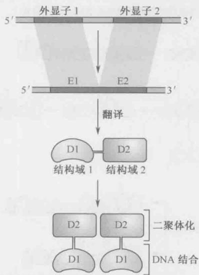  
图 14-27 外显子编码蛋白质结构域。在本例中，蛋白质的 DNA 结合区由一个外显子编码，同一蛋白质的二聚体化结构域由另一个外显子编码。蛋白质结构域独立进行立体折叠，不依赖于它所存在的蛋白质的其余部分，而且通常执行单一的功能（如我们第 6 章所讨论的）。这样，外显子经常可以在蛋白质之间活跃地交换。

\- 第二，许多基因及其所编码的蛋白质明显是演化过程中部分地通过外显子复制和变异而产生的。由多个重复单位构成的蛋白质（如免疫球蛋白）很可能这样起源（第12章，图12-35）。每个外显子之间都存在内含子，使得重复更有可能。

\- 第三，有时在其他方面并不相关的基因中会发现相关的外显子，即有证据显示有些外显子确实在编码不同蛋白质的基因中被重复使用。以低密度脂蛋白（low-density lipoprotein，LDL）受体基因为例（图14-28），该基因的部分外显子在演化上明显与编码表皮生长因子（epidermal growthfactor，EGF）前体基因的外显子有关。同时它又有一些外显子明显与补体成分C9基因的外显子相关（图14-28）。有关外显子增加的更多例子在基因组全序列（如人类基因组）中非常明显。如图14-29所示，外显子以改组方式组合成不同基因，编码出的蛋白质由高度相关的结构域以各种方式组合而成，这方面的例子不胜枚举。

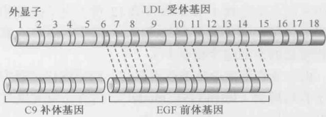  
图 14-28 由其他基因的部件构成的基因。LDL 受体（血浆低密度脂蛋白受体）基因包含与 C9 补体基因密切相关的一串 6 个外显子，以及与 EGF（表皮生长因子）前体基因密切相关的 8 个外显子。因此，LDL 受体基因是由其他基因的外显子经过改组得到的；虽然这里没有列出，但同一批外显子也出现于其他基因中。在多数情况下，内含子在 EGF 前体基因和 LDL 受体基因中并非严格地处在同一对应位置上。在本图中，对应位置相同的内含子以虚线表示。

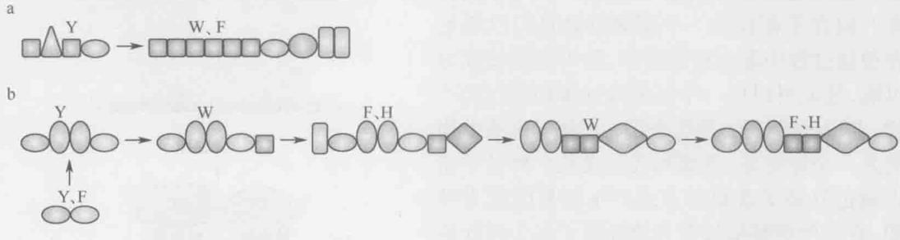

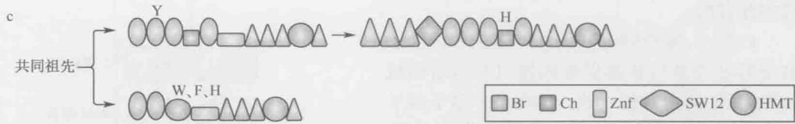  
图 14-29 在某蛋白质家族的演化过程中结构域的累积、丢失和改组。本图示意了不同的相关蛋白质通过特定结构域的得失而演化产生的假设途径。给出了三个例子，都是关于染色质修饰酶（第7章），分别来自酵母（Y）、蠕虫（W）、昆虫（F）和人类（H）。每种蛋白质都以不同颜色和形状的一系列结构域来显示，每个蛋白质的上方标明了存在该形式结构域组合的物种。有些组合不止存在于一种生物体内，而且一种生物有时会存在类似结构域的多种相关组合。少数结构域是完全一样的：bromodomain（Br）、染色质结构域（Ch）、组蛋白甲基转移酶结构域（histone methyltransferase，HMT）、与染色质重组酶有关的ATP酶活性（SW12）和锌指结构域（Znf）。（来源：Lander., et al. 2001. Nature 409: p106. Fig. 42 ©Macmillan. 经许可重新绘制。）

如我们已经看到的，外显子一般很短（约150nt），而内含子长度不一，实际上可以很长（可达几百kb）。对高等真核生物的多数基因而言，这样的长度比例可以保证重组更多地出现于内含子而不是在外显子区，因而外显子更可能进行改组而不是被中断。剪接的机制——使用5'和3'剪接位点，保证了几乎所有重组基因都可以得到表达，因为不同基因的剪接位点很大程度上可以互换。另外，可变剪接可以在不改变原基因产物的基础上尝试新的外显子，也就是说，一开始新旧产物都可以产生。

#### [W] RNA 编辑（RNA editing）

#### [W] RNA 编辑是改变 mRNA 序列的另一种方法

与 RNA 剪接一样，RNA 编辑可以在 RNA 转录之后改变其序列，因而翻译出来的

蛋白质与根据基因序列所推导出来的不同，但比将 mRNA 进行重排的剪接更富戏剧性

——在 RNA 编辑时个别碱基会发生插入、删减或改变，导致 RNA 中的编码信息发生改变。介导 RNA 编辑的机制有两种：位点特异性脱氨基作用和引导 RNA 指导的尿嘧啶插入或删除，我们将依次进行讨论。

位点特异性脱氨基作用（deamination）的一种形式是，mRNA 中某个特异选择的胞嘧啶经过脱氨基变成了尿嘧啶。通常，对于一种给定的 mRNA，RNA 编辑只在特定的组织或细胞发生，而且受到调控。图 14-30 是哺乳动物载脂蛋白 B（apolipoprotein-B）基因。这个基因有几个外显子，其中一个外显子的特定 CAA 密码子是 RNA 编辑的靶标，该密码子的胞嘧啶被脱氨基。由胞苷脱氨酶（cytidine deaminase）完成的脱氨基反应使胞嘧啶变成了尿嘧啶（图 14-31）。在这个例子中，脱氨基反应具组织特异性——mRNA 在小肠细胞而不在肝脏细胞中编辑。

图 14-30 通过脱氨基方式进行 RNA 编辑。人载脂蛋白 RNA 以组织特异性的方式进行编辑，一个特定的胞嘧啶经过脱氨基变成了尿嘧啶。这个过程发生在小肠细胞的 RNA 中，而肝脏细胞中则没有。结果如正文所述，在小肠的 mRNA 中出现了一个终止密码子，所以翻译出的蛋白质分子比肝脏中的小。本图未按比例绘制：被编辑的是第 26 个外显子，填写在整个外显子中的密码子（CAA）实际只占该外显子的很小一部分。

  
图 14-31 胞嘧啶和腺嘌呤脱氨基产生尿嘧啶和次黄嘌呤。（a）畅核苷酸环上的氨基基团被胞啶脱氨酶移走。（b）在腺嘌呤脱氨中，同一基团由 ADAR 移走以产生次黄嘌呤。

CCA 密码子在肝脏中没有进行 RNA 编辑，翻译成谷氨酰胺；而在小肠中经过 RNA 编辑，变成了终止密码子 UAA。结果全长的蛋白质（大约 4500 个氨基酸）在肝脏产生，而截短的多肽（只有约 2100 个氨基酸）在小肠里制造（图 14-30）。这两种形式的载脂蛋白 B 都参与了脂肪代谢。肝脏中的大蛋白参与内源合成的胆固醇和甘油三酯的转运，小肠中的小蛋白参与运输饮食中的脂肪到各种组织中。

其他酶促脱氨的 RNA 编辑例子包括腺嘌呤的脱氨基作用。这个反应由作用于 RNA 的腺苷脱氨酶（adenosine deaminase acting on RNA，ADAR，人类有三种）催化产生次黄嘌呤。由于次黄嘌呤可以与胞嘧啶配对，所以这种编辑形式很容易改变 mRNA 编码的蛋白质序列。哺乳动物大脑中表达的一种离子通道蛋白是通过这种方式编辑的。对其 mRNA 的一个单一的编辑导致这种离子通道蛋白的一个氨基酸改变，从而改变了该通道 Ca2+ 的通透性。如果不发生这种编辑，大脑的发育就会严重受损。

酶促脱氨这类 RNA 编辑形式似乎很少见，但是很重要。在果蝇中，估计可能最多有 20 个胞嘧啶是脱氨基的靶点，但都存在于编码与神经递质产生或者活性相关的基因中。

脱氨酶作用的特异性还不完全清楚，脱氨酶的活性位点可以作用于任何胞嘧啶。通常脱氨酶以复合体形式起作用，复合体的其他组分可能影响脱氨酶作用的特异性。此外，在上述的作用于载脂蛋白 B 的胞嘧啶脱氨酶例子中，脱氨酶上存在一个 RNA 结合区域，它通过识别 RNA 上一段特异序列或者特定的二级结构的方式帮助识别需要脱氨的特异位点。

在细胞抵抗 HIV 感染中脱氨酶的另外一个作用详见框 14-5 脱氨酶和 HIV。

#### [W] 框 14-5 脱氨酶和 HIV

如正文所述，人载脂蛋白 BmRNA 的脱氨是由称为 APOBEC1（apolipoprotein-B editingenzyme, catalyticpolypeptide-like1）的酶进行的。APOBEC1 是 RNA 和 DNA 胞嘧啶脱氨酶家族中的一个成员。该家族的另一个成员 APOBEC3G（A3G）能有力地抑制一系列逆转录病毒，包括 HIV 的感染。

逆转录病毒颗粒如 HIV 携带 RNA 基因组。一旦感染，其 RNA 通过逆转录产生一个 cDNA 拷贝（第 12 章），A3G 酶攻击的正是逆转录过程中产生的这个负链 cDNA。A3G 酶催化 cDNA 上胞嘧啶脱氨基而成为尿嘧啶，导致病毒无法修复的突变程度，甚至突变的链被 DNA 糖基化酶和 AP 核酸内切酶（apurinic-apyrimidinicendonuclease）所破坏（第 10 章）。

为了减少这个影响，野生型 HIV 产生 Vif（viral infectivity factor）蛋白，介导 A3G 酶的降解，从而将 A3G 酶排除在病毒颗粒之外，使病毒在下一轮复制中免受 A3G 酶的伤害。在体内，Vif 对于病毒在所有其生物相关的宿主细胞中的生长都是必需的。Vif 缺陷型病毒可以在实验室使用的一些用于生长病毒的细胞系中生长，这些细胞被称为耐受细胞（permissive）。耐受细胞和非耐受细胞融合得到的异核体具有非耐受的特性。由此可见，非耐受细胞产生一种因子抑制病毒复制，这种因子就是脱氨酶 A3G，耐受细胞仅仅通过表达 A3G 蛋白即可转化为非耐受细胞。

#### [W] 引导 RNA 指导尿嘧啶的插入和删减

在锥虫线粒体中发现了另一种截然不同的RNA编辑形式。在这种情况中，RNA转录后，在pre-mRNA的特定位置插入多个尿嘧啶（有时也可能是删除几个尿嘧啶）。插入的数量可能非常大，最大时达到成熟mRNA核苷酸总数的一半左右。多个尿嘧啶的插入使得mRNA的密码子和可读框发生了改变，从而完全改变了mRNA的“含义”。以锥虫（trypanosome）cox II基因为例，在这个基因mRNA的特定位置上，3个位点的毗邻碱基间共插入4个尿嘧啶（其中一个位点2个，另外两个位点各1个）。这些插入改变了某些密码子，并使可读框向前移了一个碱基，而这种移码突变正是得到正确可读框所需要的（图14-32a）。

这些额外的碱基是如何插入的呢？如图 14-32 所示，尿嘧啶是由引导 RNA（guideRNA，gRNA）插入到 mRNA 中去的。gRNA 长 40\~80nt，是由不同于编码其靶 mRNA 的基因所编码的。每种 gRNA 都可以分为三个区：第一区位于 5'端，称为“锚”区，负责指引 gRNA 到达它所要编辑的 mRNA 的目标区域；第二区用来精确定位在被编辑的序列中尿嘧啶将插入的位置；第三区位于 3'端，是一段多聚尿嘧啶序列。下面仔细看一下 gRNA 是如何指导 RNA 编辑工作的。

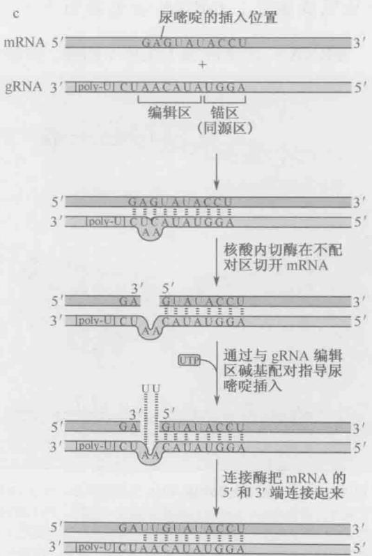  
图 14-32 由 gRNA 介导的尿嘧啶插入法进行 RNA 编辑。锥虫 cox II 基因 RNA 的编辑。（a）示意 cox II 基因 pre-mRNA 上 4 个尿嘧啶核苷酸插入的位置，在 mRNA 上形成正确的可读框及编码信息；（b）gRNA 上决定尿嘧啶插入模式的序列，以及未编辑 mRNA 的序列；（c）编辑反应的过程。

gRNA 的“锚”区有一段序列，可以与 mRNA 上发生编辑区域的紧邻位置上（3'端）的一段序列形成碱基配对（图 14-32b）。随后编辑“指令”发出：gRNA 的一段序列与 mRNA 上的被编辑区互补配对，但有几个多余的腺嘌呤。这些腺嘌呤在 gRNA 上的位置与将要在 mRNA 上插入尿嘧啶的位置正好相反。gRNA 的 3'端是多聚尿嘧啶，该区域核苷酸的作用尚不清楚，但有人认为它可以把 gRNA 系于 mRNA 上编辑区上游（5'端）的富含嘌呤序列上。

如图 14-32c 所示，gRNA 与 mRNA 形成 RNA-RNA 双链，而在将要插入尿嘧啶的对应位置形成突出的单链环状结构。一种核酸内切酶识别并切开与环状结构相对的 mRNA，并经由由 3' 端尿苷酰转移酶（TUT 酶）催化，在 mRNA 上打开的缺口中加入尿嘧啶。

尿嘧啶插入后，某种 RNA 连接酶把两段 mRNA 连接起来，而 gRNA 的编辑区则沿 mRNA 从 $3'\rightarrow5'$ 方向继续发挥作用。一条 gRNA 可以负责在不同位置插入多个尿嘧啶（图 14-32）。另外，有时会有几种不同的 gRNA 在同一条 mRNA 的不同区域发挥作用。

#### [W] mRNA 转运

一旦完成加工，mRNA 会包装好并从细胞核输出到细胞质用于翻译

mRNA一旦全部加工完毕（加帽、剪接和多聚腺苷酸化）就会运出细胞核进入细胞

  
图 14-33 mRNA 转运出细胞核。RNA 出细胞核是一个主动转运过程，只有某些合适的 RNA 才被挑选出来完成这一过程。为了被挑选转运，这类 RNA 必须结合一组正确的蛋白质。这些蛋白质会使之区别于其他必须留在细胞核内或必须降解的 RNA 种类。例如，识别外显子交界点的蛋白质表示 mRNA 已得到正确剪接，而结合内含子的蛋白质则确定了该种 RNA 应该留在核内。一旦进入细胞质，一些蛋白质卸下，另一些蛋白质装上，以备蛋白质翻译（第 15 章）。

质（图 14-33），并在细胞质中完成翻译得到蛋白质产物（第 15 章）。从细胞核进入细胞质的过程并非是一个被动的过程。事实上，它必须受到精细调控：完成加工的 mRNA 只占细胞核内全部 RNA 的很少一部分，许多其他 RNA 如果进入细胞质会对细胞产生致命的危害。这些其他 RNA 包括损伤或加工错误的 RNA，以及剪接下来的内含子等（由于内含子一般比外显子大得多，与成熟 mRNA 相比，内含子占了细胞核 RNA 的绝大部分）。

RNA 选择性转运是如何完成的呢？正像我们在本章及前一章一直强调的那样，从 RNA 分子开始转录的那一刻起，它就与多种蛋白质结合在一起：最初是参与加帽反应的蛋白质，然后是剪接因子，最后是

介导多聚腺苷酸化的蛋白质。其中一些蛋白质在加工过程的不同阶段被替换，而另外一些（如富集丝氨酸和精氨酸的SR蛋白，见图14-11）则不是；此外，还会有另外的蛋白质加入。结果是典型的成熟mRNA携带着一组蛋白质，正是它们决定了mRNA被转运的命运。而其他RNA不仅缺少转运所必需的特定标记性蛋白质组合，而且自身也携带另外一组蛋白质，这些蛋白质可以有效地阻止RNA转运。例如，剪接下来的内含子通常携带hnRNP（剪接抑制酶），它们决定了这些RNA要留在细胞核内并被降解。

成熟 mRNA 除了携带残留的 SR 蛋白，还携带另外一组专门结合外显子衔接位点的蛋白质（当然只见于完成剪接的 RNA）。mRNA 确实也含一些 hnRNP，但数量比典型地结合于内含子的 hnRNP 要少，而且组成也不一样。这就是说，一组蛋白质而不是任何单独一种蛋白质，决定了 RNA 是转运出细胞核还是留在细胞核内。

转运是通过核膜上的一种特殊结构完成的，这就是核孔复合体（nuclearpore complex）。分子质量小于50kDa的小分子可以自由地通过核孔；但是大分子和复合物，包括mRNA及其相关蛋白质，则需要通过主动转运（其余分子，如有些蛋白质，在细胞质中合成但却需要在细胞核内发挥作用，则沿相反的方向转运，即经过同样的核孔从细胞质进入细胞核）。

本书未涉及关于细胞核的跨膜转运机制。我们只需知道，与 RNA 相关的一些蛋白质携带了细胞核跨膜转运信号，转运受体识别出这些信号后指导 RNA 通过核孔离开细胞核。一旦进入细胞质，蛋白质组分就会解离下来，并被识别后重新运回细胞核；然后再与另外的 mRNA 结合，重复下一次循环（图 14-33）。

主动转运需要能量，由 GTP 水解提供，该反应由一种叫做 Ran 的 GTPase 催化。像其他 GTPase 一样，Ran 依据与 GTP 还是 GDP 结合而有两种不同的构象，由一种状态向另一种状态的转变驱动着进出细胞核的转运反应。

<!-- W-END Watson 14 RNA剪接 -->

<!-- C-BEGIN Campbell 17.3 -->

### 【英文对应 Campbell Concept 17.3：Eukaryotic cells modify RNA after transcription】

> 来源：Campbell Biology（书籍/01_Campbell_Biology） 第17章 Gene Expression From Gene to Protein，Concept 17.3。

#### [EN] Concept 17.3: Eukaryotic cells modify RNA after transcription

Enzymes in the eukaryotic nucleus modify pre-mRNA in specific ways before the genetic message is dispatched to the cytoplasm. During this RNA processing, both ends of the primary transcript are altered. Also, in most cases, certain interior sections of the RNA molecule are cut out and the remaining parts spliced together. These modifications produce an mRNA molecule ready for translation.

#### [EN] Alteration of mRNA Ends

Each end of a pre-mRNA molecule is modified in a particular way (Figure 17.11). The 5' end, which is synthesized first, receives a 5' cap, a modified form of a guanine (G) nucleotide added onto the 5' end after transcription of the first 20–40 nucleotides have been transcribed. The 3' end of the pre-mRNA molecule is also modified before the mRNA exits the nucleus. Recall that the pre-mRNA is cut and released soon after the polyadenylation signal, AAUAAA, is transcribed. At the 3' end, an enzyme then adds 50–250 more adenine (A) nucleotides, forming a poly-A tail. The 5' cap and poly-A tail share several important functions. First, they seem to facilitate the export of the mature mRNA from the nucleus. Second, they help protect the mRNA from degradation by hydrolytic enzymes. And third, they help ribosomes attach to

Figure 17.11 RNA processing: addition of the 5' cap and poly-A tail.

Enzymes modify the two ends of a eukaryotic pre-mRNA molecule. The modified ends may promote the export of mRNA from the nucleus, and they help protect the mRNA from degradation. When the mRNA reaches the cytoplasm, the modified ends, in conjunction with certain cytoplasmic proteins, help with ribosome attachment. The 5' cap and poly-A tail are not translated into protein, nor are the regions called the 5' untranslated region (5' UTR) and 3' untranslated region (3' UTR). The lighter red segments are introns, which will be described shortly (see Figure 17.12).

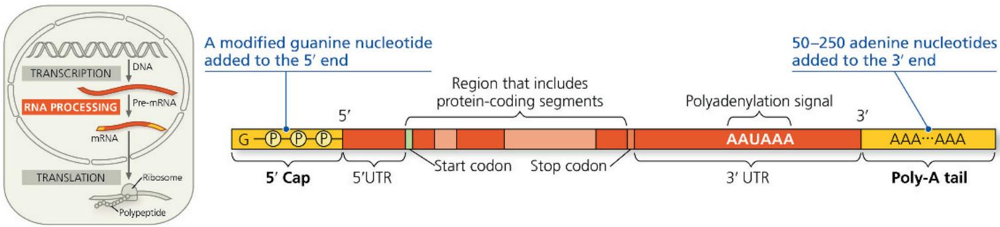

the 5' end of the mRNA once it reaches the cytoplasm. In addition to the cap and tail on a eukaryotic mRNA molecule, Figure 17.11 shows the untranslated regions (UTRs) at the 5' and 3' ends of the mRNA (referred to as the 5' UTR and 3' UTR). The UTRs are parts of the mRNA that will not be translated into protein, but they have other functions, such as ribosome binding.

#### [EN] Split Genes and RNA Splicing

A remarkable stage of RNA processing in the eukaryotic nucleus is called RNA splicing (Figure 17.12), in which large portions of the RNA primary transcript molecules are removed and the remaining portions are reconnected. This cut-and-paste job is similar to editing a movie. The average length of a transcription unit along a human DNA molecule is about 27,000 nucleotide pairs, so the primary RNA transcript is also that long. However, the average-sized protein of 400 amino acids requires only 1,200 nucleotides

in RNA to code for it. (Remember, each amino acid is encoded by a triplet of nucleotides.) This is because most eukaryotic genes and their RNA transcripts have long noncoding stretches of nucleotides, regions that are not translated. Even more surprising is that most of these noncoding sequences are interspersed between coding segments of the gene and thus between coding segments of the pre-mRNA. In other words, the sequence of DNA nucleotides that codes for a eukaryotic polypeptide is usually not continuous; it is split into segments. The noncoding segments of nucleic acid that lie between coding regions are called intervening sequences, or introns. The other regions are called exons, because they are eventually expressed, usually by being translated into amino acid sequences. (Exceptions include the UTRs of the exons at the ends of the RNA, which make up part of the mRNA but are not translated into protein. Because of these exceptions, you may prefer to think of exons as sequences of RNA that exit the nucleus.) The terms intron and exon are used for both RNA sequences and the DNA sequences that specify them.

#### [EN] Figure 17.12 RNA processing: RNA splicing.

The RNA molecule shown here codes for $\beta$ -globin, one of the polypeptides of hemoglobin. The numbers under the RNA refer to codons; $\beta$ -globin is 146 amino acids long. The $\beta$ -globin gene and its pre-mRNA transcript have three exons, corresponding to sequences that will exit the nucleus as mRNA. (The 5' UTR and 3' UTR do not code for proteins, but they are parts of exons because they remain in the mRNA.) During RNA processing, the introns are cut out and the exons spliced together. In many genes, the introns are much longer than the exons.

  
DRAW IT On the mRNA, indicate the sites of the start and stop codons.  
For suggested answer, see Appendix A.

Figure 17.13 A spliceosome splicing a pre-mRNA.

The diagram shows a portion of a pre-mRNA transcript, with an intron (lighter red) flanked by two exons (darker red). Small RNAs within the spliceosome base-pair with nucleotides at specific sites along the intron. Next, small spliceosome RNAs catalyze cutting of the pre-mRNA and the splicing together of the exons, releasing the intron for rapid degradation.

In making a primary transcript from a gene, RNA polymerase II transcribes both introns and exons from the DNA, but the mRNA molecule that enters the cytoplasm is an abridged version. In the process of RNA splicing, the introns are cut out from the molecule and the exons joined together, forming an mRNA molecule with a continuous coding sequence.

How is pre-mRNA splicing carried out? The removal of introns is accomplished by a large complex made of proteins and small RNAs called a spliceosome. This complex binds to several short nucleotide sequences along an intron, including key sequences at each end (Figure 17.13). The intron is then released (and rapidly degraded), and the spliceosome joins together the two exons that flanked the intron. The small RNAs in the spliceosome not only participate in spliceosome assembly and splice site recognition, but also catalyze the splicing reaction; like proteins, RNAs can act as catalysts.

#### [EN] Interview

Interview with Joan Steitz: Studying RNA, her "favorite molecule" (eTextbook only)

#### [EN] Ribozymes

The idea of a catalytic role for the RNAs in the spliceosome arose from the discovery of ribozymes, RNA molecules that function as enzymes. In some organisms, RNA splicing can occur without proteins or even additional RNA molecules: The intron RNA functions as a ribozyme and catalyzes its own removal. For example, in the ciliate protist Tetrahymena, self-splicing occurs in the production of ribosomal RNA (rRNA), a component of the organism's ribosomes. The pre-rRNA actually removes its own introns!

The discovery of ribozymes invalidated the idea that all biological catalysts are proteins.

Three properties of RNA enable some RNA molecules to function as enzymes. First, because RNA is single-stranded, a region of an RNA molecule may base-pair, in an antiparallel arrangement, with a complementary region elsewhere in the same molecule; this gives the molecule a particular three-dimensional structure. A specific structure is essential to the catalytic function of ribozymes, just as it is for enzymatic proteins. Second, like certain amino acids in an enzymatic protein, some of the bases in RNA contain functional groups that can participate in catalysis. Third, the ability of RNA to hydrogen-bond with other nucleic acid molecules (either RNA or DNA) adds specificity to its catalytic activity. For example, complementary base pairing between the RNA of the spliceosome and the RNA of a primary RNA transcript precisely locates the region where the ribozyme catalyzes splicing. Later in this chapter, you will see how these properties of RNA also allow it to perform important noncatalytic roles in the cell, such as recognition of the three-nucleotide codons on mRNA.

#### [EN] The Functional and Evolutionary Importance of Introns

EVOLUTION Whether or not RNA splicing and the presence of introns have provided selective advantages during evolutionary history is a matter of some debate. In any case, it is informative to consider their possible adaptive benefits. Specific functions have not been identified for most introns, but at least some contain sequences that regulate gene expression, and many affect gene products.

One important consequence of the presence of introns in genes is that a single gene can encode more than one kind of polypeptide. Many genes are known to give rise to two or more different polypeptides, depending on which segments are treated as exons during RNA processing; this is called alternative RNA splicing (see Figure 18.14). Results from the Human Genome Project (discussed in Concept 21.1) suggest that alternative RNA splicing is one reason humans can get along with about the same number of genes as a nematode (roundworm). Because of alternative splicing, the number of different protein products an organism produces can be much greater than its number of genes.

Proteins often have a modular architecture consisting of discrete structural and functional regions called domains. One domain of an enzyme, for example, might include the active site, while another might allow the enzyme to bind to a cellular membrane. In quite a few cases, different exons code for the different domains of a protein (Figure 17.14).

The presence of introns in a gene may facilitate the evolution of new and potentially beneficial proteins as a result of a process known as exon shuffling (see Figure 21.16). Introns increase the probability of crossing over between the exons of alleles of a gene—simply by providing more terrain for crossovers without interrupting coding sequences. This might result in new combinations of exons and proteins with altered structure and function. We can also imagine the occasional mixing and matching of exons between completely different (nonallelic) genes. Exon shuffling of either sort could lead to new proteins with novel combinations of functions. While most of the shuffling would result in nonbeneficial changes, occasionally a beneficial variant might arise.

Figure 17.14 Correspondence between exons and protein domains.  
  
Figure 17.15 Translation: the basic concept.

#### [EN] Concept Check 17.3

1. Given that there are about 20,000 human protein-coding genes, how can human cells make 75,000–100,000 different proteins?

2. Compare RNA splicing to how you would watch a prerecorded television show. What would introns correspond to in this analogy?

3. WHAT IF? What would be the effect of treating cells with an agent that removed the 5' cap from mRNAs?

For suggested answers, see Appendix A.

<!-- C-END Campbell 17.3 -->

<!-- L-BEGIN Lehninger 26.2 -->

### 【英文对应 Lehninger §26.2：RNA Processing】

> 来源：Lehninger Principles of Biochemistry（书籍/02_生物化学原理） 第26章 RNA Metabolism，§26.2。

P2 Many of the RNA molecules in bacteria and virtually all RNA molecules in eukaryotes are processed to some degree after synthesis. Processing can include addition or deletion of nucleotide sequences as well as chemical modification of RNA nucleotides. All of these events can be used to control the posttranscriptional fate of the RNA in the cell. As a result, many mature RNAs are not exact copies of the DNA genes from which they were transcribed. Some of the most interesting molecular events in RNA metabolism occur during posttranscriptional processing. Intriguingly, several of the enzymes that catalyze these reactions have active sites composed of RNA rather than protein. The discovery of these catalytic RNAs, or ribozymes, has brought a revolution in thinking about RNA function and about the origin of life, as we will discuss in Section 26.4.

A newly synthesized RNA molecule is called a primary or precursor transcript. Perhaps the most extensive processing of primary transcripts occurs in eukaryotic precursor mRNAs (pre-mRNAs) and in the tRNAs of both bacteria and eukaryotes. However, many ncRNAs are also processed.

The precursor transcript for a eukaryotic mRNA typically contains sequences encompassing one gene, although the sequences encoding the polypeptide may not be contiguous. Noncoding tracts that break up the coding region of the transcript are called introns, and the coding segments are called exons (see the discussion of introns and exons in DNA in Chapter 24). P2 In a process called RNA splicing, the introns are removed from the pre-mRNA, and the exons are spliced together to form a continuous sequence that specifies a functional polypeptide. Virtually all human genes contain introns, the average being eight introns per gene. Eukaryotic mRNAs are also modified at each end. A modified nucleotide structure called a 5' cap is added at the 5' end. The 3' end is cleaved, and 80 to 250 A residues are added to create a poly(A) "tail." The sometimes elaborate protein complexes that carry out 5' capping, splicing, and 3' polyadenylation mRNA-processing reactions do not operate independently. They are organized in association with each other and with the phosphorylated CTD of Pol II; each complex affects the function of the others, as outlined in Figure 26-12.

Proteins involved in mRNA transport to the cytoplasm are also associated with the mRNA in the nucleus, and the processing of the transcript is coupled to its transport. In effect, a eukaryotic mRNA, as it is synthesized, is ensconced in an elaborate and dynamic supramolecular messenger ribonucleoprotein (mRNP) complex comprising dozens of proteins. The composition of the mRNP changes as the transcript is processed, transported to the cytoplasm, and delivered to the ribosome for translation. Associated proteins can dramatically modulate the cellular destination, function, and fate of an mRNA.

In addition to splicing and 5' and 3' end modification, individual purine and pyrimidine nucleotides within primary transcripts can undergo chemical modification. Many eukaryotic mRNAs contain modified nucleotides that affect their interactions with RNA-binding proteins and regulate gene expression; however, RNA modification has been best characterized in primary tRNA transcript processing. Many bases and sugars in tRNAs are modified in both bacteria and eukaryotes, including with unusual bases not found in other nucleic acids (see

Fig. 26-22). Many ncRNAs also undergo elaborate processing, often involving the removal of segments from one or both ends.

The ultimate fate of any RNA is its complete and regulated degradation. The rate of turnover of RNAs plays a critical role in determining their steady-state levels and the rate at which cells can shut down expression of a gene when its product is no longer needed. During the development of multicellular organisms, for example, certain proteins must be expressed at one stage only, and the mRNA encoding such a protein must be made and destroyed at the appropriate times.

#### [EN] Eukaryotic mRNAs Are Capped at the 5' End

P2 Most eukaryotic mRNAs have a 5' cap, a residue of 7-methylguanosine linked to the 5'-terminal residue of the mRNA through an unusual 5',5'-triphosphate linkage (Fig. 26-13). The 5' cap helps protect mRNA from ribonucleases. It also binds to specific cap-binding complexes of proteins and participates in binding of the mRNA to the ribosome to initiate translation (Chapter 27).

The 5' cap is formed by condensation of a molecule of GTP with the triphosphate at the 5' end of the transcript. The guanine is subsequently methylated at N-7, and additional methyl groups are often added at the 2' hydroxyls of the first and second nucleotides adjacent to the cap (Fig. 26-13a). The methyl groups are derived from S-adenosylmethionine. All these reactions (Fig. 26-12b) occur very early in transcription, after the first 20 to 30 nucleotides of the transcript have been added. All four of the enzymes in the cap-synthesizing complex, and through them the 5' end of the transcript itself, are associated with the RNA polymerase II CTD (Fig. 26-13c) until the cap is synthesized. The capped 5' end is then released from the cap-synthesizing complex and bound by the nuclear cap-binding complex, which facilitates both splicing and nuclear export of the RNA.

The 5' cap does not provide permanent protection of the transcript. Eukaryotes also contain cellular decapping enzymes, which are important for RNA regulation. Cap removal allows RNAs to be degraded by exonucleases that hydrolyze the RNA in the 5'→3' direction. Some viruses have also evolved elaborate mechanisms for removing the 5' cap from host mRNAs. The influenza virus needs no specialized enzymes for the synthesis of 5' caps on its viral RNAs; instead, it borrows these structures from host-cell transcripts in a process termed "cap-snatching." A capped host transcript is bound by the viral RNA polymerase and cleaved by an endonuclease. The influenza RNA polymerase can then use the resulting capped oligonucleotide to prime viral RNA synthesis.

#### [EN] Both Introns and Exons Are Transcribed from DNA into RNA

In bacteria, the mRNA used for translation is generally a direct copy of the DNA gene sequence, continuing along the DNA template without interruption until the information needed to specify the polypeptide is complete. However, the notion that all genes are continuous was disproved in 1977 when Phillip Sharp and Richard Roberts independently discovered that many genes for polypeptides in eukaryotes are interrupted by noncoding sequences (introns).

P2 The vast majority of genes in vertebrates contain introns; among the few exceptions are those that encode histones. The occurrence of introns in other eukaryotes varies. Many genes of the yeast Saccharomyces cerevisiae lack introns, but introns are more common in some other yeast species. Introns are also found in a few bacterial and archaeal genes. Introns in DNA are transcribed along with the rest of the gene by RNA polymerases. The introns in the primary RNA transcript are then spliced, and the exons are joined to form a mature, functional RNA. In eukaryotic mRNAs, most exons are less than 1,000 nucleotides long, with many in the 100 to 200 nucleotide size range, encoding stretches of 30 to 60 amino acids within a longer polypeptide. Introns vary in size from 50 to more than 700,000 nucleotides, with a median length of about 1,800. Genes of higher eukaryotes, including humans, typically have much more DNA devoted to introns than to exons. For example, the human dystrophin gene encodes a pre-mRNA more than 2 million nucleotides long. However, the final mRNA is 14,000 nucleotides long, indicating that more than 99% of the transcribed RNA is found within introns and removed by splicing. Deficiencies in dystrophin expression can lead to muscular dystrophies. The \~20,000 genes of the human genome include more than 200,000 introns.

#### [EN] RNA Catalyzes the Splicing of Introns

There are four classes of introns (Table 26-3). The first two, the group I and group II introns, differ in the details of their splicing mechanisms but share one surprising characteristic: they are self-splicing—no proteins are needed to carry out catalysis. The introns found in the nuclear-encoded genes of eukaryotes comprise the third class. These pre-mRNA introns are removed by a large RNP called the spliceosome. Although the spliceosome requires dozens of proteins for its function, its active site includes RNA. The final class of introns requires protein enzymes for their removal. These introns are found in some tRNAs as well as certain mRNAs, such as that encoding the Xbox binding protein 1, Xbp1. Protein-mediated splicing of the XBP1 transcript regulates the cellular response to unfolded proteins that occurs under conditions of endoplasmic reticulum stress in human cells. The mechanisms of tRNA and XBP1 mRNA splicing are similar.

Group I introns are found in some nuclear, mitochondrial, and chloroplast genes that code for rRNAs, mRNAs, and tRNAs. Group II introns are generally found in the primary transcripts of mitochondrial or chloroplast mRNAs in fungi, algae, and plants. Group I and group II introns are also among the rare examples of introns in bacteria. The splicing mechanisms in both groups involve two transesterification reaction steps (Fig. 26-14), in which a ribose 2'- or 3'-hydroxyl group makes a nucleophilic attack on a phosphorus, and a new phosphodiester bond is formed at the expense of the old, maintaining the balance of energy. These reactions are very similar to the DNA breaking and rejoining reactions promoted by topoisomerases (see Fig. 24-18) and site-specific recombinases (see Fig. 25-37).

The group I splicing reaction requires a guanine nucleoside or nucleotide cofactor, but the cofactor is not used as a source of energy; instead, the 3'-hydroxyl group of guanosine is used as a nucleophile in the first step of the

<table><tr><td colspan="4">TABLE 26-3 Mechanisms of RNA Splicing</td></tr><tr><td>Mechanism</td><td>Components</td><td>Features</td><td>Cellular locations</td></tr><tr><td>Group I Intron</td><td>Catalytic RNA</td><td>Self-splicing using a guanine-derived cofactor</td><td>Found in nuclear, mitochondrial, and chloroplast genes that encode mRNAs, rRNAs, or tRNAs. Can be found in bacteria.</td></tr><tr><td>Group II Intron</td><td>Catalytic RNA; maturase and reverse transcriptase proteins</td><td>Self-splicing using a nucleophile within the intron to form a lariat</td><td>Primarily found in mitochondrial and chloroplast genes of fungi, algae, and plants. Can be found in bacteria.</td></tr><tr><td>Spliceosome</td><td>Catalytic snRNAs; dozens of protein splicing factors</td><td>Requires a large RNP for processing using a nucleophile within the intron to form a lariat</td><td>Found in nuclear genes of eukaryotes. Capable of alternative splicing to create multiple products from a given transcript.</td></tr><tr><td>Protein-catalyzed</td><td>Protein enzymes</td><td>Uses a splicing endonuclease and ligase</td><td>Found in tRNAs and a few mRNAs.</td></tr></table>

  
FIGURE 26-14 Splicing mechanism of group II introns. (a) In the first step, the $2'$ OH of an internal A residue (called the branch point) attacks the phosphodiester bond at the $5'$ splice site, resulting in $5'$ splice site cleavage and lariat formation. In the second step, the free $3'$ OH of the $5'$ exon attacks the phosphodiester bond at the $3'$ splice site, resulting in exon ligation and intron-lariat release. The spliceosome uses the same  
chemistry for intron removal, although different RNA sequences mark the intron boundaries and location of the branch point. (b) In the transesterification reaction that occurs during lariat formation, one phosphodiester bond is broken as a second one is created. This forms a lariatlike structure in which one branch is a 2',5'-phosphodiester bond (the linkage between the intron branchpoint A and intron G nucleotides).

splicing pathway. In group II splicing reactions, the nucleophile is the 2'-hydroxyl group of an A residue within the intron (Fig. 26-14a). A branched lariat structure is formed as an intermediate (Fig. 26-14b). In both group I introns and group II introns, the 3' hydroxyl of the exon that is displaced in the first step then acts as a nucleophile in a similar reaction at the 3' end of the intron. The result is precise excision of the intron and ligation of the exons.

Self-splicing of introns was first revealed in 1982 in studies of the splicing mechanism of the group I rRNA intron from the ciliated protozoan Tetrahymena thermophila, conducted by Thomas Cech and colleagues. These workers transcribed isolated Tetrahymena DNA (including the intron) in vitro, using purified bacterial RNA polymerase. The resulting RNA spliced itself accurately without any protein enzymes from Tetrahymena. The discovery that RNAs could have catalytic functions was a milestone in our understanding of biological systems and a major step forward in the understanding of how life probably evolved. Catalytic RNAs like group I and group II introns share many features with protein-based enzymes, including folding into well-defined secondary and tertiary structures (Fig. 26-15). Catalytic RNAs and their significance in evolution are described in greater detail in Section 26.4.

  
Thomas Cech
[Photo by Glenn Asakawa/
University of Colorado.]

  
FIGURE 26-15 Structure of a group I intron. (a) The secondary structure of the group I intron ribozyme from phage Twort, a mycobacterium phage named for Frederick Twort, the physician who discovered phage in 1915. Like most catalytic RNAs, this intron adopts well-defined secondary structure. It is composed of multiple RNA duplexes (P2–P9, each differently colored) capped by hairpin structures. (b) The tertiary structure of the intron bound to a spliced RNA product, obtained by x-ray crystallography, shows that the RNA duplexes pack closely with one another to yield a compact ribozyme. The RNA duplexes are colored and named as in (a). [Data from PDB ID 1Y0Q, B. Golden et al., Nat. Struct. Biol. 12:82, 2005.]

#### [EN] In Eukaryotes the Spliceosome Carries out Nuclear pre-mRNA Splicing

In eukaryotes, most introns undergo splicing by the same lariat-forming mechanism as the group II introns. P2 However, the intron splicing takes place within a spliceosome, a large complex made up of multiple specialized RNP complexes called small nuclear ribonucleoproteins (snRNPs, pronounced snurps) and dozens of non-snRNP proteins. Each snRNP contains one of a class of eukaryotic RNAs, 100 to 200 nucleotides long, known as small nuclear RNAs (snRNAs). Five snRNAs (U1, U2, U4, U5, U6) involved in splicing reactions are generally found in abundance in eukaryotic nuclei. The U3 snRNP is also found in the nucleus but is involved in ribosome assembly and is not part of the spliceosome.

The role of snRNPs in the splicing reaction was discovered by Joan Steitz in a remarkable example of "bedside-to-bench" science. Using antibodies isolated

  
Joan Steitz [Photo by Robert A. Lisak, courtesy Yale School of Medicine.]

from patients with autoimmune diseases, members of the Steitz laboratory were able to purify the spliceosome's snRNP components and identify the associated snRNAs. Based on complementarity between the 5' end of the U1 snRNA and the 5' splice site of nuclear pre-mRNA introns (Fig. 26-16), Steitz proposed that snRNPs participate in the splicing reaction. Subsequently, it was discovered that patients suffering from the autoimmune disease lupus can generate antibodies against protein components of their own spliceosomes.

In yeast, the various snRNPs include about 80 different proteins, most of which have close homologs in all other eukaryotes. In humans, these conserved protein components are augmented by more than 200 additional proteins, which mostly participate in regulating the splicing reaction. Spliceosomes are thus among the most complex supramolecular machines in any eukaryotic cell. The RNA components of a spliceosome are the catalysts of the various splicing steps. The overall complex can be considered a highly flexible ribonucleoprotein enzyme that can adapt to the great diversity in size and sequence of nuclear pre-mRNAs.

Spliceosomal introns generally have the dinucleotide sequence GU at the 5' end and AG at the 3' end, marking the sites where splicing occurs. The U1 snRNA contains a sequence complementary to the 5' splice site (Fig. 26-16b), and the U1 snRNP binds to this region by forming an RNA duplex with the pre-mRNA. A U2 snRNP binds to the 3' end, also by base-pairing, and identifies the A residue that becomes the nucleophile used during the first transesterification reaction (Fig. 26-14). Addition of a complex of the U4, U5, and U6 snRNPs, called the tri-snRNP, leads to formation of the spliceosome (Fig. 26-16c).

Key parts of the splicing active site found in the U6 snRNA are initially sequestered by base-pairing to parts of U4 snRNA to prevent aberrant cleavage of nontarget phosphodiester bonds. In a process called activation, the U6 and U4 snRNAs must be unwound and separated to expose the active site needed for the first step in splicing. Unwinding of U4 and U6 as well as many other steps in splicing require ATP hydrolysis by a set of eight different ATPases that are part of the splicing machinery.

  
FIGURE 26-16 Processing of pre-mRNA primary transcripts by the spliceosome. (a) Small nuclear RNPs, such as the human U1 snRNP shown here, contain snRNAs associated with a number of proteins. The human U1 snRNP contains a single copy of the U1 snRNA and 10 associated polypeptides. (b) The U1 snRNP recognizes the 5' splice site by base-pairing between the U1 snRNA and conserved RNA sequences within the intron that mark the 5' exon/intron boundary. The sequences and structure shown were obtained from x-ray crystal structure shown in (a). The human U1 snRNA normally contains pseudouridines at positions 5 and 6; however, an unmodified RNA was used to determine this structure. (c) Spliceosomes are assembled on introns from snRNPs and proceed through stages of assembly, activation, catalysis of intron removal, release of the RNA products, and recycling of the  
splicing factors. In addition to the U snRNPs discussed in the text, a large protein-only supramolecular complex called the Prp19-containing complex (also known as NineTeen Complex, or NTC) is required for splicing and joins the spliceosome during the activation step. (d) Structure of the human spliceosome, determined by cryo-EM. Nuclear pre-mRNA splicing requires this large molecular machine composed of dozens of proteins and five snRNAs to remove many different introns. By comparison, using similar chemistry, group II introns can catalyze their own removal. In order to highlight the RNA catalytic core of the spliceosome and the U2, U5, and U6 snRNAs, some protein splicing factors are not shown in this view. The RNA appears discontinuous where the structure could not be resolved. [Data from (a, b) PDB ID 4PJO, Y. Kondo et al., eLife 4:e04986, 2015; (d) PDB ID 6QDV, S. Fica et al., Science 363:710, 2019.]

Spliceosomes are single turnover enzymes, meaning that each spliceosome can remove only one intron from a single transcript. As a result, spliceosomes undergo a complex cycle of assembly, activation, catalysis, product release, and recycling of the snRNP components each time an intron is removed (Fig. 26-16c, steps ① through ⑤).

The chemical events of splicing—5' splice site cleavage by formation of an intron lariat followed by exon ligation—are identical in mechanism to that of group II introns, despite the former requiring dozens of proteins for activity and the latter being a self-splicing ribozyme. The similarities in chemistry as well as conservation between essential RNA components of each enzyme suggests that group II introns and spliceosomes are evolutionarily related to one another. Comparison of x-ray crystal structures of group II introns and cryo-EM structures of spliceosomes provide strong support for this hypothesis. Despite being surrounded by a large protein scaffold, the catalytic center of the spliceosome is composed of RNA and arranged in a nearly identical manner to that of group II introns (Fig. 26-17). Thus, the spliceosome uses a ribozyme core to carry out pre-mRNA splicing. As we shall see, some group II introns also contain domains that are themselves translated as mRNAs and encode proteins that bear striking similarity to those in the spliceosome, strengthening this evolutionary connection.

About 1% of human introns are spliced by a less common type of spliceosome, called the minor spliceosome, in which the U1, U2, U4, and U6 snRNPs are replaced by the U11, U12, U4atac, and U6atac snRNPs. Whereas U1- and U2-containing spliceosomes remove introns with (5')GU and AG(3') terminal sequences, the minor spliceosomes remove a rare class of introns that have (5')AU and AC(3') terminal sequences to mark the splice sites. Introns removed by either the major or the minor spliceosome most often remain in the nucleus and are degraded.

FIGURE 26-17 RNA active site conservation between group II introns and the spliceosome. A close-up examination of the active sites of (a) the Pylaiella littoralis group II intron and (b) the S. cerevisiae spliceosome reveal a similar arrangement of catalytic RNAs. In both cases, a catalytic RNA (domain V of the group II intron or U6 snRNA of the spliceosome) promotes a transesterification reaction by orienting the phosphodiester bond located at the 5' splice site/intron junction for nucleophilic attack and by coordinating essential Mg $^{2+}$ ions. In addition to similarities between domain V of group II introns and the U6 snRNA, group II intron domain VI and exon binding site 1 (EBS 1) play functional roles that are similar to those of the U2 and

U5 snRNAs in the spliceosome. Close examination shows that the active sites of the group II intron and the spliceosome are nearly identical, formed by a complex arrangement of nucleotides called the catalytic triplex. The triplex is responsible for binding $Mg^{2+}$ ions essential for catalysis as well as orienting the substrates for the splicing reaction. Conservation of sequence, chemistry, and three-dimensional structure suggests that the spliceosome evolved from a group II intron-like ribozyme. [Data from (a) left and center PDB ID 4R0D, A. R. Robart et al., Nature 514:193, 2014; right PDB ID 6QDV, S. M. Fica et al., Science 363:710, 2019; (b) left PDB ID 5LJ3, W. P. Galej et al., Nature 537:197, 2016, center PDB ID 5MQO, S. M. Fica et al., Nature 542:377, 2017; right PDB ID 6MEO, D. B. Haack et al., Cell 178:612, 2019. Information from W. Galej et al., Chem. Rev. 118:4156, 2018.]

Some components of the splicing apparatus are tethered to the CTD of RNA polymerase II, indicating that splicing, like other RNA processing reactions, is tightly coordinated with transcription. Most splicing in humans occurs cotranscriptionally, meaning that splicing occurs while Pol II is still transcribing the gene. For this to occur correctly, the rates of transcription, capping, splicing, and 3' end formation must be carefully regulated. Splicing of a pre-mRNA in the nucleus can also have profound effects on the function of the mRNA in the cytoplasm. Lynne Maquat and Melissa Moore discovered that the human spliceosome leaves behind a set of proteins on each spliced mRNA near the junction between two exons. This exon junction complex is retained on the mRNA as it is exported to the cytoplasm, where it can regulate the extent to which an mRNA can be translated over its lifetime before degradation.

#### [EN] Proteins Catalyze Splicing of tRNAs

A fourth and final class of introns, found in certain tRNAs and a few mRNAs such as XBP1, is distinguished from other intron types in that the splicing reaction requires endonucleases and ligases made of protein and does not involve catalytic RNAs. The splicing endonuclease cleaves the phosphodiester bonds at both ends of the intron, and the two exons are joined by a mechanism similar to the DNA ligase reaction (see Fig. 25-15).

#### [EN] Eukaryotic mRNAs Have a Distinctive 3' End Structure

P2 At their 3' end, most eukaryotic mRNAs undergoing translation in the cell cytoplasm have a string of A residues, about 30 residues in yeast and 50 to 100 in animals, called the poly(A) tail. This tail serves as a binding site for one or more specific proteins. The poly(A) tail and its associated proteins have a variety of roles in coordinating transcription and translation, and may help protect mRNA from enzymatic destruction. Many bacterial mRNAs also acquire poly(A) tails, but these tails stimulate decay of mRNA rather than protecting it from degradation.

The poly(A) tail is added in a multistep process. The transcript is extended beyond the site where the poly(A) tail is to be added, then is cleaved at the poly(A) addition site by an endonuclease component of a large enzyme complex, again associated with the CTD of RNA polymerase II (Fig. 26-18). The mRNA site where cleavage occurs is marked by two sequence elements: the highly conserved sequence (5')AAUAAA(3'), 10 to 30 nucleotides on the 5' side (upstream) of the cleavage site, and a less well-defined sequence rich in G and U residues, 20 to 40 nucleotides downstream of the cleavage site. Cleavage generates the free 3'-hydroxyl group that defines the end of the mRNA, to which A residues are immediately added by polyadenylate polymerase, which catalyzes the reaction

  
FIGURE 26-18 Addition of the poly(A) tail to the primary RNA transcript of eukaryotes. Pol II synthesizes RNA beyond the segment of the transcript containing the cleavage signal sequences, including the highly conserved upstream sequence (5')AAUAAA. This cleavage signal sequence is bound by an enzyme complex that includes an endonuclease, a polyadenylate polymerase, and several other multisubunit proteins involved in sequence recognition, stimulation of cleavage, and regulation of the length of the poly(A) tail; all of these proteins are tethered to the CTD. The RNA is cleaved by the endonuclease at a point 10 to 30 nucleotides 3' to (downstream of) the sequence AAUAAA. The polyadenylate polymerase synthesizes a poly(A) tail 80 to 250 nucleotides long, beginning at the cleavage site.

$$
\mathrm{RNA} + n \mathrm{ATP} \rightarrow \mathrm{RNA} - (\mathrm{AMP}) n + n \mathrm{PP} _ {\mathrm{i}}
$$

where n = 80 to 250. This enzyme does not require a template but does require the cleaved mRNA as a primer. These longer poly(A) tails are added in the nucleus, and then shortened significantly after the mRNA is transported to the cytoplasm.

The overall processing of a typical eukaryotic mRNA is summarized in Figure 26-19. In some cases, the polypeptide-coding region of the mRNA is also modified by RNA “editing” (see Section 27.1 for details). This editing includes processes that add or delete bases in the coding regions of primary transcripts or that change the sequence (such as by enzymatic deamination of a C residue to create a U residue). A particularly dramatic example occurs in trypanosomes, which are parasitic protists: large regions of an mRNA are synthesized without any uridylate, and the U residues are inserted later by RNA editing.

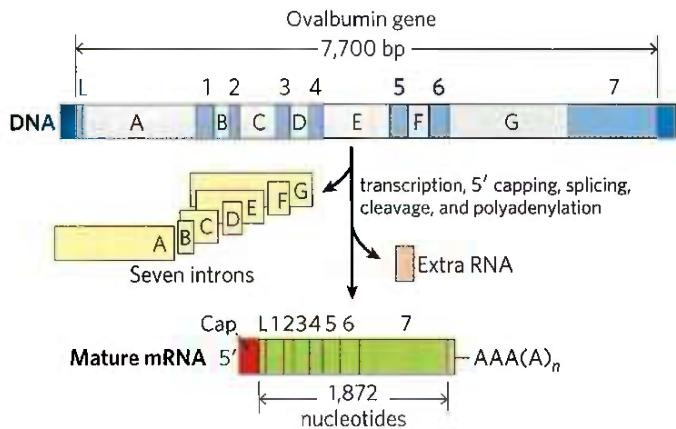  
FIGURE 26-19 Overview of the processing of a eukaryotic mRNA. The ovalbumin gene, shown here, has introns A to G and exons 1 to 7 and L (L encodes a signal peptide sequence that targets the protein for export from the cell; see Fig. 27-38). About three-quarters of the RNA is removed during processing. Pol II extends the primary transcript well beyond the cleavage and polyadenylation site ("extra RNA") before terminating transcription.

#### [EN] A Gene Can Give Rise to Multiple Products by Differential RNA Processing

One of the paradoxes of modern genomics is that the apparent complexity of organisms does not correlate with the number of protein-coding genes, or even the amount of genomic DNA. Some eukaryotic mRNA transcripts can be processed in more than one way to produce different mRNAs and thus different polypeptides. Much of the variability in processing is the result of alternative splicing, in which a particular exon may or may not be incorporated into the mature mRNA transcript. Alternative splicing occurs in a relatively small number of transcripts in yeast, but in more than 95% of human genes. Changes in alternative splicing can have profound impact on the development of an organism (Box 26-2). Alternative splicing of a single transcription factor in the staple grain quinoa differentiates palatable sweet varieties from those too bitter to ingest without processing. In Drosophila, sex is determined by alternative splicing of the sex lethal (Sxl) transcript based on the number of X chromosomes present in the cell.

Figure 26-20a illustrates how alternative splicing patterns can produce more than one protein from a common pre-mRNA. The pre-mRNA contains molecular signals for all the alternative processing pathways, and the pathway favored in a given cell or metabolic situation is determined by processing factors, RNA-binding proteins that promote one particular path. For example, splicing regulatory proteins or heterogeneous ribonuclear proteins (hnRNPs) may bind these signals and promote or inhibit spliceosome assembly at that site. There are many additional patterns of alternative splicing.

Complex transcripts can also have more than one site where poly(A) tails can form (Fig. 26-20b). If there are two or more sites for cleavage and polyadenylation, use of the one closest to the 5' end will remove more of the primary transcript sequence. This mechanism,

BOX 26-2

MEDICINE

#### [EN] Alternative Splicing and Spinal Muscular Atrophy

Alternative splicing is one of the least understood steps in human gene regulation, in part because a gene product can be spliced together in many ways: entire exons can be left out of the mRNA (skipped) or spliced in (retained). More subtle changes can also occur in which alternative 5' or 3' splice sites are used that differ from their canonical positions by just a few nucleotides. The spliced isoform that is generated is determined by interactions among the spliceosome, a large number of regulatory factors that associate with the pre-mRNA transcript, and other cellular machinery, including the transcription complex.

Despite this complexity, scientists are learning how to control alternative splicing to treat genetic diseases such as spinal muscular atrophy (SMA). SMA is a progressive neurodegenerative disease and in its most severe form is always fatal. It is the most common genetic cause of death in infants. SMA is caused by a defect in the SMN1 (survival of motor neuron 1) gene. SMN1 encodes a protein that is essential for assembly of cellular snRNPs, including those that make up the spliceosome.

Humans have two SMN genes: SMN1 and SMN2. However, only SMN1 is capable of being correctly spliced to produce a functional protein (Fig. 1). SMN2 encodes an RNA sequence called a silencer, which causes exon 7 to be excluded from the mRNA. As a result, SMN2 cannot produce functional protein. Healthy individuals are able to get all of the SMN protein they require for snRNP assembly from the SMN1 gene. But those with a mutation in SMN1 do not produce enough SMN protein to assemble an adequate number of snRNPs. This leads to neuromuscular degeneration that is often fatal.

One possible solution for treating SMA would be to find a way to change the alternative splicing pattern of the SMN2 gene so that exon 7 would be included rather than skipped. This would produce functional SMN protein. This is exactly the strategy that

(Continued on next page)

#### [EN] Alternative Splicing and Spinal Muscular Atrophy (Continued)

(b) SMA patient  
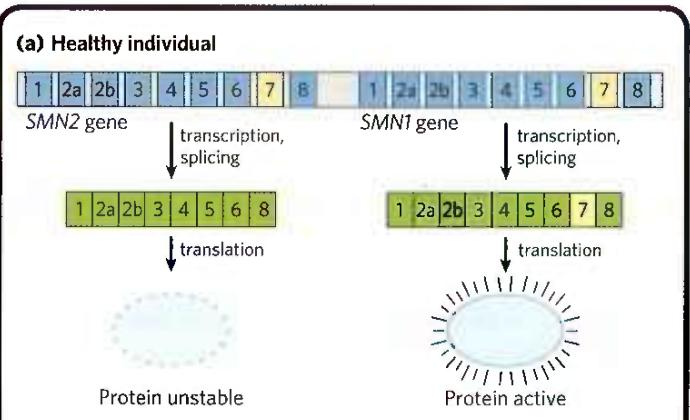

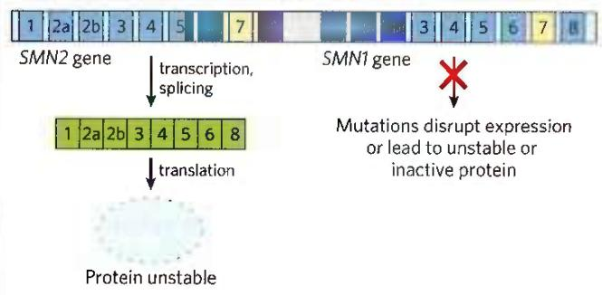  
(c) SMA patient, treated with nusinersen

  
FIGURE 1 Alternative splicing of the SMN1 and SMN2 gene transcripts in healthy individuals and in those with SMA. (a) In healthy individuals, active protein is produced by translation of mRNAs that include exon 7 of the SMN1 gene. Alternative splicing of the SMN2 transcript skips exon 7, resulting in an mRNA that cannot produce functional protein. (b) In SMA patients, a mutation in the SMN1 gene results in no functional protein being produced from either SMN1 or SMN2. (c) Upon treatment with nusinersen, alternative splicing of SMN2 results in an mRNA that includes exon 7 and produces functional protein. This can prevent neuromuscular degeneration. [Information from D. R. Corey, Nat. Neurosci. 20:497, 2017, Fig. 1.]

called poly(A) site choice, generates diversity in the variable domains of immunoglobulin heavy chains (see Fig. 25-42).

Both alternative splicing and poly(A) site choice come into play in the expression of many genes. For example, a single RNA transcript is processed using

  
Adrian Krainer [Courtesy Adrian Krainer.]

Adrian Krainer used to correct SMA phenotypes in mice. Scientists in the Krainer lab discovered that if they injected mice with a synthetic oligonucleotide complementary to the silencer sequence of SMN2 exon 7 (also called an antisense oligonucleotide, or ASO), the sequence would be hidden from the splicing machinery. This changes the splicing of the SMN2 gene so that exon 7 is

included and the SMN2 gene is able to produce a functional SMN protein and prevent neurodegeneration (Fig. 1).

A drug called nusinersen has since been developed based on Krainer's research and became the first approved treatment for SMA. In SMA patients, injection of nusinersen into the central nervous system can correct splicing of the human SMN2 gene product, restore SMN protein production, and halt neurodegeneration. Most pharmaceuticals are small, organic molecules, but nusinersen is an 18-mer oligonucleotide. To turn an oligonucleotide into a drug, researchers had to incorporate chemical modifications into the phosphate backbone and ribose sugar (Fig. 2). These modifications prevent the oligonucleotide from being destroyed by cellular nucleases and also improve binding to RNA targets. Currently very few nucleic acid-based drugs have been approved for medical use, but their importance in medicine will likely continue to grow.

  
FIGURE 2 The modified nucleotides in nusinersen use a phosphorthioate backbone rather than phosphodiesters, and the 2' hydroxyl groups are replaced by 2'-O-methoxyethyl groups.

both mechanisms to produce two different hormones: the calcium-regulating hormone calcitonin in rat thyroid and calcitonin-gene-related peptide (CGRP) in rat brain (Fig. 26-21). P2 Together, alternative splicing and poly(A) site choice greatly increase the variety of proteins generated from the genomes of higher eukaryotes.

Dihydrouridine (D)

(a)  

(b)  
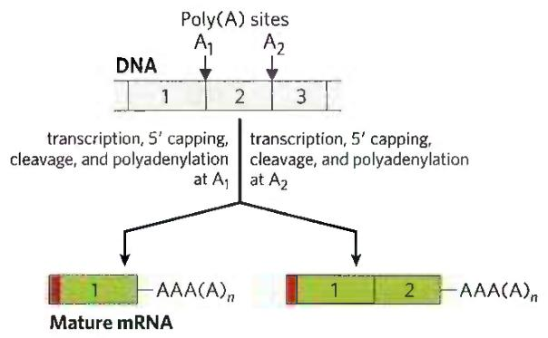  
FIGURE 26-20 Alternative transcript production in eukaryotes. (a) Alternative splicing patterns. Two 3' splice sites are shown. Different mature mRNAs are produced from the same primary transcript. (b) Two alternative cleavage and polyadenylation sites, A₁ and A₂.

  
FIGURE 26-21 Alternative processing of the calcitonin gene transcript in rats. The calcitonin gene encodes a primary transcript with two poly(A) sites; one predominates in the brain, the other in the thyroid. In the brain, splicing eliminates the calcitonin exon (exon 4); in the thyroid, this exon is retained. The resulting peptides are processed further to yield the final hormone products: calcitonin in the thyroid and calcitonin-gene-related peptide (CGRP) in the brain.

#### [EN] Ribosomal RNAs and tRNAs Also Undergo Processing

Posttranscriptional processing is not limited to mRNA. Ribosomal RNAs of bacterial, archaeal, and eukaryotic cells are made from longer precursors called pre-ribosomal RNAs, or pre-rRNAs. Transfer RNAs are similarly derived from longer precursors. These RNAs may also contain a variety of modified nucleosides; some examples are shown in Figure 26-22.

Ribosomal RNAs In bacteria, 16S, 23S, and 5S rRNAs (and some tRNAs, although most tRNAs are encoded elsewhere) arise from a single 30S RNA precursor of about 6,500 nucleotides. RNA at both ends of the 30S precursor and segments between the rRNAs are removed during processing (Fig. 26-23). The 16S and 23S rRNAs contain modified nucleosides. In E. coli, the 11 modifications in the 16S rRNA include a pseudouridine and 10 nucleosides methylated on the base or the 2'-hydroxyl group or both. The 23S rRNA has 10 pseudouridines, 1 dihydrouridine, and 12 methylated nucleosides. In bacteria, each modification is generally catalyzed by a distinct enzyme. Methylation reactions use S-adenosylmethionine as cofactor. No cofactor is required for pseudouridine formation.

  
4-Thiouridine (S $^{4}$ U)

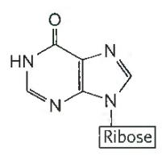  
Inosine (I)

  
1-Methylguanosine (m $^{1}$ G)

FIGURE 26-22 Some modified bases of RNA produced in posttranscriptional reactions. The standard symbols are shown in parentheses. This is just a small sampling of the 96 modified nucleosides known to occur in different RNA species, with 81 different types known in tRNAs and 30 observed to date in rRNAs. Notice the unusual ribose attachment point in pseudouridine. A complete listing of these modified bases can be found in the Modomics database of RNA modification pathways (http://iimcb.genesilico.pl/modomics/).

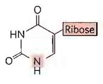  
$N^{6}$ -Isopentenyladenosine ( $i^{6}A$ )

  
Ribothymidine (T)

Pseudouridine (ψ)

The genome of E. coli encodes seven pre-rRNA molecules. All of these genes have essentially identical rRNA-coding regions, but they differ in the segments between these regions. The segment between the 16S and 23S rRNA genes generally encodes one or two tRNAs, with different tRNAs produced from different pre-rRNA transcripts. Coding sequences for tRNAs are also found on the 3' side of the 5S rRNA in some precursor transcripts.

The situation in eukaryotes is even more complicated (see Fig. 27-17). The entire process is initiated in the nucleolus, in large complexes that assemble on the rRNA precursor as it is synthesized by Pol I. There is a tight coupling between rRNA transcription, rRNA maturation, and ribosome assembly in the nucleolus. Each complex includes the ribonucleases that cleave the rRNA precursor, the enzymes that modify particular bases, large numbers of ncRNAs called small nucleolar RNAs, or snoRNAs, that guide nucleoside modification and some cleavage reactions, and ribosomal proteins. In yeast, the entire process involves the pre-rRNA, more than 170 nonribosomal proteins, snoRNAs for each nucleoside modification (about 70, because some snoRNAs guide two types of modification), and the 78 ribosomal proteins. Humans have an even greater number of modified nucleosides, about 200, and a greater number of associated snoRNAs. The composition of the complexes may change as the ribosomes are assembled, and many of the intermediate complexes rival the ribosome itself in complexity. The 5S rRNA of most eukaryotes is made as a completely separate transcript by a different polymerase (Pol III).

The most common nucleoside modifications in eukaryotic rRNAs are conversion of uridine to pseudouridine and adoMet-dependent nucleoside methylation (often at 2'-hydroxyl groups). These reactions often rely on snoRNA-protein complexes, or snoRNPs, each consisting of a snoRNA and four or five proteins, including the enzyme that carries out the modification. There are two classes of snoRNPs, both defined by key conserved sequence elements referred to as lettered boxes. The box H/ACA snoRNPs function in pseudouridylylation, and box C/D snoRNPs in 2'-O-methylations. The snoRNAs are 60 to 300 nucleotides long. Each snoRNA includes a 10 to 21 nucleotide sequence that is perfectly complementary to some site on an rRNA and serves to identify the modification site (Fig. 26-24). The conserved sequence elements in the remainder of the snoRNA fold into structures that are bound by the snoRNP proteins.

FIGURE 26-23 Processing of pre-rRNA transcripts in bacteria. ① Before cleavage, the 30S RNA precursor is methylated at specific bases (red tick marks), and some uridine residues are converted to pseudouridine (blue tick) or dihydrouridine (black tick) residues. The methylation reactions are of multiple types, some occurring on bases and some on 2'-hydroxyl groups. ② Cleavage liberates precursors of rRNAs and tRNA(s). Cleavage at the points labeled 1, 2, and 3 is carried out by the enzymes RNase III, RNase P, and RNase E, respectively. As discussed later in the text, RNase P is a ribozyme. ③ The final 16S, 23S, and 5S rRNA products result from the action of a variety of specific nucleases. The seven copies of pre-rRNA gene in the E. coli chromosome differ in the number, location, and identity of tRNAs included in the primary transcript. Some copies of the gene have additional tRNA gene segments between the 16S and 23S rRNA segments and at the far 3' end of the primary transcript.  

  
FIGURE 26-24 RNA pairing with box H/ACA snoRNAs to guide pseudouridylation. The pseudouridine conversion sites in the target rRNA are in the regions paired with the snoRNA, and the conserved H/ACA box sequences are protein-binding sites. [Information from T. Kiss, Cell 109:145, 2002.]

Transfer RNAs Most cells have 40 to 50 distinct tRNAs, and eukaryotic cells have multiple copies of many of the tRNA genes. Transfer RNAs are derived from longer RNA precursors by enzymatic removal of nucleotides from the 5' and 3' ends (Fig. 26-25). In eukaryotes, introns are present in a few tRNA transcripts and must be excised. Where two or more different tRNAs are contained in a single primary transcript, they are separated by enzymatic cleavage. The endonuclease RNase P, found in all organisms, removes RNA at the 5' end of tRNAs. This enzyme contains both protein and RNA. The RNA component is essential for activity, and in bacterial cells it can carry out its processing function with precision even without the protein component. RNase P is another example of a catalytic RNA, as described in more detail below. The 3' end of tRNAs is processed by one or more nucleases, including the exonuclease RNase D.

Transfer RNA precursors may undergo further post-transcriptional processing. The 3'-terminal trinucleotide CCA(3') to which an amino acid is attached during protein synthesis (Chapter 27) is absent from some bacterial tRNA precursors and all eukaryotic tRNA precursors and is added during processing (Fig. 26-25). This addition is carried out by tRNA nucleotidyltransferase, an unusual enzyme that binds the three ribonucleoside triphosphate precursors in separate active sites and catalyzes formation of the phosphodiester bonds to produce the CCA(3') sequence. The creation of this defined sequence of nucleotides is therefore not dependent on a DNA or RNA template—the template is the binding site of the enzyme.

The final type of tRNA processing is the modification of some bases by methylation, deamination, or reduction (Fig. 26-22). These modifications can change how the tRNA interacts with cellular proteins and even how the tRNA is used by the ribosome during translation. In the case of pseudouridine, the base (uracil) is removed and reattached to the sugar through C-5. Some of these modified bases occur at characteristic positions in all tRNAs (Fig. 26-25).

#### [EN] Special-Function RNAs Undergo Several Types of Processing

The number of known classes of special-function noncoding RNAs (ncRNAs) is expanding rapidly, as is the variety of functions known to be associated with them. Many of these ncRNAs also undergo processing.

The snRNAs and snoRNAs not only facilitate RNA processing reactions but also are themselves synthesized as larger precursors and then processed. Many snoRNAs are encoded within the introns of other genes. As the introns are spliced from the pre-mRNA, proteins bind to the snoRNA sequences and ribonucleases remove the extra RNA at the 5' and 3' ends to form the snoRNP. The snRNAs destined for spliceosomes are synthesized as pre-snRNAs, and ribonucleases remove the extra RNA at each end. Particular nucleosides in snRNAs are also subject to 11 types of modification, with 2'-O-methylation and conversion of uridine to pseudouridine predominating.

MicroRNAs (miRNAs) are a special class of non-coding RNAs involved in gene regulation. The miRNAs are about 22 nucleotides long, complementary in sequence to particular regions of mRNAs. Found in plants and in animals, from worms to mammals, they promote mRNA degradation and suppress translation to fine-tune gene expression. About 1,500 human genes encode miRNAs, and one or more of these miRNAs affect the expression of most protein-coding genes.

  
FIGURE 26-25 Processing of tRNAs in bacteria and eukaryotes. The yeast tRNA $^{Tyr}$ (the tRNA specific for tyrosine binding; see Chapter 27) is used to illustrate the important steps. Short blue lines represent normal base pairing; blue dots indicate G–U base pairs. The nucleotide sequences shown in yellow are removed from the primary transcript. The ends are processed first, the 5' end before the 3' end. CCA is then added to the 3' end, a necessary  
step in processing all eukaryotic tRNAs and for those bacterial tRNAs that lack this sequence in the primary transcript. While the ends are being processed, specific bases in the rest of the transcript are modified (see Fig. 26-22). For the eukaryotic tRNA shown here, the final step is splicing of the 14 nucleotide intron by a protein enzyme. Introns are found in some eukaryotic tRNAs but not in bacterial tRNAs.

The miRNAs are synthesized from much larger precursors, in several steps (Fig. 26-26). The primary transcripts for miRNAs (pri-miRNAs) vary greatly in size; some are encoded in the introns of other genes and are coexpressed with these host genes. Processing of pri-miRNA is mediated by two endoribonucleases in the RNase III family, Drosha and Dicer. First, in the nucleus, the pri-miRNA is reduced to a 70 to 80 nucleotide precursor miRNA (pre-miRNA) by a protein complex including Drosha and another protein, DGCR8. The pre-miRNA is then exported to the cytoplasm in a complex with two proteins, exportin-5 and the Ran GTPase (see Fig. 27-42). In the cytoplasm, Ran hydrolyzes the GTP, then exportin-5 and the pre-miRNA are released. The pre-miRNA is then acted on by Dicer to produce the nearly mature miRNA paired with a short RNA complement. The complement is removed by an RNA helicase, and the mature miRNA is incorporated into protein complexes, such as the RNA-induced silencing complex (RISC), which then bind a target mRNA. If the complementarity between miRNA and its target is nearly perfect, the target mRNA is cleaved. If the complementarity is only partial, the complex blocks translation of the target mRNA. The roles of miRNAs and RISC in gene regulation are detailed in Chapter 28.

#### [EN] Cellular mRNAs Are Degraded at Different Rates

The expression of genes is regulated at many levels. A crucial factor governing a gene's expression is the cellular concentration of its associated mRNA. The concentration of any molecule depends on two factors: its rate of synthesis and its rate of degradation. When synthesis and degradation of an mRNA are balanced, the concentration of the mRNA remains in a steady state. A change in either rate will lead to net accumulation or depletion of the mRNA. P2 Degradative pathways ensure that mRNAs do not build up in the cell and direct the synthesis of unnecessary proteins.

The rates of degradation vary greatly for mRNAs from different eukaryotic genes. For a gene product that is needed only briefly, the half-life of its mRNA may be only minutes or even seconds. Gene products needed

FIGURE 26-26 Synthesis and processing of miRNAs. The primary transcript of miRNAs is a larger RNA of variable length, called pri-miRNA. The pri-miRNA undergoes a number of processing events both in the nucleus and in the cytoplasm to make a mature miRNA. Once the miRNA has been loaded into a protein complex called RISC, it can then hybridize to mRNAs and repress their translation or trigger their cleavage and destruction. [Information from E. Wienholds and R. H. A. Plasterk, FEBS Lett. 579:5911, 2005; V. N. Kim et al., Nat. Rev. Mol. Cell Biol. 10:126, 2009, Figs 2–4.]

constantly by the cell may have mRNAs that are stable over many cell generations. The average half-life of the mRNAs of a vertebrate cell is about 3 hours, with the pool of each type of mRNA turning over about 10 times per cell generation. The half-life of bacterial mRNAs is much shorter—only about 1.5 min—perhaps because of regulatory requirements.

Messenger RNA is degraded by ribonucleases present in all cells. In E. coli, mRNAs typically contain 5' triphosphates remaining from the initiation of transcription. These groups protect the mRNA from 5' degradation. As a result, mRNA decay begins with one or several cuts by an endoribonuclease, followed by 3'→5' degradation by exoribonucleases (Fig. 26-27). The initial cut by the endonuclease generates an RNA fragment with a 5' monophosphate end, which serves to tether the endonuclease to the transcript and ensure its rapid destruction. Some bacteria (Bacillus subtilis, for example), have exonucleases that also recognize the 5' monophosphate end and can degrade RNA fragments in the 5'→3' direction.

Polynucleotide phosphorylase (PNPase) is a common 3'→5' exoribonuclease responsible for the degradation of many mRNAs in bacteria, chloroplasts, and mitochondria. It catalyzes the reversible phosphorolysis (rather than hydrolysis) of the mRNA chain using orthophosphate as the nucleophile. The PNPase reaction is readily reversible and the enzyme can also add nucleotides to the 3' ends of bacterial mRNAs. Decay of mRNAs containing complex 3' end structures, such as the hairpins responsible for $\rho$ -independent transcription termination (see Fig. 26-7), can involve multiple rounds of lengthening and shortening of the mRNA by PNPase until it is finally consumed. This unusual nontemplated RNA polymerization activity of PNPase proved to be critical for production of mRNA polymers used for deciphering the genetic code (Chapter 27).

  
FIGURE 26-27 Degradation of RNA in bacteria. In bacteria, mRNA degradation usually begins by endonucleolytic cleavage because the 5' and 3' ends of the mRNA are often protected by a triphosphate and hairpin structure, respectively. In E. coli, the RNase E endonuclease carries out this cleavage, whereas in B. subtilis the cleavage is carried out by the RNase Y endonuclease. The endonuclease activity produces RNA fragments that serve as substrates for 3'→5' or 5'→3' exonucleases. All bacteria contain 3'→5' exonucleases such as PNPase, RNase R, or RNase II. Some species, like B. subtilis, also contain a 5'→3' exonuclease called RNase J. The 5' phosphate produced by the endonuclease after the first cleavage can also serve as a tether to link the RNase E endonuclease directly to the mRNA, ensuring its rapid destruction. [Information from M. Hui et al. Annu. Rev. Genet. 48:537, 2014.]

As we have previously seen with transcription and RNA processing, the analogous processes for RNA degradation in eukaryotes are much more complex than their bacterial counterparts. Eukaryotes have multiple pathways for mRNA decay, and the pathway used can depend on the mRNA location, its structure, its association with ribosomes, and other factors. However, in most cases, decapping the 5' end and shortening the 3' poly(A) tail are critical steps for allowing exonucleases to access the mRNA.

All eukaryotes also have large $3^{\prime}\rightarrow5^{\prime}$ exoribonucleases called exosomes, which are responsible for the degradation for nearly all types of RNA. Exosomes are multisubunit complexes containing about 10 proteins. Specialized exosomes exist in the nucleus, cytoplasm, and nucleolus. The core of the exosome is a barrel-like structure through which RNA is threaded (Fig. 26-28). Even though this core is structurally similar to bacterial PNPase, RNA is not degraded within the barrel. Instead, the barrel serves as an adapter that efficiently channels the RNA to associated enzymes with $3'\rightarrow5'$ exonuclease and endonuclease activity.

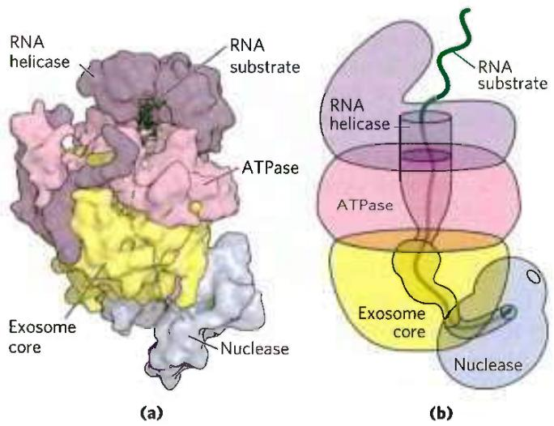  
FIGURE 26-28 Essential role of the exosome in eukaryotic RNA degradation. (a) Exosomes are multisubunit enzymes in which RNA is threaded through a central barrel and fed into a nuclease. In this structure, the exosome core is topped by ATPase and RNA helicase modules that help unwind RNA secondary structures so that single-stranded RNA can pass into the core. Below the core is a nuclease responsible for cleaving the RNA. (b) In this cartoon schematic, the passage of the substrate RNA through the barrel-like exosome and to the nuclease is highlighted. [Data from PDB ID 4IFD, D. L. Makino et al., Nature 495:70, 2013; PDB ID 4OO1, E.V. Wasmuth et al., Nature 511:435, 2014. Information from K. Januszyk and C. D. Lima, Curr. Opin. Struct. Biol. 24:132, 2014.]

#### [EN] SUMMARY 26.2 RNA Processing

Many primary transcripts produced in bacteria and eukaryotes must be processed into a mature form to be functional. Processing can include modifications to the 5' and 3' ends of the RNA, removal of internal RNA sequences by splicing, and modifications of the RNA nucleotides.

Eukaryotic mRNAs have an inverted 7-methylguanosine residue cap at their 5' end. The cap helps to protect the RNA from degradation and interacts with proteins important for cellular transport and translation.

■ Many organisms contain genes in which the coding information is interrupted by introns. Splicing removes these introns and joins the flanking exons. Nearly every human gene contains multiple introns, which can vary dramatically in size.

There are four classes of introns: group I, group II, spliceosome-processed introns, and protein-processed introns. Group I and II introns are self-splicing with RNAs capable of carrying out catalysis independent of protein enzymes. Catalytic RNAs share features in common with protein-based enzymes.

Nuclear-encoded introns in eukaryotes are removed by a large RNP machine called a spliceosome. A spliceosome is a single-turnover enzyme containing snRNA and protein that recognizes introns by base-pairing with the snRNAs. Even though a spliceosome contains dozens of proteins, it uses an RNA active site and mechanism similar to that of group II introns.

■ Some tRNAs and a few mRNAs contain introns that must be removed by protein-based endonuclease and ligase enzymes.

In eukaryotes, transcription terminates when an endonuclease cleaves the nascent RNA, freeing it from Pol II. A poly(A) tail is then added to the 3' end of the RNA by a polyadenylate polymerase.

■ Alternative splicing and alternative poly(A) site choice in eukaryotes allow for many different transcripts to be produced from a single gene.

The primary transcripts of tRNAs, rRNAs, and miRNAs also undergo extensive processing, including endonucleolytic cleavage and chemical modification. Correct placement of these modifications is often guided by snoRNAs that base-pair with the target RNA.

■ The cellular lifetime of RNAs can be highly variable, and RNA degradation is tightly regulated. In bacteria, endonucleases generate mRNA fragments for destruction by exonucleases. In eukaryotes, mRNAs typically must be decapped and the poly(A) tail shortened before degradation. The exosome is a supramolecular complex of 3'→5' exo- and endonucleases involved in many steps of eukaryotic RNA decay.

<!-- L-END Lehninger 26.2 -->

## 3.9 RNA 的编辑、再编码和化学修饰

## 3.9.1 RNA的编辑

根据中心法则,DNA、RNA 和蛋白质之间存在着直接的线性关系,即连续的序列 DNA 被真实地转录成 mRNA 序列,然后翻译产生蛋白质分子。断裂基因的发现和 RNA 的剪接虽然使得基因表达过程增加了一个步骤,但 DNA 的实际编码序列没有发生变化。

RNA 的编辑 (RNA editing) 是 mRNA 前体的加工方式之一, 通过插入、删除或取代一

图 3-37 位点特异性脱氨基作用引起的哺乳动物载脂蛋白基因转录产物的编辑

(a,b) 胞嘧啶和腺嘌呤的位点特异性脱氨基作用产生尿嘧啶核次黄嘌呤；(c) 哺乳动物载脂蛋白基因转录产物的编辑。

些核苷酸残基,使 DNA 所编码的遗传信息发生变化,是生物细胞内改变 mRNA 序列和蛋白质编码信息的重要途径。介导 RNA 编辑的机制有两种:位点特异性脱氨基作用和指导 RNA 引导的尿嘧啶插入或删除。

哺乳动物载脂蛋白 mRNA 的编辑是广泛研究的典型例子, 图 3-37 是该基因的 DNA 序列以及在哺乳动物肝和肠组织中分离到的 mRNA 序列。载脂蛋白基因编码区共有 4563 个密码子, 在所有组织中其 DNA 序列都相同。在肝中, 该基因转录产生完整的 mRNA 并被翻译成有 4563 个氨基酸的全长蛋白质, 相对分子质量为 $5.1 \times 10^{5}$ 。在肠中合成的却是只包含有 2153 个密码子的 mRNA, 翻译产生相对分子质量为 $2.5 \times 10^{5}$ 的蛋白质。研究发现, 该蛋白质其实是全长载脂蛋白的 N 端, 它是由一个在序列上除了 2153 位密码子从 CAA 突变为 UAA 之外完全与肝 mRNA 相同的核酸分子所编码的, 位点特异性脱氨基作用引起的 C → U 突变使编码谷氨酰胺的密码子变成了终止密码子。

RNA 的编辑虽然不是很普遍,但在真核生物中时有发生(表 3-12),表明这一途径可能是细胞充分发挥生理功能所必需的。

表 3-12 哺乳动物中 RNA 编辑的实例

<table><tr><td>组织</td><td>靶标 RNA</td><td>所改变的碱基</td><td>结果</td></tr><tr><td>肝,肠</td><td>载脂蛋白 B</td><td>C→U</td><td>谷氨酰胺密码子→终止子</td></tr><tr><td>肌肉</td><td>半乳糖苷酶</td><td>U→A</td><td>苯丙氨酸密码子→酪氨酸</td></tr><tr><td>睾丸,肿瘤等</td><td>Wilms 肿瘤基因 -1</td><td>U→C</td><td>亮氨酸密码子→脯氨酸</td></tr><tr><td>肿瘤</td><td>神经纤维瘤基因 -1</td><td>C→U</td><td>精氨酸密码子→终止子</td></tr><tr><td>脑</td><td>谷氨酸受体蛋白</td><td>A→I</td><td>多个谷氨酸密码子→精氨酸</td></tr></table>

载脂蛋白 mRNA 中的 C→U, 谷氨酸受体蛋白 mRNA 中的 A→I, 都属于脱氨基作用的结果, 分别由胞嘧啶和腺嘌呤脱氨酶所催化。通常情况下, 该酶促反应的特异性不强, 腺嘌呤脱氨酶可以作用于双链 RNA 区的任何腺苷酸残基。但是, RNA 的编辑发生在带有具催化作用的脱氨酶亚基的复合体中, 有附加的 RNA 结合区能帮助识别所编辑的特异性靶位点。

除单碱基突变之外，RNA 编辑的另一种形式是尿苷酸的缺失和添加。研究发现，利什曼原虫属细胞色素 b mRNA 中含有许多独立于核基因的尿嘧啶残基，而特异性插入这些残基的信息来自指导 RNA (guide RNA)，因为它含有与编辑后细胞色素 b mRNA 相互补的核苷酸序列。指导 RNA 与被编辑区及其周围部分核酸序列虽然有相当程度的互补性，但该 RNA 上存在一些未能配对的腺嘌呤，形成缺口，为插入尿嘧啶提供了模板 $^{(图 3-38)}$ 。反应完成后，指导 RNA 从 mRNA 上解离下来，而 mRNA 则被用做翻译的模板。

RNA 编辑具有重要的生物学意义：

① 校正作用 有些基因在突变过程中丢失的遗传信息可能通过 RNA 的编辑得以恢复。

② 调控翻译 通过编辑可以构建或去除起始密码子和终止密码子, 是基因表达调控的一种方式。

③ 扩充遗传信息 能使基因产物获得新的结构核功能,有利于生物的进化。

## 3.9.2 RNA 的再编码

有研究发现,mRNA 在某些情况下不是以固定的方式被翻译,而可以改变原来的编码信息,以不同的方式进行翻译,科学上把 RNA 编码和读码方式的改变称为 RNA 的再编码

  
图 3-38 指导 RNA 和 RNA 的编辑机制

(RNA recoding)。

某些有机体进行蛋白质翻译时，mRNA 的读码信号在 tRNA、rRNA 和相关蛋白因子的作用下发生 +1/-1 移位，甚至发生核糖体跳过 50 个核苷酸的情况，我们把前两者称为核糖体程序性 +1/-1 移位，把后者称为核糖体跳跃。最近人们还发现自然界存在第 21 和 22 种氨基酸，即硒代半胱氨酸（selenocysteine）和吡咯赖氨酸（pyrrolysine），两者都是通过终止子通读而编码的。上述的 +1/-1 移码、核糖体跳跃以及终止子通读都是再编码的表现方式，因为它们使用了不同于常规的基因解码规则。RNA 的再编码可以使一个 mRNA 产生两种或多种相互关联但又不同的蛋白质，这也可能是蛋白质合成的一种调节机制。

## 3.9.3 RNA 的化学修饰

除了 RNA 的编辑之外,有些 RNA,特别是前体 rRNA 和 tRNA,还可能有特异性化学修饰。图 3-39 是最常见的 6 大类化学修饰途径及其产物。研究证实,仅人细胞内 rRNA

图 3-39 rRNA 和 tRNA 分子中核苷酸的化学修饰

在核苷酸的碱基或核糖基上加一个或多个- $CH_{3}$ 举例: 鸟嘌呤甲基化产物 $m^{7}G$

## 去氨基化

举例：鸟嘌呤去氨基后成为次黄嘌呤

## 硫代

用硫取代碱基分子上的氧举例：4-硫尿嘧啶

## 二价键的饱和化

举例：二氢尿嘧啶

## 碱基的同分异构化

举例：尿嘧啶变构生成假尿嘧啶

## 核苷酸的替代

用不常见核苷酸替换常见核苷酸举例：奎嘌呤

分子上就存在 106 种甲基化和 95 种假尿嘧啶产物, 虽然尚未发现特征性保守序列, 但有实验证据表明, RNA 的化学修饰可能具有位点特异性。有实验表明, 相对分子质量只有 70\~100 个核苷酸的核仁小 RNA(snoRNA) 参与 RNA 的化学修饰, 因为这些 RNA 能通过碱基配对的方式, 把 rRNA 分子上需要修饰的位点找出来。

  
图 3-40 酵母 U24 snoRNA 指导的甲基化

现在一般认为, snoRNA 上的 D 盒是甲基化酶的识别位点 $^{(图 3-40)}$ 。

## 3.10 mRNA 转运

真核 mRNA 一旦完成加帽、去除内含子和多腺苷酸化等加工成熟过程，就会通过核膜上的特殊结构——核孔复合体（nuclear pore complex）运出细胞核进入细胞质，作为模板翻译产生蛋白质。mRNA 从细胞核进入到细胞质的过程是一个主动转运过程，由 GTP 水解提供能量并受一系列蛋白质的精细调控，防止加工错误或已受损伤的 RNA 进入细胞质，危害细胞正常的生理活动，甚至造成致命的后果。

成熟 mRNA 必须结合一组携带了细胞核跨膜转运信号的蛋白质, 待转运受体识别这些信号后指导 RNA 通过核孔离开细胞核。进入细胞质后, 参与转运的蛋白质组分就会从 mRNA 上解离下来, 被识别后重新回到细胞核, 参与下一轮 mRNA 的运输(图 3-41)。

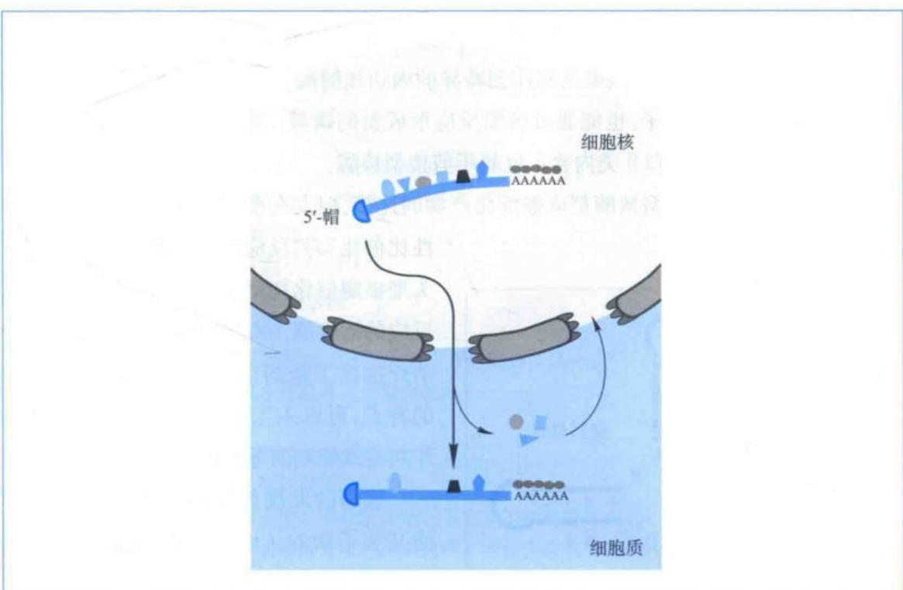  
图 3-41 mRNA 从细胞核转运到细胞质

## 3.11 核酶

核酶(ribozyme)是指一类具有催化功能的 RNA 分子,通过催化靶位点 RNA 链中磷酸二酯键的断裂,特异性剪切底物 RNA 分子,从而阻断基因的表达。“ribozyme”是核糖核酸和酶两个词的缩合词。

1982 年 Cech 从四膜虫 rRNA 前体的加工研究中首先发现 rRNA 前体具有自剪接作用, 提出 ribozyme 的概念, 打破了酶都是蛋白质这种传统的观念。1983 年, Altman 等人发现 RNase P 中的 RNA 组分可以催化 tRNA 前体的加工, 之后的研究还发现 T4 RNA、一些植物的类病毒 (viroid)、拟病毒 (virusoid) 等都能进行自剪接。

核酶的催化功能与其空间结构有密切关系,目前已知有多种特殊结构的核酶,如RNase P的RNA亚基(M1 RNA)、锤头型、发夹型丁型肝炎δ病毒RNA、I类内含子和Ⅱ类内含子等。具有自剪切能力的RNA大多数都能形成锤头结构(hammerhead structure)。该二级结构由3个茎(I、Ⅱ、Ⅲ)构成,茎区是由互补碱基构成的局部双链结构,包围着一个由11\~13个保守核苷酸构成的催化中心(图3-42)。核酶剪切通常发生在H(H是除G以外任意的核苷酸)位点。同一核酶分子由具有催化中心的核酶和含有剪切位点的底物部分共同组成锤头结构,底物部分是切割部位两端的核苷酸,它与核酶的茎I和茎Ⅲ结合,在切割之后该底物被释放,由一个新的没有被切割的底物取代,使切割反应得以重复进行。

不同的核酶具有不同的催化功能,可以分为剪切型核酶和剪接型核酶两大类。

① 剪切型核酶 剪切型核酶只剪不接,能够催化自身 RNA 或不同的 RNA 分子,切下特异的核苷酸序列。M1 RNA 是最典型的例子,在高浓度 $Mg^{2+}$ 存在时,它可特异性地剪切 tRNA 前体 5' 端片段。此外,四膜虫 rRNA 前体的剪接产物 L19 也是一种剪切型核酶。

② 剪接型核酶 该类核酶具有序列特异的内切核酸酶、RNA 连接酶等多种酶的活性, 它既能切割 RNA 分子, 也能通过转酯反应形成新的磷酸二酯键, 连接切割后的 RNA 分子。前面介绍的 I 类和 II 类内含子就属于剪接型核酶。

锤头型核酶和发夹型核酶都能够催化产物的连接,但发夹型核酶催化连接反应的活

## 图 3-42 核酶的锤头结构

该酶包括3个茎环区，其间有一个11\~13个保守核苷酸构成的催化中心。N代表该位置上可以为任意碱基，箭头代表切割部位，H代表除了G以外的核苷酸。在类病毒中，茎Ⅲ的顶部并没有被环连接起来。

性比催化切割反应的活性高约10倍，而锤头型核酶催化切割反应的活性比催化连接反应的活性高100倍。核酶的发现为基因治疗提供了新的策略，因为根据其自剪切的特点，可以人工合成多种核酶以抑制破坏病毒或癌基因等有害基因的功能。

核酶的发现使我们对 RNA 的重要功能又有了新的认识。因此，核酶是继反转录现象之后对中心法则的又一个重要修

正,说明 RNA 既是遗传物质又是酶。核酶的发现为生命起源的研究提供了新思路,也许曾经存在以 RNA 为基础的原始生命。照这么说,蛋白质世界也可能(仅仅是可能)起源于 RNA 世界!

<!-- L-BEGIN Lehninger 26.4 -->

### 【英文对应 Lehninger §26.4：Catalytic RNAs and the RNA World Hypothesis】

> 来源：Lehninger Principles of Biochemistry（书籍/02_生物化学原理） 第26章 RNA Metabolism，§26.4。

P4 The study of posttranscriptional processing of RNA molecules led to one of the most exciting discoveries in biochemistry—the existence of RNA enzymes or ribozymes. The best-characterized ribozymes are the self-splicing group I introns, RNase P, and the hammerhead ribozyme (discussed below). Most of the activities of these ribozymes are based on two fundamental reactions: transesterification (Fig. 26-14) and phosphodiester bond hydrolysis (cleavage). The substrate for a ribozyme is often an RNA molecule, and it may even be part of the ribozyme itself. When its substrate is RNA, the RNA catalyst can make use of base-pairing interactions to align the substrate for the reaction.

#### [EN] Ribozymes Share Features with Protein Enzymes

Like protein enzymes, ribozymes vary greatly in size. A self-splicing group I intron may have more than 400 nucleotides. In comparison, the hammerhead ribozyme consists of two RNA strands with a total of just 41 nucleotides. P4 Also as with protein enzymes, the three-dimensional structure of ribozymes is important for function. Ribozymes, like protein enzymes, are inactivated by heating above their melting temperature or by the addition of denaturing agents or complementary oligonucleotides, which disrupt normal base-pairing patterns. Ribozymes can also be inactivated if essential nucleotides are changed. The secondary structure of a self-splicing group I intron from the 26S rRNA precursor of Tetrahymena is shown in detail in Figure 26-37. This secondary structure highlights the large number of base-pairing and other noncovalent interactions that must occur for the ribozyme to adopt a catalytic structure. Just as amino acid mutations can change activities of protein enzymes, nucleotide mutations can alter the noncovalent interactions required for ribozyme folding and catalysis.

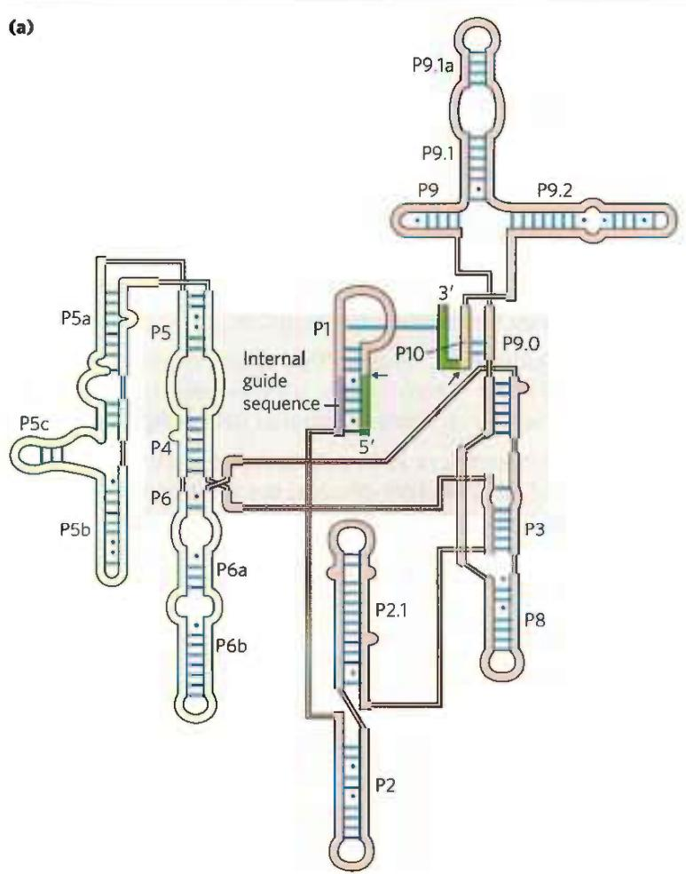  
FIGURE 26-37 Secondary structure of the self-splicing rRNA intron of Tetrahymena. (a) A two-dimensional representation of secondary structure immediately prior to the initiation of the reaction. Intron sequences are shaded yellow and light red; flanking exon sequences are green; the internal guide sequences that help to align reacting segments at the active site are purple. Each thin, light-red line represents a bond between adjacent nucleotides in a continuous sequence (a device necessitated by showing this complex molecule in two dimensions). Short blue lines represent normal base pairing; blue dots indicate G-U base pairs. All nucleotides are shown. The catalytic core of the

P4 Ribozymes share several properties with enzymes besides accelerating the reaction rate, including kinetic behavior and specificity. Binding of the guanosine cofactor to the Tetrahymena group I rRNA intron is saturable ( $K_{m} < 30 \mu M$ ) and can be competitively inhibited by 3'-deoxyguanosine. The intron is very precise in its excision reaction, largely due to a segment called the internal guide sequence that can base-pair with exon sequences near the 5' splice site (Fig. 26-37). This pairing promotes the alignment of specific bonds to be cleaved and rejoined.

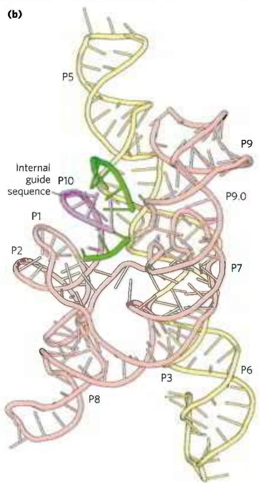  
self-splicing activity is shaded in gray. Some base-paired regions are labeled (P1, P3, P2.1, P5a, and so forth) according to an established convention for this RNA molecule. The P1 region, which contains the internal guide sequence (purple), is the location of the 5' splice site (black arrow). Part of the internal guide sequence pairs with the end of the 3' exon, bringing the 5' and 3' splice sites (black arrows) into close proximity. (b) Three-dimensional structure of a reaction intermediate of the same intron, after guanosine-mediated cleavage (Fig. 26-14) and prior to exon ligation. Segments are colored as in (a). [Data from (a) PDB ID 1GID, J.H. Cate et al., Science 273:1678, 1996. (b) PDB ID 1U6B, P.L. Adams et al., Nature 430:45, 2004.]

Because the intron itself is chemically altered during the splicing reaction—its ends are cleaved—it may seem to lack one key enzymatic property: the ability to catalyze multiple reactions. Closer inspection has shown that after excision, the 414 nucleotide intron from Tetrahymena rRNA can, in vitro, act as a true enzyme (but in vivo it is quickly degraded). A series of intramolecular cyclization and cleavage reactions in the excised intron leads to the loss of 19 nucleotides from its 5' end. The remaining 395 nucleotide, linear RNA—referred to as L-19 IVS (intervening sequence)—promotes nucleotidyl transfer reactions in which some oligonucleotides are lengthened at the expense of others (Fig. 26-38). The best substrates are oligonucleotides, such as a synthetic (C) $_{5}$ oligomer, that can base-pair with the same guanylate-rich internal guide sequence that held the 5' exon in place for self-splicing.

The enzymatic activity of the L-19 IVS ribozyme results from a cycle of transesterification reactions mechanistically similar to self-splicing. Each ribozyme molecule can process about 100 substrate molecules per hour and is not altered in the reaction—that is, the intron acts as a catalyst. It follows Michaelis-Menten kinetics, is specific for RNA oligonucleotide substrates, and can be competitively inhibited. The $k_{cat}/K_{m}$ (specificity constant) is $10^{3} M^{-1} s^{-1}$ , lower than that of many protein enzymes, but the ribozyme accelerates hydrolysis by a factor of $10^{10}$ relative to the uncatalyzed reaction. P4 It makes use of substrate orientation, covalent catalysis, and metal-ion catalysis—all strategies shared with protein enzymes.

#### [EN] Ribozymes Participate in a Variety of Biological Processes

E. coli RNase P has both an RNA component (the M1 RNA, with 377 nucleotides) and a protein component ( $M_{r}$ 17,500). In 1983, Sidney Altman and Norman Pace and their coworkers discovered that under some conditions, the M1 RNA alone is capable of catalysis, cleaving tRNA precursors at the correct position. The protein component apparently serves to stabilize the RNA or facilitate its function in vivo. The RNase P ribozyme recognizes the three-dimensional shape of its pre-tRNA substrate, along with the CCA sequence, and thus can cleave the 5' leaders from diverse tRNAs (Fig. 26-25).

  
FIGURE 26-38 In vitro catalytic activity of L-19 IVS. (a) L-19 IVS (intervening sequence, the term once used for intron) is generated by the autocatalytic removal of 19 nucleotides from the $5^{\prime}$ end of the spliced Tetrahymena intron. The cleavage site is indicated by the arrow in the internal guide sequence (boxed). The G residue (shaded) added in the first step of the splicing reaction is part of the removed sequence. A portion of the internal guide  
sequence remains at the 5' end of L-19 IVS. (b) L-19 IVS lengthens some RNA oligonucleotides at the expense of others in a cycle of transesterification reactions (steps 1 through 4). The 3' OH of the G residue at the 3' end of L-19 IVS plays a key role in this cycle (note that this is not the G residue added in the splicing reaction). (C) $_{5}$ is one of the ribozyme's better substrates because it can base-pair with the guide sequence remaining in the intron.

The known catalytic repertoire of ribozymes continues to expand. Some virusoids, small RNAs associated with plant RNA viruses, include a structure that promotes a self-cleavage reaction; the small hammerhead ribozyme illustrated in Figure 26-39 is in this class, catalyzing the hydrolysis of an internal phosphodiester bond. There are at least nine structural classes of ribozymes that engage in self-cleavage; all use general acid and base catalysis (Fig. 6-8) to promote the attack of a 2'-hydroxyl group on an adjacent phosphodiester bond. Despite being surrounded by proteins, the splicing reaction that occurs in a spliceosome relies on a catalytic center formed by the U2, U5, and U6 snRNAs and intron (see Figs 26-16 and 26-17). And, as we shall see in Chapter 27, an RNA component of ribosomes catalyzes the synthesis of proteins. Exploring catalytic RNAs has provided new insights into catalytic function in general and has important implications for our understanding of the origin and evolution of life on this planet.

  
FIGURE 26-39 Hammerhead ribozyme. Some virusoid RNAs include small segments that promote site-specific RNA cleavage reactions associated with replication. These segments are called hammerhead ribozymes, because their secondary structures are shaped like the head of a hammer. (a) The minimal sequences required for catalysis by the ribozyme. The boxed nucleotides are highly conserved and are required for catalytic function. Guanine nucleotides shaded pink form part of the active site. The arrow indicates the site of self-cleavage. (b) Three-dimensional structure of a hammerhead ribozyme (see Fig. 8-25b for a view of another hammerhead ribozyme). The strands are colored as in (a). The hammerhead ribozyme is a metalloenzyme; $\mathrm{Mg}^{2+}$ ions are required for activity in vivo. The phosphodiester bond at the site of self-cleavage is indicated by an arrow. [Data from PDB ID 3ZD5, M. Martick and W. G. Scott, Cell 126:309, 2006.]

#### [EN] Ribozymes Provide Clues to the Origin of Life in an RNA World

The extraordinary complexity and order that distinguish living from inanimate systems are key manifestations of fundamental life processes. Maintaining the living state requires that selected chemical transformations occur very rapidly—especially those that use environmental energy sources and synthesize elaborate or specialized cellular macromolecules. Life depends on powerful and selective catalysts—enzymes—and on informational systems capable of both securely storing the blueprint for these enzymes and accurately reproducing the blueprint for generation after generation. Chromosomes encode the blueprint not for the cell but for the enzymes that construct and maintain the cell. The parallel demands for information and catalysis present a classic conundrum: what came first, the information needed to specify structure or the enzymes needed to maintain and transmit the information?

How might a self-replicating polymer come to be? How might it maintain itself in an environment where the precursors for polymer synthesis are scarce? How could evolution progress from such a polymer to the modern DNA-protein world? These difficult questions can be addressed by careful experimentation, providing clues about how life on Earth began and evolved.

  
Carl Woese, 1928–2012
[Steve Kagan.]

P4 The unveiling of the structural and functional complexity of RNA led Carl Woese, Francis Crick, and Leslie Orgel to propose in the 1960s that this macromolecule might serve as both information carrier and catalyst. Since that time, at least six lines of evidence have given increasing substance to their RNA world hypothesis.

1. Prebiotic Chemistry Experiments The probable origin of purine and pyrimidine bases is suggested by experiments designed to test hypotheses about prebiotic chemistry (pp. 31–32). Beginning with simple molecules thought to be present in the early atmosphere (CH₄, NH₃, H₂O, H₂), electrical discharges mimicking lightning generate, first, more reactive molecules such as HCN and aldehydes, then an array of amino acids and organic acids (see Fig. 1-33). When molecules such as HCN become abundant, purine and pyrimidine bases are synthesized in detectable amounts. Remarkably, a concentrated solution of ammonium cyanide, refluxed for a few days, generates adenine in yields of up to 0.5% (Fig. 26-40). Adenine may well have been the first and most abundant nucleotide constituent to appear on Earth. Intriguingly, most enzyme cofactors contain adenosine as part of their structure, although it plays no direct role in the cofactor function (see Fig. 8-41). This may suggest an evolutionary relationship. Based on the simple synthesis of adenine from cyanide, adenine may simply have been abundant and available.

  
FIGURE 26-40 Experiments supporting prebiotic synthesis of adenine from ammonium cyanide. Adenine is derived from five molecules of cyanide, denoted by shading.

2. The Existence of Catalytic RNAs P4 In an "RNA world," RNAs, not proteins, act as catalysts. Perhaps more than anything else, the discovery of ribozymes gave life to the RNA world hypothesis and led to widespread speculation that an RNA world might have been important in the transition from prebiotic chemistry to life (see Fig. 1-35). The parent of all life on this planet, in the sense that it could reproduce itself across the generations from the origin of life to the present, might have been a self-replicating RNA, or a polymer with equivalent chemical characteristics.

3. The Expanding Catalytic Repertoire of Ribozymes A self-replicating polymer would quickly use up available supplies of precursors provided by the relatively slow processes of prebiotic chemistry. Thus, from an early stage in evolution, metabolic pathways would be required to generate precursors efficiently, with the synthesis of precursors presumably catalyzed by ribozymes. The extant ribozymes found in nature have a limited repertoire of catalytic functions, and of the ribozymes that may once have existed, no trace is left. To explore the RNA world hypothesis more deeply, we need to know whether RNA has the potential to catalyze the many different reactions needed in a primitive system of metabolic pathways.

The search for RNAs with new catalytic functions has been aided by the development of a method that rapidly searches pools of random polymers of RNA and extracts those with particular activities; known as SELEX, this is nothing less than accelerated evolution in a test tube (Box 26-4). It has been used to generate RNA molecules that bind to amino acids, organic dyes, nucleotides, cyanocobalamin, and other molecules. Researchers have isolated ribozymes that catalyze ester and amide bond formation, $S_{N}2$ reactions, metallation of (addition of metal ions to) porphyrins, and carbon-carbon bond formation. The evolution of enzymatic cofactors with nucleotide “handles” that facilitate their binding to ribozymes might have further expanded the repertoire of chemical processes available to primitive metabolic systems.

4. The Structure of the Ribosome As we shall see in Chapter 27, some natural RNA molecules, components of ribosomes, catalyze the formation of peptide bonds, offering a glimpse of how the RNA world might have been transformed by the greater catalytic potential of proteins. The evolution of a capacity to synthesize proteins would have been a major event in the RNA world, allowing the generation of polymers that could greatly stabilize complex RNA structures. However, the onset of peptide synthesis would also have hastened the demise of the RNA world. Proteins simply have more catalytic potential. The information-carrying role of RNA may have passed to DNA because DNA is chemically more stable. RNA replicase and reverse transcriptase may be modern versions of enzymes that once played important roles in making the transition to the modern DNA-based system.

5. Extant Vestiges of an RNA World The known functions of RNA continue to multiply with each decade. Retroviruses, other RNA viruses, and retrotransposons inhabit a semi-independent universe, maintaining a parasitic existence within the biosphere. For evolutionary biologists, these almost-living entities provide a window on key steps in the evolution of life. Transposons may have been an early innovation in an RNA world. With the appearance of the first, inefficient self-replicators, transposition could have been an important alternative to replication as a strategy for successful reproduction and survival. Early parasitic RNAs would simply hop into a self-replicating molecule via catalyzed transesterification, then passively undergo replication. Natural selection would have driven transposition to become site-specific, targeting sequences that did not interfere with the catalytic activities of the host RNA. Replicators and RNA transposons could have existed in a primitive symbiotic relationship, each contributing to the evolution of the other. Modern introns, retroviruses, and transposons may all be vestiges of a "piggyback" strategy pursued by early parasitic RNAs. These elements continue to make major contributions to the evolution of their hosts.

6. Progress in the Search for an RNA Replicator The RNA world hypothesis requires a nucleotide polymer to reproduce itself. Can a ribozyme bring about its own synthesis in a template-directed manner? Researchers are getting closer to finding such a ribozyme or ribozyme system. For example, Gerald Joyce and colleagues, in 2009, reported on the first set of two ribozymes that could cross-catalyze each other's formation (Fig. 26-41). One ribozyme, E, catalyzes the joining of two oligonucleotides (A' and B') to create a second, complementary

FIGURE 2 RNA aptamer that binds ATP. The shaded nucleotides are those required for the binding activity.

#### [EN] The SELEX Method for Generating RNA Polymers with New Functions

SELEX (systematic evolution of ligands by exponential enrichment) is used to generate aptamers, oligonucleotides selected to tightly bind a specific molecular target. The process is generally automated to allow rapid identification of one or more aptamers with the desired binding specificity.

Figure 1 illustrates how SELEX is used to select an RNA species that binds tightly to ATP. In step ①, a random mixture of RNA polymers is subjected to "unnatural selection" by passing it through a resin to which ATP is attached. The practical limit for the complexity of an RNA mixture is about $10^{15}$ different sequences, which allows complete randomization of 25 nucleotides ( $4^{25} = 10^{15}$ ). For longer RNAs, the RNA pool used to initiate the search does not include all possible sequences. RNA polymers that pass through the column are discarded (step ②); those that bind to ATP are washed from the column with salt solution and collected (step ③). In step ④, the collected RNA polymers are amplified by reverse transcriptase to make many DNA complements to the selected RNAs, then an RNA polymerase makes many RNA complements of the resulting DNA molecules. Finally, in step ⑤, this new pool of RNA is subjected to the same selection procedure, and the cycle is repeated a dozen or more times. At the end, only a few aptamers — in this case, RNA sequences with considerable affinity for ATP — remain.

Critical sequence features of an RNA aptamer that binds ATP are shown in Figure 2; molecules with this general structure bind ATP (and other adenosine nucleotides) with $K_{d} < 50 \mu M$ . Figure 3 presents the three-dimensional structure of a 36 nucleotide RNA aptamer (shown as a complex with AMP) generated by SELEX. This RNA has the backbone structure shown in Figure 2.

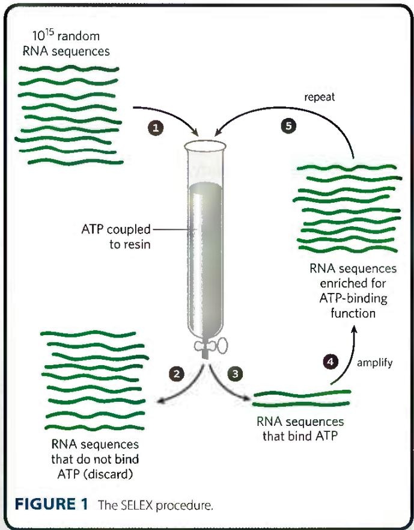

In addition to its use in exploring the potential functionality of RNA, SELEX has an important practical side in identifying short RNAs with pharmaceutical uses. Finding an aptamer that binds specifically to every potential therapeutic target may be impossible, but the capacity of SELEX to rapidly select and amplify a specific oligonucleotide sequence from a highly complex pool of sequences makes this a promising approach for generating new therapies. For example, one could select an RNA that binds tightly to a receptor protein prominent in the plasma membrane of cells in a particular cancerous tumor. Blocking the activity of the receptor, or targeting a toxin to the tumor cells by attaching it to the aptamer, would kill the cells. SELEX also has been used to select DNA aptamers that detect anthrax spores. Many other promising applications are under development.

  
FIGURE 3 RNA aptamer bound to AMP. The bases of the conserved nucleotides (forming the binding pocket) are pale green; the bound AMP is red. [Data from PDB ID 1RAW, T. Dieckmann et al., RNA 2:628, 1996.]

  
FIGURE 26-41 Self-sustained replication of an RNA enzyme. This system has many of the properties of a living system. The RNA molecules incorporate information and catalytic function, and the reactions produce an exponential increase in the product RNAs. When variants of the RNA substrates are introduced, the system undergoes natural selection such that the best replicators eventually dominate the population. (a) A possible reaction scheme. Oligoribonucleotides A and B anneal to ribozyme E' and are ligated catalytically to form ribozyme E. The joining

ribozyme called E'. E' could then catalyze the joining of two other oligonucleotides (A and B) to form another molecule of E. In this system, the formation of E and E' was templated, and the amounts grew exponentially as long as substrates were available and proteins were absent. The system evolved so that more-efficient enzymes appeared in the population. A more general RNA-polymerase-like ribozyme was described in 2011 by Philipp Holliger and colleagues.

Although the RNA world remains a hypothesis, with many gaps yet to be explained, experimental evidence supports a growing list of its key elements. Further experimentation should increase our understanding. Important clues to the puzzle will be found in the workings of fundamental chemistry, in living cells, and perhaps on other planets.

  
of oligoribonucleotides A' and B' is similarly catalyzed by ribozyme E. The levels of E and E' grow exponentially, with a doubling time of about one hour at 42 °C, as long as there is a supply of the precursors A, B, A', and B'. (b) The ligation reaction involves attack of the 3' OH of one oligoribonucleotide on the α phosphate of the 5'-triphosphate of the other oligoribonucleotide. Pyrophosphate is released. Base pairing of the substrates with the ribozyme plays a key role in aligning the substrates for the reaction. [Information from T. A. Lincoln and G. F. Joyce, Science 323:1229, 2009.]

#### [EN] SUMMARY 26.4 Catalytic RNA and the RNA World Hypothesis

\- Ribozymes and protein-based enzymes share common features, including folded three-dimensional structures, inactivation by denaturation, acceleration of reaction rates, saturable kinetics, and reaction specificity.

\- Ribozymes and RNA-based catalysts are present in organisms today and are involved in a wide range of activities, including tRNA processing, nuclear pre-mRNA splicing, and translation.

The evolution of life on Earth may have included an RNA world in which RNA was the central information carrier and catalyst before proteins and DNA emerged as key players. The existence of ribozymes provides a powerful piece of evidence in support of this hypothesis.

<!-- L-END Lehninger 26.4 -->

## 3.12 RNA 在生物进化中的地位

我们曾在本章开篇时说过,基因是唯一能自主复制、世代相传并永久存在的遗传学单位。中心法则也阐明了 DNA 作为遗传信息的贮存者,是生命遗传和生物进化的“中心”。那么,RNA(或许还包括蛋白质!)有没有可能在生物遗传变异的历史演变中起作用呢?

研究发现,RNA不仅具有极大的拷贝数,其变异率高达 $10^{-3}\sim10^{-4}$ 核苷酸/RNA分子,翻译错误率累加可达 $10^{-1}\sim10^{-2}$ 氨基酸/蛋白质分子,能够产生各种不同蛋白质而迅速积累信息。这就是说,RNA在基因表达过程中有一定的离散,正如鸟枪射击会有一些铅弹偏离靶心一样。RNA比相应DNA序列含有更多的遗传信息,可通过剪接、改变和校正阅读框架等方式表达出多种蛋白质异构体(同工酶?),还可能通过反转录产生与RNA信息相一致的DNA分子,直接影响后代的基因型,这种作用也可称之为“反馈效应”。

其次，RNA 还是获得性遗传(表观遗传)的分子基础。所谓获得性遗传是指有机体在生长发育过程中由于环境的影响而不是基因突变所形成的新的遗传性状。在 3 类主要生物大分子中，DNA 是信息分子，蛋白质是功能分子，RNA 既是信息分子，又是功能分子，它在表达过程中起着信息提取和加工的作用。环境可以影响和诱导 RNA 的产生及信息的加工，从而使机体表现出新的性状，这种性状如果传递给子代细胞或个体，就产生获得性遗传。实际上，不仅核酸分子是遗传信息的载体，某些亚细胞结构、细胞器和生物膜也能传递部分遗传信息，它们在环境影响下发生的结构改变有时也能传递给后代。因此，任何主观武断的结论都可能经不起历史的检验。

<!-- W-BEGIN Watson 17 生命起源和早期进化 -->

### 【中文对照 Watson 第17章：生命起源和早期进化】

> 来源：Watson《基因的分子生物学》第七版中译本（书籍/03_基因的分子生物学_第七版） 第17章 生命起源和早期进化。

#### [W] 第17章 生命的起源与早期演化

本章概要
- 地球上的生命是何时出现的？
- 生命起源以前的有机化学基础是什么？
- 生命是从RNA世界演化而来的吗？
- 自我复制的核酶可以由定向演化得到吗？
- 达尔文演化论需要自我复制的原生细胞吗？
- 生命起源于地球上吗？

细胞行为是通过大量分子机器间精致协调的工作实现的。除了少数例外，这些分子机器主要由蛋白质组成，共同执行着细胞一生中几乎所有的活动。这些活动很多已在本书进行了讨论，如基因组的复制和修复、基因表达调控、细胞分裂以及染色体分离。此外，新陈代谢，能量生成和光合作用也由蛋白质介导，这些蛋白质一般会与一些小分子辅助因子共同作用。简而言之，我们生活在一个“蛋白质世界”，即生命的基础来自于氨基酸聚合物的协同作用。如果确实如此，我们有理由询问这一切从何而来。实际上，没有什么问题比以蛋白质为基

础的生命如何起源于地球更深刻的了（假设它确实起源于这个星球的话）。我们不得不追问，通过什么样的化学过程和物理事件造就和演化出我们看到的这种基于蛋白质的生物圈。

生命起源的第一个问题就相当令人费解。如果 DNA 复制和遗传信息翻译成蛋白质是由蛋白质完成的，那么在蛋白质产生之前遗传物质又是怎样复制和表达的呢？假设以核酸为基础的遗传物质的确在“原始汤”（primordial soap）中出现，那么它如何指导它传代所需要的特定蛋白质的合成，特别是在所有蛋白还未出现之时？这种传代是否可能在原始的细胞（原生细胞，protocol）出现之前就发生了，即出现包裹复制元件的膜系统之前？同时这些原生细胞又是如何产生的？不仅逻辑观念上存在矛盾，客观的生物历史过程同样十分难于入手研究。我们不能回到过去来重新审视生命起源中的事件，留给我们的化石线索很少或根本没有。尽管困难重重，分子生物学仍然可以提出假设，关于生命是如何起源的并以“原则证明”（proof-of-concept）的方式在试管中创造一个生命。

我们应该如何确切地定义生命呢？生命之所以难以定义是因为它是一个过程而非一个物体。即使是学龄前的儿童也可以相当确定地区分生命体和非生命体。这里，为了便于说明本章的目的，我们采用最低限度的定义，因为它可以更好地适用于最简单的生命体：当下的生命来自于一个可以自我复制的系统并受到达尔文演化的作用。自我复制（self-replication）是指系统仅依赖于小分子和能量完成传代；达尔文演化（Darwinian evolution）是指受到突变和修饰的影响，系统允许经受选择变得复杂化和多样化，从而提高传代的效率。

当代的所有生命形式中，最简单的自由存在的生命体要数支原体（Mycoplasma）了。这些细菌缺少细胞壁，基因组很小，如生殖器支原体（Mycoplasma genitalium），基因组大小只有580kb，仅包含500个蛋白编码基因。尽管病毒比支原体更简单，但这些小的传染因子并不被认为是有生命的，因为它们不具有细胞结构，不能通过细胞分裂传代，并依赖其宿主细胞提供复制周期所需要的大多数小分子和能量。除此之外，某些昆虫的胞内共生体也比支原体的基因更小，如蝉的共生体Hodgkinia cicadicola，它的的基因组只有144kb。但是，不同于支原体的是，这些共生体只能生存在昆虫宿主细胞内，它们有必须依赖宿主才能完成新陈代谢和繁殖。

支原体组成非常简单，仅包括一套简单的细胞质膜和胞质分裂系统、包括染色体的复制和分离系统，蛋白质的合成与代谢系统，它代表了以蛋白质为基础生命所能达到的最小组成方式。（尽管很简单，支原体并不能体现最早期生命体的形式。相反，它们是由功能更复杂的细菌在演化过程中丢失了很多基因形成的。这些细菌具有细胞壁和更大的基因组。）有趣的是，甚至有可能在实验室中合成一种被称为L型（L-form）的无细胞壁的细菌，它类似于支原体但是缺少细胞分裂的功能。事实上，这些L型细菌可以通过一种自发的出泡方式分裂。因此，生命的最小组成方式其实可以不包含胞质分裂（cytokinesis）所需要的基因。

鉴于支原体细菌的基因组如此之小，人工合成蕈状支原体（Mycoplasma mycoides）的全部基因组是可行的，依靠这一人工基因组科学家进而可以创造一个活细胞。蕈状支原体内100万个碱基对的基因组可以通过化学合成产生，化学合成的1kb的单元进一步组装成全部基因组序列，并在酵母（作为代理宿主细胞）中完成传代（图17-1）。最后一步时，合成的蕈状支原体基因组DNA从酵母中提取并接种至另一种支原体的细胞质取代该细菌的基因组。这一过程创造了一种基因组全部由人工合成的自有存活的细菌（图17-2）。

本章将讨论在何种条件下简单封装的分子系统如何获得了自我复制的能力，以及如何通过达尔文演化使这些原始的系统成为现代生物的原始祖先。与本书中的其他主题不同的是，我们对生命起源的理解还大致停留在猜想阶段。所以我们采用提出一系列问题的方式展开本章的讨论。

#### [W] 地球上的生命是何时出现的？

假设现在的生物起源于地球上（而不是来自于宇宙中的某个角落），我们可以推定生命的起源不会早于水的出现。地球的形成源自亿万年的构造运动，其中月亮的形成源于一次剧烈碰撞形成的抛射体，这一发生在45亿年（4.5 gigaannum，Ga，1Ga= $10^{9}$ 年）前的碰撞奠定了地球表面的大致形状。撞击形成的冲击力之强足以融化地球的地幔层。

  
图 17-1 合成基因组。图示化学合成蕈状支原体的完整基因组的策略。1000bp 的盒式片段（黄色箭头所示）分布组装起来，逐渐延长，形成完整的人造染色体，并使用酵母作为其宿主细胞（引自 Gibson D.G. et al. 2010. Science 329: 52–56. ©AAAS. 获得作者许可）。

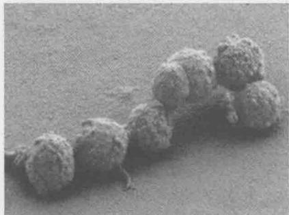  
图 17-2 合成的基因组形成的活细菌。以图 17-1 的方法合成的完整的人造染色体从酵母细胞中分离并替换另一种支原体的天然染色体。这里展示扫描电镜获得的蕈状支原体 JCVI-Syn1.0，均携带人工合成基因组。每个细菌的直径约为 500nm（图片来自于 Thomas Deerinck 和 Mark Ellisman，NCMIR，UCSD，以及 John Glass，JCVI。）。

直到地幔被足够冷却之前，液态水都不会出现在地面上。地球形成的地质时期约为3.8Ga，对应着现今发现的年龄最古老、保存完好的沉积岩，这个地址纪年称为冥古宙（Hadean）。之后的太古宙（Archaean）结束在大约2.5Ga，含氧的大气圈也在这一时期出现（图17-3）。锆的同位素分析显示海洋的出现不晚于4.4Ga，水圈由此在这一冥古宙的时期稳定下来（约为4.2Ga），这就界定了生命起源的早期界限。

生命是何时出现在水环境中的呢？早期生命的样式很难确认。然而，叠层石（stromatolite，一种分层的结构）中的微生物群落化石沉积物证据证明生命至少在3.5Ga的太古宙就出现了，关于生物碳和硫的同位素证据同样证明了这一点。尽管具体的时间不确定，但是显然生命在冥古宙或者太古宙早期就出现了。生

命起源的时间点可能不止一个，这又增加了问题的复杂性。除了现代生命的“最后共同祖先”（Last Universal Common Ancestor）之外，早期的生命可能有更多样的形式，并且“最后共同祖先”的出现既可能早于也可能晚于包括在化石证据中的其他生命形式。

#### [W] 生命起源以前的有机化学基础是什么？

生命的结构元件是有机分子（organic molecules）。如果生命自发地诞生于地球上，那么必然由有机分子的不同组合形成了现代生物的基本组分。在我们的蛋白质生命中，氨基酸、糖类、核苷酸和脂类都是由多步骤的酶促生物合成反应产生的。那么，这些生命的有机元件在生命诞生之前是如何产生的呢？

  
图 17-3 早期地球和生命出现的地理时间表。展示了从冥古代至太古代地球形成的一系列事件，以及依据 RNA 世界假说的生命来源的相应事件。（经过许可调整自 Barton N.H. et al. 2007. Evolution, Fig. 4.4, p. 91. Cold Spring Harbor Laboratory Press. 和 Joyce G.F. 2002. Nature 418: 214–221. Macmillian.）

在分子生物学的历史上，1953年是个值得铭记的年份，这一年不仅James D. Watson和Francis H. Crick革命性地发现了DNA结构，Stanley Miller和Harold Urey也提出了早期地球环境。Miller和Urey在一个密封的烧瓶中注入水、甲烷、氨和氢气，并给予高度的电压（图17-4）。一周之后，他们发现相当比例的甲烷转化成了有机分子的混合物，包含了11种氨基酸的外消旋产物。Miller之后进行了一些类似的实验，对实验产物分析发现，当加入氢硫化物后，现今蛋白质中常见的20种氨基酸都可以这样的体系环境中合成。值得注意的是，另一群科学家在Miller实验半个多世纪后进行了同样的分析，并封存了烧瓶。由于当时学界认为早期地球的大气环境富含甲烷，Miller实验中加入了大量的甲烷，但是，现在学界更倾向于认为早期大气环境中甲烷的含量并不高（某些短暂的阶段除外），碳元素更多的以二氧化碳的形式存在。然而，用二氧化碳、氮气和水在早期地球环境模拟（电场、离子辐射和紫外线辐射等）实验中也可以生成有机分子。

尽管 Miller 和 Urey 形象的实验成功地模拟了早期地球化学环境（prebiotic chemistry），合成了生物分子，但在相似的条件下成功地合成多聚核苷酸的实验直到不久之前才告成功。一些合成核苷酸的早期的努力都失败了，当时研究者试图通过磷酸盐、核糖和碱基的作用实现。现在，合成核苷酸是通过一种包含 4 个有机分子的新途径，它们分别是氨腈（cyanamide）、丙炔腈（cyanoacetylene）、羟乙醛（glycolaldehyde）和甘油醛（glyceraldehyde）（图 17-5）。举例来讲，丙炔腈是甲烷和氮气在一定电场中反应的主要产物。其他主要被发现的分子包括羟乙醛、氨腈和磷酸盐（作为缓冲液和酸性催化剂），它们相互作用形成的中间产物2-氨基唑可进一步合成嘧啶环或者戊糖（图17-5）。丙炔腈、甘油醛和磷酸将进一步使2-氨基唑转化为核苷酸。因此，与直接将磷酸盐、核糖和碱基连接在一起的途径不同，这一新的策略使用一种既不是碱基也不是核糖的中间体合成核苷酸。

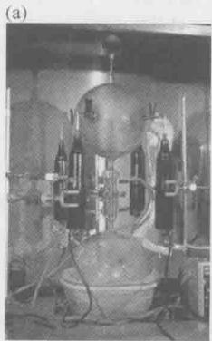

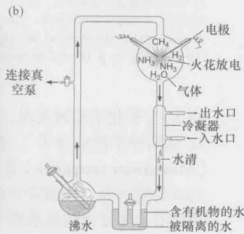  
图 17-4 Miller-Urey 实验。实验显示水、甲烷、氨、氢气可以合成氨基酸。（a）当时的实验设备（感谢美国宇航局提供照片）。（b）设备的示意图及实验的步骤。反应在一个 5L 的玻璃瓶中进行，水被加热至 500℃，水蒸气和其他气体在钨电极产生的电场作用下相互撞击。水蒸气在冷凝器中冷却为液态，再被收集至 U 形管的管底，这些水中的分子将被鉴定化学成分。

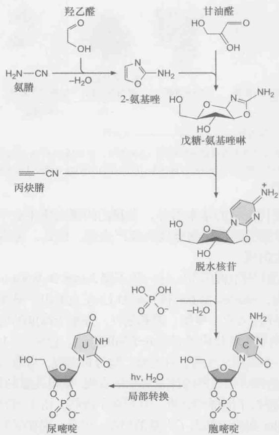  
图 17-5 从有机小分子合成嘧啶核苷酸。最近发现的从有机小分子合成嘧啶核苷酸的途径。羟乙醛和氰胺是反应的结构元件，它们的相互作用可以生成2-氨基唑（2-amino-oxazole），这一分子可以形成戊糖的一部分并进入嘧啶环中。在戊糖上加入甘油醛形成戊糖-氨基恶唑，进而与丙炔腈结合后形成嘧啶。将嘧啶与磷酸盐进行不同的重排和反应可以转化形成胞嘧啶和尿嘧啶。（获得许可引自 Sutherland J.D. 2010. Ribonucleotides. The origins of life (ed. Deamer D. 和 Szostak J.W.), pp. 109–121, Fig. 2, p. 114. ©Cold Spring Harbor Laboratory Press.）

一些研究显示核苷酸可以在黏土中形成寡聚核苷酸。黏土的显微分层结构可以吸收和富集核苷酸，促进它们之间的相互作用形成核糖核苷酸链（图 17-6）。总体来讲，这些近期研究成果成功地填补了我们理解生命起源的一个重要的空白。由此，之后的一个关于生命早期形式的非常引人注目的观点才能够自圆其说，即具有自我复制功能的 RNA 分子是地球生命的源头（我们将在后面的章节做详细阐述）。

最后，生命史前的有机分子并不一定仅仅从地球环境中的碳演化而来。考虑到月球形成的影响，有机分子也可能从由彗星和陨石带到地球。在一些球粒状陨石（它们在坠落地球的过程中没有完全融化）上曾发现了碳源的物质（碳质陨

石）。分析化学检测发现，这些碳质陨石上有大量的氨基酸外消旋产物（包括了L型和D型两种手性的分子），其中一些氨基酸是现代蛋白质中的常见氨基酸。默奇森陨石（Murchison meteorite）是一个大型的被广泛研究的碳质陨石，它于1969年坠落在澳大利亚的默奇森，表面富含有机分子（图17-7）。有趣的是，在默奇森陨石和其他一些碳质陨石上鉴定出的氨基酸（如异缬胺酸），它们的L-型分子的比例超过了D-型分子，甚至仅有L-型分子存在。人们可以相信，L-型氨基酸的同手性广泛存在是生命起源早期阶段的一个特征（可能是由于L型过多转换为D型而引起的）。在默奇森陨石上的另一个激动人心的发现是核苷酸的识别（包括尿嘧啶）。因此，由碳质陨石将氨基酸和核苷酸转运到地球上可能从化学上帮助了早期生物系统的大量繁衍。

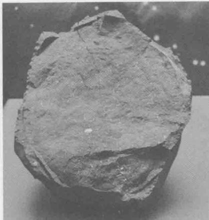  
图 17-7 默奇森陨石。该陨石收藏于华盛顿的国家自然历史博物馆(National Museum of Natural History)。已知的陨石总重 100kg。(http://en.wikipedia.org/wiki/File: Murchison\_crop.jpg.)

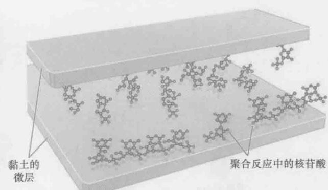  
图 17-6 推测泥土在多聚核糖核苷酸合成中的作用。泥土中的矿物质通过结合和富集核苷酸分组推动磷酸二酯键的形成。泥土中的显微分层在生命起源和多核糖核苷酸形成中发挥相似的作用。（获得许可调整自 Ricardo A. and Szostak J.W. 2009. Sci. Am. 301: 54–61. ©Andrew Swift MS CM1.）

#### [W] 生命是从 RNA 世界演化而来的吗？

正如我们在第 5 章所学到的，RNA 在结构和功能上具有广泛的多样性，它甚至可以作为一种酶。RNA 酶（核酶，ribozyme）的发现为本章开始时提出的矛盾提供了一种解决的思路。如果 RNA 既可以作为信息的载体又具有自我复制的能力，那么在理论上，生命就无需以蛋白质的形式开始。从这种观点来看，突变和自然选择将最终使生命系统有能力依照核酸序列的信息合成肽键。这种理论，即现代的蛋白质基础的生命体来自早期的 RNA 和其他小分子基础的生命体，被称为 “RNA 世界” 假说（RNA World hypothesis）：蛋白质世界来自于原生的 RNA 世界（图 17-3）。

如果这一理论是真实的话，有什么证据表明早期生命的基础是 RNA 呢？很多分子生物学的证据支持 RNA 世界是存在过的，包括自我剪接的内含子、核酶、核糖开关（riboswitch，见第 20 章），以及具有核苷酸成分的酶辅因子，如辅酶 A（coenzyme A）、黄素腺嘌呤双核苷酸（flavin adenine dinucleotide）和烟酰胺腺嘌呤（nicotinamide adenine dinucleotide）。除此之外，核糖核苷酸可以通过生物合成作用变成脱氧核糖核苷酸也符合 RNA 先于 DNA 的理论。虽然这些证据都是间接的，我们也有一个典型而显著的早期生命的遗迹：催化肽键形成是由核糖体中的 RNA 成分完成的。

正如在第 5 章指出并在第 15 章详细讨论的，核糖体的核心是核酶（ribozyme），是核糖体大亚基中的一个大分子 RNA（在细菌中达到 23S），它可以催化形成肽键，把 tRNA 带入核糖体的氨基酸共价结合到正在形成的肽链上。第 15 章呈现的核糖体结构显示这一催化反应完全由 RNA 成分而不是由蛋白质成分完成的，所有核糖体蛋白上的氨基酸侧链没有参与到催化中心的结构中。与其他作用于磷中心的自然出现的核酶不同，核糖体中的核酶作用在碳中心完成肽键的合成反应（图 17-8）。因此，蛋白质世界最基本的化学反应是通过 RNA 分子催化完成的。人们有理由相信核糖体中的核酶是更早期生命的分子化石，更多的大分子合成在当时都是由 RNA 执行的。

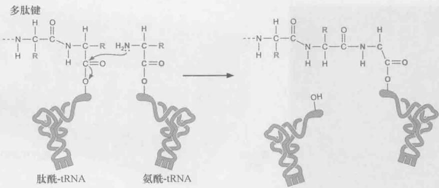  
图 17-8 肽基转移酶作用于碳原子形成肽键。由复核的 tRNA 携带进入核糖体的氨基酸与延伸中的肽链形成肽键，具体的亲质子反应发生氨基酸的氨基和肽链末端羧基的碳中心上。整个反应由核糖体大亚基上的大分子 RNA 组分催化完成（见第 15 章）。

就像诗可以违反普通语法一样,RNA 也让我们丢掉了许多生物学规则。如果说 DNA 是刻板的、始终如一的,那么 RNA 就是随性的和富于创造的。RNA 是个不守规矩的家伙,它把储存遗传信息的地位让给了 DNA,由此获得了更广泛的功能。它是建筑大师,可以形成复杂的三维结构,它在蛋白质学会如何成为酶之前就能够执行催化反应。简而言之,生命很有可能起源于 RNA 世界。

#### [W] 自我复制的核酶可以由定向演化得到吗？

虽然现在已经不可能回到生命史前去验证 RNA 聚合酶核酶在原生生物中存在的假说，但我们可以通过定向演化（directed evolution）在实验室中创造出具有自我复制功能的核酶。这种 RNA 聚合酶核酶在原理上可以阐明生命始于一种非蛋白的复制。我们习惯上将 RNA 视为一种单链线性分子，但是具有自我复制功能的核酶的 RNA 呈双链结构，可以通过与模板 RNA 的互补配对合成核糖核苷酸。迄今为止，人们还不能获得具有完全复制自身能力的 RNA 聚合酶核酶。然而，有能力通过模板依赖的方式完成核糖核苷酸聚合反应的 RNA 聚合酶核酶已经可以在实验室产生。

正如我们在第5章中论述的，通过几轮突变、分化和选择生成一种具有特定功能的RNA家族是可能的，即它们可以合成任意的RNA序列（参见定向演化的论述和图5-8）。这种策略被称为指数扩增的系统性配体演化实验（systematic evolution of ligands by exponential enrichment, SELEX），它利用了随机生成的RNA之间巨大的序列多样性。就RNA聚合酶核酶而言，定向演化需要两个步骤（图17-9）。第一步，具有催化连接作用的核酶受到选择，它可以将一个RNA的3'羟基和另一个RNA的5'三磷酸基团连接起来，这一连接过程需要一个与以上两个RNA都互补配对的模板来将其在空间上拉近。磷酸二酯键（phosphodiester）的化学合成过程与单个核苷酸的三磷酸基团连接RNA分子3'羟基的过程相似，所以上述的连接策略在第一步中使用，通过一段互补的RNA模板序列将两个 RNA 分子彼此退火黏合在一起，再进行共价连接则更为容易。在第二步中，这样的连接酶核酶会被引入到反应中，经过数轮循环以增加序列的多样性，这时我们将选择可以使核苷酸接触到其 3' 端的 RNA 分子。3' 端的延伸使核酶增长，我们将利用这一点来选择所需的分子，即依赖 RNA 模板加入额外的核苷酸。经过后续多轮的选择后，我们将获得具有更强的聚合效力的酶；同时应用多样的模板，可以为最终产生的核酶在引入与这些模板互补的非原始序列，从而提升酶促活性。

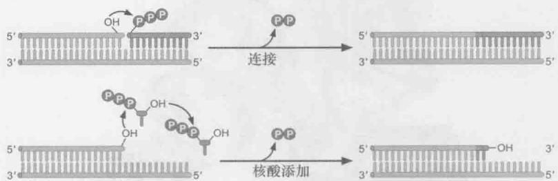  
图 17-9 比较 RNA 连接和 RNA 核苷酸聚合。在连接反应中，一个 RNA 分子的 3'-OH 和另一个 RNA 分子的 5'端通过磷酸二酯键的形成和焦磷酸酯（pyrophosphate）的释放完成连接反应。聚合反应的化学过程与之类似，但将 RNA 分子的 3'-OH 与某个核苷酸结合而不是与另一个 RNA 分子结合。

应用这一策略最多可以产出约 200 个核苷酸长的 RNA 聚合酶核酶，这种酶能够在 RNA 链的 3'端以模板依赖的方式准确地延伸 20 个碱基，从而能够形成 RNA 螺旋结构的两次缠绕。而在最近，新的实验策略可以让 RNA 聚合酶核酶生成长达 95 个核苷酸的 RNA（尽管合成效率较低）。在新的研究成果中，RNA 聚合酶核酶可以使退火到独立 RNA 模板上的引物进行延伸反应。令人惊讶的是，核酶可以通过其“锤头结构”（hammer head）来保证对于模板复制的完整性（我们将在第 5 章做详细讨论），从而使 RNA 产物获得酶的活性。这种核酶自身生成的具有“锤头结构”的核酶有能力准确地剪切 RNA 形成功能所需的亚单位。

这些 RNA 聚合酶核酶是什么样子的？是怎样工作的呢？这些我们还不能确切地知道，但是现存的分子可以给我们线索，一种 120 个核苷酸的连接酶核酶与定向演化过程起点的聚合酶核酶在结构上具有相似之处。核酶的三级结构包含了三个螺旋状的结构域，它们在空间上形成一个类似三脚架的样式，其中催化中心在图中标记为黄色（图 17-10）。通过化学修饰和替换特定的碱基可以鉴定出哪些序列对于催化起到至关重要的作用。分子生物学的证据显示在活性位点的胞嘧啶作用很大，该碱基上的外环氨基在磷酸二酯键合成的过程中可以稳定焦磷酸上的负电荷[详见第 9 章关于蛋白聚合酶（proteinaceous polymerases）合成磷酸二酯键的论述]。

即使学界已经取得了这些成果,我们距离得到一个能够合成自身序列的核酶仍有很长的路要走。我们需要的核酶要有能力制造并分离出一个新的完整的自身分子。这给我们带来了另一个概念上的矛盾:一个单一的 RNA 分子看上去不可能既作为复制自身时的模板,又可以在复制过程中发挥聚合酶的作用。事实上,原生的聚合酶核酶是可以产生中间分子作为模板来完成复制的。在复制过程中,核酶和它的模板中间分子会通过互补配对形成临时的 RNA-RNA 双链结构,其中一个发挥复制酶作用,另一个作为合成新酶的模板(图

17-11）。下一轮的循环反应通过互补配对的复制过程产生新的复制酶，而合成新的复制酶也意味着合成新的互补模板；反过来，这些模板分子可以用来合成更多的复制酶。

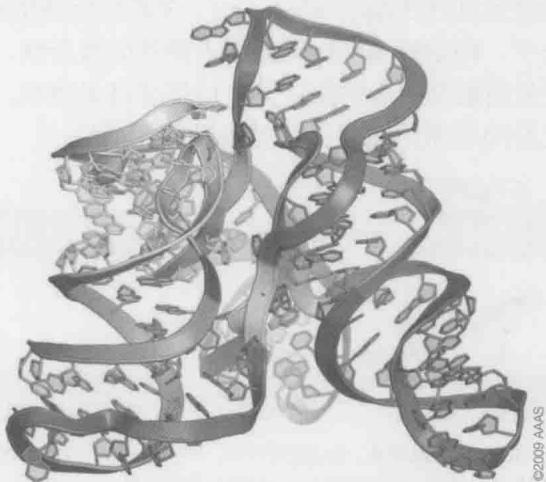  
图 17-10 RNA 连接酶核酶结构。三脚架样的晶体结构上包含三个结构域，分别标记为蓝色、粉色和紫色，其中紫色结构域上含有催化中心（黄色）和连接位点（红色）。（获得许可调整自 Shechner D.M. et al. 2009. Science 326: 1271–1275, Fig. 1C. AAAS；由 D.M. Shechner 惠赠。）

  
图 17-11 原生的复制酶核酶通过与自身的互补配对完成复制。由于复制酶（初始的复制酶标记为绿色）的产物与其自身配对，新合成的 RNA 链并不是复制酶（标记为紫色），而是它的配体，它反过来可以作为合成新的复制酶的模板。因此，原生的复制酶核酶很可能产出双链的产物，解链后形成有活性的复制酶。描述复制循环的整个图中，复制酶链都被标记为绿色，同时它的互补链都被标记为紫色（获得许可调整自 Ricardo A. and Szostak J.W. 2009. Sci. Am. 301: 54–61. AAAS.）

虽然我们仍然不能获得一个完整的复制自身的 RNA 聚合酶核酶，但是我们可以看到通过 RNA 连接反应进行完整的自我复制的核酶。这种自我复制系统含有连接酶核酶，它可以将两个部分序列与其互补配对的 RNA 分子连接在一起（图 17-12）。在这个系统中，将一个连接酶核酶定义为 E（浅绿色表示），它催化了与之配对的两个 RNA 分子（A 和 B），使之以模板介导的方式共价结合在一起，生成了互补的 RNA，定义为 E'（图中部用深绿色表示），它自身也是连接酶核酶，另外两个 RNA 分子可以与其配对（A'和 B'，图底部）。下一轮循环将产生新的分子 E（图中部用浅绿色标记）。

因此，复制包括了两个相互连接的循环：一个如图中上半部分展示的由 E 催化，通过 A 和 B 生成 E'；另一个如下半部分展示的由 E' 催化，通过 A' 和 B' 生成 E。需要注意的是，E 和 E' 催化了多轮的连接反应使得 E 和 E' 得到扩增，这一反应体系中包含了 4 个 RNA 分子亚单位：两个 A、B 与

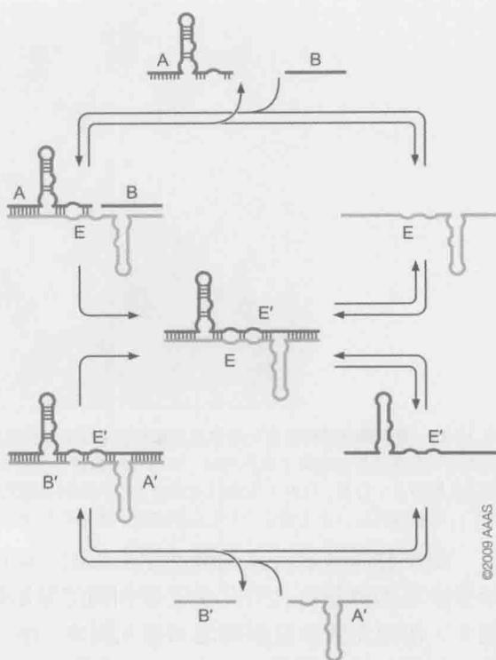  
图 17-12 自主的、具有复制能力的核酶。连接酶核酶 E 将两个 RNA 分子（A 和 B）连接在一起，每个分子都有部分序列与 E 配对，形成了互补配对的核酶 E。（获得许可调整自 Lincoln T.A. and Joyce G.F. 2009. Science 323: 1229–1232. Fig. 1A, p. 7. AAAS.）

E 配对；两个 A'、B' 与 E' 配对。有趣的是，多种连接酶核酶在反应中会相互竞争，因为它们的底物分子是有限的，这呈现了一种遗传选择的初级形态。综上所述，尽管以 RNA 作为底物而不是以核苷酸作为底物，核酶可以实现完全的自我复制。

#### [W] 达尔文演化论需要自我复制的原生细胞吗？

仍有一个矛盾需要我们思考！即使 RNA 世界假说可以解决遗传复制的问题，我们还是不得不怀疑这一系统能否受到达尔文演化的选择。考虑一下，在聚集有大量的复制酶核酶的“原始热汤”中，的存在以及某个核酶上的一个突变可以使它获得比同类更高的复制活性。正如之前讨论指出的，如果每一个复制酶必须拷贝自另一个复制酶，那么在“原始热汤”中，优化的复制酶必须与未优化复制酶共处，这样它的传代也可能由未优化的酶作用完成（两个优化的复制酶在空间上足够近以至于可以复制彼此的概率在一个随机的空间中小到可以忽略。图 17-13）。所以在这种条件下，一个优化的突变型复制酶没有足够的机会发挥自身扩增效率更高的优势。这种推论使我们得出以下看法：早期的生命不仅需要复制酶核酶，而且，正如我们在这里解释的，还需要原生细胞把核酶彼此隔离开来。

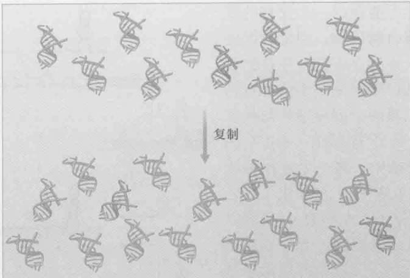  
图 17-13 复制酶核酶的改良突变体在原始热汤中没有选择优势。复制酶的分子群体包含在没有隔室的原始热汤中，这里面既有一般性的复制核酶（绿色所示）又有一些提高了复制效率的突变体（红色所示）。经过一轮复制之后，每一个核酶都随机地拷贝了自身。优化了复制效率的核酶没有体现出富集的效应是由于：未优化的复制酶和优化的复制酶一样获得了拷贝；复制过程后，无论突变与否它们都被极大地稀释在环境中了。

由细胞膜包裹着复制酶的原生细胞，可以通过吸收脂类完成生长和分裂。与原始热汤中含有的数量巨大且几乎完全相同的复制酶不同，少量的复制酶被分组进入到原生细胞中，使得无数组复制酶之间相互隔离（图17-14）。现在想象一下在其中一个原生细胞中随机产生了复制酶的突变体。因为每个原生细胞中只包含少量的复制酶，提高了复制效率的突变型复制酶比它们的同类能够产出更多的拷贝，这就导致更多的突变型复制酶存在于一个隔室中（为了使问题简化，我们在这一模型中不考虑复制过程的一些复杂环节，如需要一些互补配对的中间分子）。现在，一个原生细胞分裂时，它的一个子代细胞将很有可能（per chance）同时“继承”两个拷贝的突变型复制酶，这样，这两个突变的酶就可以彼此作用。之后，在子代细胞中，增加复制效率的突变型复制酶获得自身拷贝的速度更快，从而使携带它的原生细胞的增殖比它的同类也更快速。

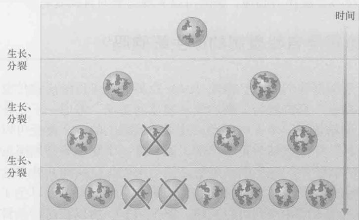  
图 17-14 分室化促进达尔文自然选择的作用。将复制酶装载到原生细胞的结果。一个原生细胞可以在一定概率的基础上继承两个或者更多优化的复制酶分子（图中红色标记）。之后，包含优化的复制酶分子的原生细胞占总数的比例将有所上升。由此，快速的分子复制将推动原生细胞的生长和分裂，使携带优化的复制酶的原生细胞受到选择。与此同时，有些原生细胞只随机地获得 1 个或 0 个复制酶，它们将在传代过程中被淘汰，如图中大×所示。（感谢 Jack W. Szostak）

通过渗透性（osmotic）机制，突变型的复制酶核酶可以为携带它的原生细胞带来生长优势。复制酶核酶通过核苷酸的聚合作用完成复制，这些核苷酸可以透过细胞膜进入到原生细胞中。这种核酶驱动的作用可以加成单个核苷酸到不能扩散的 RNA 分子上，从而在理论上可以增加原生细胞的渗透压（考虑到水分子进出脂质层的扩散速率是恒定的）。水分子的流入会增加脂质膜的张力，导致原生细胞从环境中吞入更多的脂类分子，这一过程反过来又会降低原生细胞的稳定性，最终使其一分为二。因此，包含有优化的突变型复制酶的原生细胞获得了生长和分裂的优势，同时也使得优化的核酶在整体系统中的比例得到提升。换句话说，利用细胞膜的分室化作用，复制酶核酶受到了自然选择的正向作用。

值得注意的是, 实验室条件可以比较容易地模拟出具有特定组分的细胞样隔室是如何促进早期生命发生的。像脂肪酸这样结构简单的脂类分子（以及其他的两亲性分子）是现代细胞胞膜上最主要的组成单位，它们能够在水环境中自发地形成小的、拓扑结构的囊泡（vesicle，图 17-15）。为了达到更低的自由能，在疏水效应的作用下，囊泡表面的脂类分子的尾部倾向于聚集在一个方向，从而形成膜状结构。这一薄膜会自发地折叠

包裹成两层的囊状结构，从而使其疏水的表面与水分子接触面积最小。而且，随着脂肪酸分子插入到膜中，囊泡的体积可以不断增长，这会降低囊泡的稳定性，并会使其在轻微的扰动下随机分裂成为两个或者多个囊泡（图17-16）。因此，与多聚核苷酸需要黏土中的矿物质催化合成不同的是，装载着多聚核糖核苷酸的细胞样小室是通过脂肪酸的自我组装作用自发形成的。最后，与渗透压驱动的生长和分裂相关，由脂肪酸等简单的脂类分子构成表面的原生细胞可以容纳较多的核苷酸分子。细胞倾向于让核苷酸分子通过渗透作用进入细胞。这一渗透入膜的过程是可行的，因为相对于磷脂质而言，脂肪酸分子的排序并不严格，它允许类似核苷酸这样的小分子通过（图17-15）。因此，包含复制酶的原生细胞由脂肪酸基础的膜包裹而成，它对核苷酸的摄取可以通过渗透作用完成。

最后，我们拥有了一个原生细胞所需要的所有材料；同时，这样的细胞符合原始生命定义：依靠小分子进行自我繁殖（核苷酸和脂质分子）并接受自然选择的作用（图17-17）。RNA世界假说告诉我们，原生细胞具有RNA基因组，可以合成RNA聚合酶核酶，并以囊泡状的原始细胞形态繁殖。通过捕获聚合反应中的核苷酸底物而引起的渗透压将推动原生细胞的生长并使其自发地分裂为子代细胞。此外，由于复制酶核酶被成组地分割至不同小室中，罕见的突变体有机会复制自身，从而获得了达尔文演化的选择优势。

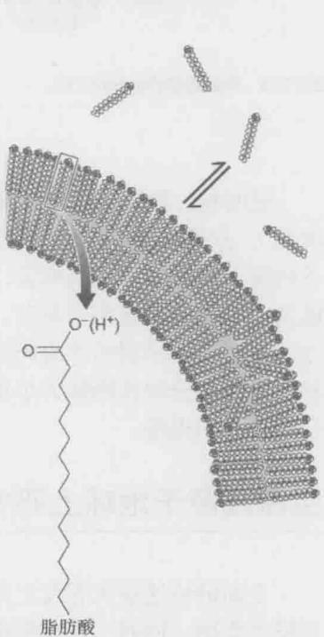  
图 17-15 脂肪酸自发形成双层囊泡。脂肪酸是一种结构简单的脂类，具有羧酸酯的头部和极性侧链，可以自发形成囊泡。由于羧酸酯头部基团易于被中和，脂肪酸倾向于形成双层的膜，核苷酸这样的小分子可以渗透出入。（重新绘图，原始版本来自 Budin I. and Szostak J.W. 2010. Annu. Rev. Biophys. 39: 245–263, Fig. 4. ©Annual Reviews, Inc.）

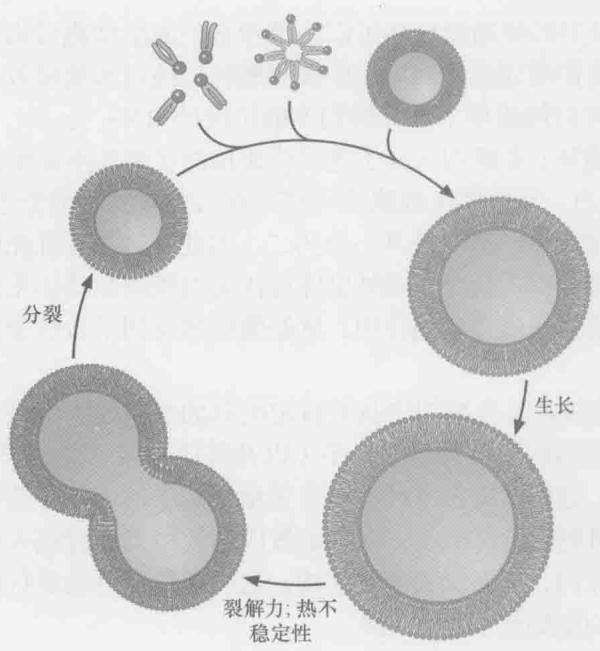  
图 17-16 脂质囊泡的生长和分裂。

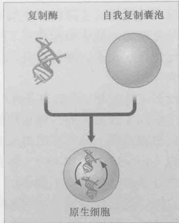  
图 17-17 假设的原始细胞，结合了自我复制的核酶和同样能自我复制的囊泡。

适时地，核酶演化出催化代谢反应的技能（事实上这也可能先于核酸聚合酶能力的出现），并最终获得了催化肽键合成的能力（作为肽基转移酶传衍至今），从而开启了当下的蛋白质世界。必须承认，从复制酶核酶演化至核糖体的过程尚不清楚，我们只能知道其中涉及的步骤相当复杂，它包括：转运 RNA（tRNA）的出现和演化，肽链合成能力的过渡（从早期的非编码形式到后期以信使 RNA 为指导的编码形式），整合了 RNA 和蛋白质组分的核糖体大小亚基的出现，以及最终长肽链（可以进一步折叠三维结构）合成能力的出现。

#### [W] 生命起源于地球上吗？

上面的论述很大程度上来源于推测。我们现在还不能确切了解生命起源于哪里、是怎样产生的；同时，在试管中合成生命的道路也很漫长。关于 RNA 的两个孪生概念对于理解生命的起源十分重要，即 RNA 既是遗传物质也是复制酶。分室化使得达尔文演化赋予了原生细胞一些重要优势，这有助于我们理解生命的起源。然而，一些研究者提出了非基于 RNA 的化学演化过程，他们认为生命来源于代谢的演化过程而不是遗传的演化过程。事实上，一些科学家认为生命发生于地球上是一种狭隘的观念。Francis Crick 就持有这种怀疑（虽然他的观点是在科学界发现 RNA 聚合酶核酶之前提出的），Crick 和其他一些人提出生命的种子可能来源于其他星球，由陨石带到地球上来。当然，即使生命的种子来自地球以外的理论是真实的（尽管不大可能），我们仍需要回答生命在地球上如何开始的，以及在哪里开始的，这就回到了本章一开始的主题。

<!-- W-END Watson 17 生命起源和早期进化 -->

## 思考题

1. 什么是编码链？什么是模板链？

2. 简述 RNA 的种类及其生物学意义。

3. 简述原核和真核生物 RNA 的结构特征。

4. 简述 RNA 转录的概念及其基本过程。

5. 请说出复制与转录的异同点。

6. 大肠杆菌的 RNA 聚合酶由哪些组成成分？各个亚基的作用是什么？

7. 什么是封闭复合物、开放复合物以及三元复合物？

8. 简述 $\sigma$ 因子的作用。

9. 什么是 Pribnow box？它的保守序列是什么？

10. 说出真核与原核基因转录的异同。

11. 大肠杆菌的终止子有哪两大类？请分别介绍一下它们的结构特点。

12. 真核生物的原始转录产物必须经过哪些加工过程才能成为成熟 mRNA?

13. 简述Ⅰ、Ⅱ类内含子的剪接特点。

14. 什么是套索结构？哪些类型 RNA 的剪接中会形成该结构？

15. 什么是 RNA 编辑？其生物学意义是什么？

16. 核酶具有哪些结构特点？核酶的生物学意义是什么？

## 参考文献

1. Brueckner F, Ortiz J, Cramer P. A movie of the RNA polymerase nucleotide addition cycle. Curr. Opin. Struct. Biol., 2009, 19: 294–299.

2. Campbell E A, Westblade L F, Darst S A. Regulation of bacterial RNA polymerases factor activity: A structural perspective. Curr. Opin. Microbiol., 2008, 11: 121–127.

3. Kornberg R D, Young E T. The molecular basis of eukaryotic transcription. Proc. Natl. Acad. Sci., 2007, 104:12955-12961.

4. Sekine S, Tagami S, Yokoyama S. Structural basis of transcription by bacterial and eukaryotic RNA polymerases. Curr. Opin. Struct. Biol., 2012, 22: 110–118.

5. Hoskins A A, Moore M J. The spliceosome: A flexible, reversible macromolecular machine. Trends Biochem. Sci., 2012, 237: 179–188.

6. Toor N, Keating K S, Pyle A M. Structural insights into RNA splicing. Curr. Opin. Struct. Biol., 2009, 19: 260–266.

数字课程学习

e 教学课件

目在线自测

思考题解析

<!-- W-BEGIN Watson 5 章末 -->

### 【中文对照 Watson 第5章章末：小结、参考文献、习题】

> 来源：Watson《基因的分子生物学》第七版中译本（书籍/03_基因的分子生物学_第七版） 第5章 RNA的结构和功能多样性 章末，附录 2 中该章偶数习题答案附后。

#### [W] 小结

RNA 与 DNA 相比有以下不同：它的骨架构成是核糖而不是 2'-脱氧核糖；尿嘧啶代替了胸腺嘧啶的位置；它通常以多聚核苷酸单链形式存在，没有互补链。由于是单链，RNA 在自身互补区域可以折叠形成局部双螺旋。与 DNA 相比，RNA 的碱基配对更宽。除了 A：U 配对和 C：G 配对，U 和 G 也可以配对。这一特性使 RNA 能够形成不符合 Watson-Crick 碱基配对原则的碱基对，从而增大了 RNA 形成局部双螺旋的能力。由于没有形成长的、规则的双螺旋的限制，碱基和核糖磷酸骨架之间的非常规相互作用使 RNA 能形成复杂的三级结构。

有些 RNA 同时也是一种酶——它们能够催化细胞内和离体的化学反应，这些 RNA 酶被称为核酶。大多数核酶作用于磷原子中心，如核糖核酸酶 RNase P。RNase P 由蛋白质和 RNA 构成，但是，只有它的 RNA 部分起催化作用。锤头状核酶是具有催化自身断裂作用的 RNA，通过产生 2'，3'-环磷酸酯来切开 RNA 骨架。肽基转移酶是另一类核酶，作用于碳原子中心。肽基转移酶催化肽键的形成，是组成核糖体的 RNA 组分之一。

#### [W] 参考文献

#### [W] 书籍

Bloomfield V.A., Crothers D.M., Tinoco I., Jr., and Heast J.E. 2000. Nucleic acids: Structures, properties, and functions. University Science Books, Sausalito, California.

Gesteland R.F., Cech T.R., and Atkins J.F., eds. 2006, The RNA world, 3rd ed. Cold Spring Harbor Laboratory Press, Cold Spring Harbor, New York.

#### [W] RNA 结构

Darnell J.E. Jr. 1985. RNA. Sci Am. 253: 68–78.

Doudna J.A. and Cech T.R. 2002. The chemical repertoire of natural ribozymes. Nature 418: 222–228.

Doudna J.A. and Lorsch J.R. 2005. Ribozyme catalysis: Not different, just worse. Nat. Struct Mol Biol. 15: 394–402.

Houck-Loomis B., Durney M.A., Salguero C., Shankar N., Nagle J.M., Goff S.P., and D'Souza V.M. 2011. An equilibrium-dependent retroviral mRNA switch regulates translational recoding. Nature. 480:561–564.

Nelson J.A. and Uhlenbeck O.C. 2006. When to believe what you see. Mol Cell. 23: 447–450.

Kladwang W., VanLang C.C., Cordero P., and Das R. 2011. A two-dimensional mutate-and-map strategy for non-coding RNA structure. Nat. Chem. 3: 954–962.

#### [W] 习题

偶数习题的答案请参见附录2

习题1

A. 请画出脱氧鸟苷的结构示意图, 圈出并且标出和脱氧胞苷形成 DNA 碱基对的氢键中的供体和受体。

B. 请画出鸟苷的结构示意图, 圈出并且标出和鸟苷形成 RNA 碱基对的氢键中的供体和受体。

习题 2 研究人员发现了一种新的病毒并且确定了碱基组成以及每种碱基的比例。你想通过遗传物质对该病毒进行分类。记住病毒的遗传物质可以是单链 DNA 或 RNA，亦或是双链 DNA 或 RNA。仅考虑序列信息，应该用什么方法来区分遗传物质是 RNA 还是 DNA，另外应该用什么方法来区分遗传物质是单链还是双链的。

习题 3 请阐述为什么 DNA 的螺旋结构不同于双链 RNA 的螺旋结构以及结构上的不同如何影响蛋白质与螺旋 RNA 之间的相互作用。

习题 4 请列出尿嘧啶存在于 RNA 而不是 DNA 的生物学理由。

习题 5 某段 RNA 的结构如下所示，请画出该 RNA 可能会形成的发夹结构，用虚线表示碱基对。

5'-AGGACCCUUCGGGGUUCU-3'

习题 6 酵母丙氨酸 tRNA 结构如下图所示（引自第 2 章图 2-14）。指出该 tRNA 中存在

的二级结构类型和非常规碱基对。

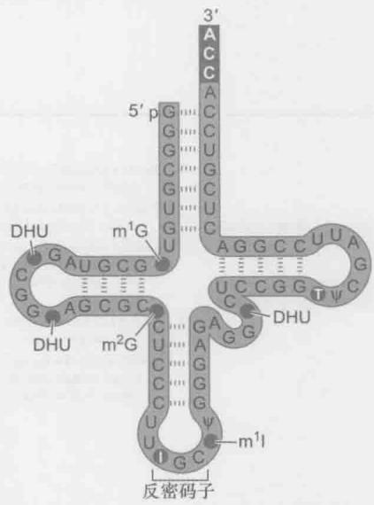

习题 7 研究人员希望赋予所挑选的细菌抗生素耐药性，因此他们决定通过 SELEX 系统来筛选一条特异性地和目标抗生素相结合的 RNA（适配子），并且在挑选的细菌中表达该适配子，从而获得抗生素耐药性。

A. 结合你了解的 RNA 知识，请阐述 RNA 适配子要和抗生素特异性地集合的话需要具备什么特点；

B. 如果不用 SELEX 系统的话，可以从细菌基因组编码的 RNA 库中挑选结合抗生素的 RNA。请列出 SELEX 系统相对于该方法的两条优势。

习题 8 请描述酶和核酶之间的共性。

习题 9 某些 RNA 是植物的病原体或类病毒，而某些类病毒可以进行催化反应。你现在拥有某特定物种分离出的 RNA 类病毒序列，请阐述该类病毒作为锤头型核酶进行催化反应的特征。

习题 10 科学家计划对进行自我剪切的锤头状核酶加以改造，以作为潜在的治疗手段。如要对其他的 RNA 分子进行靶向剪切，请问应该如何对锤头状核酶的结构进行改造，并请阐述改造后的锤头状核酶可以真正发挥核酶作用的理由。

习题 11 一些核酶, 比如像丁型肝炎病毒中发现的和 glmS mRNA 中发现的核酶/核糖开关, 可以折叠成网状双假结。请阐述核酶和核糖开关形成假结的优势。

习题 12 下图所示的是一个核苷类似物的结构。

A. 请写出模仿的核苷名字。

B. 假设某条 RNA 链携带有这种核苷类似物（通过磷酸二酯键相连）。在高 PH 的环境下，在该核苷类似物的位置会发生水解吗？请阐述你的理由。

习题 13 DNA 作为遗传物质发挥作用，请列出 RNA 的三种细胞学作用。

习题 14 你发现一种由蛋白质亚基和 RNA 亚基构成的复合物能够对 RNA 底物进行剪切。你想要弄清楚哪一部分发挥了催化作用，为此，你进行了一项体外剪切实验，实验在包含低浓度 $Mg^{2+}$ 的合适缓冲液条件下进行。下表展示了 7 个独立反应的结果。“+”代表包含的反应成分，亚精胺是一种正电荷肽，对该反应无特异性。

<table><tr><td>蛋白质亚基</td><td>-</td><td>+</td><td>-</td><td>+</td><td>+</td><td>-</td><td>+</td></tr><tr><td>RNA 亚基</td><td>-</td><td>-</td><td>+</td><td>+</td><td>-</td><td>+</td><td>+</td></tr><tr><td>亚精胺</td><td>-</td><td>-</td><td>-</td><td>-</td><td>+</td><td>+</td><td>+</td></tr><tr><td>切割率</td><td>0</td><td>0</td><td>0</td><td>90</td><td>0</td><td>50</td><td>90</td></tr></table>

A. 在反应中，是蛋白质亚基还是 RNA 亚基发挥了催化作用？并请阐述你的理由。
B. 推测亚精胺在最后两个反应中的作用。

习题 15 噬菌体 Qβ 的基因组由大约 4000nt 长的单链 RNA 构成。在大肠杆菌宿主内，噬菌体基因组的复制需要 RNA 依赖的 RNA 聚合酶，该聚合酶由噬菌体和细菌蛋白组成。有趣的是，该复制酶结合到 RNA 基因组的中心部位，必须复制 RNA 模板 3' 端来产生一条 5' 到 3' 方向的新链。研究人员猜想 Qβ 基因组上有假结存在，从而使得复制酶能够与 RNA 3' 端相结合。为了证实这个猜想，他们利用野生型复制酶和在对假结形成有关键作用区域发生突变的 Qβ RNA 为模板，在体外测定了复制效率，最后，他们在与 3' 发夹结构互补的 RNA 的中心部分确定了一段 8nt 长的区域。

野生型、突变型序列以及复制数据如下所示：

野生型 5'-UAAAGCAG-3'
GUUUCGUC
A. 突变型 A 5'-UAAACGAG-3'
GUUUCGUC
B. 突变型 5'-UAAAGCAG-3'
GUUUGCUC
C. 突变型 5'-UAAACGAG-3'
GUUUGCUC

体外复制效率（相对于野生型）：
野生型：100%
A. 突变型：1.6%
B. 突变型：0.6%
C. 突变型：42%
A. 请阐述为什么 A 突变型的复制效率这么低？
B. 请阐述为什么 C 突变型的复制效率只有野生型的一半？
C. 你认为结果是支持还是不支持关于假结的存在会影响复制的猜想？

数据源自 Klovins 和 van Duin （1999. J. Mol. Biol. 294: 875–884.）

(潘庆飞 夏志译 刘韧 胡学达 校)

#### [W] 附录 2：本章偶数习题答案

问题 2 确定遗传物质是 DNA 还是 RNA 的最直接的方法是寻找序列中的尿嘧啶。如果存在，那么病毒以 RNA 作为遗传物质；如果不存在，则遗传物质是 DNA。为了确定遗传物质是单链还是双链，需要检测每个碱基的百分比。如果 G 的百分比等于 C，A 的百分比等于 T，那么此分子是双链的 DNA。对于双链 RNA 来说，G% 等于 C%，A% 等于 U%。如果百分比结果不显示这两种模式中的任何一种，则遗传物质可能是单链的。

问题 4 尿嘧啶不同于胸腺嘧啶，胸腺嘧啶的第五碳原子上面缺少了一个甲基基团。尿嘧啶和胸腺嘧啶都和腺嘌呤配对。在 DNA 中，通常发生胞嘧啶的自发脱氨而生成尿嘧啶。如果发生复制并且尿嘧啶仍然存在，那么 DNA 中就会发生突变（C：G 变为 T：A）。如果在 DNA 中很自然地发现尿嘧啶，那么在 DNA 修复蛋白质时尿嘧啶将不会被认为是错误的，并且将要发生突变。

问题 6 二级结构：茎（stem），发夹结构（茎和环）和内部环。非经典碱基对：G：U 和 U:U。

问题 8 一个真正核糖酶的 RNA 具有一个特异底物、一个辅助因子结合位点、一个催化活性位点和不止一次的促进反应，每个活性位点类似于划归为酶的蛋白质。

问题 10 锤头必须分成两个独立的部分。其中一部分能够完成催化作用，而 RNA 的另一部分是底物。因为底物不附属于锤头的催化部分，所以底物可以释放使得新的分子能够结合。现在锤头是一个真正的核糖酶，能完成许多回合的反应。

问题12

A. 腺苷。

B. 核苷类似物像其他核苷一样，不经过 RNA 单链的水解。一个甲基基团添加到核糖的 2'-羟基上，核糖存在于腺苷中。当甲基基团存在，氧在高 pH 环境中可以不再成为去质子化，并攻击易断的存在于 RNA 链 3'端核糖位置的磷酸盐。

#### [W] 问题14

A. RNA 是催化剂或核糖酶。蛋白质部分和 RNA 部分单独不能使底物分开(反应 2 和 3)，但是反应进行必须要有蛋白质和 RNA 的存在。

因为底物（反应6）是在RNA部分和亚精胺（非特异性肽）的存在下被分开，RNA一定是作为了一种催化剂。没有RNA部分（反应5），蛋白质部分和亚精胺不能完成催化。蛋白质部分和亚精胺帮助RNA完成催化。

B. 带正电的亚精胺可以屏蔽反应过程中带负电的 RNA 催化剂和带负电的 RNA 底物之间的斥力。

<!-- W-END Watson 5 章末 -->

<!-- W-BEGIN Watson 13 章末 -->

### 【中文对照 Watson 第13章章末：小结、参考文献、习题】

> 来源：Watson《基因的分子生物学》第七版中译本（书籍/03_基因的分子生物学_第七版） 第13章 转录机制 章末，附录 2 中该章偶数习题答案附后。

#### [W] 小结

基因表达是 DNA 双螺旋中的信息转移到 RNA 和蛋白质中的过程, 蛋白质的活性则赋予了一个细胞形态和功能。转录是基因表达的第一步, 包括将 DNA 复制成 RNA。这

一过程是由 RNA 聚合酶催化的。

RNA 聚合酶从细菌到人是高度保守的。真核细胞至少有三个不同的聚合酶，细菌只有一个。真核细胞的三个常见的 RNA 聚合酶称为 RNAPol I、Ⅱ和Ⅲ。在本章中我们主要集中在 Pol Ⅱ上，因为它是转录细胞中绝大部分基因和全部蛋白质编码基因的酶。在植物中还存在另外两种 RNA 聚合酶——Pol IV 和 Pol V。

大肠杆菌的基本酶称为核心酶，含有各一个拷贝的 $\beta$ 、 $\beta'$ 、 $\omega$ 亚基和两个拷贝的 $\alpha$ 亚基。所有这些亚基在真核细胞的酶中都有同源物。细菌和酵母 Pol II 的结构也很相似，二者都组装成一个蟹爪的形状，在细菌的酶中蟹钳是由最大的亚基 $\beta$ 和 $\beta'$ 组成的。活性位点在钳子的基部，进出活性位点的途径是由 5 个通道提供的：一个允许双链 DNA 从酶前部的钳子之间进入；另外两个允许两条单链——模板和非模板链通过活性位点之后离开酶；另一个通道为 NTP 进入活性位点提供途径；在聚合位点后面一小段距离从 DNA 模板上剥离下来的 RNA 产物，则从第 5 个通道离开酶。

PolⅡ在一个很重要的方面与细菌的酶不同。前者在大亚基的C端末尾有一个所谓的“尾巴”，而细菌的酶是没有的。这个尾巴是由多个七肽序列重复组成的。

一个周期的转录要经过三个阶段，称为起始、延伸和终止。虽然 RNA 聚合酶能够独立地合成 RNA，但精确而有效的转录起始需要其他称为起始因子蛋白的参与。这些因子确保酶只从 DNA 上称为启动子的适当位置起始转录。在细菌中只有一个起始因子 $\sigma$ ，而在真核细胞中则有几个，合称通用转录因子。真核细胞的 DNA 是包裹在核小体内的，在细胞内的有效起始通常需要额外的蛋白质参与，包括中介蛋白复合体和核小体修饰酶。转录激活蛋白也是需要的（第 19 章）。

在起始过程中，RNA 聚合酶（和起始因子一起）在一个闭合式复合体中与启动子结合。在该状态下 DNA 仍保持着双链的形式，然后这一闭合式复合体经历异构化作用而变为开放式复合体。在该形式中，转录起始位点周围的 DNA 解开，从而破坏碱基对并形成一个单链 DNA“泡”。这一转变使得聚合酶等可以接近模板链，而模板链将决定新 RNA 链中碱基顺序的。起始的这一阶段之后是启动子逃离：一旦酶合成了一系列短 RNA（称为流产性起始），它会设法生成一段超过 10 个碱基的转录物。此时酶离开启动子而进入了延伸阶段。在这一阶段中，聚合酶沿着基因移动，同时执行几项功能：它打开 DNA 的下游序列并在活性位点的上游（后方）将其重新合上；它将核糖核苷酸添加到正在延长的转录物的 3' 端；它在聚合位点后方大约 8bp 或 9bp 的位置将新形成的 RNA 链从模板上剥离；它还校对转录物，查找（并替换）错误插入的核苷酸。

细菌和真核细胞中的转录按照大体相同的步骤进行。然而，两者也存在一些区别。例如，在细菌中，向开放式复合体转变的异构化作用是自发的，不需要 ATP 水解；在真核细胞中这一步骤则是需要 ATP 水解的。更为惊人的是，在真核细胞中启动子逃离是由 CTD 尾巴的磷酸化状态调控的。这样在前起始复合体中与启动子结合的 PolⅡ有一个未磷酸化的 CTD。CTD 被一个或多个激酶磷酸化，其中一个是通用转录因子之一（TFIIH）的一部分。

一旦被磷酸化, PolⅡ的 CTD 尾巴就将自己从与启动子上的其他蛋白质的结合状态中释放出来，使聚合酶进入延伸阶段。然后 CTD 与参与转录延伸和 RNA 加工的因子相结合。因而，当聚合酶从启动子移走并开始转录基因时，存在一个起始因子与延伸和加工因子的互换。延伸因子和参与加工的因子之间也存在相互作用，确保这些事件被正确地协调起来。细菌和真核之间的另一个不同点是后者必须在延伸阶段对付核小体。这要求另一个复合体可以在前方拆除核小体，在后方重装核小体使聚合酶向前。

在细菌和真核细胞中转录终止也是不同的。在细菌中有两种终止子——固有的Rho非依赖型和Rho依赖型。固有终止子包括两个RNA转录后才起作用的序列元件。一个元件是一段在RNA内形成一个茎-环结构的反向重复序列，它可以与一串U核苷酸（仅与模板链微弱结合）共同作用，引起转录物的释放。Rho依赖型终止子需要ATP酶Rho，它与正在延伸的转录本结合并沿着转录过程移动，直到遇上聚合酶引发转录的终止。在真核细胞中，转录终止是与3'聚腺苷酸化的RNA加工事件密切相关的。在这类生物中，转录终止则涉及另一个蛋白RNase，沿着一条新生的转录本行进，直到撞到聚合酶引发终止。

在本章中我们讨论了 RNA 转录物 5'端的加帽、3'端的聚腺苷酸化，以及后者与转录终止之间的联系。剪接将在下一章中进行描述。

#### [W] 参考文献

#### [W] 书籍

Cold Spring Harbor Symposia on Quantitative Biology. 1998. Volume 63: Mechanisms of transcription. Cold Spring Harbor Laboratory Press, Cold Spring Harbor, New York.

#### [W] RNA 聚合酶和转录起始

Brueckner F., Ortiz J., and Cramer P. 2009. A movie of the RNA polymerase nucleotide addition cycle. Curr. Opin. Struct. Biol. 19:294–299.

Campbell E.A., Westblade L.F., and Darst S.A. 2008. Regulation of bacterial RNA polymerase σ factor activity: A structural perspective. Curr. Opin. Microbiol. 11: 121–127.

Conaway R.C. and Conaway J.W. 2011. Origins and activity of the Mediator complex. Semin. Cell Dev. Biol. 22: 729–734.

Cramer P., Armache K.J., Baumli S., Benkert S., Brueckner F., Buchen C., Damsma G.E., Dengl S., Geiger S.R., Jasiak A.J., et al. 2008. Structure of eukaryotic RNA polymerases. Annu. Rev. Biophys. 37: 337–352.

Ebright R.H. 2000. RNA polymerase: Structural similarities between bacterial RNA polymerase and eukaryotic RNA polymerase II. J. Mol. Biol. 304: 687–698.

Hahn S. and Young E.T. 2011. Transcriptional regulation in Saccharomyces cerevisiae: Transcription factor regulation and function, mechanisms of initiation, and roles of activators and coactivators. Genetics 189: 705–736.

Kornberg R.D. and Young E.T. 2007. The molecular basis of eukaryotic transcription Proc. Natl. Acad. Sci. 104: 12955–12961.

Krishnamurthy S. and Hampsey M. 2009. Eukaryotic transcription initiation. Curr. Biol. 19: R153–R156.

Malik S. and Roeder R.G. 2005. Dynamic regulation of Pol II transcription by the mammalian Mediator complex. Trends Biochem. Sci. 30:256–263.

Roberts J.W. 2006. RNA polymerase, a scrunching machine. Science 314:1097–1098.

Saecker R.M., Record M.T. Jr, and Dehaseth P.L. 2011. Mechanism of bacterial transcription initiation: RNA polymerase promoter binding, isomerization to initiation-competent open complexes, and initiation of RNA synthesis. J. Mol. Biol. 412: 754–771.

Sekine S., Tagami S., and Yokoyama S. 2012. Structural basis of transcrip-

Sekine S., Tagami S., and Yokoyama S. 2012. Structural basis of transcription by bacterial and eukaryotic RNA polymerases. Curr. Opin. Struct. Biol. 22: 110–118.

#### [W] 启动子

Juven-Gershon T., Hsu J.Y., Theisen J.W., and Kadonaga J.T. 2008. The RNA polymerase II core promoter—The gateway to transcription. Curr. Opin. Cell Biol. 20: 253–259.

#### [W] 延伸和 RNA 加工

Herbert K.M., Greenleaf W.J., and Block S.M. 2008. Single-molecule studies of RNA polymerase: Motoring along. Annu. Rev. Biochem. 77:149–176.

Maniatis T. and Reed R. 2002. An extensive network of coupling among gene expression machines. Nature 416: 499–506.

Perales R. and Bentley D. 2009. "Cotranscriptionality": The transcription elongation complex as a nexus for nuclear transactions. Mol. Cell. 36:178–191.

Petesch S.J. and Lis J.T. 2012. Overcoming the nucleosome barrier during transcript elongation. Trends Genet. 28: 285–294.

Reinberg D. and Smith R.J. III 2006. de FACTo nucleosome dynamics. J. Biol. Chem. 281: 23297–23301.

Zhou Q., Li T., and Price D.H. 2012. RNA polymerase II elongation control. Annu. Rev. Biochem. 81: 119–143.

#### [W] 终止

Luo W. and Bartley D. 2004. A ribonucleolytic rat torpedoes RNA polymerase II. Cell 119: 911–914.

Peters J.M., Vangeloff A.D., and Landick R. 2011. Bacterial transcription terminators: The RNA 3'-end chronicles. J. Mol. Biol. 412: 793–813.

Richardson J.P. 2006. How Rho exerts its muscle as RNA. Mol. Cell 23:711–712.

Rosonina E., Kaneko S., and Manley J.L. 2006. Terminating the transcript: Breaking up is hard to do. Genes Dev. 20: 1050–1056.

#### [W] RNA 聚合酶 I 和 III

Schramm L. and Hernandez N. 2002. Recruitment of RNA polymerase III to its target promoters. Genes Dev. 16: 2593–2620.

Vannini A. and Cramer P. 2012. Conservation between the RNA polymerase I, II, and III transcription initiation machineries. Mol. Cell 45:439–446.

White R.J. 2008. RNA polymerases I and III, non-coding RNAs and cancer. Trends Genet. 24: 62.

#### [W] 习题

#### [W] 偶数习题的答案请参见附录2。

习题 1 除了胸腺嘧啶被尿嘧啶替代，RNA 转录产物同哪一条 DNA 链是完全相同的？请从下面的选项中选择一项或多项：模板链、非模板链、编码链、非编码链。请对你的选择做出解释。

习题 2 请解释为什么转录的调节经常涉及启动子和启动子相互作用蛋白。

习题 3 转录的起始发生在转录延伸阶段之前，包括三步。请描述这三步，尤其注意每一步中 RNA 聚合酶的主要特征。

习题 4 设想现在有一个含有-35 元件和-10 元件的细菌启动子，如果想展示 RNA 聚合酶确实是以转录起始位点上游-35 和-10 位点为中心的区域结合，什么样的分析或者试验是最好的？（回顾第 7 章可能有所帮助）

习题 5 有一种论断称 “-35 元件的序列总是 5'-TTGACA-3'”，请判断该论断的的对错并给出解释。

习题 6 在给定的三种细菌转录起始模型（transient excursion 模型、inchworming 模型和 scrunching 模型）中，哪一种模型代表的假设被大多数数据所支持？请描述这些实验的一般性结论。

习题 7 请描述原核生物中 RNA 聚合酶的两种校对功能。

习题8 假设现在有一段Rho非依赖型终止子序列5'-CCCAGCCCGCCUAAUGAGCGG GCUUUUUUUU-3'。为什么任意一个粗体所示核苷酸位置的点突变都可以导致转录的终止？你如何来检测你的结论？

习题 9 请解释为什么真核细胞中高水平的转录反应需要中介蛋白和核小体重塑因子，

而在体外则不然？

习题 10 在真核生物转录周期中，哪些步骤是因为 RNA 聚合酶Ⅱ大亚基的羧基末端发生磷酸化而激活甚至过度激活的？

习题 11 你想对 5'RNA 帽子形成过程中的 mRNA 5'端进行放射性同位素标记，在帽形成反应中，你想使用 $\alpha-$ 、 $\beta-$ 还是 $\gamma-^{32}P$ GTP？请解释为什么。

习题 12 Poly-A 聚合酶同 RNA 聚合酶在功能上有什么不同？

习题 13 对于真核生物的 mRNA 来说，帽子结构和 poly-A 尾巴的添加有什么作用？

习题 14 从事真核生物转录终止的鱼雷模型研究的科研人员想对 Rtt103 和 Rat1 在转录基因上的定位进行检测，为此，他们使用带有标签的 Rat1 蛋白进行了染色质免疫沉淀试验（ChIP，可参考第 7 章）。他们首先对从野生型细胞中提取到的染色质进行剪断处理，然后使用针对 Rat1 蛋白标签的特异性蛋白对 Rat1 蛋白进行免疫沉淀。之后他们又使用不同的引物组合对沉淀得到的 DNA 进行扩增，

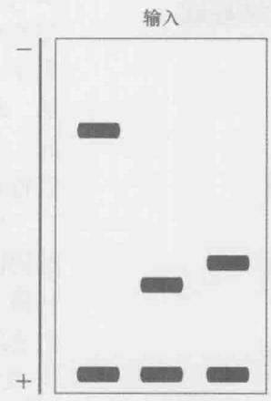

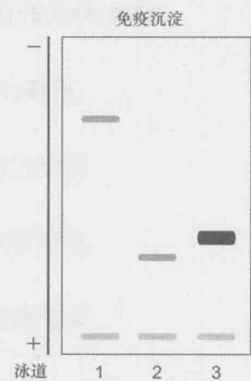

这些引物仅特异性针对高转录活性的基因。我们以 ADH1 基因为例展示试验的结果。针对该基因，科研人员选择了三种特异性的引物：一种用于特异性扩增可读框（ORF）上游的 TATA 框序列，结果见泳道 1；一种用于特异性扩增可读框的 3' 端区域，结果见泳道 2；另一种用于特异性扩增 DNA 3' 端编码 poly-A 信号序列的 DNA 区域，结果见泳道 3。他们比较了免疫沉淀前后（分别如左右图所示）染色质样品的 PCR 反应结果。此外，研究人员还对 5 号染色体上的非转录区域进行了特异性扩增，两张电泳图中每条泳道底部的条带表示的就是该反应的结果。

A. 如左图所示，在免疫沉淀前样品的 PCR 结果中，所有条带的强度大致相等。请解释其中的原因。
B. 从以上的染色质免疫沉淀试验中我们能得出的主要结论是什么？
C. 其他高转录活性基因的 ChIP 数据同 ADH1 基因的类似，请解释这样的数据是如果支持 torpedo 模型的。

改编自 Kim et al. (2004. Nature 432: 517-522)。

#### [W] 附录 2：本章偶数习题答案

问题 2 RNA 聚合酶最初与启动子序列结合，一旦结合后将会引起启动子-RNA 聚合酶复合体结构的改变从而起始转录。为了阻止或者增强某个基因的转录，最直接的方式就是通过启动子来抑制或者增强转录起始。

问题 4 DNA 指纹图谱是最好的选择。如果 RNA 聚合酶与启动子结合，那么 DNA 印迹则会显现这些位置。凝胶迁移实验（EMSA）也可以检测与 DNA 结合的蛋白质，你可以通过 EMSA 看出 RNA 聚合酶与启动子结合在一起，但是你不会知道该结合中心是 -35 还是 -10。ChIP 也可以，但是在只考虑特殊的 DNA 序列时 DNA 指纹图谱更加适合。

问题 6 实验结果支持摇头模型。这些实验表明 RNA 聚合酶保持与启动子的结合，而 DNA 在最初的转录阶段则是展开的，并被吸入 RNA 聚合酶中。

问题 8 加粗的核苷酸是可以相互配对形成终止发夹的区域。如果这些核苷酸中的一个发生了突变，该碱基配对则被破坏，从而阻止了发夹的形成，使末端被破坏。为了测试这个模型，你可以按照描述的那样，通过突变一个核苷酸来破坏末端，通过使茎叶结构的另一条臂上的核苷酸突变可以重新建立与起始突变的配对。双重的突变可以恢复末端。

问题 10 PolⅡ的 CTD 尾部丝氨酸残基的磷酸化是启动子脱离和有效延长所必需的。除此之外，不同模式的磷酸化可以使尾部招募 RNA 加工所需的因子，因此，对于尾部磷酸化的调节可以保证这些事件的协调有序。

问题 12 Poly-A 聚合酶不需要 DNA 模板，可以将 200 个氨基酸加到 mRNA 的 3' 端。而 RNA 聚合酶则需要 DNA 模板并将 4 种 NTP 整合到 RNA 上。

#### [W] 问题14

A. 输入反应包括细胞中的所有 DNA（染色质）。在输入时 DNA 的所有区域都需要呈现出相同的水平，PCR 扩增利用任何引物开始。

B. PCR 反应中突出的条带利用编码 poly-A 信号的 3' 序列作为 DNA 扩增的特异引物（第三行反应，上面的带）。这表明 Rat1 需要位于基因 ADH1 的区域。

C. 在鱼雷模型中，Rat1（从 $5'\rightarrow3'$ 方向）降解由 poly-A 位点下游转录得到的 RNA，这最终从 DNA 上取代 RNA 聚合酶。该实验的结果与模型一致表明 Rat1 与转录机制的关系主要位于基因的 3' 端，如该模型所预测的，如果在多聚腺苷酸化后立即分别参与转录则位于该区域。

<!-- W-END Watson 13 章末 -->

<!-- W-BEGIN Watson 14 章末 -->

### 【中文对照 Watson 第14章章末：小结、参考文献、习题】

> 来源：Watson《基因的分子生物学》第七版中译本（书籍/03_基因的分子生物学_第七版） 第14章 RNA剪接 章末，附录 2 中该章偶数习题答案附后。

#### [W] 小结

在几乎所有的细菌和噬菌体基因中，可读框都是由不间断的一串密码子组成的。但是许多真核生物中，基因的编码区被一段段非编码序列割裂成一簇簇密码子。

这些割裂基因中的编码序列叫外显子（“表达序列”），而非编码区域叫内含子（“插入序列”）。某些非编码区也包含在成熟的 mRNA 中——mRNA 的 5' 和 3' 非翻译区，以及整个非编码 RNA 如 microRNA（第 20 章），因此这些区域也归为外显子。不同基因之间外显子和内含子的数量及大小变化很大。例如，在酵母中，只有很少一部分基因有内含子，而且即使有，内含子的长度短，数量也少（每个基因一个，偶尔两个）。在多细胞生物，如人类中有内含子的基因数目则大得多，每个基因的内含子数目也很多（最多可达 363 个）。外显子长度确实有所不同，但一般在 150nt 左右；而内含子正好相反，可以从 61bp 到 800kb 不等。

包含内含子的基因转录时，最初的 RNA 分子中是包括内含子序列的。然后这些内含子被除去，得到成熟的 mRNA。内含子被除去的过程叫做剪接。

多数含有内含子的基因只产生一种 mRNA 分子，即每种情况下所有内含子都从初始转录的 RNA 分子中除去，得到的成熟 mRNA 由全部外显子组成。但有时初始 RNA 转录产物可以用不同的形式进行剪接，就会从同一个基因得到许多不同的 mRNA 产物。例如，某些基因含有可供选择的外显子，其中只有一个会留在特定的 mRNA 中。在其他的情况中，一个特定的外显子可能从某些拷贝的 RNA 中去除（与内含子一起），从而从同一个基因产生不同版本的 mRNA。我们仔细考察了一个选择性剪接的极端例子—果蝇的 Dscam 基因。在这个例子中，其中一个外显子有 48 个变异体，并且都出现在 pre-mRNA 上，但只有一个出现在每个成熟的 mRNA 中。

内含子和外显子边界的序列可以帮助细胞识别内含子并将其切除。这些剪切序列几乎只在内含子中出现（在这里它们不必编码氨基酸）。这些序列根据它们相对于内含子末端的位置被称为3'和5'剪拉序列。将内含子从mRNA是去除同样需要序列元件，这被称为分支序列，靠近内含子的3'端。

除去内含子是通过两步转酯反应进行的。第一步是由分支点腺苷酸攻击5'剪接位点的鸟苷酸；第二步是游离的5'外显子攻击3'剪接位点。这些反应有两个后果：首先，也是最重要的，是把两个外显子融合到了一起；其次，内含子以带分支套索结构被释放。

对核小体的 pre-mRNA 进行剪接需要一个由多种蛋白质和 RNA 组成的大复合体，即剪接体。剪接体由 snRNP 组成，snRNP 共有 5 种：U1、U2、U4、U5 和 U6 snRNP，每种都由一条 RNA 分子（分别叫做 U1、U2、U4、U5 和 U6 snRNA）和许多蛋白质构成（彼此之间的蛋白质成分大多数不一样）。RNA 成分在识别和催化除去内含子方面起到了核心作用。剪接体组成是动态的，即在剪接反应的不同阶段，剪接体的组成不断改变，不同的组分进进出出，各自行使特定的功能。

剪切体是动态的，它的组装过程并不总是保持一致。这些复合体中的因子来来往往顺序不一，与理想化的剪接体组装路径有所区别甚至部分可逆。这可能是由于作用的不同环境和不同 RNA 的动力学差异造成的。在催化剪切反应之后，剪切体解离，这对于保证剪切过程的单向性和剪切过的 mRNA 的释放非常重要。

有少数内含子能以自剪接的方式把自身从 RNA 分子上除去。虽然算不上真正的酶促反应，但确实是内含子 RNA 介导了剪接的化学反应。自剪接内含子分为两类，其中第Ⅱ类的化学过程与剪接体所介导的相同。这些内含子可能代表了现代由剪接体执行剪接的内含子在演化上的起源，而两者通用的两步转酯反应的化学过程反映了这种演化上的相互关系（也许解释了为何内含子没有采取更直接的一步反应机制进行剪接的原因）。

剪接位点是由很短的、保守程度不高的序列来确定的。这就给剪接体提出了很大的挑战：如何识别正确的剪接位点并完成剪接？剪接体提高准确性的机制有多种。首先，剪接位点一旦转录出来，剪接体立即就会在相应位置上进行组装，避免了下游位点的竞争。其次，有其他一些蛋白质，如SR蛋白，可以结合在正确的位点附近并协助指引剪接体到达这些位点。这样真实位点与序列类似的假位点相比，肯定对剪接体具有更高的亲和力。

SR 蛋白种类繁多，每一种都是用一个结构域结合 RNA，另一个结构域则和剪接体的某些成分相作用。有些 SR 蛋白调控剪接，表现为某种 SR 蛋白只在一种类型的细胞中出现，从而在这种细胞中完成一种特定的剪接方式。另一些 SR 蛋白只在特定的生理信号下才有活性，所以某种特定的剪接方式仅对应于该生理信号。这样，SR 蛋白类似在后续章节中将会看到的转录激活因子。还与转录调控类似的是，剪接也有抑制因子，可以在某些条件下终止对特定内含子的剪接。我们详细考察了果蝇的性别决定的例子，一连串调控的可变剪接事件决定了果蝇是否发育成雄性或雌性。

与第 13 章讨论的其他修饰过程一起，剪接是 mRNA 通过核孔转运出细胞核之前所必须进行的。

一般而言，一个外显子编码一个独立的折叠或功能蛋白结构域。因此，一个外显子就可以很容易地与其他外显子组合起来发挥作用。它提示了通过演化比较容易将不同基因中已经存在的外显子重新组合以获得新的蛋白质。

RNA 编辑是允许 RNA 转录以后进行改变的另一种机制，以使翻译出来的蛋白质与原基因所编码的蛋白质不同。RNA 编辑的机制有两种：酶促碱基修饰和 mRNA 分子内多个尿嘧啶核苷酸的插入或删除。

#### [W] 参考文献

#### [W] 书籍

Atkins J.F., Gesteland R.F., and Cech T.R. 2011. RNA worlds: From life's origins to diversity in gene regulation. Cold Spring Harbor Laboratory Press, Cold Spring Harbor, New York.

#### [W] 剪接和剪接体的作用机制

Hoskins A.A. and Moore M.J. 2012. The spliceosome: A flexible, reversible macromolecular machine. Trends Biochem. Sci. 237: 179–188.

Newman A.J. and Nagai K. 2010. Structural studies of the spliceosome: Blind men and an elephant. Curr. Opin. Struct. Biol. 20: 82–89.

Rino J. and Carmo-Fonseca M. 2009. The spliceosome: A self-organized macromolecular machine in the nucleus? Trends Cell Biol. 19: 375–384.

Semlow D.R. and Staley J.P. 2012. Staying on message: Ensuring fidelity in pre-mRNA splicing. Trends Biochem. Sci. 37: 263–273.

Wachtel C. and Manley J.L. 2009. Splicing of mRNA precursors: The role of RNAs and proteins in catalysis. Mol. Biosyst. 5: 311–316.

Wahl M.C., Will C.L., and Lührmann R. 2009. The spliceosome: Design principles of a dynamic RNP machine. Cell 136: 701–718.

#### [W] 自我剪接

Lambowitz A.M. and Zimmerly S. 2011. Group II introns: Mobile ribozymes that invade DNA. Cold Spring Harb. Perspect. Biol. 3: a003616.

Michel F., Costa M., and Westhof E. 2009. The ribozyme core of group II introns: A structure in want of partners. Trends Biochem. Sci. 34:189–199.

Toor N., Keating K.S., and Pyle A.M. 2009. Structural insights into RNA splicing. Curr. Opin. Struct. Biol. 19: 260–266.

#### [W] 可变剪接及调控

Heyd F. and Lynch K.W. 2011. Degrade, move, regroup: Signaling control of splicing proteins. Trends Biochem. Sci. 36: 397–404.

Kalsotra A. and Cooper T.A. 2011. Functional consequences of developmentally regulated alternative splicing. Nat. Rev. Genet. 12: 715–729.

Li Q., Lee J.A., and Black D.L. 2007. Neuronal regulation of alternative pre-mRNA splicing. Nat. Rev. Neurosci. 8: 819–831.

Maniatis T. and Tasic B. 2002. Alternative pre-mRNA splicing and proteome expansion in metazoans. Nature 418: 236–243.

McManus C.J. and Graveley B.R. 2011. RNA structure and the mechanisms of alternative splicing. Curr. Opin. Genet. Dev. 21: 373–379.

Muñoz M.J., de la Mata M., and Kornblihtt A.R. 2010. The carboxy terminal domain of RNA polymerase II and alternative splicing. Trends Biochem. Sci. 35: 497–504.

Nilsen T.W. and Graveley B.R. 2010. Expansion of the eukaryotic proteome by alternative splicing. Nature 463: 457–463.

Pawlicki J.M. and Steitz J.A. 2010. Nuclear networking fashions pre-messenger RNA and primary microRNA transcripts for function. Trends Cell Biol. 20; 52–61.

#### [W] mRNA 转运

Dreyfuss G., Kim V.N., and Kataoka N. 2002. Messenger-RNA-binding proteins and the messages they carry. Nat. Rev. Mol. Cell Biol. 3:195–205.

Stewart M. 2010. Nuclear export of mRNA. Trends Biochem. Sci. 35:609–617.

#### [W] 演化

Irimia M., Penny D., and Roy S.W. 2007. Coevolution of genomic intron number and splice sites. Trends Genet. 23: 321–325.

Koonin E.V. 2009. Intron-dominated genomes of early ancestors of eukaryotes. J. Hered. 100: 618–623.

Roy S.W. and Gilbert W. 2006. The evolution of spliceosomal introns: Patterns, puzzles and progress. Nat. Rev. Genet. 7: 211–221.

#### [W] RNA 编辑

Aphasizhev R. and Aphasizheva I. 2011. Uridine insertion/deletion editing in trypanosomes: A playground for RNA-guided information transfer. Wiley Interdiscip. Rev RNA 2: 669–685.

Blanc V and Davidson N.O. 2010. APOBEC-1-mediated RNA editing. Wiley Interdiscip. Rev. Syst. Biol. Med. 2: 594–602.

Chiu Y.L. and Greene W.C. 2008. The APOBEC3 cytidine deaminases: An innate defensive network opposing exogenous retroviruses and endogenous retroelements. Annu. Rev. Immunol. 26: 317–353.

Nishikura K. 2010. Functions and regulation of RNA editing by ADAR

deaminases. Annu. Rev. Biochem. 79: 321–349.

Paro S., Li X., O'Connell M.A., and Keegan L.P. 2012. Regulation and functions of ADAR in Drosophila. Curr. Top. Microbiol. Immunol. 353: 221–236.

Rosenthal J.J. and Seeburg P.H. 2012, A-to-I RNA editing: Effects on proteins key to neural excitability. Neuron 74: 432–439.

Stuart K.D., Schnaufer A., Ernst N.L., and Panigrahi A.K. 2004. Complex management: RNA editing in trypanosomes. Trends Biochem. Sci. 30;97–105.

#### [W] 剪接与疾病

David G.J. and Manley J.L. 2010. Alternative pre-mRNA splicing regulation in cancer: Pathways and programs unhinged. Genes Dev. 24:2343–2364.

Kole R., Krainer A.R., and Altman S. 2012. RNA therapeutics: Beyond RNA interference and antisense oligonucleotides. Nat. Rev. Drug Discov. 11: 125–140.

Padgett R.A. 2012. New connections between splicing and human disease. Trends Genet. 28: 147–154.

#### [W] 习题

偶数习题的答案请参见附录2

习题 1 就每个基因所含内含子的平均数量而言，酿酒酵母的远低于人类的，请解释其原因。

习题2 5'-剪接位点和3'-剪接位点中的5'和3'标记是相对于内含子还是外显子来说的？除了这两种剪接位点，剪接反应还需要什么序列？这种序列位于哪里？

习题 3 整个剪接过程以未剪接的前体 RNA 为起始，在第一步剪接反应结束后会产生一些中间体，请对这些中间体进行描述。

习题 4 已知剪接过程中的两个关键反应可以从正反两个方向进行，那么在体内是什么阻止剪接反应反向进行？

习题 5 请解释小核糖核蛋白（snRNP）同前体 mRNA 剪接底物之间发生相互作用的基础。

习题 6 如果 5'剪接位点序列由 5'-GUAAGU-3'变为 5'-GUAUGU-3', 请预测这种序列改变对体外蛋白质-RNA 结合试验中 U1 和 U6 snRNP 结合的影响。

习题 7 请比较Ⅰ类内含子和Ⅱ类内含子自剪接的机制。

习题 8 如果剪接体识别了一种 “假” 的 3' 剪接位点，这一假位点位于内含子中，处在真 3' 剪接位点略为上游的位置。请描述这种剪接反应的产物并说明它是如何改变翻译后的蛋白质产物的。

习题 9 请解释空间位阻是如何导致相互排斥剪接的。

习题10 无义介导降解在决定最终的、用于翻译的可变剪接产物中是如何发挥作用的？

习题 11 细胞可以通过 mRNA 的脱氨基反应调控特定基因的细胞特异性表达, 而 DNA

的脱氨基反应则不行，请解释其原因。

习题 12 在一次生化实验中，你使用三种不同的底物进行体外的剪接反应，并对其产物进行了比较。每个反应的底物构造都是由一个单独的内含子和两个分布在其周围的外显子组成，并且所有构造的整体长度是相同的。然而在这三个反应中，一个反应的内含子是Ⅰ类内含子，另一个反应的内含子是Ⅱ类内含子，第三种反应的内含子被剪接体切除。每一种构造都进行了适当的标记以便可以通过凝胶电泳检测到。同时每种构造都使用了两种反应进行检测：一种是在有利于自剪接反应的条件下进行的，另一种所处条件相同且还添加了核提取物。请对下图所示的结果同三种内含子的类型进行匹配。注意：为了简单化，只有剪接反应的最终产物可以被看到，但此时内含子尚未降解。

#### [W] 附录 2：本章偶数习题答案

问题 2 5'和 3'剪切位点以内含子得名。5'剪切位点坐落在内含子的 5'端与上游外显子的 3'端相接。3'剪切位点则位于内含子的 3'端与外显子的 5'端相接。分支点 A 则位于内含子上，也是剪接反应所必需的。多聚嘧啶序列则沿着该分支点。

问题 4 在体内，Prp22 迅速将剪切的 mRNA 从剪接体上移除并将该剪接体分解。套索 RNA 也可以迅速降解。

问题 6 U1 snRNP 与 U1 snRNA 序列 5'-ACUUAC-3' 完全互补的序列 5'-GUAAGU-3' 相结合。突变会导致 U1 与 5' 剪接体的结合力降低但是由于还有其他 5 个碱基对的存在，该结合力并不会完全被破坏。U6 snRNA（相关序列 5'-ACAGAG-3'）可以与 5'-GUAAGU-3' 序列形成 3 个碱基对，可以与 5'-GUAUGU-3' 序列形成 4 个碱基对，这些可以增强 U6 snRNP 与 5' 剪接位点的结合。

问题 8 最终的产物为在两个外显子之间保持的一个内含子。在翻译时，这个 RNA 将编码无义氨基酸或者引入过早终止密码子。在 mRNA 中引入的额外的序列也可以引起插入序列下游的可读框的移动，而这些变化大部分对蛋白质的破坏是无可避免的。

问题 10 无义介导的衰减通路可以降解含有过早终止密码子的mRNA，这可以使细胞具有保证某类基因进行可变剪接的机制。因此，对于一个特定的基因，两个可选择的外显子，只有其中一个可以包含在最终的剪接mRNA中，这是因为尽管每个可变外显子都包括合适信息的可读框，两个外显子如果同时存在与成熟mRNA中则会导致过早终止密码子的形成。

#### [W] 问题12

A. 剪接体必需内含子。在核提取物存在时，你可以看到带和剪接产物的条带，在没有核提取物时，你只能看到前体 mRNA。

B. 二类内含子。剪接在核提取物存在与否时都会发生，因而该反应是自我剪接。该产物与剪接体必需反应的迁移率是一致的，因而它一定是二类内含子。

C. 一类内含子。剪接在核提取物存在与否时都会发生，因而该反应还是自我剪接。该产物的迁移率比反应 A 和 B 的都快，因为它一定是线性的，而这是一类内含子的特征。

<!-- W-END Watson 14 章末 -->

<!-- W-BEGIN Watson 17 章末 -->

### 【中文对照 Watson 第17章章末：小结、参考文献、习题】

> 来源：Watson《基因的分子生物学》第七版中译本（书籍/03_基因的分子生物学_第七版） 第17章 生命起源和早期进化 章末，附录 2 中该章偶数习题答案附后。

#### [W] 小结

生命起源的时间大约在 4.5Ga（即地球上出现液态水之时）与 3.5Ga（生命的痕迹已经可以从同位素和化石证据中体现）之间。最简单的生命形式是具有复制功能的系统并受到达尔文演化的作用。某些 RNA 催化酶类（核酶）的发现促成了 RNA 世界的假说，即以蛋白质为基础的生命起源于一种更早期的 RNA 生命形式，这里 RNA 既作为遗传信息载体又发挥 RNA 聚合酶核酶的作用完成自我复制。经过一段时间之后，自我复制的 RNA 分子演化出合成蛋白质的能力，进而形成当下的蛋白质世界。当今在核糖体内催化肽键形成的肽基转移酶核酶，可能是 RNA 世界的分子遗迹。

作为一种原理证明的 RNA 世界假说, 研究者力图创造一种有自我复制能力的核酶, 但到目前为止, 我们所能做到的 RNA 聚合能力最强的核酶仅能通过模板依赖的方式最长合成 95 个碱基。同时, 我们还没有发现具有复制酶活性的核酶, 即可以复制其自身的 RNA 酶类。

一个具有自我复制能力同时又能参与到达尔文演化中的系统，需要细胞状的隔室结构来完成生长和分裂。这类原生细胞可能起源于由脂肪酸和两亲分子组成的脂类囊泡，它们可以通过脂肪酸的聚合得以生长，亦可通过脂肪酸的分离重组完成细胞分裂。因此，最早期的生命形式可能是囊泡状的隔室形态，里面包装着具有复制酶活性的核酶，这类酶类还可以通过突变和自然选择演化，从而使原生细胞的繁衍更有效率。

#### [W] 参考文献

Deamer D. and Szostak J.W. eds. 2010. The origins of life. Cold Spring Harbor Laboratory Press, Cold Spring Harbor, New York.

Johnston W.K., Unrau P.J., Lawrence M.S., Glasner M.E., and Bartel D.P. 2001. RNA-catalyzed RNA polymerization: Accurate and general. Science 292: 1319–1325.

Lincoln T.A. and Joyce G.F. 2009. Self-sustained replication of an RNA enzyme. Science 323: 1229–1232.

Mansy S.S. and Szostak J.W. 2009. Reconstructing the emergence of cellular life through the synthesis of model protocells. Cold Spring Harb. Symp. Quant. Biol. 74: 47–54.

Powner M.W., Gerland B, and Sutherland J.D. 2009. Synthesis of activated pyrimidine ribonucleotides in prebiotically plausible conditions. Nature 459: 239–242.

Ricardo A. and Szostak J.W. 2009. Origin of life on earth. Sci. Am. 301:54–61.

Shechner D.M., Grant R.A., Bagby S.C., Koldobskaya Y., Piccirilli J.A., and Bartel D.P. 2009. Crystal structure of the catalytic core of an RNA-polymerase ribozyme. Science 326: 1271–1275.

Wochner A., Attwater J., Coulson A., and Holliger P. 2011. Ribozyme-catalyzed transcription of an active ribozyme. Science 332: 209–212.

Zaher H.S. and Unrau P.J. 2007. Selection of an improved RNA polymerase ribozyme with superior extension and fidelity. RNA 13: 1017–1026.

Zhu T.F., Schrum J.P., and Szostak J.W. 2010. The origins of cellular life. Cold Spring Harb. Perspect. Biol. 2: a002212.

#### [W] 习题

#### [W] 偶数习题的答案请参见附录2。

习题 1 请说出在生命起源中定义生命的两个关键性质。

习题 2 请解释为什么认为像支原体这样的细菌与病毒或者共生体 Hodgkinia cicadicola 不一样?

习题 3 想一下米勒和尤里实验，该实验结果对于研究生命的起源有何重要的影响？这些结果的不足是什么？

习题 4 举一个特例来说明目前具有催化能力的 RNA 对于细胞的重要性。这个例子是如何支持生命起源的 RNA 世界假说的？

习题 5 最受支持的假说是生命起源于 RNA。列举以蛋白质为中心的假说不被支持的原因。列举 DNA 为中心的假说不被支持的原因。

习题 6 对于每个功能，写出执行该功能的酶或者核酸酶的名称。

i. 以 DNA 为模板转录 RNA

ii. 以 RNA 为模板合成互补的 DNA 链

iii. 以 DNA 为模板复制 DNA

iv. 以 RNA 为模板复制 RNA

习题 7 列举通过指数富集配体演化技术（SELEX）来选择具有连接酶活性的核酶所必需的关键步骤。假设你将完成多轮选择并希望提高每轮中的混合物的多样性。你加入一个包含序列标签的 RNA 分子到潜在的核酶混合液中。如果该核酶将该标签连接到自己的 5' 端，则该连接的核酶可以从混合液中纯化出来。

习题 8 解释原生细胞中划分区室是如何使突变的 RNA 复制酶相对于其他 RNA 复制酶而言更加高效的？

习题9 描述一个实验室中的原生细胞模型的膜，这个原生细胞是如何生长和分裂的？

习题 10 科学家认为在原始地球上，多核苷酸是来源于磷酸、核酸和碱基的反应还是有机物间反应所产生的中间产物的反应？请对你的答案进行解释。

习题 11 解释基于蛋白质的磷酸二酯键与基于核酶的磷酸二酯键的形成机制中焦磷酸盐是如何固定的。

习题 12 列出核酶自我复制所需的反应成分及核酶的功能。

习题 13 描述 RNA 连接酶和 RNA 聚合酶之间的差异。

习题 14 你在利用引物延伸实验研究 RNA 聚合酶的性质。相比于其他核酶而言，这种特殊的核酶有更强的活性。这两种核酶之间的不同在于增强型的核酶在 5' 端有一个额外的结构域。引物延伸的每个反应，都包含了核酶、与RNA模板结合的5'端放射标记的RNA引物以及及rNTP，它们都位于合适的缓冲液中。在反应2中，你改变了RNA模板的序列。在反应3中改变了RNA模板的序列，并使该序列包括了核糖酶的新的结构域。通过变性聚丙烯酰胺电泳的方式将产物分离，并在放射照相仪上看到条带（见下面）。

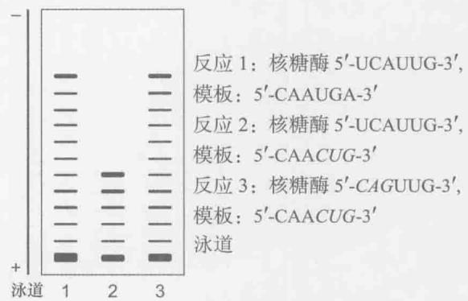

A. 根据数据，描述这三个反应中核酶复制酶活性的相对差异。  
B. 猜测为什么泳道3中的产物和泳道1中的产物有相同的迁移图式。

数据引用于 Wochner et al. （2011.Science 332: 209–212）。

习题 15 研究人员将脂肪酸囊泡的渗透性作为原生细胞的模型进行了研究。

A. 请解释为什么在 RNA 中心假说中膜的渗透性很重要。

B. 在一个实验中，研究人员将核酸密封在脂肪酸囊泡中，他们测量从脂肪酸囊泡中出来的核酸的比例而不是进入脂肪酸囊泡的核酸的比例，他们发现，在 24h 内，脂肪酸囊泡中的 AMP、ADP 及 ATP 并没有发生明显的变化。在 $Mg^{2+}$ 存在的条件下，他们发现脂肪酸囊泡中的 AMP、ADP 缓慢的流出，但是 ATP 没有改变。试想为什么在 $Mg^{2+}$ 存在的情况下 AMP 及 ADP 可以穿过膜。ATP 在 $Mg^{2+}$ 存在下不能穿过膜对于原生细胞的渗透性又能说明什么？

数据引用于 Mansy et al. （2008. Nature454：122-125）。

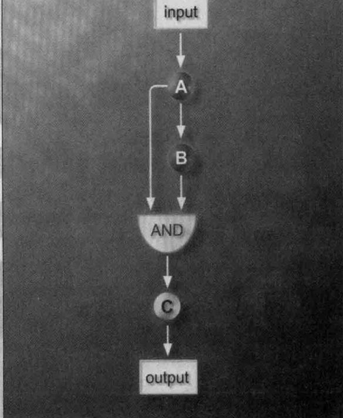

#### [W] 附录 2：本章偶数习题答案

问题 2 尽管生殖支原体的基因组很小，但是它们确实具有细胞结构，可以进行细胞分裂且不像病毒那样依赖于宿主。相似的，共生体 Hodgkins cicadicola 则依赖于宿主细胞生存，并不认为是活着的。

问题 4 最突出的例子是在核糖体大亚基上的 RNA 成分可以催化肽键的形成。其他的例子也是可能的，因为在蛋白质合成初期反应是需要 RNA 的，在 RNA 假说中认为 RNA 领先于蛋白质先出现的理论似乎是合理的。在 RNA 世界中核糖体中的有催化性质的 RNA 可能是分子化石。

#### [W] 问题6

I. RNA 聚合酶

II. 反转录酶

III. DNA 聚合酶

IV. RNA 复制酶，一种核糖酶。（注意一些依赖于 RNA 的 RNA 聚合酶是存在的）

问题 8 当一些 RNA 复制酶被膜束缚时，低效率复制酶复制出突变的复制酶的机率升高。这时随着原细胞的分裂，两个或者更多的突变复制酶将有可能被分到一个原细胞中。久而久之，携带有高效率突变的复制酶的原细胞的增殖会超过低效率的原细胞。

问题 10 科学家确实利用原始地球上可能存在的有机分子作为原材料来产生嘧啶。试图在生命起源的环境中利用磷酸、核糖及碱基来生成核苷酸的实验并没有成功，因而科学家并不支持该假说。

问题 12 RNA 复制核酸酶必需可以不只一次的催化磷酸二酯键的形成。该复制核酸酶的催化也需要自由的核苷酸。复制核酸酶序列及其互补链也必需作为模板。该复制酶的复制产生互补序列。该互补序列的复制产生了另一个拷贝的 RNA 复制酶。

#### [W] 问题14

A. 在反应 1 和 3 中的核酸酶可以比反应 2 中合成更长的 RNA。

B. 在反应 2 中模板序列的改变会产生危害性的影响。模板和核酸酶的序列的改变可以恢复核酸酶的催化能力至野生型的水平。核酸酶序列 5'-UCAUUG-3'与模板序列 5'-CAAUGA-3'互补。在反应 3 中，核酸酶和模板序列的改变恢复了序列之间的互补性。在合成过程中核酸酶与模板 RNA 的碱基是互补配对的。

<!-- W-END Watson 17 章末 -->

<!-- C-BEGIN Campbell 17 Review -->

### 【英文对应 Campbell 第17章章末：Chapter Review】

> 来源：Campbell Biology（书籍/01_Campbell_Biology） 第17章 Summary of Key Concepts 与 Test Your Understanding。

### [EN] Summary of Key Concepts

To review key terms, go to the Vocabulary Self-Quiz (eTextbook only).

### [EN] Concept 17.1: Genes specify proteins via transcription and translation

\- Beadle and Tatum's studies of mutant strains of Neurospora led to the one gene–one polypeptide hypothesis. During gene expression, the information encoded in genes is used to make specific polypeptide chains (enzymes and other proteins) or RNA molecules.

\- Transcription is the synthesis of RNA complementary to a template strand of DNA. Translation is the synthesis of a polypeptide whose amino acid sequence is specified by the nucleotide sequence in messenger RNA (mRNA).

\- Genetic information is encoded as a sequence of nonoverlapping nucleotide triplets, or codons. A codon in mRNA either is translated into an amino acid (61 of the 64 codons) or serves as a stop signal (3 codons). Codons must be read in the correct reading frame.

Describe the process of gene expression, by which a gene affects the phenotype of an organism.

### [EN] Concept 17.2: Transcription is the DNA-directed synthesis of RNA: A Closer Look

\- RNA synthesis is catalyzed by RNA polymerase, which links together RNA nucleotides complementary to a DNA template strand. Transcription follows the same base-pairing rules as DNA replication, except that in RNA, uracil (U) substitutes for thymine (T).

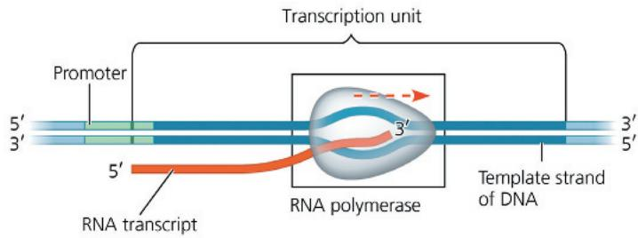

\- The three stages of transcription are initiation, elongation, and termination. A promoter sequence, often including a TATA box in eukaryotes, establishes where RNA synthesis is initiated. Transcription factors help eukaryotic RNA polymerase recognize promoter sequences, forming a transcription initiation complex. Termination differs in bacteria and eukaryotes.

Compare the initiation of transcription in bacteria and eukaryotes.

### [EN] Concept 17.3: Eukaryotic cells modify RNA after transcription

\- Eukaryotic mRNAs undergo RNA processing, which includes RNA splicing, the addition of a modified nucleotide 5' cap to the 5' end, and the addition of a poly-A tail to the 3' end. The processed mRNA includes an untranslated region (5' UTR or 3' UTR) at each end of the coding segment.

\- Most eukaryotic genes are split into segments: They have introns interspersed among the exons (the regions included in the mRNA). In RNA splicing, introns are removed and exons joined. RNA splicing is typically carried out by spliceosomes, but in some cases, RNA alone catalyzes its own splicing. The properties of RNA allow some RNAs (called ribozymes) to act as catalysts. The presence of introns allows for alternative RNA splicing.

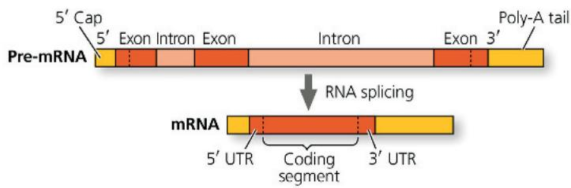  
What function do the 5' cap and the poly-A tail serve on a eukaryotic mRNA?

### [EN] Concept 17.4: Translation is the RNA-directed synthesis of a polypeptide: A Closer Look

\- A cell translates an mRNA message into protein using transfer RNAs (tRNAs). After being bound to a specific amino acid by an aminoacyl-tRNA synthetase, a tRNA lines up via its anticodon at the complementary codon on mRNA. A ribosome, made up of ribosomal RNAs (rRNAs) and proteins, facilitates this coupling with binding sites for mRNA and tRNA.

\- Ribosomes coordinate the three stages of translation: initiation, elongation, and termination. The formation of peptide bonds between amino acids is catalyzed by rRNAs as tRNAs move through the A and P sites and exit through the E site.

\- After translation, during protein processing, proteins may be modified by cleavage or by attachment of sugars, lipids, phosphates, or other chemical groups.

\- Free ribosomes in the cytosol initiate synthesis of all proteins, but proteins with a signal peptide are synthesized on the ER.

\- A gene can be transcribed by multiple RNA polymerases simultaneously. Also, a single mRNA molecule can be translated simultaneously by a number of ribosomes, forming a polyribosome. In bacteria, these processes are coupled, but in eukaryotes they are separated in space and time by the nuclear membrane.

How do tRNAs function in the context of the ribosome during translation?

### [EN] Concept 17.5: Mutations of one or a few nucleotides can affect protein structure and function

\- Small-scale mutations include point mutations, changes in one DNA nucleotide pair, which may lead to production of nonfunctional proteins. Nucleotide-pair substitutions can cause missense or nonsense mutations. Nucleotide-pair insertions or deletions may produce frameshift mutations.

\- Spontaneous mutations can occur during DNA replication, recombination, or repair. Chemical and physical mutagens cause DNA damage that can alter genes.

\- The CRISPR-Cas9 system is a powerful new gene-editing technique with the potential to correct genetic mutations that cause disease. Significant technical and ethical questions have been raised about how this can or should be used.

What will be the results of chemically modifying one nucleotide base of a gene? What role is played by DNA repair systems in the cell?

For suggested answers, see Appendix A.

### [EN] Test Your Understanding

For more multiple-choice questions, go to the Practice Test (eTextbook only).

### [EN] Levels 1-2: Remembering/Understanding

1. In eukaryotic cells, transcription cannot begin until

(A) the two DNA strands have completely separated and exposed the promoter.

(B) several transcription factors have bound to the promoter.

(C) the 5' caps are removed from the mRNA.

(D) the DNA introns are removed from the template.

2. Which of the following is true of a codon?

(A) It never codes for the same amino acid as another codon.

(B) It can code for more than one amino acid.

(C) It can be either in DNA or in RNA

(D) It is the basic unit of protein structure.

3. The anticodon of a particular tRNA molecule is

(A) complementary to the corresponding mRNA codon.

(B) complementary to the corresponding triplet in rRNA.

(C) the part of tRNA that bonds to a specific amino acid.

(D) catalytic, making the tRNA a ribozyme.

4. Which of the following is true of RNA processing?

(A) Exons are cut out before mRNA leaves the nucleus.

(B) Nucleotides are added at both ends of the RNA.

(C) Ribozymes may function in the addition of a 5' cap.

(D) RNA splicing adds a poly-A tail to the mRNA.

5. Which component is directly involved in translation?

(A) RNA polymerase

(B) ribosome

(C) spliceosome

(D) DNA

### [EN] Levels 3-4: Applying/Analyzing

6. Using Figure 17.6, identify a $5'\rightarrow3'$ sequence of nucleotides in the DNA template strand for an mRNA coding for the polypeptide sequence Phe-Pro-Lys.

(A) 5'-UUUCCCAAA-3'

(B) 5'-GAACCCCTT-3'

(C) 5'-CTTCGGGAA-3'

(D) 5'-AAACCCUUU-3'

7. Which of the following mutations would be most likely to have a harmful effect on an organism?

(A) a deletion of three nucleotides near the middle of a gene

(B) a single nucleotide deletion in the middle of an intron

(C) a single nucleotide deletion near the end of the coding sequence

(D) a single nucleotide insertion downstream of, and close to, the start of the coding sequence

8. Would the coupling of the processes shown in Figure 17.24 be found in a eukaryotic cell? Explain why or why not.

9. Complete the following table:

<table><tr><td>Type of RNA</td><td>Functions</td></tr><tr><td>Messenger RNA (mRNA)</td><td></td></tr><tr><td>Transfer RNA (tRNA)</td><td></td></tr><tr><td></td><td>In a ribosome, plays a structural role; as a ribozyme, plays a catalytic role (catalyzes peptide bond formation)</td></tr><tr><td>Primary transcript</td><td></td></tr><tr><td>Small RNAs in the spliceosome</td><td></td></tr></table>

### [EN] Levels 5-6: Evaluating/Creating

10. EVOLUTION CONNECTION Most amino acids are coded for by a set of similar codons (see Figure 17.6). Propose at least one evolutionary explanation to account for this pattern.

11. SCIENTIFIC INQUIRY Knowing that the genetic code is almost universal, a scientist uses molecular biological methods to insert the human $\beta$ -globin gene (shown in Figure 17.12) into bacterial cells, hoping the cells will express it and synthesize functional $\beta$ -globin protein. Instead, the protein produced is nonfunctional and is found to contain many fewer amino acids than does $\beta$ -globin made by a eukaryotic cell. Explain why.

12. WRITE ABOUT A THEME: INFORMATION Evolution accounts for the unity and diversity of life, and the continuity of life is based on heritable information in the form of DNA. In a short essay (100–150 words), discuss how the fidelity with which DNA is inherited is related to the processes of evolution. (Review the discussion of proofreading and DNA repair in Concept 16.2.)

### [EN] 13. SYNTHESIZE YOUR KNOWLEDGE

Some mutations result in proteins that function well at one temperature but are nonfunctional at a different (usually higher) temperature. Siamese cats have such a “temperature-sensitive” mutation in a gene encoding an enzyme that makes dark pigment in the fur. The mutation results in the breed’s distinctive point markings and lighter body color (see the photo). Using this information and what you learned in the chapter, explain the pattern of the cat’s fur pigmentation.

For selected answers, see Appendix A.

### [EN] Explore Scientific Papers with Science in the Classroom | AAAS

How is green fluorescent protein (GFP) used as a marker for gene expression? Go to “Lighting up Life” at www.scienceintheclassroom.org.

Instructors: Questions can be assigned in Mastering Biology.

Eye cell specialized for aquatic vision

<!-- C-END Campbell 17 Review -->

<!-- L-BEGIN Lehninger 26 章末 -->

### 【英文对应 Lehninger 第26章章末：Key Terms、习题与简答】

> 来源：Lehninger Principles of Biochemistry（书籍/02_生物化学原理） 第26章章末及书末 Abbreviated Solutions 第26章。

### [EN] KEY TERMS

Terms in bold are defined in the glossary.

ribonucleoprotein (RNP) 960   
transcription 960   
messenger RNA (mRNA) 960   
transfer RNA (tRNA) 960   
ribosomal RNA (rRNA) 960   
noncoding RNA (ncRNA) 960   
transcriptome 960 DNA-dependent RNA polymerase 961   
template strand 962   
nontemplate strand 962 coding strand 962   
promoter 963   
consensus sequence 963   
footprinting 965   
cAMP receptor protein (CRP) 966   
repressor 966   
carboxyl-terminal domain (CTD) 968   
transcription factors 968   
general transcription factors 968   
preinitiation complex (PIC) 969   
ribozymes 972   
primary transcript 972   
precursor transcript 972   
intron 973

exon 973
RNA splicing 973
messenger ribonucleo-
protein (mRNP)
complex 973
5' cap 974
spliceosome 977
small nuclear RNA
(snRNA) 977
poly(A) tail 980
alternative splicing 981
poly(A) site choice 982
small nucleolar RNA
(snoRNA) 984
snoRNA-protein complex
(snoRNP) 984
microRNA (miRNA) 985
polynucleotide
phosphorylase 987
exosome 987
reverse transcriptase 988
retrovirus 988
complementary DNA
(cDNA) 990
homing 992
telomerase 993
T loop 993
RNA-dependent RNA
polymerase (RNA
replicase) 994
internal guide sequence 996
RNA world hypothesis 998
SELEX 1000
aptamer 1000

### [EN] PROBLEMS

1. RNA Polymerase (a) How long would it take for the E. coli RNA polymerase to synthesize the primary transcript for the E. coli genes encoding the enzymes for lactose metabolism, the 5,300 bp lac operon? (b) How far along the DNA would the transcription "bubble" formed by RNA polymerase move in 10 seconds? (c) Assuming that human Pol II transcribes at a similar rate, how long does it take to transcribe the 2,000,000 bp dystrophin gene?

2. Error Correction by RNA Polymerases DNA polymerases are capable of editing and error correction, whereas the capacity for error correction in RNA polymerases seems to be limited. Given that a single base error in either replication or transcription can lead to an error in protein synthesis, suggest a possible biological explanation for this difference.

3. RNA Posttranscriptional Processing Predict the likely effects of a mutation in the sequence (5')AAUAAA in a eukaryotic mRNA transcript.

4. Coding versus Template Strands The RNA genome of phage Qβ is the nontemplate strand, or coding strand, and when introduced into the cell, it functions as an mRNA. Suppose the RNA replicase of phage Qβ synthesized primarily template-strand RNA and uniquely incorporated this, rather than nontemplate strands, into the viral particles. What would be the fate of the template strands when they entered a new cell? What enzyme would have to be included in the viral particles for successful invasion of a host cell?

5. Transcription The gene encoding the E. coli enzyme enolase begins with the sequence ATGTCCAAAATCGTA. What is the sequence of the RNA transcript specified by this part of the gene?

6. The Chemistry of Nucleic Acid Biosynthesis Describe three properties common to the reactions catalyzed by DNA polymerase, RNA polymerase, reverse transcriptase, and RNA replicase. How is the enzyme polynucleotide phosphorylase similar to and different from these four enzymes?

7. RNA Processing I While studying human transcription in the 1960s, James Darnell carried out an experiment that has become a classic in biochemistry, but at the time, it was incredibly perplexing. Darnell and coworkers used radioactive isotopes, such as $[^{32}P]$ -labeled phosphate, to isolate and quantify RNAs from a cultured line of human cancer cells (HeLa). With this approach, they were able to identify those RNAs present in the nucleus and those present in the cytoplasm. The results were puzzling, because it was obvious that a large amount of transcription was occurring in the nucleus, but comparatively little radioactive mRNA was isolated from the cytoplasm. Moreover, the nuclear-isolated RNAs were much longer than those isolated from the cytoplasm. What can account for these observations?

8. The Transcriptome If a cell's genome is completely known, is it possible to determine the cell's transcriptome—the sequence of all the RNAs being produced by the cell—without additional information? Explain.

9. RNA Splicing What is the minimum number of transesterification reactions needed to splice an intron from a pre-mRNA transcript? Explain.

10. RNA Processing II Blocking the splicing of a particular pre-mRNA in a vertebrate cell also blocks a nucleotide modification reaction occurring in the rRNA. Suggest a reason for this.

11. RNA Modification I Researchers Brenda Bass and Harold Weintraub discovered double-stranded RNA-specific adenosine deaminases (ADARs) in 1987. These enzymes recognize double-stranded regions of mRNA and convert adenosine bases to inosine within these regions.

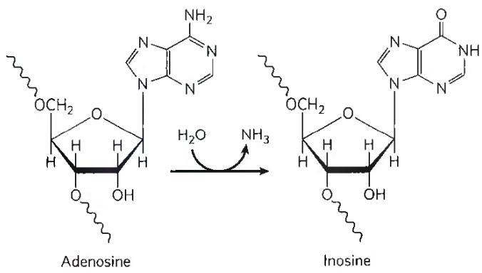

(a) When ADAR encounters a double-stranded RNA substrate in water that also contains $H_{2}[^{18}O]$ , radioactive oxygen incorporates into the RNA. Draw a reaction mechanism for ADAR that accounts for this observation.

(b) After ADAR reacts with a double-stranded RNA, the RNA duplex sometimes spontaneously unwinds to form single strands. Why might this occur?

(c) What is a possible consequence of adenosine to inosine conversion in the coding sequence of an mRNA?

12. Organization of RNA Processing In eukaryotes, pre-mRNA splicing by the spliceosome occurs only in the nucleus and translation of mRNAs occurs only in the cytosol. Why might the separation of these two activities into different cellular compartments be important?

13. RNA Modification II In addition to rRNAs and tRNAs, many human mRNAs also contain modified nucleotides, in particular $N^{6}$ -methyladenosine.

(a) How might incorporation of $N^{6}$ -methyladenosine impact RNA processing?

(b) Incorporation of $N^{6}$ -methyladenosine into the 3' untranslated region (UTR; see Fig. 9-24) of the MAT2A transcript, which encodes a methionine adenosyltransferase, regulates the metabolism of the cofactor S-adenosylmethionine. Why would metabolism of S-adenosylmethionine be linked to $N^{6}$ -methyladenosine formation?

14. RNA Genomes RNA viruses have relatively small genomes. For example, the single-stranded RNAs of retroviruses have about 10,000 nucleotides, and the Qβ RNA is only 4,220 nucleotides long. How might the properties of reverse transcriptase and RNA replicase have contributed to the small size of these viral genomes?

15. Screening of RNAs by SELEX The practical limit for the number of different RNA sequences that can be screened in a SELEX experiment is $10^{15}$ . (a) Suppose you are working with oligonucleotides that are 36 nucleotides long. How many sequences exist in a randomized pool containing every sequence possible? (b) What percentage of these can a SELEX experiment screen? (c) Suppose you wish to select an RNA molecule that catalyzes the hydrolysis of a particular ester. From what you know about catalysis, propose a SELEX strategy that might allow you to select the appropriate catalyst.

16. Slow Death The death cap mushroom, Amanita phalloides, contains several dangerous substances, including the lethal $\alpha$ -amanitin. This toxin blocks RNA elongation in consumers of the mushroom by binding to eukaryotic RNA polymerase II with very high affinity; it is deadly in concentrations as low as $10^{-8}$ M. The initial reaction to ingestion of the mushroom is gastrointestinal distress (caused by some of the other toxins). These symptoms disappear, but about 48 hours later, the mushroom-eater dies, usually from liver dysfunction. Speculate on why it takes this long for $\alpha$ -amanitin to kill.

17. Detection of Rifampin-Resistant Strains of Tuberculosis Rifampin is an important antibiotic used to treat tuberculosis and other mycobacterial diseases. Some strains of Mycobacterium tuberculosis, the causative agent of tuberculosis, are resistant to rifampin. These strains become resistant through mutations that alter the rpoB gene, which encodes the $\beta$ subunit of the RNA polymerase (see Fig. 26-10). Rifampin cannot bind to the mutant RNA polymerase and so is unable to block the initiation of transcription. DNA sequences from a large number of rifampin-resistant M. tuberculosis strains have been found to have mutations in a specific 69 bp region of rpoB. One well-characterized rifampin-resistant strain has a single base pair alteration in rpoB that results in a His residue being replaced by an Asp residue in the $\beta$ subunit.

(a) Based on your knowledge of protein chemistry, what technique could you use to detect whether a particular strain produces the rpoB His → Asp mutant protein?

(b) Based on your knowledge of nucleic acid chemistry, what technique could you also use to identify the mutant forms of rpoB?

### [EN] BIOCHEMISTRY ONLINE

18. The Ribonuclease Gene Human pancreatic ribonuclease has 128 amino acid residues.

(a) What is the minimum number of nucleotide pairs required to code for this protein?

(b) The mRNA expressed in human pancreatic cells was copied with reverse transcriptase to create a "library" of human DNA. The sequence of the mRNA coding for human pancreatic ribonuclease was determined by sequencing the complementary DNA (cDNA) from this library that included an open reading frame for the protein. Use the nucleotide database at NCBI (www.ncbi.nlm.nih.gov/nucleotide) to find the published sequence of this mRNA. (Search for accession number D26129.) What is the length of this mRNA?

(c) How can you account for the discrepancy between the size you calculated in (a) and the actual length of the mRNA?

### [EN] DATA ANALYSIS PROBLEM

19. Amputated RNAs with Prosthetic Tails The Wickens lab studies the dramatic effects of RNA processing on how a cell utilizes mRNAs, such as the c-mos (cellular mouse sarcoma) protooncogene, which controls meiosis and embryonic cell cycles in vertebrates. In frogs (Xenopus), expression of the c-mos protein is essential for maturation of oocytes after exposure to progesterone and embryo formation.

Specific RNAs can be cleaved (amputated) in Xenopus oocytes by injection of antisense DNA oligonucleotides that will hybridize to the mRNA. The formation of an RNA/DNA duplex triggers cleavage of the RNA strand by cellular RNase H. The figure below depicts the results of amputation of the c-mos mRNA after oligo injection. In this case, the oligonucleotide targeted the -883 region of the c-mos mRNA. This region is downstream of the c-mos open reading frame (depicted by the AUG start and UAA stop codons) within the 3' untranslated region (3'UTR).

After injection of a sense oligonucleotide, the oocyte maturation percentage was nearly unchanged. However, when an antisense oligonucleotide was injected, the maturation percentage was reduced by \~60%. The c-mos mRNA was isolated from oocytes that either did or did not mature after injection of the antisense oligonucleotide. The mRNAs were analyzed by gel electrophoresis followed by northern blotting, as shown below. In a northern blot, RNAs are separated by gel electrophoresis according to their size, transferred to a membrane, and then detected by hybridization to radioactive or fluorescent complementary DNA probes.

(a) What can you conclude about the importance of the c-mos mRNA poly(A) tail on oocyte maturation?

(b) Why was a sense oligonucleotide used in some experiments? Members of the Wickens lab then decided to inject a prosthetic RNA after amputation of the c-mos mRNA. The prosthetic RNA contained the c-mos mRNA 3'UTR as well as a region complementary to the amputated c-mos mRNA. Their observations are shown below. In these experiments, oocyte maturation was measured by the percentage of cells in which germinal vesicle breakdown (% GVBD) was observed. GVBD occurs when the oocyte nucleus (called the germinal vesicle) dissolves and the cell resumes meiosis.

  
(c) How do you explain these results?

Wickens lab scientists then tried attaching the c-mos mRNA 3'UTR to an unrelated reporter enzyme. In this case, they used luciferase, whose enzymatic activity can easily be measured by luminescence (see Box 13-2). The total luciferase activity is also proportional to the amount of luciferase protein being produced by the cell. They tried attaching the entire c-mos mRNA 3'UTR (mRNA1), the amputated 3'UTR (mRNA2), or a combination of the amputated 3'UTR with the prosthetic poly(A) tail to luciferase. High luciferase activity was observed only when either the entire c-mos mRNA 3'UTR was used or when the prosthetic poly(A) tail was included along with the amputated 3'UTR.

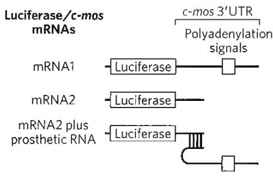

(d) What does this experiment tell you about the likely function of the 3'UTR and poly(A) tail for the c-mos mRNA and in oocyte maturation?

(e) How might these results be useful for controlling cellular gene expression?

### [EN] Reference

Sheets, M.D., M. Wu, and M. Wickens. 1995. Polyadenylation of c-mos mRNA as a control point in Xenopus meiotic maturation. Nature 374:511-516.

### [EN] Abbreviated Solutions — Chapter 26

1. (a) 60 to 100 s (b) 500 to 900 nucleotides (c) 6 to 11 h

2. A single base error in DNA replication, if not corrected, would cause one of the two daughter cells, and all its progeny, to have a mutated chromosome. A single base error in RNA transcription would not affect the chromosome; it would lead to formation of some defective copies of one protein, but because mRNAs turn over rapidly, most copies of the protein would not be defective. The progeny of this cell would be normal.

3. Normal posttranscriptional processing at the 3' end (cleavage and polyadenylation) would be inhibited or blocked.

4. Because the template-strand RNA does not encode the enzymes needed to initiate viral infection, it would probably be inert or simply degraded by cellular ribonucleases. Replication of the template-strand RNA and propagation of the virus could occur only if intact RNA replicase (RNA-dependent RNA polymerase) were introduced into the cell along with the template strand.

5. AUGUCCAAAAUCGUA

6. (1) Use of a template strand of nucleic acid; (2) synthesis in the $5'\rightarrow3'$ direction; (3) use of nucleoside triphosphate substrates, with formation of a phosphodiester bond and displacement of $PP_{i}$ . Polynucleotide phosphorylase forms phosphodiester bonds but differs in all other listed properties.

7. Most of the RNA transcribed in the nucleus was intronic and removed from the mRNAs.

8. No, at this time it is not possible to determine a cell's transcriptome based solely on the genome. Different cells have different transcriptomes based on which promoters are being used and how the transcripts are processed by factors present in the cell.

9. Generally two: one to cleave the phosphodiester bond at one intron-exon junction, the other to link the resulting free exon end to the exon at the other end of the intron. If the nucleophile in the first step were water, this step would be a hydrolysis, and only one transesterification step would be required to complete the splicing process.

10. Many snoRNAs, required for rRNA modification reactions, are encoded in introns. If splicing does not occur, snoRNAs are not produced.

11. (a) Water attacks the C-6 position of adenine, forming a tetrahedral intermediate, which then eliminates ammonia to form inosine. (b) Inosine can no longer pair correctly with U residues found on the opposite RNA strand prior to ADAR activity. This results in disruption of the RNA duplex. (c) Inosine does not have the same pairing properties as adenine and could potentially recode that particular codon so that a different amino acid is incorporated into the protein.

12. Physical separation of the processes prevents translation of primary or precursor transcripts that have not yet been processed by the cell. It also prevents the RNA processing and translational machineries from competing with one another for mRNAs.

13. (a) This could change how proteins or other RNAs recognize a particular RNA sequence and interfere with splicing, poly(A) formation, RNA modification, or other steps in which sequence-specific RNA recognition is important. (b) S-adenosylmethionine serves as the methyl donor in the synthesis of $N^{6}$ -methyladenosine.

14. These enzymes lack a $3'\rightarrow5'$ proofreading exonuclease and have a high error rate; the likelihood of a replication error that would inactivate the virus is much lower in a small genome than in a large one.

15. (a) $4^{36} = 4.7 \times 10^{21}$ (b) 0.00002% (c) For the “unnatural selection” step, use a chromatographic resin with a bound molecule that is a transition-state analog of the ester hydrolysis reaction.

16. Though RNA synthesis is quickly halted by $\alpha$ -amanitin toxin, it takes several days for the critical mRNAs and proteins in the liver to degrade, causing liver dysfunction and death.

17. (a) After lysis of the cells and partial purification of the contents, an antibody-based assay could detect the $\beta$ subunit. The $\beta$ subunit could then be subjected to tandem mass spectrometry, which could detect the difference in amino acid residues between the normal $\beta$ subunit and the mutated form. (b) Direct DNA sequencing (by the Sanger method)

18. (a) 384 (b) 1,620 nucleotide pairs (c) Most of the nucleotides are untranslated regions at the 3' and 5' ends of the mRNA. Also, most mRNAs code for a signal sequence (Chapter 27) in their protein products, which is eventually removed to produce the mature, functional protein.

19. (a) Injection of the antisense oligo cleaves the c-mos RNA and removes its poly(A) tail. This correlates with a loss in oocyte maturation. The noncoding poly(A) tail of the c-mos mRNA must be important for its function in maturation. (b) The sense oligo control shows that these results depend on complementarity to the c-mos mRNA. (c) The prosthetic RNA likely base-paired with the amputated c-mos mRNA and restored its function. Therefore, poly(A) tails can function "in trans"—they do not need to be covalently connected to the mRNAs they regulate. (d) The poly(A) tail stimulates protein expression in the reporter. This is likely also occurring with c-mos, and this protein expression is important for oocyte maturation. (e) These results suggest that the expression of genes can be artificially controlled either by cutting off their poly(A) tails or by attaching synthetic ones derived from other genes. This could be useful for fine-tuning gene expression in bioengineered cells or turning expression on or off.

<!-- L-END Lehninger 26 章末 -->
