# 第4章 生物信息的传递（下）——从mRNA到蛋白质

> **本章插入内容**（中文对照与英文对应，插在所列中文节末尾；导言在章首，小结/习题/Review 在章末）
>
> - Watson 第6章「蛋白质的结构」 → 4.4 蛋白质合成的生物学机制
> - Watson 第15章「翻译（章首）」 → 4.4 蛋白质合成的生物学机制
> - Watson 第15章「转运RNA」 → 4.2 tRNA
> - Watson 第15章「氨基酸连接到 tRNA 上」 → 4.2 tRNA
> - Watson 第15章「核糖体」 → 4.3 核糖体
> - Watson 第15章「翻译的起始」 → 4.4 蛋白质合成的生物学机制
> - Watson 第15章「翻译延伸」 → 4.4 蛋白质合成的生物学机制
> - Watson 第15章「翻译终止」 → 4.4 蛋白质合成的生物学机制
> - Watson 第16章「遗传密码」 → 4.1 遗传密码——三联子
> - Campbell Concept 17.4 → 4.4 蛋白质合成的生物学机制
> - Lehninger §27.1 → 4.1 遗传密码——三联子
> - Lehninger §27.2 → 4.4 蛋白质合成的生物学机制
> - Lehninger §27.3 → 4.6 蛋白质的修饰、降解与稳定性研究
> - 章首导言与章末：Lehninger 第27章
> - 章末小结/习题：Watson 第6章、Watson 第15章、Watson 第16章

<!-- 章节边界按正文内容恢复；原始 MinerU 内容保留如下。 -->

# 生物信息的传递(下) ——从 mRNA 到蛋白质

4.1 遗传密码——三联子

4.2 tRNA

4.3 核糖体

4.4 蛋白质合成的生物学机制

4.5 蛋白质运转机制

4.6 蛋白质的修饰、降解与稳定性研究

蛋白质是基因表达的最终产物, 是组成细胞的主要成分(图 4-1)。蛋白质的生物合成是一个比 DNA 复制和转录更为复杂的过程, 主要包括:

① 翻译的起始 核糖体与 mRNA 结合并与氨酰 tRNA 生成起始复合物。

② 肽链的延伸 由于核糖体沿 mRNA 5' 端向 3' 端移动, 开始了从 N 端向 C 端的多肽合成, 这是蛋白质合成过程中速度最快的阶段。

③ 肽链的终止及释放 核糖体从 mRNA 上解离, 准备新一轮合成反应。

核糖体是蛋白质合成的场所,mRNA 是蛋白质合成的模板,转移 RNA (transfer RNA, tRNA) 是模板与氨基酸之间的接合体。此外,在合成的各个阶段还有许多蛋白质、酶和其他生物大分子参与。例如,在真核生物细胞中有 70 种以上的核糖体蛋白质,20 种以上的 AA-tRNA 合成酶,10 多种起始因子、延伸因子及终止因子,50 种左右 tRNA 及各种 rRNA、mRNA 和 100 种以上翻译后加工酶参与蛋白质合成和加工过程。蛋白质合成是一个需能反应,要有各种高能化合物的参与。据统计,在真核生物中有将近 300 种生物大分子与蛋白质的合成有关,细胞用来进行合成代谢总能量的 90% 消耗在蛋白质合成过程中,而参与蛋白质合成的各种组分约占到细胞干重的 35%。

在真核生物细胞核内合成的 mRNA, 只有被运送到细胞质部分才能被翻译生成蛋白质。所谓翻译是指将 mRNA 链上的核苷酸从一个特定的起始位点开始, 按每 3 个核苷酸代表一个氨基酸的原则, 依次合成一条多肽链的过程。尽管蛋白质合成过程十分复杂, 但合成速度却高得惊人, 如大肠杆菌只需要 5 s 就能合成一条由 100 个氨基酸组成的多肽, 而且每个细胞中成百上千个蛋白质的合成都能有条不紊地协同进行。

图 4-1 细胞的化学组分中,蛋白质的含量在生物大分子中占有非常高的比例


<!-- L-BEGIN Lehninger 27 导言 -->

### 【英文对应 Lehninger 第27章导言：Protein Metabolism】

> 来源：Lehninger Principles of Biochemistry（书籍/02_生物化学原理） 第27章章首。

#### [EN] PROTEIN METABOLISM

#### [EN] 27.1 The Genetic Code 1006

27.2 Protein Synthesis 1015

#### [EN] 27.3 Protein Targeting and Degradation 1041

Almost every biological process requires one or more proteins. A typical cell requires thousands of different proteins at any given moment. These proteins must be synthesized in response to the cell's current needs, modified to alter their activity or fate, transported (targeted) to their appropriate cellular locations, and degraded when no longer needed. Dozens of separate processes contribute to cellular proteostasis, the steady-state complement of proteins that enable the life of a cell at any given moment.

Many of the fundamental components and mechanisms used by the protein biosynthetic machinery are remarkably well conserved in all life-forms, from bacteria to higher eukaryotes, indicating that they were present in the last universal common ancestor (LUCA) of all extant organisms. Whereas the chapter focuses on protein biosynthesis, all aspects of proteostasis are considered. The principles that guide our approach are interrelated, reflecting all of these realities and more.

P1 Information is expensive. This principle, noted in earlier chapters, is particularly well illustrated by protein synthesis. Protein synthesis consumes more cellular resources than any other process in most cells. The 15,000 ribosomes, 100,000 molecules of protein synthesis-related protein factors and enzymes, and 200,000 tRNA molecules in a typical bacterial cell can account for more than $35\%$ of the cell's dry weight. Overall, almost 300 different macromolecules cooperate to synthesize polypeptides. Protein synthesis can account for up to $90\%$ of the chemical energy used by a cell for all biosynthetic reactions. Why? The enzymatic synthesis of an amide bond should require little energetic input. However, the sequence of amino acids in a protein is a form of biological information. Synthesis of each amide (peptide) bond between two particular amino

acids is ensured by the investment of more than four nucleoside triphosphates (NTPs).

P2 The genetic code is nearly universal and arose early in evolution. This is one of the many characteristics of living systems that ties all of them to a common ancestor. Even the rare exceptions to code universality reinforce this rule.

P3 The genetic code functions via linker molecules. The tRNAs are the crucial adaptor, matching amino acids with DNA codons.

P4 Proteins are synthesized by RNAs. The study of protein synthesis offers another important reward: a look at a world of RNA catalysts that may have existed in an RNA world before the dawn of life “as we know it.” Proteins are synthesized by a gigantic RNA enzyme.

P5 Protein metabolism is regulated at many levels. The resource investment in protein synthesis ensures that many layers of regulation work together to determine which proteins are synthesized at any given moment. However, proteins often function only in particular cellular locations and at particular times. Mechanisms for spatial and temporal regulation—protein targeting, activation, and eventual degradation—exhibit complexities that can approach those of the biosynthetic processes.

Several major advances set the stage for our present knowledge of protein biosynthesis (Fig. 27-1). First, in the early 1950s, Paul Zamecnik and Elizabeth Keller discovered the ribonucleoprotein particles in which protein synthesis occurs. These particles, visible in animal tissues by electron microscopy, were later named ribosomes. Soon after, Francis Crick considered how the genetic information encoded in the 4-letter language of nucleic acids could be translated into the 20-letter language of proteins. In 1955, Crick postulated that a small nucleic acid could serve the role of an adaptor, with one part of the adaptor molecule binding a specific


FIGURE 27-1 Timeline for the elucidation of protein biosynthetic pathways. Some key contributions are highlighted. However, our current understanding of the genetic code and protein biosynthetic pathways comes as the result of international endeavors involving hundreds of laboratories. [Top left to bottom left: Bettmann/Getty Images; data from PDB ID 4TRA, E. Westhof et al., Acta Crystallogr. A 44:112, 1988; Bettmann/Getty Images; Courtesy Archives, University of Wisconsin, Madison; Alastair Grant/AP Images; Lucas Jackson/Reuters/Newscm; Xinhua/ZUMAPRESS.com. Top right to bottom right: Joseph F. Gennaro Jr./Science Source; Archives and Special Collections, Massachusetts General Hospital; Cornell University Media Services PhotoSection records, #21-37-2227, Division of Rare and Manuscript Collections, Cornell University Library; Bob Schutz/AP Images; Courtesy Archives, University of Wisconsin, Madison; Courtesy Harry Noller; data from PDB ID 4V7R, A. Ben-Shem et al., Science 330:1203, 2010.]

amino acid and another part recognizing the nucleotide sequence encoding that amino acid in an mRNA (Fig. 27-2). Crick's adaptor hypothesis was soon verified when Mahlon Hoagland and Zamecnik discovered tRNA. The structure of alanyl-tRNA was reported by Robert Holley in 1964. The tRNA adaptor “translates” the nucleotide sequence of an mRNA into the amino acid sequence of a polypeptide. The overall process of mRNA-guided protein synthesis is often referred to simply as translation. Hoagland, Zamecnik, and Elizabeth Keller also discovered that amino acids were “activated” for protein synthesis when incubated with ATP and the cytosolic fraction of liver cells. The amino acids became attached to a heat-stable soluble RNA—the tRNA—to form aminoacyl-tRNAs. The enzymes that catalyze this process are the aminoacyl-tRNA synthetases.

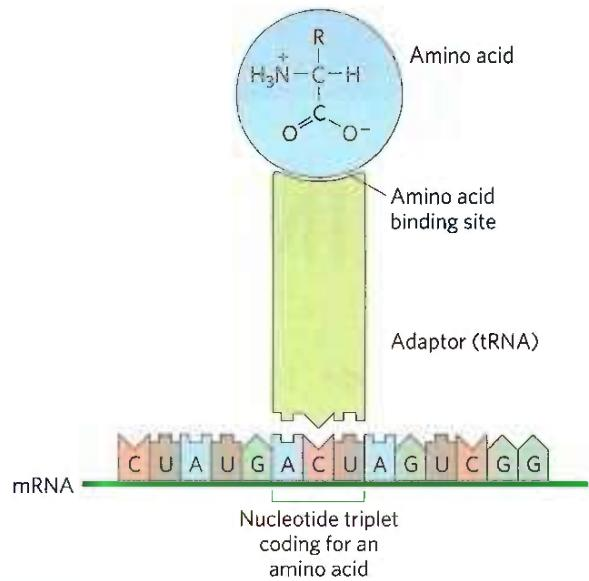  
FIGURE 27-2 Crick's adaptor hypothesis. Francis Crick proposed that one end of a small nucleotide adaptor could bind a specific amino acid and the other end could recognize a nucleotide sequence in the mRNA. Today we know that the amino acid is covalently bound at the 3' end of a tRNA molecule and that a specific nucleotide triplet elsewhere in the tRNA interacts with a particular triplet codon in mRNA through hydrogen bonding of complementary bases.

These developments soon led to recognition of the major stages of protein synthesis and ultimately to elucidation of the genetic code that specifies each amino acid. In subsequent decades, ribosomes were purified and their protein and rRNA components were dissected. Elucidation of the three-dimensional structures of ribosomes was completed by 2000, confirming a hypothesis first put forward by Harry Noller two decades earlier: it is the rRNA, rather than ribosomal proteins, that catalyzes peptide bond formation.


<!-- L-END Lehninger 27 导言 -->

## 4.1 遗传密码——三联子

贮存在 DNA 上的遗传信息通过 mRNA 传递到蛋白质上, mRNA 与蛋白质之间的联系是通过遗传密码的破译来实现的。mRNA 上每 3 个核苷酸翻译成蛋白质多肽链上的一个氨基酸, 这 3 个核苷酸就称为密码, 也叫三联子密码即密码子 (codon)。翻译时从起始密码子 AUG (initiation codon) 开始, 沿着 mRNA 5' → 3' 的方向连续阅读密码子, 直至终止密码子 (termination codon) 为止, 生成一条具有特定序列的多肽链——蛋白质 $^{[图4-2]}$ 。新生的多肽链中氨基酸的组成和排列顺序决定于其基因的碱基组成及其顺序, 因此, 作为基因产物的蛋白质最终是受基因控制的。

  
图 4-2 Crick 关于 tRNA 分子破译 mRNA 遗传密码三联子的原始构想

遗传密码是20世纪60年代通过设计出色的生物化学和遗传学实验阐明的，它是科学上的杰出成就之一，它不仅为研究蛋白质的生物合成提供了理论依据，也证实了中心法则的正确性。70年代以来，分子生物学技术如DNA、RNA序列测定及氨基酸序列测定技术的进步，使遗传密码的存在得到验证。下面我们介绍遗传密码的来源及其特性。

## 4.1.1 三联子密码及其破译

蛋白质中的氨基酸序列是由 mRNA 中的核苷酸序列决定的, 所以, 要知道它们之间的关系就要弄清核苷酸和氨基酸数目的对应关系。mRNA 中只有 4 种核苷酸, 而蛋白质中有 20 种氨基酸, 以一种核苷酸代表一种氨基酸是不可能的。若以两种核苷酸作为一个氨基酸的密码 (二联子), 它们能代表的氨基酸有 $4^{2} = 16$ 种, 还是不足 20 种。而假定以 3 个核苷酸代表一个氨基酸, 则可以有 $4^{3} = 64$ 种密码, 完全可以满足编码 20 种氨基酸的需要。

图 4-3 用核苷酸的插入或删除实验证明 mRNA 模板上每 3 个核苷酸组成一个密码子  


经过反复研究, Crick 等人首先从遗传学的角度证实三联子密码的构想是正确的。他们发现 T4 噬菌体 rⅡ位点上两个基因的正确表达与它能否侵染大肠杆菌有关, 用吖啶类试剂(诱导核苷酸插入或从 DNA 链上丢失)处理使 T4 噬菌体 DNA 发生移码突变(frameshift mutation), 从而指导生成一个完全不同的、没有功能的蛋白质, 使噬菌体丧失感染能力。若在模板 mRNA 中插入或删除一个碱基, 会改变该密码子以后的全部氨基酸序列。若同时对模板进行插入和删除试验, 保证后续密码子序列不变, 翻译得到的蛋白质序列就保持不变(除了发生突变的那个密码子所代表的氨基酸之外)。如果同时删除 3 个核苷酸, 翻译产生少了一个氨基酸的蛋白质, 但序列不发生变化(图 4-3)。另外, 对烟草坏死卫星病毒的研究发现, 其外壳蛋白亚基由 400 个氨基酸组成, 而相应的 RNA 片段长约 1200 个核苷酸, 与假设的密码三联子体系正好相吻合。

遗传密码的破译,即确定代表每种氨基酸的具体密码,在20世纪60年代初期是一项困难的任务。尽管如此,由于体外蛋白质合成体系的建立和核酸人工合成技术的发展,科学家实际上只花了几年时间就解开了这个谜。

## 1. 以均聚物、随机共聚物和特定序列的共聚物为模板指导多肽的合成

制备大肠杆菌的无细胞合成体系，在含 DNA、mRNA、tRNA、核糖体、AA-tRNA 合成酶及其他酶类的抽提物中加入 DNase，降解体系中的 DNA，耗尽 mRNA 时，体系中的蛋白质合成即停止，当补充外源 mRNA 或人工合成的各种均聚物或共聚物作为模板以及 ATP、GTP、氨基酸等成分时又能合成新的肽链，新生肽链的氨基酸顺序由外加的模板所决定。因此，分析比较加入的模板和合成的肽链即可推知编码某些氨基酸的密码。

1961 年, Nirenberg 使用能在没有模板的情况下将核苷酸连接起来的多核苷酸磷酸化酶, 把多(U)作为模板加入到上述无细胞翻译体系中, 再向体系中加入放射性标记的同种氨基酸, 每次测一种氨基酸, 在做了 20 次不同的实验后发现, 新合成的多肽链是多苯丙氨酸, 从而认定 UUU 代表苯丙氨酸(Phe) $^{(图4-4)}$ 。以多(C)及多(A)做模板得到的分别是多脯氨酸和多赖氨酸, 这样很快就解决了 3 个氨基酸的密码子(当然, 一个氨基酸可能有几


## 图 4-4 无细胞翻译体系证明 UUU 编码苯丙氨酸

将人工合成的 mRNA 加入到一个含有核糖体、tRNA、多核苷酸磷酸化酶以及其他小分子的无细胞翻译体系中，然后将放射性标记的氨基酸加入到该系统中，分析所产生的多肽。结果发现 poly(U) 编码只含有苯丙氨酸的多肽。

个密码子)。幸运的是,由于上述无细胞体系中 $Mg^{2+}$ 浓度很高,人工合成的多聚核苷酸不需要起始密码子就能指导多肽的生物合成,读码起始是随机的。在生理 $Mg^{2+}$ 条件下,没有起始密码子的多核苷酸不能被用作多肽合成的模板。

Nirenberg 及 Ochoa 等又用各种随机的共聚物或特定序列共聚物作模板合成多肽，例如，以只含 A、C 的共聚核苷酸作模板，任意排列时可出现 8 种三联子，即 CCC、CCA、CAC、ACC、CAA、ACA、AAC、AAA，获得由 Asn、His、Pro、Gln、Thr、Lys 等 6 种氨基酸组成的多肽。

他们发现,以多二核苷酸作模板可合成由2个氨基酸组成的多肽,如以多(UG)为模板合成的是多Cys和Val,因为多(UG)中含Cys和Val的密码:

$$
5 ^ {\prime} \dots \dots \text { UGU   GUG   UGU   GUG   UGU   GUG } \dots \dots 3 ^ {\prime}
$$

无论读码从 U 开始还是从 G 开始, 都只能有 UGU(Cys) 及 GUG(Val) 两种密码子。

以多三核苷酸作为模板可得到有3种氨基酸组成的多肽。如以多(UUC)为模板,可能有3种起读方式:

$$
5 ^ {\prime} \dots \dots \text { UUC   UUC   UUC   UUC   UUC } \dots \dots 3 ^ {\prime}
$$

$$
\text { 或 } 5 ^ {\prime} \dots \dots \mathrm{UCUUCUUCUUCUUCU} \dots \dots 3 ^ {\prime}
$$

$$
\text {或} 5 ^ {\prime} \dots \dots \mathrm{CUU CUU CUU CUU CUU CUU} \dots \dots 3 ^ {\prime}
$$

根据读码起点不同,产生的密码子可能是 UUC(Phe)、UCU(Ser) 或 CUU(Leu),所以得到的多肽可能是多苯丙氨酸、多丝氨酸或多亮氨酸,由此可知 UUC、UCU、CUU 分别是苯丙氨、丝氨酸及亮氨酸的密码子。当然,以多三核苷酸为模板时也可能只合成 2 种均聚多肽,以多(GUA)为例:

$$
5 ^ {\prime} \dots \dots \mathrm{GUA} \mathrm{GUA} \mathrm{GUA} \mathrm{GUA} \mathrm{GUA} \dots \dots 3 ^ {\prime}
$$

$$
\text { 或 } 5 ^ {\prime} \dots \dots \mathrm{UAGUAGUAGUAGUAGUAG} \dots \dots 3 ^ {\prime}
$$

$$
\text {或} 5 ^ {\prime} \dots \dots \mathrm{AGUAGUAGUAGUAGU} \dots \dots 3 ^ {\prime}
$$

由第二种读码方式产生的密码子 UAG 是终止密码, 不编码任何氨基酸, 因此, 只产生 2 种密码子 GUA (Val) 或 AGU (Ser), 所以合成的多肽要么是多缬氨酸, 要么是多丝氨酸。

## 2. 核糖体结合技术

Nirenberg 和 Leder 还用核糖体结合技术来解决密码问题。这个方法是以人工合成的三核苷酸如 UUU、UCU、UGU 等为模板，在含核糖体、AA-tRNA 的适当离子强度的反应液中保温，然后使反应液通过硝酸纤维素滤膜。他们发现，游离的 AA-tRNA 因相对分子质量小能自由通过滤膜，加入三核苷酸模板可以促使其对应的 AA-tRNA 结合到核糖体上，体积超过膜上的微孔而被滞留，这样就能把已结合到核糖体上的 AA-tRNA 与未结合的 AA-tRNA 分开。若用 20 种 AA-tRNA 做 20 组同样的实验，每组都含 20 种 AA-tRNA 和各种三核苷酸，但只有一种氨基酸用 $^{14}$ C 标记，看哪一种 AA-tRNA 被留在滤膜上，进一步分析这一组的模板是哪个三核苷酸，从模板三核苷酸与氨基酸的关系可测定该氨基酸的密码子。例如，模板是 UUU 时，Phe-tRNA 结合于核糖体上，可知 UUU 是 Phe 的密码子（表 4-1）。

表 4-1 三核苷酸密码子能使特定的氨酰 tRNA 结合到核糖体上

<table><tr><td rowspan="2">密码子</td><td colspan="3">与核糖体相结合的 $^{14}C$ 标记的氨酰 tRNA</td></tr><tr><td>Phe-tRNA $^{\text{Phe}}$ </td><td>Lys-tRNA $^{\text{Lys}}$ </td><td>Pro-tRNA $^{\text{Pro}}$ </td></tr><tr><td>UUU</td><td>4.6*</td><td>0</td><td>0</td></tr><tr><td>AAA</td><td>0</td><td>7.7</td><td>0</td></tr><tr><td>CCC</td><td>0</td><td>0</td><td>3.1</td></tr></table>

\* 数字代表特定氨酰 tRNA 与带有模板三核苷酸的核糖体相结合的效率。随机结合 =1。

## 4.1.2 遗传密码的性质

## 1. 密码的连续性

翻译由 mRNA 的 5' 端的起始密码子开始,一个密码子接一个密码子连续阅读直到 3' 终止密码,密码间无间断也没有重叠,即起始密码子决定了所有后续密码子的位置,说明三联子密码是连续的。

## 2. 密码的简并性

按照 1 个密码子由 3 个核苷酸组成的原则,4 种核苷酸可组成 64 个密码子,现在已经知道其中 61 个是编码氨基酸的密码子,另外 3 个即 UAA、UGA 和 UAG 并不代表任何氨基酸,它们是终止密码子,不能与 tRNA 的反密码子配对,但能被终止因子或释放因子识别,终止肽链的合成 $^{(表4-2)}$ 。细菌中 3 种终止密码子的使用频率是不同的,UAA 是最常用的,UGA 比 UAG 的使用频率更高一点,但 UGA 出错的可能性更大一些。

因为存在 61 种密码子而只有 20 种氨基酸, 所以许多氨基酸有多个密码子, 实际上除甲硫氨酸(AUG)和色氨酸(UGG)只有一个密码子外, 其他氨基酸都有一个以上的密码子, 其中 9 种氨基酸有 2 个密码子, 1 种氨基酸有 3 个密码子, 5 种氨基酸有 4 个密码子, 3 种氨基酸有 6 个密码子(表 4-3)。

由一种以上密码子编码同一个氨基酸的现象称为简并(degeneracy)，对应于同一氨基酸的密码子称为同义密码子(synonymous codon)。另外，AUG 和 GUG 既是甲硫氨酸及缬氨酸的密码子又是起始密码子，这种双重功能在生物学上的意义尚不清楚。

表 4-2 通用遗传密码及相应的氨基酸

<table><tr><td rowspan="2">第一位(5&#x27;端)核苷酸</td><td colspan="4">第二位(中间)核苷酸</td><td rowspan="2">第三位(3&#x27;端)核苷酸</td></tr><tr><td>U</td><td>C</td><td>A</td><td>G</td></tr><tr><td rowspan="4">U</td><td>苯丙氨酸(Phe,F)</td><td>丝氨酸(Ser,S)</td><td>酪氨酸(Tyr,Y)</td><td>半胱氨酸(Cys,C)</td><td>U</td></tr><tr><td>苯丙氨酸(Phe,F)</td><td>丝氨酸(Ser,S)</td><td>酪氨酸(Tyr,Y)</td><td>半胱氨酸(Cys,C)</td><td>C</td></tr><tr><td>亮氨酸(Leu,L)</td><td>丝氨酸(Ser,S)</td><td>终止(Stop)</td><td>终止(Stop)</td><td>A</td></tr><tr><td>亮氨酸(Leu,L)</td><td>丝氨酸(Ser,S)</td><td>终止(Stop)</td><td>色氨酸(Trp,W)</td><td>G</td></tr><tr><td rowspan="4">C</td><td>亮氨酸(Leu,L)</td><td>脯氨酸(Pro,P)</td><td>组氨酸(His,H)</td><td>精氨酸(Arg,R)</td><td>U</td></tr><tr><td>亮氨酸(Leu,L)</td><td>脯氨酸(Pro,P)</td><td>组氨酸(His,H)</td><td>精氨酸(Arg,R)</td><td>C</td></tr><tr><td>亮氨酸(Leu,L)</td><td>脯氨酸(Pro,P)</td><td>谷氨酰胺(Gln,Q)</td><td>精氨酸(Arg,R)</td><td>A</td></tr><tr><td>亮氨酸(Leu,L)</td><td>脯氨酸(Pro,P)</td><td>谷氨酰胺(Gln,Q)</td><td>精氨酸(Arg,R)</td><td>G</td></tr><tr><td rowspan="4">A</td><td>异亮氨酸(Ile,I)</td><td>苏氨酸(Thr,T)</td><td>天冬酰胺(Asn,N)</td><td>丝氨酸(Ser,S)</td><td>U</td></tr><tr><td>异亮氨酸(Ile,I)</td><td>苏氨酸(Thr,T)</td><td>天冬酰胺(Asn,N)</td><td>丝氨酸(Ser,S)</td><td>C</td></tr><tr><td>异亮氨酸(Ile,I)</td><td>苏氨酸(Thr,T)</td><td>赖氨酸(Lys,K)</td><td>精氨酸(Arg,R)</td><td>A</td></tr><tr><td>甲硫氨酸(Met,M)</td><td>苏氨酸(Thr,T)</td><td>赖氨酸(Lys,K)</td><td>精氨酸(Arg,R)</td><td>G</td></tr><tr><td rowspan="4">G</td><td>缬氨酸(Val,V)</td><td>丙氨酸(Ala,A)</td><td>天冬氨酸(Asp,D)</td><td>甘氨酸(Gly,G)</td><td>U</td></tr><tr><td>缬氨酸(Val,V)</td><td>丙氨酸(Ala,A)</td><td>天冬氨酸(Asp,D)</td><td>甘氨酸(Gly,G)</td><td>C</td></tr><tr><td>缬氨酸(Val,V)</td><td>丙氨酸(Ala,A)</td><td>谷氨酸(Glu,E)</td><td>甘氨酸(Gly,G)</td><td>A</td></tr><tr><td>缬氨酸(Val,V)</td><td>丙氨酸(Ala,A)</td><td>谷氨酸(Glu,E)</td><td>甘氨酸(Gly,G)</td><td>G</td></tr></table>

表 4-3 密码子的简并性

<table><tr><td>氨基酸</td><td>密码子个数</td><td>氨基酸</td><td>密码子个数</td></tr><tr><td>丙氨酸</td><td>4</td><td>亮氨酸</td><td>6</td></tr><tr><td>精氨酸</td><td>6</td><td>赖氨酸</td><td>2</td></tr><tr><td>天冬酰胺</td><td>2</td><td>甲硫氨酸</td><td>1</td></tr><tr><td>天冬氨酸</td><td>2</td><td>苯丙氨酸</td><td>2</td></tr><tr><td>半胱氨酸</td><td>2</td><td>脯氨酸</td><td>4</td></tr><tr><td>谷氨酰胺</td><td>2</td><td>丝氨酸</td><td>6</td></tr><tr><td>谷氨酸</td><td>2</td><td>苏氨酸</td><td>4</td></tr><tr><td>甘氨酸</td><td>4</td><td>色氨酸</td><td>1</td></tr><tr><td>组氨酸</td><td>2</td><td>酪氨酸</td><td>2</td></tr><tr><td>异亮氨酸</td><td>3</td><td>缬氨酸</td><td>4</td></tr></table>

同义密码子一般都不是随机分布的,因为其第一、第二位核苷酸往往是相同的,而第三位核苷酸的改变并不一定影响所编码的氨基酸,这种安排减少了变异对生物的影响。一般说来,编码某一氨基酸的密码子越多,该氨基酸在蛋白质中出现的频率也越高,只有精氨酸是个例外,因为在真核生物中 CG 双联子出现的频率较低,所以尽管有 6 个同义密码子,蛋白质中精氨酸的出现频率仍不高,如图 4-5。

## 3. 密码的通用性与特殊性

遗传密码无论在体内还是体外,也无论是对病毒、细菌、动物还是植物而言都是通用的,所以密码子具有通用性。20世纪70年代以后对各种生物基因组的大规模测序结果也充分证明生物界基本共用同一套遗传密码。密码子的通用性有助于我们研究生物的进化。同时,遗传密码的通用性在遗传工程中得到充分运用,比如在细菌中大量表达人类的外源蛋白——胰岛素等。

虽然密码子具有通用性,但也发现极少数例外。在支原体中,终止密码子 UGA 被用来编码色氨酸;在嗜热四膜虫中,另一个终止密码子 UAA 被用来编码谷氨酰胺。对人、牛及酵母线粒体 DNA 序列和结构的研究还发现,在线粒体中也有一些例外情况(表 4-4),如 UGA 编码色氨酸,而非终止密码子;甲硫氨酸可由 AUA 编码等,体现了遗传密码的特殊性。

图 4-5 除了 Arg 以外, 编码某一特定氨基酸的密码子个数与该氨基酸在蛋白质中的出现频率相吻合  


表 4-4 线粒体与核 DNA 密码子使用情况的比较

<table><tr><td>生物</td><td>密码子</td><td>线粒体 DNA 编码的氨基酸</td><td>核 DNA 编码的氨基酸</td></tr><tr><td>所有</td><td>UGA</td><td>色氨酸</td><td>终止子</td></tr><tr><td>酵母</td><td>CUA</td><td>苏氨酸</td><td>亮氨酸</td></tr><tr><td>果蝇</td><td>AGA</td><td>丝氨酸</td><td>精氨酸</td></tr><tr><td>哺乳类</td><td>AGA/G</td><td>终止子</td><td>精氨酸</td></tr><tr><td>哺乳类</td><td>AUA</td><td>甲硫氨酸</td><td>异亮氨酸</td></tr></table>

## 4.1.3 密码子与反密码子的相互作用

在蛋白质生物合成过程中，tRNA的反密码子在核糖体内是通过碱基的反向配对与mRNA上的密码子相互作用的 $^{(图4-6)}$ 。1966年，Crick根据立体化学原理提出摆动假说(wobble hypothesis)，解释了反密码子中某些稀有成分(如I)的配对，以及许多氨基酸有2个以上密码子的问题。

根据摆动假说,在密码子与反密码子的配对中,前两对严格遵守碱基配对原则,第三对碱基有一定的自由度,可以“摆动”,因而使某些tRNA可以识别1个以上的密码子。一个tRNA究竟能识别多少个密码子是由反密码子的第一位碱基的性质决定的,反密码子第一位为A或C时只能识别1种密码子,为G或U时可以识别2种密码子,为I时可识别3种密码子(表4-5)。如果有几个密码子同时编码一个氨基酸,凡是第一、二位碱基不同的密码子都对应于各自独立的tRNA。原核生物中有30\~45种tRNA,真核细胞中可能存在50种tRNA。

(a)  
  
(b)

$$
\begin{array}{c c c} 3 & 2 & 1 \\ \underline {{G}} - \underline {{C}} - \underline {{I}} \\ \underline {{=}} & \underline {{=}} & \underline {{=}} \\ C - G - A \\ 1 & 2 & 3 \end{array}
$$

$$
\begin{array}{c c c} 3 & 2 & 1 \\ \underline {{G}} - \underline {{C}} - \underline {{I}} \\ \underline {{=}} & \underline {{=}} & \underline {{=}} \\ C - G - U \\ 1 & 2 & 3 \end{array}
$$

$$
\begin{array}{c c c} 3 & 2 & 1 \\ \underline {{\mathrm{G}}} - \underline {{\mathrm{C}}} - \underline {{\mathrm{I}}} & (5 ^ {\prime}) \\ \overline {{\overline {{\mathrm{C}}}}} - \overline {{\mathrm{C}}} - \overline {{\mathrm{I}}} & \\ \mathrm{C} - \mathrm{G} - \mathrm{C} & (3 ^ {\prime}) \\ 1 & 2 & 3 \end{array}
$$

图 4-6 mRNA 上的密码子与 tRNA 上的反密码子配对示意图

(a) 密码子与 tRNA 反密码子臂上相应序列配对；(b) 当反密码子第一位是 I 时，密码子第三位可以是 A、U 或 C。

表 4-5 tRNA 上的反密码子与 mRNA 上密码子的配对与“摆动”分析

<table><tr><td colspan="3">1. 反密码子第一位是C或A时,只能识别一种密码子</td></tr><tr><td>反密码子</td><td>(3&#x27;)X-Y-C(5&#x27;)</td><td>(3&#x27;)X-Y-A(5&#x27;)</td></tr><tr><td>密码子</td><td>(5&#x27;)Y-X-G(3&#x27;)</td><td>(5&#x27;)Y-X-U(3&#x27;)</td></tr><tr><td colspan="3">2. 反密码子第一位是U或G时,可分别识别两种密码子</td></tr><tr><td>反密码子</td><td>(3&#x27;)X-Y-U(5&#x27;)</td><td>(3&#x27;)X-Y-G(5&#x27;)</td></tr><tr><td>密码子</td><td>(5&#x27;)Y-X-A/G(3&#x27;)</td><td>(5&#x27;)Y-X-C/U(3&#x27;)</td></tr><tr><td colspan="3">3. 反密码子第一位是I时,可识别3种密码子</td></tr><tr><td>反密码子</td><td>(3&#x27;)X-Y-I(5&#x27;)</td><td></td></tr><tr><td>密码子</td><td>(5&#x27;)Y-X-A/U/C(3&#x27;)</td><td></td></tr></table>


<!-- W-BEGIN Watson 16 遗传密码 -->

### 【中文对照 Watson 第16章：遗传密码】

> 来源：Watson《基因的分子生物学》第七版中译本（书籍/03_基因的分子生物学_第七版） 第16章 遗传密码。

#### [W] 第16章 遗传密码

#### [W] 本章概要

遗传密码具有简并性

遗传密码遵循的三条规律

抑制突变可以存在于相同或不同的基因中

遗传密码几乎通用

中心法则最核心的内容是遗传信息从由4个字母组成的线性多核苷酸链传递给由20个氨基酸语言组成的多肽链。如前所述，将遗传信息传递给氨基酸序列的翻译过程发生在核糖体上，并且是由一种称为tRNA的特殊转配器分子所介导的。这些tRNA能够识别由3个连续的核苷酸组成的密码子。由于每个位置上的核苷酸只有4种可能，所以三联密码子排列的总数是 $64(4 \times 4 \times 4)$ ，远远超过了氨基酸的数目。

那么每一种氨基酸是由哪个三联密码子决定的呢？使用的规则又如何呢？在本章我们将要讨论遗传密码的本质、内在联系、遗传密码如何被“破译”（cracked），以及突变对mRNA编码能力的影响。

#### [W] 遗传密码具有简并性

表 16-1 罗列了 64 种密码子排列。三联密码子 5'端碱基列在表的左侧，中间的碱基排在顶上，而 3'端的碱基则位于右侧。遗传密码最突出的特征之一是 64 个密码子中的 61 个分别定义一个氨基酸，而其余的 3 种则是氨基酸链终止信号（见下面）。这意味着很多氨基酸是由超过 1 个以上的密码子定义的，这种现象称为密码子的简并性（degeneracy）。定义同一个氨基酸的几个密码子称为同义密码子（synonyms）。例如 UUU 和 UUC 是 Phe 的同义密码子，而 Ser 是由同义密码子 UCU、UCC、UCA、UGG、AGU 和 AGC 编码的。事实上，当密码子的第 1 和第 2 位核苷酸完全相同时，第 3 位核苷酸无论是胞嘧啶还是尿嘧啶，均编码相同的氨基酸，通常腺嘌呤和鸟嘌呤可以相似地进行互换。然而，并不是所有简并密码子的前两位核苷酸都是相同的。例如，Leu 既可以由 UUA 和 UUG 编码，也可以由 CUU、CUC、CUA 和 CUG 编码（图 16-1）。很多生物基因组 DNA 分子中 AT / CG 的比例有很大的变异，但它们的蛋白质分子中氨基酸的比例却没有相应的大变化，这一现象可以用密码子的简并性，特别是在密码子第 3 位单核苷酸上常见的胞嘧啶与尿嘧啶或者腺嘌呤与鸟嘌呤的互换性来解释（例如，某些细菌的基因组中 AT / GC 的比例差别极大，但亲源性又很高，编码有着高度相似的氨基酸序列的蛋白质）。

表 16-1 遗传密码  
第2个位置

<table><tr><td></td><td colspan="2">U</td><td colspan="2">C</td><td colspan="2">A</td><td colspan="2">G</td></tr><tr><td rowspan="4">U</td><td>UUU</td><td rowspan="2">Phe</td><td>UCU</td><td rowspan="4">Ser</td><td>UAU</td><td rowspan="2">Tyr</td><td>UGU</td><td rowspan="2">Cys</td></tr><tr><td>UUC</td><td>UCC</td><td>UAC</td><td>UGC</td></tr><tr><td>UUA</td><td rowspan="2">Leu</td><td>UCA</td><td>UAA</td><td>终止子</td><td>UGA</td><td>终止子</td></tr><tr><td>UUG</td><td>UCG</td><td>UAG</td><td>终止子</td><td>UGG</td><td>Trp</td></tr><tr><td rowspan="4">C</td><td>CUU</td><td rowspan="4">Leu</td><td>CCU</td><td rowspan="4">Pro</td><td>CAU</td><td rowspan="2">His</td><td>CGU</td><td rowspan="4">Arg</td></tr><tr><td>CUC</td><td>CCC</td><td>CAC</td><td>CGC</td></tr><tr><td>CUA</td><td>CCA</td><td>CAA</td><td rowspan="2">Gln</td><td>CGA</td></tr><tr><td>CUG</td><td>CCG</td><td>CAC</td><td>CGG</td></tr><tr><td rowspan="4">A</td><td>AUU</td><td rowspan="3">Ile</td><td>ACU</td><td rowspan="4">Thr</td><td>AAU</td><td rowspan="2">Asn</td><td>AGU</td><td rowspan="2">Ser</td></tr><tr><td>AUC</td><td>ACC</td><td>AAC</td><td>AGC</td></tr><tr><td>AUA</td><td>ACA</td><td>AAA</td><td rowspan="2">Lys</td><td>AGA</td><td rowspan="2">Arg</td></tr><tr><td> $AUG^†$ </td><td>Met</td><td>ACG</td><td>AAG</td><td>AGG</td></tr><tr><td rowspan="4">G</td><td>GUU</td><td rowspan="4">Val</td><td>GCU</td><td rowspan="4">Ala</td><td>GAU</td><td rowspan="2">Asp</td><td>GGU</td><td rowspan="4">Gly</td></tr><tr><td>GUC</td><td>GCC</td><td>GAC</td><td>GGC</td></tr><tr><td>GUA</td><td>GCA</td><td>GAA</td><td rowspan="2">Glu</td><td>GGA</td></tr><tr><td>GUG</td><td>GCG</td><td>GAG</td><td>GGG</td></tr></table>

\* 肽链“终止密码子”或者“无义密码子”。  
† 细菌还用来定义起始的甲基-Met-tRNA $^{fMet}$ 。

  
图 16-1 两个 tRNA $^{Leu}$ 分子的密码子-反密码子配对。标出了 tRNA 结构中关键的柄、环区域（第 14 章）。与 G（反密码子的 3'端）连接的红色六边形表示碱基 N1 位置的甲基化。注意密码子的方向为 3'→5'。

#### [W] 认识密码子组成的规律

考察密码子在遗传密码中的分布，可以得到遗传编码的演化趋向于将突变的有害效应减少到最小的规律。例如，密码子第1个位置上核苷酸的突变将使编码的氨基酸，即使不完全相同，也比较相似。另外，第2个位置的核苷酸为嘧啶的密码子所编码的氨基酸往往呈疏水性，而为嘌呤的密码子所编码的蛋白质往往是极性氨基酸（表16-1，第5章及图5-4）。由于转换（A:T→G:C或者G:C→A:T替换）是最常见的点突变类型，密码子第2个位置的核苷酸变化往往使一个氨基酸被另一个非常相似的氨基酸所取代。最后，如果密码子第3个位置上的核苷酸发生转换突变，也极少产生出不同的氨基酸。在半数情况下，即使在这个位置上发生颠换突变，也不会带来什么不同的后果。

遗传密码中另一个显而易见的规律是：当密码子的第1个和第2个位置均为G或C时，第3个位置上的核苷酸无论为A、T、C或G中的任何一个，均编码相同的氨基酸（如Pro、Ala、Arg或者Gly）。另一方面，当密码子的第1个和第2个位置均为A或U时，第3个位置的核苷酸对蛋白质的编码就会产生影响。因为G：U碱基对比A：U碱基对强，当密码子的第1个和第2个位置为结合力强的G：C碱基对时，密码子将能够耐受第3个位置上碱基的错配。因此，在第3个位置上使所有4种核苷酸定义相同的氨基酸可能已逐渐演化为一种安全机制，以便在阅读这种密码子时将错误减到最少。

#### [W] 反密码子的摆动配对

最初人们认为每一个密码子都有特异的 tRNA 反密码子。如果这种假说是正确的，生物体中应该有至少 61 种不同的 tRNA，可能还有另外 3 种对应于终止密码子。然而有证据表明，某种高度纯化的、已知序列的 tRNA 可以识别几种不同的密码子。也有研究发现反密码子除了 4 种常规的核苷酸之外，还有第 5 种核苷酸——次黄嘌呤核苷酸（Inosine，I）。和其他 tRNA 中的次要核苷酸一样，次黄嘌呤核苷酸是通过对完整 tRNA 链中的碱基进行酶修饰而得来的。次黄嘌呤源于腺嘌呤，即腺嘌呤分子上第 6 个碳原子脱去氨基，成为次黄嘌呤的 6-酮基基团（6-keto group）[实际上，次黄嘌呤是由核糖和次黄嘌呤碱基（hypoxanthine）组成的核苷酸，但现已常常用来指碱基，就如同我们这里所用的]。

1966 年，Francis Crick 提出了摆动理论（wobble concept）来解释所观察到的现象。摆动理论指出，反密码子 5' 端的碱基在空间上不如其他 2 个位置上的碱基那么受限制，

可以和密码子 3'端的几种碱基形成氢键。不是所有组合都行，配对局限于表 16-2 中的碱基。例如，位于摆动位置的 U 可以和 A 或 G 配对，I 可以和 U、C 或 A 配对（图 16-2）。摆动规则所允许的配对是那些核糖与核糖之间的距离与标准的 A：U 或 G：C 碱基对相似的配对。（除了 I：A 碱基对）

表 16-2 摆动理论的配对组合

<table><tr><td>反密码子中的碱基</td><td>密码子中的碱基</td></tr><tr><td>G</td><td>U或C</td></tr><tr><td>C</td><td>G</td></tr><tr><td>A</td><td>U</td></tr><tr><td>U</td><td>A或G</td></tr><tr><td>I</td><td>A、U或C</td></tr></table>

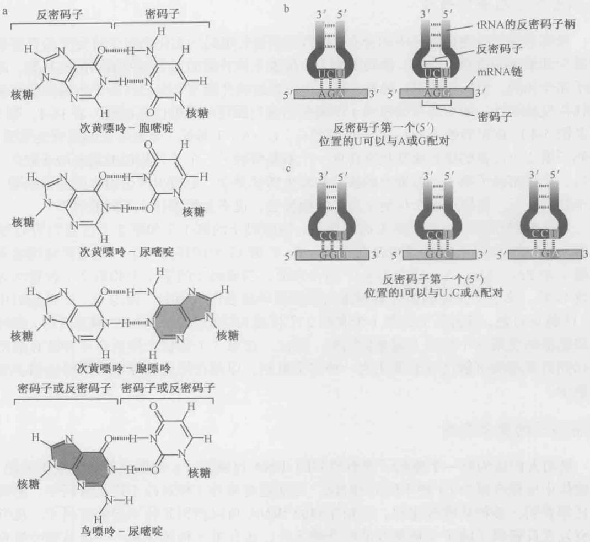  
图 16-2 摆动碱基配对。注意所有摆动碱基的核糖与核糖之间的距离与 A:U 或 G:C 标准碱基对的距离相近。

嘌呤与嘌呤、嘧啶与嘧啶的配对分别使核糖与核糖之间的距离过长或者过短。

摆动规则不允许单个的 tRNA 分子识别 4 个不同的密码子。3 个密码子的识别只有当反密码子的第 1 个（5'）位置是 I 时才行。

自 1966 年以来所积累的几乎所有的实验证据均支持摆动理论。例如，摆动理论正确地预测到至少有 3 种 tRNA 存在，以识别 Ser 的 6 种密码子（UCU、UCC、UCA、UCG、AGU 和 AGC）。其他两个由 6 种密码子编码的氨基酸（Leu 和 Arg）也存在不同的 tRNA 以识别在第 1 或者第 2 个位置上有不同核苷酸的那些密码子。

在 tRNA 的三维结构中，3 个反密码子碱基（及其反密码子环中随之相连的 2 个碱基）基本上都指向同一个方向，它们精确的构象主要由碱基平面之间的堆叠作用所决定（图 16-3）。反密码子的第 1 个（5'）碱基位于碱基堆叠的末端，其运动也许比其他两个碱基相对自由些，所以在密码子的第 3 个（3'）碱基位置上摆动。相反，不仅反密码子的第 3 个（3'）碱基位于碱基堆叠的中间，而且相邻的碱基总是庞大的修饰嘌呤残基。因此，碱基运动的受限性可能解释了摆动为什么不出现在密码子的第 1 个（5'）位置上。

  
图 16-3 酵母 tRNA $^{Phe}$ 的结构。（a）基于 X 射线衍射数据得到的 L-型分子。（b）反义密码子环的放大图。反义密码子碱基（34\~36）显示为红色。反义密码子及在 3' 端的随后两个碱基（37 和 38）是部分堆叠的。可以看见反义密码子 5' 端的碱基比 3' 端完全堆叠的碱基更自由地摆动。（引自 Kim S.-H. et al. 1974. Proc. Natl. Acad. Sci. 71: 4970.）

#### [W] 三个密码子指导链的终止

如前所述，有三个密码子并不与任何氨基酸相对应，相反，它们表示链的终止。在第14章我们讨论到，这些链终止密码子UAA、UAG和UGA不是由特殊的tRNA来阅读，而是由称为释放因子（RF）的特殊蛋白质所阅读（细菌中为RF1和RF2，而在真核生物中为eRF1）。释放因子进入核糖体的A位点，激发位于P位点的肽酰-tRNA的水解，使新合成的蛋白质释放出来。

#### [W] 遗传密码是如何破译的？

建立氨基酸与三联密码子之间的对应关系是分子生物学史上最伟大的成就之一（历史回顾见第2章）。这些对应关系是如何建立的呢？到1960年，人们对mRNA如何参与蛋白质合成的总体轮廓已经有了基本了解。然而对是否能够很快地详细认识遗传密码本身并不乐观。人们相信要认识一个氨基酸的密码子，不但需要准确地知道基因的核苷酸序列，而且需要了解相应的蛋白质产物的氨基酸序列。当时，测定氨基酸序列尽管是一个十分繁琐的工作，但在实验室已经十分行之有效。而另一方面，当时通用的DNA测序方法还非常原始。幸运的是，这个明显的障碍并未阻止研究进程。1961年，即在mRNA发现后仅一年，采用人工合成mRNA技术和无细胞的蛋白质合成系统使遗传密码的破译成为可能（第2章）。

#### [W] 通过人工合成的 mRNA 激发氨基酸的掺入

生物化学家发现，从活跃地进行蛋白质合成的大肠杆菌细胞中得到的提取物能够促使放射性标记的氨基酸合成蛋白质。在这些提取物中，蛋白质合成在数分钟内进行得很快，然后逐渐停止。在这段时间中，由于提取物中存在的降解酶的作用，导致 mRNA 相应减少。然而，在已经停止蛋白质合成的提取物中加入新的 mRNA，能够使蛋白质合成立即恢复。

细胞提取物依赖外在加入的 mRNA 增加蛋白质的合成，为利用合成的多聚核糖核酸来解开遗传密码的性质提供了机会。这些合成的模板是利用多核苷酸磷酸化酶而产生的，该酶催化如下的反应：

$$
[ \mathrm{XMP} ] _ {n} + \mathrm{XDP} \rightleftharpoons [ \mathrm{XMP} ] _ {n + 1} + Ⓟ\tag{公式 16-1}
$$

式中，X 表示碱基； $[XMP]_{n}$ 表示有 n 个核苷酸的 RNA。

多核苷酸磷酸化酶的正常作用是分解 RNA，在生理条件下偏向于将 RNA 降解成二磷酸核苷。然而，在高浓度的二磷酸核苷存在下，多核苷酸磷酸化酶能够从 $3'\rightarrow5'$ 方向在核苷酸之间催化磷酸二酯键的形成，从而合成 RNA 分子（图 16-4）。多核苷酸磷酸化酶催化合成 RNA 并不需要 DNA 或者 RNA 模板，所合成的产物完全依赖于反应混合物中各种二磷酸核苷的比例。例如，当只有二磷酸腺苷存在时，合成的 RNA 只有腺苷酸，因而称为多聚腺苷酸（polyadenylic acid）或 poly-A。同样也可以合成 poly-U、poly-C、poly-G。加入两种或者更多种不同的二磷酸核苷，可以形成复合的共聚物，如 poly-AU、poly-AC、poly-CU 和 poly-AGCU。在所有这些混合共聚物中，碱基的序列基本上是随机的，最相邻的碱基频率完全是由反应物的相对浓度决定的。例如，在 A 是 U 的 2 倍的情况下，poly-AU 分子中的序列类似 UAAUAUAAAUAUAUAAAAUAUU……

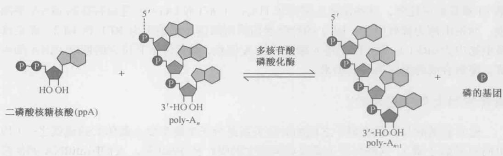  
图 16-4 多核苷酸磷酸化酶反应。本图显示由多核苷酸磷酸化酶催化的多聚腺苷酸合成或降解的可逆反应。

#### [W] Poly-U 编码多聚 Phe

在合适的离体条件下，几乎所有合成的多聚物会与核糖体连接并作为模板。幸运的是，早期的实验使用了高浓度的 $Mg^{2+}$ 。高浓度的 $Mg^{2+}$ 绕开了对起始因子和特殊的起始 fMet-tRNA 的需求，使 mRNA 在没有适当信号的情况下就能够开始多核苷酸链的合成。poly-U 是最先发现的具有 mRNA 活性的合成多聚核苷酸。它特异性地选择苯丙氨酰-tRNA 分子，因而形成的多肽链只含有 Phe（多聚 Phe）。因此我们知道编码 Phe 的密码子是由 3 个鸟苷酸——UUU 组成的（如第 2 章和第 7 章及下文所讨论的，一个密码子由 3 个单核苷酸组成的观点来源于遗传学实验）。通过使用 poly-A 和 poly-C 的类似实验，发现了

CCC 是 Pro 的密码子，AAA 是 Lys 的密码子。不幸的是，此类实验无法确定 GGG 定义何种氨基酸。poly-G 中的胞嘧啶残基相互之间形成牢固的氢键，形成多链的三螺旋结构，不能和核糖体结合。

#### [W] 混合多聚核苷酸使其他密码子的组成得以确定

poly-AC 分子可以含有 8 种不同的密码子：CCC、CCA、CAC、ACC、CAA、ACA、AAC 和 AAA，其比例随着共聚物的 A/C 比例不同而有差异。当 AC 共聚物连接到核糖体上，引起掺入的氨基酸有 Asp、Gly、His 和 Thr，加上先前确定的由 CCC 编码的 Pro 和由 AAA 编码的 Lys，这些氨基酸在多肽链中的比例取决于 A/C 的比例。例如，由于 A 含量大大高于 C 的 AC 共聚体促进 Asp 的掺入远远多于 His，所以我们得出结论，即 Asp 由两个 A 和一个 C 编码，而 His 由两个 C 和一个 A 编码（表 16-3）。采用其他共聚体的类似实验使另外几个密码子的组成得以确定。然而，此类实验并不能显示三联密码子中核苷酸的顺序。采用随机的共聚物无法了解编码组氨酸的两个 C 和一个 A 的排列顺序是 CCA、CAC 还是 ACC。

表 16-3 掺入到蛋白质的氨基酸

<table><tr><td rowspan="2">氨基酸</td><td rowspan="2">掺入氨基酸的观察值</td><td rowspan="2">推断的密码子组成</td><td colspan="4">三联体的计算频率</td><td rowspan="2">三联体的计算频率总和</td></tr><tr><td>3A</td><td>2A1C</td><td>1A2C*</td><td>3C</td></tr><tr><td colspan="8">Poly-AC (5:1)</td></tr><tr><td>Asp</td><td>24</td><td>2A1C</td><td></td><td>20</td><td></td><td></td><td>20</td></tr><tr><td>Glu</td><td>24</td><td>2A1C</td><td></td><td>20</td><td></td><td></td><td>20</td></tr><tr><td>His</td><td>6</td><td>1A2C</td><td></td><td></td><td>4.0</td><td></td><td>4</td></tr><tr><td>Lys</td><td>100</td><td>3A</td><td>100</td><td></td><td></td><td></td><td>100</td></tr><tr><td>Pro</td><td>7</td><td>1A2C,3C</td><td></td><td></td><td>4.0</td><td>0.8</td><td>4.8</td></tr><tr><td>Thr</td><td>26</td><td>2A1C,1A2C</td><td></td><td>20</td><td>4.0</td><td></td><td>24</td></tr><tr><td colspan="8">Poly-AC (1:5)</td></tr><tr><td>Asp</td><td>5</td><td>2A1C</td><td></td><td>3.3</td><td></td><td></td><td>3.3</td></tr><tr><td>Glu</td><td>5</td><td>2A1C</td><td></td><td>3.3</td><td></td><td></td><td>3.3</td></tr><tr><td>His</td><td>23</td><td>1A2C</td><td></td><td></td><td>16.7</td><td></td><td>16.7</td></tr><tr><td>Lys</td><td>1</td><td>3A</td><td>0.7</td><td></td><td></td><td></td><td>0.7</td></tr><tr><td>Pro</td><td>100</td><td>1A2C,3C</td><td></td><td></td><td>16.7</td><td>83.3</td><td>100</td></tr><tr><td>Thr</td><td>21</td><td>2A1C,1A2C</td><td></td><td>3.3</td><td>16.7</td><td></td><td>20</td></tr></table>

在无细胞提取物中随机加入A和C的共聚体后观察蛋白质中所掺入的氨基酸。掺入量是指单个氨基酸最大掺入量的百分比，然后用共聚物计算一个给定的密码子在多核苷酸产物中出现的频率。密码子的相对频率是指一个特定的核苷酸出现在密码子的指定位置的概率。例如，当A/C比是5：1时，AAA/AAC的比 $=5\times5\times5:5\times5\times5=125:25$ 。如果我们假定3A密码子的频率为100，则2A和1C密码子的频率为20。将氨基酸掺入的频率和给定的计算的密码子出现频率作相关分析，就能得到推定的密码子的组成。（\*原文为1A1C，译者注）

#### [W] tRNA 和特定的三联密码子结合

1964 年，人们研发出一种直接确定某些三联密码子中 3 个核苷酸顺序的方法。这种方法基于如下事实：即使缺乏蛋白质合成需要的所有因子，特定的氨酰-tRNA 分子仍然能够结合核糖体-mRNA 复合物。例如，当 poly-U 和核糖体混合时，只有苯丙氨酰-tRNA 会结合。相应地，poly-C 促进脯氨酰-tRNA 的结合。更为重要的是，这种特异的结合并不需要长片段 mRNA 分子的存在。事实上，三核苷酸和核糖体结合就足够了。三核苷酸 UUU 的加入导致苯丙氨酰-tRNA 的结合，如果加入 AAA，赖氨酰-tRNA 就特异地结合核糖体。这种三核苷酸效应的发现，为识别许多密码子内核苷酸的顺序提供了一种相对简便的方法。例如，三核苷酸 5'-GUU-3'促进缬氨酰-tRNA 的结合，5'-UGU-3'促进半胱氨酰-tRNA 的结合，5'-UUG-3'促进亮氨酰-tRNA 的结合（表 16-4）。尽管合成了所有 64 种可能的三联核苷酸，以确定每一个密码子的顺序，然而并非所有的密码子都是采用这种方法来确定的。一些三联核苷酸不如 UUU 或者 GUU 那样有效地结合核糖体，因而无法知道它们所编码的特定氨基酸。

表 16-4 氨酰 tRNA 分子与三联核苷酸-核糖体复合物的结合

<table><tr><td colspan="6">三联核苷酸</td><td>结合的氨酰-tRNA</td></tr><tr><td>5&#x27;-UUU-3&#x27;</td><td>UUC</td><td></td><td></td><td></td><td></td><td>Phe</td></tr><tr><td>UUA</td><td>UUG</td><td>CUU</td><td>CUC</td><td>CUA</td><td>CUG</td><td>Leu</td></tr><tr><td>AAU</td><td>AUC</td><td>AUA</td><td></td><td></td><td></td><td>Ile</td></tr><tr><td>AUG</td><td></td><td></td><td></td><td></td><td></td><td>Met</td></tr><tr><td>GUU</td><td>GUC</td><td>GUA</td><td>GUG</td><td> $UCU^a$ </td><td></td><td>Val</td></tr><tr><td>UCU</td><td>UCC</td><td>UCA</td><td>UCG</td><td></td><td></td><td>Ser</td></tr><tr><td>CCU</td><td>CCC</td><td>CCA</td><td>CCG</td><td></td><td></td><td>Pro</td></tr><tr><td>AAA</td><td>AAG</td><td></td><td></td><td></td><td></td><td>Lys</td></tr><tr><td>UGU</td><td>UGC</td><td></td><td></td><td></td><td></td><td>Cys</td></tr><tr><td>GAA</td><td>GAG</td><td></td><td></td><td></td><td></td><td>Glu</td></tr></table>

a 注意，这是采用此方法错误排列的密码子。

#### [W] 重复共聚物确定密码子

在三联核苷酸结合技术产生的同时，有机化学和酶技术已经用于已知重复序列的多聚核糖核酸的合成（图 16-5）。核糖体可以在这些常规共聚物链上的任意点开始合成蛋白质，但是它们将特异的氨基酸掺入到肽链中。例如，重复序列 CUCUCUCU…是一种常见多肽的信使，在此多肽中，Leu 和 Ser 交替出现。同样地，UGUGUG…指导含有 Cys 和 Val 多肽链的合成。ACACAC…指导含有 Thr 和 His 交替的多肽链的合成。由三联核苷酸序列 AAG(AAGAAGAAG)重复所组成的共聚物指导合成 3 种多肽：poly-Lys、poly-Arg 和 poly-Glu。poly-AUC 以同样的方式，作为 poly-Ile、poly-Ser 和 poly-His 的模板（表 16-5）。其他密码子的确定是从四联核苷酸重复序列获得的。

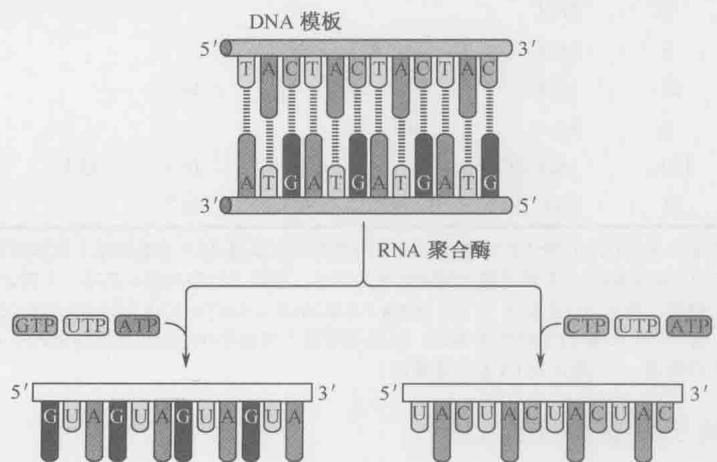  
图 16-5 制备寡核苷酸。结合有机合成和 DNA 聚合酶 I 复制两种技术，可以生成含有简单重复序列的 DNA 双链。根据加入反应混合物中的三磷酸核苷的不同，RNA 聚合酶以某一条 DNA 链为模板，合成不同的长链多聚核苷酸。

表 16-5 使用由 2 个或者 3 个单核苷酸合成的重复共聚物进行密码子的确定

<table><tr><td>共聚物</td><td>识别的密码子</td><td>掺入的氨基酸或者合成的多肽</td><td>确定的密码子</td></tr><tr><td rowspan="2"> $(CU)_n$ </td><td rowspan="2">CUC|UCU|CUC...</td><td>Leu</td><td>5&#x27;-CUC-3&#x27;</td></tr><tr><td>Ser</td><td>UCU</td></tr><tr><td rowspan="2"> $(UG)_n$ </td><td rowspan="2">UGU|GUG|UGU...</td><td>Cys</td><td>UGU</td></tr><tr><td>Val</td><td>GUG</td></tr><tr><td rowspan="2"> $(AC)_n$ </td><td rowspan="2">ACA|CAC|ACA...</td><td>Thr</td><td>ACA</td></tr><tr><td>His</td><td>CAC</td></tr><tr><td rowspan="2"> $(AG)_n$ </td><td rowspan="2">AGA|GAG|AGA...</td><td>Arg</td><td>AGA</td></tr><tr><td>Glu</td><td>GAG</td></tr><tr><td rowspan="3"> $(AUC)_n$ </td><td>AUC|AUC|AUC...</td><td>Poly-Ile</td><td>AUC</td></tr><tr><td>UCA|UCA|UCA...</td><td>Poly-Ser</td><td>UCA</td></tr><tr><td>CAU|CAU|CAU...</td><td>Poly-His</td><td>CAU</td></tr></table>

所有这些实验结果加起来使得 64 种密码子中的 61 种所编码的氨基酸得到确定（表 16-1），其余 3 种是链终止密码子：UAG、UAA 和 UGA，它们不定义任何氨基酸（注意：如前面章节所讨论，位于大肠杆菌的翻译起始序列时，AUG 作为起始密码子对应的是 N-甲酰甲硫氨酸，而不是通常的甲硫氨酸。）

#### [W] 遗传密码遵循的三条规律

遗传密码遵循三条指导密码子在 mRNA 中的排列和使用的规律。第一条规律是密码子从 $5'\rightarrow3'$ 方向阅读。例如，二聚肽 $NH_{2}-Thr-Arg-COOH$ 的编码顺序可以写成： $5'-ACGCGA-3'$ （其中 $5'-ACG-3'$ 编码 Thr, $5'-CGA-3'$ 编码 Arg），或者写成 $3'-GCAAGC-5'$ ，即密码子按同样的顺序，但与原来的方向相反。然而，由于 mRNA 是从 $5'\rightarrow3'$ 的方向进行翻译的，因此只有前者才是正确的编码序列；如果后者从 $5'\rightarrow3'$ 方向进行翻译，则合成的肽链会是 $NH_{2}-Arg-Thr-COOH$ ，而不是 $NH_{2}-Thr-Arg-COOH$ 。

第二条规律是密码子不重叠，信息之间无缝隙。这意味着由相邻的三联体核苷酸所组成的密码子是连续的密码子。这样，三肽 $NH_{2}-Thr-Arg-Ser-COOH$ 的编码序列是由序列 5'-ACGCGAUCG-3' 中 3 个连续的、相互不重叠的三联密码子组成的。

最后一条规律是信息在固定的可读框上翻译，而可读框是由起始密码子设定的。第

14 章提到，翻译始于蛋白质编码序列 5'端的起始密码子。由于密码子是非重叠的并由 3 个连续的核苷酸组成，原则上一段核苷酸序列可以按照任何 3 个可读框进行翻译。起始密码子决定使用 3 个可能的可读框中的哪一个。例如，序列 5'...ACGA CGACGACGACGACGACG...3' 可以翻译成一连串的 Thr（5'-ACG-3')、一连串的 Arg（5'-CGA-3'）或者是一连串的 Asp（5'-GAC-3'），这些都取决于上游起始密码子的框架。

#### [W] 改变遗传密码的三种点突变

在研究了遗传密码的本质之后，重新回顾点突变如何引起基因编码序列改变的议题是必要的（参见第9章）。引起编码一种特异氨基酸的密码子成为编码另一种氨基酸的密码子的改变称为错义突变（missense mutation）。其结果是有错义突变的基因，其蛋白质中的一个氨基酸被另一种氨基酸取代，就如经典的例子，人类遗传性疾病——镰状红细胞贫血，其中血红蛋白的β-珠蛋白亚基的第6位Glu被Val取代。

另外一种具有更明显效应的改变是突变导致链终止密码子，称为无义突变（nonsense mutation）或者终止突变（stop mutation）。当遗传信息中出现无义突变时，由于过早的链终止，不完全的多肽链会从核糖体中释放出来。不完全肽链的大小取决于无义突变的位置。如果突变靠近基因起始端，所合成的多肽链非常短；如果突变靠近基因的末端，合成的肽链长度则几乎接近正常。如第14章所述，如果mRNA包含一个过早的终止密码子，就会在真核细胞中通过一个称为无义介导的mRNA衰减的过程而很快地降解。

第三种点突变是移码突变（frameshift mutation）。它是插入或者缺失一个或者几个碱基对，从而改变可读框。下面以应该读成一系列 Ala 的密码子框架中的串联重复序列 GCU 为例（为了清晰起见，密码子人为地用空格分开，当然，真正的 mRNA 是连续的）：

现在假定在遗传信息中插入 1 个 A，从而在插入位点产生 1 个 Ser 密码子（AGC）。引起的移码突变使插入位点下游的三联体读成 Cys：
Ala Ala Ser Cys Cys Cys Cys Cys
5'-GCU GCU AGC UGC UGC UGC UGC UGC-3'

因此插入或者缺失一个碱基，不但显著地改变突变位点的遗传信息编码能力，而且同样影响下游的遗传信息。同样地，插入或者缺失两个碱基，其效应将扩散至突变位置下游的所有序列，导致完全不同的可读框。

最后考虑一下在遗传信息相近的位置插入3个额外碱基的情形。显而易见，在3个插入碱基位置上和之间的遗传信息会有显著的改变。但由于密码子是以3个核苷酸为单位的，在3个插入碱基的下游，mRNA将保持正常的可读框而不发生改变。

$$
\begin{array}{c c c c c c c c} \text {Ala} & \text {Ala} & \text {Ser} & \text {Cys} & \text {Met} & \text {Leu} & \text {His} & \text {Ala} \\ 5 ^ {\prime} - \text {GCU} & \text {GCU} & \text {ACU} & \text {UGC} & \text {AUG} & \text {CUG} & \text {CAU} & \text {GCU-3 ^ {\prime}} \end{array}
$$

#### [W] 遗传学证实遗传密码是以3个碱基为阅读单位的

上述例子是 Francis Crick、Sydney Brenner 及其合作者用一个经典实验验证的逻辑，该实验用 T4 噬菌体建立了遗传密码以 3 个碱基为阅读单位的论点，并且该论点的建立纯粹基于遗传学推论（也就是说，没有生物化学和分子生物学的证据）。遗传杂交制造出含有 3 个单碱基对插入在单个基因的相邻位点的噬菌体突变体。当然，3 个碱基的插入搅乱了一小段密码子，但目标基因（称为 rⅡ）所编码的蛋白质能够忍受氨基酸序列的局部改变。这一发现表明，尽管存在 3 个变异，但基因的总体编码能力并未发生改变，这 3 个变异单独存在，或者两两存在，都会显著地改变基因信息的可读框（致使其蛋白质产物没有活性）。由于基因能够耐受 3 个碱基的插入，但不能耐受 1 个、2 个（或 4 个）碱基的插入，因此遗传密码子必须以 3 个碱基为单位进行阅读。参见第 2 章和第 22 章有关那些证明了遗传密码以 3 个碱基为单位进行阅读的历史人物的讨论，以及有关 T4 噬菌体作为模式系统在阐明遗传密码本质方面作用的描述。

#### [W] 抑制突变可以存在于相同或不同的基因中

通常，有害突变的效应可以被第二个遗传变化逆转。其中某些继发突变易于理解，如简单的逆转突变（reverse mutation）或者回复突变（back mutation），把改变了的核苷酸序列转变回原先的序列。比较难以理解的是突变发生在染色体的不同位置，通过在B位点产生其他遗传变化抑制发生在A位点的突变所带来的变化。这种抑制突变（suppressor mutation）主要有两种类型：一是基因内抑制（intragenic suppressor），即抑制突变和原来的突变位于同一个基因内，但在不同的位置上；二是抑制突变发生在另一个基因上，即基因间抑制（intergenic suppression）。抑制其他基因的突变的基因称为抑制基因（suppressor gene）。在此我们考虑的两种突变抑制作用均通过导致产生好的（或部分好的）蛋白质拷贝而起作用，原有的有害突变则使蛋白质失活。例如，如果第一个突变使参与Arg合成的一个酶产生没有活性的拷贝，那么抑制突变通过恢复合成该酶某些好的拷贝，从而使Arg能够合成。然而，基因内抑制突变与基因间抑制突变恢复正常蛋白合成的机制是完全不同的。

以错义突变为例来说明基因内抑制。错义突变的效应有时可以通过同一个基因内的另外一个错义突变而逆转。在这种情形下，最初酶活性的丢失是由于在编码的蛋白质序列中存在一个错误的氨基酸而引起蛋白质三维构象的改变。同一个基因中的第二个错义突变可以通过恢复蛋白质分子功能基团附近的构象来恢复蛋白质生物学活性。图 16-6 显示了基因内抑制的另一个例子，这时是移码突变。

#### [W] 基因间抑制涉及突变 tRNA

抑制基因并不是通过改变突变基因的核苷酸序列而发挥作用的。相反，它们改变mRNA模板的阅读方式。最著名的抑制突变例子之一是突变tRNA基因，它抑制蛋白质编码基因中无义突变产生的效应（但也有抑制错义突变，甚至移码突变的突变tRNA）。在大肠杆菌中，3个终止密码子都有抑制基因。它们通过把终止密码子阅读成一种特定氨基酸的信号而起作用。例如，有3个研究得清楚的抑制UAG密码子的基因，在无义突变位置一个抑制基因插入 Ser，另外一个插入 Glu，第 3 个插入 Tyr。在 3 个 UAG 抑制突变中，3 种氨基酸的每一种 tRNA 的反密码子都已经发生改变。例如，Tyr 抑制子源自 tRNA $^{Tyr}$ 基因内的一个突变，该突变使反密码子从 GUA（3'-AUG-5'）转变为 CUA（3'-AUC-5'），从而使其能够识别 UAG 密码子（图 16-7）。Ser 和 Glu 抑制 tRNA 也源自反密码子中的单个碱基突变。


  
图 16-6 移码突变的抑制。（a）核苷酸编码序列的一个缺失可以导致所合成的多肽链不完全并失去活性。（b）如图（a）所示的缺失效应可以被编码序列的第二个突变，即一个插入所纠正。插入的纠正效果表现为合成完整的肽链，但有两个氨基酸发生替代。根据序列中替代的不同，蛋白质可能具有部分或者全部活性。

带有无义抑制子的细胞含有突变改变了的 tRNA，这一研究发现带来了这样的问题：与这些 tRNA 相应的密码子如何能继续正确地阅读呢？对 Tyr UAG 抑制子来说，答案来自于有 3 个分别独立的基因编码 $tRNA^{Tyr}$ 。一个编码主要的 $tRNA^{Tyr}$ 类型，而另外两个重复的基因编码表达量比较少的类型。两个重复基因中的某个总是抑制突变位点。UGA 抑制就没有这种进退两难的情况，它是由一种突变形式的 $tRNA^{Trp}$ 介导的；抑制 $tRNA^{Trp}$ 仍然具有阅读 UGG（Trp）密码子的能力，同时也能识别 UGA 终止密码子。这可能是由于反密码子从 $tRNA^{Trp}$ 野生型的 CCA（3'-ACC-5'）转变为突变型的 UCA（3'-ACU-5'），根据前边所讨论到的摆动原理，密码子在 3'位置上的 A 或者 G 可以被反密码子 5'位置上的 U 识别。

#### [W] 无义突变抑制也能识别正常的终止信号

无义抑制行为可以看成是抑制 tRNA 和释放因子之间的竞争。当一个终止密码子进

入核糖体 A 位点，是读过去还是多肽链终止，取决于两者中哪一个优先到达该位置。UGA 密码子的抑制是有效的。在有抑制 tRNA 存在时，半数以上的链终止信号被读成特定的氨基酸密码子。大肠杆菌可以耐受 UAG 终止密码子的这种误读，因为 UAG 不常用作可读框末端的链终止密码子。相反，UAA 密码子抑制的平均频率通常在 1%\~5%，而且产生 UAA 抑制 tRNA 的突变细胞生长缓慢。这是可以预料的，因为 UAA 常常用作链终止密码子，所以被抑制 tRNA 识别会导致产生很多异常的长肽链。

#### [W] 证实遗传密码的正确性

如前所述,遗传密码是采用涉及无细胞蛋白质合成系统的生物化学方法破译的。但分子生物学家一般对仅仅基于体外实验的方法持怀疑态度。那么我们如何可以确定活细胞内的遗传密码是如表 16-1 所示的呢? 当然, 在目前大规模 DNA 测序的时代,从微生物到人类的不同生物的基因组中所有核苷酸序列

  
图 16-7 无义抑制。本图显示一个次要的 Tyr tRNA 如何抑制 mRNA 中的无义密码子。

已经探明,遗传密码子不但得到确证,而且在整个生物界是通用的或几乎通用的(见下文)。但是,1966年,在人们能够进行DNA测序之前很久,一个经典实验帮助确证了遗传密码。该实验是通过基因重组构建T4噬菌体的突变体,该突变体带有一对相互抑制的插入和缺失突变(和图16-6的实验相似)。研究的目的基因编码一种细胞壁降解酶——溶菌酶,之所以用它来进行实验,是因为该酶比较小、易于纯化,并且它的所有氨基酸序列是已知的。实验的策略是将溶菌酶双突变基因的氨基酸序列与野生型基因的氨基酸序列进行比较。

当突变的氨基酸序列（…NH₂-Thr Lys Val His His Leu Met Ala Ala Lys-COOH...）与野生型（…NH₂-Thr Lys Ser Pro Ser Leu Asn Ala Ala Lys-COOH...）比较时，发现其中有一串 5 个氨基酸不同（黑体所示）。这一观察结果表明插入和缺失突变已经搅乱了突变体信息中一小段密码子的排列。了解打乱的密码子对蛋白质氨基酸序列的影响为认识遗传密码本质增加了重要的约束条件。特别是，如果遗传密码如生物化学实验所揭示的那样，就可能鉴别出野生型序列 Ser Pro Ser Leu Asn 的一组密码子，在这组序列的一端插入、在另一端缺失，并经过恰如其分的排列，能够定义出突变氨基酸的序列。事实上，有办法这样做，就是要在基因编码序列的 5' 端构建一个核苷酸的缺失，3' 端构建一个核苷酸的插入：

$$
\mathrm{NH} _ {2} \text {-Lys} \quad \text {Ser} \quad \text {Pro} \quad \text {Ser} \quad \text {Leu} \quad \text {Asn} \quad \text {Ala - COOH}
$$

$$
5 ^ {\prime} - \text { AAA   AGU   CCA   UCA   CUU   AAU   GC-3 } ^ {\prime}
$$

$$
5 ^ {\prime} - \text { AAA   GUC   CAU   CAC   UUA   AUG   GC-3 } ^ {\prime}
$$

$$
\mathrm{NH} _ {2} \text {-Lys} \quad \text { Val } \quad \text { His } \quad \text { His } \quad \text { Leu } \quad \text { Met } \quad \text { Ala - COOH }
$$

你会发现，这种方案可以确证几种不同的密码子，而且证明在体内不止一种的同义密码子定义相同的氨基酸（如 5'-CAU-3' 和 5'-CAC-3' 均定义 His）。最后一点，也是非常重要的一点，即该研究方案证明了翻译过程是沿着 5'→3' 方向进行的（提示：当你在研究中从 3'→5' 排列每一个密码子，你能否按照从氨基端到羧基端的方向正确说明两个氨基酸的序列）。

#### [W] 遗传密码几乎通用

大规模基因组测序的结果已经广泛地证实了遗传密码子的通用性。密码子的通用性对于我们了解演化有着重大的影响，因为它使直接比较基因组序列已知的所有生物的蛋白质编码序列成为可能。在第21章，我们将要讨论到，已有强有力的计算机程序，可以从大量的生物种类中搜索和发现目标基因编码序列的相似性。遗传密码的通用性还帮助建立了遗传工程领域，使在代理宿主生物（surrogate host organism）中表达编码有用蛋白质产物的克隆基因成为可能，如在细菌中生产人类胰岛素（详见第21章）。

为了了解遗传密码的保守性，想一想如果遗传密码发生突变将会发生什么。例如，一个突变可能改变对应于 UCU 的那类 Ser tRNA 分子，使它转而识别 UCU 序列。这对只含有一个指导 $tRNA^{Ser}$ 合成的基因的单倍体细胞而言是致命的，因为 Ser 将不能插入到蛋白质序列中许多正常的位置上。即使有多于一个的 $tRNA^{Ser}$ 基因（如二倍体细胞），这种突变仍然是致命的，因为这将导致在细胞蛋白质中很多 Phe 被 Ser 同时取代。

从上述观点出发，对某些亚细胞器中的遗传密码和标准密码有些微差异的发现就显得完全出乎人们的意料了。这是在研究人线粒体基因组 DNA 全长 16569bp 时才意识到的。但之前在酵母、果蝇和高等植物线粒体中已经观察到该现象。已知编码蛋白质区域的序列揭示了在标准密码子和线粒体密码子之间存在以下的差异（表 16-6）：

\- UGA 编码 Trp，而非终止信号。因此线粒体 tRNA $^{Trp}$ 的反密码子既识别 UGG，也识别 UGA，似乎遵循传统的摆动规则。

\- 非起始的 Met 既可以由 AUG 编码，也可以由 AUA 编码。

\- 在哺乳动物的线粒体中，AGA 和 AGG 并不编码 Arg（在“通用”密码里 Arg 有 6 个密码子），而是指示链的终止。因此，在哺乳动物的线粒体密码中有 4 个终止密码子（UAA、UAG、AGA 和 AGG）。

\- 在果蝇的线粒体中，AGA 和 AGG 也不编码 Arg，而是编码 Ser。

表 16-6 哺乳动物线粒体的遗传密码\*  
第2个位置

<table><tr><td></td><td colspan="2">U</td><td colspan="2">C</td><td colspan="2">A</td><td colspan="2">G</td><td></td></tr><tr><td rowspan="4">U</td><td>UUU</td><td rowspan="2">Phe (GAA)†</td><td>UCU</td><td></td><td>UAU</td><td rowspan="2">Tyr (GUA)</td><td>UGU</td><td rowspan="2">Cys (GCA)</td><td>U</td></tr><tr><td>UUC</td><td>UCC</td><td rowspan="3">Ser (UGA)</td><td>UAC</td><td>UGC</td><td>C</td></tr><tr><td>UUA</td><td rowspan="2">Leu (UAA)</td><td>UCA</td><td>UAA</td><td>终止子</td><td>UGA</td><td rowspan="2">Trp (UCA)</td><td>A</td></tr><tr><td>UUG</td><td>UCG</td><td>UAG</td><td>终止子</td><td>UGG</td><td>G</td></tr><tr><td rowspan="4">C</td><td>CUU</td><td></td><td>CCU</td><td></td><td>CAU</td><td rowspan="2">His (GUG)</td><td>CGU</td><td></td><td>U</td></tr><tr><td>CUC</td><td rowspan="3">Leu (UAG)</td><td>CCC</td><td rowspan="3">Pro (UGG)</td><td>CAC</td><td>CGC</td><td rowspan="3">Arg (UCG)</td><td>C</td></tr><tr><td>CUA</td><td>CCA</td><td>CAA</td><td rowspan="2">Gln (UUG)</td><td>CGA</td><td>A</td></tr><tr><td>CUG</td><td>CCG</td><td>CAC</td><td>CGG</td><td>G</td></tr><tr><td rowspan="4">A</td><td>AUU</td><td rowspan="2">Ile (GAU)</td><td>ACU</td><td></td><td>AAU</td><td rowspan="2">Asn (GUU)</td><td>AGU</td><td rowspan="2">Ser (GUC)</td><td>U</td></tr><tr><td>AUC</td><td>ACC</td><td rowspan="3">Thr (UGU)</td><td>AAC</td><td>AGC</td><td>C</td></tr><tr><td>AUA</td><td rowspan="2">Met (GAU)‡</td><td>ACA</td><td>AAA</td><td rowspan="2">Lys (UUU)</td><td>AGA</td><td>终止子</td><td>A</td></tr><tr><td>AUG</td><td>ACG</td><td>AAG</td><td>AGG</td><td>终止子</td><td>G</td></tr><tr><td rowspan="4">G</td><td>GUU</td><td></td><td>GCU</td><td></td><td>GAU</td><td rowspan="2">Asp (GUC)</td><td>GGU</td><td></td><td>U</td></tr><tr><td>GUC</td><td rowspan="3">Val (UAC)</td><td>GCC</td><td rowspan="3">Ala (UGC)</td><td>GAC</td><td>GGC</td><td rowspan="3">Gly (GCC)</td><td>C</td></tr><tr><td>GUA</td><td>GCA</td><td>GAA</td><td rowspan="2">Glu (UUC)</td><td>GGA</td><td>A</td></tr><tr><td>GUG</td><td>GCG</td><td>GAG</td><td>GGG</td><td>G</td></tr></table>

\*线粒体遗传密码与“通用”遗传密码（表16-1）的区别用阴影表示。  
$\dagger$ 每一组密码子用阴影表示并有单一的 tRNA 来阅读，该 tRNA 的反密码子以 $5'\rightarrow3'$ 写在括号内。每 4-密码子组被 1 个 tRNA 阅读，该 tRNA 的反密码子的第一个（ $5'$ ）位置有一个 U。末端为 U/C 或者 A/G 的 2-密码子组在通过 tRNA 的 GU 摆动来阅读，反密码子第一位置分别是 G 或 U。反义密码子经常含有修饰碱基。  
$^{‡}$ 注意在反义密码子第一位置的 C 进行不寻常的配对。

也许并不奇怪，谈到解码线粒体信息的规则，线粒体 tRNA 同样不同寻常。哺乳动物线粒体中只有 22 个 tRNA，但根据摆动原则，至少需要 32 种 tRNA 分子来解码“通用”密码子。结果，当一个氨基酸有 4 种密码子（密码子第 1 和第 2 位的核苷酸相同）来定义时，只涉及单一的线粒体 tRNA（而在非线粒体系统，至少需要 2 种 tRNA 分子）。线粒体 tRNA 的反密码子 5'（摆动）位置上的核苷酸都是一个 U，它可以和密码子 3'位置上的 4 种核苷酸中的任何一种进行配对。如果密码子 3'位置上是由嘌呤碱基组成的密码子，与由嘧啶碱基组成的密码子编码不同的氨基酸，那么线粒体 tRNA 反密码子 5'第一核苷酸位置上是经过修饰的 U，它限制摆动，只与两个嘌呤配对。

通用密码子例外的情况不仅限于线粒体，也见于几个原核生物基因组和某些真核生物的核基因组。山羊支原体（Mycoplasma capricolum）用 UGA 编码 Trp，而非终止密码子。同样地，一些单细胞原生动物用 UAA 和 UAG 编码 Gln，而在“通用”密码子中，它们是终止密码子。最后，在“通用”密码中 Leu 的密码子 CUG，在假丝酵母（Candida）中变成了 Ser 的密码子。

我们方才讨论了某些特定细胞器和生物体中遗传密码的改变，但是，有些遗传密码的差异会增加编码氨基酸的种类，也就意味遗传密码的拓展（而不是改变）。在框 16-1 中我们将考察这些氨基酸在自然和人为条件下是如何生成的，以及如何通过一些精巧的工程学手段进入到蛋白质中。

#### [W] 框16-1 遗传密码的拓展

正如我们已经看到的，64个密码子中的61个指定了蛋白质中最常见的20种氨基酸。然而，一些蛋白质含有一些不常见的氨基酸，这些氨基酸并没有被这61个密码子所指定。例如，胶原蛋白含有羟脯氨酸，它是由脯氨酸加入多肽链后经羟基化形成的。还有一些蛋白质含有硒代半胱氨酸，它是在装载了丝氨酸的tRNA上形成的。丝氨酸通过酶催化同硒结合而转化成硒代半胱氨酸。装载了硒代半胱氨酸的特定的tRNA在特定的UGA密码子处进入核糖体，该UGA密码子的两侧含有特定的序列，可以被专一的转录延伸因子所识别。该转录延伸因子把装载有硒代半胱氨酸的tRNA引入A位点，在这里，含有金属的氨基酸被合并到正在延长的多肽链中。这些和其他一些关于修饰后氨基酸的例子都包括这样的机制：把改变后的氨基酸引入蛋白质而不违反遗传密码的通用性。但是，如果通过基因工程对指定非天然氨基酸的遗传密码进行扩展，又会怎样呢？我们是否可以通过这一方法在蛋白质的特定位点引入定制的氨基酸，并因此可以创造出新的蛋白质乃至具有特定用途的整个生物体呢？

两种研究的整合把这种可能性提高到现实的范畴。一个是，可以识别 UAG 的 tRNA 已经被创造出来，但它还不是所有大肠杆菌中的氨酰-tRNA 合成酶都可以作用的底物。但是，通过迭代演化的策略，一些同源的合成酶已经被合成成功，它们可以识别特定的 tRNA 并把特定的人工氨基酸装载上。通过这种方法，一系列的合成酶都可以被合成出来，它们可以识别一些同源 tRNA，这些 tRNA 可以带有一系列的具有特定用途的非天然氨基酸，如拥有重金属结合位点（促进 X 射线衍射研究），荧光结构（用于荧光显微镜），光交联位点，或者化学反应基团（框 16-1 图 1）。可以产生识别 UAG 密码子 tRNA 的大肠杆菌菌株及这种新型合成酶一起，可以从培养基中获得同源的非天然氨基酸并通过 mRNA 上的 UAG 密码子把这种氨基酸整合到蛋白质中。例如，如果我们想在目的蛋白的特定位置引入光交联位点，我们可以把 TAG 密码子引入该蛋白质的编码序列中，并在大肠杆菌中表达含有 TAG 的基因，这些基因通过基因工程可以把非天然氨基酸引入到 UAG 密码子处。

同时,另一种研究则创造了这样的大肠杆菌菌株,该菌株种所有314个TAG(UAG)终止密码子都被TAA（UAA）终止密码子所替代。这一特性的获得经历了两个阶段。第一阶段,通过一种被称为多元自动化基因组改造（multiplex automated genome engineering, MAGE）的方法,创造出32个菌株,其中TAG密码子的不同子集都被同义的终止密码子所替代。接下来,通过一种基于层次基因组接合的策略把所有314个密码子替代整合到一个菌株种,这一策略称为接合组装基因组改造（conjugative assembly genome engineering, CAGE）。这一策略保证了大肠杆菌中的TAG密码子可以同定制的氨基酸最大限度的接合。在将来,这样的策略还可以用于其他微生物,如酵母。卸掉了20种天然氨基酸的限制，经过改造的大肠杆菌和酵母将拥有指定第21种氨基酸的密码子，这或许可以使它们在实验室的可控条件下演化出比其未经修饰的祖先更多的有用特征。

  
框 16-1 图 1 经拓展的遗传密码子可以接合的非天然氨基酸。（引用自 http://schultz.scripps.edu/research.php, courtesy Peter Schultz.）


<!-- W-END Watson 16 遗传密码 -->


<!-- L-BEGIN Lehninger 27.1 -->

### 【英文对应 Lehninger §27.1：The Genetic Code】

> 来源：Lehninger Principles of Biochemistry（书籍/02_生物化学原理） 第27章 Protein Metabolism，§27.1。


By the 1960s, it was apparent that at least three nucleotide residues of DNA are necessary to encode each amino acid. The four code letters of DNA (A, T, G, and C) in groups of two can yield only $4^{2} = 16$ different combinations, insufficient to encode 20 amino acids. Groups of three, however, yield $4^{3} = 64$ different combinations. Deciphering the genetic code quickly became a major goal.

  
FIGURE 27-3 Overlapping versus nonoverlapping genetic codes. In a nonoverlapping code, codons (numbered consecutively) do not share nucleotides. In an overlapping code, some nucleotides in the mRNA are shared by different codons. In a triplet code with maximum overlap, many nucleotides, such as the third nucleotide from the left (A), are shared by three codons. A nonoverlapping code provides much more flexibility in the triplet sequence of neighboring codons and therefore in the possible amino acid sequences designated by the code.

#### [EN] The Genetic Code Was Cracked Using Artificial mRNA Templates

Several key properties of the genetic code were established in early genetic studies. A codon is a triplet of nucleotides that codes for a specific amino acid. In all living systems, translation occurs in such a way that these nucleotide triplets are read in a successive, nonoverlapping fashion (Figs. 27-3, 27-4). A specific first codon in the sequence establishes the reading frame, in which a new codon begins every three nucleotide residues. There is no punctuation between codons for successive amino acid residues. The amino acid sequence of a protein is defined by a linear sequence of contiguous triplets. In principle, any given single-stranded DNA or mRNA sequence has three possible reading frames. Each reading frame gives a different sequence of codons (Fig. 27-5), but only one is likely to encode a given protein. A key question remained: what were the three-letter code words for each amino acid?

In 1961, Marshall Nirenberg and J. Heinrich Matthaei reported the first breakthrough. They incubated synthetic polyuridylate, poly(U), with an Escherichia coli extract, GTP, ATP, and a mixture of the 20 amino acids in 20 different tubes, each tube containing a different radioactively labeled amino acid. Because poly(U) mRNA is made up of many successive UUU triplets, it should promote the synthesis of a polypeptide containing only the amino acid encoded by UUU. A radioactive polypeptide was formed only in the tube containing radioactive phenylalanine. Nirenberg and Matthaei therefore concluded that the triplet codon UUU encodes phenylalanine. The same approach soon revealed that polycytidylate, poly(C), encodes a polypeptide containing only proline (polyproline), and that polyadenylate, poly(A), encodes polylysine. Polyguanylate did not generate any polypeptide in this experiment because it spontaneously forms tetraplexes (see Fig. 8-20d) that cannot be bound by ribosomes.

  
FIGURE 27-4 The triplet, nonoverlapping code. Evidence for the general nature of the genetic code came from many types of experiments, including genetic experiments on the effects of deletion and insertion mutations. Inserting or deleting one base pair (shown here in the mRNA transcript) alters the sequence of all amino acids coded by the mRNA following the change. Combining insertion and deletion mutations affects some amino acids but can eventually restore the correct amino acid sequence. Adding or subtracting three nucleotides (not shown) leaves the remaining triplets intact, providing evidence that a codon has three, rather than four or five, nucleotides. The triplet codons shaded in gray are those transcribed from the original gene; codons shaded in blue are new codons resulting from the insertion or deletion mutations.

The synthetic polynucleotides used in such experiments were prepared by using polynucleotide phosphorylase (p. 987), which catalyzes the formation of RNA polymers starting from ADP, UDP, CDP, and GDP. This enzyme, discovered by physician/biochemist Severo Ochoa, requires no template and makes polymers with a base composition that directly reflects the relative concentrations of the nucleoside 5'-diphosphate precursors in the medium. If polynucleotide phosphorylase is presented with only UDP, it makes only poly(U). If it is presented with a mixture of five parts ADP and one part CDP, it makes a polymer in which about five-sixths of the residues are adenylate and one-sixth is cytidylate. This random polymer is likely to have many triplets of the sequence AAA; smaller numbers of AAC, ACA, and CAA triplets; relatively few ACC, CCA, and CAC triplets; and very few CCC triplets (Table 27-1). Using a variety of artificial mRNAs made by polynucleotide phosphorylase from different starting mixtures of ADP, GDP, UDP, and CDP, the Nirenberg and Ochoa groups soon identified the base compositions of the triplets coding for almost all the amino acids. Although these experiments revealed the base composition of the coding triplets, they usually could not reveal the sequence of the bases.

<table><tr><td>Reading frame 1</td><td>5&#x27; ---</td><td>U</td><td>U</td><td>C</td><td>U</td><td>C</td><td>G</td><td>G</td><td>A</td><td>C</td><td>C</td><td>U</td><td>G</td><td>G</td><td>A</td><td>G</td><td>A</td><td>U</td><td>U</td><td>C</td><td>A</td><td>C</td><td>A</td><td>G</td><td>U</td><td>---</td><td>3&#x27;</td></tr><tr><td>Reading frame 2</td><td></td><td>---</td><td>U</td><td>U</td><td>C</td><td>U</td><td>C</td><td>G</td><td>G</td><td>A</td><td>C</td><td>C</td><td>U</td><td>G</td><td>G</td><td>A</td><td>G</td><td>A</td><td>U</td><td>U</td><td>C</td><td>A</td><td>C</td><td>A</td><td>G</td><td>U</td><td>---</td></tr><tr><td>Reading frame 3</td><td></td><td>---</td><td>U</td><td>U</td><td>C</td><td>U</td><td>C</td><td>G</td><td>G</td><td>A</td><td>C</td><td>C</td><td>U</td><td>G</td><td>G</td><td>A</td><td>G</td><td>A</td><td>U</td><td>U</td><td>C</td><td>A</td><td>C</td><td>A</td><td>G</td><td>U</td><td>---</td></tr></table>

FIGURE 27-5 Reading frames in the genetic code. In a triplet, nonoverlapping code, all mRNAs have three potential reading frames, shaded here in different colors. The triplets, and hence the amino acids specified, are different in each reading frame.

TABLE 27-1 Incorporation of Amino Acids into Polypeptides in Response to Random Polymers of RNA

<table><tr><td>Amino acid</td><td>Observed frequency of incorporation (Lys = 100)</td><td>Tentative assignment for nucleotide composition of corresponding codona</td><td>Expected frequency of incorporation based on assignment (Lys = 100)</td></tr><tr><td>Asparagine</td><td>24</td><td> $A_{2}C$ </td><td>20</td></tr><tr><td>Glutamine</td><td>24</td><td> $A_{2}C$ </td><td>20</td></tr><tr><td>Histidine</td><td>6</td><td> $AC_{2}$ </td><td>4</td></tr><tr><td>Lysine</td><td>100</td><td>AAA</td><td>100</td></tr><tr><td>Proline</td><td>7</td><td> $AC_{2}$ , CCC</td><td>4.8</td></tr><tr><td>Threonine</td><td>26</td><td> $A_{2}C$ ,  $AC_{2}$ </td><td>24</td></tr></table>

Note: Presented here is a summary of data from one of the early experiments designed to elucidate the genetic code. A synthetic RNA containing only A and C residues in 5:1 ratio directed polypeptide synthesis, and both the identity and the quantity of incorporated amino acids were determined. Based on the relative abundance of A and C residues in the synthetic RNA, and assigning the codon AAA (the most likely codon) a frequency of 100, there should be three different codons of composition $\mathrm{A}_2\mathrm{C}$ , each at a relative frequency of 20; three of composition $\mathrm{AC}_2$ , each at a relative frequency of 4.0; and CCC at a relative frequency of 0.8. The CCC assignment was based on information derived from prior studies with poly(C). Where two tentative codon assignments are made, both are proposed to code for the same amino acid.  
$^{a}$ These designations of nucleotide composition contain no information on nucleotide sequence (except, of course, AAA and CCC).

KEY CONVENTION Much of the following discussion deals with tRNAs. The amino acid specified by a tRNA is indicated by a superscript, such as tRNA $^{Ala}$ , and the aminoacylated tRNA is designated by a hyphenated name, such as alanyl-tRNA $^{Ala}$ or Ala-tRNA $^{Ala}$ .

In 1964, Nirenberg and Philip Leder achieved another experimental breakthrough. Isolated E. coli ribosomes would bind a specific aminoacyl-tRNA in the presence of the corresponding synthetic polynucleotide messenger. For example, ribosomes incubated with poly(U) and phenylalanyl-tRNA $^{Phe}$ (Phe-tRNA $^{Phe}$ ) bind both RNAs, but if the ribosomes are incubated with poly(U) and some other aminoacyl-tRNA, the aminoacyl-tRNA is not bound, because it does not recognize the UUU triplets in poly(U) (Table 27-2). Even trinucleotides could promote specific binding of appropriate tRNAs, so these experiments could be carried out with chemically synthesized small oligonucleotides. With this technique, researchers determined which aminoacyl-tRNA bound to 54 of the 64 possible triplet codons. For some codons, either no aminoacyl-tRNA or more than one would bind. Another method was needed to complete and confirm the entire genetic code.

At about this time, a complementary approach was provided by H. Gobind Khorana, who developed chemical methods to synthesize polyribonucleotides with defined, repeating sequences of two to four bases. The polypeptides produced by these mRNAs had one or a few amino acids in repeating patterns. These patterns, when combined with information from the random polymers used by Nirenberg and colleagues, permitted unambiguous codon assignments. The copolymer (AC) $_{n}$ , for example, has alternating ACA and CAC codons: ACACACACACACACA. The polypeptide synthesized on this messenger contained equal amounts of threonine and histidine. Given that a histidine codon has one A and two Cs (Table 27-1), CAC must code for histidine and ACA for threonine.

<table><tr><td colspan="4">TABLE 27-2 Trinucleotides That Induce Specific Binding of Aminoacyl-tRNAs to Ribosomes</td></tr><tr><td rowspan="2">Trinucleotide</td><td colspan="3">Relative increase in14C-labeled aminoacyl-tRNA bound to ribosomea</td></tr><tr><td>Phe-tRNAPhe</td><td>Lys-tRNALys</td><td>Pro-tRNAPro</td></tr><tr><td>UUU</td><td>4.6</td><td>0</td><td>0</td></tr><tr><td>AAA</td><td>0</td><td>7.7</td><td>0</td></tr><tr><td>CCC</td><td>0</td><td>0</td><td>3.1</td></tr></table>

Information from M. Nirenberg and P. Leder, Science 145:1399, 1964.  
$^{a}$ Each number represents the factor by which the amount of bound ${}^{14}C$ increased when the indicated trinucleotide was present, relative to a control with no trinucleotide.

Consolidation of the results from many experiments permitted assignment of 61 of the 64 possible codons. The other three were identified as termination codons, in part because they disrupted amino acid coding patterns when they occurred in a synthetic RNA polymer (Fig. 27-6). Meanings for all the triplet codons (tabulated in Fig. 27-7) were established by 1966 and have been verified in many different ways. The cracking of the genetic code is regarded as one of the most important scientific discoveries of the twentieth century.

P2 Codons are the key to the translation of genetic information, directing the synthesis of specific proteins. The reading frame is set when translation of an mRNA molecule begins, and it is maintained as the synthetic machinery reads sequentially from one triplet to the next. If the initial

Reading frame 1 5' --- G U A A G U A A G U A A G U A A A --- 3'


Reading frame 2 --- G U A A G U A A G U A A G U A A G U A A ---

Reading frame 3 --- G U A A G | U A A | G U A | A G U | A A G | U A A | ---

FIGURE 27-6 Effect of a termination codon in a repeating tetranucleotide. Termination codons (light red) are encountered every fourth codon in three different reading frames (shown in different colors). Dipeptides or tripeptides are synthesized, depending on where the ribosome initially binds.

<table><tr><td colspan="5">First letter of codon (5&#x27; end)</td></tr><tr><td colspan="5">Second letter of codon</td></tr><tr><td></td><td>U</td><td>C</td><td>A</td><td>G</td></tr><tr><td rowspan="4">U</td><td>UUU Phe</td><td>UCU Ser</td><td>UAU Tyr</td><td>UGU Cys</td></tr><tr><td>UUC Phe</td><td>UCC Ser</td><td>UAC Tyr</td><td>UGC Cys</td></tr><tr><td>UUA Leu</td><td>UCA Ser</td><td>UAA Stop</td><td>UGA Stop</td></tr><tr><td>UUG Leu</td><td>UCG Ser</td><td>UAG Stop</td><td>UGG Trp</td></tr><tr><td rowspan="4">C</td><td>CUU Leu</td><td>CCU Pro</td><td>CAU His</td><td>CGU Arg</td></tr><tr><td>CUC Leu</td><td>CCC Pro</td><td>CAC His</td><td>CGC Arg</td></tr><tr><td>CUA Leu</td><td>CCA Pro</td><td>CAA Gln</td><td>CGA Arg</td></tr><tr><td>CUG Leu</td><td>CCG Pro</td><td>CAG Gln</td><td>CGG Arg</td></tr><tr><td rowspan="4">A</td><td>AUU Ile</td><td>ACU Thr</td><td>AAU Asn</td><td>AGU Ser</td></tr><tr><td>AUC Ile</td><td>ACC Thr</td><td>AAC Asn</td><td>AGC Ser</td></tr><tr><td>AUA Ile</td><td>ACA Thr</td><td>AAA Lys</td><td>AGA Arg</td></tr><tr><td>AUG Met</td><td>ACG Thr</td><td>AAG Lys</td><td>AGG Arg</td></tr><tr><td rowspan="4">G</td><td>GUU Val</td><td>GCU Ala</td><td>GAU Asp</td><td>GGU Gly</td></tr><tr><td>GUC Val</td><td>GCC Ala</td><td>GAC Asp</td><td>GGC Gly</td></tr><tr><td>GUA Val</td><td>GCA Ala</td><td>GAA Glu</td><td>GGA Gly</td></tr><tr><td>GUG Val</td><td>GCG Ala</td><td>GAG Glu</td><td>GGG Gly</td></tr></table>

FIGURE 27-7 "Dictionary" of amino acid code words in mRNAs. The codons are written in the $5' \rightarrow 3'$ direction. The third base of each codon (in bold type) plays a lesser role in specifying an amino acid than the first two. The three termination codons are shaded in light red, the initiation codon AUG in green. All the amino acids except methionine and tryptophan have more than one codon. In most cases, codons that specify the same amino acid differ only at the third base.

reading frame is off by one or two bases, or if translation somehow skips a nucleotide in the mRNA, all the subsequent codons will be out of register; the result is usually a "missense" protein with a garbled amino acid sequence.

Several codons serve special functions (Fig. 27-7). The initiation codon AUG is the most common signal for the beginning of a polypeptide in all cells, in addition to coding for Met residues in internal positions of polypeptides. The termination codons (UAA, UAG, and UGA), also called stop codons or nonsense codons, normally signal the end of polypeptide synthesis and do not code for any known amino acids.

As described in Section 27.2, initiation of protein synthesis in the cell is an elaborate process that relies on initiation codons and other signals in the mRNA. P1 In retrospect, the experiments of Nirenberg, Khorana, and others to identify codon function should not have worked in the absence of initiation codons. Serendipitously, experimental conditions caused the normally complex initiation requirements for protein synthesis (unknown at the time) to be relaxed. Diligence combined with chance to produce a breakthrough—a common occurrence in the history of biochemistry.

In a random sequence of nucleotides, 1 in every 20 codons in each reading frame is, on average, a termination codon. In general, a reading frame without a termination codon among 50 or more consecutive codons is referred to as an open reading frame (ORF). Long ORFs usually correspond to genes that encode proteins. In the analysis of sequence databases, sophisticated programs are used to search for ORFs in order to find genes among the often-huge background of nongenic DNA. An uninterrupted gene coding for a typical protein with a molecular weight of 60,000 would require an ORF with 500 or more codons.

A striking feature of the genetic code is that an amino acid may be specified by more than one codon, so the code is described as degenerate. This does not suggest that the code is flawed: although an amino acid may have two or more codons, each codon specifies only one amino acid. The degeneracy of the code is not uniform. Whereas methionine and tryptophan have single codons, for example, three amino acids (Arg, Leu, Ser) have six codons, five amino acids have four, isoleucine has three, and nine amino acids have two (Table 27-3).

The genetic code is nearly universal. With the intriguing exception of a few minor variations in mitochondria, some bacteria, and some single-celled eukaryotes, amino acid codons are identical in all species examined so far. Human beings, E. coli, tobacco plants, amphibians, and viruses share the same genetic code. This suggests that all life-forms have a common evolutionary ancestor, whose genetic code has been preserved throughout biological evolution. Even the variations (Box 27-1) reinforce this theme.

TABLE 27-3 Degeneracy of the Genetic Code

<table><tr><td>Amino acid</td><td>Number of codons</td><td>Amino acid</td><td>Number of codons</td></tr><tr><td>Met</td><td>1</td><td>Tyr</td><td>2</td></tr><tr><td>Trp</td><td>1</td><td>Ile</td><td>3</td></tr><tr><td>Asn</td><td>2</td><td>Ala</td><td>4</td></tr><tr><td>Asp</td><td>2</td><td>Gly</td><td>4</td></tr><tr><td>Cys</td><td>2</td><td>Pro</td><td>4</td></tr><tr><td>Gln</td><td>2</td><td>Thr</td><td>4</td></tr><tr><td>Glu</td><td>2</td><td>Val</td><td>4</td></tr><tr><td>His</td><td>2</td><td>Arg</td><td>6</td></tr><tr><td>Lys</td><td>2</td><td>Leu</td><td>6</td></tr><tr><td>Phe</td><td>2</td><td>Ser</td><td>6</td></tr></table>

#### [EN] Exceptions That Prove the Rule: Natural Variations in the Genetic Code

In biochemistry, as in other disciplines, exceptions to general rules can be problematic for instructors and frustrating for students. At the same time, though, they teach us that life is complex and they inspire us to search for more surprises. Understanding the exceptions can even reinforce the original rule in unpredictable ways.

One would expect little room for variation in the genetic code. Even a single amino acid substitution can have profoundly deleterious effects on the structure of a protein. Nevertheless, variations in the code do occur in some organisms, and they are both interesting and instructive. The types of variation and their rarity provide powerful evidence for a common evolutionary origin of all living things.

To alter the code, changes must occur in the gene(s) encoding one or more tRNAs, with the obvious target for alteration being the anticodon. Such a change would lead to the systematic insertion of an amino acid at a codon that, according to the standard code (see Fig. 27-7), does not specify that amino acid. The genetic code, in effect, is defined by two elements: (1) the anticodons on tRNAs, which determine where an amino acid is placed in a growing polypeptide, and (2) the specificity of the enzymes — the aminoacyl-tRNA synthetases — that charge the tRNAs, which determines the identity of the amino acid attached to a given tRNA.

Most sudden changes in the code would have catastrophic effects on cellular proteins, so code alterations are more likely to persist where relatively few proteins would be affected — such as in small genomes encoding only a few proteins. The biological consequences of a code change could also be limited by restricting changes to the three termination codons, which do not generally occur within genes. This pattern is, in fact, observed.

Of the very few variations in the genetic code that we know of, most occur in mitochondrial DNA (mtDNA), which encodes only 10 to 20 proteins. Mitochondria have their own tRNAs, so their code variations do not affect the much larger cellular genome. The most common changes in mitochondria involve termination codons. These changes affect termination in the products of only a subset of genes, and sometimes the effects are minor, because the genes have multiple (redundant) termination codons.

Vertebrate mtDNAs have genes that encode 13 proteins, 2 rRNAs, and 22 tRNAs (see Fig. 19-40). Given the small number of codon reassignments, along with an unusual

#### [EN] Wobble Allows Some tRNAs to Recognize More than One Codon

When several different codons specify one amino acid, the difference between them usually lies at the third base position (at the 3' end). For example, alanine is encoded by the triplets GCU, GCC, GCA, and GCG. The codons for set of wobble rules (p. 1012), the 22 tRNAs are sufficient to decode the protein-coding genes, as opposed to the 32 tRNAs required for the standard code. In mitochondria, these changes can be viewed as a kind of genomic streamlining, as a smaller genome confers a replication advantage on the organelle. Four codon families (in which the amino acid is determined entirely by the first two nucleotides) are decoded by a single tRNA with a U residue in the first (or wobble) position in the anticodon. Either the U pairs somehow with any of the four possible bases in the third position of the codon or a "two out of three" mechanism is used — that is, no base pairing is needed at the third position. Other tRNAs recognize codons with either A or G in the third position, and yet others recognize U or C, so that virtually all the tRNAs recognize either two or four codons.


In the standard code, only two amino acids are specified by single codons: methionine and tryptophan (see Table 27-3). If all mitochondrial tRNAs recognize two codons, we would expect additional Met and Trp codons in mitochondria. And we find that the single most common code variation is UGA, usually a termination codon, specifying tryptophan. The tRNA $^{Trp}$ recognizes and inserts a Trp residue at either UGA or the usual Trp codon, UGG. The second most common variation is conversion of AUA from an Ile codon to a Met codon; the usual Met codon is AUG, and a single tRNA recognizes both codons. The known coding variations in mitochondria are summarized in Table 1.


Turning to the much rarer changes in the codes for cellular (as distinct from mitochondrial) genomes, we find that the only known variation in a bacterium is again the use of UGA to encode Trp residues, occurring in the simplest free-living cell, Mycoplasma capricolum. Among eukaryotes, rare extramitochondrial coding changes occur in a few species of ciliated protists, in which both termination codons UAA and UAG can specify glutamine. There are also rare but interesting cases in which stop codons have been adapted to encode amino acids that are not among the standard 20, as detailed in Box 27-2.

Changes in the code need not be absolute; a codon might not always encode the same amino acid. For example, in many bacteria — including E. coli — GUG (Val) is sometimes used as an initiation codon that specifies Met. This occurs only for those genes in which the GUG is properly located relative to particular mRNA sequences that affect the initiation of translation (as discussed in Section 27.2).

most amino acids can be symbolized by $XY_{G}^{A}$ or $XY_{C}^{U}$ . The first two letters of each codon are the primary determinants of specificity, a feature that has some interesting consequences.

P3 Transfer RNAs base-pair with mRNA codons at a three-base sequence on the tRNA called the anticodon.


TABLE 1 Known Variant Codon Assignments in Mitochondria

<table><tr><td rowspan="2"></td><td colspan="5">Codons $^{a}$ </td></tr><tr><td>UGA</td><td>AUA</td><td>AGA AGG</td><td>CUN</td><td>CGG</td></tr><tr><td>Normal (cellular) code assignment</td><td>Stop</td><td>Ile</td><td>Arg</td><td>Leu</td><td>Arg</td></tr><tr><td colspan="6">Animals</td></tr><tr><td>Vertebrates</td><td>Trp</td><td>Met</td><td>Stop</td><td>+</td><td>+</td></tr><tr><td>Drosophila</td><td>Trp</td><td>Met</td><td>Ser</td><td>+</td><td>+</td></tr><tr><td colspan="6">Yeasts</td></tr><tr><td>Saccharomyces cerevisiae</td><td>Trp</td><td>Met</td><td>+</td><td>Thr</td><td>+</td></tr><tr><td>Torulopsis glabrata</td><td>Trp</td><td>Met</td><td>+</td><td>Thr</td><td>?</td></tr><tr><td>Schizosaccharomyces pombe</td><td>Trp</td><td>+</td><td>+</td><td>+</td><td>+</td></tr><tr><td>Filamentous fungi</td><td>Trp</td><td>+</td><td>+</td><td>+</td><td>+</td></tr><tr><td>Trypanosomes</td><td>Trp</td><td>+</td><td>+</td><td>+</td><td>+</td></tr><tr><td>Higher plants</td><td>+</td><td>+</td><td>+</td><td>+</td><td>Trp</td></tr><tr><td>Chlamydomonas reinhardtii</td><td>?</td><td>+</td><td>+</td><td>+</td><td>?</td></tr></table>

$^{a}$ N indicates any nucleotide; + indicates that a codon has the same meaning as in the cellular code; ? indicates that a codon was not observed in this mitochondrial genome.

The most surprising alteration in the genetic code occurs in some fungal species of the genus Candida, as originally discovered for Candida albicans. C. albicans is an organism of high genomic complexity, yet its genetic code has undergone a dramatic change: the CUG codon, which usually encodes Leu residues, encodes Ser instead. The natural selection pressure for this change is completely unknown. Furthermore, Ser and Leu are quite different in chemical structure. However, even this change can be understood based on the properties of a universal code. When several codons encode the same amino acid and use multiple tRNAs, not all of the codons are used with equal frequency. In a phenomenon called codon bias, some codons for a particular amino acid are used more frequently (sometimes much more frequently) than others. The tRNAs for the frequently used codons are often present at much higher concentrations than the tRNAs required for the rarely used codons. Code degeneracy leads to the presence of six codons for Leu. In bacteria, CUG often encodes Leu. However, in fungi of genera that are very closely related to Candida but do not have the coding change, CUG only rarely encodes Leu and is often entirely absent in highly

The first base of the codon in mRNA (read in the 5'→3' direction) pairs with the third base of the anticodon (Fig. 27-8a). If the anticodon triplet of a tRNA recognized only one codon triplet through Watson-Crick base pairing at all three positions, cells would have a different tRNA for each amino acid codon. This is not the case, however, expressed proteins. A change in the coding sense of CUG would thus have a much smaller effect on fungal cell metabolism than might be expected if all codons were used equally. The coding change may have occurred by a gradual loss of CUG codons in genes and of the tRNA that recognizes CUG as a Leu codon, followed by a capture event—a mutation in the anticodon of a tRNA $^{Ser}$ that allowed it to recognize CUG. Alternatively, there may have been an intermediate stage in which CUG was recognized as encoding both Leu and Ser, perhaps with contextual signals in the mRNAs that helped one tRNA or another recognize specific CUG codons (see Box 27-2). Phylogenetic analysis indicates that the reassignment of CUG as a Ser codon occurred in Candida ancestors about 150 million to 170 million years ago.

These variations tell us that the code is not quite as universal as once believed, but that its flexibility is severely constrained. The variations are obviously derivatives of the cellular code, and no example of a completely different code has been found. The limited scope of code variants strengthens the principle that all life on this planet evolved on the basis of a single (slightly flexible) genetic code.

because the anticodons in some tRNAs include the nucleotide inosinate (designated I), which contains the uncommon base hypoxanthine (see Fig. 8-5b). Inosinate can form hydrogen bonds with three different nucleotides — A, U, and C (Fig. 27-8b) — although these pairings are much weaker than the hydrogen bonds of Watson-Crick base pairs G≡C and A=U. In yeast, one tRNA $^{Arg}$ has the anticodon (5')ICG, which recognizes three arginine codons: (5')CGA, (5')CGU, and (5')CGC. The first two bases are identical (CG) and form strong Watson-Crick base pairs with the corresponding bases of the anticodon, but the third base (A, U, or C) forms rather weak hydrogen bonds with the I residue at the first position of the anticodon.

Examination of these and other codon-anticodon pairings led Crick to conclude that the third base of most codons pairs rather loosely with the corresponding base of its anticodon; to use his picturesque word, the third base of such codons (and the first base of their corresponding anticodons) "wobbles." Crick proposed a set of four relationships called the wobble hypothesis:

1. The first two bases of an mRNA codon always form strong Watson-Crick base pairs with the corresponding bases of the tRNA anticodon and confer most of the coding specificity.

2. The first base of the anticodon (reading in the 5'→3' direction; this pairs with the third base of the codon) determines the number of codons recognized by the tRNA. When the first base of the anticodon is C or A, base pairing is specific and only one codon is recognized by that tRNA. When the

  
(a)

$$
\begin{array}{c c c c c} & 3 & 2 & 1 \\ \text {Anticodon} & (3 ^ {\prime}) & G - C - I \\ & \equiv & \equiv & \equiv \\ \text {Codon} & (5 ^ {\prime}) & C - G - A \\ & & 1 & 2 & 3 \end{array} \qquad \qquad \begin{array}{c c c c c} & 3 & 2 & 1 \\ & G - C - I \\ & \equiv & \equiv & \equiv \\ & C - G - U \\ & 1 & 2 & 3 \end{array} \qquad \qquad \begin{array}{c c c c c} & 3 & 2 & 1 \\ & G - C - I & (5 ^ {\prime}) \\ & \equiv & \equiv & \equiv \\ & C - G - C & (3 ^ {\prime}) \\ & 1 & 2 & 3 \end{array}
$$

(b)

FIGURE 27-8 Pairing relationship of codon and anticodon. (a) Alignment of the two RNAs is antiparallel. The tRNA is shown in the traditional cloverleaf configuration. (b) Three different codon pairing relationships are possible when the tRNA anticodon contains inosinate.

first base is U or G, binding is less specific and two different codons may be read. When inosine (I) is the first (wobble) nucleotide of an anticodon, three different codons can be recognized—the maximum number for any tRNA. These relationships are summarized in Table 27-4.

3. When an amino acid is specified by several different codons, the codons that differ in either of the first two bases require different tRNAs.

4. A minimum of 32 tRNAs are required to translate all 61 codons (31 to encode the amino acids, 1 for initiation).

The wobble (or third) base of the codon contributes to specificity, but because it pairs only loosely with its corresponding base in the anticodon, it permits rapid dissociation of the tRNA from its codon during protein synthesis. If all three bases of a codon engaged in strong Watson-Crick pairing with the three bases of the anticodon, tRNAs would dissociate too slowly and this would limit the rate of protein synthesis. Codon-anticodon interactions balance the requirements for accuracy and speed.

P3 Although only 32 tRNAs are required to translate all codons, most cells have more than that. The bacterium E. coli has 47 different tRNA genes. Many of these are present in multiple copies, such that there are 86 total tRNA genes in the E. coli genome.

#### [EN] The Genetic Code Is Mutation-Resistant

The genetic code plays an interesting role in safeguarding the genomic integrity of every living organism. Evolution did not produce a code in which codon assignments appeared at random. Instead, the code is strikingly resistant to the deleterious effects of the most common kinds

#### [EN] TABLE 27-4 How the Wobble Base of the Anticodon Determines the Number of Codons a tRNA Can Recognize

1. One codon recognized:
Anticodon (3') X - Y - C (5') (3') X - Y - A (5')
Codon (5') X' - Y' - G (3') (5') X' - Y' - U (3')

2. Two codons recognized:
Anticodon (3') X - Y - U (5') (3') X - Y - G (5')
Codon (5') X' - Y' - A (3') (5') X' - Y' - C (3')

3. Three codons recognized:
Anticodon (3') X - Y - I (5')
Codon (5') X' - Y' - A U C (3')

Note: X and Y denote bases complementary to and capable of strong Watson-Crick base pairing with $X'$ and $Y'$ , respectively. Wobble bases—in the $3'$ position of codons and $5'$ position of anticodons—are shaded.

of mutations—missense mutations, in which a single new base pair replaces another. In the third, or wobble, position of the codon, single base substitutions produce a change in the encoded amino acid only about 25% of the time. Most such changes are thus silent mutations, in which the nucleotide is different but the encoded amino acid remains the same.

Due to the types of spontaneous DNA damage that affect genomes (see Chapter 8), the most frequent missense mutation is a transition mutation, in which a purine is replaced by a purine, or a pyrimidine by a pyrimidine (for example, G≡C changed to A=T). All three codon positions have evolved so that there is some resistance to transition mutations. A mutation in the first position of the codon will usually produce an amino acid coding change, but the change often results in an amino acid with similar chemical properties. This is especially true for the hydrophobic amino acids that dominate the first column of the code shown in Figure 27-7. Consider the Val codon GUU. A change to AUU would substitute Ile for Val. A change to CUU would replace Val with Leu. The resulting changes in the structure and/or function of the protein encoded by that gene would often (but not always) be small.

P2 Computational studies have shown that alternative genetic codes, delineated at random, are almost always less resistant to mutation than the existing code. The results indicate that the code underwent considerable streamlining before the appearance of LUCA, the ancestral cell.

The genetic code tells us how protein sequence information is stored in nucleic acids and provides some clues about how that information is translated into protein.

#### [EN] Translational Frameshifting Affects How the Code Is Read

Once the reading frame has been set during protein synthesis, codons are translated without overlap or punctuation until the ribosomal complex encounters a termination codon. The other two possible reading frames usually contain no useful genetic information. Overlap between two genes would necessarily constrain the possible amino acid sequences encoded by one or both genes in the overlap region. However, to make maximal use of limited (and expensive) genetic information, a few genes are structured so that ribosomes "hiccup" at a certain point in the translation of their mRNAs, changing the reading frame from that point on. This allows two or more related but distinct proteins to be produced from a single transcript.

One of the best-documented examples of translational frameshifting occurs during translation of the mRNA for the overlapping gag and pol genes of the Rous sarcoma virus, a retrovirus (see Fig. 26-31). The reading frame for pol is offset to the left by one base pair (-1 reading frame) relative to the reading frame for gag (Fig. 27-9).

The product of the retroviral pol gene (reverse transcriptase) is translated as a larger polyprotein, on the same mRNA that is used for the Gag protein alone (see Fig. 26-30). The polyprotein, or Gag-Pol protein, is then trimmed to the mature reverse transcriptase by proteolytic digestion. Production of the polyprotein requires a translational frameshift in the overlap region to allow the ribosome to bypass the UAG termination codon at the end of the gag gene (shaded light red in Fig. 27-9).

Frameshifts occur during about 5% of translations of this mRNA, and the Gag-Pol polyprotein (and ultimately reverse transcriptase) is synthesized at about one-twentieth the frequency of the Gag protein, a level that suffices for efficient reproduction of the virus. A similar mechanism produces both the $\tau$ and $\gamma$ subunits of E. coli DNA polymerase III from a single dnaX gene transcript (see footnote to Table 25-2).

#### [EN] Some mRNAs Are Edited before Translation

RNA editing can involve the addition, deletion, or alteration of nucleotides in the RNA in a manner that affects the meaning of the transcript when it is translated. Addition or deletion of nucleotides has been most commonly observed in RNAs originating from the mitochondrial and chloroplast genomes. The initial transcripts of the genes that encode cytochrome oxidase subunit II in some protist mitochondria provide an example of editing by insertion. These transcripts do not correspond precisely to the sequence needed at the carboxyl terminus of the protein product. A posttranscriptional editing process inserts four U residues that shift the translational reading frame of the transcript. The insertions require a special class of guide RNAs (gRNAs; Fig. 27-10) that act as templates for the editing process. The added U residues are all located in a small part of the transcript. Note that the base pairing between the initial transcript and the guide RNA includes several G=U base pairs (blue dots), which are common in RNA molecules.


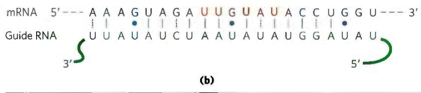

RNA editing by alteration of nucleotides most commonly involves the enzymatic deamination of adenosine or cytidine residues, forming inosine or uridine, respectively (Fig. 27-11), although other base changes have been described. Inosine is interpreted as a G residue during translation. The adenosine deamination reactions are carried out by adenosine deaminases that act on RNA (ADARs). The cytidine deaminations are carried out by the apoB mRNA editing catalytic peptide (APOBEC) family of enzymes, which includes the activation-induced deaminase (AID) enzymes. Both the ADAR and APOBEC groups of deaminase enzymes have a homologous zinc-coordinating catalytic domain.

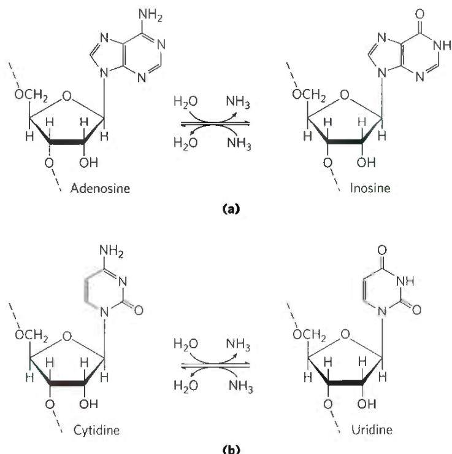  
(b)  
FIGURE 27-11 Deamination reactions that result in RNA editing. (a) Conversion of adenosine nucleotides to inosine nucleotides is catalyzed by ADAR enzymes. (b) Cytidine-to-uridine conversions are catalyzed by the APOBEC family of enzymes.

FIGURE 27-10 RNA editing of the transcript of the cytochrome oxidase subunit II gene from Trypanosoma brucei mitochondria. (a) Insertion of four U residues (red) produces a revised reading frame. (b) A special class of guide RNAs, complementary to the edited product, acts as templates for the editing process. Note the presence of three G=U base pairs, signified by blue dots to indicate non-Watson-Crick pairing.  


The ADAR-promoted A-to-I editing of RNA transcripts is particularly common in primates. Most of the editing occurs in Alu elements, a subset of short interspersed elements (SINEs), eukaryotic transposons that are particularly common in primate genomes. Human DNA contains more than a million 300 bp Alu elements, making up about 10% of the genome. These elements are concentrated near protein-coding genes, often in introns and untranslated regions at the 3' and 5' ends of transcripts. When it is first synthesized (before processing), the average human mRNA includes 10 to 20 Alu elements. Certain microRNAs are also targeted by ADARs. The microRNA (miRNA) alterations generally reduce expression and/or function.

The ADAR enzymes bind to and promote A-to-I editing only in duplex regions of RNA. The abundant Alu elements offer many opportunities for intramolecular base pairing within the transcripts, providing the duplex targets required by ADARs. Some of the editing affects the coding sequences of genes. Defects in ADAR function have been associated with a variety of human neurological conditions, including amyotrophic lateral sclerosis (ALS), epilepsy, and major depression.

There are six general classes of APOBEC cytidine deaminases: APOBEC1–APOBEC5 and AID. The AID proteins function in increasing antibody diversity during immunoglobulin gene maturation (see Figs. 25-42 and 25-43). APOBEC1 and some of the APOBEC3 proteins (seven APOBEC paralogs are encoded by the human genome) edit mRNAs. A well-studied example of RNA editing by APOBEC1-mediated deamination occurs in the gene for the apolipoprotein B component of low-density lipoprotein in vertebrates. One form of apolipoprotein B, apoB-100 ( $M_{r}$ 513,000), is synthesized in the liver; a second form, apoB-48 ( $M_{r}$ 250,000), is synthesized in the intestine. Both are encoded by an mRNA produced from the gene for apoB-100. An APOBEC cytidine deaminase found only in the intestine binds to the mRNA at the codon for amino acid residue 2,153 (CAA=Gln) and converts the C to a U to create the termination codon UAA. The apoB-48 produced in the intestine from this modified mRNA is simply an abbreviated form (corresponding to the amino-terminal half) of apoB-100 (Fig. 27-12). P1 This reaction permits tissue-specific synthesis of two different proteins from one gene.


  
FIGURE 27-12 RNA editing of the transcript of the gene for the apoB-100 component of LDL. Deamination, which occurs only in the intestine, converts a specific cytidine to uridine, changing a Gln codon to a stop codon and producing a truncated protein.

APOBEC2, 4, and 5 act on DNA rather than RNA, and their functions are poorly understood. However, their ability to cause genomic mutations can make them a liability to the cell. One or more APOBEC enzymes are often overexpressed in tumor cells, and their mutagenic ability can contribute to the formation of tumors. They also provide a mechanism for introducing multiple mutations into a targeted segment of a chromosome, leading to selective and more rapid evolution of that DNA region.

#### [EN] SUMMARY 27.1 The Genetic Code

The particular amino acid sequence of a protein is constructed through the translation of information encoded in mRNA. This process is carried out by ribosomes. Amino acids are specified by mRNA codons consisting of nucleotide triplets. Translation requires adaptor molecules, the tRNAs, that recognize codons and insert amino acids into their appropriate sequential positions in the polypeptide.

The base sequences of the codons were deduced from experiments using synthetic mRNAs of known composition and sequence. The codon AUG signals initiation of translation. The triplets UAA, UAG, and UGA are signals for termination. The genetic code is degenerate: it has multiple codons for almost every amino acid. The standard genetic code is universal in all species, with some minor deviations in mitochondria and a few single-celled organisms. The deviations occur in a pattern that reinforces the concept of a universal code.

\- The third position in each codon is much less specific than the first and second positions and is said to wobble. This property allows certain tRNAs to recognize more than one codon.

■ The genetic code is resistant to the effects of missense mutations. The code evolved so that many nucleotide changes in a DNA codon do not alter the encoded amino acid, or they result in a very conservative alteration.

■ Translational frameshifting and RNA editing affect how the genetic code is read during translation.

■ RNA editing by ADARs (adenosine deaminases) and APOBECs (cytidine deaminases) also alters the coding sequence of some mRNAs. Many APOBEC enzymes target DNA, where they function in facilitating antibody diversity and suppression of retroviruses and retrotransposons.


<!-- L-END Lehninger 27.1 -->

## 4.2 tRNA

tRNA 在蛋白质合成中处于关键地位,它不但为每个三联密码子翻译成氨基酸提供了接合体,还为准确无误地将所需氨基酸运送到核糖体上提供了运送载体,所以,它又被称为第二遗传密码。虽然 tRNA 分子各自的序列不同,但所有的 tRNA 都具有共同的特征:存在经过特殊修饰的碱基,tRNA 的 3' 端都以 CCA-OH 结束,该位点是 tRNA 与相应氨基酸结合的位点。

## 4.2.1 tRNA 的三叶草二级结构

tRNA 参与多种反应,并与多种蛋白质和核酸相互识别,这就决定了它们在结构上存在大量的共性。由于小片段碱基互补配对,三叶草形 tRNA 分子上有 4 条根据它们的结构或已知功能命名的手臂(图 4-7):

受体臂(acceptor arm)因是结合氨基酸的位点而得名,主要由链两端序列碱基配对形成的杆状结构和3'端未配对的3\~4个碱基所组成,其3'端的最后3个碱基序列永远是CCA序列,伸出双链之外,最后一个碱基的3'或2'自由羟基(—OH)可以被氨酰化。

其余手臂均由碱基配对产生的杆状结构和无法配对的套索状结构所组成。

TψC臂是根据3个核苷酸命名的,其中ψ表示拟尿嘧啶,是tRNA分子所拥有的不常见核苷酸。

反密码子臂是根据位于套索中央的三联反密码子命名的。反密码子的两端由5'端的尿嘧啶和3'端的嘌呤界定。

D 臂是根据它含有二氢尿嘧啶 (dihydrouracil) 命名的。

图 4-7 显示了最常见 tRNA 分子的三叶草二级结构形式。tRNA 一般有 76 个碱基，相对分子质量约为 $2.5 \times 10^{4}$ 。不同的 tRNA 分子可有 74～95 个核苷酸不等。tRNA 分子长度的不同主要是由其中的 D 臂、TψC 臂和多余臂引起的，在 D 臂中存在多至 3 个可变核苷酸位点。tRNA 分子中最大的变化发生在位于 TψC 和反密码子臂之间的多余臂 (extra arm) 上。

图 4-7 tRNA 的三叶草形二级结构  
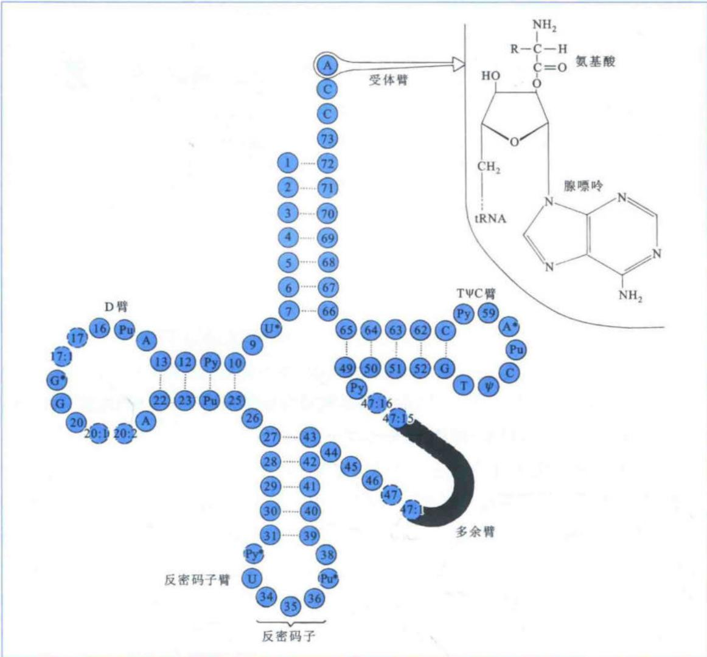

tRNA 的稀有碱基含量非常丰富,有 70 余种。每个 tRNA 分子至少含有 2 个稀有碱基,最多有 19 个,多数分布在非配对区,特别是在反密码子 3' 端邻近部位出现的频率最高,且大多为嘌呤核苷酸,这对于维持反密码子环的稳定性及密码子、反密码子之间的配对是很重要的。基因组研究发现,原核生物与真核生物细胞中所拥有的各种 tRNA 基因总数很不一样。

所有的 tRNA 都能够与核糖体的 A 位点(新进入的氨酰 tRNA 的结合位点)和 P 位点(肽酰 tRNA 的结合位点)结合,此时,tRNA 分子三叶草型顶端突起部位通过密码子-反密码子的配对与 mRNA 相结合,而其 3' 端恰好将所运转的氨基酸送到正在延伸的多肽上。此外,所有 tRNA(除了起始 tRNA 外)都能被翻译辅助因子 EF-Tu(原核生物)或 eEF1(真核生物)所识别而与核糖体相结合,起始 tRNA 能被原核生物的起始因子 IF-2 或真核生物的起始因子 eIF-2 所识别。

## 4.2.2 tRNA 的 L-形三级结构

有人在二级结构基础上做了酵母 $tRNA^{Phe}$ 、 $tRNA^{fMet}$ 和大肠杆菌 $tRNA^{fMet}$ 、 $tRNA^{Arg}$ 等的

图 4-8 酵母 tRNA $^{Phe}$ 的三级结构示意图（根据 X 射线衍射数据绘制）

(a) 和 (b) 表示用不同方法构建的模型。

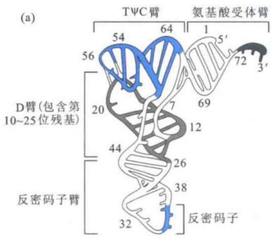


三级结构,发现都呈 L 形折叠(图 4-8),而这种结构是靠氢键来维持的。tRNA 的三级结构与 AA-tRNA 合成酶对 tRNA 的识别有关。

tRNA 的 L 形三级结构,保留了二级结构中由于碱基互补而产生的双螺旋杆状结构,又通过分子重排创造了另一对双螺旋。受体臂和 TψC 臂的杆状区域构成了第一个双螺旋,D 臂和反密码子臂的杆状区域形成了第二个双螺旋,两个双螺旋上各有一个缺口。TψC 臂和 D 臂的套索状结构位于“L”的转折点。所以,受体臂顶端的碱基位于“L”的一个端点,反密码子臂的套索状结构生成了“L”的另一个端点。

tRNA 高级结构上的特点为我们提供了研究其生物学功能的重要线索, 因为 tRNA 上所运载的氨基酸必须靠近位于核糖体大亚基上的多肽合成位点, 而 tRNA 上的反密码子必须与小亚基上的 mRNA 相配对, 所以分子中两个不同的功能基团是最大限度分离的。这个结构形式很可能满足了蛋白质合成过程中对 tRNA 的各种要求而成为 tRNA 的通式, 研究证实 tRNA 的性质是由反密码子而不是它所携带的氨基酸所决定的。

## 4.2.3 tRNA的功能

转录过程是信息从一种核酸分子(DNA)转移到另一种结构上极为相似的核酸分子(RNA)的过程,信息转移靠的是碱基配对。翻译阶段遗传信息从 mRNA 分子转移到结构极不相同的蛋白质分子,信息是以能被翻译成单个氨基酸的三联密码子形式存在的,在这里起作用的是 tRNA 的解码机制。

根据 Crick 的接合体假说,氨基酸必须与一种接合体接合,才能被带到 RNA 模板的恰当位置上正确合成蛋白质。所以,氨基酸在合成蛋白质之前必须通过 AA-tRNA 合成酶活化,在消耗 ATP 的情况下结合到 tRNA 上,生成有蛋白质合成活性的 AA-tRNA。同时,AA-tRNA 的生成还牵涉到信息传递的问题,因为只有 tRNA 上的反密码子能与 mRNA 上的密码子相互识别并配对,而氨基酸本身不能识别密码子,只有结合到 tRNA 上生成 AA-tRNA,才能被带到 mRNA-核糖体复合物上,插入到正在合成的多肽链的适当位置上。

下面的实验证明模板 mRNA 只能识别特异的 tRNA 而不是氨基酸。 $^{14}$ C 标记的半胱氨酸与 $tRNA^{Cys}$ 结合后生成 $[^{14}C]$ -半胱氨酸- $tRNA^{Cys}$ ，经 Ni 催化可生成 $[^{14}C]$ -Ala-tRNA $^{Cys}$ ，再把 $[^{14}C]$ -Ala-tRNA $^{Cys}$ 加进含血红蛋白 mRNA、其他 tRNA、氨基酸以及兔网织细胞核糖体的蛋白质合成系统中，结果发现 $[^{14}C]$ -Ala-tRNA $^{Cys}$ 插入了血红蛋白分子通常由半胱氨酸占据的位置上，这表明在这里起识别作用的是 tRNA 而不是氨基酸。

## 4.2.4 tRNA 的种类

## 1. 起始 tRNA 和延伸 tRNA

有一类能特异地识别 mRNA 模板上起始密码子的 tRNA 叫起始 tRNA, 其他 tRNA 统称为延伸 tRNA。起始 tRNA 具有独特的、有别于其他所有 tRNA 的结构特征。原核生物起始 tRNA 携带甲酰甲硫氨酸 (fMet), 真核生物起始 tRNA 携带甲硫氨酸 (Met)。原核生物中 Met-tRNA $^{fMet}$ 必须首先甲酰化生成 fMet-tRNA $^{fMet}$ 才能参与蛋白质的生物合成。

## 2. 同工 tRNA

由于一种氨基酸可能有多个密码子,因此有多个 tRNA 来识别这些密码子,即多个 tRNA 代表一种氨基酸,我们将几个代表相同氨基酸的 tRNA 称为同工 tRNA (cognate tRNA)。在一个同工 tRNA 组内,所有 tRNA 均专一于相同的氨酰 tRNA 合成酶。同工 tRNA 既要有不同的反密码子以识别该氨基酸的各种同义密码,又要有某种结构上的共同性,能被 AA-tRNA 合成酶识别。所以说,同工 tRNA 组内肯定具备了足以区分其他 tRNA 组的特异构造,保证合成酶能准确无误地加以选择。到目前为止,科学家还无法从一级结构上解释 tRNA 在蛋白质合成中的专一性。有证据说明,tRNA 的二级和三级结构对它的专一性起着举足轻重的作用。

## 3. 校正 tRNA

在蛋白质的结构基因中,一个核苷酸的改变可能使代表某个氨基酸的密码子变成终止密码子(UAG、UGA、UAA),使蛋白质合成提前终止,合成无功能的或无意义的多肽,这种突变称为无义突变(nonsense mutation),而无义突变的校正 tRNA 可通过改变反密码子区校正无义突变。

错义突变(missense mutation)是由于结构基因中某个核苷酸的变化使一种氨基酸的密码变成另一种氨基酸的密码。错义突变的校正tRNA通过反密码子区的改变把正确的氨基酸加到肽链上，合成正常的蛋白质。如某大肠杆菌细胞色氨酸合成酶中的一个甘氨酸密码子GGA错义突变成AGA(编码精氨酸)，指导合成错误的多肽链。甘氨酸校正tRNA的校正基因突变使其反密码子从CCU变成UCU，它仍然是甘氨酸的反密码子但不结合GGA而能与突变后的AGA密码子相结合，把正确的氨基酸(甘氨酸)放到AGA所对应的位置上。

校正 tRNA 在进行校正过程中必须与正常的 tRNA 竞争结合密码子,无义突变的校正 tRNA 必须与释放因子竞争识别密码子,错义突变的校正 tRNA 必须与该密码的正常 tRNA 竞争,都会影响校正的效率。所以,某个校正基因的效率不仅决定于反密码子与密码子的亲和力,也决定于它在细胞中的浓度及竞争中的其他参数。一般说来,校正效率不会超过50%。无义突变的校正基因tRNA不仅能校正无义突变,也会抑制该基因3'端正常的终止密码子,导致翻译过程的通读,合成更长的蛋白质,这种蛋白质过多就会对细胞造成伤害。同样,一个基因错义突变的矫正也可能使另一个基因错误翻译,因为如果一个校正基因在突变位点通过取代一种氨基酸的方式校正了一个突变,它也可以在另一位点这样做,从而在正常位点上引入新的氨基酸。

## 4.2.5 氨酰 tRNA 合成酶

每个 tRNA 分子如何与 20 个氨基酸中正确的一个连接上？这个任务由氨酰 tRNA 合成酶（AA-tRNA synthetase）来承担，它确保了 tRNA 只与正确的氨基酸相偶联。氨酰 tRNA 合成酶是一类催化氨基酸连接于 tRNA 的 3' 端的特异性酶，其反应如下：

$$
\mathrm{AA} + \mathrm{tRNA} + \mathrm{ATP} \rightarrow \mathrm{AA} - \mathrm{tRNA} + \mathrm{AMP} + \mathrm{PPi}
$$

它实际上包括两步反应：

第一步是氨基酸活化生成酶-氨基酰腺苷酸复合物。

$$
\mathrm{AA} + \mathrm{ATP} + \mathrm{酶(E)} \rightarrow \mathrm{E-AA-AMP+PPi}
$$

第二步是氨酰基转移到 tRNA 3' 端腺苷残基的 2' 或 3'-羟基上。

$$
\mathrm{E-AA-AMP+tRNA} \rightarrow \mathrm{AA-tRNA+E+AMP}
$$

蛋白质合成的真实性主要决定于 tRNA 能否把正确的氨基酸放到新生多肽链的正确位置上,而这一步主要决定于 AA-tRNA 合成酶是否能使氨基酸与对应的 tRNA 相结合。AA-tRNA 合成酶既要能识别 tRNA,又要能识别氨基酸,它对两者都具有高度的专一性。不同的 tRNA 有不同的碱基组成和空间结构,每种特异性 AA-tRNA 合成酶通过对其独特结构的识别来保证翻译的正确进行(图 4-9)。受体臂是 AA-tRNA 合成酶识别特异性的关键因素,若位于该臂上的鉴别者碱基发生变化,会使某个 tRNA 所识别的密码子发生变化,从一种 AA-tRNA 合成酶变成另一种 AA-tRNA 合成酶。

图 4-9 氨酰 tRNA 合成酶识别 tRNA 的独特结构

(a) tRNA 结构中氨酰 tRNA 合成酶识别的必需元件；(b) 谷氨酰 tRNA 合成酶与 tRNA $^{Gln}$ 结合的晶体结构图。

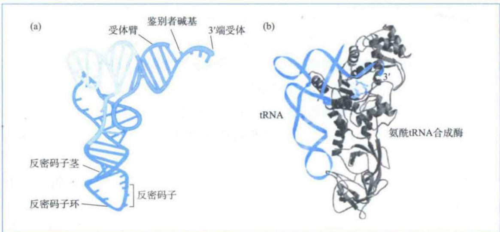

困难的是这些酶怎么去识别结构上非常相似的氨基酸。例如，异亮氨酸只比缬氨酸多一个甲烯基团，而异亮氨酰tRNA合成酶对异亮氨酸的亲和力比对缬氨酸大225倍。考虑到体内缬氨酸的浓度比异亮氨酸高5倍，缬氨酸被错误活化渗入到异亮氨酸位点上去的概率应该是1/40，但实际上错误频率(误差率)只有约 $1.5 \times 10^{-5}$ ，表明还存在其他重要的校正手段以增加蛋白质合成的真实性。科学家发现，异亮氨酰tRNA合成酶在催化口袋附近还有一个编辑口袋，对腺苷酰基化产物进行校对，因此，被错误活化的缬氨酸不会被结合到 $tRNA^{Ile}$ 上，而是被酶本身水解，活化阶段产生的误差在后一个阶段被校正。


<!-- W-BEGIN Watson 15 转运RNA -->

### 【中文对照 Watson 第15章：转运RNA】

> 来源：Watson《基因的分子生物学》第七版中译本（书籍/03_基因的分子生物学_第七版） 第15章 翻译。

#### [W] 转运RNA

#### [W] tRNA 是密码子和氨基酸之间的转配器

蛋白质合成的核心是将核苷酸序列的信息（以密码子的形式）“翻译”成氨基酸。这是由 tRNA 分子完成的，它担当密码子及其所决定的氨基酸之间的转配器。tRNA 分子有很多种，但每一种仅与一个特定的氨基酸结合并识别 mRNA 的一个或几个特定的密码子（大多数 tRNA 识别一个以上密码子，我们将在第 16 章讨论）。tRNA 分子的长度为 75\~95 个核苷酸。虽然各自的序列不同，但所有的 tRNA 都具有某些共同的特征。首先，所有的 tRNA 在 3'端均为 5'-CCA-3'序列（见框 15-1）。与该高度保守性相一致的是，该序列（和 tRNA 的）3'端是与其编码的氨基酸相结合的位点。

#### [W] 框 15-1 CCA 添加（CCA-adding）酶：无模板合成 RNA

如正文所述，5'-CCA-3' 端在所有 tRNA 中是保守的，并且在蛋白质合成中是必需的。但奇怪的是，当克隆那些编码 tRNA 的基因时，却发现许多并不编码 CCA 末端。反而这些基因比成熟的 tRNA 3' 端短 3 个核苷酸。事实上，许多编码细菌 tRNA 和几乎所有真核生物 tRNA 的基因都缺乏末端的这 3 个碱基。那么，这些 tRNA 是怎样获得其 CCA 末端的呢？答案来自一种称为 CCA-添加酶的特殊 RNA 合成酶。顾名思义，这种酶可以将 CCA 添加到末端原本缺乏这个序列的 tRNA 上。奇怪的是，这种酶没有对应的核酸组分；也就是说，CCA-添加酶在没有 RNA 或 DNA 模板的情况下将一段特定的序列添加到 tRNA 的末尾。

CCA 添加酶如何在没有模板的情况下加入一段特定的序列呢？对这些酶的一系列三维结构的研究开始揭示其答案。首先，像其他 RNA 合成酶和 DNA 合成酶一样，CCA 添加酶只有一个活性位点，采用类似的双金属离子催化机制（见第 9 章和图 9-6）。在这一活性位点内部，一个氨基酸和 tRNA 末尾核苷酸的一个磷酸基团与 A 和 C 碱基而不是 G 和 U 碱基形成氢键。可以通过观察每个碱基的氢键供体和受体的键型来理解这种特异性（见第 6 章和图 6-14）。A 和 C 的键型相似和重叠，而 G 和 U（或 T）则相反和互补。实际上，正是这种互补性担负着 DNA 双螺旋内的碱基配对的特异性。这种氢键键型解释了 CCA 添加酶对 A 和 C 的特异性。

添加 C 还是 A 的特异性是由加入碱基时酶活性位点的变化来控制的。与其他聚合酶不同，当额外的核苷加入时，tRNA 模板并不改变位置。相反，tRNA 模板紧紧地固定在其位置上，每个加入的核苷改变了酶活性位点的结构。改变的结果是，当缺失 CCA 的 tRNA 与酶结合时，酶活性位点对 C 具有特异性，而当加入了两个 C 之后，酶变得对 A 具有特异性。一旦 A 加入之后，活性位点不再对任何多余的碱基开放，而带有新加入的 CCA 末端的 tRNA 得以释放。

tRNA 另一个显著的特征就是在其一级结构中存在一些特殊的碱基。这些特殊的碱基是多核苷酸链的正常碱基在转录后受到酶的修饰作用形成的。例如，假尿嘧啶（ΨU）就是尿苷经异构化作用使尿嘧啶与核糖结合的位置从环 1 位的 N 转移到环 5 位的 C 而形成的（图 15-3）。同样地，双氢尿嘧啶（dihydrouridine，D）是尿苷经酶的作用使 5 位和 6 位之间的 C 双键减为单键而形成的。tRNA 中发现的另一些特殊碱基包括次黄嘌呤（hypoxanthine，H）、胸腺嘧啶（thymine，T）和甲基鸟嘌呤（methylguanine，Gm）。这些修饰碱基对 tRNA 的功能并非不可或缺，但缺少这些碱基的细胞生长变慢。这一现象暗示这些修饰碱基可能可以提高 tRNA 的功能。例如，如第 16 章将要提到的，次黄嘌呤在某些 tRNA 对密码子的识别过程中扮演重要的角色。

  
图 15-3 tRNA 中发现的一部分修饰核苷。图示为尿苷和 2 个尿苷相关的核苷。

#### [W] tRNA 具有共同的三叶草型的二级结构

在第 5 章中曾谈到，RNA 分子通常含有自我互补区域，能够通过碱基配对形成有限的双螺旋结构；而 RNA 的其他区域是没有互补结构的，所以是单链的。tRNA 分子表现为特异的，高度保守的单链和双链区域（二级结构），该结构可描绘成三叶草型（图 15-4）。tRNA 三叶草型结构的主要特征是具有 1 个受体臂、3 个茎环（分别为 $\Psi U$ 环、D 环和反密码子环）和 1 个可变环。对于这些特征结构的描述如下：

\- 受体臂（acceptor stem）由于具有结合氨基酸的位点而得名，由 tRNA 分子的 5' 和 3' 端的碱基配对而成。其 3' 端的 5'-CCA-3' 序列突出双链之外。

\- $\Psi$ U环（ $\Psi$ U loop）因特殊碱基 $\Psi$ U（假尿嘧啶）的存在而得名。这一修饰碱基经常发现位于 $5^{\prime}$ -T $\Psi$ UCG-3'序列中。

\- D环（D loop）因特殊碱基双氢尿嘧啶的存在而得名。

\- 反密码子环（anticodon loop），顾名思义，包含反密码子——一个三核苷酸序列，能够通过碱基配对方式识别 mRNA 的密码子。反密码子的两端由 5'端的尿嘧啶和 3'端的嘌呤界定。

\- 可变环（variable loop）位于反密码子环和 $\Psi U$ 环之间，长度为 $3\sim 21bp$ 不等，正如其名。

#### [W] tRNA 具有 L 形的三维结构

三叶草型结构揭示了 tRNA 含有自我互补的区域。那么，这一转配器分子实际的三维构象是如何的呢？X 射线晶体学揭示其为 L 形的三级结构，受体臂在一端，反密码子环在另一端，两者相距 70Å（图 15-5c）。要了解这一 L 形结构和三叶草型结构的关系，请考虑以下方面：在最终形成的 tRNA 三维构象中，受体臂和 ΨU 环茎之间将形成延伸的螺旋结构（图 15-5b）。同样地，反密码子茎和 D 环茎形成第二个延伸的螺旋。这两个延伸的螺旋垂直排列，D 环和 ΨU 环靠在一起。

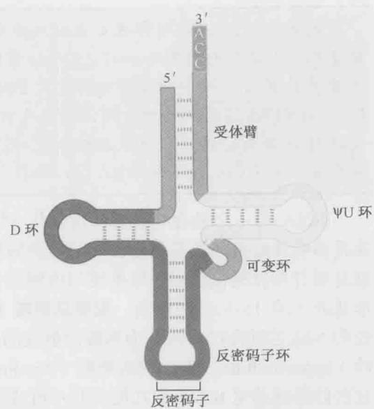  
图 15-4 tRNA 的三叶草状二级结构。在此 tRNA 示意图中，红色虚线表示 tRNA 不同部分之间的碱基配对。

  
图 15-5 tRNA 的三叶草结构和实际的三维结构之间的转换。(a) 三叶草示意图；(b) L 状结构示意图显示最终折叠的 tRNA 碱基配对的位置；(c) tRNA 的实际折叠结构的带状示意图。请注意虽然此图说明了实际的 tRNA 结构与三叶草结构的关系，但 tRNA 并不是通过先碱基配对再 L 状折叠来形成最后的结构的。

三种相互作用使这 L 状结构得以稳定。第一，因形成两个延伸的碱基配对区域而获得的类似 DNA 双链的碱基堆积作用。第二，三维结构中相互靠近的不同螺旋区域的碱基间的氢键，这些碱基间的相互作用通常是非常规（非 Watson-Crick）键对。第三，碱基和磷酸核糖骨架之间的相互作用。


<!-- W-END Watson 15 转运RNA -->


<!-- W-BEGIN Watson 15 氨基酸连接到 tRNA 上 -->

### 【中文对照 Watson 第15章：氨基酸连接到 tRNA 上】

> 来源：Watson《基因的分子生物学》第七版中译本（书籍/03_基因的分子生物学_第七版） 第15章 翻译。

#### [W] 氨基酸连接到 tRNA 上

#### [W] 氨基酸通过高能酰基连接到 tRNA 3'端的腺苷酸上使 tRNA 负载

连接了氨基酸的 tRNA 分子称为负载的（charged）tRNA，未连接氨基酸的 tRNA称为空载的（uncharged）tRNA。这一负载过程需要氨基酸的羧基与 tRNA 3'端受体臂突出的腺苷酸的 2'或 3'羟基（见下文的讨论）形成酰基。形成的酰基是一个高能键，因为它的水解导致自由能的产生较大变化。这对于蛋白质的合成是非常重要的——这一高能键水解所释放的能量帮助推动多肽链中氨基酸之间肽键的形成。

#### [W] 氨酰 tRNA 合成酶分两步使 tRNA 负载

所有的氨酰-tRNA 合成酶分两个酶促步骤使氨基酸连接到 tRNA 上（图 15-6）。第一步是腺苷酰基化（adenylylation），氨基酸和 ATP 反应而被腺苷酰基化，同时释放出焦磷酸。腺苷酰基化指的是 AMP 的转移，与腺苷酸化（adenylylation）相反，后者发生的是腺苷酸的转移。正如我们在多核苷酸的合成过程中看到的一样（第 9 章），腺苷酰基化反应的主要驱动能量来自于随后的焦磷酸酶对焦磷酸的水解。腺苷酰基化的结果是，通过氨基酸的羧基与 AMP 的磷酸基团形成的高能酯键，使氨基酸与腺苷酸连接。第二步是 tRNA 负载（tRNA charging），腺苷酰基化的氨基酸与氨酰 tRNA 合成酶保持紧密结合的状态下，与 tRNA 发生反应。这一反应导致氨基酸通过与 tRNA 上的 2' 或 3' 羟基作用，转移到 tRNA 的 3' 端，同时释放出 AMP。

  
图 15-6 氨酰-tRNA 负载的两个步骤。(a) 氨基酸的腺苷酰基化；(b) 腺苷酰基化的氨基酸转移至 tRNA 上。此图显示的为Ⅱ类 tRNA 合成酶的反应（该酶连接氨基酸到 3'-OH 上）。

tRNA 合成酶分两类（表 15-1）。Ⅰ类酶将氨基酸连接到 tRNA 的 2'羟基，并且通常是单聚体；Ⅱ类酶将氨基酸连接到 tRNA 3'羟基，并且通常是二聚体或四聚体。虽然氨基酸与 tRNA 之间最初的耦联方式不同，然而一旦从合成酶中释放出来，氨基酸能够很快地平衡其与 2'或 3'羟基的连接。

表 15-1 氨基酰 tRNA 合成酶的种类

<table><tr><td>II类</td><td>四级结构</td><td>I类</td><td>四级结构</td></tr><tr><td>Gly</td><td> $(\alpha_{2}\beta_{2})$ </td><td>Glu</td><td> $(\alpha)$ </td></tr><tr><td>Ala</td><td> $(\alpha_{4})$ </td><td>Gln</td><td> $(\alpha)$ </td></tr><tr><td>Pro</td><td> $(\alpha_{2})$ </td><td>Arg</td><td> $(\alpha)$ </td></tr><tr><td>Ser</td><td> $(\alpha_{2})$ </td><td>Cys</td><td> $(\alpha_{2})$ </td></tr><tr><td>Thr</td><td> $(\alpha_{2})$ </td><td>Met</td><td> $(\alpha_{2})$ </td></tr><tr><td>His</td><td> $(\alpha_{2})$ </td><td>Val</td><td> $(\alpha)$ </td></tr><tr><td>Asp</td><td> $(\alpha_{2})$ </td><td>Ile</td><td> $(\alpha)$ </td></tr><tr><td>Asn</td><td> $(\alpha_{2})$ </td><td>Leu</td><td> $(\alpha)$ </td></tr><tr><td>Lys</td><td> $(\alpha_{2})$ </td><td>Tyr</td><td> $(\alpha)$ </td></tr><tr><td>Phe</td><td> $(\alpha_{2}\beta_{2})$ </td><td>Trp</td><td> $(\alpha)$ </td></tr></table>

来源：Data from Delarue M. 1995. Current Opinion in Structural Biology 5: 48-55. Table 1. ©Elsevier.  
注：Ⅰ类酶一般是单体，而Ⅱ类酶是二聚体或四聚体，来自两个亚基的残基为单个tRNA提供结合位点。α和β指tRNA合成酶的亚基，下标指化学计量。

#### [W] 每种氨酰—tRNA 合成酶连接一种氨基酸到一个或多个 tRNA 上

20 种氨基酸都是通过专门的 tRNA 合成酶连接到正确的 tRNA 上的。由于大多数的氨基酸是由多于一种的密码子决定的（第 16 章），因此一种合成酶经常识别多于一种的 tRNA（称为同工 tRNA，iso-accepting tRNA）并使之负载氨基酸，但是多个同种 tRNA 合成酶需要负责一个特定氨基酸，并使所有合适的 tRNA 负载。因此，对一个氨基酸而言，有一种而且只有一种 tRNA 合成酶将其连接到所有合适的 tRNA 上。

大多数的生物具有20种不同的tRNA合成酶，但并不总是这样。例如，有些细菌缺乏使谷酰胺连接到 $\mathrm{tRNA}^{\mathrm{Gln}}$ 的合成酶。取而代之的，是由一种氨酰-tRNA合成酶负责将Glu连接到 $\mathrm{tRNA}^{\mathrm{Gln}}$ 和 $\mathrm{tRNA}^{\mathrm{Glu}}$ 上。然后第二种酶将一部分负载的 $\mathrm{tRNA}^{\mathrm{Gln}}$ 上的Glu氨基化形成Gln。即将 $\mathrm{Glu - tRNA}^{\mathrm{Gln}}$ 氨基化变成 $\mathrm{Gln - tRNA}^{\mathrm{Gln}}$ （前缀指氨基酸，上标指tRNA所识别的密码子）。第二种酶的存在使细菌不再需要谷酰胺tRNA合成酶。但是，一种氨酰-tRNA合成酶永远不能将多于一种的氨基酸连接到一种其相应的tRNA上。

#### [W] tRNA 合成酶识别位于同族 tRNA（cognate tRNA）上的独特结构特征

从前面的讨论中可以看出，氨酰-tRNA 合成酶面临两个重要的挑战：它们必须识别针对特定氨基酸的一组正确的 tRNA，而且它们必须使这些同工 tRNA 负载正确的氨基酸。这两个过程都必须高度精确地进行。

让我们首先探讨 tRNA 识别的特异性：tRNA 分子的什么特征使得合成酶能够将某种氨基酸的同工 tRNA 与其他 19 种氨基酸的 tRNA 区别开呢？来自遗传学、生物化学和 X 射线晶体学研究的证据表明决定这特异性的因素来自 tRNA 分子的两个相距较远的位点：受体臂和反密码子环（图 15-7）。受体臂是 tRNA 合成酶特异性识别的一个极其重要的决定因素。在某些情况下，改变受体臂的一个碱基[称为鉴别者碱基（discriminatorbase）]足以使特异性识别某个 tRNA 的合成酶变为另一种合成酶。虽然如此，反密码子环也经常对识别特异性有所贡献。例如，谷氨酰胺 tRNA 合成酶同受体臂和反密码子环都有广泛的接触，包括反密码子本身（图 15-8）。

  
图 15-7 tRNA 结构：供氨酰-tRNA 合成酶识别的必需元件。  
图 15-8 谷氨酰胺 tRNA 合成酶与 tRNA $^{Gln}$ 结合的晶体结构图。酶以灰色表示，tRNA $^{Gln}$ 以紫红色表示，黄色、红色和绿色的分子是谷氨酰-AMP。请注意这一分子和 tRNA $^{Gln}$ 的 3'端的距离，以及 tRNA 和合成酶作用的结合点。（Rath V.L. et al. 1998. Structure 6: 439–449.）图像使用 BobScript、MolScript 和 Raster 3D 软件制作。

你也许会认为反密码子总是被 tRNA 合成酶在识别过程中所利用，因为它是 tRNA 的最终决定特征——反密码子决定了 tRNA 负责加入到延伸多肽链上的氨基酸种类。但是，由于每个氨基酸通常由多于一个的密码子所编码，因此在很多情况下，反密码子不能被用作 tRNA 合成酶识别的标志。例如，Ser 可以由 6 种密码子编码，其中包括 5'-AGC-3' 和 5'-UCA-3' 这两个完全不同的密码子。这样，Ser 的 tRNA 需要具有不同的反密码子，而无法轻易地被单一的 tRNA 合成酶所识别。为此，Ser 的合成酶必须依靠反密码子以外的因素来识别其 tRNA 分子。

#### [W] 氨酰-tRNA 的形成是非常精确的

氨酰-tRNA合成酶在选择正确的氨基酸方面所面临的挑战也许比其在识别正确的tRNA分子上的挑战更为令人吃惊（图15-9）。这是因为氨基酸的体积较小，并且在某些情况下，它们非常相似。尽管挑战巨大，负载出错的概率却是非常小的，通常1000个tRNA分子中只有不到一个tRNA负载了错误的氨基酸。在某些情况下，如何实现这一高精确度是非常容易理解的。例如，Cys和Trp在体积、构形和化学组成上都有明显的差异。即便是结构相似的Tyr和Phe（图15-9a），由于Tyr tRNA合成酶与前者的羟基而非后者的羟基能形成较强的和能量上有利的氢键，使得其能够有效地鉴别而排斥Phe。

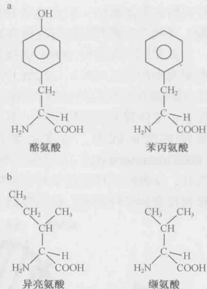

更大的挑战在 Ile 和 Val 之间, 它们仅有一个亚甲

图 15-9 相似的氨基酸，不同的特征。

基（methylene）基团的差异（图15-9b）。缬氨酰-tRNA合成酶可通过其催化口袋的空间位阻作用排斥Ile，因为Ile体积大于Val。相反，Val应该能轻易地滑入异亮氨酰-tRNA合成酶的催化口袋中。虽然这两种氨基酸都能结合在异亮氨酰-tRNA合成酶的氨基酸结合位点上，（异亮氨酰-tRNA合成酶）与Ile额外的亚甲基基团的作用能够产生额外的-2kcal/mol到-3 kcal/mol的自由能（第3章和表3-1）。如第3章所述，如果这两种氨基酸的浓度相同，即使相对微小的自由能差异也能使（异亮氨酰-tRNA合成酶）与Ile结合的可能性约100倍大于该酶与Val的结合。因此，Val大约有 $1\%$ 可能性可与异亮氨酰-tRNA合成酶结合。但这仍是一个不能接受的高错配率。我们已经说过，实际错配率是小于 $0.1\%$ 。这样高的保真度是如何实现的呢？

#### [W] 某些氨酰-tRNA 合成酶利用编辑口袋来高精度地负载 tRNA

提高氨酰-tRNA合成酶保真度的一个普遍机制是对负载反应的产物进行校对，正如第9章中讨论过的DNA聚合酶的校对作用一样。例如，除了催化口袋（负责腺苷酰基化），异亮氨酰-tRNA合成酶在催化口袋附近还有一个编辑口袋（酶上的深裂缝），用以对腺苷酰基化产物进行校对。AMP-Val（同样还有其他小氨基酸，如Ala等的腺苷酰基化物）能够进入这样的编辑口袋，在那里被水解成自由的Val和AMP而释放出来。相反，AMP-Ile因太大而无法进入编辑口袋，因而不能被水解。其结果为，异亮氨酰-tRNA合成酶能够对Val进行两次筛选：在最初的氨基酸结合和腺苷酰基化过程中（筛选效率约为100倍），以及随后的腺苷酰基化氨基酸的编辑过程中（同样筛选效率约为100倍），两者总共可进行大约10000倍的筛选（即错配率约为 $0.01\%$ ）。

#### [W] 核糖体不能辨别 tRNA 的负载是否正确

氨酰-tRNA 合成酶承担如此多的责任以保证正确的氨基酸与其相应的 tRNA 耦联的原因在于，核糖体不能辨别 tRNA 的负载是否正确。换句话说，核糖体只是 “盲目地” 接受任何表现出正确的密码子-反密码子相互作用的负载 tRNA，不管 tRNA 是否携带的是正确的氨基酸。

这个结论由两类实验支持：一类为遗传学的，另一类是生物化学的。遗传实验分离出一种反密码子上携带一个核苷酸替换的突变 tRNA。考虑 tRNA 合成酶经常不依赖于与反密码子的相互作用来识别相关的 tRNA 分子，这样，出一种反密码子上携带一个核苷酸替换的突变 tRNA。考与反密码子的相互作用来识别相关的 tRNA 分子，这样，有些 tRNA 可能在反密码子上存在突变但仍然可以负载通常的相关氨基酸。但是，作为反密码子突变的后果，突变的 tRNA 将会把氨基酸带到错误的密码子上。换句话说，核糖体和其他与核糖体联合作用的辅助蛋白（我们将简短地讨论）主要核对的是负载 tRNA 是否与 mRNA 具有正确的密码子-反密码子配对作用。但核糖体和这些蛋白质极少阻止错误负载的 tRNA 将错误的氨基酸加到多肽链上。

一个经典的生化实验很好地说明了核糖体只识别tRNA而非其携带的氨基酸这个观点。设想一个负载半胱氨酸的半胱氨酰-tRNA $^{Cys}$ （记住前缀指氨基酸，上标指tRNA的类型）。半胱氨酰-tRNA $^{Cys}$ 负载的Cys可通过化学方法转变为Ala，从而形成丙胺酰-tRNA $^{Cys}$ （图15-10）。当加入到不依赖于细胞的蛋白质合成体系中，丙氨酰tRNA $^{Cys}$ 将Ala带到指定Cys插入的密码子上。因此，翻译机器主要依靠氨酰-tRNA合成酶的高保真度来保证每个mRNA正确解码（框15-2）。

  
图 15-10 从 Cys-tRNA $^{Cys}$ 到 Ala-tRNA $^{Cys}$ 的化学还原过程。

#### [W] 框 15-2 硒代半胱氨酸

某些蛋白质，如谷胱甘肽过氧化物酶（glutathione peroxidase）和甲酸盐脱氢酶（formate dehydrogenase），含有一个独特的氨基酸，称作硒代半胱氨酸，它是酶的催化中心的一部分。硒代半胱氨酸在Cys的硫原子处是微量元素硒（框15-2图1）。有趣的是，硒代半胱氨酸不是通过翻译后进行化学修饰而整合到蛋白质的[其他某些独特的氨基酸是通过这一方法整合的，如在胶原质中发现的羟基脯氨酸（hydroxyproline）]。相反，硒代半胱氨酸是从半胱氨酰-tRNA合成酶负载的特殊tRNA上携带的Cys通过酶促反应而产生的。这一改变后的tRNA被用来把硒代半胱氨酸直接整合到正在合成中的谷胱甘肽过氧化物酶中去。一个专一的（类似于EF-Tu，见下文）翻译延伸因子把硒代半胱氨酰

-tRNA 送达核糖体的 UGA 密码子，该密码子通常被识别为终止子。要在 UGA 密码子处整合硒代半胱氨酸必须在 mRNA 的其他地方存在一个特殊的序列。因此，硒代半胱氨酸可以被认为是第 21 个氨基酸，它通过对细胞的标准翻译机器进行修饰而整合到蛋白质中。

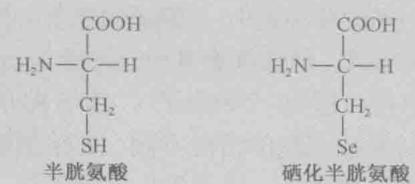  
框 15-2 图 1 半胱氨酸和硒化半胱氨酸的结构


<!-- W-END Watson 15 氨基酸连接到 tRNA 上 -->

## 4.3 核糖体

核糖体是指导蛋白质合成的大分子机器。生物细胞内，核糖体像一个能沿 mRNA 模板移动的工厂，执行着蛋白质合成的功能。它是由几十种蛋白质和几种核糖体 RNA (ribosomal RNA, rRNA) 组成的亚细胞颗粒。一个细菌细胞内约有 20 000 个核糖体，而真核细胞内可达 $10^{6}$ 个，在未成熟的蟾蜍卵细胞内则高达 $10^{12}$ 个。这些颗粒既可以游离状态存在于细胞内，也可与内质网结合，形成微粒体。核糖体和它的辅助因子为蛋白质生物合成提供了必要的条件。

运载有肽链起始或延伸必需氨基酸的 AA-tRNA, 往往以令人难以置信的速度进入核糖体, 在起始或延伸因子的作用下, 与 mRNA 模板和延伸中的肽链相互作用, 卸去所载氨基酸后立即退出核糖体, 以保证新一轮合成反应的顺利进行。

核糖体蛋白约占原核细胞总蛋白量的 10%, 占细胞内总 RNA 量的 80% $^{(表4-6)}$ 。在真核细胞内, 核糖体 RNA 所占的比例虽然有所下降, 但仍然占总 RNA 的绝大部分, 是细胞总蛋白的一个重要组成部分。无论原核或真核细胞内核糖体的含量都是与细胞蛋白质合成活性直接相关的。

在真核生物中,大多数正在进行蛋白质合成的核糖体都不是在细胞质内自由漂浮,而是直接或间接与细胞骨架结构有关联或者与内质网膜结构相连的。细菌核糖体大都通过

表 4-6 核糖体及其他组分在大肠杆菌细胞内的分布

<table><tr><td>组分</td><td>占细胞总量</td><td>细胞内数量</td></tr><tr><td>细胞壁</td><td>10%</td><td>1</td></tr><tr><td>细胞膜</td><td>10%</td><td>2</td></tr><tr><td>DNA</td><td>2%</td><td>1</td></tr><tr><td>mRNA</td><td>2%</td><td> $3.5 \times 10^{3}$ </td></tr><tr><td>tRNA</td><td>3%</td><td> $1.6 \times 10^{5}$ </td></tr><tr><td>rRNA</td><td>21%</td><td> $8 \times 10^{5}$ </td></tr><tr><td>核糖体蛋白</td><td>9%</td><td> $2 \times 10^{4}$ </td></tr><tr><td>可溶性蛋白</td><td>40%</td><td> $10^{6}$ </td></tr><tr><td>小分子</td><td>3%</td><td> $7.5 \times 10^{6}$ </td></tr></table>

与 mRNA 的相互作用, 被固定在核基因组上。

核糖体包括两个亚基,大亚基约为小亚基相对分子质量的两倍。按照惯例,大、小亚基的命名是根据离心时的沉降系数而定的。沉降系数的单位是 Svedberg(S;S 值越大,沉降系数越大),它是由形状和大小共同决定的,因而不是质量的衡量标准。原核细胞中,大亚基的沉降系数是 50 Svedberg,所以称为 50S 亚基,而小亚基称为 30S 亚基。完整的原核细胞的核糖体称为 70S 核糖体。真核细胞的核糖体大一些,由 60S 和 40S 两个亚基组成 80S 的核糖体。

每个亚基包含一个主要的 rRNA 成分和许多不同功能的蛋白质分子, 这些分子大都以单拷贝的形式存在。大亚基除了含有主要 rRNA 组分外, 还有一些相对分子质量较小的 RNA。核糖体亚基中的主要 rRNA 基因虽然有许多个拷贝, 但其序列十分保守, 暗示 rRNA 序列在组成功能核糖体的过程中有着重要的作用。表 4-7 是大肠杆菌核糖体的基因组成成分, 从已知的大肠杆菌 rRNA 和蛋白质序列来看, 细菌的核糖体是完全相同的。

表 4-7 大肠杆菌核糖体基本成分

<table><tr><td></td><td>核糖体</td><td>小亚基</td><td>大亚基</td></tr><tr><td>沉降系数</td><td>70S</td><td>30S</td><td>50S</td></tr><tr><td>总体相对分子质量</td><td> $2.52 \times 10^6$ </td><td> $9.30 \times 10^5$ </td><td> $1.59 \times 10^6$ </td></tr><tr><td>主要 rRNA(碱基数)</td><td></td><td>16S(1541)</td><td>23S(2004)</td></tr><tr><td>主要 rRNA(碱基数)</td><td></td><td></td><td>5S(120)</td></tr><tr><td>RNA 相对分子质量</td><td> $1.66 \times 10^6$ </td><td> $5.60 \times 10^5$ </td><td> $1.10 \times 10^6$ </td></tr><tr><td>RNA 所占比例</td><td>66%</td><td>60%</td><td>70%</td></tr><tr><td>蛋白质数量</td><td></td><td>21</td><td>36</td></tr><tr><td>蛋白质相对分子质量</td><td> $8.57 \times 10^5$ </td><td> $3.70 \times 10^5$ </td><td> $4.87 \times 10^5$ </td></tr><tr><td>蛋白质所占比例</td><td>34%</td><td>40%</td><td>30%</td></tr></table>

## 4.3.1 核糖体的结构

## 1. 核糖体由大小两个亚基组成

核糖体是一个致密的核糖核蛋白颗粒,可以解离为两个亚基,每个亚基都含有一个相对分子质量较大的 rRNA 和许多不同的蛋白质分子。这些大分子 rRNA 能在特定位点与蛋白质结合,从而完成核糖体不同亚基的组装。原核生物核糖体由约 2/3 的 RNA 及 1/3 的蛋白质组成。真核生物核糖体中 RNA 占 3/5,蛋白质占 2/5。原核生物、真核生物细胞质及细胞器中的核糖体存在着很大差异(表 4-8)。

## 2. 核糖体蛋白

核糖体上有多个活性中心,每个中心都由一组特殊的核糖体蛋白(ribosomal protein, r-protein, r-蛋白)构成。虽然有些蛋白质本身具有催化功能,但若将它们从核糖体上分离出来时,催化功能就会完全消失。所以,核糖体是一个许多酶的集合体,单个酶或蛋白质只有在这个总体结构内才拥有催化性质,它们在这一结构中共同承担了蛋白质生物合成的任务。核糖体中许多蛋白质(可能还包括 rRNA)的主要功能可能就是建立这种总体结构,使各个活性中心处于适当的相互协调的关系之中。

表 4-8 几种不同生物核糖体及 rRNA 的组成

<table><tr><td rowspan="2">核糖体</td><td rowspan="2">来源</td><td colspan="2">大亚基</td><td colspan="2">小亚基</td></tr><tr><td>沉降系数</td><td>RNA</td><td>沉降系数</td><td>RNA</td></tr><tr><td rowspan="3">80S</td><td rowspan="3">脊椎动物</td><td>60S</td><td>20~29S</td><td>40S</td><td>18S</td></tr><tr><td></td><td>5S</td><td></td><td></td></tr><tr><td></td><td>5.8S</td><td></td><td></td></tr><tr><td rowspan="3">80S</td><td rowspan="3">无脊椎动物、植物</td><td>60S</td><td>25S</td><td>40S</td><td>16~18S</td></tr><tr><td></td><td>5S</td><td></td><td></td></tr><tr><td></td><td>5.8S</td><td></td><td></td></tr><tr><td>70S</td><td>原核生物</td><td>50S</td><td>23S</td><td>30S</td><td>16S</td></tr><tr><td>55S</td><td>脊椎动物线粒体</td><td>40S</td><td>16~17S</td><td>30S</td><td>10~13S</td></tr></table>

已知大肠杆菌核糖体小亚基由21种r-蛋白组成，分别用S1……S21表示，大亚基由36种r-蛋白组成，分别用L1……L36表示。真核生物细胞核糖体蛋白质中，大亚基含有49种r-蛋白，小亚基有33种r-蛋白，它们的相对分子质量在 $8.0\times10^{3}\sim4.0\times10^{4}$ 之间。

除了作为组成核糖体的基本成分,研究还发现,某些核糖体亚基蛋白在细胞内具有重要的调控功能。核糖体蛋白(RP)产生突变,能够调节p53的活性并影响人类疾病和肿瘤发生。例如,核糖体60S大亚基的重要组分核糖体蛋白L11(ribosomal protein L11,RPL11)在进化上是一种高度保守的蛋白质,RPL11在细胞质中合成后,经核孔运输到细胞核中,并在核仁上参与核糖体的组装。组装成熟的核糖体经核孔又进入细胞质中,发挥合成蛋白质的功能。核仁为RPL11在细胞内的富集区域。近年来,研究人员发现真核生物中RPL11具有调节抑癌蛋白p53及癌蛋白c-Myc活性功能等作用。其他核糖体蛋白,如RPL5、RPS13、RPS7、RPS14和RPS19等也被发现与某些疾病的发生相关。

原核细胞核糖体高精度三维结构的确定在原子水平上揭示了核糖体合成蛋白质的生化机制,有助于科学家深入了解核糖体与起始因子、mRNA 和 tRNA 之间的相互关系,明

确翻译的起始、肽链延伸以及翻译终止的过程(图4-10)。实验表明,大多数核糖体蛋白质位于核糖体的周边,核糖体RNA不单单是核糖体的结构成分,它们还直接承担了核糖体的某些关键功能,例如三维结构证明肽基转移中心完全是由RNA组成的。图4-11是在高倍电图 4-11 核糖体结构模型及原核与真核细胞核糖大、小亚基比较

  
图 4-10 核糖体三维结构示意图(另见书末彩插)  
核糖体由大、小亚基组成。每个亚基又由RNA和蛋白质两部分组成，其中，50S亚基的RNA部分由灰色表示，蛋白质以紫色表示。30S亚基的RNA部分以淡蓝色表示，蛋白质以深蓝色表示。50S亚基都位于30S亚基之上。旋转90°后右图显示的空洞为tRNA结合位点。图像使用PyMOL软件制作。

(a) 电镜数据模式图: 大亚基位于整个分子的左侧, 细绳代表 mRNA, 位于两个亚基之间的是两个 tRNA 分子; (b) 原核生物 70S 核糖体 (相对分子质量 $2.7 \times 10^{6}$ ) 和真核生物 80S 核糖体 (相对分子质量 $4.2 \times 10^{6}$ )。


(b)  


镜下得到的原核生物 70S 核糖体大、小亚基相结合的模型, 核糖体分子可容纳两个 tRNA 和约 40 bp 长的 mRNA。

## 3. 核糖体 RNA(rRNA)

核糖体内的 rRNA 不仅是核糖体的重要结构成分,也是核糖体发挥生理功能的重要元件。下面详细介绍各类 rRNA 的组成和功能特点。

① 5S rRNA 细菌 5S rRNA 含有 120 个核苷酸(革兰氏阴性菌)或 116 个核苷酸(革兰氏阳性菌)。5S rRNA 有两个高度保守的区域,其中一个区域含有保守序列 CGAAC,这是与 tRNA 分子 TψC 环上的 GTψCG 序列相互作用的部位,是 5S rRNA 与 tRNA 相互识别的序列。另一个区域含有保守序列 GCGCCGAAUGGUAGU,与 23S rRNA 的中一段序列互补,这是 5S rRNA 与 50S 核糖体大亚基相互作用的位点,在结构上有其重要性。

② 16S rRNA 16S rRNA 在蛋白质的合成中起着积极作用, 它与 mRNA、50S 亚基和 P 位和 A 位的 tRNA 的反密码子直接作用。其长度在 1475\~1544 个核苷酸之间, 含有少量修饰碱基。该分子虽然可被分成几个区, 但全部压缩在 30S 小亚基内。16S rRNA 的结构十分保守, 其中 3' 端一段 ACCUCCUUA 的保守序列, 与 mRNA 5' 端翻译起始区富含嘌呤的序列互补。在 16S rRNA 靠近 3' 端处还有一段与 23S rRNA 互补的序列, 在 30S 与 50S 亚基的结合中起作用。

③ 23S rRNA 作为核糖体大亚基的主要成分,23S rRNA 能催化肽键的形成。该蛋白质与处于 A 和 P 位点的 tRNA 的 CCA 末端之间的碱基配对,帮助氨酰 tRNA 的 $\alpha$ 氨基基团攻击结合于肽酰 tRNA 多肽上的羰基,并稳定入位后的氨酰 tRNA。其准确的催化机制有待于进一步研究。23S rRNA 基因的一级结构包括 2904 个核苷酸,它还能与

5S rRNA 相互作用。核糖体 50S 大亚基上约有 20 种蛋白质能不同程度地与 23S rRNA 相结合。

④ 5.8S rRNA 是真核生物核糖体大亚基特有的 rRNA, 长度为 160 个核苷酸, 含有修饰碱基。它还含有能够与 tRNA 作用的识别序列, 这说明 5.8S rRNA 可能与原核生物的 5S rRNA 具有相似的功能。

⑤ 18S rRNA 酵母 18S rRNA 由 1789 个核苷酸组成, 它的 3' 端与大肠杆菌 16S rRNA 有广泛的同源性。其中酵母 18S rRNA、大肠杆菌 16S rRNA 和人线粒体 12S rRNA 在 3' 端有 50 个核苷酸序列相同。

⑥ 28S rRNA 28S rRNA 长度为 3890\~4500 bp, 目前还不清楚该 rRNA 的功能。

从上述讨论中可以看出 rRNA 与 tRNA 及 mRNA 之间的相互关系以及不同的 rRNA 之间的关系, 这种关系是建立在序列互补或同源的基础之上的。

## 4. 核糖体有 3 个 tRNA 结合位点

氨基酸由氨酰 tRNA 运送到核糖体上并通过这个 tRNA 与携带上一个氨基酸的 tRNA 的相互作用, 将新的氨基酸加到正在生长的新生蛋白质链上。核糖体上有 3 个 tRNA 结合位点, 分别称为 A、P 和 E 位点 $^{(图4-12)}$ 。其中, A 位点是新到来的氨酰 tRNA 的结合位点; P 位点是肽酰 tRNA 结合位点; E 位点是延伸过程中的多肽链转移到氨酰 tRNA 上释放 tRNA 的位点, 即去氨酰 tRNA 通过 E 位点脱出, 被释放到核糖体外的细胞质中去。所以 tRNA 的移动顺序是从 A 位到 P 位再到 E 位, 通过密码子与反密码子之间的相互作用保证反应正向进行而不会倒转。由于 tRNA 的氨酰末端被定位到大亚基上, 而另一端的反密码子与结合小亚基的 mRNA 相互识别, 所以, 每一个 tRNA 结合位点都横跨核糖体的两个亚基, 位于大、小亚基的交界面。

## 4.3.2 核糖体的功能

核糖体存在于每个进行蛋白质合成的细胞中。虽然在不同生物体内其大小有别，但组织结构基本相同，而且执行的功能也完全相同。在多肽合成过程中，不同的 tRNA 将相应的氨基酸带到蛋白质合成部位，并与 mRNA 进行专一性的相互作用，以选择对信息专一的 AA-tRNA。核糖体还必须能同时容纳另一种携带肽链的 tRNA，即肽酰 tRNA (peptidyl-tRNA)，并使之处于肽键易于生成的位置上。

  
图 4-12 核糖体的 3 个 tRNA 结合位点，即 A、P 和 E 位点

左图为细菌核糖体的三维结构。根据 M.M.Yusupov et al., 2001, Science. 292: 883-896 改编。

核糖体包括多个活性中心(图4-12)，即mRNA结合部位、结合或接受AA-tRNA部位(A位)、结合或接受肽酰tRNA的部位(P位)、肽基转移部位及形成肽键的部位(转肽酶中心)。此外，还应有负责肽链延伸的各种延伸因子的结合位点。

核糖体小亚基负责对模板 mRNA 进行序列特异性识别, 如起始部分的识别、密码子与反密码子的相互作用等, mRNA 的结合位点也在此亚基上。大肠杆菌中与翻译的真实性有关的蛋白质 S4 及 S12 也属此亚基。大亚基负责携带氨基酸及 tRNA 的功能, 包括肽键的形成、AA-tRNA、肽酰 tRNA 的结合等。

最新研究表明,正常细胞可能通过调整特定核糖体的数量来控制蛋白质的表达量。这是蛋白质表达控制的一条新途径。用核糖体图谱技术检测与核糖体结合的 mRNA 并确定其蛋白质产物,结果表明,异质化的蛋白质往往负责生成执行特定任务的蛋白质。这些具有异质性的定制核糖体只能生产少数特定的蛋白质,协助细胞控制某些通路蛋白质的表达。一些罕见的疾病症状可能与特定的核糖体缺陷有关。


<!-- W-BEGIN Watson 15 核糖体 -->

### 【中文对照 Watson 第15章：核糖体】

> 来源：Watson《基因的分子生物学》第七版中译本（书籍/03_基因的分子生物学_第七版） 第15章 翻译。

#### [W] 核糖体

核糖体（ribosome）是指导蛋白质合成的大分子机器。与将核苷酸密码翻译成氨基酸密码所面临的更为复杂的挑战相一致，核糖体比合成 DNA 或 RNA 所需的最小的机器更大且结构更复杂。实际上，单一的多肽可以执行 DNA 或 RNA 的合成（虽然 DNA 的复制和转录往往由更大的多亚基复合物来介导）。相比之下，聚合氨基酸的机器则至少由 3 种 RNA 分子和多于 50 种的不同蛋白质组成，它们累计起来的分子质量大于 2.5 MDa。与 DNA 复制的速度相比较（每秒 200\~1000 个碱基），翻译只能以每秒 2\~20 个氨基酸的速度进行。

原核细胞中，转录和翻译的系统位于同一区域中。因此，核糖体能够在 mRNA 刚从 RNA 聚合酶中暴露出来时着手翻译。这样核糖体可以随着 RNA 聚合酶延伸转录体的同时进行翻译（图 15-11）。考虑到 RNA 的 5' 端首先合成，因此从 mRNA 5' 端开始进行翻译的核糖体可以在初始转录体刚刚在 RNA 聚合酶中暴露出来的时候就开始翻译。有趣的是，原核细胞中存在一些利用转录和翻译耦联现象进行基因表达调节的例子，我们将在第 18 章中对此进行讨论。

  
图 15-11 原核细胞的 RNA 聚合酶和多个核糖体作用于同一 mRNA。

虽然原核细胞中，（翻译的速度）相对于 DNA 合成的速度要慢，但核糖体仍可以赶上转录的速度。原核细胞典型的每秒 20 个氨基酸的翻译速度相当于每秒翻译 60 个 mRNA 上的核苷酸（即 20 个密码子）。这与 RNA 聚合酶每秒合成 50\~100 个核苷酸的速度相近。

与原核细胞的情况不同，真核细胞的翻译完全与转录分开。这些生理过程在细胞的不同区域里进行：转录发生在细胞核，而翻译发生在细胞质中。也许由于不与转录过程关联，真核细胞的翻译以每秒2\~4个氨基酸的较慢的速度进行。

#### [W] 核糖体是由一个大亚基和一个小亚基组成的

核糖体由 RNA 和蛋白质构成，其中蛋白质部分包括大亚基和小亚基两个部件。大亚基含有肽基转移酶中心（peptidyl transferase center），负责肽键的形成。小亚基含有解码中心（decoding center），负载氨基酸的 tRNA 在此阅读或“解码” mRNA 的密码子单元。

按照惯例，大、小亚基的命名是根据离心时的沉降速率而定的（图 15-12）。测量沉降速率的单位是 Svedberg（S；S 值越大，沉降速率越快，分子越大），这是以超速离心的发明者 Theodor Svedberg 的名字命名的。在细菌中，大亚基的沉降速率是 50 Svedberg，因此相应地称为 50S 亚基，而小亚基称为 30S 亚基。完整的原核细胞的核糖体称为 70S 核糖体。注意 70S 小于 50S 和 30S 相加的和！出现这一明显矛盾现象是由于沉降速率是由形状和大小共同决定的，因而不是绝对质量的精确计量。真核细胞的核糖体稍微大些，由 60S 和 40S 两个亚基组成，合在一起形成 80S 的核糖体。

大、小亚基都由一个或更多核糖体 RNA（rRNA）和许多核糖体蛋白质组成（图 15-13）。Svedberg 单位再次用以区分核糖体 RNA。因此，在细菌中，50S 亚基含有 5S rRNA 和 23S rRNA，而 30S 亚基只含有 16S rRNA。虽然每一亚基中核糖体蛋白质要远远多于核糖体 RNA，但是原核细胞核糖体中超过

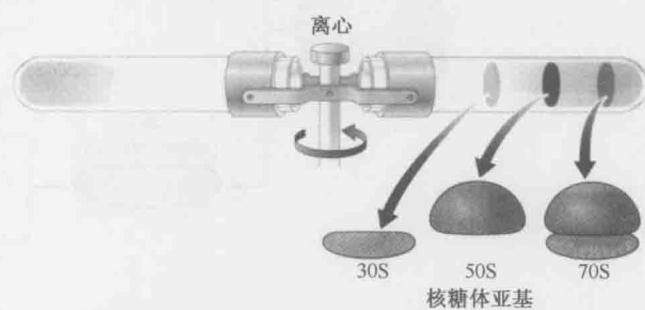  
图 15-12 通过超速离心沉淀从完整的核糖体中分离核糖体亚基。

2/3 的质量来自 RNA，因为核糖体蛋白质量比较小（细菌小亚基的核糖体蛋白质的平均分子质量约为 15kDa）。相反，16S 和 23S rRNA 质量比较大。我们试想，平均来说，一个核苷酸的分子质量是 330Da。因此，由 2900 个核苷酸组成的 23S rRNA 的分子质量即接近 1000kDa。

#### [W] 大、小亚基在每一循环周期的翻译过程中都经历结合与分离

蛋白质每合成一次，翻译机器就经历一系列特定的事件：核糖体的大、小亚基相互之间结合后与 mRNA 相结合，以翻译目标 mRNA，完成蛋白质合成后则相互分离。这种结合和分离相间的顺序称为核糖体循环（ribosome cycle，图 15-14）。简而言之，当 mRNA 和起始 tRNA 结合于游离的小亚基上，翻译过程就开始了。随后这个“小亚基-mRNA-起始 tRNA”复合体吸引大亚基结合，从而形成完整的、大小亚基间夹着 mRNA 的核糖体。下一步是蛋白质合成启动，始于 mRNA 5'端的起始密码子并向 mRNA 3'端移动。随着核糖体从一个密码子易位到另一个密码子，一个接一个的负载 tRNA 进入核糖体的解码和肽基转移酶中心。当移动的核糖体碰到终止密码子时，合成完成的多肽链就被释放出来，核糖体大、小亚基分离，各自离开 mRNA。这些分离的亚基就可以结合到新的 mRNA 分子上，重复蛋白质合成的循环。

虽然一个核糖体一次只能合成一条多肽，但每个 mRNA 分子却能同时被多个核糖体同时翻译（简便起见，我们假设 mRNA 是单顺反子的）。结合多个核糖体的 mRNA 称为多聚核糖体（polyribosome 或 polysome，图 15-15）。一个核糖体大约与 mRNA 上的 30 个核苷酸相接触，但核糖体的巨大体积只能允许 mRNA 上每 80 个核苷酸结合一个核糖体。即便这样，一个 1000bp 的小 ORF（编码约 35kDa 的蛋白质）可以结合多于 10 个核糖体，从而指导多个多肽链的同时合成。

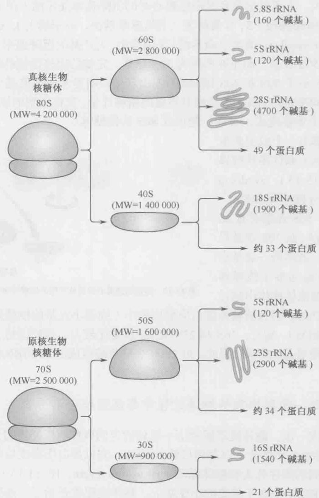  
图 15-13 原核细胞和真核细胞的核糖体组成。图中标明了不同亚基中的 rRNA 和蛋白质组分，还标明了各亚基中的 rRNA 长度和蛋白质数目。

多个核糖体作用于单一mRNA分子的能力解释了细胞中mRNA为什么相对较少(一般仅占总RNA的1%\~5%)。如果一个mRNA一次只能被一个核糖体翻译，那么一个典型细胞中只有约10%的核糖体能参加蛋白质的合成。但是多个核糖体和单个mRNA分子的结合方式确保在任何时候大多数的核糖体都能参与翻译。

#### [W] 新的氨基酸连接在延伸肽链的碳末端

由于多核苷酸链和多肽链都有内在的极性，因此我们关注于这些链的哪一端首先合成。从第9章和第13章中我们知道，DNA和RNA的合成都是将新的核糖三磷酸加到延伸多核苷酸链的3'端（通常以5'→3'方向合成）。

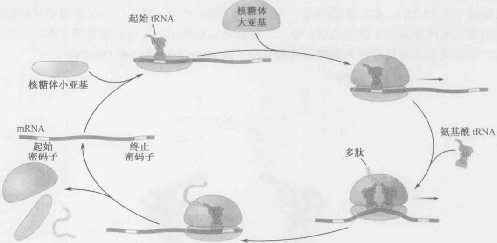

图 15-14 翻译的总体过程：核糖体循环。  
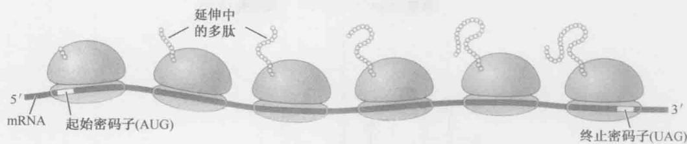  
图 15-15 多聚核糖体。

那么多肽链的合成方向如何呢？这首次由 Howard Dintzis 所做的一个经典的实验所确定，该实验已在第 2 章有所描述。这一实验发现,每一个新的氨基酸必须加在延伸多肽链的羧基端（通常称为氨基端→羧基端方向合成）。如下一小节将要描述的，这样的合成方向是由蛋白质合成的化学特性直接决定的。

#### [W] 肽键是通过将正在延伸的多肽链从一个 tRNA 转移到另一个 tRNA 而形成的

核糖体能够催化单一的化学反应——肽键的形成。这一反应发生在延伸多肽链碳端的氨基酸残基和将要加入的氨基酸之间。多肽链和将要加入的氨基酸都结合在 tRNA 上，从而在肽键的合成过程中，不断增长的多肽链持续地结合在 tRNA 分子上。

每轮氨基酸加入的底物实际是两种负载的 tRNA：氨酰-tRNA 和肽酰-tRNA（peptidyl-tRNA）。如本章前面所讨论的（见氨基酸与 tRNA 结合的章节），氨酰-tRNA 结合在氨基酸 3'端的羧基上。肽酰-tRNA 也以同样的方式（3'端）结合在多肽链的碳末端上。氨酰-tRNA与氨基酸之间的键在下一个肽键的形成过程中是不断裂的。相反，当延伸多肽链在与负载氨酰-tRNA上的氨基酸结合而形成一个新的肽键时，肽酰-tRNA与多肽链之间的键发生断裂。

为了催化肽键的形成，这两个氨基酸的3'端被核糖体安排到相邻的位置。这一位置效应可以使氨酰-tRNA的氨基基团攻击肽酰-tRNA上多肽碳端的羧基基团，形成一个新的肽键（图15-16）。多肽合成的这一方式产生了两个后果。第一，这个肽键形成的原理要求蛋白质的氮端先于碳端合成；第二，多肽链从肽酰-tRNA转移到氨酰-tRNA上。因此，新肽键形成的反应称为肽酰转移酶反应（peptidyl transferase reaction）。

  
图 15-16 肽酰转移酶反应。

有趣的是，肽键的形成并没有伴随三磷酸核苷的水解。这是因为肽键的形成是由连接多肽链和 tRNA 的高能酰键的断裂来驱动的。请回忆一下，这一高能酰键是在 tRNA 负载氨基酸时由 tRNA 合成酶催化产生的。tRNA 负载氨基酸的反应伴有一个 ATP 分子的水解。因此肽键形成所需的能量来自于 tRNA 负载氨基酸时所水解的那一个 ATP 分子（图 15-6）。

#### [W] 核糖体 RNA 是核糖体中的结构和催化功能决定因子

虽然核糖体和它的基本功能早在 40 年以前就发现了，但近年来对原核细胞核糖体的高精度三维结构的确定大大加快了我们对这一分子机器工作机制的认识（图 15-17）。也许其中最重要的结果就是发现核糖体 RNA 并不单单是核糖体的结构成分，相反，它们还直接负责核糖体的关键功能。最明显的证据就是肽基转移酶中心几乎完全是由 RNA 组成的，这将在下面详细讨论。RNA 也在核糖体小亚基功能中扮演中心的角色。负载 tRNA 的反密码子环和 mRNA 的密码子都是与 16S rRNA 相作用，而不是与小亚基的核糖体蛋白相作用。

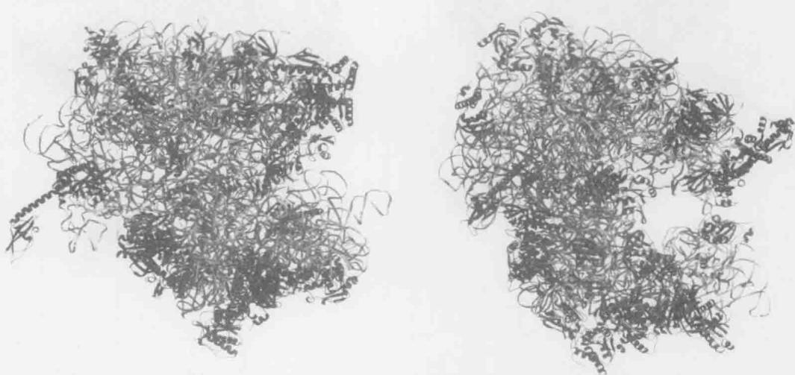  
图 15-17 核糖体的两个视图。这两个图中，50S 亚基都位于 30S 亚基之上。右图中 50S 和 30S 亚基之间的空洞展现了 tRNA 结合的位点（图 15-19b）。50S 亚基的 RNA 部分以灰色表示而蛋白质以紫红色表示。30S 亚基的 RNA 部分以淡蓝色表示而蛋白质部分以深蓝色表示。（Yusupov M.M. et al. 2001. Science 292: 883–896.）图像使用 MolScript、BobScript 和 Raster 3D 软件制作。

进一步说明 RNA 在核糖体的结构和功能方面的重要性的证据是，大多数的核糖体蛋白位于核糖体的周边，而非其内部（图 15-17）。核糖体的核心功能结构域（肽基转移酶中心及解码中心）完全或者绝大部分由 RNA 组成。某些核糖体蛋白质的一部分确实也伸入到亚基的核心，但它们的作用似乎是通过屏蔽其磷酸戊糖骨架的负电荷来稳定紧密缠绕的 rRNA。实际上，现代的核糖体很可能是从完全由 RNA 组成的原始蛋白质合成机器演化而来的，而核糖体蛋白的加入是为了提升这种原始 RNA 机器的功能。

#### [W] 核糖体有三个 tRNA 结合位点

为了进行肽基转移酶反应，核糖体必须能够同时结合至少两个 tRNA。实际上，核糖体含有三个 tRNA 结合位点，分别为 A、P 和 E 位点（图 15-18 和图 15-19）。A 位点（A site）是氨酰-tRNA 的结合位点，P 位点（P site）是肽酰-tRNA 的结合位点，E 位点（E site）是延伸的多肽链转移到氨酰-tRNA 后被释放的 tRNA 的结合位点（E 指 exit，退出）。

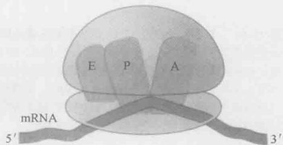  
图 15-18 核糖体有三个 tRNA 结合位点。核糖体示意图显示横跨两个亚基的三个 tRNA 结合位点（E、P 和 A）。

每一个 tRNA 结合位点都在核糖体的大、小亚基的交界面形成（图 15-19a 和 b）。因此，结合核糖体的 tRNA 能够横跨大亚基的肽基转移酶中心（图 15-19c）和小亚基的解码中心（图 15-19d）。耦联氨基酸或肽链的 tRNA 的 3' 端紧邻在大亚基的一方，结合核糖体的 tRNA 的反密码子环则紧接着小亚基的一方。

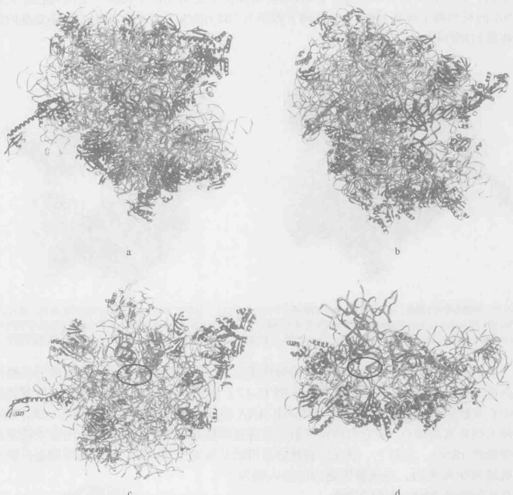  
图 15-19 包含三个结合 tRNA 的核糖体三维结构示意图。E、P 和 A 位点的 tRNA 分别以黄色、红色和绿色表示。大、小亚基的 RNA 和蛋白质组分的颜色与图 15-17 相同。(a, b) 核糖体与 tRNA 结合于 E、P 和 A 位点的两种视角情况，请注意 a 和 b 图的核糖体与图 15-17 的核糖体的视角相对应。(c) 分离的 50S 亚基结合于 tRNA，图片显示在其整个核糖体中的状况（本图的角度是从小亚基向大亚基看），圆圈标记区域为肽酰转移酶中心。(d) 分离的 30S 亚基结合于 tRNA，图片显示其在整个核糖体中的状况，圆圈标记区域为解码中心。（Yusupov M.M. et al. 2001. Science 292: 883–896.）图像使用 MolScript、BobScript 和 Raster 3D 软件制作。

#### [W] 核糖体的通道可以使 mRNA 和延伸多肽链进出核糖体

解码中心和肽基转移酶中心都埋于完整的核糖体内。但是，翻译过程中，mRNA 必须穿过解码中心，新合成的多肽链也必须从肽基转移酶中心离开。这些聚合体（如mRNA）是如何进入和离开核糖体的呢？这个问题的答案就在核糖体的结构中，它揭示了进出核糖体的“通道”。

mRNA 通过小亚基的两个狭窄的通道进出解码中心。进入通道的宽度只足够让未配对的 RNA 通过。这个特征保证了 mRNA 以一种单链的形状进入解码中心，这是通过解除 mRNA 分子内可能已经形成的碱基配对相互作用而达到的。在进出通道之间有一个 tRNA 可进入的区域，彼此相邻的密码子能够在此分别与 A 位点的氨酰-tRNA 和 P 位点的肽酰-tRNA 结合。有趣的是，mRNA 的两个密码子之间存在明显的扭结（kink），这有利于维持正确的可读框（图 15-20）。这个扭结使 A 位点的密码子处于一个独特的位置，从而阻止随后进入的氨酰-tRNA 与其相邻的密码子相接触。

大亚基上的另一个通道提供了新合成的多肽链离开核糖体的途径（图 15-21）。与 mRNA 的通道一样，这个通道的大小限制了多肽链的折叠。在这种情况下，新合成的多肽链只能在通道内形成 $\alpha$ 螺旋，而其他的二级结构（如 $\beta$ 折叠）和三级结构作用只能在多肽链离开大亚基后形成。由于这一原因，新合成的多肽链最终的三维结构只能在其从核糖体释放后形成。

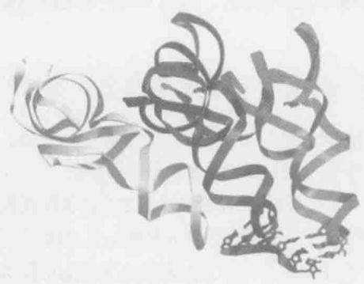

  
图 15-20 核糖体内 mRNA 与 A、P 位点的 tRNA 的相互作用。两图表示 mRNA 和 tRNA 在核糖体内的结构。为清晰起见，核糖体未表示。E、P 和 A 位点的 tRNA 分别以黄色、红色和绿色表示，mRNA 以蓝色表示。只有参与密码子-反密码子相互作用的碱基被表示出。mRNA 上明显的扭结清晰地把 A 位点和 P 位点的密码子区别开。在下图可看出 A 位点和 P 位点的 tRNA 的 3' 端之间非常接近。(Yusupov M.M. et al. 2001. Science 292:883–896.) 图像使用 MolScript、BobScript 和 Raster 3D 软件制作。

  
出口通道

图 15-21 多肽出口通道。此图中，50S 亚基切成一半以显示多肽出口通道。rRNA 以白色显示，而核糖体蛋白质以黄色显示。三个结合的 tRNA 显示为：E 位点（褐色）、P 位点（紫红色）、A 位点（绿色）。紧接 A 位点 tRNA 的红色和金色的 rRNA 部分是肽酰转移酶中心的组成部分。（由 T. Martin Schmeing 和 Thomas Steitz 提供；获得许可，并修改自 Schmeing T.M. et al. 2002. Nat. Struct. Biol. 9: 225–230. Macmillan.）

现在我们已经描述了翻译过程的4种主要组分，本章剩余的部分将集中描述翻译的每一个步骤。我们的描述将以翻译的3个步骤依次进行：多肽链合成的起始、多肽链的延伸和多肽链合成的终止。下面将要看到，原核生物和真核生物的蛋白质合成在策略上重要的相同点和不同点。我们将在下面的各个小节中讨论这两种细胞的翻译机制的本质。正如DNA和RNA合成一样，虽然核糖体是蛋白质合成的中心，但各种辅助因子在翻译的各个阶段也起着重要的作用，而且它们也是使蛋白质合成以迅速和正确的方式进行所必需的。


<!-- W-END Watson 15 核糖体 -->

## 4.4 蛋白质合成的生物学机制

蛋白质(protein)一词从希腊文“proteios”衍生而来,是指按重要性排列居于第一位的东西。尽管现已证明核酸是生命体内最基本的物质,因为蛋白质的合成和结构最终都取决于核酸,但蛋白质仍是生物活性物质中最重要的大分子组分,生物有机体的遗传学特性仍然要通过蛋白质来得到表达。

蛋白质的生物合成包括氨基酸活化,肽链的起始、伸长、终止以及新合成多肽链的折叠和加工,现将各阶段的必需成分列于表 4-9。

表 4-9 蛋白质合成各阶段的主要成分简表

<table><tr><td>阶段</td><td></td><td>必需成分</td></tr><tr><td rowspan="4">1. 氨基酸的活化</td><td>20 种氨基酸</td><td></td></tr><tr><td>20 种氨酰 tRNA 合成酶</td><td></td></tr><tr><td>20 种或更多的 tRNA</td><td></td></tr><tr><td> $ATP, Mg^{2+}$ </td><td></td></tr><tr><td rowspan="7">2. 肽链的起始</td><td>mRNA</td><td></td></tr><tr><td>N-甲酰甲硫氨酰 tRNA</td><td></td></tr><tr><td>mRNA 上的起始密码子(AUG)</td><td></td></tr><tr><td>核糖体小亚基</td><td></td></tr><tr><td>核糖体大亚基</td><td></td></tr><tr><td> $GTP, Mg^{2+}$ </td><td></td></tr><tr><td>起始因子(IF-1、IF-2、IF-3)</td><td></td></tr><tr><td>阶段</td><td>必需成分</td></tr><tr><td rowspan="5">3.肽链的延伸</td><td>功能核糖体(起始复合物)</td></tr><tr><td colspan="2">AA-tRNA</td></tr><tr><td colspan="2">伸长因子</td></tr><tr><td colspan="2"> $GTP, Mg^{2+}$ </td></tr><tr><td colspan="2">肽基转移酶</td></tr><tr><td rowspan="3">4.肽链的终止</td><td>GTP</td></tr><tr><td colspan="2">mRNA上的终止密码子</td></tr><tr><td colspan="2">释放因子(RF-1、RF-2、RF-3)</td></tr><tr><td>5.折叠和加工</td><td>参与起始氨基酸的切除、修饰等加工过程的酶</td></tr></table>

## 4.4.1 氨基酸的活化

蛋白质的生物合成是以氨基酸作为基本建筑材料的,且只有与 tRNA 相结合的氨基酸才能被准确地运送到核糖体中,参与多肽链的起始或延伸。表 4-10 是蛋白质中全部 20 种氨基酸的主要特征分析,而图 4-13 是这些氨基酸的结构式。氨基酸必须在氨酰 tRNA 合成酶的作用下生成活化氨基酸——AA-tRNA。研究发现,至少存在 20 种以上具有氨基酸专一性的氨酰 tRNA 合成酶,能够识别并通过氨基酸的羧基与 tRNA 3' 端腺苷酸核糖基上 3'—OH 缩水形成二酯键。同一氨酰 tRNA 合成酶具有把相同氨基酸加到两个或更多个带有不同反密码子 tRNA 分子上的功能。

表 4-10 参与蛋白质合成的 20 种氨基酸主要特征分析

<table><tr><td>氨基酸</td><td colspan="2">简称</td><td>相对分子质量</td><td>pI</td><td>疏水性指数*</td><td>出现频率</td></tr><tr><td colspan="7">非极性</td></tr><tr><td colspan="7">带脂肪族R基团</td></tr><tr><td>甘氨酸</td><td>Gly</td><td>G</td><td>75</td><td>5.97</td><td>-0.4</td><td>7.2</td></tr><tr><td>丙氨酸</td><td>Ala</td><td>A</td><td>89</td><td>6.01</td><td>1.8</td><td>7.8</td></tr><tr><td>缬氨酸</td><td>Val</td><td>V</td><td>117</td><td>5.97</td><td>4.2</td><td>6.6</td></tr><tr><td>亮氨酸</td><td>Leu</td><td>L</td><td>131</td><td>5.98</td><td>3.8</td><td>9.1</td></tr><tr><td>异亮氨酸</td><td>Ile</td><td>I</td><td>131</td><td>6.02</td><td>4.5</td><td>5.3</td></tr><tr><td>甲硫氨酸</td><td>Met</td><td>M</td><td>149</td><td>5.74</td><td>1.9</td><td>2.3</td></tr><tr><td colspan="7">带芳香族R基团</td></tr><tr><td>苯丙氨酸</td><td>Phe</td><td>F</td><td>165</td><td>5.48</td><td>2.8</td><td>3.9</td></tr><tr><td>酪氨酸</td><td>Tyr</td><td>Y</td><td>181</td><td>5.66</td><td>-1.3</td><td>3.2</td></tr><tr><td>色氨酸</td><td>Trp</td><td>W</td><td>204</td><td>5.89</td><td>-0.9</td><td>1.4</td></tr><tr><td colspan="7">极性</td></tr><tr><td colspan="7">R 基团呈中性</td></tr><tr><td>丝氨酸</td><td>Ser</td><td>S</td><td>105</td><td>5.68</td><td>-0.8</td><td>6.8</td></tr><tr><td>脯氨酸</td><td>Pro</td><td>P</td><td>115</td><td>6.48</td><td>1.6</td><td>5.2</td></tr><tr><td>苏氨酸</td><td>Thr</td><td>T</td><td>119</td><td>5.87</td><td>-0.7</td><td>5.9</td></tr><tr><td>半胱氨酸</td><td>Cys</td><td>C</td><td>121</td><td>5.07</td><td>2.5</td><td>1.9</td></tr><tr><td>天冬酰胺</td><td>Asn</td><td>N</td><td>132</td><td>5.41</td><td>-3.5</td><td>4.3</td></tr><tr><td>谷氨酰胺</td><td>Gln</td><td>Q</td><td>146</td><td>5.65</td><td>-3.5</td><td>4.2</td></tr><tr><td colspan="7">R 基团带正电荷</td></tr><tr><td>赖氨酸</td><td>Lys</td><td>K</td><td>146</td><td>9.74</td><td>-3.9</td><td>5.9</td></tr><tr><td>组氨酸</td><td>His</td><td>H</td><td>155</td><td>7.59</td><td>-3.2</td><td>2.3</td></tr><tr><td>精氨酸</td><td>Arg</td><td>R</td><td>174</td><td>10.76</td><td>-4.5</td><td>5.1</td></tr><tr><td colspan="7">R 基团带负电荷</td></tr><tr><td>天冬氨酸</td><td>Asp</td><td>D</td><td>133</td><td>2.77</td><td>-3.5</td><td>5.3</td></tr><tr><td>谷氨酸</td><td>Glu</td><td>E</td><td>147</td><td>3.22</td><td>-3.5</td><td>6.3</td></tr></table>

\* 负值表示亲水性,正值表示疏水性。

tRNA 与相应氨基酸的结合是蛋白质合成中的关键步骤, 因为只要 tRNA 携带了正确的氨基酸, 多肽合成的准确性就相对有了保障。

在细菌中,起始氨基酸是甲酰甲硫氨酸,所以,与核糖体小亚基相结合的是N-甲酰甲硫氨酰 $tRNA^{Met}$ ,它由以下两步反应合成:

$$
\mathrm{Met} + \mathrm{tRNA} ^ {\mathrm{fMet}} + \mathrm{ATP} \longrightarrow \mathrm{Met} - \mathrm{tRNA} ^ {\mathrm{fMet}} + \mathrm{AMP} + \mathrm{PPi}
$$

然后,由甲酰基转移酶转移一个甲酰基到 Met 的氨基上。

$$
N ^ {1 0} - \text {   甲酰四氢叶酸   } + \mathrm{Met-tRNA} ^ {\mathrm{fMet}} \longrightarrow \text {   四氢叶酸   } + \mathrm{fMet-tRNA} ^ {\mathrm{fMet}}
$$

真核生物中,任何一个多肽合成都是从生成甲硫氨酰- $tRNAi^{Met}$ 开始的,因为甲硫氨酸的特殊性,所以体内存在两种 $tRNA^{Met}$ 。只有甲硫氨酰- $tRNAi^{Met}$ 才能与40S小亚基相结合,起始肽链合成,普通 $tRNA^{Met}$ 中携带的甲硫氨酸只能被掺入正在延伸的肽链中。

## 4.4.2 翻译的起始

蛋白质合成的起始需要核糖体大、小亚基，起始 tRNA 和几十个蛋白因子的参与，在模板 mRNA 编码区 5' 端形成核糖体 -mRNA- 起始 tRNA 复合物并将甲酰甲硫氨酸放入核糖体 P 位点。

原核生物的起始 tRNA 是 fMet-tRNA $^{fMet}$ ，真核生物是 Met-tRNA $^{Met}$ 。原核生物中 30S 小亚基首先与 mRNA 模板相结合，再与 fMet-tRNA $^{fMet}$ 结合，最后与 50S 大亚基结合。而在真核生物中，40S 小亚基首先与 Met-tRNA $^{Met}$ 相结合，再与模板 mRNA 结合，最后与 60S大亚基结合生成 $80S \cdot mRNA \cdot Met-tRNA^{Met}$ 起始复合物。起始复合物的生成除了需要 GTP 提供能量外，还需要 $Mg^{2+}$ 、 $NH_{4}^{+}$ 及 3 个起始因子（IF-1、IF-2、IF-3）。起始因子与 30S 小亚基的结合较为松散，用 $1\ mol/L\ NH_{4}Cl$ 处理即可使之游离。

图4-13 20种氨基酸的结构  
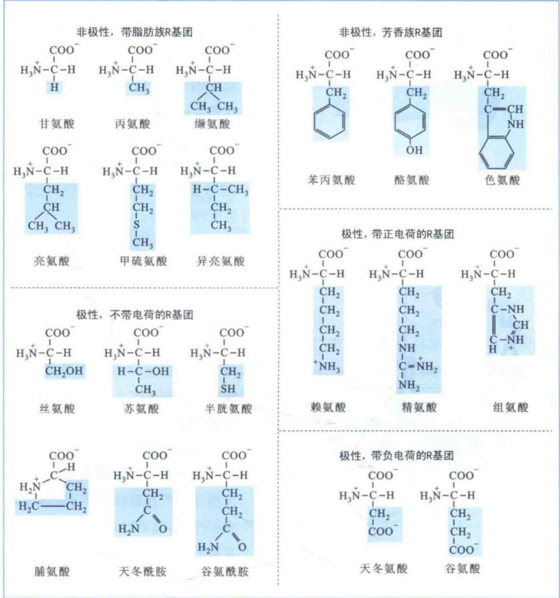

## 1. 原核生物翻译的起始

细菌中翻译的起始需要如下7种成分：

① 30S 小亚基；

② 模板 mRNA;

③ fMet-tRNA $^{fMet}$ ;

④ 3个翻译起始因子,IF-1、IF-2和IF-3;

⑤ GTP;

⑥ 50S 大亚基；

图4-14 翻译起始复合物的形成  
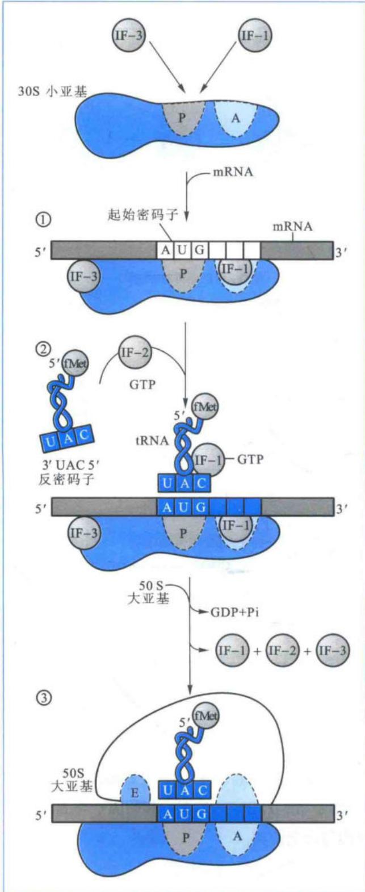

⑦ $Mg^{2+}$

翻译起始又可被分成3步(图4-14)。

第一步,30S 小亚基首先与翻译起始因子 IF-1、IF-3 结合,通过 SD 序列与 mRNA 模板相结合。

第二步, 在 IF-2 和 GTP 的帮助下, fMet-tRNA $^{fMet}$ 进入小亚基的 P 位, tRNA 上的反密码子与 mRNA 上的起始密码子配对。

第三步,带有 tRNA、mRNA、3 个翻译起始因子的小亚基复合物与 50S 大亚基结合,GTP 水解,释放翻译起始因子。

30S 亚基具有专一性的识别和选择 mRNA 起始位点的性质, 而 IF-3 能协助该亚基完成这种选择。研究发现, 30S 亚基通过其 16S rRNA 的 3' 端与 mRNA 5' 端起始密码子上游碱基配对结合。Shine 及 Dalgarno 等证明几乎所有原核生物 mRNA 上都有一个 5'-AGGAGGU-3' 序列, 这个富嘌呤区被命名为 SD 序列 (Shine-Dalgarno sequence), 它与 30S 亚基上 16S rRNA 3' 端的富嘧啶区序列 5'-GAUCACCUCCUUA-3' 相互补(图4-15)。

各种 mRNA 的核糖体结合位点中能与 16S rRNA 配对的核苷酸数目及这些核苷酸到起始密码子之间的距离是不一样的,反映了起始信号的不均一性。一般说来,相互补的核苷

酸越多,30S 亚基与 mRNA 起始位点结合的效率也越高。互补的核苷酸与 AUG 之间的距离也会影响 mRNA-核糖体复合物的形成及其稳定性。

只有 fMet-tRNA $^{fMet}$ 能与第一个 P 位点相结合, 其他所有 tRNA 都必须通过 A 位点到达 P 位点, 再由 E 位点离开核糖体。

已知 IF-2 对于 30S 起始复合物与 50S 亚基的连接是必需的, 而 IF-1 则在 70S 起始复合物生成后促进 IF-2 的释放, 从而完成蛋白质合成的起始过程。

  
图 4-15 细菌 mRNA 分子上往往存在一个与 16S rRNA 3' 端相互补的 SD 序列

## 2. 真核生物翻译的起始

真核生物蛋白质生物合成的起始机制与原核生物基本相同,其差异主要是核糖体较大,有较多的起始因子参与,其mRNA具有 $m^{7}GpppNp$ 帽子结构, $Met-tRNA^{Met}$ 不甲酰化,mRNA分子5'端的“帽子”和3'端的多(A)都参与形成翻译起始复合物。

有实验说明帽子结构能促进起始反应,因为核糖体上有专一位点或因子识别 mRNA 的帽子,使 mRNA 与核糖体结合(图 4-16)。帽子在 mRNA 与 40S 亚基结合过程中还起稳定作用。实验表明,带帽子的 mRNA 5' 端与 18S rRNA 的 3' 端序列之间存在不同于 SD 序列的碱基配对型相互作用。

40S 起始复合物形成过程中有一种蛋白因子——帽子结合蛋白 (eIF-4E), 能专一地识别 mRNA 的帽子结构, 与 mRNA 的 5' 端结合生成蛋白质 -mRNA 复合物, 并利用该复合物对 eIF-3 的亲和力与含有 eIF-3 的 40S 亚基结合。

除了帽子结构以外,40S小亚基还能识别mRNA上的起始密码子AUG。Kozak等提出了一个“扫描模型”来解释40S亚基对mRNA起始密码子的识别作用(图4-17)。按照这

个模型,40S 小亚基先识别在 mRNA 的 5' 端的甲基化帽子,然后沿 mRNA 移动,当 40S 小亚基遇到 AUG 时,由于 Met-tRNAi $^{Met}$ 反密码子与 AUG 配对,导致移动暂停。存在于 -4 位和 +1 位的碱基对于 AUG 是否被识别为起始密码子具有重要的影响。在 AUG 之前的第三个嘌呤(G 或 A)以及紧跟其后的 G,可以显著影响翻译效率。最后一步,60S 亚基与 40S 复合物结合生成 80S 起始复合物。在第一个 40S亚基离开起始点之前,会有更多的小亚基识别5'端,形成40S亚基的队列。

  
图 4-16 真核生物翻译起始复合物的形成

图 4-17 真核生物核糖体从 mRNA 的 5' 端向下游含有起始密码子 AUG 的核糖体结合位点滑动  


起始过程中 mRNA 与 40S 小亚基结合时还需要 ATP, 这可能是因为蛋白质合成中消除 mRNA 二级结构是一个耗能过程, 需由 ATP 水解提供能量。另外根据 “扫描模型”, 在 40S 亚基沿 mRNA 移动过程中也需要能量。

## 4.4.3 肽链的延伸

与翻译的起始不同,蛋白质延伸机制在原核细胞和真核细胞之间是非常相似的。起始复合物生成,第一个氨基酸(fMet/Met-tRNA)与核糖体结合以后,肽链开始伸长。按照mRNA模板密码子的排列,氨基酸通过新生肽键的方式(图4-18)被有序地结合上去。肽链延伸由许多循环组成,每加一个氨基酸就是一个循环,每个循环包括AA-tRNA与核糖体结合、肽键的生成和移位。

## 1. 后续 AA-tRNA 与核糖体结合

起始复合物形成以后,第二个 AA-tRNA 在延伸因子 EF-Tu 及 GTP 的作用下,生成

图 4-18 多肽链上肽键的形成——缩合反应  
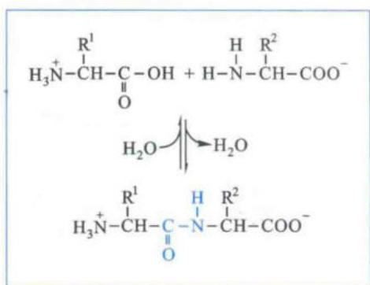

AA-tRNA·EF-Tu·GTP复合物,然后结合到核糖体的A位上。这时GTP被水解释放,通过延伸因子EF-Ts再生GTP,形成EF-Tu·GTP复合物,进入新一轮循环(图4-19)。

模板上的密码子决定了哪种 AA-tRNA 能被结合到 A 位上。由于 EF-Tu 只能与 fMet-tRNA 以外的其他 AA-tRNA 起反应，所以起始 tRNA 不会被结合到 A 位上，这就是 mRNA 内部的 AUG 不会被起始 tRNA 读出,肽链中间不会出现甲酰甲硫氨酸的原因。

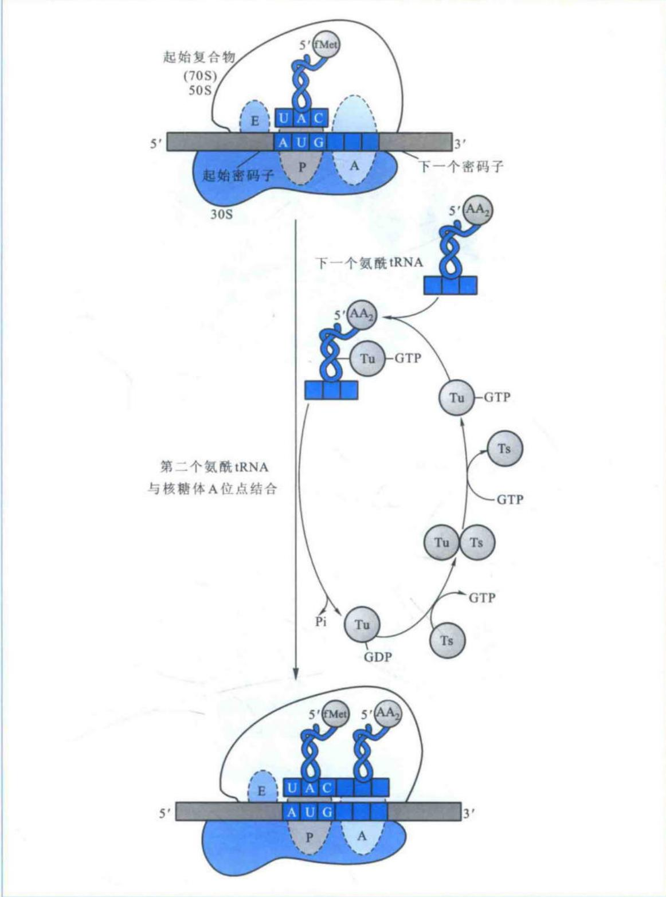  
图 4-19 细菌中肽链延伸的第一步反应: 第二个氨酰 tRNA 的结合

该氨酰 tRNA 首先与 EF-Tu·GTP 形成复合物, 进入核糖体的 A 位, 水解产生 GDP 并在 EF-Ts 的作用下释放 GDP 并使 EF-Tu 结合另一分子 GTP, 进入新一轮循环。

## 2. 肽键的生成

经过上一步反应后，在核糖体·mRNA·AA-tRNA复合物中，AA-tRNA占据A位，fMet-tRNA $^{fMet}$ 占据P位。在肽基转移酶(peptidyl transferase)的催化下，A位上的AA-tRNA转移到P位，与fMet-tRNA $^{fMet}$ 上的氨基酸生成肽键(图4-20)。起始tRNA在完成使命后离开核糖体 P 位点，A 位点准备接受新的 AA-tRNA，开始下一轮合成反应。

图 4-20 细菌中肽链延伸的第二步反应: 肽链的生成  
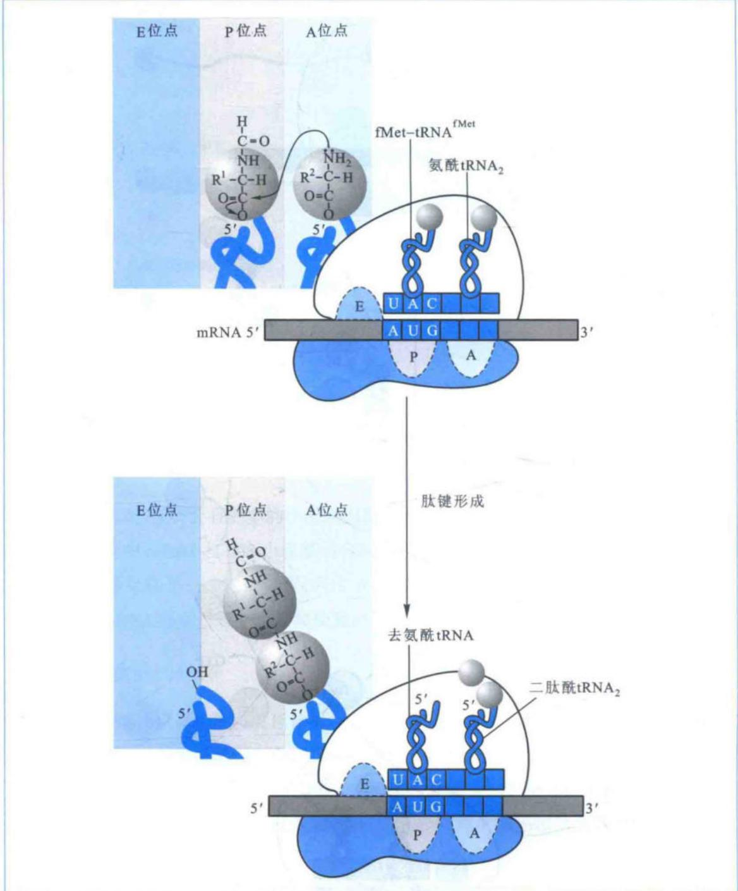

## 3. 移位

肽键延伸过程中最后一步反应是移位,即核糖体向 mRNA 3' 端方向移动一个密码子(图 4-21)。此时,仍与第二个密码子相结合的二肽酰 tRNA₂ 从 A 位进入 P 位,去氨酰 tRNA 被挤入 E 位,mRNA 上的第三位密码子则对应于 A 位。EF-G 是移位所必需的蛋白质因子,移位的能量来自另一分子 GTP 水解。

用嘌呤霉素作为抑制剂做实验表明,核糖体沿 mRNA 移动与肽酰 tRNA 的移位这两个过程是耦联的。

  
图 4-21 细菌中肽链延伸的第三步反应: 移位  
核糖体通过 EF-G 介导的 GTP 水解所提供的能量向 mRNA 模板 3' 端移动一个密码子，使二肽酰 tRNA₂ 完全进入 P 位，准备开始新一轮肽链延伸。

肽链延伸是由许多个这样的反应组成的,原核生物中每次反应共需3个延伸因子,EF-Tu、EF-Ts及EF-G,它们都具有GTP酶的活性,EF-Tu和EF-Ts能够促进AA-tRNA进入A位,EF-G则促进移位和卸载tRNA的释放。真核生物细胞需EF-1(对应于EF-Tu和EF-Ts)及EF-2(相当于EF-G),消耗2个GTP,向生长中的肽链加上一个氨基酸。

## 4.4.4 肽链的终止

肽链的延伸过程中,当终止密码子 UAA、UAG 或 UGA 出现在核糖体的 A 位时,没有相应的 AA-tRNA 能与之结合,而释放因子 (release factor, RF) 能识别这些密码子并与之结合,水解 P 位上多肽链与 tRNA 之间的二酯键。接着,新生的肽链和 tRNA 从核糖体上释放,核糖体大、小亚基解体,蛋白质合成结束。释放因子 RF 具有 GTP 酶活性,它催化 GTP 水解,使肽链与核糖体解离。

释放因子有两类。Ⅰ类释放因子识别终止密码子，并能催化新合成的多肽链从P位点的tRNA中水解释放出来；Ⅱ类释放因子在多肽链释放后刺激Ⅰ类释放因子从核糖体中解离出来。细菌细胞内存在3种不同的释放因子(RF1、RF2、RF3)，其中，RF1和RF2为Ⅰ类释放因子。RF1能识别UAG和UAA，RF2识别UGA和UAA。一旦RF与终止密码相结合，它们就能诱导肽基转移酶把一个水分子而不是氨基酸加到延伸中的肽链上。RF3为Ⅱ类释放因子，与核糖体的解体有关。真核细胞的Ⅰ类和Ⅱ类释放因子分别只有一种，eRF1和eRF3。Ⅰ类释放因子eRF1能够识别3个终止密码子。

综上所述,蛋白质翻译是一个循环进行的过程,每一个循环包括大、小亚基之间及其与mRNA的结合,翻译mRNA,然后各自分离。这种结合和分离称为核糖体循环(图4-22)。当mRNA和起始tRNA结合于游离的小亚基上,翻译过程就开始了,这个小亚基-mRNA复合物随后就能吸引大亚基结合,从而形成完整的、结合有mRNA的核糖体。蛋白质合成开始,从mRNA的5'端起始密码子向3'端移动。当核糖体从一个密码子移位到另一个密码子,一个接一个的活化tRNA就进入核糖体的解码和肽基转移酶中心。当核糖体遇到终止密码子时,已合成的多肽链就被释放出来,核糖体大、小亚基分离,各自离开mRNA。这些已分离的亚基就可以结合到新的mRNA分子上,开始下一轮蛋白质合成的循环。体外反应体系中,核糖体的解离或结合取决于离子浓度。在大肠杆菌内, $Mg^{2+}$ 浓度在 $10^{-3}$ mol/L 以下时,70S 解离为亚基,浓度达 $10^{-2}$ mol/L 时则形成稳定的 70S 颗粒。

图4-22 蛋白质翻译过程总览  


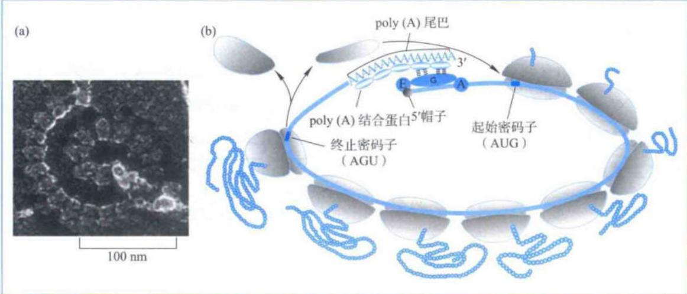  
图4-23 多核糖体翻译蛋白质  
(a) 真核细胞多核糖体的电镜照片(来自于 John Heuser); (b) 一系列核糖体同时翻译同一 mRNA 分子。多(A) 尾结合蛋白与 eIF-4G 亚基的相互作用促进 mRNA 的环化, 提高 mRNA 的翻译。

## 4.4.5 多核糖体与蛋白质合成

虽然一个核糖体一次只能合成一条多肽,但每个 mRNA 分子却能同时被多个核糖体结合同时进行翻译。结合多个核糖体的 mRNA 称为多核糖体 (polyribosome 或 polysome, 图 4-23)。由于核糖体的体积巨大,mRNA 链上一般每 80 个核苷酸结合一个核糖体。多(A)尾结合蛋白与 eIF-4G 亚基相互作用促进 mRNA 的环化,提高 mRNA 的翻译效率,一个 mRNA 分子能够利用大批核糖体同时指导多个多肽链的合成。与完成翻译后再开始新的蛋白质合成相比,这种多重起始意味着在短时间内一条 mRNA 能够被高效地翻译,合成数量更多的蛋白质分子。

真核生物和细菌都利用多核糖体,但因为细菌的 mRNA 无需加工,其转录和翻译在同一空间进行,在转录刚开始不久就开始合成蛋白质,所以细菌中的蛋白质合成效率更高。

## 4.4.6 蛋白质前体的加工

新生的多肽链大多数是没有功能的,必须经过加工修饰才能转变为有活性的蛋白质。

## 1. N 端 fMet 或 Met 的切除

细菌蛋白质氨基端的甲酰基能被脱甲酰化酶水解,不管是原核生物还是真核生物,N端的甲硫氨酸往往在多肽链合成完毕之前就被切除。有些动物病毒如脊髓灰质炎病毒的mRNA可翻译成很长的多肽链,含多种病毒蛋白,经蛋白酶在特定位置上水解后得到几个有功能的蛋白质分子(图4-24)。

## 2. 二硫键的形成

mRNA 中没有胱氨酸的密码子,而不少蛋白质都含有二硫键,这是蛋白质合成后通过两个半胱氨酸的氧化作用生成的。二硫键的正确形成对稳定蛋白的天然构象具有重要的作用。

图 4-24 新生蛋白质经蛋白酶切割后变成有功能的成熟蛋白质

左: 新生蛋白质在去掉 N 端一部分残基后变成有功能的蛋白质; 右: 某些病毒或细菌可合成无活性的多蛋白质, 经蛋白酶切割后成为有功能的成熟蛋白。


## 3. 特定氨基酸的修饰

氨基酸侧链的修饰作用包括磷酸化(如核糖体蛋白质)、糖基化(如各种糖蛋白)、甲基化(如组蛋白、肌肉蛋白质)、乙酰化(如组蛋白)、泛素化(多种蛋白质)等。图4-25是生物体内最普通发生修饰作用的氨基酸残基及其修饰产物,如在第二章中所介绍的,组蛋白N端35个残基中可能出现包括磷酸化、甲基化、乙酰化和泛素化在内的多种修饰。糖蛋白主要是通过蛋白质侧链上的天冬氨酸、天冬酰胺、丝氨酸、苏氨酸、谷氨酸等残基加上糖基形成的,内质网可能是蛋白质N-糖基化的主要场所。胶原蛋白上的脯氨酸和赖氨酸多数是羟基化的。

① 磷酸化(phosphorylation) 主要由多种蛋白激酶催化,发生在丝氨酸、苏氨酸和酪氨酸等3种氨基酸的侧链。

② 糖基化(glycosylation) 它是真核细胞蛋白质的特征之一。大多数糖基化是由内

图 4-25 生物体内最常见的被修饰的氨基酸及其修饰产物

(a) 磷酸化;(b) 羧基化;(c) 甲基化。


(c)  


(b)  


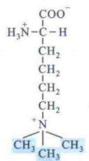


质网中的糖基化酶(glycosylase)催化进行的。所有的分泌蛋白和膜蛋白几乎都是糖基化蛋白质。

③ 甲基化(methylation) 蛋白质的甲基化是由甲基转移酶催化的。甲基化包括发生在 Arg、His 和 Gln 的侧基的 N-甲基化以及 Glu 和 Asp 侧基的 O-甲基化。

④ 乙酰化(acetylation) 发生在赖氨酸侧链上的 $\varepsilon-NH_{2}$ ，由乙酰基转移酶催化。

⑤ 泛素化和类泛素化修饰(ubiquitination & ubiquitin-like modifications) 发生在赖氨酸残基侧链上,由 E1、E2 和 E3 一系列酶催化(具体见 4.6 节)。

## 4. 切除新生肽链中的非功能片段

新合成的胰岛素前体是前胰岛素原,必须先切去信号肽变成胰岛素原,再切去B肽,才变成有活性的胰岛素(图4-26)。不少多肽类激素和酶的前体都要经过加工才能变为活性分子,如血纤维蛋白原、胰蛋白酶原经过加工切去部分肽段才能成为有活性的血纤维蛋白、胰蛋白酶。一般说来,由多个肽链及其他辅助成分构成的蛋白质,在多肽链合成后还需经过多肽链之间以及多肽链与辅基之间的聚合过程,才能成为有活性的蛋白质。

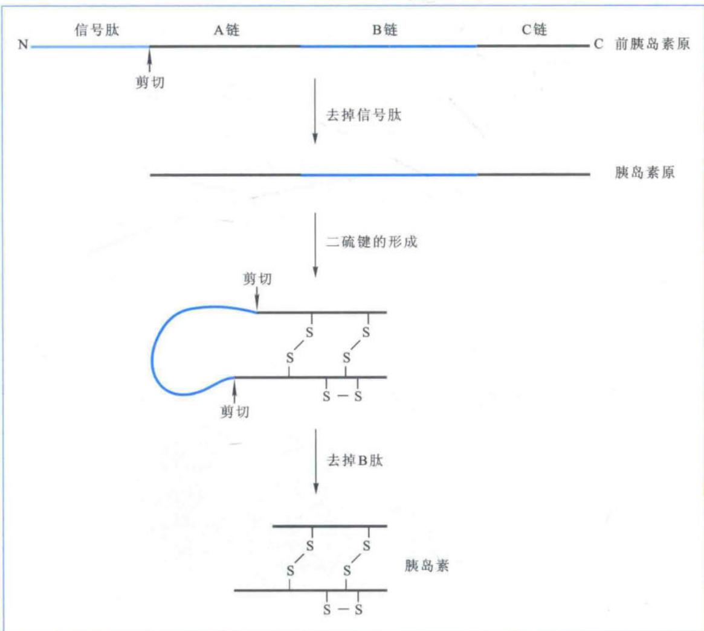  
图 4-26 前胰岛素原蛋白翻译后成熟过程示意图

## 4.4.7 蛋白质的折叠

由核糖体合成的所有新生肽链必须通过正确的折叠才能形成动力学和热力学稳定的三维构象,从而表现出生物学活性或功能。因此,可以说蛋白质折叠是翻译后形成功能蛋白质的必经阶段。如果蛋白质折叠错误,其生物学功能就会受到影响或丧失,严重者甚至会引起疾病。新合成的蛋白质分子如何形成具有功能的空间结构?蛋白质的结构与功能的关系等问题成为结构生物学研究的热点。

多肽链的折叠是一个复杂的过程,新生多肽一般首先折叠成二级结构,然后再进一步折叠盘绕成三级结构。对于单链多肽蛋白质,三级结构就已具有蛋白质的功能;对于寡聚蛋白质,一般需要进一步组装成更为复杂的四级结构,才能表现出天然蛋白的活性或功能。

有些蛋白质只有在另一些蛋白质存在的情况下才能正确完成折叠过程,形成功能蛋白质。分子伴侣(molecular chaperone)是目前研究比较多的能够在细胞内辅助新生肽链正确折叠的蛋白质。它是一类序列上没有相关性但有共同功能的保守性蛋白质,它们在细胞内能帮助其他多肽进行正确的折叠、组装、运转和降解。目前认为细胞内至少有两类分子伴侣家族,即热休克蛋白(heat shock protein)家族和伴侣素(chaperonin)。

① 热休克蛋白 它是一类应激反应性蛋白,包括 HSP70、HSP40 和 GrpE 3 个家族,广泛存在于原核及真核细胞中。三者协同作用,促使某些能自发折叠的蛋白质正确折叠形成天然空间构象。

② 伴侣素 伴侣素包括 HSP60 和 HSP10(原核细胞中的同源物分别为 GroEL 和 GroES)，它主要是为非自发性折叠蛋白提供能折叠形成天然结构的微环境(图 4-27)。

分子伴侣在新生肽链折叠中主要通过防止或消除肽链的错误折叠,增加功能性蛋白质折叠产率来发挥作用,而并非加快折叠反应速度。分子伴侣本身并不参与最终产物的形成。

图 4-27 伴侣素形成一个闭合的寡聚复合体，在其内部对蛋白质进行折叠

右图为 GroEL 与 GroES 帽子结合的三维结构。

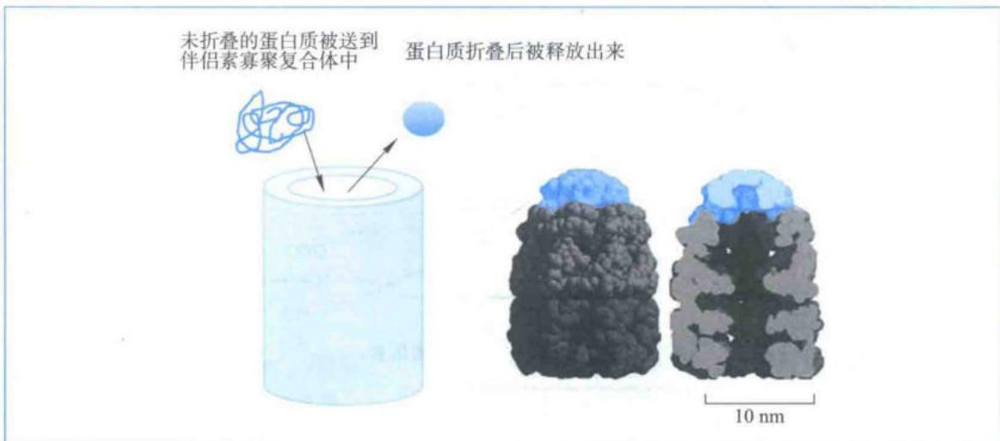

## 4.4.8 蛋白质合成的抑制剂

蛋白质生物合成的抑制剂主要是一些抗生素，如嘌呤霉素、链霉素、四环素、氯霉素、红霉素等，此外，如5-甲基色氨酸、环己亚胺、白喉毒素、干扰素、蓖麻蛋白和其他核糖体灭活蛋白等都能抑制蛋白质的合成。这些抑制剂不仅对于研究蛋白质的合成机制十分重要，也是在临床上治疗细菌感染的重要药物。

抗生素对蛋白质合成的作用可能是阻止 mRNA 与核糖体结合(氯霉素),或阻止 AA-tRNA 与核糖体结合(四环素类),或干扰 AA-tRNA 与核糖体结合而产生错误(链霉素、新霉素、卡那霉素等),或作为竞争性抑制剂抑制蛋白质合成。

链霉素是一种碱性三糖,可以多种方式抑制原核生物核糖体,能干扰fMet-tRNA与核糖体的结合,从而阻止蛋白质合成的正确起始,也会导致mRNA的错误。若以多(U)作模板,则除苯丙氨酸(UUU)外,异亮氨酸(AUU)也会被掺入。用抗链霉素细菌的50S亚基及对链霉素敏感细菌的30S亚基重组获得的核糖体对链霉素是敏感的,而用敏感菌的50S亚基及抗性菌的30S亚基组成的核糖体对链霉素有抗性,表明链霉素的作用位点在30S亚基上。

图 4-28 是几种常见蛋白质合成抑制剂的化学结构式。

嘌呤霉素是 AA-tRNA 的结构类似物, 不需要延伸因子就可以结合在核糖体的 A 位上, 抑制 AA-tRNA 的进入。它所带的氨基与 AA-tRNA 上的氨基一样, 能与生长中的肽链上的羧基反应生成肽键, 这个反应的产物是一条 3' 羧基端挂了一个嘌呤霉素残基的小肽, 肽酰嘌呤霉素随后从核糖体上解离出来, 所以嘌呤霉素是通过提前释放肽链来抑制蛋白质合成的 $^{(图4-29)}$ 。

此外，青霉素、卡那霉素、氯霉素、四环素和红霉素只与原核细胞核糖体发生作用，从

  
图4-28 几种常见蛋白质合成抑制剂的结构式

图4-29 嘌呤霉素抑制蛋白质合成的分子机制

(a) 嘌呤霉素的结构类似于氨酰 tRNA, 能与核糖体 A 位点相结合;

(b) 肽酰嘌呤霉素。

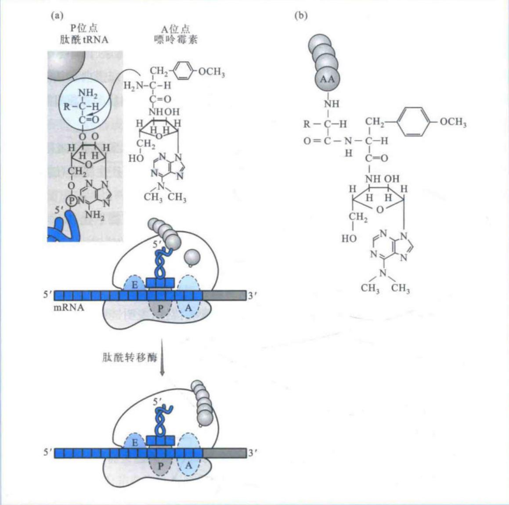

而阻遏原核生物蛋白质的合成,抑制细菌生长。白喉毒素和放线菌酮只作用于真核生物核糖体。潮霉素、嘌呤霉素和链霉素既能与原核细胞核糖体结合,又能与真核生物核糖体结合,妨碍细胞内蛋白质合成,影响细胞生长。因此,临床上需要根据其作用原理优先选择相应的抗生素。

表 4-11 总结了上述各种抗生素影响翻译的主要特点。

表 4-11 不同抗生素的靶标以及所产生的后果

<table><tr><td>抗生素/毒素</td><td>目标细胞</td><td>分子目标</td><td>后果</td></tr><tr><td>氯霉素</td><td>原核细胞</td><td>50S亚基的肽酰转移酶中心</td><td>阻断A位点的氨酰tRNA为进行肽基转移反应的正确定位</td></tr><tr><td>四环素</td><td>原核细胞</td><td>30S亚基A位点</td><td>抑制氨酰tRNA结合到A位点</td></tr><tr><td>潮霉素</td><td>原核和真核细胞</td><td>30S亚基A位点附近</td><td>阻挠A位点tRNA到P位点的移位</td></tr><tr><td>嘌呤霉素</td><td>原核和真核细胞</td><td>大亚基的肽酰转移酶中心</td><td>链终止子;模仿A位点的氨酰tRNA的3'端,作为新的多肽链的接受者</td></tr><tr><td>红霉素</td><td>原核细胞</td><td>50S亚基的多肽出口通道</td><td>阻断成长中的多肽链从核糖体的出口,阻遏翻译</td></tr><tr><td>青霉素</td><td>原核细胞</td><td>作用于肽葡聚糖转肽酶</td><td>抑制细菌细胞壁的合成</td></tr><tr><td>链霉素</td><td>原核和真核细胞</td><td>作用于30S亚基</td><td>干扰氨酰tRNA与核糖体的结合;导致mRNA的错误</td></tr><tr><td>卡那霉素</td><td>原核细胞</td><td>作用于30S核糖体亚基</td><td>干扰氨酰tRNA与核糖体的结合,使细菌蛋白质合成发生错误。</td></tr><tr><td>白喉毒素</td><td>真核细胞</td><td>化学修饰EF-2</td><td>抑制EF-2的功能</td></tr><tr><td>放线菌酮</td><td>真核细胞</td><td>60S亚基的肽酰转移酶中心</td><td>抑制肽酰转移酶活性</td></tr><tr><td>蓖麻毒素</td><td>原核和真核细胞</td><td>60S亚基的肽酰转移酶中心</td><td>阻挠翻译因子GTP酶的活化</td></tr></table>


<!-- W-BEGIN Watson 6 蛋白质的结构 -->

### 【中文对照 Watson 第6章：蛋白质的结构】

> 来源：Watson《基因的分子生物学》第七版中译本（书籍/03_基因的分子生物学_第七版） 第6章 蛋白质的结构。

#### [W] 第6章

本章概要
·
基本概念
·
水的重要性
·
蛋白质结构的4个层次
·
蛋白质的结构域
·
从氨基酸序列到三维结构
·
蛋白质的构象变化
·
作为特异分子识别物的蛋白质
·
作为催化剂的蛋白质：酶
·
蛋白质活性的调控

#### [W] 蛋白质的结构

蛋白质是多聚物，也就是说它们是由许多共价连接的、多拷贝的小构件组成的。这些构件就是有规律地存在于生命体的蛋白质之中、由遗传密码子决定的20种α-氨基酸。蛋白质中一些已存在的氨基酸还有可能会被修饰，因而从细胞或组织中分离到的蛋白质的氨基酸的实实在在的变异可能会更加多样。

#### [W] 基本概念

#### [W] 氨基酸

氨基酸的 $\alpha$ -碳（ $C_{\alpha}$ ）有 4 个取代基团（图 6-1）。除了最简单的氨基酸——甘氨酸之外，其他氨基酸的这 4 个取代基团都不相同。这些取代基团中的 3 个，即氨基，羧基和氢原子则存在于所有天然发生的氨基酸中。第四个取代基团通常简称为 R，有时也称为 “R 基”，是唯一区分不同氨基

酸的取代基团。在下一部分就会明白为什么 R 基又被称为“侧链”。由于除了甘氨酸外，其他氨基酸的这 4 个取代基都不相同，所以 $C_{\alpha}$ 是手性中心（chiral center）。一般的蛋白质中的氨基酸在该手性中心都是 L-构型，而 D-氨基酸则存在于其他种类的分子中（包括微生物中的类似蛋白质的小多肽）。

R 基团的性质决定了氨基酸的特性。该基团的极性与其在水中的溶解性有关，这是一个重要的特性，而其大小则是另一个重要的特性。按照以下规则对 20 种常见的、组成氨基酸的 R 基团进行分类是非常有用的：（1）中性（不带电荷），非极性；（2）中性，极性；以及（3）带电荷的（图 6-2）。正如我们将在后面所看到的，对于非极性氨基酸而言，由于这些侧链紧凑地包埋在蛋白质的内侧，所以侧链的大小（体积）非常重要，因而甘氨酸和丙氨酸的功能与苯丙氨酸和色氨酸的功能相差很大。这里还要注意的是，尽管色氨酸主要是非极性的，但是由于它有一个氢键结合基团，因而具有一定程度的极性。而在图6-2上，虽然酪氨酸由于其OH基团而被划分为极性氨基酸，但是其极性远不如丝氨酸。简而言之，各个分类之间的界限并不如术语所表达的那么明确。带电荷的R基团是指中性pH条件下带负电荷（天冬氨酸和谷氨酸）或正电荷（赖氨酸、精氨酸和组氨酸）。组氨酸的pKa约为6.5，因而即使在中性pH条件下，组氨酸也会丢失大部分的电荷。这一特性对于很多酶的催化位点非常重要。

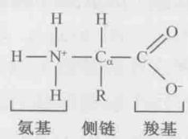  
图 6-1 氨基酸的结构图。

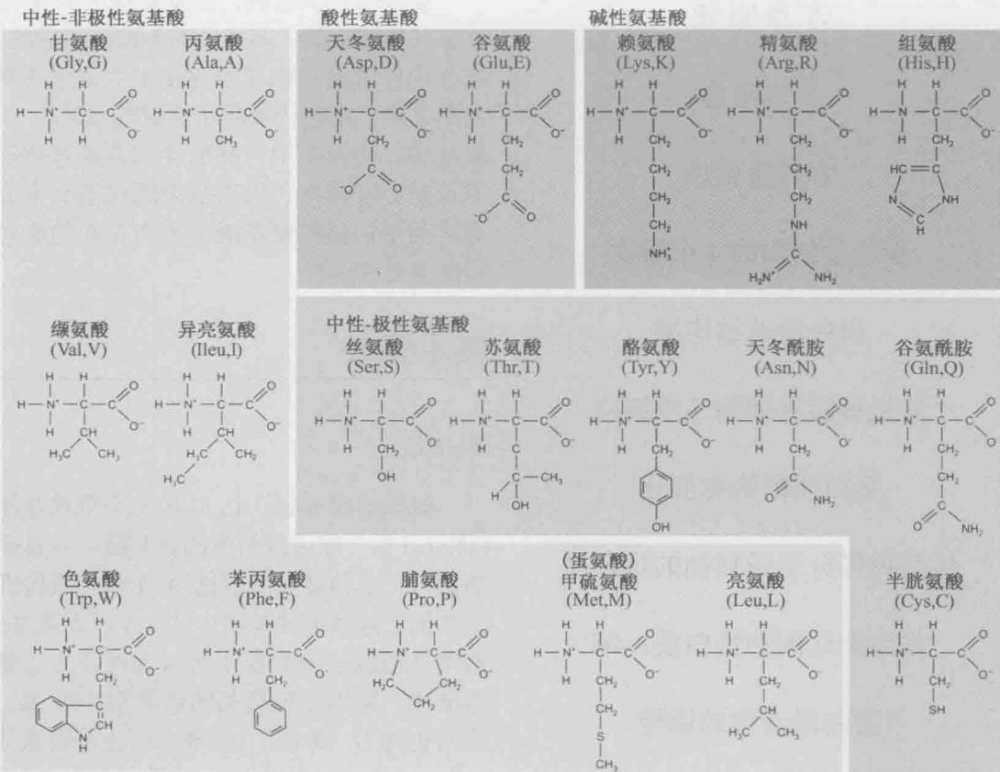  
图 6-2 蛋白质中的 20 种自然氨基酸，以及常用的氨基酸的 3 字母和单字母的缩写。

#### [W] 肽键

肽键（peptide bond）指蛋白质中氨基酸之间的共价键。肽键是失去一分子的水而缩合形成（图 6-3a），是一个特殊的酰胺键。每个氨基酸可以形成两个这样的键，因而一系列这样的键就可以形成一个线性的（也就是不分支的）多肽链（polypeptide chain）。由于在每个肽键形成时都会脱去一分子的水，因而这个链的组成成分又被称为氨基酸残基（amino acid residues），当上下文中有“氨基酸”时，有时候就直接称为“残基”。肽键有两个键的部分性质；羧基和氨基几乎共面而几乎总是呈反式构型（图 6-4）。

  
图 6-3 肽键的形成。

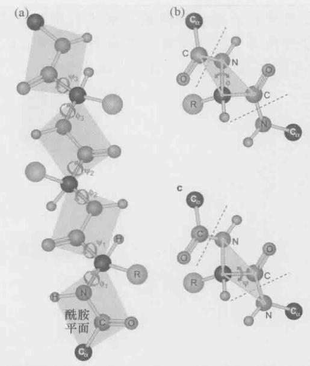  
图 6-4 主链扭角 $\phi$ 和 $\psi_{0}$ 。（a）扭角 $\phi$ ，该图展示肽主链的旋转点。（b）扭角 $\phi$ 与 N-C $_{\alpha}$ 键的轴旋转一致；这里的构象与 $\phi=180^{\circ}$ 一致。（c）扭角 $\psi$ 与 C $_{\alpha}$ -C 键的旋转一致；这里展现的构象是 $\psi=0^{\circ}$ 。（授权引用于 Kuriyan J. et al. 2012. The molecules of life. ©Garland Science/Taylor & Francis LLC; Branden C. and Tooze J. 1999. An introduction to protein structure, p.8, Fig.1.6. ©Garland Science/Taylor & Francis LLC.)

#### [W] 多肽链

构象（conformation）一词描述的是化学键和原子在三维空间中的排列，因而我们谈及一个多肽链的构象，或者更简单的，它的“折叠结构”或者折叠。如果我们沿着多肽链共价连接的序列看，那么每个氨基酸残基有3个键——一个连接NH基团与 $C_{\alpha}$ ，一个将 $C_{\alpha}$ 与羧基相连，最后一个则是连接肽链中下一个残基的肽键。前两个键是可以相对自由旋转的单键（图6-4）。但是肽键则由于具有部分双键的性质，因而仅有很少的旋转自由度。因此，多肽链构象是由每个残基的前两个主链的扭转力，加上每个侧链的单键的扭转力决定的。通常将主链的两个扭转力命名为 $\varphi$ 和 $\psi$ 。这两个角的许多组合会导致原子碰撞，因而限制一个多肽链的构象自由度只能是特定范围的某个角度（见框6-1）。

#### [W] 框 6-1 Ramachandran 图：主链扭角 $\phi$ 和 $\psi$ 的可允许组合

G. N. Ramachandran 及其同事（1963）研究了扭角 $\phi$ 和 $\psi$ 的所有可能的组合（见图 6-4），判定了哪些组合可以避免原子碰撞（“允许的”），以及哪些组合会导致碰撞（“禁止的”）。这里显示的“允许”和“禁止”的组合的二维图现在以“Ramachandran 图”著称（框 6-1 图 1）。常规二级结构的主链构象具有 $\phi$ 和 $\psi$ 所表明的： $\alpha$ 右螺旋；

β折叠；多脯氨酸螺旋（优先采用连续展开的脯氨酸的三重螺旋结构）； $3_{10}$ 螺旋（每个转角有3.3个残基，与每个转角有3.6个的残基的α螺旋密切相关）；α左螺旋Lα（只发生在甘氨酸，因为它没有侧链）。

  
框 6-1 图 1 Ramachandran 图 “允许的” 区域为蓝色部分。(授权修改自 Ramachandran G.N., et al. 1963. Stereochemistry of polypeptidechain configurations. J.Mol.Biol.7: 95-99.)

#### [W] 具有特殊构象性质的三个氨基酸

甘氨酸、脯氨酸及半胱氨酸具有特殊的性质。因为它们的 R 基团只有一个质子，甘氨酸是非手性的，相对于其他氨基酸而言有更多的构象自由度。相反，脯氨酸侧链的 $C_{\alpha}$ 与 N 有一个共价键（严格意义上讲，脯氨酸是一个亚氨基酸），因而其相对于许多其他氨基酸而言有更少的自由度。此外，由于 NH 基团缺乏疏水势能而限制参与形成二级结构（见“蛋白质结构的四个层次”部分）。

半胱氨酸的侧链有一个巯基（—SH），在生理状态下易发生氧化还原反应。正确定位在折叠蛋白中的两个半胱氨酸可以通过两个—SH基团氧化成S—S而形成一个二硫键（disulfide bond，图6-5）（形成的这对依靠S—S共价连接的氨基酸有时又可称为胱氨酸）。位于细胞表面，以及分泌到细胞外间隙的蛋白质暴露在易形成二硫键的氧化还原电位的环境中，因而大部分这样的蛋白质具有二硫键，没有未氧化的半胱氨酸。活细胞保持一个更加还原的内在环境，细胞内蛋白质则很少含有二硫键。

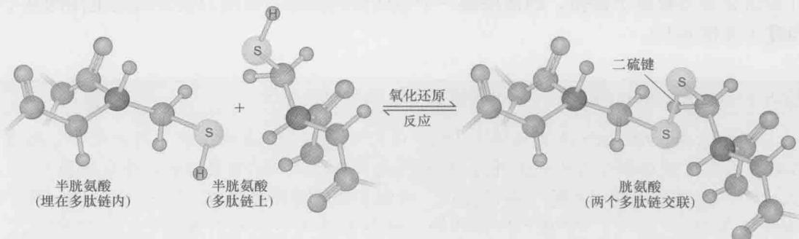  
图 6-5 二硫键的形成。(授权采用自 KuriyanJ. et al. 2012. The molecules of life. ©Garland Science/ Taylor & Francis LLC.)

二硫键通过添加共价键来增强折叠蛋白的稳定性，这些二硫键对于稳定小的分泌蛋白，如许多激素都非常重要，在相对于细胞内蛋白而言更不易控制的细胞外环境中，二硫键对于增强膜蛋白的细胞胞外域也非常重要。

#### [W] 水的重要性

生命系统的所有分子现象都依赖于含水环境。极性与非极性氨基酸侧链的重要区别在于其在水溶剂中的性质。连接在多肽主链的侧链上的天冬氨酸和苯丙氨酸，类似于乙酸与甲苯：乙酸易溶于水，甲苯则不溶。所以含天冬氨酸的侧链是亲水的（hydrophilic），而甲苯侧链则是疏水的（hydrophobic）。即使是亲水侧链也有疏水部分（如赖氨酸侧链的3个亚甲基基团）。

水是含有多个氢键的液体（图 6-6）。每个水分子可以贡献及接受两个氢键。溶质与周围水的氢键结合的影响决定了它的亲疏水性。疏水分子扰动氢键网络；而亲水分子则参与氢键的形成。因此，疏水分子更倾向于保持彼此接近（不溶性）而非散在于溶剂之中（可溶性）。许多氨基酸侧链的疏水特性使它们更易成簇而远离水，而其他亲水氨基酸侧链则易溶于水。一个实实在在的蛋白质的氨基酸序列由于演化而使多肽链趋于折叠，包埋起疏水残基而暴露亲水残基。但是许多一般大小的多肽，其可能的氨基酸序列使之并不能以此种方式折叠，它们或是随机地波动而将链在溶剂中展开（有时称为随机卷曲，random coils）；或者一条多肽链的疏水基团与另一条链上的疏水基团聚集成簇。

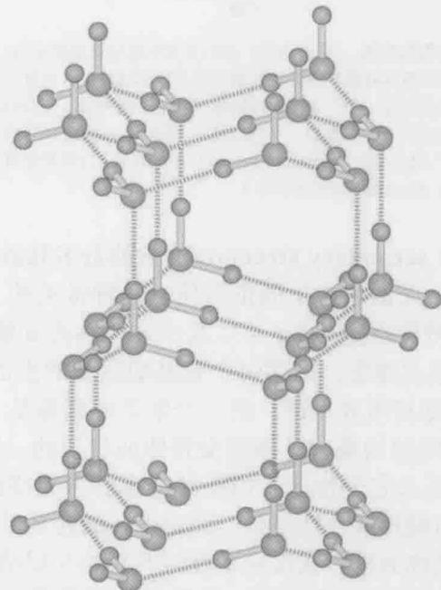

图 6-6 水：冰的氢键结构。在冰中，每个水分子贡献两个氢键（来自它的两个质子，淡紫色）给相邻氧原子（红色）的孤对电子，并接受自身氧原子的孤对电子上的两个氢键。氢键用红色虚线显示。当冰融化时，氢键网络动摇并瞬间瓦解，但是单个水分子间的氢键保持与它们相邻分子的四个氢键（平均）的大部分。因此，液态水的结构类似于这里展现的冰晶的波动和扭曲。

#### [W] 蛋白质结构的四个层次

从四个不同的组织层次来分析和描述蛋白质的结构非常有用（图 6-7）。第一个层次是蛋白质的初级结构（primary structure），就是指多肽链的氨基酸残基序列。正如我们所知，遗传密码直接决定了蛋白质的初级结构，因而初级结构是一维（1D）的决定化学键的字符串；其余三个层次则依赖于蛋白质的三维（3D）性质。

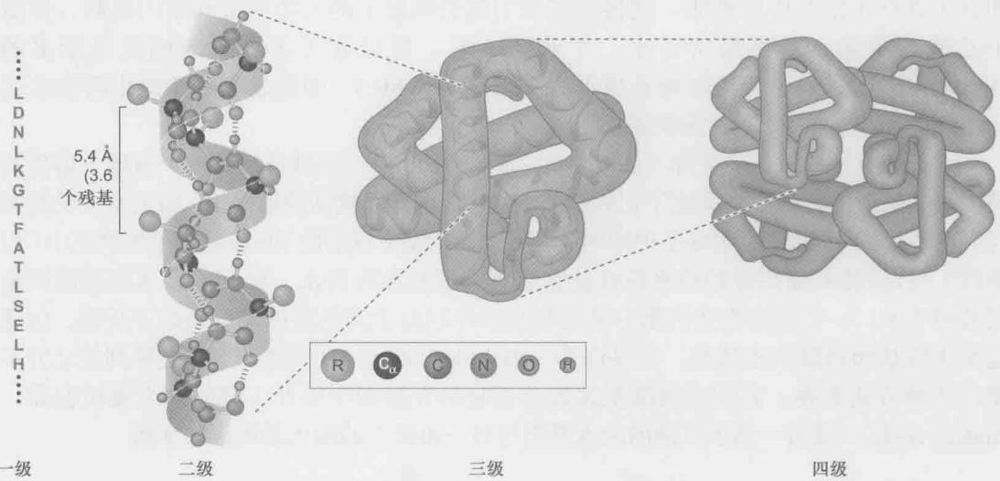  
图 6-7 蛋白质结构的层次，以血红蛋白为例。“初级结构”指的是多肽链的氨基酸序列。血红蛋白亚基的一段初级结构用单字母密码来表示。“二级结构”指的是具有重复的骨架氢键的常规局部结构。这里显示的是血红蛋白亚基的一段α螺旋。“三级结构”指的是整条多肽链的折叠结构（即一个多结构域蛋白的单个结构域）。图示血红蛋白四个亚基中的一个。虚线为左边所示的初级和二级结构相对应的一段α螺旋。“四级结构”指的是一个更大的复合蛋白中多个蛋白亚基的排列。血红蛋白是两个“α链”和两个“β链”组合成的四聚体。但是可以从图中看到，这两类链具有相似的四级结构（修改自Irving Geis的描述，版权为Howard Hughes Medical Institute所有）。

蛋白质的二级结构（secondary structure）指的是多肽链的局部构象——一小段氨基酸残基的三维构造。天然状态下的蛋白质有两种常见的二级结构，因为这两种局部构象使L-氨基酸链特别稳定（框6-1）。其中之一称为α螺旋（α helix，图6-8a）。多肽骨架沿着螺旋中轴呈右螺旋，因而每个氨基酸残基的主链羰基与多肽链C端方向的第4个残基的主链氨基形成氢键。另一个常见的构象是β折叠（β strand，图6-8b）。β折叠是一种伸展的构象，其侧链交替伸向骨架的一侧，而氨基和羰基基团也交替伸向两侧。骨架并未完全伸展，因而其链也轻微地或曲或褶。在折叠的蛋白质中，β折叠通过主链氢键形成片层结构。无论平行的还是反向平行的疏水结合方式都是可能的，有时又分别称为平行或反向平行的β折叠片层结构。在实实在在的蛋白质中，经常可以发现各种混合的片层结构，多肽链并不是严格地交替方向或者严格保持单一方向。

蛋白质的三级结构（tertiary structure）通常指在多肽链适应不同生理条件的紧凑的三维折叠结构。多肽区段的主要结构是 $\alpha$ 螺旋或 $\beta$ 折叠；而其余则是不规则构象（例如，在二级结构元件间存在的有利于这些元件各自紧密包装的扭转或成环）。在随后的章节中我们将描述并列举可能的三级结构。通常，多肽链的二级和三级结构的稳定性是相互依赖的。

  
图 6-8 蛋白质的二级结构。(a) α 螺旋。氢键用红色虚线表示。(b) β 折叠。氢键用红色虚线表示。上面为 β 折叠的俯视；下面为 β 折叠的侧视。(c) 平行的 β 折叠，是与多肽链从氨基到羧基的方向相同的氢键结合方式。(d) 反平行的 β 折叠，是与多肽链方向相反的氢键结合方式。(图 a 据 Irving Geis 修改，图 b 和 c 为 Ivring Geis 所绘，版权归 Howard Hughes Medical Institute 所有，未经许可不可复制。图 d 经许可引自 Branden C. and Tooze J. 1999. Introduction to protein structure, 2nd ed., p. 19, Fig 2.6a and p. 18, Fig 2.5b. © Garland Science/Taylor & Francis LLC.)

很多蛋白质不止一条多肽链：四级结构（quaternary structure）指的是各条折叠的多肽链之间相互作用的方式。我们可以将其分为：一定数目的单一类型的多肽链[据上下文，一般称为一个“亚单位”或者“启动子”（promoter）]；一定数目的多于一种类型、相互不同的亚单位。较为简单的蛋白质亚基间相互作用的方式并不影响单个多肽的折叠。然而在大多数情况下，一个蛋白寡聚体（oligomer，由少数几条多肽链组成的蛋白质）的四级甚至是二级结构都依赖于彼此之间的相互作用。换句话说，单个亚单位不仅需要二级或三级结构，同样也需要四级结构。一个常用的例子是 $\alpha$ 螺旋卷曲盘旋（ $\alpha$ -helical coiled-coil)：两条多肽链（有时三条甚至四条），相同或者相互不同，呈 $\alpha$ 螺旋构型并且彼此渐渐缠绕（图6-9a）。一般单链并不如 $\alpha$ 螺旋稳定，如果单聚体间的相互作用消失，那么这些螺旋将解开而形成不规则的多肽链。

  
图 6-9 酵母转录因子 GCN4。（a）GNC4 卷曲盘旋结构的三面观。（左）条杠表示化学键，结点区表示原子，灰色表示碳原子，红色表示氧原子，蓝色表示氮原子。这两条相同的多肽链的羧基端在最上面。呈梯形的疏水侧链（大部为灰色）位于两个螺旋肽链的接触面。（中）多肽链骨架为理想的带状，侧链以条杠表示。可以看到这两条多肽链相互渐渐缠绕。（右）俯视图，标示同中图。（b）GCN4 与 DNA 复合物的结构，是“基本区域”（basic region，从氨基端到卷曲盘旋的区段）从无序到有序的转换，通过结合在 DNA 的大沟而形成 α 螺旋。以 PyMOL 制图（Schrödinger，LLC）。

#### [W] 蛋白质的结构域

#### [W] 多肽链折叠成一个或多个典型的结构域

多肽链折叠后产生“内侧”和“外侧”，因而分别形成包埋的（buried）和暴露的（exposed）氨基酸侧链。如果该多肽链很短，就不能形成包埋足够疏水基团的构象来稳定折叠结构。如果一条链太长，折叠过程过于复杂而很可能出错。由于这些因素的限制，大部分稳定的折叠构象需要50\~300个氨基酸残基。更长的多肽链一般会形成不连续的、称为结构域（domain）的模块（见框6-2，术语表）。如前所述，每个结构域通常有50\~300个氨基酸残基。这样的蛋白质的每个结构域与更小的、单一结构域的蛋白质结构类似（图6-10a）。

#### [W] 框6-2 术语表

```txt
初级结构（primary structure）：多肽链的氨基酸序列。
二级结构(secondary structure)：主链上氢键饱和的多肽链的常规结构元件。蛋白质中常见的二级结构是α螺旋，平行的和反平行的β折叠 (sheet)。
三级结构（tertiary structure）：多肽链折叠的三维构象。
四级结构（quaternary structure）：寡聚蛋白质或多聚蛋白质组装成的多亚基结构。
结构域(domain)：具有折叠结构的多肽链的一部分，其稳定性不依赖于蛋白质的其余部分。
基序（序列）(motif, sequence)：具有特定性状的一小段氨基酸序列，通常适合与另一蛋白质的某一特异的结构域相互作用（在此强调一下：“结构域”这个术语有时被错误地用于这样的序列基序）。
基序（结构）(motif, structural)：结构域的亚结构，存在于很多不同的蛋白质之中，通常具有某些典型的特性不同的氨基酸序列（如，在DNA识别结构域中的螺旋-转角-螺旋基序）。
拓扑（或者折叠）(topology or fold)：大部分蛋白质的结构域可以用图形来表示，据其二级结构元件的三维联系而分别组装起来。Jane Richardson 引入了“带状图(ribbon diagrams)”，如本章中的许多图，可以方便地观察结构域的折叠（见图6-10的说明）。并不是所有的折叠都可以在天然的蛋白质中找到（如打结折叠），而且有些折叠更为常见。
同源结构域（或蛋白）(homologous domains or proteins)：来源于同一祖先的结构域（或蛋白质）。它们必须有相同的折叠，常常（但并不总是）有相似的氨基酸序列。
同源建模（homology modeling）：基于同源结构域的结构来构建该结构域的模型。
胞外域（ectodomain）：单度（single-pass）跨膜蛋白在细胞膜外的部分。
糖基化（glycosylation）：在蛋白质的侧链上加上一个或多个糖（糖基）的链，有时是分枝链。该糖基可以是N-连接的（连接在天冬氨酸的侧链酰胺上），或者是O-连接的（连接在丝氨酸或苏氨酸的羟基侧链上）。
变性（denaturation）：通过高温或者溶剂（如尿素、盐酸胍、或者强去垢剂（变性剂）使一个蛋白或蛋白的结构域的折叠解开。
```

分子伴侣（chaperone）：一种可以提高另一蛋白质天然折叠几率的蛋白质，通常通过阻止多肽的凝聚，或者解析折叠错误的蛋白质而使其重新正确折叠。

活性位点（或催化中心）（active site or catalytic site）：酶的可以与底物结合的位置，通常与催化反应的过渡状态的构象相似。

变构调节（allosteric regulation）：通过结合在不同于底物的位点上的配基（ligand）来调节其亲和性及酶促反应的速率。变构调节的机制通常包括四级结构的改变，这意味着亚单位之间的重定向或重定位。

在折叠的多肽链的两个或更多的结构域中，每一个都有连续的氨基酸残基。然而，大多数情况下，至少有一个结构域由两个或多个非连续的元件折叠而成，而介于链中间的部分则形成不同的结构域（图 6-10b）。这个中间结构域像是内嵌在侧翼折叠而成的结构域中。

#### [W] 蛋白质结构研究的基础知识

据实验得出的大量结构域相关的结构信息，我们可以得出以下结论。

首先，实际上大部分的疏水侧链被包埋，而大部分的极性侧链则外露。其次，如果一个可以贡献或接受氢键的功能基团（functional group）被包埋，那么大部分情况下，它都具有氢键结合配体。这个性质的原因很容易理解，当极性基团暴露在结构域的表面时，它可以和水形成一个类似的氢键（既可以作为供体又可以作为受体）。如果在折叠的构象中没有形成氢键，那么在多肽链折叠而该基团的水被夺去时，它就应该已经无法对维持有利构象做出贡献。连疏水氨基酸残基在它们的主链上也有了两个氢键结合基团——NH 和 CO。这些氢键在折叠结构中也是必需的，尤其在形成二级结构时非常重要。α 螺旋和 β 折叠都满足它们内部主链上所有残基氢键的形成。

主链上氢键的形成可能是常规的二级结构普遍存在的一个重要原因，即使是在紧凑折叠的蛋白质结构域中也是如此。因而根据蛋白质的二级结构来划分结构域很有用。总体来说，即使是相对短的多肽链实际上也有很多的折叠构象，这些折叠构象只有有限的部分是我们已知的3D蛋白结构。它们不仅有大部分氨基酸残基构成α螺旋和β折叠（而非很难形成主链氢键的不规则的环），还有相对简单的3D折叠模式。例如，CD4的Ig结构域（图6-10a）由2个β折叠构成，即β三明治（βsandwich），一个折叠中有4或5条链而另一个折叠有4条链。尽管多肽链有多种方式从8条或9条链中的一条过渡到另一条，但是明显的趋势是其中的一条链会在形成折叠片时通过尖锐的转角将两条相邻的链连接起来，或者穿过结构域的顶端或底部到另一个折叠片。所有已知结构域的结构中一个非常重要的特性是链并不形成结，这意味着，如果拉该链的一端时，整个结构都会打开成一条笔直的线。

#### [W] 蛋白质结构域的类型

蛋白质结构域的分类可以简单的总结描述。常用的分类层次体系是基于 CATH 数据库的，先将蛋白质按照主要的二级结构（大部分是 $\alpha$ 螺旋、大部分是 $\beta$ 折叠、两种的混合，第四种则是一些具有小的二级结构的小结构域）进行分类。分类层次体系中最重要的层次是折叠 [fold，也称为拓扑结构（topology）] 和同源（homology）。折叠类型不仅涉及二级结构，而且涉及肽链如何从一个螺旋或折叠到另一个。图 6-11 阐明了这点。一组同源蛋白质指的是一组序列非常相似而假设它们具有共同的演化起源的蛋白质。这里还有一个问题，那就是一个特定的折叠类型的所有结构域是否具有共同起源——对于非常复杂的结构域来说，一个共同的起源可能看起来更合理。

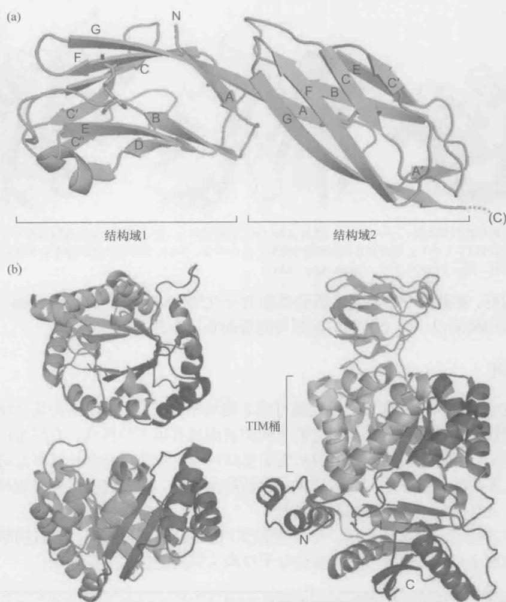  
图 6-10 蛋白质的结构域。多肽链以“带状”展示。该图示源于 Jane Richardson，用于展现一个结构域的折叠构象的二级结构元件：α螺旋为卷曲的带，β折叠为指向羧基末端的微曲的箭头。介于二级结构元件间的环像“蠕虫（worms）”一样。（a）发现于某些T细胞和巨噬细胞表面的CD4蛋白的四个结构域中的两个。每一个结构域都是带有免疫球蛋白折叠的β“三明治”（见框6-3）；每个结构域的β折叠按照它们在多肽链中的顺序指定相应的字母。每个结构域有一个二硫键，图中以黄色的棒状来表示硫原子之间的键。（b）两种酶：磷酸丙糖异构酶（左侧，triose phosphate isomerase，TIM）和丙酮酸激酶（右侧，pyruvate kinase，PK）。图示为二聚体TIM的单体。TIM亚基是称为“TIM桶（barrel）”的结构域的原型——一个由位于内部的8条链和外部的螺旋交替构成的短的圆筒结构。这两个视图分别沿着桶轴（上面）和侧面（下面）。颜色由氨基末端的深蓝色逐渐变为羧基端的绿色。PK折叠成三个结构域。中心结构域是TIM桶（侧面观）。“彩虹”颜色从氨基末端的深蓝色逐渐变为羧基端的红色。折叠顶部的浅蓝色结构域沿着TIM桶的链3的残基折叠。底部的橘红色区结构域包括羧基末端的残基到最后一个TIM-桶螺旋。TIM和PK的对比显示出在一个蛋白质中单独的亚基结构域在另一个蛋白质中却能够与其他结构域结合。而且一个或者更多的那种结构域可以沿着一条多肽链折叠“插入”到主体结构域的二级结构元件之间。图片由PyMOL制作（Schrödinger，LLC）。

  
图 6-11 三个主要折叠类型示例。（左）全是 $\alpha$ 螺旋的蛋白质（肌红蛋白）。（中）有两个 $\beta$ 折叠结构域的二聚体（免疫球蛋白的可变区见框 6-3）。（右） $\alpha$ 螺旋和 $\beta$ 折叠的混合类型（小 GTP 酶，Ras）。每个结构域的颜色从氨基末端到羧基末端由深蓝色变为红色。图由 PyMOL 制作（Schrödinger，LLC）。

#### [W] 接头和铰链

折叠蛋白质的两个结构域之间的链可能非常的短，从而使两个结构域之间的表面紧实而又有刚性，也可能非常长从而它们之间的表面具有很大的弹性。有些蛋白质有相当长的弹性接头，由于它们在细胞中的功能需要其两端的结构域能在长且可变的距离内相互作用。长接头的氨基酸序列一般缺少较大的疏水基团，因为它们可舒展而灵活的构象离不开水，此外它们还有其他简单的特性。

我们将通过对一个抗体分子（免疫球蛋白）的阐释来概括前面讨论过的结构域和蛋白质结构的四个层次，见框 6-3 以抗体分子结构为例阐述蛋白质结构域。

#### [W] 框 6-3 以抗体分子结构为例阐释蛋白质结构域

循环的抗体是免疫球蛋白（IgG）分子，其包括两条相同的重链和两条相同的轻链。轻链包括一个可变结构域（ $\mathrm{V_L}$ ）和一个恒定结构域（ $\mathrm{C_L}$ ）；重链则包括一个可变结构域（ $\mathrm{V_H}$ ）和三个恒定结构域（ $\mathrm{C_H1}$ ， $\mathrm{C_H2}$ 和 $\mathrm{C_H3}$ ）。因此一共有12个独立的结构域。 $\mathrm{V_H}$ 和 $\mathrm{V_L}$ 是“可变的”，因为它们由一个巨大的基因组合库来编码，而且在免疫反应中，选定的基因会发生体细胞突变。可变结构域决定了与抗原结合的特异性。 $\mathrm{C_H1-3}$ 和 $\mathrm{C_L}$ 结构域是“恒定的”，因为在产生抗体的细胞的成熟过程中，这些结构域中只有很少一部分和许多可变结构域中的一个连接在一起，而且它们不易发生体细胞突变。组配成的异四聚体中的结构域对如框6-3中的图1所示： $\mathrm{V_H}$ 和 $\mathrm{V_L}$ 以及 $\mathrm{C_H1}$ 和 $\mathrm{C_L}$ 形成Fab片段（“抗原结合区”）；一个重链的 $\mathrm{C_H2}$ 和 $\mathrm{C_H3}$ 分别与另一个重链的 $\mathrm{C_H2}$ 和 $\mathrm{C_H3}$ 形成Fc片段。受控制的蛋白水解攻击有选择的切开铰链，释放出各一半的Fab和Fc。每一个结构域有一个相似的“Ig-结构域”折叠，见图6-11中均为β折叠结构域的例子。介于可变和恒定结构域之间的短链（“肘”）的弹性有限。每个重链的 $\mathrm{C_H2}$ 和 $\mathrm{C_H3}$ 之间的长链（铰链）则有较大的弹性，因而允许每个Fab顶端的抗原结合位点（称为“互补决定区”）根据抗原上识别位点的相对位置来进行定位。

  
框 6-3 图 1 IgG 的三个不同示例。图中左侧的 “Y” 字形展示了 IgG 的四条链之间的关系。中间的 “带状” 图展示了 IgG 的二级结构。而右侧的表面成像图则展示的是折叠蛋白的侧链有效地包裹填充在蛋白质内侧的疏水区域。该图由 PyMOL（Schrödinger，LLC）和 UCSF Chimera 制作。

#### [W] 翻译后修饰

在核糖体上合成多肽链之后，氨基酸的侧链会发生各种修饰来调节蛋白质的结构和功能。最重要的修饰之一是糖基化——在天冬氨酸、丝氨酸或苏氨酸的侧链上添加一个或多个糖（“糖基”glycans）。这种修饰通常发生在真核细胞的内质网上，因而是细胞表面蛋白和分泌蛋白的胞外结构域的普遍特性。带有糖基的蛋白质称为糖蛋白。将糖基转移到天冬氨酸侧链上的酶识别一个很短的基序，即 Asn-X-Ser/Thr，其中 X 代表任意氨基酸残基。

丝氨酸、苏氨酸、酪氨酸或组氨酸侧链上的磷酸化是另一种常见的修饰，对于细胞内的调节至关重要。前三种氨基酸残基上的磷酸化大部分发生在真核细胞中，而最后一种氨基酸的磷酸化则在原核生物中更普遍。

#### [W] 从氨基酸序列到三维结构

#### [W] 蛋白质折叠

蛋白质空间结构的折叠与稳定性取决于其结构域的氨基酸序列，这一概括是分子生物学中心法则的重要部分，因为它意味着可翻译基因的核苷酸序列不仅决定了该基因所编码蛋白质的氨基酸序列，还决定了其三维结构和功能。有人做过一个解折叠蛋白的重折叠的实验[见框6-4，蛋白质的三维结构取决于其氨基酸序列（安芬森实验）]，这个经典的实验首先提出了这样的观点。该实验还显示了多肽链可以在不添加任何细胞机械装置的条件下正确折叠。

#### [W] 框 6-4 蛋白质的三维结构取决于其氨基酸序列（安芬森实验）

在 20 世纪 60 年代早期, Christian Anfinsen 及其同事完成了一系列的经典实验, 揭示了蛋白质的氨基酸序列足以决定其正确地折叠结构, 而且这一过程不需要任何外部 “机械装置”。这一结论对于理解基因的核苷酸序列所编码信息如何最终决定蛋白质功能尤为重要。

核糖核酸酶 A（ribonuclease A）是一种可以切断 RNA 磷酸二酯键的酶，当其折叠为天然构象时具有催化活性。当其在变性剂（如浓度为 2\~5 mol/L 的尿素或者盐酸胍）作用下发生解折叠时丧失催化活性。由 124 个氨基酸残基组成的核糖核酸酶 A 含有 8 个半胱氨酸，它们可以形成 4 个二硫键（见框 6-4 图 1）。这些二硫化物可以被诸如 β-巯基乙醇这样的还原剂还原成硫氢基。安芬森及其同事发现：如果先让核糖核酸酶 A 在 β-巯基乙醇作用下解折叠，再通过透析除去变性剂和还原剂，核糖核酸酶 A 的酶活性可以恢复到很高的水平。假设只有一个正确折叠的酶才能催化磷酸二酯键的水解，核糖核酸酶 A 的活性恢复实验显示多肽链含有所有指示蛋白质折叠的信息。安芬森等曾做过这样一个实验：首先除去 β-巯基乙醇使允许二硫键重新形成，然后通过透析除去变性剂，最后对酶活性进行检测。实验结果是他们没有检测到酶活性。8 个半胱氨酸有 105 种不同的配对方式，在变性剂作用下，半胱氨酸可能会发生随机配对形成二硫键，结果主要形成一些杂乱的二硫键，而非自然构象中的那种独一无二的配对方式。因此，解折叠核糖核酸酶 A 在氧化条件下同时进行重折叠时，只能恢复不到 1% 的活性。这一预期与实际观察到的数据吻合，从而巩固了这一重要结论：只有在自然的、非共价接触的条件下，每个半胱氨酸才可以找到自己合适的配对对象。

  
框 6-4 图 1 安芬森实验。左上方的条带图展示了核糖核酸酶 A 的三级结构（黄色部分代表二硫键）。右下方是核糖核酸酶的示意图，展示了各种二级结构元件和四个二硫键的位置。在变性剂和还原剂的同时作用下，核糖核酸酶 A 解折叠成多肽链。同时去除还原剂和变性剂和依次去除还原剂和变性剂会导致两种不同的结果，如图右侧所示。在示意图中，绿色的线表示二硫键，绿色的圆表示半胱氨酸。

安芬森重折叠实验（Anfinsen refolding experiment）依赖于若干个关键点。首先，从细胞或组织中纯化的蛋白质可以在溶剂中解折叠成无规则卷曲。这种解折叠常称为变性（denaturation），一般通过将蛋白质暴露在高浓度的变性剂（denaturants）（如尿素或者盐酸胍）中进行。如果该蛋白质是酶，它将会失去催化活性。如果该蛋白质具有特定的结合特性（如，识别DNA上的位点），它将失去这种特异性。这其实是因为蛋白质的几乎所有的功能都依赖于它们的折叠结构。在框6-4中，安芬森和其同事所用的蛋白质在解折叠时还需要还原其四个二硫键。第二，小心地除去非变性剂可以使蛋白质重新折叠。由于许多原因，这个过程通常并不那么高效。细胞有一种称为折叠分子伴侣(foldingchaperone）的酶可以将错误折叠的蛋白质解折叠并允许它“试着”再折叠一次。一些分子伴侣可以螯合解折叠的蛋白，防止该蛋白在细胞中与其他蛋白聚合，但是它们并不能保证其底物蛋白正确的折叠。第三，在安芬森的实验中，通过测定酶的活性来检测核酸酶是否正确折叠。这意味着，活性的恢复是判断重新折叠的酶恢复其自然（native）构象（也就是功能构象）而聚集的重要指针。

从安芬森实验中得出的另一个结论是，一个蛋白质的自然结构是其多肽链的氨基酸序列所能采用的最稳定的构象。从物理化学的角度看，蛋白质的自然构象是其所有可能构象中的具有最低的自由能的那种构象。

#### [W] 根据氨基酸序列预测蛋白质结构

一般而言，如果氨基酸序列决定了蛋白质折叠后的结构，那么应该可以设计出一种从氨基酸序列预测出蛋白质折叠后结构的计算方法。但在实际操作中，这一计算方法的研究进展令人气馁。下面的介绍会说明这是为什么。首先，我们或许可以想象计算机可以计算多肽链的每一种可能构象的稳定性（自由能）并找出具有最小自由能的构象。事实上，决定蛋白质稳定性的各种原子间的作用力，比如氢键、疏水作用等，确实是可以计算的。然而，我们以一个含有100个氨基酸残基的小蛋白为例，假设每个氨基酸残基仅含有三种构型（如螺旋、条带和其他任意一种），那么这个蛋白可能的构象就有大约 $3^{100}$ 或 $10^{47}$ 种，这是一个天文数字，这种策略是不可行的。其次，我们或许可以通过一些动力学计算试着模拟蛋白质折叠的过程。基于先进的计算资源，这一策略对于一些小蛋白的分析是有效的，在某些研究中可以得出不错的近似值，但对于全面了解各方面的功能尚且不足。这一策略不太可能在近期成为一种根据氨基酸序列预测复杂蛋白质结构的可行的方法。另外，如果我们已经知道了相似的、同源的蛋白的结构，我们或许可以把该结构作为初次的近似值，通过计算改变一些氨基酸残基，最终匹配到我们想要研究的新蛋白上。这类计算被称为同源建模（homology modeling），目前已经相对可行了。很明显，这一策略的可靠性主要取决于这两个蛋白的相似度和对预测准确度的期望。

#### [W] 蛋白质的构象变化

在特定的条件下，蛋白质会以最低自由能的构象（折叠或者不折叠）存在。然而，如果蛋白质所处的环境发生了变化，这种最稳定的构象也会发生改变。我们已经见过这样的例子了——添加和除去高浓度的尿素可以导致核糖核酸酶的解折叠和重折叠。更加温和的环境变化也能引起蛋白质构象和功能的改变。例如，葡萄糖是己糖激酶的底物，在葡萄糖存在的条件下，只有一个结构域的己糖激酶会关闭开口，把葡萄糖包住（图6-12）。与底物的有利结合把动态平衡的稳定点由最开放状态改成最封闭状态，使得这种封闭的构象比开放的更为稳定。

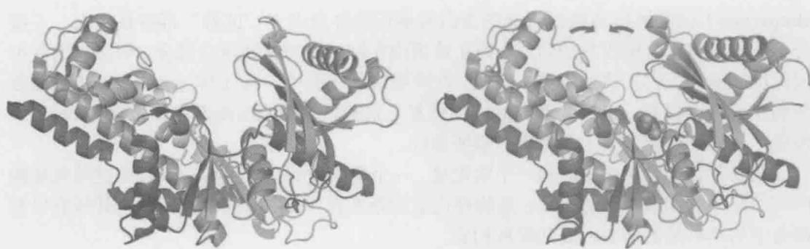  
图 6-12 己糖激酶结构域的关闭。己糖激酶可以在葡萄糖上添加一个磷酸基团使之磷酸化，它的两个“耳垂”（lobe）在结合底物（葡萄糖）时候会彼此靠近（红色箭头所示）形成封闭结构。左图展示的是未结合葡萄糖的己糖激酶，右图展示的是结合葡萄糖后的己糖激酶（位于酶的催化“裂口”的红色物质即葡萄糖）。多肽链由彩虹的颜色表示，由蓝色（氨基末端）到红色（羧基末端）。注意，折叠的多肽链在两个“耳垂”之间横穿了两次。图片由 PyMOL 制作（Schrödinger, LLC）。

两个蛋白质之间的相互作用会导致其中一个或者这两个蛋白都发生构象变化。有时候，相互作用的蛋白在单独存在时，其相互作用区域的结构是松散的（无序而灵活），直到遇到可与其发生相互作用的蛋白为止。换句话说，这种蛋白只有在其靶标存在的条件下才可以折叠成稳定的构象，而这种靶标可以是DNA、RNA或者其他的蛋白质。酵母的转录因子GCN4含有二聚的卷曲螺旋，其中的α螺旋只有在相互关联的时候才会稳定。当GCN4同DNA结合的时候，该蛋白的部分片段会在DNA的大沟（major groove）内形成一个α螺旋，但当GCN4未结合DNA的时候，该部分片段处于松散状态（图6-9b）。

#### [W] 作为特异分子识别物的蛋白质

#### [W] 识别 DNA 序列的蛋白质

基因表达的调控依赖于蛋白质对具有特定核苷酸序列的 DNA 片段的识别。接下来我们会通过几个例子来阐明蛋白质结构和相互作用的部分原理。

1. GCN4 前面我们已经提到过 GCN4，阐明了一个蛋白质的折叠如何依赖于同其他蛋白（GCN4 卷曲螺旋二聚体的另一条链）或靶分子（DNA 位点）的相互作用。只有在 GCN4 和 DNA 的接触位点的序列正确时，GCG4 才会紧密结合 DNA。因为 $\alpha$ 螺旋可以与 DNA 的大沟非常紧密地结合，所以 $\alpha$ 螺旋的侧链也需要同 DNA 表面互补，包括侧链的形状、极性、以及氢键供体和受体的性质。这些 $\alpha$ 螺旋还含有一些精氨酸和赖氨酸残基，它们可以通过同磷酸基团形成盐桥把自己锚定在 DNA 骨架上，从而使 $\alpha$ 螺旋同大沟的结合更为紧密。

2. $\lambda$ 噬菌体的阻遏物 $\lambda$ 噬菌体的阻遏物（repressor）在噬菌体基因组上有6个结合位点，这些位点的序列相互关联，但也有些许不同。每个位点的具体序列决定了该位点同阻遏物的亲和力（图6-13a）。阻遏物蛋白是一个对称的二聚体，而结合位点也是近似的对称（回文，palindromic）序列。阻遏物蛋白的每个亚基都含有两个折叠的结构域：氨基末端的DNA结合结构域和羧基末端的二聚化结构域。

OR1 5' T A C C C T C T G G G C G G G T G A T A 5'
OR2 T A A C A C C G G T G C G G T G T T G
A T T G T G G C A C G C A C A A C
OR3 T A T C A C C G G C A A G G G A T A
A T A G T G G C G T T C C C T A T
OL1 T A T C A C C G G C A G T G G T A
A T A G T G G C G G T C A C C A T
OL2 C A A C A C C G G C A G A G A T A
G T T G T G G C C G T C T C T A T
OL3 T A T C A C C G G C A G A T G G T T
A T A G T G G C G T C T A C C A A


  
图 6-13 λ 噬菌体的阻遏物识别 DNA。（a）λ 噬菌体基因组中同阻遏物相结合的 6 个 DNA 位点的核苷酸序列 [“操纵基因”（operators）]。每个位点都近似于一种“回文结构”——从任意一个末端的 5′到 3′方向读出的碱基序列基本相同（会有少许偏差）。顶部序列（OR1）右侧的“半个位点”和底部序列（OL3）左侧的“半个位点”是所有“半个位点”的序列中最一致的。因为序列的长度为奇数（17bp），所以序列中间的那个碱基对在整个回文结构中是个例外。（b）λ 阻遏物的 DNA 结合结构域（氨基端）与操纵基因结合。该结构域的每一个亚基都是由 5 个 α 螺旋形成的簇，其中两个（亚基上端的浅蓝色部分）形成一个螺旋-转角-螺旋：第一个 α 螺旋在大沟的两端架起了一座桥，而第二个 α 螺旋位于大沟中，几乎与大沟的主要方向平行。（c）螺旋-转角-螺旋中的氨基酸残基同 DNA（包括主链和碱基）之间的极性互作（氢键和盐桥）。只有当碱基对与其对面的蛋白基团相匹配时，该蛋白才能紧密地嵌入到大沟中。图片由 PyMOL 制作（Schrödinger，LLC）。

$\lambda$ 阻遏物的DNA结合结构域是由5个 $\alpha$ 螺旋组成的压缩的束（bundle）（图6-13b）。不像GCN4，这个结构域在结合DNA的时候不会发生任何明显的结构变化。5个 $\alpha$ 螺旋中的两个（第二个和第三个）会形成一个结构性基序（motif），这种基序被称为螺旋-转角-螺旋（helix-turn-helix），在很多其他的DNA结合蛋白中也比较常见，尤其是那些来自原核生物的蛋白。该基序同DNA双螺旋的结合方式允许第二个 $\alpha$ 螺旋嵌入到DNA的大沟中并把几个侧链呈递给暴露的碱基对的边缘（图6-13c），这种 $\alpha$ 螺旋有时被称为识别螺旋（recognition helix）。每个碱基对的主基团边缘都呈现出一种氢键供体和受体基团的典型模式，A：T和T：A碱基对还呈现出一种胸腺嘧啶甲基基团的疏水表面（图6-14）。 $\lambda$ -阻遏物识别螺旋侧链的氢键及非极性关联的性质与那些可以被识别的碱基序列相互匹配。蛋白质与DNA的核糖-磷酸主链的相互接触使得识别螺旋的侧链可以找到正确的位置并以正确的方向结合，以保证二者的互补性。

蛋白质侧链和 DNA 碱基之间的互补性与 DNA 碱基对两个碱基之间的互补性不同，这种差异具有重要意义。每个 DNA 碱基都有一个特定的互补碱基，因此碱基之间的氢键键合与正常双螺旋的几何学是一致的。相比之下，蛋白质对特定碱基甚至是一段特定的碱基序列的识别则有多种方式。此外，正如阻遏物结合位点的不同序列所表现的那样，同一种蛋白质结构可以通过微调与略微改变后的碱基序列之间产生互补性，但这往往会损失部分亲和力。因此，蛋白质对 DNA 的识别并没有 “密码”，而是有一些重复出现的模式，比如插入到 DNA 大沟中的 $\alpha$ 螺旋所呈现出的蛋白质侧链。

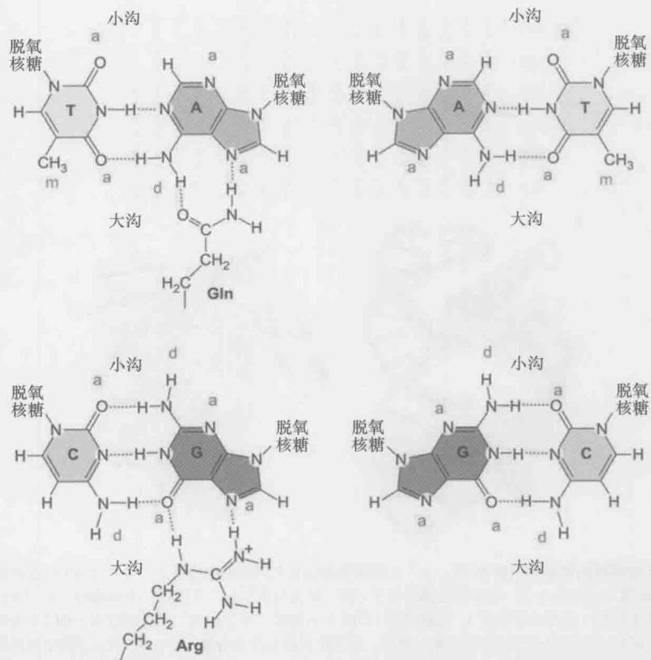  
图 6-14 大沟和小沟中 DNA 碱基对的性质。图上显示了四种碱基对，并对位于大沟和小沟且能进行特定关联的基团作了标记：a 表示氢键受体；d 表示氢键供体；m 表示甲基基团（范德华接触）。氢键由点线表示。在大沟中，这四种 DNA 碱基对都呈现出不同的模式：T：A，m-a-d-a；A：T，a-d-a-m；C：G，d-a-a；G：C，a-a-d，其中 T：A 和 C：G 两种碱基对展示了氨基酸侧链互补性的两种特例，这两种碱基对识别的模式（1976 年由 Seeman、Rosenberg 和 Rich 提出）确实以一定的频率发生，但大多数特定的 DNA 识别都涉及更为复杂的关联。在小沟中，T：A 和 A：T 碱基对呈现出相同的关联模式 a-a；类似的，C：G 和 G：C 碱基对呈现出相同的关联模式 a-d-a。因此，序列特异性的 DNA 识别经常包括与大沟的关联。

λ 噬菌体的阻遏物阐明了一个蛋白质识别特定 DNA 序列的普遍特征：这些蛋白质拥有相对较小的 DNA 结合结构域，该结构域经常与一个或几个其他的结构域连接在一起，这些结构域有不同的功能，如寡聚化或与其他蛋白质相互作用。

3. 锌指蛋白 许多真核生物中最丰富的 DNA 识别结构域是一种被称为锌指（zinc finger）的小模块（图 6-15a 所示）。这些结构域一般以串联的形式出现，彼此之间由短的接头片段连接起来。这些接头片段非常灵活，当蛋白质与 DNA 结合时，它们会变得有序。每个锌指约包含 30 个氨基酸残基，它们勉强可以形成一个疏水核心，中心的锌离子是必需的，用来把折叠的结构域固定到一起。 $Zn^{2+}$ 由两个半胱氨酸和两个组氨酸进行配位。因为胞内蛋白不存在二硫键，对于很小的结构域而言， $Zn^{2+}$ 配位可以起到相同的稳定结构的作用。当锌指与 DNA 结合时，短的 $\alpha$ 螺旋会嵌入到大沟中，串联排列的锌指逐次与碱基序列发生关联——每个锌指约 3bp，彼此之间存在一定的重合（图 6-15b）。碱基对的关联存在很强的规律性：螺旋上的 1, 2, 3 和 6 位的残基最可能与一个或多个碱基对发生关联（图 6-15a）。基于这种规律性及串联的锌指嵌入到 DNA 大沟的方式，我们可以设计使一些蛋白可以识别相对长的碱基对序列。此外，一些独立模块的文库已经可以用来设计特定的蛋白质，来识别长度为 12\~18bp 的 DNA 序列。

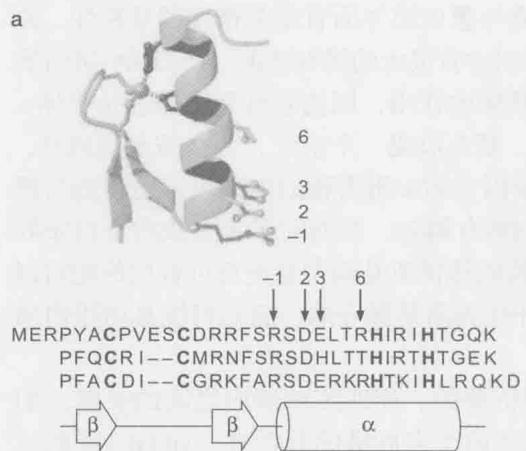

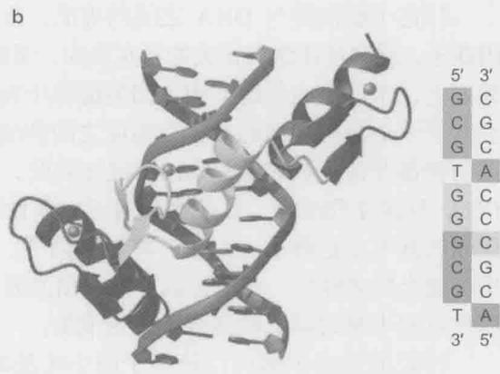  
图 6-15 锌指基序。(a) Cys2His2 锌指基序和 Zif268 锌指序列。顶端显示的是锌指 2 的带状图，包括两个半胱氨酸侧链（黄色）和两个组氨酸侧链（红色），它们决定了 $Zn^{2+}$ （银色球体）的坐标。关键残基的侧链与 DNA 大沟中的碱基发生关联（数字表示这些关联相对于识别螺旋起点的位置）。条带图下方是 Zif268 的三种锌指的氨基酸序列的比对结果，粗体表示保守的半胱氨酸和组氨酸。底部显示的是锌指蛋白的二级结构元件。(b) 左侧是 Zif268-DNA 的复合物，展示了结合在 DNA 大沟中的 Zif268 的三个锌指。锌指被 3bp 的区间隔开；DNA（蓝色）；锌指 1（红色），锌指 2（黄色），锌指 3（紫色）；固定后的锌离子（银色球体）。右侧展示的是 Zif268 结合位点的 DNA 序列，通过颜色标注说明它们同每个锌指的关联关系。（该图经授权，引自 Pabo C.O. et al. 2001. Annu. Rev. Biochem. 70: 313–340, Fig. 6-15a is Fig. 1 on p. 315; Fig. 6-15b is Fig. 2 on p. 316. ©Annual Reviews）。

4. 淋巴细胞增强因子-1(LEF-1) 与 DNA 大沟中的碱基对关联并非产生序列特异性的唯一方法。碱基序列并不能特异地决定小沟中氢键关联的模式，因为在这方面 A:T 和 T:A 看起来是一样的，G:C 和 C:G 也看起来是一样的（图 6-14），但碱基序列仍然会影响 DNA 双螺旋弯曲或扭转的倾向性，即采用的构象相对于理想的 Watson-Crick 双螺旋模型产生偏差。对这种受碱基序列影响的敏感性有时被称为“间接读出”（indirect readout），以便与直接的极性或非极性碱基对关联所产生的序列特异性相区分。淋巴细胞增强因子-1（Lymphocyte Enhancer Factor-1，LEF-1）与几个其他的因子共同调节 T 细胞的基因表达，该因子是一个三螺旋束，可以嵌入到弯曲 DNA 中大幅扩大的小沟中（图 6-16）。大多数迎面嵌入到小沟中的氨基酸侧链是非极性的，其中一个会插入到两个相邻的碱基对之间，从而稳定 DNA 轴线上几乎 $90^{\circ}$ 的弯曲。该弯曲可以使 LEF-1 的上下游蛋白更为紧凑，因而 LEF-1 被称为“构筑蛋白”（architectural protein），因为它的部分功能是增强 DNA 结合转录因子之间的关联。

蛋白质-蛋白质界面（interface）

  
图 6-16 LEF-1 蛋白与 DNA 结合。图片由 PyMOL 制作（Schrödinger，LLC）。

相比于蛋白质与 DNA 之间的界面，蛋白质与蛋白质界面有更为精细的互补性。原因在于，后者往往含有很大的疏水表面，而前者则含有很大的极性表面。在 DNA-蛋白质界面上，水可以在氢键基团之间的缝隙中起到桥梁的作用，因为它既是供体也是受体。但对于一个蛋白界面的非极性表面之间的缝隙，要么形成一个空穴，要么被水隔离开，这两种都非常不利。正如我们已经知道的，转录因子如 $\lambda$ 阻遏物的序列可以适当地与靶 DNA 目标序列结合，彼此都相对于一致性序列略有偏差。然而对于大多数的蛋白质界面而言却不是这样的。对于一些转录因子，结构同源性亚基确实会进行可替代的配对以增加组合的多样性。在这些例子中，相关的互补性表面是保守的，它们可能是由蛋白质演化过程中某时间点的基因重复造成的。

特定的蛋白识别可以依赖于两个亚基的预折叠的、相匹配的表面之间的关联，如血红蛋白四聚体的形成（图6-7），也可以依赖于两个多肽链的共折叠，如GCN4的二聚化（图6-9a），还可以依赖于松散片段与伴侣蛋白的识别表面的对接（图6-17）。在最后一种相互作用中，这种片段在复合物中采用了一种确定的结构，也就是说，它的正确折叠构象只有在目标表面存在时才会稳定。有时候，结合还依赖于翻译后修饰，如磷酸化或乙酰化，这导致相互作用可以被其他细胞进程的信号打开和关闭。多肽链中与伴侣蛋白对接的片段往往含有一个可识别的氨基酸序列基元。这类关联性在调节转录的蛋白复合物的组装过程中尤为常见，可能是因为这种关联性在长期的安排中允许更丰富的变异存在。松散的片段、与该片段结合的结构域、或者两者一起会被嵌入到一个更大的松散区域，该区域由相对的极性和低复杂度的氨基酸组成（如拥有由相同的极性氨基酸残基组成的重复序列）。这种低复杂度区域提供了大范围的灵活性，因此特定的相互作用之间的间隙会发生改变，而且同样的组装可以适应不同的环境（如DNA上位点的不同阵列）。

#### [W] 识别 RNA 的蛋白质

不同于 DNA，RNA 有多样的局部结构，三级层面的相互作用使定义明确的三维结构变得稳定，就像 tRNA 中的那样。因此，蛋白质与 RNA 之间的相互作用在某方面类似蛋白质之间的相互作用。RNA 的形状和相互作用基团（如磷酸基团、2'-羟基基团或碱基）在其表面的分布方式是决定其特异性的重要因素。当 tRNA 与向其 5' 末端转移氨基酸的酶相结合的时候，两者的预折叠结构会关联在一起，其中一个或者二者都几乎不会形成固定的结构，直到复合物形成为止。

RNA 识别基序（the RNA-recognition motif，RRM），也称为核糖核酸蛋白基序 [the ribonuclear protein (RNP) motif]，是一段可以特异性识别 RNA 结构域的序列。RRM序列包括 80～90 个氨基酸，折叠成四股反向平行的 β 折叠片和两个紧挨着的 α 螺旋。这种排列使该结构域形成了一个典型的有裂缝的 αβ 拓扑结构。这种常见的结构域的例子曾在与 U1 小核 RNA（snRNA）相互作用的 U1A 蛋白中发现，这两种成分都可以对 RNA 转录本进行剪接（第 14 章）。U1A:U1snRNA 复合物的结构如图 6-18 所示，U1A 的 RNA 结合表面的形状是该 RNA 特有的。

  
图 6-17 肽段的识别。PDZ 结构域对羧基端片段的特异性识别。PDZ 结构域是一个由重复序列组成的模块，该模块可以与膜蛋白的羧基末端、游离在细胞质中的“尾巴”相关联。最主要的关联发生在口袋中（星号表示羧基基团和羧基末端缬氨酸的非极性侧链），是通过添加几个位于缬氨酸之前的配体残基到该结构域的反向平行的β折叠片实现的（黑色的点线表示β折叠片的氢键）。图片由PyMOL制作（Schrödinger, LLC）。

  
图 6-18 剪接体蛋白：RNA 复合物的结构：U1A 与 U1 snRNA 上的发夹Ⅱ相结合。剪接体蛋白由灰色表示；U1 snRNA 由绿色表示。(Oubridge C. et al. 1994. Nature 372:432.)图片由 MolScript, BobScript 和 Raster 3D 软件制作。

#### [W] 作为催化剂的蛋白质：酶

在细胞内，蛋白质最重要的功能之一就是催化生物化学反应。从能量生成过程中营养成分的转化到 DNA 和 RNA 合成过程中核苷酸的聚合，几乎细胞内所有的生理进程都需要酶的催化（如提高这些进程的速率），因为这些反应的自发反应速率非常慢，无法维持正常的细胞活动和生存。在生命系统中，大多数的催化剂是蛋白质（酶），RNA 也可以催化一些非常古老的反应（核酶）。

化学反应的壁垒在于反应物高能量状态的形成，也被称为过渡态（transition state）。过渡态会形成一种介于起始反应物和产物之间的结构中间体，所以起始反应物需要发生一些扭曲来达到这种过渡态。通过降低实现这种扭曲所需要的能量，化学反应速率可以得到剧烈的提升。大多数的酶可以通过活性位点（active site）达到这样的目的。酶的活性位点经常是一个口袋或者凹槽，它们与过渡态的反应物在形状和相互作用的特性（如氢键和非极性关联）上都是互补的。当反应物与活性位点关联到一起时会形成一种有利的接触，这种接触可以在一定程度上补偿反应物在这一过程中所发生的形变。酶的结构在演化过程中对活性位点的塑造的精确性为这一过程赋予了显著的特异性。例如，催化脱氧核糖核苷酸聚合形成 DNA 的聚合酶往往无法催化核糖核苷酸聚合形成 RNA，因为核糖的 2'-羟基会与该聚合酶活性位点的原子发生冲突。

#### [W] 蛋白质活性的调控

我们已经知道，蛋白质与其他分子之间的相互作用，既包括诸如酶作用的底物这样的小分子，也包括蛋白质及核酸这样的大分子，会诱导其构象会发生改变。那些以一种特定的方式结合蛋白质（或任何其他靶标）的分子被称为配体（ligand）。配体可以通过稳定蛋白质（如酶）的特定状态来调节它的活性。例如，如果配体与酶的结合使得活性位点被屏蔽的构象变得稳定，那么该配体就关闭了这种酶的活性。这种抑制性配体的结合位点无需与活性位点重叠，只要配体结合降低了某种构象的自由能，在这种构象下反应物无法接触活性位点或者活性位点不再有正确的构象。相反地，配体在远程位点的结合可能会有助于形成一种构象，在这种构象下活性位点可以与底物结合并且与过渡态的反应物互补，此时的配体称为活化剂（activator）。上述调节称为别构调节（allosteric regulation）或别构效应（allostery），因为配体的结构不同于（希腊语 allo-表示异常）任何反应物的结构。

乳糖阻遏物是转录水平上别构调节的经典范例(图 6-19)。β-半乳糖苷酶可以催化 β-半乳糖苷（如乳酸）的水解，而乳糖阻遏物可以抑制细菌中 β-半乳糖苷酶编码基因的表达。乳糖阻遏物是一个二聚物，拥有两种不同的构象——一种是结合特定的 DNA 位点 [称为操纵基因（operator）] 时的构象，另一种是结合抑制性代谢产物 [称为诱导物(inducer)]时的构象。因为与操纵基因结合的阻遏物可以阻断RNA聚合酶合成β-半乳糖酶mRNA，而高浓度的诱导物会诱导形成不利于结合DNA的构象，所以，尽管其结合位点与阻遏物的DNA接触表面有一定的距离，诱导物仍然可以改变DNA的亲和力从而影响基因的调节。对于拥有多个配体和多个结合位点的情况，更为复杂的变构调节是完全可能的。像乳糖阻遏物的二聚体构象的相互转换那样，变构调节经常涉及四级结构的改变。

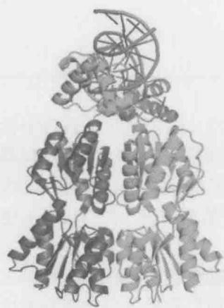

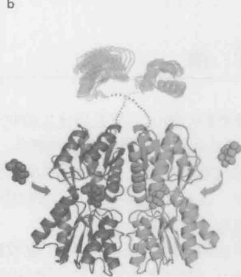

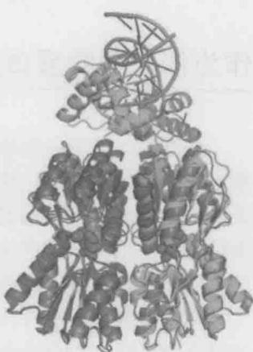  
图 6-19 乳糖阻遏物与 DNA 结合的别构调节。(a) 二聚体的乳糖阻遏物与 DNA 结合的构象。图片顶端有一段短的 DNA 片段，代表特异性结合位点（“操纵基因”）。氨基末端的 DNA 结合结构域拥有螺旋-转角-螺旋识别基序，可以同大沟中的碱基对发生相互作用。在蛋白的两个结构域之间有一个位点，可以容纳与乳糖相关的分子，该位点在此处展示的 DNA 结合构象中是空的。两个相同的阻遏物亚基分别呈红色和青色。(b) 诱导物分子（任何半乳糖苷，如外层所示，位于阻遏物外面欲与其结合的分子，以及每个阻遏物内部已结合在特定位点的分子）的结合使得阻遏物中两个结构域相对于彼此发生移动，因此，DNA 结合结构域同该蛋白体之间的铰链片段变得混乱无序，两个结构域本身的结合也变得松散，无法再与操纵基因位点进行紧密结合。(c) DNA 结合构象和诱导物诱导构象的叠加图，展示阻遏物的结构域是如何相对于彼此移动的。DNA 结合亚基的着色同 a 图，诱导的阻遏物二聚体用深蓝色表示。图片由 PyMOL 制作（Schrödinger，LLC）。


<!-- W-END Watson 6 蛋白质的结构 -->


<!-- W-BEGIN Watson 15 翻译（章首） -->

### 【中文对照 Watson 第15章：翻译（章首）】

> 来源：Watson《基因的分子生物学》第七版中译本（书籍/03_基因的分子生物学_第七版） 第15章 翻译。

#### [W] 第15章

本章概要

信使RNA

转运RNA

连接氨基酸到 tRNA 上

核糖体

翻译的起始

翻译延伸

翻译终止

翻译的调控

依赖于翻译过程的 mRNA 和蛋白质的稳定性调节

#### [W] 翻 译

本章和下一章讨论的中心问题是，蕴藏在信使 RNA（mRNA, messenger RNA）核苷酸序列中的遗传信息是如何被解读并产生蛋白质氨基酸序列的。这一过程称作翻译（translation）。在我们之前所讨论过的所有生理过程中，翻译是所有生物体中最保守，也是细胞中最耗费能量的过程之一。在快速生长的细菌细胞中，最多可有80%的能量和50%的细胞干重是专门用于蛋白质合成的。实际上，仅一个蛋白质的合成就需要上百种蛋白质和 RNA 的配合工作。由于翻译过程的本质较为复杂，我们分两章对其进行讨论。本章描述解码 mRNA 的一系列过程。第16章描述遗传密码的本质和转运 RNA（tRNA）对遗传密码的识别。

在信息传递中，翻译远比 DNA 到 RNA 的转录过程复杂。与 DNA 模板和信使 RNA 的核苷酸互补性不同的是，氨基酸的侧链与 RNA 的嘧啶和嘌呤之间几乎没有什么特异的亲和力。例如，丙氨酸（alanine, Ala）、缬氨酸（valine,

Val）、亮氨酸（leucine，Leu）和异亮氨酸（isoleucine，Ile）构成的疏水侧链不能和核苷酸碱基中的氨基和酮基形成疏水键。同样地，很难想像每三个RNA碱基所形成的不同组合能够与芳香族氨基酸包括苯丙氨酸（phenylalanine，Phe）、酪氨酸（tyrosine，Tyr）和色氨酸（tryptophan，Trp）形成特异亲和的表面。因此，多肽链中特异而准确的氨基酸序列似乎不可能是由mRNA模板和氨基酸的直接相互作用导致的。

考虑到上述问题，在 1955 年 Francis H. Crick 提出，在形成多肽链之前，氨基酸必须结合一个能够直接识别并作用于信使 RNA 三核苷酸密码子的特殊的转配分子(adaptor)。Crick 猜测这一转配器分子可能是 RNA 分子, 因为这个分子需要通过 Watson-Crick 的碱基互补原则来识别遗传密码。仅仅两年之后, Paul C. Zamecnik 和 Mahlon B. Hoagland 就证明了, 在蛋白质形成之前, 氨基酸确实和一组 RNA 分子 (约占所有细胞 RNA 的 15%) 相结合。这些 RNA 称为转运 RNA (或 tRNA), 因为它们携带的氨基酸随后被转运到不断延伸的多肽链上。

将信使 RNA 的语言翻译成蛋白质语言的机器由 4 种基本的成分组成：信使 RNA (mRNA)、转运 RNA (tRNA)、氨酰-tRNA 合成酶（aminoacyl tRNA synthetase）和核糖体（ribosome）。通过合作，它们完成了一项非凡的任务：将一种由 4 种碱基书写的密码翻译成由 20 种氨基酸书写的密码。作为翻译的模板，mRNA 提供了必须由翻译机器来解读的信息。mRNA 的蛋白质编码区是由称为密码子（codon）的一系列有序的三核苷酸单位组成的，密码子的排列顺序将决定氨基酸的排列顺序。tRNA 提供了将要组合到多肽链的氨基酸和 mRNA 的密码子之间的物理界面。氨酰-tRNA 合成酶使氨基酸和能识别相应密码子的特异 tRNA 结合起来。翻译过程最后一个重要角色是核糖体，它是一个由 RNA 和蛋白质组成的分子质量为数百万道尔顿的庞大的细胞器。核糖体协调着 tRNA 对 mRNA 的正确识别，并催化处于合成状态中的多肽链和已结合到特定 tRNA 上的氨基酸形成肽键结构。

我们将首先讨论4个组分中每一组分的主要特征，然后描述这4种组分如何共同作用以完成翻译。最近对阐明翻译机器各组分的结构相关研究进展使得翻译过程成为激动人心的研究领域——一个充满着机械论思想的领域。我们将要提出以下的问题：mRNA中核苷酸序列信息的组织结构是怎样的？tRNA的结构是怎样的？氨酰—tRNA合成酶是如何识别并结合正确的氨基酸到各个tRNA上的？最后，核糖体是如何解码核苷酸序列信息和把氨基酸加入到延伸过程中的多肽链上的？


<!-- W-END Watson 15 翻译（章首） -->


<!-- W-BEGIN Watson 15 翻译的起始 -->

### 【中文对照 Watson 第15章：翻译的起始】

> 来源：Watson《基因的分子生物学》第七版中译本（书籍/03_基因的分子生物学_第七版） 第15章 翻译。

#### [W] 翻译的起始

翻译要成功地起始，必须发生三个步骤（图 15-22）。第一，核糖体必须被募集到 mRNA 上；第二，负载 tRNA 必须置于核糖体的 P 位点；第三，核糖体必须精确地定位在起始密码子上。其中第三条是关键的，因为这一步确定了 mRNA 翻译的可读框。即使核糖体定位只发生一个碱基的易位，也将导致一个完全不相关的多肽的合成（见上面和第 16 章有关信使 RNA 的讨论）。原核生物和真核生物 mRNA 结构的不同导致完成翻译起始方式的明显不同。我们先阐明原核细胞的起始情况，然后讨论与真核细胞的差异。

#### [W] 原核细胞的 mRNA 最初是通过与 rRNA 的碱基配对而募集到小亚基上的

核糖体的组装是由大、小亚基一个一个地装配到 mRNA 上完成的。首先，小亚基和 mRNA 结合。如在讨论 mRNA 结构时所述（图 15-2），在原核细胞中，小亚基和 mRNA 的结合是由（mRNA 的）RBS 和（小亚基的）16S RNA 之间的碱基配对作用介导的（图 15-23）。对理想定位的 RBS 来说，小亚基处于 mRNA 上的恰当位置，使大亚基加入复合体时，起始密码子正好处于 P 位点。大亚基是在起始过程即将结束的时候加入复合体的，恰好在第一个肽键形成之前。因此，翻译起始的许多关键事件发生在完整的核糖体形成之前。

#### [W] 负载着修饰甲硫氨酸的特定 tRNA 直接结合到原核细胞的小亚基上

在翻译的起始阶段，tRNA可以直接结合到P位点，而不需要先占用A位点。这一过程需要一个被称为起始tRNA（initiator tRNA）的特定tRNA，它与起始密码子（通常是AUG或GUG）碱基配对。当AUG和GUG在可读框内出现时具有不同的含义，它们分别被搬运Met的tRNA（ $\mathrm{tRNA}^{\mathrm{Met}}$ ）和Val的tRNA（ $\mathrm{tRNA}^{\mathrm{Val}}$ ）所识别和阅读（第16章）。即使起始tRNA上一开始负载的是Met，甲酰基团会通过利用一种独立的酶（Met-tRNA转甲酰酶）迅速地添加到氨基酸基团上。因此，起始tRNA上负载的既非Met亦非Val，它负载的是N-甲酰甲硫氨酸（N-formyl methionine，图15-24）。负载此氨基酸的起始tRNA称为fMet-tRNA $_i^{fMet}$ 。

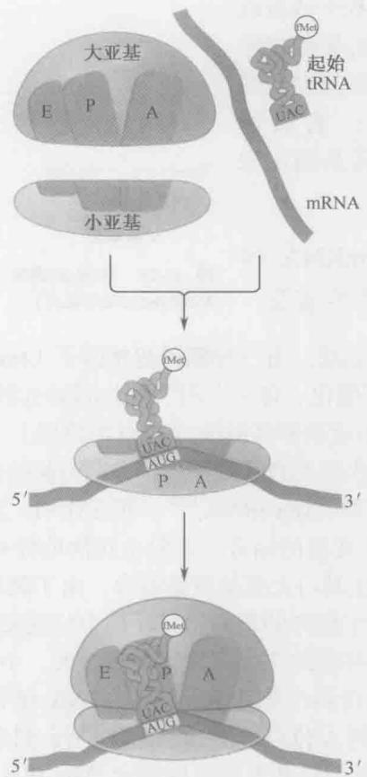

图 15-22 翻译起始的总体过程。  
  
图 15-23 16S rRNA 作用于 RBS, 将 AUG 定位于 P 位点。本图为 RBS 和起始 AUG 之间具有合适距离的 mRNA。这一距离将 AUG 置于 P 位点。许多 mRNA 没有这一合适的距离，导致翻译效率的下降。甚至有一些 mRNA 完全缺失 RBS。

由于 N-甲酰甲硫氨酸是多肽链的第一个氨基酸,你也许认为所有原核生物的蛋白质在它们的氨基端都有甲酰基的结构。但事实并非如此，因为去甲酰化酶（deformylase）

能够在多肽链合成的进行过程中或合成过程之后将这个甲酰基从氨基端去除掉。实际上，许多原核细胞的蛋白质甚至不是以 Met 开始的；氨肽酶（aminopeptidase）通常在氨基端切除 Met 及另外一两个氨基酸。

三种起始因子指导包含 mRNA 和起始 tRNA 的起始复合物的装配

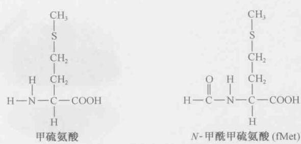  
图 15-24 甲硫氨酸和 N-甲酰甲硫氨酸（methionine and N-formyl methionine）

原核细胞的翻译始于小亚基，由三种翻译起始因子（translation initiation factor, IF）——IF1、IF2 和 IF3 所催化。每一个因子催化起始过程的一个关键步骤：

\- IF1 防止 tRNA 结合到小亚基中将形成 A 位点的位置上。

\- IF2是GTP酶（结合和水解GTP的蛋白质），它与起始过程的3个主要成分（小亚基、IF1和负载起始tRNA，即fMet-tRNA $_i^{fMet}$ ）相互作用。通过与这些成分相互作用，IF2促使fMet-tRNA $_i^{fMet}$ 和小亚基的结合，并阻止其他负载tRNA与小亚基结合。

\- IF3 与小亚基结合并阻止其与大亚基重新结合。由于翻译起始需要游离的小亚基，因此 IF3 与小亚基的结合对于翻译的新一轮循环是十分重要的。IF3 在上一轮循环即将结束时开始与小亚基结合，并协助 70S 核糖体分解为大、小亚基。

每一个起始因子能够结合到小亚基中的三个 tRNA 结合位点中的其中一个或其附近。为防止负载 tRNA 结合到 A 位点，IF1 能够直接结合到小亚基中将形成 A 位点的位置上。IF2 结合 IF1 并横跨 A 位点和 P 位点以结合 fMet-tRNA $_{i}^{fMet}$ 。最后，IF3 占据了将成为 E 位点的小亚基上的位置。这样，在小亚基的三个潜在的 tRNA 结合位点中，只有 P 位点在起始因子存在的条件下能够结合 tRNA。

随着三个起始因子的加入, 小亚基已经准备好结合 mRNA 和起始 tRNA(图 15-25)。这两种 RNA 能以任何一种方向结合, 并且互相独立。如上面所讨论的, 小亚基结合 mRNA 需要 mRNA 的 RBS 和小亚基的 16S RNA 之间的碱基配对。而 fMet-tRNA $_{i}^{fMet}$ 结合小亚基过程的促进是通过与结合 GTP 的 IF2 相互作用, 并且 (一旦 mRNA 结合于小亚基上) 由反密码子和 mRNA 的起始密码子之间的碱基配对作用来实现的。类似地, fMet-tRNA $_{i}^{fMet}$ 和 mRNA 之间的碱基配对起到了定位起始密码子到 P 位点上的作用。

翻译起始过程的最后步骤涉及大亚基的聚合以形成70S起始复合体（70S initiation complex）。当起始密码子和 $\mathrm{fMet - tRNA_i^{fMet}}$ 的碱基配对后，小亚基的构象发生变化，导致IF3的释放。在IF3离开的情况下，大亚基可以自由地与小亚基及其负载的IF1、IF2、mRNA和 $\mathrm{fMet - tRNA_i^{fMet}}$ 结合。而且，IF2可以作为大亚基的初始对接位点，并且这种相互作用激活了IF2-GTP的GTP酶活性。因此，IF2-GDP与核糖体和起始tRNA的亲和力降低，导致IF2-GDP和IF1从核糖体释放出来。这样，翻译起始过程的最终产物是在mRNA的起始位点组装了一个完整的70S核糖体，其P位点有 $\mathrm{fMet - tRNA_i^{fMet}}$ ，而A位点是空的。这个核糖体-mRNA的复合体已准备好在A位点结合负载tRNA，开始多肽链的合成。

真核细胞的 mRNA 通过 5'帽子募集核糖体

真核细胞翻译的起始过程在很多方面与原核细胞相同。它们都使用起始密码子和专门的起始 tRNA，都在大亚基的加入之前利用起始因子形成结合 mRNA 的小亚基复合体。但是，真核细胞运用一个根本不同的方式来识别 mRNA 和起始密码子，这对真核细胞的翻译方式产生重要的影响。

在真核细胞中，小亚基在被募集到mRNA的5'端帽子结构之前，已经与起始tRNA结合。然后以 $5'\rightarrow3'$ 方向沿着mRNA“扫描”直到遇见第一个5'-AUG-3'（见前面章节中有关mRNA前导区Kozak序列的讨论），该密码子被识别为起始密码子。因此，在大多数情况下（框15-3），只有第一个AUG才能作为真核细胞翻译的起点。请注意，这一起始方式和大多数真核mRNA只编码一个多肽链（单顺反子，monocistronic）的事实相一致；对其内部起始密码子的识别通常是不必要的，也是不可能的。

正如我们在其他分子过程（如转录时对启动子的识别）中所看到的，真核细胞较之原核细胞需要更多的辅助蛋白来完成起始过程。整个起始过程可分为4步。第一，与在原核生物中不同，在真核细胞中起始tRNA与核糖体小亚基的结合总是先于其与mRNA的结合（图15-26a）。第二，由另一组不同的辅

  
图 15-25 对原核生物转录起始的总结。

助因子介导对 mRNA 的识别。第三，结合于起始 tRNA 的核糖体在 mRNA 上 “扫描” 以搜寻第一个 AUG 序列。第四，核糖体的大亚基在起始 tRNA 与起始密码子碱基配对之后被募集进来。现在，我们详述这些事件。

#### [W] 框15-3 uORF和IRES：能够证明翻译规则的特例

不是所有真核生物的多肽都是由最靠近5'端的AUG起始的可读框编码的。有时，第一个AUG处于不合适的上下游序列中而经常被跳过。有时，短的上游可读框（uORF，编码少于10个氨基酸长度的肽段）见于编码长肽的主要可读框的上游。但是在uORF的翻译结束之后，一部分40s的亚单位仍然保持结合在mRNA上（一般为50%）。较短的uORF便于其与翻译起始因子的相互作用（如eIF4G和eIF3），从而使40S亚单位牢固地结合在mRNA上而且能够在翻译终止后仍然保持该状态（框15-3图1）。保留的40S亚单位继续在mRNA上扫描下一个AUG，但是由于起始tRNA反密码子是识别AUG的必要条件，它对AUG的识别只能在结合一个新的三元复合物（TC；eIF2起始tRNA）的基础上进行（框15-3图1）。通常，这些uORF能够减少而不是完全去除下游长ORF的翻译。我们将在本章举例讨论关于uORF如何用于调控翻译过程。

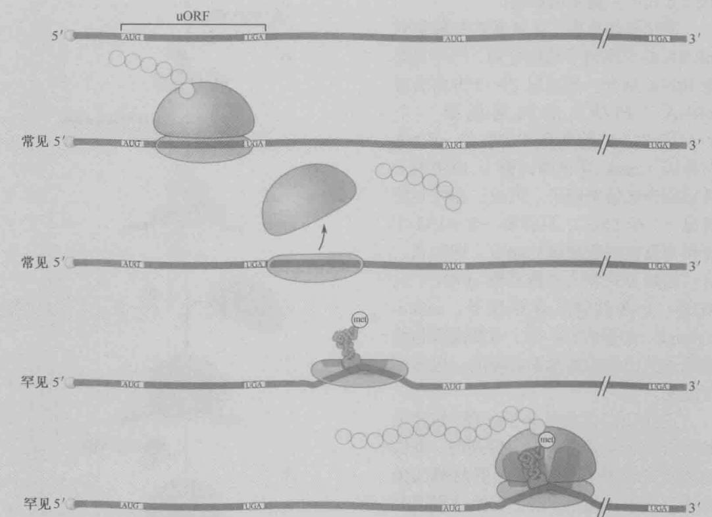  
框 15-3 图 1 uORF 调控下游 ORF 的翻译。在某些情况下，当一个核糖体翻译了一个 uORF 后，小亚基仍然留在 mRNA 上，并重新开始扫描搜寻下一个 AUG。只有当结合了一个新的起始 rRNA，它才能识别下一个 AUG。

在最靠近 5' 端的 AUG 的下游位点起始翻译的一个更极端的例子是内部核糖体进入位点（internal ribosome entry site，IRES）。IRES 是 RNA 序列，功能类似于原核生物的 RBS。它们募集小亚基结合于 mRNA 的一个内部位点并在缺少 5' 帽子的情况下起始翻译（框 15-3 图 2）。IRES 多编码于病毒 mRNA，因为它们通常缺乏 5' 帽子并需要最大限度地利用它们的基因组序列。通过使用 IRES，病毒 mRNA 可以编码多于一个的蛋白质，减少对每个蛋白质编码序列所需的转录调控序列。更重要的是，通过减少一个或多个起始因子的需求，IRES 可以在缺乏某种起始因子的情况下继续实现其功能。利用这独特的机制，某一小部分包含 IRES 的 mRNA 在缺少起始因子的细胞中仍能进行翻译。举例来说，在细胞凋亡（或被称为细胞程序性死亡）过程中新激活的蛋白酶降解 eIF4E，但是一小部分用于降解的蛋白质在这一过程中仍然可以被翻译，这是由于其 mRNA 的 5'UTR 上存在一个 IRES 序列，因此避开了对 eIF4E 分子的需求。

  
框 15-3 图 2 IRES 绕过翻译起始的常规要求。病毒的 mRNA 经常包含 IRES 序列，这些序列可以折叠成 RNA 结构来绕过翻译过程中所需要的一种或多种真核细胞的翻译因子。（a）脊髓灰质炎病毒（poliovirus）的 IRES 绕开了需要的 5'帽子的要求，直接与 eIF4G 结合。（b）蟋蟀麻痹病毒编码的一个 mRNA 含有一个精巧的 IRES，折叠后模仿 tRNA 直接结合到 40S 和 60S 核糖体亚基的 P 位点上。下游的 mRNA 进入到 A 位点并开始翻译以丙氨酸为首的肽链。

不同的 IRES 的工作机制不同。在病毒中，至少有一个 IRES 能够直接结合 eIF4G，它绕开了对 5'帽结合蛋白 eIF4E 的需求，然后募集 eIF4G 从而进行翻译（框 15-3 图 2a）。IRES 最极端的形式是蟋蟀麻痹病毒（cricket paralysis virus）的 mRNA。这个 mRNA 的 5'UTR 形成了一个复杂的结构，它可以模仿 tRNA 结合 mRNA 的形式，将自身置于 P 位点和 E 位点的杂合区域中，并且直接结合到 40S 亚单位的 P 位点上。通过这种方式，mRNA 的翻译不再需要起始因子和起始 tRNA（框 15-3 图 2b）。更重要的是，下游的 RNA 序列直接放在了解码中心的 A 位点上，使其直接以第一个密码子发挥作用。生物体中 IRES 的存在使翻译起始因子变得不必要，这提示我们在演化的早期所有的 mRNA 都有可能包含这样的 IRES，而翻译起始因子可能是之后才产生的，它带来的是翻译过程的更高效率与更具适用性。

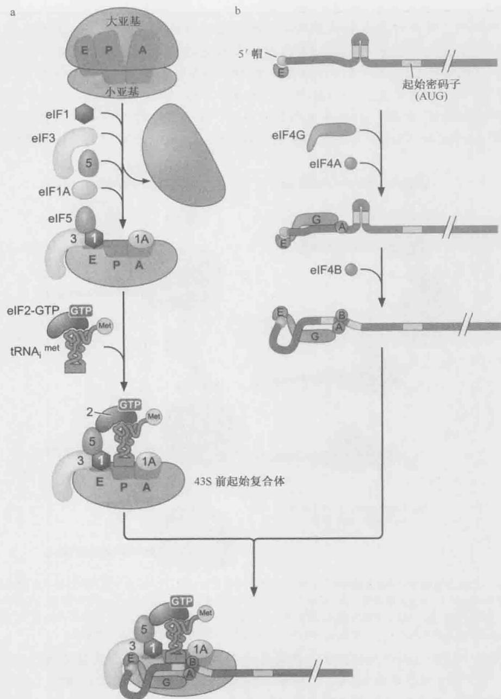  
图 15-26 真核细胞核糖体小亚基和起始 tRNA 装配到 mRNA 上。

真核生物核糖体完成了一个周期的翻译之后，就解体为游离的大、小亚基，此时四个起始因子——eIF1、eIF1A、eIF3和eIF5均结合于小亚基上。同时，eIF1,eIF1A和eIF5与原核生物起始因子的IF3和IF1因子功能相似，都能够阻止大亚基与小亚基的重新组合以及tRNA结合到A位点的过程。起始tRNA被三个亚基组成的GTP结合蛋白eIF2送至小亚基上。与IF2类似，eIF2以GTP结合的形式与起始tRNA结合。这种由起始tRNA和EIF2产生的复合体称为三重复合物(ternary complex,TC)。

对于真核生物来讲，起始 tRNA（与细菌的情况相同，起始过程之后所使用的 tRNA[Met]是有区别的）负载甲硫氨酸，而不是 N-甲酰甲硫氨酸，称为 $Met-tRNA_{i}^{Met}$ 。eIF2 将 $Met-tRNA_{i}^{Met}$ 放置在小亚基中将形成 P 位点的位置上，形成 43S 前起始复合物（43S preinitiation complex）。值得注意的是，eIF3 几乎和整个 40S 亚基大小一致，但它却主要结合在核糖体的小亚基上靠近 RNA 进出的位点处。然而，eIF3 与 43SPIC 的每一个成员，包括起始 tRNA，相互作用，从而促进 43SPIC 的组装过程。

在另外一系列反应中，mRNA为小亚基对其的识别做好准备。这一过程以“帽子”结合蛋白eIF4G识别5'端帽子为起始。然后，一系列附加的起始因子募集进来。eIF4G同时结合eIF4E和mRNA，而eIF4A结合eIF4G和mRNA（图15-26b）。eIF4G和eIF4E的这种联合尤为重要——细胞中翻译的整体水平由这个步骤中一个蛋白家族控制。这个能够与eIF4G相互竞争结合的蛋白，称为eIF4E结合蛋白（见本章后面部分的翻译调控）。这一复合体然后与eIF4B分子结合，该分子能够激活eIF4A的RNA解旋酶活性。解旋酶能够解开任何可能形成于mRNA末端的二级结构（如发夹结构）。解除二级结构是非常必要的，因为mRNA5'端必须消除二级结构才能与小亚基结合。最后，结合在消除了较高级结构的mRNA上的eIF4G因子与结合在小亚基上的起始因子（特别是eIF3）不断发生相互作用，直到将43S前起始复合物募集到mRNA上，形成48S前起始复合物（48S preinitiation complex）。

#### [W] 翻译起始因子使真核 mRNA 保持环状

Poly-A 尾巴的存在对于提高真核生物蛋白质翻译的效率有所贡献。除了与 mRNA 的 5' 端结

mRNA 的 5' 端结合, 起始因子也可以通过 poly-A 尾与 mRNA 的 3' 端紧密结合 (图 15-27)。这一相互作用主要通过 eIF4G 和 mRNA3' 末端的直接结合以及与包绕在 poly-A 尾的 poly-A 结合蛋白 (poly-A binding protein) 的结合作用实现的。这种作用使 5' 端和 3' 端之间的分子紧密相邻, 并且使 mRNA 维持一种环状的构象。与 polyA 尾结构能够提高

  
图 15-27 真核 mRNA 环化模型。环化被认为是由 eIF4G 和 poly-A 结合蛋白的相互作用介导的。

mRNA 翻译效率的情况相似，这些相互作用，包括 eIF4E 结合 mRNA 帽子和大亚基的募集过程，能够提高翻译起始过程中某些步骤的效率。更重要的是，eIF4G 与 mRNA 上的 polyA 结合蛋白之间的相互作用在多个翻译的周期都存在。除此以外，这种 mRNA 结构对于重新定位刚结束翻译的核糖体分子到 AUG 密码子的过程，即重新起始翻译过程有促进作用。

#### [W] 起始密码子是从 mRNA 的 5' 端向下游 “扫描” 发现的

一旦小亚基和它的结合因子在 mRNA 的 5'端组装好，它们就按照 5'→3'方向沿着 mRNA 移动。这一移动是依赖于 ATP 的，并通过与 eIF4A / B 结合的 RNA 解旋酶所驱动（图 15-28）。在移动过程中，小亚基扫描 mRNA 以寻找起始密码子。起始密码子的识别是通过起始 tRNA 的反密码子和起始密码子之间的碱基配对作用（这就是起始 tRNA 先与小亚基结合、后与 mRNA 结合之所以重要的原因）。正确的碱基配对改变了 48S 复合体的构象，导致了 eIF1 的释放和 eIF5 构象的改变。因此促使 eIF2 水解与之结合的 GTP。当 eIF2 处于 GDP 结合态时，就不再结合起始 tRNA，并且同 eIF5 一起从小亚基上释放出来。

eIF2 的离开使第二个受 GTP 调控的、被称为 eIF5B 的起始 tRNA 结合蛋白得以产生结合反应。当其结合到起始 tRNA，eIF5B·GTP 能够促使 60S 亚基正确结合于 40S 亚基。这种结合之所以成为可能，就是因为先前阻止这种结合过程的蛋白因子（eIF1 和 eIF5）已经被释放。和原核生物一样，大亚基的结合导致剩余的起始因子释放，这是通过促进 eIF5B 对 GTP 的水解而完成的。这些事件的结果是，Met-tRNA $_{i}^{Met}$ 被置于新的 80S 起始复合体（80S initiation complex）的 P 位点，核糖体为在 A 位点接受一个负载 tRNA 并开始第一个肽键的合成做好了准备。

尽管真核细胞中翻译的起始包含更多的辅助因子，但其中很多是细菌起始因子的类似物。IF1 和 eIF1A 在起始过程中都和 A 位点结合，从而阻止 tRNA 过早的结合。IF2 的功能介于 eIF2 和 eIF5B 之间：eIF2 介导起始 tRNA 的募集及检测与起始密码子 AUG 的配对情况，而 eIF5B 执行 IF2 在大亚基招募过程中的功能。就像 IF2，eIF2 和 eIF5B 都被它们所结合的核苷酸所调节。最终，IF3 和 eIF1 都同小亚基上的 P 位点结合，且都在起始 tRNA 与 AUG 进行碱基配对的过程中被释放。


<!-- W-END Watson 15 翻译的起始 -->


<!-- W-BEGIN Watson 15 翻译延伸 -->

### 【中文对照 Watson 第15章：翻译延伸】

> 来源：Watson《基因的分子生物学》第七版中译本（书籍/03_基因的分子生物学_第七版） 第15章 翻译。

#### [W] 翻译延伸

一旦核糖体和负载的起始 tRNA 组装于 P 位点上，多肽的合成就能够开始了。为了使每个氨基酸能正确加入，有三个关键过程是必需的（图 15-29）：首先，在 A 位点上的密码子指导下，正确的氨酰-tRNA 置于 A 位点上；第二，A 位点的氨酰-tRNA 与 P 位点的肽酰 tRNA 上的肽链形成肽键。如我们之前所见，这一肽转移酶(peptidyl transferase)反应导致延伸的多肽链从 P 位点的负载 tRNA 上转移到 A 位点的负载 tRNA 的氨基酸残基上；第三，在 A 位点形成的肽酰-tRNA 和相应的密码子必须易位（translocate）至 P 位点，以使核糖体为下一循环的密码子识别和肽键形成做好准备。同 mRNA 的起始位置必须精确一样，核糖体在 mRNA 上的移动也必须准确以保持正确解读遗传信息的可读框。两种被称为延伸因子（elongation factor）的辅助蛋白调控这些事件。这两种因子都利用 GTP 结合和水解产生的能量来提高核糖体作用的效率和准确性。

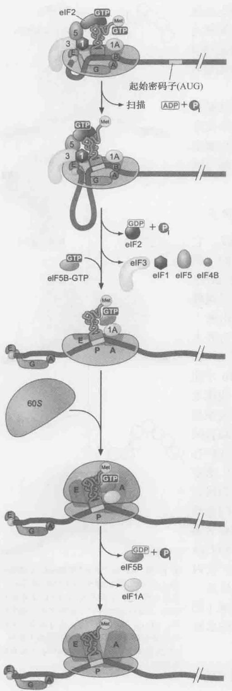  
图 15-28 真核细胞翻译起始阶段，核糖体 48S PIC 对起始 AUG 的识别和大亚基的结合。

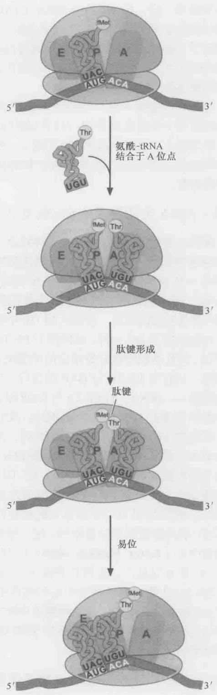  
图 15-29 翻译延伸步骤的总结。

与翻译的起始不同，延伸的机制在原核细胞和真核细胞之中是高度保守的。我们将延伸的讨论仅限于原核细胞上，它已经被详细地了解了，但真核细胞的翻译延伸过程无论在涉及的因子和机制上都与原核细胞相似。

#### [W] 氨酰—tRNA 由延伸因子 EF-Tu 送达 A 位点

氨酰—tRNA 不能独自与核糖体结合。相反，它们是由延伸因子 EF-Tu “护送” 到核糖体上的（图 15-30）。一旦 tRNA 被氨基酰化，EF-Tu 就结合于 tRNA 的 3' 端，覆盖耦合的氨基酸。这个作用防止了氨酰-tRNA 参与肽键的形成，直到从 EF-Tu 中释放出来。

与起始因子 IF2 一样，延伸因子 EF-Tu 结合并水解 GTP，并且鸟嘌呤核苷酸结合的类型决定了 EF-Tu 的功能。只有当 EF-Tu 与 GTP 结合后，EF-Tu 才能结合氨酰——tRNA。而 EF-Tu 与 GDP 结合，或缺乏结合态核苷酸的时候，与氨酰-tRNA 没有什么亲和力。因此当 EF-Tu 水解结合的 GTP 时，其所结合的氨酰-tRNA 就被释放出来。结合氨酰-tRNA 的 EF-Tu 单独不能有效地水解 GTP。相反，EF-Tu GTP 水解酶活性是在与大亚基的一个结构域结合之后而得以激活的，该结构域与大亚基加入起始复合体时激活 IF2 GTP 水解酶的作用位置相同。这一结构域称为因子结合中心（factor binding center）。只有当 tRNA 置于 A 位点并且产生正确的密码子-反密码子配对后，EF-Tu 才能与因子结合中心相互作用。然后，EF-Tu 水解结合的 GTP，并从核糖体中释放出来（图 15-30）。正如下面将讨论的，EF-Tu 调控 GTP 的水解对翻译的特异性是非常重要的。

核糖体利用多种选择机制排斥错误配对的氨-酰 tRNA

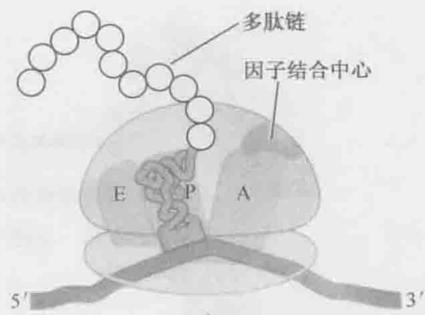

  
图 15-30 EF-Tu “护送” 氨酰-tRNA 至核糖体的 A 位点。当负载 tRNA 最初与核糖体的 A 位点发生作用时，它们是与 EF-Tu-GTP 结合在一起的。当正确的密码子-反密码子相互作用发生时，EF-Tu 与因子结合中心发生反应，水解所结合的 GTP，并从 tRNA 和核糖体上脱离。当 EF-Tu 被释放之后，tRNA 将旋转进入核糖体的转肽酶中心。

翻译的错误率为 $10^{-3} \sim 10^{-4}$ 。这就是说，在合成的蛋白质中，每1000个氨基酸中只有不多于一个氨基酸是组装错误的。选择正确的氨酰-tRNA的根本原则在于负载tRNA和核糖体A位点的密码子之间的碱基配对。尽管如此，正确的密码子-反密码子配对和不正确的配对之间的能量差异尚不能完全解释这样高的准确率。在许多情况下，密码子-反密码子相互作用的三对核苷酸中只有一对是错配的，但核糖体很少允许这样的氨酰-tRNA继续翻译。至少有三种不同的机制促成了翻译的高准确率（图15-31）。这些机制都选择排斥密码子-反密码子配对错误的氨酰-tRNA。

其中一个有助于密码子识别准确性的机制涉及小亚基 A 位点内 16S RNA 的两个相邻的腺嘌呤残基。这两个腺嘌呤在 A 位点中反密码子和密码子的前两个碱基之间每个正确配对所形成的小沟中形成氢键(图 15-31a)。正如之前谈到的(第 6 章和图 6-10)，在 Watson-Crick 的 G：C 和 A：U 碱基配对所形成的小沟中，氢键的特性是非常相似的。因此，相邻的 16S RNA 的 A 残基不能辨别 G：C 或 A：U 配对，因而认为任何一对都是正确的。相反，非 Watson-Crick 碱基配对或错配所形成的小沟就不能被 16S RNA 的这两个腺嘌呤识别，导致对非正确 tRNA 的亲和力明显降低。这些作用的综合结果是，正确配对的 tRNA 从核糖体解离的速度要远低于非正确配对的 tRNA。

第二个有助于保证正确的反密码子-密码子配对的机制涉及 EF-Tu 的 GTP 酶的活性（图 15-31b）。如上所述，EF-Tu 从 tRNA 的释放需要 GTP 的水解，这一作用对正确的反密码子-密码子配对是非常敏感的。即使只有一个碱基的不配对也将改变 EF-Tu 的位置，降低其与因子结合中心的相互作用能力。这就导致了 EF-Tu 的 GTP 酶活性的急剧下降。这一机制是动力学选择性的一个范例，并且与 DNA 合成过程中保证正确的碱基配对的机制有关（见第 9 章）。在这两个过程中，正确的碱基配对的形成都明显地加快了一个重要的生化步骤的速度。对 DNA 聚合酶来说，这个步骤就是磷酸二酯键的形成。对蛋白质合成来说，这个步骤就是 EF-Tu 对 GTP 的水解。

第三个保证碱基配对正确性的机制是 EF-Tu 释放后的一个校正机制。当负载 tRNA 与 EF-Tu-GTP 的复合体进入 A 位点时，它的 3' 端远离肽键形成的位点。为了成功地进行肽转移酶反应，氨酰-tRNA 必须旋转进入到大亚基的肽转移酶中心，这一过程称为入位（accommodation，图 15-31c）。在入位过程中，氨酰-tRNA 的 3' 端移动了几乎 70Å。非正确配对的 tRNA 在入位过程中经常从核糖体上脱离下来。有假设认为氨酰-tRNA 的旋转为密码子-反密码子的相互作用带来了张力，而只有正确配对的反密码子才能承受这种张力。因此，错配的氨酰-tRNA 就更有可能在肽转移酶反应进行之前从核糖体上脱离下来。

总之，除了密码子-反密码子的相互作用，核糖体还利用小沟的作用和两种校正机制来保证正确的氨酰-tRNA结合在A位点上。这三种额外的选择机制阻止了那些不能形成正确的密码子-反密码子作用的氨酰-tRNA的留存。

#### [W] 核糖体是一种核酶

一旦正确的负载 tRNA 置于 A 位点并旋转进入肽转移酶中心，肽键的形成就开始了。这一反应由 RNA，尤其是大亚基的 23S rRNA 来催化。这种论点的早期证据来自于下面的实验：即使剥离了很多蛋白质的大亚基依然能够进行肽键的形成。对肽转移酶其实由

RNA 组成的这一事实的证明，来自于一个原核生物核糖体的高精度三维结构研究，它揭示没有氨基酸位于活性位点的 18Å 之内（图 15-32）。


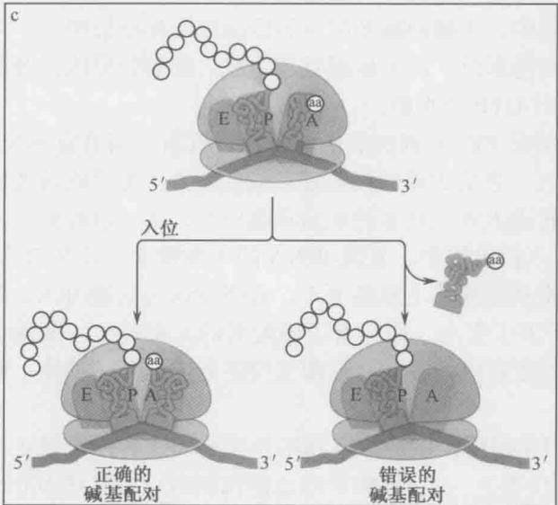

  
图 15-31 保证 tRNA 和 mRNA 正确配对的三种机制。(a) 只有当密码子-反密码子正确配对时, 16S rRNA 的两个腺嘌呤残基与配对碱基对的小沟之间才能形成额外的氢键。(b) 正确的碱基配对使得结合氨酰-tRNA 的 EF-Tu 与因子结合中心相互作用, 诱发 GTP 的水解和 ET-Tu 的释放。(c) 只有碱基配对正确的氨酰-tRNA 在肽键形成过程中旋转进入正确位置时, 才能保持与核糖体的结合。这一旋转易位称为 tRNA 入位。

对 E.coli 核糖体与 mRNA 及 tRNA 整合复合物三维结构的解析已揭示出, 某个蛋白质（L27）的氨基末端确定能够完全进入到其活性部位。这一发现可能意味着这一蛋白

质在催化过程中起到某种作用。为了检测这种可能性，将L27蛋白氨基端9个处于活性中心附近的氨基酸进行缺失突变。生成的细胞所产生的核糖体具有降低的，但可被检测到的肽酰转移酶活性，这就清楚地说明L27蛋白的这一区域影响肽酰转移酶的活性。然而突变的核糖体依然以野生型核糖体蛋白合成水平的 $30\% \sim 50\%$ 来合成蛋白质，并且含有突变核糖体的细胞仍然可以生长分裂。与底物（氨酰-tRNA）在溶液中单独存在时相比，核糖体提高了 $10^{7}$ 倍的肽键形成速率。显然，即使L27不在活性位点上，核糖体依然保留了绝大部分的活性。因此，尽管这一蛋白质促进肽键形成，但它对于肽酰转移酶活性并

  
图 15-32 RNA 环绕着大亚基的肽转移酶中心。图中所示为细菌 50S 亚基的三维结构。RNA 为灰色，核糖体蛋白质为紫红色。紧邻肽酰转移酶中心的位于 A 位点和 P 位点的 tRNA 的 3'端分别以绿色和红色表示。（Yusupov M.M. et al. 2001. Science 292: 883–896.）图像使用 MolScript、BobScript 和 Raster 3D 软件制作。

不是必需的。像其他核糖体蛋白一样，L27最有可能的功能就是将一个或更多的RNA组分正确地摆放到活性位点。更为重要的是，因为这个蛋白质是唯一一个距离活性中心最近的、行使催化功能的蛋白质，所以核糖体的rRNA组分一定承担着催化肽键形成的主要功能。

23S rRNA 接下来是如何催化肽键形成的呢？准确的机制仍然需要研究，但某些答案已经清楚了。首先 23S rRNA 与处于 A 和 P 位点的 tRNA 的 CCA 末端之间碱基配对，有助于氨酰-tRNA 的 α 氨基基团攻击结合于肽酰-tRNA 的多肽羰基基团。这一作用也有可能稳定入位后的氨酰-tRNA。这类催化机制称为熵催化（entropic catalysis）。也就是说，酶通过将底物带到一起的方式来激发催化。

由于仅仅靠底物的紧密相邻并不足以产生高水平的催化作用，因此很可能 rRNA 的其他元件也参与了催化。实际上，去掉 23S rRNA 上一个高度保守残基（E.coli 23S rRNA 上的 A2451 位点）的 2'-OH 这样的一种变化使催化速率至少降低了 10 倍。近期的研究又发现了一个未曾料到的、在催化中很关键的 RNA 分子：P 位点 tRNA。去掉 P 位点 tRNA 的 3'端 A 残基的 2'-OH 导致催化速率降低了 $10^{6}$ 倍。这种称为“底物辅助催化”（substrate-assisted catalysis）的现象是一个尤为有趣的发现，因为这预示着氨酰-tRNA 本身就携带着关键的催化元件。这一发现意味着在核糖体演化之前，tRNA 可能已经为催化其自身蛋白质的合成提供关键元件了。

基于一系列相关考虑，人们提出，P位点tRNA的2'-OH可能充当“质子穿梭机制”(proton shuttle)的一部分(图15-33)。在这一模型中，2'-OH向肽酰-tRNA的3'-OH提供一个H，并从发起攻击的、连接于A位点tRNA的氨基酸的α-氨基基团得到一个质子。十分重要的是，这两个发现都强烈支持这样一种假设，即正是RNA而不是

蛋白质催化了肽键的形成。尽管如此，关于核糖体怎样催化肽键形成仍需要进一步研究。

#### [W] 肽键形成启动大亚基中的易位反应

一旦肽转移酶反应开始发生，P 位点的 tRNA 就被去乙酰基化（不再结合氨基酸），而多肽链则连接到 A 位点的 tRNA 上。要使肽链延伸的新一轮循环得以发生，P 位点的 tRNA 必须移至 E 位点，而 A 位点的 tRNA 必须移至 P 位点。同时，mRNA 也必须移动 3 个核苷酸，使下一个密码子暴露出来。这些移动是在核糖体内协调进行的，统称为易位 (translocation)。

易位的起始步骤是与肽转移酶的耦联反应（图 15-34）。一旦多肽链移至 A 位点的 tRNA 上，A 位点和 P 位点的 tRNA 就会开始占据到大亚基上的新位置上。A 位点 tRNA 的 3' 端与多肽结合，而结合到大亚基的 P 位点上。这时已脱氨基的 P 位点 tRNA 不再与多肽结合，而结合到大亚基的 E 位点上。与此相反，在这个时候，这些 tRNA 的反密码子仍然停留在小亚基的原始位置上并与 mRNA 配对。因此，大亚基的易位是先于小亚基的易位，而 tRNA 就处于 “杂合状态”。它们的 3' 端移入一个新的位置，但它们的反密码子末端仍位于未发生肽转移酶反应时的位置上（图 15-34b）。更重要的是，这种改变是在小亚基中以逆时针方向进行的，而且这与大亚基中的几个有着明显位置差别的 tRNA 之间所产生的相互作用有关。

EF-G 通过稳定中间体的方法推动易位

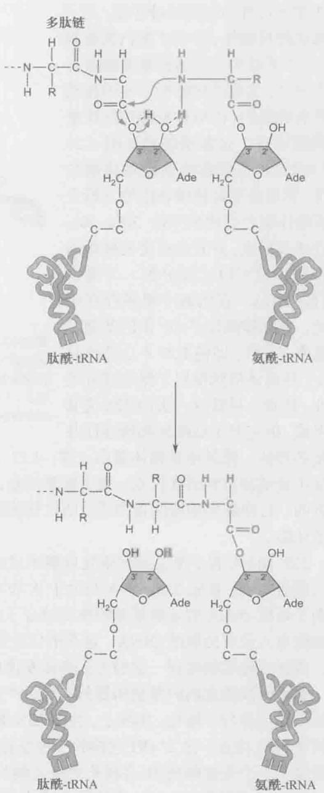  
图 15-33 肽键形成中 P 位点 tRNA 2'-OH 的功能。肽酰-tRNA 最后一个 “A” 的 2'-OH 对于肽键形成十分关键。基于以上发现，有人提出 2'-OH 的氢组分可能参与一个 “质子穿梭机制”。在此模型中，随着肽酰-tRNA 与肽链之间的键断裂，3'氧原子从 2'-OH 夺取一个氢原子（以黄色表示），而 2'氧原子反过来从攻击羧基的氨基基团夺取一个氢原子（以绿色表示）。红色箭头显示肽键形成过程中可能的电子运行方向。

易位的的完成需要第二个延长因子，EF-G 的协助。EF-G 在与 GTP 相互作用后会初步地结合到核糖体上。在肽酰转移酶的作用下，EF-G-GTP 以旋转混合的状态结合并稳定在核糖体上（图 15-34c）。一旦 EF-G-GTP 结合，则会与大亚基上的因子结合中心发生作用从而激活 GTP 的水解。

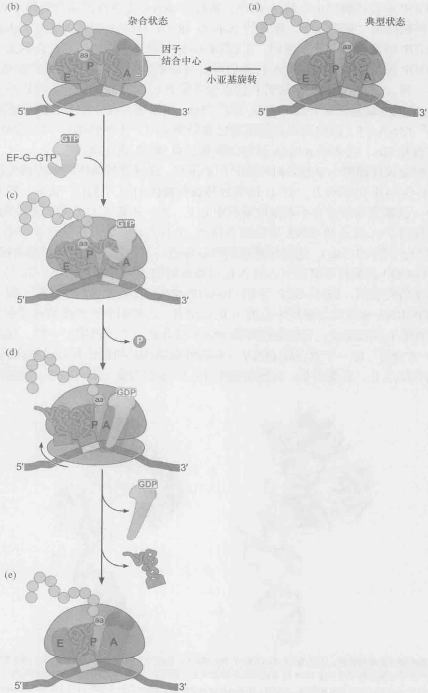  
图 15-34 EF-G 激活易位的过程需要 GTP 的水解。

GTP 的水解会改变 EF-G 的两个序列的构象（图 15-34d）。首先，EF-G-GDP 与核糖体间的相互作用被认为是用于“解锁”核糖体。结构学研究表明存在分离 A-、P-和 E 位点的“门”，而 EF-G-GDP 则可以通过打开这些门来解锁核糖体。其次，改变构象后的 EF-G-GDP 结合到解码中心的 A-位点，从而与 tRNA 竞争性的结合解码中心的 A 位点。由于核糖体被“解锁”了，原来的 A-位点 tRNA 可以移动到 P-位点，从而可以允许 EF-G-GDP 结合到 A 位点。因而，正如 EF-G-FTP 稳定了核糖体的杂合状态，改变后的 EF-G-GDP 构象在 tRNA 离开 A-位点后可以与解锁后的核糖体更加紧密的结合。像多米诺骨牌一样，A-位点 tRNA 移动到 P-位点会导致 P-位点的 tRNA 移动到 E-位点。tRNA 和 mRNA 之间的碱基配对导致 mRNA 移动 3bp。当出现具有 4 个核苷酸反密码子的稀有“移码”tRNA 时（因此可以补偿因特定移码突变时产生的错误），可以导致 mRNA 移动 4bp 而非 3bp，这表明 mRNA 移动的距离是由 tRNA 决定的。

易位的完成伴随着小亚基顺时针旋转回到原位。这导致核糖体的结构很大程度上降低了与 EF-G-GDP 的亲和力。EF-G 的释放导致核糖体回到 “紧闭” 状态，即 tRNA 和 mRNA 再一次紧密的结合在小亚基的解码中心上，A-，P- 和 E- 位点的门被关闭。同时，这些事件导致了 A- 位点的 tRNA 易位到 P- 位点，P- 位点的 tRNA 易位到 E- 位点，mRNA 准确移动 3bp（图 15-34e）。这样核糖体则准备好进行下一轮的添加氨基酸的状态。

EF-G-GDP是如何与解码中心的A位点高效的结合呢？EF-G和EF-Tu与tRNA结合的晶体学研究表明，EF-G-GDP与EF-Tu-GTP-tRNA有非常相似的结构（图15-35）。EF-Tu-GTP-tRNA也可以与解码中心的A位点结合。这种相似性中最值得注意的是，尽管EF-G由单个多肽组成，它的结构却像tRNA结合到一个蛋白质上一样。这是“分子拟态”的一个例子，即一个蛋白像tRNA一样的外观结构从而促使其可以结合到与tRNA相同的结合位点上。有趣的是，真核细胞中EF-G的类似物（如eEF-2）的结构学研究中发现两个构象完全不同的蛋白质（一个与抗生素 sordarin 结合）。如图 15-35 所示，一个构象与 EF-G 的结构相似，而第二个构象则是由相对于 GTP 结合区域的 tRNA 模拟区域的显著的移动造成的。在这样特有构象间的改变能力对于易位时 EF-G 的功能很重要。

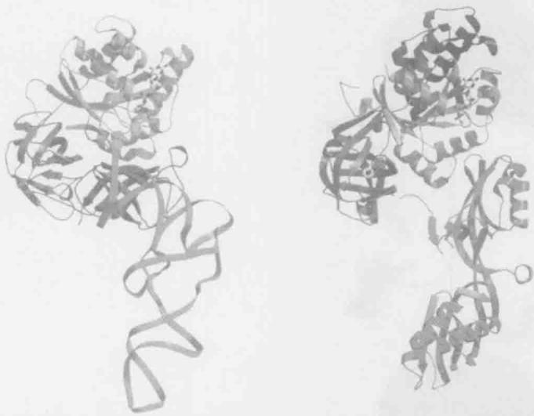  
图 15-35 延伸因子的结构比较。左图为 EF-Tu-GDPNP-Phe-tRNA，右图为 EF-G-GDP。GDPNP 为不能水解的 GTP 类似物，在形成各分子三维结构时用于在 GTP 结合的构象中锁定分子。请注意 EF-G 中以绿色标注的结构和与 EF-Tu 结合的 tRNA（也用绿色表示）的结构具有相似性。（左图：Nissen P. et al. 1995. Science 270: 1464–1472. 右图：al-Karadaghi S. et al. 1996. Structure 4: 555–565.）图像使用 MolScript、BobScript 和 Raster 3D 软件制作。

#### [W] EF-Tu-GDP 和 EF-G-GDP 在参加新一轮延伸之前必须将 GDP 换成 GTP

EF-Tu 和 EF-G 是具有催化功能的蛋白质，在每一轮 tRNA 结合核糖体、肽键形成和易位的过程中只能使用一次。GTP 水解后，这两个蛋白质必须释放其所结合的 GDP，并结合一个新的 GTP 分子。对 EF-G 来说，这是一个简单的过程，因为 GDP 与 EF-G 的亲和力要低于 GTP。因此 GTP 水解后，GDP 和磷酸释放出来，游离的 EF-G 很快与一个新的 GTP 分子相结合。而对 EF-Tu 而言，需要另一个蛋白质来完成 GDP 到 GTP 的交换。延伸因子 EF-Ts 是 EF-Tu 的 GTP 交换因子（GTP exchange factor）（图 15-36）。EF-Tu-GDP 从核糖体释放出来后，EF-Ts 与 EF-Tu 结合，促使 GDP 脱落。随后，GTP 结合 EF-Tu-EF-Ts 复合体，导致它分解为游离的 EF-Ts 和 EF-Tu-GTP。最后，EF-Tu-GTP 结合一个负载的 tRNA，重新形成 EF-Tu-GTP-氨酰-tRNA 复合体，再一次准备将新的负载 tRNA 送至核糖体。

#### [W] 形成肽键的一个循环要消耗两个 GTP 分子和一个 ATP 分子

我们以计算能量消耗来结束对延伸过程的讨论。有多少三磷酸核苷酸分子在每一轮的肽键形成中被消耗了呢(不算氨基酸生物合成的能量消耗和起始与结束阶

  
图 15-36 EF-Ts 促进 GDP 与 EF-Tu 的解离。结合于 EF-Tu 的 GDP 释放非常缓慢。EF-Ts 结合于 EF-Tu-GDP，引发 GDP 的快速解离。结合于 EF-Tu-EF-Ts 复合物中的 EF-Tu 上的 GTP 取代 ET-Ts 并释放 EF-Tu-GTP。EF-Tu-GTP 随后能够结合一个新的氨酰-tRNA 并运往核糖体。

段的消耗）？还记得一个 ATP 分子被氨酰-tRNA 合成酶消耗，形成了连接氨基酸和 tRNA 的高能酰基键。这一高能酰基键断裂（所释放的能量）驱动了产生肽键的肽转移酶反应。第二个三磷酸核苷酸（GTP）分子在 EF-Tu 将负载 tRNA 运送至核糖体的 A 位点和确保正确的密码子-反密码子的识别过程中被消耗。最后，第三个三磷酸核苷酸（GTP）在 EF-G 介导的易位过程中被消耗。这样，一个肽键的形成就消耗了细胞两个 GTP 分子和一个 ATP 分子，翻译延伸过程的每一步消耗一个三磷酸核苷酸。有趣的是，这三个分子中，只有一个（ATP）与肽键的形成有关，另外两个（GTP）分子的能量用于保证翻译的精确有序（框 15-4）。

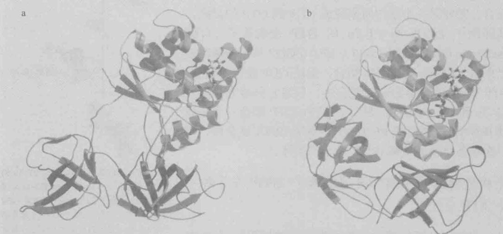  
框 15-4 图 1 比较结合 GDP 及结合 GTP 的 EF-Tu。（a）结合 GDP 的 EF-Tu；（b）结合 GTP 的 EF-Tu。GTP 结合域以松绿色显示。当结合 GTP 时，洋红色结构域的旋转，以及松绿色和蓝色结构域的改变导致强的 tRNA 结合位点的形成（图 15-35）。GTP 以棒形表示。（a，Polekhina G. et al. 1996. Structure 4：1141–1141；b，Kjeldgard M. et al. 1993. Structure 1：35–50。）图像使用 MolScript、BobScript 和 Raster 3D 软件制作。

#### [W] 框 15-4 GTP 结合蛋白、构象转变及翻译过程精确有序

在整个翻译过程中，GTP 被用来控制关键事件。与 ATP 在连接氨基酸到 tRNA 上所行使的功能不同，GTP 水解的能量不与化学修饰过程相关。相反，在翻译过程中，GTP 水解的能量被用来控制事件的次序和忠实性。这是如何完成的呢？

GTP 结合蛋白参与翻译的一个关键特征是它们的构象因结合哪种鸟苷酸(GDP 还是 GTP)而改变。这在框 15-4 图 1 的 EF-Tu 中可见，该图显示了结合 GTP 或 GDP 的 EF-Tu 的三维结构。当与 GTP 结合时，EF-Tu 经历一个重大的构象改变，导致其 tRNA 结合位点的形成。具体来说，取决于结合的核苷酸，EF-Tu 的一个结构域（在框 15-4 图 1 中以洋红色显示）相对于该蛋白质的其他结构域可以进行位置的迁移。结构域位置的这个改变和其他两个结构域的构象改变（以松绿色和深蓝色显示）导致 EF-Tu 上形成一个新的表面用来紧密结合负载 tRNA（可在图 15-35 中看到结合了一个 tRNA 的 EF-Tu）。这样，取决于结合的鸟苷酸形式，这些因子可以有不同的功能，或结合到不同的蛋白质或 RNA 上。例如，EF-Tu-GTP 可以结合到氨酰-tRNA 上，但 EF-Tu-GDP 不能。

在翻译中通过将 GTP 水解与关键事件的完成关联起来，可以牢牢掌控这些事件的次序。对 EF-Tu 来说，依赖 GTP 的 EF-Tu 与氨酰 tRNA 的结合保证了肽键的形成不会在正确的密码子-反密码子配对之前发生。正确碱基配对的形成激发了 GTP 水解。一旦与 GDP 结合，EF-Tu 就从氨酰-tRNA 上释放出来，使肽键的形成能随后发生。

每个 GTP 调节的辅助蛋白活化 GTP 水解的机制是一样的。在每种情况下，GTP 酶的活性是通过与称为因子结合中心（factor binding center）的大亚基的一个特定区域的相互作用而激活的。这个相互作用因缺乏足够的亲和力，因此不能在在分离状态下发生。相反，每个 GTP 控制的翻译因子必须与核糖体发生几个其他的重要相互作用来稳定与因子结合中心的精确关联，从而引发 GTP 酶的活性。实际上，如同我们从 EF-Tu 所看到的，这个相互作用对 EF-Tu、氨酰-tRNA、mRNA 和核糖体之间相互作用的确切性质非常敏感。因此，与因子结合中心的相互作用监控这些蛋白质和 RNA 与核糖体的所有其他的相互作用。只有当正确的密码子-反密码子配对形成，EF-Tu 中的 GTP 结合位点才能够有效地与因子结合中心作用，促使 GTP 水解和蛋白质构象相应改变。

翻译过程对 GTP 的利用与滑动夹装载器（sliding clamp loaders，第 9 章和框 9-3）对 ATP 的利用类似。ATP 的结合对于将滑动夹与一个起始复合物组装的过程是必需的，但 ATP 的水解和滑动夹的释放只有在夹子装载器与引物：模板结合处结合后才能发生。在翻译过程中，GTP 是核糖体（在某些情况中是其他的 RNA 和蛋白质）与 GTP 调控因子起始结合时所必需的，GTP 水解只在因子正确地与核糖体作用后才会发生。如同滑动夹的例子，GTP 水解一般导致翻译相关因子从核糖体上释放出来。

在翻译延伸过程的讨论中，我们并没有区分原核细胞和真核细胞。虽然真核细胞中与 EF-Tu（eEF1）和 EF-G（eEF2）相对应的因子的名称不同，但它们与原核细胞的对应因子的作用是非常相似的。


<!-- W-END Watson 15 翻译延伸 -->


<!-- W-BEGIN Watson 15 翻译终止 -->

### 【中文对照 Watson 第15章：翻译终止】

> 来源：Watson《基因的分子生物学》第七版中译本（书籍/03_基因的分子生物学_第七版） 第15章 翻译。

#### [W] 翻译终止

#### [W] 释放因子在终止密码子的作用下终止翻译

氨酰-tRNA 的结合、肽键的形成和易位的核糖体循环在三个终止密码子其中之一进入 A 位点时就终止了。最初是假定存在一种或几种可识别这些终止密码子的链终止 tRNA。但是事实并非如此。终止密码子其实是被称为释放因子（release factor，RF）的蛋白质识别的，这些因子激活多肽链从肽酰 tRNA 中释放的水解反应。

有两类释放因子：Ⅰ类释放因子识别终止密码子，并催化多肽链从P位点的tRNA中水解释放出来。原核细胞有两种Ⅰ类释放因子：RF1和RF2。RF1识别终止密码子UAG，RF2识别终止密码子UGA，两者皆可识别第三个终止密码子UAA。真核细胞只有一种能识别三个终止密码的Ⅰ类释放因子——eRF1。Ⅱ类释放因子在多肽链释放后刺激Ⅰ类因子从核糖体中解离开来。原核细胞和真核细胞都只有一种Ⅱ类因子，分别是RF3和eRF3。与EF-G、IF2和EF-Tu一样，Ⅱ类释放因子也是由GTP的结合与水解调节的。

#### [W] I 类释放因子的一小段区域识别终止密码子并催化多肽链的释放

释放因子是如何识别终止密码子的呢？由于释放因子完全是由蛋白质组成的，因此对密码子的识别必然通过蛋白质-RNA相互作用。将RF1和RF2（有不同的终止密码子特异性）的编码区序列交换的遗传学实验证明，释放因子的识别区域是串联的三个氨基酸。RF1和RF2之间这三个氨基酸的交换导致对终止密码子识别特异性的转换。因此这三个氨基酸序列称为肽反密码子，作用于并识别终止密码子。结合RF1的核糖体三维结构证实了RF1结合于核糖体的A位点（图15-37a）。在该结构中肽反密码子区就位于反密码子附近，但很可能还有其他蛋白区域也对密码子识别有所贡献（图 15-37b）。

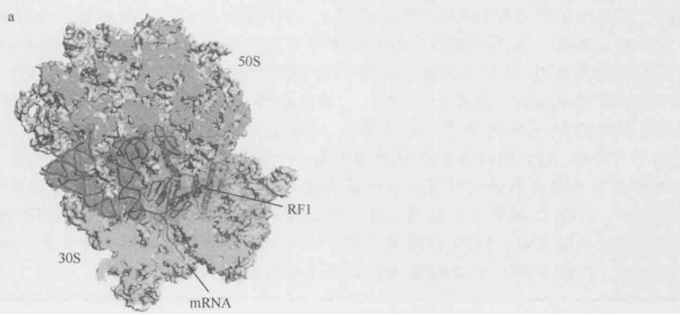


  
图 15-37 RF1 结合核糖体三维结构。(a) 本图显示结合于核糖体 A 位点的 RF1。(b) 这一结构显示肽反密码子与反密码子非常接近。(c) 本图显示 RF1 与核糖体结合的结构中，GGQ 基序与 P 位点 tRNA 的 3' 端和肽酰转移酶中心十分接近。(获得许可并修改自 Petry et al. 2005. Cell 123: 1255–1266. Elsevier.)

<!-- END OFFICIAL API PART part_006 -->


<!-- BEGIN OFFICIAL API PART part_007 -->

I 类释放因子中促使多肽链释放的区域也被确认了。所有的 I 类因子共有一段保守的三氨基酸（GGQ）序列，这一序列对多肽链的释放是关键的。而且，结合 RF1 的核糖体结构也证明了 GGQ 位于肽转移酶中心的附近（图 15-38）。目前尚不清楚 GGQ 是直接参与了多肽链从肽酰 tRNA 中水解的过程，还是诱导了肽转移酶中心的某些变化，从而使得这一中心本身能催化水解。对肽酰转移酶中心（例如 A2541 或 A2602）靠近 CCA 末端的位置所发现的保守碱基的研究表明，其中几个残基是肽的水解所必需的。实际上，相比在肽键形成中的作用，这些碱基似乎在肽的释放中具有更重要的作用。关于这种差别的一个可能的解释就是，只有邻近的 RNA 残基可以摆放一个小的水分子用于水解，但核糖体上的许多位点上

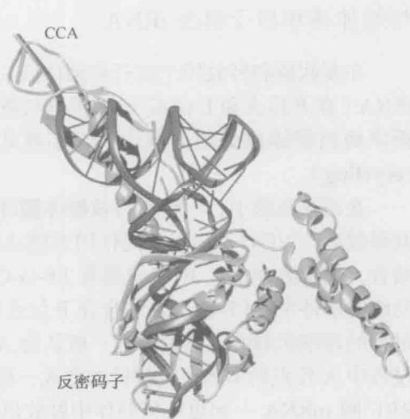  
图 15-38 RF1 与 tRNA 的结构比较。tRNA（以深红色表示），与 RF1（以灰色表示）占据同一位置。（获得许可并修改自 Petry et al. 2005. Cell 123:1255–1266, Fig. 3E. Elsevier.）

的残基能够帮助摆放较大的 tRNA 分子用于催化作用。

总之，基于这些研究提出了以下假设：Ⅰ类释放因子是在功能上模仿了 tRNA，它具有一个与终止密码子作用的肽反密码子，以及能进入肽转移酶中心的 GGQ 区域。RF1 与 tRNA 的结构对比揭示了这一蛋白怎样从功能上模拟了一个 tRNA（图 15-38）。正如 CCA 的 3' 端和反密码子环占据每个 tRNA 的最末端的情况一致，GGQ 和肽 “反密码子” 环也占据 RF1 的最末端。

#### [W] GDP / GTP 交换和 GTP 水解调控Ⅱ类释放因子的功能

一旦Ⅰ类释放因子启动了肽酰-tRNA的水解，它必须离开核糖体（图15-39）。这一步是由Ⅱ类释放因子RF3（或在真核细胞中eRF3）来实现的。RF3是一种GTP结合蛋白，但与其他参与翻译的GTP结合蛋白不同，这一因子与GDP的亲和力大于与GTP的亲和力。因此，游离的RF3主要是以与GDP结合的形式存在。RF3-GDP与核糖体结合取决于Ⅰ类释放因子存在与否。在Ⅰ类RF激发多肽释放后，核糖体和Ⅰ类释放因子的构象改变诱导RF3交换GDP而结合GTP。也就是说，这些因子扮演RF3的GTP交换因子，就像EF-Ts扮演EF-Tu的GTP交换因子那样。RF3与GTP的结合导致其与核糖体之间的高亲和力相互作用的形成，从而形成之前易位过程中产生的旋转杂合区域。这种变化能够使其结合在核糖体上并替换Ⅰ类分子。这一变化还使得RF3与大亚基的因子结合中心相结合。与参与翻译的其他GTP结合蛋白一样，这个作用引发GTP的水解。在（与核糖体结合的）Ⅰ类因子不存在的情况下，RF3-GDP与核糖体的亲和力较弱因而很快从核糖体中释放出来。

核糖体循环因子模仿 tRNA

在多肽链和释放因子离开核糖体后，核糖体仍然结合 mRNA，并留有两个脱氨基的 tRNA（在 P 位点和 E 位点）。为了参与新一轮的多肽合成，tRNA 和 mRNA 必须离开核糖体而核糖体也必须分解为大、小亚基。这几个事件统称为核糖体循环（ribosome recycling）。

在原核细胞中，一种称为核糖体循环因子（ribosome recycling factor，RRF）在多肽释放后与 EF-G 和 IF3 共同作用来推动核糖体循环（图 15-40）。RRF 与空位的 A 位点结合，并模仿 tRNA。RRF 也募集 EF-G-GTP 到核糖体上，在那些模仿延伸过程中 EF-G 功能的事件中，EF-G 引发结合在 P 位点和 E 位点的空载 tRNA 的释放。虽然这一释放过程的详细机制并不清楚，但一般认为 A 位点的 RRF 被 EF-G 所替代的方式就像延伸过程中 A 位点的 tRNA 被替代的方式一样。一旦 tRNA 从核糖体中脱离，EF-G-GDP 和 RRF 同 mRNA 一起也从核糖体中释放出来。IF3（起始因子）也可能参与了 mRNA 的释放，而且它对核糖体分解为大、小亚基是必需的。这些事件的最后结果是形成一个与 IF3（而非 tRNA 或 mRNA）结合的小亚基和一个游离的大亚基。这些游离的核糖体就可以参与新一轮的翻译。

这里需要重新强调 RRF 是 tRNA 模仿者的观点，事实上 RRF 的三维结构与 tRNA 相似。但是其与核糖体作用的方式同 tRNA（与核糖体）作用的方式是非常不同的。RRF 仅与处在 A 位点的大亚基部分紧密结合。我们可以对循环因子和 tRNA 作用的进行如下分析：如果核糖体循环因子完全模仿 A 位点的 tRNA，那么 P 位点的 tRNA 将被 EF-G 移至 E 位点。相反，EF-G 和循环因子将 P 位点的 tRNA 直接从 P 位点释放出来。很有可能，EF-G 和循环因子引起了核糖体结构的变化比一般易位过程所发生的要大得多，从而导致 mRNA 和 tRNA 同时释放出来。

与起始和延伸过程一样，翻译的终止也是由一系列有序的、相互依附的因子的结合和释放来介导的。翻译过程的这种有序的性质保证了每一步骤都是在前一步骤完成后才能发生。例如，EF-Tu 只有在 EF-G 完成易位后才能护送新的 tRNA 进入 A 位点。同样地，只有在 I 类释放因子识别了一个终止密码子后，RF3 才能结合核糖体。翻译的这一有序的方法也有缺陷：如果其中任意一步不能完成，那么整个过程就会停止。抗生素就是利用了这一致命的弱点，而以阻碍翻译过程作为目标而达到其效用（框 15-5）。

虽然在真核细胞中具有Ⅰ类和Ⅱ类释放因子，它们的结构和氨基酸序列没有什么相关性，而且只有Ⅰ类因子的功能类似。就像RF1和RF2一样，eRF1识别所有三种终止密码子，并将GGQ基序带入肽基转移酶中心导致多肽链的解离。与原核细胞RF3催化RF1/RF2解离不同，eRF3将eRF1传送至核糖体。eRF3·GTP与远离核糖体的eRF1结合，然后类似EF-Tu和负载的tRNA作用，将eRF1送至核糖体中（图15-41）。同样，和EF-Tu类似的，只要eRF1识别一个终止密码子，eRF3·GTP将结合到核糖体的因子结合中心从而激活GTP的水解反应。eRF3·GTP快速地从核糖体上解离，同时eRF1以类似tRNA的入位方式进入肽基转移酶中心。有趣的是，在真核细胞中没有发现任何一个核糖体循

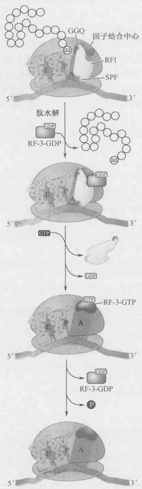  
图 15-39 通过两个释放因子催化多肽的释放。Ⅰ类释放因子（RF1）识别终止密码子，并激发多肽通过位于肽酰转移酶中心的 GGQ 基序释放。Ⅱ类释放因子（RF3）只在多肽释放后与核糖体结合，并推动Ⅰ类释放因子的解离。

  
图 15-40 RRF 和 EF-G 耦联并激发 tRNA 和 mRNA 从终止的核糖体中释放出来。

#### [W] 框15-5 抗生素通过阻遏翻译的某些特定步骤抑制细胞分裂

抗生素是一种与疾病搏斗的有力工具。在医学中最为广泛使用的抗生素能够杀死细菌，但对真核细胞没有或很少有作用，因而对患者是无毒性的。自从20世纪上半叶抗生素发现以来，已经使诸如肺结核、细菌性肺炎、梅毒和淋病等以前无法治疗的感染疾病变得可被治疗（尽管抗生素抗性细菌的出现成为有效治疗疾病的越来越大的障碍）。抗生素在细菌细胞里有不同的目标途径，但大约40%的已知抗生素是翻译机器的抑制因子（框15-5表1）。一般来讲，抗生素结合翻译机器的一个组分并抑制它的功能。因为不同的抗生素在不同的步骤中阻遏翻译，并且非常精确地进行（如，就在EF-Tu释放之前），这些药剂已经成为研究蛋白质合成机制的有力工具。这样，除了它们明显的医学用处外，抗生素已经在帮助我们理解翻译机器的工作原理上方面扮演了一个重要的角色。

框 15-5 表 1 抗生素：目标和后果

<table><tr><td>抗生素/毒素</td><td>目标细胞</td><td>分子目标</td><td>后果</td></tr><tr><td>四环素</td><td>原核细胞</td><td>30S亚基A位点</td><td>抑制氨基酰tRNA结合到A位点上</td></tr><tr><td>潮霉素</td><td>原核和真核细胞</td><td>30S亚基A位点附近</td><td>阻挠A位点tRNA到P位点的易位</td></tr><tr><td>巴龙霉素</td><td>原核细胞</td><td>靠近30S亚基A位点的密码子-反密码子相互作用位点</td><td>通过降低密码子与反密码子配对的敏感度在翻译过程中提高错误率</td></tr><tr><td>氯霉素</td><td>原核细胞</td><td>50S亚基的肽基转移酶中心</td><td>阻断A位点的氨酰-tRNA为进行肽基转移反应的正确定位</td></tr><tr><td>嘌呤霉素</td><td>原核和真核细胞</td><td>核糖体大亚基的肽基转移酶中心</td><td>链终止子;模仿A位点的氨酰-tRNA的3&#x27;端,作为新的多肽链的接受者</td></tr><tr><td>红霉素</td><td>原核细胞</td><td>50S亚基的肽出口通道</td><td>关闭成长中的多肽链从核糖体离开的出口阻遏翻译</td></tr><tr><td>梭链孢酸</td><td>原核细胞</td><td>EF-G</td><td>阻挠EF-G-GDP从核糖体中释放</td></tr><tr><td>硫链丝菌肽</td><td>原核细胞</td><td>50S亚基的因子结合中心</td><td>妨碍IF2和EF-G与因子结合中心的接合</td></tr><tr><td>黄色霉素</td><td></td><td>EF-Tu</td><td>阻挠与GTP水解关联的构象改变,从而防止EF-Tu的释放</td></tr><tr><td>蓖麻毒素和α-帚曲菌素(蛋白质毒素)</td><td>原核和真核细胞</td><td>在核糖体大亚基的因子结合中心化学修饰RNA</td><td>阻挠翻译因子GTP酶的活化</td></tr><tr><td>白喉毒素</td><td>真核细胞</td><td>化学修饰EF-Tu</td><td>抑制EF-Tu的功能</td></tr><tr><td>放线(菌)酮</td><td>真核细胞</td><td>60S亚基的肽基转移酶中心</td><td>抑制肽基转移酶活性</td></tr></table>

嘌呤霉素（puromycin）是一个经常用在翻译研究中的抗生素。它结合在处于A位点的大亚基区域。一旦结合，嘌呤霉素可以在肽基转移反应中取代氨酰-tRNA（框15-5图1）。因为嘌呤霉素相对于tRNA来说非常小，它结合到A位点不足以把多肽链保留在核糖体上。于是，转移到嘌呤霉素上的肽链以不完整的、结合嘌呤霉素的形式从核糖体上分离下来。换句话说，嘌呤霉素导致多肽合成未成熟时即终止了。其他抗生素以核糖体的其他特征作为目标，如肽出口通道、肽基转移中心、因子结合中心、解码中心和易位相关区域。（框15-5表1）

还有些抗生素是翻译因子的抑制因子。例如，黄色霉素（kirromycin）和梭链孢酸（fusidic acid）分别是延伸因子 EF-Tu 和 EF-G 的抑制因子（框 15-5 表 1）。在两种情况中，抗生素都与结合 GTP 的翻译因子相互作用，阻止其通常在 GTP 水解后发生的构象改变。于是，黄色霉素使核糖体停留在与 EF-Tu·GDP 氨酰-tRNA 结合的步骤中。同样地，梭链孢酸使核糖体停留在与 EF-G·GDP 结合的形式。在两种情况中，翻译的下一步都因为延伸因子无法释放而被阻遏了。

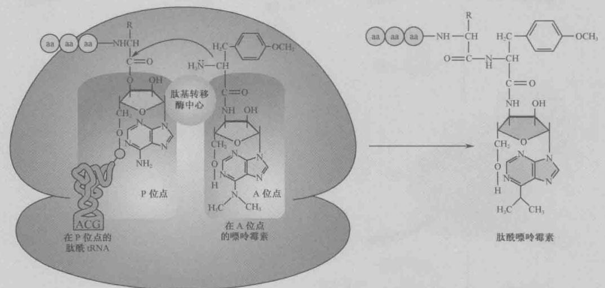  
框 15-5 图 1 嘌呤霉素通过在 A 位点模仿 tRNA 来终止翻译。嘌呤霉素结合在 A 位点上并参与肽键形成。一旦完成，嘌呤霉素和相连的多肽就从核糖体上释放出来。

环因子，eEF2（真核生物中的 EF-G）也没有参与到核糖体循环中。相反的，当前的模型反映激活 tRNA 的 P 位点的肽键水解之后，eRF1（与一个名为 Rli1 的 ATP 酶连接）也参与到核糖体循环中。这个反应中 eRF1 和 eRF3 由于与 Dom34 和 Hbs1 的相似性从而激活核糖体的解离（详见后面的讨论）。


<!-- W-END Watson 15 翻译终止 -->


<!-- C-BEGIN Campbell 17.4 -->

### 【英文对应 Campbell Concept 17.4：Translation is the RNA-directed synthesis of a polypeptide: A Closer Look】

> 来源：Campbell Biology（书籍/01_Campbell_Biology） 第17章 Gene Expression From Gene to Protein，Concept 17.4。

#### [EN] Concept 17.4: Translation is the RNA-directed synthesis of a polypeptide: A Closer Look

We will now examine how genetic information flows from mRNA to protein—the process of translation (Figure 17.15). We'll focus on the basic steps of translation that occur in both bacteria and eukaryotes, while pointing out key differences.

#### [EN] Molecular Components of Translation

In the process of translation, a cell “reads” a genetic message and builds a polypeptide accordingly. The message is a series of codons along an mRNA molecule, and the translator is called

As a molecule of mRNA is moved through a ribosome, codons are translated into amino acids, one by one. The translators, or interpreters, are tRNA molecules, each type with a specific anticodon at one end and a corresponding amino acid at the other end. A tRNA adds its amino acid cargo to a growing polypeptide chain when the anticodon hydrogen-bonds to the complementary codon on the mRNA.


a transfer RNA (tRNA). The function of a tRNA is to transfer an amino acid from the cytoplasmic pool of amino acids to a growing polypeptide in a ribosome. A cell keeps its cytoplasm stocked with all 20 amino acids, either by synthesizing them from other compounds or by taking them up from the surrounding solution. The ribosome, a structure made of proteins and RNAs, adds each amino acid brought to it by a tRNA to the growing end of a polypeptide chain (see Figure 17.15).

Translation is simple in principle but complex in its biochemistry and mechanics, especially in the eukaryotic cell. In dissecting translation, we'll focus on the slightly less complicated version of the process that occurs in bacteria. We'll first look at the major players in this process.

#### [EN] The Structure and Function of Transfer RNA

The key to translating a genetic message into a specific amino acid sequence is the fact that each tRNA molecule enables translation of a given mRNA codon into a certain amino acid. This is possible because a tRNA bears a specific amino acid at one end of its three-dimensional structure, while at the other end is a nucleotide triplet that can base-pair with the complementary codon on mRNA.

A tRNA molecule consists of a single RNA strand that is only about 80 nucleotides long (compared to hundreds of nucleotides for most mRNA molecules). The presence of complementary stretches of nucleotide bases that can hydrogen-bond to each other allows this single strand to fold back on itself and form a molecule with a particular 3-D structure. Flattened into one plane to clarify this base pairing, a tRNA molecule looks like a cloverleaf (Figure 17.16a). The tRNA actually twists and folds into a compact 3-D structure that is roughly L-shaped (Figure 17.16b), with the 5' and 3' ends of the linear tRNA both located near one end of the structure. The protruding 3' end acts as the attachment site for an amino acid. The loop extending from the other end of the L includes the anticodon, the particular nucleotide triplet that base-pairs to a specific mRNA codon. Thus, the structure of a tRNA molecule fits its function.

Anticodons are conventionally written $3'\rightarrow5'$ to align properly with codons written $5'\rightarrow3'$ (see Figure 17.15). (For base pairing, RNA strands must be antiparallel, like DNA.) As an example of how tRNAs work, consider the mRNA codon $5'$ -GGC- $3'$ , which is translated as the amino acid glycine. The tRNA that base-pairs with this codon by hydrogen bonding has $3'$ -CCG- $5'$ as its anticodon and carries glycine at its other end (see the incoming tRNA approaching the ribosome in Figure 17.15). As an mRNA molecule is moved through a ribosome, glycine will be added to the polypeptide chain whenever the codon $5'$ -GGC- $3'$ is presented for translation. Codon by codon, the genetic message is translated as tRNAs position each amino acid in the order prescribed, and the ribosome adds that amino acid onto the growing polypeptide chain. The tRNA molecule is a translator in the sense that, in the context of the ribosome, it can read a nucleic acid word (the mRNA codon) and interpret it as a protein word (the amino acid).

Like mRNA and other types of cellular RNA, transfer RNA molecules are transcribed from DNA templates. In a eukaryotic cell, tRNA, like mRNA, is made in the nucleus and then travels to the cytoplasm, where it will participate in the process of translation. In both bacterial and eukaryotic cells, each tRNA molecule is used repeatedly, picking up its designated amino acid in the cytosol, depositing this cargo onto a polypeptide chain at the ribosome, and then leaving the ribosome, ready to pick up another of the same amino acid.

The accurate translation of a genetic message requires two instances of molecular recognition. First, a tRNA that binds to an mRNA codon specifying a particular amino acid must carry that amino acid, and no other, to the ribosome. The correct matching up of tRNA and amino acid is carried out by a family of related enzymes that are aptly named aminoacyl-tRNA synthetases (Figure 17.17). The active site of each type of aminoacyl-tRNA synthetase fits only a specific combination of amino acid and tRNA. (Regions of both the amino acid attachment end and the anticodon end of the tRNA ensure the specific fit.) There are 20 different synthetases, one for each amino acid. A synthetase joins a given amino acid to an appropriate tRNA; one synthetase is able to bind to all the different tRNAs for its particular amino acid. The synthetase catalyzes the covalent attachment of the amino acid to its tRNA in a process driven by the hydrolysis of ATP. The resulting aminoacyl tRNA, also called a charged tRNA, is released from the enzyme and is then available to deliver its amino acid to a growing polypeptide chain on a ribosome.

Figure 17.16 The structure of transfer RNA (tRNA).  
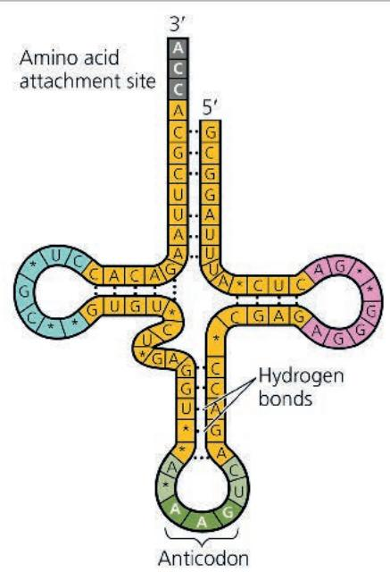

(a) Two-dimensional structure. The four base-paired regions and three loops are characteristic of all tRNAs, as is the base sequence of the amino acid attachment site at the 3' end. The anticodon triplet is unique to each tRNA type, as are some sequences in the other two loops. (The asterisks mark bases that have been chemically modified, a characteristic of tRNA. The modified bases contribute to tRNA function in a way that is not yet understood.)  
  
VISUAL SKILLS Look at the tRNA shown in this figure. Based on its anticodon, identify the codon it would bind to, as well as the amino acid that it would carry. For suggested answer, see Appendix A.

The second instance of molecular recognition is the pairing of the tRNA anticodon with the appropriate mRNA codon. If one tRNA type existed for each mRNA codon specifying an amino acid, there would be 61 tRNAs (see Figure 17.6). In bacteria, however, there are only about 45 tRNAs, signifying that some tRNAs must be able to bind to more than one codon.

Figure 17.17 Aminoacyl-tRNA synthetases provide specificity in joining amino acids to their tRNAs.

Linkage of a tRNA to its amino acid is an endergonic process that occurs at the expense of ATP, which loses two phosphate groups, becoming AMP.

  
This is possible because the rules for base pairing between the third nucleotide base of a codon and the corresponding base of a tRNA anticodon are relaxed compared to those at other codon positions. For example, the nucleotide base U at the 5' end of a tRNA anticodon can pair with either A or G in the third position (at the 3' end) of an mRNA codon. The flexible base pairing at this codon position is called wobble. Wobble explains why the synonymous codons for a given amino acid most often differ in their third nucleotide base. Accordingly, a tRNA with the anticodon 3'-UCU-5' can base-pair with either the mRNA codon 5'-AGA-3' or 5'-AGG-3', both of which code for arginine (see Figure 17.6).

#### [EN] The Structure and Function of Ribosomes

Although the ribosomes of bacteria and eukaryotes are very similar in structure and function, eukaryotic ribosomes are slightly larger and differ somewhat from bacterial ribosomes in their molecular composition. The differences are medically significant. Certain antibiotic drugs can inactivate bacterial ribosomes without affecting the ability of eukaryotic ribosomes to make proteins. These drugs, including tetracycline and streptomycin, are used to combat bacterial infections.

Ribosomes facilitate the specific coupling of tRNA anticodons with mRNA codons during protein synthesis. A ribosome consists of a large subunit and a small subunit, each made up of proteins and one or more ribosomal RNAs, or rRNAs (Figure 17.18). In eukaryotes, the subunits are made in the nucleolus. Ribosomal RNA genes are transcribed, and the RNA is processed and assembled

Figure 17.18 The anatomy of a functioning ribosome.  
  
(a) Computer model of functioning ribosome. This is a model of a bacterial ribosome, showing its overall shape. The eukaryotic ribosome is roughly similar. A ribosomal subunit is a complex of ribosomal RNA molecules and proteins.

  
(b) Schematic model showing binding sites. A ribosome has an mRNA binding site and three tRNA binding sites, known as the A, P, and E sites. This schematic ribosome will appear in later diagrams.

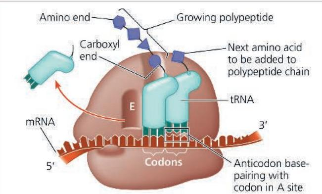  
(c) Schematic model with mRNA and tRNA. A tRNA fits into the A site when its anticodon base-pairs with an mRNA codon. The P site holds the tRNA attached to the growing polypeptide. The A site holds the tRNA carrying the next amino acid to be added to the polypeptide chain. Discharged tRNAs leave from the E site. The polypeptide grows at its carboxyl end.

#### [EN] Scientific Skills Exercise Interpreting a Sequence Logo

How Can a Sequence Logo Be Used to Identify Ribosome Binding Sites on Bacterial mRNAs? When initiating translation, ribosomes bind to an mRNA at a ribosome binding site upstream


of the AUG start codon. Because mRNAs from different genes all bind to a ribosome, the genes encoding these mRNAs are likely to have a similar base sequence where the ribosomes bind. Therefore, candidate ribosome binding sites on mRNA can be identified by comparing DNA sequences (and thus the mRNA sequences) of multiple genes in a species, searching the region upstream of the start codon for shared (conserved) stretches of bases. In this exercise, you will analyze DNA sequences from multiple such genes, represented by a visual graphic called a sequence logo.

How the Experiment Was Done The DNA sequences of 149 genes from the E. coli genome were aligned using computer software. The aim was to identify similar base sequences—at the appropriate location in each gene—as potential ribosome binding sites. Rather than presenting the data as a series of 149 sequences aligned in a column (a sequence alignment), the researchers used a sequence logo.

Data from the Experiment The potential ribosome binding regions from ten E. coli genes are shown below in a sequence alignment, followed by the sequence logo derived from the aligned sequences. Note that the DNA shown is the nontemplate (coding) strand, how DNA sequences are typically presented. (All data from Thomas D. Schneider.)

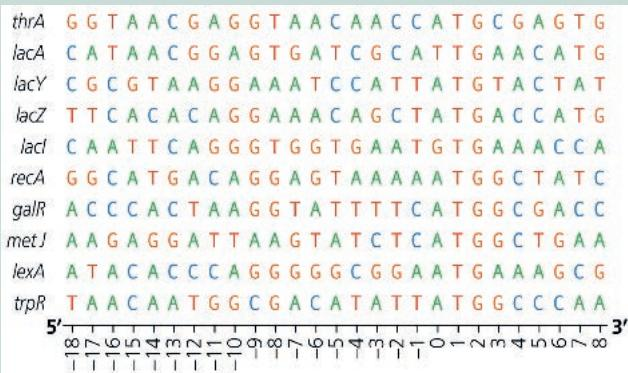

#### [EN] Sequence alignment

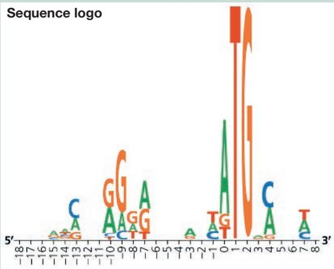

#### [EN] INTERPRET THE DATA

1. In the sequence logo, the horizontal axis shows the primary sequence of the DNA by nucleotide position. Letters for each base are stacked on top of each other according to their relative frequency at that position among the aligned sequences, with the most common base as the largest letter at the top of the stack. The height of each letter represents the relative frequency of that base at that position. (a) In the sequence alignment, count the number of each base at position -9 and order them from most to least frequent. Compare this to the size and placement of each base at -9 in the logo. (b) Do the same for positions 0 and 1.

2. The height of a stack of letters in a logo indicates the predictive power of that stack (determined statistically). If the stack is tall, we can be more confident in predicting what base will be in that position if a new sequence is added. For example, at position 2 in the sequence alignment, all ten sequences have a G; the probability of finding a G there in a new sequence is very high. For short stacks, the bases all have about the same frequency, so it's hard to predict a base at those positions.
(a) Looking at the sequence logo, which two positions have the most predictable bases? What bases do you predict would be at those positions in a newly sequenced gene? (b) Which 12 positions have the least predictable bases? How does this reflect the relative frequencies of the bases shown at these positions in the sequence alignment? Use the two leftmost positions as examples in your answer.

3. The actual experiment used 149 sequences to build the sequence logo, shown below. There is a stack at each position, even if short, because the sequence logo includes more data.
(a) Which three positions in this sequence logo have the most predictable bases? Name the most frequent base at each.
(b) Which four positions have the least predictable bases?

4. A consensus sequence identifies the base occurring most often at each position in the set of sequences. (a) Write out the consensus sequence of this (the nontemplate) strand. In any position where the base can't be determined, put a dash. (b) Which provides more information—the consensus sequence or the sequence logo? What is lost in the less informative method?

5. (a) Based on the logo, what five adjacent base positions in the 5' UTR region are most likely to be involved in ribosome binding? (b) What is represented by the bases in positions 0–2?

  
Instructors: A version of this Scientific Skills Exercise can be assigned in Mastering Biology.

with proteins imported from the cytoplasm. Completed ribosomal subunits are then exported via nuclear pores to the cytoplasm. In both bacteria and eukaryotes, a large and a small subunit join to form a functional ribosome only when attached to an mRNA molecule. About one-third of the mass of a ribosome is made up of proteins; the rest consists of three rRNA molecules (in bacteria) or four (in eukaryotes). Because most cells contain thousands of ribosomes, rRNA is the most abundant type of cellular RNA.

The structure of a ribosome reflects its function of bringing an mRNA molecule together with tRNAs carrying amino acids. The mRNA itself has a binding site for the ribosome. (In the Scientific Skills Exercise, you can work with DNA sequences representing this binding site in a group of Escherichia coli genes.) The ribosome, in turn, has a binding site for mRNA, as well as three binding sites for tRNA (see Figure 17.18). The P site (peptidyl-tRNA binding site) holds the tRNA carrying the growing polypeptide chain, while the A site (aminoacyl-tRNA binding site) holds the tRNA carrying the next amino acid to be added to the chain. Discharged tRNAs leave the ribosome from the E site (exit site). The ribosome holds the tRNA and mRNA in close proximity and positions the new amino acid so that it can be added to the carboxyl end of the growing polypeptide. It then catalyzes the formation of the peptide bond. As the polypeptide becomes longer, it passes through an exit tunnel in the ribosome's large subunit. When the polypeptide is complete, it is released through the exit tunnel.

The widely accepted model is that rRNAs, rather than ribosomal proteins, are primarily responsible for both the structure and the function of the ribosome. The proteins, which are largely on the exterior, support the shape changes of the rRNA molecules as they carry out catalysis during translation.

first amino acid of the polypeptide, and the two subunits of a ribosome. First, a small ribosomal subunit binds to both the mRNA and a specific initiator tRNA, which carries the amino acid methionine. In bacteria, the small subunit can bind the two in either order; it binds the mRNA at a specific RNA sequence, just upstream of the AUG start codon. In eukaryotes, the small subunit, with the initiator tRNA already bound, binds to the 5' cap of the mRNA and then moves, or scans, downstream along the mRNA until it reaches the AUG start codon, where the initiator tRNA then hydrogen-bonds, as shown in step 1 of Figure 17.19. In either bacteria or eukaryotes, the AUG signals the start of translation; this is important because it establishes the codon reading frame for the mRNA.

The union of mRNA, initiator tRNA, and the small ribosomal subunit is followed by the attachment of a large ribosomal subunit, completing the translation initiation complex (see Figure 17.19). Proteins called initiation factors are required to bring all these components together. The cell also expends energy obtained by hydrolysis of a GTP molecule to form the initiation complex. At the completion of the initiation process, the initiator tRNA sits in the P site of the ribosome, and the vacant A site is ready for the next aminoacyl tRNA. Note that a polypeptide is always synthesized in one direction, from the initial methionine at the amino end, also called the N-terminus, toward the final amino acid at the carboxyl end, also called the C-terminus (see Figure 5.15).

#### [EN] Elongation of the Polypeptide Chain

In the elongation stage of translation, amino acids are added one by one to the previous amino acid at the C-terminus of the

Ribosomal RNA is the main constituent of the A and P sites and of the interface between the two subunits; it also acts as the catalyst of peptide bond formation. Thus, a ribosome could actually be considered one colossal ribozyme!

#### [EN] Building a Polypeptide

We can divide translation, the synthesis of a polypeptide, into three stages: initiation, elongation, and termination. All three require protein “factors” that aid in the translation process. Some steps of initiation and elongation also require energy, provided by the hydrolysis of guanosine triphosphate (GTP).

#### [EN] Ribosome Association and Initiation of Translation

The initiation stage of translation brings together an mRNA, a tRNA bearing the

Figure 17.19 The initiation of translation.  
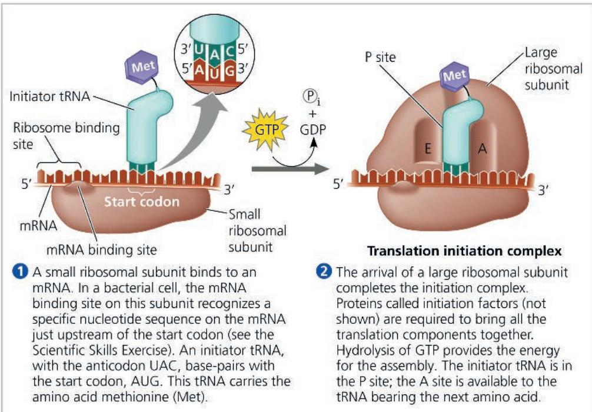

A small ribosomal subunit binds to an mRNA. In a bacterial cell, the mRNA binding site on this subunit recognizes a specific nucleotide sequence on the mRNA just upstream of the start codon (see the Scientific Skills Exercise). An initiator tRNA, with the anticodon UAC, base-pairs with the start codon, AUG. This tRNA carries the amino acid methionine (Met).

Figure 17.20 The elongation cycle of translation.

The hydrolysis of GTP plays an important role in the elongation process; elongation factors are not shown.


growing chain. Each addition involves several proteins called elongation factors and occurs in a three-step cycle described in Figure 17.20. Energy expenditure occurs in the first and third steps. Codon recognition requires hydrolysis of one molecule of GTP, which increases the accuracy and efficiency of this step. One more GTP is hydrolyzed (broken up) to provide energy for the translocation step.

The mRNA is moved through the ribosome in one direction only, $5'$ end first; this is equivalent to the ribosome moving $5' \rightarrow 3'$ on the mRNA. The main point is that the ribosome and the mRNA move relative to each other, unidirectionally, codon by codon. The elongation cycle takes less than a tenth of a second in bacteria and is repeated as each amino acid is added until the polypeptide is completed. The empty tRNAs that are released from the E site return to the cytoplasm, where they will be reloaded with the appropriate amino acid (see Figure 17.17).

#### [EN] Termination of Translation

The final stage of translation is termination (Figure 17.21). Elongation continues until a stop codon in the mRNA reaches the A site. The nucleotide base triplets UAG, UAA, and UGA (all written $5'\rightarrow3'$ ) do not code for amino acids but instead act as signals to stop translation. A release factor, a protein shaped like an aminoacyl tRNA, binds directly to the stop codon in the A site.

Figure 17.21 The termination of translation.  
Like elongation, termination requires GTP hydrolysis as well as additional protein factors, which are not shown here.  
  
When a ribosome reaches a stop codon on mRNA, the A site of the ribosome accepts a "release factor"—a protein shaped like a tRNA—instead of an aminoacyl tRNA.  
2 The release factor promotes hydrolysis of the bond between the tRNA in the P site and the last amino acid of the polypeptide, thus freeing the polypeptide from the ribosome.  
3 The two ribosomal subunits and the other components of the assembly dissociate with the hydrolysis of two GTP molecules.

The release factor causes the addition of a water molecule instead of an amino acid to the polypeptide chain. (Water molecules are abundant in the cytosol.) This reaction hydrolyzes (breaks) the bond between the completed polypeptide and the tRNA in the P site, releasing the polypeptide through the exit tunnel of the ribosome's large subunit. The remainder of the translation assembly then comes apart in a multistep process, aided by other protein factors. Breakdown of the translation assembly requires the hydrolysis of two more GTP molecules.

#### [EN] Completing and Targeting the Functional Protein

The process of translation is often not sufficient to make a functional protein. In this section, you will learn about modifications that polypeptide chains undergo after the translation process as well as some of the mechanisms used to target completed proteins to specific sites in the cell.

#### [EN] Protein Folding and Post-translational Modifications

During its synthesis, a polypeptide chain begins to coil and fold spontaneously as a consequence of its amino acid sequence (primary structure), forming a protein with a specific shape: a three-dimensional molecule with secondary and tertiary structure (see Figure 5.18). Thus, a gene determines primary structure, which in turn determines shape.

Additional steps—post-translational modifications—may be required before the protein can begin doing its particular job in the cell. Certain amino acids may be chemically modified by the attachment of sugars, lipids, phosphate groups, or other additions. Enzymes may remove one or more amino acids from the leading (amino) end of the polypeptide chain. In some cases, a polypeptide chain may be enzymatically cleaved into two or more pieces. In other cases, two or more polypeptides that are synthesized separately may come together, if the protein has quaternary structure; an example is hemoglobin (see Figure 5.18).

#### [EN] Targeting Polypeptides to Specific Locations

In electron micrographs of eukaryotic cells active in protein synthesis, two populations of ribosomes are evident: free and bound (see Figure 6.10). Free ribosomes are suspended in the cytosol and mostly synthesize proteins that stay in the cytosol and function there. In contrast, bound ribosomes are attached to the cytosolic side of the endoplasmic reticulum (ER) or to the nuclear envelope. Bound ribosomes make proteins of the endomembrane system (see Figure 6.15) as well as proteins secreted from the cell, such as insulin. It is important to note that the ribosomes themselves are identical and can alternate between being free ribosomes one time they are used and being bound ribosomes the next.

What determines whether a ribosome is free in the cytosol or bound to rough ER? Polypeptide synthesis always begins in the cytosol as a free ribosome starts to translate an mRNA molecule. There, the process continues to completion—unless the growing polypeptide itself cues the ribosome to attach to the ER. The polypeptides of proteins destined for the endomembrane system or for secretion are marked by a signal peptide, which targets the protein to the ER. The signal peptide, a sequence of about 20 amino acids at or near the leading end (N-terminus) of the polypeptide, is recognized as

Figure 17.22 The signal mechanism for targeting proteins to the ER.

① Polypeptide synthesis begins on a free ribosome in the cytosol.

② An SRP binds to the signal peptide, (if present), halting synthesis momentarily.

③ The SRP binds to a receptor protein in the ER membrane, part of a protein complex that forms a pore.

4 The SRP leaves, and polypeptide synthesis resumes, with simultaneous translocation across the membrane.

⑤ The signal peptide is cleaved by an enzyme in the receptor protein complex.

⑥ The rest of the completed polypeptide leaves the ribosome and folds into its final conformation.

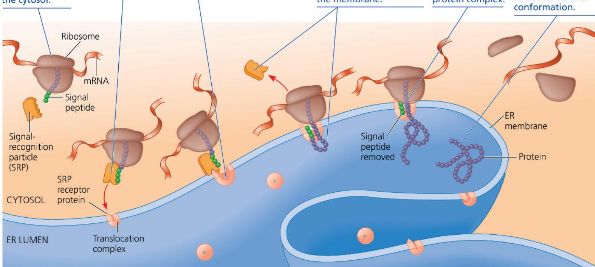  
MAKE CONNECTIONS If this protein were destined for secretion, what would happen to it after its synthesis was completed? See Figure 7.9.  
For suggested answer, see Appendix A.

it emerges from the ribosome by a protein-RNA complex called a signal-recognition particle (SRP). This particle escorts the ribosome to a receptor protein built into the ER membrane, as shown in Figure 17.22. The receptor is part of a multiprotein translocation complex. Polypeptide synthesis continues there, and the growing polypeptide snakes across the membrane into the ER lumen via a protein pore. The signal peptide is removed by an enzyme. The rest of the completed polypeptide, if it is to be secreted from the cell, is released into solution within the ER lumen (see Figure 17.22). Or, if the polypeptide is to be a membrane protein, amino acid sequences further in the chain cause that part to remain embedded in the ER membrane. In either case, it travels in a transport vesicle to its destination (see Figure 7.9).

Other kinds of signal peptides are used to target polypeptides to mitochondria, chloroplasts, the interior of the nucleus, and other organelles that are not part of the endomembrane system. The critical difference in these cases is that translation is completed in the cytosol before the polypeptide is imported into the organelle. Translocation mechanisms also vary, but in all cases studied to date, the “postal zip codes” that address proteins for secretion or to cellular locations are signal peptides of some sort. Bacteria also employ signal peptides to target proteins to the plasma membrane or for secretion.

#### [EN] Making Multiple Polypeptides in Bacteria and Eukaryotes

In previous sections, you learned how a single polypeptide is synthesized using the information encoded in an mRNA molecule. When a polypeptide is required in a cell, though, the need is for many copies, not just one.

In both bacteria and eukaryotes, multiple ribosomes translate an mRNA at the same time (Figure 17.23); that is, a single mRNA is used to make many copies of a polypeptide simultaneously. Once a ribosome is far enough past the start codon, a second ribosome can attach to the mRNA, eventually resulting in a number of ribosomes trailing along the mRNA. Such strings of ribosomes, called polyribosomes (or polysomes), can be seen with an electron microscope; they can be either free or bound. They enable a cell to rapidly make many copies of a polypeptide.

Another way both bacteria and eukaryotes increase the number of copies of a polypeptide is by transcribing multiple mRNAs from the same gene. However, the coordination of the two processes—transcription and translation—differs in the two groups. The most important differences between bacteria and eukaryotes arise from the bacterial cell's lack of compartmental

Figure 17.23 Polyribosomes.  


(a) An mRNA molecule is generally translated simultaneously by several ribosomes in clusters called polyribosomes.  
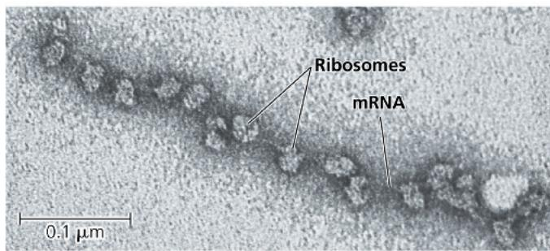  
(b) This micrograph shows a large polyribosome in a bacterial cell. Growing polypeptides are not visible here (TEM).

Figure 17.24 Coupled transcription and translation in bacteria. In bacterial cells, the translation of mRNA can begin as soon as the leading (5') end of the mRNA molecule peels away from the DNA template. The micrograph (TEM) shows a strand of E. coli DNA being transcribed by RNA polymerase molecules. Attached to each RNA polymerase molecule is a growing strand of mRNA, which is already being translated by ribosomes. The newly synthesized polypeptides are not visible in the micrograph but are shown in the diagram.

  
VISUAL SKILLS Which one of the mRNA molecules started being transcribed first? On that mRNA, which ribosome started translating the mRNA first? For suggested answer, see Appendix A.

organization. Like a one-room workshop, a bacterial cell ensures a streamlined operation by coupling the two processes. With no nuclear envelope, it can simultaneously transcribe and translate the same gene (Figure 17.24), and the newly made protein can quickly diffuse to its site of function.

In contrast, the eukaryotic cell's nuclear envelope segregates transcription from translation and provides a compartment for extensive RNA processing. This processing stage includes additional steps, discussed earlier, the regulation of which can help coordinate the eukaryotic cell's elaborate activities.

Figure 17.25, on the next page, summarizes the path from gene to polypeptide in a eukaryotic cell.

#### [EN] Concept Check 17.4

1. What two processes ensure that the correct amino acid is added to a growing polypeptide chain?

2. Describe how a polypeptide to be secreted reaches the endomembrane system.

3. DRAW IT Draw a tRNA with the anticodon 3'-CGU-5'. Given wobble, what two different codons could it bind to? Draw each codon on an mRNA, labeling all 5' and 3' ends, the tRNA, and the amino acid it carries.

4. WHAT IF? In eukaryotic cells, mRNAs have been found to have a circular arrangement in which proteins hold the poly-A tail near the 5' cap. How might this increase translation efficiency?

For suggested answers, see Appendix A.


<!-- C-END Campbell 17.4 -->


<!-- L-BEGIN Lehninger 27.2 -->

### 【英文对应 Lehninger §27.2：Protein Synthesis】

> 来源：Lehninger Principles of Biochemistry（书籍/02_生物化学原理） 第27章 Protein Metabolism，§27.2。


As we have seen for DNA and RNA (Chapters 25 and 26), the synthesis of polymeric biomolecules can be considered in terms of initiation, elongation, and termination stages. These fundamental processes are typically bracketed by two additional stages: activation of precursors before synthesis and postsynthetic processing of the completed polymer. Protein synthesis follows the same pattern. The activation of amino acids before their incorporation into polypeptides and the posttranslational processing of the completed polypeptide play particularly important roles in ensuring both the fidelity of synthesis and the proper function of the protein product. The process is outlined in Figure 27-13. P1 The cellular components involved in the five stages of protein synthesis in E. coli and other bacteria are listed in Table 27-5; the requirements in eukaryotic cells are similar, although the components are usually more numerous. Before looking at these five stages in detail, we must examine two key components of protein biosynthesis: the ribosome and tRNAs.

#### [EN] The Ribosome Is a Complex Supramolecular Machine

P1 Each E. coli cell contains 15,000 or more ribosomes, which comprise nearly a quarter of the dry weight of the cell. Bacterial ribosomes contain about 65% rRNA and 35% protein; they have a diameter of about 18 nm and are composed of two unequal subunits with sedimentation coefficients of 30S and 50S and a combined sedimentation coefficient of 70S. Both subunits contain dozens of ribosomal proteins (r-proteins) and at least one large rRNA (Table 27-6).

As it became clear that ribosomes are the complexes responsible for protein synthesis, and following elucidation of the genetic code, the study of ribosomes accelerated. In the late 1960s Masayasu Nomura and colleagues demonstrated that both ribosomal subunits can be broken down into their RNA and protein components, then reconstituted in vitro. Ribosomal subunits are identified by their S (Svedberg unit) values, sedimentation coefficients that refer to their rate of sedimentation in a centrifuge.

  
FIGURE 27-13 An overview of the five stages of protein synthesis.

<table><tr><td colspan="3">TABLE 27-5 Components Required for the Five Major Stages of Protein Synthesis in E. coli</td></tr><tr><td>Stage</td><td colspan="2">Essential components</td></tr><tr><td rowspan="3">1. Activation of amino acids</td><td>20 amino acids</td><td>ATP</td></tr><tr><td>20 aminoacyl-tRNA synthases</td><td> $Mg^{2+}$ </td></tr><tr><td>32 or more tRNAs</td><td></td></tr><tr><td rowspan="4">2. Initiation</td><td>mRNA</td><td>50S ribosomal subunit</td></tr><tr><td>N-Formylmethionyl-tRNA $^fMet$ </td><td>Initiation factors (IF1, IF2, IF3)</td></tr><tr><td>Initiation codon in mRNA (AUG)</td><td>GTP</td></tr><tr><td>30S ribosomal subunit</td><td> $Mg^{2+}$ </td></tr><tr><td rowspan="3">3. Elongation</td><td>Functional 70S ribosomes (initiation complex)</td><td>Elongation factors (EF-Tu, EF-Ts, EF-G)</td></tr><tr><td rowspan="2">Aminoacyl-tRNAs specified by codons</td><td>GTP</td></tr><tr><td> $Mg^{2+}$ </td></tr><tr><td rowspan="2">4. Termination and ribosome recycling</td><td>Termination codon in mRNA</td><td>EF-G</td></tr><tr><td>Release factors (RF1, RF2, RF3, RRF)</td><td>IF3</td></tr><tr><td>5. Folding and posttranslational processing</td><td colspan="2">Chaperones and folding enzymes (PPI, PDI); specific enzymes, cofactors, and other components for removal of initiating residues and signal sequences, additional proteolytic processing, modification of terminal residues, and attachment of acetyl, phosphoryl, methyl, carboxyl, carbohydrate, or prosthetic groups</td></tr></table>

Under appropriate experimental conditions, the RNA and protein spontaneously reassemble to form 30S or 50S subunits nearly identical in structure and activity to native subunits. This breakthrough fueled decades of research into the function and structure of ribosomal RNAs and proteins. At the same time, increasingly sophisticated structural methods revealed more and more details about ribosome structure.

<table><tr><td colspan="5">TABLE 27-6 RNA and Protein Components of the E. coli Ribosome</td></tr><tr><td>Subunit</td><td>Number of different proteins</td><td>Total number of proteins</td><td>Protein designations</td><td>Number and type of rRNAs</td></tr><tr><td>30S</td><td>21</td><td>21</td><td>S1-S21</td><td>1 (16S rRNA)</td></tr><tr><td>50S</td><td>33</td><td>36</td><td>L1-L36a</td><td>2 (5S and 23S rRNAs)</td></tr></table>

$^{a}$ The L1 to L36 protein designations do not correspond to 36 different proteins. The protein originally designated L7 is a modified form of L12, and L8 is a complex of three other proteins. Also, L26 proved to be the same protein as S20 (and not part of the 50S subunit). This gives 33 different proteins in the large subunit. There are four copies of the L7/L12 protein, with the three extra copies bringing the total protein count to 36.

The dawn of a new millennium illuminated the first high-resolution structures of bacterial ribosomal subunits by Venkatraman Ramakrishnan, Thomas Steitz, Ada Yonath, Harry Noller, and others. This work yielded a wealth of surprises (Fig. 27-14a). First, a traditional focus on the protein components of ribosomes was shifted. The ribosomal subunits are huge RNA molecules. In the 50S subunit, the 5S and 23S rRNAs form the structural core. The proteins are secondary elements in the complex, decorating the surface. Second, and most important, there is no protein within 18 Å of the active site for peptide bond formation. P4 The high-resolution structure thus confirms what Noller had predicted much earlier: the ribosome is a ribozyme. In addition to the insight that the detailed structures of the ribosome and its subunits provide into the mechanism of protein synthesis (as elaborated below), these findings have stimulated a new look at the evolution of life (Section 26.4). The ribosomes of eukaryotic cells have also yielded to structural analysis (Fig. 27-14b).

The bacterial ribosome is complex, with a combined molecular weight of $\sim 2.7$ million. The two irregularly shaped ribosomal subunits fit together to form a cleft through which the mRNA passes as the ribosome moves along it during translation (Fig. 27-14a). The 57 proteins in bacterial ribosomes vary enormously in size and structure. Molecular weights range from about 6,000 to 75,000. Most of the proteins have globular domains arranged on the ribosome surface. Some also have snakelike extensions that protrude into the rRNA core of the ribosome, stabilizing its structure. The functions of some of these proteins have not yet been elucidated in detail, although a structural role seems evident for many of them.

The sequences of the rRNAs of countless thousands of organisms are now known due to genomic sequencing. Each of the three single-stranded rRNAs of E. coli has a specific three-dimensional conformation with extensive intrachain base pairing. The folding patterns of the rRNAs are highly conserved in all organisms, particularly the regions implicated in key functions (Fig. 27-15). The predicted secondary structure of the rRNAs has largely been confirmed by structural analysis but fails to convey the extensive network of tertiary interactions apparent in the complete structure.

FIGURE 27-14 The structure of ribosomes. Our understanding of ribosome structure has been greatly enhanced by multiple high-resolution images of the ribosomes from bacteria and yeast. (a) The bacterial ribosome. The 50S and 30S subunits come together to form the 70S ribosome.  


  
The cleft between them is where protein synthesis occurs. (b) The yeast ribosome has a similar structure with somewhat increased complexity. [Data from (a) PDB ID 4V4I, A. Korostelev et al., Cell 126:1065, 2006; (b) PDB ID 4V7R, A. Ben-Shem et al., Science 330:1203, 2010.]

  
FIGURE 27-15 Conservation of secondary structure in the small subunit rRNAs from the three domains of life. The red, yellow, and purple indicate areas where the structures of the rRNAs from bacteria, archaea, and eukaryotes have diverged. Conserved regions are shown in green. [Information originally from the Comparative RNA Web, University of Texas.]

The ribosomes of eukaryotic cells (other than mitochondrial and chloroplast ribosomes) are larger and more complex than bacterial ribosomes (Fig. 27-16; compare Fig. 27-14b), with a diameter of about 23 nm and a sedimentation coefficient of about 80S. They also have two subunits, which vary in size among species but on average are 60S and 40S. Altogether, a ribosome of the yeast Saccharomyces cerevisiae contains 79 different proteins and 4 ribosomal RNAs. The ribosomes of mitochondria and chloroplasts are somewhat smaller and simpler than bacterial ribosomes. Nevertheless, ribosomal structure and function are strikingly similar in all organisms and organelles.

In both bacteria and eukaryotes, ribosomes are assembled through a hierarchical incorporation of r-proteins as the rRNAs are synthesized. Much of the processing of pre-rRNAs occurs within large ribonucleoprotein complexes. The composition of these complexes changes as new r-proteins are added, the rRNAs acquire their final form, and some proteins required for rRNA processing dissociate. In eukaryotes, the early stages of assembly occur in the nucleolus, with the final maturation of the ribosome completed after export to the cytosol. P1 Dozens of assembly factors, both proteins and some small RNA molecules (snoRNAs; Fig. 26-24), participate in this process (Fig. 27-17).

#### [EN] Transfer RNAs Have Characteristic Structural Features

To understand how tRNAs can serve as adaptors in translating the language of nucleic acids into the language of proteins, we must first examine their structure in more detail. Transfer RNAs are relatively small and consist of a single strand of RNA folded into a precise three-dimensional structure (see Fig. 8-25a). The tRNAs of bacteria and in the cytosol of eukaryotes have between 73 and 93 nucleotide residues, corresponding to molecular weights of 24,000 to 31,000. Mitochondria and chloroplasts contain distinctive, somewhat smaller tRNAs. Cells have at least one kind of tRNA for each amino acid; at least 32 tRNAs are required to recognize all the amino acid codons (some recognize more than one codon), but some cells use more than 32.

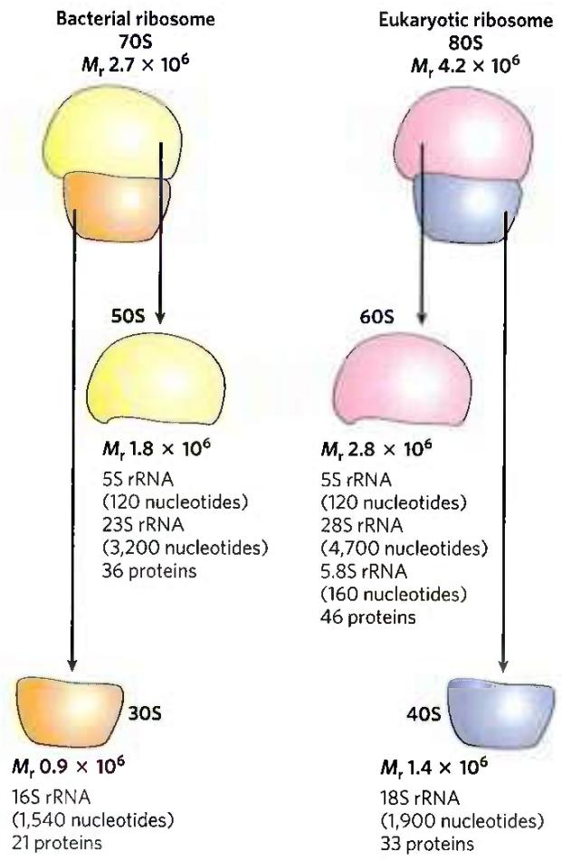  
FIGURE 27-16 Summary of the composition and mass of ribosomes in bacteria and eukaryotes. The S values associated with the subunits are not additive when subunits are combined, because S values are approximately proportional to the two-thirds power of molecular weight and are also slightly affected by shape.

Yeast alanine tRNA (tRNA $^{Ala}$ ) was the first nucleic acid to be completely sequenced, by Robert Holley in 1965. It contains 76 nucleotide residues, 10 of which have modified bases. Comparisons of tRNAs from various species have revealed many common structural features (Fig. 27-18a). Eight or more of the nucleotide residues have modified bases and sugars, many of which are methylated derivatives of the principal bases. Most tRNAs have a guanylate (pG) residue at the 5' end, and all have the trinucleotide sequence CCA(3') at the

  
FIGURE 27-17 Assembly of ribosomes in eukaryotes. ① Most of the early steps of ribosome assembly occur in the nucleolus, an organelle inside the nucleus. Ribonucleases and specialized RNAs, including some snoRNAs, process the initial rRNA transcript. ② Large pre-ribosomal particles are formed and additional processing of the large complex occurs with the aid of proteins called assembly factors. The pre-40S and pre-60S complexes move into the nucleoplasm. ③ The 40S and 60S subunits are exported to the cytoplasm, coupled with the ejection of assembly factors. ④ Final maturation of the ribosome occurs in the cytoplasm.

3' end. When drawn in two dimensions, all tRNAs have a hydrogen-bonding pattern that forms a cloverleaf structure with four arms, as first proposed by Elizabeth Keller. The longer tRNAs have a short fifth arm, or extra arm. In three dimensions, a tRNA has the form of a twisted L (Fig. 27-18b).

P3 Two of the arms of a tRNA are critical for its adaptor function. The amino acid arm can carry a specific amino acid esterified by its carboxyl group to the 2'- or 3'-hydroxyl group of the A residue at the 3' end of the tRNA. The anticodon arm contains the anticodon. The other major arms are the D arm, which contains the unusual nucleotide dihydrouridine (D), and the TψC arm, which contains ribothymidine (T), not usually present in RNAs, and pseudouridine (ψ), which has an unusual carbon-carbon bond between the base and ribose (see Fig. 26-22). The D and TψC arms contribute important interactions for the overall folding of tRNA molecules, and the TψC arm interacts with the large-subunit rRNA.

  
(a)

  
(b)  
FIGURE 27-18 General structure of tRNAs. (a) The cloverleaf structure. The large dots on the backbone represent nucleotide residues; the blue lines represent base pairs. Characteristic and/or invariant residues common to all tRNAs are specified. Transfer RNAs vary in length from 73 to 93 nucleotides. Extra nucleotides occur in the extra arm or in the D arm. At the end of the anticodon arm is the anticodon loop, which always contains seven unpaired nucleotides. The D arm contains two or three D (5,6-dihydrouridine) residues, depending on the tRNA. In some tRNAs, the D arm has only three hydrogen-bonded base pairs. Pu represents purine nucleotide; Py, pyrimidine nucleotide; $\psi$ , pseudouridylate; G\*, guanylate or 2'-O-methylguanylate. (b) Schematic diagram of the folded tRNA, which resembles a twisted L.


Having looked at the structures of ribosomes and tRNAs, we now consider in detail the five stages of protein synthesis.

#### [EN] Stage 1: Aminoacyl-tRNA Synthetases Attach the Correct Amino Acids to Their tRNAs

P3 For the synthesis of a polypeptide with a defined sequence, two fundamental chemical requirements must be met: (1) the carboxyl group of each amino acid must be activated to facilitate formation of a peptide bond, and (2) a link must be established between each new amino acid and the information in the mRNA that encodes it. Both these requirements are met by attaching the amino acid to a tRNA in the first stage of protein synthesis. When attached to their amino acid (aminoacylated), the tRNAs are said to be “charged.”

This first stage of protein synthesis takes place in the cytosol. Aminoacyl-tRNA synthetases esterify the 20 amino acids to their corresponding tRNAs. Each enzyme is specific for one amino acid and one or more corresponding tRNAs. Most organisms have one aminoacyl-tRNA synthetase for each amino acid. For amino acids with two or more corresponding tRNAs, the same enzyme usually aminoacylates all of them.

In all organisms, the aminoacyl-tRNA synthetases fall into two classes (Table 27-7), based on substantial differences in primary and tertiary structure and in reaction mechanism (Fig. 27-19). There is no evidence that the two classes share a common ancestor, and the biological, chemical, or evolutionary reasons for two enzyme classes for essentially identical processes remain obscure.

<table><tr><td colspan="2">Class I</td><td colspan="2">Class II</td></tr><tr><td>Arg</td><td>Leu</td><td>Ala</td><td>Lys</td></tr><tr><td>Cys</td><td>Met</td><td>Asn</td><td>Phe</td></tr><tr><td>Gln</td><td>Trp</td><td>Asp</td><td>Pro</td></tr><tr><td>Glu</td><td>Tyr</td><td>Gly</td><td>Ser</td></tr><tr><td>Ile</td><td>Val</td><td>His</td><td>Thr</td></tr></table>

Note: Here, Arg represents arginyl-tRNA synthetase, and so forth. The classification applies to all organisms for which tRNA synthetases have been analyzed and is based on protein structural distinctions and on the mechanistic distinction outlined in Figure 27-19.

The reaction catalyzed by an aminoacyl-tRNA synthetase is


$$
\begin{array}{c} \text {Amino acid + tRNA + ATP} \xrightarrow {\mathrm{Mg} ^ {2 +}} \\ \text {aminoacyl - tRNA + AMP + PP} _ {\mathrm{i}} \end{array}
$$

This reaction occurs in two steps in the enzyme's active site. In step 1 (Fig. 27-19), an enzyme-bound intermediate, aminoacyl adenylate (aminoacyl-AMP), is formed. In the second step, the aminoacyl group is transferred from enzyme-bound aminoacyl-AMP to its corresponding specific tRNA. The course of this second step depends on the class to which the enzyme belongs, as shown by pathways 2a and 2b in Figure 27-19. The resulting ester linkage between the amino acid and the tRNA (Fig. 27-20) has a highly negative standard free energy of hydrolysis ( $\Delta G^{\circ} = -29$ kJ/mol). The pyrophosphate formed in the activation reaction undergoes hydrolysis to phosphate by inorganic pyrophosphatase. Thus, two high-energy phosphate bonds are ultimately expended for each amino acid molecule activated, rendering the overall reaction for amino acid activation essentially irreversible:

$$
\begin{array}{r l} \text { Amino   acid } + \mathrm{tRNA} + \mathrm{ATP} & \xrightarrow {\mathrm{Mg} ^ {2 +}} \\ & \text { aminoacyl   -   tRNA } + \mathrm{AMP} + 2 \mathrm{P} _ {\mathrm{i}} \\ & \Delta G ^ {\prime \circ} \approx - 2 9 \mathrm{kJ/mol} \end{array}
$$

Proofreading by Aminoacyl-tRNA Synthetases The aminoacylation of tRNA accomplishes two ends: (1) it activates an amino acid for peptide bond formation and (2) it ensures appropriate placement of the amino acid in a growing polypeptide. The identity of the amino acid attached to a tRNA is not checked on the ribosome, so attachment of the correct amino acid to the tRNA is essential to the fidelity of protein synthesis.


As you will recall from Chapter 6, enzyme specificity is limited by the binding energy available from enzyme-substrate interactions. Discrimination between two similar amino acid substrates has been studied in detail in the case of Ile-tRNA synthetase, which distinguishes between valine and isoleucine, amino acids that differ by only a single methylene group ( $—CH_{2}—$ ):

$$
\begin{array}{c} \mathrm{COO} ^ {-} \\ \mathrm{H} _ {3} \mathrm{N} ^ {+} - \mathrm{C} - \mathrm{H} \\ \mathrm{H} - \mathrm{C} - \mathrm{CH} _ {3} \\ \mathrm{CH} _ {3} \end{array} \quad \text { Valine } \quad \text { Isoleucine }
$$

Ile-tRNA synthetase favors activation of isoleucine (to form Ile-AMP) over valine by a factor of 200—as we

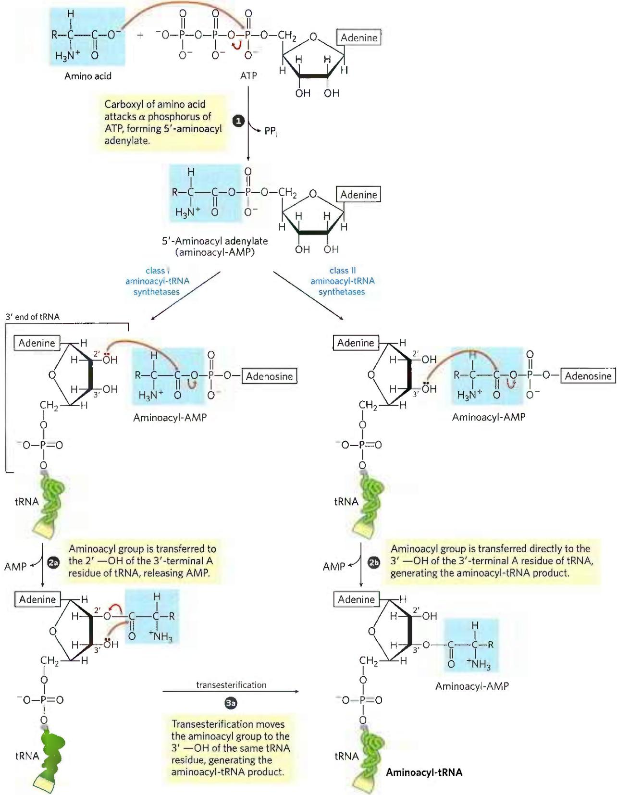

MECHANISM FIGURE 27-19 Aminoacylation of tRNA by aminoacyl-tRNA synthetases. Step ① is formation of an aminoacyl adenylate, which remains bound to the active site. In the second step, the aminoacyl group is transferred to the tRNA. The mechanism of this step is somewhat different for the two classes of aminoacyl-tRNA synthetases.

For class I enzymes, 2a the aminoacyl group is transferred first to the 2'-hydroxyl group of the 3'-terminal A residue, then 3a to the 3'-hydroxyl group by a transesterification reaction. For class II enzymes, 2b the aminoacyl group is transferred directly to the 3'-hydroxyl group of the terminal adenylate.

  
FIGURE 27-20 General structure of aminoacyl-tRNAs. The aminoacyl group is esterified to the 3' position of the terminal A residue. The ester linkage that both activates the amino acid and joins it to the tRNA is shaded light red.

would expect, given the amount by which a methylene group (in Ile) could enhance substrate binding. Yet valine is erroneously incorporated into proteins in positions normally occupied by an Ile residue at a frequency of only about 1 in 3,000. How is this greater-than-10-fold increase in accuracy brought about? Ile-tRNA synthetase, like some other aminoacyl-tRNA synthetases, has a proofreading function.

Recall a general principle from the discussion of proofreading by DNA polymerases (see Fig. 25-6): if available binding interactions do not provide sufficient discrimination between two substrates, the necessary specificity can be achieved by substrate-specific binding in two successive steps. The effect of forcing the system through two successive filters is multiplicative. In the case of Ile-tRNA synthetase, the first filter is the initial binding of the amino acid to the enzyme and its activation to aminoacyl-AMP. The second is the binding of any incorrect aminoacyl-AMP products to a separate active site on the enzyme; a substrate that binds in this second active site is hydrolyzed. The R group of valine is slightly smaller than that of isoleucine, so Val-AMP fits the hydrolytic (proofreading) site of the Ile-tRNA synthetase, but Ile-AMP does not. P1 Thus Val-AMP is hydrolyzed to valine and AMP in the proofreading active site, and tRNA bound to the synthetase does not become aminoacylated to the wrong amino acid.

In addition to proofreading after formation of the aminoacyl-AMP intermediate, most aminoacyl-tRNA synthetases can hydrolyze the ester linkage between amino acids and tRNAs in the aminoacyl-tRNAs. This hydrolysis is greatly accelerated for incorrectly charged tRNAs, providing yet a third filter to enhance the fidelity of the overall process. The few aminoacyl-tRNA synthetases that activate amino acids with no close structural relatives (Cys-tRNA synthetase, for example) demonstrate little or no proofreading activity; in these cases, the active site for aminoacylation can sufficiently discriminate between the proper substrate and any incorrect amino acid.


The overall error rate of protein synthesis (\~1 mistake per $10^{4}$ amino acids incorporated) is not nearly as low as that of DNA replication. Because flaws in a protein are eliminated when the protein is degraded and are not passed on to future generations, they have less biological significance. The degree of fidelity in protein synthesis is sufficient to ensure that most proteins contain no mistakes and that the large amount of energy required to synthesize a protein is rarely wasted. One defective protein molecule is usually unimportant when many correct copies of the same protein are present.

A "Second Genetic Code" P3 An individual aminoacyl-tRNA synthetase must be specific not only for a single amino acid but for certain tRNAs as well. Discriminating among dozens of tRNAs is just as important for the overall fidelity of protein biosynthesis as is distinguishing among amino acids. The interaction between aminoacyl-tRNA synthetases and tRNAs has been referred to as the "second genetic code," reflecting its critical role in maintaining the accuracy of protein synthesis. The "coding" rules appear to be more complex than those in the "first" code.

Figure 27-21 summarizes what we know about the nucleotides involved in recognition by some aminoacyl-tRNA synthetases. Some nucleotides are conserved in all tRNAs and therefore cannot be used for discrimination. Nucleotide positions necessary for discrimination by the aminoacyl-tRNA synthetases seem to be concentrated in the amino acid arm and the anticodon arm, including the nucleotides of the anticodon itself. A few are located in other parts of the tRNA molecule. Determination of the crystal structures of aminoacyl-tRNA synthetases complexed with their cognate tRNAs and ATP has added a great deal to our understanding of these interactions (Fig. 27-22).

Ten or more specific nucleotides may be involved in recognition of a tRNA by its specific aminoacyl-tRNA synthetase. But in a few cases the recognition mechanism is quite simple. Across a range of organisms from bacteria to humans, the primary determinant of tRNA recognition by the Ala-tRNA synthetases is a single G=U base pair in the amino acid arm of tRNA $^{Ala}$ (Fig. 27-23a). A short synthetic RNA with as few as 7 bp arranged in a simple hairpin minihelix is efficiently aminoacylated by the Ala-tRNA synthetase, as long as the RNA contains the critical G=U (Fig. 27-23b). This relatively simple alanine system may be an evolutionary relic of a period when RNA oligonucleotides, ancestors to tRNA, were aminoacylated in a primitive system for protein synthesis.

  
FIGURE 27-21 Nucleotide positions in a tRNA that are recognized by aminoacyl-tRNA synthetases. (a) Some positions (purple dots) are the same in all tRNAs and therefore cannot be used to discriminate one from another. Other positions are known recognition points for one (orange) or more (blue) aminoacyl-tRNA synthetases. Structural features other than

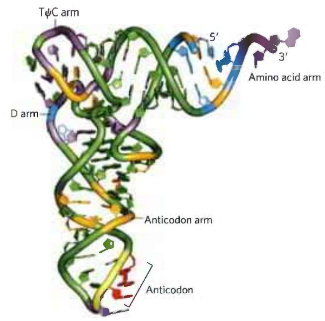  
(b)

sequence are important for recognition by some of the synthetases. (b) The same structural features are shown in three dimensions, with the orange and blue residues again representing positions recognized by one or more aminoacyl-tRNA synthetases, respectively. [(b) Data from PDB ID 1EHZ, H. Shi and P. B. Moore, RNA 6:1091, 2000.]  
  
FIGURE 27-22 Aminoacyl-tRNA synthetases. The synthetases are complexed with their cognate tRNAs (green). Bound ATP (red) pinpoints the active site near the end of the aminoacyl arm. (a) Gln-tRNA synthetase of E. coli, a typical monomeric class I synthetase. (b) Asp-tRNA synthetase of  
yeast, a typical dimeric class II synthetase. (c) The two classes of aminoacyl-tRNA synthetases recognize different faces of their tRNA substrates. [Data from (a, c (left)) PDB ID 1QRT, J. G. Arnez and T. A. Steitz, Biochemistry 35:14,725, 1996; (b, c (right)) PDB ID 1ASZ, J. Cavarelli et al., EMBO J. 13:327, 1994.]

The interaction of aminoacyl-tRNA synthetases and their cognate tRNAs is critical to accurate reading of the genetic code. Any expansion of the code to include new amino acids would necessarily require a new aminoacyl-tRNA synthetase-tRNA pair. A limited expansion of the genetic code has been observed in nature; a more extensive expansion has been accomplished in the laboratory (Box 27-2).

#### [EN] Stage 2: A Specific Amino Acid Initiates Protein Synthesis

Protein synthesis begins at the amino-terminal end and proceeds by the stepwise addition of amino acids to the carboxyl-terminal end of the growing polypeptide. The AUG initiation codon thus specifies an amino-terminal methionine residue. Although methionine has only one codon, (5')AUG, all organisms have two tRNAs for methionine. One is used exclusively when (5')AUG is the initiation codon for protein synthesis. The other is used to code for a Met residue in an internal position in a polypeptide.


The distinction between an initiating (5')AUG and an internal one is straightforward. In bacteria, the two types of tRNA specific for methionine are designated tRNA $^{Met}$ and tRNA $^{fMet}$ . The amino acid incorporated in response to the (5')AUG initiation codon is N-formylmethionine (fMet). It arrives at the ribosome as N-formylmethionyl-tRNA $^{fMet}$ (fMet-tRNA $^{fMet}$ ), which is formed in two successive reactions. First, methionine is attached to tRNA $^{fMet}$ by the Met-tRNA synthetase (which in E. coli aminoacylates both tRNA $^{fMet}$ and tRNA $^{fMet}$ ):

Methionine + tRNA $^{fMet}$ + ATP →

$$
\mathrm{Met-tRNA} ^ {\mathrm{fMet}} + \mathrm{AMP} + \mathrm{PP} _ {\mathrm{i}}
$$

Next, a transformylase transfers a formyl group from $N^{10}$ -formyltetrahydrofolate to the amino group of the Met residue:

$N^{10}$ -Formyltetrahydrofolate + Met-tRNA $^{fMet}$ →

$$
\mathrm {tetrahydrofolate + fMet - tRN A ^ {fMet}}
$$

The transformylase is more selective than the Met-tRNA synthetase; it is specific for Met residues attached to tRNA $^{fMet}$ , presumably recognizing some unique structural feature of that tRNA. By contrast, Met-tRNA $^{fMet}$ inserts methionine in interior positions in polypeptides.

FIGURE 27-23 Structural elements of tRNA $^{Ala}$ that are required for recognition by Ala-tRNA synthetase. (a) The tRNA $^{Ala}$ structural elements recognized by the Ala-tRNA synthetase are unusually simple. A single G=U base pair (light red) is the only element needed for specific binding and aminoacylation. (b) A short synthetic RNA minihelix, with the critical G=U base pair but lacking most of the remaining tRNA structure. This is aminoacylated specifically with alanine almost as efficiently as the complete tRNA $^{Ala}$ .  


Addition of the N-formyl group to the amino group of methionine by the transformylase prevents fMet from entering interior positions in a polypeptide while also allowing fMet-tRNA $^{fMet}$ to be bound at a specific ribosomal initiation site that accepts neither Met-tRNA $^{Met}$ nor any other aminoacyl-tRNA.

In eukaryotic cells, all polypeptides synthesized by cytosolic ribosomes begin with a Met residue (rather than fMet), but, again, the cell uses a specialized initiating tRNA that is distinct from the tRNA $^{Met}$ used at (5')AUG codons at interior positions in the mRNA. Polypeptides synthesized by mitochondrial and chloroplast ribosomes, however, begin with N-formylmethionine. This strongly supports the view that mitochondria and chloroplasts originated from bacterial ancestors that were symbiotically incorporated into precursor eukaryotic cells at an early stage of evolution (see Fig. 1-37).

How can the single (5')AUG codon determine whether a starting N-formylmethionine (or methionine, in eukaryotes) or an interior Met residue is ultimately inserted? The details of the initiation process provide the answer.

#### [EN] Natural and Unnatural Expansion of the Genetic Code

As we have seen, the 20 standard amino acids found in proteins offer only limited chemical functionality. Living systems generally overcome these limitations by using enzymatic cofactors or by modifying particular amino acids after they have been incorporated into proteins. In principle, expansion of the genetic code to introduce new amino acids into proteins offers another route to new functionality, but it is a very difficult route to exploit. Such a change might just as easily result in inactivation of thousands of cellular proteins.

Expanding the genetic code to include a new amino acid requires several cellular changes. A new aminoacyl-tRNA synthetase must generally be present, along with a cognate tRNA. Both of these components must be highly specific, interacting only with each other and the new amino acid. Significant concentrations of the new amino acid must be present in the cell, which may entail the evolution of new metabolic pathways. As outlined in Box 27-1, the anticodon on the tRNA would most likely pair with a codon that usually specifies termination. Making all of this work in a living cell seems unlikely, but it has happened both in nature and in the laboratory.

There are actually 22 rather than 20 amino acids specified by the known genetic code. The two extra amino acids are selenocysteine and pyrrolysine, each found in only very few proteins but both offering a glimpse into the intricacies of code evolution.

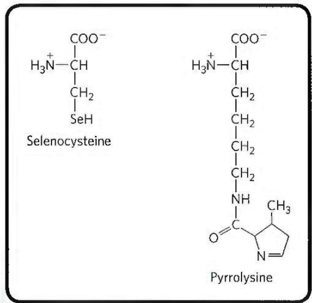

A few proteins in all cells (such as formate dehydrogenase in bacteria and glutathione peroxidase in mammals) require selenocysteine for their activity. In E. coli, selenocysteine is introduced into the enzyme formate dehydrogenase during translation, in response to an in-frame UGA codon. A special type of Ser-tRNA, present at lower levels than other Ser-tRNAs, recognizes UGA and no other codons. This tRNA is charged with serine by the normal serine aminoacyl-tRNA synthetase, and the serine is enzymatically converted to selenocysteine by a separate enzyme before its use at the ribosome. The charged tRNA does not recognize just any UGA codon; some contextual signal in the mRNA, still to be identified, ensures that this tRNA recognizes only the few UGA codons, within certain genes, that specify selenocysteine. In effect, UGA doubles as a codon for both termination and (very occasionally) selenocysteine. This particular code expansion has a dedicated tRNA, as described above, but it lacks a dedicated cognate aminoacyl-tRNA synthetase. The process works for selenocysteine, but one might consider it an intermediate step in the evolution of a complete new codon definition.

Pyrrolysine is found in a group of anaerobic archaea called methanogens (see Box 22-1). These organisms produce methane as a required part of their metabolism, and the Methanosarcinaceae family can use methylamines as substrates for methanogenesis. Producing methane from monomethylamine requires the enzyme monomethylamine methyltransferase. The gene encoding this enzyme has an in-frame UAG termination codon. The structure of the methyltransferase was elucidated in 2002, revealing the presence of the novel amino acid pyrrolysine at the position specified by the UAG codon. Subsequent experiments demonstrated that — unlike selenocysteine — pyrrolysine is attached directly to a dedicated tRNA by a cognate pyrrolysyl-tRNA synthetase. These methanogens produce pyrrolysine via a metabolic pathway that remains to be elucidated. The overall system has all the hallmarks of an established codon assignment, although it works only for UAG codons in this particular gene. As in the case of selenocysteine, there are probably contextual signals that direct this tRNA to the correct UAG codon.

Can scientists match this evolutionary feat? Modification of proteins with various functional groups can provide important insights into the activity and/or structure of the proteins. However, protein modification is often laborious. For example, an investigator who wishes to attach a new group to a particular Cys residue will have to somehow block other Cys residues that may be present on the same protein. If one could instead adapt the genetic code to enable a cell to insert a modified amino acid at a particular location in a protein, the process could be rendered much more convenient. Peter Schultz and coworkers have done just that.

To develop a new codon assignment, one again needs a new aminoacyl-tRNA synthetase and a novel cognate tRNA, both adapted to work only with a particular new amino acid. Efforts to create such an "unnatural" code expansion initially focused on E. coli. The codon UAG was chosen as the best target for encoding a new amino acid. UAG is the least used of the three termination codons, and strains with tRNAs selected

(Continued on next page)

#### [EN] Natural and Unnatural Expansion of the Genetic Code (Continued)

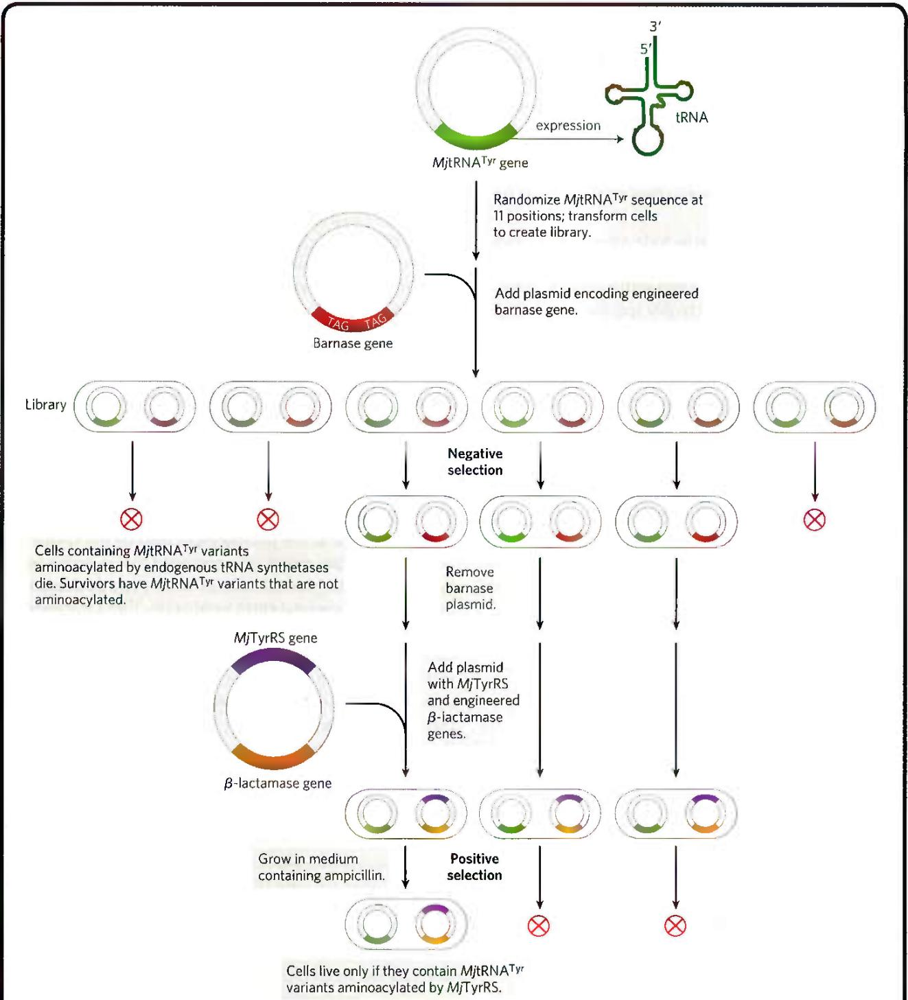

FIGURE 1 Selecting $Mj\ tRNA^{Tyr}$ variants that function only with the tyrosyl-tRNA synthetase $Mj$ TyrRS. The sequence of the gene encoding $Mj\ tRNA^{Tyr}$ , on a plasmid, is randomized at 11 positions that do not interact with $Mj$ TyrRS (red dots). The mutagenized plasmids are introduced into E. coli cells to create a library of millions of $Mj\ tRNA^{Tyr}$ variants, represented by the six cells shown here. The toxic barnase gene, engineered to include the sequence TAG so that its transcript includes UAG codons, is present on a separate plasmid, providing a negative selection. If this gene is expressed, the cells die. It can be successfully expressed only if the $Mj\ tRNA^{Tyr}$ variant expressed by that particular cell is aminoacylated by endogenous (E. coli) aminoacyl-tRNA synthetases, inserting an amino acid instead of stopping translation. Another gene, encoding $\beta$ -lactamase, and also engineered with TAG sequences to produce UAG stop codons, is provided on yet another plasmid that also expresses the gene encoding $Mj$ TyrRS. This serves as a means of positive selection for the remaining $Mj$ tRNA $^{Tyr}$ variants. Those variants that are aminoacylated by $Mj$ TyrRS allow expression of the $\beta$ -lactamase gene, so these cells can grow on ampicillin. Multiple rounds of negative and positive selection yield the best $Mj$ tRNA $^{Tyr}$ variants that are aminoacylated uniquely by $Mj$ TyrRS and used efficiently in translation.

to recognize UAG do not exhibit growth defects. To create the new tRNA and tRNA synthetase, the genes for a tRNA $^{Tyr}$ and its cognate tyrosyl-tRNA synthetase were taken from the archaeon Methanococcus jannaschii (MjtRNA $^{Tyr}$ and MjTyrRS, respectively). MjTyrRS does not bind to the anticodon loop of MjtRNA $^{Tyr}$ , so the anticodon loop can be modified to CUA (complementary to UAG) without affecting the interaction. Because the archaeal and bacterial systems are orthologous, the modified archaeal components could be transferred to E. coli without disrupting the intrinsic translation system of the bacterial cells.

First, the gene encoding $MjtRNA^{Tyr}$ had to be modified to generate an ideal product tRNA — one that was not recognized by any aminoacyl-tRNA synthetases endogenous to E. coli but was aminoacylated by MjTyrRS. Finding such a variant could be accomplished through a series of negative and positive selection cycles designed to efficiently sift through variants of the tRNA gene (Fig. 1). Parts of the $MjtRNA^{Tyr}$ sequence were randomized, allowing creation of a library of cells that each expressed a different version of the tRNA. A gene encoding barnase (a ribonuclease toxic to E. coli) was engineered so that its mRNA transcript contained several UAG codons, and this gene was also introduced into the cells on a plasmid. If the $MjtRNA^{Tyr}$ variant expressed in a particular cell in the library were aminoacylated by an endogenous tRNA synthetase, it would express the barnase gene and that cell would die (negative selection). Surviving cells would contain tRNA variants that were not aminoacylated by endogenous tRNA synthetases, but could potentially be aminoacylated by MjTyrRS. A positive selection (Fig. 1) was then set up by engineering the $\beta$ -lactamase gene (which confers resistance to the antibiotic ampicillin) so that its transcript contained several UAG codons, and introducing this gene into the cells along with the gene encoding $Mj$ TyrRS. Those $MjtRNA^{Tyr}$ variants that could be aminoacylated by $Mj$ TyrRS allowed growth on ampicillin only when $Mj$ TyrRS was also expressed in the cell. Several rounds of this negative and positive selection scheme identified a new $MjtRNA^{Tyr}$ variant that was not affected by endogenous enzymes, was aminoacylated by $Mj$ TyrRS, and functioned well in translation.

Next, the $Mj$ TyrRS had to be modified to recognize the new amino acid. The gene encoding $Mj$ TyrRS was mutagenized to create a large library of variants. Variants that would aminoacylate the new $MjtRNA^{Tyr}$ variant with endogenous amino acids were eliminated using the barnase gene selection. A second positive selection (similar to the ampicillin selection described above) was carried out so that cells would survive only if the $MjtRNA^{Tyr}$ variant were aminoacylated only in the presence of the unnatural amino acid. Several rounds of negative and positive selection generated a cognate tRNA synthetase–tRNA pair that recognized only the unnatural amino acid.

Using this approach, researchers have constructed many E. coli strains, each capable of incorporating one particular unnatural amino acid into a protein in response to a UAG codon. The same approach has been used to artificially expand the genetic code of yeast and even mammalian cells. More than 30 different amino acids (Fig. 2) can be introduced site-specifically and efficiently into cloned proteins in this way. The result is an increasingly useful and flexible tool kit with which to advance the study of protein structure and function.

  
FIGURE 2 A sampling of unnatural amino acids that have been added to the genetic code. These unnatural amino acids add uniquely reactive chemical groups such as (a) a ketone; (b) an azide; (c) a photocrosslinker, a functional group designed to form a covalent bond with  
a nearby group when activated by light; (d) a highly fluorescent amino acid; (e) an amino acid with a heavy atom (Br) for use in crystallography; and (f) a long-chain cysteine analog that can form extended disulfide bonds. [Information from J. Xie and P. G. Schultz, Nat. Rev. Mol. Cell Biol. 7:775, 2006.]

The Three Steps of Initiation The initiation of polypeptide synthesis in bacteria requires (1) the 30S ribosomal subunit, (2) the mRNA coding for the polypeptide to be made, (3) the initiating fMet-tRNA $^{fMet}$ , (4) a set of three proteins called initiation factors (IF1, IF2, and IF3), (5) GTP, (6) the 50S ribosomal subunit, and (7) Mg $^{2+}$ . Formation of the initiation complex takes place in three steps (Fig. 27-24).

In step 1, the 30S ribosomal subunit binds two initiation factors, IF1 and IF3. Factor IF3 prevents the 30S and 50S subunits from combining prematurely. The mRNA then binds to the 30S subunit. The initiating (5')AUG is guided to its correct position by the Shine-Dalgarno sequence (named for Australian researchers John Shine and Lynn Dalgarno, who identified it) in the mRNA. This consensus sequence is an initiation signal of four to nine purine residues, 8 to 13 bp to the 5' side of the initiation codon (Fig. 27-25a). The sequence base-pairs with a complementary pyrimidine-rich sequence near the 3' end of the 16S rRNA of the 30S ribosomal subunit (Fig. 27-25b). This mRNA-rRNA interaction positions the initiating (5')AUG sequence of the mRNA in the precise position on the 30S subunit where it is required for initiation of translation. The particular (5')AUG where fMet-tRNA $^{fMet}$ is to be bound is distinguished from other methionine codons by its proximity to the Shine-Dalgarno sequence in the mRNA.

Bacterial ribosomes have three sites that bind tRNAs, the aminoacyl (A) site, the peptidyl (P) site, and the exit (E) site. The A and P sites bind aminoacyl-tRNAs, whereas the E site binds only uncharged tRNAs that have completed their task on the ribosome. Factor IF1 binds at the A site and prevents tRNA binding at this site during initiation. The initiating (5')AUG is positioned at the P site, the only site to which fMet-tRNA $^{fMet}$ can bind (Fig. 27-24). The fMet-tRNA $^{fMet}$ is the only aminoacyl-tRNA that binds first to the P site; during the subsequent elongation stage, all other incoming aminoacyl-tRNAs (including the Met-tRNA $^{fMet}$ that binds to interior AUG codons) bind first to the A site and only subsequently to the P and E sites. The E site is the site from which the “uncharged” tRNAs leave during elongation. Both the 30S and the 50S subunits contribute to the characteristics of the A and P sites, whereas the E site is largely confined to the 50S subunit.

In step 2 of the initiation process (Fig. 27-24), the complex consisting of the 30S ribosomal subunit, IF3, and mRNA is joined by both GTP-bound IF2 and the initiating fMet-tRNA $^{fMet}$ . The anticodon of this tRNA now pairs correctly with the mRNA's initiation codon.

In step 3, this large complex combines with the 50S ribosomal subunit; simultaneously, the GTP bound to IF2 is hydrolyzed to GDP and $P_{i}$ , which are released from the complex. All three initiation factors leave the ribosome at this point.

P1 Completion of the steps in Figure 27-24 produces a functional 70S ribosome called the initiation complex, containing the mRNA and the initiating fMet-tRNA $^{fMet}$ . The correct binding of the fMet-tRNA $^{fMet}$ to the P site in the complete 70S initiation complex is ensured by at least three points of recognition and attachment: the codon-anticodon interaction involving the initiation AUG fixed in the P site, the interaction between the Shine-Dalgarno sequence in the mRNA and the 16S rRNA, and the binding interactions between the ribosomal P site and the fMet-tRNA $^{fMet}$ . The initiation complex is now ready for elongation.

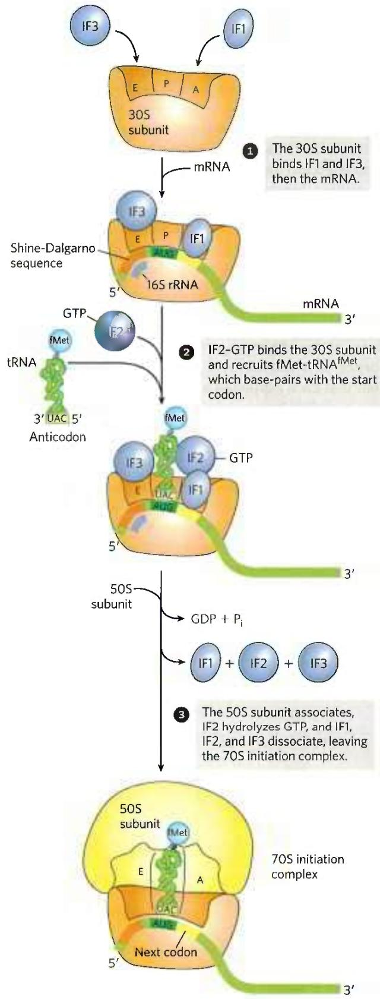  
FIGURE 27-24 Formation of the initiation complex in bacteria. The complex forms in three steps (described in the text) at the expense of the hydrolysis of GTP to GDP and P1, IF1, IF2, and IF3 are initiation factors. E designates the exit site; P, the peptidyl site; and A, the aminoacyl site. Here the anticodon of the tRNA is oriented 3' to 5', left to right, as in Figure 27-8, but opposite to the orientation in Figures 27-21 and 27-23.

  
(b)  
FIGURE 27-25 Messenger RNA sequences that serve as signals for initiation of protein synthesis in bacteria. (a) Alignment of the initiating AUG (shaded in green) at its correct location on the 30S ribosomal subunit depends in part on upstream Shine-Dalgarno sequences (light red). Portions of the mRNA transcripts of five bacterial genes are shown. Note the  
unusual example of the E. coli LacI protein, which initiates with a GUG (Val) codon. In E. coli, AUG is the start codon in approximately 91% of genes, with GUG (7%) and UUG (2%) assuming this role more rarely. (b) The Shine-Dalgarno sequence of the mRNA pairs with a sequence near the 3' end of the 16S rRNA.

Initiation in Eukaryotic Cells Translation is generally similar in eukaryotic and bacterial cells; most of the significant differences are in the number of components and the mechanistic details. The initiation process in eukaryotes is outlined in Figure 27-26. Eukaryotic mRNAs are bound to the ribosome as a complex with a number of specific binding proteins. Eukaryotic cells have at least 12 initiation factors. Initiation factors eIF1A and eIF3 are the functional homologs of the bacterial IF1 and IF3, binding to the 40S subunit in step ①, blocking tRNA binding to the A site and premature joining of the large and small ribosomal subunits, respectively. The factor eIF1 binds to the E site. The charged initiator tRNA is bound by the initiation factor eIF2, which also has bound GTP. In step ②, this ternary complex binds to the 40S ribosomal subunit, along with two other proteins involved in later steps, eIF5 (not shown in Fig. 27-26) and eIF5B. This creates a 43S preinitiation complex. The mRNA binds to the eIF4F complex, which, in step 3, mediates its association with the 43S preinitiation complex. The eIF4F complex is made up of eIF4E (binding to the 5' cap), eIF4A (an ATPase and RNA helicase), and eIF4G (a linker protein). The eIF4G protein binds to eIF3 and eIF4E to provide the first link between the 43S preinitiation complex and the mRNA. The eIF4G also binds to the poly(A) binding protein (PABP) at the 3' end of the mRNA, circularizing the mRNA (Fig. 27-27) and facilitating the translational regulation of gene expression, as described in Chapter 28.

Addition of the mRNA and its associated factors creates a 48S complex. This complex scans the bound mRNA, starting at the 5' cap, until an AUG codon is encountered. The scanning process (step 4 in Fig. 27-26) may be facilitated by the RNA helicase of eIF4A, which unwinds RNA secondary structures while in a transient complex with another factor, eIF4B (not shown in Fig. 27-26).

Once the initiating AUG site is encountered, the 60S ribosomal subunit associates with the complex in step 5, which is accompanied by release of many of the initiation factors. This requires the activity of eIF5 and eIF5B. The eIF5 protein promotes the GTPase activity of eIF2, producing an eIF2-GDP complex with reduced affinity for the initiator tRNA. The eIF5B protein is homologous to the bacterial IF2. It hydrolyzes its bound GTP and triggers dissociation of eIF2-GDP and other initiation factors, followed closely by association of the 60S subunit. This completes formation of the initiation complex.

  
FIGURE 27-26 Initiation of protein synthesis in eukaryotes. The five steps are described in the text. Eukaryotic initiation factors mediate the association of, first, the charged initiator tRNA to form a 43S preinitiation

  
FIGURE 27-27 Circularization of mRNA in the eukaryotic initiation complex. The 3' and 5' ends of eukaryotic mRNAs are linked by the eIF4F complex of proteins. The eIF4E subunit binds to the 5' cap, and the eIF4G protein binds to the poly(A) binding protein (PABP) at the 3' end of the mRNA. The eIF4G protein also binds to eIF3, linking the circularized mRNA to the 40S subunit of the ribosome.  
complex, and then the mRNA (with the 5' cap shown in red) to form a 48S complex. The final 80S initiation complex is formed as the 60S subunit associates, coupled with release of most of the initiation factors.

The roles of the various bacterial and eukaryotic initiation factors in the overall process are summarized in Table 27-8. The mechanism by which these proteins act is an important area of investigation.

#### [EN] Stage 3: Peptide Bonds Are Formed in the Elongation Stage

The third stage of protein synthesis is elongation. Again, we begin with bacterial cells. Elongation requires (1) the initiation complex described above, (2) aminoacyl-tRNAs, (3) a set of three soluble cytosolic proteins called elongation factors (EF-Tu, EF-Ts, and EF-G in bacteria), and (4) GTP. Cells use three steps to add each amino acid residue, and the steps are repeated as many times as there are residues to be added.

Elongation Step 1: Binding of an Incoming Aminoacyl-tRNA In the first step of the elongation cycle (Fig. 27-28), the appropriate incoming aminoacyl-tRNA binds to a complex of GTP-bound EF-Tu. The resulting aminoacyl-tRNA-EF-Tu-GTP complex binds to the A site of the 70S initiation complex. The GTP is hydrolyzed and an EF-Tu-GDP complex is released from the 70S ribosome. The bound GDP is released when the EF-Tu-GDP complex binds to EF-Ts, and EF-Ts is subsequently released when another molecule of GTP binds to EF-Tu, recycling it.

<table><tr><td colspan="2">TABLE 27-8 Protein Factors Required for Initiation of Translation in Bacterial and Eukaryotic Cells</td></tr><tr><td>Factor</td><td>Function</td></tr><tr><td colspan="2">Bacterial</td></tr><tr><td>IF1</td><td>Prevents premature binding of tRNAs to A site</td></tr><tr><td>IF2</td><td>Facilitates binding of fMet-tRNA $^fMet$  to 30S ribosomal subunit</td></tr><tr><td>IF3</td><td>Binds to 30S subunit; prevents premature association of 50S subunit; enhances specificity of P site for fMet-rRNA $^fMet$ </td></tr><tr><td colspan="2">Eukaryotic</td></tr><tr><td>eIF1</td><td>Binds to the E site of the 40S subunit; facilitates interaction between eIF2-tRNA-GTP ternary complex and the 40S subunit</td></tr><tr><td>eIF1A</td><td>Homolog of bacterial IF1; prevents premature binding of tRNAs to A site</td></tr><tr><td>eIF2</td><td>GTPase; facilitates binding of initiating Met-tRNA $^Met$  to 40S ribosomal subunit</td></tr><tr><td>eIF2Ba, eIF3</td><td>First factors to bind 40S subunit; facilitate subsequent steps</td></tr><tr><td>eIF4F</td><td>Complex consisting of eIF4E, eIF4A, and eIF4G</td></tr><tr><td>eIF4A</td><td>RNA helicase activity; removes secondary structure in the mRNA to permit binding to 40S subunit; part of the eIF4F complex</td></tr><tr><td>eIF4B</td><td>Binds to mRNA; facilitates scanning of mRNA to locate the first AUG</td></tr><tr><td>eIF4E</td><td>Binds to the 5&#x27; cap of mRNA; part of the eIF4F complex</td></tr><tr><td>eIF4G</td><td>Binds to eIF4E and to poly(A) binding protein (PABP); part of the eIF4F complex</td></tr><tr><td>eIF5a</td><td>Promotes dissociation of several other initiation factors from 40S subunit as a prelude to association of 60S subunit to form 80S initiation complex</td></tr><tr><td>eIF5b</td><td>GTPase homologous to bacterial IF2; promotes dissociation of initiation factors before final ribosome assembly</td></tr><tr><td colspan="2">aNot shown in Figure 27-26.</td></tr></table>

Elongation Step 2: Peptide Bond Formation A peptide bond is now formed between the two amino acids bound by their tRNAs to the A and P sites on the ribosome. This occurs by transfer of the initiating N-formylmethionyl group from its tRNA to the amino group of the second amino acid, now in the A site (Fig. 27-29). The $\alpha$ -amino group of the amino acid in the A site acts as a nucleophile, displacing the tRNA in the P site to form a peptide bond. The constrained structure of the proline side chain interferes with the alignment needed for peptide bonds to form properly. A special system binds to the ribosome to facilitate peptide bonds between two proline residues whenever that is necessary (Box 27-3). The reaction produces a dipeptidyl-tRNA in the A site, and the now "uncharged" (deacylated) tRNA $^{fMet}$ remains bound to the P site. The tRNAs then shift to a hybrid binding state, with elements of each spanning two different sites on the ribosome, as shown in Figure 27-29.

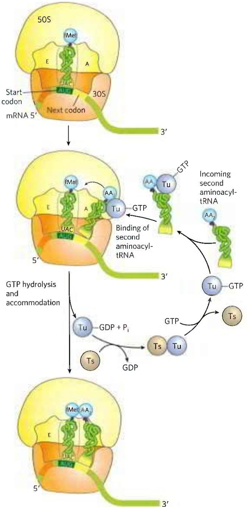  
FIGURE 27-28 First elongation step in bacteria: binding of the second aminoacyl-tRNA. The second aminoacyl-tRNA (AA $_{2}$ ) enters the A site of the ribosome bound to GTP-bound EF-Tu (shown here as Tu). Binding of the second aminoacyl-tRNA to the A site is accompanied by hydrolysis of the GTP to GDP and P $_{i}$ and release of the EF-Tu-GDP complex from the ribosome. The EF-Tu-GTP complex is regenerated in a process requiring EF-Ts and GTP. "Accommodation" involves a change in the conformation of the second tRNA that pulls its aminoacyl end into the peptidyl transferase site.

  
FIGURE 27-29 Second elongation step in bacteria: formation of the first peptide bond. The N-formylmethionyl group is transferred to the amino group of the second aminoacyl-tRNA in the A site, forming a dipeptidyl-tRNA. At this stage, both tRNAs bound to the ribosome shift position in the 50S subunit to take up a hybrid binding state. The  
uncharged tRNA shifts so that its 3' and 5' ends are in the E site. Similarly, the 3' and 5' ends of the peptidyl-tRNA shift to the P site. The anticodons remain in the P and A sites. Note the involvement of the 2'-hydroxyl group of the 3'-terminal adenosine as a general acid-base catalyst in this reaction.

P5 The peptidyl transferase activity that catalyzes peptide bond formation resides in the 23S rRNA rather than in any of the protein components of ribosomes. The ribosomal 23S rRNA catalyzes the reaction by binding and aligning the tRNAs in the A and P sites in the proper orientations for reaction. A highly conserved active site adenosine residue in the 23S rRNA (A2451 in E. coli) may facilitate the reaction by general base catalysis and transition state stabilization utilizing N-3 in the purine ring and/or the 2'-hydroxyl group. This addition to the known catalytic repertoire of ribozymes has interesting implications for the evolution of life (see Section 26.4).

Elongation Step 3: Translocation In the final step of the elongation cycle, translocation, the ribosome moves one codon toward the 3' end of the mRNA (Fig. 27-30a). This movement shifts the anticodon of the dipeptidyl-tRNA, which is still attached to the second codon of the mRNA, from the A site to the P site, and shifts the deacylated tRNA from the P site to the E site, from where the tRNA is released into the cytosol. The third codon of the mRNA now lies in the A site and the second codon lies in the P site. Movement of the ribosome along the mRNA requires EF-G (also known as translocase) and the energy provided by hydrolysis of another molecule of GTP. Because the structure of EF-G mimics the structure of the EF-Tu-tRNA complex (Fig. 27-30b), EF-G can bind the A site and, presumably, displace the peptidyl-tRNA.

After translocation, the ribosome, with its attached dipeptidyl-tRNA and mRNA, is ready for the next elongation cycle and attachment of a third amino acid residue. This process occurs in the same way as addition of the second residue (as shown in Figs. 27-28, 27-29, and 27-30). For each amino acid residue correctly added to the growing polypeptide, two GTPs are hydrolyzed to GDP and $P_{i}$ as the ribosome moves from codon to codon along the mRNA toward the 3' end.

The polypeptide remains attached to the tRNA of the most recent amino acid to be inserted. This association maintains the functional connection between the information in the mRNA and its decoded polypeptide output. At the same time, the ester linkage between this tRNA and the carboxyl terminus of the growing

#### [EN] Ribosome Pausing, Arrest, and Rescue

Ribosomes may stall during protein biosynthesis, especially while translating an mRNA that is damaged or incomplete. If translation cannot proceed to the end of the gene, the termination factors cannot act, and the ribosome may become "stuck" and thus inactivated.

Translation can experience a variety of stalling events. One well-documented issue involves the addition of proline to the growing chain, particularly when two prolines must be added sequentially. Unlike the other amino acids, proline is a secondary amine and is not as good a nucleophile in the peptide bond formation step (Fig. 27-29). The constrained geometry of the proline side chain can also affect alignment of groups for reaction on the ribosome, an issue particularly acute when the peptide bond is to be between two prolines. Bacteria have an elongation factor P (EFP) that binds between the E and P sites on the ribosome next to the peptidyl-tRNA. EFP binding affects the positioning of adjacent bound tRNAs and facilitates an optimal alignment for peptide bond formation with proline. Ribosomes in cells lacking EFP stall regularly at locations where two or more proline codons must be read consecutively. In eukaryotes, a factor closely related to EFP, eIF5A, performs this same function.

When the ribosome encounters the end of an mRNA before encountering a stop codon, the translocation step leads to formation of a stable non-stop complex, in which the A site has no mRNA that can interact with a new charged tRNA. The non-stop complex cannot be recycled by the normal termination factors. Instead, the ribosome is rescued by trans-translation (Fig. 1). In virtually all bacteria, the rescue system consists of transfer-messenger RNA (tmRNA) and small protein B (SmpB). These bind to the stalled complex in such a way that the tmRNA is positioned in the empty A site so that the ribosome can continue translation until it encounters a stop codon embedded in the tmRNA. The ribosome is then recycled, and both the defective mRNA and the polypeptide translated from it are degraded. Similar systems exist in eukaryotes.


FIGURE 1 Rescue of stalled bacterial ribosomes by tmRNA. In bacteria, tmRNA rescues stalled ribosomes by mimicking both tRNA and mRNA. The multistep pathway permits release and degradation of the damaged mRNA and tags the truncated polypeptide with an abbreviated carboxyl-terminal amino acid sequence that ensures its rapid degradation.


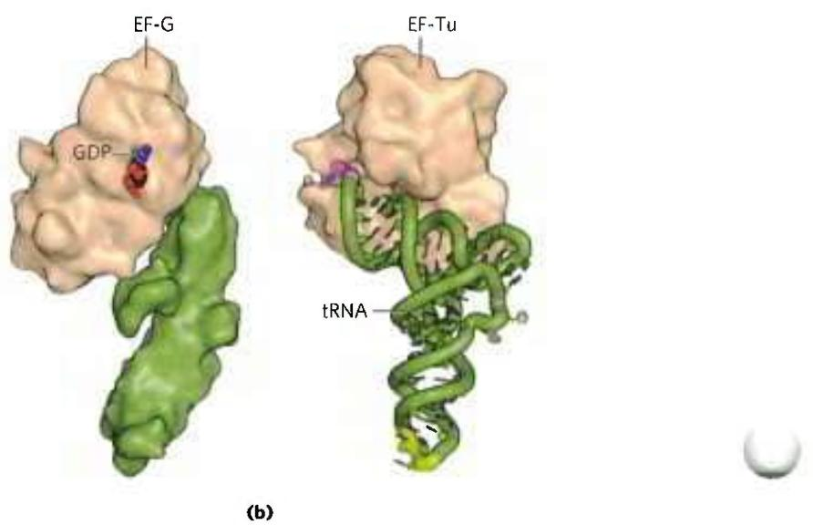


polypeptide activates the terminal carboxyl group for nucleophilic attack by the incoming amino acid to form a new peptide bond (Fig. 27-29). As the existing ester linkage between the polypeptide and tRNA is broken during peptide bond formation, the linkage between the polypeptide and the information in the mRNA persists, because each newly added amino acid is still attached to its tRNA.


The elongation cycle in eukaryotes is similar to that in bacteria. Three eukaryotic elongation factors (eEF1α, eEF1βγ, and eEF2) have functions analogous to those of the bacterial elongation factors (EF-Tu, EF-Ts, and EF-G, respectively). When a new aminoacyl-tRNA binds to the A site, an allosteric interaction leads to ejection of the uncharged tRNA from the E site.

Proofreading on the Ribosome The GTPase activity of EF-Tu during the first step of elongation in bacterial cells (Fig. 27-28) makes an important contribution to the rate and fidelity of the overall biosynthetic process. Both the EF-Tu-GTP and EF-Tu-GDP complexes exist for a few milliseconds before they dissociate. These two intervals provide opportunities for the codon-anticodon interactions to be proofread. Incorrect aminoacyl-tRNAs normally dissociate from the A site during one of these periods. If the GTP analog guanosine

FIGURE 27-30 Third elongation step in bacteria: translocation. (a) The ribosome moves one codon toward the 3' end of the mRNA, using energy provided by hydrolysis of GTP bound to EF-G (translocase). The dipeptidyl-tRNA is now entirely in the P site, leaving the A site open for an incoming (third) aminoacyl-tRNA. The uncharged tRNA later dissociates from the E site, and the elongation cycle begins again. (b) The structure of EF-G (left) mimics the structure of EF-Tu complexed with tRNA (right). The carboxyl-terminal part of EF-G mimics the structure of the anticodon loop of tRNA in both shape and charge distribution. [(b) Data from (left) PDB ID 1DAR, S. al-Karadaghi et al., Structure 4:555, 1996; (right) PDB ID 1B23, P. Nissen et al., Structure 7:143, 1999.]

5'-O-(3-thiotriphosphate) (GTPγS) is used in place of GTP, hydrolysis is slowed, improving the fidelity (by increasing the proofreading intervals) but reducing the rate of protein synthesis.


The process of protein synthesis (including the characteristics of codon-anticodon pairing already described) has clearly been optimized through evolution to balance the requirements for speed and fidelity. Improved fidelity might diminish speed, whereas increases in speed would probably compromise fidelity. And, recall that the proofreading mechanism on the ribosome establishes only that the proper codon-anticodon pairing has taken place, not that the correct amino acid is attached to the tRNA. If a tRNA is successfully aminoacylated with the wrong amino acid (as can be done experimentally), this incorrect amino acid is efficiently incorporated into a protein in response to whatever codon is normally recognized by the tRNA.

#### [EN] Stage 4: Termination of Polypeptide Synthesis Requires a Special Signal

Elongation continues until the ribosome adds the last amino acid coded by the mRNA. Termination, the fourth stage of polypeptide synthesis, is signaled by the presence of one of three termination codons in the mRNA (UAA, UAG, UGA), immediately following the final coded amino acid. Mutations in a tRNA anticodon that allow an amino acid to be inserted at a termination codon are generally deleterious to the cell. In bacteria, once a termination codon occupies the ribosomal A site, three termination factors, or release factors—the proteins RF1, RF2, and RF3—contribute to (1) hydrolysis of the terminal peptidyl-tRNA bond; (2) release of the free polypeptide and the last tRNA, now uncharged, from the P site; and (3) dissociation of the 70S ribosome into its 30S and 50S subunits, ready to start a new cycle of polypeptide synthesis (Fig. 27-31). RF1 recognizes the termination codons UAG and UAA, and RF2 recognizes UGA and UAA. Either RF1 or RF2 (depending on which codon is present) binds at a termination codon and induces peptidyl transferase to transfer the growing polypeptide to a water molecule rather than to another amino acid. The release factors have domains thought to mimic the structure of tRNA, as shown for the elongation factor EF-G in Figure 27-30b. The specific function of RF3 has not been firmly established, although it is thought to release the ribosomal subunit. In eukaryotes, a single release factor, eRF, recognizes all three termination codons.

  
FIGURE 27-31 Termination of protein synthesis in bacteria. Synthesis is terminated in response to a termination codon in the A site. First, a release factor, RF (RF1 or RF2, depending on which termination codon is present), binds to the A site. This leads to hydrolysis of the ester linkage between the nascent polypeptide and the tRNA in the P site and release of the completed polypeptide. Finally, the mRNA, deacylated tRNA, and release factor leave the ribosome, which dissociates into its 30S and 50S subunits, aided by ribosome recycling factor (RRF), IF3, and energy provided by EF-G-mediated GTP hydrolysis. The 30S subunit complex with IF3 is ready to begin another cycle of translation.

Dissociation of the translation components leads to ribosome recycling. The release factors dissociate from the posttermination complex (with an uncharged tRNA in the P site) and are replaced by EF-G and a protein called ribosome recycling factor (RRF; $M_{r}$ 20,300). Hydrolysis of GTP by EF-G leads to dissociation of the 50S subunit from the 30S-tRNA-mRNA complex. EF-G and RRF are replaced by IF3, which promotes dissociation of the tRNA. The mRNA is then released. The complex of IF3 and the 30S subunit is then ready to initiate another round of protein synthesis (Fig. 27-24).

Energy Cost of Fidelity in Protein Synthesis P1 Synthesis of a protein true to the information specified in its mRNA requires energy well beyond what would be required to synthesize peptide bonds linking a random sequence of amino acids. Formation of each aminoacyl-tRNA uses two high-energy phosphate groups. An additional ATP is consumed each time an incorrectly activated amino acid is hydrolyzed by the deacylation activity of an aminoacyl-tRNA synthetase as part of its proofreading activity. A GTP is cleaved to GDP and $\mathbf{P}_{\mathrm{i}}$ during the first elongation step, and another during the translocation step. Thus, on average, the energy derived from the hydrolysis of more than four NTPs to NDPs is required for the formation of each peptide bond of a polypeptide.

This represents an exceedingly large thermodynamic “push” in the direction of synthesis: at least $4 \times 30.5$ kJ/mol = 122 kJ/mol of phosphodiester bond energy to generate a peptide bond, which has a standard free energy of hydrolysis of only about -21 kJ/mol. The net free-energy change during peptide bond synthesis is thus -101 kJ/mol. Proteins are information-containing polymers. The biochemical goal is not simply the formation of a peptide bond but the formation of a peptide bond between two specified amino acids. Each of the high-energy phosphate compounds expended in this process plays a critical role in maintaining proper alignment between each new codon in the mRNA and its associated amino acid at the growing end of the polypeptide. This energy permits very high fidelity in the biological translation of the genetic message of mRNA into the amino acid sequence of proteins.

Rapid Translation of a Single Message by Polysomes Large clusters of 10 to 100 ribosomes that are very active in protein synthesis can be isolated from both eukaryotic and bacterial cells. Electron micrographs show a fiber between adjacent ribosomes in the cluster, which is called a polysome (Fig. 27-32a). The connecting strand is a single molecule of mRNA that is being translated simultaneously by many closely spaced ribosomes, allowing the highly efficient use of the mRNA.

In bacteria, transcription and translation are tightly coupled. Messenger RNAs are synthesized and translated in the same 5'→3' direction. As soon as the 5' end of the mRNA appears, ribosomes and the RNA polymerase form a complex, the expressome, beginning translation long before transcription is complete (Fig. 27-32b). As the 5' end of the mRNA exits one ribosome, additional ribosomes are loaded in succession to form a polysome. The situation is quite different in eukaryotic cells, where newly transcribed mRNAs must leave the nucleus before they can be translated (see Fig. 27-17).

  
FIGURE 27-32 Coupling of transcription and translation in bacteria. (a) Electron micrograph of polysomes forming during transcription of a segment of DNA from E. coli. Each mRNA is being translated by many ribosomes simultaneously. The nascent polypeptide chains are difficult to see under the conditions used to prepare the sample shown here. The arrow marks the approximate beginning of the gene that is being transcribed. (b) Each mRNA is translated by ribosomes while it is still being transcribed from DNA by RNA polymerase. This is possible because the mRNA in bacteria does not have to be transported from a nucleus to the cytoplasm before encountering ribosomes. In this schematic diagram the ribosomes are depicted as smaller than the RNA polymerase. In reality, the ribosomes ( $M_r$ $2.7 \times 10^6$ ) are an order of magnitude larger than the RNA polymerase ( $M_r$ $3.9 \times 10^5$ ). [(a) O. L. Miller, Jr., et al. Science 169:392, 1970, Fig. 3. © 1970 American Association for the Advancement of Science.]

Bacterial mRNAs generally exist for just a few minutes (p. 986) before they are degraded by nucleases. To maintain high rates of protein synthesis, the mRNA for a given protein or set of proteins must be made continuously and translated with maximum efficiency. The short lifetime of mRNAs in bacteria allows a rapid cessation of synthesis when the protein is no longer needed.

#### [EN] Stage 5: Newly Synthesized Polypeptide Chains Undergo Folding and Processing

In the final stage of protein synthesis, the nascent polypeptide chain is folded and processed into its biologically active form. During or after its synthesis, the polypeptide progressively assumes its native conformation. As introduced in Chapter 4, protein chaperones, chaperonins, and specific enzymes (e.g., protein disulfide isomerase and peptide prolyl cis-trans isomerase) play an important role in the correct folding of many proteins in all cells. Chaperones and chaperonins, exemplified by GroEL/GroES in bacteria (Fig. 27-33) and Hsp60 in eukaryotes, assist folding in part by restricting formation of unproductive aggregates and limiting the conformational space that a polypeptide may explore as it folds. P4 ATP is hydrolyzed as part of this process. The GroEL/GroES system is required for the folding of about 10%–15% of the proteins in E. coli.

Some newly made proteins, bacterial, archaeal, and eukaryotic, do not attain their final biologically active conformation until they have been altered by one or more posttranslational modifications. Protein modifications of one type or another have been described in almost every chapter of this text, and some prominent examples are summarized here.


Amino-Terminal and Carboxyl-Terminal Modifications The first residue inserted in all polypeptides is N-formylmethionine (in bacteria) or methionine (in eukaryotes). However, the formyl group, the amino-terminal Met residue, and often additional amino-terminal (and, in some cases, carboxyl-terminal) residues may be removed enzymatically in formation of the final functional protein. In as many as 50% of eukaryotic proteins, the amino group of the amino-terminal residue is N-acetylated after translation. Carboxyl-terminal residues are also sometimes modified.

Loss of Signal Sequences As we shall see in Section 27.3, the 15 to 30 residues at the amino-terminal end of some proteins play a role in directing the protein to its ultimate destination in the cell. Such signal sequences are eventually removed by specific peptidases.

Modification of Individual Amino Acid Residues The hydroxyl groups of certain Ser, Thr, and Tyr residues of some proteins are enzymatically phosphorylated by ATP (Fig. 27-34a); the phosphate groups add negative charges to these polypeptides. The functional significance of this modification varies from one protein to the next. For example, the milk protein casein has many phosphoserine groups that bind $\mathrm{Ca^{2+}}$ . Calcium, phosphate, and amino acids are all valuable to suckling young, so casein efficiently provides three essential nutrients. And as we have seen in numerous instances, phosphorylation-dephosphorylation cycles regulate the activity of many enzymes and regulatory proteins.

  
FIGURE 27-33 Chaperonins in protein folding. (a) A proposed pathway for the action of the E. coli chaperonins GroEL (a member of the Hsp60 protein family) and GroES. Each GroEL complex consists of two large chambers formed by two heptameric rings (each subunit $M_{\mathrm{f}}$ 57,000). GroES, also a heptamer (subunit $M_{\mathrm{f}}$ 10,000), blocks one of the GroEL chambers after an unfolded protein is bound inside. The chamber with the unfolded protein is referred to as cis; the opposite one is trans. Folding occurs within the cis chamber, during the time it takes to hydrolyze the seven ATP that are bound to the subunits in the heptameric ring. The GroES and the ADP molecules then dissociate, and the protein is released. The two chambers of the GroEL/Hsp60 systems alternate in the binding and facilitated folding of client proteins. (b) A cutaway image of the GroEL/GroES complex. The $\alpha$ -helical secondary structure is represented as cylinders within a transparent surface structure. A folded protein (gp23) is shown within the large interior space of the upper chamber; an unfolded version of gp23 is shown in the lower chamber. [(a) Information from F. U. Hartl et al., Nature 475:324, 2011, Fig. 3. (b) Data from EMDB-1548, D. K. Clare et al., Nature 457:107, 2009; PDB ID 2CGT, D. K. Clare et al., J. Mol. Biol. 358:905, 2006; PDB ID 1YUE, A. Fokine et al., Proc. Natl. Acad. Sci. USA 102:7163, 2005.]

Extra carboxyl groups may be added to Glu residues of some proteins. For example, the blood-clotting protein prothrombin contains $\gamma$ -carboxyglutamate residues (Fig. 27-34b) in its amino-terminal region; the $\gamma$ -carboxyl groups are introduced by an enzyme that requires vitamin K. These carboxyl groups bind $Ca^{2+}$ , which is required to initiate the clotting mechanism.

Monomethyl- and dimethyllysine residues (Fig. 27-34c) occur in some muscle proteins and in cytochrome c. The calmodulin of most species contains one trimethyllysine residue at a specific position. In other proteins, the carboxyl groups of some Glu residues undergo methylation, removing their negative charge.

Attachment of Carbohydrate Side Chains The carbohydrate side chains of glycoproteins are attached covalently during or after synthesis of the polypeptide. In some glycoproteins, the carbohydrate side chain is attached enzymatically to Asn residues (N-linked oligosaccharides), in others to Ser or Thr residues (O-linked oligosaccharides; see Fig. 7-27). Many proteins that function extracellularly, as well as the lubricating proteoglycans that coat mucous membranes, contain oligosaccharide side chains (see Fig. 7-25).

Addition of Isoprenyl Groups Some eukaryotic proteins are modified by the addition of groups derived from isoprene (isoprenyl groups). A thioether bond is formed between the isoprenyl group and a Cys residue of the protein (see Fig. 11-16). The isoprenyl groups are derived from pyrophosphorylated intermediates of the cholesterol biosynthetic pathway (see Fig. 21-36), such as farnesyl pyrophosphate (Fig. 27-35). Proteins modified in this way include the Ras proteins (small G proteins), which are products of the ras oncogenes and proto-oncogenes, and the trimeric G proteins (both discussed in Chapter 12), as well as lamins, proteins found in the nuclear matrix. The isoprenyl group helps to anchor the protein in a membrane. The transforming (carcinogenic) activity of the ras oncogene is lost when isoprenylation of the Ras protein is blocked, a finding that has stimulated interest in identifying inhibitors of this posttranslational modification pathway for use in cancer chemotherapy.

Addition of Prosthetic Groups Many proteins require for their activity covalently bound prosthetic groups. Two examples are the biotin molecule of acetyl-CoA carboxylase and the heme group of hemoglobin or cytochrome c.

  
(a)

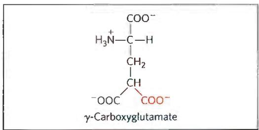  
(b)

  
(c)

FIGURE 27-34 Some modified amino acid residues. (a) Phosphorylated amino acids. (b) A carboxylated amino acid. (c) Some methylated amino acids.

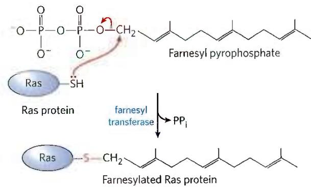  
FIGURE 27-35 Farnesylation of a Cys residue. The thioether linkage is shown in red. The Ras protein is the product of the ras oncogene.

Proteolytic Processing Many proteins are initially synthesized as large, inactive precursor polypeptides that are proteolytically trimmed to form their smaller, active forms. Examples include proinsulin (Fig. 23-4), some viral proteins (Fig. 26-30), and proteases such as chymotrypsinogen and trypsinogen (Fig. 6-42).

Formation of Disulfide Cross-Links After folding into their native conformations, some proteins form intrachain or interchain disulfide bridges between Cys residues. In eukaryotes, disulfide bonds are common in proteins to be exported from cells. The cross-links formed in this way help to protect the native conformation of the protein molecule from denaturation in the extracellular environment, which can differ greatly from intracellular conditions and is generally oxidizing.

#### [EN] Protein Synthesis Is Inhibited by Many Antibiotics and Toxins

Protein synthesis is a central function in cellular physiology and is the primary target of many naturally occurring antibiotics and toxins. Except as noted otherwise, these antibiotics inhibit protein synthesis in bacteria. The differences between bacterial and eukaryotic protein synthesis, though in some cases subtle, are such that most of the compounds discussed below are relatively harmless to eukaryotic cells. Natural selection has favored the evolution of compounds that exploit minor differences in order to affect bacterial systems selectively, so that these biochemical weapons are synthesized by some microorganisms and are extremely toxic to others. Because nearly every step in protein synthesis can be specifically inhibited by one antibiotic or another, antibiotics have become valuable tools in the study of protein biosynthesis.

Puromycin, made by the mold Streptomyces alboniger, is one of the best-understood inhibitory antibiotics. Its structure is very similar to the 3' end of an aminoacyl-tRNA, enabling it to bind to the ribosomal A site and participate in peptide bond formation, producing peptidylpuromycin (Fig. 27-36). However, because puromycin resembles only the 3' end of the tRNA, it does not engage in translocation and dissociates from the ribosome shortly after it is linked to the carboxyl terminus of the peptide. This prematurely terminates polypeptide synthesis.

  
FIGURE 27-36 Disruption of peptide bond formation by puromycin. The antibiotic puromycin resembles the aminoacyl end of a charged tRNA, and it can bind to the ribosomal A site and participate in peptide bond formation. The product of this reaction, peptidyl puromycin, is not translocated to the P site. Instead, it dissociates from the ribosome, causing premature chain termination.

Tetracyclines inhibit protein synthesis in bacteria by blocking the A site on the ribosome, preventing the binding of aminoacyl-tRNAs. Chloramphenicol inhibits protein synthesis by bacterial (and mitochondrial and chloroplast) ribosomes by blocking peptidyl transfer; it does not affect cytosolic protein synthesis in eukaryotes. Conversely, cycloheximide blocks the peptidyl transferase of 80S eukaryotic ribosomes but not that of 70S bacterial (and mitochondrial and chloroplast) ribosomes. Streptomycin, a basic trisaccharide, causes misreading of the genetic code (in bacteria) at relatively low concentrations and inhibits initiation at higher concentrations.


Several other inhibitors of protein synthesis are notable because of their toxicity to humans and other mammals. Diphtheria is a serious bacterial illness that causes sore throat, swollen glands, breathing difficulties, and often death. Although it has been largely eradicated in the developed world, a few thousand cases still occur each year in countries where vaccination is limited. The bacterium Corynebacterium diphtheriae releases the diphtheria toxin ( $M_{r}$ 58,330), which catalyzes the ADP-ribosylation of a diphthamide (a modified histidine) residue of eukaryotic elongation factor eEF2, thereby inactivating it. The resulting dead cells form a thick, gray membrane that covers the throat and tonsils, creating a putrid odor that is one hallmark of the disease. Ricin ( $M_{r}$ 29,895), an extremely toxic protein of the castor bean, inactivates the 60S subunit of eukaryotic ribosomes by depurinating a specific adenosine residue in 28S rRNA. Ricin was used in the infamous 1978 murder of BBC journalist and Bulgarian dissident Georgi Markov, presumably by the Bulgarian secret police. Using a syringe hidden at the end of an umbrella, a member of the secret police injected Markov in the leg with a ricin-infused pellet. He died four days later.


#### [EN] SUMMARY 27.2 Protein Synthesis

■ Protein synthesis occurs on the ribosomes, which consist of protein and rRNA. Bacteria have 70S ribosomes, with a large (50S) and a small (30S) subunit. Eukaryotic ribosomes are significantly larger (80S) and contain more proteins. The growth of polypeptides on ribosomes begins with the amino-terminal amino acid and proceeds by successive additions of new residues to the carboxyl-terminal end.

Transfer RNAs have 73 to 93 nucleotide residues, some of which have modified bases. Each tRNA has an amino acid arm with the terminal sequence CCA(3') to which an amino acid is esterified, an anticodon arm, a TψC arm, and a D arm; some tRNAs have a fifth arm. The anticodon is responsible for the specificity of interaction between the aminoacyl-tRNA and the complementary mRNA codon.

In stage 1 of the five stages of protein synthesis, amino acids are activated by specific aminoacyl-tRNA synthetases in the cytosol. These enzymes catalyze the formation of aminoacyl-tRNAs, with simultaneous cleavage of ATP to AMP and PP $_{i}$ . The fidelity of protein synthesis depends on the accuracy of this reaction, and some of these enzymes carry out proofreading steps at separate active sites.

■ Stage 2 is initiation. In bacteria, the initiating aminoacyl-tRNA in all proteins is N-formylmethionyl-tRNA $^{fMet}$ . Initiation of protein synthesis involves formation of a complex between the 30S ribosomal subunit, mRNA, GTP, fMet-tRNA $^{fMet}$ , three initiation factors, and the 50S subunit; GTP is hydrolyzed to GDP and P $_{i}$ .

■ Stage 3 is elongation. In the elongation steps, GTP and elongation factors are required for binding the incoming aminoacyl-tRNA to the A site on the ribosome. In the first peptidyl transfer reaction, the fMet residue is transferred to the amino group of the incoming aminoacyl-tRNA. Movement of the ribosome along the mRNA then translocates the dipeptidyl-tRNA from the A site to the P site, a process requiring hydrolysis of GTP. Deacylated tRNAs dissociate from the ribosomal E site.

■ Stage 4 is termination. After many such elongation cycles, synthesis of the polypeptide is terminated with the aid of release factors. At least four high-energy phosphate equivalents (from ATP and GTP) are required to generate each peptide bond, an energy investment required to guarantee fidelity of translation.

■ Stage 5 is protein processing. Polypeptides fold into their active, three-dimensional forms. Many proteins are further processed by posttranslational modification reactions.

■ Many well-studied antibiotics and toxins inhibit some aspect of protein synthesis.


<!-- L-END Lehninger 27.2 -->

## 4.5 蛋白质运转机制

在生物体内,蛋白质的合成位点与功能位点常常被一层或多层细胞膜所隔开,这样就产生了蛋白质运转的问题。核糖体是真核生物细胞内合成蛋白质的场所,几乎在任何时候,都有数以百计或千计的蛋白质离开核糖体并被输送到细胞质、细胞核、线粒体、内质网和溶酶体、叶绿体等各个部分,补充和更新细胞功能。由于细胞各部分都有特定的蛋白质组分,因此合成的蛋白质必须准确无误地定向运送才能保证生命活动的正常进行。蛋白质是怎样从合成部位运送至功能部位的?它们又是如何跨膜运送的?跨膜之后又是依靠什么信息到达各自“岗位”的?对于膜蛋白来说,究竟是什么因素决定它为外周蛋白还是内在蛋白,为部分镶嵌还是跨膜分布,在膜的外侧还是内侧?这些都是十分有趣的问题,也是生物膜研究中非常活跃的领域(图4-30)。

一般说来,蛋白质运转可分为两大类:若某个蛋白质的合成和运转是同时发生的,则属于翻译运转同步机制;若蛋白质从核糖体上释放后才发生运转,则属于翻译后运转机制。这两种运转方式都涉及蛋白质分子内特定区域与细胞膜结构的相互关系。

表 4-12 列举了跨膜运输和镶入膜内的几种主要蛋白质。从表中可知,分泌蛋白质大多是以翻译运转同步机制运输的。在细胞器发育过程中,由细胞质进入细胞器的蛋白质大多是以翻译后运转机制运输的。而参与生物膜形成的蛋白质,则依赖于上述两种不同的运转机制镶入膜内。

表 4-12 几类主要的蛋白质运转机制

<table><tr><td>蛋白性质</td><td>运转机制</td><td>主要类型</td></tr><tr><td>分泌</td><td>蛋白质在结合核糖体上合成,并以翻译运转同步机制运输</td><td>免疫球蛋白、卵蛋白、水解酶、激素等</td></tr><tr><td>细胞器发育</td><td>蛋白质在游离核糖体上合成,以翻译后运转机制运输</td><td>核、叶绿体、线粒体、乙醛酸循环体、过氧化物酶体等细胞器中的蛋白质</td></tr><tr><td>膜的形成</td><td>两种机制兼有</td><td>质膜、内质网、类囊体中的蛋白质</td></tr></table>

图 4-30 蛋白质合成和运转过程示意图  


## 4.5.1 翻译运转同步机制

一般认为,蛋白质定位的信息存在于该蛋白质自身结构中,并且通过与膜上特殊受体的相互作用得以表达,这就是信号肽假说的基础。这一假说认为,蛋白质跨膜运转信号也是由 mRNA 编码的。在起始密码子后,有一段编码疏水性氨基酸序列的 RNA 区域,这个氨基酸序列就被称为信号序列(图 4-31)。信号序列在结合核糖体上合成后便与膜上特定受体相互作用,产生通道,允许这段多肽在延长的同时穿过膜结构,因此,这种方式是边翻译边跨膜运转。

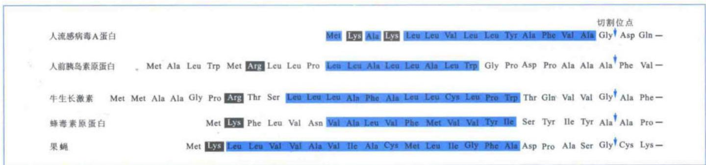  
图 4-31 蛋白质通过其 N 端的信号肽在内质网中运转到不同的细胞器

绝大部分被运入内质网内腔的蛋白质都带有一个信号肽,该序列常常位于蛋白质的氨基端,长度一般为13\~36个残基,有如下3个特点:①一般带有10\~15个疏水氨基酸;②在靠近该序列N端常常有1个或数个带正电荷的氨基酸;③在其C端靠近蛋白酶切割位点处常常带有数个极性氨基酸,离切割位点最近的那个氨基酸往往带有很短的侧链(丙氨酸或甘氨酸)。

根据信号肽假说,同细胞质中其他蛋白质的合成一样,分泌蛋白的生物合成开始于结合核糖体,当翻译进行到50\~70个氨基酸残基之后,信号肽开始从核糖体的大亚基露出,被糙面内质网膜上的受体识别,并与之相结合。信号肽过膜后被内质网腔的信号肽酶水解,正在合成的新生肽随之通过蛋白孔道穿越疏水的双层磷脂。一旦核糖体移到mRNA的“终止”密码子,蛋白质合成即告完成,翻译体系解散,膜上的蛋白孔道消失,核糖体重新处于自由状态(图4-32)。

信号肽在蛋白质运输过程中发挥如下作用：

① 完整的信号多肽是保证蛋白质运转的必要条件。信号序列中疏水性氨基酸突变成亲水性氨基酸后，会阻止蛋白质运转而使新生蛋白质以前体形式积累在胞质中。

② 仅有信号肽还不足以保证蛋白质运转的发生。要使蛋白质顺利跨膜，还要求运转蛋白质在信号序列以外的部分有相应的结构变化。

③ 信号序列的切除并不是运转所必需的。如果把细菌外膜脂蛋白信号序列中的甘氨酸残基突变成天冬氨酸残基，能抑制该蛋白信号肽的水解，但不能抑制其跨膜运转。

④ 并非所有的运转蛋白质都有可降解的信号肽。卵清蛋白是以翻译运转同步机制进入微粒体中的，但它并没有可降解的信号序列。据此，“信号肽”应当定义为：能启动蛋白质运转的任何一段多肽。

  
图 4-32 蛋白质跨膜运转的信号肽假说及其运输过程

## 图 4-33 新生蛋白质通过同步转运途径进入内质网内腔的主要过程

①核糖体组装、翻译起始；②位于蛋白质N端的信号肽序列首先被翻译；③SRP与核糖体、GTP以及带有信号肽的新生蛋白质相结合，暂时中止肽链延伸；④核糖体-SRP复合物与膜上的受体相结合；⑤GTP水解，释放SRP并进入新一轮循环；⑥肽链重新开始延伸并不断向内腔运输；⑦信号肽被切除；⑧多肽合成结束，核糖体解离并恢复到翻译起始前的状态。

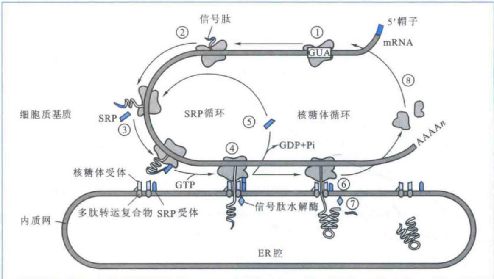

研究新生肽向内质网内腔运转过程发现,SRP(信号识别蛋白)和DP(停靠蛋白,又称SRP受体蛋白)介导了蛋白质的跨膜运转过程。SRP能同时识别正在合成需要通过内质网膜进行运转的新生肽和自由核糖体,它与这类核糖体上新生蛋白的信号肽结合是多肽正确运转的前提,但同时也导致了该多肽合成的暂时终止(此时新生肽一般长约70个残基)。SRP-信号肽-多核糖体复合物即被引向内质网膜并与SRP的受体——DP相结合。只有当SRP与DP相结合时,多肽合成才恢复进行,信号肽部分通过膜上的核糖体受体及蛋白运转复合物跨膜进入内质网内腔,新生肽链重新开始延伸。整个蛋白质跨膜以后,信号肽被水解,形成高级结构和成熟型蛋白质,并被运送到相应细胞器。SRP与DP的结合很可能导致受体聚集而形成膜孔道,使信号肽及与其相连的新生肽得以通过。此时,SRP与DP相分离并恢复游离状态。待翻译过程结束后,核糖体的大、小亚基解离,受体解聚,通道消失,内质网膜也恢复完整的脂双层结构(图4-33)。进入内质网内腔后,蛋白质常以运转载体的形式被送入高尔基体或形成运转小泡,分别运送到各自的亚细胞位点。

## 4.5.2 翻译后运转机制

研究发现,叶绿体和线粒体中有许多蛋白质和酶是由细胞质提供的,其中绝大多数以翻译后运转机制进入细胞器内。

## 1. 线粒体蛋白质跨膜运转

线粒体是细胞的“动力站”，它虽然含有遗传物质（DNA、RNA）以及核糖体等，但它的DNA信息含量有限，大部分线粒体蛋白质都是由核DNA编码，在细胞质自由核糖体上合成。被释放至细胞质，再跨膜运转到线粒体各部分。与分泌蛋白质通过内质网膜进行运转不同，通过线粒体膜的蛋白质是在合成以后再运转的。这个过程有如下特征：

  
图4-34 线粒体蛋白质跨膜运转

① 通过线粒体膜的蛋白质在运转之前大多数以前体形式存在,它由成熟蛋白质和位于 N 端的一段前导肽(leader peptide)共同组成。迄今已有 40 多种线粒体蛋白质前导肽的一级结构被阐明,它们含 20\~80 个氨基酸残基,当前体蛋白过膜时,前导肽被一种或两种多肽酶所水解,释放成熟蛋白质。

② 蛋白质通过线粒体内膜的运转是一种需要能量的过程。

③ 蛋白质通过线粒体膜运转时,首先由外膜上的 Tom 受体复合蛋白识别与 HSP70 或 MSF 等分子伴侣相结合的待运转多肽,通过 Tom 和 Tim 组成的膜通道进入线粒体内腔。蛋白质跨膜运转时的能量来自线粒体 HSP70 引发的 ATP 水解和膜电位差(图 4-34)。

## 2. 前导肽的作用与性质

拥有前导肽的线粒体蛋白质前体能够跨膜运转进入线粒体，在这一过程中前导肽被水解，前体转变为成熟蛋白，失去继续跨膜能力。因此，前导肽对线粒体蛋白质的识别和跨膜运转显然起着关键作用。

前导肽一般具有如下特性:带正电荷的碱性氨基酸(特别是精氨酸)含量较为丰富,它们分散于不带电荷的氨基酸序列之间;缺少带负电荷的酸性氨基酸;羟基氨基酸(特别是丝氨酸)含量较高;有形成两亲(既有亲水又有疏水部分) $\alpha$ 螺旋结构的能力。带正电荷的碱性氨基酸在前导肽中有重要的作用,如果它们被不带电荷的氨基酸所取代,就不能发挥牵引蛋白质过膜的作用。

图4-35 前导肽的不同区域可能在蛋白质跨膜运转过程中起不同的作用  
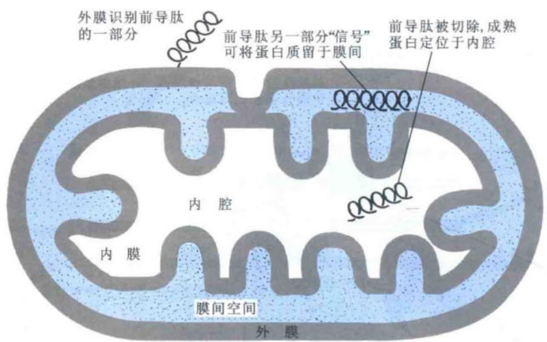

前导肽跨膜运转时首先与线粒体外膜上的受体相结合,实验表明,并非线粒体蛋白质前体都共用一种受体,但 Tom 受体可能是线粒体蛋白质跨膜运转时最主要的受体蛋白。线粒体有内、外两层膜,前导肽的不同部位可能在蛋白质的跨膜运输过程中发挥不同的作用(图 4-35)。有些前导肽含有“止运入”肽段,当该肽段被跨膜通道中的受体蛋白识别时,所运输的多肽将被定位在膜上。

## 3. 叶绿体蛋白质的跨膜运转

大多数科学家认为,叶绿体多肽是胞质中的游离核糖体上合成后脱离核糖体并折叠成具有三级结构的蛋白质分子,多肽上某些特定位点结合于只有叶绿体膜上才有的特异受体位点。叶绿体定位信号肽一般有两个部分,第一部分决定该蛋白质能否进入叶绿体基质,第二部分决定该蛋白质能否进入类囊体 $^{(图4-36)}$ 。在这一模型中,蛋白质运转是在翻译后进行的,在运转过程中没有蛋白质的合成。

叶绿体蛋白质运转过程有如下特点：

① 活性蛋白水解酶位于叶绿体基质内,这是鉴别翻译后运转的指标之一。从完整的叶绿体内提取的可溶性物质,能够把 RuBP 羧化酶小亚基前体降解或加工为成熟小亚基,离心后产生的叶绿体基质和破碎的叶绿体也具有这种功能,而类囊体和提纯的叶绿体膜都无此特性。在叶绿体蛋白质的翻译后运转机制中,活性蛋白酶是可溶性的,这一点也不同于分泌蛋白质的翻译运转同步机制,因为后者活性蛋白酶位于运转膜上。因此,可根据蛋白水解酶的可溶性特征来区别这两种不同的运转机制。

② 叶绿体膜能够特异地与叶绿体蛋白的前体结合。叶绿体膜上有识别叶绿体蛋白质的特异性受体，保证叶绿体蛋白质只能进入叶绿体内。

③ 叶绿体蛋白质前体内可降解序列因植物和蛋白质种类不同而表现出明显的差异。

图4-36 叶绿体蛋白质跨膜运转  


## 4.5.3 核定位蛋白的运转机制

真核细胞的细胞核通过核孔与核外相通,因此,核孔是进行双向运转的分子通道。在细胞质中合成的蛋白质一般通过核孔进入细胞核。所有核糖体蛋白都首先在细胞质中被合成,运转到细胞核内,在核仁中被装配成40S和60S核糖体亚基,然后运转回到细胞质中行使作为蛋白质合成机器的功能。RNA、DNA聚合酶、组蛋白、拓扑异构酶及大量转录、复制调控因子都必须从细胞质进入细胞核才能正常发挥功能。

在绝大部分多细胞真核生物中,每当细胞发生分裂时,核膜被破坏,等到细胞分裂完成后,核膜被重新建成,分散在细胞内的核蛋白必须被重新运入核内。真核细胞核膜上的核孔复合体(nuclear pore complex,NPC)是细胞核内外进行物质交换的主要通道,相对分子质量较小的蛋白质可自由通过NPC或采取被动扩散的方式进入细胞核,而相对分子质量大于 $4\times10^{4}$ 的蛋白质则需要通过主动运转进出细胞核。以这种方式进出细胞核的蛋白质需要在其氨基酸序列上带有特殊的核定位信号序列(nuclear localization signal,NLS)和出核信号序列(nuclear export signal,NES),才能被相应的核运转蛋白识别。

目前已经发现有多种类型的核定位信号，包括经典核定位信号和其他类型的NLS。

这些信号都具有一个带正电荷的肽核心,通常是一短的富含碱性氨基酸的序列,它能与入核载体相互作用,将蛋白质运进细胞核。第一个被确定的NLS序列的蛋白质是SV40的T抗原,它在细胞质中合成后很快积累在细胞核中,是病毒DNA在核内复制所必需的。其野生型的氨基酸序列为Pro-Lys-Lys-Lys-Arg-Lys-Val,该序列中的单个氨基酸突变所产生的突变型能阻止这种蛋白质进入细胞核而停留在细胞质中。

NLS 可以位于核蛋白的任何部位,也能够引导其他非核蛋白进入细胞核。入核信号与前导肽的区别在于:①由含水的核孔通道来鉴别;②入核信号是蛋白质的永久性部分,在引导入核过程中,并不被切除,可以反复使用,有利于细胞分裂后核蛋白重新入核。

蛋白质向核内运输过程需要一系列循环于核内和细胞质的蛋白因子包括核运转因子（importin）α、β和一个低相对分子质量GTP酶(Ran)参与。α和β组成的异源二聚体是核定位蛋白的可溶性受体，与核定位序列相结合的是α亚基。由上述3个蛋白质组成的复合物停靠在核孔处，依靠Ran GTP酶水解GTP提供的能量进入细胞核，α和β亚基解离，核蛋白与α亚基解离，α和β分别通过核孔复合体回到细胞质中，起始新一轮蛋白质运转(图4-37)。

经典的出核信号序列(NES)是由疏水性氨基酸尤其是亮氨酸和异亮氨酸富集的区域构成,其保守性氨基酸排序为 $\Phi X_{1-3}\Phi X_{2-3}\Phi X\Phi$ ,其中, $\Phi$ 代表疏水性氨基酸 L、I、F 或 M,而 X 代表任意氨基酸。经典的 NES 大多为 CRM1 依赖性,它能够被出核因子 CRM1(chromosome region maintenance 1)/exporting/Xpo1 识别并结合,从而携带该蛋白质出核。

图 4-37 核定位蛋白跨细胞核膜运转过程示意图  


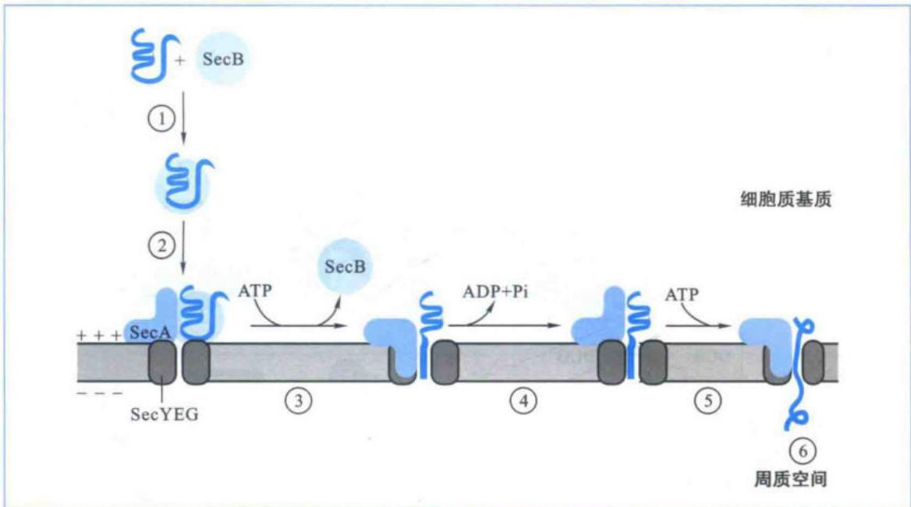  
图 4-38 细菌中蛋白质的跨膜运转

对于原核细胞来说,同样存在蛋白质运转的问题。研究表明,细菌同样能通过定位于蛋白质 N 端的信号肽将新合成的多肽运转到其内膜、外膜、双层膜之间或细胞外等不同部位。细菌中新翻译产生的蛋白质与胞质中的分子伴侣 SecB 相结合后就能被运送到细胞膜运转复合物 SecA-SecYEG 上,结合有新生肽的 SecA 在自身 ATP 酶活性作用下水解 ATP 并嵌入细胞膜之中,导致与 SecA 相结合的被运转蛋白 N 端约 20 个氨基酸通过膜运转复合物到达胞外。SecA 再与另一个 ATP 相结合,变构嵌入膜内的同时再次把所运转蛋白的第二部分运出胞外,如此反复,直到把所运转蛋白质全部送到胞外(图 4-38)。

## 4.6 蛋白质的修饰、降解与稳定性研究

越来越多的证据表明,生物体内蛋白质的降解过程是一个有序的过程。在大肠杆菌中,蛋白质的降解是通过一个依赖于 ATP 的蛋白酶(称为 Lon)来实现的。当细胞中出现错误的蛋白质或半衰期很短的蛋白质时,该酶就被激活。Lon 蛋白酶每切除一个肽键要消耗两个分子的 ATP。

## 4.6.1 泛素化修饰介导的蛋白质降解

蛋白质的半衰期从 30 s 到许多天不等。虽然大部分真核蛋白的半衰期为数小时至数天，像血红蛋白这样少数蛋白质的半衰期与细胞周期同样长（成红细胞 = 110 天）。在真核生物中，除了通过溶酶体以及自噬通路，蛋白质的降解主要依赖于泛素蛋白（ubiquitin）。泛素是一类低相对分子质量的蛋白质，只有 76 个氨基酸残基，序列高度保守（从酵母和人细胞中提取的泛蛋白几乎完全相同）。泛素化是指泛素分子在泛素激活酶、结合酶、连接酶等的作用下，对靶蛋白进行特异性修饰的过程，在该过程中，泛素 C 端甘氨酸残基通过酰胺键与底物蛋白的赖氨酸残基的 $\varepsilon$ 氨基结合。在蛋白质分子的一个位点上可结合单个或多个泛素分子。

  
图 4-39 泛素化 / 去泛素化修饰及其在蛋白质降解和细胞生理功能中的调节作用。  
泛素在 E1、E2 和 E3 的作用下与底物蛋白相连接的过程。该过程是一个可逆的过程，可以在去泛素化酶(DUB)的作用下去除底物(S)上的泛素化修饰。K11 和 K48 位的多泛素化修饰使蛋白质通过 26S 蛋白酶体降解；K63、K29 位等的泛素化修饰不是蛋白质发生降解，而是参与细胞内众多生理过程的调节。

泛素化修饰涉及泛素激活酶 E1、泛素结合酶 E2 和泛素连接酶 E3 等 3 个酶的级联反应(图 4-39): 首先在 ATP 提供能量的情况下, 泛素激活酶 E1 黏附在泛素分子尾部的 Cys 残基上激活泛素, E1 酶再将激活的泛素分子转移到泛素结合酶 E2 上, 再由 E2 酶和一些种类不同的泛素连接酶 E3 酶共同识别靶蛋白, 对其进行泛素化修饰。该修饰是一个可逆的过程, 去泛素化酶 (DUB) 可以去除相应底物的泛素化修饰。目前已经鉴定 2 种 E1, 50 余种 E2、600 余种 E3 和 100 余种 DUB。底物泛素化修饰的特异性是由连接酶 E3 决定的, 可以对靶蛋白进行单泛素化和多泛素化修饰。如图 4-40 所示, E2 酶的外形就像一个夹子, 将靶蛋白固定在中间的空隙内。蛋白质泛素化以后, 被标记的蛋白质常被运送到相对分子质量高达 $1 \times 10^{6}$ 的蛋白质降解体系中直到该蛋白质完全被降解。

蛋白质的泛素化修饰是翻译后修饰的一种常见形式,该过程能够调节不同细胞途径中的各种蛋白质。其中,泛素-蛋白酶体途径是最先被发现的,也是一种较普遍的内源蛋白质降解方式。蛋白酶体(proteasome)因其密度梯度离心沉降系数为26S,故又称其为26S蛋白酶体。它是由1个20S催化颗粒(catalytic particle,CP)和2个19S调节颗粒(regulatory particle, RP)组成的桶状结构(图4-41)。19S为调节亚单位，位于桶状结构的两端，识别多泛素化蛋白并使其去折叠。19S亚单位上还具有一种去泛素化的同功肽酶，使底物去泛素化。20S为催化亚单位，位于两个19S亚单位的中间，其活性部位处于桶状结构的内表面，可避免细胞内环境变化所造成的影响。进一步的研究发现，并非所有泛素化修饰都会导致蛋白质降解。有些泛素化修饰还能参与多种生物功能的调控，在蛋白质的定位、代谢、功能、调节和降解中都起着十分重要的作用，能参与细胞周期、增殖、凋亡、分化、转移、基因表达、转录调节、信号传递、损伤修复、炎症免疫等几乎一切生命活动的调控，在肿瘤、心血管等疾病发病中起着十分重要作用。此外，蛋白质的泛素化也是研究、开发新药物的新靶点。

(a)  
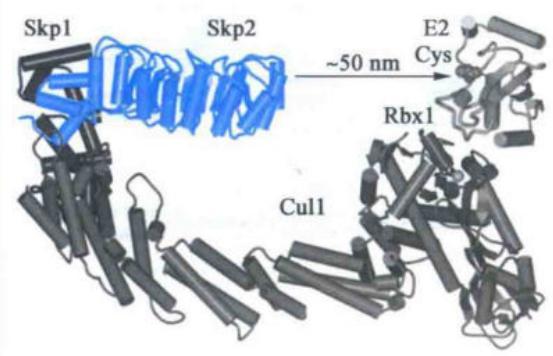

(b)  
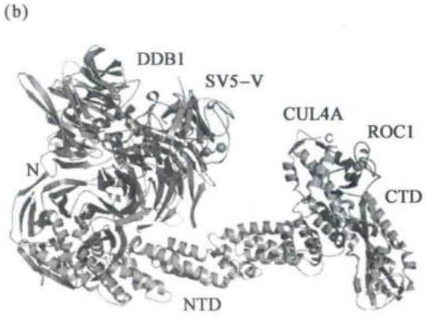

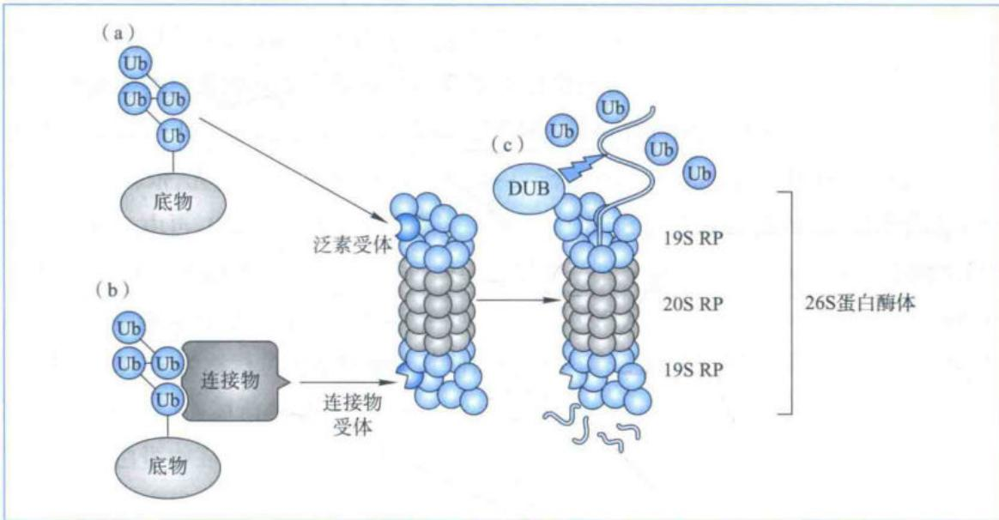

## 4.6.2 蛋白质的 SUMO 化修饰

除了泛素化修饰,细胞内还有一些与泛素化修饰相类似的反应,称为类泛素化修饰,如 SUMO 化修饰(小泛素化修饰,SUMOylation)和 NEDD 化修饰(NEDDylation)等。小泛

图 4-40 泛素连接酶 E3 与结合酶 E2 或底物复合物的三维结构

(a) SCFSkp2-E2 复合物的结构. Cul1、Rbx1、Skp1 和 Skp2 复合物的结构外形就像一个夹子, 其中间的空隙内可结合底物蛋白; (b) DDB1-CUL4A-ROC1 泛素连接酶与猴病毒 5 的 V 蛋白复合物的晶体结构。

## 图 4-41 26S 蛋白酶体依赖的蛋白质泛素化降解

蛋白酶体是由1个20S催化颗粒(CP)和2个19S调节颗粒(RP)组成的桶状结构。一旦底物蛋白被多泛素化(连接至少4个泛素分子)，它或者直接与19S调节颗粒上的泛素受体结合(a)，或者通过19S调节颗粒上的连接物受体间接结合到蛋白酶体(b)，然后被剪切成小的肽段而降解，泛素会被再利用。修改自Ravid and Hochstrasser, Nat Rev Mol Cell Biol, 679-690, 2008。

图4-42 SUMO化修饰和泛素化修饰的比较  


素相关修饰物 (small ubiquitin-related modifier, SUMO) 是泛素类蛋白家族的重要成员之一, 由 98 个氨基酸组成, 在进化上高度保守。SUMO 与泛素之间具有 $18\%$ 的同源性, 并且两者都具有典型的 $\beta \beta \alpha \beta \beta \alpha \beta$ 折叠, 但两者表面电荷分布不同, 暗示其功能不同。小泛素相关修饰物经由一系列酶介导的生化级联反应共价结合于底物蛋白的赖氨酸残基上 (图 4-42)。与泛素相类似, SUMO 也以前体形式被合成, 并且在羧基端水解酶的作用下加工为成熟的 SUMO。SUMO 化修饰也需要 E1、E2 和 E3 的参与。首先, 依赖于 ATP 的 SUMO 活化酶 E1 的链接亚基与 SUMO 的 Gly 残基相链接, 激活 SUMO, 再由 SUMO 结合酶 E2 的半胱氨酸催化亚基通过识别一个保守序列 $\Psi - K - X - D / E$ ( $\Psi$ 代表疏水性氨基酸, 赖氨酸残基 K 是 SUMO 偶联位点, X 可以是任何氨基酸, D 或 E 为酸性氨基酸), 这种把 SUMO 转移到底物的赖氨酸残基上, 稳定靶蛋白使其免受降解的过程称为 SUMO 化修饰。

SUMO 化修饰类似于但又不同于泛素化修饰。SUMO 化修饰既能协同泛素化，又能拮抗泛素化修饰。与泛素介导的蛋白质降解不同，SUMO 阻碍泛素对底物蛋白的共价修饰，提高了底物蛋白的稳定性（图 4-43）。它能修饰许多在基因表达调控中发挥重要作用的蛋白质，包括转录因子、转录辅助因子以及染色质结构调控因子。SUMO 化修饰影响蛋白质亚细胞定位和蛋白质构象，广泛参与细胞内蛋白质与蛋白质相互作用、DNA 结合、信号转导、核质转运、转录因子激活等重要过程。

图4-43 SUMO化修饰的通路及其与泛素化的关系

蛋白质的 SUMO 化修饰能够阻止泛素化引起的蛋白质降解。SUMO 化修饰需要 AOS1/UBA2 和 UBC9 多种酶；去 SUMO 化是在 ULP 家族蛋白的催化下完成。

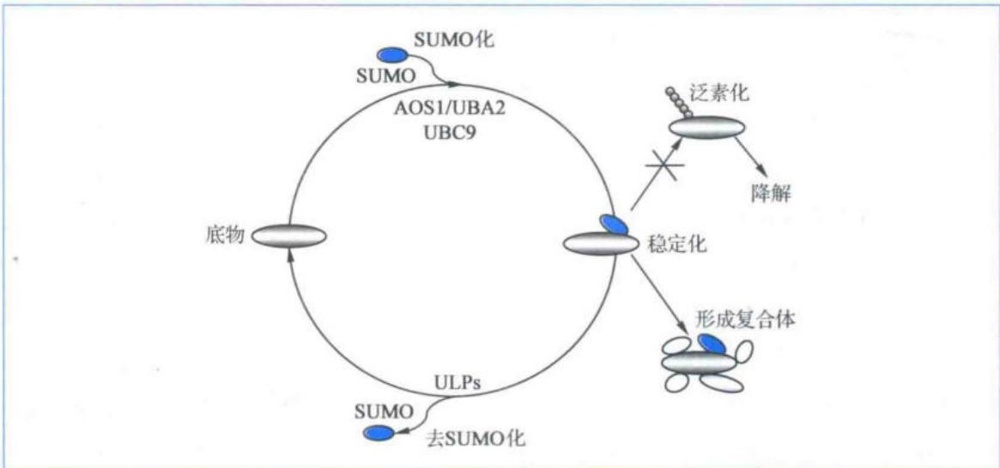

## 4.6.3 蛋白质的 NEDD 化修饰

NEDD8 含有 81 个氨基酸, 是一种类泛素蛋白修饰分子, 与泛素分子的一致性为 59%, 相似性高达 80%, 其相似程度是众多类泛素分子中最高的。研究表明, NEDD8 能像泛素一样在体内固有酶簇作用下被共价结合到底物蛋白上, 参与蛋白质翻译后修饰, 这一过程被称为 NEDD 化修饰 (NEDDylation) (图 4-44)。NEDDylation 的发生机制与泛素化相似, 需要酶 E1、E2、E3 介导的一系列酶促反应。NEDD8 可以通过其 C 端第 76 位的甘氨酸与底物的赖氨酸共价结合。底物的去 NEDD 化是由去 NEDD 化酶介导的, NEDD8 在去 NEDD 化后重新进入循环 (图 4-45)。需要注意的是, 一些底物在发生 NEDD 化修饰时会和泛素化修饰共用相同的 E3 连接酶, 但与泛素化介导的蛋白酶体依赖的蛋白质降解不同, NEDD 化修饰不会引起蛋白质的降解, 而主要通过该种修饰来调节蛋白质的功能。NEDD 化可能参与细胞增殖分化、细胞发育、细胞周期、信号转导等重要生命过程的调控, NEDD

  
图4-44 NEDD8 修饰的生化反应

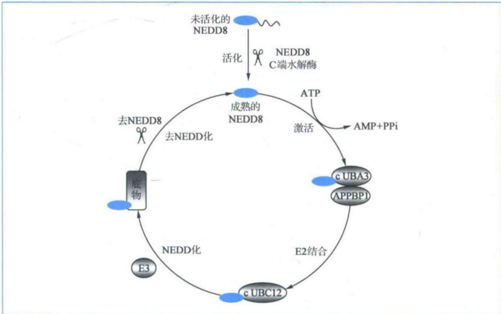  
图 4-45 NEDD 化修饰的通路  
NEDD化修饰的主要通路包括NEDD8前体活化的过程，通过E1（UBA3-APPBP1）激活，与E2（UBC12）结合，通过E3连接到底物上的NEDD化过程以及相反的去NEDD化过程。

  
图 4-46 蛋白质的泛素化和类泛素化修饰的生理效应  
① K48位的泛素化导致底物蛋白通过26S蛋白酶体的降解。② K63位的多泛素化引起蛋白质功能的改变。③ K29位的多泛素化引起溶酶体依赖的蛋白质的降解。特定的多泛素化④、单泛素化⑤、NEDD化⑦以及SUMO化⑧等能够改变蛋白质的功能，使蛋白质亚细胞定位发生变化等，参与细胞内多条重要生物学通路。⑥与泛素受体分子(ubiquitin receptor molecule,UR)结合(coupled monoubiquitination)是另一种生物过程的调控方式。NEDD8与SUMO-1类似易于引起单修饰，而SUMO-2和SUMO-3能够引起修饰分子链的形成。

化异常会导致人类的神经退行性疾病和癌症。

目前发现的 NEDD 化底物蛋白只有 Cullin 家族蛋白、原癌基因产物 Mdm2、p53 肿瘤抑制因子、p73、表皮生长因子受体 EGFR、乳腺癌相关蛋白 3(BCA3) 等。更有趣的是，这些被 NEDD 化修饰的底物要么本身可以被泛素化修饰，要么是泛素化 E3 连接酶的组分，暗示 NEDD8 和泛素之间在进化上存在某种特定的联系。因为 NEDD8 参与 NEDD 化过程的关键位点是赖氨酸残基，该残基同时也可以发生乙酰化、甲基化和泛素化，人们普遍认为，在不同的生理条件下，在蛋白质的同一赖氨酸残基上可能发生不同的修饰以满足不同的生理需求（图 4-46）。深入探讨这些翻译后修饰的动态平衡与相互关系将有助于我们阐明蛋白质翻译后修饰的生物学功能。

## 4.6.4 蛋白质一级结构对稳定性的影响

成熟蛋白质 N 端的第一个氨基酸(除已被切除的 N 端甲硫氨酸之外,但包括翻译后修饰产物)在蛋白质的降解中有着举足轻重的影响(表 4-13)。当某个蛋白质的 N 端是甲硫氨酸、甘氨酸、丙氨酸、丝氨酸、苏氨酸和缬氨酸时,表现稳定。其 N 端为赖氨酸、精氨酸时,表现最不稳定,平均 2\~3 min 就被降解了。泛素调控的蛋白质降解具有重要的生理意义,它不仅能够清除错误蛋白质,对细胞生长周期、DNA复制以及染色体结构都有重要的调控作用,而且对于理解细胞的许多生理过程和新药的开发也具有重要意义。

表 4-13 蛋白质的半衰期与 N 端氨基酸残基的关系

<table><tr><td>N端残基</td><td>半衰期</td></tr><tr><td>稳定型残基</td><td></td></tr><tr><td>甲硫氨酸、甘氨酸、丙氨酸、丝氨酸、苏氨酸、缬氨酸</td><td>&gt;20 h</td></tr><tr><td>不稳定型残基</td><td></td></tr><tr><td>异亮氨酸、谷氨酰胺</td><td>~30 min</td></tr><tr><td>酪氨酸、谷氨酸</td><td>~10 min</td></tr><tr><td>脯氨酸</td><td>~7 min</td></tr><tr><td>亮氨酸、苯丙氨酸、天冬酰胺、赖氨酸</td><td>~3 min</td></tr><tr><td>精氨酸</td><td>~2 min</td></tr></table>


<!-- L-BEGIN Lehninger 27.3 -->

### 【英文对应 Lehninger §27.3：Protein Targeting and Degradation】

> 来源：Lehninger Principles of Biochemistry（书籍/02_生物化学原理） 第27章 Protein Metabolism，§27.3。


The eukaryotic cell is made up of many structures, compartments, and organelles, each with specific functions that require distinct sets of proteins and enzymes. These proteins (with the exception of those produced in mitochondria and plastids) are synthesized on ribosomes in the cytosol, so how are they directed to their final cellular destinations?

We are now beginning to understand this complex and fascinating process. Proteins destined for secretion, integration in the plasma membrane, or inclusion in lysosomes generally share the first few steps of a pathway that begins in the endoplasmic reticulum. Proteins destined for mitochondria, chloroplasts, or the nucleus use three separate mechanisms. And proteins destined for the cytosol simply remain where they are synthesized. P1 The thermodynamic cost of protein synthesis is magnified by the processes used by cells to transport proteins to their correct cellular locations.

The most important element in many of these targeting pathways is a short sequence of amino acids called a signal sequence, whose function was first postulated by Günter Blobel and colleagues in 1970. The signal sequence directs a protein to its appropriate location in the cell and, for many proteins, is removed during transport or after the protein has reached its final destination. In proteins slated for transport into mitochondria, chloroplasts, or the ER, the signal sequence is at the amino terminus of a newly synthesized polypeptide. In many cases, the targeting capacity of particular signal sequences has been confirmed by fusing the signal sequence from one protein to a second protein and showing that the signal directs the second protein to the location where the first protein is normally found. The selective degradation of proteins no longer needed by the cell also relies largely on a set of molecular signals embedded in each protein's structure.

In this concluding section we examine protein targeting and degradation, emphasizing the underlying signals and molecular regulation that are so crucial to cellular metabolism. Except where noted, the focus is now on eukaryotic cells.

#### [EN] Posttranslational Modification of Many Eukaryotic Proteins Begins in the Endoplasmic Reticulum

Perhaps the best-characterized targeting system begins in the ER. Most lysosomal, membrane, or secreted proteins have an amino-terminal signal sequence (Fig. 27-37) that marks them for translocation into the lumen of the ER; hundreds of such signal sequences have been determined. The carboxyl terminus of the signal sequence is defined by a cleavage site, where protease action removes the sequence after the protein is imported into the ER. Signal sequences vary in length from 13 to 36 amino acid residues, but all have the following features: (1) about 10 to 15 hydrophobic amino acid residues; (2) one or more positively charged residues, usually near the amino terminus, preceding the hydrophobic sequence; and (3) a short sequence at the carboxyl terminus (near the cleavage site) that is relatively polar, typically having amino acid residues with short side chains (especially Ala) at the positions closest to the cleavage site.

As originally demonstrated by the cell biologist George Palade, proteins with these signal sequences are synthesized on ribosomes attached to the ER. The signal sequence itself helps to direct the ribosome to the ER, as illustrated in Figure 27-38. The targeting pathway begins in step 1, with initiation of protein synthesis on free ribosomes. The signal sequence appears early in the synthetic process (step 2), because it is at the amino terminus, which, as we have seen, is synthesized first. As it emerges from the ribosome (step 3), the signal sequence—and the ribosome itself—is bound by the large signal recognition particle (SRP). The SRP is a rod-shaped complex containing a 300 nucleotide RNA (7SL-RNA) and six different proteins (combined $M_{\mathrm{r}}$ 325,000). The SRP then binds GTP and halts elongation of the polypeptide when it is about 70 amino acids long and the signal sequence has completely emerged from the ribosome. In step 4, the GTP-bound SRP directs the ribosome (still bound to the mRNA) and the incomplete polypeptide to GTP-bound SRP receptors in the cytosolic face of the ER; the nascent polypeptide is delivered to a peptide translocation complex in the ER, which interacts directly with the ribosome. In step 5, the SRP dissociates from the ribosome, accompanied by hydrolysis of GTP in both the SRP and the SRP receptor. The SRP receptor is a heterodimer of $\alpha$ ( $M_{\mathrm{r}}$ 69,000) and $\beta$ ( $M_{\mathrm{r}}$ 30,000) subunits, both of which bind and hydrolyze multiple GTP molecules during this process.

  
FIGURE 27-37 Amino-terminal signal sequences of some eukaryotic proteins that direct their translocation into the ER. The hydrophobic core (yellow) is preceded by one or more basic residues (blue).  
Polar and short-side-chain residues immediately precede (to the left, as shown here) the cleavage sites (indicated by red arrows).

  
FIGURE 27-38 Directing eukaryotic proteins with the appropriate signals to the endoplasmic reticulum. This process involves the SRP cycle and the translocation and cleavage of the nascent polypeptide.  
One protein subunit of SRP binds directly to the signal sequence, obstructing elongation by sterically blocking the entry of aminoacyl-tRNAs and inhibiting peptidyl transferase. Another protein subunit binds and hydrolyzes GTP.

Elongation of the polypeptide now resumes (step 6), with the ATP-driven translocation complex feeding the growing polypeptide into the ER lumen until the complete protein has been synthesized. In step 7, the signal sequence is removed by a signal peptidase within the ER lumen. The ribosome dissociates (step 8) and is recycled (step 9).

#### [EN] Glycosylation Plays a Key Role in Protein Targeting

In the ER lumen, newly synthesized proteins are further modified in several ways. Following the removal of signal sequences, polypeptides are folded, disulfide bonds are formed, and many proteins are glycosylated to form glycoproteins. In many glycoproteins, the linkage to their oligosaccharides is through Asn residues. These N-linked oligosaccharides are diverse (Chapter 7), but the pathways by which they form have a common first step. A 14 residue core oligosaccharide is built up stepwise, first on the cytosolic face of the membrane and then on the lumenal face. Once completed, it is transferred from a dolichol phosphate donor molecule to certain Asn residues in the protein (Fig. 27-39). The transferase is on the lumenal face of the ER and thus cannot catalyze glycosylation of cytosolic proteins. After transfer, the core oligosaccharide is trimmed and elaborated in different ways on different proteins, but all N-linked oligosaccharides retain a pentasaccharide core derived from the original 14 residue oligosaccharide.

Several antibiotics act by interfering with one or more steps in this process and have aided in elucidating the steps of protein glycosylation. The best characterized is tunicamycin, which mimics the structure of UDP-N-acetylglucosamine and blocks the first step of the process (Fig. 27-39, step 1). A few proteins are O-glycosylated in the ER, but most O-glycosylation occurs in the Golgi complex or in the cytosol (for proteins that do not enter the ER).

  
FIGURE 27-39 Synthesis of the core oligosaccharide of glycoproteins. The core oligosaccharide is built up by the successive addition of monosaccharide units. ①, ② The first steps occur on the cytosolic face of the ER. ③ Translocation moves the incomplete oligosaccharide across the membrane (mechanism not shown), and ④ completion of the core oligosaccharide occurs within the lumen of the ER. The precursors that contribute additional mannose and glucose residues to the growing oligosaccharide in the lumen are dolichol phosphate derivatives. ⑤ In the first step in construction of the N-linked oligosaccharide moiety of

  
a glycoprotein, the core oligosaccharide is transferred from dolichol phosphate to an Asn residue of the protein, and 6 protein synthesis continues. The core oligosaccharide is then further modified in the ER and the Golgi complex in pathways that differ for different proteins. The five sugar residues shown surrounded by a beige screen, after step 7, are retained in the final structure of all N-linked oligosaccharides. 8 The released dolichol pyrophosphate is again translocated so that the pyrophosphate is on the cytosolic face of the ER, then 9 a phosphate is hydrolytically removed to regenerate dolichol phosphate.

Suitably modified proteins can now be moved to a variety of intracellular destinations. Proteins travel from the ER to the Golgi complex in transport vesicles (Fig. 27-40). In the Golgi complex, oligosaccharides are O-linked to some proteins, and N-linked oligosaccharides are further modified. By mechanisms not yet fully understood, the Golgi complex also sorts proteins and sends them to their final destinations. The processes that segregate proteins targeted for secretion from those targeted for the plasma membrane or lysosomes must distinguish among these proteins on the basis of structural features other than signal sequences, which were removed in the ER lumen.

This sorting process is best understood in the case of hydrolases destined for transport to lysosomes. On arrival of a hydrolase (a glycoprotein) in the Golgi complex, an as yet undetermined feature (sometimes called a signal patch) of the three-dimensional structure of the hydrolase is recognized by a phosphotransferase, which phosphorylates terminal mannose residues in the oligosaccharides (Fig. 27-41). The presence of one or more mannose 6-phosphate residues in its N-linked oligosaccharide is the structural signal that targets a protein to lysosomes. A receptor protein in the membrane of the Golgi complex recognizes the mannose 6-phosphate signal and binds the hydrolase so marked. Vesicles containing these receptor-hydrolase complexes bud from the trans side of the Golgi complex and make their way to sorting vesicles. Here, the receptor-hydrolase complex dissociates in a process facilitated by the lower pH in the vesicle and by phosphatase-catalyzed removal of phosphate groups from the mannose 6-phosphate residues. The receptor is then recycled to the Golgi complex, and vesicles containing the hydrolases bud from the sorting vesicles and move to the lysosomes. In cells treated with tunicamycin (Fig. 27-39, step 1), hydrolases that should be targeted to lysosomes are instead secreted, confirming that the N-linked oligosaccharide plays a key role in targeting these enzymes to lysosomes.

  
FIGURE 27-40 Pathway taken by proteins destined for lysosomes, the plasma membrane, or secretion. Proteins are moved from the ER to the cis side of the Golgi complex in transport vesicles. Sorting occurs primarily in the trans side of the Golgi complex.

The pathways that target proteins to mitochondria and chloroplasts also rely on amino-terminal signal sequences. Although mitochondria and chloroplasts contain DNA, most of their proteins are encoded by nuclear DNA and must be targeted to the appropriate organelle. Unlike other targeting pathways, however, the mitochondrial and chloroplast pathways begin only after a precursor protein has been completely synthesized and released from the ribosome. Precursor proteins destined for mitochondria or chloroplasts are bound by cytosolic chaperone proteins and delivered to receptors on the exterior surface of the target organelle. Specialized translocation mechanisms then transport the protein to its final destination in the organelle, after which the signal sequence is removed.

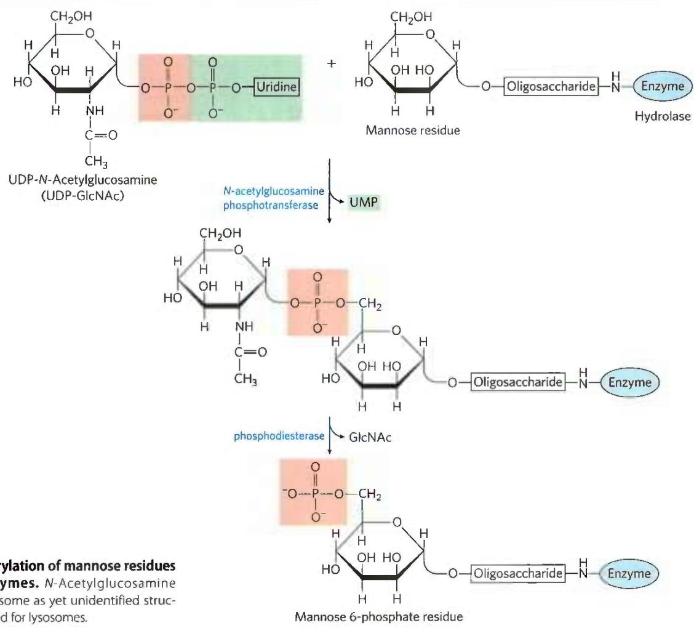  
FIGURE 27-41 Phosphorylation of mannose residues on lysosome-targeted enzymes. N-Acetylglucosamine phosphotransferase recognizes some as yet unidentified structural feature of hydrolases destined for lysosomes.

#### [EN] Signal Sequences for Nuclear Transport Are Not Cleaved

Molecular communication between the nucleus and the cytosol requires the movement of macromolecules through nuclear pores. RNA molecules synthesized in the nucleus are exported to the cytosol. Ribosomal proteins synthesized on cytosolic ribosomes are imported into the nucleus and assembled into 60S and 40S ribosomal subunits in the nucleolus; completed subunits are then exported back to the cytosol (Fig. 27-17). A variety of nuclear proteins (RNA and DNA polymerases, histones, topoisomerases, proteins that regulate gene expression, and so forth) are synthesized in the cytosol and imported into the nucleus. This traffic is modulated by a complex system of molecular signals and transport proteins that is gradually being elucidated.

In most multicellular eukaryotes, the nuclear envelope breaks down at each cell division, and once division is completed and the nuclear envelope reestablished, the dispersed nuclear proteins must be reimported. To allow this repeated nuclear importation, the signal sequence that targets a protein to the nucleus—the nuclear localization sequence (NLS)—is not removed after the protein arrives at its destination. An NLS, unlike other signal sequences, may be located almost anywhere along the primary sequence of the protein. NLSs can vary considerably in structure, but many consist of four to eight amino acid residues and include several consecutive basic (Arg or Lys) residues.

Nuclear importation is mediated by several proteins that cycle between the cytosol and the nucleus (Fig. 27-42), including importin $\alpha$ and $\beta$ and a small GTPase known as Ran (Ras-related nuclear protein). A heterodimer of importin $\alpha$ and $\beta$ functions as a soluble receptor for proteins targeted to the nucleus, with the $\alpha$ subunit binding NLS-bearing proteins in the cytosol. The complex of the NLS-bearing protein and the importin docks at a nuclear pore and is translocated through the pore by an energy-dependent mechanism. In the nucleus, the importin $\beta$ is bound by Ran GTPase, releasing importin $\beta$ from the imported protein. Importin $\beta$ is bound by Ran and by CAS (cellular apoptosis susceptibility protein) and separated from the NLS-bearing protein. Importin $\alpha$ and $\beta$ , in their complexes with Ran and CAS, are then exported from the nucleus. Ran hydrolyzes GTP in the cytosol to release the importins, which are then free to begin another importation cycle. Ran itself is also cycled back into the nucleus by the binding of Ran-GDP to nuclear transport factor 2 (NTF2). Inside the nucleus, the GDP bound to Ran is replaced with GTP through the action of Ran guanosine nucleotide-exchange factor (Ran-GEF).

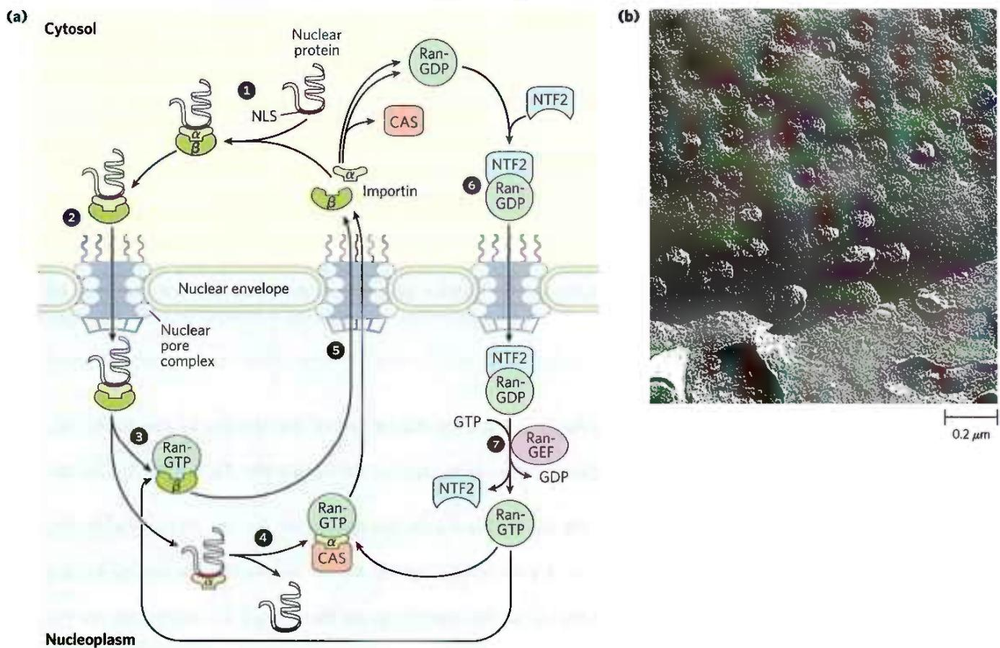  
FIGURE 27-42 Targeting of nuclear proteins. (a) 1 A protein with an appropriate nuclear localization signal (NLS) is bound by a complex of importins $\alpha$ and $\beta$ . 2 The resulting complex binds to a nuclear pore and translocates. 3 Inside the nucleus, dissociation of importin $\beta$ is promoted by the binding of Ran-GTP. 4 Importin $\alpha$ binds to Ran-GTP and CAS (cellular apoptosis susceptibility protein), releasing the nuclear protein. 5 Importins $\alpha$ and $\beta$ and CAS are transported out of the nucleus and recycled. They are released in the cytosol when Ran hydrolyzes its  
bound GTP. 6 Ran-GDP is bound by NTF2, and transported back into the nucleus. 7 Ran-GEF promotes the exchange of GDP for GTP in the nucleus, and Ran-GTP is ready to process another NLS-bearing protein-importin complex. (b) Transmission electron micrograph of a freeze-fractured nucleus, showing numerous nuclear pores. The nuclear pore complex is one of the largest molecular aggregates in the cell $(M_{\mathrm{r}} \sim 5 \times 10^{7})$ . It is made up of multiple copies of more than 30 different proteins. ([a) Information from C. Strambio-De-Castillia et al., Nat. Rev. Mol. Cell Biol. 11:490, 2010, Fig. 1. (b) Don W. Fawcett/Science Source.]


During mitosis, when the nuclear envelope transiently breaks down, the Ran GTPase and the importins play additional roles. The Ran GTPase–importin $\beta$ complex helps to position the spindle microtubules on the cell perimeter to facilitate chromosome segregation as the cell divides, and this complex also regulates microtubule interaction with other cellular structures.

#### [EN] Bacteria Also Use Signal Sequences for Protein Targeting

Bacteria can target proteins to their inner or outer membranes, to the periplasmic space between these membranes, or to the extracellular medium. They use signal sequences at the amino terminus of the proteins (Fig. 27-43), much like those on eukaryotic proteins targeted to the ER, mitochondria, and chloroplasts.

Most proteins exported from E. coli make use of the pathway shown in Figure 27-44. Following translation, a protein to be exported may fold only slowly, the amino-terminal signal sequence impeding the folding. The soluble chaperone protein SecB binds to the protein's signal sequence or other features of its incompletely folded structure. The bound protein is then delivered to SecA, a protein associated with the inner surface of the plasma membrane. SecA acts as both a receptor and a translocating ATPase. Released from SecB and bound to SecA, the protein is delivered to a translocation complex in the membrane, made up of SecY, E, and G, and is translocated stepwise through the membrane at the SecYEG complex in lengths of about 20 amino acid residues. Each step requires the hydrolysis of ATP, catalyzed by SecA.

Although most exported bacterial proteins use this pathway, some follow an alternative pathway that uses signal recognition and receptor proteins homologous to components of the eukaryotic SRP and the SRP receptor (see Fig. 27-38).

#### [EN] Cells Import Proteins by Receptor-Mediated Endocytosis

Some proteins are imported into eukaryotic cells from the surrounding medium; examples include low-density lipoprotein (LDL), the iron-carrying protein transferrin, peptide hormones, and circulating proteins destined for degradation. There are several importation pathways (Fig. 27-45). In one path, proteins bind to receptors in invaginations of the membrane called coated pits, which concentrate endocytic receptors in preference to other cell-surface proteins. The pits are coated on their cytosolic side with a lattice of the protein clathrin, which forms closed polyhedral structures (Fig. 27-46). The clathrin lattice grows as more receptors are occupied by target proteins. Eventually, a complete membrane-bounded

FIGURE 27-43 Signal sequences that target proteins to different locations in bacteria. Basic amino acids near the amino terminus are highlighted in blue, hydrophobic core amino acids in yellow. Cleavage sites marking the ends of the signal sequences are

<table><tr><td colspan="26">Inner membrane proteins</td><td></td><td></td></tr><tr><td>Phage fd, major coat protein</td><td>Met</td><td>Lys</td><td>Lys</td><td>Ser</td><td>Leu</td><td>Val</td><td>Leu</td><td>Lys</td><td>Ala</td><td>Ser</td><td>Val</td><td>Ala</td><td>Val</td><td>Ala</td><td>Thr</td><td>Leu</td><td>Val</td><td>Pro</td><td>Met</td><td>Leu</td><td>Ser</td><td>Phe</td><td>cleavage site↓Ala</td><td>Ala</td><td>Glu</td><td>--</td><td></td></tr><tr><td>Phage fd, minor coat protein</td><td></td><td></td><td></td><td></td><td></td><td>Met</td><td>Lys</td><td>Lys</td><td>Leu</td><td>Leu</td><td>Phe</td><td>Ala</td><td>Ile</td><td>Pro</td><td>Leu</td><td>Val</td><td>Val</td><td>Pro</td><td>Phe</td><td>Tyr</td><td>Ser</td><td>His</td><td>Ser</td><td>Ala</td><td>Glu</td><td>--</td><td></td></tr><tr><td colspan="26">Periplasmic proteins</td><td></td><td></td></tr><tr><td>Alkaline phosphatase</td><td></td><td>Met</td><td>Lys</td><td>Gln</td><td>Ser</td><td>Thr</td><td>Ile</td><td>Ala</td><td>Leu</td><td>Ala</td><td>Leu</td><td>Leu</td><td>Pro</td><td>Leu</td><td>Leu</td><td>Phe</td><td>Thr</td><td>Pro</td><td>Val</td><td>Thr</td><td>Lys</td><td>Ala</td><td>Arg</td><td>Thr</td><td>--</td><td></td><td></td></tr><tr><td>Leucine-specific binding protein</td><td>Met</td><td>Lys</td><td>Ala</td><td>Asn</td><td>Ala</td><td>Lys</td><td>Thr</td><td>Ile</td><td>Ile</td><td>Ala</td><td>Gly</td><td>Met</td><td>Ile</td><td>Ala</td><td>Leu</td><td>Ala</td><td>Ile</td><td>Ser</td><td>His</td><td>Thr</td><td>Ala</td><td>Met</td><td>Ala</td><td>Asp</td><td>Asp</td><td>--</td><td></td></tr><tr><td>β-Lactamase of pBR322</td><td>Met</td><td>Ser</td><td>Ile</td><td>Gln</td><td>His</td><td>Phe</td><td>Arg</td><td>Val</td><td>Ala</td><td>Leu</td><td>Ile</td><td>Pro</td><td>Phe</td><td>Phe</td><td>Ala</td><td>Ala</td><td>Phe</td><td>Cys</td><td>Leu</td><td>Pro</td><td>Val</td><td>Phe</td><td>Ala</td><td>His</td><td>Pro</td><td>--</td><td></td></tr><tr><td colspan="26">Outer membrane proteins</td><td></td><td></td></tr><tr><td>Lipoprotein</td><td></td><td></td><td></td><td>Met</td><td>Lys</td><td>Ala</td><td>Thr</td><td>Lys</td><td>Leu</td><td>Val</td><td>Leu</td><td>Gly</td><td>Ala</td><td>Val</td><td>Ile</td><td>Leu</td><td>Gly</td><td>Ser</td><td>Thr</td><td>Leu</td><td>Leu</td><td>Ala</td><td>Gly</td><td>Cys</td><td>Ser</td><td>--</td><td></td></tr><tr><td>LamB</td><td></td><td></td><td>Leu</td><td>Arg</td><td>Lys</td><td>Leu</td><td>Pro</td><td>Leu</td><td>Ala</td><td>Val</td><td>Ala</td><td>Val</td><td>Ala</td><td>Ala</td><td>Gly</td><td>Val</td><td>Met</td><td>Ser</td><td>Ala</td><td>Gln</td><td>Ala</td><td>Met</td><td>Ala</td><td>Val</td><td>Asp</td><td>--</td><td></td></tr><tr><td>OmpA</td><td>Met</td><td>Met</td><td>Ile</td><td>Thr</td><td>Met</td><td>Lys</td><td>Lys</td><td>Thr</td><td>Ala</td><td>Ile</td><td>Ala</td><td>Ile</td><td>Ala</td><td>Val</td><td>Ala</td><td>Leu</td><td>Ala</td><td>Gly</td><td>Phe</td><td>Ala</td><td>Thr</td><td>Val</td><td>Ala</td><td>Gln</td><td>Ala</td><td>Pro</td><td>--</td></tr></table>

indicated by red arrows. Note that the inner bacterial cell membrane is where phage fd coat proteins and DNA are assembled into phage particles. OmpA is outer membrane protein A; LamB is a cell surface receptor protein for $\lambda$ phage.


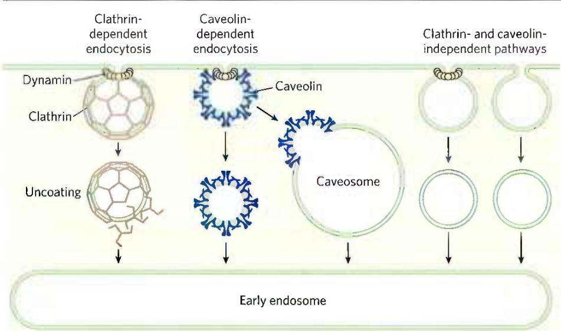


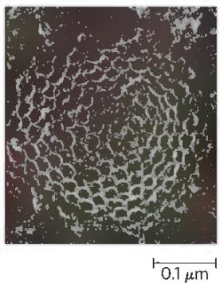  
(b)  
FIGURE 27-46 Clathrin. (a) The protein has three light (L) chains $(M_{\mathrm{r}}35,000)$ and three heavy (H) chains $(M_{\mathrm{r}}180,000)$ of the $(\mathrm{HL})_3$ clathrin unit, organized as a three-legged structure called a triskelion. Triskelions tend to assemble into polyhedral lattices. (b) Electron micrograph of a coated pit on the cytosolic face of the plasma membrane of a fibroblast. [(a) Information from S. Mayor and R. E. Pagano, Nat. Rev. Mol. Cell Biol. 8:603, 2007. (b) ©1980 Heuser. The Rockefeller University Press. J. Heuser, J. Cell Biol. 84:560, 1980.]  
FIGURE 27-44 Model for protein export in bacteria. A newly translated polypeptide binds to the cytosolic chaperone protein SecB, which delivers it to SecA, a protein associated with the translocation complex (SecYEG) in the bacterial cell membrane. SecB is released, and SecA inserts itself into the membrane, forcing about 20 amino acid residues of the protein to be exported through the translocation complex. Hydrolysis of an ATP by SecA provides the energy for a conformational change that causes SecA to withdraw from the membrane, releasing the polypeptide. SecA binds another ATP, and the next stretch of 20 amino acid residues is pushed across the membrane through the translocation complex. Steps and are repeated until the entire protein has passed through and is released to the periplasm. The electrochemical potential across the membrane (denoted by + and -) also provides some of the driving force required for protein translocation.  
FIGURE 27-45 Summary of endocytosis pathways in eukaryotic cells. Pathways dependent on clathrin or caveolin make use of the GTPase dynamin to pinch vesicles from the plasma membrane. Some pathways do not use clathrin or caveolin; some of these make use of dynamin and some do not.

endocytic vesicle is pinched off the plasma membrane with the aid of the large GTPase dynamin, and it enters the cytoplasm. The clathrin is quickly removed by uncoating enzymes, and the vesicle fuses with an endosome. ATPase activity in the endosomal membranes reduces the pH therein, facilitating dissociation of receptors from their target proteins. In a related pathway, caveolin causes invagination of patches of membrane containing lipid rafts associated with certain types of receptors (see Fig. 11-23). These endocytic vesicles then fuse with caveolin-containing internal structures called caveosomes, where the internalized molecules are sorted and redirected to other parts of the cell and the caveolins are prepared for recycling to the membrane surface. There are also clathrin- and caveolin-independent pathways; some make use of dynamin and others do not.

The imported proteins and receptors then go their separate ways, their fates varying with the cell and protein type. Transferrin and its receptor are eventually recycled. Some hormones, growth factors, and immune complexes, after eliciting the appropriate cellular response, are degraded along with their receptors. LDL is degraded after the associated cholesterol has been delivered to its destination, but the LDL receptor is recycled (see Fig. 21-42).

Receptor-mediated endocytosis is exploited by some toxins and viruses to gain entry to cells. Influenza virus, diphtheria toxin, SARS-CoV-2 (the virus that causes COVID-19), and cholera toxin all enter cells in this way.

#### [EN] Protein Degradation Is Mediated by Specialized Systems in All Cells

Protein degradation is critical to overall cellular proteostasis, preventing the buildup of abnormal or unwanted proteins and permitting the recycling of amino acids. The half-lives of eukaryotic proteins vary from 30 seconds to many days. Most proteins turn over rapidly relative to the lifetime of a cell, although a few (such as hemoglobin) can last for the life of the cell (about 110 days for an erythrocyte). Rapidly degraded proteins include those that are defective because of incorrectly inserted amino acids or because of damage accumulated during normal functioning. And enzymes that act at key regulatory points in metabolic pathways often turn over rapidly.

Defective proteins and those with characteristically short half-lives are generally degraded in both bacterial and eukaryotic cells by selective ATP-dependent cytosolic systems. A second system in vertebrates, operating in lysosomes, recycles the amino acids of membrane proteins, extracellular proteins, and proteins with characteristically long half-lives.

In E. coli, many proteins are degraded by one of several proteolytic systems that contain AAA+ ATPases (see Chapter 25), including Lon (the name refers to the "long form" of proteins, observed only when this protease is absent), ClpXP, ClpAP, ClpCP, ClpYQ, and FtsH. Each system targets particular proteins distinguished by their structure or subcellular location or both. Typically, ATP hydrolysis is used to maneuver a target protein through a pore into a proteolytic chamber, unfolding the protein in the process. Proteins are cleaved within the chamber. Once a protein has been reduced to small, inactive peptides, other ATP-independent proteases complete their degradation.

The ATP-dependent pathway in eukaryotic cells is quite different, involving the protein ubiquitin, which, as its name suggests, occurs throughout the eukaryotic kingdoms. One of the most highly conserved proteins known, ubiquitin (76 amino acid residues) is essentially identical in organisms as different as yeasts and humans and is key to proteostasis (see Figs. 4-23 and 13-29) and cell cycle regulation (see Fig. 12-38). Ubiquitin is covalently linked to proteins slated for destruction via an ATP-dependent pathway that includes three separate types of enzymes: E1 activating enzymes, E2 conjugating enzymes, and E3 ligases (Fig. 27-47).

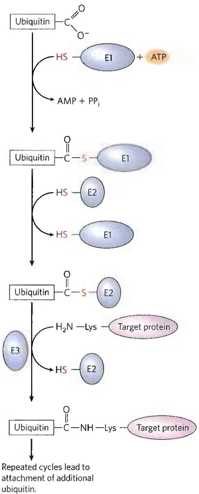  
FIGURE 27-47 Three-step pathway by which ubiquitin is attached to a protein. The pathway includes two different enzyme-ubiquitin intermediates. First, the free carboxyl group of ubiquitin's carboxyl-terminal Gly residue becomes linked to an E1-class activating enzyme through a thioester. The ubiquitin is then transferred to an E2 conjugating enzyme. An E3 ligase ultimately catalyzes transfer of the ubiquitin from E2 to the target, linking ubiquitin through an amide (isopeptide) bond to the ε-amino group of a Lys residue in the target protein. Additional cycles produce polyubiquitin, a covalent polymer of ubiquitin subunits that targets the attached protein for destruction in eukaryotes. Multiple pathways of this sort, with different protein targets, are present in most eukaryotic cells.

Ubiquitinated proteins are degraded by a large complex known as the 26S proteasome ( $M_{r}$ $2.5 \times 10^{6}$ ) (Fig. 27-48). The eukaryotic proteasome consists of two copies each of at least 32 different subunits, most of which are highly conserved from yeasts to humans. The proteasome contains two main types of subcomplexes: a barrel-like core particle and regulatory particles at each end of the barrel. The 19S regulatory particle on each end of the core particle contains approximately 18 subunits, including some that recognize and bind to ubiquitinated proteins. Six of the subunits are AAA+ ATPases that probably function in unfolding the ubiquitinated proteins and translocating the unfolded polypeptide into the core particle for degradation. The 19S particle also deubiquitinates the proteins as they are degraded in the proteasome. Most cells have additional regulatory complexes that can replace the 19S particle. These alternative regulators do not hydrolyze ATP and do not bind to ubiquitin, but they are important for the degradation of particular cellular proteins. The 26S proteasome can be effectively “accessorized” with regulatory complexes that change with changing cellular conditions.

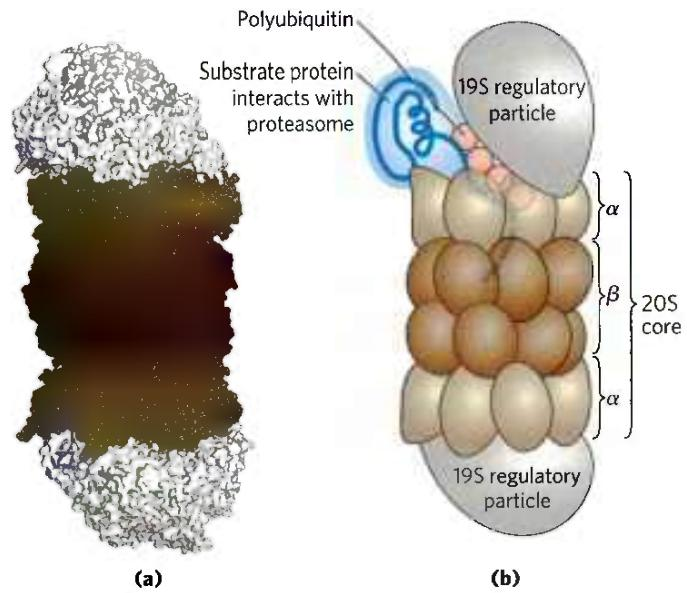  
FIGURE 27-48 Three-dimensional structure of the eukaryotic proteasome. The 20S core particle and the 19S regulatory particle, or cap, are shown (a) as a molecular structure and (b) in schematic form. The core particle consists of four rings arranged to form a barrel-like structure. The outer rings are formed from seven $\alpha$ subunits, and the inner rings from seven $\beta$ subunits. Three of the $\beta$ subunits have protease activities, each with different substrate specificity. A regulatory particle forms a cap on each end of the core particle. The regulatory particle binds ubiquitinated proteins, unfolds them, and translocates them into the core particle, where they are degraded to peptides of 3 to 25 amino acid residues. [(a) Data from PDB ID 3L5Q, K. Sadre-Bazzaz et al., Mol. Cell 37:728, 2010.]

Although we do not yet understand all the signals that trigger ubiquitination, one simple signal has been found. For many proteins, the identity of the first residue that remains after removal of the amino-terminal Met residue, and any other posttranslational proteolytic processing of the amino-terminal end, has a profound influence on half-life (Table 27-9). These amino-terminal signals have been conserved over billions of years of evolution and are the same in bacterial protein degradation systems and in the human ubiquitination pathway. More complex signals, such as the destruction box discussed in Chapter 12 (see Fig. 12-38), are also being identified.

Ubiquitin-dependent proteolysis is as important for the regulation of cellular processes as it is for the elimination of defective proteins. Many proteins required at only one stage of the eukaryotic cell cycle are rapidly degraded by the ubiquitin-dependent pathway after fulfilling their function. Ubiquitin-dependent destruction of cyclin is critical to cell-cycle regulation. The E1, E2, and E3 components of the ubiquitination pathway (Fig. 27-47) are large families of proteins. Different E1, E2, and E3 enzymes exhibit different specificities for target proteins and thus regulate different cellular processes. Some of these enzymes are highly localized in certain cellular compartments, reflecting a specialized function.

<table><tr><td>Amino-terminal residue</td><td>Half-life $^{a}$ </td></tr><tr><td colspan="2">Stabilizing</td></tr><tr><td>Ala, Gly, Met, Ser, Thr, Val</td><td>&gt;20 h</td></tr><tr><td colspan="2">Destabilizing</td></tr><tr><td>Gln, Ile</td><td>~30 min</td></tr><tr><td>Glu, Tyr</td><td>~10 min</td></tr><tr><td>Pro</td><td>~7 min</td></tr><tr><td>Asp, Leu, Lys, Phe</td><td>~3 min</td></tr><tr><td>Arg</td><td>~2 min</td></tr></table>

Information from A. Bachmair et al., Science 234:179, 1986.  
$^{a}$ Half-lives were measured in yeast for the $\beta$ -galactosidase protein modified so that in each experiment it had a different amino-terminal residue. Half-lives may vary for different proteins and in different organisms, but this general pattern appears to hold for all organisms.


Not surprisingly, defects in the ubiquitination pathway have been implicated in a wide range of disease states. An inability to degrade certain proteins that activate cell division (the products of oncogenes) can lead to tumor formation, and a too-rapid degradation of proteins that act as tumor suppressors can have the same effect. The ineffective or overly rapid degradation of cellular proteins also seems to play a role in a range of other conditions, including renal diseases, asthma, and neurodegenerative disorders such as Alzheimer and Parkinson diseases that are associated with the formation of characteristic proteinaceous structures in neurons. Cystic fibrosis is caused in some cases by a too-rapid degradation of a chloride ion channel, with resultant loss of function (see Box 11-2). Liddle syndrome, in which a sodium channel in the kidney is not degraded, leads to excessive $\mathrm{Na^{+}}$ absorption and early-onset hypertension. Drugs designed to inhibit proteasome function are being developed as potential treatments for some of these conditions. Many bacterial pathogens have found ways to hijack the eukaryotic ubiquitination system, evolving enzymes that ubiquitinate and thus eliminate host proteins as required to facilitate infection. In a changing metabolic environment, protein degradation is as important to a cell's survival as is protein synthesis, and much remains to be learned about these interesting pathways.


#### [EN] SUMMARY 27.3 Protein Targeting and Degradation

■ After synthesis, many proteins are directed to particular locations in the cell, a process mediated by signal sequences embedded in the polypeptide chain. In eukaryotic cells, one class of signal sequences is recognized by the signal recognition particle (SRP), which binds the signal sequence as soon as it appears on the ribosome and transfers the entire ribosome and incomplete polypeptide to the endoplasmic reticulum. Polypeptides with these signal sequences are moved into the endoplasmic reticulum lumen as they are synthesized.

■ Once in the lumen of the ER, many proteins are glycosylated. So modified, they are moved to the Golgi complex, then sorted and sent to lysosomes, the plasma membrane, or transport vesicles.

■ Proteins targeted to the nucleus have an internal signal sequence that, unlike other signal sequences, is not cleaved once the protein is successfully targeted.

■ Proteins targeted to mitochondria and chloroplasts in eukaryotic cells, and those destined for export in bacteria, also make use of an amino-terminal signal sequence.

■ Some eukaryotic cells import proteins by receptor-mediated endocytosis.

All cells eventually degrade proteins, using specialized proteolytic systems. Defective proteins and those slated for rapid turnover are generally degraded by an ATP-dependent system. In eukaryotic cells, the proteins are first tagged by linkage to ubiquitin, a highly conserved protein. Ubiquitin-dependent proteolysis, critical to the regulation of many cellular processes, is carried out by proteasomes, which also are highly conserved.


<!-- L-END Lehninger 27.3 -->

## 思考题

1. 简述破译遗传密码的主要过程。

2. 遗传密码有哪些特性？说出遗传密码简并性的生物学意义。

3. 终止密码子主要有哪几种？

4. tRNA 在组成和结构上有哪些特点?

5. tRNA 如何转运活化氨基酸至 mRNA 模板上?

6. 原核生物与真核生物的核糖体组成有哪些异同点？

7. 什么是 SD 序列, 其功能是什么?

8. 核糖体主要有哪些活性中心?

9. 真核生物与原核生物在翻译的起始过程中有哪些不同？

10. 链霉素为什么能够抑制蛋白质的合成？

11. 哪些抗生素只能特异性地作用于原核生物核糖体？哪些只作用于真核生物核糖体？哪些能同时抑制原核和真核生物核糖体？

12. 什么是分子伴侣,有哪些重要功能?

13. 什么是信号肽？它在序列组成上有哪些特点，有何功能？

14. 简述线粒体和叶绿体蛋白质的跨膜运转机制。

15. 蛋白质有哪些翻译后加工修饰, 其作用机制和生物学功能是什么?

16. 什么是核定位信号序列, 其主要功能是什么?

## 参考文献

1. Ling J, Reynolds N, Ibba I. Aminoacyl-tRNA synthesis and translational quality control. Annu. Rev. Microbiol., 2009, 63: 61–78.

2. Ramakrishnan V. Ribosome structure and the mechanism of translation. Cell, 2002, 108: 557–572.

3. Selmer M, Dunham C M, Murphy F V, et al. Structure of the 70S ribosome complexed with mRNA and tRNA. Science, 2006, 313: 1935–1942.

4. Laursen B S, Sorenson H P, Mortenson K K, et al. Initiation of protein synthesis in bacteria. Microbiol. Mol.

Biol.Rev., 2005, 60: 101-123.

5. Sonenberg N, Hinnebusch A G. Regulation of translation initiation in eukaryotes: Mechanisms and biological targets. Cell, 2009, 136: 731–745.

6. Gebauer F, Hentze M W. Molecular mechanisms of translational control. Nat. Rev. Mol. Cell Biol., 2004, 5: 827–835.

## 数字课程学习

e 教学课件

目在线自测

思考题解析


<!-- W-BEGIN Watson 6 章末 -->

### 【中文对照 Watson 第6章章末：小结、参考文献、习题】

> 来源：Watson《基因的分子生物学》第七版中译本（书籍/03_基因的分子生物学_第七版） 第6章 蛋白质的结构 章末，附录 2 中该章偶数习题答案附后。

#### [W] 小结

蛋白质是由肽键连接的线性的氨基酸链（“多肽链”）。遗传密码指定了20种L-氨基酸，其中含有非极性（疏水的）侧链的有9种；含有极性侧链的有6种，在中性pH环境中不带有任何电荷；含有酸性侧链的有2种，在中性pH环境中带负电荷；含有碱性侧链的有3种，在中性pH环境中一般带正电荷，组氨酸是个例外。肽键有部分双键的特点， $\mathrm{N - C_{\alpha}}$ 键和 $\mathrm{C_{\alpha} - (C = O)}$ 键的转角决定了多肽链骨架的三维构象。三种氨基酸的构象具有特别的性质：甘氨酸是非手性的，其构象的自由度比其他任何氨基酸的都大；脯氨酸（严格来讲是一种亚氨基酸）在侧链和氨基之间有一个共价键，这限制了其构象的自由度；半胱氨酸的侧链上含有巯基基团，可以同另一个半胱氨酸发生氧化形成二硫键，使一条折叠的多肽链或两条邻近的多肽链发生交联。细胞内的还原性环境限制二硫键的形成，避免细胞器和细胞外的环境被氧化。

传统上，人们从四个层次描述蛋白质的结构：初级结构（即多肽链的氨基酸序列，由遗传密码直接决定）、二级结构（即局部的、重复的骨架构象，由主链上的氢键维持稳定，主要包括α螺旋和β折叠）、三级结构（即多肽链折叠后形成的三维构象）和四级结构（在多亚基组装过程中由折叠的多肽链缔合而成的构象）。在三级结构层次，多肽链可以折叠成一个或多个独立的结构域，即使彼此分离，它们仍然可以进行相似的折叠。结构域的空间结构往往取决于组成它的二级结构元件（螺旋和折叠）在三维维度上包装的方式。有些多肽链可以形成多个结构域，不同结构域之间的连接序列或长而灵活，或短而僵硬。水相环境和自然氨基酸的多样性对于折叠结构域以及生成四级结构过程中折叠结构域之间的界面的构象的稳定性都非常重要。因不溶于水而紧密排列的非极性侧链簇、折叠结构域的疏水核心及任意隐蔽的氢键基团（丢掉与水之间的氢键），都必须要有一个由蛋白质衍生而来的伴侣。二级结构元件满足了后一个需求（主链上的氨基及羧基基团），因此在结构域描述和分类中显得很重要。

一个多肽链能否折叠和如何折叠，取决于该多肽链的氨基酸序列。这一性质使得遗传密码不仅决定蛋白质的初级结构，还决定其他层次的结构，从而支配蛋白质的功能。正确折叠的结构域中（以及细胞外结构域中的共价二硫键）存在各种各样的非共价相互作用，这些相互作用可以使总体自由能达到最小值（此时的构象最为稳定），因此，多肽链可以自发地形成其自然构象。蛋白质所处环境的变化，包括一个或多个氨基酸侧链的翻译后修饰或配体的结合，都可能改变这种自由能最小值的位置，从而诱导该蛋白质发生构象上的变化。氨基酸侧链在折叠蛋白表面，有时甚至是未折叠多肽链的某个片段中的排列方式，同样可以决定其对蛋白质、核酸或其他小分子配体的识别方式。因此，蛋白质在细胞内和细胞间特定的分子识别中扮演重要角色，它同时还是化学反应的特异性催化剂（酶）。

#### [W] 参考文献

#### [W] 书籍

Branden C. and Tooze J. 1999. Introduction to protein structure, 2nd ed. Garland Publishing, New York.

Kuriyan J., Konforti B., and Wemmer D. 2012. The molecules of life. Garland Publishing, New York.

Pauling L. 1960. The nature of the chemical bond, 3rd ed. Cornell University Press, Ithaca, New York.

Petsko G.A. and Ringe D. 2003. Protein structure and function (primers in biology). New Science Press, Waltham, Massachusetts.

Williamson M. 2012. How proteins work. Garland Publishing, New York.

#### [W] 习题

#### [W] 在四个层次上描述蛋白质结构

Richardson J.S. 1981. The anatomy and taxonomy of protein structure. Adv. Protein Chem. 34: 167–339.

#### [W] 从氨基酸序列到三维结构

Anfinsen C.B. 1973. Principles that govern the folding of protein chains. Science 181: 223–230.

#### [W] 偶数习题的答案请参见附录2

习题 1 能在分泌蛋白的两个半胱氨酸之间形成的共价键是什么键？该键为何通常不在细胞内蛋白中形成？该键的相互作用与其他氨基酸侧链之间的相互作用有什么不同之处？

习题 2 请举出一个在中性 pH 下两个氨基酸侧链通过离子键相互作用的例子。关于离子键的综述参见第 3 章。

习题 3 DNA 中的一个突变能引起对应编码蛋白质的氨基酸置换。当突变蛋白中原来的氨基酸被有相似化学特性的氨基酸所置换时，该置换行为被描述为保守的。根据图 6-2，找出 4 个属于发生保守置换的氨基酸对。

习题 4 肽键的形成就是缩合反应的一个例子。请解释这个说法的意思，以及为何说肽键的形成同时也是一个脱水反应。

习题5 描述说明 $\beta$ 折叠与 $\beta$ 三明治有何不同。

习题 6 两种氧结合蛋白——血红蛋白与肌红蛋白的不同在于血红蛋白以四聚体的形式在血红细胞中发挥作用，而肌红蛋白以单体形式在肌肉细胞中发挥作用。球状结构的肌红蛋白和每个单体血红蛋白都包含8个α螺旋片段。请问这两个蛋白质差异最大的是一级、二级、三级还是四级结构？请解释。

习题 7 请判断下列各个氨基酸分别更倾向于暴露或包埋在一个稳定的蛋白质结构域：苯丙氨酸、精氨酸、谷氨酰胺、甲硫氨酸，并说明你的判断依据。

习题8 当用变性剂脲处理一个蛋白质时，下列的相互作用力或键中哪些将因脲的处理而被破坏：A.离子键B.氢键C.二硫键D.肽键E.范德华力

习题 9 根据你在第 4 章学到的 DNA 结构的相关知识, 解释为何转录激活因子 Gcn4 与 DNA 的相互作用在 DNA 的大沟而不是小沟。请描述精氨酸和赖氨酸在 Gcn4 与 DNA 相互作用中的重要性。

习题 10 请预测在 Cys2His2 锌指结构中将一个或多个保守的半胱氨酸或组氨酸替换为丙氨酸将产生什么效应，并解释。

习题 11 请描述 LEF-1 与 DNA 的相互作用的特别之处。

习题12 酶如何提高一个反应的速率？

习题13 如果一个配体的结构与一个酶的底物相近，并且紧密地与酶的活性位点结合，从而将正常的底物排除在外。这样的“竞争性抑制剂”和变构抑制剂之间有何区别？

习题 14 一个名为 Tif3 或 eIRF4B 的翻译起始因子，在酵母细胞中其多肽链上按以下顺序拥有以下几种原件：一个包含有 RNA 识别基序（RRM）的氨基端结构域，一个富含碱性与酸性氨基酸残基的 7 次重复序列的主要片段，以及羟基端区域的一个不与任何已知基序或结构域同源的区域。

A. 请描述 RRM 的意义。

根据该蛋白质的模体设计以下一系列的实验来分析其不同部分的功能。TIF3基因敲除的细胞无法在 $37^{\circ}\mathrm{C}$ 生长，但能在 $30^{\circ}\mathrm{C}$ 正常生长。通过引入一个编码部分该蛋白的基因的实验，可以使得细胞重新获得野生型的，在 $37^{\circ}\mathrm{C}$ 条件下正常生长的能力。实验结果如下表，++，+和-分别代表生长或互补的程度。

<table><tr><td>Tif3 蛋白</td><td>在 37°C 生长</td></tr><tr><td>全长</td><td>++</td></tr><tr><td>RRM+前三个重复</td><td>++</td></tr><tr><td>RRM+第一个重复</td><td>-</td></tr><tr><td>所有 7 个重复+C 端片段</td><td>+</td></tr></table>

B. 根据这些数据，蛋白质的哪个区域是野生型在 $37^{\circ}$ C 条件下生长所需要的？

进一步利用缺失 TIF3 基因菌株的提取物设计了一个体外翻译相关实验。通过向提取物中加入纯化的 Tif3 蛋白或该蛋白的其中一种截断产物来起始反应。实验结果如下表，百分数代表与加入了全长 Tif3 蛋白的反应翻译活性相比的比值。

<table><tr><td>Tif3 protein</td><td>翻译活性(%)</td></tr><tr><td>全长</td><td>100</td></tr><tr><td>RRM+前三个重复</td><td>43</td></tr><tr><td>RRM+第一个重复</td><td>0</td></tr><tr><td>所有7个重复+C端片段</td><td>0</td></tr></table>

C. 这个实验结果与第二部分关于补充作用的结果如何相比较？这些实验是否改变了你从遗传学实验得到的结论。

数据来自 Niederberger et al. （1998.RNA 4：1259-1267）

(潘庆飞 夏志 译 张睿 胡学达 校)

本章概要
·
核酸：基本方法
·
基因组学
·
蛋白质
·
蛋白质组学
·
核酸-蛋白相互作用


#### [W] 附录 2：本章偶数习题答案


问题 2 相反电荷之间形成离子键。一个酸性氨基酸（天冬氨酸或谷氨酸）的侧链和一个碱性氨基酸（赖氨酸、精氨酸或组氨酸）之间可以形成一个离子键。

问题 4 在肽键形成的过程中，氨基酸的羧基和另外一个氨基酸的氨基通过消除水分子形成共价键。由于两个分子失水形成一个键，所以这个反应叫做缩合反应或脱水反应（特指失去水分子）。

问题 6 四级结构。单体肌红蛋白不具有四级结构，四聚体的血红蛋白具有四级结构，这对生理功能是至关重要的。这两种蛋白质是球状的，其折叠亚基主要是 $\alpha$ 螺旋，其二级结构和三级结构是相似的。一级结构决定二级和三级结构，因此，肌红蛋白和血红蛋白的一级结构可能是相似的。请注意，即使是非常不同的一级结构的多肽链可以具有相似的二级和三级结构（例如，植物的血红素和人的血红蛋白），但如果序列的相似性在整个域中延伸，相关序列的蛋白质区域则总是具有相同的折叠结构。

问题8

A. 断裂，非共价键。

B. 断裂，非共价键。

C. 不断裂，共价键。

D. 不断裂，共价键。一条 B 链是二级结构的一个单元，B 三明治结构是蛋白质三级结构的一个例子（一种特殊的折叠域）。

E. 不断裂，非共价键。

问题 10 两个组氨酸和两个半胱氨酸对于 $Zn^{2+}$ 的配位是很关键的，依次地，Zn 离子对于很小的锌指结构域也是个重要的稳定因素。以丙氨酸代替这四个残基中的任何一个将消除锌离子结合并动摇域，导致其失去功能。

问题 12 酶的催化反应通过降低所需要的能量以形成过渡态，从而降低反应物和产物之间的的能量势垒。酶在很多情况下出现，因为它们的活性位点与反应物的过渡态构象而非基态构象互补——就是说，在酶和底物的过渡态形式之间具有有利的非共价相互作用。

问题14

A. RRMS（例如，一类 RNA 结合域的序列基序特征）是折叠成域的 80-90 个氨基酸残基的序列，可以识别特定的 RNA。[请注意，术语 “RRM” 常被误用为指定的 “域”，见表 6-2 术语表：“基序”（motif）和 “结构域”（domain）的正确用法]
B. 这些数据显示，氨基末端的 RRM 和前三个重复足以完全互补。RRM 加一个重复或是 7 个重复加羧基末端区域都不足以使野生型在 $37^{\circ}$ C 生长。

C. 结果与互补实验一致，但也表明，在体外实验中，重复 3 次都不足以充分活化。此外，RRM 形式被截断，但在活体内 7 次重复和羧基末端区域完好无损，在体外没有活性，但是在体内恢复部分生长。这些差异表明一些功能的冗余，或者在 Tif3 域中，亦或在翻译起始复合物的其他部分。


<!-- W-END Watson 6 章末 -->


<!-- W-BEGIN Watson 15 章末 -->

### 【中文对照 Watson 第15章章末：小结、参考文献、习题】

> 来源：Watson《基因的分子生物学》第七版中译本（书籍/03_基因的分子生物学_第七版） 第15章 翻译 章末，附录 2 中该章偶数习题答案附后。

#### [W] 小结

蛋白质是依据信使 RNA（mRNA）的模板在翻译过程中合成的。翻译需要将核苷酸序列的信息解码为线性多肽链的氨基酸序列。蛋白质合成的机器由 4 个主要的部分组成：mRNA；适配 RNA，也称为转运 RNA，即 tRNA；将氨基酸连接于 tRNA 的氨酰-tRNA 合成酶；核糖体，它是蛋白质和 RNA 组成的多亚基复合体，催化肽键的形成。

mRNA 含有蛋白质的编码序列，以及翻译起始和终止的识别单元。编码序列称为可读框（ORF），由一系列称为密码子的、相连的三核苷酸单位组成。一个 ORF 确定一条多肽链。每个 ORF 都起始于一个起始密码子并结束于一个终止密码子。起始密码子在原核细胞中通常是 AUG 或 GUG，而在真核细胞总是 AUG。原核细胞中，起始密码子的前面有一段与核糖体的 16S RNA 互补的序列，它负责将核糖体排列在起始密码子上。在真核细胞，mRNA 的 5'端含有一个称为 5'帽子的特殊结构，它负责募集核糖体。真核的 mRNA 序列以一串 A 残基结束，称为 poly-A 尾，它能够提高翻译的效率。原核的 mRNA 经常含有两个或多个可读框，称为多顺反子。真核的 mRNA 一般只包含一个可读框，称为单顺反子。

tRNA 是 mRNA 的密码子和准备加入多肽链的氨基酸之间的物理界面。tRNA 是 L-型的分子，其一端（5'端）为反密码子环，3'端为凸出的 5'-CCA-3'序列。反密码子与密码子互补，通过碱基配对识别。其 5'-CCA-3'端是氨基酸的结合位点，氨基酸的加入是通过氨基酸的羰基和 2'或 3'端核糖的羟基形成的酰基来实现的。

氨酰-tRNA合成酶分两步将氨基酸结合于tRNA，这一过程称为负载。一个氨酰-tRNA合成酶负责某种氨基酸的所有相应的tRNA的负载。合成酶通过与L-型tRNA的两端作用来识别正确的tRNA。合成酶负责将正确的氨基酸连接到相关的tRNA上，而且这一过程具有很高的保真度。一些氨酰-tRNA合成酶通过校正机制来获得更高的准确率。

核糖体由大、小亚基组成，大亚基含有肽键形成的位点（肽酰转移酶中心），小亚基含有解码 mRNA 的位点（解码中心）。每一亚基由一种或多种 RNA 和多种蛋白质组成。RNA 不仅是亚基的主要结构组分，而且负责核糖体的主要功能。完整的核糖体含有三个横跨两个亚基的 tRNA 结合位点：A 位点是负载 tRNA 进入核糖体的位置，P 位点含有肽酰—tRNA，而 E 位点是脱氨基酸的 tRNA 离开核糖体的位置。

一个蛋白质的翻译包括大、小亚基的结合与分离的循环。在核糖体循环中，小、大亚基在可读框的起始位置结合起来，并在 ORF 翻译完成后分离为游离亚基。mRNA 的翻译始于 ORF 的 5'端，多肽链的合成以氨基末端向羧基末端的方向进行。

翻译有三个主要的步骤：起始、延伸和终止。原核细胞中，起始需要 mRNA 通过核糖体结合位点（RBS）与小亚基的 16S RNA 的作用来将核糖体吸引到 mRNA 上。这一作用由三个辅助蛋白（称为起始因子 IF1、IF2 和 IF3）协助，使两个亚基保持分离，并将一个特殊的起始 tRNA 募集至起始密码子。负载的起始 tRNA 的反密码子和起始密码子的配对引发了大亚基的募集结合、起始因子的释放及负载的起始 tRNA 进入 P 位点。这就是原核细胞的起始复合体，它为接受一个负载 tRNA 进入 A 位点并进行第一个肽键的形成做好了准备。

真核细胞的 mRNA 通过 5'帽子的识别和许多辅助因子的作用来募集小亚基。然后，一系列在功能上类似于原核起始因子的蛋白质被用来招募起始 tRNA 到小亚基上。然后，另一组在真核细胞中特有的因子能够识别 5'帽子并帮助 mRNA 结合到已经结合了起始因子的小亚基（43S 前起始复合物）上。然后小亚基沿着 mRNA 向下游扫描，直到遇见 AUG——起始密码子。与原核细胞一样，只有在起始密码子 AUG 被识别后，大亚基才能结合于 mRNA。

翻译延伸过程的第一步是将一个负载 tRNA 引入 A 位点。这在原核细胞是由 GTP 结合蛋白 EF-Tu 来催化的，在真核细胞则由它的等价物来催化。在氨酰基团进入肽酰转移酶中心之前，有许多机制保证了密码子和反密码子之间的正确配对。然后，通过将肽链从 P 位点的 tRNA 转移到 A 位点的氨酰-tRNA 来形成肽键。肽键的形成是由大亚基的肽转移酶中心的 RNA 及 P 位点 tRNA 的 2'-OH 催化的。这一核糖酶促使 A 位点的氨酰-tRNA 的氨基基团亲核攻击 P 位点上连接延伸着的多肽链的 tRNA 的羰基基团。最后，核糖体易位至下一个空的密码子上，这一过程由肽转移酶和延伸因子 EF-G（或真核细胞中的等价物）共同催化。易位的结果是 P 位点的脱氨基酸的 tRNA 移入 E 位点，并从 E 位点离开核糖体；A 位点的肽酰-tRNA 进入刚刚空出的 P 位点。mRNA 的下一个密码子移入空的 A 位点，并做好接受由 EF-Tu 携带的另一个负载 tRNA 的准备。

翻译终止于核糖体遇见一个终止密码子的时候,对终止密码子的识别是通过原核的两个Ⅰ类释放因子之一和真核的一个Ⅰ类释放因子进行的。释放因子促使肽酰-tRNA 的水解,导致完整的肽链释放出来。最后,在原核细胞中,一个Ⅱ类释放因子、一个核糖体循环因子和一个起始因子(原核生物中为 IF3)通过引起 mRNA 和脱氨基酸的 tRNA 的释放,以及核糖体解离为大、小亚基的过程完成翻译的终止过程。真核生物中的翻译终止需要 eRF3 将 eRF1 带至核糖体。核糖体循环的机制尚不完全清楚,但是很有可能 eRF1 扮演了 RRF 在原核细胞中的角色。此时核糖体循环终于完成,小亚基又准备开始新一轮的多肽合成。

很多基因的表达是在翻译起始的水平受调控的。在细菌细胞中，这种调控总体上通过抑制小亚基与RBS的结合来进行。这种抑制可由蛋白质或RNA结合到RBS附近的mRNA序列上来介导。真核生物翻译的总体水平由4E-BP蛋白及eIF2α激酶来调控，前者可结合 eIF4E，并且同 eIF4G 竞争与之结合的能力，后者抑制 eIF2 把 GDP 转化为 GTP 的能力。特殊的真核 mRNA 的翻译调控有时由小 uORF 介导，它能够限制核糖体小亚基接近下游的 ORF。通过对这些机制进行改变，可以适应并调控某些特殊的基因。

细菌和真核细胞都采用翻译来监控 mRNA 的完整性并去除突变的 mRNA 及其蛋白质产物。缺失终止密码子的 mRNA 将导致合成某些异常蛋白，其将会被胞内蛋白酶识别并降解。包含提前终止密码子的真核生物 mRNA、停滞的核糖体或者缺少终止密码子的 mRNA 会被识别出来，之后相关的 mRNA 将进入降解过程。

#### [W] 参考文献

#### [W] 书籍

Mathews M.B., Sonenberg N., and Hershey J.W.B. 2007. Translational control in biology and medicine. Cold Spring Harbor Laboratory Press, Cold Spring Harbor, New York.

#### [W] tRNA 及氨酰-tRNA 合成酶

Arnez J.G. and Moras D. 1997. Structural and functional considerations of the aminoacylation reaction. Trends Biochem. Sci. 2: 189–232.

Ling J., Reynolds N., and Ibba I. 2009. Aminoacyl-tRNA synthesis and translational quality control. Annu. Rev. Microbiol. 63: 61–78.

#### [W] 核糖体

Dunkle J.A., Wang L., Feldman M.B., Pulk A., Chen V.B., Kapral G.J., Noeske J., Richardson J.S., Blanchard S.C., and Cate J.H.D. 2011. Structures of the bacterial ribosome in classical and hybrid states of tRNA binding. Science 332: 981–984.

Frank J. and Gonzalez R.L. 2010. Structure and dynamics of a processive Brownian motor: The translating ribosome. Annu. Rev. Biochem. 79:381–412.

Koronstelev A., Trakhanov S., Laurberg M., and Noller H.F. 2006. Crystal structure of a 70S ribosome–tRNA complex reveals functional interactions and rearrangements. Cell 126: 1065–1077.

Moore P.B. and Steitz T.A. 2005. The ribosome revealed. Trends Biochem. Sci. 30: 281–283.

Poehlsgaard J. and Douthwaite S. 2005. The bacterial ribosome as a target for antibiotics. Nat. Rev. Microbiol. 3: 870–881.

Ramakrishnan V. 2002. Ribosome structure and the mechanism of translation. Cell 108: 557–572.

Rodnina M.V., Beringer M., and Wintermeyer W. 2006. How ribosomes make peptide bonds. Trends Biochem. Sci. 32: 20–26.

Selmer M., Dunham C.M., Murphy F.V., Weixlbaumer A., Petry S., Kelley A.C., Weir J.R., and Ramakrishnan V. 2006. Structure of the 70S ribosome complexed with mRNA and tRNA. Science 313: 1935–1942.

#### [W] 翻译

Balvay L., Soto Rifo R., Ricci E.P., Decimo D., and Ohlmann T. 2009. Structural and functional diversity of viral IRESes. Biochim. Biophys. Acta 1789: 542–557.

Broderson D.E. and Ramakrishnan V. 2003. Shapes can be seductive. Nat. Struct. Biol. 10: 78–80.

Dever T.E. and Green R. 2012. The elongation, termination, and recycling phases of translation in eukaryotes. Cold Spring Harb. Perspect. Biol.

4: a013706.

Hernández G. 2008. Was the initiation of translation in early eukaryotes IRES-driven? Trends Biochem. Sci. 33: 58–64.

Laursen B.S., Sorenson H.P., Mortenson K.K., and Sperling-Peterson H.U. 2005. Initiation of protein synthesis in bacteria. Microbiol. Mol. Biol. Rev. 60: 101–123.

Nilsson J. and Nissen P. 2005. Elongation factors on the ribosome. Curr. Opin. Struct. Biol. 15: 349–354.

Nissen P., Kjeldgaard M., and Nyborg J. 2000. Macromolecular mimicry. EMBO J. 19: 489–495.

Sonenberg N. and Hinnebusch A.G. 2009. Regulation of translation initiation in eukaryotes: Mechanisms and biological targets. Cell 136: 731–745.

Weinger J.S., Parnell K.M., Forner S., Green R., and Strobel S.A. 2004. Substrate-assisted catalysis of peptide bond formation by the ribosome. Nat. Struct. Mol. Biol. 11: 1101–1106.

#### [W] 翻译的调控

Gebauer F. and Hentze M.W. 2004. Molecular mechanisms of translational control. Nat. Rev. Mol. Cell Biol. 5: 827–835.

Ingolia N.T., Ghaemmaghami S., Newman J.R.S., and Weissman J.S. 2009. Genome-wide analysis in vivo of translation with nucleotide resolution using ribosome profiling. Science 324: 218–223.

Janssen B.D. and Hayes C.S. 2012. The tmRNA ribosome-rescue system. Adv. Protein Chem. Struct. Biol. 86: 151–191.

Richter J.D. and Sonenberg N. 2006. Regulation of cap-dependent translation by eIF4E inhibitory proteins. Nature 433: 477–480.

Shi W., Zhang X., Jiang X., Yuan H., Lee J.S., Barry C.E. 3rd, Wang H., Zhang W., and Zhang Y. 2011. Pyrazinamide inhibits transtranslation in Mycobacterium tuberculosis. Science 333: 1630–1632.

van Hoof A. and Wagner E.J. 2011. A brief survey of mRNA surveillance. Trends Biochem. Sci. 36: 585–592.

Gebauer F. and Hentze M.W. 2004. Molecular mechanisms of translational control. Nat. Rev. Mol. Cell Biol. 5: 827–835.

Ingolia N.T., Ghaemmaghami S., Newman J.R.S., and Weissman J.S. 2009. Genome-wide analysis in vivo of translation with nucleotide resolution using ribosome profiling. Science 324: 218–223.

Janssen B.D. and Hayes C.S. 2012. The tmRNA ribosome-rescue system. Adv. Protein Chem. Struct. Biol. 86: 151–191.

Richter J.D. and Sonenberg N. 2006. Regulation of cap-dependent translation by eIF4E inhibitory proteins. Nature 433: 477–480.

Shi W., Zhang X., Jiang X., Yuan H., Lee J.S., Barry C.E. 3rd, Wang H., Zhang W., and Zhang Y. 2011. Pyrazinamide inhibits trans-translation in Mycobacterium tuberculosis. Science 333: 1630–1632.

van Hoof A. and Wagner E.J. 2011. A brief survey of mRNA surveillance. Trends Biochem. Sci. 36: 585–592.

#### [W] 习题

偶数习题的答案请参见附录2

习题 1 请比较原核生物 mRNA 同真核生物 mRNA 的异同。

习题 2 请描述每个 tRNA 3'末端的 5'-CCA-3'序列的意义。

习题 3 请使用苏氨酸和苏氨酰-tRNA 合成酶分别写出 tRNA 负载过程的第一步和第二步的反应式，然后写出总反应式。

习题 4 请使用苏氨酰-tRNA 合成酶写出编辑 Ser-tRNA $^{Thr}$ 的反应式。

习题 5 请解释酪氨酰-tRNA 合成酶是如何区分酪氨酸和苯丙氨酸以避免错配的。

习题 6 你认为哪一种 tRNA 合成酶具有可以水解与甘氨酸发生错配的氨酰-tRNA 的编辑口袋（editing pocket）？请给出解释。

习题 7 mRNA 可以同时被多个核糖体进行翻译，请描述该现象对细胞的有利之处。

习题 8 请描述一个可以支持该论断的实验——催化肽键转移反应的是核糖体中的一种 rRNA，而不是核糖体中的蛋白质成分。

习题 9 请解释肽键形成的能量来自哪里。

习题 10 EF-G-GDP 和 EF-Tu-GTP-tRNA 是两种原核复合体，它们在翻译延伸过程中可以在不同的时间点与解码中心的 A 位点发生相互作用。请解释相关的结构学研究是如何揭示这种相互作用的。

习题 11 请计算，在起始完成后，一轮延伸所需要消耗的核苷三磷酸的数量，并描述核苷三磷酸是如何被利用的。

习题 12 请解释生物素抑制转录以及特异性靶向细菌细胞的一般机制。

习题 13 原核细胞可以通过两种机制来抑制翻译的起始，这是它们调节翻译的一种方式。请描述这两种机制。

习题 14 缬氨酰-tRNA 合成酶（ValRS）在一般情况下可以使缬氨酸发生腺苷酰化并将其转移到 $tRNA^{Val}$ 中。但有些时候，ValRS 可以把苏氨酸错误地装填到 $tRNA^{Val}$ 中。研究人员想判断一下 ValRS 编辑口袋中哪种氨基酸对于编辑错误装填的 Thr-tRNA $^{Val}$ 比较重要。

#### [W] A. 为什么 ValRS 会对苏氨酸进行错误装填，而不是其他的氨基酸？

为了研究编辑口袋中重要的氨基酸残基，研究人员对编辑口袋的不同位置进行了氨基酸替代，然后使用突变型 ValRS 和野生型 ValRS 进行了体外装载反应并对合成的 Thr-tRNA $^{Val}$ 的数量及消耗的 ATP 的数量进行了测量。突变型 ValRS 的标记是 F264A，表示第 264 位位点上是丙氨酸而不是苯丙氨酸。相应的数据如下图所示。


  
ValRS 突变体的酶活性。野生型，◆；D279A，●；K270A，▲；其他突变型用■、○、X 和 \* 表示。  
（数据引自 Fukunaga R. and Yokoyama S. 2005. J. Biol. Chem. 280:29937-29945, 图 5 B 和 C, 第 29943 页. © The American Society for Biochemistry and Molecular Biology. 已取得授权）

B. 根据左图的数据, 与野生型 ValRS 相比, 哪种或哪些突变编辑功能的缺失最为明显? 为什么?

C. 根据右图所示，相较于 K270A 的野生型 ValRS，野生型 ValRS 会消耗更多的 ATP，请解释这是为什么。


#### [W] 附录 2：本章偶数习题答案


问题 2 tRNA 耦联到 3' 端的同源氨基酸上。氨基酸与 5'-CCA-3' 的 3'-OH 或 2'-OH 形成高能量的酰基键。所有的 tRNA 都以该序列结尾。

问题 4 Ser-tRNA $^{Thr}$ → tRNA $^{Thr}$ +Ser

问题 6 丙氨酰-tRNA 合成酶具有可以水解 Gly-tRNA $^{Ala}$ 的编辑口袋。丙氨酸的侧链（甲基）比甘氨酸上的氢原子稍大些，因而丙氨酰-tRNA 合成酶的活性位点可以容纳甘氨酸并可利用甘氨酸来误导 tRNA $^{Ala}$ 。丙氨酰-tRNA 合成酶具有适合（并移除）甘氨酸而不是丙氨酸耦联的 tRNA $^{Ala}$ 。

问题 8 最简单的实验是用蛋白酶处理核糖体，看该核糖体是否还可以继续合成新的蛋白质。经过该实验可以发现，即使大多数的蛋白质已经被移除，依旧可以生成肽键。结构研究进一步表明，RNA 可以催化肽键的形成，因为在 18Å 活性位点上不存在氨基酸。

问题 10 每个复合体的结构是非常类似的。EF-G 蛋白的一部分采取了与 EF-Tu-GTP-tRNA 复合体中的 tRNA 类似的形状。这有助于解释为何两者都结合在核糖体的 A 位点。

问题 12 抗生素通过结合核糖体或 EF-Tu 或 EF-G 上的特殊位点来抑制翻译过程中的某一步骤。翻译过程的一步受到抑制会导致所有步骤的停止，而翻译是细胞生存所必需的。在原核细胞翻译的核糖体蛋白和 rRNA 与真核细胞中不同。因此，抗生素可以特异的结合原核的核糖体的某个成分而不与真核细胞的结合。

#### [W] 问题14

A. 苏氨酸的结构在大小上与缬氨酸的类似，因而适合 ValRS 的活性位点。该苏氨酸有一个羟基而缬氨酸则只有一个甲基。

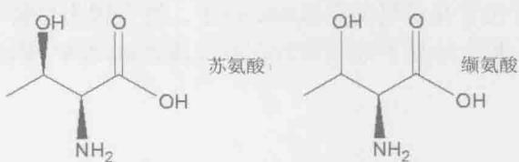

B. 大部分的 Thr-tRNA $^{Val}$ 是在 K270A 和 D279A 突变体（在 270 位由赖氨酸变成丙氨酸，在 279 位由天冬氨酸变成丙氨酸）存在时产生的。该信息表明在编辑时存在潜在的问题。

C. 每一轮的错误插入及编辑消耗一分子的 ATP，因为 tRNA 上的氨基酸被水解，而新的氨基酸必需腺苷酰化及转移。如果 ValRS 突变体没有编辑，那么 Thr-tRNA $^{Val}$ 的含量将会升高，而 ATP 的消耗则会降低。这时我们可以由 K270A 和 D279A ValRS 突变体看出来。


<!-- W-END Watson 15 章末 -->


<!-- W-BEGIN Watson 16 章末 -->

### 【中文对照 Watson 第16章章末：小结、参考文献、习题】

> 来源：Watson《基因的分子生物学》第七版中译本（书籍/03_基因的分子生物学_第七版） 第16章 遗传密码 章末，附录 2 中该章偶数习题答案附后。

#### [W] 小结

从细菌到人类每一种生物都“通用”的遗传密码中，61种密码子编码特定的氨基酸；其余3种是终止密码子。密码子有高度的简并性，即几种密码子（同义）通常与一种氨基酸相对应。有时一个特定的tRNA可以特异地识别几种密码子，这种能力来自于反密码子5'端碱基的摆动。终止密码子UAA、UAG和UGA由特异的蛋白质识别，而非特异的tRNA分子。

遗传密码子遵守 3 个原则：密码子从 $5'\rightarrow3'$ 方向进行阅读；密码子相互不重叠并且信息没有缝隙；信息是在固定的可读框里翻译的，可读框由起始密码子设定。

遗传密码是通过在无细胞提取物中研究蛋白质合成而破译的。在原信使组分消耗殆尽的提取物中加入新的 mRNA 导致产生新的蛋白质，它们的氨基酸序列是由外加的 mRNA 所决定的。对合成的多聚核糖核酸 poly-U 可以特异地编码 poly-Phe 的发现是遗传密码破译的第一步（也许是最重要的一步）。用其他合成的均一的多聚核糖核酸（如 poly-C 等）或者混合的多聚核糖核酸（如 poly-AU 等），使不同氨基酸的密码子组成得以确定。密码子中核苷酸的准确排列的最终确定则源自随后对特异的三核苷酸-tRNA-核糖体相互作用的研究，以及使用了常见的共聚物作为信使。

改变密码的点突变包括错义突变,它使一个氨基酸的密码子变为另外一个氨基酸的密码子;无义突变可以使蛋白质的合成过早终止;移码突变则改变遗传信息的可读框。在一些情况下,错义突变、无义突变和移码突变的效应可以部分地被基因外抑制所逆转。例如,突变的 tRNA 可以将由于无义突变造成的终止密码子阅读成编码特定氨基酸的密码子。

在线粒体基因组及一些原核生物、单细胞原生动物的主要基因组中使用的遗传密码存在些许不同，如“通用密码”中的终止密码子 UGA，在线粒体、原核生物、原生动物基因组中编码 Trp。

#### [W] 参考文献

#### [W] 书籍

Celis J.E. and Smith J.D., eds. 1979. Nonsense mutations and tRNA suppressors. Academic Press, New York.

Clark B. and Petersen H., eds. 1984. Gene expression: The translational step and its control. Alfred Benzon Symposium, vol. 19. Copenhagen, Munksgaard.

Cold Spring Harbor Symposia on Quantitative Biology. 1966. Volume 31: The genetic code. Cold Spring Harbor Laboratory, Cold Spring Harbor, New York.

Söll D.G., Abelson J.N., and Schimmel P.R., eds. 1980. Transfer RNA: Biological aspects. Cold Spring Harbor Laboratory, Cold Spring Harbor, New York.

Ycas M. 1969. The biological code. Wiley (Interscience), New York.

#### [W] 遗传密码的特征

Crick F.H.C. 1966. Codon-anticodon pairing: The wobble hypothesis. J. Mol. Biol. 19: 548–555.

Kohli J. and Grosjean H. 1981. Usage of the three termination codons: Compilation and analysis of the known eukaryotic and prokaryotic translation termination sequences. Mol. Gen. Genet. 182:430–439.

Lagerkvist U. 1981. Unorthodox codon reading and the evolution of the genetic code. Cell 23: 305–306.

#### [W] 密码是如何被打断的

Crick F.H.C. 1963. The recent excitement in the coding problem. Prog. Nucleic Acid Res. 1: 164.

Khorana H.G. 1968. Polynucleotide synthesis and the genetic code. Harvey Lecture Series 1966–1967. Vol. 62. Academic Press, New York.

Nirenberg M. and Leder P. 1964. The effect of trinucleotides upon the binding of sRNA to ribosomes. Science 145: 1399–1407.

Speyer J.F., Lengyel P., Basilio C., Wahba A.J., Gardner R.S., and Ochoa S. 1963. Synthetic polynucleotides and the amino acid code. Cold Spring Harbor Symp. Quant. Biol. 28: 559–568.

#### [W] 遗传密码遵循的三条规律

Brenner S., Stretton A.O.W., and Kaplan S. 1965. Genetic code: The nonsense triplets for chain termination and their suppression. Nature 206: 994–998.

Crick F.H.C., Barnett L., Brenner S., and Watts-Tobin R.J. 1961. General nature of the genetic code for proteins. Nature 192: 1227–1232.

Garen A. 1968. Sense and nonsense in the genetic code. Science 160:149–159.

#### [W] 习题

Terzaghi E., Okada Y., Streisinger G., Emrich J., Inouye M., and Tsugita A. 1966. Change of a sequence of amino acids in phage T4 lysozyme by acridine-induced mutations. Proc. Natl. Acad. Sci. 56:500–507.

#### [W] 抑制

Buckingham R.H. and Kurland C.G. 1980. Interactions between UGA-suppressor tRNA'P and the ribosome: Mechanisms of tRNA selection. In Transfer R.N.A: Biological aspects (ed. D. Söll, et al.), pp. 421–426. Cold Spring Harbor Laboratory, Cold Spring Harbor, New York.

Ozeki H., Inokuchi H., Yamao F., Kodaira M., Sakano H., Ikemura T., and Shimura Y. 1980. Genetics of nonsense suppressor of tRNAs in Escherichia coli. In Transfer R.N.A: Biological aspects (ed. D. Söll, et al.), pp. 341–349. Cold Spring Harbor Laboratory, Cold Spring Harbor, New York.

Steege D.A. and Söll D.G. 1979. Suppression. In Biological regulation and development I (ed. R.F. Goldberger), pp. 433–486. Plenum, New York.

#### [W] 遗传密码的扩展

Isaacs F.J., Carr P.A., Wang H.H., Lajoie M.J., Sterling B., Kraal L., Tolonen A.C., Gianoulis T.A., Goodman D.B., Reppas N.B., et al. 2011. Precise manipulation of chromosomes in vivo enables genome-wide codon replacement. Science 333: 348–353.

Noren C.J., Anthony-Cahill S.J., Griffith M.C., and Schultz P.G. 1989. A general method for site-specific incorporation of unnatural amino acids into proteins. Science 192: 1227–1232.

#### [W] 偶数习题的答案请参见附录2。

习题 1 列举两种没有密码子简并性的氨基酸，并解释其原因。

习题 2 解释密码子 5'-AAG-3'编码赖氨酸和密码子 5'-AGG-3'编码精氨酸的细胞优势。

习题 3 对于 mRNA 密码子 5'-ACU-3', 该密码子编码哪个氨基酸？哪个 DNA 序列编码这该密码子？给出识别该密码子的 tRNA 的反密码子序列。

习题 4 按照 $5'\rightarrow3'$ 规则写出核苷酸序列，判断（是或者否）以下的每个 mRNA 密码子是否可以被 tRNA 反密码子 ICG 识别。

A. UGC B. CGA C. UGA D. CGU E. GCG

习题 5 由生化学家在之前的实验中利用 RNA 序列如 poly-U 来破译遗传密码子，在体外，核糖体翻译成多肽的关键条件是什么？

习题 6 你想检测密码子 5'-GUG-3' 是否编码缬氨酸, 那么你将使用什么样的重复二核苷酸 RNA 序列来获得密码子 5'-GUG-3' 编码缬氨酸的证据? 当核糖体翻译重复的二核苷酸序列时, 你期望在多肽序列中找到其他哪些氨基酸?

习题 7 DNA 序列 5'-ACCGTTCGGCTAGG-3'位于 E.coli 某基因的中间区域, 该序列是一条编码链。为了将该序列正确翻译为一条多肽, 你必须知道的关于密码子的三条规则是什么?

习题 8 DNA 序列 5'-ACCGTTCGGCTAGG-3'位于 E.coli 某基因的中间区域, 该序列是一条编码链, 请给出该序列编码的三种可能的多肽序列。

习题 9 下面展示的是编码某长度为 270AA 的蛋白质的最后几个氨基酸的野生型 DNA 序列。前三个加粗的碱基对表示读码框及编码区域。

$$
\begin{array}{l} 5 ^ {\prime} \dots G C T A A G T A T T G C T C A A G A T T A G G A T G A T A A A T A A C T G 3 ^ {\prime} \\ 3 ^ {\prime} \dots C G A T T C A T A A C G A G T T C T A A T C C T A C T A T T T A T T G A C C 5 ^ {\prime} \end{array}
$$

A. 该基因转录的模板链是哪一条？简要解释你的判断方法。

B. 单碱基的插入会引起该蛋白质的长度减少 7 个氨基酸。根据以上给出的序列，推断该插入发生在哪个位置？

C. 单碱基的改变会使该蛋白质的长度增加一个氨基酸。根据以上给出的序列，推断需要改变哪个碱基对以及将该碱基对改成什么可以增加一个氨基酸？

习题 10 基于下面所示的野生型序列，判断 A、B 和 C 三种改变的序列分别属于以下哪种类型：错义突变，无义突变，移码突变，反义突变，基因内抑制突变，或者基因间抑制突变。对于每一个改变的序列，可能有多于一个的答案。该 DNA 序列编码某长度为 270AA的蛋白质的最后几个氨基酸。前三个加粗的碱基对表示读码框及编码区域，插入的核苷酸用斜体字表示。

$$
5 ^ {\prime} \dots G C T A A G T A T T G C T C A A G A T T A G G A T C A G A A A T A A C T G G 3 ^ {\prime}
$$

$$
3 ^ {\prime} \dots C G A T T C A T A A C G A G T T C T A A T C C T A G T C T T T A T T G A C C 5 ^ {\prime}
$$

A. 改变的序列 1:

$$
5 ^ {\prime} \dots C G A T T C A T A A C G A G T T G G C T A A T C C T A C T A T T T A T T G A C C 3 ^ {\prime}
$$

$$
3 ^ {\prime} \dots C G A T T C A T A A C G A G T T G G C T A A T C C T A C T A T T T A T T G A C C 5 ^ {\prime}
$$

B. 改变的序列 2——在改变的序列 1 的基础上发生变化:

$$
5 ^ {\prime} \dots G C T A A G T A T T G C T C A C C G A T T A G G A T G A T A A A T A A C T G G 3 ^ {\prime}
$$

3'...CGATTCATAACGAGTGGCTAATCCTACTATTTATTGACC5'

C. 改变的序列 3——在改变的序列 1 的基础上发生变化:

5'...GCTAAGTATTGCTCCCGATTAGGATGATAAATAACTGG3'

3'...CGATTCATAACGAGGGCTAATCCTACTATTTATTGACC5'

习题 11 研究人员发现跨膜蛋白中的单一半胱氨酸转变为色氨酸时可引起视网膜退化。请写出编码该氨基酸替代的 mRNA 的相关序列、野生型 mRNA 的序列及突变的序列。该氨基酸替代是由于 DNA 的跳跃或易位引起的吗？

习题 12 请描述密码子的通用性，并解释为什么会存在例外。

习题 13 你想从白色念珠菌中克隆一个基因并在大肠杆菌中表达纯化,希望在大肠杆菌中表达的蛋白质与白色念珠菌中的该蛋白质的氨基酸序列非常一致。你怎样对你感兴趣的基因的 DNA 序列进行突变从而确保 5'-CUG-3'密码子编码丝氨酸而不是亮氨酸?

习题 14 假如你正从大肠杆菌中筛选某感兴趣的基因突变体的抑制突变。该突变为无义突变，使得你的基因所编码的蛋白质无法表达。该基因中的一个抑制突变编码不常见的 tRNA $^{Leu}$ 。

A. 题目中所描述的抑制突变是什么类型？

B. 为什么不常见的 tRNA $^{Leu}$ 比常用的 tRNA $^{Leu}$ 更可能携带抑制突变?

C. 如果有人告诉你，该抑制突变仅包含一个点突变，并且可以翻译终止密码子 5'-UAG-3'，请写出突变型 tRNA $^{Leu}$ 和野生型 tRNA $^{Leu}$ 的反密码子序列。
D. 为什么抑制 5'-UAG-3' 密码子比抑制其他终止密码子更有效？

夏志校）


#### [W] 附录 2：本章偶数习题答案


问题 2 最常见的突变是碱基对 A:T 突变为 G:C 或者 G:C 突变为 A:T。如果 DNA 在编码密码子中间的核苷酸时出现了碱基对突变，赖氨酸则会替代精氨酸，反之亦然。这两个氨基酸都是带正电的。蛋白质中的氨基酸取代相对于其他改变而言更加的保守，从而保证了细胞不容易因此改变蛋白质的结构或功能。

问题4  
否A.UGC  
是B.CGA  
否C.UGA  
是D.CGU  
否E.GCG

问题 6 利用重复的二核苷酸序列 GU。5'-GUGUGUGUGUGUGU...-3'编码交替的缬氨酸（5'-GUG-3'）或者半胱氨酸（5'-UGU-3'）多肽。

问题 8 编码链与 mRNA 的序列相同，除了在 mRNA 中是 U 取代 T。

利用第一个框（从 5'端的第一个核苷酸开始）， $NH_{2}$ -苏氨酸-缬氨酸-丝氨酸-丙氨酸-精氨酸-COOH。

利用第二个框（从 5'端的第二个核苷酸开始）， $NH_{2}$ -脯氨酸-苯丙氨酸-精氨酸-亮氨酸-COOH。

利用第三个框（从 5'端的第三个核苷酸开始）， $NH_{2}$ -精氨酸-苯丙氨酸-甘氨酸-(终

止）-COOH。由于该序列位于基因的中间区域，因为不太可能采用该读码框。

#### [W] 问题10

A. 插入两个碱基对-移码突变。该移码突变导致下游密码子编码不同的氨基酸序列。

B. 在已经改变的序列 1 中插入 2 个碱基对，在插入碱基对前立即删掉序列 1 中一对碱基（仍旧发生移码）改变了一步的读码框，该移码突变会导致下游密码子编码不同的氨基酸序列。

C. 在已经改变的序列 1 中插入 2 个碱基对，在插入前立即删掉序列 1 中的两个碱基对——消除移码。因而这是基因内抑制突变（基因本身）使氨基酸序列恢复到野生型，尽管 DNA 序列已经与野生型的不同了。

问题 12 普遍性指的是在所有物种间遗传密码子的保守性。大部分情况下，各物种使用相同的遗传密码子。也存在标准遗传密码子的突变型即少量的特殊密码子或者氨基酸。哺乳动物的线粒体、白色念珠菌和支原体使用特殊的遗传密码子。

#### [W] 问题14

A. 抑制突变是基因间的无义抑制——基因间是因为突变发生在不同的基因而不是某个感兴趣的基因上。

B. 如果一个常用的 tRNA $^{Leu}$ 携带了一个抑制突变,那么该细胞中的许多基因在编码需要该特异 tRNA 的亮氨酸时会出现问题。

C. 终止密码子 5'-UAG-3' 可以被反密码子 5'-CUA-3' 识别。5'-UAG-3' 与亮氨酸密码子 5'-UUG-3' 只有一个核苷酸的不同，因而突变的反密码子的序列是 5'-CUA-3'，而野生型反密码子的序列是 5'-CAA-3'。

D. 在大肠杆菌的基因组中，5'-UAG-3'很少作为终止密码子，因此，在大肠杆菌中，在一个蛋白质中插入一个氨基酸而不是终止翻译并不会给其他蛋白质带来太多的问题，而在细胞中则可能会导致死亡或者生长缓慢。在抑制突变时通过在每个

5'-UAG-3'密码子中插入一个氨基酸的方式大部分会影响目的突变蛋白的翻译。有关更多信息，请参考 Thorbjarnardottir et al.（1985. J.Bacteriol，161:219-222）。


<!-- W-END Watson 16 章末 -->


<!-- L-BEGIN Lehninger 27 章末 -->

### 【英文对应 Lehninger 第27章章末：Key Terms、习题与简答】

> 来源：Lehninger Principles of Biochemistry（书籍/02_生物化学原理） 第27章章末及书末 Abbreviated Solutions 第27章。

### [EN] KEY TERMS

Terms in bold are defined in the glossary.

proteostasis 1005  
translation 1006  
aminoacyl-tRNA 1006  
aminoacyl-tRNA synthetases 1006  
codon 1007  
reading frame 1007  
initiation codon 1009  
termination codons 1009  
open reading frame (ORF) 1009  
degenerate code 1009  
anticodon 1010  
wobble 1012  
translational frameshifting 1013  
RNA editing 1013  
initiation 1028

Billic-Bargarino sequence 1028
aminoacyl (A) site 1028
peptidyl (P) site 1028
exit (E) site 1028
initiation complex 1028
elongation 1030
elongation factors 1030
peptidyl transferase 1032
translocation 1032
termination 1035
termination factors 1035
release factors 1035
polysome 1036
posttranslational modification 1037
puromycin 1039
tetracycline 1040

chloramphenicol 1040
cycloheximide 1040
streptomycin 1040
diphtheria toxin 1040
ricin 1040
signal sequence 1041
signal recognition particle (SRP) 1042
peptide translocation complex 1042

tunicamycin 1042  
nuclear localization sequence (NLS) 1045  
coated pits 1046  
clathrin 1046  
dynamin 1047  
ubiquitin 1048  
proteasome 1048

### [EN] PROBLEMS

1. Messenger RNA Translation Predict the amino acid sequences of peptides formed by ribosomes in response to each mRNA sequence, assuming that the reading frame begins with the first three bases in each sequence.

(a) GGUCAGUCGCUCCUGAUU

(b) UUGGAUGCGCCAUAAUUUGCU

(c) CAUGAUGCCUGUUGCUAC

(d) AUGGACGAA

2. How Many Different mRNA Sequences Can Specify One Amino Acid Sequence? Write all the possible mRNA sequences that can code for the simple tripeptide segment Leu-Met-Tyr. Your answer will give you some idea of the number of possible mRNAs that can code for one polypeptide.

3. Can the Base Sequence of an mRNA Be Predicted from the Amino Acid Sequence of Its Polypeptide Product? A given sequence of bases in an mRNA will code for one and only one sequence of amino acids in a polypeptide, if the reading frame is specified. From a given sequence of amino acid residues in a protein such as cytochrome c, can we predict the base sequence of the unique mRNA that encoded it? Give reasons for your answer.

4. Coding of a Polypeptide by Duplex DNA The template strand of a segment of double-helical DNA contains the sequence

(5')CTTAACACCCCTGACTTCGCGCCGTCG(3')

(a) What is the base sequence of the mRNA that can be transcribed from this strand?

(b) What amino acid sequence could be coded by the mRNA in (a), starting from the 5' end?

(c) If the complementary (nontemplate) strand of this DNA were transcribed and translated, would the resulting amino acid sequence be the same as in (b)? Explain the biological significance of your answer.

5. The Genetic Code and Mutation A mutation occasionally arises that converts a codon specifying an amino acid to a stop or nonsense codon. When this occurs in the middle of a gene, the resulting protein is truncated and often inactive. If the protein is essential, cell death can result. Which of these secondary mutations might restore some or all of the protein function so that the cell can survive (there may be more than one correct answer)?

(a) A mutation restoring the codon to one encoding the original amino acid

(b) A mutation changing the nonsense codon to one encoding a different but similar amino acid


(c) A mutation in the anticodon of a tRNA such that the tRNA now recognizes the nonsense codon

(d) A mutation in which an additional nucleotide inserts just upstream of the nonsense codon, changing the reading frame so the nonsense codon is no longer read as "stop"

6. The Direction of Protein Synthesis In 1961, Howard Dintzis established that protein synthesis on ribosomes begins at the amino terminus and proceeds toward the carboxyl terminus. He used immature red blood cells that were still synthesizing hemoglobin. He added radioactively labeled leucine (chosen because it occurs frequently in both the $\alpha$ and $\beta$ subunits) for various lengths of time, rapidly isolated only the full-length (completed) $\alpha$ subunits, and then determined where in the peptide the labeled amino acids were located. After the labeled leucine and extract had been incubated together for one hour, the protein was labeled uniformly along its length. However, after much shorter incubation times, the labeled amino acids were clustered at one end. At which end, amino or carboxyl terminus, did Dintzis find the labeled residues after the short exposure to labeled leucine?

7. Methionine Has Only One Codon Methionine is one of two amino acids with only one codon. How does the single codon for methionine specify both the initiating residue and the interior Met residues of polypeptides synthesized by E. coli?

8. The Genetic Code in Action Translate the mRNA shown, starting at the first 5' nucleotide, assuming that translation occurs in an E. coli cell. If all tRNAs make maximum use of wobble rules but do not contain inosine, how many distinct tRNAs are required to translate this RNA?

(5')AUGGGUCGUGAGUCAUCGUUAAUUGUAGCUGGAGGGGA GGAAUGA(3')

9. Synthetic mRNAs The genetic code was elucidated through the use of polyribonucleotides synthesized either enzymatically or chemically in the laboratory. Given what we now know about the genetic code, how would you make a polyribonucleotide that could serve as an mRNA coding predominantly for many Phe residues and for a small number of Leu and Ser residues? What other amino acid(s) would be encoded by this polyribonucleotide, but in smaller amounts?

10. Energy Cost of Protein Biosynthesis Determine the minimum energy cost, in terms of ATP equivalents expended, for the biosynthesis of the $\beta$ -globin chain of hemoglobin (146 residues), starting from a pool including all necessary amino acids, ATP, and GTP. Compare your answer with the direct energy cost of the biosynthesis of a linear glycogen chain of 146 glucose residues in $(\alpha1\rightarrow4)$ linkage, starting from a pool including glucose, UTP, and ATP. From your data, what is the extra energy cost of making a protein, in which all the residues are ordered in a specific sequence, compared with the cost of making a polysaccharide containing the same number of residues but lacking the informational content of the protein?

In addition to the direct energy cost for the synthesis of a protein, there are indirect energy costs—those required for the cell to make the necessary enzymes for protein synthesis. Compare the magnitude of the indirect costs to a eukaryotic cell of the biosynthesis of linear $(\alpha1\rightarrow4)$ glycogen chains and the biosynthesis of polypeptides, in terms of the enzymatic machinery involved.

11. Predicting Anticodons from Codons Most amino acids have more than one codon and attach to more than one tRNA, each with a different anticodon. Write all possible anticodons for the four codons of glycine: (5')GGU, GGC, GGA, and GGG.

(a) From your answer, which of the positions in the anticodons are primary determinants of their codon specificity in the case of glycine?

(b) Which of these anticodon-codon pairings has/have a wobbly base pair?

(c) In which of the anticodon-codon pairings do all three positions exhibit strong Watson-Crick hydrogen bonding?

12. Effect of Single-Base Changes on Amino Acid Sequence Much important confirmatory evidence on the genetic code has come from assessing changes in the amino acid sequence of mutant proteins after a single base has been changed in the gene that encodes the protein. Which of the listed amino acid replacements would be consistent with the genetic code if the replacements were caused by a single base change? Which cannot be the result of a single-base mutation? Why?

(a) Phe $\rightarrow$ Leu (e) Ile $\rightarrow$ Leu

(g) Pro→Ser

(d) Phe→Lys

13. Resistance of the Genetic Code to Mutation The RNA sequence shown represents the beginning of an open reading frame (ORF). What changes (if any) can occur at each position without generating a change in the encoded amino acid residue?

### [EN] (5')AUGAUUUUGCUAUCUUGGACU

14. Basis of the Sickle Cell Mutation Sickle cell hemoglobin has a Val residue at position 6 of the $\beta$ -globin chain instead of the Glu residue found in normal hemoglobin A. Can you predict what change took place in the DNA codon for glutamate to account for replacement of the Glu residue by Val?

15. Proofreading by Aminoacyl-tRNA Synthetases The isoleucyl-tRNA synthetase has a proofreading function that ensures the fidelity of the aminoacylation reaction, but the histidyl-tRNA synthetase lacks such a proofreading function. Explain.

16. Importance of the "Second Genetic Code" Some aminoacyl-tRNA synthetases do not recognize and bind the anticodon of their cognate tRNAs but instead use other structural features of the tRNAs to impart binding specificity. The tRNAs for alanine apparently fall into this category.

(a) What features of tRNA $^{Ala}$ does Ala-tRNA synthetase recognize?

(b) Describe the consequences of a C→G mutation in the third position of the anticodon of tRNA $^{Ala}$ .

(c) What other kinds of mutations might have similar effects?
(d) Mutations of these types are never found in natural populations of organisms. Why? (Hint: Consider what might happen both to individual proteins and to the organism as a whole.)

17. Rate of Protein Synthesis A bacterial ribosome can synthesize about 20 peptide bonds per minute. If the average bacterial protein is approximately 260 amino acid residues long, how many proteins can the ribosomes in an E. coli cell synthesize in 20 minutes if all ribosomes are functioning at maximum rates?

18. The Role of Translation Factors A researcher isolates mutant variants of the bacterial translation factors IF2, EF-Tu, and EF-G. In each case, the mutation allows proper folding of the protein and the binding of GTP but does not allow GTP hydrolysis. At what stage would translation be blocked by each mutant protein?

19. Maintaining the Fidelity of Protein Synthesis The chemical mechanisms used to avoid errors in protein synthesis are different from those used during DNA replication. DNA polymerases use a 3'→5' exonuclease proofreading activity to remove mispaired nucleotides incorrectly inserted into a growing DNA strand. There is no analogous proofreading function on ribosomes, and, in fact, the identity of an amino acid attached to an incoming tRNA and added to the growing polypeptide is never checked. A proofreading step that hydrolyzed the previously formed peptide bond after insertion of an incorrect amino acid into a growing polypeptide (analogous to the proofreading step of DNA polymerases) would be impractical. Why? (Hint: Consider how the link between the growing polypeptide and the mRNA is maintained during elongation; see Figs. 27-28 and 27-29.)

20. Bacterial Protein Export Bacteria mostly use the system shown in Fig. 27-44 to export proteins out of the cell. SecB, one of the chaperone proteins found only in gram-negative bacteria, delivers a newly translated polypeptide to the SecA ATPase on the interior side of the membrane. SecA pushes the exported protein through a membrane pore formed by the SecYEG complex. The SecYEG complex is homologous to the Sec61 complex in eukaryotes. Which component of this bacterial protein export system would be the most attractive target for antibiotic development? Explain.

21. Predicting the Cellular Location of a Protein You alter the gene for a eukaryotic polypeptide 300 amino acid residues long so that a signal sequence recognized by the SRP occurs at the polypeptide's amino terminus and a nuclear localization signal (NLS) occurs internally, beginning at residue 150. Where would you likely find the protein in the cell?

22. Requirements for Protein Translocation across a Membrane The secreted bacterial protein OmpA has a precursor, ProOmpA, which has the amino-terminal signal sequence required for secretion. If you denature purified ProOmpA with 8 M urea and then remove the urea (such as by running the protein solution rapidly through a gel filtration column), the protein can translocate across isolated bacterial inner membranes in vitro. However, translocation becomes impossible if you first incubate ProOmpA for a few hours in the absence of urea. Furthermore, ProOmpA maintains its capacity for translocation for an extended period if you first incubate it in the presence of another bacterial protein called trigger factor. Describe the probable function of trigger factor.

23. Protein-Coding Capacity of a Viral DNA The 5,386 bp genome of bacteriophage $\phi$ X174 includes genes for 10 proteins, designated A to K (omitting "I"), with sizes given in the table. How much DNA would be required to encode these 10 proteins? How can you reconcile the size of the $\phi$ X174 genome with its protein-coding capacity?

<table><tr><td>Protein</td><td>Number of amino acid residues</td><td>Protein</td><td>Number of amino acid residues</td></tr><tr><td>A</td><td>455</td><td>F</td><td>427</td></tr><tr><td>B</td><td>120</td><td>G</td><td>175</td></tr><tr><td>C</td><td>86</td><td>H</td><td>328</td></tr><tr><td>D</td><td>152</td><td>J</td><td>38</td></tr><tr><td>E</td><td>91</td><td>K</td><td>56</td></tr></table>

### [EN] DATA ANALYSIS PROBLEM

24. Designing Proteins by Using Randomly Generated Genes Studies of the amino acid sequence and corresponding three-dimensional structure of wild-type or mutant proteins have led to significant insights into the principles that govern protein folding. An important test of this understanding would be to design a protein based on these principles and see whether it folds as expected.

Kamtekar and colleagues (1993) used aspects of the genetic code to generate random protein sequences with defined patterns of hydrophilic and hydrophobic residues. Their clever approach combined knowledge about protein structure, amino acid properties, and the genetic code to explore the factors that influence protein structure.

The researchers set out to generate a set of proteins with the simple four-helix bundle structure shown below, with $\alpha$ helices (shown as cylinders) connected by segments of random coil (light red).


  
An amphipathic $\alpha$ helix  
Four-helix bundle

Each $\alpha$ helix is amphipathic—the R groups on one side of the helix are exclusively hydrophobic (yellow), and those on the other side are exclusively hydrophilic (blue). A protein consisting of four of these helices separated by short segments of random coil would be expected to fold so that the hydrophilic sides of the helices face the solvent.

(a) What forces or interactions hold the four $\alpha$ helices together in this bundled structure?

Figure 4-3a shows a segment of $\alpha$ helix consisting of 10 amino acid residues. With the gray central rod as a divider, four of the R groups (purple spheres) extend from the left side of the helix, and six extend from the right.


(b) Number the R groups in Figure 4-3a, from top (amino terminus; 1) to bottom (carboxyl terminus; 10). Which R groups extend from the left side, and which extend from the right?

(c) Suppose you wanted to design this 10 amino acid segment to be an amphipathic helix, with the left side hydrophilic and the right side hydrophobic. Give a sequence of 10 amino acids that could potentially fold into such a structure. There are many possible correct answers.

(d) Give one possible double-stranded DNA sequence that could encode the amino acid sequence you chose for (c). (It is an internal portion of a protein, so you do not need to include start or stop codons.)

Rather than designing proteins with specific sequences, Kamtekar and colleagues designed proteins with partially random sequences, with hydrophilic and hydrophobic amino acid residues placed in a controlled pattern. They did this by taking advantage of some interesting features of the genetic code to construct a library of synthetic DNA molecules with partially random sequences arranged in a particular pattern.

To design a DNA sequence that would encode random hydrophobic amino acid sequences, the researchers began with the degenerate codon NTN, where N can be A, G, C, or T. They filled each N position by including an equimolar mixture of A, G, C, and T in the DNA synthesis reaction to generate a mixture of DNA molecules with different nucleotides at that position (see Fig. 8-32). Similarly, to encode random polar amino acid sequences, they began with the degenerate codon NAN and used an equimolar mixture of A, G, and C (but in this case, no T) to fill the N positions.

(e) Which amino acids can be encoded by the NTN triplet? Are all amino acids in this set hydrophobic? Does the set include all the hydrophobic amino acids?

(f) Which amino acids can be encoded by the NAN triplet? Are all of these polar? Does the set include all the polar amino acids? (g) In creating the NAN codons, why was it necessary to leave T out of the reaction mixture?

Kamtekar and coworkers cloned this library of random DNA sequences into plasmids, selected 48 that produced the correct patterning of hydrophilic and hydrophobic amino acids, and expressed these in E. coli. The next challenge was to determine whether the proteins folded as expected. It would be very time-consuming to express each protein, crystallize it, and determine its complete three-dimensional structure. Instead, the investigators used the E. coli protein-processing machinery to screen out sequences that led to highly defective proteins. In this initial screening, they kept only those clones that resulted in a band of protein with the expected molecular weight on SDS polyacrylamide gel electrophoresis (see Fig. 3-18).

(h) Why would a grossly misfolded protein fail to produce a band of the expected molecular weight on electrophoresis?

Several proteins passed this initial test, and further exploration showed that they had the expected four-helix structure.

(i) Why didn't all of the random-sequence proteins that passed the initial screening test produce four-helix structures?

### [EN] Reference

Kamtekar, S., J.M. Schiffer, H. Xiong, J.M. Babik, and M.H. Hecht. 1993. Protein design by binary patterning of polar and nonpolar amino acids. Science 262:1680–1685.


### [EN] Abbreviated Solutions — Chapter 27


1. (a) Gly-Gln-Ser-Leu-Leu-Ile (b) Leu-Asp-Ala-Pro (c) His-Asp-Ala-Cys-Cys-Tyr (d) Met-Asp-Glu in eukaryotes; fMet-Asp-Glu in bacteria

2. UUAAUGUAU, UUGAUGUAU, CUUAUGUAU, CUCAUGUAU, CUAAUGUAU, CUGAUGUAU, UUAAUGUAC, UUGAUGUAC, CUUAUGUAC, CUCAUGUAC, CUAAUGUAC, CUGAUGUAC

3. No. Because nearly all the amino acids have more than one codon (e.g., Leu has six), any given polypeptide can be encoded by several different base sequences. However, some amino acids are encoded by only one codon, and those with multiple codons often share the same nucleotide at two of the three positions, so certain parts of the mRNA sequence encoding a protein of known amino acid sequence can be predicted with high certainty.

4. (a) (5')CGACGGCGCGAAGUCAGGGGUGUUAAG(3') (b) Arg-Arg-Arg-Glu-Val-Arg-Gly-Val-Lys (c) No. The complementary antiparallel strands in double-helical DNA do not have the same base sequence in the 5'→3' direction. RNA is transcribed from only one specific strand of duplex DNA. The RNA polymerase must therefore recognize and bind to the correct strand.

5. (a), (b), and (c) are correct. (a) This outcome would restore the original gene and allow production of the native protein. (b) Altering the gene to insert a different amino acid at this position would allow for the generation of a full-length protein. Some activity may be present, especially if the new amino acid represented a conservative alteration (such as Ile substituting for Val). (c) This outcome would be similar to (c), inserting an amino acid (probably a different one) at the affected position and allowing synthesis of a full length and perhaps active protein. This outcome is called nonsense suppression. It works because most cells have multiple copies of particular tRNAs, some of which are expressed at low levels. If a minor one is altered, the genetic code is not disrupted because the other copies of the tRNA provide normal function. (d) This outcome would rarely work, since it would tend to introduce too many amino acid changes into the protein.

6. The labeled amino acids were found at the carboxyl end. Dintzis only isolated complete $\alpha$ subunits. With short incubation times, labeled amino acids would only appear in the part of the polypeptide that was synthesized last. Labeled amino acids introduced at the amino terminus would not be seen, because those polypeptides would not have been completed prior to protein isolation.

7. There are two tRNAs for methionine: tRNA $^{fMet}$ , which is the initiating tRNA, and tRNA $^{Met}$ , which can insert a Met residue in interior positions in a polypeptide. Only fMet-tRNA $^{fMet}$ is recognized by the initiation factor IF2 and is aligned with the initiating AUG positioned at the ribosomal P site in the initiation complex. AUG codons in the interior of the mRNA can bind and incorporate only Met-tRNA $^{Met}$ .

8. (5')AUG-GGU-CGU-GAG-UCA-UCG-UUA-AUU-GUA-GCU-GGA-GGG-GAG-GAA-UGA(3') is translated as Met-Gly-Arg-Glu-Ser-Ser-Leu-Ile-Val-Ala-Gly-Gly-Glu-Glu. The peptide is 14 amino acids long instead of 15, because the last codon is a stop codon. Ten tRNAs are needed, one for each type of amino acid.

9. Allow polynucleotide phosphorylase to act on a mixture of UDP and CDP in which UDP has, say, five times the concentration of CDP. The result would be a synthetic RNA polymer with many UUU triplets (coding for Phe), a smaller number of UUC (Phe), UCU (Ser), and CUU (Leu), a much smaller number of UCC (Ser), CUC (Leu), and CCU (Pro), and an even smaller number of CCC (Pro).

10. A minimum of 583 ATP equivalents (based on 4 per amino acid residue added, except that there are only 145 translocation steps). Correction of each error requires 2 ATP equivalents. For glycogen synthesis, 292 ATP equivalents are required. The extra energy cost for $\beta$ -globin synthesis reflects the cost of the information content of the protein. At least 20 activating enzymes, 70 ribosomal proteins, 4 rRNAs, 32 or more tRNAs, an mRNA, and 10 or more auxiliary enzymes must be made by the eukaryotic cell in order to synthesize a protein from amino acids. The synthesis of an $(\alpha 1 \rightarrow 4)$ chain of glycogen from glucose requires only 4 or 5 enzymes (Chapter 15).

11.

<table><tr><td>Glycine codons</td><td>Anticodons</td></tr><tr><td>(5&#x27;)GGU</td><td>(5&#x27;)ACC, GCC, ICC</td></tr><tr><td>(5&#x27;)GGC</td><td>(5&#x27;)GCC, ICC</td></tr><tr><td>(5&#x27;)GGA</td><td>(5&#x27;)UCC, ICC</td></tr><tr><td>(5&#x27;)GGG</td><td>(5&#x27;)CCC, UCC</td></tr></table>

(a) The 3' and middle position (b) Pairings with anticodons (5')GCC, ICC, and UCC (c) Pairings with anticodons (5')ACC and CCC 12. (a), (c), (e), and (g) only; (b), (d), and (f) cannot be the result of single-base mutations, because (b) and (f) would require substitutions of two bases, and (d) would require substitutions of all three bases.

13. (5') AUGAUUUGCUAUCUUGGACU

<table><tr><td>Changes:</td><td>CC</td><td>AU</td><td>U</td><td>C</td><td>C</td></tr><tr><td></td><td>U</td><td></td><td>C</td><td>A</td><td>A</td></tr><tr><td></td><td></td><td></td><td>G</td><td>G</td><td>G</td></tr></table>

Of 63 possible one-base changes, 14 would result in no coding change.

14. The two DNA codons for Glu are GAA and GAG, and the four DNA codons for Val are GTT, GTC, GTA, and GTG. A single base change in GAA to form GTA or in GAG to form GTG could account for the Glu → Val replacement in sickle-cell hemoglobin. Much less likely are two-base changes, from GAA to GTG, GTT, or GTC; and from GAG to GTA, GTT, or GTC.

15. Isoleucine is similar in structure to several other amino acids, particularly valine. Distinguishing between valine and isoleucine in the aminoacylation process requires a second filter—a proofreading function. Histidine has a structure unlike that of any other amino acid, providing opportunities for binding specificity adequate to ensure accurate aminoacylation of the cognate tRNA.

16. (a) The Ala-tRNA synthetase recognizes the G $^{3}$ -U $^{70}$ base pair in the amino acid arm of tRNA $^{Ala}$ . (b) The mutant tRNA $^{Ala}$ would insert Ala residues at codons encoding Pro. (c) A mutation that might have similar effects is an alteration in tRNA $^{Pro}$ that allowed it to be recognized and aminoacylated by Ala-tRNA synthetase. (d) Most of the proteins in the cell would be inactivated, so these would be lethal mutations and hence never observed. This represents a powerful selective pressure for maintaining the genetic code.

17. The 15,000 ribosomes in an E. coli cell can synthesize more than 23,000 proteins in 20 minutes.

18. IF2: The 70S ribosome would form, but initiation factors would not be released and elongation could not start. EF-Tu: The second aminoacyl-tRNA would bind to the ribosomal A site, but no peptide bond would form. EF-G: The first peptide bond would form, but the ribosome would not move along the mRNA to vacate the A site for binding of a new EF-Tu-tRNA.

19. The amino acid most recently added to a growing polypeptide chain is the only one covalently attached to a tRNA and thus is the only link between the polypeptide and the mRNA encoding it. A proofreading activity would sever this link, halting synthesis of the polypeptide and releasing it from the mRNA.

20. SecA; Drugs that inhibit the ability of SecA to bind bacterial proteins or hydrolyze ATP could significantly disrupt the export of bacterial proteins. SecB is nonessential as bacteria have numerous other chaperone proteins. Antibiotics that target the SecYEG complex, which is homologous to its eukaryotic counterpart (Sec61), could cause significant adverse effects in humans.

21. The protein would be directed into the ER, and from there the targeting would depend on additional signals. SRP binds the amino-terminal signal early in protein synthesis and directs the nascent polypeptide and ribosome to receptors in the ER. Because the protein is translocated into the lumen of the ER as it is synthesized, the NLS is never accessible to the proteins involved in nuclear targeting.

22. Trigger factor is a molecular chaperone that stabilizes an unfolded and translocation-competent conformation of ProOmpA.

23. DNA with a minimum of 5,784 bp; some of the coding sequences must be nested or overlapping.

24. (a) The helices associate through the hydrophobic effect and van der Waals interactions. (b) R groups 3, 6, 7, and 10 extend to the left; 1, 2, 4, 5, 8, and 9 extend to the right. (c) One possible sequence is

<table><tr><td>1</td><td>2</td><td>3</td><td>4</td><td>5</td><td>6</td><td>7</td><td>8</td><td>9</td><td>10</td></tr><tr><td colspan="10">N-Phe-Ile-Glu-Val-Met-Asn-Ser-Ala-Phe-Gln-C</td></tr></table>

(d) One possible DNA sequence for the amino acid sequence in (c) is Nontemplate strand

(5')TTTATTGAAGTAATGAATAGTGCATTCCAG(3')
(3')AAATAACTTCATTACTTATCACGTAAGGTC(5')

Template strand

(e) Phe, Leu, Ile, Met, and Val. All are hydrophobic, but the set does not include all the hydrophobic amino acids; Trp, Pro, and Ala are missing. (f) Tyr, His, Gln, Asn, Lys, Asp, and Glu. All of these are hydrophilic, although Tyr is less hydrophilic than the others. The set does not include all the hydrophilic amino acids; Ser, Thr, and Arg are missing. (g) Omitting T from the mixture excludes codons starting or ending with T—thus excluding Tyr, which is not very hydrophilic, and, more importantly, excluding the two possible stop codons (TAA and TAG). No other amino acids in the NAN set are excluded by omitting T. (h) Misfolded proteins are often degraded in the cell. Therefore, if a synthetic gene has produced a protein that forms a band on the SDS gel, it is likely that this protein is folded properly. (i) Protein folding depends on more than the hydrophobic effect and van der Waals interactions. There are many reasons why a synthesized random-sequence protein might not fold into the four-helix structure. For example, hydrogen bonds between hydrophilic side chains could disrupt the structure. Also, not all sequences have an equal propensity to form an $\alpha$ helix.


<!-- L-END Lehninger 27 章末 -->
