# 第5章 分子生物学研究法（上）——DNA、RNA及蛋白质操作技术

> **本章插入内容**（中文对照与英文对应，插在所列中文节末尾；导言在章首，小结/习题/Review 在章末）
>
> - Watson 第7章「分子生物学技术（章首）」 → 5.1 重组 DNA 技术史话
> - Watson 第7章「核酸：基本方法」 → 5.2 DNA 基本操作技术
> - Watson 第7章「蛋白质」 → 5.5 蛋白质与蛋白质组学技术
> - Watson 第7章「蛋白质组学」 → 5.5 蛋白质与蛋白质组学技术
> - Campbell Concept 20.1 → 5.2 DNA 基本操作技术
> - Lehninger §9.1 → 5.2 DNA 基本操作技术
> - 章首导言与章末：Campbell 第20章、Lehninger 第9章
> - 章末小结/习题：Watson 第7章

<!-- 章节边界按正文内容恢复；原始 MinerU 内容保留如下。 -->

# 分子生物学研究法(上) ——DNA、RNA 及蛋白质操作技术

5.1 重组 DNA 技术史话

5.2 DNA 基本操作技术

5.3 RNA 基本操作技术

5.4 基因克隆技术

5.5 蛋白质与蛋白质组学技术

分子生物学研究之所以从20世纪中叶开始得到高速发展,其中最主要的原因可能是现代分子生物学研究方法、特别是基因操作和基因工程技术的进步。基因操作主要包括DNA分子的切割与连接、核酸分子杂交、凝胶电泳、细胞转化、核酸序列分析以及基因的人工合成、定点突变和PCR扩增等,是分子生物学研究的核心技术。基因工程是指在体外将核酸分子插入病毒、质粒或其他载体分子,构成遗传物质的新组合,使之进入新的宿主细胞内并获得持续稳定增殖能力和表达。该项技术其实是核酸操作的一部分,只不过我们在这里强调了外源核酸分子在另一种不同的宿主细胞中的繁衍与性状表达。事实上,这种跨越天然物种屏障、把来自任何生物的基因置于毫无亲缘关系的新的宿主生物细胞之中的能力,是基因工程技术区别于其他技术的根本特征。本章将在回顾重组DNA技术发展史的基础上,讨论DNA操作技术、基因克隆、表达分析技术及蛋白质组学、单核苷酸多态性分析等现代生物学领域里最广泛应用的实验技术和方法。

<!-- C-BEGIN Campbell 20 导言 -->

### 【英文对应 Campbell 第20章导言：DNA Tools and Biotechnology】

> 来源：Campbell Biology（书籍/01_Campbell_Biology） 第20章章首（Key Concepts 与引言）。

#### [EN] 第20章 DNA Tools and Biotechnology

<!-- 章节边界按正文内容恢复；原始 MinerU 内容保留如下。 -->

#### [EN] DNA Tools and Biotechnology

#### [EN] Key Concepts

20.1 DNA sequencing and DNA cloning are valuable tools for genetic engineering and biological inquiry

20.2 Biologists use DNA technology to study gene expression and function

20.3 Cloned organisms and stem cells are useful for basic research and other applications

20.4 The practical applications of DNA-based biotechnology affect our lives in many ways

#### [EN] Study Tip

Apply what you've learned: Write down a gene-related question you've wondered about. Then make a table listing techniques you could use to investigate your question and how you would apply them. Shown here is one example.

<table><tr><td colspan="2">Is autism caused by genes, the environment, or both?</td></tr><tr><td>Technique</td><td>Application to question</td></tr><tr><td>DNA sequencing</td><td>-Compare DNA sequences from people with autism with sequences from nonaffected people.</td></tr></table>

  
Figure 20.1 This model shows a technique in which a DNA strand is passed through a small pore in a membrane. The resulting changes in an electrical current are used to determine the nucleotide sequence. The first human genome sequence, completed in 2003, took 13 years and cost \$1 billion; the time and cost of genome sequencing have been greatly reduced by improved methods like the one shown here.

What are the main techniques and applications of biotechnology?  
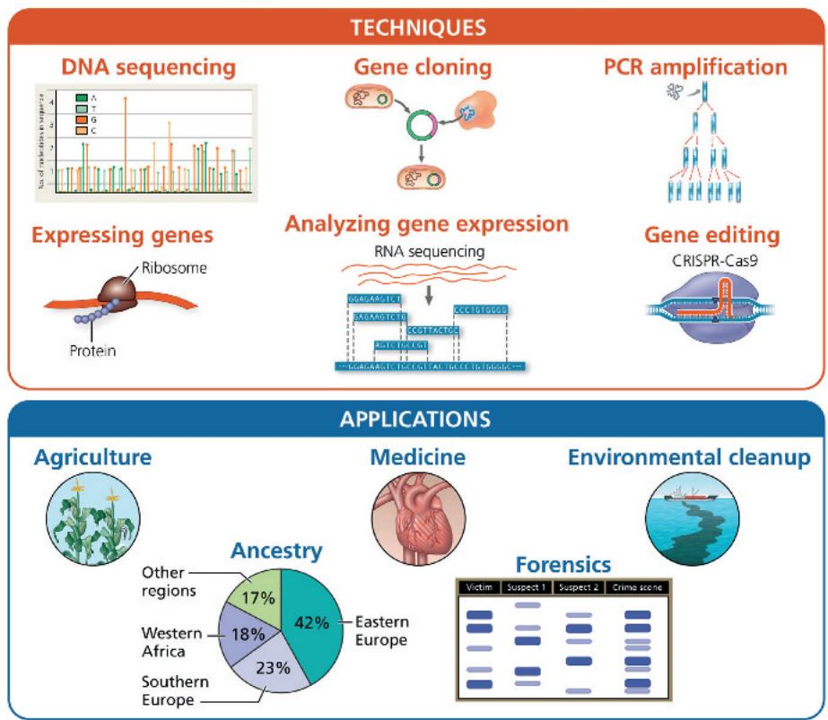

<!-- C-END Campbell 20 导言 -->

<!-- L-BEGIN Lehninger 9 导言 -->

### 【英文对应 Lehninger 第9章导言：DNA-Based Information Technologies】

> 来源：Lehninger Principles of Biochemistry（书籍/02_生物化学原理） 第9章章首。

#### [EN] DNA-BASED INFORMATION TECHNOLOGIES

#### [EN] 9.1 Studying Genes and Their Products 302

9.2 Exploring Protein Function on the Scale of Cells or Whole Organisms 317

#### [EN] 9.3 Genomics and the Human Story 326

The complexity of the molecules and systems revealed in this book can sometimes conceal a scientific reality: what we have learned is just a beginning. Novel proteins and lipids and carbohydrates and nucleic acids are discovered every day, and we often have no clue as to their functions. How many have yet to be encountered, and what might they do? Even well-characterized biomolecules continue to challenge researchers with countless unresolved mechanistic and functional questions. A new era, defined by technologies that provide broad access to the entirety of a cell's DNA, the genome, has accelerated progress.

This is a methods chapter, a necessary prelude to much of what comes later in this book. It is organized around just a few straightforward principles:

#### [EN] P1 An organism's DNA—its genome—is the ultimate source of biological information.

Genomic information is a resource of unparalleled importance for investigators studying any aspect of biology. Genomes vary in size but all are large enough to direct all aspects of an organism's structure and function. To approach them often requires tools to break them into small parts that are experimentally digestible.

P2 Genomic information is accessible. Advances in DNA sequencing (Chapter 8) are being matched by new approaches to understanding how chromosomal information is expressed and regulated on a genomic and cellular scale. Important clues to protein function are embedded in the sequences of the genes that encode them.

P3 Genomic information is malleable. We can not only elucidate cellular genomic information; we can also change it. That capacity provides a path to altering any aspect of cellular metabolism, structure, or function.

The word “genome,” coined by German botanist Hans Winkler in 1920, was derived from the Greek words genesis and soma to describe a body of genes. A genome today is defined as the complete haploid genetic complement of an organism. In essence, a genome is one copy of the hereditary information required to specify the organism. For sexually reproducing organisms, the genome includes one set of autosomes and one of each type of sex chromosome. When cells have organelles that also contain DNA, the genetic content of the organelles is not considered part of the nuclear genome. Mitochondria, found in most eukaryotic cells, and chloroplasts, in the light-harvesting cells of photosynthetic organisms, each have their own distinct genome. For viruses, which can have genetic material composed of DNA or RNA, the genome is a complete copy of the nucleic acid required to specify the virus.

As objects of study, DNA molecules present a special problem: their size. Chromosomes are far and away the largest biomolecules in any cell. How do researchers find the information they seek when it is just a small part of a chromosome that can include millions or even billions of contiguous base pairs? Decades of advances by thousands of scientists working in genetics, biochemistry, cell biology, and physical chemistry came together in the laboratories of Paul Berg, Herbert Boyer, and Stanley Cohen to yield the first techniques for locating, isolating, preparing, and studying small segments of DNA derived from much larger chromosomes. The science of genomics is dedicated to the study of DNA on a cellular scale. In turn, genomics contributes to systems biology, the study of biochemistry on the scale of whole cells and organisms.

The methods described in this chapter were built on advances in our understanding of DNA and RNA metabolism that are not presented in this text until Part III. Fundamental concepts of DNA replication, RNA transcription, protein synthesis, and gene regulation are intrinsic to an appreciation for how these methods work. Yet all facets of modern biochemistry rely on these same methods to such an extent that a current treatment of any aspect of the discipline becomes very difficult without a proper introduction to them. By presenting these technologies early in the book, we acknowledge that they are inextricably interwoven with both the advances that gave rise to them and the newer discoveries they now make possible. The background we necessarily provide makes the discussion here not just an introduction to technology but also a preview of many of the fundamentals of DNA and RNA biochemistry encountered in later chapters.

We begin by outlining the principles of DNA cloning, then illustrate the range of applications and the potential of many newer technologies that support and accelerate the advance of biochemistry.

<!-- L-END Lehninger 9 导言 -->

## 5.1 重组 DNA 技术史话

近半个多世纪来,分子生物学研究取得了前所未有的进步,主要有三大成就:第一,在20世纪40年代确定了遗传信息的携带者,即基因的分子载体是DNA而不是蛋白质,解决了遗传的物质基础问题;第二,50年代提出了DNA分子的双螺旋结构模型和半保留复制机制,解决了基因的自我复制和世代交替问题;第三,50年代末至60年代,相继提出了“中心法则”和操纵子学说,成功地破译了遗传密码,阐明了遗传信息的流动与表达机制。

DNA 分子体外切割与连接技术及核苷酸序列分析技术的进步直接推动了重组 DNA 技术的产生与发展。因为重组 DNA 的核心是用限制性内切核酸酶 (restriction endonuclease, RE) 和 DNA 连接酶对 DNA 分子进行体外切割与连接，所以，科学家认为，这些工具酶的发现和应用是现代生物工程技术史上最重要的事件 (表 5-1)。1967 年，世界上有 5 个实验室几乎同时报道了通过合成相邻核苷酸之间的磷酸二酯键，修复缺口或催化黏合完全分离的两个 DNA 片段的 DNA 连接酶。1972 年，Boyer 实验室发现有一种内切核酸酶 EcoR I 能特异性识别 GAATTC 序列，将双链 DNA 分子在这个位点切开并产生具有黏性末端的小片段。他们还发现，能够把 EcoR I 酶切产生的任何不同来源的 DNA 片段通过 DNA 连接酶彼此“黏合”起来。此后，大量类似于 EcoR I 但具有独特识别序列的内切核酸酶被陆续发现，它们中的大多数识别的序列为回文序列且切割后形成黏性末端，少数为非回文序列（如 Bsa I），也有些切割成平末端（如 Pvu II）(图 5-1)。

表 5-1 重组 DNA 技术史上的主要事件

<table><tr><td>年份</td><td>事件</td></tr><tr><td>1869</td><td>F. Miescher 首次从莱茵河鲑鱼精子中分离 DNA</td></tr><tr><td>1957</td><td>A. Kornberg 从大肠杆菌中发现了 DNA 聚合酶 I</td></tr><tr><td>1959-1960</td><td>Uchoa 发现 RNA 聚合酶和信使 RNA,并证明 mRNA 决定了蛋白质分子中的氨基酸序列</td></tr><tr><td>1961</td><td>Nirenberg 破译了第一个遗传密码;Jacob 和 Monod 提出了调节基因表达的操纵子模型</td></tr><tr><td>1964</td><td>Yanofsky 和 Brenner 等人证明,多肽链上的氨基酸序列与该基因中的核苷酸序列存在着共线性关系</td></tr><tr><td>1965</td><td>Holley 完成了酵母丙氨酰 tRNA 的全序列测定;科学家证明细菌的抗药性通常由“质粒”DNA 所决定</td></tr><tr><td>1966</td><td>Nirenberg、Uchoa、Khorana 和 Crick 等人破译了全部遗传密码</td></tr><tr><td>1967</td><td>第一次发现 DNA 连接酶</td></tr><tr><td>1970</td><td>Smith、Wilcox 和 Kelley 分离了第一种限制性内切核酸酶,Temin 和 Baltimore 从 RNA 肿瘤病毒中发现反转录酶</td></tr><tr><td>1972-1973</td><td>Boyer、Berg 等人发展了重组 DNA 技术,于 1972 年获得第一个重组 DNA 分子,1973 年完成第一例细菌基因克隆</td></tr><tr><td>1975-1977</td><td>Sanger 与 Maxam 和 Gilbert 等人发明了 DNA 序列测定技术,1977 年完成了全长 5 387 bp 的噬菌体 φ174 基因组测定</td></tr><tr><td>1978</td><td>首次在大肠杆菌中生产由人工合成基因表达的人脑激素和人胰岛素</td></tr><tr><td>1980</td><td>美国联邦最高法院裁定微生物基因工程可以被专利化</td></tr><tr><td>1981</td><td>Palmiter 和 Brinster 获得转基因小鼠,Spradling 和 Rubin 得到转基因果蝇</td></tr><tr><td>1982</td><td>美、英批准使用第一例基因工程药物——胰岛素,Sanger 等人完成了入噬菌体 48 502 bp 全序列测定</td></tr><tr><td>1983</td><td>获得第一例转基因植物</td></tr><tr><td>1984</td><td>斯坦福大学获得关于重组 DNA 的专利</td></tr><tr><td>1986</td><td>遗传修饰生物体(GMO)首次在环境中释放</td></tr><tr><td>1988</td><td>Watson 出任“人类基因组计划”首席科学家</td></tr><tr><td>1989</td><td>DuPont 公司获得转肿瘤基因小鼠——“Oncomouse”</td></tr><tr><td>1992</td><td>欧洲 35 个实验室联合完成酵母第三染色体全序列测定(315 kb)</td></tr><tr><td>1994</td><td>第一批基因工程西红柿在美国上市</td></tr><tr><td>1996</td><td>完成酵母基因组全序列测定( $1.25 \times 10^{7}$  bp)</td></tr><tr><td>1997</td><td>英国爱丁堡罗斯林研究所获得克隆羊</td></tr><tr><td>2000</td><td>完成第一个高等植物拟南芥的全序列测定( $1.2 \times 10^{8}$  bp)</td></tr><tr><td>2001</td><td>完成第一个人类基因组全序列测定( $2.7 \times 10^{9}$  bp)</td></tr><tr><td>2012</td><td>首次报导具有革命性的基因编辑体系——CRISPR/Cas9 技术</td></tr></table>

当然,仅仅能在体外利用限制性内切核酸酶和 DNA 连接酶进行 DNA 的切割和重组,还远远不能满足基因工程的要求,因为大多数 DNA 片段不具备自我复制的能力,只有将它们连接到具备自主复制能力的 DNA 分子上,才能在宿主细胞中进行繁殖。这种具备自主复制能力的 DNA 分子就是所谓分子克隆的载体 (vector),病毒、噬菌体和质粒等小分子量复制子都可以作为基因导入的载体。

图 5-1 几种主要限制性内切核酸酶所识别的序列、切割位点及常用的保护碱基  
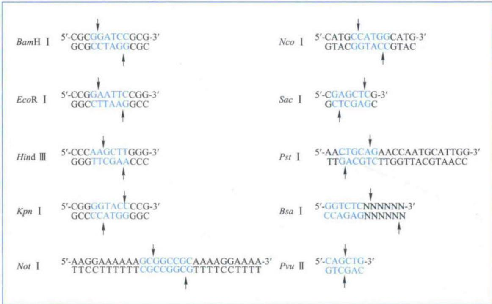

分子克隆的载体种类繁多,但目前全世界各实验室广泛使用的质粒载体大多是从以下几种载体派生出来的。pSC101是第一代质粒载体(图5-2a),全长9.09 kb,带有四环素抗性基因(tet $^{r}$ ),具有EcoR I、HindⅢ、BamH I、Sal I、Xho I、Pvu II以及Hpa I 7种限制性内切核酸酶的单酶切位点。该载体是一种严紧型复制控制的低拷贝质粒,平均每个宿主细胞仅有1\~2个拷贝,因此,从带有该质粒的宿主细胞中很难大量提取质粒DNA,不利用后续实验的进行;而ColE1质粒载体则是松弛型复制控制的多拷贝质粒(图5-2b),每个宿主细胞中的拷贝数可达到1 000\~3 000个;pBR322质粒载体同样具有较高的拷贝数(1 000\~3 000个),便于制备重组DNA,它由3个不同来源的部分组成(图5-2c),第一部分来源于pSF2124质粒易位子Tn3的氨苄青霉素抗性基因(amp $^{r}$ ),第二部分来源于pSC101质粒的四环素抗性基因(tet $^{r}$ ),第三部分则来源于ColE1的派生质粒pMB1的DNA复制起点(ori)。最后一类是pUC质粒载体(图5-2d),由包括来自pBR322质粒的复制起点(ori),氨苄青霉素抗性基因(amp $^{r}$ ),大肠杆菌β-半乳糖苷酶基因(lacZ)启动子及编码α-肽的DNA序列,特称为lacZ'基因等4部分所组成。一旦有外源DNA插入位于lacZ'基因5'端的多克隆位点(MCS)处,lacZ'基因功能被破坏,不能产生功能型半乳糖酶。

lacZ'基因编码β-半乳糖苷酶氨基端146个氨基酸的α-肽，IPTG（异丙基-β-D-硫代半乳糖苷)诱导该基因表达，所合成的β-半乳糖苷酶α-肽与宿主细胞编码的缺陷型β-半乳糖苷酶互补，产生有活性的β-半乳糖苷酶，水解培养基中的X-gal(5-溴-4-氯-3-吲哚-β-D-半乳糖苷)，生成蓝色的溴氯吲哚。利用这一原理可对重组载体进行蓝白斑筛选，在含X-gal的培养基中，非转化菌落呈蓝色，含有重组DNA分子的菌落呈白色。

获得了用外源 DNA 片段和载体分子连接后的重组载体后,还必须通过一个细菌转化的过程将其重新导入到宿主细胞中,才能保证重组载体的增殖。1970 年,Mandel 和 Higa

(a)  

(b)  
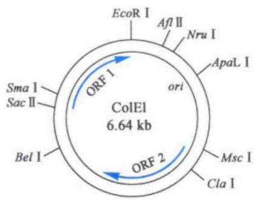

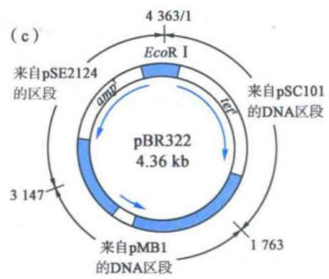

## 图 5-2 分子克隆中最常见的载体演变

(a) pSC101 质粒载体，全长 9.09 kb，带有四环素抗性基因 ( $tet^{r}$ ) 及 7 种限制性内切核酸酶的单酶切位点，在 HindⅢ、BamH I 和 Sal I 等 3 个位点插入外源基因，会导致 tet 失活；(b) ColE1 质粒载体；(c) pBR322 质粒载体；(d) pUC18 质粒载体。

发现,大肠杆菌细胞经适量氯化钙处理后,能有效地吸收 $\lambda$ 噬菌体 DNA。1972 年,又有实验室报道,经氯化钙处理的大肠杆菌细胞能够有效摄取质粒 DNA。从此,大肠杆菌就成了分子克隆中最常用的转化受体。同年,美国斯坦福大学的 Berg 等人在体外用限制性核酸内切酶 EcoR I 分别消化病毒 SV40 和 $\lambda$ 噬菌体 DNA,再用 T4 DNA 连接酶将两种不同的酶切片段连接起来,首次获得了同时含有 SV40 和 $\lambda$ 噬菌体 DNA 的重组 DNA $^{(图 5-3a)}$ 。1973 年,Cohen 实验室也成功地进行了体外 DNA 重组,他们将分别经限制性内切核酸酶处理的含有编码卡那霉素抗性基因的大肠杆菌质粒 R6-5 DNA 与含有编码四环素抗性基因的另一种大肠杆菌质粒 pSC101 DNA 混合后加入 T4 DNA 连接酶,得到的重组杂种 DNA 分子表现出既抗卡那霉素又抗四环素的双重抗性特征(图 5-3b)。

由来自大肠杆菌的质粒 DNA 形成的重组 DNA 分子可以在原来的宿主细胞中增殖，这似乎还比较容易理解。那么，不同物种的外源 DNA 片段是否也可以在大肠杆菌细胞中增殖呢？为了回答这个问题，Cohen 和 Boyer 等人合作，把非洲爪蟾核糖体蛋白基因片段与 pSC101 质粒 DNA 片段重组后导入大肠杆菌，证明动物基因也能进入大肠杆菌细胞并转录出相应的 mRNA 分子。上述实验表明：

① 类似 pSC101 的质粒 DNA 分子可以作为基因克隆的载体, 从而将外源 DNA 导入宿主细胞。

② 来自高等生物非洲爪蟾基因片段可以被成功地转移到原核细胞中并实现功能表达。

图 5-3 科学家早期构建的重组 DNA

(a) 经 EcoR I 酶切后的 $\lambda$ 噬菌体 DNA 和猿猴病毒 SV40，在 T4 DNA 连接酶的催化下形成重组 DNA；(b) 含有编码卡那霉素抗性基因的质粒 R6-5 与含有编码四环素抗性基因的质粒 pSC101 分别经 EcoR I 酶切，并在 T4 DNA 连接酶的作用下形成重组质粒 DNA，其能同时降解卡那霉素和四环素，具有双重抗性。

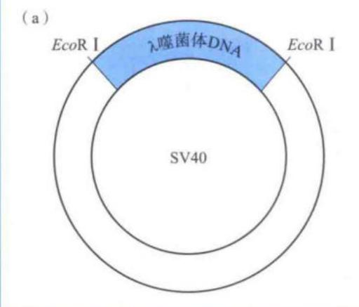

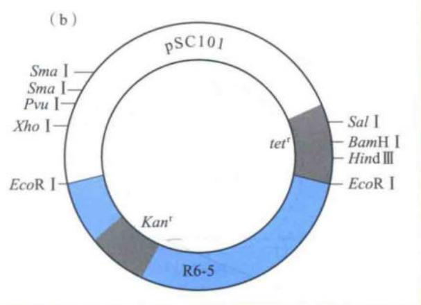

③ 质粒 DNA-大肠杆菌细胞作为一种成功的基因克隆体系,有可能在重组 DNA 或基因工程研究中发挥重要作用。

<!-- W-BEGIN Watson 7 分子生物学技术（章首） -->

### 【中文对照 Watson 第7章：分子生物学技术（章首）】

> 来源：Watson《基因的分子生物学》第七版中译本（书籍/03_基因的分子生物学_第七版） 第7章 分子生物学技术。

#### [W] 第7章 分子生物学技术

<!-- 章节边界按正文内容恢复；原始 MinerU 内容保留如下。 -->

#### [W] 分子生物学技术

我们所看到的活细胞是一个十分复杂的实体，能产生成千上万种大分子，并含有一个从几百万到几十亿碱基对的基因组。理解细胞的遗传过程是如何进行的需要多种多样具挑战性的实验方法，这包括在附录1中将要讨论的合适的模式生物的使用，而模式生物的使用使遗传分析手段得以开展，也包括本章我们要讨论的从细胞混合物中分离单个大分子的方法，以及将基因组分割成可处理的片段以便于操作和特定DNA序列的分析。在过去的几十年里，

上述实验方法的成功建立是分子生物学发展的主要推动力之一，也是分子生物学所取得的重要成就。

近来，应用分子生物学方法进行细胞中全部 DNA、RNA 和蛋白质的大规模分析并测定完整基因组的核苷酸序列已经成为可能。这些基因组和蛋白质组研究方法，加上迅速增加的、已测得的基因组序列，使不同生物基因组的大规模比对以及在一个特定的细胞类型中鉴定所有的磷酸化蛋白质成为可能。

本章我们将简要介绍一些现代分子生物学方法,这些方法让生物学家有可能调查单个蛋白质的功能,以及开展大规模的基因组和蛋白质组分析。我们将会看到,这些分子生物学方法的建立依赖并来源于对生物大分子特性的理解。例如,对 DNA、RNA 碱基互补特征的了解促进了杂交技术的建立,并使全基因组水平的鉴定基因的表达成为可能;对 DNA 聚合酶、限制性内切酶和 DNA 连接酶的深入研究催生了 DNA 克隆技术和聚合酶链反应 (PCR),这些技术使科学家们可以分离任一 DNA 片段,甚至能从已灭绝的生命体中分离 DNA 片段。

本章分为五个部分：DNA 和 RNA 分析方法；大规模基因组 DNA 分析；蛋白质的分析；大规模的蛋白质分析；最后是核酸-蛋白质相互作用的分析等帮助我们了解各种独立成分是如何聚集、如何相互作用从而构成有活性的细胞的。

<!-- W-END Watson 7 分子生物学技术（章首） -->

## 5.2 DNA 基本操作技术

自从 1953 年 DNA 分子双螺旋被发现,分子生物学研究得到各国科学家的高度重视并且迅速发展成一门新兴学科,这首先要归功于各种 DNA 操作核心技术——包括基因组 DNA 提取、凝胶电泳、PCR、重组载体的构建及基因组 DNA 文库的构建等技术的迅速发展与应用。时至今日,分子生物学研究已经进入三维基因组和三维蛋白质结构大数据时代,但最基本的 DNA 操作技术仍然不可或缺。

## 5.2.1 基因组 DNA 的提取

广义的基因组(genome)是指一个单倍体细胞内细胞核、线粒体和叶绿体中所包含的全部DNA分子,而我们通常说的基因组DNA则特指细胞核内染色体上的包括编码区和非编码区在内的全部DNA分子。获取高相对分子质量和高纯度的基因组DNA,可以使后续实验如PCR反应、Southern杂交、文库构建或者基因组测序等结果更加可信可靠。

根据不同材料的性质,提取基因组 DNA 时方法略有不同。一般首先将组织材料磨碎或细胞材料均匀分散。因为植物组织具有细胞壁结构,较难破碎,所以一般先用液氮速冻帮助研磨,随后加入裂解液破碎细胞,释放细胞核及核内的染色质。动物组织及细胞材料一般加入 SDS 进行裂解。SDS 是一种阴离子去污剂,可溶解细胞膜,并使蛋白质变性,释放出染色质中的 DNA。植物组织一般加入一种阳离子去污剂——CTAB,它可以更好地除去细胞壁中的多糖成分,溶解细胞膜,并与释放出来的核酸形成复合物。用苯酚和氯仿做有机相来分离裂解后的各种细胞组分,包括蛋白质、糖类、酚类等有机物,使之与溶解于水相的 DNA 相分离。最后用乙醇洗涤分离后的 DNA,吸收与 DNA 相结合的水分子,使之沉淀并得到进一步的纯化。将 DNA 沉淀晾干后,溶解于超纯水或 Tris-HCI 和 EDTA 配制的 TE 缓冲液中(图 5-4a)。基因组 DNA 制备后可以在 4℃适当保存,但最好尽快使用。

图 5-4 基因组 DNA 的提取  
  
(a) 基因组 DNA 提取的主要实验流程；(b) 陆地棉不同组织的核 DNA 样品电泳图。

实验中还常将含有 DNA 样品的细胞破碎液通过一个硅胶膜纯化柱,使 DNA 吸附在硅胶膜上而与其他成分分开,进一步在低盐浓度下从硅胶膜上直接洗脱 DNA,得到纯度较高的 DNA 样品。

DNA 的浓度和纯度可以通过测定其 $OD_{260}$ 和 $OD_{280}$ 来判断。 $OD_{260}$ 为 1 时相当于浓度为 50 $\mu g/mL$ ，而 $OD_{260}/OD_{280}$ 的比值如果在 1.8～2.0 之间，表示所提取的 DNA 纯度较好，如果样品中有蛋白质或酚污染，则 $OD_{260}/OD_{280}$ 的比值将明显低于 1.8。

提取基因组 DNA 时一定要保证核酸一级结构的完整性, 确保所提取的 DNA 片段显著大于 50 kb。在操作时要尽可能避免机械力对 DNA 的损伤。可通过琼脂糖凝胶电泳检测基因组 DNA 片段大小。常用相对分子质量为 50 kb 的 $\lambda$ 噬菌体作为检测基因组 DNA 质量的参照(图 5-4b)。

## 5.2.2 核酸凝胶电泳

自从琼脂糖(agarose)和聚丙烯酰胺(polyacrylamide)凝胶被发现以来,按相对分子质量大小分离DNA的凝胶电泳技术,已经成为分析鉴定重组DNA分子及蛋白质与核酸相互作用的重要实验手段。

在生理条件下,核酸分子中的磷酸基团呈离子化状态,把这些核酸分子放置在电场当

图5-5 琼脂糖凝胶电泳

(a) 琼脂糖凝胶电泳装置，电泳仪为电泳槽施加电压，添加适量的电泳缓冲液，将琼脂糖凝胶置于其中，DNA 即可在凝胶中由负极向正极迁移；(b) 将琼脂糖粉末加入电泳缓冲液中加热熔化，倒入凝胶模具中并插入梳子形成上样孔，待其冷却后拔去梳子，即制备好琼脂糖凝胶。凝胶电泳完毕后在紫外下显示 DNA 条带。

(a)  

中,它们会向正电极方向迁移(图5-5)。由于核酸分子中的磷酸基团在结构上的重复性,相同数量的双链DNA几乎具有等量的净电荷,因此它们能以同样的速度向正电极方向迁移。在一定的电场强度下,DNA分子的这种迁移速度,亦即电泳的迁移率,就完全取决于核酸分子本身的大小。因此,可以通过电泳将不同相对分子质量的核酸分子彼此分离开来。

将琼脂糖粉末加热到熔点后冷却凝固便会形成良好的无反应活性的电泳介质。凝胶的分辨能力与凝胶的类型和浓度有关(表5-2)。琼脂糖凝胶分辨DNA片段的范围为0.2\~50 kb，而要分辨较小相对分子质量的DNA片段，则要用聚丙烯酰胺凝胶，其分辨范围为1\~1 000 bp。凝胶浓度的高低影响凝胶介质孔隙的大小，浓度越高，孔隙越小，其分辨能力就越强。反之，浓度降低，孔隙就增大，其分辨能力也就随之减弱。

表 5-2 琼脂糖及聚丙烯酰胺凝胶分辨 DNA 片段的能力

<table><tr><td>凝胶类型及含量</td><td>分离 DNA 片段的大小范围 /bp</td></tr><tr><td>0.3% 琼脂糖</td><td>50 000 ~ 1 000</td></tr><tr><td>0.7% 琼脂糖</td><td>20 000 ~ 1 000</td></tr><tr><td>1.4% 琼脂糖</td><td>6 000 ~ 300</td></tr><tr><td>4.0% 聚丙烯酰胺</td><td>1 000 ~ 100</td></tr><tr><td>10.0% 聚丙烯酰胺</td><td>500 ~ 25</td></tr><tr><td>20.0% 聚丙烯酰胺</td><td>50 ~ 1</td></tr></table>

因为溴化乙锭(ethidium bromide, EB)能插入到 DNA 或 RNA 分子的相邻碱基之间，并在紫外光照射下发出荧光，所以，常在琼脂糖凝胶冷却凝固前，加入适量溴化乙锭，电泳完毕后将凝胶放置在 300 nm 波长的紫外光下，可十分灵敏而快捷地检测出凝胶介质中的 DNA（约 50 ng）条带。

用普通琼脂糖凝胶电泳很难分离大于50 kb的DNA分子,为了进行超大片段DNA研究,科学家发明了脉冲电场凝胶电泳(pulsed-field gel electrophoresis, PFGE)技术,用于分离超大相对分子质量(有时甚至是整条染色体)DNA。在脉冲电场中,DNA分子的迁移方向随着电场方向的周期性变化而不断改变(图5-6)。由于琼脂糖凝胶的电场方向、电流大小及作用时间都在交替变换,DNA分子必须随时调整运动方向以适应凝胶孔隙的无规则变化。相较于相对分子质量较小的 DNA, 相对分子质量较大的 DNA 需要更多的脉冲次数来更换其构型和运动方向。应用脉冲电场凝胶电泳技术, 可成功地分离到相对分子质量高达 $10^{7}$ bp 的 DNA 大分子。

  
超大分子，不能有效地被一般电泳分离

  
a、b表示每次电泳的不同方向，c为DNA分子的最终移动方向

  
应用脉冲电场技术,可分离高达 $10^{7}$ bp的DNA分子  
图 5-6 DNA 脉冲电场凝胶电泳示意图

## 5.2.3 聚合酶链式反应技术

聚合酶链式反应(polymerase chain reaction, PCR)技术是目前体外快速扩增特定基因片段最常用的方法。20世纪80年代，美国Cetus公司的Kary Mullis发明了该技术。

PCR 技术的原理并不复杂。首先将模板 DNA(质粒、基因组 DNA 或 mRNA 反转录产生的 cDNA) 在临近沸点的温度下加热分离成单链 DNA 分子, 然后 DNA 聚合酶在一对引物 (一小段单链 DNA) 的引导下以单链 DNA 为模板并利用反应混合物中的 4 种脱氧核苷三磷酸(dNTP) 合成新的 DNA 互补链(图 5-7)。DNA 聚合酶是一种天然产生的能催化 DNA(包括 RNA) 合成和修复的生物大分子。所有生物体基因组的准确复制都依赖于这类酶的活性。PCR 反应中使用的 DNA 聚合酶不同于一般的聚合酶, 它具有很强的耐高温性, 在高温下数小时不丧失酶活性。DNA 聚合酶开始工作时先要产生一小段双链 DNA 来启动(“引

  
图 5-7 聚合酶链式反应(PCR)技术原理示意图

图5-8 PCR指数扩增时循环次数与DNA产物量比较

<table><tr><td>1</td><td>2</td></tr><tr><td>2</td><td>4</td></tr><tr><td>3</td><td>8</td></tr><tr><td>4</td><td>16</td></tr><tr><td>5</td><td>32</td></tr><tr><td>6</td><td>64</td></tr><tr><td>7</td><td>128</td></tr><tr><td>8</td><td>256</td></tr><tr><td>9</td><td>512</td></tr><tr><td>10</td><td>1 024</td></tr><tr><td>11</td><td>2 048</td></tr><tr><td>12</td><td>4 096</td></tr><tr><td>13</td><td>8 192</td></tr><tr><td>14</td><td>16 384</td></tr><tr><td>15</td><td>32 788</td></tr><tr><td>16</td><td>65 536</td></tr><tr><td>17</td><td>131 072</td></tr><tr><td>18</td><td>262 144</td></tr><tr><td>19</td><td>524 288</td></tr><tr><td>20</td><td>1 048 576</td></tr><tr><td>21</td><td>2 097 152</td></tr><tr><td>22</td><td>4 194 304</td></tr><tr><td>23</td><td>8 388 608</td></tr><tr><td>24</td><td>16 777 216</td></tr><tr><td>25</td><td>33 554 432</td></tr><tr><td>26</td><td>67 108 864</td></tr><tr><td>27</td><td>134 217 728</td></tr><tr><td>28</td><td>268 435 456</td></tr><tr><td>29</td><td>536 870 912</td></tr><tr><td>30</td><td>1 073 741 824</td></tr><tr><td>周期</td><td>拷贝</td></tr></table>

导”)新链的合成,这一小段引导新链合成的 DNA 序列就被称为“引物”,引导 DNA 聚合酶特异性扩增目标基因片段。所以,通过设计特定基因两端的引物序列,即可实现对目标基因的扩增。

做 PCR 时, 只要在试管内加入模板 DNA、引物、dNTP 及缓冲液(酶催化反应的缓冲液), DNA 聚合酶就能在数小时内将目标序列扩增 100 万倍以上。模板 DNA 分子首先在高温下解开成单链, 适当降温后引物立即与该模板 DNA 特定序列相结合, 产生双链区, DNA 聚合酶从引物 3' 端开始复制其互补链, 迅速产生与目标序列完全相同的拷贝。在后续反应中, 所有新形成的 DNA 双链, 都会在高温下解开成单链, 体系中的引物分子再次与其互补序列相结合, DNA 聚合酶也再度复制模板 DNA。由于在 PCR 反应中所选用的一对引物, 是按照与扩增区段两端序列彼此互补的原则设计的, 因此, 每一条新生链的合成都是从引物的退火结合位点开始并朝相反方向延伸的, 每一条新合成的 DNA 链上都具有新的引物结合位点。整个 PCR 反应的全过程, 即 DNA 解链(变性)、引物与模板 DNA 相结合(退火)、

DNA 合成(链的延伸)3 步, 可以被不断重复。经多次循环之后, 反应混合物中所含有的双链 DNA 分子数, 即两条引物结合位点之间的 DNA 区段的拷贝数, 理论上的最高值应是 $2^{n}$ (图 5-8), 能满足进一步遗传分析的需要。

## 5.2.4 重组载体构建

要完成对目的基因的功能研究,首先要获取它的重组表达载体,而第一步则是引物设计。引物长度一般为18\~27 bp,GC含量控制在40%\~60%, $T_{m}$ 值在60℃左右。两个DNA引物的5'端还需要各加上一个外切核酸酶的识别位点及其保护碱基,以利于外切核酸酶稳定结合到DNA双链并发挥切割作用,而所选择的外切核酸酶必须与载体上的多克隆位点相匹配(图5-9a)。

引物合成后,选择合适的 DNA 聚合酶和模板 DNA,用 PCR 扩增目的基因片段(图 5-9b)。通过琼脂糖凝胶电泳检测目标条带是否符合预期,如果条带单一,只需要将 PCR 产物通过硅胶膜纯化柱进行纯化就可以了;若条带不单一,还需要在电泳后,在紫外灯下对目标条带进行割胶回收,溶胶后同样用硅胶膜纯化柱纯化。

用相同的外切核酸酶在适当温度下分别双酶切目的基因片段和载体 DNA $^{(图 5-9c)}$ 。根据所加 DNA 总量，确定酶切 10 min 至数小时，保证酶切完全。用 T4 DNA 连接酶进行连接反应 $^{(图 5-9d)}$ ，根据插入目的基因片段与载体各自的 DNA 浓度及片段长度的不同，一次连接反应需要投入的插入片段与载体 DNA 总量的摩尔比应控制在 $(8 \sim 10)$ : 1 时较有利于连接反应的进行。连接温度为 $22^{\circ}C$ 时，T4 DNA 连接酶的活性较高，1 \~ 2 h 即可完成连接，但酶较易失活，连接不稳定； $4^{\circ}C$ 或 $16^{\circ}C$ 连接时，酶的活性维持时间较长，连接后更稳定，但通常需要反应 8 h 以上。

图 5-9 常规重组载体的构建示意图  
  
(a) 合成目的基因片段两端的引物；(b) PCR 扩增目的基因；(c) 对目的基因和质粒载体进行双酶切；(d) T4 DNA 连接酶将酶切后目的基因和质粒载体连接成一个整体。

近几年,一种称为恒温一步法且不依赖 T4 DNA 连接酶的克隆技术已得到广泛应用。首先将载体线性化,通过引物设计在插入片段两端引入线性化载体的末端序列 (15\~25 bp), PCR 扩增插入片段后,其两端具有与线性化载体末端相同的序列。然后,按一定比例加入插入片段和线性化载体,再加入 dNTP,在 T5 外切核酸酶、DNA 聚合酶和 Taq DNA 连接酶的混合催化下,50℃恒温反应 15\~30 min 即可完成连接反应(图 5-10)。

由于连接成功的重组载体数量有限,远远不能满足实验需求,有必要通过细菌转化以获得大量重组载体的拷贝(图5-11a)。大肠杆菌在 $CaCl_{2}$ 溶液处理后,细胞膨胀,细胞膜通透

## 图 5-10 恒温一步法构建重组载体示意图

对载体进行双酶切，使其线性化，在插入片段两端引入与线性化载体末端一致的序列。线性化载体和插入片段在一种混合酶的催化下，50℃恒温反应15\~30 min即可完成连接反应。首先T5外切核酸酶消化DNA片段5'端产生单链突出部分，插入片段和线性化载体末端重新退火成双链，然后DNA聚合酶填补退火双链两边的缺口，Taq DNA连接酶将缝隙黏合，完成连接反应。

性发生改变,易于吸附外源 DNA,这种状态的细胞被称作感受态细胞。将连接产物与感受态细胞在试管中混匀,于冰上静置 30 min,然后转移到 42℃热刺激 30\~90 s,此时连接产物就可能被感受态细胞吸收。再将其置于 37℃摇床复苏约 1 h,然后均匀地涂布在含有抗生素的培养基上,37℃培养箱中倒置培养(图 5-11b)。因为连接产物,即重组后的质粒载体上带有抗性基因和表达元件,进入大肠杆菌后所产生的蛋白质能降解被大肠杆菌细胞吸收的抗生素,从而使重组大肠杆菌细胞能够在培养基中存活下来。

过夜培养后培养基上应该长出很多单菌落，随机挑取部分菌落，用菌内的重组质粒做DNA模板，进行菌落PCR（colony PCR）扩增，鉴定目的基因片段是否插入载体中(图5-11c)。挑取阳性菌落于液体培养基中37℃培养10\~13h，而后采用碱裂解法提取细菌中的质粒

DNA。在强碱性溶液中裂解菌体,释放质粒 DNA,然后用酸中和反应,离心收集上清液后,通过硅胶膜纯化柱纯化出质粒 DNA(图 5-11d),经酶切鉴定和测序确定序列无误后用于进一步的实验。

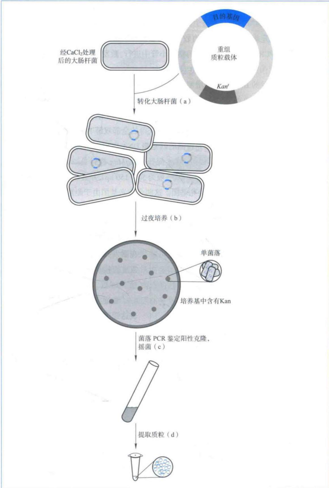

图 5-11 细菌转化及重组质粒提取示意图

(a) 将重组后的质粒载体转化到大肠杆菌中；(b) 过夜培养大肠杆菌，让重组质粒拷贝数增加；(c) 鉴定出含有重组质粒的单菌落；(d) 裂解菌体，获取重组质粒载体。

<!-- END OFFICIAL API PART part_002 -->

<!-- BEGIN OFFICIAL API PART part_003 -->

## 5.2.5 实时定量PCR

由于 PCR 技术具有极高的敏感性,扩增产物总量的变异系数常常达到 10%\~30%。因此,人们普遍认为应用简单方法对 PCR 扩增的产物进行最终定量是不可靠的。随着技术的进步,20 世纪 90 年代末期出现了实时定量 PCR(real time quantitative PCR,qPCR) 技术,利用带荧光检测的 PCR 仪对整个 PCR 过程中扩增 DNA 的累积速率绘制动态变化图,从而消除了在测定终端产物丰度时有较大变异系数的问题。

实时定量 PCR 反应在带透明盖的塑料小管中进行, 激发光可以直接透过管盖, 激发荧光探针。荧光探针事先混合在 PCR 反应液中, 只有与 DNA 结合后, 才能够被激发出荧光。随着新合成目的 DNA 片段的增加, 结合到 DNA 上的荧光探针增加, 被激发产生的荧光也相应增加。最简单的 DNA 结合的荧光探针是非序列特异性的, 例如荧光染料 SYBR Green I, 激发光波长 520 nm, 这种荧光染料只能与双链 DNA 结合(图 5-12)。

利用 SYBR Green I 可以检测 PCR 反应中获得的全部双链 DNA, 但是不能区分不同的双链 DNA。为了进一步确保荧光检测的就是靶 DNA 序列, 人们又设计了仅能与目的 DNA 序列特异结合的荧光探针, 如 TaqMan 探针。TaqMan 探针是一小段被设计成可以与靶 DNA 序列中间部位结合的单链 DNA(一般为 50 \~ 150 bp), 并且该单链 DNA 的 5' 和 3' 端带有短波长和长波长两个不同荧光基团。这两个荧光基团由于距离过近, 在荧光共振能量转移 (FRET) 作用下发生荧光淬灭, 因而检测不到荧光。PCR 反应开始后, 随着双链 DNA 变性产生单链 DNA, TaqMan 探针结合到与之配对的靶 DNA 序列上, 并被具有外切酶活性的 Taq DNA 聚合酶逐个切除而降解, 从而解除荧光淬灭的束缚, 荧光基团

图5-12 SYBR Green I作探针的实时定量PCR实验过程图示

加入到 PCR 反应体系中的荧光染料 SYBR Green I 仅能与双链 DNA 结合, 被激发出绿色荧光, 其荧光强度反映 PCR 产物的产量。

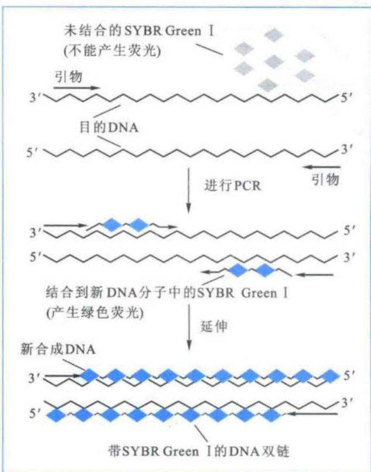

在激发光下发出荧光,所产生的荧光强度直接反映了被扩增的靶 DNA 总量(图 5-13)。

通过实时定量 PCR 确定靶基因表达强度时,每次实验都应设阴性对照和 4 个以上的标准品(将已知浓度的 DNA 模板进行一系列的稀释后成为标准品),每个样品都至少平行做 3 个重复。通常以 10\~15 个循环的荧光值作为阈值或基线,也可以以阴性对照荧光值的最高点作为基线。图 5-14a 显示随着扩增反应循环数增加,代表扩增产物含量的荧光强度增加;图 5-14b 中标准曲线由标准样品浓度的 lg 值和其相对应的 Ct 值所组成。Ct 值是产物荧光强度首次超过

## 图5-13 应用TaqMan探针的实时定量PCR技术

TaqMan 探针具有 3 个要素: 一端的短波长荧光基团(菱形), 一段目的 DNA 特异的碱基序列和另一端的长波长荧光基团(小圆形), 探针上的荧光基团十分接近, 因此两个荧光基团相互发生淬灭, 不产生绿色荧光。探针上的特异的碱基序列被设计成能与目的 DNA 中部序列结合, 在 PCR 反应中, 当 Taq 聚合酶延伸链时, 它的核酸酶活性会逐个切掉结合在目的 DNA 中部的 TaqMan 探针的碱基, 从而使两个荧光基团被释放出来, 解除了荧光淬灭的束缚。短波长的荧光基团在激发光下产生绿色荧光, 它的荧光强度反映新合成目的 DNA 的产量。

设定阈值时,PCR 反应所需的循环数。利用标准曲线,可以确定样品中待检测靶 DNA 的绝对含量。

野生型拟南芥(WT)整株中 WUS 基因的表达丰度很低,3 次重复的平均 Ct 值为 $31.23 \pm 0.32$ , 而在拟南芥抑癌基因失活突变体植株中 WUS 基因的表达丰度显著增加, 3 次重复的平均 Ct 值为 $21.92 \pm 0.13$ 。两者的差值 $\Delta Ct$ 值为 $9.31 \pm 0.19$ , 设定实验中 PCR 扩增效率为 1.8 (理论值为 2), WUS 基因在突变体整株与野生型拟南芥整株中表达丰度的

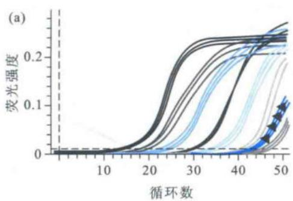

  
图 5-14 用实时定量 PCR 法分析未知样品靶基因的绝对表达量

(a)扩增曲线：由已知总量(起始量从1至1000000个拷贝)的7个标准品和一个未知样品(三角形连线)得到的扩增曲线。随着PCR循环数(横坐标)的增加，代表PCR产物产量的荧光强度(纵坐标)增加。(b)标准曲线：纵坐标是每个标准品中所含DNA总量的对数值 $(\mathrm{lg})$ ，横坐标是每个标准品PCR产物荧光强度首次超过设定阈值(a中虚线)时反应所需的循环数（ $Ct$ 值）。由扩增曲线获得未知样品的 $Ct$ 值，通过对标准曲线的线性回归分析可计算出未知样品中靶DNA的起始量(星号)。

相对比值为 n，则 $n=1.8^{\Delta Ct}$ 。由此算出 WUS 基因在突变体植株中的表达丰度比在野生型拟南芥植株中提高了 $239 \pm 26.25$ 倍 $^{(表5-3)}$ 。

表 5-3 实时定量 PCR 相对定量实验的数据处理

<table><tr><td></td><td>野生型拟南芥(WT)</td><td>突变体拟南芥(Mu)</td><td> $\Delta Ct(AvgCt_{WT}-AvgCt_{Mu})$ </td><td>相对比值( $1.8^{\Delta Ct}$ )</td></tr><tr><td rowspan="3">WUS Ct 值</td><td>31.49</td><td>21.78</td><td></td><td></td></tr><tr><td>30.87</td><td>21.95</td><td></td><td></td></tr><tr><td>31.34</td><td>22.04</td><td></td><td></td></tr><tr><td>平均值(Avg)</td><td> $31.23 \pm 0.32$ </td><td> $21.92 \pm 0.13$ </td><td> $9.31 \pm 0.19$ </td><td> $239 \pm 26.25$ </td></tr></table>

\* 拟南芥野生型和突变体样品经由拟南芥管家基因(UBQ10)进行均一化处理。

## 5.2.6 基因组 DNA 文库的构建

把某种生物的基因组 DNA 切成适当大小, 分别与载体组合, 导入微生物细胞, 形成克隆。基因组中所有 DNA 序列(理论上每个 DNA 序列至少有一份代表) 克隆的总汇被称为基因组 DNA 文库, 常被用于分离特定的基因片段、分析特定基因结构、研究基因表达调控, 还可以用于全基因组物理图谱的构建和全基因组序列测定等。

构建基因组 DNA 文库的第一步是制备大小合适的随机 DNA 片段，在体外将这些 DNA 片段与适当的载体相连成重组子，转化到大肠杆菌或其他受体细胞中，从转化子克隆群中筛选出含有靶基因的克隆。为保证能从基因组文库中筛选到某个特定基因，基因组文库必须具有一定的代表性和随机性。也就是说文库中全部克隆所携带的 DNA 片段必须覆盖整个基因组。在文库构建中通常采用两种策略提高文库代表性：一是用机械切割法或限制性内切核酸酶切割法随机断裂 DNA，以保证克隆的随机性。二是增加文库重组克隆的数目，以提高覆盖基因组的倍数。预测一个完整基因组文库应包含的克隆数目，可用 Clark 和 Carbon 于 1975 年提出的公式：

$$
N = \ln (1 - p) / \ln (1 - f)
$$

式中，N 表示一个基因组文库所应该包含的重组克隆数目；p 表示所期望的靶基因在文库中出现的概率；f 表示重组克隆平均插入片段的长度和基因组 DNA 总长的比值。

为了获得整个基因簇或一个基因及其两翼延伸序列,实验中所制备的 DNA 随机片段一般约 20 kb 或更大。以人为例,其基因组大小为 $3 \times 10^{9}$ bp,若 p = 99%,平均插入片段大小为 20 kb,则 $N = 6.9 \times 10^{5}$ 。

构建基因组文库最常用的是 $\lambda$ 噬菌体载体(克隆能力 $15\sim 20\mathrm{kb}$ )和限制性内切酶部分消化法。常用识别4个核苷酸的限制性内切核酸酶Sau3A部分消化基因组DNA，因为Sau3A与BamH I是一对同尾酶，所以由Sau3A酶切产生的DNA片段可插入到经BamH I消化的 $\lambda$ 噬菌体载体上(基本流程如图5-15所示)。提取真核基因组DNA，用Sau3A局部消化，消化产物经琼脂糖凝胶电泳或者蔗糖梯度离心，收集相对分子质量为 $15\sim 20\mathrm{kb}$ 范围的DNA片段。同时用BamH I消化 $\lambda$ 噬菌体载体DNA，纯化后用T4连

图 5-15 用 Sau3A 限制性内切核酸酶消化真核生物基因组 DNA 并利用 $\lambda$ 噬菌体载体构建基因组文库的过程图示

(a) 载体 DNA 片段的制备；(b) 真核基因组 DNA 片段的制备；(c) 体外连接载体 DNA 及基因组 DNA 片段的反应；(d) 体外包装；(e) 感染大肠杆菌细胞。B=BamH I 末端；S=Sau3A 末端。

接酶与收集的 DNA 片段相连接,形成嵌合分子。体外包装后用重组噬菌体感染大肠杆菌受体细胞,产生噬菌斑,组成包含该真核生物基因组绝大部分序列的 DNA 文库。 $\lambda$ 噬菌体文库构建方法简单高效,所获得的文库易于用分子杂交法进行筛选,因此被广泛用于细菌、真菌等基因组较小物种的研究。

此外,还有许多高容量克隆载体,如柯斯质粒、细菌人工染色体(BAC)、P1源人工染色体(PAC)、酵母人工染色体(YAC)都可用于基因组文库的构建。这些载体的优点是可以插入大片段DNA,如柯斯质粒可以接受大至45 kb的插入,但是稳定性相对较差,在大量的复制过程中容易出现缺失现象。BAC、YAC、PAC可以容纳70\~1000 kb的外源片段,主要用于基因组作图,测序和克隆序列的比对。

<!-- W-BEGIN Watson 7 核酸：基本方法 -->

### 【中文对照 Watson 第7章：核酸：基本方法】

> 来源：Watson《基因的分子生物学》第七版中译本（书籍/03_基因的分子生物学_第七版） 第7章 分子生物学技术。

#### [W] 核酸：基本方法

#### [W] 凝胶电泳能根据分子大小分离 DNA 和 RNA

我们先讨论用凝胶电泳（gel electrophoresis）技术分离 DNA 和 RNA 分子。在外加电场的作用下，线性 DNA 分子在一种称为凝胶基质（gel matrix）的果冻样惰性多孔物质中，能按大小分开。由于 DNA 带负电荷，在图示的外加电场作用下，它们在凝胶中向正极迁移（图 7-1）。DNA 分子是柔性的，占据一定的有效体积。凝胶基质中的网孔能按照 DNA 的体积对它们进行分筛。由于大分子的有效体积比小分子大，较难通过凝胶孔隙，在凝胶中迁移得就比小分子慢。这就意味着，凝胶“跑”一定时间后，不同大小的分子由于在凝胶中迁移距离的不同而被分开。

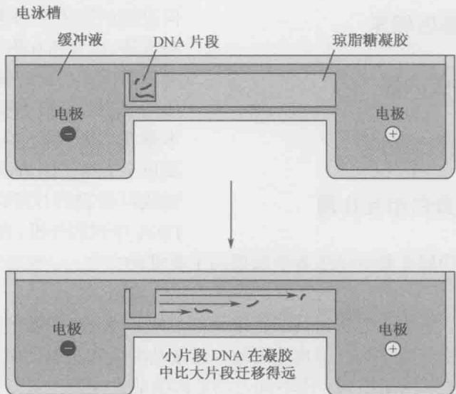  
图 7-1 凝胶电泳分离 DNA。图中所示为一块胶的侧切面。图中左侧是 DNA 混合物的上样孔，上样孔在左侧胶的顶部，也是电场的阴极端，带负电荷的 DNA 片段从胶的阴极向阳极移动。如图所示，DNA 片段的迁移距离和其大小呈负相关。（经许可，仿自 Micklos D.A. and Freyer G.A. 2003. DNA science: A first course, 2nd ed., p. 114. ©Cold Spring Harbor Laboratory Press.）

电泳完成后，用荧光染料如溴化乙锭（ethidium bromide）对凝胶进行染色，可以显示出 DNA 分子的位置。荧光染料能和 DNA 分子结合，嵌入到堆积的碱基中（参见第 4 章，图 4-28）。染色后的 DNA 分子呈现为“带”，每一条带反映了一群特定大小的 DNA 分子的存在。

通常使用的凝胶基质有两种：聚丙烯酰胺凝胶（polyacrylamide）和琼脂糖凝胶（agarose）。聚丙烯酰胺分辨力高，但能区分DNA的大小范围窄。聚丙烯酰胺凝胶电泳能区分只相差一个碱基对的DNA片段，但仅限于分离几百碱基对（低于1000）大小的DNA片段。琼脂糖凝胶分辨力不如聚丙烯酰胺凝胶，但能区分几十至几百kb（千碱基对）大小的DNA片段。

极长的 DNA 片段即使在琼脂糖凝胶中也不能穿过其网孔。它们在凝胶基质中蛇行，一端在前，另一端在后。因而，超过一定大小（30～50kb）的 DNA 分子迁移程度相似而难以区分。但是，如果采用电流方向相互垂直的脉冲式电场，这些极长的 DNA 片段就能区分开来。这种技术就是脉冲场（pulsed-field）凝胶电泳（图 7-2）。每次电场方向改变的时候，在凝胶中蛇行的 DNA 分子就随之调整其泳动方向。DNA 片段越大，其调整泳动方向所需的时间就越长。脉冲场凝胶电泳可以用来测定整套细菌染色体和低等真核生物如真菌染色体的大小，即长达数个 Mb 的 DNA 分子。

电泳不仅能根据 DNA 的分子质量来分离它们，还可按照它们的形状和拓扑学特性对它们进行分离（见第 4 章）。松弛型的或带缺口的环状 DNA 分子比相同质量

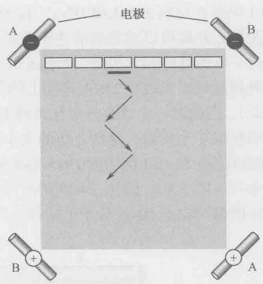  
图 7-2 脉冲场凝胶电泳。本图是凝胶的俯视图，凝胶顶部有一系列样品孔。A、B 代表两套电极，如文中所述，它们交替开关。A 组电极通电时，DNA 向凝胶的右下角泳动，即 A 组电极的阳性末端。当 A 组电极断电而 B 组电极通电时，DNA 向凝胶的左下角泳动。图中箭头标示了电泳进行时 DNA 的迁移路径。（经许可，仿自 Sambrook J. and Russell D. W. 2001. Molecular Cloning: Alaboratory manual, 3rd ed., Fig. 5-7. Cold Spring Harbor Laboratory Press.）

的线性分子迁移得慢。再者，如我们所看过的，超螺旋 DNA 由于致密而有效体积小，电泳时比相同质量的超螺旋程度较轻或松弛型环状 DNA 分子迁移速度要快。

电泳也能用来分离 RNA。线性双链 DNA 分子二级结构均一，它们电泳时的迁移率和其分子质量大小成比例。和 DNA 相似，RNA 也带均一的负电荷。但是 RNA 分子通常是单链的，并含有大量二级和三级结构（第 5 章），这些都会影响它们的电泳迁移率。为了避免产生这个问题，RNA 分子可以先用乙二醛等试剂处理，这些试剂能与 RNA 分子反应而防止碱基对的形成（乙二醛能和碱基中的氨基基团形成加成化合物，从而防止了碱基配对）。乙醛酸化的 RNA 分子不能形成二级或三级结构，因此其迁移率和分子质量是大致成比例的。后文中我们还可以看到，电泳也可以相似的方式将蛋白质按大小分开。

#### [W] 限制性内切核酸酶在特定位点切割 DNA 分子

大多数天然 DNA 分子因太大而不便于在实验室中操作或分析。如染色体是含有上千个基因的、超过 1 亿碱基对的超长单个 DNA 分子（第 8 章）。如果我们要研究 DNA 上的单个基因和位点，必须先将细胞中大的 DNA 分子分解成可操作的片段。这可以用限制性内切核酸酶（restriction endonuclease）来完成。限制性内切核酸酶是一类识别特定 DNA 序列并在特定位点切割 DNA 的核酸水解酶。

分子生物学中使用的限制性内切核酸酶通常识别 4～8bp 的短的靶序列，一般为反向重复（回文）序列，并在其中的特定位置切割。以常用的限制性内切核酸酶 EcoR I 为例，因为这种限制性内切核酸酶是在特定的大肠杆菌（Escherichia coli）菌株中被发现的，并且又是 E. coli 中所发现的第一个限制性内切核酸酶，人们就将它命名为 EcoR I。

EcoR I 识别并切割 5'-GAATTC-3'（由于 DNA 的两条链是互补的，我们只需说明其中一条链及其方向就可以清楚地描述识别序列）。

这一6碱基序列（和任一其他6碱基序列一样）估计平均每4kb出现一次（这是因为4种碱基可以出现在DNA序列上的任一位置，于是任一特定6碱基序列出现的概率为 $1 / 4^{6}$ ）。因此以一个含有6个拷贝的GAATTC序列的线性DNA分子为例：EcoRI能将其切割成7个片段，这些片段的大小反映了这个DNA分子中这类酶切位点的分布情况。假设将经EcoRI酶切的DNA在凝胶中进行电泳，这7个片段会按它们大小的不同而被分开（图7-3）。因此，在图中所示的实验中，EcoRI已将DNA切割成特定片段，每一片段都对应于DNA分子上的特定区域。

  
图 7-3 限制性内切核酸酶 EcoRI 消化某一 DNA 片段。上部所示为一个 DNA 分子和其中 EcoRI 的酶切位点。DNA 分子用 EcoRI 消化后，在琼脂糖凝胶中电泳，可观察到图中所示的带型。

如果将同一 DNA 分子用另一种限制酶切割，如 Hind Ⅲ（它也识别 6 个碱基的靶序列，不过它的识别序列为 5'-AAGCTT-3'），这个 DNA 分子就会在另外一些位点上被切割而产生其他大小不同的片段。因此，使用多个限制酶可以将 DNA 分子的不同区域分开，也能用来鉴定特定的 DNA 分子。一个特定的 DNA 分子用一组不同的限制酶消化时，能产生一系列特征性的片段。

其他的限制酶，如 Sau3A I [发现于金黄色葡萄球菌（Staphylococcus aureus）中] 识别 4 碱基序列（5'-GATC-3'），因此能更密集地切割 DNA，大约每 250bp 切割一次。另外一个极端的例子是 Not I，它识别 8 碱基序列（5'-GCGGCCGC-3'），平均每 65kb 才切割一次（表 7-1）。需要注意的是，有些限制性内切核酸酶是对甲基化敏感的，也就是说，限制性内切核酸酶识别位点中特定碱基的甲基化，会抑制其在该位点的酶切作用。

表 7-1 一些限制性内切核酸酶和它们的识别序列。

<table><tr><td>酶</td><td>序列</td><td>切割频率 $^a$ </td></tr><tr><td>Sau3A1</td><td>5&#x27;-GATC-3&#x27;</td><td>0.25 kb</td></tr><tr><td>EcoR I</td><td>5&#x27;-GAATTC-3&#x27;</td><td>4 kb</td></tr><tr><td>Not I</td><td>5&#x27;-GCGGCCGC-3&#x27;</td><td>65 kb</td></tr></table>

a. 频率=1/4n，n指的是识别序列中碱基对的数目。

限制性内切核酸酶的不同不仅在于识别序列和长度，而且它们所产生 DNA 末端的性质也不相同。一些酶如 Hpa I 产生的是平末端，其他酶如 EcoR I、Hind III 和 Pst I 产生的是交错末端（图 7-4）。例如，EcoR I 切割两条链的交错位置上的 G 和 A 之间的共价键（磷酸二酯键）。这两个切割位点之间的 4 个碱基对间的氢键容易断裂，而在 5' 末端多出 4 个核苷酸（图 7-5），注意这些末端彼此互补。因为这些末端之间或与用同一种酶切割的其他 DNA 分子之间能通过碱基配对而退火，我们通常将它们称为“黏性末端”。这一特性在我们讨论 DNA 克隆时很有用。

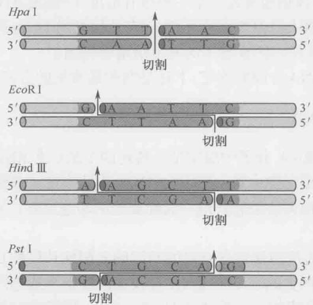  
图 7-4 不同限制酶的识别序列和切割位点。如图所示，不同限制性内切核酸酶不仅识别不同的靶位点，而且也在这些位点中的不同位置做切割。因此能产生平末端或 5'、3' 突出的末端。

  
图 7-5 一个 EcoRI 位点的切割。EcoRI 在两条链的识别位点内切割，从而产生 5'末端的凸出。因为这些末端与用同一种酶切割的其他 DNA 分子之间能通过碱基配对互补而黏合，我们通常将它们称为“黏性末端”。

#### [W] DNA 杂交能用来鉴定特定的 DNA 分子

如同我们在第 4 章所述，变性 DNA 重新退火（互补链间重新形成碱基对）的能力使来源不同但具有一定同源性的变性 DNA 在适宜的离子强度和温度下混合时形成杂交双链。两个不同来源的互补单链多聚核苷酸之间的碱基配对过程叫做杂交（hybridization）。

许多技术依赖于两个序列互补的 DNA 分子之间杂交的特异性。例如，这一特性是鉴定复杂核酸混合物中特定序列的基础。此处其中一个分子被定义为特定序列的探针（probe）——它既可以是纯化后获得的片段，也可以是化学合成的 DNA 分子。这个探针用来在核酸混合物中寻找含有与其互补序列的分子。探针 DNA 必须先被标记，这样它一旦发现靶序列后，就可以轻易将其定位。被探针标记的混合物通常可在凝胶上按大小进行分离，或者分布在一个文库的不同菌落中（见下文）。

标记 DNA 有两种基本方法。第一种方法是在一个完整的 DNA 分子末端加上一个标签。例如，多聚核苷酸激酶会将 ATP 的 $\gamma$ -磷酸基团加到 DNA 的 5'-OH 末端。如果这个磷酸基团具有放射性，磷酸基团的转移能使受体 DNA 分子被标记上放射性。

掺入标记法（另一种机制）通常是利用一个被标记的前体物进行 PCR，或者通过把随机的、短的六聚核苷酸杂交到 DNA 上以使 DNA 聚合酶能延伸它们。被标记的前体物通常是用荧光染料或放射性物质修饰的核苷酸。通常荧光染料只需和作为 DNA 合成前体的 4 种核苷酸中的任一碱基结合即可（对大多数用途而言，25% 的标记一般就可以满足需要）。

用适宜波长的紫外线照射 DNA 样品，检测应答射出的较长波长的光，可以探测到用荧光前体物标记的 DNA。放射性标记的前体物通常是在某一种核苷酸的 $\alpha-$ 磷酸基团中掺入 ${}^{32}P$ 或 ${}^{35}S$ 。这个磷酸基团在 DNA 产物中被保留（第 9 章）。有放射性的 DNA 样品可使 X 射线片曝光，或通过识别 ${}^{32}P$ 或 ${}^{35}S$ 发射的 $\beta$ 粒子的光电倍增管探测。

杂交技术以多种方式用于特定 DNA 或 RNA 片段的鉴定。下述是两种最常见的方式。

#### [W] 杂交探针能鉴定电泳分离的 DNA 和 RNA

这种方法常用来在一群相似的 DNA 和 RNA 分子中测定某一特定的 DNA 或 RNA 分子的丰度或大小。例如，测定两种不同类型细胞中某一特定 mRNA 表达丰度，或测定一个含有目标基因的限制性片段的长度。相关结果的获得一般都要经由印迹过程，才能定位特定的电泳分离后的核酸。

假设用 EcoRI 酶切酵母基因组后,研究人员想知道含有目的基因的限制性片段的长度。用溴化乙锭染色后,酵母基因组切割所产生的上千个 DNA 片段在凝胶上形成连续分布的 4kb 左右条带,如此多的片段无法区分成相互分散的带型。Southern 印迹杂交技术（Southern blot hybridization,因其发明者 Edward Southern 而得名）就可以在连续分布的条带中鉴定出含有目的基因的限制性片段。

在这一过程中，切割后的 DNA 先经凝胶电泳分离，然后在碱性溶液中浸泡使双链 DNA 片段变性。进而将这些片段转移并黏附到带正电荷的膜上，形成胶的“印迹”。在转移过程中，DNA 片段在膜上的位置与它们在凝胶电泳中迁移的位置相对应。目的 DNA 被转移到膜上后，带电荷的膜与非特异性的 DNA 片段混合物共同孵育以封闭膜上多余的结合位点。因为非特异的 DNA 混合物是随机地分布在膜上，如果选择合适，其中不会有目标序列（如采用与探针无关的其他生物的基因组 DNA），所以不会干扰下一步骤中对目标序列的检测。

然后结合在膜上的 DNA 片段与探针 DNA 一起进行孵育，探针 DNA 含有和目标基因互补的一段序列。因膜上所有非特异结合位点已被无关的 DNA 占据，探针 DNA 只能与膜上的互补 DNA 杂交才能结合到膜上。这个过程所需的离子浓度及温度与核酸变性、复性的条件比较接近。在这样的条件下，探针 DNA 只与互补序列紧密结合。探针的摩尔数通常远远超过固定于膜上的靶片段，这有利于探针与靶 DNA 的杂交，而非变性 DNA 的重新退火。另外，变性 DNA 被固定在滤膜上也不利于重新退火。印迹上探针杂交的位置可以用对标记 DNA 发出的光或电子敏感的胶片或其他介质检测到。如用放射性标记的 DNA 探针，可用 X 射线片曝光，显影后获得的放射自显影图像（autoradiogram）就会和滤膜上的杂交分子位置是对应的（图 7-6）。

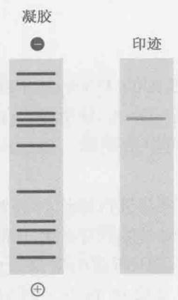

  
图 7-6 Southern 印迹。DNA 分子经限制性内切核酸酶消化产生的片段在琼脂糖凝胶中电泳。染色后，可以看到一系列条带。将电泳条带转移至滤膜，用只和 DNA 分子的一个特定序列同源的 DNA 片段作探针进行杂交，能看见单一条带，其位置对应于含有此序列的片段在凝胶上的位置。  
图 7-7 微阵列格子图比较线虫肌肉组织和神经组织的表达谱。晶格中的每一个圆点都包含一条来自线虫特定基因编码区的短的 DNA 片段。从肌肉组织和神经组织中提取 RNA 后用荧光染料分别标记（红色和绿色）。因此，红色的点表示该基因在肌肉组织中表达，绿色的点表示该基因在神经组织中表达。黄色的点表示该基因在两种组织中都表达。显然，两种样品表达的基因集合是不同的。（由斯坦福大学的 Stuart Kim 惠赠）

在一组 RNA 中鉴定某一特定 mRNA 的步骤与此相似，被称做 Northern 印迹杂交（Northern blot hybridization，以示与 Southern 印迹相区分）。由于 mRNA 比较短（一般都小于 5kb），它们无需再用任何酶消化（实际上 RNA 特异性的内切酶数量也很少）。其他步骤都与 Southern 印迹相似。分离的 mRNA 被转移至带正电荷的膜上，和放射性标记的探针反应（此时是 RNA 和互补的 DNA 链配对形成杂交体）。

Northern 印迹杂交更适用于测定一个样品中特定 mRNA 的含量，而不是其大小。特定 mRNA 的含量能反映编码它的基因的表达水平。举例来说，当一种细胞被诱导剂处理后，可以用 Northern 印迹杂交检测与未经诱导的细胞相比某一 mRNA 水平的改变。再举一例，Northern 印迹杂交也可以用来比较同一生物不同组织间特定转录物的相对含量（也就是目的基因的表达水平）。在这些分析中由于使用了过量的 DNA 探针，杂交产物的量与原始样品中的 mRNA 量是相关的，从而可以相对比较 mRNA 的表达量。

Southern 和 Northern 印迹杂交的原理也是基因芯片分析的基础，对此我们将在本章的基因组部分进行讨论。完整序列信息的获得使“反向杂交”实验成为可能。一张芯片需要将几百至几千个已知的 DNA 序列固定到固相支撑表面上，这些固相支撑通常是用玻璃或者塑料（图 7-7）。其中每个序列对应待研究生物的不同基因。请注意在描述芯片分析的过程中，所使用的术语与 Southern 或 Northern 分析中是相反的。在芯片分析中，固定的、未被标记的序列被称为“探针”，因为它们是已知的 DNA 序列。而“靶标”则是从细胞或组织中的全部 RNA 生成的 cDNA 经过扩增和标记形成的。当靶标序列与芯片上排列好的 DNA 探针杂交时，芯片中每个 DNA 探针信号的强弱反映了目的基因的表达水平。

#### [W] 特定 DNA 区段的分离

为了对基因及其功能进行分子水平的分析，需要从较大的 DNA 分子或其选择性扩增产物中分离特定的 DNA 区段。分离大量的纯的特定 DNA 分子有助于分析这个 DNA 分子所编码的信息。这段 DNA 还可以被测序，或可以被克隆、表达以研究其蛋白质产物。

具有纯化大量特定 DNA 分子的能力才能用其他方式对其进行操作。例如，我们能通过制备重组 DNA 分子来改变某一特定基因的表达（如将其编码序列和其他异源的启动子融合）。或者也可以把纯化的 DNA 序列进行重组以编码所谓的融合蛋白（fusion protein），即由来自于不同蛋白质组成的杂合蛋白。DNA 克隆和 PCR 扩增技术已成为研究基因表达调控、基因组稳定性和蛋白质功能等问题的基本手段。

#### [W] DNA 克隆

构建重组 DNA 分子并在细胞中维持这些分子，称为 DNA 克隆（DNA cloning）。这个过程通常涉及一个载体（vector），它要提供维持克隆的 DNA 在宿主细胞中扩增所需的信息。重组 DNA 的关键是在特定序列处切割 DNA 的限制性内切酶，以及能连接切割后的 DNA 的其他酶类。通过构建能在宿主中扩增的重组 DNA 分子，可以将某一特定的 DNA 片段从其他 DNA 中分离出来并大量扩增。

在本节的后续部分，我们将介绍 DNA 分子的切割、重组和扩增。然后还要讨论如何制备大量杂合分子的集合，即文库（library）。在一个文库中使用的是一种通用载体，分别携带着不同的插入片段。除了文库的制备方法外，我们还将描述如何从文库中鉴定和分离特定的 DNA 区段。

当 DNA 用限制性内切酶切割成片段后，通常需要插入到某一载体中进行扩增。也就是说，为了能在宿主中复制，DNA 片段必须插入到第二个 DNA 分子（载体）中。最常用于扩增 DNA 的宿主是大肠杆菌（E. coli）。载体 DNA 通常要具备 3 个特性。

1. 含有一个复制起点，使其能独立于宿主染色体进行复制（注意：有些酵母载体还需要有一个着丝粒）。

2. 含有筛选标记，使带有载体（和所插入的 DNA）的细胞容易被鉴别出来。

3. 含有一个或多个限制性内切酶的单一酶切位点，从而可以使 DNA 片段插入到载体的特定位点，而且不影响上面提到的两个特征。

常见的载体都是比较小（约为 3kb）的环状 DNA 分子，它们被称为质粒（plasmid）。这些质粒最先来源于一些细菌和单细胞真核生物中天然存在的染色体外的环状 DNA 分子（附录 1）。在许多情况下（尽管酵母中不是），质粒 DNA 常常携带抗生素抗性基因。因此，天然质粒已经具备了载体的两个特性：能在宿主中独立扩增；携带筛选标记。这些质粒的另一个优点是它们在一个细胞中存在多拷贝，因此能从细胞中分离到的更大量的质粒 DNA。天然质粒所能负载的 DNA 的长度是有限的，通常为 1～10kb。对于大片段的克隆和增殖，后面将要讨论的基因组分析和 DNA 测序中常常会用到，人们已经构建了多种人工载体, 如细菌人工染色体(BAC)和酵母人工染色体(YAC), 它们可以容纳 120\~150kb 以上长度的 DNA。

将 DNA 片段插入到载体中一般来讲是比较简单的过程（图 7-8）。假设一个质粒载体含有唯一的 EcoRI 识别位点。用 EcoRI 将质粒切成线性。由于 EcoRI 能产生互补的 5' 突出末端，这些黏性末端能退火形成带有两个缺刻的环（参考图 7-5）。DNA 连接酶（DNA ligase）和 ATP 可以封闭缺刻重新形成共价闭合环状 DNA。靶 DNA 也要用限制性内切酶酶切，本例中是 EcoRI，切割后形成插入 DNA。这些插入 DNA 在适合于黏性末端复性的条件下与过量的用 EcoRI 切割制备的载体 DNA 混合，并加入 DNA 连接酶以连接这两个 DNA 的互补末端。加入与质粒 DNA 相比过量的插入 DNA 可确保大部分载体会和插入 DNA 连接（图 7-8）。

有些载体不仅可分离、纯化特定的 DNA，还能驱动插入 DNA 中基因的表达。这些载体称为表达载体（expression vector），在它们的插入位点附近含有从宿主细胞中得到的转录启动子。如果一个基因的编码区（不含启动子）置于插入位点的合适位置，插入基因就能由宿主细胞转录成 mRNA 并翻译成蛋白质。人们通常使用表达载体来表达异源基因或突变基因以检测其功能。表达载体也能用来大量生产某一种蛋白质以供纯化之用。而且，还可以通过改变表达载体中的启动子来方便地对插入片段的表达实行调控。例如，在培养基中加入一种简单的化合物（如一种糖或氨基酸）（见第 18 章中关于原核生物转录调控的讨论）。如果基因产物是有毒性的，控制基因表达的能力就显得尤为重要了。

#### [W] 转化可将载体 DNA 导入宿主生物中

将带有插入 DNA 的载体转化导入宿主细胞中可以进行扩增。如我们在第 2 章所讨论的，转化（transformation）就是宿主生物从环境中摄取 DNA 的过程。有一些细菌（不包括大肠杆菌）能自然发生转化过程，被称为遗传感受态（genetic competence）细菌。在大肠杆菌（E. coli）中转化不能自然发生，不过用钙离子处理后，E. coli 也可具备摄取 DNA 的能力。细菌摄取 DNA 的确切机制尚未知晓，可能是因为钙离子能遮蔽 DNA 上的负电荷，从而使 DNA 能穿过细胞膜。因此经钙离子处理后的细胞是可用于转化的感受态细胞。摄取质粒 DNA 的细胞被称为转化子（transformants），转化子可以用抗生素来进行筛选，由于质粒带有某些抗生素有抗性基因，携带质粒的转化子也因而获得了这种抗生素抗性，能在抗生素中生长，不含质粒的细胞则不能生长。

通常来讲转化是一个相对低效的过程。只有一小部分用 DNA 处理后的细胞能摄取质粒。正因为转化的效率低，有必要用抗生素筛选转化子。转化的低效率能保证在绝大多数情况下，每个细胞只摄取一个 DNA 分子。这个特性使每个转化细胞及其后代只携带单个 DNA 分子。所以，转化能有效地将一个 DNA 分子从转化混合物中纯化出来并进行扩增。

#### [W] 用克隆法制备 DNA 分子文库

DNA 文库(DNA library)就是一群由相同载体携带着不同 DNA 插入片段的集合(图 7-9)。

  
图 7-8 用质粒载体进行克隆。一个用 EcoR I 酶切得到的 DNA 片段被插入到用同一种酶切所得的线性质粒载体。连接后，将重组质粒转化细菌（见正文）。由于质粒有抗生素抗性基因，带有质粒的细胞能在含有抗生素的培养基上生长从而被选择出来。（经许可，仿自 Micklos D.A. and Freyer G.A. 2003.DNA Science: A first course, 2 $^{nd}$ ed., p. 129©Cold Spring Harbor Laboratory Press.）

  
图 7-9 DNA 文库的构建和筛选。为了构建文库，将同一种限制性内切酶消化所得的基因组 DNA 和载体 DNA 以及连接酶一起进行孵化,然后将最终的杂合载体（每个携带基因组 DNA 的不同片段的细胞，用一种不同的颜色表示）文库导入 E. coli，接着将细胞铺于琼脂培养基上的滤膜上。菌落长成后，从平板上移走滤膜，进行必要的处理以用于杂交：裂解细胞，使 DNA 变性，再用标记探针孵化滤膜。目标克隆通过放射自显影图像进行鉴定。

为了构建 DNA 文库,选择一种能产生适宜大小的插入片段的限制性内切酶对靶 DNA(如人类基因组 DNA)进行消化。插入片段的大小可以在 100bp 至大于 1Mb 之间（极大的插入片段通常由 DNA 不完全酶切造成）。将酶切所得的 DNA 与经同一种限制性内切酶酶切的相应载体混合，用 DNA 连接酶连接，这样就能产生大量携带不同插入片段的载体。

不同来源的插入 DNA 能产生不同种类的文库。最简单的文库是基因组文库（genomic library），它采用全基因组 DNA 经单一限制性内切酶切割所产生的片段制备而成。这种文库在为基因组测序准备 DNA 时最为有用；另一方面，如果要克隆编码某一特定基因的 DNA 片段，只有在所研究的生物中非编码 DNA 相对较少时，才适合采用基因组文库。对于基因组较为复杂的生物来说，由于许多 DNA 插入片段内没有编码序列，这种文库就不太适合了。

为了在文库中富集编码序列，人们通常使用 cDNA 文库（cDNA library）。其制备过程如图 7-10 所示。在这里，起始 DNA 不再是基因组 DNA，而是由 mRNA 转换来的 DNA。这个由 mRNA 转换成 DNA 的过程叫做反转录（reverse transcription），它由一种以 RNA 为模板来合成 DNA（见第 12 章）的特殊的 DNA 聚合酶（反转录酶）催化。用反转录酶处理后，mRNA 能转变成双链 DNA，即 cDNA（copy DNA）。此后的步骤与构建基因组文库一样。cDNA 产物和载体经相同限制性内切酶酶切而将所获得的片段连入载体中。

为了从一个文库中分离单个插入片段,人们将整个文库转化进受体细胞(通常是E. coli)中。通常每个转化细胞只含有一个由载体和相应插入片段组成的重组DNA分子。因此,传代后的每个转化细胞就含有文库中某一克隆的多个拷贝。携带任一目的序列克隆的细胞所生成的菌落可以被鉴定,目的序列可以被

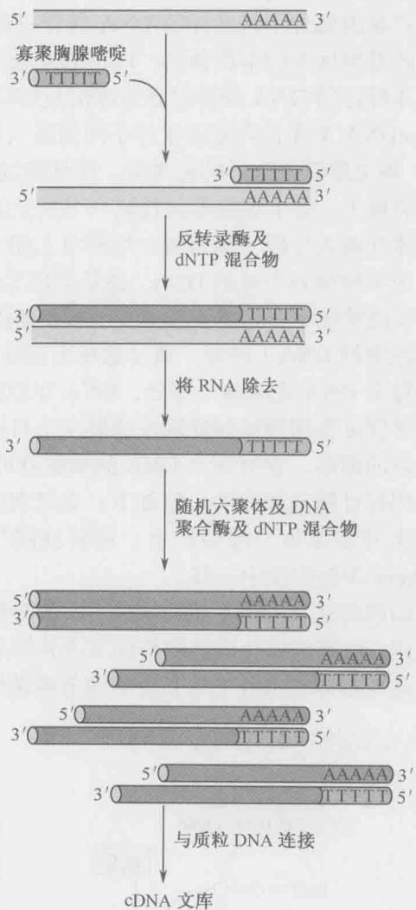  
图 7-10 cDNA 文库的构建。RNA 依赖的 DNA 聚合酶——反转录酶将 RNA 反转录成 DNA（cDNA）。第一步（第一条链合成），polyT 和 mRNA 的 polyA 尾杂交（cDNA 文库一般都是从真核细胞制备的，其 mRNA 的 3'端都有一个 Poly A 的尾巴；见第 19 章），起到引物的作用。反转录酶延伸 dT 引物，以 mRNA 为模板形成完整的 DNA 拷贝，成为由 mRNA 和它的互补链组成的双链。RNA 用碱（NaOH）处理除去，留下的单链 DNA 就可以作为第二步（第二条链合成）的模板。用随机六核苷酸作引物，和 DNA 模板链的不同序列杂交。然后用 DNA 聚合酶延伸引物而生成双链 DNA，这样就可以克隆进入质粒载体（图 7-8），以制备 cDNA 文库。

分离。有很多方法可以用来鉴定克隆，如下面我们要描述的用 DNA 或 RNA 探针杂交来鉴定含有特定插入 DNA 的细胞。

#### [W] 杂交法可以用来鉴定 DNA 文库中的特定克隆

克隆基因的通常做法就是在一个文库的所有克隆中鉴定出目的基因片段。通过使用和目的基因部分序列互补的 DNA 探针可以做到这一点。这样一个探针可以用来鉴定含有目的基因区段的细胞菌落，以下对此进行描述。

用标记的 DNA 探针筛查文库的过程叫做菌落杂交（colony hybridization）。一个典型的 cDNA 文库含有数以千计不同的插入片段，每个插入片段都与通用载体相连接（见上）。将文库转化合适的菌株后，将细胞铺板于含固体培养基（通常为琼脂，见附录 1）的培养皿上。每个细胞都将长成一个独立的菌落，菌落中的每个细胞含有文库中的同一种载体和插入片段（通常每个培养皿上能生长几百个菌落）。

为了检测到少量的 DNA，还是采用 Southern、Northern 印迹中所用的带正电荷的滤膜。在此情形下，将滤膜覆盖在平板菌落的上方，滤膜上就黏附了每个菌落的细胞（包括细胞中的 DNA）印迹（请注意每个菌落还有一些细胞留在平板上）。因此，滤膜上就带有每个 DNA 克隆的一部分，DNA 在滤膜上的位置与其菌落在平板上的位置相对应。由此可保证当用探针和滤膜反应鉴定出目标克隆后，可容易通过其对应的菌落位置鉴定出相应的菌落，含有插入 DNA 的质粒就可以从细胞中纯化出来。

用探针筛选滤膜的步骤如下：先处理滤膜，使膜上的细胞裂解，其中的 DNA 被释放出来并在原位与滤膜结合；再将滤膜与标记的探针孵育，孵育条件和 Southern、Northern 印迹实验中一样。

如前所述及附录1将讨论的，人们对噬菌体（如 $\lambda$ 噬菌体）进行了一些改造以作载体之用，以噬菌体作载体制备的文库其筛选方法和质粒文库基本相同。不同的只是要筛选的是噬菌体在菌苔上生长所形成的噬菌斑，而不是菌落（见附录1）。

#### [W] 化学合成特定的 DNA 序列

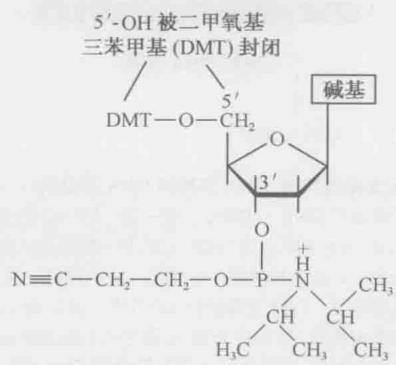  
质子化的亚磷酸酰胺化合物  
图 7-11 质子化的亚磷酸酰胺化合物。如图所示，5'-OH 被所添加的二甲氧基三苯甲基保护集团封闭。

很多人认为,寡聚核苷酸(oligonucleotides),即短的、可定制的单链 DNA (ssDNA),合成技术的建立标志着分子生物学时代的到来。最常见的化学合成是在 DNA 自动合成仪的固相支持物上进行的。添加核苷酸的前体物是一种化学保护分子,叫做亚磷酸酰胺(phosphoamidine)(图 7-11)。与 DNA 聚合酶催化的链延伸方向相反(见第 9 章),化学法合成中 DNA 链的延长是在 5'端添加核苷酸实现的。

用化学法合成 10～100 个碱基的 DNA 分子是高效而准确的。现在 DNA 合成的常规步骤是：研究人员只需将碱基序列输入到操纵 DNA 合成仪的计算机中，设定合成程序，就可以得到任何想要的序列。但随着合成分子的长度增长，由于合成过程每一循环中都可能发生错误，所得终产物就不那么均一了。因此，要大量、准确地合成大于 100 个核苷酸的 DNA 以用于分子分析仍然是比较困难的。

然而，易于合成的短的单链 DNA 分子仍然可满足很多用途。例如，含有克隆 DNA 某一区段的错配位点的定制的寡聚核苷酸可用来产生该 DNA 的定向突变。这种方法叫做定点诱变（site-directed mutagenesis），其步骤如下：寡聚核苷酸与克隆片段杂交后，以克隆 DNA 为模板指导新的 DNA 的合成，这样就产生了带有错配位点的双链分子；然后将两条链分开，进一步扩增含有所需错配位点的那条链。

人工设计的寡聚核苷酸也能通过这种方式将限制性内切酶识别位点引入到克隆的DNA中，用来制备各种重组DNA，如二个基因编码序列的融合体，或一个基因的编码序列与另一个基因的启动子的融合体。再或者，改变基因中编码特定氨基酸的序列引入一个突变，然后比较突变体与野生型蛋白质的特性，研究人员就可以检测特定氨基酸在蛋白质中的功能。

定制合成寡核苷酸对 PCR 来说至关重要(下面将对 PCR 进行描述), 同时也是 DNA 测序策略中不可或缺的成分, 对此将要在后续章节中描述。因此, 在涉及新的基因分子构建、特定 DNA 检测、DNA 扩增以及 DNA 测序等实验时, 都要设计并合成一条含有所需序列的短的寡聚核苷酸。

#### [W] 聚合酶链反应是通过体外的重复复制而扩增 DNA

聚合酶链反应（PCR）是一种革命性的扩增特定 DNA 片段的方法，它与在宿主细胞中的克隆和繁殖不同，完全是体外的生化反应。PCR 采用 DNA 聚合酶，以单链 DNA 为模板，以脱氧核糖核苷酸为底物合成 DNA。如第 9 章将涉及的，当人工设计的寡聚核苷酸与更长的 DNA 模板发生退火时，DNA 聚合酶将核苷酸加到人工设计的寡聚核苷酸的 3' 端。因此，如果一条合成的寡聚核苷酸与和它互补的单链模板退火，DNA 聚合酶就能以它为引物，从 5'→3' 延伸而产生双链 DNA。

那么，这种 DNA 聚合酶和反应是如何扩增特定的 DNA 序列的呢？先合成两条单链寡聚核苷酸。一条寡聚核苷酸与待扩增 DNA 的一条链的 5' 端互补，另一条则与互补链的 5' 端互补（图 7-12）。然后将待扩增的 DNA 变性，寡聚核苷酸和它们的靶序列退火。此时在反应中加入 DNA 聚合酶和脱氧核糖核苷酸底物，DNA 聚合酶使两条引物延伸。这个反应能在目标区域内产生双链 DNA。因此经过 PCR 反应的第一个循环，产生了初始 DNA 片段的两个双链拷贝。

接着，用相同的引物 DNA 进行又一轮变性和合成（注意，只有两条引物之间的序列是被准确扩增的）。这样就生成了 4 个拷贝的目标片段。如此重复进行变性和引物指导的 DNA 合成能使两个引物之间的区域呈几何级数（2、4、8、16、32、64 …）扩增。因此，原来含量极低的一个 DNA 片段经过扩增就能够产生大量的双链 DNA（见图 7-12，

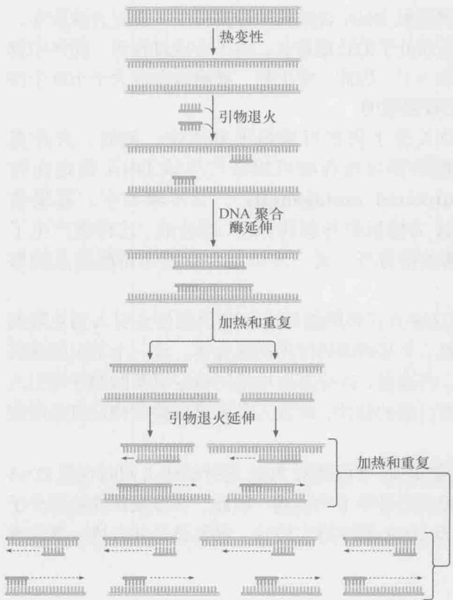

图 7-12 聚合酶链反应。在 PCR 的第一步，将 DNA 模板加热变性，用对应于要扩增的 DNA 序列边界的寡聚核苷酸引物（深橘红色和暗绿色）与 DNA 模板退火。用 DNA 聚合酶（淡橘红色）在二个引物处分别延伸、复制单链模板（淡橙色和淡绿色）。下一步，再次使 DNA 变性，和引物退火并用作新一轮 DNA 合成的模板。请注意在第二个循环中，引物既能引发原始模板依赖的 DNA 合成，也能引发新合成的 DNA 依赖的合成。当 DNA 聚合酶延伸到来自上一轮 DNA（或来自于绿色标记模板的橘红色引物）合成产生的新模板（橘红色标记）退火的引物（绿色标记）时，它沿着模板链前进直至其末端（下图中聚合酶还没到模板的末端）。于是，欲扩增的 DNA 序列在第二轮循环中就被准确合成了。此后，进一步循环变性、引物退火和 DNA 合成（未标出）就能产生处于两个引物之间的 DNA 片段。反应每进行一轮，DNA 的量就呈几何级数增长一次。

框 7-1 法医学与聚合酶链反应）。实际上，在经过 20～30 个 PCR 循环后，因淹没在数以百万计的其他序列中而无法被检测的特定 DNA 序列（如整个人类基因组中的某条序列），可以很容易地表现为 DNA 凝胶电泳条带而被检测到。

#### [W] 相互叠连的 DNA 片段可以揭示核苷酸序列

接下来我们将讨论如何测定核苷酸序列。先来看 DNA 测序的 “经典” 方法，该方法可以确定单个基因的核苷酸序列。然后将讨论这种方法是如何实现自动化以对整个基因组进行测序的。最后，我们再讨论实现个体化基因组测序的 “下一代” 测序方法。

现在已经可以对整个基因组的完整核苷酸序列进行测定，实际上已经完成了不同复杂程度的生物（从细菌到人类）的基因组序列测定。这使得我们能够快速、准确地发现任一特定序列（将在本章后面的内容中讨论到）。

传统 DNA 测序的基本原理是按大小分离几组部分叠连的 DNA 分子。这些 DNA 分子 5'端相同，但 3'端终止在不同的位置。每组 DNA 分子的 3'端是一种特定的碱基。比如第一组 DNA 分子都以 G 结束，第二组是 C，第三组是 A，最后一组是 T。一组特定的 DNA 分子（以 G 组为例），它们的长度因其 3'端的 G 在序列中的位置不同而不同。因此，这组 DNA 片段能告诉你产生它们的 DNA 分子中何处有 G。我们将在后面讲述如何产生这些片段（也展示于图 7-15 中）。

#### [W] 框7-1 法医学与聚合酶链反应

设想你在一个法医学实验室里，手里有一个来自嫌疑犯的 DNA 样本。你想确定涉嫌者的 DNA 是否与犯罪现场所发现的 DNA 有相同的多态性。多态性就是生物群体中在染色体共同的同源区域，如在一个基因中，存在的不同的 DNA 序列（等位基因）。多态性可以简单到只是不同生物染色体某一位点的单个碱基差异，或者是简单重复序列（如 CA，见第 9 章）的长度差异。我们要做的是扩增多态性位点周边（包括位点本身）的 DNA，这样可以对得到的 DNA 测序（后文将讨论），测定它是否与犯罪现场样品中的序列相吻合。扩增所得的 DNA 的核苷酸序列（还可检测是否有其他的多态性）能帮助确定两个 DNA 样品是否吻合。为了与传统指纹识别技术方法相类比，这种鉴定 DNA 序列的方法被称为 DNA 素描或 DNA 指纹识别。DNA 素描自 1985 年首次运用（美国联邦调查局自 1988 年开始使用这一技术）以来，已被广泛运用于对犯罪现场证据的分析，用来证明犯罪嫌疑人有罪或者是清白（参见，如 The Innocence Project; WWW.innocenceproject.org）。

最初的 DNA 测序自动化的基础中，最常用的程序是基于链终止核苷酸（chain-terminating nucleotide）和体外 DNA 合成的方法。在链终止法中，寡聚核苷酸引物固定了 DNA 合成的起始位置后，DNA 聚合酶根据 DNA 模板复制出若干拷贝分子。DNA 聚合酶以 2'-脱氧核苷三磷酸为底物，从 3' 合成延伸 DNA（链终止法依据的原理是我们第 9 章讨论的酶促 DNA 合成）。链终止法采用特殊的、经修饰的底物，即 2', 3'-双脱氧核苷酸（ddNTP），它们的糖环上没有 2' 和 3'-OH（图 7-13）。DNA 聚合酶能在延伸中的多聚核苷酸链的 3' 端掺入一个 2', 3'-双脱氧核苷酸分子，但它一旦掺入后，3'-OH 的缺乏阻止了核苷酸进一步的延伸而使链延伸反应终止（图 7-14）。

  
图 7-13 DNA 测序中使用的双脱氧核苷酸。左图是 2'-脱氧 ATP，它能加入到延伸中的 DNA 链中，另一个核苷酸还能直接加在它的后面。右图是 2'，3'-双脱氧 ATP，一旦它加入到延伸中的 DNA 链中，就会阻止其他核苷酸加入到这条链中。

现在设想在核苷酸底物混合物中掺入修饰底物 2′, 3′-双脱氧鸟嘌呤三磷酸（ddGTP），ddGTP 和 2′-脱氧 GTP 的比值为 1:100。这就使 DNA 的合成在每次 DNA 聚合酶遇到模板链上的 C 时以 1:100 的频率终止（图 7-15 a）。由于所有的 DNA 链都是从同一点开始延伸的，链终止性核苷酸能产生一组部分重叠的多聚核苷酸片段，所有片段 5′端相同但长度不同，因此它们的 3′端不同。这些片段的长度指示了模板链中 C 的位置。如果用放射性标记的引物或用荧光添加剂作标签的引物标记这些片段的 5′端，或用荧光标记的 ddGTP 的衍生物标记它们的 3′端，那么用聚丙烯酰胺凝胶电泳分离时，这组部分重叠的片段就能产生一系列条带，每个条带代表了模板链上的一个 C （图 7-15b）。如果我们用 ddCTP、ddATP 和 ddTTP 以相似的方式阻止 DNA 的合成，就可以分别得到 4 组部分重叠的 DNA 片段，它们加在一起就能提供 DNA 的全部核苷酸序列。为了读出这个序列，每种反应所产生的片段都在聚丙烯酰胺凝胶上进行分离（图 7-16）。

  
图 7-14 双脱氧核苷酸引发的链终止。上图所示是一条 3'端延伸的 DNA 链，一个腺苷酸正加入到先前已经存在的胞嘧啶上。如文中所述，双脱氧胞嘧啶掺入到延伸中的 DNA 链时（下图所示）会阻止其他核苷酸的加入。

下面我们可以看到，这一理论上容易的方法，最开始是为了测定短的、已定义的DNA片段的序列而研制的。这一方法经历了一系列技术改进，才使全基因组测序成为可能（框7-2，自动化测序仪用于高通量测序）。

  
图 7-15 基于链终止法的 DNA 测序。如文中所述，在双脱氧核苷酸存在的情况下，将合成不同长度的 DNA 链。所产生的 DNA 链的长度依赖于 DNA 模板序列以及反应中掺入了何种双脱氧核苷酸。（a，上部）DNA 模板的序列。在这个反应中，所有的碱基都以脱氧核苷酸的方式存在，但是鸟嘌呤还有双脱氧的形式。因此，当 DNA 链延伸至模板中的胞嘧啶时，一些分子中掺入了 ddGTP，而不是 dGTP。在这种情形下，DNA 链就停止延伸。（b）显示用聚丙烯酰胺凝胶分离得到的片段。凝胶上这些片段的长度反映了待测序的模板 DNA 中胞嘧啶的位置。

#### [W] 用鸟枪法对细菌基因组进行测序

流感嗜血杆菌（H. influenzae）是第一个完成全基因组测序及组装的、独立生存的生物体。由于它的基因组小而致密，仅由1.8Mb的DNA组成（小于千分之一的人类基因组），首先选择它进行测序是合理的。H. influenzae的基因组被随机剪切成很多随机片段，平均长度为1kb。这些基因组DNA片段接着被重组克隆到质粒DNA载体，形成一个文库。从单个重组DNA菌落中制备DNA，用前面所讨论的双脱氧法在自动测序仪上分别测序。这个方法称为“鸟枪法”测序。人们随机挑选重组DNA菌落，对其处理后进行测序。为了保证基因组中的每个核苷酸都能在最后的基因组组装中出现，进行了30 000\~40 000个不同的重组克隆的测序，产生了总共约20Mb的原始基因组序列（通常一个反应产生600bp的序列，600bp×33 000不同的克隆=共约20Mb DNA序列）。这就叫做10×序列覆盖度（10×sequence coverage）。理论上说，基因组中的每个核苷酸都被测了10次。

这个方法可能看起来很繁琐，但与最初的设想相比，它既快速，花费也少。早期的测序策略要求对细菌染色体物理图上的每一个特定的限制性DNA片段进行系统测序。这个步骤的不足之处是大多数已知的限制片段比单个反应所能检测的DNA序列要大。因此，为了得到基因组任一特定区域的完整序列，需要进行多次的内切酶消化、作图和测序。这些额外的克隆和限制性内切酶作图步骤

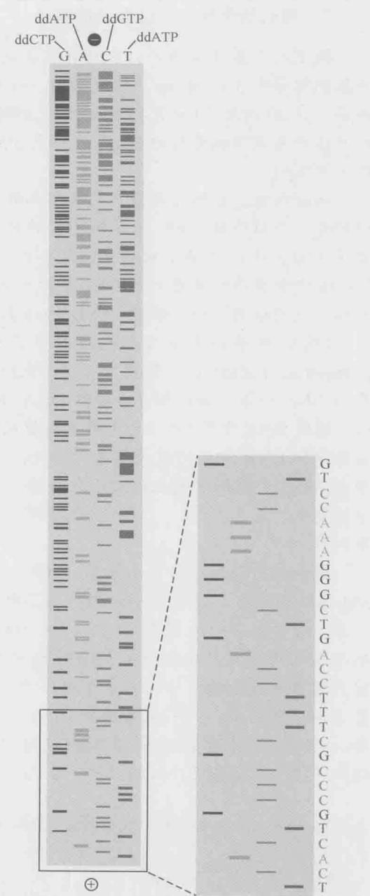  
图 7-16 DNA 测序胶。如图所示，由双脱氧核苷酸链终止反应决定的 DNA 链的长度用聚丙烯酰胺凝胶进行分离测定，具体的 ddNTP 在胶的顶部标示。从下往上读胶可以获得 $5' \rightarrow 3'$ 的序列。

比随机 DNA 片段的重复自动测序耗时要多得多。换句话说，用计算机组装随机 DNA 序列要比对涵盖细菌染色体的所有限制酶酶切片段进行克隆和测序要快得多。

将大约 30 000 条随机基因组 DNA 片段的序列信息输入到计算机中，使用不同的程

#### [W] 框 7-2 用自动测序仪进行高通量测序

提出人类基因组测序，当时看起来是一件令人生畏、遥不可及的事。毕竟整个人类基因组含有 $3 \times 10^{9} \mathrm{bp}$ ，数目惊人，而早期的测序方法连测定DNA短片段都相当不容易。在20世纪80年代甚至90年代初期，一个研究人员即使全力以赴，在一两天内也只能产生几百碱基对的序列，也许是500bp。几项技术上的创新大大提高了测序的速度和可靠性。

如前所述，链终止法能产生4组部分重叠的DNA分子，这些DNA分子之间大小仅相差一个核苷酸。起初，人们采用大的聚丙烯酰胺凝胶电泳分离这些部分重叠的DNA分子（图7-16）。然而，近年来，这些笨重的凝胶已被短分离柱所取代，这些短柱能在2\~3h内分离部分重叠的DNA。短柱可重复利用，与要替代的繁琐的聚丙烯酰胺凝胶相似，也能分离700\~800bp的DNA片段。

DNA 测序的主要技术进展源于荧光标记的链终止核苷酸（fluorescent chain-terminating nucleotide）的使用。理论上说，可以用一种“颜色”独立标记一组部分重叠的 DNA 分子。每组部分重叠的 DNA 分子的颜色由它们的最后一个核苷酸决定。例如，模板 DNA 中第 50 位的 T 残基结尾的 DNA 分子可以被标为红色；第 51 位的 G 残基结尾的 DNA 分子可标为黑色；因此，每个部分重叠的 DNA 分子都有唯一的大小和颜色。当它们在测序胶上按大小分离时，荧光检测器能识别出每个部分重叠的 DNA 分子的颜色（框 7-2 图 1）。这样，在不到 3 h 的时间里，一个柱子能产生 600～800 bp 的序列。

现在的自动测序仪，如 Sequenator，已经拥有 384 道独立的分离柱。从理论上说，384 道柱的测序仪能在数小时内产生 200 kb 以上的原始 DNA 序列。按一天运行 9 h 计算，每台机器一天能跑 3 次，产生 500 kb 以上的序列信息。这样 100 台 384 道的测序仪在两个月内就能产生 $3 \times 10^{9}$ bp 的序列，相当于一个人类基因组。目前美国、英国共有 5 个主要测序中心，每个测序中心都有许多台自动测序仪。这 5 个测序中心每年总共能产生 $60 \times 10^{9}$ bp 的原始 DNA 序列。也就是每年能完成 20 个人类基因组的测序。然而，这种通量与我们稍后提到的下一代测序仪相比，还仅仅是小儿科：新的自动测序仪一个反应几小时内便可产生与一个完整人类基因组同等规模的数据。

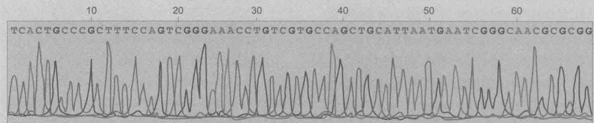  
框 7-2 图 1. DNA 序列峰图。如正文所述，这一测序反应使用了末端荧光标记的双脱氧核苷酸，反应产物用毛细管电泳分离，序列中 A、T、C、G 分别以绿色、红色、黑色和蓝色表示。

序对相互重叠的 DNA 序列进行组装。这个过程的基本思想与填字谜的组装相似。其中已知的单词对未知的相邻重叠单词提供线索。根据序列间的相互匹配就可以把随机 DNA 片段组装在一起。短的 DNA 序列的组装最终能生成一个连续的组装体，

也叫叠连群（见图 7-18）。

#### [W] 鸟枪法使大基因组序列的部分组装成为可能

从前面的讨论中我们知道 600bp 的短 DNA 片段的测序极其快速、高效。实际上，自动测序仪的效率远远超过了我们组装和注释原始 DNA 序列的能力。换句话说，复杂基因组，如人类基因组的全基因组测序的限速步骤是数据的分析，而不是数据的生产本身。随着测序方法变得更加快速有效，这一问题变得愈加严重。现在运用自动测序仪一次反应即可产生数 10 亿碱基对（gigabase pair，Gb）的 DNA 序列信息（参见下文“向 1000 美元测定人类基因组迈进”部分）。现在我们需要思考如何改进测定 H. influenzae 的全基因组序列所用的鸟枪法，以便用于更大、更复杂的动物基因组的测序。

人类染色体平均长度为 150Mb。因此，一个测序反应所产生的 600bp 的 DNA 序列只是一个典型的人类染色体的 0.0004%。所以，为了测定染色体的全部序列，我们有必要得到大量 DNA 短片段的测序结果（图 7-17）。为了实现这一目标，需要从人类基因组的 23 条染色体中逐条提取 DNA，加压通过细针头将它打碎成小片段。由单个染色体获得的小片段集群随后被分成池（pool）。通常要建立 2\~3 个不同大小片段的池，如 1kb、5kb 或 100kb 长的片段池。按照前面所述的方法，这些片段被随机克隆到细菌质粒中而制成文库。

  
图 7-17 全基因组文库的构建和测序策略。基因组 DNA 短片段的经鸟枪法测序后，构建叠连群。如文中所述，叠连群的延伸可以利用 5kb 和 100kb 等大的插入片段的末端测序来完成。（来源：Hartwell L. et al.2003. Genetics: From genes to genomes, 2nd edition, Fig.10-13 Copyright©2003 McGraw-Hill Companies, Inc. 经过许可。）

可以从细菌质粒中很快分离含有人类基因组随机序列的重组 DNA，然后用自动测序仪在短时间内完成测序。为了保证一条染色体中的每个序列都得到测定，平均需要处理 200 万个随机 DNA 片段。按每个片段 600bp 长计算，产生的是 10 亿（1Gb）以上碱基对的序列数据，几乎是一个典型的染色体中 DNA 含量的 10 倍。就像前面细菌染色体测序中所讨论的，如果测序量达到染色体中序列的 10 倍，就可以有把握地认为每个染色体区段都得到了覆盖。

制备 “鸟枪法” 重组文库和进行大量冗余的随机 DNA 测序看起来很不经济。然而，100 台 384 道自动测序仪几个星期内就能完成一条人类染色体 10 倍覆盖度的测序。这比先分离染色体内的已知区域，再对一组前后重叠的 DNA 片段进行测序的方法快得多。因此，人类基因组测序的技术关键是自动鸟枪法测序（shotgun sequencing）并进而结合使用计算机组装不同的片段。自动测序仪和计算机的联合实现了强强联手，最终使人类基因组测序得以提前数年完成。

为了将鸟枪法所得的随机 DNA 短序列组装成叠连群（contig），即大的重叠序列，人们开发了先进的计算机程序。含有相同序列的短序列被认为相互重叠，按重叠序列将片段连接可以形成更大的叠连群（图 7-18）。这些叠连群的大小依所得到的序列的数量而定——所得到的序列越多，叠连群就越大，其间所遗留的空隙就越少。

单个叠连群通常由 50 000～200 000bp 组成，仍然远比典型的人类染色体要短得多。然而这些叠连群在分析基因密度高的基因组中十分有用。例如，果蝇基因组平均每 10kb 有一个基因，因此一个典型的叠连群就包含了好几个连锁基因。遗憾的是，更为复杂的基因组中基因密度通常要比这低得多（见第 8 章）。人类基因组中平均每 100kb 有一个基因，因此一个典型叠连群通常不足以包含一个完整基因，更不用说一系列连锁基因了。接下来我们讨论如何将相对较短的叠连群组装成 1～2Mb 长的支架（scaffold）。

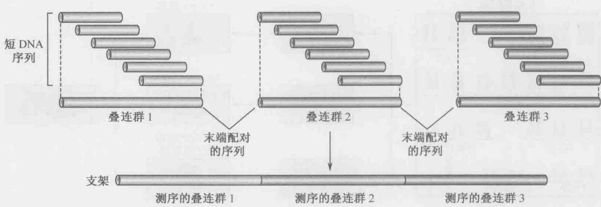  
图 7-18 通过测定大的 DNA 片段的末端序列连接叠连群。例如，一个随机的 100 kb 的基因组 DNA 片段的末端可能含有和叠连群 1 匹配的序列，而另一个末端含有和叠连群 2 匹配的序列。就可以将这两个叠连群放在同一个支架上。（经许可，仿自 Griffiths A.J.F. et al., 2002. Modern Genetics, $2^{nd}$ ed. Fig.9-29b W.H. Freeman.）

#### [W] 末端配对法使大基因组支架的组装成为可能

重复 DNA 的存在是产生更大叠连群的 “瓶颈”（见第 8 章）。一条染色体或一个基因组的随机 DNA 片段中，由于含有同一个 DNA 重复序列，尽管互不连锁，看起来也仿佛相互重叠，这使组装过程变得复杂。配对末端测序（paired-end sequencing）可以克服这种困难。这种技术简单易行，十分有效（见图 7-19）。

<!-- END OFFICIAL API PART part_002 -->

<!-- BEGIN OFFICIAL API PART part_003 -->

  
图 7-19 一个包含长度为 5kb 的随机基因组 DNA 插入片段的 “鸟枪法测序” 文库。平板上每个孔含有一个不同的插入片段。在每个基因组 DNA 片段的两个末端，长度为 600bp 的序列被测定（着色部分）。这些配对末端序列被用来连接不同的叠连群。在本例中，一个 5kb 长度的蓝色基因组 DNA 片段与叠连群 A 和叠连群 B 都匹配。

除了制备由 DNA 短片段组成的鸟枪 DNA 文库，还要制备由 3～100kb 长的基因组 DNA 大片段组成的重组文库。以一个来自人类染色体的 DNA 样本为例，一部分样本用来制备 1kb 片段，另一部分则用来制备 5kb 片段。最终构建了两个文库，一个插入片段小，另一个插入片段大（图 7-17）。

通用引物，即可以在大的 DNA 插入片段的两端与质粒的连接处退火的引物。（用通用引物）对每个随机插入的片段末端一次测序能产生 600bp 序列。记录随机插入片段的每个末端序列的来源。一个末端可能与叠连群 A 内的序列匹配，而另一个末端与叠连群 B 内的序列匹配。由于叠连群 A 和 B 与同一个 5kb 片段有共同序列，可以推断它们来自于染色体的同一区域。大多数重复 DNA 序列的长度小于 2～3kb，所以来自 5kb 插入片段的“配对末端”序列足以跨越被重复区域打断的叠连群。

前述的方法通常产生小于 500kb 的叠连群。为了得到几个 Mb 以上长序列的数据，有必要从至少为 100kb 以上的 DNA 片段中获取配对末端序列的数据。一种特殊的克隆载体，细菌人工染色体（bacterial artificial chromosome，BAC）可以帮助实现这一目标。BAC 中插入的片段长度可达几百 kb。产生长序列的原理和前述 5kb 插入片段一样。使用引物从 BAC 插入片段的两端获取 600bp 的测序结果，接着寻找能与这些序列匹配的叠连群，由于这些叠连群含有来自同一 BAC 插入片段的序列，可以将这些叠连群置于同一支架中。BAC 的使用能使多个叠连群组装在一个含几个 Mb 的支架中（图 7-18）。

#### [W] 向 1000 美元测定人类基因组迈进

最早的两个人类基因组的测序工作（一个来自美国国立卫生研究院，另一个来自私人企业），耗费超过了3亿美元。现在人们开始利用纳米技术进行基因组测序工作，目的是要让测序速度更快，操作更简便，并且便宜到可以使个人基因组测序用于临床诊断。现在，第一代高通量的纳米技术测序仪已经问世了。

454 生命科学测序仪可以在 4 小时的反应中产生将近 400Mb 的序列信息。它的基本原理很巧妙：首先将短的 DNA 片段（基因组 DNA 或 cDNA 等）与微珠混合。混合物需要充分稀释，以保证一个 DNA 分子只结合到一个微珠上。然后，把这些结合了 DNA 的微珠分散在一个含有 400 000 个孔的硅板上（每一个孔都是皮升级别）。因为尺寸极小，所以每个孔只能容纳一个微珠。然后直接对微珠结合的 DNA 进行 PCR，使每一个 DNA 分子得到扩增（图 7-20）。每一个孔扩增后就会产生均一的 DNA 分子群，这些 DNA 分子群可以作为模板来进行下一轮的 DNA 合成反应。测序反应是以分步进行的方式操作

  
图 7-20 454 测序装置的微孔示意图。每一个孔含有一个微珠，微珠带有扩增的 DNA 序列。连续的多轮测序反应通过焦磷酸的释放和光信号来检测。进一步的方法描述详见正文。（经许可影印自 Margulies M. et al. 2005.Nature. 437: 376-380, Fig.1a©Macmillan.）

的，在每个孔中分别依次加入 dATP、dGTP、dCTP 和 dTTP，在每次加入试剂之间要进行洗脱。脱氧核糖的加入依赖于模板 DNA 中的互补碱基，并且引起焦磷酸的脱离。焦磷酸的释放激发酶促反应产生光信号脉冲，该光信号可被连接在计算上的微处理器检测到。发光脉冲可以标示出每一轮合成反应中每一个微孔内掺入了什么样的核苷酸，这样就可以获得所有 400 000 微孔中所包含的 DNA 序列。核苷酸持续加入直到一个 DNA 片段中有 200～250 个碱基被确定。

利用 454 测序技术，已经完成了本书第一作者的基因组序列测定（因为某些原因，这家公司似乎对其他作者的基因组兴趣不大）。按照每一轮反应 100Mb 来算，完成 Watson 的基因组 1 倍覆盖度只需要 30 个反应（一台机器用 2\~3 周时间）。根据现在的状态计算，完成一个人的全基因组测序需花费大约 1\~3 万美元，仅仅是第一个人类基因组测序花费的一小部分，但这些序列数据并不能保证一个新基因组的组装，而只能与美国国立卫生研究院已完成的人类基因组序列作为模板进行比较。454 测序仪所读到的所有 200\~250bp 的序列都要通过与基因组完成图的比对进行鉴定，直到 Watson 的基因组中每一个基因的多态性被鉴定出来。所以，测定一个人的基因组的含义已经发生了变化。在已经有了一个完成的全基因组序列的基础上，只要获得大量的短序列，就可以获得一个个体唯一的遗传构成综合图谱。

下一代的测序仪正在接近1000美元测定一个基因组的目标。Illumina公司已经生产出一种测序仪，该测序仪每个反应可以产生数以亿计的长度为200bp左右读长的数据。它的基本原理和前面描述的454测序仪很相似。不同的是，在它的测序反应中单个DNA分子是结合在玻片上的。一定循环次数的PCR反应使每个DNA分子扩增大约1000个拷贝。随后进行DNA合成反应，并通过焦磷酸的释放来实现检测。Illumina测序仪在一个反应中一般可以产生几十亿个碱基对的序列信息。各种各样的“下一代”高通量测序方法正在开发中，包括等离子半导体测序，该技术可检测在DNA合成过程中核苷酸结合时所释放的氢离子。

<!-- W-END Watson 7 核酸：基本方法 -->

<!-- C-BEGIN Campbell 20.1 -->

### 【英文对应 Campbell Concept 20.1：DNA sequencing and DNA cloning are valuable tools for genetic engineering and biological inquiry】

> 来源：Campbell Biology（书籍/01_Campbell_Biology） 第20章 DNA Tools and Biotechnology，Concept 20.1。

#### [EN] Concept 20.1: DNA sequencing and DNA cloning are valuable tools for genetic engineering and biological inquiry

The discovery of the structure of the DNA molecule, and specifically the recognition that its two strands are complementary to each other, opened the door for the development of DNA sequencing and other techniques for manipulating DNA—known as DNA technology—used in biological research today. Key to these techniques is nucleic acid hybridization, the base pairing of one strand of a nucleic acid to a complementary sequence from another nucleic acid strand, either DNA or RNA. Nucleic acid hybridization forms the foundation of virtually every technique used in genetic engineering, the direct manipulation of genes for practical purposes. Genetic engineering has launched a revolution in fields as varied as criminal law, medicine, and basic biological research. In this section, we'll explore several important techniques and their uses.

#### [EN] DNA Sequencing

Researchers can exploit the principle of complementary base pairing to determine the complete nucleotide sequence of a DNA molecule, a process called DNA sequencing. The first automated procedure, called dideoxy sequencing, was developed in the 1970s by biochemist Frederick Sanger, who received the Nobel Prize in 1980 for this accomplishment. Dideoxy sequencing has been largely replaced by newly developed methods.

During the first decade of this century, “next-generation sequencing” techniques were developed that are rapid and inexpensive (Figure 20.2). DNA fragments are amplified (copied) to yield an enormous number of identical fragments (Figure 20.3). A single template strand of each fragment is immobilized, and the complementary strand is synthesized, one nucleotide at a time. A chemical technique enables electronic monitors to identify in real time which of the four nucleotides is added; this method is thus called sequencing by synthesis. Thousands or hundreds of

Figure 20.2 Next-generation DNA sequencing machines.  
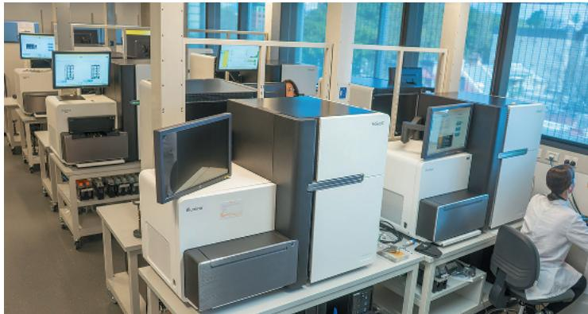

thousands of fragments, each about 300 nucleotides long, are sequenced in parallel in machines like those shown in Figure 20.2, accounting for the high rate of nucleotides sequenced per hour. This is an example of “high-throughput” DNA technology and is currently the method of choice for studies where massive numbers of DNA samples—even a set of numerous fragments representing an entire genome—are being sequenced.

More and more often, next-generation sequencing is complemented (or in some cases replaced) by “third-generation sequencing,” with each new technique being faster and less expensive than the previous one. In some new methods, the DNA is neither cut into fragments nor amplified. Instead, a single, very long DNA molecule is sequenced on its own. Several groups have developed techniques that move a single strand of a DNA molecule through a very small pore (a nanopore) in a membrane, identifying the bases one by one by the distinct way each interrupts an electrical current. One model of this concept is shown in Figure 20.1, in which the pore is a protein channel embedded in a lipid membrane. (Other researchers are using artificial membranes and nanopores.) Each type of base interrupts the electrical current for a slightly different length of time. In 2015, the first nanopore sequencer went on the market; this device is the size of a small candy bar and connects to a computer via a USB port. Associated software allows immediate identification and analysis of the sequence. This is only one of many approaches to further increase the rate and cut the cost of sequencing, while also allowing the methodology to move out of the laboratory and into the field.

Improved DNA-sequencing techniques have transformed the way in which we can explore fundamental biological questions about evolution and how life works (see Make Connections Figure 5.26). Little more than 15 years after the human genome sequence was announced, researchers had completed the sequencing of thousands of genomes, with tens of thousands in progress. Complete genome sequences have been determined for cells from numerous cancers, for ancient humans, and for the many bacteria that live in the human intestine. In Chapter 21, you'll learn more about how this rapid acceleration of sequencing technology has revolutionized our study of the evolution of species and the genome itself. Now, let's consider how individual genes are studied.

#### [EN] Making Multiple Copies of a Gene or Other DNA Segment

A molecular biologist studying a particular gene or group of genes faces a challenge. Naturally occurring DNA molecules are very long, and a single molecule usually carries hundreds or even thousands of genes. Moreover, in many eukaryotic genomes, protein-coding genes occupy only a small proportion of the chromosomal DNA, the rest being noncoding nucleotide sequences. A single human gene, for example, might constitute only 1/100,000 of a chromosomal DNA molecule. As a further complication, it's not easy to distinguish a gene from the surrounding DNA because they differ only in nucleotide sequence. To study a specific gene, scientists have developed methods to isolate a segment of DNA carrying that gene and make multiple identical copies of it—a process called DNA cloning.

#### [EN] Figure 20.3

#### [EN] Research Method: Sequencing by Synthesis: Next-Generation Sequencing

1 Genomic DNA is fragmented, and fragments of 300 base pairs are selected.

2 Each fragment is placed in a droplet with a bead.

#### [EN] Application

In current next-generation sequencing techniques, each fragment is about 300 nucleotides long; by sequencing the fragments in parallel, about 2 billion nucleotides can be sequenced in 24 hours.

#### [EN] Technique

\- Bead

3 Many copies of each fragment are made using a technique called PCR (see Figure 20.7). One million identical copies are made and attached by their 5' end to the bead.

4 The bead is placed into a small well along with DNA polymerases and primers that can hybridize to the 3' end of the single (template) strand.

See numbered steps and diagrams.

DNA polymerase

#### [EN] Results

Each of the 2,000,000 wells in the multiwell plate, which holds a different fragment, yields a different sequence. The results for one fragment are shown below as a “flow-gram.” The sequences of the entire set of fragments are analyzed using computer software, which “stitches” them together into a whole sequence—here, an entire genome.

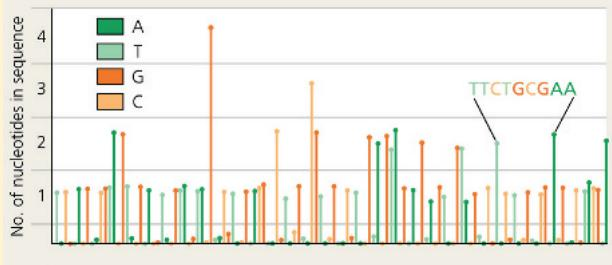

5 The well is one of 2 million on a multiwell plate, each containing a different DNA fragment to be sequenced. A solution of one of the four nucleotides required for DNA synthesis (deoxynucleoside triphosphates, or dNTPs) is added to all wells and then washed off. This is done sequentially for all four nucleotides: dATP, dTTP, dGTP, and then dCTP. The entire process is then repeated over and over again.

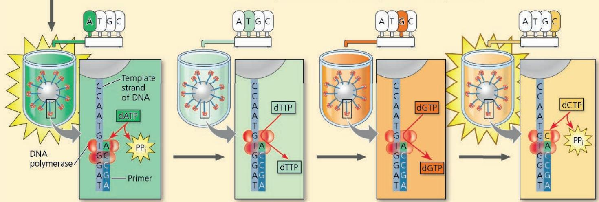

6 In each well, if the next base on the template strand (T in this example) is complementary to the added nucleotide (A, here), the nucleotide is joined to the growing strand, releasing PP $_{1}$ , which causes a flash of light that is recorded.

7 The nucleotide is washed off and a different nucleotide (dTTP, here) is added. If the nucleotide is not complementary to the next template base (G, here), it is not joined to the strand, no reaction occurs, and there is no flash.

8 The process of adding and washing off the four nucleotides is repeated until every fragment has a complete complementary strand. The pattern of flashes reveals the sequence of the original fragment in each well.

INTERPRET THE DATA If the template strand has two or more identical nucleotides in a row, their complementary nucleotides will be added one after the other in the same flow step. How are two or more of the same nucleotide (in a row) detected in the flow-gram? (See sample sequence on the right side of the diagram.) Write out the sequence of the first 25 nucleotides in the flow-gram above, starting from the left. (Ignore the very short lines.)

Most methods for cloning pieces of DNA in the laboratory share certain general features. One common approach uses bacteria, most often Escherichia coli. Recall from Figure 16.13 that the E. coli chromosome is a large, circular molecule of DNA. In addition, E. coli and many other bacteria also have plasmids, small, circular DNA molecules that are replicated separately. A plasmid has only a small number of genes; these genes may be useful when the bacterium is in a particular environment but may not be required for survival or reproduction under most conditions.

To clone pieces of DNA using bacteria, scientists have isolated plasmids from bacterial cells and altered them by genetic engineering. Researchers insert DNA they want to study (“foreign” DNA) into the plasmid (Figure 20.4). The resulting plasmid is now a recombinant DNA molecule, a molecule containing DNA from two different sources, very often different species. The plasmid is then returned to a bacterial cell, producing a recombinant bacterium. This single cell reproduces through repeated cell divisions to form a clone of cells, a population of genetically identical cells. Because the dividing bacteria replicate the recombinant plasmid and pass it on to their descendants, the foreign DNA and any genes it carries are cloned at the same time. The production of multiple copies of a single gene is a type of DNA cloning called gene cloning.

In Figure 20.4, the plasmid acts as a cloning vector, a DNA molecule that can carry foreign DNA into a host cell and be replicated there. Bacterial plasmids are widely used as cloning vectors for several reasons: They can be readily obtained from commercial suppliers, manipulated to form recombinant plasmids by insertion of foreign DNA in a test tube (referred to as in vitro, from the Latin meaning “in glass”), and then easily introduced into bacterial cells. The foreign DNA in Figure 20.4 is a gene from a eukaryotic cell; we will describe in more detail how the foreign DNA segment was obtained later in this section.

Gene cloning is useful for two basic purposes: to make many copies of, or amplify, a particular gene and to produce a protein product from it (see Figure 20.4). Researchers can isolate copies of a cloned gene from bacteria for use in basic research or to endow another organism with a new metabolic capability, such as pest resistance. For example, a resistance gene present in one crop species might be cloned and transferred into plants of another species. (Such organisms are called genetically modified organisms, or GMOs for short; they will be discussed later in the chapter.) Alternatively, a protein with medical uses, such as human growth hormone, can be harvested in large quantities from cultures of bacteria carrying a cloned gene for the protein. (We'll look at the techniques for expressing cloned genes later.) Since one gene is only a very small part of the total DNA in a cell, the ability to amplify such a DNA fragment is crucial for any application involving a single gene.

#### [EN] Using Restriction Enzymes to Make a Recombinant DNA Plasmid

Gene cloning and genetic engineering generally rely on the use of enzymes that cut DNA molecules at a limited number of specific locations. These enzymes, called restriction endonucleases, or restriction enzymes, were discovered in the late 1960s by

Figure 20.4 Gene cloning and some uses of cloned genes.
In this simplified diagram of gene cloning, we start with a plasmid (originally isolated from a bacterial cell) and a gene of interest from another organism. Only one plasmid and one copy of the gene of interest are shown at the top of the figure, but the starting materials would include many of each.

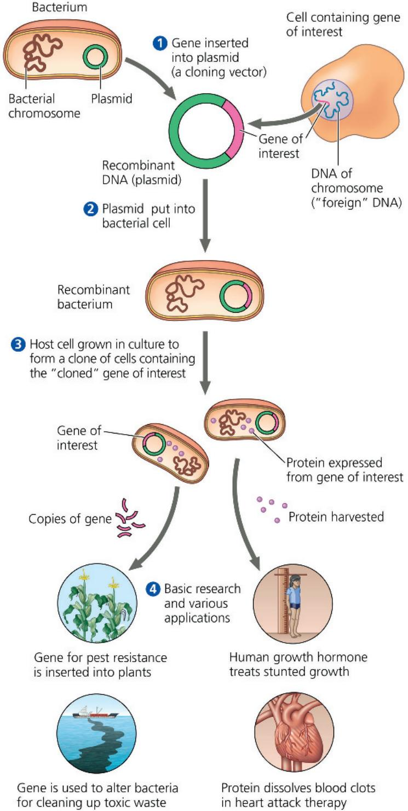

biologists doing basic research on bacteria. Restriction enzymes protect the bacterial cell by cutting up foreign DNA from other organisms or phages (see Concept 19.2).

Hundreds of different restriction enzymes have been identified and isolated. Each restriction enzyme is very specific, recognizing a particular short DNA sequence, or restriction site, and cutting both DNA strands at precise points within this

Figure 20.5 Using a restriction enzyme and DNA ligase to make a recombinant DNA plasmid.

The restriction enzyme in this example (called EcoRI) recognizes a single six-base-pair restriction site present in this plasmid. It makes staggered cuts in the sugar-phosphate backbones, producing fragments with “sticky ends.” Foreign DNA fragments with complementary sticky ends can base-pair with the plasmid ends; the ligated product is a recombinant plasmid. (If the two plasmid sticky ends base-pair, the original nonrecombinant plasmid is reformed.)

  
DRAW IT The restriction enzyme HindIII recognizes the sequence 5'-AAGCTT-3', cutting between the two A's. Draw the double-stranded sequence before and after the enzyme cuts it.
For suggested answer, see Appendix A.

restriction site. The DNA of a bacterial cell is protected from the cell's own restriction enzymes by the addition of methyl groups ( $—CH_{3}$ ) to adenines or cytosines within the sequences recognized by the enzymes.

Figure 20.5 shows how restriction enzymes are used to clone a foreign DNA fragment into a bacterial plasmid. At the top of the figure is a bacterial plasmid (like the one shown in Figure 20.4) that has a single restriction site recognized by a particular restriction enzyme. As shown in this example, most restriction sites are symmetrical. In other words, the sequence of nucleotides is the same on both strands when read in the $5'\rightarrow3'$ direction. The most commonly used restriction enzymes recognize sequences containing four to eight nucleotide pairs. Because any sequence that is this short usually occurs (by chance) many times in a long DNA molecule, a restriction enzyme will make many cuts in such a DNA molecule, yielding a set of restriction fragments. Since restriction enzymes always cut at the same exact DNA sequence, copies of any given DNA molecule exposed to the same restriction enzyme always yield the same set of restriction fragments.

The most useful restriction enzymes cleave the sugar-phosphate backbones in the two DNA strands in a staggered manner, as shown in ① of Figure 20.5. The resulting double-stranded restriction fragments have at least one single-stranded end, called a sticky end. These short extensions can form hydrogen-bonded base pairs with complementary sticky ends on any other DNA molecules cut with the same restriction enzyme, such as the inserted DNA shown in ② of Figure 20.5. The associations formed in this way are only temporary but can be made permanent by DNA ligase, an enzyme that catalyzes the formation of covalent bonds that close up the sugar-phosphate backbones of DNA strands (see ③ of Figure 20.5). At the bottom of Figure 20.5, you can see the stable recombinant DNA molecule that was produced by the ligase-catalyzed joining of DNA from two different sources. The end result, in this example, is the formation of a stable recombinant plasmid containing foreign DNA.

After the recombinant plasmids have been copied many times in host cells, they need to be checked to make sure the fragment has been inserted (see Figure 20.4). To do so, a researcher might cut the products again using the same restriction enzyme. If the insert is there, there would be two DNA fragments, one the size of the plasmid and one the size of the inserted DNA. To separate and visualize the fragments, researchers carry out a technique called gel electrophoresis, in which an electrical current is passed through a gel made of a polymer that has microscopic holes of different sizes. The current drives the fragments through the gel, with shorter fragments traveling faster. Thus, the gel works as a molecular sieve to separate out a mixture of nucleic acid fragments by length (Figure 20.6). Gel electrophoresis is used in conjunction with many different techniques in molecular biology. The same principles are the basis of another technique increasingly in use called capillary electrophoresis, in which a current drives the sample molecules through narrow capillary tubes, separating molecules due to their size.

#### [EN] Figure 20.6 Gel electrophoresis.

A gel made of a polymer acts as a molecular sieve to separate nucleic acids or proteins differing in size, electrical charge, or other physical properties as they move in an electric field. In the example shown here, DNA molecules are separated by length in a gel made of a polysaccharide called agarose.

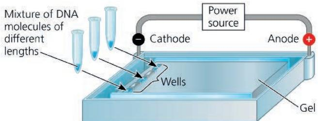  
(a) Each sample, a mixture of different DNA molecules, is placed in a separate well near one end of a thin slab of agarose gel. The gel is set into a small plastic support and immersed in an aqueous, buffered solution in a tray with electrodes at each end. The current is then turned on, causing the negatively charged DNA molecules to move toward the positive electrode.

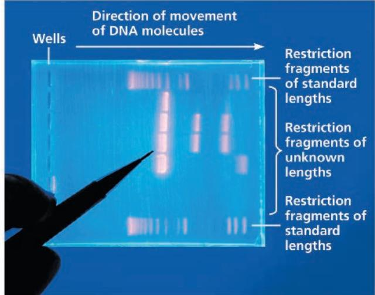  
(b) Shorter molecules are slowed down less than longer molecules, so shorter molecules move faster through the gel. After the current is turned off, a DNA-binding dye is added that fluoresces pink in ultraviolet (UV) light. Each pink band corresponds to many thousands of DNA molecules of the same length. The bands at the upper and lower edges of the gel are restriction fragments of standard lengths for comparison with samples of unknown length.

#### [EN] Amplifying DNA: The Polymerase Chain Reaction (PCR) and Its Use in DNA Cloning

Now that we have examined the cloning vector in some detail, let's consider how biologists obtain the foreign DNA to be inserted. Most researchers have some sequence information about the DNA fragment they want to clone. Using this information, they can start with genomic DNA from the particular species of interest and obtain many copies of the desired gene by using a technique called the polymerase chain reaction, or PCR. Figure 20.7 illustrates the steps in PCR. Within a few hours, this technique can make billions of copies of a specific target DNA segment in a sample, even if that segment makes up less than $0.001\%$ of the total DNA in the sample.

#### [EN] Figure 20.7

#### [EN] Research Method: The Polymerase Chain Reaction (PCR)

#### [EN] Application

With PCR, any specific segment—the target sequence—in a DNA sample can be copied many times (amplified).

#### [EN] Technique

PCR requires double-stranded DNA containing the target sequence, a heat-resistant DNA polymerase, all four nucleotides, and two 15- to 20-nucleotide single DNA strands that serve as primers. One primer is complementary to one end of the target sequence on one strand; the second primer is complementary to the other end of the sequence on the other strand.

#### [EN] Results

After three cycles, two molecules match the target sequence exactly. After 30 more cycles, over 1 billion ( $10^{9}$ ) molecules match.

In the PCR procedure, a three-step cycle causes a chain reaction that produces an exponentially growing population of identical DNA molecules. During each cycle, the reaction mixture is ① heated to high temperatures to denature (separate) the strands of the double-stranded DNA and then ② cooled to allow annealing (hydrogen bonding) of short, single-stranded DNA primers complementary to sequences on opposite strands at each end of the target sequence; finally, ③ a specialized DNA polymerase extends the primers in the $5'\rightarrow3'$ direction. This cycle is then repeated 30–40 times. If a standard DNA polymerase were used, this enzyme would be denatured along with the DNA during the first heating step and would have to be replaced after each cycle. The key to automating PCR was the discovery of an unusual heat-stable DNA polymerase enzyme called Taq polymerase, named after the bacterial species from which it was first isolated. This bacterial species, Thermus aquaticus, lives in hot springs, and the stability of its DNA polymerase at high temperatures is an evolutionary adaptation that enables the enzyme to function at temperatures up to $95^{\circ}$ C. Today, researchers also use a DNA polymerase from the archaeal species Pyrococcus furiosus. This enzyme, called Pfu polymerase, is more accurate and stable but more expensive than Taq polymerase.

PCR is speedy and very specific. Only a minuscule amount of DNA need be present in the starting material, and this DNA can be partially degraded, as long as there are a few copies of the complete target sequence. The key to the high specificity is the pair of primers used for each PCR amplification. The primer sequences are chosen so that they hybridize only to sequences at opposite ends of the target segment, one on the 3' end of each strand. (For high specificity, the primers must be at least 15 nucleotides long.) With each successive cycle, the number of target segment molecules of the correct length doubles, so the number of molecules equals $2^{n}$ , where n is the number of cycles. After 30 or so cycles, about a billion copies of the target sequence are present!

Despite its speed and specificity, PCR amplification cannot substitute for gene cloning in cells to make large amounts of a gene. This is because the polymerases that are used have no proofreading function, and occasional errors during PCR replication limit the number of good copies and the length of DNA fragments that can be copied. Instead, PCR is used to provide the specific DNA fragment for cloning. PCR primers are synthesized to include a restriction site at each end of the DNA fragment that matches the site in the cloning vector, and the fragment and vector are cut and ligated together (Figure 20.8). The resulting plasmids are sequenced so that those with error-free inserts can be selected.

Devised in 1985, PCR has had a major impact on biological research and genetic engineering. PCR has been used to amplify DNA from a wide variety of sources: a 40,000-year-old frozen woolly mammoth; fingerprints or tiny amounts of blood, tissue, or semen found at crime scenes; single embryonic cells for rapid prenatal diagnosis of genetic disorders (see Figure 14.19); and cells infected with viruses that are difficult to detect, such as

#### [EN] Figure 20.8 Use of a restriction enzyme and PCR in gene cloning.

In a closer look at the beginning of the process shown in Figure 20.4, PCR is used to produce the DNA fragment or gene of interest that will be ligated into a cloning vector, in this case a bacterial plasmid.

HIV. (To test for HIV, viral genes are amplified.) Also, PCR tests are used to accurately detect the presence of SARS-CoV-2 (the virus that causes COVID-19) even in patients without any symptoms. We'll return to these and other applications of PCR later in the chapter.

#### [EN] Expressing Cloned Eukaryotic Genes

Once a gene has been cloned in host cells, its protein product can be expressed in large amounts for research or for practical applications, which we'll explore in Concept 20.4. Cloned genes can be expressed in either bacterial or eukaryotic cells; each option has advantages and disadvantages.

#### [EN] Bacterial Expression Systems

Getting a cloned eukaryotic gene to function in bacterial host cells can be difficult because certain aspects of gene expression are different in eukaryotes and bacteria. To overcome differences in promoters and other DNA control sequences (see Concept 17.2), scientists usually employ an expression vector, a cloning vector that contains a highly active bacterial promoter just upstream of a restriction site where the eukaryotic gene can be inserted in the correct reading frame. The bacterial host cell will recognize the promoter and proceed to express the foreign gene now linked to that promoter. Such expression vectors allow the synthesis of many eukaryotic proteins in bacterial cells.

Another problem with expressing cloned eukaryotic genes in bacteria is the presence of noncoding regions (introns) in most eukaryotic genes (see Concept 17.3). Introns can make a eukaryotic gene very long and unwieldy, and they prevent correct expression of the gene by bacterial cells, which do not have RNA-splicing machinery. This problem can be surmounted by using a form of the gene that includes only the exons. (This is called complementary DNA, or cDNA; see Figure 20.10.)

#### [EN] Eukaryotic DNA Cloning and Expression Systems

Molecular biologists can avoid eukaryotic-bacterial incompatibility by using eukaryotic cells such as yeasts as hosts for cloning and expressing eukaryotic genes. Yeasts, single-celled fungi, are as easy to grow as bacteria, and they have plasmids, a rarity among eukaryotes.

In addition to enabling RNA splicing, eukaryotic host cells are advantageous because many eukaryotic proteins will not function unless they are modified after translation—for example, by the addition of carbohydrate groups (glycosylation) or lipid groups in the ER and Golgi. Bacterial cells lack membrane-bound organelles and cannot carry out these modifications, and if the gene product requiring such processing is from a mammalian gene, even yeast cells may not be able to modify the protein correctly. Several cultured cell types have proved successful as host cells for this purpose, including some mammalian cell lines and an insect cell line that can be infected by a virus carrying recombinant DNA.

Scientists have developed other methods for introducing recombinant DNA into eukaryotic cells. In electroporation, a brief electrical pulse applied to a solution containing cells creates temporary holes in their plasma membranes, through which DNA can enter. (This technique is now commonly used for bacteria as well.) Alternatively, scientists can inject DNA directly into single eukaryotic cells using microscopically thin needles. Another way to get DNA into plant cells is by using the soil bacterium Agrobacterium tumefaciens, as we'll see later. Whatever the method, if the introduced DNA is incorporated into a cell's genome by genetic recombination, then it can be stably expressed by the cell. Expressing different versions of genes in cells allows researchers to study protein function, a topic we'll return to in Concept 20.2.

#### [EN] Cross-Species Gene Expression and Evolutionary Ancestry

EVOLUTION The ability to express eukaryotic proteins in bacteria (even if the proteins can't be modified properly) is quite remarkable when we consider how different eukaryotic and bacterial cells are. In fact, examples abound of genes that are taken from one species and function perfectly well when transferred into another very different species, such as a firefly gene in a tobacco plant and a jellyfish gene in a pig (see Figure 17.7). These observations underscore the shared evolutionary ancestry of species living today.

One example involves a gene called Pax-6, which has been found in animals as diverse as vertebrates and fruit flies. The vertebrate Pax-6 gene product (the PAX-6 protein) triggers a complex program of gene expression resulting in formation of the vertebrate eye, which has a single lens. Expression of the fly Pax-6 gene leads to formation of the compound fly eye, which is quite different from the vertebrate eye. When the mouse Pax-6 gene was cloned and introduced into a fly embryo so that it replaced the fly's own Pax-6 gene, researchers were surprised to see that the mouse version of the gene led to formation of a compound fly eye (see Figure 50.16). Conversely, when the fly Pax-6 gene was transferred into a vertebrate embryo—a frog, in this case—a frog eye formed. Although the genetic programs triggered in vertebrates and flies generate very different eyes, the two versions of the Pax-6 gene can substitute for each other to trigger lens development, evidence of their evolution from a gene in a very ancient common ancestor. Because of their ancient evolutionary roots, all living organisms share the same basic mechanisms of gene expression. This commonality is the basis of many recombinant DNA techniques described in this chapter.

#### [EN] Concept Check 20.1

1. MAKE CONNECTIONS The restriction site for an enzyme called PvuI is the following sequence:

#### [EN] $5^{\prime}$ -CGATCG- $3^{\prime}$ $3^{\prime}$ -GCTAGC- $5^{\prime}$

Staggered cuts are made between the T and C on each strand. What type of bonds are being cleaved? (See Concept 5.5.)

2. DRAW IT One strand of a DNA molecule has the following sequence:

#### [EN] 5′-CTTGACGATCGTTACCG-3′

Draw the other strand. Will PvuI (see question 1) cut this molecule? If so, draw the products.

3. What are some potential difficulties in using plasmid vectors and bacterial host cells to produce large quantities of proteins from cloned eukaryotic genes?

4. VISUAL SKILLS Compare Figure 20.7 with Figure 16.21. How does replication of DNA ends during PCR proceed without shortening the fragments each time?

For suggested answers, see Appendix A.

<!-- C-END Campbell 20.1 -->

<!-- L-BEGIN Lehninger 9.1 -->

### 【英文对应 Lehninger §9.1：Studying Genes and Their Products】

> 来源：Lehninger Principles of Biochemistry（书籍/02_生物化学原理） 第9章 DNA-Based Information Technologies，§9.1。

A researcher has isolated a new enzyme that she knows is the key to a human disease. She hopes to isolate large amounts of the protein to crystallize it for structural analysis and to study it. She wants to alter amino acid residues at its active site so that she can understand the reaction it catalyzes. She plans an elaborate research program to elucidate how this enzyme interacts with, and is regulated by, other proteins in the cell. All of this, and much more, becomes possible if she can isolate the gene encoding her enzyme. Unfortunately, that gene consists of just a few thousand base pairs within a human chromosome with a size measured in hundreds of millions of base pairs. How does she isolate the small segment that she needs and then study it? The answer lies in DNA cloning and methods developed to manipulate cloned genes.

#### [EN] Genes Can Be Isolated by DNA Cloning

A clone is an identical copy. This term originally applied to cells of a single type, isolated and allowed to reproduce to create a population of identical cells. When applied to DNA, a clone represents many identical copies of a particular gene segment. P1 In brief, our researcher must separate the gene from the larger chromosome, attach it to a much smaller piece of carrier DNA, and allow microorganisms to make many copies of it. This is the process of DNA cloning. The result is selective amplification of a particular gene or DNA segment so that its genetic information may be studied and utilized. Classically, the cloning of DNA from any organism entails five general procedures:

1. Obtaining the DNA segment to be cloned. Enzymes called restriction endonucleases act as precise molecular scissors, recognizing specific sequences in DNA and cleaving genomic DNA into smaller fragments suitable for cloning. Alternatively, genomic DNA can be sheared randomly into fragments of a desired size. Since the sequence of targeted genomic regions is often known (available in databases), DNA segments to be cloned are most often amplified by the polymerase chain reaction (PCR) or are simply synthesized (both methods are described in Chapter 8).

2. Selecting a small molecule of DNA capable of autonomous replication. These small DNAs are called cloning vectors (a vector is a carrier or delivery agent). Most cloning vectors used in the laboratory are modified versions of naturally occurring small DNA molecules found in bacteria or eukaryotes. Viral DNAs may also play this role.

3. Joining two DNA fragments covalently. The enzyme DNA ligase links the cloning vector to the DNA fragment to be cloned. Composite DNA molecules of this type, comprising covalently linked segments from two or more sources, are called recombinant DNAs.

4. Moving recombinant DNA from the test tube to a host organism. The host organism provides the enzymatic machinery for DNA replication.

5. Selecting or identifying host cells that contain recombinant DNA. The cloning vector generally has features that allow the host cells to survive in an environment in which cells lacking the vector would die. Cells containing the vector are thus "selectable" in that environment.

The methods used to accomplish these and related tasks are collectively referred to as recombinant DNA technology or, more informally, genetic engineering.

Much of our initial discussion focuses on DNA cloning in the bacterium Escherichia coli, the first organism used for recombinant DNA work and still the most common host cell. E. coli has many advantages: its DNA metabolism (like many other of its biochemical processes) is well understood; many naturally occurring cloning vectors associated with E. coli, such as plasmids and bacteriophages (bacterial viruses; also called phages), are readily available; and techniques are available for moving DNA expeditiously from one bacterial cell to another. The principles discussed here are broadly applicable to DNA cloning in other organisms, a topic discussed more fully later in the section.

#### [EN] Restriction Endonucleases and DNA Ligases Yield Recombinant DNA

A set of enzymes (Table 9-1) made available through decades of research on nucleic acid metabolism is indispensable for generating and propagating a recombinant DNA molecule (Fig. 9-1). First, P1 restriction endonucleases (also called restriction enzymes)

<table><tr><td colspan="2">TABLE 9-1 Some Enzymes Used in Recombinant DNA Technology</td></tr><tr><td>Enzyme(s)</td><td>Function</td></tr><tr><td>Type II restriction endonucleases</td><td>Cleave DNA molecules at specific base sequences</td></tr><tr><td>DNA ligase</td><td>Joins two DNA molecules or fragments</td></tr><tr><td>DNA polymerase I (E. coli)</td><td>Fills gaps in duplexes by stepwise addition of nucleotides to 3&#x27; ends</td></tr><tr><td>Reverse transcriptase</td><td>Makes a DNA copy of an RNA molecule</td></tr><tr><td>Polynucleotide kinase</td><td>Adds a phosphate to the 5&#x27;-OH end of a polynucleotide to label it or to permit ligation</td></tr><tr><td>Terminal transferase</td><td>Adds homopolymer tails to the 3&#x27;-OH ends of a linear duplex</td></tr><tr><td>Exonuclease III</td><td>Removes nucleotide residues from the 3&#x27; ends of a DNA strand</td></tr><tr><td>Bacteriophage λ exonuclease</td><td>Removes nucleotides from the 5&#x27; ends of a duplex to expose single-stranded 3&#x27; ends</td></tr><tr><td>Alkaline phosphatase</td><td>Removes terminal phosphates from the 5&#x27; end or 3&#x27; end (or both)</td></tr></table>

  
FIGURE 9-1 Schematic illustration of DNA cloning. A cloning vector and eukaryotic chromosomes are separately cleaved with the same restriction endonuclease. (A single chromosome is shown here for simplicity.) The fragments to be cloned are then ligated to the cloning vector. The resulting recombinant DNA (only one recombinant vector is shown here) is introduced into a host cell, where it can be propagated (cloned). Note that this drawing is not to scale: the size of the E. coli chromosome relative to that of a typical cloning vector (such as a plasmid) is much greater than depicted here.

recognize and cleave DNA at specific sequences (recognition sequences or restriction sites) to generate a set of smaller fragments. Second, the DNA fragment to be cloned is joined to a suitable cloning vector by using DNA ligases to link the DNA molecules together. The recombinant vector is then introduced into a host cell, which amplifies the fragment in the course of many generations of cell division.

Restriction endonucleases are found in a wide range of bacterial species. As Werner Arber discovered in the early 1960s, the biological function of restriction endonucleases is to recognize and cleave foreign DNA (the DNA of an infecting virus, for example); such DNA is said to be restricted. In the host cell's DNA, the sequence that would be recognized by one of its own restriction endonucleases is protected from digestion by methylation of the DNA, catalyzed by a specific DNA methylase. The restriction endonuclease and the corresponding methylase are sometimes referred to as a restriction-modification system.

There are three types of restriction endonucleases, designated I, II, and III. Types I and III are generally large, multisubunit complexes containing both the endonuclease and methylase activities. Type II restriction endonucleases, first isolated by Hamilton Smith in 1970, are simpler, require no ATP, and catalyze the hydrolytic cleavage of particular phosphodiester bonds in the DNA within the recognition sequence itself. The extraordinary utility of this group of restriction endonucleases was demonstrated by Daniel Nathans, who first used them to develop novel methods for mapping and analyzing genes and genomes.

Thousands of type II restriction endonucleases have been discovered in different bacterial species, and more than 100 different DNA sequences are recognized by one or more of these enzymes. The recognition sequences are usually 4 to 6 bp long and are palindromic (see Fig. 8-18). Table 9-2 lists sequences recognized by a few type II restriction endonucleases.

Some restriction endonucleases make staggered cuts on the two DNA strands, leaving two to four nucleotides of one strand unpaired at each resulting end. These unpaired strands are referred to as sticky ends (Fig. 9-2a) because they can base-pair with each other or with complementary sticky ends of other DNA fragments. Other restriction endonucleases cleave both strands of DNA straight across, at opposing phosphodiester bonds, leaving no unpaired bases on the ends, often called blunt ends (Fig. 9-2b).

<table><tr><td colspan="4">TABLE 9-2 Recognition Sequences for Some Type II Restriction Endonucleases</td></tr><tr><td>BamHI</td><td>↓* (5&#x27;) G G A T C C (3&#x27;) CCTAGG * ↑</td><td>HindIII</td><td>↓ (5&#x27;) A A G C T T (3&#x27;) TTC G A A ↑</td></tr><tr><td>ClaI</td><td>↓* (5&#x27;) A T C G A T (3&#x27;) TAGCTA * ↑</td><td>NotI</td><td>↓ (5&#x27;) G C G G C C G C (3&#x27;) CG C C G G C G ↑</td></tr><tr><td>EcoRI</td><td>↓* (5&#x27;) GAATTC (3&#x27;) CTTAAG * ↑</td><td>PstI</td><td>* ↓ (5&#x27;) CTGCAG (3&#x27;) GACGTC ↑ *</td></tr><tr><td>EcoRV</td><td>↓ (5&#x27;) G A T A T C (3&#x27;) CTATAG ↑</td><td>PvuII</td><td>↓ (5&#x27;) CAGCTG (3&#x27;) GTCGAC ↑</td></tr><tr><td>HaeIII</td><td>↓* (5&#x27;) GGCC (3&#x27;) GGCC *↑</td><td>Tth111I</td><td>↓ (5&#x27;) GACNNNGTC (3&#x27;) CTGNNNCAG ↑</td></tr></table>

Note: Arrows indicate the phosphodiester bonds cleaved by each restriction endonuclease. Asterisks indicate bases that are methylated by the corresponding methylase (where known). N denotes any base. Note that the name of each enzyme consists of a three-letter abbreviation of the bacterial species from which it is derived, sometimes followed by a strain designation and roman numerals to distinguish different restriction endonucleases isolated from the same bacterial species. Thus BamHI is the first (I) restriction endonuclease characterized from Bacillus amyloliquefaciens, strain H.

P2 The gene or DNA segment to be cloned is most often generated by the polymerase chain reaction. Careful design of the primers used for PCR (see Fig. 8-33) can alter the amplified segment by the inclusion, at each end, of additional DNA not present in the chromosome that is being targeted. For example, including restriction endonuclease cleavage sites can facilitate the subsequent cloning of the amplified DNA (Fig. 9-2c).

P3 After the target DNA fragment is prepared and digested with the appropriate restriction enzyme, DNA ligase can be used to join it to a vector digested by the same restriction endonuclease; a fragment generated by EcoRI, for example, generally will not link to a fragment generated by BamHI. As described in more detail in Chapter 25 (see Fig. 25-15), DNA ligase catalyzes the formation of new phosphodiester bonds in a reaction that uses ATP or a similar cofactor. The base pairing of complementary sticky ends greatly facilitates the ligation reaction (Fig. 9-2a). Blunt ends can also be ligated, albeit less efficiently. Researchers can create new DNA sequences for a wide range of purposes by inserting synthetic DNA fragments, called linkers, to bridge the ends that are being ligated. An inserted DNA fragment with multiple recognition sequences for restriction endonucleases (often useful later as points for inserting additional DNA by cleavage and ligation) is called the multiple cloning site (MCS) (Fig. 9-2d).

The effectiveness of sticky ends in selectively joining two DNA fragments was apparent in the earliest recombinant DNA experiments. Before restriction endonucleases were widely available, some investigators found they could generate sticky ends by the combined action of the bacteriophage $\lambda$ exonuclease and terminal transferase (Table 9-1). The fragments to be joined were given complementary homopolymeric tails. Peter Lobban and Dale Kaiser used this method in 1971 in the first experiments to join naturally occurring DNA fragments. Similar methods were used soon after in Paul Berg's laboratory to join DNA segments from simian virus 40 (SV40) to DNA derived from bacteriophage $\lambda$ , thereby creating the first recombinant DNA molecule with DNA segments from different species.

#### [EN] Cloning Vectors Allow Amplification of Inserted DNA Segments

The factors that govern the delivery of recombinant DNA in clonable form to a host cell, and its subsequent amplification in the host, are well illustrated in three popular cloning vectors: plasmids and bacterial artificial chromosomes, used in experiments with E. coli, and a vector used to clone large DNA segments in yeast.

  
FIGURE 9-2 Use of restriction endonucleases in cloning. (a) Restriction endonucleases recognize and cleave only specific sequences, leaving either sticky ends (with protruding single strands) or blunt ends. Fragments can be ligated to other DNAs, such as the cleaved cloning vector (a plasmid) shown here. This reaction is facilitated by the annealing of complementary sticky ends. Ligation is less efficient for DNA fragments with blunt ends than for those with complementary sticky ends, and DNA fragments with different (noncomplementary) sticky ends generally are not ligated. (b) DNA that has been amplified by the polymerase chain reaction (see Fig. 8-33) can be cloned. The primers can include noncomplementary ends that have a site for cleavage by a restriction endonuclease. Although these parts of the primers do not anneal to the target DNA, the PCR process incorporates them into the DNA that is amplified. Cleavage of the amplified fragments at these sites creates sticky ends, used in ligation of the amplified DNA to a cloning vector. (c) A synthetic DNA fragment with recognition sequences for several restriction endonucleases can be inserted into a plasmid that has been cleaved by a restriction endonuclease. The insert is called a linker; an insert with multiple restriction sites is generally called a multiple cloning site (MCS).

Plasmids A plasmid is a circular DNA molecule that replicates separately from the host chromosome. Naturally occurring bacterial plasmids range in size from 5,000 to 400,000 bp. Many of the plasmids found in bacterial populations are little more than molecular parasites, similar to viruses but with a more limited capacity to transfer from one cell to another. To survive in the host cell, plasmids incorporate several specialized sequences that enable them to make use of the cell's resources for their own replication and gene expression.

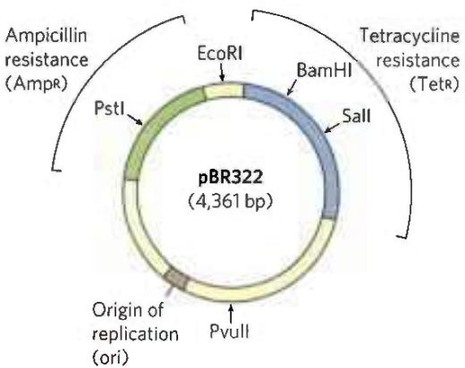  
FIGURE 9-3 The constructed E. coli plasmid pBR322. Notice the location of some important restriction sites, for PstI, EcoRI, BamHI, SalI, and Pvull; genes for ampicillin and tetracycline resistance (Amp $^{R}$ and Tet $^{R}$ ); and the replication origin (ori). Constructed in 1977, this was one of the early plasmids designed expressly for cloning in E. coli.

Naturally occurring plasmids usually have a symbiotic role in the cell. They may provide genes that confer resistance to antibiotics or that perform new functions for the cell. For example, the Ti plasmid of Agrobacterium tumefaciens allows the host bacterium to colonize the cells of a plant and make use of the plant's resources. The same properties that enable plasmids to grow and survive in a bacterial or eukaryotic host are useful to molecular biologists who want to engineer a vector for cloning a specific DNA segment. Constructed in 1977, one of the first recombinant vectors—E. coli plasmid pBR322—illustrates some key features that define a useful cloning vector (Fig. 9-3):

1. The plasmid pBR322 has an origin of replication, or ori, a sequence where replication is initiated by cellular enzymes (see Chapter 25). This sequence is required to propagate the plasmid. An associated regulatory system is present that limits replication to maintain pBR322 at a level of 10 to 20 copies per cell.

2. The plasmid contains genes that confer resistance to the antibiotics ampicillin (Amp $^{R}$ ) and tetracycline (Tet $^{R}$ ), allowing the selection of cells that contain the intact plasmid or a recombinant version of the plasmid (discussed below).

3. Several unique recognition sequences in pBR322 are targets for restriction endonucleases (PstI, EcoRI, BamHI, Sall, and PvuII), providing sites where the plasmid can be cut to insert foreign DNA.

4. The small size of the plasmid (4,361 bp) facilitates its entry into cells and the biochemical manipulation of the DNA. This small size was the result of trimming away many DNA segments from a larger, parent plasmid—sequences that the biochemist does not need.

The replication origins inserted in common plasmid vectors were originally derived from naturally occurring plasmids. As in pBR322, each of these origins is regulated to maintain a particular plasmid copy number. Depending on the origin used, the plasmid copy number can vary from one to hundreds or thousands per cell, providing many options for investigators. Two different plasmids cannot function in the same cell if they use the same origin of replication, because the regulation of one will interfere with the replication of the other. Such plasmids are said to be incompatible. When a researcher wants to introduce two or more different plasmids into a bacterial cell, each plasmid must have a different replication origin.

In the laboratory, small plasmids can be introduced into bacterial cells by a process called transformation. The cells (often E. coli, but other bacterial species are also used) and plasmid DNA are incubated together at 0 °C in a calcium chloride solution, then are subjected to heat shock by rapidly shifting the temperature to between 37 °C and 43 °C. For reasons not well understood, some of the cells treated in this way take up the plasmid DNA. Some species of bacteria, such as Acinetobacter baylyi, are naturally competent for DNA uptake and do not require the calcium chloride–heat shock treatment. In an alternative method, called electroporation, cells incubated with the plasmid DNA are subjected to a high-voltage pulse, which transiently renders the bacterial membrane permeable to large molecules.

Regardless of the approach, relatively few cells take up the plasmid DNA, so a method is needed to identify those that do. The usual strategy is to utilize one of two types of genes in the plasmid, referred to as selectable and screenable markers. A selectable marker either permits the growth of a cell (positive selection) or kills the cell (negative selection) under a defined set of conditions. The plasmid pBR322 provides markers for both positive and negative selection (Fig. 9-4). A screenable marker is a gene encoding a protein that causes the cell to produce a colored or fluorescent molecule. Cells are not harmed when the gene is present, and the cells that carry the plasmid are easily identified by the colored or fluorescent colonies they produce.

Transformation of typical bacterial cells with purified DNA (never a very efficient process) becomes less successful as plasmid size increases, and it is difficult to clone DNA segments longer than about 15,000 bp when plasmids are used as the vector.

To illustrate the use of a plasmid as a cloning vector, consider the bacterial gene encoding a recombinase called the RecA protein (see Chapter 25). In most bacteria, the gene encoding RecA is one of the thousands of genes on a chromosome millions of base pairs long. The recA gene is just over 1,000 bp long. A plasmid would be a good choice for cloning a gene of this size. As described later, the cloned gene can be altered in a variety of ways, and the gene variants can be expressed at high levels to enable purification of the encoded protein.

5 Cells that grow on tetracycline but not on tetracycline + ampicillin contain recombinant plasmids with disrupted ampicillin resistance, hence the foreign DNA. Cells with pBR322 without foreign DNA retain ampicillin resistance and grow on both plates.

FIGURE 9-4 Use of pBR322 to clone foreign DNA in E. coli and identify cells containing the DNA. [Courtesy Elizabeth A. Wood, University of Wisconsin–Madison, Department of Biochemistry.]

Bacterial Artificial Chromosomes Researchers sometimes want to clone much longer DNA segments than can typically be incorporated into standard plasmid cloning vectors such as pBR322. To meet this need, plasmid vectors have been developed with special features that allow the cloning of very long segments (typically 100,000 to 300,000 bp) of DNA. Once such large segments of cloned DNA have been added, these vectors are large enough to be thought of as chromosomes and are known as bacterial artificial chromosomes, or BACs (Fig. 9-5).

A BAC vector (without any cloned DNA inserted) is a relatively simple plasmid, generally not much larger than other plasmid vectors. To accommodate very long segments of cloned DNA, BAC vectors have stable origins of replication that maintain the plasmid at one or two copies per cell. The low copy number is useful in cloning large segments of DNA, because it limits the opportunities for unwanted recombination reactions that can unpredictably alter large cloned DNAs over time. BACs also include par genes, derived from a type of plasmid called an F plasmid. The par genes encode proteins that direct the reliable distribution of the recombinant chromosomes to daughter cells at cell division, thereby increasing the likelihood of each daughter cell carrying one copy, even when few copies are present.

The BAC vector includes both selectable and screenable markers. The BAC vector shown in Figure 9-5 contains a gene that confers resistance to the antibiotic chloramphenicol (Cam $^{R}$ ). Vector-containing cells can be selected by growing them on agar plates containing this antibiotic—a positive selection, as the cells with the vector survive. A lacZ gene, required for production of the enzyme β-galactosidase, is a screenable marker that can reveal which cells contain plasmids—now chromosomes—that incorporate the cloned DNA segments. The β-galactosidase catalyzes conversion of the colorless molecule 5-bromo-4-chloro-3-indolyl-β-d-galactopyranoside (more simply, X-gal) to a blue product. If the gene is intact and expressed, the colony containing it is blue. If gene expression is disrupted by the introduction of a cloned DNA segment, the colony is white.

Yeast Artificial Chromosomes As with E. coli, yeast genetics is a well-developed discipline. Research on large genomes and the associated need for high-capacity cloning vectors led to the development of yeast artificial chromosomes, or YACs (Fig. 9-6). As with BACs, YAC vectors can be used to clone very long segments of DNA. In addition, P3 the DNA cloned in a YAC can be altered to study the function of specialized sequences in chromosome metabolism, mechanisms of gene regulation and expression, and many other aspects of eukaryotic molecular biology.

The genome of Saccharomyces cerevisiae contains only $14 \times 10^{6}$ bp (less than four times the size of the E. coli chromosome), and its entire sequence is known.

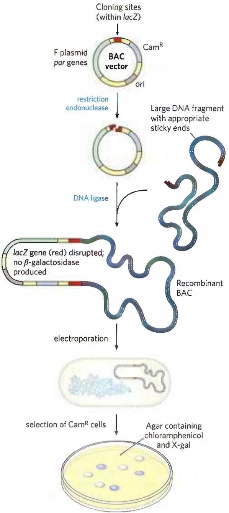

  
Colonies with recombinant BACs are white.  
FIGURE 9-5 Bacterial artificial chromosomes (BACs) as cloning vectors. The vector is a relatively simple plasmid, with a replication origin (ori) that directs replication. The par genes assist in the even distribution of plasmids to daughter cells at cell division. This increases the likelihood of each daughter cell carrying one copy of the plasmid, even when few copies are present. The low number of copies is useful in cloning large segments of DNA, because this limits the opportunities for unwanted recombination reactions that can unpredictably alter large cloned DNAs over time. The BAC includes selectable markers. A lacZ gene (required for the production of the enzyme $\beta$ -galactosidase) is situated in the cloning region such that it is inactivated by cloned DNA inserts. Introduction of recombinant BACs into cells by electroporation is promoted by the use of cells with an altered (more porous) cell wall. Recombinant DNAs are screened for resistance to the antibiotic chloramphenicol (CamR). Plates also contain X-gal, a substrate for $\beta$ -galactosidase that yields a blue product. Colonies with active $\beta$ -galactosidase, and hence no DNA insert in the BAC vector, turn blue; colonies without $\beta$ -galactosidase activity, and thus with the desired DNA inserts, are white.  
FIGURE 9-6 Construction of a yeast artificial chromosome (YAC). A YAC vector includes an origin of replication (ori), a centromere (CEN), two telomeres (TEL), and selectable markers (X and Y). Digestion with BamHI and EcoRI generates two separate DNA arms, each with a telomeric end and one selectable marker. A large segment of DNA (e.g., up to $2 \times 10^{6}$ bp from the human genome) is ligated to the two arms to create a yeast artificial chromosome. The YAC transforms yeast cells (prepared by removal of the cell wall to form spheroplasts), and the cells are selected for X and Y; the surviving cells propagate the DNA insert.

Yeast is also very easy to maintain and grow on a large scale in the laboratory. Plasmid vectors have been constructed for insertions into yeast cells, employing the same principles that govern the use of E. coli vectors. Convenient methods for moving DNA into and out of yeast cells permit the study of many aspects of eukaryotic cell biochemistry. Some recombinant plasmids incorporate multiple replication origins and other elements that allow them to be used in more than one species (e.g., in yeast and in E. coli). Plasmids that can be propagated in cells of two or more species are called shuttle vectors.

YAC vectors contain all the elements needed to maintain a eukaryotic chromosome in the yeast nucleus: a yeast origin of replication, two selectable markers, and specialized sequences (derived from the telomeres and centromere) needed for stability and proper segregation of the chromosomes at cell division (see Chapter 24). In preparation for its use in cloning, the vector is propagated as a circular bacterial plasmid and then isolated and purified. Cleavage with a restriction endonuclease (BamHI in Fig. 9-6) removes a length of DNA between two telomere sequences (TEL), leaving the telomeres at the ends of the linearized DNA. Cleavage at another internal site (by EcoRI in Fig. 9-6) divides the vector into two DNA segments, referred to as vector arms, each with a different selectable marker.

Genomic DNA to be cloned is prepared by partial digestion with restriction endonucleases to obtain a suitable fragment size. Genomic fragments are then separated by pulsed field gel electrophoresis, a variation of gel electrophoresis (see Fig. 3-18) that segregates very large DNA segments. DNA fragments of appropriate size (up to about $2 \times 10^{6}$ bp) are mixed with the prepared vector arms and ligated. The ligation mixture is then used to transform yeast cells (pre-treated to partially degrade their cell walls) with these very large DNA molecules—which now have the structure and size to be considered yeast chromosomes. Culture on a medium that requires the presence of both selectable marker genes ensures the growth of only those yeast cells that contain an artificial chromosome with a large insert sandwiched between the two vector arms (Fig. 9-6). The stability of YAC clones increases with the length of the cloned DNA segment (up to a point). Those with inserts of more than 150,000 bp are nearly as stable as normal cellular chromosomes, whereas those with inserts of fewer than 100,000 bp are gradually lost during mitosis (so, generally, there are no yeast cell clones carrying only the two vector ends ligated together or vectors with only short inserts). YACs that lack a telomere at either end are rapidly degraded.

#### [EN] Cloned Genes Can Be Expressed to Amplify Protein Production

P1 Frequently, the product of a cloned gene, rather than the gene itself, is of primary interest—particularly when the protein has commercial, therapeutic, or research value. Proteins are encoded by genes in DNA; alter the DNA in a gene, and one can alter the protein product of that gene. Biochemists use purified proteins for many purposes, including to elucidate protein function, study reaction mechanisms, generate antibodies to the proteins, reconstitute complex cellular activities in the test tube with purified components, and examine protein binding partners. With an increased understanding of the fundamentals of DNA, RNA, and protein metabolism and their regulation in a host organism such as E. coli or yeast, investigators can manipulate cells to express cloned genes in order to study their protein products. The general goal is to alter the sequences around a cloned gene to trick the host organism into producing the protein product of the gene, often at very high levels. This overexpression of a protein can make its subsequent purification much easier.

We'll use the expression of a eukaryotic protein in a bacterium as an example. Eukaryotic genes have surrounding sequences needed for their transcription and regulation in the cells they are derived from, but these sequences do not function in bacteria. Thus, eukaryotic genes lack the DNA sequence elements required for their controlled expression in bacterial cells: promoters (sequences that instruct RNA polymerase where to bind to initiate mRNA synthesis), ribosome-binding sites (sequences that allow translation of the mRNA to protein), and additional regulatory sequences. Appropriate bacterial regulatory sequences for transcription and translation must be inserted in the vector DNA at the correct positions relative to the eukaryotic gene.

Cloning vectors with the transcription and translation signals needed for the regulated expression of a cloned gene are called expression vectors. The rate of expression of the cloned gene is controlled by replacing the gene's normal promoter and regulatory sequences with more efficient and convenient versions supplied by the vector. Generally, a well-characterized promoter and its regulatory elements are positioned near several unique restriction sites for cloning, so that genes inserted at the restriction sites will be expressed from the regulated promoter elements (Fig. 9-7). Some of these vectors incorporate other features, such as a bacterial ribosome-binding site to enhance translation of the mRNA derived from the gene (Chapter 27) or a transcription termination sequence (Chapter 26). In some cases, cloned genes are so efficiently expressed that their protein product represents 10% or more of the cellular protein. At these concentrations, some foreign proteins can kill the host cell (usually E. coli), so expression of the cloned gene must be limited to the few hours before the planned harvesting of the cells.

#### [EN] Many Different Systems Are Used to Express Recombinant Proteins

Every living organism has the capacity to express genes in its genomic DNA; thus, in principle, any organism can serve as a host to express proteins from a different (heterologous) species. Almost every sort of organism has, indeed, been used for this purpose, and each host type has a particular set of advantages and disadvantages.

  
FIGURE 9-7 DNA sequences in a typical E. coli expression vector. The gene to be expressed is inserted into one of the restriction sites in the MCS, near the promoter (P), with the end of the gene encoding the amino terminus of the protein positioned closest to the promoter. The promoter allows efficient transcription of the inserted gene, and the transcription-termination sequence sometimes improves the amount and stability of the mRNA produced. The operator (O) permits regulation by a repressor that binds to it. The ribosome-binding site provides sequence signals for the efficient translation of the mRNA derived from the gene. The selectable marker allows the selection of cells containing the recombinant DNA.

Bacteria Bacteria, especially E. coli, remain the most common hosts for protein expression. The regulatory sequences that govern gene expression in E. coli and many other bacteria are well understood and can be harnessed to express cloned proteins at high levels. Bacteria are easy to store and grow in the laboratory, on inexpensive growth media. Efficient methods also exist to get DNA into bacteria and extract DNA from them. Bacteria can be grown in huge amounts in commercial fermenters, providing a rich source of the cloned protein.

Problems do exist, however. When expressed in bacteria, some heterologous proteins do not fold correctly, and many do not undergo the posttranslational modifications or proteolytic cleavage that may be necessary for their activity. Certain features of a gene sequence also can make a particular gene difficult to express in bacteria. For example, intrinsically disordered regions are more common in eukaryotic proteins. When expressed in bacteria, many eukaryotic proteins aggregate into insoluble cellular precipitates called inclusion bodies. For these and many other reasons, some eukaryotic proteins are inactive when purified from bacteria or cannot be expressed at all. To help address some of these problems, researchers are regularly developing new bacterial host strains that include enhancements such as the engineered presence of eukaryotic protein chaperones or enzymes that modify eukaryotic proteins.

  
FIGURE 9-8 Regulated expression of RecA protein in a bacterial cell. The gene encoding the RecA protein, fused to a bacteriophage T7 promoter, is cloned into an expression vector. Under normal growth conditions (uninduced), no RecA protein appears. When the T7 RNA polymerase is induced in the cell, the recA gene is expressed, and large amounts of RecA protein are produced. The positions of standard molecular weight markers that were run on the same gel are indicated. [Courtesy Rachel Britt, University of Wisconsin–Madison, Department of Biochemistry.]

There are many specialized systems for expressing proteins in bacteria. The well-characterized promoter and regulatory sequences associated with the lactose operon (see Chapter 28) are often fused to the gene of interest to direct transcription. The cloned gene will be transcribed when lactose is added to the growth medium. However, regulation in the lactose system is "leaky": it is not turned off completely when lactose is absent—a potential problem if the product of the cloned gene is toxic to the host cells. Transcription from the Lac promoter is also not efficient enough for some applications.

An alternative system uses the promoter and RNA polymerase of a bacterial virus called bacteriophage T7. If the cloned gene is fused to a T7 promoter, it is transcribed, not by the E. coli RNA polymerase, but by the T7 RNA polymerase. The gene encoding this polymerase is separately cloned into the same cell in a construct that affords tight regulation (allowing controlled production of the T7 RNA polymerase). The polymerase is also very efficient and directs high levels of expression of most genes fused to the T7 promoter. This system has been used to express the RecA protein in bacterial cells (Fig. 9-8).

Yeast Saccharomyces cerevisiae is probably the best understood eukaryotic organism. The principles underlying the expression of a protein in yeast are the same as those for bacteria. Cloned genes must be linked to promoters that can direct high-level expression in yeast cells. For example, the yeast GAL1 and GAL10 genes (encoding enzymes involved in galactose metabolism)

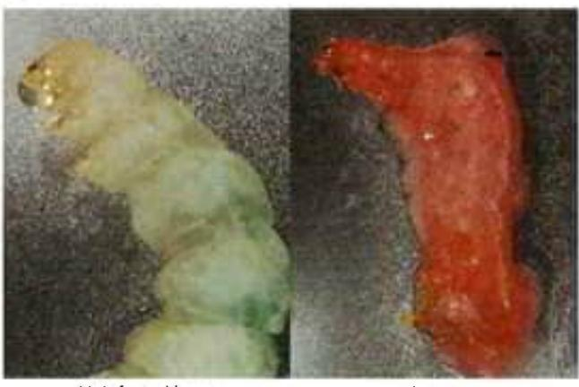

are under cellular regulation such that they are expressed when yeast cells are grown in media with galactose but shut down when the cells are grown in glucose. Thus, if a heterologous gene is expressed using these same regulatory sequences, the expression of that gene can be controlled simply by choosing an appropriate medium for cell growth.

Some of the same problems that accompany protein expression in bacteria also occur with yeast. Heterologous proteins may not fold properly, yeast may lack the enzymes needed to modify the proteins to their active forms, or certain features of the gene sequence may hinder expression of a protein. However, because S. cerevisiae is a eukaryote, the expression of eukaryotic genes (especially yeast genes) is sometimes more efficient in this host than in bacteria. As yeast possess many of the same protein chaperones and modification systems of higher eukaryotes, protein products may also be folded and modified more accurately than are proteins expressed in bacteria.

Insects and Insect Viruses Baculoviruses are insect viruses with double-stranded DNA genomes. When baculoviruses infect their insect larval hosts, they act as parasites, killing the larvae and turning them into factories for virus production. Late in the infection process, the viruses produce large amounts of two proteins (p10 and polyhedrin), neither of which is needed for production of viruses in cultured insect cells. The genes for both of these proteins can be replaced with the gene for a heterologous protein. When the resulting recombinant virus is used to infect insect cells or larvae, the heterologous protein is often produced at very high levels—up to 25% of the total protein present at the end of the infection cycle.

Autographa californica multicapsid nucleopolyhedrovirus (AcMNPV; A. californica is a moth species that it infects) is the baculovirus most often used for protein expression. It has a large genome (134,000 bp), too large for direct cloning. Virus purification is also cumbersome. These problems have been solved by the creation of bacmids, large circular DNAs that include the entire baculovirus genome along with sequences that allow replication of the bacmid in E. coli (Fig. 9-9). The gene of interest is cloned into a smaller plasmid and combined with the larger plasmid by site-specific recombination

FIGURE 9-9 Cloning with baculoviruses. (a) Shown here is the construction of a typical vector used for protein expression in baculoviruses. The gene of interest is cloned into a small plasmid (top left) between two sites (att) recognized by a site-specific recombinase, then is introduced into the baculovirus vector by site-specific recombination. This generates a circular DNA product that is used to infect the cells of an insect larva. The gene of interest is expressed during the infection cycle, downstream of a promoter that normally expresses a baculovirus coat protein at very high levels. (b) The photographs show larvae of the cabbage looper moth. The larva on the left is uninfected; the larva on the right was infected with a recombinant baculovirus vector expressing a protein that produces a red color. [(b) USDA-ARS.]

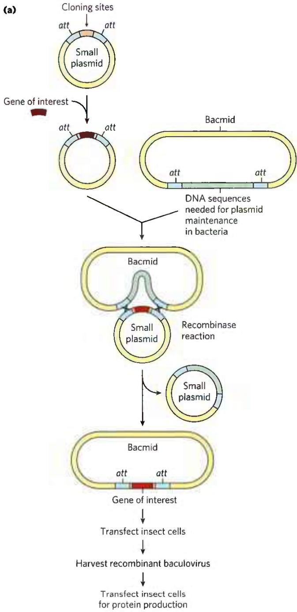  
(b)  
Uninfected larva  
Larva
infected with a baculovirus

in vivo (see Fig. 25-37). The recombinant bacmid is then isolated and transfected into insect cells (the term transfection is used when the DNA used for transformation includes viral sequences and leads to viral replication), followed by recovery of the protein once the infection cycle is finished. A wide range of bacmid systems are available commercially. Baculovirus systems are not successful with all proteins. However, with these systems, insect cells sometimes successfully replicate the protein-modification patterns of higher eukaryotes and produce active, correctly modified eukaryotic proteins.

Mammalian Cells in Culture The most convenient way to introduce cloned genes into a mammalian cell is with viruses. This method takes advantage of the natural capacity of a virus to insert its DNA or RNA into a cell, and sometimes into the cellular chromosome. A variety of engineered mammalian viruses are available as vectors, including human adenoviruses and retroviruses. The gene of interest is cloned so that its expression is controlled by a virus promoter. The virus uses its natural infection mechanisms to introduce the recombinant genome into cells, where the cloned protein is expressed. One advantage of these systems is that proteins can be expressed either transiently (if the viral DNA is maintained separately from the host cell genome and eventually degraded) or permanently (if the viral DNA is integrated into the host cell genome). With the correct choice of host cell, the proper posttranslational modification of the protein to its active form can be ensured. However, the growth of mammalian cells in tissue culture is very expensive, and this technology is generally used to test the function of a protein in vivo rather than to produce a protein in large amounts.

#### [EN] Alteration of Cloned Genes Produces Altered Proteins

P1 Cloning techniques can be used not only to overproduce proteins but also to produce proteins that are altered, subtly or dramatically, from their native forms. Specific amino acids may be replaced individually by site-directed mutagenesis. This approach has greatly enhanced research on proteins by allowing investigators to make specific changes in the primary structure and examine the effects of these changes on the protein's folding, three-dimensional structure, and activity. The amino acid sequence of the protein is changed by altering the DNA sequence of the cloned gene. If appropriate restriction sites flank the sequence to be altered, researchers can simply remove a DNA segment and replace it with a synthetic one, identical to the original except for the desired change (Fig. 9-10a).

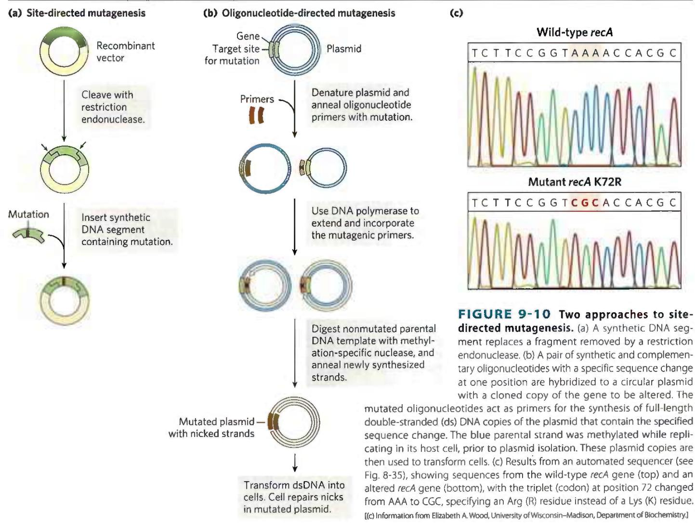

When suitably located restriction sites are not present, oligonucleotide-directed mutagenesis can create a specific DNA sequence change (Fig. 9-10b). The cloned gene is denatured, separating the strands. Two short, complementary synthetic DNA strands, each with the desired base change, are annealed to opposite strands of the cloned gene within a suitable circular DNA vector. The mismatch of a single base pair in 30 to 40 bp does not prevent annealing. The two annealed oligonucleotides serve to prime DNA synthesis in both directions around the plasmid vector, creating two complementary strands that contain the mutation. After several cycles of selective amplification by the polymerase chain reaction (PCR; see Fig. 8-33), the mutation-containing DNA predominates in the population and can be used to transform bacteria. Most of the transformed bacteria will have plasmids carrying the mutation.

For an example, we go back to the bacterial recA gene. The product of this gene, the RecA protein, has several activities (see Section 25.3) including the hydrolysis of ATP. The Lys residue at position 72 in RecA (a 352 residue polypeptide) is involved in ATP hydrolysis. Changing Lys $^{72}$ to an Arg creates a variant of RecA protein that will bind, but not hydrolyze, ATP (Fig. 9-10c). The engineering and purification of this variant RecA protein has facilitated research into the roles of ATP hydrolysis in the functioning of this protein.

Changes can be introduced into a gene that involve far more than one base pair. Large parts of a gene can be deleted by cutting out a segment with restriction endonucleases and ligating the remaining portions to form a smaller gene. For example, if a protein has two domains, the gene segment encoding one of the domains can be removed so that the gene now encodes a protein with only one of the original two domains. Parts of two different genes can be ligated to create new combinations; the product of such a fused gene is called a fusion protein. Researchers have ingenious methods to bring about virtually any genetic alteration in vitro. After reintroducing the altered DNA into the cell, they can investigate the consequences of the alteration.

#### [EN] Terminal Tags Provide Handles for Affinity Purification

Affinity chromatography is one of the most efficient methods for purifying proteins (see Fig. 3-17c). Unfortunately, many proteins do not bind a ligand that can be conveniently immobilized on a column matrix. However, the gene for almost any protein can be altered to express a fusion protein that can be purified by affinity chromatography. The gene encoding the target protein is fused to a gene encoding a peptide or protein that binds a simple, stable ligand with high affinity and specificity. The peptide or protein used for this purpose is referred to as a tag. Tag sequences can be added to genes such that the resulting proteins have tags at their amino terminus or carboxyl terminus. Table 9-3 lists some of the peptides or proteins commonly used as tags.

<table><tr><td colspan="3">TABLE 9-3 Commonly Used Protein Tags</td></tr><tr><td>Tag protein/peptide</td><td>Molecular mass (kDa)</td><td>Immobilized ligand</td></tr><tr><td>Protein A</td><td>59</td><td>Fc portion of IgG</td></tr><tr><td>(His) $_6$ </td><td>0.8</td><td> $Ni^{2+}$ </td></tr><tr><td>Glutathione-S-transferase (GST)</td><td>26</td><td>Glutathione</td></tr><tr><td>Maltose-binding protein</td><td>41</td><td>Maltose</td></tr><tr><td>β-Galactosidase</td><td>116</td><td>p-Aminophenyl-β-d-thiogalactoside (TPEG)</td></tr><tr><td>Chitin-binding domain</td><td>5.7</td><td>Chitin</td></tr></table>

The general procedure can be illustrated by focusing on a system that uses the glutathione-S-transferase (GST) tag (Fig. 9-11). GST is a small enzyme ( $M_{r}$ 26,000) that binds tightly and specifically to glutathione. When the GST gene sequence is fused to a target gene, the fusion protein acquires the capacity to bind glutathione. The fusion protein is expressed in a host organism such as a bacterium, and a crude extract is prepared. A column is filled with a porous matrix consisting of the ligand (glutathione) immobilized on microscopic beads of a stable polymer such as cross-linked agarose. As the crude extract percolates through this matrix, the fusion protein becomes immobilized by binding the glutathione. The other proteins in the extract are washed through the column and discarded. The interaction between GST and glutathione is tight but noncovalent, allowing the fusion protein to be gently eluted from the column with a solution containing either a higher concentration of salts or free glutathione to compete with the immobilized ligand for GST binding. The fusion protein is often obtained with good yield and high purity. In some commercially available systems, the tag can be entirely or largely removed from the purified fusion protein by a protease that cleaves a sequence near the junction between the target protein and its tag.

A shorter tag with widespread application consists of a simple sequence of six or more His residues. These histidine tags, or His tags, bind tightly and specifically to nickel ions. A chromatography matrix with immobilized $Ni^{2+}$ can be used to quickly separate a His-tagged protein from other proteins in an extract. Some of the larger tags, such as maltose-binding protein, provide added stability and solubility, allowing the purification of cloned proteins that are otherwise inactive due to improper folding or insolubility.

Affinity chromatography using terminal tags is powerful and convenient. The tags have been successfully used in thousands of published studies; in many cases, the protein would be impossible to purify and study without the tag. However, even very small tags can affect the properties of the proteins they are attached to, thereby influencing the study results. For example, the tag

Fusion protein is eluted by glutathione solution.

may adversely affect protein folding. Even if the tag is removed by a protease, one or a few extra amino acid residues can remain behind on the target protein, which may or may not affect the protein's activity. The types of experiments to be carried out, and the results obtained from them, should always be evaluated with the aid of well-designed controls to assess any effect of a tag on protein function.

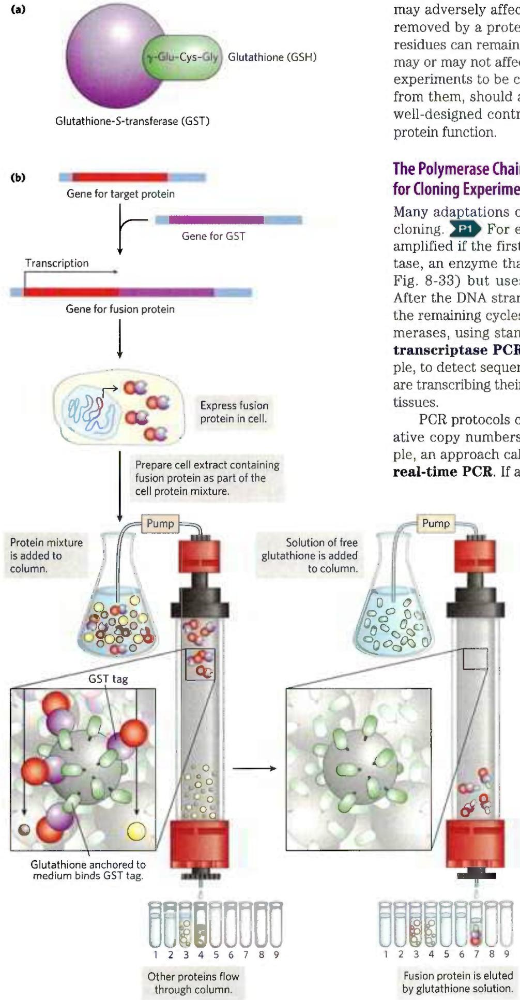

#### [EN] The Polymerase Chain Reaction Offers Many Options for Cloning Experiments

Many adaptations of PCR have increased its utility in cloning. P1 For example, sequences in RNA can be amplified if the first PCR cycle uses reverse transcriptase, an enzyme that works like DNA polymerase (see Fig. 8-33) but uses RNA as a template (Fig. 9-12a). After the DNA strand is made from the RNA template, the remaining cycles can be carried out with DNA polymerases, using standard PCR protocols. This reverse transcriptase PCR (RT-PCR) can be used, for example, to detect sequences derived from living cells (which are transcribing their DNA into RNA) as opposed to dead tissues.

PCR protocols can also be used to estimate the relative copy numbers of particular sequences in a sample, an approach called quantitative PCR (qPCR) or real-time PCR. If a DNA sequence is present in higher

FIGURE 9-11 Use of tagged proteins in protein purification. (a) Glutathione-S-transferase (GST) is a small enzyme that binds glutathione. (b) The GST tag is fused to the carboxyl terminus of the protein by genetic engineering. The tagged protein is expressed in the cell and is present in the crude extract when the cells are lysed. The extract is subjected to affinity chromatography through a matrix with immobilized glutathione.

than usual amounts in a sample—for example, if certain genes are amplified in tumor cells—qPCR can reveal the increased representation of that sequence. In brief, the PCR is carried out in the presence of a probe that emits a fluorescent signal when the PCR product is present

  
After 20 cycles, the target sequence has been amplified about $10^{6}$ -fold.

FIGURE 9-12 Some applications of PCR. (a) In reverse transcriptase PCR, or RT-PCR, RNA molecules are amplified by using reverse transcriptase in the first two cycles. (b) In quantitative PCR, or qPCR, careful monitoring of the progress of a PCR amplification allows one to determine when a DNA segment has been amplified to a specified threshold level. The amount of PCR product present is determined by measuring the level of a fluorescent probe attached to a reporter oligonucleotide complementary to the DNA segment that is being amplified. Probe fluorescence is not detectable initially, due to a fluorescence quencher attached to the same oligonucleotide. When the reporter oligonucleotide pairs with its complement in a copy of the amplified (Fig. 9-12b). If the sequence of interest is present at higher levels than other sequences in the sample, the PCR signal will reach a predetermined threshold faster. Reverse transcriptase PCR and qPCR can be combined to determine the relative concentrations of a particular mRNA molecule in a cell, and thereby monitor gene expression under different environmental conditions.

#### [EN] DNA Libraries Are Specialized Catalogs of Genetic Information

In some instances, it is useful to clone many genes or genomic segments rather than a particular one. A DNA library is a collection of DNA clones, usually gathered for purposes of gene discovery or the determination of gene or protein function. The library can take a variety of forms, depending on the source of the DNA and the ultimate purpose of the library.

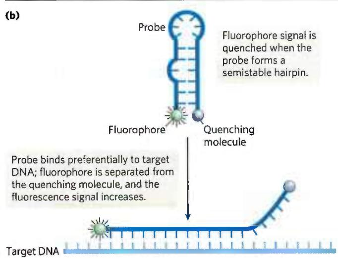

  
DNA segment, the fluorophore is separated from the quenching molecule and fluorescence results. As the PCR reaction proceeds, the amount of the targeted DNA segment increases exponentially, and the fluorescent signal also increases exponentially as the oligonucleotide probes anneal to the amplified segments. After many PCR cycles, the signal reaches a plateau as one or more reaction components become exhausted. When a segment is present in greater amounts in one sample than another, its amplification reaches a defined threshold level earlier. The "No template" line follows the slow increase in background signal observed in a control that does not include added sample DNA. CT is the cycle number at which the threshold is first surpassed.

An example is a library that includes only the genes that are transcribed into RNA—expressed—in a given organism or even just in certain cells or tissues. Such a library lacks any genomic DNA that is not transcribed. The researcher first extracts mRNA from an organism, or from specific cells of an organism, and then prepares the complementary DNAs (cDNAs). Like RT-PCR, this multistep reaction (Figure 9-13a) relies on reverse transcriptase, which synthesizes DNA from a template

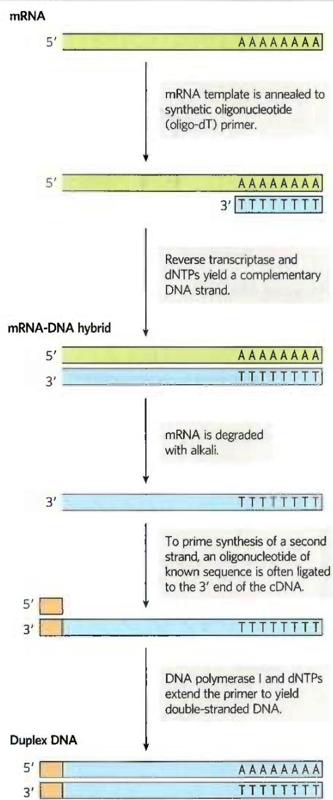  
FIGURE 9-13 Building a cDNA library from mRNA. A cell's total mRNA content includes transcripts from thousands of genes, and the cDNAs generated from this mRNA are correspondingly heterogeneous. Reverse transcriptase can synthesize DNA on an RNA or a DNA template. To prime the synthesis of a second DNA strand, oligonucleotides of known sequence are ligated to the 3' end of the first strand, and the double-stranded cDNA so produced is cloned into a plasmid.

RNA. The resulting double-stranded DNA fragments are inserted into a suitable vector and cloned, creating a population of clones called a cDNA library. If the library host is a bacterium like E. coli, each cell in the population will carry one particular cloned sequence. The library will encompass many millions of cells with millions of different cloned segments. The presence of a gene for a particular protein in such a library implies that this gene is expressed in the cells and under the conditions used to generate the library.

Another type of library, called a combinatorial gene library or simply a gene library, focuses on sequence variants within one gene. For example, beginning with the cloned gene of enzyme X, a segment of the gene could be replaced with nearly identical fragments synthesized with a slight imprecision so that each clone had one or two random base pair changes relative to the original. For example, the gene segment of interest could be amplified by PCR using an altered DNA polymerase that was slightly inaccurate. The library of clones would then consist of many cells, many of which harbored a different variant of the gene for enzyme X. Investigators could use the library to select for variants of enzyme X with enhanced catalytic properties or could simply determine which changes were functional and which were not. The possibilities are limited only by the imagination of the researcher.

#### [EN] SUMMARY 9.1 Studying Genes and Their Products

■ DNA cloning and genetic engineering involve the cleavage of DNA and assembly of DNA segments in new combinations—recombinant DNA. Cloning entails generating a DNA fragment of interest, inserting the fragment into a suitable cloning vector, transferring the vector with the DNA insert into a host cell for replication, and identifying and selecting cells that contain the DNA fragment.

■ Key enzymes in gene cloning include restriction endonucleases (especially the type II enzymes) and DNA ligase.

■ Cloning vectors include plasmids and, for the longest DNA inserts, bacterial artificial chromosomes (BACs) and yeast artificial chromosomes (YACs).

■ Cloned genes can be expressed in a host cell by incorporating them into expression vectors that have the sequence signals needed for transcription and translation.

■ Proteins can be expressed in different types of cells using expression systems with various useful features and advantages.

■ Genetic engineering techniques can alter cloned genes as required by the investigator.

■ Proteins or peptides can be attached to a protein of interest by altering its cloned gene, creating a fusion protein. The additional peptide segments can be used to detect the protein or to purify it, using convenient affinity chromatography methods.

■ The polymerase chain reaction (PCR) permits the amplification of chosen segments of DNA or RNA for cloning and can be adapted to determine gene copy number or to monitor gene expression quantitatively.

■ DNA libraries consist of many clones, encompassing many genomic segments or many variants of a particular gene.

<!-- L-END Lehninger 9.1 -->

## 5.3 RNA 基本操作技术

真核生物基因组 DNA 非常庞大,而且含有大量重复序列,无论用电泳分离技术还是用杂交方法都难以直接分离到靶基因片段。而 cDNA(complementary DNA) 是来自反转录的 mRNA, 不含冗余序列, 通过特异性探针筛选 cDNA 文库, 可以较快地分离到相关基因。由于单链 RNA 分子不稳定且易发生降解, 在自然状态下难以被扩增, 因此, 为了研究 mRNA 所包含的功能基因信息, 一般将其反转录成稳定的 DNA 双螺旋, 再插入到可以自我复制的载体中。一个高质量的 cDNA 文库代表了生物体某一器官或者组织 mRNA 中所含的全部或绝大部分遗传信息。

## 5.3.1 总RNA的提取

细胞中的总 RNA 包括编码蛋白质的 mRNA 和不编码蛋白质的 ncRNA(rRNA、tRNA 以及其他 RNA)。一个典型的动物细胞约含 $10^{-5}\mu \mathrm{g}$ RNA, 其中 $80\% \sim 85\%$ 为 rRNA, $15\% \sim 20\%$ 为 tRNA 及其他 ncRNA, 这些 RNA 分子具有确定的大小和核苷酸序列, 特别是总 RNA 电泳后 rRNA 的 2 条特征性条带 28S 和 18S 是鉴定总 RNA 纯度和完整性的重要参数。mRNA 占总 RNA 的 $1\% \sim 5\%$ , 同时, 由于 mRNA 呈单链状, 容易受核酸酶的攻击, 对 RNA 的操作要求比 DNA 操作更严格, 要保证实验环境、所用器皿及溶液均没有 RNA 酶的污染。

总 RNA 的抽提方法有多种, 目前实验室常用的方法是用异硫氰酸胍 - 苯酚抽提法。Trizol 试剂是使用最广泛的抽提 RNA 专用试剂, 主要由苯酚和异硫氰酸胍组成, 可以迅速破坏细胞结构, 使存在于细胞质及核内的 RNA 释放出来, 并使核糖体蛋白与 RNA 分

图 5-16 总 RNA 提取

(a) 总 RNA 提取的主要实验流程；(b) 陆地棉不同组织的总 RNA 样品电泳图。

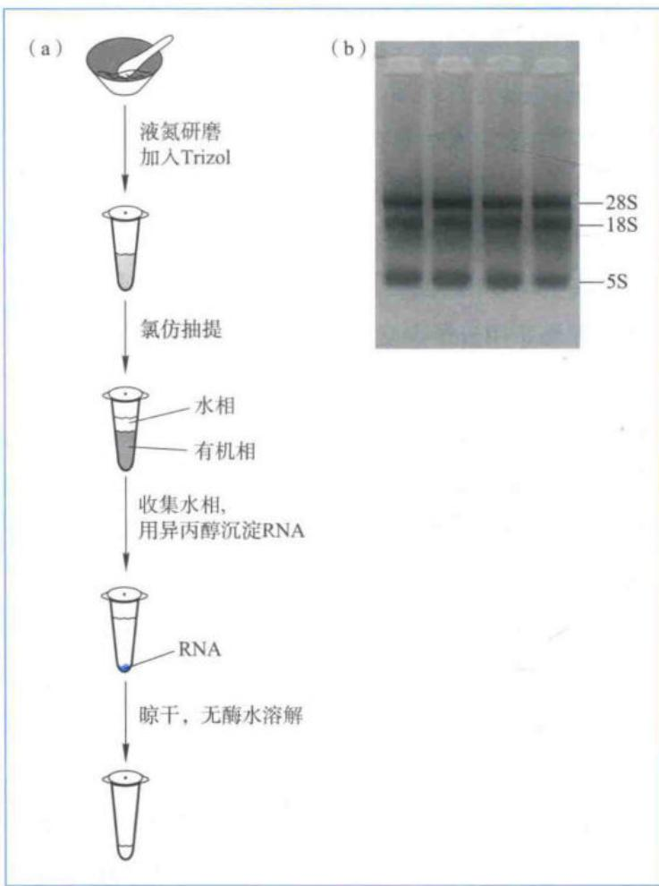

子分离, 还能保证 RNA 的完整。提取 RNA 时, 首先用液氮研磨材料, 匀浆, 加入 Trizol 试剂, 进一步破碎细胞并溶解细胞成分。然后加入氯仿抽提, 离心, 分离水相和有机相, 收集含有 RNA 的水相, 通过异丙醇沉淀, 获得比较纯的总 RNA, 用于下一步 mRNA 的纯化 $^{(图5-16a)}$ 。也可以将含有 RNA 样品的细胞破碎液通过硅胶膜纯化柱纯化。要根据不同植物组织的特点, 预先去除酚类、多糖或其他次生代谢产物对 RNA 的干扰。

同样可以通过测定 RNA 样本的 $OD_{260}$ 和 $OD_{280}$ 来判断其浓度和纯度。 $OD_{260}$ 为 1 时相当于浓度为 50 $\mu g/mL$ ,

当 $OD_{260}/OD_{280}$ 的比值在 1.8～2.0 之间，表示纯度较好，如果样品中有蛋白质或酚污染，则 $OD_{260}/OD_{280}$ 的比值将明显低于 1.8。而 $OD_{260}/OD_{280}$ 的比值大于 2.0，则说明提取的 RNA 可能有降解。可通过琼脂糖凝胶电泳检测 RNA，但要保证整个操作过程中没有 RNase 的污染。电泳后如果 rRNA 大小完整，而且 28S rRNA 和 18S rRNA 亮度接近 2:1，mRNA 分布均匀，则认为 RNA 质量较好（图 5-16b）。

## 5.3.2 mRNA 的纯化

真核细胞的 mRNA 分子最显著的结构特征是具有 5' 端帽子结构 ( $m^{7}G$ ) 和 3' 端的 poly(A) 尾巴, 这种 poly(A) 结构为真核生物 mRNA 的提取提供了极为方便的选择性标志, 实验中常用寡聚 (dT)-纤维素柱层析法获得高纯度 mRNA。该方法利用 mRNA 3' 端含有 poly(A) 的特点, 当 RNA 流经寡聚 (dT) 纤维素柱时, 在高盐缓冲液的作用下, mRNA 被特异性地结合在柱上, 再用低盐溶液或蒸馏水洗脱 mRNA。经过两次寡聚 (dT) 纤维柱后可得到较高纯度的 mRNA。实验中常用 poly(AT) Tract mRNA 分离系统将生物素标记的寡聚 (dT) 引物与细胞总 RNA 温育, 加入与微磁球相连的抗生物素蛋白以结合 poly(A) mRNA, 通过磁场吸附作用将 poly(A) mRNA 从总 RNA 中分离 (图 5-17)。

图 5-17 mRNA 的分离纯化过程简图  
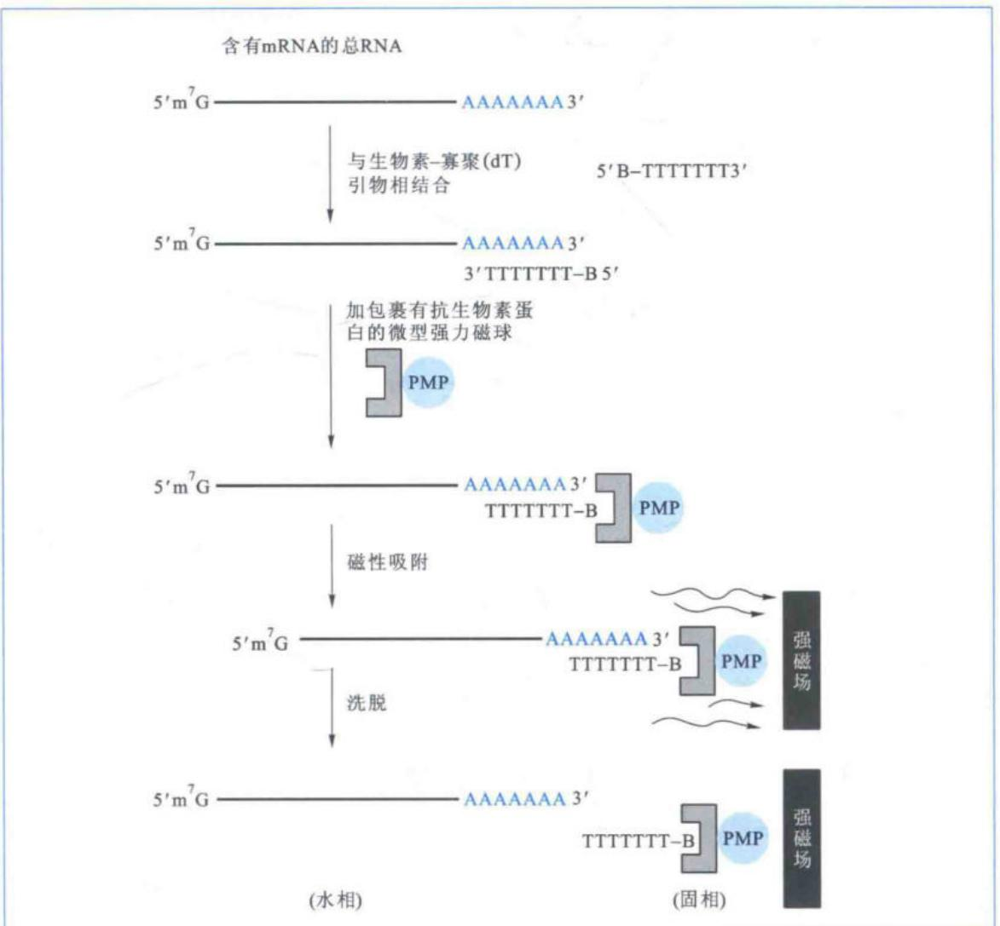

## 5.3.3 cDNA 的合成

cDNA 的合成包括第一链和第二链 cDNA 的合成, 整个流程如图(图 5-18)所示。第一链 cDNA 的合成是以 mRNA 为模板, 反转录时加入寡聚(dT)做引物, 在反转录酶催化下形成 cDNA。寡聚(dT)引物一般包含 12\~20 个脱氧胸腺嘧啶核苷酸, 后面加一个连接引物(通常为 Xho I 等酶切位点)以便于克隆构建。

在 cDNA 合成的过程中, 应选用活性较高的反转录酶及甲基化 dCTP, cDNA 两端应加上不同内切酶所识别的接头序列, 保证所获得双链 cDNA 的方向性(图 5-19)。反应体系中一般加入甲基化 dCTP, 保证新合成的 cDNA 链被甲基化修饰, 以防止构建克隆时被限制性内切酶切割。第二链 cDNA 的合成是以第一链为模板, 由 DNA 聚合酶催化。常用 RNase H 切割 mRNA-cDNA 杂合链中的 mRNA 序列所产生的小片段为引物合成第二条 cDNA 的片段, 再通过 DNA 连接酶的作用连成完整的 DNA 链。此时加入含有另一个酶切位点的黏性接头 (如 EcoR I), 与 cDNA 相连接后用 Xho I 酶切, 使 cDNA 双链 5' 端和 3' 端分别具有 EcoR I 和 Xho I 黏性末端, 保证它与载体相连时有方向性。因为绝大多数大肠杆菌细胞都会切除带有 5'-甲基胞嘧啶的外源 DNA, 所以实验中常选用 mcrA-mcrB-菌株以防止 cDNA 被降解。

图 5-18 cDNA 合成过程示意图  
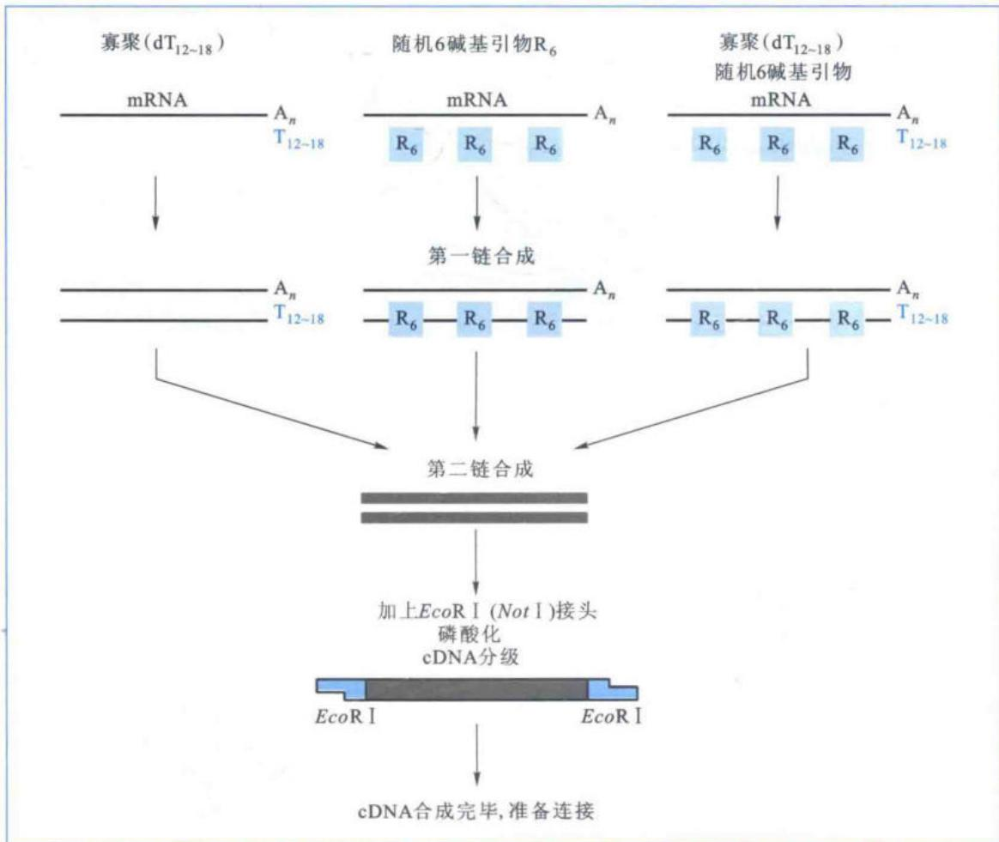

图 5-19 定向 cDNA 合成及分子修饰  
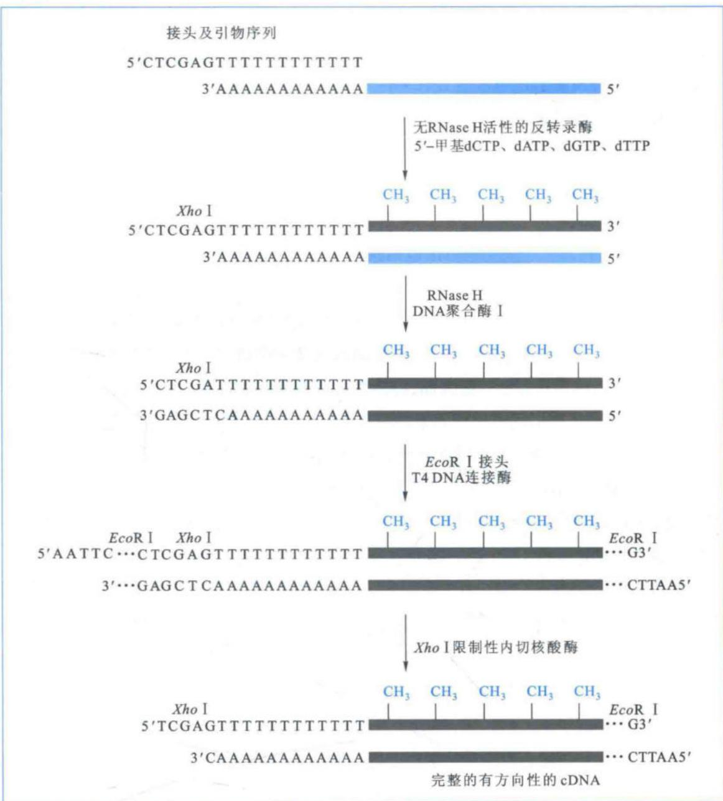

## 5.3.4 cDNA 文库的构建

由于 cDNA 的长度一般在 0.5 \~ 8 kb 之间, 常用的质粒载体和噬菌体类载体都能满足要求。cDNA 文库的载体选择要根据该文库的用途来确定, 例如常用的 Uni-zap XR 载体是一种 λ 噬菌粒载体, 具备噬菌体的高效性和质粒载体系统可利用蓝白斑筛选的便利, 可容纳 0 \~ 10 kb DNA 插入片段。该载体内部含有 pBluescript 载体的全部序列, 重组后可通过体内剪切反应 (in vivo excision) 将 cDNA 插入片段转移到质粒系统中进行筛选、克隆和序列分析。

含有 cDNA 插入片段的重组噬菌粒只有经过体外蛋白外壳包装反应,才能成为有侵染和复制能力的成熟噬菌体。DNA 和蛋白提取物的浓度、二者的体积比、反应温度及时间对包装效果都有很大影响,而包装反应结果的好坏对重组噬菌体的侵染能力至关重要。

用经包装的噬菌体感染大肠杆菌培养物后涂布在琼脂平板上，便会产生成千上万个独立噬菌斑，每个噬菌斑由一个重组噬菌体分子形成。一个比较完整的 cDNA 文库常包含大于 $5 \times 10^{5}$ 的独立克隆。一旦获得含有某种组织器官 cDNA 信息的噬菌粒文库，就可用于筛选目的基因、大规模测序、基因芯片杂交等功能基因组学研究。

## 5.3.5 基因文库的筛选

基因文库的筛选是指通过某种特殊方法从基因文库中鉴定出含有所需重组 DNA 分子的特定克隆的过程。主要筛选方法包括核酸杂交法、PCR 筛选法和免疫筛选法等。

## 1. 核酸杂交法

核酸杂交法以其广泛的适用性和快速性成为基因文库筛选中最常用的方法之一,常用放射性标记的特异 DNA 探针进行高密度的菌落杂交筛选(图 5-20)。将圆形硝酸纤维素膜放在含有琼脂培养基的培养皿表面,将待筛选菌落从其生长的平板上转移到硝酸纤维素膜上,进行适当温育。同时保留原来的菌落平板作对照。取出已经长有菌落的膜,用碱液处理,使菌落发生裂解,DNA 随之变性。接着用蛋白酶 K 处理硝酸纤维素膜去除蛋白质,形成菌落 DNA 的印迹。80℃烘烤滤膜,将 DNA 固定在膜上。将滤膜与放射性标记的 DNA 或 RNA 探针杂交,通过放射性自显影显示杂交结果。在 X 光底片上显黑色斑点的就是实验中寻找的目的克隆,可以通过对应于平板上的位置找到相应克隆。

也可用杂交筛选法进行重组噬菌斑的筛选。将硝酸纤维素膜覆盖在琼脂平板表面，使之与噬菌斑直接接触，噬菌斑中大量没有被包装的游离DNA及噬菌体颗粒便一齐转移到膜上。可从同一噬菌斑平板上连续印几张同样的硝酸纤维素膜，进行重复实验，而且可以使用两种或数种不同的探针筛选同一套重组子，提高结果的可靠性。

## 2. PCR 筛选法

PCR 筛选法与核酸杂交筛选法具有同样的通用性,而且操作简单,但前提是已知足够的序列信息并获得基因特异性引物。例如要从一个基因组 DNA 文库筛选目的基因,首先将整个文库(以质粒或菌落的形式均可)保存在多孔培养板上,用设计好的目的基因探针对每个孔进行 PCR 筛选,鉴定出阳性的孔,把每个阳性孔中的克隆再稀释到次级多孔板中进行 PCR 筛选。重复以上程序,直到鉴定出与目的基因对应的单个克隆为止。

图 5-20 通过核酸杂交筛选目的克隆流程图  

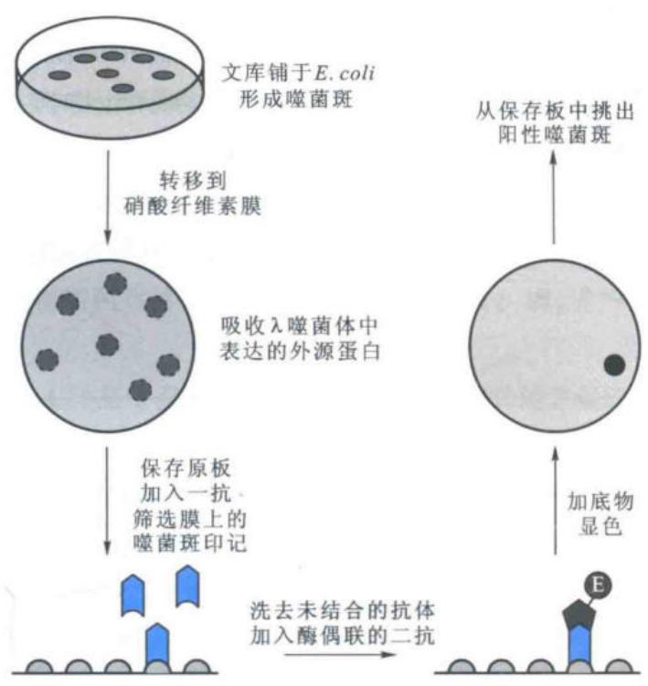  
图 5-21 噬菌体表达文库的免疫化学筛选法示意图

## 3. 免疫筛选法

由于免疫筛选法是基于抗原抗体特异性结合原理,所以该法适用于对表达文库的筛选。也就是说如果该 DNA 或者 cDNA 文库是用表达载体构建的,每个克隆都可以在宿主细胞中表达,产生所编码的蛋白质,就可以用免疫筛选法进行筛选。即使实验中靶基因的序列完全未知,只要拥有针对该基因产物的特异性抗体,也能用这个方法进行筛选。

免疫检测与菌落或噬菌斑的核酸杂交相似,先将菌落或噬菌斑影印到硝酸纤维素膜上,原位溶解菌落释放抗原蛋白,再用抗体与固定了抗原的膜杂交,抗原抗体结合后,再用标记的二抗与之反应,通过对标记物的检测,就可以找到阳性克隆(图5-21)。

## 5.3.6 非编码 RNA 研究

高等真核生物的基因组中,蛋白质编码区只占很少一部分,非蛋白质编码区占据基因组中绝大部分位置。而高等真核生物基因组中一半以上的DNA会转录为RNA,所以大部分RNA是不编码蛋白质的,这些RNA被统称为非编码RNA(non-coding RNA,ncRNA)。非编码RNA种类很多,依据功能不同,可分为两类,一类是组成型的非编码RNA,如rRNA和tRNA,它们是蛋白质合成机器的重要组成成员;另一类是调控型的非编码RNA,包括miRNA(microRNA)、siRNA(small interfering RNA)、piRNA(piwi-interacting RNA)、snRNA(small nuclear RNA)、snoRNA(small nucleolar RNA)、lncRNA(long non-coding RNA)及circRNA (circular RNA) 等, 它们在转录和翻译水平调控基因表达, 维持基因组的稳定, 或在细胞功能与命运的决定中发挥至关重要的作用。由于非编码 RNA 在序列特征及调控功能上的复杂性, 目前的研究主要集中在非编码 RNA 基因的发现和生物学功能的鉴定层面上。

非编码 RNA 不像 mRNA 那样有一个标志性的 poly(A) 尾巴的结构, 无法通过寡聚 (dT) 直接分离, 而其他的分离方式又会受到含量较大的 rRNA 及部分 tRNA 的干扰, 所以目前只能依据非编码 RNA 的大小和形态结构, 通过以下几种方式分离出不同的非编码 RNA $^{(图 5-22)}$ 。

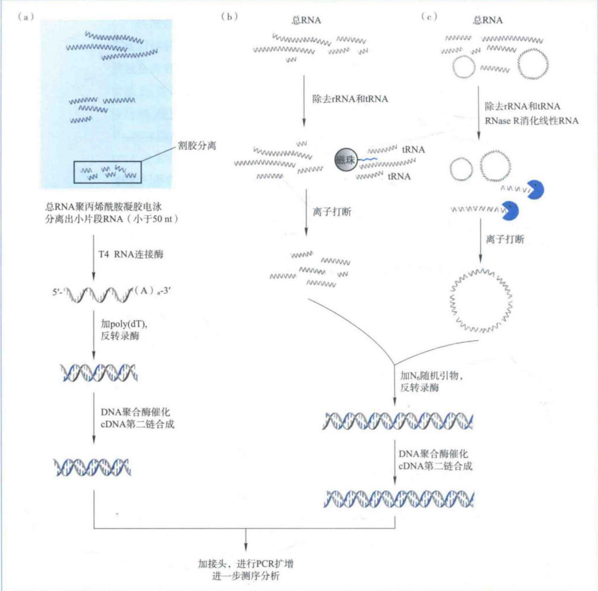  
图5-22 不同非编码RNA的分离方法示意图

对于较短的,如 miRNA、siRNA、piRNA 等常常小于 50 nt 的非编码 RNA 的分离。提取总 RNA 后,用聚丙烯酰胺电泳分离出小于 50 nt 的 RNA,割胶回收并用乙醇将 RNA 沉淀出来,一般加入糖原和乙酸钠做助沉剂,也可用专一性吸附小片段 RNA 的硅胶膜柱子纯化。用 T4 RNA 连接酶处理纯化后的 RNA 样品,在其 3' 端连接一段寡核苷酸序列如 poly(dA),在反转录酶催化下合成 cDNA 第一链,用 DNA 聚合酶催化形成双链 cDNA。用 A 尾酶(A-tailing)在双链 cDNA 的 3' 端加上一个 dAMP,再将带有一个 dTMP 的接头引物加到双链 cDNA 的两端,进行 PCR 扩增,进一步用于测序或文库构建等。

也可以从总RNA样品中去除rRNA和tRNA，再分离其他非编码RNA。该方法首先合成rRNA和tRNA特异性生物素标记的寡核苷酸探针，这些探针与各种rRNA及tRNA杂交，杂合链因为带有生物素标记而被偶联了链霉亲和素的磁珠高效捕获，链霉亲和素与生物素之间稳定的非共价结合使得生物素标记的双链分子紧密结合在磁珠上。用磁铁将磁珠从样品中分离，就排除了这两种组成型RNA的干扰。将剩余的RNA样品随机打断成200\~300 bp的片段，用六聚体引物N6反转录合成cDNA。这个样品中包含了全部mRNA和非编码RNA的信息，测序完成后，借助mRNA的典型特征，如起始子、终止子、可读框及剪切位点等将其分离去除，再根据各种非编码RNA的结构特征，通过不同的生物学软件进行归类分析。

非编码 RNA 中有一类具有闭合环状结构的 RNA 分子, 称 cirRNA, 利用它的这一特殊结构可单独将其分离出来。将 rRNA 和 tRNA 从总 RNA 中除去后, 使用具有 3' 端核糖核酸外切酶活性的 RNase R 专一性降解单链线性 RNA 分子, 即可将 mRNA 和其他线性非编码 RNA 一并除去, 留下环状的 RNA 分子。将环状 RNA 分子随机打断, 用六聚体引物 N6 在反转录酶的催化下合成 cDNA, 按前面介绍的程序进行建库测序等后续分析。

## 5.4 基因克隆技术

在当今生命科学的各个研究领域中，“克隆”（clone）一词已被广泛使用。在多细胞的高等生物个体水平上，人们用克隆表示由具有相同基因型的同一物种的两个或数个个体组成的群体，所以说，从同一受精卵分裂而来的单卵双生子（monozygotic twins）便是属于同一克隆。在细胞水平上，克隆一词是指由同一个祖细胞（progenitor cell）分裂而来的一群带有完全相同遗传物质的子细胞。在分子生物学上，人们把将外源DNA插入具有复制能力的载体DNA中，使之得以永久保存和复制这种过程称为克隆。由于真核生物基因组DNA十分复杂，实验中常通过筛选由mRNA产生的cDNA文库来分离到目的基因片段。高等生物虽然可拥有3万\~5万种不同的基因，但在一定时间段的单个细胞或组织中，仅有15%左右的基因得以表达，产生出5000\~10000种不同的mRNA分子，使得筛选过程相对简单些。

## 5.4.1 RACE技术

cDNA 末端快速扩增法 (rapid amplification of cDNA ends, RACE) 是一项在已知 cDNA 序列的基础上克隆 5' 端或 3' 端缺失序列的技术，在很大程度上依赖于 RNA 连接酶连接和寡聚帽子的快速扩增。已知 cDNA 序列可来自序列表达标签，减法 cDNA 文库，差式显示和基因文库筛选。主要操作步骤如下 (图 5-23):

① 获得高质量总 RNA。含有大量完整 mRNA、tRNA、rRNA 和部分不完整 mRNA。

② 去磷酸化作用。带帽子结构的 mRNA 不受影响。

③ 去掉 mRNA 的 5' 帽子结构, 加特异性 RNA 寡聚接头并用 RNA 连接酶相连接。

④ 以特异性寡聚 dT 为引物, 在反转录酶的作用下, 反转录合成第一条 cDNA 链, 包含了寡聚接头的互补序列。

⑤ 分别以第一链 cDNA 为模板进行 RACE 反应。5' RACE 以 5' 端 RNA 寡聚接头的部分序列和基因特异的 3' 端反向引物进行 PCR 扩增，获得基因的 5' 端序列。3' RACE 以 5' 端基因特异的引物和 3' 端寡聚 dT 下游部分序列为引物进行 PCR 扩增，获得基因的 3' 端序列。如果只对 3' 端序列感兴趣，可以越过 2、3 两步，直接从第 4 步开始进行 3' RACE。

⑥ 将纯化后的 PCR 产物克隆到载体 DNA 中, 进行序列分析。除了获得全长 cDNA 之外, RACE 技术还被用于获得 5' 和 3' 端非转录序列, 研究转录起始位点的不均一性, 研

图 5-23 5'(a) 和 3'
(b) RACE 流程图  
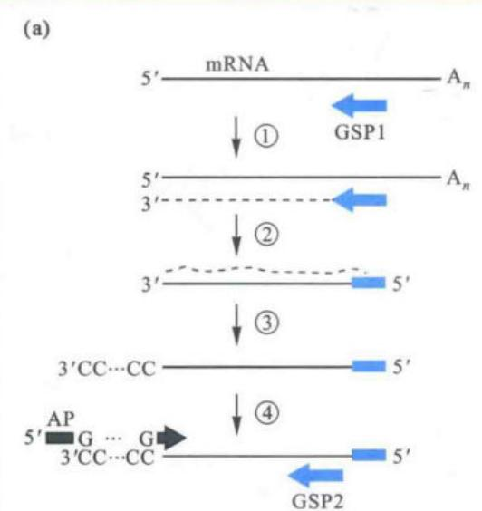

① 在反转录酶的作用下，用已知基因片段内部特异性引物(gene-specific primer 1, GSP1)起始cDNA第一条链的合成。

② 用 RNase 混合物降解模板 mRNA 并纯化已合成的 cDNA 第一条链。

③ 由末端转移酶在已合成的 cDNA 链的 3' 端连续加入 dCTP, 形成寡聚 (dC) 尾巴。

④ 以连有寡聚(dC)的锚定引物 AP(anchor primer) 和基因片段内部特异引物 GSP2 进行巢式 PCR 扩增, 以期得到目的基因 5' 端片段。

  
① 在反转录酶的作用下，以连有可以与 mRNA 3' 多核苷酸末端配对的寡聚 (dT) 锚定引物 AP 起始 cDNA 第一条链的合成。  
② 用 RNase 降解模板 mRNA。

③ 用锚定引物 AP 和基因片段内部特异引物 GSP 进行 PCR 扩增，以期得到目的基因 3' 端片段。

究启动子区的保守性。

## 5.4.2 RAMPAGE 技术

高等真核生物往往具有复杂的基因组,很多基因的表达都具有组织特异性,可变的启动子选择是造成基因在不同组织特异表达的根本原因,所以有必要对启动子做全面而深入的分析。RAMPAGE(RNA annotation and mapping of promoters for the analysis of gene expression)技术是在基因表达的加帽分析技术(cap analysis of gene expression, CAGE)和前面介绍的 RACE 技术的基础上进一步优化的实验技术,是一种在全基因组范围内鉴定所有蛋白质编码基因和部分非编码 RNA 基因的转录起始位点,确定启动子的具体位置,并且能够高通量检测基因表达水平的方法。

首先在带接头序列的随机引物作用下反转录已除去 rRNA 和 tRNA 的总 RNA 样本, 加入山梨醇和海藻糖可提高酶的热稳定性。将反转录酶的工作温度从 42℃ 提高到 55\~60℃, 以进一步解开 RNA 模板可能的二级结构, 削弱 RNA 5' 端由于 GC 含量较高而相对牢固的二级结构, 使得反转录能延伸到 RNA 5' 端帽结构处。在 RNA 链的末端引入生物素标记, 利用 NaIO₄ 的氧化特性, 通过氧化反应将位于所有 RNA 5' 端帽子结构处以及 3' 端的二醇基团打开, 并使其氧化产物醛基与长臂生物素酰酐反应, 从而在 RNA 5' 端帽子结构处以及 3' 端加上一个生物素。由于随机引物很少刚好结合到 RNA 的 3' 端, 因此 RNA 的 3' 端在大多数情况下仍然是单链, 用 RNase I 特异性切割单链状态的 RNA, 去掉 3' 端的生物素标记。最后, 用偶联了链霉亲和素的磁珠筛选出 5' 端帽结构处加上生物素标记的 RNA-cDNA 双链。然后用 RNase H 将磁珠上的 RNA 降解掉, 再从磁珠上分离单链 cDNA。

得益于反转录酶的末端转移酶(terminal deoxynucleotidyl transferase, TdT)活性, 它能催化脱氧核糖核苷酸结合到 DNA 分子的 3' 羟基端, 使反转录产生的 cDNA 3' 端加上了 3 个胞嘧啶脱氧核糖核苷酸(dCTP), 同时 RNA 的 5' 端帽结构(m $^{7}$ G)也有利于 dCTP 的添加。所以, 在反转录时加入一段末端有 3 个鸟嘌呤核糖核苷酸(GTP)的锚定引物, 即可让所有反转录产生的 cDNA 3' 端带上这一锚定引物。利用这一锚定引物和随机引物上的接头序列做引物进行 PCR 扩增, 形成双链 cDNA $^{(图 5-24)}$ , 然后用一种纳米级的微球磁珠进行纯化和相对分子质量大小筛选。筛选获得包含帽子结构端序列的 200\~700 bp 的 cDNA 后便可用高通量二代测序技术进行序列分析等。

## 5.4.3 Gateway 大规模克隆技术

随着越来越多的动植物基因组全序列被测定,前所未有的编码基因(开放读码框)被识别,但是,要阐明这些基因的功能,就必须把不同的开放读码框连入各种载体,进行蛋白质表达、抗体制备、宿主细胞或植物转化、表型分析、细胞内定位以及目的蛋白与其他分子的相互作用等后续研究。传统的酶切连接方法不能满足大规模克隆的需要,只有通过一种高效的对载体和宿主没有依赖性的克隆系统,才能完成这项繁杂的工作。Gateway 基因大规模克隆技术利用 $\lambda$ 噬菌体进行位点特异性 DNA 片段重组,实现了不需要传统的酶切联接过程的基因快速克隆和载体间平行转移,为大规模克隆基因组注释的开放读码框提供了保障。

  
图5-24 RAMPAGE技术操作流程图

Gateway 克隆技术主要包括 TOPO 反应和 LR 反应两步。TOPO 反应将目的基因 PCR 产物连入 Entry 载体，该载体上的 CCCTT 能被拓扑异构酶所识别，切开后通过该酶 274 位上的酪氨酸与切口处的磷酸基团形成共价键，被偶联在载体上。加入 PCR 产物后，载体上 3' 突出端 GTGG 与 PCR 产物的互补性末端接头序列 CACC 配对, 使 PCR 产物以正确方向连入 Entry 载体(图 5-25a)。

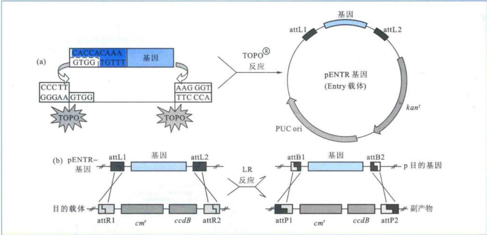  
图5-25 Gateway大规模克隆策略  
(a) TOPO 反应, 将由 PCR 得到的目的基因连入 Entry 载体; (b) LR 反应, 通过位点特异性重组将目的基因从 Entry 载体连入表达载体。

LR 反应被用于将目的片段从 Entry 载体中重组入表达载体。Entry 载体上基因两端具有 attL1 和 attL2 位点，目的载体上含有 attR1 和 attR2 位点，在重组蛋白的作用下发生定向重组，形成新的位点 attB1 和 attB2，将目的基因转移到表达载体中(图 5-25b)。

## 5.4.4 基因的图位克隆法

基因的图位克隆法（map-based cloning）是分离未知性状目的基因的一种好方法，从理论上说，所有具有某种表型的基因都可以通过该方法克隆得到。首先，通过构建遗传连锁图，将目的基因定位到某个染色体的特定位点，并在其两侧确定紧密连锁的RFLP或RAPD分子标记。其次，通过对许多不同生态型个体的大量限制性内切酶和杂交探针的分析，找出与目的基因距离最近的分子标记，通过染色体步移技术将位于这两个标记之间的基因片段分离并克隆出来(图5-26)，再根据基因功能互作原理鉴定目的基因。

在 RFLP 作图中, 连锁距离是根据重组率来计算的, 1 cM(厘摩) 相当于 1% 的重组率。人类基因组中, 1 cM≈1000 kb; 拟南芥中, 1 cM≈290 kb; 小麦中, 1 cM≈3500 kb。

由于水稻基因组比较小,与其他单子叶植物有较高的共线性现象,其基因组序列已经被测定,基因转化系统也比较完善,所以成为单子叶植物功能基因研究的模式系统。科学家已利用自主筛选的水稻突变体和高密度分子标记遗传图谱,应用该技术成功地分离出多个具有重要生理功能的水稻基因,包括控制水稻分蘖的关键基因 MOC1 和控制植株茎秆强度的脆杆基因 BC1。图 5-27 介绍了图位法克隆 BC1 基因的实验流程。

图5-26 染色体步移法克隆基因示意图

(a) 首先将 BCl 位点定位于水稻 3 号染色体 (Chr3) 着丝粒区的分子标记 C524a 和 RM16 之间。(b) 覆盖 BCl 位点的 BAC 大片段, 数字表示从 7068 个 bcl-2 突变体 $F_{2}$ 植株中鉴定出的重组子数目。(c) BCl 位点的精细定位。BCl 位点被定位于 CAPS (cleaved amplified polymorphic sequence) 分子标记 P2 和 P4 之间 3.3 kb 的 DNA 区段, 并与 P3 标记共分离。(d) BCl 基因结构。实心矩框为编码区, 空心矩框为 5' 和 3' 非翻译区, 矩框之间的线段为内含子。bcl-1 和 bcl-2 表示两个脆杆突变体的突变位点。

图 5-27 用图位克隆法获得水稻脆杆基因 BCl  

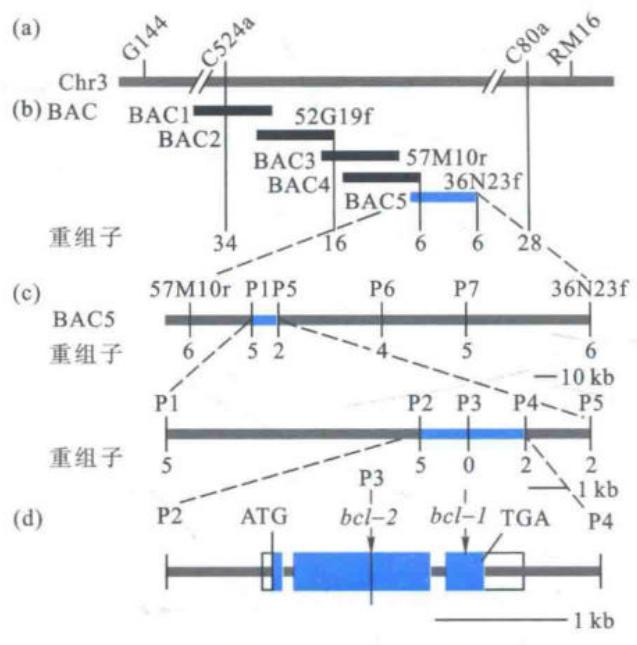

## 5.4.5 热不对称交错多聚酶链式反应克隆 T-DNA 插入位点侧翼序列

热不对称交错多聚酶链式反应(thermal asymmetric inter-laced PCR, TAIL-PCR)常用于扩增T-DNA插入位点侧翼序列，从而获得转基因植物插入位点特异性分子证据(图5-28)。该方法使用一套巢式(nested)特异引物(T-DNA边界引物, TR)和一个短的随机简并引物(AD)。第一轮反应(primary reaction, PCR I)是TAIL-PCR的重要环节，先进行5轮高严谨性循环，特异性引物TR1与模板退火，只能发生单引物循环，T-DNA上游侧翼序列得到线性扩增。再大幅度降低退火温度，使AD及TR1均与模板DNA相结合，指数扩增一个循环。此后，两个高严谨、一个低严谨循环交替进行，共15个循环。特异性序列(两端分别拥有TR1和AD序列)和非特异性序列I（只有TR1，没有AD序列）大大超过非特异性序列Ⅱ(两端均为AD序列)。

PCR II 以 TR2 为特异性引物与 AD 配对, 进行 12 个 TAIL-PCR 循环, 特异性序列再次被优先扩增, 非特异性序列 I 也大大降低, 此时已没有明显的背景片段。PCR III 是真正意义上的 PCR, 用 TR3 为特异性引物与 AD 配对, 共 20 个循环, 进一步扩增特异性序列。

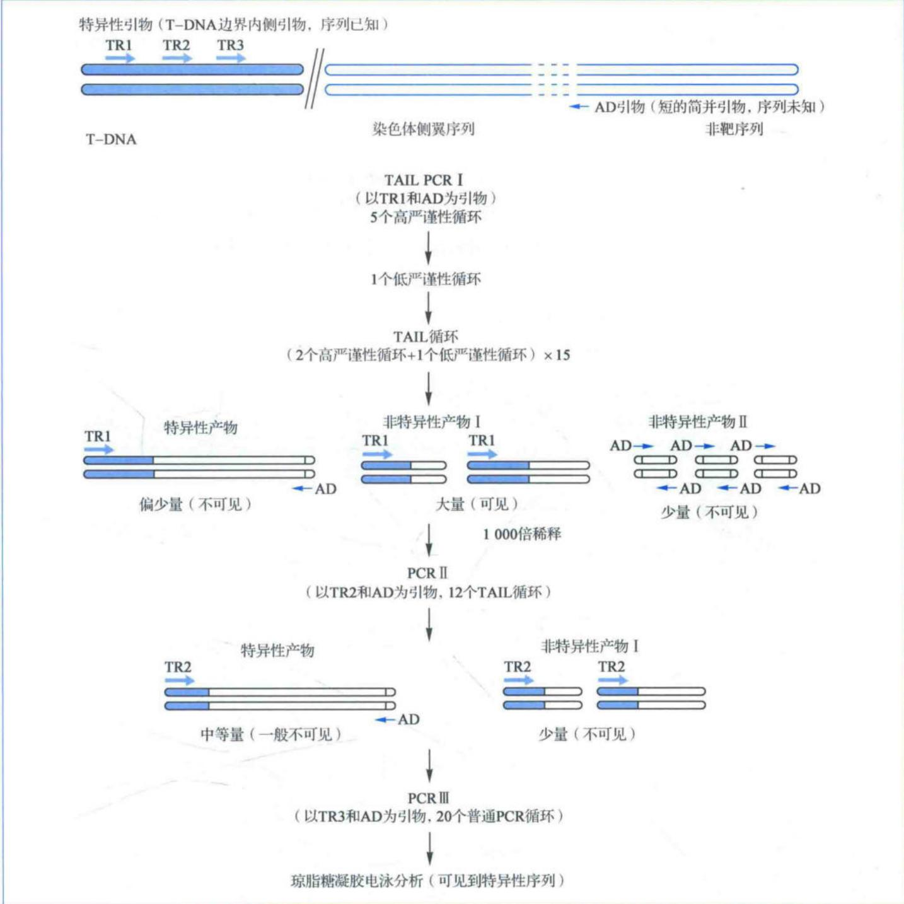  
图 5-28 热不对称交错多聚酶链式反应 (TAIL-PCR) 流程图

## 5.5 蛋白质与蛋白质组学技术

蛋白质组学是蛋白质(protein)和基因组(genome)研究在形式和内容两方面的完美组合,该技术致力于研究某一物种、个体、器官、组织或细胞在特定条件、特定时间所表达的全部蛋白质图谱。蛋白质组与基因组既相互对应又存在显著不同,因为基因组是确定的,组成某个体的所有细胞共同享有固定的基因组,而各个基因的表达调控及表达程度却会根据时间、空间和环境条件发生显著的变化,所以,不同器官、组织或细胞内拥有不同的蛋白质组。由于蛋白质分离(改进后的双向电泳技术和高效液相层析技术)和鉴定技术(现代质谱)的快速发展,以及基因组学研究和生物信息学的交叉渗透,蛋白质组学研究在近年来获得了长足的进展。

## 5.5.1 双向电泳技术

到目前为止,双向电泳(two-dimensional electrophoresis,2-DE)技术是分离大量混合蛋白质组分的最有效方法,该技术主要依赖于蛋白质等电聚焦(isoelectric focusing,IEF)及SDS-聚丙烯酰胺凝胶(SDS-PAGE)双向电泳技术(图5-29),通过等电点和相对分子质量分离不同的蛋白质。

蛋白质是两性分子,在不同 pH 的缓冲液中表现出不同的带电性,因此,在电流的作用下,在以两性电解质为介质的电泳体系中,不同等电点的蛋白质会聚集在介质上不同的区域(等电点)从而被分离。因为聚丙烯酰胺凝胶中的去垢剂 SDS 带有大量的负电荷,与之相比,蛋白质所带电荷量可以忽略不计。所以,蛋白质在 SDS 凝胶电场中的运动速度和距离完全取决于其相对分子质量而不受其所带电荷的影响,不同相对分子质量的蛋白质将位于凝胶的不同区段而得到分离。

固相化 pH 梯度技术 (immobilized pH gradients, IPG) 的应用, 建立了稳定的可精确设定的 pH 梯度, 直接避免了载体两性电介质向阴极漂移等许多缺点, 增大了蛋白质上样量, 大大提高了双向凝胶电泳结果的可重复性。随着各种试剂质量的不断提高和新试剂的开发, 双向凝胶的分辨率空前提高, 其最大分辨率已达到每块胶 10 000 个蛋白点。

## 5.5.2 荧光差异显示双向电泳技术

早期的蛋白质组学研究内容主要是蛋白质组的表达模式,即利用常规2-DE技术鉴定并建立某一生物体在特定时期的全部蛋白表达谱。然而蛋白质组在生物体的生命进程中是动态变化的,不同生物的个体、组织或细胞在不同发育时期、分化阶段,以及不同的生理、病理条件下基因表达是不一致的,所对应的蛋白质组也具有特异性。于是,比较蛋白质组学(comparative proteomics)应运而生,并逐渐成为后基因组学时代的重要技术。

图 5-29 用 2-DE 胶展示拟南芥种子萌发 48 h 后的蛋白质表达情况  
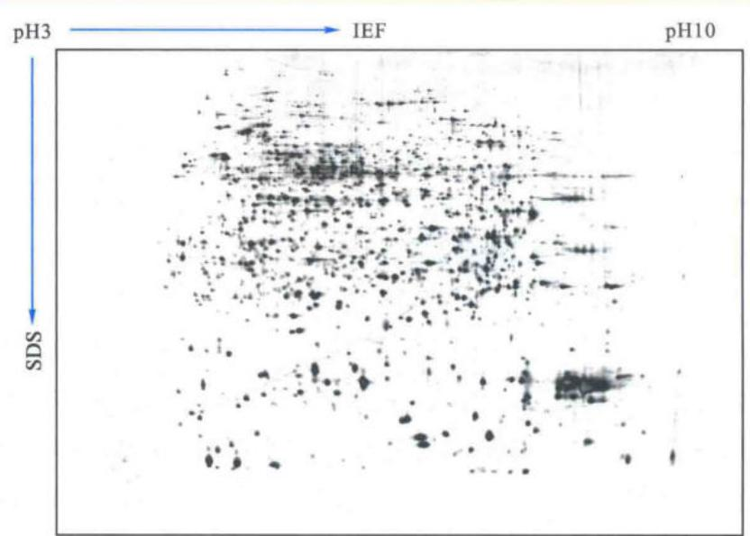  
第5章 分子生物学研究法(上) 仅供个人科学教研

得益于 CyDye DIGE 荧光标记染料的发现和应用,荧光差异显示双向电泳技术(2-D fluorescence difference gel electrophoresis, 2D-DIGE)在传统 2-DE 技术上结合多重荧光分析技术,基本克服了传统 2-DE 的系统误差问题,提高了实验结果的可重复性和可信度。以最小标记法为例,试验中用 3 种荧光染料对不同样本分别进行标记,所有标记样本混合后,在同一块胶上通过双向电泳得到有效分离,对每块凝胶进行 Cy2、Cy3 和 Cy5 3 次扫描,所得图像经过统计分析软件进行自动匹配和统计分析,鉴别和定量分析不同样本间的生物学差异(图 5-30)。该技术可检测低至 25 pg 的单一蛋白质,能对多达 5 个数量级的蛋白质浓度变化给出线性反应,而常规银染法只能检测低至1\~60 ng的蛋白质,仅有约2个数量级的线性动态范围。虽然2D-DIGE极大地降低了实验中出现的系统误差,但由于所用荧光染料在不同波长激发光下表现出不同的荧光特性,低丰度蛋白质定量仍较易出现偏差。

  
图 5-30 野生型陆地棉 ‘徐州 142’（WT）和无长绒无短绒突变体（fl）0 DPA 胚珠总蛋白 2D-DIGE 比较分析图谱（另见书末彩插）用 Cy2 标记 WT 和 fl 0 DPA 胚珠等量混合蛋白作为内标（显示为蓝色），Cy3 标记 fl 胚珠蛋白（显示为绿色），Cy5 标记 WT 胚珠蛋白（显示为红色）。图中绿色蛋白点代表 WT 0 DPA 胚珠中相对于 fl 下调的蛋白质，红色蛋白点则代表 WT 0DPA 胚珠中相对于 fl 上调的蛋白质。

## 5.5.3 蛋白质质谱分析技术

蛋白质组学中最有意义的突破是用质谱鉴定电泳分离后的蛋白质。现行的质谱仪可分为3个连续的组成部分，即离子源、离子分离区和检测器。目前常用的是基质辅助的激光解析电离-飞行时间质谱（matrix-assisted laser desorption ionization time-of-flight spectrometry, MALDI-TOF）和电喷雾质谱(electrospray ionisation, ESI-MS)。MALDI-TOF的工作原理是将从2-DE胶中分离得到的或其他来源的蛋白质酶解成小肽段后与基质(主要是有机酸)混合，将样品混合物点到金属靶表面上并使之干燥结晶，然后用激光轰击，将呈离子化气体状态的待分析物从靶表面喷射出去。离子化的气体中每个分子带有一个或更多的正电荷，这些气体肽段在电场中被加速后到达检测器的时间由肽段的质量和其所带电荷数的比值(m/z)决定(图5-31)。

实验中,将感兴趣的蛋白点回收后,进行胰蛋白酶胶内酶解,收集酶解肽段。一级质谱将经蛋白酶降解后的肽段按照质荷比(m/z)及强度(intensity)进行解析,形成肽指纹图谱(PMF),每个母离子峰代表一种肽段,其强度代表了肽段多少。二级质谱是挑选一级质谱中有代表性的母离子峰以诱导碰撞解离(collision-induced dissociation,CID)方式打碎,形成肽段碎片指纹图谱(PFF)。然后,结合一级PMF和二级PFF数据,进行数据库搜索,获得蛋白质的具体鉴定信息(图5-32)。此外,质谱技术还可以用于鉴定蛋白质复合物组成、确定蛋白质翻译后修饰的类型与发生位点,例如用于蛋白磷酸化、硫酸化、糖苷化以及其他修饰的研究。

图 5-31 MALDI-TOF 分子质谱仪原理图  

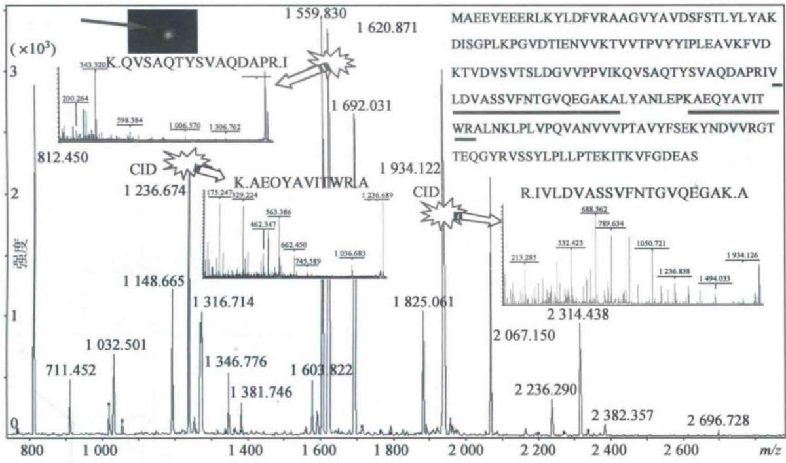  
图 5-32 典型蛋白质一级和二级质谱鉴定结果(另见书末彩插)

将明显诱导的蛋白点(Spot 1, 左上箭头所示。来自图 5-30 中表达量上调的蛋白点)回收后, 进行胰蛋白酶胶内酶解, 收集酶解肽段。一级质谱将蛋白质经酶解后的肽段按照质荷比(m/z)及强度(intensity)进行解析, 形成肽指纹图谱(PMF), 每个母离子峰代表一种肽段, 其强度代表了肽段多少。二级质谱是挑选一级质谱中有代表性的母离子峰以诱导碰撞解离(CID)方式打碎, 形成肽段碎片指纹图谱(PFF)。然后, 结合一级PMF和二级PFF数据, 进行数据库搜索, 获得具体的蛋白质鉴定信息。

<!-- W-BEGIN Watson 7 蛋白质 -->

### 【中文对照 Watson 第7章：蛋白质】

> 来源：Watson《基因的分子生物学》第七版中译本（书籍/03_基因的分子生物学_第七版） 第7章 分子生物学技术。

#### [W] 蛋白质

#### [W] 从细胞抽提物中纯化特定蛋白质

特定蛋白质的纯化对于研究它们的功能来说是至关重要的。尽管有时候也能在复杂混合物中研究一个蛋白质的功能，但这些研究可能导致结果难以解释。例如，如果你在天然蛋白质混合物（如细胞裂解物）中研究某一特定 DNA 聚合酶的活性，其他 DNA 聚合酶和辅助蛋白可能会对观察结果有干扰。基于这个原因，蛋白质的纯化对研究它们的功能来说是至关重要的。

每个蛋白质都有其独特的特性，所以每个蛋白质的纯化方法都有或多或少的区别。这一点与 DNA 的纯化不同，所有的 DNA 有相同的螺旋状结构，只是它们的序列有所区别。蛋白质的纯化往往利用其独特的特性，包括大小、电荷、形状等，甚至常常基于功能。

#### [W] 蛋白质纯化需要特定的方法

纯化一种蛋白质，需要有该蛋白质特异的分析方法。DNA 的纯化几乎总是用同一种方法，即与它的互补序列杂交。我们将在“免疫印迹”一章中了解到，抗体可通过相同的方式检测蛋白质。在很多情况下，使用一种更直接的检测蛋白质功能的方法更为方便。例如，对于某一特定的 DNA 结合蛋白质来说，可以通过检测它与相应 DNA 的相互作用对它进行分析（如在本章末尾“核酸蛋白相互作用”部分描述的 EMSA 检测）。同样，在分析 DNA 或 RNA 聚合酶时，可以在粗提物中添加相应的模板和放射性标记的核苷酸前体物质（标记方法与前述 DNA 的标记类似）。这种类型的分析称为掺入检测（incorporation assay）。如我们在第 9 章框 9-1 所讨论的，掺入检测在监测许多酶的纯化及功能分析中十分有用，包括催化合成大分子聚合物，如 DNA、RNA 或蛋白质聚合酶等。

#### [W] 制备含有活性蛋白质的细胞抽提物

几乎所有蛋白质纯化的起始物质都是细胞抽提物。不像 DNA 能抵抗温度的变化，蛋白质一旦从细胞中释放，轻微的温度波动就能使它们变性。由于这个原因，大多数抽提物的制备和蛋白质的纯化都是在 $4^{\circ}$ C 下进行的。细胞抽提物可以用很多不同的方法来制备。可以用去污剂、机械剪切力、低渗盐离子处理（使细胞吸收水分而胀破）或压力的迅速改变来裂解细胞。这些方法总的目标都是弱化和裂解细胞膜，使蛋白质得以释放。有时，在应用剪切力（通常使用咖啡研磨器或搅拌器，就像厨房中使用的那种）之前，要先在极低温度下将细胞冷冻。

#### [W] 柱层析法可以将蛋白质分离

最常用的蛋白质纯化方法是柱层析法（column chromatography）。在这种方法中，蛋白质流经充填着适当修饰的聚丙烯酰胺或琼脂糖凝胶小珠子的玻璃柱而分离。用层析柱分离蛋白质有很多方式，每种分离技术根据的是蛋白质的不同特性。这里我们描述3种基本方法，前两种方法分别根据蛋白质的电荷或大小对它们进行分离。图7-26对这些方法做了概括。

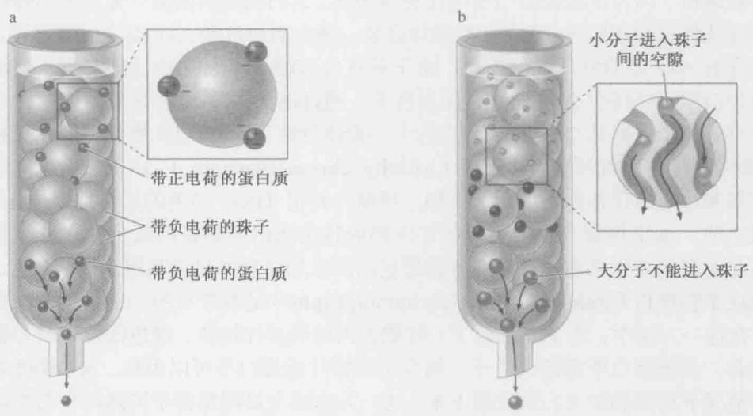  
图 7-26 离子交换层析和凝胶过滤层析。如文中所述，这两种常用的层析法分别根据蛋白质的电荷或大小对它们进行分离。在这些方法中，玻璃管中充填了珠子，蛋白质混合物就流经这一基质。珠子的特性是蛋白质分离的基础。（a）离子交换柱层析。本例中，离子交换层析柱的珠子带负电荷，因此带正电荷的蛋白质能与它们结合而滞留于柱子上，而带负电荷的蛋白质流出柱子，提高珠子周围缓冲液的盐浓度，通过盐离子与蛋白质竞争珠子上的负电荷而将与珠子结合的蛋白质洗脱；（b）凝胶过滤柱层析。凝胶过滤珠子含有液相空隙，由于小蛋白质能进入这些孔隙而延缓了流经柱子的过程，大蛋白质不能进入珠子而直接流出柱子。

离子交换层析 这种技术根据蛋白质的表面离子电荷的不同，采用经带正电荷或负电荷化学基团修饰的珠子对蛋白质进行分离。在低盐缓冲液中，和珠子相互作用较弱的蛋白质（例如，微带正电荷的蛋白质与带负电荷的珠子的结合）能被洗脱。如果蛋白质和珠子相互作用较强，洗脱时就需要更高的盐离子浓度。不管在哪种情况下，盐离子都能封闭带电区域而使蛋白质从珠子上洗脱下来。由于每个蛋白质表面具有不同的电荷量，它们将在对应的特定盐离子浓度下依次从层析柱上洗脱下来。逐渐增加洗脱缓冲液中的盐离子浓度，可以将带有相似电荷的蛋白质分离成不同组分。

凝胶过滤层析 这种技术根据蛋白质的大小和形状来分离它们。这种层析中所用的珠子没有带电荷基团，但是含有不同大小的孔径（与聚丙烯酰胺或琼脂糖凝胶中使 DNA 分子通过的微孔相似）。小蛋白质能进入所有孔径，流经柱子的距离长，洗脱时间也长（换句话说它们需要走更远的路程）；大蛋白质流经柱子的距离短，洗脱速度快。

在不同的盐离子浓度或洗脱时间下收集每种柱子的层析组分，并分析其中的目的蛋白质。收集活性最高的组分，然后做进一步的纯化。

将蛋白质混合物通过多种不同的层析柱，它们的纯度将逐渐提高。虽然采用一种层析柱重复分离含有目的蛋白（由该蛋白质的特异分析法测定）的组分很少能完全纯化那种蛋白质，但是一系列的层析步骤可以获得含有多个分子而极少含有其他蛋白质分子的特定蛋白质组分。例如，尽管有很多蛋白质能被高盐离子溶液从带正电荷的柱子中洗脱下来（这些蛋白质带有高负电荷），或从凝胶过滤柱中缓慢洗脱（这些蛋白质分子相对较小），但同时满足这两种要求的蛋白质就为数不多了。

亲和层析 该方法能使蛋白质纯化更加快速。人们通常根据某一蛋白质的特性来更加快速地纯化这种蛋白质。例如，如果知道某一蛋白质通过和 ATP 结合而起作用，就可以使用含有 ATP 结合珠子的层析柱。由于只有与 ATP 结合的蛋白质能与层析柱结合，大多数蛋白质不能结合 ATP 而直接流出柱子。通过逐步提高 ATP 溶液的浓度，ATP 结合蛋白可进一步依据其与 ATP 亲和力的大小而被分离（所需 ATP 浓度越高，亲和力越大）。这种纯化方法就叫做亲和层析（affinity chromatography）。层析柱上也可以结合其他试剂来快速纯化各种蛋白质。例如，用结合特定 DNA 序列的层析柱来纯化 DNA 结合蛋白质，或采用能与目的蛋白相互作用的特定蛋白质制备的层析柱来纯化目的蛋白。因此在开始纯化之前，有必要考虑靶蛋白的已知信息并尽量利用这些信息。

免疫亲和层析（immunoaffinity chromatography）是最常见的一种蛋白质亲和层析方法。在这一方法中，珠子上结合了一种靶蛋白的特异性抗体。理想的抗体只与靶蛋白相互结合，其他蛋白质都流出柱子。结合于层析柱的蛋白质可以用盐、pH梯度溶液或在某种情况下用温和的去污剂洗脱下来。这一方法的主要困难在于抗体经常与靶蛋白结合如此紧密以致于只有将蛋白质变性才能将它洗脱下来。由于蛋白质变性通常是不可逆的，以这种方式得到的蛋白质可能没有活性，因此不是很有用。

为了便于蛋白质的纯化，可以对它们做一些修饰。通常包括在靶蛋白的起始（N端）或末端（C端）添加氨基酸短序列，这些添加序列或“标签”可以用前文描述的分子克隆方法产生。肽段标签能赋予修饰蛋白质一些已知特性，从而有利于它们的纯化。例如，在蛋白质的起始端或末端添加6个组氨酸能使它们与带有 $Ni^{2+}$ 离子的层析柱紧密结合，这一特性在一般蛋白质中并不常见。另外，在蛋白质上可以添加特定表位（epitope，可被抗体识别的7\~10个氨基酸序列），使用免疫亲和层析通过识别表位的特异性抗体可以纯化被修饰蛋白质。重要的是，这些抗体和表位的选择要使它们在一种条件下能高亲和性（如 $Ca^{2+}$ 存在的情况下）地与层析柱结合，而在另一种条件下（如没有 $Ca^{2+}$ ）则容易被洗脱。这样就避免了采用会导致蛋白质变性的洗脱条件。

免疫亲和层析还能用来从粗提物中快速沉淀某一特定蛋白质（以及任一与它紧密结合的蛋白质）。在这种情况下，通过将抗体结合于柱层析中使用的珠子而得到沉淀。由于这些珠子比较大，它们快速地与抗体以及结合于抗体的其他蛋白质沉到试管底部。这个过程叫做免疫沉淀（immunoprecipitation），用于从粗提物中快速纯化蛋白质或蛋白质复合物。虽然免疫沉淀所得到的蛋白质还不完全纯，但这个方法能测定哪些蛋白质或其他分子（如 DNA，见本章后面的染色质免疫沉淀）与靶蛋白结合在一起。

#### [W] 用聚丙烯酰胺凝胶分离蛋白质

蛋白质既没有均一的负电荷，也没有均一的二级结构。它们由20种不同的氨基酸

组成，有的氨基酸不带电荷，有的带正电荷，还有的带负电荷（第6章，图6-2）。如我们在第6章中所讨论的，蛋白质有大量的二级、三级结构，通常以多价复合物的形式存在（四级结构）。然而，如果用强离子去污剂十二烷基硫酸钠（sodium dodecylsulphate, SDS）和还原剂（如巯基乙醇）处理蛋白质，蛋白质的二级、三级和四级结构通常能被消

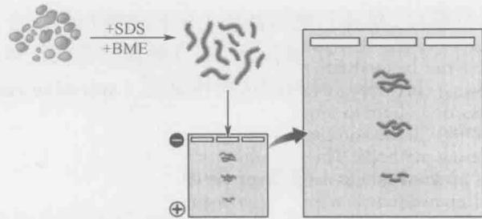  
图 7-27 SDS 凝胶电泳。图示表明一个含有三种不同大小蛋白质的混合物（通常需分析的是更复杂的蛋白质混合物），加入 SDS（用红色标记）和 β-巯基乙醇变性后，每一个蛋白质都带有均一的负电荷，从而可以按分子质量大小对蛋白质进行电泳分离。

除。蛋白质一旦被 SDS 包被，就表现为一个无结构的多聚物。SDS 离子包被蛋白质的多肽链，使它携带均一的负电荷。巯基乙醇还原二硫键，破坏半胱氨酸残基间形成的分子内或分子间二硫键。在这些情况下，蛋白质的电泳迁移率取决于其多肽链的长度，电泳就可以像分离 DNA 和 RNA 混合物一样来分离蛋白质混合物（图 7-27）。电泳后，可以利用与蛋白质非特异结合的染色剂，如考马斯亮蓝（Coomassie Brilliant Blue）使蛋白质显色。如果不用 SDS 处理，电泳分离蛋白质不是根据蛋白质的分子质量，而是净电荷和等电点等特性（见后续讨论）。

#### [W] 抗体使电泳分离的蛋白质可视化

蛋白质虽然和 DNA、RNA 很不相同，但一种分离蛋白质的方法——免疫印迹（immunoblotting）的原理却和 Southern、Northern 印迹杂交相似，它能在数千种蛋白质中检测并分离某种蛋白质（图 7-28）。事实上，免疫印迹也因为仿效之前的名称而称为 Western 印迹。在免疫印迹中，通过电泳分开的蛋白质被转移到非特异性结合的滤膜上。就像 Southern 印迹一样，蛋白质被转移到膜上，蛋白质在膜上的位置与它在凝胶上的位置一样。就像我们讨论过的其他印迹方法一样，一旦蛋白质结合到膜上，所有的非特异性的结合位点需要通过使用与待检测蛋白质不相关的蛋白质溶液进行封闭（通常选择奶粉来封闭，因为它含有很多白蛋白）。接着把滤膜与特异性识别目标蛋白质的抗体进行孵育，抗体只能和滤膜上的目的蛋白质结合。最后，抗体中人为加入的显色酶（或者加入能够与一抗结合的二抗）使膜结合的抗体显影。Southern、Northern 和免疫印迹的一个共同特点是利用选择性试剂（selective reagent）使复杂混合物中的特定分子可视化。

滤纸  
  
图 7-28 免疫印迹。蛋白质经电泳分离后，把凝胶上的蛋白质相应地转移到滤纸上（同样靠电场作用）。封闭非特异结合位点，在滤纸上加入针对目标蛋白质的抗体。抗体结合的位置通过加入与底物作用产生荧光的酶来检测。

#### [W] 蛋白质分子可以被直接测序

蛋白质也可以被测序，即肽链中的氨基酸线性排列顺序可以被直接测定，尽管这种测序要比 DNA 测序复杂得多。两种常见的蛋白质测序法为自动氨基酸测序仪的 Edman 降解法和串联质谱法。测序对于鉴定蛋白质是十分有用的。而且，由于我们已得到大量完整或近乎完整的基因组序列，只要测得哪怕一小段蛋白质的序列，就可以通过寻找匹配的蛋白质编码序列来鉴定其编码基因。

Edman 降解法（Edman degradation） Edman 降解是化学反应，反应中多肽链的 N 端逐个释放氨基酸残基（图 7-29）。这种方法的关键点是一种称为苯异硫氰酸酯（phenylisothiocyanate，PITC）的化学试剂能特异地修饰肽链的 N 端氨基酸的游离 α-氨基基团。用酸处理后，这一被修饰的末端氨基酸能从多肽中切离，在这个过程中要控制反应条件不使其他氨基酸受破坏。通过分析高效液相色谱（HPLC）的洗脱峰可以鉴定末端氨基酸衍生物的性质（每种氨基酸都有一个特征性的滞留时间）。每一次肽链裂解都能产生一个带有游离 α-氨基基团的正常 N 端。因此，Edman 降解可以重复很多个循环，从而揭示蛋白质 N 端区段的序列。实际应用中，蛋白质的鉴定通常要进行 8～15 轮 Edman 降解。这些数量的循环通常足以特异性地鉴定一种蛋白质。

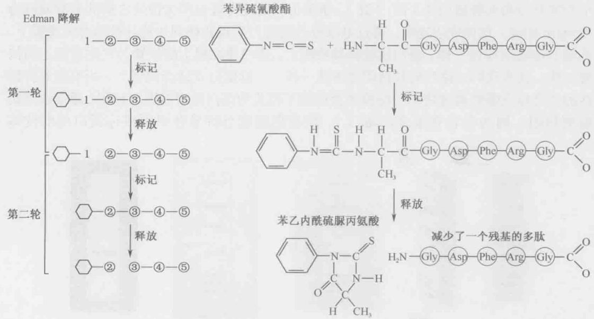  
图 7-29 用 Edman 降解法进行蛋白质测序。N 端残基可以被标记，并在不水解肽链的其余氨基酸的前提下切去这个被标记的残基。因此，每一轮反应能鉴定多肽序列中的一个残基，而这个残基是紧邻上一个残基的。

自动 Edman 降解的 N 端测序已被广泛使用。然而，如果蛋白质的 N 端已被化学修饰（如被甲酰化或乙酰化），测序就比较困难。这种化学修饰所导致的封闭可能在体内发生，也可能在蛋白质分离过程中产生。当蛋白质的 N 端被封闭时，通常用蛋白水解酶消化，暴露出蛋白质的内部序列再进行测序。

串联质谱法 串联质谱法（tandem mass spectrometry，MS/MS）也能用来进行蛋白质的测序，而且是当今最常用的方法。它能非常准确地测定微量样品的质量。其基本原理是物质在（真空）仪器中的行进与它的荷质比密切相关。对于小的生物大分子如肽段和小蛋白质来说，所测得的分子质量能精确到一个道尔顿。

用MS/MS进行蛋白质测序前，通常要用特异性蛋白水解酶，如胰蛋白酶，将目的蛋白消化成小肽段（一般小于20个氨基酸）。质谱分析时，肽段混合物中的各个肽段由于荷质比不同，能相互区分开来。将如此分离到的单个肽段打碎成其组成肽段，对这些组成肽段进行测序（图7-30）。运用反卷积法（deconvolution）分析这些序列数据能清楚地反映原始肽段的序列。和Edman降解一样，只要得到某种蛋白质的约15个氨基酸长的肽段序列，就能通过比较实测氨基酸序列和经DNA序列预测到的氨基酸序列而鉴定这种蛋白质。与Edman降解法不同的是，串联质谱经常会鉴定到来自同一蛋白质的多个肽段。

MS/MS 使蛋白质测序和鉴定有了革命性的突破。它的特点是只需使用极其微量的样品，并能对复杂混合物中的各种蛋白质同时进行分析。

<!-- W-END Watson 7 蛋白质 -->

<!-- W-BEGIN Watson 7 蛋白质组学 -->

### 【中文对照 Watson 第7章：蛋白质组学】

> 来源：Watson《基因的分子生物学》第七版中译本（书籍/03_基因的分子生物学_第七版） 第7章 分子生物学技术。

#### [W] 蛋白质组学

在全基因组水平测定全部基因的表达为细胞活性状态提供了一个定格照（snapshot）：但是这种方式还不足以检测其他重要的修饰调控状态。实际上，基因的转录水平所能提供的信息只能大致地反映编码蛋白质表达水平。如果 mRNA 寿命很短或者很少被翻译，那么即便是高度表达的 mRNA 也只能产生少量的蛋白质。另外，很多蛋白质是通过翻译后修饰的方式显著地影响自身的活性，转录谱所提供的数据则根本不具备反映这种调节状态的功能。

全基因组序列的获得及高通量的蛋白质分离、鉴定方法的研究引入了蛋白质组学领域。蛋白质组学的研究目标是鉴别特定条件下细胞或组织产生的所有蛋白质（也就是蛋白质组），包括全套蛋白质的相对丰度、修饰，以及与之相互作用的蛋白质。鉴于芯片技术已经使全基因组水平研究转录谱或 DNA 含量成为可能，蛋白质组学的研究方法则着眼于获得细胞内的所有蛋白质及其修饰（如磷酸化位点）的定格照。

液相色谱和质谱法结合从复杂提取物中鉴定单个蛋白质

联合使用液相色谱和质谱（在本章前面的段落中已作过介绍）对鉴定复杂体系（如细胞粗提物）中的所有蛋白质是一种有效的方法。理想情况下，可直接使用质谱技术分析出细胞提取物中的所有蛋白质，但实际上却很难做到，这是由于提取物中数目巨大的蛋白质产生的肽段超出可解析的能力。所以研究人员开发了有效的方法，在进行质谱分析之前，先通过两类液相色谱将肽段分离（LC-MS，图7-31）。在这一过程中，首先用序列特异性的蛋白酶对细胞粗提物进行消化（如胰蛋白酶，可在精氨酸或赖氨酸残基后切开）生成多肽链，再使用离子交换层析（肽段与带电柱料发生离子相互作用分离）和反相层析（肽段与柱料的疏水相互作用分离）将所得到的多肽进行分离。这一步骤使复杂的初始混合物简化为组分简单、容易区分和测序的二级混合物。接着对这些二级混合物进行串联质谱分析（MS/MS，前文已作讨论）鉴定多肽群中尽可能多的肽段。最后，在获得所研究生物完整基因组序列和质谱分析得到的多肽序列的情况下，用生物信息学手段将每个多肽与基因组中蛋白质编码序列（基因）关联起来。

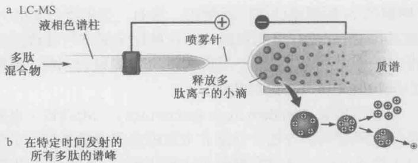

c 用于MS/MS序列确定的共同的多肽片段  
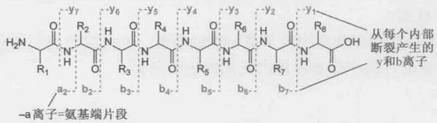

d 用预测和观察的谱峰产生一个用于鉴别的置信度  

  
图 7-30 液相色谱和 MS/MS 联用分析蛋白质混合物的组分。(a)肽段混合物用液相色谱分离后接质谱装置。(b)不同组分肽段从层析柱上洗脱,质谱仪对肽段进行分离,根据荷质比(m/z)将结果展示。选择相关肽段(相邻近的峰之间的不同是由于肽段上不同的原子同位素造成的)进行片段化并对所得的肽链片段用二级质谱进行分析。(c)片段化后产生的不同的断点的图示。可能产生的小片段多肽包括 b 肽(氨基末端片段)、y 肽(羧基末端片段)、 $a_{2}$ 肽(最短的氨基末端片段)。(d)将观察到的图谱与所有可能的理论图谱(根据来自生物的蛋白质序列)进行比对,由产生这些蛋白质的生物所编码的蛋白质的氨基酸序列生成理论图谱。一般来说,只有很少的一部分肽段可以精确鉴定。例如,异亮氨酸和亮氨酸的分子质量相同。然而,只要有 3 或 4 个准确鉴定的肽段,就足以进行蛋白质的鉴定。

在实际操作中，这种方法只能检测复杂体系中某个亚体系的蛋白质，如从细胞中分离得到的蛋白质。常规分析一般能检测到大约1000个不同的蛋白质。然而，更多的组分分离方法以及质谱仪灵敏度的提高，会进一步提高蛋白质组分析的完整性。对鉴别细胞中蛋白质的有无来说，LC-MS分析非常有效，但目前用此方法确定蛋白质的相对丰度还是比较困难的。为了解决这个问题，人们正在研发定量技术并已经有所应用。

#### [W] 通过蛋白质组学比较鉴定细胞间的差异

虽然鉴定出细胞中的全部蛋白质具有深远的意义，但在多数情况下，了解两个不同类型细胞、或者同一类型细胞在不同生长条件下的蛋白质表达差异，更有实际价值。通过确定特定生理状态下的蛋白质组，就能够找到蛋白质表达水平的差异，进而确定那些可能造成细胞差异的蛋白质，为进一步的研究提供有价值的候选蛋白质。

  
图 7-31 液相色谱分离后进行质谱分析来分离蛋白质。这种方法的步骤如图所示，并在文中有详细记述。

下面以对不同癌细胞的分析为例，说明比较蛋白质组学的价值。人们经常发现，虽然不同患者有同一种癌症的生理特征，但对同一种化疗药物却表现出不同的反应。通过比较不同肿瘤样本在蛋白质组水平的差异，发现表型相似的细胞表达的蛋白质存在很大差异。这些差异蛋白质在肿瘤分型中可以作为有价值的标记物。更重要的是，这些标记物还可以为患者筛选有效的化学治疗方法提供依据。

#### [W] 质谱也可以检测蛋白质的修饰状态

鉴于蛋白质的修饰可以广泛影响其功能，研究人员也发展了多种鉴别细胞中蛋白质修饰的手段。特异的修饰通常会改变蛋白质的活性或稳定性，如蛋白质的磷酸化经常被用于调控其活性。磷酸化会引起蛋白质构象的变化，进而影响功能（如许多蛋白激酶只有在磷酸化状态下才具有生物学活性）。或者，增加磷酸基团也会使蛋白质产生新的结合位点，导致新的蛋白复合体的形成。其他的蛋白质修饰还包括甲基化、乙酰化和泛素化等。泛素化是在蛋白质的赖氨酸残基上通过类肽键连接一个包含76个氨基酸残基的泛素。一个蛋白质被多个泛素所修饰，将触发蛋白质的降解。

每一种修饰都会使蛋白质的分子质量发生不同的变化。这种变化可以用质谱检测，并已经发展出检测细胞中只带有某种特定修饰的蛋白质组的方法。例如，细胞内所有的磷酸化蛋白质称为“磷酸化蛋白质组”。已经建立了一些鉴定蛋白质亚群的方法，它们一般采用能和发生特定修饰的蛋白质相结合的亲和树脂。例如，含有固定化三价铁离子（ $\mathrm{Fe}^{3+}$ ）的树脂[也称固定化金属亲和层析（IMAC）]可以特异性结合磷酸化肽段，细胞粗提物中的肽段混合物可以与它共同孵育，使磷酸化肽段富集。得到的肽段就可以借助LC-MS方法进行蛋白质磷酸化和磷酸化位点的分析。所获得的信息对了解修饰蛋白质的激酶和制备不能被修饰的激酶突变体以检测修饰的重要性是非常重要的。

#### [W] 蛋白质-蛋白质相互作用可以产生蛋白质功能相关的信息

蛋白质组学也包括细胞中蛋白质的相互作用，即所称的互作组（interactome）。一个细胞中完整的互作组应该反映细胞中所有的蛋白质相互作用。在整个互作组中，一般认为主要是蛋白质之间的关联在起作用。通过关联性进行推断（guilt by association），可以了解蛋白质在哪些细胞过程中起作用。同一个蛋白复合体中的蛋白质几乎总是在同一种细胞过程中出现。

酵母双杂交实验是一种鉴定蛋白质相互作用的方法之一（见第19章框19-1），这项技术把感兴趣的蛋白质作为“诱饵”，而在待检测的蛋白质库中可能存在被捕捉的“猎物”。另一种方法是，用亲和树脂或免疫共沉淀对目的蛋白及相关蛋白质进行快速纯化。可以通过LS-MS方法在得到的蛋白质混合物中鉴定相关蛋白质。对一个细胞的所有蛋白质重复进行这样的鉴定，就会得到这个细胞中蛋白质之间的互作图。

第二种方法已经在酿酒酵母中得到了应用。通过亲和层析已经纯化了 6000 多个酵母蛋白质（每一个蛋白质对应的基因都进行了遗传改造，或者将一个标签融合在 C 端，该标签可以和两种亲和树脂结合），用质谱鉴定与标签蛋白质共同纯化的结合蛋白质。

通过对这些数据的分析，鉴定了数百个酵母蛋白复合体，虽然这些复合体有许多是已知的，但也有一些是新发现的。因为获得了大量已知的蛋白质复合体（如 RNA 聚合酶Ⅱ）可以看出这种方法的有效性（图 7-32）。

  
图 7-32 酿酒酵母的物理互作图。图中所示为利用亲和纯化/质谱鉴定酿酒酵母中所有蛋白质后得到的分析结果。全图由一系列的框图构成，这些框图标出了能和给定蛋白质共沉淀的蛋白质。如果一个蛋白质可以和所标记蛋白质共沉淀，用黄色框标记；如果不能发生共沉淀，就用黑色框标记。此图中，同一个蛋白复合体中的蛋白质会在纵轴和横轴上表现出成簇聚类现象；因此复合体都出现在对角线上。在这幅图中，只有部分蛋白质复合体（很多复合体在本书的其他部分已做讨论）被展示出来。（经许可影印自 Collins S. R. et al., 2007. Mol. Cell. Protem.6: 439-450, Fig.3b©American Society for Biochemistry and Molecular Biology.）

#### [W] 核酸-蛋白质相互作用

下面我们把关注的重点放到核酸和蛋白质相互作用的各种研究方法上。它们之间的相互作用对决定本书所描述的许多事件的特异性和精确性来说都是至关重要的。在转录、重组、DNA复制、DNA修复、mRNA剪切或翻译中，介导这些事件的蛋白质必须识别核酸结构或者序列，才能确保生命活动在细胞的特定时空发生。

基于核酸-蛋白质相互作用的重要性，研究人员开发了多种有效的、用于体内和体外检测相互作用的的方法。在接下来的部分，我们将介绍几种方法，并探讨它们的优势和不足。

#### [W] 蛋白质与 DNA 的结合会改变其电泳迁移率

正如电泳迁移率可以确定 DNA、RNA 或蛋白质的相对大小，它也可以用于检测蛋白质-DNA 之间的相互作用。如果一个 DNA 分子结合了蛋白质，同未结合蛋白质的 DNA

  
图 7-33 电泳迁移分析。迁移分析的基本原理见示意图。蛋白质与放射性标记的 DNA 探针混合，DNA 探针具有该蛋白质的结合位点。聚丙烯酰胺凝胶电泳分离混合物，再通过放射自显影显色。没有结合蛋白质的 DNA 在凝胶上呈现一条带，与 DNA 片段的大小对应（左边泳道）。混合物中，由于只有一部分 DNA 分子（不是所有的都与蛋白质结合）结合蛋白质，所以右边泳道出现两条带，一条对应未结合蛋白质的分子，另一条对应与蛋白质结合的分子。

相比，DNA-蛋白质复合体在凝胶中的迁移速率变慢。这就是检测 DNA 结合特性的理论基础。一般的实验流程为：对含有结合位点的短的双链 DNA（dsDNA）片段进行放射性标记，这样就可以通过聚丙烯酰胺凝胶电泳和放射自显影检测到微量的样品。也可以使用荧光标记，但是需注意荧光染料的位置不能干扰 DNA 结合（参见第 9 章框 9-1 图 1b）。接下来，标记的 DNA 探针与待测蛋白质混合，使用非变性凝胶电泳分离。如果 DNA 探针和蛋白质发生结合，则蛋白质-DNA 复合体的迁移速度就比较慢，标记 DNA 在凝胶上的位置会发生变化（图 7-33）。这就是电泳迁移改变检测（electrophoretic mobility-shift assay，EMSA），或者简称为条带或凝胶迁移检测。我们虽然只介绍了用 EMSA 检测蛋白质和双链 DNA 的相互作用，EMSA 也可以用于检测蛋白质与

#### [W] 单链 DNA（ssDNA）或者 RNA 的结合。

EMSA 也可以检测多个蛋白质和同一个 DNA 的结合。这些相互作用可能都是序列特异的 DNA 结合所依赖的。或者是，在一个 DNA 序列特异的结合发生后，另一个蛋白质同第一个 DNA 结合蛋白质结合。不管在什么情况下，只要有新的蛋白质结合上去，DNA 的凝胶迁移率都会进一步降低。EMSA 是一种有力的工具，它可以鉴定一系列蛋白质是如何独立地与同一个 DNA 相互作用的。蛋白质分子质量不同，影响 DNA 迁移率的效果也不同（蛋白质分子质量越大，迁移速率越慢），所以不同蛋白质结合同一种 DNA 分子也是可以区分的。如果不同的蛋白质的结合产生了相同的迁移，我们可以采用另外的方法确定到底是哪一个蛋白质发生了结合。当某蛋白质与 DNA 结合时，加入该蛋白质特异的抗体可引起更加明显的迁移作用。因此，通过加入可能与 DNA 结合的蛋白质抗体，可鉴定该蛋白质是否存在于 DNA-蛋白复合体中。

EMSA 的缺点在于无法确定 DNA 片段中与蛋白质特定结合的具体序列。有两种办法可以解决这个问题。第一种方法是在结合探针 DNA 之前，用一些短的双链 DNA 寡聚物与蛋白质共同孵育，如果寡聚物中存在待测蛋白质的结合位点，那么孵育后，蛋白质就不会与探针 DNA 结合。另一种方法是定点突变探针 DNA 序列，从而推测出它对蛋白质结合的影响。这些方法可以在蛋白质结合位点未知的情况下进行，在多数情况下，预实验或探针中 DNA 序列的保守性分析有助于简化要分析的待测序列。

蛋白质的结合可以保护 DNA 不被核酸酶降解或化学修饰

如何更加快捷地确定 DNA 序列中的蛋白质结合位点？已经有一系列的手段可用来确定结合位点，以及确定蛋白质相关联的化学修饰位点（甲基化、氨基化或者磷酸化）。这些方法的基本原理如下：如果在 DNA 分子一条单链的末端标记同位素分子，那么单链上从任何位置断开，都会使被标记片段分子质量发生不同程度的减小。通过高分辨率变性聚丙烯酰胺凝胶电泳（与 DNA 测序分析的胶类似）检测标记单链 DNA 片段可确定这些片段的大小。因为如下将叙述的理由，这种方法被称作 DNA 足迹法（DNA footprinting）。

核酸酶保护足迹法（nuclease protection footprinting）是最常用的方法。将蛋白质与末端标记的 DNA 共同孵育后，产物直接与 DNA 酶反应（常用 DNase I，它可以切割双链 DNA 中的一条链）。由于结合蛋白质的保护，DNA 序列上部分酶切位点不能被切开（图 7-34），所得的“足迹”显现的就是一些特定大小的 DNA 条带的缺失，对应的是蛋白质结合的区域。与此相关的化学保护足迹法（chemical protection footprinting）则是基于结合的蛋白质可以保护结合位点处的碱基，使之不受碱基特异的化学试剂的影响，这些试剂（在进一步反应后）能导致核酸骨架的

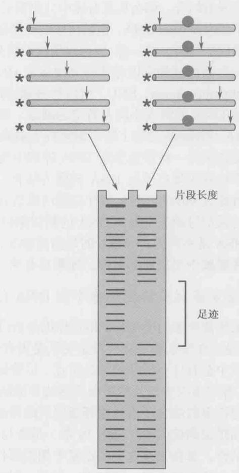  
图 7-34 核酸酶保护足迹法。“\*”号表示放射性标记的 DNA 片段末端，箭头表示 DNase 酶切位点，红圈表示 Lac 抑制因子结合在操纵子上。左侧，DNase 随机切割 DNA 后，通过电泳按大小分离。右侧，DNA 分子先结合抑制因子，再用 DNase 处理。“足迹”标记在右侧，这些条带对应的是 DNase 降解后游离的 DNA，而非结合了抑制因子的 DNA。在后一种情况下，DNA 上的切割位点在操纵子序列中，被抑制因子所覆盖，使 DNase 不能发挥作用。

断裂。在两种方法中，重要的是要保持核酸酶切割位点或者化学修饰位点数目应为每个DNA探针一个。这是因为只有那些距离标记DNA末端最近的酶切位点可以被凝胶电泳和标记DNA检测到。

改变足迹法实验的前两步的顺序，就成为第三种方法——化学干扰足迹法（chemical interference footprinting）。这种方法可以确定什么样的 DNA 结构对蛋白质结合是必要的。在与蛋白质孵育之前，先对 DNA 分子进行一次化学改造。改造后的 DNA 分子与 DNA 结合蛋白质孵育，然后分离 DNA-蛋白质复合体。从总 DNA 中将结合了蛋白质的

DNA 片段分离最常用的方法是 EMSA。在 EMSA 凝胶中检测标记 DNA，很容易区分迁移发生变化（结合）和没有发生变化（未结合）的 DNA。如果某一个位点的修饰不能阻止蛋白质的结合，那么从复合体中分离得到的 DNA 就带有那样的修饰。反之，如果修饰阻止了蛋白质识别 DNA，在蛋白质结合样品中就不会找到在那个位点被修饰的 DNA。就像化学保护分析方法一样，也可以用试剂切开 DNA 的化学修饰位点来确定化学修饰位点。

化学修饰试剂可以非常特异地标示 DNA 的某一特性。例如，化学试剂乙基亚硝基尿（ethylnitrosourea，ENU）可以特异地修饰 DNA 骨架上的磷酸基团。有些其他试剂可以修饰 DNA 大沟或小沟上特定的碱基。通过使用不同化学试剂，可以精确了解蛋白质与 DNA 核糖磷酸骨架上特定碱基或者磷酸基的相互作用。

足迹法是一种快速鉴定 DNA 序列中蛋白质结合位点的有效方法；但是，该方法在分析中依赖于蛋白质与 DNA 的强力结合。一般来说，为确保 DNA 足迹法的有效性，必须有超过 90% 的 DNA 探针与蛋白质结合。之所以需要高水平的结合，是因为足迹法检测的是信号缺失（因为 DNA 的酶切保护和修饰作用），而不是检测新条带的产生。这与 EMSA 是不同的，EMSA 的是高灵敏度，在 EMSA 分析中，蛋白质与标记 DNA 的结合会在凝胶中出现新的条带，如果没有结合，则没有新条带的出现。

#### [W] 染色质免疫沉淀检测细胞中和 DNA 结合的蛋白质

虽然体外蛋白质-DNA 相互作用分析可以提供许多重要信息，但确定蛋白质与特定 DNA 是否在活细胞中存在特定关联是更有意义的。对于特定的 DNA 结合蛋白，在整个基因组中会有许多潜在的结合位点。尽管如此，在很多情况下只有少数位点能与蛋白质结合。有时是因为与其他蛋白质的结合抑制了这个蛋白质与潜在 DNA 结合位点的关联。也有时稳定的结合还需要相邻蛋白质的帮助。不管在什么情况下，知道细胞中一个蛋白质（如转录调控因子；见第 19 章）是否与一个特定的 DNA 位点（如特定启动子区域）发生结合，都会为在这个位点发生调控事件（如转录激活）提供有力证据。

染色质免疫沉淀，即 ChIP，就是一种检测细胞中蛋白质-DNA 相互作用的手段。其过程大致如下：向活细胞中加入甲醛，使 DNA 与结合蛋白及其与之紧密结合的其他蛋白质发生交联，裂解细胞，用超声法将 DNA 断裂成 200～300bp 长的片段。用针对目标蛋白质（如转录调控因子）的特异抗体进行免疫沉淀反应（immunoprecipitation，IP），可从细胞裂解物中将与蛋白质结合的特定 DNA 片段分离出来。完成免疫沉淀以后，再解开 DNA 和蛋白质之间的交联，就可以对 IP 下来的 DNA 序列进行分析（图 7-35）。

ChIP 技术的关键环节在于确定特定 DNA 区域是否与蛋白质结合而出现在沉淀产物中。回答这个问题，可以通过以下两种方法之一。第一种方法是设计与结合区域匹配的引物进行 PCR 反应，以检验特定区域 DNA（如启动子）是否与目的蛋白质相结合。如果在交联过程中蛋白质与 DNA 相互结合，那么序列就会出现在沉淀中，可以通过 PCR 反应扩增检测。这种方法需要两个重要的对照。第一，设计针对其他 DNA 区域的 PCR 引物（该区域已知或者预计不能和目的蛋白质结合）。在这个对照反应中，应该不会出现 DNA 的扩增（图 7-35）。第二，进行沉淀之前，取少量总 DNA，用检测引物和对照引物对未分离的 DNA 样品扩增。如果两种引物具有相同的扩增效率，二个 PCR 的扩增效率也应该相同。

与DNA片段交联的蛋白质  
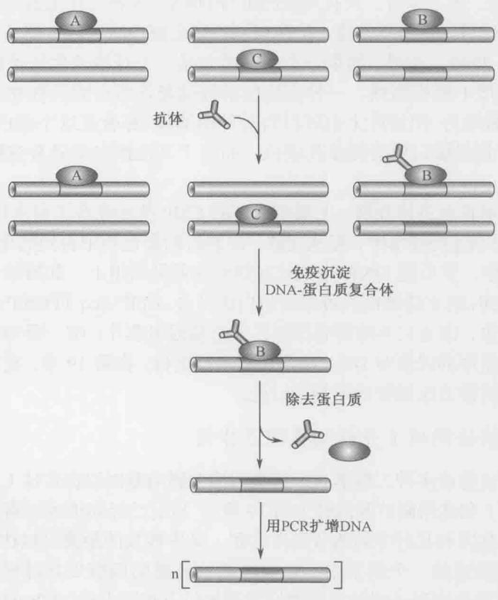  
图 7-35 染色质免疫沉淀（ChIP）。

这个对照就保证了当用两组不同引物对 ChIP 处理后的 DNA 扩增时, 其差异是由于模板丰度的不同造成的, 而不是 PCR 反应的效率造成的。

第二种鉴定细胞内 DNA 与特定蛋白质结合的方法是覆瓦式 DNA 芯片技术。在这种方法中，将与蛋白质交联后的 DNA 及总 DNA 分离出来，分别用两种不同的荧光染料标记（此处我们分别将其称为红色和绿色）。然后把这两种 DNA 混合，与芯片杂交。那些杂交后出现较高红：绿比值的区域可以确定为蛋白质的结合区域，而低比值的区域就不是结合区域。这种方法对检测结合位点未知的序列尤其有效，而且能对全基因组同时进行检测。因为该方法对 DNA 样品的分析采用的是基于覆瓦式 DNA 芯片的 ChIP 技术，所以这种方法通常称为 ChIP-Chip。

虽然 ChIP-Chip 技术非常有效并被广泛应用，但还是应该对其在检测方面的局限性有所了解。首先，与 EMSA 相似，ChIP 的分辨率是有限的。ChIP 并不能确切了解与蛋白质相互作用的特定 DNA 片段，而只能是结合位点所在的 200～300bp 的序列。因此，ChIP 可以检测到调控蛋白在某个特定基因而不是其他基因的上游区域发生结合，但不能显示出在基因上游的具体什么位置与蛋白质结合。和 EMSA 一样，定点突变对确认蛋白质是否特异地结合于某一位点是必要的。其次，只有获得目标蛋白质的抗体，才可以用 ChIP 进行分析。进一步讲，只有当蛋白质与 DNA（或者与其他蛋白质共同作用于这个基因）发生交联后，蛋白质表位（抗体识别的特定蛋白质区域）仍然是暴露的，才能使用 ChIP 检测。更进一步讲，如果一个蛋白质在某一个环境或生理条件下不能被检测到，而在其他环境下能检测到，一种直接的解释就是该蛋白质只有在某种环境下才会与特定 DNA 区域结合。但实际上也可以有另外的解释，那就是这个蛋白质始终与 DNA 序列结合，但有其他蛋白质会掩盖其表位，而这个其他蛋白质只有在特定条件下才会存在。

全基因组技术正在迅速发展，上面所描述的 ChIP 技术也有了很多新的变化。例如，在一项称为 ChIP-Seq 的技术中，把从交联、碎裂后的染色质中得到的免疫沉淀 DNA 直接进行 DNA 测序，然后把 DNA 序列比对到相应的基因组上。如果某个基因组位点的序列被反复鉴定到，就支持该位点可以同蛋白质结合。ChIP-Seq 同 ChIP-ChIP 方法类似，但有时候会更简单，因为它不需要制作覆瓦式全基因组芯片。唯一要知道的是所研究生物或细胞的基因组序列以便对 DNA 结合位点进行定位。在第 19 章，我们会结合在增强子鉴定中的应用对该方法做更为详细的讨论。

#### [W] 染色体构象捕获检测用于分析远程相互作用

染色体可以折叠成多种三维形式，这些结构会影响基因组稳定性（第10章）、染色体分离（第8章）和基因调节及活性（第19章）。目前已经知道远距离相互作用可以发生在稀疏排列的基因和其对应的调节元件之间，其中涉及的距离可以达到几个Mb。在第21章将详细描述的一个例子中，在哺乳动物胚胎的四肢发育过程中，调控Sonic hedgehog基因表达的增强子同该基因的转录起始位点相距大概1Mb的距离。该基因的表达依赖于远端增强子跨过较长的距离同Sonic hedgehog基因的启动子发生环绕。染色体构象捕获试验（Chromosome Conformation Capture, 3C）可以用来检测这些相互作用。该方法在图7-36中进行了阐述，内容如下：首先用福尔马林处理完整的细胞，使蛋白质与DNA、蛋白质与其他互作蛋白质与基因组区域发生交联。然后通过限制性内切酶的消化或通过物理方法（如超声法）使染色质断裂成小片段。接着在有利于相关DNA片段发生分子内连接的条件下对产生的DNA进行连接反应。此时，解开交联并纯化连接产物。或者，在连接反应后用特定的抗体对连接混合物进行免疫沉淀，该抗体可以识别感兴趣的蛋白，就像我们在前面部分所描述的那样。

4C 和 5C 是 3C 技术的衍生方法，它们可以检测同基因组中某锚定位点发生的所有的染色体相互作用。有一个很著名的例子，即调节 HoxD 基因的“增强子群岛”的研究，HoxD 基因簇参与组织生长模式，尤其是四肢的发育。这些基因的转录由离该基因簇大约几百 kb 距离的调节序列激活，其激活方式是波动式的。第一波表达发生在肢体发育早期，有一系列增强子控制，而另一组基因的表达发生在晚一波的转录中，这些转录是随着肢体形成而发生的，由另外系列的增强子控制。通过 3C 相关技术，研究人员确定了若干增强子，它们分布在 800kb 的区间中，同 Hoxd13 的启动子发生相互作用。

可用体外选择鉴定蛋白质的DNA或RNA结合位点

随着越来越多 DNA 结合蛋白被鉴定和了解，确定与特定序列 DNA 结合的基序（如 helix-turn-helix 基序，见第 6 章）也相对容易了。尽管有了很多发现，对这些结合蛋白结构域的了解还存在着很多不足，根据氨基酸序列还不足以确定与什么序列的 DNA 结合。而获得这些信息对确定可能的调控区以做进一步的分析是非常重要的。

如何鉴别与特定蛋白质结合的 DNA 序列呢？体外选择（in vitro selection），或称 SELEX（Systematic Evolution of Ligands by Exponential Enrichment，指数富集配体的系统演化），是目前一种有效的手段。该方法利用蛋白质序列特异性，在不同的寡聚核苷酸文库中筛查，然后分析富集的 DNA，就能确定与蛋白质紧密结合的 DNA 序列。

  
图 7-36 染色体构象捕获示意图。3C 试验包括三个基本步骤：①相互作用的染色体片段通过福尔马林发生交联；②DNA 被消化；③交联的 DNA 片段被连接起来，连接产物被扩增并用于后续分析。

SELEX 的第一步是利用 DNA

化学合成技术（本章第一部分已介绍）合成一个巨大的单链 DNA 文库。重要的是，这些单链 DNA 中部的 10～12 个碱基是随机的（合成这些位点时加入所有 4 种核苷酸前体的混合物）。随机区域的两侧是特定的 DNA 序列，文库合成后，用短的、与特定区 3' 端匹配的引物进行延伸，将随机单链 DNA 文库变成双链 DNA 文库。

用与我们曾讨论过的类似方法，就可以富集那些与蛋白质结合的寡聚核苷酸。蛋白质与寡聚核苷酸共同孵育后，用 EMSA 法分离。在电泳位置发生迁移的复合体中，富集着与蛋白质紧密结合的 DNA。或者，如果有待测蛋白质的抗体，可以使用与 ChIP 类似的免疫沉淀从未结合 DNA 中分离出蛋白质和结合的 DNA。不管采取什么样的富集机制，用 PCR 就可以扩增结合的 DNA（用与寡核苷酸特定末端区域配对的寡聚核苷酸链）。因为从文库中只能获得很少量的蛋白质结合核苷酸，所以扩增是必需的。重复结合、富集和扩增的步骤，可以显著富集与待测蛋白质紧密结合的核酸序列（图 7-37）。通常，3～5 轮的循环就可找到与蛋白质结合最紧密的 DNA 序列。

测定富集的 DNA 序列，可以确定蛋白质结合 DNA 的序列特异性。一般来说，随机区域的 DNA 序列只有一部分是保守的，因为大多数 DNA 结合蛋白识别不多于 6 或 7个核苷酸，计算机分析通常被用来帮助确定保守区域的序列。最后，碱基序列保守性可以用序列 logo 图表示，在 logo 图中，字母 G、A、C 或 T 的大小表示碱基在富集的寡聚核苷酸序列中出现的频率（图 7-38）。

  
图 7-37 体外选择示意图。一个复合的 DNA 文库（库中 DNA 分子中部 10～12 个碱基是随机的）与待测蛋白质结合。与蛋白质结合的 DNA 分子通过 EMSA 与未结合的 DNA 相分离。结合的 DNA 可以从凝胶中洗脱下来，用与随机区域二侧的保守区域匹配的引物进行 PCR。经过 3～5 轮的结合富集循环，最后确定具有最高亲和度的序列。

  
图 7-38 SELEX 序列 logo 图。体外筛选用于分离与翻译抑制蛋白 RB69RegA 结合的 RNA。图示为所得序列的 logo 图。字母高度与每个碱基在该位点出现的频率成正比，出现频率最高的碱基在最上面。（经允许影印自 Dean T. R. et al.2005.Virology366:26-36, Fig.4a. Elsevier.）

<!-- W-END Watson 7 蛋白质组学 -->

## 思考题

1. 试述 PCR 扩增的原理和步骤。

2. 试比较常规重组载体构建和恒温一步法载体构建的异同点。

3. 比较荧光染料 SYBR Green I 和 TaqMan 荧光探针的主要不同点。

4. 分析基因组 DNA 文库和 cDNA 文库的主要区别。

5. cDNA 合成时的方向性是如何实现的?

6. 热不对称交错多聚酶链式反应(TAIL-PCR)的主要技术和原理?

7. 说说从总 RNA 的提取到分离出非编码 RNA 的主要过程。

8. 已知一个 cDNA 3' 端的部分序列,请设计实验流程得到该基因的全长 cDNA。

9. 试分析 RACE 技术与 RAMPAGE 技术的相同点和不同点。

10. 简述 Gateway 大规模克隆技术原理及基本操作流程。

11. 说说基因图位克隆法的原理和过程。

12. 比较基因组与蛋白质组的主要差别。

13. 说出蛋白质质谱技术的主要原理。

## 参考文献

1. Gefter M L, et al. The enzymatic repair of DNA. I. Formation of circular lambda-DNA. PNAS, 1967, 58: 240-247.

2. Hedgpeth J, et al. DNA nucleotide sequence restricted by the RI endonuclease. PNAS, 1972, 69:3448-

3452.

3. Olivera B M, Lehman I R. Linkage of polynucleotides through phosphodiester bonds by an enzyme from Escherichia coli. PNAS, 1967, 57: 1426–1433.

4. Venter J C, et al. The sequence of the human genome. Science, 2001, 291: 1304–1351.

5. Weiss B, Richardson C. Enzymatic breakage and joining of deoxyribonucleic acid, I. Repair of single-strand breaks in DNA by an enzyme system from Escherichia coli infected with T4 bacteriophage. PNAS, 1967, 57:1021-1028.

6. Wilmut I, et al. Viable offspring derived from fetal and adult mammalian cells. Nature, 1997, 385:810-813.

7. Zimmerman S B, et al. Enzymatic joining of DNA strands: a novel reaction of diphosphopyridine nucleotide. PNAS, 1967, 57: 1841–1848.

数字课程学习

e 教学课件

目在线自测

思考题解析

<!-- W-BEGIN Watson 7 章末 -->

### 【中文对照 Watson 第7章章末：小结、参考文献、习题】

> 来源：Watson《基因的分子生物学》第七版中译本（书籍/03_基因的分子生物学_第七版） 第7章 分子生物学技术 章末，附录 2 中该章偶数习题答案附后。

#### [W] 参考文献

#### [W] 书籍

Green M. and Sambrook J. 2012. Molecular cloning: A laboratory manual, 4th ed. Cold Spring Harbor Laboratory Press, Cold Spring Harbor, New York.

Griffiths A.J.F., Gelbart W.M., Lewontin R.C., and Miller J.H. 2002. Modern genetic analysis, 2nd ed. W.H. Freeman, New York.

Hartwell L., Hood L., Goldberg M.L., Reynolds A.E., Silver L.M., and Veres R.C. 2003. Genetics: From genes to genomes, 2nd ed. McGraw-Hill, New York.

Snustad D.P. and Simmons M.J. 2002. Principles of genetics, 3rd ed. Wiley, New York.

#### [W] 基因组分析

Frazer K.A., Pachter L., Poliakov A., Rubin E.M., and Dubchak I. 2004. VISTA: Computational tools for comparative genomics. Nucleic Acids Res. 32: W273–W279.

Human Genome. 2001. Nature 409: 813–960.

Human Genome. 2001. Science 291: 1145–1434.

International Human Genome Sequencing Consortium. 2004. Finishing the euchromatic sequence of the human genome. Nature 431:931–945.

Mouse Genome. 2002. Nature 420: 509–590.

Osoegawa K., Mammoser A.G., Wu C., Frengen E., Zeng C., Catanese J.J., and de Jong P.J. 2001. A bacterial artificial chromosome library for sequencing the complete human genome. Genome Res. 11: 483–496. The Human Genome at Ten. 2011. Nature 464: 649–671.

#### [W] 蛋白质组分析

Yates J.R. III, Gilchrist A., Howell K.E., and Bergeron J.J. 2005. Proteomics of organelles and large cellular structures. Nat. Rev. Mol. Cell. Biol. 6:702–714.

#### [W] 习题

偶数习题的答案请参见附录2

习题 1 在外加电场的作用下, DNA 是如何在电泳凝胶中迁移的? 请解释你的选择并说

明电泳后如何才能让 DNA 可以被观察到。

习题 2 限制性内切酶 XhoI 识别序列为 5'-CTCGAG-3'，并且分别在每条链 C 和 T 之间切开。

A. 这段序列在基因组中出现的计算概率是多少?

B. 限制性内切酶 SalI 识别序列为 5'-GTCGAC-3'，并分别在每条链的 G 和 T 之间切开。你觉得 XhoI 和 SalI 的黏性末端能黏合到一起么，请解释你的选择。

习题 3 简要描述两种标记 DNA 探针的方法。

习题 4 比较 Southern 印迹和 Northern 印迹的异同。

习题 5 质粒克隆载体经过特殊设计有多个适用于克隆和表达的特性。请用一两句话描述下列各个原件的作用：复制起点、限制酶识别位点、选择标记和启动子。

习题 6 请解释基因组 DNA 文库与 cDNA 文库有何不同之处。cDNA 文库相比之下有何优势？

习题 7 下列是一个 PCR 反应步骤的时间与温度的例子。你可以参照图 7-12 来回答下列问题。

$$
\begin{array}{l l l l l l} {9 4 ^ {\circ} \mathrm{C}   \Rightarrow} & {\left[ \begin{array}{l l l l l l} {9 4 ^ {\circ} \mathrm{C}   \Rightarrow} & {5 5 ^ {\circ} \mathrm{C}   \Rightarrow} & {7 2 ^ {\circ} \mathrm{C}   \Rightarrow} & {7 2 ^ {\circ} \mathrm{C}   \Rightarrow} & {4 ^ {\circ} \mathrm{C}} \\ {1 0   \text {分}} & {3 0   \text {秒}} & {3 0   \text {秒}} & {1   \text {分}   3 0   \text {秒}} & {1 0   \text {分}} & {\infty} \end{array} \right]} \end{array}
$$

(25 x 个循环)

A. 为何第一个步骤是以 $94^{\circ}$ C 起始？

B. 在循环中当温度转为 $55^{\circ}$ C 的过程中反应发生什么变化?

C. 在循环中温度在 $72^{\circ}$ C 时有什么事件发生？

习题 8 请描述下列分离蛋白技术的原理：离子交换、凝胶过滤和亲和柱层析法。

习题 9 请解释在聚丙烯酰胺凝胶电泳的蛋白样品中加入 SDS 的目的。

习题 10 三个用于检测蛋白质和 DNA 的相互作用的实验为: 电泳迁移率改变(EMSA), DNA 足迹和染色质免疫共沉淀(ChIP)。

A. 在 DNA 足迹法中，为何只对一条 DNA 单链进行末端标记才能保证实验的正常进行。

B. 在染色质免疫沉淀实验（ChIP）的免疫沉淀步骤之后，如何鉴定仍结合在感兴趣的蛋白上的 DNA 序列。

习题 11 你想对 PCR 产物进行双脱氧法测序。加入适量的 ${}^{32}$ P 标记引物、DNA 聚合酶、DNA 模板（即 PCR 产物）、缓冲液、dNTP 混合物，以及在 4 个反应管中分别加入小量的四个 ddNTPs 中的一种。在 PCR 仪上完成这些反应，将各个反应体系产物分别加入不同的聚丙烯酰胺凝胶泳道，通过电泳分离反应产物。如下图所示，泳道根据加入的 ddNTP 的不同进行标记。
A. 请写出对应的 DNA 序列，并标记上 5' 与 3' 末端。
B. 假设你意外地加入了 10 倍量的 ddGTP 到第四

泳道的反应中，那么第4泳道的带型将会是如何？

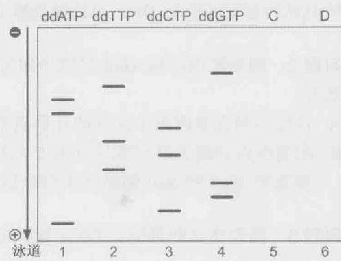

C. 假如在反应中只使用了包含 dATP, dTTP, dCTP 和 dGTP 的核苷酸混合物，请在第 5 泳道中画出预期看到的结果。

D. 假如在反应中只使用了包含 ddATP, dTTP, dCTP 和 dGTP 的核苷酸混合物，请在第 6 泳道上画出预期的结果。

习题 12 你希望了解黑腹果蝇在发育过程中基因表达的特征。你分离了胚胎和成体果蝇的 mRNA，在 Northern 印迹实验中采用靶基因 Z（一个发育必需的基因）的标记 DNA 探针，实验结果如下：

奇怪的是，你分离了胚胎和成体果蝇的蛋白 Z 并进行 Western 印迹，用了识别蛋白质羧基端的抗体，实验结果如下。你很惊奇地发现在胚胎和成体样品中都存在同一条相同分子质量的条带。

A. 请提出一个假设来解释此结果。

B. 请提出对 Western 印迹实验策略的改变从而使你对假设进行检验(假设你可以获得任何必要的试剂)。

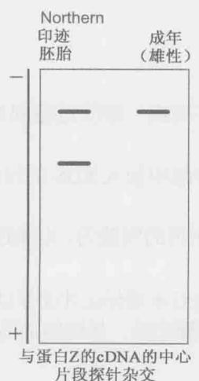  
与蛋白Z的cDNA的中心片段探针杂交

  
与抗蛋白Z羧基端抗体杂交

#### [W] 附录 2：本章偶数习题答案

问题 2

A. 对于可以识别 6bp 序列的限制性内切酶来说，在给定的基因组中找到序列的频率是 $1/4^{6}$ 或 1/4096 bp。

B. 是的。虽然 XhoI 和 SalI 的识别序列不同，但黏性末端可以彼此配对，因为这两条单链区是彼此互补的。

问题 4 当进行 Southern 杂交时,用 DNA 探针来检测特定的 DNA 序列。当进行 Northern 杂交时,用 DNA 探针来检测特定的 mRNA 序列。当进行 Southern 杂交时,用限制性内切核酸酶来消化基因组 DNA,通过凝胶电泳分离 DNA 片段,DNA 会转移到带正电的膜上,并检测带有 DNA 探针的 DNA 片段。对 Northern 杂交除了不用消化 mRNA 之外,可以进行类似的一系列步骤。在 Northern 杂交中,可以检测某一种 mRNA 的量,并且可以与在不同实验条件下的另外的样本作比较。

问题 6 基因组文库包含整套的 DNA 片段，是由限制性内切核酸酶消化全基因组而产生的 DNA 片段。cDNA 文库，只包含基因组 DNA 的表达序列，在细胞中由所有的 mRNA 反转录产生。在每种情况下，DNA 目的片段结合到质粒载体中。人类基因组包含相当大比例的非编码 DNA 序列，包括用于编码拼接出 mRNA 的内含子序列。cDNA 文库可用于研究和表达这些编码基因的序列。

问题 8 离子交换色谱法基于电荷来分离蛋白质。凝胶过滤色谱法基于分子大小分离蛋白质。亲和色谱法是基于与特定的分子、蛋白质或耦合到磁珠的核酸的相互作用来分离蛋白质。

#### [W] 问题10

A. 只有 DNA 链的一端被标记, 才能产生消化结合 DNA 片段的核酸酶, 凝胶电泳之后, 一条可见片段梯度从单一的标记端延伸开来。两端都标记的链的消化将使模式复杂化, 使印记模糊。而且, 如果蛋白质结合不对称, 则模式甚至会变得更复杂。

B. 为了确定已知的特定区域是否结合蛋白质，使用这些序列的特定引物来扩增序列并将结果与必要的参照做比较。另一种选择是使用覆瓦式（tiling）DNA 微阵列来确定许多不同的序列。

问题12

A. Western 印迹法在幼虫期和成虫期泳道中检测了蛋白 Z 泳道。Northern 印迹法表明在苍蝇幼虫期基因 Z 有两次转录，而在成虫期只有一次转录。一个可能的假设是，在免疫印迹实验中使用的抗体不能识别由快速迁移转录而翻译的蛋白质形式，因为由于 RNA 的可变剪接可能会缺失羧基端结构域的编码区域。

B. 对于给定的假设，在免疫印迹实验中你可以使用蛋白 Z 的另外一种新抗体。这种抗体可以是整个蛋白质的多克隆，也可以是蛋白质的中央或氨基端区域的单克隆。如果用使用新抗体，你看到免疫印迹实验中幼虫泳道的第二个条带，那么该数据将支持 A 部分提出的假说。

<!-- W-END Watson 7 章末 -->

<!-- C-BEGIN Campbell 20 Review -->

### 【英文对应 Campbell 第20章章末：Chapter Review】

> 来源：Campbell Biology（书籍/01_Campbell_Biology） 第20章 Summary of Key Concepts 与 Test Your Understanding。

### [EN] Chapter 20 Review

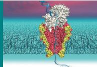

### [EN] Summary of Key Concepts

To review key terms, go to the Vocabulary Self-Quiz (eTextbook only).

### [EN] Concept 20.1: DNA sequencing and DNA cloning are valuable tools for genetic engineering and biological inquiry

\- Nucleic acid hybridization, the base pairing of one strand of a nucleic acid to the complementary sequence on a strand from another nucleic acid molecule, is widely used in DNA technology.

\- DNA sequencing can be carried out using the dideoxy sequencing method in automated sequencing machines.

\- Fast and inexpensive next-generation (high-throughput) techniques for sequencing DNA are based on sequencing by synthesis: DNA polymerase is used to synthesize a stretch of DNA using a single-stranded template, and the order in which nucleotides are added reveals the sequence. Third-generation sequencing methods, including nanopore technology, sequence long DNA molecules one at a time

\- Gene cloning (or DNA cloning) produces multiple copies of a gene (or DNA segment) that can be used to manipulate and analyze DNA and to produce useful new products or organisms with beneficial traits.

\- In genetic engineering, bacterial restriction enzymes are used to cut DNA molecules within short, specific nucleotide sequences (restriction sites), yielding a set of double-stranded restriction fragments with single-stranded sticky ends:

\- The sticky ends on restriction fragments from one DNA source can base-pair with complementary sticky ends on fragments from other DNA molecules. Sealing the base-paired fragments with DNA ligase produces recombinant DNA molecules.

\- DNA restriction fragments of different lengths can be separated by gel electrophoresis.

\- The polymerase chain reaction (PCR) can amplify (produce many copies of) a specific target segment of DNA, using primers that bracket the desired sequence and a heat-resistant DNA polymerase.

• To clone a eukaryotic gene:

  
(cut by same restriction  
enzyme used on cloning vector)  
Recombinant DNA plasmids

\- Recombinant plasmids are returned to host cells, each of which divides to form a clone of cells.

\- Expressing cloned eukaryotic genes in bacterial host cells poses several technical difficulties. The use of cultured eukaryotic cells as host cells, coupled with appropriate expression vectors, helps avoid these problems.

Describe how the process of gene cloning results in a cell clone containing a recombinant plasmid.

### [EN] Concept 20.2: Biologists use DNA technology to study gene expression and function

\- Several techniques use hybridization of a nucleic acid probe to detect the presence of specific mRNAs.

\- In situ hybridization and RT-PCR can detect the presence of a given mRNA in a tissue or an RNA sample, respectively.

\- Sets of genes co-expressed by a group of cells or a single cell can be detected by RNA sequencing (RNA-seq)—sequencing the cDNAs corresponding to mRNAs from the cells. DNA microarrays are also used for this purpose.

\- For a gene of unknown function, experimental inactivation of the gene (a gene knockout) and observation of the resulting phenotypic effects can provide clues to its function. The CRISPR-Cas9 system allows researchers to edit genes in living cells in a specific, desired way. The new alleles can be altered so that they are inherited in a biased way through a population (gene drive).

\- In humans, genome-wide association studies identify and use single nucleotide polymorphisms (SNPs) as genetic markers for alleles that are associated with particular conditions.

What useful information is obtained by detecting expression of specific genes?

### [EN] Concept 20.3: Cloned organisms and stem cells are useful for basic research and other applications

\- The question of whether all the cells in an organism have the same genome prompted the first attempts at organismal cloning.

\- Single differentiated cells from plants are often totipotent: capable of generating all the tissues of a complete new plant.

\- Transplantation of the nucleus from a differentiated animal cell into an enucleated egg can sometimes give rise to a new animal.

\- Certain embryonic stem cells (ES cells) from animal embryos and particular adult stem cells from adult tissues can reproduce and differentiate both in the lab and in the organism, offering the potential for medical use. ES cells are pluripotent but difficult to acquire. Induced pluripotent stem (iPS) cells resemble ES cells in their capacity to differentiate; they can be generated by reprogramming differentiated cells. iPS cells hold promise for medical research and regenerative medicine.

Describe how, using mice, a researcher could carry out (1) organismal cloning, (2) production of ES cells, and (3) generation of iPS cells, focusing on how the cells are reprogrammed. (The procedures are basically the same in humans and mice.)

### [EN] Concept 20.4: The practical applications of DNA-based biotechnology affect our lives in many ways

\- DNA technology, including the analysis of genetic markers such as SNPs, is increasingly being used in the diagnosis of genetic and other diseases and in personal genome analysis. Personalized medicine offers potential for an individual minimizing their known risk for a disease, as well as better treatment of genetic disorders or cancers. Gene therapy or gene editing with the CRISPR-Cas9 system may also lead to permanent cures. DNA technology is used with cell cultures in the large-scale production of protein hormones and other proteins with therapeutic uses. Cell and tissue culture are important in developing useful drugs, both those synthesized chemically and biologics, those produced by living cells. Some therapeutic proteins are being produced in transgenic “pharm” animals.

\- Analysis of genetic markers such as short tandem repeats (STRs) in DNA isolated from tissue or body fluids found at crime scenes leads to a genetic profile. Use of genetic profiles can provide definitive evidence that a suspect is innocent or strong evidence of guilt. Such analysis is also useful in parenthood disputes and in identifying the remains of crime victims.

\- Genetically engineered microorganisms can be used to extract minerals from the environment or degrade various types of toxic waste materials, a process called bioremediation.

\- The aims of developing transgenic plants and animals are to improve agricultural productivity and food quality.

\- The potential benefits of genetic engineering must be carefully weighed against the potential for harm to humans or the environment.

What factors affect whether a given genetic disease would be a good candidate for successful gene therapy?

For suggested answers, see Appendix A.

### [EN] Test Your Understanding

For more multiple-choice questions, go to the Practice Test (eTextbook only).

### [EN] Levels 1-2: Remembering/Understanding

1. In DNA technology, the term vector can refer to

(A) the enzyme that cuts DNA into restriction fragments.

(B) the sticky end of a DNA fragment.

(C) a SNP marker.

(D) a plasmid used to transfer DNA into a living cell.

2. Which of the following tools of DNA technology is incorrectly paired with its use?

(A) electrophoresis—separation of DNA fragments

(B) DNA ligase—cutting DNA, creating sticky ends of restriction fragments

(C) DNA polymerase—polymerase chain reaction to amplify sections of DNA

(D) reverse transcriptase—production of cDNA from mRNA

3. Plants are more readily manipulated by genetic engineering than are animals because

(A) plant genes do not contain introns.

(B) more vectors are available for transferring recombinant DNA into plant cells.

(C) a somatic plant cell can often give rise to a complete plant.

(D) plant cells have larger nuclei.

4. A paleontologist has recovered a bit of tissue from the 400-year-old preserved skin of an extinct dodo (a bird). To compare a specific region of the DNA from a sample with DNA from living birds, which of the following would be most useful for increasing the amount of dodo DNA available for testing?

(A) SNP analysis

(B) polymerase chain reaction (PCR)

(C) electroporation

(D) gel electrophoresis

### [EN] Levels 3-4: Applying/Analyzing

5. Which of the following is true of cDNA produced using human brain tissue as the starting material?

(A) The procedure to make it requires amplification by the polymerase chain reaction.

(B) It is produced from pre-mRNA using reverse transcriptase.

(C) It can be labeled and used as a probe to detect genes expressed in the brain.

(D) It includes the introns of the pre-mRNA.

6. Expression of a cloned eukaryotic gene in a bacterial cell involves many challenges. The use of mRNA and reverse transcriptase is part of a strategy to solve the problem of
(A) post-transcriptional processing.
(B) post-translational processing.
(C) nucleic acid hybridization.
(D) restriction fragment ligation.

7. Which of the following sequences in double-stranded DNA is most likely to be recognized as a cutting site for a restriction enzyme?
(A) AAGG (C) ACCA
TTCC TGGT
(B) GGCC (D) AAAA
CCGG TTTT

### [EN] Levels 5-6: Evaluating/Creating

8. MAKE CONNECTIONS Imagine you want to study one of the human crystallins, proteins present in the lens of the eye (see Figure 1.8). To obtain a sufficient amount of the protein of interest, you decide to clone the gene that codes for it. Assume you know the sequence of this gene. Explain how you would go about this.

9. MAKE CONNECTIONS Looking at Figure 20.15, what does it mean for a SNP to be “linked” to a disease-associated allele? How does this allow the SNP to be used as a genetic marker? (See Concept 15.3.)

10. DRAW IT You are cloning an aardvark gene, using a bacterial plasmid as a vector. The green diagram shows the plasmid, which contains the restriction site for the enzyme used in

  
Aardvark DNA

  
Plasmid

Figure 20.5. Above the plasmid is a segment of linear aardvark DNA that was synthesized using PCR. Diagram your cloning procedure, and show what would happen to these two molecules during each step. Use one color for the aardvark DNA and its bases and another color for those of the plasmid. Label each step and all 5' and 3' ends.

11. EVOLUTION CONNECTION Ethical considerations aside, if DNA-based technologies became widely used, discuss how they might change the way evolution proceeds, as compared with the natural evolutionary mechanisms that have operated for the past 4 billion years.

12. SCIENTIFIC INQUIRY You hope to study a gene that codes for a neurotransmitter protein produced in human brain cells. You know the amino acid sequence of the protein. Explain how you might (a) identify what genes are expressed in a specific type of brain cell, (b) identify (and isolate) the neurotransmitter gene, (c) produce multiple copies of the gene for study, and (d) produce large quantities of the neurotransmitter for evaluation as a potential medication.

13. WRITE ABOUT A THEME: INFORMATION In a short essay (100–150 words), discuss how the genetic basis of life plays a central role in biotechnology.

14. SYNTHESIZE YOUR KNOWLEDGE The water in the

Yellowstone National Park hot springs shown here is around $160^{\circ}$ F ( $70^{\circ}$ C). Biologists assumed that no species of organisms could live in water above about $130^{\circ}$ F ( $55^{\circ}$ C), so they were surprised to find several species of bacteria there, now called thermophiles (“heat-lovers”). You’ve

learned in this chapter how an enzyme from one species, Thermus aquaticus, made feasible one of the most important DNA-based techniques used in labs today. Identify the enzyme, and indicate the value of its being isolated from a thermophile. Suggest other reasons why enzymes from this bacterium (or other thermophiles) might also be valuable.

For selected answers, see Appendix A.

### [EN] Explore Scientific Papers with Science in the Classroom | AAAS

How can CRISPR-Cas9 be used to create a gene drive? Go to "Can We Handle the Power of CRISPR?" at www.scienceintheclassroom.org.

Instructors: Questions can be assigned in Mastering Biology.

<!-- C-END Campbell 20 Review -->

<!-- L-BEGIN Lehninger 9 章末 -->

### 【英文对应 Lehninger 第9章章末：Key Terms、习题与简答】

> 来源：Lehninger Principles of Biochemistry（书籍/02_生物化学原理） 第9章章末及书末 Abbreviated Solutions 第9章。

### [EN] KEY TERMS

Terms in bold are defined in the glossary.

genome 301
genomics 301
systems biology 301
cloning 302
vector 302
recombinant DNA 302
recombinant DNA technology 302
genetic engineering 302
restriction
    endonucleases 302
DNA ligases 303
restriction-modification system 303
multiple cloning site (MCS) 304
plasmid 305
bacterial artificial chromosome (BAC) 307
yeast artificial chromosome (YAC) 307
expression vector 309
baculovirus 311
bacmid 311
site-directed mutagenesis 312
fusion protein 313
tag 313
reverse transcriptase PCR (RT-PCR) 314
quantitative PCR (qPCR) 314

DNA library 315

single cell RNA-Seq (scRNA-Seq) 318

green fluorescent protein (GFP) 319

yeast two-hybrid analysis 322

guide RNA (gRNA) 323

trans-activating CRISPR RNA (tracrRNA) 323

single guide RNA (sgRNA) 323

single nucleotide polymorphism (SNP) 328

haplotype 328

### [EN] PROBLEMS

1. Engineering Cloned DNA When joining two or more DNA fragments, a researcher can adjust the sequence at the junction in a variety of subtle ways, as seen in these exercises.

(a) Write the sequence of each end of a linear DNA fragment produced by an EcoRI restriction digest (include those sequences remaining from the EcoRI recognition sequence).

(b) Write the sequence resulting from the reaction of this end sequence with DNA polymerase I and the four deoxynucleoside triphosphates (see Fig. 8-34).

(c) Write the sequence produced at the junction that arises if two ends with the structure derived in (b) are ligated (see Fig. 25-15). (d) Write the sequence produced if the structure derived in (a) is treated with a nuclease that degrades only single-stranded DNA.

(e) Write the sequence of the junction produced if an end with structure (b) is ligated to an end with structure (d).

(f) Write the sequence of the end of a linear DNA fragment that was produced by a PvuII restriction digest (include those sequences remaining from the PvuII recognition sequence).

(g) Write the sequence of the junction produced if an end with structure (b) is ligated to an end with structure (f).

(h) Suppose you can synthesize a short duplex DNA fragment with any sequence you desire. With this synthetic fragment and the procedures described in (a) through (g), design a protocol that would remove an EcoRI restriction site from a DNA molecule and incorporate a new BamHI restriction site at approximately the same location. (See Fig. 9-2.)

(i) Design four different short synthetic double-stranded DNA fragments that would permit ligation of structure (a) with a DNA fragment produced by a PstI restriction digest. In one of these fragments, design the sequence so that the final junction contains the recognition sequences for both EcoRI and PstI. In the second and third fragments, design the sequence so that the junction contains only the EcoRI and only the PstI recognition sequence, respectively. Design the sequence of the fourth fragment so that neither the EcoRI nor the PstI sequence appears in the junction.

2. Selecting for Recombinant Plasmids When cloning a foreign DNA fragment into a plasmid, it is often useful to insert the fragment at a site that interrupts a selectable marker (such as the tetracycline-resistance gene of pBR322). The loss of function of the interrupted gene can be used to identify clones containing recombinant plasmids with foreign DNA. With a yeast artificial chromosome (YAC) vector, a researcher can distinguish vectors that incorporate large foreign DNA fragments from those that do not, without interrupting gene function. How are these recombinant vectors identified?

3. DNA Cloning The restriction endonuclease PstI cleaves the plasmid cloning vector pBR322 (see Fig. 9-3). A researcher ligates an isolated DNA fragment from a eukaryotic genome (also produced by PstI cleavage) to the prepared vector. She then uses the mixture of ligated DNAs to transform bacteria and selects plasmid-containing bacteria by growth in the presence of tetracycline. (a) In addition to the desired recombinant plasmid, what other types of plasmids might be found among the transformed bacteria that are tetracycline-resistant? How can the types be distinguished?

(b) The cloned DNA fragment is 1,000 bp long and has an EcoRI site 250 bp from one end. The researcher cleaves three different recombinant plasmids with EcoRI and analyzes them by gel electrophoresis, with the results shown in the image. What does each pattern say about the cloned DNA? Note that in pBR322, the PstI and EcoRI restriction sites are about 750 bp apart. The entire plasmid with no cloned insert is 4,361 bp. Size markers in lane 4 have the number of nucleotides noted.

4. Restriction Enzymes The partial sequence of one strand of a double-stranded DNA molecule is

5' --- GACGAAGTGCTGCAGAAAGTCCGCGTTATAGGCAT GAATTCCTGAGG --- 3'

The cleavage sites for the restriction enzymes EcoRI and PstI are shown below.

$$
\begin{array}{c c} \text {EcoRI} & \downarrow \\ & (5 ^ {\prime}) \text {GAATTC} (3 ^ {\prime}) \\ & \text {CTTAAG} \\ & * \uparrow \end{array} \qquad \qquad \begin{array}{c c} \text {PstI} & \downarrow \\ & (5 ^ {\prime}) \text {CTGCA G} (3 ^ {\prime}) \\ & \text {GACGTC} \\ & \uparrow * \end{array}
$$

Write the sequence of both strands of the DNA fragment created when this DNA is cleaved with both EcoRI and PstI. The top strand of your duplex DNA fragment should be derived from the strand sequence given.

5. Designing a Diagnostic Test for a Genetic Disease Huntington disease (HD) is an inherited neurodegenerative disorder, characterized by the gradual, irreversible impairment of psychological, motor, and cognitive functions. Symptoms typically appear in middle age, but onset can occur at almost any age. The course of the disease can be 15 to 20 years. Biomedical research is improving our understanding of the molecular basis of the disease. The genetic mutation underlying HD has been traced to a gene encoding a protein ( $M_{r}$ 350,000) of unknown function. The region of the gene that encodes the amino terminus of the protein has a repeated sequence of CAG codons (for glutamine). The length of this simple trinucleotide repeat indicates whether an individual will develop HD, and at approximately what age the first symptoms will occur. The sequence is repeated 6 to 39 times in individuals who will not develop HD, 40 to 55 times in those with adult-onset HD, and more than 70 times in individuals with childhood-onset HD.

A small portion of the amino-terminal coding sequence of the 3,143-codon HD gene is shown. The nucleotide sequence of the DNA is given in black, the amino acid sequence corresponding to the gene is given in blue, and the CAG repeat is shaded. Using Figure 27-7 to translate the genetic code, outline a PCR-based test for HD that could be carried out using a blood sample. Assume the PCR primer must be 25 nucleotides long. By convention, unless otherwise specified, a DNA sequence encoding a protein is displayed with the coding strand—the sequence identical to the mRNA transcribed from the gene (except for U replacing T)—on top, such that it reads 5' to 3', left to right.

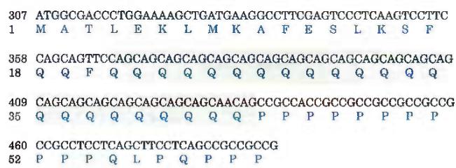  
Information from The Huntington's Disease Collaborative Research Group, Cell 72:971, 1993.

6. Using PCR to Detect Circular DNA Molecules In a species of ciliated protist, a segment of genomic DNA is sometimes deleted. The deletion is a genetically programmed reaction associated with cellular mating. A researcher proposes that the DNA is deleted in a type of recombination called site-specific recombination, with the DNA at either end of the segment joined together and the deleted DNA ending up as a circular DNA reaction product. Suggest how the researcher might use the polymerase chain reaction (PCR) to detect the presence of the circular form of the deleted DNA in an extract of the protist.

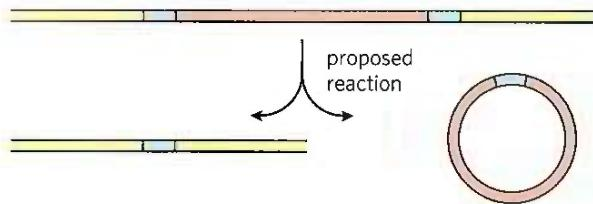

7. Protein Dynamics within Cells In a bacterial cell, two proteins, X and Y, are thought to have similar functions. Researchers genetically engineered each protein to fuse with a variant of the green fluorescent protein, one that glows red (X) and the other yellow (Y). Controls showed that both fusion proteins retained their activity, and both produced visible spots of light (foci) when expressed. To better understand the biological functions of the two proteins, the researchers expressed the fusion proteins in the same bacterial cell under two different conditions. Under nutrient-rich conditions, distinct red and yellow puncta (well-defined clustering of foci) were distributed throughout the cell. One or two red puncta were typically found within the nucleoid (chromosomal DNA), whereas the multiple yellow puncta were distributed throughout the cell. However, under nutrient starvation, the yellow puncta migrated and co-localized (overlapped) with the red puncta. What might be concluded from these observations?

8. Mapping a Chromosome Segment Researchers isolated a group of overlapping clones, designated A through F, from one region of a chromosome. They then separately cleaved each of the clones using a restriction enzyme and resolved the pieces by agarose gel electrophoresis. The image shows the electrophoresis results. There are nine different restriction fragments in this chromosomal region, with a subset appearing in each clone. Using this information, deduce the order of the restriction fragments in the chromosome.

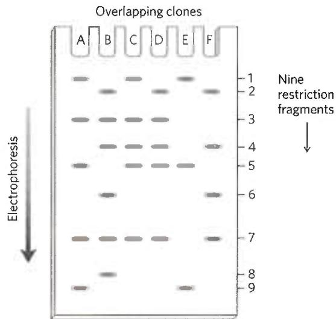  
9. Immunofluorescence In a common protocol for immunofluorescence detection of cellular proteins, an investigator uses two antibodies. The first binds specifically to the protein of interest. The second is labeled with fluorochromes for easy

visualization, and it binds to the first antibody. In principle, one could simply label the first antibody and skip one step. Why use two successive antibodies?

10. Yeast Two-Hybrid Analysis You are a researcher who has just discovered a new protein in a fungus. Design a yeast two-hybrid experiment to identify the other proteins in the fungal cell with which your protein interacts, and explain how this could help you determine the function of your protein.

11. RNA-Seq RNA-Seq is a next-generation sequencing method used to quantitatively profile the cellular transcriptome. Researchers use RNA-Seq to compare the expression of genes under different environmental conditions or between different types of cells. There are three general steps in an RNA-Seq workflow:

1. Generate a cDNA library from cellular RNA.

2. Add oligonucleotide adapters to the fragments of the cDNA library.

3. Use next-generation sequencing to identify transcriptionally active genes from the cDNA library.

What is the role of the enzyme reverse transcriptase in an RNA-Seq workflow?

12. Cellular RNA Suppose that an investigative team conducted an RNA-Seq experiment on mouse liver cells. The team found many sequences that contained no open reading frames (Chapter 27)—long stretches of consecutive triplet codons that could be translated into a protein and therefore suggest the presence of a gene. Suggest a reason for this observed lack of ORFs.

13. Use of Outgroups in Comparative Genomics A hypothetical protein found in human, orangutan, and chimpanzee has the following sequences (red indicates amino acid residue M differences; dashes indicate a deletion, meaning the residues are missing in that sequence):

Human: ATSAAGYDEWEGGKVLIHL - KLQNRGALL ELDIGAV

Orangutan: ATSAAGWDEWEGGKVLIHLDGKLQNRGALL ELDIGAV

Chimpanzee: ATSAAGWDEWEGGKILIHLDGKLQNRGALL ELDIGAV

What is the most likely sequence of the protein present in the last common ancestor of human and chimpanzee?

14. Human Migrations I Native American populations in North America and South America have mitochondrial DNA haplotypes that can be traced to populations in northeast Asia. The Aleut and Eskimo populations in the far northern parts of North America possess a subset of the same haplotypes that link other Native Americans to Asia, and the Aleut and Eskimo populations also have several additional haplotypes that can be traced to Asian origins but are not found in native populations in other parts of the Americas. Provide a possible explanation.

15. Human Migrations II DNA (haplotypes) originating from the Denisovans can be found in the genomes of Indigenous Australians and Melanesian Islanders. However, the same DNA markers are not found in the genomes of people native to Africa. Explain.

16. Finding Disease Genes You are a gene hunter, trying to find the genetic basis for a rare inherited disease. Examination of six pedigrees of families affected by the disease provides inconsistent results. For two of the families, the disease is co-inherited with markers on chromosome 7. For the other four families, the disease is co-inherited with markers on chromosome 12. Explain how this difference might have arisen.

17. RT-PCR Primer Design Investigators can use sequences of transcribed mRNA as a PCR template to produce a corresponding DNA sequence. Reverse transcriptase, an enzyme that works like DNA polymerase, amplifies the mRNA template as DNA in the first PCR cycle. After making the DNA strands from the RNA template, the investigator can carry out the remaining cycles with DNA polymerase, using standard PCR protocols. She can then compare the detected amplified sequences to the genome to analyze transcriptional activity. Thus, reverse transcriptase PCR (RT-PCR) is a powerful experimental technique used to detect RNA from living cells, which transcribe their DNA into RNA, as opposed to dead tissues, which do not. Consider the mRNA transcript shown.

5'-AUAUCGCUCCACGUAACUGAAAGAAAAGUGUGGAGCUA GCAGUCGAGA-3'

Which DNA oligonucleotide pair could serve as a suitable primer in an RT-PCR amplification of this transcript? The oligonucleotides are written in the 5' to 3' direction.

(a) Primer 1: GGAGACCTTGACT; Primer 2: AGTCAAGGTCTCC (b) Primer 1: GACTGCTAGCTCC; Primer 2: GTTACGTGGAGCG (c) Primer 1: GCCGCGCGCGCGC; Primer 2: CCCCGCCGCGCCG (d) Primer 1: CACGATTCAACGTG; Primer 2: TTCGCATTG CCGAA

### [EN] DATA ANALYSIS PROBLEM

18. HincII: The First Restriction Endonuclease Discovery of the first restriction endonuclease to be of practical use was reported in two papers published in 1970. In the first paper, Smith and Wilcox described the isolation of an enzyme that cleaved double-stranded DNA. They initially demonstrated the enzyme's nuclease activity by measuring the decrease in viscosity of DNA samples treated with the enzyme.

(a) Why does treatment with a nuclease decrease the viscosity of a solution of DNA?

The authors determined whether the enzyme was an endonuclease or an exonuclease by treating ${}^{32}$ P-labeled DNA with the enzyme, then adding trichloroacetic acid (TCA). Under the conditions used in their experiment, single nucleotides would be TCA-soluble and oligonucleotides would precipitate.

(b) No TCA-soluble ${}^{32}$ P-labeled material formed upon treatment of the ${}^{32}$ P-labeled DNA with the nuclease. Based on this finding, is the enzyme an endonuclease or is it an exonuclease? Explain your reasoning.

When a polynucleotide is cleaved, the phosphate usually is not removed but remains attached to the 5' or 3' end of the resulting DNA fragment. Smith and Wilcox determined the location of the phosphate on the fragment formed by the nuclease in three steps:

1. Treat unlabeled DNA with the nuclease.

2. Treat a sample (A) of the product with $\gamma-^{32}P$ -labeled ATP and polynucleotide kinase (which can attach the $\gamma$ -phosphate of ATP to a 5' OH but not to a 5' phosphate or to a 3' OH or 3' phosphate). Measure the amount of ${}^{32}P$ incorporated into the DNA.

3. Treat another sample (B) of the product of step 1 with alkaline phosphatase (which removes phosphate groups from free 5' and 3' ends), followed by polynucleotide kinase and $\gamma-^{32}P$ -labeled ATP. Measure the amount of ${}^{32}P$ incorporated into the DNA.

(c) Smith and Wilcox found that sample A had 136 counts/min of ${}^{32}$ P; sample B had 3,740 counts/min. Did the nuclease cleavage leave the phosphate on the 5' end or the 3' end of the DNA fragments? Explain your reasoning.

(d) Treatment of bacteriophage T7 DNA with the nuclease gave approximately 40 specific fragments of various lengths. How is this result consistent with the enzyme's recognizing a specific sequence in the DNA as opposed to making random double-strand breaks?

At this point, there were two possibilities for the site-specific cleavage: the cleavage occurred either (1) at the site of recognition or (2) near the site of recognition but not within the sequence recognized. To address this issue, Kelly and Smith determined the sequence of the 5' ends of the DNA fragments generated by the nuclease, in five steps:

1. Treat phage T7 DNA with the enzyme.

2. Treat the resulting fragments with alkaline phosphatase to remove the 5' phosphates.

3. Treat the dephosphorylated fragments with polynucleotide kinase and $\gamma-^{32}P$ -labeled ATP to label the 5' ends.

4. Treat the labeled molecules with DNases to break them into a mixture of mono-, di-, and trinucleotides.

5. Determine the sequence of the labeled mono-, di-, and trinucleotides by comparing them with oligonucleotides of known sequence on thin-layer chromatography.

The labeled products were identified as follows: mononucleotides—A and G; dinucleotides—(5')ApA(3') and (5')GpA(3'); trinucleotides—(5')ApApC(3') and (5')GpApC(3'). (e) Which model of cleavage is consistent with these results? Explain your reasoning.

Kelly and Smith went on to determine the sequence of the 3' ends of the fragments. They found a mixture of (5')TpC(3') and (5')TpT(3'). They did not determine the sequence of any trinucleotides at the 3' end.

(f) Based on these data, what is the recognition sequence for the nuclease, and where in the sequence is the DNA backbone cleaved? Use Table 9-2 as a model for your answer.

### [EN] References

Kelly, T. J., and H. O. Smith. 1970. A restriction enzyme from Haemophilus influenzae: II. Base sequence of the recognition site. J. Mol. Biol. 51:393-409.

Smith, H. O., and K. W. Wilcox. 1970. A restriction enzyme from Haemophilus influenzae: I. Purification and general properties. J. Mol. Biol. 51:379–391.

### [EN] Abbreviated Solutions — Chapter 9

1. (a) $(5')$ --- G $(3')$ and $(5')$ AATTC --- $(3')$ $(3')$ --- CTTAA $(5')$ $(3')$ G --- $(5')$

(b) $(5')$ --- GAATT $(3')$ and $(5')$ AATTC --- $(3')$ $(3')$ --- CTTAA $(5')$ $(3')$ TTAAG --- $(5')$

(c) $(5')$ -- GAATTAATTC -- $(3')$ $(3')$ -- CTTAATTAAG -- $(5')$

(d) $(5')---G(3')$ and $(5')C---(3')$ $(3')---C(5')$ $(3')G---(5')$

(f) $(5')$ --- CAG $(3')$ and $(5')$ CTG --- $(3')$ $(3')$ --- GTC $(5')$ $(3')$ GAC --- $(5')$

(g) $(5^{\prime})$ --- CAGAATTC --- $(3^{\prime})$

(3') --- GTCTTAAG --- (5')

(h) Method 1: Cut the DNA with EcoRI as in (a), then treat the DNA as in (b) or (d), and then ligate a synthetic DNA fragment with the BamHI recognition sequence between the two resulting blunt ends. Method 2 (more efficient): Synthesize a DNA fragment with the structure

### [EN] (5')AATTGGATCC(3')

### [EN] (3')CCTAGGTTAA(5')

This would ligate efficiently to the sticky ends generated by EcoRI cleavage, would introduce a BamHI site, but would not regenerate the EcoRI site.

(i) The four fragments (with N = any nucleotide), in order of discussion in the problem, are

(5')AATTCNNNNCTGCA(3')
(3')GNNNNG(5')

(5')AATTCNNNNGTGCA(3')
(3')GNNNNC(5')

(5')AATTGNNNNCTGCA(3')
(3')CNNNNG(5')

(5')AATTGNNNNGTGCA(3')

(3')CNNNNC(5')

2. Yeast artificial chromosomes (YACs) are not stable in a cell unless they have two telomere-containing ends and a large DNA segment cloned into the chromosome. YACs less than 10,000 bp long are soon lost during continued mitosis and cell division.

3. (a) Plasmids in which the original pBR322 was regenerated without insertion of a foreign DNA fragment; these would retain resistance to ampicillin. Also, two or more molecules of pBR322 might be ligated together with or without insertion of foreign DNA.

(b) The clones in lanes 1 and 2 each have one DNA fragment inserted in different orientations. The clone in lane 3 has two DNA fragments, ligated such that the EcoRI proximal ends are joined.

### [EN] 4. (5')GAAAGTCCGCGTTATAGGCATG(3')

### [EN] (3')ACGTCTTTCAGGCGCAATATCCGTACTTAA(5')

5. Your test would require DNA primers, a heat-stable DNA polymerase, deoxynucleoside triphosphates, and a PCR machine (thermal cycler). The primers would be designed to amplify a DNA segment encompassing the CAG repeat. The DNA strand shown is the coding strand, oriented 5'→3', left to right. The primer targeted to DNA to the left of the repeat would be identical to any 25-nucleotide sequence shown in the region to the left of the CAG repeat. The primer on the right side must be complementary and antiparallel to a 25-nucleotide sequence to the right of the CAG repeat. Using the primers, DNA including the CAG repeat would be amplified by PCR, and its size would be determined by comparison with size markers after electrophoresis. The length of the DNA would reflect the length of the CAG repeat, providing a simple test for the disease.

6. Design PCR primers that are complementary to the DNA in the deleted segment but would direct DNA synthesis away from each other. No PCR product is generated unless the ends of the deleted segment are joined to create a circle.

7. The two proteins likely co-localize under nutrient starvation and possibly form a protein complex.

9. The production of labeled antibodies is difficult and expensive, and the labeling of every antibody to every protein target would be impractical. By labeling one antibody preparation for binding to all antibodies of a particular class, the same labeled antibody preparation can be used in many different immunofluorescence experiments.

10. Express the protein in yeast strain 1 as a fusion protein with one of the domains of Gal4p—say, the DNA-binding domain. Using yeast strain 2, make a library in which essentially every protein of the fungus is expressed as a fusion protein with the interaction domain of Gal4p. Mate strain 1 with the strain 2 library, and look for colonies that are colored due to expression of the reporter gene. These colonies will generally arise from mated cells containing a fusion protein that interacts with your target protein.

11. Reverse transcriptase is used to convert single-stranded RNA into double-stranded DNA in one of the early steps of RNA-Seq.

12. RNA-Seq detects noncoding RNAs. These have special functions, and they lack protein-coding sequences. Many RNAs encoded by eukaryotic genomes are not messenger RNAs. Instead, they are noncoding RNAs with a variety of functions. They need not possess an open reading frame as part of their sequence.

13. ATSAAGWDEWEGGKVLIHLDGKLQNRGALLELDIGAV

14. The pattern of haplotypes in the Aleut and Eskimo populations suggests that their ancestors' migration into the American Arctic regions was separate from the migrations that eventually populated the rest of North America and South America.

15. Interbreeding between the Denisovans and Homo sapiens must have occurred in Asia, sometime in the many millennia during which humans migrated from Africa to Asia and then to Australia and Melanesia.

16. The same disease condition can be caused by defects in two or more genes that are on different chromosomes.

17. (b) would act as a suitable primer pair for this transcript; (a) would form primer dimers because of the high number of complementary bases in the primers; (c) also exhibits significant self-complementarity and would have a very high melting point due to the C-G pairs; (d) also exhibits self-complementarity and would form stem-loops.

18. (a) DNA solutions are highly viscous because the very long molecules are tangled in solution. Shorter molecules tend to tangle less and form a less viscous solution, so decreased viscosity corresponds to shortening of the polymers—as caused by nuclease activity. (b) An endonuclease. An exonuclease removes single nucleotides from the 5' end or 3' end and would produce TCA-soluble ${}^{32}$ P-labeled nucleotides. An endonuclease cuts DNA into oligonucleotide fragments and produces little or no TCA-soluble ${}^{32}$ P-labeled material. (c) The 5' end. If the phosphate were left on the 3' end, the kinase would incorporate significant ${}^{32}$ P as it added phosphate to the 5' end; treatment with the phosphatase would have no effect on this. In this case, samples A and B would incorporate significant amounts of ${}^{32}$ P. When the phosphate is left on the 5' end, the kinase does not incorporate any ${}^{32}$ P: it cannot add a phosphate if one is already present. Treatment with the phosphatase removes 5' phosphate, and the kinase then incorporates significant amounts of ${}^{32}$ P. Sample A will have little or no ${}^{32}$ P, and B will show substantial ${}^{32}$ P incorporation—as was observed. (d) Random breaks would produce a distribution of fragments of random size. The production of specific fragments indicates that the enzyme is site-specific. (e) Cleavage at the site of recognition. This produces a specific sequence at the 5' end of the fragments. If cleavage occurred near but not within the recognition site, the sequence at the 5' end of the fragments would be random. (f) The results are consistent with two recognition sequences, as shown below, cleaved where shown by the arrows:

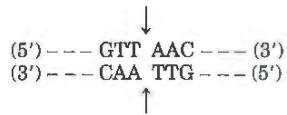

which gives the (5')pApApC and (3')TpTp fragments; and

which gives the $(5')$ pGpApC and $(3')$ CpTp fragments.

<!-- L-END Lehninger 9 章末 -->
