# 第6章 分子生物学研究法（下）——基因功能研究技术

> **本章插入内容**（中文对照与英文对应，插在所列中文节末尾；导言在章首，小结/习题/Review 在章末）
>
> - Campbell Concept 20.2 → 6.1 基因表达研究技术
> - Campbell Concept 20.3 → 6.2 基因敲除技术
> - Lehninger §9.2 → 6.1 基因表达研究技术

<!-- 章节边界按正文内容恢复；原始 MinerU 内容保留如下。 -->

# 分子生物学研究法(下) ——基因功能研究技术

6.1 基因表达研究技术

6.2 基因敲除技术

6.3 蛋白质及 RNA 相互作用技术

6.4 在酵母细胞中鉴定靶基因功能

6.5 其他分子生物学技术

随着越来越多的基因组序列相继被测定,人类对生物本质的认识已经发生了重大变化。但是,海量序列信息也向我们提出了新的挑战。如何开发利用这些序列信息,如何通过生物化学、分子生物学等方法研究基因的功能,从而进一步了解生物体内各种生理过程,了解生物体生长发育的调节机制,了解疾病的发生、发展规律,给出控制、减缓甚至完全消除人类遗传疾病,是新时期生物学家所面临的主要问题。转录组测序技术、原位杂交技术为研究单个或多个基因在生物体某些特定发育阶段或在不同环境条件下的表达模式提供了强有力的手段;基因定点突变(site-directed mutagenesis)技术、基因敲除技术、RNAi技术可以全部或部分抑制基因的表达,通过观察靶基因缺失后生物体的表型变化研究基因功能;酵母单、双杂交技术等都是研究蛋白质相互作用、蛋白质-DNA相互作用等的重要手段。随着分子生物学技术的发展,研究者可以在活细胞内和细胞外研究蛋白质之间的相互作用,为认识信号转导通路、蛋白质翻译后修饰加工等提供了丰富的技术支持。本章将主要介绍研究基因功能的各种分子生物学技术和方法。

## 6.1 基因表达研究技术

## 6.1.1 转录组测序分析和 RNA-Seq

转录组(transcriptome),广义上指在某一特定生理条件或环境下,一个细胞、组织或者生物体中所有RNA的总和,包括信使RNA(mRNA)、核糖体RNA(rRNA)、转运RNA(tRNA)及非编码RNA(non-coding RNA或sRNA);狭义上特指细胞中转录出来的所有mRNA的总和。基因组-转录组-蛋白质组(genome-transcriptome-proteome)是中心法则在组学框架下的主要表现形式。通过特定生理条件下细胞内的mRNA丰度来描述基因表达水平并外推到最终蛋白质产物的丰度是目前基因表达研究的基本思路。

基于传统的 Sanger 测序法对转录组进行研究的方法主要包括: 表达序列标签 (expressed sequence tag, EST) 测序技术和基因表达系列分析技术 (serial analysis of expression, SAGE)。EST 测序数据是目前数量最多, 涉及物种最广的转录组数据, 但测序读长较短 (每个转录本测定 400\~500 bp), 测序通量小, 测序成本较高, 而且无法通过测序同时得到基因表达丰度的信息。有人使用 SAGE 测序法, 将不同转录本 3' 端第一个 CATG 位点下游 14 bp 长的短标签序列来标识相应的转录本。由于标签序列较短, 可以将多个标签串联测序, 使 SAGE 法相对于 EST 测序在通量上大大提高。但过短的序列标签使得序列唯一性降低, 即使改进过的 LongSAGE 用 21 bp 标签测序, 仍然有约一半的标签无法被准确注释到基因组上。

高通量测序技术(high-throughput sequencing)又名深度测序(deep sequencing),包括二代测序(second-generation sequencing)和三代测序(third-generation sequencing),可以一次性测序几十万甚至几百万条序列,是传统测序技术的一次革命。

转录组 RNA 样品上机测序前需要进行文库构建,根据不同的需求,建库策略会略有差别。图 6-1a 是二代 mRNA 建库测序的主要流程:首先提取高质量的组织或细胞总 RNA,质量检测合格后用 poly(T) 磁珠富集 mRNA 并打断成短片段,用随机引物反转录成 cDNA,并进行 DNA 末端修复、加碱基 A、加测序接头,进行 PCR 扩增后建库,最后选择合适的平台测序。

利用高通量测序技术对转录组进行测序分析,对测序得到的大量原始读长(reads)进行过滤、组装及生物信息学分析的过程被称为 RNA-Seq。对于有参考基因组序列的物种,需要根据参考序列进行组装(referenced assembly);对于没有参考序列的,需要进行从头组装(de novo assembly),利用大量读长之间重叠覆盖和成对读长(pair-end reads)的相对位置关系,组装得到尽可能完整的转录本,并以单位长度转录本上覆盖的读长数目(reads per kilo-base gene per million bases, RPKM)作为衡量基因表达水平的标准。如表 6-1 所示,通过 RNA-seq 可以鉴定在棉花根或者茎特异表达的所有基因。

表 6-1 棉花组织特异性转录因子表达强度分析

<table><tr><td rowspan="2">序列标识</td><td rowspan="2">基因</td><td colspan="2">RPKM</td><td rowspan="2">序列标识</td><td rowspan="2">基因</td><td colspan="2">RPKM</td></tr><tr><td>根</td><td>茎</td><td>根</td><td>茎</td></tr><tr><td>Unigene58528</td><td>MYB-L</td><td>81.86</td><td>0.16</td><td>Unigene85367</td><td>FAR1</td><td>0.40</td><td>65.51</td></tr><tr><td>Unigene58563</td><td>B3</td><td>56.02</td><td>0.00</td><td>Unigene29146</td><td>HD-ZIP</td><td>0.00</td><td>44.49</td></tr><tr><td>Unigene58582</td><td>B3</td><td>53.66</td><td>0.29</td><td>Unigene51008</td><td>HB</td><td>0.24</td><td>43.60</td></tr><tr><td>Unigene58458</td><td>Dof</td><td>45.54</td><td>0.00</td><td>Unigene18073</td><td>MIKC</td><td>0.13</td><td>36.74</td></tr><tr><td>Unigene55872</td><td>Dof</td><td>41.56</td><td>0.00</td><td>Unigene64521</td><td>MYB</td><td>0.15</td><td>31.71</td></tr><tr><td>Unigene51911</td><td>bHLH</td><td>36.64</td><td>0.19</td><td>Unigene58698</td><td>B3</td><td>0.09</td><td>24.01</td></tr><tr><td>Unigene58446</td><td>NAC</td><td>28.40</td><td>0.37</td><td>Unigene62109</td><td>MYB</td><td>0.04</td><td>18.45</td></tr><tr><td>Unigene57837</td><td>bHLH</td><td>20.27</td><td>0.00</td><td>Unigene52681</td><td>bZIP</td><td>0.20</td><td>17.62</td></tr><tr><td>Unigene58640</td><td>SIFa-L</td><td>20.25</td><td>0.68</td><td>Unigene64531</td><td>G2-L</td><td>0.34</td><td>16.92</td></tr><tr><td>Unigene55579</td><td>B3</td><td>15.71</td><td>0.13</td><td>Unigene64486</td><td>bHLH</td><td>0.00</td><td>14.49</td></tr></table>

转录组组装过程中,同一个非重复序列上覆盖有来自根、茎等不同组织的读长,不同读长数目通过归一化转变为RPKM值,进而筛选得到组织特异表达的转录因子。

基于二代测序的 RNA-seq 读长较短,得到的基因转录产物(transcript isoforms)是通过一定的算法进行组装得到的,这可能会导致较多的嵌合体(chimeric)组装错误,对于后续的转录组分析造成影响。科学家又开发了基于 PacBio 单分子实时测序的三代测序法,凭借其超长读长可以很精确地进行全长转录组测序,建库过程中无需打断转录本(图 6-1b),其平均 10\~15 kb 的读长可以轻松跨越从 5' 端到 3'-poly(A) 尾巴的完整转录本,从而准确鉴定异构体,并对可变剪接、融合基因、同源基因、超家族基因或等位基因表达等进行精确分析。与二代测序相比，三代测序价格较高并有一定的碱基测序错误，因此，实践中常将各个组织混合进行三代测序得到准确的全长转录物，然后通过对各个组织或者细胞样本单独进行二代测序，从而准确鉴定基因在各个组织中的表达水平。

  
图 6-1 二代转录组建库测序(a)与三代转录组建库测序(b)流程示意图

## 6.1.2 RNA的选择性剪接研究

RNA-seq 还可用于研究全基因组水平的 RNA 选择性剪接。所谓 RNA 的选择性剪接是指用不同的剪接方式(选择不同的剪接位点组合)从一个 mRNA 前体产生不同的 mRNA 剪接异构体的过程。一般将选择性剪接分为如下几类: 内含子保留(intron retention)、5' 选择性(alternative donor)剪接、3' 选择性(alternative acceptor)剪接、外显子遗漏型(exon skipping)剪接及相互排斥性剪接(图 6-2)。

常用RT-PCR方法在单个基因水平上验证由RNA-seq预测得到的选择性剪接的真实性。首先，以cDNA两端特异引物或来自不同外显子的引物序列扩增不同组织来源的RNA样品中，观察PCR产物是否存在差异。如果发现差异，测序后检测这种差异是否来自于选择性剪接。图6-3为棉花中发现的有选择性剪接基因的物理图谱。选择性剪接使一个基因翻译为多种蛋白质序列，是基因表达多样性的重要表现形式。分析人类基因组数据发现，有 $60\%$ 的基因在表达过程中可通过选择性剪接产生各种形式的mRNA。最新的研究表明，果蝇的Dscam基因最多可能够产生38016种不同形式的剪接体(图6-4)。由于选择性剪接与细胞的生理、发育调节以及肿瘤的发生、转移等有密切关系，阐明基因的选择性剪接机制是了解动植物个体发育和基因功能的重要环节。因此，发现新的可变剪接异构体,确定每个异构体的独特功能和生物学意义并阐明其调节机制,是功能基因组时代的一个重要特征。

  
图6-2 选择性剪接的不同类型

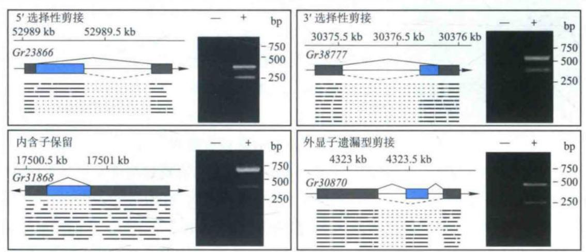  
图 6-3 转录组测序和 RT-PCR 验证棉花基因不同形式的选择性剪接  
灰框表示组成型基因的外显子，蓝框表示可变的基因外显子，基因内含子用直线连接，基因下方的短线条表示RNA-seq测序得到的reads比对到该基因对应的位置。每个图的右边为琼脂糖凝胶电泳图，RT-PCR进一步验证左边可变剪接预测的结果。

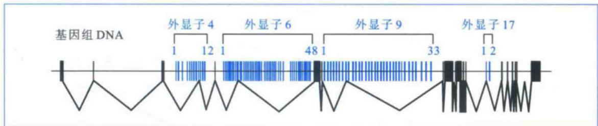  
图 6-4 果蝇的 Dscam 基因可以通过可变剪接产生 38000 多种可能的 mRNA 异构体

## 6.1.3 原位杂交技术

原位杂交(in situ hybridization, ISH)是用标记的核酸探针, 经放射自显影或非放射检测体系,在组织、细胞、间期核及染色体上对核酸进行定位和相对定量研究的一种手段,通常分为 RNA 原位杂交和染色体原位杂交两大类。RNA 原位杂交用放射性或非放射性(如地高辛、生物素等)标记的特异性探针与被固定的组织切片反应,若细胞中存在与探针互补的 mRNA 分子,两者杂交产生双链 RNA,就可通过检测放射性标记或经酶促免疫显色,对该基因的表达产物在细胞水平上做出定性定量分析(图 6-5)。

图 6-5 用组织原位杂交技术检测拟南芥 BARD1(a) 和干细胞决定因子 WUS1(b) 基因的表达模式  
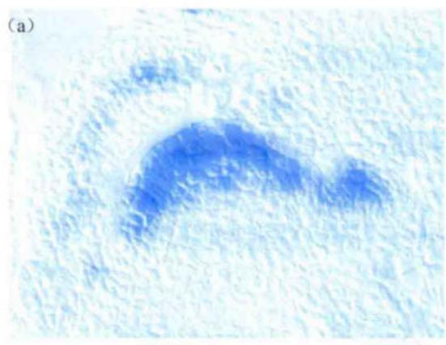

图 6-6 人肌肉糖原磷酸酶基因在 11 号染色体上的荧光原位杂交结果(另见书末彩插)  
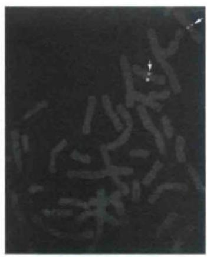

荧光原位杂交(fluorescence in situ hybridization, FISH)技术首先对寡核苷酸探针做特殊的修饰和标记，

然后用原位杂交法与靶染色体或 DNA 上特定的序列结合,再通过与荧光素分子相耦联的单克隆抗体来确定该 DNA 序列在染色体上的位置(图 6-6)。FISH 技术不需要放射性同位素,实验周期短,检测灵敏度高,若用经过不同修饰的核苷酸分子标记不同的 DNA 探针,还可能在同一张切片上观察几种 DNA 探针的定位,得到相应位置和排列顺序的综合信息。

## 6.1.4 基因定点突变技术

定点突变(site-directed mutagenesis)是重组DNA进化的基础,该方法通过改变基因特定位点核苷酸序列来改变所编码的氨基酸序列,常用于研究某个(些)氨基酸残基对蛋白质的结构、催化活性以及结合配体能力的影响,也可用于改造DNA调控元件特征序列,修饰表达载体,引入新的酶切位点等。由于迄今尚未建立能精确预测特定氨基酸残基变化对整个蛋白质结构及活性影响的模型,选择氨基酸突变的位点存在一定的盲目性。因为即使知道了该蛋白质的三维结构,人们仍然无法了解某个氨基酸残基对其高级结构的影响。少数几个氨基酸残基的改变,有时根本不影响靶蛋白的功能,有时影响了靶蛋白的活性位点,有时还能从根本上改变整个蛋白质的高级结构。所以,基因的定点突变是我们进一步了解蛋白质的结构与功能关系的重要手段。

图 6-7 寡核苷酸介导的 DNA 突变技术  

最早在20世纪70年代初进行小噬菌体 $\Phi X174$ 单链基因组易突变位点图谱分析工作时认识到基因定点突变的可能性。在人工成功合成寡核苷酸、获得高品质DNA聚合酶和DNA连接酶的基础上，科学家建立了体外寡核苷酸介导的DNA突变技术(图6-7)。PCR技术的出现大大促进了定点突变技术的发展，简化了实验操作程序，提高了突变效率。科学家主要采用两种PCR方法，重叠延伸技术和大引物诱变法，在基因序列中进行定点突变。

图 6-8 阐述了重叠延伸介导的定点诱变机制。首先将模板 DNA 分别与引物对 1（正向引物 1 和反向引物 2）和 2（正向引物 3 和反向引物 4）退火，通过 PCR 1 和 2 反应扩增出两种靶基因片段。PCR 产物 1 和 PCR 产物 2 在重叠区发生退火，用 DNA 聚合酶补平缺口，形成全长双链 DNA。

大引物诱变法首先用正向突变引物(M)和反向引物(R1),扩增模板DNA产生双链大引物(PCR1),与野生型DNA分子混合后退火并使之复性,第二轮PCR中加入正向引物(F2),与PCR1中产生的一条互补链配对,扩增产生带有突变的双链DNA $^{(图6-9)}$ 。由于F2的退火温度显著高于第一轮PCR所使用的引物M和R1,因此,可以忽略引物M和R1在本轮反应中所造成的干扰。获得定点突变PCR产物以后,一般需进行DNA序列分析以验证突变位点。

与经典定点突变方法相比,PCR介导的定点突变方法具有明显的优势:①突变体回收

图6-8 重叠延伸介导的定点诱变

模板 DNA 分别与第一引物对(正向引物 1 和反向引物 2)及第二引物对(正向引物 3 和反向引物 4)退火,通过第一轮 PCR 产物扩增出两种靶基因片段(PCR 产物 1 和 PCR 产物 2)。PCR 产物 1 和 PCR 产物 2 片段在重叠区发生退火并进行延伸,形成具有突变的全长双链 DNA。蓝色圆点表示突变位点。

  
图 6-9 大引物诱变法示意图  
PCR1 使用正向诱变引物(M, 已设定突变碱基)和反向引物(R1)扩增产生双链大引物(PCR1)。第二轮 PCR 时再用正向引物(F2)和反向大引物(PCR1)配对扩增产生带有突变位点的双链 DNA。星号表示突变位点。

率高,以至于有时不需要进行突变体筛选;②能用双链 DNA 作为模板,可以在任何位点引入突变;③可在同一试管中完成所有反应;④快速简便,无需在噬菌体 M13 载体上进行分子克隆。所以,PCR 介导的定点突变方法已成为定点突变的主要技术。

<!-- C-BEGIN Campbell 20.2 -->

### 【英文对应 Campbell Concept 20.2：Biologists use DNA technology to study gene expression and function】

> 来源：Campbell Biology（书籍/01_Campbell_Biology） 第20章 DNA Tools and Biotechnology，Concept 20.2。

#### [EN] Concept 20.2: Biologists use DNA technology to study gene expression and function

To see how a biological system works, scientists seek to understand the functioning of the system's component parts. Analysis of when and where a gene or group of genes is expressed can provide important clues about their function and how they contribute to the organism as a whole.

#### [EN] Analyzing Gene Expression

Biologists driven to understand the assorted cell types of a multicellular organism, cancer cells, or the developing tissues of an embryo first try to discover which genes are expressed by the cells of interest. The most straightforward way to do this is usually to identify the mRNAs being made. We'll first examine techniques that look for patterns of expression of specific individual genes. Next, we'll explore ways to characterize groups of genes being expressed by cells or tissues of interest. As you will see, all of these procedures depend in some way on base pairing between complementary nucleotide sequences.

#### [EN] Studying the Expression of Single Genes

Suppose we have cloned a gene that we suspect plays an important role in the embryonic development of Drosophila melanogaster (the fruit fly). The first thing we might wonder is which embryonic cells express the gene—in other words, where in the embryo is the corresponding mRNA found? We can detect the mRNA in an embryonic sample using nucleic acid hybridization with molecules of complementary sequence to the mRNA we want to follow. Using our cloned gene as a template, we can synthesize a short, single-stranded nucleic acid (either RNA or DNA) complementary to the mRNA of interest; this is called a nucleic acid probe. For example, if part of the sequence on the mRNA were

#### [EN] 5' ...CUCAUCACCGGC ... 3'

then we would synthesize this single-stranded DNA probe:

#### [EN] 3' GAGTAGTGGCCG 5'

Each probe molecule is labeled during synthesis with a fluorescent tag so we can follow it. A solution containing probe molecules is applied to Drosophila embryos, allowing the probe to hybridize specifically with any complementary sequences on the many mRNAs in embryonic cells in which the gene is being transcribed. Because this technique allows us to see the mRNA in place (or in situ, in Latin) in the intact organism, this technique is called in situ hybridization. Different probes can be labeled with different fluorescent dyes, sometimes with strikingly beautiful results (Figure 20.9).

Figure 20.9 Determining where single genes are expressed by in situ hybridization analysis.

This Drosophila embryo was incubated in a solution containing DNA probes for five different mRNAs, each probe labeled with a different fluorescently colored tag. The embryo was then viewed using fluorescence microscopy. Each color marks where a specific gene is expressed as mRNA. The arrows from the groups of yellow and blue cells above the micrograph show a magnified view of nucleic acid hybridization of the appropriately colored probe to the mRNA. The thorax (trunk) and abdomen are made up of repeating segments. Yellow cells (expressing the wg gene) interact with blue cells (expressing the en gene); their interaction helps establish the pattern in a body segment.

The yellow DNA probe hybridizes with mRNAs in cells that are expressing the wingless (wg) gene, which encodes a secreted signaling protein.

The blue DNA probe hybridizes with mRNAs in cells that are expressing the engrailed (en) gene, which encodes a transcription factor.

Other mRNA detection techniques may be preferable for comparing the amounts of a specific mRNA in several samples at the same time—for example, in different cell types or in embryos of different stages. One method that is widely used is called the reverse transcriptase polymerase chain reaction, or RT-PCR.

RT-PCR begins by turning sample sets of mRNAs into double-stranded DNAs with the corresponding sequences. First, the enzyme reverse transcriptase (from a retrovirus; see Figure 19.9) is used to synthesize a complementary DNA copy (a reverse transcript) of each mRNA in the sample (Figure 20.10, on the next page). The mRNA is then degraded by addition of a specific enzyme, and a second DNA strand, complementary to the first, is synthesized by DNA polymerase. The resulting double-stranded DNA is called complementary DNA (cDNA). (Made from mRNA, cDNA lacks introns and can be used for protein expression in bacteria, as mentioned earlier.) To analyze the timing of expression of the Drosophila gene of interest, for example, we would first isolate all the mRNAs from different stages of Drosophila embryos and make cDNA from each stage (Figure 20.11).

Figure 20.10 Making complementary DNA (cDNA) from eukaryotic genes.

Complementary DNA is made in a test tube using mRNA as a template for the first strand. Only one mRNA is shown after step 1, but the final collection of cDNAs would reflect all the mRNAs present in the cell.

Next in RT-PCR is the PCR step (see Figure 20.7). As you will recall, PCR is a way of rapidly making many copies of one specific stretch of double-stranded DNA, using primers that hybridize to the opposite ends of the segment that we are interested in studying. In our case, we would add primers corresponding to a segment of our Drosophila gene, using the cDNA from each embryonic stage as a template for PCR amplification in separate samples. When the products are analyzed on a gel, copies of the amplified region will be observed as bands only in samples that originally contained mRNA from the gene being studied. This method can tell researchers whether an mRNA is present, but not how much is there.

Accurate measurement of mRNA levels requires newer, more quantitative PCR machines that use a dye that fluoresces only when bound to a double-stranded PCR product. This technique, called quantitative RT-PCR (qRT-PCR), can detect the light and measure the PCR product, thus avoiding the need for electrophoresis while providing quantitative data, a distinct advantage. Both RT-PCR and qRT-PCR can also be carried out with mRNAs collected from different tissues at one time to discover which tissue is producing a specific mRNA.

Instructors: The Scientific Skills Exercise “Analyzing Quantitative and Spatial Gene Expression Data” can be assigned in Mastering Biology. Students can work with data from an experiment that investigated mRNA expression using both in situ hybridization and quantitative RT-PCR.

#### [EN] Figure 20.11

#### [EN] Research Method: RT-PCR Analysis of the Expression of Single Genes

#### [EN] Application

RT-PCR uses the enzyme reverse transcriptase (RT) in combination with PCR and gel electrophoresis. RT-PCR can be used to compare gene expression between samples—for instance, in different embryonic stages, in different tissues, or in the same type of cell under different conditions.

#### [EN] Technique

In this example, samples containing mRNAs from six embryonic stages of Drosophila were analyzed for a specific mRNA as shown below. (In steps 1 and 2, the mRNA from only one stage is shown.)

1 cDNA synthesis is carried out by incubating the mRNAs from each stage with reverse transcriptase and other necessary components.

2 PCR amplification is then performed using primers specific to the Drosophila gene of interest to see whether its mRNA was present in each sample.

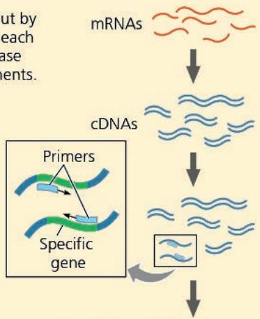

3 Gel electrophoresis will reveal amplified DNA products only in samples that contained mRNA transcribed from the specific Drosophila gene.

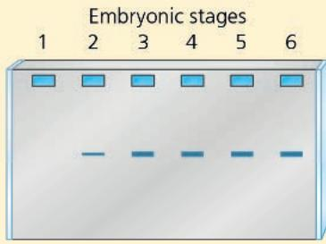

#### [EN] Results

The mRNA for this gene is expressed from stage 2 through stage 6. The size of the amplified fragment (shown by its position on the gel) depends on the distance between the primers that were used (not on the size of the mRNA).

#### [EN] Studying the Expression of Interacting Groups of Genes

While the techniques described above can analyze expression of only one or a few known genes, a major goal of biologists is to learn how genes act together to produce and maintain a functioning organism. Now that the genomes of a number of species have been sequenced, it is possible to study the expression of

Green cDNA Genes that were expressed in tissue 2 bind to green cDNAs.

large groups of genes—an approach called the systems approach. Researchers use what is known about the whole genome to investigate which genes are transcribed in different tissues or at different stages of development, or even in single cells. One aim is to identify networks of gene expression across an entire genome.

To accomplish such genome-wide expression studies, today's rapid, inexpensive DNA-sequencing methods allow researchers to discover which genes are expressed by simply sequencing the cDNA samples from different tissues or different embryonic stages. This straightforward method is called RNA sequencing, or RNA-seq (pronounced "RNA-seek"), even though it is the cDNA that is actually sequenced. In RNA-seq, the mRNA (or other RNA) samples are isolated, cut into shorter, similar-sized fragments, and converted into cDNAs (Figure 20.12). These short cDNA stretches are sequenced, and a computer program reassembles them, either mapping them onto the genome of the species in question (when available) or simply putting the fragments in order from scratch based on overlapping sequences of multiple RNAs.

A helpful adaptation of RNA-seq that is becoming more widely used is called single-cell RNA-seq. In this technique, the cells of a tissue or a tumor, for instance, are separated into individual wells or droplets, then each cell is subjected to the steps of RNA-seq to analyze which genes are being expressed in that cell. This is particularly useful when analyzing

#### [EN] Figure 20.12 Use of RNA sequencing (RNA-seq) to analyze expression of many genes.

RNA-seq yields a wide range of information about expression of genes, including their level of expression.

1 mRNAs are isolated from the tissue being studied.

② mRNAs are cut into similar-sized, small fragments.

3 mRNAs are reverse-transcribed into cDNAs of the same size.

④ cDNAs are sequenced.

5 The short sequences are mapped by computer onto the genome sequence. The resulting data, including the number of times a sequence is present, indicate which genes are expressed in a given tissue and at what level.

heterogeneous tissues where gene expression patterns of rare but important cells are masked by the overall average gene expression in the entire tissue. For example, it allows researchers and clinicians to identify a small number of cells in a tumor that are resistant to the particular treatment being used, based on their gene expression.

Several characteristics make RNA-seq a powerful technique. First, it is not based on hybridization with a labeled probe, so it doesn't depend on knowing genomic sequences. Second, it can measure levels of expression over a very wide range. Third, a careful analysis provides a wealth of information about expression of a particular gene, such as relative levels of alternatively spliced mRNAs. In most cases, however, expression of individual genes still needs to be confirmed by RT-PCR.

An older method of genome-wide expression studies, called DNA microarray assays, is less powerful than RNA-seq but is still used for some applications, such as fetal testing (see Figure 14.19). A DNA microarray consists of tiny amounts of a large number of single-stranded DNA fragments representing different genes fixed to a glass slide in a tightly spaced array, or grid, of dots. (The microarray is also called a DNA chip by analogy to a computer chip.) The mRNAs from the cells being studied are reverse-transcribed into cDNAs (see Figure 20.10), and a fluorescent label is added so the cDNAs can be used as probes on the microarray. Different fluorescent labels are used for different cell samples so that multiple samples can be tested in the same experiment. The resulting pattern of colored dots, shown in an actual-size microarray in Figure 20.13, reveals the

#### [EN] Figure 20.13 Use of microarrays to analyze expression of many genes.

Researchers extracted mRNAs from two different human tissues and synthesized two sets of cDNAs, fluorescently labeled red (tissue 1) or green (tissue 2). Labeled cDNAs were hybridized with a microarray containing 5,760 human genes (about 25% of human genes), part of which is shown in the enlargement. Red indicates that the gene in that well was expressed in tissue 1, green in tissue 2, yellow in both, and black in neither. The fluorescence intensity at each spot indicates the relative expression of the gene.

DNA microarray (actual size). Each dot is a well containing identical copies of DNA fragments that carry a specific gene.

Red cDNA

  
Genes that were expressed in tissue 1 bind to red cDNAs made from mRNAs in that tissue.  
Genes that were expressed in both tissues bind both red and green cDNAs; these wells appear yellow.

Genes that were not expressed in either tissue do not bind either cDNA; these wells appear black.

dots to which each probe was bound and thus the genes that are expressed in the cell samples being tested.

Scientists can now measure the expression of thousands of genes at one time. DNA technology makes such studies possible; with automation, they are easily performed on a large scale. By uncovering gene interactions and providing clues to gene function, DNA microarray assays and RNA-seq may contribute to a better understanding of diseases and suggest new diagnostic techniques or therapies. For instance, comparing patterns of gene expression in breast cancer tumors and noncancerous breast tissue has already resulted in more informed and effective treatment protocols (see Figure 18.27). Ultimately, information from these methods should provide a grander view of how ensembles of genes interact to form an organism and maintain its vital systems.

#### [EN] Determining Gene Function

Once they identify a gene of interest, how do scientists determine its function? A gene's sequence can be compared with sequences in other species. If the function of a similar gene in another species is known, one might suspect that the gene product in question performs a comparable task. Data about the location and timing of gene expression may reinforce the suggested function. To obtain stronger evidence, one approach is to disable the gene and then observe the consequences in the cell or organism.

#### [EN] Editing Genes and Genomes

Molecular biologists have long sought techniques for altering, or editing, the genetic material of cells or organisms in a predictable way. In one such technique, called in vitro mutagenesis, specific mutations are introduced into a cloned gene, and the mutated gene is returned to a cell in such a way that it disables (“knocks out”) the normal cellular copies of the same gene. If the introduced mutations alter or destroy the function of the gene product, the phenotype of the mutant cell may help reveal the function of the missing normal protein.

In Concept 17.5, you read about the CRISPR-Cas9 system, the powerful new technique for gene editing in living cells and organisms that has taken the field of genetic engineering by storm (see Figure 17.28). This system, worked out by Jennifer Doudna (Figure 20.14) and Emmanuelle Charpentier, is a highly effective way for researchers to knock out a given gene in order to study what that gene does. It has already been used in many organisms, including bacteria, fish, mice, insects, human cells, and various crop plants. Modifications of the technique allow researchers to repair a gene that has a mutation. This approach is used for gene therapy, which will be discussed later in the chapter.

In another application of the CRISPR-Cas9 system, scientists are attempting to address the global problem of insect-borne diseases by altering genes in insects so that, for example, they cannot transmit disease. An extra twist to this approach is to engineer the new allele so that it is much more highly favored for inheritance than the wild-type allele. This strategy is called a gene drive because the biased inheritance of the engineered gene during reproduction rapidly “drives” the new allele through the population.

Figure 20.14 Jennifer Doudna holding a model of CRISPR-Cas9.

Concerns have been raised about unpredictable negative effects of permanent genetic changes in wild populations, such as mosquitoes. In 2025, one group of researchers modified the gene drive protocol so that the CRISPR-Cas9 system itself would not be replicated in the insects. This allowed the desired genetic change to be temporary, and ensured that the population would gradually revert back to its wild-type genome.

#### [EN] Other Methods for Studying Gene Function

Another method for silencing expression of selected genes doesn't alter the genome; instead, it exploits the phenomenon of RNA interference (RNAi), described in Concept 18.3. This experimental approach uses synthetic double-stranded RNA molecules matching the sequence of a particular gene to trigger breakdown of the gene's messenger RNA or to block its translation. In organisms such as the nematode and the fruit fly, RNAi has already proved valuable for analyzing the functions of genes on a large scale. This method is quicker than using the CRISPR-Cas9 system, but it leads to only a temporary reduction of gene expression rather than a permanent gene knockout or alteration.

In humans, ethical considerations prohibit knocking out genes to determine their functions. An alternative approach to identifying disease-causing genes is to analyze the genomes of large numbers of people with a certain phenotypic condition or disease, such as heart disease or diabetes, to try to find differences they all share compared with people without that condition. The logic is that these differences may be associated with one or more malfunctioning genes and thus in a sense are naturally occurring gene knockouts. In these large-scale analyses, called genome-wide association studies, researchers look for genetic markers, DNA sequences that vary in the population. In a gene, such sequence variation is the basis of different alleles, as we have seen for sickle-cell disease (see Figure 17.26). And just like the coding sequences of genes, noncoding DNA at a specific locus on a chromosome may exhibit small nucleotide differences among individuals. Variations in coding or noncoding DNA sequences among a population are called polymorphisms (from the Greek for “many forms”).

#### [EN] Interview

Interview with Charles Rotimi: Using genomics to study health-related conditions in African-Americans (eTextbook only)

Among the most useful genetic markers in tracking down genes that contribute to diseases and disorders are single base-pair variations in the genomes of the human population. For more than 99% of the nucleotides in the human genome, virtually all people have the same nucleotide in each position. However, once in every 100–300 base pairs of both coding and noncoding DNA sequences are positions where the sequence varies between individuals. A single base-pair site where variation is found in at least 1% of the population is called a single nucleotide polymorphism (SNP, pronounced “snip”); a few million SNPs occur in the human genome. To find SNPs in large numbers of people, it isn’t necessary to sequence their DNA; SNPs can be detected by very sensitive microarray assays, RNA-seq, or PCR.

Once a SNP is identified that is found in all people affected by the disease being studied, researchers focus on that region and sequence it. In nearly all cases, the SNP itself does not contribute directly to the disease in question by altering the encoded protein; in fact, most SNPs are in noncoding regions. Instead, having a particular SNP associated with a disease suggests that the gene whose mutation causes the disease is located very close to that SNP on that chromosome. This closeness (genetic linkage; see Concept 15.3) means that crossing over between the SNP and the gene is very unlikely during gamete formation. Therefore, the SNP and gene are almost always inherited together, so the SNP acts as a genetic marker for the disease-causing allele (Figure 20.15). SNPs have been found that correlate with diabetes, heart disease, and several types of cancer, and the search is on for genes that might be involved in these and other inherited conditions.

The experimental approaches you have learned about thus far focus on working with molecules, mainly DNA and proteins. In a parallel line of inquiry, biologists have been developing powerful techniques for cloning whole multicellular organisms. One aim of this work is to obtain special types of cells, called stem cells, that can give rise to all types of tissues. Being able to manipulate stem cells would allow scientists to use the DNA-based methods previously discussed to alter stem cells for the treatment of diseases. Methods involving the cloning of organisms and production of stem cells are the subject of the next section.

#### [EN] Figure 20.15 Single nucleotide polymorphisms (SNPs) as genetic markers for disease-associated alleles.

This diagram depicts the same region of the genome from two groups of individuals, one group having a particular disease or condition with a genetic basis. Unaffected people have an AT pair at a given SNP locus, while affected people have a CG pair there. Once the allele is confirmed as being associated with the disease in question, the SNP that varies in this way can be used as a marker for the disease-associated allele.

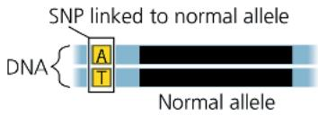

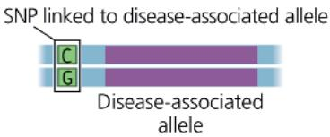

#### [EN] Concept Check 20.2

1. Describe the role of complementary base pairing during RT-PCR, RNA sequencing, and DNA microarray analysis.

2. VISUAL SKILLS Consider the microarray in Figure 20.13. If a sample from normal tissue is labeled with a green fluorescent dye and a sample from cancerous tissue is labeled red, what color spots would represent genes you would be interested in if you were studying cancer? Explain.

For suggested answers, see Appendix A.

<!-- C-END Campbell 20.2 -->

<!-- L-BEGIN Lehninger 9.2 -->

### 【英文对应 Lehninger §9.2：Exploring Protein Function on the Scale of Cells or Whole Organisms】

> 来源：Lehninger Principles of Biochemistry（书籍/02_生物化学原理） 第9章 DNA-Based Information Technologies，§9.2。

Protein function can be described on three levels. Phenotypic function describes the effects of a protein on the entire organism. For example, loss of the protein may lead to slower growth of the organism, an altered development pattern, or even death. Cellular function is a description of the network of interactions a protein engages in at the cellular level. Identifying interactions with other proteins in the cell can help define the kinds of metabolic processes in which the protein participates. Finally, molecular function refers to the precise biochemical activity of a protein, including details such as the reactions that an enzyme catalyzes or the ligands that a receptor binds. In response to the challenge of understanding these functions of the thousands of proteins in a typical cell, scientists have developed a variety of techniques in the broader discipline of genomics. We can apply these techniques to determine when a particular protein is expressed, what other proteins it might be related to, where it is located in the cell, what other cellular components it interacts with, and what happens to the cell when the protein is missing.

A variety of interrelated methods broadly probe a cell's RNA or protein content. The entire complement of transcribed RNAs present at a given moment in a cell is defined as the cellular transcriptome. As introduced in Chapters 1 and 3, the entire complement of proteins present at a given moment in a cell is defined as that cell's proteome. Studies of transcriptomes and studies of proteomes are referred to as transcriptomics and proteomics, respectively. Changes in these cellular macromolecules that occur when a particular gene or its expression is altered can provide important additional clues about protein function, as we will see. The methods we cover here are summarized in Table 9-4. The list is by no means comprehensive, but it serves to illustrate important approaches.

#### [EN] Sequence or Structural Relationships Can Suggest Protein Function

P2 One important reason to sequence many genomes is to provide databases that can be used to assign gene functions by genome comparisons, an enterprise referred to as comparative genomics.

A genome sequence is simply a very long string of A, G, T, and C residues, all meaningless until interpreted. Genome annotation yields information about the location and function of genes and other critical sequences. Genome annotation converts the sequence into information that any researcher can use, and it is typically focused on genomic DNA encompassing genes that encode RNA and protein, the most common targets of scientific investigation. Every newly sequenced genome includes many genes—often 40% or more of the total—about which little or nothing is known.

<table><tr><td colspan="2">TABLE 9-4 Methods for Discovering New Proteins and Exploring Their Functions</td></tr><tr><td>Clue</td><td>Method to Apply</td></tr><tr><td colspan="2">What is a protein&#x27;s function?</td></tr><tr><td>What other proteins of known function have similar sequences?</td><td>Comparative genomics</td></tr><tr><td>What known sequence motifs does the protein possess?</td><td>Comparative genomics</td></tr><tr><td>Under what conditions is the gene encoding the protein expressed?</td><td>RNA-Seq</td></tr><tr><td>How much of the protein is present in the cell under different conditions?</td><td>Mass spectrometry</td></tr><tr><td>Where is the protein located in the cell?</td><td>Microscopy with fusion proteins and immunofluorescence</td></tr><tr><td>What does the protein interact with?</td><td>Immunoprecipitation; tandem affinity purification; yeast two-hybrid analysis</td></tr><tr><td>What happens to the cell when the protein is missing or altered?</td><td>CRISPR/Cas9 or other mutagenic methods</td></tr><tr><td>What genes (some unknown) are involved in a process?</td><td>Large-scale screening</td></tr></table>

Using online tools that apply computational power to comparative genomics, scientists can define gene locations and assign tentative gene functions (where possible) based on similarity to genes previously studied in other genomes. The classic BLAST (Basic Local Alignment Search Tool) algorithm allows a rapid search of all genome databases for sequences related to one that a researcher is exploring, and it is especially valuable for investigating the function of a particular gene. BLAST is one of many resources available at the NCBI (National Center for Biotechnology Information) site (www.ncbi.nlm.nih.gov), sponsored by the National Institutes of Health, and the Ensembl site (www.ensembl.org), cosponsored by the EMBL-EBI (European Molecular Biology Laboratory-European Bioinformatics Institute).

Comparative genomics is made possible by evolutionary biology. Sometimes a newly discovered gene is related by sequence homologies to a previously studied gene in another or the same species, and its function can be entirely or partly defined by that relationship. Genes that occur in different species but have a clear sequence and functional relationship to each other are called orthologs. Genes similarly related to each other within a single species are called paralogs. We introduced these terms in Chapter 3 in the context of proteins. As with proteins, information about the function of a gene in one species can be used to at least tentatively assign function to the orthologous gene found in a second species. The correlation is easiest to make when comparing genomes from relatively closely related species, such as mouse and human, although many clearly orthologous genes have been identified in species as distant as bacteria and humans. Sometimes even the order of genes on a chromosome is conserved over large segments of the genomes of closely related species (Fig. 9-14). Conserved gene order, called synteny, provides additional evidence for an orthologous relationship between genes at identical locations within the related segments.

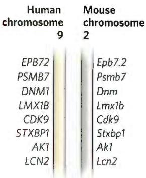  
FIGURE 9-14 Synteny in the human and mouse genomes. Large segments of the two genomes have closely related genes aligned in the same order on the chromosomes. In these short segments of human chromosome 9 and mouse chromosome 2, the genes show a very high degree of homology, as well as the same gene order. The different lettering schemes for the gene names simply reflect the different naming conventions for the two species. [Information from T. G. Wolfsberg et al., Nature 409:824, 2001, Fig. 1.]

Alternatively, certain amino acid sequences associated with particular structural motifs (Chapter 4) may be identified within a protein. P2 The presence of a structural motif may help to define molecular function by suggesting that a protein, say, catalyzes ATP hydrolysis, binds to DNA, or forms a complex with zinc ions. These relationships are determined with the aid of sophisticated computer programs, limited only by the current information on gene and protein structure and by our capacity to associate sequences with particular structural motifs. Sequences at an enzyme active site that have been highly conserved during evolution are typically associated with catalytic function, and their identification is often a key step in defining an enzyme's reaction mechanism. The reaction mechanism, in turn, provides information needed to develop new enzyme inhibitors that can be used as pharmaceutical agents.

#### [EN] When and Where a Protein Is Present in a Cell Can Suggest Protein Function

If a protein is involved in a reaction or process, it must be present at the location and at the moment that reaction or process occurs. This aspect of protein function can now be explored at multiple levels and with ever-increasing precision.

RNA-Seq and Transcriptomics The RNAs that are transcribed from a genome under a given set of conditions can be determined using DNA sequencing methods described in

Chapter 8. The approach is called RNA-Seq (Fig. 9-15). RNA is first isolated from a tissue or a population of cells. The RNA is fragmented and converted to double-stranded DNA using reverse transcriptase (see Fig. 9-12a). This DNA is then subjected to deep DNA sequencing, which reveals both the RNAs that are present and the relative abundance of each (if more copies of one RNA are present, they will give rise to more DNA sequencing reads). This method is sensitive enough to apply to single cells, an approach called single cell RNA-Seq, or scRNA-Seq. It allows investigators to catalog the RNAs being transcribed in different parts of a tissue.

The transcriptional state of a human cell or tissue can be diagnostic of conditions ranging from diabetes to cancer. If a particular gene under study is expressed in a certain tissue or under particular metabolic conditions, the result provides a new functional clue. Detailed knowledge about what genes are expressed in a given tumor may eventually help guide treatment options. RNA-Seq can reveal patterns of gene regulation and expression. It has special importance in studying cancerous tumors, in which rapid evolution triggered by genome instability creates a range of cell types. The mRNAs that are present in tumor cells provide a clue to the proteins that may be present, although not all mRNAs are immediately translated into protein. RNA-Seq also reveals the presence of many types of noncoding RNAs (described in Chapter 26) that are now being defined.

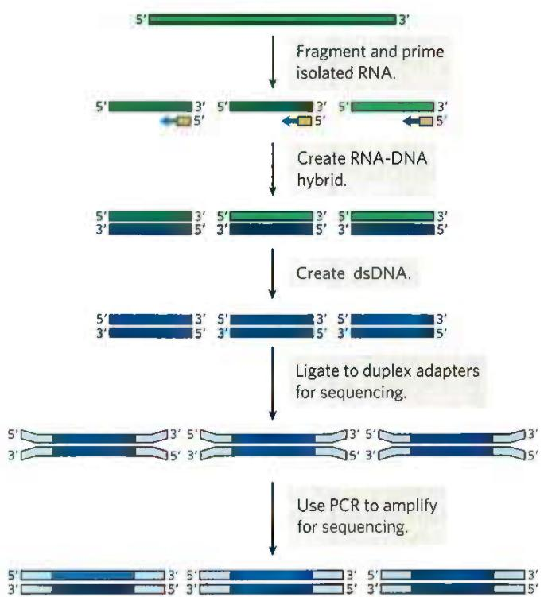  
FIGURE 9-15 RNA-Seq. To define a cellular transcriptome, the first step is to isolate cellular RNA. Because many RNAs, particularly mRNAs and rRNAs, are quite long, the RNA is then fragmented to an average size commensurate with the DNA sequencing platform to be used. The RNA is converted to DNA using reverse transcriptase. Hexameric DNA oligonucleotides of random sequence are used to prime the reverse transcriptase if all RNA is to be included in the transcriptome. RNA-DNA hybrids are more stable than DNA-DNA hybrids, so hexameric duplexes are sufficient for this task. If the transcriptome is focused on expression of protein-coding genes, beads coated with poly(dT) can be used to hybridize to the poly(A) tails of eukaryotic mRNAs, allowing their precipitation and enrichment relative to other RNAs. After reverse transcription, the DNA fragments are ligated to duplex adapters that provide a universal priming location for the DNA sequencing as well as sequences that allow annealing to anchors on the sequencing flow cell (see Fig. 8-36). This is followed by deep DNA sequencing and data analysis.

Cellular Proteomes and Mass Spectrometry A more direct way to establish protein presence or absence is to assess the cellular proteome. Mass spectrometry (Chapter 3) can accurately catalog and quantify the thousands of proteins present in a typical cell. This approach is a complement to RNA-Seq, as it provides a comprehensive list of the genes that are both transcribed and translated into protein. Mass spectrometry also provides information about how those proteins are modified, in turn allowing an assessment of their regulatory state.

Fusion Proteins and Immunofluorescence P2 Often, an important clue to the function of a gene product comes from determining its location within the cell. For example, a protein found exclusively in the nucleus could be involved in processes that are unique to that organelle, such as transcription, replication, or chromatin condensation. Researchers often engineer fusion proteins for the purpose of locating a protein in the cell or organism. Some of the most useful fusions are the attachment of marker proteins that signal the location by direct visualization or by immunofluorescence.

A particularly useful marker is the green fluorescent protein (GFP) (Fig. 9-16), discovered by Osamu Shimomura. As subsequently shown by Martin Chalfie, a target gene (encoding the protein of interest) fused to the GFP gene generates a fusion protein that is highly fluorescent—it literally lights up when exposed to blue light—and can be visualized directly in a living cell. GFP is a protein derived from the jellyfish Aequorea victoria (Fig. 9-16a).

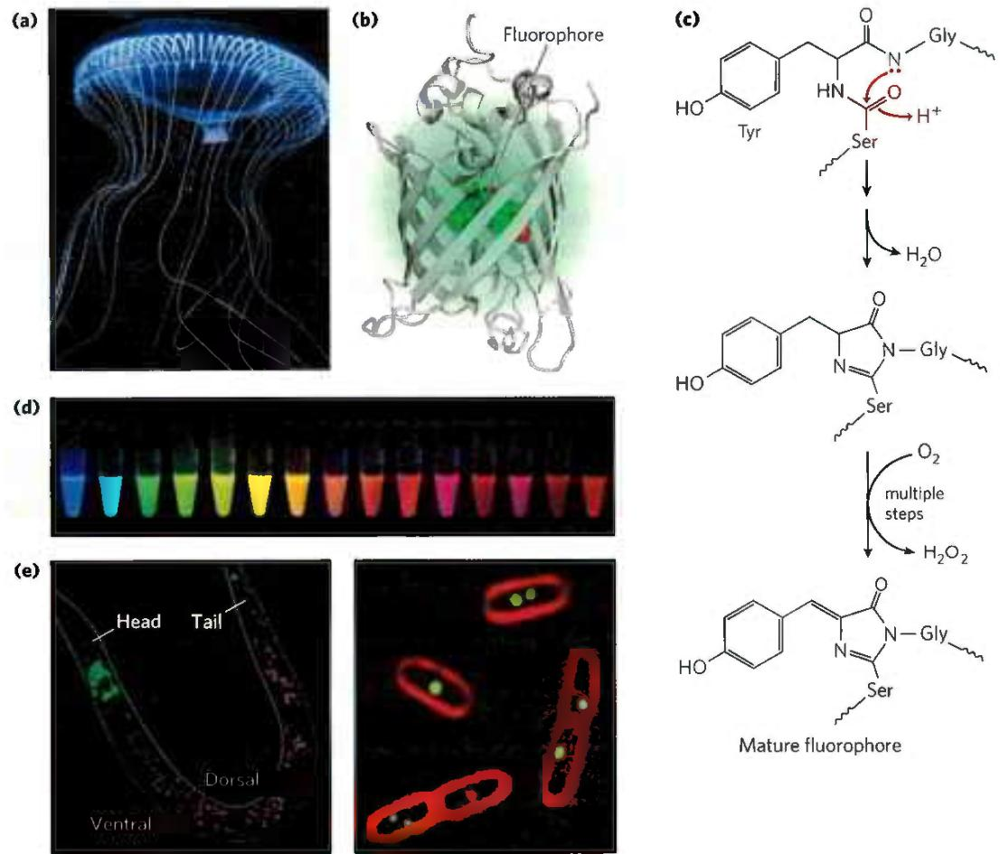  
FIGURE 9-16 Green fluorescent protein (GFP). (a) GFP is derived from the jellyfish Aequorea victoria. (b) The protein has a $\beta$ -barrel structure; the fluorophore is in the center of the barrel. (c) The fluorophore in GFP is derived from a sequence of three amino acids: $-Ser^{65}-Tyr^{66}-Gly^{67}$ . The fluorophore achieves its mature form through an internal rearrangement, coupled to a multistep oxidation reaction. An abbreviated mechanism is shown here. (d) Variants of GFP are now available in almost any color of the visible spectrum. (e) A GLR1-GFP fusion protein fluoresces bright green in C. elegans, a nematode worm (left). GLR1 is a glutamate receptor of nervous tissue. (In this photograph, autofluorescing fat droplets  
are false-colored in magenta.) The membranes of E. coli cells (right) are stained with a red fluorescent dye. The cells are expressing a protein that binds to a resident plasmid, fused to GFP. The green spots indicate the locations of plasmids. [(a) Chris Parks/ImageQuest Marine. (b) Data from PDB ID 1GFL, F. Yang et al., Nature Biotechnol. 14:1246, 1996. (c) Information from Roger Tsien, University of California, San Francisco, Department of Pharmacology, and Paul Steinbach. (d) Courtesy of Roger Tsien and Paul Steinbach, University of California, San Diego, Department of Pharmacology. (e) (left) Courtesy Penelope J. Brockie and Andres V. Maricq, Department of Biology, University of Utah; (right) Courtesy Joseph A. Pogliano, from J. Pogliano et al. (2001), Multicopy plasmids are clustered and localized in Escherichia coli, Proc. Natl. Acad. Sci. USA 98:4486–4491.]

The protein has a $\beta$ -barrel structure with a fluorophore (the fluorescent component of the protein) in the center (Fig. 9-16b). The fluorophore is derived from a rearrangement and oxidation of three amino acid residues (Fig. 9-16c). Because this reaction is autocatalytic and requires no proteins or cofactors other than molecular oxygen, GFP is readily cloned in an active form in almost any cell. Just a few molecules of this protein can be observed microscopically, allowing the study of its location and movements in a cell.

Careful protein engineering by Roger Tsien, coupled with the isolation of related fluorescent proteins from other marine coelenterates, has made variants of these proteins available in an array of colors (Fig. 9-16d) and other characteristics (brightness, stability). If fusion to GFP does not impair the function or properties of a protein one wishes to study, the fusion protein can be used to reveal the protein's location in the cell under a range of conditions and to detect interactions with other labeled proteins. With this technology, for example, the protein GLR1 (a glutamate receptor of nervous tissue) has been visualized as a GLR1-GFP fusion protein in the nematode Caenorhabditis elegans (Fig. 9-16e).

In some cases, the GFP fusion protein may be inactive or may not be expressed at sufficient levels to allow visualization. Immunofluorescence is an alternative approach for visualizing the endogenous (unaltered) protein. This approach requires fixation (and thus death) of the cell. The protein of interest is sometimes expressed as a fusion protein with an epitope tag, a short protein sequence that is bound tightly by a well-characterized, commercially available antibody. Fluorescent molecules (fluorochromes) are attached to this antibody. More commonly, the target protein is unaltered and is bound by an antibody that is specific for the protein. Next, a second antibody is added that binds specifically to the first one, and it is the second antibody that has the attached fluorochrome(s) (Fig. 9-17). A variation of this indirect approach to visualization is to attach biotin molecules to the first antibody, then add streptavidin (a bacterial protein closely related to avidin, a protein that binds biotin; see Table 5-1) complexed with fluorochromes. The interaction between biotin and streptavidin is one of the strongest and most specific known, and the potential to add multiple fluorochromes to each target protein gives this method great sensitivity. In all of these cases, the end product is a microscopic view of a cell in which a spot of light (a focus) reveals the location of the protein.

#### [EN] Knowing What a Protein Interacts with Can Suggest Its Function

Another key to defining the function of a particular protein is to determine its biochemical playmates. P2 In the case of protein-protein interactions, the association of a protein of unknown function with one whose function is known can compellingly imply a functional relationship. The techniques used in this effort are quite varied.

  
FIGURE 9-17 Indirect immunofluorescence. (a) The protein of interest is bound to a primary antibody, and a secondary antibody is added; this second antibody, with one or more attached fluorescent groups, binds to the first. Multiple secondary antibodies can bind the primary antibody, amplifying the signal. If the protein of interest is in the interior of the cell, the cell is fixed and permeabilized, and the two antibodies are added in succession. (b) The end result is an image in which bright spots indicate the location of the protein or proteins of interest in the cell. The images here show a nucleus from a human fibroblast, successively stained with antibodies and fluorescent labels for DNA polymerase ε; for PCNA, an important polymerase accessory protein; and for bromo-deoxyuridine (BrdU), a nucleotide analog. The BrdU, added as a brief pulse, identifies regions undergoing active DNA replication. The patterns of staining show that DNA polymerase ε and PCNA co-localize to regions of active DNA synthesis (rightmost image); one such region is visible in the white box. [(b) Fuss, J. and Linn, S., 2002,"Human DNA Polymerase ε Colocalizes with Proliferating Cell Nuclear Antigen and DNA Replication Late, but Not Early, in S Phase," J. Biol. Chem. 277:8658–8666. Courtesy Jill Fuss, University of California, Berkeley.]

Purification of Protein Complexes By fusing the gene encoding a protein under study with the gene for an epitope tag, investigators can precipitate the protein product of the fusion gene by complexing it with the antibody that binds the epitope. This process is called immunoprecipitation (Fig. 9-18). If the tagged protein is expressed in cells, other proteins that bind to it precipitate with it. Identifying the associated proteins reveals some of the intracellular protein-protein interactions of the tagged protein. There are many variations of this process. For example, a crude extract of cells that express a tagged protein is added to a column containing immobilized antibody (see Fig. 3-17c for a description of affinity chromatography). The tagged protein binds to the antibody, and proteins that interact with the tagged protein are sometimes also retained on the column. The connection between the protein and the tag is cleaved with a specific protease. The protein complexes are eluted from the column, and the proteins in them are identified by mass spectrometry. Researchers can use these methods to define complex networks of interactions within a cell. In principle, the chromatographic approach to analyzing protein-protein interactions can be used with any type of protein tag (His tag, GST, etc.) that can be immobilized on a suitable chromatographic medium.

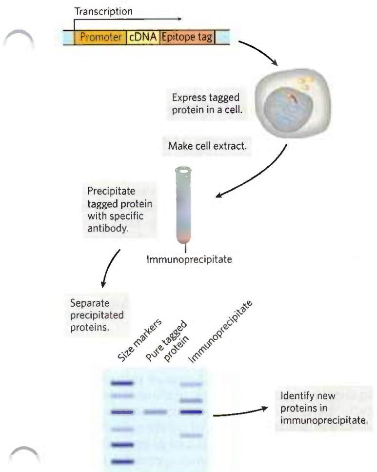  
FIGURE 9-18 The use of epitope tags to study protein-protein interactions. The gene of interest is cloned next to a gene for an epitope tag, and the resulting fusion protein is precipitated by antibodies to the epitope. Any other proteins that interact with the tagged protein also precipitate, thereby helping to elucidate protein-protein interactions.

The selectivity of this approach can be enhanced with tandem affinity purification (TAP) tags. Two consecutive tags are fused to a target protein, and the fusion protein is expressed in a cell (Fig. 9-19). The first tag is protein A, a protein found at the surface of the bacterium Staphylococcus aureus that binds tightly to mammalian immunoglobulin G (IgG). The second tag is often a calmodulin-binding peptide. A crude extract containing the TAP-tagged fusion protein is passed through a column matrix with attached IgG antibodies that bind protein A. Most of the unbound cellular proteins are washed through the column, but proteins that normally interact with the target protein in the cell are retained. The first tag is then cleaved from the fusion protein with a highly specific protease, TEV protease, and the shortened fusion target protein and any proteins associated noncovalently with the target protein are eluted from the column. The eluate is then passed through a second column containing a matrix with attached calmodulin that binds the second tag. Loosely bound proteins are again washed from the column. After the second tag is cleaved, the target protein is eluted from the column with its associated proteins. The two consecutive purification steps eliminate most weakly bound contaminants. False positives are minimized, and protein interactions that persist through both steps are likely to be functionally significant.

  
FIGURE 9-19 Tandem affinity purification (TAP) tags. A TAP-tagged protein and associated proteins are isolated by two consecutive affinity purifications, as described in the text.

Yeast Two-Hybrid Analysis A sophisticated genetic approach to defining protein-protein interactions is based on the properties of the Gal4 protein (Gal4p; see Fig. 28-32), which activates the transcription of GAL genes (encoding the enzymes of galactose metabolism) in yeast. Gal4p has two domains: one that binds a specific DNA sequence, and another that activates RNA polymerase to synthesize mRNA from an adjacent gene. The two domains of Gal4p are stable when separated, but activation of RNA polymerase requires interaction with the activation domain, which in turn requires positioning by the DNA-binding domain. Hence, the domains must be brought together to function correctly.

In yeast two-hybrid analysis, the protein-coding regions of the genes to be analyzed are fused to the yeast gene for either the DNA-binding domain or the activation domain of Gal4p, and the resulting genes express a series of fusion proteins (Fig. 9-20). If a protein fused to the DNA-binding domain interacts with a protein fused to the activation domain, transcription is activated. The reporter gene transcribed by this activation is generally one that yields a protein required for growth or an enzyme that catalyzes a reaction with a colored product. Thus, when grown on the proper medium, cells that contain a pair of interacting proteins are easily distinguished from those that do not.

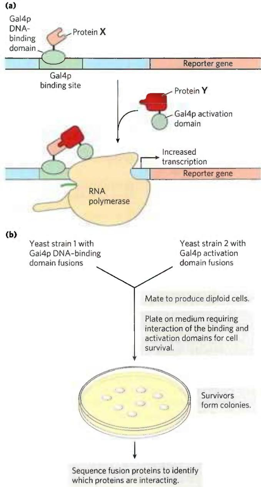

A library can be set up with a particular yeast strain in which each cell in the library has a gene fused to the Gal4p DNA-binding domain gene, and many such genes are represented in the library. In a second yeast strain, a gene of interest is fused to the gene for the Gal4p activation domain. The yeast strains are mated, and individual diploid cells are grown into colonies. The only cells that grow on the selective medium, or that produce the appropriate color, are those in which the gene of interest is binding to a partner, allowing transcription of the reporter gene. This allows large-scale screening for cellular proteins that interact with the target protein. The interacting protein that is fused to the Gal4p DNA-binding domain present in a particular selected colony can be quickly identified by DNA sequencing of the fusion protein's gene. Some false positive results occur, due to the formation of multiprotein complexes.

#### [EN] The Effect of Deleting or Altering a Protein Can Suggest Its Function

P2 P3 One of the most informative paths to understanding the function of a gene is to change (mutate) the gene or delete it. An investigator can then examine how the genomic alteration affects cell growth or function. The methods available to modify genomes grow more sophisticated every year. The most common approach is to cut the gene of interest at a site that is functionally critical, generating a double-strand break. In eukaryotes, such breaks are most commonly repaired by cellular systems that promote nonhomologous end joining (NHEJ), a process described in Chapter 25. NHEJ seals the double-strand break, but the process is imprecise. Nucleotides are often deleted or added during the repair, inactivating the gene. In bacteria, introduced double-strand breaks are usually repaired more accurately, by homologous recombination systems (Chapter 25), but inactivating mutations can appear. Many traditional approaches to targeting a gene in this way were supplanted by the advent of CRISPR/Cas systems in 2011.

CRISPR/Cas Systems "CRISPR" stands for clustered, regularly interspaced short palindromic repeats; as the name suggests, these consist of a series of regularly spaced short repeats in the bacterial genome. A Cas (CRISPR-associated) protein is a nuclease. The CRISPR sequences and Cas protein are components of a kind of immune system that evolved to allow bacteria to survive infection

by bacteriophages. CRISPR sequences are embedded in the bacterial genome, surrounding sequences derived from phage pathogens that previously infected the bacterium without killing it. The viral sequences are, in effect, spacer sequences separating the CRISPR sequences. When the same bacteriophage again attacks a bacterium that has the corresponding CRISPR/Cas system, the CRISPR sequence and Cas protein act together to destroy the viral DNA. First, the CRISPR sequences are transcribed to RNA, and individual viral spacer sequences are cleaved to form products called guide RNAs (gRNAs), which include some adjacent repeat RNA. A gRNA forms a complex with one or more Cas proteins and, in some cases, with another RNA called a trans-activating CRISPR RNA, or tracrRNA. The resulting complex binds specifically to the invading bacteriophage DNA, cleaving and destroying it through the nuclease activities associated with the Cas proteins.

  
FIGURE 9-21 The CRISPR/Cas9 system for genomic engineering. (a) The genes encoding the Cas9 protein and sgRNA are introduced into a cell in which a targeted genomic change is planned. The sgRNA has a region complementary to the chosen genomic target sequence (purple); this region can be engineered to include any desired sequence. A complex consisting of the CRISPR sgRNA and the Cas9 protein forms within the cell and binds to the chosen target site in the DNA. The structure of the bound complex is shown in (b). In the pathway shown on the left in (a), two nuclease active sites in the Cas9 protein separately cleave each DNA strand in the target, producing a double-strand break. The double-strand break is usually repaired by nonhomologous end joining, which generally deletes or alters the nucleotides at the site where joining occurs. Alternatively, as shown in the pathway on the right, if one nuclease site is inactivated, Cas9 nuclease activity creates a single-strand break in the target sequence. In the presence of a recombination donor DNA fragment, identical to the target sequence but incorporating the desired sequence change (fragment shown in red), homologous DNA recombination will sometimes change the sequence at the site of the break to match that of the donor DNA. [Data from PDB ID 4UN3, C. Anders et al., Nature 513:569, 2014.]

The current technology was made possible by discovery of a relatively simple CRISPR/Cas system in Streptococcus pyogenes. This system requires only a single Cas protein, Cas9, to cleave DNA. Work in many laboratories, particularly those of Jennifer Doudna and Emmanuelle Charpentier, has produced a streamlined CRISPR/Cas9 system composed of just one protein (Cas9) and one associated RNA, consisting of gRNA and tracrRNA fused into a single guide RNA (sgRNA). P2 P3 The power of the system is embedded in this sgRNA, in which the guide sequence can be altered to specifically and efficiently target almost any genomic sequence (Fig. 9-21). Cas9 has two separate nuclease domains: one domain cleaves the DNA strand paired with the sgRNA, and the other cleaves the opposite DNA strand. Inactivating one domain creates an enzyme that cleaves just one strand, forming a single-strand break, or nick. The sgRNA is needed both to pair with the target sequence in the DNA and to activate the nuclease domains for cleavage.

Plasmids expressing the required protein and RNA components of CRISPR/Cas9 can be introduced into microbial cells by electroporation (p. 306). For mammalian cells, the genes encoding the CRISPR/Cas9 components can be incorporated into engineered viruses that subsequently deliver them to the cell nuclei. For many organisms, the targeted gene is inactivated in a high percentage of the treated cells. If a genomic change (mutation) rather than a simple gene inactivation is required, it can be introduced by recombination when a DNA fragment encompassing the cleavage site and including the desired change enters the cell with the CRISPR/Cas9 plasmids. This recombination is often inefficient, but success can be improved somewhat by introducing a nick rather than a double-strand break at the target site (Fig. 9-21).

CRISPR/Cas9 can be combined with other approaches to extract additional information. For example, a particular gene can be inactivated with CRISPR/Cas9. Then, the effect of that gene inactivation on the transcription of other genes can be probed with RNA-Seq at the level of tissues, cell populations, or single cells.

New applications for CRISPR/Cas9 are being developed rapidly, both for basic research and for medicine. Genetic screens based on CRISPR are described in the next section. CRISPR is being used to enhance food production, provide new approaches to combat bacterial infections, and eliminate nonnative pest species that can harbor diseases (Box 9-1). New CRISPR-based treatments for genetic diseases are being cautiously advanced to clinical trials for vision loss due to inherited retinal dystrophies, Duchenne muscular dystrophy, $\beta$ -thalassaemia, and many other conditions. Uncertainties remain, particularly the potential for occasional cleavage at unintended chromosomal sites (off-target cleavage). The impact of CRISPR/Cas9 will continue to grow as problems are overcome, current applications mature, and new applications are imagined and created.

#### [EN] Many Proteins Are Still Undiscovered

For most biological processes, ranging from intermediary metabolism to neurological function to DNA metabolism, the list of known participating enzymes and proteins is far from complete. P2 Genetic screening for new gene functions has been underway for many decades. The goal is to efficiently interrogate large numbers of genes, sometimes the entire genome, for genes that affect a particular

Initial population of cells

  
FIGURE 9-22 High-throughput genetic screening. A gene perturbation, either inactivation or activation, is introduced to a population of cells such that only one gene in each cell is affected. However, all or most genes are affected in one cell or another within the population. The population is then subjected to a selection that requires a response from some cellular genes. Cells that lack the required genes or that have those genes activated will drop out or be enriched within the population, respectively. In the example shown, two cells drop out.

cellular reaction or process. A gene perturbation—a treatment that inactivates a gene or activates its expression—is introduced under conditions in which just one gene is affected in each cell, but most or all of the genes are affected in one or more cells within the population (Fig. 9-22). The population is then subjected to a stress or selection. Cells in which a gene required to respond to the selection is altered may drop out of the population or be enriched in the population, depending upon the goals and design of the screen.

CRISPR-based technologies increasingly play a central role in large-scale screening protocols (Fig. 9-23). Libraries of sgRNAs have been generated to target virtually all genes in a mammalian genome, or specialized subsets of them. The targeting sequence in each sgRNA is 20 bp long. In addition to targeting a particular gene, each targeting sequence acts as a kind of unique bar code identifier that is readily recognized by computer programs after sequencing. The sgRNAs are packaged in a DNA cassette set up to also express the Cas9 protein or a Cas9 variant. The cassettes are incorporated into carefully engineered lentiviral vectors derived from HIV (with genes required for HIV multiplication eliminated). The viral vectors deliver the cassette to the nucleus as a single-stranded RNA, convert it to double-stranded

#### [EN] Getting Rid of Pests with Gene Drives

Invasive introduced plant and animal species can wreak havoc on any natural environment, and can also spread human disease. Mosquitoes that harbor Zika virus and other diseases in many parts of the world, introduced rats on almost every continent, cane toads and rabbits in Australia, the kudzu vine in the southern United States—represent just a few examples of invasive species that cause human misery and annual financial damage totaling billions of dollars. Traditional methods of control such as poisoning or trapping are often unsuccessful and can have detrimental effects on native species that become unintended targets.

The discovery of selfish DNA elements such as homing endonucleases and transposons that can spread through a population gave rise to the concept of gene drives as a new approach to the control of invasive species. The most recent and promising iteration of this idea involves synthetic gene drives based on CRISPR/Cas9. The overall idea is to set up a system that skews the male to female ratio in a target species far away from the favored 1:1, resulting in population collapse. A strategy called X shredder, already proven in the laboratory with mosquitoes, is highlighted in Figure 1. A cassette that includes genes expressing Cas9, as well as several sgRNAs targeted to different unique sites on the X chromosome, is inserted into an intergenic region on the Y chromosome. The cassette is engineered into males, and is controlled by a gene regulatory system that is expressed only during spermatogenesis. Thus, during spermatogenesis, the cassette is expressed so that the X chromosome is cleaved at multiple locations, basically destroying it. This ensures that the only viable sperm have Y chromosomes. All the offspring of any cross with a female are all males, and all of them possess Y chromosomes containing the X-shredder cassette. When those male offspring mate with other females later, the same result ensues. As these males mate and spread the cassette through the population, a dearth of females occurs and the population collapses. In principle, this same strategy could be applied to rats, cane toads, and many other invasive species.

DNA with the viral-encoded reverse transcriptase, and integrate the DNA into a chromosome. The CRISPR/Cas9 components are expressed to perturb the target gene specified by the particular sgRNA delivered to that cell. The effect produced depends upon the Cas9 variant used. The unmodified Cas9 nuclease will create a double-strand break that inactivates the gene. A modified Cas9 that lacks the nuclease activity will simply bind to its target and block transcription. Cas9 fused to a protein transcription inhibitor or activator may more effectively block or activate transcription, respectively (Fig. 9-23b).

To date, gene drives have been restricted to the laboratory. The potential for a gene drive escaping to species that are not intended targets is not yet clear. Resistance in the target species could occur by mutating the sgRNA target sites, although the use of multiple sites makes this less likely. The gene drive approach is a good illustration of the power and potential of CRISPR. However, once males with a gene drive are released, it would be essentially impossible to call a halt to the effects. Nature has a way of imposing consequences, both unintended and unexpected. The potential positive effects on health and agriculture continue to drive research to improve the technology and address potential problems.

Whatever strategy is used, a different gene is affected in each cell. Once the population has been treated with a stress or selection, cells in which genes required to survive the treatment are inactivated or activated by the CRISPR/Cas9 variant will die or thrive. The decreased or increased presence of the relevant bar code sequences can be detected by deep DNA sequencing, using a universal priming sequence incorporated into the cassette near the sgRNA sequence. The strategies outlined here only hint at the variety of protocols in use, limited only by the imagination of the investigators.

#### [EN] SUMMARY 9.2 Exploring Protein Function on the Scale of Cells or Whole Organisms

■ Proteins can be studied at the level of phenotypic, cellular, or molecular function.

■ Comparative genomics can elucidate protein function by identifying structural motifs within the encoded protein and comparing gene sequences from different organisms.

A determination of when and where a protein appears in a cell can offer functional clues. RNA-Seq provides information on what genes are being expressed in a cell. Mass spectrometry can define cellular proteomes. By fusing a gene of interest with genes that encode green fluorescent protein or epitope tags, researchers can

(b) Gene knockout through frameshift, insertion of stop codon

(c) Transcriptional repression  
  
FIGURE 9-23 Use of CRISPR/Cas9 in high-throughput screening. CRISPR/Cas9 provides the gene perturbation in many screening protocols. (a) In a typical screen, a library of sgRNAs is constructed so as to target all known genes in a genome of interest. These are cloned into viral vectors. The vectors infect cells at a multiplicity of infection (MOI) small enough so that most cells will gain only one vector. The vector RNA is converted to DNA and integrated into the genome. When expressed, it will affect one target gene, with most genes affected in one or more cells in the population. After selection, some cells drop out or are enriched in the population, depending on the nature of the screen. (b) Several variations of Cas9 are shown to illustrate a few of the ways genes can be affected. Unaltered Cas9 will cleave the DNA at the target site. (c) If engineered to lack nuclease activity, and fused with a gene repressor or activator, the modified Cas9 will bind to the target site and either decrease or increase gene transcription, respectively.

visualize the cellular location of the gene product, either directly or by immunofluorescence.

The interactions of a protein with other proteins or RNA can be investigated with epitope tags and immunoprecipitation or affinity chromatography. Yeast two-hybrid analysis probes molecular interactions in vivo.

The cellular effects of inactivating a gene can be conveniently explored using the CRISPR/Cas9 programmable nuclease. CRISPR/Cas9 can also be used to alter gene sequences in a targeted manner.

■ Screens for new genes increasingly employ variants of the CRISPR/Cas9 system.

<!-- L-END Lehninger 9.2 -->

## 6.2 基因敲除技术

## 6.2.1 基本原理

经典遗传学(forward genetics)是从一个突变体的表型出发,研究其基因型,进而找出该基因的编码序列。在后基因组时代,大规模基因功能的研究正成为生命科学研究的热点,现代遗传学(reverse genetics,反向遗传学)首先从基因序列出发,推测其表型,进而推导出该基因的功能。基因敲除(gene knock-out)又称基因打靶,该技术通过外源DNA与染色体DNA之间的同源重组,进行精确的定点修饰和基因改造,具有专一性强、染色体DNA可与目的片段共同稳定遗传等特点。

1985 年,科学家利用同源重组将一段外源质粒 pΔβ117 插入到人类染色体 DNA β-珠蛋白位点,首次在哺乳动物细胞中进行基因打靶并获得成功。目前,在胚胎干细胞(ES 细胞)中进行同源重组已经成为遗传修饰基因组位点的常规技术。通过对这些基因敲除生物个体的表型分析,鉴定或推测该基因的生物学功能。

基因敲除分为完全基因敲除和条件型基因敲除(又称不完全基因敲除)两种。完全基因敲除是指通过同源重组法完全消除细胞或者动物个体中的靶基因活性,条件型基因敲除是指通过定位重组系统实现特定时间和空间的基因敲除。噬菌体的 Cre/LoxP 系统、Gin/Gix 系统、酵母细胞的 FLP/FRT 系统和 R/RS 系统是现阶段常用的 4 种定位重组系统,尤以 Cre/LoxP 系统应用最为广泛。

## 1. 完全基因敲除

实验中一般采用取代型或插入型载体在 ES 细胞中根据正-负双向选择（positive-negative selection, PNS）原理 $^{(图6-10)}$ 进行完全基因敲除实验。正向选择基因 neo 通常被插入载体靶 DNA 功能最关键的外显子中，或通过同源重组法置换靶基因的功能区。neo 基因有双重作用，一方面形成靶位点的插入突变，同时可作为正向筛选标记。负向选择基因 HSV-tk (human semian virus-thymidine kinase) 则被置于目的片段外侧，含有该基因的重组

图 6-10 正 - 负筛选法 (PNS 法) 筛选已发生同源重组的细胞

目标序列的第一个外显子中插入 $neo^{r}$ 基因，两侧为单纯疱疹病毒胸腺嘧啶激酶基因，在ES细胞中发生同源重组后， $neo^{r}$ 基因插入基因组中，而单纯疱疹病毒胸腺嘧啶激酶基因被剪切掉，发生重组的ES细胞由于有 $neo^{r}$ 基因而获得对抗生素G148抗性。因为缺失了单纯疱疹病毒胸腺嘧啶激酶基因，转化细胞同时对嘌呤类似物产生了抗性。

图 6-11 条件型基因敲除策略  

细胞不能在选择培养基上生长。如果细胞中发生了随机重组，负向选择基因就可能被整合到基因组中，导致细胞死亡。由于基因转移的同源重组自然发生率极低，动物的重组概率为 $10^{-2} \sim 10^{-5}$ ，植物的概率为 $10^{-4} \sim 10^{-5}$ ，即使采用双向选择法也很难保证一次就从众多细胞中筛选出真正发生了同源重组的胚胎干细胞，必须用 PCR 及 Southern 杂交等多种分子筛选技术验证确实获得了目的基因被敲除的细胞系。

## 2. 条件型基因敲除

对于许多有重要生理功能的基因来说,完全基因敲除往往导致胚胎死亡,有关该基因功能的研究便无法开展。而条件型基因敲除,特别是应用 Cre/LoxP 和 FLP/FRT 系统所开展的组织特异性敲除,由于其可调节性而受到科学家的重视。构建条件型基因敲除打靶载体时,常将正向选择标记 $neo^{r}$ 置于靶基因的内含子中,并在靶基因重要功能域两侧内含子中插入方向相同的 LoxP 位点(图 6-11)。当实验中需要消除靶基因活性时,与带有 Cre 重组酶基因的 ES 细胞杂交,Cre 重组酶就能把两个 LoxP 位点中间的 DNA 片段切除,导致靶基因失活。标记基因两侧也常常带有 LoxP 序列,因为许多时候即使标记基因位于内含子中也会阻断靶基因的转录。一旦出现这种情况,可以用 Cre 重组酶表达质粒转染中靶 ES 细胞,通过 LoxP 位点重组将 neo 抗性基因删除。

以 Cre/loxP 系统为基础, 可以在动物的一定发育阶段和一定组织细胞中实现对特定基因进行遗传修饰。利用控制 Cre 表达的启动子活性或所表达的 Cre 酶活性具有可诱导性的特征, 人们常常通过设定诱导时间的方法对动物基因突变的时空特异性进行人为控制, 以避免出现死胎或动物出生后不久即死亡的现象。

## 6.2.2 高等动物基因敲除技术

胚胎干细胞分离和体外培养的成功奠定了哺乳动物基因敲除的技术基础。真核生物基因敲除的技术路线主要包括构建重组基因载体,用电穿孔、显微注射等方法把重组DNA导入胚胎干细胞纯系中,使外源DNA与胚胎干细胞基因组中相应部分发生同源重组,将重组载体中的DNA序列整合到内源基因组中并得以表达,主要实验流程及筛选步骤如图6-12所示。

利用 neo 基因替换目的基因外显子Ⅳ至外显子Ⅵ区段,得到肠碱性磷酸酶(intestinal alkaline phosphatase, IAP)基因敲除的 ES 细胞,用显微注射或电穿孔法将 IAP 基因敲除的 ES 细胞注入早期胚胎的囊胚腔中,诱导胚胎分化,获得嵌合体胚胎后与野生型纯合体胚

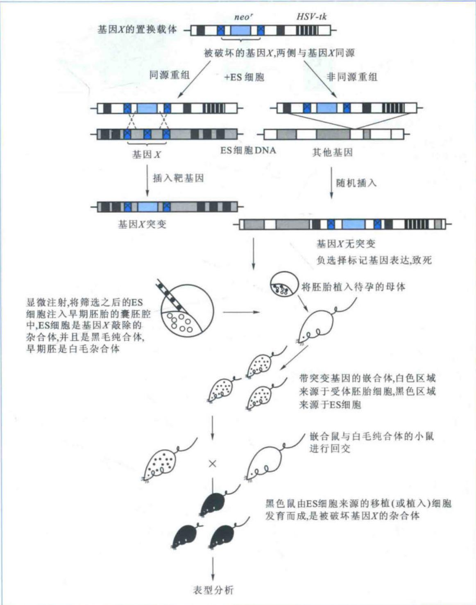  
图 6-12 模式动物小鼠中完全基因敲除的主要技术策略与应用举例

  
图 6-13 肠碱性磷酸酶基因敲除加速小鼠肥胖  
(a) 利用 neo 基因替换目的基因外显子Ⅳ至外显子Ⅵ区段，得到 IAP 基因敲除的 ES 细胞。P，内源 Southern 杂交探针。(b) Southern 杂交实验，IAP 基因已从基因组中敲除。D3，来自于亲本 ES 细胞的 DNA。#48，IAP 基因敲除的 ES 细胞 DNA。+/+、+/- 和 -/- 分别代表野生型、杂合体和纯合体。(c) Northern 杂交实验，纯合小鼠体内 IAP 基因不表达。(d) Western 杂交实验，纯合小鼠体内检测不到 IAP 蛋白。TNAP，非组织特异性碱性磷酸酶。(e) 在高脂饲养条件下，IAP 基因敲除的小鼠 (ko) 较野生型小鼠 (wt) 更易发胖。

胎回交,获得由 ES 细胞分化产生的 IAP 基因敲除小鼠,实验证明,纯合小鼠体内检测不到 IAP 蛋白,而该基因的敲除导致小鼠变胖(图 6-13)。一般来说,动物基因敲除时用显微注射胚胎干细胞,虽然技术难度相对大些,但命中率相对较高。电穿孔法操作相对简单易行,但命中率比较低。

因为同源重组常常发生在某一条染色体上,要得到稳定遗传的纯合体基因敲除模型,至少需要两代以上的遗传。除了基因敲除法,还有人用基因捕获的方法通过随机插入突变破坏靶基因表达 $^{(图6-14)}$ 。基因捕获载体包括一个无启动子的报告基因(通常为 $neo^{r}$ 基因),当该基因插入到ES细胞染色体某个部位,利用所在位点的转录调控元件得到表达时,该ES细胞就获得在含G418的选择性培养基上生长的能力。可通过分析标记基因侧翼cDNA或染色体DNA序列来获得靶基因的相关信息。

由于受整合位点附近染色质区的影响,转基因整合具有显著的位置效应,基因5'端启动子和增强子区,3'端终止子区都会对转基因的整合产生影响,这是某些打靶载体选择组织特异性启动子的原因之一。外源转基因的有效表达有时还取决于其是否有内含子,因为内含子中存在的转录调控元件可影响mRNA的剪切以及启动子与内含子间的相互作用。另外,内含子可能含有能开放染色体功能域的序列,还可能通过影响核质成分、位置等来影响基因表达强度。

除了研究基因功能之外,基因敲除技术还被广泛应用于建立人类疾病的转基因动物

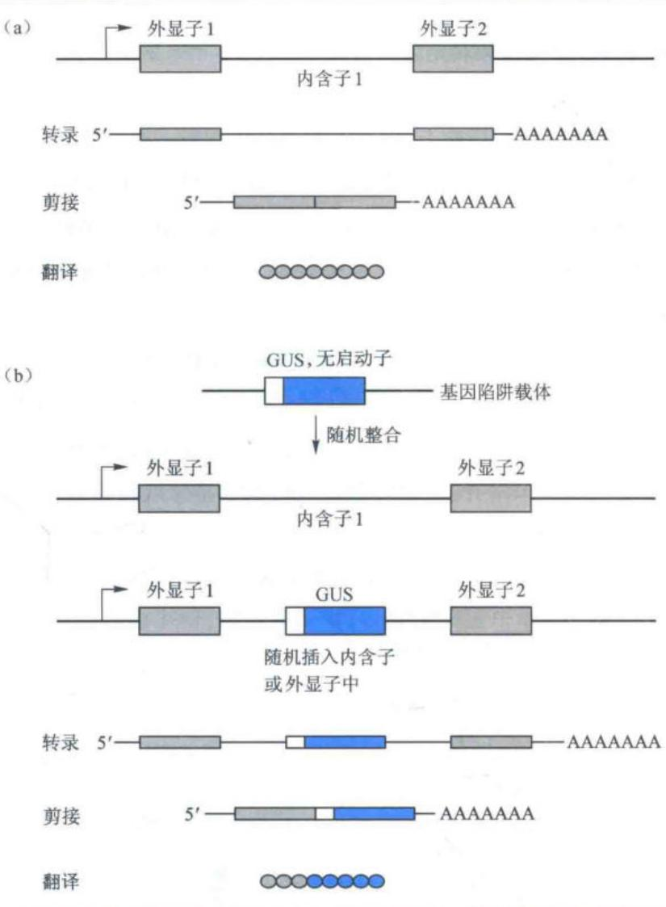  
图 6-14 基因捕获法原理示意图  
模型,为医学研究提供遗传学数据,为遗传病的治疗、生物新品种的培育奠定新基础。

(a)未插入基因捕获载体前,需要被敲除的靶基因转录翻译出活性蛋白质,未知;(b)插入基因捕获载体后,靶位点基因转录翻译出带有GUS(报告基因)蛋白区段的融合蛋白,可用组织化学法检测。

## 6.2.3 植物基因敲除技术

由于动植物细胞结构显著不相同,植物细胞基因敲除常采用不同于动物细胞的策略。T-DNA 插入失活技术是目前在植物中使用最为广泛的基因敲除手段。T-DNA 插入失活就是利用根瘤农杆菌 T-DNA 介导转化,将一段带有目的基因的 DNA 序列整合到宿主植物基因组 DNA 上。

农杆菌本身带有 Ti(tumor-inducing) 质粒, 该质粒上除了 T-DNA 片段(具有介导 DNA 转移的功能) 和致毒 Vir(virulence region) 基因之外, 还有 3 套基因, 其中两套基因分别控制合成植物生长素与分裂素, 促使植物创伤组织无限制地生长与分裂, 形成冠瘿瘤。第三套基因负责合成冠瘿碱, 是一种农杆菌细胞生长所必需的物质。植物根部受到损伤后常分泌出酚类物质乙酰丁香酮和羟基乙酰丁香酮, 这些酚类物质会诱导 Vir 基因表达, 将 Ti 质粒上 T-DNA 单链切下, 并与农杆菌染色体上操纵子编码的基因产物结合形成复合物并转移进入植物根部细胞的细胞核, 最终导致 T-DNA 被整合到宿主基因组上。

Ti质粒本身比较大,很难进行分子重组操作,为了实现植物转基因,通过对Ti质粒进行改造发展成为共整合载体和双元载体两大系统,图6-15a是共整合载体示意图。先将目的基因克隆到带有T-DNA的分子克隆载体上,与Ti质粒同时导入到农杆菌中,通过同源重组使目的基因整合到Ti质粒上,进行植物转基因实验。双元载体系统(图6-15b)包括辅助Ti质粒和含有目的基因的穿梭质粒。该系统的Ti质粒缺失T-DNA区域,主要是提供Vir基因功能,Vir基因能识别并切割穿梭质粒中的LB、RB区域中的T-DNA片段。与共整合载体系统所不同的是,双元载体的两个质粒之间不发生同源重组,两个质粒均能在农杆菌内独立复制。

T-DNA 在基因组中无专一整合位点,在植物基因组中一般发生随机整合,所以,只要突变株的数目足够大,理论上就可能获得每一个功能基因都发生突变的基因敲除植物文库。拟南芥基因组冗余序列少,基因密度高,几乎每一个 DNA 插入都会导致某个基因功能的丧失,结合已完成的拟南芥基因组信息,人们很容易筛选到新的功能基因。已经用

图 6-15 共整合载体系统(a)和双元系统(b)示意图  
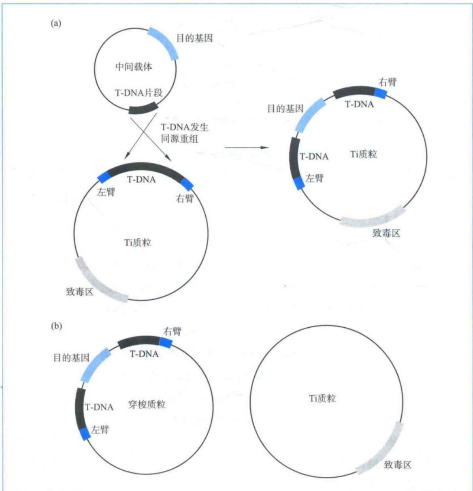

T-DNA 插入失活方法建立了拟南芥大规模基因敲除突变体库,研究人员可以方便地在多个数据库中检索到感兴趣基因的突变体,再开展深入的表型分析和功能研究。

## 6.2.4 基因组编辑技术

基因组编辑(genome editing)技术是利用序列特异核酸酶在基因组特异位点产生DNA双链断裂，从而激活生物体自身的同源重组或非同源末端连接修复机制，以达到特异性改造基因组之目的。锌指核酸酶和转录激活样效应因子核酸酶(transcription activator-like effector nucleases, TALEN)是2013年之前应用最为广泛的基因组编辑工具，随着CRISPR/Cas9系统(clustered regularly interspaced short palindromic repeats/CRISPR-associated protein 9 system)的开发及利用，基因组编辑技术的应用出现了新的高潮。

该系统原来是细菌及古菌适应性免疫系统的一部分,其功能是抵御病毒及外源 DNA 的入侵。CRISPR/Cas 系统由 CRISPR 序列和 Cas 基因家族组成。其中,CRISPR 序列由一系列间隔序列及高度保守的正向重复序列相间排列形成,Cas 基因簇位于 CRISPR 序列的 5' 端,编码的蛋白质可特异性切割外源 DNA。

CRISPR/Cas 系统分为 I 型、II 型和 III 型，以 II 型的应用最为广泛。有外源 DNA 入侵时，CRISPR 序列转录并被加工形成约 40 nt 的成熟 crRNA (CRISPR RNAs)。成熟的 crRNA 与 tracrRNA (trans-activating CRISPR RNA) 通过碱基互补配对形成双链 RNA，激活并引导 Cas9 切割外源 DNA 中的原型间隔序列 (protospacer)。Cas9 蛋白具有两个核酸酶结构域：RuvC-like 结构域和 HNH 结构域，其中，HNH 结构域切割原型间隔序列中与 crRNA 互补配对的 DNA 链，RuvC-like 结构域切割另一条非互补链 (图 6-16a)。研究表明，Cas9 对靶序列的编辑依赖于原型间隔序列下游的短序列 PAM (protospacer-adjacent motifs)，PAM 通常为 5'-NGG-3'，极少情况下为 5'-NAG-3'，Cas9 切割的位点位于 PAM 上游第三个碱基。

根据 CRISPR/Cas9 系统的特点,研究者将 crRNA::tracrRNA 双分子结构融合成具有发夹结构的 sgRNA(single guide RNA),sgRNA 分子 5' 端 20 nt 的引导序列可完全与 DNA 靶序列互补,从而引导 Cas9 对靶 DNA 进行编辑 $^{(图 6-16b)}$ 。只要改变 sgRNA 中的 20 nt 引导序列,基因组上任意 5'-(N) $_{20}$ -NGG-3' 序列都可被 CRISPR/Cas9 系统编辑。

利用 CRISPR/Cas9 技术对植物基因组进行编辑,首先需要根据被编辑基因的 DNA 序列选定 20 bp 引导序列及其随后紧跟的 5'-NGG PAM 序列,如果研究中需要破坏该基因功能,则要避免把基因的 3' 端或内含子区序列用作引导序列。先把该序列克隆到相应的含有 sgRNA 骨架和 Cas9 基因的植物表达载体中,一般由 U6 或 U3 启动子驱动 sgRNA 在植物中的表达。将构建好的载体导入到植物细胞中,使 sgRNA 和 Cas9 在植物中瞬时或稳定表达。由于 CRISPR/Cas9 在靶标位点上引起核苷酸插入或缺失,可通过 PCR-酶切方法鉴定突变体。如果靶位点含有一个限制性内切酶位点,且恰好能被 Cas9 切割破坏,则可以利用该限制性内切酶切割含有靶位点的 PCR 产物。来自野生型植株的 PCR 片段含有完整的酶切位点,可被限制性内切酶消化,电泳检测可见相对分子质量较小的两条

图6-16 CRISPR/Cas9原理

(a)细菌的CRISPR/Cas9系统，crRNA::tracrRNA双RNA分子结构引导Cas9核酸酶切割DNA双链靶位点；(b)改造的CRISPR/Cas9系统，将crRNA::tracrRNA双分子结构融合成一个sgRNA，以引导Cas9对靶基序列的编辑。

(a)  
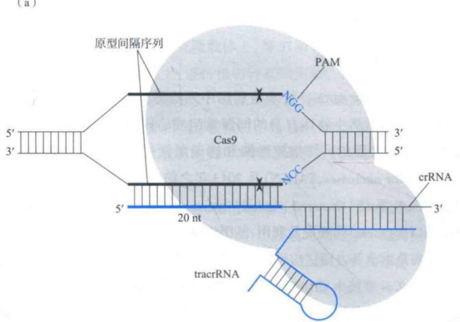

(b)  
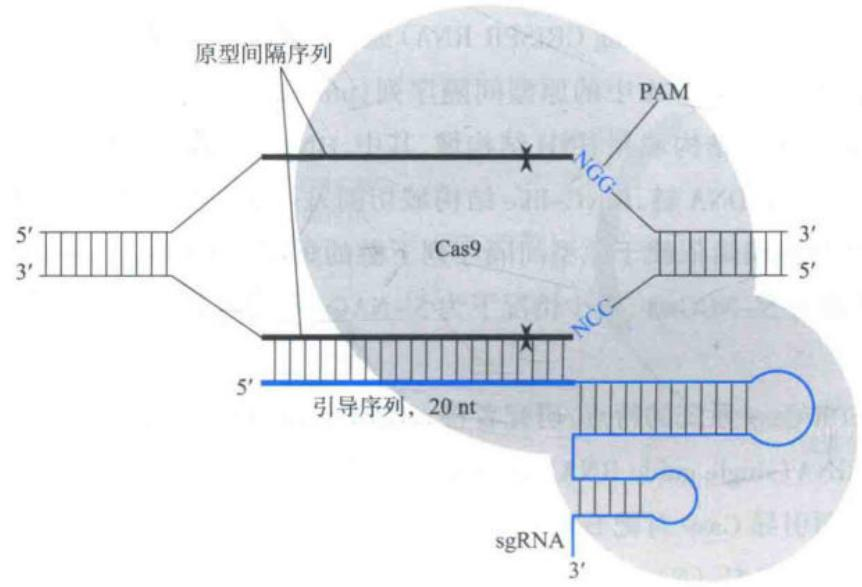

带；来自突变体的 PCR 片段中，酶切位点被破坏，PCR 产物无法被该内切酶消化，电泳检测仍为一条带。如果靶位点中没有合适的限制性内切酶，那么，可利用 T7 核酸内切酶 I 来检测 PCR 产物。分别向经变性、复性的 PCR 产物中加入 T7 核酸内切酶 I，来自野生型植株的 PCR 产物双链间完全匹配，T7 核酸内切酶 I 无法将其切割，电泳可见一条野生型带；来自突变体的 PCR 产物可退火形成不完全匹配的 DNA 双链，被 T7 核酸内切酶 I 识别并切割，电泳可检测到两条较小的突变型条带。最后，通过 DNA 测序确定突变体中已准确地插入或者缺失相应碱基 $^{(图6-17)}$ 。

图 6-17 利用 CRIS-PR/Cas9 技术编辑植物基因组的实验流程

<!-- C-BEGIN Campbell 20.3 -->

### 【英文对应 Campbell Concept 20.3：Cloned organisms and stem cells are useful for basic research and other applications】

> 来源：Campbell Biology（书籍/01_Campbell_Biology） 第20章 DNA Tools and Biotechnology，Concept 20.3。

#### [EN] Concept 20.3: Cloned organisms and stem cells are useful for basic research and other applications

Along with advances in DNA technology, scientists have been developing and refining methods for cloning whole multicellular organisms from single cells. In this context, cloning produces one or more organisms that are genetically identical to the “parent” that donated the single cell. This is often called organismal cloning to differentiate it from gene cloning and, more significantly, from cell cloning—the division of an asexually reproducing cell such as a bacterium into a group of genetically identical cells. (The common theme is that the product is genetically identical to the parent.) The current interest in organismal cloning is primarily due to its ability to generate stem cells. A stem cell is a relatively unspecialized cell that can both reproduce itself indefinitely and, under appropriate conditions, differentiate into specialized cells of one or more types. Stem cells have great potential for regenerating damaged tissues.

The cloning of plants and animals was first attempted over 50 years ago in experiments designed to answer basic questions about the genetic potential of single cells. For example, researchers wondered if all the cells of an organism have the same genes or whether cells lose genes during the process of differentiation (see Concept 18.4). One way to answer this question is to see whether a differentiated cell can generate a whole organism—in other words, whether cloning an organism is possible. Let's discuss these early experiments before we consider more recent progress in organismal cloning and procedures for producing stem cells.

#### [EN] Cloning Plants: Single-Cell Cultures

The successful cloning of whole plants from single differentiated cells was accomplished at Cornell University during the 1950s by F. C. Steward and his students, who worked with carrot plants. They found that differentiated cells taken from the root (the carrot) and incubated in culture medium could grow into normal adult plants, each genetically identical to the parent plant. These results showed that differentiation does not necessarily involve irreversible changes in the DNA. In plants, mature cells can “dedifferentiate” and then give rise to all the specialized cell types of the organism; any cell with this potential is said to be totipotent.

Plant cloning is used extensively in agriculture. For plants such as orchids, cloning is the only commercially practical means of producing new plants. In other cases, cloning has been used to reproduce a plant with valuable characteristics, such as resistance to plant pathogens. In fact, you yourself may be a plant cloner: If you have ever grown a new plant from a cutting, you have practiced cloning!

#### [EN] Cloning Animals: Nuclear Transplantation

Differentiated cells from animals generally do not divide in culture, much less develop into the multiple cell types of a new organism. Therefore, early researchers had to use a different approach to answer the question of whether differentiated animal cells are totipotent. Their approach was to remove the nucleus of an egg (creating an enucleated egg) and replace it with the nucleus of a differentiated cell, a procedure called nuclear transplantation, now more commonly called somatic cell nuclear transfer. If the nucleus from the differentiated donor cell retains its full genetic potential, then it should be able to direct development of the recipient cell into all the tissues and organs of an organism. Such experiments were conducted on one species of frog (Rana pipiens) by Robert Briggs and Thomas King in the 1950s and on another frog species (Xenopus laevis) by John Gurdon in the 1970s (Figure 20.16). These researchers transplanted a nucleus from an embryonic or tadpole cell into an enucleated egg of the same species. In Gurdon's experiments, the transplanted nucleus was often able to support normal development of the egg into a tadpole. However, he found that the potential of a transplanted nucleus to direct normal development was inversely related to the age of the donor: The older the donor nucleus, the lower the percentage of normal tadpoles.

From these results, Gurdon concluded that something in the nucleus does change as animal cells differentiate. In frogs and most other animals, nuclear potential tends to be restricted more and more as embryonic development and cell differentiation progress. These were foundational experiments that ultimately led to stem cell technology, and Gurdon received the 2012 Nobel Prize in Medicine for this work.

#### [EN] Reproductive Cloning of Mammals

In addition to cloning frogs, researchers were able to clone mammals using early embryonic cells as a source of donor nuclei. Until several decades ago, though, it was not known whether a nucleus from a fully differentiated cell could be reprogrammed successfully to act as a donor nucleus. In 1997, researchers in Scotland announced the birth of Dolly, a lamb cloned from an adult sheep by nuclear transfer from a differentiated mammary gland cell (Figure 20.17). Using a technique related to that in Figure 20.16, the researchers implanted early embryos into surrogate mothers. Out of several hundred embryos, one successfully completed normal development, and Dolly was born, a genetic clone of the nucleus donor. By the age of 6, Dolly had developed premature arthritis, and complications from a lung infection led to her euthanization. This led to speculation that this sheep's cells were in some way not quite as healthy as those of a normal sheep, possibly reflecting incomplete reprogramming

#### [EN] Figure 20.16

#### [EN] Inquiry: Can the nucleus from a differentiated animal cell direct development of an organism?

#### [EN] Experiment

John Gurdon and colleagues at Oxford University, in England, destroyed the nuclei of frog (Xenopus laevis) eggs by exposing the eggs to ultraviolet light. They then transplanted nuclei from cells of frog embryos and tadpoles into the enucleated eggs.

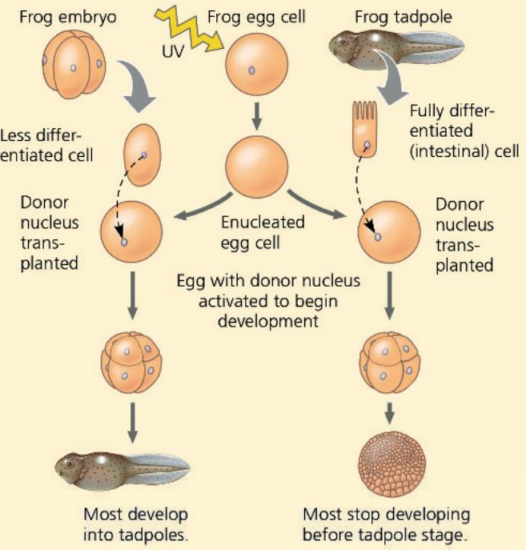

#### [EN] Results

When the transplanted nuclei came from an early embryo, the cells of which are relatively undifferentiated, most of the recipient eggs developed into tadpoles. But when the nuclei came from the fully differentiated intestinal cells of a tadpole, fewer than 2% of the eggs developed into normal tadpoles, and most of the embryos stopped developing at a much earlier stage.

#### [EN] Conclusion

The nucleus from a differentiated frog cell can direct development of a tadpole. However, its ability to do so decreases as the donor cell becomes more differentiated, presumably because of changes in the nucleus.

Data from J. B. Gurdon et al., The developmental capacity of nuclei transplanted from keratinized cells of adult frogs, Journal of Embryology and Experimental Morphology 34:93–112 (1975).

WHAT IF? If each cell in a four-cell embryo was already so specialized that it was not totipotent, what results would you predict for the experiment on the left side of the figure?
For suggested answer, see Appendix A.

Figure 20.17 Reproductive cloning of a mammal by nuclear transfer.

Dolly, shown here as a lamb, has a very different appearance from her surrogate mother, standing beside her.

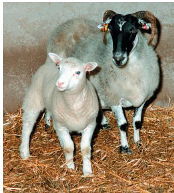

of the original transplanted nucleus. Reprogramming involves epigenetic changes that lead to changes in chromatin structure (see Concept 18.2), to be discussed shortly.

Since that time, researchers have cloned many other mammals, including mice, cats, cows, horses, pigs, and dogs. In 2018, Chinese biologists reported the first cloning of a primate, the long-tailed macaque, using the same technique that was used to clone Dolly the sheep. Then, in 2019, a different team of researchers in China announced that they had been able to culture macaque embryos in the lab, without using a surrogate mother, for 20 days after fertilization. In this case, the aim was to be able to observe early embryonic events that cannot normally be seen. However, in most cases, the research goal has been the production of new individuals, known as reproductive cloning.

We have learned from such experiments that cloned animals of the same species are not always identical. For example, in 2016, scientists examined four 7- to 9-year-old clones genetically identical to Dolly and concluded that, unlike Dolly, they were healthy and aging normally. Another example of nonidentity in clones is the first cloned cat, named CC for Carbon Copy (Figure 20.18). The color and pattern of her calico coat differed

Figure 20.18 CC (“Carbon Copy”), the first cloned cat (right), and her single parent.

Rainbow (left) donated the nucleus in a cloning procedure that resulted in CC. However, the two cats are not identical: Rainbow is a classic calico cat with orange patches on her fur and has a “reserved personality,” while CC has a gray and white coat and is more playful.

from that of her single female parent because of random X chromosome inactivation, which is a normal occurrence during embryonic development (see Figure 15.8). And identical human twins, which are naturally occurring “clones,” are always slightly different. Clearly, environmental influences and random phenomena play a significant role during development.

#### [EN] Epigenetic Differences in Cloned Animals

In most nuclear transplantation studies thus far, only a small percentage of cloned embryos develop normally to birth. And like Dolly, many cloned animals exhibit defects. Cloned mice, for instance, are prone to obesity, pneumonia, liver failure, and premature death. Scientists assert that even cloned animals that appear normal are likely to have subtle defects.

Researchers have uncovered some reasons for the low efficiency of cloning and the high incidence of abnormalities. In the nuclei of fully differentiated cells, a small subset of genes is turned on and expression of the rest of the genes is repressed. This regulation often is the result of epigenetic changes in chromatin, such as acetylation of histones or methylation of DNA (see Figure 18.7). During the nuclear transfer procedure, many of these changes must be reversed in the later-stage nucleus from a donor animal for genes to be expressed or repressed appropriately in earlier stages of development. Researchers have found that the DNA in cells from cloned embryos, like that of differentiated cells, often has abnormally high numbers of methyl groups. This finding suggests that the reprogramming of donor nuclei requires more accurate and complete chromatin restructuring than occurs during cloning procedures. Because DNA methylation helps regulate gene expression, misplaced or extra methyl groups in the DNA of donor nuclei may interfere with the pattern of gene expression necessary for normal embryonic development. In fact, the success of a cloning attempt may depend in large part on whether or not the chromatin in the donor nucleus can be artificially modified to resemble that of a newly fertilized egg.

#### [EN] Stem Cells of Animals

Progress in cloning mammalian embryos, including primates, has heightened speculation about the cloning of humans, which has not yet been achieved past very early embryonic stages. The main reason researchers have been trying to clone human embryos is not for reproduction, but for the production of stem cells to treat human diseases. Recall that a stem cell is a relatively unspecialized cell that can both reproduce itself indefinitely and, under appropriate conditions, differentiate into specialized cells of one or more types (Figure 20.19, on the next page).

#### [EN] Embryonic and Adult Stem Cells

Many early animal embryos contain stem cells capable of giving rise to differentiated cells of any type. Stem cells can be isolated from early embryos at a stage called the blastula stage or its human equivalent, the blastocyst stage. In culture, these embryonic stem (ES) cells reproduce indefinitely, and depending on culture conditions, they can be made to differentiate into a wide variety of specialized cells (Figure 20.20), including even eggs and sperm.

The adult body also has stem cells, which serve to replace nonreproducing specialized cells as needed. In contrast to ES cells,

Figure 20.19 How stem cells maintain their own population and generate differentiated cells.

  
Figure 20.20 Working with stem cells.

Animal stem cells, which can be isolated from early embryos or adult tissues and grown in culture, are self-perpetuating, relatively undifferentiated cells. Embryonic stem cells are easier to grow than adult stem cells and can theoretically give rise to all types of cells in an organism. The range of cell types that can arise from adult stem cells is not yet fully understood.

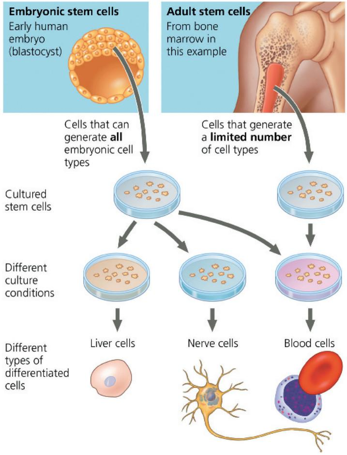

adult stem cells are not able to give rise to all cell types in the organism, though they can generate several defined types. For example, one of the several types of stem cells in bone marrow can generate all the different kinds of blood cells (see Figure 20.20), and another type of bone marrow stem cell can differentiate into bone, cartilage, fat, muscle, and the linings of blood vessels. To the surprise of many, the adult brain has been found to contain stem cells that continue to produce certain kinds of nerve cells there. Researchers have also reported finding stem cells in skin, hair, eyes, and dental pulp. Although adult animals have only tiny numbers of stem cells, scientists are learning to identify and isolate these cells from various tissues and, in some cases, to grow them in culture. With the right culture conditions (for instance, the addition of specific growth factors), cultured stem cells from adult animals have been made to differentiate into various defined types of specialized cells, although none are as versatile as ES cells.

Research with embryonic or adult stem cells is a source of valuable data about differentiation and has enormous potential for medical applications. The ultimate aim is to supply cells for the repair of damaged or diseased organs: For example, insulin-producing pancreatic cells for people with type 1 diabetes or certain kinds of brain cells for people with Parkinson's disease or Huntington's disease. Adult stem cells from bone marrow have long been used in bone marrow transplants as a source of immune system cells in patients whose own immune systems are nonfunctional because of genetic disorders or radiation treatments for cancer.

The developmental potential of adult stem cells is limited to certain tissues. ES cells hold more promise than adult stem cells for most medical applications because ES cells are pluripotent, capable of differentiating into many different cell types. One source of ES cells, first reported in 2013, is cloned human blastocysts produced by transferring a nucleus from a differentiated cell into an enucleated egg (similar to cloning Dolly the sheep). Prior to that report, cells were obtained only from embryos donated by patients undergoing infertility treatments or from long-term cell cultures originally established with cells isolated from donated embryos, an issue that prompts ethical and political discussions. Although the techniques for cloning early human embryos are still being optimized and the ethics of this procedure are being actively discussed, cloned embryos represent a potential new source for ES cells that may be less controversial. Furthermore, with a donor nucleus from a person with a particular disease, researchers should be able to produce ES cells that match the patient and are thus not rejected by his or her immune system when used for treatment. When the main aim of cloning is to produce ES cells to treat disease, the process is called therapeutic cloning. Although most people believe that reproductive cloning of humans is unethical, opinions vary about the morality of therapeutic cloning.

This debate has intensified with a recent result reported by the same research team in China that previously cloned macaque embryos in the laboratory. In 2021, these researchers incorporated human stem cells into 6-day-old macaque embryos, creating so-called chimeric embryos—embryos formed by cells of two different species. Most of these chimeric embryos died, but a few (3 out of 91) persisted and had about 5% human cells. The research team described the possibility that this technology could lead to growing human organs in monkeys as a rationale for doing these experiments, but other scientists have been quite troubled by the ethical questions raised by this procedure.

#### [EN] Induced Pluripotent Stem (iPS) Cells

In another approach to producing stem cells for research and therapy, researchers succeeded in 2007 in learning how to turn back the clock in fully differentiated cells, reprogramming them to act like ES cells. Differentiated cells can be transformed into a type of ES cell by various methods, including using a modified retrovirus to introduce extra, cloned copies of four “stem cell” master regulatory genes. The “deprogrammed” cells are known as induced pluripotent stem (iPS) cells because, in using this fairly simple laboratory technique to return them to their undifferentiated state, pluripotency has been restored. The experiments that first transformed human differentiated cells into iPS cells are described in Figure 20.21. Shinya Yamanaka received the 2012 Nobel Prize in Medicine for this work, shared with John Gurdon, whose work you read about in Figure 20.16.

By many criteria, iPS cells can perform most of the functions of ES cells, but there are some differences in gene expression and other cellular functions, such as cell division. At least until these differences are fully understood, the study of ES cells will continue to make important contributions to the development of stem cell therapies. (In fact, it is likely that ES cells will always be a focus of basic research as well.) In the meantime, work is proceeding using the iPS cells that have been experimentally produced.

There are two major potential uses for human iPS cells. First, cells from patients with particular diseases have been reprogrammed to become iPS cells, which act as model cells for studying the disease and potential treatments. Human iPS cell lines have already been developed from individuals with type 1 diabetes, Parkinson's disease, Huntington's disease, Down syndrome, and many other diseases. Second, in the field of regenerative medicine, a patient's own cells could be reprogrammed into iPS cells and then used to replace nonfunctional tissues, such as cells of the retina of the eye that have been damaged by a condition called age-related macular degeneration (AMD). Because the eye is easily accessible to treatment, while being fairly well isolated from the immune and circulatory systems, AMD

#### [EN] Figure 20.21

#### [EN] Inquiry: Can a fully differentiated human cell be “deprogrammed” to become a stem cell?

#### [EN] Experiment

Shinya Yamanaka and colleagues at Kyoto University, in Japan, used a retroviral vector to introduce four genes into fully differentiated human skin fibroblast cells. The cells were then cultured in a medium that would support growth of stem cells.

  
Induced pluripotent stem (iPS) cell

#### [EN] Results

Two weeks later, the cells resembled embryonic stem cells in appearance and were actively dividing. Their gene expression patterns, gene methylation patterns, and other characteristics were also consistent with those of embryonic stem cells. The iPS cells were able to differentiate into heart muscle cells, as well as other cell types.

#### [EN] Conclusion

The four genes induced differentiated skin cells to become pluripotent stem cells, with characteristics of embryonic stem cells.

Data from K. Takahashi et al., Induction of pluripotent stem cells from adult human fibroblasts by defined factors, Cell 131:861–872 (2007).

WHAT IF? Patients with diseases such as heart disease or Alzheimer's could have their own skin cells reprogrammed to become iPS cells. Once affordable procedures have been developed for this and for converting iPS cells into heart or nervous system cells, the patients' own iPS cells might be used to treat their disease. When organs are transplanted from a donor to a recipient, the recipient's immune system may reject the transplant, a dangerous condition. Would using iPS cells be expected to carry the same risk? Why or why not? Given that these cells are actively dividing, undifferentiated cells, what risks might this procedure carry?

For suggested answer, see Appendix A.

and other sight disorders have been a frequent target of stem cell therapy. For instance, in the last decade, researchers have made iPS cells from skin or other cells from patients with AMD, caused them to differentiate into retinal cells, and implanted them into the patients' retinas. Thus far, there have been mixed results, depending in part on the source of the iPS cells. At best, deterioration of the patient's vision has been stopped, but some patients have experienced further loss of vision caused by factors associated with the procedure. Whether or not this approach will succeed, and be affordable enough for standard treatment, is still unknown.

Over time, the procedure may become less expensive, and some researchers have suggested creating a bank for storage of donor iPS cells that could be matched to patients' tissues. Development of techniques that direct iPS cells to become specific cell types for regenerative medicine is an area of intense research. If the challenges are met, iPS cells created in this way could eventually provide tailor-made "replacement" cells for patients without using any human eggs or embryos, thus circumventing most ethical objections.

#### [EN] Concept Check 20.3

1. Based on current knowledge, how would you explain the difference in the percentage of tadpoles that developed from the two kinds of donor nuclei in Figure 20.16?

2. A few companies in China and South Korea provide the service of cloning dogs, using cells from their clients' pets to provide nuclei in procedures like that in Figure 20.17. Should their clients expect the clone to look identical to their original pet? Why or why not? What ethical questions does this bring up?

3. MAKE CONNECTIONS Based on what you know about muscle differentiation (see Figure 18.18) and genetic engineering, propose the first experiment you might try if you wanted to direct an embryonic stem cell or iPS cell to develop into a muscle cell.

For suggested answers, see Appendix A.

<!-- C-END Campbell 20.3 -->

## 6.3 蛋白质及 RNA 相互作用技术

## 6.3.1 酵母单杂交系统

酵母单杂交系统(yeast one-hybrid system)是20世纪90年代中期发展起来的新技术，可识别稳定结合于DNA上的蛋白质，可在酵母细胞内研究真核生物中DNA-蛋白质之间的相互作用，并通过筛选DNA文库直接获得靶序列相互作用蛋白的编码基因。此外，该

图 6-18 酵母单杂交的基本原理示意图

转录调控因子与顺式作用元件结合，激活最基本启动子 $P_{min}$ ，使报告基因表达。若连接入3个以上顺式作用元件，可增强转录因子的识别和结合效率。

体系也是分析鉴定细胞中转录调控因子与顺式作用元件相互作用的有效方法。

酵母单杂交的基本原理如图 6-18 所示, 首先将已知的特定顺式作用元件构建到最基本启动子 (minimal promoter, $P_{min}$ ) 的上游, 把报告基因连接到 $P_{min}$ 下游。然后, 将编码待测转录因子 cDNA 与已知酵母转录激活结构域 (transcription activation domain, AD) 融合表达载体导入酵母细胞, 该基因产物如果能够与顺式作用元件相结合, 就能激活 $P_{min}$ 启动子, 使报告基因得到表达。

目前,酵母单杂交体系主要用来确定某个 DNA 分子与某个蛋白质之间是否存在相互作用,用于分离编码结合于特定顺式作用元件或其他 DNA 位点的功能蛋白编码基因,验证反式转录调控因子的 DNA 结合结构域,准确定位参与特定蛋白质结合的核苷酸序列。由于该方法的敏感性和可靠性,现已被广泛用于克隆细胞中含量极低且用生化手段难以纯化的那部分转录调控因子。常用的酵母单杂交体系基本选用 HIS3 或 LacZ 作为报告基因,虽然有的体系将带有报告基因的载体直接整合于酵母染色体上,大部分实验中报告基因都位于质粒 DNA 上。图 6-19 是利用酵母单杂交体系和已知的顺式作用元件 DRE 从

图 6-19 从拟南芥 cDNA 文库中筛选与顺式作用元件 DRE 相结合的转录因子示意图

拟南芥 cDNA 文库中筛选转录调控因子的基本流程。若将不同的未知基因与酵母 GAL4 的 DNA 结合结构域相融合，通过检测位于 GAL4 顺式作用元件下游的报告基因的表达状况，还可以鉴定出该转录因子是否具有转录激活功能。

## 6.3.2 酵母双杂交系统

酵母双杂交系统（yeast two-hybrid system）巧妙地利用真核生物转录调控因子的组件式结构(modular)特征，因为这些蛋白质往往由两个或两个以上相互独立的结构域构成，其中DNA结合结构域（binding domain, BD）和转录激活结构域（AD）是转录激活因子发挥功能所必需的。单独的BD能与特定基因的启动区结合，但不能激活基因的转录，而由不同转录调控因子的BD和AD所形成的杂合蛋白却能行使激活转录的功能。实验中，首先运用基因重组技术把编码已知蛋白的DNA序列连接到带有酵母转录调控因子(常为GAL1、GAL4或GCN1)BD结构域基因片段的表达载体上。导入酵母细胞中使之表达带有DNA结合结构域的杂合蛋白，与报告基因上游的启动调控区相结合，准备作为“诱饵”捕获与已知蛋白相互作用的基因产物。此时，若将已知的编码转录激活结构域AD的基因片段分别与待筛选的cDNA文库中不同插入片段相连接，获得“猎物”

载体,转化含有“诱饵”的酵母细胞,只要酵母细胞中表达的“诱饵”蛋白与“猎物”载体中表达的某个蛋白质发生相互作用,不同转录调控因子的AD和BD结构域就会被牵引靠拢,激活报告基因表达。分离有报告基因活性的酵母细胞,得到所需要的“猎物”载体,就能得到与已知蛋白质相互作用的新基因(图6-20)。

图 6-20 酵母双杂交技术原理示意图

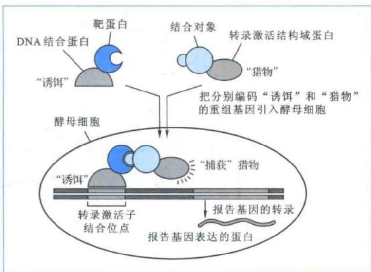

## 6.3.3 蛋白质相互作用技术

## 1. 等离子表面共振(SPR)技术

该技术是将诱饵蛋白结合于葡聚糖表面,将葡聚糖层固定于纳米级厚度的金属膜表面。当有蛋白质混合物经过时,如果有蛋白质同“诱饵”蛋白发生相互作用,那么两者的结合将使金属膜表面的折射率上升,从而导致共振角度的改变。而共振角度的改变与该处的蛋白质浓度成线性关系,由此可以检测蛋白质之间的相互作用(图6-21)。该技术不需要标记物和染料,安全灵敏快速,还可定量分析。缺点是需要专门的等离子表面共振检测仪器。

图 6-22 应用 SPR 技术研究 COI1 蛋白与 JAZ1 蛋白之间的相互作用。研究人员首先

图 6-21 离子表面共振技术示意图  
  
和 JAZ1 发生相互作用。

在葡聚糖芯片表面固定1000共振单位的茉莉酸(JA)信号通路负调控因子JAZ1蛋白,当体系中同时有茉莉酸-异亮氨酸(JA-Ile)及COI蛋白存在时,可以检测到最高达380共振单位的SPR反应信号。加入一种在结构和功能上与茉莉酸甲脂(MeJA)相似的名为冠毒素(COR)的细菌毒素,也能使COI1

## 2. 免疫共沉淀技术 (co-immuno precipitation, CoIP)

该技术的核心是通过抗体来特异性识别候选蛋白。首先，将靶蛋白的抗体通过亲和反应连接到固体基质上，再将可能与靶蛋白发生相互作用的待筛选蛋白加入反应体系中，用低离心力沉淀或微膜过滤法在固体基质和抗体的共同作用下将蛋白复合物沉淀到试管

图 6-22 等离子表面共振技术(SPR)研究 COI1 蛋白与 JAZ1 蛋白之间的相互作用

(a) 只有同时加入JA-Ile和COI蛋白后，可以检测到最高380共振单位的SPR反应信号。(b) 加入冠毒素(COR)，也能使COI1和JAZ1发生相互作用，而加入JA、MeJA和邻苯二胺(OPDA)等都无效。

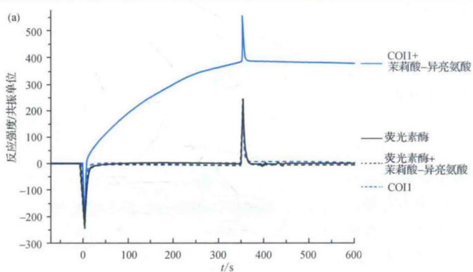

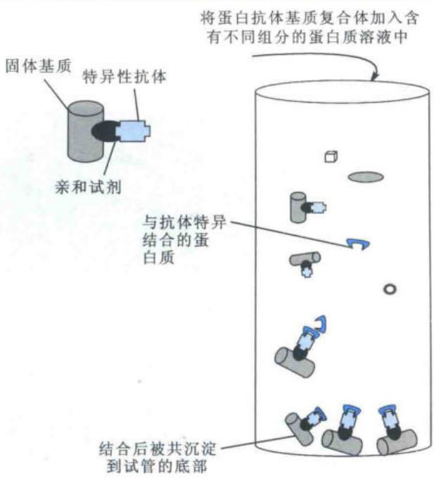  
图 6-23 免疫共沉淀示意图

的底部或微膜上。如果靶蛋白与待筛选蛋白质发生了相互作用,那么,这个待筛选蛋白质就通过靶蛋白与抗体和固体基质相互作用而被分离出来(图6-23)。

免疫共沉淀实验中常用 pGADT7 和 pGBKT7 质粒载体分别以融合蛋白形式表达靶蛋白，体外转录、翻译后将产物混合温育，分别用 Myc 或 HA 抗体沉淀混合物，过柱后再用 SDS-PAGE 电泳分离，检测两个靶蛋白之间是否存在相互作用 $^{(图6-24)}$ 。实验表明，棉花乙烯合成酶 ACS2 与钙离子依赖性蛋白激酶 CDPK1 之间存在相互作用，而该蛋

  
图6-24 c-Myc-ACS2以及HA-CDPK1免疫共沉淀载体构建流程图

白与 CDPK32 及 CRK5 没有发生相互作用。ACO1 与这 3 个蛋白都没有发生相互作用 $^{(图6-25)}$ 。

## 3. GST 及 GAD 融合蛋白沉降技术

该技术利用 GST 对谷胱甘肽偶联的琼脂糖球珠的亲和性,从混合蛋白质样品中纯化得到相互作用蛋白(图 6-26)。GST 沉降试验通常有两种应用:确定探针蛋白与未知蛋白间的相互作用,确证探针蛋白与某个已知蛋白质之间的相互作用。与此相类似,实验中把 GAD 与 PIF3 的不同区段相连接成为钓饵,研究该重组蛋白在体外与光敏素 B (phyB)、其缺失 N-37 位氨基酸的突变体或光敏素 A (phyA) 的相互作用情况。研究发现,光敏素 B (phy

## 图 6-25 免疫共沉淀实验

结果表明棉花乙烯合成酶 ACS2 与钙离子依赖性蛋白激酶 CDPK1 之间存在相互作用。ACO1 不与 CDPK1 发生相互作用。

图 6-26 GST 融合蛋白沉降技术流程  

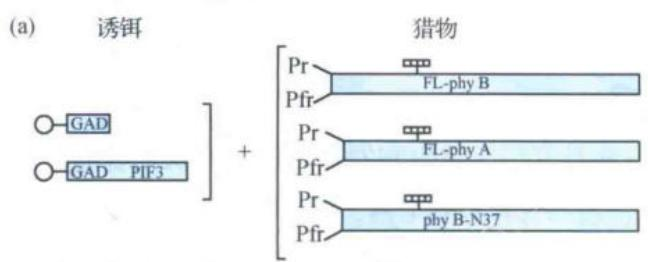  
图 6-27 体外融合蛋白沉降研究表明
光敏素 B (phyB) 能与 PIF3 发生强烈的相互作用, 但缺失 N-37 位氨基酸的 phyB 突变体以及光敏素 A (phyA) 只能与 PIF3 发生较弱的相互作用。

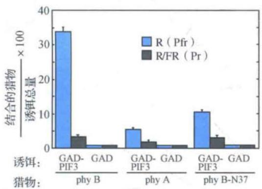

B) 能与 PIF3 发生强烈的相互作用 (超过 30% 的光敏素 B 能被 PIF3 沉淀下来), 但缺失 N-37 位氨基酸的 phy B 突变体以及光敏素 A (phy A) 只能与 PIF3 发生较弱的相互作用, 约 5% 的光敏素 A, 或约 10% 的 N-37 位氨基酸缺失突变光敏素 B 能被沉淀下来 (图 6-27)。

## 4. 细胞内蛋白质相互作用研究——荧光共振能量转移(FRET)

FRET 现象是 21 世纪初叶发现的。FRET 荧光能量给体与受体之间通过偶极－偶极耦合作用以非辐射方式转移能量的过程又称为长距离能量转移，有 3 个基本条件：

① 给体与受体在合适的距离(1\~10 nm);

② 给体的发射光谱与受体的吸收光谱有一定的重叠(这是能量匹配的条件);

③ 给体与受体的偶极具有一定的空间取向(这是偶极-偶极耦合作用的条件)。

FRET需要有两个探针,即荧光给体和荧光受体,要求给体的发射光谱与受体的吸收光谱有部分重叠,而与受体的发射光谱尽量没有重叠。常用的探针有3种:荧光蛋白、传统有机染料和镧系染料。

荧光蛋白是一类能发射荧光的天然蛋白或突变体,常见的有绿色荧光蛋白(GFP)、蓝色荧光蛋白(BFP)、青色荧光蛋白(CFP)和黄色荧光蛋白(YFP)等。不同蛋白质的吸收和发射波长不同,可根据需要组成不同的探针对。

传统有机染料是指一些具有特征吸收和发射光谱的有机化合物组成的染料对。常见的有荧光素、罗丹明类化合物和青色染料 Cy3、Cy5 等，该类染料分子体积较小，种类较多且大部分为商品化的分子探针染料，因此被广泛应用。镧系染料一般与有机染料联合使用，分别作为 FRET 的给体或受体，检测的准确性和信噪比较之传统染料有提高。

研究蛋白质间相互作用时, FRET 一般与荧光成像技术联用, 将蛋白质标记上荧光探针, 当蛋白质间不发生相互作用时, 其相对距离较大, 无 FRET 现象, 而蛋白质发生相互作用时, 其相对距离缩小, 有 FRET 现象发生 $^{(图 6-28)}$ , 可根据成像照片的色彩变化直观地记录该过程。

图 6-28 荧光共振能量转移

## 6.3.4 染色质免疫共沉淀技术

染色质免疫共沉淀(chromatin immuno precipitation, ChIP)技术是一项新发展的研究活体细胞内染色质DNA与蛋白质相互作用的技术，图6-29显示其主要实验流程：在活细胞状态下固定蛋白质-DNA复合物，并通过超声或酶处理将其随机切断为一定长度的染色质小片段，然后通过抗原抗体的特异性识别反应，沉淀该复合体，从而富集与目的蛋白相结合的DNA片段。对目的片段进行纯化和测序分析，就能获知与目的蛋白发生相互作用的DNA序列信息，包括DNA序列特征、在基因组上的位置、结合亲和程度(结合强度)以及对基因表达的影响等(图6-30)。

ChIP 技术不仅可以用来检测体内转录调控因子与 DNA 的动态作用, 还可以研究组蛋白的各种共价修饰与基因表达的关系, 定性或定量检测体内转录因子与 DNA 的动态作用。如果能将你所研究的目的蛋白定位到染色质 DNA 上某个或某些功能基因的启动子区或附近, 对于确定你所感兴趣的蛋白质的生物学功能可能会是一次质的飞跃。

## 6.3.5 RNAi 技术及其应用

RNAi(RNA interference, RNA 干涉)技术利用双链小 RNA 高效、特异性降解细胞内同源 mRNA 从而阻断靶基因表达，使细胞出现靶基因缺失的表型。研究发现，对线虫注射外源双链 RNA(double-stranded RNA)可诱发与该 RNA 高度同源的基因序列的特异性“沉默”。现在已经知道，RNAi 是一个多步骤反应过程，包括对触发物的加工、与目标 mRNA 的结合以及目标 mRNA 的降解。至今已在果蝇、锥虫、涡虫、线虫等许多动物及大部分植物中陆续发现了 RNAi 效应。

图 6-29 染色质免疫共沉淀技术主要实验流程示意图  
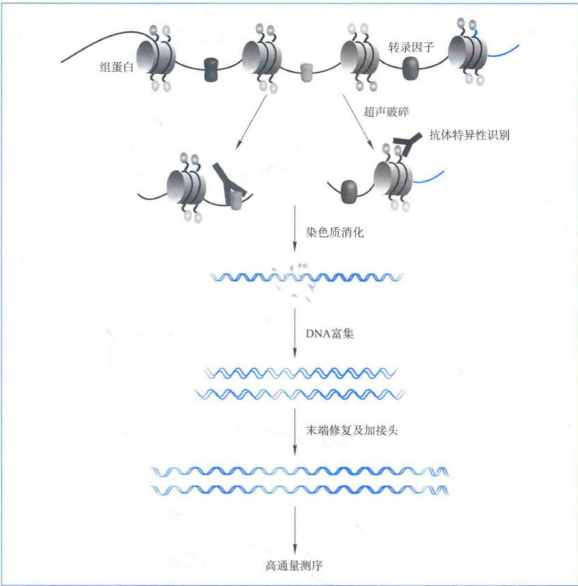

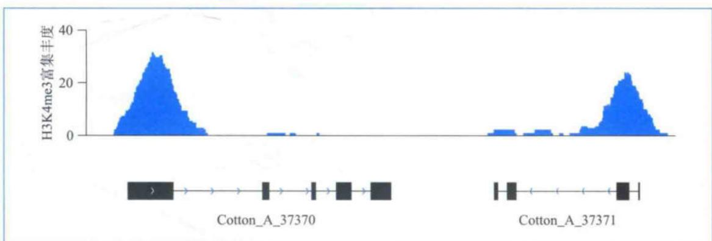  
图 6-30 用组蛋白修饰抗体 H3K4me3 研究棉花全基因组水平上的组蛋白修饰水平  
蓝色的峰表示组蛋白在基因组特定区域的富集，示意图中用黑框表示外显子，用连接线表示内含子。箭头表示基因转录方向。

双链 RNA 是 RNAi 的触发物, 引发与之互补的单链 RNA (ssRNA, single-stranded RNA) 的降解。经过 Dicer (一种具有 RNAase Ⅲ活性的核酸酶) 的加工, 细胞中较长的外源双链 RNA(30 个核苷酸以上)首先被降解形成 21\~25 个核苷酸的小分子干扰核糖核酸 (siRNA, short interfering RNA), 并有效地定位目标 mRNA。因此, siRNA 是导致基因沉默和序列特异性 RNA 降解的重要中间媒介。较短的双链 RNA 不能被有效地加工为 siRNA, 因而不能介导 RNAi。siRNA 具有特殊的结构特征, 即 5' 端磷酸基团和 3' 端的羟基, 其两条链的 3' 端各有两个碱基突出于末端。由 siRNA 中的反义链指导合成一种被称为 RNA 诱导的沉默复合体 (RISC) 的核蛋白体, 再由 RISC 介导切割目的 mRNA 分子中与 siRNA 反义链互补的区域, 从而实现干扰靶基因表达的功能 (图 6-31)。siRNA 还可作为特殊引物, 在依赖于 RNA 的 RNA 聚合酶的作用下, 以目的 mRNA 为模板合成 dsRNA, 后者又可被降解为新的 siRNA, 重新进入上述循环。因此, 即使外源 siRNA 的注入量较低, 该信号也可能迅速被放大, 导致全面的基因沉默。

在哺乳动物细胞内,较长的 dsRNA 会导致非特异性基因沉默,只有 21\~25 个核苷酸的 siRNA 才能有效地引发特异性基因沉默。非哺乳动物细胞可以利用较长的双链 RNA直接诱导产生 RNAi 而无须合成 siRNA, 因此, 设计非哺乳动物细胞 RNAi 实验的步骤比较简便, 只要通过目的基因体外转录得到所需要的 dsRNA, 再通过浸泡、注射或转染靶细胞即可实现 RNAi。

图 6-31 RNAi 作用机制示意图  
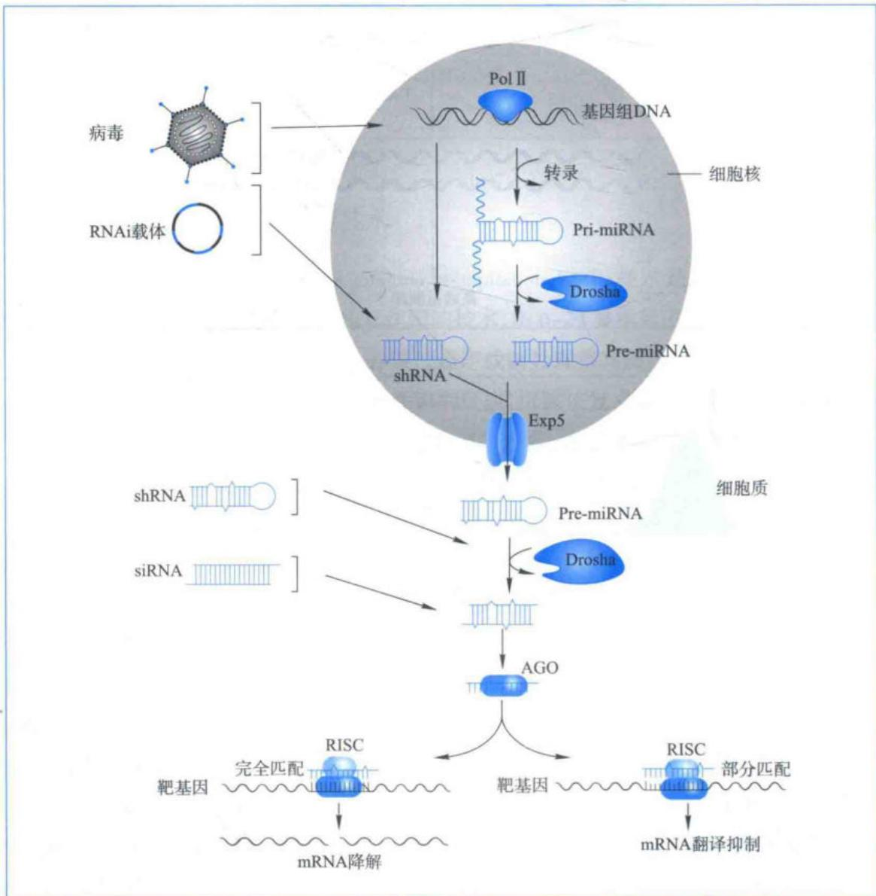

## 6.4 在酵母细胞中鉴定靶基因功能

酿酒酵母作为单细胞真核生物,具有和动植物细胞相似的结构特征,包括细胞核、内质网、高尔基体、线粒体、过氧化物酶体、细胞骨架等,而且其细胞生长发育过程和动植物细胞也有很高的相似性,很多基因在酵母和动植物细胞中是高度保守的。而且,酵母细胞很容易进行生物化学和分子生物学操作,因此,酵母是基因功能研究中常用的模式生物。

## 6.4.1 酵母基因转化与性状互补

利用Yip(整合型质粒)可以对酵母基因组中的任意基因进行精确的敲除(置换),并通过孢子繁殖中的四分体分析技术进行观测和研究。带有致死突变位点和可能的外源功能互补基因的酵母二倍体细胞在饥饿条件下形成四分体孢子,将这4个孢子用酵母四分体分离系统分开,如果所引入的外源基因具备互补突变位点的功能,含有突变基因的单倍体可以存活,否则就不能存活。图6-32中将多个棉花KCS基因(编码超长链脂肪酸合

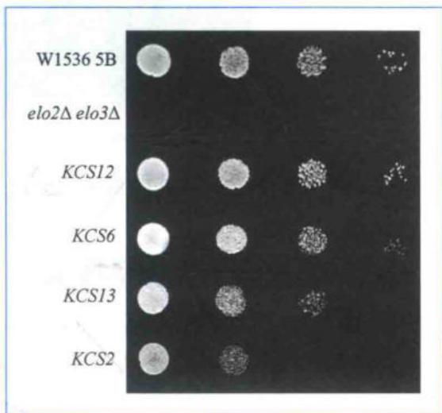  
图 6-32 棉花不同 KCS 基因互补酵母 elo2Δelo3Δ 突变体细胞程度分析  
W1536 5B 为野生型单倍体细胞；elo2 Δelo3 Δ为酵母自身的超长链脂肪酸合成酶双突变的单倍体，为致死型；KCS12、KCS6、KCS2、KCS13 为不同的棉花 KCS 基因。

成酶)克隆到含有 URA3 筛选标记的表达质粒上,用带有 URA3 筛选标记的表达质粒替换带有 TRP1 筛选标记的质粒,实验发现,KCS12 和 KCS6 基因都能完全互补野生型的表型,KCS13 和 KCS2 虽然没有导致野生型的表型,但仍能使酵母细胞恢复生长,表明这些 KCS 基因都具备与 elo2 或 elo3 相似功能。

## 6.4.2 外源基因在酵母中的功能鉴定

将外源基因克隆于酵母表达载体上,转化野生型或突变酵母菌株,通过观察酵母的表型变化或分析细胞中化学成分的变化即可推测该基因的生物学功能。例如,在酵母细胞中表达外源基因与绿色荧光蛋白基因的融合蛋白后,可通过荧光显微镜观察荧光所在的亚细胞区域,从而了解该基因产物在细胞中的定位。将棉花中可能编码超长链脂肪酸合成酶的基因GhKCS转入野生型酵母细胞中,诱导该基因的表达,然后用气相色谱和质谱技术分析细胞的脂肪酸组成,在带有棉花基因的酵母细胞中出现C22:0饱和脂肪酸,证明该基因编码了合成C22:0类型的超长链脂肪酸合成酶(图6-33)。因为酵母细胞中有与动植物细胞比较接近的蛋白质转录后修饰系统,许多在大肠杆菌中不产生功能蛋白质的动植

图 6-33 用气相色谱法检测基因功能

将棉花超长链脂肪酸合成酶基因 GhKCS 转入到酵母细胞后，用气相色谱证明细胞抽提物中载体转入酵母细胞后，与野生型酵母细胞比较发现，C22:0 大量增加，C24:0 和 C26:0 大量减少，说明该基因编码的蛋白质可能主要负责合成 C22:0 类型的超长链脂肪酸。

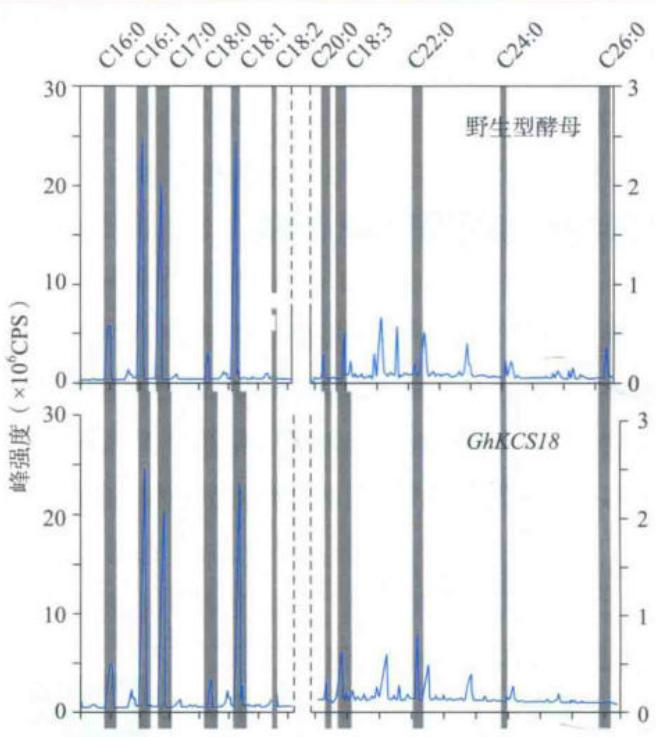

物基因在酵母中表达后往往能正常发挥其生物学功能。

## 6.5 其他分子生物学技术

## 6.5.1 凝胶滞缓实验

凝胶滞缓试验(electrophoretic mobility shift assay, EMSA)是体外分析DNA与蛋白质相互作用的一种特殊的凝胶电泳技术。其基本原理是，蛋白质与DNA结合后将大大增加相对分子质量，而凝胶电泳中DNA朝正电极移动的距离与其相对分子质量的对数成正比，因此，没有结合蛋白质的DNA片段迁移得快，而与蛋白质形成复合物的DNA由于受到阻滞而迁移得慢。历史上，该技术首次为大肠杆菌乳糖阻遏物与其DNA结合位点的相互作用提供了动态数据。实验中，当特定的DNA片段与细胞提取物混合后，若该复合物在凝胶电泳中的迁移速率变小，就说明该DNA可能与提取物中某个蛋白质分子发生了相互作用。这一方法简单、快捷，是分离纯化特定DNA结合蛋白质的经典实验方法。

在 EMSA 试验中,用放射性同位素标记待检测的 DNA 片段(即探针 DNA),然后与细胞提取物共温育,形成 DNA-蛋白质复合物,将该复合物加到非变性聚丙烯酰胺凝胶中进行电泳。通常用 $^{32}\mathrm{P}$ 标记 DNA 分子,而不标记蛋白质。电泳结束后,用放射自显影技术显现具放射性标记的 DNA 条带位置。如果细胞蛋白提取物中不存在与同放射性标记的 DNA 探针相结合的蛋白质,那么所有放射性标记都将出现在凝胶的底部;反之,将会形成 DNA-蛋白质复合物,由于受到凝胶阻滞的缘故,放射性标记的 DNA 条带就会出现在凝

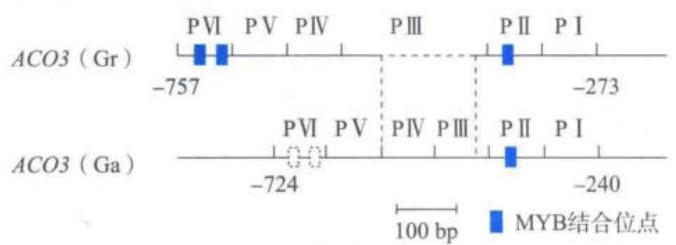

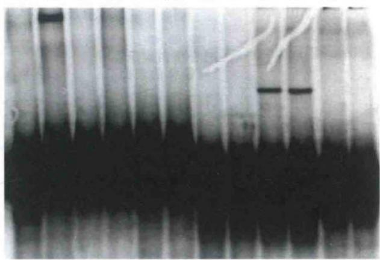  
胶的不同部位(图 6-34)。

图 6-34 棉花乙烯合成酶 ACO3 基因上游启动子不同区域 (P I \~ PVI) 在亚洲棉 (Ga) 和雷蒙德棉 (Gr) 两种不同棉花材料结合蛋白质能力的比较

最下面的为没有结合蛋白质的自由探针，探针为 $\gamma-^{32}P$ 同位素标记。

## 6.5.2 噬菌体展示技术

噬菌体是细菌病毒的总称,英文为 bacteriophage,来源于希腊文“phagos”,有“吞噬”之意。噬菌体可在脱离宿主细胞的状态下保持自己的生命,但一旦脱离了宿主细胞,它们就既不能生长也不能复制,因为大多数的噬菌体只能利用宿主核糖体、合成蛋白质的因子、各种氨基酸及能量代谢体系进行生长和增殖。噬菌体可被分为溶菌周期和溶原周期两种不同的类型。在溶菌周期,噬菌体将其感染的宿主细胞转变成为噬菌体的“制造厂”,产生出大量的子代噬菌体颗粒。实验室常将只具有溶菌生长周期的噬菌体叫作烈性噬菌体。而溶原周期是指噬菌体 DNA 被整合到宿主细胞染色体 DNA 上,成为它的一个组成部分,感染过程中不产生子代噬菌体颗粒。具有溶原周期的噬菌体被称为温和噬菌体。

噬菌体展示技术是将基因表达产物与亲和选择相结合的技术,其基本原理是将编码“诱饵”蛋白(研究中所发现的任何感兴趣的蛋白质)的 DNA 片段插入噬菌体基因组,并使之与噬菌体外壳蛋白编码基因相融合。该重组噬菌体侵染宿主细菌后,复制形成大量带有杂合外壳蛋白的噬菌体颗粒,直接用于捕获靶蛋白库中与“诱饵”相互作用的蛋白质(图 6-35)。噬菌体次要结构蛋白 pⅢ 和主要结构蛋白(外壳蛋白)pⅧ均可作为载体来展示外源多肽。pⅢ 基因融合时表达强度低(每个噬菌体上有不超过 5 个拷贝),与 pⅧ 基因融合时,表达强度高(每个噬菌体外壳上可能有 2700\~3000 个拷贝)。在 pⅢ 和 pⅧ 基因的信号肽与成熟蛋白质编码区之间都有单一的克隆位点便于外源基因插入,表达的融合蛋白被分泌到细胞间质并由宿主蛋白酶切除信号肽,融合蛋白被作为结构外壳蛋白呈现到病

图6-35 噬菌体展示技术研究蛋白质相互作用  

毒粒子的表面。

直接法亲和筛选是将靶蛋白质分子耦联到固相支持物上,文库噬菌体与固相支持物温育后洗去未结合的噬菌体,即获得与所筛选蛋白有亲和性的噬菌体。间接法亲和筛选是将生物素标记的蛋白质分子与文库噬菌体温育后铺在含有链霉亲和素(能与生物素相结合)的平皿上,洗去未结合的噬菌体,保留在平皿上的就是结合状态的噬菌体。洗脱结合状态噬菌体后感染细菌,扩增噬菌体,开始新一轮的筛选,连续几次亲和纯化反应后就能选择性富集并扩增结合靶蛋白的噬菌体。

## 6.5.3 蛋白质磷酸化分析技术

细胞的生长发育、周期调控、基因表达、蛋白质合成以及神经功能、肌肉收缩等都离不开蛋白质特异性磷酸化，因此，由蛋白激酶和蛋白磷酸酯酶所催化的蛋白质可逆磷酸化过程，是生物体内一种普遍且重要的调节方式，控制着众多的生理生化反应和生物学过程。许多复杂的细胞信号转导系统还涉及由多个蛋白激酶所催化的磷酸化级联反应。通常蛋白激酶催化ATP或GTP的γ磷酸基团转移到底物蛋白的丝氨酸、苏氨酸或酪氨酸残基上，促使底物蛋白发生磷酸化，而蛋白磷酸酯酶则能催化底物蛋白发生去磷酸化。此外，底物蛋白的组氨酸、赖氨酸、精氨酸、天冬氨酸、谷氨酸和半胱氨酸残基上也能发生可逆磷酸化。

一般采用双向电泳及质谱分析等检测底物蛋白磷酸化。由于细胞内可能有多达上千个蛋白激酶，体内检测某个蛋白激酶活性非常困难，科学家常用体外激酶活性分析法来检

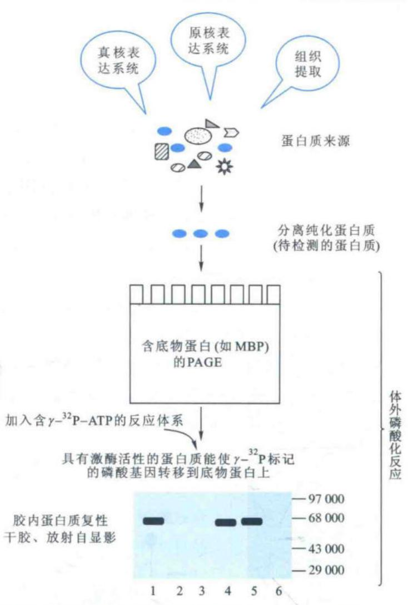

图 6-36 蛋白激酶体外磷酸化活性分析

泳道1、4和5中的蛋白质具有使蛋白质磷酸化的激酶活性，泳道2、3和6中的蛋白质不能使MBP(myelin basic protein)磷酸化。

测蛋白激酶活性。该方法能十分可靠地鉴定某个蛋白激酶对底物的磷酸化作用，筛查激酶的特异性底物。蛋白激酶体外磷酸化活性分析如图6-36所示，主要分为获取底物蛋白或待检测蛋白激酶和进行蛋白质体外磷酸化反应两步。可以直接从组织中提取目的蛋白（包括底物蛋白及待检测蛋白激酶），也可由原核或真核表达载体诱导表达目的蛋白。如图6-37所示，将体外表达的棉花钙离子依赖性蛋白激酶CDPK1与乙烯合成酶ACS2置于蛋白质体外磷酸化实验体系中,研究发现,有钙离子存在时,ACS2能被有效地磷酸化,ACO1及SUS蛋白则不能被磷酸化。

  
图 6-37 体外蛋白激酶磷酸化特异性分析  
有钙离子存在时,蛋白激酶 CDPK1 能磷酸化乙烯合成酶 ACS2,但 ACO1 及 SUS 蛋白都不能被磷酸化。

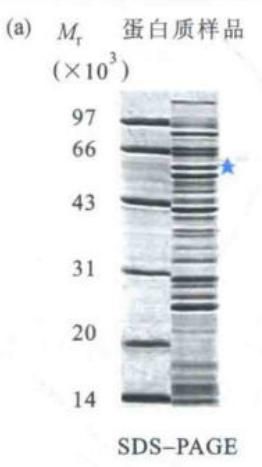

转膜  

## 6.5.4 蛋白质免疫印迹实验

蛋白质免疫印迹(Western blotting)是20世纪70年代末80年代初在蛋白质凝胶电泳和固相免疫测定基础上发展起来的一种技术,是分子生物学中最常用的蛋白质研究技术,为检测样品中是否存在蛋白抗原提供了一种可靠的方法。该方法的基本原理是被测蛋白质只能与标记的特异性抗体相结合,而这种结合不改变该蛋白质在凝胶电泳中的相对分子质量。免疫印迹法具有高效、简便、灵敏等特点,能被用于测定抗原的相对丰度或与其他已知抗原的关系,也是评价新抗体特异性的一种好方法。

免疫印迹程序可分为5个步骤:①蛋白质样品的制备;②SDS-PAGE电泳分离样品;③将已分离的蛋白质转移到尼龙或其他膜上,转移后首先将膜上未反应的位点封闭起来以抑制抗体的非特异性吸附;④用固定在膜上的蛋白质作为抗原,与对应的非标记抗体(一抗)结合;⑤洗去未结合的一抗,加入酶偶联或放射性同位素标记的二抗,通过显色或放射自显影法检测凝胶中的蛋白质成分(图6-38)。

图 6-38 Western blotting 示意图  
(b)  
  
蛋白质电泳(打蓝色星号者为目的蛋白)

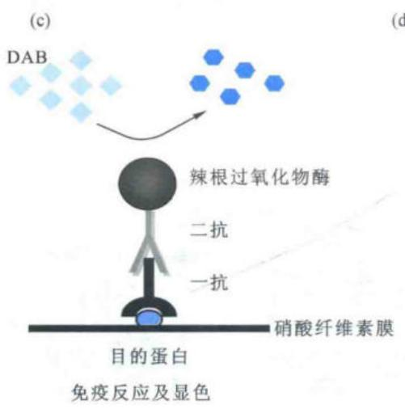  
(d)

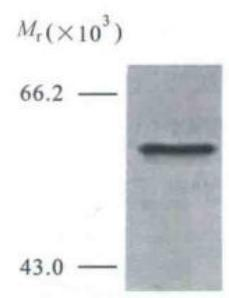  
目的蛋白Western blotting结果

影响免疫印迹成败的一个主要因素是抗原分子中可被抗体识别的表位性质,所以,在选择抗体(一抗)时要考虑所选抗体是否能识别凝胶电泳后转印到膜上的变性蛋白,以及所选抗体是否会引起交叉反应。第二个影响因素是蛋白原液中的抗原浓度。对于中等相对分子质量的蛋白质 $(5\times10^{4}$ 左右)其浓度需大于0.1 ng才能被检出。如果要检测更低量的蛋白质,样品要做进一步的纯化。

## 6.5.5 细胞定位及染色技术

真核生物具有非常复杂的亚细胞结构,每种亚细胞结构或细胞器均含有特定的蛋白质。蛋白质在组织及细胞内的亚定位,一直是细胞生物学和分子生物学研究的核心问题,因为了解特定蛋白质的定位,才有可能了解其生物学功能。研究细胞定位可采取多种方法,最常用的是荧光蛋白标记和免疫荧光法。

最常用的可能是绿色荧光蛋白(GFP)，它由238个氨基酸组成，有两个吸收峰，主要吸收峰在395 nm，另一个则在475 nm，前者由紫外光激发，后者由蓝光激发。发射光也有两个峰值，分别是509 nm和540 nm，呈绿色或黄绿色荧光。将绿色荧光蛋白的编码序列与目的基因启动子融合形成嵌合基因，或者将绿色荧光蛋白编码序列与目的蛋白编码序列直接相连接，构成融合基因，通过花序浸染法、基因枪、显微注射法、愈伤组织转化法、细胞转染等技术，转染植物组织或动物细胞，由于融合基因与目的基因表达模式相同（使用相同的表达调控元件），通

  
图 6-39 野生型拟南芥中 $WOX5_{pro}::GFP$ 融合基因的表达(另见书末彩插)  
将 AtWOX5 的启动子序列与 GFP 的编码序列融合, 构建植物转化载体, 通过花序浸染法转化野生型拟南芥。在 WOX5 启动子的指导下, GFP 基因表达, 指示 WOX5 蛋白应定位于根端分生组织 (RAM) 的静止中心 (QC); 红色荧光: 用 PI 对细胞壁染色; 绿色荧光: GFP 自发荧光。

过荧光显微镜观察 GFP 在组织或亚细胞中的分布就相应确定了目的蛋白在细胞中的定位 $^{(图6-39)}$ 。

免疫荧光技术是将免疫学方法(抗原抗体特异结合)与荧光标记技术结合起来研究

特异蛋白抗原在细胞内定位的方法。用针对特异蛋白抗原的荧光标记抗体作为分子探针检测细胞或组织内的相应抗原，由于所形成的抗原抗体复合物上含有荧光素，利用荧光显微镜观察标本，确定荧光所在细胞或组织，从而对抗原蛋白进行定位(图6-40)。

  
图 6-40 结核杆菌外膜蛋白影响核转录因子 NF- $\kappa$ B 在巨噬细胞中的定位(另见书末彩插)  
用结核杆菌外膜蛋白刺激巨噬细胞 15 min，诱导在胞质定位的 NF- $\kappa$ B 分子转运到细胞核中。绿色荧光：FITC 标记 NF- $\kappa$ B 分子；蓝色荧光：DAPI 标记细胞核 DNA。

## 6.5.6 全基因组关联分析及应用

全基因组关联分析(genome-wide association study, GWAS)是一种在人类或动植物全基因组中以百万计的单核苷酸多态性(single nucleotide plodymorphism, SNP)为分子遗传标记，进行全基因组水平上的对照分析或相关性分析，通过比较发现影响复杂性状基因变异的一种新策略。1996年，Risch最早提出了GWAS设想，他认为人类复杂疾病的研究可以通过全基因组水平检测每一个基因的变异来确定疾病与基因的关联。2001年，Hansen等最早应用GWAS研究发现控制海甜菜春化抽苔基因与全基因组范围内的两个分子标记位点相关联。2005年，Science杂志报道了第一篇用GWAS研究人年龄相关性视网膜黄斑变性疾病基因网络的论文，之后GWAS在人类医学领域的研究中得到了极为广泛的应用，许多重要的复杂疾病研究因此取得了突破性进展。

GWAS 分析首先通过 SNP 分子遗传标记, 进行总体关联分析, 在全基因组范围内选择遗传变异进行基因分型, 比较实验组和对照组之间每个遗传变异及其频率的差异, 统计分析每个变异与目标性状之间的关联性大小, 选出最相关的遗传变异进行验证, 并根据验证结果最终确认其与目标性状之间的相关性。

典型的 GWAS 基本流程包括: ①建立研究群体, 选择尽可能大的样本群, 建立目标性状库; ②提取每个样本的 DNA 进行测序从而得到群体的基因型 (genotype); ③利用合适的统计模型建立测序得到的 SNPs 和目标性状的关联性; ④最终实验确认与目标性状之间的相关性。近年来, 该方法在农业动植物重要经济性状主效基因的筛查和鉴定中得到了广泛应用。图 6-41 所示为 GWAS 应用于研究棉花种子油产量高低, 通过 GWAS 鉴定得到了同时控制棉花种子油棕榈酸 (C16:0) 和棕榈油酸 (C16:1) 含量的高低与棉花基因组 11 号染色体上的 SNP 相关联, 最高的 SNP 位点位于基因 GaKAS III 的第一个外显子上, 该位点存在一个非同义突变的 SNP, 导致了精氨酸突变成半胱氨酸, 从而导致了棉花不同群体种子油分的差异。

图6-41 通过GWAS鉴定得到棉花中控制种子油棕榈酸(C16:0)和棕榈油酸(C16:1)含量的基因  

## 思考题

1. 写出用 RNA-seq 技术进行转录组学分析的原理。

2. 写出 RNA 原位杂交的主要实验过程及应用。

3. 说出免疫共沉淀实验的原理与过程, 比较酵母双杂交技术和免疫共沉淀技术在研究蛋白质相互作用方面的优缺点。

4. 简述 RNAi 技术原理以及在分子生物学领域应用的前景。

5. 写出基因定点突变的原理与实验过程。

6. 说出经典遗传学与现代遗传学的异同。

7. 假设某哺乳动物基因可能编码了超长链脂肪酸，请在酵母细胞中设计试验研究该基因的功能。

8. 简述蛋白质 Pull-down 实验原理与主要步骤。

9. 简述 CRISPR/Cas9 系统工作原理。

10. 简述染色质免疫共沉淀技术原理与基本过程。

11. 什么是完全基因敲除和条件型基因敲除。

12. 简述酵母单、双杂交系统的基本原理与应用。

13. 说出凝胶滞缓实验的原理与应用。

## 参考文献

1. 门可, 段醒妹, 杨阳, 魏于全. 基于 CRISPR/Cas9 基因编辑技术的人类遗传疾病基因治疗相关研究进展. 中国科学: 生命科学, 2017, 47(11): 1130-1140.

2. Jinek M, Chylinski K, et al. A programmable dual-RNA-guided DNA endonuclease in adaptive bacterial immunity. Science, 2012, 337:816-821.

3. Johnson D S, et al. Genome-wide mapping of in vivo protein-DNA interactions. Science, 2007, 316: 1497-1502.

4. Klein R J, et al. Complement factor H Polymorphism in age-related macular degeneration. Science, 2005, 308:385-389.

5. Peter D A, Michael O. Identification of associated proteins by coimmunoprecipitation. Nature Methods, 2005, 2:475-476.

6. Ran F A, Hsu P D, et al. Genome engineering using the CRISPR-Cas9 system. Nature Protocol, 2013, 8: 2281-2308.

7. Risch N, Merikangas K. The future of genetic studies of complex human diseases. Science, 1996, 273: 1516–1517.

8. Robertson G, et al. Genome-wide profiles of STAT1 DNA association using chromatin immunoprecipitation and massively parallel sequencing. Nature Methods, 2007, 4:651–657.

9. Romano N, Macino G. Quelling: transient inactivation of gene expression in Neurospora crassa by transformation with homologous sequences. Molecular Microbiology, 1992, 6: 3343–3353.

## 数字课程学习

e 教学课件

目在线自测

思考题解析
