# 第7章 原核基因表达调控

> **本章插入内容**（中文对照与英文对应，插在所列中文节末尾；导言在章首，小结/习题/Review 在章末）
>
> - Watson 第18章「原核生物的转录调控（章首）」 → 7.1 原核基因表达调控总论
> - Watson 第18章「转录起始的调控：原核生物的实例」 → 7.4 其他操纵子
> - Watson 第18章「λ噬菌体：调控的层次」 → 7.6 转录水平上的其他调控方式
> - Watson 第18章「逆向调控：RNA 合成和稳定性控制相互影响并决定基因表达」 → 7.7 转录后调控
> - Watson 第20章「调控RNA（章首）」 → 7.7 转录后调控
> - Campbell Concept 18.1 → 7.2 乳糖操纵子与负控诱导系统
> - Lehninger §28.1 → 7.1 原核基因表达调控总论
> - Lehninger §28.2 → 7.4 其他操纵子
> - 章首导言与章末：Lehninger 第28章
> - 章末小结/习题：Watson 第18章

<!-- 章节边界按正文内容恢复；原始 MinerU 内容保留如下。 -->

# 原核基因表达调控

7.1 原核基因表达调控总论

7.2 乳糖操纵子与负控诱导系统

7.3 色氨酸操纵子与负控阻遏系统

7.4 其他操纵子

7.5 固氮基因调控

7.6 转录水平上的其他调控方式

7.7 转录后调控

在自然界,原核生物及单细胞真核生物直接暴露在变幻莫测的环境中,能量供应常常没有保障,它们只有适应不同的环境来合成各种不同的蛋白质,使代谢过程适应环境的变化,才能维持自身的生存和繁衍。虽然高等真核生物代谢途径和食物来源都比较稳定,但它们是多细胞有机体,在个体发育过程中出现细胞分化,形成各种组织和器官,而不同类型的细胞所合成的蛋白质在质和量上都是不同的。因此,不论是真核细胞还是原核细胞都有一套准确地调节基因表达和蛋白质合成的机制。

自然选择倾向于保留高效率的生命过程。在单细胞生物群体中,如果出现一个细胞代谢总效率增加的突变细胞,它的生长将略快于野生型,只要有足够的时间,该突变细胞系将占据整个细胞群体的主导地位。例如,在一个每30 min增殖一倍的 $10^{9}$ 细菌群体中,若有一个细菌变成了29.5 min增殖一倍,大约经过80天的连续生长后,这个群体中99.9%的细菌都是29.5 min增殖一倍的生长速度(在这个过程中要不断补充新的培养液,否则细菌将在一两天内停止生长)。

原核生物细胞的基因组较小,编码的蛋白质种类较少。据估计,一个原核细胞中总共含有 $10^{7}$ 个蛋白质分子。大肠杆菌基因组约为 $4.60 \times 10^{6}$ bp,共有4288个开放读码框,如果每个基因等同翻译的话,任何一个多肽应有约2500个拷贝。但是事实上,这些蛋白质并不是以相同拷贝数存在于每个细胞中,有些蛋白质的数量在细胞中相当稳定,而另一些蛋白质的数量则波动很大。例如,每个大肠杆菌细胞有约15000个核糖体,与其结合的约50种核糖体蛋白数量也是十分稳定的。糖酵解体系的酶、DNA聚合酶、RNA聚合酶等细胞代谢过程和生长发育过程中必需的蛋白质,合成速率不受环境变化或代谢状态的影响,这一类蛋白质称为组成型(constitutive)合成蛋白质。其他参与糖代谢的酶和氨基酸、核苷酸合成系统的酶类,其合成速度和总量都随着环境的变化而改变,这些细胞内合成速率明显受环境影响而变化的蛋白质称为适应型或调节型(adaptive or regulated)合成蛋白质。例如一般情况下,一个大肠杆菌细胞中只有15个β-半乳糖苷酶分子,但若将大肠杆菌培养在只含乳糖的培养基中,每个细胞中这个酶的量可高达几万个分子。

细菌中大多数的基本调控机制一般执行如下规律:一个体系在需要时被打开,不需要时被关闭。这种“开-关”(on-off)机制是通过调节基因转录来建立的,也就是说通过调节mRNA的合成来实现。实际上,当我们说一个系统处于“off”状态时,也可能有本底水平的基因表达,常常是每世代每个细胞只合成1或2个mRNA分子和极少量的蛋白质分子。为了方便,我们常常使用“off”这一术语,但必须明白所谓“关”实际的意思并不是说这个基因不表达,而是其表达量特别低,低至很难甚至无法检测到。

<!-- L-BEGIN Lehninger 28 导言 -->

### 【英文对应 Lehninger 第28章导言：Regulation of Gene Expression】

> 来源：Lehninger Principles of Biochemistry（书籍/02_生物化学原理） 第28章章首。

#### [EN] REGULATION OF GENE EXPRESSION

28.1 The Proteins and RNAs of Gene Regulation 1055

28.2 Regulation of Gene Expression in Bacteria 1065

28.3 Regulation of Gene Expression in Eukaryotes 1075

Biological information is expensive. We have discussed the extraordinary energetic cost of replication, transcription, and translation in previous chapters. The ATP requirements of converting information from a gene in a chromosome to protein imposes a need for efficiency, explaining the pervasive and often complex regulation of the expression of every gene.

Of the 4,000 or so genes in the typical bacterial genome, or the 20,000 genes in the human genome, only a fraction are expressed in a cell at any given time. Some gene products are present in very large amounts: the elongation factors required for protein synthesis, for example, are among the most abundant proteins in bacteria, and ribulose 1,5-bisphosphate carboxylase/oxygenase (rubisco) of plants and photosynthetic bacteria is one of the most abundant enzymes in the biosphere. Other gene products occur in much smaller amounts; for instance, a cell may contain only a few molecules of the enzymes that repair rare DNA lesions. Requirements for some gene products change over time. The need for enzymes in certain metabolic pathways may wax and wane as food sources change or are depleted. During development of a multicellular organism, some proteins that influence cellular differentiation are present for just a brief time in only a few cells. Specialization of cellular function can greatly affect the need for various gene products; an example is the uniquely high concentration of a single protein—hemoglobin—in erythrocytes. It is clear from these examples that the appearance of gene products must be regulated. Our exploration of the regulation of gene expression is once again guided by multiple principles:

P1 The cellular concentration of a protein is determined by a delicate balance of at least seven processes, each having several potential points of regulation. These processes include synthesis of the primary RNA transcript (transcription); posttranscriptional modification of mRNA; degradation of mRNA; protein synthesis (translation); posttranslational modification of proteins; protein targeting and transport; and protein degradation.

P2 Regulation is achieved by specialized proteins and RNAs. The proteins are usually ligand-binding proteins with no other function. They bind to specific sequences in DNA or RNA. They respond to molecular signals that can be any kind of biological molecule. The RNAs either interact with other RNAs or serve as protein cofactors.

P3 Regulated gene expression may bring about increases or decreases in the amount of a gene product. Gene products that increase in concentration under particular molecular circumstances are referred to as inducible; the process of increasing their expression is induction. Conversely, gene products that decrease in concentration in response to a molecular signal are referred to as repressible, and the process is called repression.

P4 The default transcriptional state of a gene, on or off, is dictated in part by the size and complexity of the genome. In bacteria, where genomes are relatively small and DNA is readily accessible, the default state of genes is generally "on." Transcription of each gene or gene cluster is usually limited by a specific protein repressor. In eukaryotes, where genomes are larger and genes are encapsulated in chromatin, the default state of most genes is "off." Gene transcription requires chromatin modification followed by the action of transcription activators.

P5 Regulation is expensive. For many genes, especially in eukaryotes, the regulatory processes can require a considerable investment of chemical energy. That expenditure is nevertheless small when compared to the cost of RNA and protein synthesis when the gene is expressed.

P1 The steps required to generate and then remove an active protein or RNA, all of which may be regulated, are summarized in Figure 28-1. We have examined several of the relevant regulatory mechanisms in previous chapters. Post-transcriptional modification of mRNA, by processes such as alternative splicing patterns (see Fig. 26-20) or RNA editing (see Figs 27-10 and 27-12), can affect which proteins are produced from an mRNA transcript and in what amounts. A variety of nucleotide sequences in an mRNA can affect the rate of its degradation (p. 986). Many factors affect the rate at which an mRNA is translated into a protein, as well as the posttranslational modification, targeting, and eventual degradation of that protein (Chapter 27).

  
FIGURE 28-1 Seven processes that affect the steady-state concentration of a protein. Each process has several potential points of regulation.

Of the regulatory processes illustrated in Figure 28-1, those operating at the level of transcription initiation are particularly well-documented. These processes are a major focus of this chapter, although we also consider other mechanisms. As noted in earlier chapters, the complexity of an organism is not reflected in the number of its protein-coding genes. Instead, as complexity increases from bacteria to mammals, mechanisms of gene regulation become more elaborate, and posttranscriptional and translational regulation play greater roles.

Control of transcription initiation permits the synchronized regulation of multiple genes encoding products with interdependent activities. For example, when their DNA is heavily damaged, bacterial cells require a coordinated increase in the levels of the many DNA repair enzymes. And perhaps the most sophisticated form of coordination occurs in the complex regulatory circuits that guide the development of multicellular eukaryotes, which can include many types of regulatory mechanisms.

We begin by examining the interactions between proteins and DNA that are the key to transcriptional regulation. We next discuss the specific proteins that influence the expression of specific genes, first in bacterial and then in eukaryotic cells. Information about posttranscriptional and translational controls is included in the discussion, where relevant, to provide a more complete overview of the rich complexity of cellular regulation.

<!-- L-END Lehninger 28 导言 -->

## 7.1 原核基因表达调控总论

我们知道,所有生物的遗传信息,都是以基因的形式储藏在细胞内的 DNA(或 RNA)分子中。随着个体的发育,DNA 分子能将其所承载的遗传信息,有序地通过密码子-反密码子系统,转变成蛋白质分子,执行各种生理生化功能,完成生命的全过程。科学家把这个从 DNA 到蛋白质的过程称为基因表达(gene expression)(图 7-1)。对该过程的调节就称为基因表达调控(gene regulation 或 gene control)。基因表达调控是现阶段分子生物学研究的中心课题。要了解生物生长发育的规律、形态结构特征和生物学功能,就必须弄清楚基因表达调控的时间和空间概念。

  
第一步是由RNA聚合酶以DNA双链中的模板链为模板，合成与模板链序列完全互补(除了T被置换成U之外)的RNA链；第二步以RNA链为模板，在核糖体的作用下翻译成为由氨基酸组成的多肽链。

图 7-1 生物体基因表达的过程

基因表达调控主要表现在以下两个方面：

① 转录水平上的调控(transcriptional regulation);

② 转录后水平上的调控(post-transcriptional regulation)。

转录后水平上的调控又包括两个方面：

① mRNA 加工成熟水平上的调控 (differential processing of RNA transcript);

② 翻译水平上的调控(differential translation of mRNA)。

基因调控的指挥系统也是多样的,不同的生物使用不同的信号来调控基因表达。原核生物中,营养状况(nutritional status)和环境因素(environmental factor)对基因表达起着举足轻重的作用。在真核生物尤其是高等真核生物中,激素水平(hormone level)和发育阶段(developmental stage)是调控基因表达的最主要因素,营养和环境因素的影响力大为下降。

  
图 7-2 真核与原核生物转录及翻译调控的总体特征比较

在转录水平上对基因表达的调控决定于 DNA 的结构、RNA 聚合酶的功能、蛋白质因子及其他小分子配基的相互作用。在研究转录及转录调控以前，我们先来分析一下原核与真核生物转录与翻译的特点。因为原核细胞没有细胞核，mRNA 边合成边结合核糖体，所以，原核细胞的转录与翻译过程几乎同时发生，即转录与翻译相耦联（coupled transcription and translation）。而真核生物中，转录产物（primary transcript）需要从细胞核内运转到细胞核外，才能被核糖体翻译成蛋白质。原核生物只存在一种 RNA 聚合酶参与转录，而真核生物中有 3 种 RNA 聚合酶参与（高等植物如水稻中存在 RNA 聚合酶Ⅳ和 V，属于 RNA 聚合酶Ⅱ的同源基因）。而对于转录后水平的调控，原核生物的蛋白质合成于甲酰－甲硫氨酸（tRNA $^{Met}$ ），并且在起始 AUG 序列上游存在一段富含嘌呤的 SD 序列（AGGAGGU），促进翻译起始。在真核生物中不存在 SD 序列，并且蛋白质的合成起始于非甲酰化的甲硫氨酸（tRNAi $^{Met}$ ）（图 7-2）。

## 7.1.1 原核基因表达调控分类

原核生物的基因表达调控主要发生在转录水平上,根据调控机制的不同可分为负转录调控(negative transcription regulation)和正转录调控(positive transcription regulation)。在负转录调控系统中,调节基因的产物是阻遏蛋白(repressor),起着阻止结构基因转录的作用。根据其作用特征又可分为负控诱导和负控阻遏两大类(表7-1)。在负控诱导系统中,阻遏蛋白不与效应物(诱导物)结合时,结构基因不转录;在负控阻遏系统中,阻遏蛋白与效应物结合时,结构基因不转录。阻遏蛋白作用的部位是操纵区。在正转录调控系统中,调节基因的产物是激活蛋白(activator)。正转录调控系统可根据激活蛋白的作用性质分为正控诱导系统和正控阻遏系统。在正控诱导系统中，效应物分子(诱导物)的存在使激活蛋白处于活性状态；在正控阻遏系统中，效应物分子的存在使激活蛋白处于非活性状态(图7-3)。

  
图 7-3 细菌中的转录调控体系  
(a) 负控诱导系统；(b) 正控诱导系统；(c) 负控阻遏系统；(d) 正控阻遏系统。

表 7-1 负转录调控的类型及其特点

<table><tr><td>调节物结合到 DNA 上</td><td>正调节</td><td>负调节</td></tr><tr><td>是</td><td>开启</td><td>关闭</td></tr><tr><td>否</td><td>关闭</td><td>开启</td></tr></table>

## 7.1.2 原核基因表达调控的主要特点

## 1. 操纵子的调控

原核基因表达调控的一个重要特点就是大多数基因表达调控是通过操纵子机制来实现的，如乳糖操纵子、色氨酸操纵子、阿拉伯糖操纵子等。操纵子机制在原核基因调控中具有较普遍的意义。

## (1) 乳糖操纵子

细菌对环境的改变必须做出迅速的反应,以应对营养供给随时都可能发生的变化。因此,细菌产生了一种调节机制,即在缺乏底物时就阻断相应酶类的合成途径,但同时做好了准备,在特殊的代谢物或化合物的作用下,由原来关闭的状态转变为工作状态,一旦有底物出现,又立即合成这些酶类。这类基因中最典型的例子是大肠杆菌的乳糖操纵子。

大肠杆菌在含有葡萄糖的培养基中生长良好，在只含乳糖的培养基中开始时生长不好，直到合成了利用乳糖的一系列酶，具备了利用乳糖作为碳源的能力才开始生长。细菌获得这一能力的原因就是因为在诱导物乳糖的诱导下开动了乳糖操纵子，表达它所编码的3个酶：β-半乳糖苷酶（使乳糖水解为半乳糖和葡萄糖）、β-半乳糖苷透过酶（使乳糖进入细菌细胞内）、β-半乳糖苷乙酰基转移酶（使β-半乳糖第6位碳原子乙酰化）。这个操纵子开动的效果是十分明显的。以β-半乳糖苷酶为例，在葡萄糖培养基中生长时，每个细菌细胞内只有几个酶分子，但若转移到乳糖培养基中，几分钟后，每个细菌细胞内可产生3000个酶分子。

## (2) 色氨酸操纵子

色氨酸操纵子由启动子和操纵基因区组成,该操纵基因区控制一个编码色氨酸生物合成需要的5种蛋白质的多顺反子mRNA的表达。一般情况下,大肠杆菌中合成色氨酸的操纵子是开启的。如果在培养基中加入色氨酸,使大肠杆菌能直接利用培养基中的色氨酸来维持生活而不需要再费力合成,大肠杆菌往往能在2\~3min内完全关闭该操纵子。这就是说,某一代谢途径最终产物合成酶的基因可以被这个产物本身所关闭,这个现象被称为可阻遏现象,这些起阻遏作用的小分子被称为阻遏物。在这里,色氨酸或与其代谢有关的某种物质在阻遏过程(而不是诱导过程)中起作用。

## 2. 转录起始阶段的调控

在所有的调控方式中,基因表达终止得越早,就越不会将能量浪费在合成不必要的mRNA和蛋白质上,因此,调控其表达开关的关键机制主要发生在转录的起始阶段。

原核生物的 RNA 聚合酶由核心酶和 $\sigma$ 因子组成, 核心酶参与转录延长, 全酶控制转录起始。在转录起始阶段, $\sigma$ 因子负责模板链的选择和转录的起始, 使酶专一性识别模板上的启动子。不同的 $\sigma$ 因子决定特异编码基因的转录激活, 也决定不同 RNA(mRNA、rRNA 和 tRNA) 基因的转录, 参与启动子的识别、结合以及转录起始复合物的异构化, 在细胞发育和对环境的应答反应中起主导作用。

## 3. 转录终止阶段的调控

转录终止阶段的调控一般包括抗终止作用和弱化作用。

能够阻止转录终止的蛋白称为抗终止因子。在终止子上游具有抗终止子作用信号，一部分 RNA 聚合酶能够与抗终止因子结合，跨越终止子序列，顺利通过具有茎-环结构的终止子，使转录继续进行。

当操纵子被阻遏，RNA合成被终止时，起终止转录信号作用的那一段核苷酸被称为弱化子。弱化作用在原核生物中相当普遍，如大肠杆菌中的色氨酸操纵子、苯丙氨酸操纵子、苏氨酸操纵子、异亮氨酸操纵子和缬氨酸操纵子以及沙门氏菌的组氨酸操纵子和亮氨酸操纵子、嘧啶合成操纵子等都含有弱化子。我们将在后面分析色氨酸基因操纵子结构时加以详述。

## 4. 转录后调控

原核生物在转录水平的调控是最直接最有效的调控方式,而转录后调控是在转录生成 mRNA 之后,再在翻译或者翻译后水平上的“微调”,被认为是对转录水平调控的有效补充。如 $\lambda$ 噬菌体的后期基因是长达 26 kb 的一个片段,作为一个单位转录多顺反子 mRNA。然而其不同基因编码的蛋白质表达量相差很大,这就需要通过翻译水平来调控。原核生物转录后调控主要包括 mRNA 自身结构对翻译的调节、反义 RNA 对翻译的调控及翻译阻遏等现象。

<!-- W-BEGIN Watson 18 原核生物的转录调控（章首） -->

### 【中文对照 Watson 第18章：原核生物的转录调控（章首）】

> 来源：Watson《基因的分子生物学》第七版中译本（书籍/03_基因的分子生物学_第七版） 第18章 原核生物的转录调控。

#### [W] 第5篇 调控

本篇概要

\- 第18章 原核生物的转录调控

\- 第19章 真核生物的转录调控

\- 第20章调控RNA

\- 第21章 发育与演化的基因调控

\- 第22章 系统生物学

在第 4 篇，我们讲述了 DNA 编码的遗传信息是如何表达的，包括从 DNA 序列转录为 RNA 和以 RNA 为模板翻译为蛋白质。

但是并非所有细胞的全部基因总是在不断地表达。实际上，生命很大程度上依赖于细胞在不同时间、不同空间以不同的组合表达不同的基因。甚至一种低等的细菌在任何特定时间里也只表达某些基因，例如此机制可以保证只合成特定的酶以代谢特定的营养物，却不会同时合成其他营养物代谢所需的酶。多细胞有机体的发育为这种所谓的“差异基因表达”提供了典型的例子。基本上，一个人的所有细胞包含相同的基因，但是在形成某种类型的细胞时表达的一套基因与形成另一类型的细胞时所表达的基因是不同的。因此，肌肉细胞中表达的一套基因（至少是部分的）与神经元或者皮肤细胞等所表达的基因是不同的。总的来说，这些不同出现在转录水平上——最常见于转录起始上。

在接下来的章节中，我们主要看一下基因是如何被调控的。在18章，我们会从细菌的基因调控说起，而这也正是基本的调控原理。因此，我们举几个简单的例子来展示转录调控的不同机制。这些例子中包括lac操纵子是一组编码代谢乳糖所需的蛋白质的基因，并只在培养基中有乳糖时才表达。接着我们看一下其他例子：其他类似lac基因的调控以及其他展现相当不同的转录调控机制。在这一章的最后，我们会描述 $\lambda$ 噬菌体在感染细菌细胞时如何通过转录调控不同的基因来加强病毒选择发育途径的能力。

在第 19 章中，我们将讨论从酵母到高等真核生物转录调控的基本机制。我们会将转录激活和抑制的机制与细菌的进行比较，看哪些机制是保守的，哪些机制是新增的——最值得指出的是我们在第 8 章中讨论的核小体的定位、重构和修饰的影响。我们也会讨论表观基因调控的意义和机制。

迄今为止，我们所讨论的调控是由蛋白质调控因子所驱使的——激活因子和抑制因子，以及它们所募集到基因上的蛋白质。在第20章，我们将会了解调控RNA。在这里我们将描述原核和真核生物中的RNA分子是如何激活或者更常见地抑制基因的表达的。这包括早就广为人知的机制（long-understood mechanisms），如色氨酸操纵子的衰减；也包括最近才揭示的机制，如在较高等真核生物中的RNA干扰及microRNA的作用。

在第 21 章，我们将从发育生物学和演化的角度讨论基因调控。我们会讲述在一组基因相同的细胞（如发育中的胚胎）中基因如何调控以赋予细胞种类特异性（分化）和类型形成（形态发生）。我们也会讨论亲缘关系很近的生物的多样性，以及其中许多生物的形态和行为差异不是由于基因的变化造成的，而是由于每种生物中的基因在发育过程中表达的位置及时间的不同导致的。全基因组测序中最显著的发现是大部分的动物（例如）有近乎相同的基因，如小鼠，人，更甚是苍蝇。该发现又一次强调了基因调控的主要作用（大部分是转录调控）是决定每个基因组的产物。

在本书的最后一个章节我们将探讨发育中基因的调控网络——系统生物学。该领域仍然不是很清晰，貌似涵盖了一系列不同的领域，但是在下文中我们着重关注基因调控网络。因此我们展示了关于新方式下如何调控基因网络的命名及基本概念。分子生物学的新一代研究人员（许多具有计算机或者物理背景）正在利用他们自己的表述，即按照信息流向逻辑而不是分子机制来描述这些网络。

冷泉港实验室档案馆中的照片  
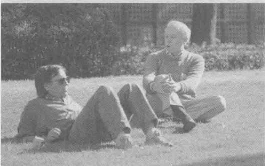  
Mark Ptashne 和 Joseph Goldstein，1988 年分子生物学和信号转导讨论会。受到 Jacob 和 Monod 关于基因表达调控的早期观点启发，Ptashne 描述了这些机制在 $\lambda$ 噬菌体、酵母的分子水平上是如何起作用的（第 18 章和第 19 章）。Goldstein 和其长期的合作伙伴 Michael Brown 发现了控制参与胆固醇代谢的基因表达的信号转导路径（第 19 章），他们因此获得 1985 年的诺贝尔生理学或医学奖。

  
Scott Emmons、Gary Ruvkun 和 Barbara Meyer，2004 年表观遗传学讨论会。在研究蠕虫的发育遗传学过程中，Victor Ambros 和 Ruvkun 鉴定了第一个 miRNA 和它的靶基因（第 20 章）。美国国家航空航天局（NASA）的 T 恤暗示了 Ruvkun 其他方面的兴趣——在火星上寻找生命。Emmons 在从基因表达的神经生物学的各个水平研究蠕虫的行为，当时作为研究生的 Meyer 对阐明 $\lambda$ 噬菌体遗传转换（第 18 章）有重要贡献，目前研究蠕虫的性别决定和剂量补偿（第 20 章）。

  
John Gurdon 和 Ann McLaren，1985 年发育分子生物学座谈会。格登在 1962 年首次进行了动物克隆实验，他将一个成年青蛙细胞的核转入一个无核的卵子中从而构建了一个功能齐全的蝌蚪（第 21 章）。因为此工作，他和山中申弥共享了 2012 年的诺贝尔生理学或医学奖。McLaren 是哺乳动物遗传学和生殖生物学方面的专家，她的其他研究为后来体外繁殖的发展提供了坚实的基础。她在生殖生物学上的专业性也使她关注政策问题，包括作为英国影响力巨大的沃尔诺克委员中的一员。

  
I.H.Herskowitz 夫人与儿子 Ira 和 Joel 在一起,1947 年核酸和核蛋白讨论会。Ira Herskowitz 首创了用酿酒酵母 (Saccharomyces.cerevisiae) 作为分子生物学研究的模式生物（第 18 章和第 19 章），像他早期研究 λ 噬菌体一样，他对酵母中基因调控的观点也做出了主要贡献。其父亲 Irwin，后来是一本遗传学教科书的作者，参加了当年讨论会。

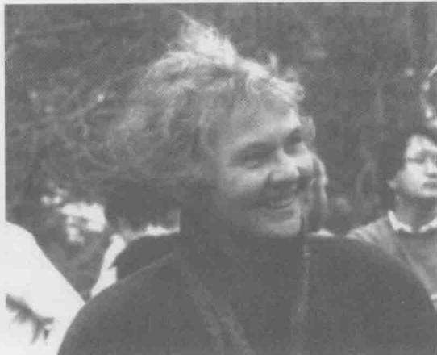  
Christiane Nüsslein Volhard, 1996 年冷泉港实验室斑马鱼的发育和遗传学会议。由 Nusslein Vol hard 和她的同事 Eric Wieschaus 在果蝇中进行的突变筛选确认了果蝇（可能也是所有动物）的早期胚胎发育中的许多关键基因（第 21 章），两人也因此与 Edward Lewis 共享了 1995 年的诺贝尔生理学或医学奖。

  
Richard Jorgensen 和 David Baulcombe, 2006 年调控 RNA 讨论会。Jorgensen 发现牵牛花色素基因的过表达会产生白色花而不是深紫色花（第 20 章）。当时并不清楚产生这种现象是由于 RNAi 的影响。后来由 Baulcombe 鉴定出小干扰 RNA ——该过程的重要中介物。（第 20 章）。

  
Jacques Monod 和 Leo Szilard，1961 年冷泉港实验室。Monod 与 Francois Jacob 一起阐明了基因表达调控的操纵子模型（第 18 章），他们与同事 André Lwoff 因这一成就获得了 1963 年的诺贝尔生理学或医学奖。Leo Szilard 是战时核物理学家，在参加了 1947 年冷泉港的抗菌素课程后转向了分子生物学领域。他和 Aaron Novick 在芝加哥主持一个实验室（经允许引自：Courtesy of Esther Bubley）

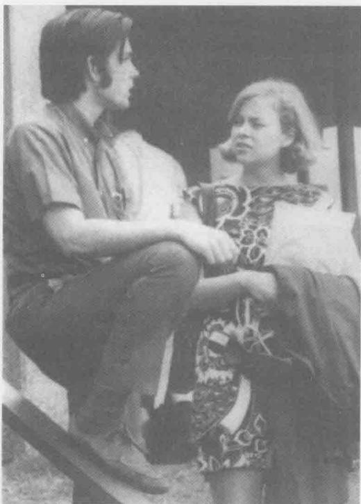  
Jeffrey Roberts 和 Ann Burgess，1970 年遗传物质转录讨论会。Roberts 的研究集中在细菌和噬菌体中基因表达的调控，特别是 $\lambda$ 噬菌体中的抗终止（第 18 章）。Burgess 是一名生物学教育者，参与了全国性的科学教育改进活动。Roberts 是本书第四版的作者之一，而本版作者之一 Tania Baker （TB）是 Burgess 的亲戚。

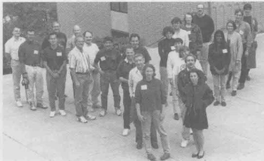  
山中申弥，1994年原位杂交和免疫细胞化学的CSHL课程上。山中申弥（左起第3个）作为学生参与此课程，图为其与导师和其他学生的合影。山中申弥与JohnGurdon因创造了iPS细胞而获得了2012年诺贝尔生理学或医学奖。他揭示了仅需要诱导4种DNA结合转录因子就足以将不同分化的细胞转化为未分化、多功能状态。第21章描述了该杰出实验。

  
Craig Mello, 2004 年表观遗传学讨论会。与 Andrew Fire 一起，Mello 发现只需要将 dsRNA 导入细胞，与该 RNA 同源的基因可以被沉默。正是这项被他们称为 RNA 干扰的发现，开拓了整个 RNAi 领域（第 20 章）。他们分享了 2006 年诺贝尔生理学或医学奖。

Edward Lewis、Carl Lindegren、Alfred Hershey 和 Joshua Lederberg，1951 年基因和突变讨论会。Lewis 以果蝇为模型（第 21 章）倡导了发育的遗传学分析，并因此与 Eric F.Wieschaus 和 Christinae Nüsslein-Volhard 分享了 1995 年的诺贝尔医学奖。Lindegren 是酵母遗传学（附录 1）的开创者。Hershey 带领包括 Max Dedlbr ü k 和 Salvador E. Luria 的研究小组在分子生物学的早期应用噬菌体作为模型系统（附录 1），他们三人共同获得 1969 年的诺贝尔生理学或医学奖。Lederberg 则发现了 DNA 在细菌间可以通过被称为接合的交配过程传递（附录 1），他也因此与 George Beadle 和 Edward Tatum 分享了 1958 年的诺贝尔生理学或医学奖。

#### [W] 第18章 原核生物的转录调控

#### [W] 本章概要

转录调控的原理

转录起始的调控：原核生物的实例

$\lambda$ 噬菌体：调控的层次

在第 13 章我们了解了 DNA 是怎样通过 RNA 聚合酶转录成 RNA 的，同时我们还描述了构成启动子的序列元件——一位于基因起点用于结合转录酶和起始转录的区域。细菌中最常见的 RNA 聚合酶（带有 $\sigma^{70}$ ）识别的启动子由“-10”、“-35”和“上游”这 3 种元件组成。我们已知某一特定启动子的活性强度取决于其

具备哪个元件及其在多大程度上达到最佳匹配。在缺乏调控因子的情况下，这些元件决定了聚合酶与启动子的结合效率，以及结合后有多迅速地激发转录的起始。

本章我们将看一下表达调控的机制，即对基因产物需求的变化提升或降低表达的机制。基因的表达可在多个阶段受到调控。最为常见的是在转录的起始阶段，本章的大量篇幅将集中在细菌的相应调控步骤上。我们将从调控的一般机制、原则开始，接着看几个研究得较为透彻的例子，这几个例子将展示基本的调控机制是怎样以不同的组合方式来控制基因在特定的生物背景中的表达。我们也会论及转录后运作的基因调控机制，特别是转录延伸及终止的过程中的调控。其他原核生物的转录调控例子——通过 RNA 来作用的——将会在第 20 章中讨论。其中一个在翻译水平进行调控的原核基因的例子已经在第 15 章讨论了。

#### [W] 转录调控的原理

#### [W] 基因表达由调控蛋白控制

正如我们在这一部分的序言中所描述的，基因常常由胞外信号控制；对细菌而言，主要是指由培养基中存在的分子信号控制。这些信号由调控蛋白传送给基因。调控蛋白可分为两类：正调控蛋白或激活因子（activator，又译激活物），负调控蛋白或抑制因子（repressor，又称阻遏物）。通常这些调控蛋白都是DNA结合蛋白，它们识别受其控制的基因上的或基因附近的特异位点。激活因子增强受调控基因的转录，抑制因子降低或消除相应基因的转录。

这些调控蛋白因子是如何作用的呢？我们来回想一下第13章中描述的转录起始步骤（图13-3）。首先，RNA聚合酶在封闭复合体（closed complex）（其中的DNA双链仍在一起）中结合到启动子上。接着，聚合酶启动子复合体转变为开放复合体，此时这其中转录起始位点的DNA是解链的，同时聚合酶定位以便起始转录。接下来是启动子脱离（promoter escape），这时聚合酶离开启动子开始转录。激活因子在哪一步激活、抑制因子在哪一步抑制，这要看具体的启动子和调控蛋白而定。接下来，我们将看到两种类型的调控。

#### [W] 大多数的激活因子和抑制因子在转录起始水平发挥作用

尽管基因表达调控基本上贯穿于基因产物生成的整个过程中，但是最常见的基因调控是在转录的起始阶段，本章将对此进行重点阐述。有两个原因可以解释：第一，转录起始阶段是进行调控的最积极有效的阶段，也就是说，在最开始决定这个基因是否被表达能够避免能量和资源的浪费。例如，部分的 mRNA 将不会被使用（翻译）。第二，在最开始的时候进行调控更容易做好。在单倍体基因组中每个基因只有一个单拷贝，所以在一个单链 DNA 分子上也只有一个启动子调控特定基因的表达。相反，为了调控即将翻译的基因，每个 mRNA 分子都必须发挥作用。

那么为什么不是全部的调控都集中在转录的起始阶段呢？在后面的阶段进行调控具有两个优势。第一，它允许接受更多的信号输入：如果对一个基因的调控不仅仅发生在最开始的阶段，那么就会有更多的信号来调控它的表达，或者是同样的信号可以更加有效。第二，在后面的阶段调控可以减少反应的时间。因此，再想一下转录调控的例子（图 15-44），如果一个信号解除了对这一步的抑制，基因编码的蛋白质产物就能够马上收到这个信号，反应时间的明显减少可能在某些情况下是非常有利的。但是，正如我们已经说过的，最常见的基因调控是在转录的起始阶段，我们现在认为主要是激活因子和抑制因子在转录的起始阶段进行调控。

#### [W] 很多启动子通过协助 RNA 聚合酶结合 DNA 的激活因子和阻碍两者结合的抑制因子进行调控

大多数的启动子，在没有调控蛋白时，只是微弱地与 RNA 聚合酶结合。这是因为该启动子缺少一种或多种上文论及的启动子元件，或这些启动子元件不完整。当聚合酶偶然结合了启动子时，它会自动地转变为开放复合体从而启动转录。这导致基因的组成型表达（constitutive expression），或称为本底水平（basal level）表达。在这一情况中，RNA 聚合酶的结合是限速步骤（图 18-1a）。

抑制因子要控制从这一种启动子的起始表达，只需结合到与聚合酶结合区相重叠的位点上。这种情况下，抑制因子阻碍聚合酶结合到启动子上从而阻止转录（图 18-1b）。当然，抑制也可以其他方式实现，这一点也很重要。DNA 上抑制因子结合的位点称为操纵子（operator）。

激活因子通过协助聚合酶结合到启动子上来激活从该启动子开始的转录。通常是通过如下步骤实现的：激活因子以其一个表面结合到启动子附近的某一 DNA 位点；同时，以另一表面与 RNA 聚合酶相互作用，将聚合酶带到启动子（图 18-1c）。这一机制常被称为募集（recruitment），这是一个蛋白质协同结合 DNA（cooperative binding of protein to DNA）的例子（具体内容我们会在下文详细讨论，尤其是框 18-4）。激活因子和聚合酶的相互作用及激活因子与 DNA 的相互作用只起“黏合”作用：酶是有活性的，而激活因子只是将酶带到启动子附近。一旦聚合酶结合到启动子，它就自动地使封闭复合体异构化为开放复合体并起始转录。

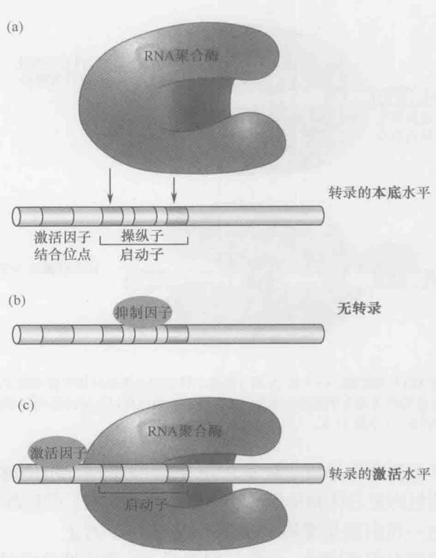  
图 18-1 通过募集 RNA 聚合酶激活转录。(a) 在激活因子和抑制因子都不存在的时候, RNA 聚合酶偶尔会自动结合启动子并起始低水平(本底水平)的转录。(b) 抑制因子结合了操纵子序列阻碍了 RNA 聚合酶的结合从而抑制了转录。(c) 激活因子募集 RNA 聚合酶产生了高水平的转录。RNA 聚合酶募集后形成封闭复合体, 接着, 封闭复合体自动异构化为开放复合体并起始转录。如果抑制因子和激活因子都存在并具有功能, 一般来说, 抑制因子活性会优于激活因子(这种情况在本图中未展示)。

大肠杆菌（Escherichia Coli）的 lac 基因就是由激活因子和抑制因子以这种简单的方式调控转录的。本章我们还将详细讲述这一基因的转录调控。

某些激活因子和抑制因子通过变构和调控RNA聚合酶对结合后的转录步骤起作用

并非所有的启动子都用同样的调控方式。因此，我们需要从其他类型的启动子来考虑。在这种情况下，RNA聚合酶不需协助就有效地结合在DNA上并形成稳定的封闭复合体。但是这一封闭复合体却不会自动转变成开放复合体（图18-2a）。在这一启动子上，激活因子必须刺激闭合复合体转变为开放复合体，因此这一转变就是限速步骤。

  
图 18-2 变构激活 RNA 聚合酶。（a）RNA 聚合酶结合稳定的封闭复合体中的启动子；（b）激活因子和聚合酶相互作用触发转变成为开放复合体及高水平转录。该图仅以图解的形式展示复合物的开关情况，详细解释请参照第 13 章图 13-3。

刺激这类启动子的激活因子通过触发 RNA 聚合酶或 DNA 的构象改变起作用；也就是说，它们与稳定的封闭复合体相互作用诱导发生构象改变，引起封闭到开放复合体的转变（图 18-2b）。这一机制就是变构（allostery）的一个例证。

在第 6 章我们遇到过的变构是一种常见的控制蛋白质活性的机制。在本章，我们会讨论两个转录激活因子变构调节的例子。例如 glnA 启动子，激活因子（NtrC）与在启动子上结合的封闭复合体中的 RNA 聚合酶相互作用，刺激其转变为开放复合体。另一个例子（merT 启动子）中，激活因子（MerR）却是通过诱导启动子 DNA 的构象改变达成同一效果的。而在另外一类启动子中，在启动子脱离这一步限制了转录激活（图 12-3）。这类启动子的例子是 malT 基因的表达。在缺乏激活因子的时候，起始会失败，只有当存在激活因子的时候，才可以有效地进入延伸阶段。

同样地，抑制因子也有很多方式行使功能，而不是仅仅阻止 RNA 聚合酶的结合。例如，有些抑制因子可以在启动子处和聚合酶发生相互作用，从而抑制向开放复合体的转化或者启动子脱离。我们会在后面看到这样的例子（如 Gal 抑制因子）。

#### [W] 远程激活和 DNA 环化

到目前为止，我们已经默许地假定了 DNA 结合蛋白彼此相互作用结合到邻近的位点（如图 18-1 和图 18-2 中所示 RNA 聚合酶和激活因子），事实也常常如此。但是有些相互作用的蛋白的结合位点在 DNA 上相距较远。在这种情况下，为了使蛋白质相互作用，结合位点之间的 DNA 就会形成环，让蛋白质结合位点彼此靠近（图 18-3）。

在细菌中我们就遇到这种蛋白质的互作方式的例子。我们将认为抑制因子间的相互作用可以形成长达3kb的DNA环。在下一章（真核基因调控）的内容中，我们还将遇到更多更生动的“远程激活”的例子。

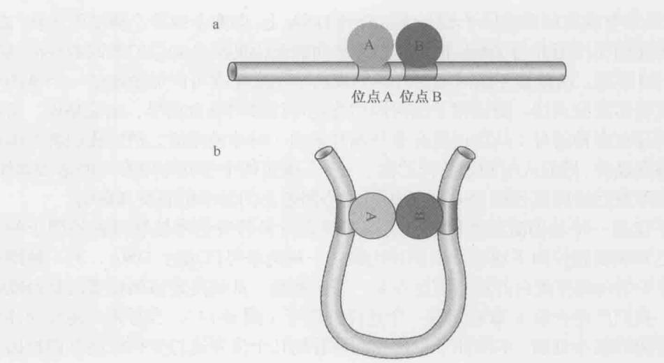  
图 18-3 DNA 结合蛋白的相互作用。(a) 蛋白质协同结合相邻位点；(b) 蛋白质协同结合独立位点。

远距离 DNA 位点的靠近是 DNA 链环化的方式之一。细菌中就有这样的例子，即蛋白质在激活因子结合位点和启动子之间结合，使 DNA 弯曲向有利的方向来协助激活因子和聚合酶相互作用（图 18-4）。同时，也存在 DNA 弯曲向不利的方向使蛋白抑制环形成和激活。在其他过程中也有这种“构架型”的蛋白质协助蛋白质相互作用（如位点特异性重组，第 12 章）。

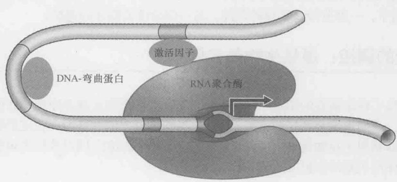  
图 18-4 DNA-弯曲蛋白能够协助 DNA-结合蛋白间的相互作用。弯曲 DNA 的蛋白质结合到激活因子结合位点和启动子之间的位点。这使得两个位点在空间上更接近，从而协助 DNA-结合激活因子和聚合酶的相互作用。

#### [W] 协同结合和变构在基因调控中有多种作用

我们已经指出简单的协同结合可以介导基因激活：激活因子自发地与 DNA 和聚合酶相互作用，从而募集 RNA 聚合酶到启动子上。另一方面，我们也描述了蛋白质变构作用介导激活转录的情形：激活因子与结合到启动子上的聚合酶，通过诱导酶或启动子发生构象变化，刺激转录起始。在基因调控中，协同结合和变构还有其他作用。

例如,经常有成组的调控因子相互地结合到 DNA 上,即两个或多个激活因子和(或)抑制因子彼此相互作用并与 DNA 相互作用,从而彼此协助结合到它们共同调控的基因附近。我们将看到,这种相互作用仅由外界环境的小小变化就可以灵敏地使一个基因从完全不表达转而完全表达。激活因子的协同结合还可以参与整合信号,也就是说,某些基因只有当存在多种信号(从而也就有多种调控蛋白)时才被激活。稍后我们将在本章介绍一个特别显著、目前人们知之甚详的例子——λ噬菌体中协同作用参与的基因调控。我们也将在本章后续内容和框 18-3 中详细讨论协同结合的基本机制及其影响。

变构不仅是一种基因激活的机制，它同时还常常是特异信号控制其调控因子的方式。迄今已知细菌调控因子通常采取两种构象：一种构象可以结合 DNA，另一种则不能。信号分子结合调控蛋白并将它固定在某一特定构象，从而决定该调控蛋白是否能够激活转录。我们已经在第 6 章看到过一个这样的例子（图 6-19），当时我们还较为详细地讨论了变构的基本机制。本章和下一章我们将看到几个信号通过变构控制其调控因子的例子。

#### [W] 抗终止作用及其延续：基因调控并不局限于转录起始调控

正如本章开始部分所述，大多数基因调控发生在转录起始阶段。在真核细胞和细菌中皆是如此。但是，这两类生物的调控绝不局限在这一步骤。本章中我们会看到几个细菌中基因调控的例子，其中包括了转录延伸和终止水平中的调控。细菌中基因调节的其他例子请参考第15章（我们对核糖体蛋白编码基因翻译的调控进行讨论）和第20章（我们会谈到包括RNA调控在内的几个例子，如衰减作用、核糖开关和小RNA）。这些关于RNA的例子，一部分涉及转录的调控，另一部分涉及翻译的调控。

<!-- W-END Watson 18 原核生物的转录调控（章首） -->

<!-- L-BEGIN Lehninger 28.1 -->

### 【英文对应 Lehninger §28.1：The Proteins and RNAs of Gene Regulation】

> 来源：Lehninger Principles of Biochemistry（书籍/02_生物化学原理） 第28章 Regulation of Gene Expression，§28.1。

Transcription is mediated and regulated by protein-DNA interactions, especially those involving the protein components of RNA polymerase (Chapter 26). We first consider how the activity of RNA polymerase is regulated. Next, we proceed to a general description of the proteins participating in this regulation. We then examine the molecular basis for the recognition of specific DNA sequences by DNA-binding proteins. Regulatory RNAs are encountered most often in the regulation of mRNA translation in eukaryotes, but also play a role in the life of some bacterial mRNAs. We consider them briefly in this section, and in more detail in Section 28.3.

#### [EN] RNA Polymerase Binds to DNA at Promoters

RNA polymerases bind to DNA and initiate transcription at promoters (see Fig. 26-5), sites generally found near points at which RNA synthesis begins on the DNA template. The regulation of transcription initiation often entails changes in how RNA polymerase interacts with a promoter.

The nucleotide sequences of promoters vary considerably, affecting the binding affinity of RNA polymerases and thus the frequency of transcription initiation. Some Escherichia coli genes are transcribed once per second, others less than once per cell generation. Much of this variation is due to differences in promoter sequence. In the absence of regulatory proteins, differences in promoter sequence may affect the frequency of transcription initiation by a factor of 1,000 or more. Most E. coli promoters have a sequence close to a consensus (Fig. 28-2). Mutations that result in a shift away from the consensus sequence usually decrease the function of bacterial promoters; conversely, mutations toward consensus usually enhance promoter function.

<table><tr><td>DNA 5&#x27;</td><td>UP element</td><td>TTGACA</td><td> $N_{17}$ </td><td>TATAAT</td><td> $N_{5-9}$ </td><td>RNA start site</td><td>mRNA</td></tr></table>

FIGURE 28-2 Consensus sequence for many E. coli promoters. Most base substitutions in the -10 and -35 regions have a negative effect on promoter function. Some promoters also include the UP (upstream promoter) element.

KEY CONVENTION By convention, DNA sequences are shown as they exist in the nontemplate strand, with the 5' terminus on the left. Nucleotides are numbered from the transcription start site, with positive numbers to the right (in the direction of transcription) and negative numbers to the left. N indicates any nucleotide.

Genes for products that are required at all times, such as those for the enzymes of central metabolic pathways, are expressed continuously, with little variation in virtually every cell of a species or organism. Such genes are often referred to as housekeeping genes. Expression of a gene at approximately constant levels is called constitutive gene expression. Although housekeeping genes are expressed constitutively, the cellular concentrations of the proteins they encode vary widely. For these genes, the RNA polymerase–promoter interaction strongly influences the rate of transcription initiation. Differences in promoter sequence may be the only level of regulation for a housekeeping gene, allowing the cell to synthesize the appropriate level of each housekeeping gene product.

The basal rate of transcription initiation at the promoters of nonhousekeeping genes is also determined by the promoter sequence, but expression of these genes is further modulated by regulatory proteins. Many of these proteins work by enhancing or interfering with the interaction between RNA polymerase and the promoter.

The sequences of eukaryotic promoters are much more variable than their bacterial counterparts. The three eukaryotic RNA polymerases usually require an array of general transcription factors in order to bind to a promoter, and these can heavily influence basal transcription rates. Yet, as with bacterial gene expression, the basal level of transcription is determined in part by the effect of promoter sequences on the function of RNA polymerase and its associated transcription factors.

#### [EN] Transcription Initiation Is Regulated by Proteins and RNAs

P2 At least three types of regulatory proteins regulate transcription initiation by RNA polymerase: specificity factors alter the specificity of RNA polymerase for a given promoter or set of promoters, repressors impede access of RNA polymerase to the promoter, and activators enhance the RNA polymerase-promoter interaction.

As our understanding of the roles of protein regulators slowly matures, many new roles for gene regulation by noncoding RNAs (ncRNAs) are also beginning to emerge. Among these are the long noncoding RNAs (lncRNAs), generally defined as noncoding RNAs more than 200 nucleotides long that lack an open reading frame (ORF) that encodes a protein—thus distinguishing them from the small, functional ncRNAs (miRNA, snoRNA, snRNA, etc.) described in Chapter 26. The lncRNAs are found in all types of organisms, with tens of thousands expressed in mammalian cells. Known functions of lncRNAs include regulation of nucleosome positioning and chromatin structure, control of DNA methylation and posttranscriptional histone modifications, transcriptional gene silencing, multiple roles in transcriptional activation and repression, and much more.

We introduced bacterial specificity factors in Chapter 26, although we did not refer to these proteins by that name. The $\sigma$ subunit of the $E.$ coli RNA polymerase holoenzyme is a specificity factor that mediates promoter recognition and binding. Most $E.$ coli promoters are recognized by a single $\sigma$ subunit ( $M_{\mathrm{r}}$ 70,000), $\sigma^{70}$ (see Fig. 26-5). Under some conditions, some of the $\sigma^{70}$ subunits are replaced by one of six other specificity factors. One notable case arises when bacteria are subjected to heat stress, leading to the replacement of $\sigma^{70}$ by $\sigma^{32}$ ( $M_{\mathrm{r}}$ 32,000). When bound to $\sigma^{32}$ , RNA polymerase is directed to a specialized set of promoters with a different consensus sequence (Fig. 28-3). These promoters control the

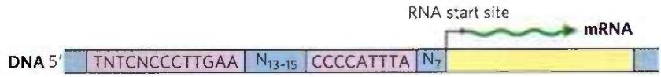

FIGURE 28-3 Consensus sequence for promoters that regulate expression of the E. coli heat shock genes. This system responds to temperature increases as well as some other environmental stresses, resulting in the induction of a set of proteins. Binding of RNA polymerase to heat shock promoters is mediated by a specialized $\sigma$ subunit of the polymerase, $\sigma^{32}$ , which replaces $\sigma^{70}$ in the RNA polymerase initiation complex.

expression of a set of genes that encode proteins, including some protein chaperones (p. 132), that are part of a stress-induced system called the heat shock response. Thus, through changes in the binding affinity of the polymerase that direct the enzyme to different promoters, a set of genes involved in related processes is coordinately regulated. In eukaryotic cells, some of the general transcription factors, in particular the TATA-binding protein (TBP; see Fig. 26-9), may be considered specificity factors.

Repressors bind to specific sites on the DNA. In bacterial cells, such binding sites, called operators, are generally near a promoter. RNA polymerase binding, or its movement along the DNA after binding, is blocked when the repressor is present. P3 Regulation by means of a repressor protein that blocks transcription is referred to as negative regulation. Repressor binding to DNA is regulated by a molecular signal, or effector, usually a small molecule or a protein that binds to the repressor and causes a conformational change. The interaction between repressor and signal molecule either increases or decreases transcription. In some cases, the conformational change results in dissociation of a DNA-bound repressor from the operator (Fig. 28-4a). Transcription initiation can then proceed unhindered. In other cases, interaction between an inactive repressor and the signal molecule causes the repressor to bind to the operator (Fig. 28-4b). P4 In eukaryotic cells, gene regulation by a repressor is less common. Where it does occur (more often in lower eukaryotes such as yeast), the binding site for a repressor may be some distance from the promoter. Binding of these repressors to their binding sites has the same effect as in bacterial cells: inhibiting the assembly or activity of a transcription complex at the promoter.

P3 Activators provide a molecular counterpoint to repressors; they bind to DNA and enhance the activity of RNA polymerase at a promoter; this is positive regulation. In bacteria, activator-binding sites are often adjacent to promoters that are bound weakly or not at all by RNA polymerase alone, such that little transcription occurs in the absence of the activator. Some activators are usually bound to DNA, enhancing transcription until dissociation of the activator is triggered by the binding of a signal molecule (Fig. 28-4c). In other cases the activator binds to DNA only after interaction with a signal molecule (Fig. 28-4d). Signal molecules can therefore increase or decrease transcription, depending on how they affect the activator.

P4 Positive regulation by activators is particularly common in eukaryotes. Many eukaryotic activators bind to DNA sites, called enhancers, that are distant from the promoter, affecting the rate of transcription at a promoter that may be located thousands of base pairs away.

The distance between a promoter and the binding site of an activator or repressor is bridged by looping out of the DNA between the two sites (Fig. 28-5). The looping is facilitated in some cases by proteins called architectural regulators that bind to intervening sites. Interaction

(a) Negative regulation
Molecular signal causes dissociation of repressor from DNA, inducing transcription.

(b) Negative regulation
Molecular signal causes binding of repressor to DNA, inhibiting transcription.

  
(c) Positive regulation
Molecular signal causes dissociation of activator from DNA, inhibiting transcription.

(d) Positive regulation
Molecular signal causes binding of activator to DNA, inducing transcription.

  
FIGURE 28-4 Common patterns of regulation of transcription initiation. Two types of negative regulation are illustrated. (a) Repressor binds to the operator in the absence of the molecular signal; the external signal causes dissociation of the repressor to permit transcription. (b) Repressor binds in the presence of the signal; the repressor dissociates, and transcription ensues when the signal is removed. Positive regulation is mediated by gene activators. Again, two types are shown. (c) Activator binds in the absence of the molecular signal and transcription proceeds; when the signal is added, the activator dissociates and transcription is inhibited. (d) Activator binds in the presence of the signal; it dissociates only when the signal is removed. Note that "positive" regulation and "negative" regulation refer to the type of regulatory protein involved: the bound protein either facilitates or inhibits transcription. In either case, addition of the molecular signal may increase or decrease transcription, depending on its effect on the regulatory protein.

between activators and the RNA polymerase at the promoter is often mediated by intermediary proteins called coactivators. In some instances, protein repressors may take the place of coactivators, binding to the activators and preventing the activating interaction.

  
FIGURE 28-5 Interaction between activators/repressors and RNA polymerase in eukaryotes. Eukaryotic activators and repressors frequently bind sites thousands of base pairs distant from the promoters they regulate. DNA looping, often facilitated by architectural regulators, brings the sites together. The interaction between activators and RNA polymerase may be mediated by coactivators, as shown. Repression is sometimes mediated by repressors (described later) that bind to activators, thereby preventing the activating interaction with RNA polymerase.

#### [EN] Many Bacterial Genes Are Clustered and Regulated in Operons

Bacteria have a simple general mechanism for coordinating the regulation of multiple genes: these genes are clustered on the chromosome and are transcribed together. Many bacterial mRNAs are polycistronic—multiple genes on a single transcript—and the single promoter that initiates transcription of the cluster is the site of regulation for expression of all the genes in the cluster. The gene cluster and promoter, plus additional sequences that function together in regulation, are called an operon (Fig. 28-6). Operons that include two to six genes transcribed as a unit are common; some operons contain 20 or more genes. The identity and order of the genes in an operon are not random. In many cases, genes in the same operon encode subunits of a larger protein complex, and cotranslation directly enables assembly of the complex. Some operons organize genes involved in related processes that require coordinated regulation. In other cases, the genes may seem to be unrelated, but they encode products required by the cell under similar conditions.

  
FIGURE 28-6 Representative bacterial operon. Genes A, B, and C are transcribed on one polycistronic mRNA. Typical regulatory sequences include binding sites for proteins that either activate or repress transcription from the promoter.

Many of the principles of bacterial gene expression were first defined by studies of lactose metabolism in E. coli, which can use lactose as its sole carbon source. In 1960, François Jacob and Jacques Monod published a short paper in the Proceedings of the French Academy of Sciences that described how two adjacent genes involved in lactose metabolism were coordinately regulated by a genetic element located at one end of the gene cluster. The genes were those for $\beta$ -galactosidase, which cleaves lactose to galactose and glucose, and for galactoside permease, which transports lactose into the cell (Fig. 28-7). The terms “operon” and “operator” were first introduced in this paper. With the operon model, gene regulation could, for the first time, be considered in molecular terms.

#### [EN] The lac Operon Is Subject to Negative Regulation

The lactose (lac) operon (Fig. 28-8a) includes the genes for $\beta$ -galactosidase (Z), galactoside permease (Y), and thiogalactoside transacetylase (A). The last of these enzymes seems to modify toxic galactosides to facilitate their removal from the cell. Each of the three genes is preceded by a ribosome-binding site (not shown in Fig. 28-8) that independently directs the translation of that gene (Chapter 27). Regulation of the lac operon by the lac repressor protein (Lac) follows the pattern outlined in Figure 28-4a.

The study of lac operon mutants has revealed some details of the workings of the operon's regulatory system. In the absence of lactose, the lac operon genes are repressed. Mutations in the operator or in another gene, the I gene, result in constitutive synthesis of the gene products. When the I gene is defective, repression can be restored by introducing a functional I gene into the cell on another DNA molecule, demonstrating that the I gene encodes a diffusible molecule that causes gene repression. This molecule proved to be a protein, now called the Lac repressor, a tetramer of identical monomers. The operator to which it binds most tightly (O $_{1}$ ) abuts the transcription start site (Fig. 28-8a). The I gene is transcribed from its own promoter (P $_{1}$ ) independent of the lac operon genes. The lac operon has two secondary binding sites for the Lac repressor: $O_{2}$ and $O_{3}$ . $O_{2}$ is centered near position +410, within the gene encoding $\beta$ -galactosidase (Z); $O_{3}$ is near position -90, within the I gene. To repress the operon, the Lac repressor seems to bind to both the main operator and one of the two secondary sites, with the intervening DNA looped out (Fig. 28-8b, c). Either binding arrangement blocks transcription initiation.

(a)  
  
FIGURE 28-7 Lactose metabolism in E. coli. Uptake and metabolism of lactose require the activities of galactoside (lactose) permease and $\beta$ -galactosidase. Conversion of lactose to allolactose by transglycosylation is a minor reaction also catalyzed by $\beta$ -galactosidase.

Despite this elaborate binding complex, repression is not absolute. Binding of the Lac repressor reduces the rate of transcription initiation by a factor of $10^{3}$ . If the $O_{2}$ and $O_{3}$ sites are eliminated by deletion or mutation, the binding of repressor to $O_{1}$ alone reduces transcription by a factor of about $10^{2}$ . Even in the repressed state, each cell has a few molecules of $\beta$ -galactosidase and galactoside permease, presumably synthesized on the rare occasions when the repressor transiently dissociates from the operators. This basal level of transcription is essential to operon regulation.

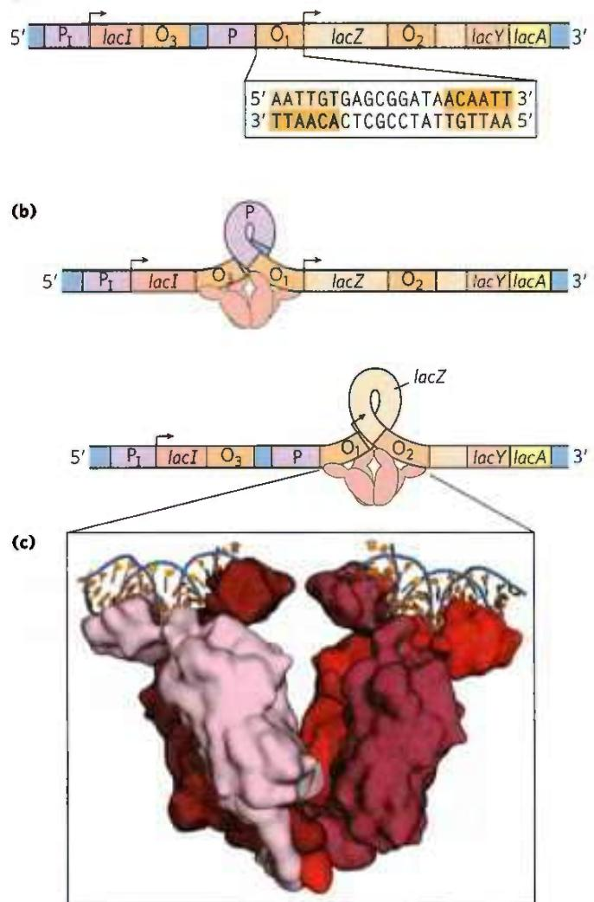  
FIGURE 28-8 The lac operon. (a) In the lac operon, the lacI gene encodes the Lac repressor. The lac Z, Y, and A genes encode β-galactosidase, galactoside permease, and thiogalactoside transacetylase, respectively. P is the promoter for the lac genes, and P₁ is the promoter for the I gene. O₁ is the main operator for the lac operon; O₂ and O₃ are secondary operator sites of lesser affinity for the Lac repressor. The inverted repeat to which the Lac repressor binds in O₁ is shown. (b) The Lac repressor binds to the main operator and O₂ or O₃, and it seems to form a loop in the DNA. (c) Lac repressor (shades of red) is shown bound to short, discontinuous segments of DNA (blue and orange). [(c) Data from PDB ID 2PES, R. Daber et al., J. Mol. Biol. 370:609, 2007.]

When cells are provided with lactose, the lac operon is induced. An inducer (signal) molecule binds to a specific site on the Lac repressor, causing a conformational change that results in dissociation of the repressor from the operator. The inducer in the lac operon system is not lactose itself but allolactose, an isomer of lactose (Fig. 28-7). After entry into the E. coli cell (via the few preexisting molecules of lactose permease), lactose is converted to allolactose by one of the few preexisting $\beta$ -galactosidase molecules. Release of the operator by Lac repressor, triggered as the repressor binds to allolactose, allows expression of the lac operon genes and leads to a $10^{3}$ -fold increase in the concentration of $\beta$ -galactosidase.

Several $\beta$ -galactosides structurally related to allolactose are inducers of the lac operon but are not substrates for $\beta$ -galactosidase; others are substrates but not inducers. One particularly effective and nonmetabolizable inducer of the lac operon that is often used experimentally is isopropylthiogalactoside (IPTG).

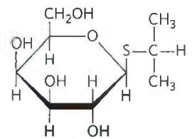  
Isopropyl- $\beta$ -D-thiogalactoside (IPTG)

An inducer that cannot be metabolized allows researchers to explore the physiological function of lactose as a carbon source for growth, separate from its function in the regulation of gene expression.

In addition to the multitude of operons now known in bacteria, a few polycistronic operons have been found in the cells of lower eukaryotes. In the cells of higher eukaryotes, however, almost all protein-coding genes are transcribed separately.

The mechanisms by which operons are regulated can vary significantly from the simple model presented in Figure 28-8. Even the lac operon is more complex than indicated here, with an activator also contributing to the overall scheme, as we shall see in Section 28.2. Before any further discussion of the layers of regulation of gene expression, however, we examine the critical molecular interactions between DNA-binding proteins (such as repressors and activators) and the DNA sequences to which they bind.

#### [EN] Regulatory Proteins Have Discrete DNA-Binding Domains

P2 Regulatory proteins generally bind to specific DNA sequences. Their affinity for these target sequences is roughly $10^{4}$ to $10^{6}$ times higher than their affinity for any other DNA sequence. Most regulatory proteins have discrete DNA-binding domains containing substructures that interact closely and specifically with the DNA. These binding domains usually include one or more of a relatively small group of recognizable and characteristic structural motifs.

To bind specifically to DNA sequences, regulatory proteins must recognize surface features on the DNA (see Fig. 8-13). Most of the chemical groups that differ among the four bases and thus permit discrimination between base pairs are hydrogen-bond donor and acceptor groups exposed in the major groove of DNA (Fig. 28-9), and most of the protein-DNA contacts that impart specificity are hydrogen bonds. A notable exception is the nonpolar surface near C-5 of pyrimidines, where thymine is readily distinguished from cytosine by its protruding methyl group. Protein-DNA contacts are also possible in the minor groove of the DNA, but the hydrogen-bonding patterns there generally do not allow ready discrimination between base pairs.

  
FIGURE 28-9 Groups in DNA available for protein binding. (a) Shown here are functional groups on all four base pairs that are displayed in the major and minor grooves of DNA. Hydrogen-bond acceptor (A) and donor (D) atoms are marked by blue and red disks, respectively. Other hydrogen atoms (H) are marked with purple disks, and methyl groups (M) with  
yellow disks. (b) Recognition patterns for each base pair (from left to right). The much greater variation in the patterns for the major groove gives rise to a much greater discriminatory power in the major groove relative to the minor groove. [Information from J. L. Huret, Atlas Genet. Cytogenet. Oncol. Haematol. 2006, http://atlasgeneticsoncology.org/Educ/DNAEnglID30001ES.html.]

Within regulatory proteins, the amino acid side chains most often hydrogen-bonding to bases in the DNA are those of Asn, Gln, Glu, Lys, and Arg residues. Is there a simple recognition code in which a particular amino acid always pairs with a particular base? The two hydrogen bonds that can form between Gln or Asn and the $N^{6}$ and N-7 positions of adenine cannot form with any other base. And an Arg residue can form two hydrogen bonds with N-7 and $O^{6}$ of guanine (Fig. 28-10). Examination of the structure of many DNA-binding proteins, however, has shown that a protein can recognize each base pair in more than one way, leading to the conclusion that there is no simple amino acid-base code. For some proteins, the Gln-adenine interaction can specify A=T base pairs, but in others a van der Waals pocket for the methyl group of thymine can recognize A=T base pairs. Researchers cannot yet examine the structure of a DNA-binding protein and infer the DNA sequence to which it binds.

To interact with bases in the major groove of DNA, a protein requires a relatively small substructure that can stably protrude from the protein surface. The DNA-binding domains of regulatory proteins tend to be small (60 to 90 amino acid residues), and the structural motifs within these domains that are actually in contact with the DNA are smaller still. Many small proteins are unstable because of their limited capacity to form layers of structure to bury hydrophobic groups. The DNA-binding motifs provide either a very compact stable structure or a way of allowing a segment of protein to protrude from the protein surface.

P2 The DNA-binding sites for regulatory proteins are often inverted repeats of a short DNA sequence (a palindrome) at which multiple (usually two) subunits of a regulatory protein bind cooperatively. The Lac repressor is unusual in that it functions as a tetramer, with two dimers tethered together at the end distant from the DNA-binding sites (Fig. 28-8b). An E. coli cell usually contains about 20 tetramers of the Lac repressor. Each of the tethered dimers separately binds to a palindromic operator sequence, in contact with 17 bp of a 22 bp region in the lac operon. And each of the tethered dimers can independently bind to an operator sequence, with one generally binding to O $_{1}$ and the other to O $_{2}$ or O $_{3}$ (as in Fig. 28-8b). The symmetry of the O $_{1}$ operator sequence corresponds to the twofold axis of symmetry of two paired Lac repressor subunits. The tetrameric Lac repressor binds to its operator sequences in vivo with an estimated dissociation constant of 10 $^{-10}$ M. The repressor discriminates between the operators and other sequences by a factor of about 10 $^{6}$ , so binding to these few base pairs among the 4.6 million or so of the E. coli chromosome is highly specific.

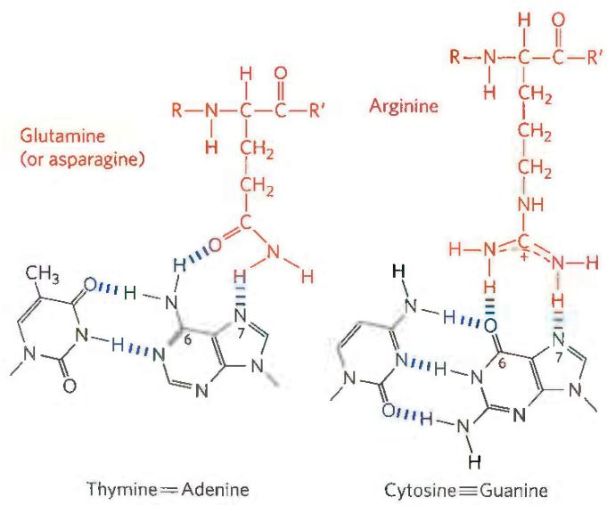  
FIGURE 28-10 Specific amino acid residue–base pair interactions. The two examples shown have been observed in DNA-protein binding.

Several DNA-binding motifs have been described, but here we focus on two that play prominent roles in the binding of DNA by regulatory proteins from all domains of life: the helix-turn-helix and the zinc finger. We also consider two other types of such motifs: the homeodomain and the RNA recognition motif, which, as its name implies, also binds RNA; both motifs play prominent roles in some eukaryotic regulatory proteins.

Helix-Turn-Helix The helix-turn-helix motif is crucial to the interaction of many regulatory proteins with DNA in bacteria, and similar motifs occur in some eukaryotic regulatory proteins. The helix-turn-helix comprises about 20 amino acid residues in two short $\alpha$ -helical segments, each 7 to 9 residues long, separated by a $\beta$ turn (Fig. 28-11). This structure generally is not stable by itself; it is simply the interactive portion of a somewhat larger DNA-binding domain. One of the two $\alpha$ -helical segments is called the recognition helix, because it usually contains many of the amino acids that interact with DNA in a sequence-specific way. This $\alpha$ helix is stacked on other segments of the protein structure so that it protrudes from the protein surface. When bound to DNA, the recognition helix is positioned in or nearly in the major groove. The Lac repressor has this DNA-binding motif.

Zinc Finger In a zinc finger, about 30 amino acid residues form an elongated loop held together at the base by a single $\mathrm{Zn}^{2+}$ ion, which is coordinated to 4 of the residues (4 Cys, or 2 Cys and 2 His). The zinc does not itself interact with DNA; rather, the coordination of zinc with the amino acid residues stabilizes this small structural motif. Several hydrophobic side chains in the core of the structure also lend stability. Figure 28-12 shows the interaction between DNA and three zinc fingers of a single polypeptide from the mouse regulatory protein Zif268.

  
FIGURE 28-11 Helix-turn-helix. (a) DNA-binding domain of the Lac repressor bound to DNA. (b) The entire Lac repressor. The DNA-binding domains and the $\alpha$ helices involved in tetramer formation are labeled. The remainder of the protein has the binding sites for allolactose. The allolactose-binding domains are linked to the DNA-binding domains through linker helices. [Data from PDB ID 2PES, R. Daber et al., J. Mol. Biol. 370:609, 2007.]

  
FIGURE 28-12 Zinc fingers. Three zinc fingers of the regulatory protein Zif268, complexed with DNA. Each $\mathrm{Zn^{2+}}$ coordinates with two His and two Cys residues. [Data from PDB ID 1ZAA, N.P. Pavletich and C.O. Pabo, Science 252:809, 1991.]

Many eukaryotic DNA-binding proteins contain zinc fingers. The interaction of a single zinc finger with DNA is typically weak, and many DNA-binding proteins, like Zif268, have multiple zinc fingers that substantially enhance binding by interacting simultaneously with the DNA. One DNA-binding protein of the frog Xenopus has 37 zinc fingers. There are few known examples of the zinc finger motif in bacterial proteins.

  
FIGURE 28-13 Homeodomains. Shown here are two homeodomains bound to DNA. In each homeodomain, the recognition helix, layered on two others, can be seen protruding into the major groove. This is only a small part of a larger regulatory protein from a class called Pax, active in the regulation of development in fruit flies (see Section 28.3). [Data from PDB ID 1FJL, D. S. Wilson et al., Cell 82:709, 1995.]

The precise manner in which proteins with zinc fingers bind to DNA differs from one protein to the next. Some zinc fingers contain the amino acid residues that are important in sequence discrimination, whereas others seem to bind DNA nonspecifically (the amino acids required for specificity are located elsewhere in the protein). Zinc fingers can also function as RNA-binding motifs, such as in certain proteins that bind eukaryotic mRNAs and act as translational repressors. We discuss this role later (Section 28.3).

Homeodomain Another type of DNA-binding domain has been identified in some proteins that function as transcriptional regulators, especially during eukaryotic development. This domain of 60 amino acid residues—called the homeodomain, because it was discovered in homeotic genes (genes that regulate the development of body patterns)—is highly conserved and has now been identified in proteins from a wide variety of organisms, including humans (Fig. 28-13). The DNA-binding segment of the domain is related to the helix-turn-helix motif. The DNA sequence that encodes this domain is known as the homeobox.

RNA Recognition Motif New classes of proteins with RNA-binding domains continue to be identified. RNA recognition motifs (RRMs) are found in some eukaryotic gene activators, where they may do double duty in binding DNA and RNA. When bound to specific binding sites in DNA, these activators induce transcription. The same activators are sometimes regulated in part by specific lncRNAs that compete with DNA binding and decrease gene transcription. Other proteins with RRM motifs bind to mRNA, rRNA, or any of a range of other smaller, noncoding RNAs. The RRM consists of 90 to 100 amino acid residues, arranged in a four-strand antiparallel $\beta$ sheet sandwiched against two $\alpha$ helices, with a $\beta_{1}-\alpha_{1}-\beta_{2}-\beta_{3}-\alpha_{2}-\beta_{4}$ topology (Fig. 28-14a). This motif may be present as part of DNA-binding regulatory proteins that also have other DNA-binding motifs or may occur in proteins that bind uniquely to RNA. The RRM is just one of many diverse protein motifs known to interact with RNA (Fig. 28-14b).

#### [EN] Regulatory Proteins Also Have Protein-Protein Interaction Domains

Regulatory proteins contain domains not only for DNA binding but also for protein-protein interactions—with RNA polymerase, other regulatory proteins, or other subunits of the same regulatory protein. Examples include many eukaryotic transcription factors that function as gene activators, which often bind as dimers to the DNA through DNA-binding domains that contain zinc fingers. Some structural domains are devoted to the interactions required for dimer formation, which is generally a prerequisite for DNA binding. Like DNA-binding motifs, the structural motifs that mediate protein-protein interactions tend to fall within one of a few common categories. Two important examples are the leucine zipper and the basic helix-loop-helix. Structural motifs such as these are the basis for classifying some regulatory proteins into structural families.

Leucine Zipper The leucine zipper is an amphipathic $\alpha$ helix with a series of hydrophobic amino acid residues concentrated on one side (Fig. 28-15), with the hydrophobic surface forming the area of contact between the two polypeptides of a dimer. A striking

  
FIGURE 28-14 RNA recognition motifs (RRMs). (a) An RRM from the p50 subunit of regulatory protein NF- $\kappa$ B is shown, bound to (left) DNA and (right) RNA. Black lines indicate hydrogen-bonding interactions between particular amino acid residues and bases in the DNA or RNA. NF- $\kappa$ B is the name of a family of structurally related eukaryotic transcription factors that regulate processes ranging from immune and inflammatory responses  
to cell growth and apoptosis. (b) Three additional RRM motifs from widespread RNA-binding protein families. [(a) Data from (left) PDB ID 100A, D. B. Huang et al., Proc. Natl. Acad. Sci. USA 100:9268, 2003; (right) PDB ID IVKX, F. E. Chen et al., Nature 391:410, 1998. (b) DEAD box RIG1: PDB ID 3LRR, C. Lu et al., Structure 18:1032, 2010; ROQ domain: PDB ID 4QIK, D. Tan et al., Nat. Struct. Mol. Biol. 21:679, 2014; Pumilio-Nos-hunchback: PDB ID 5KL1, C. A. Weidmann et al., eLife 5, 2016.]

  
FIGURE 28-15 Leucine zippers. (a) Comparison of amino acid sequences of several leucine zipper proteins. Notice the Leu (L) residues (shaded) at every seventh position in the zipper region, and the number of Lys (K) and Arg (R) residues in the DNA-binding region. (b) Leucine zipper from the yeast activator protein GCN4. Only the "zippered" $\alpha$ helices, derived

feature of these $\alpha$ helices is the occurrence of Leu residues at every seventh position, forming a straight line along the hydrophobic surface. Although researchers initially thought the Leu residues interdigitated (hence the name "zipper"), we now know that they line up, side by side, as the interacting $\alpha$ helices coil around each other (forming a coiled coil; Fig. 28-15b). Regulatory proteins with leucine zippers often have a separate DNA-binding domain with a high concentration of basic (Lys or Arg) residues that can interact with the negatively charged phosphates of the DNA backbone. Leucine zippers have been found in many eukaryotic proteins and a few bacterial proteins.

Basic Helix-Loop-Helix Another common structural motif, the basic helix-loop-helix, occurs in some eukaryotic regulatory proteins implicated in the control of gene expression during development of multicellular organisms. These proteins share a conserved region of about 50 amino acid residues important in both DNA binding and protein dimerization. This region can form two short, amphipathic $\alpha$ helices linked by a loop of variable length, the helix-loop-helix (distinct from the helix-turn-helix motif associated with DNA binding). The helix-loop-helix motifs of two polypeptides interact to form dimers (Fig. 28-16). In these proteins, DNA binding is mediated by an adjacent short amino acid sequence rich in basic residues, similar to the separate DNA-binding region in proteins containing leucine zippers.

from different subunits of the dimeric protein, are shown. The two helices wrap around each other in a gently coiled coil. The interacting Leu side chains and the conserved residues in the DNA-binding region are highlighted to correspond to the sequence in (a). [(a) Information from S. L. McKnight, Sci. Am. 264 (April):S4, 1991. (b) Data from PDB ID 1YSA, T. E. Ellenberger et al., Cell 71:1223, 1992.]  
  
FIGURE 28-16 Helix-loop-helix. The human transcription factor Max, bound to its DNA target site. The protein is dimeric; one subunit is colored. The recognition helix is linked via the loop to the dimer-forming helix, which merges with the carboxyl-terminal end of the subunit. Interaction of the carboxyl-terminal helices of the two subunits describes a coiled coil very similar to that of a leucine zipper (see Fig. 28-15b), but with only one pair of interacting Leu residues (side chains at the right) in this example. The overall structure is sometimes called a helix-loop-helix/leucine zipper motif. [Data from PDB ID 1HLO, P. Brownlie et al., Structure S:509, 1997.]

Protein-Protein Interactions in Eukaryotic Regulatory Proteins In eukaryotes, most genes are regulated by activators,

<!-- END OFFICIAL API PART part_011 -->

<!-- BEGIN OFFICIAL API PART part_012 -->

and most genes are monocistronic. If a different activator were required for each gene, the number of activators (and genes encoding them) would need to be equivalent to the number of regulated genes. However, in yeast, about 300 transcription factors (many of them activators) are responsible for the regulation of many thousands of genes. Many of the transcription factors regulate the induction of multiple genes, but most genes are subject to regulation by multiple transcription factors.
P4 Appropriate regulation of different genes is accomplished by different combinations of a limited repertoire of transcription factors at each gene, a mechanism referred to as combinatorial control.

Combinatorial control is accomplished in part by mixing and matching the variants within a regulatory protein family to form a series of different active protein dimers. Several families of eukaryotic transcription factors have been defined on the basis of close structural similarities. Within each family, dimers can sometimes form between two identical proteins (a homodimer) or between two different members of the family (a heterodimer). A hypothetical family of four different leucine-zipper proteins could thus form up to 10 different dimeric species. In many cases, the different combinations have distinct regulatory and functional properties and regulate different genes. As we shall see, multiple regulatory proteins of this kind function in the regulation of most eukaryotic genes, further contributing to combinatorial control.

In addition to having structural domains devoted to DNA binding and protein dimerization, which direct a particular protein dimer to a particular gene, many regulatory proteins have domains that interact with RNA polymerase, with regulatory RNAs, with unrelated regulatory proteins, or with some combination of the three. At least three types of additional domains for protein-protein interaction have been characterized (primarily in eukaryotes): glutamine-rich, proline-rich, and acidic domains, the names reflecting the amino acid residues that are especially abundant.

Protein-DNA and protein-RNA binding interactions are the basis of the intricate regulatory circuits fundamental to gene function. We now turn to a closer examination of these gene regulatory schemes, first in bacteria, then in eukaryotes.

#### [EN] SUMMARY 28.1 The Proteins and RNAs of Gene Regulation

■ Transcription is initiated when an RNA polymerase interacts with a site called a promoter. In bacteria, the frequency of transcription initiation is dictated in part by sequence changes within the promoter. For gene products required all the time at a defined level—the products of housekeeping genes—the promoter sequence may be the sole element of regulation. For genes encoding products that are not always needed, regulation is imposed by additional proteins and RNAs.

■ Regulation of gene transcription is imposed primarily by three types of proteins: specificity factors, repressors, and activators. Regulatory RNAs also play an important role in regulating the expression of many genes.

In bacteria, genes that encode products with interdependent functions are often clustered in an operon, a single transcriptional unit. Transcription of the genes is generally blocked by binding of a specific repressor protein at a DNA site called an operator. Dissociation of the repressor from the operator is mediated by a specific small molecule, an inducer.

■ Many principles of gene regulation in bacteria were first elucidated in studies of the lactose (lac) operon. The Lac repressor dissociates from the lac operator when the repressor binds to its inducer, allolactose.

■ Regulatory proteins are DNA-binding proteins that recognize specific DNA sequences; most have distinct DNA-binding domains. Within these domains, common structural motifs that bind DNA (and/or RNA) are the helix-turn-helix, zinc finger, homeodomain, and RNA recognition motif.

■ Regulatory proteins often contain domains such as the leucine zipper and helix-loop-helix, required for dimerization or other protein-protein interactions, and other motifs required for activation of transcription. Mixing and matching of protein family variants in dimeric transcription factors provides for more efficient and responsive regulation through combinatorial control.

<!-- L-END Lehninger 28.1 -->

## 7.2 乳糖操纵子与负控诱导系统

操纵子学说是关于原核生物基因结构及其表达调控的学说，由法国巴斯德研究所著名科学家 Jacob 和 Monod 在 1961 年首先提出，并在 10 年内经许多科学家的补充和修正得以逐步完善。我们将在本节介绍建立这一模型的研究过程及实验依据，从而帮助读者了解原核生物基因表达调控的主要模式和机制。

大肠杆菌乳糖操纵子(lactose operon)包括3个结构基因:Z、Y和A,以及启动子、控制子和阻遏子等,如图7-4所示。转录时,RNA聚合酶首先与启动区(promoter,P)结合,通过操纵区(operator,O)向右转录。转录从O区中间开始,按 $Z\rightarrow Y\rightarrow A$ 方向进行,每次转录出来的一条mRNA上都带有这3个基因。转录的调控是在启动区和操纵区进行的。

3 个结构基因各编码一种酶: Z 编码 $\beta-$ 半乳糖苷酶, Y 编码 $\beta-$ 半乳糖苷透过酶, A 编码 $\beta-$ 半乳糖苷乙酰基转移酶。

β-半乳糖苷酶是一种作用于β-半乳糖苷键的专一性酶，除能将乳糖水解成葡萄糖和半乳糖外,还能水解其他 $\beta-$ 半乳糖苷(如苯基半乳糖苷)。 $\beta-$ 半乳糖苷透过酶的作用是使外界的 $\beta-$ 半乳糖苷(如乳糖)透过大肠杆菌细胞壁和原生质膜进入细胞内,所以,如果用乳糖为大肠杆菌生长的唯一碳源和能源,这两种酶是必需的。 $\beta-$ 半乳糖苷乙酰基转移酶的作用是把乙酰辅酶 A 上的乙酰基转移到 $\beta-$ 半乳糖苷上,形成乙酰半乳糖,它在乳糖的利用中并非必需。

图7-4 lac操纵子主要组分分析  

<table><tr><td>DNA</td><td>1040</td><td>82</td><td>3510</td><td>780</td><td>825</td></tr><tr><td>mRNA</td><td></td><td></td><td></td><td></td><td></td></tr><tr><td>多肽</td><td> $3.8 \times 10^{4}$ </td><td></td><td> $1.25 \times 10^{5}$ </td><td> $3.0 \times 10^{4}$ </td><td> $3.0 \times 10^{4}$ </td></tr><tr><td>蛋白质</td><td>四聚体 $5.0 \times 10^{5}$ </td><td></td><td>四聚体 $5.0 \times 10^{5}$ </td><td>膜蛋白 $3.0 \times 10^{4}$ </td><td>二聚体 $6.0 \times 10^{4}$ </td></tr><tr><td>功能</td><td>阻遏子</td><td></td><td> $\beta$ -半乳糖苷酶</td><td>透过酶</td><td>乙酰基转移酶</td></tr></table>

## 7.2.1 酶的诱导——lac 体系受调控的证据

在不含乳糖及 $\beta-$ 半乳糖苷的培养基中， $lac^{+}$ 基因型大肠杆菌细胞内 $\beta-$ 半乳糖苷酶和透过酶的浓度很低，每个细胞内只有 1\~2 个酶分子。但是，如果在培养基中加入乳糖，这两种酶的浓度将很快达到细胞总蛋白量的 6% 或 7%，每个细胞中可有超过 $10^{5}$ 个酶分子。

当有乳糖供应时，在无葡萄糖培养基中生长的 $lac^{+}$ 细菌中将同时合成 $\beta-$ 半乳糖苷酶和透过酶，如图 7-5 所示。进一步用 ${}^{32}P$ 标记的 mRNA 与模板 DNA 进行定量分子杂交，

图 7-5 lac 体系的 “开 - 关” 特性  
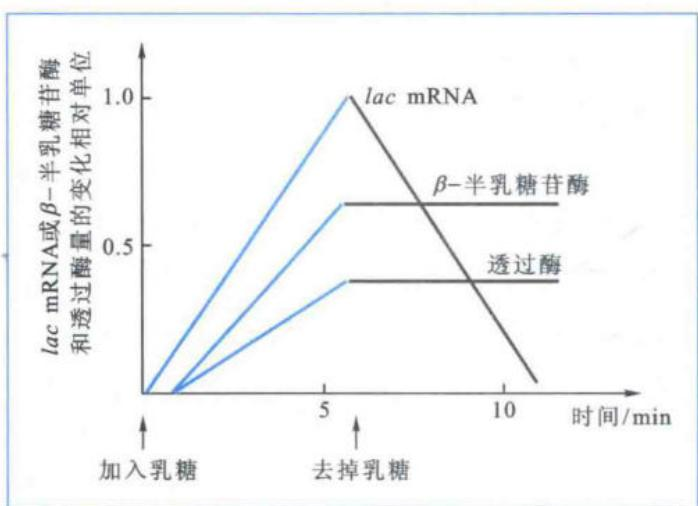

表明培养基中加入乳糖 1\~2 min 后,编码 β-半乳糖苷酶和透过酶的 lac mRNA 量就迅速增加。去掉乳糖后,lac mRNA 量立即下降到几乎无法检测到,表明乳糖确实能激发 lac mRNA 的合成。

事实上,研究诱导作用时很少使用乳糖,因为培养基中的乳糖会被诱导合成的 $\beta-$ 半乳糖苷酶所催化降解,从而使其浓度不

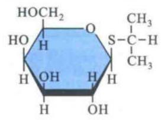  
异丙基巯基半乳糖苷(IPTG)

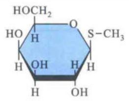  
巯甲基半乳糖苷 (TMG)

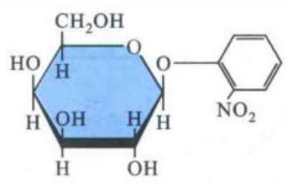  
图7-6 3种乳糖类似物结构式  
O-硝基半乳糖苷(ONPG)

断发生变化。实验室里常常使用两种含硫的乳糖类似物——异丙基巯基半乳糖苷（IPTG）和巯甲基半乳糖苷（TMG）来代替。另外，在酶活性分析中常用发色底物 O- 硝基半乳糖苷（ONPG）来做乳糖替代物，研究发现这些乳糖类似物都是高效诱导物 $^{(图7-6)}$ ，因为它们都不是半乳糖苷酶的底物，所以又称为安慰性诱导物（gratuitous inducer）。

为了证实诱导物的作用是诱导新酶合成,而不是将已存在于细胞中的酶前体转化成有活性的酶,科学家设计了同位素示踪实验。他们把大肠杆菌细胞放在加有放射性 $^{35}$ S标记的氨基酸但没有任何半乳糖苷诱导物的培养基中繁殖几代,然后再将这些带有放射活性的细菌转移到不含 $^{35}$ S、无放射性的培养基中,随着培养基中诱导物的加入, $\beta-$ 半乳糖苷酶便开始合成。分离纯化 $\beta-$ 半乳糖苷酶,发现这种酶无 $^{35}$ S标记,说明酶的合成不是由前体转化而来的,而是加入诱导物后新合成的。

## 7.2.2 操纵子模型及其影响因子

1961 年 Jacob 和 Monod 发表 lac 操纵子负控诱导模式时, 生物界反应之强烈, 可与 Watson 和 Crick 在 1953 年发表 DNA 双螺旋模型相媲美。他们还根据基因调控模式预言了 mRNA 的存在, 直接导致了后者的发现, 启动了对于氨基酸密码子的实验研究并使整个分子遗传学体系得以迅速建成和完善。

Jacob 和 Monod 认为诱导酶(他们当时称为适应酶)现象是个基因调控问题,而且可以用实验方法进行研究,他们通过大量实验及分析,加上后人的研究成果,乳糖操纵子的控制模型已经被人们广泛接受 $^{(图7-7)}$ ,其主要内容如下:

① Z、Y、A 基因的产物由同一条多顺反子的 mRNA 分子所编码。

② 该 mRNA 分子的启动区 (P) 位于阻遏基因 (I) 与操纵区 (O) 之间, 不能单独起始半乳糖苷酶和透过酶基因的高效表达。

③ 操纵区是 DNA 上的一小段序列(仅为 26 bp), 是阻遏物的结合位点。

④ 当阻遏物与操纵区相结合时，lac mRNA 的转录起始受到抑制。

⑤ 诱导物通过与阻遏物结合,改变它的三维构象,使之不能与操纵区相结合,从而激发 lac mRNA 的合成。这就是说,有诱导物存在时,操纵区没有被阻遏物占据,所以启动子能够顺利起始 mRNA 的转录。

这一简单模型解释了 lac 体系及其他负控诱导系统,我们会在以后发现这种解释并不是完善的,因为乳糖操纵子中同样也存在着正调控。

图7-7 lac操纵子的负调控模型

<table><tr><td colspan="2">无诱导物,结构基因不表达</td></tr><tr><td></td><td>lacI基因转录产生阻遏物单体,结合形成同源四聚体lacI同源四聚体与O区DNA相结合,阻遏基因转录</td></tr><tr><td colspan="2">诱导物启动lac结构基因转录</td></tr><tr><td></td><td>诱导物使lacI变成不能与O区相结合的非活性形式</td></tr><tr><td></td><td>RNA聚合酶与lac启动子区相结合,起始基因转录mRNA被转录成3个蛋白质</td></tr></table>

## 1. lac 操纵子的本底水平表达

有两个矛盾是操纵子理论所不能解释的。

首先,诱导物需要穿过细胞膜才能与阻遏物结合,而转运诱导物需要透过酶,后者的合成又需要诱导。这样我们必须要解释第一个诱导物是如何到达细胞内的。只有两种可能,或者一些诱导物可以在透过酶不存在时进入细胞,或者一些透过酶可以在没有诱导物的情况下合成。研究表明,第二种解释是正确的。

其次,人们发现乳糖(葡萄糖-1,4-半乳糖)并不与阻遏物相结合,真正的诱导物是乳糖的异构体——异构乳糖(葡萄糖-1,6-半乳糖),而后者是在β-半乳糖苷酶的催化下由乳糖形成的,因此,乳糖诱导β-半乳糖苷酶的合成需要有β-半乳糖苷酶的预先存在。对这一现象的解释同样是:在非诱导状态下有少量的lac mRNA合成(每个世代中有1\~5个mRNA分子),这种合成被称之为本底水平的组成型合成(background level constitutive synthesis)。由于阻遏物的结合并不是绝对紧密的,即使在它与操纵基因紧密结合时,也会偶尔掉下来;这时启动子的障碍被解除,RNA聚合酶开始转录。这种现象以每个细胞周

期 1\~2 次的概率发生。

## 2. 大肠杆菌对乳糖的反应

假设细菌生长在以甘油为碳源的培养基中,按照 lac 操纵子本底水平的表达,每个细胞内可有几个分子的 $\beta-$ 半乳糖苷酶和乳糖透过酶。现在加入乳糖,在单个透过酶分子作用下,少量乳糖分子进入细胞,又在单个 $\beta-$ 半乳糖苷酶分子的作用下转变成异构乳糖。某个异构乳糖与结合在操纵区上的阻遏物相结合并使后者失活而离开操纵区,开始了 lac mRNA 的生物合成。这些 mRNA 分子编码了大量的 $\beta-$ 半乳糖苷酶和乳糖透过酶,其结果导致乳糖大量涌入细胞。多数乳糖被降解成为葡萄糖和半乳糖,但还有许多乳糖被转变成异构乳糖,然后与细胞内的阻遏物结合(虽然合成速度低,但是阻遏物仍继续合成,因此必须有足够的异构乳糖才能使细胞维持去阻遏状态),阻遏物的失活促使 mRNA

  
图 7-8 培养基中有无诱导物对 lac mRNA 及 β-半乳糖苷酶活性的影响

高速合成,进一步提高了透过酶和 $\beta-$ 半乳糖苷酶的浓度(图7-8)。降解产生的葡萄糖被细胞用作碳源和能源,降解产生的半乳糖则被另一套酶体系转变成葡萄糖,这些酶的合成也是可诱导的。

一旦培养基和细胞中的所有乳糖都被消耗完毕,由于阻遏物仍在不断地被合成,有活性的阻遏物浓度将超过异构乳糖的浓度,使细胞重新建立起阻遏状态,导致 lac mRNA 合成被抑制。在细菌中,多数 mRNA 的半衰期只有几分钟,所以在不到一个世代的生长期内,lac mRNA 几乎从细胞内消失。β- 半乳糖苷酶及透过酶的合成也趋向停止,这些蛋白质虽然很稳定,但其浓度随着细胞的分裂而不断被稀释。值得注意的是,如果在原有的乳糖被撤去之后的一个世代中再加入乳糖,这时乳糖可以立即开始降解,因为此时细胞内仍有一定浓度的透过酶和 β- 半乳糖苷酶。

## 3. 阻遏物 lacI 基因产物及功能

现有的研究表明，lac 操纵子阻遏物 mRNA 是在弱启动子控制下组成型合成的。编码的阻遏蛋白 LacI 的 N 端是 HTH (helix-turn-helix) DNA 结合结构域，中间是两个相似的核心结构域,可以和诱导物结合。LacI 的 C 端是一个 $\alpha$ 螺旋,参与阻遏蛋白的聚合。阻遏蛋白单体通过中间核心结构域的相互作用形成二聚体,两个二聚体进一步通过 C 端的 $\alpha$ 螺旋聚合形成四聚体形式的阻遏物。当细胞中不存在诱导物(异构乳糖)时,阻遏物通过二聚体的两个 HTH 结构域特异性地结合在 lac 操纵区中一段 21 bp 的 DNA 序列上,阻止 RNA 聚合酶与 lac 操纵子启动子区的结合,抑制 lac mRNA 的转录。一旦细胞中乳糖水平提高,异构乳糖数量增加,有效结合到阻遏蛋白的核心结构域,引起阻遏蛋白的构象改变,与 DNA 结合的特异性降低,阻遏蛋白不再特异性结合 lac 操纵区而是随机与 DNA 的任意区域相结合。lac 操纵子的转录起始区暴露并被 RNA 聚合酶结合,激活 lac mRNA 的转录。而当乳糖耗尽,诱导物异构乳糖减少,失去诱导物的阻遏蛋白会重新特异性结合 lac 操纵区,阻止基因转录(图 7-9)。

图 7-9 LacI 的蛋白质结构示意图及负控诱导系统  

当 lacI 基因由弱启动子突变成强启动子,细胞内就不可能产生足够的诱导物来克服阻遏状态,因此在这些突变体中,整个 lac 操纵子就不可诱导。

## 4. cAMP 与代谢物激活蛋白

广泛存在于动、植物组织中的 cAMP $^{(图 7-10)}$ 是 ATP 在腺苷酸环化酶的作用下转变而来的，在真核生物的激素调节过程中起着重要作用。在大肠杆菌中，cAMP 的浓度受到葡

图7-10 $3^{\prime},5^{\prime}$ -cAMP的化学结构式

萄糖代谢的调节。如果将细菌放在缺乏碳源的培养基中培养，细胞内cAMP浓度就高；如果在含葡萄糖的培养基中培养，cAMP的浓度就低；如果培养基中只有甘油或乳糖等不经由糖酵解途径的碳源，cAMP的浓度也会很高，因此推测糖酵解途径中位于葡糖-6-磷酸与甘油之间的某些代谢产物是腺苷酸环化酶活性的抑制剂。

大肠杆菌中的代谢物激活蛋白(CAP, catabolite activator protein), 能结合 cAMP, 又被称为环腺苷酸受体蛋白(CRP, cAMP receptor protein), 由 Crp 基因编码。CRP 和 cAMP 都是合成 lac mRNA 所必需的, 凡 Crp 及腺苷酸环化酶基因突变的细菌都不能合成 lac mRNA。CRP 蛋白之间通过相互作用形成二聚体, 每个 CRP 蛋白可以结合一个 cAMP 分子, 只有当 cAMP 装配到 CRP 蛋白上使 CRP 二聚体的构象改变, cAMP-CRP 复合物才能特异地结合到 DNA 上的 CAP 位点 (CAP site)。lac 操纵子上的 CAP 位点位于转录起始位点上游约 60 bp 处, 紧邻 RNA 聚合酶所结合的启动子区。RNA 聚合酶 α 亚基的 C 端结构域 (αCTD) 可以结合 CAP 位点, 并与 CAP 位点附近的 DNA 结合。通过与 αCTD 的相互作用, cAMP-CRP 复合物帮助 RNA 聚合酶结合到启动子区域, 激活 lac mRNA 的转录 (图 7-11)。因为 Crp 基因和环化酶基因的突变细菌即使同时也是 I⁻ 或 O⁺ 突变, 都不能合成出 lac mRNA, 一般认为 cAMP-CRP 是一个不同于阻遏体系的正调控因子, 而 lac 操纵子的功能是在这两个相互独立的调控体系作用下实现的。CAP 不仅参与了 lac 基因的表达调控, 还参与了大肠杆菌中其他基因的表达调控。图 7-12 显示了存在于 gal、lac 和 ara 3 个操纵子上游启动子区的 cAMP-CRP 结合位点的相对位置。

  
图7-11 cAMP-CRP 复合物激活lac操纵子

此外，半乳糖、麦芽糖、阿拉伯糖、山梨醇等在降解过程中均转化生成葡萄糖或糖酵解途径中的其他中间产物，所以，这些糖代谢中有关的酶都是由可诱导的操纵子控制的。只要有葡萄糖存在，这些操纵子就不表达，被称为降解物敏感型操纵子（catabolite sensitive operon），实验证明这些操纵子都是由 cAMP-CRP 调节的。对大量操纵子启动区的研究表明，CRP-cAMP 结合位点存在序列特异性 $^{(图 7-13)}$ 。

cAMP-CRP 复合物与启动子区的结合是 lac mRNA 合成起始所必需的, 因为这个复合物结合于启动子上游, 能使 DNA 双螺旋发生弯曲, 有利于形成稳定的开放型启动子 -RNA 聚

  
图 7-12 gal、lac 和 ara 操纵子上游启动子区与 CRP-cAMP 结合位点的相对位置分析

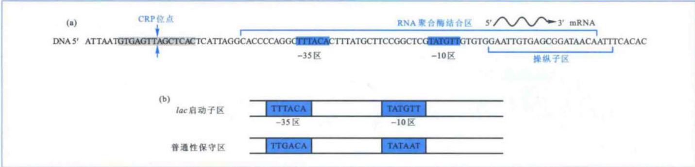  
图 7-13 大肠杆菌 lac 操纵子启动区 cAMP-CRP 及 -35 区、-10 区序列分析  
图7-14 CRP-cAMP与上游DNA结合后造成模板DNA沿对称序列中央发生了大于 $90^{\circ}$ 的弯曲

图7-15 葡萄糖抑制了lac操纵子基因的表达  

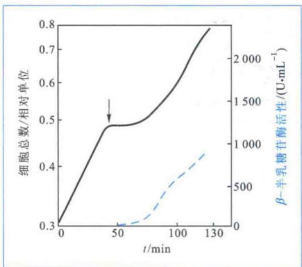

合酶结构 $^{(图7-14)}$ 。而阻遏物则是一个抗解链蛋白(antimelting protein)，阻止形成开放结构，从而抑制RNA聚合酶的功能。

## 5. 葡萄糖对 lac 操纵子的影响

β-半乳糖苷酶在乳糖代谢中的作用是把前者分解成葡萄糖及半乳糖(半乳糖将在gal操纵子的作用下再转化成葡萄糖)。如果将葡萄糖和乳糖同时加入培养基中,大肠杆菌在耗尽外源葡萄糖之前不会诱发lac操纵子(图7-15),没有β-半乳糖苷酶活性;当葡萄糖消耗完以后(图中箭头处),细胞内cAMP浓度增加,β-半乳糖苷酶活性增加,一度停止生长的细胞又恢复分裂。研究发现,葡萄糖对lac操纵子表达的抑制是间接的。例如,有一个大肠杆菌突变体,它在糖酵解途径中不能将葡糖-6-磷酸转化为下一步代谢中间物,这些细菌的lac基因能在葡萄糖存在时被诱导合成。所以,我们说不是葡萄糖而是它的某些降解产

物抑制 lac mRNA 的合成,科学上把葡萄糖的这种效应称之为代谢物阻遏效应(catabolite repression)。当向乳糖培养基中加入葡萄糖时,葡萄糖的降解产物能降低细胞内 cAMP 的含量,CAP 便不能结合在启动子上。此时,即使有乳糖存在,虽已解除了对操纵基因的阻遏,RNA 聚合酶不能与启动子结合,也不能转录,所以仍不能利用乳糖(图 7-16)。

## 7.2.3 lac 操纵子 DNA 的调控区域——P、O 区

已经分离得到含有 lac 操纵子的 DNA 片段, 发现 P 区(即启动子区)一般是从 I 基因结束到 mRNA 转录起始位点下游 5～10 bp, 而 O 区(即阻遏物结合区)位于 -7～+28 位, 该区的碱基序列有对称性, 其对称轴在 +11 位碱基对。图 7-17 分别例举了 gal、aroH、trp、trpR 和 lac 5 个操纵子中 P 区及 O 区的相对位置。实验表明, 阻遏物与 O 区的结合影响了 RNA 聚合酶与启动区结合形成转录起始复合物的效率。

  
图 7-16 葡萄糖对 lac 操纵子的调控

## 7.2.4 lac 操纵子中的其他问题

## 1. lacA 基因及其生理功能

lacA 基因存在于 lac 操纵子中, 编码了 $\beta-$ 半乳糖苷乙酰基转移酶。虽然乳糖本身不能被乙酰化,但这个酶能够把乙酰基从供体上转移到半乳糖苷分子上,这具有什么生理意义呢?

  
图7-17 不同操纵子 $P$ 区及 $O$ 区相对位置比较

自然界中存在着许多种能被 $\beta-$ 半乳糖苷酶降解的半乳糖苷分子，它们的分解产物往往不能被进一步代谢，很容易在体内积累。这是非常有害的，因为不少半乳糖苷衍生物在高浓度时是细胞正常生长的抑制物。研究发现，当有IPTG存在时， $\Gamma O^c A^{-}$ 大肠杆菌的生长速度显著慢于相应的 $A^{+}$ 株系，两组细胞的差异仅仅在于后者能将IPTG乙酰化，而乙酰化的IPTG不能被 $\beta-$ 半乳糖苷酶所分解。所以， $A$ 基因虽然不在乳糖降解中起作用，但它抑制了 $\beta-$ 半乳糖苷酶产物的有害性衍生物在细胞内积累，在生物进化中是有意义的。

## 2. lac 基因产物数量上的比较

在一个完全被诱导的细胞中， $\beta-$ 半乳糖苷酶、透过酶及乙酰基转移酶的拷贝数比例为1：0.5：0.2。作为数百万年进化演变的结果，这个比例在一定程度上反映了以 $\beta-$ 半乳糖苷作为唯一碳源时细胞的需要。不同的酶在数量上的差异是由于在翻译水平上受到调节所致。这种调节有以下两种方式：

① lac mRNA 可能与翻译过程中的核糖体相脱离, 从而终止蛋白质链的翻译。这种现象发生的频率取决于每一个后续的 AUG 密码子再度起始翻译的概率。因此, 就存在着一个从 mRNA 的 5' 端到 3' 端的蛋白质合成梯度。对于大多数多顺反子 mRNA 分子来说, 这种现象具有普遍性。

② 在 lac mRNA 分子内部, A 基因比 Z 基因更易受内切酶作用发生降解, 因此, 在任何时候 Z 基因的完整拷贝数要比 A 基因多。事实上, 对于某个活跃表达的多顺反子操纵子, 该 mRNA 所编码的各种蛋白质的相对浓度都由每一个顺反子的翻译频率所决定。

## 3. 操纵子的融合与基因工程

操纵子在自然条件下可能发生融合,典型的例子是 lac 操纵子与负责嘌呤合成的 pur 操纵子的耦联。尽管 pur 操纵子以完全不同于 lac 操纵子的方式进行调节,但它在染色体上位于 lac 操纵子沿转录方向的下游,中间只隔了一个控制细胞对 T6 噬菌体敏感性的 tsx 基因。科学家从 $tsx^{s}Z^{+}$ 细胞中分离到 $tsx^{R}Z^{-}$ 突变体,研究该突变体的 DNA 序列,发现它缺失了从 lac 操纵子的 Z 基因开始,包括整个 tsx 基因以及 pur 操纵基因和 pur 启动子的一部分。这一突变使 Z 基因缺失终止序列,当转录作用从 lac 启动子处开始后,就合成出由一部分 Z 基因编码区和整个 pur 基因转录生成的 mRNA 分子。因此,在这个体系中,pur 操纵子被“嫁接”到 lac 启动子上,形成融合基因。这一现象给了生物学家以很大的启发,因为 lac 启动子是一个很强的启动子,通过它可以使较弱启动子的转录增强,从而增加蛋白质的合成量。到目前为止,基因融合技术已经成为基因工程操作中应用最广泛的技术。

<!-- C-BEGIN Campbell 18.1 -->

### 【英文对应 Campbell Concept 18.1：Bacteria often respond to environmental change by regulating transcription】

> 来源：Campbell Biology（书籍/01_Campbell_Biology） 第18章 Regulation of Gene Expression，Concept 18.1。

#### [EN] Concept 18.1: Bacteria often respond to environmental change by regulating transcription

Bacterial cells that can conserve resources and energy have a selective advantage over cells that are unable to do so. Thus, natural selection has favored bacteria that express only the genes whose products are needed by the cell.

Consider, for instance, an individual Escherichia coli (E. coli) cell living in a human colon, dependent for its nutrients on the whimsical eating habits of its host. If the environment is lacking in the amino acid tryptophan, which the bacterium needs to survive, the cell responds by activating a metabolic pathway that makes tryptophan from another compound. If the human host later eats a tryptophan-rich meal, the bacterial cell stops producing tryptophan, thus avoiding wasting resources to produce a substance that is readily available from the surrounding solution.

A metabolic pathway can be controlled on two levels, as shown for the synthesis of tryptophan in Figure 18.2. First, cells can adjust the activity of enzymes already present. This is a fairly rapid physiological response, which relies on the sensitivity of many enzymes to chemical cues that increase or decrease their catalytic activity (see Concept 8.5). The activity of the first enzyme in the pathway is inhibited by the pathway's end product—tryptophan, in this case (Figure 18.2a). Thus, if tryptophan accumulates in a cell, it shuts down the synthesis of more tryptophan by inhibiting enzyme activity. Such feedback inhibition, typical of anabolic (biosynthetic) pathways, allows a cell to adapt to short-term fluctuations in the supply of a substance it needs (see Figure 8.21).

Second, cells can adjust the production level of certain enzymes via a genetic mechanism; that is, they can regulate the expression of the genes encoding the enzymes. If, in our example, the environment provides all the tryptophan the cell needs, the cell stops making the enzymes that catalyze the synthesis of tryptophan (Figure 18.2b). In this case, the control of enzyme production occurs at the level of transcription, the synthesis of messenger RNA from the genes that code for these enzymes.

Regulation of the tryptophan synthesis pathway is just one example of how bacteria tune their metabolism to changing environments. Many genes of the bacterial genome are switched on or off by changes in the metabolic status of the cell; some genes are regulated singly and others as groups of related genes. One basic mechanism for this type of regulation of groups of genes in bacteria, described as the operon model, was discovered in 1961 by François Jacob and Jacques Monod at the Pasteur Institute in Paris. Let's see what an operon is and how it works.

#### [EN] Operons: The Basic Concept

E. coli synthesizes the amino acid tryptophan from a precursor molecule in the three-step pathway shown in Figure 18.2. Each reaction in the pathway is catalyzed by a specific enzyme, and the five genes that code for the subunits of these enzymes are

Figure 18.2 Regulation of a metabolic pathway.

In the pathway for tryptophan synthesis, an abundance of tryptophan can both (a) inhibit the activity of the first enzyme in the pathway (feedback inhibition), a rapid response, and (b) repress expression of the genes encoding all subunits of the enzymes in the pathway, a longer-term response. The minus sign in a red circle stands for inhibition.

clustered together on the bacterial chromosome. A single promoter serves all five genes, which together constitute a transcription unit. (Recall that a promoter is a site where RNA polymerase can bind to DNA and begin transcription; see Figure 17.8.) Thus, transcription gives rise to one long mRNA molecule that codes for the five polypeptides making up the enzymes in the tryptophan pathway (Figure 18.3a). The cell can translate this one mRNA into five separate polypeptides because the mRNA is punctuated with start and stop codons that signal where the coding sequence for each polypeptide begins and ends.

A key advantage of grouping genes of related function into one transcription unit is that a single “on-off switch” can control the whole cluster of functionally related genes; in other words, these genes are coordinately controlled. When an E. coli cell must make tryptophan for itself because its surrounding environment lacks this amino acid, all the enzymes for the metabolic pathway are synthesized at the same time. The on-off switch is a segment of DNA called an operator. Both its location and name suit its function: Positioned within the promoter or, in some cases, between the promoter and the enzyme-coding genes, the operator controls the access of RNA polymerase to the genes. Together, the operator, the promoter, and the genes they control—the entire stretch of DNA required for enzyme production for the tryptophan pathway—constitute an operon. The trp operon (trp for tryptophan) is one of many operons in the E. coli genome (see Figure 18.3a).

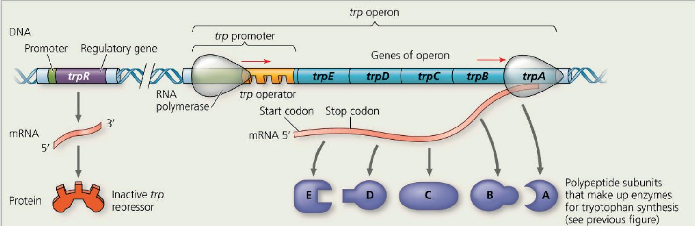  
(a) Tryptophan absent, repressor inactive, operon on. RNA polymerase attaches to the DNA at the operon's promoter and transcribes the operon's genes. Enzymes for tryptophan synthesis are made.

  
(b) Tryptophan present, repressor active, operon off. As tryptophan accumulates, it inhibits its own production by activating the repressor protein, which binds to the operator, blocking transcription. Enzymes for tryptophan synthesis are not made.

If the operator is the operon's switch for controlling transcription, how does this switch work? By itself, the trp operon is turned on; that is, RNA polymerase can bind to the promoter and transcribe the genes of the operon. The trp operon can be switched off by a protein that is called the trp repressor. A repressor binds to the operator, preventing RNA polymerase from transcribing the genes, often by preventing RNA polymerase from binding (Figure 18.3b). A repressor protein is specific for the operator of a particular operon. For example, the trp repressor, which switches off the trp operon by binding to the trp operator, has no effect on other operons in the E. coli genome.

A repressor protein is encoded by a regulatory gene—in this case, a gene called trpR; trpR is located some distance from the trp operon and has its own promoter. Regulatory genes are among the bacterial genes that are expressed continuously, although at a low rate, and a few trp repressor molecules are always present in E. coli cells. Why, then, is the trp operon not switched off permanently? First, the binding of repressors to operators is reversible. An operator alternates between two states: one with the repressor bound and one without the repressor bound. The relative duration of the repressor-bound state is higher when more active repressor molecules are present. Second, the trp repressor, like most regulatory

Figure 18.3 The trp operon in E. coli: regulated synthesis of repressible enzymes.

Tryptophan is an amino acid produced by an anabolic pathway catalyzed by three enzymes (see Figure 18.2). (a) The five genes encoding the polypeptide subunits of the enzymes in this pathway are grouped, along with a promoter, into the trp operon. The trp operator (the repressor binding site) is located within the trp promoter (the RNA polymerase binding site). (b) Accumulation of tryptophan, the end product of the pathway, represses transcription of the trp operon, thus blocking synthesis of all the enzymes in the pathway and shutting down tryptophan production.

VISUAL SKILLS Describe what happens to the trp operon as the cell uses up its store of tryptophan.

For suggested answer, see Appendix A.

proteins, is an allosteric protein, with two alternative shapes: active and inactive (see Figure 8.20). The trp repressor is synthesized in the inactive form, which has little affinity for the trp operator. Only when a tryptophan molecule binds to the trp repressor at an allosteric site does the repressor protein change to the active form that can attach to the operator, turning the operon off.

Tryptophan functions in this system as a corepressor, a small molecule that cooperates with a repressor protein to switch an operon off. As tryptophan accumulates, more tryptophan molecules associate with trp repressor molecules, which can then bind to the trp operator and shut down production of the tryptophan pathway enzymes. If the cell's tryptophan level drops, many fewer trp repressor proteins would have tryptophan bound, so most would be inactive; they would dissociate from the operator, allowing transcription of the operon's genes to resume. The trp operon is one example of how gene expression can respond to changes in the cell's internal and external environment.

#### [EN] Repressible and Inducible Operons: Two Types of Negative Gene Regulation

The trp operon is said to be a repressible operon because its transcription is usually on but can be inhibited (repressed) when a specific small molecule (in this case, tryptophan) binds

allosterically to a regulatory protein. In contrast, an inducible operon is usually off but can be stimulated (induced) to be on when a specific small molecule interacts with a different regulatory protein. The classic example of an inducible operon is the lac operon (lac stands for “lactose”).

The disaccharide lactose (milk sugar) is available to $E. coli$ when the bacterium is in contact with any dairy product. Lactose metabolism by $E. coli$ begins with hydrolysis of the disaccharide into its component monosaccharides (glucose and galactose), a reaction catalyzed by the enzyme β-galactosidase. Only a few molecules of this enzyme are present in an $E. coli$ cell growing in the absence of lactose. If lactose is added to the bacterium's environment, however, the number of β-galactosidase molecules in the cell increases 1,000-fold within about 15 minutes. How can a cell ramp up enzyme production this quickly?

The gene for $\beta$ -galactosidase (lacZ) is part of the lac operon, which includes two other genes coding for enzymes that function in the use of lactose (Figure 18.4). The entire transcription unit is under the command of one main operator and promoter. The regulatory gene, lacI, located outside the lac operon, codes for an allosteric repressor protein that can switch off the lac operon by binding to the lac operator. So far, this sounds just like regulation of the trp operon, but there is one important difference. Recall that the trp repressor protein is inactive by itself and requires tryptophan as a corepressor in order to bind to the operator. The lac repressor, in contrast, is active by itself, binding to the operator and switching the lac operon off. In this case, a specific small molecule, called an inducer, inactivates the repressor.

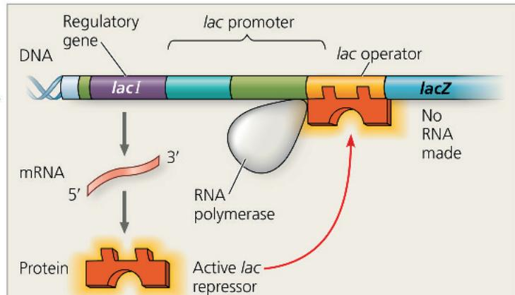  
(a) Lactose absent, repressor active, operon off. The lac repressor is innately active, and in the absence of lactose it switches off the operon by binding to the operator. The enzymes for using lactose are not made.

For the lac operon, the inducer is allolactose, an isomer of lactose formed in small amounts from lactose that enters the cell. In the absence of lactose (and therefore allolactose), the lac repressor is in its active shape and binds to the operator; thus, the genes of the lac operon are silenced (Figure 18.4a). If lactose is added to the cell's surroundings, allolactose binds to the lac repressor and alters its shape so the repressor can no longer bind to the operator. Without the lac repressor bound, the lac operon is transcribed into mRNA, and the enzymes for using lactose are made (Figure 18.4b).

In the context of gene regulation, the enzymes of the lactose pathway are referred to as inducible enzymes because their synthesis is induced by a chemical signal (allolactose, in this case). Analogously, the enzymes for tryptophan synthesis are said to be repressible. Repressible enzymes generally function in anabolic pathways, which synthesize essential end products from raw materials (precursors). By suspending production of an end product when it is already present in sufficient quantity, the cell can allocate its organic precursors and energy for other uses. In contrast, inducible enzymes usually function in catabolic pathways, which break down a nutrient to simpler molecules.

  
(b) Lactose present, repressor inactive, operon on. Allolactose, an isomer of lactose, binds to the repressor, inactivating it and "derepressing" the operon. The inactive repressor cannot bind to the operator, and so the genes of the lac operon are transcribed, and the enzymes for using lactose are made.

#### [EN] Figure 18.4 The lac operon in E. coli: regulated synthesis of inducible enzymes.

E. coli uses three enzymes to take up and metabolize lactose, the genes for which are clustered in the lac operon. The first gene, lacZ, codes for $\beta$ -galactosidase, which hydrolyzes lactose to glucose and galactose. The second, lacY, codes for a permease, the membrane protein that transports lactose into the cell. The third, lacA, codes for transacetylase, an enzyme that detoxifies other molecules entering the cell via the permease. Unusually, the gene for the lac repressor, lacI, is adjacent to the lac operon. The function of the teal region within the promoter will be revealed in Figure 18.5.

By producing the appropriate enzymes only when the nutrient is available, the cell avoids wasting energy and precursors making proteins that are not needed.

Regulation of both the trp and lac operons involves the negative control of genes because the operons are switched off by the active form of their respective repressor protein. It may be easier to see this for the trp operon, but it is also true for the lac operon. In the case of the lac operon, allolactose induces enzyme synthesis not by directly activating the lac operon, but by freeing it from the negative effect of the repressor (see Figure 18.4b). Gene regulation is said to be positive only when a regulatory protein interacts directly with the genome to increase transcription.

#### [EN] Positive Gene Regulation

When glucose and lactose are both present in its environment, E. coli preferentially uses glucose. The enzymes for glucose breakdown in glycolysis (see Figure 9.8) are continually present. Only when lactose is present and glucose is in short supply does E. coli use lactose as an energy source, and only then does it synthesize appreciable quantities of the enzymes for lactose breakdown.

How does the E. coli cell sense the glucose concentration and relay this information to the lac operon? Again, the mechanism depends on the interaction of an allosteric regulatory protein with a small organic molecule, cyclic AMP (cAMP) in this case, which accumulates when glucose is scarce (see Figure 11.11 for the structure of cAMP). The regulatory protein, called cAMP receptor protein (CRP), is an activator, a protein that binds to DNA and stimulates transcription of a gene. (CRP is also called catabolite activator protein, or CAP.) When cAMP binds to this regulatory protein, CRP assumes its active shape and can attach to a specific site at the upstream end of the lac promoter (Figure 18.5a). This attachment increases the affinity of RNA polymerase for the lac promoter, which is actually rather low even when no lac repressor is bound to the operator. By facilitating the binding of RNA polymerase to the promoter and thereby increasing the rate of transcription of the lac operon, the attachment of CRP to the promoter directly stimulates gene expression. Therefore, this mechanism qualifies as positive regulation.

If the amount of glucose in the cell increases, the cAMP concentration falls, and without cAMP, CRP detaches from the lac operon. Because CRP is inactive, RNA polymerase binds less efficiently to the promoter, and transcription of the lac operon proceeds only at a low level, even when lactose is present Figure 18.5b. Thus, the lac operon is under dual control: negative control by the lac repressor and positive control by CRP. Whether or not transcription occurs is controlled by allolactose: Without allolactose, the lac repressor is active and the operon is off (transcription does not occur; see Figure 18.4a); with allolactose, the lac repressor is inactive and the operon is on (transcription occurs; see Figure 18.4b). The rate of transcription is controlled by whether CRP has cAMP bound to it: With bound cAMP, the rate is high; without it, the rate is low. It is as though the operon has both an on-off switch and a volume control.

Figure 18.5 Positive control of the lac operon by cAMP receptor protein (CRP).

RNA polymerase has high affinity for the lac promoter only when CRP is bound to a DNA site at the upstream end of the promoter. CRP, in turn, attaches to its DNA site only when associated with cyclic AMP (cAMP), whose concentration in the cell rises when the glucose concentration falls. Thus, when glucose is present, even if lactose is also available, the cell preferentially catabolizes glucose and makes very low levels of the enzymes for using lactose.

  
(a) Lactose present, glucose scarce (cAMP level high): abundant lac mRNA synthesized. If glucose is scarce, the high level of cAMP activates CRP, which binds to the promoter and increases RNA polymerase binding there. The lac operon produces large amounts of mRNA coding for the enzymes that the cell needs for use of lactose.

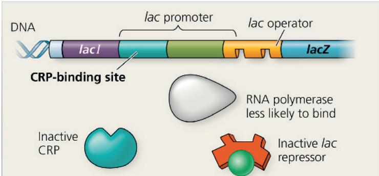  
(b) Lactose present, glucose present (cAMP level low): little lac mRNA synthesized. When glucose is present, cAMP is scarce, and CRP doesn't stimulate transcription to a significant rate, even though no repressor is bound.

In addition to regulating the lac operon, CRP helps regulate other operons that encode enzymes used in catabolic pathways. All told, it may affect the expression of more than 100 genes in E. coli. When glucose is plentiful and CRP is inactive, the synthesis of enzymes that catabolize compounds other than glucose generally slows down. The ability to catabolize other compounds, such as lactose, enables a cell deprived of glucose to survive. The compounds present in any given cell at a certain moment determine which operons are switched on—the result of simple interactions of activator and repressor proteins with the promoters of the genes in question.

#### [EN] Concept Check 18.1

1. How does binding of the trp corepressor to the trp repressor alter repressor function and transcription? How does binding of the lac inducer alter the function of the lac repressor?

2. Describe the binding of repressors and activators to the lac operon, and the effect on transcription, when both lactose and glucose are scarce.

3. WHAT IF? A certain mutation in $E. coli$ changes the lac operator so that the active repressor cannot bind. How would this affect the cell's production of β-galactosidase?

For suggested answers, see Appendix A.

<!-- C-END Campbell 18.1 -->

## 7.3 色氨酸操纵子与负控阻遏系统

由于 trp 体系参与生物合成而不是降解, 它不受葡萄糖或 cAMP-CRP 的调控。色氨酸的合成主要分 5 步完成, 有 7 个基因参与整个合成过程 $^{(图 7-18)}$ 。trpE 和 trpG 编码邻氨基苯甲酸合酶, trpD 编码邻氨基苯甲酸磷酸核糖转移酶, trpF 编码异构酶, trpC 编码吲哚甘油磷酸合酶, trpA 和 trpB 则分别编码色氨酸合酶的 $\alpha$ 和 $\beta$ 亚基。研究发现, 在大肠杆菌等许多细菌中, trpD 和 trpG 融合成一个功能基因, trpC 和 trpF 也融合成一个基因, 产生具有双重功能的蛋白质。除上述7个基因之外，细菌中还有pabA和pabB基因分别编码ADC合酶的两个亚基，pabC基因编码ADC裂解酶，ubiC基因编码分枝酸裂解酶，entC基因编码异构分枝酸合酶(图7-19)，这些基因产物都在不同程度上参与了分枝酸代谢，与色氨酸合成有一定关系。

图 7-18 细菌中色氨酸生物合成途径  
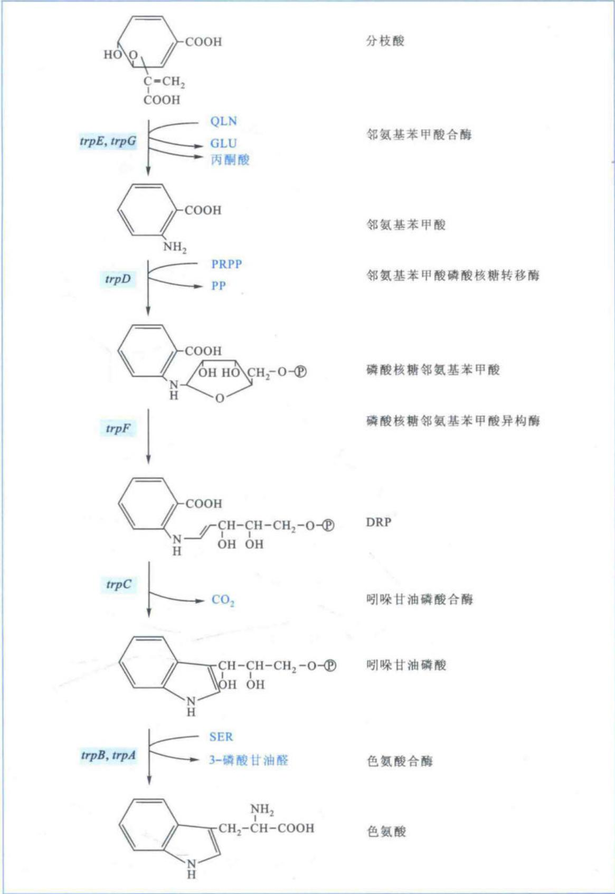

图 7-19 细菌中参与分枝酸代谢的主要酶系统  

trpE 基因是第一个被翻译的基因, 和 trpE 紧邻的是启动子区和操纵区。另外, 前导区和弱化子区分别定名为 trpL 和 trpa (不是 trpA)。trp 操纵子中产生阻遏物的基因是 trpR, 该基因距 trp 基因簇很远。后者位于大肠杆菌染色体图上 25 min 处, 而前者则位于 90 min 处。在位于 65 min 处还有一个 trpS (色氨酸 tRNA 合成酶), 它与携带有色氨酸的 tRNA $^{Trp}$ 共同参与 trp 操纵子的调控作用 (图 7-20)。trp 操纵子的转录调控包括阻遏系统和弱化系统, 下面分别予以介绍。

## 7.3.1 trp 操纵子的阻遏系统

trpR 基因突变常引起 trp mRNA 的组成型合成,该基因产物因此被称为辅阻遏蛋白 (aporepressor)。除非培养基中有色氨酸,否则这个辅阻遏蛋白不会与操纵区结合。辅阻遏蛋白与色氨酸相结合形成有活性的阻遏物,与操纵区结合并关闭 trp mRNA 转录 $^{(图7-20)}$ 。

研究发现,这个系统中的效应物分子是色氨酸,是由 trp 操纵子所编码的生物合成途径的末端终产物。当培养基中色氨酸含量较高时,色氨酸与游离的辅阻遏蛋白相结合,并使之与操纵区 DNA 紧密结合;当培养基中色氨酸供应不足时,辅阻遏蛋白失去色氨酸并从操纵区上解离,trp 操纵子去阻遏。

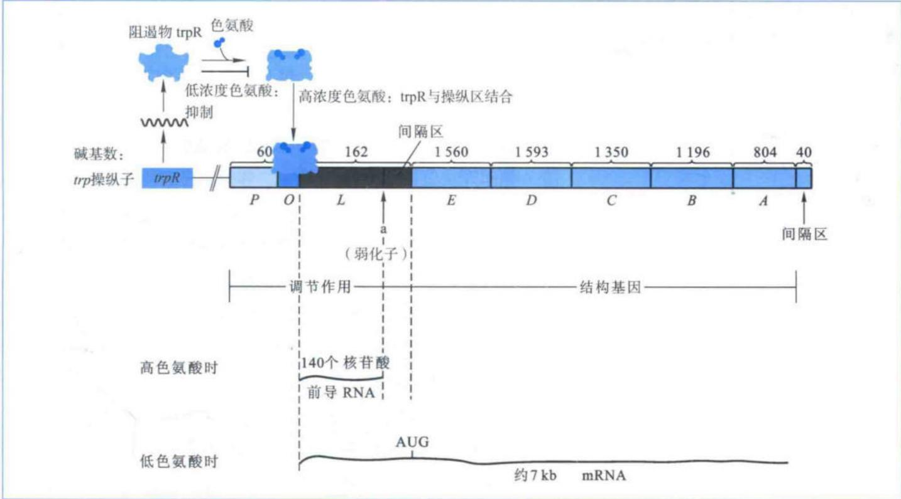  
图7-20 大肠杆菌中的trp操纵子

## 7.3.2 trp 操纵子的弱化作用

随着对色氨酸操纵子的深入研究,发现有些现象与以阻遏作为唯一调节机制的观点不一致,例如,在色氨酸高浓度和低浓度下观察到 trp 操纵子的表达水平相差约 600 倍,然而阻遏作用仅使转录降低 70 倍。此外,使阻遏物失活突变不能完全消除色氨酸对 trp 操纵子表达的影响。显然,trp 操纵子的这种调控与阻遏物的控制无关,必然还有其他调控机制。通过对缺失突变株的研究发现,这种调控机制就是弱化作用(attenuation)。事实上,阻遏-操纵机制对色氨酸来说只是一个一级开关,主管转录是否启动,相当于 trp 操纵子的粗调开关,弱化作用相当于精细开关,对氨基酸的生物合成进行精细调控并决定已经启动的转录是否继续下去。

## 1. 弱化子

弱化系统作为一个细微调控,是通过转录达到第一个结构基因之前的过早终止来实现的,细胞中色氨酸的浓度是实现过早终止的根本原因。

在 trp mRNA 5' 端 trpE 基因的起始密码前有一个长 162 bp 的 mRNA 片段被称为前导区, 其中 123\~150 位碱基序列如果缺失, trp 基因表达可提高 6\~10 倍, 而且无论是在阻遏细胞内还是在永久性突变的细胞内都是这样。研究发现, 当 mRNA 合成起始以后, 除非培养基中完全没有色氨酸, 转录总是在这个区域终止, 产生一个仅有 140 个核苷酸的 RNA 分子, 终止 trp 基因转录, 这就是 123\~150 区序列缺失会提高 trp 基因表达的原因 (图 7-20)。因为转录终止发生在这一区域, 并且这种终止是被调节的, 这个区域就被称为

图 7-21 trp 弱化子 mRNA 的终止区  

弱化子。研究引起终止的 mRNA 碱基序列(图 7-21)，发现该区 mRNA 通过自我配对可以形成茎－环结构，有典型的终止子特点。

## 2. 前导肽

各种实验表明弱化作用需要负载 $tRNA^{Trp}$ 参与,这意味着前导序列的某些部分被翻译了。分析前导序列发现,它包括起始密码子 AUG 和

终止密码子 UGA; 如果翻译起始于 AUG, 应该产生一个含有 14 个氨基酸的多肽。这个假设的多肽(还未实际观察到)被称为前导肽。前导区序列具有一个非常有意义的特点, 在其第 10 和第 11 位上有相邻的两个色氨酸密码子。这一点很重要, 因为组氨酸操纵子中, 也具有弱化子, 也具有一个类似的能编码前导肽的碱基序列, 此序列中含有 7 个相邻的组氨酸密码子。苯丙氨酸操纵子中同样存在弱化子结构, 其前导序列中也有 7 个苯丙氨酸密码子。这些密码子参与了 trp 及其他操纵子中的转录弱化机制。

trp 前导区的碱基序列已经全部测定, 引人注目的是其中 4 个分别以 1、2、3 和 4 表示的片段能以两种不同的方式进行碱基配对(图 7-22), 有时以 1-2 和 3-4 配对, 有时只以 2-3 方式互补配对。RNase T1 降解实验(此酶不能水解配对的 RNA)表明, 纯化的 trp 前导序列中确有 1-2 和 3-4 的配对方式, 由此定位的 3-4 配对区正好位于终止密码子的识别区, 当这个区域发生破坏自我配对的碱基突变时有利于转录的继续进行(图 7-22)。

图 7-22 原核生物 RNA 中前导序列变构引起转录的终止或弱化  

## 3. 转录的弱化作用

转录的弱化理论认为 mRNA 转录的终止是通过前导肽基因的翻译来调节的。因为在前导肽基因中有两个相邻的色氨酸密码子，所以这个前导肽的翻译必定对 $tRNA^{Trp}$ 的浓度敏感。当培养基中色氨酸的浓度很低时，负载有色氨酸的 $tRNA^{Trp}$ 也就少，这样翻译通过两个相邻色氨酸密码子的速度就会很慢，当 4 区被转录完成时，核糖体才进行到 1 区（或停留在两个相邻的 trp 密码子处），这时的前导区结构是 2-3 配对，不形成 3-4 配对的终止结构，所以转录可继续进行，直到将 trp 操纵子中的结构基因全部转录。而当培养基中色氨酸浓度高时，核糖体可顺利通过两个相邻的色氨酸密码子，在 4 区被转录之前，核糖体就到达 2 区，这样使 2-3 不能配对，3-4 区可以自由配对形成茎－环状终止子结构，转录停止，trp 操纵子中的结构基因被关闭而不再合成色氨酸 $^{(图7-23)}$ 。所以，弱化子对 RNA 聚合酶的影响依赖于前导肽翻译中核糖体所处的位置。已从大肠杆菌和沙门氏菌中陆续发现了不少具有弱化作用的操纵子，它们都具有前导肽，并且前导肽中都富含该操纵子所合成的那种氨基酸。

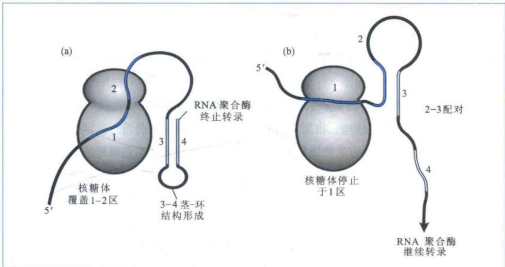  
图 7-23 trp 操纵子的转录与翻译调控  
(a) 高色氨酸时；(b) 低色氨酸时。

## 4. trp 操纵子弱化机制的实验依据

对一个前导区及 D 基因缺失的 trp 操纵子突变体 (trpΔLD102) 研究发现, 该细菌在补充了过量色氨酸的培养基中有高于野生型亲本株系 8\~10 倍的色氨酸合成酶活性, 这种去阻遏作用不论在 trpR $^{+}$ 或 trpR $^{-}$ 菌株中都存在 $^{(表7-2)}$ 。

从表 7-2 中可以看出前导区的调节作用。trpΔED53 的 L 区中不缺失弱化子，而 trpΔLD102 L 区中缺失弱化子。缺失前导区后的表达比有前导区的表达要高得多，充分说明 trp 操纵子的表达调控除阻遏作用外，还受到前导区的影响，失去了这个因素就失去了

表 7-2 trpL 缺失突变株与非缺失菌株色氨酸合成酶活性比较(相对单位)

<table><tr><td>株系</td><td> $trpR^{+}$ </td><td> $trpR^{-}$ </td></tr><tr><td> $Trp\Delta ED53(trpa^{+})$ </td><td>0.17</td><td>11.8</td></tr><tr><td> $Trp\Delta LD102(trpa^{-})$ </td><td>1.82</td><td>100</td></tr></table>

一个调控机制。

trpL29 是增强终止的突变型, 它的前导序列 29 位核苷酸由原来的 G 变为 A, …… AUG……→……AUA……, AUG 是前导肽的起始密码, 变为 AUA 后便不能起始蛋白质合成, 有利于 trp mRNA 形成 1-2、3-4 稳定的二级结构, 从而增强终止。这一突变型的邻氨基苯甲酸合成酶活性很低, 并且对色氨酸不敏感。因为前导肽根本不能翻译下去, 即使在色氨酸饥饿条件下仍然不能做出解除终止的反应。

另一个增强终止的突变型是 trpL75, 其 75 位上的 G 变成了 A。野生型 75 位上的 G 在 2 区内, 它可以与 3 区内 118 位上的 C 形成氢键, 当 G 变为 A 后, 减弱了 2 区和 3 区形成茎-环结构的能力, 导致终止增强, trpL75 对色氨酸饥饿不能做出反应。此外, 缺失了 3' 端 4 个 U 的突变株 ΔtrpLC1419, 也导致终止解除, 说明 3' 端 U 对转录终止起作用。

细菌通过弱化作用弥补阻遏作用的不足,因为阻遏作用只能使转录不起始,对于已经起始的转录,只能通过弱化作用使之中途停顿下来。阻遏作用的信号是细胞内色氨酸的多少,弱化作用的信号则是细胞内载有色氨酸的 tRNA 的多少。它通过前导肽的翻译来控制转录的进行,在细菌细胞内这两种作用相辅相成,体现着生物体内周密的调控作用。

细菌中为什么需要有弱化子系统呢？一般认为，阻遏物从有活性向无活性的转变速度较慢，需要有一个能更快地做出反应的系统，以保持培养基中适当的色氨酸水平。弱化子能较快地通过抗终止的方法来增加 trp 基因表达，迅速提高内源色氨酸浓度。

那么,为什么还要有阻遏体系呢?没有阻遏体系,似乎只有弱化也可以调节色氨酸酶系的合成。目前认为阻遏物的作用是在有大量外源色氨酸存在时,阻止非必需的先导mRNA的合成,它使这个合成系统更加经济。事实上,自然界中存在着不同类型的合成体系。组氨酸操纵子拥有在功能上与trp操纵子完全相同的弱化子结构,但没有阻遏物,它的表达完全受弱化子调节。

## 7.3.3 trp 操纵子的其他调控机制

大肠杆菌中共有 5 个基因参与色氨酸生物合成, 构成色氨酸操纵子。其中 $trpG \sim D$ 和 $trpC \sim F$ 为融合基因, 翻译出的多肽具有双重功能。有两个启动子(一个位于操纵子 5', 一个位于 $trpG \sim D$ 编码区, 称为内源启动子)控制整个操纵子的转录, 能够感受色氨酸和无负载的 tRNA $^{Trp}$ 的浓度变化。

枯草杆菌(Bacillus subtilis)色氨酸操纵子包括6个基因,处于一个12个基因的大操纵子内。其他基因控制部分芳香族氨基酸的生物合成。B. subtilis 还有第7个色氨酸合成基因 trpG(又称 pabA)，位于叶酸操纵子中。翻译出来的 TrpG-PabA 多肽链能发挥两个酶的作用，一个用于色氨酸途径，一个用于叶酸途径。B. subtilis 的色氨酸操纵子也有两个启动子区。RNA 聚合酶在任何一个启动子区起始转录都会受到色氨酸和无负载 tRNA $^{Trp}$ 的调控(图 7-24)。

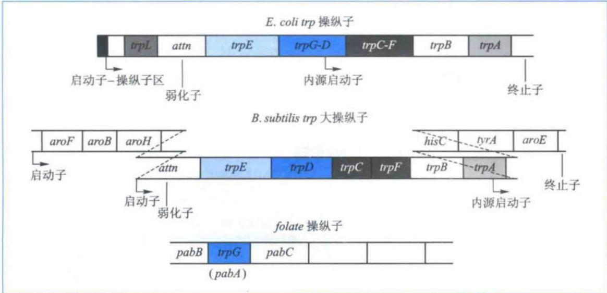  
图 7-24 B. subtilis 和 E. coli 色氨酸操纵子的结构比较

大肠杆菌色氨酸操纵子受到由色氨酸激活的阻遏蛋白的调节作用。一旦转录越过前导区，开始结构基因的转录，又会受弱化子的调控，感受无负载的 $\mathrm{tRNA}^{\mathrm{Trp}}$ 的变化，使转录机器在前导区附近停止或者继续结构基因的转录。在Bacillus subtilis色氨酸操纵子中，色氨酸激活TRAP调节蛋白并使之与前导RNA相结合，形成RNA终止子结构终止转录。而无负载 $\mathrm{tRNA}^{\mathrm{Trp}}$ 的聚集使TRAP蛋白失活，从而激活转录和翻译。另外，当无负载 $\mathrm{tRNA}^{\mathrm{Trp}}$ 的浓度升高时，由trpA基因编码的AT蛋白与TRAP蛋白结合，抑制该蛋白形成转录终止复合物从而激活色氨酸操纵子的转录(图7-25)。

## 7.4 其他操纵子

## 7.4.1 半乳糖操纵子

大肠杆菌半乳糖操纵子(galactose operon)在大肠杆菌遗传图上位于17 min处,包括3个结构基因:异构酶(UDP-galactose-4-epimerase,galE)、半乳糖-磷酸尿嘧啶核苷转移酶(galactose transferase,galT)、半乳糖激酶(galactose kinase,galK)。这3个酶的作用是使半乳糖变成葡糖-1-磷酸。半乳糖操纵子的调节基因是galR,位于遗传图上55 min处。gal操纵子与lac操纵子所不同的是galR与galE、T、K及操纵区O等的距离都很远,而galR产物对galO的作用与lacI-lacO的作用相同。在galR和galO突变体中,E、T、K基因得到组成型表达。gal操纵子的诱导物主要是半乳糖。图7-26是几个相关联操纵子的代谢途径及基因图谱。半乳糖的跨细胞膜运转需要galP基因产物参与。

图 7-25 B. subtilis 中色氨酸操纵子的调控机制  

此外，gal 操纵子还有两个特点：①它有两个启动子，其 mRNA 可从两个不同的起始点开始转录；②它有两个 O 区，一个在 P 区上游 -67 \~ -73，另一个在结构基因 galE 内部。

## 1. cAMP-CRP 对 gal 启动子的作用

因为半乳糖的利用效率比葡萄糖低，人们猜想葡萄糖存在时半乳糖操纵子不被诱导，但实际上有葡萄糖存在时，gal操纵子仍可被诱导。现已分离到一些突变株，其中一类突变株能在不含葡萄糖的培养基中高水平合成半乳糖代谢酶类（gal结构基因高效表达）；另一类突变株中，gal基因的表达完全依赖于葡萄糖，培养基中如无葡萄糖存在，这些细菌的gal基因不表达，不合成半乳糖代谢酶类。分析gal操纵子P-O区的碱基序列发现有两个相距仅为5bp的启动子，gal操纵子可以从两个启动子分别起始基因转录，每个启动子拥有各自的RNA聚合酶结合位点 $S_{1}$ 和 $S_{2}^{(图7-27)}$ 。cAMP-CRP对从 $S_{1}$ 和 $S_{2}$ 起始的转录

图7-26 gal操纵子、lac操纵子和ara操纵子的结构及其代谢途径

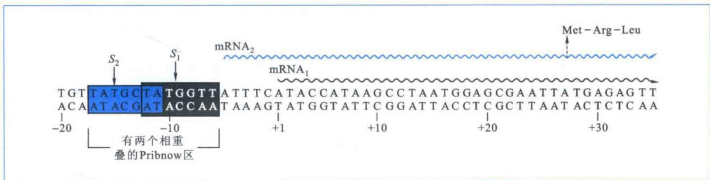  
图7-27 gal操纵子启动区 $S_{1}$ 和 $S_{2}$ 序列分析

有不同的作用。

从 $S_{1}$ 起始的转录只有在培养基中无葡萄糖时才能顺利进行，RNA 聚合酶与 $S_{1}$ 的结合需要半乳糖、CRP 和较高浓度的 cAMP。当腺苷环化酶突变 $(cya^{-})$ 或 cAMP 受体蛋白突变 $(crp^{-})$ 时，gal 操纵子不能从 $S_{1}$ 起始转录。此时如在体外系统中加入 cAMP-CRP，就能够诱发从 $S_{1}$ 起始的转录。体外转录的实验证明，cAMP-CRP 能够刺激 gal 操纵子转录，用含有 gal 操纵子调节区的 DNA 片段作模板进行体外转录时，发现 cAMP-CRP 抑制从 $S_{2}$ 的转录而刺激从 $S_{1}$ 的转录。当有 cAMP-CRP 时，转录从 $S_{1}$ 开始，当无 cAMP-CRP 时，转录从 $S_{2}$ 开始。

从 $S_{2}$ 起始的转录则完全依赖于葡萄糖, 高水平的 cAMP-CRP 能抑制由这个启动子起始的转录, 因此, cAMP-CRP 在 gal 操纵子中所起的调节作用比在 lac 操纵子中更为复杂。大肠杆菌的 $cya^{-}$ 或 $crp^{-}$ 突变型不能利用乳糖, 但可以利用半乳糖作为唯一碳源。

有一个gal启动子突变株，不能利用培养基中的半乳糖，若将此突变株再行突变为 $cya^{-}$ 或 $crp^{-}$ ，细胞就恢复了利用半乳糖的能力。因为第一次突变失去了从 $S_{1}$ 起始转录的能力，却不影响从 $S_{2}$ 起始转录的能力。细胞中cAMP-CRP的存在抑制了从 $S_{2}$ 开始的基因转录，使gal操纵子既不能从 $S_{1}$ 起始又无法从 $S_{2}$ 起始转录。双重突变后，无论是 $cya^{-}$ 突变，还是 $crp^{-}$ 突变，都能移去cAMP-CRP对 $S_{2}$ 的阻遏作用，导致gal基因表达，恢复利用半乳糖作为能源的能力。

一般认为，cAMP-CRP有利于RNA聚合酶 $-S_{1}$ 区复合物形成开链构象，从而起始基因转录。同时，由于 $S_{1}$ 和 $S_{2}$ 区的核苷酸部分重叠，这一复合物的存在干扰了RNA聚合酶 $-S_{2}$ 复合物的形成，抑制 $S_{2}$ 起始的基因转录。

## 2. 双启动子的生理功能

为什么 gal 操纵子需要两个转录起始位点？这与半乳糖在细胞代谢中的双重功能有关。半乳糖不仅可以作为唯一碳源供细胞生长，而且与之相关的物质——尿苷二磷酸半乳糖（UDPgal）是大肠杆菌细胞壁合成的前体。在生长过程中，细胞必须随时合成差向异构酶，以保证尿苷二磷酸的供应。在没有外源半乳糖的情况下，细胞通过半乳糖差向异构酶（galactose epimerase, galE 基因产物）的作用由 UDP-葡萄糖合成 UDPgal。因为细胞壁合成过程对差向异构酶的需要量很小，本底水平的组成型合成就能够满足细胞生理需要。实际上，gal mRNA 的组成型合成水平已高于 lac 操纵子所合成 lac mRNA 的水平，显然这部分 mRNA 是在没有半乳糖的情况下合成的。

现在设想只有 $S_{1}$ 一个启动子,那么由于这个启动子的活性依赖于 cAMP-CRP,当培养基中有葡萄糖存在时就不能合成异构酶。假如唯一的启动子是 $S_{2}$ ,那么,即使在有葡萄糖存在的情况下,半乳糖也将使操纵子处于充分诱导状态,这无疑是一种浪费。所以,无论从必要性或经济性考虑,都需要一个不依赖于 cAMP-CRP 的启动子( $S_{2}$ )进行本底水平的组成型合成,以及一个依赖于 cAMP-CRP 的启动子( $S_{1}$ )对高水平合成进行调节。这就是说,只有在 $S_{2}$ 活性完全被 cAMP-CRP 抑制时,调控作用才是有效的。

## 7.4.2 阿拉伯糖操纵子

阿拉伯糖(arabinose)是另一个可以为代谢提供碳源的五碳糖。在大肠杆菌中阿拉伯糖的降解需要3个基因:araB、araA和araD,它们形成一个基因簇,简写为araBAD。它们分别编码3个酶:araB基因编码核酮糖激酶(ribulokinase),araA编码L-阿拉伯糖异构酶(L-arabinose isomerase),araD编码L-核酮糖-5-磷酸-4-差向异构酶(L-ribulose-5-phosphate-4-epimerase)。在gal操纵子中,基因的排列序列就是代谢途径中酶的作用序列,而这个操纵子却不同,阿拉伯糖的代谢是以araA、araB、araD的序列进行的。另外还有两个负责将阿拉伯糖运入细胞的基因,即araE和araF,它们的位置远离这个基因簇,araE和araF分别编码一个膜蛋白和一个位于细胞壁与细胞膜之间的阿拉伯糖结合蛋白。

与 araBAD 相邻的是一个复合的启动子区域、两个操纵区 $(O_{1}, O_{2})$ 和一个调节基因 araC，这个调节基因的性质与我们已介绍过的 lac 及 gal 操纵子中的调节基因的性质全然不同。AraC 蛋白同时显示正、负调节因子的功能。在 lac 和 gal 操纵子中，阻遏蛋白只能作为负调节因子，而 cAMP-CRP 蛋白只能是正调节因子。araBAD 和 araC 基因的转录是分别在两条链上以相反的方向进行的。在标准的遗传学图谱上，araBAD 基因簇从启动子 $P_{BAD}$ 开始向右进行转录，而 araC 基因则是从 $P_{c}$ 向左转录（图 7-28）。

  
图7-28 ara操纵子上游调控区序列与功能分析

ara 操纵子也是可诱导的,阿拉伯糖本身就是诱导物。在野生型操纵子中,只有阿拉伯糖存在时才转录出 araBAD mRNA,而有葡萄糖存在时则不转录。腺苷酸环化酶缺陷型和 crp $^{-}$ 突变株也不形成 araBAD mRNA,说明从 $P_{BAD}$ 起始的转录过程也需要 cAMP-CRP。

## 1. AraC 蛋白的正、负调节作用

AraC 蛋白既是 ara 操纵子的正调节蛋白, 又是其负调节蛋白 $^{(图 7-29)}$ 。我们来分析以下实验结果。首先, 当 araC 基因内发生点突变或缺失突变, 会产生不能合成 araBAD mRNA 的 araC $^{-}$ 突变株。其次, 构建基因型为 F'araC $^{+}$ /araC $^{-}$ 的局部二倍体细胞后发现这类细胞中 ara 操纵子可以被诱导, 说明 araC $^{-}$ 等位基因是隐性的。如果 araC $^{-}$ 突变体的产物是突变型的阻遏物, 那么, araC $^{-}$ 对于 araC $^{+}$ 来说至少应有部分显性。

遗传学上的其他证据如 araC 基因的琥珀突变,也说明 araC 基因产物是一种蛋白质,这一点又通过 AraC 蛋白的纯化得到了进一步证实。所以说,araBAD mRNA 的合成需要一个有功能的 AraC 蛋白,这个蛋白质与诱导物阿拉伯糖相结合后,诱导 araBAD 基因表达 $^{(图 7-29)}$ 。

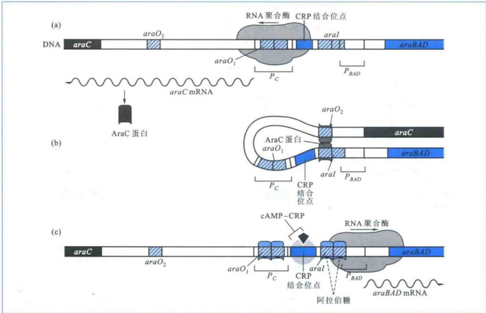  
图 7-29 ara 操纵子的表达调控  
(a) 当细胞内没有 AraC 蛋白时，由 $P_{c}$ 启动子起始 araC 基因转录；(b) 当体系中葡萄糖水平较高，阿拉伯糖水平较低时，AraC 蛋白与操纵区 $O_{2}$ 以及 araI 诱导因子结合区上半区相结合，形成 DNA 回转结构，ara BAD 基因不表达；(c) 当体系中有阿拉伯糖但无葡萄糖存在时，AraC 蛋白与阿拉伯糖相结合，改变构象成为激活蛋白，AraC 蛋白同源二聚体分别与 $araO_{1}$ 和 araI 区相结合，DNA 回转结构被破坏，RNA 聚合酶在 AraC 蛋白和 cAMP-CRP 的共同作用下起始 $P_{BAD}$ 所调控的结构基因表达。

有实验证明, 当 AraC 蛋白以正调控因子作用时, 起始转录还需要 cAMP-CRP 的共同参与。在第一个实验里, 人们发现当反应体系中只含有 ara 操纵子 DNA、RNA 聚合酶、AraC 蛋白及 cAMP-CRP 中的一个成分, araBAD mRNA 的转录不能起始, 说明只有 AraC 蛋白和 cAMP-CRP 协同作用才能起始 araBAD 的转录。在第二个实验里, 人们用电镜直接观察 ara 操纵子 DNA 分子(这种技术可以看到结合了 RNA 聚合酶的 DNA 分子) 发现, 除非 AraC 蛋白和 cAMP-CRP 同时存在, RNA 聚合酶一般不能与该操纵子 DNA 相结合。

## 2. AraC 蛋白的两种形式

AraC 蛋白作为 $P_{BAD}$ 活性正、负调节因子的双重功能是通过该蛋白质的两种异构体来实现的。一般认为，Pr 是起阻遏作用的形式，可以与现在尚未鉴定的类操纵区位点相结合，而 Pi 是起诱导作用的形式，它通过与 $P_{BAD}$ 启动子结合进行调节。推测 Pr 和 Pi 这两种结构处于一种相互平衡之中。在没有阿拉伯糖时，Pr 形式占优势；一旦有阿拉伯糖存在，它就能够与 AraC 蛋白结合，使平衡趋向于 Pi 形式。

## 3. 营养状况对 ara 操纵子活性的影响

图 7-30 是在各种营养状态下 ara 操纵子的表达情况。在图 7-30(a) 中，培养基含有葡萄糖，cAMP-CRP 没有与操纵区位点相结合，AraC 蛋白处于 Pr 形式并与操纵区 A 位点结合，RNA 聚合酶不能与 $P_{C}$ 结合，araC 基因虽然仍有转录，但受到抑制，只有少量 AraC 蛋白形成，整个系统几乎处于静止状态。它虽然不是完全关闭，但是尽可能地关闭了。图 7-30(b) 中没有葡萄糖糖，也没有阿拉伯糖，因为没有诱导物，尽管有 cAMP-CRP 与操纵区位点相结合，AraC 蛋白仍以 Pr 形式为主，无法与操纵区 B 位点相结合，无

  
图 7-30 各种营养状态下 ara 操纵子的表达调控(RNA-P 代表 RNA 聚合酶)

araBAD mRNA 转录。图 7-30(c) 中无葡萄糖, 有阿拉伯糖, 大量 araC 基因产物以 Pi 形式存在, 并分别与操纵区 B、A 位点相结合, 在 cAMP-CRP 的共同作用下, araC 和 araBAD 基因大量表达, 操纵子充分激活。

## 7.4.3 阻遏蛋白 LexA 的降解与细菌中的 SOS 应答

当细菌 DNA 遭到破坏时(如受到紫外线照射), 细菌细胞内会启动一个被称为 SOS 的诱导型 DNA 修复系统。研究发现, 参与 SOS DNA 修复系统的许多基因虽然分散在染色体的各个部位, 但都同时受 LexA 阻遏蛋白的抑制, 平时表达水平很低。

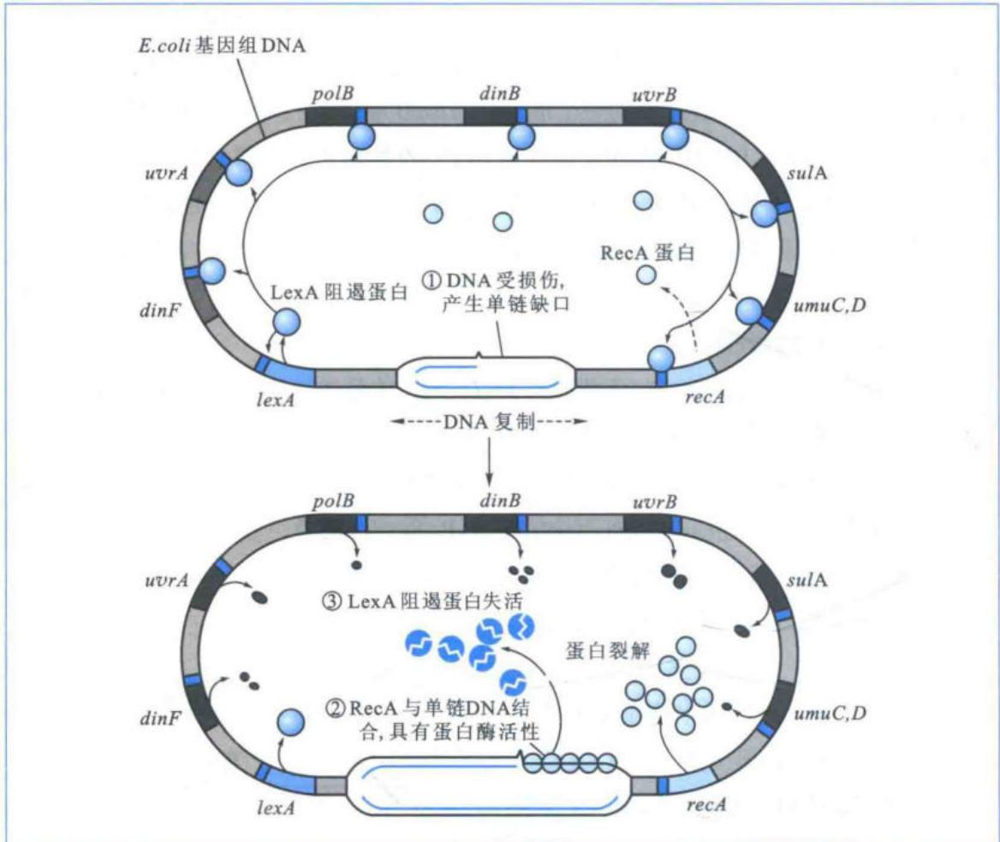  
图 7-31 大肠杆菌中 LexA 蛋白阻遏的 SOS DNA 损伤修复系统操纵子的表达调控模式

SOS 体系的诱导表达过程其实就是把 LexA 阻遏蛋白从这些基因的上游调控区移开的过程。

一般情况下,recA基因表达并不完全受LexA阻遏,所以,每个细胞中可有1000个RecA蛋白单体分散在细胞质中。当DNA严重受损时,DNA复制被中断,单链DNA缺口数量增加,RecA与这些缺口处单链DNA相结合,被激活成为蛋白酶,将LexA蛋白切割成没有阻遏和操纵区DNA结合活性的两个片段,导致SOS体系(包括recA基因)高效表达,DNA得到修复(图7-31)。只要有活化信号存在,该操纵子就一直处于活性状态。当修复完成后,活化信号消失,RecA蛋白又回到非蛋白水解酶的形式,LexA蛋白才逐步积累起来,并重新建立阻遏作用。一旦RecA蛋白的合成停止,细菌开始生长并进行分裂,RecA又逐渐地稀释到原先的本底水平。

## 7.4.4 二组分调控系统和信号转导

细胞生活在不断变化的环境中,温度、pH 和渗透压变化,氧分压变化,营养的变化及细胞浓度的变化等都要求细菌必须随时做出相应的反应以求得生存。前面讨论的诱导和阻遏转录调控系统均是通过环境中的小分子效应物(诱导物或阻遏物)直接与调节蛋白结合进行转录调控,但是在较多情况下,外部信号并不是直接传递给调节蛋白,而是首先通过传感器(sensor)接收信号,然后以不同方式传到调节部位,这个过程就是信号转导(signal transduction)。目前已知的最简单的细胞信号系统称为二组分调控系统(two-components regulatory systems),由两种不同的蛋白质组成:即位于细胞质膜上的传感蛋白(sensor protein)和位于细胞质中的应答调节蛋白(response regulator protein)。因传感蛋白具有激酶活性,所以又称传感激酶。表7-3列出了大肠杆菌中存在的各种二组分调控系统。传感激酶常在与膜外环境的信号反应过程中被磷酸化,再将其磷酸基团转移到应答调节蛋白上,磷酸化的应答调节蛋白即成为阻遏蛋白或激活蛋白,通过对操纵子的阻遏或激活作用调控下游基因表达(图7-32)。

图 7-32 细菌中参与信号转导的二组分调控系统  

表 7-3 大肠杆菌中存在的二组分调控系统

<table><tr><td>刺激信号/功能</td><td>传感蛋白</td><td>应答调节蛋白</td></tr><tr><td>氧气缺乏</td><td>ArcB</td><td>ArcA</td></tr><tr><td>渗透压,包被蛋白</td><td>EnvZ</td><td>OmpR</td></tr><tr><td>渗透压,钾离子运输</td><td>KdpD</td><td>KdpE</td></tr><tr><td>磷酸盐清除</td><td>PhoR</td><td>PhoB</td></tr><tr><td>氮代谢</td><td>NtrB</td><td>NtrC</td></tr><tr><td>硝酸盐呼吸作用</td><td>NarX</td><td>NarL</td></tr><tr><td>硝酸盐和亚硝酸盐呼吸作用</td><td>NarQ</td><td>NarP</td></tr></table>

## 7.4.5 多启动子调控的操纵子

## 1. rRNA 操纵子

大肠杆菌 rRNA 操纵子 (rrnE) 上有两个启动子 $P_{1}$ 和 $P_{2}$ (图7-33)。在对数生长期细菌中， $P_{1}$ 起始的转录产物比 $P_{2}$ 起始的产物多 3\~5 倍，所以 $P_{1}$ 是强启动子。但是当细菌处于紧急状态时，如氨基酸饥饿条件下，细胞中 ppGpp 浓度增加， $P_{1}$ 的作用被抑制。因为 rRNA 是细胞中蛋白质合成机器

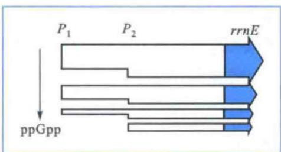  
图 7-33 大肠杆菌 rrnE 上有两个启动子 ( $P_{1}$ 和 $P_{2}$ )

随着 ppGpp 浓度增加， $P_{1}$ 逐渐关闭，而 $P_{2}$ 活性不变。

核糖体的重要组成部分,不能完全停止供应,由 $P_{2}$ 起始的 rrnE 基因转录就显得越来越重要。在贫瘠的培养基中,细胞增殖缓慢时, $P_{2}$ 是合成 rRNA 的主要启动子。

## 2. 核糖体蛋白 SI 操纵子

与 rrnE 操纵子相类似的有核糖体蛋白 SI 操纵子 (rpsA), 它也受应急反应调节。rpsA有 4 个启动子,可能是大肠杆菌中启动子最多的操纵子。 $P_{1}$ 、 $P_{2}$ 是强启动子,平时主要依靠它们来启动基因的表达,合成 SI 蛋白。 $P_{3}$ 、 $P_{4}$ 是弱启动子,只有在紧急情况下, $P_{1}$ 、 $P_{2}$ 启动子受 ppGpp 的抑制,由 $P_{3}$ 、 $P_{4}$ 起始合成的 SI 蛋白维持了生命的最低需要。

图 7-34 DnaQ 蛋白操纵子表达活性受 RNA 聚合酶调节  

## 3. DnaQ 蛋白操纵子

DnaQ 蛋白是 DNA 聚合酶全酶的亚基之一，

其主要功能是校正 DNA 复制中可能出现的错误。已知这一操纵子受 RNA 聚合酶活性的调节，并拥有两个启动子(图 7-34)。在 RNA 聚合酶活性较低时，操纵子的转录由弱启动子 $P_{2}$ 控制；而 RNA 聚合酶活性较高时，就开始利用强启动子 $P_{1}$ 。因为细胞内 RNA 聚合酶活性与细胞的增殖速度有关，也就是说，在细胞染色体复制比较缓慢时，RNA 聚合酶活性往往较低，此时 DnaQ 蛋白的合成靠弱启动子 $P_{2}$ 来维持。当细胞增殖速度加快，RNA 聚合酶活性升高时， $P_{1}$ 就被激活，DnaQ 蛋白的合成就大大增加。

总之,操纵子中有不同的启动子,它们有不同的强度,其启动作用又受不同因子的调控。许多因素相互作用,才使基因表达更加有效,更加协调。在不同的生活环境中,不同的启动子精密地调节基因的表达量,这对维持细菌的生存起着非常重要的作用。

<!-- W-BEGIN Watson 18 转录起始的调控：原核生物的实例 -->

### 【中文对照 Watson 第18章：转录起始的调控：原核生物的实例】

> 来源：Watson《基因的分子生物学》第七版中译本（书籍/03_基因的分子生物学_第七版） 第18章 原核生物的转录调控。

#### [W] 转录起始的调控：原核生物的实例

大致了解了转录调控的基本原理之后，我们来看几个展示基本原理是如何起作用的实例。首先，我们来看大肠杆菌（E. coli）中参与乳糖代谢的基因。在这里我们将看到激活因子和抑制因子是如何根据两种不同的信号调控表达的。同时我们也将描述揭示这些调控因子作用机制的实验方法。

#### [W] 激活因子和抑制因子共同控制 lac 基因

3 个 lac 基因——lacZ、lacY 和 lacA 在 E.coli 基因组中相邻排列合称 lac 操纵子（lac operon）（图 18-5）。lac 启动子位于 lacZ 的 5' 端，指导 3 个基因共同转录为一条 mRNA [因其包含多个基因而被称为多顺反子信使（polycistronic message）]。这一 mRNA 翻译产生 3 种蛋白质产物。lacZ 基因编码 β-半乳糖苷酶，该酶可将乳糖切割成半乳糖和葡萄糖，后两种糖均可用作细胞的能量。lacY 基因编码乳糖透过酶，该蛋白质插入细胞膜可以将乳糖转运到细胞内。lacA 基因编码硫代半乳糖苷转乙酰酶，它可以消除同时被 lacY 转入的硫代半乳糖苷对细胞造成的毒性。

这些基因只有在乳糖存在，同时葡萄糖（优先选用的能量）缺乏时才会高水平地表达。两种调控蛋白参与基因调控：一种是激活因子，称为 CAP；另一种是抑制因子，称为 Lac 抑制因子（Lac repressor）。Lac 抑制因子由 lacI 基因编码，这一基因位于其他 lac 基因的附近，但其转录（结构性地表达）却是由其自身的启动子起始的。CAP 即为代谢激活因子蛋白（catabolic activator protein），这一激活因子也被称为 CRP（cAMP 受体蛋白，cAMP receptor protein）。编码 CAP 的基因位于细菌染色体的其他位点，不与 lac 基因连锁。CAP 和 Lac 抑制因子都是 DNA 结合蛋白，两者分别结合在 DNA 启动子上或其附近的特异位点上（图 18-5）。

  
图 18-5 lac 操纵子。3 个基因（lacZ、lacY 和 lacZ）以一条 mRNA 从启动子（如箭头所示）转录。CAP 位点和操纵子（Lac 抑制因子结合位点）各约 20bp。操纵子位于启动子 RNA 聚合酶结合区内，CAP 位点位于启动子上游（详见图 18-8 这些位点的相关排列及正文中关于这些位点的结合蛋白的描述），附近还有两个额外的弱 lac 操纵子（图 18-12），本图简化掉了，我们目前还不需要考虑它们。

每一个调控蛋白分别响应一种环境信号并将其传递给 lac 基因。因此，CAP 介导葡萄糖信号，而 Lac 抑制因子介导乳糖信号。这一调控系统以如下方式作用（图 18-6）。Lac 抑制因子只在乳糖缺乏的时候才结合 DNA 从而抑制转录。在乳糖存在时，抑制因子没有活性，基因是去抑制（表达）的。CAP 只在没有葡萄糖的时候才结合 DNA 从而激活 lac 基因。因此，这样两种调控蛋白联合作用保证基因在乳糖存在，同时在缺少葡萄糖的环境中以显著的水平表达。

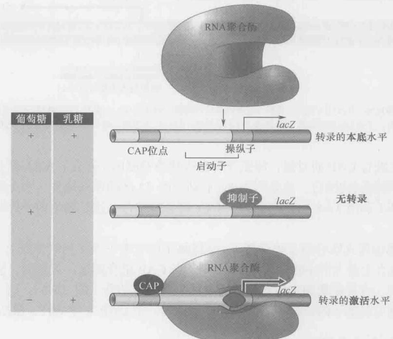  
图 18-6 lac 基因的表达。乳糖和葡萄糖的有无控制着 lac 基因表达的水平。高水平表达要有乳糖存在（也就是没有有功能的 Lac 抑制因子），同时缺少首选的能量葡萄糖（因此也就有激活因子 CAP）。当 Lac 抑制因子结合到操纵子上，不管有活性的 CAP 是否存在，它都排斥聚合酶。CAP 和 Lac 抑制因子都是单体。但实际上，CAP 以二聚体结合 DNA，Lac 抑制因子以四聚体结合（图 18-12）。CAP 募集聚合酶到 lac 启动子，在这里，它自动地异构化为开放复合体（最底行所示的状态）。

#### [W] CAP 和 Lac 抑制因子对 RNA 聚合酶结合 lac 启动子的作用是相反的

我们已经看到，Lac 抑制因子结合的位点被称为 lac 操纵子（lac operator）。这一双重对称的 21bp 序列由 Lac 抑制因子的两个亚基识别，每一个结合一个“半位点”（图

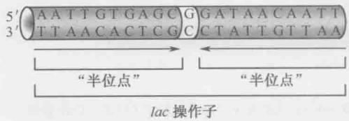  
图 18-7 lac 操纵子对称的半位点。

18-7)。本章后面的“CAP 和 Lac 抑制因子结合 DNA 时使用相同的结构模体(motif)”部分我们会详细地描述它们是如何结合的。当抑制因子结合到操纵子上时，它是怎样抑制转录的呢？

lac 操纵子与启动子有重叠区, 所以当抑制因子结合到操纵子上时, 就阻止了

RNA 聚合酶在启动子上的结合和 RNA 合成的起始（图 18-8）。在第 7 章中我们已经讨论了 DNA 足迹法和凝胶迁移率分析可以确认蛋白质结合位点并对它们的位置映射。

  
图 18-8 lac 操纵子的控制区域。图中所示为 lac 操纵子控制区域的核苷酸序列和组成。上面和下面的横杠表示 RNA 聚合酶和调控蛋白覆盖的 DNA。注意 Lac 阻抑物覆盖的区域大于最小操纵子结合位点序列，而 RNA 聚合酶覆盖的区域大于启动子的组成序列。

我们看到，在没有 CAP 的时候，即使没有有活性的抑制因子存在，RNA 聚合酶与 lac 启动子也只有很微弱的结合。这是因为 lac 启动子的 -35 区的序列缺少一个上游元件（见图 13-5，框 13-1 和图 18-8）而不适合与 RNA 聚合酶结合。这是激活因子控制启动子的典型特征。

CAP 以二聚体的形式结合到长度类似于 lac 操纵子但有着不同序列的位点上。该位点位于转录起始位点上游大约 60bp 处（图 18-8）。当 CAP 结合到这一位点时，它就会与聚合酶相互作用，将其募集到启动子处并协助其与启动子结合（图 18-6）。这一协同结合稳定了聚合酶与启动子的结合。下面我们详细地看一下 CAP 介导的转录激活。

#### [W] CAP 具有独立的激活表面和 DNA 结合表面

各种实验都支持 CAP 通过募集 RNA 聚合酶激活 lac 基因这一观点。分离到的 CAP 的突变体结合 DNA 但并不激活转录。被称之为正控制（positive control, PC）突变体的存在表明：要激活转录，激活因子不仅仅要结合在启动子附近的 DNA 上。因此，例如转录激活也不是由激活因子改变局部 DNA 的结构引起的。正控制突变体的氨基酸替换识别了 CAP 接触聚合酶的区域，称之为激活区（activating region）。

当 CAP 激活 lac 基因时，其激活区接触的是 RNA 聚合酶的哪一部分呢？聚合酶的突变形态揭示了这一位点，这种突变体聚合酶可以正常地转录多种基因，但是不能在 lac 基因处被 CAP 激活。这些突变体在 RNA 聚合酶的 $\alpha$ 亚基（ $\alpha$ subunit）的 C 端结构域（C-terminal domain，CTD）发生了氨基酸替换。我们在第 13 章已知，这一结构域由一个易弯曲的衔接体连接到 $\alpha$ 的 N 端结构域（NTD）。 $\alpha$ NTD 嵌于酶内部，而 $\alpha$ CTD 却延伸出来与启动子的上游元件结合（当这一元件存在时）（图 13-7）。

lac 启动子没有上游元件， $\alpha$ CTD 就结合在 CAP 和附近的 DNA 上（图 18-9）。包括了 CAP、 $\alpha$ CTD 及一段包含 CAP 位点和附近上游元件的 DNA 寡核苷酸的复合体的晶体结构证明了本结构（图 18-10 及结构教程 18-1）。在框 18-1 中，我们将描述激活因子旁路实验，该实验显示 lac 启动子的激活只需要聚合酶的募集。

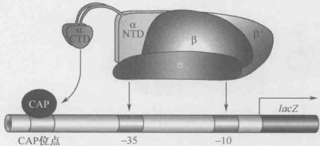  
图 18-9 lac 启动子被 CAP 激活。RNA 聚合酶在 CAP 的协助下结合到 lac 启动子。CAP 由 α 亚基的 CTD 识别。当与 CAP 相互作用时，αCTD 也在靠近 CAP 位点处与 DNA 接触。在第 13 章，我们在说明激活因子和其聚合酶上的目标位点或聚合酶与启动子区域的接触时，也使用了 RNA 聚合酶作为代表。

  
图 18-10 CAP-αCTD-DNA 复合物的结构。所示的 CAP 以二聚体结合到其位点上。而且，在本例中，RNA 聚合酶的 αCTD 结合到一段 DNA 上，与 CAP 相互作用。每个蛋白质相互作用的位点包含用遗传学方法确认的残基。在本图中，CAP 以绿色表示，αCTD 以紫色表示。图中所示每一个 CAP 还结合了一分子的 ATP。（Benoff B. et al. 2002. Science 297: 1562.）图像用 MolScript 和 Raster 3D 软件制作。

在了解了 CAP 怎样激活 lac 操纵子的转录, 以及 Lac 抑制因子怎样拮抗这一作用之

后，我们再进一步看一下这些调控蛋白是如何识别其 DNA 结合位点的。

#### [W] 框 18-1 激活因子旁路实验

如果激活因子只有将聚合酶募集到基因上方起作用，那么将聚合酶带到基因上的其他途径也可以同样起作用。对 lac 基因来说确是如此，如以下实验所示（框 18-1 图 1）。

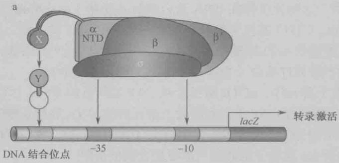

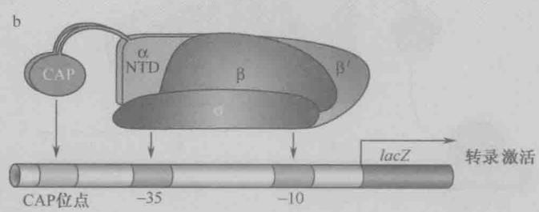  
框 18-1 图 1 双激活因子旁路实验。(a) 与蛋白质 Y 相互作用的蛋白质 X 替代 αCTD。蛋白质 Y 与 DNA 结合结构域融合，被这个结构域识别的位点处于邻近 lac 基因的位置。(b) αCTD 被 CAP 的 DNA 结合区域所替代。

在一个实验中，用另一蛋白质-蛋白质相互作用取代CAP和聚合酶的相互作用。该实验用两个已知会相互作用的蛋白质，一个与DNA结合结构域联合，另一个取代聚合酶α亚基的C端结构域（αCTD）。只要启动子附近有合适的结合位点，被修饰过的聚合酶就能被拼凑起来的“激活因子”激活。在另一个实验中，聚合酶αCTD被DNA结合结构域取代（如CAP的DNA结合结构域）。在无任何激活因子时，只要附近有合适的DNA结合位点，这一修饰过的聚合酶就能有效地起始从lac开始的转录。第三个实验更简单：聚合酶能在体外无任何激活因子时高水平地转录lac基因，但要求聚合酶是高浓度的。这样我们看到，人工募集或提供高浓度的聚合酶都可以使lac基因以激活水平表达。这些实验与激活因子仅协助聚合酶结合启动子是一致的。关于为何仅仅提高蛋白质（如RNA聚合酶）的浓度就可以协助它结合到DNA上的位点（在这里是启动子）的解释见框18-4。其中讨论的结果出人意料。激活因子通过诱导聚合酶发生特异的变构来激活转录。

#### [W] CAP 和 Lac 抑制因子以相同的结构模体结合 DNA

细菌的许多激活因子和抑制因子包括 CAP 和 Lac 抑制因子结合 DNA 的结构基础已经通过 X 射线晶体学确定。细菌调控蛋白的 DNA 识别机制大多是相似的，仅在细节上有所不同，正如我们下面将要描述的。

一般情况下，蛋白质以同源二聚体的形式结合到反向重复（或近似重复）序列的位点上。每一个单体结合到一个“半位点”，二聚体的对称轴位于结合位点的对称轴之上（就如我们在 Lac 抑制因子中所见到的，图 18-7）。蛋白质靠一种保守的二级结构螺旋-转折-螺旋（helix-turn-helix，图 18-11）识别特异的 DNA 序列。这一结构域由两个 $\alpha$ 螺旋组成，其中一个是识别螺旋（recognition helix）进入 DNA 的主凹槽（大沟）。在第 6 章我们就讨论过， $\alpha$ 螺旋的大小正好适合进入 DNA 主凹槽，利于其外表面的氨基酸残基与碱基对边缘的化学基团相互作用。我们也看到的每一种碱基有着特有的氢受体和氢供体结构模式（图 6-14）。因此，蛋白质可以用这样的方式来区别不同 DNA 序列而不需要 DNA 双链解链。图 6-13 展示的是识别螺旋与其 DNA 结合位点发生相互作用的例子。

图 18-11 具有螺旋-转折-螺旋结构域的蛋白质结合 DNA。蛋白质就像实际情况中那样以二聚体结合，两个亚基用带有阴影的球表示。标示出了每个单体的螺旋-转折-螺旋模体。“识别螺旋”标以 R。  
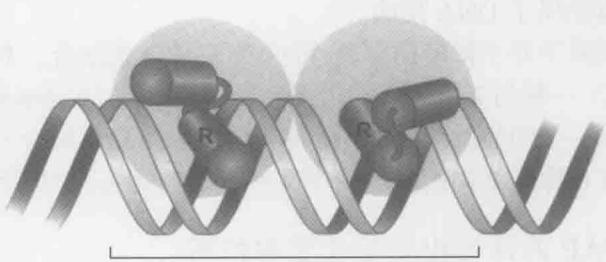  
DNA 结合位点

螺旋-转折-螺旋结构域的第二个螺旋坐落的位置横跨 DNA 大沟与 DNA 主链相联系的地方,以保证识别螺旋出现在正确的位置,同时也增加整个蛋白质-DNA 相互作用的结合能。

这里描述的情况不仅与 CAP（图 18-10）和 Lac 抑制因子的情况本质上符合，而且细菌中许多调控因子也是如此，包括 $\lambda$ 噬菌体抑制因子（图 6-13）、 $\lambda$ Cro 蛋白（后面会讲到）及人字形噬菌体（噬菌体 434）。尽管如此，它们在细节上会有些不同，如下面的例子所示：

\- Lac 抑制因子以四聚体而不是二聚体结合。但是，每一个操纵子只与这 4 个亚基中的 2 个接触。所以，这种寡聚方式的不同并不会改变 DNA 识别的机制。四聚体中的另外两个单体可以再结合两个操纵子，这两个操纵子一个位于初级操纵子下游 400bp 处，一个位于初级操纵子上游 90bp 处。这时，位于中间的 DNA 就处于环化状态，利于反应的进行（图 18-12）。

\- 有时，在螺旋-转折-螺旋结构域之外的其他蛋白质区域也会与 DNA 相互作用。例如， $\lambda$ 抑制因子就以其 N 端与 DNA 接触。这些蛋白质区域环绕 DNA 在螺旋的背面与小沟相互作用。

\- 许多情况下,蛋白质的结合不会改变 DNA 的结构。但是,有时我们也会在蛋白质-DNA 复合物中看到各种弯曲。例如,CAP 半包围着 DNA 并诱导 DNA 产生巨大的弯曲。这是由螺旋-转折-螺旋结构域外的蛋白质区域与启动子之外的序列相互作用引起的。有时，结合也会导致操纵子 DNA 扭曲。

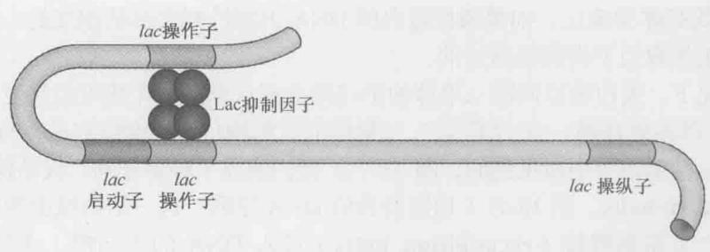  
图 18-12 Lac 抑制因子以四聚体结合到两个操纵子上。图示的环是在 Lac 抑制因子结合的初级操纵子和上游的辅助操纵子之间，也可与下游操纵子选择性的形成类似的环。初级操纵子（与启动子相对的那个）是在讨论 lac 基因表达时所指的操纵子。在本图中，每一个抑制因子都以两个球表示，而不是一个椭圆（如前面图中所用的）以强调其寡聚结构。

原核生物的抑制因子并不都使用螺旋-转折-螺旋的方式结合。其他的结合方式也见诸报道。P22噬菌体[一种与 $\lambda$ 噬菌体相近但感染沙门氏菌（Salmonella）的噬菌体]中的Arc抑制因子就是一个明显的例子。Arc抑制因子以二聚体结合一个反向重复序列操纵子，但其却不是以 $\alpha$ 螺旋结构而是以两个反平行 $\beta$ 链插入大沟识别结合位点的。

#### [W] Lac 抑制因子和 CAP 的活性由其信号变构控制

当乳糖进入细胞后，它就被转变为别乳糖，正是别乳糖（而不是乳糖自身）控制Lac抑制因子（图18-13）。与此相矛盾的是，乳糖向别乳糖的转变是由β-半乳糖苷酶催化的，该酶自身也是由lac基因中的一个编码的，这怎么可能呢？

  
图 18-13 乳糖操纵子的诱导物是别乳糖。乳糖被转化为别乳糖，而它又是 lac 基因的直接诱导物——直接与 Lac 抑制因子结合引起构象改变，阻止其与 DNA 结合（图 6-20）。其他的合成分子也可以作为诱导剂，尤其是经常使用的异丙基- $\beta$ -D-硫代半乳糖苷（IPTG）。其他的分子可以作为底物，但不是诱导剂。最有名的是 X-gal，它在 $\beta$ -半乳糖苷酶的催化下会产生蓝色产物，因此其作为 $\beta$ -半乳糖苷酶的显色底物被广泛使用。

答案就是 lac 基因表达的渗漏性: 在它们被阻抑时, 也会偶尔被转录, 这是因为 RNA 聚合酶偶尔会取代 Lac 抑制因子成功地结合到启动子上。这种渗漏保证了细胞中在没有乳糖的时候也会有低水平的 β-半乳糖苷酶, 从而可以催化乳糖转化为别乳糖。

别乳糖结合 Lac 抑制因子引起其蛋白质形状（构象）的改变。在没有别乳糖时，抑制因子以可以结合 DNA（从而关闭 lac 基因）的形式出现，而一旦别乳糖改变了抑制因子的形状，蛋白质就不可以再结合 DNA，lac 基因就不再被抑制。在第 6 章中我们描述过 Lac 抑制因子（图 6-19）这一变构的结构基础。需要强调的重要一点是，别乳糖结合 Lac 抑制因子的非 DNA 结合结构域。

CAP 活性的调节方式与此相似(图 18-14)。葡萄糖降低细胞内的一种小分子——cAMP 的浓度，这一分子是 CAP 的变构因子：只有当 CAP 与 cAMP 形成复合物时，CAP 蛋白才会形成结合 DNA 的构象（这也解释了 CAP 的另一个名字，CRP）。因此，只有当葡萄糖水平低（而 cAMP 水平高）时，CAP 才会结合 DNA，激活 lac 基因。CAP 蛋白结合 cAMP 的部分与蛋白质结合 DNA 的部分是分开的。

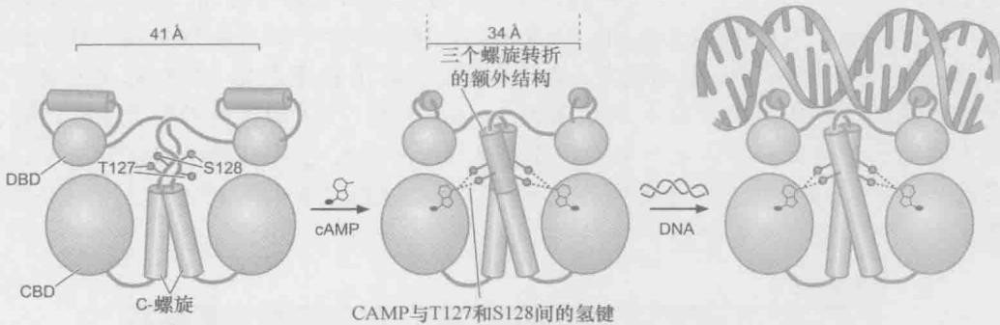  
图 18-14 CAP 别构调节的机制。CAP 有三种晶体结构：CAP 单体、CAP 与 cAMP 结合物，以及 CAP-cAMP-DNA 复合物。我们可以很明显地看出 cAMP 是如何与 CAP 的 cAMP 结合位点（CBD）结合从而产生蛋白质构象的改变，最终导致 CBD 发生重排使其更加容易被识别。这是因为在 cAMP 与 CBD 结合的同时有两个氢键残留在蛋白质的螺旋区，使得这个区域形成一个螺旋（图中蓝色部分）。橙色标记的是 DNA 能够识别螺旋形 CBD 的区域。（经允许引自 Popovych N. et al. 2009.Proc. Natl. Acad. Sci. 106:6927-6932, Fig.7, p.6931,）

E.coli 的 lac 操纵子是早期法国生物学家 Francois Jacob 和 Jacques Monod 用来阐述基因调控的两个系统之一。在框 18-2 中，我们就这一方面的早期研究和这些观点何以会产生如此大的影响做了说明。

#### [W] 框 18-2 Jacob、Monod 及其基因调控的观点

某一基因的表达可以由另一基因的产物控制，即存在调控基因，其产物唯一的功能就是调控其他基因的表达。这一观点是分子生物学早期的远见卓识之一，它是由一群在巴黎工作的科学家，特别是 Francois Jacob 和 Jacques Monod 于 20 世纪 50 年代至 60 年代早期提出的。他们当时试图解释两种看起来不相关的现象：生长于乳糖的 E.coli 中 β-半乳糖苷酶的出现和细菌病毒（噬菌体）λ 在感染时的表现。他们工作的顶点是 1961 年操纵子模型的发现，以及 1965 年与他们的同事 Andre Lwoff 共同分享了诺贝尔生理学或医学奖。

我们今天难以理解他们取得的成就的伟大之处，是因为我们对他们的观点如此熟悉，而且其模型的测试方法又是如此直接。为了理解这一点，就要考虑到他们开始其经典实验的时候已经知道些什么：只有在培养基中供给乳糖时，E.coli 中才会出现 $\beta$ -半乳糖苷酶活性。当时尚不清楚该酶的出现需要打开一个基因的表达。实际上，早期的解释是细胞包含一个通用酶，这个酶根据环境的需要会具有各种属性。因此，当乳糖出现时，通用酶就会利用乳糖作为模板，获得合适的形态代谢乳糖。

Jacob、Monod 和他们的同事用遗传学方法解析了这个问题。我们不再详细讨论他们的实验，而是做一个简单的概述，以一窥其独创性。

首先，他们分离到了不管乳糖存在与否都合成β-半乳糖苷酶的E.coli突变体，即在这样的突变体中，这种酶是组成性（constitutively）表达的。这些突变体分为两种：第一种，其编码Lac抑制因子的基因是失活的；第二种，操纵子位点是缺陷型的。这两种突变体可以由正反实验来区别，我们将在下面描述。

Jacob 和 Monod 构建了一个部分二倍体。这样的部分二倍体是向自身染色体上带有突变 lac 基因的细胞内引入了（在质粒 F' 上）野生型细胞带有的 lac 基因（即 Lac 抑制因子基因、lacI、lac 操纵子基因，以及它们的调控组分）的染色体片段。这种转化导致细胞中出现了两个 lac 基因拷贝，使验证野生型拷贝能否与某一特定的突变拷贝互补成为可能。当染色体基因由于 lacI 基因（编码抑制因子）的突变而组成型表达时，质粒上的野生型拷贝可以恢复抑制（和可诱导性）。例如，β-半乳糖苷酶恢复只在乳糖存在时合成（框 18-2 图 1）。这是因为由质粒上的 lacI 基因合成的抑制因子可以扩散到染色体上，即它可以反式作用。

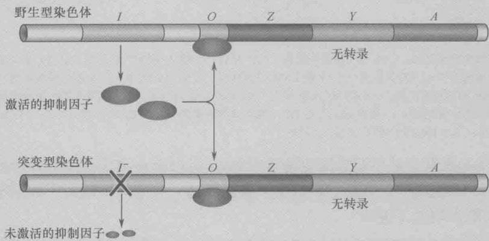  
框 18-2 图 1 部分二倍体细胞显示有功能的抑制因子顺式工作。在没有乳糖时，lac 基因不表达，所以在这些细胞中没有明显水平的 β-半乳糖苷酶的表达。

当造成染色体基因组成型表达的突变是在 lac 操纵子上时, 就不能被野生型基因反式互补了 (框 18-2 图 2)。操纵子只能顺式作用, 即它只作用于与它在同一 DNA 分子上连锁的基因。

这些实验连同其他实验的结果使 Jacob 和 Monod 提出基因在基因开始处称为启动子的特异位点开始表达，这种表达受抑制因子的调控，抑制因子通过位于启动子旁的操纵子位点起作用。

  
框 18-2 图 2 部分二倍体细胞显示操纵子只以顺式方式表达。(a) 含有突变型操纵子的单倍体细胞 (Oc)。(b) 部分二倍体细胞含有正常的操纵子 (O) 和突变型操纵子 (Oc)。Lac 基因 (Z、Y 和 A) 附着在突变型操纵子上持续的组成型表达，即使在同一细胞中另一染色体上有野生型操纵子也是如此。所以，操纵子只以顺式工作。

但是这些关于 lac 系统的实验不是单独进行的；Jacob 和 Monod 还同时用 $\lambda$ 噬菌体（本章我们还将详细讨论这一系统）做了类似的实验。 $\lambda$ 噬菌体可通过两种生活周期增殖。选择哪种增殖方式依赖于表达了哪种相关的基因。这两位法国科学家发现，和 lac 基因一样，在 $\lambda$ 噬菌体系统中也可以分离到控制基因表达的缺陷型突变体，明确了这些突变也是通过顺式操纵子位点作用的反式作用抑制因子。这两个调控系统（尽管是不同生物）的相似性使 Jacob 和 Monod 相信他们发现了基因调控的基本机制，而他们的模型适用于整个自然界。正如我们看到的，尽管他们的描述尚不完整[最值得注意的是，他们的方案中没有包括激活因子（如CAP）]，但他们提出的关于反式调控蛋白识别顺式调控位点的模型主导了后来的基因调控的研究。

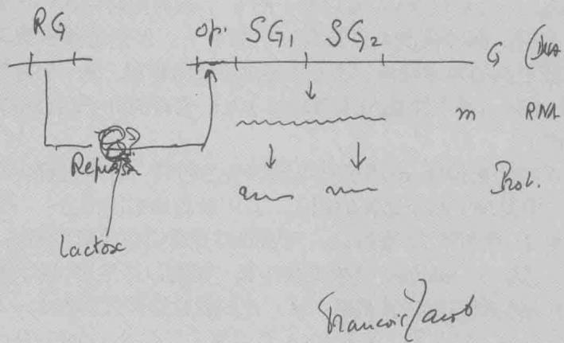  
框 18-2 图 3 这幅图显示 Lac 操纵子及其调控，是由 Francois Jacob 在 2002 年手绘的。（由 Jan Witkowski 赠送）

组合控制：CAP 也控制其他基因

lac 基因是一个信号整合（signal integration）很好的例子：它们的表达受两种信号的控制，每种信号通过一种调控蛋白——Lac 抑制因子和 CAP 分别将信号传递给基因。

下面我们来看 E.coli 中的另一组基因——gal 基因。这些基因编码参与半乳糖代谢的酶。与 lac 基因一样，gal 基因也是只在其作为其底物的糖（这种情况下是半乳糖）存在而没有其优先选用的能源葡萄糖时才表达。同样，与 lac 类似，两种信号也是通过两种调控因子——激活因子和抑制因子传递给基因的。抑制因子由 galR 编码，介导诱导物半乳糖的作用；而 gal 基因的激活因子还是 CAP。这样，一种调控因子（CAP）与两种不同的抑制因子共同作用于不同的基因，这就是一例组合控制（combinatorial control）。实际上，CAP 在 E.coli 中与一系列的调控因子一起作用于 100 多种基因。

组合控制是基因调控的突出特征。这样，当同一信号控制多组基因时，它一般会以同一调控蛋白将信号传递给每组基因中的一个。在调控每一个基因时，这一调控因子也只传递给几个信号中的一个。其他信号多数情况下是不同的，则由另外的调控因子介导。越是复杂的有机体，特别是真核生物中，信号整合的情况就越多。我们以后将看到更复杂也更精细的关于组合控制的例子（第19章）。

#### [W] 选择性的 $\sigma$ 因子指导 RNA 聚合酶选择性地结合启动子

回顾第 13 章，RNA 聚合酶由 $\sigma$ 亚基识别启动子序列（图 13-6）。带有 $\sigma^{70}$ 亚基的 RNA 聚合酶可以识别我们讨论过的 lac 启动子和 E.coli 的许多其他启动子。但是 E.coli 还编码其他 $\sigma$ 亚基，在特定情况下可以替换 $\sigma^{70}$ ，指导聚合酶选择性地结合启动子。

这些选择因子中有一种热激 $\sigma$ 因子—— $\sigma^{32}$ 。当 E.coli 受到热激时，细胞中这种新 $\sigma$ 因子的量就会升高，它会取代 RNA 聚合酶上的 $\sigma^{70}$ ，指导酶转录那些产物会保护细胞免于受热激影响的基因。两种机制可以升高 $\sigma^{32}$ 的水平：首先是刺激翻译，即热激后其 mRNA 以比热激前更高的效率翻译；其次是蛋白质瞬间稳定。另一例选择性 $\sigma$ 因子—— $\sigma^{54}$ 将在下一部分讨论。 $\sigma^{54}$ 与细胞中小部分的 RNA 聚合酶分子结合指导酶结合到产物参与氮代谢的基因上。

有时候，一系列的选择性 $\sigma$ 因子指导基因表达的某一特定过程。在细菌枯草杆菌（Bacillus subtilis）中发现了两个这样的例子。其中最为精细的部分——该生物孢子形成的控制我们将在第 21 章和第 22 章讨论，其他的部分我们在此简单描述。

噬菌体 SPO1 感染 B. subtilis，并在其中生长、裂解以产生后代噬菌体。这一过程要求噬菌体以严格控制的顺序表达其基因。这一控制就是给聚合酶加上一系列的选择性 $\sigma$ 因子。因此，一旦感染了噬菌体，细菌 RNA 聚合酶（带有 B. subtilis 的 $\sigma^{70}$ ）就识别被称为“早期”的噬菌体启动子，指导转录编码感染早期所需蛋白质的基因。其中就有一个基因（称为基因28）编码一个选择性 $\sigma$ 。它取代了细菌的 $\sigma$ 因子指导聚合酶结合到噬菌体基因组的第二套启动子上，这些启动子与被称为“中期”的启动子相耦联。而这些当中又包括一个编码 $\sigma$ 因子的基因，该 $\sigma$ 因子又会指导转录噬菌体“晚期”基因（图18-15）。

  
图 18-15 选择性的 $\sigma$ 因子控制细菌病毒基因的有序表达。细菌噬菌体 SPO1 依次使用 3 个 $\sigma$ 因子调控其基因组的表达，这保证了病毒基因以所需的顺序表达。（经允许引自：Alberts B. et al. 2002. Molecular biology of the cell, 4th edition, p.415, Fig.7-63. Copyright ©2002. Reproduced by permission of Routledge/Taylor & Francis Books, Inc.）

#### [W] NtrC 和 MerR：以变构而非募集发挥作用的转录激活因子

大多数激活因子都是通过募集起作用的，但是也有例外，NtrC 和 MerR 就是通过变构机制起作用的两例。我们已讲到过变构机制。通过募集起作用的激活因子只是将 RNA 聚合酶的活性形式带到启动子上。而通过变构机制起作用的激活因子作用时，聚合酶最初就结合在启动子上，并形成了无活性的复合物，激活因子通过引起复合物的变构变化激活转录。

NtrC 控制参与氮代谢的基因的表达。RNA 聚合酶预先结合在 glnA 基因上，形成稳定的封闭复合体。激活因子 NtrC 诱导酶产生构象改变，促使封闭复合体向开放复合体的转变。MerR 控制汞抗性相关基因的表达，也作用于一个无活性的 RNA 聚合酶启动子复合物。然而，对于 MerR 来讲，激活因子的变构效应是施加在 DNA 而非聚合酶上。现在我们会对这两个系统进行具体描述。

#### [W] NtrC 具有 ATPase 活性且其作用位点距基因较远

与 CAP 相同，NtrC 也具有独立的激活结构域和 DNA 结合结构域，并且也只在特异信号存在时才会结合 DNA。对 NtrC 来说，这一信号就是低水平的氮。在这一条件下，NtrC 会被激酶 NtrB 磷酸化，并因此而经历构象变化，这一变化使激活因子暴露出其 DNA 结合结构域。一旦具有了活性，NtrC 就会结合位于启动子上游 150bp 处的 4 个位点（在 glnA 基因上）。每一个位点都结合一个 NtrC 二聚体，这些二聚体通过蛋白质-蛋白质相互作用以高度协同的方式结合到 4 个位点上。

转录 glnA 基因的 RNA 聚合酶的组成包括 $\sigma^{54}$ 亚基。在没有 NtrC 时，这一聚合酶就结合到 glnA 启动子上，形成稳定的封闭复合物。一旦 NtrC（结合到其上游位点）具有了活性，就与 $\sigma^{54}$ 直接作用。为利于这一相互作用，要求激活因子结合位点和启动子之间的 DNA 形成一个环（图 18-16）。如果 NtrC 移动到上游更远的地方（如 1\~2kb），激活因子仍能起作用。

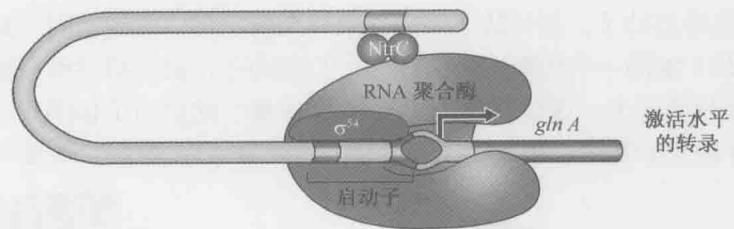  
图 18-16 由 NtrC 激活。包含 $\sigma^{54}$ 的全酶识别的启动子序列不同于包含 $\sigma^{70}$ 的全酶识别的启动子。虽然图中没有特别标示，但 NtrC 是与聚合酶的 $\sigma^{54}$ 亚基接触的。NtrC 以二聚体表示，但实际上，它在 DNA 上形成更为有序的复合物。

NtrC 自身也有酶活性——它是一个 ATPase，这一活性可以为其诱导聚合酶产生构象变化提供能量。构象变化促进聚合酶起始转录。具体地说，是刺激稳定无活性的封闭复合体向有活性开放的复合体转化。

NtrC 控制的基因中，有些还具有另一种蛋白质，称为 IHF 的结合位点，位于 NtrC 结合位点和启动子之间。IHF 一结合 DNA，就使 DNA 弯曲。当 IHF 结合在正确的位点，DNA 也因而正确弯曲时，就能促进 NtrC 的激活作用。这可以解释为，IHF 通过弯曲 DNA 使激活因子更靠近启动子，协助激活因子与结合到启动子的聚合酶相互作用（图 18-4，欲详细了解 IHF 如何弯曲 DNA，见图 12-11）。

#### [W] MerR 通过扭曲 DNA 激活转录

当 MerR 结合到单一 DNA 结合位点，且有汞存在时，就激活 merT 基因。如图 18-17 所示，MerR 结合到位于启动子（该基因由包含 $\sigma^{70}$ 的聚合酶转录）的 -10 和 -35 序列之间的一段序列上。MerR 结合 DNA 螺旋上 RNA 聚合酶结合点的背面。所以聚合酶可以（也确实是）与 MerR 同时结合到启动子上。

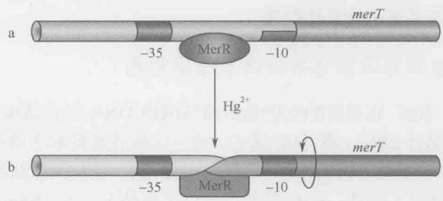  
图 18-17 由 MerR 激活。merT 启动子的 -10 和 -35 元件位于螺旋的反面。（a）在无汞时，MerR 结合并稳定了无活性形式的启动子。（b）在有汞存在时，MerR 扭曲了 DNA 从而使启动子元件正确排列。

merT 启动子不同于一般的启动子，其-10 与-35 元件之间的距离是 19bp 而非 $\sigma^{70}$ 启动子中常见的 15\~17bp（第 13 章，框 13-1）。这样将导致这两个被 $\sigma$ 识别的序列元件既不能适当地间隔，也不能平行排列，这两者绕螺旋面彼此相向。而且，MerR 以这种构象在 DNA 上的结合（无 $Hg^{2+}$ 时）锁定了启动子，导致聚合酶虽能结合，但却无法起始

转录，因此这种情况下无本底转录。

但是当 MerR 结合了 $Hg^{2+}$ 时，蛋白质就会发生构象变化，引起启动子中心的 DNA 扭曲。这一结构上的弯曲使 -10 和 -35 区采取类似强启动子 $\sigma^{70}$ 的分布。在这种新构型中，RNA 聚合酶可以有效地起始转录。启动子 DNA 的“活性”和“非活性”状态的结构已经确定（以另一个同种方式调控的启动子），如图 18-18 所示。

  
图 18-18 像 merT 样的启动子的结构。(a) 有 19bp 间隔的启动子。(b) 当在带有活性激活因子的复合物中时启动子有 19bp 的间隔。(c) 有 17bp 间隔的启动子。(a)、(b) 部分所示的启动子来源于 Bacillus subtilis 的 bmR 基因，它由调控因子 BmrR 控制。BmrR 与 TPP 药物形成复合物就可以作为激活因子-35 (TTGACT) 和 -10 (TACAGT) 元件的一条链，分别以粉红色和绿色分别表示。(经允许引自，Zheleznova Heldwein E. E. and Brennan R.G. 2001. Nature409: 378; Fig.3b, c, d. Copyright © 2001 Nature Publishing Group.)

需要着重指出的一点是，在本例中，激活因子不是以与 RNA 聚合酶相互作用，而是以改变预先结合的聚合酶附近的 DNA 的构象激活转录的。因此，不像前面的例子，MerR 是没有 DNA 结合区与激活区之分的，其 DNA 结合过程是与其激活过程紧密连接的。

#### [W] 某些抑制因子在启动子上滞留而非排斥 RNA 聚合酶

Lac 抑制因子以最简单的方式作用：通过结合与启动子有重叠区的位点，阻碍了 RNA 聚合酶的结合。许多抑制因子也是以同样方式作用的。在 MerR 的实例中，我们看到了一种新的抑制形式：蛋白质使启动子保持一种不利于转录起始的构象。抑制因子还有其他的作用方式，现在我们就来讨论其中的一种。

有些抑制因子的结合位点不与启动子有重叠区。这些启动子不阻碍聚合酶的结合而是结合到启动子旁的位点，与结合在启动子上的聚合酶相互作用，抑制转录起始。我们前面提到的 E.coli 的 Gal 抑制因子就是一个这样的例子。Gal 抑制因子控制编码参与半乳糖代谢的酶的基因。在没有半乳糖的时候，抑制因子保持基因不表达。在这种情况下，抑制因子与聚合酶相互作用，抑制封闭复合物到开放复合物的转变。

另一个例子来自在细菌 B.subtilis 的噬菌体（ $\varphi29$ ）的 $P_{4}$ 蛋白。这一调控因子结合到一个弱化的启动子 $P_{A3}$ 的附近，与聚合酶相互作用作为一个激活因子，它与 $\alpha$ CTD 相互作用，与 CAP 相同。但这个激活因子还结合另一个称为 $P_{A2c}$ 强启动子。与在弱启动子上一样，该调控蛋白也与聚合酶接触，但在这里却是导致抑制。在前一种情况下额外的结合能协助募集聚合酶，因此激活基因；而在后一种情况下，由聚合酶和启动子之间的强相互作用加上激活因子相互作用所提供的总结合能太强，以至于聚合酶无法从启动子上脱离。

#### [W] AraC 和抗激活作用对 araBAD 操纵子的控制

E.coli 的 araBAD 操纵子的启动子在阿拉伯糖存在而没有葡萄糖时被激活，指导编码阿拉伯糖代谢需要的酶的基因表达。与 lac 和 gal 基因一个抑制因子和一个激活因子一起作用的情况不一样，这里有两个激活因子一起作用：AraC 和 CAP。当存在阿拉伯糖时，AraC 与其结合，采取允许其结合 DNA 的构象，AraC 以二聚体结合到紧邻的两个半位点——araI1 和 araI2（图 18-19a）。在这两个位点的上游就是一个 CAP 位点（图中未标示）：无葡萄糖时，CAP 结合到这里并协助激活转录。

  
图 18-19 araBAD 操纵子的控制。(a) 阿拉伯糖结合到 AraC，改变了激活因子的形状，使它以二聚体结合到 $araI_{1}$ 和 $araI_{2}$ 上。这将使一个 AraC 单体置于启动子附近，它可以从此处激活转录。(b) 在无阿拉伯糖时，AraC 二聚体采取一种不同的构象，结合到 $araO_{2}$ 和 $araI_{1}$ 。在这一位置， $araI_{2}$ 位点上没有单体，因此蛋白质不能激活 araBAD 启动子。这一启动子也被 CAP 控制（图中没有标示）。

没有阿拉伯糖时，araBAD 基因不表达。这是因为，AraC 在不结合阿拉伯糖时，会采取不同的构象以不同的方式结合 DNA：一个单体仍结合 $araI_{1}$ 位点，但另一个单体则结合远处一个叫 $araO_{2}$ 的半位点，如图 18-19b 所示。因为这两个半位点相距 194bp，所以当 AraC 以这种方式结合上去时，两个位点之间的 DNA 就会形成环。同时，这样结合， $araI_{2}$ 上没有 AraC 结合，而启动子 araBAD 又是从这一位置被介导激活，所以这样的构型不会激活启动子。

阿拉伯糖诱导 araBAD 启动子的数量级是非常大的，因此，该启动子经常被用作表达载体（expression vector）。表达载体是由 DNA 构成的，其基因与强启动子融合就可在表达载体中有效合成某一蛋白质（第 7 章）。在这种情况下，以某一基因与 araBAD融合就可以使这一基因的表达由阿拉伯糖来控制：该基因可以一直处于关闭状态，除非想要其表达；如果想要其产物，只需加入阿拉伯糖诱导即可。这样，即使其产物对细菌细胞具有毒性，也会进行表达。

现在我们将开始讨论一些更为复杂的转录调控网络,看看这些反复出现的简单机制是怎样进行的。我们将会重点通过噬菌体的例子来了解不同层次的调控组合是如何产生正反馈和负反馈回路，从而建立和维持能够引发完全不同生物反应的基因表达交替模式的。群体感应是生物过程中简单的反馈回路的一个很好例子（详见框18-3）。细菌的群体感应系统参与了多种生物学功能的调节，而最重要的是它是与细菌的致病机理有关。

#### [W] 框 18-3 通过细胞间通讯的沉默通路阻断毒性

在微生物学研究的早期，细菌被认为是无社会性的生物，每个个体独立生活，很少与其他个体互动。但是，现在我们已经知道很多细菌能够产生、释放、感应一些化学信号。这种普遍存在的细胞间通讯模式被称为群体感应，它使细菌通过感应到细胞内细菌密度增加从而开启基因同步模式。某些基因的表达只有当有大量细胞存在时才能体现出其优势，如生物荧光、毒力因子、抗生素、生物膜的形成，以及摄入DNA的能力等。当在其宿主鱿鱼体内菌群密度达到一定阈值的时候，发光细菌费氏弧菌（Vibrio fischeri）能够产生发光的荧光素酶。而当费氏弧菌在一个单细胞里单独存在的时候，产生荧光素酶对它几乎没有好处。同样的，人类病原菌绿脓杆菌只有在细菌浓度累积到较高的感染阶段，才能够产生和分泌毒力因子，如绿脓菌素、氰化物、脂肪酶。在这一章中我们已经讨论过细菌是如何对环境的信号做出反应控制基因开关的。在这里我们将关注细菌对自身产生的化学物质（自体诱导物）如何反应，以及与其他细菌进行信息交流的分子机制。相信理解这些机制能够有助于发现通过化学方法介导细胞间通讯的沉默通路，从而治疗细菌感染的新策略。

我们将关注一种广泛存在的信号分子——酰基高丝氨酸内酯（AHL），其能够被调控蛋白的 LuxR 家族识别。AHL 是简单的有机分子，由高丝氨酸内酯环附着到一个 4\~18 个碳的酰基链组成。不同种类的细菌产生的 AHL 具有不同长度的尾巴，每个种类的细菌只对它本身产生的信号分子有反应。信号的多样性有效地保证了细菌的群体感应的特异性。AHL 是一种膜渗透性分子，当与 LuxR 结合的时候，AHL 能够渗入到细胞中。LuxR 是一种激活蛋白，当和配体 AHL 形成络合物的时候，它只能开启转录。因此，就像活化剂 CAP，取决于它的配体 cAMP，当与合适的 AHL 结合后，LuxR 就会与目标基因的启动子区域结合。因为信号分子是从细胞外进入到细胞内，所以 LuxR 介导的群体感应是一个极其简单的信号转导系统，配体直接与转录调控因子相互作用。从这个意义上说，LuxR 类似于某些真核生物的调控蛋白，如糖皮质激素受体，通过直接与一种膜渗透配体（一种甾醇）结合，激活它的同源调控蛋白（在糖皮质激素受体的例子中，允许其从细胞质迁移到细胞核内）。有趣的是，在一些情况下，AHL 的作用机制更为复杂，它与细胞质膜上的受体结合后引起细胞质内转录调控蛋白的磷酸化作用和激活，这与真核系统的另一种通路——STAT 通路相类似，在下一章我们将会提到（图 19-24）。

与 AHL 结合后，LuxR 与染色体上的目标基因的启动子区域结合（荧光霉素基因、毒力因子基因，以及其他来自于细菌的群体感应的基因）。luxI 基因就是目标基因中的一个，它是 AHL 的合成酶基因。这具有重要的意义，也正是如此，它才能建立我们所说的正反馈调节回路。luxI 基因是受 LuxR 控制的，AHL 与 LuxR 结合激活了 luxI 基因的表达并提高了 AHL 的产量。多余的 AHL 分子扩散到其他的细胞中。这导致 LuxR 进一步被激活，反过来又促进了更多 AHL 的合成，这样细胞外 AHL 的浓度就更高。只有在细胞中细菌数量达到阈值的时候，这种正反馈调节回路才会被启动；当低于阈值的时候，细胞外 AHL 的浓度太低并不能开启正反馈调节回路。因此，LuxR 控制的基因只有在细菌数量达到“特定数量”引发正反馈调节回路的时候才能被表达。

这个理论已经应用于研制阻断病原菌毒力基因的群体感应拮抗剂。例如，在青紫色素杆菌中，它的 LuxR 型的转录因子是一种自诱导剂——一个激活的 6 碳长链的 N-己酰高丝氨酸内酯。该因子的亚基是由一个配体结合域和一个 DNA 结合域组成的二聚体。X 射线晶体学研究已表明 N-己酰高丝氨酸内酯可以和与它同源的 LuxR 因子形成复合物，两个并行亚基的 DNA 结合域能够分别与 DNA 结合（框 18-3 图 1）。但是，氯化内酯拮抗剂（结构如图所示）却能够有效地抑制青紫色素杆菌的 LuxR。氯化内酯与 LuxR 结合的时候，一个亚基的配体结合域与另一个亚基的 DNA 结合域联系在一起，使得转录因子形成交错的十字构象。在这种非活跃的构象中，二聚体不能与 DNA 结合，因此不能激活转录。在青紫色素杆菌感染秀丽新小杆线虫的试验中，氯化内酯确实能够保护线虫不受群体感应介导的感染。这表明转录因子的结构和功能对了解细菌的致病机理发挥着重要作用，可被应用于潜在治疗的小分子物质拮抗剂的研制。

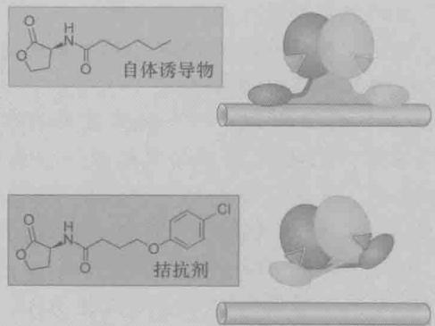  
框 18-3 图 1 一种群体感应拮抗剂通过稳定 LuxR 的非活性构象发挥作用(经允许引自 Contents of Mol. Cell, Vol. 42 [2011], article on pp. 199–209.)

<!-- W-END Watson 18 转录起始的调控：原核生物的实例 -->

<!-- L-BEGIN Lehninger 28.2 -->

### 【英文对应 Lehninger §28.2：Regulation of Gene Expression in Bacteria】

> 来源：Lehninger Principles of Biochemistry（书籍/02_生物化学原理） 第28章 Regulation of Gene Expression，§28.2。

As in many other areas of biochemical investigation, the study of the regulation of gene expression advanced earlier and faster in bacteria than in other experimental organisms. The examples of bacterial gene regulation presented here are chosen from among scores of well-studied systems, partly for their historical significance, but primarily because they provide a good overview of the range of regulatory mechanisms in bacteria. Many of the principles of bacterial gene regulation are also relevant to understanding gene expression in eukaryotic cells.

We begin by examining the lactose and tryptophan operons; each system has regulatory proteins, but the overall mechanisms of regulation are very different. This is followed by a short discussion of the SOS response in E. coli, illustrating how genes scattered throughout the genome can be coordinately regulated. We then describe two bacterial systems of quite different types, illustrating the diversity of gene regulatory mechanisms: regulation of ribosomal protein synthesis at the level of translation, with many of the regulatory proteins binding to RNA (rather than DNA), and regulation of the process of “phase variation” in Salmonella, which results from genetic recombination. Finally, we examine some additional examples of posttranscriptional regulation in which the RNA modulates its own function.

#### [EN] The lac Operon Undergoes Positive Regulation

The operator-repressor-inducer interactions described earlier for the lac operon (Fig. 28-8) provide an intuitively satisfying model for an on/off switch in the regulation of gene expression, but operon regulation is rarely so simple. A bacterium's environment is too complex for its genes to be controlled by one signal. Other factors besides lactose, such as the availability of glucose, affect the expression of the lac genes. Glucose, metabolized directly by glycolysis, is the preferred energy source in E. coli. Other sugars can serve as the main or sole nutrient, but extra enzymatic steps are required to prepare them for entry into glycolysis, necessitating the synthesis of additional enzymes. Clearly, expressing the genes for proteins that metabolize sugars such as lactose or arabinose is wasteful when glucose is abundant.

What happens to the expression of the lac operon when both glucose and lactose are present? A regulatory mechanism known as catabolite repression restricts expression of the genes required for catabolism of lactose, arabinose, and other sugars in the presence of glucose, even when these secondary sugars are also present. The effect of glucose is mediated by cAMP, as a coactivator, and an activator protein known as cAMP receptor protein, or CRP (the protein is sometimes called CAP, for catabolite gene activator protein). CRP is a homodimer (subunit $M_{r}$ 22,000) with binding sites for DNA and cAMP. Binding is mediated by a helix-turn-helix motif in the protein's DNA-binding domain (Fig. 28-17). When glucose is absent, CRP-cAMP binds to a site near the lac promoter (Fig. 28-18) and stimulates RNA transcription 50-fold. The wild-type lac promoter is a relatively

  
FIGURE 28-17 CRP homodimer with bound cAMP. Note the bending of the DNA around the protein. The region that interacts with RNA polymerase is labeled. [Data from PDB ID 1RUN, G. Parkinson et al., Nat. Struct. Biol. 3:837, 1996.]

(a) Glucose high, cAMP low, lactose absent  

(b) Glucose low, cAMP high, lactose absent  

(c) Glucose high, cAMP low, lactose present  

(d) Glucose low, cAMP high, lactose present  
  
FIGURE 28-18 Positive regulation of the lac operon by CRP. The binding site for CRP-cAMP is near the promoter. The combined effects of glucose and lactose availability on lac operon expression are shown. When lactose is absent, the repressor binds to the operator and prevents transcription of the lac genes. It does not matter whether glucose is (a) present or (b) absent. (c) If lactose is present, the repressor dissociates from the operator. However, if glucose is also available, low cAMP levels prevent CRP-cAMP formation and DNA binding. RNA polymerase may occasionally bind and initiate transcription, resulting in a very low level of lac genes transcription. (d) When lactose is present and glucose levels are low, cAMP levels rise. The CRP-cAMP complex forms and facilitates robust binding of RNA polymerase to the lac promoter and high levels of transcription.

weak promoter, diverging from the consensus shown in Figure 28-2. The open complex of RNA polymerase and the promoter (see Fig. 26-6) does not form readily unless CRP-cAMP is present and also bound (Fig. 28-18a, c). CRP-cAMP is therefore a positive regulatory element responsive to glucose levels, whereas the Lac repressor is a negative regulatory element responsive to lactose.

The two act in concert. CRP-cAMP has little effect on the lac operon when the Lac repressor is blocking transcription, and dissociation of the repressor from the lac operator has little effect on transcription of the lac operon unless CRP-cAMP is present to facilitate transcription. CRP interacts directly with RNA polymerase (at the region shown in Fig. 28-17) through the polymerase's $\alpha$ subunit. Thus, optimal expression of the lac operon requires dissociation of the Lac repressor (indicating that lactose is available) and the binding of CRP-cAMP (indicating that glucose is not available).

The effect of glucose on CRP is mediated by the cAMP interaction (Fig. 28-18). CRP binds to DNA most avidly when cAMP concentrations are high. In the presence of glucose, the synthesis of cAMP is inhibited and efflux of cAMP from the cell is stimulated. As [cAMP] declines, CRP binding to DNA declines, thereby decreasing the expression of the lac operon.

CRP and cAMP participate in the coordinated regulation of many operons, primarily those that encode enzymes for the metabolism of secondary sugars such as lactose and arabinose. A network of operons with a common regulator is called a regulon. This arrangement, which allows coordinated shifts in cellular functions that can require the action of hundreds of genes, is a major theme in the regulated expression of dispersed networks of genes in eukaryotes. Other bacterial regulons include the heat shock gene system that responds to changes in temperature and the genes induced in E. coli as part of the SOS response to DNA damage, described later.

#### [EN] Many Genes for Amino Acid Biosynthetic Enzymes Are Regulated by Transcription Attenuation

The 20 common amino acids are required in large amounts for protein synthesis, and E. coli can synthesize all of them. The genes for the enzymes needed to synthesize a given amino acid are generally clustered in an operon and are expressed whenever existing supplies of that amino acid are inadequate for cellular requirements. When the amino acid is abundant, the biosynthetic enzymes are not needed and the operon is repressed.

The E. coli tryptophan (trp) operon (Fig. 28-19) includes five genes for the enzymes required to convert chorismate to tryptophan (see Fig. 22-19). Note that two of the enzymes catalyze more than one step in the pathway. The mRNA from the trp operon has a half-life of only about 3 min, allowing the cell to respond rapidly to changing needs for this amino acid. The Trp repressor is a homodimer. When tryptophan is abundant, it binds to the Trp repressor, causing a conformational change that permits the repressor to bind to the trp operator and inhibit expression of the trp operon. The trp operator site overlaps the promoter, so binding of the repressor blocks binding of RNA polymerase.

Once again, this simple on/off circuit mediated by a repressor is not the entire regulatory story. Different cellular concentrations of tryptophan can vary the rate of synthesis of the biosynthetic enzymes over a 700-fold range. P1 Once repression is lifted and transcription begins, the rate of transcription is fine-tuned to cellular tryptophan requirements by a second regulatory process, called transcription attenuation, in which transcription is initiated normally but is abruptly halted before the operon genes are transcribed. The frequency with which transcription is attenuated is regulated by the availability of tryptophan and relies on the very close coupling of transcription and translation in bacteria.

The trp operon attenuation mechanism uses signals encoded in four sequences within a 162 nucleotide leader region at the 5' end of the mRNA, preceding the initiation codon of the first gene (Fig. 28-20a). The leader contains a region known as the attenuator, made up of sequences 3 and 4. These sequences base-pair to form a G≡C-rich stem-and-loop structure closely followed by a series of U residues. The attenuator structure acts as a transcription terminator (Fig. 28-20b; see also Fig. 26-7a). Sequence 2 is an alternative complement for sequence 3 (Fig. 28-20c). If sequences 2 and 3 base-pair, the attenuator structure cannot form and transcription continues into the trp biosynthetic genes; the loop formed by the pairing of sequences 2 and 3 does not obstruct transcription.

Regulatory sequence 1 is crucial for a tryptophan-sensitive mechanism that determines whether sequence 3 pairs with sequence 2 (allowing transcription to continue) or with sequence 4 (attenuating transcription). Formation of the attenuator stem-and-loop structure depends on events that occur during translation of regulatory sequence 1, which encodes a leader peptide (so called because it is encoded by the leader region of the mRNA) of 14 amino acids, two of which are Trp residues. The leader peptide has no other known cellular function; its synthesis is simply an operon regulatory device. This peptide is translated immediately after it is transcribed, by a ribosome that follows closely behind RNA polymerase as transcription proceeds.

When tryptophan concentrations are high, concentrations of charged tryptophan tRNA (Trp-tRNA $^{Trp}$ ) are also high. This allows translation to proceed rapidly past the two Trp codons of sequence 1 and into sequence 2, before sequence 3 is synthesized by RNA polymerase. In this situation, sequence 2 is covered by the ribosome and unavailable for pairing to sequence 3 when sequence 3 is synthesized; the attenuator structure (sequences 3 and 4) forms and transcription halts (Fig. 28-20b, top). When tryptophan concentrations are low, however, the ribosome stalls at the two Trp codons in sequence 1, because charged tRNA $^{Trp}$ is less available. Sequence 2 remains free while sequence 3 is synthesized, allowing these two sequences to base-pair and permitting transcription to proceed (Fig. 28-20b, bottom). In this way, the proportion of transcripts that are attenuated declines as tryptophan concentration declines.

Many other amino acid biosynthetic operons use a similar attenuation strategy to fine-tune biosynthetic enzymes to meet the prevailing cellular requirements. The 15 amino acid leader peptide produced by the phe operon contains seven Phe residues. The leu operon leader peptide has four contiguous Leu residues. The leader peptide for the his operon contains seven contiguous His residues. In fact, in the his operon and several others, attenuation is sufficiently sensitive to be the only regulatory mechanism.

#### [EN] Induction of the SOS Response Requires Destruction of Repressor Proteins

Extensive DNA damage in the bacterial chromosome triggers the induction of nearly 60 genes scattered about the chromosome. P3 The genes involved in the coordinated inducible response, called the SOS response (p. 939), constitute the SOS regulon. Many of the induced genes are involved in DNA repair. The key regulatory proteins are the RecA protein and the LexA repressor.

The LexA repressor ( $M_{r}$ 22,700) inhibits transcription of all the SOS genes (Fig. 28-21), and induction of the SOS response requires removal of LexA. This is not a simple dissociation from DNA in response to binding of a small molecule, as in the regulation of the lac operon described above. Instead, the LexA repressor is inactivated when it catalyzes its own cleavage at a specific Ala–Gly peptide bond, producing two roughly equal protein fragments. At physiological pH, this autocleavage reaction requires the RecA protein. RecA is not a protease in the classical sense, but its interaction with LexA enables the repressor's self-cleavage reaction. This function of RecA is sometimes called a co-protease activity.

The RecA protein provides the functional link between the biological signal (DNA damage) and induction of the SOS genes. Heavy DNA damage leads to numerous single-strand gaps in the DNA, and only RecA that is bound to single-stranded DNA can facilitate cleavage of the LexA repressor (Fig. 28-21, bottom). Binding of RecA at the gaps eventually activates its co-protease activity, leading to cleavage of the LexA repressor and SOS induction.

During induction of the SOS response in a severely damaged cell, RecA also promotes the autocatalytic cleavage of, and thus inactivates, the repressors that otherwise allow propagation of certain viruses in a dormant lysogenic state within the bacterial host. This provides a remarkable illustration of evolutionary adaptation. These repressors, like LexA, undergo self-cleavage at a specific Ala-Gly peptide bond, so induction of the SOS response permits replication of the virus and lysis of the cell, releasing new viral particles. Thus, the bacteriophage can make a hasty exit from a compromised bacterial host cell.

When tryptophan levels are low, the ribosome pauses at the Trp codons in sequence 1. Formation of the paired structure between sequences 2 and 3 prevents attenuation, because sequence 3 is no longer available to form the attenuator structure with sequence 4. The 2:3 structure, unlike the 3:4 attenuator, does not prevent transcription.  
  
(a)

When tryptophan levels are high, the ribosome quickly translates sequence 1 (open reading frame encoding leader peptide) and blocks sequence 2 before sequence 3 is transcribed. Continued transcription leads to attenuation at the terminator-like attenuator structure formed by sequences 3 and 4.

  
(c)

(b)

FIGURE 28-20 Transcriptional attenuation in the trp operon. Transcription is initiated at the beginning of the 162 nucleotide mRNA leader encoded by a DNA region called trpL (see Fig. 28-19). A regulatory mechanism determines whether transcription is attenuated at the end of the leader or continues into the structural genes. (a) The trp mRNA leader (trpL). The attenuation mechanism in the trp operon involves sequences 1 to 4 (highlighted). (b) Sequence 1 encodes a small peptide, the leader peptide, containing two Trp residues (W); it is translated immediately after transcription begins. Sequences 2 and 3 are complementary, as are sequences 3 and 4. The attenuator structure forms by the pairing of sequences 3 and 4 (top). Its structure and function are similar to those of a transcription terminator. Pairing of sequences 2 and 3 (bottom) prevents the attenuator structure from forming. Note that the leader peptide has no other cellular function. Translation of its open reading frame has a purely regulatory role that determines which complementary sequences (2 and 3, or 3 and 4) are paired. (c) Base-pairing schemes for the complementary regions of the trp mRNA leader.

  
FIGURE 28-21 SOS response in E. coli. The LexA protein is the repressor in this system, which has an operator site near each gene. Because the recA gene is not entirely repressed by the LexA repressor, the normal cell contains about 1,000 RecA monomers. When DNA is extensively damaged (such as by UV light), DNA replication is halted and the number of single-strand gaps in the DNA increases. RecA protein binds to this damaged, single-stranded DNA, activating the protein's co-protease activity. While bound to DNA, the RecA protein facilitates cleavage and inactivation of the LexA repressor. When the repressor is inactivated, the SOS genes, including recA, are induced; RecA levels increase 50- to 100-fold.

The destruction of the LexA repressor proteins as part of the response means that LexA must be resynthesized in order to reestablish gene control when the DNA damage is no longer present. P5 The considerable amount of ATP and GTP needed for protein synthesis to maintain SOS regulon repression provides one example of the energetic cost of regulation.

#### [EN] Synthesis of Ribosomal Proteins Is Coordinated with rRNA Synthesis

In bacteria, an increased cellular demand for protein synthesis is met by increasing the number of ribosomes rather than altering the activity of individual ribosomes. In general, the number of ribosomes increases as the cellular growth rate increases. At high growth rates, ribosomes make up approximately 45% of the cell's dry weight. The proportion of cellular resources devoted to making ribosomes is so large, and the function of ribosomes so important, that cells must coordinate the synthesis of the ribosomal components: the ribosomal proteins (r-proteins) and RNAs (rRNAs). P1 This regulation is distinct from the mechanisms described so far: it occurs largely at the level of translation.

The 52 genes that encode the r-proteins are distributed across at least 20 operons, each with 1 to 11 genes. Some of these operons also contain the genes for the subunits of DNA primase, RNA polymerase, and protein synthesis elongation factors—reflecting the close coupling of replication, transcription, and protein synthesis during bacterial cell growth.

The r-protein operons are regulated primarily through a translational feedback mechanism. One r-protein encoded by each operon also functions as a translational repressor, which binds to the mRNA transcribed from that operon and blocks translation of all the genes the messenger encodes (Fig. 28-22). In general, the r-protein that plays the role of repressor also binds directly to an rRNA. Each translational repressor r-protein binds with higher affinity to the appropriate rRNA than to its mRNA, so the mRNA is bound and translation repressed only when the level of the r-protein exceeds that of the rRNA. This ensures that translation of the mRNAs encoding r-proteins is repressed only when synthesis of these r-proteins exceeds that needed to make functional ribosomes. In this way, the rate of r-protein synthesis is kept in balance with rRNA availability.

  
FIGURE 28-22 Translational feedback in some ribosomal protein operons. The r-proteins that act as translational repressors are shown (red circles). Each translational repressor blocks the translation of all genes in that operon by binding to the indicated site on the mRNA. The operons include the genes that encode the $\alpha$ , $\beta$ , and $\beta'$ subunits of RNA polymerase and the elongation factors EF-G and EF-Tu (labeled). The r-proteins of the large (50S) ribosomal subunit are designated L1 to L34; those of the small (30S) subunit are designated S1 to S21.

The mRNA-binding site for the translational repressor is near the translational start site of one of the genes in the operon, often but not always the first gene (Fig. 28-22). In other operons this would affect only that one gene, because in bacterial polycistronic mRNAs, most genes have independent translation signals. In the r-protein operons, however, the translation of one gene depends on the translation of all the others. The translation of multiple genes seems to be blocked by folding of the mRNA into an elaborate three-dimensional structure that is stabilized both by internal base pairing and by binding of the translational repressor protein. When the translational repressor is absent, ribosome binding and translation of one or more of the genes disrupts the folded structure of the mRNA and allows all the genes to be translated.

Because the synthesis of r-proteins is coordinated with the availability of rRNA, the regulation of ribosome production reflects the regulation of rRNA synthesis. In E. coli, rRNA synthesis from the seven rRNA operons responds to cellular growth rate and to changes in the availability of crucial nutrients, particularly amino acids. The regulation coordinated with amino acid concentrations is known as the stringent response (Fig. 28-23). When amino acid concentrations are low, rRNA synthesis is halted. Amino acid starvation leads to the binding of uncharged tRNAs to the ribosomal A site; this triggers a sequence of events that begins with the binding of an enzyme called stringent factor (RelA protein) to the ribosome. When bound to the ribosome, stringent factor catalyzes formation of the unusual nucleotide guanosine tetraphosphate (ppGpp); it adds pyrophosphate to the 3' position of GTP, in the reaction

$$
\mathrm{GTP} + \mathrm{ATP} \rightarrow \mathrm{pppGpp} + \mathrm{AMP}
$$

Then a phosphohydrolase cleaves off one phosphate to convert some pppGpp to ppGpp. The abrupt rise in pppGpp and ppGpp levels in response to amino acid starvation results in a great reduction in rRNA synthesis, mediated at least in part by the binding of ppGpp to RNA polymerase.

The nucleotides pppGpp and ppGpp, along with cAMP, belong to a class of modified nucleotides that act as cellular second messengers. In E. coli, these two nucleotides serve as starvation signals; they cause large changes in cellular metabolism by increasing or decreasing the transcription of hundreds of genes. In eukaryotic cells, similar nucleotide second messengers also have multiple regulatory functions. The coordination of cellular metabolism with cell growth is highly complex, and further regulatory mechanisms undoubtedly remain to be discovered.

#### [EN] The Function of Some mRNAs Is Regulated by Small RNAs in Cis or in Trans

As described throughout this chapter, proteins play an important and well-documented role in regulating gene expression. But RNA also has a crucial role—one that is becoming increasingly recognized as more examples of regulatory RNAs are discovered. Once an mRNA is synthesized, its functions can be controlled by RNA-binding proteins, as seen for the r-protein operons just described, or by an RNA. A separate RNA molecule may bind to the mRNA “in trans” and affect its activity. Alternatively, a portion of the mRNA itself may regulate its own function. When part of a molecule affects the function of another part of the same molecule, it is said to act “in cis.”

  
FIGURE 28-23 Stringent response in E. coli. This response to amino acid starvation is triggered by binding of an uncharged tRNA in the ribosomal A site. A protein called stringent factor binds to the ribosome and catalyzes the synthesis of pppGpp, which is converted by a phosphohydrolase to ppGpp. The signal ppGpp reduces transcription of some genes and increases transcription of others, in part by binding to the $\beta$ subunit of RNA polymerase and altering the enzyme's promoter specificity. Synthesis of rRNA is reduced when ppGpp levels increase.

A well-characterized example of RNA regulation in trans is regulation of the mRNA of the gene rpoS (RNA polymerase sigma factor), which encodes $\sigma^{S}$ (formerly known as $\sigma^{38}$ ), one of seven E. coli sigma factors. The cell uses this specificity factor in certain stress situations, such as when it enters the stationary phase (a state of no growth, necessitated by lack of nutrients) and $\sigma^{S}$ is needed to transcribe large numbers of stress response genes. The $\sigma^{S}$ mRNA is present at low levels under most conditions but is not translated, because a large hairpin structure upstream of the coding region inhibits ribosome binding (Fig. 28-24). P2 Under certain stress conditions, one or both of two small ncRNAs, DsrA (downstream region A) and RprA (rpoS regulator RNA A), are induced. Both can pair with one strand of the hairpin in the $\sigma^{S}$ mRNA, disrupting the hairpin and thus allowing translation of rpoS.

  
FIGURE 28-24 Regulation of bacterial mRNA function in trans by sRNAs. Several sRNAs (small RNAs) — DsrA, RprA, and OxyS — participate in regulation of the rpoS gene. All require the protein Hfq, an RNA chaperone that facilitates RNA-RNA pairing. Hfq has a toroid structure, with a pore in the center. (a) DsrA promotes translation by pairing with one strand of a stem-loop structure that otherwise blocks the ribosome-binding site. RprA (not shown) acts in a similar way. (b) OxyS blocks translation by pairing with the ribosome-binding site. [Information from M. Szymański and J. Barciszewski, Genome Biol. 3:reviews0005.1, 2002.]

Another small RNA, OxyS (oxidative stress gene S), is induced under conditions of oxidative stress and inhibits the translation of rpoS, probably by pairing with and blocking the ribosome-binding site on the mRNA. OxyS is expressed as part of a system that responds to a different type of stress (oxidative damage) than does the rpoS RNA, and its task is to prevent expression of unneeded repair pathways. DsrA, RprA, and OxyS are all relatively small bacterial RNA molecules (less than 300 nucleotides), designated sRNAs (s for small; there are, of course, other "small" RNAs with other designations in eukaryotes). All sRNAs require for their function a protein called Hfq, an RNA chaperone that facilitates RNA-RNA pairing. The known bacterial genes regulated in this way are few in number, just a few dozen in a typical bacterial species. However, these examples provide good model systems for understanding patterns present in the more complex and numerous examples of RNA-mediated regulation in eukaryotes.

Regulation in cis involves a class of RNA structures known as riboswitches. As described in Box 26-4, aptamers are RNA molecules, generated in vitro, that are capable of specific binding to a particular ligand. As one might expect, such ligand-binding RNA domains are also present in nature—in riboswitches—in a significant number of bacterial mRNAs (and even in some eukaryotic mRNAs). These natural aptamers are structured domains found in untranslated regions at the 5' ends of certain bacterial mRNAs. Some riboswitches also regulate the transcription of certain noncoding RNAs. Binding of an mRNA's riboswitch to its appropriate ligand results in a conformational change in the mRNA, and transcription is inhibited by stabilization of a premature transcription termination structure, or translation is inhibited (in cis) by occlusion of the ribosome-binding site (Fig. 28-25). In most cases, the riboswitch acts in a kind of feedback loop. Most genes regulated in this way are involved in the synthesis or transport of the ligand that is bound by the riboswitch; thus, when the ligand is present in high concentrations, the riboswitch inhibits expression of the genes needed to replenish this ligand.

  
FIGURE 28-25 Regulation of bacterial mRNA function in cis by riboswitches. The known modes of action are illustrated by several different riboswitches, based on a widespread natural aptamer that binds thiamine pyrophosphate. TPP binding to the aptamer leads to a conformational change that produces the varied results illustrated in (a), (b), and (c) in several different systems in which the aptamer is utilized. [Information from W. C. Winkler and R. R. Breaker, Annu. Rev. Microbiol. 59:487, 2005.]

Each riboswitch binds only one ligand. Distinct riboswitches have been detected that respond to more than a dozen different ligands, including thiamine pyrophosphate (TPP, vitamin $B_{1}$ ), cobalamin (vitamin $B_{12}$ ), flavin mononucleotide, lysine, S-adenosylmethionine (adoMet), purines, N-acetylglucosamine 6-phosphate, glycine, and some metal cations such as $Mn^{2+}$ . It is likely that many more remain to be discovered. The riboswitch that responds to TPP seems to be the most widespread; it is found in many bacteria, fungi, and some plants. The bacterial TPP riboswitch inhibits translation in some species and induces premature transcription termination in others (Fig. 28-25). The eukaryotic TPP riboswitch is found in the introns of certain genes and modulates the alternative splicing of those genes. It is not yet clear how common riboswitches are. However, estimates suggest that more than 4% of the genes of Bacillus subtilis are regulated by riboswitches.

Most of the riboswitches described to date, including the one that responds to adoMet, have been found only in bacteria. A drug that bound to and activated the adoMet riboswitch would shut down the genes encoding the enzymes that synthesize and transport adoMet, effectively starving the bacterial cells of this essential cofactor. Drugs of this type are being sought for use as a new class of antibiotics.

The pace of discovery of functional RNAs shows no signs of abating and continues to bolster the hypothesis that RNA played a special role in the evolution of life (Chapter 26). The sRNAs and riboswitches, like ribozymes and ribosomes, may be vestiges of an RNA world obscured by time but persisting as a rich array of biological devices still functioning in the biosphere. The laboratory selection of aptamers and ribozymes with novel ligand-binding and enzymatic functions tells us that the RNA-based activities necessary for a viable RNA world are possible. Discovery of many of the same RNA functions in living organisms tells us that key components for RNA-based metabolism do exist. For example, the natural aptamers of riboswitches may be derived from RNAs that, billions of years ago, bound to cofactors needed to promote the enzymatic processes required for metabolism in the RNA world.

#### [EN] Some Genes Are Regulated by Genetic Recombination

We turn now to another mode of bacterial gene regulation, at the level of DNA rearrangement—recombination. Salmonella typhimurium, which inhabits the mammalian intestine, moves by rotating the flagella on its cell surface (Fig. 28-26). The many copies of the protein flagellin $(M_{r} \ 53,000)$ that make up the flagella are prominent targets of mammalian immune systems. But Salmonella cells have a mechanism that evades the immune response: they switch between two distinct flagellin proteins (FljB and FliC) roughly once every 1,000 generations, using a process called phase variation.

  
FIGURE 28-26 Salmonella typhimurium. The appendages emanating from the cell are flagella. [Eye of Science/Science Source.]

The switch is accomplished by periodic inversion of a segment of DNA containing the promoter for a flagellin gene. The inversion is a site-specific recombination reaction (see Fig. 25-37) mediated by the Hin recombinase at specific 14 bp sequences (hix sequences) at each end of the DNA segment. When the DNA segment is in one orientation, the gene for FljB flagellin and the gene encoding a repressor, FljA, are expressed (Fig. 28-27a); the repressor shuts down expression of the gene for FliC flagellin. When the DNA segment is inverted (Fig. 28-27b), the fljA and fljB genes are no longer transcribed, and the fliC gene is induced as the repressor becomes depleted. The Hin recombinase, encoded by the hin gene in the DNA segment that undergoes inversion, is expressed when the DNA segment is in either orientation, so the cell can always switch from one state to the other.

This type of regulatory mechanism has the advantage of being absolute: gene expression is impossible when the gene is physically separated from its promoter (note the position of the fljB promoter in Fig. 28-27b). An absolute on/off switch may be important in this system (even though it affects only one of the two flagellin genes) because a flagellum with just one copy of the wrong flagellin might be vulnerable to host antibodies against that protein. The Salmonella system is by no means unique. Similar regulatory systems occur in some other bacteria and in some bacteriophages, and recombination systems with similar functions have been found in eukaryotes (Table 28-1). Gene regulation by DNA rearrangements that move genes and/or promoters is particularly common in pathogens that benefit by changing their host range or by changing their surface proteins, thereby staying ahead of host immune systems.

  
FIGURE 28-27 Regulation of flagellin genes in Salmonella: phase variation. The products of genes fliC and fljB are different flagellins. The hin gene encodes the recombinase that catalyzes inversion of the DNA segment containing the fljB promoter and the hin gene. The recombination sites (inverted repeats) are called hix. (a) In one orientation, fljB is expressed  
along with a repressor protein (product of the fliA gene) that represses transcription of the fliC gene. (b) In the opposite orientation, only the fliC gene is expressed; the fliA and fliB genes cannot be transcribed. The interconversion between these two states, known as phase variation, also requires two other nonspecific DNA-binding proteins (not shown), HU and FIS.

<table><tr><td colspan="4">TABLE 28-1 Examples of Gene Regulation by Recombination</td></tr><tr><td>System</td><td>Recombinase/recombination site</td><td>Type of recombination</td><td>Function</td></tr><tr><td>Phase variation (Salmonella)</td><td>Hin/hix</td><td>Site-specific</td><td>Alternative expression of two flagellin genes allows evasion of host immune response.</td></tr><tr><td>Host range (bacteriophage μ)</td><td>Gin/gix</td><td>Site-specific</td><td>Alternative expression of two sets of tail fiber genes affects host range.</td></tr><tr><td>Mating-type switch (yeast)</td><td>HO endonuclease, RAD52 protein, other proteins/MAT</td><td>Nonreciprocal gene conversiona</td><td>Alternative expression of two mating types of yeast, a and α, creates cells of different mating types that can mate and undergo meiosis.</td></tr><tr><td>Antigenic variation (trypanosomes)b</td><td>Varies</td><td>Nonreciprocal gene conversiona</td><td>Successive expression of different genes encoding the variable surface glycoproteins (VSGs) allows evasion of host immune response.</td></tr></table>

$^{a}$ In nonreciprocal gene conversion (a class of recombination events not discussed in Chapter 25), genetic information is moved from one part of the genome (where it is silent) to another (where it is expressed). The reaction is similar to replicative transposition (see Fig. 25-41).  
$^{b}$ Trypanosomes cause African sleeping sickness and other diseases (see Box 6-1). The outer surface of a trypanosome is made up of multiple copies of a single VSG, the major surface antigen. A cell can change surface antigens to more than 100 different forms, precluding an effective defense by the host immune system.

#### [EN] SUMMARY 28.2 Regulation of Gene Expression in Bacteria

In addition to repression by the Lac repressor, the E. coli lac operon undergoes positive regulation by the cAMP receptor protein (CRP). When [glucose] is low, [cAMP] is high and CRP-cAMP binds to a specific site on the DNA, stimulating transcription of the lac operon and production of lactose-metabolizing enzymes. The presence of glucose depresses [cAMP], decreasing expression of lac and other genes involved in metabolism of secondary sugars. A group of coordinately regulated operons is referred to as a regulon.

■ Operons that produce the enzymes of amino acid synthesis have a regulatory circuit called attenuation, which uses a transcription termination site, called the attenuator, in the mRNA. Formation of the attenuator is modulated by a mechanism that couples transcription and translation while responding to small changes in amino acid concentration.

In the SOS system, multiple unlinked genes repressed by a single repressor are induced simultaneously when DNA damage triggers RecA protein-facilitated autocatalytic proteolysis of the repressor.

In the synthesis of ribosomal proteins, one protein in each r-protein operon acts as a translational repressor. The mRNA is bound by the repressor, and translation is blocked only when the r-protein is present in excess of available rRNA.

■ Posttranscriptional regulation of some mRNAs is mediated by sRNAs that act in trans or by riboswitches, part of the mRNA structure itself, that act in cis.

■ Some genes are regulated by genetic recombination processes that move promoters relative to the genes being regulated. Regulation can also take place at the level of translation.

<!-- L-END Lehninger 28.2 -->

## 7.5 固氮基因调控

氮是所有生物的基本组成成分,蛋白质、核酸及许多小分子代谢产物都是氮化合物。没有氮,就没有生命。虽然地球大气的78%是氮气,但是有能力直接利用这种游离态氮的生物种类却很少,绝大部分生物只能利用化合态氮。固氮是将游离态氮转化为化合态氮的过程。据科学家估计,每年通过雷电等自然现象转化的氮占总固氮量的5%左右,人类通过合成氨工业转化的氮占总固氮量的30%左右,而总固氮量一半以上是由生物固氮过程贡献的。氮气分子是已知最稳定的双原子分子,打开N≡N三键需要大量的能量。人类的合成氨法是在高温高压条件下由催化剂催化将氮气和氢气合成氨气的,每年消耗了人类总能耗的1%,属于高能耗高污染生产过程。因此,合理有效地利用生物固氮资源可以缓解人类的能源和生态危机。

已经发现的能够固氮的生物都是原核细菌、放线菌和蓝藻。根据这些固氮生物的生活状态可以将它们分为3类:第一种是自养(free-living)固氮菌,它们独立生活,利用光合作用或者化能合成的能量支持生物固氮过程;第二种是共生(symbiotic)固氮菌,它们可以和植物形成互相依赖的共生关系,利用植物提供的养料高效固氮,而向植物提供氮化合物,其中研究最广泛的是在豆科植物中形成根瘤的根瘤菌;第三种是联合(associative)固氮菌,它们可以和植物形成比较松散的互利关系,依附在植物根系附近,吸收植物根系分泌的营养成分,回馈氮化合物。

## 7.5.1 固氮酶

20 世纪 60 年代初期,有科学家将晾干的厌氧微生物芽孢梭菌细胞溶于稀盐溶液中,离心后取上清液,加入 ${}^{15}N_{2}$ ,一定时间后发现反应体系中产生了 ${}^{15}NH_{3}$ 。进一步研究发现,无细胞提取液中的固氮酶活性会很快地完全被空气所破坏。现已查明,所有的固氮生物中都有催化固氮反应的固氮酶,这些固氮酶的结构和功能都很保守。固氮酶催化的反应如下:

$$
\mathrm{N} _ {2} + 8 \mathrm{e} ^ {-} + 8 \mathrm{H} ^ {+} + 1 6 \mathrm{MgATP} \longrightarrow 2 \mathrm{NH} _ {3} + \mathrm{H} _ {2} + 1 6 \mathrm{MgADP} + 1 6 \mathrm{Pi}
$$

固氮酶由铁蛋白(Fe-protein)和铁钼蛋白(FeMo-protein)两个蛋白质组分构成。铁钼蛋白中一个 $\alpha$ 亚基和一个 $\beta$ 亚基之间相互作用形成 $\alpha\beta$ 异二聚体，铁钼蛋白是由两个 $\alpha\beta$ 异二聚体聚合形成的轴对称 $\alpha_{2}\beta_{2}$ 异四聚体。每个 $\alpha\beta$ 异二聚体结合一个[8Fe-7S]的P金属簇和一个铁钼辅因子(FeMo cofactor)，铁钼辅因子由一个[7Fe-Mo-9S-X]金属簇的钼原子上连接一个高柠檬酸(homocitrate)构成，其中的X原子最近被发现是一个碳原子。铁蛋白是由两个亚基形成的二聚体，每个亚基含有一个MgATP结合位点，两个亚基之间由一个[4Fe-4S]金属簇连接。铁蛋白可以和铁钼蛋白的一个 $\alpha\beta$ 异二聚体结合，一个固氮酶中包含一个铁钼蛋白异四聚体和两个与之结合的铁蛋白异二聚体。铁蛋白、铁钼蛋白、铁钼辅因子和这些金属簇都是固氮反应不可缺少的。在缺钼条件下，有些固氮生物可以合成铁钒辅因子或者铁铁辅因子代替铁钼辅因子。

固氮酶催化的固氮反应是一个氮还原反应,每还原一个氮气分子,需要传递8个电子。首先,铁氧还蛋白和黄素氧还蛋白等电子供体向铁蛋白提供电子,将 $\left[4Fe-4S\right]^{2+}$ 还原为 $\left[4Fe-4S\right]^{+}$ 。电子从铁蛋白的 $\left[4Fe-4S\right]^{+}$ 传递到铁钼蛋白的 $\left[8Fe-7S\right]$ 金属簇,这个过程依赖铁蛋白水解MgATP,这时铁蛋白会离开铁钼蛋白重新结合ATP并接受电子。这步反应每次只传递一个电子,每秒只能传递大约5个电子,是固氮反应的限速步骤。在铁钼蛋白中, $\left[8Fe-7S\right]$ 金属簇向铁钼辅因子传递电子。铁钼辅因子是结合氮分子并催化氮还原反应的活性位点。

在还原氮的同时,固氮酶还有一个次要的活性,它能把氢质子还原成分子氢。这一反应不利于提高固氮酶活性,因为它既消耗了能量又产生了能竞争性抑制固氮活性的氢分子。根瘤菌中有些株系 $(Hup^{+})$ 能通过氢化酶的作用催化氢和氧的结合,从而利用反应中释放的氢。这一反应使得在质子还原过程中丢失的某些ATP再生,还有助于除去固氮酶附近的分子氧。

## 7.5.2 与固氮有关的基因及其表达调控

固氮酶催化氮还原是一个很慢的反应,所以在细菌需要通过固氮反应获得氮源的情况下,细菌需要合成大量的固氮酶。最多时,固氮酶可占细胞总蛋白量的20%。同时,固氮酶对氧高度敏感,较低的氧分压就能破坏固氮酶的活性。在已经研究的固氮酶中,只有一种高温环境的固氮菌携带的固氮酶是耐受氧的。为了防止氧损害固氮酶造成资源浪费,固氮菌有一套响应氧浓度的基因调控机制。另外，反应产物氨的浓度也会影响固氮酶基因的表达。

## 1. NifA 和 $\sigma^{54}$ 共同激活固氮酶基因的转录

固氮酶系统中包含许多基因:编码固氮酶各个蛋白质组分的基因、参与各种金属簇和辅因子合成的基因,以及一些编码转录调控因子基因。固氮酶基因(nif)的转录是由NifA和 $\sigma^{54}$ 因子共同激活的。nif基因转录所依赖的 $\sigma^{54}$ 因子与其他 $\sigma$ 因子都不一样,它识别和结合的是DNA上-24和-12区。NifA蛋白由3个结构域组成,C端的HTH型DNA结合结构域可以识别并结合nif操纵子的上游激活位点(UAS,upstream activator sequences);中间是保守的AAA $^{+}$ ATP酶活性结构域,可以结合并水解ATP,并且可以与RNA聚合酶(RNAP)及 $\sigma^{54}$ 相互作用,使NifA聚合成多聚体;N端是调控结构域主要负责NifA活性的调控。 $\sigma^{54}$ 也称为RpoN因子,是RNA聚合酶全酶的组分之一,主要作用是与NifA或NtrA相互作用后,使RNA聚合酶定位在固氮基因的启动子区域。NifA的多聚体结合到UAS位点,同时与RNA聚合酶的 $\sigma^{54}$ 因子结合,影响了 $\sigma^{54}$ 因子的构象并使DNA解链形成开放式转录起始复合物,激活nif基因转录。这个过程依赖于ATP的水解(图7-35)。

## 2. 固氮基因调控体系中的级联调控模式

固氮基因的表达主要由 NifA 和 $\sigma^{54}$ 共同在转录水平上调控，而 NifA 的活性和表达水平又受其他调控因子的调节，因此，整个固氮基因调控体系是一个级联调控体系。图 7-36 显示了克氏肺炎杆菌中的级联调控。nifL 和 nifA 基因位于同一个操纵子。在缺氧环境下，

图 7-35 NifA 激活
nif基因转录  

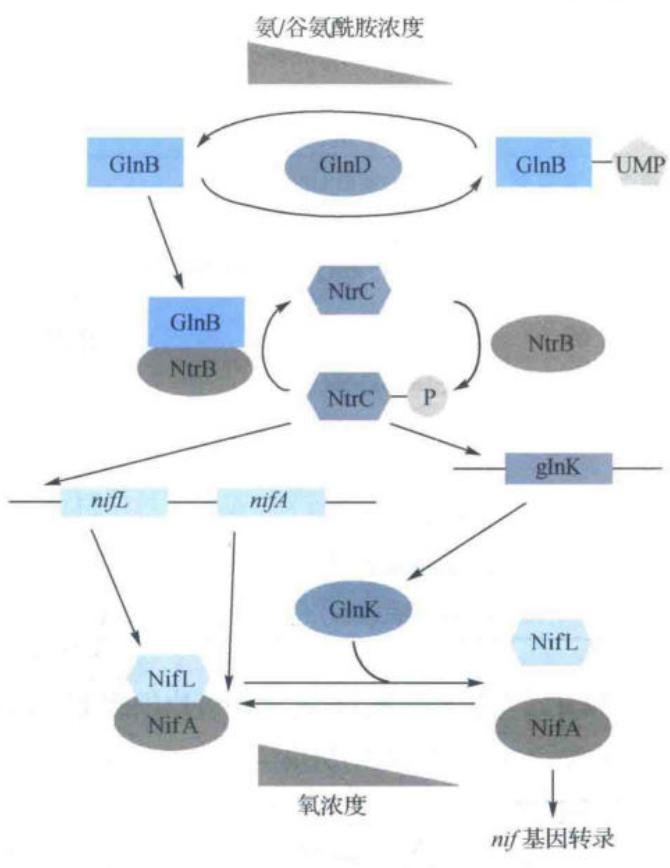  
图 7-36 固氮基因受到氧浓度和氨浓度影响的级联调控

NifL 不能结合 NifA；在有氧环境下，NifL 可以结合 NifA 并抑制 NifA 的 ATP 酶活性，遏制 nif 基因转录。除了氧浓度，细胞中氨的浓度也会影响固氮基因的表达。NtrC 蛋白是 nifA 操纵子的激活因子，它的结构和功能类似 NifA，结合上游 DNA 并与 RNA 聚合酶的 $\sigma^{54}$ 因子相互作用。当 NtrC 被磷酸化，可使 DNA 解链形成开放复合物并起始转录。细胞中谷氨酰胺的浓度与游离氨的浓度呈正相关，当谷氨酰胺浓度低时，glnD 编码的尿苷转移酶能够将尿甘酸（UMP）转移到 GlnB 和 GlnK 蛋白上。此时，NtrB 使 NtrC 磷酸化，nifA 操纵子被 NtrC 激活；谷氨酰胺浓度高时，GlnB 和 GlnK 蛋白都不发生尿苷化，GlnB 结合 NtrB 并使 NtrC 去磷酸化，nifA 操纵子被关闭。另外，氧浓度低时，不带 UMP 的 GlnK 会抑制 NifL 结合 NifA，保证 NifA 激活 nif 基因表达。NifL 是 NifA 的负调控因子，仅在部分固氮菌中存在，nifL 型固氮菌的 NifA 则不受 NifL 的调控。例如深红红螺菌（Rhodospirillum rubrum）、草螺菌（Herbaspirillum seropdicae）和巴西固氮螺菌（Azospirillum brasilense）等固氮菌的 NifA 在氮匮乏时由 GlnB 负责激活；茎瘤固氮根瘤菌（Azorhizobium caulinodans）的 NifA 在氨富余时受到 GlnB 及 GlnK 的抑制。不同固氮生物中的调控模式在细节上有很大差异，但是基本上都是响应氧浓度和氨浓度的级联调控模式。

## 7.5.3 根瘤的产生以及根瘤相关基因的调控

## 1. 根瘤的产生

根瘤菌在豆科植物根际的生长以及与宿主植物根毛幼嫩部位的接触是感染发生的第一步。通常情况下，根瘤菌特定小种的宿主范围都是很狭窄的，如 Rhizobium trifolii 主要感染三叶草，R. phaseoli 主要感染菜豆，R. Leguminosarum 主要感染豌豆 $^{(表7-4)}$ 。当然，每个小种中可能有些株系能感染宿主以外的其他豆科植物。

表 7-4 感染各种植物的不同根瘤菌

<table><tr><td>主要类群</td><td>根瘤菌名</td><td>宿主植物</td></tr><tr><td>苜蓿类</td><td>R. meliloti</td><td>苜蓿</td></tr><tr><td>三叶草类</td><td>R. trifolii</td><td>三叶草</td></tr><tr><td>豌豆类</td><td>R. leguminosarum</td><td>豌豆、某些菜豆及扁豆</td></tr><tr><td>菜豆类</td><td>R. phaseoli</td><td>菜豆</td></tr><tr><td>黄芩类</td><td>R.loessense</td><td>黄芩</td></tr><tr><td>羽扇豆类</td><td>B. lupine</td><td>羽扇豆</td></tr><tr><td>大豆类</td><td>B. japonicum</td><td>大豆</td></tr><tr><td>豇豆类</td><td>Cowpea rhizobia</td><td>花生、豇豆、金合欢属</td></tr></table>

根瘤菌细胞以极性的方式与根毛接触，并附着到植物细胞上。这种接触的专一性是由植物凝血素和细菌细胞壁之间的相互作用所决定的。植物凝血素是由植物细胞所产生的一种糖蛋白，它对含有半乳糖、N-乙酰葡糖胺和甘露糖的寡聚糖复合体具有糖类结合特异性，对糖基有很高的亲和力与专一性，现已鉴定出根瘤菌细胞壁上的一种脂多糖组分很可能就是植物凝血素的受体。有实验表明，根瘤菌能产生一定量的寡聚糖来刺激植物凝血素的分泌，由基因型所决定的根瘤菌宿主范围，可能受到植物基因组的影响，因为特定的植物凝血素只能识别特定的细菌表面受体。

## 2. 豆血红蛋白及根瘤素基因的调控

豆血红蛋白(leghemoglobin, Lb)在体内的主要功能是调节根瘤细胞氧含量, 它是根瘤细胞中植物基因组编码的最主要的蛋白质, 其血红素辅基可能是由细菌编码的。脱辅基后的 Lb 蛋白相对分子质量为 $1.56 \times 10^{4} \sim 1.59 \times 10^{4}$ 。已经发现存在 4 种不同的 Lb 异构体 (Lba、Lbc1、Lbc2 和 Lbc3), 它们在氨基酸序列上虽然只有微小差异, 但仍然由不同的基因编码。分析 Lba 和 Lbc 基因的核苷酸序列表明, 它们的读码框中插入了 3 个长短不一的内含子, 因此这些基因的总长度不一样。氨基酸序列分析证实, Lb 与动物肌红蛋白存在同源性。

除了 Lb 以外, 至少还有 20 种其他多肽是由植物基因组编码但只在根瘤菌诱导的细胞中得到表达, 这些蛋白质 (包括 Lb) 统称根瘤素 (nodulin)。科学家通过被 B. japonicum 感染的大豆根瘤细胞对根瘤素进行了详细的研究, 并根据其生理功能将其分为 3 类: 第一类是根瘤结构蛋白; 第二类是负责将类菌体固定的氮素同化并转移到植物体内的酶系统; 第三类是维持类菌体功能所必需的蛋白质。Lb 就属于第三类根瘤素, 它在根瘤固氮体系中起着不容忽视的作用, 因为细胞内氧浓度一般都在数百微摩尔左右, 而固氮酶只能在几十纳摩尔 O₂ 浓度下才能正常工作, 这对矛盾就是依靠 Lb 得到解决的。如果将细胞内 O₂ 浓度降低到几十纳摩尔以下, 呼吸系统的主要酶类早已停止了反应, 根本不可能为细胞的生命活动提供能量。Lb 对 $O_{2}$ 有极高的亲和力，它与大量自由 $O_{2}$ 相结合，既大大降低了自由 $O_{2}$ 浓度，又能将分子氧直接输送到呼吸链，真可谓一石二鸟，天衣无缝(表7-5)。

表 7-5 大豆根瘤细胞内氧浓度变化分析

<table><tr><td></td><td>类菌体周膜空间</td><td>含类菌体的宿主细胞质</td></tr><tr><td>Lb 含量</td><td>300 μmol/L</td><td>3 000 μmol/L</td></tr><tr><td>Lb 氧化程度</td><td>20%</td><td>20%</td></tr><tr><td>氧吸附量</td><td>60 μmol/L</td><td>600 μmol/L</td></tr><tr><td>自由氧浓度</td><td>11 nmol/L</td><td>11 nmol/L</td></tr><tr><td>吸附氧 / 自由氧</td><td>5 500</td><td>55 000</td></tr></table>

曾有人用大豆根瘤特异性 cDNA 进行选择性杂交,并利用与多核糖体相结合的多腺苷化 RNA 进行体外翻译,发现每一个含类菌体的根瘤细胞内可有 600 000 个与核糖体相结合的 mRNA 分子,其中大约有 90 000 个(15%)是 Lb mRNA 分子。总之,共生固氮是一个很有意思的体系。人类虽然不一定能在不久的将来使禾谷类植物固氮,但对豆科植物与固氮菌的相互识别及固氮基因调控因子的研究,却一定可以更加丰富我们对植物和微生物界的认识。

## 7.6 转录水平上的其他调控方式

转录过程涉及转录机器附着于 DNA, 识别启动子序列, 起始 RNA 的合成、延伸和终止。转录的任何一步都受到调控, 其中某些步骤是主要的调控点, 比如 RNA 转录的起始相对延伸和终止来说。自然选择使得生物的调控策略达到最优化。转录过程的调节是生物基因表达调节最有效的方式。

## 7.6.1 $\sigma$ 因子的调节作用

参与大肠杆菌中基因表达调控最常见的蛋白质可能是 $\sigma$ 因子。对大肠杆菌基因组序列进行分析后发现至少存在 7 种 $\sigma$ 因子，并根据其相对分子质量的大小或编码基因进行命名 $^{(表7-6)}$ ，其中 $\sigma^{70}$ 参与最基本的生理功能基因的转录调控，如碳代谢、生物合成等。

表 7-6 大肠杆菌中的各种 $\sigma$ 因子比较

<table><tr><td>σ因子</td><td>编码基因</td><td>主要功能</td></tr><tr><td> $σ^{70}$ </td><td>RpoD</td><td>参与对数生长期和大多数碳代谢过程基因的调控</td></tr><tr><td> $σ^{54}$ </td><td>RpoN</td><td>参与多数氮源利用基因的调控</td></tr><tr><td> $σ^{38}$ </td><td>RpoH</td><td>分裂间期特异基因的表达调控</td></tr><tr><td> $σ^{32}$ </td><td>RpoS</td><td>热休克基因的表达调控</td></tr><tr><td> $σ^{28}$ </td><td>RpoF</td><td>鞭毛趋化相关基因的表达调控</td></tr><tr><td> $σ^{24}$ </td><td>RpoE</td><td>过度热休克基因的表达调控</td></tr><tr><td> $σ^{19}$ </td><td>FecL</td><td>参与调节铁离子转运相关基因的表达调控</td></tr></table>

图 7-37 大肠杆菌中的 $\sigma$ 因子(以 $\sigma^{70}$ 为例)主要包括4个结构域  
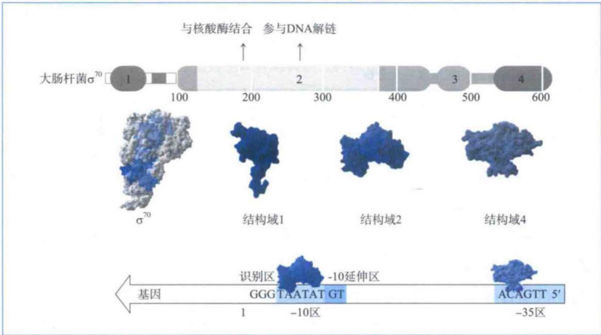  
图 7-38 $\sigma^{70}(\mathrm{a})$ 和 $\sigma^{54}(\mathrm{b})$ 因子识别并结合在所调控基因上游的不同区域

除参与氮代谢的 $\sigma^{54}$ 以外, 其他 5 种 $\sigma$ 因子在结构上具有同源性, 所以统称 $\sigma^{70}$ 家族。研究发现, 所有 $\sigma$ 因子都含有 4 个保守区 (图 7-37), 其中第 2 个和第 4 个保守区参与结合启动区 DNA, 第 2 个保守区的另一部分还参与双链 DNA 解开成单链的过程。与上述 $\sigma$ 因子特异性结合 DNA 上的 -35 区和 -10 区不同, $\sigma^{54}$ 因子识别并与 DNA 上的 -24 和 -12 区相结合 (图 7-38)。在与启动子结合的顺序上, $\sigma^{70}$ 类启动子在核心酶结合到 DNA 链上之后才能与启动子区相结合, 而 $\sigma^{54}$ 则类似于真核生物的 TATA 区结合蛋白 (TATA-binding protein, TBP), 可以在无核心酶时独立结合到启动子上。大肠杆菌中主要是 $\sigma^{70}$ 因子参与转录调控, 在特定的情况下, 其他 $\sigma$ 因子也可取代 $\sigma^{70}$ 因子, 引导 RNA 聚合酶开启特定的基因转录。例如大肠杆菌面临高温环境时, 细胞中参与热休克基因调控的 $\sigma^{32}$ 因子的数量会迅速增加。这些 $\sigma^{32}$ 因子会替代一部分 RNA 聚合酶中的 $\sigma^{70}$ 因子, 引导这些 RNA 聚合酶到热休克基因的启动子上, 激活热休克基因的转录。

不同的 $\sigma$ 因子可以独立地起作用,但是,为了保证细胞准确响应不同的环境信号变化, $\sigma$ 因子之间常常交互作用构成网络调控模式,使得原核基因的表达稳定而平衡。 $\sigma$ 因子本身的活性受到蛋白水解酶的调控,也能被同源的抗 $\sigma$ 因子失活。这些抗 $\sigma$ 因子能够与特定的 $\sigma$ 因子结合,阻止它们与 RNA 聚合酶组装。

图7-39 $\sigma^{\mathrm{F}}$ 的两种存在形式

营养物缺乏时,革兰氏阳性菌 Bacillus 会形成孢子来度过困难时期。其孢子的形成需要 4 种不同的 $\sigma$ 因子。 $\sigma^{\mathrm{E}}$ 和 $\sigma^{\mathrm{K}}$ 存在于母细胞中,一旦开始形成孢子就产生 $\sigma^{\mathrm{F}}$ 和 $\sigma^{\mathrm{G}}$ 。 $\sigma^{\mathrm{E}}$ 和 $\sigma^{\mathrm{K}}$ 先以非活性的前体形式被合成,经过特定的蛋白酶作用转变成活性形式。 $\sigma^{\mathrm{F}}$ 也是以非活性形式(与抗 $\sigma$ 因子 Spo II AB 结合)存在于孢子中,环境刺激导致 Spo II AA 抗-抗 $\sigma$ 因子去磷酸化,并特异性地与抗 $\sigma$ 因子 Spo II AB 结合,释放出有活性的 $\sigma^{\mathrm{F}}$ (图 7-39)。活性 $\sigma^{\mathrm{F}}$ 促使早期孢子形成相关基因(包括 $\sigma^{\mathrm{G}}$ 和需要进入母细胞中降解前体 $\sigma^{\mathrm{E}}$ 蛋白酶基因)的转录。活性 $\sigma^{\mathrm{G}}$ 主要激活后期孢子形成相关基因和需要进入母细胞中降解前体 $\sigma^{\mathrm{K}}$ 的蛋白酶基因的转录。

## 7.6.2 组蛋白类似蛋白的调节作用

细菌中存在一些非特异性的 DNA 结合蛋白,用来维持 DNA 的高级结构,被称为组蛋白类似蛋白(histone-like proteins)。细菌中的 H-NS 蛋白,就以非特异性的方式结合 DNA,维持其高级结构。H-NS 包含 2 个结构域,一个 DNA 结合结构域和一个蛋白质-蛋白质相互作用结构域。H-NS 先结合到 DNA 上,然后通过蛋白质-蛋白质相互作用形成四聚体或者多聚体,帮助维持 DNA 的高级结构。另外,H-NS 与大肠杆菌基因组上分散的大量基因的调控区有较高的亲和性,这些基因大都与环境条件的变化有关。H-NS 非特异性结合在这些 DNA 上,抑制这些基因的转录。这些基因的转录激活需要特定的转录因子参与。

## 7.6.3 转录调控因子的作用

能够与基因的启动子区相结合,对基因的转录起激活或抑制作用的 DNA 结合蛋白被称之为转录调控因子。大肠杆菌基因组中有300多个基因编码这样的蛋白质，它们大多数是序列特异性的DNA结合蛋白，能够与特定的启动子结合。有些能够调控大量基因的表达，而有些仅调控一两个基因的表达。转录调控因子CRP、FNR、IHF、Fis、ArcA、NarL和Lrp调控了 $50\%$ 基因的表达，而约有60个转录因子仅能特异性结合一两个启动子。有些转录因子对某个基因起激活作用，却对另一个基因起抑制作用。有些转录因子对同一基因也能发挥两种不同的作用，如AraC蛋白在结合阿拉伯糖前后就分别起着抑制和激活阿拉伯糖操纵子基因转录的作用。许多基因的启动子区有多个转录调控因子的结合位点，这些转录调控因子的共同作用才能使RNA聚合酶顺利地结合在DNA上起始基因转录的过程。

## 7.6.4 抗终止因子的调节作用

抗终止因子是能够在特定位点阻止转录终止的一类蛋白质。当这些蛋白质存在时，RNA聚合酶能够越过终止子，继续转录DNA。这种基因表达调控机制主要见于噬菌体和少数细菌中。在RNA聚合酶到达终止子之前与抗终止因子结合，因为在终止子上游存在抗终止作用的信号序列，只有与抗终止因子相结合的RNA聚合酶才能顺利通过具有茎-环结构的终止子，使转录继续进行(图7-40)。

参与大肠杆菌抗终止作用的蛋白是 Nus 蛋白。转录起始不久， $\sigma$ 因子从 RNA 聚合酶上解离下来，NusA 蛋白就结合到了核心 RNA 聚合酶上。NusA 的结合增加了 RNA

图 7-40 抗终止因子的通读作用  
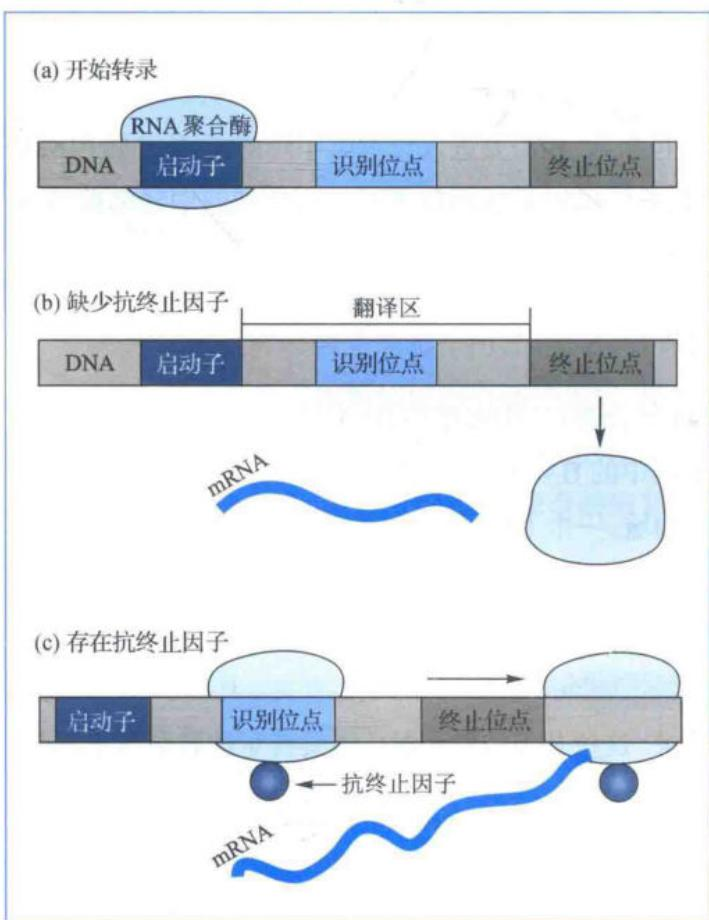

聚合酶在终止子发夹结构处暂停的过程，从而促进抗终止作用的发生。NusA 和 $\sigma$ 因子不能同时结合到 RNA 聚合酶上。只要 RNA 聚合酶结合在 DNA 上，NusA 就不会从 RNA 聚合酶上解离，而 $\sigma$ 因子可以取代游离 RNA 聚合酶上的 NusA，因此，在转录起始和终止的过程中 RNA 聚合酶分别受到 $\sigma$ 因子和 NusA 的调控。大肠杆菌核糖体 RNA 编码基因 rrn 的转录就是抗终止转录的典型。当结合有 NusA 的 RNA 聚合酶遇到 boxA 终止序列时，NusB/S10 抗终止因子在 NusG 的帮助下与 RNA 聚合酶相结合，实现抗终止（图 7-41）。

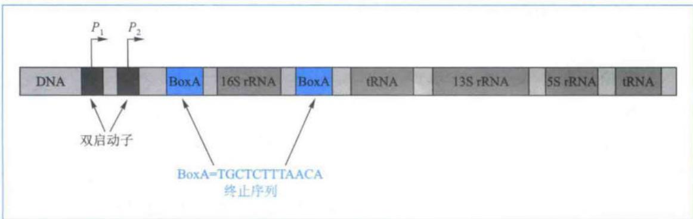  
图 7-41 抗终止子参与大肠杆菌 rrn 基因转录的调控  
当结合有NusA的RNA聚合酶遇到BoxA终止序列时，NusB/S10抗终止因子可在NusG的作用下与RNA聚合酶结合，实现抗终止。

<!-- W-BEGIN Watson 18 λ噬菌体：调控的层次 -->

### 【中文对照 Watson 第18章：λ噬菌体：调控的层次】

> 来源：Watson《基因的分子生物学》第七版中译本（书籍/03_基因的分子生物学_第七版） 第18章 原核生物的转录调控。

#### [W] λ噬菌体：调控的层次

λ 噬菌体是一种感染 E.coli 的病毒。它一旦感染细菌，就会以两种方式繁殖：裂解（lytically）或溶原生长（lysogenically），如图 18-20 所示。裂解生长需要噬菌体 DNA 的复制和新的外壳蛋白的合成。这些组分共同形成新的噬菌体颗粒，通过宿主细胞的裂解释放出来。溶原现象——一种选择性繁殖途径，包括噬菌体 DNA 整合进入细菌染色体并像细菌基因组的正常组分那样在每次细胞分裂的时候主动复制。

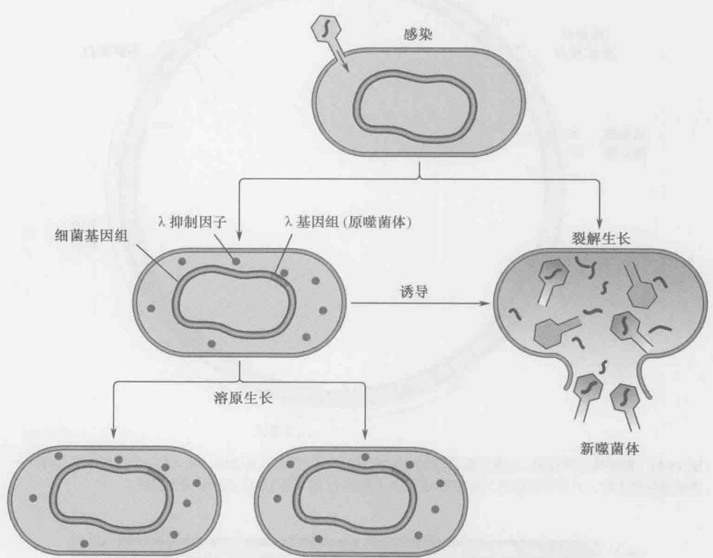  
图 18-20 λ 溶原体的生长和诱导。一旦感染，λ 就可以进行裂解或溶原过程。溶原体可以稳定的增殖许多代，它也可以被诱导。诱导之后，裂解基因以正确的顺序表达，导致新的噬菌体颗粒的产生。

溶原性细菌在正常情况下非常稳定，但其体内处于静止的噬菌体[原噬菌体（prophage）]在细胞DNA遭受破坏时就会有效地转向裂解生长（因此会威胁到宿主细胞的继续生存）。这种从溶原性生长到裂解生长的转变称为溶原性诱导（lysogenic induction）。

对发育途径的选择依赖于细胞对两种选择性的基因表达程序的选择。溶原状态的表达程序可以维持许多代，但是一旦诱导，就会有效地转向裂解程序。

#### [W] 基因表达控制裂解和溶原性生长的选择性模式

λ噬菌体有50kb的基因组和大约50个基因，其中的大多数编码外壳蛋白参与DNA复制的蛋白质、重组蛋白和裂解蛋白（图18-21）。这些基因的产物对于在裂解周期中形成新的噬菌体颗粒非常重要，但在此我们关心的是那些调控蛋白及其作用的位置。因此，我们可以集中于这些基因中的几个。我们先来考虑基因组中一个很小的区域，如图18-22所示。

  
图 18-21 噬菌体 $\lambda$ 环形图。 $\lambda$ 基因组在噬菌体头部是线形的，然而一旦感染，就会在 cos 位点环化。当整合进细菌染色体时，它又会线形化，末端在 att 位点（见第 12 章，图 12-10 关于整合的描述）。

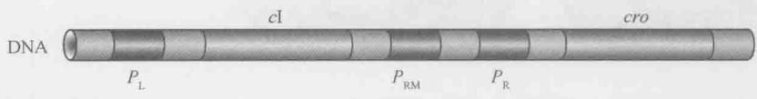  
图 18-22 λ 噬菌体左侧和右侧的启动子控制区域。

图中描述的区域包括2个基因（cI和cro）和3个启动子（ $P_{R}$ 、 $P_{L}$ 和 $P_{RM}$ ）。所有其他的噬菌体基因（除去一个小基因）都在该区之外直接从 $P_{R}$ 和 $P_{L}$ （分别表示右向和左向启动子）转录，或从其他启动子起始转录，这些启动子的活性由从 $P_{R}$ 和 $P_{L}$ 开始转录的基因的产物控制。 $P_{RM}$ （promoter for repressor maintenance）只转录cI基因。 $P_{R}$ 和 $P_{L}$ 是强组成型启动子，即它们有效结合RNA聚合酶，并不需激活因子的协助来指导转录。相反， $P_{RM}$ 是一个弱启动子，且只在上游结合激活因子后才会有效指导转录。在这方面， $P_{RM}$ 类似于lac启动子。

图 18-23 中所示的基因表达有两种顺序：一种出现在裂解生长周期，另一种出现在溶原生长周期。当 $P_{R}$ 和 $P_{L}$ 持续开放而 $P_{RM}$ 关闭时，就发生裂解生长。相反，溶原生长则是 $P_{R}$ 和 $P_{L}$ 关闭而 $P_{RM}$ 打开的结果。这些启动子是如何控制的呢？

#### [W] 调控蛋白及其结合位点

cI 基因编码 $\lambda$ 抑制因子。 $\lambda$ 抑制因子是一种包含由柔性衔接区连接的两个结构域的蛋白质（图 18-24）。N 端结构域包括 DNA 结合区（一个螺旋-转折-螺旋结构域，与我们以前所见的相同）。与 DNA 结合蛋白一样， $\lambda$ 抑制因子也是结合 DNA 变为二聚体形式；二聚化时，两个单体的 C 端结构域接触。一个二聚体识别一段 17bp 的 DNA 序列，每一个单体识别一个半位点，这也与我们在 lac 系统所见是相同的（我们已经在图 6-13 中详细地看到过 $\lambda$ 抑制因子对 DNA 的识别）。

  
图 18-23 裂解和溶原生长中 $\lambda$ 控制区域的转录。箭头分别指示在裂解和溶原生长决定期哪一个启动子是有活性的。箭头也指示了从每一个启动子开始转录的方向。

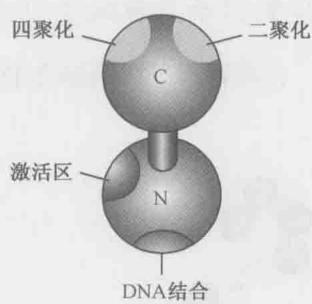

尽管其名为“抑制因子”，但 $\lambda$ 抑制因子既可以激活也可以抑制转录。当作为抑制因子起作用时，它与 Lac 抑制因子以相同的作用方式结合到与启动子有重叠区的位点排斥 RNA 聚合酶。作为一个激活因子时， $\lambda$ 抑制因子就类似 CAP，通过募集起作用。 $\lambda$ 抑制因子的激活区位于蛋白质的 N 端结构域，它在聚合酶上的靶标是 $\sigma$ 亚基上的一个区域，该区邻近于 $\sigma$ 的启动子-35 识别区域（4 区，第 13 章，图 13-6）。

图 18-24 λ 抑制因子。图中示 λ 抑制因子的一个单体，表示了参与该蛋白质不同活性的各种表面。N 表示氨端结构域，C 表示碳端结构域，“四聚化”表示两个二聚体协同结合到相邻的 DNA 位点时，相互作用的区域。（经允许引自：Ptashne M. and Gann A. 2002. Genes & signals, p.36, Fig.1\~17. © Cold Spring Harbor Laboratory press.）

Cro（意为抑制因子和其他基因的控制，control of repressor and other thing）只抑制转录，类似于 Lac 抑制因子。它是一个单结构域蛋白，并且也是以二聚体形式，利用螺旋-转折-螺旋模体结合到 17bp 的 DNA 序列。

$\lambda$ 抑制因子和 Cro 可以结合 6 个操纵子中的任意一个。每个蛋白质以不同的亲和力识别这些位点。3 个位点位于左控制区，3 个位于右控制区。我们将重点讨论 $\lambda$ 抑制因子和 Cro 在右侧区位点的结合，如图 18-25 所示。左侧区位点的结合模式与右侧区类似。

位于右侧操纵子的3个位点称为 $O_{\mathrm{R1}}$ 、 $O_{\mathrm{R2}}$ 和 $O_{\mathrm{R3}}$ ；这些位点的序列相似，但是并不完全相同，并且每一个位点（如果与其他位点分离开来并分别检测的话）都可以结合一个抑制因子或者Cro二聚体。但是其相互作用的亲和力是不一样的。抑制因子结合 $\mathrm{O}_{\mathrm{R1}}$ 是它结合 $\mathrm{O}_{\mathrm{R2}}$ 的亲和力的10倍。换句话说，结合 $\mathrm{O}_{\mathrm{R2}}$ 所需的抑制因子的量是结合 $\mathrm{O}_{\mathrm{R1}}$ 的10倍或者说浓度是结合 $\mathrm{O}_{\mathrm{R1}}$ 的10倍， $\mathrm{O}_{\mathrm{R3}}$ 结合抑制因子的亲和力与 $\mathrm{O}_{\mathrm{R2}}$ 的相同。Cro则相反，其与 $\mathrm{O}_{\mathrm{R3}}$ 结合的亲和力最强，而结合 $\mathrm{O}_{\mathrm{R1}}$ 和 $\mathrm{O}_{\mathrm{R2}}$ 则需10倍浓度。这些亲和力差异的意义在下文很快就会明了。

  
图 18-25 O $_{R}$ 中的启动子和操纵子位点的相关位置。注意 $O_{R2}$ 和 $P_{R}$ 的-35 区有 3bp 的重叠，与 $P_{RM}$ 有 2bp 的重叠。这一点不同就足以使 $P_{R}$ 被结合到 $O_{R2}$ 上的抑制因子抑制，同时 $P_{RM}$ 被激活。（经允许引自：Ptashne M. 1992. A genetic switch: Phage and higher organisms, 2nd edition. Copyright ©1992. Blackwell Science Ltd. Used with permission.）

#### [W] $\lambda$ 抑制因子与操纵子位点协同结合

λ 抑制因子协同结合 DNA。这对其功能是至关重要的，结合的发生如下所述。考虑

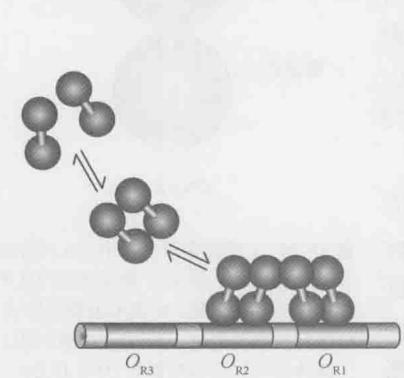  
图 18-26 λ 抑制因子协同结合 DNA。λ 抑制因子单体相互作用形成二聚体，二聚体相互作用形成四聚体，这些相互作用保证了抑制因子结合 DNA 是协同的。在 $O_{R}$ 和 $O_{L}$ 上的四聚体的相互作用增强了这种协同结合。（见下文及图 18-28）

抑制因子在 $O_{R}$ 位点结合。 $\lambda$ 抑制因子的 C 端结构域不仅提供二聚化时的接触，还介导二聚体间的相互作用（接触点即是图 18-24 所示的“四聚化”补丁区），这样，两个抑制因子二聚体就可以协同结合到 DNA 上邻近的位点。

例如， $O_{R1}$ 上结合的抑制因子通过协同结合协助抑制因子结合到低亲和力位点 $O_{R2}$ 。这样抑制因子就可以自动结合两个位点，并且在浓度只够单独结合 $O_{R1}$ 时就可以做到（图 18-26）（回顾所学内容，在无协同性时，结合 $O_{R2}$ 需要的抑制因子浓度要高 10 倍）。 $O_{R3}$ 不被结合：抑制因子协同结合 $O_{R1}$ 和 $O_{R2}$ ，但却不能自动地与第三个二聚体在这一邻近位点结合。

我们前面已经讨论过协同结合的观点并看了

一个例子：CAP 激活 lac 基因。在例子中，协同结合是抑制因子自动结合到同一 DNA 分子上的位点时相互接触的直接结果。

框 18-4 详细讨论了协同结合的原因和影响。调控蛋白的协同结合是为了保证基因的控制信号水平小的变化也可以使基因的表达水平有很大改变。下面讨论的 $\lambda$ 溶原性诱导就提供了一个很好的控制灵敏性方面的例子。有些系统中，激活因子间的协同结合也是信号整合的基础（见第 19 章 $\beta$ -干扰素的讨论）。

框 18-4 浓度、亲和力和协同结合

我们所提及“强”和“弱”结合位点的意义是什么呢？当我们说，两个分子彼此识别或相互作用（如蛋白质和DNA上的位点）是指它们彼此存在某种亲和力。它们是否能在某一特定时间结合在一起取决于两个方面：（1）亲和力有多高，如它们相互作用有多紧密；

#### [W] (2) 分子的浓度。

如我们在第 3 章强调的，支撑生物系统调控的分子间相互作用是可逆的：当两个可以相互作用的分子相遇时，它们就黏附在一起，一段时间以后又会分开。亲和力越高，两个分子黏附得越紧密，一般来说，它们在一起的时间也就越长。浓度越高，它们在第一时间彼此相遇的概率就越高。因此，高亲和力和高浓度的效应是近似的：一般两种情况都导致两个分子结合在一起的时间延长。

#### [W] 协同性的视觉展示

协同性表现为亲和力的提高。抑制因子对 $O_{R1}$ 的亲和力比对 $O_{R2}$ 要高。但是一旦抑制因子结合了 $O_{R1}$ ，结合 $O_{R2}$ 的抑制因子就会结合得更加紧密，因为它不仅与 $O_{R2}$ 作用，还与结合在 $O_{R1}$ 上的抑制因子相互作用，这两个相互作用各自的亲和力并不很强，但二者联合时则大大提高了第二个抑制因子的亲和力。我们在第 3 章时看到，结合能和平衡之间是指数关系（表 3-1）。因此，即使仅将结合能提高 2 倍，亲和力也能大规模提高。

另一个描绘协同性如何工作的方式是将其认定为抑制因子浓度的局部升高。将协同结合在 $O_{R1}$ 和 $O_{R2}$ 的抑制因子放在一起。尽管 $O_{R2}$ 上的抑制因子会周期性地释放 DNA，但它却会保留在结合于 $O_{R1}$ 的抑制因子上，因而与 $O_{R2}$ 保持靠近。这将有效地提高位点附近的抑制因子的浓度，保证抑制因子频繁地重新结合上去。

假设无协同性而只是提高细胞内抑制因子的浓度，那么当抑制因子从 $O_{R2}$ 上脱落后，它不会被结合在 $O_{R1}$ 上的抑制因子存留在附近，而是通常在结合 $O_{R2}$ 之前就游离开。但是在抑制因子有较高的浓度时，另一抑制因子分子有可能位于 $O_{R2}$ 附近并结合上去。因此，即使每一个抑制因子二聚体只在 $O_{R2}$ 上呆一段较短时间，也能通过将它保持在附近或者提高置换的可能次数，而在特定时间内提高结合的概率。

还有一种考虑协同结合的方法，即考虑熵的影响。当蛋白质从溶液中的自由状态转变为束缚在 DNA 结合位点上时，系统的熵会降低。而位于 $O_{R2}$ 附近的抑制因子受到 $O_{R1}$ 上抑制因子的相互作用，与自由状态下相比已被束缚。束缚的抑制因子比自由抑制因子结合 DNA 的熵值小。

这样，我们看到了三种描绘协同性的方式。我们还应该考虑协同结合的结果，协同结合在生物学中是很有用的。例如，协同性不仅能使一个弱结合位点在蛋白质浓度低于其自身亲和力时被其饱和，还能改变描述位点结合蛋白的饱和度随蛋白质浓度改变的曲线的坡度。为了理解这一点，我们以一个协同结合到两个弱位点A和B的蛋白质为例。这两个位点从原本完全无结合蛋白到几乎完全饱和所需的蛋白质浓度的变化范围比单位点时窄很多（框18-4图1）。实际上， $\lambda$ 系统中的协同性比想像的要大，因为在细胞中发现有大量的单体形式的自由抑制因子（如未结合DNA的抑制因子），因此，实质上，结合的时候是4个单体而不是2个稳定的二聚体协同结合，这增加了在DNA上形成复合物时的协调性，也就增加了曲线的坡度。但是为什么协同性会使结合曲线坡度更大呢？

我们已经看到结合位点是如何在抑制因子浓度低于亲和力要求时被饱和的。但是，为什么当抑制因子浓度降低时，结合也会降低得这么快呢？让我们考虑任一系统的各组分间的相互作用：当降低组分的浓度时，任意两个组分的相互作用发生的概率将减小。

  
框 18-4 图 1 协同性结合反应。黑色线表示蛋白质与一个弱位点的结合曲线，红线表示同一反应中的相同蛋白质可以协同结合到两个相连位点上（相互作用仅需 2kcal/mol 的额外结合能量）。X 轴表示蛋白质浓度的指数级别，y 轴表示位点的占有率。如图所示，协同结合在 30 倍的蛋白质浓度下位点占有率为 99%。（经允许引自 Ptashne, M. 2004. A genetic switch: Phage lambda revisited. ©Cold Spring Harbor Laboratory Press.）

如果该系统要求几个不同组分间的多重相互作用，那么在低浓度很少会发生相互作用。而蛋白质的4个单体结合到2个位点上时，就需要几个（实际是7个）相互作用；当它们每一个的浓度降低时，个别组分相遇的概率就大大降低了。

#### [W] 协同性和 DNA 结合特异性

最后，协同结合还有一个重要的意义是，它赋予DNA结合特异性。CAP激活lac启动子表明了这一点。CAP特异的将RNA聚合酶带到带有CAP位点的启动子上（与其他亲和力相当但无CAP位点的启动子不同）。同样地， $\lambda$ 抑制因子在 $O_{R1}$ 处指导另一抑制因子分子结合到它邻近的弱位点，而不是细胞中其他具有相同亲和力的地方。实际上，协同性对于保证蛋白质以足够的特异性结合从而使生命正常活动是至关重要的。

为了阐明这一点，我们来考虑一个蛋白质结合 DNA 位点的情况。这一蛋白质对于其正确位点具有高亲和力。但细胞内的 DNA 却表现出大量潜在的与该蛋白质结合的位点（但不正确）。因此，重要的是，该蛋白质不仅要对其正确的位点有绝对的亲和力，而且要有相对于所有其他非正确位点的有竞争力的亲和力。请注意，那些非正确位点（代表着除正确位点外的所有 DNA）的浓度比正确位点的浓度要高得多。所以，即使非正确位点的亲和力低于正确位点，前者的较高浓度也会保证蛋白质在试图结合正确位点的时候经常随机结合这些非正确位点。

这就需要一种策略来提高对正确位点的亲和力却不至于提高对非正确位点的亲和力。增加蛋白质和DNA位点间的接触（如合成更大的蛋白质）不一定有用，因为这同时也增强了蛋白质与非正确位点的结合。一旦蛋白质对非正确位点的亲和力太高，那么它基本上就无法找到正确位点；随机结合非正确位点占去了它太长的时间。这样，动力学问题取代了特异性问题，而这同样不利于特异性结合。

协同性解决了这一问题，蛋白质通过协同结合到两个邻近的位点，大大提高了它对这两个位点的亲和力，却不增强对其他位点的亲和力。协同性不会增强对非正确位点亲和力的原因是，2个蛋白质分子同时结合（允许协同性稳定这种结合）2个靠近的非正确位点的机会极小。只有当蛋白质分子找到正确位点时，它们才会保持足够长的结合时间，给予第二个蛋白质出现的机会。

#### [W] 协同性和变构效应

尽管本章中我们用协同性一词来指协同结合这种特定机制，但这个词还被用在其他环境中代表不同的机制。一般来说，协同性描述这样一种情形：两个配体结合第三个分子，两个配体中一个配体结合后会协助另一个的结合。所以，对我们在这里考虑的 DNA 结合蛋白来说，协同性是由简单的黏附相互作用介导的，而在别的情形下，则可能是由变构事件介导的，氧分子结合血红素可能是最好的例子。

血红素是同源四聚体，每一个亚基结合1分子的 $O_{2}$ 。这种结合是协同的：当第一个 $O_{2}$ 结合后，它引起构象改变，修饰了第二个结合位点，使其采取高亲和力构象。所以，在这一个例子中，没有配体间的直接相互作用，而是引起变构转变，一个配体增强了对第二个配体的亲和力。

#### [W] 抑制因子和 Cro 以不同模式结合控制裂解和溶原生长

抑制因子和 Cro 是如何控制与不同的 $\lambda$ 生长方式耦联的不同基因的表达模式的呢？如图 18-27 所示，对裂解生长来说，单个 Cro 二聚体结合 $O_{R3}$ ，这一位点与 $P_{RM}$ 重叠，因此，Cro 抑制了该启动子（由于这一启动子是弱启动子，所以在无激活因子时只以低水平作用，图 18-27）。因为抑制因子和 Cro 都不与 $O_{R1}$ 和 $O_{R2}$ 结合，所以 $P_{R}$ 结合 RNA聚合酶并指导裂解基因的转录； $P_{L}$ 作用方式与此相同。请回顾前文所述， $P_{R}$ 和 $P_{L}$ 都是无需激活因子的强启动子。

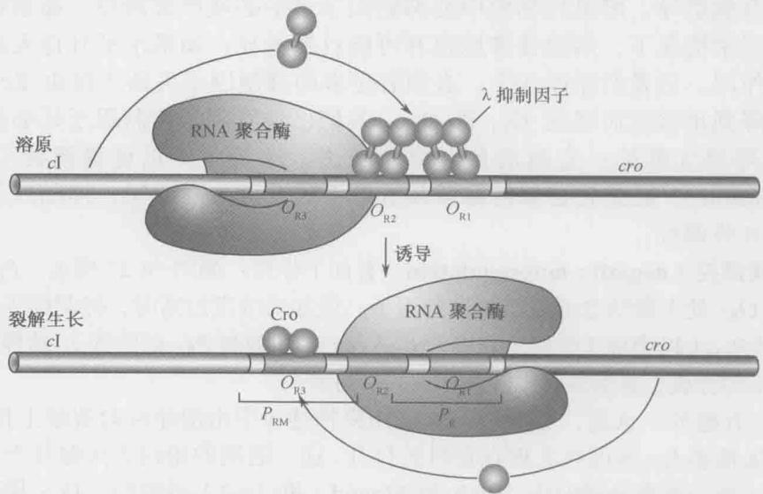  
图 18-27 λ 抑制因子和 Cro 的活性。抑制因子结合到 $O_{R1}$ 和 $O_{R2}$ 上关闭了从 $P_{R}$ 开始的转录。结合到 $O_{R2}$ 的抑制因子 $P_{RM}$ 上的 RNA 聚合酶接触，激活了 cI（抑制因子）基因的表达。 $O_{R3}$ 在 $P_{RM}$ 内，结合在那里的 Cro 抑制了 cI 的转录。（经允许引自：Ptashne M. and Gann A. 2002. Genes & signals, p.30, Fig1-13. ©ColdSpring Harbor Laboratory Press.）

在溶原周期， $P_{RM}$ 开放，而 $P_{R}$ 和 $P_{L}$ 关闭。抑制因子协同结合到 $O_{R1}$ 和 $O_{R2}$ 阻碍 RNA 聚合酶结合 $P_{R}$ ，抑制从该启动子开始的转录（图 18-27）。但抑制因子的结合激活了从 $P_{RM}$ 开始的转录。

我们暂时回到噬菌体如何选择可变的途径这一问题上来。首先我们要考虑诱导在细胞受到胁迫时，上面所述的溶原状态是如何转入裂解状态的。

#### [W] 溶原性诱导需要 $\lambda$ 抑制因子的蛋白水解切割

E.coli 感受到 DNA 损害并做出反应。它通过激活 RecA 蛋白的功能做到这一点。该酶参与重组（如其名称所反映的；第 11 章），但它也有另一功能，即刺激某一蛋白质的自动水解切割。最先发现的这一活性的底物是一种细菌抑制因子蛋白 LexA，它抑制编码 DNA 修复的酶。有活性的 RecA 刺激 LexA 的自我切割，解除对基因的抑制，这被称为 SOS 反应（第 10 章）。

如果细胞是溶原体，原噬菌体就倾向于在胁迫环境下逃离细胞。最终， $\lambda$ 抑制因子变得类似于 LexA，这使得 $\lambda$ 抑制因子也在 RecA 的作用下进行自身切割。切割反应除去了抑制因子的 C 端结构域，因此二聚化和协同性马上不复存在。因为这两项功能对于抑制因子结合 $O_{R1}$ 和 $O_{R2}$ （以在溶原性细胞中所见的浓度）是至关重要的，失去协同性使抑制因子在这些位点（包括 $O_{L1}$ 和 $O_{L2}$ ）上解耦联；失去抑制从而促进了从 $P_{R}$ 和 $P_{L}$ 开始的转录，导致了裂解生长。 $\mathrm{P}_{\mathrm{R}}$ 的转录很快地产生了 Cro，其随后结合 $\mathrm{O}_{\mathrm{R3}}$ 和阻遏进一步合成从 $\mathrm{P}_{\mathrm{RM}}$ 开始的抑制因子。这一反应确保了诱导的选择是不可逆的。

为了有效诱导，溶原性细胞中的抑制因子水平必须严密调控。如果水平降得太低，在正常情况下，溶原性细胞也有可能自发诱导；如果水平升得太高，诱导就会失去作用。后者的原因在于，必须有更多的抑制因子失活（经由 RecA），以使其浓度降到足够低而释放 $O_{R1}$ 和 $O_{R2}$ 。我们已经看到了抑制因子是如何保证其水平不致降得太低的：它激活其自身的表达，这是一例正自我调控（positive autoregulation）。但是它是如何保证其水平不致升得太高的呢？抑制因子也对自身进行负自我调控。

负自我调控（negative autoregulation）有如下作用：如图18-27所示， $P_{RM}$ 被抑制因子（在 $O_{R2}$ 处）激活合成更多的抑制因子。但如果浓度过高时，抑制因子也会结合 $O_{R3}$ 和抑制 $P_{RM}$ （以类似于裂解生长中Cro结合 $O_{R3}$ 和抑制 $P_{RM}$ 的方式）。这样阻止了新的抑制因子的合成，直到其浓度降到释放 $O_{R3}$ 的水平。

另外，有趣的一点是，“诱导”一词被用来描述 $\lambda$ 中由溶原性向裂解生长的转变，同时也用来描述lac基因在乳糖存在时的打开。这一通用的用词方法源自于这样一个事实，即这两个现象是同时由Jacob和Monod（框18-2）研究的。这一用法的确名实相符：乳糖诱导Lac抑制因子的构象改变，从而解除了对lac基因的抑制。同样，

<!-- END OFFICIAL API PART part_007 -->

<!-- BEGIN OFFICIAL API PART part_008 -->

$\lambda$ 的诱导信号也是通过造成 $\lambda$ 抑制因子的结构变化（此种情况下是蛋白质水解切割）而起作用的。

#### [W] 抑制因子的负自我调控需远程相互作用和大的 DNA 环

我们已经讨论过抑制因子二聚体在邻近的操纵子，如 $O_{R1}$ 和 $O_{R2}$ 上的协同结合。在溶原性细菌的原噬菌体中还有另一种协同结合。这种协同结合对于正确的负自我调控至关重要。 $O_{R1}$ 和 $O_{R2}$ 上结合的抑制因子二聚体与协同结合到 $O_{L1}$ 和 $O_{L2}$ 上的抑制因子二聚体相互作用，形成一个抑制因子八聚体，其中的每一个二聚体都独立地结合操纵子。

为利于 $O_{R}$ 和 $O_{L}$ 之间的抑制因子的相互作用，这些操纵子区之间的 DNA——约 3.5kb，包括 cI 基因本身，必须形成一个环（图 18-28）。当环形成时， $O_{R3}$ 和 $O_{L3}$ 靠近，允许另外两个二聚体抑制因子协同结合到这两个位点。这一协同性意味着与非协同情况下相比较， $O_{R3}$ 结合抑制因子时所需的抑制因子浓度更低——实际上，只需比结合 $O_{R1}$ 和 $O_{R2}$ 高一点就可以了。因此，抑制因子浓度是被严密控制的——很小的下降就会被其基因表达的升高所抵消，升高时，则导致基因关闭。这样就解释了为什么溶原性细菌是如此稳定而同时诱导又是非常有效的。

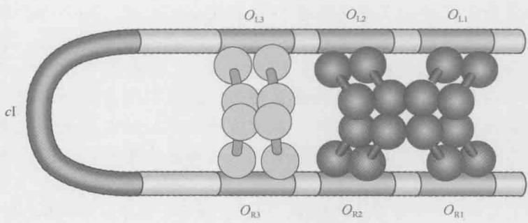  
图 18-28 $O_{R}$ 和 $O_{L}$ 上抑制因子的相互作用。抑制因子相互作用在 $O_{R}$ 和 $O_{L}$ ，如图所示。这些相互作用稳定结合，这样，相互作用增强了对 $P_{R}$ 和 $P_{L}$ 的抑制，允许抑制因子在低浓度时结合 $O_{R3}$ 。如文中所述，结合 OL3 和 OR3 的抑制因子以浅色阴影显示，来说明它们仅在抑制因子浓度上升到一定水平的时候才会结合。（经允许引自：Ptashne M. and Gann A. 2002. Genes & signals, p.35, Fig.1-16. ©Cold Spring Harbor Laboratory Press.）

λ抑制因子的 C 端结构域的结构揭示了二聚体形成的基础，如早期的遗传学研究所解释的。它同时也揭示了两个二聚体是如何相互作用形成四聚体的（如抑制因子协同结合 $O_{R1}$ 和 $O_{R2}$ 时）。而且，这一结构还揭示了八聚体形成的基础——显示这是抑制因子寡聚体的最高形式（图 18-29）。

在框 18-5 里， $\lambda$ 转换的演化，我们会讨论控制回路是如何调控溶原性和裂解生长，以及可能涉及诱导的过程。特别指出的是，我们会讨论抑制因子和 Cro 之间是如何相互作用，它们的结合位点，和启动子如何通过一个小步骤使它们从更早的简陋系统转变到现在复杂的形式中。

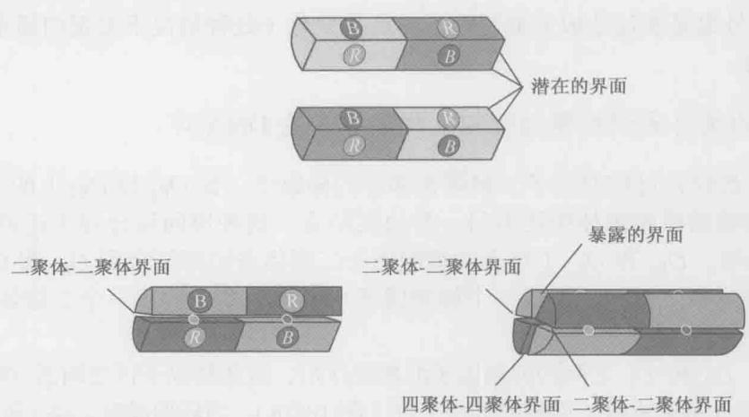  
图 18-29 λ 抑制因子的 C 端结构域的互作。图的上部展示的是 2 个 λ 抑制因子的 C 端结构域的二聚体示意图。这里表示的是 λ 抑制因子结构域表面形成的被称为 B 和 R 的沟，它们首先介导 2 个二聚体形成四聚体，然后 2 个四聚体又形成八聚体（当抑制因子共同结合到 4 个位点 $O_{R1}$ ， $O_{R2}$ ， $O_{L1}$ 和 $O_{L2}$ 时可以发现这种形式）。一旦形成八聚体，就没有剩余的空间让新的二聚体进入复合体，所以八聚体是所能形成的最高形式。（经允许，略有修改，引自 Bell. 2000，Cell 101: 801-811，图 4a, b 和 5a-c ©Elsevier）  
框18-5 $\lambda$ 转换的演化

我们重点讨论了复杂的 $\lambda$ 噬菌体各种过程决定的机理：如何选择裂解或溶原发育，如何有效地从稳定的原噬菌体状态转换为裂解状态的复制病毒。形成这一特定系统所面临的许多困难已经被讨论了，如协同结合、自我正/负调控、用抑制因子达到平衡的效果等。强调这些特性间的相互作用，在我们所看到的噬菌体中是如何相互依赖的，会使我们产生这样的问题：如何从早期原始的版本只通过很简单的步骤就形成这样的系统？对所有的生物系统来说，这都是个重要的问题，在此我们仅仅介绍的是 $\lambda$ 。

框 18-5 图 1 显示了一个分步骤的模型，该模型揭示 $\lambda$ 从原始的版本进行转换都涉及了什么。每一个步骤只是在系统原来的基础上添加了一个简单的内容，就可使系统工作得更好。

在最近的几年中，通过所设计的一系列实验回答了相关的问题。这些研究旨在回答演化过程如何用相对简单的步骤完成了 $\lambda$ 的转换。所以，每一个明显的特征都被突变敲掉，使噬菌体的行为发生缺陷，例如，突变的噬菌体可能会是溶原的效率变低或形成的溶原不稳定，或者太稳定，使侵染变得太容易或困难。

后来又找到了一些其他的突变可以分别抵消原来的缺陷。这些实验揭示了这个系统复杂性并非不能减少，实际上任何“重要的”特征都可被另外性状的改变所抵消，或至少部分抵消。例如，向噬菌体的 c I 基因引入 pc 突变就会去掉正向自我调控功能。一个 pc 突变就可敲除激活子的激活功能，就像先前对 CAP 的讨论一样。所以，在这种情况下，突变的噬菌体仍然会制造抑制因子，它们仍然能结合 DNA 并能抑制转录，但不能从 $P_{RM}$ 激活更多抑制因子的转录。这种突变噬菌体能形成溶原，但它们很不稳定，因为抑制因子的水平很低。引入其他的变化加强启动子 $P_{RM}$ 的强度能够很大程度上抵消，使裂解更稳定，更像野生型噬菌体 $\lambda$ 所产生的那样。强化的 $P_{RM}$ 能驱使更多没有被现存抑制因子激活的抑制因子的表达。似乎具有抑制因子自我正调控功能的野生型噬菌体有某种优势（这就解释了为什么所有已知的λ类的噬菌体都有此特征），但是，这对系统的正常工作不是很重要。所以，人们可以看到当前的系统在演化过程中的步骤。

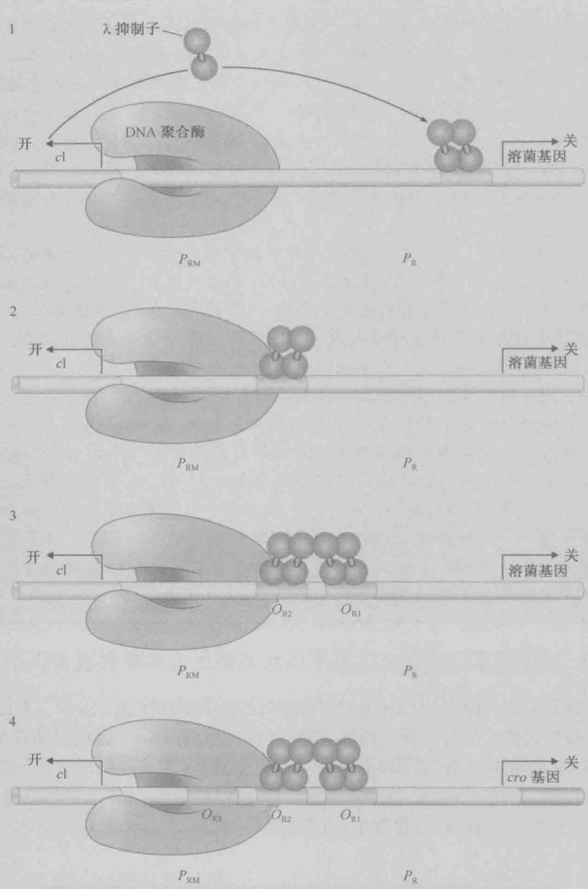  
框18-5图1 推测的 $\lambda$ 转换的演化阶段。(阶段1)初始的 $\lambda$ 基因组有两个启动子,一个负责裂解基因 $(P_{\mathrm{R}})$ ,一个负责抑制基因 $(P_{\mathrm{RM}})$ 。一个与 $P_{\mathrm{R}}$ 基因重叠的 $\lambda$ 抑制的结合位点,当与此位点结合的时候,抑制因子关闭裂解基因,但自身的合成并不受调控。(阶段2)单一的抑制结合位点移动到离 $P_{\mathrm{RM}}$ 较近的位置(即现在 $O_{\mathrm{R}2}$ 的位置),这样就使结合的抑制因子在 $P_{\mathrm{RM}}$ 处与聚合酶相接触,从而刺激启动子抑制 $P_{\mathrm{R}}$ 。(阶段3)第二个抑制因子结合位点被引入(在 $O_{\mathrm{R}1}$ 的位置)。除此之外,还引入了一个新的蛋白质-蛋白质相互作用表面,使抑制因子二聚体协同结合到这些相邻的位点。这些特征增加了系统的协同性,提高了转换的效率。(阶段4)第三个抑制因子结合位点 $(O_{\mathrm{R}3})$ 被引入了。当此位点被结合时,抑制因子负调控自己的合成,使其浓度低于关键的水平,从而保证有效的转换机制。(经允许节选自Ptashne M. and Gann A. 1988.Curr.Biol.8：R812-822. ©Elsevier)

还有一个例子，即抑制因子的协同结合，虽然也有优点，但对噬菌体的基本生长来说也不是完全需要。所以，引入一个干扰抑制因子二聚体结合的突变，就可以显著地弱化协同结合。带有这样的突变抑制因子基因的噬菌体不能形成裂解。但加入其他的修饰加强 $P_{RM}$ 及其他加强 $O_{R2}$ 结合位点，所产生的噬菌体就可以形成裂解，虽然比野生型 $\lambda$ 的效率低一些。

在进一步的实验中，对 $\lambda$ 的转换进行拆分和重新组装实验可以验证它们是如何发挥作用的以及它们是如何产生的。最近进行的有意思的实验，用细菌的抑制因子蛋白质替代抑制因子基因，如 Tet 抑制因子，用同一噬菌体中 cro 基因被 lac I，也就是编码 Lac 抑制因子的基因替换，除此之外，将噬菌体中操纵子位点进行修饰，使得两个细菌抑制因子也能模仿野生型 $\lambda$ 中抑制因子与 Cro 的方式结合。

从这些不同片段组合起来的噬菌体也能获得野生噬菌体 $\lambda$ 的部分表型。因为在修饰的噬菌体中两个抑制因子的结合可由两个小分子（Lac 和 Tet 诱导因子）精细的调控实现，可以通过进一步的微小操作调查 $\lambda$ 噬菌体系统是如何工作甚至如何起源的。

总而言之，通过这些不同的实验体系可以得到两点结论。第一， $\lambda$ 转换涉及一系列的步骤，每一步在原有基础上增加一个调控的水平，使原来虽然工作但效果略差的步骤得到改善。对任何一个系统来讲，这就是期望的自然选择结果。第二，要实现特定的目标都有变通的路线。理解这些方案最终呈现的细节比理解如何实现这些方案更困难，因为最终的方案只是众多可行方案中的一条路线。

#### [W] $\lambda c \mathrm{II}$ ，另一种控制感染新宿主后溶原性或裂解生长选择的激活因子

我们已看到 $\lambda$ 抑制因子和Cro是如何控制溶原性和裂解生长，以及二者如何在受到诱导时从一种形式转变为另一种生长形式的。现在我们来看一下感染早期发生的事件，这些事件决定着噬菌体首先选择哪条途径。对这一选择起着关键作用的是另外两个 $\lambda$ 基因—— $c\mathrm{II}$ 和 $c\mathrm{III}$ 。我们只需将 $\lambda$ 的调控区稍加扩展即可看到 $c\mathrm{II}$ 和 $c\mathrm{III}$ 的位置： $c\mathrm{II}$ 位于 $c\mathrm{I}$ 的右侧，从 $P_{\mathrm{R}}$ 开始转录； $c\mathrm{III}$ 位于 $c\mathrm{I}$ 的左侧，从 $P_{\mathrm{L}}$ 开始转录（图18-30）。

  
图 18-30 与裂解/溶原相关的基因和启动子。N 基因没有在此列出，因为 N 基因在 $P_{L}$ 和 cⅢ基因之间。（参见图 18-21）

如 $\lambda$ 抑制因子一样，CⅡ也是一个转录激活因子。它结合到启动子 $P_{RE}$ （意为 repressor establishment）上游的位点，刺激从该启动子开始的 cⅠ（抑制因子）基因的转录。因此，该抑制因子基因可以从不同的两个启动子（ $P_{RE}$ 和 $P_{RM}$ ）开始转录。

$P_{RE}$ 是一个弱启动子，因为它有一个不完全的-35序列。CⅡ蛋白在背对DNA螺旋的一面结合到与-35区有重叠的位点；通过与聚合酶直接作用，CⅡ协助聚合酶结合到启动子上。

只有 $P_{RE}$ 产生出足够的抑制因子，这一抑制因子才可以结合到 $O_{R1}$ 和 $O_{R2}$ 指导其自身从 $P_{RM}$ 开始的合成。这样，我们看到抑制因子合成是从一个启动子转录来确立（由一个激活因子激活），接着由另一个启动子维持（通过抑制因子自身控制——正自我调控）。

现在,我们可以总结一下 CⅡ是如何指挥 $\lambda$ 在裂解和溶原发育途径中做出选择的(图18-31)。一经感染，从 $P_{R}$ 和 $P_{L}$ 两个组成型启动子开始的转录就会立即起始。 $P_{R}$ 指导合成 Cro 和 CⅡ。Cro 的表达使噬菌体进入裂解发育：一旦 Cro 达到一定的水平，它就会结合 $O_{R3}$ 封闭 $P_{RM}$ 。另一方面，CⅡ的表达则通过指导抑制因子基因的转录（图18-31）使噬菌体进入溶原性生长。为了成功地形成溶原性细胞，抑制因子必须在 Cro 抑制启动子之前结合 $O_{R1}$ 和 $O_{R2}$ 并激活 $P_{RM}$ 。

CⅡ决定的 cⅠ基因的转录效率，即抑制因子产生的速率，是决定 $\lambda$ 如何发展的关键步骤。那么，在特定的感染中，什么决定了 CⅡ工作的效率呢？

#### [W] 侵染特定细菌的噬菌体颗粒的数目影响侵染走向裂解或溶原

感染复数（或称 moi）是度量有多少噬菌体颗粒侵染一个群体中的特定细菌的单位。如果平均每个细胞的噬菌体颗粒数目是 1 个或几个，侵染很可能以裂解结束。如果噬菌体颗粒的数目是 2 个或多个，则很可能形成溶原。当每个细胞中的噬菌体颗粒数目减少时，形成裂解的可能性就变大，当数目不断增加时，形成溶原的可能性增加。

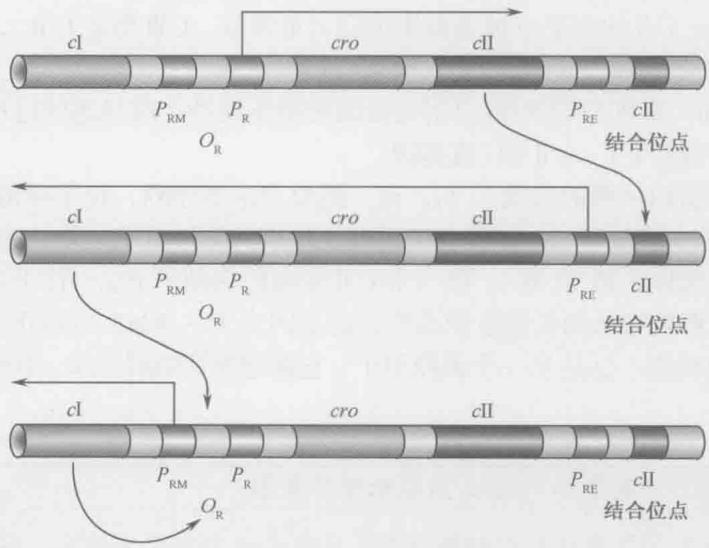  
图 18-31 溶源性的建立。当建立了溶源性时，c I 基因从 $P_{RE}$ 开始转录，当维持住这一状态时，c I 基因从 $P_{RM}$ 开始转录。结合在 $O_{R1}$ 和 $O_{R2}$ 上的抑制因子不但激活了维持模式的表达，而且关闭了建立模式的表达。注意 $P_{R}$ 不但控制了裂解基因的表达，它还控制了 c II 的表达，因此它对于溶源和裂解生长都是重要的。类似地，尽管图中没有表示出来， $P_{L}$ 控制了许多裂解基因，也同时控制了协助建立溶原性的 c III 基因（见正文）。（经允许引自：Ptashne M. and Gann A. 2002. Genes & signals, p.31, Fig.1-14. ©Cold Spring Harbor Laboratory Press.）

这是有道理的。进入细胞的噬菌体基因组越多，并开始从 $P_{R}$ 和 $P_{L}$ 起始转录，制备的 CⅡ和 CⅢ就越多，至少有一个噬菌体基因组建立抑制因子的合成并整合到细菌基因组中的概率就越大。只要有一个侵染的噬菌体做到了这一点，其他的就相应的被阻止发生裂解。

人们可以推测为什么 $\lambda$ 要如此表现，例如，为什么当有很多噬菌体但只有很少细菌时它宁可发生溶原。如果只有很少的细菌细胞，供下一轮的侵染可用的寄主细胞受到限制，所以噬菌体保持休眠而不是冒一轮裂解后没有寄主细胞的风险是有好处的。细菌细胞生长的状态也影响侵染的结果，正如下文的描述。

#### [W] E.coli 的生长条件控制 CⅡ的稳定性并因而控制裂解/溶原的选择

当噬菌体感染的是一群健康的、生长快速的细菌细胞时，它倾向于通过裂解繁殖，将后代释放到富含宿主细胞的环境中。而当条件对细菌生长不利时，噬菌体就更有可能形成溶原细胞并保持原有状态：附近只有很少的宿主细胞可以被后代噬菌体感染，这些不同的生长条件以如下方式影响 CⅡ。

CⅡ在 E.coli 中是一个非常不稳定的蛋白质，它被一个特异的蛋白酶 FtsH（HflB）降解，这个酶由 hfl 基因编码。因此，CⅡ指导合成抑制因子的速度就由它被 FtsH 降解的速度来决定。缺少 hfl 基因的细胞（也就是缺少 FtsH）几乎总是在被 λ 感染时形成溶原细胞：在无蛋白酶时，CⅡ是稳定的，它能指导合成足够的抑制因子。FtsH 自身的活性由细菌细胞的生长条件调控，尽管我们不知道这是如何实现的，但我们至少知道如下内容：当生长良好时，FtsH 活性高，CⅡ被有效破坏，抑制因子不能合成，噬菌体倾向于裂解生长；在恶劣条件下则相反，FtsH 活性低，CⅡ降解慢，抑制因子积累，噬菌体倾向于溶原生长。CⅡ的水平也被噬菌体蛋白 CⅢ调节。CⅢ稳定 CⅡ，这可能是因为它可以作为 FtsH 的替代性（因此是竞争性）底物。

就像框 18-6（鉴别与裂解/溶原相关基因的遗传途径）所描述的过程，精心设计的遗传筛选获得了这些 cⅠ、cⅡ和 cⅢ基因。

第二个 CⅡ蛋白依赖的启动子 $P_{I}$ ，有一类似 $P_{RE}$ 的序列，位于噬菌体基因 int（图 18-21）之前。这一基因编码一种整合酶可催化位点特异性重组，使 λDNA 整合入细菌染色体形成原噬菌体（第 12 章）。第三个 CⅡ依赖的启动子 $P_{AQ}$ ，位于基因 Q 的中间，其作用是延滞裂解发育从而促进溶原发育。这是因为 $P_{AQ}$ RNA 可以作为翻译信使结合到 Q 信使促进其降解。Q 是另一个调控因子，它促进晚期裂解生长，我们将在以下部分介绍。

#### [W] 框 18-6 遗传学方法确定参与裂解/溶原选择的基因

通过筛选分别只能有效地进行裂解或溶原生长的λ突变体确定了参与裂解/溶原选择的基因。为了理解是如何发现这些突变体的，我们要考虑噬菌体是如何在实验室中生长的（见附录1）。细菌细胞可以在琼脂培养板上长成一个汇合在一起的、不透明的菌落。长在菌落上的裂解噬菌体产生透明斑或洞（图A-3）。每个斑一般是由一个噬菌体感染细菌细胞形成的。这次感染产生的后代噬菌体感染周围细胞，如此这般，杀死（裂解）最初受到感染的细胞附近的细菌细胞并在不透明的菌落中造成一个透明的无细胞区。

λ噬菌体也形成噬菌斑，但这些斑是模糊的（或雾状的），即斑的内部比未受感染的菌落更透明一些，但只在边上未受感染。其原因在于，λ不像纯粹的裂解噬菌体，它们只杀死一部分的感染细胞，其他的作为溶原体存活下来。溶原体对于接下来的感染有抗性，因此可以不被噬菌斑中的大量噬菌体颗粒伤害而生长。这种“免疫力”的原因很简单：在溶原体中，整合的噬菌体DNA（原噬菌体）不断从 $P_{RM}$ 合成抑制因子。任何进入细胞的λ基因组都立即被抑制因子结合，没有机会进行裂解生长。

在一次经典的研究中，分离了形成透明斑的 $\lambda$ 突变体。这些突变噬菌体不能形成溶原体但仍能进行裂解生长。 $\lambda$ 透明突变体确认了3个噬菌体基因，称为 $c\mathrm{I}$ 、 $c$ II、 $c$ III（意为clear I、II、III）。其他研究分离出所谓的恶性（vir）突变体。在这些突变体中确认了 $\lambda$ 抑制因子结合的操纵子位点，并且是鉴于这样的噬菌体可以溶原体生长这一事实而分离得到。通过与lac系统比较，发现 $c\mathrm{I}$ 突变体类似于Lac抑制因子（lacI）突变体，vir突变体与lac操纵子（lacO）突变体相同（框18-2）。另一不同的实验中还发现了又一启发性的突变，这是一个宿主基因的突变。突变被称为hfl，意为高频溶原（high frequency lysogeny）。当被野生型的 $\lambda$ 感染时，这一突变系几乎总是形成溶原体，很少允许噬菌体裂解生长。这一细菌株系缺少降解 $\lambda C$ II蛋白的蛋白酶（见正文）。

#### [W] λ发育中的转录抗终止作用

前面我们已经介绍了在转录起始后的步骤中运作转录调控的例子。首先，我们将看一种正转录调控的类型，叫做抗终止作用（antitermination）。

在无 $\lambda N$ 蛋白和 Q 蛋白时，由这两个调控因子控制的转录也可以很好地起始。但是，除非调控因子修饰 RNA 聚合酶，否则在启动子下游几百到 1000 核苷酸处转录就会终止， $\lambda N$ 和 Q 蛋白因此被称为抗终止因子。

N 蛋白调控早期基因表达，它作用于三个终止子：一个在基因 N 本身的左侧，一个在基因 cro 右侧，还有一个在基因 P 和 Q 之间（图 18-21 和图 18-32）。Q 蛋白有一个靶标，是一个位于晚期启动子 $P_{R}$ 200 核苷酸下游的终止子，位于 Q 和 S 基因之间（图 18-21 和图 18-32）。 $\lambda$ 晚期基因操纵子，自 $P_{R}$ 开始转录，在原核转录单位中算的是很大的，大约 26kb，RNA 聚合酶要走完全程需要 10min。

我们对抗终止因子的作用机制的了解是不彻底的。如其他调控因子一样，N 和 Q 也只作用于带有特定序列的基因。N 蛋白阻止在 $\lambda$ 早期操纵子的终止，但不作用于其他细菌和噬菌体操纵子。没有在抗终止蛋白作用的位点发现抗终止蛋白识别的特异序列，但在终止子之前确实发生了抗终止作用。N 蛋白所需的位点叫做 nut（意为 N 利用），位于 $P_{L}$ 和 $P_{R}$ 下游 60\~200 核苷酸处（图 18-32）。但是 N 不在 DNA 内结合这些序列，而是结合从包含有 nut 序列的 DNA 转录出来的 RNA。因此，RNA 聚合酶一通过 nut 位点，N 即结合到 RNA 上，并于那里装载到 RNA 聚合酶上。在这种状态下，聚合酶就能够抵抗 N 和 cro 基因以外的终止子。 $\lambda N$ 与细菌基因 nusA、nusB、nusE 和 nusG 的产物一起作用。NusA 蛋白是一个重要的细胞转录因子；NusE 是核糖体小亚基蛋白 S10，但它在 N 蛋白功能中的作用还是未知的；NusB 蛋白在细胞中的功能也不清楚。这些蛋白质与 N 蛋白在 nut 位点形成一个复合体，但是如果 N 蛋白浓度高，也可以在没有这些蛋白质的时候起作用，表明 N 蛋白自身具有促进抗终止作用。

  
图 18-32 λ 转录抗终止子 N 和 Q 的识别位点和激活位点。上一行显示早期的右向启动子 $P_{R}$ 及其起始终止子 $t_{R1}$ 。nut 位点分为两个区，称为 BoxA（7bp）和 BoxB，由一个 8bp 的间隔区域分开。BoxB 的序列对称并在转录为 RNA 后形成一个茎-环结构。RNA 样的 nutR 序列如上面所示。下面一行显示启动子 $P_{R'}$ ，其序列为 Q 蛋白功能所必需，此外还有 Q 蛋白作用的终止子。

  
图 18-33 在早期延伸过程中， $\lambda Q$ 是如何与 RNA 聚合酶相互配合的。 $\lambda P_{R}$ 相关事件的发生顺序。(a) 在起始的复合物中，聚合酶与 $\lambda P_{R}\sigma_{3/4}$ linker ( $\sigma_{3,2}$ ) 结合组装后存在于 RNA 出口中。(b) 停顿的复合物。新生的转录本（未展示）替换了出口通道中的 $\sigma_{3/4}$ linker，这个事件发生在与 $\lambda Q$ 结合之前。(c) $\lambda Q$ 表现为与停顿的延伸因子结合。细节描述详见正文。(Ann Hochschild 提供)

不像 N 蛋白， $\lambda Q$ 蛋白识别位于晚期启动子 $P_{R'}-10$ 和 -35 区之间的 DNA 序列（QBE）（图 18-32）。在无 Q 时，聚合酶结合并起始转录，但在行进仅 16 或 17 核苷酸后暂停；接着它会继续直到终止于下游大约 200bp 的终止子 $(pt_{R'})$ 。如果存在 Q，聚合酶一离开启动子，Q 就会结合 QBE，并转到在附近暂停的聚合酶。聚合酶载有了 Q 就能通过 $t_{R'}$ 继续转录。

最近，聚合酶的 $\sigma$ 因子与Q功能的相关得到了证实（参见图18-33）。首先，聚合酶在 $P_{\mathrm{R}}$ 处刚刚起始就停顿下来是因为它遇到了与启动子-10元件相似的一段序列。 $\sigma$ 因子的第二区域通常识别这一序列，如图13-8所描述的那样与非模板链的碱基对结合。在停顿区也发生相同的事情，使聚合酶暂时停止。与此同时，新生的转录物穿过酶的RNA通道使 $\sigma$ 和酶的核心交界处发生重排，暴露原来被掩盖的部分 $\sigma$ 因子的区域4（如第13章的描述）。 $\sigma$ 的这个表面然后与Q结合。

现在仍然不清楚为什么聚合酶与 Q 形成的新的复合体不能越过下游的终止子。但有一点是清楚的，就是 $\sigma$ 从开始就可以调控下游基因，并且 $\sigma$ 的区域 4 自始至终都可以是调控子的靶点。

<!-- W-END Watson 18 λ噬菌体：调控的层次 -->

## 7.7 转录后调控

基因表达的转录调控是生物最经济的调控方式——既然用不着某种蛋白质，就用不着转录了。但转录生成 mRNA 以后，再在翻译或翻译后水平进行“微调”，是对转录调控的补充，它使基因表达的调控更加适应生物本身的需求和外界条件的变化。

## 7.7.1 mRNA 自身结构元件对翻译的调节

## 1. 起始密码子

原核生物的翻译要靠核糖体 30S 亚基识别 mRNA 上的起始密码子 AUG, 以此决定它的开放读码框, AUG 的识别由 fMet-tRNA 中含有的碱基配对信息 (3'-UAC-5') 来完成。原核生物中还存在其他可选择的起始密码子, 14% 的大肠杆菌基因起始密码子为 GUG, 3% 为 UUG, 另有两个基因使用 AUU。这些不常见的起始密码子与 fMet-tRNA 的配对能力较 AUG 弱, 从而导致翻译效率的降低。有研究表明, 当 AUG 被替换成 GUG 或 UUG 后, mRNA 的翻译效率降低了 8 倍。

## 2. 5' 非翻译区 (5' UTR)

遗传信息翻译成多肽链起始于 mRNA 上的核糖体结合位点 (ribosome binding site, RBS), 一般是起始密子 AUG 上游的包括 SD 序列在内的一段非翻译区, 该序列与核糖体 16S rRNA 的 3' 端互补配对, 促使核糖体结合到 mRNA 上, 有利于翻译起始。RBS 的结合强度取决于 SD 序列的结构及其与起始密码 AUG 之间的距离。SD 与 AUG 之间相距一般以 4\~10 个核苷酸为佳, 9 个核苷酸为最佳。

此外，mRNA 的二级结构也是翻译起始调控的重要因素。因为核糖体的 30S 亚基必须与 mRNA 结合，要求 mRNA 5' 端有一定的空间结构。SD 序列的微小变化，往往会导致表达效率上百倍甚至上千倍的差异，这是由于核苷酸的变化改变了形成 mRNA 5' 端二级结构的自由能，影响了核糖体 30S 亚基与 mRNA 的结合，从而造成了蛋白质合成效率上的差异。例如，lacI mRNA 是在弱启动子的控制下组成型合成的，其 5' UTR 的 RNA 序列不利于核糖体的结合，导致 lacI mRNA 只能低效地翻译出少量 LacI 蛋白，保证每个细胞里通常只有大约 10 个 LacI 阻遏蛋白的四聚体存在。lacI 转录和 LacI 蛋白翻译总

<!-- END OFFICIAL API PART part_003 -->

<!-- BEGIN OFFICIAL API PART part_004 -->

是维持在低水平,这就保证了细菌在遇到乳糖时能够很快产生足够的诱导物来解除阻遏状态。

## 3. 核糖开关

有些 mRNA 还含有一种名为核糖开关(riboswitch)的表达调控元件。核糖开关是一段具有复杂结构的 RNA 序列，在原核生物中通常位于 mRNA 的 5' UTR 区域。与其他调控元件不同，核糖开关能够感受细胞内诸如代谢物浓度、离子浓度、温度等的变化而改变自身的二级结构和调控功能，从而改变基因的表达状态。核糖开关可能通过影响转录的起始、延伸和终止，或者通过控制核糖体与 mRNA 的结合，或者通过调节 mRNA 的稳定性来调控基因表达。在真核生物中，核糖开关还会通过控制 mRNA 的剪接来调控基因表达。

在枯草杆菌(Bacillus subtilis)中,许多参与甲硫氨酸途径的基因在5' UTR有一段大约200 bp的RNA被认为是SAM感受型核糖开关(SAM-sensing riboswitch)。在一些基因中,如图7-42(a),核糖开关在没有结合SAM时,RNA的二级结构使得核糖体结合位点(RBS)被暴露在外,核糖体结合到mRNA上开始翻译蛋白质;而一旦结合了SAM,核糖开关的二级结构发生改变,与核糖体相结合的RBS位点被封闭,蛋白质翻译就被抑制。而在另一些基因中,SAM感受型核糖开关一旦结合了SAM,就会在编码区上游产生转录终止的构象,提前终止转录(图7-42(b))。

枯草杆菌的 glmS 基因编码一种合成葡糖胺 -6- 磷酸 (glucosamine-6-phosphate, GlcN6P) 的酶, 在 glmS mRNA 的 5' UTR 序列中有一段核酶 (ribozyme) 结构。没有 GlcN6P 结合该核酶时, glmS mRNA 可以正常翻译出蛋白质; 而当翻译得到的酶催化 GlcN6P 合成反应,提高了细胞中 GlcN6P 的浓度时,GlcN6P 就与核酶相结合,有活性的核酶会切割 glmS mRNA,阻止蛋白质翻译(图 7-43)。

图 7-42 SAM 感受型核糖开关  

  
图 7-43 核酶型核糖开关

  
图7-44 热敏型核糖开关

有些核糖开关不受代谢物调节,但受到其他因素的影响。如单核增生性李斯特菌(Listeria monocytogenes) pfrA 基因的 5' UTR 有一段被称为热敏 RNA(thermosensor RNA) 的发夹结构封闭了 RBS 位点。当温度由 30℃ 升高到 37℃ 时,发夹结构会打开释放出 RBS 位点,使 pfrA 基因的表达水平提高 5 倍(图 7-44)。

## 7.7.2 mRNA 稳定性对转录水平的影响

所有细胞都有一系列核酸酶,用来清除无用的 mRNA。一个典型的细菌 mRNA 半衰期为 2\~3 min。mRNA 分子被降解的可能性取决于它们的二级结构。大肠杆菌有一个 CsrAB 调节系统。CsrA 为一个 RNA 结合蛋白,CsrB 是一个非编码的 RNA 分子。CsrA 可以结合到受其调控的 mRNA 上,也可以与 CsrB 的 RNA 分子相结合。每个 CsrB RNA 分子最多可结合 18 个 CsrA 蛋白。

在静止期细菌细胞内,糖以糖原的形式被储藏起来;在细胞快速生长周期,通过糖酵解途径消耗糖,这两个过程的平衡就是由 CsrAB 调节系统来完成的。CsrA 蛋白可激活糖酵解过程并抑制葡萄糖和糖原的合成。在糖原合成途径中,如果 CsrA 蛋白结合到 glg 基因的 mRNA 分子上,该 mRNA 分子就易于受核酸酶攻击,其降解过程加快,其作为蛋白质合成模板的功能就受到抑制(图 7-45)。

## 7.7.3 调节蛋白的调控作用

细菌中有些 mRNA 结合蛋白可激活靶基因的翻译。大肠杆菌 BipA 蛋白就具有依赖

图7-45 CsrA蛋白调控glg mRNA的稳定性  

于核糖体的 GTP 酶活性,能够激活转录调控蛋白基因 fis mRNA 的翻译,是 fis 蛋白质合成所必需的。

相反，mRNA特异性抑制蛋白则通过与核糖体竞争性结合mRNA分子来抑制翻译的起始。大肠杆菌中核糖体蛋白就存在翻译抑制现象。rRNA基因正常转录和翻译，产生核糖体蛋白，由于这些蛋白质与rRNA分子的亲和力较强，只要细胞中有足够的rRNA分子，核糖体蛋白就不会结合到自身mRNA分子上。当细胞中缺乏足够的rRNA分子时，核糖体蛋白只能结合到自身mRNA分子上，导致该mRNA的RBS位点被封闭，蛋白质合成停止(图7-46)。这种机制保证了rRNA和核糖体蛋白在数量上的平衡。

图 7-46 核糖体蛋白对自身 mRNA 翻译的抑制作用  
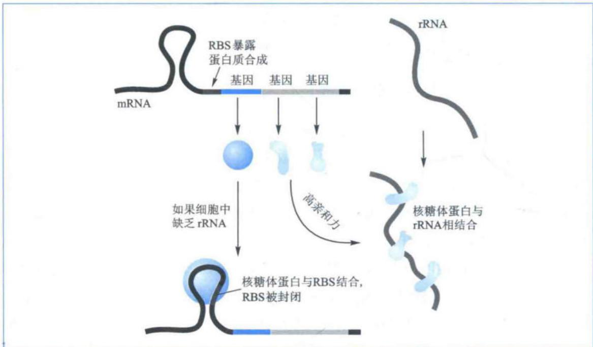

## 7.7.4 小RNA的调节作用

RNA 调节是原核生物基因表达转录后调节的另一种重要机制。细菌响应环境压力(氧化压力、渗透压、温度等)的改变,会产生一些长度在 50\~500 nt 之间的非编码小 RNA 分子。这些小RNA能结合mRNA或蛋白质，通过改变靶mRNA的稳定性，影响蛋白质-RNA的结合或者mRNA的翻译来调节基因表达。原核细胞中的非编码RNA称为非编码小RNA（small non-coding RNA）即sRNA。原核生物sRNA以反式编码sRNA为主，并且大部分都需要RNA分子伴侣Hfq蛋白的协助来发挥作用，主要是通过不严格的碱基互补配对与靶mRNA结合，抑制或促进靶mRNA的翻译，加速或减缓靶mRNA的降解。

细菌铁蛋白用来储存细胞中过剩的铁离子。bfr基因编码细菌铁蛋白，而anti-bfr基因编码反义RNA。培养基中铁离子浓度较低时，不需要细菌铁蛋白；当铁离子浓度升高时，就需要细菌铁蛋白行使功能。然而，细胞中无论铁离子浓度高低，bfr基因都正常转录成mRNA，而anti-bfr基因的转录却受到能够感应铁离子浓度变化的Fur蛋白的调控。细胞中铁离子过多时，Fur蛋白作为抑制因子起作用，关掉与铁摄取有关的众多操纵子，包括anti-brf基因的表达，使bfr基因能正常翻译出细菌铁蛋白，储存过剩的铁离子。在铁离子浓度低时，anti-bfr基因转录产生大量反义RNA，与bfr mRNA配对，阻止细菌铁蛋白基因的翻译(图7-47)。

此外，大肠杆菌中受氧化压力诱导产生的OxyS和受低温诱导产生的DsrA基因也可以反式编码sRNA的方式调控多个基因的翻译。OxyS可以与fhlA（编码细菌甲酸盐代谢中的转录激活蛋白)mRNA的核糖体结合位点的部分序列配对，也可以与fhlA编码序列中的特定序列配对，阻止核糖体的结合从而抑制fhlAmRNA的翻译。DsrA可以通过促进编码胁迫相关 $\sigma$ 因子rpoS基因的翻译和克服类核相关的H-NS蛋白的转录沉默来调节转录和翻译。在大肠杆菌中，DsrA主要有两种形式，一种是全长转录形式(full-length transcript, Fform)，一种是被截短的转录形式(truncated transcript, Tform)，这两种形式的比例会随着温度的变化而存在差异。当温度较低时候，DsrA以F形式为主。DsrARNA具有3个茎-环，其第一个茎-环结构具有85个核苷酸，对于rpoS的翻译是必须的，而对于抗H-NS活性则是不必要的而第二个茎-环对于抗沉默是必需的。第三个茎-环结构为转录终止子，可被trp转录终止子取代而不丧失DsrA功能。DsrA的第一个茎-环区域可以借助Hfq蛋白与rpoSmRNA的前导序列互补配对，导破坏了rpoSmRNA核糖体结

  
图7-47 反义RNA对bfr基因翻译的抑制作用

图 7-48 反式编码 sRNA 结合在靶 mRNA 的茎 - 环结构上, 使茎 - 环结构打开, 促进靶 mRNA 翻译

合位点序列处的茎-环结构,释放核糖体结合位点,激活mRNA的翻译(图7-48),促进σ因子的表达,这表明DsrA与rpoS mRNA的配对可能对于翻译调控是重要的。通过核磁共振研究DsrA和DsrA/rpoS复合物的结构,发现sRNA含有第二个茎-环的动态构象平衡,这可能是DsrA调节其多个靶mRNA翻译的重要机制。

## 7.7.5 稀有密码子对翻译的影响

在大肠杆菌 DNA 复制时,冈崎片段之前的 RNA 引物是由 dnaG 基因编码的引物酶催化合成的,细胞对这种酶的需求量不大,而引物酶过多对细胞是有害的。已知 dnaG、rpoD 和 rpsU(30S 核糖体上的 S21 蛋白)属于大肠杆菌基因组上的同一个操纵子,而这 3 个基因产物在数量上却大不相同,每个细胞内仅有 50 个拷贝的 dnaG 蛋白,却有 2800 个拷贝的 rpoD 蛋白,更有高达 40000 个拷贝的 rpsU 蛋白。细胞通过翻译调控,解决了这个问题。

研究 dnaG 序列发现其中含有不少稀有密码子。分别计算大肠杆菌中 25 种结构蛋白和 dnaG、rpoD 序列中 64 种密码子的利用频率，可以看出 dnaG 与其他两类有明显不同(表 7-7)。很明显，稀有密码子 AUA 在高效表达的结构蛋白及 σ 因子中均极少使用，而在表达要求较低的 dnaG 蛋白中使用频率就相当高。此外，UCG(Ser)、CCU(Pro)、CCC(Pro)、ACG(Thr)、CAA(Gln)、AAU(Asn) 和 AGG(Arg) 等 7 个密码子的使用频率在不同蛋白质中也有明显差异。

表 7-7 几种蛋白质中异亮氨酸密码子使用频率比较

<table><tr><td>蛋白质</td><td>AUU/%</td><td>AUC/%</td><td>AUA/%</td></tr><tr><td>结构蛋白</td><td>37</td><td>62</td><td>1</td></tr><tr><td>σ亚基</td><td>26</td><td>74</td><td>0</td></tr><tr><td>dnaG蛋白</td><td>36</td><td>32</td><td>32</td></tr></table>

许多调控蛋白如 LacI、AraC、TrpR 等在细胞内含量也很低, 这些蛋白质的编码基因中密码子的使用频率和 dnaG 相似, 而明显不同于结构蛋白。科学家认为, 由于细胞内对应于稀有密码子的 tRNA 较少, 高频率使用这些密码子的基因翻译过程容易受阻, 影响了蛋白质合成的总量。

## 7.7.6 重叠基因对翻译的影响

重叠基因最早在大肠杆菌噬菌体 $\Phi X174$ 中发现，例如 $B$ 基因包含在 $A$ 基因内， $E$ 基因包含在 $D$ 基因内，用不同的阅读方式得到不同的蛋白质。当时认为重叠基因的生物学意义是它可以包含更多的遗传信息，后来发现丝状RNA噬菌体、线粒体DNA和细菌染色体上都有重叠基因存在，暗示这一现象可能对基因表达调控有影响。现用trp操纵子中的trpE基因和trpD基因之间的翻译耦联现象来说明这个问题。

trp 操纵子由 5 个基因 (trpE、D、C、B、A) 组成, 在正常情况下, 操纵子中 5 个基因产物是等量的, 但 trpE 突变后, 其邻近的 trpD 产量比下游的 trpBA 产量要低得多。研究 trpE 和 trpD 以及 trpB 和 trpA 两对基因中核苷酸序列与翻译耦联的关系, 发现 trpE 基因的终止密码子和 trpD 基因的起始密码子共用一个核苷酸。

$$
t r p E — — \text { 苏氨酸 } — — \text { 苯丙氨酸 } — — \text { 终止 }
$$

$$
\mathrm{ACU} - \mathrm{UUC} - \mathrm{UGA} \text { u   g   g   c   u }
$$

$$
\mathrm{AUG} — — \mathrm{GCU}
$$

$$
\text {   甲硫氨酸——丙氨酸——trpD   }
$$

由于 trpE 的终止密码子与 trpD 的起始密码重叠, trpE 翻译终止时核糖体立即处在起始环境中, 这种重叠的密码保证了同一核糖体对两个连续基因进行翻译的机制。实验证明, 耦联翻译可能是保证两个基因产物在数量上相等的重要手段。除了上述 trpE 和 trpD 基因之外, trpB 和 trpA 基因也存在着翻译耦联现象, 因为这两个基因的产物等量存在于细胞中, 而其核苷酸序列同样是重叠的。

$$
t r p B — — \text { 谷氨酸 } — — \text { 异亮氨酸 } — — \text { 终止 }
$$

$$
\mathrm{GAA} - \mathrm{AUC} - \mathrm{UGAuggaa}
$$

$$
\mathrm{AUG} - \mathrm{GAA}
$$

$$
\text {   甲硫氨酸——谷氨酸——trpA   }
$$

此外,大肠杆菌 gal 操纵子(galETK)中也存在着一种基因重叠现象。galT 的终止密码子虽然与 galK 的起始密码子相隔 3 个核苷酸,galK 基因的 SD 序列却位于 galT 基因终止密码子之前,尽管这一现象与前述耦联翻译并不完全相同,但因为核糖体结合在 mRNA 上,可以覆盖 20 个核苷酸,包括 SD 序列和 galK 基因的起始密码子,所以当 galT 翻译终止时,核糖体还没有脱落就直接与 SD 序列结合,开始 galK 的翻译,也能保证两个基因的等量翻译,这也是一种翻译耦联。

## 7.7.7 翻译的阻遏

蛋白质阻遏或激活基因转录的例子已经屡见不鲜,那么,蛋白质是否也能对翻译起类似的调控作用呢?在大肠杆菌 RNA 噬菌体 Qβ 中发现了这种现象。Qβ 噬菌体基因组包含有 3 个基因,从 5' 到 3' 方向依次是与噬菌体组装和吸附有关的成熟蛋白基因 A、外壳蛋白基因和 RNA 复制酶基因。当噬菌体感染细菌,RNA 进入细胞后,这条称为 (+)链的 RNA 立即作为模板指导合成复制酶,并与宿主中已有的亚基结合行使复制功能。但是,Qβ(+)RNA 链上此时已有不少核糖体,它们从 5' 向 3' 方向进行翻译,这无疑影响了复制酶催化的从 3' 向 5' 方向进行的(-)链合成。克服这个矛盾的办法便是由 Qβ 复制酶作为翻译阻遏物进行调节。

体外实验证明,纯化的复制酶可以和外壳蛋白的翻译起始区结合,抑制蛋白质的合成。由于复制酶的存在,核糖体便不能与起始区结合,但已经起始的翻译仍能继续下去,直到翻译完毕,核糖体脱落,与(+)RNA 3'端结合的复制酶便开始了RNA的复制。这里复制酶既能与外壳蛋白的翻译起始区结合,又能与(+)链RNA的3'端结合。序列分析表明,这两个位点上都有CUUUUAAA序列,能形成稳定的茎-环结构,具备翻译阻遏特征。

## 7.7.8 魔斑核苷酸水平对翻译的影响

实验证明,核糖体蛋白(R 蛋白)通过反馈阻遏作用保证所有 R 蛋白合成的协同进行。那么,细胞如何保证蛋白质合成的总速度与蛋白质合成机器主要成分 rRNA 的合成速率相一致,保证在不进行蛋白质合成时没有 RNA 的合成?起这个调控作用的最早信号是不载有氨基酸的 tRNA。

大肠杆菌营养缺陷型 $(trp^{-}his^{-})$ 在缺少任何一种必需氨基酸的培养基上生长时,不但蛋白质合成速度立即下降,RNA合成速度也下降。由于色氨酸和组氨酸不是RNA的前体,因此认为RNA合成速度下降是蛋白质合成受阻后的次级反应。研究另一个大肠杆菌突变株发现,当氨基酸供应不足时,这个突变株细胞内蛋白质合成虽然停止了,但RNA的合成速度却没有下降。科学上把前一种现象称为严紧控制(基因型 $rel^{+}$ );后一种现象称为松散控制(基因型 $rel^{-}$ )。

$rel^{+}$ 和 $rel^{-}$ 菌株除上述生理现象不同之外，缺乏氨基酸时 $rel^{+}$ 菌株能合成鸟苷四磷酸（ppGpp）和鸟苷五磷酸（pppGpp）， $rel^{-}$ 菌株则不能合成鸟苷酸。因为这两种化合物是在层析谱上检出的斑点，当时称为魔斑（magic spot）。在旺盛生长的细胞中有65%\~90%的tRNA是载有氨基酸的。当氨基酸缺乏时，不负载氨基酸的tRNA增多，这种不负载氨基酸的tRNA仍能与核糖体的A位结合，核糖体上不负载氨基酸的tRNA是细胞产生严紧控制的信号。在正常的蛋白质合成过程中，将AA-tRNA运转到正在延伸的多肽上需要GTP，也许由于这一反应的停止，大量GTP便被用作合成魔斑核苷酸的前体(图7-49)。

参与这个反应的除 relA 基因所编码的 ATP-GTP 3' 焦磷酸转移酶外, 还需要翻译起始因子 EFTu 和 EFG 等。当细菌的生存条件恢复时, 一种名为 spoT 的基因编码降解 (p)

ppGpp 的酶,因此应急反应随着(p) ppGpp 的消失很快逆转。ppGpp 是多效性的,它的主要作用除了影响 RNA 聚合酶与启动子结合的专一性外,还可以影响核糖体蛋白

  
图7-49 ppGpp的合成及降解

的活性,从而成为细胞内严紧控制的关键。有人将 ppGpp 和 cAMP 这类物质称为警报素 (alarmone)。在细胞较好的营养状况下,胞内 ppGpp 水平较低,IF2 介导的翻译起始能够顺利进行;当细胞营养状况较差,缺乏氨基酸时,胞内的 ppGpp 水平大大提高,抑制了细胞因子 IF2 介导的翻译起始步骤,使得没有进入翻译起始的 70S 核糖体单体大大增加,造成活性核糖体比例降低(图 7-50),可在很大范围内做出如抑制核糖体和其他大分子合成等应急反应,活化某些氨基酸操纵子的转录表达,抑制与氨基酸运转无关的系统,活化蛋白水解酶等,以节省或开发能源,渡过难关。

图 7-50 活性核糖体调控模型  

<!-- W-BEGIN Watson 18 逆向调控：RNA 合成和稳定性控制相互影响并决定基因表达 -->

### 【中文对照 Watson 第18章：逆向调控：RNA 合成和稳定性控制相互影响并决定基因表达】

> 来源：Watson《基因的分子生物学》第七版中译本（书籍/03_基因的分子生物学_第七版） 第18章 原核生物的转录调控。

#### [W] 逆向调控：RNA 合成和稳定性控制相互影响并决定基因表达

CⅡ蛋白激活启动子 $P_{I}$ ，指导int基因的表达，同时激活启动子 $P_{RE}$ 指导合成抑制因子（图18-21）。Int蛋白是一个在形成溶原性细胞时将噬菌体基因组整合到宿主细胞中的酶（第12章）。因此，一旦感染，有利于CⅡ蛋白活性的条件就造成抑制因子和整合酶的猛增。

但是 int 基因可以从 $P_{L}$ 或 $P_{I}$ 转录，所以或许有人会想到整合酶也可以在无 CⅡ蛋白的时候合成。这种情况是不会发生的，原因在于由 $P_{L}$ 起始的 int 信使 RNA 被细胞的核酸酶降解了，而在 $P_{I}$ 起始的 mRNA 是稳定的，可以被翻译为整合酶蛋白质。这是因为两种信使的 3' 端有着不同的结构。

在 $P_{I}$ 起始，并在 int 基因末端之后 300 核苷酸处的终止子停止的 RNA，具有典型的茎-环结构，其后是 6 个尿嘧啶（图 18-34；第 13 章图 13-13）。相反，当 RNA 的合成从 $P_{L}$ 起始，同时 RNA 聚合酶被 N 蛋白修饰，此时通过终止子。这一更长的 mRNA 可以形成一个茎，作为核酸酶的底物。因为这一负责负调控的位点位于它所影响的基因的下游，同时降解是沿着基因逆向进行的，所以这一过程被称为逆向调控（retroregulation）。

逆向调控的生物学功能是不言而喻的。当 CⅡ活性低而有利于裂解发育时，是不需要整合酶的。因此，其 mRNA 被破坏掉。但当 CⅡ活性高而有利于溶原发育时，int 基因表达促进受抑制的噬菌体 DNA 重组进入细菌染色体。

  
图 18-34 int 表达的逆向调控的 DNA 位点和转录 RNA 的功能结构。上部所示为 DNA 序列，下面的圆柱体显示 RNA 中形成发夹对称的序列。左侧的结构显示从 $P_{1}$ 转录出的 RNA 形成的终止子，未被 N 蛋白拮抗终止，这一结构可以抵抗核酸酶的降解。右侧的结构显示在 N 蛋白抗终止因子影响下从 $P_{L}$ 转录出的 RNA 形成的延伸环，这一结构显示 RNA 酶Ⅲ切割和核酸酶降解的靶位。

这一调控机制还有另一层次的意义。当原噬菌体被诱导时，它需要合成整合酶（和另一个酶，称为剪切酶（excisionase），见第12章）通过重组催化噬菌体DNA从细菌DNA中重新独立出来。不管CⅡ活性高不高，它都要做到这一点。因此，在这些条件下，不管N蛋白的活性如何，噬菌体必须从 $P_{L}$ 合成稳定的整合酶mRNA。这是如何实现的呢？

当噬菌体基因组在溶原型细胞建立期间整合到细菌染色体时，发生重组的噬菌体黏附位点位于 int 基因和编码 mRNA 开始降解的延伸茎的序列之间（图 18-21）。因此，在整合形式下，引起降解的位点在 int 基因末端被删除，从 $P_{L}$ 转录出来的 int mRNA 是稳定的。

<!-- W-END Watson 18 逆向调控：RNA 合成和稳定性控制相互影响并决定基因表达 -->

<!-- W-BEGIN Watson 20 调控RNA（章首） -->

### 【中文对照 Watson 第20章：调控RNA（章首）】

> 来源：Watson《基因的分子生物学》第七版中译本（书籍/03_基因的分子生物学_第七版） 第20章 调控RNA。

#### [W] 第20章 调控RNA

#### [W] 本章概要

细菌中 RNA 介导的调控
• 调节 RNA 在真核生物中广泛存在
• miRNA 分子的合成与功能
• 小 RNA 的沉默基因表达
• 长链非编码 RNA 与 X 染色体失活

前两章中，我们讨论了原核生物和真核生物的转录调控。我们知道这一调控是通过调控蛋白，尤其是序列特异性 DNA 结合蛋白来进行的。这些 DNA 结合蛋白能够激活或抑制其邻近基因的转录。大约 50 年前，Francois Jacob 和 Jacques Monod 提出了他们的抑制子模型（框 18-2），由此开始了基因调控详细机制的研究。在当时，他们不能确定反式因子（transfactor），即抑制子（repressor），究竟是蛋白质还是 RNA。他们所研究的，还有很多其他研究者所研究的这

些调控因子都是蛋白质。这些蛋白质通过结合 DNA 操纵子（operator）起作用。但在原文中，他们相信这些调控因子很可能是就 RNA 分子——他们的确更倾向于这种可能性。

随着越来越多的蛋白质调控因子在原核和真核生物中被发现，RNA 分子可能是调控因子这一观点几乎被遗忘了。但在近几年，RNA 调控子的研究获得了新突破。特别是在真核生物中发现，在转录水平甚至是在翻译水平上 RNA 分子发挥了调控作用。这一新研究领域始于如下两项发现：最先报道于 20 世纪 90 年代初发现的小 RNA（microRNA）和 90 年代末发现的 RNA 干扰（RNA interference）现象。在描述这种新的调控形式是如何作用以及能给研究者带来何种应用价值之前，我们先来讨论一下最先在细菌中发现的 RNA 介导的基因调控。

#### [W] 细菌中 RNA 介导的调控

小 RNA 存在于原核生物之中在多年前就是一个不争的事实。这些小 RNA 中，一部分参与质粒的复制调控过程，另一部分则与基因表达调控相关（参见第 12 章中有关 Tn10 的讨论）。对于后者，它们有些能够参与转录调控过程，如 E.coli 的 6S RNA。通过结合到 RNA 聚合酶的 $\sigma^{70}$ 亚基上，6S RNA 能够下调大多数 $\sigma^{70}$ 启动子控制的转录。6S RNA 在静止期可以积累很高的浓度（营养物质耗尽时，细菌进入一个特殊的生长阶段，此时细胞停止分裂）。静止期还产生另一种不同的 $\sigma$ 因子—— $\sigma$ 。 $\sigma^{S}$ 因子与 $\sigma^{70}$ 竞争跟核心聚合酶的结合，并引导聚合酶到达特定的启动子，促进许多压力应答性基因的表达，使细菌能在静止期存活。通过下调 $\sigma^{70}$ 启动子的转录，6S RNA 可促进 $\sigma^{S}$ 启动子的表达。

近年来，研究的焦点转移到另一组细菌的小 RNA 分子上。这些小 RNA 分子能够调节 mRNA 的翻译和降解。由于它们与真核生物中调控基因表达的 RNA（包括小分子干扰 RNA 和 microRNA，我们将会在本章第二部分讨论）相似，人们对这种小 RNA 研究的兴趣进一步高涨。

与真核生物的调控 RNA 不同，细菌中的调控 RNA（称为 sRNA）通过反式作用控制目标基因的表达，而且它们比前者（长 21\~30 核苷酸）要大得多（长 80\~110 核苷酸）。此外，sRNA 是由小基因直接编码形成的最终产物，而不是像真核生物 RNA 调控子那样，是通过大分子双链 RNA 的前体加工而形成的。很多这些基因已通过生物信息学被鉴定，在 E.coli 中约有 100 个，其中十几个 sRNA 的特性已经被阐述。大多数 sRNA 与靶 mRNA 的互补序列碱基配对而引导其降解，进而抑制翻译，但在一些特殊例子中反而能刺激翻译。

在大多数情况下，细菌 Hfq 蛋白辅助 sRNA 与靶 mRNA 结合。这些 RNA 伴侣是不可或缺的。由于 sRNA 和靶 mRNA 之间的互补序列很短且很不完全，因此它们之间的相互作用较弱。Hfq 有助于碱基配对，在 sRNA 与靶 mRNA 配对之前，Hfq 先与 sRNA 结合，从而提高了这些调控因子的稳定性。

大肠杆菌中研究得较为深入的 sRNA 是长 81 个核苷酸的 RybB RNA。因为配对形成的异源双链核酸分子能被核酸酶 RNase E 识别并当成底物,该 RybB 能够与数个靶 mRNA 结合而引发其降解。与 RybB 作用的靶 mRNA，大多数是编码储铁蛋白的。在特定环境中细胞需要游离铁离子，而高浓度的铁离子则是有毒的。RybB 通过调控储铁蛋白的水平，在细胞中起到调节铁离子浓度的作用。调控 RybB 表达到启动子会被一种特异的 $\sigma$ 因子（称为 $\sigma^{E}$ ）识别。 $\sigma^{E}$ 同 $\sigma^{S}$ 一样也是一种压力应答 $\sigma$ 因子。编码 $\sigma^{E}$ 的基因表达受 RybB 自身调控，所以这种 sRNA 是 $\sigma^{E}$ 自身负调控环（autonegative regulatory loop）的组成部分。

如上所述，静止期 $\sigma$ 因子 $\sigma^{S}$ 由 E.coli 的 rpoS 基因所编码。rpoS mRNA 翻译过程受两种 sRNA 调节：DsrA 和 RprA。翻译激活是通过另外一种 RNA 碱基配对的开关机制来完成的：小 RNA 通过与 mRNA 的一个区域结合来抑制翻译，否则该区域将会与核糖体结合位点配对而促进翻译。rpoS 基因也受其他小 RNA 的负作用，如 OxyS（图 20-1 显示这两种机制）。

细菌中另外一些调控 RNA 类似 “反义” RNA：他们是被基因编码链的反义链编码的，通过同源碱基互补配对从而起到抑制这个基因的 mRNA 表达的作用。这样往往容易导致有毒基因编码产物的产生，以及一些噬菌体调节基因（如 $\lambda$ ）（见第 18 章）。这些 RNA 通常被认为是顺式调控，因为它们只能作用于产生它的那个基因（与我们上面讨论的反式调控 RNA 相反）。

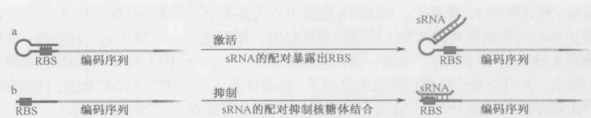  
图 20-1 sRNA 对翻译的激活与抑制。RBS 代表核糖体结合位置。如果由于与另一个 RNA 分子（如 b 所示），或者与同一个 RNA 分子的另一个区域（如 a 所示）的碱基配对而被封闭，翻译就被抑制。（引自 Gottesman S. et al. 2006. Cold Spring Harbor Symp. Quant. Biol. 71: 1-11, Fig.1. ©Cold Spring Harbor Laboratory Press，经许可使用、修改）

我们将在本章的后半部分回过来讨论那些反式作用调控 RNA（trans-acting regulatory RNA）。在那里我们会对它们在真核生物基因表达调节方面的作用进行讨论。但在进入该主题之前，我们先剖析细菌中基因调控的另外一些例子。这种调控是由另外一种顺式（cis）的 RNA 碱基配对介导的。这种顺式调控是指 RNA 调控元件调控的那些自身含有 mRNA 的基因表达。此类调控的典型例子是那些调控代谢型操纵子（metabolic operon）和合成型操纵子衰减（attenuation in biosynthetic operon）的“核糖开关”（riboswitch）。E.coli 的 trp 基因便是后一机制的经典例子，RNA 介导的调控也是在该例子中首次被发现的（框 20-1 中将详细描述该例子）。

#### [W] 框 20-1 受衰减作用调控的氨基酸生物合成操纵子

在 E.coli 中，5 个相邻的色氨酸基因（trp）编码与色氨酸合成有关的酶。只有当色氨酸有限时，这些基因才高效表达（框 20-1 图 1）。这些基因受抑制子（repressor）调控，就像乳糖基因（lac）一样。尽管在这种情况下，解除抑制是配基（色氨酸）缺乏导致的。

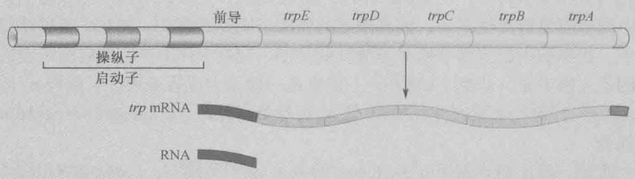  
框 20-1 图 1 Trp 操纵子。E.coli 的色氨酸操纵子，图示前导 RNA（见正文）与编码 Trp 酶的结构基因之间的关系。基因产物为氨基苯甲酸盐合成酶（anthranilate synthetase，trpE 的产物）、磷酸核糖基邻氨基苯甲酸转移酶（phosphoribosyl anthranilate ransferase，trpD 的产物）、磷酸核糖基邻氨基苯甲酸异构酶吲哚甘油磷酸合成酶（phosphoribosyl anthranilate isomearase-indole glycerol phosphatesynthetase，trpC 的产物）、色氨酸合成酶 β（tryptophan synthetase，trpB 的产物）和色氨酸合成酶 α（tryptophan synthetase，trpA 的产物）。

然而，即使 RNA 聚合酶启动了色氨酸 mRNA 分子的转录，它也并不总是能产生完整的转录物。就像核糖开关一样，产生完整转录物，最终要受衰减作用的控制。在这个例子中，大多数转录在未成熟前就终止，甚至在没转录完第一个色氨酸基因（trpE）之前就停止。但是，如果细胞中色氨酸水平很低的话，衰减作用会被克服；

当色氨酸有限时，聚合酶不会终止转录，相反，会转录出所有5个trp基因。就像核糖开关一样，衰减作用是否发生，依赖于RNA形成不同的替换二级结构的能力。然而在这个例子中，前导RNA选择形成两种不同的替换二级结构中的哪一种，并不受直接结合到前导RNA上的配基控制。相反，这种选择依赖于细菌中转录与翻译之间的偶联(coupling)。

Trp 操纵子 mRNA 的 5'端序列含有一个长 161 核苷酸的前导序列，这一序列位于 trpE 第一个密码子的上游（框 20-1 图 2）。在这段前导序列之后，trpE 之前是一个转录终止子，RNA 中有一个特征性的环状的“发夹”（hairpin）结构（由框 20-1 图 2 中的区域 3 和 4 序列而来），之后是 8 个 U 残基（图 13-13）。转录通常在这个终止子之后停止（并且我们可以设想，应该总是在此停止），产生一个长 139 个核苷酸的前导 RNA。这是色氨酸水平高的时候产生的 RNA 产物。

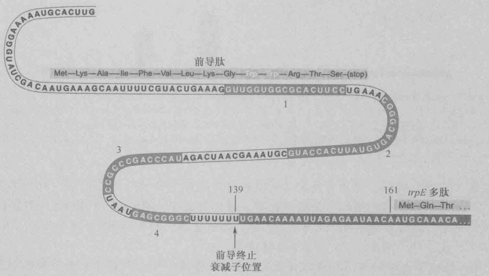  
框 20-1 图 2 trp 操纵子前导 RNA。trp 操纵子前导 RNA 的核苷酸序列特征。

当细胞中色氨酸浓度低时，前导序列的三个结构特点使RNA聚合酶能够越过终止子。第一，前导RNA区域1和2之间形成的第二个“发夹”结构（除了终止子发夹之外）（框20-1图2）。第二，区域2也与区域3互补，因此在区域2和3之间又可以形成一个发夹结构，当这一发夹结构形成时，阻止了终止子发夹结构（区域3和4之间）的形成。第三，前导RNA含有一个编码14个氨基酸的短“先导”肽的可读框，这一可读框之前是一个强的核糖体结合位置（框20-1图2）。

编码先导肽的序列有一个显著的特点：两个色氨酸密码子排成一行。当色氨酸缺乏时，可利用的负载色氨酸 tRNA（charged trp tRNA）很少，核糖体移动到两个色氨酸密码子时它就会停顿下来。在这种情况下，色氨酸密码子周围的 RNA 位于核糖体里，并且不能形成发夹环。框 20-1 图 3 显示了这一结果。

一个核糖体停在色氨酸密码子上（图 3b）覆盖住了区域 1，剩下区域 2 可以自由框 20-1 图 3 trp 衰减子处的转录终止。图中显示了待用色氨酸如何在 trp 操纵子的衰减子处控制转录终止。蓝框显示的是先导肽的编码区。(a) 色氨酸含量高的情况：序列 3 可以与序列 4 配对以形成转录终止发夹。(b) 色氨酸含量低的情况：核糖体在相邻的色氨酸密码子处停顿，使序列 2 能与序列 3 自由配对，因此阻止了序列 4 终止发夹的形成。(c) 无蛋白质合成：如果没有核糖体于 AUG 处开始翻译前导肽，序列 1 和序列 2 的配对形成发夹，阻止了 2-3 发夹的形成，并允许序列 3-4 发夹的形成。Trp 酶不表达。

和区域 3 配对，因此，终止子发夹（由区域 3 和区域 4 形成）不能形成，转录不会被衰减。但是，如果有充足的色氨酸（也有足够的负载 Trp tRNA）使核糖体继续通过色氨酸密码子，那么核糖体会阻碍序列 2，此时含有区域 3 和 4 的 RNA 就会形成。因此，终止子形成，转录衰减，trp 基因不能被转录。

Trp 操纵子受抑制作用和衰减作用的控制, 提供两步反应来应答更加严酷的色氨酸缺乏。但是单独的衰减作用即可提供精巧的调节: 其他的氨基酸操纵子如 leu 和 his 完全依赖衰减作用来调节。在亮氨酸操纵子中, 前导肽含有 4 个相邻的亮氨酸密码子, 而在组氨酸操纵子中前导肽有一排 7 个组氨酸密码子。

#### [W] 基因转录物中的核糖开关——通过改变二级结构调控基因表达

核糖开关是通过对小分子的浓度改变进行应答来调控基因表达的。这些调控元件特异地存在于它们所调控的基因5'非翻译区，可以在转录或翻译水平调控基因的表达。我们将会在下面讨论到，该调控是通过改变RNA的二级结构来完成的。

一个核糖开关都是由两部分组成的：适配体（aptamer）和表达平台（expression platform）（图 20-2）。适配体与小分子配基（ligand）结合，从而引起其构象改变，进而导致与其相邻的表达平台的二级结构也产生了变化。这种构象的变化通过终止基因转录或是抑制翻译的启动，改变了相关基因的表达。这两种机制在图 20-3 所示的例子中

已有详细说明，我们现在对此进行描述。

毋庸置疑，核糖开关特异地存在于它所识别的代谢配基合成相关基因的上游。例如，在枯草杆菌（Bacillus subtilis）中，很多与甲硫氨酸代谢有关的基因都具有一个长200个核苷酸的非翻译前导RNA序列。这些RNA起到SAM（腺苷甲硫氨酸）感受性核糖开关

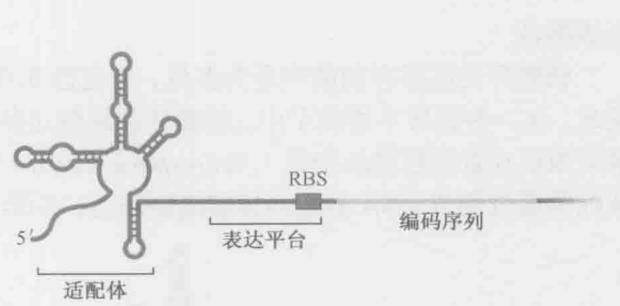  
图 20-2 核糖开关 RNA 的结构。如正文所描写的，适配体与控制代谢物结合，导致相连的表达平台的结构改变。已知的适配体大小在 70\~200 个核苷酸之间不等；表达平台的大小和特征也不同。

(S-adenosylmethionine-sensing riboswitch) 的作用。RNA 聚合酶在启动子上启动转录，并从这段前导序列中开始，然后进入下游基因的编码序列。前导序列被转录成 RNA 后，它通过内部碱基配对的不同替换方式形成不同的结构（图 20-3a）。其中一种结构就是形成柄环转录终止子（见第 13 章）。SAM（核糖开关的配体）与适配体结合，稳定包括转录终止子在内的二级结构（图 20-3a 下部所示）。在这种情况下，聚合酶在有机会转录下游基因的蛋白质编码序列之前，转录过程就被终止。这种转录调控的方式称为衰减作用（attenuation）。在另一情况即另一基因下，SAM 感受性核糖开关可以通过调控翻译过程起作用。如图 20-3b 所示，在该情况下，SAM 结合到适配子而稳定其替换二级结构，这一二级结构包含非转录终止子的柄环结构，也包括一个核糖体结合位点区域（RBS, ribosome-bindingsite, 图 20-3 中标以 4 的区域）。由 SAM 引起的这一构象改变，隔离了 RBS 并且阻止了核糖体使翻译不能进行（见第 15 章）。因此，这种方式的翻译抑制实质上与前文描述的反式作用 sRNA（trans-acting sRNA）作用机制相同（图 20-1）。图 20-4 显示了由 SAM 与核糖开关结合所引起的 RNA 二级结构改变的细节。

很多核糖开关已经确认，从目前全基因组测序的结果表明，有可能在细菌中发现了数百种或数千种核糖开关，其中典型的是能够对一系列不同的代谢物发生应答，包括赖氨酸和其他氨基酸、维生素 $B_{12}$ 、辅酶焦磷酸硫胺素（coenzyme thiamine pyrophosphate，TPP）、黄素单核苷酸（flavin mononucleotide，FMN）和鸟嘌呤（图20-5）。

另一种核糖开关对空载 tRNA（uncharged tRNA）发生应答，而不是那些小分子配体。因此一些基因，尤其是氨酰-tRNA 合成酶基因（第 15 章），由长为 200\~300 核苷酸的非翻译前导 RNA 通过衰减机制来调控。该前导 RNA 序列能够直接地、特异性地与合成酶的同类空载 tRNA 结合，而不能与负载 tRNA（charged tRNA）结合。负载 tRNA 不能同 RNA 二级结构所提供的结合域（binding pocket）相适应。通过与空载 tRNA 结合，前导 RNA 保持抗终止结构（antitermination structure），从而使得其邻近的合成酶基因的转录得以继续。该调控的特异性是通过 tRNA 和前导 RNA 之间的“密码子-反密码子”相互作用形成的。由于空载 tRNA（不是负载 tRNA）可以与前导 RNA 结合，所以只有当细胞内同类氨基酸供应不足且空载 tRNA 的水平升高时，转录通读过程才

会被激活。

核糖开关虽然在细菌中最为多见，但也已在其他生物，包括古菌、真菌和植物中被发现。在一些高等生物例子中，核糖开关甚至还参与替换剪接的调控（第14章）。例如，最近报道在真菌粗糙脉孢霉（Neurospora crassa）中鉴定了三种TPP适配体，其中两种适配体通过调节RNA剪接而抑制基因表达，而第三种却起激活作用。

  
图 20-3 核糖开关调控转录终止或翻译起始。图示 SAM 感受性核糖开关的两个例子：（a）转录终止的调控，（b）翻译起始的调控。数字 1-4 表示 RNA 编码区上游不同的序列元件区域（以黄色表示）。没有 SAM 时，区域 2 和 3 形成柄环；存在 SAM 时，区域 3 和 4 也同区域 1 和 2 一样都形成柄环。如图所示，转录或者翻译的调控都是这种二级结构改变的结果。（a）区域 3 和 4 形成的柄环产生了一个转录终止子，它使得 RNA 聚合酶在转录这一区域之后，进入下游编码区域之前立即终止转录。在这一例子中，mRNA 的柄环后面是一串 U，这是转录终止子的另一个特征（图 13-13）。（b）图示区域 3 和 4 形成的柄环通过封闭核糖体结合位点而阻止了翻译的起始。

#### [W] RNA 是原核生物和古细菌中的防御物质

在继续了解真核生物中调控 RNA 的调控作用之前，我们需要先来了解细菌中的另一个系统。尽管严格来说这并不是一个基因调控的例子，而是一个防御病毒和其他外来入侵的防御系统。但是这种作用机制却与真核生物中 RNA 干扰（RNAi）系统惊人地一致。

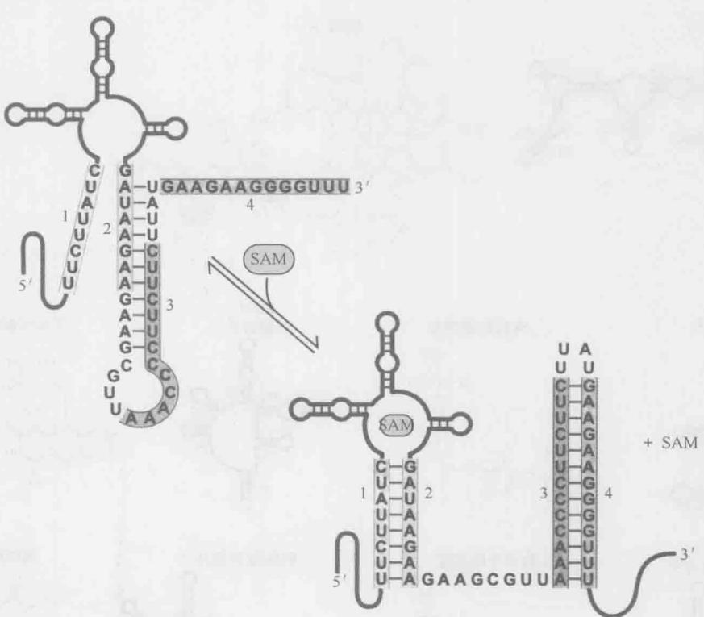  
图 20-4 SAM 感受性核糖开关二级结构的改变。这里显示了区域 1-4（图 20-3）的详尽序列并用颜色标出。显示了有无 SAM 结合两种情况下，两个不同的二级结构的碱基配对。（据 Winkler W.C. et al. 2003. Nat. Struct. Biol. 10: 701-707, Fig.5b. © Macmillan 修改。）

#### [W] CRISPR 是感染和抗性获得的记录

几年前，科学家发现在一些细菌基因组里存在着一类具有典型的独特延伸结构的序列。由于当时并不太清楚这些序列的功能，所以这种与众不同的序列排列方式导致了其相当繁琐的命名——成簇的规律间隔的短回文重复序列（CRISPR）。CRISPR 的序列结构如图 20-6 所示，长度约 30bp 高度保守的重复序列（repeated sequences）簇被长度相似但是高度分化的单一间隔序列交错连接，末端通常是一条长度约 500bp、富含腺嘌呤核胸腺嘧啶的前导序列。

事实上，这些成簇的序列结构在基因组中并不少见。在几乎所有的古生菌和一半的细菌基因组中都发现有 CRISPR 存在。在很多情况下，一个基因组中只有一个簇，但是更为常见的是有 20 个以上或者更多——在绿弯菌属的一个案例中发现了 400 个。那么它们是如何产生的？它们的作用又是什么？

发现 CRISPR 起源的第一个线索来源于一次纯粹的生物信息学发现，科学家吃惊地发现 CRISPR 中大量的间隔序列与已知的噬菌体或质粒的序列是完全一致的。据此推断出这些间隔序列很可能与机体抵御外来核酸进入细胞内的特异性防御机制有关。

随后，科学家进行了实验验证，利用特定的噬菌体感染耐药性细菌细胞，发现耐药性细菌细胞中产生了来自噬菌体的合并间隔序列。同样地，通过增加和去除相关的间隔

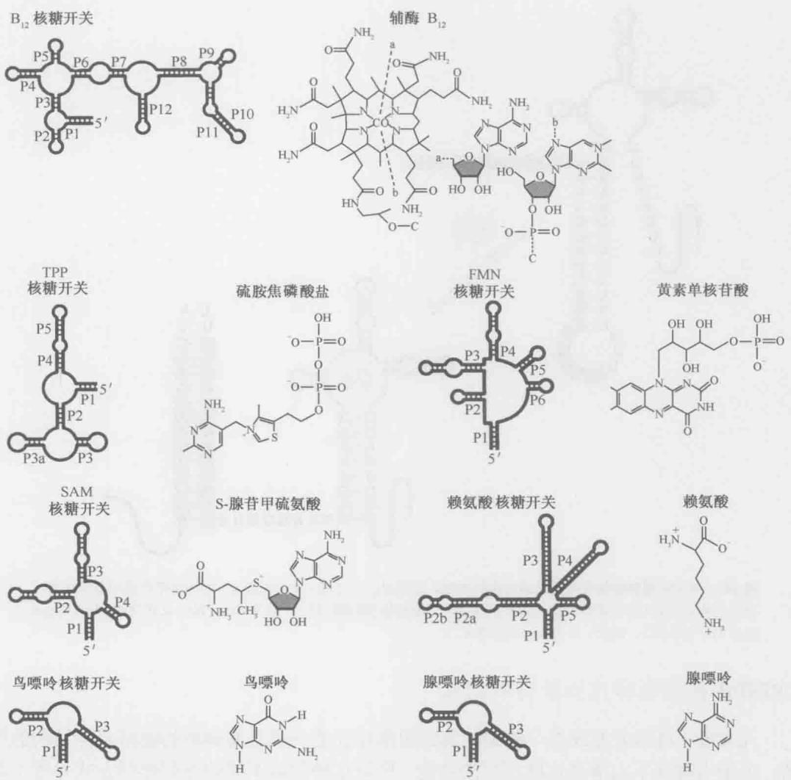

图 20-5 核糖开关对各种代谢物的应答。这里显示了 7 种核糖开关的二级结构及它们应答的代谢物。（经许可，引自 Mandal M. et al. 2003. Cell 113: 557-586, Fig.7A. ©Elsevier.）  
  
图 20-6 CRISPR 基因组的结构。顶部展示的是保守的重复序列与多样间隔区序列。底部是这些序列的排列（数目变化很大）；在该图中也展示了邻近的前导序列。（经允许引自 Karginov F.V. and Hannon G.J. 2010. Mol. Cell37:7–19, Fig.1 A,B,p.8. ©Elsevier.）

序列可以控制噬菌体获得或失去敏感度。此外，利用特定的噬菌体感染细菌，随着从噬菌体中获得了越来越多的间隔序列，细菌的敏感性也越来越差。这也表明当病毒基因组的这个区域发生突变的时候，病毒便可以重新获得感染耐药细胞的能力。

另有研究发现一套保守的蛋白质编码基因与 CRISPR 系统有着密切的联

系。其中只有高度保守的 cas1 和 cas2 存在于所有的 CRISPR 系统中，被称为 CRISPR 相关基因。而其他的 cas 基因和更多的非保守基因较少存在。这些基因编码的蛋白质与

CRISPR 系统的多种功能有关，后面我们会深入讨论。图 20-7 的例子向我们展示了其复杂性。

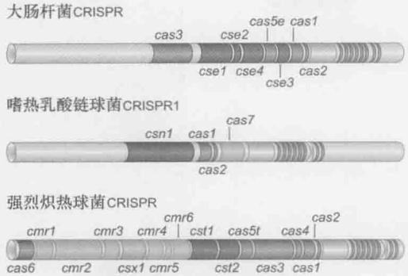  
图 20-7 cas 基因在三个基因组 CRISPR 上的结构。在三个研究较透彻的 CRISPR 基因座上展示了 cas 基因多样的数目、方向及类型。cas 基因的核心用红色标注，图 20-6 中展现的重复及间隔序列位于该图的右手端。（经允许改画自 Karginov F.V. and Hannon G.J. 2010. Mol. Cell37:7–19, Fig. 1C, p. 8. ©Elsevier.）

  
图 20-8 间隔序列获取的机制。每个新的间隔序列都紧挨着前导序列插入，因而该排列是获取事件发生的时间记录。噬菌体基因组中注定成为间隔子的序列又被称为前区间序列，如正文中所描述的，它坐落于紧邻 PAM 序列的地方。（经允许引自 Karginov F.V. and Hannon G.J. 2010. Mol. Cell37: 7–19, Fig. 2B, p. 10. ©Elsevier.）

#### [W] 间隔序列来源于感染的病毒

正如我们前面强调的，当细胞获得了某特定噬菌体的间隔序列再次被感染时，其敏感度会降低。基本过程如图 20-8 所示。病毒中的序列将成为新的间隔序列，称为前间区序列（proto-spacer），常见于前间区序列邻近基序（PAM）的附近。当一个新的间隔序列加入到 CRISPR 系统中时，它将会被合并到最近端靠近前导序列的位置。

在这个过程中需要一些 cas 基因编码的蛋白质参与。因此，抗病毒防御机制并不会因为这些基因的缺失而受损，但是却会令细胞无法获得对新病毒的抵抗力。cas1、cas2 和 cas4 的基因产物就属于这一类。Cas1 是一个假定的整合酶，而 Cas2 是一个核糖核酸酶。其他的 Cas 蛋白则与之相反，Cas6 与 CRISPR 簇的表达与加工相关，Cas3 则在干扰病毒感染中起作用。

CRISPR 首先作为长的 RNA 被转录，然后逐步被加工成小的 RNA，抵御入侵的 DNA 和 RNA

科学家对 CRISPR 在大肠杆菌（E.coli）中的表达情况进行了广泛的研究。在位于前导序列区域启动子的调控下，CRISPR 首先转录为长的转录体，也就是 crRNA 前体。在大肠杆菌（E.coli）中，发现 8 个与 CRISPR 相关的 cas 基因，其中 5 个在表达过程中会形成级联（Cascade）复合物。这种复合物中包含一个亚单位，其功能是将 crRNA 前体切割加工成小的 crRNA，每个 crRNA 都是一个重复序列和间隔序列的长度。随后，这些小 RNA 继续与 Cascade 复合物结合，从而指导基因组抵御外来 DNA 的侵入（图 20-9a）。

  
图 20-9 大肠杆菌和超嗜热菌强烈炽热球菌的 CRISPR 位点的抗病毒机制。大肠杆菌系统（a）作用于外来的 DNA，而超嗜热菌强烈炽热球菌（b）则作用于外来的 RNA。尽管这两种机制在许多方式上相近，但是其加工机制及最终的操作如文中所表明的那样是显著不同的。在（a）中，crRNA 前体被级联复合体的 CasE 亚基加工处理（CasE 基因由图 20-7 中的 cse3 基因编码），然后 crRNA 和级联在 Cas3 的帮助下瞄准并切割目标 DNA，其机制尚不清楚。在（b）中，Cas6（见图 20-7）加工 crRNA 前体，而该过程发生在不同于级联的复合体中，其靶向为病毒 RNA，该机制与真核生物中的 RNAi 极其相似。（源于 Jore M.M. et al. 2012. Cold Spring Harb. Perspect. Biol.4:a003657. ©Cold Spring Harbor Laboratory Press.）

每个 crRNA 分子一般包含 5' 端为 8 个核苷酸的重复序列，紧跟着是完整的间隔区或者下一段重复序列。crRNA 分子中的重复序列的两端分别被称为 5' 端和 3' 端，是 crRNA 分子中的保守部分，由此认为与级联复合物中的亚单位结合的正是这个区域。

在超嗜热菌强烈炽热球菌（Pyrococcus furiosus）中，在另一种结构相似的酶的作用下，crRNA前体被切割加工成小的crRNA，然后选择性地与由多种CAS蛋白构成的蛋白质复合物相结合。结合的时候，会先从crRNA的5'端和3'端开始结合，但是随后3'端会被修剪掉。crRNA蛋白质的复合物将会直接对抗外来的RNA。

图 20-9 向大家展示了大肠杆菌（E.coli）和超嗜热菌强烈炽热球菌（Pyrococcus furiosus）系统的作用机制。后面我们将会了解这些类似于真核生物中 RNA 干涉（RNAi）的系统是如何运行的，尽管它们的具体细节完全不同。

<!-- W-END Watson 20 调控RNA（章首） -->

## 思考题

1. 简述代谢物对基因表达调控的两种方式。

2. 什么是操纵子学说？

3. 简述乳糖操纵子的调控模型。

4. 什么是葡萄糖效应？

5. 什么是弱化作用？

6. 简述抗终止因子的调控机制。

7. 简述反义 RNA 的调控机制。

8. 简述原核基因转录后调控的不同方式。

9. 简述 ppGpp 是如何参与细菌的应急反应。

10. 什么是 $\sigma$ 因子，简述 $\sigma$ 因子在原核基因调控中的作用。

## 参考文献

1. Bae B, Davis E, Brown D, et al. Phage T7 Gp2 inhibition of Escherichia coli RNA polymerase involves misappropriation of $\sigma70$ domain 1.1. Proceedings of the National Academy of Sciences of the United States of America, 2013, 110: 19772–19777.

2. Dai X, Zhu M, Warren M, et al. Reduction of translating ribosomes enables Escherichia coli to maintain elongation rates during slow growth. Nature Microbiology, 2016, 2, 16231.

3. Fouqueau T, Blombach F, Werner F. Evolutionary origins of two-barrel RNA polymerases and site-specific transcription initiation. Annual Review of Microbiology, 2017, 71.

4. Groisman E A. Feedback control of two-component regulatory systems. Annual Review of Microbiology, 2016, 70: 103–124.

5. Hoch J A. A Life in Bacillus subtilis signal transduction. Annual Review of Microbiology, 2017, 71:1.

6. Jastrab J B, Darwin, K H. Bacterial proteasomes. Annual Review of Microbiology, 2015, 69: 109.

7. Martinezpastor M, Tonner P D, Darnell C L, et al. Transcriptional regulation in Archaea: from individual genes to global regulatory networks. Annual Review of Genetics, 2017, 51: 143.

8. Mettert E L, Kiley P J. How is Fe-S cluster formation regulated? Annual Review of Microbiology, 2015, 69:505.

9. Narula J, Tiwari A, Igoshin O A. Role of autoregulation and relative synthesis of operon partners in alternative sigma factor networks. Plos Computational Biology, 2016, 12.

10. Quereda J J, Cossart P. Regulating bacterial virulence with RNA. Annual Review of Microbiology, 2017, 71:263-280.

11. Sporer A J, Kahl L J, Price-Whelan A, et al. Redox-based regulation of bacterial development and behavior. Annual Review of Biochemistry, 2016, 86:777-797.

12. Yang Y, Darbari V C, Zhang N, et al. TRANSCRIPTION. Structures of the RNA polymerase- $\sigma$ 54 reveal new and conserved regulatory strategies. Science, 2015, 349:882–885.

数字课程学习

e 教学课件

目在线自测

思考题解析

<!-- W-BEGIN Watson 18 章末 -->

### 【中文对照 Watson 第18章章末：小结、参考文献、习题】

> 来源：Watson《基因的分子生物学》第七版中译本（书籍/03_基因的分子生物学_第七版） 第18章 原核生物的转录调控 章末，附录 2 中该章偶数习题答案附后。

#### [W] 小结

一般的基因根据对其产物的需要开启和关闭。这一调控主要发生在转录起始水平。例如，在 E.coli 中，编码代谢乳糖的酶的基因只有在培养基中有乳糖时才高水平地转录。而且，当有葡萄糖（一种更好的能源）时，即使存在乳糖，其代谢基因也不表达。

信号（如出现某种糖）由调控蛋白传递给基因。调控蛋白包括两种类型：激活因子，即开启基因的正调控蛋白；抑制因子，即关闭基因的负调控蛋白。一般说来，这些调控蛋白都是 DNA 结合蛋白，它们识别其控制基因上或附近的特异位点。

在最简单（也是最常见）的情况下，激活因子作用于弱启动子。这些启动子在无任何调控因子存在时，RNA 聚合酶结合上去（并因此启动转录）的效率比较低。激活因子以其一面结合到 DNA，另一面结合到聚合酶并将其募集到启动子部位。这一过程是一个协同结合的例子，足以刺激转录。

抑制因子通过结合到启动子重叠区从而阻碍 RNA 聚合酶的结合，可以抑制转录。抑制因子也可以其他方式作用：例如，结合启动子旁的位点，通过与结合到启动子上的聚合酶相互作用抑制转录。

E.coli 的 lac 基因被激活因子和抑制因子以前面描述过的简单方式控制。在无葡萄糖时，CAP 结合 lac 启动子附近的 DNA，通过募集 RNA 聚合酶到启动子，激活这些基因的表达。Lac 抑制因子结合与启动子有重叠区的位点，在无乳糖时关闭基因表达。

RNA 聚合酶被募集到不同基因上的另一种方式是利用 $\sigma$ 因子。不同的 $\sigma$ 因子可以替代主要的 $\sigma$ 因子（E.coli 中是 $\sigma^{70}$ ）并将聚合酶引导到启动子不同的序列上。例如， $\sigma^{32}$ 指导对热激反应的基因的转录， $\sigma^{54}$ 指导参与氮代谢酶基因的转录。噬菌体 SPO1 利用一系列的选择性 $\sigma$ 控制其基因在感染期间的有序表达。

在细菌中还有其他种类的转录激活的例子。在有些启动子上，RNA 聚合酶独立、有效地结合，并形成稳定的、无活性的封闭复合体。这一封闭复合体不会自动地转变为开放复合体并起始转录。在这样的启动子上，激活因子必须刺激从封闭复合体到开放复体的转变。

刺激此类启动子的激活因子通过变构起作用：它们与稳定的封闭复合体相互作用，诱导构象变化，导致转变为开放复合体。在本章，我们看到了两个激活因子通过变构激活转录的例子。其中一例，激活因子（NtrC）与RNA聚合酶（带有 $\sigma^{54}$ ）结合到glnA启动子的稳定封闭复合体上，刺激转变为开放复合体。在另一例中，激活因子（MerR）诱导merT启动子中的DNA构象改变。

在我们讨论过的所有情况中，调控蛋白本身都被信号通过变构控制，即调控因子的形状在信号存在时改变。一种状态下它可以结合 DNA；另一种状态下则不能。因此，如 Lac 抑制因子就被配体别乳糖（从乳糖而来的产物）控制。当别乳糖结合了抑制因子，它就诱导蛋白产生形状变化，使之处于不能结合 DNA 的状态。

基因表达也可在转录起始后的步骤中调控，如可在转录延伸水平调控。在此，我们讨论了三种情况： $\lambda$ 噬菌体N蛋白和Q蛋白的抗终止作用。 $\lambda$ N蛋白和Q蛋白装载到RNA聚合酶上在噬菌体基因组某启动子起始转录。RNA聚合酶以这种方式被修饰之后就可以通过某些转录终止位点，否则这些转录终止位点会阻止对其下游基因的表达。

在本章的结论部分我们详细讨论了噬菌体 $\lambda$ 是如何在两种选择性的繁殖方式之间进行选择的。在这一系统中遇到的基因调控的方式也在其他系统中作用，包括我们将在以下章节中看到的。例如，动物发育控制中，协同结合就被用于严格地控制开关效应，以及建立和维持基因表达的不同途径。我们也考虑了诸如在 $\lambda$ 中所发现的更基础、更早期生物的基因网络的复杂性。

#### [W] 参考文献

#### [W] 书籍

Echols H. 2001. Operators and promoters: The study of molecular biology and its creators. University of California Press, Berkeley, CA.

Müller-Hill B. 1996. The lac operon. de Gruyter, Berlin.

Ptashne M. 2005. A genetic switch: Phage lambda revisited, 3rd ed. Cold Spring Harbor Laboratory Press, Cold Spring Harbor, New York.

Ptashne M. and Gann A. 2002. Genes & signals. Cold Spring Harbor Laboratory Press, Cold Spring Harbor, New York.

#### [W] 激活与抑制

Dodd I.B., Shearwin K.E., and Egan J.B. 2005. Revisited gene regulation in bacteriophage λ. Curr. Opin. Genet. Dev. Biol. 15: 145–152.

Dove S.L., Darst S.E., and Hochschild A. 2003. Region 4 of σ as a target for transcription regulation. Mol. Microbiol. 48: 863–874.

Gann A. 2010. Jacob and Monod: From operons to EvoDevo. Curr. Biol. 20: R718–R723.

Gottesmann M. and Wesiberg R. 2004. Little lambda, who made thee? Microbiol. Mol. Biol. Rev. 68: 796–813.

Hochschild A. and Dove S.L. 1998. Protein–protein contacts that activate and repress prokaryotic transcription. Cell 92: 597–600.

Huffman J.L. and Brennan R.G. 2002. Prokaryotic transcription regulators: More than just the helix-turn-helix motif. Curr. Opin. Struct. Biol. 12: 98–106.

Jacob F. and Monod J. 1961. Genetic regulatory mechanisms in the synthesis of proteins. J. Mol. Biol. 3: 318–356.

Lawson C.L., Swigon D., Murakami K.S., Darst S.A., Berman H.M., and Ebright R.H. 2004. Catabolite activator protein: DNA binding and transcription activation. Curr. Opin. Struct. Biol. 14: 10–20,

Little J. W. 2010. Evolution of complex gene regulatory circuits by addition of refinements. Curr. Biol. 20: R724–R734.

Magasanik B. 2000. Global regulation of gene expression. Proc. Natl. Acad. Sci. 97: 14044–14045.

Murray N.E. and Gann A. 2007. What has phage lambda ever done for us? Curr. Biol. 17: R305–R312.

Ng W. L. and Bassler B.L. 2009. Bacterial quorum-sensing network architectures. Annu. Rev. Genet. 43: 197–222.

Oppenheim A.B., Oren Kobiler O., Stavans J., Court D.L., and Adhya S. 2005. Switches in bacteriophage lambda development. Ann. Rev. Genet. 39: 409–429.

Payankaulam S, Li L.M., and Arnosti D.N. 2010. Transcriptional repression: Conserved and evolved features. Curr. Biol. 20: R764–R771.

Ptashne M. 2006. Lambda's switch: Lesson from a module swap. Curr. Biol. 16: R459–R462.

Rappas M., Bose D., and Zhang X. 2007. Bacterial enhancer-binding proteins: Unlocking σ54-dependent gene transcription. Curr. Opin. Struct. Biol. 17: 110–116.

Rojo F. 2001. Mechanisms of transcriptional repression. Curr. Opin. Microbiol. 4: 145–151.

Roy S., Garges S., and Adhya S. 1998. Activation and repression of transcription by differential contact: Two sides of a coin. J. Biol. Chem. 273: 14059–14062.

Schleif R. 2003. AraC protein: A love-hate relationship. Bioessays 25:274–282.

Summers A.O. 2009. Damage control: Regulating defenses against toxic metals and metalloids. Curr. Opin. Microbiol. 12: 138–144.

#### [W] DNA 结合、协同性及变构效应

Hochschild A. 2002. The switch: cI closes the gap in autoregulation. Curr. Biol. 12: R87–R89.

Lewis M. 2005. The lac repressor. Crit. Rev. Biol. 328: 521–548.

Luscombe N.M., Austin S.E., Berman H.M., and Thornton J.M. 2000. An overview of the structures of protein–DNA complexes. Genome Biol. 1: REVIEWS001.

Monod J. 1966. From enzymatic adaptation to allosteric transitions. Science 154: 475–483.

Vilar J.M.G. and Saiz L. 2005. DNA looping in gene regulation: From the assembly of macromolecular complexes to the control of transcriptional noise. Curr. Opin. Genet. Dev. Biol. 15:136–144.

#### [W] 抗终止

Gottesman M. 1999. Bacteriophage λ: The untold story. J. Mol. Biol. 293:177–180.

Roberts J.W., Yarnell W., Bartlett E., Guo J., Marr M., Ko D.C., Sun H., and Roberts C.W. 1998. Antitermination by bacteriophage $\lambda$ Q protein. Cold Spring Harb. Symp. Quant. Biol. 63: 319–325.

Roberts J.W., Shankar S., and Filter J. J. 2008. RNA polymerase elongation factors. Annu. Rev. Microbiol. 62: 211–233.

Santangelo T.J. and Artsimovitch I. 2011. Termination and antitermination: RNA polymerase runs a stop sign. Nat. Rev. Microbiol. 9: 319–329.

#### [W] 习题

#### [W] 偶数习题的答案请参见附录2。

习题 1 解释为什么大部分基因表达的调控水平发生在转录起始。

习题 2 从本章中举出 3 个变构调节的例子。

习题 3 E.coli 的乳糖操纵子失去抑制效应需要 β-半乳糖苷酶（lacZ 编码）。

A. 解释 lac 操纵子失去抑制效应时 $\beta$ -半乳糖苷酶的作用。

B. 在缺少葡萄糖时 lac 操纵子处于抑制状态，猜测 $\beta$ -半乳糖苷酶在 lac 操纵子的抑制调节中的必要功能。

习题 4 在遗传筛选中,研究人员分离出 araBAD 操纵子组成型表达基因的 E.coli 突变株。
A. 描述对于 araBAD 操纵子而言组成型表达的意义。

B. 列举一个可以使 araBAD 基因组成型表达的突变（命名编码一个特殊蛋白质的 DNA 或基因的区域）。

习题 5 在实验室中，你想要纯化一个对 E.coli 有毒性的蛋白质。你的导师会建议你将这个蛋白的基因克隆到有 araBAD 启动子的表达载体中。为什么在 E.coli 中使用 araBAD 启动子表达你的目标基因是理想的方案？

习题 6 在以下的突变株和条件下，预测 lacZ 基因的表达情况（不表达，本底水平表达或者激活水平表达）。

A. lac 操纵子的操作子有一个突变的 E.coli 突变株，此突变阻止抑制因子的结合  
a. 有葡萄糖，无乳糖  
b. 有葡萄糖和乳糖  
c. 无葡萄糖，无乳糖  
d. 无葡萄糖，有乳糖

B. 在 lac 操纵子（针对 lacZ、lacY 和 lacA 基因）的启动子上有一个突变的 E.coli 突变株，此突变阻止 RNA 聚合酶的结合
a. 有葡萄糖，无乳糖
b. 有葡萄糖和乳糖
c. 无葡萄糖，无乳糖
d. 无葡萄糖，有乳糖

习题 7 列举原核细胞中转录抑制的三个机制及每个机制下的一个蛋白质的例子。

习题8 你正在研究MerR的同源蛋白ZntR，该蛋白可以与 $\mathrm{Zn(II)}$ 结合来调节zntA的转录，zntA基因编码的蛋白质可以辅助 $\mathrm{Zn(II)}$ 解毒。你打算提出两个什么问题来设计你的实验，从而支持或者反驳ZntR利用和MerR类似的机制来激活zntA的转录呢？

习题 9 已知 $\lambda$ 抑制因子的四聚体结构域的失去功能的突变体，并利用图 18-24，预测 $\lambda$ 抑制因子上该突变的特殊功能。

习题10

A. 解释为什么在溶原的 E.coli 细胞中可以利用 $\lambda$ 噬菌体来紧密调控 $\lambda$ 抑制因子的水平。
B. 描述 $\lambda$ 噬菌体调控的负自我调节机制。

习题 11 参照框 18-4 图 1，对于以下 DNA 结合的蛋白质，你认为%DNA 范围与蛋白质浓度之间的趋势使像蓝线还是红线？解释原因。

A. NtrC 和 glnA 基因上游的调控 DNA。

B. 当 RNA 聚合酶存在时的 CAP 和 Lac 操纵子上游的 DNA。

C. $\lambda$ 抑制因子的氨基结构域（除去羧基结构域）和 $\lambda$ 抑制因子的操控位点。

习题 12 你在原核细胞中发现了一个由抑制因子调控的新的操纵子,假设该抑制因子结合在操纵子位点上,在与细胞中常见的抑制是相似的条件下,设计一个体外实验来确认抑制因子与 DNA 结合区域。

习题13 描述原核细胞中选择性的 $\sigma$ 因子在转录调控中起了什么样的作用。

习题 14 研究人员研究 $\lambda$ 抑制因子与正确的操纵子相结合的 3 个结合位点所产生的数据，请见下表。在实验中，他们在不同抑制因子浓度下利用包含所有三个结合位点的 DNA 进行了 DNase I 保护实验（印迹实验）。从该实验中，他们计算了占据一半 DNA 特异结合位点的抑制因子二聚体的相对浓度（值见下表）。

<table><tr><td rowspan="2">DNA</td><td colspan="3">每个位点的抑制因子的相对浓度</td></tr><tr><td> $O_{R3}$ </td><td> $O_{R2}$ </td><td> $O_{R1}$ </td></tr><tr><td>野生型</td><td>25</td><td>2</td><td>1</td></tr><tr><td>突变体X</td><td>5</td><td>5</td><td>-</td></tr><tr><td>突变体Y</td><td>25</td><td>-</td><td>2</td></tr></table>

A. 基于野生型 DNA 的数据和第 18 章的信息，解释为什么尽管 $O_{R1}$ 对 $\lambda$ 抑制因子的亲和力比 $O_{R2}$ 高 10 倍，但是 $O_{R1}$ 和 $O_{R2}$ 的相对浓度却几乎相同。

B. 基于野生型 DNA 的数据和第 18 章的信息，解释为什么与 $O_{R3}$ 结合的抑制因子的相对浓度要比 $O_{R1}$ 和 $O_{R1}$ 高很多。

C. 基于突变型 DNAX 和 Y，判断每种类型的突变体中包含突变的结合位点（ $O_{R1}$ 、 $O_{R2}$ 或 $O_{R3}$ ），解释你的选择。

D. 根据你从本章所学到的知识, 解释为什么在 $\lambda$ 抑制因子结合 DNA 的机制中, 相对于

野生型 DNA 而言，突变体 X 中与 $O_{R3}$ 结合所需要的抑制因子的相对浓度下降到 5。数据来源于 Johnson et al. （1979. Proc. Natl. Acad. Sci. 76: 5061–5065）。

习题 15 E.coli 中一个新的操纵子的调控包含两个操作子使一个启动子及三个结构基因形成的“三明治”。RNA 聚合酶从启动子开始转录结构基因，一个特异的抑制因子阻止该启动子的转录。存在相关信号的情况下，抑制因子与 DNA 结合中断，抑制受到减缓。

为了研究抑制的机制，研究人员构建了一个包含启动子和由 lac 操纵子位点替代原操纵子的报告基因。野生型 lac 抑制因子可以抑制在细胞中该构造的表达。研究者利用报告基因和与操纵子结合位点相结合的野生型 Lac 抑制因子（或其突变体）共同构建二聚体，而非四聚体化。在电镜中他们观测的分数数据见下表。

<table><tr><td rowspan="2">蛋白质</td><td colspan="4">观察到的 DNA-蛋白质复合体</td></tr><tr><td>自由 DNA</td><td>单一结合</td><td>串联结合</td><td>环状</td></tr><tr><td>野生型 Lac 抑制因子</td><td>53</td><td>29</td><td>3</td><td>15</td></tr><tr><td>突变型乳糖 Lac 抑制因子</td><td>42</td><td>44</td><td>14</td><td>0</td></tr></table>

除此之外,研究表明尽管 Lac 抑制因子突变体不能抑制体内构建的报告基因的表达,它可以抑制内源性 Lac 操纵子。

根据表中的数据，提出一个模型并解释该数据如何支持你的模型。你还想知道这些新的抑制蛋白的什么信息以支持你的模型？

数据来源于 Mandal et al. (1990. Genes Dev.4: 410–418)。

(逢莎莎

潘庆飞

曾筱凡 侯桂雪 校）

#### [W] 附录 2：本章偶数习题答案

问题 2 异乳糖与 Lac 阻遏因子的 DNA 结合域之外的区域结合。一旦结合后，异乳糖将引起 Lac 阻遏因子的形状改变而释放 DNA 从而终止阻遏效应。类似的，异乳糖效应蛋白的存在则可以调节 araBAD 和 gal 操纵子。在葡萄糖水平低时，cAMP 可以与 CAP 结合而引起 CAP 形状的改变，从而使 CAP 与 DNA 结合而激活。通过变构效应，NtrC 和 MerR 分别激活了 glnA 和 merT 基因的转录。其他的答案也有可能。

#### [W] 问题4

A. 组成型表达意味着 araBAD 操纵子上的基因在阿拉伯糖存在与否时都可以表达。也就是失去了调控，基因被表达。

B. 编码 AraC 基因的一个突变可以导致 araBAD 操纵子的组成型表达。该突变必需阻止在阿拉伯糖缺失时 AraC 引起的 DNA 环的形成。 $araO_{2}$ 位点突变的消除也可以导致组成型表达。

有关更多信息，请参考 Englesberg et al.（1965.J.Bacteriol.90:946-957）

#### [W] 问题6

Aa. 基础型表达。在葡萄糖存在的情况下，CAP 并不结合。突变阻止了 lac 阻遏因子的结合，因而 lacZ 呈现基础水平的表达。

Ab. 基础型表达。在葡萄糖存在的情况下，CAP 并不结合。在该突变形式下，无论乳糖存在与否，阻遏因子都不结合，因而使 lacZ 呈现基础水平的表达（适用于 a\~d）。

Ac. 激活型表达。在葡萄糖缺乏时，CAP 是结合的。该突变形式下，无论乳糖存在与否，阻遏因子都不结合，因而使 lacZ 呈现激活型水平的表达。

Ad. 激活型表达。在葡萄糖缺乏时，CAP 是结合的。该突变形式下，无论乳糖存在与否，阻遏因子都不结合，因而使 lacZ 呈现激活型水平的表达。

Ba. 不表达。由于启动子的一个突变阻止了 RNA 聚合酶的结合，因而即使阻遏因子没有结合在操纵子上且 CAP 与操纵子结合，lacZ 基因也永远不表达。

问题8 ZntR与 $\mathrm{Zn}$ （Ⅲ）结合吗？启动子-10和-35区的间隔是连续的吗？ZntR与zntA的启动子区结合吗？ $\mathrm{Zn(III)}$ 的加入会导致ZntR以不同的模式与启动子结合吗？ $\mathrm{Zn(III)}$ 的加入会引起ZntR-DNA复合体的变形吗？其他的答案只要合理也可以。为了获得更多信息，可查看Outten et al.（1999，J.Biol.Chem.274:37517-37524）

#### [W] 问题10

A. 如果阻遏因子的水平降得太低，细胞将在噬菌体未准备好释放时就启动溶菌周期。而如果阻遏因子的水平上升的太高，感应可能就没有效率，因为可能更多的阻遏因子在阻遏因子空出 $O_{R1}$ 和 $O_{R2}$ 及诱导裂解生长 1 前需要失活。

B. 当 $\lambda$ 阻遏因子的浓度过高时， $\lambda$ 阻遏因子通过结合 $O_{R3}$ 来阻止自身的转录。这抑制了 RNA 聚合酶与 $P_{RM}$ 的结合。

问题 12 为了找到阻遏因子结合的特殊区域，你需要展开 DNA 印迹实验（见第 7 章）。如果诱导因子的存在终止了表达，那么在实验反应中不应该包括诱导因子，因而诱导因子的存在可以作为对照组。如果启动子是已知的，要确保包括该区域。只将 DNA 的一个末端进行放射性标记。在该实验中，将 DNA 与阻遏因子共同孵育，然后用 DNase I 进行短暂的处理，将产物在非变性胶上分离来查找在 DNase I 处理时与阻遏因子结合的区域。可以将在第一次孵育时将诱导因子与阻因子都加入来作为一个潜在的阴性对照。另一个阴性对照是首先将 DNA 与 DNase I 孵育，然后与阻遏因子孵育。除了 DNase I 外，你也可以尝试用特殊的化学物质来切除未受保护的 DNA。

问题14

A. 在协同效应中 $\lambda$ 阻遏因子与 $O_{R1}$ 的结合有助于阻遏因子与 $O_{R2}$ 的结合。由于 $O_{R2}$ 的亲和性比较低，该协同效应有助于阻遏因子以较低的浓度与 $O_{R2}$ 结合。

B. 在第 18 章中， $\lambda$ 阻遏因子在低浓度时与 $O_{R1}$ 和 $O_{R2}$ 协同结合。当这两个位点协同结合时，阻遏因子不能与 $O_{R3}$ 协同结合。如果 $\lambda$ 阻遏因子的浓度足够高，则可以与 $O_{R3}$ 结合。

C. 突变体 X 是在 $O_{R1}$ 上有一个突变的 DNA。根据表中的数据得知，研究人员并没有检测到 $O_{R1}$ 与突变体 X 结合。该突变可能会导致阻遏因子失去与该序列结合的能力。突变体 Y 是在 $O_{R2}$ 上有一个突变的 DNA。根据表中的数据得知，研究人员并没有检测到 $O_{R1}$ 与突变体 X 结合。该突变可能会导致阻遏因子失去与该序列结合的能力。

D. $\lambda$ 阻遏因子与 DNA 协同结合。在 $O_{R1}$ 存在时， $\lambda$ 阻遏因子可以与 $O_{R2}$ 和 $O_{R3}$ 协同结合，这降低了其与 $O_{R3}$ 结合的相对浓度。

<!-- W-END Watson 18 章末 -->

<!-- L-BEGIN Lehninger 28 章末 -->

### 【英文对应 Lehninger 第28章章末：Key Terms、习题与简答】

> 来源：Lehninger Principles of Biochemistry（书籍/02_生物化学原理） 第28章章末及书末 Abbreviated Solutions 第28章。

### [EN] KEY TERMS

Terms in bold are defined in the glossary.

induction 1054  
repression 1054  
housekeeping genes 1056  
specificity factor 1056  
repressor 1056

activator 1056
noncoding RNA
(ncRNA) 1056
long noncoding RNA
(lncRNA) 1056 operator 1057
negative regulation 1057
positive regulation 1057
architectural regulator 1057
operon 1058
helix-turn-helix 1061
zinc finger 1061
homeodomain 1062
homeobox 1062
RNA recognition motif (RRM) 1062
leucine zipper 1063
basic helix-loop-helix 1064
combinatorial control 1065
cAMP receptor protein (CRP) 1066
regulon 1067
transcription attenuation 1068
translational repressor 1070
stringent response 1071
riboswitch 1072
phase variation 1073
chromatin remodeling 1075
SWI/SNF 1075
histone acetyltransferases (HATs) 1076
enhancers 1078

upstream activator sequences (UASs) 1078   
transcription activators 1078   
coactivators 1078   
basal transcription factors 1078   
preinitiation complex (PIC) 1078   
high mobility group (HMG) 1079   
Mediator 1079   
TATA-binding protein (TBP) 1080   
hormone response element (HRE) 1083   
RNA interference (RNAi) 1086   
polarity 1087   
metamerism 1087   
maternal genes 1087   
maternal mRNAs 1087   
segmentation genes 1088   
gap genes 1088   
pair-rule genes 1088   
segment polarity genes 1088

totipotent 1090  
pluripotent 1091  
unipotent 1091  
embryonic stem cells 1091

### [EN] PROBLEMS

1. Effect of mRNA and Protein Stability on Regulation E. coli cells are growing in a medium with glucose as the sole carbon source. After the sudden addition of tryptophan, the cells continue to grow and divide every 30 min. Describe (qualitatively) how the amount of tryptophan synthase activity in the cells changes with time under each condition:

(a) The trp mRNA is stable (degrades slowly over many hours).

(b) The trp mRNA degrades rapidly, but tryptophan synthase is stable.

(c) The trp mRNA and tryptophan synthase both degrade rapidly.

2. The Lactose Operon A researcher engineers a lac operon on a plasmid but inactivates all parts of the lac operator (lacO) and the lac promoter, replacing them with the binding site for the LexA repressor (which acts in the SOS response) and a promoter regulated by LexA. She then introduces the plasmid into E. coli cells that have a lac operon with an inactive lacZ gene. Under what conditions will these transformed cells produce β-galactosidase?

3. Negative Regulation Describe the probable effects on gene expression in the lac operon of each mutation:

(a) Mutation in the lac operator that deletes most of $O_{1}$

(b) Mutation in the lacI gene that eliminates binding of repressor to operator

(c) Mutation in the promoter near position -10 that increases its similarity to the E. coli consensus sequence

(d) Mutation in the lacI gene that eliminates binding of repressor to lactose

(e) Mutation in the promoter near position -10 that decreases its similarity to the E. coli consensus sequence

4. Specific DNA Binding by Regulatory Proteins A typical bacterial repressor protein discriminates between its specific DNA-binding site (operator) and nonspecific DNA by a factor of $10^{4}$ to $10^{6}$ . About 10 molecules of repressor per cell are sufficient to ensure a high level of repression. Assume that a very similar repressor existed in a human cell, with a similar specificity for its binding site. How many copies of the repressor would a human cell require to elicit a level of repression similar to that in the bacterial cell? (Hint: The E. coli genome contains about 4.6 million bp; the human haploid genome has about 3.2 billion bp.)

5. Repressor Concentration in E. coli The dissociation constant for a particular repressor-operator complex is very low, about $10^{-13}$ M. An E. coli cell (volume $2 \times 10^{-12}$ mL) contains 10 copies of the repressor. Calculate the cellular concentration of the repressor protein. How does this value compare with the dissociation constant of the repressor-operator complex? What is the significance of this answer?

6. Catabolite Repression E. coli cells are growing in a medium that contains lactose but no glucose. Indicate whether each of the following changes or conditions would increase, decrease, or not change the expression of the lac operon. It may be helpful to draw a model depicting what is happening in each situation.

(a) Addition of a high concentration of glucose (b) A mutation that prevents dissociation of the Lac repressor from the operator

(c) A mutation that completely inactivates $\beta$ -galactosidase (d) A mutation that completely inactivates galactoside permease (e) A mutation that prevents binding of CRP to its binding site near the lac promoter

7. Transcription Attenuation How would each manipulation of the leader region of the trp mRNA affect transcription of the E. coli trp operon?

(a) Increasing the distance (number of bases) between the leader peptide gene and sequence 2

(b) Increasing the distance between sequences 2 and 3

(c) Removing sequence 4

(d) Changing the two Trp codons in the leader peptide gene to His codons

(e) Eliminating the ribosome-binding site for the gene that encodes the leader peptide

(f) Changing several nucleotides in sequence 3 so that it can base-pair with sequence 4 but not with sequence 2

8. Repressors and Repression How would a mutation in the lexA gene that prevents autocatalytic cleavage of the LexA protein affect the SOS response in E. coli?

9. Regulation by Recombination In the phase variation system of Salmonella, what would happen to the cell if the Hin recombinase became more active and promoted recombination (DNA inversion) several times in each cell generation?

10. Initiation of Transcription in Eukaryotes A biochemist discovers a new RNA polymerase activity in crude extracts of cells derived from an exotic fungus. The RNA polymerase initiates transcription only from a single, highly specialized promoter. As the biochemist purifies the polymerase, its activity declines, and the purified enzyme is completely inactive unless he adds crude extract to the reaction mixture. Suggest an explanation for these observations.

11. Functional Domains in Regulatory Proteins A biochemist replaces the DNA-binding domain of the yeast Gal4 protein with the DNA-binding domain from the Lac repressor and finds that the engineered protein no longer regulates transcription of the GAL genes in yeast. Draw a diagram of the different functional domains you would expect to find in the Gal4 protein and in the engineered protein. Why does the engineered protein no longer regulate transcription of the GAL genes? What might be done to the DNA-binding site recognized by this chimeric protein to make it functional in activating transcription of GAL genes?

12. Nucleosome Modification during Transcriptional Activation To prepare genomic regions for transcription, cells acetylate and methylate certain histones in the resident nucleosomes at specific locations. Once transcription is no longer needed, cells need to reverse these modifications. In mammals, peptidylarginine deiminases (PADIs) reverse the methylation of Arg residues in histones. The reaction promoted by these enzymes does not yield unmethylated arginine. Instead, it produces citrulline residues in the histone. What is the other product of the reaction? Suggest a mechanism for this reaction.

13. Gene Repression in Eukaryotes Explain why repression of a eukaryotic gene by an RNA might be more efficient than repression by a protein repressor.

14. Inheritance Mechanisms in Development A Drosophila egg that is $bcd^{-}/bcd^{-}$ may develop normally, but the adult fruit fly will not be able to produce viable offspring. Explain.

### [EN] DATA ANALYSIS PROBLEM

15. Engineering a Genetic Toggle Switch in E. coli Gene regulation is often described as an "on or off" phenomenon: a gene is either fully expressed or not expressed at all. In fact, repression and activation of a gene involve ligand-binding reactions, so genes can show intermediate levels of expression when intermediate levels of regulatory molecules are present. For example, for the E. coli lac operon, consider the binding equilibrium of the Lac repressor, operator DNA, and inducer (see Fig. 28-8). Although this is a complex, cooperative process, it can be approximately modeled by the following reaction (R is repressor; IPTG is the inducer isopropyl- $\beta$ -D-thiogalactoside):

$$
\mathrm{R} + \mathrm{IPTG} \xrightarrow {K _ {\mathrm{dl}} = 1 0 ^ {- 4} \mathrm{M}} \mathrm{R} \cdot \mathrm{IPTG}
$$

Free repressor, R, binds to the operator and prevents transcription of the lac operon; the R • IPTG complex does not bind to the operator, and thus transcription of the lac operon can proceed.

(a) Using Equation 5-8, we can calculate the relative expression level of the proteins of the lac operon as a function of [IPTG]. Use this calculation to determine over what range of [IPTG] the expression level would vary from 10% to 90%.

(b) Describe qualitatively the level of lac operon proteins present in an E. coli cell before, during, and after induction with IPTG. You do not need to give the amounts at exact times—just indicate the general trends.

Gardner, Cantor, and Collins (2000) set out to make a "genetic toggle switch"—a gene-regulatory system with two key characteristics, A and B, of a light switch. (A) It has only two states: it is either fully on or fully off; it is not a dimmer switch. In biochemical terms, the target gene or gene system (operon) is either fully expressed or not expressed at all; it cannot be expressed at an intermediate level. (B) Both states are stable: although you must use a finger to flip the light switch from one state to the other, once you have flipped it and removed your finger, the switch stays in that state. In biochemical terms, exposure to an inducer or some other signal changes the expression state of the gene or operon, and it remains in that state once the signal is removed.

(c) Explain how the lac operon lacks both characteristics A and B.

To make their "toggle switch," Gardner and coworkers constructed a plasmid from the following components:

ori An origin of replication

$amp^{R}$ A gene conferring resistance to the antibiotic ampicillin

$OP_{lac}$ The operator-promoter region of the E. coli lac operon

$OP_{\lambda}$ The operator-promoter region of $\lambda$ phage

lacI The gene encoding the lac repressor protein, LacI. In the absence of IPTG, this protein strongly represses $OP_{lac}$ ; in the presence of IPTG, it allows full expression from $OP_{lac}$ .

rep $^{ts}$ The gene encoding a temperature-sensitive mutant $\lambda$ repressor protein, rep $^{ts}$ . At 37 °C, this protein strongly represses OP $_{\lambda}$ ; at 42 °C, it allows full expression from OP $_{\lambda}$ .

GFP The gene for green fluorescent protein (GFP), a highly fluorescent reporter protein (see Fig. 9-16)

T Transcription terminator

The investigators arranged these components, as shown in the following figure, so that the two promoters were reciprocally repressed: $OP_{lac}$ controlled expression of $rep^{ts}$ , and $OP_{\lambda}$ controlled expression of lacI. The state of this system was reported by the expression level of GFP, which was also under the control of $OP_{lac}$ .

(d) The constructed system has two states: GFP-on (high level of expression) and GFP-off (low level of expression). For each state, describe which proteins are present and which promoters are being expressed.

(e) Treatment with IPTG would be expected to toggle the system from one state to the other. From which state to which? Explain your reasoning.

(f) Treatment with heat (42 °C) would be expected to toggle the system from one state to the other. From which state to which? Explain your reasoning.

(g) Why would this plasmid be expected to have characteristics A and B as described above?

To confirm that their construct did indeed exhibit these characteristics, Gardner and colleagues first showed that, once switched, the GFP expression level (high or low) was stable for long periods of time (characteristic B). Next, they measured the GFP level at different concentrations of the inducer IPTG, with the following results.

  
They noticed that the average GFP expression level was intermediate at concentration X of IPTG. However, when they measured the GFP expression level in individual cells at [IPTG] = X, they found either a high level or a low level of GFP — no cells showed an intermediate level.

(h) Explain how this finding demonstrates that the system has characteristic A. What is happening to cause the bimodal distribution of expression levels at [IPTG] = X?

### [EN] Reference

Gardner, T.S., C.R. Cantor, and J.J. Collins. 2000. Construction of a genetic toggle switch in Escherichia coli. Nature 403:339–342.

### [EN] Abbreviated Solutions — Chapter 28

1. (a) Tryptophan synthase levels remain high despite the presence of tryptophan. (b) Levels again remain high. (c) Levels rapidly decrease, preventing wasteful synthesis of tryptophan.

2. The E. coli cells will produce $\beta$ -galactosidase when they are subjected to high levels of a DNA-damaging agent such as UV light. Under such conditions, RecA binds to single-stranded chromosomal DNA and facilitates autocatalytic cleavage of the LexA repressor, releasing LexA from its binding site and allowing transcription of downstream genes.

3. (a) Constitutive, low-level expression of the operon; most mutations in the operator would make the repressor less likely to bind.
(b) Constitutive expression; mutation prevents negative regulation of the operon. (c) Increased expression; under conditions in which the operon is induced, mutation increases recruitment of RNA polymerase.
(d) Constant repression; mutation allows repressor to readily bind to operator. (e) Decreased expression; under conditions in which the operon is induced, mutation decreases recruitment of RNA polymerase.

### [EN] 4. 7,000 copies

5. $8 \times 10^{-9}$ M, about $10^{5}$ times greater than the dissociation constant. With 10 copies of active repressor in the cell, the operator site is always bound by the repressor molecule.

6. (a) through (e). Each condition decreases expression of lac operon genes.

7. (a) Less attenuation. The ribosome completing the translation of sequence 1 would no longer overlap and block sequence 2; sequence 2 would always be available to pair with sequence 3, preventing formation of the attenuator structure. (b) More attenuation. Sequence 2 would pair less efficiently with sequence 3; the attenuator structure would be formed more often, even when sequence 2 was not blocked by a ribosome. (c) No attenuation. The only regulation would be that afforded by the Trp repressor. (d) Attenuation loses its sensitivity to Trp tRNA. It might become sensitive to His tRNA. (e) Attenuation would rarely, if ever, occur. Sequences 2 and 3 always block formation of the attenuator. (f) Constant attenuation. Attenuator always forms, regardless of the availability of tryptophan.

8. Induction of the SOS response could not occur, making the cells more sensitive to high levels of DNA damage.

9. Each Salmonella cell would have flagella made up of both types of flagellar protein, and the cell would be vulnerable to antibodies generated in response to either protein.

10. A dissociable factor necessary for activity (e.g., a specificity factor similar to the $\sigma$ subunit of the E. coli enzyme) may have been lost during purification of the polymerase.

11.

### [EN] Gal4 protein

<table><tr><td>Gal4p DNA-binding domain</td><td>Gal4p activator domain</td></tr></table>

### [EN] Engineered protein

<table><tr><td>Lac repressor DNA-binding domain</td><td>Gal4p activator domain</td></tr></table>

The engineered protein cannot bind to the Gal4p-binding site in the GAL gene (UAS $_{G}$ ) because it lacks the Gal4p DNA-binding domain. Modify the Gal4p-binding site in the DNA to give it the nucleotide sequence to which the Lac repressor normally binds (using methods described in Chapter 9).

12. Methylamine. The reaction proceeds with attack of water on the guanidinium carbon of the modified arginine.

13. Synthesis of a protein first requires the synthesis of an mRNA long enough to encode the protein and to include any necessary regulatory sequences, with one ribonucleoside triphosphate used up for every nucleotide residue included in the mRNA. Then, the mRNA must be translated—one of the most energy-intensive processes in the cell (Chapter 27). To maintain repression, the repressor protein would need to be synthesized repeatedly. With the use of RNA as repressor, the RNA can be shorter than a protein repressor—encoding mRNA, and no translation step is required.

14. The bcd mRNA needed for development is contributed to the egg by the mother. The fertilized egg develops normally even if its genotype is $bcd^{-}/bcd^{-}$ , as long as the mother has one normal bcd gene and the $bcd^{-}$ allele is recessive. However, the adult $bcd^{-}/bcd^{-}$ female will be sterile because she has no normal bcd mRNA to contribute to her eggs.

15. (a) For 10% expression (90% repression), 10% of the repressor has bound inducer and 90% is free and available to bind the operator. The calculation uses Eqn 5-8 (p. 151), with Y = 0.1 and $K_{d} = 10^{-4}$ M:

$$
Y = \frac {[ \mathrm{IPTG} ]}{[ \mathrm{IPTG} ] + K _ {\mathrm{d}}} = \frac {[ \mathrm{IPTG} ]}{[ \mathrm{IPTG} ] + 1 0 ^ {- 4} \mathrm{M}}
$$

$$
0. 1 = \frac {[ \mathrm{IPTG} ]}{[ \mathrm{IPTG} ] + 1 0 ^ {- 4} \mathrm{M}}
$$

$$
0. 9 [ \mathrm{IPTG} ] = 1 0 ^ {- 5} \quad \text { or } \quad [ \mathrm{IPTG} ] = 1. 1 \times 1 0 ^ {- 5} \mathrm{M}
$$

For 90% expression, 90% of the repressor has bound inducer, so Y = 0.9. Entering the values for Y and $K_{d}$ in Eqn 5-8 gives [IPTG] = $9 \times 10^{-4}$ M. Thus, gene expression varies 10-fold over a roughly 10-fold [IPTG] range. (b) You would expect the protein levels to be low before induction, to rise during induction, and then to decay as synthesis stops and the proteins are degraded. (c) As shown in (a), the lac operon has more levels of expression than just on or off; thus it does not have characteristic A. As shown in (b), expression of the lac operon subsides once the inducer is removed; thus it lacks characteristic B. (d) GFP-on: rep $^{ts}$ (designating the protein product of the rep $^{ts}$ gene) and GFP are expressed at high levels; rep $^{ts}$ represses OP $_{\lambda}$ , so no LacI is produced. GFP-off: LacI is expressed at a high level; LacI represses OP $_{lac}$ , so rep $^{ts}$ and GFP are not produced. (e) IPTG treatment switches the system from GFP-off to GFP-on. IPTG has an effect only when LacI is present, so it affects only the GFP-off state. Adding IPTG relieves the repression of OP $_{lac}$ , allowing high-level expression of rep $^{ts}$ , which turns off expression of LacI, and high-level expression of GFP. (f) Heat treatment switches the system from GFP-on to GFP-off. Heat has an effect only when $rep^{ts}$ is present, so affects only the GFP-on state. Heat inactivates $rep^{ts}$ and relieves the repression of $OP_{\lambda}$ , allowing high-level expression of LacI. LacI then acts at $OP_{lac}$ to repress synthesis of $rep^{ts}$ and GFP.

(g) Characteristic A: The system is not stable in the intermediate state. At some point, one repressor will act more strongly than the other due to chance fluctuations in expression; this shuts off expression of the other repressor and locks the system in one state. Characteristic B: Once one repressor is expressed, it prevents the synthesis of the other; thus the system remains in one state even after the switching stimulus has been removed. (h) At no time does any cell express an intermediate level of GFP—this is a confirmation of characteristic A. At the intermediate concentration (X) of inducer, some cells have switched to GFP-on while others have not yet made the switch and remain in the GFP-off state; none are in between. The bimodal distribution of expression levels at [IPTG] = X is caused by the mixed population of GFP-on and GFP-off cells.

<!-- L-END Lehninger 28 章末 -->
