# 第8章 真核基因表达调控

> **本章插入内容**（中文对照与英文对应，插在所列中文节末尾；导言在章首，小结/习题/Review 在章末）
>
> - Watson 第15章「翻译的调控」 → 8.5 真核基因其他水平上的表达调控
> - Watson 第19章「真核生物的转录调控（章首）」 → 8.2 真核基因表达的转录水平调控
> - Watson 第19章「组蛋白与 DNA 修饰导致的基因“沉默”」 → 8.3 真核基因表达的染色质修饰和表观遗传调控
> - Watson 第20章「调节 RNA 在真核生物中广泛存在」 → 8.4 非编码 RNA 对真核基因表达的调控
> - Watson 第22章「系统生物学」 → 8.5 真核基因其他水平上的表达调控
> - Campbell Concept 18.2 → 8.2 真核基因表达的转录水平调控
> - Campbell Concept 18.3 → 8.4 非编码 RNA 对真核基因表达的调控
> - Lehninger §28.3 → 8.2 真核基因表达的转录水平调控
> - 章首导言与章末：Campbell 第18章
> - 章末小结/习题：Watson 第19章、Watson 第20章、Watson 第22章

<!-- 章节边界按正文内容恢复；原始 MinerU 内容保留如下。 -->

# 真核基因表达调控

8.1 真核基因表达调控相关概念和一般规律

8.2 真核基因表达的转录水平调控

8.3 真核基因表达的染色质修饰和表观遗传调控

8.4 非编码 RNA 对真核基因表达的调控

8.5 真核基因其他水平上的表达调控

<!-- C-BEGIN Campbell 18 导言 -->

### 【英文对应 Campbell 第18章导言：Regulation of Gene Expression】

> 来源：Campbell Biology（书籍/01_Campbell_Biology） 第18章章首（Key Concepts 与引言）。

#### [EN] 第18章 Regulation of Gene Expression

<!-- 章节边界按正文内容恢复；原始 MinerU 内容保留如下。 -->

#### [EN] Regulation of Gene Expression

#### [EN] Key Concepts

18.1 Bacteria often respond to environmental change by regulating transcription

18.2 Eukaryotic gene expression is regulated at many stages

18.3 Noncoding RNAs play multiple roles in controlling gene expression

18.4 A program of differential gene expression leads to the different cell types in a multicellular organism

18.5 Cancer results from genetic changes that affect cell cycle control

  
Figure 18.1 Anableps anableps, or “cuatro ojos” (“four eyes”), glides through lakes and ponds in South America, the upper half of each eye protruding from the water. The eye’s upper half is well-suited for aerial vision and the lower half for aquatic vision. All of the fish’s eye cells, however, contain the same genes.

#### [EN] Study Tip

Make a visual study guide: Draw a region of DNA representing a gene. For each level of gene regulation that you read about, draw a sketch of your gene being regulated at that level. A drawing of chromatin modification regulation is shown as an example.

Gene in region of loosely condensed chromatin (euchromatin); gene may be expressed

#### [EN] How can two cells with the same set of genes function differently?

To be expressed, each gene requires a particular set of transcription factors. Different cells have different sets of specific transcription factors.

#### [EN] Differential gene

expression is the expression of different genes by cells with the same genome. The uniquely expressed genes allow cells to carry out their specific function.

Expressed Gene 3 product (required in all eye cells)

<!-- C-END Campbell 18 导言 -->

## 8.1 真核基因表达调控相关概念和一般规律

## 8.1.1 真核基因表达的基本概念

一个细胞或病毒所携带的全部遗传信息或整套基因即基因组(genome)，它包括每一条染色体和所有亚细胞器的DNA序列信息。基因(gene)则是指能产生一条肽链或功能RNA所必需的DNA片段。它包括编码区和其上下游区域，以及在编码片段间(外显子)的间断切割序列(内含子)。基因经过转录、翻译，产生具有特异生物学功能的蛋白质分子或RNA分子的过程称为基因表达(gene expression)。基因表达是受内源及外源信号调控的。这个调控的过程称为基因表达调控(gene regulation or regulation of gene expression)。

## 8.1.2 真核基因的断裂结构

## 1. 外显子与内含子

Gilbert 第一个用 “intron” 来描述存在于原始转录产物或基因组 DNA 中, 但不包括在成熟 mRNA、rRNA 或 tRNA 中的那部分核苷酸序列。现已查明, 大多数真核基因都是由蛋白质编码序列和非蛋白质编码序列两部分组成的 (表 8-1)。编码序列称为外显子 (exon), 非编码序列称为内含子 (intron)。在一个结构基因中, 编码某一蛋白质不同区域的各个外显子并不连续排列在一起, 而常常被长度不等的内含子所隔离, 形成镶嵌排列的断裂方式。所以, 真核基因有时被称为断裂基因 (interrupted gene)。不同基因拥有数量和大小都不同的内含子, 如胶原蛋白基因长约 40 kb, 至少有 40 个内含子, 其中短的只有 50 bp, 长的可达到 2000 bp。

表 8-1 不同真核生物基因的平均长度及单个基因平均拥有外显子数量比较

<table><tr><td>物种</td><td>外显子数 / 基因</td><td>核基因平均长度 /kb</td><td>mRNA 平均长度 /kb</td></tr><tr><td>酵母</td><td>1</td><td>1.6</td><td>1.6</td></tr><tr><td>真菌</td><td>3</td><td>1.5</td><td>1.5</td></tr><tr><td>线虫</td><td>4</td><td>4.0</td><td>3.0</td></tr><tr><td>果蝇</td><td>4</td><td>11.3</td><td>2.7</td></tr><tr><td>鸡</td><td>9</td><td>13.9</td><td>2.4</td></tr><tr><td>哺乳类</td><td>7</td><td>16.6</td><td>2.2</td></tr></table>

许多情况下,高等真核基因核 DNA 序列中对应于外显子的部分可能还不到 10%。图 8-1 是哺乳动物二氢叶酸还原酶基因,全长 25\~31 kb,但其 6 个外显子总长只有 2 kb。

少数基因,如组蛋白及 $\alpha$ 型、 $\beta$ 型干扰素基因,根本不带内含子。目前尚不清楚内含子的生理功能。在某些基因中,完全除去内含子以后,照样可以产生有活性的 mRNA;而另一些基因,如 SV40 T 抗原基因,一旦除去内含子,成熟 mRNA 运入细胞质的过程就完全被阻断。研究发现,只有真核生物具有切除基因中内含子,产生功能型 mRNA 和蛋白质的能力,原核生物一

  
图 8-1 哺乳动物二氢叶酸还原酶的基因结构

般不具有这种本领。如果要在原核细胞里表达真核基因，必须首先构建切除内含子的重组基因，才有可能得到所研究的蛋白质。

断裂基因的结构形式为某些重要蛋白质的编码区域提供了进行重组的潜在位点,使这些 DNA 序列有充分的机会进行重复和组合,非常有利于真核基因的进化。

## 2. 外显子与内含子的连接区

真核基因断裂结构的另一个重要特点是外显子－内含子连接区(exon-intron junction)的高度保守性和特异性碱基序列。外显子－内含子连接区就是指外显子和内含子的交界或称边界序列，它有两个重要特征：内含子的两端序列之间没有广泛的同源性，因此内含子两端序列不能互补，说明在剪接加工之前，内含子上游序列和下游序列不可能通过碱基配对形成发夹二级结构。外显子－内含子连接区序列虽然很短，但却是高度保守的，因此，该序列可能与剪接机制密切相关，是RNA剪接的信号序列。我们将在转录初级产物的加工这一节中做详细介绍。

序列分析表明,几乎每个内含子5'端起始的两个碱基都是GT,而3'端最后两个碱基总是AG,由于这两个碱基的高度保守性和广泛性,有人把它称为GT-AG法则,即:5'GT……AG 3'。由于内含子两端的序列不同,可定向标明内含子的两个末端,根据剪接加工过程沿内含子自左向右进行的原则,一般将内含子5'端接头序列称为左剪接位点,3'端接头序列称为右剪接位点,有时也将前者称为供体位点(donor site),将后者称为受体位点(acceptor site)。

外显子－内含子连接区的保守序列几乎存在于所有高等真核生物基因中，表明可能存在着共同的剪接加工机制。但是在线粒体基因和酵母 tRNA 基因中不存在这类保守序列，暗示存在着不同类型的加工剪接过程。

## 3. 外显子与内含子的可变调控

在基因转录、加工产生成熟 mRNA 分子时, 内含子通过剪接加工被去掉, 保留在成熟 mRNA 分子中的外显子被拼接在一起, 最终被翻译成蛋白质。因此通过反转录酶的作用, 由成熟 mRNA 产生的 cDNA 分子中, 只含有外显子, 没有内含子。

初级转录产物内含子与外显子边界序列在剪接酶或 RNA 本身的作用下, 发生磷酸二酯键断裂,并产生连接两个外显子的化学键。有些真核基因,如肌红蛋白重链基因虽有41个外显子,却能精确地剪接成一个成熟的mRNA,我们称这种方式为组成型剪接。一个基因的转录产物通过组成型剪接只能产生一种成熟的mRNA,编码一个多肽。但是,有不少真核基因的原始转录产物可通过不同的剪接方式,产生不同的mRNA,并翻译成不同的蛋白质。另外一些核基因由于转录时选择了不同的启动子,或者在转录产物上选择不同的多(A)位点而使初级转录产物具有不同的二级结构,因而影响剪接过程,最终产生不同的mRNA分子。同一基因的转录产物由于不同的剪接方式形成不同mRNA的过程称为选择性剪接。

小鼠淀粉酶基因表达的组织特异性变化就是一个例子(图8-2)。已知在肝和唾液腺中都合成这个酶,由同一个基因编码。在这两种组织中,淀粉酶mRNA的编码序列完全相同,只是5'端起始部分长度不同。它的编码序列起始于第2号外显子,该外显子与其余一系列外显子相连,形成完整的编码序列。不同组织中不编码蛋白质的第一号外显子的序列却不相同。在肝中,mRNA 5'端的161个碱基是由位于第2号外显子转录起始点上游4500碱基对处的L外显子编码的。在唾液腺中,mRNA 5'端的50个碱基是由位于转录起始点上游7300碱基对处的S外显子编码的。这样,L外显子和S外显子分别为淀粉酶mRNA提供了不同的起始序列。事实上,L外显子只是唾液腺淀粉酶基因中内含子序列的一部分,将在mRNA成熟过程中被切除。有实验证明,由S外显子起始的转录产物是由L外显子起始转录产物的100倍以上。由于一个基因的内含子成为另一个基因的外显子,形成基因的差别表达,这是真核基因断裂结构的一个重要特点。

图 8-2 不同外显子的使用导致 $\alpha-$ 淀粉酶基因在不同组织中的表达差异

## 8.1.3 基因家族

在原核细胞中,密切相关的基因往往组成操纵子,并且以多顺反子 mRNA 的方式进行转录,整个体系被置于一个启动子的控制之下。真核细胞的 DNA 是单顺反子结构,很

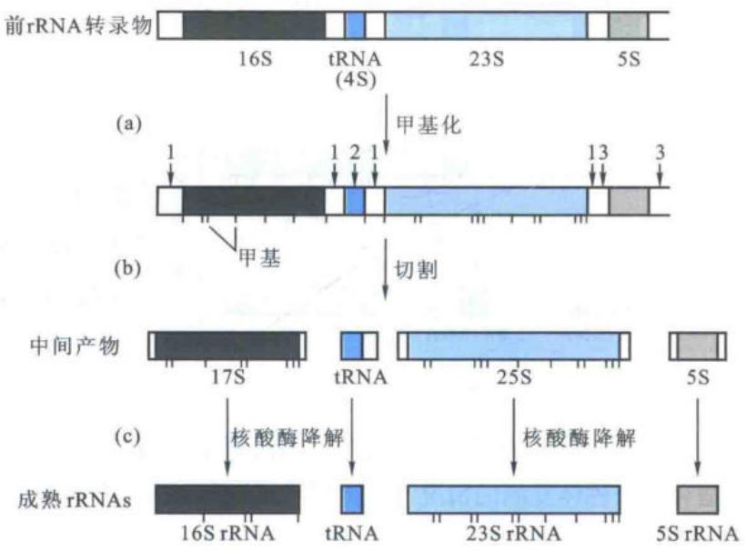

图8-3 细菌中rRNA基因家族各成员的分布与成熟过程分析

少出现置于一个启动子控制之下的操纵子。真核细胞中许多相关的基因常按功能成套组合，被称为基因家族(gene family)。同一家族中的成员有时紧密地排列在一起，成为一个基因簇；更多的时候，它们却分散在同一染色体的不同部位，甚至位于不同的染色体上，具有各自不同的表达调控模式。

## 1. 简单多基因家族

简单多基因家族中的基因一般以串联方式前后相连。在大肠杆菌中，16S、23S和5S rRNA基因联合成一个转录单位，各种rRNA分子都是从这个转录单位上剪切下来的(图8-3)。事实上，细菌中所有rRNA和部分tRNA都来自这个沉降系数为30S（约6500个核苷酸）的前rRNA。初级转录产物首先被特异性甲基化，然后分别经RNaseⅢ、RNaseP和RNaseE在特定位点切开，生成17S rRNA、tRNA、35S rRNA和5S rRNA前体分子，最后由特定核酸酶降解部分非必需序列，得到成熟的16S rRNA、tRNA、23S rRNA和5S rRNA。参与前rRNA降解成熟过程的RNase P是一个核酶。基因组分析表明，大肠杆菌中共有7个这样的拷贝，每一个拷贝中只有tRNA基因的种类、数量和存在部位有些变化。个别拷贝中5S rRNA基因下游还发现了部分共同转录的tRNA基因。

在真核生物中, 前 rRNA 转录产物的沉降系数为 45S (约有 14000 个核苷酸), 包括 18S、28S 和 5.8S 3 个主要 rRNA 分子。前 rRNA 分子中至少有 100 处被甲基化 (主要是核糖的 2-OH 甲基化), 初级转录产物也被特异性 RNA 酶切割降解, 产生成熟 rRNA 分子。这个过程需要 snoRNAs 的参与 (图 8-4)。5S rRNA 作为一个独立的转录单位, 由 RNA 聚合酶 III (而不是聚合酶 I) 完成转录。

## 2. 复杂多基因家族

复杂多基因家族一般由几个相关基因家族构成,基因家族之间由间隔序列隔开,并作为独立的转录单位。现已发现存在不同形式的复杂多基因家族。

我们先来看一下海胆的组蛋白基因家族 $^{(图8-5)}$ 。在这种动物中，5个分别编码不同组

图 8-4 脊椎动物中 rRNA 基因家族主要成员的分布与成熟过程分析蛋白的基因处于一个约为6 000 bp 的片段中, 分别被间隔序列所隔开。这 5 个基因组成的串联单位在整个海胆基因组中可能重复多达 1 000 次。串联单位中的每一个基因分别被转录成单顺反子 RNA, 这些 RNA 都没有内含子, 而且各

基因在同一条 DNA 链上按同一方向转录, 每个基因的转录与翻译速度都受到调节。因为组蛋白只有在适合于染色体复制的情况下才大量合成, 而且所合成的 $H_{2}A$ 、 $H_{2}B$ 、 $H_{3}$ 和 $H_{4}$ 摩尔数相等, $H_{1}$ 的量恰好是前者的一半。这是染色体组蛋白的实际比例。研究还表明, 在一个特定的细胞中, 并不是所有串联的单位都得到转录。胚胎发育的不同阶段或不同组织中, 有不同的串联单位被转录, 暗示可能存在具有不同专一性的组蛋白亚类和发育调控机制。

图8-5 复杂的多基因家族  
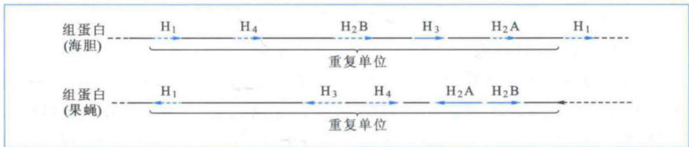

果蝇 tRNA 基因家族具有两个海胆组蛋白家族所没有的特点,那就是在基因家族中含有 3 个 tRNA $^{Lys}$ 基因,而且基因家族中的每个基因都单独按各自的方向进行转录。

## 3. 发育调控的复杂多基因家族

血红蛋白是所有动物体内输送分子氧的主要载体,由 $2\alpha2\beta$ 组成的四聚体加上一个血红素辅基(结合铁原子)后形成功能性血红蛋白。已知所有动物物种中血红蛋白基因的基本结构都相同 $^{(图8-6)}$ 。然而,在生物个体发育的不同阶段,却出现几种不同形式的 $\alpha$ 和 $\beta$ 亚基。人 $\alpha$ 珠蛋白基因簇位于 16 号染色体短臂上,约占 30 kb,其中 $\zeta$ 为胚胎期基因 $^{(表8-2)}$ 。β珠蛋白基因簇位于11号染色体短臂上，占50\~60 kb，其中ε为胚胎期基因， $G\gamma$ 和 $A\gamma$ 为胎儿型基因，δ和β为成人期基因 $^{(图8-7)}$ 。

  
图 8-6 珠蛋白基因的基本结构(以人的 $\beta-$ 珠蛋白基因结构为例)

  
图 8-7 人体发育过程中不同类型 β-珠蛋白的含量变化

表 8-2 不同发育阶段血红蛋白亚型

<table><tr><td>发育阶段</td><td>组成</td></tr><tr><td>胚胎期(8周以前)</td><td> $\zeta_{2} \varepsilon_{2}$ 、 $\zeta_{2} \gamma_{2}$ 和 $\alpha_{2} \varepsilon_{2}$ </td></tr><tr><td>胎儿期(8~41周)</td><td> $\alpha_{2} \gamma_{2}$ </td></tr><tr><td>成人期(出生以前)</td><td> $\alpha_{2} \delta_{2}$ 和 $\alpha_{2} \beta_{2}$ </td></tr></table>

胚胎期类 $\alpha-$ 珠蛋白, 最先以 $\zeta_{2}$ 型出现, 以后逐渐被 $\zeta_{1}$ 型所取代。在胎儿期有两类等分子数 $\beta$ 型链, 即 G $\gamma$ 型和 A $\gamma$ 型链 (在肽链的同一位点上, 一条链含有甘氨酸, 另一条含有丙氨酸)。因此, 胚胎型血红蛋白中含有两个 $\zeta_{2}$ 型 $\alpha$ 链和两个 $\varepsilon_{2}$ 型 $\beta$ 链 (即 $2\zeta_{2}2\varepsilon_{2}$ )。新生儿出生后, $98\%$ 的血红蛋白中含有两个 $\alpha_{2}$ 亚单位和两个 $\beta$ 亚单位, $2\%$ 的血红蛋白含两个 $\alpha_{2}$ 亚单位和两个 $\delta$ 亚单位。在每个基因家族中, 基因排列的顺序就是它们在发育阶段的表达顺序 (图8-8)。

原始鱼类、海蚕及昆虫只有单个珠蛋白基因，两栖类的 $\alpha$ 和 $\beta$ 基因则紧密地连锁在同一条染色体上，而低等哺乳动物和鸟类的 $\alpha$ 和 $\beta$ 基因有多种亚型，基因家族分别位于不同的染色体上。科学家认为，原始珠蛋白大约产生于 8 亿年前，由单基因编码，现代珠蛋白基因家族是由同一个原始基因通过一系列重复、突变和转位演变而成的。原始生物的体积都很小,虽然只有一个血红蛋白亚基,运氧能力有限,但也能满足生理功能的需要。随着物种的进化,动物体积相对变大,对氧的需求量越来越大,在这一进化压力下,血红蛋白基因通过自发突变产生杂合基因,编码出对氧的结合和释放能力要大大高于单分子血红蛋白的四聚体。在哺乳动物的进化过程中,两条β链基因又发生突变和重复,形成了胎儿中ε和γ型珠蛋白。胎儿血红蛋白对氧的亲和力比成人更大,因而有利于胎儿的快速发育。

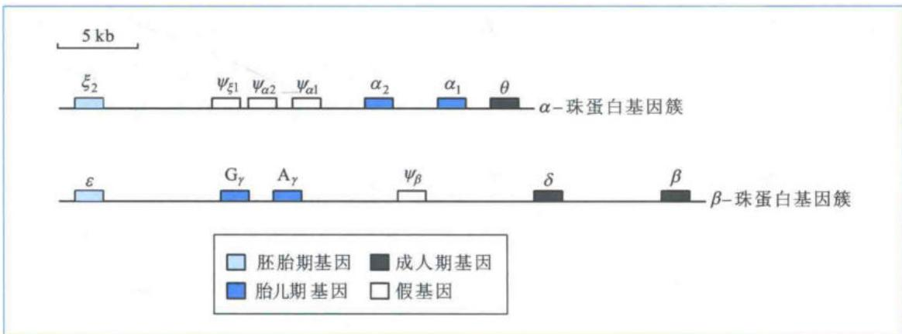  
图 8-8 人细胞中 $\alpha$ 和 $\beta$ -珠蛋白基因簇结构

## 8.1.4 真核基因表达的方式和特点

## 1. 基因表达的方式

根据对刺激的反应模式,可分为组成性表达和选择性表达两大类。

某些基因在个体的所有细胞中持续表达,这些基因通常被称为管家基因(housekeeping gene),其表达模式又被称为组成性基因表达(constitutive gene expression)。管家基因通常具备以下特点:①是细胞结构和代谢过程中所必需的基因,例如编码 rRNA、肌动蛋白、微管蛋白等的基因。②通常能够保持较高的表达量。根据这些特点,实验研究中常把 rRNA、肌动蛋白或微管蛋白基因作为 RT-PCR 的对照。

在特定环境信号刺激下,相应的基因被激活,基因表达产物增加,这种基因称为可诱导基因(inducible gene)。而如果基因被环境信号所被抑制,这种基因就是可阻遏基因(repressible genes)。基因表达调控大多数是对这些基因的转录和翻译速率的调节,从而导致其编码产物的水平发生改变并影响其功能。

## 2. 基因表达的时空特异性

基因表达的时间特异性(temporal specificity)，即按功能需要，某一特定基因的表达严格按特定的时间顺序发生。多细胞生物基因表达的时间特异性又称阶段特异性(stage specificity)。时间特异性基因表达普遍存在于各种生命过程中，例如上一节所提及的人体不同类型珠蛋白基因的表达，就是根据人体发育过程中不同阶段的需要在特定的时段特异表达。

基因表达的空间特异性(spatial specificity)，是指在个体生长过程中，某种基因产物按不同组织空间顺序出现。基因表达伴随时间顺序所表现出的这种分布差异，实际上是由细胞在不同器官的分布所决定的。所以，空间特异性又称细胞或组织特异性(cell or tissue specificity)。空间特异性的基因表达也普遍存在于动植物生长发育的各个阶段，如果蝇胚胎发育中许多调节体节形成的基因表达均呈现出显著的组织特异性。基因表达调控能够维持细胞的增殖、分化，维持个体的生长、发育，有助于生物体更好地适应外界环境变化。

## 8.1.5 真核基因表达调控一般规律

真核生物和原核生物在基因表达调控上的巨大差别是由两者基本生活方式不同所决定的。原核生物一般为自由生活的单细胞，只要环境条件合适，养料供应充分，它们就能无限生长、分裂，因此，它们的调控系统就是要在一个特定的环境中为细胞创造高速生长的基础,或使细胞在受到损伤时,尽快得到修复。它们主要是通过转录调控,以开启或关闭某些基因的表达来适应环境条件(主要是营养水平的变化)。环境因子往往是调控的诱导物,群体中每个细胞对环境变化的反应都是直接和基本一致的。

真核生物(除酵母、藻类和原生动物等单细胞类之外)主要由多细胞组成,每个真核细胞所携带的基因数量及总基因组中蕴藏的遗传信息量都大大高于原核生物,如人类细胞单倍体基因组就包含有 $3\times10^{9}$ bp 总 DNA,约为大肠杆菌总 DNA 的 800 倍,是噬菌体总 DNA 的 10 万倍左右!真核生物基因组 DNA 中有许多重复序列,基因内部还常插入不翻译成蛋白质的序列,都影响了真核基因的表达。真核生物的 DNA 还常与蛋白质(包括组蛋白和非组蛋白)结合,形成十分复杂的染色质结构。染色质构象的变化、染色质中蛋白质的变化及染色质对 DNA 酶敏感程度的变化等都会对基因表达产生重要影响。此外,真核生物染色质被包裹在细胞核内,基因的转录(核内)和翻译(细胞质内)被核膜所隔开,核内 RNA 的合成与转运、细胞质中 RNA 的剪接和加工等无不扩大了真核生物基因调控的范围,使真核生物基因调控达到了原核生物所不可能拥有的深度和广度。对大多数真核细胞来说,基因表达调控的最明显特征是能在特定时间和特定的细胞中激活特定的基因,从而实现“预定”的、有序的、不可逆转的分化、发育过程,并使生物的组织和器官保持正常功能。

真核生物基因调控可分为两大类,第一类是瞬时调控或称可逆性调控,它相当于原核细胞对环境条件变化所做出的反应,包括某种底物或激素水平升降时,或细胞周期不同阶段中酶活性的调节;第二类是发育调控或称不可逆调控,是真核基因调控的精髓部分,它决定了真核细胞生长、分化、发育的全部进程。根据基因调控在同一事件中发生的先后次序,又可将其分为转录水平调控(transcriptional regulation)及转录后水平调控(post-

transcriptional regulation), 前者可以分为遗传水平的 DNA 调控和表观遗传水平的染色质调控, 后者又进一步分为 RNA 加工成熟过程的调控 (RNA processing)、翻译水平的调控 (translational regulation) 及蛋白质加工水平的调控 (protein maturation and processing) 等 (图 8-9)。

  
图8-9 真核基因表达调控的主要步骤

研究基因调控主要回答 3 个问题：

① 什么是诱发基因转录的信号？

② 基因调控主要是在哪一步(模板 DNA 的转录、mRNA 的成熟或蛋白质合成)实现的?

③不同水平基因调控的分子机制是什么？

## 8.2 真核基因表达的转录水平调控

真核细胞与原核细胞在基因转录、翻译及 DNA 的空间结构方面存在如下几个方面的差异：

① 在真核细胞中,一条成熟的 mRNA 链只能翻译出一条多肽链,很少原核生物中常见的多基因操纵子形式。

② 真核细胞 DNA 与组蛋白和大量非组蛋白相结合, 只有一小部分 DNA 是裸露的。

③ 高等真核细胞 DNA 中很大部分是不转录的, 真核细胞中有一部分由几个或几十个碱基组成的 DNA 序列, 在整个基因组中重复几百次甚至上百万次。此外, 大部分真核细胞的基因中间还存在不被翻译的内含子。

④ 真核生物能够有序地根据生长发育阶段的需要进行 DNA 片段重排,还能在需要时增加细胞内某些基因的拷贝数,这种能力在原核生物中也是极为鲜见的。

⑤ 在原核生物中,转录的调节区都很小,大都位于转录起始位点上游不远处,调控蛋白结合到调节位点上可直接促进或抑制 RNA 聚合酶对它的结合。在真核生物中,基因转录的调节区则大得多,它们可能远离核心启动子达几百个甚至上千个碱基对。虽然这些调节区也能与蛋白质结合,但是并不直接影响启动子区对于 RNA 聚合酶的接受程度,而是通过改变整个所控制基因 5' 上游区 DNA 构型来影响它与 RNA 聚合酶的结合能力。

⑥ 真核生物的 RNA 在细胞核中合成, 只有经转运穿过核膜, 到达细胞质后, 才能被翻译成蛋白质。原核生物中不存在这样严格的空间间隔。

⑦ 许多真核生物的基因只有经过复杂的成熟和剪接过程,才能被顺利地翻译成蛋白质。

## 8.2.1 真核基因的一般结构特征

一个完整的真核基因,不但包括编码区(coding region),还包括5'和3'端长度不等的特异性序列,它们虽然不编码氨基酸,却在基因表达的过程中起着重要作用(图8-10)。基因转录调节的基本要素包括顺式作用元件(cis-acting elements)、反式作用因子(trans-acting factors)、RNA聚合酶(RNA polymerase)(图8-11)。

顺式作用元件是指启动子(promoters)和基因的调节序列。主要包括启动子(promoter)、增强子(enhancer)、沉默子(silencer)等。反式作用因子是指能够结合在顺式作用元件上调控基因表达的蛋白质或者RNA。RNA聚合酶是催化基因转录最主要的酶。原核生物只有一种RNA聚合酶，真核生物有3种RNA聚合酶，催化转录不同RNA产物。由于真核生物3种RNA聚合酶中，只有聚合酶Ⅱ能够转录信使RNA前体，并在加工成熟后按照三联子密码的原理翻译成蛋白质产物，我们在这里主要讨论RNA聚合酶Ⅱ的基因转录及其调控过程。启动子、调节序列和调节蛋白通过DNA-蛋白质相互作用、蛋白质-蛋白质相互作用影响RNA聚合酶活性。

$$
\text {第8章 真核基因表达调控 仅供个人科学教研}
$$

  
图8-10 真核基因的一般构造示意图

  
图8-11 转录调控模式

## 1. 启动子

真核基因启动子由核心启动子和上游启动子两个部分组成,是在基因转录起始位点(+1)及其5'上游100\~200 bp以内的一组具有独立功能的DNA序列,每个元件长度为7\~20 bp,是决定RNA聚合酶Ⅱ转录起始点和转录频率的关键元件。

① 核心启动子(core promoter)是指保证 RNA 聚合酶Ⅱ转录正常起始所必需的、最少的 DNA 序列,包括转录起始位点及转录起始位点上游 -25 \~ -30 bp 处的 TATA 盒。核心启动子单独起作用时,只能确定转录起始位点并产生基础水平的转录。

TBP: TATA 区结合蛋白 (T A T A - b o x binding protein);
TAF: TBP 相关因子 (TBP associated factors);
TF II : pol II 相关转录因子 (pol II associated TF)。

② 上游启动子元件(upstream promoter element, UPE)包括通常位于-70 bp附近的CAAT盒(CCAAT)和GC盒(GGGCGG)等,能通过TFIID复合物调节转录起始的频率,提高转录效率。

## 2. 转录模板

包括从转录起始位点到 RNA 聚合酶Ⅱ转录终止处的全部 DNA 序列。

## 3. RNA 聚合酶Ⅱ

RNA 聚合酶Ⅱ是一类能够直接或间接与启动子核心序列 TATA 盒特异结合、并启动转录的调节蛋白。RNA 聚合酶Ⅱ在转录因子帮助下，形成转录起始复合物。RNA 聚合酶Ⅱ由至少 10～12 个亚基组成，各亚基的相对分子质量在 $1 \times 10^{4} \sim 2.4 \times 10^{5}$ 之间，有些亚基也在聚合酶 I、Ⅲ中共用。其中 $2.4 \times 10^{5}$ 最大亚基的羧基端含有由 7 个氨基酸残基（Tyr-Ser-Pro-Thr-Ser-Pro-Ser）组成的多磷酸化位点重复序列，称为羧基端结构域（CTD）。

## 4. RNA 聚合酶Ⅱ基础转录所需的蛋白质因子(以“TFⅡ”表示)

在生理条件下，RNA聚合酶Ⅱ转录某个基因时通常需要与20种以上的蛋白质因子结合形成转录起始复合物(图8-12)。TFIID、TFIIB和TFIIF与RNA聚合酶Ⅱ可在启动子上形成最初级复合物，开始转录mRNA，加入TFIE和TFIHH后形成完整的转录复合物并转录出长链RNA，加入TFIIA可进一步提高转录效率。RNA聚合酶Ⅱ沿模板滑动时，TFIID及TFIIA滞留在转录起始位点上，其他因子随聚合酶向模板DNA的3'端移动。

关于 RNA 聚合酶Ⅱ如何整合成为转录起始复合物从而发挥作用,目前有两种假说,一种认为是一步结合,另一种认为是分步结合。“一步结合”论者认为,RNA 聚合酶Ⅱ先同大量的转录因子和转录相关蛋白结合成转录复合体,然后在 TATA 结构域结合蛋白(TBP)的帮助下结合到 DNA 上,起始基因转录。“分步结合”理论则认为,在起始转录的过程中,TATA 结构域结合蛋白(TBP)和 11 个 TBP 相关因子先后结合到 TATA 盒上,最终构成有功能的转录起始复合物,起始靶基因转录。通常情况下,TFⅡB 首先与 DNA 结合,使 RNA 聚合酶更接近所生成 RNA 与 RNA 聚合酶分离的位点,并帮助其结合到 DNA 上。对于真核生物来说,基因的转录受到 RNA 聚合酶Ⅱ C 端(RNA PolⅡ C-terminal domain,CTD)的时间、空间调节的影响。CTD 拥有含 25\~52 个氨基酸的结构域,都包含 7

图 8-12 RNA 聚合酶Ⅱ在靶基因启动子区与各种蛋白质因子结合形成转录起始复合物示意图  

元重复序列 $Y_{1}S_{2}P_{3}T_{4}S_{5}P_{6}S_{7}$ ，这个7元重复序列上2位和5位的丝氨酸是蛋白质的主要磷酸化位点。CTD的磷酸化导致其结构中部分脯氨酸的构象发生变化，使之更容易与其他转录相关因子结合，从而提供一个动态的有利于形成转录复合物的平台。

在 RNA 聚合酶Ⅱ参与转录调节的整个过程中, 其 CTD 上 2 位和 5 位丝氨酸的

磷酸化能够引发并确保转录过程各个步骤的顺利进行。在转录起始阶段，CTD上5位丝氨酸的磷酸化是形成转录起始复合物的必要前提。此外，该位点磷酸化还有利于募集加帽酶，促进mRNA加帽过程顺利进行。在转录延伸阶段，磷酸化的5位丝氨酸逐步去磷酸化，2位丝氨酸逐步转化为磷酸化形式，该位点的磷酸化有助于在转录终止过程中确保3' RNA加工过程顺利进行。转录结束后，CTD7元重复序列上的两个丝氨酸都保持去磷酸化状态，有助于转录复合物的解离，使RNA聚合酶Ⅱ与新的启动子相结合，启动新一轮基因转录。

研究 RNA 聚合酶Ⅱ起始的基因转录的终止位点发现,几乎所有真核基因的 3' 端都存在一个多(A)位点,该位点上游 15\~30 bp 处的保守序列 AATAAA 对于初级转录产物的准确切割及加多(A)是必需的。点突变实验将 AATAAA 变为 AAGAAA,虽然维持了该基因的转录活性,却发现 mRNA 的剪接加工受阻,因而不能产生功能性 mRNA。

尽管多(A)位点及AATAAA的存在对于基因的转录和成熟意义重大,但RNA聚合酶Ⅱ却不在该位点终止转录,大部分已知基因的初级转录产物拥有多(A)位点下游0.5\~2 kb序列。到目前为止,科学家尚未发现某个单一位点具有特异的转录终止性能。但是,小鼠β-珠蛋白基因的终止区(terminator)能被用来终止腺病毒基因的转录,农杆菌胭脂碱合成酶基因终止区能被用来终止几乎所有的外源基因,说明可能存在共同的转录终止机制。

## 8.2.2 增强子及其对转录的影响

增强子是指能使与它连锁的基因转录频率明显增加的 DNA 序列,最早发现于 SV40 早期基因的上游,有两个长 72 bp 的正向重复序列。病毒、植物、动物和人类正常细胞中都发现有增强子存在。重组实验表明,如果把 SV40 增强子上的两个 72 bp 重复序列同时删除,基因表达的水平会降低很多。但如果把该增强子的一个重复序列放回原处或重组 DNA 的任何位置上,则基因转录正常。如果将人 β- 血红蛋白基因克隆到带有 72 bp 重复序列的 DNA 上,这个基因在体内的表达将提高 200 倍以上,即使 72 bp 序列位于该基因转录起始位点上游 3 kb 对或下游 2.5 kb,仍不例外。

作为基因表达的重要调节元件,增强子通常具有下列特性:

① 增强效应十分明显。一般能使基因转录频率增加 10～200 倍,有的可以增加上千倍,如经人巨大细胞病毒增强子增强后的珠蛋白基因表达频率比该基因正常转录高 600～1000 倍。

② 增强效应与其位置和取向无关。不论增强子以什么方向排列 $(5'\rightarrow3'$ 或 $3'\rightarrow5')$ ，甚至与靶基因相距3000碱基对或在靶基因下游，均表现出增强效应。

③ 大多为重复序列,一般长约 50 bp,适合与某些蛋白因子结合。其内部常含有一个核心序列:(G)TGGA/TA/TA/T(G),该序列是产生增强效应时所必需的。

④ 其增强效应有严密的组织和细胞特异性,说明增强子只有与特定蛋白质(转录因子)相互作用才能发挥功能。

⑤ 没有基因专一性,可以在不同的基因组合上表现增强效应。

⑥ 许多增强子还受外部信号的调控,如金属硫蛋白基因启动区上游所带的增强子,就可以对环境中的锌、镉浓度做出反应。

那么,增强子的作用原理是什么呢?由于增强子常在电镜下呈现环状结构,其活性与半周 DNA 双螺旋(5 bp)的奇、偶倍数有关,表明它的功能受 DNA 双螺旋空间构象的影响。增强子可能有如下 3 种作用机制:①影响模板附近的 DNA 双螺旋结构,导致 DNA 双螺旋弯折或在反式作用因子的参与下,以蛋白质之间的相互作用为媒介形成增强子与启动子之间“成环”连接,活化基因转录;②将模板固定在细胞核内特定位置,如连接在核基质上,有利于 DNA 拓扑异构酶改变 DNA 双螺旋结构的张力,促进 RNA 聚合酶Ⅱ在 DNA 链上的结合和滑动;③增强子区可以作为反式作用因子或 RNA 聚合酶Ⅱ进入染色质结构的“入口”。

在研究工作中,科研工作者利用增强子的功能构建 T-DNA 序列。例如用 4 倍重复的 CaMV 的 35S 增强子序列可以大大增强目的基因的转录。若通过转基因方法将该 T-DNA 片段整合到植物基因组中,植物基因组上与 T-DNA 插入位点相近的基因表达量增高,就能获得这个基因过表达的转基因植物。

另外,科研工作者还构建包含一个报告基因(lacZ)和基本启动子的转化载体,将其整合到基因组中。这段启动子本身不足以启动报告基因,但是如果插入位点附近有增强子,报告基因就会表达。因此只要通过观测报告基因的表达情况(如时空特异性等)就可以知道这个增强子的作用,进而研究由这个增强子调控的内源基因的表达特性。

## 8.2.3 反式作用因子

真核生物启动子和增强子是由若干 DNA 序列元件组成的,由于它们常与特定的功能基因连锁在一起,因此被称为顺式作用元件。这些序列组成基因转录的调控区,影响基因的表达。在转录调控过程中,除了需要调控区外,还需要反式作用因子(图 8-13)。根据不同功能,常将反式作用因子分为以下 3 类:具有识别启动子元件功能的基本转录因子、能识别增强子或沉默子的转录调节因子,以及不需要通过 DNA-蛋白质相互作用就参与转录调控的共调节因子(transcriptional regulator / co-factor)。

实验中,常将前两类反式作用因子统称为转录因子(transcription factor, TF),包括转录激活因子(transcriptional activator)和转录阻遏因子(transcriptional repressor)。这类调节蛋白能识别并结合转录起始点的上游序列或远端增强子元件,通过DNA-蛋白质相互作用而调节转录活性,并决定不同基因的时间、空间特异性表达。共调节因子本身无DNA结合活性,主要通过蛋白质-蛋白质相互作用影响转录因子的分子构象,从而调节转录活性。实验中,常将与转录激活因子有协同作用的那一类共调节因子称为共激活因子,将与转录阻遏因子有协同的作用那一类共调节因子称为共阻遏因子。所有共激活因子都能识别靶位点(启动子、增强子),而靶位点的特异性则由DNA结合域的特定序列决定。DNA结合域结合在特定的序列上,从而将激活因子上的转录激活域带到基础转录区域附近。

图 8-13 真核生物中转录因子活性调节的主要方式  

通常情况下直接作用的激活因子具有 DNA 结合域和转录激活域。没有转录激活域的激活因子可能与具有转录激活域的共激活因子一起行使功能。基础转录区域中许多元件是激活因子的靶位点。

一般认为,如果某个蛋白质是体外转录系统中起始 RNA 合成所必需的,它就是转录复合物的一部分。根据各个蛋白质成分在转录中的作用,能将整个复合物分为 3 部分:

① 参与所有或某些转录阶段的 RNA 聚合酶亚基 不具有基因特异性。

② 与转录的起始或终止有关的辅助因子 不具有基因特异性。

③ 与特异调控序列结合的转录因子 它们中有些被认为是转录复合物的一部分, 因为所有或大部分基因的启动区都含有这一特异序列。更多的则是基因或启动子特异性结合调控蛋白, 它们是起始某个(类)基因转录所必需的。

科研工作者根据顺式作用元件和反式作用因子间能够互相作用的原理,创造出酵母双杂交实验、酵母三杂交实验等实验技术(图8-14)。

在植物学相关领域,科研工作者利用相关原理构建出诱导型的含有标签的转化载体。首先,设计特殊的启动子,保证融合的转录因子(包括 DNA 结合域、转录激活域和受体调

图 8-14 酵母三杂交基本原理

酵母三杂交常用于实验分析蛋白质和RNA之间的互作关系。实验将一个蛋白A与DNA结合域蛋白融合表达，将另一个蛋白B与能够激活下游信号的激活域蛋白融合表达，当有RNA能与蛋白A、蛋白B互相作用时，由于DNA结合域蛋白结合在DNA结合位点，将激活域拉到恰当的结构位点，从而激活下游报告基因。

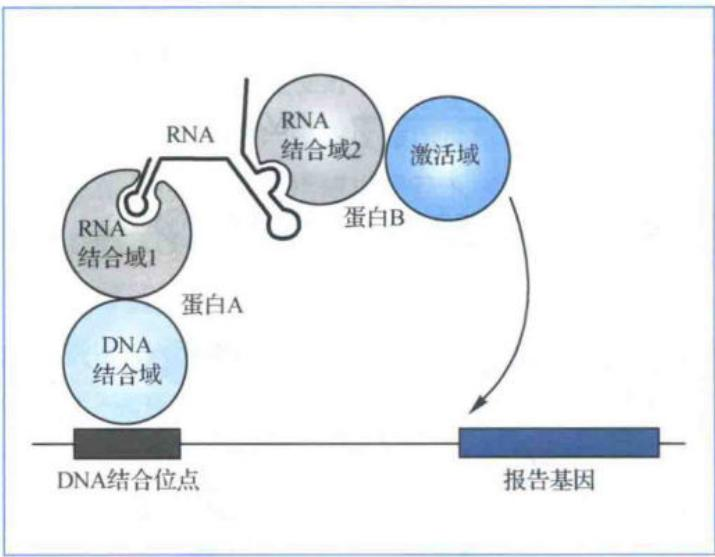

控域)组成性表达。一旦实验中加入化学小分子,该小分子与受体调控结构域相结合,导致融合表达的转录因子构象发生变化,由细胞质转移进入核内。融合蛋白就能特异性识别相关的DNA结合域并与之结合,该蛋白质的转录激活域就能激活相关基因高水平表达。

在诸多转录因子中被广泛研究的主要有识别 TATA 区

的 TFⅡD, 识别 CAAT 区的 CTF, 识别 GGGCGG 的 SP1 以及识别热激蛋白启动区的 HSF。已知每个细胞中可含有约 60 000 个 SP1, 而 CTF 的含量则高达每细胞 300 000 个。在 SV40 早期基因启动子区, 从 -70\~-110 区, 有 6 个 GC 区同方向串联排列, 基因活跃表达时, 6 个区全部与 SP1 结合。在胸腺嘧啶激酶基因的启动子上, 各有一个 GC 区分别位于 TATA 区和 CAAT 区 5' 上游端。研究认为, SP1 与 GC 区结合后, 可同时在 DNA 链的不同方向与 CAAT 区结合因子 (CTF 或 NF1) 及 TATA 区结合因子 TFⅡD 发生作用, 从而促进 RNA 聚合酶Ⅱ识别特定类型的启动子。

## 1. DNA 识别或结合域

反式作用因子是能直接或间接地识别或结合在各类顺式作用元件核心序列上(表8-3)，参与调控靶基因转录效率的蛋白质。

常见的 DNA 结合域包括碱性氨基酸结合域、酸性激活域、谷氨酰胺(Q)富含域、脯氨酸(P)富含域等。通常情况下，配体调节受体大多有 DNA 结合域和转录激活域。而甾醇类受体通常都是转录因子，其 N 端都有保守的 DNA 结合域，C 端都有激素结合域。

表 8-3 部分球蛋白基因 5' 调控区序列的保守性比较

<table><tr><td>基因</td><td>-80区</td><td>-30区</td></tr><tr><td>小鼠 $\beta^{min}$ </td><td>GGCCAATCTGCTC</td><td>GGTATATAAA</td></tr><tr><td>小鼠 $\beta^{maj}$ </td><td>GGCCAATCTGCTC</td><td>AGCATATAAG</td></tr><tr><td>兔 $\beta$ </td><td>GGCCAATCTAC--</td><td>GGCATAAAAG</td></tr><tr><td>山羊 $\beta^A$ </td><td>AGCCAATCTGCTC</td><td>GGCATAAAAG</td></tr><tr><td>山羊 $\beta^C$ </td><td>AGCCAATCTGCTC</td><td>GGCATAAAAG</td></tr><tr><td>人 $\beta$ </td><td>GGCCAATCTACTC</td><td>GGCATAAAAG</td></tr><tr><td>人 $\delta$ </td><td>AACCAATCTGCTC</td><td>-GCATAAAAG</td></tr><tr><td>人 $A^Y$ </td><td>GACCAATAGCCTT</td><td>GGCATAAAAG</td></tr><tr><td>人 $G^Y$ </td><td>GACCAATAGCCTT</td><td>GGCATAAAAG</td></tr><tr><td>人 $\alpha$ </td><td>GACCAATGACTTT</td><td>GGCATAAAAG</td></tr></table>

注：斜体表示高度保守的序列。

  
图 8-15 同源域蛋白通过其第三个螺旋与双链 DNA 的大沟相结合, 其 N 端的延伸部分则与 DNA 的小沟相结合, 提高了稳定性

## (1) 螺旋 - 转折 - 螺旋 (helix-turn-helix, H-T-H) 结构

这一类蛋白质分子中有至少两个 $\alpha$ 螺旋，中间由短侧链氨基酸残基形成“转折”，近羧基端的 $\alpha$ 螺旋中氨基酸残基的替换会影响该蛋白质在 DNA 双螺旋大沟中的结合。控制酵母交配型 MAT 基因座以及果蝇体节发育的调节基因 (antp、ftz、ubx) 等同源盒 (homeobox) 基因所编码的蛋白都有 H-T-H 结构。与 DNA 相互作用时，同源域蛋白的第一、二两个螺旋往往靠在外侧，其第三个螺旋则与 DNA 大沟相结合，并通过其 N 端的多余臂与 DNA 的小沟相结合 (图 8-15)。

同源域是指编码60个保守氨基酸序列的DNA片段，它广泛存在于真核生物基因组内，由于最早从果蝇homeotic loci(该遗传位点的基因产物决定了躯体发育)中克隆得到而命名，同源转换基因与生物有机体的生长、发育和分化密切相关。许多含有同源转换区的基因具有转录调控的功能，同源转换区氨基酸序列很可能参与形成了DNA结合区。表8-4总结了部分含同源转换区转录因子所识别的DNA序列，Oct-1、Oct-2与Pit-1/GHF-1所识别的核心序列仅有一个碱基之差，而果蝇en、ftz和ubx基因产物能识别完全相同的DNA序列。eve基因产物除识别与前者相同的序列外，还识别另一个靶序列。

表 8-4 含有同源转换区的转录因子及其 DNA 靶序列

<table><tr><td>蛋白因子</td><td>靶 DNA 序列</td></tr><tr><td>Oct-1、Oct-2</td><td>ATTTGCAT</td></tr><tr><td>Pit-1/GHF-1</td><td>TATGCATAA</td></tr><tr><td>EN、FTZ、UBX</td><td>TCAATTAAAT</td></tr><tr><td>Eve</td><td>TCAATTAAAT TCAGCACCG</td></tr><tr><td>Bicoid</td><td>TCAATCCC</td></tr></table>

Oct-1 和 Oct-2 专一结合于启动子内 8 碱基区, 它们都含有 75 个氨基酸的 pou 区和 60 个氨基酸的同源转换区。尽管 Oct-1 和 Oct-2 中的同源盒与经典的果蝇同源转换区变异较大 (60 个氨基酸中只有 20 个相同, 外加 8 个保守性替换), 该区在这两个蛋白质中却是高度保守的 (60 个氨基酸中有 53 个相同)。哺乳类转录因子 Pit-1/GHF-1 及线虫 unc-86 基因中都存在类似于 Oct-1 的结构。分析 20 个含同源转换区的果蝇基因发现, 该区的保守性高达 $80\% \sim 90\%$ ；即使与亲缘关系很远的哺乳类同源转换区相比较，同源率也在 $35\% \sim 40\%$ 以上（图8-16）。突变Oct-2或果蝇eve和ftz基因同源转换区某些核苷酸，可以完全防止这些转录因子与DNA相互作用。一般认为，同源转换区蛋白之所以具有转录调节功能，与这些蛋白质C端类似于原核基因阻遏物螺旋-转角-螺旋结构有关。

  
图 8-16 各种同源域 DNA 结合蛋白中保守序列分析

## (2) 锌指 (zinc finger) 结构

锌指结构家族蛋白大体可分为锌指、锌扭(twist)和锌簇(cluster)结构,其特有的半胱氨酸和组氨酸残基之间氨基酸残基数基本恒定,有锌参与时才具备转录调控活性。重复的锌指结构都是以锌将一个α螺旋与一个反向平行β片层的基部以锌原子为中心,通过与一对半胱氨酸和一对组氨酸之间形成配位键相连接,锌指环上突出的赖氨酸、精氨酸参与DNA的结合。由于结合在大沟中重复出现的α螺旋几乎联成一线,这类蛋白质与DNA的结合很牢固,特异性也很高。类固醇激素受体家族含有连续的两个锌指结构,其中两个锌原子将两个α螺旋装配成类似H-T-H的结构,再以同源或异源性二聚体的方式将两个 $\alpha$ 螺旋结合在相邻的两个大沟中 (图 8-17)。

图 8-17 典型的类固醇激素受体结构示意图  
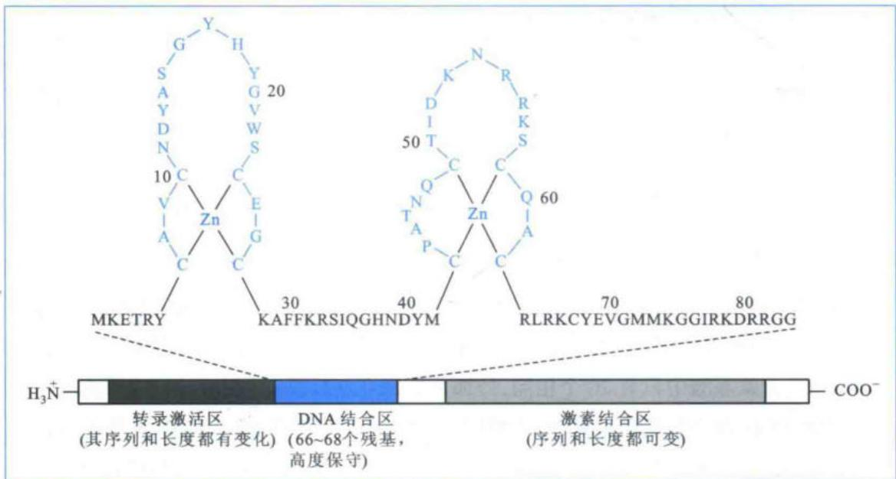

大部分蛋白质中的锌指区都聚合成一组,但也发现少量蛋白质如果蝇中的Hunchback因子,有不止一个锌指簇。锌指簇在这些调控蛋白上的分布也很不相同,在ADR1中,锌指区只占一个很小的结构区,而在TFⅢA中,整个蛋白质几乎被各个锌指区所覆盖。由于锌指区最早是从RNA聚合酶Ⅱ和Ⅲ的转录因子中发现的,所以一般认为,某个蛋白质如果拥有一个或多个成簇的锌指区,那么它就很可能是转录因子,这就是为什么尽管我们不了解TDF、Kruppel及Hunchback的功能,但仍把它们归纳在表8-5中的原因。

表 8-5 一些转录因子和蛋白质通过 Cys2/His2 与 DNA 相结合

<table><tr><td>蛋白质</td><td>来源</td><td>相对分子质量</td><td>锌指数</td><td>DNA结合区/bp</td><td>靶序列</td><td>功能</td></tr><tr><td>TFIIIA</td><td>哺乳类</td><td> $7.3 \times 10^{4}$ </td><td>9</td><td>50</td><td>5S基因</td><td>与RNA聚合酶III作用,促进5S基因转录</td></tr><tr><td>SP1</td><td>哺乳类</td><td> $1.1 \times 10^{4}$ </td><td>3</td><td>10</td><td>GC区</td><td>与RNA聚合酶II作用,广泛性调控因子</td></tr><tr><td>ADR1</td><td>果蝇</td><td> $1.5 \times 10^{4}$ </td><td>2</td><td>22</td><td>ADH2基因</td><td>与RNA聚合酶II作用,激活ADH2基因</td></tr><tr><td>TDF</td><td>哺乳类</td><td>?</td><td>13</td><td>?</td><td>?</td><td>决定雄性性别</td></tr><tr><td>Kruppel</td><td>果蝇</td><td> $6.0 \times 10^{4}$ </td><td>5</td><td>?</td><td>?</td><td>胚胎分化</td></tr><tr><td>Hunchback</td><td>果蝇</td><td> $8.0 \times 10^{4}$ </td><td>4+2</td><td>?</td><td>?</td><td>胚胎分化</td></tr></table>

此外,有些锌指蛋白具有不同的序列:

$$
\mathrm{Cys} - \mathrm{X} _ {2} - \mathrm{Cys} - \mathrm{X} _ {1 3} - \mathrm{Cys} - \mathrm{X} _ {2} - \mathrm{Cys}
$$

这一结构被称为 Cys2/Cys2 锌指, 表 8-6 是部分具有这种锌指的转录因子及其一般特征。从表中可以看出, 这些蛋白质一般不具有大量重复性锌指, 它们与 DNA 的结合区域短而具有对称性。删除突变分析证实, 锌指区是这些蛋白质与 DNA 相结合所必需的。有人将雌激素受体蛋白中的两个锌指区删去, 换上从糖皮质素受体中切出来的两个锌指区后发现, 这个融合蛋白只能与糖皮质素受体基因靶序列 GRE 相结合, 而不再识别雌激素受体基因本身的靶序列 ERE, 说明这类调控蛋白中的锌指区在与靶序列相结合的过程中起着主导作用。

表 8-6 具有 Cys2/Cys2 锌指区的转录因子

<table><tr><td>蛋白</td><td>相对分子质量</td><td>锌指数</td><td>靶序列</td></tr><tr><td>皮质糖受体</td><td> $9.4 \times 10^{4}$ </td><td>2</td><td>GRE 中 20 bp</td></tr><tr><td>雌激素受体</td><td> $6.6 \times 10^{4}$ </td><td>2</td><td>ERE 中 20 bp</td></tr><tr><td>GAL4</td><td> $9.9 \times 10^{4}$ </td><td>1</td><td>UAS $_{G}$  中 17 bp</td></tr><tr><td>腺病毒 E1A</td><td>约  $3.0 \times 10^{4}$ </td><td>1</td><td>?</td></tr></table>

实验表明 Cys2/Cys2 锌指区与 Cys2/His2 锌指区是不同的。如果把固醇类受体蛋白锌指区中的后两个 Cys 突变成为 His, 那么靶基因就不会被这个经过改造的转录因子所识别和激活。

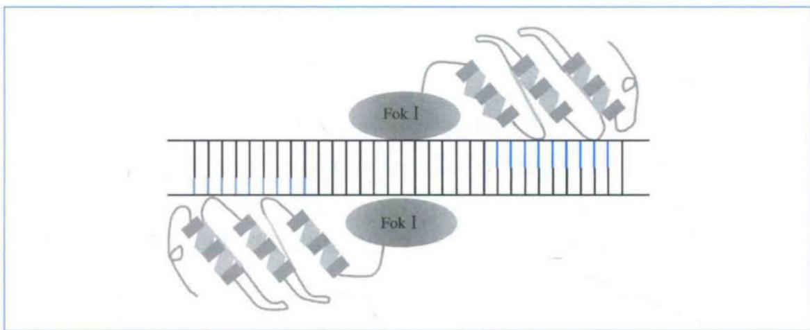

锌指结构中每一个 $\alpha$ 螺旋可以特异地识别 $3\sim 4$ 个碱基。利用不同的锌指结构识别特异DNA序列的特点以及核酸酶能够切断靶DNA的原理，科研工作者获得了一类被称为锌指核酸酶（zinc-finger nucleases，ZFN)的新型限制性内切核酸酶。根据改变锌指结构通用序列中7个X序列就能识别不同的DNA序列这一特征，人工设计识别特异DNA序列的 $\alpha$ 螺旋，用TGEK作为螺旋间的连接序列，构建成对人工锌指结构域和FokI融合蛋白(ZFN)，就能在指定区域切断DNA双链(图8-18)。目前，科研工作者已利用ZFN技术进行多种基因编辑或基因敲除实验，已建成能识别多种DNA序列的ZFN库。现在还不能识别所有随机挑选的DNA序列。

## (3) 碱性 - 亮氨酸拉链 (basic-leucine zipper)

即 bZIP 结构 $^{(图8-19)}$ ，是肝、小肠上皮、脂肪细胞以及某些脑细胞中存在的一大类 C/EBP 家族蛋白质，它们的特征是能够与 CCAAT 区和病毒的增强子结合。C/EBP 家族蛋白的羧基端 35 个氨基酸残基具有能形成 $\alpha$ 螺旋的特点，其中每隔 6 个氨基酸就有一个亮氨酸残基，这就导致第 7 个亮氨酸残基都在螺旋的同一方向出现。由于这类蛋白质都以二聚体形式与 DNA 结合，两个蛋白质 $\alpha$ 螺旋上的亮氨酸一侧是形成拉链型二聚体的基础。然而，亮氨酸拉链区并不能直接结合 DNA，只有肽链氨基端 20～30 个富含碱性氨基酸结构域与 DNA 结合。若不形成二聚体，该碱性区对 DNA 的亲和力明显降低。所以，这类蛋白质的 DNA 结合结构域实际是以碱性区和亮氨酸拉链结构域整体作为基础的 $^{(图8-20)}$ 。

  
图 8-19 碱性亮氨酸拉链结构域转录激活因子序列比较

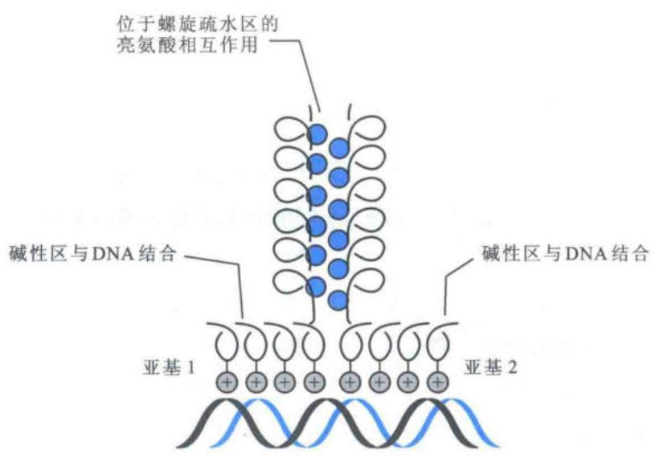  
图 8-20 碱性亮氨酸拉链转录激活蛋白与调控区 DNA 相结合的示意图

## (4) 碱性 - 螺旋 - 环 - 螺旋 (basic-helix/loop/helix)

即 bHLH 结构。在免疫球蛋白 $\kappa$ 轻链基因的增强子结合蛋白 E12 与 E47 中，羧基端 100～200 个氨基酸残基可形成两个双性 $\alpha$ 螺旋，被非螺旋的环状结构所隔开，蛋白质的氨基端则是碱性区，其 DNA 结合特性与亮氨酸拉链类蛋白相似。肌细胞定向分化的调控因子 MyoD-1、原癌基因产物 Myc 及其结合蛋白 Max 等都属于 bHLH 蛋白。研究发现，bHLH 类蛋白只有形成同源或异源二聚体时，才具有足够的 DNA 结合能力。当这类异源二聚体中的一方不含有碱性区（如 Id 或 E12 蛋白）时，该二聚体明显缺乏对靶 DNA 的亲和力 $^{(图 8-21)}$ 。

  
图 8-21 bHLH 蛋白的 DNA 结合能力分析

## 2. 转录活化结构域

在真核生物中,反式作用因子的功能由于受蛋白质-蛋白质之间相互作用的调节变得精密、复杂,完整的转录调控功能通常以复合物的方式来完成,这就意味着并非每个转录因子都直接与DNA结合。因此,是否具有转录活化域就成为反式作用因子中唯一的结构基础。反式作用因子的功能具有多样性,其转录活化域也有多种,通常依赖于DNA结合结构域以外的30\~100个氨基酸残基。不同的转录活化域大体上有下列几个特征性结构:

① 带负电荷的螺旋结构 哺乳动物细胞中糖皮质激素受体的两个转录活化域，AP1 家族的 Jun 及 GAL4 都有酸性的螺旋结构，这种酸性螺旋结构特异性诱导转录起始的活性并不是很强，它们可能与 TFⅡD 复合物中某个通用因子或 RNA 聚合酶Ⅱ本身结合，并有稳定转录起始复合物的作用(图 8-22)。

② 富含谷氨酰胺的结构 SP1 是启动子 GC 盒的结合蛋白,除结合 DNA 的锌指结构以外,SP1 共有 4 个参与转录活化的区域,其中最强的转录活化域很少有极性氨基酸,却富含谷氨酰胺,达该区氨基酸总数的 25% 左右。哺乳动物细胞中的 Oct1/2、Jun、AP2、血清应答因子(SRF)等都有相同的富含谷氨酰胺的结构域。

③ 富含脯氨酸的结构 CTF-NF1 因子的羧基端富含脯氨酸(达 20%\~30%), 很难形成 α 螺旋。在 Oct2、Jun、AP2、SRF 等哺乳动物因子中也有富含脯氨酸的结构域。

利用顺式作用元件和反式作用因子间相互作用的原理,科研人员研发了许多调控基因表达的技术。其中最新的应用当属 TALEN 技术(TALEN=transcription activator-like effector + Fok I nuclease fusion protein),该技术利用转录激活因子 34 个氨基酸重复肽段中第 12、13 个氨基酸可以特异识别 DNA 单个碱基的特性,串联合成可识别目的碱基序列的

## (a) GAL4 酸性结构域

DSAAAHHDNSTIPLDFMPRDALH

GFDWSEEDDMSDGLPFLKTDPNNGF

(b) SP1 谷氨酰胺结构域

(c) 富含脯氨酸结构域

图8-22 常见的转录活化结构域

  
图8-23 TALEN的作用原理

TALE 蛋白,与内切核酸酶 Fok I 融合表达,可切割特异识别序列下游 9\~13 bp,从而实现敲除指定内源基因的功能(图 8-23)。

<!-- W-BEGIN Watson 19 真核生物的转录调控（章首） -->

### 【中文对照 Watson 第19章：真核生物的转录调控（章首）】

> 来源：Watson《基因的分子生物学》第七版中译本（书籍/03_基因的分子生物学_第七版） 第19章 真核生物的转录调控。

#### [W] 第19章 真核生物的转录调控

本章概要

从酵母到哺乳动物转录调控的的保守机制

通过真核生物激活因子募集结合基因的蛋白复合物

信号整合与组合控制

转录抑制因子

信号转导与转录调控因子的控制
组蛋白与 DNA 修饰导致的基因“沉默”
基因的表观遗传调控

我们讲述过的在细菌中基因表达调节的方式在真核细胞中都能见到,此外,真核细胞还具有一些细菌中所不具备的基因表达调节方式。在这些方式中,最显著的应为剪接（splicing）。如我们在第14章所见,很多情况中一个特定的转录物可以通过不同的剪接方式产生多种剪接产物,而且这也是可调控的。

同细菌一样，调控步骤最常见于转录起始阶段。涉及生物体内被调控的转录过程中的许多原理确实同样适用于真核生物的转录调控。这些原理在原核生物基因调控一章（第18章）的开始部分已有叙述，并且在该章的末尾已经总结。我们热切地希望那些先前（或最近）没有阅读过这些内容的读者，在继续本章学习之前能够先

阅读这些章节。

我们也已注意到，真核生物比细菌拥有更加精细的转录系统（第13章）。这在RNA聚合酶Ⅱ系统（用于转录蛋白编码基因和大部分调控因子RNA基因）中尤为如此。尽管复杂度增加，转录还受激活因子（activator）和抑制因子（repressor）的调节（它们是一类DNA结合蛋白，能够在特定基因上对适当信号做出反应，从而促进或阻止转录的起始）。然而，真核细胞和基因的额外特征使得这些调控蛋白的作用变得复杂。我们将通过总结这些额外特征中最重要的两个特征来开始本章的学习。

核小体及其修饰物 正如我们在第 8 章所提到的，真核生物的基因组包裹在组蛋白中形成核小体。因此，转录调控是在一种反应底物部分被包裹的情况下进行的。这一情形使得在没有转录调控蛋白存在的情况下，许多基因的表达量减少。真核细胞也包含了许多能对组蛋白进行重排或化学修饰的酶，这种修饰改变核小体，使转录装置及 DNA 结合蛋白易于结合底物并进行转录。因此，核小体引出了一个在细菌中没有遇到的问题，但对核小体的修饰也为调控提供了新的机会。转录因子和 RNA 聚合酶可以协同调控 DNA 发生相互作用，这一能力往往需要特定位置的核糖体的位移。

更多的调控因子和更密集的调控序列 真核细胞与原核细胞间更进一步的区别是控制特定基因的调控蛋白数目上的差异，这一点从基因调控蛋白结合位点的数目和排列上可以看出(图 19-1)。在细菌中，单个调控因子与小段序列结合；而在真核细胞中，与细菌相比，这种结合位点数目更为庞大，位置更加远离转录起始点。我们把基因上转录系统结合的区域称为启动子（promoter），单一结合区域称为调控因子结合位点（regulator binding site），一个基因上包含所有调控因子结合位点的 DNA 片段称为调控因子序列（regulatory sequence）。

调控序列的扩展，即一个特定基因调控因子结合位点数目的增加，在果蝇、哺乳动物等多细胞生物中尤其显著。这反映了在这些生物中更加广泛的信号整合，即特定基因的调控需要更多信号的趋势。我们在细菌中见过信号整合的例子（第18章），但这些例子仅是特定的两个不同的调控蛋白通过整合两个信号来控制一个基因（如葡萄糖和乳糖对lac基因的调节）。但并不是所有的真核生物有广泛的信号整合：酵母的信号整合比多细胞生物少（在这方面它们与细菌其实没有多大的差别），而且，它们基因上的调控序列也比多细胞的真核生物要少（图19-1）。不像更高等的真核细胞，酵母细胞缺乏“远距离作用”的能力。酵母的调控序列一般与其启动子的距离不会超过几百个碱基对。

  
图 19-1 细菌、酵母和人类基因组的调控因子元件。图例说明了调控因子序列复杂性的增加，从受单个抑制因子调控的简单细菌基因，到受多个激活因子和抑制因子调控的人类基因。每个例子都标出了启动子，这是转录起始的位点。它在细菌中位置确定，而在真核细胞中，转录起始位点位于转录复合物结合位点的下游（第 13 章）。在人类的调控因子序列中存在一类调控结合位点，称为增强子，如图所示。

在多细胞生物中，调控序列可以延伸至距启动子数千个核苷酸处（上游或下游均可），并可由数十个调控因子结合位点组成。通常这样一组结合位点被称为增强子（enhancer），一个增强子结合的调控因子将负责在一个合适时空状态激活基因表达。不同的增强子与不同组的调控因子结合，控制同一基因在不同时空的表达，以应答不同的信号。

拥有更广泛的调控因子序列意味着某些调控因子结合位点将远离它们所控制的基因，有时能达到 100kb 或更远。实际上，哺乳动物刺猬基因中一个关键的增强子离转录起始位点有 1Mb 的距离。在这么远的距离上，调控因子是如何作用的呢？在细菌中我们看到距离几个 kb 的 DNA 结合蛋白能进行通信：如 $\lambda$ 噬菌体中， $O_{R}$ 位点和 $O_{L}$ 位点上的抑制因子能相互作用；又如 NtrC 能从 1kb 或更远处激活 glnA 基因。在这些“远距作用”的例子中，居中的 DNA 回路为蛋白质之间的相互作用提供了方便。即使在某些情况下蛋白质作用的距离很远并且形成回路的原因尚不清楚，但同样的机制也可以解释真核细胞中存在的许多远距离调控的情况，虽然不能针对所有可能的情况。在一些案例中，这种紧接着启动子上游的“被束缚”的序列可以招募远处的增强子。

远距的激活产生了另外一个问题。当结合于一增强子时，也许有几个基因都在此激活因子的作用范围之内，但一个特定的增强子通常只调节一个基因。已在增强子和启动子之间找到了其他的调控因子序列，称为绝缘子（insulator）或边界元件（boundary element）。绝缘子阻止结合于增强子的激活因子对启动子的激活。尽管目前对这些元件的了解尚不深入，但它们确保了激活因子的工作不会产生混乱。

#### [W] 从酵母到哺乳动物转录调控的保守机制

本章我们将考虑从单细胞的酵母到哺乳动物的基因调控。所有这些生物都具有真核生物两个典型的特征，即精细的转录调控系统和核小体及其修饰物。因此，在所有的真核生物中很多基因调控的基本属性是一致的就不足为奇了。酵母是最适于同时进行遗传学和生物化学研究的生物，大量的有关激活因子或抑制因子的信息正是来自于该生物。另外，对于将其结论普适化最为关键的是，当特定的酵母激活因子在哺乳动物细胞内表达时能够激活转录。这是通过报道基因（reporter gene）来检测的。报道基因含有酵母激活因子结合位点，它插入到某一基因启动子的上游，同时此基因的表达水平易于检测（后面还将讨论）。

我们将看到典型的真核细胞激活因子的工作方式与最简单的细菌非常相似：DNA 结合区域和激活区域分开，并通过募集蛋白复合物到特定的基因上来激活转录过程。相反，真核细胞中的抑制因子能以多种方式工作，这与我们在细菌中所见有所不同。这些新的抑制机制包括基因沉默（gene silencing），即募集核小体及 DNA 修饰物到基因组的区域来保持基因甚至大片段 DNA 的封闭。当然也有“短距离”抑制的例子，在这些例子中，序列特异性的抑制因子通过抑制那些同增强子内邻近位点结合的激活因子而发挥作用。

尽管有许多共同的特征，但并不是在所有真核生物中基因调控的所有细节都是一致的。更重要的是，我们曾提到过，与多细胞生物相比，一个特定酵母基因的调控因子序列要短一些。所以我们必须研究更高级的生物，来了解基因调控的基本机制是如何扩展以适应更为复杂的信号整合和组合式控制的。本章将把讨论局限于蛋白质（及其修饰）介导的转录调控，下一章将讨论RNA分子介导的基因表达调控。

#### [W] 激活因子的 DNA 结合与激活功能的分离

在细菌中考察一个特定的激活因子，如 CAP，我们发现它的 DNA 结合与激活功能是分离的。我们这样描述这个遗传示例：正向控制（pc）的突变能正常地与 DNA 结合，但不能激活基因。真核细胞激活因子的 DNA 结合区域与激活区域也是分离的。事实上，本例中，蛋白质的两个表面通常位于分离的两个域。

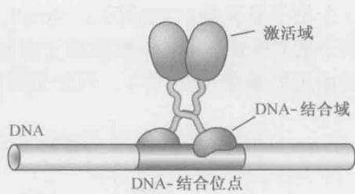

我们以最常研究的真核激活因子 Gal4 为例（图 19-2）。该蛋白质能激活酿酒酵母（Saccharomy cescerevisiae）半乳糖基因的转录。与细菌中的半乳糖基因类似，这些基因编码半乳糖代谢所必需的酶。其中一个基因名为 GAL1。Gal4 能与 GAL1 上游 275bp 处的 4 个位点结合（图 19-3）。结合后，的转录，使转录效率提高 1000 倍。

图 19-2 Gal4 与 DNA 上位点的结合。酵母激活因子 Gal4 以二聚体的形式与 DNA 上一段 17bp 的位点结合。该蛋白质的 DNA 结合区域与激活区域（激活域）是分离的。

游 275bp 处的 4 个位点结合（图 19-3）。结合后，如果存在半乳糖，Gal4 将激活 GAL1 的转录，使转录效率提高 1000 倍。

  
图 19-3 酵母 GAL1 基因的调控因子序列。GAL 的上游激活序列（ $UAS_{G}$ ）包括 4 个位点，如图 19-2 所示，每一位点与一个 Gal4 二聚体结合。尽管没有显示，在 $UAS_{G}$ 和 GAL1 基因之间还存在着另一位点 Mig1，该位点能与抑制因子结合，我们将在本章后部分进一步提到它。（图 19-23）

两个补充实验揭示了 Gal4 的 DNA 结合域与激活域的分离。在其中一个实验中，表达 GAL4 基因的片段（编码这个激活因子 N 端的 1/3），得到的蛋白质能与 DNA 正常结合，但是不能激活转录过程。这样的蛋白质包含 DNA 结合域，但是缺乏激活域，因此形式上相当于细菌激活因子的 pc 突变（图 19-4a）。

另一个实验构建了一个杂合的基因，该基因将编码 Gal4 蛋白 C 端 2/3 的序列，同细菌抑制因子蛋白 LexA 的 DNA 结合域融合。产生的蛋白质在酵母中同一个报道质粒一起表达，该质粒 GAL1 启动子的上游具有 LexA 结合位点。融合蛋白能激活该报道子的转录（图 19-4b）。实验表明，激活不单单是通过与 DNA 结合来介导的，如同我们在细菌中遇到的机制一样，即通过 MerR 的激活发挥作用（第 18 章，图 18-17）。相反，DNA 结合域的作用仅仅是将激活域与启动子联系在一起，就如同我们在细菌中遇到的最常见的机制一样。

很多其他真核细胞激活因子也以相似的实验进行检测，无论材料是来自酵母、果蝇，还是哺乳动物，都得到了同样的事实：DNA结合域与激活域是分开的。在某些例子中，它们甚至位于不同的多肽片段，一条多肽具有DNA结合域，另一条多肽则具有激活域，两条多肽在DNA上形成复合物。一个例子是疱疹病毒的激活因子VP16，在感染该病毒的细胞中发现该蛋白质能与DNA结合蛋白Oct1相互作用。另一个例子是果蝇的激活因子 Notch，我们将在第 21 章中对此做介绍。真核细胞激活因子的 DNA 结合域与激活域分离的特点是一个检测蛋白质间相互作用的实验能够广泛运用的基础（框 19-1，双杂交实验）。

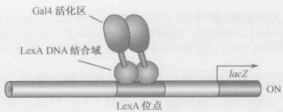  
图 19-4 域交换实验。(a) 没有激活域, Gal4 的 DNA 结合域仍能结合 DNA, 但不能进行转录激活。另一实验中 (没有显示) 没有 DNA 结合域, 激活域也不能进行转录激活。(b) 将细菌蛋白 LexA 的 DNA 结合域与 Gal4 的激活域黏合, 创造一个杂合蛋白, 能在酵母中激活基因的转录, 只要该基因带有 LexA 蛋白的结合位点。基因的表达通过报道质粒检测, 这种质粒中, GAL1 启动子同大肠杆菌 lacZ 基因融合, 其产物 (β-半乳糖) 在酵母中能够很容易地被检测。GAL1 启动子响应各种激活因子结构导致的基因表达水平, 因而能够容易地被检测。本章中, 许多实验使用相似的报道质粒。

#### [W] 框19-1 双杂交实验

本实验用于鉴定蛋白质间的相互作用。在框19-1图1的示例中，激活报道基因的前提是蛋白A同蛋白B发生作用（即使这些蛋白质本身不在转录激活中起作用）。如正文中讨论的一样，本实验的发现表明，DNA结合域与激活域可位于不同的蛋白质上，只要这些蛋白质之间相互作用，使激活域与DNA相联系，激活附近的基因。实际上，本实验通过以下步骤来进行。编码蛋白A的基因同编码Gal4的DNA结合域的片段融合，另一蛋白B的编码基因同编码激活域的片段融合。当在酵母中单独表达，任何一种融合蛋白都不能激活具有Gal4结合位点的报道基因（如图1最开始两行显示）。当两种融合蛋白在酵母中同时表达，蛋白A和B之间相互作用产生完整的激活因子，使报道基因表达（如图1最后一行显示）。这个简单的实验被广泛运用于从文库中筛选候选蛋白，以找到与某种已知的起始蛋白相互作用的蛋白质。图中蛋白A可看成是起始蛋白（“诱饵”），蛋白B（“猎物”）即代表库中众多供候选者之一（见第7章关于文库构建的描述）。酵母细胞转染了一个融合了DNA结合域的编码结构蛋白A，和融合了激活域的编码众多未知蛋白质文库。被转染的酵母细胞如果其蛋白A和蛋白B能相互作用，将激活报道基因。这样的一种细胞形成一个克隆，这个克隆能够通过置于有合适指示剂的培养基中来鉴定。典型的报道基因是lacZ，阳性克隆（表达报道基因的细胞群）将在有适当指示剂的培养皿上呈现蓝色。

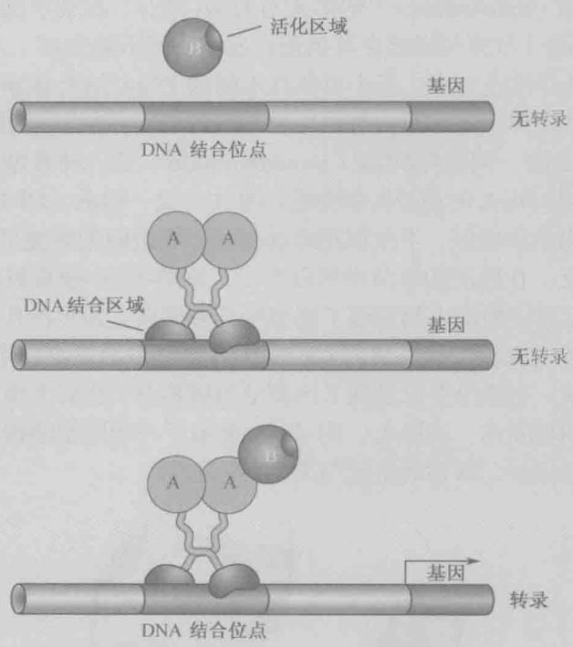  
框19-1图1 双杂交技术工作原理。本技术中使用的报道基因典型的是lacZ或其他产生易于检测的基因。

真核细胞调控蛋白使用一系列 DNA 结合域, 但 DNA 识别的原理与细菌的相同

上述实验表明，以细菌的 DNA 结合域代替真核生物激活因子的 DNA 结合域，同样能够行使功能，揭示 DNA 结合蛋白识别它们的结合位点的途径在不同的生物体内没有本质上的差异。

从前一章节中（以及第6章）我们知道大多数细菌的调控蛋白是以二聚体的形式与双螺旋对称的DNA目标序列结合，每个单体将一段 $\alpha$ 螺旋嵌入DNA大沟中，覆盖该位点一半以上的区域，紧靠着碱基对的边缘部分。结合过程通常不需要蛋白质和DNA结构变化。大多数细菌调控蛋白采用螺旋-转折-螺旋域。如我们所见，这种域由两个被一段短的转折隔开的 $\alpha$ 螺旋组成。一个螺旋（识别螺旋）同 DNA 大沟相契合，并识别特殊的碱基对。另一个螺旋同 DNA 骨干相联系，为识别螺旋正确定位，并增强结合力（第 6 章，图 6-13 和图 6-14）。如在第 21 章所讨论的那样（以及本章后面部分），编码螺旋-转角-螺旋 DNA 结合蛋白的同源框对于动物的发育是非常重要的。

尽管有细节上的差异，但大多数真核细胞采用同样的 DNA 识别原理。因此蛋白质经常以二聚体形式与 DNA 结合，并以 $\alpha$ 螺旋嵌入大沟来识别特定的 DNA 序列。特定的真核调控蛋白的识别螺旋非常类似于螺旋-转折-螺旋域；其他真核调控蛋白识别螺旋的域结构相当不同。我们在原核细胞中没有见到过的变化包括几个在真核细胞中见到的调控蛋白以异二聚体（heterodimer）的形式与 DNA 结合，在某些例子中，甚至是以单体的形式与 DNA 结合（尽管经常要在其他蛋白质的协同下起作用）。异二聚体增加了可使用的 DNA 结合特异性的范围：每个单体有不同的 DNA 结合特异性，异二聚体识别的位点不同于同型二聚体。下面是对真核生物中几种 DNA 结合域的简单观察。

同型结构域蛋白质 同型结构域（homeodomain）是一种典型的螺旋-转折-螺旋DNA结合域，其识别DNA的途径与细菌蛋白基本上是一致的（图19-5）。不同蛋白质中同型结构域的结构非常相似：不仅识别螺旋相似，周边的把螺旋呈递给DNA的蛋白质结构也相似。相反，在前面的章节中可以看出，螺旋-转折-螺旋域的细节结构在很大范围内变化。在所有真核细胞中都发现了同型结构域蛋白。如同在其他更高级的真核细胞中一样，果蝇中首先发现的这类蛋白质控制了许多基本的发育程序，我们将在第21章来讨论它们的功能。在酵母中也发现了同型结构域蛋白，我们下面讨论的交配型控制基因就编码同型结构域蛋白。实际上，图19-5显示了一种同型结构域蛋白的结构。很多同型结构域蛋白是以异二聚体的形式与DNA结合的。

  
图 19-5 同型结构域识别 DNA。同型结构域由三段 $\alpha$ 螺旋组成，其中的两段（图中为螺旋 2 和螺旋 3）螺旋形成类似螺旋-转折-螺旋的模式（例如，将此图同图 6-13 相比较）。如此，螺旋 3 为识别螺旋，在图中它嵌入 DNA 大沟。沿着该螺旋外边缘的氨基酸残基同碱基对之间一一对应。在图中所示的例子中，酵母 $\alpha_{2}$ 转录抑制因子的螺旋 1 中伸出的一臂，同小沟中的碱基特异结合。（经允许引自：Wolberger C. et al. 1991. Cell 67: 517-528. © Elsevier）

含锌 DNA 结合域 各种不同的形式的 DNA 结合域包含锌原子。这包括典型的锌指蛋白（zinc finger protein）（在第 6 章已经进行了讨论和描述）和在酵母激活因子 Gal4 中发现的相关的锌簇（zinc cluster）域。在这些例子中，锌原子同半胱氨酸残基和组氨酸残基相互作用，起到保持 DNA 结合域结构完整的作用（图 19-6）。DNA 同样被嵌入大沟中的 α 螺旋所识别（图 6-15b）。有些蛋白质拥有两个或多个末端相连的锌指结构域。每个锌指都以 α 螺旋嵌入大沟中，每增加一个锌指就延伸识别 DNA 序列的长度，以增强结合的亲和力。

  
图 19-6 锌指结构域。结构左边 $\alpha$ 螺旋为识别螺旋，通过右边的 $\beta$ 折叠伸向 DNA。如图所示，锌原子同 $\alpha$ 螺旋中两个组氨酸残基，以及 $\beta$ 折叠中两个半胱氨酸残基协同作用。这种排列有利于结构的稳定，是 DNA 结合所必需的。（引自：Lee M.S. et al. 1989. Science 254: 635-637.）

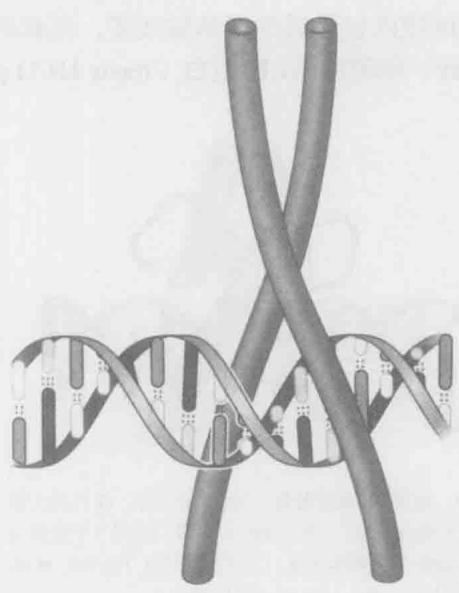  
图 19-7 亮氨酸拉链结合 DNA。来自各自单体的两个巨大的 $\alpha$ 螺旋，在它们长链上不同的部分形成二聚体和 DNA 结合域。因此，如图所示，两个螺旋的顶部相互作用，形成盘绕状结构将两个单体结合在一起，往下，螺旋之间分离得足够开，以包含 DNA，并在 DNA 螺旋相对的位置嵌入大沟。另外， $\alpha$ 螺旋上氨基酸侧链与大沟中碱基对边缘之间的联系提供了特异性。这个例子是在酵母转录激活激活因子 GCN 4 中发现的（图 6-9）。（经允许引自：Ellenberger T.G. et al. 1992. Cell 71: 1223. ©Elsevier.）

还有另一类使用锌的 DNA 结合域。在这些例子中，锌原子同 4 个半胱氨酸残基协同作用，稳定地形成一个类似于螺旋-转折-螺旋的非常不同 DNA 识别域。其中一个例子是在哺乳动物调控蛋白葡萄糖肾上腺皮质类脂醇受体中发现的，该蛋白质的作用是对某种激素信号做出反应，调节基因表达。

亮氨酸拉链结构域 该结构域是在单一的结构单元内同时包含二聚结构和与 DNA 结合的表面。如图 19-7 所示，两个长的 $\alpha$ 螺旋形成一个钳形结构，将 DNA 夹于其中，每个 $\alpha$ 螺旋嵌入大沟的一半转折部分。二聚化是由同样两个 $\alpha$ 螺旋内另一个区域介导的：在这个区域内，它们形成一个短的盘绕状结构，在这个结构中两条 $\alpha$ 螺旋通过适当间隔的亮氨酸残基（或其他疏水性氨基酸残基）之间的疏水相互作用结合到一起。我们已在第6章中讨论过这种蛋白质间相互作用的细节（图6-9）。有亮氨酸拉链结构的蛋白质经常形成异二聚体，也形成同型二聚体。最后要提到的一类，即螺旋-环-螺旋蛋白（HLH蛋白）也是一样的。

螺旋-环-螺旋蛋白如同在亮氨酸拉链结构的例子中提到的一样，每个单体中延伸的α螺旋区域嵌入DNA的大沟中。如图19-8所示，二聚体的表面由两个螺旋区域构成，一个是参与DNA识别的那个螺旋的一部分，另一个是一个较短的α螺旋。这两个螺旋被一个非刚性的环分离（因而得名），这个环容许两段螺旋靠近。由于与DNA结合的α螺旋区域内包含碱性氨基酸残基，亮氨酸拉链和HLH蛋白经常被称为碱性拉链（basic zipper）和碱性HLH蛋白（basic HLH protein）。

  
图 19-8 螺旋-环-螺旋模体。在这个例子中，我们再次看见一个长的 $\alpha$ 螺旋，参与 DNA 识别，并同一个短的 $\alpha$ 螺旋一起参与二聚体形成。（经允许引自：Ma P.C. et al. 1994. Cell 77: 451, Fig.2A. ©Elsevier.）

高速泳动蛋白 高速泳动蛋白（HMG protein）高度保守的肽链 AT hooks 能够与 DNA 螺旋的小沟发生相互作用，这是很少见的。这与我们之前讨论的 DNA 结合蛋白不同，高速泳动蛋白可以显著地改变 DNA 双螺旋的构象，从而促进了高阶蛋白-DNA 复合物的形成，如干扰素 $\beta$ 的增强体（在本章后面将会介绍，图 19-18）。它们在发育过程中也发挥着重要的作用。例如，HMG 的 Sox2 调控因子在多能性胚胎干细胞的培养过程中是必不可少的（请见第 21 章）。

我们之前讨论的另外的两种蛋白质,通过DNA的小沟识别DNA靶点,并使得非刚性的

DNA 序列具有特异性, 如 LEF-1 增强子结合蛋白(图 6-16)和转录因子 Tbp(图 13-17)。

#### [W] 激活域结构不确定性

同 DNA 结合域相反，激活域一直没有一个明确的结构。在转录装置中，当与靶体之间相互作用时，它们呈螺旋结构，但可确信的是，这种结构是受 DNA 结合诱导的。我们将看到，缺乏明确的结构与激活域具有黏性表面，能同几种蛋白质的表面相互作用这个概念是相一致的。

不同于以结构来作为描述特征，激活域是按基本的氨基酸成分来归类的。例如，Gal4的激活域被称为“酸性”激活域，反映出该区域酸性氨基酸占优势。突变实验凸显出了这些酸性残基的重要性，这些突变增强了激活因子的效力：这样的突变总是增加整个激活域的酸性（负电荷）。但是除此以外，激活域还同样包含重要的疏水残基。很多其他激活因子也具有同Gal4类似的酸性激活域。尽管在序列上看不到相似性，但是它们都保留了酸性的特征模式和疏水残基。

可以确信的是，激活域由许多重复的具有弱的激活能力的小单元组成，每个单元都是一段短的氨基酸序列。这样的小单元越多，激活域的激活能力也就越强。再次，这同激活域缺乏一个整体上的结构，只是简单地作为一种无差别的黏性表面在起作用这个概念是一致的（为了理解这个推断，请想像用一个精确的、稳定的三维结构来代替折叠的激活域，类似于 DNA 结合域。在这样的环境下，不能指望 DNA 结合域的片段保留整个域的部分结合 DNA 的活性，完整的域结构是任何重要活性所必需的。但是，如果每个激活域都是简单的通用黏性表面，很容易想像它是由小的、弱的单元组成）。

最近一系列的核磁共振（NMR）结构研究检测了一个酵母启动子Gcn4的酸性活性区域与它的一个靶向蛋白Gal11（一个中介因子的亚基，见第13章）在自然状态下的相互作用。活性区域形成一个螺旋结构结合在靶标的缺口上。但是这个结构是动态的，并且能形成多个不同的构型和朝向，因为在所有已发现的案例中，活性区域的残基和靶标原件之间只有单独的疏水相互作用。这种“模糊的复合体”也许可用于解释为何在转录激活时活性区域看似能够与数种不同的靶标蛋白相互作用，这将在下个部分进行讨论。

还有一些其他类型的激活域，包括：谷氨酰胺丰富的激活域，如在哺乳动物激活因子SP1中发现的；脯氨酸丰富的激活域，曾在哺乳动物另一个激活因子CTF1中发现。这些功能域同样缺乏明确的结构。普遍来说，酸性激活域是常见的，并在所有检测过的真核生物中起作用，其他的激活域则很弱，也不是很常见。

#### [W] 通过真核生物激活因子募集结合基因的蛋白复合物

我们发现在细菌中通常是激活因子的一个表面与 DNA 结合, 另一个表面与 RNA 聚合酶相互作用, 将酶募集至基因, 从而激活基因的转录 (第 18 章, 图 18-1)。真核生物的激活因子也以这种方式来工作的, 但是也有少数情况是激活因子与 RNA 聚合酶之间直接相互作用。相反, 激活因子间接募集聚合酶, 或在聚合酶结合后募集其他因子。激活因子与转录装置上聚合酶以外的其他部分相互作用, 通过募集这些部分也就募集了聚合酶。另外, 激活因子能募集核小体修饰成分来改变基因附近染色质的性质, 帮助起始转录。最后, 激活因子可以募集聚合酶进行转录起始或延伸所需要的因子。所有这些功能中, 激活因子只是将蛋白质募集到启动子上。在细菌中, RNA 聚合酶是唯一需要被募集的蛋白质; 而在真核生物中则不同。在真核生物中, 一个激活因子能以三种方式起作用: 募集核小体修饰成分和改造体来 “开启” 启动子, 募集一般转录因子复合物 (如中介蛋白), 以及募集刺激 PolII 起始和延伸的蛋白复合物 (如 pTEFb/SEC 复合物)。我们首先来考虑转录装置的募集。

#### [W] 激活因子募集转录装置到基因上

如第 13 章所提到的，除了 RNA 聚合酶，真核转录装置还包括很多其他蛋白质。这些蛋白质中的许多都形成复合体，如中介蛋白（mediator）和 TFⅡD 复合物（TFⅡD complex）（第 13 章，表 13-2 和图 13-20）。激活因子与一个或多个复合体相互作用，将它们募集到基因上（图 19-9）。其他没有被激活因子直接募集的成分，则同那些已被募集的成分结合，协同作用。

  
图 19-9 在真核细胞中通过募集转录装置来激活转录起始。图中，一个单一激活因子募集两个可能的目标复合物：中介蛋白（通过其募集到了 RNA 聚合酶Ⅱ）和通用转录因子 TFⅡD。其他通用转录因子作为中介蛋白，RNA 聚合酶Ⅱ或 IFⅡD 复合物的一个部分被募集，或单独被激活因子直接募集，或在被募集的组分存在时与之随机结合，这些在图中没有显示出来。事实上，募集通常被多个结合在基因上游的激活因子所介导。

转录装置中的许多蛋白质能在体外同激活域结合。例如，一个典型的酸性激活域能够与中介蛋白的组分和TFIID的亚基相互作用。

募集可以通过染色质免疫沉淀反应（chromatin immunoprecipitation，ChIP）这种技术来观察（详见第7章的描述）。该技术能揭示细胞内特定蛋白与DNA确定区域结合的时间。这种精细的方法叫染色质免疫沉淀芯片（ChIP-Chip）和现在最常用的染色质免疫共沉淀测序技术（ChIP-Seq），都会在框19-2介绍。大多数基因（从现在来看虽然

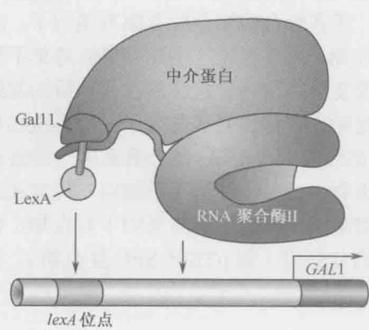  
图 19-10 通过中介蛋白与 DNA 的直接联系来激活转录。这是一个第 18 章框 18-1 所描述的激活因子旁路实验的例子。在缺乏通用激活因子 Gal4 的条件下，GAL1 基因被一个融合蛋白所激活，该蛋白由 LexA 的 DNA 结合域与中介蛋白复合物的一个组分融合而成（Gal11/Med15，第 13 章，图 13-20）。激活依靠 LexA 的 DNA 结合位点嵌入基因的上游。其他转录起始所必需的组分（TFⅡD 等）假设同中介蛋白及 RNA 聚合酶Ⅱ结合在一起。

不是全部）的转录装置只在基因激活时才出现在启动子上，即装置不是预先装配好的，证实了激活因子的作用是募集它。

在细菌中我们发现，通过募集来激活的基因（如 lac 基因）能通过一种激活因子旁路实验来激活（第 18 章，框 18-1）。在这样一个实验中，当 RNA 聚合酶不经过正常的激活因子-聚合酶相互作用而募集至启动子时，也能观察到激活现象。在酵母中也有相似的实验，即 GAL1 基因（正常的应被 Gal4 激活）同样能被一种融合蛋白很好地激活，该蛋白质由细菌蛋白 LexA 的 DNA 结合域与中介蛋白复合物的一个组分直接融合而成（图 19-10）。

值得注意的是，这些实验没有排除这样一种可能性，即至少某些激活因子不仅募集转录装置的部分组分，也诱导它们的变构。

这样的改变也许能提高转录起始的效率。不过，将转录装置募集至基因是特异性的基础，即哪个基因被激活取决于哪个募集到转录装置。另外，激活因子旁路实验的成功暗示了在起始过程中变构事件的发生并不需要激活因子做任何除了将蛋白质募集到基因上之外的事。

#### [W] 框 19-2 染色质免疫沉淀芯片(ChIP-Chip)和染色质免疫共沉淀测序技术(ChIP-Seq)是鉴别增强子的最佳方法

在第7章里我们讲述了染色质免疫共沉淀技术（ChIP）。这种方法能够帮助实验人员发现在细胞基因组中哪些特定DNA序列与目的蛋白结合，或者其他能够与之相互作用的蛋白质。在染色质免疫共沉淀的过程中，细胞、组织、器官甚至整个胚胎经过甲醛处理后，使DNA结合蛋白与相关的DNA序列或其他蛋白质交联。交联的染色质会被分割成\~200bp的小片段。DNA结合蛋白抗体被用来分离与蛋白质结合的DNA片段。在传统的染色质免疫共沉淀技术中，交联是可以逆转的，被沉淀的DNA作为模板，与目的基因的引物进行PCR扩增反应。因此，扩增序列是否存在揭示了与经过甲醛处理过的染色质（细胞中的DNA序列）结合的目的蛋白是否被分离出来。

ChIP-Chip 和 ChIP-Seq 是在 ChIP 基础上发展起来的两种方法，具有更加强大的功能。它们不仅能够检测到蛋白质是否与之前的特异性识别位点结合，还能够检测到基因组中与其结合的每个位点，即使这些位点的序列和位置也许之前是并不知道的。

在 ChIP-Chip 的过程中，交联逆转后，所有的免疫沉淀 DNA 片段与通用的非特异引物进行 PCR 扩增反应。之后非常关键的一步是，具有荧光标记的 DNA 分子与覆盖所有位点的细胞中的全基因组芯片进行杂交，这样就可以检测到之前的 DNA 片段与目的蛋白结合的位点图。

ChIP-Chip 已经应用于在全基因组范围内鉴定目的调控蛋白，如用于特定转录因子 Nanog、Sox2 和 Oct4 的鉴定。这些调控蛋白在一定程度上与人类胚胎干细胞的特性有关，如细胞的自我更新和特定的不同类型细胞的产生。它们也足够在成熟的分化细胞表达时诱导细胞产生类似干细胞的特性，因此被称为诱导多功能干细胞（iPS cell）（详见表 21-1）。

Nanog、Sox2 和 Oct4 的抗体已经广泛用于体内实验中鉴定干细胞中的蛋白结合位点（框 19-2 图 1）。目前已经发现可能有 100 多种靶标增强子受这三种蛋白质共同调节。其中的一些增强子与具有重要发育调控功能的基因有关，如与果蝇的同源转化基因有关的 Hoxb1（见第 21 章）。

这个技术的最新版是染色质免疫共沉淀测序技术（ChIP-Seq），它的功能更强大，操作也更简便。通过去交联将DNA片段从与之相结合的蛋白质上释放出来，便可以直接通过第二代测序技术的方法进行检测（见第7章）。这样，就可以很容易获得准确的DNA序列信息和足够的每个靶序列。

这种方法的另一个衍生应用是在染色体构象捕获(3C)中(我们在第7章中讲过)。该方法用于发现结合增强子的调控蛋白与特定启动子上的转录装置的相互作用——以物理形式上的两个DNA相靠近来解释其相互作用时的环状空间构象。

3C 基本过程正如前面所述，但是，与增强子结合的蛋白质不仅能够与 DNA 发生交联，也能够与可以与其相互作用的其他蛋白质发生交联。如果其他蛋白质再与另外的 DNA 位点结合（如启动子），那么在原目的蛋白抗体的作用下，这些 DNA 位点将会被沉淀。在去交联化作用之前，由于各种结合蛋白的 DNA 片段都靠近在一起，因此可以通过连接反应，将这些 DNA 片段的末端连接起来。通过对这个特异性杂交分子进行检测便可以知道这些 DNA 片段在基因组中的位置（如特定的增强子或已知的启动子）。

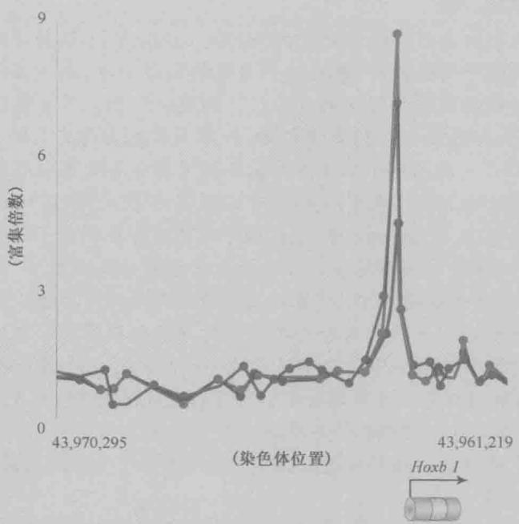  
框 19-2 图 1 ChIP-Chip 鉴定受干细胞调控的增强子。人类全基因组嵌合芯片与 DNA 片段杂交，Nanog（绿色）、Sox2（红色）和 Oct4（蓝色）。这三种蛋白都结合到了与 Hoxb1 基因相关的 5'端序列。（经允许引自 Boyer L.A. et al. 2005. Cell 122:947–956, Fig. 2b. ©Elsevier.）

#### [W] 激活因子也募集核小体修饰物来帮助转录装置结合到启动子上或起始转录

除了直接募集转录装置，募集核小体修饰物也有助于激活染色质（chromatin）内那些难以接触到的基因。如同第8章讨论的，核小体修饰物有两种形式：一种是增加组蛋白末尾的化学基团，如增加乙酰基团的组蛋白乙酰转移酶（histoneacetyl transferase, HAT）；另一种则替换（或“重塑”）核小体，如依赖ATP活性的SWI/SNF。这些修饰物是如何帮助基因激活的呢？有两个基本的模型解释了核小体的改变如何帮助转录装置与启动子结合（图19-11）。

首先, 重塑模型和某些修饰能够暴露 DNA 核小体内部的那些无法接近的结合位点。例如, 通过移除或者增加核小体的灵活性, 重塑可以释放调控蛋白和转录装置的结合位点。相似地, 组蛋白末端增加乙酰基团, 改变了组蛋白末端与邻近核小体的相互作用。这种改变常被说成松弛了染色质的结构, 将这些位点释放 (更完整描述参见第 8 章)。

但是增加乙酰基团也以另一种方式协助转录装置（或其他蛋白）的结合：在核小体上为具有所谓同源调节域（bromodomain）的蛋白质提供特殊的结合位点（第8章，图8-41）。TFIID复合物的一个组分就具有同源调节域，与没有乙酰化的核小体相比，更易于与乙酰化的核小体结合。因此，若某个基因的启动子具有乙酰化的核小体，与那些没有乙酰化核小体的基因相比，将可能具有对转录装置更高的亲和力。其他的蛋白质含有染色质结构域（chromodomainl），可以识别甲基化的核小体，我们在稍后会看到这样的例子。

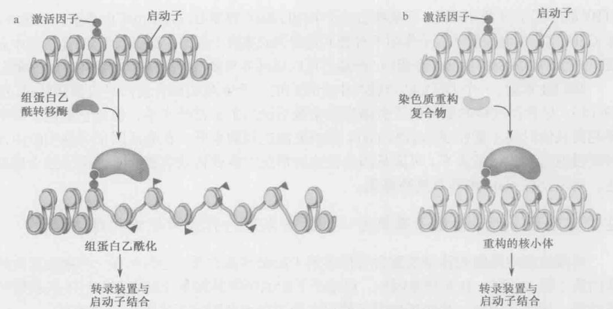  
图 19-11 通过激活因子指导改变染色质局部结构。在启动子上游边缘处所示的核小体内部的 DNA 上具有结合位点，由于不能接近染色质内部，激活因子无法与这些位点结合。右图中，激活因子募集某种核小体重塑分子来改变启动子附近的核小体结构，使之变得可接近并且能同转录装置相结合。左图中，激活因子在募集组蛋白乙酰转移酶，该酶通过在组蛋白末端（如图中蓝色小旗所示）残基上添加乙酰基团来轻微改变核小体紧凑的结构，并为携带合适识别域的蛋白质创造结合位点（同源调节域）（第 8 章，图 8-41 和图 8-42）。所有这些都介导了转录装置与启动子结合。

转录装置的哪一部分、哪种核小体修饰物是某个特定基因转录所必需的呢？哪个组分是被特定基因上特定激活因子直接募集的呢？在大多数情况中，这些问题的答案是未知的，但是转录装置的某些组分在某些基因更严格需求的，而其他基因就没那么严格，这同样适合于核小体修饰物。在许多事例中，这些差异并不是绝对的。因而，所有基因都绝对地需要RNA聚合酶，但是一个特定的基因也许依赖于转录装置另一个特别的组分，或者是某个核小体修饰物，或者什么都不需要；在某些例子中，也许只部分需要转录装置的一个组分（即缺少这个组分，激活效果会降低，但不会消除）。另外，一个特定基因激活的所需条件将随环境条件（如细胞周期的阶段）而变化，例如，当组蛋白乙酰基转移酶不存在时，Gal4通常有效地激活GAL1基因。但是，有丝分裂时，当染色质更紧密时（第8章），激活效果将降低，除非基因募集了乙酰基转移酶。

在酵母中，最近的实验提供了在特异基因上特定的激活因子与其目标之间相互作用的良好证据。正如我们前面注意到的，酸性激活剂 Gcn4 可以同 Gal11（Med15）发生相互作用，它还可以同 TFⅡD 的 TAF12 亚基，以及转录相关的其他复合物发生相互作用，这些复合物包括可以重塑核小体的 SWI/SNF。Gal4 看起来至少可以与 3 个组分接触：中介蛋白、TFⅡD 和 SAGA（Spt-Ada-Gcn5-乙酰基转移酶）。其中最后一个组分含有乙酰化活性（第 8 章，表 8-7），似乎也能与转录装置相互作用。事实上，与 TFⅡD 类似，SAGA 含有 TAFs(TBF 联合因子)(第 13 章), 在某些启动子中用以取代 TFⅡD。Gal4 也可以募集 SWI/SNF。像 Gal4 这样的酸性激活因子作用于有着不同需求的基因（例如，有些需要 TFⅡD 和中介蛋白，有些需要 SAGA 和中介蛋白）的能力可以用其可与多个靶标相互作用的能力来解释。

我们注意到,一个 DNA 结合域与中介蛋白的一个亚基的融合蛋白足以激活转录(图 19-10)。尽管在这样的激活因子旁路实验中激活达到了正常的水平,但是它更慢,即需要花更长的时间才能使表达达到 Gal4 很快就能达到的水平。在激活因子旁路实验中比较缓慢地达到激活的水平,可能是因为在这种情况中需要转录装置的其他组分独立地抵达,而不是像 Gal4 那样直接被募集。

#### [W] 在某些启动子上激活因子募集另一个因子来进行有效的起始和延伸

真核细胞中精细的转录装置含有很多用于起始的蛋白质。它也含有一些帮助延伸的蛋白质（第13章）。在某些基因中，启动子下游的序列导致聚合酶在起始后不久就暂停或停滞。这些基因中，某些延伸因子的存在与否极大地影响了基因表达的水平。

其中一个例子就是果蝇的 HSP70 基因。这个基因由热激激活，是由两个激活因子共同作用来控制的。GAGA 结合因子被认为将足够的转录装置募集到基因来进行转录起始。但是，如果缺乏第二个激活因子 HSF，起始的聚合酶在启动子下游约 25bp 处停滞。应答热激，HSF 结合到启动子的特异位点，募集一个激酶 P-TEF（positive transcription elongation factor，正转录延伸因子）到停滞的聚合酶上。该激酶磷酸化 RNA 聚合酶大亚基的羧基末端域（CTD 尾）（被称为 CTD 尾，见第 13 章），释放停滞的聚合酶，使转录继续进行。近期研究表明 P-TEFb 是更大的复合体 SEC（超级延长复合体）的一部分，P-TEFb 的释放会使附近启动子上的聚合酶 II 暂停。有趣的是，一些 SEC 亚基与由染色体易位引起的儿童白血病有关（框 19-3）。

#### [W] 框 19-3 组蛋白修饰，转录延伸和白血病

白血病是由于血液中白细胞或粒性白细胞异常增殖导致的一种血癌。儿童白血病更为常见，15岁以下儿童的发病率为1/2000。其中最为常见是急性淋巴细胞白血病（ALL），或急性淋巴细胞白血病。大概3/4被诊断为ALL的婴儿是混合血统白血病（MLL），MLL是由于染色体重排导致MLL融合蛋白产生的。它与果蝇的Trithorax蛋白有关，Trithorax蛋白是酵母中一种组蛋白修饰复合物Set1的亚单位，在酵母中称为Set1-COMPASS。这些复合物能够在赖氨酸-4处使组蛋白H3（H3K4三甲基化，或H3K4m3）发生甲基化从而激活启动子。在果蝇中，Trithorax H3K4甲基化复合物可以阻碍多梳抑制因子复合物对H3K27的三甲基化作用。因此，MLL、Set1和Trithorax复合物对基因表达而言是正调控因子，为基因启动子区域的激活提供正调控的染色质标记物H3K4me3。

值得注意的是，多数的 MLL 融合蛋白所引起的急性淋巴细胞白血病是由于 MLL 和一个或另一个超长延伸复合物（SEC）亚基融合产生的，涉及聚合酶 II 的延伸。最常见的 MLL 融合蛋白是 MLL-AFF1，还有 MLL-ENL 和 SEC 的其他亚单位。因此看起来在不同的儿童白血病中似乎存在着一个共同的分子机制，即两种主要的转录调控因子复合物 MLL（或 Set1，Trithorax）和 SEC 的融合（见框 19-3 图 1）。

已有研究表明，这两种复合物融合在一起能够导致白细胞中“失控”基因的表达。MLL 复合物能够通过启动子区域的 H3K4me3 标记某个基因使其最终表达。这种修饰作用通常会导致与 RNA 聚合酶 Pol II 的结合或终止，但并不足以激活基因的表达。然而，MLL 融合蛋白能够马上激活基因的表达，这是因为 SEC 被募集到这些基因上并触发了 Pol II 在启动子上的暂停。

  
框 19-3 图 1 两种主要转录调节复合物的功能融合：MLL 嵌合体。MLL 与 SEC 的各种蛋白融合。如图所示，MLL 可以同 SEC 中的任意蛋白发生联系或融合。Menin 是一种可以致瘤的辅助因子，它把 MLL 和 LEDGF( lens epithelium-derived growth factor, 晶状体来源的上皮生长因子)“捆在一起”，LEDGF 是一种转录共激活因子。同聚合酶Ⅱ结合的 GTF，表示的是通用转录因子（general transcription factor），如中间复合物的亚基。（图片由 Ali Shilatifard 提供）

我们在第 13 章看到，在所有基因转录的早期，在 Ser5 中 7 个重复序列的 CTD 尾的磷酸化是一个重要的步骤，激酶 IF II H 可以进行这个磷酸化。是否大多数基因中都需要 P-TEFb 还不清楚。P-TEFb 包含在磷酸化的 CTD7 个重复序列的 Ser2 中，这个修饰是与启动子序列上有活性的聚合酶 II 的释放一起发生的。像 Gal4 这样的强酸性激活因子能够募集 P-TEFb/SEC 及转录装置的其他部分。可能只有在特定的一些基因中，不同的调控因子在装置的募集中是像 HSP70 基因中看到的那样分开的，这使得基因转录增加了一次额外的控制。有关聚合酶的暂停及释放的概况见图 19-12。

P-TEFb（和 SEC）控制的启动子转录导致 AIDS 的人类免疫缺陷型病毒（HIV）的基因。可以再次看到，聚合酶在激活因子 SP1 控制下从那个启动子起始转录，但不久后就停滞了。在这个例子中，P-TEFb 被一个 RNA 结合蛋白而非 DNA 结合蛋白带到了停滞的聚合酶，那个蛋白质称为 TAT。TAT 识别 HIVRNA 起始附近的一段特异序列，该序列位于由停滞的聚合酶已经转录出来的部分。TAT 的另一个结构域与 P-TEFb 相互作用，并将其募集到停滞的聚合酶。该聚合酶释放的结果是病毒基因组的转录，以及宿主细胞的感染，通常是 T 淋巴细胞。

现在人们认为聚合酶的暂停现象是更常见的，特别是在发育分化阶段。最近在人胚胎干细胞和果蝇早期胚胎的研究揭示，所有编码蛋白质的基因中大约有1/3在分化过程中，其激活前都包含了聚合酶II的暂停阶段。这些基因可能需要依赖于SEC的募集来特异决定它们的基因表达。

聚合酶Ⅱ的暂停很可能也是为了将抑制核小体从启动子域上除去，使启动子做好准备，随时在上游调控因子序列的调控下迅速激活。酵母通常缺乏聚合酶Ⅱ暂停，但却使用了另一个策略来产生一个准备好的或“开放的”启动子。换句话说，许多酵母的启动子包括了富含 AT 的序列，从而降低了核小体的形成。或许聚合酶 II 的暂停和高 AT 的启动子序列都为了完成同一个目的：保持启动子相对少的核小体并时刻准备被快速诱导。如前面已经详细讨论过的，Gal4 在酵母中通过与 Gal1 基因的 UASg 位点的结合来激活 Gal1 基因（见图 19-3）。其实还有第二个蛋白质（RSC）的结合位点在这个调节区域内（图 19-13）。RSC 的作用是确定并特异解开一个在 UASg 上的核小体。这个动作有两个效果：通过特异地将 DNA 从核小体上释放，确保了 Gal4 的结合位点是对 Gal4 的结合开放的；而且其通过快速改变周围的核小体从而维持周围一系列核小体的位置，确保了核小体处于准确的位置。其中一个位点定位在转录起始位点，如前面讲的，Gal4 募集的 SWI/Snf 将有效地去除这个核小体（图 19-11），从而允许其他的转录复合物因子募集到启动子上起始转录（图 19-13）。

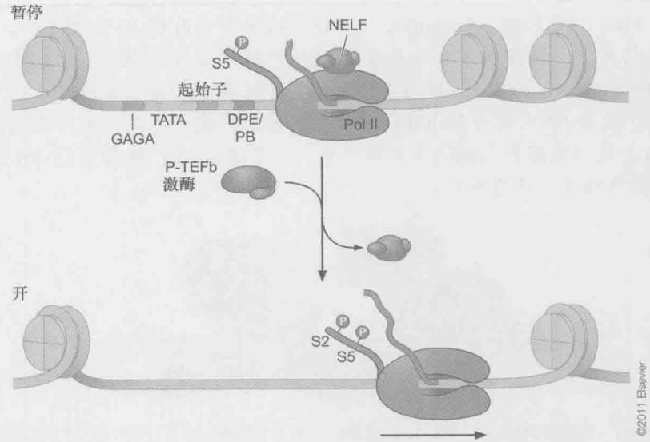  
图 19-12 聚合酶 II 的暂停和释放。在 TFIIH 将聚合酶 II“尾巴”上的 Ser5 磷酸化后（见图 13-21），聚合酶起始转录，但在某些启动子上（见正文），其会暂停在此直到通过募集（由一个激活因子）P-TEFb 激酶（在 SEC 复合物中被发现，见说明）将 Ser2 磷酸化。复合体 NELF 与其他因子共同作为分水岭，介导了该暂停的释放过程。（经允许改编自 Levine M. 2011. Cell 145:502–511，Fig. 3. ©Elsevier）

  
图 19-13 RSC 复合物协助 Gal4 在面对核小体时有效激活。如图 19-3 所示，Gal4 结合到 Gal1 基因上 UASg 的 4 个位点。另外一个蛋白质 RSC，同样结合到如图标出的 UASg 内（紫色）。RSC 保持一个特定的核小体处于松散状态，从而使得 Gal4 的结合位点可用，其还定向了周围的核小体。这些虽抑制了本底表达，但却能被由 Gal4 募集来的 SWI/Snf 激活后高效地去除。核小体的位置及其包含的 DNA 长度已在图中以绿色和蓝色椭圆形标出。（经允许改编自 Wang X. et al. 2011. Trends Genet.27:487–492，Fig. 1. ©Elsevier）

#### [W] 远距作用：环与绝缘子

很多真核细胞激活因子是远距作用的，尤其在高等的真核生物中。因此，在一个哺乳动物的细胞内，增强子也许能在它们所控制基因的上游（或下游）数十个甚至上百个kb的地方找到。我们发现在细菌中，结合在分离位点上的蛋白质仍然能通过DNA环的调节而相互作用。但是在这些例子中，我们只考虑相距数百碱基对的蛋白质结合位点，在这样的条件下，结合在DNA上的蛋白质相互之间足够的靠近，它们之间在DNA上相互作用的机会比那些分离的蛋白质要高得多。一旦它们的结合位点之间的分离距离超过几个kb，这种优势将不复存在。

生物体存在着帮助远距离结合的蛋白质之间交流的机制。在细菌中，有一种途径可以做到这点，“建筑”蛋白 IHF（integration host factor）与 DNA 上的位点结合，并使之弯曲。在某些受 NtrC 控制的基因中，能在激活因子结合位点和启动子之间发现 IHF 位点。通过弯曲 DNA，IHF 帮助与 DNA 结合的激活因子到达启动子上的 RNA 聚合酶（第 12 章，图 12-11）。

多种模式被提出，以解释为什么在高等真核生物细胞中，结合在增强子和启动子之间的蛋白质能有助于激活作用。在果蝇中，cut基因被100kb以外的一个增强子所激活。一种名为Chip的蛋白质（与同名的技术没有关系！）有助于增强子和基因之间的交流。因此，Chip蛋白的编码基因突变影响激活的效率。Chip蛋白是如何工作的，目前还是未知的，其中一个模型是该蛋白质同增强子和启动子间DNA上多个位点结合，通过多个Chip蛋白之间的相互作用，在中间的DNA上形成多个小环，这样的累积效果将使启动子和增强子接近。在同源染色体配对过程中发挥作用的粘连蛋白也在增强子-启动子环中发挥作用(第8章，图8-14)。粘连蛋白同中介蛋白相互结合，在全基因组的ChIP-seq实验中，粘连蛋白经常与那些同增强子和启动子结合的蛋白结合在一起。

在真核生物中还有其他几类模型，如我们所见，DNA 包在核小体中，被多个碱基对分开的位点也许在细胞中实际分开的距离并没有想像中那么远。而且在染色质某些位置也形成特殊结构，使增强子和启动子靠近。增强子在 30 多年前就已经发现了，但长距离增强子-启动子相互作用的基础至今仍是基因调控的核心秘密。

如果一个增强子能激活 400kb 外的特定基因，那么，是什么阻止它激活那些启动子在这个距离内的其他基因呢？总体来说，因为在特定的脊椎动物基因组中每 100-200kb 有一个基因，增强子就必须去“选择”其中的两个或者更多的基因。一种名为绝缘子（insulator）的特殊元件控制了激活因子的行动。当置于增强子和启动子之间时，绝缘子将抑制增强子对基因的激活作用。如图 19-14 所示，绝缘子并不抑制位于启动子下游的另一个增强子对同一基因的激活作用；同样，它也不抑制最初的激活因子对另一个基因的作用。因而，与绝缘子结合的蛋白质既不积极地抑制启动子的活性，也不抑制激活因子的激活作用，它们只是阻碍着两者之间的联系。绝缘子经常同大的、称为 CTCF 的锌指蛋白结合。现在人们认为，CTCF 也可以结合粘连蛋白形成复合物，该复合物会同最近的启动子形成染色体环，因此阻断远端的增强子同该绝缘子形成类似的环。

在另一个实验中观察到绝缘子能抑制染色质修饰的展开。如我们所知，局部染色质的修饰状态能影响基因是否表达。如下所示，染色质上组蛋白修饰抑制的传播是转录沉默（transcriptional silencing）现象的核心。沉默是一种特殊的抑制形式，能沿着染色质展开，关闭多个基因的表达无需特殊的抑制因子与基因结合。绝缘子元件能够阻断沉默的展开，所以绝缘子能使基因免于不加选择的激活作用和抑制作用。

这种情形对某些实验操作可以产生一些后果。由于与一种密度特别高的染色质（异染色质）结合，随机插入哺乳动物基因组的基因经常处于沉默状态，但是若在该基因的上、下游放上绝缘子，该基因将不呈现沉默状态。

  
图 19-14 绝缘子阻止增强子的活性。（a）与增强子结合的激活因子对启动子的激活作用。（b）一个绝缘子置于增强子和启动子之间。当适当的蛋白质与绝缘子结合后，尽管激活因子与增强子结合，增强子对启动子的激活作用仍将被阻断。（c）、（d）无论是在增强子上的激活因子还是启动子，都不会因为绝缘子的活动而失去活性。在（c）中，激活因子能够激活附近的另一个启动子，在（d）中，起始的启动子能被下游的另一个增强子所激活。

#### [W] 某些基因群的正确调控需要位点控制区域

人类珠蛋白基因在成人体内红细胞中和发育阶段那些形成红细胞的各种细胞中表达。人类有5种不同的珠蛋白基因（图19-15a）。尽管这些基因聚集在一起，但它们并不全同时表达。相反，不同的基因在不同的发育阶段表达，首先表达的是ε基因(在胎儿中)，接着是γ基因，出生后再后面则是δ基因和β基因。它们的表达是如何调节的呢？

每个基因都有自己的一套调节位点，这些位点对于基因在发育阶段的特定时间和特定组织中的表达是必需的（例如在不同时期的血细胞）。这样，β珠蛋白基因（在成年骨髓中表达）有两个增强子，启动子的上、下游各有一个。只有在成年人的骨髓中，正确的调控因子才会全部起作用，并达到合适的浓度，与这些增强子结合。但是以正确的次序打开这些珠蛋白基因，还需要更多的东西。

在珠蛋白基因簇上游 30\~50kb 处发现存在一组名为位点控制区域（locus control region，LCR）的调控因子元件。类似的情况也见于小鼠的 HoxD 基因群。这些基因参与四肢的发育和斑纹化，在胚胎中以精确的方式表达（第 21 章）。HoxD 基因受一个类似于 LCR 的称为 GCR（global control region）的元件控制，工作机制类似于 LCR。

b 小鼠β珠蛋白位点  
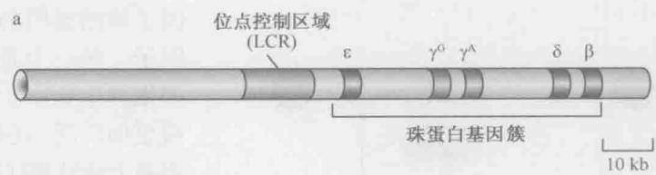

  
图 19-15 LCR 的调节。（a）人类珠蛋白基因及 LCR，后者确保了这些基因的有序表达。 $\alpha$ 珠蛋白基因没有在图中显示，该基因的表达贯穿发育的始终，在不同的发育阶段，该基因的产物依次与图中所示的珠蛋白基因产物结合，形成不同形式血红蛋白。（b）小鼠的珠蛋白基因，同样受 LCR 的调节。（c）小鼠的 HoxD 基因簇，受一种名为 GCR 的元件的调节，该元件类似于 LCR，有强化基因簇有序表达的功能。

LCR 由多个序列元件组成。其中某些具有增强子的特征，即在实验中将这些序列置于一个报道基因的上游，它们可以激活那个基因。LCR 其他部分的行为更像绝缘子元件，还有一些部分看上去则具有启动子的特征。元件多样性导致多个 LCR 作用机制模型的产生。一个模型提出整个转录装置被募集到 LCR，从那里转录整个位点，随着装置的前行打开染色质，释放每个基因前面的局部控制元件。这些单个的启动子随后将产生每个基因所需求的高水平表达。

最近的实验使用新的技术，可以使激活过程中 LCR 和启动子在细胞中的定位可视（例如染色体定位捕捉，框 19-2）。已经对许多受 LCR 或类似 LCR 元件控制的基因进行了该项实验。所有的结果都显示，当一个启动子被激活时，结合于上游调控序列的调控蛋白就会被发现位于该启动子的附近。这个结果与如下想法一致，即结合在 LCR 的蛋白质与结合在启动子上的其他蛋白质相互作用，居间的 DNA 形成环状突起以使这种相互作用得以进行。

LCR 的激活与丰富的染色质修饰相关联。它是如何与激活挂起钩来的还不清楚。它可能帮助 “打开” LCR 周围或启动子周围的染色质。它也可能以帮助环形成的方式来改变两者之间的染色质。

#### [W] 信号整合与组合控制

#### [W] 激活因子协同作用促进信号整合

我们在细菌中看到过基因调控中信号整合的例子。例如，只有在乳糖存在并且葡萄糖缺乏的情况下，大肠杆菌的 lac 基因才能有效地表达。这两个信号是通过不同的调控

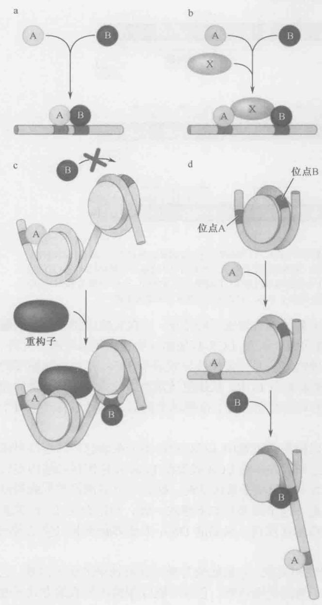  
图 19-16 激活因子协同与 DNA 结合。图中展示了 4 种方式：蛋白质与 DNA 位点的结合促进另一蛋白质与邻近位点的结合。（a）两个蛋白质通过直接的相互作用来协作与 DNA 结合。我们在第 18 章的 $\lambda$ 抑制因子中能看到这种方式，在很多真核细胞调控因子中也有这种方式。（b）两个蛋白质与共有的第三个蛋白质作用来实现类似的作用。（c）、（d）蛋白质与核小体内 DNA 位点的结合促进另一蛋白质结合的间接方式。（c）第一个蛋白质募集核小体重塑分子来使第二个蛋白质的结合位点暴露。（d）第一个蛋白质与它的位点结合，这个 DNA 位点恰巧在核小体外。结合后稍微展开了的核小体 DNA，暴露第二个蛋白质的结合位点。所有这些机制都能解释为什么一个调控蛋白能促进其他调控蛋白的结合，或者更进一步，一个激活因子如何促进转录装置与启动子结合。

因子传给基因的，一个是激活因子，另一个是抑制因子。在多细胞生物中，信号整合应用得更加广泛。在某些例子中，需要多个信号来打开基因。但如同在细菌中一样，每个信号是通过独立的调控因子传达给基因的。因此，在很多基因中，多个激活因子必须联合作用来打开基因。

当多个激活因子联合作用时, 它们是协同(synergistically)作用, 即两个激活因子联合作用的效果要好于(通常是非常明显的)每个激活因子单独作用的效果之和。协同有三个来源: 多个激活因子各募集转录装置的同一组分; 多个激活因子各募集转录装置的不同组分; 多个激活因子相互之间帮助与所调控基因上游的位点相结合。在给出具体的事例之前, 我们简述这三种策略如下。更多的转录协同例子见第21章, 框21-4。

通过与不同的部位接触, 两个激活因子能募集同一复合体, 如中介蛋白。组合的结合能对募集有指数效果(第3章, 表3-1)。在那些激活因子募集不同复合物（若没有帮助, 两者都不能有效地与DNA结合）的例子中, 协同效应更易于被描述。

当一个激活因子与 DNA 的结合依赖于另一个激活因子与 DNA 的结合时, 激活因子能相互帮助与 DNA 结合, 协同同样也来自于此。协作 (cooperativity) 可以是我们在细菌中遇到的那种, 即当与 DNA

位点结合后，两个激活因子由此相互接触（第18章，如图18-26所示的λ抑制因子的情形）。但是这也能以其他方式起作用：一个激活因子募集某些物质来促进第二个激活因子与DNA结合。图19-16阐明了激活因子之间通过相互帮助与DNA结合的各种方式。这包括“经典的”协作结合，一个激活因子募集修饰物来帮助另一个激活因子结合DNA，一个激活因子与核小体DNA结合使另一个激活因子的结合位点暴露出来。

协同对于激活因子的信号整合至关重要。有一个基因，它的产物只有当两个信号都接收到时才需要，每个信号是通过单独的激活因子传达给基因。只有当两个激活因子都存在时，基因才能有效地表达，而任何一个激活因子的单独作用将不能影响基因的表达。因此，该模版充当多信号选择作用的基体。

信号整合：HO 基因受两个调控因子的控制，一个募集核小体修饰物，另一个募集中介蛋白

不同于通过分裂产生两个同样的子代细胞，酿酒酵母的分裂方式为出芽分裂，即所谓的母细胞通过出芽产生一个子代细胞。在此我们将集中讨论 HO 基因的表达（我们不需要关注这个基因的功能，这已在第 12 章中阐述）。HO 基因仅在母细胞内表达，并且只出现在细胞周期特定点（ $G_{1}/S$ 转换期）。这两个条件是通过两个激活因子（SWI5 和 SBF）传达给基因的。SWI5 在远离基因处有多个结合位点，最近的一个离启动子也有 1kb 以上（图 19-17）。SBF 也有多个结合位点，但它们都离启动子很近。为什么基因的表达要依赖于这两个激活因子呢？

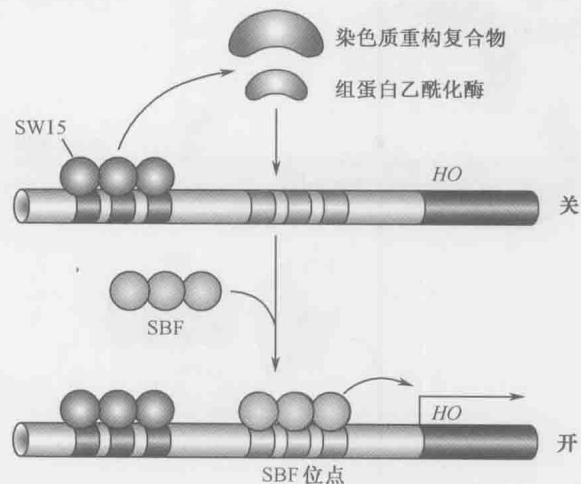  
图 19-17 对 HO 基因的控制。在染色质中，SWI5 能独立地与它的位点结合，而 SBF 不能。SWI5 募集重塑分子和组蛋白乙酰基转移酶改变核小体，暴露 SBF 的位点，使得 SBF 在启动子附近结合，从而激活基因。由于抑制因子 Ash1 的存在，SWI5 仅在母细胞中有活性。Ash1 是在子细胞中产生并与 HO 启动子结合从而抑制 SWI5 的活性。在本图中，为了简便起见，没有画出核小体。（经允许引自 Ptashne M. and Gann A. 2002. Genes & Signals, p.95, Fig.2-18. ©ColdSpring Harbor Laboratory Press.）

SBF（仅在细胞周期 $G_{1}/S$ 转换期具有活性）在染色质中的排列使之不能独立地与位点结合。SWI5（仅在母细胞内有活性）能独立地与位点结合，但是在那样一个距离上（大于 1kb）不能激活 HO 基因（记住在酵母中，激活因子不能远距离起作用）。然而，SWI5 能够募集核小体修饰物（一种组蛋白乙酰基转移酶后面跟着重塑酶 SWI/SNF）。其在核小体上的作用将暴露 SBF 位点。这样，若两个激活因子都存在，并且都具有活性，SWI5 的行为使 SBF 能与位点结合。接着，通过直接与中介蛋白结合，SBF 能募集转录装置并激活基因的表达。

#### [W] 信号整合：激活因子协同作用，共同与人类β干扰素基因结合

病毒感染能够激活细胞内人类 $\beta$ 干扰素基因。感染触发了3个激活因子：NFkB、IRF和Jun/ATF。在人类 $\beta$ 干扰素基因启动子上游约1kb处有一个增强子，3个激活因子将协同地一个挨着一个与该增强子结合。这些激活因子以协同作用结合在增强子上形成的结构被称为增强体（enhanceosome）（图19-18）。激活因子随后募集一个所谓的共激活因子——一个称为CBP（CREB-binding protein）的蛋白质或其近亲p300。这个蛋白具有组蛋白修饰活性，能够募集核小体重塑活性（如SWI/SNF）及转录装置本身。

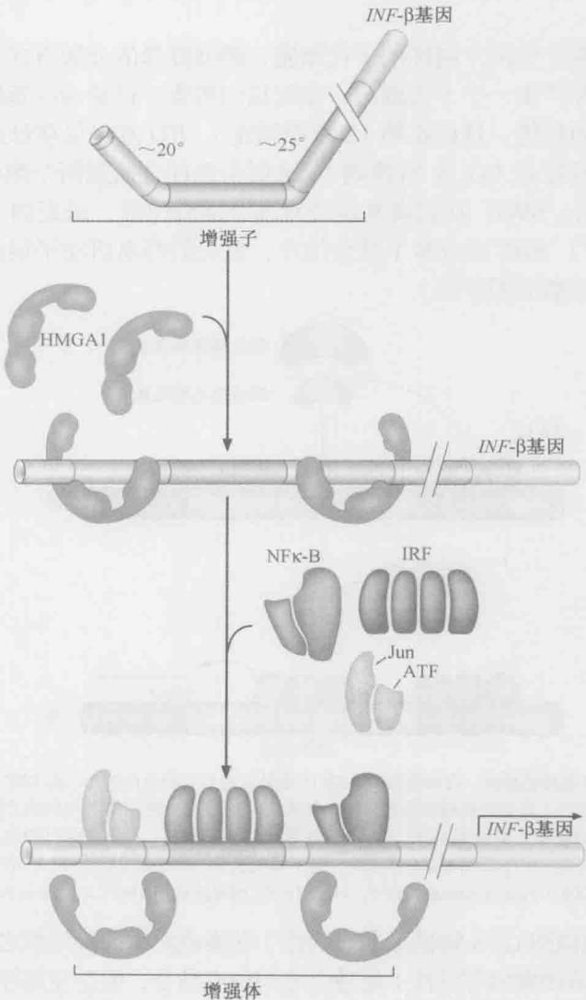  
图 19-18 人类 $\beta$ 干扰素增强体。3 个激活因子的协同结合，与结构蛋白 HMGA1 一起激活 $\beta$ 干扰素基因。

除了上述的激活因子，另一个蛋白质 HMGA1 结合增强子。这个蛋白质结合在 DNA 反面的小沟里，并帮助增强体的组装，尽管它可能不是最终结构的一部分。事实上，一旦所有的激活因子都结合上去，它看上去无法保留在上面——很简单，DNA 上太拥挤了。图 19-18 显示人们认为的增强体组装方式，图 19-19a 显示结合在增强子 DNA 上的所有激活因子的 DNA 结合域的晶体结构。如图 19-18 所示，增强子 DNA 是弯曲的，但一旦激活因子结合了，它就变直了；HMGA1 撑直了 DNA，因而帮助最终结构的形成。

  
图 19-19 增强体结构及序列。（a）增强体的晶体结构，揭示结合在增强子 DNA 上的激活因子的 DNA 结合域。（来源：a，Panne D. et al. 2007. Cell 129: 1111. PDBCodes: 2061, 206G.）（图像是多结构的合并，由 Leemor Joshua-Tor 组装成模型。图像用 MolScript，Bobscript 和 Raster 3D 制作。）（b）分离了 1 亿年的物种间 β 干扰素增强子 DNA 序列的保守性。还显示了增强子中每个激活因子识别的序列。

这个结构的一个显著特征是，增强子上几乎每一个 DNA 碱基对都参与激活因子的结合，这就是为什么认为在最终结构里没有 HMGA1 的空间。这种对增强子中序列信息的彻底使用也可能解释了为什么这个增强子在跨越像人、小鼠、马这样不同的物种中如此高度地保守；事实上，它甚至比基因的编码序列要保守得多（图 19-19b）。

如我们已经注意到的，激活因子结合（及增强体形成）以一种高度协同的方式进行，确保所有3个激活因子都必须在场出现。下面是调控因子可能协同结合的3种方法：①它们之间的蛋白质-蛋白质相互作用；②一个蛋白质结合引发的DNA改变帮助另一个蛋白质的结合；③所有的激活因子同时与共激活因子CBP相互作用。所有3种方法可能在这个例子中都使用到，尽管要知道激活因子之间的蛋白蛋白相互作用的程度是非常困难的。在这个结构中看不出多少直接相互作用的证据，不过，多数情况下在结构中只显示激活因子的 DNA 结合域。

#### [W] 组合控制是真核细胞的复杂性与多样性的核心所在

在细菌中，我们遇到过简单的组合控制（combinatorial control）。例如，CAP 能通过与不同调控因子的协作来调节多个基因。在 lac 基因中，CAP 同 Lac 抑制因子共同作用；而在 gal 基因中，它又同 Gal 抑制因子协作（第 18 章）。

在真核细胞中存在着广泛的联合控制。我们首先考虑一个常见的例子（图 19-20），基因 A 受 4 个信号（分别为 1、2、3、4）的控制，每个信号通过一个独立的激活因子（即激活因子 1、2、3、4）来起作用。基因 B 受 3 个信号（分别为 3、5、6）的控制，这些信号通过对应的 3 个激活因子来起作用。注意，信号 3 是在两个基因中都有的信号，激活因子 3 同样作用于两个基因。在复杂的多细胞生物（如果蝇和人类）中，联合控制涉及比上例中更多的调控蛋白和基因，当然，抑制因子和激活因子都可能参与。调控蛋白何以能够如此杂乱地混在一起？

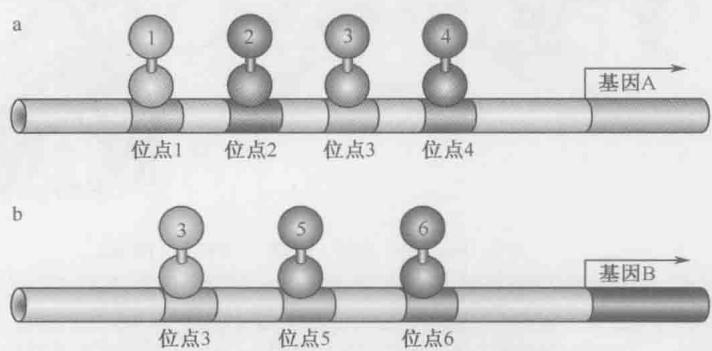  
图 19-20 组合控制。这里展示了两个基因，每一个都受到多重信号的控制，基因 A(a) 是 4 种，基因 B(b) 是 3 种。每种信号都是通过一种调控蛋白与基因交流。蛋白 3 与不同的、另外的调节子组合作用于两个基因。

如上所述，多个激活因子协同作用。事实上，单个激活因子的多个拷贝也能协同作用，表明特定的激活因子可以和多个靶体作用(就像我们之前看到的)。这一点可以解释为什么不同的调节因子可以以如此多的组合起作用；每一个调节因子都可以利用一系列的靶体，而在一起作用的组合方式并无限制。

以上提到的信号整合的例子——酵母 HO 基因和人 $\beta$ 干扰素基因，所涉及的激活因子作为组合控制的例子都调控其他基因的表达。因而，在酵母的例子里，SWI5 涉及多个其他基因的调控。哺乳动物中，NF- $\kappa$ B 不仅调控 $\beta$ 干扰素，而且调控许多其他基因的表达，包括 B 细胞免疫球蛋白 $\kappa$ 轻链。Jun/ATF 同样与其他调控因子作用，调控其他基因的表达。前面讲过某些 DNA 结合蛋白以异二聚体形式与不同的伙伴结合，提供了另外一个层次的组合控制。

#### [W] 酿酒酵母 (S. cerevisiae) 交配型基因的组合控制

酿酒酵母细胞以三种形式存在：两种不同的单倍体交配型 a 和 $\alpha$ ，以及当交配型 a 和 $\alpha$ 细胞交配、融合形成的二倍体。两种交配型细胞不同，因为它们表达两套不同的基因：a 特异基因和 $\alpha$ 特异基因。如下面简述的，它们受到激活因子和抑制因子的不同组合的调控。

a 细胞和 $\alpha$ 细胞分别编码细胞类型特异的调控因子：a 细胞生产调控蛋白 a1，而 $\alpha$ 细胞生产蛋白 $\alpha_{1}$ 和 $\alpha_{2}$ 。第四种调控蛋白叫做 Mcm1，也涉及调控交配型特异的基因（以及许多其他基因），它同时存在于这两种细胞中。那么，这些调控因子是如何在一起发挥作用从而确保在 a 细胞中 a 特异基因是打开的，而 $\alpha$ 特异基因是关闭的；反之，在 $\alpha$ 细胞也是如此。在二倍体细胞中这两套基因都保持关闭？

调控因子在 a 特异基因和 $\alpha$ 特异基因启动子上的排列示于图 19-21。

  
图 19-21 酵母细胞类型特异基因的控制。如在正文中详细讲述的，酵母细胞的 3 种形式 [单倍体交配型 a 细胞和 α 细胞以及 a/α 细胞（二倍体）] 是由它们所表达的特定的基因来确定的。1 种通用的调控因子（Mcm1）和 3 种细胞类型特异的调控因子（a1、α1、α2）共同调控 3 类靶基因。MAT 位点是基因组中的一个区域，它编码交配类型调控因子（第 12 章）。

\- a 细胞中， $\alpha$ 特异基因是关闭的，因为没有激活因子在那里结合；a 特异基因是打开的，因为 Mcml 在那里结合并激活这些基因。

\- 在 $\alpha$ 细胞中， $\alpha$ 特异基因是打开的，因为 Mcml 在启动子上游结合并激活它们。在这些基因中，Mcm1 结合在弱结合位点，而且只能与蛋白 $\alpha 1$ 单体协作发挥作用。这确保了 Mcml 只在 $\alpha$ 细胞中激活这些基因。 $\alpha$ 细胞中 a 细胞特异基因由于 $\alpha 2$ 抑制因子的存在而保持关闭。这个抑制因子以二聚体形式结合并且与 Mcml 在这些基因中协作发挥作用。 $\alpha 2$ 抑制因子的两种特性保证了 a 细胞特异基因不在这里表达：它覆盖了 Mcml 的激活区使这个蛋白质无法激活；它同时还有效地抑制这些基因。 $\alpha 2$ 抑制因子的作用机制我们将会在下一节讲到。

\- 在二倍体细胞中，a 特异基因和 $\alpha$ 特异基因都关闭。其形成如下：a 特异基因结合 Mcml 和 $\alpha 2$ ，与其在 $\alpha$ 细胞中一样，使得这些基因保持关闭。 $\alpha$ 特异基因保持关闭，是因为如同在 a 细胞中一样没有激活因子的结合。

\- 两种单倍体细胞 (a 和 $\alpha$ ) 都表达另外一类基因, 叫做单倍体特异基因 (haploid-specificgene）。这些基因在二倍体细胞中被 $\alpha 2$ 关闭，后者在基因的上游与 $\alpha 1$ 形成异二聚体与其结合。只有在二倍体中才同时存在这两种调控因子。

现在，其他酵母的交配型基因调控的分子细节也已经知道了。在框 19-4 中，调控回路的可演化能力，我们比较了 a 和 $\alpha$ 特异性基因在酿酒酵母（S. cerevisiae）和白色假丝酵母中（Candida albicans）是如何调控的。这个比较揭示了基因调控回路可以如何演化，在后面的章节中我们还会回到这个主题。

#### [W] 框19-4 调控回路的可演化能力

如文中所述（及图19-21所示），酿酒酵母的不同交配型以细胞类型特异的方式表达某些基因。在α细胞中，α特异基因表达，a特异基因不表达；而在a细胞中，a特异基因表达，α特异基因不表达。另一类基因——单倍体特异基因（hsgs）——在两种单倍体a细胞和α细胞都表达，但是却不在二倍体a/α细胞中表达。Hsgs的产物需要进行交配——a细胞和α细胞会进行，然后a/α细胞（交配产物）不会。我们知道这些程序如何被MAT位点编码的调控因子与泛调控因子Mcm1共同作用来控制的细节。

最近的研究为说明基因调控网络是怎样演化形成的提供了一个很好的例子。三种酵母——酿酒酵母（S. cerevisiae）、乳酸酵母（K. lactis），和白假丝酵母（C. albicans），白假丝酵母和酿酒酵母在3百万\~9亿年前有着共同的祖先。如果根据它们表达的蛋白质的差异化，这两种酵母比鱼和哺乳动物更加分化。酿酒酵母被用于啤酒和面包的制作及实验室试验中，白假丝酵母是一种人类病原。尽管如此，正如酿酒酵母一样，白假丝酵母有两种不同的交配型——a和α，两种交配型细胞不同，因为它们表达不同的基因（a细胞中有a特异基因，α细胞中有α特异基因，a细胞和α细胞中都有的hsgs基因）。

两种酵母在抑制 a/α 二倍体细胞中 hsgs 表达方面有着相同的机理（表 19-4 图 1）。

  
表 19-4 图 1 三种酵母中核心基因 hsgs 调控演化的简化模型。在三种酵母中，a1/a2 抑制 hsgs 的表达，但是在 a 细胞和 α 细胞中它是开放的，在单独的 a/α 细胞中它是关闭的。在酿酒酵母和白假丝酵母中它的抑制作用是直接的，而在乳酸酵母中它的抑制作用是间接的（通过 Rme1）。在乳酸酵母中调控回路的演化导致了一种新的交配行为，只有当处于饥饿状态时才能进行交配。（引自 Booth L. et al. 2010.Nature468:959–965. Fig. 4. ©Macmillan.）

二倍体细胞含有 a1 和 $\alpha2$ 同源调控蛋白。这些蛋白质能够与 hsgs 的调控区域结合形成一个不稳定的异质二聚体，从而抑制其表达。在酿酒酵母中，a1/ $\alpha2$ 这异质二聚体也可以抑制 RME1 的表达，这个基因能够在饥饿期抑制二倍体细胞进入减数分裂期。

对第三种酵母乳酸酵母的交配型分析揭示了 hsgs 转录调控的另一个层次，插入 RME1 到调控网络中（框 19-4 图 1）。在乳酸酵母中，RME1 是 a 细胞和 $\alpha$ 细胞中 hsgs 的重要激活剂。在二倍体细胞中，和在酿酒酵母和白假丝酵母中一样，a1/ $\alpha$ 2 异质二聚体能够抑制 hsgs 的表达。但是在酿酒酵母和白假丝酵母中它的抑制作用是直接的，而在乳酸酵母中它的抑制作用是间接的，a1/ $\alpha$ 2 通过抑制 RME1 的表达从而消除 hsgs 的激活。

插入调控因子的调控回路演化允许新的信号加入到已有的通路中。把 RME1 插入到 hsgs 的抑制调控回路中，增加了可以通过营养条件决定交配的细胞类型的新的控制层次。这些研究还表明在一个系统发生中对多个物种的研究可以更加全面地了解基因调控回路是怎样演化的。

#### [W] 转录抑制因子

在细菌中我们见到许多抑制因子，通过对与启动子重叠位点的结合从而阻断 RNA 聚合酶的结合。但我们还见到了其他的方式：它们结合在启动子邻近区域，与结合在那里的聚合酶相互作用从而抑制它的转录起始。它们还可以干扰激活因子的功能。

除去第一种方式（讽刺地说，在细菌中最常见），在真核生物中我们可以见到以上所有其他形式。我们还可以见到另外一种抑制形式，也许是真核生物中最常见的形式。它的作用方式如下：同激活因子一样，抑制因子可以募集核小体修饰酶，但在这里，这个酶的作用与激活因子募集的相反，它们使染色质更紧凑或者去除能够被转录装置识别的基团。例如，组蛋白脱乙酰酶（histone deacetylase）通过从组蛋白尾部去除乙酰基来抑制转录。我们知道乙酰基的存在促进转录，矛盾的是，组蛋白脱乙酰化酶Rpd3也能够募集激活基因，从而确保转录的精确性。为了避免使用转录单位中“隐藏”的激活因子，在PolⅡ延伸之后，核小体被脱乙酰化。

其他的酶在组蛋白的尾部加上甲基，这个反应常常抑制转录，尽管在某些情况下，它与活跃转录的基因关联（第8章）。组蛋白（和DNA）修饰也成为叫做沉默的转录抑制的基础，在本章的后面还会详细讲到。

这些各种类型的抑制示于图 19-22。这里我们只对一个例子详细讲述，即一个叫做 Mig1 的抑制因子。与 Gal4 一样，它控制酵母 GAL 基因的表达。

图 19-23 展示了我们前面见到的 GAL 基因（图 19-3）。但是这里在 Gal4 和启动子之间多了一个位点，这就是在葡萄糖存在的条件下 Mig1 结合并关闭 GAL 基因的位点。这样，同 E.coli 一样，酵母细胞只有在首选的能量源葡萄糖不存在时才生产代谢半乳糖所需要的酶。那么，Mig1 又是怎样关闭 GAL 基因的呢？

Mig1 募集一个 “抑制复合体”，其中包含 Tup1 蛋白。这个抑制复合体被其他许多抑制转录的酵母 DNA 结合蛋白所募集，这包括前述的控制交配型基因的 $\alpha2$ 蛋白。Tup1

RNA聚合酶II

在哺乳动物细胞也有对应物。有两种假说来解释 Tup1 的抑制作用：首先，Tup1 募集组蛋白脱乙酰酶，后者使邻近的核小体脱乙酰化；第二，Tup1 在启动子部位与转录装置直接作用抑制转录起始。

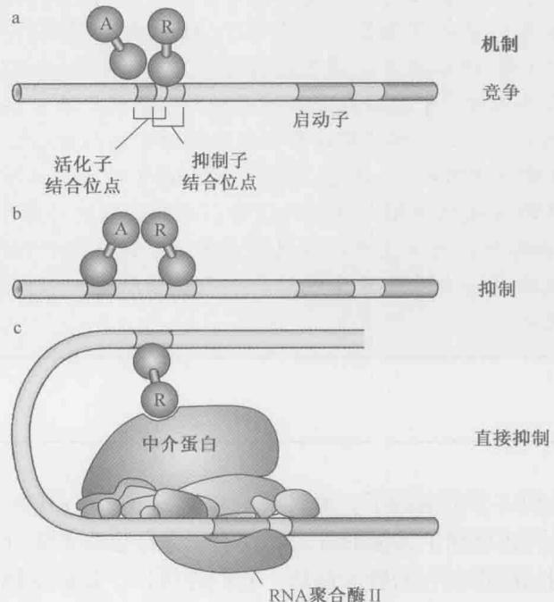

图 19-22 真核生物抑制因子的作用方式。真核生物的转录可以受到多种方式的抑制，这包括图中展示的 4 种机制。（a）通过与激活因子结合重叠位点的结合，抑制因子抑制激活因子对基因的结合，因而阻断基因的激活。这个模式的变换方式包括：抑制因子可以是同一激活因子的衍生部分，后者缺少激活区；在另一种模式中，以二聚体形式与 DNA 结合的激活因子可以受到其保留了聚合区但缺乏 DNA 结合区的衍生物的抑制，这种衍生物与激活因子形成无活性的异二聚体。（b）抑制因子与激活因子旁边的位点结合，并与激活因子相互作用，位阻它的激活区。（c）抑制因子与基因上游的位点结合，通过与转录装置的特殊方式作用，抑制转录起始。（d）通过募集组蛋白修饰酶改变核小体，从而抑制转录（如此例的脱乙酰化，某些情况下也发生甲基化，甚至对启动子的重塑）。

#### [W] 信号转导与转录调控因子的控制

信号通常通过信号转导通路传达至转录调控因子

我们已经知道，某一个特定基因的表达与否通常取决于其环境中的各种信号。这些信号以多种形式存在。例如，在细菌中，这些信号可以是小分子物质，如糖类。但是这些信号也可能是蛋白质类物质，由一个细胞释放，而被另一个细胞接受。这在多细胞生物的发育过程中尤为常见（见第21章）。

  
图 19-23 酵母 GAL1 基因的抑制。在葡萄糖存在时，Mig1 结合到 UGSG 和 GAL1 启动子之间的一个位点。通过募集 Tup1 抑制复合体，Mig1 抑制 GAL1 基因的表达。很可能是对局部核小体的去乙酰化产生了转录抑制（Tup1 募集脱乙酰酶），也可能是直接接触和抑制转录装置。在本图未展示的一个实验中，如果 Tup1 与一个 DNA 结合域融合，而此结合域的位点又位于基因的上游，该基因的表达就会被抑制。

细胞检测到信号及信号效应传达到基因的方式有多种。在细菌中，信号通过诱导调控因子的变构改变来控制调控因子的活性。这种效应通常是直接的：小分子信号（如糖类）进入细胞，直接与转录调控因子结合。但我们知道一个信号效应是非直接的例子（激活因子 NtrC 的控制）。在这个例子中，信号（低氨水平）诱导一种激酶，该激酶磷酸化 NtrC。此类间接信号作用所代表的是信号转导通路（signal transduction pathway）。

信号一词指起始配体自身，如糖或蛋白质。这正如我们先前所定义的，信号一词也起源于“信息”，因为信号随着识别配体，传递给调控因子，后者直接调控基因，即信号沿着信号转导通路传递。对于简单的细菌来说，“信号”和“信息”没有差别。但是，一旦涉及信号转导通路，这两者就不同了。在真核细胞中，我们将看到（特别是第21章）大多数信号是沿着信号转导通路将信息传递至基因的，这些信号转导通路有时是非常精密的。在此部分，首先介绍几个真核细胞中信号沿着信号转导通路进行传递的实例。然后，我们更加全面地了解从上述信号转导通路来的信号是怎样控制转录调控因子自身的。

在信号转导通路中，起始配体通常由特异的细胞表面受体（cell surface receptor）检测到：配体与受体细胞外的某个区域结合，这种结合的信息被转递至该受体的细胞内区域。从此处开始，信号被传递到相应的转录调控因子，通常是通过一系列的激酶级联反应。配体与受体的细胞外区域结合是怎样通讯到细胞内区域的？这可以通过受体的变构改变来实现，即配体的结合可以改变细胞内区域的构型（及活性）。此外，配体也可以简单地使两条或多条的受体链聚集，使这些受体的细胞内区域间通过交互作用而互相激活。

图 19-24 所示的是信号转导通路的两个例子。首先是一个相对简单的案例——STAT（signal transdancer and activator of transcription）通路（图 19-24a）。在这个例子中，激酶与受体的细胞内区域结合。当受体被其配体（细胞因子）激活，就会导致两条受体链聚集，引发每条链中的激酶激活来使对应受体细胞内区域的一段特殊序列磷酸化。此磷酸化位点随后被一个特殊的 STAT 蛋白识别。而 STAT 蛋白一旦与上述磷酸化位点结合后，其自身也被磷酸化。STAT 蛋白磷酸化后，STAT 蛋白二聚化，向细胞核中转移，并与 DNA 结合。

另外一个例子更为精细（图 19-24b）：控制激活因子（如 Jun）的分裂素激活蛋白激酶（MAPK）通路。Jun 是我们前面（图 19-18）提到的 β 干扰素增强子上作用的激活因子。在这个例子中，被激活的受体诱导一系列的信号事件，最后导致一种 MAPK 激活，后者进一步磷酸化 Jun（及其他转录调控因子）。信息沿着信号转导通路传递，最普遍的方式是通过磷酸化。此外，也会使用蛋白酶解、去磷酸化及其他修饰作用。

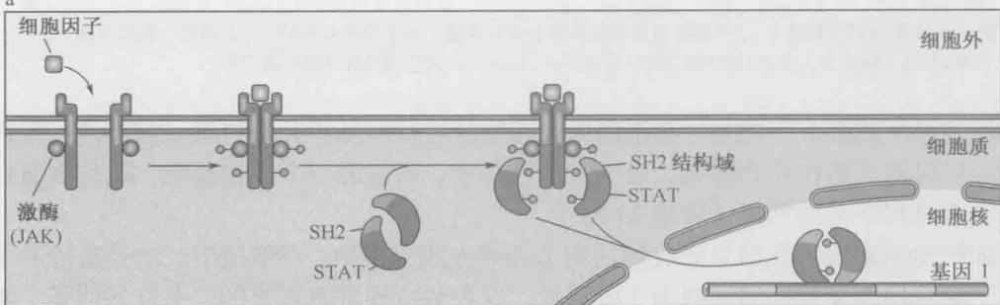

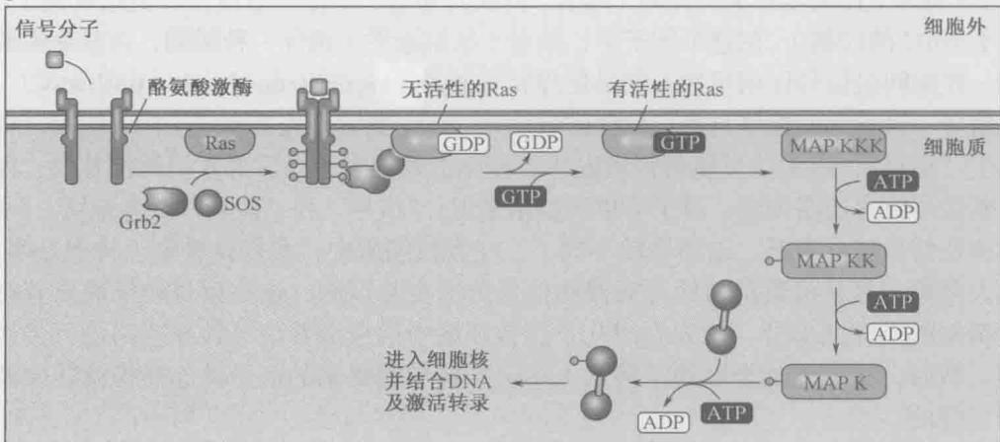

图 19-24 哺乳动物细胞的两条信号转导通路。这里显示的是 STAT 和 Ras 通路。(a) 图中显示的是一种细胞因子与其受体结合，从而使两条受体链靠近。每条受体链的胞内区都有一种称为 JAK 的激酶与之附着。两条受体链的汇聚（可能伴随由细胞因子结合所引发的构象改变）导致两条受体链的磷酸化，这种磷酸化是由 JAK 激酶所催化的（JAK 激酶也相互磷酸化，激发其激酶活性）。受体链的磷酸化位点随后被细胞质中的叫做 STAT 的蛋白质识别。每个 STAT 分子含有一个所谓的 SH2 域，这些结构域见于参与信号转导的很多蛋白质中。这些 SH2 域识别在某些序列环境中的磷酸化 Tyr 残基，而这正是该信号转导通路特异性的基础。也就是说，被募集到某一特定受体上的特殊的 STAT 将决定随后被激活的基因。一旦被募集到受体上，该 STAT 自身也被 JAK 激酶磷酸化。这种效应允许两个 STAT 蛋白形成一个二聚体（每个 STAT 上的 SH2 域识别对应 STAT 分子上的磷酸化位点）。二聚体随后转移至细胞核内，在该处，它与 DNA 上特异的位点结合（不同的 STAT 有不同的位点），并且激活邻近基因的转录。(b) 引导下游 MAPK 通路的 Ras 通路。某一生长因子（如表皮生长因子）与其受体结合，使受体链汇聚，正如 STAT 的例子，随后彼此磷酸化。这种作用募集一种衔接蛋白质，叫做 Grb2，该蛋白质有一个 SH2 域，可以识别激活的受体中的磷酸化的 Tyr 残基。Grb2 的另一端与 SOS 结合，后者是一种鸟嘌呤核苷酸交换因子（Ras GEF）。SOS 随后又结合 Ras 蛋白，后者附着在细胞膜内侧。Ras 蛋白是一种小 GTP 酶，后者在与 GTP 结合时采取一种构象，而与 GDP 结合时又是另一种构象；与 SOS 的相互作用引发 GTP 代替 GDP 与 Ras 结合，Ras 因而发生构象改变。在这种新的构象下，Ras 激活所谓 MAPK 级联的最高一级的激酶。该通路中的第一个激酶叫做 MAPK 激酶激酶（MAPKKK）(Raf)；一旦被 Ras 激活后，Raf 磷酸化下一级激酶（一种 MAPK 激酶 MAPKK，叫做 Mek）的丝氨酸和苏氨酸残基。这种作用激活了 Mek，后者进而磷酸化 MAPK（Erk）。该 MAPK 随后磷酸化一系列底物，包括转录激活因子（如 Jun），调控多种特异基因的转录，包括 β 干扰素（图 19-18）。

#### [W] 信号通过多种方式控制真核细胞转录调控因子

信号被直接或间接通讯到一个转录调控因子后，如何调控这个调控因子的活性呢？在细菌中，控制转录调控因子的变构改变通常可以影响该转录调控因子与 DNA 结合的能力。这在信号配体自身直接作用于转录调控因子的情况，以及信号配体经信号转导通路传递到转录调控因子的情况中都是如此。因此，乳糖抑制因子只有在缺乏别乳糖时才能与 DNA 结合，NtrC 的磷酸化引发变构改变，控制激活因子与 DNA 结合。

在真核生物中，通常转录调控因子并不在 DNA 结合水平被调控（虽然也有例外），而是通过下述两种基本方式之一被调控。

激活区的暴露 可以通过与 DNA 结合的激活因子的构象改变，使先前被掩蔽的激活区暴露出来；或者通过释放掩蔽蛋白达到此目的。在这之前该掩蔽蛋白结合并隐蔽激活区域。上述两种情况所必需的构象改变可以通过直接与配体结合，或者通过配体依赖的磷酸化来引发。

Gal4 由一个掩蔽蛋白所控制。在缺乏半乳糖时，Gal4 与其 GAL1 基因上游的结合位点结合，但是并不激活该基因，因为另外一个蛋白质 Gal80 与 Gal4 结合，闭塞了后者的激活区。半乳糖触发 Gal80 的释放及基因的激活（图 19-25）。

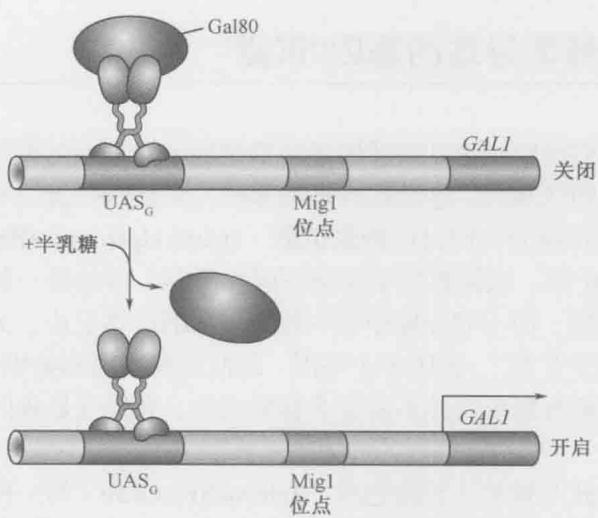  
图 19-25 酵母激活因子 Gal4 是由 Gal80 蛋白调节的。Gal4 仅在半乳糖存在时才具有活性，即使在半乳糖缺乏时，也发现 Gal4 与其位于 GAL1 基因上游的结合位点结合。但是在这种情况下，它并不能激活该基因，因为此时激活区域与另外一个叫做 Gal80 的蛋白质结合。在半乳糖存在时，Gal3 蛋白与 Gal80 结合并使之发生构象改变，Gal4 激活区域因而暴露。本图显示，在半乳糖存在时，Gal80 与 Gal4 解离。实际上可能是位置的改变以及结合力的减弱，而并非完全脱离。如图显示，Mig1 没有与其位点结合，因为不存在葡萄糖（图 19-23）。

在许多情况下，掩蔽蛋白不仅阻断激活区，其自身作为（或者募集）脱乙酰酶，所以可以主动抑制基因。一个例子是哺乳动物激活因子 E2F，E2F 与其目标基因的上游位点结合，无论是否再激活该基因。另外一个蛋白质——抑制因子 Rb（retinoblastoma protein，成视网膜细胞瘤蛋白）通过与 E2F 结合而控制 E2F 的活性。这种结合阻断了激活，并且募集了一种脱乙酰酶来抑制目标基因。Rb 磷酸化导致其从 E2F 上释放，因此也就导致了目标基因的激活。E2F 控制某些基因的表达，而这些基因是哺乳动物细胞经历细胞周期的 S 期所必需的（第 9 章）。因此，Rb 的磷酸化控制着这些细胞的增殖。影响这条通路的突变通常都与不受控制的细胞增殖和癌症相关。

运输出入细胞核 当处于非激活状态时，许多激活因子和抑制因子都被限制在细胞质中。具有信号功能的配体使这些激活因子和抑制因子转移到细胞核内，它们在细胞核内起作用。这一过程可以有许多不同的机制。因此，调控因子可以通过以下方式被限制在细胞质中：与抑制性蛋白相互作用，或者与细胞膜相互作用，或者以某种构象存在，在此种构象中其向细胞核内运输所必需的信号被掩盖了。

对信号的应答所导致的释放和向细胞核内运输可以通过抑制因子或连接区域的蛋白质水解及异构效应来介导。在第21章，当我们考虑果蝇胚胎的背腹轴形成时，我们会看到这样的例子。在该例子中，Cactus是抑制蛋白，在细胞质中与转录调控因子Dorsal结合。在对某一特异信号应答时，Cactus被磷酸化后降解，Dorsal得以进入细胞核行使其功能（第21章，图21-12）。如上文所述，β干扰素的一种调节因子NF-κB被激活的机制也是如此。NF-κB与抑制因子IκB结合以无活性的状态存在于细胞质中，NF-κB与Dorsal有关，而IκB与Cactus有关。

<!-- W-END Watson 19 真核生物的转录调控（章首） -->

<!-- C-BEGIN Campbell 18.2 -->

### 【英文对应 Campbell Concept 18.2：Eukaryotic gene expression is regulated at many stages】

> 来源：Campbell Biology（书籍/01_Campbell_Biology） 第18章 Regulation of Gene Expression，Concept 18.2。

#### [EN] Concept 18.2: Eukaryotic gene expression is regulated at many stages

All organisms, whether prokaryotic or eukaryotic, must regulate which genes are expressed at any given time. Both unicellular organisms and the cells of multicellular organisms continually turn genes on and off in response to signals from their external and internal environments. Regulation of gene expression is also essential for cell specialization in multicellular organisms, which are made up of different types of cells. To perform its own distinct role, each cell type must maintain a specific program of gene expression in which certain genes are expressed and others are not (see Figure 18.1).

#### [EN] Differential Gene Expression

A typical human cell might express about a third to a half of its protein-coding genes at any given time. Highly differentiated cells, such as muscle or nerve cells, express a smaller fraction of their genes. Almost all the cells in a multicellular organism contain an identical genome. (Cells of the immune system are one exception, as you will see in Figure 43.13.) A subset of genes is expressed in each cell type; some of these—about 35%—are “housekeeping” genes, expressed by many cell types, while others are unique to that cell type. The uniquely expressed genes allow these cells to carry out their specific function. The differences between cell types, therefore, are due not to different genes being present, but to differential gene expression, the expression of different genes by cells with the same genome.

The function of any cell depends on its expressing the appropriate set of genes. The transcription factors of a cell must locate the right genes at the right time, a task like finding a needle in a haystack. Abnormal gene expression can cause serious imbalances and diseases, including cancer.

Figure 18.6 summarizes the process of gene expression in a eukaryotic cell, highlighting key stages in the expression of a protein-coding gene. Each stage depicted in Figure 18.6 is a potential control point at which gene expression can be turned on or off, accelerated, or slowed down. Many genes have more than one control point.

Figure 18.6 Stages in gene expression that can be regulated in eukaryotic cells.

In this diagram, the colored boxes indicate the processes most often regulated; each color indicates the type of molecule that is affected (blue = DNA, red/orange = RNA, purple = protein). The nuclear envelope separating transcription from translation in eukaryotic cells allows for RNA processing, a form of post-transcriptional control that is not possible in prokaryotic organisms. Eukaryotes also have a greater variety of control mechanisms operating before transcription and after translation. Some genes are regulated at multiple stages.

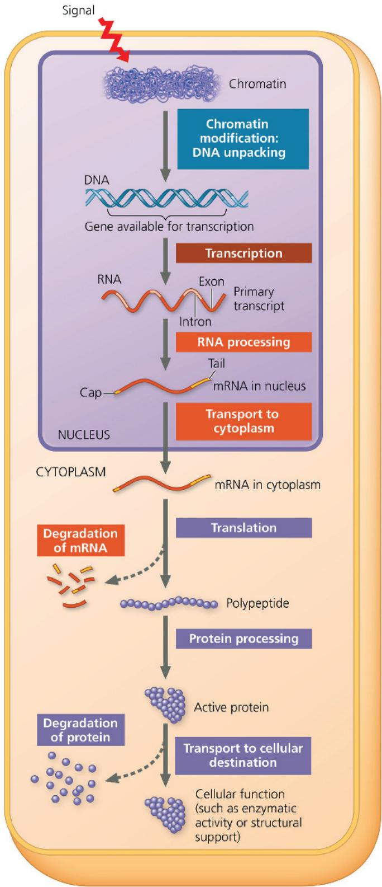

When the structure of DNA was determined in 1953, an understanding of the mechanisms that control gene expression in eukaryotes seemed almost hopelessly out of reach. Since then, advances in DNA technology (see Chapter 20) have enabled molecular biologists to uncover many details of eukaryotic gene regulation. In all organisms, gene expression is commonly controlled at transcription; regulation at this stage often occurs in response to signals coming from outside the cell, such as hormones or other signaling molecules. For this reason, the term gene expression is often equated with transcription for both bacteria and eukaryotes. While this may be the case for bacteria, the greater complexity of eukaryotic cell structure and function provides opportunities for regulating gene expression at many stages besides transcription (see Figure 18.6). Let's examine some of the important control points of eukaryotic gene expression more closely.

#### [EN] Regulation of Chromatin Structure

Recall that the DNA of eukaryotic cells is packaged with proteins in an elaborate complex known as chromatin, the basic unit of which is the nucleosome (see Figure 16.23). The structural organization of chromatin not only packs a cell's DNA into a compact form that fits inside the nucleus, but also helps regulate gene expression in several ways. Genes within heterochromatin, which is more densely arranged than euchromatin, are usually not expressed. In euchromatin, whether or not a gene is transcribed is affected by the location of nucleosomes along a gene's promoter and also the sites where the DNA attaches to the protein scaffolding of the chromosome. Chromatin structure and gene expression can be influenced by chemical modifications of both the histone proteins of the nucleosomes around which DNA is wrapped and the nucleotides that make up that DNA. Here we examine the effects of these modifications, which are catalyzed by specific enzymes.

#### [EN] Histone Modifications and DNA Methylation

Chemical modifications to histones, found in all eukaryotic organisms, play a direct role in the regulation of gene transcription. The N-terminus of each histone protein in a nucleosome protrudes outward from the nucleosome (Figure 18.7a). These so-called histone tails are accessible to various modifying enzymes that catalyze the addition or removal of specific chemical groups, such as acetyl ( $—COCH_{3}$ ), methyl, and phosphate groups (see Figure 4.9). Generally, histone acetylation—the addition of an acetyl group to an amino acid in a histone tail—appears to promote transcription by opening up chromatin structure (Figure 18.7b), while the addition of methyl groups to histones can lead to the condensation of chromatin and reduced transcription. Often, the addition of a particular chemical group may create a new binding site for enzymes that further modify chromatin structure.

Rather than modifying histone proteins, a different set of enzymes can methylate the DNA itself on certain bases, usually cytosine. Such DNA methylation occurs in most plants, animals, and fungi. Long stretches of inactive DNA, such as that of inactivated mammalian X chromosomes (see Figure 15.8), are generally more methylated than regions of actively transcribed DNA. On a smaller scale, the DNA of individual genes is usually more heavily methylated in cells in which those genes are not expressed. Removal of the extra methyl groups can turn on some of these genes.

Figure 18.7 A simple model of histone tails and the effect of histone acetylation.

Amino acids in histone tails may be chemically modified by addition of acetyl groups (green balls) or other groups (such as methyl or phosphate groups). Such modifications affect chromatin structure in a region, sometimes by providing binding sites for other chromatin-modifying enzymes.

Once methylated, genes usually stay that way through successive cell divisions in a given individual. At DNA sites where one strand is already methylated, enzymes methylate the correct daughter strand after each round of DNA replication. Methylation patterns are thus passed on to daughter cells, and cells forming specialized tissues keep a chemical record of what occurred during embryonic development. A methylation pattern maintained in this way also accounts for genomic imprinting in mammals, where methylation permanently regulates expression of either the maternal or paternal allele of particular genes at the start of development (see Figure 15.17). DNA methylation and histone modification are believed to be coordinated in their regulation.

#### [EN] Epigenetic Inheritance

The chromatin modifications that we just discussed do not change the DNA sequence, yet they still may be passed along to future generations of cells. Inheritance of traits transmitted by mechanisms not involving the nucleotide sequence itself is called epigenetic inheritance, the study of which is called epigenetics. Whereas mutations in the DNA are permanent changes, modifications to the chromatin can be reversed. For example, DNA methylation patterns are largely erased during gamete formation and reestablished during embryonic development. Furthermore, they are changeable, thus responding more rapidly to environmental conditions.

Research on epigenetics has skyrocketed over the past few decades. The importance of epigenetic information in regulating gene expression is now widely accepted. One key study by researchers at Duke University in the early 2000s used a mouse mutant whose genome had been altered so that a gene called agouti that determines coat color, normally expressed only briefly during fur formation, was instead expressed throughout development. This overexpression resulted in yellow mice (Figure 18.8, left mouse) rather than the usual brownish (“agouti”) color. Previous work had shown that factors other than DNA sequence changes (thus epigenetic factors) could affect how this mutation affected the phenotype: Merely supplementing the diet of pregnant mothers with methyl group-containing compounds (like folic acid) could shift the range of coat colors of the offspring back to normal (see Figure 18.8, right mouse). The Duke researchers reproduced this result, analyzing the state of methylation of the DNA. They showed that the extent of the color shift correlated with the level of DNA methylation. In other words, feeding methyl groups to the mothers at a key time during gestation led to a change in gene expression in the offspring’s phenotype. Further studies showed that the effects were even observed in the next generation—the “grandpups” of the original female mouse.

A similar epigenetic effect due to changes in methylation occurs in humans as well. Near the end of World War II, during the winter of 1944–45, Dutch railway workers went on strike to try to prevent the Nazis from bringing in more troops. In retaliation, the Nazis blocked all deliveries of food. Over 20,000 Dutch died in the “Dutch Hunger Winter.” In long-term clinical studies, researchers found that the offspring of individuals who

Figure 18.8 An example of epigenetic inheritance: Effects of maternal diet on genetically identical mice.

These two mice are genetically identical (agouti mutants), but their mothers were fed different diets. A maternal diet without compounds that donate methyl groups resulted in the obese, yellow offspring on the left. A diet supplemented with methyl-donating compounds, such as folic acid, led to the speckled brown fur (normal agouti phenotype) and normal weight of the mouse on the right.

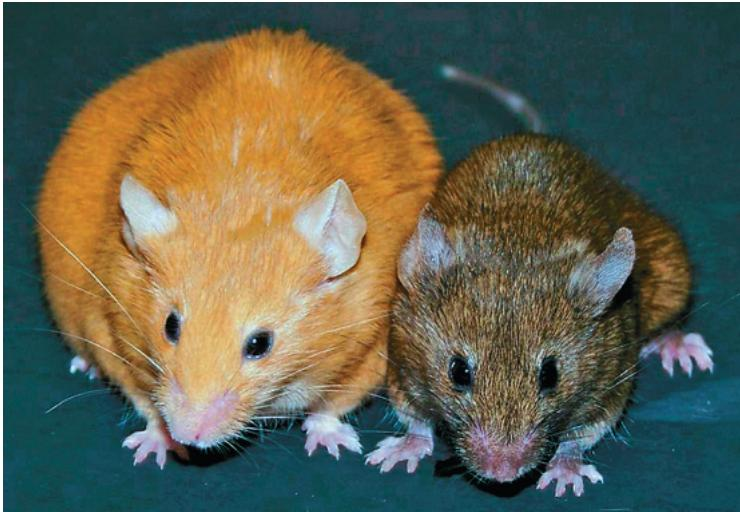

were in early pregnancy at that time experienced adverse health effects as adults: higher rates of obesity, high triglyceride and cholesterol levels, type 2 diabetes, and schizophrenia. Furthermore, these affected offspring had a 10% higher mortality rate after the age of 68 than their siblings who were in utero when food was readily available. A collaboration between labs in the Netherlands and the United States compared those adults with their siblings and published their findings in 2018. Statistical analysis enabled the researchers to conclude that differences between the siblings in DNA methylation of certain genes caused these long-term adverse medical conditions—examples of epigenetic inheritance.

Epigenetic variations might help explain cases where one identical twin acquires a genetically based disease, such as schizophrenia, but the other does not, despite their identical genomes. Some differences in behavior or environment may lead to differing degrees of DNA methylation in the two twins. Alterations in normal patterns of DNA methylation are seen in some cancers, where they are associated with inappropriate gene expression. Evidently, enzymes that modify chromatin structure are integral parts of the eukaryotic cell's machinery for regulating transcription.

#### [EN] Regulation of Transcription Initiation

Chromatin-modifying enzymes provide initial control of gene expression by making a region of DNA either more or less able to bind the transcription machinery. Once the chromatin of a gene is optimally modified for expression, the initiation of transcription is the next major step at which gene expression is regulated. As in bacteria, the regulation of transcription initiation in eukaryotes involves proteins that bind to DNA and either facilitate or inhibit binding of RNA polymerase. The process is more complicated in eukaryotes, however. Before looking at how eukaryotic cells control their transcription, let's review the structure of a eukaryotic gene.

#### [EN] Organization of a Typical Eukaryotic Gene and Its Transcript

A eukaryotic gene and the DNA elements (segments) that control it are typically organized as shown in Figure 18.9, which extends what you learned about eukaryotic genes in Chapter 17. Recall that a cluster of proteins called a transcription initiation complex assembles on the promoter sequence at the “upstream” end of the gene (see Figure 17.9). One of these proteins, RNA polymerase II, then proceeds to transcribe the gene, synthesizing a primary RNA transcript (pre-mRNA). RNA processing includes enzymatic addition of a 5' cap and a poly-A tail, as well as splicing out of introns, to yield a mature mRNA. Associated with most eukaryotic genes are multiple control elements, segments of noncoding DNA that serve as binding sites for the proteins called transcription factors, which bind to the control

Figure 18.9 A eukaryotic gene and its transcript.

Each eukaryotic gene has a promoter—a DNA sequence where RNA polymerase II binds and starts transcription, proceeding “downstream.” A number of control elements (gold) are involved in regulating the initiation of transcription; these are DNA sequences located near (proximal to) or far from (distal to) the promoter. Distal control elements can be grouped together as enhancers, one of which is shown for this gene. At the other end of the gene, a polyadenylation (poly-A) signal sequence in the last exon of the gene elements and regulate transcription. Control elements on the DNA and the transcription factors that bind to them are critical to the precise regulation of gene expression seen in different cell types.

#### [EN] The Roles of General and Specific Transcription Factors

There are two types of transcription factors: General transcription factors act at the promoter of all genes, while some genes require specific transcription factors that bind to control elements that may be close to or farther away from the promoter.

#### [EN] General Transcription Factors at the Promoter

To initiate transcription, eukaryotic RNA polymerase II requires the assistance of transcription factors. Some transcription factors (such as those illustrated in Figure 17.9) are essential for the transcription of all protein-coding genes; therefore, they are often called general transcription factors. A few general transcription factors bind to a DNA sequence, such as the TATA box in most promoters, but many bind to proteins, including other transcription factors as well as RNA polymerase II. Protein-protein interactions are crucial to the initiation of eukaryotic transcription. Only when the complete initiation complex has

is transcribed into an RNA sequence that signals where the transcript is cleaved and the poly-A tail added. Transcription may continue for hundreds of nucleotides beyond the poly-A signal before terminating. RNA processing of the primary transcript into a functional mRNA involves three steps: addition of the 5' cap, addition of the poly-A tail, and splicing. In the cell, the 5' cap is added soon after transcription is initiated, and splicing occurs while transcription is still under way (see Figures 17.11 and 17.12).

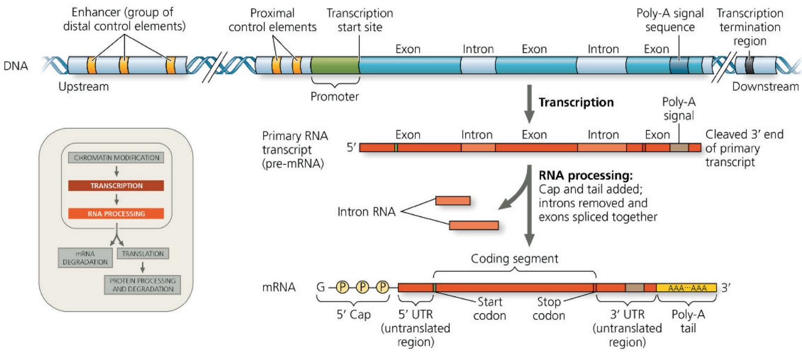

assembled can the polymerase begin to move along the DNA template strand and transcribe.

Some genes are expressed all the time, but others are not; instead, they are regulated. For these genes, the interaction of general transcription factors and RNA polymerase II with a promoter usually leads to a low rate of initiation and production of few RNA transcripts from genes that are not expressed at significant levels all the time or in all cells. In eukaryotes, high levels of transcription of these particular genes at the appropriate time and place depend on the interaction of control elements with another set of proteins, which can be thought of as specific transcription factors.

#### [EN] Enhancers and Specific Transcription Factors

As you can see in Figure 18.9, some control elements, named proximal control elements, are close to the promoter. The more distant distal control elements, groupings of which are called enhancers, may be thousands of nucleotides upstream or downstream of a gene or even within an intron. A given gene may have multiple enhancers, each active at a different time, cell type, or location in the organism. Each enhancer, however, is generally associated with only that gene and no other.

In eukaryotes, the rate of gene expression can be strongly increased or decreased by the binding of specific transcription factors, either activators or repressors, to the control elements of enhancers. Many hundreds of transcription activators have been discovered in eukaryotes; the structure of one is shown in Figure 18.10. Researchers have identified two types of structural domains that are commonly found in a large number of transcription activators: a DNA-binding domain—a part of the protein's three-dimensional structure that binds to DNA—and one or more activation domains. Activation domains bind other regulatory proteins or components of the transcription machinery, facilitating a series of protein-protein interactions that result in enhanced transcription of a given gene.

Figure 18.11 shows the currently accepted model for how binding of activators to an enhancer located far from the promoter influences transcription. Protein-mediated bending of the DNA brings the bound activators into contact with a group of mediator proteins, which in turn interact with general transcription factors at the promoter. These protein-protein interactions help assemble and position the initiation complex on the promoter. One study supporting this model shows that proteins regulating one of the mouse globin genes contact both the gene's promoter and an enhancer located about 50,000 nucleotides upstream. Protein interactions allow these two DNA regions to come together in a very specific fashion, in spite of the many nucleotide pairs between them.

Specific transcription factors that function as repressors can inhibit gene expression in several different ways. Some repressors bind directly to control element DNA (in enhancers or elsewhere), blocking activator binding. Other repressors interfere with the activator itself so it can't bind the DNA.

In addition to influencing transcription directly, some activators and repressors indirectly affect chromatin structure. Studies using yeast and mammalian cells show that some

#### [EN] Figure 18.10 The structure of MyoD, a transcriptional activator.

The MyoD protein is made up of two polypeptide subunits (purple ribbon starting at upper left and salmon ribbon starting at upper right) with extensive regions of $\alpha$ helix. Each subunit has one DNA-binding domain (lower half) and one activation domain (upper half). The latter includes binding sites for the other subunit and for other proteins. MyoD is involved in muscle development in vertebrate embryos (see Concept 18.4).

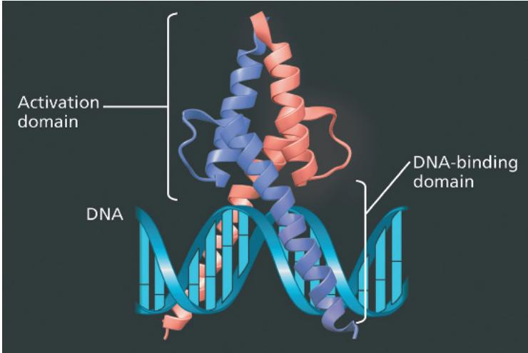  
VISUAL SKILLS Describe how the two functional domains of the MyoD protein relate to the two polypeptide subunits.
For suggested answer, see Appendix A.

activators recruit proteins that acetylate histones near the promoters of specific genes, thus promoting transcription (see Figure 18.7). Similarly, some repressors recruit proteins that remove acetyl groups from histones, leading to reduced transcription, a phenomenon referred to as silencing. Indeed, recruitment of chromatin-modifying proteins seems to be the most common mechanism of repression in eukaryotic cells.

#### [EN] Combinatorial Control of Gene Activation

In eukaryotes, the precise control of transcription depends largely on the binding of activators to DNA control elements. Considering that many genes must be regulated in a typical animal or plant cell, the number of different nucleotide sequences in control elements is surprisingly small. A dozen or so short nucleotide sequences appear again and again in the control elements for different genes. On average, each enhancer is composed of about ten control elements, each binding only one or two specific transcription factors. It is the particular combination of control elements in an enhancer associated with a gene, rather than a single unique control element, that is important in regulating transcription of the gene.

Even with only a dozen control element sequences available, many combinations are possible. Each combination of control elements can activate transcription only when the appropriate transcription activators are present, which may occur at a precise time during development or in a particular cell type.

Figure 18.11 A model for the action of enhancers and transcription activators.

Bending of the DNA by a protein enables enhancers to influence a promoter hundreds or even many thousands of nucleotides away. Specific transcription factors (activators) bind to the enhancer DNA sequences and then to a group of mediator proteins. These in turn bind to general transcription factors and then RNA polymerase II, thus assembling the transcription initiation complex. These protein-protein interactions lead to correct positioning of the complex on the promoter and the initiation of a significant rate of RNA synthesis. Only one enhancer (with three gold control elements) is shown here, but a gene may have several enhancers that act at different times or in different cell types.

  
Transcription initiation complex

In the Scientific Skills Exercise, you can work with data from an experiment that identified the control elements in an enhancer of a particular human gene. Figure 18.12 illustrates how the use of different combinations of just a few control elements can allow differential regulation of transcription in two representative cell types—liver cells and lens cells. This can occur because each cell type contains a different group of transcription activators. How cell types come to differ during this process, even though they all arise from one cell (the fertilized egg), will be explored in Concept 18.4.

#### [EN] Coordinately Controlled Genes in Eukaryotes

How does the eukaryotic cell deal with a group of genes of related function that need to be turned on or off at the same time? Earlier in this chapter, you learned that in bacteria, such coordinately controlled genes are often clustered into an operon, which is regulated by a single promoter and transcribed into a single mRNA molecule. Thus, the genes are expressed together, and the encoded proteins are produced at the same time. With a few exceptions,

operons that work in this way have not been found in eukaryotic cells.

Eukaryotic genes that are co-expressed, such as genes coding for the enzymes of a metabolic pathway, are typically scattered over different chromosomes. Here, coordinate gene expression depends on every gene of a dispersed group having a specific combination of control elements. Transcription activators in the nucleus that recognize the control elements bind to them, promoting simultaneous transcription of the genes, no matter where they are in the genome.

Coordinate control of dispersed genes in a eukaryotic cell often occurs in response to chemical signals from outside the cell. A steroid hormone, for example, enters a cell and binds to a specific intracellular receptor protein, forming a hormone-receptor complex that serves as a transcription activator (see Figure 11.9). Every gene whose transcription is stimulated by a given steroid hormone, regardless of its chromosomal location, has a control element recognized by that hormone-receptor complex. This is how estrogen activates a group of genes that stimulate cell division in uterine cells, preparing the uterus for pregnancy.

#### [EN] Scientific Skills Exercise Analyzing DNA Deletion Experiments

  
Tissue inflammation

What Control Elements Regulate Expression of the mPGES-1 Gene? The promoter of a gene includes the DNA immediately upstream of the transcription start site, but the control elements (grouped in an enhancer) that regulate the level of transcription of the gene may be thousands of base pairs upstream of the promoter. Because the distance and spacing of

control elements make them difficult to identify, scientists begin by deleting possible control elements and measuring the effect on gene expression. In this exercise, you will analyze data obtained from DNA deletion experiments that tested possible control elements for the human gene mPGES-1. This gene codes for an enzyme that synthesizes a type of prostaglandin, a chemical made during tissue inflammation.

How the Experiment Was Done The researchers hypothesized that there were three possible control elements in an enhancer region located 8–9 kilobases (kb) upstream of the mPGES-1 gene. Control elements regulate whatever gene is in the appropriate downstream location. Thus, to test the activity of the possible elements, researchers first synthesized molecules of DNA (DNA constructs) that had the intact enhancer region upstream of a reporter gene, a gene whose mRNA product could be easily measured experimentally. Next, they made three more DNA constructs, with one of the three proposed control elements deleted in each (see the left side of the figure). The researchers then introduced each DNA construct into a separate human cell culture, where the cells took up the DNA. After 48 hours, the amount of reporter gene mRNA made by the cells was measured. Comparing these amounts allowed researchers to determine if any of the deletions had an effect on expression of the reporter gene, mimicking the effect of deletions on mPGES-1 gene expression. (The mPGES-1 gene itself couldn't be used to measure expression levels because the cells express their own mPGES-1 gene, and the mRNA from that gene would confuse the results.)

Data from the Experiment The diagrams on the left side of the figure show the intact DNA sequence (top) and the three experimental DNA constructs. A red X is located on the possible control element (1, 2, or 3) that was deleted in each experimental DNA construct. The area between the slashes represents the approximately 8 kb of DNA located between the promoter and the enhancer region. The horizontal bar graph on the right shows the amount of reporter gene mRNA that was present in each cell culture after 48 hours relative to the amount that was in the culture containing the intact enhancer region (top bar = 100%).

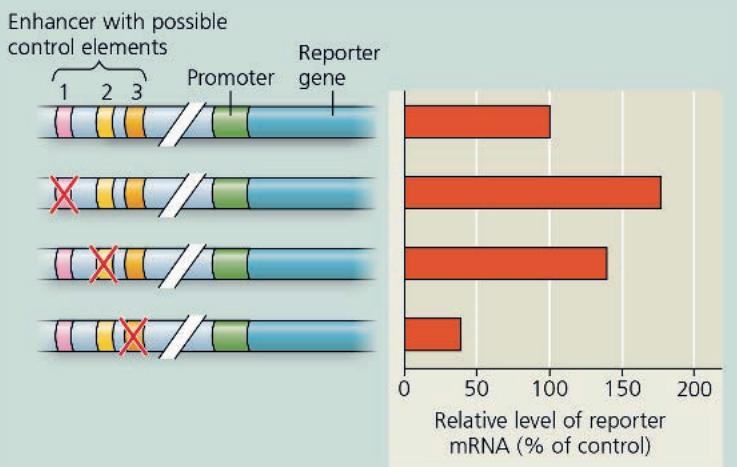  
Data from J. N. Walters et al., Regulation of human microsomal prostaglandin E synthase-1 by IL-1b requires a distal enhancer element with a unique role for C/EBPb, Biochemical Journal 443:561–571 (2012).

#### [EN] INTERPRET THE DATA

1. (a) What is the independent variable in the graph? (b) What is the dependent variable? (c) What was the control treatment in this experiment? Label it on the diagram.

2. Do the data suggest that any of these possible control elements are actual control elements? Explain.

3. (a) Did deletion of any of the possible control elements cause a reduction in reporter gene expression? If so, which one(s), and how can you tell? (b) If loss of a control element causes a reduction in gene expression, what must be the normal role of that control element? Provide a biological explanation for how the loss of such a control element could lead to a reduction in gene expression.

4. (a) Did deletion of any of the possible control elements cause an increase in reporter gene expression relative to the control? If so, which one(s), and how can you tell? (b) If loss of a control element causes an increase in gene expression, what must be the normal role of that control element? Propose a biological explanation for how the loss of such a control element could lead to an increase in gene expression.

Instructors: A version of this Scientific Skills Exercise can be assigned in Mastering Biology.

#### [EN] Figure 18.12 Cell type-specific transcription.

Both liver cells and lens cells have the genes for making the proteins albumin and crystallin, but only liver cells make albumin (a blood protein) and only lens cells make crystallin (the main protein of the lens of the eye). The specific transcription factors made in a cell determine which genes are expressed. In this example, the genes for albumin and crystallin are shown at the top, each with an enhancer made up of three different control elements. Although the enhancers for the two genes both have a gray control element (2), each enhancer has a unique combination of elements. All the transcription activator proteins required for high-level expression of the albumin gene are present in liver cells only (left), whereas the activators needed for expression of the crystallin gene are present in lens cells only (right). For simplicity, we consider only the role of specific transcription factors that are activators.

VISUAL SKILLS Describe the enhancer for the albumin gene in each type of cell. How would the nucleotide sequence of this enhancer in the liver cell compare with that in the lens cell? For suggested answer, see Appendix A.

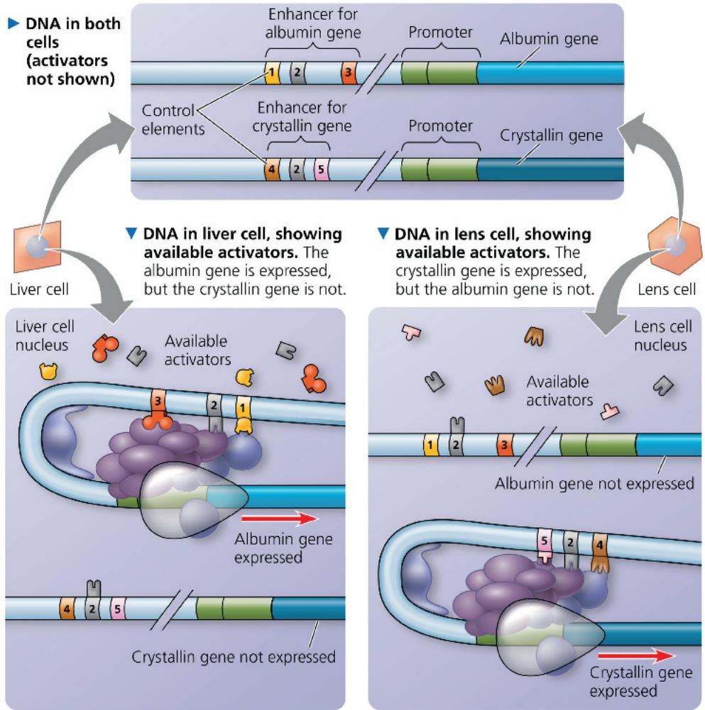

Many signaling molecules, such as nonsteroid hormones and growth factors, bind to receptors on a cell's surface and never actually enter the cell. Such molecules can control gene expression indirectly by triggering signal transduction pathways that activate particular transcription factors (see Figure 11.15). Coordinate regulation in such pathways is the same as for steroid hormones: Genes with the same sets of control elements are activated by the same chemical signals. Because this system for coordinating gene regulation is so widespread, biologists think that it probably arose early in evolutionary history.

#### [EN] Nuclear Architecture and Gene Expression

Each chromosome in the interphase nucleus of animal cells occupies a distinct territory (see Figure 16.24a). Recently, chromosome conformation capture techniques (3C and others) have been developed that allow researchers to cross-link and identify regions of chromosomes associating with each other during interphase. These studies reveal two organizational details: First, the territory of each chromosome is divided into regions of chromatin loops (topologically associated domains, or TADs), within which chromatin sites associate mainly with each other. Second, loops of chromatin, each likely a TAD, extend from individual chromosomal territories into specific sites in the nucleus (Figure 18.13). Different loops from the same chromosome and loops from other chromosomes may congregate in such sites, some of which are rich in RNA polymerases and other

transcription-associated proteins. Like a recreation center that draws members from many different neighborhoods, these so-called transcription factories are thought to be areas specialized for a common function.

The old view that the nuclear contents are like a bowl of amorphous chromosomal spaghetti has given way to a new model of a nucleus with a defined architecture and regulated movements of chromatin. Several lines of evidence suggest that unexpressed genes are located in the outer edges of the nucleus, while those that are being expressed are found in its interior region. Relocation of particular genes from their chromosomal territories to transcription factories in the interior may be part of the process of readying genes for transcription. Research into organization of the genome over time and its relationship to genome function is a focus of current research. This is of interest in part because alterations in genome architecture have been implicated in some neuropsychological and other disorders.

#### [EN] Mechanisms of Post-transcriptional Regulation

Transcription alone does not constitute gene expression. The expression of a protein-coding gene is ultimately measured by the amount of functional protein a cell makes, and much happens between the synthesis of the RNA transcript and the activity of

Figure 18.13 Chromosomal interactions in the interphase nucleus.

Although each chromosome has its own territory (see Figure 16.24a), loops of chromatin may extend into other sites in the nucleus. (Each loop may be a topologically associated domain, or TAD.) Some of these sites are transcription factories that are occupied by multiple chromatin loops from the same chromosome (blue loops at the lower left) or other chromosomes (red loop at the top and green loop on the right).

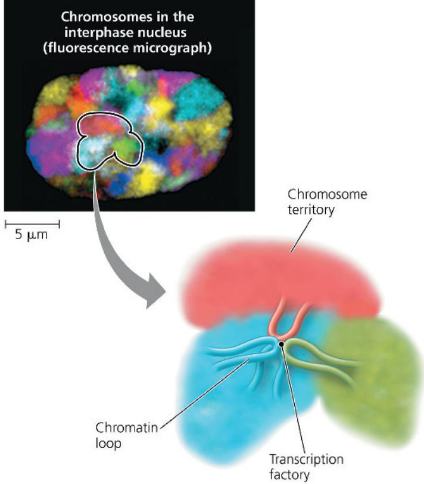  
the protein in the cell. Many regulatory mechanisms operate at the various stages after transcription (see Figure 18.6). These mechanisms allow a cell to rapidly fine-tune gene expression in response to environmental changes without altering its transcription patterns. Here we explore how cells regulate gene expression after transcription.

#### [EN] RNA Processing

RNA processing in the nucleus and the export of mature RNA to the cytoplasm provide opportunities for regulating gene expression not available in prokaryotic organisms. One example of regulation at the RNA-processing level is alternative RNA splicing, in which different mRNA molecules are produced from the same primary transcript, depending on which RNA segments are treated as exons and which as introns. Regulatory proteins specific to a particular cell type exert control over intron/exon choices by binding to regulatory sequences within the primary transcript.

A simple example of alternative RNA splicing is shown in Figure 18.14 for the troponin T gene, which encodes multiple closely related proteins with slightly different effects on muscle contraction. Other genes code for many more products.

For instance, researchers have found a Drosophila gene with enough alternatively spliced exons to generate about 19,000 membrane proteins that have different extracellular domains. At least 17,500 (94%) of the alternative mRNAs are actually synthesized. Each developing nerve cell in the fly appears to synthesize a different form of the protein, which acts as a unique identifier on the cell surface and helps prevent excessive overlap of nerve cells during development of the nervous system.

Alternative RNA splicing can significantly expand the repertoire of a eukaryotic genome. In fact, alternative splicing was proposed as one explanation for the surprisingly low number of human genes counted when the human genome was sequenced. The number of human genes was found to be similar to that of a soil worm (nematode), a mustard plant, or a sea anemone. This discovery prompted questions about what, if not the number of genes, accounts for the more complex form and structure of humans. More than 90% of human protein-coding genes likely undergo alternative splicing. Thus, the extent of alternative splicing greatly multiplies the number of possible human proteins, which may be better correlated with complexity of form than the number of genes.

#### [EN] Initiation of Translation and mRNA Degradation

Translation is another stage where gene expression is regulated, most commonly at the initiation stage (see Figure 17.19). For some mRNAs, the initiation of translation can be blocked by regulatory proteins that bind to specific sequences or structures within the untranslated region (UTR) at the 5' or 3' end, preventing the attachment of ribosomes. (Recall from Concept 17.3 that both

#### [EN] Figure 18.14 Alternative RNA splicing of the troponin T gene.

The primary transcript of this gene can be spliced in more than one way, generating different mRNA molecules. Notice that one mRNA molecule has ended up with exon 3 (green) and the other with exon 4 (purple). These two mRNAs are translated into different but related muscle proteins.

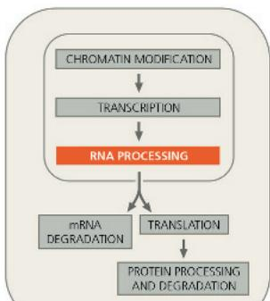

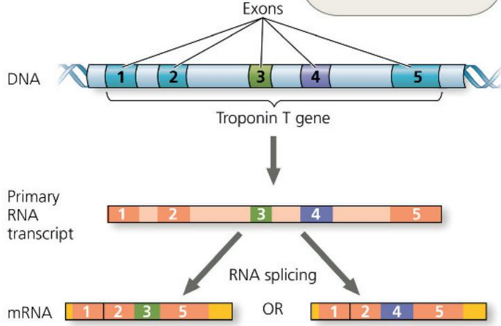

the 5' cap and the poly-A tail of an mRNA molecule are important for ribosome binding.)

Alternatively, translation of all the mRNAs in a cell may be regulated simultaneously. In a eukaryotic cell, such “global” control usually involves the activation or inactivation of one or more protein factors required to initiate translation. This mechanism plays a role in starting translation of mRNAs that are stored in eggs. Just after fertilization, translation is triggered by the sudden activation of translation initiation factors. The response is a burst of synthesis of the proteins encoded by the stored mRNAs. Some plants and algae store mRNAs during periods of darkness; light then triggers the reactivation of the translational apparatus.

The life span of mRNA molecules in the cytoplasm is important in determining the pattern of protein synthesis in a cell. Bacterial mRNA molecules typically are degraded by enzymes within a few minutes. This short life span of mRNAs is one reason bacteria can change their patterns of protein synthesis so quickly in response to environmental changes. In contrast, some mRNAs in multicellular eukaryotes typically survive for hours, days, or even weeks. For instance, the mRNAs for the hemoglobin polypeptides ( $\alpha$ -globin and $\beta$ -globin) in developing red blood cells are unusually stable, and these long-lived mRNAs are translated repeatedly in red blood cells.

Nucleotide sequences that affect how long an mRNA remains intact are often found in the untranslated region at the 3' end of the molecule (see Figure 18.9). In one experiment, researchers transferred such a sequence from the short-lived mRNA for a growth factor to the 3' end of a normally stable globin mRNA. The globin mRNA was quickly degraded.

Other mechanisms that degrade or block expression of mRNA molecules have come to light. They involve a group of RNA molecules that regulate gene expression at several levels, as you'll see shortly.

#### [EN] Protein Processing and Degradation

The final opportunities for controlling gene expression occur after translation. Often, eukaryotic polypeptides must be processed to yield functional protein molecules. For instance, cleavage of the initial insulin polypeptide (pro-insulin) forms the active hormone. In addition, many proteins undergo chemical modifications that make them functional. Regulatory proteins are commonly activated or inactivated by the reversible addition of phosphate groups (see Figure 11.10), and proteins destined for the surface of animal cells acquire sugars (see Figure 6.12). Cell-surface proteins and many others must also be transported to target destinations in the cell in order to function (see Figure 17.22). Regulation might occur at any of the steps involved in modifying or transporting a protein.

Finally, the length of time each protein functions in the cell is strictly regulated by selective degradation. Many proteins, such as the cyclins involved in regulating the cell cycle, must be relatively short-lived if the cell is to function appropriately (see Figure 12.16). To mark a protein for destruction, the cell commonly attaches molecules of a small protein called ubiquitin to the protein. Giant protein complexes called proteasomes then recognize the ubiquitin tagged proteins and degrade them.

#### [EN] Concept Check 18.2

1. In general, what are the effects of histone acetylation and DNA methylation on gene expression?

2. MAKE CONNECTIONS Speculate about whether the same enzyme could methylate both a histone and a DNA base. (See Concept 8.4.)

3. Compare the roles of general and specific transcription factors in regulating gene expression.

4. Once mRNA encoding a particular protein reaches the cytoplasm, what are four mechanisms that can regulate the amount of the protein that is active in the cell?

5. WHAT IF? Suppose you compared the nucleotide sequences of the distal control elements in the enhancers of three genes that are expressed only in muscle cells. What would you expect to find? Why?

For suggested answers, see Appendix A.

<!-- C-END Campbell 18.2 -->

<!-- L-BEGIN Lehninger 28.3 -->

### 【英文对应 Lehninger §28.3：Regulation of Gene Expression in Eukaryotes】

> 来源：Lehninger Principles of Biochemistry（书籍/02_生物化学原理） 第28章 Regulation of Gene Expression，§28.3。

Initiation of transcription is a crucial regulation point for gene expression in all organisms. Although eukaryotes and bacteria use some of the same regulatory mechanisms, the regulation of transcription in the two systems is fundamentally different.

P4 We can define a transcriptional ground state as the inherent activity of promoters and transcriptional machinery in vivo in the absence of regulatory sequences. In bacteria, RNA polymerase generally has access to every promoter and can bind and initiate transcription at some level of efficiency in the absence of activators or repressors. In eukaryotes, however, strong promoters are generally inactive in vivo in the absence of regulatory proteins. This fundamental difference gives rise to at least five important features that distinguish the regulation of gene expression at eukaryotic promoters from that observed in bacteria.

First, access to eukaryotic promoters is restricted by the structure of chromatin, and activation of transcription is associated with many changes in chromatin structure in the transcribed region. Second, although eukaryotic cells have both positive and negative regulatory mechanisms, positive mechanisms are more prominent. Almost every eukaryotic gene requires activation to be transcribed. Third, regulatory mechanisms involving lncRNAs are more common in eukaryotic transcriptional regulation. Fourth, eukaryotic cells have larger, more complex multimeric regulatory proteins than do bacteria. Finally, transcription in the eukaryotic nucleus is separated from translation in the cytoplasm in both space and time.

The complexity of regulatory circuits in eukaryotic cells is extraordinary, as is evident from the following discussion. The section ends with an illustrated description of one of the most elaborate circuits: the regulatory cascade that controls development in fruit flies.

#### [EN] Transcriptionally Active Chromatin Is Structurally Distinct from Inactive Chromatin

The effects of chromosome structure on gene regulation in eukaryotes have no clear parallel in bacteria. In the eukaryotic cell cycle, interphase chromosomes appear, at first viewing, to be dispersed and amorphous (see Fig. 24-22). Nevertheless, several forms of chromatin can be found along these chromosomes. About 10% of the chromatin in a typical eukaryotic cell is in a more condensed form than the rest of the chromatin. This form, heterochromatin, is transcriptionally inactive.

Heterochromatin is generally associated with particular chromosome structures—the centromeres, for example. The remaining, less condensed chromatin is called euchromatin.

Transcription of a eukaryotic gene is strongly repressed when its DNA is condensed within heterochromatin. Some, but not all, of the euchromatin is transcriptionally active. Transcriptionally active chromosomal regions are distinguished from heterochromatin in at least three ways: the positioning of nucleosomes, the presence of histone variants, and the covalent modification of nucleosomes. These transcription-associated structural changes in chromatin are collectively called chromatin remodeling. The remodeling employs a set of enzymes that promote these changes (Table 28-2).

Four known families of chromatin remodeling complexes, distinguished by their structural features, act directly to alter nucleosome composition in transcribed regions. They may unwrap, translocate, remove, or exchange nucleosomes on the DNA, hydrolyzing ATP in the process (Table 28-2; see the table footnote for an explanation of the abbreviated names of enzyme complexes described here). In some cases, the enzymes catalyze the exchange of pairs of histones within nucleosomes to alter nucleosome composition. The multitude of different complexes are specialized to function at particular genes or chromosomal regions. There are two related complexes in the SWI/SNF family in all eukaryotic cells, both of which remodel chromatin so that nucleosomes are ejected from the DNA near transcription start sites. They appear to be involved in a dynamic cycle to allow replacement of nucleosomes with transcription factors (Fig. 28-28). The two distinct complexes generally function at different sets of genes. Most of the ISWI family complexes optimize nucleosome spacing to allow chromatin assembly and transcriptional silencing. There are generally 9 or 10 different CHD family complexes in eukaryotic cells, separated into three subfamilies. The different family members have specialized roles, either ejecting nucleosomes to activate transcription or assembling chromatin to repress transcription. The INO80 family complexes have a variety of roles in remodeling chromatin for transcriptional activation and DNA repair. One family member, SWR1, promotes subunit exchange in nucleosomes to introduce histone variants such as H2AZ (see Box 24-1), found in transcriptionally active regions.

The covalent modification of histones is altered dramatically within transcriptionally active chromatin. The core histones of nucleosome particles (H2A, H2B, H3, H4; see Fig. 24-24) are modified by methylation of Lys or Arg residues, phosphorylation of Ser or Thr residues, acetylation (see below), ubiquitination (see Fig. 27-47), or SUMOylation (SUMOs are small ubiquitin-like modifiers). Each of the core histones has two distinct structural domains. A central domain is involved in histone-histone interaction and the wrapping of DNA around the nucleosome. A lysine-rich amino-terminal domain is generally positioned near the exterior of the assembled nucleosome particle; the covalent modifications occur at specific residues concentrated in this amino-terminal domain. The patterns of modification have led some researchers to propose the existence of a histone code, in which modification patterns are recognized by enzymes that alter the structure of chromatin. Indeed, some of the modifications are essential for interactions with proteins that play key roles in transcription.

<table><tr><td colspan="4">TABLE 28-2 Some Enzyme Complexes That Catalyze Chromatin Structural Changes Associated with Transcription</td></tr><tr><td>Enzyme complexa</td><td>Oligomeric structure (number of polypeptides)</td><td>Source</td><td>Activities</td></tr><tr><td colspan="4">Histone movement, replacement, or editing, requiring ATP</td></tr><tr><td>SWI/SNF family</td><td> $8-17,M_r >10^6$ </td><td>Eukaryotes</td><td>Nucleosome remodeling; transcriptional activation</td></tr><tr><td>ISWI family</td><td>2-4</td><td>Eukaryotes</td><td>Nucleosome remodeling; transcriptional repression; transcriptional activation in some cases</td></tr><tr><td>CHD family</td><td>1-10</td><td>Eukaryotes</td><td>Nucleosome remodeling; nucleosome ejection for transcriptional activation; some have repressive roles</td></tr><tr><td>INO80 family</td><td>&gt;10</td><td>Eukaryotes</td><td>Nucleosome remodeling; transcriptional activation; family member SWR1 engages in replacement of H2A-H2B with H2AZ-H2B</td></tr><tr><td colspan="4">Histone modification</td></tr><tr><td>GCN5-ADA2-ADA3</td><td>3</td><td>Yeast</td><td>GCN5 has type A HAT activity</td></tr><tr><td>SAGA/PCAF</td><td>&gt;20</td><td>Eukaryotes</td><td>Includes GCN5-ADA2-ADA3; acetylates residues in H3, H2B, H2AZ</td></tr><tr><td>NuA4</td><td>≥12</td><td>Eukaryotes</td><td>EsaI component has HAT activity; acetylates H4, H2A, and H2AZ</td></tr><tr><td colspan="4">Histone chaperones not requiring ATP</td></tr><tr><td>HIRA</td><td>1</td><td>Eukaryotes</td><td>Deposition of H3.3 during transcription</td></tr><tr><td colspan="4">*The abbreviations for eukaryotic genes and proteins are often more confusing or obscure than those used for bacteria. SWI (switching) was discovered as a protein required for expression of certain genes involved in mating-type switching in yeast, and SNF (sucrose nonfermenting) as a factor for expression of the yeast gene for sucrase. Subsequent studies revealed multiple SWI and SNF proteins that act in a complex. The SWI/SNF complex has a role in expression of a wide range of genes and has been found in many eukaryotes, including humans. ISWI is imitation SWI. CHD is chromodomain, helicase, DNA binding; INO80 is Inositol-requiring 80; and SWR1 is SWI2/Snf2-related ATPase 1. The complex of GCN5 (general control nonderepressible) and ADA (alteration/deficiency in activation) proteins was discovered during investigation of the regulation of nitrogen metabolism genes in yeast. These proteins can be part of the larger SAGA (SPF, ADA2,3, GCNS, acetyltransferase) complex in yeasts. The equivalent of SAGA in humans is PCAF (p300/CBP-associated factor). NuA4 is nucleosome acetyltransferase of H4; ESA1 is essential SAS2-related acetyltransferase; HIRA is histone regulator A</td></tr></table>

  
FIGURE 28-28 Nucleosome ejection by a SWI/SNF remodeler. The SWI/SNF enzyme engulfs the nucleosome, interacting with short CGCG sequences nearby. With the aid of ATP hydrolysis, the DNA is partially separated from the nucleosome, exposing a site for transcription factor (TF) binding. After the transcription factor is bound, the nucleosome is ejected. When transcription is no longer needed, the nucleosome can again replace the transcription factor or factors, completing the cycle. [Information from S. Brahma and S. Henikoff, Trends Biochem. Sci. 45:13, 2020.]

The acetylation and methylation of histones figure prominently in the processes that activate chromatin for transcription. During transcription, histone H3 in nucleosomes is methylated (by specific histone methylases) at Lys $^{4}$ near the 5' end of the coding region and at Lys $^{36}$ within the coding region. These methylations enable the binding of histone acetyltransferases (HATs), enzymes that acetylate particular Lys residues. Cytosolic (type B) HATs acetylate newly synthesized histones before the histones are imported into the nucleus. The subsequent assembly of the histones into chromatin after replication is facilitated by histone chaperones: CAF1 for H3 and H4 (see Box 24-1), and NAP1 for H2A and H2B.

Where chromatin is being activated for transcription, the nucleosomal histones are further acetylated by nuclear (type A) HATs. The acetylation of multiple Lys residues in the amino-terminal domains of histones

H3 and H4 can reduce the affinity of the entire nucleosome for DNA. Acetylation of particular Lys residues is critical for the interaction of nucleosomes with other proteins.

When transcription of a gene is no longer required, the extent of methylation and acetylation of nucleosomes in that vicinity is reduced as part of a general gene-silencing process that restores the chromatin to a transcriptionally inactive state. There are two known classes of demethylases. One class, called LSD (lysine-specific histone demethylases), first converts the $\mathrm{CH}_3$ -N linkage to an imine ( $\mathrm{CH}_2 = \mathrm{N}$ ) linkage, followed by hydrolysis to generate formaldehyde and the demethylated lysine. The other class of demethylases contains JmjC (Jumonji-C) domains, first hydroxylating the methyl group, which is again subsequently removed as formaldehyde. More than 20 JmjC domain-containing histone demethylases are encoded by mammalian genomes. They are part of the same $\alpha$ -ketoglutarate-dependent hydroxylase enzyme family that includes the enzyme that hydroxylates proline residues in collagen (see Box 4-2). These enzymes are strongly inhibited by 2-hydroxyglutarate, an unusual metabolite produced in abundance by a mutated form of isocitrate dehydrogenase that is common in human cancers (see Fig. 16-20). Within the tumors, the high levels of 2-hydroxyglutarate produce global changes in gene expression.

Histone acetylation is reduced by the action of histone deacetylases (HDACs). The deacetylases include SIRT1, SIRT2, SIRT6, and SIRT7, which are NAD $^{+}$ -dependent enzymes in the sirtuin family (SIRT1–7 in mammals). These enzymes deacetylate specific Lys residues in histones and other, cytoplasmic targets. In addition to the removal of certain acetyl groups, new covalent modification of histones marks chromatin as transcriptionally inactive. For example, Lys $^{9}$ of histone H3 is often methylated in heterochromatin.

The net effect of chromatin remodeling in the context of transcription is to make a segment of the chromosome more accessible and to "label" (chemically modify) it so as to facilitate the binding and activity of transcription factors that regulate expression of the gene or genes in that region.

#### [EN] Most Eukaryotic Promoters Are Positively Regulated

As already noted, eukaryotic RNA polymerases have little or no intrinsic affinity for their promoters. P4 The default state of eukaryotic genes is "off," and initiation of transcription is almost always dependent on the action of multiple activator proteins. One important reason for the apparent predominance of positive regulation seems obvious: the storage of DNA within chromatin effectively renders most promoters inaccessible, so genes are silent in the absence of other regulation. The structure of chromatin affects access to some promoters more than others, but repressors that bind to DNA so as to preclude access of RNA polymerase (negative regulation) would often be simply redundant. Other factors must be at play in the use of positive regulation, and speculation generally centers around two: the large size of eukaryotic genomes and the greater efficiency of positive regulation.

First, nonspecific DNA binding of regulatory proteins becomes a more important problem in the much larger genomes of higher eukaryotes. And the chance that a single specific binding sequence will occur randomly at an inappropriate site also increases with genome size. Combinatorial control thus becomes important in a large genome (Fig. 28-29). Specificity for transcriptional activation can be improved if each of several positive regulatory proteins must bind specific DNA sequences to activate a gene. The average number of regulatory sites for a gene in a multicellular organism is six, and genes that are regulated by a dozen such sites are common. The requirement for binding of several positive regulatory proteins to specific DNA sequences vastly reduces the probability of the random occurrence of a functional juxtaposition of all the necessary binding sites. This requirement also reduces the number of regulatory proteins that must be encoded by a genome to regulate all of its genes (Fig. 28-28). Thus, a new regulator is not needed for every gene, although regulation is complex enough in higher eukaryotes that regulatory proteins may represent 5% to 10% of all protein-coding genes.

In principle, a similar combinatorial strategy could be used by multiple negative regulatory elements, but this brings us to the second reason for the use of positive regulation: it is simply more efficient. If the \~20,000 genes in the human genome were negatively regulated, each cell would have to synthesize, at all times, all of the different repressors in concentrations sufficient to permit specific binding to each “unwanted” gene. In positive regulation, most of the genes are usually inactive (that is, RNA polymerases do not bind to the promoters) and the cell synthesizes only the activator proteins needed to promote transcription of the subset of genes required in the cell at that time.

These arguments notwithstanding, there are examples of negative regulation in eukaryotes, from yeasts to humans, as we shall see. Some of that negative regulation involves lncRNAs, which are more economical to synthesize than repressor proteins.

#### [EN] DNA-Binding Activators and Coactivators Facilitate Assembly of the Basal Transcription Factors

To continue our exploration of the regulation of gene expression in eukaryotes, we return to the interactions between promoters and RNA polymerase II (Pol II), the enzyme responsible for the synthesis of eukaryotic mRNAs. Although many (but not all) Pol II promoters include the TATA box and Inr (initiator) sequences, with their standard spacing (see Fig. 26-8), they vary greatly in both the number and the location of additional sequences required for the regulation of transcription.

  
FIGURE 28-29 The advantages of combinatorial control. Combinatorial control allows specific regulation of many genes using a limited repertoire of regulatory proteins. Consider the possibilities inherent in regulation by two different families of leucine zipper proteins (red and green). If each regulatory gene family had three members (as shown here, in dark, medium, and light shades, each binding to a different DNA sequence) that could freely form either homo- or heterodimers, there  
would be six possible dimeric species in each family and each dimer would recognize a different bipartite regulatory DNA sequence. If a gene had a regulatory site for each protein family, 36 different regulatory combinations would be possible, using just the six proteins from these two families. With six or more sites used in the regulation of a typical eukaryotic gene, the number of possible variants is much greater than this example suggests.

The additional regulatory sequences, generally bound by transcription activators, are usually called enhancers in higher eukaryotes and upstream activator sequences (UASs) in yeast. A typical enhancer may be found hundreds or even thousands of base pairs upstream from the transcription start site, or may even be downstream, within the gene itself. When bound by the appropriate regulatory proteins, an enhancer increases transcription at nearby promoters regardless of its orientation in the DNA. The UASs of yeast function in a similar way, although generally they must be positioned upstream and within a few hundred base pairs of the transcription start site.

Successful binding of the active Pol II holoenzyme at one of its promoters usually requires the combined action of proteins of five types: (1) transcription activators, which bind to enhancers or UASs and facilitate transcription; (2) architectural regulators, which facilitate DNA looping; (3) chromatin modification and remodeling proteins, described above; (4) coactivators; and (5) basal transcription factors, also called general transcription factors (see Fig. 26-9, Table 26-2), required at most Pol II promoters (Fig. 28-30). The coactivators are required for essential communication between activators and the complex composed of Pol II and the basal transcription factors. Coactivators also play a direct role in assembly of the preinitiation complex (PIC). Furthermore, a variety of repressor proteins can interfere with communication between Pol II and the activators, resulting in repression of transcription (Fig. 28-30b). Here we focus on the protein complexes shown in Figure 28-30 and how they interact to activate transcription.

Transcription Activators The requirements for activators vary greatly from one promoter to another. A few are known to activate transcription at hundreds of promoters, whereas others are specific for a few promoters. Many activators are sensitive to the binding of signal molecules, providing the capacity to activate or deactivate transcription in response to a changing cellular environment. Some enhancers bound by activators are quite distant from the promoter's TATA box. Multiple enhancers (often six or more) are bound by a similar number of activators for a typical gene, providing combinatorial control and response to multiple signals.

Some transcription activators can bind to both DNA and RNA, and their function is affected by one or more lncRNAs. The protein NF- $\kappa$ B, for example (Fig. 28-14), activates transcription of many genes involved in the immune response and cytokine production. It can bind to a DNA enhancer site or, alternatively, to an lncRNA called lethe, named after the river of forgetfulness in Greek mythology. The lncRNA reduces transcription of genes controlled by NF- $\kappa$ B.

(a) Activation  

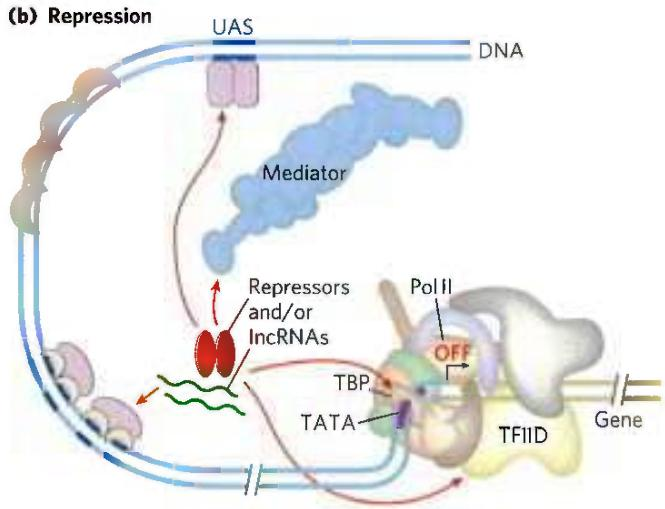

(c)  

Architectural Regulators How do activators function at a distance? The answer in most cases seems to be that, as

FIGURE 28-30 Eukaryotic promoters and regulatory proteins. RNA polymerase II and its associated basal (general) transcription factors form a preinitiation complex at the TATA box and lnr site of the cognate promoters, a process facilitated by transcription activators, acting through coactivators (Mediator, TFIID, or both). (a) A composite promoter with typical sequence elements and protein complexes found in both yeast and higher eukaryotes. The carboxyl-terminal domain (CTD) of Pol II (see Fig. 26-9) is an important point of interaction with Mediator and other protein complexes. Histone modification enzymes (not shown) catalyze methylation and acetylation; remodeling enzymes alter the content and placement of nucleosomes. The transcription activators have distinct DNA-binding domains and activation domains. In some cases, their function is affected by interaction with lncRNAs. Arrows indicate common modes of interaction often required for the activation of transcription. The HMG proteins are a common type of architectural regulator (see Fig. 28-5), allowing the looping of the DNA required to bring together system components bound at distant binding sites. (b) Eukaryotic transcriptional repressors function through a range of mechanisms. Some bind directly to DNA, displacing a protein complex required for activation (not shown); many others interact with various parts of the transcription or activation protein complexes to prevent activation. Possible points of interaction are indicated with arrows. (c) The structure of an HMG protein complex with DNA shows how HMG proteins facilitate DNA looping. The binding is relatively nonspecific, although DNA sequence preferences have been identified for many HMG proteins. Shown here is the HMG domain of the protein HMG-D of Drosophila, bound to DNA. [(c) Data from PDB ID 1QRV, F.V. Murphy IV et al., EMBO J. 18:6610, 1999.]

indicated earlier, the intervening DNA is looped so that the various protein complexes can interact directly. The looping is promoted by architectural regulators that are abundant in chromatin and bind to DNA with limited specificity. Most prominently, the high mobility group (HMG) proteins (Fig. 28-29c; "high mobility" refers to their electrophoretic mobility in polyacrylamide gels) play an important structural role in chromatin remodeling and transcriptional activation.

Coactivator Protein Complexes Most transcription requires the presence of additional protein complexes. Some major regulatory protein complexes that interact with Pol II have been defined both genetically and biochemically. These coactivator complexes act as intermediaries between the transcription activators and the Pol II complex.

Mediator, a complex consisting of 25 (yeast) to 30 (human) polypeptides, is a major eukaryotic coactivator (Fig. 28-30). Many of the 25 core polypeptides are highly conserved from fungi to humans. A subcomplex of four subunits has a kinase role, interacting transiently with the remainder of the Mediator complex, and may dissociate prior to transcription initiation. Mediator binds tightly to the carboxyl-terminal domain (CTD) of the largest subunit of Pol II. The Mediator complex is required for both basal and regulated transcription at many promoters used by Pol II, and it also stimulates phosphorylation of the CTD by TFIIH (a basal transcription factor). Transcription activators interact with one or more components of the Mediator complex, with the precise interaction sites differing from one activator to another. Coactivator complexes function at or near the promoter's TATA box.

Additional coactivators, functioning with one or a few genes, have also been described. Some of these operate in conjunction with Mediator, and some may act in systems that do not employ Mediator.

TATA-Binding Protein and Basal Transcription Factors The first component to bind in the assembly of a preinitiation complex (PIC) at the TATA box of a typical Pol II promoter is the TATA-binding protein (TBP). At promoters lacking a TATA box, TBP is usually delivered as part of a larger complex (13 to 14 subunits) called TFIID. The complete complex also includes the basal transcription factors TFIIB, TFIIE, TFIIF, TFIIH; Pol II; and perhaps TFIIA. This minimal PIC, however, is often insufficient for initiation of transcription and generally does not form at all if the promoter is obscured within chromatin. Positive regulation, leading to transcription, is imposed by the activators and coactivators. Mediator interacts directly with TFIIH and TFIIE, allowing their recruitment to the PIC.

Choreography of Transcriptional Activation We can now begin to piece together the sequence of transcriptional activation events at a typical Pol II promoter (Fig. 28-31). The exact order of binding of some components may vary, but the model in Figure 28-31 illustrates the principles of activation as well as one common path. Many transcription activators have significant affinity for their binding sites even when the sites are within condensed chromatin. The binding of activators is often the event that triggers subsequent activation of the promoter. Binding of one activator may enable the binding of others, gradually displacing some nucleosomes.

Crucial remodeling of the chromatin then takes place in stages, facilitated by interactions between activators and HATs or enzyme complexes such as SWI/SNF, or both. In this way, a bound activator can draw in other components necessary for further chromatin remodeling to permit transcription of specific genes. The bound activators interact with the large Mediator complex. Mediator, in turn, provides an assembly surface for the binding of, first, TBP (or TFIID), then TFIIB, and then other components of the PIC, including Pol II. Mediator stabilizes the binding of Pol II and its associated transcription factors and greatly facilitates formation of the PIC. Complexity in these regulatory circuits is the rule rather than the exception, with multiple DNA-bound activators promoting transcription.

The script can change from one promoter to another. For example, many promoters have a different set of recognition sequences and may not have a TATA box, and in multicellular eukaryotes the subunit composition of factors such as TFIID can vary from one tissue to another. However, most promoters seem to require a precisely ordered assembly of components to initiate transcription. The assembly process is not always fast. For some genes it may take minutes; for certain genes of higher eukaryotes, the process can take days.

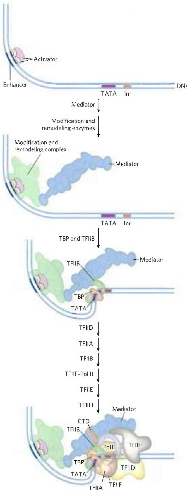  
FIGURE 28-31 The components of transcriptional activation. Activators bind the DNA first. The activators recruit the histone modification/nucleosome remodeling complexes and a coactivator such as Mediator. Mediator facilitates the binding of TBP (or TFIID) and TFIIB, and the other basal transcription factors and Pol II then bind. Phosphorylation of the CTD of Pol II leads to transcription initiation (not shown). [Information from J. A. D'Alessio et al., Mol. Cell 36:924, 2009.]

#### [EN] The Genes of Galactose Metabolism in Yeast Are Subject to Both Positive and Negative Regulation

Some of the general principles described above can be illustrated by one well-studied eukaryotic regulatory circuit (Fig. 28-32). The enzymes required for the importation and metabolism of galactose in yeast are encoded by genes scattered over several chromosomes (Table 28-3). Each of the GAL genes is transcribed separately, and yeast cells have no operons like those in bacteria. However, all the GAL genes have similar promoters and are regulated coordinately by a common set of proteins. The promoters for the GAL genes consist of the TATA box and Inr sequences, as well as an upstream activator sequence (UAS $_{G}$ ) recognized by the transcription activator Gal4 protein (Gal4p). Regulation of gene expression by galactose entails an interplay between Gal4p and two other proteins, Gal80p and Gal3p. Gal80p forms a complex with Gal4p, preventing Gal4p from functioning as an activator of the GAL promoters. When galactose is present, it binds Gal3p, which then interacts with the Gal80p-Gal4p complex and allows Gal4p to function as an activator at the GAL promoters. As the various galactose genes are induced and their products build up, Gal3p may be replaced with Gal1p (a galactokinase needed for galactose metabolism that also acts as a regulator) for sustained activation of the regulatory circuit.

Other protein complexes also have a role in activating transcription of the GAL genes. These include the SAGA complex for histone acetylation and chromatin remodeling, the SWI/SNF complex for chromatin remodeling, and Mediator. The Gal4 protein is responsible for recruitment of these additional factors needed for transcriptional activation. SAGA may be the first and primary recruitment target for Gal4p.

Glucose is the preferred carbon source for yeast, as it is for bacteria. When glucose is present, most of the GAL genes are repressed—whether galactose is present or not. The GAL regulatory system described above is effectively overridden by a complex catabolite repression system that includes several proteins (not depicted in Fig. 28-32).

#### [EN] Transcription Activators Have a Modular Structure

Transcription activators typically have a distinct structural domain for specific DNA binding and one or more additional domains for transcriptional activation or for interaction with other regulatory proteins. Interaction of two regulatory proteins is often mediated by domains containing leucine zippers (Fig. 28-15) or helix-loop-helix motifs (Fig. 28-16). We consider here three distinct types of structural domains used in activation by the transcription activators Gal4p, Sp1, and CTF1 (Fig. 28-33a).

Gal4p contains a zinc finger-like structure in its DNA-binding domain, near the amino terminus; this domain has six Cys residues that coordinate two $Zn^{2+}$ .

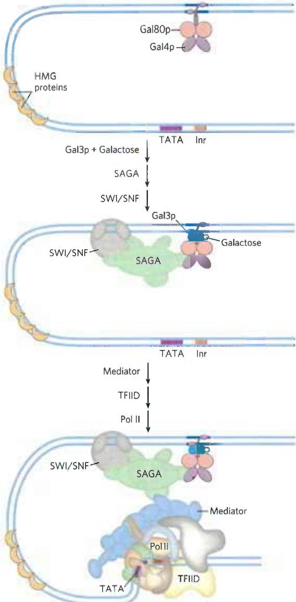  
FIGURE 28-32 Regulation of transcription of GAL genes in yeast. Galactose imported into the yeast cell is converted to glucose 6-phosphate by a pathway involving five enzymes, whose genes are scattered over three chromosomes (see Table 28-3). Transcription of these genes is regulated by the combined actions of the proteins Gal4p, Gal80p, and Gal3p, with Gal4p playing the central role of transcription activator. The Gal4p-Gal80p complex is inactive. Binding of galactose to Gal3p leads to interaction of Gal3p with the Gal80p-Gal4p complex and activates Gal4p. The Gal4p subsequently recruits SAGA, Mediator, and TFIID to the galactose promoters, leading to recruitment of RNA polymerase II and initiation of transcription. Chromatin remodeling to allow transcription also requires a SWI/SNF complex.

The protein functions as a homodimer (with dimerization mediated by interactions between two coiled coils) and binds to UAS $_{G}$ , a palindromic DNA sequence about 17 bp long. Gal4p has a separate activation domain with many acidic amino acid residues. Experiments that substitute a variety of different peptide sequences for the acidic activation domain of Gal4p suggest that the acidic nature of this domain is critical to its function, although its precise amino acid sequence can vary considerably.

<table><tr><td colspan="7">TABLE 28-3 Genes of Galactose Metabolism in Yeast</td></tr><tr><td rowspan="2">Gene</td><td rowspan="2">Protein function</td><td rowspan="2">Chromosomal location</td><td rowspan="2">Protein size (number of residues)</td><td colspan="3">Relative protein expression in different carbon sources</td></tr><tr><td>Glucose</td><td>Glycerol</td><td>Galactose</td></tr><tr><td colspan="7">Regulated genes</td></tr><tr><td>GAL1</td><td>Galactokinase</td><td>II</td><td>528</td><td>-</td><td>-</td><td>+++</td></tr><tr><td>GAL2</td><td>Galactose permease</td><td>XII</td><td>574</td><td>-</td><td>-</td><td>+++</td></tr><tr><td>PGM2</td><td>Phosphoglucomutase</td><td>XIII</td><td>569</td><td>+</td><td>+</td><td>++</td></tr><tr><td>GAL7</td><td>Galactose 1-phosphate uridylyltransferase</td><td>II</td><td>365</td><td>-</td><td>-</td><td>+++</td></tr><tr><td>GAL10</td><td>UDP-glucose 4-epimerase</td><td>II</td><td>699</td><td>-</td><td>-</td><td>+++</td></tr><tr><td>MEL1</td><td>α-Galactosidase</td><td>II</td><td>453</td><td>-</td><td>+</td><td>++</td></tr><tr><td colspan="7">Regulatory genes</td></tr><tr><td>GAL3</td><td>Inducer</td><td>IV</td><td>520</td><td>-</td><td>+</td><td>++</td></tr><tr><td>GAL4</td><td>Transcriptional activator</td><td>XVI</td><td>881</td><td>+/-</td><td>+</td><td>+</td></tr><tr><td>GAL80</td><td>Transcriptional inhibitor</td><td>XIII</td><td>435</td><td>+</td><td>+</td><td>++</td></tr></table>

  
FIGURE 28-33 Transcription activators. (a) Typical activators such as CTF1, Gal4p, and Sp1 have a DNA-binding domain and an activation domain. The nature of the activation domain is indicated by symbols: -- -, acidic; Q Q Q, glutamine-rich; P P P, proline-rich. These proteins generally activate transcription by interacting with coactivator complexes such as Mediator. Note that the binding sites illustrated here are not generally found together near a single gene. (b) A chimeric protein containing the DNA-binding domain of Sp1 and the activation domain of CTF1 activates transcription if a GC box is present.

Sp1 ( $M_{r}$ 80,000) is a transcription activator for many genes in higher eukaryotes. Its DNA-binding site, the GC box (consensus sequence GGGCGG), is usually quite near the TATA box. The DNA-binding domain of the Sp1 protein is near its carboxyl terminus and contains three zinc fingers. Two other domains in Sp1 function in activation and are notable in that 25% of their amino acid residues are Gln. A wide variety of other activator proteins also have these glutamine-rich domains.

CTF1 (CCAAT-binding transcription factor 1) belongs to a family of transcription activators that bind a sequence called the CCAAT site (its consensus sequence is TGGN $_{6}$ GCCAA, where N is any nucleotide). The DNA-binding domain of CTF1 contains many basic amino acid residues, and the binding region is probably arranged as an $\alpha$ helix. This protein has neither a helix-turn-helix motif nor a zinc finger motif; its DNA-binding mechanism is not yet clear. CTF1 has a proline-rich activation domain, with Pro accounting for more than 20% of the amino acid residues.

The discrete activation and DNA-binding domains of regulatory proteins often act completely independently, as has been demonstrated in "domain-swapping" experiments. Genetic engineering techniques (Chapter 9) can join the proline-rich activation domain of CTF1 to the DNA-binding domain of Sp1 to create a protein that, like intact Sp1, binds to GC boxes on the DNA and activates transcription at a nearby promoter (as in Fig. 28-33b). The DNA-binding domain of Gal4p has similarly been replaced experimentally with the DNA-binding domain of the E. coli LexA repressor (of the SOS response; Fig. 28-21). This chimeric protein neither binds at UAS $_{G}$ nor activates the yeast GAL genes (as would intact Gal4p) unless the UAS $_{G}$ sequence in the DNA is replaced by the LexA recognition site.

#### [EN] Eukaryotic Gene Expression Can Be Regulated by Intercellular and Intracellular Signals

The effects of steroid hormones (and of thyroid and retinoid hormones, which have a similar mode of action) provide additional well-studied examples of the modulation of eukaryotic regulatory proteins by direct interaction with molecular signals (see Fig. 12-34). Unlike other types of hormones, steroid hormones do not have to bind to plasma membrane receptors. Instead, they can interact with intracellular receptors that are transcription activators. Steroid hormones too hydrophobic to dissolve readily in the blood (estrogen, progesterone, and cortisol, for example) travel on specific carrier proteins from their point of release to their target tissues. In the target tissue, the hormone passes through the plasma membrane by simple diffusion. Once inside the cell, the hormone interacts with one of two types of steroid-binding nuclear receptor (Fig. 28-34). In both cases, the hormone-receptor complex acts by binding to highly specific DNA sequences called hormone response elements (HREs), thereby altering gene expression. Acting at these sites, the receptors act as transcription activators, recruiting coactivators and Pol II (plus its associated transcription factors) to trigger transcription of the gene.

The DNA sequences (HREs) to which hormone-receptor complexes bind are similar in length and arrangement for the various steroid hormones, but they differ in sequence. Each receptor has a consensus HRE sequence (Table 28-4) to which the hormone-receptor complex binds well, with each consensus consisting of two six-nucleotide sequences, either contiguous or separated by three nucleotides, in tandem or in a palindromic arrangement. The hormone receptors have a highly conserved DNA-binding domain with two zinc

FIGURE 28-34 Mechanisms of steroid hormone receptor function. There are two types of steroid-binding nuclear receptors. (a) Monomeric type I receptors (NR) are found in the cytoplasm, in a complex with the heat shock protein Hsp70. Receptors for estrogen, progesterone, androgens, and glucocorticoids are of this type. When the steroid hormone binds, the Hsp70 dissociates and the receptor dimerizes, exposing a nuclear localization signal. The dimeric receptor, with hormone bound, migrates to the nucleus, where it binds to a hormone response element (HRE) and acts as a transcription activator. The activity of the receptor can be repressed by binding to an IncRNA (such as GASS), which competes directly with binding to the HRE. (b) Type II receptors, by contrast, are always in the nucleus, bound to an HRE in the DNA and to a corepressor that renders the receptor inactive. The thyroid hormone receptor (TR) is of this type. The hormone migrates through the cytoplasm and diffuses across the nuclear membrane. In the nucleus it binds to a heterodimer consisting of the thyroid hormone receptor and the retinoid X receptor (RXR). A conformation change leads to dissociation of the corepressor, and the receptor then functions as a transcription activator.

fingers (Fig. 28-35). The hormone-receptor complex binds to the DNA as a dimer, with the zinc finger domains of each monomer recognizing one of the six-nucleotide sequences. The ability of a given hormone to act through the hormone-receptor complex to alter the expression of a specific

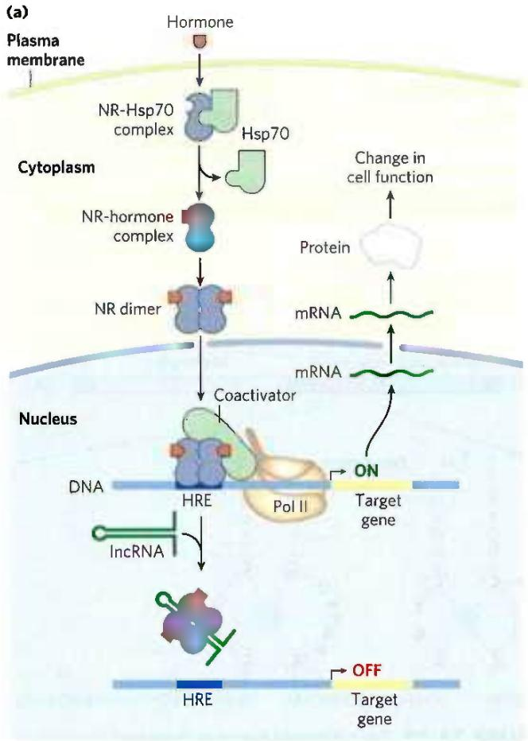

  
TABLE 28-4 Hormone Response Elements (HREs) Bound by Steroid-Type Hormone Receptors

<table><tr><td>Receptor</td><td>HRE consensus sequence bounda</td></tr><tr><td>Androgen</td><td>GG(A/T)ACAN2TGTTCT</td></tr><tr><td>Glucocorticoid</td><td>GGTACAN3TGTTCT</td></tr><tr><td>Retinoic acid (some)</td><td>AGGTCAN5AGGTCA</td></tr><tr><td>Vitamin D</td><td>AGGTCAN3AGGTCA</td></tr><tr><td>Thyroid hormone</td><td>AGGTCAN3AGGTCA</td></tr><tr><td>RXb</td><td>AGGTCANAGGTCANAG GTCANAGGTCA</td></tr></table>

$^{a}$ N represents any nucleotide.  
$^{b}$ Forms a dimer with the retinolic acid receptor or vitamin D receptor.

  
FIGURE 28-35 Typical steroid hormone receptors. These receptor proteins have a binding site for the hormone, a DNA-binding domain, and a region that activates transcription of the regulated gene. The highly conserved DNA-binding domain has two zinc fingers. The sequence shown here is that for the estrogen receptor, but the residues in bold type are common to all steroid hormone receptors.

gene depends on the exact sequence of the HRE, its position relative to the gene, and the number of HREs associated with the gene.

The ligand-binding region of the receptor protein—always at the carboxyl terminus—is specific to the particular receptor. For example, in the ligand-binding region, the glucocorticoid receptor is only 30% similar to the estrogen receptor and 17% similar to the thyroid hormone receptor. The size of the ligand-binding region varies dramatically; in the vitamin D receptor it has only 25 amino acid residues, whereas in the mineralocorticoid receptor it has 603 residues. Mutations that change one amino acid residue in these regions can result in loss of responsiveness to a specific hormone. Some humans unable to respond to cortisol, testosterone, vitamin D, or thyroxine have mutations of this type.

P2 The lncRNAs introduce another dimension to regulation by hormone receptors. An lncRNA called GAS5 (growth arrest specific 5) inhibits transcriptional activation by the glucocorticoid receptor by directly competing with DNA for receptor binding. GAS5 also inhibits activity of the closely related androgen, progesterone, and mineralocorticoid receptors. In addition, GAS5 interacts with and sequesters an miRNA called miR-21, which interacts with and inhibits the activity of some regulatory proteins that act as tumor suppressors. Expression of GAS5 is suppressed in a wide range of tumors, resulting in increased expression of steroid hormones, higher levels of active miR-21, and faster tumor growth. Low GAS5 levels thus correlate with worsened outcomes for cancer patients, making this lncRNA a subject of intense ongoing investigation.

Some hormone receptors, including the human progesterone receptor, activate transcription with the aid of a different lncRNA of \~700 nucleotides that acts as a coactivator—steroid receptor RNA activator (SRA). SRA is part of a ribonucleoprotein complex, but it is the RNA component that is required for transcription coactivation. The detailed set of interactions between SRA and other components of the regulatory systems for these genes remains to be worked out.

#### [EN] Regulation Can Result from Phosphorylation of Nuclear Transcription Factors

We noted in Chapter 12 that the effects of insulin on gene expression are mediated by a series of steps leading ultimately to the activation of a protein kinase in the nucleus that phosphorylates specific DNA-binding proteins, thereby altering their ability to act as transcription factors (see Fig. 12-22). This general mechanism mediates the effects of many nonsteroid hormones. For example, the $\beta$ -adrenergic pathway that leads to elevated levels of cytosolic cAMP, which acts as a second messenger in both eukaryotes and bacteria (Fig. 28-18), also affects the transcription of a set of genes, each of which is located near a specific DNA sequence called a cAMP response element (CRE). The catalytic subunit of protein kinase A, released when cAMP levels rise (see Fig. 12-6), enters the nucleus and phosphorylates a nuclear protein, the CRE-binding protein (CREB). When phosphorylated, CREB binds to CREs near certain genes and acts as a transcription factor, turning on expression of these genes.

#### [EN] Many Eukaryotic mRNAs Are Subject to Translational Repression

P1 Regulation at the level of translation assumes a much more prominent role in eukaryotes than in bacteria and is observed in a range of cellular situations. In contrast to the tight coupling of transcription and translation in bacteria, the transcripts generated in a eukaryotic nucleus must be processed and transported to the cytoplasm before translation. This can impose a significant delay on the appearance of a protein. When a rapid increase in protein production is needed, a translationally repressed mRNA already in the cytoplasm can be activated for translation without delay. Translational regulation may play an especially important role in regulating certain very long eukaryotic genes (a few are measured in the millions of base pairs), for which transcription and mRNA processing can require many hours. Some genes are regulated at both the transcriptional and translational stages, with the latter playing a role in the fine-tuning of cellular protein levels. In some non-nucleated cells, such as reticulocytes (immature erythrocytes), transcriptional control is entirely unavailable and translational control of stored mRNAs becomes essential. As described below, translational controls can also have spatial significance during development, when the regulated translation of prepositioned mRNAs creates a local gradient of the protein product.

Eukaryotes have at least four main mechanisms of translational regulation:

1. Translation initiation factors are subject to phosphorylation by protein kinases. The phosphorylated forms are often less active and cause a general depression of translation in the cell.

2. Some proteins bind directly to mRNA and act as translational repressors, many of them binding at specific sites in the 3' untranslated region (3'UTR). So positioned, these proteins interact with other translation initiation factors bound to the mRNA, or with the 40S ribosomal subunit, to prevent translation initiation (Fig. 28-36).

3. Binding proteins, present in eukaryotes from yeast to mammals, disrupt the interaction between eIF4E and eIF4G (see Fig. 27-27). The mammalian versions are known as 4E-BPs (eIF4E binding proteins). When cell growth is slow, these proteins limit translation by binding to the site on eIF4E that normally interacts with eIF4G. When cell growth resumes or increases in response to growth factors or other stimuli, the binding proteins are inactivated by protein kinase-dependent phosphorylation.

  
FIGURE 28-36 Translational regulation of eukaryotic mRNA. One of the most important mechanisms for translational regulation in eukaryotes is the binding of translational repressors (RNA-binding proteins) to specific sites in the 3' untranslated region (3'UTR) of the mRNA. These proteins interact with eukaryotic initiation factors or with the ribosome to prevent or slow translation.

4. RNA-mediated regulation of gene expression often occurs at the level of translational repression, often by the binding of ncRNAs to mRNAs.

The variety of translational regulation mechanisms provides flexibility, allowing focused repression of a few mRNAs or global regulation of all cellular translation.

Translational regulation has been particularly well studied in reticulocytes. One such mechanism in these cells involves eIF2, the initiation factor that binds to the initiator tRNA and conveys it to the ribosome; when Met-tRNA has bound to the P site, the factor eIF2B binds to eIF2, recycling it with the aid of GTP binding and hydrolysis. The maturation of reticulocytes includes destruction of the cell nucleus, leaving behind a plasma membrane packed with hemoglobin. Messenger RNAs deposited in the cytoplasm before the loss of the nucleus allow for the replacement of hemoglobin. When reticulocytes become deficient in iron or heme, the translation of globin mRNAs is repressed. A protein kinase called HCR (hemin-controlled repressor) is then activated, catalyzing the phosphorylation of eIF2. When phosphorylated, eIF2 forms a stable complex with eIF2B that sequesters the eIF2, making it unavailable for participation in translation. In this way, the reticulocyte coordinates the synthesis of globin with the availability of heme.

#### [EN] Posttranscriptional Gene Silencing Is Mediated by RNA Interference

In higher eukaryotes, including nematodes, fruit flies, plants, and mammals, microRNAs (miRNAs) mediate the silencing of many genes. In a phenomenon first described and explained by Craig Mello and Andrew Fire, the RNAs function by interacting with mRNAs, often in the 3'UTR, resulting in either degradation of the mRNA or inhibition of translation. In either case, the mRNA, and thus the gene that produces it, is silenced. This form of gene regulation controls developmental timing in at least some organisms. It is also used as a mechanism to protect against invading RNA viruses (particularly important in plants, which lack an immune system) and to control the activity of transposons. In addition, small RNA molecules may play a critical (as yet undefined) role in the formation of heterochromatin.

Many miRNAs are present only transiently during development, and these are sometimes referred to as small temporal RNAs (stRNAs). Thousands of different miRNAs have been identified in higher eukaryotes, and they may affect the regulation of a third of mammalian genes. They are transcribed as precursor RNAs \~70 nucleotides long, with internally complementary sequences that form hairpinlike structures. Details of the pathway for processing of miRNAs were described in Fig. 26-26). The precursors are cleaved by endonucleases such as Drosha and Dicer to form short duplexes of 20 to 25 nucleotides. One strand of the processed miRNA is transferred to the target mRNA (or to a viral or transposon RNA), leading to inhibition of translation or degradation of the mRNA (Fig. 28-37a). Some miRNAs bind to and affect a single mRNA and thus affect expression of only one gene. Others interact with multiple mRNAs and form the mechanistic core of regulons that coordinate the expression of multiple genes.

This gene regulation mechanism has an interesting and very useful practical side. If an investigator introduces into an organism a duplex RNA molecule corresponding in sequence to virtually any mRNA, Dicer cleaves the duplex into short segments, called small interfering RNAs (siRNAs). These bind to the mRNA and silence it (Fig. 28-37b). The process is known as RNA interference (RNAi). In plants, almost any gene can be effectively shut down in this way. Nematodes can readily ingest entire functional RNAs, and simply introducing the duplex RNA into the worm's diet produces very effective suppression of the target gene. The technique is an important tool in the ongoing efforts to study gene function, because it can disrupt gene function without creating a mutant organism. The procedure can be applied to humans as well. Laboratory-produced siRNAs have been used to block HIV and poliovirus infections in cultured human cells for a week or so at a time. The wider application of RNAi-based pharmaceuticals was initially stymied by the difficulty inherent in delivering RNAi molecules to their required target, given the many nucleases that degrade RNA in human tissues. With recent advances in delivery methods, there are now more than a dozen RNAi pharmaceuticals in advanced clinical trials to treat a range of conditions, from familial amyloidotic polyneuropathy to viral infections and cancer.

  
FIGURE 28-37 Gene silencing by RNA interference. (a) Small temporal RNAs (stRNAs, a class of miRNAs) are generated by Dicer-mediated cleavage of longer precursors that fold to create duplex regions. The stRNAs then bind to mRNAs, leading to degradation of mRNA or inhibition of translation. (b) Double-stranded RNAs designed to interact with a particular target and to function as Dicer substrates can be constructed and introduced into a cell. Dicer processes the duplex RNAs into small interfering RNAs (siRNAs), which interact with the target mRNA. Again, either the mRNA is degraded or translation is inhibited.

#### [EN] RNA-Mediated Regulation of Gene Expression Takes Many Forms in Eukaryotes

All RNAs (regardless of their length) that do not encode proteins, including rRNAs and tRNAs, come under the general designation of ncRNAs. Mammalian genomes encode more ncRNAs than coding mRNAs. The ncRNAs in eukaryotes include miRNAs, described above; snRNAs, involved in RNA splicing (see Fig. 26-16); snoRNAs, involved in rRNA modification (see Fig. 26-24); and lncRNAs, already encountered in this chapter. Not surprisingly, additional functional classes of ncRNAs are still being discovered. P2 Here we describe a few more examples of ncRNAs that participate in gene regulation, which are designated lncRNAs when their length exceeds 200 nucleotides.

Heat shock factor 1 (HSF1) is an activator protein that, in nonstressed cells, exists as a monomer bound by the chaperone Hsp90. Under stress conditions, HSF1 is released from Hsp90 and trimerizes. The HSF1 trimer binds to DNA and activates transcription of genes encoding products required to deal with the stress. An lncRNA called HSR1 (heat shock RNA 1; \~600 nucleotides) stimulates HSF1 trimerization and DNA binding. HSR1 does not act alone; it functions in a complex with the translation elongation factor eEF1A.

Additional RNAs affect transcription in a variety of ways. A 331 nucleotide lncRNA called 7SK, abundant in mammals, binds to the Pol II transcription elongation factor pTEFb (see Table 26-2) and represses transcript elongation. The ncRNA B2 (\~178 nucleotides) binds directly to Pol II during heat shock and represses transcription. The B2-bound Pol II assembles into stable PICs, but transcription is blocked. The mechanism that allows HSF1-responsive genes to be expressed in the presence of B2 remains to be worked out.

The recognized roles of ncRNAs in gene expression and in many other cellular processes are rapidly expanding. At the same time, the study of the biochemistry of gene regulation is becoming much less protein-centric.

#### [EN] Development Is Controlled by Cascades of Regulatory Proteins

For sheer complexity and intricacy of coordination, the patterns of gene regulation that bring about development of a zygote into a multicellular animal or plant have no peer. Development requires transitions in morphology and protein composition that depend on tightly coordinated changes in expression of the genome. More genes are expressed during early development than in any other part of the life cycle. For example, in the sea urchin, an oocyte has about 18,500 different mRNAs, compared with about 6,000 different mRNAs in the cells of a typical differentiated tissue. The mRNAs in the oocyte give rise to a cascade of events that regulate the expression of many genes across both space and time.

Several organisms have emerged as important model systems for the study of development, because they are easy to maintain in a laboratory and have relatively short generation times. These include nematodes, fruit flies, zebra fish, mice, and the plant Arabidopsis. Here, we provide a brief discussion of the development of fruit flies. Our understanding of the molecular events during development of Drosophila melanogaster is particularly well advanced and can be used to illustrate patterns and principles of general significance.

The life cycle of the fruit fly includes complete metamorphosis during its progression from an embryo to an adult (Fig. 28-38). Among the most important characteristics of the embryo are its polarity (the anterior and posterior parts of the animal are readily distinguished, as are its dorsal and ventral surfaces) and its metamerism (the embryo body is made up of serially repeating segments, each with characteristic features). During development, these segments become organized into a head, thorax, and abdomen. Each segment of the adult thorax has a different set of appendages. Development of this complex pattern is under genetic control, and a variety of pattern-regulating genes have been discovered that greatly affect the organization of the body.

The Drosophila egg, along with 15 nurse cells, is surrounded by a layer of follicle cells (Fig. 28-39). As the egg cell forms (before fertilization), mRNAs and proteins originating in the nurse and follicle cells are deposited in the egg cell, where some play a critical role in development. Once a fertilized egg is laid, its nucleus divides and the nuclear descendants continue to divide in synchrony every 6 to 10 min. Plasma membranes are not formed around the nuclei, which are distributed within the egg cytoplasm, forming a syncytium. Between the eighth and eleventh rounds of nuclear division, the nuclei migrate to the outer layer of the egg, forming a monolayer of nuclei surrounding the common yolk-rich cytoplasm; this is the syncytial blastoderm. After a few additional divisions, membrane invaginations surround the nuclei to create a layer of cells that form the cellular blastoderm. At this stage, the mitotic cycles in the various cells lose their synchrony. The developmental fate of the cells is determined by the mRNAs and proteins originally deposited in the egg by the nurse and follicle cells.

Proteins that, through changes in local concentration or activity, cause the surrounding tissue to take up a particular shape or structure are sometimes referred to as morphogens; they are the products of pattern-regulating genes. As defined by Christiane Nüsslein-Volhard, Edward B. Lewis, and Eric F. Wieschaus, three major classes of pattern-regulating genes — maternal, segmentation, and homeotic genes — function in successive stages of development to specify the basic features of the Drosophila embryo body. Maternal genes are expressed in the unfertilized egg, and the resulting maternal mRNAs remain dormant until fertilization.

  
FIGURE 28-38 Life cycle of the fruit fly Drosophila melanogaster. Drosophila undergoes a complete metamorphosis, which means that the adult insect is radically different in form from its immature stages, a transformation that requires extensive alterations during development. By the late embryonic stage,  
segments have formed, each containing specialized structures from which the various appendages and other features of the adult fly will develop. (Late embryo: Courtesy of F. R. Turner, Department of Biology, University of Indiana, Bloomington. Other photos: Courtesy of Prof. Dr. Christian Klambt, Westfälische Wilhelms-Universität Münster, Institut für Neuro- und Verhaltensbiologie.)

FIGURE 28-39 Early development in Drosophila. During development of the egg, maternal mRNAs and proteins are deposited in the developing oocyte (unfertilized egg cell) by nurse cells and follicle cells. After fertilization, the nuclei of the egg divide in synchrony within the common cytoplasm (syncytium), then migrate to the periphery. Membrane invaginations surround the nuclei to create a monolayer of cells at the periphery; this is the cellular blastoderm stage. During the early nuclear divisions, several nuclei at the far posterior become pole cells, which later become the germ-line cells.  

These provide most of the proteins needed in very early development, until the cellular blastoderm is formed. Some of the proteins encoded by maternal mRNAs direct the spatial organization of the developing embryo at early stages, establishing its polarity. Segmentation genes, transcribed after fertilization, direct the formation of the proper number of body segments. At least three subclasses of segmentation genes act at successive stages: gap genes divide the developing embryo into several broad regions; pair-rule genes, together with segment polarity genes, define 14 stripes that become the 14 segments of a normal embryo. Homeotic genes are expressed still later; they specify which organs and appendages will develop in particular body segments.

If all cells divided to produce two identical daughter cells, multicellular organisms would never be more than a ball of identical cells. A key event in very early development is establishment of mRNA and protein gradients along the body axes, producing asymmetric cell divisions and different cell fates. Some maternal mRNAs have protein products that diffuse through the cytoplasm to create an asymmetric distribution in the egg. Different cells in the cellular blastoderm therefore inherit different amounts of these proteins, setting the cells on different developmental paths. An example is the bicoid gene. The bicoid gene product is a major anterior morphogen. The mRNA from the bicoid gene is synthesized by nurse cells and deposited in the unfertilized egg near its anterior pole. Translated soon after fertilization, the Bicoid protein diffuses through the cell to create, by the seventh nuclear division, a concentration gradient radiating out from the anterior pole (Fig. 28-40). The Bicoid protein contains a homeodomain (p. 1062), encoded by a gene sequence motif called a homeobox and found in many proteins involved in regulating development. Bicoid is multifunctional—a transcription factor that activates the expression of several segmentation genes and also a translational repressor that inactivates certain mRNAs. The amount of Bicoid protein in various parts of the embryo increases or decreases the expression of other genes in a threshold-dependent manner. As its concentration varies along its gradient, interactions of the bicoid gene product with proteins and RNAs encoded by the nanos, pumilio, caudal, hunchback, and other regulatory genes also vary to produce different effects along the axis of the developing organism. This results in different developmental fates of cells in the blastoderm, depending on their location.

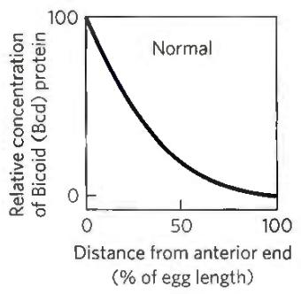

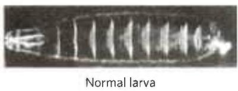  
(a)  
FIGURE 28-40 Distribution of a maternal gene product in a Drosophila egg. (a) Micrograph of an immunologically stained egg (top), showing distribution of the bicoid (bcd) gene product. The graph shows stain intensity along the length of the egg. This distribution is essential for normal development of the anterior structures in the larva (bottom). (b) If the bcd

Humans do not resemble fruit flies, but the genes and mechanisms involved in development are nevertheless highly conserved. This can be seen in the gene clusters encoding the homeotic or Hox genes, the latter term derived from homeobox. Drosophila has one such cluster, while humans have four (Fig. 28-41), with the genes within the clusters remarkably similar from nematodes to humans.

The many regulatory genes in these three classes direct the development of an adult fly, with a head, thorax, and abdomen, with the proper number of segments, and with the correct appendages on each segment. Although embryogenesis takes about a day to complete, all these genes are activated during the first four hours. Some mRNAs and proteins are present for only a few minutes at specific points during this period. Some of the genes code for transcription factors that affect the expression of other genes in a kind of developmental cascade. Regulation at the level of translation also occurs, and many of the regulatory genes encode translational repressors, most of which bind to the 3'UTR of the mRNA (Fig. 28-36). Because many mRNAs are deposited in the egg long before their translation is required, translational repression provides an especially important avenue for regulation in developmental pathways.

  
(b)  
gene is not expressed by the mother (bcd $^{-}$ /bcd $^{-}$ mutant) and thus no bicoid mRNA is deposited in the egg, the resulting larva has two posteriors (and soon dies). [Republished with permission of Elsevier, from "The bicoid protein determines position in the Drosophila embryo in a concentration-dependent manner" by Wolfgang Driever and Christiane Nüsslein-Volhard, Cell 5483–93, July 1, 1988; permission conveyed through Copyright Clearance Center, Inc.]

Many of the principles of development outlined above apply to other eukaryotes, from nematodes to humans. Some of the regulatory proteins are conserved. For example, the products of the homeobox-containing genes HOXA7 in mouse and antennapedia in fruit fly differ in only one amino acid residue. Of course, although the molecular regulatory mechanisms may be similar, many of the ultimate developmental events are not conserved (humans do not have wings or antennae). The different outcomes are brought about by differences in the downstream target genes controlled by the Hox genes. The discovery of structural determinants with identifiable molecular functions is the first step in understanding the molecular events underlying development. As more genes and their protein products are discovered, the biochemical side of this vast puzzle will be elucidated in increasingly rich detail.

#### [EN] Stem Cells Have Developmental Potential That Can Be Controlled

If we can understand development, and the mechanisms of gene regulation behind it, we can control it. An adult human has many different types of tissues. Many of the cells are terminally differentiated and no longer divide. If an organ malfunctions due to disease, or a limb is lost in an accident, the tissues are not readily replaced. Most cells, because of the regulatory processes in place, or even because of the loss of some or all of the genomic DNA, are not easily reprogrammed. Medical science has made organ transplants possible, but organ donors are a limited resource and organ rejection remains a major medical problem. If humans could regenerate their own organs or limbs or nervous tissue, rejection would no longer be an issue. Cures for kidney failure or neurodegenerative disorders could become reality.

(a)  

(b)  
  
FIGURE 28-41 The Hox gene clusters and their effects on development. (a) Each Hox gene in the fruit fly is responsible for the development of structures in a defined part of the body and is expressed in defined regions of the embryo, as labeled. (b) Drosophila has one Hox gene cluster; the human genome has four. Many of these genes are highly conserved in multicellular animals. Evolutionary relationships, as indicated by sequence alignments, between genes in the fruit fly Hox gene cluster and those in the mammalian Hox gene clusters are shown by dashed lines. Similar relationships among the four sets of mammalian Hox genes are indicated by vertical alignment. [(a) Information from F. R. Turner, University of Indiana, Department of Biology.]

The key to tissue regeneration lies in stem cells—cells that have retained the capacity to differentiate into various tissues. In humans, after an egg is fertilized, the first few cell divisions create a ball of totipotent cells, called the morula, that have the capacity to differentiate individually into any tissue or even into a complete organism (Fig. 28-42). Continued cell division produces a hollow ball, the blastocyst. The outer cells of the blastocyst eventually form the placenta. The inner layers form the germ layers of the developing fetus—the ectoderm, mesoderm, and endoderm. These cells are pluripotent: they can give rise to cells of all three germ layers and can differentiate into many types of tissues. However, they cannot differentiate into a complete organism. Some of these cells are unipotent: they can develop into only one type of cell and/or tissue. It is the pluripotent cells of the blastocyst, the embryonic stem cells, that are currently used in embryonic stem cell research.

  
FIGURE 28-42 Totipotent and pluripotent stem cells. Cells at the morula stage are totipotent and have the capacity to differentiate into a complete organism. The source of pluripotent embryonic stem cells is the cells in the cavity of the blastocyst. Pluripotent cells give rise to many tissue types but cannot form complete organisms.

Stem cells have two functions: to replenish themselves and, at the same time, provide cells that can differentiate. These tasks are accomplished in multiple ways (Fig. 28-43a). All or parts of the stem cell population can, in principle, be involved in replenishment, differentiation, or both.

  
FIGURE 28-43 Stem cell proliferation versus differentiation and development. Stem cells must strike a balance between self-renewal and differentiation. (a) Some possible cell division patterns that allow the replenishment of stem cells and production of some differentiated cells. Each cell may produce one stem cell and one differentiated cell, or two differentiated cells, or two stem cells in defined parts of the tissue or culture. Or a gradient of growth conditions can be established, with cell fates differing from one end of the gradient to the other. (b) Establishing a developmental niche through stem cell contact with a cell or group of cells. Molecular signals provided by the niche cells (in this case, in plants, a distal tip cell) help orient the mitotic spindle for stem cell division and ensure that one daughter cell retains stem cell properties.

Other types of stem cells can potentially be used for medical benefit. In the adult organism, adult stem cells, as products of additional differentiation, have a more limited potential for further development than do embryonic stem cells. For example, the hematopoietic stem cells of bone marrow can give rise to many types of blood cells and also to cells with the capacity to regenerate bone. They are referred to as multipotent. However, these cells cannot differentiate into a liver or kidney or neuron. Adult stem cells are often said to have a niche, a microenvironment that promotes stem cell maintenance while allowing differentiation of some daughter cells as replacements for cells in the tissue they serve (Fig. 28-43b). Hematopoietic stem cells in the bone marrow occupy a niche in which signaling from neighboring cells and other cues maintain the stem cell lineage. At the same time, some daughter cells differentiate to provide needed blood cells. Understanding the niche in which stem cells operate, and the signals the niche provides, is essential in efforts to harness the potential of stem cells for tissue regeneration. The identification and culturing of pluripotent stem cells from human blastocysts was reported by James Thomson and colleagues in 1998. This advance led to the long-term availability of established cell lines for research.

All stem cells present problems for human medical applications. Adult stem cells have a limited capacity to regenerate tissues, are generally present in small numbers, and are hard to isolate from an adult human. Embryonic stem cells have much greater differentiation potential and can be cultured to generate large numbers of cells, but their use is accompanied by ethical concerns related to the necessary destruction of human embryos. Identifying a source of plentiful and medically useful stem cells that does not raise such concerns remains a major goal of medical research.

Our ability to culture stem cells (i.e., maintain them in an undifferentiated state), and to manipulate them to grow and differentiate into particular tissues, is very much a function of our understanding of developmental biology.

Thus far, mouse and human embryonic stem cells have been used for most research. Although both types of stem cells are pluripotent, they require very different culture conditions, optimized to allow cell division indefinitely without differentiation. Mouse embryonic stem cells are grown on a layer of gelatin and require the presence of leukemia inhibitory factor (LIF). Human embryonic stem cells are grown on a feeder layer of mouse embryonic fibroblasts and require basic fibroblast growth factor (bFGF, or FGF2). The use of a feeder cell layer implies that the mouse cells are providing a diffusible product or some surface signal, not yet known, that is needed by human stem cells to either promote cell division or prevent differentiation.

A significant advance, reported in 2007, centers on success in reversing differentiation. In effect, skin

#### [EN] Of Fins, Wings, Beaks, and Things

South America has several species of seed-eating finches, commonly called grassquits. About 3 million years ago, a small group of grassquits, of a single species, took flight from the continent's Pacific coast. Perhaps driven by a storm, they lost sight of land and traveled nearly 1,000 km. Small birds such as these might easily have perished on such a journey, but the smallest of chances brought this group to a newly formed volcanic island in an archipelago later to be known as the Galápagos. It was a virgin landscape with untapped plant and insect food sources, and the newly arrived finches survived. Over the years, new islands formed and were colonized by new plants and insects — and by the finches. The birds exploited the new resources on the islands, and groups of birds gradually specialized and diverged into new species. By the time Charles Darwin stepped onto the islands in 1835, many different finch species were to be found on the various islands of the archipelago, feeding on seeds, fruits, insects, pollen, or even blood.

The diversity of living creatures was a source of wonder for humans long before scientists sought to understand its origins. The extraordinary insight handed down to us by Darwin, inspired in part by his encounter with the Galápagos finches, provided a broad explanation for the existence of organisms with a vast array of appearances and characteristics. It also gave rise to many questions about the mechanisms underlying evolution. Answers to those questions have started to appear, first through the study of genomes and nucleic acid metabolism in the last half of the twentieth century, and more recently through an emerging field nicknamed evo-devo—a blend of evolutionary and developmental biology.

In its modern synthesis, the theory of evolution has two main elements: mutations in a population generate genetic diversity; natural selection then acts on this diversity to favor individuals with more useful genomic tools and to disfavor others. Mutations occur at significant rates in every individual's genome, in every cell (see Section 8.3). Advantageous mutations in single-celled organisms or in the germ line of multicellular organisms can be inherited, and they are more likely to be inherited (that is, passed on to greater numbers of

cells—first from mice, then from humans—have been reprogrammed to take on the characteristics of pluripotent stem cells. The reprogramming involves manipulations to get the cells to express at least four transcription factors, Oct4, Sox2, Nanog, and Lin28, all of which are known to help maintain the stem cell-like state. Gradual improvements in this technology may make the harvesting of embryonic stem cells unnecessary and provide a source of stem cells that is genetically matched to a prospective patient.

offspring) if they confer an advantage. It is a straightforward scheme. But many have wondered whether it is enough to explain, say, the many different beak shapes in the Galápagos finches or the diversity of size and shape among mammals. Until recent decades, there were several widely held assumptions about the evolutionary process: that many mutations and new genes would be needed to bring about a new physical structure, that more-complex organisms would have larger genomes, and that very different species would have few genes in common. All of these assumptions were wrong.

Modern genomics has revealed that the human genome contains fewer genes than expected — not many more than the fruit fly genome and fewer than some amphibian genomes. The genomes of every mammal, from mouse to human, are surprisingly similar in the number, types, and chromosomal arrangement of genes. Meanwhile, evo-devo is telling us how complex and very different creatures can evolve within these genomic realities.

In the late nineteenth century, English biologist William Bateson studied animals with homeotic mutations — creatures with body parts growing in the wrong location. Bateson used his observations to challenge the Darwinian notion that evolutionary change would have to be gradual. Recent studies of the genes that control organismal development have put an exclamation point on Bateson's ideas. Subtle changes in regulatory patterns during development, reflecting just one or a few mutations, can result in startling physical changes and fuel surprisingly rapid evolution.

The Galápagos finches provide a wonderful example of the link between evolution and development. There are at least 14 (some specialists list 15) species of Galápagos finches, distinguished in large measure by their beak structure. The ground finches, for example, have broad, heavy beaks adapted to crushing large, hard seeds. The cactus finches have longer, slender beaks ideal for probing cactus fruits and flowers (Fig. 1). Clifford Tabin and colleagues carefully surveyed a set of genes expressed during avian craniofacial development. They identified a single gene, Bmp4, whose expression level correlated with formation of the more robust beaks of

Our discussion of developmental regulation and stem cells brings us full circle, back to a biochemical beginning. Evolution appropriately provides the first and last words of this book. If evolution is to generate the kind of changes in an organism that would render it a different species, it is the developmental program that must be affected. Developmental and evolutionary processes are closely allied, each informing the other (Box 28-1). The continuing study of biochemistry has everything to do with enriching the future of humanity and understanding our origins.

the ground finches. More-robust beaks were also formed in chicken embryos when high levels of Bmp4 were artificially expressed in the appropriate tissues, confirming the importance of Bmp4. In a similar study, the formation of long, slender beaks was linked to the expression of calmodulin (see Fig. 12-17) in particular tissues at appropriate developmental stages. Thus, major changes in the shape and function of the beak can be brought about by subtle changes in the expression of just two genes involved in developmental regulation. Very few mutations are required, and the needed mutations affect regulation. New genes are not required.

The system of regulatory genes that guides development is remarkably conserved among all vertebrates. Elevated expression of Bmp4 in the right tissue at the right time leads to more-robust jaw parts in zebrafish. The same gene plays a key role in tooth development in mammals. The development of eyes is triggered by the expression of a single gene, Pax6, in fruit flies and in mammals. The mouse Pax6 gene will trigger the development of fruit fly eyes in the fruit fly, and the fruit fly Pax6 gene will trigger the development of mouse eyes in the mouse. In each organism, these genes are part of the much larger regulatory cascade that ultimately creates the correct structures in the correct locations in each organism. The cascade is ancient; for example, the Hox genes (described in the text) have been part of the developmental program of multicellular eukaryotes for more than 500 million years. Subtle changes in the cascade can have large effects on development, and thus on the ultimate appearance, of the organism. These same subtle changes can fuel remarkably rapid evolution. For example, the 400 to 500 described species of cichlids (spiny-finned fish) in Lake Malawi and Lake Victoria on the African continent are all derived from one or a few populations that colonized each lake in the past 100,000 to 200,000 years. The Galápagos finches simply followed a path of evolution and change that living creatures have been traveling for billions of years.

  
FIGURE 1 Evolution of new beak structures to exploit new food sources. In the Galápagos finches, the different beak structures of the cactus finch and the large ground finch, which feed on different, specialized food sources, were produced to  
a large extent by a few mutations that altered the timing and level of expression of just two genes: those encoding calmodulin (CaM) and Bmp4. [Information from A. Abzhanov et al., Nature 442:563, 2006, Fig. 4.]

#### [EN] SUMMARY 28.3 Regulation of Gene Expression in Eukaryotes

In eukaryotes, large changes in chromatin structure accompany the expression of a gene. Transcriptionally inactive heterochromatin is opened up by chromatin remodeling proteins. These eject, replace, or modify nucleosomes to allow other proteins, mainly RNA polymerase components and regulators, to access sites required to initiate transcription.

■ In eukaryotes, positive regulation is more common than negative regulation.

\- Promoters for Pol II typically have a TATA box and Inr sequence, as well as multiple binding sites for transcription activators. The latter sites, sometimes located hundreds or thousands of base pairs away from the TATA box, are called upstream activator sequences in yeast and enhancers in higher eukaryotes. To regulate transcriptional activity generally requires large complexes of proteins. These include basal transcription factors, activators, coactivators, architectural regulators, and the enzymes that modify and remodel chromatin. The effects of transcription activators on Pol II are facilitated by coactivator protein complexes such as Mediator.

■ The well-studied yeast genes involved in galactose metabolism provide examples of both positive and negative regulation in a eukaryote.

■ The modular structures of the activators have distinct activation and DNA-binding domains.

■ Hormones affect the regulation of gene expression in one of two ways. Steroid hormones interact directly with intracellular receptors that are DNA-binding regulatory proteins; binding of the hormone has either positive or negative effects on the transcription of targeted genes.

■ Nonsteroid hormones bind to cell surface receptors, triggering a signaling pathway that can lead to phosphorylation of a regulatory protein, affecting its activity.

■ Translational regulation is particularly important in eukaryotes. Modulating the translation of an mRNA stored in the cytoplasm affords a more rapid response to cellular challenges than de novo assembly of transcription complexes and mRNA synthesis.

■ MicroRNAs (miRNAs) are involved in gene silencing during development and as an antiviral defense. The pathway for processing miRNAs from larger precursors has been harnessed by researchers to develop the gene-silencing technology called RNA interference, or RNAi.

■ Regulation mediated by ncRNAs plays an important role in eukaryotic gene expression, with known mechanisms including interactions with proteins, mRNA, and other ncRNAs.

■ Development of a multicellular organism presents the most complex regulatory challenge. The fate of cells in the early embryo is determined by establishment of anterior-posterior and dorsal-ventral gradients of proteins that act as transcription activators or translational repressors, regulating the genes required for development of structures appropriate to a particular part of the organism. Sets of regulatory genes operate in temporal and spatial succession, transforming given areas of an egg cell into predictable structures in the adult organism.

■ The differentiation of stem cells into functional tissues can be controlled by extracellular signals and conditions.

<!-- L-END Lehninger 28.3 -->

## 8.3 真核基因表达的染色质修饰和表观遗传调控

在真核生物中,发生在转录之前的、染色质水平上的结构调整,称之为基因表达的表观遗传调控,主要包括 DNA 修饰(DNA 甲基化)和组蛋白修饰(组蛋白乙酰化、甲基化)两个方面。

## 8.3.1 真核生物 DNA 水平上的基因表达调控

分子生物学的最新研究表明,在个体发育过程中,用来合成 RNA 的 DN\ 模板也会发生规律性变化,从而控制基因表达和生物体的发育。

高度重复基因的形成通常与个体分化阶段 DNA 的某些变化有关。例如,一个成熟的红细胞能产生大量的可翻译出成熟珠蛋白的 mRNA,而其前体细胞却不产生珠蛋白。许多情况下,这种变化是由于基因本身或它的拷贝数发生了永久性变化。这种 DNA 水平的调控是真核生物发育调控的一种形式,它包括了基因丢失、扩增、重排和移位等方式,通过这些方式可以消除或变换某些基因并改变它们的活性。这些调控方式与转录及翻译水平的调控是不同的,因为它使基因组发生了改变。

## 1. “开放”型活性染色质(active chromatin)结构对转录的影响

真核基因的活跃转录是在常染色质上进行的。转录发生之前，染色质常常会在特定的区域被解旋松弛，形成自由DNA。这种变化可能包括核小体结构的消除或改变、DNA本身局部结构的变化甚至从右旋型变为左旋型(Z-DNA)等，这些变化可导致结构基因暴露，促进转录因子与启动区DNA结合，诱发基因转录。

用 DNA 酶 I 处理各种组织的染色质时, 发现处于活跃状态的基因比非活跃状态的 DNA 更容易被 DNA 酶 I 所降解。鸡成红细胞 (erythroblast) 染色质中, β- 血红蛋白基因比卵清蛋白基因更容易被 DNA 酶 I 切割降解。与此相反, 鸡输卵管细胞的染色质中被 DNA 酶 I 优先降解的是卵清蛋白基因, 而不是 β- 血红蛋白基因。那么, 活跃状态的 DNA 为什么更易于受核酸酶的攻击而降解呢? 研究发现, 活跃表达基因所在染色质上一般含有一个或数个 DNA 酶 I 超敏感位点 (hypersensitive site), 它们大多位于基因 5' 端启动区, 少数在其他位置。非活性态基因的 5' 端相应位点却不表现对 DNA 酶 I 的超敏感性。果蝇唾腺染色体中, 胶原蛋白基因 sgs4 的转录区上游 330 碱基对和 405 碱基对左右各有一个超敏感位点,有突变体缺失了包括这两个超敏感位点大约100个碱基对的DNA序列后就不再具备合成胶原蛋白的能力,说明两个完整的超敏感位点是sgs4基因转录所必需的。

图 8-24 “灯刷形”染色体(a)及存在于“活性”染色质区的环状DNA结构(b)
(a)中箭头所示为不同姐妹染色体对之间的交叉点。  
(a)  

(b)  

鸡成红细胞中 $\beta$ 血红蛋白基因 5' 端 -50\~-280 碱基对区是超敏感位点。有人用专一切割单链 DNA 的 SI 核酸酶处理该基因活跃表达的染色体 DNA，证实有 DNA 被水解，说明该基因活跃表达时启动区部分序列可能解开成单链，从而不能继续缠绕在核小体上，使启动区 DNA “裸露” 在组蛋白表面，形成了对 DNA 酶 I 的超敏感现象。上述事实充分说明，超敏感位点的产生可能是染色质结构规律性变化的结果。正是由于这种变化，使 DNA 容易与 RNA 聚合酶和其他转录调控因子相结合，从而启动基因表达，同时也更易于被核酸酶所降解。

有证据表明,存在于“灯刷形”染色体(lamp brush)上的环形结构可能与基因的活性转录有关(图8-24)。“灯刷形”染色体只有在两栖类动物卵细胞发生减数分裂时才能被观察到,它是染色体充分伸展时的一种形态。此时,两对姐妹染色体常常通过“交叉点”(chiasmata)连成一体[图8-24(a)]。高倍电镜下观察发现,灯刷形染色体上存在许多突起的“泡”状或“环”状结构,有时还能看到RNP沿着这些突起结构移动,表明这些DNA正在被RNA聚合酶所转录[图8-24(b)]。 $^{3}\mathrm{H}$ 尿嘧啶核苷酸标记实验表明,最活跃的DNA转录区结构较为伸展,形成蓬松区。

## 2. 基因扩增

基因扩增是指某些基因的拷贝数专一性大量增加的现象,它使细胞在短期内产生大量的基因产物以满足生长发育的需要,是基因活性调控的一种方式。例如,非洲爪蟾的卵母细胞中原有 rRNA 基因(rDNA)约 500 个拷贝,在减数分裂 I 的粗线期,这个基因开始迅速复制,到双线期它的拷贝数约为 200 万个,扩增近 4000 倍,可用于合成 $10^{12}$ 个核糖体,以满足卵裂期和胚胎期合成大量蛋白质的需要。在基因扩增之前,整个 rDNA 区位于单个核仁中(人们发现大部分动物细胞中都有这种含 rDNA 的核内小体)。在该细胞发育成卵母细胞的过程中(约 3 周时间),不但 rDNA 数量猛增,核仁数量也大大增加,每个核中可有几百个这样的小核仁。一旦卵母细胞成熟,多余的 rDNA 就没有用了,将被逐渐降解。受精之后,染色体 DNA 开始复制,并通过有丝分裂的方式,不断扩大细胞群体。在此期间,多余的 rDNA 继续被降解, 直到分裂产生几百个细胞时, rDNA 的过剩现象就不复存在了。

## 3. 基因重排与变换

将一个基因从远离启动子的地方移到距它很近的位点从而启动转录,这种方式被称为基因重排。通过基因重排调节基因活性的典型例子是免疫球蛋白结构基因和T细胞受体基因的表达,前者是由B淋巴细胞合成的,而后者则由T淋巴细胞合成。免疫球蛋白的肽链主要由可变区(V区)、恒定区(C区)以及两者之间的连接区(J区)组成(表8-7),V、C和J基因片段在胚胎细胞中相隔较远。编码产生免疫球蛋白的细胞发育分化时,通过染色体内DNA重组把4个相隔较远的基因片段连接在一起,从而产生了具有表达活性的免疫球蛋白基因(图8-25)。

表 8-7 人类基因组中免疫球蛋白基因主要片段的数量比较

<table><tr><td rowspan="2">成分</td><td rowspan="2">基因位点</td><td rowspan="2">染色体</td><td colspan="4">基因片段数量</td></tr><tr><td>V</td><td>D</td><td>J</td><td>C</td></tr><tr><td>重链</td><td>IGH</td><td>14</td><td>86</td><td>30</td><td>9</td><td>11</td></tr><tr><td>轻链(K链)</td><td>IGK</td><td>2</td><td>76</td><td>0</td><td>5</td><td>1</td></tr><tr><td>轻链(λ链)</td><td>IGL</td><td>22</td><td>52</td><td>0</td><td>7</td><td>7</td></tr></table>

此外，人血红蛋白基因表达也有这种现象。β链基因家族的调节基因和受体基因原来是被间隔序列分隔开的，因此这些结构基因没有活性。在胚胎发育早期，由于间隔序列 $S_{1}$ 缺失，导致调节基因 $R_{1}$ 和受体基因 $A_{1}$ 连接在一起，形成调节启动基因 $(R_{1}A_{1})$ ，邻近的结构基因转录产生ε肽链。在胚胎发育后期（3\~9个月），由于间隔序列 $S_{2}$ 缺失，使调节基因 $R_{2}$ 和 $A_{2}$ 连接在一起，形成调节启动基因 $(R_{2}A_{2})$ ，邻近的结构基因转录产生γ肽链。人出生以后，由于 $S_{3}$ 的缺失，形成了 $R_{3}A_{3}$ 调节启动基因，激活β和δ结构基因转录，产生β和δ肽链。α肽链基因的变换也按这个模式进行，形成了人类血红蛋白肽链组成的规

  
图 8-25 免疫球蛋白重链基因片段重排与组织特异性表达

律性变化。

## 8.3.2 DNA 甲基化与基因活性的调控

DNA 甲基化是最早发现的修饰途径之一,这一修饰途径可能存在于所有高等生物中并与基因表达调控密切相关。大量研究表明,DNA 甲基化能关闭某些基因的活性,去甲基化则诱导了基因的重新活化和表达。DNA 甲基化能引起染色质结构、DNA 构象、DNA 稳定性及 DNA 与蛋白质相互作用方式的改变,从而控制基因表达。研究证实,CpG 二核苷酸中胞嘧啶的甲基化导致了人体 1/3 以上由于碱基转换而引起的遗传病。我们将在本节中对 DNA 甲基化和去甲基化的机制、DNA 甲基化对发育过程中基因表达的调控以及与之有关的研究进展作一简述。

## 1. DNA 的甲基化

DNA 甲基化修饰现象广泛存在于多种有机体中。在染色体水平上，DNA 甲基化在着丝粒附近水平最高；在基因水平上，DNA 甲基化高水平区域涵盖了多数的转座子、假基因和小 RNA 编码区。甲基化似乎对于长度较短的基因有较强的转录调控能力，而对长基因的调控能力十分微弱。实验证明，这个过程不但与 DNA 复制起始及错误修正时的定位有关，还通过改变基因的表达参与与细胞的生长、发育过程及染色体印迹、X 染色体失活等的调控。DNA 甲基化主要形成 5-甲基胞嘧啶(5-mC) 和少量的 $N^6$ -甲基腺嘌呤 $(N^6\text{-mA})$ 及 7-甲基鸟嘌呤(7-mG, 图 8-26)。在真核生物中，5-甲基胞嘧啶主要出现在 CpG 序列、CpXpG、

图 8-26 5-甲基胞嘧啶、 $N^{6}$ -甲基腺嘌呤和7-甲基鸟嘌呤结构式  

CCA/TGG 和 GATC 中。因为高等生物 CpG 二核苷酸序列中的 C 通常是甲基化的，极易自发脱氨，生成胸腺嘧啶，所以 CpG 二核苷酸序列出现的频率远远低于按核苷酸组成计算出的频率。由于这些 CpG 二核苷酸通常成串出现在 DNA 上，这段序列往往被称为 CpG 岛。

真核生物细胞内存在两种甲基化酶活性:一种被称为日常型甲基转移酶,另一种是从头合成型甲基转移酶,前者主要在甲基化母链(模板链)指导下使处于半甲基化的DNA双链分子上与甲基胞嘧啶相对应的胞嘧啶甲基化。该酶催化特异性极强,对半甲基化的DNA有较高的亲和力,使新生的半甲基化DNA迅速甲基化,从而保证DNA复制及细胞分裂后甲基化模式不变。后者催化未甲基化的CpG成为mCpG,它不需要母链指导,但速度很慢。这类甲基化酶是导致特异基因受甲基化调控的主要因子,在基因表达的表观遗传学研究中有十分重要的地位。

## 2. DNA 甲基化抑制基因转录的机制

DNA 甲基化导致某些区域 DNA 构象变化,从而影响了蛋白质与 DNA 的相互作用,抑制了转录因子与启动区 DNA 的结合效率。研究表明,当组蛋白 $H_{1}$ 与含 CCGG 序列的甲基化或非甲基化 DNA 分别形成复合体时,DNA 的构型存在着很大的差别,甲基化达到一定程度时会发生从常规的 B-DNA 向 Z-DNA 的过渡。由于 Z-DNA 结构收缩,螺旋加深,使许多蛋白质因子赖以结合的元件缩入大沟而不利于基因转录的起始。有实验用序列相同但甲基化水平不同的 DNA 为材料,比较其作为 RNA 聚合酶转录模板的活性,发现甲基的引入不利于模板与 RNA 聚合酶的结合,降低了其体外转录活性。

5- 甲基胞嘧啶在 DNA 上并不是随机分布的,基因的 5' 端和 3' 端往往富含甲基化位点,而启动区 DNA 分子上的甲基化密度与基因转录受抑制的程度密切相关(图 8-27)。对于弱启动子来说,稀少的甲基化就能使其完全失去转录活性。当这一类启动子被增强时(带有增强子),即使不去甲基化也可以恢复其转录活性。若进一步提高甲基化密度,即使增强后的启动子仍无转录活性。因为甲基化对转录的抑制强度与 MeCP1 (methyl CpG-binding protein 1) 结合 DNA 的能力成正相关, 甲基化 CpG 的密度和启动子强度之间的平衡决定了该启动子是否具有转录活性。

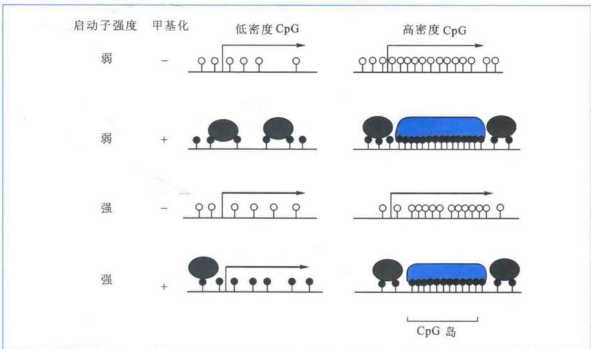  
图 8-27 DNA 甲基化对基因转录的抑制作用  
箭头粗细表示转录活性强弱，空心圆表示DNA未甲基化，小黑点表示DNA甲基化，椭圆形表示MeCPI松散结合，长方形表示MeCPI紧密结合。

图 8-28 3 个珠蛋白的基因编码区及启动区的 CpG 密度比较 (a) 以及甲基化对这些基因表达强度的影响分析 (b)
无: 没有甲基化; 部: 部分甲基化。 $\beta$ - 珠蛋白 mRNA 作为对照。

研究证实, 小鼠 $\alpha-$ 珠蛋白基因和人 $\gamma-$ 珠蛋白基因内 CpG 密度较低, 前者 1.4 kb 序列内含有 28 个 CpG (相当于每 50 bp 有一个 CpG), 后者 3.3 kb 序列内含有 26 个 CpG (相当于每 126 bp 有一个 CpG), 而人 $\alpha-$ 珠蛋白基因内 CpG 密度很高, 1.5 kb 序列中有 141 个 CpG (相当于每 10 bp 有一个 CpG) (图 8-28(a))。可以用细菌 Hha I 甲基转移酶处理人 $\alpha-$ 珠蛋白基因使其低水平甲基化 (平均每 62 个 bp 有一个 mCpG, 1.5 kb 序列中有 24 个 mCpG), 也可以用 Sss I 甲基化酶把该基因上所有 CpG 全部甲基化。将上述 CpG 密度不同、甲基化水平也不同的基因导入人 HeLa 细胞发现, 一旦 CpG 完全甲基化, 这 3 个基因都不表达。但如果在这些基因的启动区装上 SV40 增强子序列, CpG 密度较低的基因如小鼠 $\alpha-$ 珠蛋白基因和人 $\gamma-$ 珠蛋白基因就得到表达, 高 CpG 密度但只有部分甲基化的人 $\alpha-$ 珠蛋白基因也能被转录，CpG 密度高同时又完全甲基化的人 $\alpha-$ 珠蛋白基因仍然不被转录 $^{(图8-28(b))}$ 。

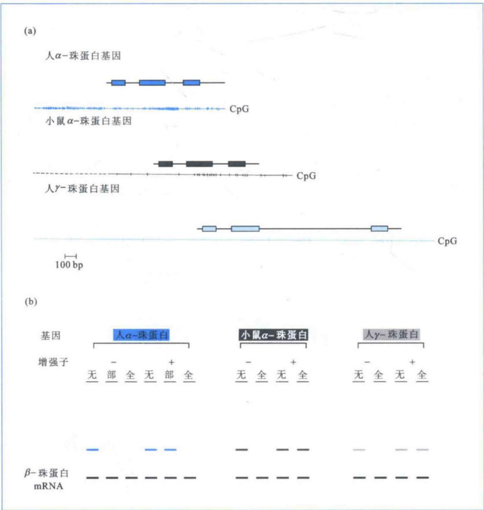

DNA 的甲基化还提高了该位点的突变频率。真核生物中 5-mC 主要出现在 5'-CpG-3' 序列中，5-mC 脱氨后生成的胸腺嘧啶 (T) 不易被识别和矫正。因此，特定部位的 5-mC 脱氨基反应，将在 DNA 分子中引入可遗传的转化 (C→T)，若位点突变发生在 DNA 功能区域，就可能造成基因表达的紊乱。在脑瘤、乳腺癌和直肠癌细胞中，p53 基因第 273 位密码子含 CpG 序列，常由 CGT 突变为 CAT 或 TGT (Arg→His 或 Cys)。在非小细胞肺癌中 p53 基因该位点 C→T 的突变频率高达 59.3%。由于 CpG 甲基化增加了胞嘧啶残基突变的可能性，5-mC 也作为内源性诱变剂或致癌因子调节基因表达。

## 8.3.3 组蛋白乙酰化对真核基因表达的影响

蛋白质乙酰化普遍存在于生物体细胞内,涉及许多生理生化过程。目前主要研究组蛋白乙酰化对基因表达调控的影响。

## 1. 组蛋白的基本组成

组蛋白(histone)是组成核小体的基本成分,核小体(nucleosome)是组成染色质的基本结构单元。核小体由组蛋白八聚体(由两个包含 $H_{2}A$ 、 $H_{2}B$ 、 $H_{3}$ 和 $H_{4}$ 的四聚体组成)和缠绕两圈的DNA组成。在相邻的核小体之间有一个20\~200 bp的间隔区,在电子显微镜下,一列核小体看上去像一串珠子,每个珠子的直径大约是10 nm。另一个组蛋白 $H_{1}$ 结合在核小体核心之外,起到稳定核小体序列和染色质的高级结构的作用。

## 2. 核心组蛋白的乙酰化和去乙酰化

核心组蛋白朝向外部的 N 端部分被称为“尾巴”，可被组蛋白乙酰基转移酶和去乙酰化酶修饰，加上或去掉乙酰基团。图 8-29 是已报道的组蛋白 N 端“尾巴”主要被修饰位点。

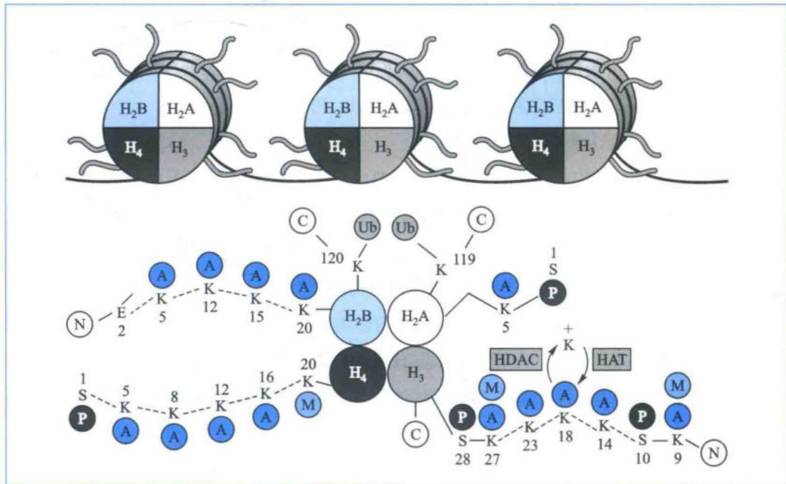  
图 8-29 已知组蛋白 N 端“尾巴”主要被修饰位点  
N, 组蛋白 N 端; C, 组蛋白 C 端; A, 乙酰基团; P, 磷酸基团; M, 甲基基团; Ub, 泛素基团; HAT, 乙酰基转移酶; HDAC, 去乙酰化酶。

图 8-30 具有组蛋白乙酰基转移酶活性的蛋白质参与转录调控示意图  

## 3. 组蛋白乙酰基转移酶

催化组蛋白乙酰化反应的是组蛋白乙酰基转移酶(histone acetyltransferase, HAT)。目前已经发现的HAT酶主要有两类：一类与转录有关，另一类与核小体组装以及染色质的结构有关。HAT并不是染色质结合蛋白，但是可以通过与其他蛋白质相互作用来影响染色质的结构。许多转录激活因子都有HAT活性(图8-30)，与转录有关的HAT催化亚基是酵母调控蛋白质GCN5的同源物，而GCN5本身具有乙酰化组蛋白 $\mathrm{H}_{3}$ 和 $\mathrm{H}_{4}$ 的活性。

TAFⅡ250组蛋白乙酰基转移酶是TFⅡD复合物的一个亚基，它的主要功能是与启动子结合协助起始转录，能使组蛋白 $\mathrm{H}_{3}$ 和 $\mathrm{H}_{4}$ 乙酰化。转录共激活子PCAF也能使这两个组蛋白乙酰化。组蛋白乙酰基转移酶p300/CBP也是转录共激活子，通过与增强子结合蛋白相互作用来调节转录，能使组蛋白 $\mathrm{H}_{2}\mathrm{A},\mathrm{H}_{2}\mathrm{B},\mathrm{H}_{3}$ 和 $\mathrm{H}_{4}$ 乙酰化。

## 4. 组蛋白去乙酰化酶

组蛋白去乙酰化酶(histone deacetylase, HDAC)负责去除组蛋白上的乙酰基团, 目前研究比较深入的是人类中的 HDAC1 和酵母中的 Rpd3。HDAC 和 Rpd3 都形成很大的蛋白复合体发挥作用。Rpd3 能特异性去除组蛋白上的乙酰基团, 使核小体相互靠近, 并在转录共抑制子 Sin3 及 R 的协同作用下, 抑制基因转录(图 8-31)。

## 5. 组蛋白乙酰化及去乙酰化对基因表达的影响

组蛋白乙酰基转移酶和去乙酰化酶通过使组蛋白乙酰化和去乙酰化对基因表达产生影响。组蛋白 N 端“尾巴”上赖氨酸残基的乙酰化中和了组蛋白尾巴的正电荷，降低了它与 DNA 的亲和性，导致核小体构象发生有利于转录调节蛋白与染色质相结合的变化，从而提高了基因转录的活性。核心组蛋白 $H_{2}A$ 、 $H_{2}B$ 、 $H_{3}$ 和 $H_{4}$ 通过组蛋白“尾部”选择性乙

酰基化影响核小体的浓缩水平和可接近性。研究发现，受乙酰化修饰的组蛋白形成的核小体的结构比未经修饰的组蛋白核小体松散。由于乙酰化的组蛋白抑制了核小体的浓缩，使转录因子更容易与基因组的这一部分相接触，有利于提高基因的转录活性。

组蛋白乙酰基转移酶和去乙酰化酶只能有选择地影响一部分基因的转录。哺乳动物和酵母中

  
图 8-31 组蛋白去乙酰化酶复合体能与靶基因启动子区结合,抑制基因转录

得到的实验数据都表明,转录抑制主要是由于新产生的 HDAC/Rpd3 复合体专一性结合于某个或某类基因启动子区附近的组蛋白位点并使之去乙酰化,导致染色质结构发生不利于基因转录的变化。

视网膜母细胞瘤蛋白(retinoblastoma protein, Rb)是另一类被广泛研究的肿瘤抑制因子,该蛋白质主要与E2F类转录激活因子相互作用,抑制主要参与细胞周期调控的靶基因的转录活性。研究发现,与E2F类转录激活因子相结合的Rb能进一步募集去乙酰化酶1(HDAC1),使这类基因的启动子区发生特异性的去乙酰化反应,导致该区段染色质浓缩,靶基因转录活性消失(图8-32)。

  
图 8-32 组蛋白去乙酰化酶与肿瘤抑制因子 Rb 相互作用抑制靶基因转录

## 8.3.4 组蛋白甲基化对于真核基因表达的调控

## 1. 组蛋白甲基化的功能

目前已知的识别各种组蛋白赖氨酸甲基化修饰的蛋白质或者与这些识别蛋白相互作用的蛋白质非常多，暗示组蛋白赖氨酸的甲基化十分重要。一般来说，各种组蛋白甲基化修饰在染色体上的分布以及功能不尽相同，比如H3K9me3标记通常与异染色质化有关，H3K27me3通常与抑制基因表达有关，而H3K4me3常被视作转录活化区的标记(表8-8)。近年的研究发现，异染色质化区域可以分成非组成型和组成型异染色质化，这两种情况的组蛋白甲基化修饰也不相同。

表 8-8 常见的组蛋白修饰

<table><tr><td>组蛋白甲基化</td><td>染色体常见分布</td><td>主要功能</td></tr><tr><td>H3K9me3</td><td>中心粒、端粒</td><td>组成型异染色质</td></tr><tr><td>H3K27me3</td><td>沉默基因</td><td>沉默基因</td></tr><tr><td>H3K4me3</td><td>转录起始位点</td><td>转录活性区标记</td></tr><tr><td>H3K36me3</td><td>转录区</td><td>转录活性区标记</td></tr></table>

① 非组成型异染色质化 多发生在不同生长发育时期一些需要被沉默的基因区域。动物中最常见的一种形式就是雌性的随机失活的一条 X 染色体。研究发现，失活的 X 染色体上有很高水平的 H3K27me3 修饰，而且 H3K27me3 的修饰上往往伴有 polycomb 抑制复合物（polycomb repressor complexes, PRCs）。核心 PRC 是一个三元复合物，其中一个成员 E(Z) 是 H3K27 甲基转移酶，因此 PRC 介导的异染色质化通常会由异染色质成核中心向周围扩散 H3K27me3 修饰，将附近一段区域内的染色质都异染色质化 $^{(图8-33)}$ 。随着越来越多的染色质免疫共沉淀－测序（ChIP-chip, ChIP-seq）数据报道，人们发现动物染色体上具有高水平 H3K27me3 修饰的染色体片段往往很长，覆盖染色体大片区域，而拟南芥中这种修饰却集中于基因转录区，覆盖长度只有一个基因。这个现象暗示动植物中可能采取了不同的 H3K27 甲基化修饰抑制基因表达的策略。

② 组成型异染色质化 通常发生在染色质中心粒、端粒区域，常由 HP1 蛋白介导，该蛋白质形成二聚体识别并结合 H3K9me2/3。因为 HP1 能与 H3K9 甲基转移酶 SUV39

  
图8-33 异染色质化的功能

(a) 为组蛋白甲基化引起的基因组中某些区域被非组成型异染色质化。某些特定发育时期带有 H3K27me3 标记的染色质区域会在特定转录调节因子作用下被 PRC 特异识别、结合并在 H3K27 甲基转移酶作用下将该区域附近的其他染色质上的组蛋白三甲基化，从而引起大范围的异染色质化导致整个区域发生基因表达沉默。(b) 则代表了一类在细胞内通常会发生的组成型异染色质化，该过程一般发生在中心粒和端粒附近，HP1 识别组蛋白 H3K9me2/3 标记，然后招募 SUV39 使新生成的组蛋白发生三甲基化，这样就会使得中心粒和端粒附近的区域始终保持异染色质状态。

发生相互作用,导致了高水平的 H3K9me3 修饰。与 H3K27 的机制相似,细胞分裂时母细胞的 H3K9me2/3 标记结合了 HP1 蛋白,HP1 又招募 SUV39 到邻近染色质区域催化新组装组蛋白产生新的 H3K9me3 标记,保持中心粒、端粒的异染色质化(图 8-33)。

③ 表观修饰的遗传 表观修饰是可遗传的,当母细胞分裂出子细胞时,母细胞染色质具有的特定表观修饰会在子代细胞 DNA 的相同位置重现。一般认为表观修饰的遗传是通过已经存在的标记招募相应甲基转移酶到染色质附近而实现的。比如细胞分裂时母细胞 H3K27me3 标记与 PRC 相互作用,新复制的 DNA 因为附近有 PRC 存在,被 E(Z) 催化生成新的 H3K27me3,因此子代细胞被打上同样的标记。

④ 常表达染色质 该区域比异染色质区有更宽松的修饰环境,也存在一些较普遍的标记,如基因的增强子区常有 H3K4me1 修饰。各种组蛋白甲基化修饰有不同的分布倾向,H3K4me3 常富集在转录起始区,而 H3K36me3 在整个转录区都有比较高的水平。酵母中 Set1 基因编码 H3K4 甲基转移酶,可与 C 端(CTD)第 5 位丝氨酸被磷酸化的 RNA 聚合酶Ⅱ相互作用。Set2 是 H3K36 甲基转移酶,可与 C 端(CTD)第 2 位丝氨酸被磷酸化的 RNA 聚合酶Ⅱ相结合,而第 2 位丝氨酸磷酸化正是 RNA 聚合酶Ⅱ在转录延伸过程中的标记,随着转录的进行而增多。因此,不同甲基转移酶蛋白和不同磷酸化状态的 RNA 聚合酶Ⅱ相互作用,导致两种组蛋白甲基化在基因区的不同分布方式(图 8-34)。

## 2. 组蛋白甲基转移酶

组蛋白上有两种残基,赖氨酸和精氨酸,可以被甲基化修饰。据此将组蛋白甲基转移酶分成两类,即组蛋白赖氨酸甲基转移酶(histone lysine methyltransferase,HKMT)和蛋白质精氨酸甲基转移酶(protein arginine methyltransferase,PRMT)。目前,已从各个物种中鉴定出一批HKMT,它们几乎都拥有甲基转移酶催化活性区SET结构域。不同的HMKT催化不同的底物,最早发现的甲基转移酶是与组成型异染色质化有关的SUV39H1,催化H3K9的甲基化。有的底物特异性催化H3K9,有的只催化H3K4甲基化。DIM5能催化

  
图8-34 组蛋白修饰分布倾向  
酵母中启动子区的RNA聚合酶Ⅱ是第5位丝氨酸被磷酸化，该磷酸化状态的RNA聚合酶Ⅱ能够与H3K4甲基转移酶Set1发生相互作用，使得启动子区发生H3K4me3修饰，进一步招募HAT使得该区域发生乙酰化，使得转录起始区域保持较高的转录起始效率。而在转录过程中RNA聚合酶Ⅱ第2位丝氨酸被磷酸化，该磷酸化状态的RNA聚合酶Ⅱ与H3K36甲基转移酶Set2相互识别，进而招募HDAC使得转录区域发生去乙酰化，转录起始事件发生频率比较低，使得转录延伸顺利进行。

图 8-35 组蛋白甲基转移酶家族  
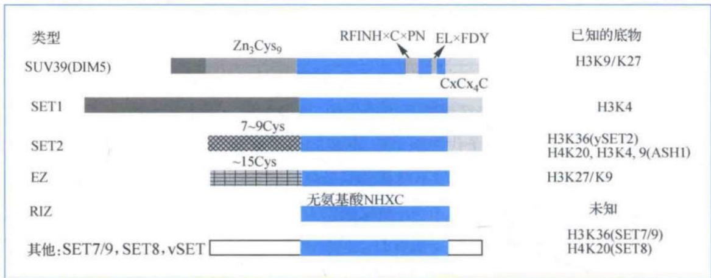

H3K9 的单、双、三甲基化，而 SET7/9 只能催化 H3K4 的单甲基化。结构生物学研究表明酶催化中心的一些关键氨基酸所构成的不同的空间位阻决定该酶能够添加多少个甲基，因为如果将 DIM5 和 SET7/9 相应的核心氨基酸互换，那么 DIM5 只能催化单甲基化，而 SET7/9 则可以催化三甲基化 $^{(图 8-35)}$ 。

精氨酸甲基转移酶(PRMT)分成一型和二型,一型催化单甲基和非对称双甲基化,二型催化单甲基和对称双甲基化。常见精氨酸甲基转移酶有PRMT 1,4,5和6。此外,在果蝇和拟南芥的相关研究中还发现有PRMT家族成员参与调控pre-mRNA的可变剪切,从而影响生物的昼夜节律。

## 3. 组蛋白去甲基化酶

曾经有很长一段时间,人们认为组蛋白甲基化修饰是稳定存在的,没有主动的去甲基化过程。2002年以后才逐渐发现生物体内存在为数不少的组蛋白去甲基化酶。最早发现的赖氨酸去甲基化酶是LSD1(lysine-specific demethylase),该酶用FAD为辅助因子,可在体外系统中催化H3K4me1/2的去甲基化,但不能催化三甲基化的去甲基反应。体内研究发现,LSD1可与不同的复合物相互作用并通过这些复合物被募集到相应的染色质区域。与不同的复合物相结合还能改变LSD1催化底物的特性。当LSD1与Co-REST抑制复合物相结合时催化H3K4me1/2的去甲基化,若与雄激素受体结合则可催化H3K9的去甲基化。因此,同一个去甲基化酶可以行使转录激活和转录抑制两种相反的功能,视与其合作的因子而定。

研究发现,存在于许多赖氨酸去甲基化酶中的jumonji结构域是去甲基化酶的催化活性结构域。在最早鉴定的赖氨酸去三甲基化酶JMJD2中,JMJD2可催化H3K9me3和H3K38me3的去甲基化,酶催化活性区为JmjC结构域(图8-36)。

## 8.3.5 RNA 水平修饰对基因表达的影响

RNA 水平的化学修饰能影响自身活性、定位以及稳定性等多个方面。真核生物的 RNA 上存在 100 多个化学修饰, 然而只有极少数的修饰方式广泛存在于 mRNA 上。其中, $N^{6}$ -甲基腺苷化修饰 ( $N^{6}$ -methyladenosine, $\mathrm{m}^{6}\mathrm{A}$ ) 是 mRNA 上较为常见的一种 RNA 修饰方式,并且有报道表明这种方式可以在转录后水平调控基因表达,影响多个重要的生理调控过程。

  
图 8-36 具有 JmjC 结构域的组蛋白去甲基化酶

$N^{6}-$ 甲基腺苷化修饰 $(m^{6}A)$ 指的是mRNA中腺嘌呤第6位氮原子上的甲基化修饰，这种修饰广泛存在于各个物种中。 $m^{6}A$ 既不容易受化学修饰，如硫酸氢盐处理的影响，也不会影响RNA中基本的碱基配对能力。因此，尽管这种修饰很早就被发现，但是 $m^{6}A$ 所

具有的生物学功能一直到后期才被发现报道。结合新一代测序技术(NGS)和基于抗体亲和技术,人们发现小鼠和人类细胞中将近7000种mRNA上拥有 $m^{6}A$ 修饰位点。另外,随着mRNA $m^{6}A$ 去甲基化酶

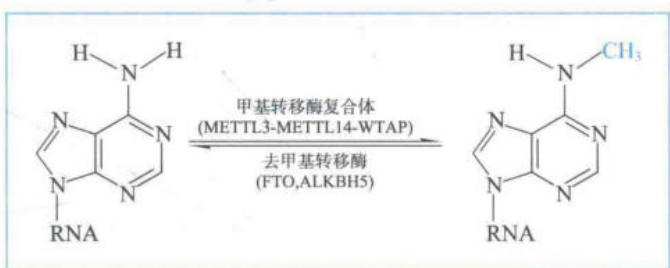  
图 8-37 mRNA 上可逆的 $m^{6}A$ 修饰

的鉴定,人们进一步确认了 $m^{6}A$ 的动态调控方式(图 8-37)。

## 1. $\mathrm{m}^{6}\mathrm{A}$ 修饰甲基化酶

通过体外转录或合成 mRNA, HeLa 细胞核提取物能在体外催化 $m^{6}A$ 修饰的形成。为进一步鉴定负责 $m^{6}A$ 甲基化活性的每一个组分, 这些提取物被分为不同级别的片段, 最终, 人们筛选到包含 3 个成员的甲基转移酶复合体, 分别将其命名为 MT-A1、MT-A2 以及 MT-B。其中, MT-A1 在催化过程中起主要作用。随后, 研究者又新鉴定到一个 $7 \times 10^{4}$ 大小的甲硫氨酸结合亚基, 命名为 methyltransferase-like 3 (METTL3)。人 METTL3 上负责甲基活性的两个功能区域已经被鉴定, 分别是 CM I 和 CM II (图 8-38)。其中, CM I 是甲硫氨酸结合区域, 而 CM II 包含负责甲基活性的催化残基。Northern 印迹杂交分析表明 METTL3 广泛表达在人体组织中, 并在睾丸中有较高的表达。HepG2 细胞中 METTL3 基因表达量降低后会加速细胞凋亡。同时, 分析 HepG2 细胞中 METTL3 基因表达量下调前后的差异表达基因发现, p53 信号途径的基因在 METTL3 基因表达发生改变后得到了富

图 8-38 不同物种中负责 m $^{6}$ A 修饰的甲基转移酶结构示意图

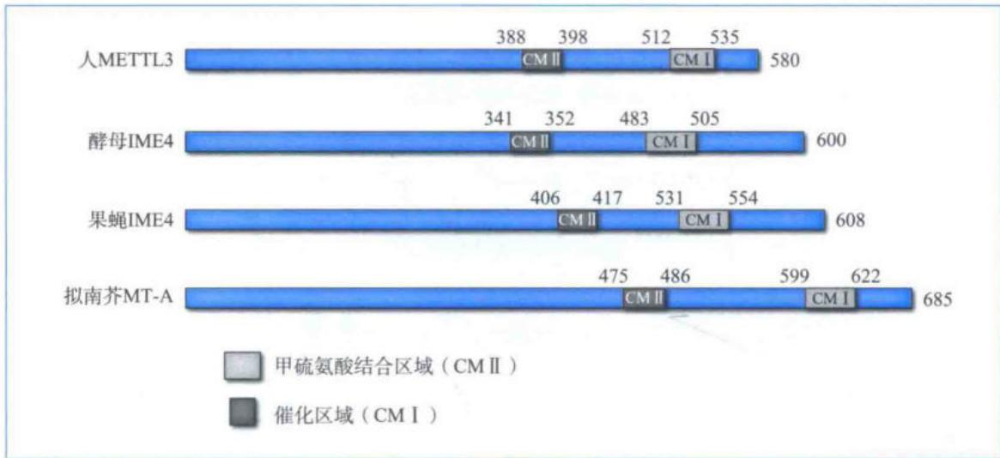

集。免疫荧光分析表明 METTL3 基因定位于核质，尤其是在富集有 mRNA 加工因子的核散斑体中，这些结果与 $m^{6}A$ 修饰调控精子发生过程的功能相吻合。

除了哺乳动物外，METTL3的同源基因也已经在酵母、果蝇以及拟南芥中被鉴定到(图8-38)。所有的这些蛋白质都包含两个一致的甲基转移酶基序CMI和CMII。酵母中的甲基转移酶是IME4/SPO8，主要参与调控减数分裂和孢子形成过程。IME4基因失活的酵母突变体表现出mRNA上的 $\mathrm{m}^6\mathrm{A}$ 修饰消失并且孢子形成会受影响。拟南芥中METTL3的同源基因MT-A也在分裂的组织中大量表达，尤其是在生殖发育器官、茎顶端分生组织以及新形成的侧根中。MT-A的失活会导致 $\mathrm{m}^6\mathrm{A}$ 修饰的缺失，并且胚胎发育停滞在球型期。Dm IME4是果蝇中METTL3的同源基因，主要表达在卵巢和睾丸中。这说明在演化水平上，负责 $\mathrm{m}^6\mathrm{A}$ 修饰的甲基转移酶在调控配子发育过程中功能保守。甲基化修饰只在MT-A和MT-B复合体同时存在时才发生，这暗示了METTL3还需要在其他的因子参与下才能发挥功能。负责 $\mathrm{m}^6\mathrm{A}$ 修饰的甲基转移酶是目前所鉴定的甲基转移酶中较为复杂的一类。研究发现用核酸酶处理或者甲基鸟苷抗体过滤都不能影响HeLa细胞核提取物的甲基化活性，这一结果表明RNA本身并不是酶组分所必需的。拟南芥中，MT-A在体内和AtFIP37蛋白互作。AtFIP37是果蝇中雌性发育致死相关蛋白FL(2)(D)以及人中肾母细胞瘤相关蛋白WTAP的同源蛋白。拟南芥中AtFIP37蛋白破坏后会导致胚胎致死，表现为胚胎发育停留在球型期。另外，METTL3 mRNA在胚胎发育过程中表达量会发生改变，这进一步暗示了 $\mathrm{m}^6\mathrm{A}$ 修饰在发育过程中的重要作用。

## 2. $\mathrm{m}^{6}\mathrm{A}$ 修饰去甲基化酶

$m^{6}A$ 甲基化修饰是一个动态的修饰过程。和 DNA 以及组蛋白中甲基转移酶和去甲基转移酶行使的可逆甲基化作用相似， $m^{6}A$ 甲基化修饰也是一个可逆的过程。有报道表明 FTO 和 ALKBH5 是调控 $m^{6}A$ 去甲基化修饰的两个重要的酶。FTO 和 ALKBH5 属于 AlkB 家族，具备保守的铁离子结合基序以及一个酮戊二酸盐互作区域 $^{(图8-39)}$ 。

已知人 FTO 基因具有调控肥胖以及能量平衡的作用,但其作为去甲基酶发挥的功能却被人们了解得不多。另外,一个基于 mRNA 的光交联蛋白组学分析结果表明 ALKBH5是一个 mRNA 结合蛋白。ALKBH5 的缺失能提高小鼠管状 mRNA 中 $m^{6}A$ 修饰的水平，进一步导致睾丸萎缩和精子数量、运动能力的降低等。这暗示了 ALKBH5 通过去甲基化 mRNA 上的 $m^{6}A$ 修饰调控了精子发生的过程。有意思的是，ALKBH5 基因表达能在基因毒性应激或在低氧情况下被精氨酸去甲基转移酶 PRMT7 调控，这也说明 ALKBH5 广泛参与多个生物学过程调控。FTO 和 ALKBH5 都具有 $m^{6}A$ 去甲基转移酶活性并且在生物体中广泛表达，然而除了作为去甲基转移酶外，它们所具备的生物学功能各不相同，这很有可能与它们本身的特异表达模式相关。例如，FTO 在大脑和肌肉中具有较高的表达，而 ALKBH5 却在睾丸和肺中具有较高的表达。

  
图 8-39 不同物种中负责 $m^{6}A$ 修饰的去甲基转移酶结构示意图。

## 3. $\mathrm{m}^{6}\mathrm{A}$ 修饰调控基因表达的机制

$m^{6}A$ 修饰能够调控基因表达，并且这一调控机制被扰乱时往往会导致人类疾病的产生。目前的研究认为， $m^{6}A$ 修饰是通过改变RNA的二级结构，使得某种RNA结合蛋白能够能接近RNA序列，从而干扰 $m^{6}A$ 修饰的进行，进一步调控基因表达。研究表明， $m^{6}A$ 调控基因表达需要几种基本的组分，包括将 $m^{6}A$ 修饰信息“写入”mRNA的甲基化酶蛋白复合物，将 $m^{6}A$ 修饰信息“擦除”的去甲基化酶以及一种“阅读” $m^{6}A$ 修饰信息的蛋白(图8-40)。

“写入”蛋白功能受损时,会导致多种组织出现发育停滞的现象。在人中,编码“擦除”蛋白的基因发生遗传性质的改变后会导致糖尿病和癌症的发生。同时,测序技术的发展使人们对 $m^{6}A$ 修饰位点的了解从几个变成了几千个,并且这些位点在人和小鼠中高度保守。另外,负责 $m^{6}A$ 修饰的“阅读”蛋白也参与基因的表达。所有的“阅读”蛋白都能直接结合一种叫作“YTH”的RNA结合域。这个区域结合甲基化RNA的亲和度比非甲基化RNA高数倍。

另一方面，RNA 的二级结构也对基因表达有影响。例如，当一个单链 RNA(ssRNA) 的两个区域形成一个碱基对双链，末端未配对碱基形成环状时，就能产生 RNA 茎－环结构。这一结构会通过调控相关蛋白，使其作用在 RNA 的茎、环或者茎－环部位。同时，RNA 的茎－环也可以作为 RNA 水平的调控开关。当其响应到不同的因子后，茎－环结构发生改变，进一步影响细胞功能。这些因子包括一些物理化学参数，例如 pH、温度以及离子结合和代谢情况等，也可以是一些生物大分子包括核酸以及蛋白质等。研究表明，mRNA 上有成千个这样的调控开关，而这些开关往往都受 RNA 修饰激活。之前报道鉴定

## 图 8-40 m $^{6}$ A 修饰调控选择性剪切

选择性剪切指的是由单个基因产生不同mRNA的过程。剪切可以直接去除内含子和外显子之间的阻隔(a所示);当腺嘌呤碱基(A)被某一“写入”蛋白甲基化后,就会形成 $m^{6}A$ 修饰 $(A-CH_{3})$ ,进而结合一个“阅读”蛋白,使得剪切产生的mRNA中全部是外显子。“擦除”蛋白可以逆转 $m^{6}A$ 修饰;当 $m^{6}A$ 修饰发生在RNA的茎-环结构上时,这种修饰能通过碱基配对改变环的结构。HNRNPC调控蛋白能结合在环上的尿嘧啶核苷酸链上,产生包含全部外显子的产物(c所示)。

了一个长链非编码 RNA MALAT1 茎 - 环上 $m^{6}A$ 修饰位点。随后，有研究表明，一个富含 ssRNA 的结合蛋白 HNRNPC 倾向于结合在甲基化形式的 MALAT1 上。HNRNPC 蛋白能调控转录后基因表达过程，例如可变剪切。HNRNPC 结合位点包含一段尿嘧啶核苷酸，其位于 $m^{6}A$ 修饰位点对面的茎 - 环上。研究表明， $m^{6}A$ 位点的甲基化能通过破坏碱基对的稳定和增加富含尿嘧啶核苷酸单链的长度而进一步改变茎 - 环结构，使得结合位点更加接近 HNRNPC。一般情况下，MALAT1 的 $m^{6}A$ 修饰不会直接招募效应蛋白（reader），而是通过间接地改变 RNA 的结构完成这个过程，即甲基化作为一个改变茎 - 环结构的开关，同时茎 - 环结构的改变能进一步促进相关蛋白质与之结合。这两个步骤的结合精准地调控了由 $m^{6}A$ 修饰开关控制的一系列生物学事件。

## 4. $\mathrm{m}^{6}\mathrm{A}$ 修饰对RNA代谢的影响

不同类型的 mRNA 转录本中包含的 $m^{6}A$ 修饰位点不尽相同。例如，催乳素 mRNA 中只有一个 $m^{6}A$ 修饰位点；鲁斯氏肉瘤病毒 mRNA 则包含 7 个 $m^{6}A$ 修饰位点；二氢叶酸还原酶 (DHFR) 转录本中包含了 3 个 $m^{6}A$ 修饰位点；SV40 mRNA 中则包含有超过 10 个以上的 $m^{6}A$ 修饰位点，然而组蛋白和珠蛋白 mRNA 中则没有 $m^{6}A$ 修饰。转录物研究表明，46% 的 mRNA 只包含一个 $m^{6}A$ 修饰的峰，37.3% 的 mRNA 包含两个 $m^{6}A$ 修饰的峰，剩余的 mRNA 则包含超过两个以上的 $m^{6}A$ 修饰峰。这一结果暗示了 $m^{6}A$ 修饰本身对 RNA 代谢过程具有调控作用。进一步研究发现 $m^{6}A$ 修饰可通过影响 RNA 代谢包括 mRNA 的剪切、稳定性、核输出以及翻译等过程，最终影响基因的表达，调控多个生物学过程（图 8-41）。

① $m^{6}A$ 修饰对 mRNA 剪接的影响 前体 mRNA 的剪接是调控基因表达较为关键的一个步骤, 其过程包括内含子的切除以及细胞核中初级转录物外显子的联合, 最终产生成熟的 mRNA。有研究证据表明 $m^{6}A$ 修饰和 mRNA 剪接过程相关。例如, 在环亮氨酸处理的腺肉瘤病毒感染细胞中, 前体 mRNA 的含量升高, 而相应的成熟 mRNA 含量却降低。核内牛催乳素bPRL的定量S1核酸酶定位图揭示腺苷类似物(NPC)处理的CHO细胞的细胞核比未处理细胞中多含4\~6倍的bPRL前体。在环亮氨酸处理的CHO细胞中，核内不均一RNA(hnRNA)的相对分子质量会从低往高处迁移。相似的结果也在NPC处理的SV40 RNA中观察到，这暗示了 $\mathrm{m}^6\mathrm{A}$ 修饰有助于RNA剪接的发生。目前关于 $\mathrm{m}^6\mathrm{A}$ 修饰调控剪接的机制还不是很清楚。有研究认为甲基化的发生可能会干扰剪接因子和mRNA之间的相互作用。另外， $\mathrm{m}^6\mathrm{A}$ 修饰位点有可能是某些RNA结合蛋白的锚定位点或者 $\mathrm{m}^6\mathrm{A}$ 修饰后会使得某些A-U碱基配对不稳定从而影响了RNA的二级结构等。与甲基化酶或去甲基化酶互作的蛋白质也可能参与了剪接过程的调控。

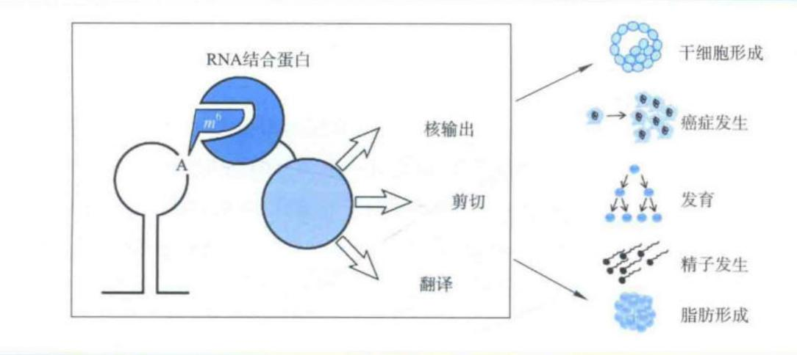  
图 8-41 m $^{6}$ A 对 RNA 代谢的影响

② $m^{6}A$ 修饰对核输出过程的影响 剪接完成后,成熟的 mRNA 需要从细胞核中运出进入细胞质进一步完成翻译或者降解。在 STH(S-tubercidinylhomocysteine) 处理的 HeLa 细胞中,mRNA 在核内的停留时间提高了 40%。有证据表明不同类型的 RNA 利用不同的途径通过核孔复合物调控核输出过程。mRNA 的核输出主要通过 TAP-P15 复合物以及一些接头蛋白、SR 蛋白和 TREX 复合体完成。由于 ASF/SF2 的磷酸化水平与剪接或者核输出有关,研究者们认为由 ALKBH5 缺失造成的 ASF/SF2 磷酸化水平下降将加强 ASF/SF2 和 TAP/P15 复合体的互作,从而进一步提高核内 mRNA 的输出。ALKBH5 去甲基化对细胞内 mRNA 加工因子的定位具有重要影响,推测 ALKBH5 靶定的 mRNA 转录物中 $m^{6}A$ 的甲基化状态可能影响了这些加工因子在细胞内的动态变化过程。

## 5. $\mathrm{m}^{6}\mathrm{A}$ 对翻译过程的影响

大多数的 $m^{6}A$ 修饰发生在外显子区域, 剪切完成后 $m^{6}A$ 修饰仍然保留在成熟的 mRNA 上。因此, $m^{6}A$ 修饰也可能会影响 mRNA 转录物的翻译。有证据表明, 将小鼠 DHFR mRNA 在体外进行甲基化和翻译后, 甲基化的转录本的翻译水平比未甲基化的转录物高 1.5 倍。相似地, 将环丝氨酸处理的细胞中纯化出的细胞质转录物进行体外翻译后发现, 低甲基化的 mRNA 产生 DHFR 蛋白数量比甲基化程度高的 mRNA 产生的蛋白质量少 20%。

<!-- W-BEGIN Watson 19 组蛋白与 DNA 修饰导致的基因“沉默” -->

### 【中文对照 Watson 第19章：组蛋白与 DNA 修饰导致的基因“沉默”】

> 来源：Watson《基因的分子生物学》第七版中译本（书籍/03_基因的分子生物学_第七版） 第19章 真核生物的转录调控。

#### [W] 组蛋白与 DNA 修饰导致的基因“沉默”

到目前为止，我们已经讨论了激活因子和抑制因子对基因的调控，它们与基因邻近区域结合，开启或关闭该基因。这种效应是局部的，并且调控蛋白的活动通常由特异的细胞外信号控制。现在我们转向讨论转录沉默（transcriptional silencing）的机制。沉默在本文中（在第20章，该词被用于完全不同的情形）指的是一种位置效应。基因因为它所处的位置而沉默，而不对环境中某一特异信号的应答反应。另外，沉默效应在大段的DNA序列上可以“扩散”，关闭多个基因，即使是那些离起始事件距离较远的基因。尽管有这些差异，了解沉默效应并不需要全新的理论，而仅仅是我们在本章所遇到的理论的延伸。

最常见的沉默形式与被称为异染色质（heterochromatin）的一种致密形式的染色质有关。异染色质的命名源于其在光学显微镜下的外观（图19-26），它代表了染色体上高度致密的区域（即使在分裂间期）（第8章）。异染色质通常与染色体的某些特殊区域相关，特别是端粒（在染色体末端发现的结构）和着丝粒。正如在第8章所学到的，端粒和着丝粒通常由重复序列组成，偶尔会有少量的蛋白质编码基因。如果用实验的方法将一个基因转移至该区域，那么该基因通常被关闭。实际上，还有其他区域的染色体也处于异染色质状态，并且这种区域中已发现有基因的存在，如酵母中沉默的交配型基因座。在哺乳动物细胞中，估计约有50%的基因组以异染色质的某种形式存在。但是，在果蝇基因组的异染色质区域也有一些必需基因，其中包括Rolled促细胞分裂原激活蛋白激酶。这些基因在异染色质区域通常处于正常的活动状态，而当其转移到常染色体区域时就会表现出不稳定。然而在大多数情况下，是位于常染色质区域基因转移到异染色质区域时表现出减弱或不稳定的活性（花斑化）（随后我们会进行详细讨论）。

我们已经知道，染色质的密度可以被那些在化学上修饰组蛋白尾部的酶所改变或者改变核小体的位置。这种修饰影响 DNA 的易接近性，并由此影响复制、重组以及转录等过程。正如我们已经叙述过的，转录过程的激活和抑制通常涉及核小体的修饰，以至于改变基因对转录装置和其他调控蛋白的易接近性。我们也曾经遇到过某些蛋白质可以识别被修饰过的核小体，并且可以特异性地与之结合。异染色质的沉默可以被理解为上述原理和机制的一种延伸。

转录也可以通过 DNA 甲基化而被沉默。DNA 甲基化是由 DNA 甲基化酶(DNA methylase)所催化的。这种形式的沉默在酵母中尚未发现，但在哺乳动物细胞中却很普遍。DNA 序列的甲基化能抑制蛋白质结合，包括转录装置，因而阻断基因的表达。但是甲基化也可以通过其他途径抑制表达：有些序列只有在被甲基化后才能被特异的抑制因子识别，这种识别随后关闭邻近的基因，通常通过募集组蛋白修饰酶来实现。

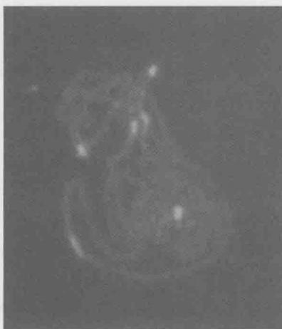  
图 19-26 DAPI 染色显示了拟南芥基因组中的异染色质区域。DAPI 能够使 DNA 着色，通过较强的荧光可以看到核染色质更加密集地凝集在异染色质区域。染色较弱的地方是常染色质区域。（该图由 Paul Fransz 提供）

#### [W] 在酵母中，沉默由组蛋白的脱乙酰化作用和甲基化作用介导

在酿酒酵母中，端粒、沉默的交配型基因座及 rDNA 基因都是 “沉默” 的区域。我们以端粒为例进行讨论。

现已发现，每条染色体末端1\~5kb部分均是折叠、致密的结构，如图19-27所示。来自染色体其他位点的基因转移到该区后，通常都变成沉默状态，特别是当它们在原先的位点就只有微弱表达。相比其余部分的基因组[称为常染色质（euchromatin），这部分基因表达更容易]，端粒部分的染色质乙酰化程度要轻一些。

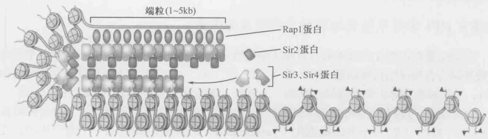  
图 19-27 酵母端粒中的沉默效应。Rap1 募集 Sir 复合体至端粒。Sir2 是该复合体的一种成分，使邻近的核小体脱乙酰化。未被乙酰化的尾部随后与 Sir3 及 Sir4 结合，募集更多的 Sir 复合体，从而允许其中的 Sir2 作用于更远处的核小体，循环往复。这就解释了由脱乙酰化造成的沉默效应的扩散。（经允许引自 Grunstein M. et al. 1998. Cell 93: 325-328. ©Elsevier.）

我们已经分离到沉默效应被消除的突变体，即处于端粒部位的基因以更高的水平表达。这些研究显示了3个编码沉默调控蛋白的基因，即SIR2、SIR3和SIR4（SIR代表silent information regulator）。这3个基因所编码的蛋白质形成一个复合物，与沉默状态的染色质结合，其中Sir2是一种组蛋白脱乙酰酶。

沉默复合物由识别端粒重复序列的 DNA 结合蛋白募集到端粒。在沉默的交配型基因中，募集也是由一个特异的 DNA 结合蛋白起始的。上述两种情况中，Sir 的募集激发了组蛋白尾的局部脱乙酰化。脱乙酰化的组蛋白随后被沉默复合物直接识别，因此局部脱乙酰化以自我永续的方式沿着染色质轻易地扩散开，产生了一个扩展的异染色质区域。

与 Tup1 的抑制（其机制仍未明了）不同，沉默明显是由组蛋白尾的脱乙酰化造成的。Sir2 的丢失完全缓和了沉默，而且组蛋白尾的乙酰化具有类似的效应。整个异染色质结构依赖于 DNA 结合蛋白（Rap1）的持续存在来维持完整性。因此，尽管因 Sir 识别脱乙酰组蛋白而引发脱乙酰化的加剧和扩散，DNA 结合蛋白继续扮演重要的角色。另外，是 DNA 结合蛋白赋予了整个过程的特异性，即决定了沉默复合物在哪里形成。在某些沉默例子里，RNA 分子，而不是蛋白质，提供了这个重要的特异性。在第 20 章中，我们将讨论这样一个例子，另一种酵母（粟酒裂殖酵母 Schizosaccharomyces pombe）的 RNAi 装置是该生物体交配型基因座和着丝粒沉默所必需的。

沉默区域的扩散是如何被节制的？即它是如何被限制到合适的区域的而不在基因组中扩散得太远？前面我们提到绝缘子元件能够阻碍组蛋白修饰的扩散（图 19-12）。另外，其他种类的组蛋白修饰阻碍 Sir2 蛋白的结合，于是终止了扩散。相信组蛋白 H3 尾的甲基化起了这个作用。

组蛋白甲基转移酶把甲基基团加到组蛋白尾上。如我们在第8章看到的，这些酶将甲基基团加到组蛋白H3和H4尾上特异的赖氨酸残基上。组蛋白甲基转移酶最近在酿酒酵母中有所描述，被认为帮助某些基因的抑制，如刚看到的，阻碍Sir2介导的沉默在其他区域的扩散。但是组蛋白甲基化酶在更高等的真核生物和粟酒裂残酵母中被研究得更详细。在这些生物体中，沉默通常与含有既脱乙酰又甲基化的组蛋白的染色质相关联。于是在这些生物体中，在H3尾Lys-9（H3K9）的甲基化是与沉默的异染色质相关的一种修饰（表8-7）。相反，其他位点的甲基化（如在同一尾上的Lys-4）与表达的提高相关。

#### [W] 果蝇中 HP1 识别甲基化的组蛋白和凝聚染色质

如同组蛋白乙酰化的残基被含有溴区结构域（bromodomain）的蛋白质所识别，甲基化的残基结合含溴区结构域的蛋白质（第8章，图8-41）。一个这样的蛋白质就是果蝇蛋白HP1，它是该生物体中沉默异染色质的一个组分（在其他生物体中具有同源的相似功能）。

HP1蛋白与含有甲基化的组蛋白H3的经修饰的染色质相互作用。这个特定的修饰是由Su（Var）3-9[一个所谓花斑化（variegation）的抑制物]编码的一个酶产生的。花斑化在某些情况中当一个基因被转移到一个异染色质区域时可见。那个基因不是在所有细胞所有时间都沉默着，而是在沉默和表达状态间明显地随机切换，在某些细胞中“开启”，而在其他细胞中“关闭”。花斑化在所谓的white基因尤其明显，该基因负责成蝇眼睛正常的红色色素化。这些基因被称为 white（白色）是因为突变表型是白眼（见附录1）。当插入到异染色质，white 基因的表达变成“花斑化”，产生的眼睛带有花白的红色（图19-28）。Su（Var）3-9基因的突变抑制了这种花斑化，产生的眼睛有着更统一的红色斑；在那么多细胞里，white 基因的表达不再沉默了。Su（Var）3-9蛋白是一个组蛋白H3Lys-9（H3K9）甲基转移酶。目前还不明白的整个机制，Su(Var)3-9蛋白被募集到异染色质上并在其组蛋白H3尾上加上甲基基团。这个修饰对HP1蛋白的结合是必不可少的，HP1蛋白随后参与异染色质的凝聚过程。Su（Var）3-9被认为还可以由序列特异的DNA结合蛋白募集到特异的常染色质，因而导致由HP1介导的基因特异的组蛋白甲基化和转录抑制（详见框19-5）。

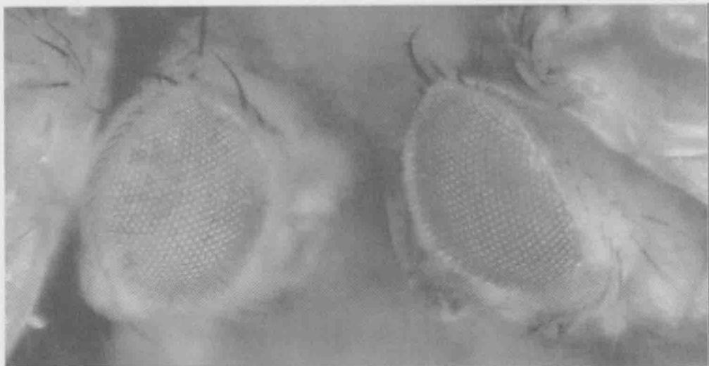  
图 19-28 花斑位置效应。如文中所述，果蝇的白眼基因能够产生野生型的红眼（右侧）。当野生型的红眼基因发生突变时，果蝇是白眼（因此被命名为白眼基因）。当野生型的红眼基因位于异染色体附近时，果蝇的复眼呈现红白嵌合的花斑（左侧）。（经允许引自 Lippman Z. and Martienssen R. 2004. Nature 431: 364–370, Fig. 1a. ©Macmillan.）

#### [W] 框19-5 存在组蛋白密码吗？

有人提出存在组蛋白密码（histonecode）。根据这个概念，在一个特定基因组蛋白尾上的不同模式的修饰可以被“阅读”，表明不同的意思（第8章，图8-39）。其中的“含义”来自于每个募集不同组蛋白的特定修饰模式；特定的组合形式取决于这些蛋白所携带的识别结构域的数量、类型和组成。

我们已经遇到过在组蛋白上识别特异的乙酰化和甲基化“标记”的蛋白质（如TFⅡD和HP1）。还存在H3和H4尾上磷酸化丝氨酸残基的蛋白质，以及结合这些修饰的蛋白质。因而在组蛋白尾的几个位置上进行多种修饰是可能的（第8章，图8-39）。另外，许多携带修饰识别结构域的蛋白质本身就是酶，它们进一步修饰组蛋白。我们开始看到，识别和维持修饰模式的过程在理论上是如何实现的。

观察一个简单的例子——组蛋白 H3 尾的 Lys-9（第 8 章，图 8-39）。这个残基的不同修饰状态可以被解读成不同的意思。于是，这个残基的乙酰化与活跃转录的基因相关。这个残基被各种携带溴区结构域的组蛋白乙酰化酶所识别，刺激邻近核小体的乙酰化。当 Lys-9 没有被修饰时，它与沉默的区域相关（如我们前面在酿酒酵母中所见）。非乙酰化的组蛋白通常募集脱乙酰酶，加强和维持脱乙酰化状态（如我们在酿酒酵母沉默区域的扩散中所见）。最后，在某些生物体中同一个赖氨酸可以被甲基化：在那种情况下，修饰的残基与建立和维持异染色质状态的蛋白质（如 HP1）结合。

但是修饰的组合会有其独特的含义吗？再次拿果蝇HP1蛋白来作为一个组蛋白的修饰如何明显地影响邻近第二个组蛋白的修饰的例子来说明（框19-5图1）。在细胞分裂中期，HP1蛋白暂时离开有丝分裂染色体，即使它们保留了基本的“标记”——组蛋白H3甲基化的Lys-9（H3K9）。失去HP1的结合与旁边H3Ser-10的磷酸化相关。这个磷酯化由一个细胞周期激酶AuroraB介导。该酶只有在细胞周期的M期变得有活性，因此导致HP1从分裂中期染色体的异染色质上脱离。

  
框 19-5 图 1 一个染色质修饰对另一个染色质修饰的影响。图示在组蛋白 H3 尾部上的修饰。Lys-9（K9）的甲基化募集了 HP1，后者随后作用于染色质的凝聚。邻近丝氨酸残基（S10）的磷酸化从甲基化 Lys-9 移开 HP1，而没有移走甲基基团。

HP1 被 AuroraB 激酶解离，看上去是将有丝分裂纺锤体搭上着丝粒及随后在胞质分裂中姐妹染色单体的分离所必需的。当这个过程完成后，由于 AuroraB 激酶活性的消失，Ser-10 的磷酸化就消失了，HP1 重新与染色体相互作用维持异染色质。与这个模型相一致，删除 AuroraB 激酶的突变导致异常的分离。

尽管看到这些现象，存在特异密码，即在一个特定基因座上复杂的组蛋白修饰产生一个高度特异的信息，仍然存在很大的争议。在一个基因上看到的许多修饰可能仅仅是一个基因在被激活或被抑制的过程的一部分，而不是作为起始信号。即它们是基因正在“开启”或“关闭”的结果，而不是原因。实际上，最近的一个研究提出一个普通品系的果蝇可以在没有 H3K4 甲基化的情况下繁殖。当一个特定基因被表达时，位点特异性 DNA 结合蛋白（或在某些情况下小 RNA 分子，如我们将在第 20 章中所见）继续是决定异性的最强大的提供者。但是，某些组蛋白修饰常常于基因活性的特殊状态有关。例如，H3K27 甲基化常见于抑癌基因中，而 H3K4 的甲基化则常见于活跃的（或者“蓄势”）基因上。

#### [W] 多梳通过也调控组蛋白甲基化介导基因抑制

多梳（Pc）是动物细胞中一种重要的抑制因子，能够调控组蛋白甲基化引起染色体浓缩。Pc 抑制因子主要存在于两种蛋白复合体——核心蛋白复合体 1 和核心蛋白复合体 2（PRC1 和 PRC2）中。PRC2 与序列特异的 DNA 结合蛋白结合形成 Pho-RC（抑制复合物），Pho-RC 能够与多梳效应元素相互作用（图 19-29）。PRC2 含有组蛋白甲基转移酶（Zeste 增强子），能够使组蛋白 H3 尾部的赖氨酸-27（K27）发生三甲基化。甲基化作用导致了 PRC1 的结合，因此既引起核染色质的压缩，或导致核小体处于或者接近于转录起始点的位置。多梳引起的抑制反应曾经被认为类似于 HP1，因为组蛋白甲基化和染色体浓缩的大范围延伸。然而现在的证据表明多梳效应元素通常位于接近激活因子的位置。尽管如此，H3K9 的三甲基化作用仍然与 HP1 介导的基因沉默有关，而 H3K27 三甲基化则与多梳介导的基因沉默有关。

  
图 19-29 组蛋白 H3K27 三甲基化在多梳群功能中的潜在作用。(a) 组蛋白 H3K27 三甲基化对多梳抑制复合物 1 (PRC1) 识别靶向目标的潜在作用（见正文）。(b) 组蛋白 H3K27me3 在染色质环化中的潜在作用。PRC1 位于 PRE 的前面，与 H3K27me3 发生相互作用使基因处于稳定状态，形成的 DNA 环使 Polycomb 群复合物和转录区域并行，PRC2 可以进一步延伸 H3K27 甲基化压缩部分核体，妨碍 RNA 聚合酶的结合。(经允许引自 Simon J.A. and Kingston R. 2009.Nat. Rev. Mol. Cell Biol.10:697–709, Fig. 3.©Macmillan)

我们已经看到单一种类的修饰如何参与到基因调控中。但是当多种类型的修饰在同一个基因上发生会怎样呢？它们的效应如何相互作用？有人提出复杂模式的修饰按“组蛋白密码”来操作。各种组蛋白修饰间的相互作用和组蛋白密码的概念在框19-5中描述。

#### [W] 在哺乳动物细胞中 DNA 甲基化与沉默状态的基因有关

有些哺乳动物基因由于其邻近 DNA 序列的甲基化而处于沉默状态（我们现在谈论 DNA 甲基化，而非组蛋白甲基化）。事实上，哺乳动物基因组上大段的区域正是通过这种方式被标记的，并且 DNA 甲基化通常出现在异染色质区域。这是因为甲基化的序列常被 DNA 结合蛋白（如 MeCP2）识别。DNA 结合蛋白可以募集组蛋白脱乙酰酶和组蛋白甲基化酶，而这两种酶可以修饰邻近的染色质。因此，DNA 甲基化可以标记随后异染色质形成的位点（图 19-30）。

  
图 19-30 DNA 甲基化与组蛋白修饰关闭基因的表达。在未修饰状态，激活因子和转录装置存在时，哺乳动物基因可以很容易在表达状态和非表达状态之间转换，如首行所显示。在这种状态下，表达从来不是被完全关闭，而是具有渗透性。通常这并不是最好的状态，有时基因必须被完全关闭，偶尔被永久性地关闭。这是通过 DNA 的甲基化和局部核小体的修饰来实现的。因此，当某基因不被表达时，DNA 甲基转移酶（一种甲基化酶）可以接近并甲基化启动子序列、基因自身和上游激活因子结合位点序列内部的胞嘧啶。甲基基团被加到胞嘧啶环的 5'位置上，生成 5'-甲基胞嘧啶（第 4 章）。有的情况下，这种修饰自身能破坏转录装置以及激活因子与基因的结合。但是它也可以增强其他可以识别含甲基胞嘧啶的 DNA 的蛋白质（如 MeCP2）的结合。这些蛋白质进而又可以募集某些可以重塑和修饰局部核小体的复合物，从而完全关闭基因的表达。

DNA 甲基化在一种被称为印记（imprinting）的现象中处于核心地位。在一个二倍体细胞中，多数基因有两份拷贝：其中一条染色体上的一份拷贝来自父方，另外一条对应染色体上的拷贝来自母方。在多数情况中，两个等位基因表达水平具有可比性。这并不奇怪：它们携带同样的调控因子序列，而且处于同样的调控因子中；它们在两条非常相似的染色体中也位于相应的区域。但在少数情况下，只有其中一份拷贝的基因表达，而另一份拷贝处于沉默状态。

两个研究的比较透彻的例子是人 H19 基因和胰岛素类似生长因子 2（Igf2）基因（图 19-31）。这两个基因位于人类第 11 号染色体上相互邻近的位置。在某一特定的细胞中，一份拷贝的 H19 基因（位于母方来源的染色体上）表达，而另一份拷贝的基因（位于来自父方的染色体上）则被关闭。Igf2 基因则正好相反，来自父方的拷贝开启，而来自母方的拷贝则关闭。

有两个调控序列对于上述两个基因差异性的表达起关键作用：一个增强子序列（位于 H19 基因的下游）和一个绝缘子序列 [称为印记控制区 ICR，（imprinting control region），位于 H19 和 Igf2 基因中间]。理论上，该增强子（当与激活因子结合后）可以激活其中任何一个基因。但是它为什么仅仅激活母本染色体上的 H19 基因和父本染色体上的 Igf2 基因呢？答案在于 ICR 及其甲基化状态。增强子不能激活母本染色体上的 Igf2基因，是因为在该染色体上 ICR 与一种叫做 CTCF 的蛋白质结合，CTCF 阻断激活因子在增强子序列处激活 Igf2 基因。反之，在父本染色体上，ICR 元件和 H19 启动子均被甲基化。在这种状态下，转录装置不能与 H19 启动子结合，而且 CTCF 不能与 ICR 结合。结果，增强子此时可以激活 Igf2 基因。在父本染色体上，通过 MeCP2 与甲基化的 ICR 结合，H19 基因被进一步抑制。同前，这种作用可以募集脱乙酰化酶，而后者又抑制了 H19 启动子。

b 来自父亲的染色体  
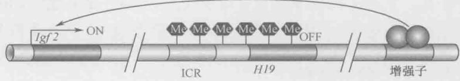  
图 19-31 印记。这里显示的是由印记所控制的两个基因——哺乳动物 Igf2 基因和 H19 基因。如文中所述，在某一个特定的细胞中，只有母本染色体上的 H19 基因表达，而 Igf2 只从父本染色体上的基因表达。绝缘子元件的甲基化状态决定了 ICR 结合蛋白（CTCF）是否可以结合，进而阻断 H19 基因被下游的增强子所激活。

框 19-6 “转录抑制与人类疾病”描述了抑制丧失导致人类疾病的两个例子。一个涉及 MeCP2，另一个涉及印记缺损。

#### [W] 框 19-6 转录抑制与人类疾病

有几个人类疾病由特异基因的去抑制而引起。这里，我们讨论两种情况，每一种都由一个基因的抑制丧失而引起，基因抑制的机制在文中有描述：第一个是 Rett 综合征，由抑制蛋白 MeCP2 的缺失而引起。第二个是 Beckwith-Weidemann 综合征，由在 Igf2 基因的 ICR 上缺失了 CTCF 结合位点而引起。

Rett 综合征（RTT）是一种严重的孤独症谱系障碍（autism spectrum disorder），每 10000 个女孩中有一个得病。该疾病有如下特征：儿童早期丧失语言和运动技巧、头小畸型、癫痫、反常性重复行为（如重复手写）和中度的换气过度。它是零星的智力迟钝的常见原因。RTT 由 X 染色体连锁的编码抑制蛋白 MeCP2 的基因上的一个突变引起。我们先前在文中已经遇到过这个转录调控因子。它识别甲基化的 DNA，并通过募集组蛋白脱乙酰酶使邻近基因的转录沉默（图 19-31）。携带一个中断了的 MeCP2 基因的小鼠具有与 RTT 患者类似的症状。在小鼠中它是受限的，MeCP2 的缺失只局限在脑部。

因为 MeCP2 基因发现于 X 染色体，有一个缺陷拷贝的女孩（RTT 患者）是一个嵌合体。在那些携带该基因突变拷贝（同位基因）的 X 染色体失活的细胞里，野生型 MeCP2 被制造了。但在那些野生型拷贝（同位基因）的基因位于失活的 X 染色体上的细胞里，就没有 MeCP2 被制造出来了。在（单一）X 染色体上携带突变基因的男孩在所有细胞里都缺乏 MeCP2，通常在一到两年内死于呼吸衰竭。

RTT 被认为是一种神经发育疾病，而非神经退化疾病，因为患者（及基因敲除小鼠）显现异常的神经元形态，而不是神经死亡。即便如此，MeCP2 缺乏被认为可能在发育的某个特殊点上是重要的，此后即使重塑它的功能也无法逆转这个表型。但是最近构建了一个小鼠，其 MeCP2 的表达能够被操纵，使得该小鼠在没有 MeCP2 表达的情况下长到成年，早于该调控因子表达被开启。引人注目的是，在成年制造 MeCP2 足以逆转早期发育过程中缺乏所带来的效应。这个令人兴奋的发现使在人类中进行治疗干预变得更可行，即使仍然很困难。

MeCP2 与 RTT 症状之间的联系还没有被完全明白。如我们已经看到的，MeCP2 是基因表达的一个抑制因子，它的目标基因之一编码脑源性神经营养因子（brain-derived neurotrophic factor, BDNF）。这个蛋白质是一个生长因子，在脑部发育及与学习和记忆相关联的突触改变中扮演角色。最近发现神经活性导致 MeCP2 的磷酸化，该修饰导致抑制因子从 DNA 上解离，大概使得它的目标基因得以表达。中断这些活性（如 BDNF 不适当地表达）作为对至少某些 RTT 的认知症状的解释具有明显的吸引力。

对 MeCP2 和 BDNF 间的联系及这些蛋白质与疾病之间的联系的研究正在进行，对由 MeCP2 调控的其他可能的相关基因的研究也在进行。从认知障碍到异常步态的一系列广泛症状提示，许多基因的表达异常可能是疾病的完全发作所必需的。

Beckwith-Wiedemann 综合征（BWS）是一个发育病症，在每 15000 人中有一人得病。该疾病有如下特征：生长过度（有这个疾病的儿童早产且大于正常胎儿）、对各种儿童癌症（包括肾母细胞瘤）易感性增加。其症状还与在染色体 11p15.5 上的印记基因的中断表达有关联，其中包括在文中讨论过的胰岛素类似生长因子 2 基因（lgf2）（图 19-31）。

如我们已经描述过的，lgf2基因通常只由一个等位基因（父本）表达，因为另一个被印记了。同时，H19基因只从母本等位基因表达。许多BWS的病例与lgf2的双等位基因表达及H19基因的不表达相关联，这是两个染色体ICR都被甲基化的结果。IGF2是一个婴儿的生长因子，H19相信是一个参与肿瘤抑制的调控RNA（第20章），因此该病的表型（生长过度和肿瘤敏感）可以理解。

与 RTT 一样, BWS 的症状在适当操纵的小鼠里被模拟: 过表达 lgf2 产生的结果是, 小鼠普遍生长过度, 并且出现特异肿瘤。

#### [W] 基因的表观遗传调控

基因表达的模式有时必须得到继承。在发育中一个细胞释放的信号导致邻近细胞开启特异的基因。这些基因也许不得不在这些细胞的许多代内都保持开启，即使诱导它们开启的信号只瞬间存在。在同时缺乏突变和起始信号的情况下，基因表达模式的继承称为表观遗传调控（epigenetic regulation）。

与之相反的是我们已经讨论过的某些基因调控例子。如果一个基因由一个激活因子控制，而且那个激活因子是在一个特定的信号存在时才有活性，那么，只要信号还存在，基因就会保持开启。事实上，在正常的条件，E.coli 的 lac 基因只在有乳糖存在而葡萄糖缺乏的时候才表达。同样的，酵母的 GAL 基因只在葡萄糖缺乏而半乳糖存在时才表达，人类 $\beta$ 干扰素只在细胞被病毒感染刺激时才制造。

#### [W] 基因表达的某些状态通过细胞分裂得以继承，即使起始信号不再存在

我们已经遇到过基因调控可以被表观遗传继承的例子。讨论了一个 $\lambda$ 噬菌体溶源体的维持（第 18 章）。在溶源体中，噬菌体在细菌宿主细胞内处于休眠状态。这个状态与基因表达的一个特异模式相关，尤其是与 $\lambda$ 抑制因子蛋白的持续表达相关（第 18 章，图 18-27）。

溶源性基因表达是在一个感染细胞中应答贫瘠的生长条件下建立起来的。然而，一旦建立，溶源性状态就稳定地维持，尽管生长条件有所改善：将溶源菌转移到富含营养的生长培养基并不会导致诱导作用。事实上，诱导基本上从不发生，直到接收到一个合适的诱导信号（如 UV 照射）。

溶源性状态通过细胞分裂得以维持便是表观遗传调控的一个例子。这个表观遗传控制源自于一个抑制因子合成的两步策略。第一步，抑制因子合成通过激活因子CⅡ（其对生长条件敏感）对抑制因子（CⅠ）基因的激活而建立。第二步，抑制因子合成通过自我调控得以维持：抑制因子激活自身基因的表达（第18章，图18-31）。通过这条途径，当溶源性细胞分裂时，每个子细胞继承了一个拷贝的处于休眠状态的噬菌体基因组和一些抑制因子蛋白。这些抑制因子足以在每个细胞中从噬菌体基因组上刺激进一步的抑制因子合成（图19-32）。在多细胞生物体的发育过程中，许多基因调控就是用这种方式工作的。我们将在第21章看到一些例子。

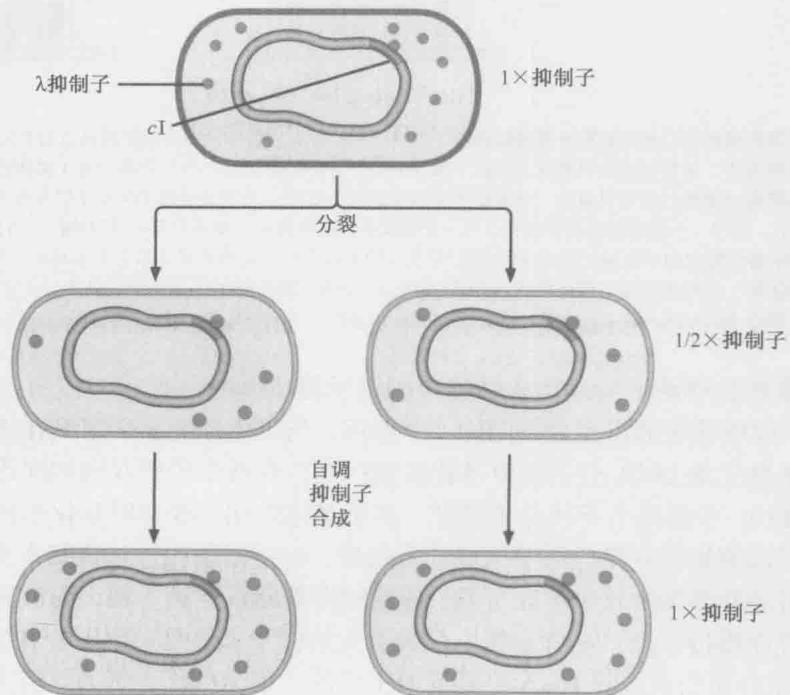  
图 19-32 溶源性状态维持的表观遗传控制。

生物体的发育过程中，许多基因调控就是用这种方式工作的。我们将在第 21 章看到一些例子。

另一个著名的表观遗传调控的机制源于 DNA 甲基化，在对印记的描述中我们见过这样一个例子：DNA 甲基化轻易通过细胞分裂继承下来，如图 19-33 所示。如此，某些特定的 DNA 甲基化酶可以低频地甲基化先前未修饰的 DNA，但所谓的维持甲基化酶（maintenance methylases）极其有效地修饰半甲基化的 DNA（即完全甲基化的 DNA 经复制后提供的那个底物）。在哺乳动物细胞中，DNA 甲基化可能是沉默的基因组区域的主要标记（第 20 章）。DNA 复制后，在两个子细胞中的半甲基化位点被重新甲基化。它们随后可以被抑制因子 MeCP2 所识别，然后后者募集组蛋白脱乙酰酶和甲基化酶，重新建立沉默（图 19-30）。

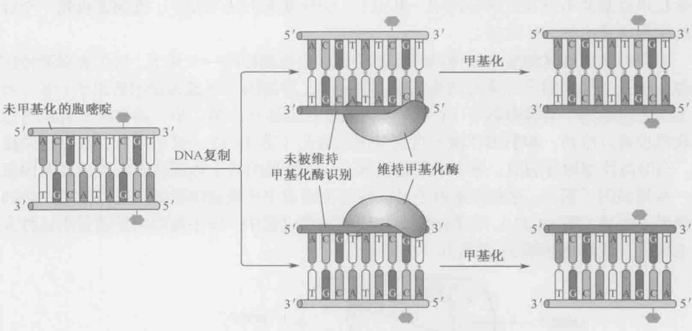  
图 19-33 DNA 甲基化模式可以通过细胞分裂得以维持。如图 19-26 所示，参与脊椎动物基因表达的 DNA 可以被甲基化，进而该基因的表达被关闭。这种初始的甲基化由原位（de novo）甲基化酶执行。为了使某个处于关闭状态的基因永远关闭，甲基化状态必须通过细胞分裂得以遗传。此图显示了这是如何实现的。图中显示的 DNA 序列含有两个胞嘧啶，分别位于两条 DNA 链上，其中一个胞嘧啶已被甲基化，另一个则没有。这种模式在细胞分裂中得以维持，因为一旦 DNA 被复制，一种维持性的甲基化酶识别半甲基化的 DNA，随后向其中的未被甲基化的胞嘧啶上加上甲基基团。完全未被甲基化的序列则不能被该酶识别，仍然保持非甲基化状态。所以，两个子 DNA 双螺旋链的甲基化模式最终与母链相同。（经允许引自 Alberts B. et al. 2002. Molecular biology of the cell, 4th edition, p431, Fig7-81. © Garland Science/Taylor & Francis LLC.）

核小体修饰在理论上可以为表观遗传的继承提供基础，尽管还没有发现这样的例子。考虑被一段甲基化的组蛋白关闭的一个基因。当染色体的那个区域在细胞分裂过程中被复制，来自父本 DNA 分子的甲基化组蛋白最后在两个子代双链体间均匀分布（第 8 章，图 8-43），于是每个子代分子携带一些甲基化的和一些非甲基化的核小体。甲基化的核小体可以募集带有染色质结构域的蛋白质，包括组蛋白甲基化酶本身，它随后可以甲基化邻近的非修饰的核小体。这样，使用同样策略以达到扩散，染色质修饰的状态得以跨越几代而维持下来。尽管这是一个吸引人的模型，但是还要看看在缺乏 DNA 甲基化、DNA 结合蛋白或调控 RNA 时是如何工作的（第 20 章）（例如，当决定哪些细胞招募修饰酶的信号不存在的时候）。

<!-- W-END Watson 19 组蛋白与 DNA 修饰导致的基因“沉默” -->

## 8.4 非编码 RNA 对真核基因表达的调控

非编码 RNA (non-coding RNA, ncRNA) 是一类不编码蛋白质的 RNA。尽管人类基因组上四分之三的基因可以进行转录，然而只有一小部分的基因能够继续翻译成蛋白质。根据 RNA 的大小，非编码 RNA 可以分为小分子非编码 RNA，包括干扰小 RNA (short interfering RNA, siRNA)、微 RNA (miRNA) 等，以及长链非编码 RNA (lncRNA) (图 8-42)。其中 siRNA 和 miRNA 往往在基因沉默发面发挥功能，从而进一步影响基因表达。

图 8-42 人类基因组中编码 RNA 与非编码 RNA 的比较

## 8.4.1 干扰小RNA

## 1. 干扰小 RNA (siRNA) 的发现

早在 1988 年就有 RNAi 现象的报道。当时的研究人员希望通过转基因过表达的手段使得牵牛花的颜色变深，但在他们得到的诸多转基因牵牛花中，有些花不但颜色没有更深，反而变成白色了。以后相类似现象也在其他转基因植物中出现，被称为基因表达的共抑制现象（co-suppression）。人们发现不论引入靶基因的正义链（sense）还是反义链（anti-sense），都有可能导致内源靶基因表达量下降。这种现象在许多真核生物中都有报道，在线虫、果蝇的研究中被称为 RNA 干扰。

1998 年,研究人员通过实验发现 RNAi 的重要特性是以双链 RNA(dsRNA) 行使功能。通过微注射将基因 MEX3 的反义 mRNA 和 dsRNA 注射入线虫性腺细胞中,在子代胚胎中用原位杂交方法检测内源 MEX3 的表达水平。没有注射的胚胎中,MEX3 表达量很高;

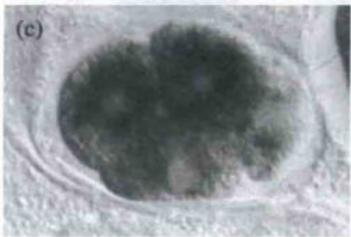

注射了反义 RNA 的, MEX3 表达量明显降低; 而注射了双链 RNA 的胚胎中几乎检测不到 MEX3 的表达 $^{(图 8-43)}$ 。

实验表明,双链 RNA 对内源基因表达的干扰效率远高于单链的 RNA,真正起到 RNA 沉默作用的应该是双链 RNA。此外,研究还发现,引入的外源 RNA 只对同源基因有高沉默效率,暗示它们之间可能需要形成配对的基础。2000 年 RNAi 研究有了重要进展,揭示了 dsRNA 介导的 RNAi 现象的许多重要特性。研究者开发了一套基于果蝇细胞提取物的体外 RNAi 研究系统,发现不论是否有靶 mRNA 的存在,引入的外源 dsRNA 的正义、反义链都会被切割成 21\~23 nt 的小片段,相对应的靶 mRNA 也会被降解成长度差为 21\~23 nt 的片段,说明这种降解很可能是由 21\~23 nt 小片段介导的,并且这种降解需要 ATP 提供能量。现在,已统一将介导这种沉默现象的小片段 RNA 称为干扰小 RNA(short interfering RNA, siRNA)。

## 图 8-43 RNAi 注射实验明确 RNA 是以双联形式行使功能的

利用原位杂交技术检测4-细胞胚胎时期的线虫内源MEX3 RNA（以深色表示）。(a)正常胚胎，无杂交探针；(b)未注射RNA，杂交探针检测线虫胚胎细胞内源MEX3 RNA；(c)注射MEX3 RNA反义链，杂交探针检测出MEX3 RNA水平略有下降；(d)注射双链MEX3 RNA，杂交探针未检测出内源MEX3 RNA。

## 2. siRNA 的生物合成

病毒 RNA 以及由环境、实验因素引入的外源 RNA 都可能是 siRNA 的来源。此外，基因组重复片段、转座子等序列也可能产生 siRNA。通常一个长为 21 nt 的双链小 RNA，其中 19 nt 形成配对双链，3' 端各有两个不配对核苷酸，而 5' 端为磷酸基团。其中一条链为引导链（guide strand），介导 mRNA 的降解；另一条链为乘客链（passenger strand），在 siRNA 形成有功能的复合体前被降解。

siRNA 的产生过程主要包括着 3 个核心步骤: 经 Dicer 切割形成双链小片段; 组装复合物; 形成有活性的沉默复合物 (RNA induced silencing complex, RISC) (图 8-44)。

① Dicer 切割 Dicer 是一类 RNaseⅢ蛋白, 主要包括一对 RNaseⅢ结构域、双链 RNA 结合域、解旋酶结构域和 PAZ 结构域。PAZ 结构域可以结合双链 RNA 的两个 3' 不配对核苷酸。两个 RNaseⅢ结构域形成分子内二聚体结构, 各催化剪切一条链, 产生双链断裂(图 8-45)。结构生物学研究表明, PAZ 结构域和 RNaseⅢ催化切点约相距 6.5 nm, 与 20 多个核苷酸的长度相当, 因此, Dicer 本身可以作为一把裁剪的尺子, 用来切出长为 21\~23 个核苷酸的 siRNA。

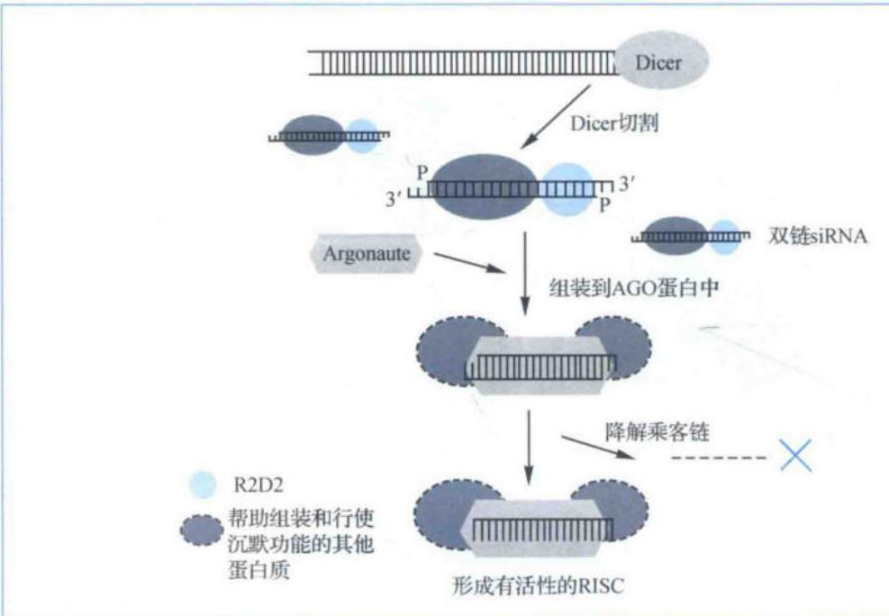

图 8-45 Dicer 结构及切割示意图  
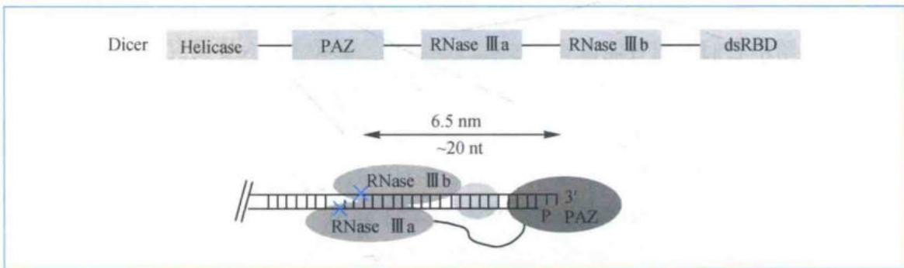

② R2D2 的装配 siRNA 的装载需要双链 RNA 结合蛋白 R2D2 的帮助。R2D2 包含两个一前一后的双链 RNA 结合结构域，有报道认为 R2D2 可以结合双链小 RNA 热稳定性较高的一端。由于引导链的 5' 端稳定性一般较差，因此，R2D2 常结合在引导链 3' 端一侧。Dicer 和 R2D2 形成异源二聚体，Dicer/R2D2/siRNA 三者形成 RISC 装载复合物。R2D2 招募 Argonaute 蛋白，开始组装 RISC。

③ RISC 的装配和成熟 Argonaute 与 Dicer 可以发生蛋白质 - 蛋白质相互作用, Argonaute 首先与 Dicer 交换, 结合到 siRNA 双链的一端, 然后与 R2D2 交换, 将整个双链小 RNA 都转载到 Argonaute 中。此时, Argonaute 将乘客链降解, 形成有功能的沉默复合物。

## 3. siRNA 介导的基因沉默机制

已知 siRNA 介导的基因沉默主要发生在两个水平上, 即转录后水平的 mRNA 的降解以及染色体水平上形成异染色质。实验证明靶 mRNA 可以被 siRNA 切割成若干片段, 片段之间往往长度均为 21\~23 个核苷酸, 而且被切割出的片段长度由 siRNA 与 mRNA 的哪段区域互补配对所决定。有研究表明, siRNA 介导的 mRNA 的降解需要核酸酶催化以及镁离子的帮助。

图 8-46 Argonaute 蛋白与 RISC 的组装、成熟

在装配好的 RISC 中, siRNA 引导链的 5' 端与 Argonaute 蛋白的 MID 结合, 延伸 MID/PIWI 界面至 3' 端与 PAZ 结合。通常 siRNA 的第 2\~8 个核苷酸被认为是核心种子序列, 用来提供与靶 mRNA 的特异性配对。长约 10 个核苷酸的 mRNA-siRNA 配对物位于 PIWI 功能域, 切割往往发生在第 9、10 个核苷酸上, 由 PIWI 催化将靶 mRNA 切断, 并使被切断的 mRNA 离开 RISC(图 8-46)。

RNA 依赖的 RNA 聚合酶(RNA-dependent RNA polymerase, RDRP)使 siRNA 继续扩增，产生次级 siRNA 放大效应。植物、线虫和酵母中都发现存在以 RNA 为模板的 RNA 扩增机制，但哺乳动物和果蝇的基因组分析却没有发现相关基因。有多种机制可导致以 RNA 为模板的 RNA 扩增。通常情况下，成熟的真核 mRNA 与各种蛋白质，如 5' 帽子结合蛋白和 3' 多腺苷酸结合蛋白相结合，这些结合蛋白保护了 mRNA，使 RDRP 无法靠近 mRNA。当细胞中缺少这些 RNA 结合蛋白时，RDRP 可以结合 mRNA 并以其为模板，扩增出双链 RNA，经 Dicer 切割等步骤产生 siRNA，来降解内源 RNA。这个过程也可视作机体清除错误 mRNA 的机制。

对于结合蛋白完好的 mRNA, 如果体内有与它相配对的 siRNA, 该 siRNA 便作为扩增的引物以 mRNA 为模板合成双链 RNA, 产生新的 RISC, 新扩增产生的各种次级 siRNA 可以与靶 mRNA 的不同区域配对, 更大范围地降解靶 mRNA $^{(图 8-47)}$ 。植物中的研究发现, 次级 siRNA 可以传递到其他细胞中, 它既可以在相邻的细胞 - 细胞间近距离传递, 也可以通过韧皮部在不同组织间广泛传播。

## 4. siRNA 的生物学意义

RNAi 的生物学意义可以简单概括为如下 3 点: ① 在转录水平、转录后水平参与基因的表达调控; ② 维持基因组的稳定; ③ 保护基因组免受外源核酸侵入。

入侵病毒与被入侵宿主借助 RNAi 的机制相互抑制,如同人类社会的军备竞赛。宿主可以病毒 RNA 为模板,通过 RDRP 合成病毒的双链 RNA,经过 Dicer 切割组装成

图 8-47 次级 siRNA 的产生

RISC, 降解病毒 RNA, 从而抑制病毒对宿主细胞的破坏。这样的 siRNA 还可以通过胞间连丝在细胞 - 细胞间传递, 通过韧皮组织远距离传输到其他组织和器官中, 让这些细胞以及组织提前具有抵抗病毒的能力。另一方面, 病毒也进化出与宿主抗病基因序列相似的 RNA, 借助相似的机制生成 RISC, 降解宿主细胞抗病基因的 mRNA。这种 siRNA 也会在宿主体内传播, 增加了未被侵染的细胞的易感性。

## 8.4.2 miRNA

## 1. miRNA 的发现

1993 年, 研究者第一次确定了 microRNA lin-4 的存在。lin-4 是调控线虫胚胎后期发育的重要基因, 它可以负调控 Lin-14 蛋白, 使该蛋白质水平在线虫特定发育时期——第一幼虫期初期, 开始下降, 保证幼虫具有正常的发育模式。他们克隆了 4 种不同种的线虫的 lin-4 基因, 都能够很好地恢复 lin-4 突变体表型。惊人的是, 对 lin-4 的基因组序列进行开放阅读框预测发现, lin-4 基因并不编码蛋白质。通过 Northern 印迹等实验进一步分析 lin-4 的转录情况发现, 转录物在线虫中形成一大一小两个片段 (61 个和 22 个核苷酸)。这两个片段同时对应在 lin-4 基因序列的同一区域, 并且转录方向也是一致的。二级结构预测发现, 大片段可以形成不完美配对的茎 - 环结构, 小片段则是真正起作用的 miRNA。序列比对发现, lin-4 转录物的小片段和 lin-14 mRNA 的 3'UTR 区域的重复序列互补配对, 可以形成 lin-4:lin-14 RNA-RNA 杂合结构, 因此实现了 lin-4 对 lin-14 的转录后调控 (图 8-48)。

## 2. miRNA 的生物合成

miRNA 在动物和植物基因组中普遍存在, 是一类重要的行使基因功能但不编码蛋白质的基因。与许多真核生物基因的转录物相似, miRNA 的最初转录产物 pri-miRNA 5' 端有加帽, 3' 端有多腺苷酸结构, 这类基因的转录能够被 RNA 聚合酶 II 的抑制剂 alpha-

amani 所抑制。研究还发现, RNA 聚合酶Ⅱ与许多 miRNA 的启动子区结合在一起。因此, 与许多真核基因相类似, miRNA 也由 RNA 聚合酶Ⅱ转录, 并具有自己的启动子区域, 它们的表达会受到各种时空上的调节。动物和植物中形成成熟的 miRNA 的基本过程很相似: 先由 RNA 聚合酶Ⅱ产生的较长的初级转录物 pri-miRNA, 中间有一段不完美配对的茎-环结构。经过第一步切割产生 pre-miRNA, 再经第二步切割产生双链 miRNA, 双链解链形成成熟的

  
图 8-48 lin-4 对 lin-14 的转录后调控

长 21 个核苷酸左右的单链 miRNA。参与整个过程的基因和切割过程在动植物中略有不同。

动物中 miRNA 前体的两次切割都需要有 RNaseⅢ内切核酸酶以及双链 RNA 结合蛋白完成。Drosha 是一种 RNaseⅢ，将 pri-miRNA 的 3' 端和 5' 端切割产生长约 70 个核苷酸、5' 端带磷酸基团，3' 端为羟基的 miRNA 前体（pre-miRNA），保留茎－环结构区，并且切割端具有 2～3 个核苷酸的 3' 不配对碱基，这是由 RNaseⅢ的性质所决定的。Drosha 的正确切割还需要一类双链 RNA 结合蛋白，在果蝇中是 Pasha 蛋白，在线虫中是 Pash-1 蛋白，而在哺乳动物中则为 DGCR8 蛋白的帮助。切割后的前体 pre-miRNA 经由 Exportin 5/RanGTP 运出细胞核进入胞质中。胞质中的 RNaseⅢ为 Dicer，切割 pre-miRNA 茎－环结构环的一端形成成熟的长约 21 个核苷酸的双链 miRNA，即 miRNA-miRNA\*，其中的 miRNA 链是之后真正行使功能的成熟 miRNA 链。有研究认为，哪条链作为 miRNA 由其 5' 端热不稳定性所决定，5' 端相对不稳定的链更有可能成为 miRNA。

植物中没有 Drosha 的同源基因, pri-miRNA 的两步切割由 Dicer 的同源基因 Dicer-Like1(DCL1) 完成。DCL1 在细胞核内, pri-miRNA 经 DCL1 两步切割, 两端形成双链 miRNA, 由 Exportin5 的同源基因 HASTY 运输出细胞核。与动物中的 miRNA 不同, 植物双链 miRNA 两个 3' 端的自由羟基被甲基转移酶 HEN1 甲基化, 以羟甲基的形式存在。甲基化的 3' 端被保护不受降解, 还有助于形成成熟的 RISC $^{(图 8-49)}$ 。

## 3. miRNA 的功能

miRNA 的功能主要有两个方面: 一是和 siRNA 一样装载成 RISC 后使互补配对的 mRNA 降解。其次, miRNA 可抑制 mRNA 的翻译, 降低靶基因的蛋白质水平但不影响其 mRNA 的水平。

miRNA-RISC 的原理和 siRNA 相似,但由此介导的基因沉默还需要一些其他功能比较保守的元件的参与。果蝇的研究发现,靶 mRNA 的降解除了需要 AGO 蛋白以外,还需

图 8-49 动、植物 miRNA 产生过程比较

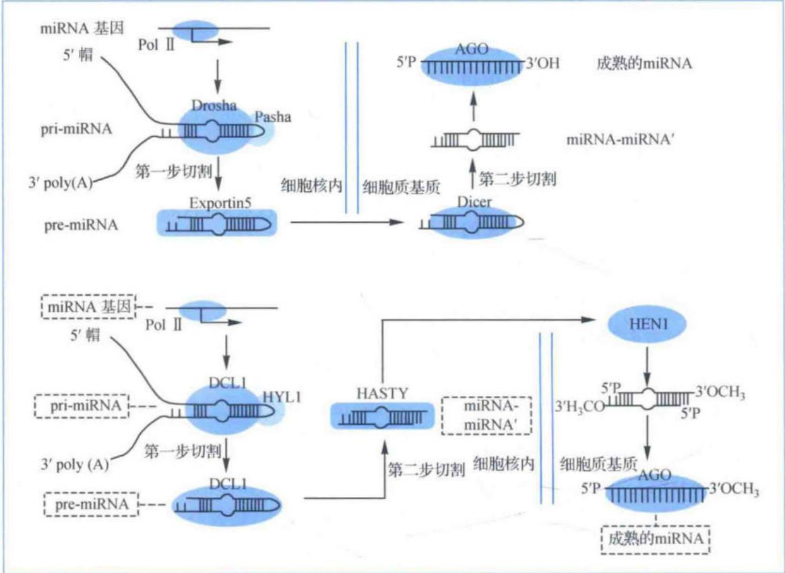

要 GW182、脱腺苷基因（NOT1/CAF1）、脱帽相关基因（DCP）等，说明这种转录后沉默机制需要经历“脱帽脱尾”事件。GW182 蛋白还可以与多腺苷酸结合蛋白（PABP）相互作用。

到目前为止,尚不能确定 miRNA 介导的翻译抑制发生在哪个阶段。有研究者将 miRNA 转染到人的实验细胞系中,添加翻译抑制剂 hippuristanol(抑制 eIF4A)阻断翻译过程,再通过密度梯度离心分离分析核糖体,发现有 miRNA 的体系中靶 mRNA 很快从翻译的多核糖体中移出,可检测到更多的自由核糖体,他们据此推测 miRNA 介导的翻译抑制可能是通过形成 miRNA:mRNA 配对分子,阻碍有功能的核糖体与 mRNA 结合、装配,发生核糖体的 “drop-off” (图 8-50)。

## 8.4.3 长链非编码 RNA

## 1. 长链非编码 RNA(lncRNA) 的种类

lncRNA 指长度大于 200 bp 的非编码 RNA。根据基因组位点或者相关的 DNA 链特征，lncRNA 可以进一步分为正义 lncRNA、反义 lncRNA、基因内 lncRNA、基因间 lncRNA、增强子 lncRNA 或环状 lncRNA 等 $^{(图 8-51)}$ 。

正义 lncRNA 是指基因位点通过共享相同的启动子和某个蛋白编码基因有重叠；反义 lncRNA 指基因位点以反向的方式插入在某个已知的蛋白编码基因中；基因内 lncRNA 指基因位于某个蛋白编码基因的内含子区；基因间 lncRNA 指的是编码 lncRNA 的基因位点位于两个蛋白编码的基因中；增强子 lncRNA 指的是编码 lncRNA 的基因位点位于某一蛋白编码基因的增强子区域；环状 lncRNA 则指通过共价键形成闭合的环 lncRNA，其一

  
图 8-50 miRNA 介导的翻译抑制机制

  
图 8-51 长链非编码 RNA 的类型
e, 增强子; exon, 外显子。

般来自可变剪切的编码蛋白基因。

## 2. 长链非编码 RNA 的作用机制

## (1) lncRNA 作为信号分子行使功能

研究表明, lncRNA 可以作为信号分子、诱饵分子、引导分子以及骨架分子等形式对基因表达进行调控。大部分 lncRNA 由 RNA 聚合酶 II 负责转录。lncRNA 表现出细胞类型特异表达的特征, 并且能响应各种外界刺激, 这表明其表达会在转录水平受调控。因此, lncRNA 可以作为分子信号形式功能(图 8-52), 即每个 lncRNA 的转录都具有时空表达特异性, 以进一步整合不同的发育信号、细胞内容物以及响应不同的外界刺激等。这一类型的 lncRNA 一部分具有调控功能, 另外一部分则只是转录的副产物。lncRNA 能参与调控

图8-52 lncRNA作为信号分子的基因调控机制示意图

作为信号分子, lncRNA 的表达与结合的转录因子或信号途径相关, 从而对相关基因调控具有时空特异性。

转录起始、延伸或终止等阶段。这些情况下，调控元件的染色质状态只被相关的 lncRNA 表达影响。作为信号分子的 lncRNA 可进一步用来标记时空、发育阶段以及调控基因表达。

哺乳动物为携带两个常染色体等位基因的二倍体生物。通常情况下这些等位基因遗传信息一个来自母本，一个来自父本。然而，部分基因的表达则会通过表观调控的方式只取决于母本或是父本基因，这种现象称为基因印记。近来的证据表明，一些lncRNA能通过与染色体互作以及招募染色质修复装置等进一步参与介导大量基因的转录沉默。例如，在小鼠胎盘中，长链非编码RNA Kcnq1ot1和Air能聚集在所沉默的等位基因的启动子染色质区域，并以等位基因特异的方式，进一步介导抑制效应的组蛋白修饰的发生。Kcnq1ot1是一个来自父本的长为90 kb的长链非编码RNA，其介导了Kcnq1印记区域的一类基因的沉默。Kcnq1ot1与组蛋白甲基转移酶G9a和PRC2互作，通过招募多梳复合体，迅速在顺式作用元件到转录位点之间形成一个抑制区域。同时，非编码RNA本身在Kcnq1区域双向沉默基因方面具有关键作用，其作用机制类型于Xist RNA。

Xist 是一种在 X 染色体失活中起重要作用的非编码 RNA。在雌性动物发育中，Xist RNA 在失活的 X 染色体上表达，进一步覆盖在 X 染色体上进行转录，此时大量的组蛋白被甲基化，导致 X 染色体上的基因表达被抑制，X 染色体失活。其反义转录物 Tsix 能抑制 Xist 的表达，而另外一种非编码 RNA Jpx 能在失活的 X 染色体中积累，并进一步激活 Xist 的表达。

## (2) lncRNA 作为诱饵分子行使功能

启动子或增强子的转录对 lncRNA 的转录调控具有重要作用。作为诱饵分子的 lncRNA 转录并结合在蛋白质靶点上，但不会附加额外的功能。这一类的 RNAs 作为一种“分子过滤器”，进一步诱导 RNA 结合蛋白与之结合。这些蛋白质可以是转录因子、染色质修复子或者其他类型的调控因子等(图 8-53)。

同一个基因具有不同的启动子在基因表达中是一种较为普遍的现象。不同基因的这种可选调控机制各不相同。人 DHFR 基因（二氢叶酸还原酶，dihydrofolate reductase）具有依赖 RNA 的转录抑制调控机制。DHFR 基因弱启动子上游的 lncRNA 通过和启动子序列以及通用转录因子ⅡB(TFⅡB)结合形成一个稳固的非编码 RNA-DNA 复合体，进一步抑

作为引导分子,IncRNA 招募染色质修饰酶对靶基因进行调控,或以顺式或反式的方式对远距离的靶基因表达进行调控。

  
图 8-53 lncRNA 作为诱饵分子的基因调控机制示意图  
作为诱饵分子, lncRNA 能将转录因子或相关的其他类型蛋白带离染色质或将其带入染色质的核心区域。

制前起始复合体在主启动子上的聚集。当 lncRNA 被特异的 siRNA 沉默后，TFⅡB 仍然占据在主启动子上。这是一个动态变化的过程，并且展现出特异的调控机制，这一机制能进一步靶定或抑制启动子，这也暗示了基因间 lncRNA 作为一个诱饵分子对邻基因表达调控的重要性。

有报道鉴定了一种叫作 Gas5(生长停滞特异转录物 5, growth arrest-specific 5) 的 lncRNA。细胞在 Gas5 的作用下能营造一种耐糖皮质激素的状态。Gas5 抑制了糖皮质激素受体通过其中的一个茎-环结构形成 RNA 基序，这一作用类似于糖皮质响应基因启动子区域中的激素响应元件 DNA 基序类似物。随后，Gas5 作为诱饵分子，竞争性结合在糖皮质激素受体的 DNA 结合区域，有效地阻止了受体与染色体的互作。

## (3) lncRNA 作为引导分子行使功能

第三种类型的 lncRNA 可以作为 RNA 结合蛋白的引导分子, 进一步介导核糖体蛋白复合体定位在特定的靶点上(图 8-54)。目前研究表明, lncRNA 可通过顺式(邻近的基因)或反式(远处的基因)的方式介导基因表达的改变。

这些 RNA 在转录水平的调控作用表明染色质结构上的改变不仅是一种局部效应,也是一种远距离的结构影响。例如,Air 或者 eRNAs 这类的 lncRNA 可以通过转录调控的局部序列元件,如启动子或者增强子等,扩大其影响范围。相反的,对于 HOTAIR 以及 linc-p21 这类的 lncRNA,长距离的基因调控作用则需要额外的互作组分参与,并且这些组分需要正确的定位在所作用的位点。总之,lncRNA 能以共转录或作为小 RNA 的互补靶标最终以顺式作用方式进一步介导染色质的改变;当 lncRNA 作为 RNA-DNA 异源双链核酸分子如 RNA:DNA:DNA 三重复合物或特定染色质表面的 RNA 识别特征时,则会结合在靶 DNA 上以反式调控的方式介导染色质发生改变。

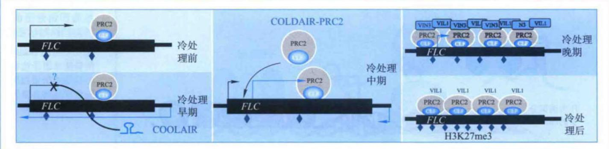  
图 8-55 由 lncRNA COLDAIR 介导的基因调控过程

lncRNA 介导的基因调控组分包括抑制复合体、激活复合体以及转录因子。然而，无论是从距离还是机制上讲，总体的调控原则就是通过一段中间延伸的 DNA 来运输调控信息，进一步调控靶基因的表达，最终使得表观基因组发生改变。其中，一些 lncRNA 以顺式调控方式发挥作用。例如，Air 通过启动子位置，特异与 lncRNA 和染色质互作，进一步沉默等位染色体上靶基因的转录。随后，启动子区域聚集的 Air 招募 G9a，导致靶点 H3K9 及其等位基因甲基化并沉默表达。受冷诱导的植物 lncRNA COLDAIR 则在建立及维持稳定的抑制性染色质中起作用。春化过程中，COLDAIR 引导 PRC2 到调控开花的抑制子 FLC 染色体上，通过三甲基化 H3K27 抑制基因表达(图 8-55)。这些发现表明 lncRNA 能通过与染色体特异结合，以顺式方式介导抑制组蛋白修复物质的招募，进一步从表观遗传水平沉默转录。

lncRNA 也能通过转录共激活复合体或共抑制复合体, 如 CBP 蛋白和 p300 组蛋白去乙酰化转移酶, 进一步调控基因的表达。RNA 结合蛋白 TLS 通过一个拴在 cyclin D1 启动子区域的 lncRNA 招募到染色体上。lncRNA 与 TLS 的结合反过来导致 TLS 构象改变。这样的构象改变使氨基端抑制了 p300 和 CBP 的组蛋白去乙酰化转移酶活性, 从而抑制基因表达(图 8-56)。尽管这一机制是否具有普遍性还未知, 然而高度保守的 lncRNA 以及转录共调控子上大量的 RNA 结合区域的发现增加人们对该调控机制普遍性的认可。

和这些顺式调控的 lncRNA 不同,一些 lncRNA 则以反式作用的方式对基因表达进行调控,即通过染色体进一步扩大其对基因的转录影响。有报道表明 lncRNA HOTAIR 的表达与癌症转移有关。在原发性和转移性乳腺癌中均发现 HOTAIR 表达有所提高。另外,癌细胞中 HOTAIR 的缺失会导致 PRC2 基因高表达的细胞侵袭性降低。这些发现表明非编码 RNA 介导的多梳蛋白复合体在乳腺肿瘤发生中起着关键性作用,尤其暗示了 HOTAIR 这类的 lncRNA 能通过反式作用的方式靶定染色质修复复合体的定位、酶活等,进一步调控细胞的表观遗传状态。

## (4) lncRNA 作为骨架分子行使功能

lncRNA 能作为一个中心平台招募相关生物学过程中的分子组分进一步调控基因表达。在许多不同的生物学过程中,这一精确的调控对分子间的相互作用及信号转导的特异性和动态过程具有至关重要的作用。这一类型的 lncRNA 具有不同的功能区域,并结合不同的效应分子,是较为复杂的一类 lncRNA。lncRNA 可能在同一个时间会结合多个效应分子,进一步带入具有转录激活或抑制作用的效应蛋白(图 8-57)。

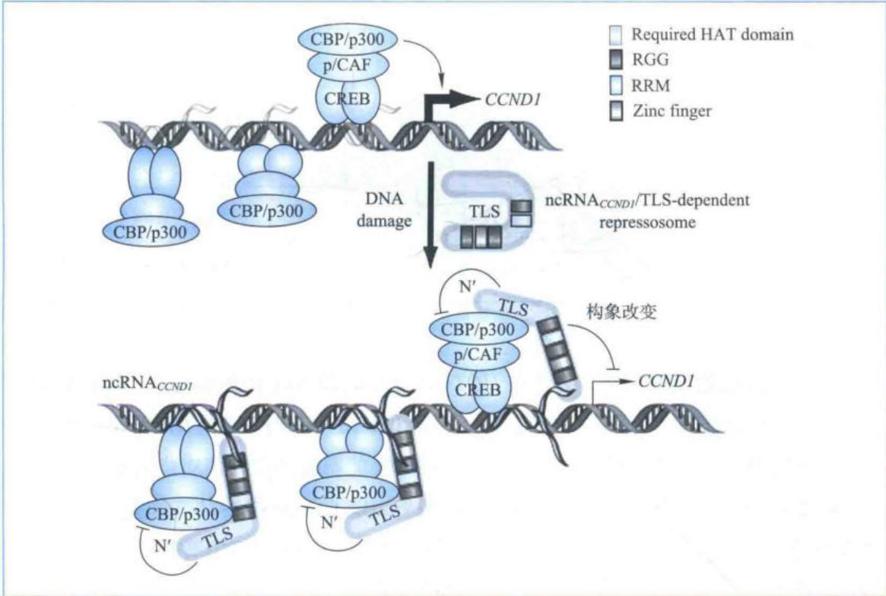  
图 8-56 lncRNA 介导的蛋白质构象改变控制基因表达过程

lncRNA 与染色质修复复合体之间的互作对 INK4a 基因的转录抑制具有重要的作用。肿瘤抑制子位点 INK4b/ARF/INK4a 在正常细胞和癌细胞中的表达受多梳蛋白复合体介导的 H3K27 甲基化的影响。研究表明，反义非编码 RNA ANRIL 与 INK4b 具有相同的位点，其能和 PRC1、PRC2 复合体组分具有直接相互作用。ANRIL 和 PRC1、PRC2 之间的任意互作被打破都会影响 INK4b 靶基因的转录抑制。因此，ANRIL 作为一类典型支架分子，招募不同染色质修复复合体最终使得靶基因沉默，动态调控基因转录活性。

另外,上文中提到 lncRNA HOTAIR 结合 PRC2,从而甲基化 H3K27,促进基因抑制的

  
图 8-57 lncRNA 作为骨架分子的基因调控机制示意图  
作为骨架分子, lncRNA 结合多种蛋白质形成核糖核蛋白复合体 (RNP)。lncRNA-RNP 复合体进一步作用染色体影响组蛋白修饰。

图 8-58 HOTAIR 作为骨架分子介导的基因沉默过程

HOTAIR 分别通过其 5' 端和 3' 端分别连接组蛋白甲基化酶 PRC2 和去甲基酶 LSD1，进一步导致 H3K27 和 H3K4 的去甲基化，抑制靶基因的表达。

发生。后续的报道发现 PRC2 结合在 HOTAIR 5' 端的前 300 个氨基酸上，而 HOTAIR 3' 端的前 700 个氨基酸则会和第二个复合体，包括 LSD1、CoREST 以及 REST 等互作，进一步去甲基化 H3K4，阻止基因激活。这表明 HOTAIR 能靶定多个染色质修复复合体，作为一个骨架分子，在 PRC1、PRC2 复合体和 LSD1/CoREST/REST 复合体之间起到桥梁分子的作用，将这些不同的分子打包成为一个整体(图 8-58)。HOTAIR/PRC2/LSD1 复合体可以同时通过多个机制实现基因表达的抑制。HOTAIR 的表达能诱导 PRC2 和 LSD1 复合体之间的相互作用，而 HOTAIR 缺失则导致靶基因上这些复合体的丢失。值得一提的是，在不同类型的细胞中，许多额外的 lncRNA 能和 PRC2、LSD1 复合体互作。这些额外的 lncRNA 很有可能也包含许多结合不同蛋白复合体的位点，从而带来更为特异的靶基因上组蛋白修复的不同组合。

<!-- W-BEGIN Watson 20 调节 RNA 在真核生物中广泛存在 -->

### 【中文对照 Watson 第20章：调节 RNA 在真核生物中广泛存在】

> 来源：Watson《基因的分子生物学》第七版中译本（书籍/03_基因的分子生物学_第七版） 第20章 调控RNA。

#### [W] 调节 RNA 在真核生物中广泛存在

的机制等不同的特点进行区分。现在，人们认为高等真核生物 30%\~70% 的基因在某种程度上都是由 RNA 调控的，从发育（在线虫和拟南芥中已经得到证实，详情请见附录 1）到细胞内稳态，以及防御病毒入侵和转座子。此外，其中的一种调控形式（RNA 干扰）已经成为一种操纵多种生物基因表达的强大实验工具。

本节中我们将首先开始观察各种小 RNA 调控，在本章的最后再回到长 RNA。

几种不同类型的小 RNA 都是通过同源性使基因抑制——沉默或者表达。根据不同的起源和背景，这些 RNA 通过抑制 mRNA 的翻译，破坏 mRNA，甚至启动子的转录沉默指导 mRNA 的表达。正如我们后面所讲的，这些小 RNA 通常是在某种特殊的酶的作用下从不同起源的双链 RNA（dsRNA）中产生的。

#### [W] 小 RNA 来源广泛，通过三条途径指导基因沉默

在详细描述沉默基因的小 RNA 来源和功能之前，我们首先概述这一类型基因沉默的发生机制（图 20-10）。

小 RNA 是以来源命名的。源于活体的双链 RNA 前体的或人工制备的小 RNA 被称为小分子干扰 RNA（small interfering RNA，siRNA）。另一类调控 RNA 是微 RNA（microRNA，miRNA），它是由细胞内基因编码的 RNA 前体衍生而来的。这些 miRNA 在细胞中具有特定的调控功能。第三类是与 piwi 蛋白作用的小调控 RNA（piwi-interaction RNA，piRNA），主要在生殖细胞中表达，与 miRNA 的特性有所不同。

siRNA 和 miRNA 都是由长 RNA 分子经 Dicer 酶消化而来的。Dicer 酶是一种 RNase Ⅲ类酶。它能识别并消化长双链 RNA 或者 miRNA 前体形成的柄环结构（见下文）。siRNA 和 miRNA 产物一般长度为 21\~23 个核苷酸，其产生过程见图 20-10 中的第一步。piRNA 的长度为 24\~33 个核苷酸，它的产生似乎与双链 RNA 前体无关，piRNA 在基因组中主要分为成群的基因簇，其中的长片段的小分子 RNA 只能来源于单链。这个过程并不需要 Dicer（RNase Ⅲ家族中对双链 RNA 具有特异性的酶）。

这些小 RNA 通过三种途径来抑制同源靶基因的表达：第一种是触发靶基因编码的 mRNA 的降解；第二种是抑制 mRNA 的翻译；第三种是对靶基因所在染色质进行修饰而沉默其转录。显而易见，在所有的例子中，无论采用哪种途径，都需要很多相似的“机器”。这个“机器”包括 RNA 诱导的沉默复合物（RNA-induced silencing complex，RISC）。除了小 RNA 之外，一个 RISC 还含有包括 Argonaute 蛋白家族的一个成员在内的许多蛋白质。

这些小 RNA 都需要经过变性而形成一条向导 RNA（guide RNA）和一条搭载 RNA（passenger RNA）。向导 RNA 使 RISC 具有特异性，而搭载 RNA 通常被丢弃。所生成的复合物（即成熟的 RISC）被引导到含有与向导 RNA 序列互补的靶 RNA 上，靶 RNA 被降解，或其翻译被抑制。通常，降解或抑制依赖于向导 RNA 与靶 RNA 的配对程度：假如序列高度配对，靶 RNA 将被降解；如果配对不完全（如一些碱基对间有错配），翻译被抑制更为常见。在靶 RNA 被降解的情况中，Argonaute 的催化亚基负责开始剪切 mRNA。因此，Argonaute 经常被称做“切片机”（slicer），mRNA 的剪切又称“切片”（slicing）。

  
图 20-10 siRNA 和 miRNA 的生成及其作用方式。Dicer 酶加工双链 RNA 成 siRNA 和 miRNA 前体，后者会进一步形成 miRNA。另一个仅参与 miRNA 前体加工的酶（Drosha）在此没有显示，而将在后面描述。siRNA 和 miRNA 以三种方式指导一个称为 RNA 介导的沉默复合物（RNA-induced silencing complex，RISC）来抑制基因：攻击并降解与该 siRNA 同源的 mRNA；干扰这些 mRNA 的翻译；引导染色质修饰酶到达启动子来指导那些 mRNA 的表达（图 20-18）。通过结合 RNA 依赖性的 RNA 聚合酶，siRNA 可以生成更多的双链 RNA，它们可以作为 Dicer 的底物生成更多的 siRNA。图 20-11 更详细地展示了这一过程。（引自 Hannon G.J. 2002. Nature 418: 244-251, Fig.5. © Macmillan. 经许可修改）

RISC 也可以被引导到细胞核中。它通过调动染色质修饰蛋白，汇集在与向导 RNA 互补的靶基因启动子上（图 20-10 左侧所示）。该修饰能够导致转录沉默（第 19 章）。例如，要沉默裂殖酵母（Schizosaccharomyces pombe）的着丝粒区域的转录，就需要 RNAi“机器”，我们会在后面讨论。

miRNA 和 siRNA 的产生有着很大不同，miRNA 像是传统的反式作用调节因子，它们都是由同一个基因编码但是却作用于不同的基因（像细菌系统里的 sRNA）。相比之下，siRNA 是由它所作用的转录区域产生的（像细菌里的反义 RNA），因而被称为是顺式作用。

RNAi 沉默的另外一个值得注意的特点是极其高效。因此，只需要很少量的 dsDNA 就足以引发靶基因表达几乎彻底关闭。RNA 依赖 RNA 聚合酶（RNA-dependent RNA polymerase, RdRP）是提高 RNAi 效率的重要因子。很多情况下，如裂殖酵母着丝粒的沉默，RdRP 还是 RNAi 所必需的另一个酶。被原先的 siRNA 聚集到 mRNA 上后，RdRP 通过合成双链 RNA 来放大抑制信号（图 20-10 所示，详细内容见图 20-11）。这一反馈过程能够产生大量的 siRNA。尽管在哺乳动物细胞中 RdRP 的存在目前还不肯定，但是 RNAi 高效性仍然可能来自于切割的催化性，即每个 RISC 可以切割好多个 mRNA。

因此，虽然在本章的第一部分我们已看到许多关于小分子RNA如何通过反式作

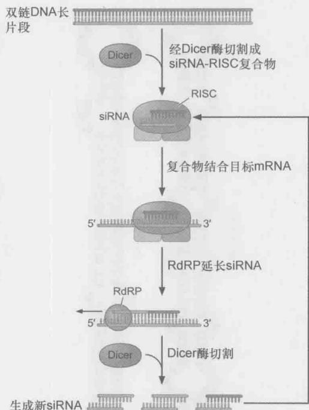  
图 20-11 RdRP 作用下 siRNA 自身扩增。如图 20-10 右侧所示，siRNA 自身扩增后，产生更多的双链 RNA，在 Dicer 酶的作用下又产生更多的 siRNA。这是由于 siRNA-RISC 复合物可以结合 RdRP(RNA 依赖的 RNA 聚合酶)，siRNA 可以作为引物将目标 RNA 转换成双链 RNA，然后在 Dicer 酶的作用下也切割成 siRNA。RdRP 被发现存在于植物、蠕虫和裂殖酵母（酿酒酵母中没有 RNAi 的机制）中，所以在裂殖酵母中这种扩增具有非常重要的作用。

用调控细菌基因表达的例子，但是与真核生物中这些 RNA 的产生和作用的机制完全不同。

#### [W] miRNA 分子的合成与功能

#### [W] miRNA 的特征性结构——自身和靶基因识别

如前所述，miRNA 是由基因组中较长的转录物片段编码的。它们这种特征性结构，有助于识别它们，并预测可能受它们调节的靶基因。

典型的功能性 miRNA 长 21 或 22 个核苷酸，其长度变化范围为 19\~25 个核苷酸。这种小 RNA 是由一个携带有发夹形的二级结构的长 RNA 转录物（称为初级 miRNA，pri-miRNA），经过两步剪切反应而产生的。第一步剪切反应是释放柄环，称为 miRNA 前体（pre-miRNA）；第二步由 miRNA 前体产生成熟的 miRNA。最先被鉴别并功能明确的 miRNA 是 let-7，let-7 调控线虫 C.elegans 从幼虫到成虫转变的发育过程（附录 1）。图 20-12 显示的是 let-7 的 pre-miRNA 和一些其他的天然存在的 miRNA 结构。

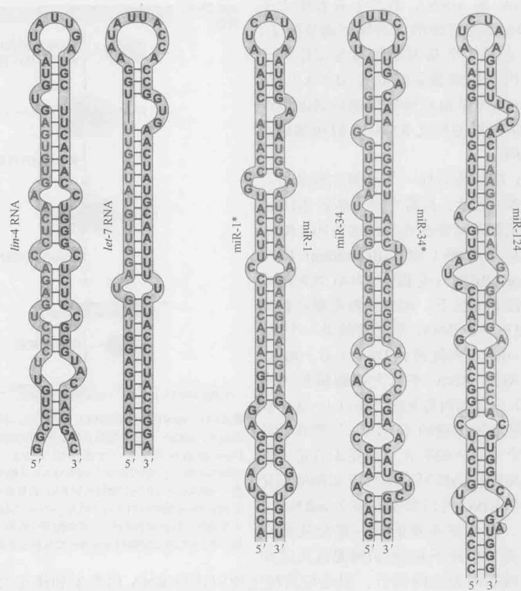  
图 20-12 加工为成熟的 miRNA 之前一些 pre-miRNA 的结构。miRNA 序列标为红色。在一些例子中，柄环的两个“臂”都能产生有功能的 miRNA。在这些例子中，第二个 miRNA 用蓝色显示——例如，miR-1（红色）和 miR1 $^{*}$ （蓝色、miR-34（红色）和 miR $^{*}$ （蓝色）。显示的 miRNA 均来自于线虫。Lin-4 和 let-7 是用遗传学方法鉴定的；而那些 miR 是以生物信息学方法发现的。（自 Lim L.P. et al. 2003. Genes dev. 17: 991, Fig.6. ©Cold Spring Harbor Laboratory Press, 经许可改绘）

原先认为可能是 pre-miRNA 柄环结构中的一条“臂”调控 miRNA。然而，从最近大量的例子中发现，这种结构的两条“臂”都产生功能性 miRNA，每一条都有它自己的一组靶基因（图 20-12 中用红色和蓝色分别标出两种 miRNA）。现在看来，这种现象是很普遍的。Pre-miRNA 可由被转录物的任何一个区域所编码，即它们可能存在于转录物的编码区、前导区或者内含子中（图 20-13）。

由于 miRNA 的初级转录物（primary transcript of miRNA，pri-miRNA）具有特征性的二级结构，有可能通过计算 RNA 序列二级结构的折叠方式而进行预测。此外，在很多例子中，受调控的靶基因也同样可以被预测，因为沉默的发生依靠的是靶 RNA 和成熟 miRNA 之间的序列互补。miRNA 和靶 RNA 的碱基配对是通过“种子残基”（seed residue）的相互作用启动的。这些“种子残基”通常是指 22 个核苷酸 miRNA 中的第 2个到第 9 个核苷酸之间的序列。该序列与靶基因高度互补，所以这也是识别可能的靶基因最有效的区域。当然，要确认 miRNA 的存在，需要在细胞中被实际检测出来（如以 Northern 印迹），其存在能够影响靶 mRNA 的表达。

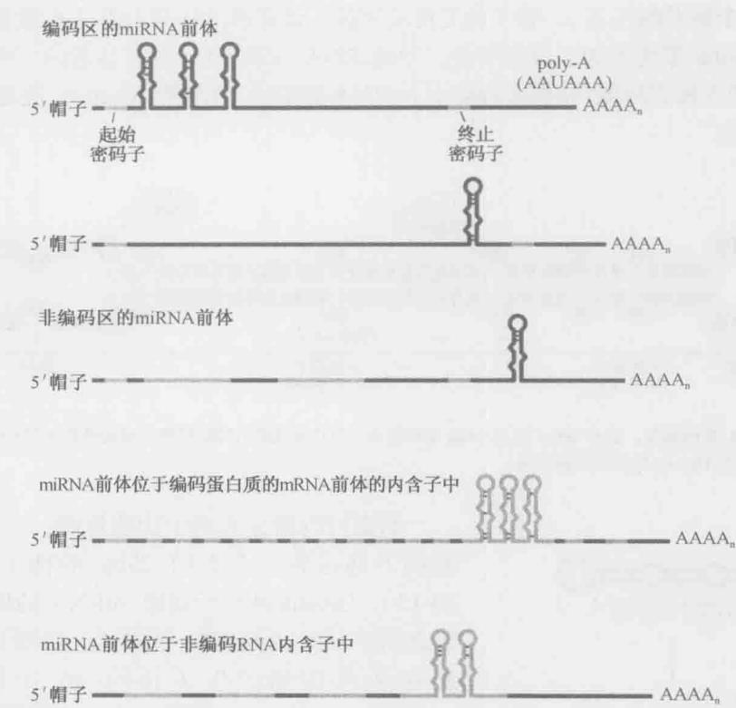  
图 20-13 RNA 的内含子和外显子都可以为 miRNA 编码。内含子序列标以亮绿色，起始和终止密码子分别标以黄绿色和粉色。

初级转录物经过两步切割反应产生 miRNA，需要两种不同的 RNase 酶来催化。一种是 Dicer，我们已经介绍过，几乎所有 RNAi 都离不开它。另外一种是 miRNA 加工所特需的，这就是 Drosha。这两种酶的一个共同特点是它们对 RNA 的识别和切割基于底物的结构而不是特定的序列。下面现在着重讨论这些酶的功能。

#### [W] 活性 miRNA 是由两步核解过程产生的

第一步由 Drosha 酶完成，它是 RNase Ⅲ 酶家族的成员。Drosha 两次切割，将 RNA 的柄环区（pre-miRNA）从 RNA 初级转录物（pri-miRNA）上切下来。该酶与另一种必需的特异性蛋白亚基（在一些生物体中称为 Pasha，在另一些中则叫 DGCR8）一起形成微加工复合物（microprosessor complex）。由 Drosha 产生的 pre-miRNA 通常长 65\~70 个核苷酸。Drosha 存在于细胞核中，而 Drosha 催化的切割过程也常在细胞的这一区域进行。

Pri-miRNA 中的碱基配对的柄部通常长约 33 个核苷酸（双链 RNA 的 3 周螺旋），而且只含少量错配（图 20-14）。环部位于柄的“项”上（“顶环”），大小可变（相对较大，通常 10 个核苷酸左右）。对于加工反应来说，该环部的序列并非十分重要，重要的是，对于 Drosha 催化的加工反应来说，单链 RNA（ssRNA，没有显著的二级机构）一定要在柄环的 5' 和 3' 两侧。在很大程度上，ssRNA-dsRNA 的连接(junction)决定了 Drosha 切割的特异性。

  
图 20-14 pri-RNA 结构概观，图示 Dicer 和 Drosha 切割位点。红色标记的区域将被加工成成熟的 miRNA。注意基本片段必须为单链，以便 Drosha 复合物正确识别。

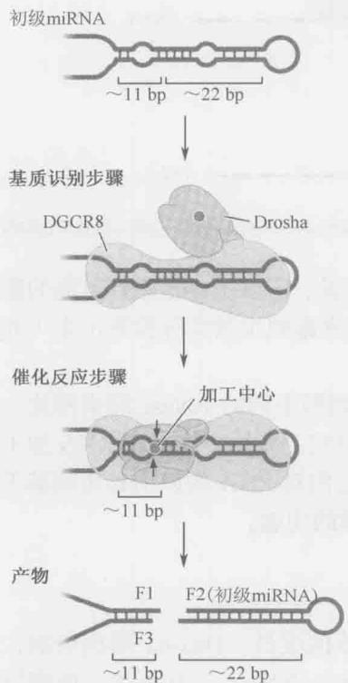  
图 20-15 微加工复合物对 pri-RNA 的识别与切割。切割产生的三个片段分别标记为 F1、F2（miRNA 前体）和 F3。

柄部可以被分为两个功能片段：一个约 11bp 的柄下部区和一个大约 22bp 的柄上部区（图 20-15）。Drosha 从位于初级 miRNA 的柄下部和上部之间的 ssRNA-dsRNA 连接区上切割下 11bp。因此这两次切割产生了长约 65 个核苷酸的 pre-miRNA，由 22bp 双链 RNA（2 周螺旋）和“顶环”组成。RNase III 家族的酶特异性识别双链 RNA 并将其切割，双链 RNA 产物的 3' 端带有一个 2 核苷酸的“接头”（overhang）。这个 3' 接头对于下一步 Dicer 酶对 RNA 分子的识别是很重要的。

#### [W] Dicer 是生成 miRNA 的第二个 RNA 切割酶，也是唯一一个生成 siRNA 必需酶

Drosha 释放的 pre-miRNA 被输送到细胞质中，并在此接受由 Dicer 执行的第二步切割反应。像 Drosha 一样，Dicer 不是利用序列特异性，而是利用测量机制来选择切割位点。Dicer 的高分辨率结构向我们展示了这一切割过程可能是如何发生的。

Dicer 由三个结构域 (module) 构成: 两个 RNase III 结构域和一个与双链 RNA 结合的结构域 PAZ。PAZ 源自三个蛋白质名: Piwi、Argonaute 和 Zwille。

图 20-16a 为 Dicer 蛋白组织的模式图，并显示它是如何与双链 RNA 分子相互作用的。图 20-16b（右半部分）显示 Dicer 的结构以及与底物 RNA 作用的模型。该蛋白质的整体结构像一个短柄斧（hatchet）。PAZ 结构域在手柄的底部，形成了双链 RNA 底物 3'端的结合处（binding pocket）。连接结构域（linker domain）形成了斧头的柄部，并含有一个带正电荷的 RNA 分子结合表面（binding surface）。顶部的“刀刃”区域包含了两个 RNase 结构域，为排列对称的二聚体。每一个 RNase 结构域带有一个活性位点，分别负责切割底物 RNA 两条链中的一条。因此，Dicer 可作用于任何双链 RNA，不管序列如何，并从底物 RNA 的一端切下生成一个长 22 个核苷酸的 mRNA 分子。PAZ 结构域像“标尺”那样（ruler-like），锚定在底物 RNA 的离 3' 端长约 22 个核苷酸左右的酶活性位点处（图 20-16）。实际上，在不同生物中发现的 PAZ 结构域的大小与 Dicer 产物的大小有关。

  
图 20-16 Dicer 的结构与组织。(a) 图示 Dicer 的组织。(b) Dicer 结合双链 RNA 的结构模式图，示其长度是如何被测定的。蛋白质示以灰色，红色箭头示核酸酶活性位点（相当于 a 中黑点表示的部分），RNA 用绿色显示。这一结构仅显示了 RNase III 和 PAZ 结构域。Dicer 酶也含有 ATP 酶和其他结构域。(b, MacRaeI.J. et al. 2006. Science 311: 195-198. PDBCode: 2FFL；注意这是 RNA 的模式图，不是晶体结构）图像以 MolScript、CobScript 和 Raster3D 制备。

正如我们所看到的，只有 miRNA 是由长的发夹状前体生成的。相比之下 siRNA 通路的前体 RNA 是一个更长的双链 RNA。由于初始物质的不同，siRNA 不需要 Drosha 酶，但是仍然需要 Dicer 酶裂解，以便于生成 21\~22 个核苷酸的 RNA 进入 RISC 中。在植物中，miRNA 甚至可以由 Dicer 酶直接生成，但是还不清楚它们是怎样跳过 Drosha 酶的。

#### [W] 小 RNA 沉默基因表达

我们已经了解了双链 RNA 或者 miRNA 前体是怎样形成小分子 RNA 的，下面我们将来了解这些小分子 RNA 是如何介导靶基因表达沉默的。

#### [W] 前导 RNA 链整合进 RISC 形成能沉默基因表达的成熟复合体

Dicer 酶作用产生的短 RNA 将决定作用于哪种靶 RNA。激活的调控 miRNA 是指以单链形式整合到 RISC 上，在这一阶段称为向导 RNA（guide RNA）。在这个复合物中，向导 RNA 聚集 RISC 到靶 RNA 上。人们还在争论的是：在复杂的真核生物的巨大基因组中，22 个核苷酸左右的长度是否足够，以满足通过 RNA-RNA 碱基配对来准确无误地识别靶基因。

RISC 的中心组分是一个 Argonaute 蛋白。Argonaute 蛋白在很多情况下都是 RNA 剪切酶。对基因沉默机制理解得最为透彻的是以 RISC 介导的靶 mRNA 剪切（或“切片”）。然而，很多生物中都含有 Argonaute 蛋白家族的多个成员。例如，在人体中就含有 8 种不同的 Argonaute，但不是所有的 Argonaute 在整合到 RISC 中后都有沉默活性。含有其他 Argonaute 的 RISC 必须利用非切割依赖的机制来沉默基因表达，如翻译抑制。我们在前面接触到的 piRNA 并不是 Dicer 产生的，但是却可以与 Argonaute 相关的称为 PIWI 的蛋白质及类 RISC 复合体结合在一起。

下面将介绍活性 RISC 的产生和切割发生的过程。首先，通过 Dicer 产生的短双链 RNA 整合进 RISC，在这里双链 RNA 变性产生一条指导链和一条搭载链（会被丢弃）。所生成的 RISC（称为成熟 RISC）连同它的单链向导 RNA，具有识别和切割靶 mRNA 的活性。

正如我们观察到 Dicer 那样，Argonaute 蛋白的结构是为了解 RISC 如何识别和剪切靶 mRNA 的机制提供了框架（图 20-17）。跟 Dicer 一样，Argonaute 也含有 PAZ 结构域和 RNase 结构域。PAZ 结构域能够特异地识别向导 RNA 的 3' 端。向导 RNA 通过碱基配对结合到靶 RNA 上，这一复合体的构造恰好使得靶 RNA 落在 RNase 结构域的活性位置上，使靶基因链易于被剪切。剪切部位靠近 “向导 RNA-靶 RNA” 二聚体的中央，在向导 RNA 5' 端第 10 个和第 11 个核苷酸之间。

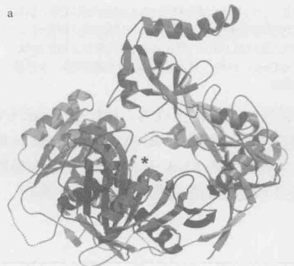

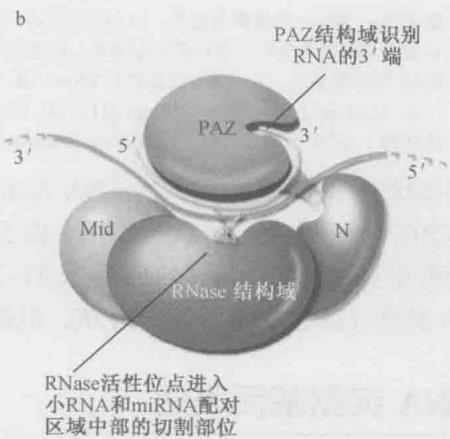  
图 20-17 Argonaute 蛋白的结构，显示 RNA 结合区和 RNaseH 样核酸酶结构域。（a）Argonaute 蛋白的晶体结构。结构域如 b 中着色部分所示，蓝色区域显示蛋白质的氨基端，绿色为中间的结构域。（b）Argonaute 结构域的模式图。箭头所指的 RNase 的活性位点，位于小 RNA 和 miRNA 配对区域中部的切割部位。（a, Song J.J. et al. 2004. Science 305: 1434-1437, Fig.4C. PDBCode: lu04. 图像以 MolScript、CobScript and Raster3D 绘制。b，自 Song J.J. et al. 2004. Science 305: 1434-1437, Fig.4C. ©AAAS，经允许改绘）

如前所述，在某些情况下，成熟的 RISC 不是剪切 mRNA 而是抑制它的翻译。实际

上，这才被认为是 miRNA 发挥作用最常见的方式。

这种翻译抑制的原理还在研究，而且对于这些生物事件发生的顺序还有很大的争论。因此，尽管翻译确实被抑制了，但 mRNA 也同时衰减了。很难证明二者的因果关系：如果 mRNA 衰减了，翻译当然会被抑制；同样地，当 mRNA 的翻译受到抑制时（被任一机制），细胞会有破坏该 mRNA 的倾向。无论哪种方式，同上面我们所讨论的由 siRNA 引发的活化剪切机制都不同。

翻译起始是一个涉及很多因素的复杂过程（见第15章），也会受到很多干扰。不管翻译抑制的机理如何，在某些情况下，翻译抑制似乎是由于miRNA导致了（所谓的）胞浆复合体（P-body）中mRNA的降解。

#### [W] 小 RNA 可以通过指导染色质修饰使基因的转录沉默

我们现在已经看到，miRNA 和 siRNA 是怎样通过抑制靶 mRNA 的翻译或导致它们降解而沉默基因的。调控 RNA 也可以在转录水平上活动，通过指导启动子的组蛋白修饰而关闭靶基因的表达。这一机制在裂殖酵母（Spombe）着丝粒沉默现象中得到了深入的研究。

我们在第 19 章中已提到，位于酵母基因组某些区域的基因常常被特异性沉默。在那一章里，我们详细讲述在酿酒酵母中邻近端粒的基因是被沉默的。酿酒酵母和裂殖酵母的配型基因座也是被沉默的。在裂殖酵母中，着丝粒是基因组中另一个被沉默的区域。在这两种生物体中，基因沉默均涉及组蛋白的修饰。但是，与不需要 RNAi 参与的酿酒酵母中发生的沉默不同，裂殖酵母着丝粒的沉默则需要 RNAi 通路。

裂殖酵母的着丝粒序列组织相比酿酒酵母更像高等真核生物（如果蝇和人类）的着丝粒序列组织（图8-8）。它们的着丝粒都有一个独特序列的中心区域和含有一系列常见重复序列的两侧区域。我们将要看到，这些重复序列对异染色质的形成和功能，以及与此区域有关的转录沉默都是很重要的。异染色质中的组蛋白含有抑制标记（repressing marker）——低水平的乙酰化、组蛋白H3尾巴上第9位赖氨酸（H3K9）的甲基化。

裂殖酵母在 RNAi 通路中的主要组分 Dicer 和 Argonaute 都只有一个基因。高等生物具有多个 Dicer 和 Argonaute 基因，这些基因的功能有些冗余，使得 RNAi 通路的遗传操作更加困难。此外，与果蝇和线虫中不同，RNAi 通路的缺乏对裂殖酵母并不是致命的，尽管会通过干扰染色体分离等方式使细胞生长缓慢。然而令人吃惊的发现是，失去 RNAi 通路中的任一组件会使 H3K9 组蛋白不能甲基化，从而导致着丝粒的基因沉默也不能进行，特别是因为一种转录水平的沉默。在此之前，RNAi 被认为仅在转录后起作用。

认识转录水平沉默的关键似乎在于认识着丝粒本身的重复,这些重复序列是由 RNA 聚合酶 II 从两条链转录而来,产生的互补转录物杂交形成双链 RNA,这是由 RdRP 酶扩增的过程（见图 20-11）。这种双链 RNA 在 RNAi 机制的作用下生成 siRNA,并在某种程度上（尚不知道如何起作用）指导“含 Argonaute 的 RISC 类聚合体”（称为 RNA 诱导的转录沉默 RITS 聚合体）结合到着丝粒上。在理论上，siRNA 可以通过直接与 DNA 模板的序列特异性配对来识别着丝粒 DNA。但另外一个模型更有可能,即 siRNA 在 RNA 聚合酶 II 作用下,将 RITS 聚集到拴在着丝粒上的转录物上。RITS 的聚集导致着丝粒转录物的沉默,而这又是组蛋白修饰装置沿着着丝粒扩展所需要的（图 20-18）。这样,那些转录物被 RNAi “靶定”（targeted）时，转录物本身就使沉默效应扩展开来。

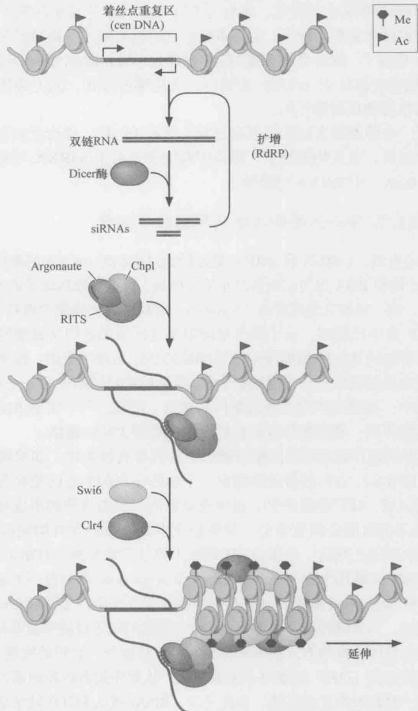  
图 20-18 RITS 聚集和着丝粒沉默的一个模型。图的上部显示的是在裂殖酵母的着丝粒重复序列周围的核小体。这些重复序列是由 RNA 聚合酶 II 从两条链上转录的，生成的双链 RNA 成为 Dicer 的底物。生成的 siRNA 被装载到含 Argonaute 的聚合体 RITS 上。如图的中部所示，含有 siRNA 的 RITS 聚合体被聚集到 Pol II 拴住的转录物上，这些转录物是由着丝粒的重复序列通过 siRNA 和转录物的互补持续转录生成的。这个复合体随后聚集核小体修饰因子（Clr4 和 Swi6），这一修饰是通过标上 H3K9 沉默标记来实现的。RITS 的另一个亚基 Chpl 含有一个染色质域（chromodomain）（第 8 章，图 8-41），通过与甲基化的核小体结合而有可能稳定 RITS 的结合。尽管未在图中显示，由 Argonaute（在 RITS 中）介导的转录物“切片”（slicing）生成的是 RdRP 的底物 RNA，合成一条互补链后，进一步生成 Dicer 的底物。这一过程是核小体修饰的扩展必不可少的，这个区域就这样被沉默。（Martienssen R. and Moazed. D. 2007. Epigenetics (ed. Allis et al)，p.157，Fig.4. ©Cold Spring Harbor Laboratory Press，经许可重绘）。

如上文所提到的，裂殖酵母基因组中配型基因座上的基因也是在转录水平上被沉默的，同时这种沉默现象同样存在于 RNAi 缺陷型突变株中。在这种情况下，一般认为 RNAi 能照样起作用，但只是在沉默的起始阶段起作用。沉默一旦建立，在维持阶段就不需要 RNAi 了。另外，如同在酿酒酵母中一样（第 19 章），基于蛋白质的机制将维持基因抑制的状态。在其他生物中（如果蝇、植物），RNAi 也被认为在异染色质沉默中也起到一定作用。如下文所述，沉默不需要的转座子转录物也是 RNA 介导的。

一系列很好的实验和结果使我们了解到真核生物中的小调控 RNA。最初始于 20 世纪 80 年代末期，科学家试图过表达矮牵牛的色素基因，使得它们变成更深的紫色，结果却使花变成了白色，这是一个看起来令人费解的实验结果。后来又惊奇地发现蠕虫的调节基因产物是 miRNA，随后的实验表明将双链 RNA 引入到蠕虫中能够使互补基因沉默（详见框 20-2）。

#### [W] 框 20-2 miRNA 和 RNAi 的历史

1989年，在美国加州奥克兰（Oakland）Advanced Genetic Sciences 生物技术公司工作的 Richard Jorgensen，试图培养出比现有品系花色更深的紫色矮牵牛花。这一策略看似直截了当，他打算将一个强启动子控制的色素基因（编码查耳酮合成酶，chalsone synthetase）的额外拷贝导入植株之中。这些植株将合成更多的查耳酮合成酶，从而使花的紫色加深。他真正得到的植株却是浅淡不一的矮牵牛花，其中很多紫白相间，有的甚至全为白色（框20-2图1）。

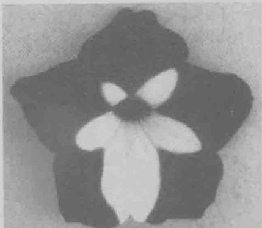  
框 20-2 图 1 矮牵牛花。色素基因查耳酮合成酶过量表达效应的一个例子，正常情况下则是单一紫色的矮牵牛花。（Arizona 大学的 Richard A. Jorgensen 惠赠）

失望之余，这一结果还是令人费解的。在试图理解这一结果的过程中，Jorgensen发现了这一现象——共抑制（cosupression）的许多特点（转入的基因和机体内源的基因表达都被抑制了）。转基因的表达水平超高，查耳酮合成酶的水平越低；无论是因为转基因有很多拷贝，还是因为转基因的启动子很强，这种情况都存在。研究还观察到一些植株色彩斑驳（色素形成的杂色模式），并且可在同一植株的不同花朵上出现。这种模式有时是可以遗传的，但在其他情况下明显是随机可变的。这些观察结果使Jorgensen和其他研究人员（尤其是同样正在研究这一现象的Marjori Matzke）想到这是一种表观遗传（epigenetic）现象。

其他的研究者试图使植物获得抗病毒侵染的特性。一种途径是在植株中过量表达一种常见的病毒复制因子显性失活（dominant-negative）的衍生物，这种蛋白质被认为可用来阻断任何使用共同的复制机器的侵染病毒的复制。尽管这种源自病毒的显性失活的病毒产物阻断了这个马铃薯病毒的复制，令人惊奇的是，对这种病毒的作用的特异性被严格地限制，而且还证明这一过程甚至并不需要蛋白质本身，仅仅RNA就够了。

同时，其他的研究者使用反义 RNA（antisense RNA）在线虫中敲除了 par-1 基因的表达。他们本想证明这个基因与特定的发育性状相关。离体合成的反义 RNA 注入正在发育中的线虫，所诱导的性状符合原先的预期即 par-1 没有表达。但是，同义 RNA（sense RNA）居然也显示了同样的效应。在这个实验中，同义 RNA 仅是作为一个阴性对照，它并未被考虑到会对基因表达起任何作用。与 par-1 基因无关的 RNA 不起任何作用。

对实验中依赖RNA的基因表达的解释使Andrew Fire和Craig Mello赢得了2006年诺贝尔生理学或医学奖。他们证明事实上既不是正义RNA也不是反义RNA，而是这两种的混合产物双链RNA沉默了基因。后来发现，以反义和正义RNA制备的RNA被少量的互补链相互污染，所产生的双链分子使基因沉默。特意制备的双链RNA显示能非常有效地抑制靶基因的表达。至此，RNAi的现象被发现并在1998年发表。

几个实验室的工作很快加深了对这一机制的了解。首先，双链RNA被发现可以引起从果蝇细胞中提取的同源mRNA的降解，这一实验鉴定了RISC。指导RISC结合到靶基因上的siRNA于1999年在植物中被鉴定并被报道。2001年找到了生成siRNA的核酸酶Dicer。这一通路中的最后一种重要组成——Slicer是在2005年被鉴定的；Argonaute的晶体结构揭示这个蛋白质是一种RNase。

除了为生成 siRNA 所需要外，Dicer 还是发育过程中 miRNA 起作用所需要的。1993 年，Victor Ambros 和 Gary Ruvkun 分别描述了第一个 miRNA 和它的靶基因。在那个时候，这一发现被认为是既巧妙又古怪的。Lin-4 基因编码的小 RNA 作用于靶基因 lin-14，通过 miRNA 和靶基因 3'-UTR 区之间的互补序列起作用（框 20-2 图 2）。随后，另外一些 miRNA 在线虫中被发现，一些与动物和植物中相似的基因同源，说明这种调控机制可能更普遍地存在。关于基因调控的小 RNA 世界的画面也逐渐浮现出来，一些小 RNA 来自外源，另外一些是发育过程中基因调控程序的内部装置。这个领域的发展非常迅速，从这些现象被发现和解释，到摘取诺贝尔奖的桂冠，再到写入教科书的章节，仅用了 15 年时间。这种快速进程应归咎于应用多种方法（遗传学、生物化学、结构研究和生物信息学）对多个物种（酵母、植物和线虫）的研究。

框20-2图2结合到靶基因lin-14的3'-UTR区内的microRNA lin-4。(a)被Dicer剪切前的lin-4 miRNA前体,miRNA的序列标以蓝色。(b)lin-4的3'-UTR中的7个序列。(c)其可与lin-14 mRNA在不同程度上进行碱基配对。更加有趣的是lin-4/lin-14调控的生物学意义。在第21章我们了解到一些基因表达是如何对发育进行调控的例子,其中包括Hox基因,它能够调控生物正常形体的形成,使四肢和其他的部位应该在体轴的哪个位置形成而不会出现在错误的位置,比如在一条腿上不能长出一个头来。但是事实上,一些突变体中也有可能缺少某种Hox基因,最经典的例子是果蝇的触角足突变,会使原本应该长出触角的头上长出腿。Lin-14蛋白是一种能够在时间上调控生物正常发育的因子。如果发生突变会引起特定的组织或细胞与正常的不同步(如提前或推后),但是并不能引起空间上(位置)的变化,被称为异时性基因。但是,正如前面所讲的,Lin-14蛋白的表达还是受microRNA lin-4调控的。

(来源 Ha 1. 1996. Genes Dev. 10:3041-3050, Fig. 1. ©Cold Spring Harbor Laboratory Press.)

#### [W] RNAi 是一种抵御病毒和转座子的防护机制

RNAi 机制广泛存在于真核生物中，尽管并不是无所不在，例如，我们发现酿酒酵母中就不存在该机制。但是有一点确信的是，该机制至少是存在于所有真核生物的最近共祖中，而在随后的某些家系中发生缺失。

但是 RNAi 的生物学作用是什么? 是 RNAi 机制需要产生和使用调控子 miRNA，但一些机体只有 RNAi 机制而没有 miRNA（如裂殖酵母）。实际上，miRNA 的逐步形成是利用了 RNAi 机制，而不是该机制存在的原因。RNAi 机制的一个原始功能（并且现在仍然具有的）是保护机体免于转座子和病毒的攻击。

我们在之前描述过细菌中的 CRISPR-cas 系统（见图 20-9）。在该系统中，外源的 DNA 序列（噬菌体或者质粒）在基因组的某个区域累积，并紧接着表达小 RNA 分子，从而破坏再次入侵细胞的同源核苷酸。尽管 CRISPR 系统没有与真核 RNAi 机制（而不是利用小的 RNA 引导蛋白质复合体破坏目标核苷酸）相同的成分，但是这两个系统在许多功能和逻辑上是非常相似的，尤其是 piRNA 系统。

如我们所看到的，piRNA 是小调控 RNA 的第三类（继 siRNA 和 miRNA 之后），它们来源于基因组中长的、单链 piRNA 簇，不需要 Dicer 的作用。

像 CRISPR, piRNA 似乎瞄准的是核苷酸寄生虫——而 CRISPR 的主要靶标是感染的噬菌体，对于动物基因组，其主要威胁是转座子。转座子对于所有的真核生物都是必需的，在某些情况下占据了基因组中的大量位点（第 8 章和第 12 章）例如，在人类中，我们 45% 的基因组序列曾经是转座子。转座子通常使转录沉默而折叠为异染色质。但是，在一些 RNAi 突变种，与转座子沉默相关的组氨酸修饰丢失。除此之外，在植物和蠕虫中，一些 siRNA 被认为与转座子有关。在这些机体中的一些情况下，RNAi 丧失会重新激活转座子，引起它们的跳跃及高频率的自发突变。然而，并不是所有被重新激活的转座子都可以产生 siRNA。这可能反映了与上述裂殖酵母中的交配型沉默类似的情形：RNAi 对于某些转座子的沉默是必需的，但是这种沉默是自我维持，不再需要 siRNA 的存在。

piRNA 似乎主要是保护细胞免于转座子的侵袭，并主要在生殖细胞系中存在（对该细胞的保护是最重要的）。piRNA 簇包括转座子的零散组件（也就是所谓的“转座子墓地”），因而来源于这些区域转录所产生的 piRNA 常常靶向于活性转座子的转录本，从而抑制它们的活性。如我们所见，CRISPR 系统包括积极获取入侵的外源 DNA 样本并利用这些 DNA 引导 CRISPR 阵列产生针对这些相同序列的小的 RNA 来防止其再次侵袭细胞。但是，piRNA 系统没有这个特性，在 piRNA 簇结尾处的 DNA 序列大概是通过将自身移动到该区域来到达的，因而在转座子区域会被富集（图 20-19）。

在植物中，RNAi 对于控制转座子及病毒侵袭是必要的。RNAi 在保护植物免于病毒的侵袭中非常常见。实际上，在深入了解 RNAi 机制之前，RNAi 的作用就已经清晰了。当植物上的叶片被病毒侵袭时，可以使病毒复制沉默的因子会在整个植物体内扩散。该因子并不保护最初被侵染的叶片，但是它可以阻止感染的扩散。而在 Argonaute 或者 Dicer 基因突变的植物中，感染会扩散，病毒的复制会更加迅速。保护的信号包括来源于病毒基因组本身产生的 siRNA，而病毒则通常会携带保护病毒免于宿主 RNAi 破坏的基因作为回应。例如马铃薯 Y 病毒的 HcPro，其作用是降低 siRNA 的产量或减弱 siRNA 的稳定性。其他病毒产物影响防御机制中的其他过程，包括 siRNA 的系统扩散。

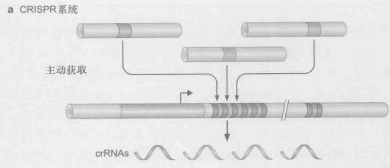

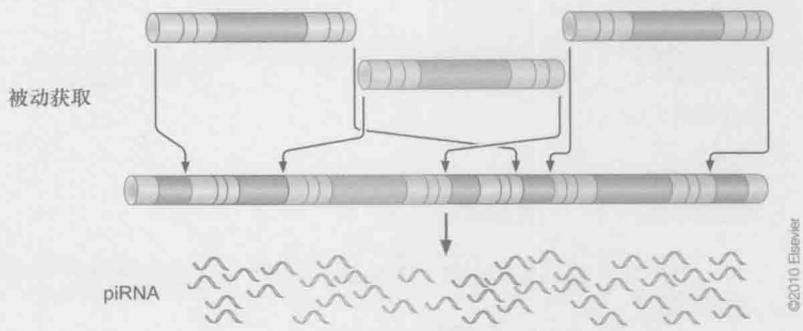  
图 20-19 细菌 CRISPR（a）和动物 piRNA（b）防御系统的比较。尽管很多特性是类似的，但分子成分不同。除此之外，如文中所描述的，CRISPR 的活性源于侵袭的噬菌体的新的间隔序列（见图 20-8），转座子序列被动地进入 piRNA 簇中，填充着 piRNA 系统。（引自 Karginov F.V. and Hannon G.J. 2010.Mol. Cell37:7–19, Fig. 5, p. 16. ©Elsevier.）

miRNA 与人类疾病之间的关系见框 20-3 “microRNA 与人类疾病”。

#### [W] 框 20-3 microRNA 与人类疾病

#### [W] 癌症

在癌症中许多 miRNA 水平的下降很常见。这种下降被认为揭示了这些 miRNA 通常具有抑制肿瘤的作用。除去这一常见趋势，其他一些特殊的 miRNA 在某些癌症中表达上调。同癌症相关的编码蛋白基因相类似，这些 miRNA 被称为抑癌基因（如果失去它们将促发癌症）或致癌基因（如果它们的表达升高将导致癌症）。它们的靶基因常与细胞周期活动（细胞增殖）和细胞凋亡相关。

在人体被确认的几百个miRNA中，一半以上的miRNA所处的基因组区域在癌症发生时常被破坏。因此，在许多癌症中，根据染色体重排性质的不同，这些miRNA的基因要么缺失要么扩增。因此，举例来说，小RNA miR-15和miR-16通过下调BCL2基因，诱导细胞凋亡（框20-3图1）。在西方国家，最常见的成人白血病是慢性淋巴细胞白血病（chronic lymphocytic leukemia, CLL），这是一种与13号染色体上的一个区域（13q14）缺失相关的疾病。小RNA miR-15和miR-16基因位于基因组的这个区域，也只有这两个基因确实位于与CLL相关的最小缺失内。因此，当这些基因缺失后，凋亡被下调，肿瘤可以更易发生并发展。

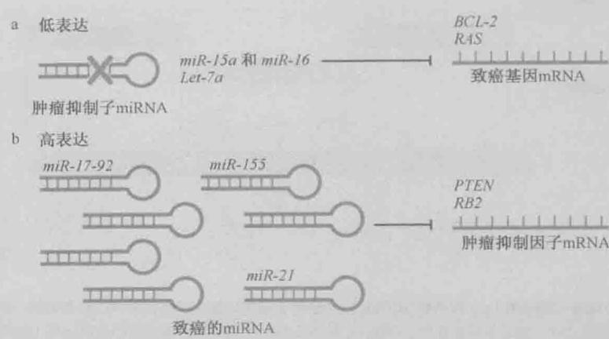  
框 20-3 图 1 miRNA 作为致癌基因的抑制因子。(a) 据这一模型，一个在正常情况下下调致癌基因的 miRNA 具有肿瘤抑制基因的功能。例如，通过突变或缺失而使 miRNA 失去功能就有可能导致靶致癌基因的异常表达，从而使肿瘤形成。(b) 在这里，miRNA 的扩增或过量表达可以通过刺激增殖、促进血管生成和侵袭而使肿瘤形成，这种 miRNA 可以下调肿瘤抑制因子或其他在分化中起作用的重要基因。(Garzon R. et al. 2006. Trends. Mol. Med. 12: 580-587, Fig.2. ©Elsevier. 经许可重绘)。

在 13 号染色体的另一个区域（13q31）发现了一个致癌的 miRNA——miR-17-92。与正常组织相比，这个基因的表达在多种癌症（包括肺癌）中显著升高，特别是在最具侵袭性的癌症中（如小细胞肺癌）。此外，在转基因小鼠中这一 miRNA 的过量表达也会导致肿瘤发生。在 miR-17-92 的许多预测的靶基因中，有两个肿瘤抑制基因——PTEN 和 RB2。一个肯定的靶基因是细胞周期活动因子 E2F1。框 20-3 图 1 所示这两个和其他一些癌症中 miRNA 的实例。

#### [W] 脆性X智力低下

RISC 复合物的生化分析鉴定了很多相关蛋白质。其中一种是脆性 X 智力低下蛋白 (fragile X mental retardation protein, FMRP)。这种蛋白质(FMRI) 的编码基因与 X 染色体连锁，它的突变是造成最常见可遗传智力低下的原因。FMRP 是一个和基因调控有关的 RNA 结合蛋白。因基因表达受干扰，FMRP 缺陷的患者智力低下，还有很多其他方面的发育缺陷。

果蝇有一个 FMRP 的同源基因。在这种基因缺陷的果蝇中，常会观察到连接神经元和肌肉间的突触异常。果蝇的一种 Argonaute 蛋白被发现与 FMRP 协同作用，另外一些有关 Argonaute 的研究表明 FMRP 与 RNAi 机器中的这一组分结合。在人类细胞中也有相似的发现，显示这种脆性 X 症状与 miRNA 的成熟及功能之间存在有趣的联系。

#### [W] RNAi 已成为基因表达操作的有力工具

RNAi 是研究者在试图操控基因表达的过程中观察发现的（框 20-2）。在植物的共抑制（cosuppression）和线虫的反义 RNA 的研究中，对出现的未知现象的探索导致了 RNAi 的发现，因此，一旦清楚地解释了 RNAi 机制就一点也不奇怪了，RNAi 迅速被开发成操控基因表达的工具。在线虫中使用 RNAi 已是常规策略。已有编码双链 RNA 的文库，可用来研究线虫基因组中的任一靶基因。这些文库可以被用来筛选任一特定基因的表达被抑制后的线虫（图 20-20 显示了这一过程）。线虫以细菌为食，在实验室中用 E.coli 喂养线虫。实验显示，最快捷的整合进线虫基因组的途径就是通过它的胃：任何所需要的双链 RNA 都可以在喂养线虫的 E.coli 中表达，并可为线虫细胞中待启动的 RNAi 提供足够的底物，关闭与原有双链 RNA 同源的基因。

  
图 20-20 线虫的 RNA 干扰（RNA interference）可通过喂养表达双链 RNA 的细菌来诱导。本图开始的几个步骤所需要的分子操作的细节请参见第 7 章。质粒的双链 RNA 表达受启动子的控制，识别这一启动子的不是 E.coli 的 RNA 聚合酶，而是噬菌体 T7 中的一个单亚基的 RNA 聚合酶。在细胞中人工表达这个聚合酶的基因是由乳糖启动子（lac）控制的（第 18 章）。因此，双链 RNA 的形成可运用 lac 启动子诱导物进行控制。

显而易见，这种方法对在哺乳动物细胞中进行基因筛选非常有帮助，而这是传统的遗传筛选做不到的。现在 siRNA 已经能够在试管中人工合成，并能导入哺乳动物的培养细胞中引发 RNAi 反应，使靶基因表达下调，但转染（将 RNA 转入细胞）的效率很低。较长的双链 RNA 分子使用起来也有问题，因为它们引发的反应会关闭细胞中所有的翻译。这个反应机制起源于封闭病毒复制的演化过程，因为很多病毒有 RNA 基因组。

研究者发现，模拟 miRNA 要比将双链 RNA 转入细胞更有成效。为此，短基因以合成的寡核苷酸克隆进质粒并建立了文库。每一个短基因被设计成可折叠成茎环结构的转录物。它们被 Dicer 加工形成 siRNA，直接沉默靶基因。这种合成的短基因被称为“短发夹 RNA”（short hairpin RNA, shRNA）基因。设计恰当的 shRNA，任何一个靶基因都可以研究；使用合适的文库，任何一个遗传筛选都可以进行。例如，在这样的文库中，每个质粒都编码一个作用于不同基因的 shRNA，然后整个文库都转染进细胞中，每个细胞都接受了一个不同 shRNA。通过筛选特定表型的细胞，就可以鉴定那个被抑制即导致该表型的靶基因。

#### [W] 长链非编码 RNA 与 X 染色体失活

长链非编码 RNA 在基因调控中起着多方面的作用，包括顺式和反式对转录的影响

近年来，科学家通过高通量测序技术（如第7章所述）发现，在动植物细胞中存在大量的非编码RNA。到目前为止我们已经讨论了小RNA，但是还有一类长度超过200个核苷酸的蛋白质非编码RNA，称为长链非编码RNA（lncRNA）。它们具有调节转录、转录后加工和蛋白质翻译等多种作用。近来研究最透彻的是RNA Xist在调节哺乳动物体X染色体失活中发挥的作用。在我们讨论这个之前，我们认为还有一些其他的lncRNA在发育过程中起作用。

关于 lncRNA 是如何广泛存在于细胞中有很多争论。如刚才提到的，大多数 lncRNA 是通过高通量测序的方法检测到的，这种方法甚至可以检测到非常稀有类型。因此对于这种缺乏直接性实验而得出的生物学意义必须要非常谨慎。然而有一些特定的 lncRNA（Xist 除外）已经清楚地表明具有特定的调控功能，以下是我们考虑到的。

HOTAIR 是在人类 HoxC 簇基因中的一种 lncRNA, 但是它能够通过募集多梳蛋白抑制性复合物 2（PRC2，详见第 19 章）到位于另一个染色体上的 HoxD 基因位点，从而反式调节该基因的表达水平。PRC2 向组蛋白 H3 的 27 位赖氨酸残基加入三甲基基团修饰，该修饰标记（H3K27me3）常常与基因的表达抑制相关（见图 19-29）。HOTAIR 同时也会募集第二个复合物，该复合体能去除与基因活化特异相关的组蛋白修饰。这两个蛋白复合物与 HOTAIR RNA 分子的不同区域结合并推测通过第三个特异区域来靶向 HoxD 某特定位点。除与发育分化相关外，HOTAIR 也被发现在某些肿瘤中高表达。敲除 HOTAIR 的 PRC2 结合区域将同时破坏其在发育分化和肿瘤中的调节作用。虽然这提示了 HOTAIR 扮演的重要生物学角色，但是有趣的是其在小鼠中的保守度很差，而且敲除后也没有观测到任何表型改变。这很可能提示其在哺乳动物中的演化速度非常快。

其他的一些 lncRNA 并非通过反式，而是通过顺式来进行调节。常见的例子有 Xist。而与该印记过程相关的还包括其他类型的 RNA，关于印记的内容将会在第 19 章（见图 19-31）中进行讨论。其中涉及的 Igf2/H19 位点同样包含了一个转录单元能制造 lncRNA AIR。AIR 为自我印记，并且只在亲本等位基因中表达。其表达需要抑制其所在的亲本染色体上的几个被印记的基因。而且，其 RNA 有时也会与染色体相关，通过募集三甲基化的组蛋白 H3K3，导致这些被靶向的启动子对应的转录活动被抑制。

#### [W] X 染色体失活产生镶嵌个体

现在我们详细地讨论一下被称为 Xist 的 lncRNA 及 X 染色体失活的过程。雌性哺乳动物有两条 X 染色体，而雄性则有一条 X 和一条 Y 染色体。虽然这是性别决定的基础并使雌雄有别，但这依然带来了麻烦：假如不加检测，雌性 X 染色体编码基因的水平将是雄性的两倍。这一不平衡的表达将有可能破坏代谢和细胞过程。为了避免这一问题，需要一种剂量补偿（dosage compensation）的机制。在哺乳动物中，雌性通过灭活（inactivating）其中一条染色体基因的表达来达到这一目的，那条染色体上的基因因而差不多没有一个能够表达。在胎生哺乳动物发育过程中，灭活发生于 32 到 64 细胞期。这个时候，在每一细胞中，究竟哪条 X 染色体灭活，母源的或是父源的，其选择显然是随机的。每个细胞一旦选择了灭活的 X 染色体，这个细胞产生出来的所有后代都将维持相同的拷贝。

各个细胞中 X 染色体灭活的随机性导致的后果是雌性都是镶嵌体（mosaic）。一些细胞中表达父本的 X 染色体，而另外一些细胞则表达母本的 X 染色体。通常来说，这

是无关要紧的,尽管这可能影响 X-连锁疾病综合征的严重程度。这一程度依赖于表达或沉默突变基因的细胞的比例。一个广为人知的例子是玳瑁猫（calico cat）（图 20-21）。猫的 X 染色体上的一个基因影响毛色是橙色的或是黑色的。一个等位基因决定毛色为橙色，而另外一个等位基因决定毛色为黑色。杂合子的猫显示不同的橙黑斑块毛色，说明该处的细胞那一条 X 染色体被灭活。这一现象也解释了为什么所有的 calico 猫都是雌性的。白色皮毛则决定于一个常染色体的基因。

  
图 20-21 X 染色体灭活的实例观察——玳瑁猫。如文中所述，橙黑斑块的毛色间接显示了 X 染色体的灭活。（VG 惠赠.）

#### [W] Xist 是雌性哺乳动物中灭活一条 X 染色体的长链非编码 RNA

X染色体是如何灭活的？灭活又是如何在发育过程中遗传下去的？启动灭活的RNA分子称为Xist。Xist是由一个对X染色体灭活至关重要的位点——X染色体灭活中心（X-inactivation center，Xic）编码的。Xist包被在表达该基因的X染色体，如图20-22a中的原位杂交所示。到底是什么原因致使包被发生，为什么包被仅限于一条X染色体，即为什么仅以顺式（cis）起作用？然而，已知灭活的关键是Xist的作用，而且不需要Xic之外的别的X染色体序列。当Xist异位表达于一个常染色体位点的时候（如一个非性染色体），Xist能够在不同的程度上沉默这条染色体上的基因，也就是“灭活”表达它的那条常染色体。

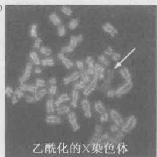  
图 20-22 X 染色体灭活的实例观察：分子标记。（a）中期细胞的原位杂交显示灭活的 X 染色体上 Xist RNA 的定位。（b）染色体染色以显示组蛋白 H4 乙酰化。箭头所指为灭活的 X 染色体，其乙酰化修饰水平要比其他染色体低得多。（经许可复制自 Brockdorff N. and Turner B.M. 2007. Epigenetics [ed. Allis et al.], p.327. ©Cold Spring Harbor Laboratory Press）

Xist RNA 本身并不能引发沉默，但它聚集了其他修饰和浓缩染色质的因子（PRC2 等），这些因子也可能使 DNA 甲基化（第 19 章中其他基因沉默的例子）。然后，一种罕见的组蛋白变体 MacroH2A 积累，这通常与沉默染色质密切相关。正是这些修饰引发了沉默并保证了沉默的遗传。这些修饰一旦确立，Xist 本身就不再需要了。图 20-22b 显示灭活的 X 染色体组不同的蛋白质修饰。在这里，与基因组其他部分相比，这条灭活的 X 染色体的乙酰化程度要低很多。我们在前几章（第 8 章和第 19 章）中看到，去乙酰化的组蛋白与基因组中不转录的区域相关。

细胞是如何选择将哪个 X 染色体灭活呢？这一答案现在还不清楚。但另一个调控 RNA 可能是关键。这个 RNA 也是由 Xic 位点编码的，但它在另一条 DNA 链上并与 Xist 基因重叠。它被称为 Tsix（将 Xist 反过来拼写），起负调控 Xist 的作用（图 20-23）。事实上，如果某一条 X 染色体上的 Tsix 发生了突变，这条染色体将被选为灭活的染色体。因此，Xist 和 Tsix 生成和稳定的平衡将在每一个细胞中导致这样或那样的结果。

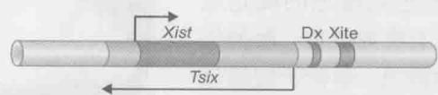  
图 20-23 Tsix 对抗 Xist 的表达和作用。Tsix（图中浅蓝色所示）是由 Xist（图中深蓝色所示）的反义 RNA 表达的，Tsix 比 Xist 长。重叠区域如图中深蓝色所示。Xite 和 DxPas34（Dx）都是控制基因表达的调控因子。开始的时候，Xist 和 Tsix 都由各自的 X 染色体表达，随后失活的染色体会使 Xist 的表达增加，然而活性染色体却会使 Xist 的表达降低。Tsix 是如何调控 Xist 水平的仍然不是很清楚，但是如果将 Tsix 从染色体中删除，其拷贝也能够失活。

与哺乳动物一样，剂量补偿在所有动物中都是必需的，例如线虫和果蝇。但在不同的情况下，补偿的机制是不同的。例如，在果蝇中，剂量补偿是通过增强雄性的X染色体连锁定基因的表达（而不是降低雌性的表达）来实现的。但是在这里，非编码的调控RNA也参与了这一机制。在这个过程中，RNA（称为roX1和roX2）参与将染色质修饰结合体聚集到雄性X染色体上的基因而帮助激活转录。

<!-- W-END Watson 20 调节 RNA 在真核生物中广泛存在 -->

<!-- C-BEGIN Campbell 18.3 -->

### 【英文对应 Campbell Concept 18.3：Noncoding RNAs play multiple roles in controlling gene expression】

> 来源：Campbell Biology（书籍/01_Campbell_Biology） 第18章 Regulation of Gene Expression，Concept 18.3。

#### [EN] Concept 18.3: Noncoding RNAs play multiple roles in controlling gene expression

Genome sequencing has revealed that protein-coding DNA accounts for only 1.5% of the human genome and a similarly small percentage of the genomes of many other multicellular eukaryotes. A very small fraction of the non-protein-coding DNA consists of genes for RNAs such as ribosomal RNA and transfer RNA. Until recently, scientists assumed that most of the remaining DNA was not transcribed, thinking that since it didn't specify proteins or the few known types of RNA, such DNA didn't contain meaningful genetic information—in fact, it was called “junk DNA.” However, genomic studies have cast doubt on this description. For example, a massive study showed that roughly 75% of the human genome is transcribed at some point in any given cell. Introns account for only a fraction of this transcribed RNA, most of which is untranslated. The verdict is still out on how much of the transcribed RNA is functional, but at least some of the genome is transcribed into non-protein-coding RNAs (also called noncoding RNAs, or ncRNAs), including a variety of small RNAs. Researchers are uncovering more evidence of the biological roles of these ncRNAs every day.

These discoveries revealed a large and diverse population of RNA molecules in the cell that play crucial roles in regulating gene expression and had gone largely unnoticed. The longstanding view that mRNAs are the most important RNAs because they code for proteins needed revision. This has represented a major shift in thinking by biologists, one that you are witnessing as students entering this field of study.

#### [EN] Effects on mRNAs by MicroRNAs and Small Interfering RNAs

Regulation by both small and large ncRNAs occurs at several points in the pathway of gene expression, including mRNA translation and chromatin modification. We'll examine two types of small ncRNAs, the importance of which was acknowledged when their discovery was the focus of the 2006 Nobel Prize in Physiology or Medicine, which was awarded for work completed only eight years earlier.

Since 1993, a number of research studies have uncovered microRNAs (miRNAs)—small, single-stranded RNA molecules capable of binding to complementary sequences in mRNA molecules. A longer RNA precursor is processed by cellular enzymes into an miRNA, a single-stranded RNA of about 22 nucleotides that forms a complex with one or more proteins (Figure 18.15). The miRNA allows the complex to bind to any mRNA molecule with at least seven or eight nucleotides of complementary sequence. The miRNA-protein complex then degrades the target mRNA or, less often, simply blocks its translation. There are approximately 2,500

Figure 18.15 Regulation of gene expression by microRNAs (miRNAs).

An miRNA of about 22 nucleotides, formed by enzymatic processing of an RNA precursor, associates with one or more proteins in a complex that can degrade or block translation of target mRNAs.

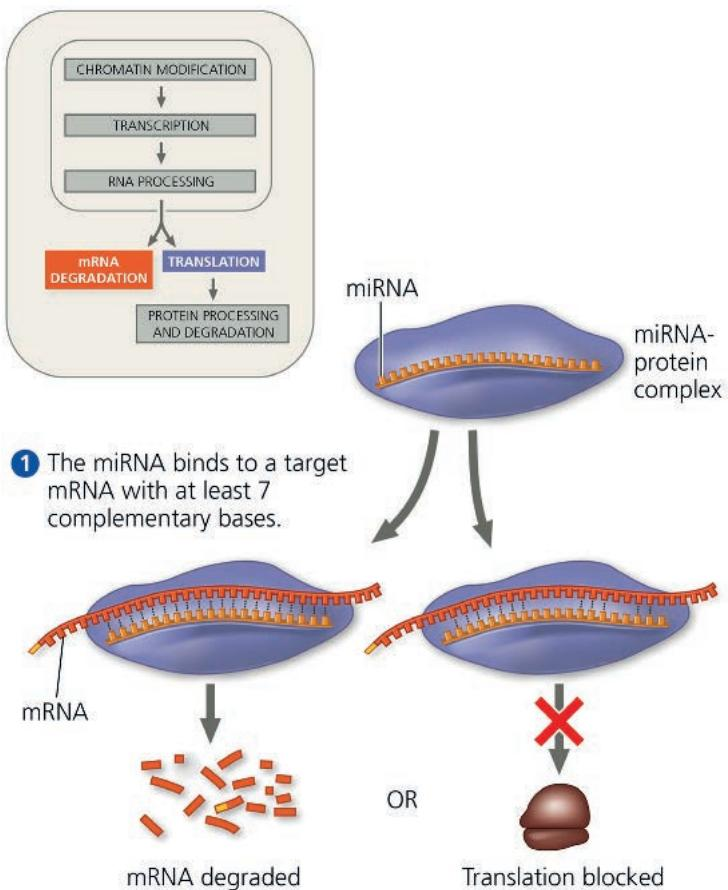  
2 If miRNA and mRNA bases are complementary all along their length, the mRNA is degraded (left); if the match is less complete, translation is blocked (right).

genes for miRNAs in the human genome, and biologists estimate that expression of at least one-half of all human genes may be regulated by miRNAs, a remarkable figure given that the existence of miRNAs was unknown until the early 1990s.

Another class of small noncoding RNAs, similar in size and function to miRNAs, is called small interfering RNAs (siRNAs). Both miRNAs and siRNAs can associate with the same proteins, producing similar results. In fact, if siRNA precursor RNA molecules are injected into a cell, the cell's machinery can process them into siRNAs that turn off expression of genes with related sequences, similarly to how miRNAs function. The distinction between miRNAs and siRNAs is based on subtle differences in the structure of their precursors, which in both cases are RNA molecules that are mostly double-stranded. The blocking of gene expression by siRNAs, referred to as RNA interference (RNAi), is used in the laboratory as a means of disabling specific genes to investigate their function.

EVOLUTION How did the RNAi pathway evolve? As you will learn in Concept 19.2, some viruses have double-stranded RNA genomes. Given that the cellular RNAi pathway can process double-stranded RNAs into homing devices that lead to destruction of related RNAs, some scientists think that this pathway may have evolved as a natural defense against infection by such viruses. However, the fact that RNAi can also affect the expression of nonviral cellular genes may reflect a different evolutionary origin for the RNAi pathway.

While this section has focused on ncRNAs in eukaryotes, small ncRNAs are also used by bacteria as a defense system, called the CRISPR-Cas9 system, against viruses that infect them (see Concept 17.5). The use of ncRNAs thus evolved long ago, but we don't yet know how bacterial ncRNAs are related to those of eukaryotes.

#### [EN] Chromatin Remodeling and Effects on Transcription by ncRNAs

In addition to regulating mRNAs, small noncoding RNAs can cause remodeling of chromatin structure. In the S phase of the cell cycle, for example, the centromeric regions of DNA must be loosened for chromosomal replication and then recondensed into heterochromatin in preparation for mitosis. In some yeasts, siRNAs produced by the yeast cells from the centromeric DNA are required to re-form the heterochromatin at the centromeres. Exactly how the process starts is still debated, but biologists agree on the general idea: The siRNA system in yeast interacts with other, larger noncoding RNAs and with chromatin-modifying enzymes to condense the centromere chromatin into heterochromatin. In most mammalian cells, siRNAs have not been found, and the mechanism for centromere DNA condensation is not yet understood. However, it may also turn out to involve small noncoding RNAs.

A recently discovered class of small ncRNAs called piwi-interacting RNAs, or piRNAs, also induce formation of heterochromatin, blocking expression of some parasitic DNA elements in the genome known as transposons. (Transposons are discussed in Concept 21.4.) Usually 24–31 nucleotides in length, piRNAs are processed from a longer, single-stranded RNA precursor. They play an indispensable role in the germ cells of many animal species, where they appear to help

#### [EN] Interview

Interview with Haifan Lin: Discovering piwi-interacting RNAs and connections to testicular cancer (eTextbook only)

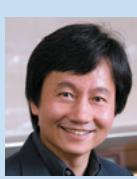

reestablish appropriate methylation patterns in the genome during gamete formation.

Researchers have also found a relatively large number of long noncoding RNAs (lncRNAs), ranging from 200 to hundreds of thousands of nucleotides in length, that are expressed at significant levels in specific cell types at particular times. The functional significance of these lncRNAs has been debated, but in 2017 a large international research consortium published an atlas of almost 28,000 such RNAs; their analysis supported the idea that almost 20,000 were functional and that some were associated with specific diseases. One lncRNA, long known to be functional, is responsible for X chromosome inactivation, which prevents expression of genes located on one of the X chromosomes in most female mammals (see Figure 15.8). In this case, lncRNAs—transcripts of the XIST gene located on the chromosome to be inactivated—bind back to and coat that chromosome. This binding leads to condensation of the entire chromosome into heterochromatin.

The examples just described involve chromatin remodeling in large regions of the chromosome. Because chromatin structure affects transcription and thus gene expression, RNA-based regulation of chromatin structure is sure to play an important role in gene regulation. Additionally, some experimental evidence supports the idea of an alternate role for lncRNAs in which they can act as a scaffold, bringing DNA, proteins, and other RNAs together into complexes. These associations may act either to condense chromatin or, in some cases, to help bring the enhancer of a gene together with mediator proteins and the gene's promoter, activating gene expression in a more direct fashion.

Given the extensive functions of noncoding RNAs, it is not surprising that many of the ncRNAs characterized thus far play important roles in embryonic development—the topic we turn to in the next section. Embryonic development is perhaps the ultimate example of precisely regulated gene expression.

<!-- C-END Campbell 18.3 -->

## 8.5 真核基因其他水平上的表达调控

## 8.5.1 蛋白质磷酸化对基因转录的调控

真核基因转录前基因组中某些位置上的染色质结构改变为伸展型或“开放”状态，为基因的活化奠定了基础并起着“开关”的作用。染色质的伸展结构使细胞核中相应位置上的基因有可能成为RNA聚合酶Ⅱ转录的模板，从而启动基因的表达，开始将遗传信息从DNA转移到RNA上并翻译为蛋白质，实现了遗传信息传递的“中心法则”。

蛋白质的磷酸化与去磷酸化过程(图 8-59)是生物体内普遍存在的信号转导调节方式,几乎涉及所有的生理及病理过程,如糖代谢、光合作用、细胞的生长发育、神经递质的合成

图 8-59 蛋白质的磷酸化及去磷酸化过程  

细胞表面受体与配体分子的高亲和力特异性结合,能诱导受体蛋白构象变化,使胞外信号顺利通过质膜进入细胞内,或使受体发生寡聚化而被激活。一般情况下,受体分子活化细胞功能的途径有两条:一是受体本身或受体结合蛋白具有内源酪氨酸激酶活性，胞内信号通过酪氨酸激酶途径得到传递；二是配体与细胞表面受体结合，通过G蛋白介异的效应系统产生介质，活化丝氨酸/苏氨酸或酪氨酸激酶，从而传递信号。按照“碰撞耦联”或称“动态受体”学说，受体的侧向流动性使受体分子与效应分子在胞质膜

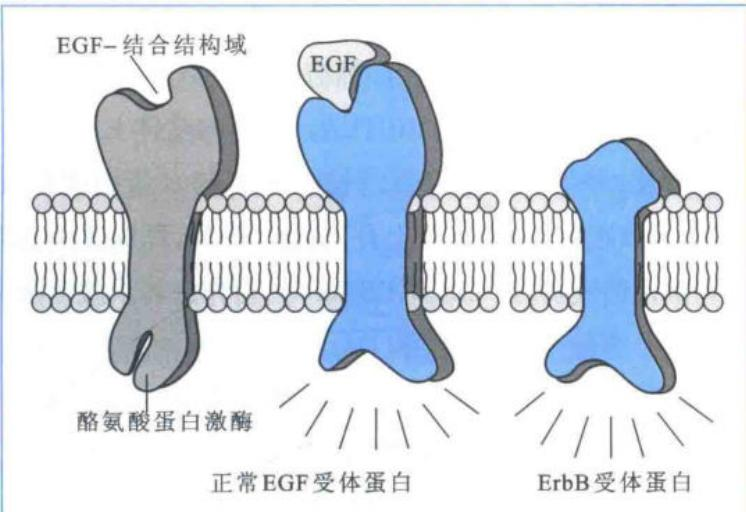  
图 8-60 酪氨酸受体蛋白激酶磷酸化与细胞癌变示意图  
酪氨酸受体蛋白激酶与表皮生长因子(EGF)相结合后,刺激了该受体蛋白的激酶活性,引发一系列生理反应。原癌蛋白ErbB虽然没有正常酪氨酸受体蛋白激酶的胞外结构域,其胞内结构域却具有蛋白激酶活性,刺激细胞持久分裂,诱发癌变。

磷脂双层内相互作用,这是信号转导的关键。酪氨酸激酶受体侧向扩散使受体寡聚化,是活化信号转导时受体-受体间自身磷酸化所必需的。对于依赖G蛋白介导的配体信号转导途径来说,配体与受体结合后,G蛋白和受体-配体复合物由于各自在细胞膜内侧向扩散而发生瞬时随机碰撞导致G蛋白活化效应分子。研究认为,信号转导是维系外部刺激与细胞反应的桥梁,千变万化的环境因子使信号转导的途径与机制成了变幻莫测的迷宫。在已知的上游信号转导途径中,酪氨酸蛋白激酶(protein tyrosine kinase,PTK)途径及受体耦联的G蛋白途径广为引人注目(图8-60)。

## 1. 受 cAMP 水平调控的 A 激酶

科学家把依赖于 cAMP 的蛋白激酶称为 A 激酶(PKA)，它能把 ATP 分子上的末端磷酸基团加到某个特定蛋白质的丝氨酸或苏氨酸残基上。被 A 激酶磷酸化的氨基酸 N 端上游往往存在两个或两个以上碱性氨基酸，特定氨基酸的磷酸化(X-Arg-Arg-X-Ser-X)改变了这一蛋白质的酶活性，动物细胞中这一酶活性代表了 cAMP 所引起的全部反应。在不同的细胞体系中，A 激酶的反应底物是不一样的，这就决定了 cAMP 能在不同靶细胞中诱发不同的反应，非活性状态的 PKA 全酶由 4 个亚基 R2C2 所组成，相对分子质量为 150～170，调节亚基与 cAMP 相结合，引起构象变化并释放催化亚基，后者随即成为有催化活性的单体(图 8-61)。

  
图 8-61 cAMP 调控的 A 激酶活性

已经证实,许多转录因子都可以通过 cAMP 介导的蛋白质磷酸化过程而被激活,因为这类基因的 5' 端启动区大都拥有一个或数个 cAMP 应答元件(cAMP-response element, CRE),其基本序列为 TGACGTCA。膜上的受体 R 与外源配基(ligand)相结合,引起受体构象变化,并与 GTP 结合蛋白相结合,R 与 G 蛋白耦合激活了与膜相关的腺苷酸环化酶(AC),导致胞内 cAMP 浓度上升,活化 A 激酶,释放催化亚基并进入核内,实施底物磷酸化。被磷酸化的底物,如 CREB、CREM 等,可作为转录激活因子诱发基因转录。

## 2. C 激酶与 $\mathrm{PIP}_2$ 、 $\mathrm{IP}_3$ 和 DAG

图 8-62 激酶信号传递与基因表达示意图

磷酸肌醇级联放大的细胞内信使是磷脂酰肌醇-4,5-二磷酸 $\mathrm{(PIP_2)}$ 的两个酶解产物：肌醇1,4,5-三磷酸 $(\mathrm{IP}_3)$ 和二酰基甘油(DAG)。 $\mathrm{IP}_3$ 和DAG是该途径的主要活性分子，G蛋白通过活化的受体调控磷酸肌醇酶系统的活性。图8-62是C激酶信号传递示意图，因为该蛋白激酶活性是依赖于 $\mathrm{Ca^{2+}}$ 的，所以称为C激酶(PKC)。 $\mathrm{IP}_3$ 引起细胞质 $\mathrm{Ca^{2+}}$ 浓度升高,导致 C 激酶从胞质转运到靠近原生质膜内侧处,并被 DAG 和 $Ca^{2+}$ 的双重影响所激活。DAG 激活 C 激酶的原因是前者大大提高了 C 激酶对于 $Ca^{2+}$ 的亲和力,从而使得 C 激酶能被生理水平的 $Ca^{2+}$ 离子所活化。C 激酶是一个 $7.7 \times 10^{4}$ 的蛋白质,主要实施对丝氨酸、苏氨酸的磷酸化,它具有一个催化结构域和一个调节结构域。DAG 结合后还能解除调节区所造成的抑制作用,提高酶活性。

## 3. CaM 激酶及 MAP 激酶

$\mathrm{Ca}^{2+}$ 的细胞学功能主要通过钙调蛋白激酶(CaM-kinase)来实现,它们也是一类丝氨酸/苏氨酸激酶,但仅应答于细胞内 $\mathrm{Ca}^{2+}$ 水平。MAP 激酶(mitogen-activated proteinkinase, MAP-kinase,又称为 extracellular-signal-regulated kinase,ERKS)活性受许多外源细胞生长、分化因子的诱导,也受到酪氨酸蛋白激酶及 G 蛋白受体系统的调控。MAP 激酶的活性取决于该蛋白质中仅有一个氨基酸之隔的酪氨酸、丝氨酸残基是否都被磷酸化(图 8-63),图中 Jun、E1K-1 等为转录因子,其磷酸化状态的改变能够影响其后介导的基因转录起始与否。科学家把能同时催化这两个氨基酸残基磷酸化的酶称为 MAP-激酶-激酶,它的反应底物是 MAP 激酶。MAP-激酶-激酶本身能被 MAP-激酶-激酶-激酶所磷酸化激活,后者能同时被 C 激酶或酪氨酸激酶家族的 Ras 蛋白等激活,从而在信息传导中发挥功能。

## 4. 蛋白质磷酸化与细胞分裂调控

细胞通过 p53 及 p21 蛋白控制 CDK(cyclin-dependent protein kinase) 活性,调控细胞分裂的进程。如果 p21 蛋白过量,大量周期蛋白(cyclin)E-CDK2 复合物与 p21 蛋白相结合,使 CDK2 丧失磷酸化 pRb 蛋白的功能。没有被磷酸化的 pRb 蛋白与转录因子 E2F 相结合并使后者不能激活一系列与 DNA 合成有关的酶,导致细胞不能由 G₁ 期进入 S 期,细

  
图 8-63 Ras 蛋白和 C 激酶激活丝氨酸 / 苏氨酸“瀑布式”磷酸化(级联磷酸化), 引起相关生理反应图示

图 8-64 pRb 蛋白的磷酸化和去磷酸化过程控制了细胞分裂的周期性

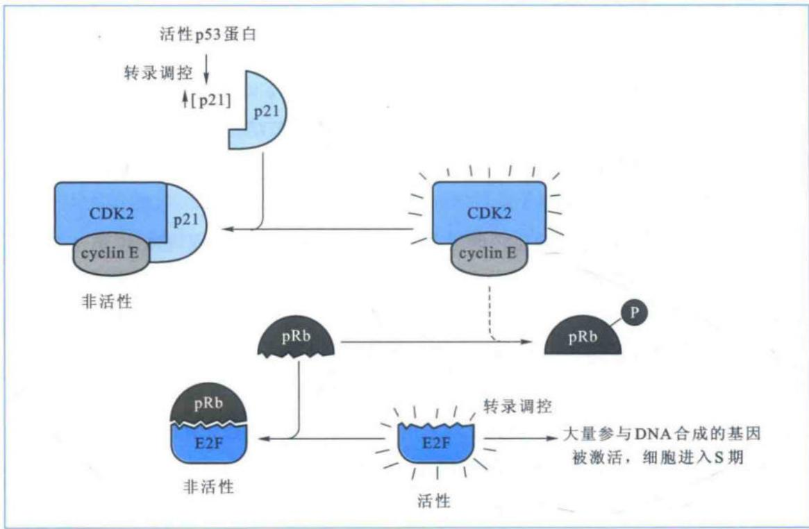

胞分裂受阻。如果细胞中 p53 基因活性降低，p21 蛋白含量急剧下降，周期蛋白 E-CDK2 复合物就能有效地将 pRb 蛋白磷酸化。此时，pRb 蛋白不能与 E2F 相结合，使后者发挥转录调控因子的作用，激活许多与 DNA 合成有关的基因表达，使细胞从 $G_{1}$ 期进入 S 期，引发细胞分裂（图 8-64）。

## 8.5.2 蛋白质乙酰化对转录活性的影响

肿瘤抑制因子 p53 蛋白与人类多种肿瘤有着密切的关系，因此可能是该领域中研究最为深入的蛋白质。p53 参与多种信号通路，如细胞周期调控、DNA 损伤修复、血管的生成与抑制以及细胞凋亡等的调控。已知 p53 蛋白的活性受翻译后修饰（如磷酸化、乙酰化等）机制调控，经修饰的 p53 蛋白能与不同的靶分子或蛋白复合体相结合，从而抑制或激活参与特定生理反应的靶基因。p53 在所有细胞中都转录产生 2.2～2.5 千核苷酸的 mRNA，编码由 393 个氨基酸组成的相对分子质量为 $5.3 \times 10^{4}$ 的蛋白质（p53 蛋白）。根据 p53 的结构特点可将其分为 3 个不同区域：N 端酸性区（1～80 位氨基酸残基）、C 端碱性区（319～393 位）和中间（100～300 位）的疏水区 [图 8-65(a)]。

p53 能识别不同构象靶基因的相同序列。靶基因启动子的拓扑结构和 p53 蛋白（及与其相互作用的辅助蛋白）的构象决定该蛋白质是否与启动子区相互作用。乙酰化使 p53 蛋白的 DNA 结合区域暴露，增强了 DNA 结合能力，从而促进了靶基因的转录 $^{[图 8-65(b)]}$ 。CBP/p300 等蛋白复合体既能诱导染色体结构发生有利于结合 p53 蛋白的改变，又使 p53 蛋白被乙酰化，从而显著提高受 p53 调控的靶基因的转录活性。

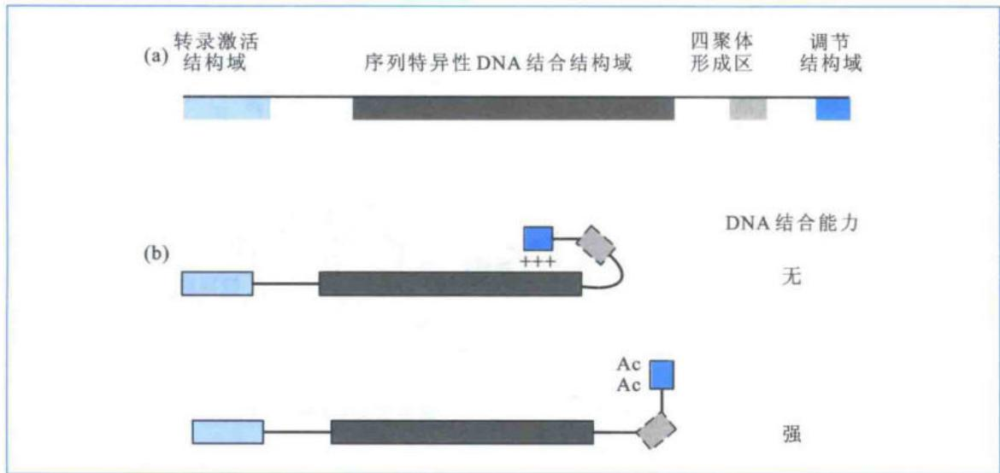  
图 8-65 p53 蛋白乙酰化有利于激活靶基因转录  
(a) p53 蛋白基本结构示意图；(b) p53 蛋白的乙酰化提高了它的 DNA 结合能力。

## 8.5.3 激素对基因表达的影响

## 1. 激素对靶基因的影响

许多类固醇激素(如雌激素、孕激素、醛固酮、糖皮质激素和雄激素, 图 8-59)以及一般代谢性激素(如胰岛素)的调控作用都是通过起始基因转录而实现的。靶细胞具有专一的细胞质受体, 可与激素形成复合物, 导致三维结构甚至化学性质的变化。经修饰的受体与激素复合物通过核膜进入细胞核内, 并与染色质的特定区域相结合, 导致基因转录的起始或关闭。研究发现, 体内存在的许多糖皮质类激素应答基因都有一段大约20 bp的顺式作用元件(激素应答元件, 简称 HRE), 该序列具有类似增强子的作用, 其活性受激素制约。表 8-12 是3种激素应答序列成分保守性分析。靶细胞中含有大量激素受体蛋白, 而非靶细胞中没有或很少有这类受体, 这是激素调节转录组织特异性的根本原因。

糖皮质激素通过核穿梭(nuclear shuttling)激活下游信号通路。该激素与相应受体结合,改变其构象,使之进入细胞核内,结合在能够促进转录的相应增强子上,从而促进下游基因的转录。实验中,利用糖皮质激素地塞米松(dexamethasone,DEX)激活靶基因表达的原理,构建可诱导表达融合蛋白系统。首先,将糖皮质激素受体GR和要研究的核蛋白X构建成融合蛋白,转基因到酵母、动物细胞或者植物中。不施加外源DEX时,融合蛋白与HSP90形成复合物,由于构象和空间位阻等原因,融合蛋白存在于胞质中,不能定位到细胞核内。添加DEX时,DEX扩散入胞与GR相结合,融合蛋白构象改变,核定位信号暴露,行使入核功能,导致下游基因表达。

雌激素刺激鸡输卵管中卵清蛋白合成可能是激素诱导转录作用的典型例子。将雌激素注入鸡体内，输卵管组织便开始合成卵清蛋白 mRNA。只要有雌激素或类雌激素（如二乙基己烯雌酚）存在，合成便能继续下去。一旦停止供应激素，合成速度便下降直至完全消失。多肽激素胰高血糖素接触靶细胞时，首先与受体结合，并激活膜上的腺苷酸环化酶，使之以 $Mg^{2+}-ATP$ 为底物生成环腺苷酸和焦磷酸。细胞内 cAMP 浓度升高，导致蛋白激酶活性增强,特定酶系的磷酸化水平及酶活性都得到改善,促进糖原最终分解为葡萄糖-1-磷酸 $^{(图8-67)}$ 。

图8-66 几种常见的疏水性小分子激素的结构式  

## 8.5.4 热激蛋白对基因表达的影响

现代分子生物学上把能与某个(类)专一蛋白因子结合,从而控制基因特异表达的 DNA 上游序列称为应答元件(response element),如热激应答元件(heat shock response element,HSE)、糖皮质应答元件(glucocorticoid response element,GRE)、金属应答元件(metal response element,MRE)等,这些应答元件与细胞内专一的转录因子相互作用,协调相关基

图 8-67 胰高血糖素激活糖原分解连锁反应  

因的转录(表8-9)。

许多生物在最适温度范围以上,能受热诱导合成一系列热休克蛋白(heat shock protein, HSP)。受热后,果蝇细胞内HSP70 mRNA水平提高1 000倍,就是因为热激因子(heat shock factor,HSF)与HSP70基因TATA区上游60碱基对处的HSE相结合,诱发转录起始。

表 8-9 特异转录因子与各类应答元件的相互作用

<table><tr><td>调控因子</td><td>应答元件</td><td>DNA 序列</td><td>结合蛋白</td><td>相对分子质量</td></tr><tr><td>热激</td><td>HSE</td><td>CNNGAANNTCCNNG</td><td>HSF</td><td> $9.3 \times 10^{4}$ </td></tr><tr><td>镉</td><td>MRE</td><td>CGNCCCGGNCNC</td><td>?</td><td>?</td></tr><tr><td>佛波酯</td><td>TRE</td><td>TGACTCA</td><td>AP1</td><td> $3.9 \times 10^{4}$ </td></tr><tr><td>血清</td><td>SRE</td><td>CCATATTAGG</td><td>SRF</td><td> $5.2 \times 10^{4}$ </td></tr></table>

按相对分子质量的大小以及同源程度可将热休克蛋白分为 HSP90、HSP70、小分子 HSP 及泛素 4 个家族, 各家族 HSP 又由多种不同形式或经不同修饰的蛋白质分子所组成。HSP 分布广泛, 诱导迅速, 即使在非热休克细胞中也存在着由热休克同源基因编码的类似蛋白质。真核细胞的热休克蛋白可能具有机体保护功能并在细胞的正常生长和发育中起重要作用, HSP70 的主要功能是参与蛋白质的代谢, 而泛素的主要功能是清除细胞内的变性蛋白质。HSP 还常与具有不同功能的多种蛋白质形成天然复合物, 参与有关蛋白质折叠、亚基的组装、细胞内运输以及降解等过程。热休克蛋白参与靶蛋白活性和功能的调节，却不是靶蛋白的组成部分，因此，一般称它为分子伴侣或伴侣蛋白(chaperonine)。现将主要HSP家族及其生理功能列于表8-10。

表 8-10 主要 HSP 家族及其生理功能

<table><tr><td>家族</td><td>主要成员</td><td>主要生理功能</td><td>免疫应答中的可能作用</td></tr><tr><td>HSP90</td><td>HSP90,HSP83</td><td>促进甾醇激素受体与激素的结合及与DNA结合,调节激酶磷酸化活性</td><td>抗肿瘤,提高自身免疫性能</td></tr><tr><td>HSP70</td><td>HSP70,BiP,Dnat,Hsc70,Grp78</td><td>参与蛋白质折叠和去折叠、蛋白质转位及多聚复合物的组装</td><td>免疫球蛋白装配,类抗原加工,病原体抗原及自身免疫性诱导</td></tr><tr><td>小分子HSP</td><td>HSP27,Gro23,HSP16</td><td>参与蛋白质折叠和去折叠及多聚复合物的装配</td><td>病原体抗原及自身免疫性诱导</td></tr><tr><td>泛素</td><td>泛素</td><td>蛋白质降解</td><td>类抗原加工,淋巴细胞回巢,自身免疫性诱导</td></tr></table>

HSP 基因中内含子数量都很少. 至今为止尚未发现 HSP70 基因中有内含子, 而人 HSP90、果蝇 HSP82、人 HSP27、鸡 HSP108 和泛素等都只有少量内含子。HSP 的这一基本特征保证了它们一旦起始转录不需剪接就可产生出成熟 mRNA 以适应 HSP 大量快速表达的需要, 防止严重的热休克影响 mRNA 前体的剪接。

在没有受热或其他环境胁迫时，HSF主要以单体的形式存在于细胞质和核内。单体HSF没有DNA结合能力，HSP70可能参与了维持HSF的单体形式。受到热激或其他环境胁迫时，细胞内变性蛋白增多，它们都与HSF竞争结合HSP70，从而释放HSF，使之形成三体并输入核内。HSF一旦形成三体，便拥有与HSE特异结合、促进基因转录的功能。这种能力可能还受磷酸化水平的影响，因为热激以后，HSF不但形成三体，还会迅速被磷酸化。HSF与HSE的特异性结合，引起包括HSP70在内的许多热激应答基因表达，大量产生HSP70蛋白。随着热激温度消失，细胞内出现大量游离的HSP70蛋白，它们与HSF相结合，形成没有DNA结合能力的单体并脱离DNA(图8-68)。

## 8.5.5 翻译水平调控

在蛋白质生物合成的起始反应中主要涉及细胞中的4种装置,这就是:①核糖体,它是蛋白质生物合成的场所;②蛋白质合成的模板mRNA,它是传递基因信息的媒介;③可溶性蛋白因子,这是蛋白质生物合成起始物形成所必需的因子;④tRNA,它是氨基酸的携带者。只有这些装置和谐统一才能完成蛋白质的生物合成。

## 1. 真核生物 mRNA 的“扫描模式”与蛋白质合成的起始

大量实验证明,在真核生物起始蛋白质合成时,40S核糖体亚基及有关合成起始因子首先与mRNA模板靠近5'端处结合,然后向3'方向滑行,发现AUG起始密码子时,与60S大亚基结合形成80S起始复合物。这就是Kozak提出的真核生物蛋白质合成起始的

图8-68 热激蛋白调控的基因表达机制  

“扫描模式”。

为什么核糖体滑行到 mRNA 的第一个 AUG, 即在离 5' 端最近的起始密码位点就停下来并起始翻译呢? 现在认为, 这是由 AUG 的前 (5' 方向) 和后 (3' 方向) 序列所决定的。调查了 200 多种真核生物 mRNA 中 5' 端第一个 AUG 前后序列发现, 除少数例外, 绝大部分都是 A/G NNAUGG, 说明这样的序列对翻译起始来说是最为合适的。所以, “扫描模式” 相当合理地说明了许多真核生物 mRNA 的单一顺反子性质, 也合理地解释了为什么将 mRNA 水解之后, 它内部的起始密码子会被活化。因为 mRNA 的水解产生出了新的 5' 端, 所以它又可以成为 40S 起始复合物的进入位点。

那么,真核生物中具有相关生物功能的基因通过什么样的补偿机制得以协同表达呢?有人提出,真核生物通过“融合基因”的方式产生出多顺反子的替代物,即“多聚蛋白质”。多聚蛋白质是由相当长的mRNA编码的,如色氨酸合成酶,它的α亚基(相对分子质量28727)和β₂亚基(相对分子质量42756)在大肠杆菌中分别由不同基因编码,但是,在真核生物酵母中,这两个多肽融合形成相对分子质量为76000的双功能蛋白质。红色链孢霉的arom基因簇也编码多功能蛋白,参与多芳香化合物的生物合成。此外,酵母的his4基因编码了一个三功能蛋白质。从功能上说,哺乳动物的脂肪酸合成酶(相对分子质量 $2.4\times10^{5}$ )相当于大肠杆菌中一组7个之多的功能各不相同的多肽。所以,基因融合可能补偿了真核生物核糖体不能利用多顺反子型mRNA来协调各种不同蛋白质生物合成的缺陷。

## 2. mRNA 5' 端帽子结构的识别与蛋白质合成

因为绝大多数真核生物 mRNA 5' 端都带有“帽子”结构, 所以, 核糖体起始蛋白质的

合成,首先面临的问题是如何识别这顶“帽子”。

真核生物 mRNA 5' 端可有 3 种不同的帽子, 即 O 型、I 型和 II 型, 其主要差异在于帽子中碱基甲基化程度的不同。表 8-11 列举了这 3 种不同类型帽子的结构。

表 8-11 真核生物 mRNA 的帽子结构

<table><tr><td>种类</td><td>结构</td><td>mRNA</td></tr><tr><td>O型</td><td> $m^{7}Gppp^{A}/GpNp^{-}$ </td><td>酵母、黏菌</td></tr><tr><td>I型</td><td> $m^{7}GpppA_{mp}Gm pNp^{-}$ </td><td>海胆胚、卤虫</td></tr><tr><td>II型</td><td> $m^{7}GpppN_{1mp}N_{2p}$ </td><td>哺乳动物</td></tr><tr><td></td><td> $m^{7}GpppN_{1mp}N_{2mp}$ </td><td>哺乳动物</td></tr></table>

真核生物的加帽子反应发生在 mRNA 前体刚转录出来不久或尚未转录完成时,催化这一过程的是鸟苷酸转移酶和甲基转移酶,它们都位于细胞核内。据认为,细胞中的帽子化酶是同时具有 RNA 三磷酸酯酶和鸟苷酸转移酶活性的多功能酶。通过鸟苷酸转移酶生成的是 5'-5' 磷酸二酯键。从 O 型到 I 型帽子的生成都在细胞核内进行,由 I 型帽子进一步加工成 II 型帽子在细胞质内进行。

## 3. mRNA 的稳定性与基因表达调控

在高等真核生物中转运铁蛋白受体(TfR)和铁蛋白负责铁吸收和铁解毒。这两个mRNA上存在相似的顺式作用元件,称为铁应答元件(iron responsive element, IRE), IRE与IRE结合蛋白(IREBP)相互作用控制了这两个mRNA的翻译效率。当细胞处于缺铁或高铁水平时,能产生两个数量级的蛋白水平差异,却没有在mRNA水平上发现存在显著差异。研究表明,位于5'非翻译区的IRE控制了铁蛋白mRNA的翻译效率,去掉这个非翻译区IRE,可造成铁蛋白的永久性高水平翻译。当细胞缺铁时,IREBP与IRE具有高亲和力,两者的结合有效地阻止了铁蛋白mRNA的翻译,与此同时,TfR mRNA上3'非翻译区中的IRE也与IREBP特异结合,有效地阻止TfR mRNA的降解,促进TfR蛋白的合成(图8-69)。

## 4. 可溶性蛋白因子的修饰与翻译起始调控

许多可溶性蛋白因子,即起始因子,对蛋白质合成的起始有着重要的作用,对这些因子的修饰也会影响翻译起始。

① eIF-2 磷酸化对翻译起始的影响 用兔网织红细胞粗抽提液研究蛋白质合成时发现,如果不向这一体系中添加氯高铁血红素,几分钟之内蛋白质合成活性急剧下降,直到完全消失。这就是说,当没有氯高铁血红素存在时,网织红细胞粗抽提液中的蛋白质合成抑制剂就被活化,从而抑制蛋白质合成。现已查明,该抑制剂 HCI 是受氯高铁血红素调节的,它其实是 eIF-2 的激酶,可以使 eIF-2 的 α 亚基磷酸化,并由活性型变成非活性型。没有生物活性的 HCI 也可以通过自身的磷酸化变成活性型,这个过程可能是自我催化的,并与一个被称为 HS 因子的热稳定蛋白有关。氯高铁血红素能够阻断 HCI 的活化过程(图 8-70)。

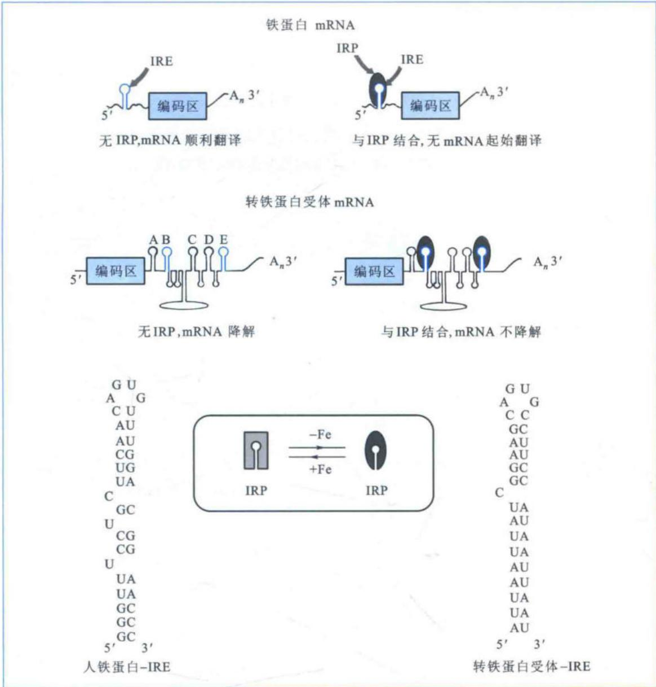  
图 8-69 人铁蛋白及转运铁蛋白受体 mRNA 的翻译调控机制

实验表明，eIF-2 的 $\alpha$ 亚基磷酸化以后，eIF-2 与 eIF-2B 紧密结合，直接影响了 eIF-2 的再利用，从而抑制翻译，影响蛋白质合成起始复合物的生成。eIF-2 磷酸化阻碍蛋白质生物合成这一现象，同样可由添加氧化型谷胱甘肽或双链 RNA 等引发。

② CBPⅡ活性与翻译的起始 在脊髓灰质病毒感染的 HeLa 细胞中,有帽子结构的

宿主 mRNA 的翻译受阻, 宿主蛋白质合成停止, 但没有帽子结构的脊髓灰质炎病毒 mRNA 的翻译却不受影响。研究表明, 宿主细胞 CBPⅡ失活是导致这种 mRNA 选择性翻译的根本原因。如果在这种感染细胞抽提液的蛋白质合成体系中加入由兔网织红细胞中提取的 CBPⅡ,

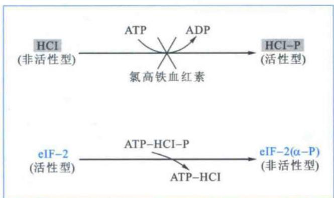  
图8-70 eIF-2、HCI及氯高铁血红素的相互关系

就能恢复有帽子 mRNA 的翻译活性。添加 CBPⅡ对脊髓灰质炎病毒 RNA 的翻译没有影响。

在蛋白质生物合成的过程中,特别是在起始反应中,mRNA 的“可翻译性”是起决定作用的,其 5' 端的帽子结构、二级结构、与 rRNA 的互补性以及起始密码附近的核苷酸序列都是蛋白质生物合成的信号系统。蛋白质生物合成的调控就是通过 mRNA 本身所固有的信号与可溶性蛋白因子或者与核糖体之间的相互作用而实现的。

<!-- W-BEGIN Watson 15 翻译的调控 -->

### 【中文对照 Watson 第15章：翻译的调控】

> 来源：Watson《基因的分子生物学》第七版中译本（书籍/03_基因的分子生物学_第七版） 第15章 翻译。

#### [W] 翻译的调控

尽管大多数基因的表达都是在 mRNA 转录水平上受到调控的，但是目前越来越明确地证实很多基因在蛋白质合成的水平上也受到调节。翻译调控较之转录调控的优点之一是能够对外界刺激迅速产生反应。蛋白质合成水平的调控免去了改变 mRNA 转录水平所需的时间（而且在真核生物中还包括 mRNA 加工及运输到胞质的时间），因此使蛋白质水平的改变更加迅速。像其他类型的调控那样，翻译调控主要在起始步骤。总体来说，调控一个通路的早期步骤，与启动一个功能进程然后再停止它这种手段相比，显得更加有效。对翻译来说，起始水平的调控也能够减少产生那些改变了功能的不完整蛋白产物。

在本部分中，我们将首先描述细菌和真核细胞翻译调控所使用的一般机制。然后，我们介绍使用这种调控的一些具体实例。

  
图 15-41 真核细胞翻译终止和核糖体循环。

蛋白质或 RNA 在核糖体结合位点附近结合负调控细菌翻译的起始

细菌翻译起始调控因子的首要目标就是干扰 30S 亚基对 RBS 的识别。总体来说，这些抑制因子的作用机制就是与 RBS 附近的序列结合，从物理上阻断了 RBS 和 16S rRNA 的碱基配对（图 15-42a）。这些抑制因子通常是 RNA 结合蛋白，识别形成于 RBS 附近的 RNA 结构。尽管它们不直接与 RBS 结合，但结合蛋白足够大，从而在空间阻止 30S 亚基接近 RBS。实际上，这些抑制因子不直接与 RBS 结合有着重要意义，因为如果那样就会发生阻止细胞中大部分蛋白质翻译的风险。

  
图 15-42 通过抑制 30S 亚基的结合来调控细菌翻译起始。(a) 结合于 RBS 附近位点的蛋白质阻止 16S rRNA 接近 RBS。在这种情况下，mRNA 编码的蛋白质结合于自身 mRNA 的 RBS。(b) mRNA 分子内的碱基配对能够干扰与 16S rRNA 的碱基配对。在很多情况下，这种抑制由处于同一操纵子内的其他基因的翻译来调节。如果与 RBS 邻近区域碱基配对的 mRNA 区域处于某个 ORF 内，那么当这个 ORF 翻译时，起干扰作用的碱基配对发生断裂，使得下一个核糖体能够识别先前被掩盖的 RBS。

RNA 分子也可以利用相同的机制来充当翻译的抑制因子。这种调控经常发生在 mRNA 与自己的碱基配对，掩盖了一个或更多的 RBS（图 15-42b）。这种掩盖可以抑制相关 ORF 的翻译，直到这种相互作用被中断。在很多情况下，中断的发生是翻译操纵子中的另一个基因导致的后果。在这种情况下，与 RBS 邻近区域相互作用的 mRNA 区域存在于另一个 ORF 中，核糖体的通过阻断这种碱基配对，因此使得另一个核糖体可以识别未被掩盖的 RBS。

#### [W] 原核翻译调控：核糖体蛋白是其自身合成的翻译抑制因子

现在我们介绍一个细菌中调控翻译的例子，阐明细胞怎样利用这一系列机制控制核糖体蛋白基因的正确表达。协调核糖体蛋白的表达与 rRNA 的表达向细胞提出了一个有趣的调控问题。正如我们前面谈到的，每个核糖体都包含 50 多种截然不同的蛋白质，它们应该和与之结合的 rRNA 以相同速率合成。此外，细胞合成蛋白质的速率及其需要的核糖体数目与细胞的生长速率紧密相关。生长环境的改变会迅速导致所有核糖体组分合成速率的适当升高或降低，而这种协同调控是怎样完成的呢？

核糖体蛋白基因的协同调控通过组成若干操纵子（operon）而得以简化，每个操纵子包括最多11个核糖体蛋白基因（图15-43）。与其他操纵子一样，这些基因簇是在RNA合成水平进行调控的（第18章），然而，最重要的核糖体蛋白合成调控是在mRNA翻译水平进行的。一个简单的实验可以阐明这个结论。当把一个核糖体蛋白操纵子的额外拷贝体引进细胞时，其mRNA的数目相应增多，但核糖体蛋白的合成几乎没变。这样，细胞通过减少mRNA作为蛋白质合成模板的使用从而协调平衡多余的mRNA。

  
图 15-43 E.coli 核糖体蛋白操纵子。作为其他蛋白质的翻译抑制因子的蛋白质以红色阴影表示。启动子以紫色表示。每个 ORF 都按照编码的核糖体蛋白来标记（如 L14 是大核糖体蛋白 14）。（获得许可并重新绘图自 NomuraM. et al. 1984. Annu. Rev. Biochem. 53: 75–117. Annual Reviews.）

核糖体蛋白 mRNA 翻译的严格调控是其自我抑制的结果。对于每个核糖体蛋白操纵子来说，一个编码的核糖体蛋白（或两个编码的核糖体蛋白的复合体）将会结合到最接近 5' 基因的其中一个翻译起始序列附近操纵子的 mRNA。核糖体蛋白的结合在空间上抑制了核糖体小亚基与附近 RBS 的结合，因此也就抑制了翻译的起始。

理解核糖体蛋白的结合怎样阻止操纵子起始基因的翻译是十分容易的。但这种结合是怎样影响下游那些拥有其自身 RBS 的基因呢？这种“极性”效应可以通过多种机制发生。正如我们在本章前面部分所介绍的，当一个上游基因的终止密码子距离下游基因的起始密码子很近时，就可能发生翻译耦联。这种邻近性所产生的情况是下游基因的翻译需要上游基因的翻译才能得以完成。第二种机制则是利用 mRNA 折叠成一定的结构。核糖体蛋白操纵子 mRNA 通常折叠成这样的结构，即只有当 mRNA 的前端基因被翻译，才允许识别内部的 RBS。例如，假定 mRNA 第一个基因编码区的一个区域与第二个基因的 RBS 附近的一个位点发生碱基配对。在这种情况下，只有当抑制性的碱基配对因核糖体在第一个基因的编码区进行翻译的过程中受到阻遏之后，16S rRNA 才识别第二

个基因的 RBS（图 15-42b）。

核糖体蛋白的表达怎样与细胞中 rRNA 的数量相关联呢？在每种情况下，与 mRNA 结合的调控性核糖体蛋白同时也识别位于适当 rRNA 上的一个结合能力很强的位点（图 15-44）。若这一结合位点没有被占据，核糖体蛋白会首先结合这个位点。另一方面，若所有的 rRNA 结合位点都被占据了，那么调节蛋白就结合到第二个位点，即位于其自身 mRNA 上的较弱的结合位点。因此，只有当核糖体蛋白多于其目标 rRNA 时，它才与自身 mRNA 结合。这一简单的竞争性结合事件确保只有当调控性核糖体蛋白数量过剩时核糖体蛋白的合成才被抑制。

  
图 15-44 核糖体蛋白表达的调控。在这个例子中，我们介绍一个简单的双蛋白核糖体蛋白基因操纵子。（a）在没有结合的 rRNA 存在的情况下，这个操纵子表达的两个核糖体蛋白都与 rRNA 结合，并且协助核糖体的正确装配。在这种情况下，核糖体蛋白 2 不与邻近核糖体蛋白 1 上的 RBS 的较低亲和力结合位点结合。（b）在没有 rRNA 与核糖体蛋白结合时，核糖体蛋白 2 就结合于邻近的核糖体蛋白 1 的 RBS，从而阻断这一 ORF 的翻译。在没有翻译核糖体蛋白 1 存在时，与核糖体蛋白 2 RBS 邻近序列互补的序列就与之发生碱基配对，阻止 30S 亚基与此位点的结合。如正文所述，翻译耦联也可发挥抑制下游 ORF 翻译的作用。

不足为奇的是，在很多情况下，调控性核糖体蛋白的两个结合位点是彼此相关的。

(a) 16S核糖体RNA上的S8结合位点

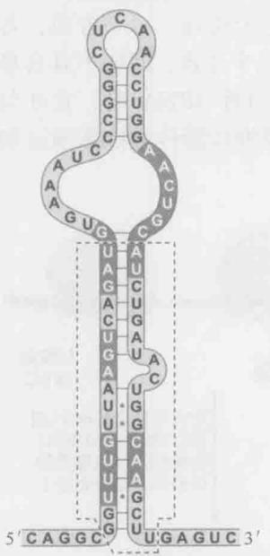  
(b) S8蛋白mRNA上的翻译起始区

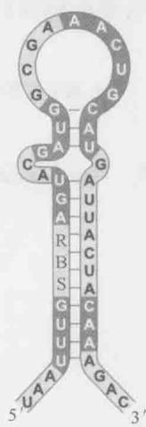  
图 15-45 核糖体蛋白 S8 与 16S rRNA 及其自身 mRNA 结合。此图为核糖体蛋白 S8（由 spc 操纵子编码；图 15-43）与核糖体中 16S rRNA 结合的区域与其自身 mRNA 的翻译起始位点的对比。（a）被 S8 蛋白结合的 16S rRNA 区域。（b）当没有游离的 16S rRNA 结合的时候，核糖体蛋白 S8 的翻译启动位点被占据。共有序列被标记为深绿色。虚线框中表示的是 16S rRNA 被 S8 蛋白保护的区域。S8 蛋白 mRNA 结合所需要的 AUG（红色的）和 RBS 结合位点（框中的）在图（b）中表示。（获得许可并重新绘图自 Cerretti D.P. et al. 1988. J. Mol. Biol. 204: 309–329. Elsevier.）

在核糖体蛋白 S8 的情况中，这两个位点具有相当大的相似性（图 15-45）。mRNA 上结合位点的序列清晰地揭示了 S8 蛋白抑制翻译的机制。mRNA 上的结合位点包括起始 AUG。因此，被过量的 S8 蛋白（在本例中）结合的 mRNA 不能结合核糖体而起始翻译。这两个结合位点的不同解释了为何与 rRNA 结合会比与 mRNA 结合更紧密。因此，只有满足了核糖体装配对 S8 蛋白的需求后翻译才被抑制。

这种翻译调控的策略并不局限于核糖体蛋白。其他 RNA 结合蛋白通过结合自身 mRNA 来调节其自身的表达，包括一些氨酰-tRNA 合成酶。此外也有一些例子，mRNA 根据细胞环境（如温度或代谢水平，详见第 20 章）折叠成不同的结构，或促进翻译，或抑制翻译。

真核翻译总体调节因子以 mRNA 识别及起始 tRNA 核糖体结合所需的关键因子为靶标

在营养物质不足或其他细胞应激情况下，对于真核细胞来说，从总体上降低翻译水平通常是十分必要的。在这些情况下，真核翻译起始的两个早期步骤成为抑制的靶标：mRNA 的识别，以及起始 tRNA 与 40S 亚基的结合。前面说过，在真核翻译起始中，这两个事件彼此独立地发生，但抑制任何一个步骤均会抑制新蛋白质的合成。在两种情况下，抑制机制都是由磷酸化控制的。

一个常见的抑制机制是由 eIF2 的磷酸化介导的。前面讲过，eIF2 结合于 GTP 过程是起始 tRNA 运输到真核核糖体 40S 亚基的 P 位点所必需的。很多使 eIF2 的 α 亚基磷酸化的蛋白激酶已经被鉴定出来。这一亚基的磷酸化抑制了 eIF2 的一个称为 eIF2B 的 GTP 交换因子的作用，从而导致 eIF2-GTP 水平的降低。与 EF-Ts 对 EF-Tu-GDP 的作用相似，eIF2B 激活 eIF2-GDP 以释放结合的 GDP 并与 GTP 结合。因为 eIF2 与 GTP 的结合是护送起始 tRNA 到 40S 亚基过程中所必需的，所以 eIF2-GTP 水平的降低限制了翻译的起始。已知的 eIF2α 激酶可被众多不同的胞内环境所激活，包括氨基酸缺乏（见下文）、病毒感染及温度升高。

另一种常见的总体翻译抑制机制以 5'帽结合蛋白 eIF4E 为靶标。前文提到，在与 5'帽结合之后，eIF4E 结合 eIF4G。eIF4G 中被 eIF4E 识别的短结构域在一个称为 eIF4E 结合蛋白（4E-BP）家族中也有发现。这些蛋白质与 eIF4G 竞争结合 eIF4E 并因此充当翻译的一般抑制因子（图 15-46）。与 eIF2 类似，4E-BP 也受磷酸化的调控。在其非磷酸化状态下，4E-BP 与 eIF4E 紧密结合，并抑制翻译的进行。相反，4E-BP 的磷酸化抑制其与 eIF4E 的结合（图 15-46）。

  
图 15-46 真核翻译起始总体上受到 eIF4E 结合蛋白（4E-BP）的调控。4E-BP 与 eIF4G 竞争结合帽结合蛋白 eIF4E。这阻断了 eIF4A 介导的 mRNA 5'端的解旋及依赖于 eIF4G 的 43S 前起始复合物的募集。4E-BP 与 eIF4E 的结合受磷酸化的调控。mTor 激酶磷酸化 4E-BPs 的 eIF4E 结合区，使其再也不能识别 eIF4E。这样，通过抑制 4E-BP 的作用，mTor 激酶上调细胞的翻译活性。

4E-BP 的磷酸化由一个称为 mTor 的关键的胞内蛋白激酶所介导。激活细胞分裂的生长因子、激素及其他因子会激活这种激酶，从而提高细胞的整体翻译水平。这些现象引起了一个假设，即翻译水平的调控与细胞的增殖是精确协调的。实际上，eIF4E 的过表达可以导致细胞的癌性转化，并且 mTor 的抑制因子（如雷帕霉素，rapamycin）是十分有效的化疗试剂。尽管我们是在翻译的总体调控范畴中介绍过这些调控机制，但这两种机制也都用于细胞中特定 mRNA 的翻译调控，这将在下面详细叙述。

#### [W] 通过对 mRNA 特异的 4E-BP 进行的翻译空间调控

除了翻译的总体调控，与 eIF4E 结合也用来调控特定 mRNA 的翻译。例如，黑腹

果蝇卵母细胞及发育胚胎的前后轴的正确建立，需要很多蛋白质正确定位在一个共有的大细胞质中（第21章对此事件有完整的描述）。在有些情况下，这些关键调控蛋白的空间限制性翻译在控制其定位方面发挥着主要作用。

Oskar 蛋白在受精之前确定位于卵母细胞的后部区域。尽管如此，Oskar mRNA 是由与母果蝇卵巢结合的滋养细胞合成的，并在受精前定位于卵母细胞的前部区域。随后，Oskar mRNA 被运输至卵母细胞的后部。细胞为了使 Oskar 蛋白的表达局限在卵母细胞后部，Oskar mRNA 从卵母细胞的前部转移到后部，保证这一过程中它不被翻译是十分必要的。

一个称为 Cup 的 4E-BP 的作用对特异性限制 Oskar mRNA 的翻译非常关键（图 15-47）。OskarmRNA

  
图 15-47 eIF4E 结合蛋白 Cup 特异性抑制 Oskar mRNA 的翻译。当 Oskar mRNA 从果蝇卵母细胞前部运输至后部的过程中，保证 Oskar mRNA 不被翻译是十分关键的。Oskar 翻译的抑制由两个蛋白介导。RNA 结合蛋白 Bruno 结合于多个位于 Oskar mRNA 3' 非翻译区的序列，它们称为 Bruno 应答元件（Bruno response elements，BREs）。随后 Bruno 募集 4E-BP Cup 到 mRNA。当定位于 mRNA 后，Cup 马上与 eIF4G 竞争结合 eIF4E，抑制这一 mRNA 的翻译。

在 3'非翻译区包含若干序列，并与一个叫做 Bruno 的蛋白质特异结合。而 Bruno 可与 Cup 结合，并募集这一 4E-BP 结合到 Oskar mRNA 上。当定位于 Oskar mRNA 后，Cup 竞争过 eIF4G 而结合到 eIF4E，因此抑制了 mRNA 的翻译。Cup 并不能像上述总体调控的 4E-BP 那样，具有足够多的数量而作用于所有的翻译。尽管如此，当定位于某一 mRNA 后，Cup 即成为一个非常有效的翻译抑制因子。这一机制并不局限于 Oskar 蛋白。果蝇中的 Nanos 蛋白也是通过将 Cup 募集于其 mRNA 来调控的。与此相似，一个叫做 CPEB 的 mRNA 结合蛋白将一种称为 Maskin 的 4E-BP 募集至许多在脊椎动物卵母细胞发育中翻译过程被抑制了的 mRNA 上。

#### [W] 由铁离子调控的 RNA 结合蛋白调控转铁蛋白（Ferritin）的翻译

人体内铁离子的水平需要审慎的调节。许多蛋白质利用铁离子作为辅助因子，包括血红蛋白和肌红蛋白等氧转运蛋白，以及诸多参与氧化磷酸化的蛋白质。与铁离子在氧气运输和能量生成中的重要作用相一致，人体中铁的缺乏（或称为贫血，anemia）会造成一种整体的虚弱感。而另一方面，过量的铁对细胞有毒害，并且可以导致肝损伤、心衰和糖尿病。

铁离子结合蛋白—转铁蛋白是人体中调节铁离子水平的主要调节因子。转铁蛋白以一种受控的方式储存并释放铁离子，从而保持体内铁含量的稳定。因此，转铁蛋白的水平必须迅速应答于体内游离铁的水平。细胞对胞内游离铁的水平变化需要作出迅速反应，因此转铁蛋白表达的调节发生在蛋白质合成水平。

转铁蛋白的翻译受到一些被称为铁离子调控蛋白（iron regulated protein，IRP）的铁离子结合蛋白的调控。这些蛋白质也是RNA结合蛋白，它们能够识别转铁蛋白mRNA的5'端形成的一个称为铁离子调控元件（iron regulatory element，IRE，图15-48）的特异发夹结构。重要的是，这些蛋白质识别IRE的能力受到细胞中铁离子水平的调控。在铁离子缺乏的细胞中，铁离子的浓度太低而不能与IRP结合。在缺乏结合的铁离子的情况下，这些蛋白质与IRE紧密结合，抑制eIF4A/B解开IRE发夹结构的能力。发夹结构的持续存在会在空间上阻碍43S复合体结合mRNA。与此相反，当细胞中的游离铁浓度升高时，IRP与铁离子形成结合态。而结合了铁离子后，IRP即失去其与IRE结合的能力并因此抑制翻译。

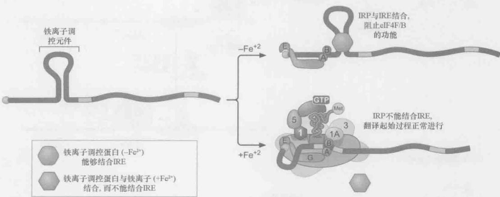  
图 15-48 铁离子对转铁蛋白的翻译调控。转铁蛋白基因 5' 非翻译区包含一个称为铁离子调控元件（IRE）的茎环结构。当不与 $Fe^{2+}$ 结合时，铁离子调控蛋白（IRP）就紧密结合于这一位点。通过稳定 IRE 的茎环结构，IRP 阻止 eIF4A 从转铁蛋白 mRNA 末端清除这一结构。在这种情况下，43S 前起始复合体与 mRNA 的结合就不能发生，转铁蛋白基因也不被翻译。当铁离子水平升高并且需要转铁蛋白时，IRP 就与 $Fe^{2+}$ 结合，这就抑制了 IRP 与 IRE 的结合能力，也因此使转铁蛋白得以翻译。

#### [W] 酵母转录激活因子 Gcn4 的翻译受到上游短 ORF 及三元复合物丰度的调控

Gcn4 是一个酵母转录激活因子，调控多种指导氨基酸生物合成的酶基因的表达。尽管 Gcn4 是一个转录激活因子，但其对自身的调控却在翻译水平进行。当氨基酸水平低时，Gcn4 mRNA 得以翻译（所以生物合成的酶也得以表达）；但当氨基酸水平高时，Gcn4 mRNA 不被翻译。这样的调控是怎样做到的呢？

与典型的真核 mRNA 结构不同，编码 Gcn4 蛋白的 mRNA 在 Gcn4 编码序列上游有 4 个小的可读框（称为 uORF）。其中最上游的短 ORF（uORF1）可被从 mRNA 5'端扫描的核糖体高效识别。一旦核糖体翻译了 uORF1，这一 ORF 的独有特性使得 50% 的核糖体小亚基仍然结合于 RNA，并且重新开始扫描下游以寻找起始密码子 AUG（图 15-49 和框 15-3）。

究竟哪个下游 AUG 被正在进行扫描的小亚基所识别，这受到进行扫描的小亚基何时结合于带有一个起始 tRNA 的 eIF2 复合物的调控。前面讲过，在 P 位点没有起始 tRNA存在的情况下，40S 亚基就不能识别 mRNA 上的 AUG 序列。因此，在开启下游任何一个 ORF 的翻译之前，进行扫描的 40S 亚基必须结合 eIF2·Met-tRNA $_{i}^{Met}$ （下面称为 TC，即 ternary complex，三元复合物）。

当氨基酸含量足够时，TC 在核糖体翻译 uORF1 完成后不久就与正在进行扫描的核糖体重新结合（图 15-49a）。一旦与 TC 重新结合，核糖体小亚基就可以识别一个 AUG，在其他某个 uORF（2、3 或 4）上重新起始翻译。与 uORF1 的情形不同，在翻译完这些 uORF 之后，核糖体从 mRNA 上完全解离下来，而不能到达 Gcn4 的 ORF，从而不产生 Gcn4 蛋白。

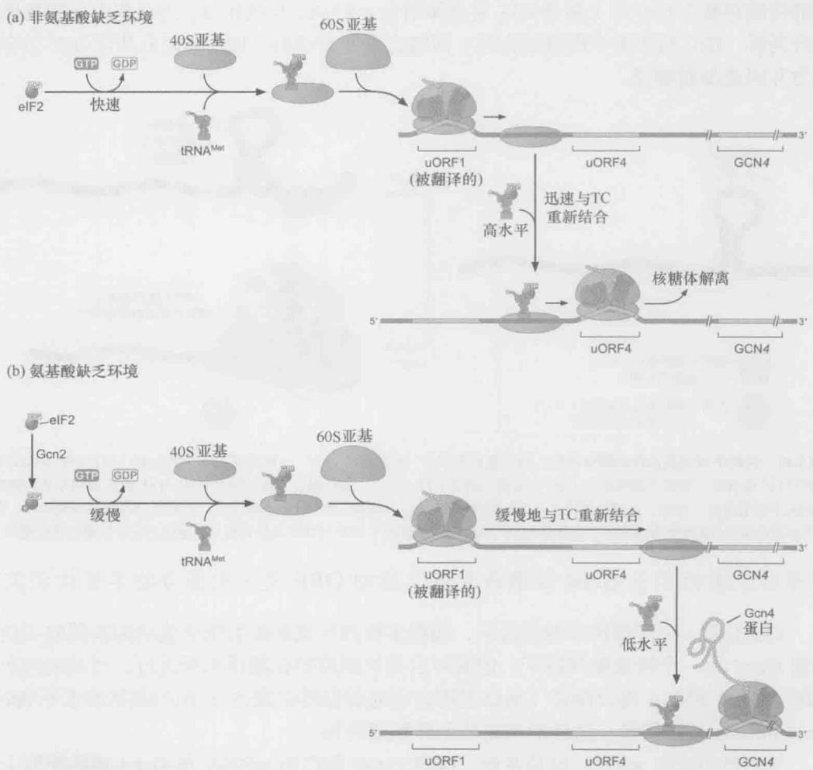  
图 15-49 应答于氨基酸缺乏的 Gcn4 翻译调控。如正文中详细介绍的，编码酵母转录激活因子 Gcn4 的 ORF 上游有 4 个短的 ORF，称为 uORF（此处只显示 uORF1 和 uORF4）。第一个上游 ORF 首先翻译，由于这一 ORF 的特殊性质，大约 50% 的 40S 亚基在翻译终止之后仍然结合于 mRNA 上，并继续扫描 Gcn4 mRNA。（a）当氨基酸含量丰富时，eIF2B 激活 eIF2 使其迅速将 GDP 转换成 GTP。这使得 eIF2-GTP-Met-tRNA $_{i}^{Met}$ 与 40S 亚基迅速结合并具备识别另外三个短小 ORF 其中之一的能力。这些 uORF 中任何一个翻译都将导致翻译的完全终止。（b）在氨基酸缺乏时，由 eIF2-α 激酶 Gcn2 介导的 eIF2 磷酸化降低 eIF2B 并激活 GTP 结合于 eIF2 的能力。eIF2-GTP 水平的降低导致 eIF2-GTP-Met-tRNA $_{i}^{Met}$ 与 40S 亚基的结合变慢。起始 tRNA 结合速率的降低增加了进行扫描的核糖体在能够识别 AUG 前通过其余 uORF 的可能性，因此对 Gcn4 的翻译有利。（获得许可并重新绘图自 Hinnebusch A.G. 1997. J. Biol. Cell 272: 21661–21664, Fig. 1. American Society for Biochemistry & Molecular Biology.）

在氨基酸缺乏的情况下，几个事件的综合效应降低了TC与40S亚基结合的速率。有限的氨基酸导致空载tRNA的增多，这反过来激活一个叫做Gcn2的eIF2α激酶。正如在eIF2α激酶介导的翻译总体调控中所介绍的，当Gcn2磷酸化eIF2之后，eIF2-GTP的数量将会减少，因为eIF2与GTP交换因子eIF2B的相互作用被阻遏了。由于eIF2只有在GTP存在的情况下才与Met-tRNA $_{i}^{Met}$ 结合，这导致胞内TC数量减少并降低TC结合40S亚基的速率（图15-49b）。结合速率的降低意味着40S亚基在缺乏发现AUG的能力的情况下，沿mRNA序列进行更远距离的扫描。如果核糖体在与TC重新结合之前扫描通过了uORF2\~4的AUG，那么这些ORF就不会被翻译。uORF2\~4的起始密码子与uORF1的起始密码子比较接近，而Gcn4 ORF的起始密码子AUG却处于下游较远的地方。这一额外的距离为TC在小亚基碰到Gcn4的ORF之前与之结合提供了更多的时间，从而增加了核糖体对其进行翻译的机会。实际上，删除位于uORF和Gcn4起始密码子之间的间隔RNA导致Gcn4蛋白表达的减少。因此，当有限的TC存在时，Gcn4得到翻译，并能够开启能在细胞中合成更多氨基酸的相关基因。框15-6描述了应用下一代测序技术来分析细胞内整体的翻译模式，即测量所有处于翻译阶段的mRNA。

#### [W] 框 15-6 核糖体和多聚核糖体谱

有很多种方法来检验细胞中基因表达的水平。大多数检验方法关注于基因表达的初始产物，即 RNA 的量。从另一个角度来看，mRNA 的量并不能直接代表它所编码的

蛋白在细胞中的数量。为了识别某个蛋白在细胞中是否真的被合成出来了，我们需要对 mRNA 的翻译进行量化研究。

早先对于 mRNA 转录程度的分析集中在 mRNA 和多聚核糖体的相关性上。在这些研究中，研究者加入一种药物——放线菌酮（cycloheximide）使翻译终止在氨基酸易位阶段。然后裂解处理的细胞，通过蔗糖梯度离心（sucrose gradient centrifugation）的方法分离细胞内容物（框 15-6 图 1）。由于核糖体的体积较大，结合于核糖体上的 mRNA 在离心过程中相对于游离状态的 mRNA 沉降速率会快很多。而且，由于 mRNA 是多聚核糖体的一部分，也会相对沉降得较快。在浓度梯度中测量总蛋白会发现，其根据 mRNA 结合核糖体数量的不同而形成的几个峰。检测这些峰的成分中 mRNA（例如利用 Northern bolt 或 RT-PCR），可以研究哪些 mRNA 处于翻译过程中。

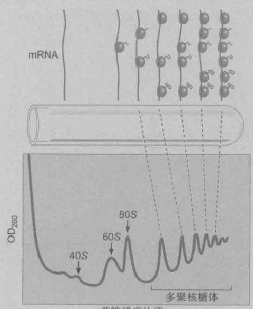  
蔗糖梯度片段

框 15-6 图 1 核糖体谱。mRNA 与结合在其上的不同数量的核糖体（被称为多聚核糖体）可以通过蔗糖密度梯度离心分离出来。从而使核糖体单体，核糖体亚基和游离的 mRNA 分开。mRNA 和多聚核糖体的结合是该 mRNA 活跃转录的证据。

最近，在新一代测序技术的基础上，这一检测可以拓展为在一个细胞群体中衡量全部 mRNA 的翻译情况。这一被称为核糖体谱的技术首先需要使用放线菌酮处理待测细胞并提取细胞内容物。由于延伸中的核糖体的解码中心可以在 RNA 酶 I 作用时保护 mRNA 包埋其中的 28 个碱基，这一特点因此可以被测序技术利用（框 15-6 图 2a）。因此，在蔗糖梯度离心之前，细胞提取物首先使用 RNA 酶 I 处理。离心后包含 80S 颗粒的组分（包含核糖体和被保护的 mRNA）被分离和变性，然后 28bp 的 RNA 通过胶纯化的方法分离出来，再被反转录成双链 DNA 用于深度测序。通过分析得到的 DNA 序列，研究者可以很容易地确定哪些 mRNA 序列在放线菌酮处理后正在活跃地翻译，也可以确认每个核糖体在 mRNA 上的定位。实际上这一方法有足够的准确性来识别哪个密码子处于核糖体的 A 位点和 P 位点。

这个技术在分析基因表达时越来越重要。通过比较两个细胞群体给定基因的测序读出序列的数量，研究者可以发现两群细胞中该基因蛋白质产出的差异（如在氨基酸供给充足或不足时的差异，如框15-6图2b）。除此之外，考虑到技术的准确性，这个方法还可以揭示翻译过程的特征。举例来说，核糖体谱技术可以用来分析大肠杆菌细胞中由于ORF中的RBS类似序列所导致的翻译暂停。

框 15-6 图 2 核糖体谱。(a) 用 RNase I 处理多聚核糖体, 然后用蔗糖密度梯度离心的方法将单一的核糖体 (80S 颗粒) 分离出来。这样的核糖体上只结合着 28 个 mRNA 的核苷酸, 它们被核糖体保护而没有降解。所得的 mRNA 片段通过胶纯化后反转录为 DNA, 然后用于深度 DNA 测序。得到的序列与该物种的基因组 DNA 序列比对, 得出与核糖体结合的区域 (代表了翻译的区域)。对于某个区域而言, 得到的序列越多, 它的翻译活性越高。(b) 酵母核糖体谱在 GCN4 基因上的示意图, 分为富含和匮乏氨基酸的生长状态。用柱状图展示了总数据量均一化后不同 mRNA 区域的翻译情况 (每百万碱基的读出序列, reads per million bases, rpM)。此图着重说明了在两种培养条件下 uORF 和 Gcn4 ORF 翻译程度的区别。

#### [W] 依赖翻译的 mRNA 和蛋白质的稳定性调节

mRNA 会以一定的频率出现突变和损伤。这样的缺陷 mRNA 可能由转录错误造成，也可能由其合成后的损伤造成。例如，由于 mRNA 是单链的，因此更易于断裂。这样的缺陷 mRNA 可能产生不完整和不正确的蛋白质，它们可能给细胞带来负面作用。某些情况下，如发生只改变一个氨基酸的点突变，是很难消除突变的 mRNA 或其蛋白质产物的。但在下面描述的其他情况下，翻译过程可以识别缺陷的 mRNA，并予以去除或将其蛋白质产物去除。

#### [W] SsrA RNA 补救正在翻译缺陷 mRNA 的核糖体

正常情况下，一个终止密码子对mRNA从核糖体中的脱离是必需的。那么，对于在可读框中缺失了终止密码子的mRNA上进行翻译的核糖体将被怎么处理呢？这样的mRNA可能由不完全的转录或核酸酶的作用而产生。这一类型的mRNA的翻译可以正常启动和延伸，直至达到mRNA的3'端。这时，核糖体不能再移动了。此处也没有与氨酰-tRNA或释放因子相结合的密码子。如果没有一定的机制使核糖体脱离这些缺陷mRNA，那么很多核糖体将永久地受困，不能参与多肽的合成。在原核细胞，这样的核糖体是由一种嵌合的RNA分子解救的，这种RNA分子部分是tRNA、部分是mRNA，称为tmRNA。

SsrA RNA 是一个由 457 个核苷酸

  
图 15-50 tmRNA SsrA 补救停滞于未成熟 mRNA 上而终止翻译的核糖体。SsrA 模仿 tRNA，但只能结合停滞于 mRNA 3' 端的核糖体。一旦结合，SsrA 的一部分序列可作为一个新的 “mRNA” 工作。

组成的 tmRNA，其 3' 端的区域与 tRNA $^{Ala}$ 非常相似（图 15-50）。这一相似性使得 SsrA RNA 可以负载 Ala 并结合 EF-Tu-GTP。当一个核糖体停滞于 mRNA 的 3' 端时，SsrA $^{Ala}$ -EF-Tu-GTP 结合于核糖体的 A 位点并参与肽转移酶反应，就如其他的 tRNA 一样。肽酰-SsrA RNA 的易位导致缺陷的 mRNA 从核糖体中释放出来。值得注意的是，SsrA RNA 的易位也导致这一 RNA 的一部分进入核糖体的 mRNA 结合隧道。SsrA RNA 的这一部分扮演了 mRNA 的角色，将不完全的 mRNA 的可读框延伸了 10 个密码子，并在其后紧跟着一个终止密码子。

SsrA RNA 结合的最终结果是，当缺陷 mRNA 从核糖体中释放出来时，不完整多肽的碳端融合了一个 10 个氨基酸的 “标签”，而核糖体重新进入翻译的循环过程中。有趣的是，这种 10 个氨基酸的 “标签” 被细胞的蛋白水解酶识别，蛋白水解酶很快地将这一标签以及它附着的多肽降解。这样，缺陷 mRNA 的多肽产物很快就被清除，从而防止了其对细胞可能带来的伤害。

SsrA RNA 为什么只能与停滞的核糖体结合呢？这是因为它的巨大体积（它比标准的 tRNA 大 4 倍以上），在正常的延伸过程中它不能结合于 A 位点。相反，当 mRNA 的 3' 端缺失时，A 位点就有更大的体积来容纳较大的 RNA（图 15-50）。因此，只有核糖体停滞于 mRNA 的 3' 端，才能为 SsrA RNA 提供潜在的结合位点（框 15-7）。最近有研究揭示了 SsrA 可以作为治疗肺结核的联合使用药物的靶点。

#### [W] 框15-7 在治疗肺结核中靶向SsrA肽段的一线药物

肺结核作为人类历史上一种危害极其严重的疾病，早在埃及木乃伊中就有疾病感染的证据。久咳、痰血和消瘦（因此过去被称为肺痨）是其主要病症。肺结核的病原体是结核杆菌（Mycobacterium tuberculosis）。据估计地球上1/3的人口感染结核杆菌，但在大多数人中该细菌保持在潜伏状态，个体则显示为健康状态。大约 $10\%$ 的受感染个体在其一生中发病，导致每年约800万人患肺结核并有约150万人死于这种疾病。携带HIV病毒的艾滋病患者和其他各种免疫缺陷个体患肺结核的风险显著升高。

一般肺结核的一线治疗使用 4 种药物：利福平（rifampicin）、异烟肼（isoniazid）、乙胺丁醇（ethambutol）和吡嗪酰胺（pyrazinamide）。其中 3 种药物的作用模式是非常清楚的。利福平是一种细菌 RNA 聚合酶的抑制剂（第 18 章），而异烟肼和乙胺丁醇则分别抑制结核杆菌细胞膜形成所需的不同蛋白质。吡嗪酰胺的作用机制在其被临床使用半个世纪后才得以揭示。吡嗪酰胺是一种前体药物，它在进入到细菌细胞之后由吡嗪酰胺酶（pyrazinamidase）的脱氨基作用转化为吡嗪羧酸后发挥作用（框 15-7 图 1）。最近，美国、中国和韩国的科学家发现 SsrA 是吡嗪羧酸的靶分子（见正文的描述和图 15-50）。

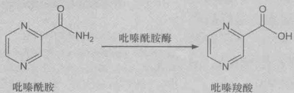  
框 15-7 图 1 吡嗪酰胺向吡嗪羧酸的转变。

Shi 等在 2001 年使用亲和层析法研究结核杆菌蛋白与药物结合的过程中发现了吡嗪羧酸是如何工作的。其中一个相关的蛋白质是核糖体小亚基中最大的蛋白质——核糖体蛋白 S1，或被称为 RpsA。RpsA 在翻译中起到重要的作用，它将 mRNA 上游的 Shine-Dalgarno 序列带至核糖体并帮助翻译起始过程中将 mRNA 锚定在小亚基中。RpsA 与 SsrA 标记有关。SsrA RNA 被运送到停滞的核糖体上，这种核糖体处于包含有 SsrA 结合蛋白（SmpB）的复合体中，而该复合体同样包含了 RpsA（当然还有 EF-Tu-GTP）。Shi 等发现 RpsA 的突变型的细菌获得了对吡嗪酰胺的耐药性。他们同时发现吡嗪羧酸阻止 SsrA RNA 与野生型的 RpsA 的结合，但不能阻碍这个 RNA 与抗吡嗪羧酸的突变型 RpsA 的结合。最后而且最重要的一点是，通过体外蛋白合成试验合成一个需要 SsrA 功能下才能完成翻译的修饰化 mRNA，他们发现药物抑制了 SsrA 标签序列的生成。作为对照，吡嗪羧酸对于普通 mRNA 模板的蛋白质合成几乎没有影响，说明它对 RpsA 的正常功能没有抑制作用。

吡嗪酰胺的发现显示出在现代医学中化学生物学和分子生物学越来越紧密的结合在一起。新的、重要的药物有时来自于小分子库的扫描，而这些小分子能够拮抗一些调控疾病相关的重要的细胞过程的蛋白分子。相反的，过去仅清楚其治疗效果的药物可能会被发现其能够作用于细胞中不为人知的靶点。最后，了解了吡嗪酰胺通过结合RpsA所产生的临床效果提示我们，开发针对SsrA标签的新类型抗结核杆菌药物是可能的。

#### [W] 真核细胞降解不完整的或提前终止密码子的 mRNA

真核细胞的翻译与 mRNA 的衰减过程紧密相连（图 15-51）。这一连锁是由两种监控被翻译的 mRNA 的完整性的机制来实现的。例如，当一个 mRNA 分子含有提前的终止密码子时（称为无义密码子，见第 16 章），这一 mRNA 很快被降解，此过程称为无义密码子介导的 mRNA 衰减（nonsense mediated mRNA decay，图 15-51b）。在哺乳动物细胞中，对含有提前的终止密码子的 mRNA 的识别依赖于聚集在 mRNA 可读框内的蛋白复合体。这些外显子拼接复合体是剪接过程所产生的产物并聚合在 mRNA 上的，并正好坐落于每一外显子-外显子结合处的上游（第 14 章）。一般来讲，当第一个核糖体翻译某个 mRNA 时，这些复合体在 mRNA 进入核糖体的解码中心时被置换出来。但是，如果 mRNA 存在一个提前的终止密码子（源于基因的突变或转录与剪接过程中的错误），那么核糖体就在这些复合体被置换之前从 mRNA 上脱离出来。在这些情况下，外显子拼接复合体和 eRF3 将结合于提前终止的核糖体并募集一系列的蛋白。这些蛋白募集并且/或者激活多种酶对 mRNA 进行剪切，并去除 mRNA 5'端帽结构，或 3'端的 poly-A 尾结构。由于 mRNA 通常就是受 5'端帽结构保护来防止降解的，因而这些过程令未受保护的 5'或 3'端暴露出来，从而导致 mRNA 很快地被 5'→3'和 3'→5'核酸外切酶所降解。

另一种挽救正在翻译缺乏终止密码子的 mRNA 的核糖体的机制，称为无终止密码子介导的衰减（nonstop mediated decay，图 15-52a）。与原核细胞不同，真核细胞的mRNA 以多聚 A 尾结束。当缺失终止密码子的 mRNA 翻译时，核糖体就会翻译多聚 A 尾（因为没有终止密码子在多聚 A 尾之前终止翻译）。这就导致了蛋白质的末端添加了多个赖氨酸（AAA 是赖氨酸的密码子），并使核糖体停止在 mRNA 的 3'端。停止的核糖体与 eRF1 和 eRF3 (Dom34 和 Hbs1) 蛋白结合，从而促使核糖体的解离以及释放肽酰-tRNA 和 mRNA。第二类 eRF3 相关因子，Ski7 蛋白，能够募集 3'→5'核酸外切酶降解“无终止密码子”的 mRNA。另外，无终止密码子介导的衰减过程中，没有终止密码子的 mRNA 也可以被核酸内切酶切断。更重要的是，在羰基末端含有多聚赖氨酸的蛋白质是不稳定的，导致无终止密码子的 mRNA 表达的蛋白质被快速降解。这样，与原核细胞一样，由缺失终止密码子的 mRNA 翻译的蛋白质很快从细胞中去除。

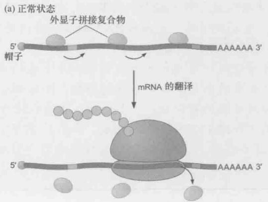

(b) 无义密码子介导的mRNA衰减  
  
图 15-51 真核细胞中包含提前终止密码子的 mRNA 是降解的靶标。（a）核糖体在正常 mRNA 的翻译中移动移除了所有外显子拼接复合物（exon-junction complex）。（b）无义密码子介导的衰减。当翻译带有提前终止密码子的时候，核糖体不能移除一个或多个外显子拼接复合体，导致 Upf1、Upf2 和 Upf3 结合到核糖体。一旦与核糖体结合，这些蛋白质激活一种脱帽酶，能够将 mRNA 的 5' 帽去除，以及一种去腺苷酶，能够去除 mRNA 的 poly A 尾巴；没有 5' 帽而且去腺苷化的 mRNA 很快被内切 5'→3' 核酸酶（Xrn1）或者 3'→5' 外切核酸酶降解（exosome）。外切酶正常条件下不能降解具有 5' 帽子和 3' 多聚腺苷酸尾巴的 mRNA。

  
图 15-52 真核细胞中包含提前终止密码子的 mRNA 是降解的靶标。（a）无终止密码子介导的衰减。在缺乏终止密码子的条件下，mRNA 的多聚腺苷酸尾巴被翻译，导致了在肽链末端出现了多聚赖氨酸（AAA 可编码 Lys）。当到达模板链的 3'端尾巴时，停滞的核糖体被 Dom34 和 Hbs1 识别。Dom34 传送至核糖体之后，Hbs1 水解 GTP 并被释放。在与 Rli1 ATP 酶结合后，Dom34 将核糖体解离为两个亚基，之后它将募集内切核酸酶切割与核糖体结合的 mRNA 上游序列，生成的 mRNA 片段将被 5'→3' 内切酶和 3'→5' 外切酶消化掉。（b）末端终止介导的衰减。如同无终止密码子介导的衰减，末端终止介导的衰减由核糖体的停滞起始。这种停滞的情况是由 RNA 二级结构或者一连串的密码子缺乏相应的负载 tRNA（一般是罕见的密码子）所产生的。停滞的核糖体被 Dom34 和 Hbs1 所识别，之后与无终止密码子介导的衰减类似，核糖体释放、mRNA 被降解。

第三种监督 mRNA 翻译的机制与无终止密码子介导的衰减类似，它被称为末端终止介导的衰减（no-go decay，图 15-52b）。这种机制能够识别在一条 mRNA 上停滞的核糖体。这种情况会发生在一个 mRNA 的编码区上出现了稳定的二级结构的时候，或者一连串的密码子对应的 tRNA 在某个细胞中不够用的时候。虽然 mRNA 停滞的原因和无终止密码子介导的衰减很不一样，但它们造成的结果是非常相似的。Dom34 和 Hbs1 结合到停滞的核糖体上激活了大小亚单位的解离。此外也有研究观察到此过程中出现对 mRNA 的内切反应。对于无终止密码子介导的衰减和末端终止介导的衰减，是哪个核苷酸内切酶参与了反应尚不明确。

无义密码子介导，无终止密码子介导和末端终止介导的 mRNA 衰减都有一个引人注目的特性：都需要通过受损 mRNA 的翻译过程去检测出缺陷的 mRNA 并对其降解。在没有进行翻译过程的情况下，受损的 mRNA 并不被很快地降解，而且具有正常的稳定性。因此，虽然不是直接作用，真核细胞需要依赖翻译的机制来校正它们的 mRNA。

<!-- W-END Watson 15 翻译的调控 -->

<!-- W-BEGIN Watson 22 系统生物学 -->

### 【中文对照 Watson 第22章：系统生物学】

> 来源：Watson《基因的分子生物学》第七版中译本（书籍/03_基因的分子生物学_第七版） 第22章 系统生物学。

#### [W] 第22章 系统生物学

将会讨论系统生物学这一新兴学科，它是由传统实验分子生物学和计算分析相结合而产生的。

分子生物学的成功，主要在于它能够抓住那些简单的系统，以便能够研究其内在的详细机制。但是，同一些目标远大、有全局视野的研究策略相比，这些传统的研究方法开始褪去光环，这些新的策略采用定量及高通量的测量方法，通过模型构建、结构重组和理论方法的有机结合，替代传统的方法来研究更高级、更复杂的生物过程。这种交叉学科研究的特性，恰恰定义了一个新的学科——系统生物学。系统生物学综合了数学、工程学、物理、计算机科学，以及分子与细胞生物学等学科，以定量、可预测的方式来描述那些控制生命如何工作的相互作用环路的自然特性。系统生物学可以面对生物系统的许多不同层面，如信号传输、信号转导、细胞分裂和细胞骨架动力学等。作为基因的分子生物学教材，我们主要集中在从基因调控回路角度来阐明系统生物学。我们希望藉此方法能够阐明那些靠传统的单成分分离研究所不能理解的基因调控原理。

系统生物学与另外一个新的学科——合成生物学（synthetic biology）紧密相关。就像系统生物学一样，合成生物学试图证明生物各环路的设计原理。然而，合成生物学是通过创造模拟的人工网络，模拟基因调控回路的一些自然特性，从而来证明原理。此方法使得我们能够检测调控系统是如何工作的。与自然界中存在的相对较为复杂的调控回路相比，这些人工网络相对简单，可以更精确地进行定量研究。

系统生物学所关注的不仅是基因调控的逻辑关系，而且还包括对演化内涵的解释。在第19章我们已经谈到，高等动物演化的主要驱动力来自于调控基因表达网络，而不是基因本身。例如，所有的动物都具有相类似的基因群，但它们表达的时空却不尽相同（有时候会截然相反）。换句话说，在演化过程中，调控网络是相对动态的，而受该网络调控的基因则是相对静态的。

本节中，我们着重于从自然和人工构建的基因调控回路角度简要地介绍系统生物学与合成生物学。我们集中讨论遗传回路（genetic circuit）的设计原理和基因调控回路的可变图式，而不过多地涉及该领域的数学细节。系统生物学是一门新生的学科，但是我们也要看到，该学科中的一些原理是从经典基因调控研究中衍生而来的，特别是我们在第18章所讨论的那些。但是，本章中我们将引入一些正式的语言，这些语言能把简单的例子拓展成一系列不同的生物调控系统。

#### [W] 调控回路

调控回路（regulatory circuits）可以通过一个含有节（node）与端（edge）的简单网络来描述。节代表基因，用点来表示；端表示一个基因受另外一个基因产物调控，用线表示（图22-1a）。端可以通过引入方向来标明是否基因A调控基因B，或者相反。端还可以加标志来表示该调控是正调控还是负调控。因此，一条从基因A指向基因B，末端为“⊥”结尾的线表示基因A的产物是基因B的负调控因子（图22-1b）；反之亦然，一条从基因A指向基因B的箭端线表示的是基因A的产物正调控基因B的表达（图22-1c）。

  
图 22-1 包含节与端的简单网络回路。(a) 一个简单的开  
关；（b）负调控标志；（c）正调控标志；（d）自身负调控；（e）自身正调控。

  
图 22-2 与门。乳糖操纵子受与门的调控。在该调控回路中，信号的输出需要 CAP-cAMP 的出现和 LacI 的取消。

我们现在从一个最简单的双节点例子开始，即基因 A 的产物调控基因 B 的表达（图 22-1a）。通过应答某个信号，基因 A 编码的调控蛋白触发基因 B 的表达。该调控蛋白质也可能是一个抑制因子。在这种情况下，转录过程通过一个诱发子触发启动，该诱发子能够灭活抑制因子（图 22-1b）。或者，该调控蛋白质还可以是一个激活因子，它能够应答信号分子，触发基因 B 的转录（图 22-1c）。

乳糖操纵子是受两个调控蛋白调节的（图 18-6 中已经描述），是一个两种调控类型相互交织的例子：诱发子的存在触发转录起始，这一过程是通过灭活 Lac 抑制因子，提高 cAMP 浓度，促进 CAP（分解代谢物活化蛋白质）激活因子结合到 DNA 上面而触发的。因此，乳糖操纵子不是一个简单的开关，它的表达同时需要抑制因子的消失和 CAP 结合到其 cAMP 配体上面。电子工程有一专业用语——“与门”（AND gate）逻辑关系，表示两个输入条件同时出现才能产生输出。在此例子中，这两个条件是抑制的取消和激活。与门可用图 22-2 的标志来描述。

#### [W] 自身调控

通常，调控基因除了调控其他靶基因的转录外，还能调控自身的转录，这种调控方式被称为自身调控（autoregulation），同样有正和负两种情况，每种情况都有自身的特性（图 22-1d，e）。

自身负调控：降噪和降时

我们先来考虑自身负调控，此时是一个编码抑制因子的基因受其基因产物的负调控。一个经典的自身负调控的例子就是第18章中我们讨论的 $\lambda$ 噬菌体的 $c\mathrm{I}$ 基因（需提示的是， $c\mathrm{I}$ 同样也是一个自身正调控的例子，对此我们会在下文讨论）。因此，CI抑制因子结合到操纵子 $\mathrm{O}_{\mathrm{R3}}$ 位点从而抑制自身的表达（第18章，图18-27）。

自身负调控的生物学意义是什么呢？为什么在演化过程中它反复地被选择呢？其中一种解释已经在第18章中进行了说明：自身负调控是保证调控蛋白处于稳定状态的动态平衡机制。因此，CI的水平下调到足够低来解除cⅠ和其他靶基因的抑制，然后该基因转录的恢复将会提高细胞内抑制因子的水平，最终恢复该抑制过程。相反，一旦基因的表达过大且抑制因子的产物超过了所需要的量，那么自身负调控便会保证该基因处于沉默状

  
图 22-3 诱发子的动力学。简单开关（B）、自身负调控开关（A）和自身正调控开关（C）应答于一个诱导信号的不同动力学反应。

态，然后抑制因子的水平通过细胞生长与分裂，或者通过蛋白质酶降解，抑或是两者而最终下调。

自身负调控机制还有另外一个不太显而易见的优点: 快速的反应时间。从尽可能快速且不会产生多余的抑制因子的两个相对的角度考虑, 如果使用一个强启动子, 将能够保证产物的快速产生, 但也会导致对稳定状态来讲过量的积累; 从另一个角度考虑, 如果使用一个相对较弱的启动

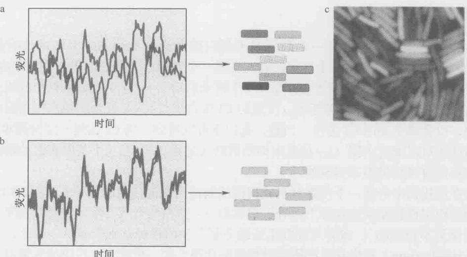  
a  
图 22-4 内源与外源噪声。在大肠杆菌细胞中，一个基因有两个拷贝，其中一个拷贝融合了一个红色荧光蛋白报道基因，而另一拷贝融合了一个绿色荧光蛋白报道基因。（a）假设这两个基因在细胞内表达随着时间和个体各异（内源噪声）的预测结果。（b）假设这两个基因的表达由于外源信号的作用而同步化的预测结果。（c）荧光图片揭示内源噪声，除了黄色细胞之外，还有红色和绿色的细胞。（经允许引自 Elowitz M.B. et al. 2002. Science 297: 1184-1186.）

子，也可以获得合适水平的抑制，但这需要较长的一段时间。自身负调控可以同时满足两种需求：一个相对较强的启动子可以保证调控蛋白质的快速积累，而转录的自我抑制则能够保证在该抑制因子达到一定的合适水平后自我关闭。数学模型和实验结果都确认了自身负调控比简单调控在实现同样的一种蛋白质积累水平上具有更快速的反应（图22-3）。

#### [W] 喧噪的基因表达

在讨论自身负调控过程中，基因表达噪声（noise）这一概念极为重要。直到最近，人们还是认为一个基因在同源的细胞群中的表达水平，在一个细胞中与另一个细胞中相比是相对稳定的。然而，我们现在意识到，基因表达水平在同一个细胞群的不同单个细胞中存在着本质上的差异，甚至在同一个细胞中，同一基因的两个拷贝本的表达也不相同。因此，我们在这里把“噪声”（noise）一词定义为是在基本相同的条件下基因表达的差异。噪声的存在表示随机因素影响着单个基因的表达水平。随机性（stochasticity）暗示着一个过程可以通过随机的尺度来划分为几个方面。正如我们所要看到的，一些调控基序是用来排除噪声的，而另外一些基序是用来放大它们的。

基因表达过程中的噪声来自于两大方面：内源性和外源性。这两种因素共同导致基因在一个群体中表达的不同。内源性噪声（intrinsic noise）所指的是一个细胞内单个基因表达水平的不同是由于基因表达体中随机事件所引起的。一个经典的例子就是证明拥有两个同样拷贝基因的大肠杆菌内源性噪声的过程。该基因中一个拷贝连接一个能够编码红色荧光蛋白的报道基因，另一个拷贝与编码绿色荧光蛋白的报道基因连接。在没有内源性噪声作用的情况下，红色和绿色荧光蛋白的表达量应该是相同的，因此细菌应该显示黄色。相反，所观察到的结果是，许多细胞呈明显红色，还有一些明显为绿色（图22-4a）。因此，每个基因在不同细胞内部表达并非一致，而是在一些细胞中一个拷贝的

b

时间

表达（如带有绿色荧光蛋白的拷贝）较另外一个拷贝高（如带有红色荧光蛋白的拷贝），而在另外一些细胞中，则恰恰相反。

外源性噪声（extrinsic noise）指的是在一个几乎同源的细胞群中基因表达的差异，或者是在同一个细胞不同时间基因表达的改变。该噪声可能是由于每个细胞环境的微小的不均一性，或者是细胞在执行转录或者蛋白质合成的过程中容量的波动性所引起。一个外源性噪声的例子如图22-4b所示，两个基因的表达随时间变化。在这种情况下，两个基因的表达水平在单个细胞中呈现同步性：上升一段时期后便下调。这意味着单个细胞在承载一些或者全部基因的表达综合能力上是随时间发生波动的。从图22-4c显微荧光结果可以观察到，由于内源噪声的作用，其中一些细胞是黄色的（意味着两种荧光蛋白都表达），而另外一些细胞呈红色或者绿色（意味着只有一种特定的荧光蛋白表达）。

重新回到一开始讨论的自身负调控，我们可以看到，为了应对噪声，该调控基序允许细胞补偿自调控基因的表达水平的变化。因此，调控 $\lambda$ 噬菌体 CI 合成的自身负调控回路可以被认为是非常稳定的。稳定性（robustness）所指的是一个调控回路的输出对于一些特定参数是不敏感的。因此，CI 自控回路在克服 c I 基因表达过程中的噪声、获取稳定抑制因子水平的能力方面是很稳定的。同时我们也应看到，其他一些调控基序也具有帮助细胞应对不同来源的随机因素影响的能力，例如触发基因表达的信号的波动。

随机性并非大肠杆菌所特有。实际上，该特征广泛存在于有生命的个体中。例如，克隆猫的毛色，是通过将体细胞核移植到已经去除核物质的卵母细胞而得到的克隆猫，与正常的核供体猫相比并不相同。由于克隆猫和核供体猫在遗传背景上是相同的，所以人们期望这些猫应该具有相同的毛色。但这并不意味着控制毛色的一系列遗传事件的前后关联不是完全的，而是存在一些随机过程，如同另外一个例子——同卵双胞胎的指纹不同。

#### [W] 自身正调控延迟基因表达

自身正调控过程发生在一个激活因子蛋白质激活自身编码基因转录的时候（图22-1e）。同样的， $\lambda$ 噬菌体 $c$ I基因的表达就是一个典型而复杂的例子：在细胞内CI浓度较低时，CI抑制因子偏爱于占据驱动 $c$ I转录启动子（ $P_{\mathrm{RM}}$ ）上游的两个操纵子 $O_{\mathrm{R1}}$ 和 $O_{\mathrm{R2}}$ 的位置（图18-26）。位于 $O_{\mathrm{R2}}$ 位置的CI蛋白质与RNA聚合酶相互作用而激活转录过程，以合成更多的CI蛋白。当然，我们也可以看到，当CI达到一定的高水平后，该蛋白质还可以通过占据 $O_{\mathrm{R3}}$ 位置来抑制其转录过程。因此， $c$ I基因表达的调控是通过正和负自身调控机制来实现的。

现在让我们来介绍一个仅靠自身正调控的激活因子蛋白质的例子（见图 22-1e）。基因产物的稳定性积累发生在如下两种平衡状态下：蛋白质合成与降解速率达到平衡（该过程应该是不稳定的），或者与细胞生长或分裂产生的稀释达到平衡时。因此，稳定性状态（steady state）是指基因产物随时间的变化很小的一种状态。这里的关键是，自身正调控的基因从开启到实现稳定状态所需的时间，比自身负调控的基因或者完全无反馈的基因所需要的时间要长（图 22-3）。更确切地说，与其他调控形式相比，自身正调控需要更长的时间才能达到基因产物最大积累量的 50%。这是因为随时间增加的生产速度，首先依赖于激活因子本身的积累。

自身正调控在一些缓慢发生的生物过程中非常有用，如发育过程就得益于与形态发生相关蛋白质的缓慢积累。又如，在枯草杆菌古孢子（或者原生孢子）发育过程中，控制晚期孢子形成的主要调控蛋白质（可变RNA多聚酶 $\sigma$ 因子—— $\sigma^{\mathrm{G}}$ 和 $\sigma^{\mathrm{K}}$ ）能够刺激它们本身的结构基因，以及与形态形成相关蛋白质编码基因的转录。因此， $\sigma$ 因子和受它所调控的基因产物可以缓慢积累，因为 $\sigma^{\mathrm{G}}$ 和 $\sigma^{\mathrm{K}}$ 的产生依赖于它们自身的合成。

自身正调控还有另外一个优点，即它是极端类型的调控，被称为双稳开关的基础，对此我们将在下文阐述。

#### [W] 双稳性

到现在为止，我们所介绍的调控回路都是可逆的，当打开某基因或者某些基因的信号被移除，该调控回路会重新返回关闭状态。然而，在一些例子中，当基因表达开关被启动后，该基因会锁定在启动状态持续较长的一段时间。这就是著名的双稳开关（bistable switch）。

#### [W] 一些调控回路可锁定在不同的稳定状态

控制枯草杆菌是否变成遗传感受态的回路就是一个被深入研究的双稳开关的例子。感受态（competence）是一种特殊的状态，处于该状态的细菌停止了增殖，但具有从其生长的环境中吸收裸露 DNA 分子并通过遗传重组将同源序列整合到基因组上的能力。感受态的主调控因子是 DNA 结合蛋白 ComK，该调控因子能够调控包括其自身在内的 100 多个基因（图 22-5）。维持此开关处于稳定状态的原因是多个 ComK 分子相互协作结合到 comK 基因启动子上。如我们在第 18 章框 18-4 中所观察到的 $\lambda$ 抑制因子（它本身就代表着一个典型的双稳事例，这点我们将在下文讨论）的例子，该类协作使得开关的输出呈现非线性分布，即与激活因子的浓度呈一定的函数关系。换句话说，输出的多少对 ComK 水平的变化非常敏感（反之则是不敏感）。

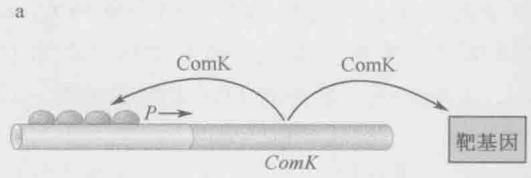

  
图 22-5 双稳性。(a) 双稳性是由自身正调控开关控制的，调控蛋白 ComK 除了调控靶基因的表达外，还调控 comK 基因的表达。ComK 分子协同结合于启动子上产生一个非线性反应，使得其表达对 ComK 的微小的、随机的变化非常敏感，所以这个开关时刻保持在“开”与“关”的刀棱上。(b) 经典双稳性的例子：在该例中，枯草芽孢杆菌细胞（红色）通过表达一个受竞争性调控蛋白 ComK 激活的启动子控制着报道基因的开（绿色）或关。此报道基因编码一个绿色荧光蛋白。(b 图经允许引自 Dubnau D. and Losick R. 2006. Mol. Microbiol. 61: 564-572. ©Blackwell Science.)

细胞能否开启 comK 的表达，是由 ComK 蛋白降解稳定性水平上的调控网络所控制的。但是，最终决定 ComK 激活的因素是随机的。也就是说，在 ComK 不降解的情况下，群体中仅有一些细胞是处于感受态的。这可以通过一种带有荧光报道基因（绿色荧光蛋白基因）的细胞清晰地观察到，荧光报道基因指示的是 ComK 决定的基因活性。图 22-5 显示的是细胞被分为两个亚群：一个亚群中 comK 基因是开启的，而在另外一个亚群中 comK 基因是关闭的。这是因为正反馈环处于刀刃状态，ComK 的浓度介于不足以打开 comK 基因的表达，但刚好可以触发自身正调控环开启 ComK 蛋白所调控基因的表达之间（参考框 22-1 “双稳性与滞后作用”）。由于 comK 基因表达过程中的噪声所导致的细胞间 ComK 蛋白水平的变化，使得此激活因子在一些细胞中达到了阈值浓度，而其他细胞中没有。这一自身正调控的例子说明基因表达中的噪声信号如何能促使细胞进入不同的状态。

#### [W] 框22-1 双稳性与滞后作用

下面的实验证明 ComK 开关的双稳性基础是自身正调控。该实验使用一个经过修饰的 comK 基因的拷贝，调控该拷贝基因的启动子的活性能够响应诱导子上调或下调（框 22-1 图 1a）。在仅携带有修饰基因的细胞中，并没有观察到双稳性，ComK 决定的基因表达水平的提高同诱导子水平的提高基本对应，无论是在怎样的诱导子浓度中，其表达呈现出均一的表达模式（框 22-1 图 1b）。然而，在携带有修饰基因和正常自身调控基因的细胞中，增高诱导子的水平导致细胞分为两种不同的类型，一种细胞呈现低 ComK 活性，另一种呈现高 ComK 活性（框 22-1 图 1c）。换句话说，由修饰基因所编码的 ComK 产物开启了自调控基因“泵”，使越来越多的细胞由于 ComK 的提高而处于开的状态。

严格来说，双稳性一词的使用需要一个具有滞后作用（hysteresis）特性的开关。滞后作用指的是一种记忆状态，当一个开关由于某种条件打开后，即使撤去或逆转该条件，开关也不会即时关闭。例如，铁镁矿物材料，当这些物质在磁场中被磁化后，即使把磁场撤离，矿石还会保持磁性特征。现在我们回到原来的例子中——携带野生型和修饰型 ComK 基因的可响应诱导子的细胞。正如我们所看到的，添加越来越多的诱导子，将导致 ComK 水平不断提高，直至超出其阈值，导致自身正调控处于开的状态。我们来看另外一种情况，即降低诱导子的水平，将使修饰型基因合成的 ComK 越来越少。我们还观察到，当诱导子的水平降低时，甚至当诱导子的水平低于开启 ComK 开关的浓度时，ComK 还是处于开的状态。也就是说，诱导开的因素都撤去后，ComK 仍然记得自己处于开的状态。

调控 $\lambda$ 噬菌体溶原或裂解状态的开关也具有滞后作用。当原噬菌体受到DNA破坏试剂裂解细胞的诱导时，噬菌体能够反转进入裂解周期。也就是说，哪怕是当DNA破坏试剂撤去之后，该噬菌体也不再进入溶原状态（恢复合成CI抑制因子）。作为一个相反的例子，由于乳糖的存在，乳糖操纵子开启，一旦培养液中没有乳糖诱导子，乳糖操纵子则立即关闭。

  
框 22-1 图 1 ComK 开关的双稳性。(a) 实验表明正自身调控能够引起双稳性。示意图所示的是一个修饰的 comK 基因，该基因的启动子由一个受 IPTG 诱导的启动子所替代（就是 lac 操纵子）。(b) 当细胞中只有修饰的 comK 基因时，comK 会在可被 IPTG 诱导的启动子控制下发生梯度应答反应。(c) 当细胞携带有完整的正自身调控和一个乳糖诱导 comK 拷贝基因时呈现双峰分布。注意：a 和 b 中细胞携带有一个 comK 启动子驱动的绿色荧光蛋白基因。(b、c 图经允许引自 Maamar H. and Dubnau D. 2005. Mol. Microbiol. 56: 615-624, Fig.4E,J. ©Blackwell Science.)

自身正调控不是双稳性的唯一基础。一个具有两种变化状态的开关还可以通过相互抑制的途径来实现，即两种抑制因子能够负调控对方的转录。如上所述， $\lambda$ 噬菌体提供了一个经典的双稳性开关的例子，但该开关依赖的是一个双重负调控回路，而不是自身正调控；CI与Cro抑制因子的相互拮抗作用与病毒溶原与裂解状态紧密相关（第18章）。用系统生物学的语言来说，我们可以说 $\lambda$ 噬菌体具有一个双向负端链接的双节点开关。

尽管许多双稳开关都是在细菌中发现的，但是这并不意味着双稳性仅局限于微生物。例如，在胚胎发育过程中，线虫 C.elegans 产生两侧平行的味觉神经，分别称之为左侧 ASE 和右侧 ASE，分别表达不同的味觉受体基因。一个能够稳定处于一种或另一种状态的双向负反馈环，控制着一个普通的前体细胞究竟表达哪种受体。在这种状态下，开关的摆向并非随机的。确切地说，上游信号支配着开关的摆动方向，而双向负反馈环能够使其按预设的状态锁住开关。

#### [W] 双向开关持续变化

正如我们已经看到的，双稳开关是呈双峰分布的，这可以使其在不同稳定状态的持续时间得到延长。在遗传感受态和λ噬菌体的基因开关的例子中，双稳性的基础是自我强化（self-reinforcing）调控回路，这种调控往往伴有调控蛋白同DNA的结合。有些呈双峰分布的调控回路被认为是兴奋型的，因为它们不会维持在稳定状态。与双稳系统类似，兴奋型调控系统也包含了一种自我强化调控回路，这一调控回路针对小的扰动可以导致显著的模式化应答。然而，在这种兴奋型系统中，不同状态的开关是瞬变的，很容易发生反转。

神经元的动作电位是生物学中兴奋型调控体系的经典范例。当胞外的阳离子浓度比胞内的略高时，神经元会呈现静息电位（典型的为-70mV），此时细胞质带有净负电荷。如果静息电位逐渐升高并超过某个阈值（-55mV），细胞膜上的电压门控离子通道就会打开，允许钠离子流入细胞中。这种正离子的内流会导致膜电位进一步升高，从而引发更多的、尚未打开的离子通道变得开放，并使更多的钠离子流入细胞中。这种通道开放的级联反应使得细胞内的正电压达到一个峰值。高电压反过来又会引起钠离子通道的关闭。神经元细胞内过多的钠离子会被泵出细胞，使得细胞膜回到最初的静息状态。所以说，膜电势的一个小的扰动引发了一系列明显的、程序化的反应，又使其迅速恢复到最初的静息状态。

同样的，那些不能够使其所维持的状态得到延长，或者可以调动一系列的生物事件使得回路发生反转的自我强化调控回路被认为是易兴奋的。由此看来，前文讨论过的遗传感受态体系可以被认为是易兴奋的。ComK 的自身正调控形成了一个双稳开关，该开关可以使得 ComK 的高水平状态得到延长。然而，ComK 这种自我强化合成的累加是一个负反馈环，最终会导致激活蛋白的水解。这种负反馈回路使得感受态细胞可以跳出非生长的感受态，回到有生长力的繁殖状态。与此形成对比的是， $\lambda$ 噬菌体可以把溶源状态维持几代，因此认为双稳系统才是最合理的。

感受态是个低概率事件。在感受态诱导条件下，只有一小部分细胞进入可以吸收外源 DNA 的非生长状态。关于兴奋性，更具有说服力的例子是一种处于活跃生长期的菌株，这种菌株同感受态例子中的菌株非常像。处于稳定生长期的枯草芽孢杆菌拥有两种状态：个体游离细胞和链式固着细胞。重要的是，这两种细胞类型会以一定的频率进行随机的、反复的转换，这种转化可以发生在数十代细胞中。为什么枯草芽孢杆菌会产生一个由两种类型截然不同的细胞组成的群体？一种假说认为，因为不知道当前的有利环境会持续多长时间，细菌在演化过程中学会了孤注一掷。固着的链式细胞可以被看成是定居者——它们附着在当前有利的微环境的表面对其加以利用，而游离的细胞则可以被看成是抢劫者——它们到处游走寻找新的有利的生长环境。

细胞是如何在游离状态和链式状态之间转换的呢？这种转换的核心是两种被称为SinR和SlrR的调节蛋白（图22-6a）。就像我们在第18章讨论过的 $\lambda$ 噬菌体中的CI/Cro转换，SinR和SlrR蛋白也是双负回路（double-negative loop）的一部分。然而不同的是，在 $\lambda$ 噬菌体中两种调节蛋白都是都是彼此编码基因的阻遏物，而在这里，SinR是SlrR编码基因的阻遏物，但SlrR是SinR的一种抑制剂，它可以从SlrR-SinR复合物中诱捕这种阻遏物，在该复合物中，SlrR的基因无法被抑制。因此，双负回路的“左臂”在基因转录水平发挥作用，“右臂”则在蛋白质间的相互作用水平上发挥作用。这种转换存在两种自我强化状态：一种是 $\mathrm{SlrR}^{\mathrm{LOW}}$ 状态，这种状态下SlrR被SinR所抑制；另一种是 $\mathrm{SlrR}^{\mathrm{HIGH}}$ 状态，这种状态下SlrR发生去阻遏，SinR被SlrR维持在非激活状态。处于 $\mathrm{SlrR}^{\mathrm{LOW}}$ 状态的细胞表达运动型基因，使得细胞彼此分离并因此处于游离状态；而处于 $\mathrm{SlrR}^{\mathrm{HIGH}}$ 状态的细胞中的运行型基因和细胞分离基因的表达被抑制，因此形成固着的链式细胞。处于 $\mathrm{SlrR}^{\mathrm{HIGH}}$ 状态的细胞还表达产生胞外基质的基因，使得链的粘连性更好。

这种转换可以在微流体设备中进行实时观察，在这种设备中，细胞会被嵌入到长的通道中，通道的宽度同细菌的大小相同。细胞中含有一些报告基因，运行型基因对应绿色的荧光，基质基因对应红色的荧光，后者是链式状态的细胞所特有的。图 22-6b 所示的波动曲线图展示的是单通道的一系列延时的显微图像，时间间隔为5min。一个位于通道底部的运动性基因（绿色）产生了可以表达链式基因（红色）的后代。随后，一个位于底部附近处于链式状态的细胞转换回可以表达运动型基因（绿色）的游离状态。大量延时实验的数据表明：细胞可以将一种状态维持几代，并且可以在两种状态之间进行随机地转换。

  
图 22-6 一种可以控制细胞状态转换的兴奋性回路。(a) 表示的是调控运动型和链式的双负回路。为简便起见，SlrR 和 SinR 在图中分别被缩写为 Slr 和 R。在 SlrR $^{LOW}$ 状态，SinR 会抑制 SlrR 编码基因（回路的左臂），使 SlrR 保持在较低的水平。在 SlrR $^{HIGH}$ 状态，SlrR 处于高表达水平（粗体表示），它把抑制自己编码基因的 SinR 隔绝在复合体中。(b) 表示的是一个微流体通道，该通道的底部是关闭的，顶部是开放的，如左边小图所示。随着细胞的生长和分裂，细胞从顶端退出通道。右侧的波动曲线图展示的是一系列延时实验的显微照片，拍摄的时间间隔为 5min。一个位于左侧底部的运动型细胞（绿色）转换到了链式状态（红色），它的后代也保持这种链式状态。最终，一个位于底部的链式细胞转换回运动型状态（绿色），它的后代也保持这种运动型状态。（面板 b 由 T. Norman 提供。）

#### [W] 前馈环

系统生物学领域中一个重要的贡献是，它从无数种理论上存在的、简单的调控回路中，发现只有一小部分能够在自然界中发生。显然，一些特定的环路拥有自然选择所偏爱的有利特征。

前馈环是一种有优势特征的三节点网络结构

c  
d  
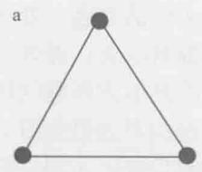

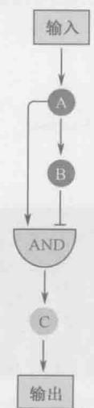  
图 22-7 网络环路模型。(a)“三节点”网络环路，在该环路中每一个节点代表一个基因，这些基因通过三边相连。(b)前馈环，自然界中最为常见的网络环路。(c)协调型前馈环，在该环路中，直接和间接的边都是靶基因的正调控信号。(d)非协调型前馈环，在该环路中，直接作用边是正信号而间接作用边为负信号。

一个典型的例子便是由三节点组成的环路（图 22-7a）。一共有 13 种可能的方法用箭头连接含有 3 个节点的网络环路。这些环路可以通过箭头的方向，箭头是否连接两个或三个节点，以及成对的节是否被一个或者两个箭头连接起来等相互区分。在这 13 种环路中，一个非常显著的环路是前馈环（feed-forward loop，图 22-7b），该环路普遍存在于自然界中。在这里，我们将其称为网络基序，这主要是因为该环路是遗传回路中的主要组成部分。前馈环基序包括转录因子基因 A 和受其调控的另一个转录因子 B（图 22-7b）。同时，这两个转录因子又同时调控该基序中第三个基因 C。注意，图 22-7b 中只是简单说明调控的方向（如节 A 调控节 B）而非符号。

如果符号（正或负调控）也加入方向端的话，那么就有8种不同的前馈环可以被区分开来。同样，自然选择还是偏爱其中两个，因此这两个比其他环路更常见。其中一个偏爱的前馈环基序（也被称为协调基序）是所有直接和间接的通路都是指向靶基因，代表着输出的方向，同时还具有相同的符号（例如，A和B都是激活因子）（图22-7c）。

而另外一个偏爱的前馈环基序(也被称

为非协调基序）是靶基因受到 A 通路直接正调控、B 通路间接负调控（图 22-7b）。在这两种基序中，靶基因的表达是受到逻辑与门的调控；也就是说，C 基因的转录在前一种环路中需要 A 与 B，而在后一种环路中需要 A 而非 B。

既然这两种基序在所有的前馈环，以及所有可能的三节点网络环路中最受偏爱，那么它们理所当然应该具有演化选择过程中最为基本的有利特性。的确如此，计算机模型与实验结果同时表明该基序具有使得它们在调控回路中更加有用的特征。例如，协调型前馈环具有要求持续的输入信号来维持靶基因 C 转录的特性（图 22-7c）。也就是说，这类型的前馈环是一个持续型检测子，它只对长时间维持的或者是稳定的信号发生应答。

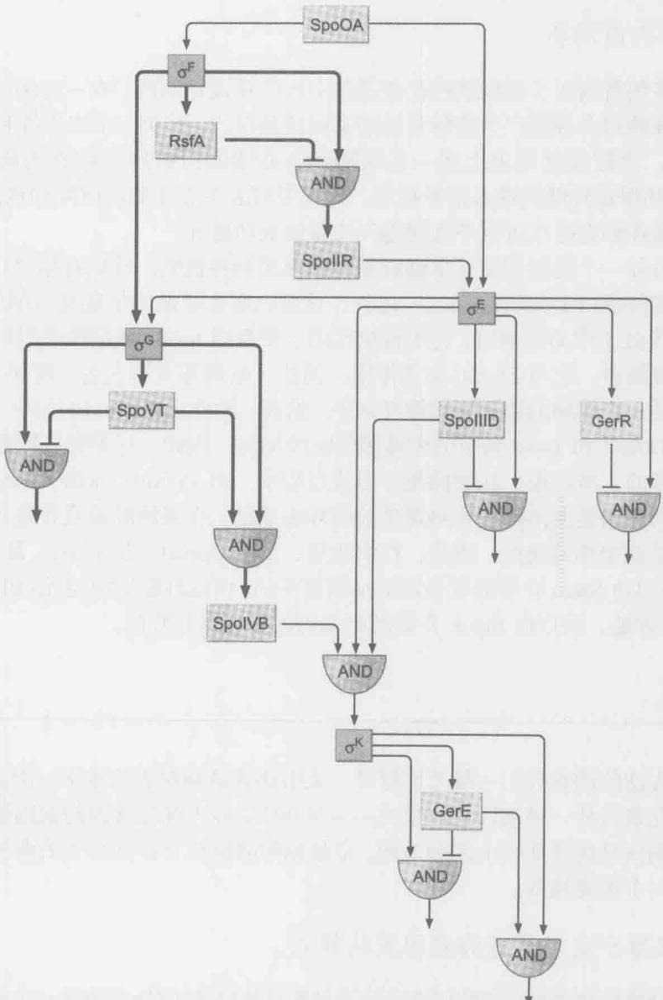  
图 22-8 一系列前馈环组成的环路调控孢子形成过程。图中名字所表示的是调控蛋白或信号蛋白。为了简洁，自身正调控回路因子 $\sigma^{G}$ 和 $\sigma^{K}$ 没有在图中画出。（经允许引自 Wang S.T. et al. 2006. J. Mol. Biol. 358: 16-37, Fig.5. ©Elsevier）

该特性源自以下的事实：靶基因的表达既依赖于第一激活因子 A，又依赖于第二激活因子 B 的有效积累。因此，输入信号必须持续足够长以满足第二激活因子 B 达到激活靶基因 C 表达的阈值。换句话说，通过加入一个对输入信号反应的推迟，协调型前馈环帮助细胞分辨持续型真实信号及随机的扰动（噪声）。

非协调性前馈环具有它本身的优势特性（图 22-7d）。它是一个脉冲发生器，导致基因表达在开启与关闭间切换。因此，激活因子 A 打开靶基因 C 的表达，但当激活因子 B 聚集到一定浓度后便将基因 C 的表达关闭。所以，当基因表达要求在一定的时间范围内时，此非协调型前馈环便发挥了作用。

#### [W] 发育过程中的前馈环

前面那些剖析阐明了基因调控复杂通路中的简单设计原理。在一些例子中，协调与非协调前馈环的组合导致产生各种各样的基因活动模式。其中一个引人注目的例子是孢子形成过程，该过程就是由上述一系列协调与非协调前馈环所形成的调控回路（图22-8）。协调环保证环路的输入信号稳定，确保发育发生在正确的时间和地点。同样的，非协调环用来在形态建成过程中连续地产生基因表达脉冲。

此外，另外一个典型例子是果蝇胚胎背腹形成调控机制。我们在第21章中已经讨论过，母源调控蛋白Dorsal启动这一过程，该蛋白质在胚胎中呈现宽范围的浓度分布。当Dorsal浓度处于中高或高时，它便直接作用于靶基因twist，激活该基因的表达。Twist也是一个调控蛋白，它与Dorsal协调作用，调控一系列基因的表达，例如snail。因此，该调控基序是一个明确的协调型前馈环例子。然而，除此之外，snail编码一个转录抑制因子，许多Dorsal和Twist调节的靶基因受它的抑制。因此，这类靶基因是受非协调型前馈环所调控的。所以说，在细菌孢子形成过程中，由dorsal、twist、snail，以及下游基因所构成的环路是由协调和非协调型前馈环组成的。在果蝇胚胎发育过程中，背腹形态形成过程受前馈环的调控。因此，在中胚层，由于Dorsal（及Twist）及Snail的表达水平较高，所以由Snail介导的靶基因的抑制被关闭，而在外胚层神经元；由于Dorsal和Snail的水平较低，所以由Snail介导的靶基因的抑制是打开的。

#### [W] 振荡回路

对基因表达的调控我们一般考虑打开、关闭或者是调控表达水平。但是，在生物体内还广泛存在着另外一种基因调控模式——节律性，即大部分基因的表达都是在一个规则的时间间隔内呈现周期性上调和下调。定量地阐明调控节律性行为的调控回路是对系统生物学的一个重要挑战。

#### [W] 有些调控回路产生节律性的基因表达模式

一个相对简单的节律性调控回路的例子是新月柄杆菌（Caulobacter crescentus）的细胞周期（图 22-9）。在此例中，中枢调控因子（CtrA 和 GcrA）的水平以周期性模式交替升高和下降。它们的交替出现驱动其他基因在细胞周期过程中呈现节律性表达模式。

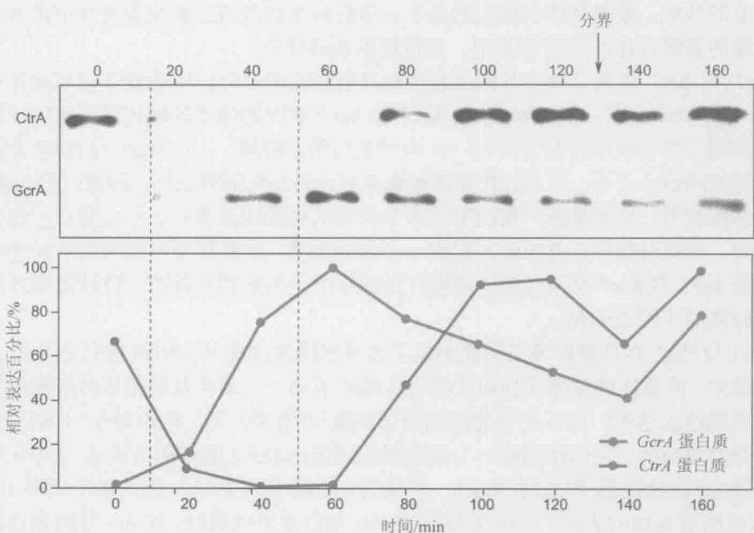  
图 22-9 调控因子 CtrA 和 GcrA 在柄杆菌属细胞周期的过程中的波动表达。(经允许引自 Holtzendorff J. et al. 2004. Science 304: 983-987, Fig.3B, C. ©AAAS)

生物钟是一个众所周知的节律性行为的例子，在生物钟的调控下，大量基因在日夜交替周期的不同时间呈现节律性表达。在果蝇和哺乳动物中，其昼夜节律部分地受到负前馈环的调控，其中激活因子是 Clock 和 Cycle，抑制因子是 Per(Period)。Clock 和 Cycle 蛋白结合到 per 基因调控区域，激活该基因的转录。当 Per 蛋白在细胞中累积到一定的水平后，它能够反作用于 Clock 和 Cycle，从而关闭自身合成。一旦 per 基因的转录被关闭后，由于蛋白酶降解造成的不稳定性，Per 蛋白将慢慢从细胞中被清除。这将导致抑制因子恢复到一个次级阈值的水平，即 Per 蛋白没有足够高的浓度来抑制 Clock 和 Cycle 的活性。由此，per 基因的表达重新打开。per 基因表达的开/关周期有助于确定基因活性的 24h 循环过程。Per 蛋白的合成与降解的时间是关键的依赖因素。Per 蛋白稳定性的改变能够改变节律的频率，甚至产生不正常的以 22h 或 26h 为周期的循环，而不是正常的 24h。然而，关于生物钟为什么稳定地保持 24h 周期的机理还未被完全理解，毫无疑问，仍有一些确切存在但尚待阐明的机制。

有趣的是，自身负调控还涉及另外一个与周期基因表达毫不相关的例子——脊椎动物胚胎中的体节形成过程。体节是胚层细胞的浓缩块，它们将形成重复肌肉节和脊椎动物的脊柱（图22-10a）。体节从头到尾的形成模式依赖于调控基因her1和her7有节律的活性的开启与关闭，至少在斑马鱼中是如此。这些基因在此后的体细胞中保持周期性表达，直到这些细胞准备分化形成物理性体节为止。随着每一批新细胞的成熟，其节律性终止，从而导致一些细胞停留在周期的峰顶，另外一些停留在峰谷，并在空间顺序上体

b

a

现了体节的形成。紧随新体节形成的是下一组将来形成体节的细胞重复相同的步骤，包括新一轮的基因表达的开启和关闭，并最终形成新体节。

her1 和 her7 在斑马鱼中节律性表达的开启和关闭已经应用于数学建模和计算机模拟。Her1 与 Her7 蛋白被认为结合到 her1 和 her7 基因的调控区域从而关闭转录过程。但是该抑制过程仅仅维持短暂时间——由于蛋白酶的降解，一旦 Her1 与 Her7 蛋白降到一个关键的阈值水平后，转录过程重新被恢复并开始一轮新的循环，即蛋白质合成开始-抑制状态恢复等。抑制基因产物的节律水平调控其他基因的表达，从而确定出新体节的形成模式。在斑马鱼中，每 30min 形成一个新的体节。解释体节形成的周期长度的一个关键点是 her1 和 her7 基因启动转录同自身抑制因子积聚到有效浓度以抑制自身合成过程的时间间隔（图 22-10b）。

Her1 与 Her7 自身调控环完美地阐述了体节基因如何在单个的细胞中呈现开/关表达的循环模式，但是这些基因是如何在即将形成体节的一个细胞及其相邻的细胞中保持同步化的周期性表达呢？同步化是通过细胞与细胞间的信号通路来完成的。Her1 与 Her7 除了抑制其自身外，它们还抑制一个细胞膜编码蛋白 Delta 的基因的表达。Delta 结合到与其相邻细胞的细胞受体蛋白 Notch，并激活 Notch 信号系统，进而激活编码 Her1 与 Her7 蛋白所需基因的表达。当开/关循环中 Her 蛋白水平较高时（即 her 基因表达较低），产生比较少的 Delta 配基（图 22-10b）。这将导致与其相邻的细胞中 Notch 信号系统的活性与 her 基因的表达都比较低。相反的，当 Her1 同 Her2 蛋白水平较低时（即 her 基因表达较高），细胞中 Delta 含量便升高，从而激活相邻细胞 her 基因的表达。对于每一种情况，信号从相邻细胞通过 Notch 与其内的 Her1 和 Her7 蛋白相互协作，从而保持细胞与其相邻细胞节律之间的同步性。因此，细胞内自身调控与细胞间信号传递共同使得体节构成细胞呈现节律性行为。

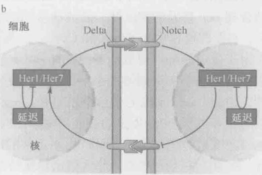  
图 22-10 体节基因在脊椎动物发育过程中的表达。(a) 图中所示为鸡胚胎发育过程中的体节。箭头所示的是体节，节律区是节律基因表达的区域，新的体节将在此产生（图片由 JulianLewis 提供）。（b）图中所示为斑马鱼体节基因节律表达的产生和同步模型。节律基因的表达受负反馈环的调控，其中涉及自身抑制因子 Her1 和 Her7。不同细胞间节律的同步化是通过 Delta/Notch 信号通路来完成的。Her1/Her7 抑制 Delta 配基的生成。相反的，Notch 信号刺激 Her 蛋白的表达。（摘自 Julian Lewis 提供的图片。）

#### [W] 用人工合成的环路模拟自然的调控网络

理解主导调控回路设计原理的一个辅助方法是建立一些相对简单的环路，并使这些环路能够模拟自然系统的一些特性，这就是合成生物学领域的目标。环路设计的一个典型的成功例子是抑制振荡器，该实验加强了我们对节律性的讨论。抑制振荡器是一个在大肠杆菌中生成的三节点网络环路，该环路由三个相互连接的调控蛋白组成一个环形的模式，三个端的连接符号都为负号。此抑制因子由三种细菌抑制蛋白 $\lambda \mathrm{CI}$ 、LacI和TetR编码基因所组成，CI蛋白抑制LacI编码基因，LacI进而抑制TetR编码基因，而TetR反过来抑制CI，从而形成整个网络环路。人们可能会推测，此类三节点环路可能会导致这三个基因的转录都处于一个低水平的稳定态。但恰恰相反，此抑制振荡器呈现出一个强烈的转录节律模式，其周期大约为 $2\mathrm{h}$ 。理论上讲，基因表达过程中噪声导致这三种抑制蛋白水平产生波动，这将阻止系统达到稳定态，取而代之的是一个节律表达模式。但是此抑制振荡器与上述的自然系统相比，其节律行为的稳定性依然相差甚远，这说明了一个事实，人工合成的环路在模拟自然界中的复杂（尚未被充分阐明的）环路时还有许多不足之处。

通过合成还产生了许多其他网络环路，这些环路呈现出各种各样的行为模式。其中一个例子是人工回路文库，该文库由许多转录因子和启动子通过不同的组合所构成。该回路文库中的回路能对不同的输入信号组合产生不同的应答。另外一个例子是来自“发射子”与“应答子”菌株，这类菌株能够在琼脂板上产生基因表达的条纹模式。发射菌株生长在培养板的中央，它能够产生信号分子，并从培养板的中央向四周扩散形成一个浓度梯度。两种不同的应答菌株分散长在同一个培养板上，这两种应答菌株对发射菌产生的信号分子浓度的高低应答不同，可通过产生可辨别的发光报道蛋白来区分。因此，一种应答菌株在距离发射菌较近处产生一个有色光环，而另外一种应答菌株在距离发射菌较远处产生另外一个有色光环。

<!-- W-END Watson 22 系统生物学 -->

## 思考题

1. 简述基因家族的分类及其主要表达调控模式。

2. 简述何为外显子、内含子及其结构特点和可变调控。

3. 简述 DNA 甲基化对基因表达的调控机制。

4. 简述真核生物转录元件组成及其分类。

5. 简述增强子的作用机制。

6. 简述反式作用因子的结构特点及其对基因表达的调控。

7. 如何确定拟南芥基因组 T-DNA 插入的位点?

8. 如何确定影响某表型的相关基因?

9. 如何通过实验的方法分析 CTD 上 S2 和 S5 不同磷酸化 pattern 的功能?

10. 如何鉴定 activation tagging 的转基因植物中是哪个基因的表达上调而导致所观测的表型?

11. 举例说明蛋白质磷酸化如何影响基因表达。

12. 说明组蛋白乙酰化和去乙酰化影响基因转录的机制。

13. 说明激素影响基因表达的基本模式。

14. 说明分子伴侣的分类及其影响基因表达的机制。

## 参考文献

1. Akhade V S, Pal D, Kanduri C. Long noncoding RNA: genome organization and mechanism of action, Adv Exp Med Biol., 2017:47-74.

2. Edupuganti R R, Geiger S, Lindeboom R G H, et al. N $^{6}$ -methyladenosine (m $^{6}$ A) recruits and repels proteins to regulate mRNA homeostasis. Nat Struct Mol Biol., 2017, 24: 870–878.

3. Fu Y, Dominissini D, Rechavi G, et al. Gene expression regulation mediated through reversible m $^{6}$ A RNA methylation. Nat Rev Genet., 2014, 15: 293–306.

4. Roberts T C, Morris K V, Weinberg M S. Perspectives on the mechanism of transcriptional regulation by long non-coding RNAs. Epigenetics, 2014, 9: 13.

5. Theler D, Allain F H. Molecular biology: RNA modification does a regulatory two-step. Nature, 2015, 518:492-493.

6. Wu R, Jiang D, Wang Y, et al. N $^{6}$ -Methyladenosine (m $^{6}$ A)methylation in mRNA with adynamic and reversible epigenetic modification. Molecular Biotechnology, 2016, 58: 450–459.

## 数字课程学习

教学课件

目在线自测

思考题解析

<!-- W-BEGIN Watson 19 章末 -->

### 【中文对照 Watson 第19章章末：小结、参考文献、习题】

> 来源：Watson《基因的分子生物学》第七版中译本（书籍/03_基因的分子生物学_第七版） 第19章 真核生物的转录调控 章末，附录 2 中该章偶数习题答案附后。

#### [W] 小结

如果不考虑生物体中那些可以被调控的附加步骤，那么就如同在细菌中一样，转录起始步骤是真核生物基因表达中最频繁被调控的步骤。也和在细菌中一样，典型的转录起始步骤是通过蛋白质来调控的，这些蛋白质结合在特定的、靠近基因的DNA序列上，并能够使基因开启（激活因子）或者关闭（抑制因子）。尽管真核生物基因存在原核生物中没有的在构造和转录上的复杂度，但这些调控机制的保守性还是被保留下来了。

真核细胞中的 DNA 被组蛋白缠绕而形成了核小体。因此，转录装置和调控蛋白所结合的 DNA 序列在许多时候都被遮蔽了。修饰组蛋白的酶，通过增加（或移除）小的化学基团，在以下两个方面改变了组蛋白：它们改变了核小体被包裹的紧密度（因此也改变了核小体中的 DNA 的可接近性）；它们形成（或消除）了其他参与基因转录的蛋白质的结合位点。其他酶“重塑”了核小体：它们利用从 ATP 水解中得到的能量来移动周围的核小体，影响哪些序列被暴露出来。在一个“开放”或者没有核小体的情况下，没有活性但结合状态的聚合酶 II（暂停或者“静止”Pol II）有可能传递到启动子域，从而当适合的信号出现时促进快速地和有效地诱导的基因表达。

与对应的细菌相比较，多细胞真核生物的基因受控于更多的调控蛋白，一些蛋白质结合的位置与基因相距甚远。这反映出在多细胞生物中更多数量的生理信号参与了控制一个特有基因。

RNA 聚合酶在细菌和真核生物中非常保守（第 13 章）。但是真核生物的酶类含有更多的亚基，而且在特定的真核生物启动子上除了聚合酶还结合有大约 50 个或更多的蛋白质。这些蛋白质中有很多是以大的蛋白复合体形式结合到启动子上的。

在真核生物中，就如我们在细菌中所看到的一样，激活因子主要通过募集来工作。在这些生物体中，激活因子并不直接地或单独地募集聚合酶。它们募集其他启动某一特定基因的转录需要的蛋白复合体。RNA 聚合酶本身就是伴随着其他的这类复合体而被带入的。激活因子也能够募集组蛋白修饰酶，而这些修饰产生的影响可以帮助转录装置结合到启动子上或起始有效的转录。

激活因子能够和转录装置或核糖体修饰子的众多组分中的一个或更多个组分相互作用。例如，Gal4 根据需要募集中介蛋白、SAGA、Swi/Snf 和 TFⅡD 到启动子上。其他例子中，有效起始或延伸所需的因子可能在聚合酶结合后还需要它们也可以由激活因子来募集。这解释了它们如何在大量、多种结合方式下如此轻易地运作，也说明了它们在我们所知的信号整合及组合控制上的广泛运用，特别是在多细胞生物体中。

一些激活因子从距离基因很远的位置发挥作用，这需要在它们的结合位点和启动子间的 DNA 形成环状突起。在一些情况中，环是如何跨越非常远的距离而形成仍不清晰，但是可能涉及激活因子结合位点和启动子间的染色质的结构改变，使得那两个元件靠近并由凝聚力稳定环结构。被称为绝缘子的 DNA 序列结合在蛋白质上，该蛋白质干扰限制了远距离增强子上的激活因子与其启动子间的相互作用。这些绝缘子可以通过抑制那些使环化更容易的机制（如改变染色质结构）来发挥作用。绝缘子确保了激活因子只对正确的基因产生效应。

真核抑制因子通过各种途径工作。然而，细菌中可见的最简单和最普通的机制是抑制因子结合到与启动子重叠的位点上，从而阻碍 RNA 聚合酶的结合，此机制并不常见于真核生物。在一些情况下，抑制因子与靠近激活因子的增强子结合来阻碍这些激活因子介导增强子与启动子环化。最普通的是，真核抑制因子通过募集可降低转录水平的组蛋白修饰物的途径来工作。举个例子，组蛋白乙酰基转移酶通常都与激活关联，而组蛋白脱乙酰酶——作为一种能够去除乙酰基团的酶，在这里产生抑制基因的效应。

在某些时候，核小体中一大段 DNA 部分能够通过适当的核小体修饰而被保留在相对惰性的状态，最显著的修饰就是去乙酰作用和甲基化。用这种方法，一组基因将能够保持在“沉默”状态而不需要在每个独立的基因上都有专有的抑制因子。

在某些真核生物体中，如哺乳动物，沉默基因也和甲基化的 DNA 相关联。甲基化的序列可以阻碍转录装置与激活因子的结合，或特异地结合一类抑制因子，后者募集组蛋白修饰酶来抑制邻近的基因。DNA 甲基化在细胞分裂过程中可以保持（在既没有突变也没有起始该模式的信号存在的情况下），也就保持了被那些甲基化控制的基因表达模式。

如果一个基因的表达在细胞分裂过程中的某些阶段被保持，就被称为表观遗传地继承。有各种机制使之实现。DNA 甲基化会影响基因表达，且容易继承，如我们已经看到的。通过使用组蛋白修饰的表观遗传继承通常作为一种可能性被讨论，但它们在没有 DNA 结合蛋白、调控蛋白或 DNA 甲基化参与的情况下发挥这个作用的程度仍然不清楚。

#### [W] 参考文献

#### [W] 书籍

Allis C.D., Jenuwein T., Reinberg D., and Caparros M.-L. eds. 2007. Epigenetics. Cold Spring Harbor Laboratory Press, Cold Spring Harbor, New York.

Carey M., Smale S.T., and Pederson C.L. 2008. Transcriptional regulation in eukaryotes: Concepts, strategies, and techniques. Cold Spring Harbor Laboratory Press, Cold Spring Harbor, New York.

Ptashne M. and Gann A. 2002. Genes and signals. Cold Spring Harbor Laboratory Press, Cold Spring Harbor, New York.

#### [W] DNA 识别

Garvie C.W. and Wolberger C. 2001, Recognition of specific DNA sequences. Mol. Cell. 8: 937–946.

Harrison S.C. 1991. A structural taxonomy of DNA-binding domains. Nature 353: 715–719.

#### [W] 激活

Bjorklund S. and Gustafsson C.M. 2005. The yeast Mediator complex and its regulation. Trends Biochem. Sci. 30: 240–244.

Fuda N.J., Ardehali M.B., and Lis J.T. 2009. Defining mechanisms that reg-

ulate RNA polymerase II transcription in vivo. Nature 461: 186–192. Jones K.A. and Kadonaga J.T. 2000. Exploring the transcription-chromatin interface. Genes Dev. 14: 1992–1996.

Kim Y.J. and Lis J.T. 2005. Interactions between subunits of Drosophila Mediator and activator proteins. Trends Biochem. Sci. 30:245–249.

Kornberg R.D. 2005. Mediator and the mechanism of transcriptional activation. Trends Biochem. Sci. 30: 235–239.

Levine M. 2011. Paused RNA polymerase II as a developmental checkpoint. Cell 145: 502–511.

Luo Z., Lin C., and Shilatifard A. 2012. The super elongation complex (SEC) family in transcriptional control, Nat. Rev. Mol. Cell Biol. 13:543–547.

Malik S, and Roeder R.G. 2005. Dynamic regulation of Pol II transcription by the mammalian Mediator complex. Trends Biochem. Sci. 30: 256–263.

Ptashne M. 2005. Regulation of transcription: From lambda to eukaryotes. Trends Biochem. Sci. 30: 275–279.

#### [W] 抑制

Liu Z. and Karmarkar V. 2008. Groucho/Tup1 family co-repressors in plant development. Trends Plant Sci. 13: 137–144.

Simon J.A. and Kingston R.E. 2009. Mechanisms of Polycomb gene silencing: Knowns and unknowns. Nat. Rev. Mol. Cell Biol. 10; 697–708.

Smith R.L. and Johnson A.D. 2000. Turning genes off by Ssn6-Tup1: A conserved system of transcriptional repression in eukaryotes. Trends Biochem. Sci. 25: 325–330.

#### [W] 核小体修饰因子及转录调控

Hargreaves D.C. and Crabtree G.R. 2011. ATP-dependent chromatin remodeling: Genetics, genomics and mechanisms. Cell Res. 21:396–420.

Henikoff S. and Shilatifard A. 2011. Histone modification: Cause or cog? Trends Genet. 27: 389–396.

Jenuwein T. and Allis C.D. 2001. Translating the histone code. Science 293: 1074–1080.

Narlikar G.J., Fan H.Y., and Kingston R.E. 2002. Cooperation between complexes that regulate chromatin structure and transcription. Cell 108: 475–487.

Rando O.J. and Winston F, 2012. Chromatin and transcription in yeast. Genetics 190: 351–387.

Shahbazian M.D. and Grunstein M. 2007. Functions of site-specific histone acetylation and deacetylation. Annu. Rev. Biochem. 76:75–100.

Wang X., Bai L., Bryant G.O., and Ptashne M. 2011. Nucleosomes and the accessibility problem. Trends Genet. 27: 487–492.

#### [W] 沉默、印记及表观遗传学

Gartenberg M.R. 2000. The Sir proteins of Saccharomyces cerevisiae: Mediators of transcriptional silencing and much more. Curr. Opin. Microbiol. 3: 132–137.

Goldberg A.D., Allis C.D., and Bernstein E. 2007. Epigenetics: A landscape takes shape. Cell 128: 635–638.

Gottschling D.E. 2004. Summary: Epigenetics—From phenomenon to field. Cold Spring Harb. Symp. Quant. Biol. 69: 507–519.

Klose R.J. and Bird A.P. 2005. Genomic DNA methylation: The mark and its mediators. Trends Biochem. Sci. 31: 89–97.

Ptashne M. 2007. On the use of the word "epigenetic" Curr. Biol. 17: R233–R236.

Wood A.J. and Oakey R.J. 2006. Genomic imprinting in mammals: Emerging themes and established theories. PloS Genet. 2: 1677–1685.

增强子、组合控制与协同

Arnosti D.N. and Kulkarin M.M. 2005. Transcriptional enhancers: Intelligent enhanceosomes or flexible billboards? J. Cell Biol. 94: 890–898.

Li H. and Johnson A.D. 2010. Evolution of transcription networks—Lessons from yeasts. Curr. Biol. 20: R746–R753.

Merika M. and Thanos D. 2001. Enhanceosomes. Curr. Opin. Genet. Dev. 11: 205–208.

Rokas A. 2006. Evolution: Different paths to the same end. Nature 443:401–402.

#### [W] 大范围互作信号及信号转导

Buecker C. and Wysocka J. 2012. Enhancers as information integration hubs in development: Lessons from genomics. Trends Genet. 28:276–284.

Dean A. 2006. On a chromosome far, far away: LCRs and gene expression. Trends Genet. 22: 38–45.

Dorsett D. and Ström L. 2012. The ancient and evolving roles of cohesin in gene expression and DNA repair. Curr. Biol. 22: R240–R250.

Gaszner M. and Felsenfeld G. 2006. Insulators: Exploiting transcriptional and epigenetic mechanisms. Nat. Rev. Genet. 7: 703–713.

Li Q., Barkess G., and Qian H. 2006. Chromatin looping and the probability of transcription. Trends Genet. 22: 197–202.

#### [W] 信号及信号转导

Bromberg J.F. 2001. Activation of STAT proteins and growth control. Bioessays 23: 161–169.

Brown M.S., Ye J., Rawson R.B., and Goldstein J.L. 2000. Regulated intramembrane proteolysis: A control mechanism conserved from bacteria to humans, Cell 100: 391–398.

Pawson T. and Nash P. 2000. Protein–protein interactions define specificity in signal transduction. Genes Dev. 14: 1027–1047.

#### [W] 抑制与疾病

Gabellini D., Green M.R., and Tupler R. 2004. When enough is enough: Genetic diseases associated with transcriptional derepression. Curr. Opin. Genet. Dev. 14: 301–307.

Kriaucianis S. and Bird A. 2003. DNA methylation and Rett syndrome. Hum. Mol. Genet. 12: R221–R227.

Miller G. 2007. Medicine. Rett symptoms reversed in mice. Science 315:749.

#### [W] 习题

#### [W] 偶数习题的答案请参见附录2。

习题 1 常见的基因表达调控的类型发生在转录水平，请列出真核细胞中基因调控的其他类型。在这些调控类型中，有没有相对于原核细胞而言，是真核细胞所特有的？

习题 2 比较和对比细菌细胞与真核细胞中转录调控所包含的 DNA 序列元件。

习题 3 解释为什么 E.coli 中的 lacZ 于酿酒酵母中常作为报道基因，而 E.coli 却不是。

习题 4 在 DNA 模板（如 PCR 产物），通用的转录因子及 RNA 聚合酶Ⅱ存在的情况下可以启动体外转录。解释为什么只有通用转录因子和 RNA 聚合酶Ⅱ存在时，不能以基因组 DNA 作为模板启动转录。

习题 5 回顾框 19-1 中的双杂交实验的原理。如果要观察到报道基因的激活，引诱物与受控物的相互作用必须发生在细胞的哪里？根据这个要求提出酵母双杂交实验的一个潜在的缺点。你认为还有哪些缺点？

习题6

A. 在下面有一个顺序打乱的染色质免疫共沉淀的步骤, 通过列出每一步的字母来对 ChIP 步骤进行排序。

a. 免疫沉淀 DNA-蛋白质复合体。

b.PCR 扩增 DNA。

c. 加入某个蛋白特异的抗体。

d. 将蛋白质与 DNA 片段交联。

e.移去蛋白质。

B. 一个研究人员选择了针对蛋白质 X 的抗体和基因 Y 所特有区域的 PCR 引物来进行染色质免疫共沉淀反应（ChIP assay）。举出一个研究人员所提出的导致这种选择的问题实例。

习题 7 回忆在啤酒酵母交配类型特异基因表达调控时所使用的组合调控。描述在单倍体 MATα 细胞中 Mcm1 是如何抑制和激活目标基因的转录的。

习题8

A. 请列举在第 19 章中讨论的影响基因表达的组蛋白共价修饰的类型。

B. 解释为什么一个特定的修饰并不总是与唯一的激活或抑制相关。

习题9

A. 描述在哺乳细胞中 DNA 甲基化在基因表达中的作用。

B. 哺乳细胞中 DNA 甲基化的作用与 E.coli 中的 DNA 甲基化有什么不同?

习题 10 在信号转导通路中的参与者主要分为以下类型: 信号、受体、传递分子及输出。将图 19-22 中的 STAT 通路的每个组分划分为信号、受体、传递分子及输出。每个术语可以多次使用。

习题 11 推测为什么印记导致了非孟德尔遗传定律(分离模式特征并不与孟德尔模式一致)。回顾孟德尔遗传定律请看第 1 章。

习题 12 你打算研究在哺乳细胞的转录调控中有潜在作用的 3 个蛋白质——蛋白 A, 蛋白 B, 蛋白 C。你进行了电泳迁移率实验（EMSA），数据见下面。该技术可以参看第 7 章。所有的反应都含有结合缓冲液和 λ DNA 片段，该片段含有蛋白 A 的 DNA 结合位点，是哺乳动物基因的上游序列。加入的已纯化蛋白显示在胶上。

\- - - + + + 蛋白A
- + - - + - 蛋白B
- - + - - + 蛋白C，泳道

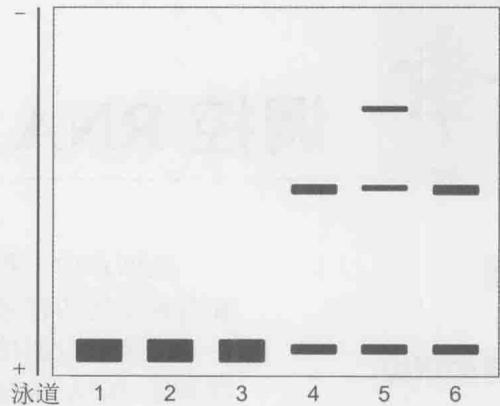

A. 在该数据中，蛋白 A 和 DNA 结合吗？阐述你的答案。
B. 解释泳道 5 的结果，在阐述中也要利用泳道 2 的结果。
C. 提出一个蛋白 B 如何激活转录的模型。

习题 13 你想做一个基因改造的线虫 C. elegans。xyz 基因在每一个胚胎细胞中表达。你将 xyz 基因的启动子（Pxyz，300bp）融合到编码绿色荧光蛋白（GFP）的基因（900bp）上。将该融合基因（见下图）转入线虫中，该融合基因随机的插入到基因组中然后稳定的遗传给后代。

尽管 xyz 在每一个胚胎细胞中表达，但是导入融合基因的后代并没有表达 GFP。你的转导技术没有问题，并且实际上你确认它已经整合到了线虫的基因组中。

A. 你在两个方向对融合的基因及两侧进行了扩增及双方向的测序。你的融合基因的一侧是 5000bp 的随机序列，而另一侧则是 200 个 “TAAGGC” 的重复序列。基于这些结果，猜测你的融合基因为什么没有表达。

你决定重新向另一个成年线虫中导入相同的融合基因，使其整合到基因组的其他地方。你非常高兴该线虫的所有胚胎细胞都表达了 GFP（通过荧光显微镜观察）。

B. 你想要研究 XYZ 蛋白的亚细胞定位。A 部分建议的融合基因的修饰有利于你研究 XYZ 蛋白在细胞中的定位，解释原因。

#### [W] 附录 2：本章偶数习题答案

问题 2 原核细胞和真核细胞都包含基因编码序列 DNA 上游的启动子序列。原核和真核细胞还包含有调控因子如阻遏因子或诱导因子相结合的 DNA 区。诱导因子和/或阻遏因子通常控制原核基因，而真核基因的调控因子可能会更加的复杂精细。在真核细胞中可能存在更多的调控因子，调控因子可能存在于启动子的上游或者下游，而调控因子可以包含多个诱导因子和（或）阻遏因子的结合位点。在多细胞机体中，多种调控因子统称为增强子，而绝缘子和边界因子也可能存在。真核基因相对于原核基因而言，其调控因子可能会位于离基因较远的区域。

问题 4 基因组 DNA 缠绕在核小体上。转录的启动包括将基因组上特定区域的核小体重塑或者移除，该过程需要额外的蛋白质的参与。像 PCR 中的 DNA 模板不包括核小体。

问题6

A. 正确的顺序：d, c, a, e, b。回顾第7章中图7-35的顺序。

B. 研究人员必须猜到或者知道蛋白 X 与 DNA 结合，并提出蛋白 X 究竟是与基因 Y 还是基因 Y 的启动子区结合的疑问。研究人员也可以检测特定浓度下蛋白 X 与 DNA 的相互作用（例如，在 DNA 损伤时，在特殊的糖存在时）。

问题8

A. 甲基化、乙酰化和磷酸化。

B. 组蛋白尾部残基的修饰经常与特定基因的特殊表达有关。因而，乙酰化通常发生在转录活跃的基因上。其他修饰（如甲基化）可能与基因表达的激活或者抑制有关。因此，组蛋白尾部不同残基的甲基化会有不同的效果，任何特定的修饰环境（例如，也存在其他修饰）也可以在表达水平上影响特定的修饰的发生。

问题 10 细胞因子——信号。细胞因子受体——受体。JAK——转播分子。

STAT——转播分子。特定基因的转录表达——输出。

#### [W] 问题12

A. 在该 EMSA 检测中蛋白 A 确实与 DNA 结合，尤其是 DNA 片段。泳道 4 显示了蛋白 A 与包含有可以与蛋白 A 结合的 DNA 位点的 DNA 片段之间的反应。迁移慢的条带代表了与蛋白 A 结合的 DNA 片段。未结合的 DNA 则处于胶的底部，如泳道 1。

B. 蛋白 A 和 B 与 DNA 片段结合。根据泳道 2 和 5 的数据，蛋白 B 并不能单独与 DNA 片段结合（泳道 2）。当蛋白 A 与 DNA 结合时蛋白 B 才可能与蛋白 A 结合。在泳道 5 中迁移最慢的条带是蛋白 A，蛋白 B 和 DNA 片段的复合体。接下来的条带代表了与 DNA 片段结合的蛋白 A。迁移最快的条带代表了未结合的 DNA。

C. 蛋白 B 并不能单独与 DNA 片段结合，只有在蛋白 A 结合该 DNA 片段时才可以。蛋白 A 和 B 可以作为诱导复合体来招募特定基因上游的转录机制或者蛋白 B 可以单独作为诱导因子，但是需要蛋白 A 将其带到 DNA 上或者与蛋白 A 协同结合 DNA。

<!-- W-END Watson 19 章末 -->

<!-- W-BEGIN Watson 20 章末 -->

### 【中文对照 Watson 第20章章末：小结、参考文献、习题】

> 来源：Watson《基因的分子生物学》第七版中译本（书籍/03_基因的分子生物学_第七版） 第20章 调控RNA 章末，附录 2 中该章偶数习题答案附后。

#### [W] 小结

尽管早在 1961 年便已提出 RNA 分子有可能是基因调控因子，但直到近几年，RNA 作为调控因子的普遍存在和重要作用才被阐明。在这之前，只有 E.coli 的色氨酸操纵子（trp operon）的衰减作用这一个罕见的例子。在那个例子中，已知 mRNA 的 5' 区 RNA 序列调控下游基因的表达，这个 RNA 区域中另一种方式的分子内碱基配对形成的另一种不同的二级结构，对基因产生不同的影响。一种构象中，在进入下游基因的编码区之前转录就被终止；而在另一种构象中，转录能够继续，基因能够表达。

核糖开关调控基因的机制与此相似：基因的 5'-UTR 结构的不同决定这些基因是否转录（或者在一些情况下，决定翻译是否启动）。在核糖开关的作用下，选择哪一种二级结构取决于它与控制那个基因的 RNA 配体的直接结合。

E.coli 中编码以反式作用调控基因的小 RNA（称为 sRNA）。这些 sRNA 是由小基因编码的，与 mRNA 的互补序列形成碱基配对。这种情形要么抑制这些靶 mRNA 的翻译，导致它们的降解，要么在某些情况下促进它们的翻译。细菌小 RNA 的作用在很多方面与真核细胞中调控基因的小 RNA 相似，尽管真核生物生成调控 RNA 的机制和它们对靶基因产生影响的机制与细菌的很不一样。

与真核生物中最接近的是细菌中的规律成簇的间隔短回文重复（CRISPR）系统。成簇的特异重复 DNA 序列（每个簇不同）产生了一种特殊的小 RNA 指导蛋白质合成，从而破坏感染的噬菌体和质粒，事实上还包括进入细胞的其他的外源性 DNA。这种能够识别“非我”的能力来源于 CRISPR 区域积累了之前感染时噬菌体基因组的片段，这些片段决定了靶向 RNA 的序列。

在真核生物中与 CRISPR 最类似的是 piRNA 簇。这些区域包含有转座子片段（有时称为“转座子坟墓”）。小的 piRNA 产生于基因组中沉默同源转座子区域，尤其是在生殖细胞中，确保它们保持失活状态。siRNA 和 miRNA 是真核生物中发现的另外两种调控小 RNA。与 piRNA 不同，siRNA 和 miRNA 是在 Dicer 酶的作用下产生于双链 RNA 区域。siRNA 是由内源的或外源的双链 RNA 直接生成的。miRNA 由基因组编码，首先被 Drosha 酶识别加工后，再被 Dicer 酶剪切产生。这两种调控 RNA 通常经 Dicer 酶加工后的长度为 19\~25nt。Drosha 酶和 Dicer 酶有 RNase 酶功能域，根据底物的大小和结构进行剪切，并不是根据序列。

siRNA 和 mRNA 一旦形成，其功能在本质上是相同的。它们被整合进称为 RISC 的机器中，其中一条 RNA 链被选作“向导 RNA”，指导成熟的 RISC 与靶 RNA 互补的向导 RNA 结合。一旦结合，RISC 要么沉默 RNA（通过催化含有 RNase 相关结构域的底物 Argonaute），要么抑制 mRNA 的翻译。选择哪种方式的沉默基本上取决于向导 RNA

Baulcombe D. 2005. RNA silencing. Trends Biochem. Sci. 30: 290–293.
Czech B. and Hannon G. J. 2011. Small RNA sorting: Matchmaking for Argonautes. Nat. Rev. Genet. 12: 19–31.

和靶 RNA 的碱基配对的程度——配对越好，越有可能引发沉默。向导 RNA 也可以指导 RISC 的相关组蛋白修饰复合体与启动子区相结合，通过修饰启动子而在转录水平上沉默基因。即使在这些情况下，与启动子相结合也很有可能是通过向导 RNA 与 mRNA 的碱基配对达到的，但在这个例子中，RNA 仍然形成，因此与这个基因上的 RNA 聚合酶 II 有关。

miRNA 是由生物体内的基因编码的，在发育过程中它们起基因调控的作用，这在线虫和植物中已有研究得很好的例子。miRNA 也与癌症相关，有些 miRNA 被归类为抑癌基因，有的被归类为致癌基因。形成 siRNA 的双链 RNA 来源不一，它们既可能来自侵染的病毒，也可能来自重复区域的转录（着丝粒或转座子），或是有意导入到细胞中的（在希望下调特定基因表达的实验中）。RNAi 的使用已成为常规工具，在传统遗传学不起作用的系统中特别有意义。

动物和植物细胞中也有长片段调控 RNA（200nt 或者更长）。它们在发育过程中发挥着一定的作用。在 HOTAIR 和 AIR 的例子中，尽管并不了解它们详尽的作用机制，但是它们似乎能够与蛋白复合物结合改变所调控基因附近的核染色质。一些长片段调控 RNA 属于顺式调节，其他的是反式调节。反式调节的最好的例子是 Xist，它能够引起哺乳动物 X 染色体的失活。雌性动物有两条 X 染色体，而雄性动物只有一条 X 染色体（和一条 Y 染色体）。为了保证两种性别产生大致相同数量的 X 染色体基因产物，这种不等的染色体数量必须由剂量补偿的机制来纠正。哺乳动物通过在雌性中灭活其中一条 X 染色体而实现剂量补偿。X 染色体编码的一种 RNA 分子（Xist）调控这一过程。

#### [W] 参考文献

#### [W] 书籍

Stillman B. and Stewart D., eds. 2006. Regulatory RNAs. Cold Spring Harbor Symposia on Quantitative Biology, Vol. 71. Cold Spring Harbor Laboratory Press, Cold Spring Harbor, New York.

#### [W] 细菌小RNA

Gottesman S. and Storz G. 2011. Bacterial small RNA regulators: Versatile roles and rapidly evolving variations. Cold Spring Harb. Perspect. Biol. 3: a003798.

Storz G., Vogel J., and Wassarman K.M. 2011. Regulation by small RNAs in bacteria: Expanding frontiers. Mol. Cell 43: 880–891.

Waters L.S. and Storz G. 2009. Regulatory RNAs in bacteria. Cell 136:615–628.

#### [W] 核糖开关和衰减作用

Bastet L., Dubé A., Massé E., and Lafontaine D. A. 2011. New insights into riboswitch regulation mechanisms. Mol. Microbiol. 80: 1148–1154.

Breaker R. R. 2011. Prospects for riboswitch discovery and analysis. Mol. Cell 43: 867–879.

Gollnick P., Babitzke P., Antson A., and Yanofsky C. 2005. Complexity in regulation of tryptophan biosynthesis in Bacillus subtilis. Annu. Rev. Genet. 39: 47–68.

Winkler W.C. 2005. Riboswitches and the role of noncoding RNAs in bacterial metabolic control. Curr. Opin. Chem. Biol. 9: 594–602.

Winkler W.C. and Breaker R.R. 2005. Regulation of bacterial gene expression by riboswitches. Annu. Rev. Microbiol. 59: 487–517.

Yanofsy C. 2000. Transcription attenuation: Once viewed as a novel regulatory strategy. J. Bacteriol. 182: 1–8.

#### [W] CRISPR

Bhaya D., Davison M., and Barrangou R. 2011. CRISPR-Cas systems in bacteria and archaea: Versatile small RNAs for adaptive defense and regulation. Annu. Rev. Genet. 45: 273–297.

Karginov F.V. and Hannon G.J. 2010. The CRISPR system: Small RNA-guided defense in bacteria and archaea. Mol. Cell 37: 7–19.

Jore M.M., Brouns S.J.J., and van der Oost J. 2012. RNA in defense: CRISPRs protect prokaryotes against mobile genetic elements. Cold Spring Harb. Perspect. Biol. 4: a003657.

Wiedenheft B., Sternberg S.H., and Doudna J.A. 2012. RNA-guided genetic silencing systems in bacteria and archaea. Nature 482: 331–338.

#### [W] RNAi 的机制

Farazi T.A., Juranek S.A., and Tuschl T. 2008. The growing catalog of

small RNAs and their association with distinct Argonaute/Piwi family members. Development 135: 1201–1214.

Joshua-Tor L. and Hannon G.J. 2011. Ancestral roles of small RNAs: An Ago-centric perspective. Cold Spring Harb. Perspect. Biol. 3: a003772.

Liu Q. and Paroo Z. 2010. Biochemical principles of small RNA pathways. Annu. Rev. Biochem. 79: 295–319.

Molnar A., Melnyk C., and Baulcombe D. C. 2011. Silencing signals in plants: A long journey for small RNAs. Genome Biol. 12: 215.

Peters L. and Meister G. 2007. Argonaute proteins: Mediators of RNA silencing. Mol. Cell 26: 611–623.

Tolia N.H. and Joshua-Tor L. 2007. Slicer and the Argonautes. Nat. Chem Biol. 3: 36–43.

Volpe T. and Martienssen R. A. 2011. RNA interference and heterochromatin assembly. Cold Spring Harb. Perspect. Biol. 3: a003731.

Zaratiegui M., Irvine D.V., and Martienssen R.A. 2007. Noncoding RNAs and gene silencing. Cell 128: 763–776.

#### [W] siRNA、miRNA 以及 piRNA

Ambros V, 2011. MicroRNAs and developmental timing. Curr. Opin. Genet. Dev. 21: 511–517.

Banisch T.U., Goudarzi M., and Raz E. 2012. Small RNAs in germ cell development. Curr. Top. Dev. Biol. 99: 79–113.

Bushati N. and Cohen S.M. 2007. microRNA functions. Annu. Rev. Cell Dev. Biol. 23: 175–205.

Ebert M.S. and Sharp P.A. 2012. Roles for microRNAs in conferring robustness to biological processes. Cell 149: 515–524.

Esteller M. 2011. Non-coding RNAs in human disease. Nat. Rev. Genet. 12: 861–874.

Fabian M.R. and Sonenberg N. 2012. The mechanics of miRNA-mediated

gene silencing: A look under the hood of miRISC. Nat. Struct. Mol. Biol. 19: 586–593.

Malone C.D. and Hannon G.J. 2009. Small RNAs as guardians of the genome. Cell 136: 656–668.

Ruvkun G. 2008. The perfect storm of tiny RNAs. Nat. Med. 14: 1041–1045.

#### [W] 长非编码 RNA

Alexander M.K. and Panning B. 2005. Counting chromosomes: Not as easy as 1, 2, 3. Curr. Biol. 15: R834–R836.

Augui S., Nora E.P., and Heard E. 2011. Regulation of X-chromosome inactivation by the X-inactivation centre. Nat. Rev. Genet. 12: 429–442.

Brockdorff N. 2011. Chromosome silencing mechanisms in X-chromosome inactivation: Unknown unknowns. Development 138: 5057–5065.

Deng X. and Meller V.K. 2006. Non-coding RNA in fly dosage compensation. Trends Biochem. Sci. 31: 526–532.

#### [W] 习题

Lee J.T. 2011. Gracefully ageing at 50, X-chromosome inactivation becomes a paradigm for RNA and chromatin control. Nat. Rev. Mol. Cell Biol. 12: 815–826.

Ng K., Pullirsch D., Leeb M., and Wutz A. 2006. Xist and the order of silencing. EMBO Rep. 8: 34–39.

Pauler F.M., Koerner M.V., and Barlow D.P. 2007. Silencing by imprinted noncoding RNAs: Is transcription the answer? Trends Genet. 23:284–292.

Ponting C.P., Oliver P.L., and Reik W. 2009. Evolution and functions of long noncoding RNAs. Cell 136: 629–641.

Rinn J.L. and Chang H.Y. 2012. Genome regulation by long noncoding RNAs. Annu. Rev. Biochem. 81: 145–166.

课程和问题参见《基础生物学》（Mastering Biology）

#### [W] 偶数习题的答案请参见附录2。

习题 1 以细菌为例，试述在顺式和反式中调控 RNA 的作用。

习题 2 预测在 E.coli 细胞中，低水平的色氨酸存在下，trp 操纵基因的转录水平（低或高）。

习题 3 请描述细菌基因如何通过核糖开关来对代谢物如 S-腺苷甲硫氨酸（S-adenosylmethionine，SAM）做出反应。

习题4 除了基因表达的调控，在原核及古生菌中发现的调控RNA还有什么作用？

习题 5 大致描述一下真核生物中的小 RNA（siRNA，miRNA 及 piRNA）沉默表达的三种机制。

习题 6 miRNA 的起源及产生与 siRNA 有何不同?

习题 7 列出 miRNA 产生及如何使基因沉默的步骤，并标明每一步所涉及的酶。

习题8 判断正误：前体miRNA仅存在于内含子中，解释原因。

#### [W] 附录 2：本章偶数习题答案

问题 2 低转录。核糖体在低色氨酸存在时可以不停地读取和转录编码 trp 操纵子的前导肽的 mRNA 序列。在没有两个 trp 密码子的情况下，核糖体可以很容易地转录前导肽。而 3:4 弱化子的形成则可以阻止 trp 操纵子的转录。

问题 4 在原核细胞和古生菌基因组中成簇的、有规律间隔的短回文重复序列(CRISPR)可以保护集体免受病毒的侵袭。间隔序列可以被加入该序列中以增强机体对该病毒的抵抗能力。

问题 6 编码 pro-mRNA 的基因在转录后可以形成二级结构（茎环结构），然后 Drosha 可以将 pri-mRNA 的下侧的茎从上侧的茎上分开，经过这样加工后的 pre-miRNA 再经过 Dicer 的进一步加工来得到成熟的 miRNA。siRNA 则起源于两个互补 RNA 的碱基配对时形成的双链 RNA。经过 Dicer 加工后，它们看起来与加工后的 miRNA 相似，可以以相同的方式来抑制基因的表达。

问题 8 错误。Pre-miRNA 序列也存在与内含子，外显子或者转录子的非编码区。

问题 10 长链 dsRNA 转染哺乳细胞的效率是非常低的。而且，当 dsRNA 进入细胞时，哺乳细胞可以非特异性的停止翻译，因为 dsRNA 触发了与病毒入侵相同的反应。为了解决这个问题，研究人员利用可以被 Dicer 加工折叠成茎环结构的短的发夹 RNA 基因（shRNA）来表达转录子。

问题 12 Xist 招募蛋白质使 X 染色体重塑染色质，如甲基化酶，脱乙酰酶及浓缩基因组的酶。

<!-- W-END Watson 20 章末 -->

<!-- W-BEGIN Watson 22 章末 -->

### 【中文对照 Watson 第22章章末：小结、参考文献、习题】

> 来源：Watson《基因的分子生物学》第七版中译本（书籍/03_基因的分子生物学_第七版） 第22章 系统生物学 章末，附录 2 中该章偶数习题答案附后。

#### [W] 小结

系统生物学是一门新生学科，该学科综合定量、高通量测量、建模、重组和理论知识，最终阐明生物机体内不同层次的内在机制。当涉及调控回路时，系统生物学试图揭示那些把每个元件都提取出来的方法不可能知道的基因控制的原理。合成生物学也试图阐明设计的原理，为了实现这一目标，所采用的途径是创造人工调控网络模拟天然回路的特征。

转录环路是由节点和端边构成的，节点表示的是基因，端边表示一个基因被另一个基因所调控。一个简单的双节点调控基序所表示的含义是一个基因调控另一个基因的表达，调控可以是正的，也可以是负的。另外一个简单的基序是自身调控，也就是基因调控自身的表达。自身负调控指的是一个基因的产物抑制该基因本身的表达，它具有抵御噪声的特性，所谓噪声是指几乎均一的条件下基因表达的波动性。而自身正调控可使基因表达缓慢增加达到一个稳定水平的特性。自身正调控的一个极端的例子是双稳开关环路，其中一个基因的表达保持在开或关的位置相当长的一段时间。

在调控网络环路中，另外一个常见的基序是前馈环。前馈环是一个三节点基序，它所表示的是调控（基因 A）能够控制靶基因和第二个调控基因（基因 B）的表达。而第二个调控基因 B 也调控靶基因的表达。因此在前馈环基序中，基因 A 能够直接调控或者通过基因 B 间接调控靶基因的表达。靶基因的表达可以说是受到一种“与门”的调控，有两种情形：第一种是两个激活转录因子同时存在，另外一种情形是激活因子的存在和抑制因子的消失。

在自然界中，一些调控回路能够使一些基因的表达产生节律性循环，如细胞周期、发育和昼夜节律。该环路的设计原理是：其中一个调控蛋白的出现能够导致其自身的消失和另外一个调控蛋白的出现。第二个调控蛋白的出现又反过来抑制其自身的表达和促进第一个调控蛋白的表达，从而构成一个连续的基因表达开/关循环。人工合成的网络已经成功将三个抑制因子通过随机的方法连接成一个圆形的调控回路，可以模拟出基因表达的循环模式，但还达不到自然存在的节律控制子的稳定性。

系统生物学的方法能够对复杂的细胞过程中的每个部分进行系统性的鉴定。这样就促进了生物学家分析数据方式的典型转变。生物学家不再问这个过程是怎样进行的，取而代之的是为什么是以这种特殊的方式组织在一起的。展望未来，也许有一天，系统生物学与合成生物学的结合可以创造出可以进行自体繁殖的人工细胞。如果这样，那么我们可以对人工细胞的特性进行量身打造，如能够有效地代谢污染物、废物的循环利用、将光能转化为燃料，或者是对抗人类疾病。

#### [W] 参考文献

#### [W] 书籍

Alon U. 2006. An introduction to systems biology: Design principles of biological circuits. Chapman & Hall/CRC, Boca Raton, Florida.

#### [W] 系统生物学

Alon U. 2007. Network motifs: Theory and experimental approaches. Nat. Rev. Genet. 8: 450–461.

Bintu L., Buchler N.E., Garcia H.G., Gerland U., Hwa T., Kondev J., and Phillips R. 2005. Transcriptional regulation by the numbers: Models. Curr. Opin. Genet. Dev. 15: 116–124.

Bintu L., Buchler N.E., Garcia H.G., Gerland U., Hwa T., Kondev J., Kuhlman T., and Phillips R. 2005. Transcriptional regulation by the numbers: Applications. Curr. Opin. Genet. Dev. 15: 125–135.

Crosson S., McAdams H., and Shapiro L. 2004. A genetic oscillator and the regulation of cell cycle progression in Caulobacter crescentus. Cell Cycle 3: 1252–1254.

Dubnau D. and Losick R. 2006. Bistability in bacteria. Mol. Microbiol. 61:564–572.

Endy D. 2005. Foundations for engineering biology. Nature 438: 449–453.

McAdams H.H., Srinivasan B., and Arkin A.P. 2004. The evolution of genetic regulatory systems in bacteria. Nat. Rev. Genet. 5: 169–178.

McGrath P.T., Viollier P., and McAdams H.H. 2004. Setting the pace: Mechanisms tying Caulobacter cell-cycle progression to macroscopic cellular events. Curr. Opin, Microbiol. 7: 192–197.

Raser J.M. and O'Shea E.K. 2005. Noise in gene expression: Origins, consequences, and control. Science 309: 2010–2013.

Sprinzak D. and Elowitz M.B. 2005. Reconstruction of genetic circuits. Nature 438: 443–448.

Vilar J.M., Guet C.C., and Leibler S. 2003. Modeling network dynamics: The lac operon, a case study. J. Cell Biol. 161: 471–476.

#### [W] 习题

偶数习题的答案请参见附录2。

习题 1 在调控网络中，节点和边线是什么？怎样描绘节点和边线？

习题 2 解释在调控中，“与门”是什么意思。

习题 3 描述图 22-3 所展示的负的自动调控[基因表达水平（%）与时间]。解释为什么负调节在演化过程中被选择。

习题 4 描述噪声和随机性的关系。

习题 5 思考这样的实验：在 E.coli 中相同基因的两个拷贝，一个拷贝的报告基因为绿色荧光蛋白，另一个的则为红色荧光蛋白。举出在该系统中的内在和外在噪声的一个例子。

习题 6 解释为什么认为负自我调控的调控网络是稳定的。

习题 7 在图 22-3 中，当输出达到稳定状态时，正自我调控曲线代表的是哪一部分？解释当基因表达处于正自我调控时是如何达到稳定状态的。

习题8 ComK与comK启动子结合的什么特性使该调控网络称为双稳态开关？

习题 9 什么类型的调控网络控制枯草杆菌感受态该菌在感受态可以持续多久？

习题 10 考虑一个光激活的基因，在有持续的光的存在下，该基因打开并很快关闭。你猜测调控该基因的是哪种类型的前馈环路？解释为什么。

习题11 什么是昼夜节律？它是怎样调控的？

习题 12 利用线和节点,命名并画一个调控图使其代表一个如果很快打开并维持稳定量的调控蛋白的表达。

习题 13 利用线和节点画一个代表合成的压缩振荡子的调控图。命名节点上的基因病描述该压缩振荡子的表达模式。

习题 14 ara 操纵子控制若干基因包括 araC 的表达。在阿拉伯糖和 DNA 结合蛋白 AraC 存在下，基因的表达被打开，AraC 蛋白参与正自我调控。

如下面所示，研究人员构造了一个包含一系列人工启动子的回路（每个都包含一个 AraC 结合位点和一个乳糖操纵子）。阿拉伯糖和 AraC 的存在促进了下有基因的转录，lacI 编码 LacI 抑制因子，LacI 结合在 lac 操纵子上来关闭转录（即

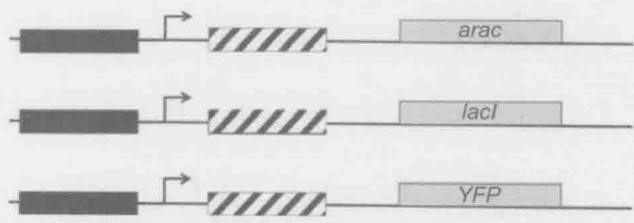  
AraC 结合位点  
lac 操纵子

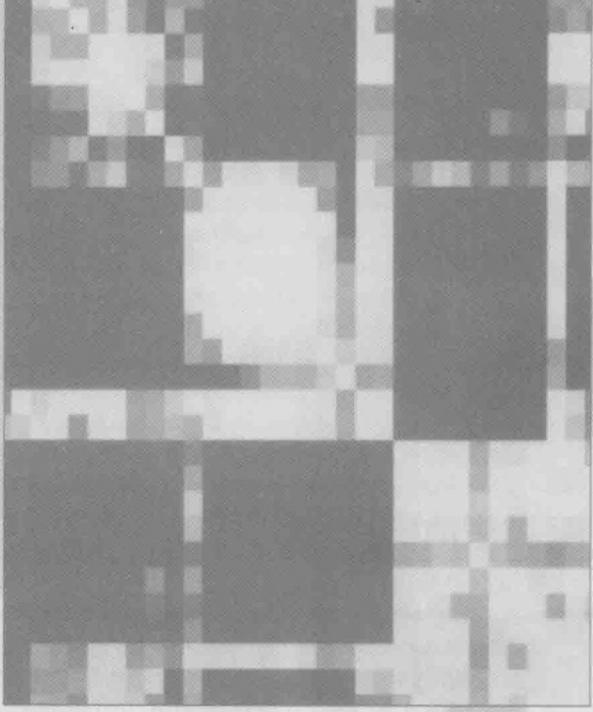

#### [W] 附录 2：本章偶数习题答案

问题 2 调控通路遵循 “与门” 的原则，即它要求；两个输入条件要满足输出要求而不是单纯的开关功能。

问题 4 随机性意味着系统受到一些随机的影响。在基因表达调控上的随机性是指在几近相同的条件下的基因表达中产生的噪声或多样性。

问题 6 负面的自我调节可以使得调节通路的输出对引起噪声的参数不敏感从而来维持

稳态。

问题 8 ComK 与 comK 启动子结合。正面的自我调控是对 ComK 蛋白水平的轻微改变有高的灵敏性，因而当达到临界值时输出并不是线性的。该开关被称为介于开和关状态之间的“刀棱”。

问题 10 由于基因表达的脉冲或输出，因而基因的调控处于不连贯的前馈回路之下。输入光导致直接激活输出的诱导因子的产生。诱导因子也引起了组织输出的抑制因子的产生。基因的表达在诱导因子起作用之后而阻遏因子起作用之前的短暂时间内发生。

问题12

负自我调节

问题14

A. 在阿拉伯糖存在时，AraC 将会与 AraC 结合位点结合，并启动 araC、lacI 及 YFP 基因的转录，从而得到这些蛋白。

B. LacI 也是在阿拉伯糖存在时产生的，因而它可以与所有的 lac 操纵子结合来关闭这三个基因的转录，因而 YFP 不会产生更多的了。

C. LacI 关闭其自身的合成，其最终的水平随着细胞分裂和/或降解的逐步稀释而降低至需要抑制的阈值以下。在阿拉伯糖和小量 AraC 存在时，将会产生更多的 AraC 来重新开启 YFP 的生成。

D. 在最初加入阿拉伯糖后 YFP 信号将会持续更长时间, 因为 IPTG 阻止了 LacI 的结合, 在系统关闭 YFP 的表达前需要更多的 LacI 或者更长的时间。

<!-- W-END Watson 22 章末 -->

<!-- C-BEGIN Campbell 18 Review -->

### 【英文对应 Campbell 第18章章末：Chapter Review】

> 来源：Campbell Biology（书籍/01_Campbell_Biology） 第18章 Summary of Key Concepts 与 Test Your Understanding。

### [EN] Chapter 18 Review

### [EN] Summary of Key Concepts

To review key terms, go to the Vocabulary Self-Quiz (eTextbook only).

### [EN] Concept 18.1: Bacteria often respond to environmental change by regulating transcription

\- Cells control metabolism by regulating enzyme activity or the expression of genes coding for enzymes. In bacteria, genes are often clustered into operons, with one promoter serving several adjacent genes. An operator site on

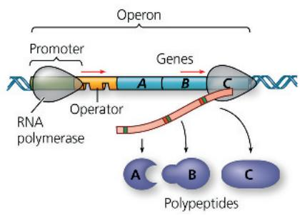

the DNA switches the operon on or off, resulting in coordinate regulation of the genes.

\- Both repressible and inducible operons are examples of negative gene regulation. In either type of operon, binding of a specific repressor protein to the operator shuts off transcription. (The repressor is encoded by a separate regulatory gene.) In a repressible operon (usually encoding anabolic enzymes), the repressor is active when bound to a corepressor, often the end product of the pathway.

\- In an inducible operon (usually encoding catabolic enzymes), binding of an inducer to an innately active repressor inactivates the repressor and turns on transcription.

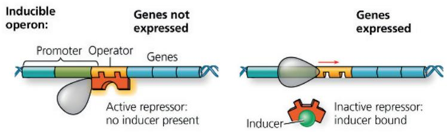  
- Some operons have positive gene regulation via a stimulatory activator protein (such as CRP, when activated by cyclic AMP), binds to a site within the promoter and stimulates transcription.

Compare and contrast the roles of a corepressor and an inducer in negative regulation of an operon.

Concept 18.2: Eukaryotic gene expression is regulated at many stages  
  
Describe what must happen in a cell for a gene specific to that cell type to be transcribed.

Concept 18.3: Noncoding RNAs play multiple roles in controlling gene expression  
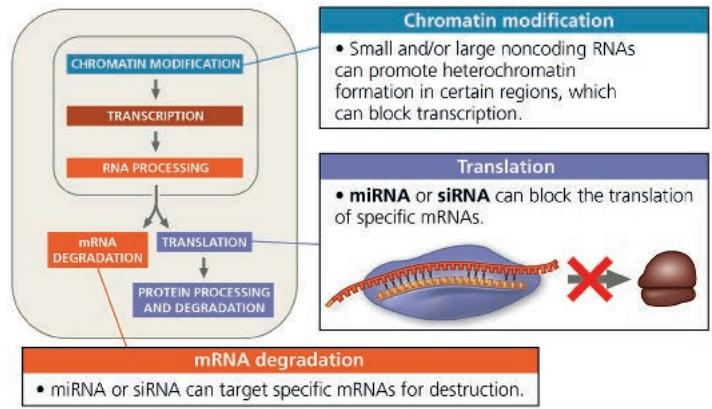  
Why are miRNAs called noncoding RNAs? Explain how they participate in gene regulation.

### [EN] Concept 18.4: A program of differential gene expression leads to the different cell types in a multicellular organism

\- Embryonic cells become committed to a certain fate (determination), and undergo differentiation, becoming specialized in structure and function for their determined fate.

Cells differ in structure and function not because they contain different genomes but because they express different genes. Morphogenesis encompasses the processes that give shape to the organism and its various structures.

\- Localized cytoplasmic determinants in the unfertilized egg are distributed differentially to daughter cells, where they regulate the expression of those cells' developmental fates. In the process called induction, signaling molecules from embryonic cells cause transcriptional changes in nearby target cells.

\- Differentiation is marked by the appearance of tissue-specific proteins, which enable differentiated cells to carry out their specialized roles.

\- In animals, pattern formation, the development of a spatial organization of tissues and organs, begins in the early embryo. Positional information, the molecular cues that control pattern formation, tells a cell its location relative to the body's axes and to other cells. In Drosophila, gradients of morphogens encoded by maternal effect genes determine the body axes. For example, the gradient of Bicoid protein determines the anterior-posterior axis.

Describe the two main processes that cause embryonic cells to head down different pathways to their final fates.

### [EN] Concept 18.5: Cancer results from genetic changes that affect cell cycle control

\- The products of proto-oncogenes and tumor-suppressor genes control cell division. A DNA change that makes a proto-oncogene overly active converts it to an oncogene, which may promote extra cell division and cancer. A tumor-suppressor gene encodes a protein that inhibits abnormal cell division. A mutation that reduces the activity of its protein product may lead to excessive cell division and cancer.

\- Many proto-oncogenes and tumor-suppressor genes encode components of growth-stimulating and growth-inhibiting signaling pathways, respectively, and mutations in them can interfere with normal cell-signaling pathways. A hyperactive version of a protein in a stimulatory pathway, such as Ras (a G protein), functions as an oncogene protein. A defective version of a protein in an inhibitory pathway, such as p53 (a transcription activator), fails to act as a tumor suppressor.

\- In the multistep model of cancer development, normal cells are converted to cancer cells by the accumulation of mutations affecting proto-oncogenes and tumor-suppressor genes. Technical advances in DNA and mRNA sequencing are enabling cancer treatments that are more individually based.

\- Genomics-based studies have resulted in researchers proposing four subtypes of breast cancer, based on expression of genes by tumor cells.

\- Individuals who inherit a mutant allele of a proto-oncogene or tumor-suppressor gene have a predisposition to develop a particular cancer. Certain viruses promote cancer by integration of viral DNA into a cell's genome.

Compare the usual functions of proteins encoded by proto-oncogenes with those of proteins encoded by tumor-suppressor genes.

### [EN] Test Your Understanding

For more multiple-choice questions, go to the Practice Test (eTextbook only).

### [EN] Levels 1-2: Remembering/Understanding

1. If a particular operon encodes enzymes for making an essential amino acid and is regulated like the trp operon, then

(A) the amino acid inactivates the repressor.

(B) the repressor is active in the absence of the amino acid.

(C) the amino acid acts as a corepressor.

(D) the amino acid turns on transcription of the operon.

2. Muscle cells differ from nerve cells mainly because they

(A) express different genes.

(B) contain different genes.

(C) use different genetic codes.

(D) have unique ribosomes.

### [EN] 3. The functioning of enhancers is an example of

(A) a eukaryotic equivalent of prokaryotic promoter functioning.

(B) transcriptional control of gene expression.

(C) the stimulation of translation by initiation factors.

(D) post-translational control that activates certain proteins.

4. Cell differentiation always involves

(A) transcription of the myoD gene.

(B) the movement of cells.

(C) the production of tissue-specific proteins.

(D) the selective loss of certain genes from the genome.

5. Which of the following is an example of post-transcriptional control of gene expression?

(A) the addition of methyl groups to cytosine bases of DNA

(B) the binding of transcription factors to a promoter

(C) the removal of introns and alternative splicing of exons

(D) gene amplification contributing to cancer

### [EN] Levels 3-4: Applying/Analyzing

6. What would occur if the repressor of an inducible operon were mutated so it could not bind the operator?

(A) irreversible binding of the repressor to the promoter

(B) reduced transcription of the operon's genes

(C) buildup of a substrate for the pathway controlled by the operon

(D) continuous transcription of the operon's genes

7. Absence of bicoid mRNA from a Drosophila egg leads to the absence of anterior larval body parts and mirror-image duplication of posterior parts. This is evidence that the product of the bicoid gene

(A) normally leads to formation of head structures.

(B) normally leads to formation of tail structures.

(C) is transcribed in the early embryo.

(D) is a protein present in all head structures.

8. Which of the following statements about the DNA in one of your brain cells is true?

(A) Most of the DNA codes for protein.

(B) The majority of genes are likely to be transcribed.

(C) It is the same as the DNA in one of your liver cells.

(D) Each gene lies immediately adjacent to an enhancer.

9. Within a cell, the amount of protein made using a given mRNA molecule in that cell depends partly on

(A) the degree of DNA methylation.

(B) the rate at which the mRNA is degraded.

(C) the number of introns present in the mRNA.

(D) the types of ribosomes present in the cytoplasm.

10. Proto-oncogenes can change into oncogenes that cause cancer. Which of the following best explains the presence of these potential time bombs in eukaryotic cells?

(A) Proto-oncogenes first arose from viral infections.

(B) Proto-oncogenes are mutant versions of normal genes.

(C) Proto-oncogenes are genetic "junk."

(D) Proto-oncogenes normally help regulate cell division.

### [EN] Levels 5-6: Evaluating/Creating

11. DRAW IT The diagram below shows five genes, including their enhancers, from the genome of a certain species. Imagine that yellow, blue, green, black, red, and purple activator proteins exist that can bind to the appropriately color-coded control elements in the enhancers of these genes.

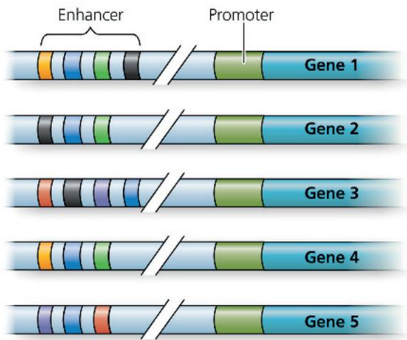

(A) Draw an X above enhancer elements (of all the genes) that would have activators bound in a cell in which only gene 5 is transcribed. Identify which colored activators would be present.

(B) Draw a dot above all enhancer elements that would have activators bound in a cell in which the green, blue, and yellow activators are present. Identify which gene(s) would be transcribed.

(C) Imagine that genes 1, 2, and 4 code for nerve-specific proteins, and genes 3 and 5 are skin-specific. Identify which activators would be present in each cell type to ensure transcription of the appropriate genes.

12. EVOLUTION CONNECTION DNA sequences can act as “tape measures of evolution” (see Concept 5.6). Scientists analyzing the human genome sequence were surprised to find that some of the regions of the human genome that are most highly conserved (similar to comparable regions in other species) don’t code for proteins. Propose a possible explanation for this observation.

13. SCIENTIFIC INQUIRY Prostate cells usually require testosterone and other androgens to survive. But some prostate cancer cells thrive despite treatments that eliminate androgens. One hypothesis is that estrogen, often considered a female hormone, may be activating genes normally controlled by an androgen in these cancer cells. Describe one or more experiments to test this hypothesis. (See Figure 11.9 to review the action of these steroid hormones.)

14. WRITE ABOUT A THEME: INTERACTIONS In a short essay (100–150 words), discuss how the processes shown in Figure 18.2 are examples of feedback mechanisms regulating biological systems in bacterial cells.

### [EN] 15. SYNTHESIZE YOUR KNOWLEDGE

The flashlight fish has an organ under its eye that emits light, which serves to startle predators and attract prey, and allows the fish to communicate with other fish. Some species can rotate the organ inside and then out, so the light appears to flash on and off. The light is actually emitted by bacteria (of the genus Vibrio) that live in the organ in a mutualistic relationship with the fish. (The bacteria receive nutrients from the fish.) The bacteria must multiply until they reach a certain density in the organ (a “quorum”; see Concept 11.1), at which point they all begin emitting light at the same time. There is a group of six or so genes, called lux genes, whose gene products are necessary for light formation. Given that these bacterial genes are regulated together, propose a hypothesis for how the genes are organized and regulated.

For selected answers, see Appendix A.

### [EN] Explore Scientific Papers with Science in the Classroom | AAAS

Can cancer be stopped before it begins? Go to “Arrested Development: When Cells Make Mistakes” at www.scienceintheclassroom.org.

Instructors: Questions can be assigned in Mastering Biology.

<!-- C-END Campbell 18 Review -->
