# 第9章 疾病与人类健康

> **本章插入内容**（中文对照与英文对应，插在所列中文节末尾；导言在章首，小结/习题/Review 在章末）
>
> - Campbell Concept 18.5 → 9.1 肿瘤与癌症
> - Campbell Concept 19.1 → 9.2 人类免疫缺陷病毒(HIV)
> - Campbell Concept 19.2 → 9.2 人类免疫缺陷病毒(HIV)
> - Campbell Concept 19.3 → 9.4 人禽流感的分子机制
> - Campbell Concept 20.4 → 9.6 基因治疗
> - Lehninger §26.3 → 9.2 人类免疫缺陷病毒(HIV)
> - 章首导言与章末：Campbell 第19章

<!-- 章节边界按正文内容恢复；原始 MinerU 内容保留如下。 -->

# 疾病与人类健康

9.1 肿瘤与癌症

9.2 人类免疫缺陷病毒(HIV)

9.3 乙型肝炎病毒(HBV)

9.4 人禽流感的分子机制

9.5 严重急性呼吸综合征的分子机制

9.6 基因治疗

9.7 肿瘤的免疫治疗


<!-- C-BEGIN Campbell 19 导言 -->

### 【英文对应 Campbell 第19章导言：Viruses】

> 来源：Campbell Biology（书籍/01_Campbell_Biology） 第19章章首（Key Concepts 与引言）。

#### [EN] 第19章 Viruses

<!-- 章节边界按正文内容恢复；原始 MinerU 内容保留如下。 -->

#### [EN] Viruses

#### [EN] Key Concepts

19.1 A virus consists of a nucleic acid surrounded by a protein coat
19.2 Viruses replicate only in host cells

19.3 Viruses and prions are formidable pathogens in animals and plants

#### [EN] Study Tip

Make flowcharts: Make a simple flowchart for each viral replicative cycle in this chapter. Shown here is the beginning of an example for the lysogenic cycle. Note the similarities and differences between the replicative cycles.


  
Figure 19.1 A human immune cell (blue) infected by human immunodeficiency virus (HIV) is releasing more HIV viruses (small gold dots), which will go on to infect other cells. Left untreated, HIV destroys vital immune system cells, causing AIDS. This disease has killed about 35 million people worldwide.

#### [EN] How does a virus make more viruses?

A virus consists only of nucleic acid, proteins, and sometimes a membranous envelope. After infecting a host cell, it uses the host cell's molecules to make new viruses, as shown in this simplified diagram.

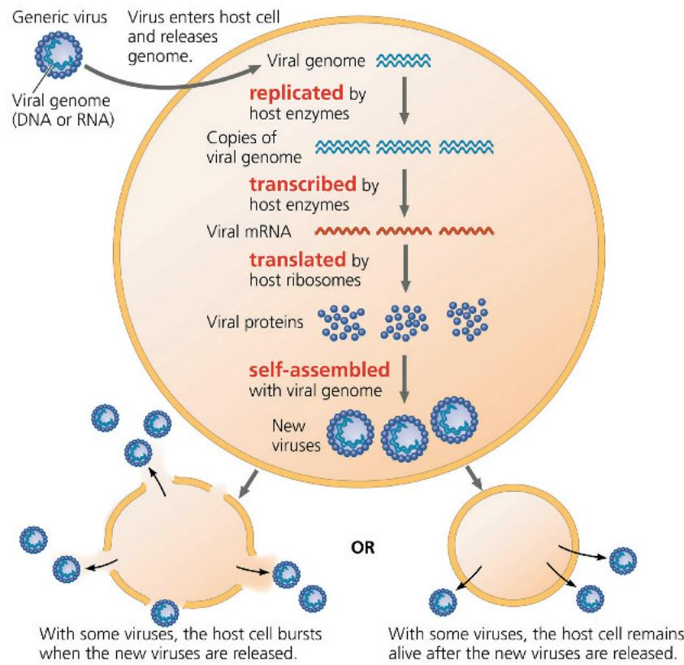  
With some viruses, the host cell remains alive after the new viruses are released.


<!-- C-END Campbell 19 导言 -->

## 9.1 肿瘤与癌症

癌(cancer)也称恶性肿瘤, 是一群不受生长调控、过度增殖且不受常规的区域限制的细胞。良性肿瘤细胞虽然也是过度增殖的细胞群, 却仅局限在自己的正常位置, 不侵染周围其他组织和器官。因此, 绝大多数癌是由肿瘤细胞经过一系列突变转化而来的(图9-1)。癌症是人类生存的头号敌人。今天, 科学家已经能够对许多种癌症做出早期诊断, 延长患者的生存期, 但并未从根本上征服这个病魔。20世纪50年代以来, 对肿瘤医学的研究有3项最为突出的成就: ①癌基因的发现及其研究的深入; ②染色体畸变与致癌基因表达相互关系的揭示; ③抑癌基因的发现及表达调控。已经发现了上百个原癌基因(proto-oncogene) 和许多抑癌基因(anti-oncogene), 证明细胞癌变的分子基础是基因突变, DNA的变化和不正常活动导致了细胞癌变。

图9-1 肿瘤组织示意图  


癌基因(oncogene)可分为两大类:一类是病毒癌基因(viral oncogene, V-onc),编码病毒癌基因的主要有DNA病毒和RNA病毒。DNA病毒包括乙型肝炎病毒、猴病毒40和多瘤病毒、乳头瘤病毒、腺病毒、疱疹病毒和痘病毒。RNA病毒主要是反转录病毒。反转录病毒致癌基因(retrovirus oncogene)可能是研究最多的病毒基因,它们能使靶细胞发生恶性转化。第二类是细胞转化基因(cellular oncogene, C-onc),它们能使正常细胞转化为肿瘤细胞,这类基因与病毒癌基因有显著的序列相似性。事实上,细胞转化基因可能就是存在于人体正常细胞中的原癌基因的突变产物,它们广泛存在于生物界,有相当强的保守性,属于管家基因,正常表达时对细胞的生长和分化有调控作用。

## 9.1.1 反转录病毒致癌基因

早在 1910 年, Rous 就发现带有肉瘤病毒(一种反转录病毒)的鸡肉瘤无细胞滤液能在鸡体内诱发新的肉瘤。这种病毒的基因组是由单链 RNA 组成的, 一般只有 6\~9 kb。RNA 上的基因数目很少, 它们被包裹在由 gag 和 env 两个基因编码的蛋白质外壳中, 其

中 env 基因指导外壳蛋白的合成, gag 基因则指导“鞘”蛋白的合成, 这些“鞘”蛋白好像“道钉”一样“箍”在外壳的表面, 维持外壳蛋白结构的稳定性(图 9-2)。反转录病毒的复制由其自身基因组上 pol 基因编码的反转录酶指导完成。当病毒感染细胞时, 病毒最外层囊膜不进入

  
图 9-2 反转录病毒颗粒示意图

细胞,含有基因组 RNA 和反转录酶的核心颗粒进入细胞并在病毒核心颗粒内开始利用自身携带的反转录酶(可能还需要某些宿主细胞因子)进行病毒基因组的反转录,合成含有完整病毒基因组信息的线性双链 DNA 并被运入细胞核,在病毒整合酶作用下随机整合进入宿主细胞基因组 $^{(图9-3)}$ 。

被整合的病毒 DNA 分子称为原病毒(provirus)。由于反转录病毒一般不会引起细胞死亡,所以,原病毒象孟德尔单一基因遗传一样传给子代细胞。整合的原病毒 LTR 含有细胞 RNA 聚合酶Ⅱ以及识别细胞转录因子的所有信号和原件,能转录出完整病毒 mRNA,并利用宿主细胞中的蛋白质合成机器,翻译病毒外壳蛋白和其他相关蛋白质,最后组装成病毒颗粒。已在各种反转录病毒中发现了大量致癌基因,它们感染后诱导宿主产生肿瘤的主要原因是激活特定基因表达,从而破坏宿主细胞本身固有的平衡,导致细胞发生转化。

最早发现的致癌基因是劳斯氏(Rous)肉瘤病毒中的 V-Src 基因,它编码了一个被称为 p60 $^{Src}$ 的蛋白质。序列分析表明,该蛋白有 514 个氨基酸,是一个磷酸化蛋白。其 C 端 250 个氨基酸是活性区域,负责将磷酸基团转移到酪氨酸残基上。它的作用主要是使多个靶蛋白发生磷酸化,从而影响它们的功能,加速细胞癌变过程。

p60 $^{Src}$ 使多个蛋白质中的酪氨酸发生磷酸化以后, 又如何促使细胞发生癌变呢? 科学家发现, 一种存在于细胞基部质膜附着点内被称为枢纽蛋白 (vinculin) 的细胞骨架蛋白磷酸化可能是引起细胞癌变的中心环节。已知质膜附着点的主要作用是通过细胞膜固着蛋白, 将细胞固定在所处的表面, 它也能使肌动蛋白的纤丝依附在上面。位于附着点内的枢纽蛋白则起着连接肌动蛋白纤丝束和细胞膜固着蛋白的作用。正常情况下, 该蛋白上的酪氨酸残基只有轻度磷酸化。在转化细胞中, 由于 p60 $^{Src}$ 结合在附着点内靠近或位于枢纽蛋白处,使这一蛋白的磷酸化水平提高了20倍以上,明显降低了枢纽蛋白连接肌动蛋白纤丝束和细胞膜固着蛋白的功能,导致肌动蛋白纤丝束松散,细胞黏附能力减弱,容易发生脱落和转移。

图 9-3 含有反转录病毒完整基因组信息的双链 DNA 整合到宿主细胞基因组 DNA 上  


## 1. 急性转化型和非急性转化型

根据反转录病毒转化细胞的能力,可将其分为急性转化型和非急性转化型两大类。急性转化型反转录病毒具有3个主要特征:①这类病毒感染动物后,很短时期内(几天或几周)就出现实体瘤或白血瘤(leukemia);②它们所带的癌基因一般位于病毒基因组内部,也可位于基因组的3'端,但不会插入结构基因内部;③具有体外转化细胞的能力。非急性转化型则正好相反,它们感染宿主细胞后需要较长时间(几个月,数年甚至数十年)才会致癌。

## 2. V-onc 基因的起源

研究发现,反转录病毒基因组中所带有的 onc 基因并非来自病毒本身,而是这些病毒在感染动物或人体之后获得的细胞原癌基因(图 9-4)。这些动物或人原癌基因经病毒修饰和改造后,成为病毒基因组的一部分并具有了致癌性,其作用的靶分子也往往发生改变。已经证实,各种脊椎动物染色体 DNA 上都有与 Src 相类似的 DNA 序列,说明它是正常细胞所固有的。因为正常细胞中这些基因是不表达的,只有在细胞发生癌变时才有活性,所以称为原癌基因。一般说来,细胞原癌基因大都是断裂基因,带有插入序列,而病毒的致癌基因往往是一个完整的没有断裂的读码框。

目前已鉴定了超过100个致癌基因，最常见的是ras与myc基因家族。突变的Haras基因产物与结肠癌、肺癌、胰腺癌等相关，K-ras与恶性骨髓瘤、成淋巴细胞瘤等有关，而N-ras则多见于泌尿系统癌症。研究发现，c-myc表达主要在 $\mathrm{G}_0 / \mathrm{G}_1$ 交界或 $\mathrm{G}_{1}$ 早期，而C-H-ras和C-K-ras则主要在 $\mathrm{G}_{1}$ 中晚期。 $\mathrm{G}_{1}$ 期对于细胞生长的控制具有关键性意义，因为该时相中存在一个“生长控制点”，在正常情况下，细胞可根据对信号的应答，发挥“生长控制点”的调节作用，使细胞通过该点，进入S、M期再回到 $\mathrm{G}_{1}$ 期，或者阻止细胞通过该控制点而使其进入 $\mathrm{G}_0$ 期。c-myc的表达可能使细胞获得了通过“生长控制点”的潜能，而c-ras的表达似乎加强了c-myc的这种作用潜能，二者协同作用使细胞向S期过渡成为可能。也就是说，c-myc 和 c-ras 的协同作用是细胞分裂的必要步骤。在肿瘤细胞中，“生长控制点”不起作用，所以瘤细胞一直处于细胞周期循环之中。

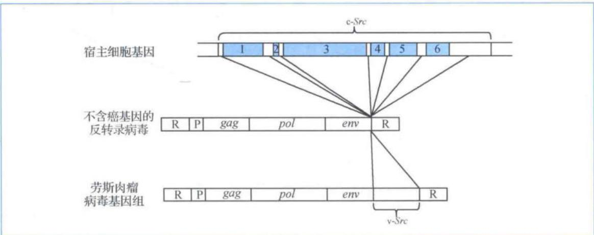  
图 9-4 劳斯肉瘤病毒基因结构及 c-Src 原癌基因的转变  
宿主细胞原癌基因(上)和不含癌基因的反转录病毒基因组及所编码的主要蛋白质(中);含有癌基因的劳斯肉瘤病毒基因结构(下)。

## 9.1.2 原癌基因(细胞转化基因)产物及其分类

除了病毒感染会诱发细胞癌变外,尚有许多非病毒因子(如放射性物质、化学试剂亚硝酸、烷化剂等)也能诱导细胞转化。这些因子并没有把致癌基因或其他致癌的遗传信息带入细胞,而仅仅通过某种激活机制改变了细胞内原有的遗传信息,使细胞发生恶性转化。对大量致癌因子的研究证明,它们的作用都是使基因发生突变(图9-5),充分说明内源基因在细胞转化中的地位。实验证明,此时引起细胞恶性转化的因子仍然是DNA,化学诱变后的细胞中同样存在着决定细胞命运的致癌基因。从人膀胱癌T24肿瘤细胞中提取DNA,转染正常小鼠成纤维细胞使之变为转化细胞。从发生转化的成纤维细胞集落中分离单细胞,培养、扩增后再提取DNA,第二次转染正常小鼠成纤维细胞,又出现转化细胞集落。如果细胞转化特性是由分散在不同DNA片段上的遗传因子决定的,那么,在这个基因重复导入过程中细胞的转化特性可能消失。事实上,经过连续多次基因导入后,细胞仍被转化,说明致癌因子可能存在于一个特定的区域。

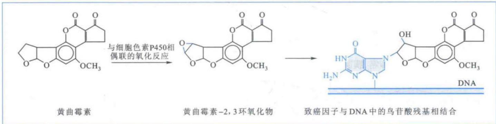  
图 9-5 黄曲霉素 (aflatoxin) 导致细胞发生癌变的分子机制

根据原癌基因产物在细胞中的位置将其分为3大类:第一类是与膜结合的蛋白质,主要有 erbB、neu、fms、mas 和 Src 基因产物;第二类是可溶性蛋白,包括 mos、sis 和 fps 基因产物;第三类是核蛋白,包括 myc、ets、jun 和 myb 等。根据这些蛋白质的功能,它们又常被分为6类,即蛋白激酶类、生长因子类、生长因子受体类、GTP 结合蛋白类、核蛋白类和功能未知类。原癌基因产物的一个共同特征是它们都能诱发一系列与细胞生长分化有关的基因表达,从而改变细胞的表型。

## 9.1.3 原癌基因的表达调控

原癌基因在正常细胞中通常以单拷贝形式存在,只有低水平的表达或根本不表达。在很多情况下,原癌基因的结构发生了点突变或插入、重排、缺失及扩增等,改变其转录活性 $^{(图9-6)}$ 。

  
图 9-6 细胞中原癌基因转变为癌基因的主要途径

## 1. 点突变

虽然原癌基因活化导致癌变的原因多种多样,但点突变可能是最常见的机制。在 ras 基因家族中,存在着许多原癌基因发生点突变的实例。Ha-ras 和 K-ras 基因最初是从小鼠肉瘤病毒中分离出来的,N-ras 是从人神经母细胞瘤细胞系中分离得到的,C-ras 基因存在于非肿瘤细胞生物机体中,可能是细胞发挥正常的生理功能所必需的。研究发现,ras 基因编码了一个相对分子质量为 $2.1 \times 10^{4}$ 的癌蛋白(p21),从人类膀胱癌细胞系 T24 DNA 中克隆的 Ha-ras 基因能够诱发 NIH/3T3 细胞转化,而从正常细胞 DNA 中克隆的该原癌基因没有这种功能。因为 T24 膀胱癌细胞中 Ha-ras 基因的表达水平较之正常细胞并无明显提高,科学家推测点突变使癌基因产物 p21 蛋白的结构和功能发生了某些变化(图9-7)。

<table><tr><td rowspan="2"></td><td colspan="3">第一外显子</td><td colspan="3">第二外显子</td><td rowspan="2">转化活性</td></tr><tr><td>11</td><td>12</td><td>13</td><td>60</td><td>61</td><td>62</td></tr><tr><td>原C-H-ras</td><td>...GCC丙氨酸</td><td>...GCC丙氨酸</td><td>GGT...甘氨酸</td><td>...GGC甘氨酸</td><td>CAG谷氨酰胺</td><td>GAG...谷氨酸</td><td>-</td></tr><tr><td>膀胱癌C-H-ras</td><td>...GCC丙氨酸</td><td>GTC缬氨酸</td><td>GGT...甘氨酸</td><td>...GGC甘氨酸</td><td>CAG谷氨酰胺</td><td>GAG...谷氨酸</td><td>+</td></tr><tr><td>肺癌C-H-ras</td><td>...GCC丙氨酸</td><td>GTC缬氨酸</td><td>GGT...甘氨酸</td><td>...GGC甘氨酸</td><td>CTG亮氨酸</td><td>GAG...谷氨酸</td><td>+</td></tr><tr><td>MSV-H-ras</td><td>...GCC丙氨酸</td><td>AGA精氨酸</td><td>GGT...甘氨酸</td><td>...GGC甘氨酸</td><td>CTG亮氨酸</td><td>GAG...谷氨酸</td><td>+</td></tr><tr><td>乳腺癌NMU-H-ras</td><td>...GCC丙氨酸</td><td>GAA谷氨酸</td><td>GGT...甘氨酸</td><td>...GGC甘氨酸</td><td>? ?</td><td>GAG...谷氨酸</td><td>+</td></tr><tr><td>原C-K-ras</td><td>...GCT丙氨酸</td><td>GGT甘氨酸</td><td>GGC...甘氨酸</td><td>...GGT甘氨酸</td><td>CAA谷氨酰胺</td><td>GAA...谷氨酸</td><td>-</td></tr><tr><td>肺癌C-K-ras</td><td>...GCT丙氨酸</td><td>TGT半胱氨酸</td><td>GGC...甘氨酸</td><td>...GGT甘氨酸</td><td>CAA谷氨酰胺</td><td>GAA...谷氨酸</td><td>+</td></tr><tr><td>大肠癌C-K-ras</td><td>...GCT丙氨酸</td><td>GTT缬氨酸</td><td>GGC...甘氨酸</td><td>...GGT甘氨酸</td><td>CAA谷氨酰胺</td><td>GAA...谷氨酸</td><td>+</td></tr><tr><td>MSV-K-ras</td><td>...GCT丙氨酸</td><td>AGT丝氨酸</td><td>GGC...甘氨酸</td><td>...GGT甘氨酸</td><td>CAA谷氨酰胺</td><td>GAA...谷氨酸</td><td>+</td></tr></table>

图9-7 ras基因的点突变及转化活性分析

如人类肺癌细胞系 Hs242 的转化基因与 Ha-ras 高度相似, 在这个基因中导致转化活性的遗传损伤是第二个外显子中引起 p21 蛋白第 61 位谷氨酰胺被亮氨酸所替代的一个点突变。所以, p21 分子某些部位发生单个氨基酸替代足以引起蛋白质构象的改变, 并使细胞获得转化活性。

在肺癌和结肠癌细胞系中也发现了 K-ras 型转化基因。肺癌细胞系含有第 12 位密码子由 TGT 取代 GGC，从而以半胱氨酸取代甘氨酸的 K-ras2 转化基因；而 SW480 结肠癌细胞系也含有 K-ras 转化基因，其第 12 位密码子为 GTT，编码了缬氨酸。这两个细胞系都经历了点突变激活过程，突变部位就是人类膀胱癌细胞系 T24Ha-ras 的对应部位。现在已经证明由 NIH/3T3 细胞转染检出的 ras 原癌基因中，第 12 位密码子是个突变“热点”。

## 2. LTR 插入

LTR 是反转录病毒基因组两端的长末端重复序列 (long terminal repeat), 其结构中含有强的启动子序列, 当 LTR 插入原癌基因启动子区域或邻近部位后, 可从根本上改变基因的正常调控规律。最早发现 LTR 插入激活现象是在慢性反转录病毒感染的细胞中。LTR 插入到 c-myc 5' 上游启动子附近, 使 c-myc 的转录水平大大增加。其他原癌基因中也发现了类似现象。LTR 插入后, 与血小板衍生生长因子 β 链 (PDGF-β) 相似的 c-sis 基因的转录和翻译水平均有明显增加。表 9-1 是受 LTR 插入激活的部分原癌基因。

表 9-1 LTR 插入激活的原癌基因

<table><tr><td>原癌基因</td><td>LTR 来源</td><td>诱发的肿瘤</td></tr><tr><td></td><td>禽类白血病病毒</td><td>禽类黏液性囊性淋巴瘤</td></tr><tr><td rowspan="2">myc</td><td>鼠白血病病毒</td><td>鼠T细胞淋巴瘤</td></tr><tr><td>猫白血病病毒</td><td>猫T细胞淋巴瘤</td></tr><tr><td>erbB</td><td>禽类白血病病毒</td><td>禽类红白血病</td></tr><tr><td>H-ras</td><td>禽类白血病病毒</td><td>禽肾细胞瘤</td></tr><tr><td>K-ras</td><td>小鼠白血病病毒</td><td>小鼠髓性细胞白血病</td></tr><tr><td>myb</td><td>禽类白血病病毒</td><td>禽类黏液性囊性淋巴瘤</td></tr><tr><td>fms</td><td>小鼠白血病病毒</td><td>小鼠髓性细胞白血病</td></tr><tr><td>Int-1</td><td>小鼠乳头瘤病毒</td><td>小鼠乳腺癌</td></tr><tr><td>Pim-1</td><td>小鼠白血病病毒</td><td>小鼠T细胞淋巴瘤</td></tr><tr><td>Lck</td><td>小鼠白血病病毒</td><td>小鼠T细胞淋巴瘤</td></tr><tr><td>evi-1</td><td>小鼠白血病病毒</td><td>小鼠髓性细胞白血病</td></tr></table>

## 3. 基因重排

在大多数类型的人肿瘤中存在染色体数目和结构异常现象,说明存在原癌基因重排的可能。现已查明基因重排包括原癌基因之间,以及原癌基因与非原癌基因之间的重排。重排后基因内部结构可不受影响,也可能发生改变。在 Burkitt 淋巴瘤中,Ig 基因与 c-myc之间发生重排。正常情况下，c-myc定位于 $8q^{24}$ ，免疫球蛋白重链基因(IgH)定位于 $14q^{32}$ ，轻链 $\lambda$ 基因(Ig $\lambda$ )定位于 $22q^{12}$ ，轻链k基因(IgK)定位于 $2p^{11}$ 。重排时，c-myc从其上游区到第2外显子的区域内断裂，易位至IgH、IgK或Ig $\lambda$ 的位点，使Ig基因与c-myc相连在一起，Ig基因5'端的启动子发挥作用，使原来不表达的c-myc大量表达。由于人体的特殊需求，通常Ig基因的表达能力非常强。c-myc一旦与Ig基因启动子和增强子重组后，可使原来的调控机制失去作用，导致极高水平的表达。在正常人体细胞中，非受体型酪氨酸蛋白激酶基因abl位于第9号染色体上，表达量极低，不会诱发癌变。在慢性骨髓瘤病人细胞中，该基因却被转移到第22号染色体上，与bcr基因相融合，表达量大为提高，导致细胞分裂失控，发生癌变(图9-8)。

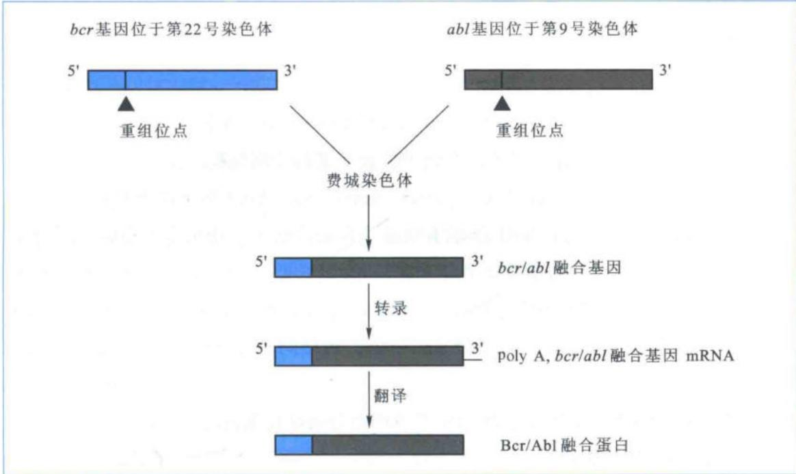  
图 9-8 abl 原癌基因通过选择性染色体重排转变成细胞癌基因

## 4. 缺失

很多原癌基因 5' 上游区存在负调控序列,一旦该序列发生缺失或突变,就丧失抑制基因表达调控的能力。如 Brukitt 淋巴瘤中 c-myc 可因负调控序列的缺失或 LTR 插入破坏其结构而增强表达。

## 5. 基因扩增

使每个细胞中基因拷贝数增加,从而直接增加可用的转录模板数以提高基因表达。某些正常细胞在生长、发育过程中需要大量相关蛋白质,可通过基因扩增的方式来达到提高表达量的效果。细胞也可通过基因扩增的产物来抵抗环境胁(如对化学物质和药物的抗性等),以获得生存能力。在肿瘤细胞中,DNA扩增事件的发生频率至少比在正常细胞中高上千倍。一旦发生基因扩增,肿瘤细胞就获得了选择性生长优势。实验证明,癌基因常常是肿瘤细胞中DNA扩增的靶位点,在各种人类肿瘤中已发现了十几种癌基因的扩增。

## 9.1.4 基因互作与癌基因表达

## 1. 染色体构象对原癌基因表达的影响

基因表达不仅取决于基因本身及其相邻区域的一级结构,也取决于其空间构象。当两个基因相距太近时,往往不易形成有利于高效转录的空间结构。因此,基因与基因之间的间隔距离被定义为“基因领域”(gene territory)。同一DNA链上两个具有相同转录方向的基因间隔小于一定长度时,影响有效转录所必需的染色质结构的形成,从而使这两个基因中的一个或两个均不能转录或转录活性显著降低,产生所谓基因领域效应(gene territorial effect)。对大量基因的分析表明,基因之间的间隔距离与两个基因的总长度相关,当两个基因的总长度在0.3 kb至5 kb之间时,最佳间隔距离与两个基因的总长度成正相关。

正常人 c-myc 定位于第 8 号染色体,在其两侧分别存在强表达基因,在基因领域效应的影响下,c-myc 转录受抑制。在 Burkitt 淋巴瘤中,由于发生基因重排,使 c-myc 基因一侧的强表达基因消失,从而消除了对 c-myc 的基因领域效应,使后者的转录活性增强。由于 c-myc 转录增强,反过来对另一侧的基因产生了基因领域效应,使原来强表达的基因变为不表达状态。

在正常小鼠细胞中，c-myc 的 $5'$ 上游区域也存在一个强表达基因，其长度约为 15 kb，它距 c-myc 只有 3 kb 左右，很显然，这一间隔距离太短，与基因有效转录应有的最小距离相差甚远，此时，c-myc 受基因领域效应的影响非常大，表达完全受到抑制。在小鼠乳腺癌细胞中，上述间隔距离被显著拉长，激活 c-myc 转录。

## 2. 原癌基因终产物对基因表达的影响

这种影响包括某种原癌基因产物对另一种原癌基因表达的调控作用,也包括某种原癌基因产物对自身表达的反馈调控作用。一些原癌基因的产物是生长因子类、生长因子受体类或激素受体类物质,这些物质作为细胞外信号或信息传递物质,会对原癌基因的表达产生调控作用。癌基因产物通过介质传递生长刺激信号主要有3种方式:①癌基因产物本身模拟了生长因子,因而与相应的受体作用,以自分泌的方式刺激细胞生长;②癌基因产物模拟了已结合配体的生长因子受体,从而在无外源生长因子时提供了促进细胞分裂的信号;③癌基因产物作用于细胞内生长控制途径,解除此途径对外源刺激信号的需求。人血小板衍生生长因子(PDGF)与猴肉瘤病毒(SSV)的V-ras癌基因产物,上皮生长因子(EGF)与Src及V-erb癌基因产物之间,都存在着极高的相似性,表明生长因子与癌基因转化有关。

## 3. 抑癌基因产物对原癌基因的调控

因为抑癌基因产物能够抑制细胞的恶性增殖,所以它也被认为是一种隐性癌基因。当细胞内由于某种原因造成这些基因的表达受抑制时,原癌基因就活跃表达,引起细胞癌变。一般来说,抑癌基因在细胞生长中起负调控作用,主要是抑制增殖、促进分化、成熟和衰老,引导多余的细胞进入程序化死亡途径,而原癌基因的作用则正好相反;原癌基因通常是显性的,激活后参与促进细胞增殖和癌变过程,而抑癌基因是隐性的,抑癌基因的两个等位基因中失去任何一个都不影响其抑癌功能,只有两个等位基因全部失活才能失去抑癌功能;不仅体细胞中可能发生抑癌基因突变,生殖细胞中也可能发生抑癌基因突变并通过生殖细胞得到遗传,而原癌基因突变只发生在体细胞中。

p53 是通过杂合缺失鉴定的一个抑癌基因，在星形细胞癌、乳癌、肺癌、肠癌及骨肉瘤中都有高频率缺失现象。从癌细胞中得到的 p53 基因，其保守序列区有单一位点的突变，推测可能由于这一突变导致 p53 基因产物结构与功能的改变，失去抑癌活性。另外，在人类某些肿瘤细胞中也可观察到 p53 等位基因的缺失，这种缺失同样影响了肿瘤的发生。p53 这种抑癌作用可能是通过其蛋白质与 DNA 的结合而实现的。这种结合既影响 DNA 的复制，又影响基因的转录。

Rb 基因是从视网膜纤维瘤中克隆到的另一个抑癌基因, 其功能是阻止处于 $G_{0}/G_{1}$ 期的细胞进入 S 期, 从而控制细胞增殖。正常 Rb 基因的表达几乎可抑制所有培养细胞的分裂。

细胞的癌变绝非单一因素引起,它可能是显性的癌基因与隐性的抑癌基因经过多阶段的协同作用而形成的。一般说来,在一种肿瘤中起主要作用的几乎不可能是两种以上的癌基因,但很可能涉及两个以上抑癌基因的突变。

## 4. 外源信号对原癌基因表达的影响

细胞外信号(包括生长因子、激素、神经递质、药物等)作用于靶细胞后,通过细胞膜受体系统或其他直接途径被传递至细胞内,再通过多种蛋白激酶的活化,对转录因子进行修饰,然后引发一系列基因的转录激活(图9-9)。这一过程进行得很快,通常在几分钟至几十分钟内即可完成。据测定,在这么短时间内,有70\~80种基因的转录被激活,其中包括众多的原癌基因。研究表明,c-fos基因的转录激活可能是最快、最显著的,信号刺激后几分钟内即可检测到 c-fos 基因产物。随后，另一些编码核蛋白的原癌基因如 c-myc、c-myb、c-erbB、c-ets 等的转录也相继被激活。这些对细胞外信号反应迅速的基因被称为快速反应基因。

  
图 9-9 许多原癌基因参与细胞信号转导过程

快速反应基因的转录有两个特点:①不受蛋白质合成抑制剂的阻断。在许多情况下,还会因为蛋白质合成抑制剂抑制了不稳定蛋白质的合成而使转录产物的半寿期显著延长。②快速反应基因的转录激活维持时间很短,通常在半小时内完成,然后逐渐恢复原状。从这一点看,这类基因产物的主要功能是作为转录因子及调节因子去调节别的基因表达,以介导细胞外信号在细胞水平上的应答。


<!-- C-BEGIN Campbell 18.5 -->

### 【英文对应 Campbell Concept 18.5：Cancer results from genetic changes that affect cell cycle control】

> 来源：Campbell Biology（书籍/01_Campbell_Biology） 第18章 Regulation of Gene Expression，Concept 18.5。

#### [EN] Concept 18.5: Cancer results from genetic changes that affect cell cycle control

In Concept 12.3, we considered cancer as a disease in which cells escape from their normal cell division control mechanisms. Now that we have discussed the molecular basis of gene expression and its regulation, we can look at cancer more closely. The gene regulation systems that go wrong during cancer turn out to be the very same systems that play important roles in embryonic development, the immune response, and many other biological processes. Thus, research into the molecular basis of cancer has both benefited from and informed many other fields of biology.

#### [EN] Types of Genes Associated with Cancer

The genes that normally regulate cell growth and division during the cell cycle include genes for growth factors, their receptors, and the intracellular molecules of signaling pathways. (To review cell signaling, see Concept 11.2; for regulation of the cell cycle, see Concept 12.3.) Mutations that alter any of these genes in somatic cells can lead to cancer. The agent of such change can be random spontaneous mutation. Many cancer-causing mutations likely also result from environmental influences: chemical carcinogens, including many compounds in tobacco products, X-rays and other high-energy radiation, and some viruses.

Cancer research uncovered cancer-causing genes called oncogenes (from the Greek onco, tumor) in certain types of viruses. Later, related versions of viral oncogenes were found in the genomes of humans and other animals. The normal versions of the cellular genes, called proto-oncogenes, code for proteins that stimulate normal cell growth and division.

How might a proto-oncogene—a gene that has an essential function in normal cells—become an oncogene, a cancer-causing gene? In general, an oncogene arises from a genetic change that leads to an increase either in the amount of the proto-oncogene's protein product or in the intrinsic activity of each protein molecule. The genetic changes that convert proto-oncogenes to oncogenes fall into four main categories (Figure 18.23): epigenetic changes, translocations, gene amplification, and point mutations.

1. Epigenetic changes that alter chromatin form. Alterations in epigenetic modifications that can lead to abnormal chromatin condensation in a cell are often found in tumor cells. If a mutation in a gene for a chromatin-modifying enzyme leads to loosening of chromatin in a region that is normally not being expressed, a proto-oncogene in that region could be expressed at abnormally high levels (see Figure 18.23a). For example, a gene for one such enzyme has been shown to be mutated in 20% of tumor cells analyzed.

2. Movement of DNA within the genome. Cancer cells are frequently found to contain chromosomes that have broken and rejoined incorrectly, translocating fragments from one chromosome to another (see Figure 15.14). If a translocated proto-oncogene ends up near an especially active promoter (or other control element), its transcription may increase, making it an oncogene, as shown in Figure 18.23b. (A process called transposition, which we will discuss in Concept 21.4, can also move DNA fragments.)

3. Amplification of a proto-oncogene. Amplification increases the number of copies of the proto-oncogene in the cell through repeated gene duplication (discussed in Concept 21.5; see Figure 18.23c).

4. Point mutations in a control element or in the proto-oncogene itself. A point mutation either in the promoter or an enhancer that controls a proto-oncogene could cause an increase in its expression. A point mutation in the coding sequence of the proto-oncogene could change the gene's product to a protein that is more active or more resistant to degradation than the normal protein (see Figure 18.23d).

Any of these four mechanisms can lead to abnormal stimulation of the cell cycle and put the cell on the path to becoming a cancer cell.

In addition to genes whose products normally promote cell division, cells contain genes whose normal products inhibit cell division. Such genes are called tumor-suppressor genes since the proteins they encode help prevent uncontrolled cell growth. Any mutation that decreases the normal activity of a tumor-suppressor protein may contribute to the onset of cancer, in effect stimulating growth through the absence of suppression.

The protein products of tumor-suppressor genes have various functions. Some repair damaged DNA, which prevents the cell from accumulating cancer-causing mutations. Other tumor-suppressor proteins control adhesion of cells to each other or to the extracellular matrix; proper cell anchorage is crucial in normal tissues and is often absent in cancers. Still other tumor-suppressor proteins are components of cell-signaling pathways that inhibit the cell cycle.

#### [EN] Interference with Normal Cell-Signaling Pathways

Let's consider how protein components of cell-signaling pathways function in normal cells and what goes wrong with their function in cancer cells. We will focus on the products of two key genes, the ras proto-oncogene and the $p53$ tumor-suppressor gene. Mutations in ras occur in about 30% of human cancers and mutations in $p53$ in more than 50%.

The Ras protein, encoded by the ras gene (named for rat sarcoma, a connective tissue cancer), is a G protein that relays a signal from a growth factor receptor on the plasma membrane to a cascade of protein kinases (see Figures 11.8 and 11.10). The cellular response at the end of the pathway is the synthesis of a protein that stimulates the cell cycle (Figure 18.24a, after you turn the page).

Figure 18.23 Genetic changes that can turn proto-oncogenes into oncogenes.  
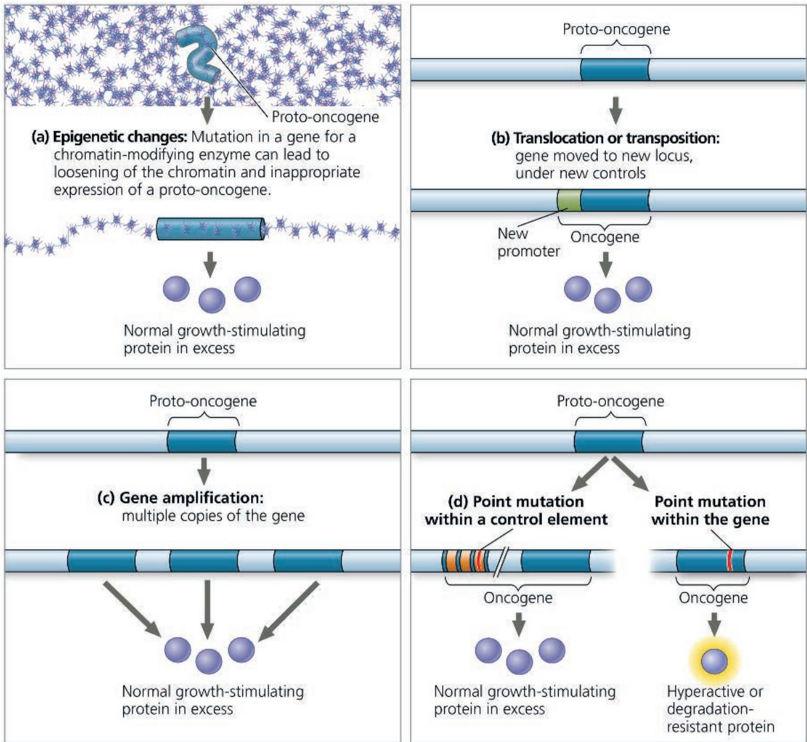

Normally, such a pathway will not operate unless triggered by the appropriate growth factor. But certain mutations in the ras gene can lead to production of a hyperactive Ras protein that triggers the kinase cascade even in the absence of growth factor, resulting in increased cell division (Figure 18.24b). In fact, hyperactive versions or excess amounts of any of the pathway's components can have the same outcome: excessive cell division.

Figure 18.25a shows a pathway in which an intracellular signal leads to the synthesis of a protein that suppresses the cell cycle. In this case, the signal is damage to the cell's DNA, perhaps as the result of exposure to ultraviolet light. Operation of this signaling pathway blocks the cell cycle until the damage has been repaired. Otherwise, the damage might contribute to tumor formation by causing mutations or chromosomal abnormalities. Thus, the genes for the components of the pathway act as tumor-suppressor genes. The p53 gene, named for the apparent molecular weight of its protein product, is a tumor-suppressor gene. The protein it encodes is a specific transcription factor that promotes the synthesis of cell cycle–inhibiting proteins. That is why a mutation that knocks out the p53 gene or in a gene required to activate the p53 protein (for example, a gene called ATM) can lead to excessive cell growth and cancer (Figure 18.25b).

The p53 gene has been called the “guardian angel of the genome.” Once the p53 protein is activated—say, by the ATM protein, a protein kinase, after DNA damage—p53 activates several other genes, such as p21. The p21 protein halts the cell cycle by binding to cyclin-dependent kinases, allowing time for the cell to repair the DNA. Researchers have shown that p53 also activates expression of a group of miRNAs that inhibit the cell cycle. The p53 protein can also turn on genes directly involved in DNA repair. If DNA damage is irreparable, p53 activates “suicide” genes, whose protein products bring about programmed cell death (apoptosis; see Figure 11.20). Thus, p53 acts in several ways to prevent a cell from passing on mutations due to DNA damage. If mutations do accumulate and the cell survives through many divisions—as is more likely if the p53 tumor-suppressor gene is defective or missing—cancer may ensue. The many functions of p53 suggest a complex picture of regulation in normal cells, one that we do not yet fully understand.

Figure 18.24 Normal and mutant cell cycle–stimulating pathway.

#### [EN] (a) Normal cell cycle-stimulating pathway.

① a growth factor that binds to ② its receptor in the plasma membrane. The signal is relayed to ③ a G protein called Ras. Like all G proteins, Ras is active when GTP is bound to it. Ras passes the signal to ④ a series of protein kinases. The last kinase activates ⑤ a transcription factor (activator) that turns on one or more genes for ⑥ a protein that stimulates the cell cycle.

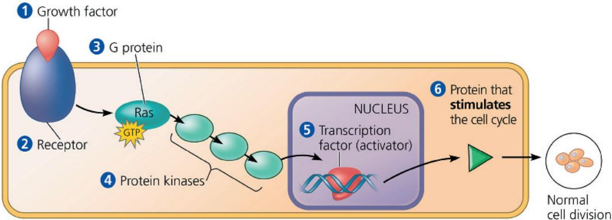

#### [EN] (b) Mutant cell cycle—stimulating pathway.

If a mutation makes Ras or any other pathway component abnormally active, excessive cell division and cancer may result.

  
Figure 18.25 Normal and mutant cell cycle-inhibiting pathway.

(a) Normal cell cycle-inhibiting pathway. In the normal pathway, ① DNA damage is an intracellular signal that is passed via ② protein kinases, leading to activation of ③ p53. ④ Activated p53 promotes transcription of the gene for ⑤ a protein that inhibits the cell cycle. The resulting suppression of cell division ensures that the damaged DNA is not replicated. If the DNA damage is irreparable, then the p53 signal leads to apoptosis.

(b) Mutant cell cycle-inhibiting pathway. Mutations causing deficiencies in any pathway component can contribute to the development of cancer.

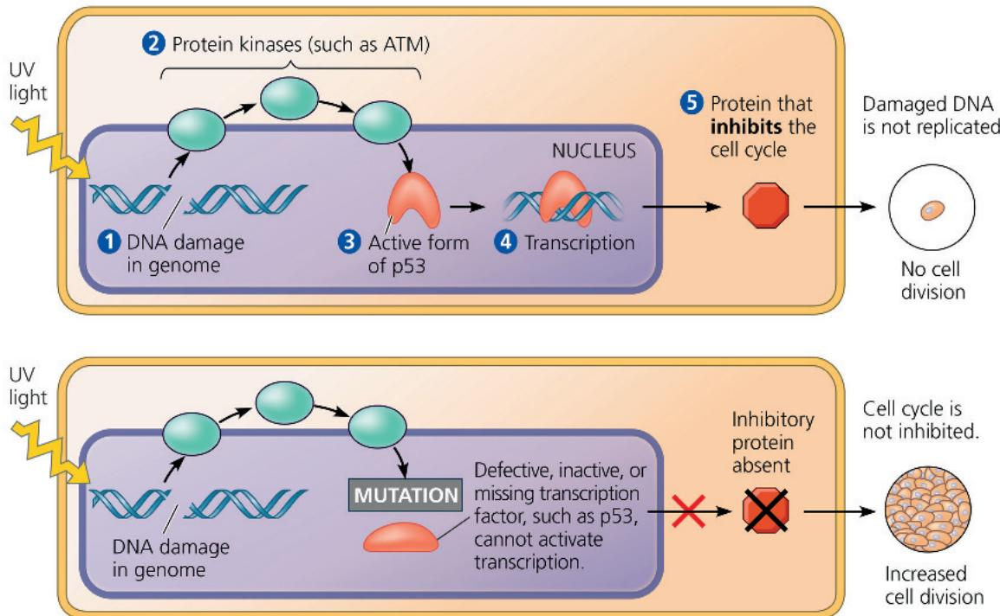  
Explain whether a cancer-causing mutation in a tumor-suppressor gene, such as p53, is more likely to be a recessive or a dominant mutation.

For suggested answer, see Appendix A.

Results from a study of elephants may underscore the protective role of the p53 gene. The incidence of cancer among elephants in zoo-based studies has been estimated at about 3%, compared with closer to 30% for humans. Genome sequencing revealed that elephants have 20 copies of the p53 gene, compared to one copy in humans, other mammals, and even manatees, elephants' closest living relatives. There are undoubtedly other underlying reasons, but the correlation between low cancer rate and extra copies of the p53 gene bears further investigation.

For the present, the diagrams in Figure 18.24 and Figure 18.25 are an accurate view of how mutations can contribute to cancer, but we still don't know exactly how a particular cell becomes a cancer cell. Recent studies have shown, for instance, that DNA methylation and histone modification patterns in normal cells differ from those in cancer cells and that miRNAs probably participate in cancer development. There is still a lot to learn, and you and your classmates may be the ones to make important discoveries about cancer biology.

#### [EN] The Multistep Model of Cancer Development

More than one somatic mutation or epigenetic change is generally needed to produce all the changes characteristic of a full-fledged cancer cell. This may help explain why the incidence of cancer increases greatly with age. If cancer results from an accumulation of mutations that occur throughout life, then the longer we live, the more likely we are to develop cancer.

The model of a multistep path to cancer is well supported by studies of one of the best-understood types of human cancer: colorectal cancer, which affects the colon and/or rectum. About 140,000 new cases of colorectal cancer are diagnosed each year in the United States, and the disease causes 50,000 deaths per year. Like most cancers, colorectal cancer develops gradually (Figure 18.26). The first sign is often a polyp, a small, benign growth in the colon lining. The cells of the polyp look normal, although they divide unusually frequently. The tumor grows and may eventually become malignant, invading other tissues. The development of a malignant tumor is paralleled by a gradual accumulation of mutations that convert proto-oncogenes to oncogenes and knock out tumor-suppressor genes. A ras oncogene and a mutated p53 tumor-suppressor gene are often involved.

About half a dozen changes must occur at the DNA level for a cell to become fully cancerous. These changes usually include the appearance of at least one active oncogene and the mutation or loss of several tumor-suppressor genes. Furthermore, since mutant tumor-suppressor alleles are usually recessive, in most cases mutations must knock out both alleles in a cell's genome to block tumor suppression. (Most oncogenes, on the other hand, behave as dominant alleles.)

Since we understand the progression of this type of cancer, routine screenings (colonoscopies, for example) are recommended to identify and remove any suspicious polyps. The overall colorectal cancer mortality rate has been declining for the past 20 years due to increased screening and improved treatments. (Unfortunately, rates are on the rise for people under 50 years of age, likely due to factors such as diet, sedentary lifestyle, and alcohol consumption.) Treatments for other cancers have improved as well. Advances in the sequencing of DNA and mRNA allow medical researchers to compare the genes expressed by different types of tumors and by the same type in different people. These comparisons have led to personalized treatments based on the molecular characteristics of a person's tumor; Figure 18.27, on the next two pages, shows how this approach has been applied to breast cancer.

Breast cancer is the second most common form of cancer in the United States, and the first among women. Each year, this cancer strikes over 230,000 women (and some men) in the United States and kills 40,000 (450,000 worldwide). A major problem with understanding breast cancer is its heterogeneity: Tumors differ in significant ways. Identifying differences between types of breast cancer is expected to improve treatment and decrease the mortality rate. In 2012, the Cancer Genome Atlas Network, sponsored by the National Institutes of Health, published the results of a multi-team effort that used a genomics approach to profile subtypes of breast cancer based on their molecular signatures. Four major types of breast cancer were identified (see Figure 18.27). It is now routine to screen for the presence of particular signaling receptors in any breast cancer tumors, and individuals with breast cancer, along with their physicians, can now make more informed decisions about their treatments.

This type of cancer is one of the best understood. Changes in a tumor parallel a series of genetic changes, including mutations affecting several tumor-suppressor genes (such as p53 and the ras proto-oncogene. Mutations of tumor-suppressor genes often entail loss (deletion) of the gene. APC stands for adenomatous polyposis coli, and SMAD4 is a gene involved in signaling that results in apoptosis.

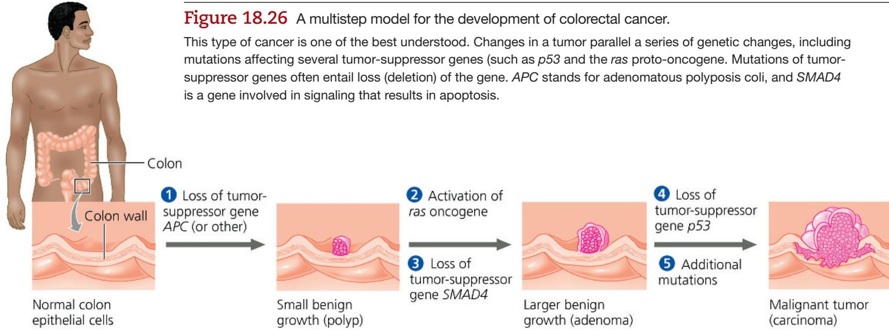  
② Activation of ras oncogene  
Normal colon epithelial cells  
Small benign growth (polyp)  
3 Loss of tumor-suppressor gene SMAD4  
4 Loss of tumor-suppressor gene p53  
Larger benign growth (adenoma)  
Malignant tumor (carcinoma)

Figure 18.27

Modern medicine that melds genome-wide molecular studies with cell-signaling research is transforming the treatment of many diseases, such as breast cancer. Using microarray analysis (see Figure 20.13) and other techniques, researchers measured the relative levels of mRNA transcripts for every gene in hundreds of breast cancer tumor samples. They identified four major subtypes of breast cancer that differ in their expression of three signal receptors involved in regulating cell growth and division:

• Progesterone receptor (PR)

\- HER2, a type of receptor called a receptor tyrosine kinase (RTK); other RTKs are also present, such as HER3

(ERα and PR are steroid receptors; see Figure 11.9.) The absence or excess expression of these receptors can cause aberrant cell signaling, leading in some cases to inappropriate cell division, which can contribute to cancer (see Figure 18.24).

  
A research scientists examines DNA-sequencing data from breast cancer samples.

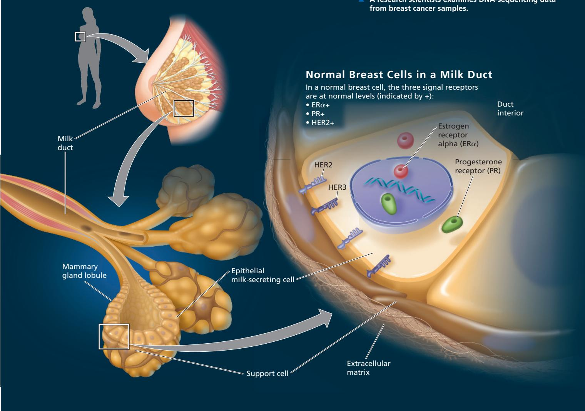

#### [EN] Breast Cancer Subtypes

Each breast cancer subtype is characterized by the overexpression (indicated by ++ or +++) or absence (−) of three signal receptors: ERα, PR, and HER2. Breast cancer treatments are becoming more effective because they can be tailored to the specific cancer subtype.

#### [EN] Luminal A

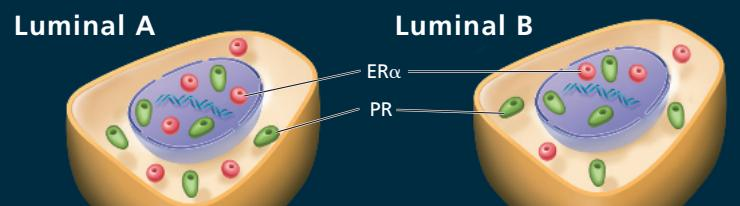

#### [EN] Luminal B

\- ERα+++

• ERα++

\- PR++

\- HER2-

\- PR++

\- HER2– (shown here); some HER2++

• 40% of breast cancers

\- Divide rapidly

\- Best prognosis

• 15–20% of breast cancers

\- Poorer prognosis than luminal A

Both luminal subtypes overexpress ERα (luminal A more than luminal B) and PR, and usually lack expression of HER2. Both can be treated with drugs that target ERα and inactivate it, the most well-known drug being tamoxifen. These subtypes can also be treated with drugs that inhibit estrogen synthesis.

#### [EN] HER2


\- ERα- or ERα+

• PR-

\- HER2++

• 10–15% of breast cancers - Poorer prognosis than luminal A subtype

#### [EN] Basal-like

• ERα-

\- PR-

\- HER2-

\- 15–20% of breast cancers
- More aggressive; poorer prognosis than other subtypes

The basal-like subtype is "triple negative"—it usually does not express ERα, PR, or HER2. It often has a mutation in the tumor-suppressor gene BRCA1 (see Concept 18.5). Treatments that target ERα, PR, or HER2 are not effective, but new treatments are being developed. Currently, patients are treated with cytotoxic chemotherapy, which selectively kills fast-growing cells.

The HER2 subtype overexpresses HER2. Because it does not express PR (and, in many cases, ERα) at normal levels, the cells are unresponsive to therapies that target PR (and, for ERα– cells, ERα). However, patients with the HER2 subtype can be treated with Herceptin, an antibody protein that inactivates HER2 (see Concept 12.3).

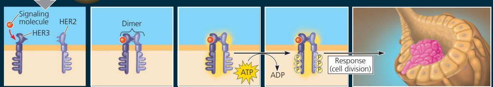

① A signaling molecule (such as a growth factor) binds as a ligand to a single HER3 (a monomer), allowing it to associate with another HER.

Response (cell division)

② Even without a ligand bound, HER2 can associate with another HER. Here, HER3 and HER2 associate closely together, forming a dimer.

#### [EN] ③ Formation of a dimer activates each monomer.

④ Each monomer adds phosphate from ATP to the other monomer, triggering a signal transduction pathway.

⑤ The signal is transduced through the cell, which leads to a cellular response—in this case, turning on genes that trigger cell division. HER2 cells have up to 100 times as many HER2 receptors as normal cells, so they undergo uncontrolled cell division.

#### [EN] Treatment with Herceptin for the HER2 subtype


HER2 Bound herceptin

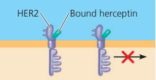

① Patients with the HER2 subtype are treated with the drug Herceptin, which can bind to HER2.

② When bound to HER2, Herceptin blocks signaling and excessive cell division in certain patients.

#### [EN] Inherited Predisposition and Environmental Factors Contributing to Cancer

The fact that multiple genetic changes are required to produce a cancer cell helps explain the observation that cancers can run in families. An individual inheriting an oncogene or a mutant allele of a tumor-suppressor gene is one step closer to accumulating the necessary mutations for cancer to develop than is an individual without any such mutations.

Geneticists are working to identify inherited cancer alleles so that predisposition to certain cancers can be detected early in life. About 15% of colorectal cancers, for example, involve inherited mutations. One syndrome, called hereditary nonpolyposis colon cancer (HNPCC), increases an individual's lifetime risk of colon cancer to 50–70%. HNPCC, also known as Lynch syndrome, is caused by an autosomal dominant allele of any one of a group of DNA repair genes, underscoring the importance of DNA repair systems. This syndrome is responsible for 2–5% of colon cancers. Other inherited mutations that cause colon cancer affect the tumor-suppressor gene called adenomatous polyposis coli, or APC (see Figure 18.26). This gene has multiple functions in the cell, including regulation of cell migration and adhesion. Even in patients with no family history of the disease, the APC gene is mutated in 60% of colorectal cancers. In these individuals, new mutations must have occurred in both APC alleles before the gene's function is lost. Currently, only 15% of colorectal cancers are associated with known inherited mutations, so researchers continue to try to identify “markers” that could predict the risk of developing this type of cancer.

Given the prevalence and significance of breast cancer, it is not surprising that it was one of the first cancers for which the role of inheritance was investigated. It turns out that for 5–10% of patients with breast cancer, there is evidence of a strong inherited predisposition. Geneticist Mary-Claire King began working on this problem in the mid-1970s. After 16 years of research, she convincingly demonstrated that mutations in one gene—BRCA1—were associated with increased susceptibility to breast cancer, a finding that flew in the face of medical opinion at the time. (BRCA stands for breast cancer.) Mutations in that gene or a gene called BRCA2 are found in at least half of inherited breast cancers, and tests using DNA sequencing can detect these mutations. A woman who inherits one mutant BRCA1 allele has a 60% probability of developing breast cancer before the age of 50, compared with only a 2% probability for an individual homozygous for the normal allele.

#### [EN] Interview

Interview with Mary-Claire King: Discovering breast cancer genes (eTextbook only)


BRCA1 and BRCA2 are considered tumor-suppressor genes because their wild-type alleles protect against breast cancer and their mutant alleles are recessive. (Mutations in BRCA1 are commonly found in the genomes of cells from basal-like breast cancers; see Figure 18.27.) The BRCA1 and BRCA2 proteins both appear to function in the cell's DNA damage repair pathway. More is known about BRCA2: Along with another protein, it helps repair breaks that occur in both strands of DNA, a function crucial for maintaining undamaged DNA.

Because DNA breakage can contribute to cancer, it makes sense that the risk of cancer can be lowered by minimizing exposure to DNA-damaging agents, such as the ultraviolet radiation in sunlight and chemicals found in tobacco products. Novel genomics-based analyses of specific cancers, such as the approach described in Figure 18.27, are contributing to both early diagnosis and development of treatments that interfere with expression of key genes in tumors. Ultimately, such approaches are expected to lower the death rate from cancer.

#### [EN] The Role of Viruses in Cancer

The study of genes associated with cancer, inherited or not, increases our basic understanding of how disruption of normal gene regulation can result in this disease. In addition to the mutations and other genetic alterations described in this section, a number of tumor viruses can cause cancer in various animals, including humans. In fact, one of the earliest breakthroughs in understanding cancer came in 1911, when Peyton Rous, an American pathologist, discovered a virus that causes cancer in chickens. Also, the Epstein-Barr virus, which causes infectious mononucleosis, has been linked to several types of cancer in humans, notably Burkitt's lymphoma. Papillomaviruses cause cancer of the cervix, and a virus called HTLV-1 causes a type of adult leukemia. Viruses play a role in about 15% of the cases of human cancer.

Viruses may at first seem very different from mutations as a cause of cancer. However, we now know that viruses can interfere with gene regulation in several ways if they integrate their genetic material into the DNA of a cell. Viral integration may donate an oncogene to the cell, disrupt a tumor-suppressor gene, or convert a proto-oncogene to an oncogene. Some viruses produce proteins that inactivate p53 and other tumor-suppressor proteins, making the cell more prone to becoming cancerous. Viruses are powerful biological agents; you'll learn more about them in Chapter 19.

#### [EN] Concept Check 18.5

1. Cancer-promoting mutations are likely to have different effects on the activity of proteins encoded by proto-oncogenes than they do on proteins encoded by tumor-suppressor genes. Explain.

2. Under what circumstances is cancer considered to have a hereditary component?

3. MAKE CONNECTIONS The p53 protein can activate genes involved in apoptosis. Review Concept 11.5, and discuss how mutations in genes coding for proteins that function in apoptosis could contribute to cancer.


<!-- C-END Campbell 18.5 -->

## 9.2 人类免疫缺陷病毒(HIV)

人类免疫缺陷病毒(HIV),俗称艾滋病(AIDS)病毒,诱发人类获得性免疫缺损综合征。该病毒在分类上属反转录病毒科(Retroviridae)慢病毒属中的灵长类免疫缺陷病毒亚属,过去还有人将其命名为LAV、ARV、IDAV和HTLV3,现统一命名为HIV。1983年,法国巴斯德研究所的Montaginer和美国国家卫生研究院癌症研究所Gallo等人首次证实HIV是艾滋病的病因。该病已在30多年间席卷全球,几乎没有一个国家或地区可以幸免。已发现人免疫缺损病毒主要有两种,即HIV-I和HIV-II。HIV-I是从欧洲和美洲分离的毒株,与猴艾滋病毒只有约45%的相似性,它的致病力很强,是引起全球艾滋病流行的主要病原。HIV-II与猴艾滋病毒的相似性高达75%,其毒力较弱,引起艾滋病的病程较长,症状较轻,且主要局限于非洲西部(表9-2)。有关HIV的研究主要是针对HIV-I进行的。

表 9-2 反转录病毒科主要成员

<table><tr><td>属名</td><td>典型成员</td></tr><tr><td>哺乳动物C型拟转录病毒属</td><td>小鼠乳腺瘤病毒</td></tr><tr><td>D型拟转录病毒属</td><td>鼠白血病病毒</td></tr><tr><td>禽C型拟转录病毒属</td><td>Mason-Pfizer猴病毒</td></tr><tr><td>泡沫病毒属</td><td>禽白血病病毒</td></tr><tr><td>人嗜T淋巴细胞病毒</td><td>人泡沫病毒</td></tr><tr><td>白血病毒属</td><td>人嗜T淋巴细胞病毒I型</td></tr><tr><td>慢病毒属</td><td>人类免疫缺陷病毒</td></tr></table>

## 9.2.1 HIV 病毒颗粒的形态结构及传播

艾滋病病毒粒子是一种直径约为 120 nm 的球状病毒, 粒子外包被着由两层脂质组成的脂膜, 这种结合有许多糖蛋白分子(主要是 gp41 和 gp120)的脂质源于宿主细胞的外膜。蛋白质 p24 和 p18 组成其核心, 内有基因组 RNA 链, 链上附着有反转录酶, 其功能是催化病毒 RNA 的反转录 $^{(图9-10)}$ 。

HIV 病毒广泛存在于感染者的血液、精液、阴道分泌物、乳汁、脑脊液、有神经症状的脑组织液等体液中，其中以血液、精液、阴道分泌物中浓度最高。HIV 可以依靠血液、血液制品，以及人体分泌液，如精液和乳汁等传播。研究发现，艾滋病患者经长期鸡尾酒疗法治疗后，血液中可能检测不到艾滋病病毒，但是眼泪中的病毒数量和新近确诊艾滋病人血液中病毒含量相差并不大，

  
图 9-10 HIV-I 病毒粒子结构模型图
gp120 和 gp41 是外膜蛋白, MA 是内膜蛋白, CA 是外壳蛋白, NC 是核衣壳蛋白, RT 是反转录酶。

但目前尚无眼泪传播艾滋病毒的临床病例。

HIV 主要感染 T4 淋巴细胞,也可以感染其他类型如 B 淋巴细胞和单形核细胞等。HIV 感染后可引起明显病变,形成多核巨细胞,并导致细胞死亡。HIV 病毒可以通过所感染细胞扩散到全身,已在淋巴细胞、脑、胸腺、脾等组织发现了该病毒。不同毒株在试管内感染细胞的能力差异很大,说明自然界广泛存在着突变株。迄今为止,尚缺乏研究艾滋病的理想动物模型。与人类亲缘关系最近的黑猩猩感染 HIV 后,早期情况与人相似,会产生抗体和暂时性 T 细胞比例失调,但后期并不发展成艾滋病的临床病症。

## 9.2.2 HIV 基因组及其编码的蛋白质

## 1. HIV 基因组结构

HIV 基因组由两条单链正链 RNA 组成, 每个 RNA 基因组约为 9.7 kb。在 RNA 5' 端有一帽子结构 (m⁷G5'GmpNp), 3' 端有多 (A) 尾巴。HIV 的主要基因结构和组织形式与其他反转录病毒相同, 均由 5' 端 LTR、结构蛋白编码区 (gag)、蛋白酶编码区 (pro)、具有多种酶活性的蛋白编码区 (pol)、外膜蛋白 (env) 和 3' 端 LTR 组成。HIV 较其他反转录病毒复杂, 因为它有较多的调控基因。为了最大程度地利用有限的基因, HIV 基因编码区有很多重叠, 尤其在基因组的 3' 端。HIV 基因组中的部分基因如 Tat 和 Rev 是不连续的, 被插入的内含子分隔成两个外显子 (图 9-11)。HIV-I 至少有 4 个功能性的剪接供体位点和 6 个受体位点。

## 2. HIV 编码的蛋白质及其主要功能

HIV 具有独特的粒子结构, 其结构蛋白主要包括 4 个基因。gag 基因编码病毒的核心蛋白, 翻译时先形成一个 $5.5 \times 10^{4}$ 的前体蛋白 (p55), 然后在 HIV 蛋白酶的作用下被切割成 p17、p24、p153 个蛋白。P24 和 p17 分别组成 HIV 颗粒的外壳 (CA) 和内膜蛋白 (MA), p15 进一步被切割成与病毒 RNA 结合的核衣壳蛋白 (NC)p7 和 p6。pol 基因编码病毒复制所需的酶类包括反转录酶 p66、整合酶 p32。从 pol 和 gag 基因重叠区内起始的一段序列为 PR 基因, 它编码蛋白酶 p10。P10 在切割上述 HIV 蛋白前体产生成熟蛋白

图 9-11 HIV-I 基因组结构及所编码的主要蛋白质

gag 基因编码了由 p55 前体蛋白切割形成的 MA(p17)、CA(p24) 和 NC(p15) 等 4 个结构蛋白(因为 p15 进一步被切割为 p7 和 p6); PR(p10) 是蛋白酶, IN(p32) 是整合酶, p66 和 p51 是反转录酶; gp120 和 gp41 是主要外壳蛋白。酰胺化的 MA 附着于病毒包膜的内部, 酰胺化用橘红色小片段表示。


的过程中起主要作用。env基因编码了 $8.8 \times 10^{4}$ 的蛋白质，经糖基化后其相对分子质量增至 $1.6 \times 10^{5}$ ，是HIV包膜糖蛋白gp160的前体。该前体蛋白在蛋白酶作用下被切割成gp120和gp41，gp120暴露于病毒包膜外，称为外膜蛋白，感染细胞时可与细胞的CD4受体蛋白相结合；外膜糖蛋白gp120与CD4结合后，与G蛋白偶联受体(GPCR)家族中的一个跨膜蛋白发生相互作用。这种跨膜蛋白被称为辅助受体，在HIV感染中发挥重要作用。gp41被称为跨膜蛋白(TM)，嵌入病毒包膜脂质中。当gp120与CD4受体结合后，其构象改变导致与gp41分离，游离的gp41可插入细胞膜，形成膜融合使病毒核心颗粒进入细胞内。辅助受体对HIV的侵染和致病是非常重要的，研究表明，CD4分子与gp120及辅助受体的相互作用促进随后的膜融合和病毒侵袭的细胞内信号传导。图9-12表示HIV-I与CD4及辅助受体CXCR4、CCR5在感染小神经胶质细胞和巨噬细胞时发生相互作用的情况。表9-3是已经发现的辅助受体，表9-4则系统介绍了HIV编码的主要蛋白及其功能。

  
图 9-12 HIV-I 感染小神经质细胞和巨噬细胞过程中信号传导及与其受体 CD4 和辅助受体相互作用示意图

表 9-3 HIV-Ⅰ、HIV-Ⅱ和 SIV 的辅助受体及表达模式分析

<table><tr><td>辅助受体</td><td>病毒</td><td>细胞类型或组织</td></tr><tr><td>CCR1</td><td>HIV-II</td><td>活化的体细胞、单核细胞、树突状细胞</td></tr><tr><td>CCR2b</td><td>HIV-I,HCV-II SIV</td><td>单核细胞、T细胞</td></tr><tr><td>CCR3</td><td>HIV-I,H1V-II</td><td>嗜曙红细胞、树突状细胞、TH2</td></tr><tr><td>CCR4</td><td>HIV-II</td><td>TH2、脑</td></tr><tr><td>CCR5</td><td>HIV-I,HIV-II,SIV</td><td>活化的T细胞、单核细胞、树实状细胞</td></tr><tr><td>CCR8</td><td>HIV-I,HIV-II,SIV</td><td>TH2、脑腺细胞、脑</td></tr><tr><td>CCR9</td><td>HIV-I</td><td>淋巴细胞、脑、胎盘</td></tr><tr><td>CXCR2</td><td>HIV-II</td><td>中性粒细胞、脑</td></tr><tr><td>CXCR4</td><td>HIV-I,HIV-II,SIV</td><td>淋巴细胞、单核细胞、脑</td></tr><tr><td>CXCR5</td><td>HIV-II</td><td>B细胞</td></tr><tr><td>CXCR6</td><td>HIV-I,SIV</td><td>淋巴细胞</td></tr><tr><td>CXCR7(RCD1)</td><td>HIV-I,HIV-II,SIV</td><td>单核细胞、脑</td></tr><tr><td>ROC1</td><td>HIV-I,HIV-II,SIV</td><td>淋巴细胞、脑</td></tr></table>

表 9-4 HIV 编码的主要蛋白质及其功能

<table><tr><td>基因产物</td><td>功能</td></tr><tr><td>Gag</td><td>核心蛋白</td></tr><tr><td>Pol</td><td>多种酶功能</td></tr><tr><td>Env</td><td>包膜蛋白</td></tr><tr><td>Tat(Tat-3、Ta)</td><td>RNA 沉默抑制因子,转录激活子</td></tr><tr><td>Rev(Art、Trs)</td><td>调控 RNA 剪切和运输,与 RRE 结合增加 env 的翻译</td></tr><tr><td>Vif(Sor、A、P′、Q)</td><td>侵染因子,病毒在巨噬细胞扩散所必需</td></tr><tr><td>Vpr(R)</td><td>增加病毒复制</td></tr><tr><td>Vpu</td><td>辅助病毒组装和释放,以及 gp160/CD4 复合体的解聚</td></tr><tr><td>Nef(3&#x27;ORF、B、E、F)</td><td>形成同源二聚体,引起多效应性的影响,如负调控 CD4</td></tr></table>

## 3. HIV 膜蛋白主要功能区

HIV-I 中的 gp160 由 845\~870 个氨基酸残基组成，在第 511 位被蛋白酶切割后产生 gp120 和 gp41，其氨基端与其他分子以非共价键形式结合。gp120 有 24 个糖基化位点，糖基化是 gp120 与 CD4 受体结合所必需的。已通过重组和突变实验定位了 gp120 蛋白的多个功能区，简述如下。

① 主要抗原决定簇 包括 V3 区(第 301～324 位的环状肽段)的主抗原决定簇及若干个较弱的决定簇,其中有两个分别位于 gp41 的 616～632 位和 724～751 位。

② T 细胞决定簇 两个辅助性 T 细胞决定簇 T2 和 T1 分别在 105～117 位的 C1 区和 421～436 位的 C4 区，一个主要细胞毒 T 细胞决定簇位于第 308～322 位，与 V3 区有部分重叠。另有 3 个较弱的细胞毒 T 细胞决定簇在 gp41 上。

③ CD4 受体结合区: 该区位于 423 \~ 427 位 (C4 区)。在上述功能区以外的某些氨基酸突变也能影响 gp120 的功能, 说明上述各功能区发挥作用还依赖于整个分子特定的空间构象。

## 9.2.3 HIV 的复制

HIV 主要侵染人体的 T 淋巴细胞及巨噬细胞,并通过病毒膜蛋白 gp120 与细胞表面的 CD4 受体蛋白结合。CD4 分子含有两个免疫球蛋白结构域,它在人体内所结合的正常配体是 II 型 MHC 抗原。HIV 与受体结合后,病毒核心蛋白和两条 RNA 链进入细胞(图 9-13)。反转录酶以病毒 RNA 为模板合成单链 DNA,并由宿主细胞 DNA 聚合酶合成双链 DNA(原病毒)。双链 DNA 经环化后进入细胞核,在病毒整合酶的作用下,整合入细胞染色体中,病毒核酸随细胞的分裂而传至子代细胞,可长期潜伏。

在病毒复制期间,整合到 DNA 上的原病毒被转录成 RNA 前体,其中一些通过 RNA 剪接产生成熟的 mRNA。这些 mRNA 从细胞核输出到细胞质中,并被翻译为调控蛋白 Tat 和 Rev. 新产生的 Rev 蛋白迅速移动到细胞核中,并与未剪接的全长病毒 RNA 结合,帮助其离开细胞核。一些全长 RNA 作为病毒子代基因组起作用,而另一些则翻译产生结构蛋白 Gag 和 Env。Gag 蛋白与病毒基因组 RNA 结合, 将其包装成新的病毒颗粒。最后病毒核衣壳经过细胞膜以出芽方式形成完整病毒体释放到细胞外。HIV 复制的主要过程如下: ① 原病毒整合到宿主染色体上, 无症状; ② 原病毒利用宿主细胞的转录和合成系统转录产生病毒 mRNA, 其中一部分编码病毒蛋白, 与基因组 RNA 组装成新的病毒颗粒, 从宿主细胞中释放出来侵染其他健康细胞; ③ 宿主细胞瓦解死亡。

图 9-13 HIV-I 在人体细胞内的复制和侵染过程示意图  


对 HIV-Ⅰ编码的 RNA 酶 H 和反转录酶的 X 射线衍射晶体结构分析发现, 合成前病毒第一条 DNA 链的过程中没有宿主细胞 DNA 酶的参与, 完全由 HIV-Ⅰ反转录酶完成。该酶由两个 N 端完全一致的亚单位 (p66 和 p51) 组成, 具有 DNA 聚合酶活性, 其 N 端功能区以病毒 RNA 为模板催化合成互补 DNA 链。此外, p66 的 C 端功能区还能在 p51 亚基的协同作用下降解病毒模板 RNA 链。

HIV 的转录从基因组 5' 端 LTR 起始, 先形成一条长链 RNA 并迅速切割成短 mRNA分子,用于指导合成HIV调控蛋白,但不翻译结构蛋白。当调控蛋白Rev达到一定阈值后,转录由早期向晚期变换。此时,主要是转录长链mRNA并指导合成结构蛋白,组装成完整的病毒颗粒。HIV复制的复杂调控机制使HIV感染细胞后产生不同的结果。在复制和表达量非常高的情况下可立即杀死细胞,低水平复制和表达时仅造成细胞功能失常,而不复制、不表达时病毒基因组以DNA形式与染色体整合,与宿主长期共存。这就是艾滋病在临床上潜伏期长短不一、病程快慢不一的主要原因。HIV前病毒整合是随机的,并不要求特定的DNA序列,因而可以整合到染色体上的任何部位。

## 9.2.4 HIV 基因表达调控

与大多数反转录病毒相比，HIV 的最大特点就是含有许多调控基因。这些基因编码相应的调控蛋白，它们在病毒 RNA 的转录、转录后加工、蛋白质翻译、包装以及病毒颗粒的释放等各个过程中发挥重要作用。在这些过程中，除 HIV 自身的调控蛋白外，还有许多宿主细胞的调控蛋白参与。

## 1. LTR 序列

LTR 位于 HIV 基因组两端, 其序列是高度保守的, 在 HIV-Ⅰ与 HIV-Ⅱ及 SIV 之间的保守性高达 95% 以上。HIVI 的 5' 端 LTR (5'-LTR) 和 3' 端 LTR (3'-LTR) 都可以启动转录, 但 HIV 的转录由位于 5'-LTR 内的启动子控制。来自 5'-LTR 的转录调控可能抑制了 3'-LTR 的启动子活性, 在 5'-LTR 缺陷的情况下, 可以激活来自 3'-LTR 的转录。5'-LTR 含有 HIV 基因调控所必需的多个特定调控区, 能够劫持宿主细胞转录装置, 严格控制病毒基因组的转录。HIVI 的 5'-LTR 在结构上分为 U3、R 和 U5 区域(图 9-14)。HIV 转录起始于 5'-LTR R 区域的转录起始位点 (TSS), 然后转录产物通过 U5 区域加帽并进行延伸至整个病毒基因组。转录终止通常发生在 3'-LTR 的 R 区域内。转录终止时, 3'-LTR 的 U5 区编码 poly(A) 信号进行加尾。5'-LTR 包含相对于 TSS 核苷酸 -454 \~ +188 之间的区域。根据各区调控功能的异同进一步划分为 4 个主要功能元件: 调控单位 (-455 \~ -104), 增强子区域 $(-109\sim-79)$ ，核心单位 $(-78\sim-1)$ 和TAR区域 $(+1,+60)$ （图9-14），并在其中发现了许多细胞转录因子结合位点 $^{(图9-15)}$ 。

图 9-14 HIV 基因组 LTR 结构示意图  


  
图 9-15 HIV 基因组 5'-LTR 区中的 DNA 和 RNA 结合蛋白的作用位点

## (1) 核心调控元件

该元件从 LTR 起始延伸到 -78 位核苷酸, 包含多个可与细胞转录调控因子结合的区域。鸡卵蛋白转录因子(COUP-TF), 结合于 LTR-371\~-334 位, 激活蛋白 1 (activator protein 1, AP1) 结合于 LTR 的 -347\~-329 位。激活 T 细胞核因子(NFAT) 在 LTR-292\~-255 位和 -216\~-203 位上有两个结合位点。上游激活因子(USF) 结合于 -173\~-160 位, T 细胞因子 -1α(TCF-1α) 结合于 -139\~-124 位。除 COUP-TF 和 USF 对 HIV 的转录起负调控作用外, 其余均为正调控因子。AP1 是由含亮氨酸拉链结构的 C-Jun 和 C-Fos 家族成员组成的二聚体, COUP-TF 家族中的低相对分子质量蛋白质含有锌指结构, USF 为螺旋-环-螺旋结构, TCF-1α 含有高速泳动族基序(HMC motif)。该区域还包括 3 个 CCAAT / 增强子结合蛋白(C / EBP) 结合位点, 激活转录因子 / 环 AMP 应答位点、淋巴细胞增强因子(LEF-1) 结合位点, c-Myb 结合位点、Ets-1 结合位点和核因子 NF-κB 结合位点。核因子 NF-κB 与 HIV-I 感染后的调节区域结合并对病毒转录产生负影响。在核心调控区域的上游 -130\~-201 之间的序列, 包含在 T 细胞中高度表达的 LEF-1、NF-AT 和 Ets-1 转录因子的共有结合位点, 在外周血淋巴细胞和一些 T 细胞系中对病毒表达具有非常重要的调节作用。

## (2) 增强子区域

该区域主要包括核因子 $\kappa B(NF-\kappa B)$ 结合位点(结合于 -104～-81 位)。NF- $\kappa B$ 含有锌指结构及锚定蛋白重复序列，由间隔 3～4 个核苷酸的两个 10 bp 的 GGGACTTTCC 序列组成，负责调控 HIV 基因在多种细胞特别是 T 淋巴细胞中的高效表达。在多种 HIV 亚型中均存在 NF- $\kappa B$ 和相关因子的 10 bp 共有结合位点的串联重复序列，类似的序列在其他病毒如 SV40、巨细胞病毒及白细胞介素 -2 受体、 $\beta-$ 干扰素等基因的特异性和诱导型表达过程中都发挥了重要的调控作用。HIVI 增强子区域内的两个 NF- $\kappa B$ 结合位点也可以被 NF-AT 因子结合；NF-AT 与位于 U3 区域的 NF- $\kappa B$ 基序的末端 3' 端半结合，具有与 p50 相似的序列偏好，并且调节 HIV 启动子活性，增加 T 细胞中的感染性。

## (3) 核心转录单位

HIV-I LTR 核心转录单位的结构与其他病毒或细胞启动子的转录起始区相似,有 TATA 区、SP1 结合位点和转录起始位点 TSS。这些序列对转录的激活具有重要作用,一旦缺失将使 LTR 失去启动子活性。

在核心转录单位 -78～-46 位点的富含 GC 区有 3 个连续的 SP1 结合位点。SP1 蛋白含有 DNA 结合结构和两个富含谷氨酰胺的结构域，可形成二聚或三聚体。当 3 分子 SP1 与 LTR 结合后，由于彼此间以及 SP1 与周围蛋白的相互作用改变了 DNA 的空间结构，诱导了依赖于 DNA 的蛋白激酶对 SP1 的磷酸化作用，激活 HIV-I 基因转录。HIV-I LTR 的 -28～-24 位含有 TATA 元件，其两侧还有一个 CAXXTG 的同向重复序列，该重复序列可能是转录因子螺旋－环－螺旋 DNA 结合蛋白的识别位点。不同 HIV-I 亚型的遗传学研究表明，病毒能够使用重叠的 CATA 区而不是典型的 TATA 区，并且某些亚型包含 4～5 个 Sp1 位点。TATA 区和 Sp 位点对于病毒转录起始、保持启动子活性以及 Tat 蛋白介导的反式激活都是必需的。

最近的研究表明三联基序蛋白 TRIM22 干扰 Sp1 结合从而抑制预起始复合物 (PIC) 形成和原病毒转录。TATA 盒侧翼的 CTGC 基序也显示为体外转录起始和活细胞中 Tat 依赖性激活所需的。另外，紧接 TSS 上游的转录因子 ZASC1 结合位点，显示出 ZASC1 与 Tat 和正向转录延伸因子 b(P-TEFb) 相互作用并协同促进 HIV-I 转录延伸的调节作用。

## (4) 反式激活因子应答元件

在 HIV 基因组 +1～+60 位的核苷酸序列是反式激活因子(Tat)激活 HIV-I 转录所必需的,称为反式激活应答元件(TAR)。该序列存在于 HIV 基因组 RNA 和原病毒 DNA 上,是 HIV 复制所不可缺少的重要调控位点。TAR 是含有多个调节元件和两个 CTCTCGG 重复序列拷贝的短 RNA 转录物,从而介导 Tat 向 HIV-I 启动子的募集。体外研究表明,该 RNA 元件具有发夹样结构,作为 Tat 的结合位点,对于反式激活是必不可少的。

研究发现,TAR 可以产生一个 miRNA,通过降低细胞凋亡通路下游基因 ERCC1 和 IER3 表达,阻止细胞凋亡,以利于病毒的复制。另外,还在 TAR 元件中发现 Psi 元件,Gag 和 Rev 蛋白可以识别该元件进行病毒基因组和结构蛋白的组装。

## (5) TSS 下游区域

TSS 下游的序列在调节转录中的作用近年来才引起重视。HIV-I 5'-LTR 在 TSS 下游同样含有转录因子结合位点，其中一些在不同的 HIV-I 株系和亚型中是非常保守的。重要的下游 HIV-I 调控结合位点是：3 个激活转录因子 AP-1 结合位点分别位于 +87～+94 位、+118～+125 位和 +155～+163 位，NFATc2 和 C/EBP 结合于 U5 区域的 +158～+171 位，类 AP-3 结合位点在 +162～+177 位，NFAT 结合位点与类 AP-3 相同，DBF-1 结合位点和 Sp 位点位于 U5 区域下游，分别为 +200～+219 位和 +270～+278 位（图 9-16）。

包括 AP1、C / EBP、NFAT 在内的一些因子通过募集染色质重塑和组蛋白修饰辅因子复合物来促进转录激活，从而改善 RNA 聚合酶Ⅱ复合物对染色质的亲和力。其他因子可能通过影响转录起始和延伸来促成转录激活。总的来说，这个区域可能有助于调节

  
图 9-16 HIV 基因组 5'-LTR 的 TSS 下游区域转录因子结合位点

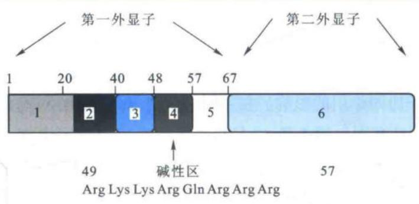  
图 9-17 Tat 蛋白的结构示意图

HIV-I 对激活信号的转录反应。

## 2. 参与 HIV 复制的调控蛋白

## (1) Tat 蛋白

该蛋白质是一个转录激活因子,在 HIV-I、HIV-II 和 SIV 中高度保守,是病毒复制所必需的。HIV-I 的 tat 基因与 env 编码区有部分重叠,它含有两个外显子,编码了由 101 个氨基酸残基组成的 Tat 蛋白。第一个外显子所编码的 67 个氨基酸组成的多肽同样具有反式激活作用 $^{(图9-17)}$ 。Tat 蛋白有 3 个功能域,第一个是与其他已知转录调控蛋白激活功能区结构基本一致的酸性氨基酸区,与 Tat 激活 HIV-I 基因表达有关。第二个功能区富含 Cys,在其 16 个氨基酸残基中就有 7 个 Cys,可与二价金属离子结合并形成 Tat 二聚体。在这 7 个 Cys 中有 6 个是维持 Tat 活性所必需的,替代其中的任意一个均可使 Tat 失活却不影响 Tat 与金属离子的结合。该肽段能与相对分子质量 $3.0 \times 10^{4}$ 的宿主细胞核蛋白相结合。

Tat 蛋白还是一个 RNA 沉默抑制因子。缺失突变和点突变结果表明，抑制 RNA 沉默功能区位于该蛋白质的 38～72，且这段区域不具有转录激活功能，说明 Tat 蛋白的转录激活功能和 RNA 沉默抑制功能是分开的。HIV-Ⅰ和Ⅱ也编码一个称为 Tax 的异源转录激活因子，它的主要作用是通过宿主细胞中的转录因子与 LTR 中的顺式作用元件结合，从而调控基因转录。

研究认为，Tat 的主要作用可能是促进 RNA 聚合酶Ⅱ（RNAP Ⅱ）转录起始复合物的组装。在 HIV-Ⅰ整合入宿主基因组后，RNAP Ⅱ在位于 5'-LTR 的病毒启动子处组装并开始转录病毒 RNA 的过程。在没有 Tat 蛋白存在的情况下，转录起始位点附近的顺式作用元件虽然也指导转录复合物的形成，但其延伸效率较低，只能转录出短的不完整的病毒转录物。加入 Tat 蛋白后，短链 RNA 转录产物浓度迅速下降，取而代之的是长链 RNA。

Tat 的第三个功能区由一组带正电的碱性氨基酸残基构成, 行使两个主要功能。一个是 +48 \~ +52 位的 GRKKR 序列, 是核 - 核仁定位信号, 可介导自身或异种蛋白进入细胞核。若将此肽段与 β- 半乳糖苷酶融合即可使后者在核内聚集。该肽段第二个功能是与 TAR RNA 凸出部分的特异性结合, 通过 Tat 第 52 和第 53 位 Arg 残基与后者的磷酸基团相互作用得以实现。

## (2) Tat 与 TAR 对 HIV 复制的协同调控作用

实验表明,Tat 和 TAR 结合并不能有效地激活 HIV 基因表达,还依赖于如下因素:

TAR 序列及完整高级结构的影响。Tat 虽能结合环区有突变的 TAR 蛋白,但此时不能激活 HIV 的表达。

宿主细胞因子协同作用的影响。在不同细胞内，Tat的活性可有上千倍的差异。在人鼠杂交细胞中，只有在保持人第12号染色体的杂交瘤细胞中，Tat才能有效地激活HIV-I转录。研究发现，Tat与TBP-I结合形成复合体而发挥作用，说明Tat与TAR对HIV复制的调控还需宿主细胞编码蛋白的协同作用。

上游启动子和增强子序列。当 TAR 远离其上游启动子时，它的活性迅速下降。而且这种依赖作用对非激活细胞和 Tat 激活细胞的表现是不一样的，增强子 SP1 序列在 Tat 诱导细胞中对 HIV 转录的促进作用远远大于非激活细胞，去除 SP1 序列甚至可提高非激活细胞中 HIV 的转录。而 NF- $\kappa$ B 序列在对两种细胞的作用正好与 SP1 相反。TATA 启动子序列的改变对未激活细胞影响很小，却可明显降低 HIV 在 Tat 诱导细胞中的复制。

Tat 的主要辅助因子是细胞周期蛋白 T1(CCNT1), 它与细胞周期蛋白依赖性激酶 9 (CDK9) 一起构成正转录延伸因子 b(P-TEFb)。这种异二聚体宿主激酶可以磷酸化激活暂停的 RNAP II, 并调节大多数细胞基因的延伸。Tat 将 P-TEFb 复合物募集到新生的 TAR RNA 中, 该 RNA 将激酶定位在停滞的聚合酶附近用于磷酸化依赖性激活。有趣的是, CCNT1 也有助于 RNA 结合, 因为它与 TAR 环中的碱基接触以实现高亲和力相互作用。Tat-P-TEFb 复合物有效地刺激病毒基因表达, 启动生命周期的后整合步骤, 最终导致病毒萌芽和新细胞的感染。

## (3) Rev 蛋白

rev 基因由两个外显子组成, 分别编码 25 个氨基酸和 91 个氨基酸的两个肽段, 最终组装成有 116 个氨基酸、相对分子质量为 $1.9 \times 10^{4}$ 的调控结构蛋白表达活性的 Rev 蛋白 (图 9-18)。它是一个重要的反式激活因子, 调控 RNA 剪切和运输, 与 RRE 结合增加 env 的翻译。对 HIV 的许多调控蛋白编码基因有负调控作用, 而对其结构蛋白基因有正调控作用。Rev 蛋白的上述作用是通过与 env 和 gag/pol mRNA 上的一段 234 个核苷酸的 Rev 效应元件实现的, 是 HIV-I 特异的。它的主要功能是增加细胞质中未经编辑的基因组全长转录产物, 增加含有 Rev 效应原件 RNA 的稳定性, 并促进它们向细胞质运转。Rev 蛋白还通过阻碍剪接子的组装来抑制 RNA 的编辑, 增加这些 mRNA 的翻译, 从而促进 HIV 基因表达由早期 (转录调控蛋白 mRNA) 向晚期 (转录 HIV 结构蛋白 mRNA) 的转变。在rev 基因缺陷型 HIV 前病毒中, 仅有早期基因表达。只有加入 Rev 蛋白后, 晚期基因才开始转录。Rev 蛋白还在结构蛋白 mRNA 进入细胞质的过程中发挥作用。

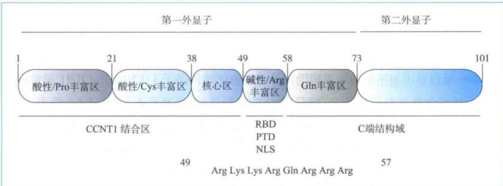  
图9-18 Rev蛋白的结构示意图

已经证实, Rev 蛋白和 RRE (Rev response element) 的结合是通过 Rev 蛋白中富含碱性氨基酸的一段 14 肽 (EGTRQARNRRRRWR) 与 RRE 二级结构 IIB 茎区特异性结合实现的 $^{(图9-19)}$ 。第一个 Rev 蛋白与 RRE 的结合有助于其他 Rev 蛋白的结合, 这些蛋白质不是结合在 RRE 的特异位点上,而是直接结合到第一个 Rev 蛋白上,形成多聚体。Rev 蛋白功能的实现依赖于它向核内的运转,而这一过程是通过 Rev 蛋白的核定位信号功能区完成的。宿主细胞蛋白可结合到 Rev 蛋白近 C 端的功能区,协助加工和转运 HIV mRNA。

  
图 9-19 Rev 蛋白与 RRE 区的结合

Rev 蛋白导出细胞核的主要辅助因子是染色体维持因子 1(CRM1)。CRM1 通常向细胞质运输富含亮氨酸的核输出序列(NES)的蛋白质,并且通常不参与 mRNA 输出。Rev 通过充当适配器劫持 CRM1 用于病毒 RNA 的输出,其中 Rev NES 结合宿主输出因子,而 Rev 核定位信号(Rev-NLS)结合 RRE。有趣的是,最近的研究表明,病毒出核复合物中含有 CRM1 的二聚体。考虑到 CRM1 已被证明只能作为单体运输细胞成分,Rev 依赖的 CRM1 二聚化可能是提高对低亲和力 RevNES 位点的识别的一种方式。组装这种病毒-宿主输出复合体可以使含有内含子的 HIV-I 遗传信息在细胞质内运输,以完成病毒生命周期的后期阶段。

## (4) Nef 蛋白

一般认为，Nef蛋白是一个负调控因子和磷酸化蛋白，相对分子质量为 $2.7 \times 10^{4}$ ，它不是HIV复制所必需的，但可抑制由HIV LTR特异性转录的HIV-I前病毒基因的表达。研究发现，烷基化后定位于细胞膜上的Nef蛋白比未烷基化并弥散于细胞核及细胞质内的Nef蛋白抑制HIV-I基因表达的效率比后者高10倍，推测Nef可能是通过膜细胞信使分子获得对HIV LTR的调控作用。Nef的存在可提高和维持HIV在体内的含量，并在HIV病理过程中起作用。此外，Nef蛋白形成同源二聚体，引起多效应性的影响，如负调控CD4、MHC I以及MHC II。

## (5) Vpr 蛋白

该蛋白质又称病毒 R 蛋白, 由 96 个氨基酸组成, 它不是 HIV 复制所必需的, 但存在于病毒颗粒中。Vpr 蛋白与 p6 Gag 存在特异性相互作用, 每个病毒粒子包装大约 250 个 Vpr 拷贝, 病毒核心中也发现 Vpr。含有 vpr 基因的 HIV 毒株与无 vpr 基因的 HIV 毒株相比, 前者在细胞中生长较快, 引发细胞病变也较强。无 vpr 基因的 HIV-Ⅱ不能在巨噬细胞中繁殖。Vpr 蛋白可作用于 HIV-Ⅰ的 LTR 区, 使它所调控的 HIV 复制速度提高 2\~3 倍, 说明 Vpr 在病毒早期侵染中有作用。

Vpr 蛋白在 HIV-Ⅰ复制中最重要的一个功能是能够结合并协助将病毒整合前复合体导入不分裂的细胞和细胞周期阻滞细胞的细胞核。病毒 cDNA 整合到宿主染色体 DNA 中过程通常被核膜所阻止。HIV-Ⅰ进入宿主基因组的两种主要方式是：细胞分裂时，核膜被分解；或者借助 IN 蛋白和 Vpr 在核孔的相互作用，通过输入核内整合复合体进入细胞核。Vpr 还能在细胞周期的 $G_{2}$ 阶段阻断细胞分裂，诱导细胞凋亡并产生其他致病作用，有可能增加了病毒复制、传播和免疫逃逸。

## (6) Vpu 蛋白

这个蛋白质是 HIV-Ⅰ特有的,其他灵长类动物免疫缺陷病毒以及 HIV-Ⅱ和 SIV 均无此基因。它编码由 81 个氨基酸组成的磷酸化蛋白,称为病毒 U 蛋白,主要存在于细胞膜中。vpu 基因的翻译受 Rev 调控,HIV 复制时并不需要 vpu 基因的表达,但若缺失 vpu基因可使感染性病毒粒子的产量降低5\~10倍，大大减少了病毒颗粒在细胞膜上的释放。据此，人们推测Vpu蛋白可能促进HIV-I病毒粒子的组装、成熟和释放。此外，Vpu蛋白有助于gp160/CD4复合体的解聚。

  
图 9-20 Tat、Rev 和 Nef 对 HIV 基因表达的影响分析

## (7) Vif 蛋白

该蛋白质是相对分子质量为 $2.3 \times 10^{4}$ 的病毒感染性因子，是 HIV-I 侵染所必需的。缺失 vif 基因的 HIV-I 虽然仍在细胞内正常复制并产生病毒粒子，但这些粒子的侵染性不及野生 HIV-I 病毒粒子的 1/1000。Vif 蛋白是病毒在巨噬细胞间扩散所必需的。图 9-20 揭示了 Tat、Rev 和 Nef 对 HIV 基因表达的综合性影响。

## 9.2.5 HIV 的感染及致病机制

HIV 初次感染人体后,立即大量复制和扩散,此时,感染者血清中出现 HIV 抗原,从外周血细胞、脑脊液和骨髓细胞中均能分离出 HIV。这是 HIV 原发感染的急性期。大约 70% 以上的原发感染者在感染后 2\~4 周内出现急性感染症状,包括发热、咽炎、淋巴结肿大、关节痛、中枢及外周神经系统病变、皮肤斑丘疹、黏膜溃疡等,持续 1\~2 周后进入 HIV 感染的无症状潜伏期。在这个时期感染者无任何临床症状,外周血中 HIV 抗原含量很低甚至检测不到。但随感染时间的延长,HIV 重新开始大量复制并造成免疫系统损伤。临床上病人感染逐步发展到持续性全身性淋巴腺病(PGL)、艾滋病相关综合征(APC)等,直至发展到艾滋病。

在 HIV 自然感染过程中,机体可产生高滴度的抗 HIV 多种蛋白质的抗体,主要是细胞类型特异性的中和抗体,其主要作用是在急性感染期降低血清中的病毒含量或部分清除病毒。HIV 的感染也刺激机体产生细胞免疫应答,对于杀伤 HIV 感染的细胞,阻止 HIV 经细胞接触而扩散等可能发挥重要作用,还能协助清除急性感染期 HIV 感染灶和 HIV 感染早期的少量有 HIV 复制的细胞。

人体一旦被 HIV 感染,便会终生带毒,随着时间延续,发病的可能性也逐渐增加。感染 7\~8 年内一般有约半数的带毒者发病,体内产生大量病毒颗粒,并造成感染细胞死亡。属于典型的反转录病毒科慢病毒亚科病毒特征。此外,HIV 还通过以下途径导致免疫功能下降:① HIV 粒子表面的 gp120 蛋白脱落,与正常细胞膜上 CD4 受体结合,使该细胞被免疫系统误认为病毒感染细胞而遭杀灭；②因 T 细胞 CD4 受体被 gp120 封闭，影响了其免疫辅助功能；③ HIV 的 gp120 蛋白可刺激机体产生抗 CD4 结合部位的特异性抗体，阻断 T 细胞功能；④带有病毒包膜蛋白的细胞可与其他细胞融合形成多核巨细胞而丧失功能。

研究还发现,除了主要感染富含 CD4 蛋白的 T 细胞外,HIV 还能感染只带少量 CD4 蛋白或无此受体蛋白的 B 细胞、巨噬细胞、树突状细胞、郎格罕氏细胞、肠上皮细胞、脑内的星形细胞和小神经胶质细胞以及毛细血管内皮细胞等。HIV 可侵染巨噬细胞并随该细胞游走至体内许多组织细胞组织或脏器。HIV 还可侵染脑和肠细胞,因此,艾滋病患者的中枢神经系统常常发生病变,并伴有腹泻等症状。

尽管 HIV 有上述导致细胞病变的作用,但还不足以解释 HIV 感染所造成的免疫系统尽管 HIV 有上述导致细胞病变的作用,但还不足以进行性损伤直至崩溃的严重病症。因为即使是艾滋病人,其外周血淋巴细胞中也仅有极少数的细胞被 HIV 感染。有研究报道,鼠反转录病毒和鼠免疫缺陷病毒感染的小鼠中病毒基因编码一种超抗原,可导致小鼠体内特定的 T 细胞亚群的消失和免疫缺陷的发生,暗示艾滋病人中也可能存在 HIV 编码的超级抗原,导致特定 T 细胞亚群缺失并使机体的免疫防御网出现重大漏洞,对某些致病微生物处于无反应状态。这种免疫病理机制可以解释艾滋病人既出现了严重的免疫系统缺陷,病人血液中却只有极少部分淋巴细胞带有 HIV 这种十分矛盾的现象。

## 9.2.6 艾滋病的治疗及预防

迄今为止,虽然对艾滋病的研究受到了高度重视,仍无任何药物可以完全抑制 HIV 在感染者体内的增殖并彻底治愈艾滋病。目前,已批准的抗 HIV 病毒药物主要有以下几类(表9-5)。图 9-21 是核苷酸型和非核苷酸型反转录酶抑制 HIV 病毒的作用机制。

目前治疗艾滋病的标准疗法是高效抗反转录病毒疗法(highly active antiretroviral therapy, HAART), 又称为抗反转录病毒鸡尾酒疗法, 该疗法可以阻断正在进行的病毒复制, 减少单一用药产生的抗药性, 使机体被破坏的免疫功能部分甚至全部恢复, 从而延长患者生命, 改善生活质量。但该疗法无法彻底清除潜伏感染的静息性记忆 CD4+ T 细胞等细胞内的 HIV 病毒, 无法完全治愈 (sterilizing cure) 艾滋病。全球唯一实现 HIV 完全治愈的病人是著名的“柏林病人”, 2007 年, 一位同时罹患艾滋病和急性髓性白血病的患者在柏林接受了异源 CCR5 受体缺陷型的骨髓造血干细胞移植。20 个月后，接受骨髓移植的艾滋病患者在没有任何抗病毒药物治疗的情况下，其血液、骨髓和肠中艾滋病毒检测均为阴性。但由于很难找到与患者白细胞抗原匹配并对 HIV 天然免疫的供体干细胞，且移植手术危险性高，费用昂贵，使得该疗法难以复制和推广。

表 9-5 已被批准的抗 HIV 药物  
```txt
核苷酸型反转录酶抑制剂
Abacavir (ABC)
Stavudine (d4T)
Didanosine (ddI)
Zalcitabine (ddc)
Lamivudine (3Tc)
Zidovudine (AZT)
Emtricitabine (FTC)
Tenofovir disoproxil fumarate (TDF)

非核苷酸型反转录酶抑制剂
Efavirenz
Nevirapine
Delavirdine
Etravirine
Rilpivirine

蛋白酶抑制剂
Amprenavir
Indinavir
Lopinavir
Nelfinavir
Ritonavir
Saquinavir (已经退出市场)
Saquinavir mesylate
Tipranavir
Fosampernavir Calcium
Darunavir
Atazanavir sulfate
Nelfinavir mesylate

融合酶抑制剂
Enfuvirtide
CCR5 受体抑制剂
Maraviroc

HIV 整合酶转移抑制剂
Raltegravir
Dolutegravir
Elvitegravir
```

(a) 核苷酸型反转录酶抑制剂。由于它在结构上与脱氧核苷酸的相似性，掺入后使病毒DNA的合成不能进行。(b) 非核苷酸型反转录酶抑制剂。与反转录酶相结合，通过限制该酶的移动性而影响它的活性。  
  
图 9-21 核苷酸型和非核苷酸型反转录酶抑制剂的作用机制分析

受治疗“柏林病人”的启发,科学家们采用锌指核酸酶(zinc-finger nuclease,ZFN)介导的特异性基因敲除等基因组编辑手段,对来源于患者本人的CD4 $^{+}$ T细胞的CCR5或者CXCR4受体进行突变,并在体外进行扩增后重新输回患者体内。几周后,患者体内艾滋病毒含量急剧下降,其后恢复HAART治疗,在36周观察期内,患者体内病毒均降至未能检出水平,可见敲除CCR5受体基因对治疗艾滋病是有效的。但由于回输的CD4 $^{+}$ T细胞属于已成熟的T细胞,复制能力有限,在外周血中会慢慢消减,需要反复回输,且对T细胞或者造血干细胞的体外改造、扩增和回输是非常复杂的过程,费用昂贵,风险性高,难以大规模临床应用。

整合在宿主免疫细胞基因组中的 HIV 前病毒是潜伏库存在的根本原因。近年来，随着对 HIV 病毒潜伏储存库形成机制的研究以及基因组编辑技术的重大突破，研究者利用锌指核酸酶、类转录激活因子效应物核酸酶(transcription activator-like effector nulease, TALENS)以及 CRISPR/Cas9 等基因组编辑技术，定向突变、清除或沉默病毒潜伏储存库细胞中的 HIV 前病毒靶片段。

近年来,从 HIV 感染者体内发现并分离到很多广谱中和抗体,因此,以诱导广谱中和抗体为目的的包膜免疫原设计成为目前疫苗研究领域的最新方向。随着与 HIV 侵染有

<!-- END OFFICIAL API PART part_004 -->


<!-- BEGIN OFFICIAL API PART part_005 -->

关的病毒基因产物及宿主相关受体分子三维结构与功能的逐步阐明,针对 HIV 不同生命阶段的特异疫苗会在不远的将来被研制出来,将对预防和控制艾滋病的发生发展具有重要意义。


<!-- C-BEGIN Campbell 19.1 -->

### 【英文对应 Campbell Concept 19.1：A virus consists of a nucleic acid surrounded by a protein coat】

> 来源：Campbell Biology（书籍/01_Campbell_Biology） 第19章 Viruses，Concept 19.1。

#### [EN] Concept 19.1: A virus consists of a nucleic acid surrounded by a protein coat

For the past several years, world news has focused on the virus called SARS-CoV-2, short for Severe Acute Respiratory Syndrome-CoronaVirus-2, which causes COVID-19. This virus first infects cells in the airway, where it produces more viruses that can be transmitted to other individuals via exhaled breath. Worldwide, COVID-19 has killed more than 7 million individuals as of 2025. (The actual number is likely significantly higher as many people who died from COVID-19-like symptoms were not tested for the virus.)

What distinguishes SARS-CoV-2 and other viruses from cells? Compared with eukaryotic and even prokaryotic cells, most viruses are much smaller and simpler in structure. Lacking the structures and metabolic machinery found in a cell, a virus is an infectious particle consisting of little more than genes packaged in a protein coat.

Are viruses living or nonliving? Early on, they were considered biological chemicals; the Latin root for virus means “poison.” Viruses can cause a wide variety of diseases, so researchers in the late 1800s saw a parallel with bacteria and proposed that viruses were the simplest of living forms. However, viruses cannot reproduce or carry out metabolic activities outside of a host cell. Most biologists would probably agree that viruses are not alive, but instead exist in a shady area between life-forms and chemicals. The simple phrase used by two researchers describes them aptly: Viruses lead “a kind of borrowed life.”

#### [EN] The Discovery of Viruses: Scientific Inquiry

Scientists detected viruses indirectly long before they were able to see them. The story of how viruses were discovered begins in 1883. A German scientist named Adolf Mayer was studying tobacco mosaic disease, which stunts the growth of tobacco plants and gives their leaves a mottled, or mosaic, coloration. Mayer discovered that he could transmit the disease from plant to plant by rubbing sap extracted from diseased leaves onto healthy plants. After an unsuccessful search for an infectious microorganism in the sap, he suggested that the disease was caused by unusually small bacteria that were invisible under a microscope. This hypothesis was tested a decade later by Dmitri Ivanowsky, a Russian biologist who passed sap from infected tobacco leaves through a filter designed to remove bacteria. After filtration, the sap still produced mosaic disease.

But Ivanowsky reasoned that perhaps the bacteria were small enough to pass through the filter or made a toxin that could do so. The second possibility was ruled out when the Dutch botanist Martinus Beijerinck carried out a classic series of experiments that showed that the infectious agent in the filtered sap could replicate (Figure 19.2).

In fact, the pathogen replicated only within the host it infected. In further experiments, Beijerinck showed that unlike bacteria used in the lab at that time, the mysterious agent of mosaic disease could not be cultivated on nutrient media in test tubes or petri dishes. Beijerinck imagined a replicating particle much smaller and simpler than a bacterium, and he is generally credited with being

#### [EN] Figure 19.2

#### [EN] Inquiry: What causes tobacco mosaic disease?

#### [EN] Experiment

In the late 1800s, Martinus Beijerinck, of the Technical School in Delft, the Netherlands, investigated the properties of the agent that causes tobacco mosaic disease (then called spot disease).

  
1 Extracted sap from tobacco plant with tobacco mosaic disease

#### [EN] Results

When the filtered sap was rubbed on healthy plants, they became infected. Their sap, extracted and filtered, could then act as a source of infection for another group of plants. Each successive group of plants developed the disease to the same extent as earlier groups.

#### [EN] Conclusion

The infectious agent was apparently not a bacterium because it could pass through a bacterium-trapping filter. The pathogen must have been replicating in the plants because its ability to cause disease was undiluted after several transfers from plant to plant.

Data from M. J. Beijerinck, Concerning a contagium vivum fluidum as cause of the spot disease of tobacco leaves, Verhandelingen der Koninkyke akademie Wettenschappen te Amsterdam 65:3–21 (1898). Translation published in English as Phytopathological Classics Number 7 (1942), American Phytopathological Society Press, St. Paul, MN.

WHAT IF? If Beijerinck had observed that the infection of each group was weaker than that of the previous group and that ultimately the sap could no longer cause disease, what might he have concluded?

For suggested answer, see Appendix A.

the first scientist to voice the concept of a virus. His suspicions were confirmed in 1935 when the American scientist Wendell Stanley crystallized the infectious particle, now known as tobacco mosaic virus (TMV). Subsequently, TMV and many other viruses were actually seen with the help of the electron microscope.

#### [EN] Structure of Viruses

The tiniest viruses are only 20 nm in diameter—smaller than a ribosome. Millions could easily fit on a pinhead. Even the largest known virus, which has a diameter of 1,500 nm (1.5 $\mu$ m), is barely visible under the light microscope. Stanley's discovery that some viruses could be crystallized was exciting and puzzling news. Not even the simplest of cells can aggregate into regular crystals. But if viruses are not cells, then what are they? Examining the structure of a virus more closely reveals that it is an infectious particle consisting of one or more molecules of a nucleic acid enclosed in a protein coat and, for some viruses, surrounded by a membranous envelope.

The simple structure of viruses make them a useful biological system: To a large extent, molecular biology was born in the laboratories of biologists studying viruses that infect bacteria. Experiments using these viruses provided evidence that genes are made of nucleic acids, and they were critical in working out the molecular mechanisms of the fundamental processes of DNA replication, transcription, and translation.

#### [EN] Viral Genomes

We usually think of genes as being made of double-stranded DNA, but many viruses defy this convention. Their genomes may consist of double-stranded DNA, single-stranded DNA, double-stranded RNA, or single-stranded RNA, depending on the type of virus. A virus is called a DNA virus or an RNA virus based on the kind of nucleic acid that makes up its genome. In either case, the genome is usually organized as a single linear or circular molecule of nucleic acid, although the genomes of some viruses consist of multiple molecules of nucleic acid. The smallest viruses known have only three genes in their genome, while the largest have several hundred to 2,000. For comparison, bacterial genomes contain about 200 to a few thousand genes.

#### [EN] Capsids and Envelopes

The protein shell enclosing the viral genome is called a capsid. (Together, the capsid and genome are called the nucleocapsid.) Depending on the type of virus, the capsid may be rod-shaped, polyhedral, or more complex in shape. Capsids are built from a large number of protein subunits called capsomeres, but the number of different kinds of proteins in a capsid is usually small. Tobacco mosaic virus has a rigid, rod-shaped capsid made from over 1,000 molecules of a single type of protein arranged in a helix; rod-shaped viruses are commonly called helical viruses for this reason (Figure 19.3a).

Figure 19.3 Viral structure.

Viruses are made up of nucleic acid (DNA or RNA) enclosed in a protein coat (the capsid) and sometimes further wrapped in a membranous envelope. The individual protein subunits making up the capsid are called capsomeres. Although diverse in size and shape, viruses have many common structural features. (All micrographs are colorized TEMs.)

  
(a) Tobacco mosaic virus has a helical capsid surrounding a single helical RNA molecule, with the overall shape of a rigid rod.  
(b) Adenoviruses have an icosahedral capsid with a protein spike at each vertex (corner). The capsid, made up of capsomeres, contains double-stranded DNA.  
(c) Influenza viruses have an outer envelope, studded with glycoprotein projections, that generally contains eight double-helical RNA-protein complexes, each associated with a viral polymerase.  
(d) Coronaviruses, such as SARS-CoV-2 (shown here; the virus that causes COVID-19) are spherical, with a "corona" (crown) of Spike glycoproteins extending out from the membranous envelope. The genome consists of a single RNA molecule, complexed with proteins.  
(e) Bacteriophage T4, like other "T-even" phages, has a complex capsid consisting of an icosahedral head and a tail apparatus. T4's double-stranded DNA is enclosed in the head.

Adenoviruses, which infect the respiratory tracts of animals, have 252 identical protein molecules arranged in a polyhedral capsid with 20 triangular facets—an icosahedron; thus, these and other similarly shaped viruses are referred to as icosahedral viruses (Figure 19.3b).

To infect their hosts, all viruses must enter host cells, and some have accessory structures that help them do so. For instance, a membranous envelope surrounds the capsids of influenza viruses, coronaviruses (such as SARS-CoV-2, the virus that causes COVID-19), and many other viruses found in animals (Figure 19.3c and d). These viral envelopes, which are derived from the membranes of the previous host cell, contain host cell phospholipids and membrane proteins. They also contain virally encoded proteins and glycoproteins—proteins with carbohydrates covalently attached, including proteins that allow fusion with the host cell membrane. These viral proteins are unique to each virus. Some viruses carry a few viral enzymes, such as viral polymerase, within their capsids.

Many of the most complex capsids are found among the viruses that infect bacteria, called bacteriophages, or simply phages. The first phages studied included seven that infect Escherichia coli (E. coli). These seven phages were named type 1 (T1), type 2 (T2), and so forth, in the order of their discovery. (The T2 phage was used in the experiment that established DNA as the genetic material; see Figure 16.4.) The three “T-even” phages (T2, T4, and T6) turned out to be very similar in structure. Their capsids have elongated icosahedral heads enclosing their DNA. Attached to the head is a protein tail piece with fibers by which the phages attach to a bacterial cell (Figure 19.3e). In the next section, we’ll examine how these few viral parts function together with cellular components to produce large numbers of viral progeny.

#### [EN] Concept Check 19.1

1. VISUAL SKILLS Describe one similarity and two differences between the structures of tobacco mosaic virus (TMV) and influenza virus (see Figure 19.3).

2. MAKE CONNECTIONS Bacteriophages were used to provide evidence that DNA carries genetic information (see Figure 16.4). Briefly describe the experiment carried out by Hershey and Chase, including in your description why the researchers chose to use phages.

For suggested answers, see Appendix A.


<!-- C-END Campbell 19.1 -->


<!-- C-BEGIN Campbell 19.2 -->

### 【英文对应 Campbell Concept 19.2：Viruses replicate only in host cells】

> 来源：Campbell Biology（书籍/01_Campbell_Biology） 第19章 Viruses，Concept 19.2。

#### [EN] Concept 19.2: Viruses replicate only in host cells

Viruses lack metabolic enzymes and equipment for making proteins, such as ribosomes. They are obligate intracellular parasites; in other words, they can replicate only within a host cell. It is fair to say that viruses in isolation are merely packaged sets of genes in transit from one host cell to another.

Each particular virus can infect cells of only a limited number of host species, called the host range of the virus. This host specificity results from the evolution of recognition systems by the virus. Viruses usually identify host cells by a “handshake” fit between viral surface proteins and specific receptor molecules on the outside of cells. Such receptor molecules are most often proteins that carry out necessary functions for the host cell and have been adopted by viruses as portals of entry. Some viruses have broad host ranges. For example, West Nile virus and equine encephalitis virus are distinctly different viruses that can each infect mosquitoes, birds, horses, and humans. Other viruses have host ranges so narrow that they infect only a single species. Measles virus, for instance, can infect only humans. Furthermore, viral infection of multicellular eukaryotes is usually limited to particular tissues. Human cold viruses infect only the cells lining the upper respiratory tract, and the HIV seen in Figure 19.1 binds to receptors present only on certain types of immune cells.

#### [EN] General Features of Viral Replicative Cycles

A viral infection begins when a virus binds to a host cell and the viral genome makes its way inside (Figure 19.4). The mechanism of genome entry depends on the type of virus and the type of host cell. For example, T-even phages use their elaborate tail apparatus to inject DNA into a bacterium (see Figure 19.3d). Other viruses are taken up by endocytosis or, in the case of enveloped viruses, by fusion of the viral envelope with the host's plasma membrane. Once the viral genome is inside, the proteins it encodes can commandeer the host, reprogramming the cell to copy the viral genome and manufacture viral proteins. The host provides the nucleotides for making viral nucleic acids, as well as enzymes, ribosomes, tRNAs, amino acids, ATP, and other components needed for making the viral proteins. Many DNA viruses use the DNA polymerases of the host cell to synthesize new genomes along the templates provided by the viral DNA. In contrast, to replicate their genomes, RNA viruses use virally encoded RNA polymerases that can use RNA as a template. (Uninfected cells generally make no enzymes for transcribing RNA from an RNA template.)

After the viral nucleic acid molecules and capsomeres are produced, they spontaneously self-assemble into new viruses. In fact, researchers can separate the RNA and capsomeres of TMV and then reassemble complete viruses simply by mixing the components together under the right conditions. The simplest type of viral replicative cycle ends with the exit of hundreds or thousands of viruses from the infected host cell, a process that often damages or destroys the cell. Such cellular damage and death, as well as the body's responses to this destruction, cause many of the symptoms associated with viral infections. The viral progeny that exit a cell have the potential to infect additional cells, spreading the viral infection.

There are many variations on the simplified viral replicative cycle we have just described. We will now take a look at some of these variations in bacterial viruses (phages) and animal viruses; later in the chapter, we will consider plant viruses.

  
MAKE CONNECTIONS Label each of the straight gray arrows to identify the process that is occurring. Review Figure 17.25.

For suggested answer, see Appendix A.

#### [EN] Replicative Cycles of Phages

Phages are the best understood of all viruses, although some of them are also among the most complex. Research on phages led to the discovery that some double-stranded DNA viruses can replicate by two alternative mechanisms: the lytic cycle and the lysogenic cycle.

#### [EN] The Lytic Cycle

A phage replicative cycle that culminates in death of the host cell is known as a lytic cycle. The term lytic refers to the last stage of infection, during which the bacterium lyses (breaks open) and releases the phages that were produced within the cell. Each of these phages can then infect a healthy cell, and a few successive lytic cycles can destroy an entire bacterial population in just a few

Phage T4 has almost 300 genes, which are transcribed and translated using the host cell's machinery. One of the first phage genes translated after the viral DNA enters the host cell codes for an enzyme that degrades the host cell's DNA (2); the phage DNA is protected from breakdown because it contains a modified form of cytosine that is not recognized by the phage enzyme. The entire lytic cycle, from the phage's first contact with the cell surface to cell lysis, takes only 20–30 minutes at $37^{\circ}$ C.

1 Attachment. The T4 phage uses its tail fibers to bind to specific surface proteins on an E. coli cell that act as receptors.

5 Release. The phage directs production of an enzyme that damages the bacterial cell wall, allowing fluid to enter. The cell swells and finally bursts, releasing 100 to 200 phage particles.

Entry of phage DNA and degradation of host DNA. The sheath of the tail contracts, injecting the phage DNA into the cell and leaving an empty capsid outside. The cell's DNA is hydrolyzed by a phage-encoded enzyme.

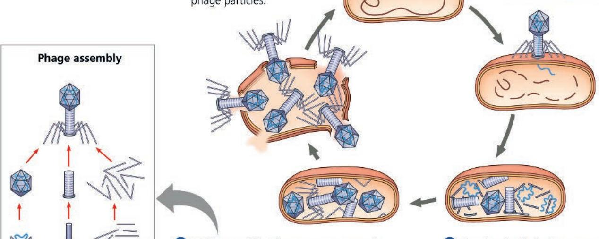  
4 Self-assembly. Three separate sets of proteins self-assemble to form phage heads, tails, and tail fibers. The phage genome is packaged inside the capsid as the head forms.

hours. A phage that replicates only by a lytic cycle is a virulent phage. Figure 19.5 illustrates the major steps in the lytic cycle of T4, a typical virulent phage.

#### [EN] The Lysogenic Cycle

Instead of lysing their host cells, many phages coexist with them in a state called lysogeny. In contrast to the lytic cycle, which kills the host cell, the lysogenic cycle allows replication of the phage genome without destroying the host. Phages capable of using both modes of replicating within a bacterium are called temperate phages. A temperate phage called lambda, written with the Greek letter $\lambda$ , has been widely used in biological research. Phage $\lambda$ resembles T4, but its tail has only one short tail fiber.

3 Synthesis of viral genomes and proteins. The phage DNA directs production of more phage proteins and copies of the phage genome by host and viral enzymes, using components within the cell.

Infection of an E. coli cell by phage $\lambda$ begins when the phage binds to the surface of the cell and injects its linear DNA genome (Figure 19.6, on the next page). Within the host, the $\lambda$ DNA molecule forms a circle. What happens next depends on the replicative mode: lytic cycle or lysogenic cycle. During a lytic

cycle, the viral genes immediately turn the host cell into a $\lambda$ -producing factory, and the cell soon lyses and releases its virus progeny. During a lysogenic cycle, however, the $\lambda$ DNA molecule is incorporated into a specific site on the E. coli chromosome by viral proteins that break both circular DNA molecules and join them to each other. When integrated into the bacterial chromosome in this way, the viral DNA is known as a prophage. One prophage gene codes for a protein that prevents transcription of most of the other prophage genes. Thus, the phage genome is mostly silent within the bacterium. Every time the E. coli cell prepares to divide, it replicates the phage DNA along with its own chromosome such that each daughter cell inherits a prophage. A single infected cell can quickly give rise to a large population of bacteria carrying the virus in prophage form. This mechanism enables viruses to propagate without killing the host cells on which they depend.

The term lysogenic signifies that prophages are capable of generating active phages that lyse their host cells. This occurs when the $\lambda$ genome (or that of another temperate phage) is

Figure 19.6 The lytic and lysogenic cycles of phage $\lambda$ , a temperate phage.

After entering the bacterial cell and circularizing, the $\lambda$ DNA can immediately initiate the production of a large number of progeny phages (lytic cycle) or integrate into the bacterial chromosome (lysogenic cycle). In most cases, phage $\lambda$ follows the lytic pathway, which is similar to that detailed in Figure 19.5. However, once a lysogenic cycle begins, the prophage may be carried in the host cell's chromosome for many generations. Phage $\lambda$ has one main tail fiber, which is short.


induced to exit the bacterial chromosome and initiate a lytic cycle. An environmental signal, such as a certain chemical or high-energy radiation, usually triggers the switchover from the lysogenic to the lytic mode.

In addition to the gene for the viral protein that prevents transcription, a few other prophage genes may be expressed during lysogeny. Expression of these genes may alter the host's phenotype, a phenomenon that can have important medical significance. For example, the three species of bacteria that cause the human diseases diphtheria, botulism, and scarlet fever would not be so harmful to humans without certain prophage genes that cause the host bacteria to make toxins. And the difference between the E. coli strain in our intestines and the O157:H7 strain that has caused several deaths by food poisoning appears to be the presence of toxin genes of prophages in the O157:H7 strain.

#### [EN] Bacterial Defenses Against Phages

After reading about the lytic cycle, you may have wondered why phages haven't exterminated all bacteria. Lysogeny is one major reason why bacteria have been spared from extinction caused by phages. Bacteria also have their own defenses against phages. First, natural selection favors bacterial mutants with surface proteins that are no longer recognized as receptors by a particular type of phage. Second, when phage DNA does enter a bacterium, the DNA often is identified as foreign and cut up by cellular enzymes called restriction enzymes, which are so named because they restrict a phage's ability to replicate within the bacterium. (Restriction enzymes are used in molecular biology and DNA cloning techniques; see Concept 20.1.) The bacterium's own DNA is methylated in a way that prevents attack by its own restriction enzymes. A third defense is a system present in both bacteria and archaea called the CRISPR-Cas system, which you learned about in Concept 17.5.

The CRISPR-Cas system was discovered during a study of repetitive DNA sequences present in the genomes of many prokaryotes. These sequences, which puzzled scientists, were named clustered regularly interspaced short palindromic repeats (CRISPRs) because each sequence reads the same forward and backward (a palindrome), with different stretches of “spacer DNA” in between the repeats. At first, scientists assumed the spacer DNA sequences were random and meaningless, but analysis by several research groups showed that each spacer sequence corresponded to DNA from a particular phage that had infected the cell. Further studies revealed that particular nuclease proteins interact with the CRISPR region. These nucleases, called Cas (CRISPR-associated) proteins, can identify and cut phage DNA, thereby defending the bacterium against phage infection.

When a phage infects a bacterial cell that has the CRISPR-Cas system, the DNA of the invading phage is stored, integrated into


Figure 19.7 The CRISPR-Cas system: a type of bacterial immune system.

1 Infection by a phage triggers transcription of the CRISPR region of the bacterial DNA. This region consists of DNA from phages that previously infected the cell, separated by repeats.

3 Each short RNA strand binds to a Cas protein, forming a complex. (Multiple complexes are formed.)

4 Complementary RNA binds to DNA from the invading phage. The Cas protein then cuts the phage DNA.

5 After being cut, the entire phage DNA molecule is degraded and can no longer be replicated.

▶ Computer model of CRISPR-Cas9 gene editing complex from Streptococcus pyogenes

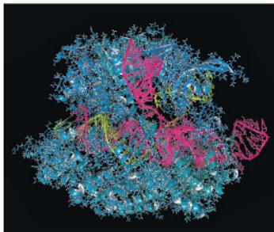

the genome between two repeat sequences (Figure 19.7). If the cell survives the infection, any further attempt by the same type of phage to infect this cell (or its offspring) triggers transcription of the CRISPR region into RNA molecules. These RNAs are cut into pieces and then bound by Cas proteins, such as the Cas9 protein (see Figure 17.28). The Cas protein uses a portion of the phage-related RNA as a homing device to identify the invading phage DNA and cut it, leading to its destruction.

Just as natural selection favors bacteria that have receptors altered by mutation or that have enzymes that cut phage DNA, it also favors phage mutants that can bind to altered receptors or that are resistant to enzymes. Thus, the bacterium–phage relationship is in constant evolutionary flux.

#### [EN] Interview

Interview with Francisco Mojica: Discovering CRISPR in bacteria (eTextbook only)


#### [EN] Replicative Cycles of Animal Viruses

Everyone has suffered from viral infections, whether cold sores, influenza, or the common cold. Like all viruses, those that cause illness in humans and other animals can replicate only inside host cells. Many variations on the basic scheme of viral infection and replication are represented among the animal viruses. Key variables are the nature of the viral genome (double- or single-stranded DNA or RNA) and the presence or absence of an envelope.

Whereas there are only a few bacteriophages that have an envelope or RNA genome, many animal viruses have both. In fact, nearly all animal viruses with RNA genomes have an envelope, as do some with DNA genomes. Rather than consider all the mechanisms of viral infection and replication, we will focus first on the roles of viral envelopes and then on the functioning of RNA as the genetic material of many animal viruses.

#### [EN] Viral Envelopes

An animal virus equipped with an envelope—that is, a membranous outer layer—uses it to enter the host cell. Protruding from the outer surface of this envelope are viral glycoproteins that bind to specific receptor molecules on the surface of a host cell. For example, the Spike protein on SARS-CoV-2, the virus that causes COVID-19, binds to a protein called ACE2 on the surface of human airway (and other) cells. Figure 19.8 outlines the events in the replicative cycle of an enveloped virus with an RNA genome. Ribosomes bound to the endoplasmic reticulum (ER) of the host cell make the protein parts of the envelope glycoproteins; cellular enzymes in the ER and Golgi apparatus then add the sugars. The resulting viral glycoproteins, embedded in membrane derived from the host cell, are transported to the cell surface. In a process much like exocytosis (see Figure 7.20), new viral capsids are wrapped in membrane as they bud from the cell. In other words,

Figure 19.8 The replicative cycle of an enveloped RNA virus.

Shown here is a virus with a single-stranded RNA genome that functions as a template for synthesis of mRNA.

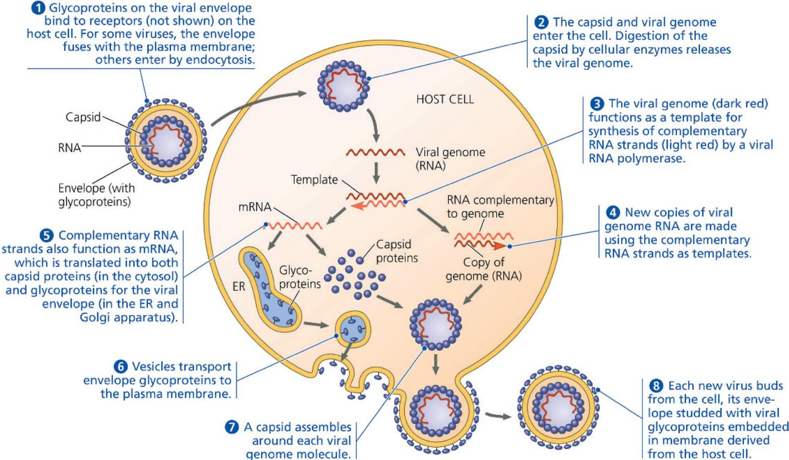

the viral envelope is usually derived from the host cell's plasma membrane, although all or most of the molecules of this membrane are specified by viral genes. The enveloped viruses are now free to infect other cells. This replicative cycle does not necessarily kill the host cell, in contrast to the lytic cycles of phages.

Some viruses have envelopes that are not derived from plasma membrane. Herpesviruses, for example, are temporarily cloaked in membrane derived from the nuclear envelope of the host; they then shed this membrane in the cytoplasm and acquire a new envelope made from membrane of the Golgi apparatus. These viruses have a double-stranded DNA genome and replicate within the host cell nucleus, using a combination of viral and cellular enzymes to replicate and transcribe their DNA. In the case of herpesviruses, copies of the viral DNA can remain behind as mini-chromosomes in the nuclei of certain nerve cells. There they remain latent until some sort of physical or emotional stress triggers a new round of active virus production. The infection of other cells by these new viruses causes the blisters characteristic of herpes, such as cold sores or genital sores. Once someone acquires a herpesvirus infection, flare-ups may recur throughout the person's life.

#### [EN] Viral Genetic Material

Table 19.1 shows the common classification system for animal viruses, which is based on their genetic material: double- or

single-stranded DNA, or double- or single-stranded RNA, with further classification of RNA viruses. Although some phages and most plant viruses are RNA viruses, the broadest variety of RNA genomes is found among the viruses that infect animals. There are three types of single-stranded RNA genomes found in animal viruses (classes IV–VI in Table 19.1). The genome of class IV viruses can directly serve as mRNA and thus can be translated into viral protein immediately after infection. (SARS-CoV-2 has this type of genome.) Figure 19.8 shows a virus of class V, in which the RNA genome serves instead as a template for mRNA synthesis. (This type is found in influenza viruses.) The RNA genome is transcribed into complementary RNA strands, which function both as mRNA and as templates for the synthesis of additional copies of genomic RNA. All viruses that use an RNA genome as a template for mRNA transcription require RNA → DNA synthesis. These viruses use a viral enzyme capable of carrying out this process; there are no such enzymes in most host cells. The enzyme used in this process is encoded by the viral genome. After the enzyme is synthesized, it is packaged during viral self-assembly with the genome inside the viral capsid.

The RNA animal viruses with the most complicated replicative cycles are the retroviruses (class VI). These viruses have an enzyme called reverse transcriptase that transcribes an RNA template into a DNA copy, an RNA → DNA information flow that is the opposite of the usual direction. This unusual phenomenon is the source of the name retroviruses (retro means "backward"). Of particular medical importance is HIV (human immunodeficiency virus), the retrovirus shown in Figure 19.1 that causes AIDS (acquired immunodeficiency syndrome). HIV and other retroviruses are enveloped viruses that contain two identical molecules of single-stranded RNA and two molecules of reverse transcriptase.

Table 19.1 Classes of Animal Viruses

<table><tr><td>Class/Family</td><td>Envelope?</td><td>Examples That Cause Human Diseases</td></tr><tr><td colspan="3">I. Double-Stranded DNA (dsDNA)</td></tr><tr><td>Adenovirus(see Figure 19.3b)</td><td>No</td><td>Respiratory viruses</td></tr><tr><td>Papillomavirus</td><td>No</td><td>Warts, cervical cancer (HPV)</td></tr><tr><td>Polyomavirus</td><td>No</td><td>Tumors</td></tr><tr><td>Herpesvirus</td><td>Yes</td><td>Herpes simplex I and II (cold sores, genital sores); varicella zoster (shingles, chicken pox); Epstein-Barr virus (mononucleosis, Burkitt&#x27;s lymphoma)</td></tr><tr><td>Poxvirus</td><td>Yes</td><td>Smallpox virus; cowpox virus</td></tr><tr><td colspan="3">II. Single-Stranded DNA (ssDNA)</td></tr><tr><td>Parvovirus</td><td>No</td><td>B19 parvovirus (mild rash)</td></tr><tr><td colspan="3">III. Double-Stranded RNA (dsRNA)</td></tr><tr><td>Reovirus</td><td>No</td><td>Rotavirus (diarrhea); Colorado tick fever virus</td></tr><tr><td colspan="3">IV. Single-Stranded RNA (ssRNA); Serves as mRNA</td></tr><tr><td>Picornavirus</td><td>No</td><td>Rhinovirus (common cold); poliovirus; hepatitis A virus; other intestinal viruses</td></tr><tr><td>Coronavirus</td><td>Yes</td><td>Severe acute respiratory syndrome (SARS) virus; SARS-CoV-2 (COVID-19); Middle East respiratory syndrome (MERS-CoV)</td></tr><tr><td>Flavivirus</td><td>Yes</td><td>Zika virus (see Figure 19.10c); yellow fever virus; dengue virus; West Nile virus; hepatitis C virus</td></tr><tr><td>Togavirus</td><td>Yes</td><td>Chikungunya virus (see Figure 19.10b); rubella virus; equine encephalitis viruses</td></tr><tr><td colspan="3">V. ssRNA; Serves as Template for mRNA Synthesis</td></tr><tr><td>Filovirus</td><td>Yes</td><td>Ebola virus (hemorrhagic fever; see Figure 19.10a)</td></tr><tr><td>Orthomyxovirus</td><td>Yes</td><td>Influenza virus (see Figure 19.3c)</td></tr><tr><td>Paramyxovirus</td><td>Yes</td><td>Measles virus; mumps virus</td></tr><tr><td>Rhabdovirus</td><td>Yes</td><td>Rabies virus</td></tr><tr><td colspan="3">VI. ssRNA; Serves as Template for DNA Synthesis</td></tr><tr><td>Retrovirus</td><td>Yes</td><td>Human immunodeficiency virus (HIV/AIDS; see Figure 19.9); human T-lymphotropic virus type 1 (HTLV-1) (leukemia)</td></tr></table>

The HIV replicative cycle (illustrated in Figure 19.9, on the next page) is typical of a retrovirus. After HIV enters a host cell, its reverse transcriptase molecules are released into the cytoplasm, where they catalyze synthesis of viral DNA. The newly made viral DNA then enters the cell's nucleus and integrates into the DNA of a chromosome. The integrated viral DNA, called a provirus, never leaves the host's genome, remaining a permanent resident of the cell. (Recall that a prophage, in contrast, leaves the host's genome at the start of a lytic cycle.) The RNA polymerase of the host transcribes the proviral DNA into RNA molecules, which can function both as mRNA for the synthesis of viral proteins and as genomes for the new viruses that will be assembled and released from the cell. In Concept 43.4, we describe how HIV causes the deterioration of the immune system that occurs in AIDS.

#### [EN] Evolution of Viruses

EVOLUTION We began this chapter by asking whether or not viruses are alive. Viruses do not really fit our definition of living organisms. An isolated virus is biologically inert, unable to replicate its genes or regenerate its own ATP. Yet it has a genetic program written in the universal language of life. Do we think of viruses as nature's most complex associations of molecules or as the simplest forms of life? Either way, we must bend our usual definitions. Although viruses cannot replicate or carry out metabolic activities independently, their use of the genetic code makes it hard to deny their evolutionary connection to the living world.

How did viruses originate? Viruses have been found that infect every form of life—not only bacteria, animals, and plants, but also archaea, fungi, and algae and other protists. Researchers estimate that each milliliter (one-fifth of a teaspoon) of seawater contains between one and 100 million viruses, ten times the number of microorganisms! Because viruses depend on cells for their own propagation, it seems likely that viruses are not the descendants of precellular forms of life but evolved—possibly multiple times—after the first cells appeared. Most molecular biologists favor the hypothesis that viruses originated from naked bits of cellular nucleic acids that moved from one cell to another, perhaps via injured cell surfaces. The evolution of genes coding for capsid proteins may have allowed viruses to bind cell membranes, thus facilitating the infection of uninjured cells.

Candidates for the original sources of viral genomes include plasmids and transposons. Plasmids are small, circular DNA molecules found in bacteria and in the unicellular fungi called yeasts. Plasmids exist apart from the genome, can replicate independently of the genome, and are occasionally transferred between cells. Transposons are DNA segments that can move from one location to another within a cell's genome. Thus, plasmids, transposons, and viruses all share an important feature: They are mobile genetic elements. (We'll discuss plasmids in more detail in Concepts 20.1 and 27.2 and transposons in Concept 21.4.)

Consistent with this notion of pieces of DNA shuttling from cell to cell is the observation that a viral genome can have more in common with the genome of its host than with the genomes

MAKE CONNECTIONS Describe what is known about binding of HIV to immune system cells. (See Figure 7.8.) How was this discovered? For suggested answer, see Appendix A.

Figure 19.9 The replicative cycle of HIV, the retrovirus that causes AIDS.

The photos (artificially colored TEMs) show HIV entering and leaving a human white blood cell. See Figure 7.8 for the cell-surface proteins that act as receptors for HIV. Note in step 6 that DNA synthesized from the viral RNA genome is integrated as a provirus into the host cell chromosomal DNA, a characteristic unique to retroviruses.

HIV entering a cell

  
New HIV leaving a cell

of viruses that infect other hosts. Indeed, some viral genes are essentially identical to genes of the host.

Debate about the origin of viruses was reinvigorated in the early 2000s when an extremely large virus was identified: Mimivirus is a double-stranded DNA (dsDNA) virus with an icosahedral capsid that is 400 nm in diameter, the size of a small bacterium. Its genome contains 1.2 million bases (Mb)—about 100 times as many as the influenza virus genome—and an estimated 1,000 genes. Perhaps the most surprising aspect of mimivirus, however, was that its genome included genes previously found only in cellular genomes. Some of these genes code for proteins involved in translation, DNA repair, protein folding, and polysaccharide synthesis. Whether mimivirus evolved before the first cells and then developed an exploitative relationship with them or evolved more recently and simply scavenged genes from its hosts is not yet settled.

In the past decade, several even larger viruses have been discovered that cannot be classified with any existing known virus. One such virus is 1 $\mu$ m (1,000 nm) in diameter, with a dsDNA genome of around 2–2.5 Mb, larger than that of some small eukaryotes. What's more, over 90% of its 2,000 or so genes are unrelated to cellular genes, inspiring the name it was given, pandoravirus. The number of genes in pandoraviruses varies from 1,500 to 2,500 genes. A second virus, called Pithovirus sibericum, with a diameter of 1.5 $\mu$ m and 500 genes, was discovered in permanently frozen soil in Siberia. This virus, once thawed, was able to infect an amoeba after being frozen for 30,000 years! How these and all other viruses fit in the tree of life is an intriguing, unresolved question.

The ongoing evolutionary relationship between viruses and the genomes of their host cells is an association that continues to make viruses very useful experimental systems in molecular biology. Knowledge about viruses also allows many practical applications, since viruses have a tremendous impact on all organisms through their ability to cause disease.

#### [EN] Concept Check 19.2

1. Compare the effect on the host cell of a lytic (virulent) phage and a lysogenic (temperate) phage.

2. MAKE CONNECTIONS Compare the CRISPR-Cas system with the miRNA system discussed in Concept 18.3, including their mechanisms and their functions.

3. MAKE CONNECTIONS The RNA virus in Figure 19.8 has a viral RNA polymerase that functions in step 3 of the virus's replicative cycle. Compare this with a cellular RNA polymerase in terms of template and overall function (see Figure 17.10).

4. Why is HIV called a retrovirus?

5. VISUAL SKILLS Looking at Figure 19.9, imagine you are a researcher trying to combat HIV infection. What molecular processes could you attempt to block?

For suggested answers, see Appendix A.


<!-- C-END Campbell 19.2 -->


<!-- L-BEGIN Lehninger 26.3 -->

### 【英文对应 Lehninger §26.3：RNA-Dependent Synthesis of RNA and DNA】

> 来源：Lehninger Principles of Biochemistry（书籍/02_生物化学原理） 第26章 RNA Metabolism，§26.3。


In our discussion of DNA and RNA synthesis up to this point, the role of the template strand has been reserved for DNA. However, some enzymes use an RNA template for nucleic acid synthesis. With the important exception of viruses with an RNA genome, these enzymes play only supporting roles in information pathways. RNA viruses are the source of most characterized RNA-dependent polymerases, although some eukaryotes also use these enzymes to amplify double-stranded RNAs used in RNA interference.

The existence of RNA replication requires an elaboration of the central dogma—the notion that genetic information flows only from DNA to RNA to proteins. RNA-dependent polymerases allow the genetic information stored in RNA to be replicated and reverse transcribed into DNA. The enzymes of the RNA replication process have profound implications for investigations into the nature of self-replicating molecules that may have existed in prebiotic times.

#### [EN] Reverse Transcriptase Produces DNA from Viral RNA

P3 Certain RNA viruses that infect animal cells carry within the viral particle an RNA-dependent DNA polymerase called reverse transcriptase. On infection, the single-stranded RNA viral genome (\~10,000 nucleotides) and the enzyme enter the host cell. The reverse transcriptase first catalyzes the synthesis of a DNA strand complementary to the viral RNA (Fig. 26-29), then degrades the RNA strand of the viral RNA-DNA hybrid and replaces it with DNA. The resulting duplex DNA often becomes incorporated into the genome of the eukaryotic host cell. These integrated (and dormant) viral genes can be activated and transcribed, and the gene products—viral proteins and the viral RNA genome itself—are packaged as new viruses. The RNA viruses that contain reverse transcriptases are known as retroviruses (retro is the Latin prefix for “backward”).

The existence of reverse transcriptases in RNA viruses was predicted by Howard Temin in 1962, and the enzymes were ultimately detected by Temin and, independently, by David Baltimore in 1970. P3 Their discovery aroused much attention as dogma-shaking proof that genetic information can flow "backward" from RNA to DNA.

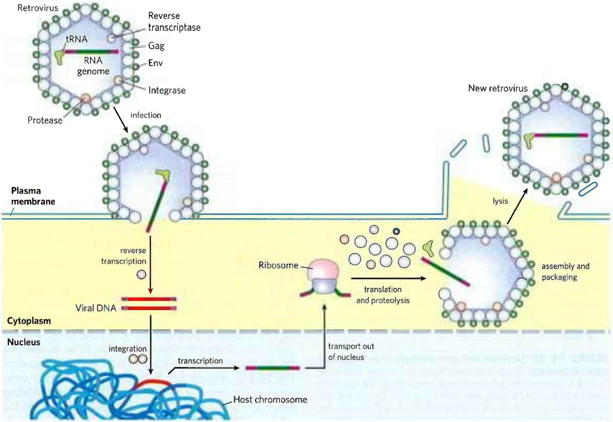  
FIGURE 26-29 Retroviral infection of a mammalian cell and integration of the retrovirus into the host chromosome. Viral particles entering the host cell carry viral reverse transcriptase and a cellular tRNA (picked up from a former host cell) already base-paired to the viral RNA. The purple segments represent the long terminal repeats on the viral RNA. The tRNA facilitates immediate conversion of viral RNA to double-stranded DNA by the action of reverse transcriptase. The double-stranded DNA enters the nucleus and is integrated into the host genome. The integration is catalyzed by a virally encoded integrase. Integration of viral DNA into host DNA is mechanistically similar to

  
Howard Temin, 1934–1994
[Bettmann/Getty Images.]

  
David Baltimore [AP Images.]  
the insertion of transposons in bacterial chromosomes (see Fig. 25-41). For example, a few base pairs of host DNA become duplicated at the site of integration, forming short repeats of 4 to 6 bp at each end of the inserted retroviral DNA (not shown). On transcription and translation of the integrated viral DNA, new viruses are formed and released by cell lysis (right). In the viruses, the viral RNA is enclosed by capsid proteins called Gag and outer envelope proteins called Env. Additional viral proteins (reverse transcriptase, integrase, and a viral protease needed for posttranslational processing of viral proteins) are packaged within the virus particle with the RNA.

Retroviruses typically have three genes: gag (a name derived from the historical designation group associated antigen), pol, and env (Fig. 26-30). The transcript that contains gag and pol is translated into a long "polyprotein," a single large polypeptide that is cleaved into six proteins with distinct functions. The proteins derived from the gag gene make up the interior core of the viral particle. The pol gene encodes the protease that cleaves the long polypeptide, an integrase that inserts the viral DNA into the host chromosomes, and reverse transcriptase. Many reverse transcriptases have two subunits, $\alpha$ and $\beta$ . The pol gene specifies the $\beta$ subunit ( $M_{r}$ 90,000), and the $\alpha$ subunit ( $M_{r}$ 65,000) is simply a proteolytic fragment of the $\beta$ subunit. The env gene encodes the proteins of the viral envelope. At each end of the linear RNA genome are long terminal repeat (LTR) sequences of a few hundred nucleotides. Transcribed into the duplex DNA, these sequences facilitate integration of the viral chromosome into the host DNA and contain promoters for viral gene expression.


  
FIGURE 26-30 Structure and gene products of an integrated retroviral genome. The long terminal repeats (LTRs) have sequences needed for the regulation and initiation of transcription. The sequence denoted $\psi$ is required for packaging of retroviral RNAs into mature viral particles. Transcription of the retroviral DNA produces a primary transcript encompassing the gag, pol, and env genes. Translation (Chapter 27) produces a polyprotein, a single long polypeptide derived from the gag and pol genes, which is cleaved into six distinct proteins. Splicing of the primary transcript yields an mRNA derived largely from the env gene, which is also translated into a polyprotein, then cleaved to generate viral envelope proteins.

Reverse transcriptases catalyze three different reactions: (1) RNA-dependent DNA synthesis, (2) RNA degradation, and (3) DNA-dependent DNA synthesis. Each transcriptase is most active with the RNA of its own virus, but each can be used experimentally to make DNA complementary to a variety of RNAs. The DNA and RNA synthesis and RNA degradation activities use separate active sites on the protein. For DNA synthesis to begin, the reverse transcriptase requires a primer, a cellular tRNA obtained during an earlier infection and carried in the viral particle. This tRNA is base-paired at its 3' end with a complementary sequence in the viral RNA. The new DNA strand is synthesized in the 5'→3' direction, as in all RNA and DNA polymerase reactions. Reverse transcriptases, like RNA polymerases, do not have $3'\rightarrow5'$ proofreading exonucleases. They generally have error rates of about 1 per 20,000 nucleotides added. An error rate this high is extremely unusual in DNA replication and seems to be a characteristic of most enzymes that replicate the genomes of RNA viruses. A consequence is a higher mutation rate and a faster rate of viral evolution, which is a factor in the frequent appearance of new strains of disease-causing retroviruses.

Reverse transcriptases have become important reagents in the study of DNA-RNA relationships and in DNA cloning techniques. They make possible the synthesis of DNA complementary to an mRNA template, and synthetic DNA prepared in this manner, called complementary DNA (cDNA), can be used to clone cellular genes (see Fig. 9-13).

#### [EN] Some Retroviruses Cause Cancer and AIDS

P3 Retroviruses have featured prominently in the molecular understanding of cancer. Most retroviruses do not kill their host cells but remain integrated in the cellular DNA, replicating when the cell divides. Some retroviruses, classified as RNA tumor viruses, contain an oncogene that can cause the cell to grow abnormally. The first retrovirus of this type to be studied was the Rous sarcoma virus (also called avian sarcoma virus; Fig. 26-31), named for F. Peyton Rous, who studied chicken tumors now known to be caused by this virus. Since the initial discovery of oncogenes by Harold Varmus and Michael Bishop, many dozens of such genes have been found in retroviruses.

P3 The human immunodeficiency virus (HIV), which causes acquired immune deficiency syndrome (AIDS), is a retrovirus. Identified in 1983, HIV has an RNA genome with standard retroviral genes along with several other unusual genes (Fig. 26-32). Unlike many other retroviruses, HIV kills many of the cells it infects (principally T lymphocytes) rather than causing tumor formation. This gradually leads to suppression of the immune system in the host organism. The reverse transcriptase of HIV is even more error-prone than other known reverse transcriptases — 10 times more so — resulting in high mutation rates in this virus. One or more errors are generally made every time the viral genome is replicated, so any two viral RNA molecules are likely to differ.

Many modern vaccines for viral infections consist of one or more coat proteins of the virus, produced by methods described in Chapter 9. These proteins are not infectious on their own but stimulate the immune

<table><tr><td colspan="5">LTR</td><td>LTR</td></tr><tr><td></td><td>gag</td><td>pol</td><td>env</td><td>src</td><td></td></tr></table>

FIGURE 26-31 Rous sarcoma virus genome. The src gene encodes a tyrosine kinase, one of a class of enzymes that function in systems affecting cell division, cell-cell interactions, and intercellular communication (see Section 12.4). The same gene is found in chicken DNA (the usual  
host for this virus) and in the genomes of many other eukaryotes, including humans. When associated with the Rous sarcoma virus, this oncogene is often expressed at abnormally high levels, contributing to unregulated cell division and cancer.


  
FIGURE 26-32 The genome of HIV, the virus that causes AIDS. In addition to the typical retroviral genes, HIV contains several small genes with a variety of functions (not identified here and not all known). Some of these genes overlap. Alternative splicing mechanisms produce many different proteins from this small (9.7 × 10 $^{3}$ nucleotides) genome.

system to recognize and resist subsequent viral invasions (Chapter 5). Because of the high error rate of the HIV reverse transcriptase, the env gene in this virus (along with the rest of the genome) undergoes very rapid mutation, complicating the development of an effective vaccine. However, repeated cycles of cell invasion and replication are needed to propagate an HIV infection, so inhibition of viral enzymes offers the most effective therapy currently available. The HIV protease is targeted by a class of drugs called protease inhibitors (see Fig. 6-29). Reverse transcriptase is the target of some additional drugs widely used to treat HIV-infected individuals (Box 26-3).

#### [EN] Many Transposons, Retroviruses, and Introns May Have a Common Evolutionary Origin

Some well-characterized eukaryotic DNA transposons from sources as diverse as yeast and fruit flies have a structure very similar to that of retroviruses; these are sometimes called retrotransposons (Fig. 26-33). Retrotransposons

  
FIGURE 26-33 Eukaryotic transposons. The Ty element of the yeast Saccharomyces and the copia element of the fruit fly Drosophila are examples of eukaryotic retrotransposons, which often have a structure similar to retroviruses but lack the env gene. The δ sequences of the Ty element are functionally equivalent to retroviral LTRs. In the copia element, INT and RT are homologous to the integrase and reverse transcriptase segments, respectively, of the pol gene.

#### [EN] BOX 26-3


MEDICINE

#### [EN] Fighting AIDS with Inhibitors of HIV Reverse Transcriptase

Research into the chemistry of template-dependent nucleic acid biosynthesis, combined with modern techniques of molecular biology, has elucidated the life cycle and structure of the human immunodeficiency virus, the retrovirus that causes AIDS. A few years after the isolation of HIV, this research resulted in the development of drugs capable of prolonging the lives of people infected by HIV.

The first drug to be approved for clinical use was azido-thymidine (AZT), a structural analog of deoxythymidine. AZT was first synthesized in 1964 by Jerome P. Horwitz. It failed as an anticancer drug (the purpose for which it was made), but in 1985 it was found to be a useful treatment for AIDS. AZT is taken up by T lymphocytes, immune system cells that are particularly vulnerable to HIV infection, and it is converted to AZT triphosphate. (AZT triphosphate taken directly would be ineffective because it cannot cross the plasma membrane.) HIV's reverse transcriptase has a higher affinity for AZT triphosphate than for deoxythymidine triphosphate (dTTP), and binding of AZT triphosphate to this enzyme competitively inhibits dTTP binding. When AZT is added to the 3' end of the growing DNA strand, lack of a 3' hydroxyl means that the DNA strand is terminated prematurely and viral DNA synthesis grinds to a halt.


AZT triphosphate is not as toxic to the T lymphocytes themselves because cellular DNA polymerases have a lower affinity for this compound than for dTTP. At concentrations of 1 to 5 $\mu$ M, AZT affects HIV reverse transcription but not most cellular DNA replication. Unfortunately, AZT seems to be toxic to the bone marrow cells that are the progenitors of erythrocytes, and many individuals taking AZT develop anemia. AZT can increase the survival time of people with advanced AIDS by about a year, and it delays the onset of AIDS in those who are still in the early stages of HIV infection. Some other AIDS drugs, such as dideoxyinosine (DDI), have a similar mechanism of action. Newer drugs target and inactivate the HIV protease. Because of the high error rate of HIV reverse transcriptase and the resulting rapid evolution of HIV, the most effective treatments of HIV infection use a combination of drugs directed at both the protease and the reverse transcriptase.

encode an enzyme homologous to the retroviral reverse transcriptase, and their coding regions are flanked by LTR sequences. They transpose from one position to another in the cellular genome by means of an RNA intermediate, using reverse transcriptase to make a DNA copy of the RNA, followed by integration of the DNA at a new site. Most transposons in eukaryotes use this mechanism for transposition, distinguishing them from bacterial transposons, which move as DNA directly from one chromosomal location to another (see Fig. 25-41).

Retrotransposons lack an env gene and so cannot form viral particles. They can be thought of as defective viruses, trapped in cells. Comparisons between retroviruses and eukaryotic transposons suggest that reverse transcriptase is an ancient enzyme that predates the evolution of multicellular organisms.

Many group I and group II introns are also mobile genetic elements. In addition to their self-splicing activities, they encode DNA endonucleases that promote their movement. During genetic exchanges between cells of the same species, or when DNA is introduced into a cell by parasites or by other means, these endonucleases promote insertion of the intron into an identical site in another DNA copy of a homologous gene that does not contain the intron, in a process termed homing (Fig. 26-34). Whereas group I intron homing is DNA-based, group II intron homing occurs through an RNA intermediate. The endonucleases of the group II introns have associated reverse transcriptase activity. The proteins can form complexes with the intron RNAs themselves, after the introns are spliced from the primary transcripts. Because the homing process involves insertion of the RNA intron into DNA and reverse transcription of the intron, the movement of these introns has been called retrohoming. Over time, every copy of a particular gene in a population may acquire the intron.

#### [EN] FIGURE 26-34 Introns that move: homing and retrohoming.

FIGURE 26-31 introns that move homing and retrohoming. Certain introns include a gene (shown in red) for enzymes that promote homing (some group I introns) or retrohoming (some group II introns). (a) The gene in the spliced intron is bound by a ribosome and translated. Group I homing introns specify a site-specific endonuclease, called a homing endonuclease. Group II retrohoming introns specify a protein with both endonuclease and reverse transcriptase activities (not shown here). (b) Homing. Allele $a$ of a gene $X$ containing a group I homing intron is present in a cell containing allele $b$ of the same gene, which lacks the intron. The homing endonuclease produced by $a$ cleaves $b$ at the position corresponding to the intron in $a$ , and double-strand break repair (recombination with allele $a$ ; see Fig. 25-34) then creates a new copy of the intron in $b$ . (c) Retrohoming. Allele $a$ of gene $Y$ contains a retrohoming group II intron; allele $b$ lacks the intron. The spliced intron inserts itself into the coding strand of $b$ in a reaction that is the reverse of the splicing that excised the intron from the primary transcript (see Fig. 26-14), except that here the insertion is into DNA rather than RNA. The noncoding DNA strand of $b$ is then cleaved by the intron-encoded endonuclease/reverse transcriptase. This same enzyme uses the inserted RNA as a template to synthesize a complementary DNA strand. The RNA is then degraded by cellular ribonucleases and replaced with DNA.

(a) Production of homing endonuclease  


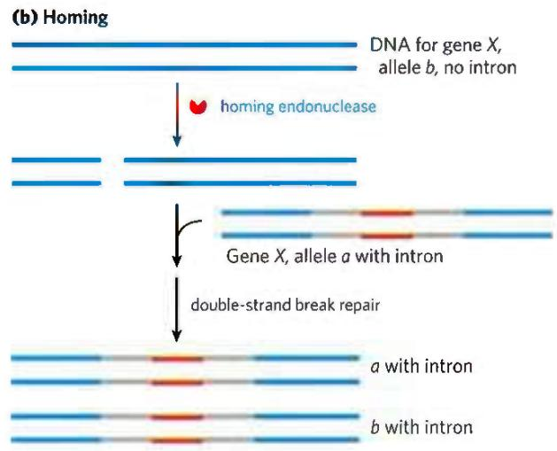

(c) Retrohoming  


Much more rarely, the intron may insert itself into a new location in an unrelated gene. If this event does not kill the host cell, it can lead to the evolution and distribution of an intron in a new location. The structures and mechanisms used by mobile introns support the idea that at least some introns originated as molecular parasites whose evolutionary past can be traced to retroviruses and transposons.

#### [EN] Telomerase Is a Specialized Reverse Transcriptase

Telomeres, the structures at the ends of linear eukaryotic chromosomes (see Fig. 24-7), generally consist of many tandem copies of a short oligonucleotide sequence. This sequence usually has the form $T_{x}G_{y}$ in one strand and $C_{y}A_{x}$ in the complementary strand, where x and y are typically in the range of 1 to 4 (p. 890). Telomeres vary in length from a few dozen base pairs in some ciliated protozoans to tens of thousands of base pairs in mammals. The TG strand is longer than its complement, leaving a region of single-stranded DNA of up to a few hundred nucleotides at the 3' end.

The ends of a linear chromosome are not readily replicated by cellular DNA polymerases. DNA replication requires a template and primer, and beyond the end of a linear DNA molecule no template is available for the pairing of an RNA primer. Without a special mechanism for replicating the ends, chromosomes would be shortened somewhat in each cell generation. The enzyme telomerase, discovered by Carol Greider and Elizabeth Blackburn, solves this problem by adding telomeres to chromosome ends.

  
Carol Greider [Courtesy Carol Greider.]

  
Elizabeth Blackburn [Micheline Pelletier/Getty Images.]

The discovery and purification of this enzyme provided insight into a reaction mechanism that is remarkable and unprecedented. Telomerase, like some other enzymes described in this chapter, is an RNP that contains both RNA and protein components. The RNA component in humans is about 150 nucleotides long and contains about 1.5 copies of the appropriate $C_{y}A_{x}$ telomere repeat. This region of the RNA acts as a template for synthesis of the $T_{x}G_{y}$ strand of the telomere. P3 Telomerase thereby acts as a cellular reverse transcriptase that provides the active site for RNA-dependent DNA synthesis. Unlike retroviral reverse transcriptases, telomerase copies only a small segment of RNA that it carries within itself. Telomere synthesis requires the 3' end of a chromosome as primer and proceeds in the usual 5'→3' direction. Having synthesized one copy of the repeat, the enzyme repositions to resume extension of the telomere (Fig. 26-35a).

After extension of the $T_{x}G_{y}$ strand by telomerase, the complementary $C_{y}A_{x}$ strand is synthesized by cellular DNA polymerases, starting with an RNA primer (see Fig. 25-11). The single-stranded region is protected by specific binding proteins in many lower eukaryotes, especially those species with telomeres of less than a few hundred base pairs. In higher eukaryotes (including mammals) with telomeres many thousands of base pairs long, the single-stranded end is sequestered in a specialized structure called a T loop (Fig. 26-35b). The single-stranded end is folded back and paired with its complement in the double-stranded portion of the telomere. The formation of a T loop involves invasion of the 3' end of the telomere's single strand into the duplex DNA, perhaps by a mechanism similar to the initiation of homologous genetic recombination (see Fig. 25-34). In mammals, the looped DNA is bound by two proteins, TRF1 and TRF2, with the latter protein involved in formation of the T loop. T loops protect the 3' ends of chromosomes, making them inaccessible to nucleases and the enzymes that repair double-strand breaks.

In protozoans (such as Tetrahymena), loss of telomerase activity results in a gradual shortening of telomeres with each cell division, ultimately leading to the death of the cell line. A similar link between telomere length and cell senescence (cessation of cell division) has been observed in humans. In germ-line cells, which contain telomerase activity, telomere lengths are maintained; in somatic cells, which lack telomerase, they are not. There is a linear, inverse relationship between the length of telomeres in cultured fibroblasts and the age of the individual from whom the fibroblasts were taken: telomeres in human somatic cells gradually shorten as an individual ages. If the telomerase reverse transcriptase is introduced into human somatic cells in vitro, telomerase activity is restored and the cellular life span increases markedly.

Is the gradual shortening of telomeres a key to the aging process? Is our natural life span determined by the length of the telomeres we are born with? Further research in this area should yield some fascinating insights.

#### [EN] Some RNAs Are Replicated by RNA-Dependent RNA Polymerase

Apart from the retroviruses, the RNA viruses include some E. coli bacteriophages as well as eukaryotic viruses such as the influenza virus and coronaviruses that cause SARS or COVID-19. The single-stranded RNA chromosomes of these viruses also function as mRNAs for the synthesis of viral proteins. They are replicated in the host cell by an RNA-dependent RNA polymerase (RNA replicase). All RNA viruses—with the exception of retroviruses—must encode a protein with RNA-dependent RNA polymerase activity, either because the host cells lack such an enzyme or because the RNA genome structure of a virus imposes specialized enzymatic requirements.

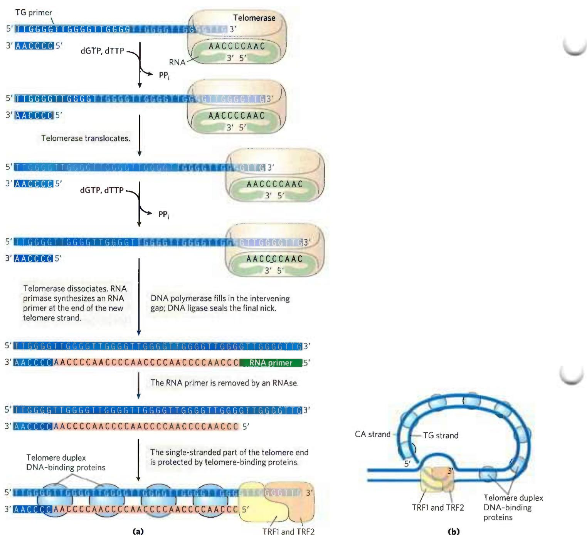  
FIGURE 26-35 Telomere synthesis and structure. (a) The internal template RNA of telomerase binds to and base-pairs with the TG primer $(\mathrm{T}_x\mathrm{G}_y)$ of DNA. Telomerase adds more T and G residues to the TG primer, then repositions the internal template RNA to allow the addition of more T and G residues to generate the TG strand of the telomere. The complementary strand is synthesized  
by cellular DNA polymerases, after priming by an RNA primase. (b) Proposed structure of T loops in telomeres. The single-stranded tail synthesized by telomerase is folded back and paired with its complement in the duplex portion of the telomere. The telomere is bound by several telomere-binding proteins, including TRF1 and TRF2 (telomere repeat binding factors).

The RNA replicase isolated from E. coli cells infected with the bacteriophage Qβ catalyzes the formation of an RNA complementary to the viral RNA, in a reaction equivalent to that catalyzed by DNA-dependent RNA polymerases. New RNA strand synthesis proceeds in the 5'→3' direction by a chemical mechanism identical to that used in all other nucleic acid synthetic reactions that require a template. RNA replicase requires RNA as its template and will not function with DNA. It lacks a separate proofreading endonuclease activity and has an error rate similar to that of RNA polymerase. Unlike the DNA and RNA polymerases, RNA replicases are specific for the RNA of their own virus; the RNAs of the host cell are generally not replicated. This explains how RNA viruses are preferentially replicated in the host cell, which contains many other types of RNA.

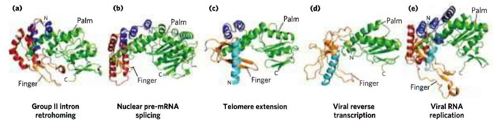  
FIGURE 26-36 Structural similarities between RNA-dependent polymerases. RNA-dependent polymerases use a common active site architecture in which the duplexed substrate sits in a hand-shaped protein fold with palm and finger domains. This protein fold can be found in protein factors involved in (a) group II intron retrohoming, (b) spliceosome-catalyzed pre-mRNA splicing, (c) telomere synthesis, (d) HIV reverse transcription, and (e) hepatitis C viral genome replication. The retrohoming  
reverse transcriptase of group II introns is most structurally related to the reverse transcriptase structure present in the spliceosome, supporting their close evolutionary relationship. [Information from C. Zhao and A. M. Pyle, Nat. Struct. Mol. Biol. 23:558, 2016, Fig. 2. Data from (a) PDB ID 5HHJ, C. Zhao and A. M. Pyle, Nat. Struct. Mol. Biol. 23:558, 2016; (b) PDB ID 4I43, W. P. Galej et al., Nature 493:638, 2013; (c) PDB ID 3DU6, A. J. Gillis et al., Nature 455:633, 2008; (d) PDB ID 2HMI, J. Ding et al., J. Mol. Biol. 284:1095, 1998; (e) PDB ID 1C2P, C. A. Lesburg et al., Nat. Struct. Biol. 6:937, 1999.]

RNA-dependent RNA polymerases are not limited to viruses. Enzymes of this type are found in plants, protists, fungi, and some simpler animals, but not in insects or mammals. Those found in the genomes of eukaryotes generally play a role in the metabolism of another class of small RNAs, called small interfering RNAs (siRNAs), which participate in gene regulation (Chapter 28).

#### [EN] RNA-Dependent RNA Polymerases Share a Common Structural Fold

Even though viral RNA replication and reverse transcription, retrohoming, and telomere synthesis represent a diverse array of biological processes, the polymerases involved in each pathway bear remarkable similarities in structure (Fig. 26-36). In all cases, palm and finger domains are used to grip the duplexed template and primer nucleic acids within the active site. Amazingly, the group II intron retrohoming reverse transcriptase is structurally most closely related to a protein component of the spliceosome that helps scaffold its RNA active site. In addition to identical splicing chemistry and active site features (see Fig. 26-17), this provides further evidence that the spliceosome evolved from a group II intron-like ancestor.

#### [EN] SUMMARY 26.3 RNA-Dependent Synthesis of RNA and DNA

■ RNA-dependent DNA polymerases, also called reverse transcriptases, were first discovered in retroviruses, which must convert their RNA genomes into double-stranded DNA as part of their life cycle. These enzymes transcribe the viral RNA into DNA, a process that can be used experimentally to form cDNA.

■ Retroviruses can cause human diseases, including AIDS and cancers. Some of these viruses contain oncogenes, which cause infected cells to grow abnormally.

Many eukaryotic transposons are related to retroviruses, and their mechanism of transposition includes an RNA intermediate. An RNA intermediate is also present in group II intron retrohoming, in which the RNA intron is inserted into a DNA gene followed by production of a DNA copy by a reverse transcriptase.

■ Telomerase, the enzyme that synthesizes the telomere ends of linear chromosomes, is a specialized reverse transcriptase that contains an internal RNA template.

\- RNA-dependent RNA polymerases, such as the replicases of RNA bacteriophages, are template-specific for the viral RNA. These enzymes share structural homology with reverse transcriptases involved in retroviral replication, telomere production, and retrohoming.


<!-- L-END Lehninger 26.3 -->

## 9.3 乙型肝炎病毒(HBV)

病毒性肝炎是严重威胁人类健康的世界性传染病，引起肝炎的病毒通称肝炎病毒（hepatitis virus）。目前已经知道的至少有甲肝病毒(HAV)、乙肝病毒(HBV)、丙肝病毒(HCV)、丁肝病毒(HDV)和戊肝病毒(HEV)等5种病毒。这些病毒在基因组结构、传播途径、临床症状和分类地位上很不相同。甲肝病毒属小RNA病毒科，乙肝病毒属嗜肝病毒科。丙肝病毒与黄热病毒和瘟病毒相似，为RNA病毒。丁肝病毒基因组由一个单链环状RNA分子组成，但其外壳能识别乙肝病毒的表面抗原，是一种与乙肝有关的缺陷型病毒，需要有HBV的辅助才能复制增殖。戊肝病毒基因组为单链正链有多(A)RNA，球形无包膜，可能属于杯状病毒科。

## 9.3.1 肝炎病毒的分类及病毒粒子结构

1986 年, 国际病毒命名委员会正式将乙肝病毒定为嗜肝 DNA 病毒科成员, 1990 年又将该科病毒分为正嗜肝病毒属和禽嗜肝病毒属, 乙肝病毒是正嗜肝病毒属成员。

HBV 完整粒子的直径为 42 nm, 称为 Dane 颗粒, 由外膜和核壳组成, 有很强的感染性(图 9-22)。其外膜由病毒的表面抗原、多糖和脂质构成。核壳直径 27 nm, 由病毒的核心抗原组成, 并含有病毒的基因组 DNA、反转录酶和 DNA 结合蛋白等。在慢性乙肝病人的血清中还有直径为 22 nm、长度不等的球状或棒状颗粒, 它们只含表面抗原和脂质, 不具有基因组 DNA, 无侵染性。根据表面抗原性血清反应的不同, HBV 可以分为 adr、adw、ayr 和 ayw 等 4 个亚型。不同亚型的地区分布不同, 我国大部分地区以 adr 为主, adw 次之。西藏、新疆和内蒙等地主要为 ayw 亚型。

图 9-22 HBV 病毒粒子模型图  
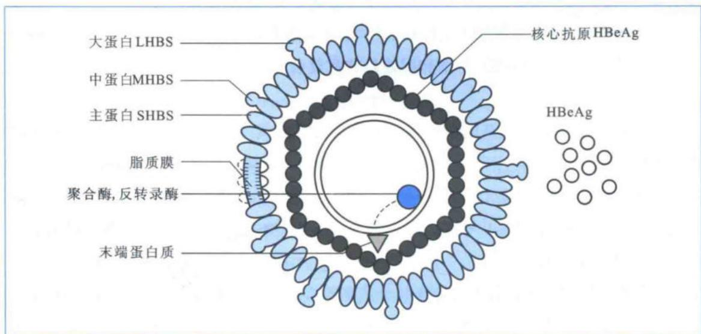

## 9.3.2 乙肝病毒基因组及其所编码的主要蛋白质

## 1. 基因组结构

乙肝病毒的基因组是一个有部分单链区的环状双链 DNA 分子, 两条单链长度不一样。长链 L(3.2 kb) 为负链, 而短链 S 为正链, 其长度不确定, 为负链的 50%\~80%。因为它的 3' 端随不同来源毒株而有不同的缺失, 所以位置可变, 产生了部分环状结构。基因组依靠正链 5' 端约 240 bp 的黏性末端与负链缺口部位的互补维持了环状结构。长链的 5' 端有一个共价结合的末端蛋白, 可能是引物酶。而短链 5' 端则通过共价键与具有帽子结构的短 RNA 结合。末端蛋白和短 RNA 都与病毒 DNA 的复制相关。此外, 在两条链的互补区两侧各有一个 11 碱基的直接重复序列 (5'TTCAC-CTCTGC-3'), 分别开始于第 1842 和 1590 核苷酸处, 称为 DR1 和 DR2 (图 9-23)。HBV 基因组的多态性是该病毒高变异率的分子基础, 其生物学意义是近年来该领域研究热点之一。

## 2. HBV 转录产物

HBV 基因组结构的最大特点是功能单位非常密集,基因组高度压缩,编码区重复利用,所以有人也称之为基因经济型基因组。它的核酸序列全部都是蛋白编码区。HBV 在感染过程中分别产生 3.5 kb、2.4 kb、2.1 kb、0.8 kb 4 种转录产物(图 9-23),都有多(A)尾巴。其中 3.5 kb 和 2.1 kb 转录产物由 L 链录而来,2.4 kb 和 0.8 kb 转录产物由 S 链转录得到。3.5 kb mRNA 编码核心蛋白,其 3' 端与 2.1 kb mRNA 的 3' 端相同,比 HBV 基因组 L 链的全长还多 200 bp 以上,推测它的末端部分可能来自共价闭合的双链区。2.4 kb mRNA 编码 S 蛋白, 2.1 kb mRNA 编码原 $S_{1}$ 和 $S_{2}$ 蛋白, 而 0.8 kb mRNA 编码 X 蛋白。上述 4 种转录产物在病毒感染的细胞中相对含量有明显差异, 其中 3.5 kb 和 2.1 kb mRNA 的转录量远远高于 2.4 kb 和 0.8 kb mRNA。

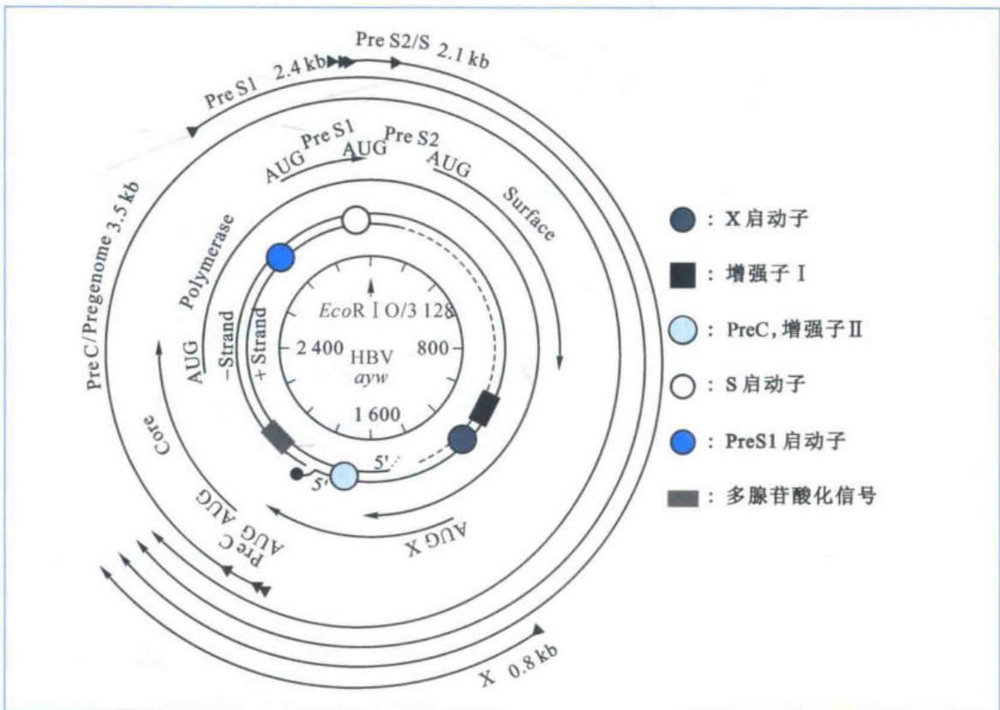  
图 9-23 HBV 基因组结构 (ayw 株)

## 3. HBV 基因转录的调控

① 顺式作用元件 HBV 的 4 种转录产物虽然有不同的 5' 端,但都利用同一终止信号和多(A)位点,它们的启动子序列已经被确定。C 启动子调控 3.5 kb mRNA 的转录起始过程,它定位于 1705 \~ 1805 位核苷酸处。在该启动子下游还发现一个具有启动子功能的区域,推测不同的 3.5 kb mRNA 可由不同的启动子控制。C 启动子上存在类似于 TATA 区的序列。SP1 启动子位于 -89 \~ -77 核苷酸处,调控 2.4 kb mRNA 的转录起始过程。该启动子含有典型的 TATA 区序列以及与该序列相距 45 个碱基的肝细胞特异性转录因子 HNF1 的结合位点。该位点主要存在于某些肝细胞特异表达基因的启动子区,HNF1 的结合是 SP1 启动子在分化的肝癌细胞株中高水平转录的必要条件。

SP2 启动子调控 2.1 kb mRNA 的转录起始过程。它与 SV40 晚期启动子相似，位于 RNA 转录起始位点上游 200 个核苷酸内，可分为 A、B、C、D、E、F 和 G7 个区，这些区都可能通过与特异的调控蛋白结合而影响转录水平。A、B、C3 个区位于启动子远端（-168～-68 位核苷酸之间），若同时缺失，2.1 kb mRNA 转录水平下降到 30% 以下。D 区位于 -69～-49 处，是启动子的必需元件。近端的 E、F、G3 个区位于转录起始位点上游 45 个核苷酸内，该 DNA 序列与 SV40 主要晚期启动子有一定的序列相似性。F 为负调控区，E 区能抑制 F 区的负调控作用并与 G 区功能互补。B、D、E、F4 个区可与相同或相似的转录因子结合，若将外源表达的转录因子 SP1 与病毒 DNA 进行共转染，可起始 HBV 基因转录。SP1 可以直接与 B、D 和 F 区结合。

X 启动子位于 $-24 \sim -124$ 核苷酸处，调控 0.8 kb mRNA 转录过程。有关该启动子的活性尚未见详细的研究报道。

② 增强子 HBV DNA 中存在两个可以激活 HBV 启动子转录的增强子区域。增强子 I 位于表面抗原基因的 3' 端，X 基因的 5' 端，与 X 启动子相重叠。该增强子在肝细胞中对启动子的增强活性是非肝细胞的 10～20 倍，暗示它具有细胞特异性，这也可能是 HBV 病毒嗜肝性的基础。

已在增强子Ⅰ序列中发现多种细胞反式作用因子结合位点，NF-la、NF-lb、NF-lc、AP1、C/EBP、EP以及X蛋白等都可以与增强子Ⅰ相结合。根据主要的核蛋白结合位点，增强子Ⅰ被分为2C、EP、E和NF-Ⅰ4个区段。前两者为基础增强子，2C与肝细胞专一性有关。若在基础增强子上加E和NF-Ⅰ结合区，该启动子活性可提高10倍以上，其中E结合区可以与多种蛋白因子相结合。E结合区不仅能提高基础增强子的活性，还与X基因启动子的转录活性直接相关。一般认为，增强子Ⅰ能明显促进SP1、SP2、X和C启动子的转录。

增强子Ⅱ位于增强子Ⅰ下游600碱基处,是一个148碱基长的DNA片段,根据其与主要核蛋白的结合位点分为A、B两个区。A区为60碱基,是正调控元件,与增强子Ⅱ的肝细胞专一性有关。A区单独存在时无增强子活性,必须与B区协同作用才有活性。B区是增强子Ⅱ的基本单位，由88个碱基组成，单独存在时带有增强子Ⅱ活性的60%\~70%，又可分为B1、B2和B33部分，其中前两部分是主要功能区，B2是主要转录因子的结合位点。

③ 反式作用因子 自从 HBV 全序列被测定后,人们就发现了 X 基因,但其产物 X 蛋白具有反式调控因子功能。研究发现,X 蛋白不仅能激活 HBV 自身启动子如 C、SP1、SP2 和 X 以及 HBV 增强子 I,还可以激活多种异源启动子和增强子,如 β-干扰素、HIV-I、SV40 早期启动子以及一些细胞因子如 I 型 MHC 等的表达。

X 蛋白虽然具有转录水平上的反式激活作用,但尚未发现它有 DNA 结合能力,说明 X 蛋白必须通过其他蛋白因子起作用。分析 X 蛋白对 HBV 增强子 I 的作用时发现,该增强子的 E 元件十分重要,所以又将这个由 26 碱基组成的元件命名为 X 应答元件 (X-responsive element, XRE)。X 蛋白与相关细胞因子结合后,再结合于靶序列上发挥作用。XRE 有 NF- $\kappa$ B、AP1、AP2 及 CREB 类似物的结合序列。近来有报道认为 X 蛋白本身具有丝氨酸 / 苏氨酸激酶活性。

## 4. HBV 的编码区及产物

① S 编码区 S 编码区编码乙肝表面抗原蛋白, 分别编码由 226 个氨基酸残基的表面抗原主蛋白 (SHBS)、108\~115 个氨基酸的原 S1 蛋白和 55 个氨基酸组成的原 S2 蛋白 3 部分组成。S 蛋白和原 S2 蛋白组合在一起被称为中蛋白 (MHBS), S 蛋白和原 S1、原 S2 蛋白组合在一起时被称为大蛋白 (LHBS)。SHBS 是病毒外壳蛋白和 22 nm 颗粒表面抗原的主要成分, 占病毒蛋白的 70%\~90%, 中蛋白和大蛋白则暴露于病毒颗粒表面, 这三种蛋白质可以部分或完全被糖基化。表面抗原有很强的免疫原性, 是乙肝疫苗的主要成分。

② P 编码区 该区长 2532 碱基,约占全基因组 3/4 以上,是最长的编码区,包含全部 S 编码区并与 C 和 X 编码区有部分重叠。P 编码区由 3 个功能区和一个间隔区构成,排列顺序为末端蛋白(又称引物酶)、间隔区、反转录酶 /DNA 聚合酶及 RNase H。末端蛋白是病毒进行反转录时的引物。P 编码区可能先翻译成 $9.5 \times 10^{5}$ 多肽,然后加工成较小的功能型多肽。

③ C 编码区 该区长 639 碱基, 翻译产物为病毒核心抗原 (HBcAg)。其原初翻译产物是前核心蛋白, 切除 N 端 19 肽和富含精氨酸的 C 端后, 成为 E 抗原 (HBeAg), 相对分子质量为 $2.2 \times 10^{4}$ 蛋白, 是核衣壳上唯一的结构蛋白。HBeAg 可分泌到 Dane 颗粒以外, 存在于血清中。

④ X 编码区 该区是最小的编码区,编码 X 蛋白,覆盖了负链的缺口部位,虽然长度不等,但主要产物由 154 个氨基酸残基组成。X 蛋白具有反式调控作用,能激活多个同源或异源启动子或增强子,与肝癌的发生有相关性。

## 9.3.3 HBV 的复制

乙肝病毒基因组虽为双链 DNA, 但其复制并不通过半保留复制方式, 而是通过如图

图9-24 HBV基因组复制模型图  
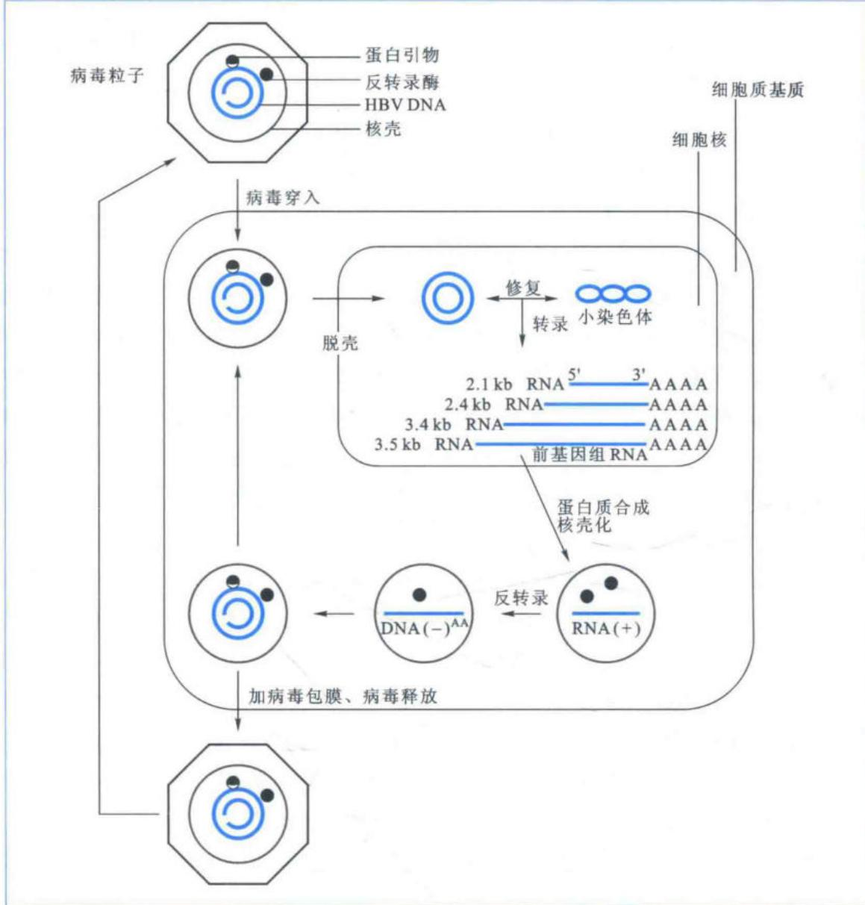

9-24 所示的反转录途径。病毒感染宿主后，首先脱掉外壳进入细胞质，基因组 DNA 进入细胞核，经 DNA 聚合酶修复正链缺失部分，形成共价闭环状双链 DNA 作为转录模板。此后，该环状 DNA 在感染细胞核中大量扩增，成为 HBV 基因组复制时的独特现象。

其次，HBV基因组在宿主RNA聚合酶作用下开始转录，产生各种mRNA，在这些RNA中，全长3.5 kb产物为前基因组RNA，其5'端自DR1处开始，自5'向3'延伸，经过DR2后继续合成至DR1，最后终止于DR1后85碱基处的TATAAA序列，全长比病毒DNA多130\~270个碱基。

第三步,前基因组中的部分 RNA 被包装到核心颗粒中并进行反转录。以与母本负链 DNA 5' 端相连接的末端蛋白为引物,在反转录酶作用下,自 DR1 处开始反转录合成负链 DNA $^{(图9-25)}$ 。cDNA 合成后,由 RNase H 将模板(前基因组 RNA)降解,但 5' 端从帽子结构到 DR1 不被降解区域作为正链合成时的引物。

第四步,在 DNA 聚合酶作用下合成正链,合成自 DR1 处开始,再经跳跃传位至 DR2,这一过程称为“引物易位”。因此，正链5'端覆盖了负链的缺口，维持了双链DNA的环状。在某些情况下也可能不发生引物易位现象，导致线性双链DNA的合成。正链合成尚未完成时，就可能由于某些障碍而被终止。外壳蛋白便将核衣壳包装成病毒颗粒，形成了不完整的双链基因组。由于病毒复制增殖过程中部分酶类与细胞因子可能来自宿主细胞，所以，病毒的复制增殖过程也是干扰细胞正常代谢的致病过程。

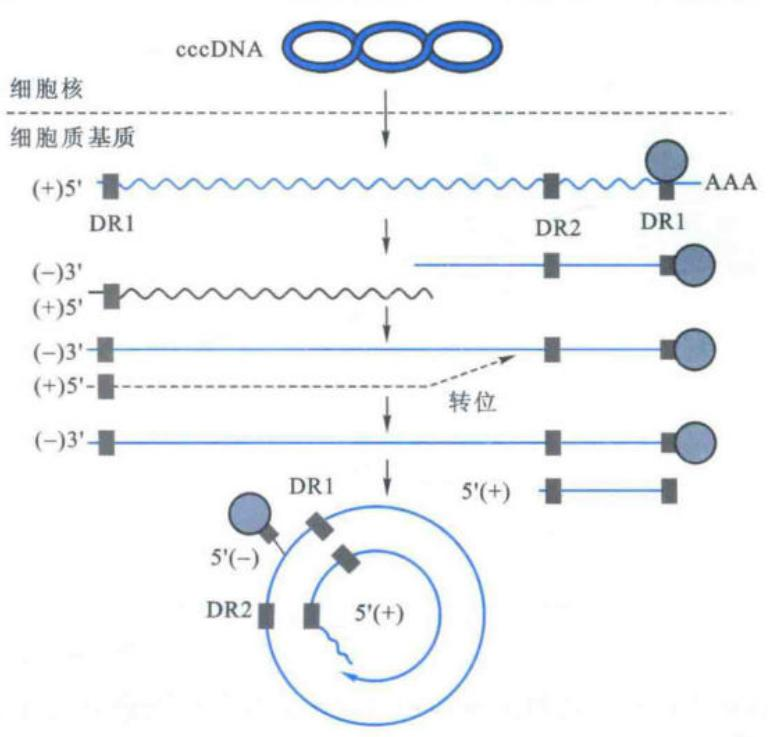  
图9-25 HBV基因组的复制过程

## 9.4 人禽流感的分子机制

人禽流感(human avian influenza, HAI)是人感染 AIV (avian influenza virus)后引起的以呼吸道症状为主的临床综合征。引起 HAI 的病原为禽流感病毒，属正黏病毒科流感病毒 A 型流感病毒。禽流行性感冒(avian influenza, AI)简称禽流感，又名真鸡瘟、欧洲鸡瘟、鸡疫等，是由 A 型流感病毒引起的从呼吸系统病变到全身败血症的一种高度急性传染病。鸡、火鸡、鸭等家禽及野鸟均可感染。美洲、欧洲、亚洲的许多国家和地区都曾发生过此病，对养禽业造成了巨大的损失。禽流感病毒不仅是人流感病毒株形成的最庞大的基因库，它还能直接感染人类，因此，禽流感已成为人类面临的重大危害之一。

## 9.4.1 人禽流感病毒特点及分型

禽流感属正黏病毒科(Orthomyxoviridae)流感病毒属(Influenza Virus)的A型流感病毒。正黏病毒分为3个属，即AB型流感病毒属、C型流感病毒属和类托高土病毒属(Thogoto like viruses)，病毒颗粒大小为80\~120 nm，平均100 nm，典型的病毒粒子呈球状，基因组为多个负链RNA片段组成(图9-26)。AIV属A型流感病毒，是正黏病毒属中唯一感染禽类的病毒。禽流感病毒可按病毒粒子表面对红细胞有凝集性的血凝素(hemagglutinin, HA)和能将吸附在细胞表面的病毒子解脱下来的神经氨酸酶(neuraminidase, NA)糖蛋白进行分类, 共有 18 个 H 亚型和 11 个 N 亚型, 其中除了 H17N10 和 H18N11 仅在蝙蝠中分离得到外, 其余亚型均能在野生水禽中发现。根据 HA 与 NA 的不同, 又可将禽流感分为上百个血清亚型。导致禽流感暴发的主要是以 H5、H7 为代表的高致病性禽流感(HPAI)和以 H9 亚型为代表的低致病性禽流感(LPAI)毒株。

图 9-26 禽流感病毒颗粒主要结构蛋白及功能分析  
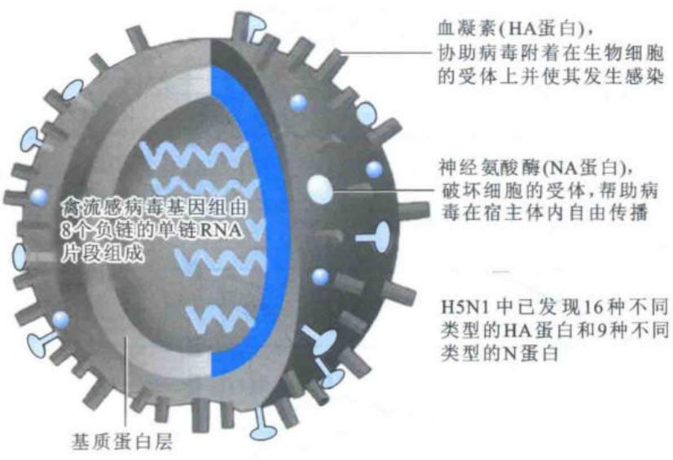

1997 年,我国香港首次分离到由禽病毒跨越物种屏障同时感染鸡和人的 A 型流感病毒——H5N1。由于该病毒所有基因片段与禽流感病毒在序列上有很高的相似性,一般认为该病毒起源于禽类。甲型流感病毒亚型 H7N9 是 2013 年在中国首次报告感染人类的新型禽流感病毒。大部分人类感染病例均有严重的呼吸系统症状。世界卫生组织(WHO)已经将 H7N9 确定为“对人类非常危险的病毒”。2013 年初至 2017 年初的 4 年中,共有 916 例经实验室确诊的人类 H7N9 病例,并怀疑可能存在人与人之间的传播。当流感病毒开始感染新的宿主时,为了适应环境和新的宿主细胞,病毒可能会在强大的选择压力下进行 DNA 重组以产生新的株系或致病型。

## 9.4.2 禽流感病毒的主要感染过程

H5N1 禽流感病毒通过 HA 蛋白上的凝集素位点与细胞表面含唾液酸的糖蛋白受体结合, 通过受体介导的细胞内吞作用进入细胞(图 9-27)。由于内涵体(endosome)pH 较低, 导致 HA 构象变化, 细胞膜与病毒外膜发生融合, 释放病毒衣壳进入细胞质。流感病毒启动转录时, 病毒内切核酸酶将宿主细胞 mRNA 5' 端的帽子结构切下作为病毒 RNA 聚合酶的引物, 转录产生 6 个单顺反子的 mRNA, 并翻译成 HA、NA、NP 和 3 种聚合酶(PB1、PB2 和 PA)。NS 和 M 基因的 mRNA 进行拼接后, 每一个产生了两个 mRNA, 依不同阅读框架(ORF)进行翻译, 产生 NS1、NS2、M1 和 M2 蛋白(表 9-6)。NA 是病毒核衣壳的主要成分, MA 是主要结构蛋白, 存在于病毒囊膜内侧, 分为 M1 和 M2。PB1、PB2 和 PA 是病毒复制酶的 3 个主要组分。NS1 和 NS2 为非结构蛋白, 在病毒复制早期起重要作用, NS1 蛋白调节病毒 RNA 的合成、pre-mRNA 的运输、剪切及 mRNA 的翻译过程。NS2 蛋白与 M1 蛋白相互作用, 参与病毒复制周期的调控。

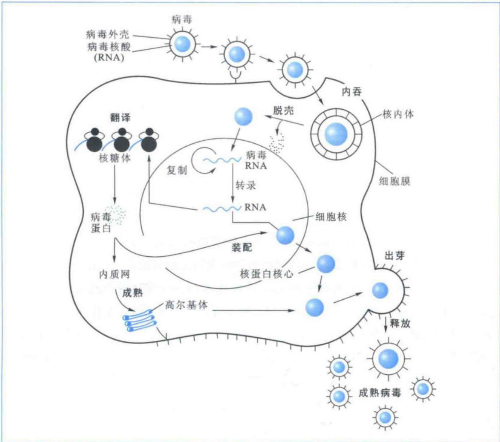  
图 9-27 流感病毒 A 株进入宿主细胞及其复制过程图示

表 9-6 禽流感病毒 RNA 在不同类型病毒中可能编码不同的蛋白质

<table><tr><td rowspan="2">RNA</td><td colspan="3">流感病毒编码蛋白</td></tr><tr><td>A型</td><td>B型</td><td>C型</td></tr><tr><td>1</td><td>B2</td><td>PB1</td><td>P1</td></tr><tr><td>2</td><td>PB1</td><td>PB2</td><td>P2</td></tr><tr><td>3</td><td>PA</td><td>PA</td><td>P3</td></tr><tr><td>4</td><td>HA</td><td>HA</td><td>HE</td></tr><tr><td>5</td><td>NP</td><td>NP</td><td>NP</td></tr><tr><td>6</td><td>NA</td><td>NA、NB</td><td></td></tr><tr><td>7</td><td>M1、M2</td><td>M1、M2</td><td>M</td></tr><tr><td>8</td><td>NS1、NS2</td><td>Ns1、Ns2</td><td>NS1、Ns2</td></tr></table>

## 9.4.3 禽流感病毒感染人类的机制

有关禽流感病毒导致人类流感大暴发的假说主要有以下两种，以猪作为中间宿主的混合器假说和禽流感病毒直接感染人(即人本身充当混合器)的假说。研究发现，禽流感病毒跨越种属间的屏障从家禽直接感染人与其基因的分子结构的特殊性有关，禽流感病毒的基因组分为多个片段，极易发生基因的交换、重组并发生变异，造成感染宿主和致病性的改变。

## 1. HA 受体结合位点的突变导致禽流感病毒易于感染人类细胞

HA 是流感病毒表面主要的糖蛋白, 在病毒感染过程中起关键作用, 病毒利用 HA 与宿主细胞表面受体的相互识别, 从而吸附于宿主细胞表面。禽流感病毒与宿主细胞结合的特异性与 HA 结合受体位点的第 226 位氨基酸密切相关, 如果该位点氨基酸残基为谷氨酰胺 (Gln), 则表现为 SAa22, 3 Gal 受体 (禽类呼吸道上皮细胞表面受体) 结合特性; 但若该位点为亮氨酸 (Leu), 则表现为 SAa22, 6 Gal 受体 (人呼吸道上皮细胞表面受体) 结合特性; 若该位点为甲硫氨酸 (Met), 对 SAa22, 3 Gal 和 SAa22, 6 Gal 具有相同的结合活性。1997 年香港禽流感 H5N1 病毒就是由于 HA 第 226 位氨基酸由谷氨酰胺突变为甲硫氨酸, 导致流感病毒的宿主特异性改变, 使禽流感病毒直接感染人细胞。对 H5 及 H7 亚型高致病力毒株的核酸序列和氨基酸序列分析表明, 高致病力毒株的 HA 在裂解位点附近有多个碱性氨基酸残基, 易被宿主蛋白酶系统裂解为 HA1 和 HA2, 致病性明显增强。

此外, 近年研究人员分析 H7N9 禽流感病毒的基因序列发现, 其 HA 蛋白的第 160 位点出现苏氨酸(Thr)和丙氨酸(Ala)的替换, 导致 HA 蛋白糖基化位点丢失, 推测可能由于这个糖基化位点的丢失增强了 H7N9 病毒与人细胞受体的亲和力。同时, HA 第 186 位的甘氨酸(Gly)突变为缬氨酸(Val), 结合第 226 位氨基酸由谷氨酰胺(Gln)突变为亮氨酸(Leu), 导致 HA 对 α-2,6 半乳糖苷唾液酸受体的结合活性显著增强。

## 2. PB2 蛋白 627 位氨基酸的点突变导致人禽流感病毒复制能力增强

禽流感病毒感染人体细胞后必须进行有效复制,达到具有一定量的群体后,才能诱发机体的非特异性免疫反应,产生对机体的直接或间接损伤。而禽流感病毒是否能在人体细胞内进行有效复制,主要与病毒复制酶(PB1、PB2和PA)基因有关。当PB2蛋白基因来源于人流感病毒,无论其他基因片段来源于禽流感病毒或人流感病毒,重组病毒在哺乳动物体细胞中都能有效复制;当PB2蛋白基因来源于禽流感病毒时,重组病毒不能在哺乳动物细胞中进行有效复制。禽流感病毒株PB2的627位氨基酸都是谷氨酸(Glu),而人流感病毒该位点上是赖氨酸(Lys)。香港H5N1毒株中PB2的第627位氨基酸就发生了由谷氨酸向赖氨酸的转化。因此,有人认为,PB2的627位氨基酸是决定A型流感病毒宿主范围的关键位点。

近年流行的 H7N9 毒株的 PB2 蛋白 627 位点存在谷氨酸和赖氨酸替换,701 位点发生天冬氨酸(Asp)和天冬酰胺(Asn)的替换。PB2 蛋白这两个关键位点的突变在禽类中并未发现,仅在人感染的 H7N9 禽流感病毒中出现,说明 H7N9 可能是在感染人后才发生突变。这两个位点的突变有可能增强病毒在哺乳动物间的传播力。

## 3. NS1 第 92 位氨基酸的突变导致人禽流感病毒致病能力显著增强

人禽流感 H5N1 病毒感染后与普通的人流感病毒相比具有极强的致病性。研究表明，人禽流感 H5N1 亚型病毒的高致病性与其非结构蛋白有密切的关系。普通流感病毒感染时，非结构蛋白(NS1)产生于机体受感染的细胞，与病毒复制产生的双链 RNA 相互作用，产生的细胞内信号作用于 RNA 病毒蛋白激酶(PKR)以及核因子 NF2KB，启动干扰素基因的转录和干扰素的合成，从而发挥抗病毒的非特异性免疫作用。虽然在高致病性的人禽流感 H5N1 亚型病毒感染者体内发现高浓度的干扰素和肿瘤坏死因子 2α，这些细胞因子却不能抑制或杀死高致病性的人禽流感病毒，因为这种病毒不仅对干扰素和肿瘤坏死因子 2α 具有极强的抵抗力，而且在细胞内增殖速度极快，加速了炎症细胞因子的产生，引起全身性炎症反应综合征，从而表现出极高的致病力。造成这种现象的原因可能与 H5N1 亚型病毒的非结构蛋白基因(NS1 第 92 位氨基酸)发生变异有关。

另外,人和禽类中分离到的 H7N9 禽流感病毒均发现了 NS1 蛋白 42 位点脯氨酸(Pro)替换为丝氨酸(Ser),有研究表明,H5N1 禽流感病毒 NS1 蛋白 42 位点突变增加了病毒感染小鼠的毒力。由于 NS1 蛋白作为干扰素拮抗剂对病毒的基因表达调节起作用,因此推测 NS1 蛋白的第 42 位氨基酸能够影响病毒的致病性。


<!-- C-BEGIN Campbell 19.3 -->

### 【英文对应 Campbell Concept 19.3：Viruses and prions are formidable pathogens in animals and plants】

> 来源：Campbell Biology（书籍/01_Campbell_Biology） 第19章 Viruses，Concept 19.3。

#### [EN] Concept 19.3: Viruses and prions are formidable pathogens in animals and plants

Diseases caused by viral infections afflict humans, agricultural crops, and livestock worldwide. Other smaller, less complex entities known as prions also cause disease in animals. We'll first consider animal viruses.

#### [EN] Viral Diseases in Animals

A viral infection can produce symptoms by a number of different mechanisms. Viruses may damage or kill cells by causing the release of hydrolytic enzymes from lysosomes. Some viruses cause infected cells to produce toxins that lead to disease symptoms, and some have molecular components that are toxic, such as envelope proteins. How much damage a virus causes depends partly on the ability of the infected tissue to regenerate by cell division. People usually recover completely from colds because the epithelium of the respiratory tract, which the viruses infect, can efficiently repair itself. In contrast, damage inflicted by poliovirus to mature nerve cells is permanent because these cells do not divide and usually cannot be replaced. Many of the temporary symptoms associated with viral infections, such as fever and body aches, actually result from the body's own efforts to defend itself against infection rather than from cell death caused by the virus.

The immune system is a critical part of the body's natural defenses (see Chapter 43). It is also the basis for the major medical tool used to prevent viral infections—vaccines. A vaccine is a harmless component of a pathogen that stimulates the immune system to mount defenses against the harmful pathogen. Smallpox, a viral disease that was once a devastating scourge in many parts of the world, was eradicated by 1980 due to a vaccination program carried out by the World Health Organization (WHO). The very narrow host range of the smallpox virus—it infects only humans—was a critical factor in the success of this program. Similar worldwide vaccination campaigns are under way to eradicate polio, the incidence of which has dropped by $99\%$ , and measles. Although an effective vaccine exists for measles, a large outbreak—a measles epidemic—originated in Texas in 2025, correlated with lower vaccination rates in that region. Effective vaccines are also available to protect against rubella, mumps, hepatitis B, and a number of other viral diseases. Less than a year after SARS-CoV-2 was identified as the cause of COVID-19, multiple vaccines were developed and approved for use (see Figure 43.24). Many nations immediately initiated programs to administer shots rapidly to their populations. Unfortunately, many less-resourced countries lagged behind in receiving needed vaccine doses, one factor contributing to the persistence of the pandemic.

Although vaccines can prevent some viral illnesses, medical care can do little, at present, to cure most viral infections once they occur. The antibiotics that help us recover from bacterial infections are powerless against viruses. Antibiotics kill bacteria by inhibiting enzymes specific to bacteria but have little or no effect on eukaryotic or virally encoded enzymes. However, the few enzymes that are encoded only by viruses have provided targets for other drugs. Most antiviral drugs resemble nucleosides and thus interfere with viral nucleic acid synthesis. One such drug is acyclovir, which impedes herpesvirus replication by inhibiting the viral polymerase that synthesizes viral DNA but not the eukaryotic one. Similarly, azidothymidine (AZT) curbs HIV replication by interfering with the synthesis of DNA by reverse transcriptase. In the past 30 years, much effort has gone into developing drugs to treat HIV.

Currently, multidrug treatments, called antiretroviral therapy or ART, are considered to be most effective. Such treatments commonly include a combination of two nucleoside mimics and a protease inhibitor, which interferes with an enzyme required for assembly of the viruses. Multidrug treatments originally involved taking up to 20 pills multiple times per day but now usually consist of a single daily tablet. However, even a daily dose has had a limited impact on the number of new infections, because many individuals are unable to comply with this dosage. Other medications have now been developed and approved for treatment—including lenacapavir, which requires only two yearly injections and a pill every 7 days. This drug has also been tested experimentally to prevent infection in individuals who either have been exposed to, or are at risk of exposure to, HIV. In 2024, HIV researchers were excited to hear the results of a clinical trial of lenacapavir in which 2,000 African women received just a twice-yearly

reported in the early 1980s among young gay men in California and New York. In 1982, the Centers for Disease Control named the disease AIDS. Another example of an emerging virus is West Nile virus, which causes encephalitis, inflammation of the brain. This appeared in North America in 1999 and has spread to 49 U.S. states, by 2024 resulting in more than 60,000 cases and more than 2,400 deaths.

The deadly Ebola virus (Figure 19.10a), recognized initially in 1976 in central Africa, is one of several emerging viruses that cause hemorrhagic fever, an often fatal illness characterized by fever, vomiting, massive bleeding, and circulatory system collapse. In 2014, an Ebola epidemic occurred that resulted in over 11,000 deaths by 2016. In 2017, 2018, and 2019, smaller outbreaks occurred in the Democratic Republic of the Congo. In 2024, some scientists (including this edition's Unit 3 interviewee, Dr. Pardis Sabeti) proposed that some of these viruses have probably been circulating at low levels in these areas for thousands of years and have flared up from time to time. This is based on the analysis of genomes of descendants from these regions of Africa. They suggest that in these cases, what we see aren't so much “emerging diseases” as “emerging diagnoses.”

The mosquito-borne chikungunya virus (Figure 19.10b) causes an acute illness with fever, rashes, and persistent joint pain. Chikungunya has long been considered a tropical virus, but it has now appeared in Italy, France, and Spain. The Zika virus (Figure 19.10c) was first observed in Uganda in 1947, but for decades only a few cases occurred per year. In the spring of 2015, however, it became an emerging virus when it caused a

HIV infection. This drug binds directly to HIV capsid proteins, blocking it from entering cells. In a similar approach, the current vaccines against SARS-CoV-2 are designed to raise an immune response against the Spike protein on the viral surface, blocking it from binding to the cell surface receptor during infection and causing COVID-19.

#### [EN] Emerging Viral Diseases

Viruses that suddenly become apparent are often referred to as emerging viruses. As we have discussed throughout the chapter,

Figure 19.10 Examples of emerging viruses.  
  
(a) Ebola viruses
budding from a monkey cell (colorized SEM).

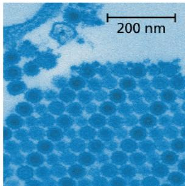  
(b) Chikungunya viruses emerging from a cell in the upper left and packing together (colorized TEM).  
20 nm

  
(c) Computer-generated image of a Zika virus, based on a technique called cryo-electron microscopy.

SARS-CoV-2 is one good example. The first case of COVID-19 was reported in Wuhan, China, in late December, 2019, and on March 11, 2020, WHO declared it a pandemic—a worldwide epidemic. Within the next 18 months, virtually every country was battling SARS-CoV-2.

HIV, the AIDS virus, is another classic example: The earliest HIV infections of humans occurred in sub-Saharan Africa, perhaps as early as the 1920s or 1930s, with outbreaks in the 1960s and 1970s. In the United States, the first cases were

Interview

Interview with Dr. Pardis Sabeti: Analyzing genomes of viruses and their hosts to learn more about epidemics (at the start of Unit 3, before Chapter 13)


large outbreak in Brazil. Although symptoms of Zika are often mild, the infection of pregnant individuals was correlated with a striking increase in the number of babies born with abnormally small brains, a condition called microcephaly. Zika is a mosquito-borne flavivirus (like West Nile virus) that infects neural cells, posing a particular danger to fetal brain development.

Where do these new strains of virus come from? One cause of rapidly emerging viral diseases in humans is mutation of existing viruses into new viruses that can spread more easily. RNA viruses have a high rate of mutation because viral RNA polymerases do not proofread and correct errors in replicating their RNA genomes. Some mutations change existing viruses into new viral strains that can cause disease, even in people immune to the original virus. A well-known related example is how three or four mutations causing changes in a surface protein of a cat virus (feline panleukopenia virus) resulted in the emergence in 1978 of canine parvovirus, a very contagious deadly virus infecting dogs.

A second cause of the emergence of viral diseases is the spread of a viral disease from a small, isolated human population. AIDS went unnamed and virtually unnoticed for decades before spreading around the world, accelerated by affordable international travel. HIV is transmitted through exchange of bodily fluids; this happens, for instance, through blood transfusions, unprotected sexual intercourse, and reuse of needles to inject intravenous drugs. In African countries, lack of resources and stigmatization of infected individuals initially hastened the spreading of AIDS. In the United States, AIDS was seen at first as only affecting gay men. Societal prejudice toward this community led to a lack of resources to investigate and stem the spread of the disease, which contributed to its worldwide spread.

#### [EN] Interview

Interview with David Satcher: The role of the CDC in recognizing AIDS and in public health (eTextbook only)


A third cause of new viral diseases in humans is the spread of existing viruses from other animals. Scientists estimate that about three-quarters of new human diseases originate in this way. Animals infected with a virus that can be transmitted to humans are said to be a natural reservoir for that virus. HIV is an example, as scientists believe that it originated from a version of the virus found in chimpanzees in central Africa, after people ate chimpanzee meat for food and were infected by exposure to chimpanzee blood. In a more recent example, the West Nile virus has been passed from wild birds to humans via mosquitoes.

In general, flu epidemics provide an instructive example of these three causes of emerging viruses. There are three types of influenza virus: types B and C, which infect only humans and have never caused an epidemic, and type A, which infects a wide range of animals, including birds, pigs, horses, and humans. The influenza type A viruses present in pigs and wild and domestic birds are potential emerging viruses that represent a long-term threat to human health.

A case in point is the H5N1 strain of avian influenza virus, which is highly contagious and deadly in birds. The first transmission from birds to humans was documented in Hong Kong in 1997. From 2003 to 2024, about 950 people have been infected, with an alarming mortality rate of around 50%. The high mortality rate is partly because H5N1 is very different from strains of influenza that have circulated among humans for a long time. Individuals are therefore not able to mount a strong immune response against viruses like H5N1.

Different strains of influenza A are given standardized names; for example, the name H5N1 identifies which forms of two viral surface proteins are present—hemagglutinin and neuraminidase (HA and NA, respectively; see the glycoprotein spikes in Figure 19.3c). These two proteins together help determine the host range and severity of disease caused by each virus. Eighteen types of hemagglutinin, a protein that helps the flu virus attach to host cells, and 11 types of neuraminidase, an enzyme that helps release new virus particles from infected cells, have been identified. All possible combinations of HA and NA have been found in some waterbirds.

Although deadly, the H5N1 strain has not yet caused an epidemic because nearly all cases have been the result of transmission from birds or other animals to people, rather than person-to-person. Epidemics occur when genetic changes allow a new viral strain to be easily transmitted between humans. An event like this occurred in 2009, when a strain of influenza virus (H1N1) appeared that was very different from the virus that causes the seasonal flu. The H1N1 influenza virus spread rapidly, prompting WHO to declare a pandemic. Within half a year, the disease had reached 207 countries, infecting over 600,000 people and killing almost 8,000.

In addition to the 2009 H1N1 pandemic, influenza A strains have caused three other major flu epidemics among humans in the last 100 years. The most notable of these was the “Spanish flu” pandemic of 1918–1919, which killed 40–50 million people worldwide. In the Scientific Skills Exercise, you’ll analyze genetic changes in variants of the 2009 H1N1 influenza virus and correlate them with spread of the disease.

The disease caused by H1N1 was originally called “swine flu” because parts of the viral genome were very similar to strains of influenza in pigs. However, studies revealed that the virus was not transmitted from pigs to humans. Instead, the story was more complex: H1N1 was a unique combination of swine, avian, and human influenza genes that allowed it to spread among humans.

Influenza viruses can change quickly because they have a genome made up of eight segments of RNA (or seven for influenza C) rather than a single RNA molecule (see Figure 19.3c). When an animal like a pig or a bird is infected with multiple strains of influenza virus, the RNA molecules making up the viral genomes can mix and match (reassort) during viral assembly, resulting in new genetic combinations. If a flu virus from pigs recombines with viruses that circulate widely among humans, it may acquire the ability to spread easily from person to person, dramatically increasing the potential for a major human outbreak. Pigs are believed to have been the main hosts for recombination that led to the 2009 H1N1 flu virus.

#### [EN] Scientific Skills Exercise Analyzing a Sequence-Based Phylogenetic Tree to Understand Viral Evolution

How Can Sequence Data Be Used to Track Flu Virus Evolution? In 2009, an influenza A H1N1 virus caused a pandemic, and the virus has continued to resurface in outbreaks across the world. Researchers in Taiwan were curious about why the virus kept appearing despite widespread flu vaccine initiatives. They hypothesized that newly evolved variant strains of the H1N1 virus were able to evade human immune system defenses. To test this hypothesis, they needed to determine if each wave of flu infection was caused by a different H1N1 variant strain.


How the Experiment Was Done Scientists obtained the genome sequences for 4,703 virus isolates collected from patients with H1N1 flu in Taiwan, each named by type/location/identifying number/year. They compared the sequences in different strains for the viral hemagglutinin (HA) gene, and based on mutations that had occurred, arranged the isolates into a phylogenetic tree (see Figure 26.5 for information on how to read phylogenetic trees).

Data from the Experiment In the phylogenetic tree shown at right, each branch tip is one variant strain of the H1N1 virus with a unique HA gene sequence. The tree is a way to visualize a working hypothesis about the evolutionary relationships between H1N1 variants.

#### [EN] INTERPRET THE DATA

1. The more closely connected two variants are in the tree, the more alike they are in terms of HA gene sequence. Each fork in a branch, called a node, shows where two lineages separate due to different accumulated mutations. The length of the branches is a measure of how many sequence differences there are between the variants, indicating how distantly related they are. Referring to the tree, which variants are more closely

related to each other: A/Taiwan/1018/2011 and A/Taiwan/552/2011 or A/Taiwan/1018/2011 and A/Taiwan/8542/2009? Explain.

2. The scientists arranged the branches into groups made up of one ancestral variant and all of its descendant, mutated variants. They are color-coded and also grouped by brackets. Using group 11 as an example, trace the lineage of its variants. (a) Do all of the nodes have the same number of branches? (b) Are all of the branches in the group the same length? (c) What do these results indicate?


3. The graph shows the number of isolates collected (each from an ill patient) on the y-axis and the month and year that the isolates were collected on the x-axis. Each group of variants is plotted separately with a line color and label that match the tree diagram. (a) Which group of variants was the earliest to cause the first wave of H1N1 flu in over 100 patients in Taiwan? (b) After a group of variants had a peak number of infections, did members of that same group cause another (later) wave of infection? (c) One variant in group 1 (green, uppermost branch) was used to make a vaccine that was distributed very early in the pandemic. Based on the graphed data, does it look like the vaccine was effective?

4. Groups 9, 10, and 11 all had H1N1 variants that caused a large number of infections at the same time in Taiwan. Does this mean that the scientists' hypothesis, that new variants cause new waves of infection, was incorrect? Explain.

To make the graph below, scientists plotted the number of isolates by the month and year of isolate collection to show the period in which each viral variant was actively causing illness in people.

  
Data from J.-R. Yang et al., New variants and age shift to high fatality groups contribute to severe successive waves in the 2009 influenza pandemic in Taiwan, PLoS ONE 6(11): e28288 (2011).

Instructors: A version of this Scientific Skills Exercise can be assigned in Mastering Biology.

Influenza viruses also have a high rate of mutation, for reasons mentioned earlier. Coupled with reassortments, these mutations can lead to the emergence of a viral strain from animals that can infect human cells. Scientists have been worried that an H5N1 strain will evolve in a way that enables it to spread as easily as the H1N1 strain. The concern has become more focused because an H5N1 avian influenza virus epidemic is currently underway; it was first detected in wild birds in the United States in January 2022, and in domestic poultry the next month. Since then, somewhat alarmingly, the virus has been found in domestic cows, dogs, and cats, as well as many wild mammals, including bears, foxes, skunks, and even seals. Thus far this particular strain has not been capable of human-to-human transmission, but a 2024 laboratory study showed that one or two mutations in the bovine strain of this virus would allow it to attach to receptors in human airway cells. If such mutations were to happen in the viruses currently circulating, this would represent another major global health threat like those of the COVID-19 or 1918 influenza pandemics.

In fact, we have observed a similar phenomenon in SARS-CoV-2 during the COVID-19 pandemic. Widespread SARS-CoV-2 infection of many individuals has allowed random mutations to occur, and evolutionary processes have led to new, more easily transmissible strains of the virus emerging and becoming predominant. Clearly, the COVID-19 pandemic has sharply highlighted the crucial importance of understanding the evolution and functioning of viruses.

Normal seasonal flu viruses (including influenza types A and B) are not considered emerging viruses because variations of seasonal flu viruses have been circulating among humans for long enough that most components are recognized by the immune system. However, these viruses still undergo mutation and reassortment of genome segments, and variations of the HA protein are used each year to generate vaccines against the strains predicted most likely to occur the following year.

As we have seen, emerging viruses are usually existing viruses that mutate, spread more widely in the current host species, or spread to new host species. Changes in host behavior or environmental changes can increase the viral traffic responsible for emerging diseases. For instance, new roads built through remote areas can allow viruses to spread between previously isolated human populations. Also, the destruction of forests to expand cropland can bring humans into contact with animals that host infectious viruses. Finally, genetic mutations and changes in host ranges can allow viruses to jump between species. Many viruses are transmitted by mosquitoes. A dramatic expansion of the disease caused by the chikungunya virus occurred in the mid-2000s when a mutation allowed it to infect not only the mosquito species Aedes aegypti but also the related Aedes albopictus. Insecticides and mosquito netting over beds are crucial tools in public health attempts to prevent diseases carried by mosquitoes (Figure 19.11).

Recently, scientists have become concerned about the possible effects of climate change on worldwide viral transmission. Dengue fever, also mosquito-borne, has appeared in Florida, Texas, California, and Portugal, regions where it had not been seen before. The possibility that global climate change has allowed

Figure 19.11 Netting as protection against virus-carrying mosquitoes.  


mosquito species carrying these viruses to expand their ranges and interact more is troubling because of the increased chance of a mutation allowing a virus to jump to a new host. This is an area of active research by scientists applying climate change models to what is known about the habitat requirements of mosquito species.

#### [EN] Viral Diseases in Plants

More than 2,000 types of viral diseases of plants are known, accounting for an annual loss of over \$30 billion worldwide due to destruction of crops. Common signs of viral infection include bleached or brown spots on leaves and fruits (Figure 19.12), stunted growth, and damaged flowers or roots, all of which can diminish the yield and quality of crops.

Plant viruses have the same basic structure and mode of replication as animal viruses. Most known plant viruses, including tobacco mosaic virus (TMV), have an RNA genome. Many have a helical capsid, like TMV, while others have an icosahedral capsid (see Figure 19.3b).

Viral diseases of plants spread by two major routes. In the first route, horizontal transmission, an external source infects the plant. Because the invading virus must get past the plant's outer protective layer of cells (the epidermis), a plant becomes more susceptible to viral infections if it has been damaged by wind, injury, or herbivores. Herbivores, especially insects, pose a double

Figure 19.12 Immature tomato infected by a virus.

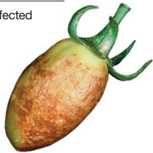

#### [EN] Figure 19.13 Model for how prions propagate.

Prions are misfolded versions of normal brain proteins. When a prion contacts a normally folded version of the same protein, it may induce the normal protein to assume the abnormal shape. The resulting chain reaction may continue until high levels of prion aggregation cause cellular malfunction and eventual degeneration of the brain.

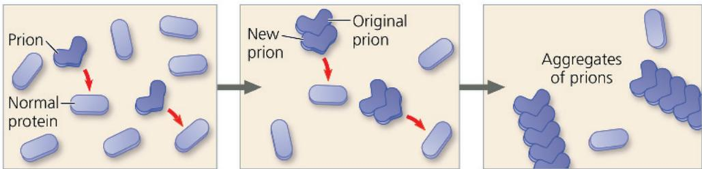

threat because they can also carry viruses, transmitting disease from plant to plant. Moreover, gardeners may transmit plant viruses inadvertently on pruning shears and other tools. The other route of viral infection is vertical transmission, in which a plant inherits a viral infection from a parent. Vertical transmission can occur in asexual propagation (for example, through cuttings) or in sexual reproduction via infected seeds.

Once a virus enters a plant cell and begins replicating, viral genomes and associated proteins can spread throughout the plant through plasmodesmata, the cytoplasmic connections that penetrate the walls between adjacent plant cells (see Figure 36.19). The passage of viral macromolecules from cell to cell is facilitated by virally encoded proteins that cause enlargement of plasmodesmata. Scientists have not yet devised cures for most viral plant diseases, so research efforts are focused largely on reducing disease transmission and on breeding resistant varieties of crop plants.

As small and simple as viruses are, they dwarf another class of plant pathogens: viroids. These are circular RNA molecules, only a few hundred nucleotides long. Viroids do not encode proteins but can replicate in host plant cells, apparently using cellular enzymes. These small RNA molecules seem to cause errors in the regulatory systems that control plant growth, and the typical signs of viroid diseases are abnormal development and stunted growth. One viroid disease, called cadang-cadang, has killed more than 10 million coconut palms in the Philippines.

#### [EN] Prions: Proteins as Infectious Agents

The viruses discussed in this chapter are infectious agents that spread diseases, and their genetic material is composed of nucleic acids, whose ability to be replicated is well known. Surprisingly, there are also proteins that are infectious. Proteins called prions appear to cause degenerative brain diseases in various animal species. These diseases include scrapie in sheep; mad cow disease, which plagued the European beef industry several decades ago; and Creutzfeldt-Jakob disease in humans, which has recently been diagnosed in 500–600 people per year in the United States. Prions can be transmitted in food, as may occur when people eat beef from cattle with mad cow disease. Kuru, another human disease caused by prions, was identified in the early 1900s among the South Fore indigenous people of New Guinea. When a kuru epidemic peaked there in the 1960s, scientists at first thought

the disease had a genetic basis because family members also often contracted the disease. Eventually, however, investigations revealed a different story: After a death, family members practiced ritual cannibalism, eating organs of the deceased, and prions were transmitted primarily in brain tissue. Women got kuru more often than men because men ate the more “prestigious” organs, like the heart, while women and children ate the brains.

Two characteristics of prions are especially alarming. First, prions act very slowly, with an incubation period of at least ten years before symptoms develop. The lengthy incubation period prevents sources of infection from being identified until long after the first cases appear, allowing many more infections to occur. Second, prions are not destroyed or deactivated by heating to normal cooking temperatures. To date, there is no known cure for prion diseases, and the only hope for developing effective treatments lies in understanding the process of infection.

How can a protein, which cannot replicate itself, be a transmissible pathogen? According to the leading model, a prion is a misfolded form of a protein normally present in brain cells. When the prion gets into a cell containing the normal form of the protein, the prion somehow converts normal protein molecules to the misfolded prion versions. Several prions then aggregate into a complex that can convert other normal proteins to prions, which join the chain (Figure 19.13). Prion aggregation interferes with normal cellular functions and causes disease symptoms. This model was greeted with much skepticism when it was first proposed by Stanley Prusiner in the early 1980s, but it is now widely accepted. Prusiner was awarded the Nobel Prize in 1997 for his work on prions. He has also proposed that prions are involved in neurodegenerative diseases such as Alzheimer's and Parkinson's disease, and recent evidence supporting this notion is compelling. There are many outstanding questions about these small infectious agents.

#### [EN] Concept Check 19.3

1. Describe two ways in which a preexisting virus can become an emerging virus.

2. Contrast horizontal and vertical transmission of viruses in plants.

3. WHAT IF? TMV has been isolated from virtually all commercial tobacco products. Why, then, is TMV infection not an additional hazard for smokers?

For suggested answers, see Appendix A.


<!-- C-END Campbell 19.3 -->

## 9.5 严重急性呼吸综合征的分子机制

## 9.5.1 严重急性呼吸综合征冠状病毒的结构与分类

严重急性呼吸综合征冠状病毒(severe acute respiratory syndrome coronavirus, SARS-CoV)属冠状病毒科(coronaviridase)、冠状病毒属(coronavirus)，一般呈多形态，病毒颗粒直

径在 80\~160 nm, 有囊膜, 囊膜表面镶嵌有 12\~24 nm 的球形梨状或花瓣状纤突 (spike), 纤突之间有间隙。由于囊膜上的纤突呈规则状排列成皇冠状, 故称之为冠状病毒 (图 9-28)。病毒颗粒的囊膜由两层脂质组成, 在两层脂质中镶嵌有两种糖蛋白, 纤突蛋白 S (又称 E2) 和血凝素酯酶 HE (hemagglutinin esterase, 又称 E3), 还有膜蛋白 M (又称 E1) 和小包膜糖蛋白 E (envelope protein)。病毒粒子内部为核衣壳蛋白 N 和核基因组 RNA组成的核蛋白核心。

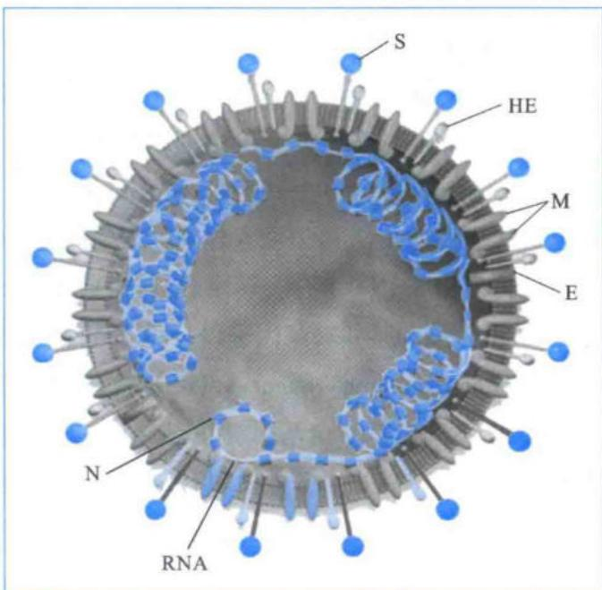  
图 9-28 冠状病毒颗粒结构示意图

图 9-29 SARS-CoV 病毒与其他冠状病毒的系统进化分析  


已知冠状病毒分为3组，第1和第2组为哺乳动物病毒，第3组是禽类病毒。基因序列分析表明，SARS-CoV的基因组序列与其他3组都存在很大的差异，很难被归入某一组(图9-29)。虽然有学者认为它可能是第2组的重组病毒，但也有人认为SARS-CoV可能是第4组冠状病毒的代表。一般认为SARS-CoV最可能来源于动物，特别是野生动物如果子狸、蝙蝠、猴、蛇等。

## 9.5.2 SARS-CoV 的基因组结构

冠状病毒是最大的 RNA 病毒, 其基因组为单链正链 RNA。SARS-CoV 基因组全长 27\~30 kb, 其 5' 端有甲基化帽状结构, 前约 2/3 的区域编码病毒 RNA 聚合酶复合蛋白, 后 1/3 的区域编码病毒的结构蛋白和非结构蛋白, 按基因组上的排列顺序依次为 S、E、M、N 蛋白, 在 S 和 E 之间、M 和 N 之间以及 N 蛋白基因的下游有一些未知功能的开放读码框, 其 3' 端有不少于 50 个碱基的 poly(A) 尾巴, 这种结构与真核生物 mRNA 非常相似, 这也是其基因组 RNA 可以在人体细胞内发挥翻译模板作用的重要结构基础。冠状病毒整个结构蛋白 mRNA 不存在转录后修饰、剪切等过程, 而是直接在初级转录过程中, 通过 RNA 聚合酶和某些转录因子以一种不连续转录机制, 通过识别特定的转录调控序列 (transcription regulating sequences, TRS) 有选择地从反义链 RNA 上一次性转录得到整个功能 mRNA。SARS-CoV 全基因组共有 14 个开放读码框。在 SARS-CoV 的包膜上有 3 种主要糖蛋白, 即 S 蛋白、M 蛋白和 HE 蛋白。S 蛋白被认为可能是病毒诱发机体免疫系统产生特异性抗体和细胞毒性 T 细胞的主要抗原蛋白, 参与 SARS-CoV 侵入宿主细胞的过程。S 蛋白可进一步分为 S1 和 S2 两部分, S1 蛋白主要与宿主细胞膜受体结合, S2 蛋白

介导病毒囊膜和宿主细胞膜融合。

## 9.5.3 SARS-CoV 的侵染过程

SARS-CoV 的生活周期包括病毒侵染、复制和组装及分泌几个阶段。在 SARS-CoV 侵染靶细胞时，病毒首先通过病毒囊膜上的 S 蛋白与敏感细胞的受体结合，然后通过其编码蛋白的自身折叠与相互结合牵引将病毒囊膜和细胞膜拉近而发生融合，使得病毒的遗传物质以内吞作用的方式进入靶细胞。最近的研究发现，ACE2（血管紧张素转换酶Ⅱ）是 SARS 冠状病毒的主要受体。ACE2 为依赖于锌离子的金属肽酶，是已知的唯一在血压调节中起关键作用的血管紧张素转换酶（ACE）的同系酶，该酶可将血管紧张素Ⅱ转换成血管紧张素。ACE2 是 SARS 病毒进入细胞的主要靶点，因此 ACE2 成为对 SARS 进行药理干预的首选目标。SARS 冠状病毒 S 蛋白的 S1 亚单位既具有与靶细胞受体结合的功能，又具有中和抗原表位。所以，S1 亚单位的特异性抗体能中和 SARS 冠状病毒感染。

SARS-CoV 病毒侵入细胞后基因组被释放到细胞质中, 其转录和复制在细胞质中完成。病毒首先直接从其基因组 RNA 翻译出 RNA 依赖的 RNA 聚合酶。该聚合酶随后会以病毒基因组 RNA 为模板合成负链 RNA, 之后再以新合成的负链 RNA 为模板转录生成新的病毒基因组 RNA。同时该聚合酶还会以负链基因组 RNA 为模板从基因组 RNA 的多个位点起始转录, 产生 5\~7 个亚基因组 mRNA 组分。亚基因组 RNA 都具有 5' 端甲基化帽状结构和 3' 端多 poly(A) 尾结构, 且长度呈递减分布。除最短的 mRNA 为单顺反子外其余的均为多顺反子, 可以合成多聚蛋白前体, 这些多聚蛋白再由病毒和宿主的蛋白切割, 最终形成大小不同的功能蛋白质。

SARS-CoV 病毒的囊膜蛋白在粗面内质网内翻译,同时发生 N-糖基化,并在糙面内质网的表面聚合形成非共价的同源三聚体。随后被运输到高尔基复合体中进行高甘露糖的低聚糖基化修饰,同时部分区域连接末端糖基并发生脂酰化。成熟的囊膜蛋白主要集中在高尔基体,少量可以被转运至细胞膜表面引起被感染细胞间发生膜融合而形成合胞体。在病毒蛋白合成的同时,病毒基因组进行复制,当病毒蛋白和基因组完成翻译和复制时,子代基因组 RNA 通过基因组中的包装信号与新合成的 N 蛋白结合,形成螺旋状的核衣壳之后再通过 M 蛋白的作用与囊膜结组装出芽。在病毒粒子的出芽的过程中,M、S、E 蛋白嵌入到病毒粒子的囊膜中,形成的子代病毒粒子经细胞膜融合而释放到细胞外完成其生命周期(图 9-30)。

## 9.5.4 SARS-CoV 病毒的起源及变异

目前，SARS-CoV 的起源仍不明了。但是，我国广东的一项调查显示，70% 的果子狸携带 SARS-CoV，而 40% 的野生动物经销商体内都含有 SARS-CoV 的抗体，其中单营果子狸者 SARS 冠状病毒感染率为 58%，明显高于单营蛇类者，暗示果子狸可能是 SARS 病毒的重要载体。基因组比较结果表明，果子狸的 SARS 样病毒比人类的 SARS-CoV 多 29 个核苷酸。从进化的角度看，果子狸 SARS 样病毒比人的 SARS-CoV 更原始，估计动物的

图 9-30 冠状病毒的生活周期图示  
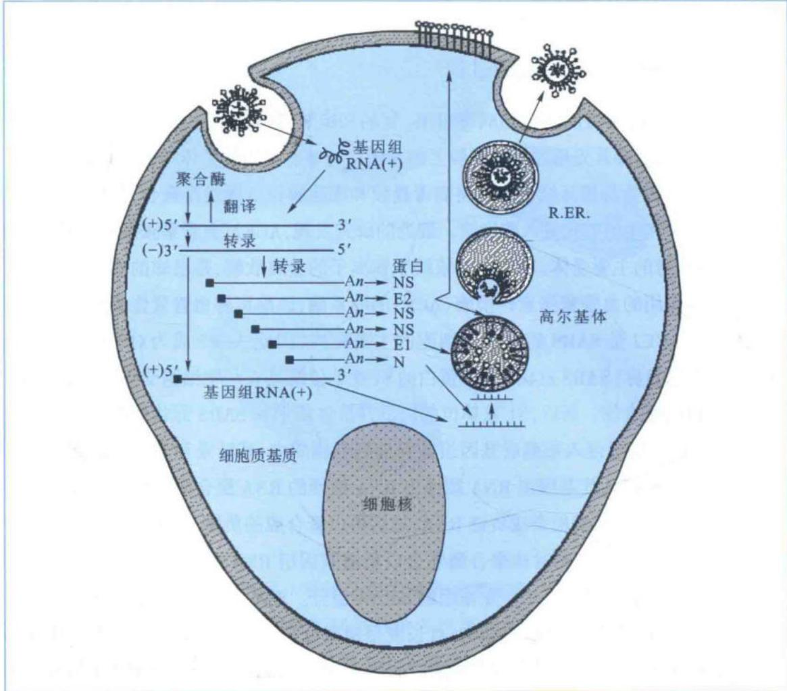

SARS样病毒可能是人类SARS-CoV的前体。有研究从蝙蝠、猴、果子狸、蛇、老鼠和禽体内都扩增出与人类SARS病毒高度同源的基因片段。因此，人SARS-CoV的最终源头问题有待于进一步研究。

## 9.6 基因治疗

人类疾病的发生,其实都是人体细胞中自身基因的改变或由外源病原体的基因产物与人体基因相互作用的结果。因此,长期以来,科学家设想人类能否最终运用遗传物质,无论是人类自身的或是外源遗传物质来治疗疾病,纠正人体本身基因结构或功能上的错乱,阻止病菌的侵染,杀灭病变的细胞或抑制外源病原体遗传物质的复制,保证人体健康。

## 9.6.1 基因治疗的主要途径

1990 年,科学家第一次用反转录病毒为载体,把腺苷脱氨酶(ADA)基因导入来自病人自身的 T 淋巴细胞,经扩增后输回患者体内,获得了成功。5 年后,患者体内 10% 的造血细胞呈 ADA 基因阳性,除了还须服用小剂量的 ADA 蛋白之外,其他体征都正常。这一成功标志着基因治疗时代的开始。那么，基因治疗为什么具有诱人的前景，它与基因工程究竟有什么差别呢？

基因工程是将具有应用价值的基因,即“目的基因”,装配在具有表达元件的特定载体中,导入相应的宿主如细菌、酵母或哺乳动物细胞中,在体外进行扩增,经分离、纯化后获得其表达的蛋白质产物。基因治疗是将具有治疗价值的基因,即“治疗基因”装配于带有在人体细胞中表达所必备元件的载体中,导入人体细胞,直接进行表达。进行基因治疗时无需对表达产物进行分离纯化,因为人细胞本身可以完成这个过程。

基因工程的“目的基因”主要是可分泌蛋白，如生长因子、多肽类激素、细胞因子、可溶性受体等，而非分泌性蛋白，如受体、各种酶、转录因子、细胞周期调控蛋白、原癌基因及抑癌因子等，由于它们不能有效地进入细胞而不能被应用于基因工程。基因治疗却不受上述限制，几乎所有的基因，只要它具有治疗作用，理论上均可应用于基因治疗。

基因工程的操作全部在体外完成,基因治疗则必须将基因直接导入人体细胞。这不仅在技术上具有很大难度,而且在有效性与安全性方面提出了更为苛刻的要求。

基因治疗主要有 ex vivo 和 in vivo 两条途径。

① ex vivo 途径 这是指将含外源基因的载体在体外导入人体自身或异体(异种)细胞,这种细胞被称为“基因工程化的细胞”,经体外细胞扩增后输回人体。这种方法易于操作,而且因为细胞扩增过程中对外源添加物质的大量稀释,不容易产生副作用。同时,治疗中用的是人体细胞,尤其是自体细胞,安全性好。但是,这种方法不易形成规模,而且必须有固定的临床基地。

② in vivo 途径 这是将外源基因装配于特定的真核细胞表达载体上, 直接导入人体内。这种载体可以是病毒型或非病毒型, 甚至是裸 DNA。这种方式非常有利于大规模工业化生产。但是, 对这种方式导入的治疗基因以及其载体必须证明其安全性, 而且导入体内之后必须能进入靶细胞, 有效地表达并达到治疗目的。因此, 在技术上要求很高, 其难度明显高于 ex vivo 模式。

## 9.6.2 基因治疗中的病毒载体

用于基因治疗的病毒载体应具备以下基本条件：

① 携带外源基因并能装配成病毒颗粒；

② 介导外源基因的转移和表达；

③ 对机体没有致病力。

因为大多数野生型病毒对机体都具有致病性,需要对其进行改造后才能被用于人体。理论上,各种类型的病毒都能被改造成病毒载体,但由于病毒的多样性及与机体之间复杂的依存关系,人们至今对许多病毒的生活周期、分子生物学、与疾病发生发展的关系等的认识还很不全面,从而限制了许多病毒发展成为具有实用性的载体。到目前为止,只有少数几种病毒如反转录病毒、腺病毒及腺病毒伴随病毒、疱疹病毒(包括单纯疱疹病毒、痘苗病毒及EB病毒)等被成功地改造成为基因转移载体。

## 1. 病毒载体的产生

研究病毒载体首先要对病毒的基因组结构和功能有充分的了解,最好在获得病毒基因组全序列信息的基础上进行。病毒基因组可分为编码区和非编码区,编码区的序列产生病毒的结构蛋白和非结构蛋白。根据其对病毒感染性复制的影响,又可分为必需基因和非必需基因。非编码区中含有病毒进行复制和包装等功能所必需的顺式作用元件。各种野生型病毒颗粒都具有一定的包装容量,即对所包装的病毒基因组的长度有一定的限制。一般来说,病毒包装容量不超过自身基因组大小的105%\~110%。

最简单的办法是将适当长度的外源 DNA 插入病毒基因组的非必需区，包装成重组病毒颗粒。有科学家将 4.5 kb 的 lacZ 基因表达盒插入 HSV-I 病毒的 UL44（编码糖蛋白 C）基因的 Xba I 位点中，构建成重组 HSV 病毒。由于 UL44 基因产物对于 HSV 病毒在培养细胞中产毒性感染是非必需的，因此，该重组病毒可以在细胞中增殖传代。用这种重组病毒感染细胞，发现 lacZ 基因能进入细胞并得到高效表达。

然而，重组病毒作为基因转移载体有许多缺点。首先，许多野生型病毒可通过在细胞中的复制而导致细胞裂解死亡，或带有病毒癌基因而使细胞发生转化，必须经过改造使其成为复制缺陷型病毒并且删除致癌基因后才能用于基因治疗。其次，插入外源DNA的长度受到很大限制，尤其对于基因组本身较小的病毒如腺病毒伴随病毒(4.7 kb)、反转录病毒(8\~10 kb)、腺病毒(36 kb)，如果不去除病毒基因，可供外源DNA插入的容量就很小，要删除更多的病毒基因以腾出空间以插入较大的外源DNA。为了增加病毒载体插入外源DNA的容量，除了删除病毒的非必需基因外，还可以进一步删去部分或全部必需基因，这些必需基因的功能由辅助病毒或宿主细胞提供。

## 2. 病毒载体的分类

① 重组型病毒载体 这类载体以完整的病毒基因组为改造对象,在不改变病毒复制和包装所需的顺式作用元件的情况下,有选择性地删除病毒的某些必需基因尤其是前早期或早期基因以控制其表达,所缺失的必需基因的功能由同时导入细胞中的外源基因表达单位提供。一般通过同源重组方法将目的基因插入到病毒基因组中。

② 无病毒基因的病毒载体 这类载体可以看作是重组病毒载体的一种极端减毒情况，往往由重组载体和辅助系统组成。重组载体主要由外源基因表达盒、病毒复制和包装所必需的顺式作用元件及载体骨架组成。辅助系统包括病毒复制和包装所必需的所有反式作用元件。在辅助系统的作用下，重组载体以特定形式（单链或双链 DNA 或 RNA）被包装到不含有任何病毒基因的病毒颗粒中。这类载体的优点在于载体病毒本身安全性好，容量大。缺点在于往往需要辅助病毒参与载体 DNA 的包装，造成终产品中辅助病毒污染，影响其应用。

## 3. 病毒载体在基因治疗中的应用

据不完全统计,自1990年开展第一例人体基因治疗以来,已进行了数百项基因治疗临床试验,涉及病人上千人,其中2/3以上的临床方案应用了病毒载体进行基因导入。不同的病毒载体具有特定的生物学功能,决定了其在基因治疗中的应用,表9-7列举了常用的病毒载体的特性和适用范围。

表 9-7 常用病毒载体的特性和适用范围

<table><tr><td>病毒载体</td><td>生物学特性</td><td>适用范围</td></tr><tr><td>反转录病毒载体</td><td>可感染分裂细胞整合到染色体中表达时间较长有致癌的危险</td><td>ex vivo 基因治疗肿瘤基因治疗</td></tr><tr><td>腺病毒载体</td><td>可感染分裂和非分裂细胞不整合到染色体中外源基因表达水平高表达时间较短免疫原性强</td><td>in vivo 基因治疗肿瘤基因治疗疫苗</td></tr><tr><td>腺病毒伴随病毒载体</td><td>可感染分裂和非分裂细胞整合到染色体中无致病性,免疫原性弱可长期表达外源基因在骨骼肌、心肌、肝、视网膜等组织中表达水平较高</td><td>in vivo 基因治疗ex vivo 基因治疗遗传病基因治疗获得性慢性疾病的基因治疗</td></tr><tr><td>疱疹病毒载体</td><td>具嗜神经性,可逆轴突传递可潜伏感染容量大可感染分裂和非分裂细胞</td><td>神经系统疾病的基因治疗肿瘤的基因治疗</td></tr></table>

## 4. 基因治疗中的问题

基因治疗要取得突破,必须在基因导入系统、基因表达的可控性及获得更多更好的治疗基因这三个方面下工夫。

① 靶向性基因导入系统 基因治疗中的关键问题是必须将治疗基因送入特定的靶细胞，并在该细胞中得到高效表达。这对于恶性肿瘤治疗尤为重要，如果不能有效地将治疗基因导入大多数肿瘤细胞，则至少要求它尽可能不进入或较少进入正常细胞。因此，目前针对恶性肿瘤的免疫基因治疗仍按 ex vivo 形式操作，很少有体内直接导入的治疗模式。病毒型载体中，除直接注射入瘤体外，若用全身给药，在肿瘤细胞中分布极低，很难期望达到治疗作用。当务之急是要尽快建立靶向性导入系统。

② 外源基因表达的可控性 由于电脉冲介导裸 DNA 技术的改进,科学家已能将许多基因,如分泌性蛋白基因(包括生长因子、激素、细胞因子,可溶性受体)导入肌肉并维持相当时间的表达,已达到可发挥药效的水平。但是,如果这些基因导入后表达处于无调控状态,将会造成严重后果。

最理想的可控性是模拟人体内基因本身的调控形式。这是今后长期的追求目标，需要全基因或包括上下游的调控区及内含子序列，将对导入基因的载体系统产生严峻的挑战，因为今后设计的载体须有几十 kb 甚至上百 kb 的包装能力。图 9-31 是导入基因表达诱导系统示意图。以酵母 gal4 系统为例，在目的基因上游区接上 gal4 的顺式元件，所用的激活蛋白是一个带有疱疹病毒 VP16/gal4 DNA 结合区的孕酮受体的变异体。该变异体（PR-LBD △）只能与孕酮的拮抗剂（RU486）相结合而不与孕酮或其他衍生物结合。当体系中不存在 RU486 时，治疗基因的表达水平极低；而给予 RU486 后，RU486 与 PR-

图9-31 导入基因的表达诱导框架图  


LBD △结合,激活 VP16,杂种激活蛋白形成二体并通过 gal4 DNA 结合区与治疗基因上游区的 gal4 顺式元件结合,启动治疗基因的表达。

③ 治疗基因过少 目前用于临床试验的治疗基因数量很少。绝大部分多基因疾病，如恶性肿瘤、高血压、糖尿病、冠心病、神经退行性疾病的致病基因还有待阐明，因此，可选择的靶基因不多。只有尽快发现并克隆大量的功能基因，迅速确定其调控序列，基因治疗才能获得更大的发展。

## 9.6.3 基因治疗中的非病毒载体

病毒载体存在许多不足,主要体现在免疫原性高、毒性大、目的基因容量小、靶向特异性差、制备较复杂及费用较高等。现在,人们愈来愈重视人工合成的非病毒载体的研究。目前常用的非病毒载体包括裸 DNA(naked DNA)、脂质体载体(liposome vector)及阳离子多聚物型载体(cationic polymer vector)等。

## 1. 裸 DNA

裸 DNA 又称自由 DNA, 是结构最简单的非病毒载体。使用裸 DNA 进行基因治疗的最大困难在于如何将目的基因导入相应的细胞并得到有效而长期的表达。主要通过物理或机械方法(如直接注射或基因枪法)将 DNA 导入适当部位(如皮肤、骨骼肌、肝、支气管内、心肌和瘤体内)。当用于激发免疫反应时又称为 DNA 疫苗 (DNA vaccine)，是一种非常有希望的疫苗方式。

基因枪方法又叫微粒轰击技术,它采用能自发吸收 DNA 的钨或金微粒,通过高压电所产生的高能电弧促使被 DNA 包裹着的金属颗粒产生极高的速度,有效穿透单细胞层或靶器官从而将 DNA 导入培养细胞或动物组织中。

裸 DNA 虽能有效运转并表达目的基因,但缺乏靶向性,并且只能在局部作用,不能转染大量细胞,经常需要进行外科手术以暴露靶器官,使用时局限性较大。

## 2. 脂质体 /DNA 复合物

脂质体是具有双层膜的封闭式粒子,它们能促进极性大分子穿透细胞膜。根据脂质体包裹 DNA 的方式不同可将脂质体分为阳离子脂质体、阴离子脂质体、pH 敏感脂质体及融合脂质体等。

阳离子脂质体是目前最常用的脂质体类型,它主要由带正电荷的脂质及中性辅助脂质组成,两者通常是等摩尔混合。由于电荷的相互作用,阳性电荷的脂质体和带负电荷的DNA之间可以有效地形成复合物,制备时只须将二者直接混合形成复合物,不受基因体积大小的限制。

脂质的化学结构、组成对载体的活性和毒性有很大的影响。具有多个正电荷头部的脂质体转染率较高，这可能是因为它与DNA结合更牢固。脂质体在酸性环境中与细胞膜结合能力大大降低，在细胞间的转运也取决于脂质体中类脂的成份。DC-Chol/DOPE阳离子脂质体是第一个被批准用于人体的脂质体。由于制备技术的不稳定性，对靶细胞的毒性和试剂价格较贵等原因，其应用受到了一定的限制。

细胞摄取脂质体主要通过内吞途径,脂质体与其内含物遇到溶酶体即被降解。pH 敏感脂质体可在一定程度上避免溶酶体降解并增加 DNA 摄取量和稳定性。pH 敏感脂质体的原理是酸性条件下脂肪酸羧基质子化,形成六角晶相发生膜融合。在形成内吞小泡进入溶酶体之前,由于 pH 从 7.4 降至 5.3\~6.3 左右,pH 敏感脂质体与内吞小泡膜融合,将内含物导入胞浆。这类脂质体主要由二油酰胆碱(DOPE)、胆固醇和油酸以 4:4:2(摩尔比)组成,脂质成份中常用的 DOPE 决定了脂质体在中性 pH 条件下的稳定性和酸性条件下与细胞融合的能力。

pH 敏感脂质体虽然通过静电吸附与细胞膜产生非特异性相互作用,转运效率比普通脂质体高,但实际上也只有 10% 的基因释放至细胞质中,其余仍在溶酶体中降解。

## 3. 多聚物 /DNA 复合物

由于 DNA 带负电, 利用阳离子多聚体的氨基基团的正电荷与 DNA 的磷酸基团结合发生电性中和, 可以使 DNA 缩合形成稳定的多聚复合物 (polyplex), 不易被核酸酶降解, 并可防止沉淀, 从而提高转染效率。此外, 复合体大小为 80\~100 nm, 带正电荷, 可与细胞表面带负电荷的受体结合, 因此能有效地被内吞摄入, 介导基因转移。常见的阳离子多聚体有多左旋赖氨酸、鱼精蛋白、组蛋白、多聚乙胺、多聚乙烯亚胺和星状树突体等, 可以分别形成线型、分支型、球型或类球体状结构。虽然多聚阳离子型载体系统具有合成比较方便、安全无毒的特点，但是，单独使用多聚阳离子同样具有基因转移组织特异性和靶向性差、体内基因转移效率较低等缺点，有待于进一步改善和提高。

## 4. DNA 微球体 (DNA-nanospheres)

白明胶和聚氨基葡萄糖等生物高聚物属阳离子复合物,能与 DNA 形成大小为 200\~750 nm 的微球体复合物。白明胶和聚氨基葡萄糖等有如下特点:①它们是可降解生物材料;② DNA 可均一地分布在微球体中,免于被 DNA 酶降解;③可与活性物质共包装达到靶向运输增加了基因治疗的可能性;④储存方便稳定;⑤可以达到可控持续释放,延长了基因表达时间;⑥毒性低。


<!-- C-BEGIN Campbell 20.4 -->

### 【英文对应 Campbell Concept 20.4：The practical applications of DNA-based biotechnology affect our lives in many ways】

> 来源：Campbell Biology（书籍/01_Campbell_Biology） 第20章 DNA Tools and Biotechnology，Concept 20.4。

#### [EN] Concept 20.4: The practical applications of DNA-based biotechnology affect our lives in many ways

In the last section, we'll survey the practical applications of DNA-based biotechnology, the manipulation of organisms or their components to make useful products. Today, major applications of DNA technology and genetic engineering include medical treatments and medication development, forensic evidence and genetic profiles, environmental cleanup, and agriculture.

#### [EN] Medical Applications

One important use of DNA technology is the identification of human genes whose mutation plays a role in genetic diseases. These discoveries may lead to ways of diagnosing, treating, and even

preventing such conditions. DNA technology has also identified genes that play a role in a number of “nongenetic” diseases, from arthritis to AIDS, by influencing susceptibility to these diseases. Furthermore, a wide variety of diseases involve changes in gene expression within the affected cells and often within the patient’s immune system. By using RNA-seq and DNA microarray assays (see Figures 20.12 and 20.13) or other techniques to compare gene expression in healthy and diseased tissues, researchers are finding genes that are turned on or off in particular diseases. These genes and their products are potential targets for prevention or therapy.

#### [EN] Diagnosis and Treatment of Diseases

A new chapter in the diagnosis of infectious diseases has been opened by DNA technology, in particular the use of PCR and labeled nucleic acid probes to track down pathogens. For example, because the sequence of the RNA genome of SARS-CoV-2 is known, RT-PCR can be used to amplify and therefore detect and quantify even a small amount of SARS-CoV-2 RNA in nasal or throat swab samples (see Figure 20.11). RT-PCR is often the best way to detect an otherwise elusive infectious agent.

Medical scientists can now diagnose hundreds of human genetic disorders by using PCR with primers that target the genes associated with these disorders. The amplified DNA product is then sequenced to reveal the presence or absence of the disease-causing mutation. Among the genes for human diseases targeted in this way are those for sickle-cell disease, hemophilia, cystic fibrosis, Huntington's disease, and Duchenne muscular dystrophy. Individuals with such diseases can often be identified before the onset of symptoms, even before birth (see Figure 14.19). PCR can also be used to identify symptomless carriers of potentially harmful recessive alleles as part of genetic counseling (see Concept 14.4).

#### [EN] Personal Genome Analysis

As you learned earlier, genome-wide association studies have pinpointed SNPs (single nucleotide polymorphisms) that are linked to disease-associated alleles (see Figure 20.15). Individuals can be tested by PCR and sequencing for a SNP that is correlated with the abnormal allele. The presence of particular SNPs is correlated with increased risk for particular adverse health conditions such as heart disease, Alzheimer's disease, and some types of cancer.

Direct-to-consumer genome analysis companies offer kits allowing individuals to send in a swab containing cheek cells that the company will analyze genetically. Genetic testing for risk factors like heart disease, Alzheimer's disease, and some types of cancer is carried out by looking for linked SNPs that have been previously identified (see Figure 20.15). It may be helpful for individuals to learn about their health risks, with the understanding that such genetic tests merely reflect correlations and do not make predictions.

In addition to health-related genetic information, these companies compare a person's DNA segments with those from reference populations around the world, established from thousands of individuals of known ancestry. Based on how closely the segments match up, the report can tell an individual about their likely ancestral breakdown. Females can also learn about their maternal lines of descent, based on comparisons of mitochondrial

DNA, which is contributed to the egg only by the female parent. For males, an analysis of the sequence of the Y chromosome can trace their paternal lines of descent. As the size of the database used by these companies increases, the results become more refined and more accurate.

#### [EN] Personalized Medicine

The techniques described in this chapter have also prompted improvements in disease treatments—for example, by knowing which specific cancer-related genes have been mutated in a particular patient's tumor. By analyzing the expression of many genes in large numbers of breast cancer patients, researchers can refine their understanding of the different subtypes of breast cancer (see Figure 18.27). Knowing the expression levels of particular genes in a given individual can help physicians determine the likelihood that the cancer will recur, thus helping them design an appropriate treatment. Given that some low-risk patients have a $96\%$ survival rate over a ten-year period with no treatment, gene expression analysis allows doctors and patients access to valuable information when they are considering treatment options.

Many researchers envision a future of personalized medicine, a type of medical care in which each person's specific genetic profile can provide information about diseases or conditions for which the person is especially at risk and help make health-care decisions. As we will see later in the chapter, a genetic profile is currently taken to mean a set of genetic markers such as SNPs. Ultimately, however, it will likely mean the complete DNA sequence of an individual—after sequencing becomes inexpensive enough. The ability to sequence a person's genome quickly and inexpensively is advancing rapidly, perhaps faster than development of appropriate treatments for the conditions. Still, the identification of genes involved in these conditions provides targets for therapeutic interventions.

An individual's genomic information can be used to predict the benefits and risks of particular medications, an approach called pharmacogenetics. There are over 300 medications for which the Food and Drug Administration recommends genetic testing for patients prior to their use.

#### [EN] Human Gene Therapy and Gene Editing

Gene therapy—the introduction of genes into an afflicted individual for therapeutic purposes—holds great potential for treating the relatively small number of disorders traceable to a single defective gene. The aim of this approach is to insert a normal allele of the defective gene into the somatic cells of the tissue affected by the disorder.

For gene therapy of somatic cells to be permanent, the cells that receive the normal allele must be cells that multiply throughout the patient's life. Bone marrow cells, which include the stem cells that give rise to all the cells of the blood and immune system, are prime candidates. Figure 20.22 outlines one procedure for gene therapy in an individual whose bone marrow cells do not produce a vital enzyme because of a single defective gene. One type of severe combined immunodeficiency (SCID) is caused by this kind of defect. If the treatment is successful, the patient's bone marrow cells will begin producing the missing protein, and the patient may be cured.

A retrovirus that has been rendered harmless is used as a vector in this procedure, which exploits the ability of a retrovirus to insert a DNA transcript of its RNA genome into the chromosomal DNA of its host cell (see Figure 19.9). If the foreign gene carried by the retroviral vector is expressed, the cell and its descendants will possess the gene product. Cells that reproduce throughout life, such as bone marrow cells, are ideal candidates for gene therapy.

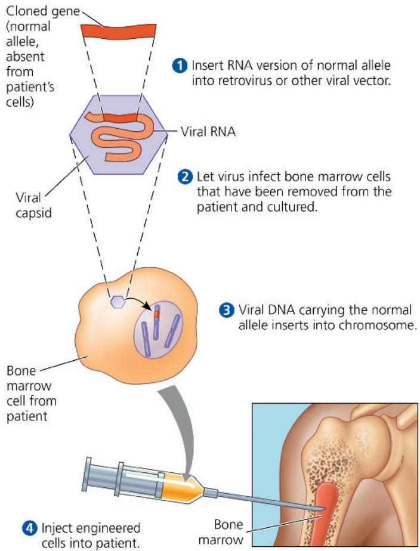

The procedure shown in Figure 20.22 was used in gene therapy trials for SCID in France in 2000, resulting in the first indisputable success of gene therapy. However, three patients subsequently developed leukemia, a type of blood cell cancer, and one of them died. Researchers have concluded it is likely that the insertion of the retroviral vector occurred near a gene that triggers the proliferation of blood cells. Using a viral vector that does not come from a retrovirus, clinical researchers have treated several other genetic diseases somewhat successfully with gene therapy, including a type of progressive blindness (see Concept 50.3), a degenerative disease of the nervous system, and a blood disorder involving the $\beta$ -globin gene.

Gene therapy raises many technical issues. For example, how can the activity of the transferred gene be controlled so that cells make appropriate amounts of the gene product at the right time and in the right place? How can we be sure that the insertion of the therapeutic gene does not harm some other necessary cell function? As more is learned about DNA control elements and gene interactions, researchers may be able to answer such questions.

A more direct approach that avoids the complications of using a viral vector in gene therapy is made possible by gene editing, especially using the CRISPR-Cas9 system (see Figure 17.28). In this approach, the existing defective gene is edited to correct the mutation.

Researchers have been using the CRISPR-Cas9 system to try to correct the genetic mutation that leads to sickle-cell disease. After studies using mouse models, CRISPR-based treatments for sickle-cell disease and another disease caused by a mutation of the $\beta$ -globin gene called beta-thalassemia were tested in human clinical trials. These disorders are good targets because they are caused by a mutation in a single gene, and they involve blood cells. The patients' blood cells are removed and genetically edited outside the body, then returned to the patient. In these clinical trials, rather than trying to correct the $\beta$ -globin mutation, the approach was to re-activate a gene for fetal hemoglobin, a different form that is normally turned off at birth but can substitute for $\beta$ -globin. A significant majority of patients showed remarkable results, having near-normal hemoglobin levels and not needing blood transfusions or experiencing pain crises. In 2024, this gene therapy treatment for these two blood-based disorders was approved for usage by the U.S. Food and Drug Administration (FDA). This is exciting, as it suggests that CRISPR technology could potentially treat or even cure human genetic diseases, such as autoimmune diseases, Parkinson's, or Alzheimer's disease, or even some types of cancer. As of 2025, more than 20 gene therapy treatments have been approved by the FDA.

There are ongoing concerns about introducing CRISPR-treated cells into humans because of the risks associated with cutting both strands of DNA and the possible effects on so-called “off-target genes,” genes that are not meant to be edited. Researchers are studying ways of minimizing these effects; for example, using different forms of Cas proteins that are more accurate. Another approach that has been successful is to use CRISPR in association with a new technique called base editing, in which specific bases in a gene are chemically modified to resemble a different base, rather than being cut and replaced. This is done in a way that alters the resulting protein so it is no longer harmful.

In addition to technical challenges, gene therapy and gene editing provoke ethical questions. Some critics believe that tampering with human genes in any way is unethical. Other observers see no fundamental difference between transplanting genes into somatic cells and transplanting organs from one person to another.

An even more pressing question is the issue of engineering human germ-line cells to try to correct a defect in future generations. Such genetic engineering is now routinely done in laboratory mice, and some methods for genetic engineering of human embryos have been developed.

The development of the CRISPR-Cas9 system has engendered much debate about the ethics of gene editing. Jennifer Doudna (Figure 20.14), a co-discoverer of CRISPR-Cas9, and other biologists have agreed to exercise extreme caution as the field moves forward. Together, they called for the research community to “strongly discourage” any experimental work on human eggs or embryos.

In spite of this general consensus among biologists, a Chinese researcher reported in 2018 that he had used the CRISPR-Cas9 system to edit genes in embryos that completed fetal development and were born as twins and a third individual. He claimed to have edited the CCR5 gene, which codes for a co-receptor for HIV (see Figure 7.8), so that HIV would be unable to bind and infect the cells. The twins' father was HIV-positive, which was the rationale the scientist used for carrying out this genetic engineering. However, this act was roundly condemned as highly unethical by the biological community; the researcher lost his job and was released in 2022 after 3 years in prison. In 2019, the World Health Organization established the Human Genome Editing Registry to monitor such research.

There are many potential technical problems with the CRISPR-Cas9 technique, like the off-target effects mentioned previously; there is strong evidence that off-target editing did occur in the three gene-edited individuals, although the consequences of these events are unknown at present. Beyond those technical concerns, however, are underlying ethical considerations: Under what circumstances, if any, should genomes of human germ lines be altered? Would alterations lead to the practice of eugenics, a deliberate effort to control the genetic makeup of human populations? It is imperative to consider these questions.

#### [EN] Pharmaceutical Products

The pharmaceutical industry derives significant benefit from advances in DNA technology and genetic research, applying them to the development of useful drugs that can prevent, treat, or manage diseases. Pharmaceutical products are synthesized using methods of either organic chemistry or biotechnology, depending on the nature of the product.

#### [EN] Cell and Tissue Culture Usage in Pharmaceutical Research

Cell and tissue culture involve growing and maintaining cells or tissues outside of their natural environment, typically in a Petri dish, flask, or larger vessel (see Figure 12.18). In this technique, the cells grow, divide, and function as they would inside a living organism, which allows researchers to investigate cellular interactions and responses. This fundamental approach offers insights for understanding diseases, discovering new drugs, and advancing therapies.

Recently, scientists have used innovative cell culture techniques to develop organoids, which are 3-dimensional, miniature versions of organs derived from stem cells (Figure 20.23). Organoids mimic the structure and function of human organs, making them useful for disease modeling, drug testing, personalized treatment, and in the future, even transplantation.

#### [EN] Organic Synthesis of Small-Molecule Drugs

Small-molecule drugs, developed by organic synthesis, are a key tool of modern medicine because their small size allows them to enter cells and interact with proteins to alter biological processes. For example, aspirin is a common small-molecule

#### [EN] Figure 20.23 Intestinal organoid.

This organoid was derived from adult intestinal stem cells that are grown into colonies, then treated with factors that cause differentiation into structures called intestinal crypts (the two tubes extending outward from the central cavity). Crypts contain both stem cells and support cells. The cells have been fluorescently stained for actin (green, which stains the apical part of the cell, by the lumen), nuclei (blue), and a support cell protein (red).

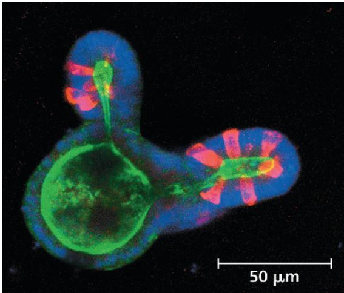

drug that inhibits an enzyme called cyclooxygenase to reduce pain, lower fever, and even improve blood flow during a heart attack.

Determining the sequence and structure of proteins crucial for tumor cell survival has led to the identification of small molecules that combat certain cancers by blocking the function of these proteins. One drug, imatinib (trade name Gleevec), is a small molecule that inhibits one tyrosine kinase (see Figure 11.8). The overexpression of this kinase, resulting from a chromosomal translocation, is instrumental in causing chronic myelogenous leukemia (CML; see Figure 15.16). Patients in the early stages of CML who are treated with imatinib have exhibited nearly complete, sustained remission from the cancer. Drugs that work in a similar way have also been used with success to treat a few types of lung and breast cancers. This approach is feasible only for cancers whose molecular basis is fairly well understood.

#### [EN] Biologic Drugs Developed through Biotechnology

Biologic drugs (biologics) are a class of drugs derived from living organisms, including from cells. Unlike traditional small-molecule drugs, they are larger in size, more complex, and can target specific components in the body. Biologics work by interacting with specific molecules in the body, such as proteins, to alter cellular function or environment. Examples of biologics include recombinant proteins, vaccines, and monoclonal antibodies. As you'll learn in Concept 43.3, monoclonal antibodies are a group of antibodies that all recognize exactly the same region of a particular molecule. Monoclonal antibodies can block protein interactions, mark cells for destruction, and neutralize pathogens. Their use

as a cancer treatment has revolutionized cancer medicine because of their high specificity and prolonged therapeutic effects.

You learned earlier in the chapter about DNA cloning and gene expression systems for producing large quantities of a chosen protein that is present naturally in only minute amounts. The host cells used in such expression systems can even be genetically engineered to secrete a protein as it is made, thereby simplifying the task of purifying it by traditional biochemical methods.

Among the first biologics manufactured in this way were human insulin and human growth hormone (HGH). Some 2 million people with diabetes in the United States depend on insulin treatment to control their disease. Human growth hormone has been a boon to children born with a form of dwarfism caused by inadequate amounts of HGH, as well as helping patients with AIDS gain weight. Another important biologic produced by genetic engineering is tissue plasminogen activator (TPA). If administered shortly after a heart attack, TPA helps dissolve blood clots and reduces the risk of subsequent heart attacks.

In some cases, instead of using cell systems to produce large quantities of protein products, pharmaceutical scientists can use whole organisms. To do this, they use a transgene, a gene that has been transferred into one organism from another. They first remove eggs from a female of the recipient species and fertilize them in vitro. Meanwhile, they clone the desired gene from a donor organism. They then inject the cloned DNA directly into the nuclei of the fertilized eggs. Some of the cells integrate the foreign DNA, the transgene, into their genome and are able to express the foreign gene. The engineered embryos that arise from these zygotes are then surgically implanted in a surrogate female. If an embryo develops successfully, the result is a transgenic organism that expresses its new, “foreign” gene.

Assuming that the introduced gene encodes a protein desired in large quantities, transgenic animals can act as pharmaceutical “factories.” For example, a transgene for a human blood protein such as antithrombin, which prevents blood clots, can be inserted into the genome of a goat in such a way that the transgene’s product is secreted in the animal’s milk. The protein is then purified from the milk (which is easier than purification from a cell culture). Such proteins must be tested to ensure that they (or contaminants from the farm animals) will not cause allergic reactions or other adverse effects in patients who receive them.

#### [EN] Biomaterials for Drug Delivery and Treatment

When treating patients with small molecule or biologic drugs, there are challenges such as rapid drug clearance from the body, poor drug absorption, or other difficulties. Biomaterials are naturally or synthetically derived materials that have a wide range of applications from developing prosthetic limbs to promoting wound healing. In drug delivery, biomaterials can serve as carriers to transport drugs to their intended destinations. They can control the release of drugs over time, target specific areas of the body, and protect sensitive medication (such as biologics) from being broken down before reaching the specific cells and tissue. For example, the COVID-19 vaccine contains mRNA, which is highly unstable and requires a protective carrier. To address this, researchers developed small structures made of lipids—lipid nanoparticles—as delivery vehicles, which encase the mRNA and ensure that it reaches the target cells intact.

#### [EN] Interview

Interview with Kristi Anseth: Designing biological molecules that can help wounds heal wounds and repair damaged cartilage (at the start of Unit 1, before Chapter 2)


#### [EN] Forensic Evidence and Genetic Profiles

In violent crimes, body fluids or small pieces of tissue may be left at the scene or on the clothes or other possessions of the victim or assailant. If enough blood, semen, or tissue is available, forensic laboratories can determine the blood type or tissue type by using antibodies to detect specific cell-surface proteins. However, such tests require fairly fresh samples in relatively large amounts. Also, because many people have the same blood or tissue type, this approach can only exclude a suspect; it cannot provide strong evidence of guilt.

DNA testing, on the other hand, can identify the guilty individual with a high degree of certainty because the DNA sequence of every person is unique (except for identical twins). Genetic markers that vary in the population can be analyzed for a given person to determine that individual's unique set of genetic markers, or genetic profile. (This term is preferred over "DNA fingerprint" by forensic scientists, who want to emphasize the heritable aspect of these markers rather than the fact that they produce a pattern on a gel that, like a fingerprint, is visually recognizable.) The FBI started applying DNA technology to forensics in 1988, using a method involving gel electrophoresis and nucleic acid hybridization to detect similarities and differences in DNA samples. This method required much smaller samples of blood or tissue than earlier methods—only about 1,000 cells.

Today, forensic scientists use an even more sensitive method that takes advantage of variations in length of genetic markers called short tandem repeats (STRs). These are tandemly repeated units of two- to five-nucleotide sequences in specific regions of the genome. The number of repeats present in these regions is highly variable from person to person (polymorphic); even for a single individual, the two alleles of an STR may differ from each other. For example, one individual may have the sequence ACAT repeated 30 times at one genome locus and 15 times at the same locus on the other homolog, whereas another individual may have 18 repeats at this locus on each homolog. (These two genotypes can be expressed by the two repeat numbers: 30,15 and 18,18.) PCR is used to amplify particular STRs, using sets of primers that are labeled with colored fluorescent tags; the length of the region, and thus the number of repeats, can then be determined by electrophoresis. The PCR step allows use of this method even when the DNA is in poor condition or available only in tiny quantities: A tissue sample containing as few as 20 cells can be sufficient.

In a murder case, for example, this method can be used to compare DNA samples from the suspect, the victim, and a small amount of blood found at the crime scene. The forensic scientist tests only a few selected portions of the DNA—usually 13 STR markers. However, even this small set of markers can provide a forensically useful genetic profile because the probability that two people (who are not identical twins) would have exactly the same set of STR markers is vanishingly small. The Innocence Project, a nonprofit organization dedicated to overturning wrongful convictions, uses STR analysis of archived samples from crime scenes to revisit old cases. Hundreds of innocent people have been released from prison in the United States as a result of DNA-based forensic and legal work done by this and related groups (Figure 20.24).

Genetic profiles can also be useful for other purposes. A comparison of the DNA of a mother, her child, and the purported father can conclusively settle a question of paternity. Sometimes paternity is of historical interest: Genetic profiles provided strong evidence that Thomas Jefferson or one of his close male

Figure 20.24 STR analysis used to release an innocent man from prison.

(a) In 1984, Earl Washington was convicted and sentenced to death for the 1982 rape and murder of Rebecca Williams. His sentence was commuted to life in prison in 1993 due to new doubts about the evidence. In 2000, STR analysis by forensic scientists associated with the Innocence Project showed conclusively that he was innocent. This photo shows Washington just before his release in 2001, after 17 years in prison.


<table><tr><td>Source of sample</td><td>STR marker 1</td><td>STR marker 2</td><td>STR marker 3</td></tr><tr><td>Semen on victim</td><td>17,19</td><td>13,16</td><td>12,12</td></tr><tr><td>Earl Washington</td><td>16,18</td><td>14,15</td><td>11,12</td></tr><tr><td>Kenneth Tinsley</td><td>17,19</td><td>13,16</td><td>12,12</td></tr></table>

(b) In STR analysis, selected STR markers in a DNA sample are amplified by PCR, and the PCR products are separated by electrophoresis. The procedure reveals how many repeats are present for each STR locus in the sample. An individual has two alleles per STR locus, each with a certain number of repeats. This table shows the number of repeats for three STR markers in three samples: from semen found on the victim, from Washington, and from another man (Kenneth Tinsley), who was in prison because of an unrelated conviction. These and other STR data (not shown) exonerated Washington and led Tinsley to plead guilty to the murder.

relatives was the male parent of at least one of the children of Sally Hemings, one of the people Jefferson enslaved. Genetic profiles can also identify victims of mass casualties. The largest such effort occurred after the attack on the World Trade Center in 2001; more than 10,000 samples of victims' remains were compared with DNA samples from personal items, such as toothbrushes, provided by families. Ultimately, forensic scientists succeeded in identifying almost 3,000 victims using these methods.

Just how reliable is a genetic profile? The greater the number of markers examined in a DNA sample, the more likely it is that the profile is unique to one individual. In forensic cases using STR analysis with 13 markers, the probability of two people having identical DNA profiles is somewhere between one in 10 billion and one in several trillion. (For comparison, the world's population is roughly 8 billion.) The exact probability depends on the frequency of those markers in the general population. Information on how common various markers are in different ethnic groups is critical because these marker frequencies may vary considerably among ethnic groups and between a particular ethnic group and the population as a whole. With the increasing availability of frequency data, forensic scientists can make extremely accurate statistical calculations. Thus, despite problems that can arise from insufficient data, human error, or flawed evidence, genetic profiles are now accepted as compelling evidence by legal experts and scientists alike.

#### [EN] Environmental Cleanup

Increasingly, the diverse abilities of certain microorganisms to transform chemicals are being exploited for environmental cleanup. This process is called bioremediation—the use of organisms to detoxify and restore polluted and degraded ecosystems. If the growth needs of such microorganisms make them unsuitable for direct use, scientists can now transfer the genes for their valuable metabolic capabilities into other microorganisms; these transgenic microorganisms can then be used to treat environmental problems. For example, many bacteria can extract heavy metals, such as copper, lead, and nickel, from their environments and incorporate the metals into compounds such as copper sulfate or lead sulfate, which are readily recoverable. Genetically engineered microorganisms may become important in both mining (especially as ore reserves are depleted) and cleaning up highly toxic mining wastes. Biotechnologists have also identified microorganisms that can degrade chlorinated hydrocarbons and other harmful compounds, in many cases enhancing their capability through genetic engineering. These microorganisms are currently used in wastewater treatment plants and by manufacturers before the compounds are ever released into the environment.

#### [EN] Agricultural Applications

Scientists are working to learn more about the genomes of agriculturally important plants and animals. For a number of years, they have been using DNA technology in an effort to improve agricultural productivity. The selective breeding of both livestock (animal husbandry) and crops has exploited naturally occurring mutations and genetic recombination for thousands of years.

As we described earlier, DNA technology enables scientists to produce transgenic animals, which speeds up the selective breeding process. The goals of creating a transgenic animal are often the same as the goals of traditional breeding—for instance, to make a sheep with better quality wool, a pig with leaner meat, or a cow that will mature in a shorter time. Scientists might, for example, identify and clone a gene that causes the development of larger muscles (muscles make up most of the meat we eat) in one breed of cattle and transfer it to other cattle or even to sheep. However, health problems are not uncommon among farm animals carrying genes from other species, and modification of the animal's own genes using the CRISPR-Cas9 system is increasingly used as a more useful technique. Animal health and welfare are important issues to consider when genetically altering animals.

Agricultural scientists have already endowed a number of crop plants with genes for desirable traits, such as delayed ripening and resistance to spoilage, disease, and drought. Modifications can also add value to food crops, giving them a longer shelf life or improved flavor or nutritional value. Examples are golden rice and golden bananas, which have been genetically engineered to have higher levels of a precursor to vitamin A. For many plant species, a single tissue cell grown in culture can give rise to an adult plant. Thus, genetic manipulations can be performed on an ordinary somatic cell and the cell then can be used to generate a plant with new traits.

Genetic engineering is rapidly replacing traditional plant-breeding programs, especially for useful traits, such as herbicide or pest resistance, determined by one or a few genes. Crops engineered with a bacterial gene making the plants resistant to an herbicide can grow while weeds are destroyed, and genetically engineered crops that can resist destructive insects reduce the need for chemical insecticides.

The Food and Agriculture Organization of the United Nations has predicted that we will need 70% more food by the year 2050 than the planet is currently producing. One novel approach is being taken by researchers working on the international $C_{4}$ Rice Project. The common form of rice, a global food staple, uses the $C_{3}$ form of photosynthesis (see Concept 10.5). The aim of researchers engaged in this project is to genetically engineer a strain of rice that can use $C_{4}$ photosynthesis, which is more efficient. This research has run into some hurdles, but a gene was identified in 2022 that, when knocked out, increases production in both rice and corn plants by 8–10%. (The gene is a member of the WD40 family; see Figure 21.3.)

#### [EN] Safety and Ethical Questions Raised by DNA Technology

Early concerns about potential dangers associated with recombinant DNA technology and genetic engineering focused on the possibility that hazardous new pathogens might be created. What might happen, for instance, if in a research study, cancer cell genes were transferred into bacteria or viruses? To guard against such rogue microorganisms, scientists developed a set of guidelines that were adopted as formal government regulations in the United States and some other countries. One safety measure is a set of strict laboratory procedures designed to prevent engineered microorganisms from either infecting researchers or accidentally leaving the laboratory. In addition, strains of microorganisms to be used in recombinant DNA experiments are genetically crippled to ensure that they cannot survive outside the laboratory. Finally, certain obviously dangerous experiments have been banned.

Today, most public concern about possible hazards centers not on recombinant microorganisms but on genetically modified organisms (GMOs) used as food. A GMO is a transgenic organism that has acquired one or more genes from another species or from another variety of the same species. Some salmon, for example, have been genetically modified by addition of a more active salmon growth hormone gene. However, the majority of the GMOs that contribute to our food supply are not animals, but crop plants.

GM crops are widespread in the United States, Argentina, and Brazil; together, these countries account for over 80% of the world's acreage devoted to such crops. In the United States, most corn, soybean, and canola crops are genetically modified, and a recent law requires labeling of GM products, although as of 2022, the term “GMO” has been replaced by “bioengineered.” The same foods are an ongoing subject of controversy in Europe, where the GM revolution has been met with strong opposition. Many Europeans are concerned about the safety of GM foods and the possible environmental consequences of growing GM plants. Although a small number of GM crops have been grown on European soil, the European Union established a comprehensive legal framework regarding GMOs in 2015. Among other regulations, individual member states may ban either the growing or importing of GM crops, which must be clearly labeled. As of 2022, 19 of the 27 European Union member states have fully or partially banned GMOs. However, pressure is increasing to reconsider this stance, based on evidence that improving crop yields could significantly reduce carbon emissions and thus decrease climate change. In the end, though, the high degree of consumer distrust in Europe makes the future of GM crops there uncertain.

Advocates of a cautious approach toward GM crops fear that transgenic plants might pass their new genes to close relatives in nearby wild areas. We know that lawn and crop grasses, for example, commonly exchange genes with wild relatives via pollen transfer. If crop plants carrying genes for resistance to herbicides, diseases, or insect pests pollinated wild ones, the offspring might become “super weeds” that are very difficult to control. Another worry involves possible risks to human health from GM foods. Some people fear that the protein products of transgenes might lead to allergic reactions. Although there is some evidence that this could happen, advocates claim that these proteins could be tested in advance to avoid producing ones that cause allergic reactions. (For further discussion of plant biotechnology and GM crops, see Concept 38.3.)

Today, governments and regulatory agencies throughout the world are grappling with how to facilitate the use of

biotechnology in agriculture, industry, and medicine while ensuring that new products and procedures are safe. In the United States, such applications of biotechnology must be evaluated for potential risks by various regulatory agencies, including the Food and Drug Administration, the Environmental Protection Agency, the National Institutes of Health, and the Department of Agriculture. Meanwhile, these same agencies and the public must consider the ethical implications of biotechnology.

Advances in biotechnology have allowed us to obtain complete genome sequences for humans and many other species, providing a vast treasure trove of information about genes. We can ask how certain genes differ from species to species, as well as how genes and, ultimately, entire genomes have evolved. (These are the subjects of Chapter 21.) At the same time, the increasing speed and falling cost of sequencing the genomes of individuals are raising significant ethical questions. Who should have the right to examine someone else's genetic information? How should that information be used? Should a person's genome be a factor in determining eligibility for a job or insurance? Ethical considerations, as well as concerns about potential environmental and health hazards, will likely slow some applications of biotechnology. There is always a danger that too much regulation will stifle basic research and its potential benefits. On the other hand, genetic engineering—especially gene editing with the CRISPR-Cas9 system—enables us to profoundly and rapidly alter species that have been evolving for millennia. A good example is the potential use of a gene drive that would eliminate the ability of mosquito species to carry diseases or even eradicate certain mosquito species. There would probably be health benefits to this approach, at least initially, but unforeseen problems could easily arise. Given the tremendous power of DNA technology, we must proceed with humility and caution.

#### [EN] Interview

Interview with David Suzuki: Exploring ethical issues related to DNA technology (eTextbook only)


#### [EN] Concept Check 20.4

1. What is the advantage of using stem cells for gene therapy or gene editing?

2. List at least three different properties that have been acquired by crop plants via genetic engineering.

3. WHAT IF? As a physician, you have a patient with symptoms that suggest a hepatitis A infection, but you have not been able to detect viral proteins in the blood. Knowing that hepatitis A is an RNA virus, what lab tests could you perform to support your diagnosis? Explain the results that would support your hypothesis.

For suggested answers, see Appendix A.

by PCR or from another source


<!-- C-END Campbell 20.4 -->

## 9.7 肿瘤的免疫治疗

手术、放疗和化疗是目前治疗肿瘤的主要手段和传统方法，但大部分情况下患者都不能获得理想的疗效。随着免疫细胞及炎症因子在肿瘤微环境中的发现，以及正常机体免疫系统监视和杀伤癌细胞的作用逐渐被揭示，肿瘤免疫细胞疗法成为一种杀伤肿瘤细胞的新疗法，被称为现代肿瘤治疗的第四种模式。

肿瘤的免疫治疗通过激活机体的免疫系统，增强抗肿瘤免疫效应，从而特异性清除肿瘤微小残留病灶或者明显抑制肿瘤增殖。继发现 $\mathrm{CD8}^{+}\mathrm{T}$ 细胞可以特异性地杀伤表达肿瘤抗原的肿瘤细胞后，树突状细胞(dendritic cells, DC)和自然杀伤细胞(natural killer cell, NK)先后被发现在肿瘤免疫中发挥作用。2015年底，程序性死亡蛋白1(programmed death protein 1, PD-1)抗体的免疫治疗配合手术和放疗成功控制了美国前总统卡特的黑色素瘤。近年来，免疫疗法在癌症治疗中展现出了巨大的潜力并取得了很大的进展。

按照免疫的作用机制,免疫治疗可以分为主动免疫治疗、被动免疫治疗和非特异性免疫调节剂治疗。

## 9.7.1 主动免疫治疗

主动免疫治疗主要指接种肿瘤疫苗，利用肿瘤细胞或者肿瘤相关蛋白或多肽等抗原物质免疫机体，激活患者自身的免疫系统，诱导宿主产生针对肿瘤抗原的免疫应答，从而阻止肿瘤生长、转移和复发。肿瘤疫苗包括肿瘤细胞疫苗、肿瘤多肽（蛋白）疫苗、树突状细胞疫苗（DC疫苗）、抗独特型抗体疫苗和DNA疫苗等，对患者进行免疫接种，激发患者机体产生对肿瘤的特异性免疫应答(图9-32)。主动免疫治疗可使患者产生免疫记忆，因此抗肿瘤作用比较持久。

## 1. 肿瘤细胞疫苗

肿瘤细胞疫苗是采用灭活的患者自体或异体肿瘤细胞，引发特异性抗肿瘤免疫反应的一种治疗性疫苗。其中自体肿瘤细胞疫苗含有患者自身特异的肿瘤抗原和抗原递呈细胞表面 HLA 分子，比异体肿瘤细胞疫苗更安全。但存在制备过程复杂、肿瘤组织获取较困难、机体免疫耐受以及肿瘤抗原被稀释等问题。因异体肿瘤细胞与患者自体肿瘤细胞

图 9-32 肿瘤疫苗的分类及作用方式示意图


存在交叉抗原,可部分替代自体肿瘤疫苗,解决自体肿瘤细胞来源有限的问题。但大部分异体肿瘤细胞疫苗与患者肿瘤的组织学类型及相关抗原不符,临床应用局限性较大,效果不很理想。肿瘤细胞疫苗根据形式又可分为肿瘤全细胞疫苗、肿瘤细胞裂解物疫苗以及基因修饰的肿瘤细胞疫苗。

肿瘤全细胞疫苗通过射线照射灭活肿瘤组织细胞，抑制其增殖力而保留其免疫活性，并通常加入卡介苗、弗氏完全佐剂等免疫佐剂以增强其免疫活性。该类疫苗富含肿瘤抗原，自体肿瘤细胞疫苗具有全部肿瘤细胞的抗原，必须完全灭活才能临床使用。OncoVAX是经放射处理的患者肿瘤细胞与卡介苗混合而成，目前主要用于结肠癌术后的患者。Ⅲ期临床试验数据显示，OncoVAX显著降低44%Ⅱ期和Ⅲ期结肠癌患者的复发率。仅Ⅱ期结肠癌患者而言，OncoVAX能降低61%的复发率。

肿瘤细胞裂解物疫苗是用肿瘤细胞的裂解物或外泌小体等亚细胞结构作为疫苗,这样既保留肿瘤抗原免疫活性,又保证疫苗的安全性,是肿瘤疫苗治疗常采用的方式。

基因修饰的肿瘤细胞疫苗是指通过基因重组技术将不同的目的基因如细胞因子、辅助刺激分子、MHC I 类抗原分子等导入肿瘤细胞而制备的疫苗。前列腺癌疫苗 GVAX 是由经遗传修饰分泌免疫刺激性细胞因子粒细胞－巨噬细胞集落刺激因子（GM-CSF）的肿瘤细胞组成的癌症疫苗。目前对于 GVAX 治疗胰腺癌的研究处于Ⅱ期临床试验，同时开展的还有 GVAX 与 PD-1 抑制剂组合的试验。

## 2. 肿瘤多肽(蛋白质)疫苗

肿瘤抗原的提呈必须先经过抗原递呈细胞(APC)降解为短肽,然后与MHC分子结合,形成“抗原肽-MHC-TCR”复合物,提呈到细胞表面才能被T细胞识别并激发细胞毒性T淋巴细胞(CTL)反应。因此,肿瘤多肽疫苗是通过人工合成肿瘤抗原肽段,单独或者与佐剂一起输注入患者体内,通过这些肿瘤抗原肽段来激发机体特异性抗肿瘤免疫反应。肿瘤多肽疫苗成分较单一,便于研究和产业化,不存在肿瘤细胞的抑制成分,无肿瘤种植的风险;但因为其相对分子质量小、容易降解,导致其免疫原性弱,易诱发特异性免疫耐受且应用受MHC类型限制。肿瘤蛋白疫苗是指将肿瘤抗原整个或部分蛋白质作为疫苗,进入机体后经APC摄取递呈,激发抗肿瘤免疫应答。与多肽疫苗相比肿瘤蛋白疫苗的免疫原性更强,通常需要添加佐剂,激发的免疫反应以体液免疫为主。目前尚缺成功的例子。

## 3. 树突状细胞疫苗 (DC 疫苗)

树突状细胞是最主要的 APC, 也是唯一能激活初始 T 细胞的专职 APC 并激活 CTL 反应。DC 疫苗首先分离患者体内树突状细胞的前体细胞, 体外培养并使之负载肿瘤抗原肽段, 然后回输到患者体内, 通过树突状细胞激发特异性抗肿瘤 T 细胞反应。又分为肿瘤抗原致敏的 DC 疫苗和基因修饰的 DC 疫苗。肿瘤抗原致敏的 DC 疫苗是通过不同形式的肿瘤抗原致敏树突状细胞, 然后将致敏的树突状细胞接种或回输给患者, 诱导机体产生特异性的 CTL 和记忆性 T 细胞。Sipuleucel-T 就是一个 DC 疫苗, 从患者的外周血单核细胞中提取树突状细胞, 负载前列腺癌特异的抗原后回输至患者体内发挥作用。此类个性化定制的疫苗制作过程复杂, 费用高且持久性一般较差。

基因修饰的 DC 疫苗是将编码肿瘤抗原的基因导入树突状细胞,在其中表达肿瘤抗原,经树突状细胞递呈后活化初始 T 细胞。编码肿瘤抗原的基因通常以质粒或病毒为载体以 DNA 或 RNA 的形式转入树突状细胞。

## 4. 抗独特型抗体疫苗

抗原可刺激机体产生抗体 Ab1, 该抗体可变区的独特型决定簇具有免疫原性, 可诱导产生抗体 Ab2, 后者被称为独特型抗体。将可以模拟原来抗原结构的具有内影像抗原性的 Ab2 作为肿瘤疫苗应用, 可以诱导产生抗独特型抗体, 具有模拟抗原和免疫调节的双重作用, 即为抗独特型抗体疫苗。抗独特型抗体疫苗主要用于不易获得的肿瘤抗原, 该疫苗可打破机体对肿瘤抗原免疫耐受的状态, 特异性强而且不含有肿瘤细胞, 使用起来相对更安全可靠。独特型抗体多为鼠源, 反复应用容易引起人抗鼠抗体反应, 而人源化独特型抗体可避免这一缺陷。

非霍奇金淋巴瘤疫苗 BiovaxID (ID-KLH/GM-CSF) 是自体肿瘤来源的免疫球蛋白独特型抗体疫苗。是通过活检采集患者肿瘤样品，获得肿瘤细胞特异性抗原 ID，然后将 ID 偶联到载体蛋白钥孔血蓝蛋白 (KLH)，最后注入患者体内刺激 T 细胞应答。

## 5. DNA 疫苗

DNA 疫苗也被称为基因疫苗, 是通过基因工程技术将编码肿瘤抗原的基因与表达载体整合之后,将疫苗直接注入机体,借助机体内的基因表达系统表达肿瘤抗原,从而诱导出针对肿瘤抗原的细胞免疫应答。基因疫苗所用表达载体通常为重组病毒或质粒 DNA,具有便于生产、使用安全、表达时间长、易于诱发肿瘤免疫应答等优点,缺点是肿瘤抗原的表达差异大且细胞中长期低水平表达肿瘤抗原会产生免疫耐受。

## 6. 溶瘤病毒疫苗

溶瘤病毒疫苗是将基因工程改造的溶瘤病毒注射入肿瘤内，由于溶瘤病毒优先感染肿瘤细胞，病毒复制导致肿瘤细胞溶解，释放增强免疫反应的细胞因子，刺激宿主抗肿瘤免疫反应，从而杀伤肿瘤。2015年，用于治疗晚期黑色素瘤的肿瘤疫苗T-Vec成为世界首个溶瘤病毒疫苗。

目前虽然有不少肿瘤疫苗进入了临床试验,但体内抗肿瘤效果和治疗效果都不尽如人意。半个世纪多以来,研究人员一直梦想着为癌症患者注射一种疫苗,帮助他们的免疫系统识别、抵御并最终清除肿瘤。随着研究的深入,至少目前还不能指望仅仅使用该疗法就能治愈晚期肿瘤。发展个体化肿瘤疫苗已成为一个新的发展方向,而如何将主动免疫治疗与其他治疗方法有机结合起来,充分发挥综合治疗的优势,成为另一个重要研究方向。

## 9.7.2 被动免疫治疗

被动免疫治疗又称为过继免疫治疗(adoptive immunotherapy)，是被动地将具有抗肿瘤活性的免疫制剂或者细胞过继回输到肿瘤患者机体进行治疗，以达到治疗肿瘤的目的。被动免疫治疗与肿瘤疫苗不同，并不需要机体产生初始免疫应答，不依赖于宿主的免疫功能状态，因此适用与肿瘤晚期患者，按治疗采用的载体分为单克隆抗体治疗和过继性细胞治疗两类。

## 1. 单克隆抗体治疗

恶性肿瘤细胞表面表达的特异性抗原可以作为单克隆抗体的靶点应用于肿瘤治疗，因为针对这些靶位点的抗体可以引起细胞凋亡，并通过补体介导的细胞毒性（complement-mediated cytotoxicity, CMC）以及抗体依赖细胞介导的细胞毒性（antibody-dependent cellular cytotoxicity, ADCC）杀死靶细胞，也可以通过自然杀伤细胞（NK细胞）和阻断信号转导通路起到抗肿瘤的作用(图9-33)。

单克隆抗体还可以携带抗肿瘤物质进行导向治疗。放射免疫偶联物、具有细胞毒性的小分子以及免疫系统里的细胞因子都可以通过单抗运输向肿瘤细胞。放射性元素已被用于标记抗体进行肿瘤的诊断和治疗。淋巴瘤是较为适合放射性疗法的癌症，已有药物上市。抗体－药物偶联物(antibody-drug conjugates)是最近研发的极具前景的抗癌药物，它将带有细胞毒性的药物和特异性抗体偶联，在提高了特异性的同时可以更好地杀死肿瘤细胞。此外免疫细胞因子如IL-2和GM-CSF也被结合在抗体上，用于靶向肿瘤细胞，改变肿瘤微环境。

## 2. 过继性细胞治疗

过继性细胞治疗又称为过继性细胞免疫疗法(adoptive cellular immunotherapy, ACT),

图9-33 抗体依赖性细胞介导的细胞毒性示意图

当自然杀伤(NK)细胞上的Fc受体与结合癌细胞的抗体的Fc区相互作用时,NK细胞释放穿孔素和粒酶,导致癌细胞凋亡。


是将抗原特异性识别的细胞经体外培养扩增和功能鉴定后输回患者体内，从而直接杀伤或激发机体的免疫应答杀伤肿瘤细胞(图9-34)。过继细胞免疫治疗主要包括非特异性免疫治疗和特异性免疫治疗。

## (1) 非特异性免疫治疗。

主要包括淋巴因子激活的杀伤细胞(lymphokine activated killer, LAK)疗法和细胞因子诱导的杀伤细胞(cytokine induced killer, CIK)疗法。

图9-34 过继性细胞治疗示意图  


LAK 疗法是利用白细胞介素 2(IL-2) 刺激活化外周血淋巴单核细胞, 诱导具有非特异性细胞毒作用的效应细胞, 这些细胞主要是由很多种淋巴细胞组成的混合体, 包括 NK 细胞和 T 淋巴细胞, 在体外对肿瘤作用不依赖于抗原致敏。LAK 细胞杀伤靶细胞的机制与 NK 细胞类似, 可以通过细胞与细胞接触识别靶细胞表面结构, 也可以通过分泌细胞因子参与杀伤肿瘤细胞。它对恶性黑色素瘤、肾细胞癌、非霍奇金淋巴瘤、鼻咽癌疗效较好, 对控制微小残留灶及恶性胸腹水治疗效果比较显著。

CIK 细胞由是外周血单个核细胞经抗 CD3 单克隆抗体, 以及 IL-2、IFN-γ 和 IL-1α 等细胞因子体外诱导分化获得的 NK 样 T 细胞。CIK 细胞来源于患者或健康人的外周血, 培养扩增较容易, 目前已经进行了大量临床实验治疗多种肿瘤, 已经发现 CIK 在肾癌、肝癌、肺癌和白血病等多种肿瘤中具有抗瘤活性。与 LAK 细胞相比, CIK 细胞具有增殖速度快, 杀瘤活性高, 肿瘤杀伤谱广等优点, 且对多重耐药肿瘤细胞同样敏感, 对正常骨髓造血前体细胞毒性小, 能抵抗肿瘤细胞引发的效应细胞 Fas/FasL 凋亡, 广泛用于肿瘤的辅助治疗。

## (2) 特异性免疫治疗

特异性嵌合抗原受体免疫治疗(chimeric antigen receptor T-cell immunotherapy, CAR-T)是通过基因修饰获得携带识别肿瘤抗原特异性受体T细胞的个性化治疗方法。提取患者外周血T细胞，通过基因重组赋予T细胞特异性识别肿瘤抗原的能力，再将改造后的T细胞经体外扩增后回输到患者体内从而特异性杀伤肿瘤细胞。与传统的T细胞识别抗原相比，CAR通过增加共刺激分子信号增强了T细胞对肿瘤的杀伤性，因此CAR-T细胞可以克服MHC分子表达下调和共刺激分子减少等肿瘤细胞免疫逃逸机制。另外，CAR可以针对任何类型的表面抗原，包括糖和糖脂类，提高了识别范围。该免疫疗法在白血病和淋巴瘤患者的早期临床试验中取得了显著疗效。

一个完整的 CAR 分子通常包括胞外抗原结合区(来自单链抗体可变区基因片段, scFv)、铰链区、跨膜区和胞内受体信号转导区(包括 CD3-ζ 链、Fc ε、R I γ 和协同刺激因子)4 个区域。CAR-T 细胞技术现已发展到第三代 $^{(图9-35)}$ 。第一代 CAR 只有 1 个 T 细胞 CD3 ζ 受体信号区, 第二代则增加了 1 个共刺激分子信号, 第三代增加到 2 个共刺激分子信号。目前用于临床治疗研究的主要为第二代 CAR-T 细胞技术, 携带 CAR 的载体主要来源于反转录病毒和慢病毒。

已有抗 CD19 的 CAR-T 细胞治疗儿童和成人 B 细胞恶性肿瘤（包括慢性、急性淋巴细胞性白血病和 B 细胞淋巴瘤）的早期临床试验。即使经多次化疗并且已经产生癌症复发或耐药性的病人，CAR-T 细胞治疗反应的有效率仍能达到 60%\~80%。也有靶向 CD22 抗原的 CAR-T 细胞方案，可与 CD19 靶向 T 细胞合用于急性淋巴细胞白血病和 B 细胞恶性肿瘤。CAR-T 的主要副作用是引发细胞因子释放综合征，导致患者发高烧或血压急剧下降，可能需要采取额外的处理措施。

过继免疫细胞疗法虽然具有高度的肿瘤抗原特异性,这类疗法也面临一系列挑战,如肿瘤细胞特异性抗原数量极少,输入体内的T细胞存活期短,活化的T细胞很难进入肿瘤组织或免疫抑制性的肿瘤微环境。结合精准医学，筛选生物标志物，筛选对过继细胞治疗有明确靶向作用的肿瘤患者，可能是肿瘤免疫细胞治疗的核心问题。

图9-35 CAR的结构演变示意图  
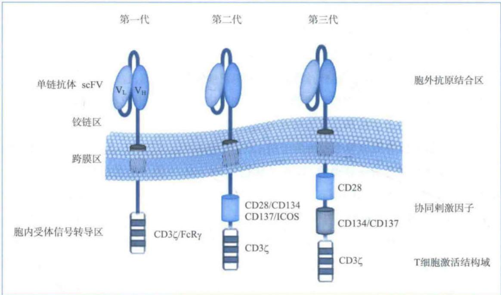

## 9.7.3 非特异性免疫调节剂治疗

非特异性免疫调节剂治疗主要包括效应细胞刺激剂和免疫负调控抑制剂。效应细胞刺激剂的主要作用是刺激活化免疫效应细胞。α干扰素是第一个被证实具有抗肿瘤活性的细胞因子，具有免疫调节、抗增殖、诱导分化、抗血管生成等多种作用。IL-2、卡介苗、咪喹莫特等都具有激活免疫应答的作用。免疫负调控抑制剂主要作用是抑制免疫负调控细胞或分子，抑制免疫检查点，打破免疫耐受，增强T细胞活性，提高免疫应答。免疫检查点是指免疫系统中存在的一些抑制性信号通路。

正常情况下,免疫检查点的调节功能可使机体免受自身免疫的攻击和炎症反应的损害。细胞癌变后,肿瘤细胞能抑制免疫检查点的功能,下调人体免疫系统反应能力,从而逃脱机体的免疫监视与杀伤,保证肿瘤细胞生长。主要抑制因子有:PD-1及PD-1的配体(programmed death ligand, PD-L)、细胞溶解性T淋巴细胞相关抗原4(CTLA-4)、B/T淋巴细胞衰减子(B and T lymphocyte attenuator, BTLA)、淋巴细胞活化基因3(lymphocyte-activation gene 3, LAG-3)和T细胞膜蛋白3(T-cell membrane protein 3, TIM-3)、腺苷A2a受体(A2aR)等。

PD-1 是免疫球蛋白超家族细胞表面受体, 主要在激活的 T 细胞和 B 细胞中表达。通过促进淋巴结中抗原特异性 T 细胞凋亡和抑制 T 细胞炎症活性的双重机制来下调免疫系统和促进自身耐受。过度的 T/B 细胞激活会引起自身免疫病, 所以 PD-1 抑制免疫系统是一种自稳机制, 可以预防自身免疫性疾病。但是, 肿瘤微环境会诱导浸润的 T 细胞高表达 PD-1 分子, 同时肿瘤细胞会高表达 PD-1 的配体 PD-L1 和 PD-L2, 导致肿瘤微环境中 PD-1 通路持续激活,抑制 T 细胞的增殖和活化,使 T 细胞处于失活状态,无法杀伤肿瘤细胞,最终导致免疫逃逸。PD-1 和 PD-L1 的抑制剂均可以阻断二者的结合,部分恢复 T 细胞功能,促进 T 细胞生长和增殖,增强 T 细胞对肿瘤细胞的识别,调动人体自身的免疫功能实现抗肿瘤功能(图 9-36)。

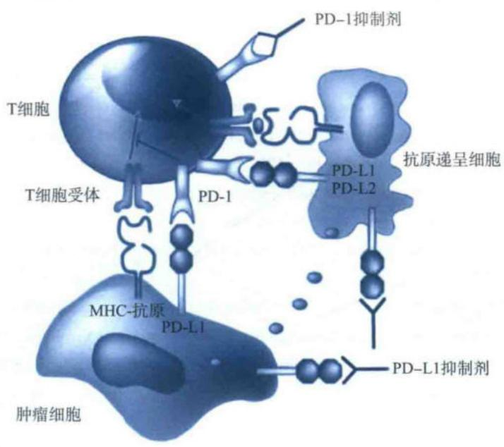  
图 9-36 PD-1 和 PD-L1 抑制剂作用示意图

## 思考题

1. 癌症为何对人类具有重大危害？癌症的防治为何如此困难？

2. 如果你是一家生物技术公司的 CEO 或者负责技术的高层人员,有人向你推荐一种治疗癌症的特效药,寻求与你们公司合作。你将在哪些方面对这种药物进行评价?

3. 能否对艾滋病患者进行定时输入通过基因工程生产的特定 T4 淋巴细胞而延长其生命, 主要存在哪些技术上的障碍?

4. 什么是基因领域和基因领域效应？

5. 为什么 HIV 变异这么快？HIV 的变异有无规律，主要在哪些方面发生变异？

6. 不同人感染 HIV 和 HBV 病毒在人体内潜伏的时间存在很大差异,有哪些原因?

7. 为何 HIV 病毒在猩猩与人类这两种生物中有不同的危害？人类是否可参考猩猩抵御 HIV 的方式？

8. 试分析 CAR-T 细胞疗法治疗癌症的优缺点。

9. 禽流感病毒感染人类的机制是什么？如何控制人禽流感的大范围传播，有效的预防措施有哪些？

10. 比较 SARS-CoV 引起的非典和人禽流感, 哪种病在流行上易于控制, 为什么?

11. 病毒致癌基因很多是宿主本身的原癌基因, 这种选择对于病毒本身有何意义?

12. 简述病毒载体和非病毒载体的优缺点。

13. 假如你得到一个通过改造并适合作为基因治疗载体的病毒,你将如何分析这种可行性,主要在哪些方面作改造?你将如何测试改造后的病毒载体的效率和安全性?

## 参考文献

1. Yang R Y, Hung M C. The role of T-cell immunoglobulin mucin-3 and its ligand galectin-9 in antitumor immunity and cancer immunotherapy. Science China Life Sciences, 2017, 60: 1058–1064

2. Steichen J M, et al. HIV vaccine design to target germline precursors of glycan-dependent broadly neutralizing antibodies. Immunity, 2016, 45: 483–496.

3. Sok D, et al. Priming HIV-1 broadly neutralizing antibody precursors in human Ig loci transgenic mice. Science, 2016, 353: 1557–1560.

4. Descours B, et al. CD32a is a marker of a CD4 T-cell HIV reservoir harbouring replication-competent proviruses. Nature, 2017, 543: 564–567.

5. Faust T B, et al. Making sense of multifunctional proteins: human immunodeficiency virus type 1 accessory and regulatory proteins and connections to transcription. Annual Review of Virology, 2017, 4:241–260.

6. Ramos C A, et al. CAR-T cell therapy for lymphoma. Annual Review of Medicine, 2016, 67: 165-183.

7. Xiong X, et al. CRISPR/Cas9 for human genome engineering and disease research. Annual Review of Genomics and Human Genetics, 2016, 17: 131–154.

## 数字课程学习

e 教学课件

目在线自测

思考题解析

## 第10章


<!-- C-BEGIN Campbell 19 Review -->

### 【英文对应 Campbell 第19章章末：Chapter Review】

> 来源：Campbell Biology（书籍/01_Campbell_Biology） 第19章 Summary of Key Concepts 与 Test Your Understanding。

### [EN] Chapter 19 Review

### [EN] Summary of Key Concepts

To review key terms, go to the Vocabulary Self-Quiz (eTextbook only).

### [EN] Concept 19.1: A virus consists of a nucleic acid surrounded by a protein coat

\- Researchers discovered viruses in the late 1800s by studying a plant disease, tobacco mosaic disease.

\- A virus is a small nucleic acid genome enclosed in a protein capsid and sometimes a membranous viral envelope. The genome may be single- or double-stranded DNA or RNA.

Are viruses generally considered living or nonliving? Explain.

### [EN] Concept 19.2: Viruses replicate only in host cells

\- Viruses use enzymes, ribosomes, and small molecules of host cells to synthesize progeny viruses during replication.

\- Each type of virus has a characteristic host range, affected by whether cell-surface proteins are present that viral surface proteins can bind to.

\- Phages (viruses that infect bacteria) can replicate by two alternative mechanisms: the lytic cycle and the lysogenic cycle.


Lytic cycle

• Virulent or temperate phage

Lysogenic cycle

\- Destruction of host DNA

• Temperate phage only

• Production of new phages • Lysis of host cell causes release of progeny phages

• Genome integrates into bacterial chromosome as prophage, which (1) is replicated and passed on to daughter cells and

(2) can be induced to leave the

chromosome and initiate a lytic cycle

\- Bacteria have various ways of defending themselves against phage infections, including the CRISPR-Cas system.

\- Many animal viruses have an envelope. Retroviruses (such as HIV) use the enzyme reverse transcriptase to copy their RNA genome into DNA, which can be integrated into the host genome as a provirus.

\- Since viruses can replicate only within cells, they probably evolved after the first cells appeared, perhaps as packaged fragments of cellular nucleic acid.

Describe enzymes that are not found in most cells but are necessary for the replication of certain types of viruses.

### [EN] Concept 19.3: Viruses and prions are formidable pathogens in animals and plants

\- Symptoms of viral diseases may be caused by direct viral harm to cells or by the body's immune response. Vaccines stimulate the immune system to defend the host against specific viruses.

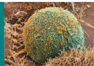

\- An epidemic, a widespread outbreak of a disease, can become a pandemic, a global epidemic.

\- Outbreaks of emerging viral diseases in humans are usually not new, but rather are caused by existing viruses that expand their host territory. The H1N1 2009 flu virus was a new combination of pig, human, and avian viral genes that caused a pandemic. The H5N1 avian flu virus has the potential to cause a high-mortality flu pandemic.

\- Viruses enter plant cells through damaged cell walls (horizontal transmission) or are inherited from a parent (vertical transmission).

\- Prions are slow-acting, virtually indestructible infectious proteins that cause brain diseases in mammals.

What aspect of an RNA virus makes it more likely than a DNA virus to become an emerging virus?

For suggested answers, see Appendix A.

### [EN] Test Your Understanding

For more multiple-choice questions, go to the Practice Test (eTextbook only).

### [EN] Levels 1-2: Remembering/Understanding

1. Which of the following characteristics, structures, or processes is common to both bacteria and viruses?

(A) metabolism

(B) ribosomes

(C) genetic material composed of nucleic acid

(D) cell division

2. Emerging viruses arise by

(A) mutation of existing viruses.

(B) the spread of existing viruses to new host species.

(C) the spread of existing viruses more widely within their host species.

(D) all of the above.

3. To cause a human pandemic, the H5N1 avian flu virus would have to

(A) spread to primates such as chimpanzees.

(B) develop into a virus with a different host range.

(C) become capable of human-to-human transmission.

(D) become much more pathogenic.

### [EN] Levels 3-4: Applying/Analyzing

4. A bacterium is infected with an experimentally constructed bacteriophage composed of the T2 phage protein coat and T4 phage DNA. The new phages produced would have

(A) T2 protein and T4 DNA.

(B) T4 protein and T2 DNA.

(C) T2 protein and T2 DNA.

(D) T4 protein and T4 DNA.

5. RNA viruses require their own supply of certain enzymes because (A) host cells rapidly destroy the viruses.

(B) host cells lack enzymes that can replicate the viral genome.

(C) these enzymes translate viral mRNA into proteins.

(D) these enzymes penetrate host cell membranes.

6. DRAW IT Redraw Figure 19.8 to show the replicative cycle of a virus with a single-stranded genome that can function as mRNA (a class IV virus).

### [EN] Levels 5-6: Evaluating/Creating

7. EVOLUTION CONNECTION The success of some viruses lies in their ability to evolve rapidly within the host. Such viruses evade the host's defenses by mutating and producing many altered progeny viruses before the body can mount an attack. Thus, the viruses present late in infection differ from those that initially infected the body. Discuss this as an example of evolution in microcosm. Which viral lineages tend to predominate?

8. SCIENTIFIC INQUIRY When bacteria infect an animal, the number of bacteria in the body increases in an exponential fashion (graph A). After infection by a virulent animal virus with a lytic replicative cycle, there is no evidence of infection for a while. Later, however, the number of viruses rises suddenly and subsequently increases in a series of steps (graph B). Explain the difference in the curves.


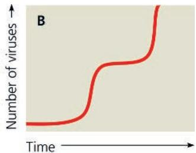  
For selected answers, see Appendix A.

9. WRITE ABOUT A THEME: ORGANIZATION While viruses are considered by most scientists to be nonliving, they do show some characteristics of life, including the correlation of structure and function. In a short essay (100–150 words), discuss how the structure of a virus correlates with its function.

### [EN] 10. SYNTHESIZE YOUR KNOWLEDGE


Oseltamivir (Tamiflu), an antiviral drug prescribed for the flu, inhibits the enzyme neuraminidase. Explain how this drug could prevent infection in someone exposed to the flu or could shorten the course of flu in an infected patient (the reasons for which it is prescribed).

### [EN] Explore Scientific Papers with Science in the Classroom | AAAS

How can genomics help track the Ebola virus? Go to “Ebola Outbreak Traced to the Funeral of a Traditional Healer” at www.scienceintheclassroom.org.

Instructors: Questions can be assigned in Mastering Biology.


<!-- C-END Campbell 19 Review -->
