# 第11章 基因组与比较基因组学

> **本章插入内容**（中文对照与英文对应，插在所列中文节末尾；导言在章首，小结/习题/Review 在章末）
>
> - Watson 第7章「基因组学」 → 11.2 高通量 DNA 序列分析技术
> - Campbell Concept 21.1 → 11.1 人类基因组计划
> - Campbell Concept 21.2 → 11.1 人类基因组计划
> - Campbell Concept 21.3 → 11.4 其他代表性基因组
> - Campbell Concept 21.5 → 11.5 比较基因组学研究
> - Campbell Concept 21.6 → 11.5 比较基因组学研究
> - Lehninger §9.3 → 11.1 人类基因组计划
> - 章首导言与章末：Campbell 第21章

<!-- 章节边界按正文内容恢复；原始 MinerU 内容保留如下。 -->

# 基因组与比较基因组学

11.1 人类基因组计划

11.2 高通量 DNA 序列分析技术

11.3 新测序平台的应用

11.4 其他代表性基因组

11.5 比较基因组学研究

20 世纪 40 年代研制成功的第一颗原子弹,60 年代实现的人类登月计划和 90 年代提出并于 2000 年基本完成的人类基因组计划 (human genome project, HGP) 是公认的 20 世纪科技发展史中的三大创举。DNA 双螺旋结构的发现者之一 J. D. Watson 认为,与人类登月计划相比,HGP 的资金投入更少,且对人类生活的影响却可能更深远。随着这个计划的完成,人类基因组中储藏的有关人类生存和繁衍的全部遗传信息将被破译,它将不仅帮助我们理解人类各种生理过程的内在机制,还将最终揭开癌症、早老性痴呆症、精神分裂症等严重危害人类健康的疾病的生理及分子机制,并最终为这些疾病的预防及治疗提供理论基础。与此同时,对人类、细菌、病毒以及其他各物种基因组信息的破译,也将有助于人们解决诸如人口膨胀、粮食短缺、环境污染、疾病危害、能源资源匮乏、生态平衡失调、生物物种消亡等一系列世界难题。

对人类以及其他生物体全基因组序列的测定是科学发展史上的浩大工程。人类基因组计划以及由此派生出来的数量庞大的基因组计划显然得益于20世纪下半叶分子生物学研究和计算机科学技术的蓬勃发展，前者直接导致了DNA序列分析仪器的发明及其迅速的更新换代，为基因组计划提供了强大的技术支撑，而后者则使该计划所产生的海量数据在实验室得到消化和处理。从1975年花了九牛二虎之力测定全长5386 bp的噬菌体ΦX174基因组到2001年完成总长30亿bp的人类基因组序列测定，短短20多年间DNA序列分析技术产生了质的飞跃。如果没有高通量DNA序列分析技术的发展，人类基因组计划就几乎不可能完成。而随后出现并不断得到改进的第二代测序技术更是将基因组学的研究推进到前所未有的深度和广度。这不仅极大地增加了单位时间的测序量，显著降低了测序成本，同时也拓宽了通过测序所能探讨的科学问题的范畴。

随着计算机分析处理能力的提高以及科学家对序列分析流程的不断改进和优化，大规模测序已不再是只有极少数测序中心才能够承担的工作。随着各个实验室逐渐能够自行生产和处理大规模测序数据，越来越多物种的基因组DNA被测定和解析，人们开始对不同时期不同组织在健康或疾病状态下的全基因组水平以及不同个体、不同物种间基因组序列、表达谱差异等进行深入分析，阐述染色质的高级结构、各种表观遗传修饰和各种蛋白质-DNA相互作用对整个基因组的转录调控所带来的影响。此外，“元基因组学”(metagenomics)则以取自环境的样本里所有的遗传物质或特定的微生物群落为研究对象。所有这些为我们解码生命、了解生命的起源和生长发育规律、认识种属之间以及个体之间存在差异的起因、认识疾病产生机制以及长寿与衰老等生命现象、为疾病的诊治提供科学依据，导致一批生命科学相关领域出现了不曾预见的新面貌。

<!-- C-BEGIN Campbell 21 导言 -->

### 【英文对应 Campbell 第21章导言：Genomes and Their Evolution】

> 来源：Campbell Biology（书籍/01_Campbell_Biology） 第21章章首（Key Concepts 与引言）。

#### [EN] 第21章 Genomes and Their Evolution

<!-- 章节边界按正文内容恢复；原始 MinerU 内容保留如下。 -->

#### [EN] Genomes and Their Evolution

#### [EN] Key Concepts

21.1 The Human Genome Project fostered development of faster, less expensive sequencing techniques

21.2 Scientists use bioinformatics to analyze genomes and their functions

21.3 Genomes vary in size, number of genes, and gene density

21.4 Multicellular eukaryotes have a lot of noncoding DNA and many multigene families

21.5 Duplication, rearrangement, and mutation of DNA contribute to genome evolution

21.6 Comparing genome sequences provides clues to evolution and development

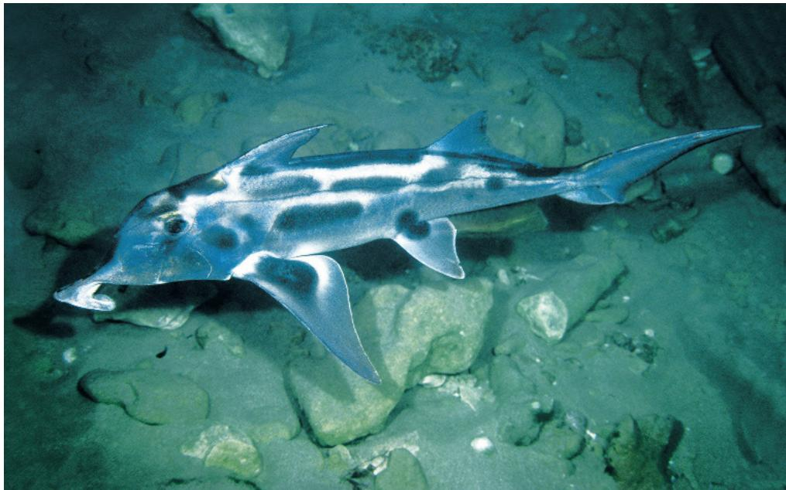  
Figure 21.1 The elephant shark (Callorhinchus milii) looks vaguely prehistoric and has been called a “living fossil.” In fact, it has the slowest-evolving genome of any vertebrate sequenced so far. Comparing rates of genome change in different species provides insights into the evolutionary past.

#### [EN] Study Tip

Write genomic analysis questions: As you go through the chapter, make a table of genomic analyses that are discussed and write down some questions they can address. You can include questions not covered in the text.

<table><tr><td>Genomic projects and websites</td><td>Questions that can be addressed</td></tr><tr><td>Human Genome Project</td><td>How much DNA is in the human genome?How much of the human genome codes for proteins?What functions are carried out by other regions of the genome?</td></tr><tr><td>ENCODE project</td><td></td></tr></table>

What are the functions of the human genome?

#### [EN] What are some questions that can be explored by sequencing and comparing genomes?

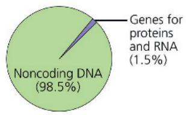  
How do genomes differ in number of genes?

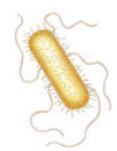  
Escherichia coli 4,400 genes

  
Homo sapiens \~20,000 genes

  
Zea mays (corn) 32,000 genes  
What do gene sequences tell us about evolutionary relationships between species?  
How do genomes evolve over time?

  
Elephant shark: slower-evolving genome  
Tiger tail sea horse: faster-evolving genome

<!-- C-END Campbell 21 导言 -->

## 11.1 人类基因组计划

基因组是生物体内遗传信息的集合, 是某个特定物种细胞内全部 DNA 分子的总和。“基因组学”则是美国人 T. H. Roderick 在 1986 年 7 月首次提出、并与一个新的杂志——Genomics 一道问世。基因组学着眼于研究并解析生物体整个基因组的所有遗传信息, 从而完全改变了经典遗传学“零敲碎打”的方法, 更加系统和全面地研究生命现象。为了解析人类基因组中携带的有关人类个体生长发育、生老病死的全部遗传信息, 揭开人类生长发育的奥秘, 追求健康, 战胜疾病, 人类基因组计划于 20 世纪 90 年代启动。计划测定单倍体染色体组中约 30 亿碱基对序列, 从如下 8 个方面阐明这些编码的遗传信息:

① 确定人类基因组中 2 万～2.5 万个编码基因的序列及其在基因组中的物理位置，研究基因的产物及其功能。

② 了解转录和剪接调控元件的结构与位置,从整个基因组结构的宏观水平上理解基因转录与转录后调节。

③ 从整体上了解染色体结构,包括各种重复序列以及非转录调控序列的大小和组织,了解各种不同序列在形成染色体结构、DNA复制、基因转录及表达调控中的影响与作用。

④ 研究空间结构对基因调节的作用。有些基因的表达调控序列与被调节基因在DNA一级结构上相距甚远，但若从整个染色体的空间结构上看则恰恰处于最佳的调节位置，因此，有必要从三维空间的角度来研究真核基因的表达调控规律。

⑤ 发现与 DNA 复制、重组等有关的序列。DNA 的忠实复制保障了遗传的稳定性，正常的重组提供了变异与进化的分子基础。局部 DNA 的推迟复制、异常重组等现象则导致疾病或者胚胎不能正常发育，因此，了解与人类 DNA 正常复制和重组有关的序列及其变化，将为研究人类基因组的遗传与进化提供重要依据。

⑥ 研究 DNA 突变、重排和染色体断裂等，了解疾病的分子机制，包括遗传性疾病、易感性疾病、放射性疾病甚至感染性疾病引发的分子病理学改变及其进程，为这些疾病的诊断、预防和治疗提供理论依据。

⑦ 确定人类基因组中转座子、反转座子和病毒残余序列,研究其周围序列的性质。了解有关病毒基因组侵染人类基因组后的影响,可能有助于人类有效地利用病毒载体进行基因治疗。

⑧ 研究个体间各遗传元件的多态性。这些知识可被广泛用于基因诊断、个体识别、亲子鉴定、组织配型、发育进化等许多医疗、司法和人类学的研究。此外，这些遗传信息还有助于研究人类历史进程、人类在地球上的分布与迁移以及人类与其他物种之间的比较。

## 11.1.1 遗传图

遗传图(genetic map)又称为连锁图(linkage map),是指基因或DNA标志在染色体上

图 11-1 遗传距离图的基本数据来自基因的重组
上述 4 个基因都位于果蝇的 X 染色体上。

<table><tr><td></td><td>基因</td><td></td><td></td></tr><tr><td>m</td><td>微翅型</td><td></td><td></td></tr><tr><td></td><td></td><td></td><td>重组频率</td></tr><tr><td>v</td><td>红眼型</td><td></td><td>m与v之间:3.0%</td></tr><tr><td></td><td></td><td></td><td>m与y之间:33.7%</td></tr><tr><td></td><td></td><td></td><td>v与w之间:29.4%</td></tr><tr><td>w</td><td>白眼型</td><td></td><td>w与y之间:1.3%</td></tr><tr><td></td><td></td><td></td><td></td></tr><tr><td>y</td><td>黄色躯干型</td><td></td><td></td></tr><tr><td></td><td></td><td></td><td></td></tr><tr><td></td><td></td><td colspan="2">推算的遗传距离</td></tr><tr><td></td><td>y w</td><td></td><td>v m</td></tr><tr><td></td><td>0 1.3</td><td></td><td>30.7 33.7</td></tr></table>

的相对位置与遗传距离。通过遗传图我们可以大致了解各个基因或 DNA 片段之间的相对距离与方向,了解哪个基因更靠近着丝粒,哪个更靠近端粒等。遗传距离是通过遗传连锁分析确定的。连锁分析是经典遗传学的重要手段。因为在同源染色体的同一遗传位点上可能存在不同的等位基因(多态性),而在产生配子的减数分裂过程中,同源染色体既能相互配对也可能发生片段互换,从而导致子代出现两个遗传位点等位基因的“重组”,该重组频率与这两个位点之间的距离呈正相关。于是,科学上用两个位点之间的交换或重组频率厘摩(cM)来表示其遗传学距离(图 11-1)。cM 值越大,表明两者之间距离越远。一般说来,这一数值不会大于 50% 或 50 厘摩,因为当重组率等于 50%(即遗传学距离等于 50 厘摩)时,两个位点之间完全不连锁(相当于在不同的染色体上),只发生随机交换。

研究中所使用的遗传标志越多、越密集，所得到的遗传连锁图的分辨率就越高。经典的遗传标记是可被电泳或免疫技术检出的蛋白质标记，如红细胞 ABO 血型位点标记，白细胞 HLA 位点标记等。表 11-1 给出了酵母遗传分析中最常见的部分生物化学标签。由于人类本身不能像其他“非人类”生物那样进行“选择性”婚配，子代个体数量较为有限、世代寿命较长等客观原因，已知呈共显多态性的蛋白质数量不多，等位基因的数量（多态性）也不多，使人类遗传性状研究受到很大的限制。DNA 多态性遗传标记检测技术的建立提供了大量新的人类基因组遗传标记。

表 11-1 酵母遗传分析中最常用的生物化学标签

<table><tr><td>标签</td><td>表型</td><td>筛选方法</td></tr><tr><td>ADE2</td><td>培养基中需加入腺苷酸</td><td>只能在加入腺苷酸的培养基上生长</td></tr><tr><td>CAN1</td><td>对刀豆氨酸有抗性</td><td>能在含有刀豆氨酸的培养基上生长</td></tr><tr><td>CUP1</td><td>对铜离子有抗性</td><td>能在含有铜离子的培养基上生长</td></tr><tr><td>CYH1</td><td>对环己酰亚胺有抗性</td><td>能在含有环己酰亚胺的培养基上生长</td></tr><tr><td>LEU2</td><td>培养基中需加入亮氨酸</td><td>只能在加入亮氨酸的培养基上生长</td></tr><tr><td>SUC2</td><td>能进行蔗糖发酵</td><td>能在以蔗糖作为唯一碳源的培养基上生长</td></tr><tr><td>URA3</td><td>培养基中需加入尿嘧啶</td><td>只能在加入尿嘧啶的培养基上生长</td></tr></table>

第一代 DNA 遗传标记是 RFLP (restriction fragment length polymorphism, 限制性片段长度多态性) 和 RAPD (random amplified polymorphism DNA, 随机扩增多态 DNA)。DNA 序列上的微小变化, 甚至 1 个核苷酸的变化, 也能引起限制性内切酶切点的丢失或产生, 导致酶切片段长度的变化 (图 11-2), 或者改变引物结合效率, 影响 PCR 扩增。由于核苷酸序列的改变遍及整个基因组, 特别是进化中选择压力较小的非编码序列中, 只要选择得当, 生物体内出现共显性 RFLP 和 RAPD 分子标记的频率远远超过了经典的蛋白质多态性 (图 11-3)。但是, RFLP 和 RAPD 仅局限于 1 个或少数几个核苷酸的突变, 一般只能导致限制性酶切位点的“切开”与“不切开”或某一扩增条带“存在”与“不存在”, 所提供的“多态性”信息量较小。

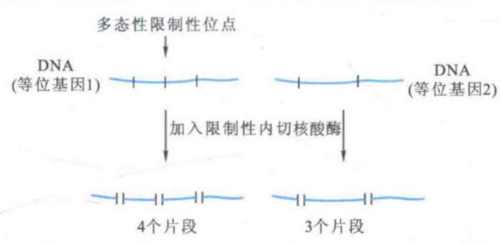  
图 11-2 限制性片段长度多态性 (RFLP) 原理示意图

第二代 DNA 遗传标记利用了存在于人类基因组中的大量重复序列,包括重复单位长度在 15\~65 个核苷酸左右的小卫星 DNA (minisatellite DNA),重复单位长度在 2\~6 个核苷酸之间的微卫星 DNA (microsatellite DNA),后者又称为简短串联重复多态性(STR、STRP 或 SSLP,short tandem repeat polymorphism 或者 simple sequence length polymorphism)。STRP 有两个突出的优点,即作为遗传标记的“多态性”与“高频率”。由于 $(A)_{n},(CA)_{n},(CGG)_{n}$ 等短重复序列在同一位点上可重复单位数量变化很大,同源染色体配对时又容易产生“错配”,进一步扩大了群体中所拥有的“等位基因”数,并使这样的位点遍布于整个基因组。现已有 5 264 个 STRP 为主体的遗传标记“连锁图”,平均分辨率已达 600 kb,其中第 17 号染色体上平均每 495 kb 有一个标记,第 9 号染色体上平均每 767 kb 有一个标记,整个基因组中只有 3 处标记间距大于 4 Mb。

(a)最常见的显性多态性标记；(b)\~(d)共显性多态性标记。

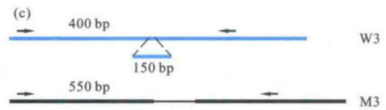

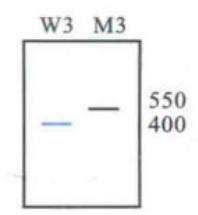

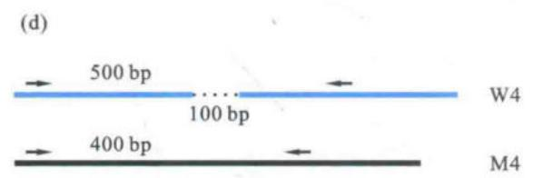

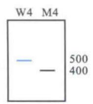

第三代 DNA 遗传标记, 即单核苷酸多态性 (single nucleotide polymorphism, SNP) 标记, 指分散于基因组中的单个碱基的差异, 包括单个碱基的缺失和插入, 但更常见的是单个核苷酸的替换。由于该标记中的所有 “遗传多态性” 都来自单个核苷酸的差异, SNP 有可能在密度上达到人类基因组 “多态” 位点数目的极限, 所以, 它可能是最好的遗传标记。到目前为止, 已经在人类基因组发现了超过 1000 万个 SNP 位点, 平均每 300 个碱基对中就有一个 SNP。由于基因组不同部分受到的选择压力不同, 而且基因组中蛋白质编码序列仅占 10% 以下, 绝大多数 SNP 位于非编码区。SNP 与 RFLP 和 STRP 标记的主要不同之处在于, 它不再以 DNA 片段的长度变化作为检测手段, 而直接以序列变异作为标记 (图 11-4)。SNP 遗传标记分析完全摒弃了经典的凝胶电泳, 代之以新的 DNA 芯片技术, 在人类基因组 “遗传图” 的绘制中发挥了重要作用。

“遗传图”的建立为人类疾病相关基因的分离克隆奠定了基础。拥有5000多个遗传学位点，相当于把整个人类基因组划分为5000多个小区，并分别设置了“标牌”。这些标牌将在搜索功能基因的过程中发挥独特的作用。把多态性的疾病基因位点（该位点至少包括“正常”及“致病”两个等位基因）与上述遗传标记进行分析比较时，如果在家系中证实该基因与某个标记不连锁(重组率为50%),表明该基因不在这一标记附近;如果发现该基因与某个标记有一定程度的“连锁”(重组率小于50%但大于0),表明它可能位于这个

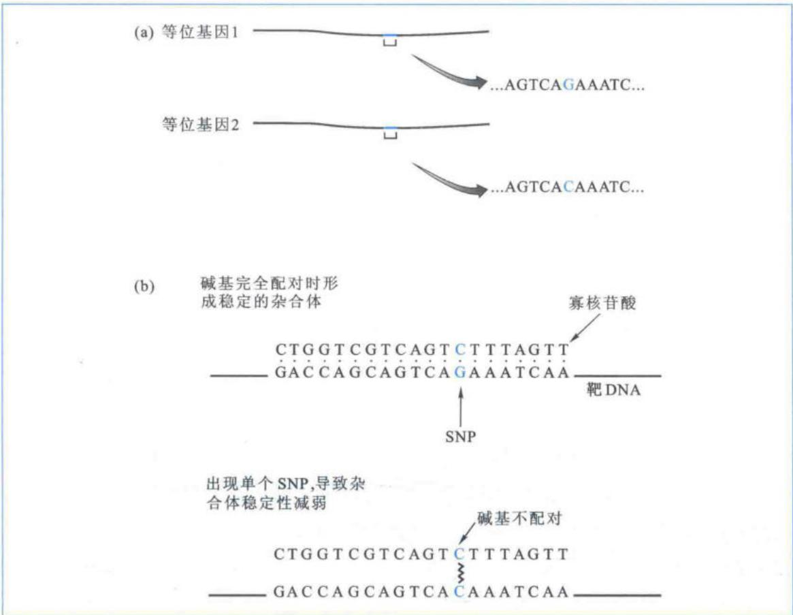  
图 11-4 人类基因组中的 SNP 作为遗传标记的分子机制  
(a) SNP 的产生; (b) SNP 的产生影响了 DNA 序列间杂交的强度。

标记附近;如果该基因与某标记间不发生重组(重组率等于0),我们就推测该标记与所研究的疾病基因可能非常接近。

## 11.1.2 物理图

人类基因组的物理图(physical map)是指以已知核苷酸序列的DNA片段(序列标签位点，sequence-tagged site, STS)为“路标”，以碱基对(bp、kb、Mb)作为基本测量单位(图距)的基因组图。任何DNA序列，只要知道它在基因组中的位置，都能被用作STS标签。物理图的主要内容是建立相互重叠连接的“相连DNA片段群”(contig)，并用PCR方法予以证实。图11-5是酵母第三号染色体的遗传图与物理图的比较。序列分析表明，遗传图上关于glk1和cha1两个基因位点的定位是错误的。由于实验方法不同，不少遗传标记之间的距离并不等于它们在物理图上距离。

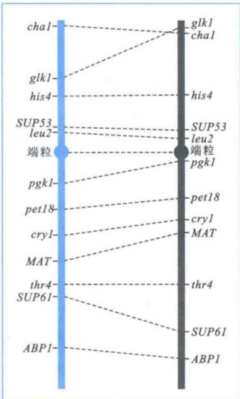  
图 11-5 酵母第三号染色体图(右)和物理图(左)的比较

图 11-6 用 STS 标签技术制作基因组的物理图  
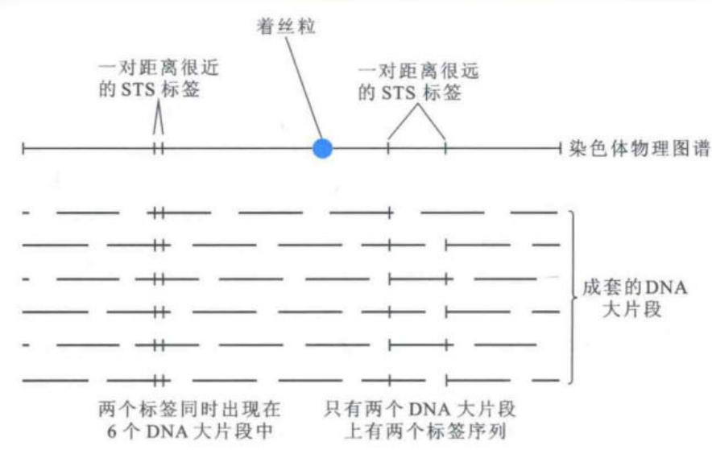

用 STS 技术绘制基因组物理图是非常有效的方法。STS 其实只是基因组中任何单拷贝的短 DNA 序列，长度在 100～500 bp。建立 STS 物理图之前，首先要得到至少 5 套包含相关染色体或整个基因组的 DNA 片段（图 11-6）。然后，分别用各个 DNA 片段做模板，用来自不同 STS 标签上的序列做引物进行 PCR 扩增。如果某两个 STS 标签在基因组上靠得很近，它们有可能一直同时出现在 DNA 大片段上；如果某两个 STS 标签在基因组上相距较远，它们同时出现在一个 DNA 大片段上的概率就会小得多。只要有一定数量的 STS 标签，所有 DNA 大片段在该染色体或基因组中的位置都能被确定下来。基于 STS 的物理图把来自经典遗传学及细胞遗传学中的基因位点的信息转化为基因组上的物理位点信息，因此可直接以这些片段为材料进行基因克隆和分析。现在已有包含上百万个 STS 的人类基因组物理图，分辨率达到每 3～4 kb 有一个 STS 标签。

## 11.1.3 转录图

生物性状,包括疾病,主要是由结构或功能蛋白质所决定的,而所有已知蛋白质都是由带有多腺苷酸“尾巴”的 mRNA 按照遗传密码三联子的规律翻译产生的。因此,分离纯化 mRNA(或 cDNA)、提取基因组的可转录部分对于了解生命现象是至关重要的。人类基因组转录图(expression profiling,cDNA 图),或者基因的 cDNA 片段图,即表达序列标签图(expressed sequence tag,EST)是人类基因组图的重要组成部分。实验中可通过得到的一段 cDNA 或一个 EST,筛选出全长的转录本,并根据其序列的特异性将该转录物所代表的基因准确地定位于基因组上。

在整个人类基因组中, 只有 2% 的序列编码蛋白质, 即包含 2 万 \~ 2.5 万个蛋白质编码基因。这些基因的平均长度为 27 kb 左右, 含有 8.8 个长约 145 bp 的外显子。而内含子的长度则大大超过外显子, 达到 3 365 bp 左右。人类基因的 3' 非翻译区 (UTR) 的平均长度为 770 bp, 其 5' 非翻译区的平均长度为 300 bp, 开放读码框的平均长度约为 1340 bp, 编码 447 个氨基酸(表 11-2)。在人类成年个体的每一特定组织中, 一般只有 10%\~20% 的基因表达 (1 万 \~ 2 万个不同类型的 mRNA)。通过分离特定组织在某一发展阶段或某种生理条件下的总 mRNA, 合成 cDNA 并进行序列分析, 即可得到该组织在特定条件下的转录信息。另外, 通过测定同一转录物的数量, 还可以进一步得到各转录物表达量的信息。收集各种组织、细胞或同一组织、细胞在不同时期或不同生理状态下的基因表达谱进行两两或多重比较, 即所谓的 “电子消减杂交” 或 “数据库消减杂交”, 就能比较全面地了解哪些基因是特异性表达的, 哪些是组成型表达的, 哪些基因受发育过程的调控而哪些受生理状态或外部环境影响的调控。将这些表达信息标记到相应的组织、细胞中, 就可以绘出区分 200 余种人体基本组织或不同细胞的人体基因图 (body-map)。转录图或基因表达谱使人们更系统、全面地研究特定细胞、组织或器官的基因表达模式并解释其生理属性, 更深入地认识生长、发育、分化、衰老和疾病发生机制。

表 11-2 人类基因组数据库中蛋白质编码基因的部分重要参数比较

<table><tr><td>性质</td><td>平均值</td></tr><tr><td>外显子长度 /bp</td><td>145</td></tr><tr><td>外显子个数</td><td>8.8</td></tr><tr><td>内含子长度 /bp</td><td>3365</td></tr><tr><td>3&#x27;非翻译区</td><td>770</td></tr><tr><td>5&#x27;非翻译区</td><td>300</td></tr><tr><td>开放读码框的长度 /bp</td><td>1 340</td></tr><tr><td>核基因长度 /kb</td><td>27</td></tr></table>

## 11.1.4 全序列图

人类基因组的核苷酸序列图其实是分子水平上最高层次的、最详尽的物理图。测定总长约1 m、由30亿个核苷酸组成的全序列是人类基因组计划中最明确的任务。第一个完成的人类基因组全序列来自一个“代表性人类个体”（其所有权在法律上不属于任何供体）。该序列在其完成时在理论上代表了全人类的基因组信息，后来也成为所有个体重测序的参考基因组，并为基因分析和诊断提供了各种参考信息。研究还发现，人类基因组与其他动物基因组在染色体水平上有“共线”（即同源）现象。图11-7是人类第21号染色体HSA21位点与小鼠第16号染色体MMU16、MMU17和MMU10连锁图的比较，我们可以很清楚地看出，两者之间存在着广泛的同源性。

人类基因组计划所绘制的4张图,特别是人类核酸序列图,蕴藏了决定我们生、老、病、死的遗传信息,必将成为人类认识自我、改造自我的用之不绝的知识源泉,为现代生物学和医学的发展提供物质基础。

图 11-7 人类第 21 号染色体 HSA21 位点与小鼠 16 号染色体 MMU16、MMU17 和 MMU10 位点有“共线”性

<!-- C-BEGIN Campbell 21.1 -->

### 【英文对应 Campbell Concept 21.1：The Human Genome Project fostered development of faster, less expensive sequencing techniques】

> 来源：Campbell Biology（书籍/01_Campbell_Biology） 第21章 Genomes and Their Evolution，Concept 21.1。

#### [EN] Concept 21.1: The Human Genome Project fostered development of faster, less expensive sequencing techniques

Upon sequencing the genome of any species, scientists can study whole sets of genes and their interactions, an approach called genomics. The sequencing efforts that feed this approach generate enormous volumes of data. The necessity of dealing with this ever-increasing flood of information has energized the field of bioinformatics, the use of computers, software, mathematical models, and other computational tools such as artificial intelligence, to process, integrate, and analyze information from large biological data sets.

The sequencing of the human genome, an ambitious undertaking, officially began as the Human Genome Project in 1990. Organized by an international, publicly funded consortium of scientists at universities and research institutes, the project involved 20 large sequencing centers in six countries plus a host of other labs working on smaller parts of the project.

The human genome sequence was largely completed in 2003 and since then has been fine-tuned. Regions of the genome with much repetitive DNA are difficult to sequence, and the fully completed human genome wasn't published until 2022. The original sequenced DNA was pooled from a few individuals; scientists reviewed the results and agreed on a reference genome, a full sequence that represents the genome of a species. However, a disadvantage of a reference genome is that since it is based on DNA from one or a few individuals, it is biased toward the group those individuals belong to. A more recent approach has been to assemble a pangenome, a composite genome sequence based on sequences of multiple individuals within a species. The choice of individuals includes a wide range of genetic backgrounds, therefore revealing important regions of variation that may have medical or evolutionary significance. A draft human pangenome, based on 47 individual genomes from various populations, was published in 2023, and will be continually revised by incorporating information from more individuals.

The ultimate goal in mapping any genome is to determine the complete nucleotide sequence of each chromosome. For the 3 billion base pairs in the human genome, this was accomplished by scientists using sequencing machines and the dideoxy chain termination method mentioned in Concept 20.1. Two approaches complemented each other in this endeavor. The initial approach was a methodical one that ordered each fragment based on earlier genetic mapping of the human genome. In 1998, however, molecular biologist J. Craig Venter led an effort to sequence the entire human genome using an alternative strategy. The whole-genome shotgun approach starts with the cloning and sequencing of DNA fragments from randomly cut DNA. Powerful computer programs then assemble the resulting very large number of overlapping short sequences into a single continuous sequence (Figure 21.2). The whole-genome shotgun approach, in combination with newer sequencing methods, is still widely used today.

A major success of the Human Genome Project was the development of sequencing machines with automated technology for faster sequencing (see Concept 20.1). While a productive lab could typically sequence 1,000 base pairs a day in the 1980s, by four decades later, widely used “next-generation” sequencing machines could sequence nearly 35 million base pairs per second (see Figure 20.3).

In one approach, many very small DNA fragments (each about 300 base pairs long) are sequenced at the same time, and computer software rapidly assembles the complete sequence. Because of the sensitivity of these techniques, the DNA can be sequenced directly, either in fragments or as a single whole molecule; the cloning (2 in Figure 21.2) is unnecessary.

In another approach, called long-read sequencing, new techniques enable sequencing of a single long DNA strand, of tens of thousands to over 100,000 bases, at one time. Sequencing machines using rapid sequencing techniques are an example of "high-throughput" devices because they can analyze biological materials very rapidly and produce enormous volumes of data.

Along with massive increases in sequencing speed, the cost of sequencing entire genomes has plummeted. Whereas sequencing the first human genome took 13 years and cost between \$500 million and \$1 billion, the cost has decreased

Figure 21.2 Whole-genome shotgun approach to sequencing. In this approach, random DNA fragments are cloned (see Figure 20.4), sequenced, and then ordered relative to each other.  
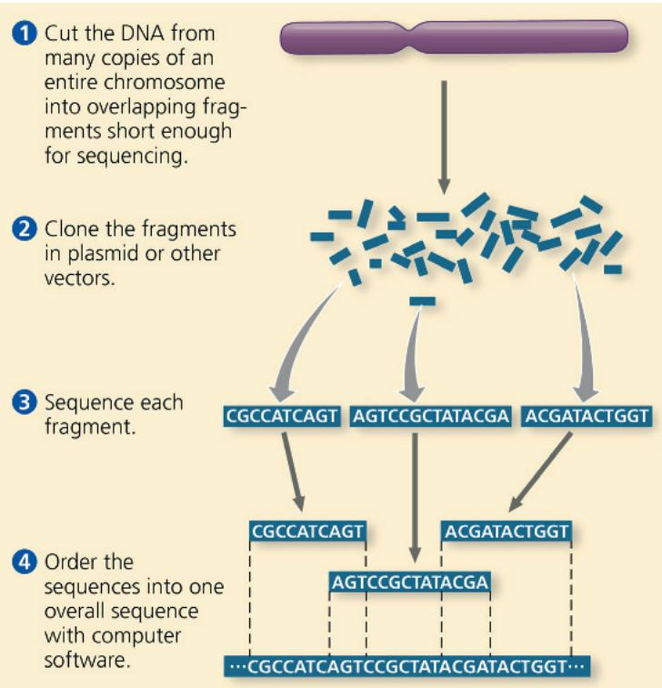  
VISUAL SKILLS The fragments in step 2 of this figure are depicted as scattered, rather than arranged in an ordered array. How does this depiction reflect the approach? For suggested answer, see Appendix A.

dramatically while the speed has increased: In 2024, the fastest machines could sequence a single human genome in less than 48 hours for about \$600.

These technological advances have also facilitated an approach called metagenomics (from the Greek meta, beyond), in which DNA from an entire community of species (a metagenome) is collected from an environmental sample and sequenced. Again, computer software sorts out the partial sequences and assembles them into the individual species' partial of complete genomes. An advantage of this technique is the ability to sequence the DNA of mixed microbial populations, which eliminates the need to culture each species separately in the lab, a challenge that has limited the study of microorganisms. So far, this approach has been applied to communities found in environments as diverse as the human intestine and extreme habitats like thermal springs where the temperature exceeds $80^{\circ}$ C.

Advances in sequencing techniques have significantly transformed medicine. In oncology, next-generation sequencing allows physicians to detect tumor-specific mutations, which can guide targeted treatments. In reproductive medicine, noninvasive prenatal testing utilizes sequencing to identify chromosomal abnormalities in fetal DNA, which can lead to early diagnosis and informed decision-making. Although these advances have made genetic testing a powerful tool in healthcare, it does raise some ethical considerations. One large concern centers around privacy, because storing personal genetic data creates risks of unauthorized access, misuse, and discrimination.

At first glance, genome sequences of humans and other organisms are simply dry lists of nucleotide bases—millions of A's, T's, C's, and G's in mind-numbing succession. Making sense of this massive amount of data has called for new analytical approaches, which we discuss next.

#### [EN] Concept Check 21.1

1. Describe the whole-genome shotgun approach.
For suggested answers, see Appendix A.

<!-- C-END Campbell 21.1 -->

<!-- C-BEGIN Campbell 21.2 -->

### 【英文对应 Campbell Concept 21.2：Scientists use bioinformatics to analyze genomes and their functions】

> 来源：Campbell Biology（书籍/01_Campbell_Biology） 第21章 Genomes and Their Evolution，Concept 21.2。

#### [EN] Concept 21.2: Scientists use bioinformatics to analyze genomes and their functions

Each of the 20 or so sequencing centers around the world working on the Human Genome Project churned out voluminous amounts of DNA sequence day after day. As the data began to accumulate, the need to coordinate efforts to keep track of all the sequences became clear. Thanks to the foresight of research scientists and government officials involved in the Human Genome Project, its goals included using bioinformatics: establishing centralized databases and refining analytical software, all made readily accessible on the Internet.

#### [EN] Centralized Resources for Analyzing Genome Sequences

Making bioinformatics resources available to researchers worldwide and speeding up the dissemination of information served to accelerate progress in DNA sequence analysis. The National Library of Medicine (NLM) and the National Institutes of Health (NIH) maintain the National Center for Biotechnology Information (NCBI), which today maintains a website (www.ncbi.nlm.nih.gov), which has extensive bioinformatics resources. On this site are links to databases, software, and a wealth of information about genomics and related topics. Similar websites have also been established by three genome centers with which the NCBI collaborates: the European Molecular Biology Laboratory, the DNA Data Bank of Japan, and BGI (formerly known as the Beijing Genomics Institute) in Shenzhen, China. These large, comprehensive websites are complemented by others maintained by individual or small groups of laboratories. Smaller websites often provide databases and software designed for a narrower purpose, such as studying genetic and genomic changes in one particular type of cancer.

The NCBI database of sequences is called GenBank. As of early 2025, it included the sequences of 256 million fragments of genomic DNA, totaling 5.4 trillion base pairs! GenBank is constantly updated, and the amount of data it contains increases rapidly. Any sequence in the database can be retrieved and analyzed using software from the NCBI website or elsewhere.

One very widely used software program available on the NCBI website, called BLAST (Basic Local Alignment Search Tool), allows the user to compare a DNA sequence with every sequence in GenBank, base by base. A researcher might search for similar regions in other genes of the same species or among the genes of other species. Another program allows comparison of protein sequences. A third program can search any protein sequence for conserved (common) stretches of amino acids (domains) for which a function is known or suspected, and it can show a three-dimensional model of the domain alongside other relevant information (Figure 21.3). There are even various software programs that can align and compare a collection of sequences, either nucleic acids or polypeptides, and diagram them in the form of an evolutionary tree based on the sequence relationships. (One such diagram is shown in Figure 21.17.)

Three research institutions, Rutgers University, the University of California, San Diego, and the University of California, Berkeley, also operate the U.S. data center for a worldwide database of all three-dimensional protein structures that have been experimentally determined, called the Protein Data Bank (www.wwpdb.org). These structures can be rotated by the viewer to show all sides of the protein. Throughout this book, you'll find images of protein structures that have been obtained from the Protein Data Bank.

There is a vast array of resources available for researchers anywhere in the world to use free of charge. Let us now consider the types of questions scientists can address using these resources.

Instructors: BLAST Data Analysis Tutorials, which teach students how to work with real data from the BLAST database, can be assigned in Mastering Biology.

Some results are shown from a search for regions of proteins similar to an amino acid sequence in a muskmelon protein.

Figure 21.3 National Center for Biotechnology Information (NCBI) website.

In this window, a partial amino acid sequence from an unknown muskmelon protein ("Query") is aligned with sequences from other proteins that the program found to be similar. Each sequence represents a domain called WD40.

2 Four hallmarks of the WD40 domain are highlighted in yellow columns. (Sequence similarity is based on chemical aspects of the amino acids, so the amino acids in each hallmark region are not always identical.)

6 This window displays information about the WD40 domain from the Conserved Domain Database (CDD), which can find and describe similar domains in related proteins.

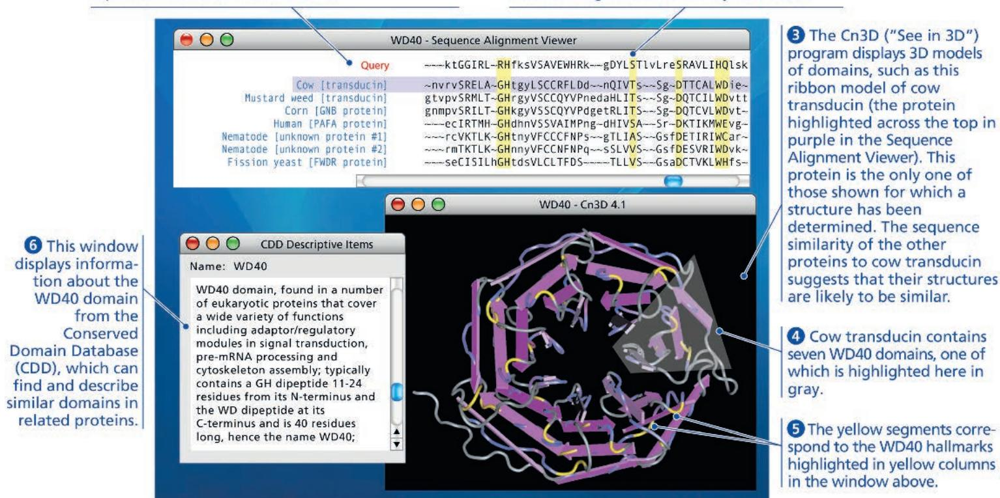

3 The Cn3D ("See in 3D") program displays 3D models of domains, such as this ribbon model of cow transducin (the protein highlighted across the top in purple in the Sequence Alignment Viewer). This protein is the only one of those shown for which a structure has been determined. The sequence similarity of the other proteins to cow transducin suggests that their structures are likely to be similar.

4 Cow transducin contains seven WD40 domains, one of which is highlighted here in gray.

5 The yellow segments correspond to the WD40 hallmarks highlighted in yellow columns in the window above.

#### [EN] Identifying Protein-Coding Genes and Understanding Their Functions

Using available DNA sequences, geneticists can study genes directly, rather than taking the classical genetic approach, which requires determining the function of an unknown gene from the phenotype. But this more recent approach poses a new challenge: What does the gene actually do? Given a long DNA sequence from a database like GenBank, scientists aim to identify all protein-coding genes in the sequence and ultimately their functions. This process, called gene annotation, uses three lines of evidence to identify a gene.

First, computers are utilized in a search for patterns that indicate the presence of genes. The usual approach is to use software to scan the stored sequences for those that represent transcriptional and translational start and stop signals, RNA-splicing sites, and other telltale signs of protein-coding genes, such as promoter sequences. The software also looks for certain short sequences that specify known mRNAs. Thousands of such sequences, called expressed sequence tags, or ESTs, have been collected from cDNA sequences and are cataloged in computer databases. This type of analysis identifies sequences that may turn out to be previously unknown protein-coding genes.

Although the identities of about half of the human genes were known before the Human Genome Project began, the other genes, previously unknown, were revealed by DNA sequence analysis. Once such suspected genes are identified, the second step is to obtain clues about their identities and functions. Software is used to compare their sequences with those of known genes from other organisms. Due to redundancy in the genetic code, the DNA sequence itself may vary more among species than the protein sequence does. Thus, scientists interested in proteins often compare the predicted amino acid sequence of a protein to that of other proteins. The final step is to confirm the identities of these genes using RNA-seq (see Figure 20.12) or some other method to show that the relevant RNA is actually expressed from the proposed gene.

Sometimes a newly identified sequence will match, at least partially, the sequence of a gene or protein in another species whose function is well known. For example, a plant researcher working on signaling pathways in the muskmelon would be excited to see that a partial amino acid sequence from a gene she had identified matched sequences in other species encoding a functional part of a protein called a WD40 domain (see Figure 21.3). WD40 domains are present in many eukaryotic proteins and are known to function in signal transduction pathways. Alternatively, a new gene sequence might be similar to a previously encountered sequence whose function is still unknown. Another possibility is that the sequence is entirely unlike anything ever seen before. This was true for about a third of the genes of

Escherichia coli when its genome was sequenced. In such cases, protein function is usually deduced through a combination of biochemical and functional studies. The biochemical approach aims to determine the three-dimensional structure of the protein as well as other attributes, such as potential binding sites for other molecules. Functional studies usually involve knocking out (blocking or disabling) the gene in an organism to see how the phenotype is affected. The CRISPR-Cas9 system, described in Figure 17.28, is an example of an experimental technique used to block gene function.

#### [EN] Understanding Genes and Gene Expression at the Systems Level

The impressive computational power provided by the tools of bioinformatics allows the study of whole sets of genes and their interactions, as well as the comparison of genomes from different species. Genomics is a rich source of new insights into fundamental questions about genome organization, regulation of gene expression, embryonic development, and evolution.

One informative approach was taken by a long-term research project called ENCODE (Encyclopedia of DNA Elements), which began in 2003. The aim of the project was to learn everything possible about the functionally important elements in the human genome, at first using multiple experimental techniques on different types of cultured cells. Investigators sought to identify protein-coding genes and genes for noncoding RNAs, along with sequences that regulate gene expression, such as enhancers and promoters. In addition, they extensively characterized DNA and histone modifications and chromatin structure—features termed “epigenetic” since they affect gene expression without changing the sequence of nucleotide bases (see Concept 18.3). The second phase of the project, involving more than 440 scientists in 32 research groups, culminated in 2012 with the simultaneous publication of 30 papers describing over 1,600 large data sets. The project wound down after completing its fourth phase, expanding its analysis of the human genome and that of the mouse (a mammalian model organism), seeking to identify regulatory and other important sequences. The considerable power of ENCODE was that it provided the opportunity to compare results from specific projects with each other, yielding a much richer picture of the human and mouse genomes.

Perhaps the most striking finding was that about 75% of the human genome is transcribed at some point in at least one of the cell types studied, even though less than 2% codes for proteins. Furthermore, biochemical functions have been assigned to DNA elements making up at least 80% of the genome. To learn more about the different types of functional elements, parallel projects analyzed in a similar way the genomes of two model organisms, the soil nematode Caenorhabditis elegans and the fruit fly Drosophila melanogaster. Because genetic and biochemical experiments using DNA technology can be performed on these species, testing the activities of potentially functional DNA elements in their genomes is expected to illuminate the workings of the human genome.

To build on the legacy of the ENCODE project, a new federally funded research initiative called the Impact of Genomic Variation on Function (IGVF) was launched in 2021. This project aims to understand how the many genomic variations found among humans affect genetic functions. The 120 participating laboratories are taking advantage of new technologies to analyze gene expression in single cells, as well as using new statistical and computational methods.

Yet another initiative, the Roadmap Epigenomics Project, set out to characterize the epigenome—the epigenetic features of the genome of hundreds of human cell types and tissues. The aim was to focus on the epigenomes of stem cells, normal tissues from mature adults, and relevant tissues from individuals with diseases such as cancer and neurodegenerative and autoimmune disorders. In a series of papers reporting on the results from 111 tissues, one of the most useful findings was that the original tissue in which a cancer arose can be identified in cells of a secondary tumor based on characterization of their epigenomes.

#### [EN] Systems Biology

The scientific progress resulting from sequencing genomes and studying large sets of genes has encouraged scientists to attempt similar systematic studies of sets of proteins and their properties (such as their abundance, chemical modifications, and interactions), an approach called proteomics. (A proteome is the entire set of proteins expressed by a cell or group of cells.) Proteins, not the genes that encode them, carry out most of the activities of the cell. Therefore, if we are to understand the functioning of cells and organisms, we must study when and where proteins are produced in an organism, as well as how they interact in networks.

Genomics and proteomics enable molecular biologists to approach the study of life from an increasingly integrated perspective. Using the tools we have described, biologists have begun to compile catalogs of genes and proteins, listing all the “parts” that contribute to the operation of cells, tissues, and organisms. With such catalogs in hand, researchers have shifted their attention from the individual parts—genes and proteins—to their functional integration in biological systems. As you may recall, Concept 1.1 discussed this approach, called systems biology, which aims to model the dynamic behavior of whole biological systems based on the study of the interactions among the system’s parts. Because of the vast amounts of data generated in these types of studies, advances in computer technology and bioinformatics are crucial to studying systems biology.

One important use of the systems biology approach is to define gene and protein interaction networks. To map the protein interaction network in the yeast Saccharomyces cerevisiae, for instance, researchers used sophisticated techniques to knock out pairs of genes, one pair at a time, creating doubly mutant cells. They then compared the fitness of each double mutant (based in part on the size of the cell colony it formed) to that predicted from the fitness of each of the two single mutants. The researchers reasoned that if the observed fitness matched the prediction, then the products of the two genes didn't interact with each other, but if the observed fitness was greater or less than predicted, then the gene products interacted in the cell. They then used computer software to build a graphic model by “mapping” the gene products to certain locations in the model, based on the similarity of their interactions. This resulted in the network-like “functional map” of protein interactions shown in Figure 21.4. Processing the vast number of

Figure 21.4 The systems biology approach to protein interactions.

This global protein interaction map shows the likely interactions (lines) among about 4,500 gene products (dots) in Saccharomyces cerevisiae, the budding yeast. Dots of the same color represent gene products involved in one of the 13 similarly colored cellular functions listed around the map. The white dots represent proteins that haven't been assigned to any color-coded function. The expanded area shows additional details of one map region where the gene products (dark blue dots) carry out amino acid biosynthesis, uptake, and related functions.

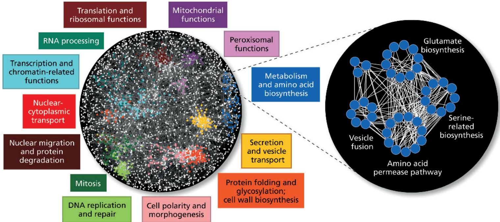

protein-protein interactions generated by this experiment and integrating them into the completed map required powerful computers, mathematical tools, and newly developed software.

#### [EN] Application of Systems Biology to Medicine

The Cancer Genome Atlas began in 2007 and culminated in 2018 with publications called the Pan-Cancer Atlas. This project is another example of systems biology in which many interacting genes and gene products are analyzed together as a group. Under the joint leadership of the National Cancer Institute and the NIH, the project aimed to determine how changes in biological systems lead to cancer. A pilot project set out to find all the common mutations in three types of cancer—lung cancer, ovarian cancer, and glioblastoma of the brain—by comparing gene sequences and patterns of gene expression in cancer cells with those in normal cells. Work on glioblastoma confirmed the role of several suspected genes and identified a few previously unknown ones, suggesting possible new targets for therapies.

As high-throughput techniques become more rapid and less expensive, they are increasingly being applied to the problem of cancer. The approach described previously proved so fruitful for those three types of cancer that it was extended to ten other types, chosen because they are common and often lethal in humans, as well as to metastatic tumors (see Figure 12.20), those that have dispersed from primary tumors and invaded organs far away in the body. Ninety percent of cancer deaths are primarily caused by metastasis. Results from the study of metastatic tumors, published in 2017,

highlighted several key genes whose mutations were frequently found in metastases and could be targets for chemotherapy. Overall, the Pan-Cancer Atlas contributed significantly to understanding how, where, and why tumors arise, underscoring the value of an integrative systems biology approach to treating cancer.

In addition to whole-genome sequencing, RNA-seq (see Figure 20.12) is used to analyze gene expression patterns in patients who have various cancers and other diseases. Analyzing which genes are overexpressed or underexpressed in a particular cancer allows physicians to tailor patients' treatment to their unique genetic makeup and the specifics of their cancers. This approach has been used to characterize subsets of particular cancers, enabling more refined treatments. Breast cancer is one example (see Figure 18.27).

Eventually, medical records may include an individual's DNA sequence, a sort of genetic bar code, with regions highlighted that predispose the person to specific diseases. The use of such sequences for personalized medicine—disease prevention and treatment—has great potential.

#### [EN] Artificial Intelligence and Machine Learning Applied to Bioinformatics

The term artificial intelligence (AI) describes the development and use of computer systems that can function like neural networks in the human brain to perform various tasks, such as decision-making, pattern recognition, and learning from existing data. AI is becoming an essential tool in bioinformatics,

transforming how researchers analyze biological data, identify patterns, and develop new medical treatments. By automating complex tasks, AI accelerates discoveries and enhances precision in various fields of life sciences. Machine learning, a subset of AI, allows computers to learn from data, improving their ability to make predictions and recognize biological trends that would be difficult to detect using traditional methods.

AI is widely used in a variety of biological applications. In genomics and sequencing, AI can analyze massive genetic datasets to identify specific genes and predict mutations that may be linked to diseases. Machine learning models help detect patterns in DNA sequences, allowing researchers to better understand genetic variations and their potential health implications. In drug discovery applications, AI is revolutionizing the process of identifying new drugs by simulating molecular interactions and predicting how different compounds will interact with biological targets. Virtual drug screening powered by AI accelerates the search for promising therapeutic compounds. Biological imaging serves as another example, in which AI-driven image analysis enhances diagnostic accuracy in medical imaging. By analyzing microscopic and other images, AI can detect cancer cells, classify tissue samples, and identify other abnormalities with high precision—for example, the broken bone in Figure 21.5. As AI continues to develop, its integration into bioinformatics will expand, driving innovation in medical research, diagnostics, and personalized medicine.

Figure 21.5 Example of the use of artificial intelligence (AI) in medical diagnosis.

The AI model overlays the radiograph with a "heatmap" in which the colors indicate probability of a fracture. The area highlighted red in the center of the heatmap is where AI predicts a fracture has occurred. A doctor could then check that area very carefully; this would reduce the chance a fracture might be overlooked.

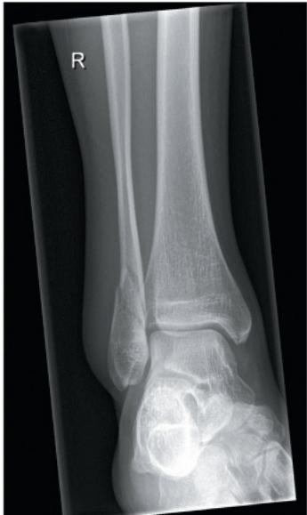  
(a) Radiograph of the fibula

  
(b) Radiograph with AI-generated heatmap overlaid

#### [EN] Concept Check 21.2

1. What role does the Internet play in current genomics and proteomics research?

2. Explain the advantage of the systems biology approach to studying cancer versus the approach of studying a single gene at a time.

3. MAKE CONNECTIONS The ENCODE pilot project found that at least 75% of the genome is transcribed into RNAs, far more than could be accounted for by protein-coding genes. Review Concepts 17.3 and 18.3 and suggest some roles that these RNAs might play.

4. MAKE CONNECTIONS In Concept 20.2, you learned about genome-wide association studies. Explain how these studies use the systems biology approach.

For suggested answers, see Appendix A.

<!-- C-END Campbell 21.2 -->

<!-- L-BEGIN Lehninger 9.3 -->

### 【英文对应 Lehninger §9.3：Genomics and the Human Story】

> 来源：Lehninger Principles of Biochemistry（书籍/02_生物化学原理） 第9章 DNA-Based Information Technologies，§9.3。

Since the report of the first complete human genomes in 2001, human genome sequencing has become routine. The genomes of tens of thousands of other species have now been sequenced and made publicly available, providing a look at genomic complexity throughout the three domains of living organisms: Bacteria, Archaea, and Eukarya. Whereas many early sequencing projects focused on species commonly used in research laboratories, the projects now include species of practical, medical, agricultural, and evolutionary interest. Genomes from every known bacterial family have been sequenced. Completed eukaryotic genome sequences number in the tens of thousands. Genomes of extinct species such as Homo neanderthalensis and of humans who died in past millennia have also been sequenced. Personal genomes are playing an ever-increasing role in medicine.

Each genome sequence becomes an international resource for researchers. Collectively, the sequences provide a source for broad comparisons that help pinpoint both variable and highly conserved gene segments, and they allow the identification of genes that are unique to a species or group of species. Efforts to map genes, identify new proteins and disease-related genes, elucidate genetic patterns of medical interest, and trace our evolutionary history are among the many initiatives under way.

#### [EN] The Human Genome Contains Many Types of Sequences

The rapidly growing genome databases have the potential not only to fuel advances in all realms of biochemistry but also to change the way we think about ourselves. What does our own genome, and comparisons with those of other organisms, tell us?

In some ways, we are not as complicated as we once imagined. Humans have only about 20,000 protein-coding genes—less than twice the number in a fruit fly (13,600 genes), not many more than in a nematode worm (19,700 genes), and fewer than in a rice plant (38,000 genes).

In other ways, we are more complex than we previously realized. Many, if not most, eukaryotic genes contain one or more segments of DNA that do not code for the amino acid sequence of a polypeptide product. These nontranslated segments interrupt the otherwise colinear relationship between the gene's nucleotide sequence and the amino acid sequence of the encoded polypeptide. Such nontranslated DNA segments are called introns, and the coding segments are called exons (Fig. 9-24). Few bacterial genes contain introns. The introns are spliced from a precursor RNA transcript to generate a transcript that can be translated contiguously into a protein product (see Chapter 26). An exon often (but not always) encodes a single domain of a larger, multidomain protein. Humans share many protein domain types with plants, worms, and flies, but the domains in the human genome are mixed and matched in more complex ways, increasing the variety of proteins found in our proteome. Alternative modes of gene expression and RNA splicing permit alternative combinations of exons, leading to the production of more than one protein from a single gene. Alternative splicing (Chapter 26) is far more common in humans and other vertebrates than in worms or bacteria, allowing greater complexity in the number and kinds of proteins generated.

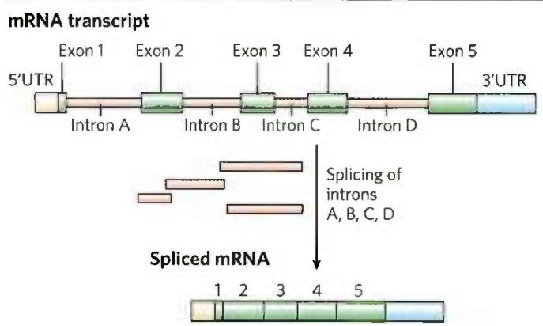  
FIGURE 9-24 Introns and exons. This gene transcript contains five exons and four introns, along with 5' and 3' untranslated regions (5'UTR and 3'UTR). Splicing removes the introns to create an mRNA product for translation into protein.

In mammals and some other eukaryotes, the typical gene has a much higher proportion of intron DNA than exon DNA; in most cases, the function of introns is not clear. Less than 1.5% of human DNA is “protein-coding” or exon DNA, carrying information for protein products (Fig. 9-25a). However, when introns are included in the accounting, as much as 30% of the human genome consists of genes that encode proteins. Several efforts are under way to categorize protein-coding genes by type of function (Fig. 9-25b).

(a) Human genome: DNA sequence types  

(b) Human genome: Protein-coding genes  
  
FIGURE 9-25 A snapshot of the human genome. (a) This pie chart shows the proportions of various types of sequences in our genome. The classes of transposons that represent nearly half of the total genomic DNA are indicated in shades of gray. LTR retrotransposons are retrotransposons with long terminal repeats (see Fig. 26-33). Long interspersed nuclear elements (LINEs) and short interspersed nuclear elements (SINEs) are special classes of particularly common DNA transposons. (b) The approximately 20,000 protein-coding genes in the human genome can be classified by the type of protein encoded. [Information from (a) T. R. Gregory, Nature Rev. Genet. 6:699, 2005; (b) www.pantherdb.org.]

The relative paucity of protein-coding genes in the human genome leaves a lot of DNA unaccounted for. Much of the DNA that does not encode proteins (exons or introns) is in the form of repeated sequences of several kinds. Perhaps most surprising is that about half the human genome is made up of moderately repeated sequences that are derived from transposons, segments of DNA, ranging from a few hundred to several thousand base pairs long, that can move from one location to another in the genome. Originally discovered in corn by Barbara McClintock, who called them transposable elements, transposons are a kind of molecular parasite. They make their home in the genomes of essentially every organism. Many transposons contain genes encoding the proteins that catalyze the transposition process itself, as described in more detail in Chapters 25 and 26. There are several classes of transposons in the human genome. Many are strictly DNA segments, which have slowly increased in number over the millennia as a result of replication events coupled to the transposition process. Some, called retrotransposons, are closely related to retroviruses, transposing from one genomic location to another through RNA intermediates that are reconverted to DNA by reverse transcription. Some transposons in the human genome are active elements, moving at a low frequency, but most are inactive, evolutionary relics altered by mutations. Transposon movement can lead to the redistribution of other genomic sequences, and this has played a major role in human evolution.

Once the protein-coding genes (including exons and introns) and transposons are accounted for, perhaps 25% of the total DNA remains. As a follow-up to the Human Genome Project, the ENCODE initiative was launched by the National Human Genome Research Institute in 2003 to identify functional elements in the human genome. P1 The work of the worldwide consortium of research groups engaged in the ENCODE initiative has revealed that the vast majority (>80%, including protein-coding genes, most transposons, and more) of the DNA in the human genome is either transcribed into RNA in at least one type of cell or tissue or is involved in some functional aspect of chromatin structure. Much of the noncoding (nontranscribed) DNA in the remaining 20% contains regulatory elements that affect the expression of the 20,000 protein-coding genes and the many additional genes encoding functional RNAs. Many mutations (SNPs; described below) associated with human genetic diseases lie in this noncoding DNA, probably affecting regulation of one or more genes. As described in Chapters 26 and 27, new classes of functional RNAs are being discovered at a rapid pace. P1 Many of these functional RNAs, now being identified by a variety of screening methods, are produced by RNA-coding genes whose existence was previously unsuspected.

About 3% or so of the human genome consists of highly repetitive sequences referred to as simple-sequence repeats (SSRs). Generally less than 10 bp long, an SSR is sometimes repeated millions of times per cell, distributed in short segments of tandem repeats. The most prominent examples of SSR DNA are found in centromeres and telomeres (see Chapter 24). Human telomeres, for example, consist of up to 2,000 contiguous repeats of the sequence GGTTAG. Additional, shorter repeats of simple sequences also occur throughout the genome. These isolated segments of repeated sequences, often containing up to a few dozen tandem repeats of a simple sequence, are called short tandem repeats (STRs). Such sequences are the targets of the technologies used in forensic DNA analysis (see Box 8-1).

What does all this information tell us about the similarities and differences among individual humans? Within the human population there are millions of single-base variations, called single nucleotide polymorphisms, or SNPs (pronounced "snips"). Each person differs from the next by, on average, 1 in every 1,000 bp. Many of these variations are in the form of SNPs, but the human population also has a wide range of larger deletions, insertions, and small rearrangements. From these often subtle genetic differences comes the human variety we are all aware of—such as differences in hair color, stature, foot size, eyesight, allergies to medication, and (to some unknown degree) behavior.

The process of genetic recombination during meiosis tends to mix and match these small genetic variations so that different combinations of genes are inherited (see Chapter 25). However, groups of SNPs and other genetic differences that are close together on a chromosome are rarely affected by recombination and are usually inherited together; such a grouping of multiple SNPs is known as a haplotype. Haplotypes provide convenient markers for certain human populations and for individuals within populations.

Defining a haplotype requires several steps. First, positions that contain SNPs in the human population are identified in genomic DNA samples from multiple individuals (Fig. 9-26a). Each SNP in a prospective haplotype may be separated from the next SNP by several thousand base pairs and still be regarded as "nearby" in the context of chromosomes that extend for millions of base pairs. Second, a set of SNPs typically inherited together is chosen as a defined haplotype (Fig. 9-26b); each haplotype consists of the particular bases found at the various SNP positions within the defined set. Finally, tag SNPs—a subset of SNPs that define an entire haplotype—are chosen to uniquely identify each haplotype (Fig. 9-26c). By sequencing just these tag positions in genomic samples from human populations, researchers can quickly identify which of the haplotypes are present in each individual. Especially stable haplotypes exist in the mitochondrial genome (which does not undergo meiotic recombination) and on the Y chromosome (only $3\%$ of which is homologous to the X chromosome and thus subject to recombination). As we will see, haplotypes can be used as markers to trace human migrations.

  
FIGURE 9-26 Haplotype identification. (a) The positions of SNPs in the human genome can be identified in genomic samples. The SNPs can be in any part of the genome, whether or not it is part of a known gene. (b) Groups of SNPs are compiled into a haplotype. The SNPs vary in the overall human population, as in the four fictitious individuals shown here, but the SNPs chosen to define a haplotype are often the same in most individuals of a particular population. (c) A few SNPs are chosen as haplotype-defining (tag  
SNPs, outlined in red), and these are used to simplify the process of identifying an individual's haplotype (by sequencing 3 instead of 20 loci). (c) For example, if the positions shown here were sequenced, an A–T–C haplotype might be characteristic of a population native to one location in northern Europe, whereas G–T–C might be the prevailing sequence in a population in Asia. Multiple haplotypes of this kind are used to trace prehistoric human migrations. [Information from International HapMap Consortium, Nature 426:789, 2003, Fig. 1.]

#### [EN] Genome Sequencing Informs Us about Our Humanity

The human genome is very closely related to other mammalian genomes over large segments of every chromosome. However, for a genome measured in billions of base pairs, differences of just a few percent can add up to millions of genetic distinctions. Searching among these, and making use of comparative genomics techniques, researchers can begin to explore the molecular basis of definably human characteristics.

The genome sequences of our closest biological relatives, the chimpanzee (Pan troglodytes) and bonobo (Pan paniscus), offer some important clues, and we can use them to illustrate the comparative process. Human and chimpanzee shared a common ancestor about 7 million years ago. Genomic differences between the species, including SNPs and larger genomic rearrangements such as inversions, deletions, and fusions, can be used to construct a phylogenetic tree (Fig. 9-27a). Over the course of evolution, segments of chromosomes may become inverted as a result of a segmental duplication, transposition of one copy to another arm of the same chromosome, and recombination between them (Fig. 9-27b); such inversions have occurred in the human lineage on chromosomes 1, 12, 15, 16, and 18. Two chromosomes found in other primate lineages have been fused to form human chromosome 2 (Fig. 9-27c). The human lineage thus has 23 chromosome pairs rather than the 24 pairs typical of simians. Once this fusion appeared in the line leading to humans, it would have represented a major barrier to interbreeding with other primates that lacked it.

If we look only at base-pair changes, the published human and chimpanzee genomes differ by only 1.23% (compared with the 0.1% variance from one human to another). Some variations are at positions where there is a known polymorphism in either the human population or the chimpanzee population, and these are unlikely to reflect a species-defining evolutionary change. When we ignore these positions, the differences amount to about 1.06%, or about 1 in 100 bp. This small fraction translates into more than 30 million base-pair differences, some of which affect protein function and gene regulation. Humans are approximately as closely related to bonobos as to chimpanzees.

The genomic rearrangements that help distinguish chimpanzee and human include 5 million short insertions or deletions involving a few base pairs each, as well as a substantial number of larger insertions, deletions, inversions, and duplications that can involve many thousands of base pairs. When transposon insertions—a major source of genomic variation—are added to the list, the differences between the human and chimpanzee genomes increase. The chimpanzee genome has two classes of retrotransposons that are not present in the human genome (see Chapter 26). Other types of rearrangements, especially segmental duplications, are also common in primate

(a)  

(b)  

  
FIGURE 9-27 Genomic alterations in the human lineage. (a) This evolutionary tree is for the progesterone receptor, which helps regulate many events in reproduction. The gene encoding this protein has undergone more evolutionary alterations than most. Amino acid changes associated uniquely with human, chimpanzee, and bonobo are listed beside each branch (with the residue number). (b) One of the multistep processes that can lead to the inversion of a chromosome segment. A gene or a chromosome segment is duplicated, then moved to another chromosomal location by transposition. Recombination of the two segments may result in inversion of the DNA between them. (c) The genes on chimpanzee chromosomes 2p and 2q are homologous to those on human chromosome 2, implying that two chromosomes fused at some point in the line leading to humans. Homologous regions can be visualized as bands created in metaphase by certain dyes, as shown here. [(a) Information from C. Chen, Mol. Phylogenet. Evol. 47:637, 2008.]

lineages. Duplications of chromosomal segments can lead to changes in the expression of genes contained in these segments. There are about 90 million bp of such differences between human and chimpanzee, representing another 3% of these genomes. Each species has segments of DNA, constituting 40 million to 45 million bp, that are entirely unique to that particular genome, with larger chromosomal insertions, duplications, and other rearrangements affecting more base pairs than do single-nucleotide changes. Thus, in all, chimpanzee and human differ over about 4% of their genomes.

(a)  

(b)  
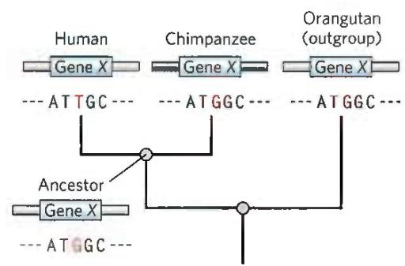  
FIGURE 9-28 Determination of sequence alterations unique to one ancestral line. (a) Sequences from the same hypothetical gene in human and chimpanzee are compared. The sequence of this gene in the two species' last common ancestor is unknown. (b) The orangutan genome is used as an outgroup. Because the sequence of the orangutan gene is identical to that of the chimpanzee gene, the mutation causing the difference between human and chimpanzee almost certainly occurred in the line leading to modern humans, and the common ancestor of human and chimpanzee (and orangutan) had the variant now found in chimpanzees.

Sorting out which genomic distinctions are relevant to features that are uniquely human is a daunting task. If one assumes a similar rate of evolution in the chimpanzee and human lines after they diverged from their common ancestor, half the changes represent chimpanzee lineage changes and half represent human lineage changes. By comparing both genome sequences with those of more distantly related species referred to as outgroups, we can determine which variant was present in the common ancestor. Consider a locus, X, where there is a difference between the human and chimpanzee genomes (Fig. 9-28a). The lineage of the orangutan, an outgroup, diverged from that of chimpanzee and human prior to the common ancestor of chimpanzee and human (Fig. 9-28b). If the sequence at locus X is identical in orangutan and chimpanzee, this sequence was probably present in the chimpanzee and human ancestor, and the sequence seen in humans is specific to the human lineage. Sequences that are identical in human and orangutan can be eliminated as candidates for human-specific genomic features. The importance of comparisons with closely related outgroups has given rise to new efforts to sequence the genomes of orangutan, macaque, and many other primate species. Comparison of the human and bonobo genomes is refining the analysis of genes and alleles of special significance to humans.

The search for the genetic underpinnings of special human characteristics, such as our enhanced brain function, can benefit from two complementary approaches. The first approach searches for genomic regions where extreme changes have occurred, such as genes that have been duplicated many times or large genomic segments not present in other primates. The second approach looks at genes known to be involved in relevant human disease conditions. For brain function, for example, one would examine genes that, when mutated, contribute to cognitive or mental disorders.

Notably, analyses of the human lineage have not detected an increased rate of genetic change in protein-coding genes involved in brain development or size. In primates, most genes that function uniquely in the brain are even more highly conserved than genes functioning in other tissues, perhaps due to some special constraints related to brain biochemistry. However, there are some differences in gene expression patterns between humans and other primates that may affect brain function. For example, the gene encoding the enzyme glutamate dehydrogenase, which plays an important role in neurotransmitter synthesis, has been subjected to gene duplication events, so that there are now multiple copies of it. Genomic regions related to gene regulation have disproportionately high numbers of changes in genes involved in neural development and nutrition. Our brains have become larger as a result, and additional functional effects may eventually be defined. A variety of RNA-coding genes, some with expression concentrated in the brain, also show evidence of accelerated evolution (Fig. 9-29). Many of these are probably involved in regulating the expression of other genes. As we continue to discover many new classes of RNA (see Chapter 26), we are likely to radically change our perspective on how evolution alters the workings of living systems.

#### [EN] Genome Comparisons Help Locate Genes Involved in Disease

One of the motivations for the Human Genome Project was its potential for accelerating the discovery of genes underlying genetic diseases. That promise has been fulfilled: P1 more than 6,000 human mutation phenotypes, mostly associated with genetic diseases, have been mapped to particular genes or groups of genes.

For the last two decades, the main approach to gene mapping has been linkage analysis, yet another approach derived from evolutionary biology. In brief, the gene involved in a disease condition is mapped relative to well-characterized genetic polymorphisms that occur throughout the human genome. We can illustrate this approach by describing the search for one gene involved in early-onset Alzheimer disease.

About 10% of all cases of Alzheimer disease in the United States result from an inherited predisposition. Several different genes have been discovered that, when mutated, can lead to early onset of the disease. One such gene, PS1, encodes the protein presenilin-1, and its discovery made heavy use of linkage analysis. The search begins with large families having multiple individuals affected by a particular disease—in this case, Alzheimer disease. Two of the many family pedigrees used to search for this gene in the early 1990s are shown in Figure 9-30a. In studies of this type, DNA samples are collected from both affected and unaffected family members. Researchers first localize the region associated

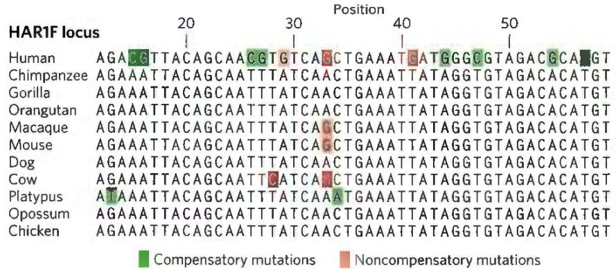  
FIGURE 9-29 Accelerated evolution in some human genes. The HAR1F locus specifies a noncoding RNA that is highly conserved in vertebrates. The human HAR1F gene has an unusual number of substitutions (highlighted by color shading), providing evidence of accelerated  
evolution. HAR1F RNA functions in the brain during neurodevelopment. Compensatory substitutions are those that retain complementarity where strand segments are paired. [Information from T. Marques-Bonet, Annu. Rev. Genomics Hum. Genet. 10:355, 2009.]

  
FIGURE 9-30 Linkage analysis in the discovery of disease genes. (a) These pedigrees for two families affected by early-onset Alzheimer disease are based on the data available at the time of the study. To protect family privacy, gender is not indicated. (b) Chromosome 14, with bands created by certain dyes. Chromosome marker positions are shown at the right, with the genetic distance between them in centimorgans, a genetic distance measurement that reflects the frequency of recombination between markers. TCRD  
(T-cell receptor delta) and PI (AACT (α1-antichymotrypsin)), two genes with alterations in the human population, were used along with SNPs as markers in chromosome mapping. (c) By comparing DNA from affected and unaffected family members, researchers eventually defined a region of interest near marker D14S43 that contains 19 expressed genes. The gene labeled S182 (red) encodes presenilin-1. (1 Mb = 10 $^{6}$ base pairs.) [Information from (a, b) G. D. Schellenberg et al., Science 258:668, 1992; (c) R. Sherrington et al., Nature 375:754, 1995.]

with a disease to a specific chromosome by comparing the genotypes of individuals with and without the disease, focusing especially on close family members. The specific points of comparison are sets of well-characterized SNP loci mapped to each chromosome, as identified by the Human Genome Project. By identifying the SNPs that are most often inherited with the disease-causing gene, investigators can gradually localize the responsible gene to a single chromosome. In the case of the PS1 gene, co-inheritance was strongest with markers on chromosome 14 (Fig. 9-30b).

Chromosomes are very large DNA molecules, and localizing the gene to one chromosome is only a small part of the battle. Localizing the gene to one chromosome (in this case, chromosome 14) is only the beginning of narrowing the search for a gene. Chromosomes are very large molecules; each one houses thousands of SNPs and other changes. Simply sequencing the entire chromosome would be unlikely to reveal the SNP or other change associated with the disease. Instead, investigators rely on statistical methods that correlate the inheritance of additional, more closely spaced polymorphisms with the occurrence of the disease, focusing on a denser panel of polymorphisms known to occur on the chromosome of interest. The more closely a marker is located to a disease gene, the more likely it is to be inherited along with that gene. This process can pinpoint a region of the chromosome that contains the gene. However, the region may still encompass many genes. In our example, linkage analysis indicated that the disease-causing gene, PS1, was somewhere near the SNP locus D14S43 (Fig. 9-30c).

The final steps in identifying the gene use the human genome databases. The local region containing the gene is examined, and the genes within it are identified. DNA from many individuals, some who have the disease and some who do not, is sequenced over this region. As the DNA in this region is sequenced from increasing numbers of individuals, gene variants that are consistently present in individuals with the disease and absent in unaffected individuals can be identified. An understanding of the function of the genes in the target region can aid the search, because particular metabolic pathways may be more likely than others to produce the disease state. In 1995, the chromosome 14 gene associated with Alzheimer disease was identified as S182. The product of this gene was given the name presenilin-1, and the gene was subsequently renamed PS1.

Many human genetic diseases are caused by mutations in a single gene or in sequences involved in regulation of that gene. Several different mutations in a particular gene, all leading to the same or related genetic condition, may be present in the human population. For example, there are several variants of PS1, all giving rise to a much-increased risk of early-onset Alzheimer disease. Another, more extreme example is the several genes encoding different hemoglobins: more than 1,000 known mutational variants are present in the human population. Some of these variants are innocuous; some cause diseases ranging from sickle cell disease to thalassaemias. The inheritance of particular mutant genes may be concentrated in families or in isolated populations.

More complex are cases in which a disease condition is caused by mutations in two different genes (neither of which, alone, causes the disease), or in which a particular condition is enhanced by an otherwise innocuous mutation in another gene. Identifying the genes and mutations responsible for these digenic diseases is exceedingly difficult, and sometimes such diseases can be documented only within small, isolated, and highly inbred populations.

Genome databases provide alternative paths to the identification of disease genes. In many cases, we already have biochemical information about the disease. In the case of early-onset Alzheimer disease, an accumulation of the amyloid- $\beta$ protein in limbic and association cortices of the brain is at least partly responsible for the symptoms. Defects in presenilin-1 (and in a related protein, presenilin-2, encoded by a gene on chromosome 1) lead to the elevated cortical levels of amyloid- $\beta$ protein. Focused databases are being developed that catalog such functional information on the protein products of genes and on protein-interaction networks and SNP locations, along with other data. The result is a streamlined path to the identification of candidate genes for a particular disease. If a researcher knows a little about the kinds of enzymes or other proteins likely to contribute to disease symptoms, these databases can quickly generate a list of genes known to encode proteins with relevant functions, a list of additional uncharacterized genes with orthologous or paralogous relationships to these genes, a list of proteins known to interact with the target proteins or orthologs in other organisms, and a map of gene positions. Often, with the aid of data from some selected family pedigrees, a short list of potentially relevant genes can be rapidly determined.

These approaches are not limited to human diseases. The same methods can be used to identify the genes involved in diseases—or genes that produce desirable characteristics—in other animals and in plants. Of course, they can also be used to track down genes involved in any observable trait that a researcher might be interested in.

#### [EN] Genome Sequences Inform Us about Our Past and Provide Opportunities for the Future

Anatomically modern humans arose in Africa between 250,000 and 350,000 years ago. About 100,000 to 120,000 years ago, humans in Africa looked out across the Red Sea to Asia. Perhaps encouraged by some innovation in small boat construction, or driven by conflict or famine, or simply curious, they crossed the water barrier. That initial colonization began a journey that did not stop until humans reached Tierra del Fuego (at the southern tip of South America), many thousands of years later. As Homo sapiens populations moved into more northern parts of Europe and Asia about 45,000 years ago, established populations from previous hominid expansions into Eurasia, including Homo neanderthalensis and a group now called the Denisovans, were displaced. The Neanderthals and Denisovans disappeared, just as other hominid lines had disappeared before them.

The story of how modern humans first appeared in Africa a few hundred thousand years ago, and their migrations as they eventually radiated out of Africa, is written in our DNA. Genomic sequences from multiple species have brought both primate and hominid evolution into sharper focus. Using haplotypes present in extant human populations, we can trace the migrations of our intrepid ancestors across the planet (Fig. 9-31a). The Neanderthals were not simply displaced. Some mingling occurred (Fig. 9-31b). Using sensitive PCR-based methods, we now possess multiple complete sequences of the Neanderthal genome (Box 9-2). We know that up to 5% of the genome of most

#### [EN] Getting to Know Humanity's Next of Kin

Modern humans and Neanderthals coexisted in Europe and Asia as recently as 30,000 years ago. The human and Neanderthal ancestral populations diverged about 370,000 years ago, somewhat before the appearance of anatomically modern humans. Neanderthals used tools, lived in small groups, and buried their dead. Of the known hominid relatives of modern humans, Neanderthals are the closest. For hundreds of millennia, they inhabited large parts of Europe and western Asia (Fig. 1). If the chimpanzee genome can tell us something about what it is to be human, the Neanderthal genome can tell us more.

Buried in the bones and other remains taken from burial sites are fragments of Neanderthal genomic DNA. Technologies developed for use in forensic science (see Box 8-1) and studies of ancient DNA have been combined in the Neanderthal genome project.

This endeavor is unlike the genome projects aimed at extant species. The Neanderthal DNA is present in small amounts, and it is contaminated with DNA from other animals and bacteria. How does one get at it, and how can one be certain that the sequences really came from Neanderthals? The answers have been revealed by

  
FIGURE 1 Neanderthals occupied much of Europe and western Asia until about 30,000 years ago. Major Neanderthal archaeological sites are shown here. (Note that the group was named for the site at Neanderthal in Germany.)

non-African humans is derived from Neanderthals. Anatomically modern human remains up to 45,000 years old have been sequenced, beginning an effort to pinpoint the period of interbreeding. Human populations native to Melanesia and Australia acquired up to 6% of their genomic DNA from the Denisovans. Neanderthal DNA gave humans a more complex immune system, making us more resistant to infection but also a little more susceptible to autoimmune diseases. The story of our past is gradually taking shape as more genomes, of humans alive today and those who lived in past millennia, are being assembled.

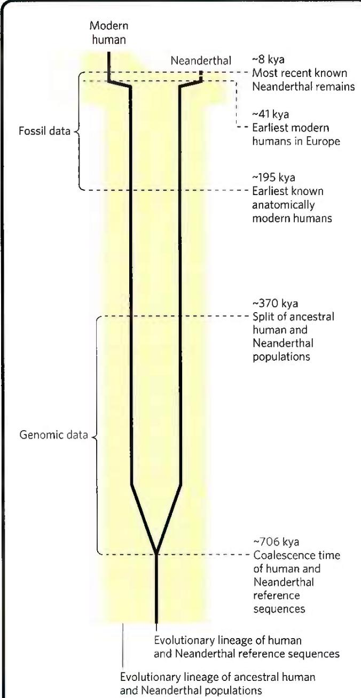  
FIGURE 2 This timeline shows the divergence of human and Neanderthal genome sequences (black lines) and of ancestral human and Neanderthal populations (yellow screen). Genomic data provide evidence for some intermingling of the populations up to about 45,000 years ago. Key events in human evolution are noted. [Information from J. P. Noonan et al., Science 314:1113, 2006.]

The medical promise of personal genomic sequences grows as sequencing costs continue to decline and more genes underlying inherited diseases are defined. P3 Knowledge of genomic sequences also provides the prospect of altering them. It is now commonplace to engineer the DNA sequences of organisms ranging from bacteria innovative applications of biotechnology. In essence, the small quantities of DNA fragments found in Neanderthal bone or other remains are cloned into a library, and the cloned DNA segments are sequenced at random, contaminants and all. The sequencing results are compared with the existing human genome and chimpanzee genome databases. Segments derived from Neanderthal DNA have sequences closely related to human DNA and chimpanzee DNA and thus are readily distinguished by computerized analysis from segments derived from bacteria or insects. Once these segments are sequenced, they can be used as probes to identify sequence fragments in ancient samples that overlap with these known fragments. The potential problem of contamination with the closely related modern human DNA can be controlled for by examining mitochondrial DNA. Human populations have readily identifiable haplotypes (distinctive sets of genomic differences; see Fig. 9-26) in their mitochondrial DNA, and analysis of Neanderthal samples has shown that Neanderthals' mitochondrial DNA has its own distinct haplotypes. The presence in the Neanderthal samples of some base-pair differences that are found in the chimpanzee database but not in the human database is more evidence that nonhuman hominid sequences are being found.

Multiple high-quality Neanderthal genomic sequences have been completed. The data provide evidence that modern humans and the Neanderthals who were the source of this DNA shared a common ancestor about 700,000 years ago (Fig. 2). Analysis of mitochondrial DNA suggests that the two groups continued on the same track, with some gene flow between them, for about 300,000 more years. The lines split with the appearance of anatomically modern humans, although evidence now exists for some intermingling of the lines somewhat later as humans spread through Eurasia.

Expanded libraries of Neanderthal DNA from different sets of remains are revealing Neanderthal genetic diversity, and may eventually tell us about Neanderthal migrations, providing a fascinating look at our hominid past.

and yeast to plants and mammals, for research and commercial purposes. Efforts to cure inherited human diseases by human gene therapy have not yet lived up to their potential, but technologies for gene delivery are constantly being improved. Few scientific disciplines will affect the future of our species more than modern genomics.

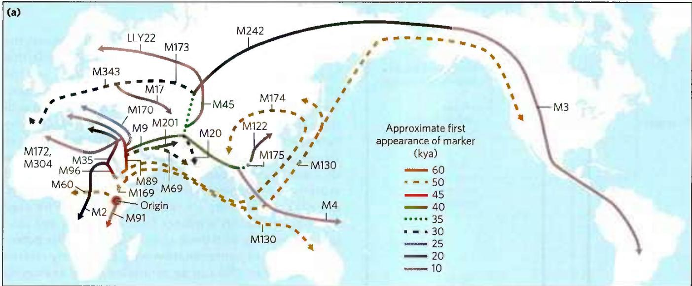

(b)  

FIGURE 9-31 The paths of human migrations. (a) When a small part of a human population migrates away from a larger group, it takes only part of the population's overall genetic diversity with it. Thus, some haplotypes are present in the migrating group but many are not. At the same time, mutations can create novel haplotypes over time. This map was generated from an analysis of genetic markers (defined haplotypes with M or LLY numbers) on the Y chromosome. The genetic samples were taken from indigenous populations long established at geographic points along the routes shown. The abbreviation kya means "thousand years ago." (b) Human migrations eventually displaced several closely related hominid groups, but not before some intermingling occurred. This tree illustrates gene-flow events documented from detailed genomic sequences of modern and ancient humans, as well as of Neanderthals and Denisovans. DNA from an unknown group of Neanderthals (A) is recorded in the genomes of all humans with some Eurasian heritage. A transfer of DNA from an unknown ancestor to the Denisovan line (B) contributed to ancestors of present-day individuals native to Australia and Pacific islands (Oceania). [Information from (a) G. Stix, Sci. Am. 299 (July):56, 2008; (b) S. Paäbo, Cell 157:216, 2014.]

#### [EN] SUMMARY 9.3 Genomics and the Human Story

■ About 30% of the DNA in the human genome is in the exons and introns of genes that encode proteins. Nearly half of the DNA is derived from parasitic transposons. Much of the rest encodes RNAs of many types. Simple-sequence repeats make up the centromere and telomeres.

■ The gene alterations that define humanity can be discerned in part through comparative genomics, using other primates.

■ Comparative genomics is also used to locate the gene alterations that define inherited diseases.

■ Human genomics can be used to study the evolution and migration of our human ancestors over many millennia.

<!-- L-END Lehninger 9.3 -->

## 11.2 高通量 DNA 序列分析技术

人类基因组计划的成功很大程度上得益于早期在有效地减少 DNA 测序成本的方法学上的投资。通过改良测序方法，不断提升其自动化程度，在人类基因组计划起始之后的十年内 DNA 测序的成本降低了 100 倍，从 20 世纪 70—80 年代每个碱基 10 美元降低到 1 美元 10 个碱基。在第一个人类基因组测序工作完成之际，美国国立人类基因组研究所 (NHGRI) 为基因组学研究的下一阶段提出了一系列计划，要在 10 年时间内分两阶段将测序的花费降低 4～5 个数量级：5 年后达到 10 万美元测序一个人类基因组，10 年后则要求达到 1 000 美元测序一个人类基因组。为了达到这个目标，NHGRI 资助了一系列研究项目，包括面向 10 万美元 / 基因组的、以基于 DNA 合成的测序方法和基于 DNA 连接的测序方法为代表的第二代测序仪，以及面向 1 000 美元 / 基因组的基于纳米孔测序技术的第三代测序仪。此外，对 Sanger 测序中样本准备的简化和整合、对毛细管阵列的隔离和检测、对 DNA 聚合酶催化的核苷酸聚合反应的实时荧光监测、基于杂交的测序等一系列基于物理、化学、生物化学和各种分光光度计、显微镜测量法鉴定核苷酸序列的技术也在他们的优先发展和改善之列。

## 11.2.1 Sanger DNA 序列测定基本原理

无论是对于重组质粒还是单个基因或是整个基因组,分析 DNA 结构的最基本方法就是测定出这些 DNA 分子的一级结构——DNA 序列。DNA 自动测序仪的出现使得 DNA 测序过程变得快捷而稳定,计算机处理能力的迅速提高则使得大量 DNA 小片段很容易被拼接成较大的片段甚至整条染色体。高效快捷的 DNA 测序方法始于 20 世纪 70 年代中期。当时有两种不同的测序方法,一种是 Sanger 的双脱氧链终止法,一种是 Maxam-Gilbert 的化学修饰法。在 DNA 测序技术发展过程中,双脱氧链终止法最终因其更适合于序列分析的自动化而逐渐占据了显著的优势地位。

剑桥大学的 F. Sanger 等人于 1977 年发明了利用 DNA 聚合反应的双脱氧链终止反应来测定核苷酸序列的方法。由于这种方法要求使用适当的 DNA 引物以单链 DNA 为模板在 DNA 聚合酶的催化下进行 DNA 的合成，因此也称为引物合成法或酶催引物合成法。在测序过程中使用的 DNA 聚合酶一般是去掉了 $5'\rightarrow3'$ 外切核酸酶活性的 DNA 聚合酶 I 的 Klenow 大片段。它利用 DNA 聚合酶所具有的两种酶催反应的特性：① 该酶能以单链 DNA 为模板，合成出准确的 DNA 互补链序列。② 如果以 $2',3'$ -双脱氧核苷三磷酸为底物，掺入到新合成的寡核苷酸链的 $3'$ 端后，DNA 链的延伸被终止。

在 DNA 测序反应中,加入模板 DNA(即待测序样本)、特异性引物、DNA 聚合酶、dATP、dTTP、dGTP、dCTP 和一种 ddNTP,当这种 2',3'-双脱氧 ddNTP 取代常规的脱氧核苷酸(dNTP)掺入到寡核苷酸链的 3' 端之后,由于 ddNTP 没有 3'-OH 基团,阻断了 DNA 聚合反应(图 11-8),寡核苷酸链不再继续延长,而在该位置上发生了特异性的链终止效应。

图 11-8 脱氧核苷三磷酸, dNTP(a) 和双脱氧核苷三磷酸, ddNTP(b) 分子结构式  
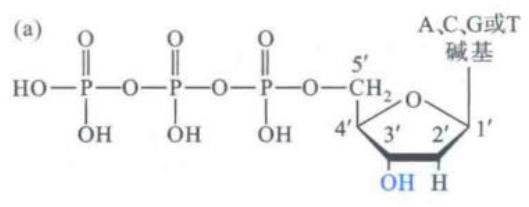

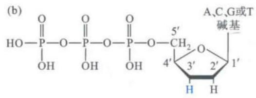

在同一个反应中,由于加入了大量的带 ${}^{32}$ P 放射性标记的 4 种 dNTP 及适量的某种 ddNTP (如 ddTTP),经过适当的温育之后,将会产生出不同长度的 DNA 片段混合物。它们都具有同样的 5' 端,并在 3' 端的 ddTTP 处终止。将这种混合物加到变性凝胶上进行电泳分离,就可以获得一系列全部以 3' 端 ddTTP 为终止残基的 DNA 片段的电泳谱带模式。分别加入 ddATP、ddGTP 和 ddCTP,在不同试管中温育后,点样于同一变性凝胶上作电泳分离,再通过放射自显影的方法检测单链 DNA 片段的放射性带,就可以直接读出 DNA 的核苷酸顺序。

## 11.2.2 基因组 DNA 大片段文库的构建

除了 DNA 序列测定技术的进步之外,20 世纪 80 年代后期发展起来的酵母人工染色体技术(yeast artificial chromosome, YAC)为创制基因组物理图以及最终的基因组序列测定提供了一个极为方便的平台。YAC $^{(图 11-9)}$ 含有 3 种必需成分:着丝粒、端粒和复制起点,是迄今容量最大的克隆载体,插入片段平均长度为 200\~1 000 kb,最大的可以达到 2 Mb。然而 YAC 载体同时也存在不少缺点,特别是其嵌合体比例较高,一个 YAC 克隆中可能含有两个或多个本来不相连的独立的 DNA 片段。部分克隆子不稳定,在继代培养过程中可能会发生缺失或重排。另外,由于 YAC 与酵母染色体具有相似的结构,实验操作中很难与酵母染色体区分开,操作时也容易发生染色体机械切割和断裂。

为了克服上述缺点,科学家用细菌的 F 质粒及其调控基因构建了细菌染色体克隆载体,称为 BAC(bacterial artificial chromosome),其克隆能力在 125\~150 kb。该质粒主要包括 oriS、repE(控制 F 质粒复制)和 parA、parB(控制拷贝数)等成分(图 11-10)。以 BAC 为基础的克隆载体形成嵌合体的频率较低,转化效率高,而且以环状结构存在于细菌体内,易于分辨和分离纯化,已被科学界广泛接受。

第 11 章 基因组与比较基组供 仅供个人科学教研

  
图 11-9 酵母人工染色体克隆载体及其克隆策略示意图  
(a) pYAC3 载体；
(b) pYAC3 的克隆策略。

## 11.2.3 鸟枪法序列测定技术及其改良

受 Sanger DNA 序列分析技术的限制,一次测序反应的长度不能超过 1000 bp,因此尚不能直接用 BAC 等大片段作为序列分析的模板,而往往采用所谓的全基因组鸟枪法测序技术,随机挑选带有基因组 DNA 的质粒做测序反应,然后在计算机的帮助下,运用一些基于图论的近似算法进行序列拼接(图 11-11)。

在对某基因组文库全部克隆片段进行末端序列测定过程中,未测到的碱基数与已测定的总碱基数相关,并随着已测定碱基数的增加迅速减小。当随机测定的碱基数达到基因组大小的5倍时,基因组中未测定的碱基数仅占基因组总碱基数的0.67%。但即使是在这样的覆盖度下,对于像流感嗜血杆菌这样大的基因组(1.83 Mb),仍然可能有128个平均长度为100 bp的缺口(gap)。因此,为了得到较为完整、质量较高的全基因组序列,针对各测序流程中的不同问题,人们提出了一系列策略:

图 11-10 细菌人工染色体的构建及其克隆策略

pBAC108L 来自细菌的一个小型 F 质粒, 其中 oriS 和 repE 控制了质粒的复制起始, parB 和 parA 控制了拷贝数。

图 11-11 基因组 DNA 的鸟枪法测序原理示意图  
图11-12 鸟枪法测序技术不能鉴别高等真核生物基因组中的重复序列  
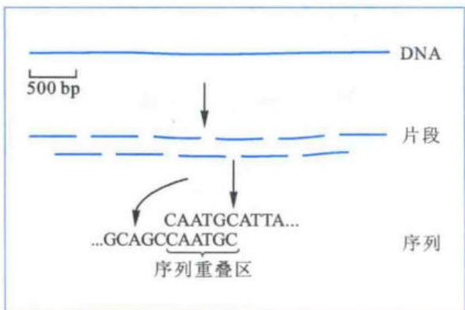

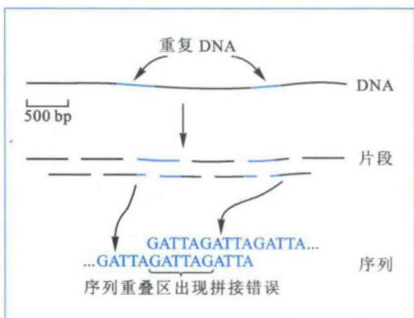

第一,建立高度随机、插入片段大小为1\~2 kb的基因组文库。保证克隆数超过一定值,并保证经末端测序的克隆片段的碱基总数达到基因组大小的5倍以上。

第二,高效、大规模的末端测序:对文库中每一个克隆进行两端测序。

第三,开发新的序列拼装软件最大限度地排除错误的连锁匹配。

第四，建立 $\lambda$ 文库以备缺口填补。

但即使是这样的策略仍不能弥补鸟枪法测序的一些缺点。对于更大的待测基因组，随着所需测序的片段数目大量增加，各个片段重叠成一个连续体的概率显著减小。另外，高等真核生物（如人类）基因组中存在的大量重复序列也会导致拼装困难(图11-12)。

图 11-13 改进后的鸟枪法测序原理图

针对上述问题,科学家在进行较大的真核基因组序列分析时大多采用大片段克隆法(clone contig)或靶标鸟枪法(directed shotgun)。用稀有限制性内切核酸酶先将待测基因组降解为几十万个碱基对的片段,再分别进行测序,或者根据染色体上已知基因或遗传标签的位置来确定部分DNA片段的排列顺序,逐步确定各片段在染色体上的相对位置(图11-13)。

## 11.2.4 Sanger测序法的改进及新一代测序技术

继 Sanger 的基于合成的双脱氧链终止法被广泛应用于核苷酸序列测定之后,人们对测序流程中的样品准备、分子标记、化学反应试剂以及测序的平行化等方面进行了大量改进,开发出一系列新一代测序技术,包括已经商业化并被广泛运用的第二代测序技术:Roche 454 焦磷酸测序(于 2013 年关闭),Illumina Solexa 基于合成的循环阵列测序,ABI SOLiD 基于连接的测序;第三代测序技术:单分子测序技术以及正在快速发展中的纳米孔测序技术。

人类基因组计划的提前完成离不开对早期 Sanger 测序法的不断改进。这主要包括 3 个方面: 用荧光标签替代放射性标记, 用毛细管电泳替代普通的平板电泳, 建立新的配对末端测序方案, 使对序列的测定突破了实际测序读长的限制。再加上对各种溶液、流体的自动操作技术大大简化了文库的准备工作, 整个测序流程开始向更高水平的自动化、平行化及高通量发展。现在, 毛细管阵列自动测序的成本已降至每千碱基对 0.5 美元, 通量也达到每机器每秒 24 个碱基。

为了满足现代生物学对测序技术的要求,一系列的策略被提出并付诸实验。虽然考虑到 Sanger 测序技术的成熟程度及其高精确度和读长上的优势,并且该技术已经受到了长期测序应用的检验,对其进一步在集成和流程整合方面进行改进不失为一个相对安全的选择,并且在短期内确实带来了切实的成本缩减。但是,要达到降低成本达 4\~5 个数量级的目标仍然需要对测序方法进行根本性的变革,以循环阵列测序为特征的各项第二代测序技术正是在这种背景下应运而生的。所有的第二代测序都采取了有别于 Sanger 测序法中细菌克隆培养扩增待测样本的策略,在随机片段化基因组 DNA 后,直接在体外连接上共同的接头序列 (adaptor sequence),然后通过乳胶 PCR 扩增或桥连 PCR 扩增等不同的方法产生一簇富集的扩增子,并最终被各自定位在固态反应基底的不同位置上。测序过程包括了一系列酶促生化反应和图像收集的自动循环 (图 11-14)。相对于 Sanger 测序法 (图 11-14a),第二代测序 (图 11-14b)所采取的体外构建测序文库、体外扩增测序模板以及更高密度的阵列化测序更大地提高了测序的自动化和平行化,从而极大地降低了测定单位碱基所消耗的各种生化试剂,大大降低了测序成本。当然,第二代测序读长较短,数据精确度不高,有待于进一步改良。

图 11-14 传统 Sanger 测序(a)与第二代测序(b)流程对比(另见书末彩插)

## 1. Illumina 基因组分析仪

Illumina 分析仪采用 DNA 片段化和接头序列连接方式,但采用桥连 PCR 方法进行模板的扩增(图 11-15)。该方法中正、反向 PCR 引物事先被连接在固相基底上,使单一模板产生的扩增子被固定和簇集在阵列的同一位置上。扩增全过程包括第一步各个单链模板与基底上的引物随机杂交起始互补链合成,随后经 DNA 变性及从邻近引物起始桥连扩增的周期循环,最终每个模板生成约 1 000 个扩增子。不同模板生成的扩增子集群散布在固相基底的不同位置,形成阵列。测序过程中,测序引物与待测模板末端的共同接头序列杂交,在 DNA 聚合酶的催化下以 4 种经化学修饰的核苷酸为底物开始合成待测序列的互补链[图 11-16(a)]。这 4 种核苷酸在 3' 羟基位置上被加了一个可切除的修饰基团,阻碍了下一个核苷酸的整合,类似于一个可逆聚合反应终止子的作用,保证在每轮链延伸过程中只有一个碱基整合。另外,每个核苷酸还带有一个可切除的荧光标记,用于序列信号的检测。在每轮链延伸和相应的荧光图像信号监测后,链终止修饰基团及荧光标记基团被切除,为下轮反应做准备。因此,Illumina 平台的测序反应是同步的。

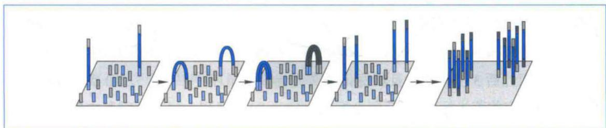  
图11-15 桥连PCR扩增测序模板  
图 11-16 各循环阵列测序及信号检测
(a) Illumina 测序循环;
(b) SOLiD 平台测序循环

1. FL1-dATP-(blocker) + FL2-dGTP-(blocker) + FL3-dcTP (blocker) + FL4-dTTP (blocker)

2. Fluorescence imaging in four channels

3. Chemically cleave labels and terminating moiety

2. Image, cleave, repeat×5

3. Reset and start again with new offset

由于荧光标记和终止修饰基团的切除反应可能不完全,测序过程中会出现信号衰减和去同步化等现象,随着合成链的不断延伸,测序质量大幅度降低,从而导致 Illumina 平台的有效读长相对较短。即使采取对每个测序模板进行配对的双末端测序策略,读长也只能达到 100 或者 150 碱基。由于使用了可逆的链延伸终止核苷酸,Illumina 平台对同多聚串的检测精确度较高。该平台最主要的测序错误为碱基替换。另外,由于 Illumina 分析仪由 8 个独立的反应通道组成,每个通道可以对一个独立文库进行测序,每个通道中又可以分布几百万个相互独立的扩增子集群,这就导致 Illumina 平台的测序通量较大,测序成本更低。

## 2. ABI SOLiD

SOLiD 系统在 DNA 片段化、接头序列的连接以及模板扩增等步骤上均与 Ilumina 平台相似。经扩增后带有大量模板 DNA 拷贝的磁珠被固定在平面基底上，形成一个密集而无序的阵列。测序过程中链延伸的反应并非由 DNA 聚合酶催化，而是由 DNA 连接酶催化完成。通用的测序引物与小磁珠上待测序列末端的接头序列杂交后，每轮测序过程都涉及 DNA 连接酶催化的被荧光标记的简并八聚核苷酸探针的连接反应 [图 11-16(b)，图 11-17(a)]。SOLiD 系统目前采用两碱基编码探针 [图 11-17(b)]，即简并八核苷酸探针的第一位和第二位碱基决定探针所带的荧光标记的颜色。一个测序引物与模板 DNA 杂交后便启动了 1,2-位编码的八核苷酸探针与模板的杂交，随后便历经连接酶催化连接、采集荧光信号、切除探针后 3 位核苷酸及所标记的荧光标签的循环 [图 11-17(a)]。10 次这样的循环产生 10 个对应的荧光标记信号，每个标记对应于 DNA 序列上每五个碱基中的前两个碱基序列 [图 11-17(a)]。10 次循环结束后，经变性恢复模板单链，然后选用一个“n-1”引物，开始新一轮的 10 次连接反应循环 [图 11-17(a)]。“n-1”引物重新设定了被检测碱基的位置，所得到的 10 个荧光标记对应的碱基均向左移了一位。这样分别用 5 个依次位移的引物起始互补链的延伸，再将得到的不同颜色的荧光标记按顺序线性列出，并最终将它们比对到参考基因组上，解码出 DNA 序列 [图 11-17(b)]。这种两碱基编码的好处是提高了对不同颜色的检测及对单核苷酸差异 (SNP) 检测的精确性，因为此时对 SNP 的判定需要相邻的荧光颜色也发生变化。SOLiD 系统最主要的测序错误也是碱基替换。测序通量为所有平台中最大，但读长较短，仅达到 50～100 bp。

虽然第二代测序技术在文库及模板的准备阶段均采用在体外直接操作的方法,省略了 Sanger 测序法中所涉及的细菌克隆等步骤,但为了达到较易检测的信号强度,仍然保留了基于 PCR 的克隆扩增。该过程中不仅可能引入突变,对测序结果造成影响,而且对不同模板序列的扩增效率也不相同,给 RNA-seq 等需要测定序列丰度信息的实验带来人为影响。由于信号检测实际上来自同一模板大量拷贝的信号叠加,一旦合成过程中出现去同步化现象,将会带来信号噪声,并最终导致信号检测错误,或只能得到较短的读长。由于对荧光标记和终止修饰基团的切除反应可能不完全,链延伸反应可能不完全,每次加入的核苷酸或探针的数目可能不一致,去同步化现象较为常见。由此可见,PCR 扩增这一步限制了第二代测序技术的测序质量,提高了测序成本。

## 图 11-17 SOLiD 测序周期及双碱基编码和解码(另见书末彩插)

(a) SOLiD 测序 5 轮连接反应前 2 轮示意图，探针 3' 端第 1,2 位两个碱基决定荧光标记，杂交后探针 3' 端 6\~8 位碱基连同荧光标记被酶切切除，因此第一轮连接获得 (1,2); (6,7); …… (1+n\*5, 2+n\*5) 位的序列信息，然后下 4 轮探针依次左移一位，这样 5 轮反应获得全部序列信息。(b) SOLiD 测序结果的根据每轮反应对应的双碱基编码矩阵进行基因组比对，SNP 位点会造成 2 轮反应荧光信号的改变。

## 3. 单分子测序

在 Pacific Biosciences 公司的测序平台中, DNA 聚合酶被固定在 Zero Mode Waveguide 的基底表面, 将 4 种带有不同荧光标记的核苷酸以最适于 DNA 聚合反应的浓度添加到反应体系中，DNA聚合酶与结合了引物的单分子模板序列结合，并催化链的延伸[图11-18(a,b)]。Zero Mode Waveguide纳米结构使得激光对荧光染料的激发被限制在 $10^{-21}\mathrm{L}$ 的空间内，从而只激发处于该范围内的正被DNA聚合酶整合进入延伸链的核苷酸所标记的荧光染料，排除反应体系中其他所有带荧光标记的核苷酸的干扰。由于DNA聚合反应所需的带荧光标记的核苷酸的最适浓度在微克分子级别，解决了大多数单分子荧光检测方法要求荧光基团最适浓度达到皮克或纳克分子级别的问题。一旦核苷酸被整合到DNA链中，连接荧光标记的焦磷酸副产物很快扩散出Zero Mode Waveguide的检测区域，于是荧光信号也随之衰减到背景水平。随后模板移动到下一位，开始新一轮核苷酸的整合和信号检测。所以，该技术属于实时监测的测序平台，也是所有新测序平台中读长最长的测序方法，读长可达1000碱基或更长。由于两次核苷酸被整合事件之间的间隔时间极短，而且有些核苷酸在被整合入DNA链之前就被释放，该方法测序精确度不高，只有 $80\%$ 多。实验中，通过对同一模板进行15次或更多次序列测定，将精确度提高到大于 $99\%$ 。

纳米孔测序策略则完全有别于这些基于链合成的测序。该方法将核酸分子驱动通过一个纳米孔，逐个检测单碱基与纳米孔的相互作用，或者检测DNA通过纳米孔时电导系数的变化，推测核酸分子序列。目前英国牛津纳米孔科技公司（Oxdord Nanopore Tech.）首代MinION测序平台已经商业化，其测序仪仅U盘大小，包含2个测序试剂的Start Kit售价为1000美金，应用前景备受关注。MinIon采用生物膜定位的孔蛋白形成的纳米孔进行测序，经过改造后的生物膜孔蛋白如溶血素α-hemolysin会形成约1nm直径10nm长度的通道，利用核酸序列通过这一通道时每个碱基产生的特征电流强度来读取系列信息(图11-18c)。纳米孔测序由于不涉及聚合反应且直接显示测序结果，因此具有反应快、体积小、成本低、读长优势和测序时间短等特点，但是由于核酸通过纳米孔的速度较快，前后

  
图11-18 实时单分子测序  
(a) Pacific Biosciences 单分子测序孔示意图, 不同荧光标记的碱基在 DNA 聚合酶催化下配对模版时会发出特定波长的光和峰值, 从而透过反应孔底部小于波长的网孔被检测到; (b) Pacific Biosciences 单分子测序反应流程图; (c) Nanopore 单分子测序原理示意图, 不同碱基通过纳米孔时产生不同的电信号, 被灵敏的检测仪检测进而识别出序列信息。

(a)  
  
图 11-19 MinION 纳米孔测序仪和测序结果显示

(a) NanoporeMinIon 测序仪外观；(b) 在 IGV 基因组浏览软件中二代 Illumina 测序和 Nanopore 测序结果对比。二代测序由于片段较短，无法区分来自多个体混合样品中的染色体大片段缺失信息，Nanopore 测序结果准确检测到了箭头位置的染色体大片段缺失。

(b)  

碱基信号的交叠等影响,纳米孔测序的错误率较高。目前在基因组测序,染色体大片段缺失等研究领域应用较多(图11-19),同时辅以二代短序列高通量测序可以取得良好结果,但随着技术的进步和错误率的降低,单分子纳米孔测序的优势将日益突出。其中纳米材料直接生长产生纳米孔,特别是石墨烯材料的单分子纳米孔将在新的测序技术中得到广泛应用。

## 4. 新型建库技术 10X Genomics

10X Genomics 测序主要是利用大量的携带 DNA 标签编码 (barcode) 的微滴, 通过微流体通道使不同的 DNA 片段 (10 \~ 100 kb) 携带不同的 barcode, 将大片段 DNA 打断, 应用 Illumina 测序, 根据 barcode 的序列信息识别来自同一 DNA 片段的 reads, 并将其拼接成长 reads, 得到相连序列 (linked-reads), 进而完成对大片段 DNA 遗传信息的挖掘。通量低, 一直是 scRNA-seq 方法的瓶颈, 2015 年 10X Genomics 公司推出了基于 GemCode 技术的微流体平台, 该平台包含了 GemCode 仪器、试剂盒以及配套的数据分析软件。如图 11-20, 8 样品的卡盒中包括了带有 14 bp 分子条形码和 Illumina 测序兼容组分的寡糖 (oligo) 的凝胶珠、GemCode 试剂、DNA 样品、特殊处理的油滴。微流体通道以一个 “双十字” 型呈现, 凝胶珠、试剂以及 DNA 样品在第一个交叉完成混合, 接下来混合物被油包裹是在第二个交叉中完成, 分区后的凝胶珠被裂解后释放出 oligo, 传统的文库构建被启动。根据 barcode 信息可获得来源相同 DNA 模板的 linked-reads, 可以直观地呈现基因组结构信息, 用于检测缺失、重复和重排等结构变异, 是强有力的解析复杂的基因组的工具。该技术平台的另一大特色建库技术是染色体定相(phasing)，可以实现单体型结果的可视化，有利于对致病突变信息的获取。目前可与GemCode平台兼容的只有Illumina系统。

表 11-3 新一代测序平台比较

<table><tr><td>平台</td><td>文库/模板准备</td><td>测序反应</td><td>读长/碱基</td><td>测序时间/天</td><td>测序通量/Gb</td><td>优点</td><td>缺点</td><td>生物学应用</td></tr><tr><td>IlluminaHiseq/Nova Seq</td><td>片段化桥连PCR</td><td>可逆末端终止</td><td>75或100</td><td>3,2</td><td>150,6000</td><td>目前运用最广的平台</td><td>样本倍增力低</td><td>重测序</td></tr><tr><td>SOLiD 3</td><td>片段化乳胶PCR</td><td>连接测序</td><td>50</td><td>7,14</td><td>120</td><td>双碱基编码提供内部纠错机制</td><td>测序时间长</td><td>重测序</td></tr><tr><td>Nanopore</td><td>单分子</td><td>电信号测序</td><td>1M</td><td>2</td><td>40G</td><td>读长最长测序</td><td>高错误率</td><td>全长转录组测序</td></tr><tr><td>Pacific Biosciences</td><td>片段化单分子</td><td>DNA聚合酶测序</td><td>20k</td><td>&lt;1</td><td>1</td><td>读长最长</td><td>中等误率</td><td>全长转录组测序RNA-seq</td></tr></table>

<!-- W-BEGIN Watson 7 基因组学 -->

### 【中文对照 Watson 第7章：基因组学】

> 来源：Watson《基因的分子生物学》第七版中译本（书籍/03_基因的分子生物学_第七版） 第7章 分子生物学技术。

#### [W] 基因组学

在全基因组测序之前，要进行大尺度的 DNA 序列的比较是很困难的事情。人们最多只能对少数物种的少数基因序列进行研究。随着功能强大的全自动测序仪的问世，现在已经能够获得整个基因组的组织与遗传组分的完整信息。事实上，截止到本书撰写之时，超过 200 个物种的基因组序列已经被测定并完成组装。因此，现在我们可以对各种微生物、植物和动物之间的完整遗传组分进行比较分析。在本章中，我们将阐述基因组注释的一些基本方法，即采用实验和计算的方法从复杂的整个基因组中鉴定每个基因（包括内含子外显子结构，见第 14 章）和相关的调控序列。

生物信息学用于在全基因组中鉴定蛋白质编码基因

基因组序列由成万上亿个 A、C、T、G 按一定顺序排列而成，它们组成了有机体的各条染色体。如果不对基因组进行“注释”，其巨大冗长的序列不能提供任何有价值的信息。如下文所描述的，注释（annotation）是指系统鉴定每一段基因组 DNA 中所包含的蛋白质编码序列和非编码序列，后者是指那些调控 RNA，如 miRNA（见第 20 章）。对于每一个转录单元，都要确定其内含子与外显子的准确结构，如果所研究的基因组与模式生物（如酵母和果蝇）接近，就有可能确定基因组中大部分基因潜在的或已知的功能。只有获得了这些信息，才有可能把一个基因组的全部编码基因进行分类，并与其他

物种的基因组进行比较。

细菌和简单的真核生物的基因组注释相对直接，只需要识别可读框（open reading frame，ORF）即可。尽管并非所有的 ORF 都是真正的蛋白质编码基因，尤其是那些小 ORF。相对而言，可读框的识别较为容易，最具挑战性的还是如何确定基因的功能。

对于具有复杂的内含子外显子结构的动物基因组来说，这一挑战还要大得多。正因为如此，需要多种生物信息学分析工具来鉴定基因，并从复杂的基因组中识别其遗传组分。许多计算机程序已经被开发出来，根据各种序列参数，这些程序可以鉴定潜在的蛋白质编码基因（图7-21），包括依据两侧的5'和3'剪切位点来确定ORF。如在第14章中所讨论的，剪接供体和受体的序列既短又具有简并性（degenerate），但如果我们结合其他信息，如表达序列标签（expressed sequence tag，EST）数据的话（后面还要讨论），还是能够识别内含子与外显子的边界的。尽管如此，依靠计算机的方法并不能做到完全准确。大约有3/4的基因能够通过这种方法被预测，还有很多会被遗漏，即使在所识别的预测基因中，一些短的外显子，尤其是非编码外显子常常被错误地鉴定出来。

  
图 7-21 果蝇 vnd 位点的结构。图示为 X 染色体上一段长约 25kb、含有 vnd 基因的区域。vnd 基因转录物含有三个外显子和两个内含子。其中 5'（左）和 3'（右）端空白框表示非编码序列，它们不参与最终蛋白质的编码。FlyBase 是一个专门用做果蝇基因组分析的标准数据库。

#### [W] 用全基因组覆瓦式芯片分析转录组

在完成一个生物的全基因序列组装后，可以用来全面分析特定细胞或组织中全部蛋白质编码基因或者非编码序列（如内含子与miRNA基因）的转录。生物全基因组中为RNA合成提供模板的部分被称为转录组（transcriptome）。为了鉴定基因组中的这一特定部分，可将人工合成的、长50个核苷酸的单链DNA片段（寡核苷酸）点到玻璃或硅片上。每100～150bp的基因组序列设计一个这样的寡核苷酸片段，按基因组顺序依次排列，即是“覆瓦式芯片”。全基因组的覆瓦式芯片技术发展非常迅速。现在，该技术已经发展到可以在 $1cm^{2}$ 大的玻璃或者硅片上制备覆盖全基因组的完整的芯片。例如，100万个50mer的寡核苷酸可以点到同一张芯片上，可覆盖果蝇的整个基因组。我们在下面将讨论到，芯片上每个点（即每一段寡核苷酸序列）只能通过显微镜上的微型感应器才能检测其杂交信号（后文将详细讨论）。

为了获得转录组信息，将覆瓦式芯片与荧光标记的 RNA（或 cDNA）探针进行杂交（图 7-22）。这些探针可以来自特定类型的细胞，如海鞘幼虫尾部肌肉细胞或在特殊培养基里生长的酵母细胞。最终显示的结果是得到一系列杂交信号，对应于整个基因组中所有预

测的蛋白质编码序列（图 7-23）。另一种分析转录组表达谱的策略是对从培养细胞和分离组织中提取到的 cDNA 进行高通量测序。

全基因组覆瓦式芯片即时地提供了各个转录单元中的内含子与外显子结构的信息。因为内含子转录物并不是稳定的。虽然这些实验一般使用的都是总RNA（total RNA），但是由于外显子序列较内含子序列稳定，后者在初级转录物中更容易迅速地降解（见第14章）。经过标记和与覆瓦式芯片杂交，外显子序列显示的信号要比内含子序列的信号强得多。

  
图 7-22 全基因组覆瓦式芯片。图片表示的是用荧光标记探针杂交过的覆瓦芯片的一部分。芯片上均匀分布着大量的 DNA 探针，覆盖着目标区域。

  
图 7-23 全基因组覆瓦式芯片揭示基因中外显子-内含子结构。果蝇 3 号染色体上一个长 50kb 的区段，含 4 个基因。图上部所示为各个转录本的外显子和内含子的结构。白色箭头所指为一很大的内含子区，可能含有一个小外显子（micro-exon）。总 RNA 取自不同发育阶段的胚胎（红色，最幼嫩；绿色，老些；蓝色，更老些），与全基因组覆瓦式芯片杂交。此芯片由基因组序列上每 35bp 设计一个的 25bp 的寡核苷酸组成。杂交信号的强和弱对应于外显子和内含子。三种颜色呈现相似的信号强度表示在不同的胚胎发育时期该基因的表达的水平接近。（经许可引自 Manaketal.2006. Nat. Genet.38：1151-1158，Fig.5. Macmillan.）

全基因组覆瓦式芯片的另外一个优点是能用于检测非编码基因，如 miRNA 基因。miRNA 是由一些大片段的 RNA 前体（pri-RNA）加工而来。其转录单元长度为 1～10kb（见第 20 章）。通过与覆瓦式芯片杂交可以很容易地把 pri-RNA 检测出来。在某些情况下，miRNA 基因也含有内含子，只有在内含子被剪切后，该基因才能生成成熟的 miRNA。此外还有一些其他的非编码转录物也可被检测，其中包括蛋白质编码基因的内含子中的“反义”RNA（antisense RNA）。这些 RNA 可能在调控蛋白质编码基因的表达和功能方面发挥作用。

用覆瓦式芯片得到了一些令人震惊的结果：在一个典型的基因组中，大约有1/3的序列是转录的，尽管只有其中一小部分是蛋白质编码序列（人类的蛋白质编码序列只占基因组的5%）。这说明大多数转录物来自基因组中大量的内含子DNA序列。许多基因在离基因编码序列很远处（1Mb或更远）有5'端的非编码外显子。这些序列，有时候能相隔100万个碱基。在某些情况下，这些内含子区域能够产生miRNA和一些其他类型的非编码RNA。3'端非翻译区的延伸是非编码转录的另一来源。

#### [W] 专门的比对工具可用来鉴定 DNA 调控序列

基因组技术在鉴别基因和分析转录单元的结构方面十分有效。基因鉴定后，生物信息学方法能够预测该基因编码蛋白质的可能功能和结构，例如，是否含有已知的结构域（domain）或基序（motif），或者是否与已知蛋白质具有相似的特性。在这些方法中，基本局部比对搜索工具（Basic Local Alignment Search Tool，BLAST）提供了对蛋白质或者核苷酸序列搜索、比较和比对的一种强大的方法。通过 BLAST 搜索，一段外显子序列可以被快速地同庞大的蛋白质编码数据库进行比对。如果能与一个已知功能的蛋白质编码序列比对上，如 DNA 结合蛋白质、复制因子或细胞膜受体等，就可以了解该基因的可能活性和蛋白质产物。此外，简单的 BLAST 搜索还能识别产生 miRNA 的非编码转录物（见第 20 章）。

第 19 章我们将了解到，在基因编码序列之外还存在着许多 DNA 调控序列，这些序列调控着相关基因在机体内何时何处表达或关闭，对于这些序列的识别和分析更具挑战性。的确如此，有人将这些序列称为基因组中的“暗物质”（dark matter）。如今，只有全基因组学的方法能够鉴定这一类重要的 DNA 序列信息。

BLAST 搜索是为识别蛋白质编码序列而建立的，稍作改动也可用于鉴定脊椎动物的部分调控序列。细胞特异性增强子含有一个或多个序列特异性 DNA 结合蛋白质的位点簇（见第 19 章）。在某些情况下，这些短 DNA 序列位点簇可以通过比对被鉴定。计算机程序 VISTA 能以 10～20bp 的窗口对不同基因组进行比对，因此可以鉴定长度仅有 50～75bp 的不完全保守的非编码序列（图 7-24）。河豚鱼和小鼠具有 1 万个相似的非编码短序列，据信其中很多对应于组织特异性增强子。然而，这两种动物，尤其是小鼠，很可能有 10 万个增强子。由此而知，这些简单的序列比对方法并不能完全识别数量庞大的调控序列。

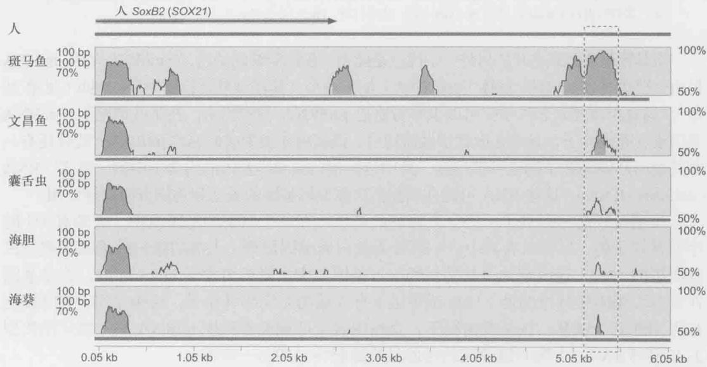  
图 7-24 不同物种中 SoxB2 基因的比较。淡紫色的信号对应的是 SoxB2 转录单元 3' 非翻译区的保守序列。粉红色的信号表示的是该基因下游的保守序列。虚线组成的矩形框表示的是调节神经系统中基因表达的增强子序列。（经授权，引用自 Royo J.L. et al. 2011. Proc. Natl. Acad. Sci. 108: 14186-14191, Fig. 1A, p. 14187）

组织特异性增强子还可以通过扫描基因组中的已知调控蛋白质的潜在结合位点来鉴定。例如，编码细胞黏附分子 $\alpha$ -环素（ $\alpha$ -catenin）的基因在许多不同的组织中都有表达，但在心脏前体细胞（心肌细胞）中的表达尤高。因此，就有可能通过对 $\alpha$ -环素基因的两侧和内含子序列的比对分析，寻找已知心脏调控蛋白质（如 MEF2C、GATA-4 和 E47/HAND）的结合位点，从而鉴定可能存在的心脏特异性增强子（图 7-25）。每一个调控蛋白都能识别一些长 6～10 bp 的 DNA 基序。这些结合位点可以用位权矩阵（position-weighted matrix, PWM）来描述，能够用不同的计算机和实验的方法，如 SELEX 来决定（详见本章后文）。应用 PWM 搜索 $\alpha$ -环素基因的位点，就鉴定到一个 MEF2C、GATA-4 和 E47/HAND 的结合位点簇。用实验方法也验证了这些结合位点簇位于基因的 5' 外侧，真正具有增强子的功能。

  
图 7-25 心脏特异性增强子的 in silico 鉴定。小鼠、大鼠和人类基因组 α 环素蛋白质基因 5'侧翼区域的一段长约 140bp 的序列具有很高的保守性。该保守序列含有三个关键的心脏分化调控蛋白质（E47/HAND、MEF2C 和 GATA）结合位点。在小鼠中已证明该序列是一个真正的心脏特异性增强子。理论上说，该序列可以通过 VISTA 比对（第 20 章，见图 20-4）或者心脏调控蛋白质聚类分析而被鉴定。（经许可，复制自 Vanpoucke G.，et al. 2004. Nucleic Acids Res. 32：4155-4165，图 1 局部）

#### [W] 基因组编辑可精确改变复杂基因组

之前介绍的基因组组装和注释方法，都是描述性的。它们能提供详细的全基因组图谱，但没有提供分子生物学家所渴望的功能信息。然而，最近发展起来的方法——基因组编辑——可对完整基因组中特定的 DNA 片段进行删除和修饰。该方法包括在特定的 DNA 序列处诱导双链断裂（double strand break, DSB），这会刺激同源重组依据外加的、经过修饰的 DNA 对断点进行修复。在断点修复过程中，想要的变化可以被特异地引入，从而对基因组序列进行修饰。目标切割可以通过定制化的核酸酶，一般是锌指核酸酶和“巨核酸酶”实现，它们可以切割基因组中特定的目标位点。然而，一种新型的核酸酶——转录激活因子类似效应核酸酶（transcriptional activator-like effector nuclease, TALEN）——展现出了更高的效率。TALEN 是新兴的、可作为不同模式生物及人类干细胞的目标基因组编辑工具。

<!-- W-END Watson 7 基因组学 -->

## 11.3 新测序平台的应用

新的高通量测序平台由于各自的诸多优点,已被广泛应用于对各种生物学问题的研究,包括通过对全基因组或者特定区域进行重测序从而发现个体间的诸如单核苷酸变体(SNV)以及结构变体(SV)等遗传差异,拼装细菌或低等真核生物基因组,测定不同生物、组织、细胞的转录组和表达谱,通过元基因组研究进行物种鉴定和分类,发现新基因,研究染色体构造变化和研究基因组整体范围上反式作用因子与顺式作用元件的结合等。

## 11.3.1 单核苷酸多态性(SNP)研究

SNP 作为目前最好的遗传标记,不仅在人类基因组遗传图谱的绘制上发挥了巨大作用,也为确定疾病的遗传学基础提供了信息。早期的传统测序方法及芯片技术已检测到大量人类常见 SNP, 而 HapMap 工程将这些 SNP 的共有模式进行分类, 形成单体型, 找出这些单体型的代表性标签 SNP, 从而有效地增加了实际操作中能够确定出个体单体型的区域。常通过全基因组相关分析 (genome-wide association study, GWA study 又称 GWAS), 许多 SNP 在疾病发生过程中的作用被发现。虽然少数疾病相关 SNP 被定位于已知基因的蛋白编码序列, 解释了疾病发生的机制, 大多数的疾病相关 SNP 却定位于了解甚少的基因间区, 因此, 这些 SNP 可能只是真正导致疾病的遗传多态性的邻近标记, 需要对该区域进行更精细的研究, 直到找出参与调控疾病发生的 SNP。由于不能通过对标签 SNP 进行 GWAS 分析找出不与周围 SNP 连锁的位点, 必须用新的方法才能研究这部分 SNP。

常见的 SNP 或 SV 只能解释极少数常见疾病的遗传机制,说明稀有 SNP 及 SV 在很多疾病发生的过程中起了重要作用,而这些也只能通过直接测定这些遗传变化的个体来研究。同样,单体型分析也不适用于研究导致癌症等疾病的体细胞突变,只有对大量个体进行深度测序才可能阐明这些问题。GWAS 结果显示拷贝数多态性区域(CNVR)影响很多疾病的易感性、复杂的表型和环境适应性,运用新一代测序技术显然比基于芯片的检测能够更好更准确地界定这类 CNVR 中 DNA 插入或删除的边界序列。

为了阐明癌症发生机制,从而对癌症进行更好的预测和治疗,人们正在开展癌症基因组工程,对各种癌症组织的基因组、表观遗传组、转录组、癌症病人体内大量的体细胞突变引起的 DNA 片段的插入、删除、易位等进行系统性深度序列分析。此外,服务于个性化医疗的个人基因组测定计划,都依赖于高通量、低成本的新一代测序技术。

## 11.3.2 高通量测序在染色体构象俘获技术上的应用

染色体构象俘获(chromosome conformation capture)技术针对细胞中染色体的空间排布和相互作用展开研究,相关的方法能够检测不同染色体上的基因位点或同一条染色体上间隔的基因位点间由于在三维结构上相互作用。这些三维相互作用具有促进启动子和增强子结合、形成染色体环(chromatin loop)来调控基因表达等生物学功能,相关的建库和高通量测序方法能够直接计算相互作用频率和重构染色体三维结构。其建库方法一般为首先化学方法胶联固定形成染色体三维构象的蛋白质和基因组DNA,酶切消化核酸后三维相互的基因组DNA由于结合蛋白的保护而得以保留,而后平末端的连接和解胶联反应可以使三维相互作用的基因组DNA连接成同一序列,对获得的序列添加接头并进行高通量测序可以获得染色体构象的准确信息。根据研究目的和相互作用尺度的不同,染色体构象俘获技术分为:一对基因位点之间(3C)、一个基因位点和多个基因位点(4C)、多个位点之间(5C)、全部基因位点之间(Hi-C)的相互作用研究。高通量测序技术在这一领域的广泛应用取得了一系列染色体三维尺度上基因表达调控的重要研究成果,例如对人CTCF因子相关的染色体构象俘获高通量测序结果很好地展示了染色体高级结构对组织特异性表达的调控,即不同染色体上的基因在构象调节因子的作用下形成的高级结构可以同时被RNA聚合酶Ⅱ高效转录的模型(图11-21)。

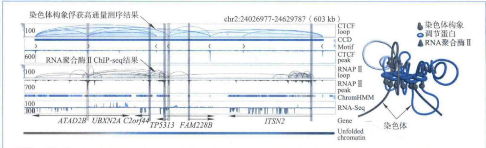  
图 11-21 染色体构象俘获高通量测序结果和染色体构象三维模拟结果 (Tang et al., 2015)

## 11.3.3 核糖体图谱测序和多核糖体图谱测序

越来越多的证据表明,除了基因的转录调控,基因的翻译调控对最终蛋白质含量的变化发挥着重要的作用。目前最常用的全基因组范围内有效检测翻译效率的方法是核糖体图谱测序(ribosome profiling sequencing)和多核糖体图谱测序(polysome profiling sequencing)两种不同的技术,从已发表文献数量的角度而言这两种技术的应用频率相当。多核糖体图谱测序的制备是将细胞裂解液沉降在蔗糖梯度中,从而分离结合有不同数量核糖体的mRNA分子,找到处于高效翻译状态的mRNA,其中含有3个以上核糖体的mRNA通常被称为多核糖体高度富集的RNA。分离得到的多核糖体RNA添加接头后测序并进行后续的翻译组研究。与之对应的,核糖体图谱测序检测的是被核糖体保护而没有被RNA酶消化的mRNA片段,对这些片段建库进行测序即为核糖体测序。多核糖体图谱测序和核糖体图谱测序虽然是研究目的相似的翻译组检测方法,但是多核糖体图谱测序检测的是富集多核糖体的mRNA序列,而核糖体图谱测序检测的是某时刻核糖体mRNA结合序列的“快照”,因此实验方法、测序长度和分析流程都有明显区别(图11-22)。多核糖体图谱测序的结果与蛋白质表达水平相关性更好,而核糖体图谱测序能够进行定位翻译起始位点和mRNA上核糖体的分布情况,两种方法都可以用来检测核糖体翻译速率和效率的变化,因此都是翻译组研究中重要的研究方法。

总之，DNA 中编码的遗传信息受到各种复杂的调控，包括 DNA 甲基化、组蛋白的甲基化和乙酰化等表观遗传修饰，各种转录因子，转录、翻译复合物与 DNA、RNA 的相互作用，增强子、绝缘子与各自反式作用因子间的相互作用及染色质高级结构等。随着第二代测序技术的发展，一系列针对这些问题的实验，如 MeDIP-seq、MethylC-seq、ChIP-seq、DNase-seq 以及染色体构象捕获结合高通量配对末端测序等被广泛应用。与经典的芯片技术相比，这些方法对全基因组有更敏感和更完整的覆盖率，对序列的边界有更好的分辨率，也能区分高度相似的序列。另外，序列测定的高通量特性使人们能够大规模鉴定各种顺式调节因子并研究其功能，深入探索各种生命现象的调节机制。

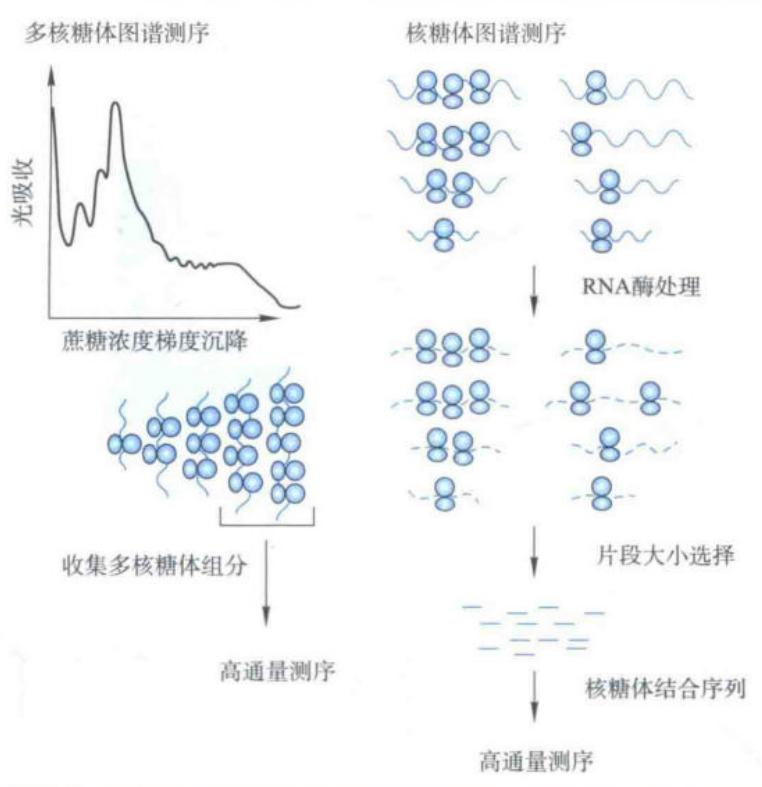  
图 11-22 多核糖体图谱测序和核糖体图谱测序原理

相较于 qPCR 只能测定极少数 RNA, 芯片分析很难分辨低丰度和高相似性核酸序列, 高通量的第二代测序分析不仅具有更高的敏感性和精确度, 并且可以发现新的转录物和变异体, 准确地定位转录起始位点。另外其测序读长较短的特点使得它非常适合小 RNA 测序, 鉴定 miRNA 并对靶 mRNA 进行分析。

## 11.4 其他代表性基因组

若干年前,几乎没有人相信有一天基因组序列测定的增长速度会超过著名的摩尔定律所描述的 CPU 运算能力的增长速度。事实上,随着测序技术的不断改善和测序成本的持续降低,近年来基因组序列数据每年呈指数形式增长。以 2016 年和 2017 年数据为例,全世界每年能够完成近 4 万个物种的基因组测序,并同时有近 4 万个物种的基因组测序项目正在进行(图 11-23)。

由于生物在进化上的相关性,很多重要的遗传元件具有很高的保守性,这种特性在基本的管家基因上表现尤为显著。不同生物之间遗传信息的差异则是各物种特异性性状的来源。因此,对一种生物基因组的研究可以为其他生物提供很多有价值的信息。随着越来越多基因组测序数据的积累,比较基因组学也愈加显示出其强大的威力。基于 DNA 序列的保守性,人们常通过对一种生物相关基因的认识来理解、诠释甚至克隆分离另一种生物的相应基因。对较近缘基因组间相似性的研究为认识基因结构与功能等细节提供了参考,而较远缘基因组间的相似性则有助于人类认识生物的普遍性机制,为寻找研究复杂生理和病理过程所需的实验模型提供理论依据。对于基因组之间差异性的研究为认识物种

图11-23 到2018年初每年已完成和正在进行的基因组测序项目

蓝色折线代表每年完成的基因组测序数目，黑色折线代表正在进行的基因组测序数目，数据来源 http://www.genomesonline.org/。

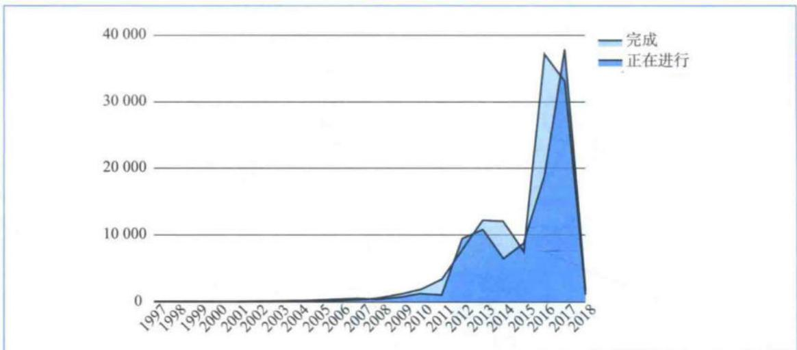  
特异性状、生命演化以及对不同环境的适应性提供了依据。

## 11.4.1 大肠杆菌基因组

大肠杆菌 K12: MG1655 基因组是包含 4 639 221 个碱基对的双链环状分子, 蛋白质编码基因占整个基因组的 87.8%, RNA 基因占 0.8%, 非编码的重复序列占 0.7%, 其余约 11% 为调控或其他功能区。共含有 4 400 多个可能的编码基因, 其中 3 700 个可以通过生化实验或者生物信息学分析得到合理的注释(表 11-4)。在被注释的基因中, 与物质运转和能量代谢相关的蛋白质含量分别占蛋白质总量的 9% 左右, 各种功能性酶、细胞结构蛋白、调控蛋白、细胞周期相关因子及参与蛋白质合成、参与重要中间物合成与代谢等过程的蛋白质分别占总蛋白的 4% 以上, 参与氨基酸合成及代谢, 参与 DNA 合成及代谢的蛋白质也都达到总蛋白的 3% 左右(表 11-5)。而其余未被注释的大约 700 个基因中有 650 个与其他细菌的基因显示出较高的同源性, 只有 50 个基因与其他任何物种都没有明显的同源性。

表 11-4 大肠杆菌各菌株基因组比较

<table><tr><td>菌株名称</td><td>基因组大小 /Mb</td><td>基因数目</td></tr><tr><td>O157_EDL933</td><td>5 528</td><td>5 349</td></tr><tr><td>O157_Sakai</td><td>5 498</td><td>5 361</td></tr><tr><td>E22</td><td>5 516</td><td>4 788</td></tr><tr><td>E110019</td><td>5 384</td><td>4 746</td></tr><tr><td>B171</td><td>5 299</td><td>4 467</td></tr><tr><td>53638</td><td>5 289</td><td>4 783</td></tr><tr><td>42</td><td>5 242</td><td>4 899</td></tr><tr><td>CFT073</td><td>5 231</td><td>5 379</td></tr><tr><td>H10407</td><td>~5 208</td><td>~5 000</td></tr><tr><td>F11</td><td>5 206</td><td>4 467</td></tr><tr><td>B7A</td><td>5 202</td><td>4 637</td></tr><tr><td>NMEC RS218</td><td>5 089</td><td>~4 900</td></tr><tr><td>E2348</td><td>5 072</td><td>4 594</td></tr><tr><td>E24377A</td><td>4 980</td><td>4 254</td></tr><tr><td>UPEC 536</td><td>~4 900</td><td>~4 800</td></tr><tr><td>101NA1</td><td>4 880</td><td>4 238</td></tr><tr><td>HS</td><td>4 643</td><td>3 689</td></tr><tr><td>K-12_W3110</td><td>4 641</td><td>4 390</td></tr><tr><td>K-12_MG1655</td><td>4 639</td><td>4 254</td></tr><tr><td>B03</td><td>4 629</td><td>4 387</td></tr></table>

表 11-5 大肠杆菌编码蛋白质的分类

<table><tr><td>功能</td><td>数量</td><td>占蛋白质总量/%</td></tr><tr><td>调控蛋白</td><td>178</td><td>4.15</td></tr><tr><td>细胞结构蛋白</td><td>224</td><td>5.22</td></tr><tr><td>膜蛋白</td><td>13</td><td>0.3</td></tr><tr><td>外源蛋白</td><td>87</td><td>2.03</td></tr><tr><td>物质运转相关蛋白</td><td>427</td><td>9.95</td></tr><tr><td>能量代谢相关蛋白</td><td>373</td><td>8.70</td></tr><tr><td>DNA合成与代谢</td><td>115</td><td>2.68</td></tr><tr><td>转录及RNA合成、代谢与修饰</td><td>55</td><td>1.28</td></tr><tr><td>翻译及蛋白质修饰</td><td>182</td><td>4.24</td></tr><tr><td>细胞周期相关因子</td><td>188</td><td>4.38</td></tr><tr><td>辅基、辅因子及其载体</td><td>103</td><td>2.40</td></tr><tr><td>伴侣蛋白</td><td>9</td><td>0.21</td></tr><tr><td>核苷酸的合成与代谢</td><td>58</td><td>1.35</td></tr><tr><td>氨基酸的合成与代谢</td><td>131</td><td>3.06</td></tr><tr><td>脂肪酸及磷脂的合成与代谢</td><td>48</td><td>1.12</td></tr><tr><td>重要中间物合成与代谢</td><td>188</td><td>4.38</td></tr><tr><td>酶</td><td>251</td><td>5.85</td></tr><tr><td>其他(功能已知蛋白)</td><td>26</td><td>0.61</td></tr><tr><td>未知蛋白</td><td>1632</td><td>38.06</td></tr></table>

研究发现,大肠杆菌基因组重复序列的排布可能与 DNA 的复制相关。如多拷贝重复排列的 rRNA 基因 (rrn) 位于环状染色体的中部,这个位置包含已知的 DNA 复制起始位点 oriC,其他许多与 rRNA 相关的 DNA 序列(TPIP)则位于环状染色体另一端的相应位置。此外,rrn 与 TPIP 序列对称分布在 oriC 两边的先导链上。并且 rrn 操纵子的转录通常朝着远离复制起始位点的方向进行。

## 11.4.2 酵母基因组

酿酒酵母基因组是第一个测序完成的真核生物基因组。该基因组全长13 040 000 bp，比单细胞的原核生物和古菌大一个数量级，是最小的真核基因组。其基因密度为1/2 kb，裂殖酵母基因密度则稍大，为1/2.3 kb，而简单多细胞生物线虫的基因密度则已低达1/30 kb。酵母基因组中共有5 885个蛋白编码基因，另有大约140个rRNA、40个snRNA（small nuclear RNA）和275个tRNA基因。其中约4%的编码基因（大多为rRNA基因）有内含子，并且通常位于靠近rRNA基因的起始部分。

比较不同酵母菌株发现,不同菌株之间遗传物质的差异非常大。Saccharomyces kluyveri 只有 7 条染色体,1 千万个碱基对;S. castellii 有 9 条染色体,9 百 72 万个碱基对;而 S. exiguus 和 S. cerevisiea 的基因组则都包含 16 条染色体,分别由 18 355 000 和 13 030 000 个碱基对组成 $^{(表11-6)}$ 。

表 11-6 酵母各菌株染色体数目及单个染色体、基因组数据比较

<table><tr><td>菌株名称</td><td>S. dairenensis</td><td>S. castellii</td><td>S. servazzii</td><td>S. unisporus</td><td>S. exiguus</td><td>S. kluyveri</td><td>S. cerevisiea</td></tr><tr><td>染色体数目</td><td>9</td><td>9</td><td>12</td><td>12</td><td>16</td><td>7</td><td>16</td></tr><tr><td colspan="8">单个染色体大小 /kb</td></tr><tr><td>1</td><td>730</td><td>550</td><td>570</td><td>560</td><td>395</td><td>970</td><td>220</td></tr><tr><td>2</td><td>800</td><td>660</td><td>620</td><td>630</td><td>470</td><td>1 110</td><td>280</td></tr><tr><td>3</td><td>1 060</td><td>820</td><td>690</td><td>660</td><td>660</td><td>1 300</td><td>360</td></tr><tr><td>4</td><td>1 200</td><td>860</td><td>720</td><td>720</td><td>740</td><td>1 410</td><td>445</td></tr><tr><td>5</td><td>1 300</td><td>890</td><td>740</td><td>800</td><td>780</td><td>1 510</td><td>555</td></tr><tr><td>6</td><td>1 510</td><td>1 000</td><td>870</td><td>840</td><td>880</td><td>1 750</td><td>610</td></tr><tr><td>7</td><td>1 600</td><td>1 320</td><td>960</td><td>960</td><td>970</td><td>1 950</td><td>690</td></tr><tr><td>8</td><td>1 800</td><td>1 720</td><td>1 010</td><td>1 010</td><td>1 020</td><td>-</td><td>760</td></tr><tr><td>9</td><td>1 920</td><td>1 900</td><td>1 100</td><td>1 100</td><td>1 080</td><td>-</td><td>800</td></tr><tr><td>10</td><td>-</td><td>-</td><td>1 250</td><td>1 250</td><td>1 250</td><td>-</td><td>830</td></tr><tr><td>11</td><td>-</td><td>-</td><td>1 850</td><td>1 850</td><td>1 300</td><td>-</td><td>920</td></tr><tr><td>12</td><td>-</td><td>-</td><td>1 950</td><td>1 950</td><td>1 470</td><td>-</td><td>960</td></tr><tr><td>13</td><td>-</td><td>-</td><td>-</td><td>-</td><td>1 510</td><td>-</td><td>1 010</td></tr><tr><td>14</td><td>-</td><td>-</td><td>-</td><td>-</td><td>1 780</td><td>-</td><td>1 100</td></tr><tr><td>15</td><td>-</td><td>-</td><td>-</td><td>-</td><td>1 950</td><td>-</td><td>1 600</td></tr><tr><td>16</td><td>-</td><td>-</td><td>-</td><td>-</td><td>2 100</td><td>-</td><td>1 900</td></tr><tr><td>基因组大小 /kb</td><td>11 920</td><td>9 720</td><td>12 330</td><td>11 560</td><td>18 355</td><td>10 000</td><td>13 040</td></tr></table>

许多酵母染色体由交替的高 GC 含量区段和低 GC 含量区段组成,并且 GC 含量的分布差异通常与这些染色体上的基因密度差异相一致。尤其是 3 号染色体,GC 含量的差异与染色体臂上基因的重组频率显著相关,GC 富集的染色体臂中部重组频率高,而重组频率低的端粒和着丝粒区域 GC 含量则较低。较小的 1 号、3 号、6 号和 9 号染色体的平均重组率超过整个基因组平均水平的 1.3～1.8 倍。

## 11.4.3 拟南芥基因组

拟南芥基因组是世界上第一个被测序的植物基因组,也是继线虫、果蝇之后第三个被测序的多细胞生物,全长约为115.4 Mb。基因组分析表明,在整个拟南芥进化过程中至少包括两次全基因组的复制以及广泛的基因缺失和重复复制,基因组中含有许多从蓝藻中横向转移过来的DNA片段。拟南芥5条染色体共编码约30 000个基因(表11-7)。与酵母、线虫、果蝇相比,拟南芥基因组中编码转录调控因子的基因数量显著增加(表11-8),从一个侧面反映了高等植物的复杂性。

表 11-7 TAIR 与 NCBI 所公布的拟南芥各染色体基因数目比较

<table><tr><td></td><td>TAIR</td><td>NCBI</td></tr><tr><td>1号染色体</td><td>7 437</td><td>8 018</td></tr><tr><td>2号染色体</td><td>4 753</td><td>5 152</td></tr><tr><td>3号染色体</td><td>5 825</td><td>6 362</td></tr><tr><td>4号染色体</td><td>4 574</td><td>4 848</td></tr><tr><td>5号染色体</td><td>6 769</td><td>7 120</td></tr><tr><td>合计</td><td>29 388</td><td>31 500</td></tr></table>

表 11-8 主要真核生物中转录调控因子数量比较

<table><tr><td>物种名</td><td>基因数目</td><td>转录因子数量</td><td>比例</td></tr><tr><td>拟南芥</td><td>约29 388</td><td>1 533</td><td>5.9</td></tr><tr><td>酵母</td><td>约5 885</td><td>209</td><td>3.5</td></tr><tr><td>线虫</td><td>约18 891</td><td>669</td><td>3.5</td></tr><tr><td>果蝇</td><td>约13 379</td><td>635</td><td>4.5</td></tr></table>

<!-- C-BEGIN Campbell 21.3 -->

### 【英文对应 Campbell Concept 21.3：Genomes vary in size, number of genes, and gene density】

> 来源：Campbell Biology（书籍/01_Campbell_Biology） 第21章 Genomes and Their Evolution，Concept 21.3。

#### [EN] Concept 21.3: Genomes vary in size, number of genes, and gene density

The sequences of thousands of genomes have been completed, with tens of thousands of genomes either in progress or considered permanent drafts (because they require more work than it would be worth to complete them). As of early 2025, among the sequences in progress are roughly 27,500 metagenomes, with about 145,000 completed as permanent drafts. In the completely sequenced group, about 215,000 are genomes of bacteria, and 1,900 are archaeal genomes. There are roughly 2,000 completed eukaryotic species, along with 13,170 permanent drafts. Among these are vertebrates, invertebrates, protists, fungi, and plants. Next, we'll discuss what we've learned about genome size, number of genes, and gene density, focusing on general trends.

#### [EN] Genome Size

Comparing prokaryotic bacterial and archaeal species and eukaryotic species, we find a general difference in genome size between prokaryotic and eukaryotic organisms (Table 21.1). While there are some exceptions, most prokaryotic genomes sequenced to date have between 1 and 6 million base pairs (Mb); for example, the genome of E. coli has 4.6 Mb. Eukaryotic genomes tend to be larger: The genome of the single-celled yeast Saccharomyces cerevisiae (a fungus) has about 12 Mb, while most animals and plants, which are multicellular, have genomes of at least 100 Mb. There are 165 Mb in the fruit fly genome, while humans have 3,000 Mb, about 500 to 3,000 times as many as a typical bacterium.

Aside from this general difference between prokaryotic and eukaryotic organisms, a comparison of genome sizes among eukaryotes fails to reveal any systematic relationship between genome size and the organism's phenotype. For instance, the range among plants is enormous: The genome of

Table 21.1 Genome Sizes and Estimated Numbers of Genes\*

<table><tr><td>Organism</td><td>Haploid Genome Size (Mb)</td><td>Number of Genes</td><td>Genes per Mb</td></tr><tr><td colspan="4">Bacteria</td></tr><tr><td>Haemophilus influenzae</td><td>1.8</td><td>1,700</td><td>940</td></tr><tr><td>Escherichia coli</td><td>4.6</td><td>4,400</td><td>950</td></tr><tr><td colspan="4">Archaea**</td></tr><tr><td>Archaeoglobus fulgidus</td><td>2.2</td><td>2,500</td><td>1,130</td></tr><tr><td>Methanosarcina barkeri</td><td>4.8</td><td>3,600</td><td>750</td></tr><tr><td colspan="4">Eukarya</td></tr><tr><td>Saccharomyces cerevisiae (yeast, a fungus)</td><td>12</td><td>6,300</td><td>525</td></tr><tr><td>Utricularia gibba (floating bladderwort)</td><td>82</td><td>28,500</td><td>348</td></tr><tr><td>Caenorhabditis elegans (nematode)</td><td>100</td><td>20,100</td><td>200</td></tr><tr><td>Arabidopsis thaliana (mustard family plant)</td><td>120</td><td>27,000</td><td>225</td></tr><tr><td>Drosophila melanogaster (fruit fly)</td><td>165</td><td>14,000</td><td>85</td></tr><tr><td>Daphnia pulex (water flea)</td><td>200</td><td>31,000</td><td>155</td></tr><tr><td>Zea mays (corn)</td><td>2,300</td><td>32,000</td><td>14</td></tr><tr><td>Ailuropoda melanoleuca (giant panda)</td><td>2,400</td><td>21,000</td><td>9</td></tr><tr><td>Homo sapiens (human)</td><td>3,000</td><td>~20,000</td><td>7</td></tr><tr><td>Tmesipteris oblanceolata (a New Caledonian fork fern)</td><td>160,450</td><td>ND</td><td>ND</td></tr></table>

\*Some values given here are likely to be revised as genome analysis continues. Mb = million base pairs; the haploid number is used because it represents a complete set of genetic information. ND = not determined.
\*\*As discussed in Concept 1.2, the term Archaea here refers to prokaryotic species.

Tmesipteris oblanceolata, a New Caledonian fork fern, contains about 160.5 billion base pairs (160,450 Mb), while that of another plant, Utricularia gibba, a bladderwort, contains only 82 Mb. Even more striking, there is a single-celled amoeba, Polychaos dubium, whose genome size has been estimated at 670 billion base pairs (670,000 Mb). (This genome has not yet been sequenced.) On a finer scale, comparing two insect species, the cricket (Anabrus simplex) genome turns out to have 11 times as many base pairs as the fruit fly (Drosophila melanogaster) genome. There is a wide range of genome sizes within the groups of insects, amphibians, and plants and less of a range within mammals and reptiles.

#### [EN] Number of Genes

Prokaryotic organisms, in general, have fewer genes than eukaryotes. Free-living prokaryotic species studied have from 1,500 to 7,500 genes, while the number of genes in eukaryotes ranges from about 5,000 for unicellular fungi (yeasts) to at least 40,000 for some multicellular eukaryotes.

Within the eukaryotes, the number of genes in a species is often lower than expected from considering simply the size of its genome. As shown in Table 21.1, the genome of the nematode C. elegans is 100 Mb in size and contains roughly 20,100 genes. In comparison, the genome of Drosophila melanogaster is much bigger (165 Mb) but has only about two-thirds the number of genes—14,000 genes.

Considering an example closer to home, we noted that the human genome contains 3,000 Mb, well over ten times the size of either the D. melanogaster or C. elegans genome. At the outset of the Human Genome Project, biologists expected somewhere between 50,000 and 100,000 genes to be identified in the completed sequence, based on the number of known human proteins. As the project progressed, the estimate was revised downward several times. There is still debate about the number, but it is much lower, probably around 20,000. This estimate, similar to the number of genes in the nematode C. elegans, surprised biologists, who had been expecting many more human genes.

What genetic attributes allow humans (and other vertebrates) to get by with no more genes than nematodes? An important factor is that vertebrate genomes “get more bang for the buck” from their coding sequences because of extensive alternative splicing of RNA transcripts. Recall that this process generates more than one polypeptide from a single gene (see Figure 18.14). A typical human gene contains about ten exons, and an estimated 90% or more of these multi-exon genes are spliced in at least two different ways. Some genes are expressed in hundreds of alternatively spliced forms, others in just two. Scientists have not yet catalogued all of the different forms, but it is clear that the number of different proteins encoded in the human genome far exceeds the proposed number of genes.

Additional polypeptide diversity could result from post-translational modifications such as cleavage or the addition of carbohydrate groups in different cell types or at different developmental stages. Finally, the discovery of miRNAs and other RNAs that play regulatory roles has added a new variable to the mix (see Concept 18.3). Some scientists think that this added level of regulation of some genes, when present, may contribute to greater organismal complexity.

#### [EN] Gene Density and Noncoding DNA

We can take both genome size and number of genes into account by comparing gene density in different species. In other words, we can ask how many genes are in a given length of DNA. When we compare the genomes of prokaryotic and eukaryotic organisms, we see that eukaryotes generally have larger genomes but fewer genes in a given number of base pairs. For example, humans have hundreds or thousands of times as many base pairs in their genome as most bacteria, as we already noted, but only 5 to 15 times as many genes; thus, gene density is lower in humans (see Table 21.1). Even unicellular eukaryotes, such as yeasts, have fewer genes per million base pairs than bacteria. Among the genomes that have been sequenced completely, humans and other mammals have the lowest gene density.

In all bacterial genomes studied so far, most of the DNA consists of genes for protein, tRNA, or rRNA; the small amount remaining consists mainly of nontranscribed regulatory sequences, such as promoters. The sequence of nucleotides along a bacterial protein-coding gene is not interrupted by noncoding sequences (introns). In eukaryotic genomes, by contrast, most of the DNA neither encodes protein nor is transcribed into RNA molecules of known function, and the DNA includes more complex regulatory sequences. In fact, humans have 10,000 times as much noncoding DNA as bacteria. Some of this DNA in multicellular eukaryotes is present as introns within genes. Indeed, introns account for most of the difference in average length between human genes (27,000 base pairs) and bacterial genes (1,000 base pairs).

In addition to introns, multicellular eukaryotes have a vast amount of non-protein-coding DNA between genes. In the next section, we will describe the composition and arrangement of these great stretches of DNA in the human genome.

#### [EN] Concept Check 21.3

1. The current best estimate is that the human genome contains around 20,000 genes. However, there is evidence that human cells produce many more than 20,000 different polypeptides. What processes might account for this discrepancy?

2. The Genomes Online Database (GOLD) website of the Joint Genome Institute has information about genome sequencing projects. Scroll through the page at gold.jgi.doe.gov/statistics and describe the information you find. What percent of bacterial genome projects have medical relevance?

3. WHAT IF? What evolutionary processes might account for prokaryotic organisms having smaller genomes than eukaryotes?

For suggested answers, see Appendix A.

<!-- C-END Campbell 21.3 -->

## 11.5 比较基因组学研究

比较基因组学(comparative genomics)研究发现,低等真核生物如酵母、线虫以及高等植物拟南芥,不但基因组比较小,基因密度比较高,百万碱基对中含有200个或更多的基因(表11-9,图11-24),而且异染色质的比例较低,基因组90%以上由常染色质组成,而果蝇和人类基因组中异染色质的比例较高,占基因组的20%\~40%。研究果蝇全部4条染色体发现,其Y染色体几乎完全异染色质化,第4号染色体也大部分被异染色质化。果蝇X染色体在不同家系中变化最大,其异染色质化程度从30%到50%不等(图11-25)。

  
图 11-24 部分典型真核和原核生物基因组成分分析

(a) 人 $\beta$ -T 细胞受体位点, 在 $50 \mathrm{~kb}$ 大片段中只有一个基因 (TRY4, 编码胰蛋白酶原), 一个假基因 (TRY5), 两个基因片段 (V28、V29-1) 和 52 个存在于全基因组范围内的重复序列, 编码功能基因的序列占总序列不到 $3 \%$ 。(b) 酵母第 4 号染色体中的一个片段, 其中包括 26 个蛋白质编码基因, 2 个 tRNA 基因, 5 个存在于基因组范围内的重复序列, 编码功能基因的序列占总序列的 $66.4 \%$ , 重复序列占 $13.5 \%$ (在所有 16 条酵母染色体中, 重复序列只有 $3.4 \%$ )。在该 $50 \mathrm{~kb}$ 序列中, 所有基因都不带内含子, 在整个酵母基因组中, 一共只有 239 个内含子, 而一个人类基因就可能有多达 100 个内含子。(c) 在 $50 \mathrm{~kb}$ 玉米基因组中, 只有 1 个基因, 乙醇脱氢酶 I-F 基因, 其余几乎都是重复序列。在它的 $5000 \mathrm{Mb}$ 基因组序列中, $50 \%$ 以上可能是重复序列。(d) 大肠杆菌基因组中, $50 \mathrm{~kb}$ 序列中可能有 43 个基因 (占全序列的 $85.9 \%$ ), 许多基因之间甚至连一点空间都没有 (thrA 和 thrB 之间只隔了一个碱基, thrC 基因直接位于 thrB 终止子的下游。原核生物基因中没有内含子 (少数古菌基因中可能存在极少的内含子)。原核基因组中没有重复序列, 但已发现存在某些插入序列 (如 IS186 和 IS1)。在整个大肠杆菌 $4639 \mathrm{~kb}$ 序列中共发现不到 4400 个编码基因。

图 11-25 果蝇染色体中常染色质和异染色质含量比较  
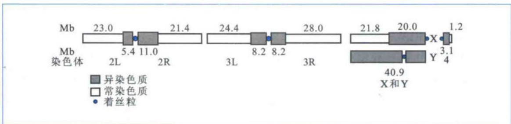

表 11-9 真核生物基因组比较

<table><tr><td>物种</td><td>完成年</td><td>总长度 /Mp</td><td>已完成总长的 %</td><td>占常染色质 %</td><td>基因数 /Mb</td></tr><tr><td>酵母</td><td>1996</td><td>12</td><td>93</td><td>100</td><td>483</td></tr><tr><td>线虫</td><td>1998</td><td>96</td><td>99</td><td>100</td><td>197</td></tr><tr><td>果蝇</td><td>2000</td><td>116</td><td>64</td><td>97</td><td>117</td></tr><tr><td>拟南芥</td><td>2000</td><td>115</td><td>92</td><td>100</td><td>221</td></tr><tr><td>人类全基因组Public Sequence</td><td>2001</td><td>2 693</td><td>84</td><td>90</td><td>12</td></tr><tr><td>人类全基因组Celera Sequence</td><td>2001</td><td>2 654</td><td>83</td><td>99~93</td><td>15</td></tr><tr><td>小鼠基因组</td><td>2002</td><td>2 493</td><td>95</td><td>95</td><td>9</td></tr><tr><td>籼稻基因组</td><td>2002</td><td>466</td><td>92</td><td>98</td><td>110</td></tr><tr><td>大鼠基因组</td><td>2004</td><td>2 750</td><td>90</td><td>94</td><td>8</td></tr><tr><td>鸡基因组</td><td>2004</td><td>1 200</td><td>91</td><td>97</td><td>15</td></tr><tr><td>狗基因组</td><td>2005</td><td>2 410</td><td>99</td><td>100</td><td>8</td></tr></table>

另外研究还表明,原核生物、低等真核生物和高等真核生物之间在所编码的蛋白质种类数上存在着巨大的差异(表11-10)。对原始的流感嗜血杆菌基因组与酵母、线虫、果蝇和拟南芥进行比较以后发现,原始生物细胞中单拷贝基因较多,在流感嗜血杆菌中单拷贝基因占88.8%,在酵母中占71.4%,在果蝇中占72.5%,在线虫中占55.2%,而在高等植物拟南芥中只占约35.0%(表11-11)。

表 11-10 不同生物基因组的蛋白质编码能力比较

<table><tr><td>物种</td><td>基因组总长度</td><td>蛋白质种数/个</td></tr><tr><td>尿殖道支原体 Mycoplasma genitalium</td><td>580 073 bp</td><td>467</td></tr><tr><td>肺炎支原体 Mycoplasma pneumoniae</td><td>816 394 bp</td><td>677</td></tr><tr><td>流感嗜血杆菌 Haemophilus influenzae</td><td>1 830 138 bp</td><td>1 709</td></tr><tr><td>枯草芽孢杆菌 Bacillus subtilis</td><td>4 214 814 bp</td><td>4 100</td></tr><tr><td>大肠杆菌 Escherichia coli</td><td>4 639 221 bp</td><td>4 288</td></tr><tr><td>酿酒酵母 Saccharomyces cerevisiae</td><td>13 116 818 bp</td><td>6 275</td></tr><tr><td>线虫 Caenorhabditis elegans</td><td>约97 Mb</td><td>18 891</td></tr><tr><td>拟南芥 Arabidopsis thaliana</td><td>115 Mb</td><td>25 498</td></tr><tr><td>果蝇 Drosophila melanogaster</td><td>116 Mb</td><td>14 113</td></tr><tr><td>人类 Homo sapiens</td><td> $3.2 \times 10^{9}$ bp</td><td>约2.5万左右</td></tr></table>

表 11-11 不同物种中单拷贝基因的数量及占基因总数百分比

<table><tr><td>物种</td><td>单拷贝基因个数</td><td>单拷贝基因占基因总量的%</td></tr><tr><td>流感嗜血杆菌</td><td>1587</td><td>88.8</td></tr><tr><td>酵母</td><td>5105</td><td>71.4</td></tr><tr><td>果蝇</td><td>10736</td><td>72.5</td></tr><tr><td>线虫</td><td>14177</td><td>55.2</td></tr><tr><td>拟南芥</td><td>11601</td><td>35.0</td></tr></table>

尿殖道支原体拥有目前已知最小的基因组,有此可确定能自我复制的细胞必需的一套最少的核心基因。流感嗜血杆菌的基因组为 1.83 Mb,而尿殖道支原体的基因组只有 0.58 Mb,二者相差 3 倍多。流感嗜血杆菌基因大小平均 900 bp,尿殖道支原体的基因为 1 040 bp,基因大小差不多。流感嗜血杆菌中平均 1 042 bp 有 1 个基因,尿殖道支原体中平均 1 235 bp 有 1 个基因。可见基因组尺度减小并不引起基因密度的增加和基因本身大小的改变。二者的差别在于基因数量上,流感嗜血杆菌基因组有 1 743 个 ORF,而尿殖道支原体只有 470 个 ORF $^{(表11-12)}$ 。通过对尿殖道支原体与流感嗜血杆菌这两个亲缘关系较远的生物基因组的比较,选取其共同的基因(共 240 个),再加上一些其他基因,最后可组成一套含 256 个基因的最小基因组。

表 11-12 流感嗜血杆菌和尿殖道支原体各类主要基因比较

<table><tr><td>分类</td><td>流感嗜血杆菌</td><td>尿殖道支原体</td></tr><tr><td>总ORF数</td><td>1727</td><td>470</td></tr><tr><td>氨基酸合成</td><td>68</td><td>1</td></tr><tr><td>辅基等的合成</td><td>54</td><td>5</td></tr><tr><td>核苷酸合成</td><td>53</td><td>29</td></tr><tr><td>细胞膜合成与装配</td><td>84</td><td>27</td></tr><tr><td>能量代谢</td><td>112</td><td>31</td></tr><tr><td>糖代谢</td><td>30</td><td>6</td></tr><tr><td>脂肪代谢</td><td>25</td><td>6</td></tr><tr><td>DNA复制、重组和修复</td><td>87</td><td>42</td></tr><tr><td>蛋白质高级结构形成</td><td>6</td><td>7</td></tr><tr><td>调控蛋白</td><td>64</td><td>7</td></tr><tr><td>转录</td><td>27</td><td>22</td></tr><tr><td>翻译</td><td>141</td><td>101</td></tr><tr><td>吸收与转运</td><td>123</td><td>34</td></tr></table>

通过流感嗜血杆菌能量代谢类群的 ORF 分析,了解到在这种生物中缺乏三羧酸循环 (TCA) 中必需的 3 个酶,即柠檬酸合成酶基因、异柠檬酸脱氢酶基因和顺乌头酸酶基因。由此推断流感嗜血杆菌 TCA 缺失,不能合成谷氨酸,因为谷氨酸的供体是 TCA 的中间产生物 $\alpha-$ 酮戊二酸。

古菌产甲烷球菌与原核生物有着共同的染色体组织与结构，如环状基因组、基因的操纵子结构等，其能量产生和固氮基因与原核生物也有很高的同源性。该基因组中与细胞分裂有关的蛋白质及20多个编码无机离子运输蛋白的ORF与细菌基因同源，而且其调控模式也类似于原核生物。然而，产甲烷球菌在细胞遗传信息传递，尤其是转录和翻译系统，以及分泌系统方面与真核生物同源，说明该菌与真核生物亲缘关系较近。比较基因组学提供的结果表明，在进化系统树上，古菌与真核生物亲缘关系比原核生物更近。在自养生物的3个分支，细菌、古菌和真核生物中，细菌的分化发生较早。

<!-- C-BEGIN Campbell 21.5 -->

### 【英文对应 Campbell Concept 21.5：Duplication, rearrangement, and mutation of DNA contribute to genome evolution】

> 来源：Campbell Biology（书籍/01_Campbell_Biology） 第21章 Genomes and Their Evolution，Concept 21.5。

#### [EN] Concept 21.5: Duplication, rearrangement, and mutation of DNA contribute to genome evolution

EVOLUTION Now that we have explored the makeup of the human genome, let's see what its composition reveals about how the genome evolved. The basis of change at the genomic level is mutation, which underlies much of genome evolution. It seems likely that the earliest forms of life had a minimal number of genes—those necessary for survival and reproduction. If this were indeed the case, one aspect of evolution must have been an increase in the size of the genome, with the extra genetic material providing the raw material for gene diversification. In this section, we'll first look at how extra copies of all or part of a genome can arise and then consider subsequent processes that can lead to the evolution of proteins (or RNA products) with slightly different or entirely new functions.

#### [EN] Duplication of Entire Chromosome Sets

An accident in meiosis, such as failure to separate homologs during meiosis I, can result in one or more extra sets of chromosomes, a condition known as polyploidy (see Concept 15.4). Although such accidents would most often be lethal, in rare cases they could facilitate the evolution of genes. In a polyploid organism, one set of genes can provide essential functions for the organism. The genes in the one or more extra sets can diverge by accumulating mutations; these variations may persist if the organism carrying them survives and reproduces. In this way, genes with novel functions can evolve. As long as one copy of an essential gene is expressed, the divergence of another copy can lead to its encoded protein acting in a novel way, thereby changing the organism's phenotype.

The outcome of this accumulation of mutations may eventually be the branching off of a new species. While polyploidy is rare among animals, it is relatively common among plants, especially flowering plants. Some botanists estimate that as many as 80% of the plant species that are alive today show evidence of polyploidy having occurred among their ancestral species. You'll learn more about the details of how polyploidy leads to plant speciation in Concept 24.2.

#### [EN] Alterations of Chromosome Structure

With the recent explosion in genomic sequence information, we can now compare the chromosomal organizations of many different species in detail. This information allows us to make inferences about the evolutionary processes that shape chromosomes and may drive speciation. For example, scientists have long known that sometime in the last 7–8 million years, when the ancestors of humans and chimpanzees diverged as species, the fusion of two ancestral chromosomes in the human line led to different haploid numbers for humans (n = 23) and chimpanzees (n = 24). The banding patterns in stained chromosomes suggested that the ancestral versions of current chimpanzee chromosomes 12 and 13 fused end to end, forming chromosome 2 in an ancestor of the human lineage (Figure 21.11).

How do we know a chromosome didn't just split into two in an ancestor of chimps? A comparison of chromosomes in other great apes—gorillas, chimps, bonobos, and orangutans, our closest relatives—shows that those species have 24 chromosomes, so the simplest conclusion is that the last common ancestor of all great apes had 24 chromosomes. (You'll learn more about this type of reasoning in Concept 26.3.) Sequencing and analysis of human chromosome 2 during the Human Genome Project revealed sequences for telomeres and an extra, unused centromere in the middle of it, among other very strong supporting evidence for the model described previously (see Figure 21.11).

In another study of broader scope, researchers compared the DNA sequence of each human chromosome with the whole-genome sequence of the mouse (Figure 21.12). One part of their study showed that large blocks of genes on human chromosome 16 are found on four mouse chromosomes,

#### [EN] Figure 21.11 Human and chimpanzee chromosomes.

The positions of telomere-like and centromere-like sequences on human chromosome 2 (left) match those of telomeres on chimpanzee chromosomes 12 and 13 and the centromere on chimpanzee chromosome 13 (right). This suggests that chromosomes 12 and 13 in a human ancestor fused end to end to form human chromosome 2. The centromere from ancestral chromosome 12 remained functional on human chromosome 2, while the one from ancestral chromosome 13 did not.

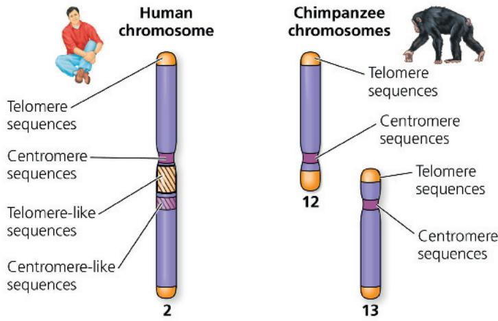

indicating that the genes in each block stayed together in both the mouse and the human lineages during their divergent evolution from a common ancestor.

Performing the same comparison of chromosomes of humans and six other mammalian species allowed the researchers to reconstruct the evolutionary history of chromosomal rearrangements in these eight species. They found many duplications and inversions of large portions of chromosomes, the result of errors during meiotic recombination in which the DNA was broken and rejoined incorrectly. The rate of these events seems to have begun accelerating about 100 million years ago, around 35 million years before large

#### [EN] Interview

Interview with Eric Lander: Exploring the human genome (eTextbook only)

#### [EN] Figure 21.12 Human and mouse chromosomes.

Here, we can see that DNA sequences very similar to large blocks of human chromosome 16 (colored areas in this diagram) are found on mouse chromosomes 7, 8, 16, and 17. This finding suggests that the DNA sequence in each block has stayed together in the mouse and human lineages since the time they diverged from a common ancestor.

Human chromosome  
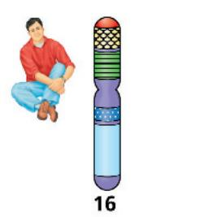  
Mouse chromosomes

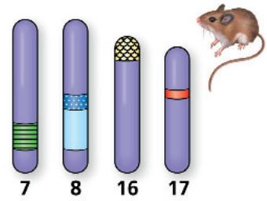

dinosaurs became extinct and the number of mammalian species began rapidly increasing. The apparent coincidence is interesting because chromosomal rearrangements are thought to contribute to the generation of new species. Although two individuals with different arrangements could still mate and produce offspring, the offspring would have two nonequivalent sets of chromosomes, making meiosis inefficient or even impossible. Thus, chromosomal rearrangements would lead to two populations that could not successfully mate with each other, a step on the way to their becoming two separate species. (You'll learn more about this in Concept 24.2.)

The same study also unearthed a pattern with medical relevance. Analysis of the chromosomal breakage points associated with the rearrangements showed that specific sites were used over and over again. A number of these recombination “hot spots” correspond to locations of chromosomal rearrangements within the human genome that are associated with congenital diseases (see Concept 15.4).

#### [EN] Duplication and Divergence of Gene-Sized Regions of DNA

Errors during meiosis can also lead to the duplication of chromosomal regions that are smaller than the ones we've just discussed, including segments the length of individual genes. Unequal crossing over during prophase I of meiosis, for instance, can result in one chromosome with a deletion and another with a duplication of a particular gene or genes. Transposable elements can provide homologous sites where nonsister chromatids can cross over, even when other chromatid regions are not correctly aligned (Figure 21.13).

Also, slippage can occur during DNA replication, such that the template shifts with respect to the new complementary strand, and a part of the template strand is either skipped by the replication machinery or used twice as a template. As a result, a segment of DNA is deleted or duplicated. It is easy to imagine how such errors could occur in regions of repeats. (See the question in Figure 21.13.) The variable number of repeated units of simple sequence DNA at a given site, used for STR analysis, is probably due to errors like these. Evidence that unequal crossing over and template slippage during DNA replication lead to duplication of genes is found in the existence of multigene families, such as the globin family.

#### [EN] Evolution of Genes with Related Functions: The Human Globin Genes

In Figure 21.10b, you saw the organization of the $\alpha$ -globin and $\beta$ -globin gene families as they exist in the human genome today. Now, let's consider how events such as duplications can lead to the evolution of genes with related functions like the globin genes. A comparison of gene sequences within a multigene family can suggest the order in which the genes arose. Re-creating the evolutionary history of the globin genes using this approach indicates that they all evolved from one common ancestral globin gene that underwent duplication and divergence into the $\alpha$ -globin and $\beta$ -globin ancestral genes

Figure 21.13 Gene duplication due to unequal crossing over. One mechanism by which a gene (or other DNA segment) can be duplicated is recombination during meiosis between copies of a transposable element (patterned yellow) flanking the gene (blue). Such recombination between misaligned nonsister chromatids of homologous chromosomes produces one chromatid with two copies of the gene and one chromatid with no copy. (Genes and transposable elements are shown only in the region of interest.)

  
MAKE CONNECTIONS Examine how crossing over occurs in Figure 13.9. In the middle panel above, draw a line through the portions that result in the upper chromatid in the bottom panel. Use a different color to do the same for the other chromatid.  
For suggested answer, see Appendix A.

about 450–500 million years ago (Figure 21.14). Each of these genes was later duplicated several times, and the copies then diverged from each other in sequence, yielding the current family members. In fact, the common ancestral globin gene also gave rise to the oxygen-binding muscle protein myoglobin and to the plant protein leghemoglobin. The latter two proteins function as monomers, and their genes are included in a “globin superfamily.”

After the duplication events, the differences between the genes in the globin families undoubtedly arose from mutations that accumulated in the gene copies over many generations. The current model is that the necessary function provided by an $\alpha$ -globin protein, for example, was fulfilled by one gene, while other copies of the $\alpha$ -globin gene accumulated random mutations. Many mutations may have had an adverse effect on the organism, and others may have had no effect. However, a few mutations must have altered the function of the protein product in a way that benefitted the organism at a particular life stage without substantially changing the protein's oxygen-carrying function. Presumably, natural selection acted on these altered genes, maintaining them in the population.

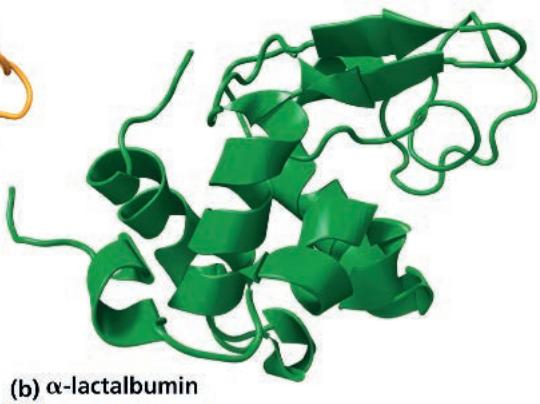  
Figure 21.15 Comparison of lysozyme and $\alpha$ -lactalbumin proteins.

Figure 21.14 A proposed model for the sequence of events in the evolution of the human $\alpha$ -globin and $\beta$ -globin gene families from a single ancestral globin gene.  
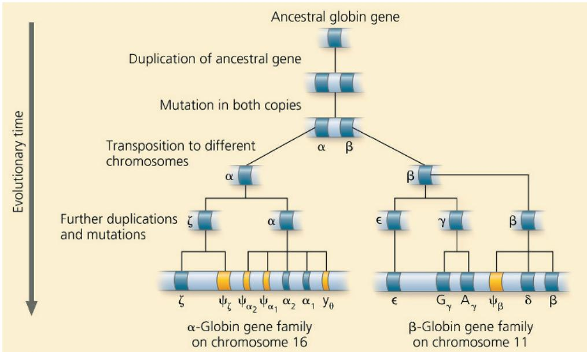  
The gold elements (labeled $\psi$ ) are pseudogenes. Explain how they could have arisen after gene duplication. For suggested answer, see Appendix A.

In the Scientific Skills Exercise, you can compare amino acid sequences of the globin family proteins and see how such comparisons were used to generate the model for globin gene evolution shown in Figure 21.14. The existence of several pseudogenes among the functional globin genes provides

additional evidence for this model: Random mutations in these “genes” over evolutionary time have destroyed their function.

#### [EN] Evolution of Genes with Novel Functions

In the evolution of the globin gene families, gene duplication and subsequent divergence produced family members whose protein products performed similar functions (oxygen transport). Alternatively, one copy of a duplicated gene can undergo alterations that lead to a completely new function for the protein product. The genes for lysozyme and $\alpha$ -lactalbumin are a good example.

Lysozyme is an enzyme that helps protect animals against bacterial infection by hydrolyzing bacterial cell walls (see Visualizing Figure 5.16); $\alpha$ -lactalbumin is a nonenzymatic protein that plays a role in milk production in mammals. The two proteins are quite similar in their amino

acid sequences and three-dimensional structures (Figure 21.15). Both genes are found in mammals, but only the lysozyme gene is present in birds. These findings suggest that at some time after the lineages leading to mammals and birds had separated,

Computer-generated ribbon models of the similar structures of (a) lysozyme and (b) $\alpha$ -lactalbumin are shown, along with (c) a comparison of the amino acid sequences of the two proteins. Single-letter amino acid codes are used (see Figure 5.14). Identical amino acids are highlighted in yellow, and dashes indicate gaps in one sequence that have been introduced by the software to optimize the alignment.  
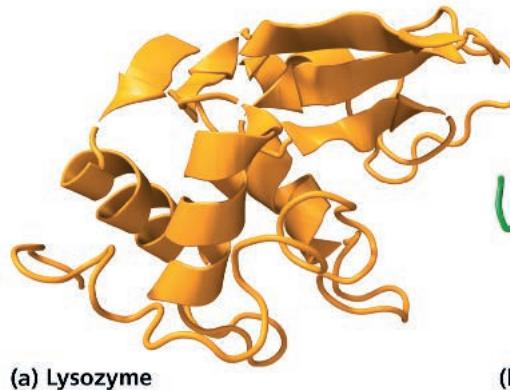  
MAKE CONNECTIONS Even though two amino acids are not identical, they may be structurally and chemically similar and therefore behave similarly. Using Figure 5.14 as a reference, examine the nonidentical amino acids in positions 1–30 and note cases where the amino acids in the two sequences are similarly acidic or basic.

For suggested answer, see Appendix A.

Lysozyme 51 STD YGI FQI NSRYWC NDGKTP GAVN ACHL SCSAL LQDN IADAVACAKRVV
α-lactalbumin 51 STEYGL FQISNKL WCKSSQVP QSRNIC DISC DKFL DDDIT DDIM CAKKIL

Lysozyme 101 RDPQGIRAWVWRNRCQ-NRDVRQYVQGCGV
α-lactalbumin 101 D-IKGIDYWLAHKALCT--EKLEQWLCEKL-

(c) Amino acid sequence alignments of lysozyme and $\alpha$ -lactalbumin

#### [EN] Scientific Skills Exercise Reading an Amino Acid Sequence Identity Table

How Have Amino Acid Sequences of Human Globin Genes Diverged During Their Evolution? To build a model of the evolutionary history of the globin genes (see Figure 21.14), researchers compared the amino acid sequences of the polypeptides they encode. In this exercise, you will analyze comparisons of the amino acid sequences of the globin polypeptides to shed light on their evolutionary relationships.

How the Experiment Was Done Scientists obtained the DNA sequences for each of the eight globin genes and “translated” them into amino acid sequences. They then used a computer program to align the sequences (with dashes indicating gaps in one sequence) and calculate a percent identity value for each pair of globins. The percent identity reflects the number of positions with identical amino acids relative to the total number of amino acids in a globin polypeptide. The data were displayed in a table to show the pairwise comparisons.

Data from the Experiment The following table shows an example of a pairwise alignment—that of the $\alpha_{1}$ -globin (alpha-1 globin) and $\zeta$ -globin (zeta globin) amino acid sequences—using the

<table><tr><td>Globin</td><td>Alignment of Globin Amino Acid Sequences</td></tr><tr><td> $\alpha_{1}$ </td><td>1MMLSPADKTNVKAAWGKVGAHAGEYGAEAL</td></tr><tr><td> $\zeta$ </td><td>1MSLTKTERTIIVSMWAKISTQADTIGTETL</td></tr><tr><td> $\alpha_{1}$ </td><td>31ERMFLSFPTTKTYFPHFDLSH-GSAQVKGH</td></tr><tr><td> $\zeta$ </td><td>31ERLFLSHPQTKTYFPHFDL-HPGSAQLRAH</td></tr><tr><td> $\alpha_{1}$ </td><td>61GKKVADALTNAVAHVDDMPNALSALS D LHA</td></tr><tr><td> $\zeta$ </td><td>61GSKVVAAVGDAVKSIDDIGGALS KLS E LHA</td></tr><tr><td> $\alpha_{1}$ </td><td>91HKLRVDPVNFKLLSHCLLVTLAAHLPAEFT</td></tr><tr><td> $\zeta$ </td><td>91YILRVDPVNFKLLSHCLLVTLAARFPADFT</td></tr><tr><td> $\alpha_{1}$ </td><td>121PAVHASLDKFLASVSTVLTSKYR</td></tr><tr><td> $\zeta$ </td><td>121AEAHAWDKFLSVVSSVLTEKYR</td></tr></table>

standard single-letter symbols for amino acids. To the left of each line of amino acid sequence is the number of the first amino acid in that line. The percent identity value for the $\alpha_{1}$ - and $\zeta$ -globin amino acid sequences was calculated by counting the number of matching amino acids (86, highlighted in yellow), dividing by the total number of amino acid positions (143), and

  
Hemoglobin

then multiplying by 100. This resulted in a $60\%$ identity value for the $\alpha_{1}-\zeta$ pair, as shown in the amino acid identity table below. The values for other globin pairs were calculated in the same way.

#### [EN] INTERPRET THE DATA

1. Note that in the amino acid identity table, the data are arranged so each globin pair can be compared. (a) Some cells in the table have dashed lines. What percent identity value is implied by the dashed lines? (b) Using the information already provided in the table, fill in the missing values in the lower left half of the table. Why does it make sense that these cells were left blank?

2. The earlier that two genes arose from a duplicated gene, the more their nucleotide sequences can have diverged, which may result in amino acid differences in the protein products. (a) Based on that premise, identify which two genes are most divergent from each other. What is the percent amino acid identity between their polypeptides? (b) Which two globin genes are the most recently duplicated? What is the percent identity between them?

3. The model of evolution in Figure 21.14 suggests that an ancestral gene duplicated and mutated to become $\alpha$ - and $\beta$ -globin genes, and then each one was further duplicated and mutated. What features of the data set support the model?

4. Make an ordered list of all the percent identity values from the table, starting with 100% at the top. Next to each number write the globin pair(s) with that percent identity value. Use one color for the globins from the $\alpha$ family and a different color for the globins from the $\beta$ family. (a) Compare the order of pairs with their positions in Figure 21.14. Does the order of pairs describe the same relative “closeness” of globin family members seen in the model? (b) Compare the percent identity values for pairs within the $\alpha$ or $\beta$ family. to the values for between-family pairs.

<table><tr><td colspan="10">Amino Acid Identity Table</td></tr><tr><td colspan="5">α Family</td><td colspan="5">β Family</td></tr><tr><td></td><td></td><td> $α_1$ (alpha 1)</td><td> $α_2$ (alpha 2)</td><td>ζ(zeta)</td><td>β(beta)</td><td>δ(delta)</td><td>ε(epsilon)</td><td> $A_\gamma$ (gamma A)</td><td> $G_\gamma$ (gamma G)</td></tr><tr><td rowspan="3">α Family</td><td> $α_1$ </td><td>----</td><td>100</td><td>60</td><td>45</td><td>44</td><td>39</td><td>42</td><td>42</td></tr><tr><td> $α_2$ </td><td></td><td>----</td><td>60</td><td>45</td><td>44</td><td>39</td><td>42</td><td>42</td></tr><tr><td>ζ</td><td></td><td></td><td>----</td><td>38</td><td>40</td><td>41</td><td>41</td><td>41</td></tr><tr><td rowspan="5">β Family</td><td>β</td><td></td><td></td><td></td><td>----</td><td>93</td><td>76</td><td>73</td><td>73</td></tr><tr><td>δ</td><td></td><td></td><td></td><td></td><td>----</td><td>73</td><td>71</td><td>72</td></tr><tr><td>ε</td><td></td><td></td><td></td><td></td><td></td><td>----</td><td>80</td><td>80</td></tr><tr><td> $A_\gamma$ </td><td></td><td></td><td></td><td></td><td></td><td></td><td>----</td><td>99</td></tr><tr><td> $G_\gamma$ </td><td></td><td></td><td></td><td></td><td></td><td></td><td></td><td>----</td></tr></table>

Compiled using data from the National Center for Biotechnology Information (NCBI).

the lysozyme gene was duplicated in the mammalian lineage but not in the avian lineage. Subsequently, one copy of the duplicated lysozyme gene evolved into a gene encoding $\alpha$ -lactalbumin, a protein with a completely new function associated with a key characteristic of mammals—milk production. In one study, evolutionary biologists searched vertebrate genomes for genes with similar sequences. There appear to be at least eight members of the lysozyme family, distributed widely among mammalian species. The functions of all the encoded gene products are not yet known, but it will be exciting to discover whether they are as different as the functions of lysozyme and $\alpha$ -lactalbumin.

Besides the duplication and divergence of whole genes, rearrangement of existing DNA sequences within genes has also contributed to genome evolution. The presence of introns may have promoted the evolution of new proteins by facilitating the duplication or shuffling of exons, as we'll see next.

#### [EN] Rearrangements of Parts of Genes: Exon Duplication and Exon Shuffling

Recall from Concept 17.3 that an exon often codes for a protein domain, a distinct structural and functional region of a protein molecule, such as the WD40 domain in Figure 21.3. We've already seen that unequal crossing over during meiosis can lead to duplication of a gene on one chromosome and its loss from the homologous chromosome (see Figure 21.13). By a similar process, a particular exon within a gene could be duplicated on one chromosome and deleted from the other. The gene with the duplicated exon would code for a protein containing a second copy of the encoded domain. This change in the protein's structure might augment its function by increasing its stability, enhancing its ability to bind a particular ligand, or altering some other property. Quite a few protein-coding genes have multiple copies of related exons, which presumably arose by duplication and then diverged. The gene encoding the extracellular matrix protein collagen is a good example. Collagen is a structural protein (see Figure 5.18) with a highly repetitive amino acid sequence, which reflects the repetitive pattern of exons in the collagen gene.

As an alternative possibility, we can imagine the occasional mixing and matching of different exons either within a gene or between two different (nonallelic) genes owing to errors in meiotic recombination. This process, termed exon shuffling, could lead to new proteins with novel combinations of functions. As an example, let's consider the gene for tissue plasminogen activator (TPA). The TPA protein is an extracellular protein that helps control blood clotting. It has four domains of three types, each encoded by an exon, and one of those exons is present in two copies. Because each type of exon is also found in other proteins, the current version of the gene for TPA is thought to have arisen by several instances of exon shuffling during errors in meiotic recombination and subsequent duplication (Figure 21.16).

#### [EN] How Transposable Elements Contribute to Genome Evolution

The persistence of transposable elements as a large fraction of some eukaryotic genomes is consistent with the idea that they play an important role in shaping a genome over evolutionary

Figure 21.16 Evolution of a new gene by exon shuffling.

Meiotic errors could have moved exons, each encoding a particular domain, from ancestral forms of the genes for epidermal growth factor, fibronectin, and plasminogen (left) into the evolving gene for tissue plasminogen activator, TPA (right). Subsequent duplication of the “kringle” exon (K) from the plasminogen gene after its movement into the TPA gene could account for the two copies of this exon in the TPA gene existing today.

  
VISUAL SKILLS Looking at Figure 21.13, describe the steps by which transposable elements within introns might have facilitated the exon shuffling shown here.  
For suggested answer, see Appendix A.

time. These elements can contribute to the evolution of the genome in several ways. They can promote recombination, disrupt cellular genes or control elements, and carry entire genes or individual exons to new locations.

Transposable elements of similar sequence scattered throughout the genome facilitate recombination between different (nonhomologous) chromosomes by providing homologous regions for crossing over (see Figure 21.13). Most such recombination events are probably detrimental, causing chromosomal translocations and other changes in the genome that may be lethal to the organism. But over the course of evolutionary time, an occasional recombination event of this sort may be advantageous to the organism. (For the change to be heritable, of course, it must happen in a cell that will give rise to a gamete.)

The movement of a transposable element can have a variety of consequences. For instance, a transposable element that “jumps” into a protein-coding sequence will prevent the production of a normal transcript of the gene. (Introns provide a sort of “safety zone” that does not affect the transcript because the transposable element will be spliced out—unless it affects the splicing process.) If a transposable element inserts within a regulatory sequence, the transposition may lead to increased or decreased production of one or more proteins. Transposition caused both types of effects on the genes coding for pigment-synthesizing enzymes in McClintock’s corn kernels. Again, while such changes are usually harmful, in the long run some may provide a survival advantage. A possible example was mentioned earlier: At least some of the Alu transposable elements in the human genome are known to produce RNAs that regulate expression of human genes.

During transposition, a transposable element may carry along a gene or even a group of genes to a new position in the genome. This occurrence probably accounts for the location of the $\alpha$ -globin and $\beta$ -globin gene families on different human chromosomes, as well as the dispersion of the genes of certain other gene families. By a similar tag-along process, an exon from one gene may be inserted into another gene in a mechanism similar to that of exon shuffling during recombination. For example, an exon may be inserted by transposition into the intron of a protein-coding gene. If the inserted exon is retained in the RNA transcript during RNA splicing, the protein that is synthesized will have an additional domain, which may confer a new function on the protein.

Most often, the processes discussed in this section produce harmful effects, which may be lethal, or have no effect at all. In a few cases, however, small heritable changes that are beneficial may occur. Over many generations, the resulting genetic diversity provides valuable raw material for natural selection. Diversification of genes and their products is an important factor in the evolution of new species. Thus, the accumulation of changes in the genome of each species provides a record of its evolutionary history. To read this record, we must be able to identify genomic changes. Comparing the genomes of different species allows us to do that, increasing our understanding of how genomes evolve. You will learn more about these topics next.

#### [EN] Concept Check 21.5

1. Describe three examples of errors in cellular processes that lead to DNA duplications.

2. Explain how multiple exons might have arisen in the ancestral EGF and fibronectin genes shown in Figure 21.16 (left).

3. What are three ways that transposable elements are thought to contribute to genome evolution?

4. WHAT IF? In 2005, Icelandic scientists reported finding a large chromosomal inversion present in 20% of northern Europeans, and they noted that Icelandic females with this inversion had significantly more children than females without it. What would you expect to happen to the frequency of this inversion in the Icelandic population in future generations?

For suggested answers, see Appendix A.

<!-- C-END Campbell 21.5 -->

<!-- C-BEGIN Campbell 21.6 -->

### 【英文对应 Campbell Concept 21.6：Comparing genome sequences provides clues to evolution and development】

> 来源：Campbell Biology（书籍/01_Campbell_Biology） 第21章 Genomes and Their Evolution，Concept 21.6。

#### [EN] Concept 21.6: Comparing genome sequences provides clues to evolution and development

EVOLUTION In the last several decades, we have seen rapid advances in genome sequencing and data collection, new techniques for assessing gene activity across the whole genome and for editing a gene sequence in a specific way in living cells, and refined approaches for understanding how genes and their products work together in complex systems. In the field of biology, we are truly in the midst of a new world.

The more similar in sequence the genes and genomes of two species are, the less time has passed for mutations and other changes to accumulate, and therefore the more closely related those species are in their evolutionary history. Comparing genomes of closely related species sheds light on more recent evolutionary events, whereas comparing genomes of very distantly related species helps us understand ancient evolutionary history. In either case, learning about characteristics that are shared or divergent between groups enhances our picture of the evolution of organisms and biological processes. Evolutionary relationships between species can be represented by a diagram in the form of a tree (often turned sideways), where each branch point marks the divergence of two lineages (see Figure 1.20). Figure 21.17 shows the evolutionary relationships of some groups and species we'll now examine.

Comparing genome sequences from different species reveals a lot about the evolutionary history of life, from very ancient to more recent. Similarly, comparative studies of the genetic programs that direct embryonic development in different species are uncovering the mechanisms that generated the great diversity of life-forms present today. We'll now look at what has been learned from these two approaches.

#### [EN] Comparing Genomes

Figure 21.17 Evolutionary relationships of distantly and closely related organisms.

The tree diagram at the top shows the divergence long ago of plants, animals, and fungi. A portion of the animal lineage is expanded to show the more recent divergence of three mammalian species discussed in this chapter.

<!-- END OFFICIAL MINERU API RESULT part_05 -->

<!-- BEGIN OFFICIAL MINERU API RESULT part_06 -->

#### [EN] Comparing Distantly Related Species

Determining which genes have remained similar—that is, are highly conserved—in distantly related species can help clarify evolutionary relationships among species that diverged from each other long ago. Indeed, comparisons of gene sequences of organisms in Bacteria, Archaea, and Eukarya indicate that these groups diverged between 2 and 4 billion years ago. Studies comparing gene sequences of plants, animals, and fungi have revealed that animals and fungi diverged from each other more recently (at least 1 billion years ago) than those two groups diverged from plants (at least 1.2 billion years ago). This tells us that fungi—which include mushrooms and yeasts—are more closely related to animals than they are to plants (see Figure 21.17).

In addition to their value in evolutionary biology, comparative genomic studies confirm the relevance of research on model organisms to our understanding of biology in general and human biology in particular. Very ancient genes can still be surprisingly similar in disparate species. One experimental study tested the ability of the human version of each of 414 important yeast genes to function equivalently in yeast cells. Remarkably, the researchers concluded that 47% of these yeast genes could be replaced by the corresponding human gene. This striking result underscores the common origin of yeasts and humans—two distantly related species.

#### [EN] Comparing Closely Related Species

The genomes of two closely related species are likely to be organized similarly because of their relatively recent divergence. Their long shared history also means that only a small number of gene differences are found when their genomes are compared. These genetic differences can thus be more easily correlated with phenotypic differences between the two species. An exciting application of this type of analysis is seen as researchers compare the human genome with the genomes of the chimpanzee, mouse, rat, and other mammals. Identifying the genes shared by all of these species but not by nonmammals gives us clues about what it takes to make a mammal, while finding the genes shared by chimpanzees and humans but not by rodents tells us something about primates. And, of course, comparing the human genome with that of the chimpanzee helps us answer a tantalizing question: What genomic information defines a human or a chimpanzee?

An analysis of the overall composition of the human and chimpanzee genomes, which are thought to have diverged only about 7–8 million years ago (see Figure 21.17), reveals some general differences. Considering single nucleotide substitutions, the two genomes differ by only 1.2%. When researchers looked at longer stretches of DNA, however, they were surprised to find a further 2.7% difference due to insertions or deletions of larger regions in the genome of one or the other species; many of the insertions were duplications or other repetitive DNA. In fact, a third of the human duplications are not present in the chimpanzee genome, and some of these duplications contain regions associated with

human diseases. More Alu elements have undergone transposition in the human genome, leading to 7,000 human-specific elements compared with 2,300 chimpanzee-specific elements. The chimpanzee genome, in turn, contains many copies of a retroviral provirus not present in humans. All of these observations provide clues to the forces that might have swept the two genomes along different paths, but we don't have a complete picture yet.

Along with chimpanzees, bonobos are the other African ape species that are the closest living relatives to humans. The sequencing of the bonobo genome revealed that in some regions, human sequences were more closely related to either chimpanzee or bonobo sequences than chimpanzee or bonobo sequences were to each other. Such a fine-grained comparison of three closely related species allows even more detail to be worked out in reconstructing their related evolutionary history.

In 2023, a group of researchers from many institutions around the world published a comparison of 800 genome sequences of 233 primate species, almost half of the known primate species on the planet (including our species—Homo sapiens). Various sequence analyses yielded valuable insights in a wide range of fields, including human health and behavioral evolution. One study focused on 4.3 million common gene variants in humans; researchers were able to classify 98.7% of them as most likely harmless based on their prevalence throughout primate species. Another study analyzed species of monkey with multilevel social structures. These researchers found that the evolution of complex societies was correlated with species living in colder climates and changes in the genes for oxytocin and dopamine, molecules that function in pair bonding and pleasure, respectively.

We don't know how the genetic differences revealed by genome sequencing might account for the distinct characteristics of each species. To discover the basis for the phenotypic differences between chimpanzees and humans, biologists are studying specific genes and types of genes that differ between the two species and comparing them with their counterparts in other mammals. This approach has revealed a number of genes that are apparently changing (evolving) faster in the human than in either the chimpanzee or the mouse. Among them are genes involved in defense against malaria and tuberculosis as well as at least one gene that regulates brain size. When genes are classified by function, the genes that seem to be evolving the fastest are those that code for transcription factors. This discovery makes sense because transcription factors regulate gene expression and thus play a key role in orchestrating the overall genetic program.

One transcription factor of interest, whose gene is called FOXP2, might be involved with the acquisition of speech in humans. Several lines of evidence suggest that the FOXP2 gene product regulates genes that function in vocalization in vertebrates. First, mutations in this gene can produce severe speech and language impairment in humans. Second, the FOXP2 gene is expressed in the brains of zebra finches and canaries at the time when these songbirds are learning their songs. And third, perhaps the strongest evidence comes from a “knockout” experiment in which researchers disrupted the FOXP2 gene in mice and analyzed the resulting phenotype (Figure 21.18). The homozygous mutant mice had malformed brains and failed to

#### [EN] Figure 21.18

#### [EN] Inquiry: What is the function of a gene (FOXP2) that may be involved in language acquisition?

#### [EN] Experiment

Several lines of evidence support a role for the FOXP2 gene in the development of speech and language in humans and of vocalization in other vertebrates. In 2005, Joseph Buxbaum and collaborators at the Mount Sinai School of Medicine and several other institutions tested the function of FOXP2. They used the mouse, a model organism in which genes can be easily knocked out, as a representative vertebrate that vocalizes: Mice produce ultrasonic squeaks (whistles) to communicate stress. The researchers used genetic engineering to produce mice in which one or both copies of FOXP2 were disrupted.

Wild type: two normal copies of FOXP2

Heterozygote: one copy of FOXP2 disrupted

Homozygote: both copies of FOXP2 disrupted

They then compared the phenotypes of these mice. Two of the characters they examined are included here: brain anatomy and vocalization.

#### [EN] Experiment 1

Researchers cut thin sections of brain and stained them with reagents that allow visualization of brain anatomy in a UV fluorescence microscope.

Experiment 1 Results: Disruption of both copies of FOXP2 led to brain abnormalities in which the cells were disorganized. Phenotypic effects on the brain of heterozygotes, with one disrupted copy, were less severe. (Each color in the micrographs below reveals a different cell or tissue type, as labeled.)

#### [EN] Experiment 2

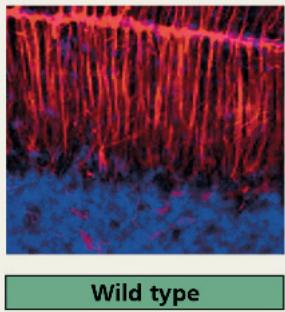

To induce stress, researchers separated each newborn mouse pup from its mother and recorded the number of ultrasonic whistles produced by the pup.

Experiment 2 Results: Disruption of both copies of FOXP2 led to an absence of ultrasonic vocalization in response to stress. The effect on vocalization in the heterozygote was also extreme.

#### [EN] Conclusion

FOXP2 plays a significant role in the development of functional communication systems in mice. The results augment evidence from studies of birds and humans, supporting the hypothesis that FOXP2 may act similarly in diverse organisms.

Data from W. Shu et al., Altered ultrasonic vocalization in mice with a disruption in the FOXP2 gene, Proceedings of the National Academy of Sciences USA 102:9643–9648 (2005).

WHAT IF? Since the results support a role for mouse FOXP2 in vocalization, you might wonder whether the human FOXP2 protein is a key regulator of speech. If you were given the amino acid sequences of wild-type and mutant human FOXP2 proteins and the wild-type chimpanzee FOXP2 protein, how would you investigate this question? What further clues could you obtain by comparing these sequences to that of the mouse FOXP2 protein?

For suggested answer, see Appendix A.

emit normal ultrasonic vocalizations; mice with one faulty copy of the gene also showed significant problems with vocalization. These results support the idea that the FOXP2 gene product turns on genes involved in vocalization.

Expanding on this analysis in 2021, another research group replaced the FOXP2 gene in mice with a “humanized” copy coding for the human versions of the FOXP2 protein. The researchers reported that although the mice with the human FOXP2 gene were generally healthy, they had subtly different vocalizations and showed changes in brain cells in circuits associated with speech in human brains. A different group further investigated the mechanism for the disruption of vocalization patterns in mice. In 2023, they reported that mutations in FOXP2 disrupt motor proteins that move along the microtubules of the cytoskeleton, which prevents formation of nerve cell processes that allow signals for speech production. The human version of FOXP2 may also contribute to autism spectrum disorders, Huntington’s disease, and Parkinson’s disease, all of which are areas of current research.

The FOXP2 story is an excellent example of how different approaches can complement each other in uncovering biological phenomena of widespread importance. The FOXP2 experiments used mice as a model for humans because it would be unethical (as well as impractical) to carry out such experiments in humans. Mice and humans, which diverged about 65.5 million years ago (see Figure 21.17), share about 85% of their genes. This genetic similarity can be exploited in studying human genetic disorders. If researchers know the organ or tissue that is affected by a particular genetic disorder, they can look for genes that are expressed in these locations in mice.

Even though more distantly related to humans, fruit flies have also been a useful model species for study of such human disorders as Parkinson's disease and alcoholism, while nematodes (soil worms) have yielded a wealth of information about aging. Further research efforts are under way to extend genomic studies to many more species, including neglected species from diverse branches of the tree of life. These studies will advance our understanding of evolution, of course, as well as all aspects of biology, from human health to ecology.

#### [EN] Comparing Genomes Within a Species

Another exciting consequence of our ability to analyze genomes is our growing understanding of the spectrum of genetic variation in humans. Because the history of the human species is so short—probably about 200,000 years—the amount of DNA variation among humans is small compared to that of many other species. Much of our diversity seems to be in the form of single nucleotide polymorphisms (SNPs). SNPs are single base-pair sites where genetic variation is found in at least 1% of the population (see Concept 20.2); they are usually detected by DNA sequencing. In the human genome, SNPs occur on average about once in 100–300 base pairs. Scientists have already identified the locations of many tens of millions of SNP sites in the human genome and continue to find additional SNPs, especially when sequencing the whole genomes of individuals from cultural or linguistic groups not previously sampled. These are stored in databases around the world, one of which is run by the National Center for Biotechnology Information (NCBI).

In the course of this search, they have also found other variations—including chromosomal regions with inversions, deletions, and duplications. The most surprising discovery has been the widespread occurrence of copy-number variants (CNVs), loci where some individuals have one or multiple copies of a particular gene or genetic region rather than the standard two copies (one on each homolog). CNVs result from regions of the genome being duplicated or deleted inconsistently within the population. One 2022 study used a computational method to analyze tissue samples from the United Kingdom Biobank, from 452,500 individuals, and found 15 million CNVs. Since these variants encompass much longer stretches of DNA than the single nucleotides of SNPs, CNVs are more likely to have phenotypic consequences and to play a role in complex diseases and disorders. Using data available from the donors, the researchers were able to find biological connections between these CNVs and dozens of complex traits, including height and blood levels of constituents such as cholesterol. This type of analysis is likely to prove very helpful in understanding and treating diseases.

Copy-number variants, SNPs, and variations in repetitive DNA such as short tandem repeats (STRs) are useful genetic markers for studying human evolution. Several large studies over the past few years have thoroughly sequenced hundreds of individuals from diverse populations around the world—from Europe, Africa, the Middle East, Central and South Asia, East Asia, Oceania, and the Americas. Their results strongly supported earlier studies showing that genetic diversity among African genomes is far higher than among individuals from any other continent, consistent with our understanding that humans and their ancestors arose in Africa (see Concept 34.7). Further genome sequencing will continue to clarify our understanding of the migratory routes and evolution of different human populations.

#### [EN] Interview

Interview with Charles Rotimi: Using genomics to study health-related conditions in African-Americans (eTextbook only)

#### [EN] Widespread Conservation of Developmental Genes Among Animals

Biologists in the field of evolutionary developmental biology, or evo-devo, as it is often called, compare developmental processes of different multicellular organisms. Their aim is to understand how these processes have evolved and how changes in them can modify existing organismal features or lead to new ones. With the advent of molecular techniques and the recent flood of genomic information, we are beginning to realize that the genomes of related species with strikingly different forms may have only minor differences in gene sequence or, perhaps more importantly, in gene regulation. Discovering the molecular basis of these differences in turn helps us understand the origins of the myriad diverse forms that cohabit this planet, thus informing our study of the evolution of life.

In Concept 18.4, you learned about the homeotic genes in Drosophila melanogaster, which encode transcription factors that regulate gene expression and specify the identity of body segments in the fruit fly (see Figure 18.20). Molecular analysis of the homeotic genes in Drosophila has shown that they all include a 180-nucleotide sequence called a homeobox, which codes for a 60-amino-acid homeodomain in the encoded proteins. An identical or very similar nucleotide sequence has been discovered in the homeotic genes of many invertebrates and vertebrates. The resemblance even extends to the organization of these genes: The vertebrate genes homologous to the homeotic genes of fruit flies have kept the same chromosomal arrangement (Figure 21.19). The similarities in sequence and organization are so striking that one researcher has whimsically referred to flies as “little people with wings.” Homeobox-containing sequences have also been found in regulatory genes of much more distantly related eukaryotes, including plants and yeasts. From these similarities, we can deduce that the homeobox DNA sequence evolved very early and was sufficiently valuable to organisms to have been conserved in animals and plants virtually unchanged for hundreds of millions of years.

Homeotic genes in animals were named Hox genes, short for homeobox-containing genes, because homeotic genes were the first genes found to have this sequence. Other homeobox-containing genes were later found that do not act as homeotic genes; that is, they do not directly control the identity of body parts. However, most of these genes, in animals at least, are associated with development, suggesting their ancient and fundamental importance in that process. In Drosophila, for example, homeoboxes are present not only in the homeotic genes but also in the egg-polarity gene bicoid (see Figures 18.21 and 18.22), in several of the segmentation genes, and in a master regulatory gene for eye development.

Researchers have discovered that the homeobox-encoded homeodomain is the part of the protein that binds to DNA when the protein functions as a transcription factor. Elsewhere in the protein, domains that are more variable interact with other transcription factors, allowing the homeodomain-containing protein to recognize specific enhancers and regulate the associated genes. Proteins with homeodomains probably regulate development by coordinating the transcription of batteries of developmental genes, switching them on or off. In embryos of Drosophila and other animal species, different combinations of homeobox genes are active in different parts of the embryo. This selective expression of regulatory genes, varying over time and space, is central to pattern formation.

Figure 21.19 Conservation of homeotic genes in a fruit fly and a mouse.

Homeotic genes that control the form of anterior and posterior structures of the body occur in the same linear sequence on chromosomes in Drosophila and mice. Each colored band on the chromosomes shown here represents a homeotic gene. In fruit flies, all homeotic genes are found on one chromosome. The mouse and other mammals have the same or similar sets of genes on four chromosomes. The color code indicates the parts of the embryos in which these genes are expressed and the adult body regions that result. All of these genes are essentially identical in flies and mice, except for those represented by black bands, which are less similar in the two animals.

Developmental biologists have found that in addition to homeotic genes, many other genes involved in development are highly conserved from species to species. These include numerous genes encoding components of signaling pathways.

The extraordinary similarity among some developmental genes in different animal species raises a question: How can the same genes be involved in the development of animals whose forms are so very different from each other?

In some cases, small changes in regulatory sequences of particular genes cause changes in gene expression patterns that can lead to major changes in body form. For example, the differing patterns of expression of the Hox genes along the body axis in a crustacean and an insect can explain the variation in number of leg-bearing segments among these closely related animals (Figure 21.20). In other cases, similar genes direct different developmental processes in various organisms, resulting in diverse body shapes. Several Hox genes, for instance, are expressed in the embryonic and larval stages of the sea urchin, a nonsegmented animal that has a body plan quite different from those of insects and mice. Sea urchin adults make the pincushion-shaped shells you may have seen on the beach; two species of live sea urchins are shown in the photo. Sea urchins are among the model organisms long used in classical embryological studies (see Concept 47.2).

In this final chapter of the genetics unit, you have learned how studying genomic composition and comparing the genomes of different species can illuminate the process by which genomes evolve. Furthermore, comparing developmental programs, we can see that the unity of life is reflected in the similarity of molecular and cellular mechanisms used to establish body pattern, although the genes directing development may differ among organisms. The similarities between genomes reflect the common ancestry of life on Earth. But the differences are also crucial, for they have created the huge diversity of organisms that have evolved. In the remaining chapters, we expand our perspective beyond the level of molecules, cells, and genes to explore this diversity on the organismal level.

Two species of sea urchins  

Figure 21.20 Effect of differences in Hox gene expression in a crustacean and an insect.

Changes in the expression patterns of Hox genes have occurred over evolutionary time since insects diverged from a crustacean ancestor. These changes account in part for the different body plans of (a) the brine shrimp Artemia, a crustacean, and (b) the grasshopper, an insect. Shown here are regions of the adult body color-coded for expression of four Hox genes that determine the formation of particular body parts during embryonic development. Each color represents a specific Hox gene.

(a) Expression of four Hox genes in the brine shrimp Artemia. Three of the Hox genes are expressed together in one region (indicated by stripes), specifying the identity of the segments that have swimmerets. The fourth (teal) specifies the identity of the genital segments.

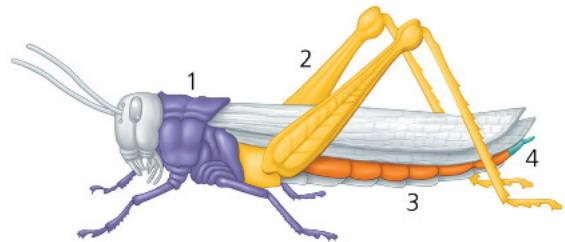

(b) Expression of the grasshopper versions of the same four Hox genes. In the grasshopper, each Hox gene is expressed in a discrete region and specifies the identity of that region.

#### [EN] Concept Check 21.6

1. Would you expect the genome of the macaque (a monkey) to be more like that of a mouse or that of a human? Explain.

2. DNA sequences called homeoboxes help homeotic genes in animals direct development. Given that they are common to flies and mice, explain why these animals are so different.

3. WHAT IF? There are three times as many human-specific insertions of Alu elements in the human genome as in the chimpanzee genome. How did these extra Alu elements arise in the human genome? Propose a role they might have played in the divergence of these two species.

For suggested answers, see Appendix A.

<!-- C-END Campbell 21.6 -->

## 思考题

1. 简述人类基因组计划的科学意义。

2. 请分析人类基因组计划的发展趋势。

3. 试述大肠杆菌基因组和真核生物基因组的主要区别。

4. 区分遗传图谱和物理图谱，试述这两项技术的优缺点。

6. 什么是 FISH 技术, 如何利用它来构建基因组的物理图谱?

7. 鸟枪测序法的技术原理是什么？

8. 什么是蛋白质组学, 什么是转录组学? 简述这两个领域里最主要的研究手段。

9. 简述新一代测序各平台的优点和缺点及适用领域。

10. 新一代测序较之芯片技术优点有哪些?

11. 试述结合各种基因组学方法和已有数据还能进一步探索哪些生物学问题。

## 参考文献

1. 朱圣庚, 徐长法. 生物化学. 上册. 4 版. 北京: 高等教育出版社, 2017.

2. Baran-Gale J, Chandra T, Kirschner K. Experimental design for single-cell RNA sequencing. Brief Funct Genomics, 2017, 2041-2649.

3. Greninger A L, Naccache S N, Federman S, et al. Rapid metagenomic identification of viral pathogens in clinical samples by real-time nanopore sequencing analysis. Genome Medicine, 2015, 7: 99.

4. Rodgers J, Gibbs R A. Applications of next-generation sequencing comparative primate genomics: emerging patterns of genome content and dynamics. Nature Reviews Genetics, 2014, 15:347–359.

5. Xia X. Comparative Genomics. Heidelberg: Springer, 2013.

6. Tang Z, Luo O J, Li X, et al. CTCF-mediated human 3D genome architecture reveals chromatin topology for transcription. Cell, 2015, 163: 1611–1627.

## 数字课程学习

e 教学课件

目在线自测

思考题解析

本书编写过程中得到北京大学蛋白质与植物基因研究国家重点实验室、生命科学学院生物化学及分子生物学系陈章良、顾孝诚、罗静初、朱圣庚、张庭芳、潘乃稊等许多老师的帮助和关心，在此表示衷心的感谢。书中的不少插图引自 Genes IX、Molecular Biology of the Cell、Molecular Cell Biology 和 Plant Virology，在此向原书作者 B. Lewin、H. Lodish、D. Baltimore、A. Berk、S. L. Zipursky、P. Matsudaira、J. Darnell、B. Alberts、D. Bray、J. Lewis、M. Raff、K. Roberts、J. Watson、R. E. F. Matthews 表示感谢。北京大学王莉、苏彦辉、任晓菲、敬群、李小华、梁西卉、唐家福、周彩芬、郑美兰、魏春红老师，武汉大学许漪等老师参与资料搜集、打印和图表处理等工作，在此一并致谢。感谢黄盖、温兴鹏、李博生、杨琰、郭元媛、乔睿等高年级研究生参与导师指定相关章节修订。感谢陕西师范大学俞嘉宁、杨建雄、田英芳、叶海燕、肖光辉、何鹏等老师为本书建设配套数字课程资源。

愿我们的拙作能为广大青年学子的成长贡献绵薄之力，敬请全国同行批评指正。

编者

2018年3月于湖北武汉

AP 位点 (AP site): 所有细胞中都带有不同类型、能识别受损核酸位点的糖苷水解酶, 它能特异性切除受损核苷酸上的 N- $\beta$ 糖苷键, 在 DNA 链上形成去嘌呤或去嘧啶位点, 统称为 AP 位点。

BS-seq (Bisulfite Conversion followed by Sequencing, 亚硫酸氢盐转化后测序): 分析基因组 DNA 甲基化状态的另一种方法, 用亚硫酸氢盐处理 DNA 分子后进行测序分析。

CAR-T 细胞治疗: 即嵌合抗原受体 T 细胞免疫疗法, 是一种通过基因修饰获得携带识别肿瘤抗原特异性受体 T 细胞的个性化治疗方法。嵌合抗原受体 (CAR) 是 CAR-T 的核心部件, 经 CAR 识别肿瘤抗原不受 MHC 限制, 同时 CAR 可以通过增加共刺激分子信号从而增强 T 细胞抗肿瘤的杀伤性。经过 CAR 改造的 T 细胞相较于天然 T 细胞表面受体 TCR 能够识别更广泛的目标。完整的 CAR 分子结构包括胞外抗原结合区 (通常来自单链抗体可变区基因片段, scFv)、铰链区、跨膜区和胞内受体信号传导区 (包括 CD3- $\zeta$ 链或 Fc $\varepsilon$ RI $\gamma$ 、协同刺激因子)4 个区域。

cDNA(complementary DNA): 在体外以 mRNA 为模板, 利用反转录酶和 DNA 聚合酶合成的一段双链 DNA。

ChIP-seq (Chromatin Immunoprecipitation followed by Sequencing, 染色质免疫共沉淀后测序): 将样本与特异抗体免疫共沉淀后进行测序分析, 主要用于分析转录因子、组蛋白等结合的 DNA 序列。

CpG 岛: 真核生物中, 成串出现在 DNA 上的 CpG 二核苷酸。5-甲基胞嘧啶主要出现在 CpG 序列、CpXpG、CCA/TGG 和 GATC 中, 在高等生物 CpG 二核苷酸序列中的 C 通常是甲基化的, 极易自发脱氨, 生成胸腺嘧啶, 所以 CpG 二核苷酸序列出现的频率远远低于按核苷酸组成计算出的频率。

Dane 颗粒: HBV 完整粒子的直径为 42nm, 称为 Dane 颗粒, 由脂质外膜和核壳组成, 有很强的感染性。

DNA: 是英文 deoxyribonucleic acid 的缩写, 中文翻译为脱氧核糖核酸, 是世界上所有已知高等真核生物和绝大部分低等生物的遗传物质。

DNase-seq(DNaseI Hypersensitivity Site Footprinting coupled with Sequencing, DNaseI 超敏感位点足迹法偶联测序): DNase-seq 被用于鉴定基因组上没有核小体结构的区域,因为这些区域易被 DNaseI 降解。

DNA 重组技术 (recombinant DNA technology): 又称基因工程 (genetic engineering), 指不同的 DNA 片段 (如某个基因或基因的一部分) 按照预先的设计定向连接起来, 在特定的受体细胞中与载体同时复制并得到表达, 产生影响受体细胞的新的遗传性状的技术。

DNA 的半保留复制 (semiconservative replication): DNA 在复制过程中, 每条链分别作为模板合成新链, 产生互补的两条链。这样新形成的两个 DNA 分子与原来 DNA 分子的碱基顺序完全一样。因此, 每个子代分子的一条链来自亲代 DNA, 另一条链则是新合成的, 这种复制方式被称为 DNA 的半保留复制。

DNA 的半不连续复制(semi-discontinuous replication): DNA 复制过程中前导链的复制是连续的, 而另一条链, 即滞后链的复制是中断的、不连续的。

DNA 的变性 (denaturation) 和复性 (renaturation): 变性是 DNA 双链的氢键断裂, 最后完全变成单链的过程。复性是热变性的 DNA 经缓慢冷却, 从单链恢复成双链的过程。

DNA 聚合酶 (DNA polymerase): 一种催化由脱氧核糖核苷三磷酸合成 DNA 的酶。因为它以 DNA 为模板, 所以又被称为依赖于 DNA 的 DNA 聚合酶。不同种类的 DNA 聚合酶可能参与 DNA 的复制和 / 或修复。

DNA 聚合酶的延伸能力 (DNA polymerase processivity): 是指每次聚合酶与模板 - 引物结合时所能添加的核苷酸的平均数, 它决定了 DNA 的合成速度。

DNA 拓扑异构酶 (DNA topoisomerase): 能在闭环 DNA 分子中改变两条链的环绕次数的酶, 它的作用机制是首先切断 DNA, 让 DNA 绕过断裂点以后再封闭形成双螺旋或超螺旋 DNA。

DNA 条形码 (DNA barcoding): 是利用一个或少数几个短的标准的 DNA 片段对地球上现有物种进行识别和鉴定的一项新技术。Barcode 序列通常标记于接头序列之前。在动物研究中采用的标准片段是线粒体 COI 基因中约 650 bp 长的一段。然而任何一个单片段都不足以区分所有植物物种，目前主要在叶绿体基因组上进行选择。Illumina 公司有多种商业化 barcode 包，TruSeq 系统通常使用 6 碱基组成的 12 种 barcode 序列。GU-AG 法则 (GU-AG rule): 以 GU 起始和以 AG 为末端的内含子碱基序列, GU 表示供体衔接点的 5' 端, AG 代表接纳体衔接点的 3' 端序列。

GWAS (Genome-Wide Association Study, 全基因组相关分析): 用于检测不同个体的共同遗传变体与某一性状之间的相关性。

HapMap 工程(International Haplotype Map Project, 国际人类基因组单体型图计划): 将已检测到的人类常见 SNP 的共有模式进行分类, 形成单体型, 通过找出这些单体型的代表性标签 SNP, 可以有效地增加了实际操作中能够确定出个体单体型的区域。

MeDIP-seq (Methylated DNA Immunoprecipitation followed by Sequencing, 甲基化 DNA 免疫共沉淀测序): 将带有甲基化 DNA 的序列与特异结合甲基化胞嘧啶的抗体免疫共沉淀后进行测序, 用于对基因组 DNA 甲基化状态的分析。

Pribnow 区 (Pribnow box): 在启动子区有一个由 5 个核苷酸组成的共同序列, 是 RNA 聚合酶的紧密结合点, 称为 Pribnow 区, 这个区的中央大约位于起始点上游 10 bp 处, 所以又称为 -10 区。

P 转座子(P-element): 是一种能够诱发杂种不育(hybrid dysgenesis)的果蝇转座子, 果蝇中几乎所有的杂种不育都是由于 P 转座子插入基因组 W 位点而引起的。所有 P 转座子两翼都有 31 个碱基的倒置重复序列, P 转座子转座导致靶 DNA 复制产生 8 碱基正向重复序列。

RACE(rapid amplification of cDNA ends, cDNA 末端的快速扩增): 利用 PCR 技术在已知部分 cDNA 序列的基础上特异性克隆其 5' 端或 3' 端缺失的序列。

RAMPAGE 技术(RNA Annotation and Mapping of Promoters for the Analysis of Gene Expression): 是一种在全基因组范围内鉴定所有蛋白质编码基因和部分非编码 RNA 基因的转录起始位点, 确定启动子的具体位置, 并且能够高通量检测基因表达水平的方法。

RAPD (Random Amplified Polymorphism, DNA 随机扩增多态性): DNA 序列上的微小变化, 甚至 1 个核苷酸的变化, 也能改变引物结合效率, 影响 PCR 扩增。

RFLP (Restriction Fragment Length Polymorphism, 限制性片段长度多态性): DNA 序列上的微小变化, 甚至 1 个核苷酸的变化, 也能引起限制性内切酶切点的丢失或产生, 导致酶切片段长度的变化。

RNA 的编辑 (RNA editing): 是某些 RNA, 特别是 mRNA 的一种加工方式, 它导致了 DNA 所编码的遗传信息的改变, 因为经过编辑的 mRNA 序列发生了不同于模板 DNA 的变化。

RNA 的再编码 (RNA recoding): 是指 RNA 编码和读码方

式的改变。

RNA 干扰 (RNA interference, RNAi): 是利用双链小 RNA 高效、特异性降解细胞内同源 mRNA, 从而阻断体内靶基因表达, 使细胞出现靶基因缺失的表型。

RNA 剪接(RNA splicing): 从 mRNA 前体分子中切除被称为内含子(intron)的非编码区, 并使基因中被称为外显子(exon)的编码区拼接形成成熟 mRNA 的过程就称为 RNA 的剪接。

RNA 聚合酶(RNA polymerase): 使用 DNA 作为模板合成 RNA 的酶, 也称为 DNA 依赖性 RNA 聚合酶。

RNA 选择性剪切: RNA 的选择性剪接是指用不同的剪接方式(选择不同的剪接位点)从一个 mRNA 前体产生不同的 mRNA 剪接异构体的过程。

SARS-CoV: 一种新型冠状病毒, 属于冠状病毒科冠状病毒属。是一种大的、有包膜的正链 RNA 病毒, 其基因组由约 30 000 个核苷酸组成, 直径约 70\~140 nm, 电镜下可见电子密度致密的核心和围绕的包膜, 包膜上有冠状的刺突。对脂溶剂敏感, 戊二醛、甲醛、过氧化氢、表面活性剂、紫外线照射等处理可使病毒失去感染力。可导致传染性非典型肺炎 (SARS, severe/sudden acute respiratory syndrome) ——严重急性呼吸综合征。

SD 序列 (Shine-Dalgarno sequence): 存在于原核生物起始密码子 AUG 上游 7\~12 个核苷酸处的一种 4\~7 个核苷酸的保守片段, 它与 16S-rRNA 3' 端反向互补, 所以可将 mRNA 的 AUG 起始密码子置于核糖体的适当位置以便起始翻译作用。根据首次识别其功能意义的科学家命名。

SNP (Single Nucleotide Polymorphism): 表示在基因组某个位点上一个核苷酸的变化。

TATA 区(TATA box): 在真核生物基因中位于转录起始点上游 -25\~-30 bp 处的富含 AT 的保守区, 是 RNA 聚合酶与启动子的结合位点, 也称为 Hogness 区(Hogness box), 类似于原核基因中的 Pribnow 区。

T-DNA 插入失活技术: 利用根瘤农杆菌 T-DNA 介导转化, 将一段带有目的基因的 DNA 序列整合到宿主植物基因组 DNA 上。

$\rho$ 因子( $\rho$ factor): 是一个相对分子质量为 $2.0 \times 10^{5}$ 的六聚体蛋白, 它能水解各种核苷三磷酸, 是一种 NTP 酶, 它通过催化 NTP 的水解促使新生 RNA 链从三元转录复合物中解离出来, 从而终止转录。

σ 因子 (sigma factor): 是原核生物 RNA 聚合酶全酶的一个亚基, 是聚合酶的别构效应物, 帮助聚合酶专一性识别并结合模板链上的启动子, 起始基因转录。

<!-- C-BEGIN Campbell 21 Review -->

### 【英文对应 Campbell 第21章章末：Chapter Review】

> 来源：Campbell Biology（书籍/01_Campbell_Biology） 第21章 Summary of Key Concepts 与 Test Your Understanding。

### [EN] Chapter 21 Review

### [EN] Summary of Key Concepts

To review key terms, go to the Vocabulary Self-Quiz (eTextbook only).

### [EN] Concept 21.1: The Human Genome Project fostered development of faster, less expensive sequencing techniques

\- The Human Genome Project was largely completed in 2003, aided by major advances in sequencing technology

\- In the whole-genome shotgun approach, the whole genome is cut into many small, overlapping fragments that are sequenced; computer software then assembles the genome sequence.

How did the Human Genome Project result in more rapid, less expensive DNA-sequencing technology?

### [EN] Concept 21.2: Scientists use bioinformatics to analyze genomes and their functions

\- Computer analysis of genome sequences aids gene annotation, the identification of protein-coding sequences. Methods to determine gene function include comparing sequences of newly discovered genes with those of known genes in other species and observing the effects of experimentally inactivating the genes.

\- In a systems biology, scientists use the computer-based tools of bioinformatics (including artificial intelligence, or AI) to compare genomes and study sets of genes and proteins as whole systems (genomics and proteomics). Studies include large-scale analyses of protein interactions, functional DNA elements, and genes contributing to medical conditions.

What has been the most significant finding of the ENCODE project? Why was the project expanded to include nonhuman species?

Concept 21.3: Genomes vary in size, number of genes, and gene density

<table><tr><td></td><td>Bacteria</td><td>Archaea*</td><td>Eukarya</td></tr><tr><td>Genome size</td><td colspan="2">Most are 1–6 Mb</td><td>Most are 10–4,000 Mb, but a few are much larger</td></tr><tr><td>Number of genes</td><td colspan="2">1,500–7,500</td><td>Most are 5,000–45,000</td></tr><tr><td>Gene density</td><td colspan="2">Higher than in eukaryotes</td><td>Lower than in prokaryotic organisms (Within eukaryotes, lower density is correlated with larger genomes.)</td></tr><tr><td>Introns</td><td>None in protein-coding genes</td><td>Present in some genes</td><td>Present in most genes of multicellular eukaryotes, but only in some genes of unicellular eukaryotes</td></tr><tr><td>Other noncoding DNA</td><td colspan="2">Very little</td><td>Can exist in large amounts; generally more repetitive noncoding DNA in multicellular eukaryotes</td></tr></table>

\*As discussed in Concept 1.2, the term Archaea here refers to prokaryotic species.  
Compare genome size, gene number, and gene density (a) in the three listed groups and (b) among eukaryotes.

### [EN] Concept 21.4: Multicellular eukaryotes have a lot of noncoding DNA and many multigene families

\- Only 1.5% of the human genome codes for proteins or gives rise to rRNAs or tRNAs; the rest is noncoding DNA, including pseudogenes and repetitive DNA of unknown function.

\- The most abundant type of repetitive DNA in multicellular eukaryotes consists of transposable elements and related sequences. In eukaryotes, there are two types of transposable elements: transposons, which move via a DNA intermediate, and retrotransposons, which are more prevalent and move via an RNA intermediate.

\- Other repetitive DNA includes short, noncoding sequences that are tandemly repeated thousands of times (simple sequence DNA, which includes STRs); these sequences are especially prominent in centromeres and telomeres, where they probably play structural roles in the chromosome.

\- Though many eukaryotic genes are present in one copy per haploid chromosome set, others (most, in some species) are members of a gene family, such as the human globin gene families:

  
Explain how the function of transposable elements might account for their prevalence in human noncoding DNA.

### [EN] Concept 21.5: Duplication, rearrangement, and mutation of DNA contribute to genome evolution

\- Errors in cell division can lead to extra copies of all or part of entire chromosome sets, which may then diverge if one set accumulates sequence changes. Polyploidy occurs more often among plants than animals and contributes to speciation.

\- The chromosomal organization of genomes can be compared among species, providing information about evolutionary relationships. Within a given species, rearrangements of chromosomes are thought to contribute to the emergence of new species.

\- The genes encoding the various related but different globin proteins evolved from one common ancestral globin gene, which duplicated and diverged into the $\alpha$ -globin and $\beta$ -globin ancestral genes. Subsequent duplication and random mutation gave rise to the present globin genes, all of which code for oxygen-binding proteins. The copies of some duplicated genes have diverged so much that the functions of their encoded proteins (such as lysozyme and $\alpha$ -lactalbumin) are now substantially different.

\- Rearrangement of exons within and between genes during evolution has led to genes containing multiple copies of similar exons and/or several different exons derived from other genes.

\- Movement of transposable elements or recombination between copies of the same element can generate new sequence combinations that are beneficial to the organism. These may alter the functions of genes or their patterns of expression and regulation.

How could chromosomal rearrangements lead to the emergence of new species?

### [EN] Concept 21.6: Comparing genome sequences provides clues to evolution and development

\- Comparisons of genomes from widely divergent and closely related species provide valuable information about ancient and more recent evolutionary history, respectively. Analysis of single nucleotide polymorphisms (SNPs) and copy-number variants (CNVs) among individuals in a species can also shed light on the evolution of that species.

\- Evolutionary developmental (evo-devo) biologists have shown that homeotic genes and some other genes associated with animal development contain a homeobox region whose sequence is highly conserved among diverse species.

What type of information can be obtained by comparing the genomes of closely related species? Of very distantly related species?

For suggested answers, see Appendix A.

### [EN] Test Your Understanding

For more multiple-choice questions, go to the Practice Test (eTextbook only).

### [EN] Levels 1-2: Remembering/Understanding

1. Bioinformatics includes

(A) using DNA technology to clone genes.

(B) using computer programs to align DNA sequences.

(C) using a person's genomic sequence to inform decisions about medical treatment.

(D) amplifying DNA segments from a species' genome.

### [EN] 2. Homeotic genes

(A) encode transcription factors that control the expression of genes responsible for specific anatomical structures.

(B) are found only in Drosophila and other arthropods.

(C) are the only genes that contain the homeobox domain.

(D) encode proteins that form complexes that determine anatomical structures in the fly.

### [EN] Levels 3-4: Applying/Analyzing

3. Two eukaryotic proteins have one domain in common but are otherwise very different. Which of the following processes is most likely to have contributed to this similarity?

(A) gene duplication

(B) alternative splicing

(C) exon shuffling

(D) random point mutations

4. DRAW IT Below are the amino acid sequences (using single letters; see Figure 5.14) of three short segments of the FOXP2 protein from five species. These segments contain all amino acid differences between the FOXP2 proteins of these species. Compare the amino acid sequences by answering parts (a)-(d).

<table><tr><td>Chimpanzee</td><td>PKSSD ... TSSTT ... NARRD</td></tr><tr><td>Mouse</td><td>PKSSE ... TSSTT ... NARRD</td></tr><tr><td>Gorilla</td><td>PKSSD ... TSSTT ... NARRD</td></tr><tr><td>Human</td><td>PKSSD ... TSSNT ... SARRD</td></tr><tr><td>Rhesus monkey</td><td>PKSSD ... TSSTT ... NARRD</td></tr></table>

(a) Circle the names of any species that have identical amino acid sequences for the FOXP2 protein.

(b) In the sequence for the mouse, circle any amino acid that differs from the sequence for the chimpanzee, gorilla, and rhesus monkey. Then, draw a box around any amino acid that differs from the human sequence.

(c) In the human sequence, underline any amino acid that differs from the sequence for the chimpanzee, gorilla, and rhesus monkey.

(d) Primates and rodents diverged about 65 million years ago, and chimpanzees and humans diverged about 7–8 million years ago (see Figure 21.17). How many amino acid differences are there between the sequence for the mouse and the sequence for the chimpanzee, gorilla, and rhesus monkey? How many amino acid differences are there between the human sequence and the sequence for the chimpanzee, gorilla, and rhesus monkey? Based solely on the numbers of amino acid differences occurring over these time periods, what might you hypothesize about the rate of evolution of the FOXP2 gene? Based on the information in the chapter regarding the FOXP2 gene, is your hypothesis correct?

### [EN] Levels 5-6: Evaluating/Creating

5. EVOLUTION CONNECTION Genes important in the embryonic development of animals, such as homeobox-containing genes, have been relatively well conserved during evolution; that is, they are more similar among different species than are many other genes. Explain why this is.

6. SCIENTIFIC INQUIRY The scientists mapping the SNPs in the human genome noticed that groups of SNPs tended to be inherited together, in blocks known as haplotypes, ranging in length from 5,000 to 200,000 base pairs. There are as few as four or five commonly occurring combinations of SNPs per haplotype. Integrating what you've learned throughout this chapter and this unit, propose an explanation for this observation.

7. WRITE ABOUT A THEME: INFORMATION The continuity of life is based on heritable information in the form of DNA. In a short essay (100–150 words), explain how mutations in protein-coding genes and regulatory DNA contribute to evolution.

### [EN] 8. SYNTHESIZE YOUR KNOWLEDGE

  
Insects have three thoracic (trunk) segments. While researchers have found insect fossils with wings on all segments, modern insects have wings or related structures on only the second and third segment. In modern insects, Hox gene products act to inhibit

wing formation on the first segment. The treehopper insect (above) is an exception. In addition to the pair of prominent wings on its second segment, its first segment has an ornate helmet resembling a set of thorns, which is a modified, fused pair of “wings.” (This provides camouflage in tree branches, reducing the risk of predation.) Explain how changes in gene regulation could have led to the evolution of such a structure.

For selected answers, see Appendix A.

### [EN] Explore Scientific Papers with Science in the Classroom | AAAS

How do transposable elements drive evolution? Go to “Jumping Genes!” at www.scienceintheclassroom.org.

Instructors: Questions can be assigned in Mastering Biology.

### [EN] Mechanisms of Evolution

An Interview with Neil H. Shubin

Dr. Neil H. Shubin is the Robert R. Bensley Distinguished Service Professor of Organismal Biology and Anatomy at the University of Chicago. His research examines the evolution and development of vertebrate animals, focusing on major evolutionary events, such as the colonization of land. He leads expeditions to polar regions in search of fossils and explores the genetics and evolution of the formation of the skeleton in living fish and amphibians. He is also a communicator of science to the general public. Neil grew up outside Philadelphia and received his AB from Columbia University and his PhD from Harvard. He is a member of the National Academy of Sciences and a fellow of the American Academy of Arts and Sciences and the American Philosophical Society.

### [EN] How did you get started in science? How did you decide what to work on?

My interest in natural history dates back to my childhood in suburban Philadelphia. I remember being really struck by the “duck-billed” dinosaurs, thinking that nature can be crazy and behave in ways that we don’t understand. In my first semester of college, I took an anthropology course where the professor would bring in skulls and other human bones, and I thought, “Wow! People go around the world and discover these artifacts, and they tell us about how the world as we know it came to be.”

Later in college, I had the opportunity to volunteer on an expedition to eastern Wyoming, where there are Cretaceous deposits. I was not very good at it—to the point where the curator in charge said, “You stay away from the fossils. You’re going to break too many of them.” I really liked doing this fieldwork, but I didn’t have any innate ability to do it; I didn’t know how to camp, and the outdoors thing was really confusing to me. Which is surprising, given that now I’ve spent the better part of the last 40 years leading expeditions to both poles. I kind of was a fish out of water initially, but I wanted to learn. Similarly, our search for evidence of the first land animals took a lot of patience and a lot of failures, but we kept learning from the failures, and ultimately, we were successful. Our plan was to target our expeditions to particular regions in the Arctic that contained exposed rocks from the time when we expected animals to have colonized land, but we didn't know there would be years of finding nothing before we found something special. The moment we saw Tiktaalik for the first time was a moment that no other human to that point had experienced. Being one of the first people to see this “fish with legs” was really special (see Figure 34.20). That's a vivid example of something that researchers do every day, whether it's in the lab or somewhere else: They're at the forefront of human knowledge.

  
On a fossil-hunting expedition in the Arctic.

### [EN] What are you working on now?

My laboratory is very interdisciplinary. We use molecular biology approaches to look at the genes and developmental systems that produce organs in living animals and to ask questions about how they evolve. We also continue our paleontological research in the Arctic. Being a scientist is really about being able to ask the right questions—questions that are important, interesting, and answerable.

  
Dr. Neil H. Shubin

### [EN] How does your research connect microevolution and macroevolution?

When you understand both the mechanisms of evolution across generations (microevolution) and the big-picture history of evolution (macroevolution), what you're really doing is answering the question of "Why does life on the planet look the way it does?" Through a microevolutionary lens, we see how life can evolve, and we've learned a lot about the genetic basis of adaptation. Organisms have so much capacity for change; in fact, they're capable of so much more change than we see in the fossil record. When we flip to a macroevolutionary perspective, we see what actually happened in the long term. There are lessons to learn from both. We're very biased as a species. We're used to thinking about a planet with ice at the poles. We're used to seeing species that live on land. But if you were to take a time machine and go back to the middle or late Devonian, there was no ice at the poles—it was really warm everywhere. We need to remember that the world as we see it is just a snapshot of its long history.

"There's a lot to discover. The book is still being written."

### [EN] What advice would you give a student considering a career in biology?

The thing that transformed me was the ability to get out of the classroom and do research, to actually do the science. Sometimes when we're in class, we tend to see science as knowledge that is fixed. You can break out of that when you realize that there's an entire world to discover, and in class you're learning the tools to enable you to do the discovering. There's a lot to discover. The book is still being written.

<!-- C-END Campbell 21 Review -->
