## 第6篇 附录

本篇概要

\- 附录1 模式生物

\- 附录2 答案

# 冷泉港实验室档案馆中的照片

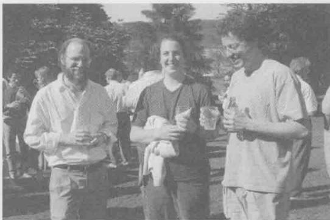

Robert Horvitz，1990年研讨会主导。Horvitz（左）1970年在剑桥大学的Sydney Brenner实验室读博士期间开始研究秀丽隐杆线蠕虫，随后一直在MIT自己的实验室继续模式生物的研究。2002年，因为在蠕虫研究中的工作和Horvitz（定义基因调控“程序性死亡”）以及另一个博士后John Sulston共享诺贝尔生理学和医学奖。这张照片显示的是Horvitz和他实验室的另外两名成员，Elizabeth Sawin（现在是气候系主任）和Asa Abeliovich（哥伦比亚大学的神经生物学家）。

  
Mary Lyon 和 Rudolf Jaenisch，1985 年分子生物学发展研讨会。Lyon 和 Jaenisch 的工作都是研究小鼠，Lyon 发现了哺乳动物 X 染色体失活的现象以及雌性哺乳动物细胞中有剂量补偿的机制（第 20 章）。Jaenisch 在建立转基因小鼠和治疗性克隆技术都有较大影响力。

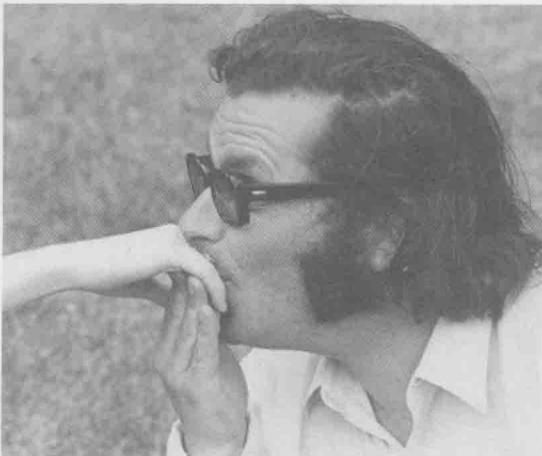

Michael Ashburner，1970年遗传物质转录组研讨会。Ashburner在模式生物果蝇的研究中长期占领先地位，研究涉及果蝇基因组结构和功能的许多方面。他与Craig Venter的测序公司Celera Genomics合作对果蝇基因组测序。根据这些工作的经验他写了一本叫做Won for all的小书。照片中的他在亲吻Barbara Hamkalo的手。Hamkalo当时在哈佛大学读博士后，现在是加州大学Irvine分校的分子生物学教授，对异染色体的结构感兴趣（第8章）。

Dale Kaiser, 1985 年分子生物学发展研讨会。在 $\lambda$ 噬菌体早期研究中 Kaiser 贡献良多（第 18 章）。这项工作的一方面影响是使他认识到 DNA 分子与互补的单链末端可以容易地结合在一起，是发展重组 DNA 技术的一项重要发现。

Barbara McClintock 和 Harriet Creighton，1956 年遗传物质的结构与功能研讨会。McClintock，玉米遗传学家，曾出现在第 3 篇初始部分的一张照片中。Creighton 与 McClintock 在学生时期，一起发表了一篇关于染色体在减数分裂中遗传交换的重要论文。1929 年 Creighton 毕业后，有近 30 年的时间在韦尔斯利学院教授植物学。

## 附录1

## 模式生物

分子生物学中有一个著名的说法：基础问题可以在最简单和最容易获得的系统中得以回答。因此，长期以来，分子生物学家把精力集中在少数几种所谓的模式生物上。其中，重要的模式生物，依复杂程度增高为序有：大肠杆菌（Escherichia coli）和它的噬菌体——T噬菌体和λ噬菌体，酿酒酵母（Saccharomyces cerevisiae），拟南芥（Arabidopsis thaliana），秀丽新小杆线虫（Caenorhabditis elegans），黑腹果蝇（Drosophila melanogaster）和小鼠（Mus musculus）。

模式生物的共同点是什么呢？它们的一个重要特征是可使用强大的传统遗传学和分子遗传学分析工具，使从遗传学角度操研究和操作这些生物成为可能；第二共同点是每种模式生物都吸引了许多研究者。这意味着同一种生物的研究者之间通过共享观点、实验方法、实验

工具和生物品系，促进研究的快速发展。

例如，从20世纪40年代开始，以M. Delruck、S. Luria和A. D. Hershey为首的一群科学家，夏季会在纽约冷泉港实验室（Cold Spring Harbor Laboratory）研究大肠杆菌T噬菌体的增殖。这个小组称为噬菌体小组（Phage Group），在确立分子生物学领域时发挥了重要作用。小组成员中许多是物理学家，他们被噬菌体的研究所吸引，不仅仅是因为噬菌体结构相对简单，而是通过每次研究大量噬菌体的实验，产生了定量的、有显著统计学意义的结果。到20世纪50年代后期，冷泉港实验室开设了噬菌体的年度课程，越来越多的研究者来学习这个新系统。这是一个典型的实例，表明集中研究相同的模式生物，肯定比分散研究多种不同的生物进展更快。

选择哪一种模式生物取决于要回答什么问题。例如，研究分子生物学的基本问题，用简单的单细胞生物或病毒通常更方便些。这些生物可以快速、大量地生长，一般可把遗传学和生物化学的研究方法结合起来；而其他问题，如有关发育的问题，则只能用更复杂的模式生物来解决。

众所周知，T噬菌体（如大家最熟悉的成员，特别是T4）是一个解决基因和信息传递本质的理想系统；同时，因为有高效的适合遗传分析的交配系统，酵母则成为揭示真核细胞本质的首选系统。从真菌到高等细胞蛋白和一般调控机制两方面具有的演化保守性意味着在酵母中的发现在人类中也有可能是适用的。此外，研究线虫和果蝇的遗传系统，可以用来解决那些在较低等的生物中不能有效解决的问题，如发育和行为；最后还有一种模式生物小鼠，尽管它不如线虫和果蝇容易研究，但因为是哺乳动物，所以是了解人类生物学和人类疾病的最好的模式系统。

本章将描述一些最常用的实验生物，并逐一解释它们作为模式系统的主要特性和优点；另外还将介绍研究每种生物的实验系统以及每种模式生物已经涉及的分子生物学问题，但不会对所有在分子生物学上有重要影响的模式生物进行详细解释。

## 噬菌体

噬菌体（广义而言包括其他病毒，）呈现了一个研究遗传基本过程的最简单的系统。基因组一般很小，只在侵入宿主细胞（对噬菌体而言，就是细菌）后才复制，所编码的基因才表达。在感染过程中基因组也会发生重组。

由于这个系统相对简单，所以噬菌体在分子生物学的早期研究中被广泛利用——事实上，噬菌体对分子生物学的发展至关重要。即便是现在，在研究 DNA 复制、基因表达和重组的基本机制时，它们仍然是一个可以利用的系统。另外，在重组 DNA 技术中（第 7 章），它们也是非常重要的载体，并且经常用来检测各种化合物引起突变的能力。

噬菌体通常由一个（DNA 或 RNA，前者更为常见）被一层蛋白质亚基包裹起来的基因组而组成。蛋白质亚基形成一个头部结构，基因组就被包在里面。有些蛋白质亚基形成尾部结构，尾部使噬菌体附着于细菌宿主细胞外面，噬菌体的基因组通过尾部注入到细胞里。其独特性在于：每一种噬菌体只附着于一种特定的细胞表面分子（通常是一个蛋白质），只有带有某种“受体”的细胞才会被这种特定的噬菌体所感染。

噬菌体因复制的类型不同分两种基本类型——裂解型(lytic)和温和型(temperate)。前者如T噬菌体，只进行裂解生长。如图A-1所示，当噬菌体感染一个细菌细胞，它的DNA得以复制，其基因组产生许多拷贝（多达几百个拷贝），并且编码表达新的外壳蛋白。这些过程高度协调，以保证新的噬菌体颗粒在被宿主细胞裂解释放它们之前构建起来。子代噬菌体又可以去感染其他宿主细胞。

温和型噬菌体（如 $\lambda$ 噬菌体）也可以以裂解的方式复制，但它们还有另外一种复制途径，即溶原（lysogeny）（图A-2）。处于溶原状态时，噬菌体基因组不是自己复制，而是整合到细菌的基因组里，并且外壳蛋白基因不表达。这种整合的抑制状态的噬菌体被称为原噬菌体（prophage）。原噬菌体作为细菌染色体的一部分在细胞分裂时被动复制，因此两个子细胞都是溶原性细菌。溶原状态可以如此保持几代，但同时也可以在任何时候转为裂解生长。这种从溶原到裂解途径的转变，叫做诱导（induction），涉及原噬菌体DNA从细菌基因组剪切出来、复制，以及用于制造外壳蛋白和调节裂解生长的基因的活化（图18-20）。

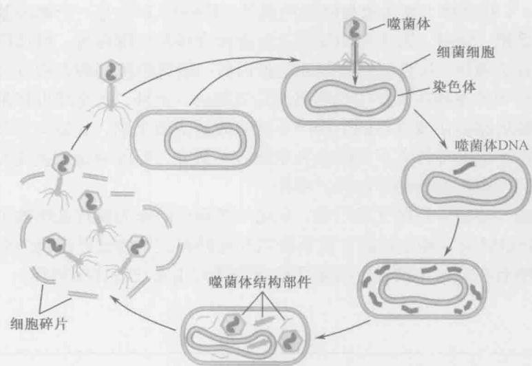

图 A-1 噬菌体的裂解生长周期。噬菌体颗粒附着在合适的细菌宿主细胞（带有合适的受体）的外表面，并注入其基因组，通常是一段 DNA 分子。噬菌体 DNA 在细菌中复制，基因表达产生许多新的噬菌体。一旦子代噬菌体装配为成熟的颗粒，细菌细胞就会裂解，子代噬菌体释放，感染其他的宿主细胞。

图 A-2 噬菌体的溶原周期。最初的感染步骤和裂解周期的情况一样（图 A-1）。但 DNA 一旦进入细胞，就整合到细菌染色体上，作为细菌染色体的一部分而被动复制。而且，编码外壳蛋白的基因处于关闭状态。整合的噬菌体叫原噬菌体。溶原性细菌可以稳定地保持若干代，在合适的环境下，也可以有效地转到裂解周期。详见第 18 章。

## 噬菌体生长的检测

要想使噬菌体成为有用的实验系统，就需要建立噬菌体扩增和定量的方法。扩增可以产生高滴度噬菌体材料——用于进行实验或提取 DNA。一般情况下，噬菌体可以在液体培养基里合适的细菌宿主上生长扩增。例如，一烧瓶生长旺盛的细菌细胞可以用于培养噬菌体。生长一段合适的时间后，细胞裂解，留下透明的、含有噬菌体颗粒的液体悬浮液。

噬菌斑检测（图 A-3）可用来定量溶液中噬菌体颗粒数目。它的步骤是：混合噬菌体和细菌细胞，噬菌体吸附于细菌细胞上并将 DNA 注入；然后稀释噬菌体和细菌混合物，把稀释液加入到含有更多（没有被感染）的细菌细胞的“液态琼脂”里，倒在培养皿中固态琼脂培养基上。液态琼脂形成一层果冻状的薄层，里面混有许多细菌，其中细菌有些是被感染的，但大多数没有感染噬菌体。然后将平板培养几个小时，使细菌生长和噬菌体感染得以进行。

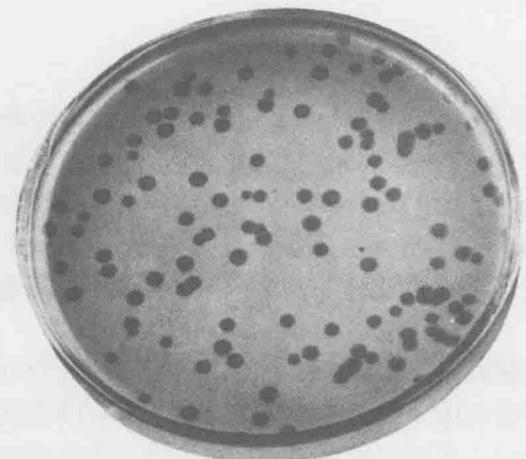

  
图 A-3 噬菌体感染细菌菌苔形成噬菌斑。图示为裂解型 T 噬菌体产生的噬菌斑。（经许可，影印自 Stent G. S. 1963. Molecular biology of bacterial viruses, Fig. 1. © W. H. Freeman.）  
图 A-4 单步生长曲线。如文中所描述，单步生长曲线显示一个噬菌体进行一轮裂解生长所用的时间，以及每个被感染细胞产生的子代噬菌体数目。它们分别被称为潜伏期和裂解量。

在接下来的培养过程中，上层琼脂里的每一个被感染的细胞（来自最初的混合体）将会裂解。粘稠的琼脂使子代噬菌体得以扩散但不会太远，所以它们只感染生长在其周围的细菌细胞。随后，这些细胞裂解释放更多的子代会再次感染相邻的细胞，如此循环往复。多轮感染的结果是形成噬菌斑（plaque）。在高密度生长的、未被感染的细菌细胞组成的、不透明的菌苔背景下，噬菌斑呈透明的圆斑。这是因为未被感染的细菌细胞在上层琼脂里生长成为高密度群体，而那些位于每个最初感染的细菌周边的细菌细胞被杀死，留下一个透明的斑块。知道了一块特定平板的噬菌斑数目，以及在铺平板之前最初的噬菌体的稀释程度，计算噬菌体在原液中的数目就轻而易举了。

## 单步式生长曲线

这个经典的实验揭示了一个典型裂解型噬菌体的生命周期，为检验生命周期的后续实验作好了准备。这个过程的基本特征是对一群细菌同步感染并避免子代的再次感染。这样就可以跟踪单轮感染的过程（图 A-4）。

噬菌体和细菌细胞混合 10min，这段时间足以使噬菌体吸附到细菌细胞上，但对进一步感染来说则太短。把这个混合物稀释（用新鲜的培养液）10000 倍。这个稀释度保证只有那些最初就结合噬菌体的细胞才能形成感染群体，同时，保证产生的子代噬菌体不会感染宿主细胞。

随后将稀释的感染细胞群进行培养使感染过程继续下去。每隔一段时间，从混合物中取出样品，用噬菌斑检测法计数噬菌体的数目。起初，噬菌体数目很少（仅仅由在稀释前初始感染时未能感染细胞的噬菌体组成）。

时间充足的情况下，被感染的细胞裂解释放子代，就会检测到噬菌体数目的急剧增加（对 T4 噬菌体来说这个过程需要 30min）。从感染到释放子代噬菌体的时间间隔叫做潜伏期（latent period），释放的噬菌体数目叫做裂解量（burst size）。

## 噬菌体杂交和互补实验

对一个群体中噬菌体的数目进行计数可以使研究者估计一个特定的噬菌体衍生物是否能够在一个特定的宿主细菌中生长情况（以及生长效率，如裂解量）。而且，平板检测可以分辨不同种类的噬菌体衍生物，因为它们产生的噬菌斑形态不同。宿主范围和噬菌斑形态的差别通常是在其他方面都相同的噬菌体在遗传上有所不同的结果。在分子生物学的早期，上述差异提供了一种遗传标记，使研究者们能够探询遗传信息是如何编码和行使功能的。

混合感染，即一个细胞同时被两个噬菌体颗粒感染，使遗传分析从两个方面成为可能。第一，使噬菌体杂交得以进行。如果同种噬菌体的两个不同的突变体（带有同源染色体）共同感染一个细胞，重组即遗传交换就可以在基因组之间进行。遗传交换的频率可以用来在基因组上排序基因。重组频率高表明突变的位置相对较远，而重组率低则表明突变的位置较近。只要有筛选或选择这种小概率事件的方法，实验中使用大量噬菌体确保混合转染可以可以发生，（两个位置非常相近的突变之间的重组）。第二，共感染还能把突变归类于不同的功能互补组，也就是说，人们可以确定两个或多个突变是发生在同一个基因上还是在不同的基因上。这样，两个不同的噬菌体突变体共同感染一个细胞，如果一个噬菌体可以提供另一个噬菌体所缺乏的功能，那么两个突变即位于不同的基因上（互补组）。另一方面，如果两个突变噬菌体不相互互补，那么就可以作为两个突变定位于同一个基因的证据。

## 转导和重组 DNA

噬菌体杂交和互补实验可以用来进行噬菌体本身的遗传学实验，此类相同的载体和技术也可以用于其他系统的遗传学研究。起初，仅仅是观察到一些噬菌体感染过程中意外获得的细菌基因（如我们在下面描述的）。然而，随着20世纪70年代DNA重组技术的出现，这些研究延伸到各种生物体的DNA中。

在感染过程中，噬菌体可能意外地（和错误地）获得一段细菌的 DNA。通常，噬菌体获得一段宿主细菌 DNA 途径通常是在原噬菌体溶原诱导过程中从细菌染色体剪切出来的。该过程涉及位点特异的重组事件（第 12 章），只要发生一点点位置错误，就会有噬菌体 DNA 丢失和细菌 DNA 的插入。只要这个交换没有丢掉噬菌体基因组中增殖所需的那部分，形成的重组噬菌体仍继续生长，并可以把重组的细菌 DNA 从一个宿主转移到另一个宿主，这个过程被称为特异性转导（specialized transduction）。包含在特异性转导噬菌体中的细菌 DNA 也同样可以进行像噬菌体一样的遗传分析。

因为 $\lambda$ 噬菌体具有促进特异性转导的能力，所以它很自然地被选为一种原始的克隆载体（第 7 章）。去除特定限制性内切核酸酶的多余位点，仅在对裂解生长无关紧要的区域留下一个（插入型载体）或两个（置换型载体）位点，就可以使 $\lambda$ 噬菌体能够接受任意来源体外 DNA 的插入。这样进行 DNA 的扩增和分析会比在原来的生物体内容易得多。去除 $\lambda$ 噬菌体中限制性内切核酸酶位点是反复选择对某种限制性系统具有越来越高效率的菌株而实现的。用这种方法增加对限制性内切核酸酶的抗性，然后在体外对丢失和保留的位点定位，鉴定出所需的噬菌体衍生物。

各种不同的 $\lambda$ 载体先后被开发出来，其差别在于使用的限制位点及如何鉴定重组噬菌体。下面介绍一种选择系统的作用机制：在一个 $\lambda$ 的衍生物中，编码阻抑物的 c I 基因里（第 18 章）留下唯一的某种限制性切点。在亲代载体中，这个基因是完整的，噬菌体可以根据自己的选择形成溶原性细菌，于是噬菌体形成的是浑浊的噬菌斑。然而，当一段 DNA 插入在这个位点，形成的重组噬菌体其 c I 基因被打断，不能形成溶原性细菌，就会形成透明的噬菌斑。

噬菌斑形态的改变使从非重组噬菌体中辨别重组子非常简便，进一步讲，如果使用的细菌菌株是 hfl 菌株（框 16-5），这个途径就是选择（而不是筛选）。对于该菌株，任何溶原性噬菌体总是溶原的，只有重组的噬菌体会形成噬菌斑。

## 细菌

细菌，如大肠杆菌和芽孢杆菌，因为它们是相对简单的细胞，所以适合用于实验系统的研究，并且可以相对容易地培养和操作。细菌是单细胞生物，所有 DNA、RNA 和蛋白质合成的机器都包含在同一细胞器中（细菌没有细胞核）。

细菌通常只有一条染色体——比高等生物的基因组小得多。此外，细菌的生命周期很短（有些甚至只有20分钟），从单个细胞可以很容易获得一个遗传上同源的细胞群体（克隆）。最后，细菌遗传学研究很方便，一方面，它们是单倍体（意味着即使是隐性突变，也能够很容易地表现出突变的表型）；另一方面，细菌之间可以方便地进行遗传物质的交换。

分子生物学起源于细菌和噬菌体模式系统的实验。至1943年Luria和Delrück进行著名的波动分析实验以前，细菌（细菌学）研究还停留在传统遗传学领域之外。利用统计学的方法，Luria和Delrück证明了细菌可以发生某种变化，使其对某一特定噬菌体的感染具抗性。更重要的是，他们证明了这种变化是自发产生的，而不是对噬菌体的应答（适应）。所以，像其他生物一样，细菌也可以遗传性状（例如对噬菌体的敏感性或抗性），并且偶尔这种遗传性可以自发产生变化（突变）而成为另一种遗传状态。Luria 和 Delrück 的实验表明，同其他生物一样，细菌表现出的特性是由遗传因素决定的。因为它们结构简单，细菌是阐明遗传物质本质和孟德尔（Gregor Mendel）性状决定因子（基因）的理想实验系统。

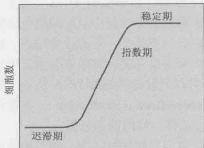  
时间  
图 A-5 细菌生长曲线。如文中所描述，细菌（如大肠杆菌）在不过度密集并且在氧气充足的丰富培养基里繁殖时生长速度很快。这个生长期叫指数生长期。因为细胞以指数级复制，所以一旦细胞的数目变得太高，培养物变浓，生长就变慢，进入所谓的稳定期。取出处于稳定期的细胞，在新鲜培养基中将它们稀释，经过一个迟滞期后，细胞将再次进入指数生长期。图示为不同时期细胞数目增长的速度。

## 细菌生长检测

细菌可以在液体或固体（琼脂）培养基中生长。细菌细胞的大小（大约长 $2 \mu m$ ）足以

使它散射光线，因此通过检测液体培养基中光密度的增加就可以监控细菌的生长情况。以恒定世代分裂生长活跃的细菌，以指数级繁殖，此时它们被称为处于生长的指数期（exponential phase of growth），当细菌数量增长到一定程度后，生长速度减缓，细菌生长进入稳定期（stationary phase）（图 A-5）。

细菌的数目可以通过液体培养基稀释，然后铺在培养皿中的固体（琼脂）培养基上进行测定。在相对较短的时间内，单个细胞就能长成由上百万个细胞组成的微型菌落，只要知道平板上的菌落数和培养基的稀释倍数就可以计算出原始培养基中的细菌浓度。

## 细菌通过性结合、噬菌体介导转导和 DNA 介导转化来交换 DNA

作为分子生物学的模式系统，细菌的主要优势是具备易于进行遗传交换的系统。遗传交换使定位突变、构建含多种突变的菌株、构建用来辨别显性突变和隐性突变及进行顺反式分析的部分双倍体的菌株成为可能。

大部分细菌含有自主复制的 DNA 元件，称为质粒（plasmid）（图 A-6）。有些质粒，如大肠杆菌的育性质粒（称为 F 因子，F-factor）具备把它们自身从一个细胞转移到另一个细胞的能力。含有 F 因子的细胞（ $F^{+}$ ）可以把质粒转移到 $F^{-}$ 细胞里。F 因子介导的接合是一个复制的过程。因些 $F^{+}$ 细胞转移一个 F 因子的拷贝，自身还有一个拷贝，这样接合的结果就是产生 2 个 $F^{+}$ 细胞。有时，F 因子整合到染色体中，就会引起宿主染色体通过接合向 $F^{-}$ 细胞转移。含有整合 F 因子的菌株叫做 Hfr 菌株（高频重组菌株，Hfr strain），这种菌株对进行遗传交换研究非常有用。

在某一具体的事件中，决定宿主染色体转移的精确位置取决于两个条件。第一，不同的 Hfr 菌株中 F 质粒整合在宿主染色体的位置不同。宿主染色体到受体细胞的转移是沿着线性发生的，从接近染色体整合有 F 质粒的那端开始。所以，质粒整合的位置决定了首先被转移的染色体位置。第二，在交配中断之前完成整个染色体的转移是少见的。因而，远离转移起始点的基因转移频率低，在一个特定的交配中，位置较远的基因可能从来不会被转移。需要注意的是，如果一个完整拷贝的整合 F 因子发生转移的话，转移将最后发生。

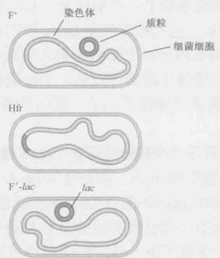

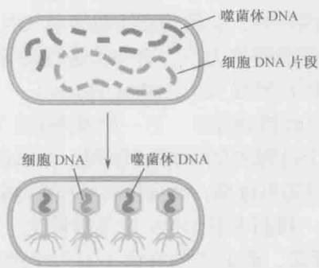  
图 A-6 带有 F 质粒的三种细胞形式。F⁺细胞带有一个单拷贝的 F 质粒，F 质粒就像一个微小的染色体独立进行复制。在 Hfr 菌株中，F 质粒整合在细菌染色体里作为染色体的一部分而复制。在 F⁺菌株里，已经整合到宿主染色体中的 F 质粒重新游离出来，同时携带一小段相邻的宿主 DNA。所有三种细胞类型都可以转移到一个 F⁻受体细胞。如果供体细胞是 F⁺菌株，它仅复制和转移 F 质粒；如果是 F⁺菌株，它复制和转移 F 质粒及一小段宿主 DNA；如果是 Hfr 菌株，根据整合的位置和交配的时间不同，它复制和转移不同大小和位置的宿主染色体。一旦进入受体，来自宿主的染色体 DNA 就可以与受体细胞的基因组重组，从而产生了遗传交换。  
图 A-7 噬菌体介导的普遍性转导。如文中所述，在有些噬菌体感染时，宿主染色体被打成片段，有些DNA片段可以取代复制的噬菌体DNA被包装在噬菌体颗粒里。与噬菌体基因组类似，宿主DNA被转移到另一个细胞中。一旦进入新的宿主，DNA就可以与染色体重组，促进遗传物质交换。

第三种也是非常重要的，F 因子形式是 F' 质粒，F' 是含有一小段染色体 DNA 的育性质粒，这段 DNA 会与质粒一起从一个细胞向另一个细胞高频率转移。例如，历史上重要的 F'-lac，是一个带有乳糖操纵子的 F 因子。F' 因子可以产生含有部分双倍体的菌株，这个菌株的特定染色体区域有两份拷贝。这正是 Francois Jacob 和 Jacques Monod 用来制备进行顺反分析的部分双倍体菌株的方法，这些菌株中突变是发生在乳糖操纵子抑制基因，以及与抑制物结合的启动子位点上（见框 18-3）。

F 因子只能与其他大肠杆菌菌株接合，然而，有些其他的接合性质粒没有选择性，可以将 DNA 转移到多种不相关的菌株中，甚至转移到酵母里。这些没有选择性的接合性质粒提供了一个将 DNA（包括通过重组 DNA 技术得到的 DNA），引入到自身没有遗传交换系统的细菌菌株的简便办法。

遗传交换的另一个强有力的工具是噬菌体介导的转导（图 A-7），普遍性转导（generalized transduction）是由那些在病毒成熟时偶然包裹一段染色体 DNA 而非病毒

DNA 的噬菌体所介导的。当这样的噬菌体颗粒感染下一个细胞时，从以前宿主那里获得的染色体 DNA 片段将取代感染性病毒 DNA。注入的染色体 DNA 可以和被感染的宿主细胞的染色体重组，导致遗传信息从一个细胞到另一个细胞的永久性转移。这种转导称为普遍性转导，是因为宿主染色体 DNA 的任何片段都可以从一个细胞转移到另一个细胞。根据病毒的大小，有些普遍性转导噬菌体只能转导几千个碱基的染色体 DNA，而有些则可以转导大于 100kb 的 DNA。

正如已经提到过的，另一种噬菌体介导的转导叫做特异性转导（specialized transduction）。这个过程涉及溶原性噬菌体，如某段噬菌体 DNA 被一段染色体 DNA 所取代的 $\lambda$ 噬菌体。一旦感染细菌，特异性转导噬菌体就可以将这段细菌 DNA 转移到新的细菌细胞中。

最后，我们来看 DNA 介导的转化，对此第 7 章已有所描述。某些重要的实验细菌（如芽孢杆菌，而非大肠杆菌）有天然的遗传交换系统，使它们可以通过重组吸收并整合线状裸露 DNA（释放或获得的）到它们自己的染色体里。通常这些细胞必须处于“遗传感受态”，才能从环境中吸收和整合 DNA。遗传感受态特别重要，可以先用重组 DNA 技术来克隆的染色体 DNA 片段，然后使它被感受态细胞摄取并整合到受体细胞的染色体中。

## 细菌质粒可以用作克隆载体

正如我们所知，细菌通常含有环状的质粒 DNA，它们可以自主复制，这样的质粒可以方便地作为细菌 DNA 和外源 DNA 的载体。实际上，最初的（成功的）克隆重组 DNA 的实验就使用了一个大肠杆菌的质粒（pSC101），它仅含有一个 EcoR I 限制位点，DNA 可以插入这个位点而不影响质粒复制的能力（第 7 章）。

## 转座子可用来产生插入突变和基因与操纵子的融合

在第 12 章中讨论过，转座子（transposon）不仅凭其自身的能力而成为一个重要的遗传元件，而且在细菌分子遗传操作中也非常有用。例如，以低序列特异性（即高度随机性）整合在染色体上的转座子，如 Tn5 和 Mu，可以用来产生全基因组水平的插入突变体文库（图 A-8）。

这种突变与传统的化学诱变产生的突变相比有两个重要的优势，一是转座子插入到基因中（当想要的时候）很可能导致基因的完全失活（功能丧失的突变），不像诱变剂只能产生简单的碱基改变；第二个优势是，插入 DNA 不但可使基因失活，而且让分离和克隆相应基因方便易行。更简单的办法是，用合适的 DNA 引物，通过分析有转座子插入的染色体 DNA 序列而确定失活基因。

转座子在全基因组水平上还可用于产生基因和操纵子的融合。经过改造，构建了带有报道基因的转座子，如没有启动子的 lacZ（如 Tn5lac）转座子。当这种转座子（以合适的方向）插入到染色体里，报道基因的转录就会受到被打断的靶基因的控制。这样的融合称为操纵子或转录融合（图 A-9）。

图 A-8 转座子产生的插入突变。转座子被质粒携带进入细胞，随后从载体上转移到宿主染色体上。因为细菌染色体中的编码区域（基因）高度密集，所以转座子插入基因的频率很高。转座子中携带的标记（如抗生素抗性）可以使带有转座子的细胞被分离。知道转座子两端的序列及它所插入的基因组的序列，就可以很方便地鉴定转座子所处的位置。  
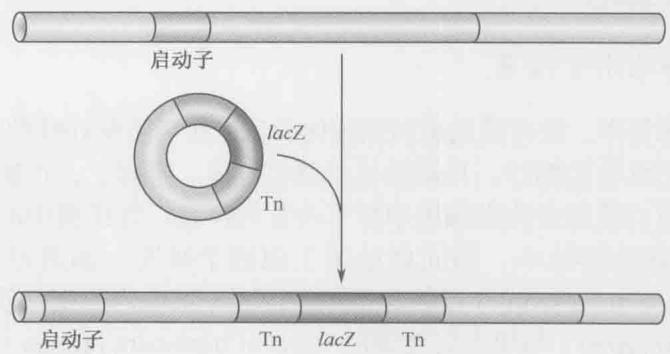  
图 A-9 转座子产生的 lacZ 融合。将前图介绍的转座子诱变法稍加修改，就可以将报道基因（如 lacZ）插入到基因组的任何区域。这样只要通过检测菌株中 lacZ 的表达水平就可以评估目标基因（被转座子 -lacZ 融合插入的基因）的表达。

另外，用于产生融合的转座子已制备出来了，它们含有既无启动子又无翻译起始序列的报道基因。在这些转座子中，报道基因需要在于靶基因的转录控制下并且置于在能够被正确翻译的靶基因可读框内才能表达。同时在转录和翻译水平上参与目标基因的报道基因融合称为基因融合。

## 重组 DNA 技术、全基因组测序和转录谱绘制加强了细菌的分子生物学研究

重组 DNA 技术的出现，如 DNA 克隆、全基因组序列，以及在全基因组水平研究基因转录的方法不但使高等细胞的分子生物学研究产生了革命性的突破。特别是在与传统的细菌遗传学紧密结合时，也对细菌等模式生物的研究产生了重要影响。例如，重组 DNA 技术使制备用于基因融合的转座子衍生物变得容易；又如，结合遗传感受态与重组方法可以产生精确的突变和基因融合，大大增加分子遗传操作的种类和数目。包含细菌中所有基因微阵列（microarray）的利用使在全基因组水平上研究基因表达成为可能。

结合前面描述的各种技术，可以快速、简便地阐明特定条件下表达的所有基因的功能。已经在酵母和其他真核系统中发挥巨大作用的蛋白质间相互作用的快速鉴定方法（如双杂交分析，见框 19-1），也是阐明细菌蛋白质之间相互作用网络的强有力工具。全基因组序列和没有选择性的接合质粒为那些没有复杂遗传学工具的细菌提供了进行分子遗传学操作的机会。

## 有了更好的传统和分子遗传学的工具，简单细胞的生化分析就会更加有效

从最初分子生物学的建立起，细菌就处于 DNA 复制、信息传递、基因调节机制等各种研究的中心。这有几个理由：第一，细菌可以在确定的和均一的生理条件下大量培养；第二，传统和分子遗传学的技术使纯化或大量生产经过改造的蛋白质复合物成为可能，从而可以获得大量的单个蛋白质；第三，也是非常重要的，就像在本书中反复提到过的，细菌的 DNA 复制、基因转录、蛋白质合成等机制比高等细胞简单得多（所包含的成分少得多）。所以，阐明细菌基本机制的研究进展迅速，只需要分离少数的蛋白质，其机制一般比高等细胞更简明。

## 细胞学分析同样适用于细菌

尽管细菌形态简单，没有膜包裹的细胞内分区（如细胞核和线粒体），但细菌并不是像几十年来人们认为的那样，只是简单的酶包被体。实际上，正如我们现在已经知道的，蛋白质和蛋白质复合物在细胞中都有特定的位置，连细菌中的染色体都是高度有序的。尽管细菌的型体小，但同样适用于细胞学研究，如通过免疫荧光显微镜（immunofluorescence microscopy）用特定抗体定位固定细胞内的蛋白质，用荧光显微镜（fluorescence microscopy）与绿色荧光蛋白（greenfluorescent protein）可以定位活体细胞中的蛋白质，还有用荧光原位杂交（FISH）可以定位细胞内染色体区域和质粒。这些方法的应用对我们深刻地理解本书所讨论的若干分子过程很有帮助。例如，我们现在知道，细菌细胞的复制机器是相对固定的并且定位在细胞中心（第9章）。这个发现告诉我们在复制过程中，DNA模板线状地通过一个相对固定的复制“工厂”，而不是传统观点认为的DNA聚合酶像火车在铁轨上那样沿着模板行进。又如，应用细胞学方法使我们清楚了（同样与传统的观点相反）复制过程中染色体新复制的两个起始区域朝细胞的两极移动。细胞学方法是细菌分子生物学研究的重要手段之一。

## 关于基因的基本知识绝大部分来自噬菌体和细菌

分子生物学起源主要归功于用细菌和噬菌体等模式系统进行的实验。如同我们在第2章所看到的，对于肺炎球菌的开创性研究使人们发现遗传物质是DNA。此后，就像我们在本书中所看到的，大肠杆菌及其噬菌体的实验一直在引导学科的发展。例如，Hershey和Martha Chase的实验使人们相信噬菌体的遗传物质是DNA；Matthew Meselson和Franklin W. Stahl的实验证明在大肠杆菌中DNA进行半保留复制；Francis H. Crick和Sydney Brenner的噬菌体交配实验（第16章）揭示了遗传密码由三联体密码子构成；而 Charles Yanofsky 用大肠杆菌进行的出色的遗传研究证明了遗传的共线性；也不能忘记 Jacob 和 Monod 的工作（见框 18-2），是他们发现了基因调控的基本机制；此外还有无数其他例子。在这些例子里，通过研究这些最简单的系统，生命的基本过程得以揭示。

一个重要的例子来自 Seymour Benzer 的出色工作，他详细研究了 T4 噬菌体中的一个叫 rII 的遗传位点。野生型 T4 可以在大肠杆菌 B 或 K 菌株里生长，但 rII 突变体仅在 B 菌株中生长。这样就有可能检测到发生频率小于 0.01% 的野生型噬菌体（比如说来自两个不同 rII 突变体之间的重组）。也就是说，当把 T4 噬菌体铺在 K 菌株形成的菌苔上时，可以在 10000 个 rII 突变噬菌体中检测到一个野生型，因为只有这种频率极低的重组子才能形成噬菌斑。

利用 rII 突变体这一难以置信的特性，Benzer 在成对的 rII 突变体之间进行了重组实验，并因此能够以高分辨率（接近或达到核苷酸碱基对的分辨率）绘制这些突变的顺序。他还设计了一个“互补”实验（如前述）表明 rII 位点是由两个相邻的基因组成的。Benzer 引入了顺反子（cistron）这一术语来描述基因（基于顺和反这两个词）。此外，值得一提的是，正是这个工作使 Crick 和 Brenner 能够利用这一位点开展遗传密码的研究。

## 合成通路和调节噪声

近年来，大肠杆菌和一些其他的细菌已经成为研究基因表达新方向的模型。其中尤为重要的是，通过对遗传背景相同的个体的基因表达进行观测，发现了遗传通路调节中的噪声。这种变化和其生物学效应使得人们对基因网络中噪声的优势及其问题有了更好的理解。这些研究得益于报告基因技术和成像技术的进步，但最主要的原因还是细菌在规模和生命周期上的诸多优势（见第22章中枯草芽孢杆菌的例子）。

基于细菌体系的合成生物学技术也得到了很大的进步。很多新的基因调节通路已经被建立，它们为研究调节网络提供了新的方法，也为具有特定功能的新型菌株的设计提供了可能——如细胞消化可以降解水面浮油的菌株。最近有报道称，细菌整个的基因组都可以通过多个合成的片段进行人工构建，而且一旦构建完成，该基因组可以自己发挥作用来维持细胞的生存。

## 酿酒酵母

单细胞真核生物作为模式实验系统有许多优势。比起其他真核生物，它们的基因组较小（见第8章），基因数目也比较少。与大肠杆菌相似，它们可以在实验室里快速繁殖（理想条件下，每次细胞分裂需要大约90min），从单个细胞繁殖成克隆群体。尽管酵母细胞比较简单，但它们具备所有真核生物细胞的主要特征，如含有一个独立的细胞核、多条线性染色体（染色质）、细胞质包含了全部的细胞器（如线粒体）和细胞骨架结构（如肌动蛋白纤维）。

研究得最清楚的单细胞真核生物是酿酒酵母 S. cerevisiae，因为可以用作发酵剂，所以通常称为酿酒酵母。100 多年来人们对酿酒酵母进行了大量的研究。19 世纪 60 年代，在实验中，Louis Pasteur 鉴定出这种酵母是发酵的催化剂（在此之前，糖被认为是自发地分解成乙醇和二氧化碳）。这些研究最终导致了第一个酶的发现及生物化学作为实验体系的建立。20 世纪 30 年代，开始了酿酒酵母的遗传学研究，由此鉴定了许多酵母基因。所以，像大肠杆菌一样，酿酒酵母使研究者能用遗传和生化的方法来解决生物学基本问题。

## 单倍体和双倍体细胞的存在促进了酿酒酵母的遗传分析

酿酒酵母细胞既可以以单倍体状态（每条染色体有一个拷贝）又可以以双倍体状态（每条染色体有两个拷贝）生长（图 A-10）。单倍体和双倍体之间的转换通过交配（单倍体到双倍体）和孢子形成（双倍体到单倍体）来实现。有两种单倍体细胞类型，分别为 a 型和 $\alpha$ 型。在一起生长时，这些细胞因交配而形成 $a/\alpha$ 双倍体细胞。在营养物匮乏的情况下， $a/\alpha$ 双倍体发生减数分裂（见第 8 章），产生一个称为子囊的结构，每个子囊含有 4 个单倍体孢子（两个 a-孢子和两个 $\alpha$ -孢子）。但当生长条件改善时，这些孢子可以出芽并以单倍体细胞的形式生长或交配而重新形成 $a/\alpha$ 双倍体。

  
图 A-10 酿酒酵母 S. cerevisiae 的生活周期。如本章及其他章节所描述的，酿酒酵母以 3 种形式存在：两种类型单倍体细胞——a 和 $\alpha$ ，以及两者交配的双倍体产物。图示这些不同种类细胞的复制、交配和芽孢形成。

在实验室中，可以对这些类型的细胞进行各种遗传分析。简单地将两个待测试的分别携带一个突变的单倍体菌株进行交配，就可以进行遗传互补实验。如果两个突变是互补的，相对于突变表型，双倍体就是一个野生型。如果要测试单个基因的功能，可以在只有一个拷贝的单倍体细胞里诱发突变。例如，想知道一个特定的基因是否是细胞生长所必需的，可以在单倍体里敲除这个基因。单倍体细胞只能承受非必需基因敲除。

## 在酵母中容易产生精确的突变

精确和快速地改变单个基因的技术使酿酒酵母的遗传分析研究水平得到了进一步提高。末端与基因组的任何一个特定区域同源的线性DNA引入酿酒酵母细胞中，就会观察到频率非常高的同源重组，导致相应染色体序列被转化所用的DNA片段取代（图A-11）。利用这一特性可以对基因组做精确的改变。这种方法可以用来精确地删除整个基因的编码区、改变一个可读框中的特定密码子，甚至改变启动子中的一个特定碱基对。这种在基因组中进行精确改变的技术使研究特定基因或其调节序列的功能等具体问题变得比较容易。

## 酿酒酵母有一个已知特性的小基因组

由于酿酒酵母遗传研究的历史很长，基因组又相对较小，所以它成了进行全基因组测序的第一个真核（非病毒）生物。这一“里程碑”式的事件于1996年完成。序列分析（ $1.3 \times 16^{6} bp$ ）发现了大约6000个基因，首次揭示了指导真核生物形成所需的遗传复杂性。

酿酒酵母完整基因组序列的获得使酵母的

同源区域间的 DNA 取代了目的基因

图 A-11 酵母中的重组转化。如文中所述，酵母基因组的所有区域都可以容易地被目标序列所取代。要插入的 DNA 片段的两端序列要与被取代的染色体区域的侧翼序列同源。当供体片段被导入细胞后，在这个生物中的高水平同源重组保证了与染色体的高频率重组，导致了上图所示的遗传交换。插入的 DNA 可能与原来的 DNA 只有一个碱基对的不同，也许是另一个极端，即长度和序列上非常不同，由此可以完成非常精细的遗传修饰。

研究可以在“全基因组”水平上进行。例如，包含来自所有近6000个酿酒酵母基因序列的DNA微阵列已广泛用于不同生理条件下基因表达模式的研究。实际上，目前已经对200多种不同条件下酿酒酵母细胞的基因表达水平进行了检测，包括不同的碳源（如葡萄糖对半乳糖）、细胞类型和培养温度。这些发现不仅对检测单个基因的表达非常有用，而且使我们能将基因按照对不同培养条件的应答分为各种协同作用的基因群。

其他全基因组资源还包括一个 6000 个菌株的文库，每一菌株中只删除了一个基因。其中的 5000 多株在单倍体状态时也能够存活，表明大多数酵母基因是非必需的。这个酵母菌株库使检测酿酒酵母基因组的每个基因在特定过程中作用的遗传筛选得以进行。

微阵列的使用还使利用染色质免疫沉淀技术（ChIP，chromatin immunoprecipitation techniques）进行转录因子的结合位点的全基因组作图得以开展（见第7章）。

## 酿酒酵母细胞生长时形态改变

当酿酒酵母细胞周期性生长时，形态上的特征会发生变化（图 A-12）。当一个新细胞从它的母细胞中释放出来后，子细胞稍呈椭圆形；随着细胞周期的延续，酿酒酵母细胞上长出一个小“芽”，这个“芽”最终会成为一个独立的细胞。一直长到与其母细胞大致相当时，芽就会从母细胞中释放出来，两个细胞开始新的一轮繁殖过程。

  
图 A-12 酵母的减数分裂细胞周期。酿酒酵母通过出芽进行分裂。图示一个子代芽经历减数分裂周期的发育，该过程在正文中也有描述。

对酿酒酵母细胞形状进行简单的显微观察，就可以获得许多细胞内事件的信息。没有芽的细胞还没有开始复制它的基因组，这是因为在野生型酿酒酵母细胞中，新芽的出现和 DNA 复制的启动是紧密关联的。同样地，正在生长的、有着大芽的细胞几乎总是处在染色体分离的过程中。

应用强有力的遗传学、生物化学和基因组学工具研究酵母，使其成为科学家们在分析基本的分子和细胞生物学问题时喜爱采用的真核生物。研究酿酒酵母为我们了解真核生物的转录和基因调控、DNA复制、重组、翻译、剪接等做出了重要贡献。酿酒酵母的遗传学研究已经发现了所有这些事件中涉及的蛋白质。也许最为重要的是，在酿酒酵母中发现的那些对基本生命活动重要的蛋白质和基因在包括人类在内的其他真核生物中几乎总是保守的。因此，从这个简单真核模式生物中归纳的信息几乎总是与复杂生物的相同事件相关。

## 拟南芥

起源于农业和药用植物的植物学在所有生命科学中是研究历史最悠久的。通经过孟德尔的工作，植物学奠定了遗传学的基础；通过达尔文、Barbara McClintock、William Bateson和其他人的工作，植物学也奠定了为细胞遗传学、发育学、生理学和演化科学的基础。植物科学继续在基础领域如RNA干扰方面有着重要的进展，和过去一样，继续对经济和环境发挥着重要影响。在过去的几十年中，一种不起眼的、类似芥末的杂草——拟南芥，渐渐成为与果蝇、秀丽新小杆线虫和小鼠媲美的模式生物。比动物模式生物更重要的是，拟南芥揭示了植物生物学，尤其是被子植物（开花的种子植物）的大多数关键问题。就像在20世纪玉米带来植物遗传学的革命一样，拟南芥注定要为植物基因组学和植物生物学的大多数问题做出贡献。

## 拟南芥具有单倍体和双倍体交替的快速生命周期

像酵母一样，所有植物的生命周期具有单倍体和双倍体两种生命周期阶段，两个时期分别根据它们的产物来命名——双倍体时期（与酵母类似）发生减数分裂并产生孢子，因此被称为“孢子形成体”（带有孢子的植物）。单倍体的孢子发芽产生单倍体期，在这个时期分化出两种性别的配子，所以单倍体期也称为雄配子体期或雌配子体期。在受精过程中，配子融合产生双倍体的合子。单倍体和双倍体期的相对长度随植物而异——苔藓植物大部分时期属配子体期，而拟南芥和其他高等植物大部分时间是孢子形成体，蕨类植物则介于两者之间。在开花植物中，配子体期非常短，只有2或3次有丝分裂，生殖细胞存在于成体植物长出的花中，而不像动物中那样隐藏的胚胎中。大多数植物（如拟南芥）是雌雄同体的，从分化的花中或发生雌雄减数分裂的花器官中产生两种性别的单倍体配子体（图A-13）。

种子植物，如拟南芥，在受精后经历另一个时期——胚胎发生和休眠，从而产生以此命名的种子。同哺乳动物一样，胚胎由完成分化的胚胎外组织提供营养。但是与动物不同的是，这些胚胎外组织（称为胚乳“含在种子中”）是独立受精产物，它们的受精发生在第二个单倍体精子和雌性双倍体“中央”细胞，双倍体“中央”细胞则是由两个单倍体姐妹卵细胞融合而成。三倍体核快速分裂，随后又分裂形成很多细胞，并且快速积累淀粉和蛋白质，为胚胎提供重要的营养。由于胚胎发育时胚乳的营养被胚胎攫取，在许多植物中（如拟南芥）其生命是短暂的，但在其他植物中胚乳可以提供种子发芽所需的营养，而在小麦和玉米等主要谷物中则可以提供淀粉。

## 拟南芥容易转化，适于反向遗传学研究

在土壤细菌根瘤农杆菌及其亲缘较近的土壤细菌感染下，植物诱发肿瘤性生长（冠瘿，galls），其原因在于细菌的 Ti（tumor-inducing）质粒携带着激素生物合成基因，该基因转移到了宿主植物的染色体 DNA 上。肿瘤诱发（tumor-inducing）基因位于质粒的转移 DNA（T-DNA）部分，两侧边界序列是转移所需的正向重复序列。用感兴趣的基因取代肿瘤引发基因，就可以转化植物。拟南芥的转化只需简单地在植物上喷上或将植物浸泡在含有促进感染的表面活性剂的高浓度农杆菌培养液中。瞬时感染几乎在侵染的同时就可以发生，可用于瞬时表达研究，但稳定转化一般发生在数天或数周后，可以通过在受精前感染雌性配子。在 T-DNA 中加上选择性标记基因（抗不同的除草剂），并在含有除草剂的培养基上或土壤中发芽种子，就可以选择转化的植物。

  
图 A-13 拟南芥的生命周期。（Rob Martienssen 惠赠）

拟南芥的转化效率很高，可以用来大量制备突变体。随机把几十万个 T-DNA 插入到植物中，然后对插入位点进行扩增和测序，已经收集到了很多基因组中带有插入基因的植物。这些插入突变可以用于精确的“反向”遗传学研究，就像酵母利用删除所进行的相同。进一步讲，在 T-DNA 中加上报道基因或增强子，这些插入可用来报告所插入基因的表达，或在通常不表达的细胞中激活基因的表达。通过在 T-DNA 中加上转座因子，就可能不需要额外转化就产生大量转座子跳跃，产生衍生的同位基因、回复突变等位基因及嵌合体。由于水稻和玉米的转化要困难得多，在这些植物中转座子一直是进行“反向”遗传学的主要工具。

## 拟南芥基因组小易于操作

拟南芥的基因组只含有 105Mb 的常染色体 DNA，约 15Mb 已测序的异染色质，另外 15\~25Mb 的卫星重复序列和 rDNA，总共约 140Mb。大多数测序的异染色质位于 5 个着丝粒的两边，虽然异染色质的较小区域突起（knob）在染色体臂上。常染色体和大部分异染色质的测序使我们知道 29000 个拟南芥基因中 99% 的序列。许多其他植物基因组的测序揭示了真双子叶植物中发生了几轮基因组加倍（多倍体，polyploidy），真双子叶植物是被子植物演化树中的一个主要分支，其中包含拟南芥。最近的基因组加倍仅仅发生在几百万年之前，所以约25%的拟南芥基因保留了一个功能同源基因，导致相当多的基因冗余，以致影响了反向遗传策略的应用。另一方面，也许部分是因为基因冗余，在拟南芥中正向遗传学一直非常有效，可以使用高剂量的诱变剂[例如甲基磺酸乙酯（EMS）、乙酰基亚硝基脲（ENS）或放射线]而不会杀死植物，相对数目较少的经诱变剂处理过的种子就可以使突变达到饱和。种子可以直接进行诱变处理，隐性突变可以简单地通过让种子发芽后自变获得。

有了基因组序列和具有多态性的拟南芥品系后，对正向遗传学发现的突变进行定位克隆变得异常便捷。EMS 突变甚至可用于反向遗传学策略，称为覆瓦（targeting induced local lesions in genomes, tilling），即筛选诱变剂处理过的植物的 DNA 来获得感兴趣的基因的点突变。随着高通量的测序方法的出现，这种策略甚至更具实操作性，并且可以全方位回复每个基因的等位变异。基因组序列的测定使许多其他基因组学技术成为可能，如覆瓦（tilling）微阵列、高通量蛋白质定位及蛋白质组学技术等。

通过小 RNA（19\~30 个核苷酸）进行 RNA 干扰是一种重要的基因调控机制，无论是内源还是外源，这一机制就是最先在植物中发现的（见第 19 章）。在拟南芥中，至少三类小 RNA——microRNA（miRNA）、反式短的干扰 RNA（tasiRNA）、与重复序列相关的 siRNA，它们在大小和生物起源方面各不同，但都可以通过与目标序列配对并催化由内切核酸酶活性行使的“切割”、转录停止、染色质及 DNA 修饰等来调控基因。这些小 RNA 来源于单链“发夹”结构前体或双链 RNA，后者是依赖 RNA 的 RNA 聚合酶的产物。在拟南芥中采用 RNA 干扰的基因组方法包括：VIGS（virally induced gene silencing，病毒诱导的基因沉默）、共抑制、发夹沉默和人工 miRNA 等。

## 表观遗传学

表观遗传差异通常定义为可以通过染色体遗传，但不涉及核苷酸序列改变的“突变”。相对于通常的突变，这些“表观突变”的可逆频率要高得多，并且与DNA及相关蛋白质（尤其是组蛋白）的化学修饰有关。几十年来，植物一直处于表观遗传学研究的前沿，拟南芥也不例外。像哺乳动物基因组，但与酵母、线虫和果蝇的基因组不同，植物基因组内有胞嘧啶甲基化的高度修饰，这些修饰与组蛋白修饰同时对基因表达和基因组中发现的重复序列的表达具有表观遗传后果。这些修饰由各种各样的因子介导，包括RNA干扰依赖RNA的DNA甲基化现象，以及首次在植物中发现的RNA依赖的组蛋白修饰，后者也在裂殖酵母和其他生物中发生。

当一个基因的沉默在雄性和雌性生殖细胞系中不同时，印记（通常）导致母本遗传的等位基因进行表达。被印记的基因表达在胚胎外的胚乳组织中普遍存在，使人想起在哺乳动物胎盘中的印记。在这些研究得很透彻的例子中，被印记的基因的去甲基化发生在中央细胞，导致胚乳中母本等位基因的表达。

表观遗传作用经常受环境的影响，在一个极端的例子中，植物在春天开花记忆的是冬天的寒冷。这种记忆是由寒冷来诱导、靠细胞的无性繁殖来保持。减数分裂抹去了这个记忆，导致类似于大家习惯的冬小麦的开花习性。在拟南芥中，这个过程（春化）是由 RNA 加工及组蛋白修饰来调控的，并且涉及多梳复合体，该复合体也参与动物的细胞记忆。

## 植物对环境的反应

与动物不同，植物扎根在一处，便不能逃避环境的侵害，具有一些通常在动物中没有的特性，例如对啃食的耐受性。植物的天然免疫系统，最早在分子水平上被描述为“基因对基因”反应，涉及许多在动物中保守的基因，但它们是高度多样化的，可以识别病毒、细菌、线虫、昆虫，甚至其他植物。除了这些“生物的”压力外，植物必须经受住“非生物的”压力并对其做出反应，这些压力包括光强度变化、昼夜更替、养分、盐和水的改变等。许多环境因素对发育会有深远的影响，如通过诱导或延迟开花使之更适合种子产生。

光在植物生物学中起核心作用，进行光合作用的叶绿体来源于古老的共生原核生物，负责固定生物圈中大多数有机碳。由于在遗传和基因组操作方面的方便性，甚至在光合作用研究领域，拟南芥也正在取代传统的生理学模式生物，如烟草和菠菜。

## 发育和形态建成

同植物生物学的其他领域相比，植物发育对作物驯化和育种的影响最大，所以对人类历史的影响也最大。其中由古代农民及富有经验的育种家等进行的选择是巨大的创新，他们改进了花序结构、种子落粒性、叶片形状等。与现代农民视为草的祖先物种相比，花椰菜、谷物和甘蓝与它们只有几个基因的差异。由于开花植物是最近演化的群体，许多负责开花的基因是用拟南芥作为模式生物被发现的。

一般而言，植物和动物是从一个共同的单细胞祖先分支演化而来，所以多细胞发育是在各自的界中独立演化的。因此我们看到通用的基本原则，如转录因子和信号转导层次结构（多肽、激素和受体）的核心地位，在每个界中都是公认的，而特异的分子就很少保守。有些机制非常相似，如细胞周期和 MAP（mitogen-activated protein）激酶级联途径，但大多数是明显不同的。例如，在两类谱系中同源异型和异时特征都是由转录因子和 miRNA 保证的，但涉及的分子不同，在植物中大多是 MADS（MCM 1, agamous, deficiens, and serum response）转录因子，在动物中是 Hox 基因。在两个界中细胞间交流都涉及激素，但这只能说是类似（植物和动物都使用类固醇也许是个例外）。事实上，植物中的高度关联的超细胞维管系统允许大分子在细胞间通过，如 mRNA、小 RNA 和转录因子，而这个现象在动物中很少见到。

那么，共同的发育机制可能在单细胞或寡细胞祖先中发挥功能，并且可能被指派去独立地执行相似的功能。也许在祖先的单细胞真核生物保守的表观遗传机制，如多梳蛋白系统，在基因组的组织、基因组防御、染色体生物学和细胞分化方面执行功能，而不是多细胞转录记忆。拟南芥在发现植物界内部以及植物界与动物界间保守性方面扮演着重要角色。

## 秀丽新小杆线虫

在分子遗传学领域做出杰出贡献后，Brenner 又确定了一种适合于研究发育重要问题和行为的分子基础的小型多细胞动物。他吸取了噬菌体和细菌的分子遗传学研究的成功经验，希望尽可能采用最简单的、既具有分化的细胞类型又符合类似微生物遗传学的生物。1965 年，他选定用秀丽新小杆线虫（C. elegans），因为它具有许多合适的特性。例如，快速的世代时间使遗传筛查易于进行；雌雄同体的自身繁殖可以产生几百个“自身后代”，因而适于大量产生子代生物体；有性繁殖使遗传品系可以通过交配来构建；少量透明细胞的存在使发育过程能被直接追踪。

Brenner 设定了两个雄心勃勃的初始目标，这对最终实现将秀丽新小杆线虫用作模式生物至关重要。目标之一是绘制所有细胞的完整物理图谱，用重建系列切片电镜图的方法（1986年由John White完成）；目标之二则是绘制全部动物的细胞谱系（1983年由John Sulston完成）。这揭示出成熟线虫细胞在发育过程如何出现，以及后代细胞与其他个体之间如何联系。7年后Brenner分离到了300多个含有形态和行为突变的突变体，建立了这个新的模式生物的遗传学。这些突变体分为100多个互补组，定位于6个连锁群。将近30年以后，全世界有400家实验室在研究秀丽新小杆线虫。由于秀丽新小杆线虫简单而容易用于实验，它是目前研究得最透彻的多细胞动物之一。

## 秀丽新小杆线虫的短生活周期

秀丽新小杆线虫在培养皿里培养，只以细菌为食。它们在一定的温度范围内生长良好，如在25℃比在15℃生长速度快一倍。在25℃时，受精的胚胎在12小时内完成发育，孵化成独立存活，具有复杂行为能力的个体。第一个幼虫期（L1）分成4个发育时期（L1\~L4），在40小时内成为一个性成熟的成虫（图A-14）。

雌雄同体的成虫大约4天内就可以产生多达300个自身后代，或与罕见的雄性线虫交配，产生多达1000条杂交后代。成虫存活大约15天。在有生长压力的条件下（少食、高温、高密度），L1期可以进入另一个发育期，形成一个所谓的持续幼虫（dauer幼虫）。持续幼虫对环境压力有抵抗能力，能存活几个月的时间等待环境条件的改善。通过研究那些不能进入或不适当地进入持续幼虫期的突变体，发现了特异性神经元中表达的感知环境条件的基因、调控身体生长的基因，以及控制寿命的基因。激活控制寿命的基因可以极大地延长寿命，这些基因的同源基因被认为与哺乳动物寿命的延长紧密相关。

## 秀丽新小杆线虫由数量相对较少、已深入研究的细胞谱系组成

秀丽新小杆线虫身体构造简单（图 A-15）。雌雄同体成虫的重要器官是性腺，其中含有正在增殖和分化的生殖细胞（精子和卵子）、受精室（受精囊），以及暂时储存幼小胚胎的子宫。胚胎经过阴门从子宫排到体外，阴门是一个由 22 个表皮细胞组成的结构。突变破坏形成的阴门虽不影响胚胎的产生，但却使排卵无法进行。结果，胚胎在子宫内发育并孵化。孵化了的线虫随后吞食它们的母亲，并被限制在它的皮肤里（角质层），形成一个“线虫袋”。这很容易识别和分离几百个没有阴门的突变体，从中发现了许多控制阴门细胞的产生、特化和分化的基因，同时表明这种简化的“器官”需要10\~100个基因构建，其中包括高度保守的受体酪氨酸激酶信号通路，该通路控制细胞增殖。

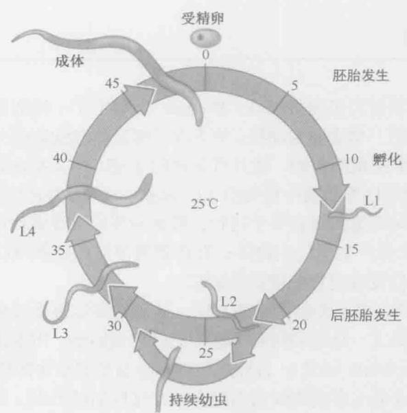

图 A-14 秀丽新小杆线虫的生活周期。图示为生活周期，如文中所述，从第一期幼虫到成虫的发育以小时计。L1 幼虫进入的另一个发育期（成为持续幼虫）也在此显示。  
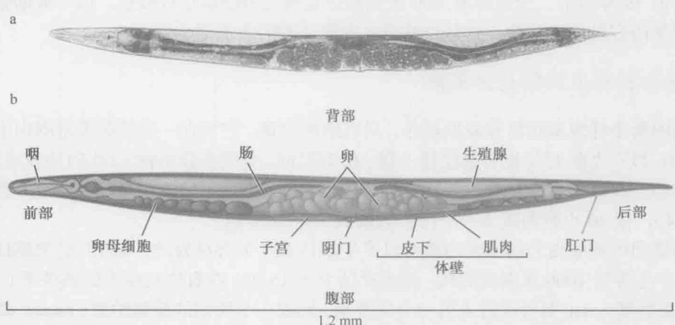  
图 A-15 线虫的身体平面图。（a）显示的是一个成虫两性体线虫的纵切剖面图。各种器官在图（b）中标示，并在文中有所描述。[a，经许可影印自 Sulston J. E. 和 Horvitz H. R. 1977. Dev. Biol. 56: 110-156. © Elsevier.]

在哺乳动物中，这些基因的许多同源基因是致癌基因和肿瘤抑制基因，当它们发生改变时就会导致癌症。在秀丽新小杆线虫，使这个途径失活的突变体不会产生阴门细胞，所以阴门不能发育，而激活这个途径的突变体则导致阴门前体细胞的过度增殖，产生具有多个阴门的表型。因为线虫是透明的，阴门仅仅来源于22个细胞，所以可从细胞水平的分辨率描述突变体的缺陷，从而将突变的类型与某一特定细胞的改变联系起来。此外，特定基因产物的细胞自治功能和非自治功能可以被区分。

## 细胞凋亡通路是在秀丽新小杆线虫中发现的

尽管细胞凋亡过程已经在很多发育过程中被确定（如趾的形成和蝌蚪尾巴的消失），但细胞凋亡是一个“程序化”的、遗传调控的过程论断的确认得益于在线虫遗传和实验上的研究。细胞谱系的早期分析注意到在每一个动物中成组细胞的死亡都是相同的，暗示细胞死亡是受遗传控制的。第一个分离到的细胞死亡缺陷型（ced）突变体是那些在相邻细胞吞噬死亡细胞残体方面有缺陷的突变体。因而，在突变体内，死亡细胞残体会存留多个小时。利用这些ced突变体，H.Robert Horvitz和他的同事分离了更多的不能产生保留细胞残体的ced突变体。这些突变体被证明是在启动细胞死亡程序方面有缺陷。除了一个特例外，ced突变体的分析表明，所有发育中的程序化细胞死亡是自主的，也就是说是细胞自杀。在雄性中，有个叫做连接细胞的细胞被相邻细胞杀死。ced基因的鉴定为确认哺乳动物的同类蛋白质提供了方法，这类蛋白质在所有的动物中基本上驱动同样的生化反应来控制细胞死亡，事实上，在秀丽新小杆线虫里表达人类的ced同源基因可以替代突变的ced基因。细胞凋亡在发育和疾病过程中与细胞增殖同等重要，并且是许多控制癌症和神经退行性疾病治疗方法的焦点。

## RNA 干扰（RNAi）是在秀丽新小杆线虫中发现的

1998年，公布了一项惊人的发现：双链RNA（dsRNA）引入秀丽新小杆线虫后，抑制了其与同源的基因表达（关于基因沉默的全面论述，见第20章）。虽然这个现象也在其他模式生物中被发现，但线虫在遗传和发育实验上的易处理性（例如突变体的产生不能沉默）确保了它在阐明基因沉默理论中的领先地位。这个意外的发现以及接下来的RNA干扰（RNAi）分析具有三个方面的重要意义。第一，RNAi看来是普遍存在的，因为几乎所有的动物、真菌或植物细胞中dsRNA的引入都会导致同源mRNA的定向降解。实际上，我们对RNAi的了解很多来自于植物研究（第20章）。第二，对这个神秘过程的实验研究揭示了它的分子机制（见图20-10）。RNAi的第三个重要方面是该技术在控制多种生物体的基因表达中的广泛应用。RNAi提供了一种鉴定特定生命过程相关基因的“系统策略”，当然这种鉴定也可以通过传统遗传学来完成。因此，干扰RNA文库可以对应一个生物体内所有的基因，通过将特定的表型和文库中特定的RNA相关联，人们便可以追踪到出现这一表型的基因。这种方法甚至可以用于那些不符合传统遗传学的生物体的研究。这些研究与另一个RNA介导的基因调节过程相交叉，那个过程涉及微小的内源小RNA，已有研究显示这些内源小RNA在植物和动物中调节基因表达、在纤毛虫里协调基因组重排并在酵母里调节染色质结构。最初的两个小RNA是在秀丽新小杆线虫中进行遗传筛选时发现的。一小部分线虫小RNA在两翼昆虫和哺乳动物中是保守的，它们的功能正在被逐步揭示。最近的研究表明人类基因组可能含有大约1000个小RNA基因。

## 黑腹果蝇

果蝇作为模式生物用于遗传和发育生物学研究已近百年。1908年托马斯·亨特·摩尔根（Thomas Hunt Morgan）和他在哥伦比亚大学（Columbia University）的研究助手把腐烂的水果放在舍莫宏大厅（Schermerhorn Hall）的实验室窗台上。目的是搜寻一种小的、快速繁殖的动物，并能够在实验室里培养来研究数量性状的遗传，如眼睛的颜色。在捕获的各种动物中，果蝇最符合要求。成虫在两周内就可以产生大量子代，果蝇培养用的是回收的牛奶瓶和一种廉价的酵母和琼脂混合物。

## 果蝇的生活周期很短

果蝇生活周期的突出特征是有一个快速的胚胎形成期，然后是3个幼虫生长期及变形期（图A-16）。胚胎形成在受精后的24h内完成，最终孵化出第一龄幼虫。如同我们在第21章中所讨论的，果蝇胚胎发育早期的核分裂是所有动物中最快的。一个第一龄幼虫生长24h，然后蜕皮成一个更大的第二龄幼虫。这个过程重复以产生一个第三龄幼虫，它进食并生长2\~3天。

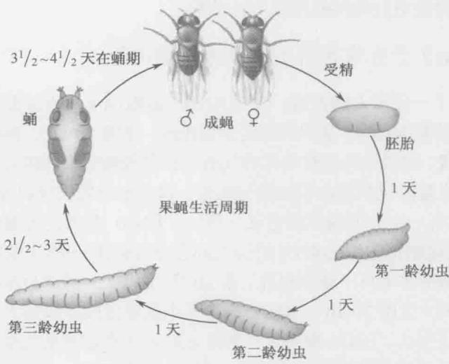  
图 A-16 果蝇生活周期。图示为文中描述果蝇发育的各个时期。

幼虫发育中的一个关键过程是器官芽的生长，它是由胚胎中期表皮内陷形成的（图A-17）。每套肢体都有一对器官芽（如一套前腿器官芽和一套翅膀器官芽），还有眼睛、触角、口器和生殖器的器官芽等。起初器官芽很小，在胚胎中仅由不到100个细胞组成，但在成熟的幼虫中却含有成千上万个细胞。翅膀器官芽的发育已经成为重要模式系统，例如Hedgehog和Dpp（TGF-β）等分泌信号分子的梯度是如何控制复杂的身体结构形成过程的。器官芽在变形（或化蛹）过程中分化成各自相应的成虫结构。

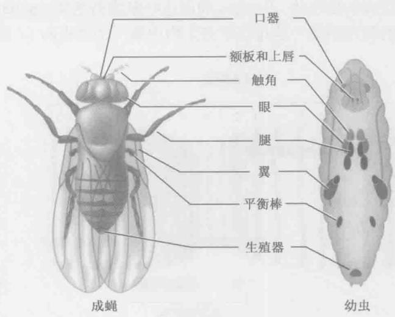  
图 A-17 果蝇的器官芽。右图所示为幼虫中各个器官芽的位置。左图为它们在成虫中形成的肢翼和器官。这些器官芽起初在胚胎里只是很小的细胞群，但在成熟的幼虫里有成千上万个细胞。这些器官芽在化蛹的过程中发育成它们相应的成虫中的结构。

## 第一个基因组图谱在果蝇中产生

1910年，摩尔根实验室发现了一个自发突变的雄蝇，它的眼睛是白色的而不是正常品系中的亮红色。由这个果蝇启动了一系列深入的遗传学研究，产生了两项重要发现：一是基因位于染色体上；二是每个基因是由两个等位基因组成的，这两个基因在减数分裂过程中独立分配（见孟德尔第一定律；第1章）。其他突变的发现证实了位于不同染色体上的基因独立地分离（孟德尔第二定律），而那些连锁在同一条染色体上的基因则不同。

哥伦比亚大学的学生 Alfred. H. Sturtevant（摩尔根实验室的成员）设计了一个简单的数学运算方法，可以根据重组频率绘制连锁基因之间的距离。这个简单有效的方法产生了巨大的影响，从根本上改变了遗传学，第一次物理的定位了基因并能在染色体上排序。到了20世纪30年代，遗传图谱已经非常密集，确定了控制成虫多种物理特性的多个基因的相对位置，如翅膀大小和形状，以及眼睛颜色和形状等。

另一位曾在摩尔根果蝇实验室接受培训的科学家 Hermann. J. Muller，第一次提出了环境因素，如导致染色体重排和遗传突变的离子辐射。日常进行的大规模“遗传筛选”是通过喂食成年雄蝇一种诱变剂如 EMS（ethylmethane sulfone），然后将之与正常雌蝇交配。 $F_{1}$ 代是杂合的，含有一条正常的染色体和一条随机突变的染色体。各种各样的方法被用来研究这些突变，如后所述。

除了强大的生育能力（一个雌性可以产生几千个卵）和快速的生活周期外，果蝇还有几个非常有用的特征，使其长期在实验研究中扮演着重要角色。它只有4条染色体：2条大的常染色体，即染色体2和3；1条较小的X染色体（它决定性别）；1条非常小的染色体4。Muller的同事Calvin B. Bridges发现在果蝇幼虫里某些组织中能够进行多次内部复制而并不发生有丝分裂。在唾液腺中，这个过程产生了极其巨大的，由大约1000个拷贝的染色单体组成的染色体。Bridges 利用这些多线染色体（polytene chromosome）来绘制果蝇基因组的物理图谱（这是在所有生物中第一个绘出的）（图 A-18）。

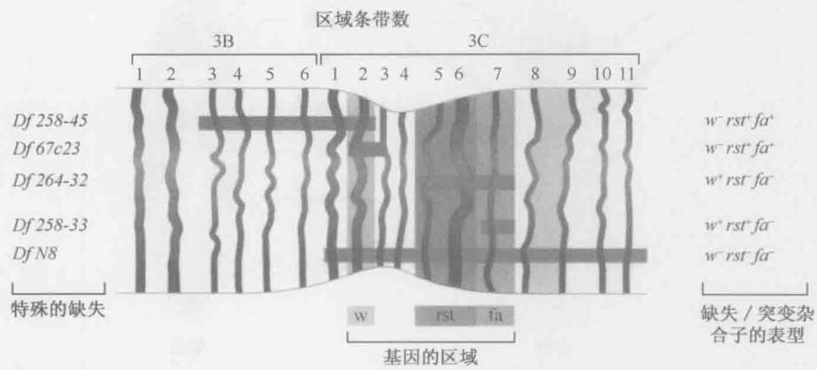  
图 A-18 遗传图谱、多线染色体和缺失图谱（deficiency mapping）。在某些果蝇组织中，没有伴随有丝分裂的核内复制导致放大的染色体，最明显的是唾液腺体，在那里可以产生巨大的由 1000 个染色单体组成的染色体。这是第一次有可能把某些性状的基因出现与染色体的特定物理片段联系起来。例如，果蝇白眼表型与 X 染色体 3C 区域缺失相关。（经许可引自 Hartwell L. et al. 2004. Genetics: From genes to genomes, $2^{\text{nd}}$ ed., p.816, Fig.D-4. © McGraw-Hill.）。

Bridges 在 4 条染色体上总共发现了大约 5000 条 “条带”，并将许多条带和经典重组图谱遗传位点的位置建立了相关性。例如，隐性的 white 突变基因杂合的雌性果蝇表现出正常的红眼。然而，含有 white 突变的相似雌蝇若同时在另一条 X 染色体上移走了 3C2-3C3 多线条带则表现为白眼。这是因为已不存在该基因正常的显性拷贝。这类分析

图 A-19 平衡染色体。当与原先的亲本染色体（上图）比较时，平衡染色体（下图）有一系列倒位。本图中，绘出的染色体有两个臂。平衡染色体的左臂有一个内倒位，基因 a、b、c 的顺序与原来相反。同样地，平衡染色体右臂也有一个倒位，颠倒了基因 d、e 和 f 的顺序。另外，以着丝粒为中心可能有一个倒位，此处颠倒了基因 1 和 2 的顺序。与原来的染色体相比，平衡染色体的基因顺序有明显不同。这样，含有一个正常拷贝和一个平衡染色体拷贝的杂合体中染色体之间的重组就被抑制了。

使我们得出结论：白眼基因位于 X 染色体的多线条带 3C2 和条带 3C3 之间。

其他各种遗传方法的建立，确立了果蝇作为动物遗传研究首要模式生物的地位。例如，平衡染色体（balancer chromosome），它含有一系列相对于原始染色体的倒位（图A-19）。严格地说，这种平衡染色体在减数分裂过程中不与原始的染色体进行重组，就可能永久保留含有隐性致死突变的果蝇群落。我们在第21章讨论过的even-skipped（eve）基因的一个无功能突变，这个突变纯合体的胚胎会死亡，不能产生幼虫和成蝇。eve位点被定位在染色体2（在多线条带46C）上。这个无功能突变可以在杂合群体中保留，杂合子含有一条有eve无功能等位基因的“正常”染色体和一条含有该基因正常拷贝的平衡染色体。既然eve的无功能等位基因是完全隐性，这些果蝇是可以存活的，然而，在成体后代中只观察到杂合子的存在。含有两个平衡染色体拷贝的胚胎不能存活，因为某些倒位破坏了生存必需基因而产生隐性致死基因。另外，含有两个拷贝正常染色体的胚胎也不能存活，因为它们对 eve 的无功能突变是纯合的。

## 遗传嵌合体使分析成蝇中的致死基因得以进行

嵌合体（mosaics）是在一个总体上“正常”的遗传背景下含有小部分突变组织的动物。该生物中大多数的组织是正常的，一小部分的不正常不会致死。例如，通过X射线照射发育中的幼虫，诱导有丝分裂重组可以产生小块的engrailed/engrailed纯合突变组织。当突变部分出现在发育中的翅膀后面的区域，那么果蝇就表现出非正常的翅膀，在正常的后部结构区产生重复的前部结构。遗传嵌合体分析提供了Engrailed是将果蝇的附器和节片细分成前后两部分所必需的第一个证据。

最令人惊奇的遗传嵌合体是雌雄嵌合体（图A-20），这些果蝇是严格意义上的半雄半雌果蝇。果蝇的性别是由X染色体的数目决定的，有两条X染色体的个体是雌性，只有一条X染色体的是雄性（与小鼠和人类不同，Y染色体在果蝇中不决定性别，Y只在产生精子中需要）。在极为罕见的情况下，随着精子和卵子前核的融合，新受精的XX胚胎里两条X染色体中的一条会在第一次有丝分裂时丢失。

这种 X 染色体的不稳定性仅出现在第一次分裂时，在随后的分裂中，含有两条 X 染色体的细胞核产生两条 X 染色体的子核，而只有一条 X 染色体的核产生的子代含有一条 X。如同我们在第 21 章所讨论的，这些细胞核经历快速分裂而细胞膜不分裂，然后迁移到卵的外围。这

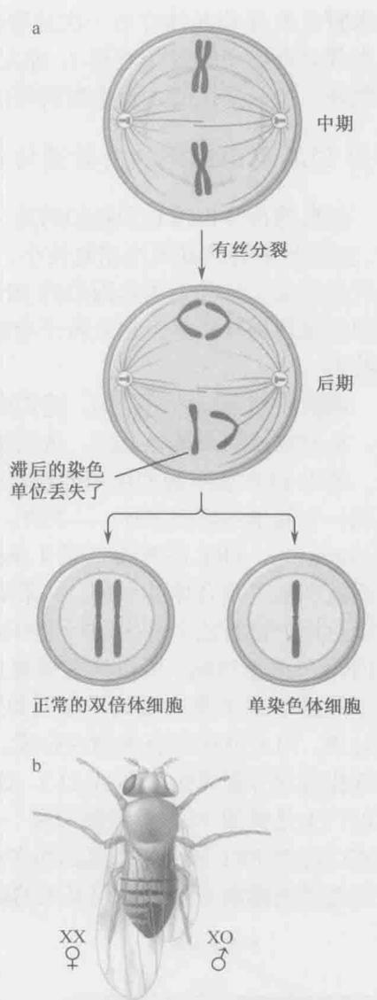  
图 A-20 雌雄嵌合体。雌雄嵌合体是一令人惊奇的遗传嵌合体的形式。（a）蓝色的 X 染色体携带隐性（白眼）突变，而红色的 X 染色体有该基因的正常的显性拷贝。如文中所述，突变是一个 XX（雌性）果蝇的一条 X 染色体在第一次有丝分裂时丢失的结果。（b）在形成的突变体中，果蝇的一半是雌性，另一半是雄性。

个迁移是连贯的，含有一条 X 染色体的核和含有两条 X 染色体的核很少或不发生混合。因而，一半的胚胎是雄性的，一半是雌性的，尽管分开雄性和雌性组织的“分界线”是随机的。它的确切位置取决于在第一次分裂后两个子细胞核的方向。这条分界线有时把成蝇切成左半部是雌性的，右半部是雄性的。假设一条 X 染色体含有隐性的白眼基因，如果野生型 X 染色体在第一次分裂时丢失，那么果蝇的右半部，即雄性部分为白眼（雄性半部只有突变的 X 染色体），而左半部（雌性一边）为红眼（记住雌性半部有两条 X 染色体，携带显性的、野生型的等位基因）。

## 酵母 FLP 重组酶能够有效遗传嵌合体

经典遗传分析没有预料到的是，果蝇有若干个对分子研究和全基因组分析有利的特性，主要是果蝇的基因组相对较小，只有大约150Mb，蛋白质编码基因还不到14000个，这只是构成小鼠和人类基因组的DNA总量的5%。果蝇进入当今时代后，人们改进了一些旧的遗传操作技术，建立若干全新的实验方法，如制备携带重组DNA的稳定转基因株技术。

就像我们以前所讨论的，遗传嵌合体是在体细胞里通过有丝分裂重组而产生的。起初，X射线被用来诱导重组，虽然这个方法效率较低，只能产生小范围的突变组织。最近，酵母FLP重组酶的使用使有丝分裂重组的频率得到了很大的提高（图A-21）。FLP识别一个简单的序列基序——FRT，然后催化DNA重排（见第12章）。通过P因子（P-element），FRT序列插入到4条染色体中每条染色体的着丝粒附近（见下文讨论）；随后就产生了杂合体的果蝇，一条染色体上含有Z基因的一个无功能等位基因，而其同源染色体上带有这个基因的野生型拷贝，两条染色体都含有FRT序列。因为在果蝇里没有内源FLP重组酶，所以这些果蝇是稳定存活的。然而，在含有热诱导hsp70启动子控制下的酵母FLP蛋白质编码序列的果蝇转基因株里，还有可能引入重组酶。一旦进行热激处理，FLP就在所有细胞内合成。FLP结合到两个含有Z基因的同源的FRT基序上，并催化有丝分裂重组（图A-21）。这个方法非常有效。事实上，短时间的热激处理通常可以产生足够的FLP重组酶而在一个成蝇的不同区域产生大范围的 $z^{-}/z^{-}$ 组织，通过P转座已经把FRT插入果蝇基因组各处。现在用FLP重组酶在目的基因两边的FRT位点之间重排就能制造几乎任何基因的缺失。

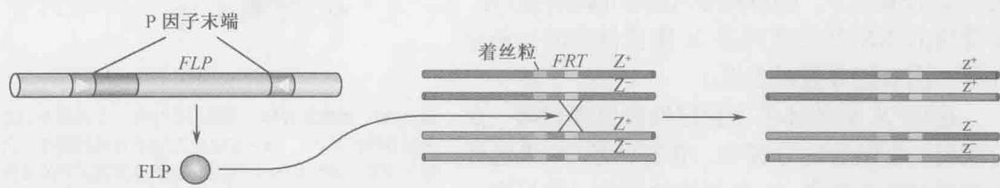  
图 A-21 FLP-FRT。来源于酵母的定点重组系统（在第 12 章中有描述）的使用促进了果蝇中高水平的有丝分裂重组。重组的控制是通过在需要的时候在果蝇中表达重组酶而实现的。

## 制备携带外源 DNA 的转基因果蝇简便易行

P 因子是可转座的 DNA 片段，能引起一种杂种劣势（hybrid dysgenesis）的遗传学现象（图 A-22）。让我们来考虑果蝇雌性 “M” 株和雄性 “P” 株（同一种，不同属）交配的结果，其 $F_{1}$ 子代常常不育。原因是 P 株含有多拷贝的 P 因子转座子，在来源于 M 卵的胚胎中移动，这些卵缺少抑制 P 因子移动的抑制蛋白。P 因子的切除和插入仅限于极细胞，即配子（在雄性中是精子，雌性中是卵子）的前体中。有时，P因子插入到这些生殖细胞发育的必需基因里，就会导致交配后产生的成蝇的不育。

正常的后代 正常的后代 正常的后代  
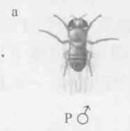

b 非劣势杂交

c劣势杂交

  
图 A-22 杂种劣势。P 因子转座子位于 P 型株中，因为阻抑物的表达，使转座子保持沉默。当 P 株与缺乏阻抑物的 M 型株交配，转座子在极细胞中移动，常常整合到生殖细胞形成所需的基因里。这就解释了这种交配后代的高频率不育。

用 P 因子作为载体可以将重组 DNA 引入到正常的果蝇株里（图 A-23）。全长 P 因子转座子有 3kb，它的两端含有反向重复序列，这对切除和插入是必需的。居间的 DNA 编码一个转座的阻抑物和一个促进移动的转座酶。在 P 株卵内发育的阻抑物得到表达，结果来自 P 株（含有 P 因子）雌性的胚胎中 P 因子不能移动，只有在那些缺乏 P 因子的雌性 M 株所产的卵形成的胚胎中才能够移动。

  
图 A-23 P 因子转化。P 因子可以用作果蝇胚胎转化的载体。所以，如同在文中所讨论的，目的序列可以插入到经过修饰的 P 因子中。这个重组分子的一个拷贝将稳定地整合到一条果蝇染色体的某一位置中。

重组 DNA 被插到编码阻抑物和转座酶基因缺乏的 P 因子中，然后 DNA 被注入早期细胞（形成）前胚胎的后部（如同我们在第 21 章中所见，这是含有极粒的区域），同时将转座酶和重组 P 因子载体一并注入。当分裂的核进入后部，它们获得极粒、重组 P 因子 DNA 及转座酶；极细胞从极质里出芽并脱落，重组 P 因子在极细胞里随机插入到某个位置上。不同的极细胞含有不同的插入 P 因子。重组 P 因子 DNA 和转座酶的量是经过精心试验的，所以，一个特定的极细胞平均只能有一个 P 因子的整合。胚胎发育到成体，然后与合适的试验株交配。

重组 P 因子含有一个 “标记” 基因，如 white $^{+}$ 和用来注射的受体株是 white $^{-}$ 突变。测验株也是 white $^{-}$ ，所以所有红眼的 F $_{2}$ 果蝇一定含有一个拷贝的重组 P 因子。这种 P 因子转化的方法被经常用来鉴定调控序列，如那些控制 eve 条带 2 表达的序列（我们在第 21 章讨论过）。此外，这种策略还被用来在各种遗传背景下检验蛋白质编码基因。

总之，果蝇提供了所有复杂的、经典的分子遗传学的技术可以操作的模式系统，就像我们前面提到过的微生物。唯一明显的缺陷是缺乏与重组 DNA 精确同源重组的操作方法，如基因缺失。然而，这种方法是最近发展起来的，现在正在改进以便于日常使用。有意思的是，我们将会看到，在更复杂的小鼠生物系统模型中这样的操作是容易进行的。不过，因为果蝇具有丰富的遗传工具，而且几十年来对它的研究使我们积累了大量的背景知识，因此果蝇依然是研究发育和行为的首要模式系统之一。

## 小鼠

如果以秀丽新小杆线虫和果蝇为标准，小鼠的生活周期显得缓慢并且操作困难。胚胎发育或妊娠需要3周，新生的小鼠还要过3\~6周才能达到青春期。因此，小鼠的正常生活周期大约是8\~9周，比果蝇的长5倍多。然而，由于它在演化树上的位置，鼠类享有一个特殊的待遇：它是哺乳动物，因此和人类有亲缘关系。当然，黑猩猩和其他更高级的灵长类与人类之间有更近的亲缘关系，不过它们不能满足各种能用小鼠进行的实验。

于是，小鼠的研究使我们能够将低等生物如线虫和果蝇研究中发现的基本原理与人类疾病联系起来。例如，果蝇的 patched 基因编码了 Hedgehog 受体的重要组成元件（第 21 章）。果蝇中缺乏野生 patched 基因活性的突变体，其胚胎会表现出各种特定的身体结构缺陷，小鼠中的同源基因在发育中也是重要的。然而出乎意料的是，在鼠和人类中的一些 patched 突变体会导致各种癌症，如皮肤癌，在果蝇中的分析却没能揭示这样的功能。另外，已经开发了能在正常的小鼠中有效地敲除特定基因的方法，这种“敲除”技术影响了我们对人类发育、行为和疾病基本机制的理解。下面我们将简短地回顾小鼠作为实验系统的显著特征。

小鼠的染色体组成与人类相似：小鼠有19条常染色体（人类有22条），还有X和Y性染色体。在小鼠和人类之间有着大量的同线性：在与人类染色体“同源”的染色体区域，小鼠有相同的基因（以同样的顺序）。小鼠基因组已经被测序和组装。如在第21章中所讨论的，小鼠与人类的基因组几乎有相同的基因组成：两者都含有约

25000 个基因，其中 85% 以上的基因是一一对应的；小鼠与人类基因组的差别大多数（尽管不是全部）源于两个谱系中的某些基因家族选择性重复的不同。比较基因组分析证实了我们已知的，即小鼠是研究人类发育和疾病的优良模型。

## 鼠的胚胎发育依赖干细胞

小鼠的卵很小,难以操作。与人类的卵一样,它们的直径只有100μm,这使像在斑马鱼和青蛙中进行的那种嫁接移植技术难以在小鼠中实施,但把重组DNA引入小鼠生殖细胞系从而产生转基因株的显微注射法已经建立,下文将会对此进行讨论。另外,即使在发育的较早时期,也可能获得足够的小鼠胚胎,进行原位杂交及特定基因表达模式的直观检测。这种直观检测方法适用于正常的胚胎和在特定的遗传位点发生缺陷的突变体。

图 A-24 显示小鼠胚胎发生的概况。早期小鼠胚胎的初始分裂非常缓慢，仅以平均每 12\~24h 一次的频率发生。在 16 细胞期可以观察到第一个明显的多样化细胞类型，这时的胚胎叫桑椹胚（morula）（图 A-24，第 6 幅）。外周细胞形成的组织与胚胎形成无关，但能发育成胎盘，内部细胞则产生内细胞团（ICM）。在 64 细胞期，只有 13 个 ICM 细胞，这些细胞形成成鼠的所有组织。ICM 是胚胎干细胞的主要来源，可以在培养基里培养，并且，一旦加入合适的生长因子，就可被诱导形成各种类型的成体细胞。人类干细胞已经成为社会争论的重要话题，干细胞提供了一个可更新的组织来源，以替代很多变性疾病，如糖尿病和阿尔茨海默症中的缺陷细胞。

在 64 细胞期（受精后 3\~4 天），小鼠胚胎此时称为胚泡（blastocyst），最终准备着床。胚泡和子宫壁的相互作用导致了胎盘的形成，胎盘是除了原始产蛋的鸭嘴兽之外所有哺乳动物都具有的特征。胎盘形成后，胚胎进入原肠期，由此，

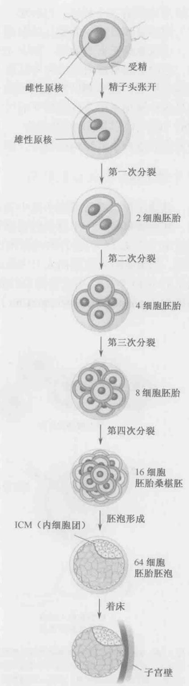  
图 A-24 小鼠胚胎形成及发展

ICM 形成所有三个胚层：内胚层、中胚层和外胚层。之后不久，具有脑、脊髓和内部器官（如心脏和肝脏）的胎儿就形成了。

小鼠原肠胚形成的第一期中 ICM 分成了两个细胞层：里面的下胚层和外面的上胚层，它们分别形成内胚层和外胚层。一个叫原条（primitive streak）的凹槽沿着上胚层的纵向形成，迁移到凹槽里的细胞形成了里面的中胚层。原条的前端称为节（node），它是各种被用来形成胚胎贯穿前后的中轴信号分子的来源，这些信号分子包括两个分泌型的 TGF- $\beta$ 信号传导的抑制物——Chordin 和 Noggin。缺失这两个基因的双突变小鼠胚胎发育成没有头部结构的胎儿，如无前脑和鼻子。

## 把外源 DNA 引入小鼠胚胎

显微注射法在转基因小鼠中表达重组 DNA 已经有效应用。DNA 被注射进卵细胞原核，胚胎被移置入一个雌鼠的输卵管，使其着床并发育。注射的 DNA 随机地整合到基因组中（图 A-25）。整合的效率相当高，并通常发生在发育的早期，往往是在单细胞胚胎期。结果是融合基因插入大多数或所有的胚胎细胞，形成包括成鼠的体细胞组织和生殖系的 ICM 细胞。用这种简单的显微注射方法产生的转基因小鼠大约 50% 表现出生殖系转化（germline transformation），也就是说，它们的后代也含有外源重组 DNA。

  
图 A-25 通过显微注射 DNA 到卵原核内制备转基因小鼠。从刚刚交配的雌鼠中取出单细胞胚胎。重组 DNA 被注射到细胞核里，然后，胚胎被植入一个假孕母鼠的输卵管内。几天后，胚胎着床，并最终形成含有重组 DNA 的整合拷贝的胎儿。

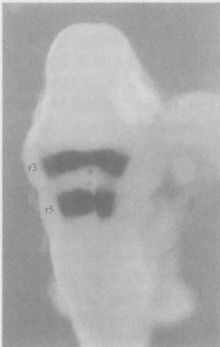  
图 A-26 转基因小鼠胚胎的原位表达模式。这是由部分 Hoxb-2 基因的调节区域与 lacZ 报道基因连接在一起获得的转基因小鼠。从转基因雌鼠取出胚胎，并染色以显示 β-半乳糖苷酶（LacZ）活性的位置。10.5d 的胚胎后脑区域有两个主要的染色条带。图中胚胎头朝上尾向下。（来源：Nonchevet al. 1996. Proc. Natl. Acad. Sci. 93: 9339-9345, Fig.1c.）

举例来说，将 Hoxb-2 基因的增强子和 lacZ 报道基因连接形成融合基因。从携带这个报道基因的转基因株中获得胚胎和胎儿，并染色以观察 lacZ 的表达模式。在此例中，观察到显色区在后脑中（图 A-26），转基因小鼠已经被用来研究好多个调节序列，包括那些调节 $\beta$ -珠蛋白基因和 HoxD 基因的序列。这两个复杂的位点都含有远程调控元件（分别是 LCR 和 GCR），它们能协调相距几十万碱基的不同基因的表达（第 19 章）。

## 同源重组为单个基因的选择性去除提供了机会

小鼠转基因的一个强有力的方法是中断或“敲除”单个遗传位点的能力，这使用于人类疾病研究的小鼠模型制备成为可能。例如，p53基因编码一个调节蛋白，该蛋白激活DNA修复所需基因的表达，已经发现它与许多人类癌症有关。p53功能丧失时，由于DNA突变的快速积累，癌细胞侵染性更高。已经建立了一个小鼠株，除了p53基因被敲除外，其余完全正常。这些小鼠非常容易患癌症而早亡，因而有望用于检测潜在的供人类使用的药物和抗癌剂。尽管果蝇中也有p53基因，也分离了突变体，但它并不能像小鼠模型那样用于药物发现。

基因打断实验是用胚胎干细胞（ES）来做的（图 A-27），这些细胞是通过培养小鼠胚泡而获得，ICM 细胞只增殖但不分化。重组 DNA 就是创建一个靶基因的突变体（干细胞也可由少量转录因子重新逆转录的体细胞产生，见第 21 章框 21-1）。例如，在基因的起始端附近删除一小段区域，而改变一个特定目标基因的蛋白质编码区，从编码的蛋白质中删除必需氨基酸的密码子，并在剩余的编码序列中产生移码。经过改变的靶基因和耐药基因（如具有对新霉素抗性的 NEO 基因）相连接，只有那些含有转基因的 ES 细胞可以在含有抗生素的培养基里生长。NEO 基因被置于经过改变的靶基因的下游，但位于与染色体同源的区段侧翼区域上游，这样转基因片段和染色体的双重重组将导致靶基因被突变基因和抗药基因所取代（或者用另一种办法，NEO 基因可以插入目标基因）。

然而，也存在高发性的非同源重组，即发生在同源的体内基因之外的不正确重组。为了富集同源重组，重组载体还包含了一个标记基因——胸苷激酶基因（TK），可以使用药物丙氧鸟苷进行负筛选，丙氧鸟苷在激酶作用下将转化为一个有毒的化合物。在载体上，胸苷激酶基因位于与染色体同源的区域之外。因此，通过同源重组使突变基因整合到染色体的转化子会失去胸苷激酶基因，但通过非同源重组整合入染色体的转化子含有胸苷激酶的完整载体，于是就会被筛除掉。

通过上述过程可以获得重组 ES 细胞，其中，一份目标基因与突变的等位基因相对应。收集这些重组 ES 细胞并注射到正常胚泡的 ICM 里。杂种胚胎植入宿主鼠的输卵管，并让它们发育到相应时期。有些源于杂种胚胎的成体拥有转化了的生殖系，于是产生含有突变目标基因的单倍体配子。最初用作转化的和同源重组检测的 ES 细胞产生体细胞组织和生殖系。一旦获得了具有转化生殖细胞的小鼠，就将其与同胞小鼠进行交配，以获得纯合突变体。有时，由于这些突变体是致死的，必须在胚胎时就对它们进行分析。而其他非致死基因，突变体胚胎能发育成生长完全的小鼠，然后用各种技术去检测。

  
图 A-27 通过同源重组进行基因敲除。本图概括了制备任意基因缺失的细胞株的方法。目标基因（以绿色显示）内发生的同源重组导致了 NEO 基因的插入并破坏了那个基因。非同源重组或随机重组可以导致含有 NEO 基因的中断基因和胸苷激酶（TK）的基因的插入。携带这两个转基因片段的克隆在新霉素中都能存活，但同时携带 TK 的克隆随后在丙氧鸟苷（gancyclovir，GANC）中经过反选择。于是，只有含有携带 NEO 基因和靶基因的转基因片段的克隆才能存活。一旦产生突变细胞就可以被克隆并培养成敲除该基因的小鼠（图 A-25）。

## 小鼠中存在 epi 遗传

小鼠胚胎研究发现了一个奇怪的非孟德尔遗传现象，或者表观遗传现象，这个现象称为亲本印记（parental imprinting）（图 A-28）。其基本的概念是某些基因的两个等位基因中只有一个是有活性的，这是因为另一个拷贝在发育中的精子细胞或卵子细胞里被选择性地失活了。举个 lgf2 基因的例子，它编码一个类似胰岛素的生长因子，在发育胎儿的肠和肝脏中表达。只有从父本那里继承下来的 lgf2 等位基因在胚胎里活跃地表达；另一个拷贝，尽管在序列上完全正常，却是没有活性的。lgf2 基因的母本和父本拷贝在

<!-- END OFFICIAL API PART part_009 -->

<!-- BEGIN OFFICIAL API PART part_010 -->

活性上的这种差别源自于一个与之关联的抑制 lgf2 表达的沉默子 DNA 的甲基化。在精子发育过程中，DNA 是甲基化的，所以 lgf2 基因能够在发育的胚胎中活化，甲基化抑制了沉默子；相反，在发育中的卵母细胞里这个沉默子 DNA 不被甲基化。于是，从母本继承来的 lgf2 等位基因是沉默的。也就是说，对未来在胚胎中的表达，这个基因的父本拷贝做了“印记”，在这里，也就是被甲基化了。这个例子在第 19 章里有详尽的讨论。

  
图 A-28 小鼠中的印记。小鼠中特定基因的一个等位基因的永久沉默。如文中所略述和在第 19 章中所详细描述的，印记保证了小鼠的 lgf2 基因在每个细胞中只有一个拷贝是表达的。被表达的总是那个源于父本染色体的拷贝。

在鼠和人类中大约有 30 个被印记的基因。其中许多控制发育中胎儿的生长，包括上述例子中的 lgf2。有人提出印记是为了保护母亲免遭她的胎儿对其伤害而演化来的。lgf2 蛋白促进胎儿的生长。母亲试图通过失活该基因的母本拷贝来限制这种生长。

在本书中我们已经讨论了每一个生物必须怎样保持和复制它的 DNA 来生存、适应和繁殖。在大多数生物中，实现这些基本的生物学目标的总体战略是相似的，因此可以用简单的生物来进行研究相当成功。然而很清楚，在高级的生物中发现的更复杂的过程，如分化和发育,需要更复杂的系统来调节基因表达,这些只有用更复杂的生物才能实现。我们已经看到很多强有力的实验技术可以成功地被用来操作小鼠,并探索各种复杂的生物学问题。小鼠已经成为一个优秀的研究发育、遗传和生化过程的模式系统,而这些过程很可能发生在演化程度更高的哺乳动物中。小鼠基因组序列的公布及其注释更加强调了小鼠作为模式生物在进一步探索和解决人类发育和疾病研究中的重要性。

## 参考文献

Burke D., Dawson D., and Stearns T. 2000. Methods in yeast genetics. Cold Spring Harbor Laboratory Press, Cold Spring Harbor, New York.

Hartwell L.H., Hood L., Goldberg M.L., Reynolds A.E., Silver L.S., and Veres R.C. 2004. Genetics: From genes to genomes, 2nd ed. McGraw-Hill, New York.

Miller J.H. 1972. Experiments in molecular genetics. Cold Spring Harbor Laboratory Press, Cold Spring Harbor, New York.

Nagy A., Gertsenstein M., Vintersten K., and Behringer R. 2003. Manipulating the mouse embryo, 3rd ed. Cold Spring Harbor Laboratory Press, Cold Spring Harbor, New York.

Sambrook J. and Russell D.W. 2001. Molecular cloning: A laboratory

manual, 3rd ed. Cold Spring Harbor Laboratory Press, Cold Spring Harbor, New York.

Snustad D.P. and Simmons M.J. 2002. Principles of genetics, 3rd ed. John Wiley and Sons, New York.

Stent G.S. and Calendar R. 1978. Molecular genetics: An introductory narrative. W.H. Freeman and Co., San Francisco.

Sullivan W., Ashburner M., and Hawley R.S. 2000. Drosophila protocols. Cold Spring Harbor Laboratory Press, Cold Spring Harbor, New York.

Wolpert L., Beddington R., Lawrence P., Meyerowitz E., Smith J., and Jessell T.M. 2002. Principles of development, 2nd ed. Oxford University Press, Oxford.

(潘庆飞 夏志译 王晓玲 黄妙珍 校)
