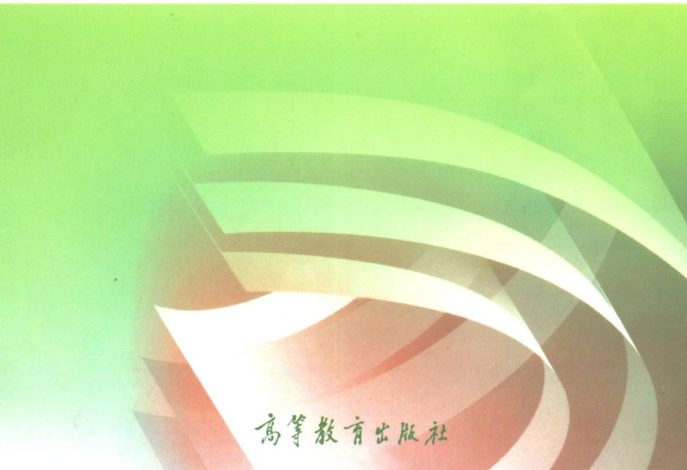

\- 马克思主义理论研究和建设工程重点教材 ·

# 思想道德与法治

(2023年版)

本书编写组

---

\- 马克思主义理论研究和建设工程重点教材 -

# 思想道德与法治

(2023年版)

本书编写组

高等教育出版社·北京

---

图书在版编目（CIP）数据

思想道德与法治:2023年版 / 《思想道德与法治（2023年版）》编写组编.--2版.--北京:高等教育出版社，2023.2

ISBN 978-7-04-059902-2

I.①思… II.①思… III.①思想修养-高等学校-教材②法律-中国-高等学校-教材 IV.①G641.6②D920.4

中国国家版本馆 CIP 数据核字（2023）第 012587 号

Sixiang Daode yu Fazhi

策划编辑 刘成荫 夏阳 杜计娟

出版发行 高等教育出版社

社 址 北京市西城区德外大街4号

责任编辑 刘成荫 夏阳

邮政编码 100120

购书热线 010-58581118

封面设计 王凌波 杨立新

咨询电话 400-810-0598

版式设计 王凌波 李小璐网 址 http://www.hep.edu.cn
http://www.hep.com.cn

责任校对 陈 杨

网上订购 http://www.hepmall.com.cn  
http://www.hepmall.com  
http://www.hepmall.cn

责任印制 朱琦

印刷 涿州市京南印刷厂

开 本 787mm×960mm 1/16

印 张 16.5

字 数 220千字

版 次 2021年8月第1版  
2023年2月第2版

印 次 2023 年 2 月第 1 次印刷

定 价 18.00 元

本书如有缺页、倒页、脱页等质量问题，

请到所购图书销售部门联系调换。

版权所有 侵权必究

物料号 59902-00

---

# · 马克思主义理论研究和建设工程重点教材

# 马克思主义理论研究和建设工程咨询委员会委员、审议专家

(以姓氏笔画为序)

王伟光 王晓晖 王梦奎 王维澄 王嘉毅

韦建桦 尹汉宁 左中一 龙新民 宁吉喆

邢贲思 曲青山 曲爱国 刘永治 刘国光

江流 江金权 汝信 孙英 孙谦

孙业礼 苏星 李伟 李捷 李书磊

李君如 李忠杰 李宝善 李培林 李景田

李慎明 吴杰明 吴德刚 何毅亭 冷溶

沈春耀 怀进鹏 张宇 张文显 张树军

张研农 陈 晋 陈宝生 邵华泽 欧阳淞

金冲及 金炳华 周济 郑必坚 郑科扬

赵长茂 南振中 信春鹰 侯树栋 逢先知

逄锦聚 姜 辉 袁贵仁 袁曙宏 贾高建

夏伟东 顾海良 徐光春 高翔 高永中

龚育之 隆国强 蒋乾麟 韩震 韩文秀

谢伏瞻 甄占民 靳诺 路建平 虞云耀

蔡昉 雒树刚 滕文生 颜晓峰 魏礼群

《思想道德与法治（2023年版）》课题组

## 首席专家

沈壮海 王 易

主要成员（以姓氏笔画为序）

冯秀军 邢云文 邢国忠 宇文利 李志强

余一凡 张瑜 陈柏峰 陈柳裕 侯猛

彭庆红 谢玉进 廖奕

---

## 目录

- 绪论 担当复兴大任 成就时代新人/1
- 一、我们处在中国特色社会主义新时代/1
- 二、新时代呼唤担当民族复兴大任的时代新人/5
- 三、不断提升思想道德素质和法治素养/8
- 第一章 领悟人生真谛 把握人生方向/13
- 第一节 人生观是对人生的总看法/13
- 一、正确认识人的本质/13
- 二、人生观的主要内容/17
- 三、人生观与世界观、价值观/20
- 第二节 正确的人生观/21
- 一、高尚的人生追求/22
- 二、积极进取的人生态度/24
- 三、人生价值的评价与实现/27
- 第三节 创造有意义的人生/31
- 一、辩证对待人生矛盾/31
- 二、反对错误人生观/35
- 三、成就出彩人生/38
- 第二章 追求远大理想 坚定崇高信念/43
- 第一节 理想信念的内涵及重要性/43

---

- ii 目录
- 一、什么是理想信念 / 43
- 二、理想信念是精神之“钙” / 47
- 第二节 坚定信仰信念信心 / 50
- 一、增强对马克思主义、共产主义的信仰 / 50
- 二、增强对中国特色社会主义的信念 / 56
- 三、增强对实现中华民族伟大复兴的信心 / 59
- 第三节 在实现中国梦的实践中放飞青春梦想 / 61
- 一、科学把握理想与现实的辩证统一 / 61
- 二、坚持个人理想与社会理想的有机结合 / 64
- 三、为实现中国梦注入青春能量 / 66
- 第三章 继承优良传统 弘扬中国精神 / 70
- 第一节 中国精神是兴国强国之魂 / 70
- 一、崇尚精神是中华民族的优秀传统 / 70
- 二、中国精神的丰富内涵 / 72
- 三、中国共产党是中国精神的忠实继承者和坚定弘扬者 / 75
- 四、实现中国梦必须弘扬中国精神 / 78
- 第二节 做新时代的忠诚爱国者 / 82
- 一、坚持爱国爱党爱社会主义相统一 / 82
- 二、维护祖国统一和民族团结 / 84
- 三、尊重和传承中华民族历史文化 / 90
- 四、坚持立足中国又面向世界 / 92
- 第三节 让改革创新成为青春远航的动力 / 96
- 一、改革开放是当代中国的显著特征 / 97
- 二、改革创新是新时代的迫切要求 / 98
- 三、做改革创新生力军 / 101
- 第四章 明确价值要求 践行价值准则 / 107
- 第一节 全体人民共同的价值追求 / 107
- 一、价值观与社会主义核心价值观 / 107

---

目录 Ⅲ

- 二、社会主义核心价值观的基本内容 / 110
- 三、当代中国发展进步的精神指引 / 118
- 第二节 社会主义核心价值观的显著特征 / 122
- 一、反映人类社会发展进步的价值理念 / 122
- 二、彰显人民至上的价值立场 / 126
- 三、因真实可信而具有强大的道义力量 / 128
- 第三节 积极践行社会主义核心价值观 / 132
- 一、扣好人生的扣子 / 132
- 二、把社会主义核心价值观落细落小落实 / 134
- 第五章 遵守道德规范 锤炼道德品格 / 138
- 第一节 社会主义道德的核心与原则 / 138
- 一、坚持马克思主义道德观 / 138
- 二、坚持以为人民服务为核心 / 146
- 三、坚持以集体主义为原则 / 149
- 第二节 吸收借鉴优秀道德成果 / 152
- 一、传承中华传统美德 / 152
- 二、发扬中国革命道德 / 158
- 三、借鉴人类文明优秀道德成果 / 163
- 第三节 投身崇德向善的道德实践 / 165
- 一、遵守社会公德 / 166
- 二、恪守职业道德 / 170
- 三、弘扬家庭美德 / 175
- 四、锤炼个人品德 / 181
- 第六章 学习法治思想 提升法治素养 / 189
- 第一节 社会主义法律的特征和运行 / 189
- 一、法律的含义及其历史发展 / 189
- 二、我国社会主义法律的本质特征 / 193
- 三、我国社会主义法律的运行 / 196

---

iv 目录

- 第二节 坚持全面依法治国 / 198
- 一、全面依法治国的根本遵循 / 198
- 二、坚持走中国特色社会主义法治道路 / 201
- 三、建设法治中国 / 209
- 第三节 维护宪法权威 / 217
- 一、我国宪法的形成和发展 / 218
- 二、我国宪法的地位和基本原则 / 221
- 三、加强宪法实施和监督 / 226
- 第四节 自觉尊法学法守法用法 / 230
- 一、培养社会主义法治思维 / 230
- 二、依法行使权利与履行义务 / 235
- 三、不断提升法治素养 / 247

后记/252