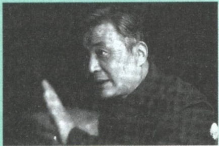
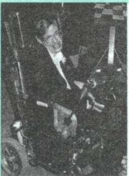
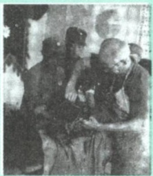
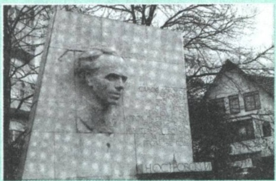
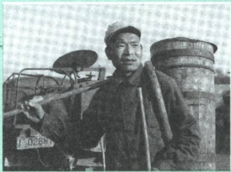
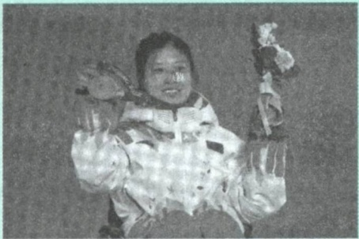
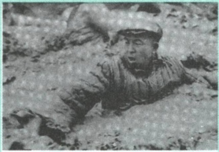
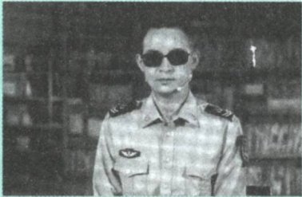

## 第一章 领悟人生真谛 把握人生方向

怎样才能不虚度人生？怎样才能创造无愧于时代的人生？这是常常萦绕在大学生心头的青春之问。面对世界的深刻复杂变化，面对纷繁多样的社会现象，面对各种思潮的相互激荡，面对学业、情感、职业选择等多方面的考量，大学生要学会在科学理论指导下树立正确的人生观，把自己的人生追求同国家发展进步、人民伟大实践紧密结合起来，通过不懈努力实现人生价值。

## 第一节 人生观是对人生的总看法

习近平同青年大学生座谈时强调:“要树立正确的世界观、人生观、价值观，掌握了这把总钥匙，再来看看社会万象、人生历程，一切是非、正误、主次，一切真假、善恶、美丑，自然就洞若观火、清澈明了，自然就能作出正确判断、作出正确选择。” $^{①}$  大学生思考和规划自己的人生之路，要掌握人生观的基本理论，学会科学看待人生的根本问题。

## 一、正确认识人的本质

人的生命历程不同于其他动物的生命过程，人不仅要维系自身的生存和繁衍，还要生产、交往、创造，在极为丰富的社会生活中观察、思索、判别和选择。人生观就是人们关于人生目的、人生态度、人生价值等问题

<small>①《习近平谈治国理政》第一卷，外文出版社2018年版，第173页。</small>

---

14

第一章 领悟人生真谛 把握人生方向

的总观点和总看法。思考人生，树立正确的人生观，首先需要对人和人的本质有科学的认识。

## (一) 马克思主义关于人的本质的认识

人对自身的认识，既是一个古老的问题，又是一个常新的问题。对人的认识，核心在于认识人的本质。在中外思想史上，许多思想家曾从不同的角度对此提出过自己的见解，为科学揭示人的本质提供了大量的思想资料。马克思运用辩证唯物主义和历史唯物主义的立场、观点、方法，揭开了人的本质之谜。他指出:“人的本质不是单个人所固有的抽象物，在其现实性上，它是一切社会关系的总和。” $^{①}$ 这一论断关注的是现实的、具体的人，强调从社会关系出发去把握变化着的人的本质，为人们认识人生、形成正确的人生观提供了科学的方法论。

拓展

## 历史上关于“人是什么”的代表性观点

在马克思主义诞生之前，有人从人性善恶的角度去认识人，如中国古代的孟子强调“人性善”，荀子强调“人性恶”；有人从人与一般动物生理特征上的区别来认识人，如古希腊的柏拉图曾将人定义为“双足而无羽毛的动物”；有人根据某种特殊的社会属性来揭示人的本质，如古希腊的亚里士多德指出“人是天生的政治动物”；有人试图通过归纳人类共有的某种抽象存在物来揭示人的本质，如德国的费尔巴哈强调理性、爱、意志力是人的类本质……这些认识从一般的或抽象的人性论出发，都没能正确地揭示人的本质。

任何人都是处在一定的社会关系中从事社会实践活动的人。社会属性

<small>①《马克思恩格斯文集》第一卷，人民出版社2009年版，第501页。</small>

---

第一节 人生观是对人生的总看法

15

是人的本质属性。每一个人都从属于一定的社会群体，都同周围的人发生各种各样的社会关系，如家庭关系、地缘关系、业缘关系、经济关系、政治关系、法律关系、道德关系等。人的社会关系的总和决定了人的本质。人们正是在这种客观的、不断变化的社会关系中塑造自我，成为真正现实的、具有个性特征的人。因此，认识人的本质，只能立足于具体的、历史的社会关系中从事社会实践的人，而不能从抽象的人性论出发，更不能依靠所谓神的启示。正是在一定的社会历史条件下，人们面对各种各样的境遇，在客观的不断变化的社会关系中实践人生，通过现实的生活逐渐地感悟人生，形成了相应的人生观。

## （二）个人与社会的辩证关系

人是社会的人，社会是人们相互交往的产物，是人类生活的共同体，人生的内容与社会活动密不可分。个人与社会的关系问题是认识和处理人生问题的重要着眼点和出发点。

个人与社会是对立统一的关系，两者相互依存、相互制约、相互促进。社会是由一个个具体的人组成的，离开了人就没有社会。同时，人是社会的人，离开了社会，人也无法生活，社会是人的存在形式。社会犹如一个有生命、有活力的有机体，个人犹如这个有机体中的细胞。只有有机体的所有细胞都充满活力，这个有机体才能是生气蓬勃的；细胞如果脱离了有机体，也将失去赖以存在的必要条件。社会成员素质的不断提高是社会发展的重要基础，推动和实现人的全面发展是社会发展的根本目标。

## 拓展

## 《鲁滨逊漂流记》

《鲁滨逊漂流记》是英国作家丹尼尔·笛福的一部长篇小说，主要讲述了主人公鲁滨逊因出海遭遇灾难，漂流到无人小岛，并坚持在岛上生活，

---

16

第一章 领悟人生真谛 把握人生方向

最后回到原来所生活的社会的故事。有人认为，鲁滨逊在孤岛上脱离社会也能生活下去，因而社会性不是人的本质属性。这种观点无疑是错误的，它没有看到鲁滨逊在孤岛上正是凭借在社会中掌握的知识与技能，来记录时间、制造工具、种植粮食，求得生存，直至最后逃离孤岛。这恰恰是人与社会紧密联系的体现。

个人与社会的关系，最根本的是个人利益与社会利益的关系。社会需要是个人需要的集中体现，是社会全体成员带有根本性、全局性、长远性需要的反映。个人利益的满足只能在一定的社会条件下、通过一定的社会方式来实现。在社会主义社会中，个人利益与社会利益在根本上是一致的。社会利益离不开个人利益，个人利益也离不开社会利益。社会利益不是个人利益的简单相加，而是所有人利益的有机统一。社会利益体现了作为社会成员的个人的根本利益和长远利益，是个人利益得以实现的前提和基础，同时它也保障着个人利益的实现。公众号:旗胜考研一手扫描

人的社会性决定了人只有在推动社会进步的过程中，才能实现自我的发展。如果人人都只关心自己的利益，甚至以损害他人利益、社会利益的方式满足一己之私，人赖以生存的社会不仅难以发展进步，最终还将因个人私欲的膨胀而走向崩溃。大学生思考人生问题，应该正确认识和处理个人与社会的关系，把自己的人生追求同社会的发展进步紧密结合起来，在为社会作贡献的过程中成长进步，实现自己的人生价值。

人只有为同时代人的完美、为他们的幸福而工作，自己才能达到完美。如果一个人只为自己劳动，他也许能够成为著名的学者、伟大的哲人、卓越的诗人，然而他永远不能成为完美的、真正伟大的人物。

——马克思

---

第一节 人生观是对人生的总看法

17

## 二、人生观的主要内容

在一定的社会历史条件下，人们实践人生、感悟人生，形成相应的人生观。人生观决定着人生道路的方向，也决定着人们行为选择的价值取向和用什么样的方式对待实际生活。每个人都会对“做什么人”和“怎样做人”的问题形成一定的认识，无论自觉与否，都会在这种认识的影响下实践自己的人生。因此，有什么样的人生观就会有什么样的人生。

人生观的主要内容包括对人生目的、人生态度和人生价值等问题的根本看法。人生目的回答人为什么活着，人生态度回答人应当如何活着，人生价值回答什么样的人生才有价值。这三个方面相互联系、相辅相成，是一个有机整体。

人生目的是人们在社会实践中关于自身行为的根本指向和人生追求。人生目的是对人为什么活着这一人生根本问题的认识和回答，是人生观的核心，在人生实践中具有重要的作用。首先，人生目的决定人生道路。人生目的规定了人生的方向，对人们所从事的具体活动起着定向的作用。古今中外众多创造了辉煌壮丽人生的志士仁人，多在青年时期就确立了正确的人生目的，从而在面对人生的一系列重大课题时，能作出正确的选择，始终朝着正确的人生发展方向前进。其次，人生目的决定人生态度。人生道路上有时会一帆风顺，有时会崎岖不平，面对各种各样的矛盾和斗争，不同的人生目的会使人持有不同的人生态度。正确的人生目的可以使人无所畏惧、顽强拼搏、积极进取、乐观向上；错误的人生目的则会使人或是虚度光阴、放纵人生，或是悲观消沉、厌世轻生，或是投机钻营、违法犯罪。在历史上和现实生活中，许多事业有成者，无不是在正确的人生目的引导下，以昂扬乐观的人生态度正确对待人生道路上的顺逆曲直。最后，人生目的决定人生价值选择。正确的人生目的会使人懂得人生的价值首先在于奉献，从而在工作中尽心、尽力、尽责；错误的人生目的则会使人把人生价值理解为向社会或他人进行索取，只把个人私利视为人生的价值追

---

18

第一章 领悟人生真谛 把握人生方向

求，而漠视对国家、社会、集体和他人的义务与责任。

## 图说

邓稼先，中国科学院院士，著名核物理学家。1948年至1950年，他留学美国并获得物理学博士学位，毕业当年毅然回国。他几十年隐姓埋名，坚守在中国原子武器设计制造和研究的第一线，是中国核

武器研制工作的开拓者和奠基者，为中国核武器、原子武器的研发作出了重要贡献，被称为“两弹元勋”。“干惊天动地事，做隐姓埋名人”是邓稼先等“两弹一星”功勋科学家的人生写照。

人生态度是指人们通过生活实践形成的对人生问题的一种相对稳定的心理倾向和精神状态。一个人有什么样的人生观就会有什么样的人生态度。一个人如果确立了高尚的人生观，往往会满怀希望和激情，热爱生活，珍视生命，勇敢坚强地战胜困难并不断开拓人生新境界。一个人如果持有碌碌无为的人生观，就不会认真思考人的生命应有的意义，对什么事都显得无所谓，当一天和尚撞一天钟。反过来，一个人对人生的态度，往往又制约着他对整个世界和人生的看法，从而对个人的世界观、人生观产生重要的影响。一个人如果能够始终保持乐观向上的人生态度，世界在其眼中便是光明的、充满友爱的，他就更能够珍惜韶华，以只争朝夕的劲头，在有限的人生中尽可能实现更大的人生价值。一个人如果自认为“看破红尘”，采取消极避世的人生态度，很可能就会在唯心主义的世界中寻求安慰，心灰意懒、无所事事，在碌碌无为中浪费光阴和生命。

人生价值是指人的生命及其实践活动对于社会和个人所具有的作用和意义。选择什么样的人生目的，走什么样的人生道路，处理个人与社会、

---

第一节 人生观是对人生的总看法

19

理想与现实、付出与收获、生与死等一系列人生历程中的重大问题时，人们总会有所取舍、有所好恶，对于赞成什么、反对什么，认同什么、抵制什么，总会有一定的标准。这些都与人们对人生价值的看法密切相关。人生价值内在地包含了人生的自我价值和社会价值两个方面。人生的自我价值，是个体的人生活动对自己的生存和发展所具有的价值，主要表现为对自身物质和精神需要的满足程度。人生的社会价值，是个体的实践活动对社会、他人所具有的价值。人生的自我价值和社会价值，既相互区别，又密切联系、相互依存。一方面，人生的自我价值是个体生存和发展的必要条件，人生的自我价值的实现是个体为社会创造更大价值的前提。个体的人生活动不仅具有满足自我需要的价值属性，还必然地包含着满足社会需要的价值属性。个体通过努力提高自我价值的过程，也是其创造社会价值的过程。另一方面，人生的社会价值是社会存在和发展的重要条件，人生社会价值的实现是个体自我完善、全面发展的保障。没有社会价值，人生的自我价值就无法存在。人是社会的人，这不仅意味着个体物质和精神的需要必须在社会中才能得到满足，还意味着以怎样的方式和在多大程度上得到满足也是由社会决定的。

## 图说

霍金在21岁时被诊断患有肌肉萎缩性侧索硬化症，当时医生推测他最多只能再活两年，但此后他坚持与病魔对抗了50余年。即使大部分时间都被困在轮椅上，他依然坚持不懈地探索宇宙奥秘，坚持不懈地将深奥的量子力学知识普及给广大民众。霍金在若干年中一直面临生死问题的挑战，却始终能够微笑面对人生，根本原因就在于他对科学有执着的追求，并以此作为自己的奋斗目标和方向。

---

20

第一章 领悟人生真谛 把握人生方向

人生目的、人生态度、人生价值三者相互影响、紧密关联。其中，人生目的决定着人们对待实际生活的态度和对人生价值的评判，人生态度影响着人们对人生目的的持守和人生价值的实现，人生价值制约着人们对人生目的和人生态度的选择。大学生只有深刻认识人生目的、人生态度、人生价值的内涵与意义，科学理解三者的辩证统一关系，才能准确把握人生方向，树立正确的人生观。

## 三、人生观与世界观、价值观

世界观与人生观关系密切。世界观是人们对生活在其中的世界以及人与世界的关系的总体看法和根本观点。一个人思考生活的意义，树立追求的理想目标，确定以怎样的方式对待生活，探讨协调身与心、自我与他人、个人与社会、人与自然的关系，总是以其世界观为根据，受到其世界观的制约和影响。世界观决定人生观，有什么样的世界观，就会有什么样的人生观。马克思主义认为，人和人类社会是自然界长期发展的产物，人的一切认识都来自实践，并在实践中不断发展。在这样的世界观指导下，人们就能更好地立足现实，客观地对待人生，在人生道路上勇于拼搏，在实际社会生活过程中寻找解答人生问题的正确答案。概言之，对人生意义的正确理解，需要建立在对世界发展规律正确认识的基础之上。树立正确的人生观，思考人生为了什么、该如何对待人生、怎样的人生才有意义等问题，离不开马克思主义科学世界观的指导。同时，人生观又对世界观的巩固、发展和变化起着重要作用。

学生在高校生活，少则三到四年，多则九到十年，正处在人生成长的关键时期，知识体系搭建尚未完成，价值观塑造尚未成型，情感心理尚未成熟，需要加以正确引导。这好比小麦的灌浆期，这

---

第二节 正确的人生观

21

个时候阳光水分跟不上，就会耽误一季的庄稼。高校毕业生走入社会，他们的思想和言行往往影响他们这一代年轻人。高校思想政治工作，面上看做的是学生思想政治工作，实际上将影响一代青年的思想观念、价值取向、精神风貌。所以，高校必须引导学生铸就理想信念、掌握丰富知识、锤炼高尚品格，打下成长成才的基础。

——习近平

价值观是人们关于价值的根本观点，对于人生观的形成和发展有重要的引导作用。价值观为人们在社会生活中判断善恶、美丑、福祸、荣辱、利害提供基本准则，人们对于人生诸多问题的认识和思考，都包含着价值判断，离不开对价值问题的探索。一个人树立什么样的价值观，会直接影响他对人生目的、人生意义等问题的思考，左右他对人生道路的选择，影响他的人生态度。马克思主义站在人民的立场探求人类自由解放的道路，坚持一切以人民为中心的价值追求，以实现最广大人民群众的根本利益为价值导向。在这样的价值观指导下，生活于现实社会中的人们，就能够正确处理个人与社会、个体利益与集体利益之间的关系，确立正确的人生追求，科学对待人生境遇，以实际行动创造有价值的人生。

## 第二节 正确的人生观

大学时期是世界观、人生观、价值观形成的关键时期。大学生应深入领会马克思主义关于人生问题的基本理论，准确掌握解决人生问题的科学方法，树立正确的人生观，明确人生目的、端正人生态度、认识人生价值，为创造有意义有价值的人生奠定良好的基础。

---

22

第一章 领悟人生真谛 把握人生方向

## 一、高尚的人生追求

古往今来，人们对人生目的的探索从未停止过，思想家们孜孜以求留下了难以计数的答案，形成了各式各样的关于人生目的的思想。马克思主义认为，高尚的人生目的总是与奋斗奉献联系在一起。大学生只有把自己的人生目的与国家前途、民族命运、人民幸福联系在一起，才能自觉自愿地把自己的一生奉献于利国利民的事业。

服务人民、奉献社会的思想以其科学而高尚的品质，代表了人类社会迄今最先进的人生追求。人民群众是社会历史的主体，是社会物质财富和精神财富的创造者，是社会变革的决定力量。毛泽东曾指出:“人民，只有人民，才是创造世界历史的动力” $^{①}$ 习近平强调:“人民是历史的创造者，是真正的英雄。” $^{②}$ 服务人民、奉献社会的人生追求，以历史唯物主义关于人民群众是历史的创造者的基本观点为理论基础，指明了人在成长和发展过程中应确立的人生目标和方向。不论在革命战争年代，还是在和平建设时期，服务人民、奉献社会这一高尚的人生追求，熏陶、感染了一代代革命者和建设者，对中国革命、建设、改革事业产生了重要的推动作用。新时代大学生要把为国家和人民事业无私奉献作为人生的最高追求，在服务人民、奉献社会中收获成长和进步。

图说

诺尔曼·白求恩是加拿大著名胸外科医生。抗日战争爆发后，他受加拿大共产党和美国共产党的派遣，率领医疗队来到中国，援助中国人民抗日战争。毛泽东在《纪念白求恩》一文中写道:“我们大家要学习他毫无自私自利之心的精神。从这点出发，就可以

<small>①《毛泽东选集》第三卷，人民出版社1991年版，第1031页。</small>

<small>②《习近平谈治国理政》第四卷，外文出版社2022年版，第8页。</small>

---

第二节 正确的人生观

23

变为大有利于人民的人。一个人能力有大小，但只要有这点精神，就是一个高尚的人，一个纯粹的人，一个有道德的人，一个脱离了低级趣味的人，一个有益于人民的人。”①

一个人确立了服务人民、奉献社会的人生追求，才能清楚地把握人生的奋斗目标，深刻理解人为了什么而活、应走什么样的人生之路等道理。一个人的能力有大小、职业有不同、职位有高低，只有自觉把个人之小我融入社会之大我，不为狭隘私心所扰，不为浮华名利所累，不为低俗物欲所惑，才能够在推动社会进步中创造不朽的业绩。一个人确立了服务人民、奉献社会的人生追求，才能以正确的人生态度对待人生、解决实际生活中的各种问题，以人民利益为重，始终对祖国和人民怀有高度的责任感，在服务人民、奉献社会中实现自己的人生价值。一个人确立了服务人民、奉献社会的人生追求，才能掌握正确的人生价值标准，才能懂得人生的价值首先在于奉献，自觉用真善美来塑造自己，不断培养高洁的操行和纯朴的情感，努力使自己成为一个高尚的人。

## 明辨

## 服务人民、奉献社会的人生追求过时了吗？

在现实生活中有人提出这样的疑惑:社会主义市场经济条件下，讲究的是按劳分配、等价交换，在这种背景下倡导服务人民、奉献社会的人生追求是否合适？换言之，服务人民、奉献社会的人生追求是否过时了？

社会主义市场经济鼓励人们追求个人的正当利益，因为只有各市场主体的正当利益得到满足，经济才更有活力。但同时，各市场主体正当利益的满足，不仅有赖于其他人的劳动和付出，而且需要公平有序的市场环境。

<small>①《毛泽东选集》第二卷，人民出版社1991年版，第660页。</small>

---

24

第一章 领悟人生真谛 把握人生方向

只有每个个体尽心尽力地为他人、为社会付出应有劳动，才能保证社会主义市场经济的良好运行，个体也才能在为社会发展进步作贡献的同时满足自身利益。因此，服务人民、奉献社会的人生追求与社会主义市场经济并不矛盾、并未过时。

## 二、积极进取的人生态度

没有积极进取的人生态度，再崇高的人生追求也难以真正实现。走好人生之路，需要大学生正确认识、处理生活中各种各样的困难和问题，保持认真务实、乐观向上、积极进取的人生态度。

图说

“人最宝贵的是生命。生命属于人只有一次。人的一生应当这样度过:当他回首往事的时候，不会因为碌碌无为、虚度年华而悔恨，也不会因为为人卑劣、生活庸俗而愧疚。”这是苏

联作家尼古拉·奥斯特洛夫斯基的长篇小说《钢铁是怎样炼成的》中的一段话。主人公保尔·柯察金在革命斗争中从一个工人子弟成长为一名钢铁战士。保尔理想坚定、不怕困难、热爱祖国、热爱人民的优秀道德品质影响了千千万万的中国青年，激励着他们在艰难困苦中战胜敌人、战胜自己，把自己的追求和祖国、人民的利益联系在一起，有力促进了一代代青年思想道德素质的提高。

人生须认真。以认真的态度对待人生，就是要严肃思考人的生命应有

---

第二节 正确的人生观

25

的意义，明确生活目标和肩负的责任，既要清醒地看待生活，又要积极认真地面对生活。虽然人生道路很长，但关键处只有几步；虽然人生问题很复杂，但要害在于把握住最基本的东西。大学生要学会对自己负责，对亲人负责，对周围的人和更多的人负责，进而对民族、国家、社会负责，做一个有担当、负责任的人。要正确认识和处理人生中遇到的各种问题，不能得过且过、放纵生活、游戏人生，否则就会虚掷光阴，甚至误入歧途。

拓展

## 世界上怕就怕“认真”二字

1957年11月，毛泽东率领代表团访问苏联。在莫斯科大学，面对数千名中国留学生、实习生，毛泽东发表了热情洋溢的讲话。他鼓励青年，世界是你们的，也是我们的，但是归根结底是你们的。你们青年人朝气蓬勃，正在兴旺时期，好像早晨八九点钟的太阳。希望寄托在你们身上。

同时，他还勉励青年做事要认真，强调世界上怕就怕“认真”二字，共产党就最讲认真。

人生当务实。古往今来，成功的人生既需要认真负责，也需要求真务实。务实，就是要遵循客观规律，一切从实际出发，不图虚名，不务虚功，以科学的态度看待人生，以务实的精神创造人生。要把远大的理想寓于具体的行动中，不能好高骛远、空谈理想、眼高手低、浅尝辄止，否则就会脱离实际、一事无成。要坚持实事求是的基本原则，正确面对人生目的与现实生活之间的矛盾，更好地把人生梦想与个人情况和社会实际结合起来，从小事做起，从身边的事做起，脚踏实地、一步一个脚印地实现人生目标。

人生应乐观。只有热爱生活的人，才能真正拥有生活。乐观豁达、热爱生活、对人生充满自信，体现了对自己、对生活、对社会的积极态度，这种态度是人们承受困难和挫折的心理基础。人生是丰富多彩的，既会收

---

26

第一章 领悟人生真谛 把握人生方向

获成功、体验快乐，也会面临各种矛盾和问题。人生旅途中，许多事情不会总是尽如人意、一切顺遂，也会有失望和暂时的困难、挫折。同学们要始终保持乐观向上的人生态度，不能因为没有满足自己的期望或者遇到困难和挫折，就消极悲观、畏难退缩，甚至颓废堕落、自暴自弃。要相信生活是美好的，前途是光明的，遇事要想得开，做人要心胸豁达，在生活实践中不断调整心态，磨炼意志，形成乐观向上的人生态度。

人生要进取。人生实践是一个创造的过程。适应历史发展的趋势，以开拓进取的态度迎接人生的各种挑战，才能不断领悟美好人生的真谛，体验生活的快乐和幸福。以不思进取、不想努力的消极态度面对人生难题，可能会带来一时安逸，但无助于个人发展、无益于社会进步。人生如逆水行舟，不进则退。大学生要积极进取，不断丰富人生的意义，不能贪图安逸、满足现状、因循守旧、故步自封，否则人生就会失去应有的光彩。

明辨

## 当代青年能否选择“躺平”？

近年来，“躺平”在年轻人的社交网络上成为一个热词。关于“躺平”一词的确切含义，目前并未形成共识，甚至还有较大争议。“躺平”作为一种生活态度，往往与年轻人在压力面前主动选择放弃、回避与退却有关。个人在法律和道德允许的范围内选择自己生活方式的权利应受到尊重，但当代青年也应深入思考能否把“躺平”作为生活方式和人生道路来选择。

人们在成长的过程中，总会面临各种各样的现实压力，甚至还会遭遇挫折，以“躺平”的方式主动退缩、选择放弃，无益于解决问题，甚至会使问题更加复杂和严重。唯有树立积极面对、主动进取的人生态度，才能够克服前进道路上的种种困难。当代青年正处于探索与奋斗的大好时期，应该发扬自强不息、百折不挠的精神，保持年轻人的蓬勃朝气、昂扬

---

第二节 正确的人生观

27

锐气，在创新创造、不断奋斗中，成长为实现中华民族伟大复兴的先锋力量。

## 三、人生价值的评价与实现

对人生价值及其相关问题的正确认识，是人们自觉朝着选定的目标努力前行，创造有价值的人生的重要前提。

## （一）正确评价人生价值

评价人生价值的根本尺度，是看一个人的实践活动是否符合社会发展的客观规律，是否促进了历史的进步。习近平强调:“劳动是推动人类社会进步的根本力量。” $^{①}$ 在今天，衡量人生价值的标准，最重要的就是看一个人是否用自己的劳动和聪明才智为国家和社会真诚奉献，为人民群众尽心尽力服务。客观、公正、准确地评价社会成员人生价值的大小，除了要掌握科学的标准外，还需要掌握恰当的评价方法。

既要看贡献的大小，也要看尽力的程度。评价一个人的人生有无价值或价值大小，最根本的是看他对社会是否作出贡献及贡献大小。每个人所处的环境不同，个体的生理状况、先天禀赋、努力程度各有差异，现实生活中从事职业不同、能力大小不同，对社会贡献的绝对量自然也不同。但是，不能简单地认为能力大的人人生价值就大，能力小的人人生价值就小。考察一个人的人生价值，既要看他对社会贡献的大小，也要看他所对应的职责及尽力的程度。任何人不论从事何种劳动，只要在自己的岗位上尽职尽责、兢兢业业，积极为社会进步作贡献，就应该对他的人生价值给予积极肯定的评价。

<small>①《习近平谈治国理政》第一卷，外文出版社2018年版，第44页。</small>

---

28

第一章 领悟人生真谛 把握人生方向

## 图说

时传祥出生在一个贫苦农民家庭。他15岁逃荒流落到北京城郊，受生活所迫当了掏粪工。在旧中国，掏粪工不仅受到社会的歧视，还要受行业内部一些恶势力的压榨和盘剥。时传祥一干就是20年，受尽了压迫与

欺凌。中华人民共和国成立后，劳苦大众翻身作主人，时传祥提出“宁愿一人脏，换来万人净”的口号，把掏粪工作当成十分光荣的劳动，以身作则，以苦为乐，任劳任怨，满腔热情，在自己的岗位上全心全意为人民服务。1959年，刘少奇接见时传祥时说，你掏大粪是人民勤务员，我当主席也是人民勤务员，这只是革命分工不同，都是革命事业不可缺少的一部分。

既要尊重物质贡献，也要尊重精神贡献。人的生产劳动是物质生产劳动和精神生产劳动的统一，一定条件下，两种生产劳动成果还可以相互转化。现实生活中，人类社会劳动分工形成了不同职业，有的职业侧重于物质财富的创造，有的职业侧重于精神财富的创造，社会的发展与进步是物质文明和精神文明的共同发展与进步。在我们社会主义国家，一切劳动，无论是体力劳动还是脑力劳动，都值得尊重和鼓励。评价人生价值，既要看一个人对社会作出的物质贡献，也要看他对社会作出的精神贡献。

既要注重社会贡献，也要注重自身完善。人生的社会价值是实现人生自我价值的基础，评价人生价值的大小应主要看一个人对社会所作的贡献，但这并不意味着要否认人生的自我价值。推动和实现人的全面发展是

---

第二节 正确的人生观

29

社会发展的根本目标，人的全面发展和素质提升离不开人的自我完善。人生自我完善的过程，既是人生自我价值实现的过程，也是为社会创造价值的过程。因此，衡量人生价值，既要看他对社会贡献的大小，也要看他自身完善的程度。

## （二）人生价值的实现条件

人们在实践中努力实现自己的人生价值。但是，人们的实践活动从来都不是随心所欲的，任何人都只能在一定的主客观条件下去实现自己的人生价值。因此，正确把握人生价值实现的条件至关重要。

实现人生价值要从社会客观条件出发。人生价值是在社会实践中实现的，人的创造力的形成、发展和发挥都要依赖于一定的社会客观条件。在人类历史上，因为缺乏一定的社会客观条件，一些有抱负有才能的人未能实现自己孜孜追求的人生价值。随着社会的进步，实现人生价值的社会客观条件也在不断完善。改革开放以来，我国经济社会发展取得的巨大成就，中国特色社会主义制度的自我完善和发展，为人们实现人生价值提供了有利条件和机遇。大学生要珍惜难得的历史机遇，把自己的人生追求及人生价值的实现建立在正确把握当今中国社会发展实际的基础上。公众号:旗胜考研一手扫描

实现人生价值要从个体自身条件出发。人的自身条件会有一定的差异，某一个具体的价值目标，对这个人来说是恰当的、比较容易实现的，而对另一个人来说却未必如此。大学生正处在自己一生中最美好的时期，长身体、长知识、长才干，风华正茂，每天都有新收获，每天都有新期待。但在这样一个特殊阶段，大学生也往往会受自身社会经验偏少、知识储备不够等方面的限制，容易把对自身条件的主观想象当作“真实”的存在，导致价值选择、行为倾向出现偏差。因此，大学生要客观认识自己，准确把握影响人生价值实现的自身条件。

---

30

第一章 领悟人生真谛 把握人生方向

## 图说

获得“北京冬奥会、冬残奥会突出贡献个人”荣誉称号的杨洪琼，小时候因意外受伤而无法行走，残酷的现实让她一度感到绝望。在接触到残疾人体育运动后，她才从中找到生活的意

义。北京成功申办2022年冬季奥运会及冬季残奥会后，她通过选拔进入冬残奥会备战集训队伍，备战越野滑雪项目。刚开始练习滑雪时，杨洪琼每天都要摔跤，收获了一个外号“杨每跤”。她暗下决心:“在哪里摔倒，就要把哪里碾平。”她从摔倒中思考和总结，在训练上格外专注与努力，心态上也更加沉稳与从容。最终，在北京冬残奥会上，她获得三块金牌，成为中国冬残奥会历史上首位“三冠王”。

不断增强实现人生价值的能力和本领。实现人生价值，需要人们充分发挥主观能动性。个人的主观努力，在相当大的程度上决定着人生价值实现的程度。正如人们经常说的，没有条件可以创造条件。人的能力具有累积效应，能够通过学习、锻炼而得以提升。“一切劳动者，只要肯学肯干肯钻研，练就一身真本领，掌握一手好技术，就能立足岗位成长成才，就都能在劳动中发现广阔的天地，在劳动中体现价值、展现风采、感受快乐。” $^{①}$ 同学们要通过各种方式和途径，增长才干、增强本领，提高自身各方面的能力，为实现人生价值做好充分准备，奠定扎实的基础。

<small>① 习近平:《在庆祝“五一”国际劳动节暨表彰全国劳动模范和先进工作者大会上的讲话》，人民出版社2015年版，第10页。</small>

---

第三节 创造有意义的人生

31

## 第三节 创造有意义的人生

美好的人生目标要靠社会实践才能转化为现实。大学生要在科学高尚的人生观指引下，正确对待人生矛盾，自觉抵制错误观念，努力提升人生境界，成就出彩人生。

## 一、辩证对待人生矛盾

“看似寻常最奇崛，成如容易却艰辛。”大学生的人生成长之路还很长，未来前进途中，有平川也有高山，有缓流也有险滩，有丽日也有风雨。大学生要科学认识实际生活中的各种问题，勇敢面对和正确处理各种人生矛盾。

正确看待得与失。如何认识和对待人生发展过程中的得与失这对矛盾，对一个人走好人生之路、实现人生价值有重要影响。大学生要以积极进取的态度去面对生活中的成败得失，使一时的挫折或失败成为人生的财富而不是人生的包袱。首先，不要过于看重一时的“得”。工作中取得成绩、生活上有所收获，人们自然会产生一种愉悦心情或一定程度的满足感，这是人之常情，但是，一时所得、一点成绩相对于漫长的人生道路、伟大的事业而言是微小的。在成绩与收获面前，更要保持平常心态，更加谦虚谨慎，切不可得意忘形，以免乐极生悲。一个阶段的成绩或收获只是继续前进的基础，一个人如果总是满足于一时的“得”，往往会停步在小小的成功和已有的成绩之上，放弃接下来的努力，造成最后的失败。历史上无数成败的事例都诠释了这条人生道理。生活从不眷顾因循守旧、满足现状者，从不等待不思进取、坐享其成者，而是将更多机遇留给善于和勇于创新创造的人们。其次，不要惧怕或斤斤计较一时的“失”。正所谓“吃一堑，长一智”“塞翁失马，焉知非福”，得到了不一定是好事，失去了也不一定是坏事，一定意义上有舍才有得。在失意之际坚持不懈，在坎坷之

---

32

第一章 领悟人生真谛 把握人生方向

时不断努力，方能有所收获，实现人生目标。最后，要跳出对个人得失的计较。只有把小我融入大我，才会有海一样的胸怀，山一样的崇高。个人利益的得失只能部分地衡量人生价值的大小，每个个体只有在奉献社会中才能实现更大的人生价值。只有跳出对狭隘个人利益的计较，关爱他人，热爱集体，真诚奉献，才能赢得他人和社会的尊重，创造有意义的人生。

正确看待苦与乐。苦与乐既对立又统一，在一定条件下还可以相互转化。毛泽东用“红军不怕远征难，万水千山只等闲”形象地写出了红军战胜长征途中各种苦难的豪迈气概，用“更喜岷山千里雪，三军过后尽开颜”生动地描述了红军夺取胜利后的喜悦心情，给我们正确理解苦与乐的辩证关系提供了重要启示。“宝剑锋从磨砺出，梅花香自苦寒来。”奋斗是艰辛的，艰难困苦、玉汝于成。真正的快乐往往由奋斗的艰苦转化而来。不经历风雨怎能见彩虹，不经历人生的苦难，怎能享受到人生的乐趣。大学生要担负起民族复兴之大任，更要在磨炼中培养吃苦耐劳、乐观向上的良好品质。“无数人生成功的事实表明，青年时代，选择吃苦也就选择了收获，选择奉献也就选择了高尚。青年时期多经历一点摔打、挫折、考验，有利于走好一生的路。” $^{①}$ 在成长过程中，同学们要准确把握苦与乐的辩证关系，继承和发扬吃苦耐劳、自力更生、艰苦奋斗的精神，像先辈那样把青春热血镌刻在历史的丰碑上。

## 拓展

## 革命乐观主义精神

井冈山斗争期间，由于敌人“围剿”封锁，加上当地自然地理条件所限，红军的物质生活资料极其匮乏，吃饭都成为大问题。条件虽然艰苦，红军将士却充满了革命乐观主义精神。当时有一首歌谣:“红米饭，南瓜汤，秋茄子，味好香，餐餐吃得精打光。”革命乐观主义，并不是盲目的乐观，

<small>①《习近平谈治国理政》第一卷，外文出版社2018年版，第54页。</small>

---

第三节 创造有意义的人生

33

而是建立在对社会发展规律和前途远见卓识的基础上，是对实现奋斗目标的必胜信念以及积极乐观的人生态度。

正确看待顺与逆。顺境和逆境是人生历程中两种不同的境遇。在顺境中前进，天时、地利、人和等有利因素，使人们更容易接近和实现目标。但是，顺境中的宽松气氛、优越条件，又容易使人滋生骄娇二气，自满自足，意志衰退。在逆境中奋斗，需要付出更大的努力和更多的艰辛才可能成功，但也会有顺境中难以得到的获得感和成就感。逆境的恶劣环境，对于挑战者而言，可以磨炼意志、陶冶品格、积累战胜困难的经验、丰富人生阅历。顺势而快上，乘风而勇进，这是身处顺境的学问，是善于抓住机遇不断丰富与完善自己的途径；处低谷而力争，受磨难而奋进，这是身处逆境的学问，是将压力变成动力之所为。要以“踏平坎坷成大道，斗罢艰险又出发”的顽强意志去战胜一切艰难险阻。在人生旅途中没有永远的顺境，也没有永远的逆境。因此，无论是顺境还是逆境，对人生的作用都可能是双面的，关键是怎样去认识和对待它们。要正确对待个人成长的外部环境，处优而不养尊，受挫而不短志，使顺境逆境都成为人生的财富而不是人生的包袱。只有善于利用顺境，勇于正视逆境、战胜逆境，人生价值才能够实现。

## 拓展

## 身处逆境而有作为

中国古代著名史学家司马迁惨遭宫刑，蒙受莫大的不幸，但他悲苦而不弃，孤愤而不堕，以历代身处逆境而有作为的圣贤为师。他说:“昔西伯拘羑里，演周易；孔子厄陈蔡，作春秋；屈原放逐，著离骚；左丘失明，厥有国语；孙子膑脚，而论兵法；不韦迁蜀，世传吕览；韩非囚秦，说难、孤愤；诗三百篇，大抵贤圣发愤之所为作也。”他以此激励自己，终于在逆境中以顽强的毅力为后人留下了不朽的历史巨著——《史记》。

---

34

第一章 领悟人生真谛 把握人生方向

正确看待生与死。生命的历程是一个从生到死的过程，有生必有死，这是恒常不变的自然现象。生与死是贯穿人生始终的一对基本矛盾。在人类历史的长河中，个体的生命相对而言是短暂的。从一定意义上说，正是因为生命短促，每个人只有一次生命，才更显示了人生的弥足珍贵。如何认识、对待生与死，体现了一个人人生境界的高低，更直接影响着他的生活。大学生要牢固树立生命可贵、敬畏生命的意识，倍加爱护自己和他人的生命，理性面对生老病死等自然现象，努力使自己的生命绽放出人生的光彩。同时，新时代的大学主也要有为了崇高目标而勇于奉献、敢于牺牲的精神。孔子谓“杀身成仁”，孟子曰“舍生取义”，司马迁讲“人固有一死，或重于泰山，或轻于鸿毛”，这些千古名句说明，人的生命价值在于个体生命付出背后的意义。个体生命的时间长度总是有限的，但为人民服务、为人类进步事业贡献力量是无限的。大学生应珍爱生命、珍惜韶华，在服务人民、投身民族复兴伟大事业中发掘出生命所蕴藏的巨大潜能，努力给有限的个体生命赋予更大的意义。

图说

王进喜是新中国第一代钻井工人。面对中华人民共和国成立之初石油短缺的局面，他以强烈的责任感投入为祖国找石油的工作之中。有一次打井时，突然发生井喷，当时没有压井用的重晶石粉，王进喜

决定用水泥代替。没有搅拌机，他不顾腿伤，带头跳进泥浆池里用身体搅拌。全队工人经过奋战，终于制服井喷。由于长期奋战在一线，他积劳成疾，身患胃癌，即使在病床上仍然关心着油田建设，直到生命最后一刻。王进喜以“宁可少活二十年，拼命也要拿下大油田”的顽强意志和冲天干劲，被誉为“油田铁人”。

---

第三节 创造有意义的人生

35

正确看待荣与辱。“荣”即荣誉，是指社会对个人履行社会义务所给予的褒扬与赞许，以及个人所产生的自我肯定性心理体验；“辱”即耻辱，是指社会对个人不履行社会义务所给予的贬斥与谴责，以及个人所产生的自我否定性心理体验。荣辱观是人们对荣辱问题的根本看法和态度，是一定社会思想道德原则、规范的体现和表达。中国古人向来注重荣与辱，并通过“知耻”来进行道德评价和判断。孔子提出“知耻近乎勇”，孟子认为“无羞恶之心，非人也”，管仲强调“礼义廉耻，国之四维”，把知耻之心与人的文明程度、社会的治乱安危紧密联系在一起。荣辱观对个人的思想行为具有鲜明的导向和调节作用。大学生只有具备正确的荣辱观，明确是非、对错、善恶、美丑的界限，坚持以热爱祖国为荣、以危害祖国为耻，以服务人民为荣、以背离人民为耻，以崇尚科学为荣、以愚昧无知为耻，以辛勤劳动为荣、以好逸恶劳为耻，以团结互助为荣、以损人利己为耻，以诚实守信为荣、以见利忘义为耻，以遵纪守法为荣、以违法乱纪为耻，以艰苦奋斗为荣、以骄奢淫逸为耻，才会在纷繁复杂的社会生活中明确应当坚持和提倡什么，应当反对和抵制什么，从容走好人生之路。

## 二、反对错误人生观

是非明，方向清，路子正，人们付出的辛劳才能结出果实，人生实践才能产生积极正面的价值和意义。在我们国家，尽管社会主流价值观念积极健康，但现实中还存在拜金主义、享乐主义和极端个人主义等种种错误观念和看法。这些错误思想观念容易侵蚀大学生的心灵，不利于大学生树立科学高尚的人生观。大学生要学会思考、善于分析、正确抉择，认清这些错误思想观念的实质，警惕和自觉抵制它们的侵蚀。

反对拜金主义。金钱作为一种财富形式，为人所创造并为人服务。人应当是金钱的主人，而不是金钱的奴隶；应当依靠自己的劳动创造财富，合理合法获取金钱。同时，金钱不是万能的，生活中还有许多远比金钱更

---

36

第一章 领悟人生真谛 把握人生方向

有意义的东西值得我们去追寻。拜金主义是一种认为金钱可以主宰一切，把追求金钱作为人生至高目的的思想观念。在人类历史上，视钱如“神”的观念早已有之，但拜金主义作为一种社会思潮却是伴随着资本主义的发展而形成的，这种思潮至今还对一些人思考和认识人生目的有着不可忽视的影响。拜金主义将金钱神秘化、神圣化，视金钱为圣物，往往把追逐和获取金钱作为人生的唯一目的和生活的全部意义，金钱成为衡量人生价值的唯一标准。陷于拜金主义的泥潭，并由此确立人生目的，其危害显而易见:“神圣”的金钱成为人的存在和全部实践活动的目的，个人生命的意义就会如人们所形容的那样，“可怜到只剩下钱了”；人与人之间除了赤裸裸的利害关系、冷酷无情的金钱交易，再没有其他的关系，人的尊严和情感被淹没在金钱的铜臭之中。拜金主义是引发钱权交易、行贿受贿、贪赃枉法等丑恶现象的重要思想根源。同学们需要理性对待金钱与财富，避免陷入拜金主义的误区。

反对享乐主义。健康有益的、适度的物质生活和文化生活，是人的正当需要，也有利于促进经济社会的发展。享乐主义是一种把享乐作为人生目的，主张人生就在于满足感官的需求与快乐的思想观念。把享乐尤其是感官的享乐变成人生的唯一目的，作为一种“主义”去诠释人生的根本意义，是对人的需要的一种错误理解。一些大学生用父母辛苦劳作挣来的钱追逐名牌和奢侈品，比阔气、讲排场，在消费上超出自己及家庭的承受能力，有的甚至因此负债累累。这些错误的观念和行为，不仅影响大学生的健康成长，而且败坏社会风气。同学们要自觉抵御享乐主义的冲击，树立正确的消费观念，培育积极健康的兴趣爱好，在努力奋斗中去获得成功与快乐。

## 明辨

## 消费越多，人生就越幸福吗？

有人认为，人生的意义体现为消费的质和量，消费得越多，人生就越幸福。这属于消费主义思潮的一种观点，这种观点是错误的。从人生观层

---

第三节 创造有意义的人生

37

面来看，消费主义思潮把占有和消费物质产品作为个人自我满足和快乐的第一位要求，通过物质的占有和消耗来达到心理上的满足、感官上的享受，把消费当作人生的终极目标，把消费看作人生最大的幸福。受消费主义思潮影响，一些人会产生错误的想法和做法:一是出现超前消费、攀比消费等非理性消费行为；二是产生错误的价值观，表现为贪图享乐、爱慕虚荣、功利心作祟等；三是产生错误的认同倾向，表现为通过消费来“从众”或“立异”；四是过度被动消费，影响正常工作生活。

反对极端个人主义。个人主义是以个人利益为出发点和归宿的一种思想体系和道德原则，它主张个人需求就是目的，具有最高价值，社会和他人只是达到个人目的的手段。个人主义是生产资料私有制的产物，是资产阶级人生观的核心。资产阶级革命早期，在争取个人权利和自由、反对封建专制方面，个人主义具有一定的积极意义，但是一些敏锐的资产阶级思想家很早也意识到它还具有销蚀社会的一面。极端个人主义是个人主义的一种表现形式，它突出强调以个人为中心，在个人与他人、个人与社会的关系上表现为极端利己主义和狭隘功利主义。同学们要正确处理好个人与他人、个人与集体、个人与社会的关系，在团结合作中共同成长、共同进步、共同发展。

拜金主义、享乐主义、极端个人主义等错误的人生观，没有正确把握个人与社会的辩证关系，忽视或否认社会性是人的存在和活动的本质属性，对人的需要的理解极端、狭隘和片面，其出发点和落脚点都是一己之私利。金钱和享乐可能会给人带来一时的满足感，但无法持久。人的幸福不能仅仅局限于物质方面，精神需要的满足、精神生活的充实也是幸福的重要方面。在追求物质生活水平提高的同时，要更加注重追求德行和人格的高尚，注重追求健康向上的精神生活，不断提升精神境界，才能拥有更为深刻持久的幸福感。大学生应当顺应时代潮流，在科学理论的指导下，

---

38

第一章 领悟人生真谛 把握人生方向

认清拜金主义、享乐主义、极端个人主义等错误思想和腐朽观念的实质，选择并追求高尚的人生目的，在服务人民、奉献社会的人生实践中完善自我、创造人生的美好价值。

## 三、成就出彩人生

青年的人生目标会有不同，职业选择也有差异，但只有把自己的小我融入祖国的大我、人民的大我之中，与历史同向、与祖国同行、与人民同在，才能更好地实现人生价值、升华人生境界。

与历史同向。历史车轮滚滚向前，时代潮流浩浩荡荡。历史只会眷顾坚定者、奋进者、搏击者，而不会等待犹豫者、懈怠者、畏难者。我们所处的是一个充满挑战的时代，也是一个充满希望的时代。当代大学生要正确认识世界和中国的发展大势，尊重并顺应历史的选择和人民的选择，增强历史自觉，坚定历史自信，与历史同步伐，与时代共命运。

与祖国同行。青年只有自觉将人生目标同国家和民族的前途命运紧紧联系在一起，才能最大限度地实现人生价值。回溯历史，五四运动时期，青年学生勇立时代潮头，为救亡图存奔走呐喊；新民主主义革命时期，为国捐躯的青年典范不胜枚举；中华人民共和国成立以来，更有无数青年积极投身社会主义现代化建设事业，展现时代风貌，勇于开拓进取。当代中国正处于中华民族伟大复兴的关键时期，建成社会主义现代化强国任重道远。当代大学生要正确认识国家和民族赋予的历史使命和时代责任，坚定信心，锐意进取，奋进新征程，建功新时代。

图说

2018年10月11日，面对复杂雷场的一枚加重手榴弹，陆军某扫雷大队班长杜富国对战友说:“你退后，让我来！”排雷中，手榴弹突然爆炸，

---

第三节 创造有意义的人生

39

他身受重伤，失去了双眼和双手。面对如此大变故，他保持乐观心态，积极康复，仍在新的岗位上为国家和社会作出贡献。他的英雄事迹得到党和国家的充分褒奖，先后荣获“感动中国2018年度

人物”“时代楷模”等称号。2022年7月27日，中央军委主席向他颁授“八一勋章”。杜富国受邀担任重庆市特殊教育中心校外辅导员，面对一群失明的孩子，他说:“虽然我们看不见太阳，但心里要升起一个太阳，充满阳光，去鼓励那些失去光明的人。”眼睛失去光明，心中升起太阳。无论是在扫雷战场，还是在人生的战场，杜富国都是当之无愧的英雄！

心中升起太阳

与人民同在。人民群众是历史的创造者，是国家的主人。大学生要在为人民群众服务、实现人民群众利益的过程中实现人生价值。只有走与人民群众相结合的道路，向人民群众学习，从人民群众中汲取营养，做中国最广大人民群众根本利益的维护者，才能使自己的人生大有作为。人的一生只能享受一次青春，当一个人把自己的青春与党和人民的事业紧密相连，就可以在为祖国、为民族、为人民的不懈奋斗中书写绚烂、无悔的青春篇章。

拓展

## 我将无我 不负人民

2019年3月，习近平在意大利进行国事访问时，时任意大利众议长菲科问他当选中国国家主席时是什么心情。习近平回答，这么大一个国家，责任非常重、工作非常艰巨。我将无我，不负人民。我愿意做到一个“无我”的状态，为中国的发展奉献自己。

---

40

第一章 领悟人生真谛 把握人生方向

在实践中创造有价值的人生。社会实践是实现人生价值的必由之路。崇高的人生价值目标要靠社会实践才能转化为现实，辉煌的人生价值只有在创造性的社会实践中才能实现。一个人即使在头脑中有了再崇高、再伟大的想法，如果不付诸实践，又有什么实际意义呢？人生价值没有一个绝对的顶点，人生价值的创造也没有一个绝对的终点。不断地在实践中创造，才能够实现更大的人生价值。同学们正处于人生最好的学习阶段，不仅要认真学习文化知识，汲取日新月异的现代科学文化成果，而且要坚持理论联系实际，积极投身社会实践，在实践中发现新知、运用真知，在解决实际问题的过程中增长才干，不断提高实践能力、创新能力。只有让所学服务于正确的人生价值目标，并且踏踏实实地去劳动创造，才能实现最大的人生价值，才能实现人生自我价值与社会价值的统一。

奋斗是青春最亮丽的底色。“自信人生二百年，会当水击三千里。”民族复兴的使命要靠奋斗来实现，人生理想的风帆要靠奋斗来扬起。没有广大人民特别是一代代青年前赴后继、艰苦卓绝的接续奋斗，就没有中国特色社会主义新时代的今天，更不会有实现中华民族伟大复兴的明天。

——习近平

一代人有一代人的责任和担当，青春的底色永远离不开“奋斗”两字。正如习近平所说:“现在，青春是用来奋斗的；将来，青春是用来回忆的。” $^{①}$ 我们现在享受的幸福生活，是一代又一代前辈接力奋斗创造的。人世间的一切幸福都需要靠辛勤的劳动来创造，追求幸福的过程就是不满足于现状、不断追求和创造更美好生活的过程。我们要享受眼前的幸福，更要不断奋斗，创造未来的幸福，在奋斗中创造幸福人生。今天仍然

<small>①《习近平谈治国理政》第一卷，外文出版社2018年版，第54页。</small>

---

文献阅读

41

是奋斗者的时代，书写新的辉煌业绩离不开新时代的奋斗者。新时代呼唤新使命，新使命需要新担当。青年是标志时代的最灵敏的晴雨表，时代的责任赋予青年，时代的光荣属于青年。新时代的大学生应当砥砺奋斗、锤炼品格，释放火热青春的奋斗激情，彰显有志青年的人生价值。

## 思考讨论

1. 马克思主义认为，个人与社会是辩证统一的。请你据此谈谈人生的自我价值与社会价值的关系。

2. 青年处于人生道路的起步阶段，在学习、工作、生活方面往往会遇到不少困难和挫折。请你结合自身实际，谈谈如何正确认识和处理人生矛盾。

3. 新时代是奋斗者的时代，只有奋斗的人生才称得上幸福的人生。新时代大学生如何成就出彩人生？

## 文献阅读

1. 毛泽东:《为人民服务》，《毛泽东选集》第三卷，人民出版社 1991 年版。

1944年9月，中共中央警备团战士张思德英勇牺牲。当时正处于抗日战争的艰难时期，为了纪念张思德同志，也为了克服面临的诸多困难，毛泽东在中央警备团追悼张思德的会上作了题为《为人民服务》的讲演，赞扬张思德同志“为人民利益而死，就比泰山还重”。明确革命队伍是为人民服务的，就能够正确对待自己在工作中的缺点和面临的困难，就能够以对人民负责的态度团结起来，做有益于人民利益的工作。

2. 中央党校采访实录编辑室:《习近平的七年知青岁月》，中共中央党校出版社 2017 年版。

该书是一本系列采访实录，被采访人既有曾与习近平一起插队的北京知青，又有曾同他朝夕相处的当地村民，还有当年同他相知相交的各方面人士。这些受访者通过自己的亲身经历，用真实的历史细节讲述了习近平

---

42

第一章 领悟人生真谛 把握人生方向

当年“苦其心志，劳其筋骨，饿其体肤，空乏其身”的历练故事。阅读该书，可以从小故事中读出大道理，从真情怀中感受大担当，从奋斗史中汲取大智慧。

3. 本书编写组:《习近平与大学生朋友们》，中国青年出版社 2020 年版。

该书以“当事人讲当年事”的形式，讲述了1983年12月至2019年7月间，习近平在河北正定、福建、浙江、上海和到中央工作以来，与大学生们交往、交流、交心的故事，真实记录了他对青年特别是大学生始终如一的关注、关心、关爱。该书在大量真实而生动的细节中，给出了习近平关于青年大学生如何将个人进步融入时代发展、如何用所学知识投身国家治理等重要人生课题的答案，对青年大学生成长成才具有重要的启发意义。

4. 中华人民共和国国务院新闻办公室:《新时代的中国青年》，人民出版社 2022 年版。

该书是新中国历史上第一部专门关于青年的白皮书。白皮书深入贯彻习近平新时代中国特色社会主义思想，回顾100年来中国青年在党的领导下为实现民族复兴接续奋斗的历程，介绍党的十八大以来以习近平同志为核心的党中央对青年发展的关心重视，介绍中国推动青年发展的政策举措，展示新时代中国青年事业的发展成就和新时代中国青年的精神风貌，向全世界青年发出倡议，呼吁全世界青年为共同推动构建人类命运共同体、建设更加美好的世界贡献智慧力量。

[QR CODE]