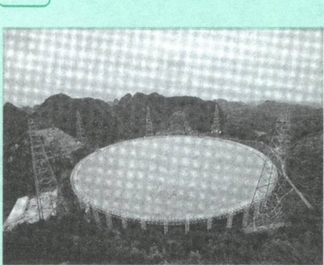
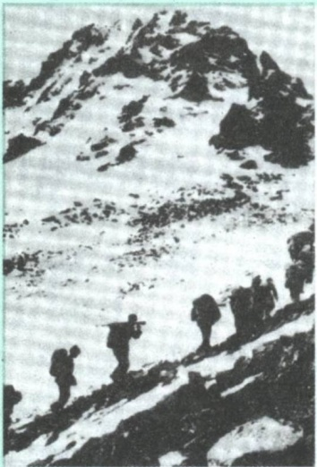
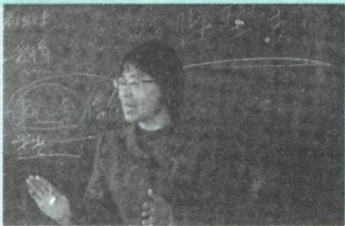
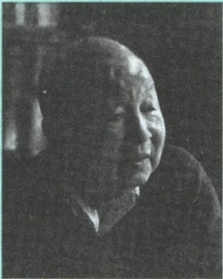

## 第二章 追求远大理想 坚定崇高信念

漫漫人生，唯有激流勇进、奋力拼搏，方能中流击水，抵达理想的彼岸。科学的理想信念，既是指引人们穿越迷雾、辨识航向的灯塔，也是激励人们乘风破浪、搏击沧海的风帆。大学是立德树人、培养人才的地方，是青年人学习知识、增长才干、放飞梦想的地方。追求远大理想，坚定崇高信念，在为实现中国特色社会主义共同理想而奋斗的过程中实现个人理想，是同学们自身成长成才的现实需要，也是国家和人民的殷切期盼。

## 第一节 理想信念的内涵及重要性

理想信念是人的精神世界的核心，是人精神上的“钙”。没有理想信念，理想信念不坚定，精神上就会“缺钙”，就会得“软骨病”。一个人精神上“缺钙”，就容易精神空虚甚至陷入精神荒漠，既不可能感受精神生活的丰满充实，更不可能承担时代所赋予的历史重任。

## 一、什么是理想信念

理想信念是人类特有的精神现象。人既需要物质资料来实现生存和发展，也需要理想信念来充实精神生活。正确坚定的理想信念，激励人们为一定的社会理想和生活目标而不断努力追求。

## （一）理想的内涵与特征

理想是人们在实践中形成的、有实现可能性的、对未来社会和自身发展目标的向往与追求，是人们的世界观、人生观和价值观在奋斗目标上的集中体现。理想是多方面和多类型的，根据不同的标准，可以分为个人理想和社会理想，近期理想和远期理想，生活理想、职业理想、道德理想和政治理想等。

拓展

## 中国人的“大同”理想

在中西方文明中，有各种学说探寻人类心中最美好的理想生活，“大同”无疑是中国人心中美好的愿景之一。《礼记》中说:“大道之行也，天下为公，选贤与能，讲信修睦。”世界大同、和合共生，是中国几千年文明一直秉持的理念。推动构建人类命运共同体，建设持久和平、普遍安全、共同繁荣、开放包容、清洁美丽的世界，把世界各国人民对美好生活的向往变成现实，是当代中国为人类和平与发展作贡献的真诚愿望和实际行动。

理想具有超越性。理想因其远大而为理想。理想之所以能够成为一种推动人们创造美好生活的巨大力量，就在于它不仅源于现实，而且超越现实。理想在现实中产生，但它不是对现状的简单描绘，而是与奋斗目标相联系的未来的现实，是人们对未来美好生活的憧憬和期待。离开理想的指引，人们会失去前进的方向；离开现实的努力，理想同样不能实现。科学的理想是人的主观能动性与社会发展客观趋势的一致性的反映，是在正确把握社会历史发展客观规律的基础上形成的合乎社会发展要求、合乎人民利益的价值追求。

理想具有实践性。作为一定的社会实践的产物，理想是处在特定历史条件下的人们对社会实践活动理性认识的结晶。离开了实践，任何理想的产生都是不可思议的。理想的实现，同样也离不开实践。人们只有在改造客观世界和主观世界的实践过程中才能化理想为现实。理想在实践中产生，在实践中发展，而且也只有在实践中才能得以实现。

理想具有时代性。理想同任何一种社会意识形式一样，都是一定时代的产物，都带着特定历史时代的烙印。不同时代的生产力发展水平不同，社会历史条件和政治经济关系不同，人们对社会现实状况、社会实践活动及其发展规律认识的深度和广度不同，形成的理想也就会有所不同。理想的时代性，不仅体现为它受时代条件的制约，而且体现为它随着时代的发展而发展。随着社会的发展进步，随着对社会发展规律和人的发展规律认识的逐步深化，人们也会不断地调整、丰富和发展自己的理想。

## （二）信念的内涵与特征

信念同理想一样，也是人类特有的精神现象。信念是人们在一定的认识基础上确立的对某种思想或事物坚信不疑并身体力行的精神状态。信念是认知、情感和意志的有机统一体，为人们矢志不渝、百折不挠地追求理想目标提供了强大的精神动力。

信念具有执着性。信念因其执着而为信念。信念一旦形成，就不会轻易改变。当一个人抱有坚定的信念时，他就会全身心投入为实现目标而努力奋斗的事业中，精神上高度集中，态度上充满热情，行为上坚定不移。坚定的信念使得人们具有强大的精神定力，不为诱惑所扰，不为困难所惧。

信念具有支撑性。信念是一个人经受实践考验而始终坚守理想的精神力量。任何一种理想的实现都不是轻而易举的，会遇到各种各样的困难和波折，人必须有坚定不移的决心和坚忍不拔的意志，才能不断战胜困难，把理想变为现实。纵观人类社会发展史，共同的信念凝聚着一个国家、一个民族的集体意志，为社会理想的实现提供强大的精神力量。

心有所信，方能行远。面向未来，走好新时代的长征路，我们更需要坚定理想信念、矢志拼搏奋斗。

——习近平

信念具有多样性。不同的人由于社会环境、思想观念、利益需要、人生经历和性格特征等方面的差异，会形成不同的信念，同时一个人在社会实践中会形成不同类型和层次的信念，并由此构成其信念体系。在信念体系中，高层次的信念决定低层次的信念，低层次的信念服从高层次的信念。信仰是最高层次的信念，具有最大的统摄力。信仰有盲目和科学之分。盲目的信仰就是对虚幻的世界、不切实际的观念、荒谬的理论等对象的迷信和狂热崇拜，科学的信仰则来自人们对自然界和人类社会发展规律的正确认识。

图说

2021年3月31日，“中国天眼”正式向全球天文学家开放，这是世界上最大的单口径射电望远镜。为了让中国的天文探索事业赶超其他国家，项目首席科学家、总工程师南仁东心无旁

骛、孜孜以求，历经20余载，8000多个日夜，最终在世界天文史上镌刻下新的高度。

“志之所趋，无远弗届，穷山距海，不能限也。志之所向，无坚不入，锐兵精甲，不能御也。”志存高远的人，再遥远的地方也能达到，再坚固的东西也能突破。理想和信念总是相互依存。理想是信念所指的对象，信念则是理想实现的保障。离开理想这个人们确信和追求的目标，信念无从产生；离开信念这种对奋斗目标的执着向往和追求，理想寸步难行。在此意义上，理想和信念难以分割地紧密联系在一起。也正因如此，人们常将理想与信念合称为理想信念。

## 二、理想信念是精神之“钙”

理想指引方向，信念决定成败。如果说社会是大海，人生是小舟，那么理想信念就是引航的灯塔和远航的风帆。没有理想信念的人生，就像失去了方向和动力的小船，在生活的波浪中随处漂泊，甚至会沉没于急流之中。理想信念是人生发展的内在动力。在大学期间，大学生不仅要提高知识水平，增强实践才干，更要树立崇高的理想信念。

图说

长征是一次理想信念的伟大远征。长征的胜利，是中国共产党人理想的胜利，是中国共产党人信念的胜利。习近平指出:“长征胜利启示我们:心中有信仰，脚下有力量；没有牢不可破的理想信念，没有崇高理想信念的有力支撑，要取得长征胜利是不可想象的。” $^{①}$ 长征途中，英雄的红军纵横十余省，长驱二万五千里，同敌人进行了600余次战役战斗，跨越近百条江河，攀越40余座高山险峰，其中海拔4000米以上的雪山就有20

余座，穿越了被称为“死亡陷阱”的茫茫草地。红军用顽强的意志征服了人类生存极限，完成了看似不可能完成的伟大征程，创造了气吞山河的人间奇迹。

理想信念昭示奋斗目标。人生是一个在实践中奋斗的过程，要使生命富有意义，就必须在科学的理想信念指引下，沿着正确的人生道路前进。理想信念是人的思想和行为的定向器，一旦确立就可以使人方向明确、精神振奋，即使前进的道路曲折、人生的境遇复杂，也能使人看到未来的希望和曙光，永不迷失前进的方向。只有理想信念坚定的人，才能矢志不渝、百折不挠，不论风吹雨打，不怕千难万险，坚定不移为实现既定目标而奋斗。人的理想信念反映的是对社会和人自身发展的期望。因此，有什么样的理想信念，就意味着以什么样的期望和方式去改造自然和社会，塑造和成就自身。只有树立起崇高的理想信念，才能够解答好人生的意义、奋斗的价值以及做什么样的人等重要的人生课题。

<small>①《习近平谈治国理政》第二卷，外文出版社2017年版，第49页。</small>

理想信念催生前进动力。志向高远，便力量无穷。一个人有了崇高坚定的理想信念，才会以惊人的毅力和不懈的努力成就事业。与此相反，一个人如果没有崇高坚定的理想信念，就有可能浑浑噩噩、庸庸碌碌、虚度一生，甚至腐化堕落、走上邪路。无数杰出人物之所以能在平凡的岗位上作出不平凡的业绩，在极其困难的条件下创造奇迹，一个重要的原因就在于他们具有崇高坚定的理想信念，从而具有披荆斩棘、锲而不舍的动力。大学时期确立的理想信念，对今后的人生之路将产生重大影响，甚至会影响终身。大学生人生目标的确立、生活态度的形成、知识才能的丰富、发展方向的设定、工作岗位的选择，以及如何择友、如何面对挫折、如何克服困难等问题的解决，都需要一个总的原则和目标，都离不开理想信念的指引和激励。我们应当重视理想信念的选择和确立，努力树立科学崇高的理想信念，使人生道路越走越宽广，使宝贵的人生富有价值。

图说

张桂梅是云南省丽江市华坪县女子高级中学党支部书记、校长，华坪县儿童福利院院长。她创办了全国第一所全免费女子高中，是华坪儿童之家孤儿们的“妈妈”。她多年坚持家访，为学生

留住了用知识改变命运的机会。2021年，张桂梅被授予“七一勋章”。

理想信念提供精神支柱。理想信念是一个人在精神生活领域“安身立命”的根本。没有理想信念的支撑，人的精神世界就如同无根之木、无基之塔。理想信念能够使人们在遭遇挫折、经受考验的时候，做到知难而进、迎难而上，顽强奋斗直至战胜艰难险阻。今天，像战争年代那种血与火的生死考验少了，但具有新的历史特点的伟大斗争仍然在继续，我们正面临着一系列重大挑战、重大风险、重大阻力、重大矛盾的艰巨考验。没有坚定的理想信念，就会在乱云飞渡的复杂环境中迷失方向、在泰山压顶的巨大压力下退缩逃避、在糖衣炮弹的轮番轰炸下缴械投降。“不能胜寸心，安能胜苍穹。”只有铸牢理想信念之魂，才能经受得住各种考验，创造人生事业的辉煌。同学们要在坚定理想信念上下功夫，为人生的发展筑牢信仰之基，补足精神之钙，把稳思想之舵。

理想信念提高精神境界。理想信念是衡量一个人精神境界高下的重要标尺。理想信念作为人的精神世界的核心，一方面能使人的精神生活的各个方面统一起来，使人的精神世界成为一个健康有序的系统，避免精神空虚和迷茫；另一方面又能引导人们不断地追求更高的人生目标，并在追求和实现理想目标的过程中提升精神境界、塑造高尚人格。在追求理想和实现理想的过程中，人们要不断面对各种挑战、抵御各种诱惑、突破各种局限、克服各种困难。这就需要人们发扬斗争精神、提高斗争本领，依靠顽强斗争打开事业发展新天地。这是一个人的精神世界从狭隘走向高远、从空虚走向充实、从犹疑走向执着的过程，也是一个人沿着自我成长和完善 的阶梯不断攀登、逐步提升精神境界的过程。

大学生只有树立崇高的理想信念，才能激发起为民族复兴和人民幸福而发愤学习的强烈责任感与使命感，掌握建设祖国、服务人民的本领。不论今后从事什么职业，大学生都要把个人的奋斗志向同国家和民族的前途命运紧紧联系在一起，把个人的学习进步同祖国的繁荣昌盛紧紧联系在一起，使理想信念之花结出丰硕的成长成才之果。

## 第二节 坚定信仰信念信心

加强思想修养、提高精神境界，必须牢牢把握理想信念这个核心。要实现国家的繁荣富强、民族的伟大复兴、人民的美好生活，离不开崇高理想信念的有力支撑。“志不求易者成，事不避难者进。”实现中华民族伟大复兴的中国梦需要一代一代青年矢志奋斗。同学们生逢其时、肩负重任，应当志存高远、脚踏实地，切实增强对马克思主义、共产主义的信仰，增强对中国特色社会主义的信念，增强对实现中华民族伟大复兴的信心，把个人理想追求融入党和国家事业之中。

学史增信，就是要增强信仰、信念、信心，这是我们战胜一切强敌、克服一切困难、夺取一切胜利的强大精神力量。要增强对马克思主义、共产主义的信仰，教育引导广大党员、干部从党百年奋斗中感悟信仰的力量，始终保持顽强意志，勇敢战胜各种重大困难和严峻挑战。要增强对中国特色社会主义的信念，教育引导广大党员、干部深刻认识到，中国特色社会主义是历史发展的必然结果，是发展中国的必由之路，是经过实践检验的科学真理，始终坚定道路自信、理论自信、制度自信、文化自信。要增强对实现中华民族伟大复兴的信心，教育引导广大党员、干部牢记初心使命、增强必胜信心，坚信我们党一定能够团结带领人民在中国特色社会主义道路上实现中华民族伟大复兴，努力创造属于我们这一代人、无愧新时代的历史功绩。

——习近平

## 一、增强对马克思主义、共产主义的信仰

坚定的理想信念，必须建立在对马克思主义的坚定信仰上，建立在对历史规律的深刻把握上。马克思主义坚持远大理想和现实目标相结合、历史必然性和发展阶段相统一，坚信人类社会必然走向共产主义。马克思主义作为我们立党立国的根本指导思想，是近代以来中国历史发展的必然结果，是中国人民长期探索的历史选择。大学生要树立崇高的理想信念，增强对马克思主义、共产主义的信仰，在错综复杂的社会现象中看清本质、明确方向，为服务人民、奉献社会作出更大的贡献。

拓展

## 董必武:深信前途会伐柯

董必武是中共一大代表，曾任中华人民共和国副主席、代主席。他早年投身辛亥革命，加入中国同盟会。后来，他在对中国革命前途和中国社会命运的深深思索中最终选择了马克思主义、共产主义信仰。此后，他创办学校，参与创建武汉共产党早期组织，在武汉建立社会主义青年团、马克思学说研究会，组织妇女读书会、青年读书会，传播新思想，举办夜校、识字班，向工人宣传马克思主义。董必武不仅是党的统一战线领域的卓越领导者，也是新中国的缔造者和奠基人之一。董必武曾写下《九十初度》一诗:“九十光阴瞬息过，吾生多难感蹉跎。五朝敝政皆亲历，一代新规要渐磨。彻底革心兼革面，随人治岭与治河。遵从马列无不胜，深信前途会伐柯。”这首诗充分表达了他一生追求真理、坚信马克思主义的崇高人格和革命情怀。

## (一)为什么要信仰马克思主义

马克思主义是我们认识世界、改造世界的强大思想武器。马克思主义为我们提供了科学的思想方法，正确运用马克思主义，我们在观察事物时就能正确地提出问题、分析问题和解决问题。新时代的青年大学生肩负建成社会主义现代化强国、实现中华民族伟大复兴的中国梦的时代使命，需要全面、准确、科学地认识马克思主义，把握马克思主义的科学价值和实践意义，增强对马克思主义的信仰。

马克思给我们留下的最有价值、最具影响力的精神财富，就是以他名字命名的科学理论——马克思主义。这一理论犹如壮丽的日出，照亮了人类探索历史规律和寻求自身解放的道路。

——习近平

马克思主义是科学的理论，创造性地揭示了人类社会发展规律。马克思主义是在批判地吸收前人优秀思想成果、总结人类历史经验的基础上，创立的科学理论。马克思主义深刻揭示了自然界、人类社会、人类思维发展的普遍规律，为人类社会发展进步指明了方向。马克思主义揭示了事物的本质、内在联系及发展规律，是“伟大的认识工具”。时代在变化，社会在发展，但马克思主义基本原理依然是科学真理。尽管我们所处的时代同马克思所处的时代相比发生了巨大而深刻的变化，但从世界社会主义500年的大视野来看，我们依然处在马克思主义所指明的历史时代。这是我们对马克思主义、共产主义保持坚定信仰的科学根据。

马克思主义是人民的理论，第一次创立了人民实现自身解放的思想体系。人民性是马克思主义的本质属性。马克思主义博大精深，归根到底就是一句话，为人类求解放。在马克思之前，社会上占统治地位的理论都是为统治阶级服务的。马克思主义第一次站在人民的立场探求人类自由解放的道路，以科学的理论为最终建立一个没有压迫、没有剥削、人人平等、人人自由的理想社会指明了方向。一切脱离人民的理论都是苍白无力的，一切不为人民造福的理论都是没有生命力的。马克思主义之所以具有跨越国度、跨越时代的影响力，就是因为它植根于人民之中，指明了依靠人民推动历史前进的人间正道。

马克思主义是实践的理论，指引着人民改造世界的行动。马克思主义

不仅致力于科学解释世界，而且致力于积极改变世界。在伦敦海格特公墓的马克思墓碑上，镌刻着马克思的一句名言:“哲学家们只是用不同的方式解释世界，问题在于改变世界。” $^{①}$ 这鲜明地表明了马克思主义重视实践、以改造世界为己任的基本特征。正是在马克思主义的指导下，社会主义由空想变成科学，由科学理论转变为社会实践。社会

主义国家的出现和社会主义制度的建立，深刻改变着人类历史的走向。虽然东欧剧变和苏联解体使世界社会主义运动遭受了严重挫折，但是历史发展的总趋势并没有改变。特别是中国特色社会主义的成功实践，无可辩驳地证明了马克思主义具有鲜活的实践性和创造性，证明了马克思主义在中国的实践伟力。在人类思想史上，还没有一种理论像马克思主义那样对人类文明进步产生如此广泛而巨大的影响。公众号:旗胜考研一手扫描

马克思主义是不断发展的开放的理论，始终站在时代前沿。马克思主义诞生于19世纪中叶，但并没有停留在19世纪。马克思一再告诫人们，马克思主义理论不是教条，而是行动指南，必须随着实践的变化而发展。一部马克思主义发展史就是马克思、恩格斯以及他们的后继者们不断根据时代、实践、认识发展而发展的历史，是不断吸收人类历史上一切优秀思想文化成果丰富自己的历史。因此，马克思主义能够永葆其美妙之青春，不断探索时代发展提出的新课题，回应人类社会面临的新挑战。马克思主义进入中国，既引发了中华文明的深刻变革，也走过了一个逐步中国化的过程。百余年来，中国共产党坚持解放思想和实事求是相统一、培元固本和守正创新相统一，不断开辟马克思主义新境界，产生了毛泽东思想、邓小平理论、“三个代表”重要思想、科学发展观，产生了习近平新时代中国特色社会主义思想，为党和人民事业发展提供了科学理论指导。一部党的历史，就是一部不断推进马克思主义中国化时代化的历史，就是一部不断推进理论创新、进行理论创造的历史。以史为鉴，开创未来，必须继续推进马克思主义中国化时代化。马克思主义只有同中国具体实际相结合、同中华优秀传统文化相结合，才能焕发出强大的生命力、创造力和感召力。

<small>①《马克思恩格斯文集》第一卷，人民出版社2009年版，第502页。</small>

马克思主义是我们立党立国、兴党兴国的根本指导思想。实践告诉我们，中国共产党为什么能，中国特色社会主义为什么好，归根到底是马克思主义行，是中国化时代化的马克思主义行。

——习近平

马克思主义是党和人民事业不断发展的参天大树之根本，是党和人民不断奋进的万里长河之泉源。“拥有马克思主义科学理论指导是我们党坚定信仰信念、把握历史主动的根本所在。” $^{①}$ 对马克思主义的信仰，对社会主义和共产主义的信念，是共产党人的政治灵魂，是共产党人经受住任何考验的精神支柱。背离或放弃马克思主义，就会失去灵魂、迷失方向。大学生坚定马克思主义信仰，最重要的是学习和掌握马克思主义的立场、观点、方法，准确把握时代发展潮流，以科学的理想信念指引人生前进的道路和方向。

## （二）胸怀共产主义远大理想

马克思主义科学预测了未来社会的理想状态，指明了人类社会的发展方向。共产主义社会是物质财富极大丰富、实现按需分配、人的精神境界极大提高、每个人自由而全面发展的社会。共产主义只有在社会主义社会充分发展和高度发达的基础上才能实现。中国共产党从成立之日起，就确立了共产主义的远大理想，始终团结带领中国人民朝着这个伟大理想前行。

<small>① 习近平:《高举中国特色社会主义伟大旗帜 为全面建设社会主义现代化国家而团结奋斗——在中国共产党第二十次全国代表大会上的报告》，人民出版社2022年版，第16页。</small>

革命理想高于天。中国共产党之所以叫共产党，就是因为从成立之日起我们党就把共产主义确立为远大理想。我们党之所以能够经受一次次挫折而又一次次奋起，归根到底是因为我们党有远大理想和崇高追求。

——习近平

共产主义是现实运动和长远目标相统一的过程。共产主义是崇高的社会理想，是关于无产阶级解放的学说，同时也是一种现实运动。共产主义远大理想既是面向未来的，又是指向现实的，不仅反映了人们对未来社会的美好向往，更是一个从现实的人出发，不断满足人的现实利益需求、推进人的全面发展、推动社会发展进步的历史过程与现实运动。有人认为，共产主义理想离现实太遥远，是无法实现的，这实际上割裂了共产主义远大理想与现实的辩证统一关系。事实上，共产主义的思想和实践早已存在于我们的现实生活中，那种认为“共产主义是渺茫的幻想”“共产主义没有经过实践检验”的观点，是完全错误的。

回顾共产主义运动的历史进程，从1848年《共产党宣言》问世到1917年第一个社会主义国家建立，从第二次世界大战后一大批社会主义国家勃然兴起到20世纪80年代末90年代初东欧剧变、苏联解体，再到新时代中国特色社会主义焕发出前所未有的生机和活力，社会主义和共产主义的理想与实践不仅没有戛然而止，没有像西方某些人所预言的那样进入历史博物馆，反而在长期的艰辛探索中展现出更加光明的前景。理想实现的路途是艰难曲折的，共产主义远大理想的实现更是需要一代又一代人的不懈奋斗和接续努力。必须认识到，我们现在的努力以及将来多少代人的持续努力，都是朝着最终实现共产主义这个大目标前进的。同时，也必须认识到，实现共产主义是一个非常漫长的历史过程，我们必须立足党在现阶段的奋斗目标，脚踏实地推进我们的事业。如果丢失了共产党人的远大目标，就会迷失方向，变成功利主义、实用主义。

共产主义决不是“土豆烧牛肉”那么简单，不可能唾手可得、一蹴而就，但我们不能因为实现共产主义理想是一个漫长的过程，就认为那是虚无缥缈的海市蜃楼，就不去做一个忠诚的共产党员。革命理想高于天。实现共产主义是我们共产党人的最高理想，而这个最高理想是需要一代又一代人接力奋斗的。如果大家都觉得这是看不见摸不着的东西，没有必要为之奋斗和牺牲，那共产主义就真的永远实现不了了。我们现在坚持和发展中国特色社会主义，就是向着最高理想所进行的实实在在努力。

——习近平

## 二、增强对中国特色社会主义的信念

中国特色社会主义，承载着几代中国共产党人的理想和探索，寄托着无数仁人志士的夙愿和期盼，凝聚着亿万人民的奋斗和牺牲，是近代以来中国社会发展的必然选择。在中国共产党领导下，坚持和发展中国特色社会主义，实现中华民族伟大复兴，要求我们必须增强对中国特色社会主义的坚定信念。

中国特色社会主义是科学社会主义，而不是其他什么主义。历史和现实都告诉我们，只有社会主义才能救中国，只有中国特色社会主义才能发展中国。中国特色社会主义是改革开放以来党的全部理论和实践的主题，是党和人民历尽千辛万苦、付出巨大代价才取得的根本成就。中国特色社会主义，既坚持了科学社会主义基本原则，又根据时代条件赋予其鲜明的中国特色，以全新的视野深化了对共产党执政规律、社会主义建设规律、人类社会发展规律的认识，使我们国家快速发展起来，使我国人民生活水平快速提高起来。新时代坚持和发展中国特色社会主义，总任务是实现社会主义现代化和中华民族伟大复兴，在全面建成小康社会的基础上，分两步走，到本世纪中叶建成富强民主文明和谐美丽的社会主义现代化强国，以中国式现代化推进中华民族伟大复兴。在当代中国，坚持中国特色社会主义，就是真正坚持科学社会主义。

明辨

## 为什么说中国特色社会主义是科学社会主义而不是其他什么主义？

中国特色社会主义坚持了科学社会主义的基本原则。在领导制度上，中国共产党领导是中国特色社会主义最本质的特征，是中国特色社会主义制度的最大优势；在国体和政体上，实行人民民主专政和人民代表大会制度；在经济制度上，坚持公有制为主体、多种所有制经济共同发展，坚持按劳分配为主体、多种分配方式并存，实行社会主义市场经济体制；在意识形态上，坚持马克思主义指导地位不动摇，培育和践行社会主义核心价值观；在根本立场上，坚持以人民为中心，不断促进人的全面发展，实现全体人民共同富裕。这些都在新的历史条件下体现了科学社会主义基本原则，赓续了科学社会主义基因血脉，丰富发展了科学社会主义并赋予其鲜明中国特色。中国特色社会主义不仅没有背离科学社会主义，而且恰恰是在坚持科学社会主义基本原则同中国具体实际、历史文化传统、时代要求相结合的过程中，得以丰富和发展。中国特色社会主义，是科学社会主义理论逻辑和中国社会发展历史逻辑的辩证统一，是根植于中国大地、反映中国人民意愿、适应中国和时代发展进步要求的社会主义。

中国特色社会主义不是从天上掉下来的，而是中国共产党带领中国人民历经千辛万苦找到的实现中国梦的正确道路。改革开放以来我们取得一切成绩和进步的根本原因，归结起来就是:开辟了中国特色社会主义道路，形成了中国特色社会主义理论体系，确立了中国特色社会主义制度，发展了中国特色社会主义文化。中国特色社会主义道路是实现社会主义现代化、指引中国人民创造自己美好生活的必由之路。中国特色社会主义理论体系是指导党和人民沿着中国特色社会主义道路实现中华民族伟大复兴的正确理论，是立于时代前沿、与时俱进的科学理论。中国特色社会主义制度是当代中国发展进步的根本制度保障，是具有鲜明中国特色、明显制度优势、强大自我完善能力的先进制度。中国特色社会主义文化源自中华民族5000多年文明历史所孕育的中华优秀传统文化，熔铸于党领导人民在革命、建设、改革中创造的革命文化和社会主义先进文化，植根于中国特色社会主义伟大实践，是中国人民胜利前行的强大精神力量。中国特色社会主义，既是我们必须不断推进的伟大事业，又是我们开辟未来的根本保证。走自己的路，是党的全部理论和实践立足点，更是党百年奋斗得出的历史结论。以史为鉴，开创未来，必须坚持和发展中国特色社会主义。

中国共产党领导是中国特色社会主义最本质的特征，是中国特色社会主义制度的最大优势，是党和国家的根本所在、命脉所在，是全国各族人民的利益所系、命运所系。中国共产党是中国工人阶级的先锋队，同时是中国人民和中华民族的先锋队，是中国特色社会主义事业的领导核心。中国共产党自诞生之日起，就把为中国人民谋幸福、为中华民族谋复兴作为自己的初心和使命，并团结带领全国各族人民不懈奋斗，战胜各种艰难险阻，不断取得革命、建设、改革的伟大胜利。中国共产党领导中国人民取得的伟大胜利，使具有5000多年文明历史的中华民族全面迈向现代化，让中华文明在现代化进程中焕发出新的蓬勃生机；使具有500多年历史的社会主义主张在世界上人口最多的国家成功开辟出具有高度现实性和可行性的正确道路，让科学社会主义在21世纪焕发出新的蓬勃生机；使具有70多年历史的新中国建设取得举世瞩目的成就，让中国这个世界上最大的发展中国家在短短40多年里摆脱贫困全面建成了小康社会，创造了人类社会发展史上惊天动地的发展奇迹；使新时代中国特色社会主义取得历史性成就、发生历史性变革，让中国式现代化为人类实现现代化提供了新的选择，为解决人类面临的共同问题提供更多更好的中国智慧、中国方案、中国力量，为人类和平与发展崇高事业作出新的更大贡献。当今中国，只有中国共产党，才能领导中国人民坚持和发展中国特色社会主义，才能担当起带领中国人民创造幸福生活、实现中华民族伟大复兴的历史使命。

## 三、增强对实现中华民族伟大复兴的信心

中国共产党一经诞生，就把为中国人民谋幸福、为中华民族谋复兴确立为自己的初心使命。一百年来，中国共产党团结带领中国人民进行的一切奋斗、一切牺牲、一切创造，归结起来就是一个主题:实现中华民族伟大复兴。

——习近平

实现中华民族伟大复兴，是中华民族近代以来最伟大的梦想。这个梦想，就是要实现国家富强、民族振兴、人民幸福，它凝聚了几代中国人的夙愿，体现了中华民族和中国人民的整体利益，是每一个中华儿女的共同期盼。我们的民族是伟大的民族。在5000多年的文明发展历程中，中华民族为人类文明进步作出了不可磨灭的贡献。近代以后，我们的民族历经磨难，中华民族到了最危险的时候，无数仁人志士在探索救国救民的道路上作出了可歌可泣的奉献和牺牲，值得永远敬仰和诏记。在中国共产党领导下，我们终于找到实现民族复兴的正确道路。经过新民主主义革命，中华民族获得了独立，中国人民得到了解放，实现了站起来的愿望。经过社会主义革命和建设特别是改革开放以来的中国特色社会主义建设，中华民族实现了富起来的愿望，不仅人民群众的生活得到了巨大改善，国家的经济实力、科技实力、国防实力、综合国力也进入世界前列，国际地位实现了前所未有的提升。经过长期艰苦的努力，中华民族迎来了从站起来、富起来到强起来的伟大飞跃，中国特色社会主义迎来了从创立、发展到完善的伟大飞跃，中国人民迎来了从温饱不足到小康富裕的伟大飞跃。

## 拓展

## 社会主义没有辜负中国

在中华民族积贫积弱、任人宰割的时期，各种主义和思潮都进行过尝试，资本主义道路没有走通，改良主义、自由主义、社会达尔文主义、无政府主义、实用主义、民粹主义、工团主义等也都“你方唱罢我登场”，但都没能解决中国的前途和命运问题。是马克思主义引导中国人民走出了漫漫长夜、建立新中国，走上社会主义康庄大道，是中国特色社会主义使中国快速发展起来了。在百余年接续奋斗中，一代又一代中国共产党人不忘初心、牢记使命，团结带领人民为实现中华民族伟大复兴作出卓越贡献，创造了中华民族发展史、人类社会进步史上惊天动地的奇迹。

实现中华民族伟大复兴的中国梦是一项光荣而艰巨的事业。中华民族伟大复兴，绝不是轻轻松松、敲锣打鼓就能实现的，必须付出艰苦的努力。中国共产党一经成立，就义无反顾肩负起实现中华民族伟大复兴的历史使命。百余年来，为了实现这一历史使命，无论是弱小还是强大，无论是顺境还是逆境，中国共产党都初心不改、矢志不渝，团结带领人民历经千难万险，付出巨大牺牲，敢于面对挫折，勇于修正错误，攻克了一个又一个看似不可攻克的难关，创造了一个又一个彪炳史册的人间奇迹。进入新发展阶段，是中华民族伟大复兴历史进程的大跨越。中国人民实现中华民族伟大复兴的愿望和信心无比强烈，中华民族伟大复兴的前进步伐势

不可挡。

中国的昨天已经写在人类的史册上，中国的今天正在亿万人民手中创造，中国的明天必将更加美好。信仰、信念、信心，任何时候都至关重要。小到一个人、一个集体，大到一个政党、一个民族、一个国家，只要有信仰、信念、信心，就会愈挫愈奋、愈战愈勇，否则就会不战自败、不打自垮。理想信念之火一经点燃就会产生巨大的精神力量。无论过去、现在还是将来，对马克思主义、共产主义的信仰，对中国特色社会主义的信念，对实现中华民族伟大复兴的中国梦的信心，都是指引和支撑中国人民站起来、富起来、强起来的强大精神力量。心中有信仰，脚下有力量。走好新时代的长征路，大学生要不断增强中国特色社会主义道路自信、理论自信、制度自信、文化自信，自觉做共产主义远大理想和中国特色社会主义共同理想的坚定信仰者、忠实实践者，为崇高理想信念而矢志奋斗。

## 第三节 在实现中国梦的实践中放飞青春梦想

理想信念是一个思想认识问题，更是一个实践问题。如果说，现实是此岸，理想是彼岸，那么，唯有实践才是联系二者的桥梁。理想不等于现实，理想的实现往往要通过一条并不平坦的曲折之路，有赖于脚踏实地、持之以恒的奋斗。实践，只有实践，才是通往理想彼岸的桥梁。

## 一、科学把握理想与现实的辩证统一

在追求理想的过程中，人们常常会感受到理想与现实之间的矛盾。对于思想活跃的青年大学生来说，也容易对理想与现实的矛盾产生困惑，这就需要正确认识理想与现实的关系。

辩证看待理想与现实的矛盾。理想与现实是对立统一的。在日常生活中，人们在处理理想与现实的关系时，往往只看到二者对立的一面，看不到二者统一的一面。一种认识偏向是用理想来否定现实，当发现现实不符合理想预期的时候，就对现实大失所望，甚至对现实采取全盘否定的态度。另一种认识偏向是用现实来否定理想，在追求理想的过程中一遇到困难就产生畏难情绪，觉得理想遥不可及，丧失为理想而奋斗的信心和勇气，直至最终放弃理想。之所以会出现这些认识误区，从思想方法上讲，是由于不能辩证地看待和处理理想与现实的矛盾。理想和现实存在着对立的一面，二者的矛盾与冲突，属于“应然”和“实然”的矛盾。假如理想与现实完全等同，那么理想的存在就没有意义了。理想与现实又是统一的。理想受现实的规定和制约，是在对现实认识的基础上发展起来的。一方面，现实中包含着理想的因素，孕育着理想的发展；另一方面，理想中也包含着现实，既包含着现实中必然发展的因素，又包含着由理想转化为现实的条件，在一定的条件下，理想就可以转化为未来的现实。脱离现实而谈理想，理想就会成为空想。

图说

屠守锷，我国航天事业的开拓者和奠基人之一，“两弹一星”功勋奖章获得者，著名导弹和火箭专家，中国科学院资深院士，国际宇航科学院院士。面对旧中国的满目疮痍，少年屠守锷立下终生志愿:一定要亲手造出我们自己的飞机，赶走侵略者，为死难的同胞报仇！1957年，屠守锷应聂荣臻元帅之邀，跨进国防部第五研究院的大门。从

此，他的命运便与中国航天事业紧紧联系在了一起。屠守锷参与了我国火箭技术发展重大战略问题的决策，领导科研团队解决了若干研制中的关键技术问题，为我国航天事业的发展作出了卓越贡献。

实现理想的长期性、艰巨性和曲折性。理想的实现是一个过程。一般来说，理想越是远大，它的实现过程就越复杂，需要的时间也就越漫长。纵观人类社会发展史，任何一种理想的实现都不是轻而易举的，必然会遇到各种各样的困难和波折，充满艰险和坎坷。实现理想、创造未来，必须有战胜种种艰难险阻的坚定不移的信心和坚忍不拔的毅力。理想变为现实不是一帆风顺的，往往会遭遇波澜和坎坷。在现实生活中，人们对于理想的美好有着充分的想象，而对于实现理想的艰难则往往估计不足。渴望早日实现理想，希望顺利实现理想，这是人之常情。但是，如果把实现理想设想得过分容易，对前进道路上的困难缺乏思想准备，遭遇到一点困难、曲折或失败就灰心丧气、悲观失望，那就会影响理想的实现。公众号:旗胜考研一手扫描

艰苦奋斗是实现理想的重要条件。“人类的美好理想，都不可能唾手可得，都离不开筚路蓝缕、手胼足胝的艰苦奋斗。”①一个没有艰苦奋斗精神作支撑的民族，是难以自立自强的；一个没有艰苦奋斗精神作支撑的国家，是难以发展进步的；一个没有艰苦奋斗精神作支撑的政党，它的事业是难以兴旺发达的。艰苦奋斗是我们的传家宝。我们的国家，我们的民族，从积贫积弱一步一步走到今天的发展繁荣，靠的就是一代又一代人的顽强拼搏，靠的就是中华民族自强不息的奋斗精神。在实现中华民族伟大复兴的新征程上，必然会有艰巨繁重的任务，必然会有艰难险阻甚至惊涛骇浪，特别需要我们发扬艰苦奋斗精神。对于当代青年来说，理想的实现必须通过实践才能转变为现实。凡有成就者，其渊博的知识、卓越的才能、闪光的智慧、不朽的业绩，都是从艰苦奋斗中得来的。艰苦奋斗是成就人生事业不可或缺的条件。在通向理想的道路上，在实现理想的过程中，没有艰苦奋斗的精神，理想是不会自动转化为现实的。

<small>①《习近平谈治国理政》第一卷，外文出版社2018年版，第52页。</small>

## 明辨

## 当代青年还需要艰苦奋斗吗？

有人认为，“艰苦奋斗是老一辈的事，当代青年不需要艰苦奋斗”。这种观点在理论上是错误的，在实践中是有害的。一方面，物质生活条件的改善，社会观念的变化，只是赋予艰苦奋斗以新的时代内涵和实践要求，但艰苦奋斗的精神是永远不会过时的；另一方面，讲艰苦奋斗，也并不是不讲物质条件，而是为了实现既定的理想，吃苦耐劳，迎难而上，不惜奉献出自己的一切。当代中国既面临着重要发展机遇，也面临着前所未有的困难和挑战。梦在前方，路在脚下。自胜者强，自强者胜。实现我们的发展目标，需要广大青年锲而不舍、驰而不息的奋斗，不断书写奉献青春的时代篇章。

理想信念不是拿来说、拿来唱的，更不是用来装点门面的，只有见诸行动才有说服力。大学生要把敢于吃苦、勇于奋斗的精神落实到日常的学习、生活和工作中。在学习上，刻苦钻研、不畏艰难，孜孜不倦地学习理论和专业知识，不断提高思想道德和专业知识水平；在生活上，艰苦朴素、勤俭节约，抵制和反对铺张奢华的思想和生活作风；在工作上，奋发图强、不怕困难、不避艰险，努力完成各项任务。

## 二、坚持个人理想与社会理想的有机结合

坚持个人奋斗目标与国家、民族的奋斗目标相统一，把个人理想融入社会理想之中，在为实现社会理想而奋斗的过程中实现个人理想，这是大学生成长成才的必由之路。

个人理想是指处于一定历史条件和社会关系中的个体对于自己未来的物质生活、精神生活所产生的向往和追求。社会理想是指社会集体乃至社会全体成员的共同理想，即在全社会占主导地位的共同奋斗目标。个人理想与社会理想的关系实质上是个人与社会关系在理想层面的反映。个人与社会有机地联系在一起，二者相互依存、相互制约、共同发展。同样，社会理想与个人理想也不是彼此孤立的，它们之间相互联系、相互影响、相互制约。

个人理想以社会理想为指引。追求个人理想的实践活动都是在社会中进行的，个人理想的确立不能只凭个人的主观愿望，而要顺应社会发展的客观规律和趋势要求；个人理想的实现不仅仅是个人奋斗的事情，而是要担当时代赋予的社会责任和历史使命。从根本上说，个人理想是由社会理想规定的。在整个理想体系中，社会理想是最根本、最重要的，个人理想则从属于社会理想。换句话说，个人理想的确立要以社会理想为导向，个人理想的实现依赖于社会理想的指引。个人理想只有同国家的前途、民族的命运相结合，个人的向往和追求只有同社会的需要和人民的利益相一致，才可能变为现实。

社会理想是个人理想的汇聚和升华。社会是个人的联合体，社会理想与个人理想密不可分。社会理想不是凭空产生的，也不是由外在力量强加的，而是建立在广大社会成员的个人理想基础之上的。强调个人理想要符合社会理想，并不是要排斥和抹杀个人理想，而是要摆正个人理想同社会理想的关系。社会理想归根到底要靠全体社会成员的共同努力来实现，并具体体现在每个社会成员为实现个人理想而进行的活生生的实践中。当社会理想同个人理想有矛盾冲突的时候，有志气、有抱负的人可以作出最大的自我牺牲，使个人的理想服从于全社会的共同理想。

图说

杂交水稻之父袁隆平有两个梦:一个“禾下乘凉梦”，一个“杂交水稻覆盖全球梦”。他曾说，全世界有1.6亿公顷的稻田，如果其中一半种上杂交稻，每公顷增产2吨，每年增产的

粮食可以多养活5亿人口。终其一生，袁隆平都在为实现梦想而奋斗。1964年，他开始研究杂交水稻，成功选育了世界上第一个实用高产杂交水稻品种。杂交水稻成果不但使水稻的单产和总产大幅度提高，而且还种到了沙漠和盐碱地，种到了非洲和全世界。2019年，袁隆平被授予“共和国勋章”。

得其大者可以兼其小。个人只有把人生理想融入国家和民族的事业中，才能最终成就一番事业。大学生对自己未来生活的追求和向往，不能脱离当代中国的社会现实。大学生要在社会理想的指引下，珍惜韶华、奋发有为，勇于追求个人理想，在实现社会理想的过程中努力实现个人理想。

## 三、为实现中国梦注入青春能量

青年的前途离不开国家的前途，没有国家的前途也就没有青年的前途。大学生肩负实现中华民族伟大复兴的中国梦的历史重任，只有把实现理想的道路建立在脚踏实地的奋斗上，才能放飞青春梦想，实现人生理想。

立鸿鹄志，做奋斗者。中国传统文化中有许多励志警句。如墨子说“志不强者智不达”，诸葛亮说“志当存高远”，王守仁说“志不立，天下无可成之事”。这里的“志”具有双重含义:一是对未来目标的向往，二是实现奋斗目标的顽强意志。志向，就是理想信念；立志，就是确立理想信念。“志高则言洁，志大则辞弘，志远则旨永。”有志者，事竟成；有大志者，人生事业才能辉煌。志向高远，就是要放开眼界，不满足于现状，也不屈服于一时一地的困难与挫折，更不要斤斤计较个人利益的多少与得失。大量事实告诉人们，那些在事业上取得伟大成就、对人类作出卓越贡献的人，都是在青年时期就立下了鸿鹄之志，并为之坚持不懈、努力奋斗。周恩来中学时期就立下了“为中华之崛起而读书”的志向，李四光、钱学森、邓稼先等老一代知识分子，青年时期就立志用自己的聪明才智报效祖国。青年志存高远，就能激发奋进潜力，青春岁月就不会像无舵之舟漂泊不定。树雄心、立壮志，是关系大学生一生前途命运的重大课题。

心怀“国之大者”，敢于担当。中国民主革命的先行者孙中山曾激励广大青年，要立志做大事，不要立志做大官。其中的道理就是希望青年以国家民族的命运为己任，而不要以个人的荣华富贵为人生的理想。如果一个人不顾自身所处时代的召唤，脱离自己所归属的国家和民族繁荣发展的需要，一切以自我为中心，那么，不仅他的人生价值取向是错误的，而且这种追求因为脱离了国家、民族和时代的需要，往往也是难以实现的。在今天，做大事就是投身于新时代中国特色社会主义伟大事业。无论从事什么具体、平凡的工作，只要是与中国特色社会主义伟大事业相联系、服务于祖国和人民的，就值得我们去做。新时代的大学生应该肩负历史使命，把个人的命运与国家和人民的命运联系在一起，立为国奉献之志，立为民服务之志，让青春在为祖国和人民利益的不懈奋斗中熠熠生辉。

自觉躬身实践，知行合一。漫长征途需要一步一步地走，崇高理想的实现需要一点一滴地奋斗。通往理想的路是遥远的，但起点就在脚下，就在一切平凡的岗位上，就在扎扎实实的学习和工作中。中国古代先哲老子说:“合抱之木，生于毫末；九层之台，起于累土；千里之行，始于足下。”踏踏实实、循序渐进，与雄心壮志、力争上游并不矛盾，不踏踏实实打好基础，就无法攻尖端、攀高峰。大学生要牢记“空谈误国、实干兴邦”，志存高远、脚踏实地、埋头苦干，充分展现自己的抱负和激情，在“真刀真枪”的实干中成就一番事业。

“功崇惟志，业广惟勤。”我国仍处于并将长期处于社会主义初级阶段，实现中国梦，创造全体人民更加美好的生活，任重而道远，需要我们每一个人继续付出辛勤劳动和艰苦努力。

——习近平

祖国的富强、民族的复兴、人民的幸福，需要每一个社会成员尽其才、奋其志。中国梦是中华民族的振兴之梦，也是每一个大学生的成才之梦。中国梦让生活在这个时代的大学生与祖国人民一起共同享有人生出彩的机会，共同享有梦想成真的机会，共同享有同祖国和时代一起成长与进步的机会。青春只有在为祖国和人民的真诚奉献中才能更加绚丽多彩，人生只有融入国家和民族的伟大事业才能闪闪发光。

## 思考讨论

1. 李大钊说，以青春之我，创建青春之家庭，青春之国家，青春之民族。谈谈理想信念对大学生成长成才的重要意义。

2. 2021年4月25日至27日，习近平赴广西壮族自治区考察，第一站就到桂林市全州县的红军长征湘江战役纪念园，强调理想信念之火一经点燃就会产生巨大的精神力量。结合自身实际，谈谈为什么要坚定信仰信念信心。

3. 从个人理想与社会理想辩证关系的角度，谈谈青年一代为什么要树立共同理想和远大理想。

## 文献阅读

1. 中共中央文献研究室:《习近平关于实现中华民族伟大复兴的中国梦论述摘编》，中央文献出版社 2013 年版。

该书共分8个专题，收入146段论述，摘自习近平2012年11月15日至2013年11月2日期间的讲话、演讲、谈话、书信、批示等50多篇重要文献。

2. 习近平:《在纪念马克思诞辰 200 周年大会上的讲话》，人民出版社 2018 年版。

2018 年 5 月 4 日，纪念马克思诞辰 200 周年大会在北京隆重召开，习近平发表重要讲话，缅怀马克思的伟大人格和历史功绩，重温马克思的崇高精神和光辉思想，宣誓新时代中国共产党人对马克思主义科学真理的坚定信念。

3. 习近平:《在庆祝中国共产主义青年团成立100周年大会上的讲话》，人民出版社2022年版。

2022 年 5 月 10 日，习近平在庆祝中国共产主义青年团成立 100 周年大会上发表重要讲话，激励广大团员青年在实现中华民族伟大复兴的中国梦的新征程上奋勇前进，用青春的能动力和创造力激荡起民族复兴的澎湃春潮，用青春的智慧和汗水打拼出一个更加美好的中国。